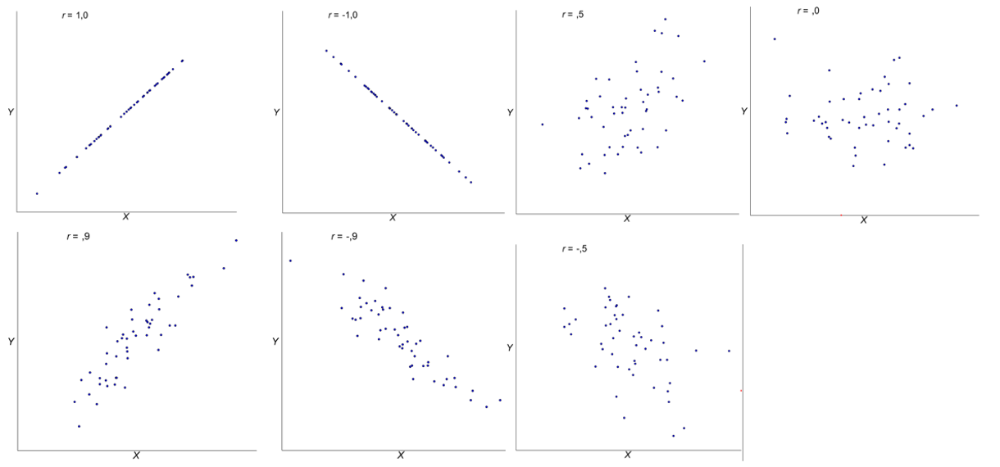

```{r echo = FALSE}
pacman::p_load(flextable, tidyverse, officer, readxl, knitr, kableExtra)
```


# Samvariasjon og korrelasjon

## Samvariasjon/kovarians

Samvariasjon – at noe varierer sammen (omtales også som kovariasjon/"covariance") – er et mål på en felles variasjon mellom (minst) to variabler. Samvariasjonen kan være enten negativ eller positiv. Hvis vi har data på variablene x og y kan vi undersøke om verdiene i x og y varierer tilfeldig eller om det er en sammenheng mellom de to. Ved positiv samvariasjon vil en økning eller nedgang i en variabel korrespondere med en økning eller nedgang i den andre. Samvariasjon innebærer at det ikke er tilfeldig hvordan to variabler varierer i forhold til hverandre – det er et gjensidig forhold mellom variablene.

I forrige kapittel var begrepet varians et tema. Et alternativt begrep for samvariasjon er kovarians (fra engelsk «covariance»). Kovariansen er den enkleste måten å se om to variabler varierer sammen – altså om endring i den ene variabelen følges av en endring i den andre. Eller, med andre ord, dersom en variabel avviker fra gjennomsnittet forventer vi at den andre også gjør det (enten i samme eller motsatt retning hvis vi tror de kovarierer). Vi ønsker derfor å finne ut hvor stor kovariansen er.

```{r echo = FALSE, message = FALSE, warning=FALSE}

kovarians <- data.frame(Snr = c("1", "2", "3", "4", "5", "Snitt", "Sum"),
                        Hudsyr = c("1", "2", "3", "3", "4", "2.6", ""),
                        Avvik = c("-1.6", "-0.6", "0.4", "0.4", "1.4", "", "0"),
                        Familie = c("1", "3", "3", "5", "5", "3.4", ""),
                        Avvik2 = c("-2.4", "-0.4", "-0.4", "1.6", "1.6", "", "0"),
                        Tverrprodukt = c("3.84", "0.24", "-0.16", "0.64", "2.24", "", "6.80"))

colnames(kovarians) <- c("Student nr", "Antall husdyr", "Avvik fra snitt", "Antall i familien", "Avvik fra snitt", "Tverrproduktavvik")

kovarians <- kovarians %>%
  kbl(caption = "Kovarians", align = "c") %>%
  kable_classic(full_width = F, position = "left", html_font = "Cambria")

column_spec(kovarians, 1:4, width = "3cm")
```

Vi regner altså ut snittet og avviket fra snittet for begge variablene (antall husdyr og antall i familien). Så multipliserer vi avvikene pr rad – og får tverrproduktavviket pr observasjon/respondent. Til slutt summerer vi tverrproduktavvikene. Så regner vi ut kovariansen:

$\frac{6.8}{n-1}=\frac{6.8}{(5-1)}=1.7$

I dette enkle eksempelet kan vi altså si at antall husdyr samvarierer positivt med antall medlemmer i familien. Det er imidlertid ikke så lett å tolke hva kovariansen betyr da det ikke er et standardisert mål. Vi kan altså ikke sammenlikne kovarianser mellom ulike undersøkelser på en objektiv måte [@fieldDiscoveringStatisticsUsing2009]. Det fører oss over på begrepet korrelasjon.

## Korrelasjon og korrelasjonskoeffisient

For å kunne si noe mer fornuftig om samvariasjonen må derfor normalisere kovariansen gjennom å dele på variablenes standardavvik – noe som gir oss *korrelasjonen* mellom variablene [@lovasStatistikkUniversiteterOg2013]. Den standardiserte kovariansen er med andre ord korrelasjonskoeffisienten. I vårt tilfelle ser det da slik ut:

- Vi har allerede funnet kovariansen gjennom å multiplisere avvikene for de to variablene med hverandre (6.8). Vi gjør det samme med standardavvikene. Standardavviket for antall husdyr har vi tidligere regnet vi ut til å være 1.14. For antall medlemmer i familien blir standardavviket:

$\sqrt{\frac{(-2.4)^2 + (-0.4)^2 + (1.6)^2 + (1.6)^2}{(5-1)}} = \sqrt{\frac{5.76 + 0.16 + 0.16 + 2.56 + 2.56}{4}}=1.67$

- Neste skritt blir å multiplisere standardavvikene:

$1.14 * 1.67 = 1.923$

- Til slutt tar vi kovariansen og deler på standardavvikproduktet:

$\frac{1.7}{1.923}=0.88$

Resultatet 0,88 er det som betegnes Pearsons korrelasjonskoeffisient ($r$). For oss betyr det i vårt lille eksempel at antall familiemedlemmer er positivt korrelert med antall husdyr – jo flere i familien, jo flere husdyr. Korrelasjonskoeffsienten er et mål på hvor sterk korrelasjonen er og i hvilken retning korrelasjonen går (om den er positiv eller negativ). 

## Tolkning av korrelasjon og korrelasjonskoeffisenter

Korrelasjonskoeffisienten har alltid en verdi mellom -1 og 1, der 0 betyr ingen korrelasjon. Det er vanlig å bruke følgende retningslinjer for vurdering av koeffisienten:

- Nær x/- 1: Perfekt eller tilnærmet perfekt korrelasjon
- Mellom +/- 0.5 og +/- 1: Sterk korrelasjon
- Mellom +/- 0.3 og +/- 0.49: Moderat korrelasjon
- Under +/- 0.29: Liten korrelasjon

Ofte ønsker vi (og anbefaler) å ikke bare se på verdien av korrelasjonskoeffisienten, men også se på en grafisk framstilling av datane - gjerne omtalt som et spredningsplott ("scatter plot").

{width=90%}

I eksempelet og illustrasjonene over har vi vist Pearsons korrelasjonskoeffisient $r$. Det finnes ulike korrelasjonskoeffisienter for ulike typer datasett. Pearsons korrelasjonskoeffisient brukes som regel på datasett der vi gjennomfører såkalte parametriske tester. For andre tester, ikke-parametriske, kan Spearmans rho ($\rho$) - ofte brukt for ordinale variabler (men kan også brukes på intervall/ratiodata) med parrede data ("matched pair") - og Kendalls tau ($\tau$) - ofte brukt for "nominelle variabler med rangert data ("ranked data") - være gode alternativer. Vi går ikke nærmere inn på disse her.

Vi skal merke oss at en korrelasjonskoeffisient på 0 ikke betyr at det ikke er noen korrelasjon. Som vi kan se av bildet under [@froslieKorrelasjon2022] kan korrelasjonskoeffisienten være 0 og variablene like vel være avhengige (delt her iht Creative Commons: CC BY SA 3.0), jfr illustrasjonen over.

Som sagt, et viktig poeng er at vi skal være veldig forsiktige med å tolke en korrelasjonskoeffisient uten å ha en grafisk framstilling av hvordan datapunktene fordeler seg (hvordan distribusjonen av datapunkter ser ut). Dette fordi en gitt korrelasjonskoeffisient kan representere et uendelig antall mønstre mellom to variabler.  @vanhoveWhatDataPatterns2018 viser dette:

{width=85%}

Alle 16 eksemplene viser altså mønstre av korrelasjon mellom to variabler som alle har korrelasjonskoeffisienten r=0,5. 

## Spuriøs korrelasjon

Det er viktig å huske på at en korrelasjon mellom to variabler (x og y) ikke er det samme som å si at det er en årsakssammenheng (kausalitet). Selv om to variabler korrelerer perfekt betyr ikke det nødvendigvis at den ene er årsak til den andre. Det kan være en såkalt spuriøs sammenheng. I mange tilfeller er det åpenbart at det er urimelig å anta at det skal være en sammenheng mellom variablene. 

Korrelasjon betyr altså ikke automatisk kausalitet. Dette er utrolig viktig å huske – og en kilde til mye feilinformasjon/feiltolkninger. La oss ta to eksempler fra .

{width=90%}

{width=90%}

I det første eksempelet ovenfor er det altså en sterk korrelasjon mellom filmer Nicholas Cage medvirker i og antall mennesker som druknet etter å ha falt i et svømmebasseng. Med mindre man tenker seg at Cage er så dårlig skuespiller at det får folk til å hoppe frivillig ut i et svømmebasseng for å drukne seg virker denne sammenhengen ganske søkt.

I det andre eksempelet virker sammenhengen like sprø. At det skal være en reell og nesten perfekt sammenheng mellom antall mennesker som kveles av deres eget sengetøy og osteforbruket per capita er ekstremt lite troverdig. 

Det synes åpenbart at selv om det er en klar korrelasjon mellom variablene i de to eksemplene virker det fullstendig meningsløst å tro at de faktisk henger sammen. Dette er det vi kaller **spuriøs korrelasjon**.

##  Kausalitet (årsakssammenheng)

Kausalitet – fra latin "causa" -> engelsk "cause" - betyr altså årsak eller grunn. Kausalitet innebærer altså at det må være en årsakssammenheng mellom to hendelser/fenomener.

Vi kan tydeligst (enklest) se kausalitet i naturvitenskapene, der vi snakker om et **deterministisk årsaksforhold** (det er ikke begrenset til naturvitenskapene selvsagt, men naturvitenskapene sysler mye med lovmessigheter vi ikke like lett kan se/påvise i for eksempel samfunnsvitenskapene). En deterministisk årsakssammenheng innebærer at et fenomen B alltid har samme årsak (fenomen A), og at fenomen A alltid fører til fenomen B. Det er således et tidsperspektiv involvert (rekkefølge av hendelser/fenomen).

I samfunnsvitenskapene har man gjerne en litt annerledes tilnærming til kausalitet fordi det er vanskelig å vise/se de lovmessige og deterministiske årsaksforholdene. Her sier man at et fenomen (A) er årsak til fenomen B, dersom det er slik at (med en viss sannsynlighet) A enten fører til eller øker sannsynligheten for B. Dette faller inn under en **stokastisk årsakssammenheng** [@dahlumKausalitet2021]. I samfunnsvitenskapene kan man i mindre grad kontrollere alle ting som påvirker et fenomen B, så man kan også snakke om tendenser – at det er en **tendensiell forståelse** av kausalitet.

I et naturvitenskapelig eksperiment kan vi ofte isolere fenomenene vi undersøker fra all annen påvirkning (selv om dette naturligvis på ingen måte er gjeldende for all naturvitenskapelig forskning). Vi kan kontrollere hva som påvirker hva, i tid og rom. Et kontrollert eksperiment er derfor en slags gullstandard for forskning når man skal si noe om kausale forhold.

I samfunnsvitenskapene er dette ofte i praksis umulig. Det vil være mange mulige påvirkninger på et fenomen, og det kan være vanskelig å si noe sikkert om 1) har vi tenkt på alle ting som kan påvirke, 2) klarer vi å ta hensyn til denne usikkerheten i våre analyser og 3) vet vi egentlig hva som påvirker hva (kan det være sånn at vår antakelse om at A påvirker B faktisk kan være motsatt)? Moralen er nok: Vi skal være veldig varsomme med å dra for bastante slutninger om kausalitet så lenge vi ikke gjennomfører et kontrollert eksperiment der vi kontrollerer omgivelsene og variablene. det finnes imidlertid (selvsagt) metoder også i samfunnsvitenskapene som gjør at vi kan snakke om kausalitet. Disse kommer vi (litt) tilbake til undervegs i senere kapitler.


