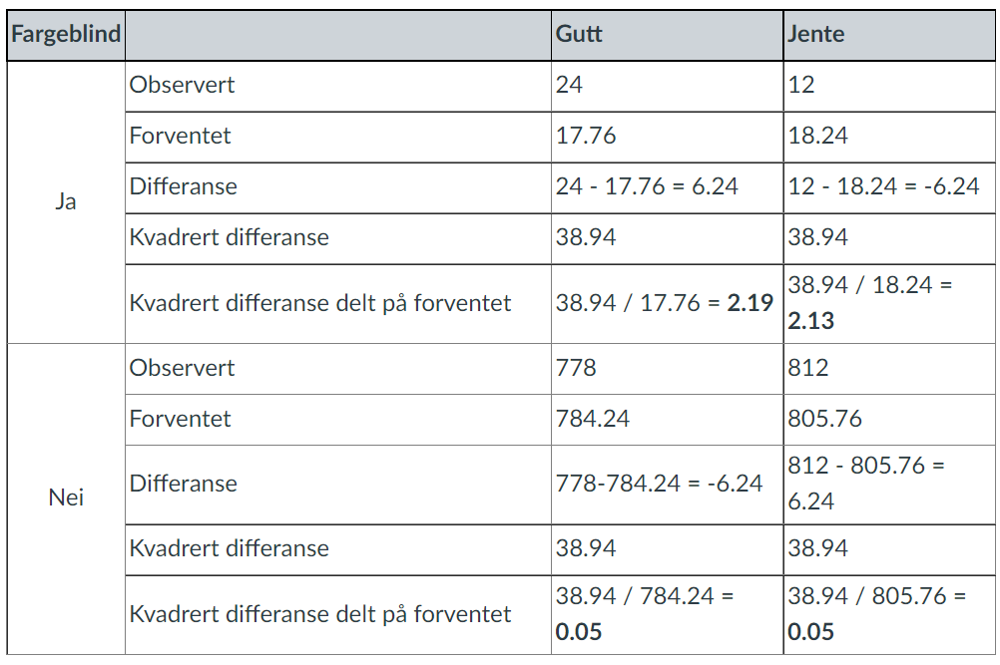
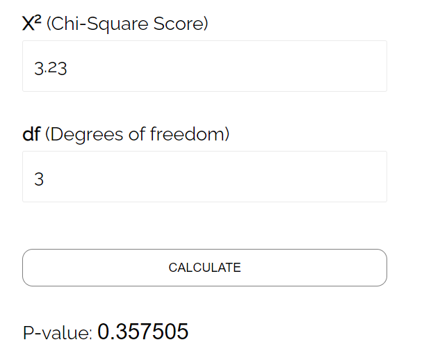
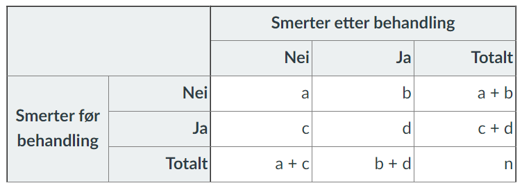

```{r echo = FALSE}
options(scipen=999)
```

# Kjikvadrattest - Analyse av kategoriske data

R-pakker brukt i dette kapittelet:

```{r}
pacman::p_load(tidyverse, readxl, psych, kableExtra)
```

Dette kapittelet tar for seg kjikvadrattester. Dersom vi har kategoriske variabler - jamfør tidligere kapittel der vi tok for oss målenivå - er kjikvadrattester en god måte å gjøre bivariat analyse på (dersom vi har metriske/kontinuerlige variabler bruker vi t-test som vi kommer tilbake til i et senere kapittel).

Vi skal vise tre tilfeller, det vil si tre måter å gjør kjikvadrattester:

1. Vi har to kategoriske variabler og ønsker å se om det er en sammenheng mellom dem - ("Test of association").
2. Vi har en kategorisk variabel og ønsker å se om den representerer en kjent populasjon eller forventning ("Goodness of fit").
3. Vi har en kategorisk variabel for en gruppe mennesker / en gruppe observasjoner målt på f.eks. to ulike tidspunkt eller under to ulike forhold ("Paired samples - McNemars test").

## Test of association - sammenheng mellom to kategorisek variabler

Vi bruker et generert datasett:

```{r echo = FALSE, warning = FALSE, message = FALSE, eval = TRUE}
xfun::embed_file('Modul 5_Krysstabell_Fargeblind2.xlsx')
```

```{r}
kji1 <- read_excel("Modul 5_Krysstabell_Fargeblind2.xlsx")
```

Dette datasettet består av 1626 observasjoner av gutter og jenter der vi også har registrert fargeblindhet. Vi ønsker å se om det er en sammenheng mellom disse to variablene - altså om det er en statistisk signifikant sammenheng. 

```{r fig.caption = "Dimensjoner ved datasettet for kjikvadrattest"}
dim(kji1)
table(kji1$Kjonn)
table(kji1$Fargeblind)
```

Vi kan sette opp en krysstabell ("contigency table"/"crosstab").

```{r fig.caption = "Krysstabell for kjikvadrattest"}
krysstab <- addmargins(table(kji1$Kjonn, kji1$Fargeblind),c(1,2))
krysstab
```

I kjikvadrattester setter vi derfor opp en hypotese om en eller annen sammenheng mellom de variablene vi ønsker å undersøke. I dette eksempelet blir vår hypotese at det er en sammenheng. Teknisk sett vil testen faktisk undersøke det motsatte - altså at det ikke er noen sammenheng. Testen vil vise oss om vi kan forkaste denne hypotsene - ingen sammenheng. Om vi kan det er vi styrket i troen på at det faktisk er en sammenheng. Viser testen oss at vi ikke kan forkaste hypotesen ingen sammenheng er vi svekket i troen på at det er en sammenheng.

Vi setter da opp det som kalles en nullhypotses og en alternativ hypotses (og det er altså nullhypotsesen vi tester):

$H_0 = Ingen\ sammenheng\ mellom\ kjønn\ og\ fargeblindhet$

$H_a = Sammenheng\ mellom\ kjønn\ og\ fargeblindhet$

```{r fig.caption = "Kjikvadrattest med Yates korreksjon"}
kjitest1 <- chisq.test(kji1$Kjonn, kji1$Fargeblind)
kjitest1
```

R gir oss som default test med en såkalt "Yates continuity correction" som gjør at verdien kan virke annerledes enn i programvare som ikke gjør denne korreksjonen. Yateskorreksjonen tar utgangspunkt i at det er en forutsetning om normalfordeling i dataene, noe som ikke kan forutsettes i binære data som vi har her. Dette skal ikke være et stort problem i større utvalg (mer enn 5-10 forventede i hver celle i krysstabellen) [@sageLearnUseYates2019]. 

I vårt konkrete tilfelle ser vi at med korreksjon er p-verdien `r kjitest1$p.value`. Hvis vi kjører testen uten korreksjonen får vi: 

```{r fig.caption = "Kjikvadrattest uten Yates korreksjon"}
kjitest2 <- chisq.test(kji1$Kjonn, kji1$Fargeblind, correct = FALSE)
kjitest2
```

Her er altså p-verdien `r kjitest2$p.value`. I dette eksempelet er altså forskjellen mellom de to ikke ubetydelig, da uten korreksjon er under 0.05 og med korreksjon er over 0.05. En tommelfingerreglel for tolkning av p-verdien er:

> If p is low, the null must go. If p is high, the null flies.

Med andre ord: Er p-verdien under 0.05 ("low") vil vi forkaste nullhypotesen, er p-verdien over 0.05 ("high") vil vi ikke forkaste nullhypotesen. 

I tilegg til p-verdien er vi spesielt interessert i kjikvadratverdien ($\chi^2$). Kjikvadratverdien sammenlikner vi med kritisk verdi. Kritisk verdi kan vi finne i tabeller på nett (f.eks. [her](https://www.itl.nist.gov/div898/handbook/eda/section3/eda3674.htm)). Hvis vi går inn i tabellen lenka fører til og ser på 0.95 - 1 frihetsgrad (1 df) finner vi 3.841. Statistikkprogrammer vil gi oss antall frihetsgrader (df), men vi kan også regne ut dette for en krysstabell slik:

$df = (rader - 1) * (kolonner - 1) = (2-1)*(2-1)=1$

Mange programmer vil uansett lett gi deg den kritiske verdien:

```{r fig.caption = "Kritisk verdi ved kjikvadrattest"}
kritiskverdi <- qchisq(p=.05, df=1, lower.tail=FALSE)
kritiskverdi
```

Hvis kjikvadratverdien er større eller lik den kritiske verdien er resultatene våre statistisk signifikante. Den kritiske verdien i dette eksempelet er `r kritiskverdi`, mens kjikvadratverdien er hhv. `r kjitest1$p.value` og `r kjitest2$p.value`. 

Vi kan altså bruke både p-verdien og kjikvadratverdien til å vurdere om vi skal forkaste nullhypotesen eller ikke. Hvis vi tar fram igjen krysstabellen vår:

```{r fig.caption = "Krysstabell #1"}
krysstab
```

Vi vet at dersom antall forventede i hver celle er minst 5, og gjerne over 10, er det greit å kjøre test uten Yates korreksjon. I så fall indikerer det at vi kan forkaste nullhypotesen ("the null must go"), og at vår hypotese om at det er en statistisk singifikant forskjell mellom kjønnene når det gjelder fargeblindhet er styrket.

En mulighet er også å kjøre en såkalt "Fisher's exact test" dersom de forventede celletallene er under 5. Det er ikke tilfelle her, men vi viser likevel prosedyren. Først vil vi sjekke hva forventede celletall er:

```{r fig.caption = "Forventede verdier ved kjikvadrattest"}
forventet <- as_tibble(kjitest1$expected)
forventet
min(forventet)
```

```{r fig.caption = "Minimum forventede celleverdi ved kjikvadrattest"}
min(forventet)
```

Forventede verdier er regnet ut matematisk ved:

$\frac{radsum * kolonnesum}{totalsum}$

Vi har krysstabellen:
```{r fig.caption = "Krysstabell #2"}
krysstab
```

I vårt tilfelle for gutt - fargeblind:

$\frac{802*36}{1626}=17.75$

som er samme verdi (heldigivs...) som den R regner ut for oss lenger opp.

Dersom vi får forventede under 5 kan vi altså kjøre en kjikvadrattest med korreksjon, eller en Fishers eksakt test.
```{r fig.caption = "Fishers eksakt test"}
test <- fisher.test(table(kji1$Kjonn, kji1$Fargeblind))
test
```

Tolkningen er den samme som for kjikvadrattesten.

En siste vurdering vi kan gjøre er å se på den såkalte phi-koeffisienten.

```{r fig.caption = "Phi-koeffisient"}
krysstab2 <- table(kji1$Kjonn, kji1$Fargeblind) 
phikoeff <- phi(krysstab2, digits = 3)
```

Phi-koeffisienten kan tolkes som en korrelasjonskoeffisient (Pearson r). 

```{r echo = FALSE, message = FALSE, warning=FALSE, fig.cap = "Tolkning av phi-koeffisient"}

phikoefftab <- data.frame(r = c(".70 eller høyere", "0.40 - 0.69", "0.30 - 0.39", "0.20 - 0.29", "0.01 - 0.19", "0"),
                     verdi = c("Veldig sterk sammenheng", "Sterk sammenheng", "Moderat sammenheng", "Svak sammenheng", "Ingen eller neglisjerbar sammenheng", "Ingen sammenheng"))

colnames(phikoefftab) <- c("r", "Tolkning")

phikoefftab <- phikoefftab %>%
  kbl(caption = "Phi-koeffisient - uavhengig av fortegn") %>%
  kable_classic(full_width = F, position = "left", html_font = "Cambria")

column_spec(phikoefftab, 2, width = "8cm")
```

I dette eksempelet har vi verdien `r phikoeff`, altså ingen eller neglisjerbar sammenheng.

Oppsummert for vårt eksempel: Når vi undersøker forventede verdier i hver celle ser vi at det minste forventede tallet er `r min(forventet)`. Det er godt over et minimum på 5 og en anbefalt grense på 10. Derfor kan vi gjennomføre en kjikvadrattest *uten* Yates korreksjon. I vårt tilfelle forkaster vi altså nullhypotesen. Selv om vi finner en statistisk sammengeng mellom kjønn og fargeblindhet er denne liten eller neglisjerbar. 

### Utregning av kjikvadratverdi

Når vi vet faktisk tall og forventet tall, og har krysstabell med rad- og kolonnesummer, kan vi regne ut kjikvadratverdien manuelt:

{width=75%}

Siste steg er å summere $2.19 + 2.13 + 0.05 + 0.05 = 4.42$. 
Differansen mellom $4.43$ og $4.42$ skydes avrundinger.

## Goodness of fit - sammenheng mellom kategorisk variabel og kjent/forventet datafordeling

Kjikvadrattest brukes også på en annen måte. Vi kan bruke den for å teste om en variabel kommer fra en spesifikk datadistribusjon, eller med andre ord om de empiriske (innsamlede/observerte) dataene stemmer overens med en teoretisk datadistribusjon (som for eksempel normalfordelingen). Det vil si vi kan vurdere om et utvalg er representativt for en populasjon.

Som for den første måten å bruke kjikvadrattest tester vi en hypotese. Hypotesen sier at det er en signifikant forskjell mellom verdiene på de empiriske/observerte dataene og de forventede/teoretiske verdiene. Nullhypotesen blir da at det *ikke* er signifikant forskjell.

La oss lage et eksempel. En produsent av et skrapelodd hevder at det er null gevinst i 80% av loddene, en liten gevinst i 15% av loddene, en litt større gevinst i 4% av loddene og en stor gevinst i 1% av loddene. 

```{r echo = FALSE}
goodness <- read.csv("lotteri.csv")
```

```{r echo = FALSE, warning = FALSE, message = FALSE, eval = TRUE}
xfun::embed_file('lotteri.csv')
```

```{r echo = FALSE}
gevinst <- data.frame(type = c("Null gevinst", "Liten gevinst", "Middels gevinst", "Stor grevinst"),
                     forekomst = c("80 %", "15 %", "4 %", "1 %"))

colnames(gevinst) <- c("Gevinsttype", "Forekomst")

gevinst <- gevinst %>%
  kbl(caption = "Lovet fordeling av gevinster") %>%
  kable_classic(full_width = F, position = "left", html_font = "Cambria")
  
column_spec(gevinst, 2, width = "5cm")
  
```

Vi trekker ut 100 tilfeldige lodd og finner: 85 uten gevinst, 10 med liten gevinst, 3 med en middels gevinst og 2 med stor gevinst.

```{r echo = FALSE}
gevinst2 <- data.frame(type = c("Null gevinst", "Liten gevinst", "Middels gevinst", "Stor grevinst"),
                     forekomst = c("85", "10", "3", "2"))

colnames(gevinst2) <- c("Gevinsttype", "Forekomst")

gevinst2 <- gevinst2 %>%
  kbl(caption = "Faktisk fordeling av gevinster") %>%
  kable_classic(full_width = F, position = "left", html_font = "Cambria")
  
column_spec(gevinst2, 2, width = "5cm")
```

Stemmer de resultatene vi fikk i det tilfeldige utvalget på 100 med det produsentene lover?

Stegene i videre analyse blir:

1. Regne ut frihetsgrader
2. Regne ut forventede verdier
3. Regne ut kjikvadratverdien

### Frihetsgrader

$df = k - 1 = 4 - 1 = 3$
(k = antall nivåer i den kategoriske variabelen)

### Forventede verdier

Disse har vi forsåvidt allerede i tabellen over - de produsenten har lovet er det forventede. Utregningen blir:

$F_1 = n * p_1 = 100 * 0.80 = 80$
$F_2 = n * p_2 = 100 * 0.15 = 15$
osv.

### Kjikvadratverdi

$\chi^2=\sum\left(\frac{(O_i - E_i)^2}{E_i}\right)$

der O = Observert og E = Forventet ("Expected")

$\chi^2=\frac{(85-80)^2}{80}+\frac{(10-15)^2}{15}+\frac{(3-4)^2}{4}+\frac{(2-1)^2}{1} = 0.31 + 1.67 + 0.25 + 1 = 3.23$

Vi kan sammenlikne denne med kritisk verdi:
```{r fig.cap = "Sammenlikning kjikvadratverdi og kritisk verdi"}
kritiskverdi2 <- qchisq(p=.05, df=3, lower.tail=FALSE)
kritiskverdi2
```

Hvis kjikvadratverdien er større eller lik den kritiske verdien er resultatene våre statistisk signifikante. Den kritiske verdien i dette eksempelet er 7.81, mens kjikvadratverdien er 3.23. Vi vil derfor anta at resultatene ikke er statistisk signifikante. Dette viser seg også i p-verdien. Her vil vi vise en nettressurs for å regne ut p-verdien. Den finner du [her](https://www.statology.org/chi-square-p-value-calculator/). 

{width=65%}

Vi kan også kjøre testen i R:

```{r fig.cap = "Kjivadrattest"}
observed <- c(85, 10, 3, 2) 
expected <- c(.8, .15, .04, .01)

chisq.test(x=observed, p=expected)
```

P-verdien er sannsynligheten for at kjikvadratverdien med 3 frihetsgrader er høyere enn 3.23. Huskeregel: «If the p is low, the null must go». Her er ikke p lav (ikke under 0.05). Det vil si at nullhypotesen ikke kan forkastes. Med andre ord – vi kan konkludere med at det er sannsynlig at utvalget representerer populasjonen – eller i dette tilfellet: basert på dette tilfeldige utvalget har produsentene produsert lodd iht det som er lovet fordi vi ikke kan forkaste nullhypotesen om at det ikke er forskjell mellom utvalget vi fikk og det vi ville forvente. 

## Paired samples (McNemars test)

```{r echo = FALSE}
mcnemar <- read_excel("Modul 5_McNemar.xlsx")
```

```{r echo = FALSE, warning = FALSE, message = FALSE, eval = TRUE}
xfun::embed_file('Modul 5_McNemar.xlsx')
```

McNemars test brukes når vi ikke har uavhengige variabler, men derimot har tilfeller der vi har "paired data"/"repreated measures" av kategoriske data. Et eksempel på dette er en pasientgruppe som er testet ved to anledninger. I tabellen under har vi laget data som viser et tenkt forsøk med en ny type behandling for en gruppe mennesker. De er spurt om de har smerter før og etter de er gitt en behandling. 

```{r fig.cap = "Krysstabell for McNemars test"}
krysstab2 <- addmargins(table(mcnemar$Før, mcnemar$Etter),c(1,2))
krysstab2
```

Det vi jo vil undersøke er om man kan si at behandlingen har en effekt. 

Vi kan tilnærme oss dette først litt teoretisk ved å sette opp samme tabell uten tall:

{width=75%}

I denne testen er rutene med a og d ikke interessante, for de svarte det samme før og etter behandling. Hvis behandlingen ikke har noen effekt bør antallet respondenter som går fra ja til nei, og fra nei til ja, være likt. Derfor er vi interessert i cellene b og c, for dette er respondentene som beveget seg fra ja til nei eller motsatt. Hvis behandlingen har en effekt kan vi forvente at antallet som går fra ja til nei vil være større, og hvis behandlingen har en negativ effekt vil vi forvente motsatt (flere fra ja til nei enn andre veg).

Vi kan derfor sette opp følgende hypoteser:

$H_0: p_b = p_c$

$H_1: p_b \neq p_c$

der p er sannsynligheten for tallet i cellene med b og c. Nullhypotesen, altså den vi vil teste i kjikvadrattesten, går altså på at det er like mange som går fra ja til nei, som fra nei til ja. Den alternative hypotesen sier at det er en forskjell. 

Når vi kjører testen vil vi altså forkaste $H_0$ dersom p-verdien er under terskelverdien ("if p is low, the null must go". Hvis vi forkaster nullhypotesen betyr det at vi mener hypotesen om at behandlingen har en effekt er styrket.  

Vi kan regne ut testverdien manuelt ganske enkelt ut fra krysstabellen:
```{r "Krysstabell for McNemars test"}
krysstab2
```

$\chi^2=\frac{(b-c)^2}{b+c}=\frac{(75-785)^2}{75+785}=586.163$

Testverdien kan sammenliknes med kritisk verdi.

```{r fig.kap = "Kritisk verdi for kjikvadrattest"}
qchisq(p=.05, df=1, lower.tail=FALSE)
```

```{r fig.cap = "McNemars test"}
mcnemar3 <- matrix(c(215, 785, 75, 380), 
                   nrow = 2,
                   dimnames = list("Før behandling" = c("Nei", "Ja"),
                                   "Etter behandling" = c("Nei", "Ja")))
mcnemar.test(mcnemar3, correct=FALSE) 
```

Vi kan se både på kjikvadratveri mot kritiske verdi og p-verdi at vi har gode grunner til å forkaste nullhypotesen. Det kan derfor se ut til at behandlingen virker.
