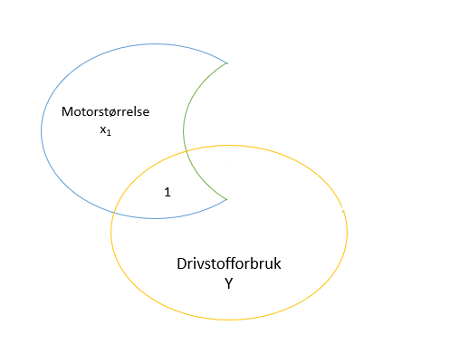
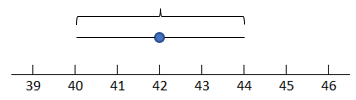
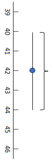
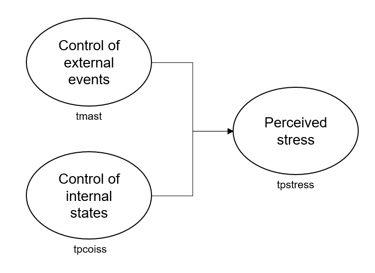
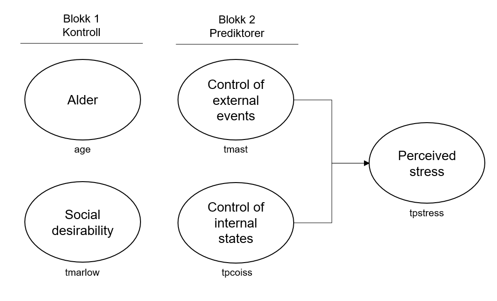

# Regresjonsanalyse - OLS

```{r echo = FALSE}
options(scipen = 999)
```


R-pakker brukt i dette kapittelet:

```{r warning = FALSE, message = FALSE}
pacman::p_load(car, readxl, effects, writexl, ggpubr, tidyverse, gridExtra, nortest, knitr, kableExtra, tseries, normtest, flextable, magrittr, ISLR, olsrr, lmtest, rnorsk, qwraps2, sjPlot, sjmisc, sjlabelled, xtable, Hmisc, gt, gtsummary, sjPlot, modelsummary, table1, jtools, interactions, outliers, EnvStats, qqplotr, summarytools, caret, gridExtra, equatiomatic, reshape2)
```

## Innledning

Regresjonsanalyse er et særtilfelle av variansanalyse, og er i følge @mehmetogluInnforingStatistiskeDataanalyser2020 muligens den mest brukte analysemetoden for dataanalyse, eller arbeidshesten i forskning på økonomiske og sosiale forhold [@thraneAppliedRegressionAnalysis2019]. Det er først og fremst metodens er fleksibilitet som en hovedgrunn til dette.

En regresjonsanalyse er en statistisk analyse som undersøker sammenhengen mellom en kontinuerlig avhengig variabel og en eller flere kontinuerlige og/eller kategoriske uavhengige variabler. Selv om korrelasjon kan være veldig hjelpsomt å forstå vil en regresjonsanalyse søke å ta vår forståelse av sammenhengen litt videre, til for eksempel å forsøke å predikere nivået i en avhengig variabel ut fra nivået på den/de uavhengige variabler. Hvis vi lykkes med dette vil vi kunne klare å si noe om forventet verdi på et fenomen vi er interessert i ut fra kjente verdier på andre variabler. La oss anta at vi har variabler som beliggenhet (avstand fra sentrum), areal, etasje, solforhold, antall rom, antall bad, standard på bad og liknende for en leilighet kan vi bruke disse uavhengige variablene til å predikere en salgssum for denne boligen (som en avhengig variabel). Vi lager da en modell for dette forholdet - i dette tilfellet en regresjonsmodell. Vi går dermed fra å spørre **om** det er en sammenheng til å spørre **hvilken** sammenheng det er.

La oss forsøke å illustrere prinsippet med regresjonsanalyse gjennom et såkalt Venndiagram.

{width=50%}

Den gule sirkelen illustrerer det forholdet vi er interessert i å "finne ut noe om". Den representerer det vi kaller den avhengige variabelen - fordi det vi ønsker å finne ut er avhengig av andre forhold (andre variabler). Vi kan si at den gule sirkelen viser variasjonen i drivstofforbruket til alle biler vi har med i undersøkelsen vår, og vi betegner denne variabelen $Y$. Biler har ulikt drivstofforbruk, så vi har altså en variasjon i drivstofforbruket mellom bilene. Den blå sirkelen viser variasjonen i motorstørrelse (vi kaller denne variabelen for $x_1$). Ulike biler har ulik motorstørrelse, og vi tenker at større motor betyr mer drivstofforbruk enn mindre motor. Den grønne sirkelen representerer en variabel vi har kalt kjørestil ($x_2$). 

Vi har en hypotese om at vi kan predikere (forutsi) drifstofforbruket til en gitt bil ut fra motorstørrelse og kjørestil. Så det vi ønsker å se på er hvor mye av korrelasjonen mellom drivstofforbruk og motorstørrelse skyldes faktisk motorstørrelse, og hvor mye skyldes kjørestil. Vi tenker også at kjørestil og drivstofforbruk er korrelert (det er naturlig å tenke seg at personer med en aggresiv kjørestil har biler med større motorer - det er altså en korrelasjon mellom kjørestil og motorstørrelse). Vi ser dette i figuren under. Korrelasjonen mellom drivstofforbruk og motorstørrelse er gitt i områdene merket 1 og 2. Korrelasjonen mellom drivstofforbruk og kjørestil er gitt i områdene 2 og 3. Korrelasjonen mellom kjørestil og motorstørrelse er gitt i 2 og 4. 

{width=50%}

Området 2 viser den delte variasjonen mellom drivstofforbruk, motorstørrelse og kjørestil. Det vil innebære at vi kan bruke regresjonsanalsye til å isolere ut område 1 ved å se på motorstørrelsens totale korrelasjon med drivstofforbruk og trekke fra den delen av den totale korrelasjonen som deles med kjørestil (område 2). Da finner vi motorstørrelsens ($x_1$'s) unike bidrag.

{width=50%}

Det samme kan vi gjøre for kjørestil, der det unike bidraget utgjøres av område 3. Vi kan selvsagt ha flere prediktorer (uavhengige variabler) - noe vi veldig ofte vil ha. Det vi gjør er i prinsippet det samme: vi tar bort biter av korrelasjonen mellom motorstørrelse og drivstofforbruk som skyldes samvariasjon med andre variabler slik at vi får isolert den delen av korrelasjonen som utelukkende skyldes motorstørelse. Man kan tenke seg en ny variabel med rød sirkel. Igjen - regresjonsanalysen forsøker å isolere den unike delen for korrelasjonen mellom motorstørrelse og drivstofforbruk (og det samme for de andre variablene: den unike delen). Når vi klarer å isolere den unike korrelasjonen kan vi også si at vi har isolert den unike kausale effekten motorstørrelse har på drivstofforbruket (gitt at vi har inkludert alle relevant uavhengige variabler i modellen, noe vi i praksis sjelden vil klare).

{width=50%}

Den videre innledningen til regresjonsanalyse tar utgangspunkt i eksempelet i @lovasStatistikkUniversiteterOg2013 (boka kom ut i 4. utgave i 2018). Illustrasjonene som er brukt er hentet fra bokas [nettressurser](www.nettressurser.no/statistikk). Løvås’ bok «Statistikk for universiteter og høgskoler» kan anbefales som introduksjonsbok til statistikk på universitets- og høgskolenivået. En annen bok som fungerer fint til dette formålet er Jan Ubøes "Statistikk for økonomifag" (vi har brukt 4. utgave, 2014 - 5. utgave kom i 2015) [@uboeStatistikkOkonomifag2014].

## Teori

Eksempelet bygger på @lovasStatistikkUniversiteterOg2013 og dreier seg om sammenhengen mellom motorsytelse og drivstofforbruk. Vi kan måle motorytelse i hestekrefter (hk) og drivstofforbruk i liter/mil.

For å vise sammenhengen kan vi sette opp ligningen $Y_i=\alpha\:+\beta x_i+e_i$ der

$Y=drivstofforbruket$

$\alpha=konstantleddet$ (krysningspunktet på y-aksen, altså Y-verdien om x er 0)

$\beta=linjens\:stigningstall$ (dersom x øker med 1, øker y med $\beta$

$e=forstyrrelsen$ (vi antar at det er flere ting som forstyrrer forholdet mellom motorstørrelse og drivstofforbruk - drivstofforbruket er ikke bare avhengig av motorstørrelse). Vi skal snakke mye om residualer i regresjonsanalyse - residualer er dette restleddet/feilleddet/forstyrrelsen. En av forutsetningene i regresjonsanalyse er knyttet til fordelingen av disse residualene, men det kommer vi tilbake til.

Dersom vi ikke hadde hatt et feilledd kunne vi framstilt denne ligningen slik:


Man vil se formelen uttrykt på en rekke ulike måter, jfr. eksemplene til høyre for grafen over. Vi foretrekker altså 

$y=\alpha\ +\beta x$

La oss tenke oss at vi har følgende sammenheng mellom disse to variablene:

```{r fig.cap = "Hk og forbruk x antall biler"}
hk <- c(50, 52, 60, 60, 70, 73, 90, 90, 95, 100, 110, 110, 110, 120, 103, 140, 142, 146, 141, 150, 160, 170, 180, 189, 190, 200, 200)
forbruk <- c(0.6, 0.6, 0.6, 0.5, 0.5, 0.6, 0.7, 0.75, 0.8, 0.8, 0.65, 0.9, 0.9, 0.8, 1.0, 1.1, 1.2, 1.1, 0.98, 1.2, 1.3, 1.5, 1.4, 1.35, 1.6, 1.7, 1.5)
data <- tibble(hk, forbruk)
dataplott <- data %>%
    ggplot(aes(x = hk, y = forbruk)) +
    geom_point() +
    ylab("Drivstofforbruk (l/mil)") +
    xlab("Motorytelse (hk)") +
    theme_bw() 
dataplott
```

Det vi i en lineær regresjonsanalyse gjør er å finne den rette linja som best passer til disse observasjonene. Vi ønsker altså å finne en rett linje som best "beskriver" observasjonene. Tenk deg at vi trekker den rette linja som samlet sett ligger nærmest punktene og deretter tar bort punktene. Det vi sitter igjen med er regresjonslinja. Denne linja gir oss da "tilgang til" alle punkter som ligger på linja som en modell på sammenhengen mellom de to variablene. Selv om vi bare hadde noen observasjoner på gitte punkter på x-aksen har vi gjennom regresjonslinja fått tilgang til alle tenkelige punkter på x-linja og kan anta et drivstofforbruk ut fra det (ved å gå opp fra x-aksen, finne skjæringspunktet med regresjonslinja, og deretter gå inn på y-aksen og lese av drivstofforbruket). Den prediksjonen vi da gjør er vår beste gjetning på hvor stort drivstofforbruket vil være for en gitt motorytelse. Dette vil selvsagt være en kvalifisert gjetning - nettopp fordi det er en modell. Og alle modeller er feil, men noen modeller er nyttige likevel.

I eksempelet kan vi for eksempel tenke oss to mulige linjer:

```{r fig.cap = "To tenkte linjer for forholdet mellom hk og forbruk"}
dataplott2 <- dataplott +
    geom_segment(x = 10, y = 0.4, xend = 200, yend = 1.35, color = "blue") +
    geom_segment(x = 25, y = 0.2, xend = 200, yend = 1.55, color = "magenta")    
dataplott2
```

I prinsippet kan vi tenke oss et stort antall mulige linjer, og målet vårt er altså å finne den linja som best beskriver forholdet mellom motorytelse og forbruk. Men er det den grønne eller den blå linja i plottet ovenfor (eller en rød eller gul linje vi ikke har vist)? Vi må altså ha en måte å vurdere hvilken av linjene som er best. Vi kan (kanskje intuitivt) tenke at en linje som ligger nærmest flest mulig punkter er den beste. Og det er riktig i en lineær regresjonsanalyse. 

```{r fig.cap = "Avstand fra punkt til linje utgjør avviket mellom mulig modell og observasjon"}
dataplott3 <- dataplott2 +
    geom_segment(x = 103, y = 0.865, xend = 103, yend = 1.0, color = "red", linetype = "dashed") +
    geom_segment(x = 141, y = 0.99, xend = 141, yend = 1.05, color = "red", linetype = "dashed")    
dataplott3
```

Begge linjene er forsøk på å lage en rett linje som har kortest mulig avvik. Vi kan deretter legge sammen de absolutte vertikale avstandene (illustrert med de to røde stiplede linjene) fra observasjonspunktene ned til den rette linja. Dette gjør vi for alle punkter ned til respektive linje. I prinsippet er da den rette linja som medfører minst samlet avstand fra observasjonspunktene den rette linja som best representerer observasjonspunktene, og vi kan si vi har laget en modell for sammenhengen mellom motorytelse og drivstofforbruk. Siden vi har en sammenhengende rett linje har vi også mulighet til å mene noe om drivstofforbruk på motorsytelser vi ikke har målt/har observasjoner på. Vi har med andre ord en modell for å predikere drivstofforbruk ut fra motorstørrelse. Uavhengige variabler i regresjonsanalyser kalles også ofte prediktorer, fordi vi bruker de til å predikere en verdi for den avhengige variabelen.

### Minste kvadratsum (Ordinary Least Squares - OLS)

Imidlertid er absoluttverdier matematisk problematiske [@lovasStatistikkUniversiteterOg2013] fordi punktene vil ligge (stort sett) jevnt fordelt på oversiden og nedsiden av linja. Når man da skal legge sammen avvikene kan man i prinsippet sitte igjen med 0, noe som jo ikke gir mening med mindre alle punktene ligger nøyaktig på linja. Pre-datamaskiner ble det derfor utviklet en alternativ måte som kalles "minste kvadraters metode" - derav begrepet OLS ("Ordinary Least Squares"). Det finnes andre måter å tilnærme seg dette, men i dette kapittelet går vi kun inn på OLS-regresjon. Hvis vi fortsetter eksempelet over kan vi tenke oss en mengde forslag på ulike linjer som forsøker å beskrive sammenhengen mellom de to variablene:

```{r fig.cap = "Minste kvadraters metode - OLS"}
dataplott4 <- dataplott3 +
    geom_rect(aes(xmin = 86, xmax = 103, ymin = 0.8625, ymax = 1.0), fill = "red", alpha = 0.01) +
    geom_rect(aes(xmin = 141, xmax = 150, ymin = 0.98, ymax = 1.055), fill = "red", alpha = 0.01)
dataplott4
```

Her tar man altså hver enete vertikale avstand fra hvert enkelt punkt og lager et kvadrat ut av det. Man regner deretter ut kvadratene som dannes av hvert punkt og avstanden til den rette linja. Den linja som har den laveste kvadratsummen ("least squares") er den linja som best representerer datapunktene og som derfor er den beste lineære modellen av forholdet mellom variablene. Regresjonslinja er således en modell. Som @thraneAppliedRegressionAnalysis2019 beskriver: den diagonale linja oppsummerer den typiske trenden i det statistiske forholdet mellom de to variablene - en linje vi kjenner som regresjonslinja. 
Hvis vi har et stort antall datapunkter er dette selvsagt en omfattende prosess å gjøre manuelt. Det statistikkprogrammer gjør for oss er å regne ut kvadratsummen for et stort antall mulige linjer og deretter fortelle oss hvilken som har lavest kvadratsum.

Hvis vi tenker tilbake til formelen for modellen vår: $Y_i=\alpha\:+\beta x_i+e_i$ kan vi nå fylle ut med verdier fra eksempelet.

Det vi egentlig har gjort når vi finner den rette linja som gir minste kvadratsum er å identifisere $\alpha$ (skjæringspunktet på y-aksen) og $\beta$ (stigningstallet). Statistikkprogrammer vil gi oss verdiene på dette. 

```{r}
datamodell <- lm(forbruk ~ hk, data = data)
tab_model(datamodell)
```

$\alpha$ er i tabellen over `r format(round(coef(datamodell)[[1]], 3), nsmall = 3)` og $\beta$ er `r format(round(coef(datamodell)[[2]], 3), nsmall = 3) ` (kolonnen "Estimates"). 

```{r}
regresjonslikning <- extract_eq(datamodell, use_coefs = TRUE)
```

Vi kan da lage følgende likning:

<div align="center">`r regresjonslikning`.</div>

Som sagt har vi ønsket å lage en modell som predikerer drivstofforbruk ut fra motorstørrelse – eller sagt på en annen måte: hvilket drivstofforbruk kan vi forvente med en motor på 100 hk? Vi får da: $$y=0,092\:+0,007x=0,092\:+\:0,007\times100\:=\:0,792$$
Uten avrunding ser forventet drivstofforbruk ut til å bli `r coef(datamodell)[1] + 100*coef(datamodell)[2]` l/mil. Merk at med ulike avrundinger blir forventet forbruk litt forskjellig, men dette siste tallet er uten avrunding og mest nøyaktig.

Dette blir vårt "best guess", vår antakelse (vår prediksjon av verdien på y-aksen som er drivstofforbruket ut fra verdien på x-aksen som er motorytelse), om forventet drivstofforbruk for en motor med 100 hk basert på den modellen vi har laget om sammenhengen mellom motorytelse og drivstofforbruk (som er basert på de observasjonene vi har).

Vi kan naturligvis umiddelbart tenke at drivstofforbruket er avhengig av mange andre faktorer enn motormotorytelse, for eksempel bilens design (luftmotstand), vekt, rullemotstand, temperatur, type motor og så videre. Dette belyser for så vidt et sentralt problem når vi ønsker å lage modeller for prediksjon: Virkeligheten er utrolig sammensatt, mange relevante variabler er vanskelig å måle, og man ønsker en modell som er enkel nok til å kunne brukes og sammensatt nok til å gi relevante prediksjoner. Tenk for eksempel bare på "klimamodellene" som brukes for å analysere og predikere temperatur, issmelting, global oppvarming og liknende. Ofte vil det være såkalte interaksjoneffekster også mellom variabler som kan gjøre det vanskelig å se hvordan endring i en eller flere variabler virker tilsammen. Det er klart at i de fleste tilfeller trenger vi flere prediktorer enn en – og i regresjonssammenheng snakker vi da om multippel regresjonsanalyse. Vi kan ha som en tommelfingerregel at vi skal ha med så mange variabler at modellen har praktisk verdi, men likevel så få som mulig.

#### R^2 ("R squared")

Som vi har sett over regnes kvadratsummene ut for avstandene fra datapunktene til en tenkt linje som "går gjennom" dataene. Den linja som gir minst samlet sum av kvadratsummer er vår best modell og det vi vil kalle regresjonslinja. Dette gjør oss i stand til å kalkulere en såkalt $R^2$. Under har vi forsøkt å illustrere hvordan dette skjer:

{width=85%}

Til venstre ser vi illustrert avstanden fra det enkelte datapunkt til regresjonslinja. Dette gir oss til sammen $SS_{res}$ - som vi kaller variabelen (y). Gjennomsnittet er som vi kommer tilbake til et par andre steder også en modell for sammenhengen mellom den avhengige og den uavhengige variabelen. Summen av kvadratsummene for gjennomsnittsmodellen er $SS_{tot}$ - som vi kaller "total sum of squares". Ut fra disse størrelsene ser vi i den nederste likningen i figuren over hvordan $R^2$ framkommer. 

$R^2$ kommer vi tilbake til mange ganger når vi snakker om regresjonsanalyser.

### Konfidensintervall

Avslutningsvis i denne introduksjonen til regresjonsanalyse kan vi se kort på begrepet konfidensintervall (se for eksempel @hinkleAppliedStatisticsBehavioral2003). For de som ønsker å fordype seg i effektstørrelser og konfidensintervaller anbefales @cummingIntroductionNewStatistics2017 "Introduction to the new statistics: Estimation, open science, & beyond".

Man kan si at estimatet på stigningstallet $\beta$ er det viktigste resultatet i en regresjonsanalyse fordi dette sier noe om hvor sterk sammenhengen mellom de to variablene er. Vi kan ta fram plottet over sammenhengen mellom de to variablene med regresjonslinje:

```{r fig.cap = "Regresjonslinje med konfidensinterval"}
dataplott5 <- ggplot(data, aes(x = hk, y = forbruk)) + 
    geom_point() +
    geom_smooth(method = lm) +
    theme_bw() +
    ylab("Drivstofforbruk (l/mil)") +
    xlab("Motorytelse (hk)")
```

Det grå området utgjør konfidensgrensene for 95 % konfidensintervall. Vi kan gå litt dypere inn i hvordan konfidensgrensene framkommer i en regresjonsanalyse.

La oss fortsette eksempelet. Vi har altså plottet verdiene for motorytelse og drivstofforbruk. Den røde prikken markerer verdien x=125. Verdien på y-aksen (ca. 1.0 som vi leser av fra grafen) er vår prediksjon (vår buest guess) på hva verdien i den avhengige variabelen vil være ved den observerte verdien x=125.


```{r fig.cap = "Eksempel på prediksjon", warning = FALSE, message = FALSE}
data %>%
  ggplot(aes(x = hk,y = forbruk)) +
  geom_point() +
  labs(x = "x", y ="y") +
  geom_smooth(method = lm, se = FALSE) +
  theme_bw() +
  geom_point(aes(x = 125, y = 1.005), colour = "red", size = 3) +
  geom_segment(x = 125, y = 0, xend = 125, yend = 1.005, color = "red") +
  geom_segment(x = 0, y = 1.005, xend = 125, yend = 1.005, color = "red")
```

Vi kan regne ut dette nøyaktig (vi bryr oss foreløpig ikke mer om koden enn at dette funker...):
```{r}
modell <- lm(forbruk ~ hk, data = data)
ykoeff <- coef(modell)[1] + 125*coef(modell)[2]
ykoeff
```

I punktet x=125 har vi en hel populasjon av mulige normalfordelte verdier. Vårt beste estimat av gjennomsnittsverdien for denne populasjonen er `r ykoeff`. Dette er et punktestimat. Det tilhørende intervallestimatet er vårt konfidensintervall. Vi må her tenke på konfidensintervallet som en vertikal linje. Så i stedet for å tenke punkt- og intervallestimat slik



Kan vi tenke det slik:



Overført til vårt eksempel får vi:

```{r fig.cap = "Punkt- og intervallestimat sammen med prediksjon", warning = FALSE, message = FALSE}
# Tar fram verdier for konfidensintervallet for x = 125
ny <- data.frame(hk = 125)
x125 <- as_tibble(predict(datamodell, newdata = data.frame(ny), interval="confidence"))
x125
# Plotter
data %>%
  ggplot(aes(x = hk, y = forbruk)) +
  geom_point() +
  labs(x = "Motorytelse (hk)", y ="Drivstofforbruk (l(mil)") +
  geom_smooth(method = lm) +
  theme_bw() +
  geom_point(aes(x = 125, y = 1.00805), colour = "red", size = 3) + 
  geom_segment(x = 125, y = x125$lwr, xend = 125, yend = x125$upr, color = "red")
```

Den røde streken er vårt 95 % konfidensintervall for punktestimatet. 95% konfidensintervall angir intervallet av verdier for drivstofforbruket vi med 95% sannsynlighet kan si at populasjonsgjennomsnittet vil ligge innenfor. Altså - vi er 95% sikre på at en bil med motorytelse på 125 hk vil ha et drivstofforbruk på mellom `r x125$lwr` og `r x125$upr`, og vårt beste estimat er at drivstofforbruket vil være `r x125$fit` l/mil.

Hvis vi legger på 95 % konfidensintervaller på alle punktestimatene (alle punktene som utgjør regresjonslinja) kan vi lage det grå feltet på plottet over som toucher endepunktene på alle konfidensintervallene. Dette gjøres autmatisk om vi ikke velger det bort i pakken "ggplot". 

Vi ser at konfidensgrensene er lett buede mot hverandre med minst avstand mellom dem "på midten" (dette ville vært mye mer tydelig om punktene i plottet hadde vært mer spredt). Vi skal kort se på hvorfor det er slik. Vi har nå lagt på et nytt kryss i grafen under. Dette krysset markerer punktet der gjennomsnittene av X og Y krysser. Regresjonslinja må gå gjennom dette punktet, slik at alle alternative regresjonslinjer må pivotere rundt dette punktet. Dette medfører at det er litt større usikkerhet rundt punktestimatenes konfidensintervaller i endene i forhold til i midten. Konfidensintervallene for hvert enkelt punkt blir derfor litt lenger jo lenger ut fra krysningspunket vi går, og resultatet blir en form for buet linje.

```{r fig.cap = "Pivotpunkt på regresjonslinje og usikkerhet rundt konfidensintervall", warning = FALSE, message = FALSE}
data %>%
  ggplot(aes(x = hk, y = forbruk)) +
  geom_point() +
  labs(x = "Motorytelse (hk)", y ="Drivstofforbruk (l(mil)") +
  geom_smooth(method = lm) +
  theme_bw() +
  geom_segment(x = 125, y = 0.75, xend = 125, yend = 1.25, color = "red") +
  geom_segment(x = 95, y = 1.00805, xend = 152, yend = 1.00805, color = "red")    
```

### Steg i analyse

Vi anbefaler at en analyse går gjennom disse stegene:

1. Analyse av dataene

2. Evtentuelt valg av prediktorer ut fra analyse av dataene

3. Lage modell (kjøre regresjonsanalysen)

4. Analyse av resultatene (diagnostikk)

5. Sjekk av forutsetningene

6. Eventuell revisjon av modellen

7. Eventuell analyse av revidert modell

8. Konklusjon / oppsummering / rapportering av resultater

Vi skal i det følgende gå gjennom disse stegene i en regresjonsanalyse.

## Enkel, lineær regresjonsanalyse

Dette eksempelet bygger på @fieldDiscoveringStatisticsUsing2009. Hvis vi ønsker å se på i hvilken grad vi kan predikere salgstall gjennom hvor mye vi bruker på reklame før lansering kan vi gjøre en lineær regresjonsanalyse med salg som avhengig variabel og reklame (adverts) som uavhengig variabel. 

Du kan laste ned datasettet i ulike formater her:

```{r echo = FALSE, warning = FALSE, message = FALSE, eval = TRUE}
xfun::embed_file('Field_datasett_OLS.xlsx')
```

```{r echo = FALSE, warning = FALSE, message = FALSE, eval = TRUE}
xfun::embed_file('Field_datasett_OLS.sav')
```

```{r echo = FALSE, warning = FALSE, message = FALSE, eval = TRUE}
xfun::embed_file('Field_datasett_OLS.dta')
```

Datasettet kan også finnes [her](https://edge.sagepub.com/field5e/student-resources/datasets)

Vi skal nå gå gjennom våre anbefalte steg i analysen, og starter med en analyse av dataene. 

### Steg 1: Analyse av dataene

"As soon as you have collected your data, before you compute any statistics, look at your data. Data screening is not data snooping. It is not an opportunity to discard data or change values to favor your hypotheses. However, if you assess hypotheses without examining your data, you risk publishing nonsense" [@wilkinsonStatisticalMethodsPsychology1999].

Vi ser på datasettet og noen nøkkeltall for datasettet.

```{r results='asis'}
Field_OLS_data <- read_excel("Field_datasett_OLS.xlsx")
descr(Field_OLS_data)
```

Vi kan se at datasettet består av 200 obervasjoner av 4 variabler. Hver av observasjonene er en CD:

* Adverts: Dette er summen brukt på reklame før lanseringsdato
* Sales: Dette er salgtall per uke
* Airplay: Antall ganger et spor fra CDen ble spilt på radio i uka før lanseringsdato
* Image: En rating på hvor attraktiv gruppen/artisten (positivt image) 

Ofte er det imidlertid mer hensiktsmessig å se på dataene grafisk i en utforskende hensikt [@tukeyExploratoryDataAnalysis1977]. 

#### Histogram

```{r fig.cap = "Histogram for 'adverts' og 'sales'"}
annotations <- data.frame(
  x = c(round(min(Field_OLS_data$Adverts), 2), round(mean(Field_OLS_data$Adverts), 2), round(max(Field_OLS_data$Adverts), 2)),
  y = c(4, 52, 4),
  label = c("Min:", "Gjennomsnitt:", "Maks:"))
  
plott1 <- ggplot(Field_OLS_data, aes(Adverts)) + 
    geom_histogram(bins = 10, color = "black", fill = "lightblue") + 
    geom_vline(aes(xintercept = mean(Adverts)), color = "red", size = 0.5, linetype = "dashed") + 
    geom_text(data = annotations, aes(x = x, y = y, label = paste(label, x)), size = 3, fontface = "bold") +
    theme_bw()

annotations2 <- data.frame(
  x = c(round(min(Field_OLS_data$Sales), 2), round(mean(Field_OLS_data$Sales), 2), round(max(Field_OLS_data$Sales), 2)),
  y = c(4, 52, 4),
  label = c("Min:", "Gjennomsnitt:", "Maks:"))

plott2 <- ggplot(Field_OLS_data, aes(Sales)) + 
    geom_histogram(bins = 10, color = "black", fill = "lightblue") + 
    geom_vline(aes(xintercept = mean(Sales)), color = "red", size = 0.5, linetype = "dashed") + 
    geom_text(data = annotations2, aes(x = x, y = y, label = paste(label, x)), size = 3, fontface = "bold") +
    theme_bw()
grid.arrange(plott1, plott2, ncol=2)
```

Det kan se ut som at salgstallene er rimelig normalfordelte, mens reklamevariabelen er klart skjev. 

#### Quantile-Quantile plott (QQ)

QQ plottet (“quantile-quantile plot”) kan tolkes ved å se om dataverdiene ligger langs en rett linje med ca 45 graders vinkel. QQ plottet innebærer å se to distribusjoner mot hverandre – empirisk fordeling (dataene) og teoretisk forventning ut fra en fordelingsmodell (som normalfordeling om vi snakker om “normal QQ plott" - dvs vi ser om vår empiriske datafordeling og normalfordelingen er lik). Om de samsvarer perfekt ligger de på en helt rett linje (x = y). I eksempelet under vil da alle punktene ligge perfekt oppå den rette linjen. Siden vi vet den teoretiske distribusjonen til normalfordelingen, kan vi bruke denne teoretiske fordelingen til å plotte den mot datasettet vi sitter med.

```{r fig.cap = "QQ-plott"}
par(mfrow=(c(1,2)))
qqSales2 <- car::qqPlot(Field_OLS_data$Adverts) 
qqAdverts2 <- car::qqPlot(Field_OLS_data$Sales)
```

Som vi fikk indikert gjennom histogrammene er salgsvariabelen rimelig normalfordelt, mens reklamevariabelen viser avvik fra normalfordelingen - i dette tilfellet (ut fra histogram og qq-plott vil vi si den er høyreskjev).

### Steg 2: Evtentuelt valg av prediktorer ut fra analyse av dataene

Dette er ikke relevant i en enkel lineær regresjonsanalyse. Når vi skal gjøre en multippel regresjonsanalyse - altså at vi har to eller flere uavhengige variabler (prediktorer) vil analysen av dataene våre - og i hvilken rekkefølge vi legger de uavhengige variablene inn i regresjonsmodellen (mer om det under eksempelet for multippel regresjon) kunne informeres av analysen vi gjør i forkant. Derfor viser vi dette nå selv om det altså ikke er relevant for enkel regresjonsanalyse. 

Vi lager en korrelasjonstabell for de tre uavhengige og den avhengige variabelen (Sales, Adverts, Airplay, Image):

```{r}
tab_corr(Field_OLS_data, triangle = "lower")
```
p < .0001**** , p < .001*** , p < .01**, p < .05*

I standard multippel regresjonsanalyse legger vi alle de uavhengige variablene inn samtidig. Dersom vi skal gjøre en stegvis regresjonsanalyse vil vi legge de uavhengige variablene inn en og en ut fra statistiske kriterier - som hvor stor korrelasjonen er. Den uavhengige variabelen med størst korrelasjon legges inn først og så videre. For det eksempelet vi har ser vi at Sales korrelerer høyest med Airplay, og nesten like mye med Adverts. Korrelasjonen med Image er noe lavere. 

### Steg 3: Lage modell (og kjøre regresjonsanalysen)

Vi ønsker å se om Adverts kan predikere Sales. Grafisk kan vi vise dette:

{width=50%}

```{r}
FieldOLS_reg <- ols_regress(Sales ~ Adverts, data = Field_OLS_data)
```

### Steg 4: Analyse av resultatene (diagnostikk)

```{r}
FieldOLS_reg
```

#### Hvor mye forklarer modellen vår?

```{r}
# I denne kodeblokken lager jeg samme regresjon med gjennom "lm" siden det er 
# enklere å trekke ut enkeltverdier som F, p, df osv fra denne. Resten av 
# kodeblokka er kode for å hente ut diverse verdier som enkeltverdier.
lmregresjon <- lm(Sales ~ Adverts, data = Field_OLS_data)
regverdier <- summary(lmregresjon)
r_squared <- regverdier$r.squared
p_verdi <- regverdier$coefficients[2, 4]
intercept2 <- regverdier$coefficients[1,1]
stigningstall <- regverdier$coefficients[2,1]
f_verdi <- regverdier$fstatistic[1]
dfd <- regverdier$fstatistic[2] 
dfn <- regverdier$fstatistic[3]
p_verdi2 <- scales::pvalue(p_verdi,
               accuracy = 0.001, 
               decimal.mark = ".", 
               add_p = TRUE) 
```

Det første vi kan se på er $R^{2}$ som forteller oss hvor stor del av den totale variansen modellen forklarer. I dette tilfellet er $R^{2}$ = `r round(r_squared, 4)`. Det innebærer at modellen vår kan forklare `r round(r_squared, 4)*100`% av den totale variansen. Det betyr at reklame forklarer ("accounts for") `r round(r_squared, 4)*100`% av variansen i salget. Det er med andre ord mange andre faktorer som kan forklare hvorfor noen plater selger bedre enn andre, men reklame kan forklare drøyt `r round(r_squared, 2)*100`% av den totale variansen. Dette kan vi også se at funnet vårt er statistisk signifikant (p = `r format(round(p_verdi, 4), nsmall = 4)`9, dvs. p-verdien er aldri 0, men i dette tilfellet er den 0.0000....294198 hvilket som regel skrives `r p_verdi2`.

Endel programmer vil også gi en R verdi. Siden vi kun har en uavhengig variabel (en prediktor) vil verdien R utgjøre den bivariate korrelasjonen (korrelasjonskoeffisienten mellom de to variablene - vi ser at dette er samme verdi som i tabellen over korrelasjonskoeffisienter lenger opp).

##### Adjusted R^2

Adjusted $R^{2}$ er en "modifisert versjon" av $R^{2}$ der det legges inn en korreksjon for antall prediktorer i modellen. Motivasjonen for dette er at det å legge til flere prediktorer *alltid* vil øke $R^{2}$ verdien [@navarroLearningStatisticsJamovi2019a]. Dette skyldes at det *alltid* vil være en tilfeldig korrelasjon mellom en uavhengig og en avhengig variabel (som kan være helt minimal og tilfeldig, men altså alltid kunne være der). $R^{2}$ vil derfor alltid øke (teoretisk kan den forbli uendret, men den vil aldri gå end selv om den uavhengige variabelen vil legger til er helt uten praktisk sammenheng med den avhengige variabelen). 

$R^{2}$ regens ut slik: 

$R^{2} = 1 - \frac{SS_{res}}{SS_{tot}}$

Adjsted $R^{2}$ regnes ut slik:

$Adj\ R^{2} = 1 - (1-R^2)\frac{n-1}{n-p-1}$

der 

p = antall uavhengige variabler (regressorer)

n = utvalgsstørrelse

Ut fra formelen for adjusted $R^{2}$ ser vi at ettersom vi legger til uavhengige variabler - og vi vet at $R^{2}$ øker - vil vi samtidig "straffe" $R^{2}$ gjennom den siste brøken i likningen der nevneren vil øke som følge av at p øker, noe som i retur senker verdien på hele det andre leddet i likningen.

Generelt - hvis vi har for få uavhengige variabler i modellen er modellen "under-specified" og estimatene kan være skjeve ("biased"). Hvis vi derimot inkluderer for mange uavhengige variabler kan modellen bli "over-specified" hvilket vi kan tenke på som å tilpasse modellen veldig bra til akkurat de dataene vi har, men hvor modellen er lite generaliserbar (modellen blir nøyaktig til akkurat disse dataene, men upresis for andre data).

@navarroLearningStatisticsJamovi2019a påpeker imidlertid at man ikke kan tolke adjusted $R^{2}$ like rett fram som $R^{2}$, og anbefaler at man bruker $R^{2}$. Det vi også kan si er at dersom verdiene på henholdsvis $R^{2}$ og adjusted $R^{2}$ er nærme hverandre (eller like) indikerer dette en god kryssvaliditet i modellen, noe som kan gjøre oss sikrere i generalisering av funnene våre. 

Det vi imidlertid *kan* bruke adjusted $R^{2}$ direkte til er å sammenlikne modeller med ulikt antall uavhengige variabler. La oss anta at vi har fem modeller som har disse verdiene:

```{r echo = FALSE}
Modell <- c(1:5)
Ant_uavh <- c(2, 3, 4, 5, 6)
R_Sq <- c(56.6, 58.7, 59.3, 61.2, 62.9)
R_Sq_adj <- c(54.2, 57.5, 58.6, 59.3, 57.2)
tab <- tibble(Modell, Ant_uavh, R_Sq, R_Sq_adj)
tab
```

I dette konstruerte tilfellet vil vi kunne velge modell 4 siden det kan virke som dette gir den beste balansen mellom nøyaktighet og presisjon. 


#### Modellens koeffisienter og regresjonslikning

Koeffisientene vil fortelle oss mer i multippel regresjonsanalyse, men gir oss noen interessante opplysninger også her. I introduksjonen snakket vi om punktet der regresjonslinja skjærer y-aksen (konstanten). Fra analysen ser vi at (Intercept) = `r round(intercept2, 2)` og Adverts = `r round(stigningstall, 3)`. `r round(intercept2, 2)` er punktet på y-aksen regresjonslinja "begynner" (der x = 0). Altså, ettersom x-aksen angir verdier for hva vi bruker på reklame er Intercept estimatet antallet plater vi kan forvente å selge dersom vi bruker 0 kroner på reklame. Estimatet på Adverts på `r round(stigningstall, 3)` er stigningstallet for regresjonslinja – hvis prediktoren (reklame) stiger med 1 enhet stiger salget med 0,096 plater. 

```{r}
regresjonslikning2 <- extract_eq(lmregresjon)
regresjonslikning3 <- extract_eq(lmregresjon, use_coefs = TRUE)
```

<div align="center">Vi kan da lage følgende likning: `r regresjonslikning2`.</div>

eller med våre verdier

<div align="center">Vi kan da lage følgende likning: `r regresjonslikning3`.</div>

#### Hvor god er modellen vår (goodness of fit)?

Vi ønsker å ha en formening om hvor god modellen er («goodness of fit»). Altså, er regresjonsmodellen vår bedre enn en modell der vi ikke vet noe om forholdet mellom reklame og platesalg? Vi kan bruke gjennomsnitt av salgstallene som en modell for ingen sammenheng mellom reklame og platesalg, og deretter sammenlikne regresjonsmodellen med gjennomsnittsmodellen. Sammenlikningen mellom modellene skjer gjennom å se på forskjellene mellom de observerte målingene (salgstall) og verdier predikert at de to ulike modellene. Dersom regresjonsmodellen signifikant predikerer bedre er det en bedre modell enn alternativet.

Analysen vår har gitt oss F verdien `r f_verdi` med `r p_verdi2`. Vi ser at verdien er statistisk signifikant. F verdien er et mål på forbedring i prediksjonen sett opp mot unøyaktigheter i modellen (alle modeller er unøyaktige (eller "feil")).
Vi kan sjekke F-verdien opp mot antall frihetsgrader (df) gjennom tabeller som ofte finnes i statistikkbøker, eller bruke onlineressurser som [her](http://www.stat.purdue.edu/~jtroisi/STAT350Spring2015/tables/FTable.pdf).

Vi ser av resultatene fra analysen at antall df i teller er `r dfd` og antall df i nevner er `r dfn`. Hvis vi leser av tabellen ser vi at for df 1/df 200 er kritisk verdi 3,89 for α = 0,05 og 11,15 for α = 0,001. Vår F er med andre ord langt over kritisk verdi. Vi kan derfor si at vår regresjonsmodell gir en signifikant bedre prediksjon av platesalg enn alternativet. Reklame er med andre ord en god prediktor for platesalg.

Helt nøyaktig kan vi regne ut kritisk verdi (som vi har gjort i R) for df 1 og df 198:

```{r}
qf(p = .05, df1 = 1, df2 = 198, lower.tail = FALSE)
```

Ut fra dette kan vi si det er svært usannsynlig at forbedringen fra referansemodellen (gjennomsnittet) til vår modell er tilfeldig. Vi kan også si at dersom forbedringen ved regresjonsmodellen er større enn unøyaktigheten i modellen så vil F > 1. 

Til slutt vil vi se på konfidensintervallet (se diskusjon om konfidensintervall lenger opp):

```{r}
FieldOLS_reg <- lm(Sales ~ Adverts, Field_OLS_data)
Confint(FieldOLS_reg)
```

### Steg 5: Sjekk av forutsetningene

Dette er et tema som behandles og framstilles på noe ulike måter i litteraturen. Det som er klart er at brudd på forutsetningene *kan* gjøre modellen vår mer usikker opp til et punkt hvor regresjonsanalyse ikke bør gjennomføres. Noen av forutsetningene er empirisk testbare (vi kan få ut en eller annen form for analyse av et statistikkprogram som SPSS, Stata, R og så videre) mens noen er ikke empirisk testbare (det vil si vi må bruke egen vurdering). Vi skal i dette delkapittelet gå gjennom forutsetningene for lineær regresjon. Selv om noen ikke er aktuelle for enkel regresjon tar vi med alle forutsetningene her for oversiktens skyld. 

Ved regresjonsanalyse gjør vi en rekke sjekker av datamaterialet vi har for å avgjøre om regresjonsanalyse er en egnet teknikk og hvorvidt vi mener vi kan generalisere funnene. Dersom forutsetningene brytes gjør det at vi kan sette spørsmålstegn ved hvor nærme regresjonskoeffisienten er populasjonskoeffisienten – eller med andre ord: Hvis regresjonskoeffisienten er helt forventningsrett («unbiased», dvs 0) så vil regresjonskoeffisienten være lik populasjonskoeffisienten («estimatet er lik virkeligheten»). Nå vil det i praksis aldri være tilfelle, men ved å sette visse forutsetninger kan vi fastslå om våre data egner seg for regresjonsanalyse og hvor sikre vi føler oss for at funnene kan generaliseres. Det er verdt å merke seg hva Field et. al [-@fieldDiscoveringStatisticsUsing2012, s.298] skriver:

>"It’s worth remembering that you can have a perfectly good model for your data (no outliers, influential cases, etc.) and you can use that model to draw conclusions about your sample, even if your assumptions are violated. However, it’s much more interesting to generalize your regression model and this is where assumptions become important. If they have been violated then you cannot generalize your findings beyond your sample."

Med andre ord: Vi kan ha brudd på forutsetningene og likevel si noe meningsfullt om vårt utvalg/våre data, men resultatene våre blir mer usikre og vi skal være veldig forsiktige med å kreve generaliserbarhet dersom vi har brudd på forutsetningene. Så alt håp er ikke ute med brudd på forutsetningene, men vi skal behandle konklusjonene våre deretter.

Regresjonsforutsetninger behandles ulikt av ulke kilder, og får ulik plass i diskusjoner om regresjon. Vi har undersøkt en rekke kilder for å framstille dette her (blant annet @greenHowManySubjects1991, @berryUnderstandingRegressionAssumptions1993, @milesApplyingRegressionCorrelation2001, @hinkleAppliedStatisticsBehavioral2003, @tabachnikUsingMultivariateStatistics2007, @eikemoKvantitativAnalyseMed2007, @hairjr.MultivariateDataAnalysis2010, @lomaxStatisticalConceptsSecond2012).

#### Kausalitet

Forutsetningen om kausalitet hviler i fagunnskap og teoretiske vurderinger. Det sier seg for så vidt selv at vi ikke er interesserte i å ha med irrelevante variabler i modellen. Med irrelevant her menes variabler som korrelerer med den avhengige variabelen, men hvor korrelasjonen er ikke har noe med årsakssammenheng å gjøre (sammenhenger medfører ikke i seg selv kausalitet som vi har vært inne på i en tidligere modul).

Kausalitet er dermed en forutsetning. Den uavhengige variabelen må variere korrelert med de avhengige, det er en kausal sammenheng (hvis ikke det er kausalitet har den/de uavhengige variablene ingen effekt på den avhengige – det kan like gjerne være motsatt). Når vi velger en avhengig variabel og en eller flere uavhengige variabler har vi også gjort en antakelse om kausalitet og retning på kausaliteten, og forutsatt at denne er tilstede - basert på teoretisk kunnskap om det vi undersøker. Men det er viktig å understreke at verken korrelasjon eller regresjon indikerer kausalitet.

#### Variablene er uten målefeil

Vi må forutsette at vi ikke har systematiske målefeil i våre data. @thoresenMalefeilRegresjonsanalyse2003 viser for eksempel til en studie av @macmahonBloodPressureStroke1990 der de fant en 60% sterkere sammneheng mellom blodtrykk og hjerte-karsykdommer i en stor metastudie når de korrigerte for skjevhet i estimatene i de tidligere studiene (som var inkludert i metastudien). 

Vi skal også være oppmerksom på utfordringer dersom feil i den ene variabelen korrelerer med feil i en annen variabel. "Dersom målt eksponering og målt helseutfall er rammet av avhengige feil, blir resultatet oftest en falskt forhøyet sammenheng mellom de to. Slik resultatskjevhet er sannsynligvis ikke uvanlig i tverrsnittsstudier, hvor data om eksponering og utfall skaffes til veie gjennom spørreskjema" [@kristensenAvhengigeMalefeilObservasjonsstudier2005].

#### Relevante og irrelevante variabler

Alle relevante uavhengige variabler må være inkludert i modellen, og alle irrelevante uvhengige variabler er fjernet/er ikke med i modellen. Man kan si at en hovedgrunn til at vi veldig ofte kjører mulitippel regresjonsanalyse i stedet for bivariat regresjonsanalyse er for å unngå at vi ikke inkluderer relevante variabler (såkalt "omitted variable bias") [@thraneAppliedRegressionAnalysis2019]. Imidlertid, som @thraneAppliedRegressionAnalysis2019 påpeker, er dette i praksis umulig, så det vi tilstreber er å inkludere de mest relevante variablene. Dette faller igjen tilbake på teoretiske betraktninger og faglig kjennskap til området man holder på med. Du skal i hvert fall kunne begrunne valget av hvilke uavhengige variabler som er inkludert og hvilke som kanskje kunne tenkes å være inkludert, men som du har valgt å ikke inkludere. 

Teoretisk sett skal vi også forsikre oss om at ikke-relevante variabler ikke er inkludert i modellen. Igjen er dette delvis umulig og delvis forvirrende/unøyaktig. Det er delvis umulig fordi vi vanskelig kan vite eksakt hvilke potensielle variabler som er relevante og ikke. Det er delvis forvirrende/unøyaktig fordi det kan være viktig å identifisere variabler som ikke har noen effekt - dette kan være viktig i policyrevisjon/-utforming (jfr @thraneAppliedRegressionAnalysis2019).

#### Forholdstall mellom caser/observasjoner og uavhengige variabler

Forholdstallet mellom respondenter/caser/observasjoner og uavhengig variabler er av stor betydning dersom man skal gjennomføre en multippel regresjon. Dette gjelder spesielt ved skjevdistribusjon av den avhengige variabelen, effektstørrelsen er forventet liten eller man kan mistenke vesentlige målefeil [@tabachnikUsingMultivariateStatistics2007].

Det finnes ulike anbefalte normer for vurdering av forholdstallet (vi tar her utgangspunkt i standard multippel regresjonsanalyse - stegvis multippel regresjonsanalyse kan gi andre vurderinger rundt forholdstallet). Under viser vi noen eksempler på hvordan man kan vurdere dette:

```{r echo = FALSE, warning = FALSE, message = FALSE, eval = TRUE}
set_flextable_defaults(fonts_ignore=TRUE) 
forholdstall <- data.frame(Kilde = c("Marks (1966, i Harris (2013)", "Schmidt (1971)", "Nunally (1978)", "Stevens (1996)", "Green (1991)", "Miles & Shevlin (2001)"),                            
                         Antall = c("Minimum 200 uansett", "15-1 til 25-1", "2-3 IV = minst 100, 9-10 IV = 300-400", "15 pr IV", "N≥50+8m (m=antall uavhengige variabler) ved «medium-sized relationship between the IVs and the DV, α=.05 and β=.20", "Som Green (2001). Utvalgsstørrelse avhenger av størrelse på effekt og statistisk styrke (se Cohen, 1988 for effektstørrelser). Stor effekt: 80 respondenter er alltid nok for opptil 20 IVs. Middels effekt: 200 respondenter vil alltid være nok for opptil 20 IVs, 100 er nok for opptil 6 eller færre IVs. Lav effekt: Minst 600."))
forholdstall<- flextable(forholdstall)
forholdstall <- set_caption(forholdstall, "Forholdstall")
forholdstall <- height(forholdstall, height = .3) %>% 
  hrule(rule = "exact", part = "body")
forholdstall %>%  
  theme_vanilla() %>% 
  width(j=~Kilde,width=2.5) %>% 
  width(j=~Antall,width=4.5) %>%
  bg(bg = "#ADDFAD", part = "header")
```

---
nocite: |
  @harrisPrimerMultivariateStatistics2013, @schmidtRelativeEfficiencyRegression1971, @nunallyPsychometricTheory1978, @stevensAppliedMultivariateStatistics1996, @greenHowManySubjects1991, @milesApplyingRegressionCorrelation2001
---
Det er også verdt å merke seg at det ikke er ønskelig med for mange respondenter, da et svært stort antall respondenter vil gi statistisk signifikans for nesten enhver multippel korrelasjon  – "For both statistical and practical reasons, then, one wants to measure the smallest number of cases that has a decent chance of revealing a relationship of a specified size" [@tabachnikUsingMultivariateStatistics2007, s.123]. Dette har med andre ord mye å si for hvordan man planlegger en studie. @milesApplyingRegressionCorrelation2001, som angitt i siste rad i tabellen over, ser på sammenhengen mellom effektstørrelse, statistisk styrke og utvalgsstørrelse. Field [-@fieldDiscoveringStatisticsUsing2009, s.223, figur 7.10] har modifisert grafisk denne sammenhengen:


#### De uavhengige variablene er additiv for den avhengige variabelen

Denne forutsetningen gjelder om man har minst to uavhengige variabler - altså i multippel regresjon. Med dette menes at vi må forvente at variasjonen i den avhengige variabelen er en funksjon av sum av endringer i de uavhengige variablene. Vi kan også uttrykke dette som at effekten av den uavhengige variabelen $x_1$ på den avhengige variabelen $y$ er uavhengig av eventuelle andre uavhengige variablers effekt på $y$. Forutsetningen om additivitet betyr altså at det ikke er interaksjon mellom to eller flere uavhengige variabler. 
Med andre ord, hvis effekten av $x_1$ på $y$ er avhengig av hvordan $x_2...x_n$ påvirker $y$ brytes forutsetningen om additivitet. I praksis er det imidlertid ikke uvanlig at denne forutsetningen brytes i en eller annen grad. 

La oss vise dette med et eksempel fra @thraneAppliedRegressionAnalysis2019 (se figur 6.1). Dersom vi har data for kvinners og menns inntekt relatert til antall års utdannelse vil vi kunne se i en regresjonsanalyse at antall års utdanning predikerer inntekt. Forutsetningen om additivitet sier da at antall års utdanning har lik effekt på inntekt for menn og kvinner. Slik er det imidlertid ikke. Generisk kan det framstilles som i grafen under:       

```{r echo = FALSE, warning = FALSE, message = FALSE, eval = TRUE, fig.cap = "Non-additiv effekt, fra Thrane (2019)"}
lengdeutd <- c(1,2,3,4,5,6,7,8,9,10,11,12)
menn <- seq(650000, 1000000, by = 30000)
kvinner <- seq(600000, 1000000, by = 35000)

plot(lengdeutd, menn, type="l", col="blue", lty=1, xlim=c(0,12), ylim=c(500000,1000000), xlab = "", ylab = "")
lines(lengdeutd, kvinner, col="red",lty=1)
legend("topleft", legend=c("Kvinner", "Menn"),
       col=c("red", "blue"), lty=1:1, cex=0.8)
title(main="Eksempel på non-additive effekt", xlab="Antall år utdanning", ylab="Årsinntekt")
```

Vi ser at linjene har ulikt stigningstall. Kvinner starter under menn, men har et høyere stigningstall. Det vil si at kvinner har større effekt av et (ekstra) års utdanning enn menn. Da er forutsetningen om additivitet brutt. Som @thraneAppliedRegressionAnalysis2019 påpeker: "Additivity thus means *parallel* regression lines".

Vi kan altså sjekke dette ved å kjøre to regresjonsanalyser. En annen måte, som vi ikke går inn på her, er å lage en interaksjonsvariabel som vi dernest bruker i modellen. En interaksjonsvariabel er et produkt av (minst) to uavhengige variabler. 

La oss se på et annet eksempel for å vise interaksjonsvariabel og -effekt basert på et eksempel fra @thomasAdditiveAssumptionMultiple2017. 

```{r}
data(Carseats)
summarytools::descr(Carseats, stats = "common")
```
Datasettet inneholder ti variabler i tillegg til det vi vil bruke som avhengig variabel: Sales. Vi vil altså se om vi kan bruke de ni variablene til å predikere salg.

```{r}
saleslm <- ols_regress(Sales~. ,data = Carseats)
saleslm
```

```{r echo = FALSE}
rsquared3 <- lm(Sales ~ ., data = Carseats)
rsquared4 <- summary(rsquared3)
```

Denne modellen kan altså forklare `r round(summary(rsquared3)$r.squared, 2)*100`% av variansen i Sales. 
Vi kan imidlertid mistenke at det kan være en interaksjon mellom variablene Income og Population - jo større befolkning, jo større inntekt tilgjengelig. 

```{r}
saleslm2 <- lm(Sales ~. ,Carseats)
saleslm1 <- lm(Sales ~. + Population * Income, Carseats)
compareCoefs(saleslm2, saleslm1)
```

Forskjellen mellom modellene ligger altså i den nederste koeffisienten (Income:Population) som da er den kombinerte og samtidige effekten av de to variablene. Vi ser at effekten tilsynelatende er veldig liten

I R har vi et hjelpemiddel i pakken *interactions*:

```{r fig.cap = "Interaksjonseffekt"}
interact_plot(saleslm1, pred = Population, modx = Income)
```

Tolkningen av plottet fra pakken *interactions* er den samme: Parallelle linjer indikerer fravær av interaksjoneseffekt, mens ikke-parallelle linjer indikerer tilstedeværelse av interaksjoneseffekt.

```{r}
summ(saleslm1)
```

Vi ser i tillegg at interaksjonseffekten (Income:Population) er statistisk signifikant.

#### Linearitet

Vi tar, som navnet "linær regresjonsanalyse" ganske klart indikerer, utgangspunkt i at forholdet mellom den/de uavhengige varaibelen(e) og den avhengige variabelen kan beskrives som en lineær funksjon (se for eksempel @ringdalEnhetOgMangfold2007). Sammenhengen mellom variablene må ikke være perfekt lineær, men må i hvert fall være tilnærmet lineær.

Vi har allerede sett en grafisk framstilling under punktet analyse av dataene som lar oss visuelt vurdere denne forutsetningen:

```{r fig.cap = "Scatterplott for variablene 'Adverts' og 'Sales'"}
scatterplot(Adverts ~ Sales, data = Field_OLS_data)
```

Den stiplede linjen som buer ca midt i det skraverte området gjør ingen forutsetninger, men plotter bare dataene (ofte kalt "scatterplot smoother"). Vi kan vurdere om denne er nærme eller langt fra en rett linje. I grafen over ligger det både en stiplet buet linje og en rett linje (regresjonslinje). I vårt tilfelle vil vi kunne konkludere med at forholdet mellom de to variablene har en form som ikke er helt lineær, men som samtidig ikke er veldig "ulineær".

#### Residualene skal være normalfordelte

Forutsetningen er at residualene i modellen er tilfeldige, normalfordelte variabler med gjennomsnittsverdi 0 [@fieldDiscoveringStatisticsUsing2012], hvilket innebærer at forskjellen mellom modellen og de observerte dataene er 0 eller nær 0 i de fleste tilfeller (og at ulikhet skyldes tilfeldigheter). Poenget her er at dersom regresjonsmodellen er god skal det være omtrent like stor sannsynlighet for at den underestimerer som at den overestimerer. Er den det vil fordelingen være tilnærmet symmetrisk (perfekt normalfordeling vil i praksis ikke inntreffe).

En tilnærming til å se på denne forutsetningen er å se på et histogram over residualene. Når vi lagrer regresjonsmodellen som et objekt (i R) kan vi se hvilke parametere som lagres i modellen:

```{r}
names(FieldOLS_reg)
```

Residualene lagres altså i modellen og vi kan plotte ut disse:

```{r fig.cap = "Residualplott"}
FieldOLS_reg <- lm(Sales ~ Adverts, Field_OLS_data)
plott3 <- ggplot(data = FieldOLS_reg, aes(FieldOLS_reg$residuals)) + 
    geom_histogram(bins = 10, color = "black", fill = "lightblue") +
    theme_bw() +
    labs(title = 'Histogram av residualer', x = 'Residualer', y = 'Antall')
plott3
```

Vi kan også se på et QQ plott og hente ut testverdier for ulike normalitetstester:

```{r fig.cap = "QQ plott for regresjonsanalyse"}
ols_plot_resid_qq(FieldOLS_reg) +
    theme_bw()
    
ols_test_normality(FieldOLS_reg)
```

QQ plottet viser noe avvik.

En hendig graf er også et plott av residualene på y-aksen og "fitted values" på x-aksen:

```{r fig.cap = "Residual vs. fitted values"}
ols_plot_resid_fit(FieldOLS_reg)
```

I forhold til forutsetningen om normalfordelte residualer skal være spredd tilfeldig rundt 0. 

Sett under ett kan det i dette tilfellet se ut som at residualene er tilnærmet (nok) normalfordeling. Vi ser det er en viss konisk form på residualene og vi så også på QQ-plottet at det var visse avvik i endene.

#### Fravær av multikolinearitet

Multikolinearitet innebærer at det er korrelasjon mellom de uavhengige varaiblene (i multippel regresjon). Det kan ofte forekomme at vi har en viss korrelasjon, men hvis korrelasjonen blir stor blir det vanskelig å skille mellom effekten den enkelte uavhengige variabel har på den avhengige variabelen. 

Multikolinearitet inntreffer dersom vi har sterk korrelasjon mellom to eller flere av de uavhengige variablene. Multikollinearitet handler altså om det innbyrdes forholdet mellom de uavhengige variablene. Hvis disse er for høyt korrelerte har vi multikollinearitet, altså at det kan være (tilnærmet) perfekt linearitet mellom to uavhengige variabler [@berryUnderstandingRegressionAssumptions1993] hvilket innebærer muligheten for at ingen av korrelasjonskoeffisientene er signifikante pga størrelsen på standardfeil. En perfekt kolinearitet har koeffisienten 1. 

@berryUnderstandingRegressionAssumptions1993 angir at angir at $r=.9$ gir en dobling av standardfeil i regresjonskoeffisienten, og at selv $0.5$ og $0.6$ kan gi utfordringer for tolkningen av regresjonskoeffisientene. @fieldDiscoveringStatisticsUsing2009 anser $0.8$ til $0.9$ som høy korrelasjon. 

Samtidig sier @pallantSPSSSurvivalManual2010 at det (naturligvis) bør være en viss korrelasjon mellom de uavhengige og den avhengige variabelen, og hevder de bør være på over $0.3$, men samtidig at bivariat korrelasjon mellom de uavhengige variablene ikke bør være over $0.7$. 

Vi kan derfor sjekke for multikolinearitet gjennom å se på en korrelasjonsmatrisen:

```{r}
FieldKorr <- cor(Field_OLS_data, method = "pearson")
tab_corr(FieldKorr, triangle = "lower")
```

Hvis vi følger @pallantSPSSSurvivalManual2010 ser vi først at alle de tre uavhengige variablene korrelerer mellom $0.33$ og $0.60$ med den avhengige. De bivariate korrelasjonene mellom de uavhengige variablene er på hhv. $0.08$, $0.10$ og $0.18$. Ut fra korrelasjonsmatrisen bør det ikke være grunn til å frykte multikolinearitet.

Dette er aktuelt i multippel regresjonsanalyse, så for å vise dette lager vi en slik for datasettet til Field der vi inkluderer tre uavhengige variabler:

```{r}
FieldOLS_mult_reg <- lm(Sales ~ ., data = Field_OLS_data)
brief(FieldOLS_mult_reg)
```

Imidletid finnes det også advarsler mot å se kun på de parvise korrelasjonene. Selv om korrelasjonen mellom f.eks. fem par variabler er lav/under 0.8/0.9, kan det hende at korrelasjonen mellom fire av disse tilsammen forklarer en veldig høy andel av variansen i den femte, uten at dette fremkommer i de parvise korrelasjonene. En måte å supplere vurderingen av multikolinearitet er gjennom VIF ("Variance Inflation Factor"). VIF bruker multippel regresjonsanalyse for å regne ut graden av multikolinearitet. Det statistikkprogrammet ditt gjør er å kjøre en og en av variablene som avhengig variabel:

$x1 <- x2, x3, x4, x5$

$x2 <- x1, x3, x4, x5$

$x3 <- x1, x2, x4, x5$

$x4 <- x1, x2, x3, x5$

$x5 <- x1, x2, x3, x4$

Hver av disse modellene fremskaffer en $R^2$. For den første modellen ovenfor forklarer $R^2$-verdien  hvor mye av variansen i x1 som forklares av x2, x3, x4 og x5 - og tilsvarende for de andre modellene. Det innebærer at jo høyere $R^2$-verdi, jo høyere multikolinearitet. VIF-verdien regnes ut slik:

$VIF_i=\frac{1}{1-R^2_i}$

VIF måler med andre ord hvor mye variansen til en estimert regresjonskoeffisient øker pga. multikollinearitet. 

```{r}
ols_vif_tol(FieldOLS_mult_reg)
```

VIF kan anta verdier fra 1, som indikerer 0 multikolinearitet. Så hvilken verdi av VIF er så høy at vi har problemer med multikolinearitet? @hairjr.MultivariateDataAnalysis2010 og @myersClassicalModernRegression1990 opererer med en akseptabel grense på 10 - altså at over 10 er det for høy multikolinearitet. Andre anbefaler en langt lavere grense. @menardAppliedLogisticRegression2002 hevder at VIF > 5.0 er bekymringsfullt, mens @johnstonConfoundingCollinearityRegression2018 sier at VIF > 2.5 indikerer bekymringsfull multikolinearitet. 

For VIF er altså rådene (også) litt sprikende. En VIF-verdi på 10 for VIF anses f.eks. i pakken "olsrr" i R (som vi har brukt over) som et tegn på alvorlig multikolinearitet [jfr. @belsleyRegressionDiagnosticsIdentifying1980]. Der settes VIF på 4 som en grense der man bør se nærmere på om multikolinearitet kan være et problem. @bowermanLinearStatisticalModels1990 tilføyer at snittet av VIF for de uavhengige variablene ikke bør være vesentlig over 1. 

@dejonghImpactPreselectedVariance2015 framholder at problemet med multikolinearitet er et mindre problem jo større utvalgsstørrelsen er - deres studie undersøkte utvalgsstørrelser på 100, 250, 500, 750, 1000 og 10000. Fra 500 og oppover var feilene små. Så noen krystallklar anbefaling er ikke lett å finne. Et tips kan være å sjekke om det er noen retningslinjer eller allment anerkjente anbefalinger innenfor ditt fagområde.

#### Fravær av heteroskedasisitet

Variansen til residualene for de uavhengige variablene skal være lik [@milesApplyingRegressionCorrelation2001]. Heteroskedasitsitet innebærer at residualene ikke har konstant varianse (motsatt: vi ønsker lik varians i residualene over alle x-verdier og kaller dette homoskedastisitet). Hvis vi har homoskedastisitet predikerer modellen vår likt på alle predikerte verdier av Y, noe vi ønsker. 

Variansen til residualen kan altså ikke avhenge av de uavhengige variablene, men være lik på alle nivåer av verdier for prediktorene. Dersom vi har heteroskedastisitet vil spredningen rundt regresjonslinja variere med X.

Forutsetningen om homoskedastisitet er godt illustrert av @milesApplyingRegressionCorrelation2001:


Figuren til venstre viser et scatterplot for residualer. I midten har vi samme fordeling av residualer med et antall normalfordelingskurver. Til høyre ser vi et alternativt scatterplot for residualer som bryter med forutsetningen om homoskedastisitet. 
Når residualene er homoskedastiske er variasjonen i residualene like stor uansett verdien av x.

Den såkalte White's test vil også kunne være et godt hjelpemiddel:

```{r}
FieldOLS_mult2 <- lm(Sales ~ Adverts + Airplay + Image, data = Field_OLS_data)
heteroskedtest <- bptest(FieldOLS_mult2, ~ Adverts*Airplay*Image + I(Adverts^2) + I(Airplay^2)+ I(Image^2), data = Field_OLS_data)
heteroskedtest
```

Her ser vi at p-verdien er `r round(heteroskedtest$p.value, 3)` $0.4027$, dvs. vi kan ikke forkaste nullhypotesen = vi har ikke grunn til å konkludere med at vi har heteroskedasisitet i regresjonsmodellen.

#### Fravær av autokorrelasjon

Dette er typisk et problem i tidsserieanalyser eller geografiske analyser [@eikemoKvantitativAnalyseMed2007, s.124], der "verdien på variabel X for enhet N i stor grad er bestemt av verdien på variabel X for enhet N-1". Et annet kjent eksempel er fra aksjemarkedet: Hvis en aksje stiger i dag er det mer sannsynlig at den stiger i morgen. Verdien av aksjen i morgen avhenger (delvis) av verdien i dag. Verdiene i dataene autokorrelerer. Grad av autokorrelasjon er således et mål på forholdet mellom en variabels verdi på tidspunkt X og verdien på tidspunkt før X.

To tilfeldige observasjoner bør ikke ha korrelasjon i residualen. Dette kan testes gjennom en Durbin-Watson test [@durbinTestingSerialCorrelation1951].
Durbin-Watson testen er en test på autokorrelasjon i residualene, og vil ha en verdi på mellom 0 og 4. Verdien 2 indikerer ingen autokorrelasjon. Verdier mellom 0 og 2 indikerer en positiv autokorrelasjon, mens verdier mellom 2 og 4 indikerer en negativ autokorrelasjon. En konservativ tommelfingerregel sier at verdier under 1 og over 3 er bekymringsfullt [@fieldDiscoveringStatisticsUsing2012].

```{r}
dwt <- durbinWatsonTest(FieldOLS_reg)
dwt
```

Her viser verdien `r round(dwt$dw, 2)` noe som ikke gir grunn til bekymring.


#### Uteliggere og fravær av (for) innflytelsesrike observasjoner/caser

##### Grubbs' test

Det første vi kan gjøre er å foreta en såkalt "Grubbs test", som gir oss en indikasjon på om den høyeste verdien i variabelen bør regnes som en uteligger (hvis den høyeste ikke er det vil ingen andre heller være det).

```{r}
grubbstest <- grubbs.test(Field_OLS_data$Adverts)
grubbstest
```

Vi så under punktet "Analyse av dataene" (se for eksempel Boxplottet av Adverts) at vi har noen observasjoner i modellen som trolig kan defineres som uteliggere. Vi kan identifisere disse gjennom residualene. Først velger vi et standardisert plott av residualene. Standardiering av residualene innebærer å ta residualverdien og dele på estimatet for standardavviket for residualene, og er et mål på størrelsen på avviket mellom observerte og forventede verdier. 


```{r}
ols_plot_resid_stand(FieldOLS_reg) +
    theme_bw()
```

En utfordring med "standardized residuals" er at uteliggere kan være så innflytelsesrike på regresjonsmodellen at estimatene fra modellen "trekkes" mot uteliggerne. Ideen i "studentized residuals" er å fjerne observasjoner en etter en, og rekalkulere regresjonsmodellen etter hver observasjon som fjernes. Dette produserer "deleted residuals". Når disse standardiseres (ved å dele på estiamtet for standardavviket for resodualene) blir dette "studentized residuals".

Vi kan illustrere poenget med "studentized residuals" slik:

```{r fig.cap = "Nytte av studentized residuals"}
x1 <- c(2, 4, 6, 8, 10)
y1 <- c(2, 4, 6, 8, 2)
x2 <- c(2, 4, 6, 8)
y2 <- c(2, 4, 6, 8)
data1 <- tibble(x1, y1)
plott1 <- ggplot(data1, aes(x = x1, y = y1)) +
    geom_point(col = "blue", size = 3) +
    stat_smooth(method = "lm", col = "red", se = FALSE) + 
    xlab("x") + 
    ylab("y") +
    theme_bw()
data2 <- tibble(x2, y2)
plott2 <- ggplot(data2, aes(x = x2, y = y2)) +
    geom_point(col = "blue", size = 3) +
    stat_smooth(method = "lm", col = "magenta", se = FALSE) + 
    xlab("x") + 
    ylab("y") +
    theme_bw()
ggarrange(plott1, plott2, ncol = 2, nrow = 2)

```

I venstre regresjonsplott over har vi en klar uteligger. Den røde regresjonslinja "trekkes" mot uteliggeren. Dette påvirker åpenbart residualene. I den venstre er uteliggeren fjernet og regresjonslinja rekalkulert etter fjerningen. Dette påvirker (like åpenbart) residualene. "Studentied residuals" kalles også ofte "Deleted t residuals". Matematisk brukes "Mean Square Error" (MSE) for alle obervasjonene i modellen til å standardisere, mens "studentized" bruker MSE for observasjonene i modellen **fratrukket fjernede obervasjoner** (MSE jsuteres med andre ord for hver fjerning).


```{r fig.cap = "Studentized Residual Plot"}
ols_plot_resid_stud(FieldOLS_reg) +
    theme_bw()
```

Dette plottet viser residualene delt på deres estimerte standardavvik. Dersom en studentized residual er større enn +/- 3 vil denne testen definere observasjonen som en uteligger. Ut fra dette har vi ikke indikasjoner på utfordringer med uteliggere.

##### Hampel filter

Hampel filter, se feks. @pearsonGeneralizedHampelFilters2016 innebærer at man ser alle observasjoner som ligger utenfor intervallet $median +/- 3 median\ absolute\ deviation\ (MAD)$.

```{r}
nedregrense <- median(Field_OLS_data$Adverts) - 3*(mad(Field_OLS_data$Adverts, constant = 1))
nedregrense
ovregrense <- median(Field_OLS_data$Adverts) + 3*(mad(Field_OLS_data$Adverts, constant = 1))
ovregrense
uteligger_ind <- which(Field_OLS_data$Adverts < nedregrense |Field_OLS_data$Adverts > ovregrense)
uteligger_ind
```

##### Rosners test

Her angir vi det antallet vi tror er uteliggere, f.eks. antallet som er identifisert gjennom Hampel filteret ovenfor. Rosners test [@rosnerPercentagePointsGeneralized1983] bør brukes på ca. normalfordelte data og med minimum 25 som utvalgsstørrelse. Vi har `r nrow(Field_OLS_data)` observasjoner og kan anta normalfordeling.         

```{r}
rosnerstest <- rosnerTest(Field_OLS_data$Adverts,
  k = length(uteligger_ind)
)
rosnerstest$all.stats
```

Rosners test anslår at ingen at observasjoenne vi fant gjennom Hampelfilteret er uteliggere. 

Det siste målet vi ønsker å se på (og trolig den mest brukte) er "Cook's distance", som gir et mål på observasjonens totale innflytelse på regresjonsmodellen. 

```{r fig.cap = "Cook's distance"}
ols_plot_cooksd_bar(FieldOLS_reg) +
    theme_bw()
```

I grafen over vises Cook's distance - et mål på vektet kvadratsum for forskjellene mellom de individuelle elementene til koeffisienten. Sagt på en annen måte: Vi bruker Cook's distance til å se hvilke observasjoner/caser som kan påvirke modellen vår uforholdsmessig mye (totalt sett). Dersom vi har mange caser med høy verdi på Cook's distance kan det være en indikasjon på at lineær regresjon kanskje ikke er en egnet analyse for det foreliggende datasettet. 

Så hva er høy verdi på Cook's distance? Kilder som  @cookResidualsInfluenceRegression1982 og @tabachnikUsingMultivariateStatistics2007 angir at verdier over 1 er bekymringsfullt. Andre, som @foxRegressionDiagnosticsIntroduction2020, advarer mot en ren numerisk vurdering (og fremhever viktigheten av både grafisk presentasjon og vurdering av hvert enkelt tilfelle). En tilnærming som er anbefalt (se f.eks. @zachHowIdentifyInfluential2019) er å bruker forholdstallet $4/N$ - i vårt tilfelle $4/200=0.02$. 

La oss hente opp Cook's distance for de observasjonene vi så i ovenstående plott:

```{r}
mineCDverdier <- cooks.distance(FieldOLS_reg)
mineCDverdier <- round(mineCDverdier, 3)
head(sort(mineCDverdier, decreasing = TRUE), n = 6)
```

Her kjenner vi igjen observasjonene 1, 169 og 42 som de med høyest verdi på Cook's distance, men også casene 10, 55 og 125 har verdier over anbefalingen som kommer fra $4/n$. Men vi ser også at verdien er relativt lave hvis man tar utgangspunkt i 1 som bekymringsfullt. 

#### Influential cases

En annen grafisk mulighet er å bruke "Studentized Residuals vs Leverage Plot". 

```{r}
ols_plot_resid_lev(FieldOLS_reg) +
    theme_bw()
```

"Leverage" referer til hvor mye koeffisientene i regresjonslikningen vil endres dersom respektive obaservasjon ble fjernet. Observasjoner med høy påvirkning påvirker naturlig nok regresjonskoeffisientene i større grad enn observasjoner med lav påvirkning.

Vi kan også kjøre analyser som identifiserer betydning/innvirkning ("influential cases"):

```{r fig.cap = "hat-values"}
influenceIndexPlot(FieldOLS_reg, vars = "hat", id = list(n=3))
```

Det som i grafen over kalles "hat values" er et vanlig mål for å finne observasjoner/caser som er relativt langt fra senter av prediksjonsrommet og som derfor **potensielt** har stor innflytelse på OLS-regresjonskoeffisientene ("leverage") [@foxCompanionAppliedRegression2019]. @huberRobustStatistics1981 anbefaler følgende grenseverdier: verdier under $0.2$ er ønskelig, verdier over $0.5$ uønskede, og verdier mellom $0.2$ og $0.5$ problematiske. 

"Hat values" er altså et mål på potensiell innflytelse. 

```{r fig.cap = "Hadi' Influence Measure"}
ols_plot_hadi(FieldOLS_reg) +
    theme_bw()
```

Hadi's metode [@hadiNewMeasureOverall1992; @hadiModificationMethodDetection1994] baserer seg på at uteliggere kan være uteliggere i uavhengige variabler, avhengige variabler eller begge. 

Neste mål - *DfBetas* - er et mål på observasjonens effekt på regresjonskoeffisinenten for hver variabel med og uten den innflytelsesrike observasjonen - eller med andre ord: observasjonenes innflytelse på variablene. @belsleyRegressionDiagnosticsIdentifying1980 anbefaler 2 som cut-off verdi for å indikere innflytelsesrike observasjoner.

```{r fig.cap = "dfBetas"}
ols_plot_dfbetas(FieldOLS_reg)
```

Pakken legger automatisk inn cutoff-verdi (i dette tilfellet 0.14). Formelen for utregning av dfbeta cutoff-verdi er $\frac{2}{\sqrt{n}}$, der n=antall observasjoner.

Vi kan også se på *dffit* [@welschLinearRegressionDiagnostics1977]. 

```{r fig.cap = "dfFit"}
ols_plot_dffits(FieldOLS_reg) +
    theme_bw()
```

Cutoff-verdi i dette tilfellet er 0.2. Formel for utregning er $2*\frac{\sqrt{(k+1)}}{(n-k-1)}$, der k = antall prediktorer og n = antall observasjoner.

Vi bør også undersøke "added variable plots" - i en regresjon kan observasjonene ha både en individuell og en sammensatt/felles påvirkning. 

```{r fig.cap = "Added value plott"}
avPlots(FieldOLS_reg, id=list(cex=0.75, n=3, method="mahal"))
```

Her sier @foxCompanionAppliedRegression2019, s.44 at "Points at the extreme left or right of the plot correspond to cases that have high leverage on the corresponding coefficients and consequenlty are potentially influential". 

### Steg 6: Eventuell revisjon av modell

Her kan vi for eksempel se hvordan modellens presterer ved bortfall av visse ekstreme verdier (spesielt innflytelsesrike observasjoner/caser, jfr. diskusjon under regresjonsforutsetnigner) eller ved inkludering/eksklusjon av gitte variabler i modellen (først og fremst ved multippel regresjonsanalyse).

Vi bør vurdere punktene over og vurdere om vi ønsker å lage en revidert modell der vi tar ut veldig innflytelsesrike caser/observasjoner. Som tidligere nevnt har vi ikke svært store verdier her, men la oss som et eksempel si at vi ønsker å se om en modell uten observasjon 169. Vi anbefaler å ta bort en og en observasjon siden (som nevnt) observasjonene/casene har både en individuell og felles påvirkning.

```{r}
FieldOLS_reg2 <- update(FieldOLS_reg, subset = -169)
compareCoefs(FieldOLS_reg, FieldOLS_reg2)
```

Som forventet ser vi ikke de store forskjellene. Vi kan ta bort de andre observasjonene for illustrasjonens skyld:

```{r}
FieldOLS_reg3 <- update(FieldOLS_reg, subset = -c(1, 42, 169, 184))
compareCoefs(FieldOLS_reg, FieldOLS_reg2, FieldOLS_reg3)
```

Igjen, ikke de store endringene. Vi kan se at Intercept ($\beta$) går litt ned etter hvert som vi tar bort caser, og betydningen av Adverts går litt opp (men det er marginalt). 

La oss, for eksempelets skyld, manipulere datasettet slik at en analyse av Cook's distance ser slik ut:

```{r echo = FALSE, warning = FALSE, message = FALSE, eval = TRUE}
xfun::embed_file('Field_datasett_OLS2.xlsx')
```

```{r fig.cap = "Innflytelsesrike caser etter manipulasjon"}
Field_OLS_data2 <- read_excel("Field_datasett_OLS2.xlsx")
FieldOLS_man <- lm(formula = Sales ~ Adverts, data = Field_OLS_data2)
influenceIndexPlot(FieldOLS_man, vars = c("Cook"), id = list(n=3))
```

Vi kan gjenta f.eks. Hadi's:

```{r fig.cap = "Hadi' Influence Measure #2"}
ols_plot_hadi(FieldOLS_man) +
    theme_bw()
```

Og et "added variable plot" for å illustrere:
```{r}
avPlots(FieldOLS_man, id=list(cex=0.75, n=3, method="mahal"))
```

Hvis vi nå kjører denne modellen opp mot en modell der vi tar bort 11 og 23 får vi:

```{r}
FieldOLS_man2 <- update(FieldOLS_man, subset = -c(11, 23))
koeff <- compareCoefs(FieldOLS_man, FieldOLS_man2)
```

Her ser vi koeffisienten for Adverts stiger fra `r round(koeff[4,1], 3)` til `r round(koeff[4,2], 3)`, eller en endring på `r round(((koeff[4,2]-koeff[4,1])/koeff[4,1])*100, 0)`%. 

### Steg 7: Eventuell analyse av revidert modell

Her vil vi prinsippet bare gjenta samme analyser som ved analyse av den opprinnelige modellen.

### Steg 8: Konklusjon / oppsummering / rapportering av resultater

Tabell 1: Deskriptiv statistikk

<div align="left">
```{r}
table1::label(Field_OLS_data$Adverts) <- "Adverts"
table1::label(Field_OLS_data$Sales) <- "Sales"
table1::table1(~Adverts + Sales, data = Field_OLS_data)
```
</div>

<br>
<br>

Tabell 2: Korrelasjonsmatrise
<div align="left">
```{r}
FieldOLSkorr <- tab_corr(Field_OLS_data, triangle = "lower")
FieldOLSkorr
```
p < .0001**** , p < .001*** , p < .01**, p < .05*
</div>

<br>
<br>

Tabell 3: Hierarkisk regresjonsanalyse av prediktorer for totalt selvoppfattet stress (tpstress)
<div align="left">

```{r}
tab_model(FieldOLS_reg)
```
</div>

Vi viser her rapportering av en enkel lineær regresjonsanalyse etter APA-standard:

```{r echo = FALSE}
konfint <- confint(FieldOLS_reg, level = .95)
```


En enkel lineær regresjon ble gjennomført for å predikere salgstall per uke basert på sum brukt på reklame uka før lansering. Vi fant en signifikant regresjonslikning (F(`r dfd`,`r dfn` = `r format(round(f_verdi, 2), nsmall = 2)`, $\beta$ = `r format(round(intercept2, 2), nsmall = 2)`, `r p_verdi2`) med en $R^2$ på `r round(r_squared, 3)`, 95% [`r format(round(konfint[1,1], 2), nsmall = 2)`, `r format(round(konfint[1,2], 2), nsmall = 2)`].

### Til slutt for R-brukere...

@mehmetogluInnforingStatistiskeDataanalyser2020 har skrevet en veldig god bok om på norsk: "Innføring i R for statistiske analyser" som vi varmt kan anbefale. Den kommer med en pakke ("rnorsk") som kan lastes ned gjennom kommandoen **devtools::install_github("ihrke/rnorsk")** (forutsetter at pakken "devtools" er på plass, hvis ikke så kjør "package.install("devtools")). 

Forfatterne har laget en samling av regresjonsdiagnostikk som vi viser her på Fields data der vi laget en multippel regresjonsmodell:

```{r}
regression.diagnostics(FieldOLS_mult_reg)
```

Analysen gir en samlet oversikt over et antall parametere og søker å hjelpe til med beslutning om forutsetninger er ok/ikke ok, men vi vil understreke at kunnskap om hva som ligger bak de ulike testene og kriteriene er essensielt. Mer informasjon om parameterene finner dere [her](https://ihrke.github.io/rnorsk/reference/regression.diagnostics.html).

En praktisk tilnærming til regresjonsanalyse kan være (for R-brukere) å kjøre denne samlede testen først og deretter, om nødvendig, spole tilbake i dette kapittelet dersom man får indikasjoner på problemer i denne samlede testen.

## Standard multippel regresjonsanalyse

### Eksempel standard multippel regresjonsanalyse

Vi skal i gå gjennom et eksempel på multippel regresjonsanalyse, ved å følge stegene under.

1. Analyse av dataene

2. Evtentuelt valg av prediktorer ut fra analyse av dataene

3. Lage modell (kjøre regresjonsanalysen)

4. Analyse av resultatene (diagnostikk)

5. Sjekk av forutsetningene

6. Eventuell revisjon av modellen

7. Eventuell analyse av revidert modell

8. Konklusjon / oppsummering / rapportering av resultater

### Analyse av dataene

Vi skal bruke et datasett fra @pallantSPSSSurvivalManual2010 som du kan finne [her](https://www.mheducation.co.uk/data-files). 

```{r echo = FALSE, warning = FALSE, message = FALSE, eval = TRUE}
xfun::embed_file('Pallant_survey.xlsx')
```

```{r echo = FALSE, warning = FALSE, message = FALSE, eval = TRUE}
xfun::embed_file('Pallant_survey.sav')
```

```{r echo = FALSE, warning = FALSE, message = FALSE, eval = TRUE}
xfun::embed_file('Pallant_survey.dta')
```

```{r}
Pallant_survey <- as.data.frame(read_excel("Pallant_survey.xlsx"))
```

Datasettet er for stort til å vises fram i sin helhet, men vi skal bruke to uavhengige variabler - tmast (Control of external events) og tpcioss (Control of internal states) mot den avhengige variabelen tpstress (Perceived stress).

Vi ønsker altså å se om en gruppe studenters (N = 439) egenrapporterte oppfattelse av sin kontroll over eksterne forhold som kan skape stress og deres evne til å kontrollere deres følelser, tanker og fysiske reaksjoner [@pallantDevelopmentValidationScale2000]. Vi kan se nærmere på variablene.

```{r}
Pallant_survey2 <- select(Pallant_survey, tmast, tpcoiss, tpstress)
Pallant_survey2 <- na.omit(Pallant_survey2) 
summarytools::descr(Pallant_survey2, stats = "common")
```

```{r fig.cap = "Histogrammer for Pallant survey", warning = FALSE, message = FALSE}
tmastplott <- ggplot(Pallant_survey2, aes(tmast)) + 
    geom_histogram(bins = 10, color = "black", fill = "lightblue") + 
    theme_bw()
tpcoissplott <- ggplot(Pallant_survey2, aes(tpcoiss)) + 
    geom_histogram(bins = 10, color = "black", fill = "lightblue") + 
    theme_bw()
tpstressplott <- ggplot(Pallant_survey2, aes(tpstress)) + 
    geom_histogram(bins = 10, color = "black", fill = "lightblue") + 
    theme_bw()
ggarrange(tmastplott, tpcoissplott, tpstressplott, 
          ncol = 2, nrow = 2)
```

```{r fig.cap = "QQ plott 'tmast'"}
qqtmast <- car::qqPlot(~ tmast, data = Pallant_survey2)
```

```{r fig.cap = "QQ plott 'tpcoiss'"}
qqtpcoiss <- car::qqPlot(~ tpcoiss, data = Pallant_survey2)
```

```{r fig.cap = "QQ plott 'tpstress'"}
qqtpstress <- car::qqPlot(~ tpstress, data = Pallant_survey2)
```


```{r fig.cap = "Boxplott for 'tmast', 'tpcoiss' og 'tpstress'", warning = FALSE, message = FALSE}
Pallant_long <- melt(Pallant_survey2)
ggplot(Pallant_long, aes(x = variable, y = value, color = variable)) + 
    geom_boxplot() +
    theme_bw()
```

### Evtentuelt valg av prediktorer ut fra analyse av dataene

Vi gjør ingen analyse av dette da vi har valgt to uavhengige variabler ut fra eksempelet til @pallantSPSSSurvivalManual2010.

### Lage modell (kjøre regresjonsanalysen)

{width=75%}

### Analyse av resultatene (diagnostikk)

#### Antall prediktorer/uavhengige variabler, overfitting og predicted R-square

I multippel regresjonsanalyse har vi mer enn en prediktor/uavhengig variabel. Som regel kan vi ønske å inkludere mer enn en prediktor fordi vi sjeldent klarer å fange nok av variansen i en avhengig variabel gjennom en prediktor. Samtidig ønsker vi ikke flere uavhengige variabler enn nødvendig for å lage en så enkel modell som mulig som gir oss prediksjoner vi kan bruke. Matematisk er det også slik at enhver uavhengig variabel som har en grad av korrelasjon med den avhengige variabelen vil bidra til å øke $R^2$ uten at det nødvendigvis gjør modellen "riktigere" (men kan gjøre den vanskeligere å tolke). Dersom vi legger til unødvendige uavhengige variabler risikerer vi det som kalles overfitting - altså at modellen blir god på å beskrive tilfeldige feil i dataene heller enn å beskrive forholdet mellom variablene. Resultatet er at modellen ikke kan generaliseres. 

{width=75%}

Vi kan også se tilbake på regresjonsforutsetningene og vil se at et stort antall uavhengige variabler er en invitasjon til multikolinearitet. 

En måte å sjekke dette er å dele datasettet slik at man gjør regresjonsanalysen på en del av datasettet og deretter tester modellen på den andre delen av datasettet. Dette kalles kryssvalidering. En annen måte er å se på "predicted R-square" som innebærer følgende prosedyre (som statistikkprogrammer gjør for oss naturligvis):

* Et datapunkt/observasjon tas ut av datasettet
* Regresjonslikningen kalkuleres
* Modellens evne til å predikere det datapunktet/observasjonen som ble tatt ut evalueres (altså - hvor nærme datapunktet kommer vår modell i sin prediksjon?)
* Dette gjentas for alle datapunktene i datasettet

Tolkningen av dette er ganske grei. Man sammenlikner R-square med predicted R-square. Dersom det er liten forskjell mellom disse verdiene har man trolig liten sannsynlighet for at du har overfitting av modellen. Dersom forskjellen er stor er det grunn til å tro at man kan ha overfitting.

For å unngå dette er det viktig å tenke på forholdstallene som ble diskutert under foregående punkt om regresjonsforutsetninger. Kjennskap til tidligere forskning og resultater vil gi informasjon om og et teoretisk grunnlag for hvilke variabler som bør inkluderes i modellen. 

Vi skal illustrere overfitting basert på et eksempel fra @frostHowInterpretAdjusted2022 (dette eksempelet har altså ikke noe direkte med analysen vi er inne i - Pallant sitt datasett - men er tatt med for å illustrere poenget med *overfitting*). 

```{r echo = FALSE, warning = FALSE, message = FALSE, eval = TRUE}
xfun::embed_file('PresidentRanking.csv')
```

```{r}
PresidentRanking <- read.csv("PresidentRanking.csv")
summarytools::descr(PresidentRanking)
```

Datasettet inneholder to variabler: Hvordan historikere rangerer amerikanske presidenter (Historians.rank) og hvor stor generell støtte presidenter har hatt i befolkningen (Approval.High). 

```{r fig.cap = "Sammenheng 'folkets dom' og 'historikeres dom' over US presidenter", warning = FALSE, message = FALSE}
presidentlm <- lm(Historians.rank ~ Approval.High, data = PresidentRanking)
presplott <- ggplot(PresidentRanking, aes(Approval.High, Historians.rank)) +
    geom_point() +
    geom_smooth(method = 'lm', se = FALSE) +
    theme_bw()
presplott
tab_model(presidentlm)
```

```{r echo = FALSE}
regverdier2 <- summary(presidentlm)
r_squared2 <- regverdier2$r.squared
```

Vi ser at R-squared er `r r_squared2` - hvilket vi vil tolke som at det i praksis ikke er noen sammenheng mellom variablene. 

Vi kan så bruke en polynomisk likning (her har vi brukt  $x^3$ for å lage regresjonslinjen):

```{r}
presidentlm2 <- lm(Historians.rank ~ poly(Approval.High, degree=3), data=PresidentRanking)
presplott2 <- ggplot(data = PresidentRanking, aes(Approval.High, Historians.rank)) +
    geom_point() + 
    geom_smooth(method = "lm", formula = y ~ I(x^3) + I(x^2)) +
    theme_bw()
presplott2
tab_model(presidentlm2)
```

```{r echo = FALSE}
regverdier3 <- summary(presidentlm2)
r_squared3 <- regverdier3$r.squared
```

Vi har nå en R-squared på `r r_squared3` for denne modellen mot `r r_squared2` for den lineære modellen. Dette betyr at den polynomiske regresjonsmodellen forklarer drøye `r round(r_squared3, 2)*100`% av variansen i den avhengige variabelen. Modellen vår er ut fra dette tilsynelatende en god modell for våre data. Imidlertid gir en analyse av Predicted R-square oss et annet bilde av modellen:

```{r}
ols_pred_rsq(presidentlm2)
```

I realiteten forteller både verdien på predicted r-square på `r ols_pred_rsq(presidentlm2)`, og forskjellen mellom R-square i polynomisk modell `r r_squared3` og predicted R-square at vi har en seriøs overfitting. Vi har med andre ord funnet en modell som beskriver dataene våre rimelig godt, men som ikke kan brukes på andre data enn de vi har (vel, den kan jo brukes, men vil ikke kunne gi oss noe av verdi). Vi kan altså ikke predikere noe ut fra modellen. Dette er et poeng vi kommer sterkt tilbake til i kapittelet om maskinlæring.

La oss gå tilbake til vårt eksempel på multippel regresjonsanalyse.

```{r}
PallantOLS_reg <- lm(tpstress ~ tmast + tpcoiss, data = Pallant_survey2)
tab_model(PallantOLS_reg)
```

```{r echo = FALSE}
regverdier4 <- summary(PallantOLS_reg)
r_squared4 <- regverdier4$r.squared
ad_r_squared4 <- regverdier4$adj.r.squared
tmastbeta <- regverdier4$coefficients[2,1]
tpcoissbeta <- regverdier4$coefficients[3,1]
f_verdi2 <- regverdier4$fstatistic[1]
p_verdi_f <- regverdier4$fstatistic[5]
dfd2 <- regverdier4$fstatistic[2] 
dfn2 <- regverdier4$fstatistic[3]
tmast_p_verdi <- regverdier4$coefficients[ 2, 4]
tpcoiss_p_verdi <- regverdier4$coefficients[ 3, 4]
tmast_p_verdi2 <- scales::pvalue(tmast_p_verdi,
                           accuracy = 0.001, 
                           decimal.mark = ".", 
                           add_p = TRUE)
tpcoiss_p_verdi2 <- scales::pvalue(tpcoiss_p_verdi,
                           accuracy = 0.001, 
                           decimal.mark = ".", 
                           add_p = TRUE)

# Hente ut p-verdien for F test lm. Funksjon fra Stephen Turner (https://gettinggeneticsdone.blogspot.com/2011/01/rstats-function-for-extracting-f-test-p.html)

pverdi_for_f <- function (modelobject) {
	if (class(modelobject) != "lm") stop("Not an object of class 'lm' ")
	f <- summary(modelobject)$fstatistic
	p <- pf(f[1],f[2],f[3],lower.tail = F)
	attributes(p) <- NULL
	return(p)
}
pverdi_for_f(PallantOLS_reg)

p_for_f <- scales::pvalue(pverdi_for_f(PallantOLS_reg),
                           accuracy = 0.001, 
                           decimal.mark = ".", 
                           add_p = TRUE)
```


Vi ser at $R^2$ er `r round(r_squared4, 3)`. Modellen kan altså forklare `r round(r_squared4, 3)*100`% av variansen i den avhengige variabelen. Vi ser at vi får en noe lavere verdi for «Adjusted R Squared» (`r round(ad_r_squared4, 3)`i forhold til «R Squared» (`r round(r_squared4, 3)`. Når vi legger til en uavhengig variabel i en regresjonsanalyse er det lite sannsynlig at korrelasjonen mellom den nye uavhengige variabelen og den avhengige variabelen vil være nøyaktig 0. Den vil i stedet fluktuere rundt 0. Pga. denne tilfeldige fluktuasjonen rundt 0 vil $R^2$ alltid øke litt når man legger til en ny uavhengig variabel. Adjusted $R^2$ søker å kompensere for dette å få fram en mer korrekt verdi. Jo større antall uavhengige variabler, jo større forskjell vil man se mellom $R^2$ og Adjusted $R^2$. Det samme vil være tilfelle ved mindre utvalgsstørrelser fordi variasjonen rundt 0 vil være større i mindre utvalg. 

Vi kan også legge merke til at Predicted R-Squared er `r round(ols_pred_rsq(PallantOLS_reg), 3)` og dermed svært lik R-squared. 

#### Modellens koeffisienter

Vi ser på talleneunder "Est". Vi ser at tmast `r round(tmastbeta, 3)` bidrar i større grad enn tpcoiss (`r round(tpcoissbeta, 3)`) Fortegn er i denne sammenheng irrelevant når vi ser på størrelse på effekt. Begge bidrar signifikant, hhv `r tmast_p_verdi2` og `r tpcoiss_p_verdi2`. 

#### Hvor god er modellen vår (goodness of fit)?

Vi kan se at F-verdien er `r round(f_verdi2, 1)`. Vi kan regne ut (bruke R) til å finne kritiske verdi.
```{r}
qf(p=.05, df1=2, df2=423, lower.tail=FALSE)
```

F-verdien er dermed langt over kritisk verdi (`r p_for_f`).

Det ser derfor ut til at det er svært usannsynlig at forbedringen fra referansemodellen (gjennomsnittet) til vår modell er tilfeldig. Vi kan også si at dersom forbedringen ved regresjonsmodellen er større enn unøyaktigheten i modellen så vil F > 1. 

### Sjekk av forutsetningene

Vi viser resultater av tester og grafer, men diskuterer ikke disse nærmere. I stedet viser vi til gjennomgangen av forutsetningene lenger opp .

#### Kausalitet

Vi antar at det foreligger godt teoretisk grunnlag for modellen.

#### Variablene er uten målefeil

Vi må forutsette at vi ikke har systematiske målefeil i variablene. 

#### Relevante og irrelevante variabler

Også dette forutsetter vi er på plass.

#### Forholdstall mellom caser/observasjoner og uavhengige variabler

```{r}
nrow(Pallant_survey2)
```

Vi har altså `r nrow(Pallant_survey2)` observasjoner. I forhold til tabellen vist under forutsetninger lenger opp tilfredsstiller dette godt de ulike måtene å betrakte forholdstallet vi har vist til.

#### De uavhengige variablene er additiv for den avhengige variabelen

Vi kan mistenke at det kan være en interaksjon mellom variablene tmast og tpcoiss - jo større kontroll på eksterne hendelser, jo større er kontrollen over følelser, tanker og fysisker reaksjoner. Vi ser derfor etter en interaksjonseffekt. 

```{r}
PallantOLS_reg2 <- lm(tpstress ~ tmast + tpcoiss, Pallant_survey2)
PallantOLS_inter <- lm(tpstress ~. + tmast*tpcoiss, Pallant_survey2)
compareCoefs(PallantOLS_reg2, PallantOLS_inter)
```

Forskjellen mellom modellene ligger altså i den nederste koeffisienten (tmast:tpcoiss) som da er den kombinerte og samtidige effekten av de to variablene. Vi ser at effekten er veldig liten.

```{r fig.cap = "Interaksjonseffekt #2"}
interact_plot(PallantOLS_inter, pred = tmast, modx = tpcoiss)
```

Det kan se ut som en interaksjonseffekt ved at linjene ikke er helt parallelle. Det kan imidlertid være noe vanskelig å tolke interaksjonseffekt. Man kan f.eks. ha en interaksjonseffekt som ikke er statistisk signifikant. I R kan vi bruke pakken *jtools* som hjelp:

```{r}
tab_model(PallantOLS_inter)
```

```{r echo = FALSE}
p_interaksjon <- summ(PallantOLS_inter)
p_interaksjon
p_interaksjonsverdi <- as.data.frame(p_interaksjon$coeftable)
p_interaksjonsverdi2 <- scales::pvalue(p_interaksjonsverdi[6,4],
                           accuracy = 0.001, 
                           decimal.mark = ".", 
                           add_p = TRUE)
```

Vi ser at interaksjonen tmast:tpcoiss ikke er statistisk signifikant (`r p_interaksjonsverdi2`)

Tolkningen her er "som før": Parallelle linjer indikerer fravær av interaksjonseffekt.

#### Linearitet

Vi kan ikke se på samme type scatterplott for sjekk av linearitet som vi gjorde under enkel OLS (på et todimensjonalt plott). Vi kan imidlertid lage "added variable plots" [@mostellerDataAnalysisRegression1977]. 

```{r fig.cap = "Added variables scatterplott", warninge = FALSE, message = FALSE}
ols_plot_added_variable(PallantOLS_reg2)
```

X-aksene representerer en enkelt uavhengig variabel (per graf ovenfor). Y-aksen = den avhengige variabelen. Den blå linjen viser sammenhengen mellom den uavhengige variabelen og den avhengige variabelen når alle andre uavhengige variabler holdes konstant. Jo sterkere lineær sammenheng i plottene, jo sterkere er den respektive uavhengige variabelens bidrag i modellen. Denne typen plott omtales også som "Partial Regression Plot".

I vårt tilfelle vil vi nok konkludere med at forutsetningen om linearitet er (nok) oppfylt. 

#### Residualene skal være normalfordelte

Side vi vet at residualene lagres i modellen og vi kan plotte ut disse:

```{r fig.cap = "Histogram over residualer"}
ggplot(data = Pallant_survey2, aes(x = PallantOLS_reg2$residuals)) +
    geom_histogram(fill = 'lightblue', color = 'black') +
    labs(x = 'Residualer', y = 'Antall') +
    theme_bw()
```

Histogrammet tyder på rimelig god normalfordeling.

```{r fig.cap = "Residualplott"}
ggplot(lm(tpstress ~ tmast + tpcoiss, data=Pallant_survey2)) + 
    geom_point(aes(x=.fitted, y=.resid), col = "blue") +
    geom_hline(aes(yintercept = 0), col = "red") +
    theme_bw()
```

Residualplottet indikerer også fordeling tett på normalfordeling.I forhold til forutsetningen om normalfordelte residualer skal disse være spredd tilfeldig rundt 0. 

Vi kan også se på et QQ plott og hente ut testverdier for ulike normalitetstester:

```{r warning=FALSE, fig.cap = "QQ plott for residualer"}
ols_plot_resid_qq(PallantOLS_reg2)
ols_test_normality(PallantOLS_reg2)
```

QQ plottet viser noe avvik.

Sett under ett kan det i dette tilfellet se ut som at residualene er tilnærmet (nok) normalfordeling.

#### Fravær av multikolinearitet

Vi kan derfor sjekke for multikolinearitet gjennom å se på en korrelasjonsmatrisen:

```{r}
PallantKorr <- cor(Pallant_survey2, method = "pearson", use="pairwise.complete.obs")
round(PallantKorr, 2)
tab_corr(Pallant_survey2, triangle = "lower")
```
p < .0001**** , p < .001*** , p < .01**, p < .05*

Hvis vi følger @pallantSPSSSurvivalManual2010 ser vi først at alle de to uavhengige variablene korrelerer mellom $r=0.58$ og $r=-0.61$ med den avhengige. Den bivariate korrelasjonen mellom de uavhengige variablene er på $0.53$. Ut fra korrelasjonsmatrisen bør det ikke være grunn til å frykte multikolinearitet.

```{r}
ols_vif_tol(PallantOLS_reg2)
```

Det er ingenting som indikerer at vi har multikolinearitet i dataene i denne modellen.

#### Fravær av heteroskedasisitet

Den såkalte White's test vil også kunne være et godt hjelpemiddel:

```{r}
bpPallant <- bptest(PallantOLS_reg2, ~ tmast*tpcoiss + I(tmast^2) + I(tpcoiss^2), data = Pallant_survey2)
bpPallant
```

```{r echo = FALSE}
bpPallantverdi <- scales::pvalue(bpPallant$p.value,
                           accuracy = 0.001, 
                           decimal.mark = ".", 
                           add_p = TRUE) 
```


Her ser vi at `r bpPallantverdi`, dvs. vi kan ikke forkaste nullhypotesen = vi har ikke grunn til å konkludere med at vi har heteroskedasisitet i regresjonsmodellen.

#### Fravær av autokorrelasjon

```{r}
dwtPallant <- durbinWatsonTest(PallantOLS_reg2)
dwtPallant
```

Her viser verdien `r format(round(dwtPallant$dw, 3), nsmall = 3)` noe som ikke gir grunn til bekymring. Verdi rundt 2 indikerer ingen autokorrelasjon, verdier mellom 1.5 og 2.5 anses ofte som akseptable. Hvis verdien er under 1.5 indikerer det en positiv autkorrelasjon, noe som ikke er uvanlig. Verdier over 2.5 indikerer negativ autokorrelasjon, noe som ofte er mer uvanlig. 

#### Fravær av innflytelsesrike observasjoner/caser

Vi så under punktet "Analyse av dataene" (se for eksempel Boxplottet av Adverts) at vi har noen observasjoner i modellen som kan defineres som uteliggere. Vi kan identifisere disse gjennom residualene:

```{r fig.cap = "QQ plott Pallant OLS"}
car::qqPlot(PallantOLS_reg2, id = list(n=3))
```

Vi ser at residualene ligger innenfor 95% konfidenstintervall. Det er lite ved residualplottet som vekker bekymring. 

Vi kan også kjøre analyser som identifiserer betydning/innvirkning ("influential cases"):

```{r fig.cap = "Influence Index Plot"}
influenceIndexPlot(PallantOLS_reg2, vars = "hat", id = list(n=3))
```

DfBetas:

```{r fig.cap = "DfBetas plott"}
ols_plot_dfbetas(PallantOLS_reg2, print_plot = TRUE)
```

dffit:

```{r fig.cap = "dffit plott"}
ols_plot_dffits(PallantOLS_reg2, print_plot = TRUE)
```

Cook's distance:

```{r fig.cap = "Cook's distance"}
influenceIndexPlot(PallantOLS_reg2, vars = "Cook", id = list(n=3))
```

```{r}
mineCDverdier2 <- cooks.distance(PallantOLS_reg2)
mineCDverdier2 <- round(mineCDverdier2, 5)
head(sort(mineCDverdier2, decreasing = TRUE))
```

Det er ingenting ved hat values, DfBetas eller Cook's disgance som er bekymringsfullt.

#### Oppsummert om forutsetninger/diagnostikk

```{r}
regression.diagnostics(PallantOLS_reg2)
```

### Eventuell revisjon av modellen

Vi har ut fra foregående punkt der vi så på eventuelle innflytelsesrike observasjoner ikke behov for å revidere modellen.

### Eventuell analyse av revidert modell

Se forrige punkt.

### Konklusjon / oppsummering / rapportering av resultater

Tabell 1: Deskriptiv statistikk

<div align="left">
```{r}
table1::label(Pallant_survey$tmast) <- "tmast"
table1::label(Pallant_survey$tpcoiss) <- "tpcoiss"
table1::label(Pallant_survey$tpstress) <- "tpstress"
table1::table1(~tmast + tpcoiss + tpstress, data = Pallant_survey)
```
</div>

<br>
<br>

Tabell 2: Korrelasjonsmatrise
<div align="left">
```{r}
Pallantkorr1 <- tab_corr(Pallant_survey2, triangle = "lower")
Pallantkorr1
```
p < .0001**** , p < .001*** , p < .01**, p < .05*
</div>

<br>
<br>

Tabell 3: Hierarkisk regresjonsanalyse av prediktorer for totalt selvoppfattet stress (tpstress)
<div align="left">

Modell0. modell1 og modell2:
```{r}
tab_model(PallantOLS_reg2)
```
</div>

```{r echo = FALSE}
regverdier4 <- summary(PallantOLS_reg)
r_squared4 <- regverdier4$r.squared
ad_r_squared4 <- regverdier4$adj.r.squared
tmastbeta <- regverdier4$coefficients[2,1]
tpcoissbeta <- regverdier4$coefficients[3,1]
f_verdi2 <- regverdier4$fstatistic[1]
p_verdi_f <- regverdier4$fstatistic[5]
dfd2 <- regverdier4$fstatistic[2] 
dfn2 <- regverdier4$fstatistic[3]
tmast_p_verdi <- regverdier4$coefficients[ 2, 4]
tpcoiss_p_verdi <- regverdier4$coefficients[ 3, 4]
tmast_p_verdi2 <- scales::pvalue(tmast_p_verdi,
                           accuracy = 0.001, 
                           decimal.mark = ".", 
                           add_p = TRUE)
tpcoiss_p_verdi2 <- scales::pvalue(tpcoiss_p_verdi,
                           accuracy = 0.001, 
                           decimal.mark = ".", 
                           add_p = TRUE)

# Hente ut p-verdien for F test lm. Funksjon fra Stephen Turner (https://gettinggeneticsdone.blogspot.com/2011/01/rstats-function-for-extracting-f-test-p.html)

pverdi_for_f <- function (modelobject) {
	if (class(modelobject) != "lm") stop("Not an object of class 'lm' ")
	f <- summary(modelobject)$fstatistic
	p <- pf(f[1],f[2],f[3],lower.tail = F)
	attributes(p) <- NULL
	return(p)
}
pverdi_for_f(PallantOLS_reg)

p_for_f <- scales::pvalue(pverdi_for_f(PallantOLS_reg),
                           accuracy = 0.001, 
                           decimal.mark = ".", 
                           add_p = TRUE)
```

En multippel lineær regresjonsanalyse ble gjennomført for å teste om respondentenes oppfattede nivå av indre kontroll og kontroll på ytre faktorer predikerer totalt nivå av oppfattet stress. Analyser ble gjennomført for å sikre at det ikke var brudd på forutsetningene for en multippel lineær regresjonsanalyse. En statistisk signifikant regresjonsmodell ble funnet (F (`r dfd2`, `r dfn2`) = `r round(f_verdi2, 1)`, `r p_for_f`, med en $R^2$ `r round(r_squared4, 3)` Både nivå av indre kontroll og kontroll på ytre faktorer var signifikante prediktorer. 

### Modellens evne til å predikere

Et siste tema vi skal ta for oss i multippel regresjonsanalyse inkluderes ofte ikke i lærebøkers kapitler om regresjonsanalyse. Det omtales gjerne i andre sammenhenger i lærebøker som "predictive analytics" eller "predictive modelling", noe vi kommer tilbake til under tematikken maskinlæring. Sånn sett blir det å foregripe begivenhetene noe, men det er naturlig å omtale under regresjonsanalyse også fordi:

- "Model fit" handler kun om hvor god modellen vår beskriver/passer til dataene vi har i dette tilfellet
- Dette sier ikke nødvendigvis så mye om hvor god modellen vår er på andre data. Så hvis vi vil lage en modell basert på våre data som vi også ønsker skal kunne predikere i andre data (er vår modell generaliserbar?) trenger vi en tilleggsanalyse.

Dette tillegget kaller vi kryssvalidering. Metoden vi skal bruke her kalles "k fold cross validation". 

#### Kryssvalidering

Kryssvalidering innebærer at vi deler datasettet i to: en del vi utvikler modeller på, og en del vi tester vår utvalgte modell på. På den måten unngår vi at vi bruker hele datasettet på å grave fram (litt sjansepreget) en modell som er ok uten å vite om vi bare har hatt flaks. Hvis vår valgte modell har en god fit med den delen av dataene vi tester på kan vi si noe mer sikkert om vår modell.

Grafisk kan vi se for oss prosessen slik:

{width=75%}

Datasettet deles først tilfeldig i treningsdata og testdata. Ofte brukes 80/20 eller 70/30 fordeling, men dette kan variere. Treningsdataene deles igjen tilfeldig inn i utvalg.

Metoden vi ser på her kalles "k fold Cross Validation". *k* utgjør antall "folds". Et "fold" er et sett utvalg.  Det er ikke noen formell regel for hvor mange utvalg man bør ha. @kuhnAppliedPredicitveModelling2013 hevder "The choice of k is usually 5 or 10, but there is no formal rule" (s.70). 

{width=75%}

Hvis vi tenker oss at vi har tre utvalg (U1-3) i treningsdatasettet får vi da:

- Modell 1: Trent på U1 og U2, validert på U3
- Modell 2: Trent på U1 og U3, validert på U2
- Modell 3: Trent på U2 og U3, vlaidert på U1

Modellene syntetiseres og til slutt kjøres modellen på testdatasettet. Da utsetter vi modellen for data den ikke har "sett" før for å se hvor nærme de virkelige verdiene (de observerte/faktiske) i testdatene modellen klarer å predikere. 

{width=50%}

#### Kryssvalidering av vår multiple regresjonsmodell

```{r}
set.seed(156)
Pallant_survey <- na.omit(Pallant_survey)
kontrollspes <- trainControl(method = "cv", number = 10, savePredictions = "final")
modell1 <- train(tpstress ~ age + tmarlow + tmast + tpcoiss, data = Pallant_survey, method = "lm", trControl = kontrollspes)
```

Oppsummeringen av vår kryssvalidering viser: 
```{r}
print(modell1)
```

Resultaten vi er spesielt interessert i er:

- RMSE: Root Mean Square Error. Dette er et mål på gjennomsnittlig forskjell mellom prediksjonene gjort av modellen (treningsdelen av datasettet) og de faktiske observasjonene (testdelen av datasettet). Jo lavere RMSE, jo bedre klarer modellen å predikere verdien på ukjente data (testdelen).
- Rsquared: Er korrelasjonen mellom prediksjonene og observasjonene
- MAE: Mean Absolute Error. Dette er et mål på forskjellen mellom prediksjonene og observasjonene i absolutte tall. Jo lavere MAE, jo nærmere observasjonene er prediksjonene.

Her skulle vi selvsagt gjerne hatt noen absolutte grenseverdier å forholde seg til for RMSE og MAE (Rsquared er litt enklere å forholde seg til som en korrelasjonskoeffisient). Dessverre er det ikke slik at vi kan gi slike klare grenseverdier for om modellen predikerer bra eller ikke. I stedet må vi sammenlikne verdien på hhv. RMSE og MAE med skalaene på variablene. Hvis vi f.eks. predikerer boligpriser i en modell vil RMSE gi oss avviket relatert til akkurat boligprisene (i motsetning til f.eks. prosent). For å fortsette boligpriseksempelet: Hvis vi får en RMSE på 15 000 i et datasett der snittprisen på boliger er 15 000 000 vil det absolutt måtte betegnes osm en god (=lav) RMSE. Men samme RMSE på 15 000 i et datasett der snittprisen på boliger er 100 000 vil være langt mindre god enn den første. Så man må rett og slett sette seg ned og gjøre en vurdering. 

## Hierarkisk multippel regresjonsanalyse

Vi skal gå gjennom et eksempel på hierarksik multippel regresjonsanalyse, ved å følge stegene under. Hierarkisk vil dere også kunne se omtalt som *blockwise entry* fordi data legges inn i modellen i blokker).

1. Analyse av dataene

2. Evtentuelt valg av prediktorer ut fra analyse av dataene

3. Lage modell (kjøre regresjonsanalysen)

4. Analyse av resultatene (diagnostikk)

5. Sjekk av forutsetningene

6. Eventuell revisjon av modellen

7. Eventuell analyse av revidert modell

8. Konklusjon / oppsummering / rapportering av resultater

Eksempelet utvider eksempelet over for standard multippel regresjonsanalyse. 

### Analyse av dataene

Vi skal bruke samme datasett fra @pallantSPSSSurvivalManual2010 som du kan finne [her](https://www.mheducation.co.uk/data-files). 

```{r echo = FALSE, warning = FALSE, message = FALSE, eval = TRUE}
xfun::embed_file('Pallant_survey.xlsx')
```

```{r echo = FALSE, warning = FALSE, message = FALSE, eval = TRUE}
xfun::embed_file('Pallant_survey.sav')
```

```{r echo = FALSE, warning = FALSE, message = FALSE, eval = TRUE}
xfun::embed_file('Pallant_survey.dta')
```

```{r}
Pallant_survey <- as.data.frame(read_excel("Pallant_survey.xlsx"))
```

I tillegg til de to uavhengige variabler - tmast (Control of external events) og tpcioss (Control of internal states) vil vi bruke variablene alder (age) og "social desirability" (tmarlow) som kontrollvariabler. "Social desirability bias" er et kjent fenomen der respondenter har en tendens til å ønske å framstå i et bedre lys heller enn i et sant/reelt lys [@preissTestingLevelSocial2015]. Respondenter kan f.eks. ønske å framstå som mer ærlige enn de i realiteten er, og vil derfor også svare deretter på spørsmål. I tillegg kan man anta at alder kan ha påvirkning på opplevelsen av totalt stressnivå. 

Vi velger å modifisere datasettet der vi trekker ut de relevante variablene, og fjerne observasjoner med NA (ingen verdi).

```{r}
Pallant_survey3 <- select(Pallant_survey, age, tmarlow, tmast, tpcoiss, tpstress)
Pallant_survey3 <- na.omit(Pallant_survey3)
summarytools::descr(Pallant_survey3, stats = "common")
```

I denne hierarkiske multipple regresjonsanalysen ønsker vi derfor å bruke alder og sosial ønskverdighet som kontrollvariabler. Vi legger i første blokk inn de variablene vi ønsker å kontrollere for, før vi i blokk to legger inn de samme uavhengige variablene som i forrige eksempel. Hensikten med dette er at vi ønsker å fjerne mulige effekter av de to "kontrollvariablene".

```{r fig.cap = "Histogrammer for 'age' og 'tmarlow'"}
ageplott <- ggplot(Pallant_survey3, aes(age)) + 
    geom_histogram(bins = 11, color = "black", fill = "lightblue") + 
    theme_bw()
tmarlowplott <- ggplot(Pallant_survey3, aes(tmarlow)) + 
    geom_histogram(bins = 11, color = "black", fill = "lightblue") + 
    theme_bw()
ggarrange(ageplott, tmarlowplott, 
          ncol = 2, nrow = 2)
```

### Evtentuelt valg av prediktorer ut fra analyse av dataene

Vi gjør ingen analyse av dette da vi har valgt to kontrollvariabler og to uavhengige variabler ut fra eksempelet til @pallantSPSSSurvivalManual2010.

### Lage modell (kjøre regresjonsanalysen)

{width=75%}

Her lager vi tre modeller: Modell 0 inneholder kun Intercept (som en referansemodell). Modell 1 inneholder kun age og tmarlow, modell 2 inneholder i tillegg tmast og tpcoiss.

```{r}
modell0 <- lm(tpstress ~ 1, data = Pallant_survey3)
modell1 <- lm(tpstress ~ age + tmarlow, data = Pallant_survey3)
modell2 <- lm(tpstress ~ age + tmarlow + tmast + tpcoiss, data = Pallant_survey3)
```

### Analyse av resultatene (diagnostikk)

```{r}
tab_model(modell0)
```

```{r echo = FALSE}
modell0res <- summary(modell0)

modell0_p_verdi <- modell0res$coefficients[1,4]
modell0_p_verdimod <- scales::pvalue(modell0_p_verdi,
                           accuracy = 0.001, 
                           decimal.mark = ".", 
                           add_p = TRUE) 
```

Modell 0 er referansemodellen. Vi kan se at denne modellen har $R^2$ = `r format(round(modell0res$r.squared, 3), nsmall = 3)`, `r modell0_p_verdimod`.

```{r}
tab_model(modell1)
```

```{r echo = FALSE}
modell1res <- summary(modell1)

modell1_p_verdi_age <- modell1res$coefficients[2,4]
modell1_p_verdimod_age <- scales::pvalue(modell1_p_verdi_age,
                           accuracy = 0.001, 
                           decimal.mark = ".", 
                           add_p = TRUE) 

modell1_p_verdi_tmarlow <- modell1res$coefficients[3,4]
modell1_p_verdimod_tmarlow <- scales::pvalue(modell1_p_verdi_tmarlow,
                           accuracy = 0.001, 
                           decimal.mark = ".", 
                           add_p = TRUE) 
```

Modell 1 er modellen med kun alder og social desirability som forklarer `r round(modell1res$r.squared, 3)*100`% av variansen. Her ser vi at "age" ikke er statistisk signifikant (`r modell1_p_verdimod_age`), mens "tmarlow" har `r modell1_p_verdimod_tmarlow`.

```{r}
tab_model(modell2)
```

```{r echo = FALSE}
modell2res <- summary(modell2)

modell2_p_verdi_age <- modell2res$coefficients[2,4]
modell2_p_verdimod_age <- scales::pvalue(modell1_p_verdi_age,
                           accuracy = 0.001, 
                           decimal.mark = ".", 
                           add_p = TRUE) 

modell2_p_verdi_tmarlow <- modell2res$coefficients[3,4]
modell2_p_verdimod_tmarlow <- scales::pvalue(modell2_p_verdi_tmarlow,
                           accuracy = 0.001, 
                           decimal.mark = ".", 
                           add_p = TRUE)

modell2_p_verdi_tmast <- modell2res$coefficients[4,4]
modell2_p_verdimod_tmast <- scales::pvalue(modell2_p_verdi_tmast,
                           accuracy = 0.001, 
                           decimal.mark = ".", 
                           add_p = TRUE)

modell2_p_verdi_tpcoiss <- modell2res$coefficients[5,4]
modell2_p_verdimod_tpcoiss <- scales::pvalue(modell2_p_verdi_tpcoiss,
                           accuracy = 0.001, 
                           decimal.mark = ".", 
                           add_p = TRUE)
```

Modell 2, som består av både kontrollvariablene og de to tidligere uavhengige variablene, forklarer til sammen `r round(modell2res$r.squared, 3)*100`% av variansen i "tpstress". Vi ser nå at både "age" (`r modell2_p_verdimod_age`) og "tmarlow" (`r modell2_p_verdimod_tmarlow`) ikke er signifikante, mens "tmast" (`r modell2_p_verdimod_tmast`) og "tpcoiss" (`r modell2_p_verdimod_tpcoiss`) er statistisk signifikante.

Vi ser det samme oppsummert i en ANOVA av modellene:

```{r}
anova(modell0, modell1, modell2)
```

Vi kan oppsummere modellene:

```{r echo = FALSE}
anovares <- anova(modell0, modell1, modell2)

anova_p_verdi_modell1 <- scales::pvalue(anovares[2,6],
                           accuracy = 0.001, 
                           decimal.mark = ".", 
                           add_p = TRUE)
anova_p_verdi_modell2 <- scales::pvalue(anovares[3,6],
                           accuracy = 0.001, 
                           decimal.mark = ".", 
                           add_p = TRUE)
```


* Modell 0: $SS_{Total}$ = `r round(anovares[1,2], 0)` (ingen prediktorer)
* Modell 1: $SS_{Residual}$ = `r round(anovares[2,2], 0)`, $SS_{Difference}$ = `r round(anovares[2,4], 0)`, $F$(`r anovares[2,3]`, `r anovares[2,1]`) = `r round(anovares[2,5], 2)`, `r anova_p_verdi_modell1` (etter å ha lagt til age og tmarlow)
* Modell 2: $SS_{Residual}$ = `r round(anovares[3,2], 0)`, ${SS_Difference}$ =  `r round(anovares[3,4], 0)`, $F$(`r anovares[3,3]`, `r anovares[3,1]`) = `r round(anovares[3,5], 2)`, `r anova_p_verdi_modell2` (etter å ha lagt til tmast og tpcoiss)

Det vi jo ønsket å finne ut av var hvor mye våre to uavhengige variabler forklarer etter at effektene fra de to kontrollvariablene er tatt bort. Dette finner vi i "R Square Change" - altså hvor mye $R^2$ endrer seg fra modell 1 til modell 2. Vi har i tillegg med hvor mye $R^2$ endrer seg fra modell 0 ti lmodell 1.

```{r}
rsq_diff1 <- summary(modell1)$r.squared - summary(modell0)$r.squared
rsq_diff2 <- summary(modell2)$r.squared - summary(modell1)$r.squared
rsq_diff1
rsq_diff2
```

For modell 2 er verdien `r round(rsq_diff2, 3)`. Altså – de to uavhengige variablene forklarer `r round(rsq_diff2, 3)*100`% av variansen i den avhengige variabelen **etter** at vi har kontrollert for alder og sosial ønskverdighet. Vi kan så se på de uavhengige variablenes unike bidrag (altså bidrag etter at interaksjonseffekter er tatt bort). 

#### Modellens koeffisienter

Vi velger å vise output fra regresjonsanalyse i pakken "olsrr". Pakken "olsrr" er etter vår mening en veldig god pakke for regresjonsanalyse (som vi har brukt mye undervegs som den observante leser vil ha sett :-))
```{r}
modell2x <- ols_regress(tpstress ~ age + tmarlow + tmast + tpcoiss, data = Pallant_survey)
modell2x
```

Vi ser på tallene for "Std.Beta" under "Parameter Estimates". Vi ser at alder og social desirability ikke bidrar signifikant i seg selv. Beta verdiene i tabellen representerer de unike bidragene for hver variabel etter at overlappende effekter fra de andre variablene er fjernet. tmast bidrar i større grad (beta = `r format(round(modell2res$coefficients[4,1], 3), nsmall = 3)`) enn pcoiss (beta = `r format(round(modell2res$coefficients[5,1], 3), nsmall = 3)`).

#### Hvor god er modellen vår (goodness of fit)?

Vi kan se at F-verdien er `r modell2res$fstatistic["value"]`. 
```{r}
qf(p=.05, df1=4, df2=418, lower.tail=FALSE)
```

```{r echo = FALSE}
pverdi_for_f(modell2)

p_for_f <- scales::pvalue(pverdi_for_f(modell2),
                           accuracy = 0.001, 
                           decimal.mark = ".", 
                           add_p = TRUE)
```

F-verdien er dermed langt over kritisk verdi `r p_for_f`.

Det ser derfor ut til at det er svært usannsynlig at forbedringen fra referansemodellen (gjennomsnittet) til vår modell er tilfeldig. Vi kan også si at dersom forbedringen ved regresjonsmodellen er større enn unøyaktigheten i modellen så vil F > 1. 

### Sjekk av forutsetningene

Vi viser resultater av tester og grafer, men diskuterer ikke disse nærmere. I stedet viser vi til gjennomgangen av forutsetningene lenger opp .

#### Kausalitet

Vi antar at det foreligger godt teoretisk grunnlag for modellen. 

#### Variablene er uten målefeil

Vi må forutsette at vi ikke har systematiske målefeil i variablene. 

#### Relevante og irrelevante variabler

Også dette forutsetter vi er på plass.

#### Forholdstall mellom caser/observasjoner og uavhengige variabler

```{r}
nrow(Pallant_survey2)
```

Vi har altså `r nrow(Pallant_survey2)` observasjoner. I forhold til tabellen vist under forutsetninger lenger opp tilfredsstiller dette godt de ulike måtene å betrakte forholdstallet vi har vist til.

#### De uavhengige variablene er additiv for den avhengige variabelen

Vi kan mistenke at det kan være en interaksjon mellom variablene tmast og tpcoiss - jo større kontroll på eksterne hendelser, jo større er kontrollen over følelser, tanker og fysisker reaksjoner. Vi ser derfor etter en interaksjonseffekt. 

```{r}
PallantOLS2 <- lm(tpstress ~ age + tmarlow + tmast + tpcoiss, Pallant_survey)
PallantOLS_inter <- lm(tpstress ~ age + tmarlow + tmast + tpcoiss + tmast*tpcoiss, Pallant_survey)
compareCoefs(PallantOLS2, PallantOLS_inter)
```

Forskjellen mellom modellene ligger altså i den nederste koeffisienten (tmast:tpcoiss) som da er den kombinerte og samtidige effekten av de to variablene. Vi ser at effekten er veldig liten (vi gjentar ikke den grafiske framstillingen som er lik som forrige analyse).

#### Linearitet

Se forrige regresjonsanalyse.

#### Residualene skal være normalfordelte

Siden vi vet at residualene lagres i modellen og kan vi plotte ut disse:

```{r fig.cap = "Histogram for residualer"}
data <- tibble(PallantOLS2$residuals)
ggplot(data, aes(x=PallantOLS2$residuals)) + 
    geom_histogram(color = "black", fill = "lightblue") + 
    theme_bw()
```

Vi kan også se på et Q-Q plott og hente ut testverdier for ulike normalitetstester:

```{r fig.cap = "QQ plott for residualer"}
ols_plot_resid_qq(PallantOLS2) +
    theme_bw()
ols_test_normality(PallantOLS2)
```

Q-Q plottet viser noe avvik (jfr. )

En hendig graf er også et plott av residualene på y-aksen og "fitted values" på x-aksen:

```{r fig.cap = "Residual plott"}
ols_plot_resid_fit(PallantOLS2) +
    theme_bw()
```

I forhold til forutsetningen om normalfordelte residualer skal disse være spredd tilfeldig rundt 0. 

Sett under ett kan det i dette tilfellet se ut som at residualene er tilnærmet (nok) normalfordeling.

#### Fravær av multikolinearitet

Vi kan derfor sjekke for multikolinearitet gjennom å se på en korrelasjonsmatrisen:

```{r}
tab_corr(Pallant_survey2, triangle = "lower")
```
p < .0001**** , p < .001*** , p < .01**, p < .05*

Hvis vi følger @pallantSPSSSurvivalManual2010 ser vi først at de to uavhengige variablene korrelerer mellom $r=0.52$ og $r=-0.58$ med den avhengige. Den bivariate korrelasjonen mellom de uavhengige variablene er på $0.52$. Ut fra korrelasjonsmatrisen bør det ikke være grunn til å frykte multikolinearitet.

```{r}
ols_vif_tol(PallantOLS2)
```

Det er ingenting som indikerer at vi har multikolinearitet i dataene i denne modellen.

#### Fravær av heteroskedasisitet

Den såkalte White's test vil også kunne være et godt hjelpemiddel:

```{r}
bptestres <- bptest(PallantOLS2, ~ tmast*tpcoiss + I(tmast^2) + I(tpcoiss^2), data = Pallant_survey2)
bptestres
```

```{r echo = FALSE}
bp_p_verdi <- bptestres$p.value
bp_p_verdi <- scales::pvalue(bp_p_verdi,
                           accuracy = 0.001, 
                           decimal.mark = ".", 
                           add_p = TRUE) 
```

Her ser vi at `r bp_p_verdi`, dvs. vi kan ikke forkaste nullhypotesen = vi har ikke grunn til å konkludere med at vi har heteroskedasisitet i regresjonsmodellen.

#### Fravær av autokorrelasjon

```{r}
dwt_verdi <- durbinWatsonTest(lm(tpstress ~ age + tmarlow + tmast + tpcoiss, Pallant_survey))
dwt_verdi
```

```{r echo = FALSE}
dwt_p_verdi <- dwt_verdi$p
dwt_p_verdi <- scales::pvalue(dwt_p_verdi,
                           accuracy = 0.05, 
                           decimal.mark = ".", 
                           add_p = TRUE) 
```

Her viser verdien `r round(dwt_verdi$dw, 3)` med `r dwt_p_verdi` noe som indikerer at vi har autokorrelasjon.

#### Fravær av innflytelsesrike observasjoner/caser

Vi så under punktet "Analyse av dataene" (se for eksempel Boxplottet av Adverts) at vi har noen observasjoner i modellen som kan defineres som uteliggere. Vi kan identifisere disse gjennom residualene:

```{r fig.cap = "QQ plott residualer"}
car::qqPlot(PallantOLS2, id = list(n=3))
```

Vi ser at residualene ligger innenfor 95% konfidenstintervall. Det er lite ved residualplottet som vekker bekymring. 

Vi kan også kjøre analyser som identifiserer betydning/innvirkning ("influential cases"):

```{r fig.cap = "Influence Index Plott - hat values"}
influenceIndexPlot(PallantOLS2, vars = "hat", id = list(n=3))
```

DfBetas:

```{r fig.cap = "DfBetas"}
ols_plot_dfbetas(PallantOLS2)
```

Cook's distance:

```{r fig.cap = "Cook's distance"}
ols_plot_cooksd_chart(PallantOLS2) +
    theme_bw()
```

```{r}
mineCDverdier2 <- cooks.distance(PallantOLS2)
mineCDverdier2 <- round(mineCDverdier2, 5)
head(sort(mineCDverdier2, decreasing = TRUE))
```

Vi finner ikke grunn til å være veldig bekymret gjennom hat values, DfBetas eller Cook's distance. 

#### Oppsummert om forutsetninger/diagnostikk

```{r}
regression.diagnostics(PallantOLS2)
```

### Eventuell revisjon av modellen

Vi har ut fra foregående punkt der vi så på eventuelle innflytelsesrike observasjoner ikke behov for å revidere modellen.

### Eventuell analyse av revidert modell

Se forrige punkt.

### Konklusjon / oppsummering / rapportering av resultater

Tabell 1: Deskriptiv statistikk

<div align="left">
```{r}
table1::label(Pallant_survey3$age) <- "age"
table1::label(Pallant_survey3$tmarlow) <- "tmarlow"
table1::label(Pallant_survey3$tmast) <- "tmast"
table1::label(Pallant_survey3$tpcoiss) <- "tpcoiss"
table1::label(Pallant_survey3$tpstress) <- "tpstress"
table1::table1(~age + tmarlow + tmast + tpcoiss + tpstress, data = Pallant_survey3)
```
</div>

<br>
<br>

Tabell 2: Korrelasjonsmatrise
<div align="left">
```{r}
tab_corr(Pallant_survey3, triangle = "lower")
```
p < .0001**** , p < .001*** , p < .01**, p < .05*
</div>

<br>
<br>

Tabell 3: Hierarkisk regresjonsanalyse av prediktorer for totalt selvoppfattet stress (tpstress)
<div align="left">

Modell0. modell1 og modell2:
```{r}
tab_model(modell0, modell1, modell2)
```

## Stegvis mutlippel regresjonsanalyse

Stegvis regresjon er en iterativ multippel regresjonsanalyse der prosessen gradvis (steg for steg = stegvis) setter inn eller tar bort uavhengige variabler som ikke bidrar til forklaring av variansen i den avhengige variabelen. Man kan f.eks. ha en situasjon der man har et stort antall uavhengige variabler der problemet er å avgjøre hvor mange og hvilke variabler som skal være med i regresjonsanalysen. Det finnes ulike strategier og teknikker for å velge de uavhengige variablene som til slutt skal gå inn i modellen. Målet er å finne den kombinasjonen av uavhengige variabler blant et større antall variabler som best forklarer variansen i den avhengige variabelen. 

"Stepwise selection" kan foretas på ulike måter: forward, backward og bidirectional (toveis). 

**"Forward Selection"** (også omtalt som «Step-Up») innebærer altså at man starter med null variabler. Først settes den variabelen med lavest p-verdi for F. I hvert steg deretter settes den variabelen som ennå ikke er lagt inn i modellen med lavest p-verdi for F inn. Når ingen av de gjenværende variablene er signifikante stoppes prosessen. Denne prosedyren kan ha sin nytte for en analyse av et stort antall «kandidatvariabler» til en regresjonsmodell.  Det som gjøres er:

1. Finn den uavhengige variabelen som alene forklarer mest av variansen. Legg denne inn i modellen dersom p-verdien er under terskelverdien (f.eks. 0.05).

2. Sjekk p-verdiene til alle variablene i modellen. Dersom noen av variablene i modellen har p-verdi over terskelverdien (f.eks. 0.10) skal variabelen tas ut av modellen.

3. Gjenta steg 1 og 2 inntil alle signifikante uavhengige variabler er inkludert i modellen og alle ikke-signifikante verdier er ute av modellen.

**"Backward selection"** (også omtalt som "Step-Down" eller "Backward Elimination") starter i motsatt ende av forward. Her puttes alle de uavhengige variablene inn først. Deretter tar man hver gang bort variabelen som har høyest p-verdi for F inntil man ikke har flere ikke-signifikante variabler igjen i modellen. 

**"Bidirectional"** utvelgelse er en kombinasjon av de to foregående. Den starter som forward selection, men hver gang en variabel settes inn blir alle variablene i modellen kontrollert for å se om p-verdien for F har endret seg til over en definert terskelverdi som følge av den nye variabelen. Hvis en ikke-signifikant variabel da blir funnet fjernes den. Når ingen variabler tilfredsstiller terskelverdiene for enten inkludering eller ekskludering i modellen stopper prosessen. Dette krever to definerte signifikansnivåer: En for å inkludere og en for å ekskludere, der terskelverdien for å inkludere må være lavere enn for å ekskludere (med mindre man ønsker en uendelig loop der man aldri finner en løsning).

Det skal bemerkes at dette er en rent matematisk/statistisk operasjon. Det ligger ingen teoretiske vurderinger til grunn. Man har selvsagt ingen garanti for at de uavhengige variablene man ender opp med er fornuftige eller har noen praktisk signifikans. Ethvert resultat fra en stegvis regresjon må derfor vurderes kritisk. Man står også i fare for såvel overfitting som underfitting (jfr. tidligere punkt om overfitting) [@fieldDiscoveringStatisticsUsing2009]. Det mangler ikke på advarsler om å bruke stegvis regresjon, f.eks. fra @milesApplyingRegressionCorrelation2001 som advarer om at stegvis regresjonsanalyse "should be used with extreme caution" (s.38). @singerAppliedLongitudinalData2003 hevder på sin side "Never let a computer select predictors mechanically. The computer does not know your research questions nor the literature upon which they rest. It cannot distinguish predictors of direct substantive interest from those whose effects you want to control".  Man skal i hvert fall se på resultatene med et veldig kritisk blikk siden "The data analyst knows more than the computer" [@hendersonBuildingMultipleRegression1981, s.391].

Et alvorlig problem med stegvis regresjonsanalyse er at man får en $R^2$-verdi som ofte er svært unøyaktig høy [@milesApplyingRegressionCorrelation2001].Dette skyldes at statistikkprogrammet tråler gjennom et stort antall uavhengige variabler på søken etter statistisk signifikante variabler og velger ut alle disse. En andel variabler vil være signifikante av tilfeldighet noe som øker verdien på $R^2$. 

Forutsetningene er de samme som for standard multippel regresjon. Spesielt skal man være observant på uteliggere. En tommelfingerregel som angis er minimum 5 caser per variabel (50 variabler = minimum 250 caser). 

Vi skal se på et eksempel som er hentet fra @vandenbergStepwiseRegressionSPSS2018 som du kan finne  [her](https://www.spss-tutorials.com/stepwise-regression-in-spss-example/) .
Du kan laste ned datasettet i ulike formater her:

```{r echo = FALSE, warning = FALSE, message = FALSE, eval = TRUE}
xfun::embed_file('magazine_reg.xlsx')
```

```{r echo = FALSE, warning = FALSE, message = FALSE, eval = TRUE}
xfun::embed_file('magazine_reg.sav')
```

```{r echo = FALSE, warning = FALSE, message = FALSE, eval = TRUE}
xfun::embed_file('magazine_reg.dta')
```

### Eksempel stegvis multippel regresjonsanalyse

Vi skal i gå gjennom et eksempel på stegvis multippel regresjonsanalyse, ved å følge stegene 1-4 under.

1. Analyse av dataene

3. Lage modell (kjøre regresjonsanalysen)

4. Analyse av resultatene (diagnostikk)

### Analyse av dataene

```{r}
magazine_data <- as.data.frame(read_excel("magazine_reg.xlsx"))
summarytools::descr(magazine_data, stats = "common")
```

```{r}
hist1 <- ggplot(magazine_data, aes(x=sat1)) + 
    geom_histogram(color = "black", fill = "lightblue", binwidth = 0.75) +
    theme_bw()
hist2 <- ggplot(magazine_data, aes(x=sat2)) + 
    geom_histogram(color = "black", fill = "lightblue", binwidth = 0.75) +
    theme_bw()
hist3 <- ggplot(magazine_data, aes(x=sat3)) + 
    geom_histogram(color = "black", fill = "lightblue", binwidth = 0.75) +
    theme_bw()
hist4 <- ggplot(magazine_data, aes(x=sat4)) + 
    geom_histogram(color = "black", fill = "lightblue", binwidth = 0.75) +
    theme_bw()
hist5 <- ggplot(magazine_data, aes(x=sat5)) + 
    geom_histogram(color = "black", fill = "lightblue", binwidth = 0.75) +
    theme_bw()
hist6 <- ggplot(magazine_data, aes(x=sat6)) + 
    geom_histogram(color = "black", fill = "lightblue", binwidth = 0.75) +
    theme_bw()
hist7 <- ggplot(magazine_data, aes(x=sat7)) + 
    geom_histogram(color = "black", fill = "lightblue", binwidth = 0.75) +
    theme_bw()
hist8 <- ggplot(magazine_data, aes(x=sat8)) + 
    geom_histogram(color = "black", fill = "lightblue", binwidth = 0.75) +
    theme_bw()
hist9 <- ggplot(magazine_data, aes(x=sat9)) + 
    geom_histogram(color = "black", fill = "lightblue", binwidth = 0.75) +
    theme_bw()
ggarrange(hist1, hist2, hist3, hist4, hist5, hist6, hist7, hist8, hist9, ncol = 3, nrow = 3)
```

### Lage modell (kjøre regresjonsanalysen)

Hvilke av de 9 uavhengige variablene (sat1...sat9), som er ulike mål på kunders oppfatning av produktet, bidrar signifikant til å forklare variansen i hvordan kundene totalt sett skårer produktet (magasinet) («How would you rate our magazine altogether?»). De ulike målene er f.eks. grundighet, objektivitet, lesbarhet og pålitelighet. Spørsmålet er hvilke aspekter (sat1...sat9) har størst innflytelse på kundetilfredsheten?

{width=50%}

```{r}
magazine_intercept <- lm(satov ~ 1, data = magazine_data)
magazine_all <- lm(satov ~ sat1 + sat2 + sat3 + sat4 + sat5 + sat6 + sat7 + sat8 + sat9, data = magazine_data)
magazine_forward <- step(magazine_intercept, direction = "forward", scope = formula(magazine_all), trace = 0)
```

### Analyse av resultatene (diagnostikk) - *forward*

```{r}
magazine_forward$anova
```

Første modell er kun intercept. Vi ser på AIC verdiene i tabellen over. AIC er forkortelse for *Akaike Information Criterion* som er en estimator for prediksjonsfeil og brukes som et mål på relativ kvalitet for statistiske modeller (hvor godt modellen passer til dataene modellen ble laget av - derfor er AIC egnet til å sammenlikne ulike mulige modeller fra det samme datasettet). 

Her skal vi legge merke til at fortegnet til AIC verdien er irrelevant - vi ser på absoluttverdien, der lavere AIC verdi er bedre enn høyere AIC verdi.
Neste steg er at alle mulige modeller med en prediktor testes, og prediktoren som produserer den laveste AIC verdien inkluderes i modellen. Det er i vårt tilfelle *sat1*. Neste steg er å teste alle modeller/kombinasjoner med to prediktorer, hvor den ene er *sat1*. Den neste prediktoren som inkluderes er da *sat3* fordi det er prediktoren som gir lavest AIC av alle mulige kombinasjoner av modeller med to prediktorer. Neste steg innebærer å teste alle modeller/kombinasjoner med tre prediktorer, der den første er *sat1* og den andre er *sat3*. Da blir *sat5* lagt til, osv. 

Modellen blir med denne prosedyren:

```{r}
magazine_forward$coefficients
```

Vi kan kjøre hele analysen i en linje med pakken *olsrr*:

```{r}
ols_step_forward_aic(magazine_all, progress = TRUE, details = FALSE)
```

### Analyse av resultatene (diagnostikk) - *backward*

```{r}
ols_step_backward_aic(magazine_all, progress = TRUE, details = FALSE)

```

### Analyse av resultatene (diagnostikk) - *bidirectional*

```{r}
ols_step_both_aic(magazine_all, progress = TRUE, details = FALSE)
```

Vi kan se at modellene gir likt resultat for alle tre måtene, men det trenger absolutt ikke hende. Vi kan få ulike modeller ved de tre metodene. Husk at inkludering/eksludering av variabler skjer rent matematisk. 

#### Hvor god er modellen vår (goodness of fit)?

```{r echo = FALSE}
resultater <- ols_step_both_aic(magazine_all, progress = TRUE, details = FALSE)
```

```{r echo = FALSE}
kun_intercept <- lm(satov ~ 1, data=magazine_data)
full_modell <- lm(satov ~ sat1 + sat2 + sat3 + sat4 + sat5 + sat6 + sat7 + sat8 + sat9, data = magazine_data)
begge <- step(kun_intercept, direction='both', scope=formula(full_modell), trace=0)
beggeres <- summary(begge)
dfn <- beggeres$fstatistic[2]
dfd <- beggeres$fstatistic[3]

lmp <- function (modelobject) {
    if (class(modelobject) != "lm") stop("Not an object of class 'lm' ")
    f <- summary(modelobject)$fstatistic
    p <- pf(f[1],f[2],f[3],lower.tail=F)
    attributes(p) <- NULL
    return(p)
}

full_modell_p_verdi <- lmp(begge)
full_modell_p_verdi <- scales::pvalue(full_modell_p_verdi,
                           accuracy = 0.001, 
                           decimal.mark = ".", 
                           add_p = TRUE)
```

Vi tar utgangspunkt i den siste modellen (selv om de altså i vårt tilfelle er like) og kan se at F-verdien er `r format(round(beggeres$fstatistic["value"], 3), nsmall = 3)`. 

```{r}
qf(p = .05, df1 = 8, df2 = 628, lower.tail=FALSE)
```

F-verdien er dermed langt over kritisk verdi `r full_modell_p_verdi`. 

Det ser derfor ut til at det er svært usannsynlig at forbedringen fra referansemodellen (gjennomsnittet) til vår modell er tilfeldig. Vi kan også si at dersom forbedringen ved regresjonsmodellen er større enn unøyaktigheten i modellen så vil F > 1. 

### Konklusjon / oppsummering / rapportering av resultater

Tabell 1: Deskriptiv statistikk

<div align="left">
```{r}
table1::label(magazine_data$sat1) <- "sat1"
table1::label(magazine_data$sat2) <- "sat2"
table1::label(magazine_data$sat3) <- "sat3"
table1::label(magazine_data$sat4) <- "sat4"
table1::label(magazine_data$sat5) <- "sat5"
table1::label(magazine_data$sat6) <- "sat6"
table1::label(magazine_data$sat7) <- "sat7"
table1::label(magazine_data$sat8) <- "sat8"
table1::label(magazine_data$sat9) <- "sat9"
table1::label(magazine_data$satov) <- "satov"
table1::table1(~sat1 + sat2 + sat3 + sat4 + sat5 + sat6 + sat7 + sat8 + sat9 + satov, data = magazine_data)
```
</div>

<br>

Tabell 2: Korrelasjonsmatrise
<div align="left">
```{r}
magazine_data2 <- magazine_data[, c("sat1", "sat2", "sat3", "sat4", "sat5", "sat6", "sat7", "sat9", "satov")]
magazinekorr <- tab_corr(magazine_data2, triangle = "lower")
magazinekorr
```
p < .0001**** , p < .001*** , p < .01**, p < .05*
</div>

<br>

Tabell 3: Hierarkisk regresjonsanalyse av prediktorer for satov
<div align="left">

```{r}
kun_intercept <- lm(satov ~ 1, data=magazine_data)
full_modell <- lm(satov ~ sat1 + sat2 + sat3 + sat4 + sat5 + sat6 + sat7 + sat8 + sat9, data = magazine_data)
begge <- step(kun_intercept, direction = 'both', scope = formula(full_modell), trace = 0)
tab_model(begge)
```
</div>


