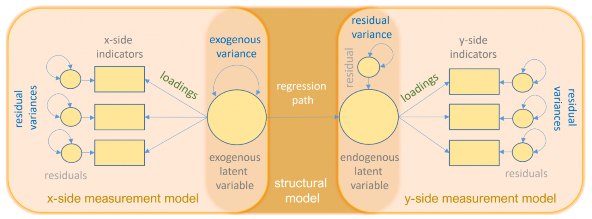
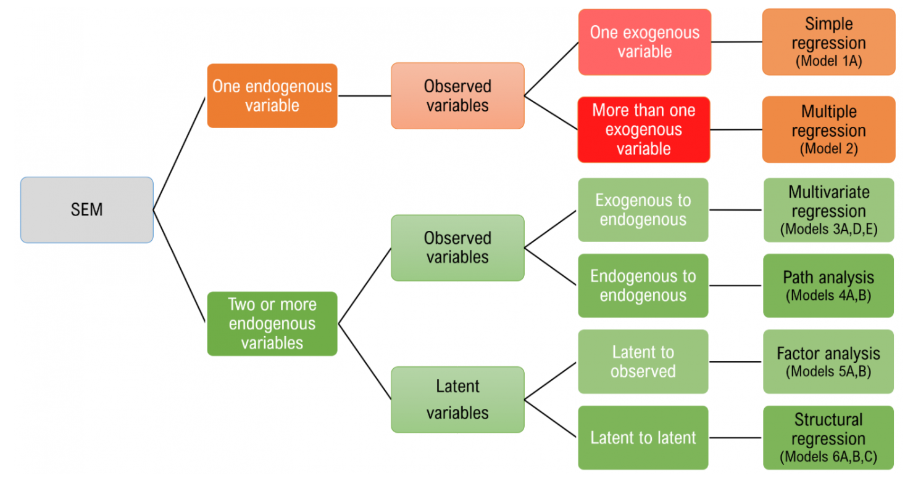
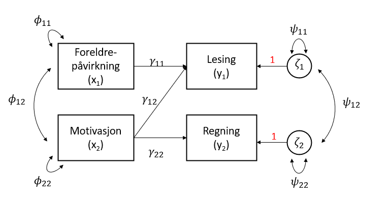
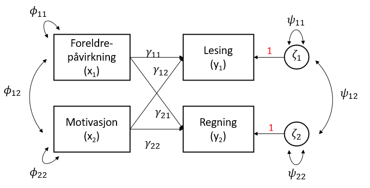
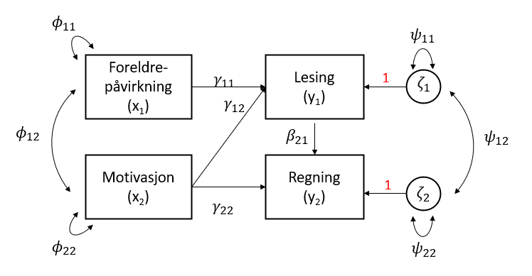
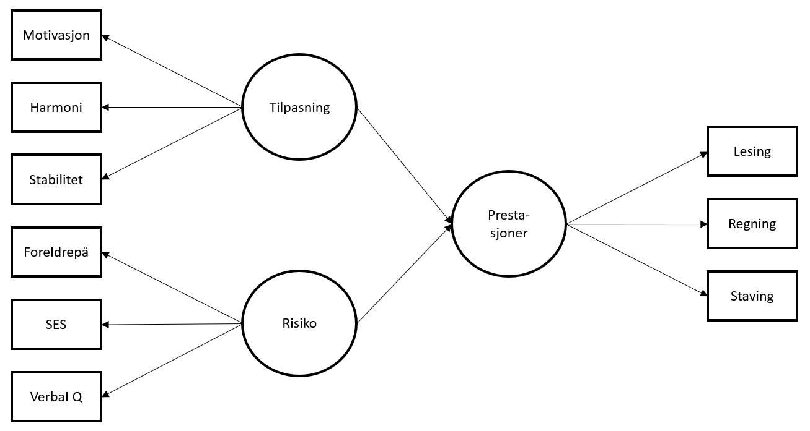
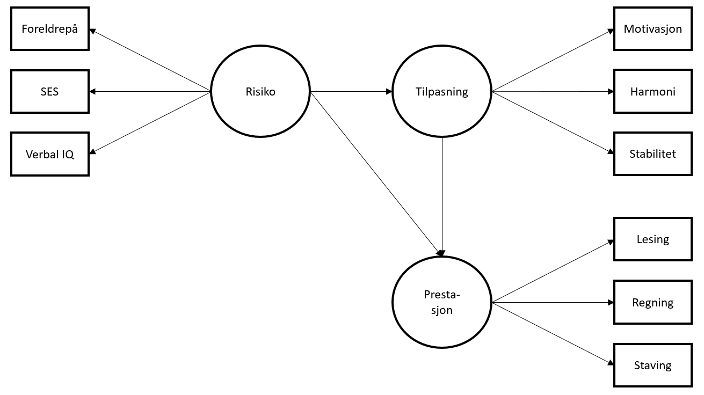

```{r setup, include=FALSE}
knitr::opts_chunk$set(echo = TRUE)
options(scipen=999)
```

```{r}
pacman::p_load(lavaan, lavaanPlot, haven, tidyverse)
```

# Structural Equation Modelling (SEM - Strukturelle Regresjonsmodeller)

SEM-analyse er en lineær metodikk som modellerer regresjonslikninger og latente variabler samtidig. En "vanlig" lineær regresjon (og f.eks. CFA) kan ses på som ulike spesielle tilfeller av SEM. Alle modellene er satt i et overordnet rammeverk - LISREL (LInear Structural RELations) [@joreskogGeneralApproachConfirmatory1969; @joreskogGeneralMethodEstimating1970; @joreskogStructuralAnalysisCovariance1978; @joreskogkarlg.MultivariateAnalysisLISREL2016] (LISREL&copy; er også et [program](https://ssicentral.com/index.php/products/lisrel/) for standard og multilevel modellering av strukturelle regresjonsmodeller).

For en svært nyttig gjennomgang av SEM anbefaler vi @linIntroductionStructuralEquation2021. @linIntroductionStructuralEquation2021 beskriver disse modellene under SEM-paraplyen:

- Enkel lineær regresjon
- Multippel regresjon
- Multivariat regresjon
- Stianalyse ("path analysis")
- Bekreftende faktoranalyse
- Strukturell regresjon

Lineær regresjon behandler forholdet mellom observerte variabler, CFA forholdet mellom latente og observerte variabler, mens strukturell regresjon behandler latent-til-latent variabler. Stianalyse er en form for multippel regresjonsanalyse. 

Det som er særegent for SEM er at det omfatter både forholdet observert-latente variabler ("measurement model") og latent-latent variabler ("structural model"). 

@linIntroductionStructuralEquation2021 illustrerer en typisk SEM-modell slik:

{width=80%}

- Sirkel = Latent variabel
- Firkant = Observert variabel
- Trekant = Intercept
- Rett pil = Sti (startpunkt markerer variabel som predikerer sluttpunkt på pila)
- Buet pil = Varians eller kovarians

Et sentral poeng å huske på er at - på lik linje med bekreftende faktoranalyse CFA - er SEM en "bekreftende metode", altså bør det ligge solid teori i bakgrunnen der vi modellerer for å finne støtte eller ikke for modellen. 

Vi vil også poengtere at SEM-analyse trives best med større datautvalg. @klinePrinciplesPracticeStructural2016 foreskriver at $\frac{n}{q}$ bør være $20:1$, der $q$ er antall parametere i modellen. Altså, hvis antall parametere er 15 bør utvalgsstørrelsen være minst 300.

@linIntroductionStructuralEquation2021 illustrerer modellvalg i SEM på denne måten (referansene til "Model 1A" etc. i illustrasjonen under referer til ulike modeller Lin bygger i sin gjennomgang) ^[se kapittel 1 for definisjon av begreper som eksogene og endogene variabler]:

{width=80%}

Siden vi i foregående kapitler har sett på såvel enkel som multippel regresjon og faktoranalyse vil vi i dette kapittelet bruke Lins eksempel for å belyse multivariat regresjon, stianalyse og strukturell regresjon.

## Datasettet

```{r echo = FALSE, warning = FALSE, message = FALSE, eval = TRUE}
# Bruker pakken: xfun
xfun::embed_file('worland5.csv')
```

Datasettet i eksempelet ser på effektene av studenters bakgrunn på deres akademiske prestasjoner. 

```{r}
semdata <- read.csv("worland5.csv")
glimpse(semdata)
```

Vi ser at datasettet har 500 observasjoner av 9 observerte variabler. Hypotesen er at de 9 observerte variablene utgjør 3 latente variabler: Tilpasning, risiko og prestasjoner på denne måten:

- Tilpasning ("Adjustment")
    - **motiv**: Motivasjon
    - **harm**: Harmoni
    - **stabi**: Stabilitet
- Risiko ("Risk")
    - **ppsych**: (Negativ) foreldrepåvirkning
    - **ses**: SES - Sosioøkonomisk status
    - **verbal**: Verbal IQ
- Prestasjoner:
    - **read**: Lesing
    - **artih**: Regning
    - **spell**: Staving

Vi kan se på kovariansmatrisen:

```{r}
semdatacov <- as.matrix(cov(semdata))
# Bruker pakken: sjPlot
sjPlot::tab_corr(semdatacov, triangle = "lower")
```

En positiv kovarians betyr altså at når f.eks. motivasjon og harmoni er positivt kovariert (77) øker den ene når den andre øker. Og motsatt - når motivasjon og foreldrepåvirkning er negativt kovariert (-25) betyr det at negativ foreldrepåvirkning resulterer i lavere motivasjon.

## Multivariat regresjon

Multivariat regresjon skiller seg fra multippel regresjon ved at vi har flere avhengige variabler (multippel regresjon har flere uavhengige variabler, men kun 1 avhengig variabel). 

I dette eksempelet er vår hypotese at motivasjon predikerer både lesing og regning, mens foreldrepåvirkning kun predikerer lesing (sammen med motivasjon). 



$\gamma_{11}, \gamma_{12}\ og\ \gamma_{22}\ er\ ladningen\ på\ de\ latente\ variablene$
$\phi_{11}\ og \phi_{22}\ er\ variansen\ i\ x_1\ og\ x_2\ (de\ observerte\ variablene\ x_1\ og\ x_2)$
$\phi_{12}\ er\ kovariansen\ mellom\ de\ to\ eksogene\ variablene\ x_1\ og\ x_2$
$\zeta_1\ og\ \zeta_2\ er\ residualene\ til\ de\ to\ latente\ variablene\ y_1\ og\ y_2$
$\psi_{11}\ og\ \psi_{22}\ er\ variansen\ i\ residualene\ til\ de\ latente\ variablene$
$\psi_{12}\ er\ kovariansen\ mellom\ residualene\ til\ de\ latente\ variablene$

```{r}
semmultivregr <- '
    read ~ ppsych + motiv
    arith ~ motiv'
fitsemmultivregr <- sem(semmultivregr, data=semdata)
summary(fitsemmultivregr)
```

I delen "Regressions" over ser vi at forholdet mellom lesing og foreldrepåvirkning er -0.216, og 0.476 mellom lesing og motivasjon. Dvs. for hver enhet økning i foreldrepåvirkning synker lesing med 0.216 når det er kontrollert for påvirkningen fra motivasjon. På samme måte: en enhets økning i motivasjon øker lesing med 0.476 når vi har kontrollert for foreldrepåvirkningen. Vi ser også at regning øker med 0.6 når motivasjon øker med en enhet. 

Vi kan imidlertid tenke oss at foreldrepåvirkning også predikerer regning slik at vi får følgende modell:



Vi får da:

```{r}
semmultivregr2 <- '
    read ~ 1 + ppsych + motiv
    arith ~ 1 + ppsych + motiv'
fitsemmultivregr2 <- sem(semmultivregr2, data=semdata)
summary(fitsemmultivregr2)
```

Vi kan tolke dette på samme måte som første modell.

## Stianalyse

Vi skal bygge videre på den første multivariate regresjonsmodellen over, men nå tenke oss at de endogende variablene påvirker hverandre. Dette kan vi illustrere slik:



Vi ser at vi her har en tilleggshypotese om at lesing predikerer regning.

```{r}
stianalyse <- '
    read ~ 1 + ppsych + motiv
    arith ~ 1 + motiv + read
'
fitstianalyse <- sem(stianalyse, data=semdata)
summary(fitstianalyse)
```

Det vi først og fremst vil kommentere her er at regning predikeres i større grad av lesing enn av motivasjon - en enhets økning i motivasjon gir økning i regning på 0.296, mens tilsvarende en enhets økning i lesing gir økning på 0.573.

Som @linIntroductionStructuralEquation2021 poengterer er modellen "over-saturated" (vi går ikke inn i detaljer rundt det, men vi kan se at antall frihetsgrader er positiv slik at vi i prinsippet kan legge til flere stier - avhengig av hvor mange frihetsgrader som er "tilgjengelig"). Hvis vi ikke har noen sterk hypotese om hvilken sti dette bør være kan man gjennomføre en kjikvadrattest ("modification index") som vil vise hvordna kjikvadratverdien vil endre seg som følge av å inkludere en gitt parameter til i modellen:

```{r}
modindices(fitstianalyse, sort = TRUE)
```

Den klart mest innflytelsesrike parameteren er motiv ~ arith. Forventet endring i regresjonskoeffisienten ("expected parameter change" - epc) er 8.874. 
Vi går ikke videre med revidert modell, og det er verdt å poengtere @linIntroductionStructuralEquation2021 advarsel om forsiktighet i å endre modellen "fordi vi kan". Faren for Type I feil kan stige drastisk. 

Vi skal til slutt se på hvor god modellen er ("fit statistics").

```{r}
summary(fitstianalyse, fit.measures=TRUE)
```

1. CFI - Confirmatory Factor Index: Vil være en verdi mellom 0 og 1. Verdier over 0.9, evt 0.95 for en mer konsvervativ tilnærming, vurderes som bra. Siden vi har 0.994 her indikerer det en god modell.

2. TLI - Tucker Lewis Index: Også verdier mellom 0 og 1, og 0.9 som en foreslått grense for god modell. Vi har 0.971. 

3. RMSEA - Root Mean Square Error of Approximation: @klinePrinciplesPracticeStructural2016 foreslår at verdier under eller lik 0.05 er "close fit", mellom 0.05 og 0.08 er "reasonable fit", mens verdier over 0.08 er "poor fit". Siden vi har 0.088 har vi en "reasonable fit". 

## Strukturell regresjon

### En endogen variabel

Vår hpotese for denne modellen er at de latente eksogene variablene Tilpasning og Risiko hver har 3 indikatorer (jfr. gjennomgang av datasettet i starten av kapittelet). Vi har videre en latent endogen variabel - Prestasjon - med sine tre indikatorer. Begge "sidene" utgjør "measurement models". I tillegg har vi den strukturelle regresjonen der vi hypotetiserer at Tilpasning positivt predikerer Prestasjon, mens Risiko negativt predikerer Prestasjon. Under viser vi under modellen svært forenklet.



```{r}
strukregrsem <- '
adjust =~ motiv + harm + stabi
risk =~ verbal + ppsych + ses
achieve =~ read + arith + spell
achieve ~ adjust + risk
'
fitstrukregrsem <- sem(strukregrsem, data=semdata)
summary(fitstrukregrsem, standardized=TRUE, fit.measures=TRUE)
```

Vi kan også vise modellen grafisk. I illustrasjonen under har vi spesifisert at vi kun ønsker signifikante stier (< 0.05).

```{r}
lavaanPlot(model = fitstrukregrsem, node_options = list(shape = "box", fontname = "Helvetica"), edge_options = list(color = "grey"), coefs = TRUE, sig = .05)
```

### To endogene variabler

En annen mulig hypotese er denne:



Risiko predikerer i denne modellen Tilpasning, og at den endogene variabelen Tilpasning og den eksogene variabelen Risiko predikerer den endogene variabelen Prestasjon.

```{r}
strukregrsem2 <- '
adjust =~ motiv + harm + stabi
risk =~ verbal + ses + ppsych
achieve =~ read + arith + spell
adjust ~ risk 
achieve ~ adjust + risk
'
fitstrukregrsem2 <- sem(strukregrsem2, data=semdata)
summary(fitstrukregrsem2, standardized=TRUE, fit.measures=TRUE)
```

```{r}
lavaanPlot(model = fitstrukregrsem2, node_options = list(shape = "box", fontname = "Helvetica"), edge_options = list(color = "grey"), coefs = TRUE, sig = .05)
```

