# Dimension reduction: Factor Analysis (FA) og Principal Component Analysis (PCA)

R-pakker brukt i dette kapittelet:

```{r}
pacman::p_load(readxl, car, rgl, flextable, plotly, latex2exp, ggfortify, gridExtra, factoextra, corrplot, Directional, tidyverse, palmerpenguins, psych, paran, kableExtra, multiUS, xtable, GPArotation, EFAtools, nFactors, rstatix, calibrate, Matrix, summarytools, lavaan, lavaanPlot, haven, skimr, psycho, semPlot, gridExtra, kfa, multiUS, ggpubr, sjPlot)
```

## Innledning

"En faktoranalyse er en analyseteknikk som brukes for å forstå korrelasjonsstrukturen i et sett av observerte variabler" [@bjerkanFaktoranalyse2007b, s.221]. I følge @mehmetogluInnforingStatistiskeDataanalyser2020 brukes disse statistiske teknikkene i praksis som metoder som reduserer et større antall variabler til et mindre antall variabler uten å miste vesentlig informasjon om dataene i prosessen. De omtales derfor ofte som datareduksjonsteknikker ("data reduction" eller "dimension reduction"). Ofte vil vi bruke faktoranalyse for å kunne si noe om såkalte latente (eller skjulte) variabler i samfunnsvitenskapene -  forhold vi ikke kan måle direkte, men som vi kan uttrykke gjennom å måle/observere en rekke andre forhold/variabler som vi så "samler" i en konstruert variabel gjennom nettopp faktoranalyse. Målet med faktoranalysen er da i følge @tinsleyUsesFactorAnalysis1987 "to achieve parsimony by using the smallest number of explanatory concepts to explain the maximum amount of common variance in a correlation matrix" (s.414). Det vi ønsker å finne er variabler som er korrelerte med hverandre, men relativt ukorrelerte med andre grupper/subset av variabler (som igjen er interkorrelerte i egen gruppe/subset) [@tabachnikUsingMultivariateStatistics2007]. Den grunnleggende utfordringen er at vi ønsker å representere et stort antall variabler på en enklere måte, men hvis vi velger for få faktorer mister vi informasjon (noe som går ut over påliteligheten) og hvis vi velger for mange kan vi ende opp med en modell som er komplisert og vanskelig å tolke. 

Innledningsvis er det nødvendig å gjøre en grunnleggende begrepsavklaring rundt begrepet faktoranalyse da det i mange sammenhenger framstår som om begreper blandes sammen og det kan være uklart hva man egentlig snakker om. Begrepene faktoranalyse og komponentanalyse ("Factor Analysis" - FA - og "Principal Component Analysis" - PCA) brukes ofte om hverandre og noen ganger er det uklart hva som er hva (eller i hvert fall hva forfatteren mener). En klargjørende framstilling kan man f.eks. finne i @joreskogkarlg.MultivariateAnalysisLISREL2016. Vi vil i det følgende skille mellom faktoranalyse (EFA og CFA), og komponentanalyse (PCA).

Felles for begge er:

* de er metoder for datareduksjon
* de brukes for å uttrykke multivariate data gjennom færre dimensjoner enn det opprinnelige datasettet
* de er metodikker for å identifisere mønstre i korrelasjonen mellom variabler. 

En grunnleggende forskjell er at PCA er en deskriptiv teknikk mens faktoranalyse er modelleringsteknikker [@unkelSimultaneousParameterEstimation2010]. PCA blir dermed "en empirisk oppsummering av datamaterialet" [@bjerkanFaktoranalyse2007b, s.225].
Strengt tatt er ikke PCA en faktoranalyse, men omtales (dessverre noe forvirrende) som sagt ofte som en faktoranalyse. I SPSS heter f.eks. menypunktet «Data reduction» og man velger «Factor» i neste valg hvilket innebærer en EFA. SPSS er begrenset til EFA, og man trenger AMOS i SPSS som strengt tatt er et SEM-program (SEM = Structural Equation Modelling - en relatert metodikk til CFA som vi behandler i et annet kapittel).

Grafisk kan forskjellene vises slik:

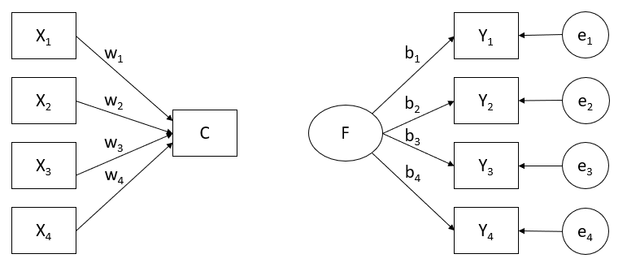{width=90%}

I venstre del (PCA) kombineres fire målte variabler ($X_1...X_4$) til en komponent ($C$). Pilene indikerer at det er variablene som bidrar til å skape komponenten, og de kan gjøre det med ulike styrke (vekt), som er vist med $w_1...w_4$. Variablene $X_1...X_4$ utgjør altså ulike størrelser på bidraget til komponenten $C$. 

I figurens høyre del ser vi en faktor $F$ som skaper de fire målte variablene ($Y_1...Y_4$). Dette vises ved at pilene går fra $F$ til $Y_1...Y_4$. $F$ kan typisk være en latent variabel vi ikke kan observere direkte - som f.eks. intelligens eller angst. Også her er det ulike vekter, så $F$ kan påvirke $Y_1...Y_4$ med ulik styrke. I tillegg har vi her et feilledd ($e_1...e_4$). $e_1$ representerer f.eks. den delen av variansen i $Y_1$ som ikke forklares av $F$. Vi kan uttrykke sammenhengen for en enkelt varaibel som $Y_1$ som en regresjonslikning: $Y_1 = b_1*F + e_1$ (og tilsvarende for $Y_2...Y_4$).  

Som illustrert i figuren under består variansen til variabelen X av tre deler: felles varians med andre variabler, unik varians for selve variabel X og målefeil. PCA søker å forklare all varians for variabel X som en komponent (derav komponentanalyse), mens faktoranalyse kun søker å forklare den delen av den totale variansen som er felles (eller med andre ord: korrelasjonen mellom variablene).   

{width=90%}

Matematisk er forskjellen mellom faktoranalyse og PCA altså hvordan varians blir analysert – i PCA blir all varians analysert, i faktoranalyse blir kun delt varians («shared variance») analysert. Eller med andre ord: PCA analyserer all varians (felles varians, unik varians og målefeil), FA analyserer kovarians (variabelens felles varians med andre variabler).

Teoretisk er forskjellen mellom de to at i FA ses faktoren som årsaker til variabelen, mens i PCA ses variablene som årsaken til komponentene; i PCA er det ingen teoretisk forventning om hvilke variabler som forbindes med hvilke komponenter – det er kun empirisk assosiert [@tabachnikUsingMultivariateStatistics2007].

En annen måte å illustrere forskjellen mellom PCA og EFA er gitt av @bastosExploratoryFactorAnalysis2021. 

{width=60%}

I figuren over representerer A'ene spesifikk varians, B'en felles varians og C'ene feilvarians (jfr. figuren fra @bjerkanFaktoranalyse2007b lenger opp). Mens vi i PCA vil bruke all varians (A, B og C) bruker vi kun B i EFA. 

Praktisk er det imidlertid ikke helt trivielt å avgjøre om man skal bruke PCA eller EFA. @guadagnoliRelationSampleSize1988 konkluderer også i en litteraturundersøkelse med at resultatene fra PCA i stor grad er like som resultatene fra faktoranalyse. Med minst 30 variabler vil løsningene være mer eller mindre like, men med under 20 variabler kan forskjeller inntreffe [@stevensAppliedMultivariateStatistics2002]. Som @fieldDiscoveringStatisticsUsing2009 oppsummerer: "However, to a non-statistician the difference between a principal component and a factor may be difficult to conceptualize (they are both linear models), and the difference arises largely from the calculation" (s.760).

## Principal Component Analysis (PCA)

@tabachnikUsingMultivariateStatistics2007 foreslår at dersom du ønsker en «empirisk oppsummering» av datasettet og redusere et større antall variabler til et mindre antall komponenter er PCA riktig valg. I en PCA transformeres et antall korrelerte variabler til et mindre antall «principal components». 

### PCA gjennom et lite eksempel

La oss se på hva PCA er. Vi tar utgangspunkt i et lite, kontruert datasett der vi har registrert karakterer i ulike fag på 10 studenter. Dette eksempelet er modifisert fra @starmerStatQuestPrincipalComponent2018, med innslag fra @pittardPrincipalComponentsAnalysis2012.

```{r}
karakterer <- tibble(studentnr = 1:10, 
                     matte = c(79, 76, 78, 75, 42, 45, 41, 46, 50, 49))
kartabell1 <- flextable(karakterer)
kartabell1 <- autofit(kartabell1)
kartabell1
```

Vi kan plotte den ene variabelen - matte. 

```{r fig.cap = "Karakterer for variabelen 'matte'"}
ggplot(karakterer, aes(x = studentnr, y = matte)) + 
    geom_point() +
    theme_bw()
```

Vi kan se at studentgruppen deler seg i to klare grupper, en gruppe med høy score og en gruppe med lavere score. Studentene i gruppa med høy score likner mer på hverandre enn på studenter i den andre gruppa, og motsatt.

Hvis vi legger til en variabel - f.eks. engelskkarakterer - får vi denne tabellen:

```{r}
engelsk <- c(79, 68, 71, 70, 53, 55, 62, 60, 64, 49)
karakterer <- karakterer %>%
    mutate(engelsk = engelsk)
kartabell2 <- flextable(karakterer)
kartabell2 <- autofit(kartabell2)
kartabell2
```

Som vi også kan plotte:

```{r fig.cap = "Karakterer for variablene 'matte' og 'engelsk'"}
ggplot(karakterer, aes(x = matte, y = engelsk)) + 
    geom_point() +
    theme_bw()
```

Vi kan nå si vi har to dimensjoner for hver student: den første dimensjonen - x-aksen - inneholder mattekarakterer, den andre dimensjonen - y-aksen - inneholder engelskkarakterer. Vi kan se også med to dimensjoner at det er to tydelige clustere. 

Så kan vi legge til nok en karakter - denne gangen norsk. 

```{r}
norsk <- c(67, 68, 69, 66, 48, 46, 47, 50, 51, 49)
karakterer <- karakterer %>%
    mutate(norsk = norsk)
kartabell3 <- flextable(karakterer)
kartabell3 <- autofit(kartabell3)
kartabell3
```

Med tre dimensjoner må vi ha tre akser i plottet: 

```{r fig.cap = "Karakterer for variablene 'matte', 'engelsk' og 'norsk'"}
fig <- plot_ly(karakterer, x = karakterer$matte, y = karakterer$norsk, z = karakterer$engelsk) %>%
    add_markers() %>%
    layout(scene = list(xaxis = list(title = "Matte"),
                        yaxis = list(title = "Norsk"),
                        zaxis = list(title = "Engelsk")))
fig
```

Hvis vi nå legger til fysikkarakterer i tillegg kan vi ikke lenger plotte dette siden det vil kreve fire dimensjoner. PCA stepper inn og lager et 2D plott av flere dimensjoner. PCA vil også kunne si oss noe om hvilken av karakterene (= hvilken av variablene) som er viktigst for å skape klyngene/grupperingene av studenter. 

#### Sentrering

Vi går tilbake til datasettet med to karakterer (dimensjoner).

```{r  fig.cap = "Karakterer for variablene 'matte' og 'engelsk'"}
kartabell2
ggplot(karakterer, aes(x = matte, y = engelsk)) + 
    geom_point() +
    theme_bw()
```

Vi regner så ut gjennomsnittet for de to variablene matte og engelsk: 

```{r echo = FALSE, eval = TRUE}
colMeans(karakterer[2:3])
```

Vi bruker disse gjennomsnittsverdiene til å kalkulere senterpunktet (x = 58.1, y = 63.1) som vi deretter - ved å beholde de innbyrdes avstandene i x- og y-planet mellom datapunktene - sentrerer alle observasjonene rundt. 

```{r fig.cap = "Plott for matte og engelsk sentrert på (0,0)"}
center_scale <- function(x) {
    scale(x, scale = FALSE)
}
sentrert <- as_tibble(center_scale(karakterer)) 
sentrertplott <- ggplot(sentrert, aes(x = matte, y = engelsk)) + 
    geom_point() +
    geom_hline(yintercept = 0, linetype = "dashed") +
    geom_vline(xintercept = 0, linetype = "dashed") +
    theme_bw()
sentrertplott
```

Vi ser at datapunktene ligger nøyaktig likt i forhold til hverandre, men senterpunktet er nå (0, 0). Neste steg er å lage en regresjonslinje som passer best mulig til dataene. Vi begynner med å legge på en hvilken som helst linje som går gjennom (0, 0) og deretter roterer vi linja med (0, 0) som pivoteringspunkt til man finner linja som passer best (i dette tilfellet den røde stiplede linja):

```{r fig.cap = "Eksempler på mulige linjer som pivoterer i (0,0)"}
sentrertplott2 <- sentrertplott +
    geom_abline(intercept = 0, slope = 5.0, col = "blue", linetype = "dashed") +
    geom_abline(intercept = 0, slope = 3.0, col = "blue", linetype = "dashed") +
    geom_abline(intercept = 0, slope = 2.0, col = "blue", linetype = "dashed") +
    geom_abline(intercept = 0, slope = 1.5, col = "blue", linetype = "dashed") +
    geom_abline(intercept = 0, slope = 1.0, col = "blue", linetype = "dashed") +
    geom_abline(intercept = 0, slope = 0.75, col = "blue", linetype = "dashed") +    
    geom_abline(intercept = 0, slope = 0.5, col = "red", linetype = "dashed")
sentrertplott2
```

Og hvordan vet PCA hvilken linje som passer best? For å se på det skal vi ta en liten omveg ut av eksempelet vårt. 

#### Forskjell i utregning av avvik - OLS og PCA

Med utgangspunkt i @longPrincipalComponentAnalysis2010 kan vi illustrere den prinsippielle forskjellen i hvordan hhv. OLS (lineær regresjon) og PCA kalkulerer beste tilpasning.

I en OLS (jfr. teori i kapittel om regresjonsanalyse) vil man søke å finne beste tilpasning:

```{r warning = FALSE, message = FALSE, fig.cap = "OLS x ~ y"}
set.seed(2)
x <- 1:100
y <- 20 + 3 * x
e <- rnorm(100, 0, 60)
y <- 20 + 3 * x + e
data <- tibble(x, y)
ggplot(data, aes(x, y)) +
    geom_point() +
    geom_smooth(method = "lm", se = FALSE) +
    geom_segment(aes(x = 61, y = 98, xend = 61, yend = 195),
                 arrow = arrow(length = unit(0.5, "cm")), col = "orange", size = 1.5) +
    geom_segment(aes(x = 78, y = 298, xend = 78, yend = 247),
                 arrow = arrow(length = unit(0.5, "cm")), col = "orange", size = 1.5) +
    theme_bw()
```

OLS forsøker å minimere feilleddet mellom den avhengige variabelen og modellen ved å regne på alle avstandene (og kvadrere dem) mellom datapunktene og modellen. I grafen over er dette illustrert med oransje strek for to av datapunktene. Dette er grundigere gjennomgått i kapittelet om regresjon. 

Hvis vi bytter om på den avhengige og uavhengige variabelen ser det i OLS slik ut for to av datapunktene:

```{r warning = FALSE, message = FALSE, fig.cap = "OLS y ~ x"}
ggplot(data, aes(y, x)) +
    geom_point() +
    geom_smooth(method = "lm", se = FALSE) +
    geom_segment(aes(x = 190, y = 45, xend = 145, yend = 45),
                 arrow = arrow(length = unit(0.5, "cm")), col = "orange", size = 1.5) +
    geom_segment(aes(x = 173, y = 57, xend = 200, yend = 57),
                 arrow = arrow(length = unit(0.5, "cm")), col = "orange", size = 1.5) +
    theme_bw()
```

OLS forsøker alltid minimere y-avstanden (feilleddet = $y-\hat{y}$). PCA vil minimere feilleddet ortogonalt (90$^\circ$ på modellen):

```{r warning = FALSE, message = FALSE, fig.cap = "Ortogonale avstander i PCA"}
ggplot(data, aes(x, y)) +
    geom_point() +
    geom_smooth(method = "lm", se = FALSE)  +
    geom_segment(aes(x = 54, y = 255, xend = 58, yend = 190),
                 arrow = arrow(length = unit(0.5, "cm")), col = "orange", size = 1.5) +
    geom_segment(aes(x = 42, y = 32, xend = 36, yend = 132),
                 arrow = arrow(length = unit(0.5, "cm")), col = "orange", size = 1.5) +
    theme_bw()
```

PCA vil rotere modellen ("regresjonslinja") rundt et senterpunkt og hele tiden kalkulere summen av de **ortogonale** feilleddene. Når du har en litt større mengde uavhengige variabler vil PCA gi deg hvilke lineære kombinasjoner som teller mest. Hvis vi går tilbake til denne:

```{r warning = FALSE, message = FALSE, fig.cap = "OLS y ~ x"}
sentrertplott2
```

Merk at alle linjene må gå gjennom pivoteringspunktet (0,0). Vi kan tenke oss alle punktene som ankere som har en fjør festet til den vilkårlige linja. Alle punktene vil forsøke å dra linja til seg slik at den snurrer rundt (0,0) og gir minst mulig lengde på fjæra. Det vil imidlertid føre til at andre punkters fjærer strekker seg, og disse fjærene vil forsøke å dra seg sammen slik fjærer gjør når de strekkes. Til slutt når man et slags ekvilibrium der alle fjærene til sammen er i optimal lengde (det er umulig å strekke en fjær uten at flere fjærer til sammen skaper "ubalanse"). Dette er i prinsippet hva PCA gjør for å finne beste linje. Litt lenger ned går vi igjennom dette litt mer i detalj.

Å gå i dybden på den matematiske utregningen av *eigenvalues* og *eigenvectors* er på grensen av dybdekunnskap i et notat med tittel "Anvendt..." i seg, og trolig kan man leve godt uten denne dybdekunnskapen. En anbefalt kilde for å gå i dybden kan være @smithTutorialPrincipalComponents2002. Likevel vil vi skissere under hvordan dette gjøres i det enkle eksempelet.  

### PCA gjennom et lite eksempel - del 2

Vi tar utgangspunkt i eksempelet der vi hadde to variabler:

```{r}
kartabell2
```

Vi legger på en tilfeldig linje som går gjennom (0, 0) på de sentrerte dataene.

```{r fig.cap = "Tilnærming til maksimering av 'c'"}
sentrertplott3 <- sentrertplott +
    geom_abline(intercept = 0, slope = 1, col = "blue", linetype = "dashed") +
    geom_segment(aes(x = 0, y = 0, xend = 16.9, yend = 6.9), color = "orange") +
    geom_segment(aes(x = 16.9, y = 6.9, xend = 12.4, yend = 12.3), color = "orange") +
    geom_text(x = 10, y = 3, label = "a") +
    geom_text(x = 16, y = 10, label = "b") +
    geom_text(x = 8, y = 10, label = "c")
sentrertplott3
```

Ettersom vi roterer linja vil avstanden $a$ ikke forandre seg. Lengden på både $b$ og $c$ vil imidlertid endre seg relativt til hverandre. Når $b$ blir lengre, blir $c$ kortere og motsatt. I samme tanke som OLS-regresjon (se ovenfor) ønsker vi at $b$ skal være så kort som mulig da det betyr at linja ligger så nærme datapunktet som mulig. For å få $b$ så kort som mulig jobber imidlertid PCA for å maksimere $c$ (det har samme effekt: når $c$ er på sitt maksimale er $b$ på sitt minimale). PCA finner altså den beste linja ved å maksimere den kvadrerte avstanden $c$ (kvadrert pga. Pythagoras... $a^2 + b^2 = c^2$). 

PCA summerer da $c^2$ for alle de 10 punktene i dette eksempelet. Siden verdiene er kvadrerte slipper vi også problemet med at positive og negative verdier nuller hverandre ut (som for OLS - Ordinary Least *Squares* selv om vi her ikke regner squares men avstand). Summen = sum of squared distances  **SS(distances)**. 

```{r warning = FALSE, message = FALSE, fig.cap = "SS(Distances)"}
sentrertplott4 <- sentrertplott3 +
    geom_text(x = 10, y = -8, label = TeX('$\\c_{1}^2$ ... $\\c_{10}^2$ = SS(distances)'))  
sentrertplott4
```

#### Identifikasjon av Principal Component 1 (PC1), eigenvectors og loading scores

PCA roterer som sagt på linja pivotert i (0, 0) og til slutt finner den linja som maksimaliserer SS(Distances). Denne linja kalles **Principal Component 1 (PC1)**. 

```{r}
lmkarakterer <- lm(engelsk ~ matte, data = sentrert)
model_summary <- summary(lmkarakterer)
stigningstall <- model_summary$coefficients[2,1]
stigningstall
```

PC1 har et stigningstall på `r stigningstall`. Det betyr at en økning på 1 i x (matte) gir en økning på 0.46 i y (engelsk). Det betyr at matte har større innvirkning på grupperingen av studentene enn engelsk. 

```{r warning = FALSE, message = FALSE, fig.cap = "Pythagoras på veg mot eigenvalue og eigenvector for PC1"}
sentrertplott4 <- sentrertplott +
    geom_smooth(method = "lm", se = FALSE) +
    geom_segment(aes(x = 0, y = 0, xend = 17.9, yend = 4.9), color = "orange") +
    geom_segment(aes(x = 17.9, y = 4.9, xend = 16.75, yend = 7.8), color = "orange") +
    geom_text(x = 3, y = 3, label = "PC1", angle = 23, color = "blue") +
    geom_text(x = 9.8, y = 2, label = "a") +
    geom_text(x = 18.5, y = 7, label = "b") +
    geom_text(x = 10, y = 6.5, label = "c") +
    geom_text(x = 11, y = -1.5, label = "Pythagoras gir: a = 1, b = 0.46, c = 1.1", size = 5)
sentrertplott4    
```
  
I PCA skaleres $c$ alltid til 1. Matematisk gjør vi det ved å dele hver side av Pythagoras med $c$ (her 1.1). 

```{r warning = FALSE, message = FALSE, fig.cap = "Eigenvalue og eigenvector for PC1"}
sentrertplott5 <- sentrertplott4 +
    geom_text(x = 11, y = -1.5, label = "Pythagoras gir: a = 1, b = 0.46, c = 1.1", size = 5) +
    geom_text(x = 11, y = -4.0, label = "PCA-skalerte verdier: a = 0.91, b = 0.42, c = 1", size = 5) +
    geom_text(x = 11, y = -6.5, label = "SS(Distances) = Eigenvalue for PC1", size = 5)  
sentrertplott5
```

Disse verdiene (0.91 og 0.42) kalles sammen **Eigenvector** for PC1, og de to verdiene kalles gjerne **Loading Scores**. Som vist i grafen over er $SS(Distances) = Eigenvalue for PC1$. Eigenvalue er et begrep vi kommer tilbake til i PCA når vi skal velge ut hvor mange komponenter vi skal beholde. 

Det neste vi kan se på da er Principal Component 2 (PC2). PC2 er linja som går vinkelrett på PC1 og gjennom (0, 0). PC2 er altså linja som reflekterer den nest største kilden til variasjon i dataene, men som er ortogonal (vinkelrett) på PC1. Dette betyr at eigenvectoren er "snudd" og blir -0.42 og -0.91 (som altså er loading scores for PC2).

```{r warning = FALSE, message = FALSE, fig.cap = "Sentrert plott for PC1 og PC2"}
sentrertplott6 <- sentrertplott +
    geom_smooth(method = "lm", se = FALSE) +
    geom_text(x = 3, y = 3, label = "PC1", angle = 23, color = "blue") +
    geom_abline(intercept = 0, slope = -2.5, col = "red", size = 1.25) +
    geom_text(x = -4, y = 5, label = "PC2", angle = 23, color = "red")
sentrertplott6
```

For å få fram det endelige PCA-plottet roteres løsningen slik at PC1 utgjør x-aksen og PC2 y-aksen.

```{r warning = FALSE, message = FALSE, fig.cap = "Rotert PCA-plott"}
karaktererX2 <- within(karakterer, rm(studentnr, norsk))
# Skalerer data
standardize <- function(x) {(x - mean(x))}
skalert_karaktererX2 <- apply(karaktererX2,2,function(x) (x-mean(x)))
# Finner Eigenvalues fra kovariansematrisen
my.cov <- cov(skalert_karaktererX2)
my.eigen <- eigen(my.cov)
rownames(my.eigen$vectors) <- c("matte","engelsk")
colnames(my.eigen$vectors) <- c("PC1","PC")
# Sum Eigenvalues = den totale variansen i dataene
sum(my.eigen$values)
var(skalert_karaktererX2[,1]) + var(skalert_karaktererX2[,2])
# Finner Eigenvalues fra kovariansematrisen
my.cov <- cov(skalert_karaktererX2)
my.eigen <- eigen(my.cov)
rownames(my.eigen$vectors) <- c("matte","engelsk")
colnames(my.eigen$vectors) <- c("PC1","PC")
# Sum Eigenvalues = den totale variansen i dataene
sum(my.eigen$values)
var(skalert_karaktererX2[,1]) + var(skalert_karaktererX2[,2])
# Eigenvektorene er principal components.
loadings <- my.eigen$vectors
pc1.slope <- my.eigen$vectors[1,1]/my.eigen$vectors[2,1]
pc2.slope <- my.eigen$vectors[1,2]/my.eigen$vectors[2,2]
sentrert2 <- as_tibble(center_scale(skalert_karaktererX2)) 

sentrertplott7 <- ggplot(sentrert2, aes(x = matte, y = engelsk)) + 
    geom_point() +
    geom_abline(intercept = 0, slope = pc1.slope, color = "blue") +
    geom_abline(intercept = 0, slope = pc2.slope, color = "red") +  
    geom_text(x = 8, y = 10, label = "(-0.710,-0.695)", color = "blue") +   
    geom_text(x = -12, y = 10, label = "(0.695,-0.719)", color = "red") +       
    theme_bw()
sentrertplott7
```

```{r}
# Hvor mye varians foklarer hver eigenvector
pc1.var <- 100*round(my.eigen$values[1]/sum(my.eigen$values),digits=2)
pc2.var <- 100*round(my.eigen$values[2]/sum(my.eigen$values),digits=2)
pcvarians <- tibble(pc1.var, pc2.var)
pcvarians
```

Vi kan se at PC1 forklarere `r pcvarians[1,1]`% og PC2 forklarer `r pcvarians[1,2]`%.

Punktene plottes deretter på det roterte diagrammet. Til dette brukes trigonometri. La oss se på et enkelt eksempel for ett punkt - dette gjør vi selvsagt ikke manuelt. 

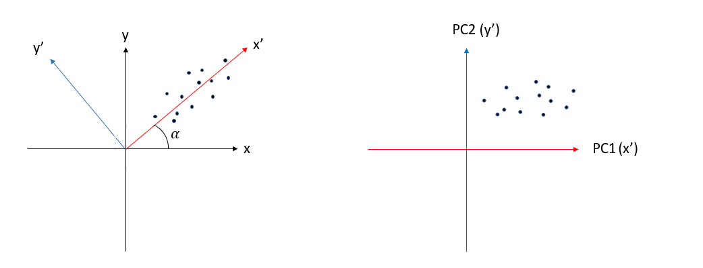{width=90%}

Vi har det opprinnelige plottet i et koordinatsystem og har funnet PC1 og PC2, og snur først aksene. Så må datapunktene posisjoneres etter de roterte aksene. La oss vise med ett punkt (1,0) - altså punktet 1 på x-aksen, 0 på y-aksen.

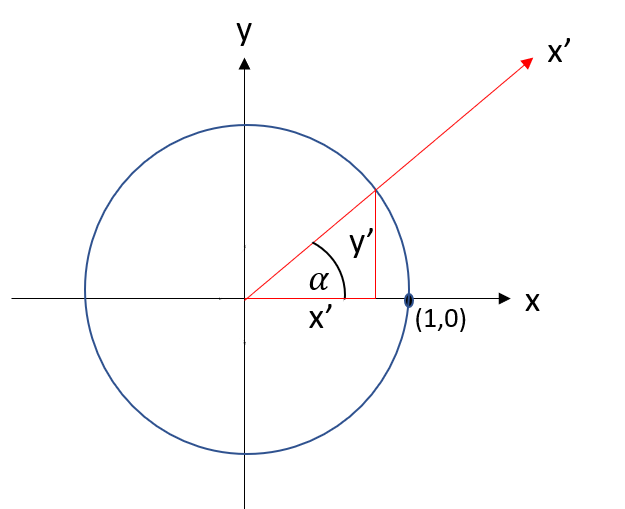{width=50%}

Punkt (1,0) blir da - forutsatt $\alpha=30$:

$y'= sin(\alpha) = 0.5$

$x'= cos(\alpha) = 0.9$

(1,0) blir da rotert (0.5, 0.9). Slik gjør man for alle datapunkter. 

{width=50%}

#### Litt mer i detalj om rotasjon

Det vi har gjort ovenfor med et lite eksempel kjøres på hele datasettet i det verktøyet vi bruker (R, Stata, SPSS, osv.). Needless to say - det er greit å ha maskiner og programvare som gjør dette for oss...

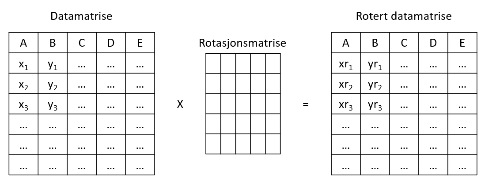{width=50%}

Med utgangspunkt i en datamatrise roteres dataene i en gitt vinkel gjennom en rotasjonsmatrise til et ny datamatrise (PC1). Denne kan igjen roteres på samme måte til PC2. 

Vi kan se på komponentene:

```{r}
ut1 <- princomp(karaktererX2, cor = T)
summary(ut1)
```

Og matrisen etter en rotasjon som vi kan plotte (som vi kjenner igjen fra litt lenger oppe):

```{r}
utdata <- ut1$score
utdata
```

#### Utvelgelse av antall komponenter

Et sentralt element i PCA er valg av antall komponenter man vil beholde. Dette kan vi gjøre gjennom variansen for komponentnen (her: PC1 og PC2). Her kommer vi tilbake til begrepet *eigenvalues* som vi definerte lenger opp. Vi kan se på eigenvalue for en PC som hvor mange variabler som representeres av den respektive PC. Eigenvalues forholder seg til forklart varians slik: 

$Forklart\ varians = \frac{Eigenvalue}{antall\ opprinnelige\ variabler}$

Dette kan også uttrykkes slik:

$\frac{SS(Distances for PC1)}{n - 1} = Varians for PC1$

$\frac{SS(Distances for PC2)}{n - 1} = Varians for PC2$

Et viktig poeng er at en PCA ikke reduserer antall variabler i seg selv. Hvis du opprinnelig har 13 variabler vil du få 13 PC, men spørsmålet er hvor mange du faktisk trenger å se på for å forklare variansen (hvilket du ønsker skal være færre enn det opprinnelige antall variabler). Og det er her vi kommer fram til hele poenget med PCA: Hvor mange komponenter skal vi beholde?

For å vise ulike metoder for å vurdere antall komponenter som bør beholdes bruker vi et datasett med flere variabler enn vårt eksempel ovenfor, modifisert fra @datavizHowMakeScree2020) - vi går ikke inn på hva dataene er. 

```{r}
penguins_data <- penguins[,c("bill_length_mm", "bill_depth_mm", "flipper_length_mm", "body_mass_g", "year")]
penguins_data <- na.omit(penguins_data)
```

##### Kaisers kriterium

@kaiserApplicationElectronicComputers1960 kriterium baserer seg på å beholde alle komponenter med eigenvalue på over 1,0. Enhver komponent med eigenvalue over 1 forklarer mer varianse enn en enkeltvariabel. Med andre ord – ut fra denne måten å vurdere ønsker vi ikke å beholde komponenter som forklarer mindre varians enn enkeltvariabler. Det er generelt anbefalt at man ikke bruker Kaisers kriterium alene da metoden har en tendens til å overvurdere antallet komponenter. Samtidig hevdes det at det er umulig å tillegge en komponent med verdi 1,01 som viktig og en annen med verdi 0,99 som uviktig [@fabrigarEvaluatingUseExploratory1999].

```{r}
pca_obj <- prcomp(drop_na(penguins_data), scale. = TRUE)
pca_obj_eigen <- ((pca_obj$sdev)^2)
pca_obj_eigen
```

Ut fra dette bør vi beholde 1 komponent, men vi ser at komponent 2 er svært nærme 1. 

##### Scree plott

Et hjelpemiddel i dette er **scree plot** [@cattellScreeTestNumber1966]. Et Scree Plot er en grafisk framstilling av komponentene langs x-aksen og de korresponderende eigenvalues på y-aksen. Et scree plot viser hvor stor del av variansen variabelen forklarer rundt f.eks. PC1.

Når vi vurderer Scree Plot ønsker vi å identifisere knekkpunktet (også kalt «albuen»). 

La oss forutsette at variansen for PC1 = 13 og for PC2 = 4. Dvs. at den totale variansen = 17. Videre beytr det at PC1 forklarer $\frac{13}{17}=0.765$ - altså 76.5% av den totale variansen. PC2 forklarer på sin side $\frac{4}{17}=0.235$. Et scree plot er en grafisk framstilling av denne variansen. 

I vårt eksempel kan vi dermed fremstille dette scree plottet:   

```{r fig.cap = "Scree plott"}
var_explained_df <- tibble(PC = paste0("PC",1:5), var_explained=(pca_obj$sdev)^2/sum((pca_obj$sdev)^2))
var_explained_df %>%
    ggplot(aes(x = PC, y = var_explained, group = 1))+
    geom_point(size = 4)+
    geom_line() +
    theme_bw()
summary(pca_obj)
```

@cattellScreeTestNumber1966 beskriver framgangsmåten som at man finner albuen og dropper alle komponenter etter komponenten som starter albuen (eller sagt på en annen måte: vi beholder alle komponentene over knekkpunktet). I vårt tilfelle indikerer det at vi beholder 1 komponent. I vårt scree plott er det et tydelig knekkpunkt, men i mange tilfeller er det ikke så tydelig, og det kan være vanskelig å identifisere «det rette» knekkpunktet. 

En alternativ, og ofte brukt metode for å illlustrere et scree plot på, er å kombinere det med et histogram (eksempel fra @szczesnaPrincipalComponentAnalysis2022).

```{r fig.cap = "Scree plott og histogram"}
fviz_eig(pca_obj)
```

##### Parallell analyse

Parallell anlayse (PA) [@hornRationaleTestNumber1965] sammenlikner korrelasjonsmatrisen fra våre data med tilfeldig genererte korrelasjonsmatriser med samme antall variabler og observasjoner, for å sammenlikne eigenvalues for de genererte med den observerte. I eksempelet under ber vi om 5000 tilfeldige korrelasjonsmatriser.  

```{r}
paran(penguins_data, iterations=5000)
```

### Eksempel PCA

En anvendelse av PCA kan være at vi ønsker å se på den underliggende strukturen for en skalavariabel. Her skal vi bruke Pallants datasett som vi også brukte i deler av kapittelet om regresjonsanalyse som du finner [her](https://www.mheducation.co.uk/data-files). For PCA-eksempelet skal vi se på en av skalaene - PANAS - og har modifisert datasettet til å kun inneholde spørsmålene knyttet til denne skalaen.

```{r echo = FALSE, warning = FALSE, message = FALSE, eval = TRUE}
xfun::embed_file('Pallant_survey_PANAS.xlsx')
```

```{r echo = FALSE, warning = FALSE, message = FALSE, eval = TRUE}
xfun::embed_file('Pallant_survey_PANAS.sav')
```

```{r echo = FALSE, warning = FALSE, message = FALSE, eval = TRUE}
xfun::embed_file('Pallant_survey_PANAS.dta')
```

```{r}
Pallant_survey_PANAS <- as_tibble(read_excel("Pallant_survey_PANAS.xlsx"))
Pallant_survey_PANAS <- na.omit(Pallant_survey_PANAS)
head(descr(Pallant_survey_PANAS))
```

Datasettet består av 20 spørsmål som utgjør PANAS skalaen ("the Positive and Negative Affect Schedule"). 

```{r}
resultat.pca <- prcomp(Pallant_survey_PANAS, scale = TRUE)
summary(resultat.pca)
```

#### Valg av antall komponenter

##### Kaisers kriterium og eigenvalues

```{r}
eig.val <- as_tibble(get_eigenvalue(resultat.pca))
eig.val
```

Ut fra Kaisers kriterium beholder vi fire komponenter.

##### Scree plott

```{r fig.cap = "Scree plott og histogram #2"}
fviz_eig(resultat.pca, addlabels = TRUE)
```

Dette skulle indikere at vi beholder to komponenter.

##### Parallell analyse

```{r}
paran(Pallant_survey_PANAS, iterations=5000)
```

Dette peker også mot at vi bør beholde to komponenter. 

#### PCA låst til to komponenter

```{r}
pca2 <- principal(Pallant_survey_PANAS, nfactors=2, scores = TRUE, rotate = "varimax")
pca2
```

Vi ønsker å se på modellen med to komponenter på tre parametere. Først ønsker vi at mindre enn 50% av residualene skal ha absoluttverdi > 0.05.

```{r}
antall_over <- length(abs(pca2$residual[pca2$residual > 0.05]))
antall_residualverdier <- nrow(pca2$residual)*ncol(pca2$residual)
(antall_over/antall_residualverdier)*100
```

I vårt tilfelle er 12.5% av residualene > 0.05. 

Den neste parameteren er model fit som bør være > 0.9.

```{r}
pca2$fit
```

Her er verdien `r pca2$fit`.

Til slutt ser vi på "communalities". 

```{r}
sort(pca2$communality)
```

@pallantSPSSSurvivalManual2010 foreslår å se etter verdier på under 0.3. En lav verdi indikerer at den respektive variabelen ikke passer godt sammen med de andre variablene i sin respektive komponent. Man kan vurdere å se om modellen blir bedre ved å ta vekk variabler med lav verdi (f.eks. under 0.3). I vårt tilfelle er variabelen pn5 under terskelverdien på 0.3. Vi kan prøve å ta den bort. Fra før ser vi at modellen forklarer 48% (se "Cumulative Var" i tabellen).

```{r}
Pallant_survey_PANAS2 <- subset(Pallant_survey_PANAS, select = -(pn5))
pca3 <- principal(Pallant_survey_PANAS2, nfactors=2, scores = TRUE, rotate = "varimax")
pca3
```

Vi ser ingen forbedring i kumulativ varians forklart. 

```{r}
pca2$fit
pca3$fit
```

Model fit er marginalt bedre. 

#### Forutsetninger

Så langt har vi ikke sett på hvilke forutsetninger som må ligge til grunn for å kunne kjøre en PCA. Det skal vi nå.

##### Størrelse på datasettet/utvalgsstørrelse

Antall cases (sample size) og forholdstallet mellom antall respondenter og antall variabler kan være av betydning for en faktoranalyse. I små utvalg er korrelasjonskoeffisientene mellom variablene mindre pålitelige/konsistente. 

Det finnes ulike anbefalinger, og @hogartyQualityFactorSolutions2005 hevder at det ikke finnes et minimum hva angår $N$ og $\frac{N}{variabler}$ for å oppnå en god faktoranalyse. @arrindellEmpiricalTestUtility1985 fant at verken et bestemt forholdstall eller et minimumsantall observasjoner hadde påvirkning på faktorstabiliteten. @guadagnoliRelationSampleSize1988 viste at en faktor med fire eller flere faktorladninger på 0,6 eller høyere er stabil uavhengig av utvalgsstørrelsen. En faktor med 10 eller flere ladninger større enn 0,4 var stabil dersom utvalgsstørrelsen er minst 150. Antallet caser kan imidlertid ses opp mot hvor sterkt variablene lader på faktorene [@tabachnikUsingMultivariateStatistics2007] og korrelasjonene [@maccallumSampleSizeFactor1999] – høyere korrelasjoner (>.80) krever mindre sample size [@guadagnoliRelationSampleSize1988].

```{r echo=FALSE}
antobs <- nrow(Pallant_survey_PANAS2)
antkol <- ncol(Pallant_survey_PANAS2)
forholdstall <- (antobs / antkol)
forholdstall <- round(forholdstall, 1)
```

I vårt datasett har vi `r nrow(Pallant_survey_PANAS2)` caser/observasjoner. Vi får da forholdstallet `r forholdstall`. Antallet og forholdstallet skulle i utgangspunktet ikke være til hinder for en PCA her. Både @hairjr.MultivariateDataAnalysis2010 og @nunallyPsychometricTheory1978 anbefaler et forholdstall på 10:1. 

##### Sphericity - er datasettet "faktoriserbart"

Vi gjennomfører to tester: Bartletts test for sfæritet og KMO. Først Bartletts:

```{r}
korrelasjonsmatrise <- cor(Pallant_survey_PANAS2)
cortest.bartlett(korrelasjonsmatrise, n = nrow(Pallant_survey_PANAS2))
```

Her ser vi at p-verdien er under terskelverdi på 0.05, så vi får dermed indikert at dataene er egnet for PCA etter dette kriteriet.

Deretter KMO. KMO er en utregning som indikerer andelen av varians i skalavariabelen som kan forklares av de underliggende faktorene. En høy verdi indikerer at en faktoranalyse er mulig.

```{r}
KMO(Pallant_survey_PANAS2)
```

@pallantSPSSSurvivalManual2010 anbefaler en grenseverdi på 0.60. 
@kaiserIndexFactorialSimplicity1974 anbefaler følgende retningslinjer for KMO-verdier:

```{r echo = FALSE}
KMO <- data.frame(Verdi = c("0.00-0.50", "0.50-0.60", "0.60-0.70", "0.70-0.80", "0.80-0.90", "0.90-1.00"),
                            Tolkning = c("Uakseptabel (unacceptable)", "Dårlig (miserable)", "Middels (mediocre)", "Middels (middling)", "Respektabel (meritorius)", "Fantastisk (marvelous)"))
kbl(KMO) %>%
  kable_classic(full_width = F, html_font = "Cambria", font_size = 12) %>%
  column_spec(1, width = "8em") %>%
  column_spec(2, width = "40em")
```

KMO er derfor "respektabel". 

##### Anti-image korrelasjonsmatrise

```{r}
antiimage <- antiImage(Pallant_survey_PANAS2)$AIR
antiimage2 <- as_tibble(diag(antiimage), row.names = FALSE)
sort(antiimage2$value, decreasing = TRUE)
```

I resultatet over har vi kun hentet ut de diagonale verdiene i anti-image matrisen (som er de vi er interessert i) og sortert disse i synkende rekkefølge. Disse verdiene er KMO verdier for de individuelle variablene. Disse bør ifølge @fieldDiscoveringStatisticsUsing2009 være på over 0,5. Verdier under 0,5 kan bety at vi bør ta denne variabelen ut. 

```{r}
corPallant_survey_PANAS2 <- cor(Pallant_survey_PANAS2)
corPallant_survey_PANAS2 <- round(corPallant_survey_PANAS2, 2)
length(corPallant_survey_PANAS2[corPallant_survey_PANAS2 > 0.9 & corPallant_survey_PANAS2<1])
```

Siden denne matrisen blir stor har vi over kun hentet ut antall korrelasjonsverdier som er over 0.9 (og under 1.0 siden det i matrisen alltid vil være 1.0 i diagonalene - der variablene korrelerer med seg selv). @fieldDiscoveringStatisticsUsing2009 peker på at *ingen* korrelasjoner bør være over 0.9. Samtidig bør det være godt med korrelasjoner over 0.3. Det finnes ingen absolutte krav til hvor mange/hvor stor andel av korrelasjonene som bør være over 0.3, men hvis man har få over 0.3 indikerer det at dataene kanskje ikke egner seg for PCA.

I tabellen under har vi fjernet alle korrelasjonsverdier under +/- 0.3 og 1 for å gjøre det litt lettere å se.

```{r}
under03<- as.data.frame(apply(corPallant_survey_PANAS2, 2, function(x) ifelse (abs(x) > 0.3 & (x) < 1,x,"")))
under03
```

Det kan se ut som vi har et greit antall korrelasjoner over 0.3. 

## Faktoranalyse

Det er flere teknikker assosiert med begrepet faktoranalyse, men i hovedsak kan vi dele disse inn i to typer: *eksplorerende* og *konfirmerende* [@hoyleConfirmatoryFactorAnalysis2000; @hurleyExploratoryConfirmatoryFactor1997]. 

* Eksplorerende faktoranalyse som søker å gruppere variabler i et datasett ut fra korrelasjon uten spesifikke hypoteser på forhånd om hvordan strukturen ser ut. Denne tilnærmingen er således induktiv og i mindre grad drevet av teori - "one can always subject a data set to an EFA but not necessarily a CFA" [Schriesheim i @hurleyExploratoryConfirmatoryFactor1997, s.672].
* Konfirmerende faktoranalyse starter i andre enden - med forhåndshypoteser om dataene og strukturen. Her ønsker vi å bekrefte (konfirmere) en antatt datastruktur i vårt datasett, f.eks. ut fra teoretiske forventninger og tidligere undersøkelser.

### Eksplorerende faktoranalyse (EFA)

Hensikten med en ekspolerende faktoranalyse er altså å undersøke om vi har variabler som korrelerer med hverandre og se om disse kan grupperes på en meningsfull måte. Vi ser på graden av korrelasjon - variabler som er sterkt korrelerte grupperes og skilles fra andre som er mindre korrelerte (som igjen kan inneholde grupper av relativt sterkt korrelerte variabler). Målet er altså å få grupper av variabler som internt er sterkt korrelerte med hverandre, og lite korrelert med variabler utenfor gruppen. 

#### Hva er en faktor?

En faktor kan ses på som en skjult variabel - en variabel vi ikke kan observere eller måle direkte, men som påvirker flere andre synlige/målbare variabler.

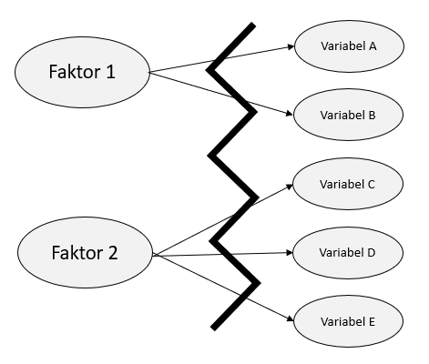{width=90%}

Variablene A, B, C osv er med andre ord observerbare/målbare fenomen for underliggende, skjulte faktorer. Når vi grupperer variabler som er høyt korrelerte antar vi at deres variasjon og korrelasjon skyldes den underliggende/skjulte variabelen. 

Et typisk eksempel er den såkalte "five-factor model" [@mccraeIntroductionFiveFactorModel1992] som antar at personlighetstrekk kan grupperes i fem faktorer: Åpenhet, planmessighet, ekstroversjon, omgjengelighet og nevrotisisme (se f.eks. @kennairFemfaktormodellen2021 for en kort introduksjon til modellen på norsk). Man kan imidlertid ikke måle disse fem faktorene direkte, men man antar at de påvirker en rekke målbare fohold. Disse kan man spørre om/måle/observere. Faktoren planmessighet kan for eksempel påvirke spørsmål/atferd som "Jeg er alltid forberedt", "Jeg følger en plan" eller "Jeg utfører mine oppgaver med en gang de er gitt".

La oss se på dette visuelt på en forenklet framstilling. Vi har en teoretisk modell, der vi sier at positive tilbakemeldinger på jobben predikerer jobbtilfredshet, økonomi predikerer tilfredshet i hjemmet, og tilsammen predikerer jobbtilfredshet og tilfredshet i hjemmet den totale personlige tilfredsheten:

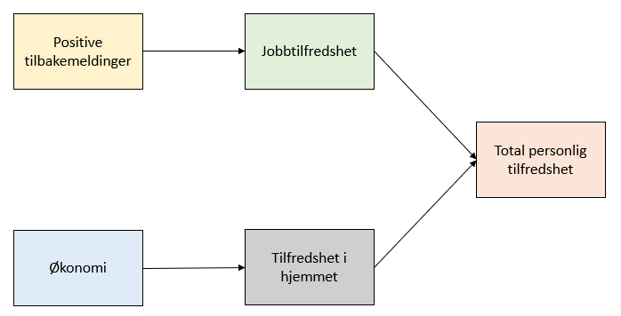{widt=90%}

Dette er det vi teoretisk forventer og vår modell. Når vi samler data ser vi alltid at dataene (selvsagt) aldri passer perfekt inn i vår teoretiske modell. I figuren under er våre faktiske (empiriske) data fra vår undersøkelse representert gjennom de fargede sirklene som knyttes til sin respektive variabel. 

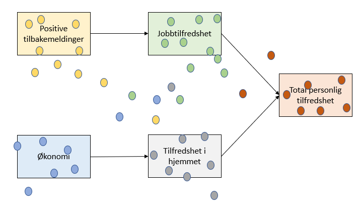{widt=90%}

Så det vi faktisk ser - empirisk - er egentlig dette:

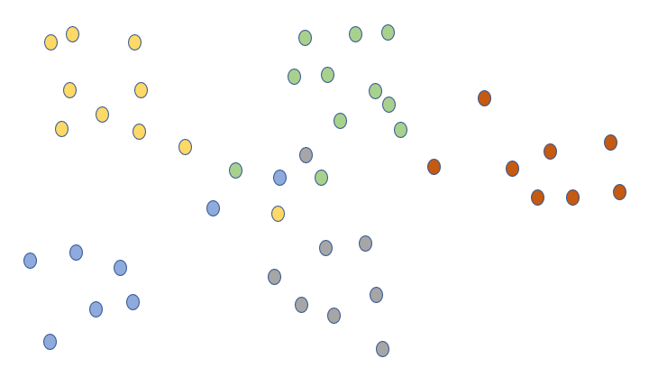{width=90%}

Ikke alle målte variabler måler sterkest på den underliggende faktoret, det er overlapping mellom variablene og hva de måler (og det kan se langt verre ut enn figuren under).

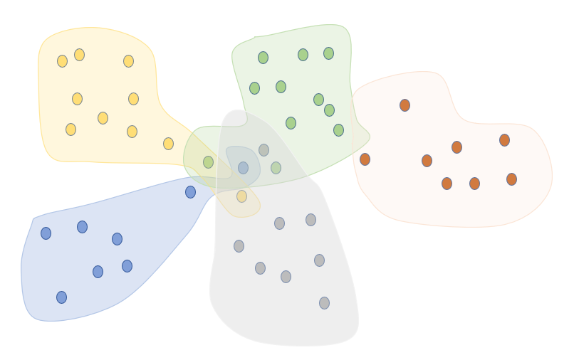{width=90%}

Faktoranalysen vil hjelpe oss i å rydde litt opp i dette, ved å se på hvilke variabler som faktisk (ikker teoretisk) korrelerer sterkt med hvilke, og hvilke som korrelerer svakt, for så å hjelpe oss strukturere modellen vi tester.

I figuren over kan vi se at vi nok har en struktur av sterkt korrelerte variabler som måler "sine" underliggende faktorer, men vi ser også at det er en gruppe som teoretisk burde ligge nærmere sine respektive faktorer, men som ser ut til å klumpe seg i midten. Kanskje dette er en bedre representasjon?

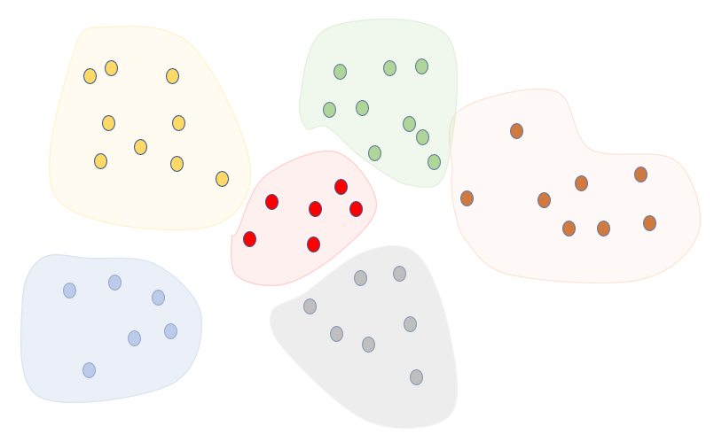{width=90%}

Her må vi trolig gå tilbake til vårt teoretiske utgangspunkt og spørreskjemate for å se på om vi har funnet en ny faktor, eller om vi skal utelate enkelte målinger/sørsmål for å få en bedre modell. 

#### Eksempel

Vi skal bruke et generert datasett for gjennomgang av eksplorerende faktoranalyse. 

```{r echo = FALSE, warning = FALSE, message = FALSE, eval = TRUE}
xfun::embed_file('fa_spm.xlsx')
```

```{r echo = FALSE, warning = FALSE, message = FALSE, eval = TRUE}
xfun::embed_file('fa_spm.sav')
```

```{r echo = FALSE, warning = FALSE, message = FALSE, eval = TRUE}
xfun::embed_file('fa_spm.dta')
```

```{r}
fa_spm <- as_tibble(read_excel("fa_spm.xlsx"))
descr(fa_spm)
```

Vi kan se for oss at vi har stilt en rekke mennesker 9 spørsmål der de har svart på en skala fra 1-4. Det vi ønsker å se er om disse spørsmålene kan si noe om en eller flere latente variabler. De 9 spørsmålene er altså direkte målt, og vi vil se om vi kan si noe om latente variabler ut fra dette. 

Inngangsverderdiene i en faktoranalyse er korrelasjonsmatrisen som "tygges" (i programvare) til en struktur/et mønster.

#### Korrelasjonsmatrise

Vi ser på korrelasjonsmatrisen. 

```{r}
korrelasjon <- tab_corr(fa_spm, triangle = "lower")
korrelasjon
```
p < .0001**** , p < .001*** , p < .01**, p < .05*

#### KMO og Bartletts

```{r warning = FALSE, message = FALSE}
KMO(fa_spm)
BARTLETT(fa_spm)
```

Vi bruker KMO og Bartletts til å se på "faktoriserbarheten". @kaiserIndexFactorialSimplicity1974 anbefaler 0.60 som cut-off verdi for KMO. Bartletts test er signifikant. Bartletts test sammenligner våre faktiske korrelasjonsmatrise med en "identity matrix". "Identity matrix" er en konstruert korrelasjonsmatrise med verdi 1 i diagnoalen og 0 på alle andre korrelasjoner:

```{r echo = FALSE}
print("Identity Matrix")
diag_mat <-diag(nrow=7)
print(diag_mat)
```

Vi forventer selvsagt korrelasjon i vår korrelasjonsmatrise, og siden Bartletts test bruker nullhypotsene om at det ikke er korrelasjon, forteller en signifikant test at det er meningsfullt å gjennomføre en datareduksjonsteknikk. Hvis vår korrelasjonsmatrise ikke er signifikant forskjellig fra en matrise med null korrelasjon mellom variablene gir det ingen mening i å se etter strukturer av korrelasjoner.

I tillegg kan vi se på "determinant":

```{r}
fa_spm_cor <- round(cor(fa_spm, use="complete.obs"),2)
det(fa_spm_cor)
```

En positiv verdi indikerer også at datasettet egner seg for faktoranalyse.

#### Antall faktorer

#### Kaisers kriterium

```{r}
eigenComputes(fa_spm_cor)
```

Kaisers kriterium tilsier 3 faktorer.

#### Scree plott

```{r}
SCREE(fa_spm_cor, eigen_type = "EFA")
```

Det kan se ut til at albuen/knekkpunktet tilsier 3 faktorer.

#### Parallell analyse

```{r}
PARALLEL(fa_spm, eigen_type = "EFA")
```

Dette peker mot tre faktorer.

#### Analyse

Vi kjører en faktoranalyse med 3 faktorer uten rotasjon.

```{r}
urotasjon <- EFA(fa_spm, n_factors = 3, method = "ML")
urotasjon
```

Vi kan se på **Unrotated loadings** hvordan de ulike spørsmålene lader på de tre faktorene. Det er ikke gitt at bildet er helt enkelt å tolke. For noen spørsmål - som 1, 2, og 3 - ser vi loadings på alle tre faktorene. For andre er det klarere loading på en faktor, eller positivt på en og negativt på en annen. Et hjelpemiddler for å tolke modellen er rotasjon. Rotasjon innebærer egnetlig brae å se på variablene og faktorene fra en annen vinkelt. Som @hartmannELearningProjectSOGA2018 påpeker: "The purpose of a rotation is to produce factors with a mix of high and low loadings and few moderate-sized loadings. The idea is to give meaning to the factors, which helps interpret them. From a mathematical viewpoint, there is no difference between a rotated and unrotated matrix. The fitted model is the same, the uniquenesses are the same, and the proportion of variance explained is the same".

Det finnes to hovedgrupper rotasjoner: ortogonal og oblikk. Blant ortogonale rotasjonsteknikker finner vi varimax, quartimax og equimax. (Direct) oblimin og promax er vanlige oblikke rotasjoner. En hovedforskjell er at ved ortogonal rotasjon tillates ikke at faktorene er korrelerte, mens ved oblikk rotasjon kan faktorene korrelere. Her må vi altså gå tilbake til vår teoretiske forståelse av hva vi undersøker. Svært ofte i samfunnsvitenskapene (vil vi hevde) ønsker vi å tillate at faktorene kan korrelere ved rotasjon (vi antar at i veldig mange tilfeller vil dette være teoretisk fornuftig). I så fall bør vi bruke oblikk rotasjon. Hvis vi har teoretiske vurderinger som tilsier at faktorene ikke korrelerer velger vi ortogonalt. 

Under kapittelet om PCA viste vi ortogonal rotasjon. Dette innebærer at aksene forblir ortogonale på hverandre, mens ved oblikk rotasjon kan aksenens vinkler på hverandre variere. 

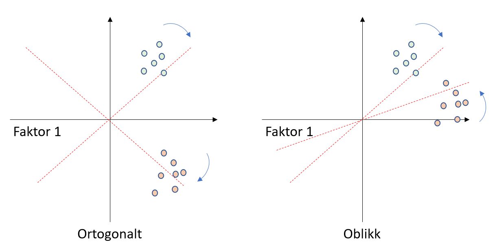

Når vi kjører en ny faktoranalyse med 3 faktorer ser det slik ut:

```{r}
mrotasjon <- EFA(fa_spm, n_factors = 3, method = "ML", rotation = "promax")
mrotasjon
```

Vi ser en klar struktur i hvilke spørsmål som lader på hvilke faktorer (dette eksempelet er konstruert for å vise en veldig klar faktorstruktur, ofte vil det være større rom for tolkning).

#### Model fit

Vi ser at vi presenteres for flere mål på model fit (se f.eks. @finchUsingFitStatistic2020). De ulike indeksene måler ulike aspekter av model fit. Vi skal gå inn på to av dem. Husk at dette datasettet er generert for å vise en utmerket modell - med andre data vil du sjeldent oppleve så gode verdier på model fit som her.

CFI = Comparative Fit Index. Verdiene her kan være mellom 0 og 1, og verdier over 0.9 regnes som en god fit [@huCutoffCriteriaFit1999] (en mer konservativ terskel kan være 0.95). 

RMSEA = Root Mean Square Error of Approximation. Her oppgis ofte verdiene 0.01, 0.05 og 0.08 som henhodsvis utmerket, god og middels. @finchUsingFitStatistic2020 viser til 0.05 som en cut-off verdi. 

#### Sammenlikning uten rotasjon,  med ortogonal (varimax) og oblikk (promax) rotasjon

```{r}
fa_ingenrot <- factanal(fa_spm, factors = 3, rotation = "none")
fa_ingenrot2 <- tibble(fa_ingenrot$loadings[,1], fa_ingenrot$loadings[,2])
fa_varimax <- factanal(fa_spm, factors = 3, rotation = "varimax")
fa_varimax2 <- tibble(fa_varimax$loadings[,1], fa_varimax$loadings[,2])
fa_promax <- factanal(fa_spm, factors = 3, rotation = "promax")
fa_promax2 <- tibble(fa_promax$loadings[,1], fa_promax$loadings[,2])

plott1 <- ggplot(fa_ingenrot2, aes(x=fa_ingenrot$loadings[,1], y=fa_ingenrot$loadings[,2])) + 
    geom_point() + 
    xlim(-1, 1) + 
    ylim(-1, 1) + 
    geom_vline(xintercept = 0) + 
    geom_hline(yintercept = 0) + 
    labs(title="Uten rotasjon", x = "Faktor 1", y = "Faktor 2") +
    theme_bw()
plott2 <- ggplot(fa_varimax2, aes(x=fa_varimax$loadings[,1], y=fa_varimax$loadings[,2])) + 
    geom_point() + 
    xlim(-1, 1) + 
    ylim(-1, 1) + 
    geom_vline(xintercept = 0) + 
    geom_hline(yintercept = 0) + 
    labs(title="Varimax", x = "Faktor 1", y = "Faktor 2") +
    theme_bw()
plott3 <- ggplot(fa_promax2, aes(x=fa_promax$loadings[,1], y=fa_promax$loadings[,2])) + 
    geom_point() + 
    xlim(-1, 1) + 
    ylim(-1, 1) + 
    geom_vline(xintercept = 0) + 
    geom_hline(yintercept = 0) + 
    labs(title="Promax", x = "Faktor 1", y = "Faktor 2") +
    theme_bw()
ggarrange(plott1, plott2, plott3, ncol= 3, nrow = 1)
```

### Konfirmerende faktoranalyse (CFA)

Gjennomgangen av Confirmatory Factor Analysis (CFA) er basert på @linConfirmatoryFactorAnalysis2021. Vi håper vår gjennomgang kan framstå som like god som Lins original. 

I forrige del beskrev vi forskjellen på EFA og CFA på følgende måte:

* Eksplorerende faktoranalyse som søker å gruppere variabler i et datasett ut fra korrelasjon uten spesifikke hypoteser på forhånd om hvordan strukturen ser ut. Denne tilnærmingen er således induktiv og i mindre grad drevet av teori - "one can always subject a data set to an EFA but not necessarily a CFA" [Schriesheim i @hurleyExploratoryConfirmatoryFactor1997, s.672].
* Konfirmerende faktoranalyse starter i andre enden - med hypoteser om dataene og strukturen. Her ønsker vi å bekrefte (konfirmere) en antatt datastruktur i vårt datasett, f.eks. ut fra teoretiske forventninger og tidligere undersøkelser. 

#### Gjennomgang av teori med eksempel

Data i eksempelet er hentet fra @fieldDiscoveringStatisticsUsing2009 (dataene er konstruerte).

Du kan laste ned datasettet i SPSS-format [her](http://www.discoveringstatistics.com/docs/ds_data_files/SPSS%20Data%20Files/) - fila heter SAQ.sav. Vi har også lagt inn fila her:

```{r echo = FALSE, warning = FALSE, message = FALSE, eval = TRUE}
xfun::embed_file('SAQ.sav')
```

Vi har modifisert datasettet ved å ta vekk noen unødvendige variabler for vårt formål og gitt variablene nye navn, og kalt denne fila SAQ2.sav:

```{r}
SAQ <- read_sav("SAQ.sav")
SAQ2 <- SAQ %>%
    select(-c(Question_09:FAC4_2)) %>% 
    rename(Spm1 = Question_01, 
           Spm2 = Question_02, 
           Spm3 = Question_03, 
           Spm4 = Question_04, 
           Spm5 = Question_05, 
           Spm6 = Question_06, 
           Spm7 = Question_07, 
           Spm8 = Question_08)
write_sav(SAQ, "SAQ2.sav")
```

Det grunnleggende ved faktoranalyse er at det ser på korrelasjoner mellom spørsmål/enheter. I vårt datasett - SAQ2 - har vi denne korrelasjonsmatrisen:

```{r}
SAQ2cor <- round(cor(SAQ2[,1:8]), 2)
upper <- SAQ2cor
upper[upper.tri(SAQ2cor)] <- ""
upper <- as.data.frame(upper)
upper
```

I CFA (og SEM) bruker vi imidlertid kovariansmatrise, ikke korrelasjonsmatrise. 

```{r}
SAQ2cov <- round(cov(SAQ2[,1:8]),2)
upper <- SAQ2cov
upper[upper.tri(SAQ2cov)] <- ""
upper <- as.data.frame(upper)
upper
```

Vi kan legge merke til at diagonalen i korrelasjonsmatrisen er 1 (en variabel korrelerer alltid perfekt (1) med seg selv). I en kovariansmatrise er diagnoalen ikke 1. Korrelasjon viser hvordan to variabler er relatert til hverandre, kovarians viser hvordan to variabler er ulike (korrelasjon er standardisert kovarians ved at kovariansen deles på standardavviket for hver variabel).

#### Fra lineær regresjon til faktoranalyse

Fra kapittelet om regresjonsanalyse kjenner vi til:

$y=b_0 + b_1x + e$

der

$y=den\ avhengige\ variabelen$ 

$b_0=intercept$

$b_1=stigningstallet\ (slope)$

$x=uavhengig\ observert\ variabel/prediktor$

$e=feilledd/residual$

I faktoranalyse har vi tilsvarende:

$y_1 = \tau_1 + \lambda_1\eta_1 + e_1$

der

$y_1 = "enheten"/spørsmålet$

$\tau_1 = intercept\ (= "tau")$

$\lambda_1 = koeffisient\ (= lambda\, på\ en\ måte\ som\ slope\ i\ lineær\ regresjon,\ men\ som\ i\ CFA\ kalles\ "loading")$

$\eta_1=faktoren\ (=eta\, uobservert/latent,\ i\ motsetning\ til\ en\ prediktor\ i\ lineær\ regresjon)$

$e_1=feilleddet/residualen$

En distinkt forskjell mellom OLS og CFA er dermed at i OLS er prediktoren observert, mens i CFA er faktoren uobservert.

Vi har altså:
$$y_1 = \tau_1 + \lambda_1\eta_1 + e_1$$

$$y_2 = \tau_2 + \lambda_2\eta_1 + e_2$$

$$y_3 = \tau_3 + \lambda_3\eta_1 + e_3$$

Disse tre likningene (som kan være de tre første spørsmålene i vårt datasett) er dermed tre separate regresjonslikninger. 
Som vi kan skrive slik på matriseform:

$$\begin{pmatrix}y_1\\y_2\\y_3\end{pmatrix} = \begin{pmatrix}\tau_1\\\tau_2\\\tau_3\end{pmatrix} + \begin{pmatrix}\lambda_1\\\lambda_2\\\lambda_3\end{pmatrix}(\eta_1) + \begin{pmatrix}e_1\\e_2\\e_3\end{pmatrix}$$

I motsetning til OLS, som er univariat, er CFA multivariat. For hver $y$ har vi en intercept ($\tau$), en loading ($\lambda$) og en residual ($e$). Det alle $y$ har felles er faktoren $\eta$. Og det vi egentlig sier er at den felles faktoren predikerer alle $y$. 

#### Frihetsgrader

La oss anta at vi ser på spm 3, 4 og 5, og sier at vårt teoretiske utgangspunkt er at (den uobserverte/latente) faktoren SPSS-angst beskriver de observerte skårene på de tre spørsmålene. Grafisk kan vi illustrere dette slik:

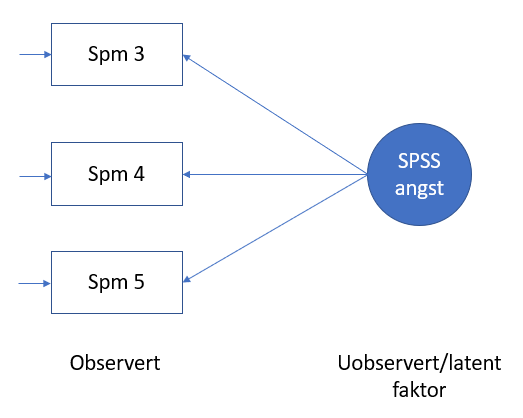{width=50%}

Vi modifiserer datasettet til å kun inneholde disse tre spørsmålene.

```{r}
SAQ3 <- SAQ2 %>%
    select(-c(Spm1, Spm2, Spm6:Spm8))
tab_corr(SAQ3, triangle = "lower")
```
For å se på antall frihetsgrader begynner vi med å se på antallet kjente størrelser (= totalt antall parametere = "known values"). Dette finner vi ved:

$p(p+1)/2$

I vår tenkte modell har vi $p=3$, altså 6 parametere. Dette kan vi forsåvidt se i kovariansmatrisen også, men i en stor kovariansmatrise er det raskere å bruke utregningen.

Imidlertid ser vår modell slik ut:

$$\Sigma(\theta) = \begin{pmatrix}\lambda_{1} \\\lambda_{2} \\\lambda_{3}\end{pmatrix}\begin{pmatrix}\psi_{11}\end{pmatrix}\begin{pmatrix}\lambda_{1} & \lambda_{2} & \lambda_{3}\end{pmatrix} + \begin{pmatrix}\theta_{11} &  0 & 0 \\\theta_{21} & \theta_{22} & 0 \\\theta_{31} &  \theta_{32} & \theta_{33} \\\end{pmatrix}$$

der

$\lambda$ er kjent fra før

$\psi$ er variansen i faktoren

og siste ledd i likningen er kovariansmatrisen.

I modellen vår må vi finne antall unike parametere, som i dette tilfellet er 10 (3 x $\lambda$, 1 x $\psi$ og 4 x $\theta$). Vi kan da finne antallet frie parametere som er $Antall\ unike\ parametere\ - antall\ faste\ parametere = 10 - 0 = 10$

Antall frihetsgrader vil da være: $antall\ kjente\ parametere\ - antall\ frie\ parametere = 6 - 10 = -4$

Dette er uheldig - vi kan ikke ha et større antall frie parametere enn antall kjente parametere, da får vi et negativt antall frihetsgrader og en umulig modell. Dette kalles "underdefined model", og kan sammenliknes med å skulle løse $x + y = 9$: Det finnes uendelig mange løsninger for den likningen. Der vi har 0 frihetsgrader er modellen "just-identified" (dette er tilfelle i regresjonsmodeller), og positivt antall frihetsgrader innebærer "over-identified model".

Løsningen på en "underdefined model" er "fixed parameters" - altså at vi låser et antall parametere til en verdi slik at de ikke kan variere. Hvis vi f.eks. låser 3 x $\lambda$ og 1 x $\psi$ får vi 4 låste parametere som gir: 

$Antall\ unike\ parametere\ - antall\ faste\ parametere = 10 - 4 = 6 (frie parrametere)$ 

som gir

$antall\ kjente\ parametere\ - antall\ frie\ parametere = 10 - 6 = 4$.

Antall frihetsgrader blir da:

$antall\ kjente\ parametere\ - antall\ frie\ parametere = 6 - 4 = 2$

#### Kjøring av modell

```{r}
modell1 <- 'SPSSangst =~ Spm3 + Spm4 + Spm5'
SPSS_3var <- cfa(modell1, data = SAQ3)
summary(SPSS_3var)
```
I tabellen over ser vi resultatet av vår modell. Ladningene ("loadings") - $\lambda$ - er gitt under "Latent Variables" - "Estimates". "Estimates" under "Variances", f.eks. 0.815 for Spm3 er residualen for Spm3. 
I R-pakken **lavaan** som er brukt her, låses ladning for første spørsmål til 1. Vi ser dette under "Latent Variables" der "Estimate" for Spm3 = 1, noe vi også kan se grafisk under. Siden ladningen til Spm3 er låst til 1 ("fixed parameter") betyr det at $\lambda$ for de to andre spørsmålene er vist i relasjon til/skalert til Spm3. Dette gjør tolkning vanskelig. 

```{r fig.cap = "Plott av faktoranalyse for tre spørsmål"}
nodenavnf <- c(
    "Standard deviations excite me",
    "I dream that Pearson is attacking me with correlation coefficients",
    "I don't understand statistics",
    "SPSS Anxiety Questionnaire"
)
semPaths(SPSS_3var,
         what = "std",
         whatLabels = "est",
         style = "lisrel",
         residScale = 10,
         nodeNames = nodenavnf,
         theme = "colorblind",
         nCharNodes = 0,
         reorder = FALSE,
         legend.cex = 0.35,
         rotation = 2,
         sizeMan = 8,
         sizeLat = 10
)
```

I stedet for å låse første ladning kan vi låse variansen i faktoren:

```{r}
modell2 <- "SPSSangst =~ Spm3 + Spm4 + Spm5"
SPSS_3var_2 <- cfa(modell2, data = SAQ3, std.lv = TRUE)
summary(SPSS_3var_2)
```

Vi ser at $\lambda$ - ladningen - for Spm3 ikke lenger er 1. 
```{r fig.cap = "Plott av faktoranalyse for tre spørsmål - låst varians i faktor"}
nodenavn <- c(
    "Standard deviations excite me",
    "I dream that Pearson is attacking me with correlation coefficients",
    "I don't understand statistics",
    "SPSS Anxiety Questionnaire"
)
semPaths(SPSS_3var_2,
         what = "std",
         whatLabels = "est",
         style = "lisrel",
         residScale = 10,
         nodeNames = nodenavn,
         theme = "colorblind",
         nCharNodes = 0,
         reorder = FALSE,
         legend.cex = 0.35,
         rotation = 2,
         sizeMan = 8,
         sizeLat = 10
)
```

#### Full modell på datasettet

Vi ønsker å lage en CFA-modell for SPSSangst med alle åtte spørsmålene.

```{r}
modell3 <- "SPSSangst =~ Spm1 + Spm2 + Spm3 + Spm4 + Spm5 + Spm6 + Spm7 + Spm8"
SPSS_8 <- cfa(modell3, data = SAQ2, std.lv = TRUE)
summary(SPSS_8, fit.measure = TRUE, standardized = TRUE)
```

En noe mer oversiktlig tabell over parametrene, modifisert fra @dudekConfirmatoryFactorAnalysis2019:

```{r}
parameterEstimates(SPSS_8,standardized = FALSE) %>% 
    filter(op=="=~") %>%
    select(Indicator = rhs,B = est, SE = se, Z = z,'p-value' = pvalue) %>%
    knitr::kable(digits = 3, booktabs = TRUE, format = "markdown", caption = "Faktorladninger")
```


```{r fig.cap = "Plott av faktoranalyse for alle åtte spørsmål"}
nodenavn2 <- c(
    "Statistics make me cry",
    "My friends will think I'm stupid for not being able to cope with SPSS",
    "Standard deviations excite me",
    "I dream that Pearson is attacking me with correlation coefficients",
    "I don't understand statistics",
    "I have little experience of computers",
    "All computers hate me",
    "I have never been good at mathematics",
    "SPSS Anxiety Questionnaire"
)
semPaths(SPSS_8,
         what = "std",
         whatLabels = "est",
         style = "lisrel",
         residScale = 8,
         nodeNames = nodenavn2,
         theme = "colorblind",
         nCharNodes = 0,
         manifests = paste0("Spm", 1:8),
         reorder = FALSE,
         legend.cex = 0.35,
         rotation = 2,
         sizeMan = 6,
         sizeLat = 10
)
```

Vi kan isolere/hente ut ladningene ($\lambda$ = lambda):
```{r}
round(semMatrixAlgebra(SPSS_8, LY), digits = 3)
```

Vi kan også se isolert på residualenes varians ($\theta$ = theta):
```{r}
thetaverdier <- semMatrixAlgebra(SPSS_8, TE)
upper <- format(round(thetaverdier, digits = 3), nsmall = 3)
upper[upper.tri(thetaverdier)] <- ""
upper <- as.data.frame(upper)
upper
```

Dere finner igjen lambda- og thetaverdiene i såvel tabellearisk som grafisk output ovenfor. 

#### Tolkning av resultatene

Det første vi kan se er at "Estimate" for SPSSangst er 1.000. Dette er fordi vi har låst denne parameteren, hvilket innebærer at variansen er standardisert. Så hvis vi har en enhets økning i SPSSangst, kan vi lese endringen for de åtte spørsmålene. F.eks. vil Spm1 øke med 0.485 i Spm1's skala (for Spm1:Spm8 er ikke standardisert, kun variansen) (se under "Latent Variables" - "Estimate"), og Spm2 vil gå ned med 0.198 ("Estimate" er -0.198). I den grafiske presentasjonen av modellen ser vi det samme, også illustrert med blå og rød farge i dette tilfellet for  positiv eller negativ "Estimate". 

For å gjøre tolkningen lettere kan vi standardisere både variansen i faktoren (til 1) og enhetene/spørsmålene i seg selv:

```{r}
parameterEstimates(SPSS_8,standardized = TRUE) %>% 
    filter(op=="=~") %>%
    select(Indicator = rhs, B = est, SE = se,Z = z, 'p-value' = pvalue, Std.Beta = std.all) %>%
    knitr::kable(digits = 3, booktabs = TRUE, format = "markdown", caption = "Faktorladninger")
```

Her ønsker vi å se på kolonnen "Std.all" i originaloutput (i vår forenkle tabell = "Std.Beta"), som vi kan sammenlikne med standardiserte betaverdier i lineær regresjon. Tolkningen nå blir: For ett standardavviks økning i SPSSangst øker Spm1 med 0.586 standardavvik, mens Spm går ned med 0.233 standardavvik (-0.233). Dette vil vi (som regel) kalle standardiserte ladninger ("standardized loadings"). En fordel med standardiserte ladninger er at vi kan lettere sammenlikne ladningen til hverandre fordi de er nettopp standardiserte.  

```{r fig.cap = "Plott av faktoranalyse for alle åtte spørsmål - standardisert"}
semPaths(SPSS_8,
         what = "std",
         whatLabels = "std",
         style = "lisrel",
         residScale = 8,
         nodeNames = nodenavn,
         theme = "colorblind",
         nCharNodes = 0,
         manifests = paste0("Spm", 1:8),
         reorder = FALSE,
         legend.cex = 0.35,
         rotation = 2,
         sizeMan = 6,
         sizeLat = 10
)
```

#### Hvor god er modellen vår ("Model Fit Statistics")?

Et viktig poeng før vi gir oss i kast med vurdering av hvor god modellen er, er at for å kunne si noe om dette må modellen ha positivt antall frihetsgrader (jfr. delkapittel om frihetsgrader lenger opp). 

#### Kjikvadrattest

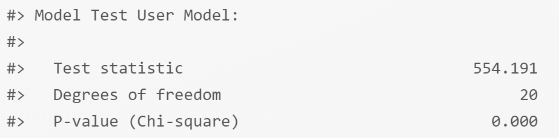{width=70%}

I en CFA ønsker vi at p-verdien for kjikvadratverdien er større enn 0.05 - vi ønsker altså ikke å forkaste nullhypotesen, men med en p-verdi < 0.001 må vi forkaste nullhypotesen (nullhypotsen her innebærer at det ikke er forskjell mellom vår modell og populasjonen, men det ønsker vi jo heller ikke - vi ønsker at vår modell representerer populasjonen). Tilsynelatende har vi derfor i forhold til kjikvadrattesten en dårlig modell. Her må vi imidlertid være klar over at store utvalgsstørrelser gir en stor risiko for at vi får en signifikant kjikvadrattest. I dette tilfellet har vi 2571 observasjoner, noe som er høyt.

#### "Approximate Fit Index" - RMSEA, CFI og TLI

Kjikvadrattest er en "Exact Fit"-test, hvilket innebærer at vi hypotetiserer at utvalget/modellen er lik populasjonen. Det finnes imidlertid andre tester som går under betegnelsen "Approximate Fit Index", hvilket innebærer at man tilnærmer seg dette med "nærme nok" (altså ikke absolutt). Vi skal ikke gå inn i detaljer på hvordan disse indeksene regnes ut, men begrense oss til å si at disse bygger på å sammenlikne en verst mulig modell (= ingen kovariasjoner er med, kun varianser for den enkelte enhet/spørsmål) med en best mulig modell (= alle varianser og kovarianser er med -> "just-identified" modell), og deretter plasserer vår modell inn i dette bildet. 

CFI = "Confirmatory Factor Index" ønsker vi skal være over 0.95

TLI = "Tucker Lewis Index" ønsker vi skal være over 0.90

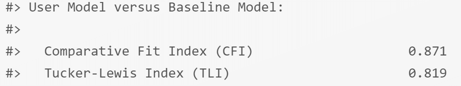{width=70%}

RMSEA = "Root Mean Square Error of Approximation" bør være under eller lik 0.05 for "close fit", og mellom 0.05 og 0.08 for "reasonable approximate fit". RMSEA over 0.08 er "poor fit".

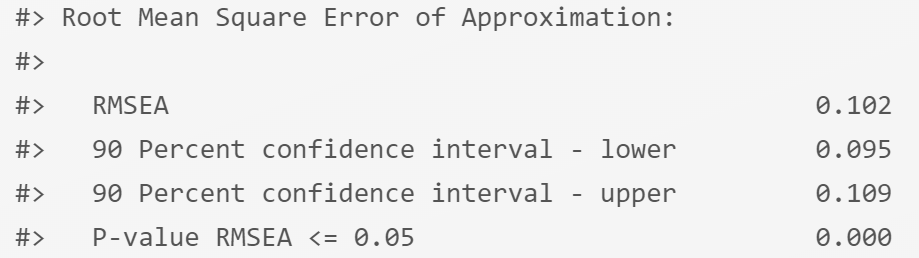{width=70%}

Alle disse tre målene på Model Fit er ikke særlig gode. Modellen vår er trolig ikke den beste modellen for SPSSangst. Et tiltak vi kan se på er hvor store de enkelte standardiserte ladningen er. Vi ser (f.eks. i det siste diagrammet) at Spm2 lader med -0.23, noe som er en god del lavere enn de fleste andre. Hva skjer om vi tar bort dette spørsmålet i en revidert modell?

```{r}
modell4 <- "SPSSangst =~ Spm1 + Spm3 + Spm4 + Spm5 + Spm6 + Spm7 + Spm8"
SPSS_7 <- cfa(modell4, data = SAQ2, std.lv = TRUE)
fitMeasures(SPSS_7, c("cfi","tli", "rmsea"))
# summary(SPSS_7, fit.measure = TRUE, standardized = TRUE)
```

Vi ser at forbedringene ikke er store, og at modellen vår ikke ser kjempebra ut (den er ikke elendig, men under cut-off verdiene vi normalt opererer med).

#### Kryssvalidering ("cross-validation")

Dette er også omtalt under delkapittelet om multippel regresjonsanalyse så en litt mer utførlig beskrivelse gis der.

Kryssvalidering innebærer at vi deler datasettet i to: en del vi utvikler modeller på, og en del vi tester vår utvalgte modell på. På den måten unngår vi at vi bruker hele datasettet på å grave fram (litt sjansepreget) en modell som er ok uten å vite om vi bare har hatt flaks. Hvis vår valgte modell har en god fit med den delen av dataene vi tester på kan vi si noe mer sikkert om vår modell.

I R kan vi bruke pakken **kfa** som gjør dette ganske lett for oss. 

For hvert utvalg kjøres en EFA på alle utvalg unntatt for et uvalg som er et valideringsutvalg. EFA-utvalgene og valideringsutvalget utgjør et "fold". Neste iterasjon kjøres EFA på alle utvalg i testdataene unntatt et nytt utvalg som blir valideringsutvalg. Dette utgjør et nytt "fold". Slik kjøres prosedyren til alle utvalg har vært valideringsutvalg for de andres EFA. 


```{r}
kfamodell <- kfa(
    SAQ2,
    k = 5,
    m = 1,
    seed = 1243)

k_model_fit(kfamodell, index = "default", by.fold = FALSE)
```

Verdiene for hhv. CFI og RMSEA kan sammenliknes med foreslåtte cutoff-verider lenger opp for å bidra til vurderingen av modellen. Resultatene i dette tilfellet bekrefter på mange måter inntrykket vi har før cross-validation.

 
