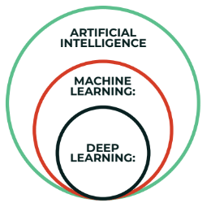

```{r setup, include=FALSE}
knitr::opts_chunk$set(echo = TRUE)
options(scipen=999)
```

# Maskinlæring (Machine Learning)

Berepet "maskinlæring" har blitt et mer og mer sentralt begrep i dataanalyse. Selve begrepet ble "coinet" (først brukt) av @samuelStudiesMachineLearning1959. Endel av metodene i maskinlæring kjenner vi fra før. Regresjon er f.eks. et sentralt element i "pakken" av metoder som kan puttes inn i begrepet maskinlæring. Og regresjon er jo ikke noe nytt, så er maskinlæring kun et moteord? Et fancy ord på ting vi har gjort før? Tja, kanskje svaret er både ja og nei. Det er unektelig slik at vi har drevet med regresjonsanalyser lenge før begrepet maskinlæring i hvert fall ble allment kjent og popularisert. Samtidig er maskinlæring en distinkt gruppe av analytiske metoder hvis hensikt er å - nettopp - lære. Med dette mener vi modeller som bruker data til å forbedre analyseopgavene vi har foran oss. 

Maskinlæring knyttes tett til kunstig intelligens (Articifical Intelligence, eller bare AI). Det er imildertid ulike oppfatninger av hvordan disse begrepene forholder seg til hverandre. I tillegg har begrepet "deep learning" også kommet mer i fokus. En vanlig måte å se sammenhengen på er denne [@superdatascienceMachineLearningAZ2022]:



Det er videre vanlig å sele inn maskinlæring ut fra hvordan dataanalysen skjer:

- Supervised learning: Modellering gjennom algoritmer som kjenner både input og ønsket output.
- Unsupervised learning: Modellering gjennom algortimer som kjenner kun input, og forsøker finne mønstre og grupper i dataene. 
- Semi-supervised learning: En form for mellomting mellom supervised og unsupervised, dvs. vi kan ha mindre deler av data med input og putput som kan brukes på data uten kjent/ønsket output
- Reinforcement learning: Modellering gjennom algoritmer der henskten/målsetningen er å maksimere en oppfatning om kumulativ belønning/utkomme. Reinforcement learning brukes f.eks. til å lære maskiner å spille spill mot mennesker. 
- Dimensionality reduction: Dette kjenner vi fra f.eks. Principal Component Analysis (PCA), der hensikten er å redusere et større antall variabler til et mindre antall komponenter. 

Teknikkene som ofte brukes i maskinlæring er:

- Regresjon
- Klassifisering
- Clustering
- Association
- Natural Language Processing - NLP
- Deep learning
- Dimensionality reduction

## Regresjon

Vi har i tidligere kapitler gått gjennom enkel og multippel OLS og polynomial regresjon. Disse er også teknikker under paraplyen maskinlæring. Selv om vi har vist regresjon i tidligere kapittel introduserer vi et element i maskinlæringskapittelet som viser splitting av datasett i treningsdata og testdata. Dette er karakteristisk for maskinlæring. Det innebærer at vi deler datasettet (tilfeldig) inn i to grupper: den første gruppa - treningsdata - bruker vi til å lage/trene en modell. Den andre gruppa - testdata - bruker vi for å se hvor god modellen v lagde med treningsdataene klarer å predikere dataene som ligger i testdatasettet. Testdatasettet består jo av "virkelige" data, så hvis modellen vår er god og klarer å predikere disse dataene kan vi si noe sikrere om hvor godt vi kan anta modellen vil predikere nye, hittil ikke målte/observerte verdier. 

Eksempelet er et utvidet datasett vi brukte i kapittelet om polynomisk regresjon. Det baserer seg på at vi har lønnsdata på 47 medarbeidere i et firma.

```{r message = FALSE, warning = FALSE}
library(readxl)
library(tidyverse)
library(sjPlot)
```


```{r}
mldata <- read_excel("mldata.xlsx")
```

```{r echo = FALSE, warning = FALSE, message = FALSE, eval = TRUE}
xfun::embed_file("mldata.xlsx")

```

```{r}
glimpse(mldata)
```

Vi har altså variablene ansiennitet (år), stillingskategori (1-10) og månedslønn.

### Enkel lineær regresjon

Det første vi gjør er å splitte datasettet i treningsdata og testdata.

```{r}
library(caTools)
set.seed(123)

splitt <- sample.split(mldata$Ansiennitet, SplitRatio = 2/3)

treningssett <- subset(mldata, splitt == TRUE)
testsett <- subset(mldata, splitt == FALSE)
glimpse(treningssett)
glimpse(testsett)
```

Det neste er å lage lineær modell på treningsdatasettet.

```{r}
enkelOLS <- lm(Lonn ~ Ansiennitet, data = treningssett)
tab_model(enkelOLS)
enkelOLSplott <- ggplot() +
    geom_point(aes(x = treningssett$Ansiennitet, y = treningssett$Lonn), col = "red") +
    scale_x_continuous(breaks = round(seq(min(treningssett$Ansiennitet), max(treningssett$Ansiennitet), by = 1),0)) +
    geom_line(aes(x = treningssett$Ansiennitet, y = predict(enkelOLS, newdata = treningssett)), col = "blue") +
    ggtitle("Enkel OLS") +
    xlab("Ansiennitet") +
    ylab("Snittlønn")
enkelOLSplott
```

Så kan vi se på hvilke verdier modellen vil predikere på testdataene:

```{r}
y_prediksjon <- predict(enkelOLS, newdata = testsett)
y_pred <- as.data.frame(y_prediksjon)
obs <- as.data.frame(testsett$Lonn)
df <- as.data.frame(c(y_pred, obs))
df
```

Den venstre kolonnen i tabellen over er verdien modellen predikerer, den høyre kolonnen tilhørende observerte verdi i testsettet. Når vi ser de to kolonnene, og hvor stor differansen er mellom dem, kan vi sammenholde det med grafen rett over som viser observerte verdier mot regresjonslinja (modellens prediksjon). I noen områder forventer vi ut fra grafen at de er ganske nærme hverandre - f.eks. rundt x = 4 og x = 12. Og i tabellen ser vi at vi for noen verdier har lite avvik og for noen større avvik. I kapittelet om polynomisk regresjon beskrev vi "Mean Square Error" (MSE) slik:

$MSE = \frac{1}{n}*\sum(faktisk\ verdi - predikert\ verdi)$

Vi kan regne ut MSE slik:

```{r}
((1/(nrow(df))))*sum((df$testsett.Lonn - df$y_prediksjon)^2)
# Alternativt:
mseOLS <- mean((df$testsett.Lonn - df$y_prediksjon)^2)
mseOLS
```

Vi kan bruke MSE til å sammenlikne modeller. Av to modeller vil modellen med lavest MSE være best til å predikere. 

### Multippel regresjon

Vi bruker det samme datasettet. Før vi går videre faktoriserer vi den kategoriske variabelen.

```{r}
mldata <- read_excel("mldata.xlsx")
mldata$Stillingskategori <- as.factor(mldata$Stillingskategori)
```

Deler datasettet:

```{r}
library(caTools)
set.seed(123)
splitt <- sample.split(mldata$Lonn, SplitRatio = 0.8)
treningssett <- subset(mldata, splitt == TRUE)
testsett <- subset(mldata, splitt == FALSE)
```

Lager modell på treningssettet:

```{r}
multiregressor <- lm(Lonn ~ Ansiennitet + Stillingskategori, data = treningssett)
```

Prediksjon ift testdata:

```{r}
y_prediksjon2 <- predict(multiregressor, newdata = testsett)
y_pred2 <- as.data.frame(y_prediksjon2)
obs <- as.data.frame(testsett$Lonn)
df2 <- as.data.frame(c(y_pred2, obs))
df2
```

Vi kan se av tabellen over at prediksjonene for den multiple modellen er betydelig bedre enn for den enkle lineære.

Og MSE:

```{r}
msemultippel <- mean((df2$testsett.Lonn - df2$y_prediksjon)^2)
msemultippel
```

```{r}
msetab <- data.frame(mseOLS, msemultippel)
msetab
```

## Support Vector Regression (SVR)

Så kommer vi til den første nye teknikken vi knytter til maskinlæring. 
