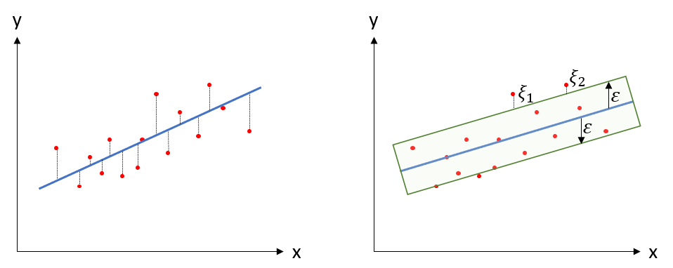
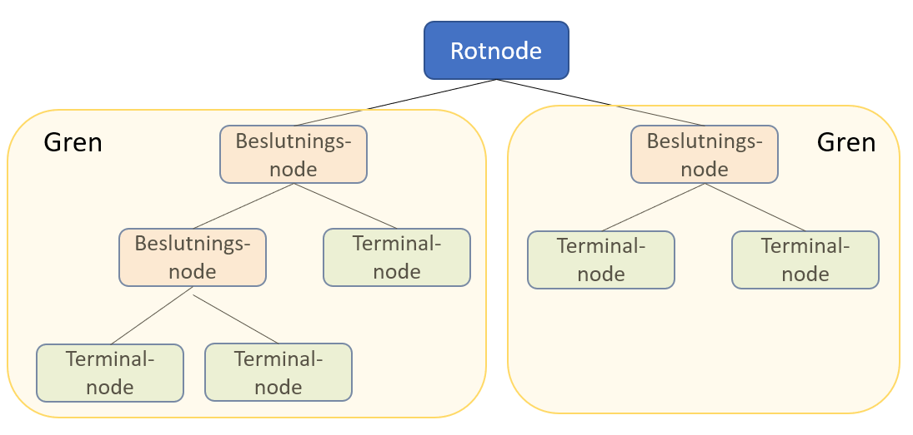
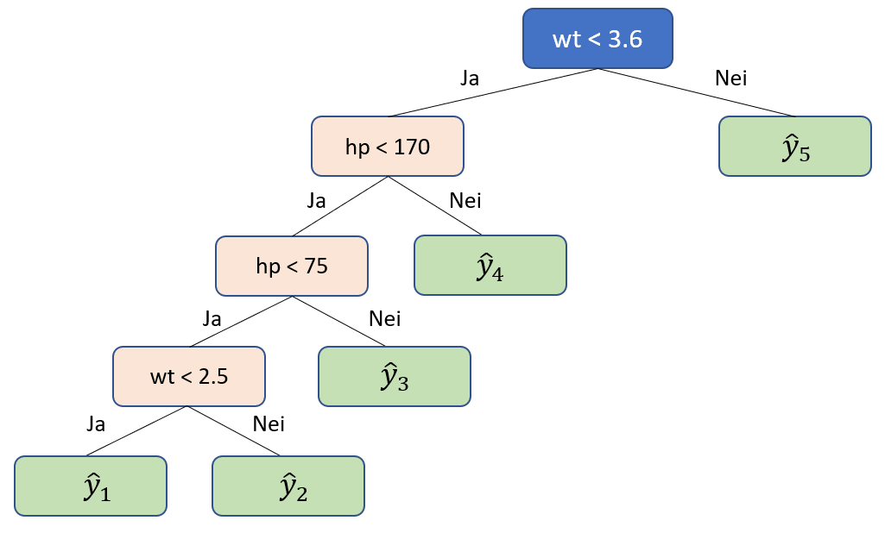

```{r setup, include=FALSE}
knitr::opts_chunk$set(echo = TRUE)
options(scipen=999)
```

# Maskinlæring (Machine Learning)

Berepet "maskinlæring" har blitt et mer og mer sentralt begrep i dataanalyse. Selve begrepet ble "coinet" (først brukt) av @samuelStudiesMachineLearning1959. Endel av metodene i maskinlæring kjenner vi fra før. Regresjon er f.eks. et sentralt element i "pakken" av metoder som kan puttes inn i begrepet maskinlæring. Og regresjon er jo ikke noe nytt, så er maskinlæring kun et moteord? Et fancy ord på ting vi har gjort før? Tja, kanskje svaret er både ja og nei. Det er unektelig slik at vi har drevet med regresjonsanalyser lenge før begrepet maskinlæring i hvert fall ble allment kjent og popularisert. Samtidig er maskinlæring en distinkt gruppe av analytiske metoder hvis hensikt er å - nettopp - lære. Med dette mener vi modeller som bruker data til å forbedre analyseopgavene vi har foran oss. 

Maskinlæring knyttes tett til kunstig intelligens (Articifical Intelligence, eller bare AI). Det er imildertid ulike oppfatninger av hvordan disse begrepene forholder seg til hverandre. I tillegg har begrepet "deep learning" også kommet mer i fokus. En vanlig måte å se sammenhengen på er denne [@superdatascienceMachineLearningAZ2022]:


Det er videre vanlig å sele inn maskinlæring ut fra hvordan dataanalysen skjer:

- Supervised learning: Modellering gjennom algoritmer som kjenner både input og ønsket output.
- Unsupervised learning: Modellering gjennom algortimer som kjenner kun input, og forsøker finne mønstre og grupper i dataene. 
- Semi-supervised learning: En form for mellomting mellom supervised og unsupervised, dvs. vi kan ha mindre deler av data med input og putput som kan brukes på data uten kjent/ønsket output
- Reinforcement learning: Modellering gjennom algoritmer der henskten/målsetningen er å maksimere en oppfatning om kumulativ belønning/utkomme. Reinforcement learning brukes f.eks. til å lære maskiner å spille spill mot mennesker. 
- Dimensionality reduction: Dette kjenner vi fra f.eks. Principal Component Analysis (PCA), der hensikten er å redusere et større antall variabler til et mindre antall komponenter. 

Teknikkene som ofte brukes i maskinlæring er:

- Regresjon
- Klassifisering
- Clustering
- Association
- Natural Language Processing - NLP
- Deep learning
- Dimensionality reduction

## Regresjon

Vi har i tidligere kapitler gått gjennom enkel og multippel OLS og polynomial regresjon. Disse er også teknikker under paraplyen maskinlæring. Selv om vi har vist regresjon i tidligere kapittel introduserer vi et element i maskinlæringskapittelet som viser splitting av datasett i treningsdata og testdata. Dette er karakteristisk for maskinlæring. Det innebærer at vi deler datasettet (tilfeldig) inn i to grupper: den første gruppa - treningsdata - bruker vi til å lage/trene en modell. Den andre gruppa - testdata - bruker vi for å se hvor god modellen vi lagde med treningsdataene klarer å predikere dataene som ligger i testdatasettet. Testdatasettet består jo av "virkelige" data, så hvis modellen vår er god og klarer å predikere disse dataene kan vi si noe sikrere om hvor godt vi kan anta modellen vil predikere nye, hittil ikke målte/observerte verdier. 

Eksempelet er basert på @superdatascienceMachineLearningAZ2022. Det baserer seg på at vi har lønnsdata på 47 medarbeidere i et firma. I dette delkapittelet har vi lagd gjennomsnitt av lønn og ansiennitet for de ulike stillingskategoriene

```{r message = FALSE, warning = FALSE}
library(readxl)
library(tidyverse)
library(sjPlot)
```

```{r}
mldata1 <- read.csv("Lonnsdata.csv")
```

```{r echo = FALSE, warning = FALSE, message = FALSE, eval = TRUE}
xfun::embed_file("Lonnsdata.csv")
```

```{r}
glimpse(mldata1)
```

Vi har altså variablene "Erfaring" (ansiennitet i år) og månedslønn.

### Enkel lineær regresjon

Det første vi gjør er å splitte datasettet i treningsdata og testdata.

```{r}
library(caTools)
set.seed(123)
splitt <- sample.split(mldata1$Lonn, SplitRatio = 2/3)
treningssett1 <- subset(mldata1, splitt == TRUE)
testsett1 <- subset(mldata1, splitt == FALSE)
```

Det neste er å lage lineær modell på treningsdatasettet.

```{r}
enkelOLS <- lm(Lonn ~ Erfaring, data = treningssett1)
tab_model(enkelOLS)
enkelOLSplott <- ggplot() +
    geom_point(aes(x = treningssett1$Erfaring, y = treningssett1$Lonn), col = "red") +
    scale_x_continuous(breaks = round(seq(min(treningssett1$Erfaring), max(treningssett1$Erfaring), by = 1),0)) +
    geom_line(aes(x = treningssett1$Erfaring, y = predict(enkelOLS, newdata = treningssett1)), col = "blue") +
    ggtitle("Enkel OLS") +
    xlab("Stillingskategori") +
    ylab("Snittlønn")
enkelOLSplott
```

Vi kan visualisere såvel treningssett som testsett.

```{r}
library(ggplot2)
ggplot() +
    geom_point(aes(x = treningssett1$Erfaring, y = treningssett1$Lonn), 
               color = "red") +
    scale_x_continuous(breaks = round(seq(min(treningssett1$Erfaring), max(treningssett1$Erfaring), by = 1),0)) +
    geom_line(aes(x = treningssett1$Erfaring, y = predict(enkelOLS, newdata = treningssett1)),
              color = "blue") +
    ggtitle("Lønn vs. erfaring (treningssett)") +
    xlab("Antall års erfaring") + 
    ylab("Lønn")
```


```{r}
library(ggplot2)
ggplot() +
    geom_point(aes(x = testsett1$Erfaring, y = testsett1$Lonn), 
               color = "red") +
    scale_x_continuous(breaks = round(seq(min(testsett1$Erfaring), max(testsett1$Erfaring), by = 1),0)) +
    geom_line(aes(x = treningssett1$Erfaring, y = predict(enkelOLS, newdata = treningssett1)), 
              color = "blue") +
    ggtitle("Lønn vs. erfaring (testsett)") +
    xlab("Antall års erfaring") + 
    ylab("Lønn")
```

Så kan vi se på hvilke verdier modellen vil predikere på testdataene:

```{r}
y_prediksjon1 <- predict(enkelOLS, newdata = testsett1)
y_pred1 <- as.data.frame(y_prediksjon1)
obs1 <- as.data.frame(testsett1$Lonn)
df1 <- as.data.frame(c(y_pred1, obs1))
df1
```

Den venstre kolonnen i tabellen over er verdien modellen predikerer, den høyre kolonnen tilhørende observerte verdi i testsettet. Når vi ser de to kolonnene, og hvor stor differansen er mellom dem, kan vi sammenholde det med grafen rett over som viser observerte verdier mot regresjonslinja (modellens prediksjon). I noen områder forventer vi ut fra grafen at de er ganske nærme hverandre - f.eks. rundt x = 4 og x = 12. Og i tabellen ser vi at vi for noen verdier har lite avvik og for noen større avvik. I kapittelet om polynomisk regresjon beskrev vi "Mean Square Error" (MSE) slik:

$MSE = \frac{1}{n}*\sum(faktisk\ verdi - predikert\ verdi)$

Vi kan regne ut MSE slik:

```{r}
((1/(nrow(df1))))*sum((df1$testsett1.Lonn - df1$y_prediksjon1)^2)
# Alternativt:
mseOLS <- mean((df1$testsett1.Lonn - df1$y_prediksjon1)^2)
mseOLS
```

Vi kan bruke MSE til å sammenlikne modeller. Av to modeller vil modellen med lavest MSE være best til å predikere. MSE kan altså ikke vurderes direkte, men til sammenlikning. 

### Multippel regresjon

Vi bruker det samme datasettet, men utvider med en uavhengig variabel. 

```{r echo = FALSE, warning = FALSE, message = FALSE, eval = TRUE}
xfun::embed_file("mldata2.xlsx")
```

```{r}
mldata2 <- read_xlsx("mldata2.xlsx")
glimpse(mldata2)
```

Deler datasettet:

```{r}
library(caTools)
set.seed(123)
splitt2 <- sample.split(mldata2$Lonn, SplitRatio = 2/3)
treningssett2 <- subset(mldata2, splitt2 == TRUE)
testsett2 <- subset(mldata2, splitt2 == FALSE)
```

Lager modell på treningssettet:

```{r}
multiregressor <- lm(Lonn ~ ., data = treningssett2)
```

Prediksjon ift testdata:

```{r}
y_prediksjon2 <- predict(multiregressor, newdata = testsett2)
y_pred2 <- as.data.frame(y_prediksjon2)
obs2 <- as.data.frame(testsett2$Lonn)
df2 <- as.data.frame(c(y_pred2, obs2))
df2
```

Vi kan se av tabellen over at prediksjonene for den multiple modellen er ganske lik den enkle lineære. Vi kan sammenlikne MSE:

```{r}
msemultippel <- mean((df2$testsett2.Lonn - df2$y_prediksjon2)^2)
msemultippel
```

```{r}
msetab <- data.frame(mseOLS, msemultippel)
msetab
```

Det kan se ut til at den enkle OLS har noe lavere MSE enn den multiple regresjonsmodellen.

## Polynomisk regresjon

Her brukes et nytt datasett hvor vi har stillingstittel, stillingsnivå (i organisasjonen) og lønn.

```{r echo = FALSE, warning = FALSE, message = FALSE, eval = TRUE}
xfun::embed_file("mldata3.xlsx")
```

```{r}
mldata3 <- read_xlsx("mldata3.xlsx")
glimpse(mldata3)
```

Vi viser til kapittelet for polynomisk regresjon for en grundigere gjennomgang. Her vil vi kun vise resultatet for å kunne sammenlikne med senere modeller (i kapittelet). 

```{r}
stokketdata <- mldata3[sample(nrow(mldata3)),]
K <- 10 
grader <- 5
folds <- cut(seq(1,nrow(stokketdata)),breaks = K, labels = FALSE)
mse = matrix(data = NA, nrow = K, ncol = grader)
for(i in 1:K){
    testIndexes <- which(folds==i,arr.ind=TRUE)
    testData <- stokketdata[testIndexes, ]
    trainData <- stokketdata[-testIndexes, ]
    for (j in 1:grader){
        fit.train = lm(Lonn ~ poly(Kategori,j), data=trainData)
        fit.test = predict(fit.train, newdata=testData)
        mse[i,j] = mean((fit.test- testData$Lonn)^2) 
    }
}
colMeans(mse)
min(colMeans(mse))
```

Modellen med lavest MSE er den siste modellen som vi kan plotte:

```{r}
ggplot(mldata3, aes(x=Kategori, y=Lonn)) + 
          geom_point(col = "red") +
          stat_smooth(method='lm', formula = y ~ poly(x,5), size = 1) + 
          scale_x_continuous(breaks = round(seq(min(mldata3$Kategori), max(mldata3$Kategori), by = 1),0)) +
          xlab('Kategori') +
          ylab('Lønn')
```

## Linear Support Vector Regression (SVR)

Så kommer vi til den første nye teknikken vi knytter til maskinlæring. 

SVR skiller seg fra OLS regresjon ved at metoden ikke forsøker å finne en regresjonslinje som gir minste kvadraters sum for avstandene mellom observasjon og regresjonslinje (minimalisere feil), men i stedet lar oss definere hvilken feilmargin vi anser som formålstjenlig for vårt formål/i vår kontekst. Grafisk kan vi illustrere dette slik (datapunktene i hhv. venstre og høyre del av illustrasjonen er like):

{width=85%}

I figuren over ser vi i den venstre delen en "tradisjonell" lineær regresjon, der vi altså forsøker å finne den linja som minimerer summen av kvadrerte avvik, der linja blir vår modell som vi vil predikere ut fra. I den høyre delen viser vi prinsippet med SVR. Vi tillater et feilnivå - målt ved $\epsilon$. Vi får et bånd - en slags "margin of error" - som vi tilater at vår modell predikerer innenfor (vi bryr oss ikke om "feilene" innenfor dette båndet). Der vi i linær regresjon bryr oss om hvert enkelt punkts avstand til regresjonslinja gjør vi ikke det i SVR for de punktene som ligger innenfor grensene på båndet vårt. Derimot bryr vi oss i SVR om de punktene som ligger utenfor båndet ("båndet" omtales gjerne på engelsk som $\epsilon\ insensitive\ tube$). For disse punktene måles avstanden fra det enkelte punkt til kanten på båndet. I figuren over ser vi disse som $\xi_1, \xi_2...osv$. Punktene utenfor båndet kalles "slack variables". Så teknikken i SVR går da ut på å minimere summen av avstandene fra hvert enkelt "slack variabel" til kanten av båndet (husk at vi selv definerer hvor bred/smal båndet skal være). Hensikten er at ulike praktiske analyser kan rettferdiggjøre ulike tilnærminger til hvor bred båndet skal være, og dermed hvor stor variasjon vi fanger opp innenfor båndet. Modellen vil derfor kunne variere med hvilken verdi vi setter på $\epsilon$. 

Hvorfor begrepet Support Vector Regression? Vel, alle datapunktene er vektorer (med en retning og avstand ut fra origo). Gitt at vi har definert båndet (gjennom $\epsilon$) vil punktene innenfor båndet ikke ha noen påvirkning på modellen, kun punktene utenfor. Derfor er det punktene utenfor som definerer modellen og dermed "støtter" ("supports") modellen. 

La oss se på dataene i vårt eksempel.

```{r echo = FALSE, warning = FALSE, message = FALSE, eval = TRUE}
xfun::embed_file("mldata3.xlsx")
```

```{r}
mldata4 <- read_excel("mldata3.xlsx")
mldata4 <- mldata4[2:3]
glimpse(mldata4)
```

```{r warning = FALSE, message = FALSE}
library(e1071)
svrregressor <- svm(Lonn ~ ., data = mldata4, type = "eps-regression")

svrregresjon <- ggplot() +
    geom_point(aes(x = mldata4$Kategori, y = mldata4$Lonn), col = "red") +
    scale_x_continuous(breaks = round(seq(min(mldata4$Kategori), max(mldata4$Kategori), by = 1),0)) +
    geom_line(aes(x = mldata4$Kategori, y = predict(svrregressor, newdata = mldata4)), col = "blue") +
    ggtitle("SVR-regresjon") +
    xlab("Stillingskateogri") +
    ylab("Lonn")
svrregresjon
```

### SVR eksempel 2

Vi kan illustrere SVR på en annen type datasett. Datasettet "Boston" ligger integrert i R-pakken "MASS" og ble opprinnelig publisert i 1978. Datasettet inneholder boligdata fra Boston (N = 506) og var en undersøkelse "to measure the willingness to pay for clean air"  [@harrisonHedonicHousingPrices1978, s.81]. I dette eksempelet bruker vi variabelen "medv" som avhengig variabel (som er boligenens medianverdi målt i $1000). Vi har tatt ut en variabel - "B-1000" - fra det opprinnelige datasettet.

```{r echo = FALSE, warning = FALSE, message = FALSE, eval = TRUE}
xfun::embed_file("bostondata.xlsx")
```

```{r warning = FALSE, echo = FALSE}
library(e1071)
library(caret)
bostondata <-  MASS::Boston
bostondata <- subset(bostondata, select = -(black))
glimpse(bostondata)
```

Vi kan se på variabelen "medv" grafisk:

```{r}
ggplot() +
    geom_point((aes(x=seq_along(bostondata$medv), y=bostondata$medv)), color = "red") + 
    ggtitle("Boligens medianverdi") +
    xlab("Bolig nr.") +
    ylab("Verdi")
```

Vi lager SVR-modellen:

```{r}
set.seed(321)
splitt3 <- sample.split(bostondata$medv, SplitRatio = .8)
btreningssett <- subset(bostondata, splitt3 == TRUE)
btestsett <- subset(bostondata, splitt3 == FALSE)
svrreg <- svm(medv~., data=btreningssett)
print(svrreg)
```

Og predikerer på bakgrunn av treningssettet og sammenlikner med testdataene:

```{r}
pred <-  predict(svrreg, btestsett)
x = 1:length(btestsett$medv)
ggplot() +
    geom_point(aes(x = x, y = btestsett$medv), 
               color = "red") +
    geom_line(aes(x = x, y = predict(svrreg, newdata = btestsett)),
              color = "blue") +
    ggtitle("Median boligverdi (testsett)") +
    xlab("Bolig nr.") + 
    ylab("Medianverdi")
```

Vi kan til slutt sjekke hvor godt modellen predikerer:

```{r warning = FALSE, message = FALSE}
library(Metrics)
mse <- mse(btestsett$medv, pred)
mae <- MAE(btestsett$medv, pred)
rmse <- RMSE(btestsett$medv, pred)
r2 <- R2(btestsett$medv, pred, form = "traditional")
cat(" MAE:", mae, "\n", "MSE:", mse, "\n", 
     "RMSE:", rmse, "\n", "R^2:", r2)
```

MSE/RMSE kan fortelle oss noe om hvor god modellen er ved at den sammenlikner observerte verdier mot predikerte verdier. RMSE forteller oss f.eks. den gjennomsnittlige avstanden mellom en predikert verdi og den "tilhørende" observerte verdien. Jo nærmere 0 verdien er, jo bedre predikerer modellen (0 = perfekt prediksjon). Men det er nødvendig å se verdiene vi får i kontekst. Gitt at den avhengige variabelen "medv" er median boligpris målt i 1000, betyr det at RMSE på 3.43 * 1000 betyr at modellen i gjennomsnitt bommer med $3430. Er det bra eller dårlig? Vel, la oss se på variabelen:

```{r warning = FALSE, message = FALSE}
library(psych)
deskdata <- describe(btestsett$medv)
deskdata
```

Vi kan se at boligprisen varierer mellom 5000 og 50000, med et standardavvik (= verdienes gjennomsnittlig avstand fra gjennomsnittet) på 9200 (9.2). I det perspektivet kan modellen se ut til å predikere rimelig bra. 

En veg videre i tolkningen er også å normalisere RMSE verdien. Det finnes fire beskrevne måter å normalisere RMSE [@ottoHowNormalizeRMSE2019]:

```{r}
# Gjennom maks og min verdier
egennrmse1 <- as.data.frame(rmse/(deskdata$max-deskdata$min))
# Gjennom gjennomsnitt
egennrmse2 <- as.data.frame(rmse/deskdata$mean)
# Gjennom standardavvik
egennrmse3 <- as.data.frame(rmse/deskdata$sd)
# Gjennom interkvartil bredde (IQR)
interkvart <- IQR(bostondata$medv)
egennrmse4 <- as.data.frame(rmse/(interkvart))
normrmse <- data.frame(c(egennrmse1, egennrmse2, egennrmse3, egennrmse4))
normrmse <- rename(normrmse, MaksMin = rmse..deskdata.max...deskdata.min.,
       Snitt = rmse.deskdata.mean,
       Standardavvik = rmse.deskdata.sd,
       IQR = rmse..interkvart.)
normrmse
```

En lettere veg i R er gjennom pakken tdr (hensikten med utregning ovenfor er å vise - utregningen):
```{r warning = FALSE, message = FALSE}
library(tdr)
normrmse2 <- tdStats(pred, btestsett$medv)
normrmse2
```
Merk at "tdr"-pakken bruker snitt til å normalisere i kolonnen "cvrmse" og MaksMin for å normalisere i kolonnen "nrmse" (hvilket vi ser gjennom de like verdiene fra pakken og fra vår manuelle utregning).

Jaha...så hvilken metode skal man bruke siden det gir fire ulike normaliserte verdier?

@ottoHowNormalizeRMSE2019 finner i sin simulering at "there is no normalization method (of the one tested here) that is obviously superior", men gir følgende råd:

- Gjennomsnitt er ok hvis man sammenlikner modeller som baserer seg på samme responsvariabel. Hvis ikke, bruk en av de andre tre.
- Maks-min metoden sies å være mer sensitiv for utvalgsstørrelse, men Otto fant ingen større forskjeller for utvalg helt ned til 5
- IQR sies å være mindre sensitiv for ekstreme verdier

I vårt datasett har vi ikke noe problem med utvalgsstørrelsen. Hvis vi ser på et boksplott vil vi se at vi har endel uteliggere og kanskje ekstreme verdier:

```{r}
ggplot(bostondata, aes(x = "", y = medv)) + geom_boxplot()
```

Vi kan gå videre med å se på hvor inflytelsesrike uteliggerne er for å se om det taler for bruk av IQR, men det gjør vi ikke her. 

## Decision Tree Regression 

Vi illustrerer DTR gjennom et eksempel basert på @plotly3DScatterPlots2022. I pakken "plotly" ligger et kjent datasett - mtcars - som er brukt i mange lærebøker og eksempler. 

```{r echo = FALSE, warning = FALSE, message = FALSE, eval = TRUE}
xfun::embed_file("mtcars.xlsx")
```

```{r}
library(plotly)
glimpse(mtcars)
```

Et tips i R for å se på innhold og hva de enkelte variabler er i datasett som følger pakker er:
```{r message = FALSE, warning = FALSE}
# ?mtcars
```
Hvor man (i RStudio) får opp tekst om datasettet i hjelpevinduet (normalt nede til høyre i skjermen). Vi kan se at variabelen "wt" er vekt, "hp" er hestekrefter og "qsec" er tid bilen bruker fra 0 til 1/4 mile. Vi kan se for oss at wt og hp er uavhengige variabler, og tid den avhengige variabelen.

Vi kan plotte dataene. Vi kan først se på de to uavhengige variablene wt og hp.

```{r}
library(tidyverse)
ggplot(mtcars, aes(x=wt, y=hp)) + geom_point(color = "red") +
    scale_x_continuous(breaks = round(seq(min(mtcars$wt), max(mtcars$wt), by = 0.5),1))
```

Siden vi har tre variabler kan vi framstille dette som et 3D-plott (vi kan ha flere variabler i regresjonen naturligvis, men det klarer vi ikke å plotte).
```{r}
mtcars$am[which(mtcars$am == 0)] <- 'Automatic'
mtcars$am[which(mtcars$am == 1)] <- 'Manual'
mtcars$am <- as.factor(mtcars$am)
fig <- plot_ly(mtcars, x = ~wt, y = ~hp, z = ~qsec, color = ~am, colors = c('#BF382A', '#0C4B8E'))
fig <- fig %>% add_markers()
fig <- fig %>% layout(scene = list(xaxis = list(title = 'wt'),
                     yaxis = list(title = 'hp'),
                     zaxis = list(title = '1/4 mile tid')))
fig
```

DTR starter med alle dataene (i treningssettet), noe som kalles rotnode. Deretter vil en algoritme splitte dataene (noden) i to eller flere sub-noder. Dersom en sub-node igjen splittes kalles denne sub-noden en beslutningsnode. Dersom den ikke splittes kalles sub-noden en leaf eller terminalnode.  

{width=90%}

Hver node i treet utgjør en test for en case/et dilemma/et valg inntil det ikke kan tas flere valg i akkurat den respektive linjen. DTR bruker et antall algoritmer for å beslutte hvordan splitting foregår. Hver splitt søker å øke homogeniteten (hver subsett av data skal inneholder samme verdi for en eller annen attributt) i de resulterende sub-nodene sett opp mot den uavhengige variabelen. 

Modellen begynner med hele datasettet og leter gjennom alle verdier for alle inputvariabler (uavhengige variabler) for å finne splittverdien som deler datasettet i to og samtidig gir lavest mulig "Sums of Squares Error". Deretter gjentas denne prosessen inntil en stoppverdi er nådd.

La oss gå tilbake til eksempelet med mtcars og se på kun de to uavhengige variablene:

```{r}
dtrplott <- ggplot(mtcars, aes(x=wt, y=hp)) + geom_point(color = "red")
dtrplott +
    geom_segment(aes(x = 1.5, y = 170, xend = 3.6, yend = 170)) +
    annotate(geom ="text", x = 1.5, y = 180, label = "Splitt 2",
              color = "blue") +
    geom_segment(aes(x = 3.6, y = 0, xend = 3.6, yend = 350)) +
    annotate(geom ="text", x = 3.4, y = 350, label = "Splitt 1",
              color = "blue") +   
    geom_segment(aes(x = 1.3, y = 75, xend = 3.6, yend = 75)) +
    annotate(geom ="text", x= 1.5, y = 85, label = "Splitt 3",
              color = "blue") +
    annotate(geom ="text", x= 2.3, y = 20, label = "Splitt 4",
              color = "blue") +
    geom_segment(aes(x = 2.5, y = 0, xend = 2.5, yend = 75)) +
    annotate(geom = "text", x = 3.7, y = 350, label = "3.6") +
    annotate(geom = "text", x = 1.5, y = 160, label = "170") +
    annotate(geom = "text", x = 1.5, y = 65, label = "75")  +
    annotate(geom = "text", x = 2.6, y = 20, label = "2.5")
```

{width=75%}

I grafen over har vi visualisert beslutningstreet. Første splitt skjer ved wt = 3.6. Neste splitt skjer ved hp = 170, men bare for området under wt = 3.6. Deretter kommer splitt 3 ved hp = 75, men bare for området under wt = 3.6 og under hp = 170. Splitt 4 skjer ved wt = 2.5, men bare for området under wt = 3.6, under hp = 170 og under hp = 75. 

Vi har fått delt opp de to uavhengige variablene i bokser. Hvis vi nå får et nytt punkt (eller vil predikere verdien på den avhengige variabelen ut fra gitt verdier av de to uavhengige variablene) kan vi legge det nye punktet inn i riktig boks ut fra verdiene på hhv. wt og hp. Den predikerte Y-verdien - verdien på den avhengige variabelen - blir ganske enkelt gjennomsnittsverdien av alle y-verdiene i den respektive boksen (jfr $\hat{y}_n$ i figuren over). Inndeingen i boksene gjennom belsutningstreet har i realiteten tilført informasjon til våre data. Vi trenger altså predikere ut fra et mye snevrere utfallsområde enn en tradisjonell tilnærming som vil ta hensyn til alle datapunktene (ikke bare de i rette boks).

### Eksempel DTR

I dette eksempelet skal vi bruke et datasett fra pakken "AmesHousing".

```{r echo = FALSE, warning = FALSE, message = FALSE, eval = TRUE}
xfun::embed_file("AmesHousing.csv")
```

```{r warning = FALSE, message = FALSE}
library(AmesHousing)
Ames <- read.csv("AmesHousing.csv")
dim(Ames)
```

Datasettet [@decockAmesIowaAlternative2011] inneholder salgsdata for 2930 boliger i Ames, Iowa i tidsrommet 2006 til 2010 med tilhørende 82 variabler (23 nominelle, 23 ordinale, 14 diskrete og 20 kontinuerlige). Den uavhengige variabelen er salgspris.

Eksempelet er basert på @boehmkeRegressionTrees. Først deler vi datasettet i trenings- og testsett.

```{r}
library(rsample)
set.seed(123)
ames_splitt <- initial_split(AmesHousing::make_ames(), prop = .7)
ames_trening <- training(ames_splitt)
ames_test  <- testing(ames_splitt)
dim(ames_trening)
dim(ames_test)
```

```{r}
library(rpart)
dtregress <- rpart(
  formula = Sale_Price ~ .,
  data    = ames_trening,
  method  = "anova"
  )
dtregress
```

Output over beskriver stegene i byggingen av beslutningstreet (splittene). Vi ser at vi starter med 2051 salgsobjekter. Den første splitten skjer gjennom variabelen "Overall_Qual". Dette danner utgangspunkt for gren nr 2 og 3. Gren 2 omfatter 1725 boliger med gjennomsnittlig salgspris på 155077,10 og gren 3 omfatter 326 boliger med gjennomsnittlig salgspris på 305506,30. Gren 2 splittes i splitt 4 som blir 8 og 9. 9 splittes igjen i 18 og 19. Osv. 

```{r warning = FALSE, message = FALSE}
library(rpart.plot)
rpart.plot(dtregress)
```

Plottet kan fort se smått og uoversiktlig ut (for et mindre datasett med færre grener og splitter vil dette se mer oversiktlig ut), men med litt zooming vil man se beslutningstreet og f.eks. hvor mange prosent av observasjonene som ligger i de repsektive grenene. 

Hvis vi ser litt nøyere på beslutningstreet ser vi at vi ender opp med 12 terminalnoder ut av 81 variabler i treningssettet. Dette skjer fordi algoritmen i rpart-pakken foretar beregninger for å se hvor det ikke gir mer å inkludere flere (gjennom en kryssvalidering). Vi ser forsåvidt det samme i beslutningstreoversikten lenger opp. 

Vi kan se dette i følgende plott:

```{r}
plotcp(dtregress)
```

I grafen over ser vi på y-aksen relative feil gjennom kryssvalidering. Den nedre x-aksen er "cost complexity" verdi. Jo flere terminalnoder et belsutningstre har, jo mer kompleks blir treet (modellen). Cost complexity er en terskelverdi - algoritmen vil splitte noden kun hvis modellen forbedres med en verdi større enn terskelverdien. I vår modell/vårt tre skjer dette ved 12 terminalnoder. Den stiplede linjen viser en alternativ tilnærming som i dette tilfellet skulle tilsi 9 terminalnoder. 

```{r warning = FALSE, message = FALSE}
library(Metrics)
pred <- predict(dtregress, newdata = ames_test)
modelpred <- rmse(ames_test$Sale_Price, pred)
```

RMSE er `r round(modelpred, 2)`. Dvs at i gjennomsnitt bommer modellens prediksjoner med $`r round(modelpred, 2)`. 

Decision Tree Regression kan i seg selv være en noe lunefull og dårlig modell for prediksjon. Det er ikke sjeldent å finne en god fit til dataene, men ofte en overfit (altså at vi får en god fit til dataene, men lav prediksjonsnøyaktighet). Derimot er den grunnstammen (no pun intended) i "Random Forests" modellering som vi skal se på i neste delkapittel.

## Random Forest regresjon


