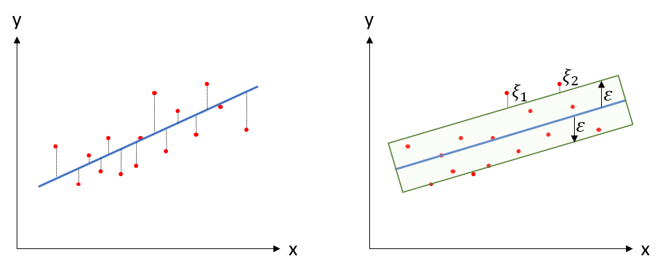

```{r setup, include=FALSE}
knitr::opts_chunk$set(echo = TRUE)
options(scipen=999)
```

# Maskinlæring (Machine Learning)

R-pakker brukt i dette kapittelet:

```{r}
pacman::p_load(tidyverse, AmesHousing, outliers, EnvStats, caTools, Metrics, psych, tdr, readxl, e1071, caret, plotly, rpart, rpart.plot, knitr, hydroGOF, ggridges, tidymodels, sf, patchwork, RColorBrewer, grid, ragg, ipred, rattle, randomForest, glmnet, datasets, plotrix, ggforce, ROCit, car) 
```

Hensikten med å analysere samfunnet rundt oss er å forstå verden. I dette ligger at vi ønsker å kunne forklare hva som skjer og hvorfor (faktuelt og kaulsalt) *og* predikere hva vi tror kommer til å skje. Forklaring og prediksjon kan ofte stå i litt i motsetning til hverandre. Som vi har nevnt et sted tidligere - alle modeller (sav samfunnet) er feil. Men noen modeller er mindre feil enn andre, og noen er også nyttige for oss (selv om vi vet de inneholder feil). En modell som inneholder "alt" er ingen modell, men virkeligheten selv. Altså må vi hele tiden foreta valg når vi lager modeller. En modell som inneholder et svært høyt antall variabler kan være mer nøyaktig, men samtidig veldig vanskelig å forstå. Og en modell som forklarer hva som har skjedd godt trenger ikke å være en modell som predikerer godt hva som kommer til å skje.

Vi antar at avveiningen mellom forklaring og prediksjon er viktig og sentral for alle felt innenfor samfunnsvitenskapene, og at avveiningen har ulikt fokus og innretting fra fagfelt til fagfelt. @yarkoniChoosingPredictionExplanation2017 påpker f.eks. at for psykologi som fagfelt at "an increased focus on prediction, rather than explanation, can ultimately lead us to greater understanding of behavior" (s.1100).

Berepet "maskinlæring" har blitt et mer og mer sentralt begrep i samfunnsvitenskapelig metode generelt og i dataanalyse spesielt. Selve begrepet ble "coinet" (først brukt) av @samuelStudiesMachineLearning1959. Endel av metodene i maskinlæring kjenner vi fra før. Regresjon er f.eks. et sentralt element i "pakken" av metoder som kan puttes inn i begrepet maskinlæring. Og regresjon er jo ikke noe nytt, så er maskinlæring kun et moteord? Et fancy ord på ting vi har gjort før? Tja, kanskje svaret er både ja og nei. Det er unektelig slik at vi har drevet med regresjonsanalyser lenge før begrepet maskinlæring i hvert fall ble allment kjent og popularisert. Samtidig er maskinlæring en distinkt gruppe av analytiske metoder hvis hensikt er å - nettopp - lære. Med dette mener vi modeller som bruker data til å forbedre analyseoppgavene vi har foran oss.

Maskinlæring kan defineres som en prosess der vi mater data inn i generiske algoritmer og vi (forhåpentligvis) får vite noe fornuftig om dataene uten å skrive spesifikk kode for å få denne innsikten.       

## Assosiasjon vs. prediksjon

Et sentralt element i maskinlæring er prediksjon. Som nevnt ovenfor er f.eks. regresjonsanalyser et kjent begrep som vi har gått relativt grundig gjennom i tidligere kapitler. Vi skal imidlertid være klar over at all snakk om $R^2$ *ikke* sier noe om hvor godt en regresjonsmodell evner å predikere. $R^2$ forteller oss imidlertid noe om hvor godt den gitte regresjonsmodellen i snitt forklarer variansen i dataene vi har. Regresjonskoeffisientene beregnes for å maksimere $R^2$ (gjennom å minimere feilleddene). Av to modeller for samme data forklarer en modell med høyere $R^2$ mer av variansen i de foreliggende dataene enn en modell med lavere $R^2$. Men vi vet ikke noe om de to modellenes evne til å predikere. Derfor er maskinlæring fokusert på at modeller må trenes og testes. Dvs at dataene deles i uavhengige deler, der modellen utvikles og trenes på en del, og testes på en annen del. Merk: Dette er ikke det samme som å utvikle en regresjonsmodell på et datasett, og "teste" ved å replikere analysen på nye data. Dette er i realiteten to modeller - tradisjonell replikasjon - siden koeffisientene i modellen vil tilpasses to sett data (selv om de uavhengige variablene er de samme). Merk: Dette er ikke en kritikk av replikasjon, men en klargjøring av at i maskinlæring er prediksjon det sentrale. Den prediktive lakkmustesten for modeller ligger i hvor godt den klarer å predikere nye verdier ift observerte verdier den ikke har sett (altså hvor nærme observasjonene kommer prediksjonene). 

## Konsepter og definisjoner

Maskinlæring knyttes tett til kunstig intelligens (Articifical Intelligence, eller bare AI). Det er imildertid ulike oppfatninger av hvordan disse begrepene forholder seg til hverandre. I tillegg har begrepet "deep learning" også kommet mer i fokus. En vanlig måte å se sammenhengen på er denne [@superdatascienceMachineLearningAZ2022]:


Det er videre vanlig å sele inn maskinlæring ut fra hvordan dataanalysen skjer:

-   Supervised learning: Modellering gjennom algoritmer som kjenner både input og ønsket output. Her lager vi modeller som kan predikere gjennom å "se" på korrekte/virkelige data ("virkeligheten") for å finne matematiske sammenhenger i dataene som gir de resultatene som foreligger. Vi kan se på dette som å forberede seg til en eksamen gjennom å se på tidligere eksamensoppgaver og fasit for disse, lære hvordan de riktige resultatene (i fasiten) ble regnet ut, og bruke den lærdommen på nye oppgaver. Jo flere tidligere eksamener man har regnet gjennom og lært av - jo større sannsynlighet for at man kan bruke denne lærdommen som modell for å løse neste eksamensoppgave. De to vanligste teknikkene å bruke i supervised learning er:
    - Regresjon: F.eks. lineær, logistisk, polynomial, SVR. Regresjon predikerer en numerisk verdi. En lønnsomhetsmodell kan f.eks. predikere lønnsomhet for en bedrift som en numerisk verdi (kroner). En meteorologisk modell kan predikere nedbør (mm). En salgsprismodell kan predikere salgspris for eiendommer (kroner).
    - Klassifisering: F.eks. lineær, SVM, beslutningstre, k-nearest neighbor, random forest. Klassifisering predikerer et sett av ordnede eller uordnede kvalitative verdier. Generelt kan man si at en klassifiseringsmodell predikerer sannsynligheten for at et eller annet befinner seg i en spesifisert kategori. En klassifiseringsmodell kan f.eks. predikere om en gitt e-post er spam eller ikke. En klassifiseringsmodell kan predikere om en gitt ansatt vil bytte jobb eller ikke, eller om en gitt kunde vil kjøpe en vare eller ikke. 
-   Unsupervised learning: Modellering gjennom algortimer som kjenner kun input, og forsøker finne mønstre og grupper i dataene gjennom sannsynligheter (for at noe tilhører den ene eller den andre gruppen eller kategorien). I motsetning til supervised learning kjenner vi ikke svarene. Hvis studenten som leser til en eksamen bruker tidligere eksamensoppgaver, men ikke har fasiten, er det vanskelig å se hvordan studenten kan lære (i hvert fall være sikker på at det er korrekt). I unsupervised learning har man en datamengde (ofte stor) der man forsøker å finne meningsfulle mønstre og sammenhenger i dataene. Her er ikke kategoriene definert på forhånd (som i supervised learning). 
    - Clustering: Gruppering av data basert på likhet eller forskjeller
    - Assosiering: Identifisering av sammenhenger mellom variabler
    - Dimensionality reduction: Komponentanalyse (PCA), SVD o.l.
-   Semi-supervised learning: En form for mellomting mellom supervised og unsupervised, dvs. vi kan ha mindre deler av data med input og output som kan brukes på data uten kjent/ønsket output. F.eks. at supervised learning bruker unsupervised learning gjennom såkalt "feature engineering".
-   Reinforcement learning: Modellering gjennom algoritmer der henskten/målsetningen er å maksimere en oppfatning om kumulativ utkomme gjennom belønning eller straff. Reinforcement learning brukes f.eks. til å lære maskiner å spille spill mot mennesker, eller til å generere policies/strategier for å maksimere kost/nytte-vurderinger i ulike sammenhenger. Andre eksempler kan være selvstyrende biler, trading i finans- og investeringsbeslutninger, "natural language processing - NLP" som innebærer automatisk behandling av tekst (f.eks. i oversettelser) og anvendelser i helsesektoren (som "dymanic treatment regimes - DTR") innenfir diagnose og behandling. Modellen utvikles gjennom å straffe "feil" beslutninger/tiltak og belønne "riktige". 

I tillegg skal man ikke holde på lenge med maskinlæring før begrepene Neural networks, Natural Language Processing (NLP) og Deep learning dukker opp. Disse kan, slik vi ser det, alle assosieres med såvel supervised som unsupervised learning. Vi kommer ikke til å gå inn på disse begrepene i dette kapittelet, men heller ta for oss disse begrepene i eget kapittel.

## Supervised Learning

### Generisk forståelse av supervised learning

Vi ønsker altså å lage modeller som kan predikere hvilke verdier vi kan forvente på en avhengig variabel ut fra gitte verdier på x antall uavhengige variabler. Før vi kan gjøre disse prediksjonene må vi trene opp modellen. Dette gjøres normalt gjennom å dele opp et datasett i en treningsdel og en testdel. 

For å trene modellen må vi kjøre observasjoner gjennom algoritmen (modellen), gjøre prediksjoner, sjekke med "fasit", evaluere mdoellen, og gjenta prosessen:


Prosedyren som er vist for to observasjoner over gjentas for datasettet. Modellen oppdateres og lærer sammenhengen mellom de uavhengige og den avhengige variabelen ved hver iterasjon. Intuitivt kan vi se at mange iterasjoner (store datasett) gir flere muligheter for modellen å lære, og dermed vil man anta at læring fra store datasett gir bedre modeller enn for små datasett. Til slutt kan vi evaluere modellen ved å kjøre modellen på testdelen av datasettet og sammenlikne de predikerte verdiene for den avhengige variabelen fra modellen med de faktiske målingene i testdataene. Dette gjør oss i stand til å vurdere hvor god vår modell er.

#### Tap og minimering av tap ("loss and reducing loss")

Når vi trener modellen i supervised learning finner vi verdier i modellens parametere (tenk på f.eks. stigningstall og skjæringspunkt i en enkel lineær regresjon) som minimerer tap ("loss"). Tap innebærer en måling/verdi av hvor dårlig modellens prediksjon var for et enkelt tilfelle. Perfekt perdiksjon = 0 tap, og en god modell har lite tap i gjennomsnitt for alle tilfellene/observasjonene. For datasettet bruker vi ofte MSE - Mean Square Error som et mål på dette (se mer detaljer om MSE under f.eks. lineær regresjon lenger ned). 

Vi kan illustrere prosedyren for algoritmens beregning av minimalisering av tap med det følgende:

```{r echo = FALSE}

quadratic_fun <- function(x){
  x^2
}

ggplot(data.frame(x = c(-15,15)), aes(x = x)) +
    stat_function(fun = quadratic_fun) +
    xlim(c(-15, 15)) +
    labs(x = "Verdi koeffisient", y = "Loss") +
    theme_bw() +
    theme(axis.text.x = element_blank(), 
          axis.ticks.x = element_blank(),
          axis.text.y = element_blank(),
          axis.ticks.y = element_blank()) +
    geom_point(aes(x = -13.4, y = 180), colour = "red", size = 3) +
    geom_text(x = -15, y = 180, label = "Punkt 1", color = "red") +
    geom_segment(aes(x = -13, y = 180, xend = -12, yend = 180),
                  arrow = arrow(length = unit(0.3, "cm")), color = "red") +
    geom_point(aes(x = -12, y = 143), colour = "red", size = 3) +
    geom_text(x = -13.5, y = 143, label = "Punkt 2", color = "red") +
    geom_segment(aes(x = -11.5, y = 143, xend = -10.5, yend = 143),
                  arrow = arrow(length = unit(0.3, "cm")), color = "red") +
    geom_point(aes(x = -8, y = 64), colour = "red", size = 3) +
    geom_text(x = -9.5, y = 64, label = "Punkt 3", color = "red") +
    geom_segment(aes(x = -7.5, y = 64, xend = -6.5, yend = 64),
                  arrow = arrow(length = unit(0.3, "cm")), color = "red") +
    geom_point(aes(x = 8, y = 64), colour = "red", size = 3) +
    geom_text(x = 9.5, y = 64, label = "Punkt 4", color = "red") +
    geom_segment(aes(x = 7.5, y = 64, xend = 6.5, yend = 64),
                  arrow = arrow(length = unit(0.3, "cm")), color = "red") +
    geom_point(aes(x = 0, y = 0), colour = "red", size = 3) +
    geom_text(x = 0, y = -6, label = "Minimum loss", color = "red")

```

Algoritmen starter i punkt 1 og beregner gradienten for "loss courve" (som i eksempelet = den dervierte/stigningstallet til kurven i det relevante punktet). Ut fra dette kan algoritmen bevege seg mot minimum loss. I punkt 2, 3 og 4 skjer det samme (i ounkt 4 har vi åpenbart "gått for langt" (positiv gradient) og algoritmen beregner at man må tilbake for å nå minimum loss). I prinsippet kan man ta museskritt for hvert steg, men det vil kreve et stort antall forsøk. På samme måte kan stegene bli for store og man vil hoppe fra den ene siden av minimum loss til den andre og tilbake. Antall steg man må gjennom før minimum loss finnes kalles "learning rate". 

### Regresjon

Vi har i tidligere kapitler gått gjennom enkel og multippel OLS og polynomial regresjon. Disse er også teknikker under paraplyen maskinlæring. Selv om vi har vist regresjon i tidligere kapittel introduserer vi et element i maskinlæringskapittelet som viser splitting av datasett i treningsdata og testdata. Dette er karakteristisk for maskinlæring. Det innebærer at vi deler datasettet (tilfeldig) inn i to grupper: den første gruppa - treningsdata - bruker vi til å lage/trene en modell. Den andre gruppa - testdata - bruker vi for å se hvor god modellen vi lagde med treningsdataene klarer å predikere dataene som ligger i testdatasettet. Testdatasettet består jo av "virkelige" data, så hvis modellen vår er god og klarer å predikere disse dataene kan vi si noe sikrere om hvor godt vi kan anta modellen vil predikere nye, hittil ikke målte/observerte verdier.

I delkapittelet om regresjon skal vi bruke datasettet AmesHousing


```{r echo = FALSE, warning = FALSE, message = FALSE, eval = TRUE}
xfun::embed_file("AmesHousing.csv")
```

```{r warning = FALSE, message = FALSE}
Ames <- read.csv("AmesHousing.csv")
Amesdim <- as_tibble(dim(Ames))
Amesdim
```

Datasettet "AmesHousing" [@decockAmesIowaAlternative2011] inneholder salgsdata for `r Amesdim[1,1]` boliger i Ames, Iowa i tidsrommet 2006 til 2010 med tilhørende `r Amesdim[2,1]` variabler (nominelle, ordinale, diskrete og kontinuerlige). Den uavhengige variabelen er salgspris. En oversikt over variablene finnes flere stedet på nett, f.eks. [her](https://rdrr.io/cran/AmesHousing/man/ames_raw.html) og mer detaljert [her](http://jse.amstat.org/v19n3/decock/DataDocumentation.txt).

Vi skal i dette kapittelet ta utgangspunkt i det opprinnelige datasettet. Det finnes mange versjoner av dette datasette på nett siden det er et populært datasett, også i konkurranser på nett innen maskinlæring. I neste kapittel - der vi også tar for oss maskinlæring - vil vi bruke en modifisert versjon av datasettet som ligger i R-pakken "tidymodels". Vi vil også velge en litt annen tilnærming i analysen, og leseren kan dermed se både litt mer av bredden i tilnærminger og kunne sammenlikne hva ulike valg gjør med analysene.

#### Manglende verdier i datasettet (NAs)

Det kan innledningsvis være verdt å se om vi har variabler med mange manglende verdier ("na"). Vi kan først se på hvilke kolonner (variabler) som har manglende verdier:

```{r}
nas <- as_tibble(colSums(is.na(Ames))) %>%
    na_if(0) %>%
    drop_na()
nanavn <- as_tibble(names(which(colSums(is.na(Ames)) > 0)))
natabell <- bind_cols(nanavn, nas) %>%
    rename(Variabel = value...1, Antall_NA = value...2) %>%
    arrange(desc(Antall_NA))
natabell
```

Vi kan se at 5 variabler har et veldig høyt antall manglende verdier (NAs). Jeg velger å droppe disse variablene fra datasettet.

```{r}
Ames2 <- subset(Ames, select = -c(Pool.QC, Misc.Feature, Alley, Fence, Fireplace.Qu))
dim(Ames2)
```

Vi kan følge samme prosedyre som ovenfor for å få fram revidert liste over NAs (viser ikke kdoen for dette).

```{r echo = FALSE}
nas2 <- as_tibble(colSums(is.na(Ames2))) %>%
    na_if(0) %>%
    drop_na()
nanavn2 <- as_tibble(names(which(colSums(is.na(Ames2)) > 0)))
natabell2 <- bind_cols(nanavn2, nas2) %>%
    rename(Variabel = value...1, Antall_NA = value...2) %>%
    arrange(desc(Antall_NA))
natabell2
```

Det er flere måter å håndtere manglende verdier på. Vi velger her å erstatte NA med gjennomsnitt for "Lot.Frontage" som har mange manglende verdier, og lar øvrige variabler være hva angår manglende verdier. Det kan være aktuelt også å bruke median for manglende verdier, eller bare la det være.

```{r}
Ames2 <- Ames2 %>% 
  mutate(Lot.Frontage = ifelse(is.na(Lot.Frontage), mean(Lot.Frontage, na.rm = TRUE), Lot.Frontage))
```

Vi kan sjekke at vi ikke har na i Lot.Frontage.

```{r}
sum(is.na(Ames2$Lot.Frontage))
```

Og står igjen med denne lista over variabler med respektive antall na:

```{r echo = FALSE}
nas3 <- as_tibble(colSums(is.na(Ames2))) %>%
    na_if(0) %>%
    drop_na()
nanavn3 <- as_tibble(names(which(colSums(is.na(Ames2)) > 0)))
natabell3 <- bind_cols(nanavn3, nas3) %>%
    rename(Variabel = value...1, Antall_NA = value...2) %>%
    arrange(desc(Antall_NA))
natabell3
```

Som tidligere nevnt kan det være aktuelt å behandle også disse - og på ulike måter. Det avhenger mye av konteksten og hvor problematisk vi oppfatter de manglende verdiene å være (hvor stor andel utgjør de pr variabel i forhold til totalt antall observasjoner o.l.). Vi lar disse være for nå.

#### Uteligger

Den avhengige variabelen er salgspris ("SalePrice"). Hvis vi ser på distribusjonen av boligenes verdi ser vi indikasjoner på at det kan være enkeltboliger med unormalt høye salgsverdier.

```{r fig.cap = "AmesHousing - boligens salgspris"}
Amessalgspris <- ggplot() +
    geom_point((aes(x = seq_along(Ames2$SalePrice), y = Ames2$SalePrice))) + 
    xlab("Bolig nr.") +
    ylab("Verdi") +
    theme_bw()
Amessalgspris
```

Dette kommer tydeligere fram i histogrammet:

```{r fig.cap = "Histogram for boligsalgspris"}
bolighistogram <- ggplot(Ames2, aes(x=SalePrice)) + 
    geom_histogram(color="black", fill="lightblue", bins = 50) +
    labs(title = "Histogram salgsverdi", x = "Salgspris i $", y = "Antall") +
    theme_bw()
bolighistogram
```

Vi får også en klar indikasjon på uteliggere gjennom boksplottet:

```{r fig.cap = "Boxplott for boligsalgspris"}
boligbox <- ggplot(data = Ames2, aes(x = "", y = SalePrice)) + 
    geom_boxplot(fill = 'lightblue') +
    ylab("Verdi") +
    theme_bw()
boligbox
```

Uteliggere er en "tricky" greie. Man kan si at all data har verdifull informasjon. Samtidig påvirker uteliggere mange analyser og kan gi oss større avvik i prediksjoner fordi modellene påvirkes i uforholdsmessig grad av uteliggere i forhold til andre observasjoner. Mange av teknikkene i maskinlæring er sensitive ovenfor uteliggere. Vi gikk i detalj inn på dette i kapittelet om OLS, så vi begrenser oss her til noen analyser og viser til dette kapittelet for mer utførlig forklaringer.

Vi starter med Grubbs test:

```{r message = FALSE, warning = FALSE}
grubbstest <- grubbs.test(Ames2$SalePrice)
grubbstest
```

Høyeste salgsverdi bør altså regnes som uteligger (hvis ikke høyeste verdi bør ses som en uteligger er det ingen grunn til å gå videre).

Vi kan også bruke et såkalt Hampel filter som tar utgangspunkt i median:

```{r}
nedregrense <- median(Ames2$SalePrice) - 3*(mad(Ames2$SalePrice, constant = 1))
ovregrense <- median(Ames2$SalePrice) + 3*(mad(Ames2$SalePrice, constant = 1))
uteligger_ind <- which(Ames2$SalePrice < nedregrense |Ames2$SalePrice > ovregrense)
uteligger_ind
```

Gjennom å identifisere uteliggere gjennom Hampelfilteret kan vi fjerne uteliggere (som sagt er det mange måter å forholde seg til uteliggere på og mye er kontekstavhengig - vi går ikke inn i ulike måter å behandle uteliggere på her, men velger å vise hvordan vi fjerner de identifiserte uteliggerne etter Hampel).

```{r}
Ames3 <- subset(Ames2, Ames2$SalePrice > nedregrense & Ames2$SalePrice < ovregrense)
```

Vi kan se hvordan datasettet har endret seg som følge av de justeringene vi nå har gjort:

```{r}
v1 <- as.data.frame(dim(Ames))
v2 <- as.data.frame(dim(Ames2))
v3 <- as.data.frame(dim(Ames3))
Amesendring <- as.data.frame(c(v1, v2, v3))
rownames(Amesendring) <- c("Observasjoner", "Variabler")
colnames(Amesendring) <- c("Ames", "Ames2", "Ames3")
kable(Amesendring, caption = "Utvikling av datasettet gjennom 'data cleaning'")
```

Vi sjekker nå Ames3 gjennom Rosners test (de 5 mest uteliggende verdiene blant gjenværende data):

```{r message = FALSE, warning = FALSE}
rosnerstest <- rosnerTest(Ames3$SalePrice, k = 5)
rosnerstest$all.stats
rosnerstest$n.outliers
```

Vi kan også sjekke igjen med et boksplott:

```{r fig.cap = "Boxplott for modifisert datasett"}
boligbox2 <- ggplot(data = Ames3, aes(x = "", y = SalePrice)) + 
    geom_boxplot(fill = 'lightblue') +
    ylab("Verdi") +
    theme_bw()
boligbox2
```

Til slutt merker vi oss at variabelen "SaleCondition" er en variabel som har registrert om salget har skjedd

- "Normal" - som vi tolker som etter markedsmessige betingelser)
- "Abnorml" - "trade, foreclosure, short sale"
- "Family" - "Sale between family members"
- "Partial" - "Home was not completed when last assessed (associated with New Homes)"
- "AdjLand" - "Adjoining Land Purchase"
- "Alloca" - "Allocation - two linked properties with separate deeds, typically condo with a garage unit"

Vi kan mistenke at unormalt salg, som salg innad i familie eller tvangssalg, kan ha en vesentlig påvirkning på salgspris, og siden vi er interessert i å modellere markedsmessige betingelser ("de normale salgene") ved salgsprisen bør vi undersøke dette.

```{r}
group_by(Ames3, Sale.Condition) %>%
  summarise(
    count = n(),
    mean = mean(SalePrice, na.rm = TRUE))
salgstype <- ggplot(Ames3, aes(x = Sale.Condition, y = SalePrice, fill = Sale.Condition)) + 
    geom_boxplot() +
    theme_bw()
salgstype
```

Vi kan se at det det er forskjeller. "Famliy" og "Normal" virker derimot ikke så veldig ulike, men forskjellene mellom andre grupper virker større. Vi kan se på den overordnede effekten av salgstypene gjennom en ANOVA.

```{r}
res.aov <- aov(SalePrice ~ Sale.Condition, data = Ames3)
summary(res.aov)
```

Siden p-verdien er signifikant kan vi si det er signifikant forskjell mellom en eller flere av gjennomsnittsverdiene for de ulike gruppene i Sale.Condition. For å se på hviklke av gruppene som har signifikant forskjell gjør vi en post-hoc test.

```{r}
TukeyHSD(res.aov)
```

Vi tar utgangspunkt i at "normal" er den markedsmessige salgsprosessen vi ønsker å modellere, noe vi forsåvidt også ser ut fra antallet salgsprosesser (som i overveiende grad er normale). Vi ønsker derfor å ta ut de typene salgsprosesser som har signifikant forskjellig salgsverdi i forhold til normal. Av ANOVA-resultatene ser vi at det gjelder "abnorml", "AdjLand" og "Partial" (vi kan også legge merke til at det **ikke** er signifikant forskjell på en kommersiell salgsprosess og salgsprosess i kategorien "familiy" som vi kanskje forventet). Dette stemmer bra overens med indikasjonene i den grafiske framstillingen ovenfor.

Vi velger derfor å ta ut salgstypene som er signifikant forskjellige fra normal.

```{r}
Ames4 <- Ames3[Ames3$Sale.Condition != "Abnorml" & Ames3$Sale.Condition != "AdjLand" & Ames3$Sale.Condition != "Partial",]
group_by(Ames4, Sale.Condition) %>%
  summarise(
    count = n(),
    mean = mean(SalePrice, na.rm = TRUE))
```

Vi kan se at gjennomsnittsprisen for boliger solgt til familie er lavere enn normalt salg, men forskjellen er altså ikke statistisk signifikant.
Samlet etter alle justeringer ser utviklingen i datasettet slik ut:

```{r}
v4 <- as.data.frame(dim(Ames4))
Amesendring2 <- data.frame(c(v1, v2, v3, v4))
rownames(Amesendring2) <- c("Observasjoner", "Variabler")
colnames(Amesendring2) <- c("Ames", "Ames2", "Ames3", "Ames4")
kable(Amesendring2, caption = "Utvikling av datasettet til Ames Housing gjennom 'data cleaning'")
```

Vårt datasett ender altså opp med `r Amesendring2[1,4]` boligsalg med `r Amesendring2[2,4]` variabler.

I videre analyse vil vi bruke en versjon av datasettet som kommer i pakken "AmesHousing". I denne versjonen er det ryddet opp litt mer og det er lagt til geodata (lengde- og breddegrad på salgsobjektene). Alt vi har gjort hittil kan imidlertid være nødvendige steg i forberedelser av data til analyse. Datasettet kan lastes inn direkte fra pakken: 

```{r}
data(ames, package = "modeldata")
dim(ames)
```

Vi kan se litt nærmere på datasettet vi tar med oss videre i analysen. Siden boligene er registrert solgt i ulike nabolag vil det være interessant å se på hvordan salgspris slår ut ift nabolag. Vi kan først vise byen Ames og de ulike salgsobjektene plottet på et kart som også viser nabolagene. Det kan ligge mye informasjon innledningsvis i et plott av denne type data på kart. Bildet under er laget i sin helhet på kode fra @kuhnTidyModeling2022, og koden finnes [her](https://github.com/tidymodels/TMwR/blob/main/extras/ames_sf.R). 

```{r echo = FALSE, warning = FALSE, message = FALSE}
# Laster inn kart som er lastet ned
ia_roads <- st_read(dsn = "iowa_highway.shp") 

# Setter fargenyanser

col_vals <- brewer.pal(8, "Dark2")

# Setter farger på plottesymbolene fo rnabolagene

ames_cols <- c(
  North_Ames = col_vals[3],
  College_Creek = col_vals[4],
  Old_Town = col_vals[8],
  Edwards = col_vals[5],
  Somerset = col_vals[8],
  Northridge_Heights = col_vals[4],
  Gilbert = col_vals[2],
  Sawyer = col_vals[7],
  Northwest_Ames = col_vals[6],
  Sawyer_West = col_vals[8],
  Mitchell = col_vals[3],
  Brookside = col_vals[1],
  Crawford = col_vals[4],
  Iowa_DOT_and_Rail_Road = col_vals[2],
  Timberland = col_vals[2],
  Northridge = col_vals[1],
  Stone_Brook = col_vals[5],
  South_and_West_of_Iowa_State_University = col_vals[3],
  Clear_Creek = col_vals[1],
  Meadow_Village = col_vals[1],
  Briardale = col_vals[7],
  Bloomington_Heights = col_vals[1],
  Veenker = col_vals[2],
  Northpark_Villa = col_vals[2],
  Blueste = col_vals[5],
  Greens = col_vals[6],
  Green_Hills = col_vals[8],
  Landmark = col_vals[3],
  Hayden_Lake = "red"
)

# Setter valg av plottesymboler for nabolagene

ames_pch <- c(
  North_Ames = 16,
  College_Creek = 16,
  Old_Town = 16,
  Edwards = 16,
  Somerset = 15,
  Northridge_Heights = 15,
  Gilbert = 16,
  Sawyer = 16,
  Northwest_Ames = 16,
  Sawyer_West = 17,
  Mitchell = 15,
  Brookside = 16,
  Crawford = 17,
  Iowa_DOT_and_Rail_Road = 17,
  Timberland = 15,
  Northridge = 15,
  Stone_Brook = 15,
  South_and_West_of_Iowa_State_University = 17,
  Clear_Creek = 17,
  Meadow_Village = 18,
  Briardale = 15,
  Bloomington_Heights = 20,
  Veenker = 18,
  Northpark_Villa = 20,
  Blueste = 17,
  Greens = 15,
  Green_Hills = 18,
  Landmark = 18,
  Hayden_Lake = 16
)


## -----------------------------------------------------------------------------

# extendrange drar ut enkeltplott med en liten prosent hver veg (x, y)

ames_x <- extendrange(ames$Longitude)
ames_y <- extendrange(ames$Latitude)
ames_ratio <- diff(ames_x)/diff(ames_y)

# Lager rammene for kartet
all_ames <- 
  ggplot() +
  xlim(ames_x) +
  ylim(ames_y) + 
  theme_void() + 
  theme(legend.position = "bottom", legend.title = element_blank()) +
  geom_sf(data = ia_roads, aes(geometry = geometry), alpha = .1) +
  geom_point(
    data = ames,
    aes(
      x = Longitude,
      y = Latitude,
      col = Neighborhood,
      shape = Neighborhood
    ),
    size = 1, 
    alpha = .5
  ) + 
  scale_color_manual(values = ames_cols) + 
  scale_shape_manual(values = ames_pch)

agg_png("ames.png", width = 820 * 3, height = 820 * 3, res = 300, scaling = 1)
print(all_ames)
dev.off()

## -----------------------------------------------------------------------------

mitchell_x <- extendrange(ames$Longitude[ames$Neighborhood == "Mitchell"], f = .1)
mitchell_y <- extendrange(ames$Latitude[ames$Neighborhood == "Mitchell"], f = .1)

mitchell_box <- 
  ggplot() +
  xlim(extendrange(ames$Longitude)) +
  ylim(extendrange(ames$Latitude)) + 
  theme_void() + 
  theme(legend.position = "none", plot.title = element_text(hjust = 0.5),
        plot.background = element_rect(linetype = 'solid', colour = 'black', size = 1)) +
  geom_sf(data = ia_roads, aes(geometry = geometry), alpha = .1) +
  geom_point(
    data = ames %>% filter(Neighborhood %in% c("Meadow_Village", "Mitchell")),
    aes(
      x = Longitude,
      y = Latitude,
      col = Neighborhood,
      shape = Neighborhood
    ),
    size = .3, 
    alpha = .5
  ) + 
  scale_color_manual(values = ames_cols) + 
  scale_shape_manual(values = ames_pch) +
  geom_rect(
    aes(
      xmin = mitchell_x[1],
      xmax = mitchell_x[2],
      ymin = mitchell_y[1],
      ymax = mitchell_y[2]
    ),
    fill = NA,
    color = "black"
  )


mitchell_with_space <- mitchell_x
mitchell_with_space[2] <- mitchell_x[2] +  diff(mitchell_x) * .5
mitchell_ratio <- diff(mitchell_with_space)/diff(mitchell_y)

mitchell <- 
  ggplot() +
  xlim(mitchell_with_space) +
  ylim(mitchell_y) +
  theme_void() + 
  theme(
    legend.position = c(.82, .55 ),
    legend.background = element_rect(
      fill = "white",
      colour = NA,
      size = 3
    ),
    legend.text  = element_text(size = rel(1.5)),
    legend.title = element_text(size = rel(1.5))
  ) +
  geom_sf(data = ia_roads, aes(geometry = geometry), alpha = .3) +
  geom_point(
    data = ames %>% filter(Neighborhood %in% c("Meadow_Village", "Mitchell")),
    aes(
      x = Longitude,
      y = Latitude,
      col = Neighborhood,
      shape = Neighborhood
    ),
    size = 4, 
    alpha = .5
  ) + 
  scale_color_manual(values = ames_cols) + 
  scale_shape_manual(values = ames_pch)


# make plot and guide side-by-side
# mitchell_box +  plot_spacer() + mitchell +  plot_layout(widths = c(2, 0.1, 3))

# guide inset in plot
agg_png("mitchell.png", width = 480 * mitchell_ratio * 2, height = 480 * 2, res = 200)
print(mitchell)
print(mitchell_box, vp = viewport(0.8, 0.27, width = 0.3 * ames_ratio, height = 0.3))
dev.off()


## -----------------------------------------------------------------------------

timberland_x <- extendrange(ames$Longitude[ames$Neighborhood == "Timberland"], f = .2)
timberland_y <- extendrange(ames$Latitude[ames$Neighborhood == "Timberland"], f = .2)

timberland_box <- 
  ggplot() +
  xlim(extendrange(ames$Longitude)) +
  ylim(extendrange(ames$Latitude)) + 
  theme_void() + 
  theme(legend.position = "none", plot.title = element_text(hjust = 0.5),
        plot.background = element_rect(linetype = 'solid', colour = 'black', size = 1)) +
  geom_sf(data = ia_roads, aes(geometry = geometry), alpha = .1) +
  geom_point(
    data = ames,
    aes(
      x = Longitude,
      y = Latitude,
      col = Neighborhood,
      shape = Neighborhood
    ),
    size = .2, 
    alpha = .5
  ) + 
  scale_color_manual(values = ames_cols) + 
  scale_shape_manual(values = ames_pch) +
  geom_rect(
    aes(
      xmin = timberland_x[1],
      xmax = timberland_x[2],
      ymin = timberland_y[1],
      ymax = timberland_y[2]
    ),
    fill = NA,
    color = "black"
  )


timberland_with_space <- timberland_x
timberland_with_space[2] <- timberland_x[2] +  diff(timberland_x) * .15
timberland_ratio <- diff(timberland_with_space)/diff(timberland_y)

timberland <- 
  ggplot() +
  xlim(timberland_with_space) +
  ylim(timberland_y) +
  theme_void() + 
  theme(legend.position = "none") +
  geom_sf(data = ia_roads, aes(geometry = geometry), alpha = .3) +
  geom_point(
    data = ames,
    aes(
      x = Longitude,
      y = Latitude,
      col = Neighborhood,
      shape = Neighborhood
    ),
    size = 5, 
    alpha = .5
  ) + 
  scale_color_manual(values = ames_cols) + 
  scale_shape_manual(values = ames_pch)

# guide inset in plot
agg_png("timberland.png", width = 480 * timberland_ratio)
print(timberland)
print(timberland_box, vp = viewport(0.85, 0.2, width = 0.3 * ames_ratio, height = 0.3))
dev.off()

## -----------------------------------------------------------------------------

dot_rr_x <- extendrange(ames$Longitude[ames$Neighborhood == "Iowa_DOT_and_Rail_Road"], f = .05)
dot_rr_y <- extendrange(ames$Latitude[ames$Neighborhood == "Iowa_DOT_and_Rail_Road"], f = .1)

dot_rr_box <- 
  ggplot() +
  xlim(extendrange(ames$Longitude)) +
  ylim(extendrange(ames$Latitude)) + 
  theme_void() + 
  theme(legend.position = "none", plot.title = element_text(hjust = 0.5),
        plot.background = element_rect(linetype = 'solid', colour = 'black', size = 1)) +
  geom_sf(data = ia_roads, aes(geometry = geometry), alpha = .1) +
  geom_point(
    data = ames %>% filter(Neighborhood %in% c("Iowa_DOT_and_Rail_Road")),
    aes(
      x = Longitude,
      y = Latitude,
      col = Neighborhood,
      shape = Neighborhood
    ),
    size = .3, 
    alpha = .5
  ) + 
  scale_color_manual(values = ames_cols) + 
  scale_shape_manual(values = ames_pch) +
  geom_rect(
    aes(
      xmin = dot_rr_x[1],
      xmax = dot_rr_x[2],
      ymin = dot_rr_y[1],
      ymax = dot_rr_y[2]
    ),
    fill = NA,
    color = "black"
  )


dot_rr_with_space <- dot_rr_y
dot_rr_with_space[1] <- dot_rr_y[1] -  diff(dot_rr_y)
dot_rr_ratio <- diff(dot_rr_x)/diff(dot_rr_with_space)

dot_rr <- 
  ggplot() +
  xlim(dot_rr_x) +
  ylim(dot_rr_with_space) +
  theme_void() + 
  theme(legend.position = "none") +
  geom_sf(data = ia_roads, aes(geometry = geometry), alpha = .3) +
  geom_point(
    data = ames %>% filter(Neighborhood %in% c("Iowa_DOT_and_Rail_Road")),
    aes(
      x = Longitude,
      y = Latitude,
      col = Neighborhood,
      shape = Neighborhood
    ),
    size = 6, 
    alpha = .5
  ) + 
  scale_color_manual(values = ames_cols) + 
  scale_shape_manual(values = ames_pch)

# guide inset in plot
agg_png("dot_rr.png", width = 480 * dot_rr_ratio)
print(dot_rr)
print(dot_rr_box, vp = viewport(0.5, 0.26, width = 0.45 * ames_ratio, height = 0.45))
dev.off()


## -----------------------------------------------------------------------------

crawford_x <- extendrange(ames$Longitude[ames$Neighborhood == "Crawford"], f = .1)
crawford_y <- extendrange(ames$Latitude[ames$Neighborhood == "Crawford"], f = .1)

crawford_box <- 
  ggplot() +
  xlim(extendrange(ames$Longitude)) +
  ylim(extendrange(ames$Latitude)) + 
  theme_void() + 
  theme(legend.position = "none", plot.title = element_text(hjust = 0.5),
        plot.background = element_rect(linetype = 'solid', colour = 'black', size = 1)) +
  geom_sf(data = ia_roads, aes(geometry = geometry), alpha = .1) +
  geom_point(
    data = ames %>% filter(Neighborhood %in% c("Crawford")),
    aes(
      x = Longitude,
      y = Latitude,
      col = Neighborhood,
      shape = Neighborhood
    ),
    size = .3, 
    alpha = .5
  ) + 
  scale_color_manual(values = ames_cols) + 
  scale_shape_manual(values = ames_pch) +
  geom_rect(
    aes(
      xmin = crawford_x[1],
      xmax = crawford_x[2],
      ymin = crawford_y[1],
      ymax = crawford_y[2]
    ),
    fill = NA,
    color = "black"
  )


crawford_with_space <- crawford_y
crawford_with_space[1] <- crawford_y[1] -  diff(crawford_y) * .4
crawford_ratio <- diff(crawford_x)/diff(crawford_with_space)

crawford <- 
  ggplot() +
  xlim(crawford_x) +
  ylim(crawford_with_space) +
  theme_void() + 
  theme(legend.position = "none") +
  geom_sf(data = ia_roads, aes(geometry = geometry), alpha = .3) +
  geom_point(
    data = ames %>% filter(Neighborhood %in% c("Crawford")),
    aes(
      x = Longitude,
      y = Latitude,
      col = Neighborhood,
      shape = Neighborhood
    ),
    size = 5, 
    alpha = .5
  ) + 
  scale_color_manual(values = ames_cols) + 
  scale_shape_manual(values = ames_pch)

# guide inset in plot
agg_png("crawford.png", width = 480 * crawford_ratio)
print(crawford)
print(crawford_box, vp = viewport(0.5, 0.2, width = 0.35 * ames_ratio, height = 0.35))
dev.off()

## -----------------------------------------------------------------------------


northridge_x <- extendrange(ames$Longitude[ames$Neighborhood %in% c("Northridge", "Somerset")], f = .1)
northridge_y <- extendrange(ames$Latitude[ames$Neighborhood %in% c("Northridge", "Somerset")], f = .1)

northridge_box <- 
  ggplot() +
  xlim(extendrange(ames$Longitude)) +
  ylim(extendrange(ames$Latitude)) + 
  theme_void() + 
  theme(legend.position = "none", plot.title = element_text(hjust = 0.5),
        plot.background = element_rect(linetype = 'solid', colour = 'black', size = 1)) +
  geom_sf(data = ia_roads, aes(geometry = geometry), alpha = .1) +
  geom_point(
    data = ames %>% filter(Neighborhood %in% c("Northridge", "Somerset")),
    aes(
      x = Longitude,
      y = Latitude,
      col = Neighborhood,
      shape = Neighborhood
    ),
    size = .3, 
    alpha = .5
  ) + 
  scale_color_manual(values = ames_cols) + 
  scale_shape_manual(values = ames_pch) +
  geom_rect(
    aes(
      xmin = northridge_x[1],
      xmax = northridge_x[2],
      ymin = northridge_y[1],
      ymax = northridge_y[2]
    ),
    fill = NA,
    color = "black"
  )


northridge_with_space <- northridge_x
northridge_with_space[2] <- northridge_x[2] +  diff(northridge_x) * .3
northridge_ratio <- diff(northridge_with_space)/diff(northridge_y)

northridge <- 
  ggplot() +
  xlim(northridge_with_space) +
  ylim(northridge_y) +
  theme_void() + 
  theme(
    legend.position = c(.82, .5),
    legend.background = element_rect(
      fill = "white",
      colour = NA,
      size = 3
    ),
    legend.text  = element_text(size = rel(2)),
    legend.title = element_text(size = rel(2))
  ) +
  geom_sf(data = ia_roads, aes(geometry = geometry), alpha = .3) +
  geom_point(
    data = ames %>% filter(Neighborhood %in% c("Northridge", "Somerset")),
    aes(
      x = Longitude,
      y = Latitude,
      col = Neighborhood,
      shape = Neighborhood
    ),
    size = 4, 
    alpha = .5
  ) + 
  scale_color_manual(values = ames_cols) + 
  scale_shape_manual(values = ames_pch)


# make plot and guide side-by-side
# northridge_box +  plot_spacer() + northridge +  plot_layout(widths = c(2, 0.1, 3))

# guide inset in plot
agg_png("northridge.png", width = 480 * northridge_ratio)
print(northridge)
print(northridge_box, vp = viewport(0.85, 0.21, width = 0.35 * ames_ratio, height = 0.35))
dev.off()
```

{width=85%}

Vi kan så se på hvordan salgsprisen i gjennomsnitt ser ut for de ulike nabolagene.

```{r fig.cap = "Salgspris fordelt på nabolag", warning = FALSE, message = FALSE}
ames %>% 
  ggplot(aes(x = Sale_Price/1000, y = Neighborhood, fill = Neighborhood)) + 
    geom_density_ridges() + 
    labs(x='Salgspris 1000$', y = 'Nabolag') +
    theme_ridges(font_size = 11, center_axis_labels = TRUE) + 
    theme(legend.position = 'none') + 
    labs(caption = "Salgspris pr nabolag") +
    theme_bw()
```

#### Deling av datasettet i trenings- og testdatasett

Vi deler datasettet i trenings- og testsett siden vi vil trenge dette i regresjon som metodikk i maskinlæring.

```{r}
set.seed(4595) 
data_split <- initial_split(ames, strata = "Sale_Price") 
ames_trening <- training(data_split) 
ames_test <- testing(data_split)
```

```{r}
dim1 <- as.data.frame(dim(ames_trening))
dim2 <- as.data.frame(dim(ames_test))
dimensjoner <- data.frame(dim1, dim2)
rownames(dimensjoner) <- c("Observasjoner", "Variabler")
colnames(dimensjoner) <- c("Treningssett", "Testsett")
kable(dimensjoner, caption = "Splitting av datasettet Ames Housing fra pakken 'modeldata'")
```

#### Enkel lineær regresjon

I den enkle lineære regresjonen ser vi på forholdet mellom salgspris som avhengig variabel og "Gr.Liv.Area" som er boligareal (ikke inkludert kjeller). Det vil være rimelig å anta at det er en sammenheng mellom boligareal og salgspris.

```{r fig.cap = "Enkel OLS regresjon - treningsdata"}
enkelOLS <- lm(Sale_Price ~ Gr_Liv_Area, data = ames_trening)
sjPlot::tab_model(enkelOLS)
enkelOLSplott <- ggplot() +
    geom_point(aes(x = ames_trening$Gr_Liv_Area, y = ames_trening$Sale_Price), col = "red") +
    geom_line(aes(x = ames_trening$Gr_Liv_Area, y = predict(enkelOLS, newdata = ames_trening)), col = "blue") +
    xlab("Boligareal (ikke inkl. kjeller)") +
    ylab("Salgspris") + 
    theme_bw()
enkelOLSplott
```

Vi kan se det er en sammenheng, men også at det er et slags konisk mønster/traktmønster der spredningen i verdiene øker med boligarealet. Dette kan tyde på at det er en (eller flere) andre variabler som påvirker sammenhengen mellom boligareal og salgspris. Dette kan f.eks. være beliggenhet/hvilket område av byen boligen ligger i (registrert i variabelen "Neighborhood"). Vi kan se på medianprisen for de ulike områdene:

```{r warning = FALSE, message = FALSE, fig.cap = "Boliger sortert etter median salgspris pr nabolag"}
nabolag <- tapply(ames$Sale_Price, ames$Neighborhood, median)
nabolag <- sort(nabolag, decreasing = TRUE)
nabolag
dotchart(nabolag, pch = 21, bg = "red",
         cex = 0.85,
         xlab="Medianpris solgt bolig")
```

Så kan vi se på hvilke verdier modellen vil predikere på testdataene:

```{r warning = FALSE}
y_prediksjon1 <- predict(enkelOLS, newdata = ames_test)
OLSpred <- as.data.frame(y_prediksjon1)
obs1 <- as.data.frame(ames_test$Sale_Price)
df1 <- as.data.frame(c(OLSpred, obs1))
df1$Differanse <- round(abs(df1$y_prediksjon1 - df1$ames_test.Sale_Price),0)
colnames(df1) <- c("Predikert", "Observert", "Abs differanse")
kable(head(df1, n = 10), caption = "Første 10 differanser mellom predikert og observert verdi")
```

Av plasshensyn viser vi kun de første 10 sammenlikningene mellom predikert og faktisk verdi. Den venstre kolonnen i tabellen over er verdien modellen predikerer, den høyre kolonnen tilhørende observerte verdi i testsettet.

I kapittelet om polynomisk regresjon beskrev vi "Mean Square Error" (MSE) slik:

$MSE = \frac{1}{n}*\sum(faktisk\ verdi - predikert\ verdi)$

Vi kan regne ut MSE slik:

```{r}
((1/(nrow(df1))))*sum((df1$Observert - df1$Predikert)^2)
# Alternativt:
mseOLS <- mean((df1$Observert - df1$Predikert)^2)
mseOLS
```

En annen vanlig måte å se på modellens prediksjonsevne er RMSE.

```{r warning = FALSE, message = FALSE}
rmsepred1 <- sqrt(mean((df1$Observert - df1$Predikert)^2))
rmsepred1
```

MSE/RMSE kan fortelle oss noe om hvor god modellen er ved at den sammenlikner observerte verdier mot predikerte verdier. RMSE forteller oss f.eks. den gjennomsnittlige avstanden mellom en predikert verdi og den "tilhørende" observerte verdien. Jo nærmere 0 verdien er, jo bedre predikerer modellen (0 = perfekt prediksjon). RMSE er `r round(rmsepred1, 2)`. Dvs at i gjennomsnitt bommer modellens prediksjoner med \$`r round(rmsepred1, 2)`. Vi kan tolke dette i kontekst av dataene. Det er vanskelig å si noe fornuftig om den gjennomsnittlig feilen i prediksjonen uten å se på den avhengige variabelen. La oss derfor se på den.

```{r warning = FALSE, message = FALSE}
deskSalePrice <- describe(ames$Sale_Price)
deskSalePrice
```

Vi kan se at boligprisen varierer mellom `r deskSalePrice$min` og `r deskSalePrice$max`, med et standardavvik (= verdienes gjennomsnittlig avstand fra gjennomsnittet) på `r round(deskSalePrice$sd, 2)`. I det perspektivet bør altså vurdere om en gjennomsnittlig feil på `r round(rmsepred1, 2)` indikerer en modell vi er fornøyd med eller ikke. Jeg vil være tilbøyelig til å si at dette virker som et noe høyt gjennomsnittlig avvik i prediksjonene.

Vi kan enklere tolke og sammenlikne RMSE hvis vi normaliserer verdien.

Det finnes fire beskrevne måter å normalisere RMSE [@ottoHowNormalizeRMSE2019]:

```{r warning = FALSE, message = FALSE}
deskdata1 <- describe(ames_test$Sale_Price)
# Gjennom maks og min verdier
egennrmse1 <- as.data.frame(rmsepred1/(deskdata1$max-deskdata1$min))
# Gjennom gjennomsnitt
egennrmse2 <- as.data.frame(rmsepred1/deskdata1$mean)
# Gjennom standardavvik
egennrmse3 <- as.data.frame(rmsepred1/deskdata1$sd)
# Gjennom interkvartil bredde (IQR)
interkvart <- IQR(ames$Sale_Price)
egennrmse4 <- as.data.frame(rmsepred1/(interkvart))
normrmse <- data.frame(c(egennrmse1, egennrmse2, egennrmse3, egennrmse4))
normrmse <- rename(normrmse, MaksMin = rmsepred1..deskdata1.max...deskdata1.min.,
       Snitt = rmsepred1.deskdata1.mean,
       Standardavvik = rmsepred1.deskdata1.sd,
       IQR = rmsepred1..interkvart.)
kable(normrmse, caption = "Sammenlikning av RMSE-verdi ved ulike beregningsmåter")
```

En lettere veg i R er gjennom pakken tdr (hensikten med utregning ovenfor er å vise - utregningen):

```{r warning = FALSE, message = FALSE}
normrmse1 <- as.data.frame(tdStats(df1$Predikert, ames_test$Sale_Price))
normrmseverdi <- normrmse1[12,]
kable(normrmse1, caption = "Teststatistikk for modell og prediksjon fra pakken 'tdr'")
```

Normalisert RMSE er `r round(normrmseverdi, 2)` (ut fra `r normrmseverdi`).

Merk at "tdr"-pakken bruker snitt til å normalisere i kolonnen "cvrmse" og MaksMin for å normalisere i kolonnen "nrmse" (hvilket vi ser gjennom de like verdiene fra pakken og fra vår manuelle utregning).

Jaha...så hvilken metode skal man bruke siden det gir fire ulike normaliserte verdier?

@ottoHowNormalizeRMSE2019 finner i sin simulering at "there is no normalization method (of the one tested here) that is obviously superior", men gir følgende råd:

-   Gjennomsnitt er ok hvis man sammenlikner modeller som baserer seg på samme responsvariabel. Hvis ikke, bruk en av de andre tre.
-   Maks-min metoden sies å være mer sensitiv for utvalgsstørrelse, men Otto fant ingen større forskjeller for utvalg helt ned til 5
-   IQR sies å være mindre sensitiv for ekstreme verdier

Vi må rett og slett ta et valg ut fra de (få) retningslinjene som f.eks. @ottoHowNormalizeRMSE2019 gir, men vi bør i hvert fall være obs på dette hvis vi bruker normalisert RSME til å sammenlikne modeller slik at vi ikke sammenlikner epler og pærer.

#### Multippel regresjon

Vi modifiserer datasettet noe mer, ved å velge ut de numeriske variablene for å se hvilke variabler som har korrelasjoner > 0.5 (absolutt verdi).

```{r}
numerisk <- ames %>% 
    select(where(is.numeric))
korrelasjoner <- as.data.frame(cor(numerisk, ames$Sale_Price)) %>%
    na.omit(korrelasjoner) %>%
    filter(V1 > 0.5 | V1 < -0.5)
kable(korrelasjoner, caption = "Korrelasjoner større enn +/- 0.5 blant numeriske variabler i datasettet")
```

Ut fra dette utvider vi med åtte uavhengige variabler. I tillegg til boligstørrelse tar vi nå inn "Year_Built", "Year_Remod_Add", "Mas_Vnr_Area", "Total_Bsmt_SF", "First_Flr_SF", "Full_Bath", "Garage_Cars" og "Garage_Area" som er hhv. byggeår, nyeste år for oppussing, [murflisareal](https://www.homequestionsanswered.com/what-is-masonry-veneer.htm), totalt kjellerareal, areal første etasje, antall fullverdige bad, størrelse garasje ut fra antall biler og størrelse garasjen i areal. 

Lager modell på treningssettet:

```{r}
multiregressor <- lm(Sale_Price ~ 
                         Gr_Liv_Area + 
                         Year_Built + 
                         Year_Remod_Add + 
                         Mas_Vnr_Area + 
                         Total_Bsmt_SF + 
                         First_Flr_SF + 
                         Full_Bath + 
                         Garage_Cars + 
                         Garage_Area, 
                     data = ames_trening)
sjPlot::tab_model(multiregressor)
```

Prediksjon ift testdata (10 første verdier):

```{r}
y_prediksjon2 <- predict(multiregressor, newdata = ames_test)
y_pred2 <- as.data.frame(y_prediksjon2)
obs2 <- as.data.frame(ames_test$Sale_Price)
df2 <- as.data.frame(c(y_pred2, obs2))
df2$Differanse <- round(abs(df2$y_prediksjon2 - df2$ames_test.Sale_Price),0)
colnames(df2) <- c("Predikert", "Observert", "Abs differanse")
kable(head(df2, n = 10), caption = "Første 10 differanser mellom predikert og observert verdi")
```

Vi kan sammenlikne MSE mellom multippel og enkel lineær:

```{r}
msemultippel <- mean((df2$Observert - df2$Predikert)^2)
msetab <- data.frame(mseOLS, msemultippel)
msetab$Differanse <- round(msetab$mseOLS - msetab$msemultippel, 0) 
colnames(msetab) <- c("MSE enkel linear", "MSE multippel", "Differanse")
kable(msetab, caption = "Sammenlikning MSE for hhv enkel lineær og multippel regresjon")
```

Det ser ut til at den enkle OLS har vesentlig høyere MSE enn den multiple regresjonsmodellen.

Vi kan også se på RMSE:

```{r warning = FALSE, message = FALSE}
normrmse2 <- as.data.frame(tdStats(y_prediksjon2, ames_test$Sale_Price))
normrmseverdi2 <- normrmse2[12,]
kable(normrmse2, caption = "Teststatistikk for modell og prediksjon fra pakken 'tdr'")
```

For den enkle lineære var NRMSE `r round(normrmseverdi, 2)`, mens det for den multiple var `r round(normrmseverdi2, 2)`. For $R^2$ hadde den enkle lineære `r round(summary(lm(Sale_Price ~ Gr_Liv_Area, data = ames_trening))$r.squared, 2)` og for den multiple `r round(summary(lm(Sale_Price ~ Gr_Liv_Area + Year_Built + Year_Remod_Add + Mas_Vnr_Area + Total_Bsmt_SF + First_Flr_SF + Full_Bath + Garage_Cars + Garage_Area, data = ames_trening))$r.squared, 2)`.

```{r echo = FALSE}
rmse1 <- nrmse(y_prediksjon1, ames_test$Sale_Price)
rmse2 <- nrmse(y_prediksjon2, ames_test$Sale_Price)
rmsesammenlikning <- data.frame(c(rmse1, rmse2))
ny <- c("Enkel linear", "Multippel")
rmsesammenlikning$Modell <- ny
rmsesammenlikning <- rmsesammenlikning[, c(2,1)]
ny2 <- c("Gr_Liv_Area", "Gr_Liv_Area, Year_Built, Year_Remod_Add, Mas_Vnr_Area, Total_Bsmt_SF, First_Flr_SF, Full_Bath, Garage_Cars, Garage_Area")
rmsesammenlikning$Uavhengig <- ny2
colnames(rmsesammenlikning) <- c("Modell", "RMSE", "Uavhengige variabler")
kable(rmsesammenlikning)
```

#### Polynomisk regresjon

La oss anta at vi ønsker å se på sammenhengen mellom byggeår og salgspris. Vi illustrerer dette gjennom en enkel lineær regresjon:

```{r warning = FALSE}
aar_pris <- ggplot(ames_trening, aes(Year_Built, Sale_Price)) +
    labs(x = "Bolig bygd", y = "Salgspris") +
    geom_point(color = "red") +
    geom_smooth(method = 'lm', se = FALSE) + 
    theme_bw()
aar_pris
```

Vi kan se at den lineære regresjonen ikke er helt ueffen, men heller kanskje ikke er den beste modellen. Det kan se ut til at trenden i datapunktene ligger i en svak kurve. Vi kan forsøke uilke polynomialledd for å se om vi kan finne en bedre modell med det.

```{r warninge = FALSE, fig.cap = "Ulike polynomfunksjoner for sammenhengen mellom byggeår og salgspris"}
poly_reg1 <- lm(formula = Sale_Price ~ poly(Year_Built, 1), data = ames_trening)
poly_reg2 <- lm(formula = Sale_Price ~ poly(Year_Built, 2), data = ames_trening)
poly_reg3 <- lm(formula = Sale_Price ~ poly(Year_Built, 3), data = ames_trening)
poly_reg4 <- lm(formula = Sale_Price ~ poly(Year_Built, 4), data = ames_trening)
poly_reg5 <- lm(formula = Sale_Price ~ poly(Year_Built, 5), data = ames_trening)
poly_reg6 <- lm(formula = Sale_Price ~ poly(Year_Built, 6), data = ames_trening)
poly_reg7 <- lm(formula = Sale_Price ~ poly(Year_Built, 7), data = ames_trening)
poly_reg8 <- lm(formula = Sale_Price ~ poly(Year_Built, 8), data = ames_trening)
poly_reg9 <- lm(formula = Sale_Price ~ poly(Year_Built, 9), data = ames_trening)
poly_reg10 <- lm(formula = Sale_Price ~ poly(Year_Built, 10), data = ames_trening)

# Viser kun 5 av de 10 polynomfunksjonene (+ den lineære)
polykurver <- ggplot(ames_trening) +
  geom_point(aes(Year_Built, Sale_Price, col = "lightgrey"), cex = 2) +
    labs(x = "Bolig bygd", y = "Salgspris") +
    scale_x_continuous(breaks = seq(min(ames_trening$Year_Built), max(ames_trening$Year_Built), by = 10)) +
    scale_y_continuous(breaks = seq(min(0), max(ames_trening$Sale_Price), by = 50000)) +
  stat_smooth(method = "lm", formula = y ~ poly(x,1), aes(Year_Built, poly_reg1$fitted.values, col = "Poly 1"), se = FALSE) +
  stat_smooth(method = "lm", formula = y ~ poly(x,2), aes(Year_Built, poly_reg2$fitted.values, col = "Poly 2"), se = FALSE) +
  stat_smooth(method = "lm", formula = y ~ poly(x,4), aes(Year_Built, poly_reg4$fitted.values, col = "Poly 4"), se = FALSE) +
  stat_smooth(method = "lm", formula = y ~ poly(x,6), aes(Year_Built, poly_reg6$fitted.values, col = "Poly 6"), se = FALSE) +
  stat_smooth(method = "lm", formula = y  ~poly(x,8), aes(Year_Built, poly_reg8$fitted.values, col = "Poly 8"), se = FALSE) +
  stat_smooth(method = "lm", formula = y ~ poly(x,10), aes(Year_Built, poly_reg10$fitted.values, col = "Poly 10"), se = FALSE) +
  scale_colour_manual("",
                      breaks = c("Original",  "Poly 1", "Poly 2", "Poly 4", "Poly 6", "Poly 8", "Poly 10"),
                      values = c("blue","red", "purple","orange","sienna", "black", "#FF689F")) +
    theme_bw()
polykurver
```

Vi kan se av plottet over at i store deler av datasettet, la oss si fra ca. 1930 til 2010, har rimelig lik prediksjon for de ulike polynomlikningene. Den lineære predikerer, ikke uventet, høyere verdier fram til ca. 1990 og deretter lavere verdier enn de polynome. 

```{r message = FALSE, warning = FALSE, fig.cap = "Byggeår og slagspris - 1935-2010"}
polykurver2 <- polykurver +
    xlim(1935,2010)
polykurver2
```

Vi kan sammenlikne modellene ved å se på Residual Sum of Squares (RSS). RSS finnes slik:

$RSS = \sum(\hat{Y_i-Y_i)^2}$

Fra tidligere har vi regnet ut MSE:

$MSE = \frac{1}{n}\sum(\hat{Y_i-Y_i)^2}$

og RMSE:

$\sqrt{MSE}=\sqrt{\frac{1}{n}*RSS}$

Alle måler med andre ord forskjellen/avvikene mellom predikerte og observerte verdier. For et rent modellvalg har det forsåvidt ikke så mye å si hvilken av de tre vi bruker - lavest verdi vil indikere best modell for prediksjon. For tolkning vil det imidlertid være lettere å tolke RMSE. I vårt eksempel vil RSS-verdien være gjennomsnittlig avvik mellom predikert og observert målt i $dollar^2$, mens RMSE vil være samme avvik målt i $dollar$. Så for en direkte tolkning vil RMSE være lettere å bruke enn RSS. 

Vi regner derfor ut RSS for både trenings- og testdataene. Først lager vi prediksjonene for modellene:

```{r}
polypred1 <- predict(poly_reg1, newdata = data.frame(Year_Built = ames_test$Year_Built))
polypred2 <- predict(poly_reg2, newdata = data.frame(Year_Built = ames_test$Year_Built))
polypred3 <- predict(poly_reg3, newdata = data.frame(Year_Built = ames_test$Year_Built))
polypred4 <- predict(poly_reg4, newdata = data.frame(Year_Built = ames_test$Year_Built))
polypred5 <- predict(poly_reg5, newdata = data.frame(Year_Built = ames_test$Year_Built))
polypred6 <- predict(poly_reg6, newdata = data.frame(Year_Built = ames_test$Year_Built))
polypred7 <- predict(poly_reg7, newdata = data.frame(Year_Built = ames_test$Year_Built))
polypred8 <- predict(poly_reg8, newdata = data.frame(Year_Built = ames_test$Year_Built))
polypred9 <- predict(poly_reg9, newdata = data.frame(Year_Built = ames_test$Year_Built))
polypred10 <- predict(poly_reg10, newdata = data.frame(Year_Built = ames_test$Year_Built))
```

Deretter kan vi sette opp en sammenlikning av RSS-verdiene i en tabell, der vi sorterer fra laveste til høyeste verdi for RSS-verdien for testsettet.

```{r}
trening_rss1 <- mean((ames_trening$Sale_Price - poly_reg1$fitted.values)^2)  
trening_rss2 <- mean((ames_trening$Sale_Price - poly_reg2$fitted.values)^2)  
trening_rss3 <- mean((ames_trening$Sale_Price - poly_reg3$fitted.values)^2)  
trening_rss4 <- mean((ames_trening$Sale_Price - poly_reg4$fitted.values)^2)
trening_rss5 <- mean((ames_trening$Sale_Price - poly_reg5$fitted.values)^2)
trening_rss6 <- mean((ames_trening$Sale_Price - poly_reg6$fitted.values)^2)
trening_rss7 <- mean((ames_trening$Sale_Price - poly_reg7$fitted.values)^2)
trening_rss8 <- mean((ames_trening$Sale_Price - poly_reg8$fitted.values)^2)
trening_rss9 <- mean((ames_trening$Sale_Price - poly_reg9$fitted.values)^2)
trening_rss10 <- mean((ames_trening$Sale_Price - poly_reg10$fitted.values)^2)

test_rss1 <- mean((ames_test$Sale_Price - polypred1)^2)  
test_rss2 <- mean((ames_test$Sale_Price - polypred2)^2)  
test_rss3 <- mean((ames_test$Sale_Price - polypred3)^2)  
test_rss4 <- mean((ames_test$Sale_Price - polypred4)^2)
test_rss5 <- mean((ames_test$Sale_Price - polypred5)^2)  
test_rss6 <- mean((ames_test$Sale_Price - polypred6)^2)
test_rss7 <- mean((ames_test$Sale_Price - polypred7)^2)
test_rss8 <- mean((ames_test$Sale_Price - polypred8)^2)
test_rss9 <- mean((ames_test$Sale_Price - polypred9)^2)
test_rss10 <- mean((ames_test$Sale_Price - polypred10)^2)

rss_sammenlikning_trening <- data.frame(c(trening_rss1, trening_rss2, trening_rss3, trening_rss4, trening_rss5, trening_rss6, trening_rss7, trening_rss8, trening_rss9, trening_rss10))
ny3 <- c("Enkel linear", "Poly 2", "Poly 3", "Poly 4", "Poly 5", "Poly 6","Poly 7","Poly 8","Poly 9", "Poly 10")
rss_sammenlikning_trening$Modell <- ny3
rss_sammenlikning_trening <- rss_sammenlikning_trening[, c(2,1)]
colnames(rss_sammenlikning_trening) <- c("Modell", "RSS Trening")

rss_sammenlikning_test <- data.frame(c(test_rss1, test_rss2, test_rss3, test_rss4, test_rss5, test_rss6, test_rss7, test_rss8, test_rss9, test_rss10))
ny4 <- c("Enkel linear", "Poly 2", "Poly 3", "Poly 4", "Poly 5", "Poly 6", "Poly 7", "Poly 8", "Poly 9", "Poly 10")
rss_sammenlikning_test$Modell <- ny4
rss_sammenlikning_test <- rss_sammenlikning_test[, c(2,1)]
colnames(rss_sammenlikning_test) <- c("Modell", "RSS Test")

rss_sammenlikning <- merge(rss_sammenlikning_trening, rss_sammenlikning_test, by = "Modell")
rss_sammenlikning <- rss_sammenlikning %>% 
    arrange(rss_sammenlikning$`RSS Test`) 
kable(rss_sammenlikning, caption = "RSS sammenlikning for trenings - og testdata")
```

Som vi kunne forvente ut fra plottet av modellene lenger opp er forskjellene i RSS-verdien ganske liten mellom modellene. Vi kan også lage et interessant plott der vi plotter RSS-verdiene "mot hverandre".

```{r fig.cap = "RSS treningssett vs. testsett"}
trening_rss <- scale(c(trening_rss2, trening_rss3, trening_rss4, trening_rss5, trening_rss6, trening_rss7, trening_rss8, trening_rss9, trening_rss10))
test_rss <- scale(c(test_rss2, test_rss3, test_rss4, test_rss5,  test_rss6, test_rss7, test_rss8, test_rss9, test_rss10))
orders <- c(2, 3, 4, 5, 6, 7, 8, 9, 10)

ggplot() +
    geom_line(aes(orders, trening_rss, col = "Trening RSS")) +
    geom_line(aes(orders, test_rss, col = "Test RSS")) +
    scale_x_continuous(breaks = seq(min(2), max(10), by = 1)) +    
    scale_colour_manual("", 
                        breaks = c("Trening RSS", "Test RSS"), 
                        values = c("blue", "red")) +
  ylab("RSS") +
  xlab("Polynomfunksjon") +
    theme_bw()
```

Grafen illustrerer det vi kan se fra tabellen over - modell 9 ser ut til å predikere best. Vi kan vise det samme med RMSE (som sagt er RMSE, RSS og MSE forsåvidt mål på det samme).

```{r}
polyrmse1 <- round(tdStats(polypred1, ames_test$Sale_Price)[[7]], 3)
polyrmse2 <- round(tdStats(polypred2, ames_test$Sale_Price)[[7]], 3)
polyrmse3 <- round(tdStats(polypred3, ames_test$Sale_Price)[[7]], 3)
polyrmse4 <- round(tdStats(polypred4, ames_test$Sale_Price)[[7]], 3)
polyrmse5 <- round(tdStats(polypred5, ames_test$Sale_Price)[[7]], 3)
polyrmse6 <- round(tdStats(polypred6, ames_test$Sale_Price)[[7]], 3)
polyrmse7 <- round(tdStats(polypred7, ames_test$Sale_Price)[[7]], 3)
polyrmse8 <- round(tdStats(polypred8, ames_test$Sale_Price)[[7]], 3)
polyrmse9 <- round(tdStats(polypred9, ames_test$Sale_Price)[[7]], 3)
polyrmse10 <- round(tdStats(polypred10, ames_test$Sale_Price)[[7]], 3)
rmsesammenlikning2 <- as_tibble(c(polyrmse1, polyrmse2, polyrmse3, polyrmse4, polyrmse5, polyrmse6, polyrmse7, polyrmse8, polyrmse9, polyrmse10)) %>%
    rename(RMSE = 1) %>%
    add_column(Modell = c("Enkel linear", "Poly 2", "Poly 3", "Poly 4", "Poly 5", "Poly 6", "Poly 7", "Poly 8", "Poly 9","Poly 10"), .before = 1) %>%
    arrange(RMSE)
kable(rmsesammenlikning2, caption = "RMSE for testdata")
```

Som sagt kan RMSE tolkes direkte, så en RMSE på `r min(rmsesammenlikning2$RMSE)` for beste modell innebærer at modellen i gjennomsnitt bommer med `r round(min(rmsesammenlikning2$RMSE),2)`dollar på boligprisen. Samtidig ser vi at forskjellene, som vi har sett tidligere, er små mellom modellene. Selv med den lineære er forskjellen mellom beste og dårligste modell i dette tilfellet `r max(rmsesammenlikning2$RMSE) - min(rmsesammenlikning2$RMSE)`.

Vår modell blir dermed (på hele datasettet):

```{r fig.cap = "Beste polynomregresjon på AmesHousing data"}
polykurver3 <- ggplot(ames_trening) +
  geom_point(aes(Year_Built, Sale_Price), col = "grey") +
    labs(x = "Bolig bygd", 
         y = "Salgspris") +
    scale_x_continuous(breaks = seq(min(ames$Year_Built), 
                                    max(ames$Year_Built), 
                                    by = 10)) +
    scale_y_continuous(breaks = seq(min(0), 
                                    max(ames$Sale_Price), 
                                    by = 50000)) +
    stat_smooth(method = "lm", 
                formula = y~poly(x,9), 
                aes(Year_Built, poly_reg9$fitted.values, col = "Poly 9"), 
                se = TRUE) +
    theme_bw()
polykurver3
```

Oppsummert kan vi se på RMSE for de tre modellene vi så langt har sett på (som en oppsummering uten at man direkte kan sammenlikne):

```{r}
rmse3 <- as.data.frame(nrmse(polypred9, ames_test$Sale_Price))
rmse3$Modell <- "Polynomial"
rmse3$Uavhengig <- "Year_Built"
colnames(rmse3) <- c("RMSE", "Modell", "Uavhengige variabler")
rmse3 <- rmse3[, c(2,1,3)]
rmsesammenlikning2 <- bind_rows(rmsesammenlikning, rmse3)
kable(rmsesammenlikning2, caption = "Sammenlikning av RMSE for valgte modeller")
```

#### Linear Support Vector Regression (SVR)

Så kommer vi til den første nye teknikken vi knytter til maskinlæring.

SVR skiller seg fra OLS regresjon ved at metoden ikke forsøker å finne en regresjonslinje som gir minste kvadraters sum for avstandene mellom observasjon og regresjonslinje (minimalisere feil), men i stedet lar oss definere hvilken feilmargin vi anser som formålstjenlig for vårt formål/i vår kontekst. Grafisk kan vi illustrere dette slik (datapunktene i hhv. venstre og høyre del av illustrasjonen er like):

{width="90%"}

I figuren over ser vi i den venstre delen en "tradisjonell" lineær regresjon, der vi altså forsøker å finne den linja som minimerer summen av kvadrerte avvik, der linja blir vår modell som vi vil predikere ut fra. I den høyre delen viser vi prinsippet med SVR. Vi tillater et feilnivå - målt ved $\epsilon$. Vi får et bånd - en slags "margin of error" - som vi tilater at vår modell predikerer innenfor (vi bryr oss ikke om "feilene" innenfor dette båndet). Der vi i linær regresjon bryr oss om hvert enkelt punkts avstand til regresjonslinja gjør vi ikke det i SVR for de punktene som ligger innenfor grensene på båndet vårt. Derimot bryr vi oss i SVR om de punktene som ligger utenfor båndet ("båndet" omtales gjerne på engelsk som $\epsilon\ insensitive\ tube$). For disse punktene måles avstanden fra det enkelte punkt til kanten på båndet. I figuren over ser vi disse som $\xi_1, \xi_2...osv$. Punktene utenfor båndet kalles "slack variables". Så teknikken i SVR går da ut på å minimere summen av avstandene fra hvert enkelt "slack variabel" til kanten av båndet (husk at vi selv definerer hvor bred/smal båndet skal være). Hensikten er at ulike praktiske analyser kan rettferdiggjøre ulike tilnærminger til hvor bred båndet skal være, og dermed hvor stor variasjon vi fanger opp innenfor båndet. Modellen vil derfor kunne variere med hvilken verdi vi setter på $\epsilon$.

Hvorfor begrepet Support Vector Regression? Vel, alle datapunktene er vektorer (med en retning og avstand ut fra origo). Gitt at vi har definert båndet (gjennom $\epsilon$) vil punktene innenfor båndet ikke ha noen påvirkning på modellen, kun punktene utenfor. Derfor er det punktene utenfor som definerer modellen og dermed "støtter" ("supports") modellen.

Vi bruker samme variabler som i den multiple regresjonen.

```{r}
svrreg2 <- svm(Sale_Price ~ 
                   Gr_Liv_Area + 
                   Year_Built + 
                   Year_Remod_Add + 
                   Mas_Vnr_Area + 
                   Total_Bsmt_SF + 
                   First_Flr_SF + 
                   Full_Bath + 
                   Garage_Cars + 
                   Garage_Area, 
               data = ames_trening, 
               type = "eps-regression")
svrreg2
```

Og predikerer på bakgrunn av treningssettet og sammenlikner med testdataene:

```{r}
svrpred <-  predict(svrreg2, newdata = ames_test)
svrpred <- as.data.frame(svrpred)
observert <- as.data.frame(ames_test$Sale_Price)
df2 <- as.data.frame(c(svrpred, observert))
df2$Differanse <- round(abs(df2$svrpred - df2$ames_test.Sale_Price),0)
colnames(df2) <- c("Predikert", "Observert", "Abs differanse")
kable(head(df1, n = 10), caption = "Første 10 differanser mellom predikert og observert verdi")
msesvr <- mean((df2$Observert - df2$Predikert)^2)
msesvr
```

Oppsummert kan vi se på NRMSE for de fire modellene vi så langt har sett på:

```{r}
rmse4 <- as.data.frame(nrmse(svrpred,  ames_test$Sale_Price))
rmse4$Modell <- "SVR"
rmse4$Uavhengig <- "Gr_Liv_Area + Year_Built + Year_Remod_Add + Mas_Vnr_Area + Total_Bsmt_SF + First_Flr_SF + Full_Bath + Garage_Cars + Garage_Area"
colnames(rmse4) <- c("NRMSE", "Modell", "Uavhengige variabler")
rmse4 <- rmse4[, c(2, 1, 3)]
rmsesammenlikning3 <- bind_rows(rmsesammenlikning2, rmse4)
kable(rmsesammenlikning3, caption = "Sammenlikning av RMSE for valgte modeller")
```

Siden vi vi har samme varaibler i multippel og SVR kan vi se at SVR-modellen gir betydelig lavere RMSE.

##### SVR eksempel 2

Vi kan illustrere SVR på en annen type datasett. Datasettet "Boston" ligger integrert i R-pakken "MASS" og ble opprinnelig publisert i 1978. Datasettet inneholder boligdata fra Boston (N = 506) og var en undersøkelse "to measure the willingness to pay for clean air" [@harrisonHedonicHousingPrices1978, s.81]. I dette eksempelet bruker vi variabelen "medv" som avhengig variabel (som er boligenens medianverdi målt i \$1000). Vi har tatt ut en variabel - "B-1000" - fra det opprinnelige datasettet.

```{r echo = FALSE, warning = FALSE, message = FALSE, eval = TRUE}
xfun::embed_file("bostondata.xlsx")
```

```{r warning = FALSE, echo = FALSE}
bostondata <-  MASS::Boston
bostondata <- subset(bostondata, select = -(black))
dim(bostondata)
```

Vi kan se på variabelen "medv" grafisk:

```{r fig.cap = "Boligens verdi"}
medv <- ggplot() +
    geom_point((aes(x=seq_along(bostondata$medv), y=bostondata$medv)), color = "red") + 
    xlab("Bolig nr.") +
    ylab("Verdi") +
    theme_bw()
medv
```

Vi lager SVR-modellen:

```{r}
set.seed(321)
splitt3 <- sample.split(bostondata$medv, SplitRatio = .8)
btreningssett <- subset(bostondata, splitt3 == TRUE)
btestsett <- subset(bostondata, splitt3 == FALSE)
svrreg <- svm(medv~., data=btreningssett)
print(svrreg)
```

Og predikerer på bakgrunn av treningssettet og sammenlikner med testdataene:

```{r fig.cap = "Prediksjon og observasjon"}
pred4 <-  predict(svrreg, btestsett)
x = 1:length(btestsett$medv)
ggplot() +
    geom_point(aes(x = x, y = btestsett$medv), 
               color = "red") +
    geom_line(aes(x = x, y = predict(svrreg, newdata = btestsett)),
              color = "blue") +
    xlab("Bolig nr.") + 
    ylab("Medianverdi") +
    theme_bw()
```

Vi kan til slutt sjekke hvor godt modellen predikerer:

```{r warning = FALSE, message = FALSE}
normrmse3 <- as.data.frame(tdStats(pred4, btestsett$medv))
normrmseverdi3 <- normrmse3[12,]
normrmseverdi4 <- normrmse3[7,]
normrmse3
```

RMSE er `r round(normrmseverdi4, 2)`. La oss se på verdien i kontekst. Gitt at den avhengige variabelen "medv" er median boligpris målt i 1000, betyr det at RMSE på `r round(normrmseverdi4, 2)` \* 1000 betyr at modellen i gjennomsnitt bommer med `r round(normrmseverdi4, 2)*1000`. Er det bra eller dårlig? Vel, la oss se på variabelen:

```{r warning = FALSE, message = FALSE}
deskdata <- describe(btestsett$medv)
deskdata
```

Vi kan se at boligprisen varierer mellom 5000 og 50000, med et standardavvik (= verdienes gjennomsnittlig avstand fra gjennomsnittet) på 9200 (9.2). I det perspektivet kan modellen se ut til å predikere rimelig bra.

#### Decision Tree Regression

Vi illustrerer DTR gjennom et eksempel basert på @plotly3DScatterPlots2022. I pakken "plotly" ligger et kjent datasett - mtcars - som er brukt i mange lærebøker og eksempler.

```{r echo = FALSE, warning = FALSE, message = FALSE, eval = TRUE}
xfun::embed_file("mtcars.xlsx")
```

```{r}
glimpse(mtcars)
```

Et tips i R for å se på innhold og hva de enkelte variabler er i datasett som følger pakker er:

```{r message = FALSE, warning = FALSE}
# ?mtcars
```

Hvor man får opp tekst om datasettet i hjelpevinduet (normalt nede til høyre i skjermen i RStudio). Vi kan se at variabelen "wt" er vekt, "hp" er hestekrefter og "qsec" er tid bilen bruker fra 0 til 1/4 mile. Vi kan se for oss at wt og hp er uavhengige variabler, og tid den avhengige variabelen.

Vi kan plotte dataene. Vi kan først se på de to uavhengige variablene wt og hp.

```{r fig.cap = "Scatterpplott 'wt' og 'hp'"}
ggplot(mtcars, aes(x=wt, y=hp)) + 
    geom_point(color = "red") +
    scale_x_continuous(breaks = round(seq(min(mtcars$wt), max(mtcars$wt), by = 0.5),1)) +
    theme_bw()
```

Siden vi har tre variabler kan vi framstille dette som et 3D-plott (vi kan ha flere variabler i regresjonen naturligvis, men det klarer vi ikke å plotte).

```{r}
mtcars$am[which(mtcars$am == 0)] <- 'Automatic'
mtcars$am[which(mtcars$am == 1)] <- 'Manual'
mtcars$am <- as.factor(mtcars$am)
fig <- plot_ly(mtcars, 
               x = ~wt, 
               y = ~hp, 
               z = ~qsec, 
               color = ~am, 
               colors = c('#BF382A', '#0C4B8E'))
fig <- fig %>% 
    add_markers() %>%
    layout(scene = list(xaxis = list(title = 'wt'),
                     yaxis = list(title = 'hp'),
                     zaxis = list(title = '1/4 mile tid')))
fig
```

DTR starter med alle dataene (i treningssettet), noe som kalles rotnode. Deretter vil en algoritme splitte dataene (noden) i to eller flere sub-noder. Dersom en sub-node igjen splittes kalles denne sub-noden en beslutningsnode. Dersom den ikke splittes kalles sub-noden en leaf eller terminalnode.

{width="90%"}

Hver node i treet utgjør en test for en case/et dilemma/et valg inntil det ikke kan tas flere valg i akkurat den respektive linjen. DTR bruker et antall algoritmer for å beslutte hvordan splitting foregår. Hver splitt søker å øke homogeniteten (hver subsett av data skal inneholder samme verdi for en eller annen attributt) i de resulterende sub-nodene sett opp mot den uavhengige variabelen.

Modellen begynner med hele datasettet og leter gjennom alle verdier for alle inputvariabler (uavhengige variabler) for å finne splittverdien som deler datasettet i to og samtidig gir lavest mulig "Sums of Squares Error". Deretter gjentas denne prosessen inntil en stoppverdi er nådd.

La oss gå tilbake til eksempelet med mtcars og se på kun de to uavhengige variablene. Eksempelet under er kun illustsrerende:

```{r fig.cap = "Eksempel på 4 x splitt av datasett"}
dtrplott <- ggplot(mtcars, aes(x=wt, y=hp)) + geom_point(color = "red")
dtrplott +
    geom_segment(aes(x = 1.5, y = 170, xend = 3.6, yend = 170)) +
    annotate(geom ="text", x = 1.5, y = 180, label = "Splitt 2",
              color = "blue") +
    geom_segment(aes(x = 3.6, y = 0, xend = 3.6, yend = 350)) +
    annotate(geom ="text", x = 3.4, y = 350, label = "Splitt 1",
              color = "blue") +   
    geom_segment(aes(x = 1.3, y = 75, xend = 3.6, yend = 75)) +
    annotate(geom ="text", x= 1.5, y = 85, label = "Splitt 3",
              color = "blue") +
    annotate(geom ="text", x= 2.3, y = 20, label = "Splitt 4",
              color = "blue") +
    geom_segment(aes(x = 2.5, y = 0, xend = 2.5, yend = 75)) +
    annotate(geom = "text", x = 3.7, y = 350, label = "3.6") +
    annotate(geom = "text", x = 1.5, y = 160, label = "170") +
    annotate(geom = "text", x = 1.5, y = 65, label = "75")  +
    annotate(geom = "text", x = 2.6, y = 20, label = "2.5") +
    theme_bw()
```

{width="75%"}

I grafen over har vi visualisert beslutningstreet. Første splitt skjer ved wt = 3.6. Neste splitt skjer ved hp = 170, men bare for området under wt = 3.6. Deretter kommer splitt 3 ved hp = 75, men bare for området under wt = 3.6 og under hp = 170. Splitt 4 skjer ved wt = 2.5, men bare for området under wt = 3.6, under hp = 170 og under hp = 75.

Vi har fått delt opp de to uavhengige variablene i bokser. Hvis vi nå får et nytt punkt (eller vil predikere verdien på den avhengige variabelen ut fra gitt verdier av de to uavhengige variablene) kan vi legge det nye punktet inn i riktig boks ut fra verdiene på hhv. wt og hp. Den predikerte Y-verdien - verdien på den avhengige variabelen - blir ganske enkelt gjennomsnittsverdien av alle y-verdiene i den respektive boksen (jfr $\hat{y}_n$ i figuren over). Inndeingen i boksene gjennom belsutningstreet har i realiteten tilført informasjon til våre data. Vi trenger altså predikere ut fra et mye snevrere utfallsområde enn en tradisjonell tilnærming som vil ta hensyn til alle datapunktene (ikke bare de i rette boks).

##### Eksempel DTR på Ames Housing Data

I dette eksempelet skal vi bruke datasettet fra pakken "modeldata" som over.

```{r warning = FALSE, message = FALSE}
dim(ames)
```


```{r}
dtregress <- rpart(
    formula = Sale_Price ~ .,
    data    = ames_trening,
    method  = "anova")
dtregress
```

Output over beskriver stegene i byggingen av beslutningstreet (splittene). Vi ser at vi starter med 2477 salgsobjekter. Den første splitten skjer gjennom variabelen "Garage_Cars" (splitt på 2 og 3). Dette danner utgangspunkt for gren nr 2 ("Garage_Cars" < 2.5 og 3 ("Garage_Cars" > 2.5. Gren 2 omfatter 1904 boliger med gjennomsnittlig salgspris på 161403.4 og gren 3 omfatter 293 boliger med gjennomsnittlig salgspris på 306268.3. Grenene 2 og 3 splittes videre i hhv. 4 og 5, og 6 og 7. Osv. 

Plottet kan fort se smått og uoversiktlig ut (for et mindre datasett med færre grener og splitter vil dette se mer oversiktlig ut), men med litt zooming vil man se beslutningstreet og f.eks. hvor mange prosent av observasjonene som ligger i de repsektive grenene.

Hvis vi ser litt nøyere på beslutningstreet ser vi at vi ender opp med 10 terminalnoder ut av 2477 observasjoner for 82 variabler i treningssettet. Dette skjer fordi algoritmen i rpart-pakken foretar beregninger for å se hvor det ikke gir mer å inkludere flere (gjennom en kryssvalidering). Vi ser forsåvidt det samme i beslutningstreoversikten lenger opp.

Vi kan se dette i følgende plott:

```{r}
plotcp(dtregress)
```

I grafen over ser vi på y-aksen relative feil gjennom kryssvalidering. Den nedre x-aksen er "cost complexity" verdi. Jo flere terminalnoder et belsutningstre har, jo mer kompleks blir treet (modellen). Cost complexity er en terskelverdi - algoritmen vil splitte noden kun hvis modellen forbedres med en verdi større enn terskelverdien. I vår modell/vårt tre skjer dette ved 12 terminalnoder. Den stiplede linjen viser en alternativ tilnærming som i dette tilfellet skulle tilsi 10 terminalnoder.

Hvis vi tvinger modellen til å ikke ta hensyn til "cost complexity" lar vi modellen kjøre antall trær fullt ut:

```{r}
dtregress2 <- rpart(
    formula = Sale_Price ~ .,
    data    = ames_trening,
    method  = "anova", 
    control = list(cp = 0, xval = 10))

plotcp(dtregress2)
abline(v = 10, lty = "dashed", col = "red")
```

Vi kan også se på den relative innflytelsen for de ulike variablene:

```{r}
innflytelse <- as.data.frame(varImp(dtregress)) %>%
    filter(Overall > 0) %>%
    arrange(Overall)
innflytelse <- as.matrix(innflytelse)
dotchart(innflytelse, pch = 21, bg = "red",
         cex = 0.85,
         xlab="Innflytelse")
```

```{r warning = FALSE, message = FALSE}
dtrprediksjon <- predict(dtregress)
modelprediksjon <- sqrt(mean((ames_test$Sale_Price - dtrprediksjon)^2))
```

RMSE er `r round(modelprediksjon, 2)`. Dvs at i gjennomsnitt bommer modellens prediksjoner med \$`r round(modelprediksjon, 2)` dollar.

Decision Tree Regression kan i seg selv være en noe lunefull og dårlig modell for prediksjon. Det er ikke sjeldent å finne en god fit til dataene, men ofte en overfit (altså at vi får en god fit til dataene, men lav prediksjonsnøyaktighet). Derimot er den grunnstammen (no pun intended) i "Random Forests" modellering som vi skal se på i neste delkapittel. Før vi går til Random Forest skal vi se på en metodikk for å redusere sårbarheten til et enkelt beslutningstre. Denne metodikken kalles "bagging" - fra "*b*ootstrap *agg*regating [@breimanBaggingPredictors1996].

##### Bagging

@boehmkeRegressionTrees2018 illustrerer bagging slik:

{width = 90%}

Konseptet kan minne om kryssvalidering. Man ender opp med samlet prediksjon fra x antall "bagger" fra treningssettet. Hver bag utvikler sin modell som til sammen altså utgjør en samlet prediksjon. På den måten søker man å redusere variasjonen fra enkelttrær, og sannsynligheten for overfitting reduseres. Som sagt minner dette om kryssvalidering. Forskjellen er at i bagging tar gjennomsnittet av ulike modeller, mens kryssvalidering evaluerer et antall surrogatmodeller som antas å være like. Kryssvalidering er med andre ord en teknikk for å vurdere påliteligheten ("reliability") for en modell. Bagging er ikke spesifikk for DTR, men kan brukes på enhver regresjonsmodell. Imidlertid har metodikken mest for seg der variasjonen er stor, slik tilfellet ofte er med DTR. 

Vi ser på bagging i DTR-eksempelet.

```{r}
ames_bag1 <- bagging(
  formula = Sale_Price ~ .,
  data = ames_trening,
  nbagg = 100,  
  coob = TRUE,
  control = rpart.control(minsplit = 2, cp = 0))
ames_bag1
```

Vi kan se at RMSE er `r ames_bag1$err`.

Inflytelse (viser de ti største):

```{r}
vip2 <- as.data.frame(varImp(ames_bag1), scale = TRUE) %>%
    filter(Overall > 0) %>%
    arrange(desc(Overall)) %>%
    slice(1:10)
vip2
```

#### Random Forest regresjon

Den enkleste (?) måten å beskrive hva hva Random Forest regresjon er er å tenke tenke tilbake på Decision Tree regresjon som ETT tre, og Random Forest som MANGE trær (= en skog). 
Sagt på en annen måte: Vi lager mange decision trees og lager prediksjoner for hvert tre og ser på gjennomsnittet av alle prediksjonene. Vi vet at Decision Tree regresjon kan være en noe lunefull og dårlig modell for prediksjon, og hensikten med Random Forest er å mitigere dene lunefullheten gjennom å repetere prosessen (f.eks. minst 500 ganger) og deretter se på gjennomsnittet av prediksjonene. 

Tenk deg at du blir bedt om å gjette hvor mange erter det er i glasset under:

{width=85%}

Ditt ene forsøk kan være temmelig nære, eller ganske langt unna. Hvis du derimot ber 1000 mennesker gjette og tar gjennomsnittet av alle gjetningene vil du med stor sannsynlighet i de fleste tilfeller treffe mye nærmere det riktige tallet enn om du gjetter en gang. Prinsippet med Random Forest vs. Decision Tree er i grunnen det samme. 


```{r}
rfregress500 <- randomForest(Sale_Price ~ ., 
                          data = ames,
                          ntree = 500)
rf500 <- mean(predict(rfregress500, newdata = ames_test, predict.all = TRUE)$individual)
rf500
```

Vi kan se at NRMSE er betydelig lavere enn for de andre regresjonsmodellene i dette kapittelet. 

```{r}
rfprediksjon <- predict(rfregress500, newdata = ames_test)
rmse5 <- as.data.frame(nrmse(rfprediksjon,  ames_test$Sale_Price))
rmse5
```


### Klassifisering

Så langt - gjennom regresjon - har vi forsøkt å predikere en kontinuerlig variabel. Dersom vi i stedet har kategorier bruker vi klassifisering som prediksjon. Klassifisering omfatter teknikker som:

- K-nearest neighbors (K-NN)
- Support Vector Machine (SVM)
- Kernel SVM
- Naive Bayes
- Decision Tree Classification
- Random Forest Classification
- og (noe forvirrende begrepsmessig): Logistisk regresjon

Vi kan tenke oss mange praktiske eksempler på klassifisering i maskinlæring fra vårt dagligliv. De fleste har sikkert et spamfilter i sitt e-postprogram (som f.eks. Outlook). En innkommende mail må defineres som spam eller ikke-spam. Dette er en klassisk klassifiseringsutfordring der vi søker å lære opp e-postprogrammet til å bestemme dette så nøyaktig som mulig ut fra gitte kriterer. I dag kan lånesøknader i en bank innvilges eller avslås på sekunder - dette er et klassifiseringsproblem der kunden må defineres som kredittverdig eller ikke. I mange applikasjoner er bildegjenkjenning sentralt - dette bygger på klassifisering. I medisinsk diagnose kan klassifisering være et element i tidlig oppdagelse av sykdom. Osv.

Når vi trener en modell til å predikere en kvalitativ størrelse eller parameter har vi et klassifiseringstilfelle. 

#### Logistisk regresjon

Vi starter med logistisk regresjon, som vi gikk gjennom i detalj i eget kapittel (13). Vi går derfor ikke inn på detaljer om *hva* logistisk regresjon er eller *hvordan* logistisk regresjon generelt utføres, men konsentrerer oss om et eksempel i maskinlæringsøyemed.

For dette eksempelet har vi et datasett der vi har registrert alder og inntekt på 250 personer (som uavhengige variabler) og en kjøpsbeslutning som den avhengige variabelen - altså om personen kjøpte eller ikke kjøpte en gitt vare (som i dette tilfellet f.eks. kan være en dyr feriereise). 

```{r echo = FALSE, warning = FALSE, message = FALSE, eval = TRUE}
xfun::embed_file("Klass_Log.xlsx")
```

```{r}
klass_log <- read_excel("Klass_Log.xlsx")
klass_log
```

Vi deler datasettet i trenings- og testsett:

```{r}
set.seed(321)
splitt <- sample.split(klass_log$Kjop, SplitRatio = 0.7)
klass_log_trening <- subset(klass_log, splitt == TRUE)
klass_log_test <- subset(klass_log, splitt == FALSE)
dim(klass_log_trening)
dim(klass_log_test)
```

I klassifisering trenger vi å gjøre en "feature scaling" (= normalisering) av de uavhengige variablene.

```{r}
klass_log_trening[, 1:2] <- scale(klass_log_trening[, 1:2])
klass_log_test[, 1:2] <- scale(klass_log_test[, 1:2])
```

Hvis vi nå ser på trenings- og testsettene ser vi at de er normalisert:

```{r}
head(klass_log_trening)
head(klass_log_test)
```

Vi kan da gå videre med å trene en logistisk regresjon på treningsdataene. Vi skal her bare bruke inntekt som uavhengig variabel.

```{r}
klassifisering <- glm(Kjop ~ Inntekt,
                      family = binomial,
                      data = klass_log_trening)
```

Neste steg blir da å se på prediksjoner av testdataene.

```{r}
sanns_prediksjon <- predict(klassifisering, 
                            klass_log_test, 
                            type = "response")
y_prediksjon3 <- ifelse(sanns_prediksjon > 0.5, 1, 0)
y_prediksjon3
```

Variabelen "sans_prediksjon" inneholder sannysnligheten for at respektive person kjøper den dyre reisen. Men siden vi ønsker å klassifisere i kjøp/ikke-kjøp bruker vi 50% (0.5) som cut-off og sier at dersom sannsynligheten er over 50% predikerer vi kjøp, hvis ikke predikerer vi ikke-kjøp ("y_prediksjon3").

Confusion matrix: Denne teller antallet riktige og antall feil prediksjoner:

```{r}
cm <- table(klass_log_test$Kjop, y_prediksjon3)
cm
```

```{r echo = FALSE}
cm2 <- as.numeric(cm)
```

Denne tabellen kan vi lese som følger: Der verdiene er 0-0 og 1-1 (hhv. `r cm2[1]` og `r cm2[4]`) predikerer modellen vår riktig. Og i motsatt diagonal - verdiene `r cm2[2]` og `r cm2[3]`) har modellen vår predikert feil. Modellen vår har altså predikert `r cm2[1] + cm2[4]` av `r sum(cm2)` riktig, og følgelig `r cm2[2] + cm2[3]` av `r sum(cm2)` feil. Vi kan se på to mål på hvor bra dette er.

Sensitivitet:
```{r}
sensitivity(cm)
```

Sensitivitet (= "True positive rate") er den prosentvise korrekt predikerte andelen av samsvar mellom predikerte 1-verdier og faktiske 1-verdier.

Spesifsitet:
```{r}
specificity(cm)
```

Spesifsitet (= "True negative rate") er den prosentvise korrekt predikerte andelen av samsvar mellom predikerte 0-verdier og faktiske 0-verdier.

Vi kan illustrere forholdet mellom ekte og falske positive/negative gjennom en av Æsops kjente fabler - om gjetergutten som ropte Ulv!Ulv!

{width=85%}

En ekte positiv er altså tilfeller der modellen korrekt predikerer den positive klassifiseringen, mens en ekte negativ er de tilfellene der modellen korrekt predikerer den negative klassifiseringen (og motsatt for hhv falsk positiv og falsk negativ).

Hva som er gode verdier og om det er viktigst med sensitivitet eller spesifitet avhenger av problemet vi står ovenfor. Ideelt sett ønsker vi å maksimere begge, men i mange tilfeller er det ikke mulig og vi må kanskje prioritere den ene foran den andre. I noen tilfeller, som f.eks. om en bank vil predikere om en kunde vil betale avdragene sine på tid er det viktig med høy sensitivitet før man gir lånet. Om man vil teste om en medisin virker eller er giftig vil høy spesifitet være viktig. 

En visuell måte å se på ekte/falske positive/negative er et diagram som plotter prediksjon og ekte verdi fargelagt (kode modifisert fra @superdatascienceMachineLearningAZ2022).

```{r}
set <- klass_log_trening
X1 <- seq(min(set[, 1]) - 1, max(set[, 1]) + 1, by = 0.01)
X2 <- seq(min(set[, 2]) - 1, max(set[, 2]) + 1, by = 0.01)
grid_set <- expand.grid(X1, X2)
colnames(grid_set) <- c("Inntekt", "Kjop")
prob_set <- predict(klassifisering, type = 'response', newdata = grid_set)
y_grid <- ifelse(prob_set > 0.5, 1, 0)
plot(set[, -3],
     main = "Logistisk regresjon (Treningssett)",
     xlab = "Inntekt", ylab = "Kjop",
     xlim = range(X1), ylim = range(X2))
contour(X1, X2, matrix(as.numeric(y_grid), length(X1), length(X2)), add = TRUE)
points(grid_set, pch = '.', col = ifelse(y_grid == 1, 'springgreen3', 'tomato'))
points(set, pch = 21, bg = ifelse(set[, 3] == 1, 'green4', 'red3'))
```

```{r}
set <- klass_log_test
X1 <- seq(min(set[, 1]) - 1, max(set[, 1]) + 1, by = 0.01)
X2 <- seq(min(set[, 2]) - 1, max(set[, 2]) + 1, by = 0.01)
grid_set <- expand.grid(X1, X2)
colnames(grid_set) <- c("Inntekt", "Kjop")
prob_set <- predict(klassifisering, type = 'response', newdata = grid_set)
y_grid <- ifelse(prob_set > 0.5, 1, 0)
plot(set[, -3],
     main = "Logistisk regresjon (Testsett)",
     xlab = "Inntekt", ylab = "Kjop",
     xlim = range(X1), ylim = range(X2))
contour(X1, X2, matrix(as.numeric(y_grid), length(X1), length(X2)), add = TRUE)
points(grid_set, pch = '.', col = ifelse(y_grid == 1, 'springgreen3', 'tomato'))
points(set, pch = 21, bg = ifelse(set[, 3] == 1, 'green4', 'red3'))
```

Det som vises for hhv. trenings- og testsettet er alle observasjonene som punkter (røde og grønne) ut fra alder og om de foretok kjøp. De røde punktene er observasjoner som hadde verdi 0 (dvs ikke kjøp). Motsatt - de grønne punktene er observasjoner som hadde verdi 1 (dvs kjøp). Vi kan se at flertallet av ikke-kjøpene ble foretatt av unge potensielle kjøpere. De røde og grønne områdene på plottet er vårt (modellens) forsøk på klassifisering. Så det røde området er området der klassifiseringen sier alle som ikke kjøpte skal befinne seg, mens det grønne er det motsatte - klassifiseringen av alle de som man antar ville kjøpe (ut fra klassifiseringskriteriet). Punktene er altså virkeligehten (observajsonen) mens de fargede områdene er predikert klassifisering. Så et grønt punkt på det grønne området er en sann positiv, et rødt punkt på det røde området er en sann negativ, et grønt punkt på det røde området er en falsk negativ, og et rødt punkt på det grønne området er en falsk positiv.

Vi kan også legge merke til at logistisk regresjon er en lineær klassifiseringsteknikk - vi ser det gjennom at linjen/grensen mellom grønt og rødt område er rett. 

Til slutt skal vi se på den såkalt "ROC-kurven" (se f.eks. @hajjan-tilakiReceiverOperatingCharacteristic2013 for en framstilling av ROC) . ROC - "Receiver Operating Characteristic" - er en grafisk framstilling av balansen/trade-off mellom raten av falske positive og falske positive for enhver tenkelig cut-off. Nøyaktigheten for en test måles gjennom arealet under ROC-kurven. Normalt framstilles kurven med falske positive (1-spesfisitet) på x-aksen og sanne positive (sensitivitet, eller 1-falsk negativ rate) på y-aksen. Jo nærmere kurven følger venstre side og deretter toppen , jo mer nøyaktig er testen (fordi det betyr at raten for sanne positive er høy og raten for falske positive er lav). 

```{r}
ROC_kurve <- rocit(score=sanns_prediksjon,class=klass_log_test$Kjop)
plot(ROC_kurve)
```

ROC-kurven over vises med indikasjon for det optimale punktet (der avstanden mellom ROC-kurven og den såkalte "chance line" er størst). Dette punktet kalles "Youden Index" [@youldenIndexRatingDiagnostic1950] som er et mål på den mest optimale balansen mellom sensitivitet og spesifisitet.

##### Eksempel på logistisk regresjon 

For dette eksempelet bruker vi et ekte datasett som går på diagnose på om en kreftsvulst er godartet (B = benign) eller ondartet (M = malignant). Datasettet finnes [her](https://archive.ics.uci.edu/ml/datasets/breast+cancer+wisconsin+(diagnostic)). 

```{r echo = FALSE, warning = FALSE, message = FALSE, eval = TRUE}
xfun::embed_file("Wisconsin.csv")
```

```{r warning = FALSE, message = FALSE}
Wisconsin <- read.csv("Wisconsin.csv")
dim(Wisconsin)
```

Datasettet består av 569 observasjoner (pasienter). Når vi ser på datasettet som er lastet inn ser vi at en variabel ("X") ikke inneholder data (alle er NA) så denne tar vi bort. Vi sjekker også om datasettet har mangelende verdeier (NAs).

```{r}
Wisconsin <- subset(Wisconsin, select=(-X))
sum(is.na(Wisconsin))
```

Vi sitter da igjen med 569 observasjoner av 30 uavhengige variabler (målinger) og 1 avhengig variabel (antall kolonner er `r ncol(Wisconsin)`, men kolonne 1 er en ID-kolonne). Den avhengige variabelen er som nevnt en diagnose på om kreftsvulsten er godartet (B = benign) eller ondartet (M = malignant). Vår klassifisering er altså en dikotom klassifisering. Vi har ingen manglende verdier - om vi hadde det måtte vi ha vurdert omfanget og hvordan dette ville påvirke de analysene vi ønsker å gjøre på datasettet (dette er diskutert andre steder i boka).

Den siste forberedelsen vi gjør er å omkode den uavhengige variabelen. Denne er i datasettet gitt verdiene M for ondartet og B for godartet. Vi koder om dette slik at M = 1, B = 0. 

```{r message = FALSE, warning = FALSE}
Wisconsin$diagnosis <- dplyr::recode(Wisconsin$diagnosis, M = 1, B = 0)
```

Vi deler først opp datasettet i trenings- og testsett.

```{r}
set.seed(123)
splittWisc <- sample.split(Wisconsin$diagnosis, SplitRatio = 0.8)
Wisc_trening <- subset(Wisconsin, splittWisc == TRUE)
Wisc_trening$diagnosis <- as.factor(Wisc_trening$diagnosis)
Wisc_test <- subset(Wisconsin, splittWisc == FALSE)
Wisc_test$diagnosis <- as.factor(Wisc_test$diagnosis)
dim(Wisc_trening)
dim(Wisc_test)
```

Normaliserer:

```{r}
Wisc_trening[, 3:32] <- scale(Wisc_trening[, 3:32])
Wisc_test[, 3:32] <- scale(Wisc_test[, 3:32])
```

Deretter kan vi trene modellen.

```{r}
Wisc_klass <- glm(diagnosis ~ . -id,
                      family = binomial,
                      data = Wisc_trening)
```

Her kan vi legge merke til to advarsler:

1. "glm.fit: algorithm did not converge". Iflg. @zachHowHandleWarning2021 innebærer dette "This warning often occurs when you attempt to fit a logistic regression model in R and you experience perfect separation – that is, a predictor variable is able to perfectly separate the response variable into 0’s and 1’s." Vi kan mitigere dette gjennom å introdusere "penalized/regularized regression". 

2. "glm.fit: fitted probabilities numerically 0 or 1 occurred". @zachHowHandleGlm2021 poengterer at dette ikke er en *feil*, men en advarsel, og modellen vil fortsatt kjøre: "This warning occurs when you fit a logistic regression model and the predicted probabilities of one or more observations in your data frame are indistinguishable from 0 or 1." Et alternativ som beskrives er simpelt hen å ignorere advarselen. En annen mulighet er å øke utvalgsstørrelsen. Et tredje tiltak kan være å se om det foreligger uteliggere i datasettet.

La oss først se på den andre meldingen. Vi har i kapittelet om regresjonsanalyse gått relativt grundig gjennom fenomenet uteliggere så vi går ikke i detalj inn på dette her. 

```{r}
uteliggere <- cooks.distance(Wisc_klass)
plot(uteliggere, pch = "*", cex = 2, main = "Innflytelsesrike observasjoner gjennom 'Cooks distance'")
abline(h = 4*mean(uteliggere, na.rm=T), col="red")
```

Vi kan hente ut en liste og se på de identifiserte uteliggerne:

```{r}
innflytelsesrike <- as.numeric(names(uteliggere)[(uteliggere > 4*mean(uteliggere, na.rm=T))])
innflytelsesrike
```

```{r}
outlierTest(Wisc_klass)
```

Her kan vi gå videre og se hvordan modellen blir ved å behandle uteliggere på ulike måter, men i dette tilfellet velger vi kun å gå videre.

Så til den første advarselen. Her kan vi vise tilbake til tidligere i kapittelet der vi beskrev LASSO-regresjon (eller Elastic-net for den sakens skyld). Vi går også her videre med modellen vi har.

Prediksjoner av testdataene.

```{r}
Wisc_sanns_prediksjon <- predict(Wisc_klass, 
                            Wisc_test, 
                            type = "response")
y_prediksjon4 <- ifelse(Wisc_sanns_prediksjon > 0.5, 1, 0)
```

Confusion matrix:
```{r}
cm3 <- table(Wisc_test$diagnosis, y_prediksjon4)
cm3
```

```{r echo = FALSE}
cm4 <- as.numeric(cm3)
```

Vi ser at 0-0 og 1-1 (hhv. `r cm4[1]` og `r cm4[4]`) predikerer modellen vår riktig. Og i motsatt diagonal - verdiene `r cm4[2]` og `r cm4[3]`) har modellen vår predikert feil. Modellen vår har altså predikert `r cm4[1] + cm4[4]` av `r sum(cm4)` riktig, og følgelig `r cm4[2] + cm4[3]` av `r sum(cm4)` feil. Vi kan se på to mål på hvor bra dette er


Modellens nøyaktighet:
```{r}
sensitivity(cm3)
specificity(cm3)
```

```{r}
ROC_kurve2 <- rocit(score=Wisc_sanns_prediksjon,class=Wisc_test$diagnosis)
plot(ROC_kurve2)
```

