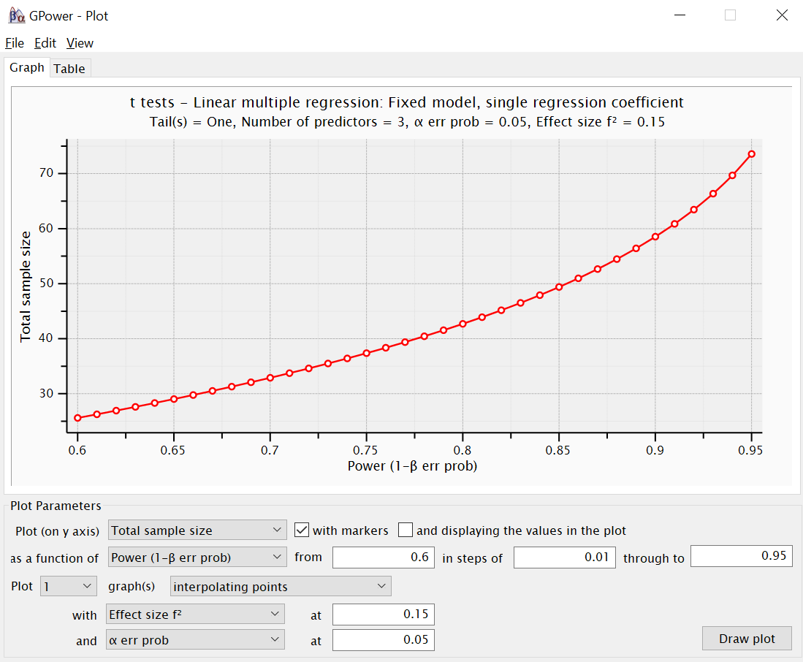
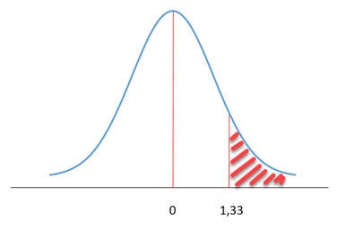
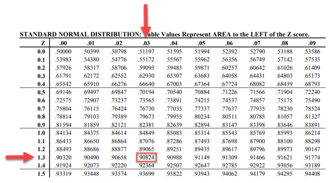

```r
pacman::p_load(flextable, tidyverse, officer, readxl, knitr, kableExtra)
```


# Grunnleggende begreper og sammenhenger

Vi skal i dette kapittelet gå gjennom en rekke begreper og forhold som vi vil komme tilbake til gjennom flere ulike analyser senere, i større eller mindre grad, men de er alle det vi vil kalle grunnleggende begreper vi bør ha en grad av kjennskap til. 

## Populasjon og utvalg

Når vi gjør undersøkelser om «et eller annet» kan vi veldig ofte ikke samle inn informasjon (data) fra alle. Om man gjør en meningsmåling før et valg for å anslå utfallet av valget kan man naturligvis ikke spørre alle stemmeberettigede i hele landet (+ alle stemmeberettigede som ikke er i landet akkurat når man gjennomfører meningsmålingen). Det er praktisk umulig. Alle stemmeberettigede kalles i denne sammenhengen populasjonen. Populasjonen er altså begrepet vi bruker på hele gruppen/den totale mengden av objekter vi ønsker å undersøke. I en meningsmåling tar man derfor et utvalg fra populasjonen, spør dem, og antar at man kan la resultatene fra utvalget snakke for/representere hele populasjonen. Men – man kan selvsagt gjøre undersøkelser på hele populasjoner om det er praktisk mulig, det avhenger bare av hva man definerer som populasjonen.

{width=60%}

I figuren over har vi illustrert dette. Populasjonen består av et antall (kanskje ukjent) antall individer (N). Gjennomsnittsverdien for populasjonen (kalles my – µ) for en egenskap, som for eksempel høyde, er dermed også ukjent. Derfor tar vi et utvalg individer fra populasjonen, måler dem, og kan regne ut gjennomsnittsverdien  (kalles x strek, eller «x bar» på engelsk) for utvalget. Så lar vi $\overline{x}$ være et estimat for µ, og antar at gjennomsnittet for utvalget er representativt for gjennomsnittet for populasjonen.

Det er viktig å huske på at $\overline{x}$ er nettopp et estimat. Kanskje treffer vi bra, kanskje treffer vi dårlig. Hvordan vi velger ut utvalget vil derfor være viktig. I kvantitativ metode opererer vi som regel med det som kalles sannsynlighetsutvalg (i motsetning til strategisk utvalg som ofte brukes i kvalitativ metode). Sannsynlighetsutvalg innebærer at alle enhetene i populasjonen har en gitt sannsynlighet for å bli trukket ut i utvalget. Det gjør at vi innenfor visse feilmarginer kan anta det vi finner i utvalget gjelder for populasjonen.

### Utvelgelse fra populasjonen

Ofte deler man måten man foretar sannsynlighetsutvalg inn i fire metoder (se for eksempel @gronmoUtvalg2021):

1. Enkel tilfeldig utvelgelse. Enhetene trekkes ut helt tilfeldig en og en fra populasjonen («random sampling»). Tilfeldig vil innebære at ethvert medlem i populasjonen har lik sjanse til å bli trukket ut og at hvert objekt trekkes ut uavhengig av hverandre. Også dette er i praksis umulig å få til perfekt, så ethvert utvalg vil trolig ha en eller annen form for skjevhet («bias»).

2. Systematisk utvelgelse. «Den første enheten i utvalget trekkes tilfeldig blant de n første (for eksempel de 100 første) enhetene i universet. Deretter trekkes systematisk hver n’te enhet i universet til utvalget. Hvis den første tilfeldig utvalgte enheten er nummer 83 i universet, vil de neste enhetene i utvalget være universets enheter nummer 183, 283, 383 og så videre» [@gronmoUtvalg2021].

3. Stratifisert utvelgelse. Man deler først inn populasjonen i kategorier (eller strata) før man deretter foretar et tilfeldig eller systematisk utvalg. Kategoriene kan for eksempel være kjønn, alder ellerliknende).

4. Populasjonen deles inn i klynger basert på fysisk eller geografisk nærhet mellom enhetene. Deretter foretas et tilfeldig eller systematisk utvalg.

## Enheter, variabler og verdier

### Enhet

En nehet er det vi forsøker å si noe om. For eksempel kan et individ være en enhet. Et individ kan vi kalle en enhet på mikronivå. En organisasjon eller en gruppe individer kan også utgjøre en enhet. Dette nivået kaller vi mesonivå. I tillegg kan vi ha enheter på makronivå – dette kan være samfunnsgrupper (for eksempel klasser, etnisitet og religion).

### Variabel

Egenskapene ved enheten vi ønsker å si noe om. For eksempel egenskaper ved et individ.

Ofte vil vi snakke om uavhengig og avhengig variabel. En uavhengig variabel (kan også kalles årsaksvariabel) er en variabel som ikke er påvirket av det vi forsøker å si noe om, men tvert imot påvirker det vi forsøker å si noe om (den avhengige variabelen).

En avhengig variabel (også kalt virkningsvariabel) er en variabel som påvirkes av andre variabler (andre uavhengige variabler). Dvs. at verdien på den avhengige variabelen er avhengig av verdien på en eller flere uavhengige variabler.

### Verdi

Hvordan egenskapen måles, hvordan egenskapene ser ut.

## Målenivå

Vi måler altså verdien på variabler. Men variabler er forskjellige, det vil si vi kan måle de på ulik måte ut fra hva de representerer. For eksempel måler vi alder i år, temperatur i grader, inntekt i kroner, kjønn og utdanning i ulike kategorier. De ulike måle- eller kategoriseringsmåtene gjør oss i stand til å gjøre ulike ting med målingene/kategoriene. Vi kan vise dette i en tabell:

```{=html}
<template id="34cfa8fb-ca97-4ab5-9a2d-82555a0dd4f6"><style>
.tabwid table{
  border-spacing:0px !important;
  border-collapse:collapse;
  line-height:1;
  margin-left:auto;
  margin-right:auto;
  border-width: 0;
  display: table;
  margin-top: 1.275em;
  margin-bottom: 1.275em;
  border-color: transparent;
}
.tabwid_left table{
  margin-left:0;
}
.tabwid_right table{
  margin-right:0;
}
.tabwid td {
    padding: 0;
}
.tabwid a {
  text-decoration: none;
}
.tabwid thead {
    background-color: transparent;
}
.tabwid tfoot {
    background-color: transparent;
}
.tabwid table tr {
background-color: transparent;
}
</style><div class="tabwid"><style>.cl-3e705022{table-layout:auto;width:0%;}.cl-3e688d42{font-family:'Arial';font-size:11pt;font-weight:bold;font-style:normal;text-decoration:none;color:rgba(0, 0, 0, 1.00);background-color:transparent;}.cl-3e688d43{font-family:'Arial';font-size:11pt;font-weight:normal;font-style:normal;text-decoration:none;color:rgba(0, 0, 0, 1.00);background-color:transparent;}.cl-3e688d44{margin:0;text-align:left;border-bottom: 0 solid rgba(0, 0, 0, 1.00);border-top: 0 solid rgba(0, 0, 0, 1.00);border-left: 0 solid rgba(0, 0, 0, 1.00);border-right: 0 solid rgba(0, 0, 0, 1.00);padding-bottom:5pt;padding-top:5pt;padding-left:5pt;padding-right:5pt;line-height: 1;background-color:transparent;}.cl-3e68db30{background-color:transparent;vertical-align: middle;border-bottom: 0.5pt solid rgba(102, 102, 102, 1.00);border-top: 0 solid rgba(0, 0, 0, 1.00);border-left: 0 solid rgba(0, 0, 0, 1.00);border-right: 0 solid rgba(0, 0, 0, 1.00);margin-bottom:0;margin-top:0;margin-left:0;margin-right:0;}.cl-3e68db31{background-color:transparent;vertical-align: middle;border-bottom: 0.5pt solid rgba(102, 102, 102, 1.00);border-top: 0.5pt solid rgba(102, 102, 102, 1.00);border-left: 0 solid rgba(0, 0, 0, 1.00);border-right: 0 solid rgba(0, 0, 0, 1.00);margin-bottom:0;margin-top:0;margin-left:0;margin-right:0;}.cl-3e68db32{background-color:transparent;vertical-align: middle;border-bottom: 2pt solid rgba(102, 102, 102, 1.00);border-top: 0.5pt solid rgba(102, 102, 102, 1.00);border-left: 0 solid rgba(0, 0, 0, 1.00);border-right: 0 solid rgba(0, 0, 0, 1.00);margin-bottom:0;margin-top:0;margin-left:0;margin-right:0;}.cl-3e68db33{background-color:transparent;vertical-align: middle;border-bottom: 2pt solid rgba(102, 102, 102, 1.00);border-top: 2pt solid rgba(102, 102, 102, 1.00);border-left: 0 solid rgba(0, 0, 0, 1.00);border-right: 0 solid rgba(0, 0, 0, 1.00);margin-bottom:0;margin-top:0;margin-left:0;margin-right:0;}</style><table class='cl-3e705022'>
```

```{=html}
<thead><tr style="overflow-wrap:break-word;"><td class="cl-3e68db33"><p class="cl-3e688d44"><span class="cl-3e688d42">Nivå</span></p></td><td class="cl-3e68db33"><p class="cl-3e688d44"><span class="cl-3e688d42">Data</span></p></td><td class="cl-3e68db33"><p class="cl-3e688d44"><span class="cl-3e688d42">Forklaring</span></p></td><td class="cl-3e68db33"><p class="cl-3e688d44"><span class="cl-3e688d42">Operasjoner</span></p></td><td class="cl-3e68db33"><p class="cl-3e688d44"><span class="cl-3e688d42">Eksempel</span></p></td></tr></thead><tbody><tr style="overflow-wrap:break-word;"><td class="cl-3e68db30"><p class="cl-3e688d44"><span class="cl-3e688d43">Kategorisk</span></p></td><td class="cl-3e68db30"><p class="cl-3e688d44"><span class="cl-3e688d43">Binær/dikotom</span></p></td><td class="cl-3e68db30"><p class="cl-3e688d44"><span class="cl-3e688d43">Kun to muligheter/to kategorier</span></p></td><td class="cl-3e68db30"><p class="cl-3e688d44"><span class="cl-3e688d43">Telle frekvenser.</span></p></td><td class="cl-3e68db30"><p class="cl-3e688d44"><span class="cl-3e688d43">Til stede/ikke til stede, død/levende, ja/nei, på/av</span></p></td></tr><tr style="overflow-wrap:break-word;"><td class="cl-3e68db31"><p class="cl-3e688d44"><span class="cl-3e688d43">Kategorisk</span></p></td><td class="cl-3e68db31"><p class="cl-3e688d44"><span class="cl-3e688d43">Nomiell</span></p></td><td class="cl-3e68db31"><p class="cl-3e688d44"><span class="cl-3e688d43">Mer enn to kategorier som er gjensidig utelukkende. Tallverdi er en 'merkelapp' som ikke sier noe om egenskaper.</span></p></td><td class="cl-3e68db31"><p class="cl-3e688d44"><span class="cl-3e688d43">Telle frekvenser.</span></p></td><td class="cl-3e68db31"><p class="cl-3e688d44"><span class="cl-3e688d43">Nasjonalitet, politiske partier, yrke, studieretning</span></p></td></tr><tr style="overflow-wrap:break-word;"><td class="cl-3e68db31"><p class="cl-3e688d44"><span class="cl-3e688d43">Kategorisk</span></p></td><td class="cl-3e68db31"><p class="cl-3e688d44"><span class="cl-3e688d43">Ordinal</span></p></td><td class="cl-3e68db31"><p class="cl-3e688d44"><span class="cl-3e688d43">Kategorier som kan rangeres/ordnes, men der avstanden mellom kategoriene er betydningsløs.</span></p></td><td class="cl-3e68db31"><p class="cl-3e688d44"><span class="cl-3e688d43">Arrangere i rekkefølge.</span></p></td><td class="cl-3e68db31"><p class="cl-3e688d44"><span class="cl-3e688d43">Likertskalaer (sterkt uenig-sterkt enig), Utdanningsnivå</span></p></td></tr><tr style="overflow-wrap:break-word;"><td class="cl-3e68db31"><p class="cl-3e688d44"><span class="cl-3e688d43">Kontinuerlige</span></p></td><td class="cl-3e68db31"><p class="cl-3e688d44"><span class="cl-3e688d43">Intervall</span></p></td><td class="cl-3e68db31"><p class="cl-3e688d44"><span class="cl-3e688d43">Kan rangeres og man kan si noe kvantitativt om avstanden mellom verdier. Fast avstand mellom måleverdier – lik avstand på måleskalaen representerer lik avstand i fenomenet som måles. Har et kunstig nullpunkt</span></p></td><td class="cl-3e68db31"><p class="cl-3e688d44"><span class="cl-3e688d43">Addere, subtrahere og regne ut gjennomsnitt</span></p></td><td class="cl-3e68db31"><p class="cl-3e688d44"><span class="cl-3e688d43">Temperatur: 10°C er dobbelt så mye som 5°C, men man kan ikke si at 10°C er dobbelt så varmt som 5°C.</span></p></td></tr><tr style="overflow-wrap:break-word;"><td class="cl-3e68db32"><p class="cl-3e688d44"><span class="cl-3e688d43">Kontinuerlige</span></p></td><td class="cl-3e68db32"><p class="cl-3e688d44"><span class="cl-3e688d43">Skala/ratio/ forholdstall</span></p></td><td class="cl-3e68db32"><p class="cl-3e688d44"><span class="cl-3e688d43">Kan rangere, måle avstand og beregne forholdstall mellom verdier. Har et faktisk nullpunkt</span></p></td><td class="cl-3e68db32"><p class="cl-3e688d44"><span class="cl-3e688d43">Regne ut ratio/forholdstall og prosenter</span></p></td><td class="cl-3e68db32"><p class="cl-3e688d44"><span class="cl-3e688d43">Inntekt: 200000 er dobbelt så mye som 100000, og 200000 er dobbelt så stor inntekt som 100000. Samtidig er 400000 dobbelt så høy inntekt som 200000.</span></p></td></tr></tbody></table></div></template>
<div class="flextable-shadow-host" id="69887ac7-7077-4077-a422-21859635ee58"></div>
<script>
var dest = document.getElementById("69887ac7-7077-4077-a422-21859635ee58");
var template = document.getElementById("34cfa8fb-ca97-4ab5-9a2d-82555a0dd4f6");
var caption = template.content.querySelector("caption");
if(caption) {
  caption.style.cssText = "display:block;text-align:center;";
  var newcapt = document.createElement("p");
  newcapt.appendChild(caption)
  dest.parentNode.insertBefore(newcapt, dest.previousSibling);
}
var fantome = dest.attachShadow({mode: 'open'});
var templateContent = template.content;
fantome.appendChild(templateContent);
</script>

```

Vi skal imidlertid merke oss et viktig poeng. Såkalte responsskalaer og Likertskalaer [@likertTechniqueMeasurementAttitudes1932] som brukes mye i spørreundersøkelser (typiske 5 eller 7 svaralternativer langs en skala der man velger en verdi) er formelt på ordinalnivå. Her vil vi for eksempel be respondentene svare på en skala fra 1-7, der 7 er «Helt enig» og 1 er «Helt uenig» i en påstand. Dette gir data som *ikke* er på intervallnivå [@stevensHandbookExperimentalPsychology1966]. Vi kan umulig si med sikkerhet at forskjellen mellom «Helt uenig» og «Uenig» er lik forskjellen mellom «Enig» og «Helt enig». Data på ordinalnivå kan man strengt tatt ikke regne ut gjennomsnitt på. Det er imidlertid svært vanlig å behandle denne typen data som intervalldata, og det finnes gode argumenter i litteraturen for å gjøre dette – vi går litt mer i dybden i det påfølgende delkapittelet (du kan leve lenge uten å måtte gå i dybden på dette, men vi velger likevel å behandle dette litt mer inngående i det påfølgende delkapittelet slik at dette er drøftet - så om du trenger argumenter kan du finne det der. Foreløpig nøyer vi oss med å fastslå at vi *kan* behandle denne typen data som intervalldata. I en ofte sitert bok sier @tabachnikUsingMultivariateStatistics2007:

> The distinction between continuous and discrete variables is not always clear. If you add enough digits to the digital clock, for instance, it becomes for all practical purposes a continuous measuring device, whereas time as measured by the analog device can also be read in discrete categories such as hours and half hours. In fact, any continuous measurement may be rendered discrete (or dichotomous) with some loss of information, by specifying cutoffs in the continuous scale.
 
I følge @kahlerParametricAnalysisOrdinal2008 kan vi ikke bruke parametriske tester på slik data. Noen statistikkbøker [f.eks. @fieldDiscoveringStatisticsUsing2009 og @pallantSPSSSurvivalManual2010] slår ganske enkelt fast at dataene skal være på minimum intervallnivå for å tilfredsstille forutsetningene for parametriske tester, men diskuterer ikke dette nærmere.

### Forutsetninger om intervalldata

Latente variabler (vi kommer sterkt tilbake til begrepet latente variabler i såvel faktoranalyse som SEM-analyse i senere kapitler, men kort fortalt er dette variabler vi ikke kan observere eller måle direkte, men som må tilnærmes gjennom andre variabler) måles ofte gjennom skalaer som måler respondentens holdninger eller oppfatninger ("semantic differnatial scales - @jamiesonLikertScalesHow2004), jfr. @likertTechniqueMeasurementAttitudes1932. Slike skalaer, der respondentene velger et av flere svaralternativ som står i forhold til hverandre – f.eks. "Svært uenig" - "Uenig" - "Nøytral" - "Enig" - "Svært enig"  - anses produserer data på ordinalnivå ifølge kjente klassifiseringer. En ofte sitert klassifisering er @stevensTheoryScalesMeasurement1946. Det er umulig å fastslå at forskjellen mellom "Sterkt uenig" og "Uenig" er nøyaktig den samme som forskjellen mellom "Enig" og "Sterkt enig".  

Stevens' taksonomi av målenivå er grunnlaget for "representational theory". @michellMeasurementScalesStatistics1986 påpeker at "numbers are used in measurements to represents empirical relations between objects" (s.398). Dette innebærer at vitenskapelige konklusjoner bør være uforanderlige ift skalaen som er brukt (konklusjoner skal ikke endres med ulike skalaer) [@marcus-robertsMeaninglessStatistics1987]. Parametriske tester, i denne tradisjonen, krever mulighet for lineære transformasjoner, noe ordinale data ikke muliggjør [@andersonScalesStatisticsParametric1961]. Konsekvensen er at ordinale data ikke tilfredsstiller forutsetningene for parametriske tester, og derfor ikke kan gjøres [@cohenResearchMethodsEducation2000]. Dette medfører en konservativ tilnærming til hvilke tester man kan gjøre med ulike typer data som følger klassisk "measurement theory" [@michellMeasurementScalesStatistics1986].

I motsetning til den konservative tilnærmingen finnes det en mer liberal tradisjon som hevder tilhengerne av den konservative tilnærmingen blander sammen "measurement theory" og "statistical theory", og dermed misforstår når det er mulig/hensiktsmessig å kjøre parametriske tester [@gaitoNonParametricMethodsPsychological1959; @gaitoScaleClassificationStatistics1960; @gaitoMeasurementScalesStatistics1980]. @savageNonparametricStatistics1957 og @gaitoMeasurementScalesStatistics1980 hevder i den forbindelsen at det ikke finnes noen matematisk grunn til å begrense statistiske prosedyrer til de som involverer aritmetiske operasjoner av kontinuerlige data av de observerte størrelsene. @andersonScalesStatisticsParametric1961 poengterer at en statistisk test ikke kan være bevisst den empiriske betydningen/det empiriske innholdet av tallene man putter inn i testen, mens @bakerWeakMeasurementsVs1966 påpeker at en statistisk test svarer på spørsmålet den er ment å svare på uavhengig av om målingene er sterke eller svake – typen statistisk test er dermed uavhengig av det empiriske betydningen av dataene per se [@michellMeasurementScalesStatistics1986]. Tilhengere av denne tradisjonen mener derfor at valget av type statistisk test utelukkende bør handle om statistiske vurderinger som "have nothing to do with scale type" [@andersonScalesStatisticsParametric1961, s.309]. Det sentrale i valget av type statistisk test bør heller være vurdering av dataenes distribusjon, utvalgsstørrelse, uavhengighet, bias, robusthet, kontekst og empirisk meningsfullhet [@carifioTenCommonMisunderstandings2007; @carifioResolving50yearDebate2008; @handStatisticsTheoryMeasurement1996; @knappTreatingOrdinalScales1990; @muthenComparisonMethodologiesFactor1992; @pellUseMisuseLikert2005]. Det er også empirisk vist at skalaen på målingene i liten grad påvirker variansbaserte statistiske tester [@andersonScalesStatisticsParametric1961; @bakerWeakMeasurementsVs1966; @heermanReadingsStatisticsBehavioural1970, @kempthorneRandomizationTheoryExperimental1955; @labovitzObservationsMeasurementStatistics1967]. Det er også vist at parametriske tester er robuste under de fleste forhold [@gardnerScalesStatistics1975; @glassConsequencesFailureMeet1972; @normanLikertScalesLevels2010].

Det finnes med andre ord gode begrunnelser for både en konservativ og en liberal tilnærming til hvorvidt man kan kjøre parametriske tester på ordinale data som data fra spørreundersøkelser som bruker Likert skalaer. Det er imidlertid ingen praktisk grunn til å anta at man *ikke* kan gjøre det – det finnes gode teoretiske og empiriske argumenter for at det kan gjøres, men man bør vurdere andre aspekter ved dataene også som nevnt overfor. 

## Gjennomsnitt som modell

En mer utførlig forklaring kan finnes i f.eks. @milesApplyingRegressionCorrelation2001. 

Hvis vi tenker oss at vi har en gruppe på 100 personer vi ikke kjenner, men der vi vet at gjennomsnittshøyden er 175 cm – hvor høy vil du gjette en tilfeldig person i den gruppa er? Her kjenner vi kun gjennomsnittshøyden – hva vi kan kalle en parameter. Hvis vi ikke kjenner noen andre karakteristika, vil vår beste antakelse være 175 cm. Dette er gjennomsnittshøyden, og det er rimelig å anta at vi vil treffe nærmest hvis vi sier 175 cm hver gang vi blir spurt om hvor høy vi tror en tilfeldig person i den gruppa er. Vi kan selvsagt gjette 182 cm første gang, 168 cm andre gang, 171 cm tredje gang osv. og treffe 100%, men det vil være ren flaks. Første person kan være 163 cm, andre person 190 cm, tredje person 182 cm osv. Hver gang vil vi i så fall bomme grovt. Gjennomsnittsverdien blir vår "modell". En modell er en representasjon av virkeligheten [@milesApplyingRegressionCorrelation2001]. Modellen vil aldri være perfekt – hadde den vært prefekt hadde vi ikke hatt en modell av virkeligheten, men et duplikat av virkeligheten – det vil alltid være feil ved modellen i en eller annen grad.

I vårt eksempel er modellen gjennomsnittshøyden, og vi vet at selv om vår beste gjetning når vi blir spurt om høyden på en tilfeldig person er 175 cm vil vi oppleve av vi kun treffer i noen få (og kanskje ingen) tilfeller. Modellen vår vil imidlertid søke å minimere feilene vi får slik at vi treffer best mulig. Det er mer sannsynlig at en tilfeldig person er i nærheten av 175 cm enn 195 cm. Vi kan si:

$Virkeligheten = Modell + Feil$

Imidlertid vil vi ofte ikke kjenne "virkeligheten" - vi kjenner ikke populasjonsgjennomsnittet. Vi har som regel data om populasjonen fra et tilfeldig utvalg gjort av populasjonen. Vi vil derfor heller uttrykke:

$Data = Modell + Feil$

Data (altså en observert verdi – i vårt tilfelle en høyde) = x. Gjennomsnittsverdi = $\overline{x}$. Det er vanlig å benevne feiltermen som $e$. Vi kan derfor for første observerte høydeverdi uttrykke dette matematisk som:

$x_1 = x - e_1$

Eller på en generell form:

$x_i = \overline{x} - e_i$

Feil i en modell vil ofte betegnes residual (fra engelsk: residual = rest/gjenværende). En residual er altså verdien vi sitter igjen med når vi trekker gjennomsnittsverdien fra den observerte verdien. Hvis den observerte høyden er 179 cm og gjennomsnittsverdien er 175 cm er residualen 3 cm. Dette kan vi uttrykke slik:

$Feil = Data - Modell$

Eller: 

$e = x - \overline{x}$

Residualbegrepet kommer vi sterkt tilbake til når vi skal ta for oss regresjonsanalyse. 

Vi kommer til å snakke mye om modeller. Vi kommer også itl å snakke mye om "hvor god er modellen" - eller med andre ord: har vi klart å lage en modell som representerer "virkeligheten" på en god måte. Vi skal imidlertid huske på at "All models are wrong, but some are useful" [@boxScienceStatistics1976]. En statistisk modell vil aldri klare å representere den komplekse virkeligheten - vi må alltid forsøke å finne måter å måle og representere enkelte deler av virkeligeheten og lage modeller som kan fortelle oss noe fornuftig og nyttig om denne virkeligheten. Men selv om modellen alltid er feil og imperfekt kan den fortsatt være nyttig. 

## Normalfordeling

Når vi snakker om distribusjonen av et datasett tenker vi på hvordan dataene vi har samlet inn fordeler seg i forhold til hverandre etter gitte egenskaper. Vi kan for eksempel ha målt høyden på 100 mennesker. Disse dataene utgjør da en observert fordeling som vi kan sette inn i et histogram for å visualisere hvordan datasettet ser ut:

<div class="figure">

<p class="caption">(\#fig:unnamed-chunk-3)Høydefordeling for 100 tilfeldige menn, genererte data</p>
</div>
Hvis vi tar et utvalg på 100 andre personer kan fordelingen se slik ut:

<div class="figure">

<p class="caption">(\#fig:unnamed-chunk-4)Høydefordeling for 100 andre tilfeldige menn, genererte data</p>
</div>

Hver gang vi måler høyden på 100 tilfeldig utvalgte menn vil fordelingen se ulik ut siden de er observerte fordelinger i et utvalg av populasjonen (alle) «norske menn». Hvis vi imidlertid økte antallet i utvalget vi målte til 1000 eller 10000 vil vi med større sikkerhet kunne si at vi faktisk viser populasjonens fordeling (mulighetene for at vi tilfeldigvis måler 10000 veldig lave eller veldig høye menn er svært liten). Vi kan derfor, gitt visse forutsetninger om utvalget, si noe om hele populasjonen ut fra utvalget.

Hittil har vi snakket om observerte fordelinger – altså hva vi har målt, observert, samlet inn osv. Ut fra dette kan vi si at vi kan ha visse forventninger til hvordan fordelingen av ulike populasjoner vil se ut, og vi kan snakke om teoretiske fordelinger – eller sannsynlighetsfordelinger med andre ord. Hvor sannsynlig er det at en tilfeldig x-verdi dukker opp i dataene?

For høyde kan vi ha visse forventninger til hvilke sannsynligheter det er for at en tilfeldig person har en gitt høyde, eller hvor mange prosent av den mannlige befolkningen som har en høyde innenfor et gitt intervall. Det vil si at fordelingen har en viss form med visse karakteristika. Vi forventer at flest observasjoner befinner seg i nærheten av gjennomsnittet, og at vi vil se færre og færre observasjoner jo lenger unna gjennomsnittet vi beveger oss. Vi forventer å finne flere norske menn over 20 år på rundt 180 cm enn 160 cm eller 210 cm. For fordelingen av høydedata vil vi si at dette er data som er normalfordelte.

En normalfordeling er en sannsynlighetsfunksjon der flesteparten av verdiene fra funksjonen samler seg om en sentral tendens, og der tettheten (hyppigheten, eller "density" på engelsk) av verdier avtar jevnt jo lenger unna den sentrale tendensen man kommer. Grafisk framstilt får fordelingskurven en klokkeform, og normalfordeling omtales også som “bell shaped”. Overraskende mange fenomener viser seg å være nærme en normalfordeling, og den er derfor en helt sentral teoretisk sannsynlighetsfordeling i mange sammenhenger i kvantitativ metode. Vi bruker dermed normalfordelingen som en modell for observerte data.

Vi skal her ikke bry oss om det matematisk uttrykket for sannsynlighetstetthetsfunksjonen. Hvis vi derimot genererer et tenkt datasett etter standard normalfordelingsfunksjon vil det kunne se slik ut:

<div class="figure">

<p class="caption">(\#fig:unnamed-chunk-5)Genererte standard normalfordelte data</p>
</div>

Her kan vi legge på en forventningskurve – en teoretisk kurve som viser en standard normalfordeling:

<div class="figure">

<p class="caption">(\#fig:unnamed-chunk-6)Genererte standard normalfordelte data med normalfordelingskurve</p>
</div>

Vi kan ta bort det genererte datasettet og sitte igjen med bare forventningskurven:

<div class="figure">

<p class="caption">(\#fig:unnamed-chunk-7)Normalfordelingskurve</p>
</div>

Det den standardiserte normalfordelingskurven (også kjent som Gausskurven eller også Bellkurven – "Klokkekurven" fordi den har en klokkeform) – kan brukes til er å si noe om spredningen på forventede verdier – eller hvor langt fra gjennomsnittsverdien man kan forvente å finne de enkelte verdiene. 

Før vi ser nærmere på egenskaper ved normalfordelingskurven kan det være nødvendig å gå litt inn på begrepene varians og standardavvik som mål på spredningen i datasett. Disse begrepene, spesielt standardavvik, vil være helt sentrale i videre arbeid med temaet.

## Varians og standardavvik

Variansen i en variabel representerer det gjennomsnittlige avviket fra gjennomsnittsverdien [@Field2012] og er et mål på spredningen i dataene (som navnet antyder: hvor mye dataene variere ut fra den sentrale tendensen). Under vises et eksempel basert på @Field2009.

La oss anta at vi har spurt 5 studenter på høgskolen hvor mange kjæledyr de har. Svarene kan settes opp i en enkel tabell. I gjennomsnitt har de 2,6 kjæledyr. Vi ønsker imidlertid å se hvor mye avviket er for den enkelte fra snittet (siden vi har regnet ut snittet kan vi se på gjennomsnittsverdien som en modell på forholdet mellom studenter og antall kjæledyr). Vi registrerer svarene vi fikk i et skjema:

```{=html}
<template id="cc45dd89-8c93-492f-9adc-23875fd075ed"><style>
.tabwid table{
  border-spacing:0px !important;
  border-collapse:collapse;
  line-height:1;
  margin-left:auto;
  margin-right:auto;
  border-width: 0;
  display: table;
  margin-top: 1.275em;
  margin-bottom: 1.275em;
  border-color: transparent;
}
.tabwid_left table{
  margin-left:0;
}
.tabwid_right table{
  margin-right:0;
}
.tabwid td {
    padding: 0;
}
.tabwid a {
  text-decoration: none;
}
.tabwid thead {
    background-color: transparent;
}
.tabwid tfoot {
    background-color: transparent;
}
.tabwid table tr {
background-color: transparent;
}
</style><div class="tabwid"><style>.cl-3eff41f6{table-layout:auto;width:100%;}.cl-3ef68782{font-family:'Arial';font-size:11pt;font-weight:normal;font-style:normal;text-decoration:none;color:rgba(0, 0, 0, 1.00);background-color:transparent;}.cl-3ef6ae74{margin:0;text-align:left;border-bottom: 0 solid rgba(0, 0, 0, 1.00);border-top: 0 solid rgba(0, 0, 0, 1.00);border-left: 0 solid rgba(0, 0, 0, 1.00);border-right: 0 solid rgba(0, 0, 0, 1.00);padding-bottom:5pt;padding-top:5pt;padding-left:5pt;padding-right:5pt;line-height: 1;background-color:transparent;}.cl-3ef6fc6c{background-color:transparent;vertical-align: middle;border-bottom: 0 solid rgba(0, 0, 0, 1.00);border-top: 0 solid rgba(0, 0, 0, 1.00);border-left: 0 solid rgba(0, 0, 0, 1.00);border-right: 0 solid rgba(0, 0, 0, 1.00);margin-bottom:0;margin-top:0;margin-left:0;margin-right:0;}.cl-3ef6fc6d{background-color:transparent;vertical-align: middle;border-bottom: 2pt solid rgba(102, 102, 102, 1.00);border-top: 0 solid rgba(0, 0, 0, 1.00);border-left: 0 solid rgba(0, 0, 0, 1.00);border-right: 0 solid rgba(0, 0, 0, 1.00);margin-bottom:0;margin-top:0;margin-left:0;margin-right:0;}.cl-3ef6fc6e{background-color:transparent;vertical-align: middle;border-bottom: 2pt solid rgba(102, 102, 102, 1.00);border-top: 2pt solid rgba(102, 102, 102, 1.00);border-left: 0 solid rgba(0, 0, 0, 1.00);border-right: 0 solid rgba(0, 0, 0, 1.00);margin-bottom:0;margin-top:0;margin-left:0;margin-right:0;}</style><table class='cl-3eff41f6'>
```

```{=html}
<thead><tr style="overflow-wrap:break-word;"><td class="cl-3ef6fc6e"><p class="cl-3ef6ae74"><span class="cl-3ef68782">Studentnr</span></p></td><td class="cl-3ef6fc6e"><p class="cl-3ef6ae74"><span class="cl-3ef68782">Antall</span></p></td><td class="cl-3ef6fc6e"><p class="cl-3ef6ae74"><span class="cl-3ef68782">Avvik</span></p></td><td class="cl-3ef6fc6e"><p class="cl-3ef6ae74"><span class="cl-3ef68782">Avvik_kvadrert</span></p></td></tr></thead><tbody><tr style="overflow-wrap:break-word;"><td class="cl-3ef6fc6c"><p class="cl-3ef6ae74"><span class="cl-3ef68782">1</span></p></td><td class="cl-3ef6fc6c"><p class="cl-3ef6ae74"><span class="cl-3ef68782">1</span></p></td><td class="cl-3ef6fc6c"><p class="cl-3ef6ae74"><span class="cl-3ef68782">-1.6</span></p></td><td class="cl-3ef6fc6c"><p class="cl-3ef6ae74"><span class="cl-3ef68782">2.56</span></p></td></tr><tr style="overflow-wrap:break-word;"><td class="cl-3ef6fc6c"><p class="cl-3ef6ae74"><span class="cl-3ef68782">2</span></p></td><td class="cl-3ef6fc6c"><p class="cl-3ef6ae74"><span class="cl-3ef68782">2</span></p></td><td class="cl-3ef6fc6c"><p class="cl-3ef6ae74"><span class="cl-3ef68782">-0.6</span></p></td><td class="cl-3ef6fc6c"><p class="cl-3ef6ae74"><span class="cl-3ef68782">0.36</span></p></td></tr><tr style="overflow-wrap:break-word;"><td class="cl-3ef6fc6c"><p class="cl-3ef6ae74"><span class="cl-3ef68782">3</span></p></td><td class="cl-3ef6fc6c"><p class="cl-3ef6ae74"><span class="cl-3ef68782">3</span></p></td><td class="cl-3ef6fc6c"><p class="cl-3ef6ae74"><span class="cl-3ef68782">0.4</span></p></td><td class="cl-3ef6fc6c"><p class="cl-3ef6ae74"><span class="cl-3ef68782">0.16</span></p></td></tr><tr style="overflow-wrap:break-word;"><td class="cl-3ef6fc6c"><p class="cl-3ef6ae74"><span class="cl-3ef68782">4</span></p></td><td class="cl-3ef6fc6c"><p class="cl-3ef6ae74"><span class="cl-3ef68782">3</span></p></td><td class="cl-3ef6fc6c"><p class="cl-3ef6ae74"><span class="cl-3ef68782">0.4</span></p></td><td class="cl-3ef6fc6c"><p class="cl-3ef6ae74"><span class="cl-3ef68782">0.16</span></p></td></tr><tr style="overflow-wrap:break-word;"><td class="cl-3ef6fc6c"><p class="cl-3ef6ae74"><span class="cl-3ef68782">5</span></p></td><td class="cl-3ef6fc6c"><p class="cl-3ef6ae74"><span class="cl-3ef68782">4</span></p></td><td class="cl-3ef6fc6c"><p class="cl-3ef6ae74"><span class="cl-3ef68782">1.4</span></p></td><td class="cl-3ef6fc6c"><p class="cl-3ef6ae74"><span class="cl-3ef68782">1.96</span></p></td></tr><tr style="overflow-wrap:break-word;"><td class="cl-3ef6fc6c"><p class="cl-3ef6ae74"><span class="cl-3ef68782">Snitt</span></p></td><td class="cl-3ef6fc6c"><p class="cl-3ef6ae74"><span class="cl-3ef68782">2.6</span></p></td><td class="cl-3ef6fc6c"><p class="cl-3ef6ae74"><span class="cl-3ef68782"></span></p></td><td class="cl-3ef6fc6c"><p class="cl-3ef6ae74"><span class="cl-3ef68782"></span></p></td></tr><tr style="overflow-wrap:break-word;"><td class="cl-3ef6fc6d"><p class="cl-3ef6ae74"><span class="cl-3ef68782">Sum</span></p></td><td class="cl-3ef6fc6d"><p class="cl-3ef6ae74"><span class="cl-3ef68782"></span></p></td><td class="cl-3ef6fc6d"><p class="cl-3ef6ae74"><span class="cl-3ef68782">0</span></p></td><td class="cl-3ef6fc6d"><p class="cl-3ef6ae74"><span class="cl-3ef68782">5.20</span></p></td></tr></tbody></table></div></template>
<div class="flextable-shadow-host" id="b26ca5f8-484f-4777-a5cb-7754fcc683b4"></div>
<script>
var dest = document.getElementById("b26ca5f8-484f-4777-a5cb-7754fcc683b4");
var template = document.getElementById("cc45dd89-8c93-492f-9adc-23875fd075ed");
var caption = template.content.querySelector("caption");
if(caption) {
  caption.style.cssText = "display:block;text-align:center;";
  var newcapt = document.createElement("p");
  newcapt.appendChild(caption)
  dest.parentNode.insertBefore(newcapt, dest.previousSibling);
}
var fantome = dest.attachShadow({mode: 'open'});
var templateContent = template.content;
fantome.appendChild(templateContent);
</script>

```

Når vi regner ut avviket (sum of deviances) summerer vi avvikene. Siden denne er 0 skulle det innebære at det totalt sett i "modellen" ikke er avvik mellom modellen og våre virkelige observasjoner. Problemet her er at det er både positive og negative avvik som nuller hverandre ut. Man må derfor kvadrere avvikene for å omgå problemet med fortegn. Imidlertid får vi et nytt problem. La oss anta at vi i stedet for 5 studenter har spurt 500. Da får vi et svært høyt kvadrert avvik fra snitt. Altså – vi må ta høyde for for antallet observasjoner. Vi deler derfor sum kvadrert avvik fra snitt på antall observasjoner (5,20/5). MEN: vi må foreta et litt teknisk og komplisert tillegg i utregningen. Vi må dele på antall observasjoner MINUS 1 (som er antallet frihetsgrader – degrees of freedom). Dette vil ikke bli nærmere forklart her, men for de som ønsker å lese mer om frihetsgrader kan prøve noen andre kilder, f.eks. @Walker1940, @Good1973 eller @Pandey2008. Vi ender altså opp med regnestykket 5,20/(5-1) = 1,3. Dette er variansen. *Variansen er altså det gjennomsnittlige avviket mellom gjennomsnittsverdien av de observerte dataene og verdiene til de enkelte observasjonene.*

Som regel snakker vi imidlertid om standardavviket. Dette finner vi ved å ta kvadratroten av variansen (som vi jo har funnet ved å kvadrere avvikene for å unngå fortegnsproblemer). Vi får da i vårt tilfelle et standardavvik på 1,14. Variansen og standardavviket forteller oss altså noe om spredningen i dataene. Liten varians betyr at spredningen er liten (om vi har gjennomført en spørreundersøkelse betyr det at respondentene har svart ganske likt). Stor varians betyr stor spredning (respondentene har svart ganske ulikt).

## Normalfordeling, standardavvik og forventninger

Vi kan nå se nærmere på normalfordelingen. 

<div class="figure">

<p class="caption">(\#fig:unnamed-chunk-9)Normalfordeling med 1 standardavvik</p>
</div>

Ett standardavvik "over og under" 0 (= det skraverte området i grafen over) innebærer at i et normalfordelt datasett vil 68 % av tilfeldig valgte x-verdier befinner seg i dette intervallet. Vi kan vise det samme for 2 og 3 standardavvik:

<div class="figure">

<p class="caption">(\#fig:unnamed-chunk-10)Normalfordeling med 2 standardavvik</p>
</div>

To standardavvik "over og under" 0 (= det skraverte området i grafen over) innebærer at i et normalfordelt datasett vil 95 % av tilfeldig valgte x-verdier befinner seg i dette intervallet. Vi kan finne arealet mellom x=-2 og x=2, som er 0.9544997^[R-kode for utregning av areal mellom to x-verdier i en normalfordeing (=sannsynlighet for at en gitt x-verdi ligger i intervallet mellom de to x-verdiene): pnorm(2,mean=0,sd=1)-pnorm(-2,mean=0,sd=1)].

<div class="figure">

<p class="caption">(\#fig:unnamed-chunk-11)Normalfordeling med 3 standardavvik</p>
</div>

Tre standardavvik "over og under" 0 (= det skraverte området i grafen over) innebærer at i et normalfordelt datasett vil 99.7 % av tilfeldig valgte x-verdier befinner seg i dette intervallet. Vi kan finne arealet mellom x=-3 og x=3, som er 0.9973002^[pnorm(3,mean=0,sd=1)-pnorm(-3,mean=0,sd=1)]. Dette utgjør et kjernepunkt i statistisk prosesskontroll som vi vil komme mye tilbake til.

Oppsummert kan vi framstille normalfodeling og standardavvik slik [@hartmannVarianceStandardDeviation2018]:

<div class="figure">

<p class="caption">(\#fig:unnamed-chunk-12)Normalfordeling med standardavvik</p>
</div>

Som nevnt er mange fenomener i hverdagen normalfordelte, eller nærme nok normalfordeling til at vi kan bruke normalfordeling som teoretisk modell for observerte data ^[Normalfordelingen er dessuten en god tilnærming til binomialfordeling med høyt antall observasjoner (høy n), og også til poissonfordeling med høy frekvens. Dette forfølger vi imidlertid ikke videre i dette kompendiet.]. Det finnes imidlertid mange tilfeller der vi ikke kan bruke normalfordelingen. Hvis dataene er sterkt asymmetriske vil ikke reglene for normalfordeling som vi har skissert ovenfor gjelde ^[Chebyshevs teorem vil imidlertid gjelde for alle datasett. Teoremet belyses i eget vedlegg for de spesielt interesserte].  

## Binomialfordeling

En distribusjon hvor det kun er to mulige utfall av en hendelse kalles en binomial fordeling. Et myntkast er en slik hendelse (gitt at vi ser bort fra den fysiske muligheten at mynten kan lande stående på høykant). Levende eller død kan også være et eksempel på dette. Det ene utfallet utelukker det andre, men de er uavhengige fordi resultatet i ett myntkast ikke påvirker resultatet i neste myntkast. Alle myntkastene må derimot være identiske, det vil si sannsynligheten for det ene eller det andre resultatet er lik hver gang forsøket eller myntkastet gjennomføres. Hvis vi har lik sannsynlighet, kan en tilfeldig generert binomial distribusjon se slik ut:

<div class="figure">

<p class="caption">(\#fig:unnamed-chunk-13)Binomialfordeling med lik sannsynlighet</p>
</div>

I diagrammet over vises en sannsynlighetsfordeling for en binomial fordeling der utfallene suksess/fiasko har lik sannsynlighet. Hvis vi gjennomfører en aktivitet med disse karakteristika 20 ganger kan vi bruke sannsynlighetsfordelingen til å skape en forventning om sannsynligheten for antall suksesser/fiaskoer. Hver gang vi gjennomfører aktiviteten blir det enten suksess eller fiasko. Hvis vi har 50% sjanse for suksess eller feil hver gang vi gjennomfører aktiviteten er sannsynligheten for suksess lik som sannsynligheten for fiasko. Vi kan da forvente at det er størst sannsynlighet at vi i 10 av 20 tilfeller får suksess. Det er liten sannsynlighet for at vi enten får suksess i 0 eller 20 av 20 ganger vi gjør aktiviteten.

Det er imidlertid verdt å merke seg at de to utfallene ikke trenger å ha lik sannsynlighet. Da vil den binomiale distribusjonen se annerledes ut:

<div class="figure">

<p class="caption">(\#fig:unnamed-chunk-14)Binomialfordeling med ulik sannsynlighet</p>
</div>

Her har vi bare 20% sannsynlighet for suksess, og fordelingen av sannsynligheter vil se annerledes ut. Med 20% sannsynlighet for suksess er det veldig liten sannsynlighet for at vi vil få 10 eller flere suksesser hvis vi gjør forsøket 20 ganger. Det er størst sannsynlighet for å få 4 suksesser.

Et terningkast (med en vanlig terning med 6 sider) – som ikke er tuklet med – har lik sannsynlighet for å lande på hhv 1,2,3,4,5 og 6. Det vil si det er 1/6 sannsynlighet for 1, 1/6 sannsynlighet for 2 osv. Hvis vi kaster denne terningen 10 ganger kan resultatet se slik ut:

<div class="figure">

<p class="caption">(\#fig:unnamed-chunk-15)10 terningkast</p>
</div>

Vi ser at vi ikke fikk noen 2’ere og 5’ere. Dette kan vi forvente når vi bare har 10 terningkast. Hvis vi imidlertid kaster terningen 100 ganger vil det være svært liten sannsynlighet for å ikke få «treff» på alle 6 verdiene på terningen, og vi burde kunne forvente at vi får en ganske jevn fordeling på alle 6 verdiene. Nedenfor vises resultatet av 100 terningkast.

<div class="figure">

<p class="caption">(\#fig:unnamed-chunk-16)100 terningkast</p>
</div>

Vi ser at vi har en relativt jevn fordeling. Noe ulikhet er det selvsagt, noe vi vil forvente fra en tilfeldig prosess. Hvis vi gjennomførte 1000 eller 10000 terningkast vil fordelingen bli nærmere og nærmere den teoretisk forventede fordelingen. Vi kan burde, teoretisk, forvente 100 treff på hver mulighet hvis vi kaster terningen 600 ganger, men vi vil sjelden se akkurat 100 treff på hver slik vi ser hvis vi kjører tre runder med 600 terningkast:

Runde 1:  

```
#> terning_runde1
#>   1   2   3   4   5   6 
#>  93 102 102 102 108  93
```

Runde 2:  

```
#> terning_runde2
#>   1   2   3   4   5   6 
#> 101 102  94  91 105 107
```

Runde 3:  

```
#> terning_runde3
#>   1   2   3   4   5   6 
#> 104 113  92  98  95  98
```

Selv om vi kjører 6 000 000 terningkast og vil forvente 1 000 000 treff på hver av terningens sider vil vi ikke få en perfekt fordeling iht teoretisk forventning, men resultatet vil være svært nærme og er nærme nok til at vi kan bruke sannsynlighetsfordelingen til å lage forventninger om utfall:

6 000 000 terningkast:

```
#> minterning
#>       1       2       3       4       5       6 
#> 1000492  998250 1000216 1000832 1001422  998788
```

Hvis vi setter resultatet fra 6 000 000 terningkast inn i et histogram ser vi at resultatet er svært nærme hva vi teoretisk vil forvente:

<div class="figure">

<p class="caption">(\#fig:unnamed-chunk-21)6 000 000 terningkast</p>
</div>

## Poissonfordeling

Poissonfordelinger finnes i situasjoner der hendelser skjer vilkårlig i tid (og rom) hvor vi er interessert i kun antallet hendelser i et gitt tidsintervall. Vi kan f.eks. være interessert i hvor mange supporthenvendelser vi får i løpet av en time, antallet feilmedisineringer per uke, hvor mange besøk avdelingen får per dag o.l. Andre eksempler kan være antall trafikkulykker langs en angitt veistrekning, antall elgpåkjørlser på en togstrekning, eller antall av en gitt art fugler i et definert område i et definert tidsrom. En hendelse må være uavhengig tidsmessig av andre hendelser (det er altså ikke økt sannsynlighet for at en hendelse vil skje fordi en tilsvarende hendelse akkurat har skjedd), sannsynligheten for en hendelse i et kort perspektiv er lik sannsynligheten over et lengre perspektiv, og ettersom et tidsintervall blir kortere og kortere vil sannsynligheten for hendelsen gå mot null. 

Poissonfordeling uttrykker sannsynligheten for at et gitt antall hendelser inntreffer i et gitt tidsintervall (eller et gitt geografisk domene) *og* at vi kjenner gjennomsnittlig hvor ofte hendelsen inntreffer. Denne sannsynligheten uttrykkes som en lambdaverdi ($\lambda$).

Eksempelet under er hentet fra @soagePoissonDistribution2020:


<div class="figure">

<p class="caption">(\#fig:unnamed-chunk-22)Poissonfordelinger</p>
</div>

Ut fra hvilken $\lambda$-verdi vi setter kan vi si noe om sannsynligheten for at et antall hendelser inntreffer. 

@ugarteProbabilityStatistics2016 eksemplifiserer Poissonfordeling ved å vise til at det i gjennomsnitt skåres 2,5 mål i en VM-kamp i fotball. Denne situasjonen tilfredsstiller forutsetningene for å bruke Possionfordeling.Vi kan grafisk framstille sannsynlighetsfordeingen slik:

<div class="figure">

<p class="caption">(\#fig:unnamed-chunk-23)Poissonfordeling mål i VM-kamp fotball</p>
</div>

I R kan vi også enkelt regne ut den nøyaktige sannsynligheten for x antall mål gitt forutsetningen om at det i snitt skåres 2.5 mål pr kamp til å være 0. Vi kan bruke sannsynlighetsfordelingen til å regne ut sannsynligheten for et gitt antall mål, f.eks.:

* Sannsynligheten for 0 mål = 0.082085
* Sannsynligheten for 1 mål = 0.2052125
* Sannsynligheten for 2 mål = 0.2565156
* Sannsynligheten for 3 mål = 0.213763
* Sannsynligheten for 4 mål = 0.1336019

eller f.eks. sannsynligheten for at det skåres mellom 1 og 3 mål (= 0.6754911).

## Geometrisk fordeling

En geometrisk fordeling er en diskret fordeling der man teller antall hendelser/forsøk inntil et gitt resultat forekommer. Resultatet er suksess eller feil, altså hvor mange ganger man har en hendelse før man får en suksess eller feil (avhengig av hva man måler). Et eksempel er hvor mange ganger man må kaste to terninger for å få 11 i sum. Man kaster da to terninger til første gang man får 11 (= suksess). En geometrisk distribusjon kan se slik ut (p = 0,4):

<div class="figure">

<p class="caption">(\#fig:unnamed-chunk-24)Geometrisk fordeling</p>
</div>

I statistisk prosesskontroll er denne typen fordeling til stede når man f.eks. teller antall dager mellom sjeldne hendelser. Man teller antall dager før man f.eks. får et alvorlig avvik på en medisinering, en operasjon e.l. I geometrisk fordeling er sannsynligheten for et gitt utfall uavhengig av om det har skjedd før. Man kan bruke geometrisk fordeling f.eks. til å estimere hvor mange dager man normalt vil forvente det går mellom en sjelden hendelse. Hvis man gjennom erfaringstall vet at sannsynligheten for en sjelden hendelse er p = 0.035 vil man forvente at det går 1/0.035 $\approx$ 29 dager mellom hver hendelse. Geometrisk distribusjon kan hjelpe oss i en statistisk prosesskontroll for å finne normal/unormal variasjon ved sjeldne hendelser.

Det kan være verdt å merke seg at binomial og geometrisk fordeling skiller seg fra hverandre ved at geometrisk fordeling har et ukjent antall hendelser (man fortsetter til man får første suksess/feil), mens binomial fordeling har et gitt antall hendelser. Som vi skal se i senere eksempler derfor geometrisk fordeling viktig når vi håndterer sjeldne hendelser, fordi vi ikke kjenner hvor mange dager det f.eks. går før vi får første suksess/feil. 

## Eksponensiell fordeling

En tilfeldig kontinuerlig variabel kan sies å være analog til den geometriske distribusjonen, men for kontinuerlige data. Den eksponensielle distribusjonen brukes ofte for å modellere tid mellom to hendelser. I statistisk prosesskontroll vil vi typisk bruke denne distribusjonen hvis vi måler tid mellom to sjeldne hendelser. Hvis vi f.eks. måler tiden mellom uventet dødsfall som følge av en type rutineoperasjon på et sykehus vil den ha en eksponensiell distribusjon hvis sannsynligheten for at hendelsen inntreffer innenfor t gitt tidsintervall er omtrentlig proporsjonal med lengde på tidsintervallet [@Taboga2017]. Eksponensielle fordelinger har samme grunnform, men kan ha ulik bratthet avhengig av den såkalte lamdaverdien (= en parameter for raten av hendelser). Lambdaverdi er en parameter for hvor ofte hendelsene forventes å skje. 

<div class="figure">

<p class="caption">(\#fig:unnamed-chunk-25)Eksponensiell fordeling</p>
</div>

## Nullhypotese

Vi kommer mye tilbake til hypotesetesting (i ulike former), men dette danner grunnlaget for å forstå hvorfor vi tester en nullhypotese og forkaster den hvis vi får et signifikant resultat. Vi ønsker å teste hypotesen om at M = 53 [51,55] er en god estimator for μ. I stedet for å teste alle muligheter for at μ vil ligge i intervallet, tester vi i stedet en presist formulert og testbar nullhypotese om at μ ikke vil ligge i intervallet [51,55]. Hvis vi får et signifikant resultat på nullhypotesetesten kan vi si at sannsynligheten for at μ vil ligge utenfor [51,55] er svært liten (avhengig av konfidensnivå), og at vi derfor har styrket hypotesen om at M=53 [51,55] er en god estimator for μ. Vi setter med andre ord opp en stråmann: vi vil egentlig teste om våre estimatorer for populasjonen er sannsynlige innenfor et konfidensintervall, men tester i stedet sannsynligheten for at de ikke er det i håp om å forkaste stråmannen.

Nullhypotesen formuleres som regel som en presis og testbar hypotese om ingen forbindelse eller forskjell mellom gitte variabler. Nullhypotesen kan imidlertid være «hva som helst», i den forstand at det er like gyldig å formulere en nullhypotese som ikke inneholder null i betydningen tallet null eller ingen forskjell e.l. Poenget er at den må formuleres slik at den evt kan forkastes hvis den ikke støttes ("null" kommer, har jeg blitt fortalt, fra det engelske "nullify" - altså "gjøre ugyldig, annullere, oppheve"). 

## Statistisk styrke – "Statistical Power" - og type I og II feil

I mange sammenhenger i anvendt statistikk leser man om statistisk styrke ("power"). Enkelt forklart er statistisk styrke sannsynligheten for at en statistisk test vil identifisere en effekt hvis den er der. I hypotesetesting referer statistisk styrke til sannsynligheten for å få et statistisk signifikant resultat som fører til at vi forkaster nullhypotesen når den alternative hypotesen er sann. Når den statistiske styrken øker synker sannsynligheten for at vi ikke forkaster en feilaktig nullhypotese (type II feil). Alternativt kan man si at når den statistiske styrken i testen øker, øker sannsynligheten for at vi korrekt godtar en sann alternativ hypotese. 

Vi kan uttrykke dette slik:

$Statistisk\ styrke = 1 - \beta$

En ofte sitert og brukt vurdering rundt nivået på statistisk styrke (som altså er et tall mellom 0 og 1) er @cohenStatisticalPowerAnalysis1988. Cohen foreslår 0,8 som et nivå på statistisk styrke som god avveining mellom sannsynligheten for type I og type II feil. Type I feil forekommer når man feilaktig forkaster $H_0$ når den er sann, mens type II feil innebærer å feilaktig beholde $H_0$når den er usann (eller: vi konkluderer med at det ikke er noen effekt når det faktisk er en) [@mayrShortTutorialGPower2007]. Vi kan oppsummere dette slik:

{width=75%}

Vi kan med andre ord treffe riktig konklusjon i to av de fire mulighetene, men også feil i to av de fire mulighetene. For å huske forskjellen på type I og type II feil pleier jeg å huske:

- Seeing something that is not there (type I) – det vi også kallen en falsk positiv
- Not seeing something that is there (type II) – det vi også kaller en falsk negativ

@ellisAlwaysGetConfused2010 illustrerer dette slik:

{width=75%}

Cohen postulerer at de fleste forskere vil anse type I som langt verre enn type II, faktisk 4 ganger så ille. Dersom man velger $\alpha=0.05$ (95% konfindensnivå) må da $\beta = 0.05*4=0.2$. Vi får da:

$Power = 1 - \beta$
$Power = 1 . 0.2 = 0.8$

En annen måte å si dette på er at med statistisk styrke = 0,8 har man 80 % sjanse for å detektere en effekt hvis det virkelig er en effekt. Lav statistisk styrke fører altså til ikke-signifikante resultater. Et ikke-signifikant resultat betyr et uavklart resultat: Det kan være en effekt der og det kan hende det ikke er et resultat der. Et ikke-signifikant resultat betyr IKKE at det ikke kan være en effekt. Derimot vil et ikke-signifikant resultat oftest føre til at man tolker resultatet som at det ikke er noen effekt, og det vil være en type II feil hvis det faktisk er en effekt der som vi ikke ser pga lav statistisk styrke. 

Vi skal ikke gå nærmere inn på type I og type II feil her. I design av undersøkelser og analyser kan man gjøre valg som reduserer sannsynligheten for å gjøre en av feilene, men de to typene feil henger sammen så hvis man reduserer sannsynligheten for den ene øker man samtidig sannsynligheten for den andre feilen (og motsatt). Her må den som foretar undersøkelsen ta noen valg ut fra situasjonen og hvilken feil som vil være mest alvorlig å gjøre, men det er vanlig å regne type I feil som mer alvorlig enn type II (vitenskapsteoretisk sett). Grunnen til dette er at man anser det som verre å gå glipp av noe som har en faktisk effekt, enn å hevde at noe har en effekt når det ikke har det (men for eksempel innen medisinsk forskning kan dette være stikk motsatt – det vil for eksempel kunne være svært uheldig om man feilaktig konkluderer med at en ny medisin eller behandling ikke har negative bivirkninger hvis den faktisk har det). 

## Statistisk styrke - litt mer

Statistisk styrke kan enten brukes a priori eller post hoc – før eller etter. 
For å ta det siste først (post hoc). Dette innebærer at vi kalkulerer statistisk styrke etter at undersøkelsen og analysene er gjort (eller som regel ser på hva f.eks. SPSS forteller oss). Det finnes sterke advarsler mot å gjøre dette [@cummingUnderstandingNewStatistics2012]. @hoenigAbusePowerPervasive2001 anser dette som fundamentalt feil. Det er likevel rimelig å si at dette er vanlig. Man skal i hvert fall være klar over at informasjonen vi får ut av post hoc statistisk styrketester er begrenset og, hevdes det, brukes til dels villedende. 

Imidlertid er "alle" enige om at a priori kan statistisk styrke være en viktig del av design av en undersøkelse. Mer spesifikt kan vi bruke "power calculations" for å regne ut hvor stort utvalg vi trenger for å tilfredsstille et gitt konfidensnivå og antall variabler. 

For å gjennomføre en a priori estimering av hvor stor N vi trenger i en undersøkelse trenger vi å vite:

1.	Hvilken type test vi skal gjennomføre: dette kan gi ulik informasjon man trenger for estimering, men uansett trenger man 2-4:
2.	Forventet effektstørrelse (f.eks. Cohens d)
3.	Ønsket statistisk styrke
4.	Signifikansnivå

Retningslinjer for effektstørrelse i @cohenStatisticalPowerAnalysis1988 gir:

<table class=" lightable-classic" style="font-family: Cambria; width: auto !important; ">
<caption>(\#tab:unnamed-chunk-26)Effektstørrelser, modifisert fra Cohen (1988)</caption>
 <thead>
  <tr>
   <th style="text-align:left;"> Effektstørrelse </th>
   <th style="text-align:left;"> Cohens_d </th>
  </tr>
 </thead>
<tbody>
  <tr>
   <td style="text-align:left;width: 3cm; "> Veldig liten </td>
   <td style="text-align:left;width: 3cm; "> 0.01 </td>
  </tr>
  <tr>
   <td style="text-align:left;width: 3cm; "> Liten </td>
   <td style="text-align:left;width: 3cm; "> 0.20 </td>
  </tr>
  <tr>
   <td style="text-align:left;width: 3cm; "> Middels </td>
   <td style="text-align:left;width: 3cm; "> 0.50 </td>
  </tr>
  <tr>
   <td style="text-align:left;width: 3cm; "> Stor </td>
   <td style="text-align:left;width: 3cm; "> 0.80 </td>
  </tr>
  <tr>
   <td style="text-align:left;width: 3cm; "> Veldig stor </td>
   <td style="text-align:left;width: 3cm; "> 1.20 </td>
  </tr>
  <tr>
   <td style="text-align:left;width: 3cm; "> Enorm </td>
   <td style="text-align:left;width: 3cm; "> 2.00 </td>
  </tr>
</tbody>
</table>

Et praktisk hjelpemiddel i a priori vurderinger rundt design av studier - f.eks. for å finne ut hvor stort utvalg (hvor stor N) man bør ha ut fra kriteriene 1-4 ovenfor er programmet G*Power [@faulPowerFlexibleStatistical2007; @faulStatisticalPowerAnalyses2009] som kan lastes ned [her](https://www.psychologie.hhu.de/arbeitsgruppen/allgemeine-psychologie-und-arbeitspsychologie/gpower).

Et eksempel: Vi planlegger å gjennomføre en undersøkelse der vi skal kjøre en multippel lineær regresjonsanalyse. I G*Power legger vi in følgende verdier: Effect size = 0,15; α = 0,05; Power = 0,8; Number of predictors (antall uavhengige variabler) = 3

G*Power vil kunne gi oss et plott der vi kan vurdere utvalgsstørrelse:

{width=75%}

Dette plottet kan vi bruke i planlegging av en undersøkelse. Det viser oss nødvendig N (y-aksen) for en gitt statistisk styrke med den valgte effektstørrelsen. Vi kan visuelt se hvordan en endring i statistisk styrke vil gi utslag i nødvendig N. Som vi skal komme tilbake til andre steder i notatet er planlegging av en studie viktig slik at vi får tilstrekkelig stort utvalg i forhold til hva vi ønsker å undersøke (ut fra parametrene ovenfor), men samtidig at vi ikke "overdriver" utvalgsstørrelsen. Dette kan også få uønskede konsekvenser (som vi kommer tilbake til allerede i neste delkapittel).

## Effektstørrelse (og litt om "p")

(en god nettressurs for de som trenger å regne på effekstørrelser - og som beskriver mange forhold rundt ulike effektmål - er @lenhardComputationEffectSizes2017). 

Det er, som vi nå ser, en direkte sammenheng mellom effektstørrelse og statistisk styrke. Jo mindre effekt, jo større statistisk styrke må man ha for å oppdage den. @ellisEffectSizeMatters2012 peker på at effektstørrelse, spesielt i samfunnsvitenskapene, i det store er svært små (og mye mindre enn man forventer), og peker på - noe som kanskje burde være åpenbart - at Effekter eksisterer i den virkelige verden. På samme måte som vi bruker utvalgsgjennomsnittet $\overline{x}$ som estimat på populasjonsgjennomsnittet $\mu$, er effektstørrelser vi kalkulerer i utvalg estimater på populasjonseffekter. Samtidig er det klart at effektstørrelse har en vesentlig informasjonsverdi i tillegg til p verdi. Ikke bare kan vi si om det er en signifikant effekt, men vi kan si noe om denne effekten er liten eller stor. Uten en formening om effekten er liten eller stor (ikke bare om den er statistisk liten eller stor, men også om den er liten eller stor i praksis) er informasjonsverdien av å vite at det er en statistisk signifikant effekt begrenset. Likeledes, et ikke-signifikant resultat innebærer ikke at det ikke kan være en effekt (det kan godt være en effekt, men vi har ikke hatt nok statistisk styrke til å oppdage den). 

Her er det på sin plass med noen (flere) ord om effekt og signifikans. @ellisEffectSizeMatters2012 illustrerer sammenhengen med denne likningen:

$Statistisk\ signifikans = Effekstørrelse * Utvalgsstørrelse$

Sammenhenger: Jo større effektstørrelse, jo lavere p verdi (ved uendret utvalg). Ergo: En lav p verdi kan indikere en stor effekt. Men, en lav p verdi kan også skyldes et stort utvalg (og en liten effekt). Det motsatte gjelder selvsagt også. En høy p verdi kan skyldes en lav effekt. Eller et lite utvalg. Eller en kombinasjon. Det er med andre ord umulig å si noe om praktisk eller substansiell signifikans ut fra en p verdi og en statistisk signifikans [@ellisEffectSizeMatters2012]. 

Det finnes et stort antall mål for effektstørrelser. De kan i det store deles inn i to "familier" [@ellisEffectSizeMatters2012]:

1. Effektmål som måler forskjeller mellom grupper – *d* familien. Eksempler: Cohens *d*, Hedges' *g*.
2. Effektmål som måler assosiasjon/forbindelse (hvor sterk er denne forbindelsen mellom x og y) – *r* familien. Eksempler: Pearsons *r*, Spearmans rho ($\rho$) og Eta squared ($\eta^2$).

@cohenStatisticalPowerAnalysis1988 er en ofte referert kilde for terskelverdier for vurdering av effektstørrelse [her gjengitt fra @ellisEffectSizeMatters2012, s.44, tabell 5]:

<table class=" lightable-classic" style="font-family: Cambria; width: auto !important; ">
<caption>(\#tab:unnamed-chunk-27)Effektstørrelser, modifisert fra Cohen (1988)</caption>
 <thead>
  <tr>
   <th style="text-align:left;">   </th>
   <th style="text-align:left;"> Small </th>
   <th style="text-align:left;"> Medium </th>
   <th style="text-align:left;"> Large </th>
  </tr>
 </thead>
<tbody>
  <tr>
   <td style="text-align:left;width: 3cm; "> d, g </td>
   <td style="text-align:left;width: 3cm; "> .20 </td>
   <td style="text-align:left;width: 3cm; "> .50 </td>
   <td style="text-align:left;"> .80 </td>
  </tr>
  <tr>
   <td style="text-align:left;width: 3cm; "> r </td>
   <td style="text-align:left;width: 3cm; "> .10 </td>
   <td style="text-align:left;width: 3cm; "> .30 </td>
   <td style="text-align:left;"> .50 </td>
  </tr>
  <tr>
   <td style="text-align:left;width: 3cm; "> $r^2$ </td>
   <td style="text-align:left;width: 3cm; "> .01 </td>
   <td style="text-align:left;width: 3cm; "> .50 </td>
   <td style="text-align:left;"> .25 </td>
  </tr>
</tbody>
</table>

@lenhardCalculationEffectSizes2016 modifiserer @cohenStatisticalPowerAnalysis1988 og gir følgende retningslinjer:

<table class=" lightable-classic" style="font-family: Cambria; width: auto !important; ">
<caption>(\#tab:unnamed-chunk-28)Effektstørrelser, modifisert fra Lenhard &amp; Lenhard (2017)</caption>
 <thead>
  <tr>
   <th style="text-align:left;"> d </th>
   <th style="text-align:left;"> $r^2$ </th>
   <th style="text-align:left;"> $eta^2$ </th>
   <th style="text-align:left;"> Tolkning </th>
  </tr>
 </thead>
<tbody>
  <tr>
   <td style="text-align:left;width: 3cm; "> &lt; 0 </td>
   <td style="text-align:left;width: 3cm; "> &lt; 0 </td>
   <td style="text-align:left;width: 3cm; ">  </td>
   <td style="text-align:left;width: 3cm; "> Ingen effekt </td>
  </tr>
  <tr>
   <td style="text-align:left;width: 3cm; "> 0.0 </td>
   <td style="text-align:left;width: 3cm; "> .00 </td>
   <td style="text-align:left;width: 3cm; "> .000 </td>
   <td style="text-align:left;width: 3cm; "> Ingen effekt </td>
  </tr>
  <tr>
   <td style="text-align:left;width: 3cm; "> 0.1 </td>
   <td style="text-align:left;width: 3cm; "> .05 </td>
   <td style="text-align:left;width: 3cm; "> .003 </td>
   <td style="text-align:left;width: 3cm; "> Ingen effekt </td>
  </tr>
  <tr>
   <td style="text-align:left;width: 3cm; "> 0.2 </td>
   <td style="text-align:left;width: 3cm; "> .10 </td>
   <td style="text-align:left;width: 3cm; "> .010 </td>
   <td style="text-align:left;width: 3cm; "> Liten effekt </td>
  </tr>
  <tr>
   <td style="text-align:left;width: 3cm; "> 0.3 </td>
   <td style="text-align:left;width: 3cm; "> .15 </td>
   <td style="text-align:left;width: 3cm; "> .022 </td>
   <td style="text-align:left;width: 3cm; "> Liten effekt </td>
  </tr>
  <tr>
   <td style="text-align:left;width: 3cm; "> 0.4 </td>
   <td style="text-align:left;width: 3cm; "> .20 </td>
   <td style="text-align:left;width: 3cm; "> .039 </td>
   <td style="text-align:left;width: 3cm; "> Liten effekt </td>
  </tr>
  <tr>
   <td style="text-align:left;width: 3cm; "> 0.5 </td>
   <td style="text-align:left;width: 3cm; "> .24 </td>
   <td style="text-align:left;width: 3cm; "> .060 </td>
   <td style="text-align:left;width: 3cm; "> Middels effekt </td>
  </tr>
  <tr>
   <td style="text-align:left;width: 3cm; "> 0.6 </td>
   <td style="text-align:left;width: 3cm; "> .29 </td>
   <td style="text-align:left;width: 3cm; "> .083 </td>
   <td style="text-align:left;width: 3cm; "> Middels effekt </td>
  </tr>
  <tr>
   <td style="text-align:left;width: 3cm; "> 0.7 </td>
   <td style="text-align:left;width: 3cm; "> .33 </td>
   <td style="text-align:left;width: 3cm; "> .110 </td>
   <td style="text-align:left;width: 3cm; "> Middels effekt </td>
  </tr>
  <tr>
   <td style="text-align:left;width: 3cm; "> 0.8 </td>
   <td style="text-align:left;width: 3cm; "> .37 </td>
   <td style="text-align:left;width: 3cm; "> .140 </td>
   <td style="text-align:left;width: 3cm; "> Stor effekt </td>
  </tr>
  <tr>
   <td style="text-align:left;width: 3cm; "> 0.9 </td>
   <td style="text-align:left;width: 3cm; "> .41 </td>
   <td style="text-align:left;width: 3cm; "> .168 </td>
   <td style="text-align:left;width: 3cm; "> Stor effekt </td>
  </tr>
  <tr>
   <td style="text-align:left;width: 3cm; "> &gt;= 1.0 </td>
   <td style="text-align:left;width: 3cm; "> .45 </td>
   <td style="text-align:left;width: 3cm; "> .200 </td>
   <td style="text-align:left;width: 3cm; "> Store effekt </td>
  </tr>
</tbody>
</table>

Det må sies at hva som er en liten, middels eller stor effekt er svært kontekstavhengig. Som @ellisEffectSizeMatters2012, s.46, sier:

> The proper way to view Cohen’s thresholds is as an interpretation tool of last resort. You might refer to them when you have no other basis for drawing meaning from your results. The fact that they are used at all – given that they have no raison d’être beyond Cohen’s study of teenage girls – speaks volumes about the inherent difficulties of assessing the substantive significance of our results.

## Standardisering - transformasjon av data (z-skåre)

I et tidligere delkapittel har vi vist at data kan ha ulike målenivå. Målenivå/skala kan derfor skape utfordringer for oss. Variabler er målt på ulike nivåer og ulike skalaer. dette kan skape utfordringer for oss.  Hvis vi har resultater fra ulike studier kan vi kun sammenlikne resultatene meningsfullt hvis de er gjennomført med samme skalaer. 

I dette delkapittelet bruker vi et eksempel fra @milesApplyingRegressionCorrelation2001. Vi kan for eksempel ha en studie som undersøker eksamensresultater (avhengig variabel) ut fra antall fagbøker lest (uavhengig variabel) og finner en økning i eksamensresultater på x prosentpoeng per leste bok. En annen studie har samme variabler, men presenterer resultatet som en gitt økning på en A til F karakterskala per leste bok. Hvordan kan vi sammenlikne disse to studiene? Siden vi ikke kan tvinge alle til å måle på nøyaktig samme måte og presentere funnene på nøyaktig samme måte (det ville jo unektelig ha gjort en god del mye lettere…) kan vi standardisere målene som er gjort, det vil si vi transformerer distribusjonen til å ha en gjennomsnittsverdi på 0 og et standardavvik på 1, og benevnes ofte som z-score. 

Formelen for å finne z-scores er:

$z_i = \frac{verdien\ av\ x\ på\ målepkt\ i - gjennomsnittverdien\ for\ x}{standardavviket}$

som kan uttrykkes:

$z_i = \frac{x_i - \mu}{\sigma}$ for populasjonen

eller som:

$z_i = \frac{x_i - \overline{x}}{s}$ for utvalget.

En z-score er altså det antallet standardavvik en verdi for x er fra gjennomsnittet. En z-score for verdien xi på 0,45 betyr at i en standardisert distribusjon ligger observasjonen 0,45 standardavvik fra gjennomsnittet. 

La oss anta at vi har normalfordelte data for en variabel x. Gjennomsnittsverdien for x er gitt som $\mu$ og standardavviket som $\sigma$. 

I grafen til under er dette illustrert.

{width=75%}

Den blå linjen viser en normalfordelt datamengde som har en gjennomsnittsverdi $\mu$ og standardavviket $\sigma$. I dette eksempelet er dataene høyde for norske kvinner i 2012 målt på sesjon^[()[https://www.ssb.no/a/aarbok/tab/tab-109.html]]. I medisinske kretser regnes ofte et standardavvik på høydefordeling som 6 cm^[()[https://www.dagensmedisin.no/artikler/2000/09/14/hoydespesialisten/]]. Tallene i eksempelet reflekterer dette. Fordelingskurven for kvinners høyde i 2012 viser altså en gjennomsnittshøyde på 167 cm (egentlig 167,1 cm) og et standardavvik på 6 cm.

Vi antar at høyden målt på kvinner på sesjon er representative for populasjonen norske kvinner, og kan si for eksempel at 68 % av norske kvinner er mellom 161 cm og 173 cm høye. 95 % av norske kvinner har en høyde på mellom 156 cm og 179 cm. På bakgrunn av dette kan vi gjøre sannsynlighetsberegninger gjennom å bruke standardverdien z. Vi kan for eksempel være interessert i å vite hva sannsynligheten er for at en tilfeldig norsk kvinne er over 175 cm.

{width=75%}

I dette tilfellet er det det rødskraverte området av distribusjonen vi er interessert i, formulert slik:

$p=x > 175$

Dette kan vi omformulere:

$p=\frac{x-\mu}{\sigma}\ som\ gir\ \frac{175 - \mu}{\sigma}$

Fra før vet vi at:

$z=\frac{x-\mu}{\sigma}$

Vi kan dermed uttrykke at:

$p=z>\frac{175-167}{6}\ som\ gir\ p=z>1.33$

Med andre ord kan vi si at sannsynligheten for at x er større enn 175 er den samme som sannsynligheten for at z > 1,33. Vi kan illustrere dette med figuren under, der fordelingen er standardisert med gjennomsnitt 0 og standardavvik 1. Området vi er interessert i er det rødskraverte som ligger til høyre for z = 1,33.

{width=75%}

Siden vi vet at en standardisert normalfordeling har $\sigma=1$ betyr det at vi kan se visuelt at det området vi er interessert i, sannsynligheten for at en tilfeldig norsk kvinne er høyere enn 175 cm, ligger utenfor 1 standardavvik.

Vi kan bruke en tabell for standard normalforfordeling (f.eks. .

{width=75%}

Merk: På toppen av tabellen står det «Table Values Represent AREA to the LEFT of the Z score». Vi er jo interessert i området til høyre, så vi kan da si:

$p=1-0.90824 = 0.09176$

Vi kan derfor si at det er cirka 9,2 % sannsynlighet for at en norsk kvinne er over 175 cm. Hadde vi vært interessert i sannsynligheten for at en tilfeldig norsk kvinne er lavere enn 175 cm kunne vi lest det rett ut av tabellen som 0,90824, altså cirka 91 % sannsynlighet.

Tilsvarende kan vi finne sannsynligheten for at en tilfeldig norsk kvinne er mellom 165 cm og 175 cm.

{width=75%}

Vi kan uttrykke dette som

$p(165 < x < 175)$

Ved å bruke samme framgangsmåte kommer vi fram til: 

$p(\frac{165-167}{6} < z < \frac{175-167}{6})$

som gir:

$p(-0.33 < z < 1.33)$

Vi bruker samme tabell og finner verdiene 0,37070 og 0,90824, det vil si at sannsynligheten for at en tilfeldig norsk kvinne er mellom 165 cm og 175 cm er (0,90824 – 0,37070 = 0,53754), det vil si cirka 54 %.

Hvis vi ser på dette tallet i forhold til hva vi ville forvente ut fra en normalfordeling ser vi at vi forventer at 68 % av verdiene i en normalfordeling ligger i innenfor intervallet +/- 1 standardavvik. Det vil si vi forventer at 68 % av et utvalg tilfeldige norske kvinner vil ligge i høydeintervallet 161 cm til 173 cm. Siden vi har sett på intervallet 165 cm til 175 cm) har vi et mindre intervall noe som gjør at vi vil forvente en noe lavere sannsynlighet for at en tilfeldig kvinne vil ligge i vårt intervall i forhold til sannsynligheten for å ligge i intervallet +/- 1 standardavvik. Vår utregning virker derfor rimelig i forhold til hva vi kunne forvente. 

Heldigvis vil alle statistikkprogrammer regne ut dette raskt. For det første eksempelet:


```r
popgjsnitt <- 167
sd <- 6
    
pnorm(175, popgjsnitt, sd, lower.tail = FALSE)
#> [1] 0.09121122
```

For det andre eksempelet:


```r
pnorm(175, popgjsnitt, sd) - pnorm(165, popgjsnitt, sd)
#> [1] 0.5393474
```

### Standardisering - transformasjon av data (z-skåre) - del 2

Så langt har vi brukt standardisering på en "enkel" måte – altså med en variabel. Som nevnt tidligere kan vi ha spesielt nytte av standardisering dersom vi befinner oss i en situasjon der vi har datainnsamling av ulike variabler som bruker ulike måleskalaer. Standardisering (som også omtales som normalisering) defineres her som en prosess som transformerer data av ulike typer/måleskalaer til en uniform/felles skala slik at de kan sammenliknes. Hvis vi for eksempel har alder (målt i år) og inntekt (målt i kroner) vil vi gjennom å standardisere gi begge fordelingene en gjennomsnittsverdi på 0 og et standardavvik på 1. En z-score i alder på 0,45 vil innebære 0,45 standardavvik fra gjennomsnittet av alder. Det samme vil en z-score på 0,45 for inntekt.

Ofte kan man være interessert i å lage komposittvariabler av et antall variabler. La oss for eksempel si at du sitter med data på høyde (cm), vekt (kg) og lengde på øre (mm).  Du har altså tre mål på hvert objekt i en studie, men alle tre er målt på forskjellige skalaer. Det er her standardisering kommer inn i bildet dersom man ønsker å lage en variabel som heter "Kroppstype". Vi standardiserer hver skåre for hver observasjon og får nye z-skåre variabler for de tre opprinnelige variablene. Vi har dermed fått tre z-skåre variabler som deler at de har gjennomsnitt på 0 og standardavvik på 1.

Høyde er målt i cm, vekt i kg og ørelengde i mm. Nå kan vi "sammenlikne" de tre variablene på en meningsfull måte fordi alle de tre nye variablene har gjennomsnittsverdi på 0 og standardavvik på 1. Z-scoren gir altså avstand fra gjennomsnittet for den enkelte observasjon uavhengig av hvilken skala målingene er gjennomført på. Jeg ønsker nå å lage en komposittvariabel - en ny variabel der jeg bruker de 3 målene i en variabel jeg kan kalle kroppstype (vi "later som" høyde, vekt og ørelengde kan si noe meningsfullt om kroppstype). Siden vi har ulike måleskalaer kan vi bruke standardisering.

Et annet praktisk anvendelsesområde av standardiserte verdier er tolkning av ulike variablers betydning i en regresjonsanalyse. Dette vil vi vise i kapittelet der vi gjennomgår regresjonsanalyse.


