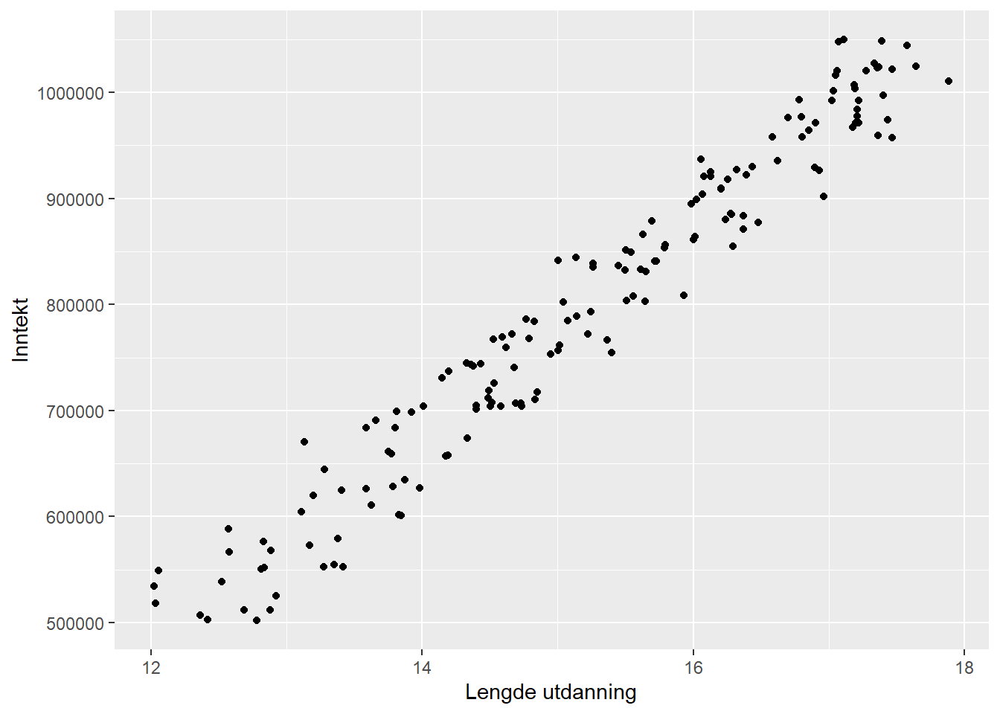
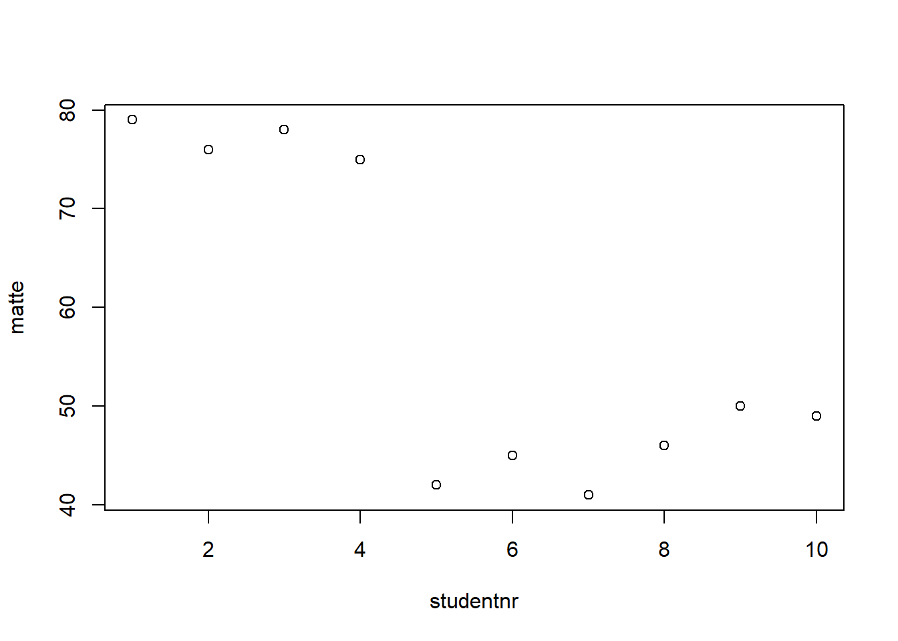
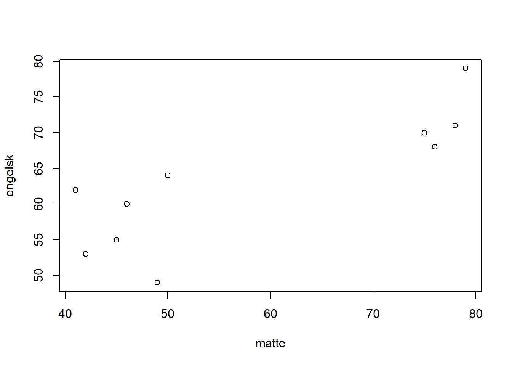
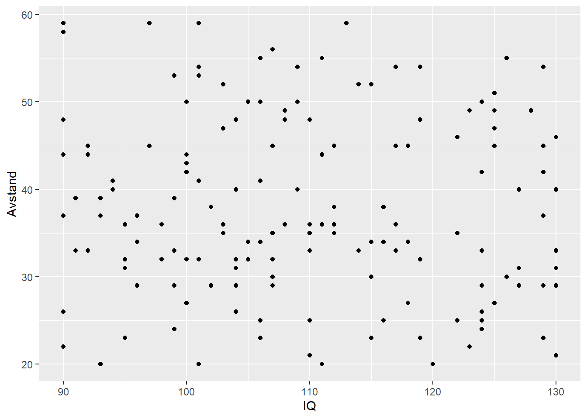
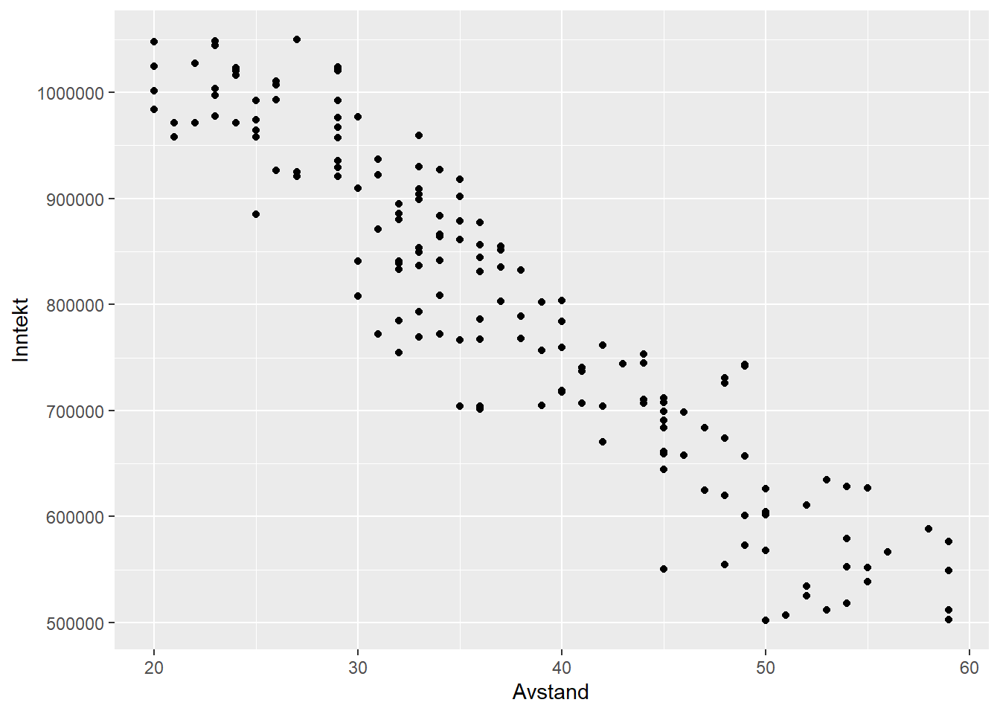

# IV regresjon

## Innledning

Multippel OLS-regresjon av tverrsnittsdata kan kalles en tradisjonell empirisk metode for å se på sammenhengen mellom en uavhengig variabel og en eller flere avhengige variabler. I regresjonen finner vi den gjennomsnittlige endringen i en uavhengig variabel - Y - når en avhengig variabel X endres med en enhet, og vi samtidig holder alle andre variabler konstante. Dette (koeffisienten for X) er en betinget korrelasjon mellom X og Y, men det er alltid en usikkerhet rundt i hvilken grad dette er et godt estimat for den kausale sammenhengen. Vi vil sannsynligvis kunne si at vi ikke vet om vi har utelatt variabler som påvirker både X og Y. Det kan også være sånn at ikke bare påvirker X -> Y, en kanskje også Y -> X. En mulighet for "forkludring" av estimatet for kausalitet kan også være at vi ikke helt forstår kontrollvariablers påvirkning på X, slik at deler av X's effekt på Y forsvinner. Selv om kontrollvariabler kan klargjøre X's effekt på Y og dermed variasjonen i Y kan det tåkelegge den kausale effekten mellom variablene. Vi kjenner til fra kapittelet om OLS-regresjon at det alltid er et feilledd i regresjonslikningen. Feil, som beskrevet ovenfor, kan føre til at en uavhenigig variabel korrelerer med feilleddet og dermed påvirker kausaleffekten. IV-regresjon (Instrumentell Variabel regresjon) kan ses på som et kvasi-eksperiment (se f.eks. @galianiEffectAidGrowth2017, @andrianoCausalEffectMaternal2019 og @dipreteGeneticInstrumentalVariable2018).

En definisjon av IV er "the use of additional 'instrumental' variables, not contained in the equation of interest, to estimate the unknown parameters of that equation" [@stockWhoInventedInstrumental2003a, s.179]. La oss tenke oss at vi har en avhengig variabel Y - inntekt - som påvirkes av sosioøkonomisk status - X. Sosioøkonomisk status påvirker altså inntekten (X -> Y), men samtidig kan inntekt påvirke sosioøkonomisk status (Y -> X). En såkalt instrumentvariabel - Z - som må korrelere sterkt med X, men ikke med Y på andre måter enn gjennom X kan gi oss en omveg rundt problemet med retning på kausaliteten. Å finne en god instrumentvariabel er derimot krevende og vil trolig forutsette svært god kunnskap om tematikken som undersøkes. 

Oppsummert blir da en IV-regresjon at man først gjennomfører en regresjon der X-verdiene predikeres av Z. Deretter gjennomfører man en regresjon med de predikerte X-verdiene mot Y. IV regresjon kalles derfor også ofte *"two-stage least squares"*.

Det hviler to forutsetninger for dette: Z må være korrelert med X (det såkalte relevanskriteriet) og at Z kun påvirker Y gjennom X - altså ingen direkte påvirkning fra Z til Y (det såkalte eksluderingskriteriet). 

## Et konstruert eksempel for konseptualisering av IV-regresjon

La oss tenke oss at vi ønsker å undersøke sammenhengen mellom lengde på utdanning og inntekt. Er det slik at et år ekstra utdanning gir deg x mer i inntekt, eller x+...? mer i inntekt? Dette eksempelet er basert på @mastenCausalInferenceBootcamp2015.

La oss videre tenke oss at vi har data:


```
#> Descriptive Statistics  
#> IVregrdata1  
#> Label: jamovi data set  
#> N: 161  
#> 
#>                      Inntekt   Utdanning
#> --------------- ------------ -----------
#>            Mean    795578.74       15.20
#>         Std.Dev    153427.64        1.52
#>             Min    501846.67       12.02
#>          Median    801972.01       15.24
#>             Max   1049757.30       17.89
#>         N.Valid       161.00      161.00
#>       Pct.Valid       100.00      100.00
```



Vi ser at det er en klar trend i disse dataene at folk med lengre utdanning har høyere inntekt enn folk med kortere utdanning. Betyr det at lengde på utdanning har en kausal effekt på inntekt? Svaret er nei. Fordi lengde på utdanning er ikke tilfeldig ("randomly assigned") - folk velger hvor lang utdannelse de vil ta. Likevel ser vi jo en klar trend/sammenheng i dataene. Så hvorfor gjør vi det?

En forklaring kan være at denne sammenhengen skyldes en uobservert variabel som "forstyrrer" bildet. La oss videre i eksempelet si at dette er IQ, og at vi har data på dette.


```
#> Descriptive Statistics  
#> IVregrdata2  
#> N: 161  
#> 
#>                       IQ   Utdanning
#> --------------- -------- -----------
#>            Mean   119.27       15.20
#>         Std.Dev    11.25        1.52
#>             Min    90.01       12.02
#>          Median   122.55       15.24
#>             Max   134.95       17.89
#>         N.Valid   161.00      161.00
#>       Pct.Valid   100.00      100.00
```



Lengde på utdanning ser ut til å henge sammen med IQ.


Men også inntekt ser ut til å henge sammen med IQ, uavhengig av hvor mye utdannelse de har. I virkeligheten vil vi kanskje ikke se dette - vi har data på lengde på utdannelse og inntekt (vi har generert dataene her nettopp for å illustrere). Men i virkeligheten kan korrelasjonen vi kanskje faktisk ser og som vi viste i første diagrammet - korrelasjonen mellom lengde på utdanning og inntekt - altså være drevet av en underliggende, uobservert variabel og IKKE av en kausal sammenheng mellom lengde på utdanning og inntekt. 

For å mitigere dette problemet kommer instrumentet inn i bildet. I eksempelet fra @mastenCausalInferenceBootcamp2015 vises det til at avstand fra hjemadressen til nærmeste studiested (heretter: avstand) kan være et slikt instrument. Vi bygger videre på samme måte. 

Et instrument må altså kunne påvirke Y gjennom X (og ikke direkte), og være korrelert med X. I vårt eksempel betyr det at avstand må påvirke inntekt gjennom lengde på utdannelse, og avstand må være korrelert med lengde på utdannelse. 

Vi må derfor kunne se på X, Y og Z slik:



Lav avstand har sammenheng med lengre utdannelse. Forhold som trekkes fram for denne sammenhengen kan være større kjennskap til universitetet, lavere kostnad for bolig og reise, større påvirkning av eldre studenter i nærmiljøet gjennom oppveksten (og sikkert flere) - som i sum antyder at det kan være en kausal sammenheng mellom avstand og om folk studerer og hvor lenge. Altså en korrelasjon mellom Z og X (som vi sa var en forutsetning). 



Sammenhengen mellom IQ og avstand er imidlertid tilfeldig. Vi antar det ikke er noen grunn til at IQ har sammenheng med avstand. Folk er født "her og der" med ulik IQ. Vi ser bort fra at det kanskje faktisk kan være en sammenheng... ved at universitets ansatte bor i nærheten av iuniversitete, og om IQ er arvelig kan man kanskje tenke seg at det bor flere unge med høyere IQ i nærheten av nuviersitetet enn lenger unna - vi går ikke inn i denne "problemstillingen" her, men legger til grunn at dataene våre viser at det ikke er slik. Om det faktisk er sånn at det er en sammenheng vil det gjøre det vanskelig å bruke avstand som et instrument. 

Den siste forutsetningen er at avstand ikke kan ha en *direkte kausal effekt* på inntekt. Dette virker rimelig, da det er vanskelig å se at arbeidsgivere har noe forhold til hvor langt unna et unviersitet folk har vokst opp, og at avstand dermed skulle kunne ha en kausal effekt på inntekt. 

Vi kan si at instrumentet "avstand" tilfredsstiller forutsetningene, og vi kan se på korrelasjonen mellom avstand og inntekt. 



Vi ser at avstand og inntekt korrelerer. Vi kan dermed si at korrelasjonen mellom avstand og inntekt representerer en kausal effekt av lengde på utdanning og inntekt. Vi ser en kausal effekt mellom X og Y gjennom korrelasjonen mellom Z og Y. 

## Eksempel 1 med data fra pakken "AER"

I datasettet har vi en rekke variabler:

```r
data("CigarettesSW")

# Bruker pakken: summarytools
summarytools::descr(CigarettesSW, stats = "common")
#> Non-numerical variable(s) ignored: state, year
#> Descriptive Statistics  
#> CigarettesSW  
#> N: 96  
#> 
#>                      cpi         income    packs    population    price      tax     taxs
#> --------------- -------- -------------- -------- ------------- -------- -------- --------
#>            Mean     1.30    99878735.74   109.18    5168866.32   143.45    42.68    48.33
#>         Std.Dev     0.23   120541138.18    25.87    5442344.66    43.89    16.14    19.33
#>             Min     1.08     6887097.00    49.27     478447.00    84.97    18.00    21.27
#>          Median     1.30    61661644.00   110.16    3697471.50   137.72    37.00    41.05
#>             Max     1.52   771470144.00   197.99   31493524.00   240.85    99.00   112.63
#>         N.Valid    96.00          96.00    96.00         96.00    96.00    96.00    96.00
#>       Pct.Valid   100.00         100.00   100.00        100.00   100.00   100.00   100.00
```

Vi skal her se på sammenhengen mellom "packs" (= y -> antall sigarettpakker per capita)som avhengig variabel, "price" (= x -> gjennomsnittlig pris pr år inkl skatter og avgifter) som uavhengig variabel, og "taxs" (= z -> gjennomsnittlig skatt pr år) som instrumentvariabel.

Forutsetningene er altså:

1. z og x må være korrelerte: at pris og skatte-/avgiftsnivå korrelerer virker rimelig
2. z må ikke påvirke y direkte: at skatte-/avgiftsnivået ikke i seg selv påvirker antall sigarettpakker som selges direkte virker rimelig, men at skatte-/avgiftsnivået påvirker antall sigarettpakker som selges gjennom prisnivåt virker også rimelig (dette er en forutsetning som alltid kan diskuteres, men for eksempelets skyld antar vi dette).


```r
cor(CigarettesSW$price, CigarettesSW$taxs)
#> [1] 0.9203278
```

### Modell 1


```r
model1 <- ivreg(log(packs) ~ log(price) | taxs, data = CigarettesSW)
summary(model1)
#> 
#> Call:
#> ivreg(formula = log(packs) ~ log(price) | taxs, data = CigarettesSW)
#> 
#> Residuals:
#>       Min        1Q    Median        3Q       Max 
#> -0.597468 -0.105477 -0.008609  0.101021  0.525352 
#> 
#> Coefficients:
#>             Estimate Std. Error t value
#> (Intercept)  7.66548    0.34514  22.210
#> log(price)  -0.60993    0.07004  -8.708
#>                         Pr(>|t|)    
#> (Intercept) < 0.0000000000000002 ***
#> log(price)     0.000000000000103 ***
#> ---
#> Signif. codes:  
#> 0 '***' 0.001 '**' 0.01 '*' 0.05 '.' 0.1 ' ' 1
#> 
#> Residual standard error: 0.1845 on 94 degrees of freedom
#> Multiple R-Squared: 0.4324,	Adjusted R-squared: 0.4264 
#> Wald test: 75.83 on 1 and 94 DF,  p-value: 0.0000000000001025
```

Vi ser på koeffisientene at log(price) er signifikant, og at pris påvirker salget (antall sigarettpakker) negativt (negativ koeffisient). 

### Modell 2

Her legger vi inn en eksogen variabel - inntekt - altså en variabel hvis verdi er bestemt utenfor modellen for så å legges inn i modellen. Pris ser vi på som en endogen variabel, altså en variabel hvis verdi bestemmes i modellen. En tilfeldig endogen variabel i en modell korrelerer med feilleddet (som vi forsåvidt har beskrevet i begynnelsen av dette kapittelet), mens en eksogen variabel ikke er korrelert med feilleddet (hvilket er naturlig siden vi sier verdien er bestemt utenfor modellen). 


```r
model2 <- ivreg(log(packs) ~ log(price) + log(income) | log(income) + taxs, data = CigarettesSW)
summary(model2)
#> 
#> Call:
#> ivreg(formula = log(packs) ~ log(price) + log(income) | log(income) + 
#>     taxs, data = CigarettesSW)
#> 
#> Residuals:
#>       Min        1Q    Median        3Q       Max 
#> -0.599938 -0.104454 -0.007223  0.101973  0.525855 
#> 
#> Coefficients:
#>              Estimate Std. Error t value
#> (Intercept)  7.698702   0.399560  19.268
#> log(price)  -0.605735   0.075878  -7.983
#> log(income) -0.003015   0.018990  -0.159
#>                         Pr(>|t|)    
#> (Intercept) < 0.0000000000000002 ***
#> log(price)      0.00000000000368 ***
#> log(income)                0.874    
#> ---
#> Signif. codes:  
#> 0 '***' 0.001 '**' 0.01 '*' 0.05 '.' 0.1 ' ' 1
#> 
#> Residual standard error: 0.1853 on 93 degrees of freedom
#> Multiple R-Squared: 0.4335,	Adjusted R-squared: 0.4214 
#> Wald test: 37.67 on 2 and 93 DF,  p-value: 0.000000000001038
```

Vi kan legge merke til at log(income) ikke er signifikant. 

## Eksempel 2 

Data for dette eksempelet er hentet fra @beckerECLR2021 ("Mroz.csv"). 

```r
Mrozdata <- read.csv(file = 'Mroz.csv', na.strings = ".")
Mrozdata <- subset(Mrozdata, is.na(wage) == FALSE) 
head(Mrozdata)
#>   inlf hours kidslt6 kidsge6 age educ   wage repwage hushrs
#> 1    1  1610       1       0  32   12 3.3540    2.65   2708
#> 2    1  1656       0       2  30   12 1.3889    2.65   2310
#> 3    1  1980       1       3  35   12 4.5455    4.04   3072
#> 4    1   456       0       3  34   12 1.0965    3.25   1920
#> 5    1  1568       1       2  31   14 4.5918    3.60   2000
#> 6    1  2032       0       0  54   12 4.7421    4.70   1040
#>   husage huseduc huswage faminc    mtr motheduc fatheduc
#> 1     34      12  4.0288  16310 0.7215       12        7
#> 2     30       9  8.4416  21800 0.6615        7        7
#> 3     40      12  3.5807  21040 0.6915       12        7
#> 4     53      10  3.5417   7300 0.7815        7        7
#> 5     32      12 10.0000  27300 0.6215       12       14
#> 6     57      11  6.7106  19495 0.6915       14        7
#>   unem city exper  nwifeinc     lwage expersq
#> 1  5.0    0    14 10.910060 1.2101540     196
#> 2 11.0    1     5 19.499980 0.3285121      25
#> 3  5.0    0    15 12.039910 1.5141380     225
#> 4  5.0    0     6  6.799996 0.0921233      36
#> 5  9.5    1     7 20.100060 1.5242720      49
#> 6  7.5    1    33  9.859054 1.5564800    1089
```

### Modell 1: Standard OLS

Vi ønsker å kjøre en regresjon med kvinners lønn (lwage) som avhengig variabel og utdanning (educ) som uavhengig variabel. Eksempelet tar utgangspunkt i @wooldridgeIntroductoryEconometricsModern2016 (se kap. 15).


```r
IVregmod1 <- lm(lwage ~ educ, data = Mrozdata)
summary(IVregmod1)
#> 
#> Call:
#> lm(formula = lwage ~ educ, data = Mrozdata)
#> 
#> Residuals:
#>      Min       1Q   Median       3Q      Max 
#> -3.10256 -0.31473  0.06434  0.40081  2.10029 
#> 
#> Coefficients:
#>             Estimate Std. Error t value          Pr(>|t|)
#> (Intercept)  -0.1852     0.1852  -1.000             0.318
#> educ          0.1086     0.0144   7.545 0.000000000000276
#>                
#> (Intercept)    
#> educ        ***
#> ---
#> Signif. codes:  
#> 0 '***' 0.001 '**' 0.01 '*' 0.05 '.' 0.1 ' ' 1
#> 
#> Residual standard error: 0.68 on 426 degrees of freedom
#> Multiple R-squared:  0.1179,	Adjusted R-squared:  0.1158 
#> F-statistic: 56.93 on 1 and 426 DF,  p-value: 0.0000000000002761
```

Vi ser at vi får et statistisk signifikant resultat og at et års lengre utdanning øker lønn med nesten 11 % (Esitmate = 0.1086). Vi kan imidlertid forvente at utdanning korrelerer med mange individuelle karakteristika hos et individ som er viktige for den personens lønn, men som ikke fanges opp av utdanningsvariabelen og derfor ikke fanges opp i denne modellen. I dette tilfellet, og for å følge eksempelet i @wooldridgeIntroductoryEconometricsModern2016 velger vi fars utdanning (fatheduc) som instrument (vi diskuterer ikke instrumentet og forutsetningene her).

### Modell 2: IV regresjon


```r
IVregmod2 <- ivreg(lwage ~ educ | fatheduc, data = Mrozdata)
print(summary(IVregmod2))
#> 
#> Call:
#> ivreg(formula = lwage ~ educ | fatheduc, data = Mrozdata)
#> 
#> Residuals:
#>     Min      1Q  Median      3Q     Max 
#> -3.0870 -0.3393  0.0525  0.4042  2.0677 
#> 
#> Coefficients:
#>             Estimate Std. Error t value Pr(>|t|)  
#> (Intercept)  0.44110    0.44610   0.989   0.3233  
#> educ         0.05917    0.03514   1.684   0.0929 .
#> ---
#> Signif. codes:  
#> 0 '***' 0.001 '**' 0.01 '*' 0.05 '.' 0.1 ' ' 1
#> 
#> Residual standard error: 0.6894 on 426 degrees of freedom
#> Multiple R-Squared: 0.09344,	Adjusted R-squared: 0.09131 
#> Wald test: 2.835 on 1 and 426 DF,  p-value: 0.09294
```

Vi kan se at "verdien" av et års ekstra utdanning nå kun er 5.9% økning, og signifikant p < 0.1.

### Modell 3: OLS med flere prediktorer


```r
IVregmod3 <- lm(lwage ~ educ + age + exper + expersq, data = Mrozdata)
summary(IVregmod3)
#> 
#> Call:
#> lm(formula = lwage ~ educ + age + exper + expersq, data = Mrozdata)
#> 
#> Residuals:
#>      Min       1Q   Median       3Q      Max 
#> -3.08521 -0.30587  0.04946  0.37523  2.37077 
#> 
#> Coefficients:
#>               Estimate Std. Error t value          Pr(>|t|)
#> (Intercept) -0.5333762  0.2778430  -1.920           0.05557
#> educ         0.1075228  0.0141745   7.586 0.000000000000212
#> age          0.0002836  0.0048553   0.058           0.95344
#> exper        0.0415623  0.0131909   3.151           0.00174
#> expersq     -0.0008152  0.0003996  -2.040           0.04195
#>                
#> (Intercept) .  
#> educ        ***
#> age            
#> exper       ** 
#> expersq     *  
#> ---
#> Signif. codes:  
#> 0 '***' 0.001 '**' 0.01 '*' 0.05 '.' 0.1 ' ' 1
#> 
#> Residual standard error: 0.6672 on 423 degrees of freedom
#> Multiple R-squared:  0.1568,	Adjusted R-squared:  0.1489 
#> F-statistic: 19.67 on 4 and 423 DF,  p-value: 0.000000000000007328
```

Estiemrt koeffisient for educ er nå 0.1075 med standardfeil 0.0141

### Modell 4: IV regresjon med flere (to) instrumenter

Vi legger til både fars og mors utdannelse som instrumenter:

```r
IVregmod4 <- ivreg(lwage ~ educ  +exper + expersq | fatheduc + motheduc + exper + expersq, data = Mrozdata)
print(summary(IVregmod4))
#> 
#> Call:
#> ivreg(formula = lwage ~ educ + exper + expersq | fatheduc + motheduc + 
#>     exper + expersq, data = Mrozdata)
#> 
#> Residuals:
#>     Min      1Q  Median      3Q     Max 
#> -3.0986 -0.3196  0.0551  0.3689  2.3493 
#> 
#> Coefficients:
#>               Estimate Std. Error t value Pr(>|t|)   
#> (Intercept)  0.0481003  0.4003281   0.120  0.90442   
#> educ         0.0613966  0.0314367   1.953  0.05147 . 
#> exper        0.0441704  0.0134325   3.288  0.00109 **
#> expersq     -0.0008990  0.0004017  -2.238  0.02574 * 
#> ---
#> Signif. codes:  
#> 0 '***' 0.001 '**' 0.01 '*' 0.05 '.' 0.1 ' ' 1
#> 
#> Residual standard error: 0.6747 on 424 degrees of freedom
#> Multiple R-Squared: 0.1357,	Adjusted R-squared: 0.1296 
#> Wald test: 8.141 on 3 and 424 DF,  p-value: 0.00002787
```

fatheduc og motheduc er instrumentene, exper og expersq er eksogene uavhengige variabler.

Også her ser vi en vesentlig reduksjon i estimatet for educ fra OLS til IV regresjon; fra 0.1075 med standardfeil 0.0141 til 0.0613 med standardfeil 0.0314. IV estiamtene vil ha større standardfeil enn OLS estimater. 

### Test av relevansen av instrumentene

Det er selvsagt avgjørende at instrumentet/-ene er relevante. Som beskrevet må instrumentene være tilstrekkelig sterkt korrelerte med den/de endogene uavhengige variablene. I dette eksempelet (modell 4) må altså fatheduc og motheduc forklare en tilstrekkelig del av variasjonen i educ for å kunne være relevant instrumenter. Dette kan vi gjøre gjennom en vanlig F-test:

```r
steg1 <- lm(educ ~ age + exper + expersq + fatheduc + motheduc, data = Mrozdata)

instrumentF <- waldtest(steg1, .~. -fatheduc -motheduc)
instrumentF
#> Wald test
#> 
#> Model 1: educ ~ age + exper + expersq + fatheduc + motheduc
#> Model 2: educ ~ age + exper + expersq
#>   Res.Df Df      F                Pr(>F)    
#> 1    422                                    
#> 2    424 -2 54.943 < 0.00000000000000022 ***
#> ---
#> Signif. codes:  
#> 0 '***' 0.001 '**' 0.01 '*' 0.05 '.' 0.1 ' ' 1
```
F-verdien er 54.943 med p < .001. Vi kan finne kritisk F-verdi:

```r
qf(0.05, df1 = 422, df2 = 424)
#> [1] 0.8520168
```
Vi kan klart forkaste nullhypotesen om at instrumentene er irrelevante. 


