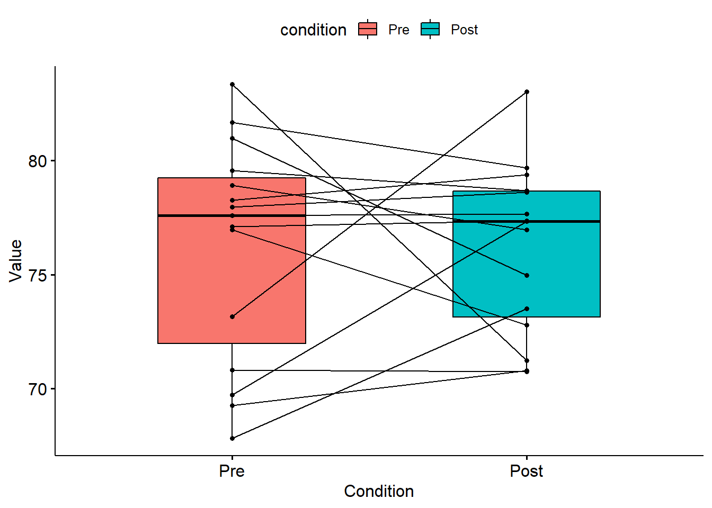

# T-tester

R-pakker brukt i dette kapittelet:


```r
pacman::p_load(tidyverse, readxl, summarytools, ggpubr, nortest, tseries)
```

En t-test brukes når man vil sammenlikne to gjennomsnittsverdier og utvalget er relativt lite. Vi kan se for oss tre tilfeller:

Vi sammenlikner en gruppe mot en kjent gjennomsnittsstørelse og tester om gruppas gjennomsnitt er signifikant forskjellig fra det kjente gjennomsnittet («One sample t-test»).
Vi sammenlikner to uavhengige gruppers gjennomsnitt for å se om det er signifikant forskjell på gjennomsnittene for en variabel («Independent samples t-test»)
Vi sammenlikner samme gruppe på to ulike tidspunkt – observasjonene er altså ikke uavhengige av hverandre («Paired samples t-test»)
En t-test handler altså om å undersøke om det er signifikant forskjell på gjennomsnittsverdiene i to sett med data. Vi setter derfor opp en nullhypotese som sier at det ikke er forskjell:

$H_0: \mu_1 = \mu_2$

Hvis vi denne nullhypotesen ikke kan forkastes (at vi konkluderer med at gjennomsnittene er like) betyr det for eksempel at en gruppe som har fått «ekte» medisin ikke skiller seg fra en gruppe som har fått placebo. Hvis vi derimot forkaster nullhypotesen vil vi konkludere med at det er signifikant forskjell mellom de to gruppene (på en eller annen verdi vi måler). T-testen tester denne nullhypotesen – at det ikke er forskjell.

I en t-test får vi en testverdi. Dersom p-verdien for denne testen er mindre enn 0.05 (gitt at vi bruker $\alpha = 0.05$) forkaster vi nullhypotesen (If p is low, the null must go»), og vi vil anta at det er signifikant forskjell mellom gruppene (og at denne forskjellen ikke skyldes tilfeldigheter). Er p høyere enn valgt α vil vi beholde nullhypotesen.

## Students t-test

T-test, eller "Student’s t-test" som den ofte omtales som, baserer seg på en såkalt t-fordeling. En t-fordeling er ganske lik en normaldistribusjon, men har tyngre haler. Fordelingen vil variere med antall frihetsgrader, men likere og likere en normaldistribusjon ettersom utvalgsstørrelsen øker:


```r
curve(dt(x, df = 2), from = -4, to = 4, col = "blue", ylim = c(0, 0.41))
curve(dt(x, df = 5), from =-4, to = 4, col = "brown", add = TRUE)
curve(dt(x, df=20), from = -4, to = 4, col = "black", add = TRUE)
curve(dnorm, -4, 4, col = "red", add = TRUE)
legend(-4, .3, legend = c("df=2", "df=10", "df=20", "Normal"),
       col = c("blue", "brown", "black", "red"), lty = 1, cex = 1.2)
```


Så hvorfor behovet for en t-distribusjon? William Sealy Gosset, a.k.a. "Student", fant ut at hvis man ikke er helt sikker på hva standardavviket er må man bruke et estimat på standardavviket som gjør at fordelingen endrer seg litt fra normalfordelingen. Det vi omtaler som t-test er en test av en statistisk hypotese som baserer seg på Students t-distribusjon.

## One sample t-test

La oss anta at vi har en gruppe på 20 studenter som gjennomfører et nettbasert kurs i anvendt kvantitativ analyse basert på bruk av en pakke med digitale læringsressurser som legger opp til mange selvøvelser. Vi tester denne gruppa opp mot en gjennomsnittsskåre på en test på 67.5 for alle andre studenter (skåre 0-100) som har gjennomført samme kurs tidligere der man ikke har hatt samme tilgang til digitale øvingsoppgaver. Skårer denne testgruppa signifikant bedre enn resten av studentene?


`<a href="data:text/csv;base64,IklEIiwiU2NvcmUiDQoxLDUwDQoyLDYwDQozLDYwDQo0LDY0DQo1LDY2DQo2LDY2DQo3LDY3DQo4LDY5DQo5LDcwDQoxMCw3NA0KMTEsNzYNCjEyLDc2DQoxMyw3Nw0KMTQsNzkNCjE1LDc5DQoxNiw3OQ0KMTcsODENCjE4LDgyDQoxOSw4Mg0KMjAsODkNCg==" download="t-test_onesample.csv">Download t-test_onesample.csv</a>`{=html}

Vi regner ut teststatstikken (t) slik:

$t=\frac{\overline{x}-\mu}{\frac{s}{\sqrt{n}}}$

der:

$t = t-verdi$

$\overline{x} = observert\ gjennomsnitt$

$\mu = teoretisk/forventet\ gjennomsnitt$

$s = standardavviket\ i\ utvalget/observerte$

$n=utvalgsstørrelse/antall\ observerte$

Vi henter nødvendige verdier fra datasettet:

```r
descr(ttestonesample$Score)
#> Descriptive Statistics  
#> ttestonesample$Score  
#> N: 20  
#> 
#>                      Score
#> ----------------- --------
#>              Mean    72.30
#>           Std.Dev     9.52
#>               Min    50.00
#>                Q1    66.00
#>            Median    75.00
#>                Q3    79.00
#>               Max    89.00
#>               MAD     9.64
#>               IQR    13.00
#>                CV     0.13
#>          Skewness    -0.45
#>       SE.Skewness     0.51
#>          Kurtosis    -0.50
#>           N.Valid    20.00
#>         Pct.Valid   100.00
```

Dette gir da:

$t=\frac{72.3-67.5}{\frac{9.52}{\sqrt{20}}}=\frac{4.8}{2.129}=2.255$

Vi sammenlikner t-verdien 2.255 med kritisk verdi, f.eks. [her](https://www.itl.nist.gov/div898/handbook/eda/section3/eda3672.htm). Vi finner verdien 1.729. Hvis t-verdien er større enn kritisk verdi: forkast nullhypotesen. Her forkaster vi nullhypotsesen fordi 2.255 er større enn 1.729. Vår alternative hypotese om at det er signifikant forskjell er styrket.

I R bruker vi:

```r
t.test(ttestonesample$Score, mu = 67.5, alternative = "two.sided")
#> 
#> 	One Sample t-test
#> 
#> data:  ttestonesample$Score
#> t = 2.2547, df = 19, p-value = 0.03615
#> alternative hypothesis: true mean is not equal to 67.5
#> 95 percent confidence interval:
#>  67.84422 76.75578
#> sample estimates:
#> mean of x 
#>      72.3
```


```r
qt(0.05, 19, lower.tail=FALSE)
#> [1] 1.729133
```

Vi ser også her at t-testveridien er større enn kritisk verdi (2.255 > 1.729). I tillegg ser vi at p-verdien er < 0.05 ("If p is low, the null must go"). 

### Sjekk av forutsetninger for one sample t-test

1. Tilfeldig utvalg fra en definert/gitt populasjon
2. Variabelen må være kontinuerlig
3. Populasjonen er normalfordelt

Vi ser spesielt på nr 3. Det finnes flere måter å se på normalitetsforutsetningen, både grafisk og formelle statistiske tester. Vi skal vise en formell test - Shapiro-Wilks som ofte brukes. Andre eksempler er Kolmogorov-Smirnov og Anderson-Darling. @razaliPowerComparisonsShapiroWilk2011 finner i en sammenlinende studie at Shapiro-WIlks fungerer bra.


```r
shapirotest <- shapiro.test(ttestonesample$Score)
shapirotest
#> 
#> 	Shapiro-Wilk normality test
#> 
#> data:  ttestonesample$Score
#> W = 0.96205, p-value = 0.5856
```

Vi sammenlikner testverdien med 0,05 (gitt at vi bruker 0,05 som signifikansnivå). Dersom testverdien er over 0,05 indikerer det at dataene er normalfordelte. Hvis testeverdien er under 0,05 indikerer det at dataene avviker fra normalfordelingen. Dette er ikke tilfelle her (0.5855703).

## Paired samples t-test

Paired samples t-test brukes når gruppene/målingene ikke er uavhengige av hverandre. I tilfeller hvor vi for eksempel har en gruppe som er testet to ganger på ulike tidspunkt er ikke observasjonene uavhengige av hverandre.

Paired samples t-test og one sample t-test er på en måte "samme sak" - altså, der en one sample t-test sammenlikner gjennomsnittet fra et utvalg med en kjent størrelse kalkulerer en paired samples t-test forskjellen mellom de to gjennomsnittene for deretter å gjennomføre en one sample t-test på forskjellen.

La oss anta at vi har en gruppe på 15 studenter som vi har testet to ganger. Imellom testene har de gjennomført en aktivitet som skal trigge hukommelsen.

`<a href="data:text/csv;base64,IlByZSIsIlBvc3QiDQo3My4xNjM0OTg3NTY2NTQ0LDgzLjAyMDQzNTUyMDI4MzEyDQo3OC45MTAxNDk4NjAwOTcxOSw3Ni45NzE1MzQ0MTEwMjE2NA0KNzguMjc0MDcxMDk3NTMxODcsNzkuMzkyMTIwNTk0NjY5ODkNCjc3LjExNDA1NTQyMTIyNjI3LDc3LjM2OTM3ODY5NzMyNDMNCjgxLjY3NzA4NzA0ODI5OTMzLDc5LjY3OTg4NTkxNTk2NTkNCjc3Ljk2NjQyMTE1OTczOTQzLDc4LjYyNzQwMzg2MDQyMTINCjY3LjgyNDU1OTU1ODMwOTU2LDczLjUxNDY1NDAzMTk2NTUNCjcwLjgwODA4MzE2NzM5NjQzLDcwLjc1NjMzOTM0MDQwMDgzDQo3OS41NjkyMjc4NDY0NzE5LDc4LjY3NTM1OTg4MTMyOTE0DQo3Ny42MDE4NDIzMzg5NTkwMiw3Ny42NjI2OTc4NTQxMDQ3NQ0KODAuOTg1ODI5MDg2Nzg2MjUsNzQuOTgwOTE5MzQxMDYxODINCjY5LjcyOTYwMjA4OTQ3OTU2LDc3LjMzODMwOTczMTc2NA0KODMuMzU4NDY4NTg4MTQwMTEsNzEuMjI4OTk3MDU2NTUyMTUNCjY5LjI2NDcxNTg5NTc0NjgsNzAuNzgzNDM4Mzk4MzY3OTINCjc2Ljk2MzUyMjY2NDc5MTgyLDcyLjc3OTQxNzA3ODM0Nzk1DQo=" download="t-test_paired.csv">Download t-test_paired.csv</a>`{=html}


```r
pairedsamples <- read.csv("t-test_paired.csv")
descr(pairedsamples)
#> Descriptive Statistics  
#> pairedsamples  
#> N: 15  
#> 
#>                       Post      Pre
#> ----------------- -------- --------
#>              Mean    76.19    76.21
#>           Std.Dev     3.69     4.87
#>               Min    70.76    67.82
#>                Q1    72.78    70.81
#>            Median    77.34    77.60
#>                Q3    78.68    79.57
#>               Max    83.02    83.36
#>               MAD     3.47     5.02
#>               IQR     5.50     7.25
#>                CV     0.05     0.06
#>          Skewness    -0.09    -0.39
#>       SE.Skewness     0.58     0.58
#>          Kurtosis    -1.18    -1.31
#>           N.Valid    15.00    15.00
#>         Pct.Valid   100.00   100.00
```

Vi kan regne ut testverdien slik:

$t=\frac{\sum{d}}{\frac{n(\sum{d^2})-(\sum{d}^2)}{(n-1)}}$

der

$t = testverdi$

$d=differansen\ innad\ i\ hvert\ par$

$n=antall\ i\ utvalget$

Gjennom en manuell utregning finner vi $t=0.02$

Vi gjennomfører en t-test i R:


```r
t.test(pairedsamples$Pre, pairedsamples$Post, paired = TRUE, alternative = "two.sided")
#> 
#> 	Paired t-test
#> 
#> data:  pairedsamples$Pre and pairedsamples$Post
#> t = 0.020764, df = 14, p-value = 0.9837
#> alternative hypothesis: true mean difference is not equal to 0
#> 95 percent confidence interval:
#>  -2.934057  2.991423
#> sample estimates:
#> mean difference 
#>      0.02868286
```

Her ser vi at p er over 0,05. Dvs vi kan ikke forkaste nullhypotesen. Vi kan derfor ikke si at det er en signifikant forskjell mellom de to gruppene. 


```r
ggpaired(pairedsamples, cond1 = "Pre", cond2 = "Post",
    fill = "condition")
```




```r
descr(pairedsamples)
#> Descriptive Statistics  
#> pairedsamples  
#> N: 15  
#> 
#>                       Post      Pre
#> ----------------- -------- --------
#>              Mean    76.19    76.21
#>           Std.Dev     3.69     4.87
#>               Min    70.76    67.82
#>                Q1    72.78    70.81
#>            Median    77.34    77.60
#>                Q3    78.68    79.57
#>               Max    83.02    83.36
#>               MAD     3.47     5.02
#>               IQR     5.50     7.25
#>                CV     0.05     0.06
#>          Skewness    -0.09    -0.39
#>       SE.Skewness     0.58     0.58
#>          Kurtosis    -1.18    -1.31
#>           N.Valid    15.00    15.00
#>         Pct.Valid   100.00   100.00
```

Av grafen og tabellen over ser vi at spredningen er mindre etter aktiviteten (se f.eks. på standardavviket i tabellen).


```r
forskjell <- pairedsamples$Post - pairedsamples$Pre
shapiro.test(forskjell)
#> 
#> 	Shapiro-Wilk normality test
#> 
#> data:  forskjell
#> W = 0.94997, p-value = 0.5239
ad.test(forskjell)
#> 
#> 	Anderson-Darling normality test
#> 
#> data:  forskjell
#> A = 0.44249, p-value = 0.2483
jarque.bera.test(forskjell)
#> 
#> 	Jarque Bera Test
#> 
#> data:  forskjell
#> X-squared = 0.26188, df = 2, p-value = 0.8773
```

Vi kan se fra ulike tester ovenfor at forutsetningen om normalfordeling ser ut til å være innfridd. Normalt trenger vi ikke gjøre alle tre testene, men vi har tatt de med for å vise relevant kode om man skulle ha behov for den ene eller den andre - de tester normalitet fra ulike vinkler, og i svært mange tilfeller vil man se Shapiro-Wilks brukt. Robusthetstester viser også at Shapiro-Wilks viser bra robusthet og egenskaper sammenliknet med alternativer [@razaliPowerComparisonsShapiroWilk2011].

## Independent samples t-test

En vanlig situasjon er at vi har to grupper som skal sammenliknes. Hvis gruppene er uavhengige av hverandre (i motsetning til paired samples t-test), kan vi bruke independent samples t-test.

I eksempelet ønsker vi å sammenlikne to grupper studenter: en gruppe har ren nettundervisning, mens den andre gruppa har hybrid undervisning (nett og fysisk). Vi har eksamensresultater for begge gruppene. Kan vi ut fra eksamensresultatene si om gruppene er signifikant forskjellige fra hverandre?


```r
independent <- read.csv("t-test_independent.csv")
HeadTail <- function(independent){rbind(head(independent),tail(independent))}
HeadTail(independent)
#>     Studentnr   Type    Score
#> 1           1   Nett 77.36150
#> 2           2   Nett 79.39069
#> 3           3   Nett 71.88117
#> 4           4   Nett 80.00219
#> 5           5   Nett 81.99973
#> 6           6   Nett 73.35320
#> 195       195 Hybrid 93.46116
#> 196       196 Hybrid 83.60819
#> 197       197 Hybrid 79.41945
#> 198       198 Hybrid 78.83346
#> 199       199 Hybrid 94.84745
#> 200       200 Hybrid 86.55348
```

Vi ser at datasettet består av 200 observasjoner av studenter som enten har gjennomført ren nettundervisning eller en hybrid undervisning (nett og fysisk undervisning).

Vi kan regne ut testverdien:

$t=\frac{\overline{x}_A - \overline{x}_B}{\sqrt{\biggl({\frac{(\sum A^2-\frac{(\sum A)^2}{n_A})+(\sum B^2-\frac{(\sum B)^2}{n_B})}{n_A+n_B-2}\biggr)}*\biggl(\frac{1}{n_A}+\frac{1}{n_B}\biggr)}}$

der:

$A = Variabel 1 - i\ vårt\ tilfelle\ "nett"$

$B = Variabel 2 - i\ vårt\ tilfelle\ "hybrid"$

$(\sum A)^2 = Summen\ av\ A'ene\ kvadrert$ 

$(\sum B)^2 = Summen\ av\ B'ene\ kvadrert$

$A_2 = Enkeltverdien\ A\ kvadrert\ (hver\ enkelt\ verdi)$

$B_2 = Enkeltverdien\ B\ kvadrert\ (hver\ enkelt\ verdi)$

$\sum A^2 = Summen\ av\ de\ kvadrerte\ A'ene$

$\sum B^2 = Summen\ av\ de\ kvadrerte\ B'ene$

$\overline{x}_A = Gjennomsnitt\ for\ variabel\ A$

$\overline{x}_B = Gjennomsnitt\ for\ variabel\ B$

$n_A = antall\ i\ variabelen\ A$

$n_B = antall\ i\ variabelen\ B$


```r
ttestind <- t.test(Score ~ Type, independent)
```

Vi kan legge merke til at t-testen i R velger Welch t-test i stedet for Student t-test. Forskjellen ligger i at Welch t-test ikke forutsetter lik varians, mens Student t-test gjør dette. 


```r
t.test(Score ~ Type, independent, var.equal=TRUE)
#> 
#> 	Two Sample t-test
#> 
#> data:  Score by Type
#> t = 10.98, df = 198, p-value < 2.2e-16
#> alternative hypothesis: true difference in means between group Hybrid and group Nett is not equal to 0
#> 95 percent confidence interval:
#>   7.216698 10.376497
#> sample estimates:
#> mean in group Hybrid   mean in group Nett 
#>             84.58566             75.78906
```

I dette eksempelet har vi ingen forskjell mellom Welch og Student t-test. Noen programmer vil automatisk gi deg den ene eller den andre, alternativt begge to. Forskjellen Forskjellen på Student’s t og Welch’s t er altså at førstnevnte forutsetter at begge gruppene har likt standardavvik ("«"the assumption of equal variances").  I virkeligheten er dette ofte ikke tilfelle (det er liten grunn til å tro at gruppene har likt standardavvik hvis de ikke har lik gjennomsnittsverdi). I slike tilfeller er Welch’s t en mer robust test. 

Ut fra testen kan vi si at det er en statistisk signifikant forskjell mellom de to gruppene. Hvis vi ser på resultatet fra testen ser vi hybridgruppa har høyere snitt enn nettgruppa. Dette forteller oss at hybridgruppa skårer signifikant høyere enn nettgruppa.

```r
ttestind$estimate
#> mean in group Hybrid   mean in group Nett 
#>             84.58566             75.78906
```


