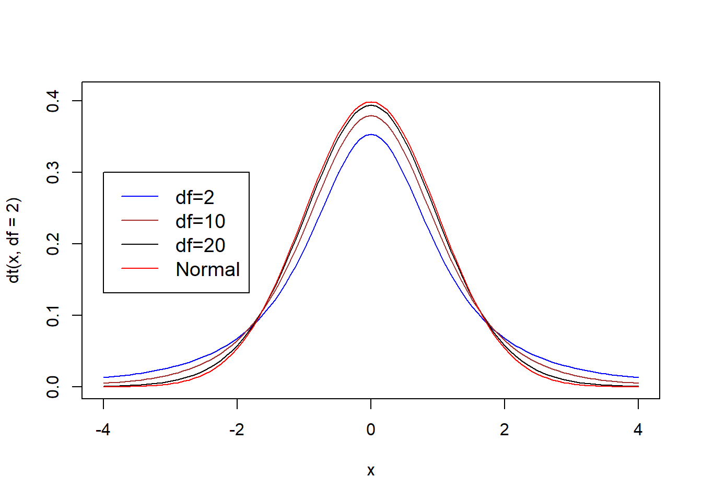

# T-tester

En t-test brukes når man vil sammenlikne to gjennomsnittsverdier og utvalget er relativt lite. Vi kan se for oss tre tilfeller:

Vi sammenlikner en gruppe mot en kjent gjennomsnittsstørelse og tester om gruppas gjennomsnitt er signifikant forskjellig fra det kjente gjennomsnittet («One sample t-test»).
Vi sammenlikner to uavhengige gruppers gjennomsnitt for å se om det er signifikant forskjell på gjennomsnittene for en variabel («Independent samples t-test»)
Vi sammenlikner samme gruppe på to ulike tidspunkt – observasjonene er altså ikke uavhengige av hverandre («Paired samples t-test»)
En t-test handler altså om å undersøke om det er signifikant forskjell på gjennomsnittsverdiene i to sett med data. Vi setter derfor opp en nullhypotese som sier at det ikke er forskjell:

$H_0: \mu_1 = \mu_2$

Hvis vi denne nullhypotesen ikke kan forkastes (at vi konkluderer med at gjennomsnittene er like) betyr det for eksempel at en gruppe som har fått «ekte» medisin ikke skiller seg fra en gruppe som har fått placebo. Hvis vi derimot forkaster nullhypotesen vil vi konkludere med at det er signifikant forskjell mellom de to gruppene (på en eller annen verdi vi måler). T-testen tester denne nullhypotesen – at det ikke er forskjell.

I en t-test får vi en testverdi. Dersom p-verdien for denne testen er mindre enn 0.05 (gitt at vi bruker $\alpha = 0.05$) forkaster vi nullhypotesen (If p is low, the null must go»), og vi vil anta at det er signifikant forskjell mellom gruppene (og at denne forskjellen ikke skyldes tilfeldigheter). Er p høyere enn valgt α vil vi beholde nullhypotesen.

## Students t-test

T-test, eller "Student’s t-test" som den ofte omtales som, baserer seg på en såkalt t-fordeling. En t-fordeling er ganske lik en normaldistribusjon, men har tyngre haler. Fordelingen vil variere med antall frihetsgrader, men likere og likere en normaldistribusjon ettersom utvalgsstørrelsen øker:


```r
curve(dt(x, df = 2), from = -4, to = 4, col = "blue", ylim = c(0, 0.41))
curve(dt(x, df = 5), from =-4, to = 4, col = "brown", add = TRUE)
curve(dt(x, df=20), from = -4, to = 4, col = "black", add = TRUE)
curve(dnorm, -4, 4, col = "red", add = TRUE)
legend(-4, .3, legend = c("df=2", "df=10", "df=20", "Normal"),
       col = c("blue", "brown", "black", "red"), lty = 1, cex = 1.2)
```



Så hvorfor behovet for en t-distribusjon? William Sealy Gosset, a.k.a. "Student", fant ut at hvis man ikke er helt sikker på hva standardavviket er må man bruke et estimat på standardavviket som gjør at fordelingen endrer seg litt fra normalfordelingen. Det vi omtaler som t-test er en test av en statistisk hypotese som baserer seg på Students t-distribusjon.

## One sample t-test

La oss anta at vi har en gruppe på 20 studenter som gjennomfører et nettbasert kurs i anvendt kvantitativ analyse basert på bruk av en pakke med digitale læringsressurser som legger opp til mange selvøvelser. Vi tester denne gruppa opp mot en gjennomsnittsskåre på en test på 67.5 for alle andre studenter (skåre 0-100) som har gjennomført samme kurs tidligere der man ikke har hatt samme tilgang til digitale øvingsoppgaver. Skårer denne testgruppa signifikant bedre enn resten av studentene?


`<a href="data:text/csv;base64,IklEIiwiU2NvcmUiDQoxLDUwDQoyLDYwDQozLDYwDQo0LDY0DQo1LDY2DQo2LDY2DQo3LDY3DQo4LDY5DQo5LDcwDQoxMCw3NA0KMTEsNzYNCjEyLDc2DQoxMyw3Nw0KMTQsNzkNCjE1LDc5DQoxNiw3OQ0KMTcsODENCjE4LDgyDQoxOSw4Mg0KMjAsODkNCg==" download="t-test_onesample.csv">Download t-test_onesample.csv</a>`{=html}

Vi regner ut teststatstikken (t) slik:

$t=\frac{\overline{x}-\mu}{\frac{s}{\sqrt{n}}}$

der:

$t = t-verdi$

$\overline{x} = observert\ gjennomsnitt$

$\mu = teoretisk/forventet\ gjennomsnitt$

$s = standardavviket\ i\ utvalget/observerte$

$n=utvalgsstørrelse/antall\ observerte$

Vi henter nødvendige verdier fra datasettet:

```r
# Bruker pakken: summarytools
descr(ttestonesample$Score)
#> Descriptive Statistics  
#> ttestonesample$Score  
#> N: 20  
#> 
#>                      Score
#> ----------------- --------
#>              Mean    72.30
#>           Std.Dev     9.52
#>               Min    50.00
#>                Q1    66.00
#>            Median    75.00
#>                Q3    79.00
#>               Max    89.00
#>               MAD     9.64
#>               IQR    13.00
#>                CV     0.13
#>          Skewness    -0.45
#>       SE.Skewness     0.51
#>          Kurtosis    -0.50
#>           N.Valid    20.00
#>         Pct.Valid   100.00
```

Dette gir da:

$t=\frac{72.3-67.5}{\frac{9.52}{\sqrt{20}}}=\frac{4.8}{2.129}=2.255$

Vi sammenlikner t-verdien 2.255 med kritisk verdi, f.eks. [her](https://www.itl.nist.gov/div898/handbook/eda/section3/eda3672.htm). Vi finner verdien 1.729. Hvis t-verdien er større enn kritisk verdi: forkast nullhypotesen. Her forkaster vi nullhypotsesen fordi 2.255 er større enn 1.729. Vår alternative hypotese om at det er signifikant forskjell er styrket.

I R bruker vi:

```r
t.test(ttestonesample$Score, mu = 67.5, alternative = "two.sided")
#> 
#> 	One Sample t-test
#> 
#> data:  ttestonesample$Score
#> t = 2.2547, df = 19, p-value = 0.03615
#> alternative hypothesis: true mean is not equal to 67.5
#> 95 percent confidence interval:
#>  67.84422 76.75578
#> sample estimates:
#> mean of x 
#>      72.3
```


```r
qt(0.05, 19, lower.tail=FALSE)
#> [1] 1.729133
```

Vi ser også her at t-testveridien er større enn kritisk verdi (2.255 > 1.729). I tillegg ser vi at p-verdien er < 0.05 ("If p is low, the null must go"). 

### Sjekk av forutsetninger for one sample t-test

1. Tilfeldig utvalg fra en definert/gitt populasjon
2. Variabelen må være kontinuerlig
3. Populasjonen er normalfordelt

Vi ser spesielt på nr 3. Det finnes flere måter å se på normalitetsforutsetningen, både grafisk og formelle statistiske tester. Vi skal vise en formell test - Shapiro-Wilks som ofte brukes. Andre eksempler er Kolmogorov-Smirnov og Anderson-Darling. @razaliPowerComparisonsShapiroWilk2011 finner i en sammenlinende studie at Shapiro-WIlks fungerer bra.


```r
shapirotest <- shapiro.test(ttestonesample$Score)
shapirotest
#> 
#> 	Shapiro-Wilk normality test
#> 
#> data:  ttestonesample$Score
#> W = 0.96205, p-value = 0.5856
```

Vi sammenlikner testverdien med 0,05 (gitt at vi bruker 0,05 som signifikansnivå). Dersom testverdien er over 0,05 indikerer det at dataene er normalfordelte. Hvis testeverdien er under 0,05 indikerer det at dataene avviker fra normalfordelingen. Dette er ikke tilfelle her (0.5855703).
