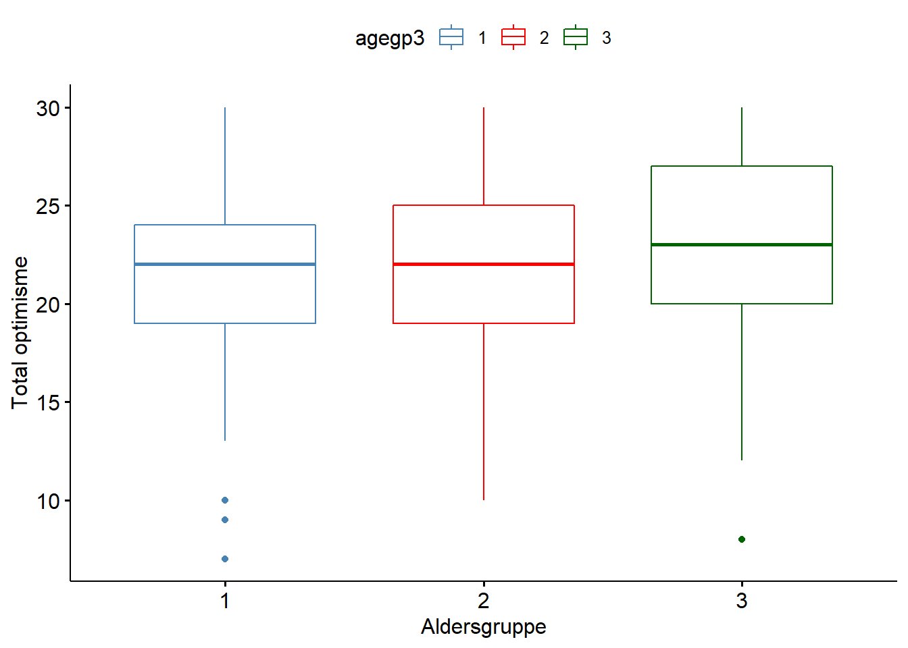
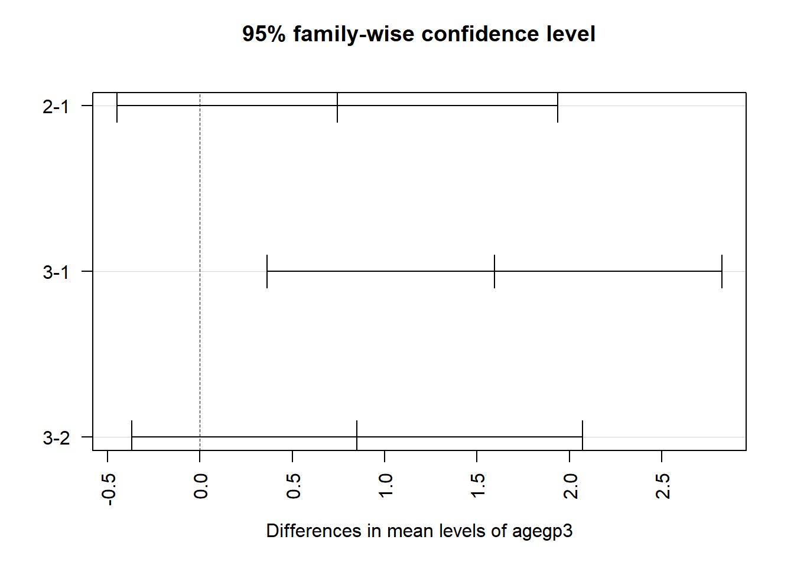
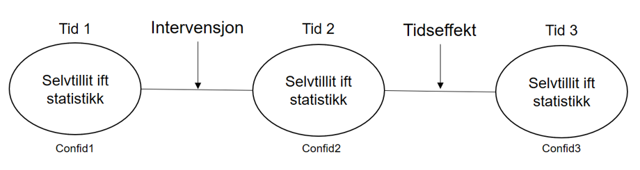
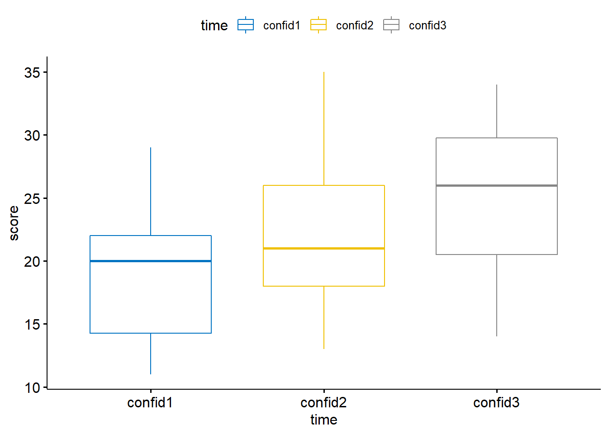
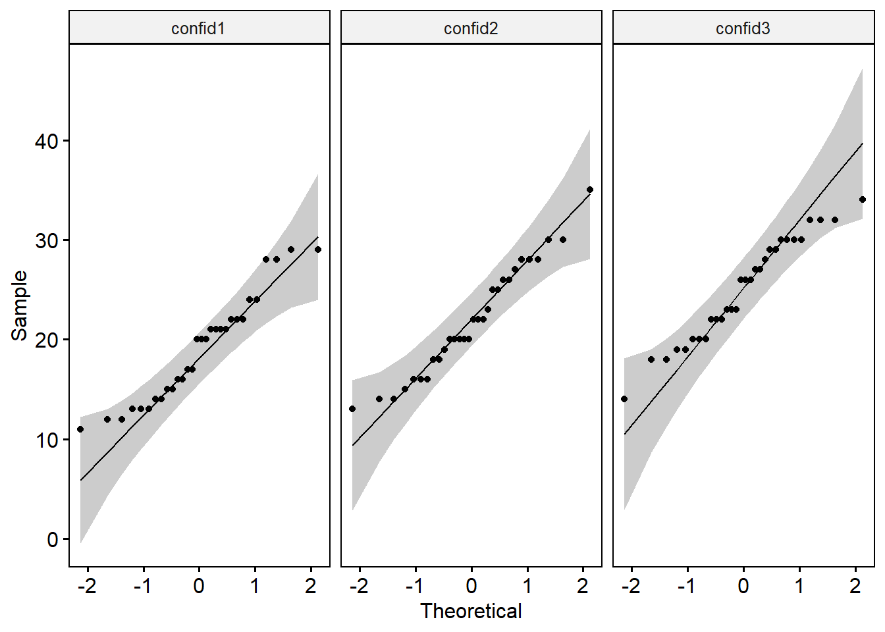
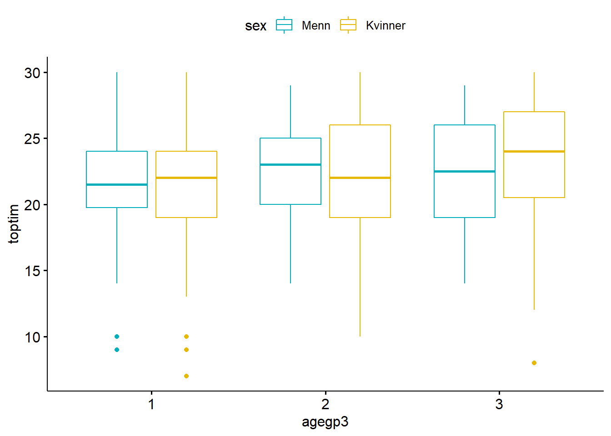
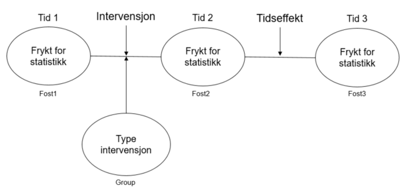
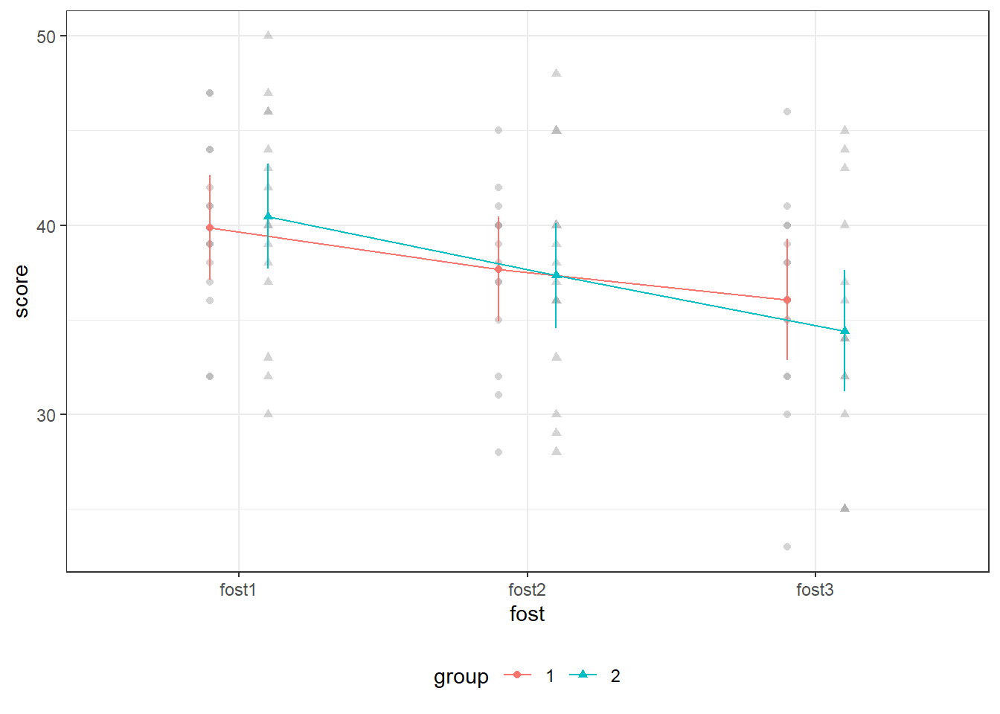

# Variansanalyse - ANOVA ("Analysis of Variance")

R-pakker brukt i dette kapittelet:


```r
pacman::p_load(readxl, summarytools, ggpubr, tidyverse, writexl, car, lsr, haven, rstatix, ez, effectsize, sjstats, effsize, apaTables, performance, afex)
```


I kapittel 2 så vi på korrelasjon mellom enkeltvariabler (bivariat korrelasjon) ) og sammenlikninger mellom to grupper eller en gruppe på to tidspunkter (kjikvadrattester og t-tester). Regresjonsanalyser, som vi kommer itlbake til i neste kapittel, kan også ses på som analyser av forholdet mellom enkeltvariabler.

Variansanalyse - heretter ANOVA - er en samlebetegnelse på flere statistiske metoder der man tester likheter mellom to eller flere utvalg. Har man to grupper vil ANOVA og en t-test gi samme resultat (for hypotesen $H_0: \mu_1 = \mu_2$ mot $H_A: \mu_1 \neq \mu_2$). Man kan faktisk (i prinsippet) gjennomføre t-tester for x antall kombinasjoner av y antall grupper, men risikoen for type-I feil øker sammenliknet med en ANOVA test på samme data. 

I en ANOVA snakker man om to elementer som utgjør den totale variansen: varians innad i gruppen og varians mellom gruppene. Det er derfor vanlig å dele ANOVA inn i to hovedgrupper: enveis (=en faktor) og toveis (= to faktorer) ANOVA. Enveis analyser ser kun på en egenskap som varierer mellom gruppene, mens toveis inkluderer egenskaper som kan variere mellom enhetene i gruppene. Toveis ANOVA gir derfor innsikt i både hovedeffekter og interaksjonseffekter.

Det ANOVA innbærer - helt grunnleggende - er å teste om variansen mellom gruppene er større enn variansen innad i gruppene. 

Vi skal i dette kapittelet se på:

- Enveis mellom grupper ANOVA ("One-way between-groups")
- Enveis avhengig ANOVA ("One-way repreated measures")
- Toveis mellom grupper ANOVA ("Two-way between groups")
- Blandet design ANOVA ("Mixed between-within")

## Enveis mellom grupper ANOVA ("One-way between-groups ANOVA")

Enveis ANOVA (one-way ANOVA) er analyser der vi har en uavhengig variabel som er målt på/har flere nivåer. Hvis vi f.eks. vil undersøke effekt av ulike opplæringstiltak for selgere (den uavhengige variabelen er opplæringsmetode) som kan bestå av tre grupper (metoder for opplæring): e-læring/egenlæring, gruppeopplæring og observasjon/mentorering av erfaren selger) vil den avhengige variabelen kunne være ukentlig salg (i kroner, enheter e.l.). 
Analysen sammenlikner variansen mellom gruppene (metodene for opplæring) med variansen internt i hver gruppe. Teststatistikken kalles F (F ratio):

$F = \frac{Varians\ mellom\ gruppene}{Varians\ innad\ i\ gruppen}$

En høy F-verdi vil innebære at det er høyere varians mellom gruppene enn internt i gruppene. En signifikant F-verdi betyr at vi kan forkaste hypotesen ($H_0$)) om at det gjennomsnittene er like. 

I dette eksempelet skal vi bruke et datasett fra @pallantSPSSSurvivalManual2010 og trekker ut de to variablene vi trenger i eksempelet. Vi gjør også om variabelen "agegp3" til faktor (dette er nødvendig i R, men andre programmer "fikser" dette selv).


```{=html}
<a href="data:application/vnd.openxmlformats-officedocument.spreadsheetml.sheet;base64,UEsDBBQAAAAIAAAAIQA4nYbYPgEAAAcEAAATAAAAW0NvbnRlbnRfVHlwZXNdLnhtbK2Ty27DIBBF9/0KxLYyJF1UVRUniz6WbRbpB1AYxygYEDNJk78vtpNIrdI8lG6MzNy55w6C0WTdOLaChDb4kg/FgDPwOhjr5yX/mL0WD5whKW+UCx5KvgHkk/HNaLaJgCw3eyx5TRQfpURdQ6NQhAg+V6qQGkX5N81lVHqh5iDvBoN7qYMn8FRQ68HHo2eo1NIRe1nn7T5IAoecPfXCllVyFaOzWlGuy5U3vyjFliByZ6fB2ka8zQIuDxLayt+Abd97PplkDbCpSvSmmqySJuhpChFl1ovjLgdihqqyGrLHssktAtpABkwRsyUksrDPfJStQ4LL4bszarvPJK6dRNo4wKtHxZhAGawBqHGiNz1BpnyfoP8Or+Z3NieAXyEtPkNY/Pew7SoaZf0Z/E6Msluun/pnkL3/Lofs3vH4G1BLAwQUAAAACAAAACEA8p9J2ukAAABLAgAACwAAAF9yZWxzLy5yZWxzrZLBTsMwDEDvfEXk+5puSAihpbsgpN0mND7AJG4btY2jxIPu74mQQAyNaQeOceznZ8vrzTyN6o1S9hwMLKsaFAXLzofOwMv+aXEPKgsGhyMHMnCkDJvmZv1MI0qpyb2PWRVIyAZ6kfigdbY9TZgrjhTKT8tpQinP1OmIdsCO9Kqu73T6yYDmhKm2zkDauiWo/THSNWxuW2/pke1hoiBnWvzKKGRMHYmBedTvnIZX5qEqUNDnXVbXu/w9p55I0KGgtpxoEVOpTuLLWr91HNtdCefPjEtCt/+5HJqFgiN3WQlj/DLSJzfQfABQSwMEFAAAAAgAAAAhAOVEG6PVAAAALAIAABoAAAB4bC9fcmVscy93b3JrYm9vay54bWwucmVsc62Rz4oCMQyH7z5FyX0nMwoiYsfLsuBV9AFKJ/MHZ9rSZHedt7couiuIePAUfgn58kFW6+PQqx+K3HmnochyUOSsrzrXaNjvvj4WoFiMq0zvHWkYiWFdTlZb6o2kHW67wCpBHGtoRcISkW1Lg+HMB3JpUvs4GEkxNhiMPZiGcJrnc4z/GVDeMdWm0hA3VQFqNwZ6he3rurP06e33QE4enMBfHw/cEkmCmtiQaLi1GM+lyBIV8LHM9J0yknbpT+QcL82nDrN3OrCMfXroTeKSr+fx7snlCVBLAwQUAAAACAAAACEArHZDxywTAADWnAAAGAAAAHhsL3dvcmtzaGVldHMvc2hlZXQxLnhtbJXdW2/kxhEF4Pf8CkHvsVgX3gytDBuGkTwECOIk72PtrCRY0ggzY2/y7zPSsNVnHZ7qrZdgd5Up0T08bJL9sXj93X+eHi9+3+4PD7vnD5fyTXd5sX2+3X18eL77cPmvf/705+ny4nDcPH/cPO6etx8u/7s9XH5386frz7v9r4f77fZ4cSrwfPhweX88vnx7dXW4vd8+bQ7f7F62z6effNrtnzbH01/3d1eHl/128/HtQ0+PV9p1w9XT5uH58lzh2/3X1Nh9+vRwu/1xd/vb0/b5eC6y3z5ujqfNP9w/vBwub64/Ppx+9vrfc7Hffvpw+b18+4N7d3l1c/32u//9sP18gD9fHDe//Lx93N4etx9PI3B58fqf9stu9+vrD/96+qe3j17932d/etusv+8vPm4/bX57PP5j9/kv24e7++OpSP/+237cHDc31/vd54v9W/HD2//e/nY47p7OFV7/4eb69vXn37//H07/+vD8+PC8/fm4P/304fRLjzebu+3di11fHU+b8/ovV7fL536IP3fcvRwfnr783NVpk963S983QEkJXfutrx/7/Ubm66vfV4rae1HLFLW3ojqsF/X3ok6KylpRP2/ptF60fy/aZ4r25y3t14sO70WHTNHhrSgZ0vG95pipOb7VtG696PRedMp8T9N5SMn3NL8XnUnR1f14Phcd14tKV4PSZcq+ffBU10ldCCDL0OrAvn0wqFtzJSxY63XPyVIhdWu0hGVrva7FdWu6JBUvOedLyW4rNWDCEra6j8kSMSV1a8YkFTIZwiOX1JwJC9r6fjbG41ujJixrFhympaZKWKzWx/GcKyXHP625Upar1XHUJVfkyKI1V5rKlUr4/SjMVyxXq9+Paji5aM2VpuYsXXJFjgNac6UsV+vb63HdmitN5Ur7eHxrrpTlan17z7lStj/UXGkqVzqG87fWXOlX5mqpO4XHF61509Q0pkveyDxmNW+WmsesCyddq3kzlrf1cy4Jc2E1b5Y6QTQNvzeDU8TcOWKcN6t5s9Q8Zh4ev63mzVJnitbH21vzZixv6+MwxHVr3ozlbb3uGO8PNW/G8rY+DkvejNSteTOWt/W6c3jc8Zo3T+XNu/AU32vePJU3l/D44DVvnjpvdA3Pn73mzVPnjW7x+MJVGcvb+jh4ePz1mjdPzW/ehzn2mjdP5c3j+c1r3jw1v/kY7w81b56a33wK53mvefNU3nwO56G+5q1PnU/2XXjc6Wve+lTeeom3t+atT51P9nHe+pq3PpW33sLjZF/z1qfy1sfXaT3cCMndCenDXPQ1b33qOq0f4nGoeetT81s/xvtDzVufmt/6Kd5/a9761PlkH98XGWrehtT8NnTh+cNQ8zakrt+G+L7IUPM2pPI2aHicHGrehtT55BDPb0PN25A6nxw8/t5q3gaWt/Vx6MMcD3DvMXfzcQjPd4aatyE1vw3L/EauA4aatyF1D3KY4v235m1I5W2Yw+POWPM2pvI2duF+Nta8jam8jRJvb83bmMrbqHHdmrcxlbfRwvO+seZtTOVt9Hh8a97GVN7G+PptrHkbU+eTY3w+OcL9/lTexjEe35q3MXU+OS7nk+T4MNa8jam8jfH9kqnmbUrlbYrvl0w1b1Mqb5OE1xdTzduUun6bNBzfqeZtSuVtsvA6YKp5m1Lnk1N8v2SqeZtS129THx53ppq3KZW3Kb7vP9W8TakFtmmMtxeW2HJrbFM4b041b1NqPWCKzyfnmreZ5W217hyfT841bzPL2/qyoITHybnmbU7Nb7PGdWveZpa39brx+eRc8zan8jZ7uJ/NNW9z6vptjtfZ5pq3OXU+OQ/h/jvXvM2p67c5nt/mmrc5Nb/NUzgPzbCqnVvWnsPrQulwYTuVuPNHg6XMDta2u9zidhenTjpY3u5S6wLnjwYLxh2scHep6J0/Gm01LHJ3qfSdP8ovj6SDde4ut9DdNVa6O1jq7lJz3vmj0VbDaneXiuH5o/x4Lx0seHepJJ4/yg910sFaeJe6eXn+aDDWyEyoMyEepGuURmmSuoUpxZqQY6kgNklqk8JNGLtBb0LByfrXuIgTvtWQRmpOyIB4fFBFdZJkJxLfzxSEJ1SekNJDeMosaE8oPiGl41VyQX5C/QnZQ+Ibm4IyhdIUsofE134COEWoTlkvrfFygoBPkRxQEW3MjUBUhBqV9a+xIBW2h4BSEcpUyIBYPO0CVBEqVciAxFRFwKpIDquIxndfBLiKUK9CSscL6AJiRXJkRTQ+RxVAK5JTK6Lxsp6AW5EcXJGGXBGgK5KzK2KNM1XQK0L5Cikt8dcIgEVygkUKYaEDghYzdVNGFsVC9SgwFqGOhZSOLxQFJItQykJKx+xZALMI1SxEpzbOVMGzCAUtpHR8h0aAtAg1LWRAYkQmoFqEshZSupFGgC1CZct66UJb2ICAbRGKWwgGju+OCvAWob5lPegLcGE3FASEi+SIi3hsysQRRyd1dGNuBOciOegiHt8pFaAuQq0L2erGmSpoF8lxF/F4/V0AvAgVL2RA4iVBAfMiFL2QrW48nQDsRah7WS/dxzdOBeSLUPpCSse2UwC/SE6/SN+4bgT/IhTAkNIWTwVAYIQaGFK6cRenx6cVUrdRpTgYOtaQRiphyJMQQ6M0pJFiGLLVSxrpgEAacx5G+viGqoCIEUpiyIDM8dcIKEaoilkv3WAxAi5GcjBGFhnDtxrSSG0M2ep4MUNAxwjlMWSr4/VDASAjVMisp3FonKmCkRGKZMhWN64bB3x8KPn8UGNuBCkjlMqQr3E5U6VjDWmkWoaM9dTYakgjBTNkQBorHEBmhJqZ9QEpaIYdQ0DNCGUzpHTjnirAGaFyhpTWeOcDOyM5PCNjrEMF+IxQP0NKexx0EDRCCQ0pHZtsAUQjOUUjhdHQPQSf58vNjWNjhQMojVBLQ0o3rhtB0wjlNKT0HO/XAGqEipr10lNM2ARMjeRQjUyNp2mB1Qh1NetHvgJr6IBAGimtIaVjyyaAa4TqGjIgMa8R8DWSAzYyNVY4gNgINTZkQIbGWEMac8xGpsY9VYA2QqUN2erGPVWwNpLDNtLQNgLcRnLeRub4AVwBcSOU3KyP9WJuhM0ygG6Eqhuy1Y27OOBuhMIbUrqx+g/0RnL2RubG3Aj6Rii/IaUbcyMAHMkJHFkIDt/5II0U4ZDS8VOCAgxHcg5HFojDdz58Ej53F2eOrxsVLI7mLI4Wi8Me1waLozmLo128wqFgcZRanPVnlYvFYQ9tg8VRanHIVsfNXBQsjlKLQ7Z6SSN7dBssjlKLQ7b6nEb2cDxQHKUUh2x0fKKqQHGUUhyy0XEYFSiO5iiOdnGrFwWKo5TikNLxg4QKFEdzFEcLxWE9A4DiaI7iaIPiKFAcpRRnfUAWisN69ShQHKUUh2x1fBNHgeIopThkq+PnnBQojlKKQ77GPj6mAsXRXBMYLV1g6FhDGinFIaXjRjAKFEcpxSFfY3xLVYHiaK5LjC4Uhw4I9olJNoopnWJYZLBVTLJXjMbLjfpFt5hku5hGGrFhTLJjjMY3cRR7xlCKQ0rH3c4U28ZQikPGutE4BjvHJFvHaGzFFZvHUIpDBiRe4FDsH5NsIKMxjFNsIUMpDtnqRhqB4miO4uhCceh+DRRHcxRHG61kFCiOUoqzvvNZfNmoQHE0R3G0NJRhB1WgOEopDhmQRg8noDia6yqjC8Wh0y5QHKUUh2x1o5MTUBylFIeUjtsRKlAczVEcXSgOPfIBxdFchxktFIfNMkBxNNdkRheKwzYaJI7mJI4WicMmGZA4mus0o0Xi0NIQxpzEUW9cNYLE0Vy/GfV4tVFB4iiVOORb7ONDCEgczUkcLRKHbjWEMSdx1BuXjSBxNNd7RhsSR0HiKJU45GuMn89XkDiakzhaJA47VwCJo7kmNNo3LhtB4iiVOKR0vNqoIHGUShxSutHbECSO5iSOFolDBwT7G+amxiJxaGlIY07iaEPiKEgcpRKHDEgjjSBxlEocUrpx2QgSR6nEIWPdmBpB4miuP40OjRNVkDhKJQ4pHT/BoSBxlEqc9QEZGmkEiaNU4pCtjp/gUJA4mutVo0MjjSBxNCdxdJE49AIMJI7mJI42WtYoSBylEoeUHuPTa5A4mutbo0Xi0LGGNOZa12hD4ihIHM1JHF0kDv0aQeIolTikwWvjTBUkjuYkjhaJww5PIHGUShyy1Y0zVZA4mpM42pA4ChJHcxJHx8bcCBJHcxJHF4nD9xDsAJxL4xibcQWJo7muNjo25kaQOEolDhmQOT5eg8RRKnHWSxeJw/ZrkDiakzg6NdIIEkepxCFbrfHxGiSOUolDtroxN4LE0ZzE0SJx2GojSBylEoeU7uOrApA4mut2o1PjuhEkjuYkjk6xi1OQOJrreaNT45YqSBylEoe0+477BCtIHKUSZ31ASusb2koc0kglzvqAlO43tDSkkUocstUan+KAxNGcxNGGxFGQOJqTODrHLk5B4miuEY4WicOOISBxlEocstVx8ykFiaM5iaNz/HSjgsRRKnFI6djFKUgczUkcnePFfwOJY1TikD758dONBhLHqMQhpWOJYyBxLNcVx4rEoQMC/fJzEse6+C6OgcSxXFcc6+K50UDiGJU4ZKxjpWpAcSxHcWyhOOzOggHFsVxXHGt0xTGgOEYpDikd31M1oDiW64pjDYpjQHEsR3FM4jNVA4pjuRcwmcTPUxlQHMt1xbHSFYeWhjTmuuLYQnHozgcUx3IUx0pXHPbqEaA4lqM4JrFSNaA4lqM4Jo00AsWx3CuZTOLrRgOKYzmKYxLPjQYUxyjFIQMS38UxoDiWozimjbkRKI5RirM+1g2KY0BxjFIcstWNNALFsRzFMY17VBlQHMu9v8k0vqdqQHEsR3GsdMWhXyOkkVIcUjpmqgYUx3JdcUzjxX8DimOU4pCtnuKTBaA4RikOKT3HW40vdEq+0cniHlWG73SiFGd9q62RRnytU/K9TqUrDkvjF292yp2plq44dKwhjcm3OzW64hi+34lSHPI1xndxDF/xlKM4VigO/RohjcnXPJWuOHSsIY3JNz21XvWE73rKdcUxa6QRKI7lKI6Vrjj0xWKQRmpxSOnGmSpYHMt1xbFicdgVGFgcy1kcWywOmwmA4liuKY41muIYUByjFIeUjl2cAcUxSnHIUC9hZKd8QHGMUpz13drjmzgGFMdyTXHM4+VGA4pjuaY45o0TVaA4RinO+lY33gZlQHGMUpz1PaQ0xWFfI1AcyzXFsUZTHAOKYzmKY33jRBUojlGKQwak9eZDfPVhbmrsG1MjUByjFIeUbrz/ECiO5SiOFYrDjqlAcYxSHPI1Nm7iAMWxXFMcKxSHvmgS0phrimNDvMBhQHGMUhxSOn7drwHFMUpxSOmY4hhQHMs1xbEhfoLDgOJYjuJYeW8UO/IBxTFKcciANG7iAMUxSnFI6ZjiGFAcy1EcG+LnqQwojuUojhWKQ7ca0pijOFYoDisNFMdyFMfGxtwIFMdy75Ky0hSHTWBAcSxHcaxQHHYMAYpjlOKQrY6fbjSgOJZ7qZQ1KI4BxbEcxbEGxTGgOEYpzvrOV5ri0LHGlwPn5sbG66UMKI7lmuJYoTgs6EBxLEdxbGycqQLFsRzFsQbFMaA4RinO+lhPjTQCxbFcUxwrFIddRwPFsVxTHCsUh+3XQHGMUhxSOn660YDiWI7iWGmKw/ZroDhGKQ4pHT9PZUBxjFIcMiDxy4MNKI7lKI41muIYUBzLURybYjRuQHEs1xTH5sbcCBTHchTH5saZKlAcy72KykpTHPY1AsWx3NuobI6fbjSgOJajOFYoDh0QSCOlOGSr4/aNBhTHKMUhpRu3VIHiWO7NVNZ4NZUBxTFKcUjpmKkaUByjFIeUjhf/HSiOU4qzeuTz0hSHvdscKI7nmuJ4F6fRgeI4pTikdHym6kBxnFKc1bH2Ll78d6A4nmuK4118F8eB4njuBVVeKA7dQwYonbpu9C5uUeVAcZxSHDIg8QKHA8XxHMXxxguqHCiO5yiOd/HjjQ4Ux3MUxyVe4HCgOE4pzvpYF4rDvkagOJ6jOF4oDtuvgeI4pTiktMU7H1Acz72gyiU+U3WgOJ57QZVLvPjvQHE8R3Fc4sV/B4rjuRdUucRzowPF8dwLqlziuzgOFMdzFMclRuMOFMdzFMcLxaGlIY2U4qyPdYPiOFAcz1EcXygOnXaB4njuBVVeuuLQrYY05l5Q5aUrDtuvgeJ4juK4xkzVgeJ47gVV3qA4DhTHc11xvHTFYYcnoDhOKQ4pPYVXBQ4Ux3NdcVzjFQ4HiuM5iuMW38VxoDhOKc76Vlv86L8DxXFKcchWazwVAMVxSnFI6XiFw4HieI7iuMVo3IHi+Nd2xflDBQgdFTfk24pvnTqIG//a5jd/qADZorCGfCnxWr4DrPGv7XHzZQXwM57zM87eKnV1uN9ujz9ujpub65fN3fZvm/3dw/Ph4nH76VS9++Y0iPuHu/vy5+Pu5e1Ppy/+l93xuHsqf7vfbj5u969/O+3Jn3a7Y/nL1el3fN7tf337PTf/A1BLAwQUAAAACAAAACEAgxhqJUgBAAAmAgAADwAAAHhsL3dvcmtib29rLnhtbI1Ry07DMBC88xXW3mkeaiNaNanES1RCgERpzybeNFYdO7Id0v4961QpcOO0M+Pd0c56uTo2in2hddLoHJJJDAx1aYTU+xw+No/XN8Cc51pwZTTmcEIHq+Jq2Rt7+DTmwGheuxxq79tFFLmyxoa7iWlR00tlbMM9UbuPXGuRC1cj+kZFaRxnUcOlhrPDwv7Hw1SVLPHelF2D2p9NLCruaXtXy9ZBsaykwu05EONt+8IbWvuogCnu/IOQHkUOU6Kmxz+C7drbTqpAZvEMouIS8s0ygRXvlN/QaqM7nSudpmkWOkPXVmLvfoYCZced1ML0OaRTuuxpZMkMWD/gnRS+JiGL5xftCeW+9jnMsywO5tEv9+F+Y2V6CPcecEL/FOqa9idsF5KAXYtkcBjHSq5KShPK0JhOZ8kcWNUpdUfaq342fDAIQ2OS4htQSwMEFAAAAAgAAAAhAD/Y7yGxBQAAUxsAABMAAAB4bC90aGVtZS90aGVtZTEueG1s7VlNj9NGGL7zK0a+g+PEDtkVWbTJJtDCwmo3UHGc2BN7yNhjzUx2ya2CY6VKVWnVS6XeeqjaIoHUC/0121K1VOIv9PVHkvFmsmRhqxZBDoln/LzfH37HuXL1QczQIRGS8qRtOZdqFiKJzwOahG3rzqB/sWUhqXASYMYT0ramRFpXty5cwZsqIjFBQJ7ITdy2IqXSTduWPmxjeYmnJIF7Iy5irGApQjsQ+AjYxsyu12pNO8Y0sVCCY+B6ezSiPkGDjKW1NWPeY/CVKJlt+Ewc+LlEnSLHBmMn+5FT2WUCHWLWtkBOwI8G5IGyEMNSwY22Vcs/lr11xZ4TMbWCVqPr55+SriQIxvWcToTDOaHTdzcu78z51wv+y7her9ftOXN+OQD7PljqLGHdfsvpzHhqoOJymXe35tXcKl7j31jCb3Q6HW+jgm8s8O4SvlVrutv1Ct5d4L1l/Tvb3W6zgvcW+OYSvn95o+lW8TkoYjQZL6GzeM4jM4eMOLtuhLcA3polwAJla9lV0CdqVa7F+D4XfQDkwcWKJkhNUzLCPuC6OB4KijMBeJNg7U6x5culrUwWkr6gqWpbH6cYKmIBefX8x1fPn6JXz58cP3x2/PCX40ePjh/+bCC8jpNQJ3z5/Rd/f/sp+uvpdy8ff2XGSx3/+0+f/fbrl2ag0oEvvn7yx7MnL775/M8fHhvg2wIPdfiAxkSiW+QI7fMYbDMIIENxNopBhGmFAkeANAB7KqoAb00xM+E6pOq8uwIagAl4bXK/outBJCaKGoA3orgC3OWcdbgwmnMjk6WbM0lCs3Ax0XH7GB+aZHdPhLY3SSGTqYllNyIVNfcYRBuHJCEKZff4mBAD2T1KK37dpb7gko8UukdRB1OjSwZ0qMxE12kMcZmaFIRQV3yzexd1ODOx3yGHVSQUBGYmloRV3HgNTxSOjRrjmOnIm1hFJiUPpsKvOFwqiHRIGEe9gEhporktphV1b2DoRMaw77JpXEUKRccm5E3MuY7c4eNuhOPUqDNNIh37kRxDimK0x5VRCV6tkGwNccDJynDfpUSdrazv0DAyJ0h2ZyLKrl3pvzFNTmvGjEI3/tCMZ/BteDSZSuJkC16Fewcb7w6eJHsEcv1D3/3Qd9/HvruqltfttosGa+tzcc4vXjkkjyhjB2rKyE2Zt2YJSgd92MwXOdF8Jk8juCzFVXChwPk1Elx9QlV0EOEUxDi5hFCWrEOJUi7hJGCt5J0fJykYn+95szMgoLHa5UGx3dDPhnM2+SqUuqBGxmBdYY3LbyfMKYBrSnM8szTvVGm25k2oBoSzg7/TrBeiIWMwI0Hm94LBLCznHiIZ4YCUMXKMhjiNNd3Wer3XNGkbjbeTtk6QdHHuCnHeOUSpthQle7kcWVJdoSPQyqt7FvJx2rZGMEnBZZwCP5k1IMzCpG35qjTltcV80mBzWjq1lQZXRKRCqh0so4IqvzV7dZIs9K97buaH8zHA0I3W06LRcv5DLeyToSWjEfHVip3FsrzHJ4qIgyg4QkM2EfsY9HaL7AqohGdGfbYQUKFumXjVyi+r4OQrmrI6MEsjXPaklhb7Ap5fz3XIV5p69grd39CUxjma4r2/pmSZC2NrI8gPVDAGCIyyHG1bXKiIQxdKI+r3BQwOuSzQC0FZZCohlr1vznQlh4u+VfAomlwYqX0aIkGh06lIELKnSjtfw8yp68/XGaOyz8zVlWnxOySHhA2y6m1m9lsomnWT0hE57mTQbFN1DcP+/3jycVdMPqePBwtB7llmEVdr+tqjYOPtVDjjo7Zutrjurf2oTeHwgbIvaNxU+Gwx3w74PkQfzSdKBIl4sVWW33xzCDq3NOMyVv/uGLUIQWtFvM9z+NSc3Vjh7NPFvbmzPYOvvdNdbS+XqK0dZPLV0h9PfHgfZO/AQWnClCzeJj2Ao2Z39pcB8LEXpFsX/gFQSwMEFAAAAAgAAAAhAK/OEl3DAQAAUgQAAA0AAAB4bC9zdHlsZXMueG1svVTfi5wwEH7vXxHy3nMVetwV9SiFhUJbDm4LfY0aNTBJJBkXvb/+JkbdXWg56ENfzMw3M9/8cJL8adLAztJ5ZU3B07sDZ9LUtlGmK/iv0/HjA2cehWkEWCMLPkvPn8oPuccZ5EsvJTJiML7gPeLwOUl83Ust/J0dpCFLa50WSKrrEj84KRofgjQk2eFwn2ihDC/z1hr0rLajwYJnK1Dm/pWdBVBZKU/KvLZgHUOipzoWxAgto8dXAapyKoCt0ArmCGcBWCpa/bQy1gUwiRnit0r+R67l8BSkAG6bJaDMB4EonTmSwlb5NA+U3tDgI83i945358ScZp+uApaD8lbWNfSjt8wp36AyB9kiBTjV9eFEOyTBiGg1CY0SnTUCAuUWsQpEW0uAl7ANv9sb7qllZtRHjd+agtNahe43kQpaxUgTlcB/zRa5r2izf6JlU7vz/y06fT+aiWGA+Whjf1H7AqozWm4ti01lvXXqlVzDHtQEyLgIU7u2uHe39Hoztx1lYeUK/jPcILiqoxoVoDJ/mBlxNtNlXIsVRUUX9SYLcTSyFSPgaTcW/CL/kI0a9ePu9azOFlevi/w9LEt6v1RweQ3KN1BLAwQUAAAACAAAACEAs/+aziQBAABQAgAAEQAAAGRvY1Byb3BzL2NvcmUueG1snZLNasMwEITvfQqjuy1ZIaUI24G25NRAoSktvQlpk4haP0hqHb99FTtxEsipx9XMfju7qFrsdZv9gg/KmhqVBUEZGGGlMtsava+X+QPKQuRG8tYaqFEPAS2au0o4JqyHV28d+KggZAlkAhOuRrsYHcM4iB1oHorkMEncWK95TKXfYsfFN98CpoTcYw2RSx45PgBzNxHRESnFhHQ/vh0AUmBoQYOJAZdFic/eCF6Hmw2DcuHUKvYOblpP4uTeBzUZu64rutlgTflL/Ll6eRtWzZU5nEoAaiopmPDAo/VNhS+LdLiWh7hKJ94okI990m+8HRcZ+0BmKQAb456Uj9nT83qJGkoozUuSE7qmhM0pm5dfh5FX/WegPg75N/EEGHNff4LmD1BLAwQUAAAACAAAACEAXrqn03cBAAAQAwAAEAAAAGRvY1Byb3BzL2FwcC54bWydksFO6zAQRfd8ReQ9dVIh9FQ5RqiAWPBEpRZYG2fSWDi25Rmilq/HSdWQAiuyujNzdX0ytrjatTbrIKLxrmTFLGcZOO0r47Yle9rcnf9jGZJylbLeQcn2gOxKnolV9AEiGcAsJTgsWUMUFpyjbqBVOEtjlya1j62iVMYt93VtNNx4/d6CIz7P80sOOwJXQXUexkB2SFx09NfQyuueD583+5DypLgOwRqtKP2k/G909Ohrym53Gqzg06FIQWvQ79HQXuaCT0ux1srCMgXLWlkEwb8a4h5Uv7OVMhGl6GjRgSYfMzQfaWtzlr0qhB6nZJ2KRjliB9uhGLQNSFG++PiGDQCh4GNzkFPvVJsLWQyGJE6NfARJ+hRxY8gCPtYrFekX4mJKPDCwCeO65yt+8B1P+pa99G1QLi2Qj+rBuDd8Cht/owiO6zxtinWjIlTpBsZ1jw1xn7ii7f3LRrktVEfPz0F/+c+HBy6L+SxP33Dnx57gX29ZfgJQSwECAAAUAAAACAAAACEAOJ2G2D4BAAAHBAAAEwAAAAAAAAABAAAAAAAAAAAAW0NvbnRlbnRfVHlwZXNdLnhtbFBLAQIAABQAAAAIAAAAIQDyn0na6QAAAEsCAAALAAAAAAAAAAEAAAAAAG8BAABfcmVscy8ucmVsc1BLAQIAABQAAAAIAAAAIQDlRBuj1QAAACwCAAAaAAAAAAAAAAEAAAAAAIECAAB4bC9fcmVscy93b3JrYm9vay54bWwucmVsc1BLAQIAABQAAAAIAAAAIQCsdkPHLBMAANacAAAYAAAAAAAAAAEAAAAAAI4DAAB4bC93b3Jrc2hlZXRzL3NoZWV0MS54bWxQSwECAAAUAAAACAAAACEAgxhqJUgBAAAmAgAADwAAAAAAAAABAAAAAADwFgAAeGwvd29ya2Jvb2sueG1sUEsBAgAAFAAAAAgAAAAhAD/Y7yGxBQAAUxsAABMAAAAAAAAAAQAAAAAAZRgAAHhsL3RoZW1lL3RoZW1lMS54bWxQSwECAAAUAAAACAAAACEAr84SXcMBAABSBAAADQAAAAAAAAABAAAAAABHHgAAeGwvc3R5bGVzLnhtbFBLAQIAABQAAAAIAAAAIQCz/5rOJAEAAFACAAARAAAAAAAAAAEAAAAAADUgAABkb2NQcm9wcy9jb3JlLnhtbFBLAQIAABQAAAAIAAAAIQBeuqfTdwEAABADAAAQAAAAAAAAAAEAAAAAAIghAABkb2NQcm9wcy9hcHAueG1sUEsFBgAAAAAJAAkAPgIAAC0jAAAAAA==" download="Pallant_Survey_ANOVA1.xlsx">Download Pallant_Survey_ANOVA1.xlsx</a>
```

Vi skal bruke en variabel i datasettet som deler respondentene inn i tre aldersgrupper ("agegp3") og en variabel som måler total optimisme ("toptim") der respondentene skårer på en skala fra 6 til 30 (30 er høyeste nivået av optimisme).

Hypotesen er altså:

$H_0: \mu_1 = \mu_2,\ dvs.\ gjennomsnittet\ til\ de\ ulike\ gruppene\ er\ like$

$H_A: \mu_1 \neq \mu_2\ dvs.\ gjennomsnittet\ til\ de\ ulike\ gruppene\ er\ ulike$

Vi kan først se på datasettet:


```r
group_by(optimisme, agegp3) %>%
  summarise(
    count = n(),
    mean = mean(toptim, na.rm = TRUE),
    sd = sd(toptim, na.rm = TRUE)
  )
#> # A tibble: 3 × 4
#>   agegp3 count  mean    sd
#>   <fct>  <int> <dbl> <dbl>
#> 1 1        149  21.4  4.55
#> 2 2        153  22.1  4.15
#> 3 3        137  23.0  4.49
```

Vi kan se at gjennomsnittene er forskjellige for de tre gruppene, men vi vet ikke om denne forskjellen er statistisk signifikant. 

Vi kan også se på dette grafisk:

```r
ggboxplot(optimisme, x = "agegp3", y = "toptim", 
          color = "agegp3", palette = c("steelblue", "red", "darkgreen"),
          order = c("1", "2", "3"),
          ylab = "Total optimisme", xlab = "Aldersgruppe")
```

<div class="figure">

<p class="caption">(\#fig:unnamed-chunk-5)Boxplot for tre variabler</p>
</div>

Om vi skal anta noe ut fra grafen over vil det kunne være at gruppe 1 og 2 ikke er signifikant ulike, mens gruppe 3 kanskje skiller seg statistisk signifikant ut.


```r
resultataov1 <- aov(toptim ~ agegp3, data = optimisme)
summary(resultataov1)
#>              Df Sum Sq Mean Sq F value Pr(>F)  
#> agegp3        2    179   89.53   4.641 0.0101 *
#> Residuals   432   8334   19.29                 
#> ---
#> Signif. codes:  
#> 0 '***' 0.001 '**' 0.01 '*' 0.05 '.' 0.1 ' ' 1
#> 4 observations deleted due to missingness
```

Siden p-verdien er 0.010 kan vi konkludere med at det er signifikante forskjell et sted (mellom to eller flere grupper) i variabelen (agegp3). Men vi kan ikke ut fra dette si hvor – altså hvilken gruppe som er signifikant forskjellig fra de andre). 

Vi bør sjekke forutsetningen om homogenitet i variansen. Homogen (lik) varians har vi når standardavvikene i ulike grupper er omtrent like.


```r
bartlett.test(toptim ~ agegp3, data = optimisme)
#> 
#> 	Bartlett test of homogeneity of variances
#> 
#> data:  toptim by agegp3
#> Bartlett's K-squared = 1.4561, df = 2, p-value =
#> 0.4828
```

Bartletts test brukes dersom vi har normalfordelte data. Vi kan derfor sjekke for dette:

Vi kan teste for normalfordeling:


```r
shapirotest <- shapiro.test(optimisme$toptim)
shapirotest
#> 
#> 	Shapiro-Wilk normality test
#> 
#> data:  optimisme$toptim
#> W = 0.97471, p-value = 0.0000007366
```

Siden testverdien er 0.0000007 (< 0.05) må vi anta at dataene er signifikant forskjellig fra normalfordelingen. Dette betyr at vi bør bruke Levenes og/eller Fligner-Killeen. 


```r
leveneoptimisme <- leveneTest(toptim ~ agegp3, data = optimisme)
leveneoptimisme
#> Levene's Test for Homogeneity of Variance (center = median)
#>        Df F value Pr(>F)
#> group   2  0.7147 0.4899
#>       432
```

En annen test av homogenitet i varians som framholdes som robust for avvik fra normalfordeling er altså  "Fligner-Killeen test":


```r
flignertest <- fligner.test(toptim ~ agegp3, data = optimisme)
flignertest
#> 
#> 	Fligner-Killeen test of homogeneity of variances
#> 
#> data:  toptim by agegp3
#> Fligner-Killeen:med chi-squared = 1.5588, df = 2,
#> p-value = 0.4587
```


Tolkningen av alle tre testene for homogenitet i varians er den samme: Hvis p < 0.05 er variansen ikke lik. Det fremheves imidlertid at dersom gruppene er tilnærmet like store er ikke denne forutsetningen kritisk (eller sågar nødvendig) - ANOVA (og t-tester) er generelt robuste i forhold til brudd på forutsetningen om homogen varians dersom gruppene er relativt like [@statisticssolutionsAssumptionHomogeneityVariance2013]. I vårt eksempel viser f.eks. Levenes test (p = 0.49) at vi har homogenitet i variansen.

Et alternativ er å gjøre en såkalt Welch enveis test. Welch test forutsetter ikke homogen varians:


```r
welchoptimisme <- oneway.test(toptim ~ agegp3, data = optimisme)
welchoptimisme
#> 
#> 	One-way analysis of means (not assuming equal
#> 	variances)
#> 
#> data:  toptim and agegp3
#> F = 4.38, num df = 2.00, denom df = 284.51, p-value =
#> 0.01338
```

Vi kan deretter se nærmere på hvilke grupper som er statistisk signifikant forskjellige:

```r
TukeyHSD(resultataov1)
#>   Tukey multiple comparisons of means
#>     95% family-wise confidence level
#> 
#> Fit: aov(formula = toptim ~ agegp3, data = optimisme)
#> 
#> $agegp3
#>          diff        lwr      upr     p adj
#> 2-1 0.7440309 -0.4489781 1.937040 0.3080109
#> 3-1 1.5950113  0.3636472 2.826376 0.0069296
#> 3-2 0.8509804 -0.3687705 2.070731 0.2296685
```

Vi ser av tabellen at gruppene 1 og 3 er signifikant forskjellige. De andre parene - 1-2 og 2-3 ikke har signifikante forskjeller.
Dette kan også visualiseres:


```r
plot(TukeyHSD(resultataov1, conf.level=.95), las = 2)
```

<div class="figure">

<p class="caption">(\#fig:unnamed-chunk-14)Plott av TukeyHSD</p>
</div>

Gruppene 1-2 og 2-3 har konfiendsintervall som inneholder 0, mens 1-3 ikke har det (konfidensintervallene inkluderer verdien 0).

Til slutt kan vi være interessert i å vurdere hvor stor effektstørrelsen (eta squared = $\eta^2$).


```r
lsr::etaSquared(resultataov1)
#>            eta.sq eta.sq.part
#> agegp3 0.02103477  0.02103477
```

@cohenStatisticalPowerAnalysis1988 angir følgende forslag på grenseverdier for tolkning av $\eta^2$:

- Liten effekt: 0.01
- Middels effekt: 0.06
- Stor effekt: 0.14

I vårt eksempel er det altså en statistisk signifikant, men liten forskjell (noe vi sannsynligvis fikk en mistanke om i plottet lenger opp der vi antok at det kanskje kunne være en forskjell for gruppe 3), noe vi også fikk en indikasjon på i tabellen med forskjellene i gjennomsnittsverdier for gruppene. Dette er ikke uvanlig - vi har 435 observasjoner, og i store utvalg kan selv små forskjeller gi statistisk signifikans og vi bør tolke resultatene med det for øye. I en tolkning bør vi også vurdere hvilken praktisk forskjell det er mellom gruppene selv om vi har funnet en statistisk signifikant forskjell.

## Enveis avhengig ANOVA ("One-way repreated measures")

I stedet for å se på ulike grupper mot en avhengig variabel målt på et tidspunkt kan vi være interessert i å se på en gruppe målt på ulike tidspunkt («repeated»). Hvis du har sett gjennom kapittelet om t-tester vil du se paralleller til designet.

Vi bruker også her et eksempel fra @pallantSPSSSurvivalManual2010 som vi først modifiserer.


{width=75%}


```r
selvtillit2 <- selvtillit %>% 
    select(6, 9, 12)
selvtillit2$ID <- c(1:30)
selvtillit2 <- selvtillit2[, c(4, 1, 2, 3)]
```

I R arrangerer vi dataene i "long" format og lager faktor:

```r
selvtillit3 <- selvtillit2 %>%
  gather(key = "time", value = "score", confid1, confid2, confid3) %>%
  convert_as_factor(ID)
#> Warning: attributes are not identical across measure variables;
#> they will be dropped
```


Modifisert datasett ligger her:

```{=html}
<a href="data:application/vnd.openxmlformats-officedocument.spreadsheetml.sheet;base64,UEsDBBQAAAAIAAAAIQA4nYbYPgEAAAcEAAATAAAAW0NvbnRlbnRfVHlwZXNdLnhtbK2Ty27DIBBF9/0KxLYyJF1UVRUniz6WbRbpB1AYxygYEDNJk78vtpNIrdI8lG6MzNy55w6C0WTdOLaChDb4kg/FgDPwOhjr5yX/mL0WD5whKW+UCx5KvgHkk/HNaLaJgCw3eyx5TRQfpURdQ6NQhAg+V6qQGkX5N81lVHqh5iDvBoN7qYMn8FRQ68HHo2eo1NIRe1nn7T5IAoecPfXCllVyFaOzWlGuy5U3vyjFliByZ6fB2ka8zQIuDxLayt+Abd97PplkDbCpSvSmmqySJuhpChFl1ovjLgdihqqyGrLHssktAtpABkwRsyUksrDPfJStQ4LL4bszarvPJK6dRNo4wKtHxZhAGawBqHGiNz1BpnyfoP8Or+Z3NieAXyEtPkNY/Pew7SoaZf0Z/E6Msluun/pnkL3/Lofs3vH4G1BLAwQUAAAACAAAACEA8p9J2ukAAABLAgAACwAAAF9yZWxzLy5yZWxzrZLBTsMwDEDvfEXk+5puSAihpbsgpN0mND7AJG4btY2jxIPu74mQQAyNaQeOceznZ8vrzTyN6o1S9hwMLKsaFAXLzofOwMv+aXEPKgsGhyMHMnCkDJvmZv1MI0qpyb2PWRVIyAZ6kfigdbY9TZgrjhTKT8tpQinP1OmIdsCO9Kqu73T6yYDmhKm2zkDauiWo/THSNWxuW2/pke1hoiBnWvzKKGRMHYmBedTvnIZX5qEqUNDnXVbXu/w9p55I0KGgtpxoEVOpTuLLWr91HNtdCefPjEtCt/+5HJqFgiN3WQlj/DLSJzfQfABQSwMEFAAAAAgAAAAhAOVEG6PVAAAALAIAABoAAAB4bC9fcmVscy93b3JrYm9vay54bWwucmVsc62Rz4oCMQyH7z5FyX0nMwoiYsfLsuBV9AFKJ/MHZ9rSZHedt7couiuIePAUfgn58kFW6+PQqx+K3HmnochyUOSsrzrXaNjvvj4WoFiMq0zvHWkYiWFdTlZb6o2kHW67wCpBHGtoRcISkW1Lg+HMB3JpUvs4GEkxNhiMPZiGcJrnc4z/GVDeMdWm0hA3VQFqNwZ6he3rurP06e33QE4enMBfHw/cEkmCmtiQaLi1GM+lyBIV8LHM9J0yknbpT+QcL82nDrN3OrCMfXroTeKSr+fx7snlCVBLAwQUAAAACAAAACEAfC/Ow2UGAAD1MwAAGAAAAHhsL3dvcmtzaGVldHMvc2hlZXQxLnhtbJ2bXY/aVhRF3/srEO8N3O/riCFKJ4rah0pV0/bdATODAnhkO0n772sw4aD27q2evkQDbF8WnrDu8R5YvfnzeJh9abp+354e5ubVcj5rTpt2uz89Pcx//+3993k+64f6tK0P7al5mP/V9PM36+9WX9vuU//cNMNsXODUP8yfh+Hl9WLRb56bY92/al+a0/jIru2O9TDe7J4W/UvX1NvLQcfDwi6XcXGs96f5tMLr7r+s0e52+03zrt18PjanYVqkaw71MOL3z/uXfr5ebffjY+fXM+ua3cP8rXn9WJn5Yr26PPUf++Zrf/fzbKg/fmgOzWZotuMJmM/Or+xj2346P/jTeNfyfOjiX8e+v1D90s22za7+fBh+bb/+2OyfnodxkXB7tnf1UK9XXft11l0W7y//bj73Q3ucVjjfsV5tzo+/vQXGe/enw/7UfBi68dH9+KTD+qd3q8UwopxvLTbXY37gxwzjuSgc9ciP6jdt94/DFuNruL0QeyO2YAVTQkXhTXva7belQx7Pz/RlbcJq8aXA4W4cDixtSxwoTDjcxOHLHP7G4cHSrsSBwoTDTxy2zBFuHAEs7UscKEw4wsRhyhzxxhHB0qHEgcKEI04cscyRbhwJLB1LHChMONLE4coc+caRwdKpxIHChCNfOCz4vVQ3jgosnUscKEw4qul8pDKHWYrylmDxqig7lCYolycbzwl4z5g7/SIfmmURBsUZjJlglgBGzGqgWotuhXEGM9nVZgAjejVImaYoWBhnMI6fGXGsQd40RcvCOIPx9H1kRLQGydMUVQvjDGaSrQWbjxHbGmRQU/QtjDOYybi2AjCiXIM0aorShXEGk6j+jXjXIJeaonlhnMFkOiMYka9BQjVF/cI4g6no4GRFwBYp1RQNDONsiFvS3dGKgS1Sqi0aGMYZjKHbgb2bbZFSbXm6/T/jraWesWJgCyfcooFhnME4/msSA1ukVFs0MIwzGE/3JisGtkiptmhgGGcwgUrPioEtUqotGhjGGUyks5UVA1ukVFs0MIwzmER3bSsGtkiptmhgGGcwmW6UVgxskVJt0cAwzmAqeqnmxMAOKdUWDQzj7PKVz8BODOyQUl3RwDDOYAyVnhMDO1W9ANMTS8mTj87SCcLdNQy6ioH7t8zieNkh/nWqmgGmGcu1aAD6daJfp6oaYJqxBP47Evs6Vd0A04yFFw5O5OtUlQNMMxbuXifudaraAaYZS+aCEfU6VfUA04yloufFi3m9qnyAacLir+IFM5UX8Xpd+QDjDOYqXiAYL+L1uvIBxhnMdfQFY4wX83pd+QDjDMbxM3NX8OrKBxhnMNfRFzjGi3u9rnyAcQYT6BzuRb5eVz7AOIOZ7OvQO1vs63XlA4wzmESv973o1+vKBxhnMLx88OJfrysfYJzBVPRCMoiAg658gHECE5Z0Nwhi4KArH2CcwRg6VgUxcNCVDzDOYK6zL7iqDWLgoCsfYJzB8Po3iIGDrnyAcQbj6TQT7v7OpisfYJzBBA4jBg668gHGGUyke1MQAwdd+QDjDCbRvSmIgYOufIBxBpM5jBg46MoHGGcwfASOYuCoKx9gnMDEycAODFdRDBx15QOMMxhDR4goBo6q8gGmJ5aSmh6jpZt2FAFHVfkA04zF0Z0pin+jqnyAacbi6cYURb9RVT7ANGMJ/J1091EH3WcduHzLLJGziHyjqnyAacaS6K4Uxb1RVT7ANGPJ9CI7inqjqnyAacZS0Q0yiXmTqnyAacKSlpxFxJt05QOMMxhDr/eTiDfpygcYZzDX8gEYJol5k658gHEG4+iWlES9SVc+wDiD8RxG3Jt05QOMM5hJvg5IJol8k658gHEGcy0fwG6d7j5spisfYJzBJLpdJ9Fv0pUPMM5gMt2vk/g36coHGGcwfPTNIuCsKx9gnMBk/ne3LAbOuvIBxhkM/+RDFgNnXfkA4wzG0j07i4GzrnyAcQbjOIwYOOvKBxhnMLz+zWLgrCsfYJzBBLprZzFw1pUPMM5gIr3EzmLgrCsfYJzBJDpC5LvP/OrKBxhnMJnu2lkMnHXlA4wzmIrCVGLgSlc+wDiBqZZ0hKjEwJWufIBxBmPKMIu774q81E/Nz3X3tD/1s0OzG59i+Wr879lNXy25/Dy0L5efxvfzx3YY2uO3W89NvW26861Rgru2Hb7dOH+D5faNnfXfUEsDBBQAAAAIAAAAIQCDGGolSAEAACYCAAAPAAAAeGwvd29ya2Jvb2sueG1sjVHLTsMwELzzFdbeaR5qI1o1qcRLVEKARGnPJt40Vh07sh3S/j3rVClw47Qz493Rznq5OjaKfaF10ugckkkMDHVphNT7HD42j9c3wJznWnBlNOZwQger4mrZG3v4NObAaF67HGrv20UUubLGhruJaVHTS2Vswz1Ru49ca5ELVyP6RkVpHGdRw6WGs8PC/sfDVJUs8d6UXYPan00sKu5pe1fL1kGxrKTC7TkQ4237whta+6iAKe78g5AeRQ5ToqbHP4Lt2ttOqkBm8Qyi4hLyzTKBFe+U39BqozudK52maRY6Q9dWYu9+hgJlx53UwvQ5pFO67GlkyQxYP+CdFL4mIYvnF+0J5b72OcyzLA7m0S/34X5jZXoI9x5wQv8U6pr2J2wXkoBdi2RwGMdKrkpKE8rQmE5nyRxY1Sl1R9qrfjZ8MAhDY5LiG1BLAwQUAAAACAAAACEAP9jvIbEFAABTGwAAEwAAAHhsL3RoZW1lL3RoZW1lMS54bWztWU2P00YYvvMrRr6D48QO2RVZtMkm0MLCajdQcZzYE3vI2GPNTHbJrYJjpUpVadVLpd56qNoigdQL/TXbUrVU4i/09UeS8WayZGGrFkEOiWf8vN8ffse5cvVBzNAhEZLypG05l2oWIonPA5qEbevOoH+xZSGpcBJgxhPStqZEWle3LlzBmyoiMUFAnshN3LYipdJN25Y+bGN5iackgXsjLmKsYClCOxD4CNjGzK7Xak07xjSxUIJj4Hp7NKI+QYOMpbU1Y95j8JUomW34TBz4uUSdIscGYyf7kVPZZQIdYta2QE7AjwbkgbIQw1LBjbZVyz+WvXXFnhMxtYJWo+vnn5KuJAjG9ZxOhMM5odN3Ny7vzPnXC/7LuF6v1+05c345APs+WOosYd1+y+nMeGqg4nKZd7fm1dwqXuPfWMJvdDodb6OCbyzw7hK+VWu62/UK3l3gvWX9O9vdbrOC9xb45hK+f3mj6VbxOShiNBkvobN4ziMzh4w4u26EtwDemiXAAmVr2VXQJ2pVrsX4Phd9AOTBxYomSE1TMsI+4Lo4HgqKMwF4k2DtTrHly6WtTBaSvqCpalsfpxgqYgF59fzHV8+folfPnxw/fHb88JfjR4+OH/5sILyOk1AnfPn9F39/+yn66+l3Lx9/ZcZLHf/7T5/99uuXZqDSgS++fvLHsycvvvn8zx8eG+DbAg91+IDGRKJb5Ajt8xhsMwggQ3E2ikGEaYUCR4A0AHsqqgBvTTEz4Tqk6ry7AhqACXhtcr+i60EkJooagDeiuALc5Zx1uDCacyOTpZszSUKzcDHRcfsYH5pkd0+EtjdJIZOpiWU3IhU19xhEG4ckIQpl9/iYEAPZPUorft2lvuCSjxS6R1EHU6NLBnSozETXaQxxmZoUhFBXfLN7F3U4M7HfIYdVJBQEZiaWhFXceA1PFI6NGuOY6cibWEUmJQ+mwq84XCqIdEgYR72ASGmiuS2mFXVvYOhExrDvsmlcRQpFxybkTcy5jtzh426E49SoM00iHfuRHEOKYrTHlVEJXq2QbA1xwMnKcN+lRJ2trO/QMDInSHZnIsquXem/MU1Oa8aMQjf+0Ixn8G14NJlK4mQLXoV7BxvvDp4kewRy/UPf/dB338e+u6qW1+22iwZr63Nxzi9eOSSPKGMHasrITZm3ZglKB33YzBc50XwmTyO4LMVVcKHA+TUSXH1CVXQQ4RTEOLmEUJasQ4lSLuEkYK3knR8nKRif73mzMyCgsdrlQbHd0M+Gczb5KpS6oEbGYF1hjctvJ8wpgGtKczyzNO9UabbmTagGhLODv9OsF6IhYzAjQeb3gsEsLOceIhnhgJQxcoyGOI013dZ6vdc0aRuNt5O2TpB0ce4Kcd45RKm2FCV7uRxZUl2hI9DKq3sW8nHatkYwScFlnAI/mTUgzMKkbfmqNOW1xXzSYHNaOrWVBldEpEKqHSyjgiq/NXt1kiz0r3tu5ofzMcDQjdbTotFy/kMt7JOhJaMR8dWKncWyvMcnioiDKDhCQzYR+xj0dovsCqiEZ0Z9thBQoW6ZeNXKL6vg5CuasjowSyNc9qSWFvsCnl/PdchXmnr2Ct3f0JTGOZrivb+mZJkLY2sjyA9UMAYIjLIcbVtcqIhDF0oj6vcFDA65LNALQVlkKiGWvW/OdCWHi75V8CiaXBipfRoiQaHTqUgQsqdKO1/DzKnrz9cZo7LPzNWVafE7JIeEDbLqbWb2WyiadZPSETnuZNBsU3UNw/7/ePJxV0w+p48HC0HuWWYRV2v62qNg4+1UOOOjtm62uO6t/ahN4fCBsi9o3FT4bDHfDvg+RB/NJ0oEiXixVZbffHMIOrc04zJW/+4YtQhBa0W8z3P41JzdWOHs08W9ubM9g6+9011tL5eorR1k8tXSH098eB9k78BBacKULN4mPYCjZnf2lwHwsRekWxf+AVBLAwQUAAAACAAAACEAr84SXcMBAABSBAAADQAAAHhsL3N0eWxlcy54bWy9VN+LnDAQfu9fEfLecxV63BX1KIWFQlsObgt9jRo1MEkkGRe9v/4mRt1daDnoQ1/MzDcz3/xwkvxp0sDO0nllTcHTuwNn0tS2UaYr+K/T8eMDZx6FaQRYIws+S8+fyg+5xxnkSy8lMmIwvuA94vA5SXzdSy38nR2kIUtrnRZIqusSPzgpGh+CNCTZ4XCfaKEML/PWGvSstqPBgmcrUOb+lZ0FUFkpT8q8tmAdQ6KnOhbECC2jx1cBqnIqgK3QCuYIZwFYKlr9tDLWBTCJGeK3Sv5HruXwFKQAbpsloMwHgSidOZLCVvk0D5Te0OAjzeL3jnfnxJxmn64CloPyVtY19KO3zCnfoDIH2SIFONX14UQ7JMGIaDUJjRKdNQIC5RaxCkRbS4CXsA2/2xvuqWVm1EeN35qC01qF7jeRClrFSBOVwH/NFrmvaLN/omVTu/P/LTp9P5qJYYD5aGN/UfsCqjNabi2LTWW9deqVXMMe1ATIuAhTu7a4d7f0ejO3HWVh5Qr+M9wguKqjGhWgMn+YGXE202VcixVFRRf1JgtxNLIVI+BpNxb8Iv+QjRr14+71rM4WV6+L/D0sS3q/VHB5Dco3UEsDBBQAAAAIAAAAIQDVXtovJAEAAFACAAARAAAAZG9jUHJvcHMvY29yZS54bWydks1qwzAQhO99CqO7LVmhpRjbgbbk1EChLi29CWnjiFo/SGodv31lJ3ESyCmgizSz384uKpc71SV/4Lw0ukJ5RlACmhshdVuhj2aVPqLEB6YF64yGCg3g0bK+K7ktuHHw5owFFyT4JIK0L7it0DYEW2Ds+RYU81l06ChujFMsxKtrsWX8h7WAKSEPWEFgggWGR2BqZyI6IAWfkfbXdRNAcAwdKNDB4zzL8ckbwCl/tWBSzpxKhsHCVetRnN07L2dj3/dZv5isMX+Ov9av79OoqdTjqjiguhS84A5YMK4u8fklLq5jPqzjijcSxNMQ9Stvh0H2dSCSGKDYxz0qn4vnl2aFakooTXOSEtpQUtzTeL7Hlhf1J6A6NLmZeATsc19+gvofUEsDBBQAAAAIAAAAIQBeuqfTdwEAABADAAAQAAAAZG9jUHJvcHMvYXBwLnhtbJ2SwU7rMBBF93xF5D11UiH0VDlGqIBY8ESlFlgbZ9JYOLblGaKWr8dJ1ZACK7K6M3N1fTK2uNq1NusgovGuZMUsZxk47SvjtiV72tyd/2MZknKVst5ByfaA7EqeiVX0ASIZwCwlOCxZQxQWnKNuoFU4S2OXJrWPraJUxi33dW003Hj93oIjPs/zSw47AldBdR7GQHZIXHT019DK654Pnzf7kPKkuA7BGq0o/aT8b3T06GvKbncarODToUhBa9Dv0dBe5oJPS7HWysIyBctaWQTBvxriHlS/s5UyEaXoaNGBJh8zNB9pa3OWvSqEHqdknYpGOWIH26EYtA1IUb74+IYNAKHgY3OQU+9UmwtZDIYkTo18BEn6FHFjyAI+1isV6RfiYko8MLAJ47rnK37wHU/6lr30bVAuLZCP6sG4N3wKG3+jCI7rPG2KdaMiVOkGxnWPDXGfuKLt/ctGuS1UR8/PQX/5z4cHLov5LE/fcOfHnuBfb1l+AlBLAQIAABQAAAAIAAAAIQA4nYbYPgEAAAcEAAATAAAAAAAAAAEAAAAAAAAAAABbQ29udGVudF9UeXBlc10ueG1sUEsBAgAAFAAAAAgAAAAhAPKfSdrpAAAASwIAAAsAAAAAAAAAAQAAAAAAbwEAAF9yZWxzLy5yZWxzUEsBAgAAFAAAAAgAAAAhAOVEG6PVAAAALAIAABoAAAAAAAAAAQAAAAAAgQIAAHhsL19yZWxzL3dvcmtib29rLnhtbC5yZWxzUEsBAgAAFAAAAAgAAAAhAHwvzsNlBgAA9TMAABgAAAAAAAAAAQAAAAAAjgMAAHhsL3dvcmtzaGVldHMvc2hlZXQxLnhtbFBLAQIAABQAAAAIAAAAIQCDGGolSAEAACYCAAAPAAAAAAAAAAEAAAAAACkKAAB4bC93b3JrYm9vay54bWxQSwECAAAUAAAACAAAACEAP9jvIbEFAABTGwAAEwAAAAAAAAABAAAAAACeCwAAeGwvdGhlbWUvdGhlbWUxLnhtbFBLAQIAABQAAAAIAAAAIQCvzhJdwwEAAFIEAAANAAAAAAAAAAEAAAAAAIARAAB4bC9zdHlsZXMueG1sUEsBAgAAFAAAAAgAAAAhANVe2i8kAQAAUAIAABEAAAAAAAAAAQAAAAAAbhMAAGRvY1Byb3BzL2NvcmUueG1sUEsBAgAAFAAAAAgAAAAhAF66p9N3AQAAEAMAABAAAAAAAAAAAQAAAAAAwRQAAGRvY1Byb3BzL2FwcC54bWxQSwUGAAAAAAkACQA+AgAAZhYAAAAA" download="experim.xlsx">Download experim.xlsx</a>
```


Så kan vi se på gjennomsnitt og standardavvik:

```r
selvtillit3 %>%
  group_by(time) %>%
  get_summary_stats(score, type = "mean_sd")
#> # A tibble: 3 × 5
#>   time    variable     n  mean    sd
#>   <chr>   <chr>    <dbl> <dbl> <dbl>
#> 1 confid1 score       30  19    5.37
#> 2 confid2 score       30  21.9  5.59
#> 3 confid3 score       30  25.0  5.20
```

Og det samme grafisk:

```r
ggboxplot(
  selvtillit3, 
  x = "time", 
  y = "score",
  color = "time", 
  palette = "jco"
  )
```

<div class="figure">

<p class="caption">(\#fig:unnamed-chunk-22)Boxplott for tre variabler</p>
</div>

Vi sjekker forutsetning om normalfordeling:


```r
selvtillit3 %>%
  group_by(time) %>%
  shapiro_test(score)
#> # A tibble: 3 × 4
#>   time    variable statistic      p
#>   <chr>   <chr>        <dbl>  <dbl>
#> 1 confid1 score        0.936 0.0700
#> 2 confid2 score        0.965 0.419 
#> 3 confid3 score        0.959 0.294
```

Disse testene peker mot at vi har normalfordelte data. 

Det kan også være verdt å sjekke for uteliggere siden disse kan ha stor påvirkning på analysen senere:


```r
selvtillit3 %>%
  group_by(time) %>%
  identify_outliers(score)
#> [1] time       ID         score      is.outlier is.extreme
#> <0 rows> (or 0-length row.names)
```

Visuelt får vi samme indikasjon:


```r
ggqqplot(selvtillit3, "score", facet.by = "time")
```

<div class="figure">

<p class="caption">(\#fig:unnamed-chunk-25)Sjekk av uteliggere grafisk</p>
</div>

Når vi har "repeated measures" i ANOVA erstatter vi testen for homogenitet i varians med den såkalte "Mauchly's test of sphericity" [@fieldDiscoveringStatisticsUsing2009]. Sphericity referer til likhet i variansen for forskjellene i nivåene/tidspunktene målingene er tatt. Sagt på en annen måte; Hvis du har tre måletidspunkter (som i dette tilfellet) må variansen i forskjellen mellom tid 1 og 2 være tilnærmet lik variansen i forskjellen mellom tid 2 og 3.

For å vise bruk av en annen pakke i R kjører vi analysen med pakken "ez", som automatisk gir oss "vanlig" ANOVA, tester for sferisitet (Mauchly's test) og - dersom denne er signifikant - videre gir oss resultater korrigert (under "Spericity Corrections"):


```r
resultataov4 <- ezANOVA(data =selvtillit3, dv = score, wid = ID, within = time, type=3)
#> Warning: Converting "time" to factor for ANOVA.
res <- resultataov4$ANOVA
resultataov4
#> $ANOVA
#>   Effect DFn DFd        F                  p p<.05
#> 2   time   2  58 33.18623 0.0000000002468359     *
#>         ges
#> 2 0.1777185
#> 
#> $`Mauchly's Test for Sphericity`
#>   Effect         W            p p<.05
#> 2   time 0.5923923 0.0006554377     *
#> 
#> $`Sphericity Corrections`
#>   Effect       GGe            p[GG] p[GG]<.05       HFe
#> 2   time 0.7104252 0.00000005729919         * 0.7365258
#>              p[HF] p[HF]<.05
#> 2 0.00000003501919         *
```

Siden vi ser at p = 0 (< 0.05) for Mauchly's test bruker vi nederste del av resultatet ovenfor. Det er to tester som vises der som begge gjør korreksjoner på antall frihetsgrader gitt at forutsetningen om sferisitet ikke er oppfyllt. Vi går ikke inn på hvordan disse korreksjonene gjøres, ut over F verdiene (= forholdet mellom systematisk og usystematisk varians) vil være like for alle tre, men at signifikansverdien vil endres ettersom det er den kritiske verdien gjennom frihetsgradene som endres ved de to korreksjonene). 


1. Greenhouse-Geisser (GG) som gir $\epsilon$ (epsilon) - som gir en verdi mellom 0 og 1 på hvor langt de foreliggende dataene er fra det ideelle/optimale. I vårt tilfelle er epsilon = 0.71 (se "GGe" i resultatet ovenfor). @karadimitriouRepeatedMeasuresWithinsubjects angir at man bør bruke Huynh-Feldt dersom $\epsilon > 0.75$ eller om man har små utvalg (10). Her kan vi derfor se på verdien i p[GG] som er < 0.005. Dette indikerer at det er en signifikant effekt/forskjell et sted mellom måletidspunktene. 

2. Huynh-Feldt (HF) - som brukes/tolkes på lik måte som Greenhouse-Geisser dersom betingelsene for det er tilstede (som nevnt under forrige punkt.)

Vi kan oppsummere dette på APA-format:


```
#> 
#> 
#> ANOVA results
#>  
#> 
#>  Predictor df_num df_den Epsilon     F    p ges
#>       time   1.42  41.20    0.71 33.19 .000 .18
#> 
#> Note. df_num indicates degrees of freedom numerator. df_den indicates degrees of freedom denominator. 
#> Epsilon indicates Greenhouse-Geisser multiplier for degrees of freedom, 
#> p-values and degrees of freedom in the table incorporate this correction.
#> ges indicates generalized eta-squared.
#> 
```

Vi ønsker da å se på de parvise sammenlikningene for å se hvor vi har signifikante forskjeller:


```r
padj <- selvtillit3 %>%
  pairwise_t_test(
    score ~ time, paired = TRUE,
    p.adjust.method = "bonferroni"
    )
padj
#> # A tibble: 3 × 10
#>   .y.   group1  group2     n1    n2 statistic    df        p
#> * <chr> <chr>   <chr>   <int> <int>     <dbl> <dbl>    <dbl>
#> 1 score confid1 confid2    30    30     -3.30    29  3   e-3
#> 2 score confid1 confid3    30    30     -7.25    29  5.58e-8
#> 3 score confid2 confid3    30    30     -7.08    29  8.72e-8
#> # … with 2 more variables: p.adj <dbl>, p.adj.signif <chr>
```

I tabellen vises ikke den mest interessante kolonnen "p.adj", men verdiene er:


```r
padj$p.adj
#> [1] 0.008000000 0.000000167 0.000000262
```

Vi kan se at det er statistisk signifikant forskjell mellom alle tre parene: confid1 - confid2 = 0.003, confid1 - confid3 = 0.000 og confid2 - confid3 (0.000) (p er selvagt ikke 0, men 0.000 angir f.eks. for siste par 0.0000001).

Til slutt ser vi på effektstørrelsen ($\eta^2$). Denne ble gitt automatisk da vi brukte pakken "ez" som "ges" ("ges" = Generalized Eta-Squared). Verdien for "ges" i tabellen over = 0.18. Vi kan også hente verdien direkte (funksjonen "eta-squared" klarer ikke å hente fra ezANOVA, men som sagt ligger det som "ges" i output fra ezANOVA):


```r
resultataov5 <- aov(score ~ time, data = selvtillit3)
eta_squared(resultataov5)
#> For one-way between subjects designs, partial eta squared is equivalent to eta squared.
#> Returning eta squared.
#> # Effect Size for ANOVA
#> 
#> Parameter | Eta2 |       95% CI
#> -------------------------------
#> time      | 0.18 | [0.06, 1.00]
#> 
#> - One-sided CIs: upper bound fixed at [1.00].
```

Vi kan gjenta fra @cohenStatisticalPowerAnalysis1988 som grenseverdier for tolkning av $\eta^2$:

- Liten effekt: 0.01
- Middels effekt: 0.06
- Stor effekt: 0.14'

Når det gjelder effektstørrelse anbefaler @fieldDiscoveringStatisticsUsing2009 $\omega^2$ ("omega squared") som det beste målet for effektstørrelse for denne typen analyser [jfr. @kirkPracticalSignificanceConcept1996]. $\omega^2$ regnes ofte som mindre systematisk skjev ("biased") enn $\eta^2$, spesielt for mindre utvalg [@ben-shacharEffectsizeEstimationEffect2020a].


```r
omega_squared(resultataov5)
#> For one-way between subjects designs, partial omega squared is equivalent to omega squared.
#> Returning omega squared.
#> # Effect Size for ANOVA
#> 
#> Parameter | Omega2 |       95% CI
#> ---------------------------------
#> time      |   0.16 | [0.05, 1.00]
#> 
#> - One-sided CIs: upper bound fixed at [1.00].
```

$\omega^2$ vil ha en verdi på $\pm 1$. 0 indikerer ingen effekt. Et fiffig hjelpemiddel finnes i pakken "effectsize" [@ben-shacharEffectsizeEstimationEffect2020a], som - basert på hvilken verdi vi får - indikerer effektstørrelse for en lang rekke effektmål.


```r
interpret_omega_squared(0.16, rules = "field2013")
#> [1] "large"
#> (Rules: field2013)
interpret_omega_squared(0.16, rules = "cohen1992")
#> [1] "medium"
#> (Rules: cohen1992)
```

Litt avhengig av hvilke retningslinjer vi velger å følge (@cohenStatisticalPowerAnalysis1988 eller @fieldDiscoveringStatisticsUsing2012) har vi en middels til stor effekt. 

Vi kan si at det er en signifikant økning i testscore mellom tidspunkt 1 og tidspunkt 2, og tispunkt 2 til tidspunkt 3 (økning fordi gjennomsnittet har økt), og denne effekten er middels til stor samlet sett. Vi kan derfor si at "intervensjonen" mellom tid 1 og tid 2 har hatt en signifikant effekt på gjennomsnittlig selvtillit ift statistikk, og at tiden mellom tid 2 og tid 3 tilsvarende har ført til en signifikant høyere selvtillit. Så både intervensjonen og tidseffekten er signifikante. Dette gjelder for hele modellen. Det kan selvsagt være interessant å se effekten fra tid 1 til tid 2, og videre tid 2 til tid 3. 


```r
cohen1 <- cohen.d(selvtillit2$confid2, selvtillit2$confid1)
cohen2 <- cohen.d(selvtillit2$confid3, selvtillit2$confid2)
cohen1
#> 
#> Cohen's d
#> 
#> d estimate: 0.5228587 (medium)
#> 95 percent confidence interval:
#>        lower        upper 
#> -0.002739233  1.048456706
cohen2
#> 
#> Cohen's d
#> 
#> d estimate: 0.5862199 (medium)
#> 95 percent confidence interval:
#>      lower      upper 
#> 0.05839449 1.11404532
```

Vi ser at Cohens d for tid 1 - tid 2 er 0.523 og for tid 2 til tid 3 er 0.586. Dette gir følgende tolkning [@ben-shacharEffectsizeEstimationEffect2020a], jfr. @gignacEffectSizeGuidelines2016:


```r
interpret_cohens_d(cohen1$estimate, rules = "gignac2016")
#> [1] "moderate"
#> (Rules: gignac2016)
interpret_cohens_d(cohen2$estimate, rules = "gignac2016")
#> [1] "moderate"
#> (Rules: gignac2016)
```

Vi kan med andre ord si at intervensjonen gir en moderat/middels effekt, og at tidsperioden fra intervensjon til siste måling også gir en moderat/middels effekt. Når det gjelder effektstørrelser har vi altså nå mål på effekten i hele modellen og for de ulike "stegene" separat.

En hendig funksjon i pakken "sjstats" gir en samlet oppsummering (inneholder verdier vi ikke har vært innom i tillegg):

```r
sjstats::anova_stats(resultataov5)
#> term      | df |    sumsq |  meansq | statistic | p.value | etasq | partial.etasq | omegasq | partial.omegasq | epsilonsq | cohens.f | power
#> --------------------------------------------------------------------------------------------------------------------------------------------
#> time      |  2 |  546.467 | 273.233 |     9.402 |  < .001 | 0.178 |         0.178 |   0.157 |           0.157 |     0.159 |    0.465 | 0.979
#> Residuals | 87 | 2528.433 |  29.062 |           |         |       |               |         |                 |           |          |
```

## Toveis mellom grupper ANOVA ("Two-way between groups")

ANOVA-analysene vi til nå har gjort har inneholdt en uavhengig variabel. Det vi skal se på nå er tilfeller der vi har to uavhengige variabler og flere grupper i de ulike gruppene. Vi kan da se på både individuelle effekter og «sameffekter» av de to uavhengige på den avhengige variabelen, f.eks. kan vi ønske å se på både kjønn og alder som uahvengige variabler opp mot optimisme som den avhengige variabelen. 

{width=50%}

Vi skal fortsette å bruke datasettet fra @pallantSPSSSurvivalManual2010.


```{=html}
<a href="data:application/vnd.openxmlformats-officedocument.spreadsheetml.sheet;base64,UEsDBBQAAAAIAAAAIQA4nYbYPgEAAAcEAAATAAAAW0NvbnRlbnRfVHlwZXNdLnhtbK2Ty27DIBBF9/0KxLYyJF1UVRUniz6WbRbpB1AYxygYEDNJk78vtpNIrdI8lG6MzNy55w6C0WTdOLaChDb4kg/FgDPwOhjr5yX/mL0WD5whKW+UCx5KvgHkk/HNaLaJgCw3eyx5TRQfpURdQ6NQhAg+V6qQGkX5N81lVHqh5iDvBoN7qYMn8FRQ68HHo2eo1NIRe1nn7T5IAoecPfXCllVyFaOzWlGuy5U3vyjFliByZ6fB2ka8zQIuDxLayt+Abd97PplkDbCpSvSmmqySJuhpChFl1ovjLgdihqqyGrLHssktAtpABkwRsyUksrDPfJStQ4LL4bszarvPJK6dRNo4wKtHxZhAGawBqHGiNz1BpnyfoP8Or+Z3NieAXyEtPkNY/Pew7SoaZf0Z/E6Msluun/pnkL3/Lofs3vH4G1BLAwQUAAAACAAAACEA8p9J2ukAAABLAgAACwAAAF9yZWxzLy5yZWxzrZLBTsMwDEDvfEXk+5puSAihpbsgpN0mND7AJG4btY2jxIPu74mQQAyNaQeOceznZ8vrzTyN6o1S9hwMLKsaFAXLzofOwMv+aXEPKgsGhyMHMnCkDJvmZv1MI0qpyb2PWRVIyAZ6kfigdbY9TZgrjhTKT8tpQinP1OmIdsCO9Kqu73T6yYDmhKm2zkDauiWo/THSNWxuW2/pke1hoiBnWvzKKGRMHYmBedTvnIZX5qEqUNDnXVbXu/w9p55I0KGgtpxoEVOpTuLLWr91HNtdCefPjEtCt/+5HJqFgiN3WQlj/DLSJzfQfABQSwMEFAAAAAgAAAAhAOVEG6PVAAAALAIAABoAAAB4bC9fcmVscy93b3JrYm9vay54bWwucmVsc62Rz4oCMQyH7z5FyX0nMwoiYsfLsuBV9AFKJ/MHZ9rSZHedt7couiuIePAUfgn58kFW6+PQqx+K3HmnochyUOSsrzrXaNjvvj4WoFiMq0zvHWkYiWFdTlZb6o2kHW67wCpBHGtoRcISkW1Lg+HMB3JpUvs4GEkxNhiMPZiGcJrnc4z/GVDeMdWm0hA3VQFqNwZ6he3rurP06e33QE4enMBfHw/cEkmCmtiQaLi1GM+lyBIV8LHM9J0yknbpT+QcL82nDrN3OrCMfXroTeKSr+fx7snlCVBLAwQUAAAACAAAACEAC99noR8YAAB/8wAAGAAAAHhsL3dvcmtzaGVldHMvc2hlZXQxLnhtbJ2d328cR3aF3/NXCHyPOXVvTfe0IWuxWWORIFgg2M3uOy2NJMISKZBje/PfhxK72cdIfbdy68WwRB7yqH6cvlNdX9XrP/zz86dXv54fHm/v7364Kt8drl6d797ev7u9+/DD1d//+8//erp69Xi5uXt38+n+7vzD1f+cH6/+8OZfXv92//Dz48fz+fLq6QfcPf5w9fFy+fL99fXj24/nzzeP391/Od89feX9/cPnm8vTHx8+XD9+eTjfvPsm+vzp2g6H6frzze3d1fNP+P7h//Mz7t+/v317/vH+7S+fz3eX5x/ycP50c3my//jx9svj1ZvX726fvvb13/Pq4fz+h6s/lu//VH26un7z+tvv/sft+bdH+f9Xl5uf/nb+dH57Ob97aoGrV1//aT/d3//89Yv/8fRXh6/S6/+j/fM3W//18Ord+f3NL58uf73/7d/Ptx8+Xp5+yPHlt/14c7l58/rh/rdXD99++OO3/7795fFy//n5J3z9izev3379+h9fvuHpb2/vPt3enf92eXj66u3TL728eTz/8/X15cnL1z9ev11F/xaLbj6cP3zxhu5Pse5y/+Vy+/n3uuunf8fLP8ZeXBv8iL+c7+5ahun7reXy66/59U1ZXl//2jDhLyY8aYK+v2nCv5mwqW2ivpioSRP0/aVloj63xKlt4vhi4pg0Qd/fNHF8bolj28T0YmJKmqDvb5qYvpmAITG/eJiTHuj7mx7mbx780DZxejFxSpqg72+Oy9PzkIBxubyYWJIm6PubObI8m5jbJsphT7dD0gYK2nl2eDZSwYjELIUeGiFBc2h8+02BkT05SzY6UdA28hyeVsDInp4lG58oaBvx2MieoCUboShoG3kOUYPsKHuKlmyMoqA5c8sapAZG9iQt2ShFQbtFpvABW/Y4Ldk8RUF7+s7xGNkjtWQzFQXtrnlOVYMHbdljtWRzFQXtrlmTFZ4xtierZZMVBU0jdgjHiO3JatlkRUFzjFgJCzGTmjRdlOaq0jVZIeJtT1bLJisK2i3isZE9WS2brChot0iNx8ierJZNVhS0W2RNVpo1e7JaNllR0DYyhQW77clq2WRFQdvIHD5rbE9WyyYrCtpG1mSFUtH2ZLVssqKgbWQJC2ffk9WzyYqC9gfLQxhovierZ5MVBW0jJRysvierZ5MVBW0jcbK6fOJPf+RP1awe16y+J6tnkxUFbSM1bpE9WT2brChod80xNrInq2eTFQVtI1M8a/Zk9WyyoqDdNWuyOhjZk9WzyYqCtpFT+NDzPVk9m6woaCarPycrLRDVPVlrNllR0Bwj9RA+a+qerDWbrChoL9uVcH2k7slas8mKgrYRC8dI3ZO1ZpMVBe2u8bAeqbKeml5QTdWstYYRX/dkrdlkRUHbSFyz1j1ZazZZUdCcvnWKZ82erDWbrChoG5nDjxN1T9aaTVYUtGdNvMZa92St2WRFQdvIEj70jnuyHrPJioLmYD0ewhY57sl6zCYrCppj5Bgn63FP1mM2WVHQfiliYRlw3JP1mE1WFLS7Zk1WmDXHPVmP2WRFQbtFahhoR3lblX5dlXtfdYy7Zk/WYzZZUdDumimeNXuyHrPJioJ2i8xxjuzJeswmKwra0/cUT989WY/ZZEVB28gSfq6Z9mSdssmKgvZ7zfgN1rQn65RNVhQ0W2QqYRkw7ck6ZZMVBc1ZM8U167Qn65RNVhS0u8bDwTrtyTplkxUF7a6J32BNe7JO2WRFQbtFOlsBZC9AejNAqmad1poVlq6mPVmnbLKioD1Y5zhH9mSdssmKgnaLnMKH3rQn65RNVhS0jSzh9J33ZJ2zyYqC9m6NQ9gi856sczZZUdBskbnERvZknbPJioLmYJ0t/BA+78k6Z5MVBe2u8XiM7Mk6Z5MVBe2uiddZ5z1Z52yyoqDdNfFqwLwn65xNVhS0W2SKx4hstUrvtUqtBszragA8a+Y9WedssqKgbSR+gzXvyTpnkxUFbSPxG6zTnqynbLKioDl9T2uywhraaU/WUzZZUdA2UsIxctqT9ZRNVhS0N+U9JystXZ32ZD1lkxUFbSPxG6zTnqynbLKioG2khg+9056sp2yyoqBt5Bh3zZ6sp2yyoqA9WKe4RfZkPWWTFQXtFpnD4vkkG1nTO1lzW1nj1YDTnqynbLKioG0kXg1Y9mRdssmKgva+2kNYBix7si7ZZEVB20iJjezJumSTFQVtI/FqwLIn65JNVhQ0x8ji4fRd9mRdssmKgmaOLDWs0JY9WZdssqKgbeQY5siyJ+uSTVYUtLsmrlmXPVmXbLKioD1Y57BUXPZkXbLJioK2kbVmJUpAMIE0J5BK1mUJn77loKhAnhVIla3Pv4yzpBwEFzikeQFUtHccH9aExZYxMZNmBlABGEWcsuUg2MAhzQ2gAlpmTVqo6stB0IFDmh1ABZiJ07YcBB84pPkBVICZeP21HAQhOKQZAlSAmSksmspBMIJDmiNABQzgeFdWOQhKcEizBKiAnDl1xozgBIc0T4AKMLPEZhTWytNaqGiPmY3XIs7id8BWnthKIlvxG6+i0Fae2kJFewCv3Ba3jCRwntxCBXRTDL8Whbfy9BYqwEy8r6AowJUnuJII18ZwEbGkEFee4kIFmIlpg6IgV57kQgXMpniPQVGYK09zoQJmU7xmWxToyhNdqAAz8S6uIlBXSVNdrAA8tFMDC9hV0mQXK9oDeGO7aDYJ3FXSdBcr2t208V1UkAvgVdKEFyugm2LGqwjkVdKUFyugm+K3ZEVAr5ImvVgBZmIioQjsVdK0FytgzMQrD0WAr5ImvlgBZuL9s0Wgr5KmvlgBZjoJLOBXSZNfrAAznVUIgb9Kmv5iRdvMxn/RABYArKQJMFa0Z5PH+2mLQGAlTYGxAsysNTC2jB5ekD+9IFcDe7zeWwQGK2kajBVgpsYf/AUIK2kijBVwsENnFUKgsJKmwlgBZuK3akXAsJImw1gB3RRTt0XgsJKmw1gBZjoJLIBYSRNirAAzS9xNAomVNCXGCjgQJN6/UAQUK2lSjBXtx8HKiuHREwKLlTQtxgpoGYufTQKMlTQxxgow06mBqx4hkz9DJpfANd7PUAQcK2lyjBXQMp1VCIHHSpoeYwUM4JhyKAKQlTRBxgropng/bhGIrKQpMlZAy8T7G4qAZCVNkrECzMR7HIrAZCVNk7GibeYYn4FQBCgraaKMFWCmsw4sUFlJU2WsADMWF1cClpU0WcYKMNN5EydwWUnTZaxoh97Gl+GY0YO88id5JY/yOnbMSAKnKTNWQMusCYzdJAmcJs1YAWbiPRBFYLOSps1YAd106gxgSeA0ccYKMNNJYIHOSpo6YwUcAXeIW0bAs5Imz1jRbpkp3m1WJkngKZ3AqICWWVchaLFIALSSJtBY0U7gqbMKIRBaSVNorICW6awDC4hW0iQaK8BMpwae9DjF/HmKuTdxG4+GY0YSOE2ksQLGTOdURYHSSppKYwV0U7wTrQiYVtJkGiugm5b42SRwWknTaaxom5k7eyEEUCtpQo0VYKbEU1sgtZKm1FgBZiwOPQHVSppUYwWY8fhxILBaSdNqrAAz8ek1RYC1kibWWAFmjp3ZJAmcptZY0c6ZubMbbdZDbfOn2uZq4LmzDizwWknTa6wAM6dOzkgCpwk2VoCZmA4uArGVNMXGiraZU+f0cAHZSppkY0X7qX2KT2MsArOVNM3GCjBj8QAWoK2kiTZWQDd1ThIXqK2kqTZWwEHRnd1oAraVNNnGCuimY2fMSAIjrPafv97e3Z0f2n5yIXzqbIcQxq0gsxb6yVXCp86OCEHdCqJroZ/kKeOdBWEh3goSbKGfXD18ik8bLwK+FQTZIj8ogsPP10Cmwk/4t4I8W+gnVxUvnXdzgsEVxNpCP7nCuAPDFaHhCtJtoZ9cbbx0amOB4gpCbqGfXDgvnfJY2LiCrFvoJ7dGsRJyON8FkSuIvIV+cvm8xIfoFiHlCpJvoZ9cPq+8HM93yWcE4EI/uRd2S2e5WLi5ghxc6CeXzxs9Ryf9Cz1nyMIFflgEd0LEW9dMADpDHC70k7sa4hCvG5swdIZEXOgntXRsG0ZHd1UIRmcIxYV+chdFrCRdoVsAhKQz5OJCP6kFZFthOrovQlg6QzIutJO7NeIQL2CY4HSGcFzoJxXPdojj2YSoM+TjQj+5OyRWqI52dphAdYaIXOgnd5XEIT6X14SrM6TkQj+pxQzb0Dq67UPQOkNQLvKTo+usQ9eZ0HWGrFzoJ3lzz3M804V5JoCdIS4X+sld4LMxdninkcQzEnOhn1w8l/iASRPMzhCaC/3k4nkl7bDcENLOkJsL/aTKZ1thO7wMS2A7Q3Qu9JPL55W3o48XJrydIT0X+kltdrMSb7UwQe4MAbrQT2p5w1bqjvtL8hkZutBPLp+3y9QoD/U2NcToIj/JK9Us3ndseqkaknShn1w+Wyeff3e32kg+Zy9Yi9/7mV6xhjxd6Ce1vGErhMfjR/IZkbrQTy6fe/et6YVrSNWFfnL1s8UHAJneu4ZgXegntQvDLN4HZ3r9GrJ1oZ9c/WwxEm16CxvidaGfXD5bJ5/1MjYk7EI/uRvZViwP80ewPEPILvKTI/OsczObCZlnyNmFflIHVJjHy88mcJ4hahf6yeXzdk8b1RvC5xnSdqGf5D2YnYswBdEzBO5CP7l8Xik9rOeF0jNk7kI/uXz2+FBhE1DPELsL/eQux1xZPZ7vks9I3oV+cvXziuvh811wPUP4LvST2qlhG7FH9aEQe4b8Xegnl88rtEfNI8yeIYEX2clhe7Zhe1QeCrZnCOGFfnLxvJF76EfiGTm80E9u9XmD9+jxJfCeIYoX+smVzzXeu2zC7xnSeKGf1FnvtiF8FM+C8BkCeaGf3PLGRvFh+0g8I5MX+snFc+0sPwvIZ4jlhX5y5XOH5TNh+QzJvNBPrnyu8RUbJjifIZwX+snF80b00ccdIfoM+bzIT+6OODt2lp8F6jNE9EI/qd0bdoz3NJtwfYaUXugnVz5vaB/6kXxGUC/0kyufN7oP+0vyGVm90E+ufN4AP/Sj98mP5HOO8bMO42fC+BkSe6GfXD4fO/ksmJ8htBf6yeVzh/QzIf0Mub3QT658PnbKZ4H9DNG90E8un4+d5Q3h/QzpvcgPitp+pvjoNxPkzxDgC/3k6uepk8+T5PM0ks8ogvZZ85mWVwX8M8T4Qj+pfc82dfJZ2D9Dki/0k8vnFf/D5VXB/wxhvtBPrn7u3EZnQgAa8nyhn9zrwRUCxOUfgQANkb7QT255Y+MAcfxIPiPVF/rJbd/ooIAmKKAh2Bf6Se2us5UGxPEsNKAh2xf5QVG7fToX1pkAgYZ4X+gnVz/P8emcJkygIeEX+snl84YF0vgRLNAQ8gv95NY3OmSgCRloyPmFflK7n23u1M8CBxqifqGfXP288oE8vySfkfYL/eTyeY4PKjJBBA2Bv9BPrn6eO/WzUIKGzF/oJ7e+sV10h+NZ8hmxv9BPLp83VpDyR1hBQ/Iv8pPDBe3UyWfBBQ3hv9BPLp9XYhDrHyEGDfm/0E9u/XmDBmn8CDRoiACGfnL188YN0u5n4QYNKcDQT65+XtFBXB8TdNAQBAz95PL51Fl/FnrQRuhBFkH7xAi3CT1oI/Qgi6B9Ots3hB60EXqQRe3nxUoP4ud3oQdthB5kEfRXfLOICT1oI/Qgi9r9tV2eh34kn0foQRa122eJz1Y2oQdthB5kEbSPxeNH6EEboQdZBH5irtuEHrQRepBF0F81fn4JPWgj9CCLoH3im0tN6EEboQdZBO0TH7VsQg/aCD3IIvAT090m9KCN0IMsaufz0sFThB60EXqQReAnPnPZhR70EXqQRU0/3qEHXehBH6EHWdScX77Rg9BfLvSgj9CDLGqOZ9/oQWwfFz8D+cwiaJ+4fnahB32EHmQRjJ/46A0XfNBH8EEWgZ/nfKb3Oy74oI/ggyyC/orrZxd80EfwQRaBn3j/hgs+6CP4IItgfsX57IIP+gg+yCLwE69vuOCDPoIPsqjtp8RHgrrggz6CD7II/MTrGy74oI/ggyxqz/cVH8T5Lvigj+CDLAI/az7D5wsXfNBH8EEWQX/Fp2+44IM+gg+yCPx08lnwQR/BB1kE/RWvP7vggz6CD7Konc8lrp9d8EEfwQdZBP0Vvx90wQd9BB9kEfjp1M+CD/oIPsii9vjp4IMu+KCP4IMsarePdfJZ8EEfwQdZ1B7PKz5I66su+KCP4IMsgv6K92+44IM+gg+yCPorvsLEBR/0EXyQReAnPn7DBR/0EXyQRdBfMZ7igg/6CD7IImifOf68I/igj+CDLAI/p077SD6P4IMsgv6K71V1wQd9BB9kUbt9vJPPgg/6CD7IonYebnf7UT4LPugj+CCLoH3WfKbxI/igj+CDLAI/MZ/igg/6CD7IovZ49vj9oAs+6CP4IIvAT3zCvgs+6CP4IItgPE9xHgo+6CP4IItg/Myd8SP5PIIPsgjap5PPgg/6CD7IIhg/8X0nLvygj/CDLGr7qZ31DeEHfYQfZBH4WetnWl8VftBH+EEWtcfzyg9SOSb4oI/ggywCOzHd7YIP+gg+yCLwE9PdLvigj+CDLILhs8YzfXwXfNBH8EEWteOnxq8HXfBBH8EHWQR+4u3PLvigj+CDLIL+6ixvCD7oI/ggi6B9OuWz4IM+gg+yqD2/tjsBaTwLPugj+CCL2v3VuRbQBR/0EXyQRe3+OnaWNwQf9BF8kEXQX/H2DRd80EfwQRZBf3XKZ8EHfQQfZBH4OcbPL8EHfQQfZBH4iQ/nd8EHfQQfZBGM587rQcEHfQQfZBH4OXX8SD6P4IMsAj/x9joXfNBH8EEWtf2s+CC+LhB80EfwQRaBnxgf9EnyeRrJZxS183CyuP4RfNBH8EEWgZ8VT6Hnu+CDPoIPsgj6q/N6UPBBH8EHWQR+YnzQBR/0EXyQRdBf8emiLvigj+CDLIL2mTvtI/k8gg+yqP382vBB9CP5PIIPsgjap1M/Cz7oI/ggi9rjZ7tPkOpVwQd9BB9kUbt95s7yhuCDPoIPsgjax+Lnl+CDPoIPsgj8xPigCz7oI/ggi6C/YnzQBR/0EXyQRe35vl0viONH8nkEH2QR+OnUz4IP+gg+yCIYP/E1ry74oI/ggyyC8dNZ3xB80EfwQRaBn872OsEHfQQfZFF7/Jw6+Sz4oI/ggywCP/HlKS74oI/ggywCPxbnj+CDPoIPsgj8xKc/u+CDPoIPsqg937ebByl/BB/0EXyQReAnPl3UBR/0EXyQRdBfaz7j/JJ8HsEHWdTOn87lgy74oI/ggyyC9omPR3LBB30EH2QRtE+nfhZ80EfwQRa1/Syd9Q3BB30EH2RRu7+Wzvqz4IM+gg+yCPxYx4/k8wg+yCLor3X9GftL8nkEH2QRtM+az7QeJfigj+CDLAI/ne0bgg/6CD7IIuivTv0s+KCP4IMsAj/x8Rsu+KCP4IMsAj8dPEXwQR/BB1nUfr5vlw9C+1TBB+sIPsiipp96iPO5Cj5YR/BBFoGfeH2jCj5YR/BBFjXHT13xQdr+UwUfrCP4IIua+VMP8fvBKvhgHcEHWQTtU8N6owo+WEfwQRaBn/hy2Cr4YB3BB1kE/RVvr6uCD9YRfJBF0D7x9roq+GAdwQdZBPM9Pv65Cj5YR/BBFoGfeHtdFXywjuCDLGqPnw0fpPEs+GAdwQdZ1G6fEh9fVwUfrCP4IIvAj8XzXfDBOoIPsqg9v0q8vlEFH6wj+CCLwE+Mp1TBB+sIPsgi6K8YT6mCD9YRfJBF0D5x/VwFH6wj+CCLoH3i94NV8ME6gg+yCPzExyNVwQfrCD7IIvCzxH4EH6wj+CCL2uOngw9WwQfrCD7Ionb7rPgg1vOCD9YRfJBF7efXdvsgto/k8wg+yCJon/h22Cr4YB3BB1kEfuLjN6rgg3UEH2QRjOdOPgs+WEfwQRaBnyl+ngo+WEfwQRaBnzWfcX5JPo/ggywCP/H+uir4YB3BB1kE8z1+P1gFH6wj+CCL2u3j8fUpVfDBOoIPsqjdPtvtg1SPCT5YR/BBFoEf6/iRfB7BB1nUzkOPj0eqgg/WEXyQRTB+4veDVfDBOoIPsgj6K74dtgo+WEfwQRaBH+BTrh8/ns+XH28uN29ef7n5cP7LzcOH27vHV5/O759++uG7p9R9uP3wcfv/y/2Xb//31Bg/3V8u95+3P30837w7P3z909M4en9/f9n+cP30O367f/j52+95879QSwMEFAAAAAgAAAAhAIMYaiVIAQAAJgIAAA8AAAB4bC93b3JrYm9vay54bWyNUctOwzAQvPMV1t5pHmojWjWpxEtUQoBEac8m3jRWHTuyHdL+PetUKXDjtDPj3dHOerk6Nop9oXXS6BySSQwMdWmE1PscPjaP1zfAnOdacGU05nBCB6viatkbe/g05sBoXrscau/bRRS5ssaGu4lpUdNLZWzDPVG7j1xrkQtXI/pGRWkcZ1HDpYazw8L+x8NUlSzx3pRdg9qfTSwq7ml7V8vWQbGspMLtORDjbfvCG1r7qIAp7vyDkB5FDlOipsc/gu3a206qQGbxDKLiEvLNMoEV75Tf0GqjO50rnaZpFjpD11Zi736GAmXHndTC9DmkU7rsaWTJDFg/4J0UviYhi+cX7QnlvvY5zLMsDubRL/fhfmNlegj3HnBC/xTqmvYnbBeSgF2LZHAYx0quSkoTytCYTmfJHFjVKXVH2qt+NnwwCENjkuIbUEsDBBQAAAAIAAAAIQA/2O8hsQUAAFMbAAATAAAAeGwvdGhlbWUvdGhlbWUxLnhtbO1ZTY/TRhi+8ytGvoPjxA7ZFVm0ySbQwsJqN1BxnNgTe8jYY81MdsmtgmOlSlVp1Uul3nqo2iKB1Av9NdtStVTiL/T1R5LxZrJkYasWQQ6JZ/y83x9+x7ly9UHM0CERkvKkbTmXahYiic8DmoRt686gf7FlIalwEmDGE9K2pkRaV7cuXMGbKiIxQUCeyE3ctiKl0k3blj5sY3mJpySBeyMuYqxgKUI7EPgI2MbMrtdqTTvGNLFQgmPgens0oj5Bg4yltTVj3mPwlSiZbfhMHPi5RJ0ixwZjJ/uRU9llAh1i1rZATsCPBuSBshDDUsGNtlXLP5a9dcWeEzG1glaj6+efkq4kCMb1nE6Ewzmh03c3Lu/M+dcL/su4Xq/X7TlzfjkA+z5Y6ixh3X7L6cx4aqDicpl3t+bV3Cpe499Ywm90Oh1vo4JvLPDuEr5Va7rb9QreXeC9Zf07291us4L3FvjmEr5/eaPpVvE5KGI0GS+hs3jOIzOHjDi7boS3AN6aJcACZWvZVdAnalWuxfg+F30A5MHFiiZITVMywj7gujgeCoozAXiTYO1OseXLpa1MFpK+oKlqWx+nGCpiAXn1/MdXz5+iV8+fHD98dvzwl+NHj44f/mwgvI6TUCd8+f0Xf3/7Kfrr6XcvH39lxksd//tPn/3265dmoNKBL75+8sezJy+++fzPHx4b4NsCD3X4gMZEolvkCO3zGGwzCCBDcTaKQYRphQJHgDQAeyqqAG9NMTPhOqTqvLsCGoAJeG1yv6LrQSQmihqAN6K4AtzlnHW4MJpzI5OlmzNJQrNwMdFx+xgfmmR3T4S2N0khk6mJZTciFTX3GEQbhyQhCmX3+JgQA9k9Sit+3aW+4JKPFLpHUQdTo0sGdKjMRNdpDHGZmhSEUFd8s3sXdTgzsd8hh1UkFARmJpaEVdx4DU8Ujo0a45jpyJtYRSYlD6bCrzhcKoh0SBhHvYBIaaK5LaYVdW9g6ETGsO+yaVxFCkXHJuRNzLmO3OHjboTj1KgzTSId+5EcQ4pitMeVUQlerZBsDXHAycpw36VEna2s79AwMidIdmciyq5d6b8xTU5rxoxCN/7QjGfwbXg0mUriZAtehXsHG+8OniR7BHL9Q9/90Hffx767qpbX7baLBmvrc3HOL145JI8oYwdqyshNmbdmCUoHfdjMFznRfCZPI7gsxVVwocD5NRJcfUJVdBDhFMQ4uYRQlqxDiVIu4SRgreSdHycpGJ/vebMzIKCx2uVBsd3Qz4ZzNvkqlLqgRsZgXWGNy28nzCmAa0pzPLM071RptuZNqAaEs4O/06wXoiFjMCNB5veCwSws5x4iGeGAlDFyjIY4jTXd1nq91zRpG423k7ZOkHRx7gpx3jlEqbYUJXu5HFlSXaEj0Mqrexbycdq2RjBJwWWcAj+ZNSDMwqRt+ao05bXFfNJgc1o6tZUGV0SkQqodLKOCKr81e3WSLPSve27mh/MxwNCN1tOi0XL+Qy3sk6EloxHx1YqdxbK8xyeKiIMoOEJDNhH7GPR2i+wKqIRnRn22EFChbpl41covq+DkK5qyOjBLI1z2pJYW+wKeX891yFeaevYK3d/QlMY5muK9v6ZkmQtjayPID1QwBgiMshxtW1yoiEMXSiPq9wUMDrks0AtBWWQqIZa9b850JYeLvlXwKJpcGKl9GiJBodOpSBCyp0o7X8PMqevP1xmjss/M1ZVp8Tskh4QNsuptZvZbKJp1k9IROe5k0GxTdQ3D/v948nFXTD6njwcLQe5ZZhFXa/rao2Dj7VQ446O2bra47q39qE3h8IGyL2jcVPhsMd8O+D5EH80nSgSJeLFVlt98cwg6tzTjMlb/7hi1CEFrRbzPc/jUnN1Y4ezTxb25sz2Dr73TXW0vl6itHWTy1dIfT3x4H2TvwEFpwpQs3iY9gKNmd/aXAfCxF6RbF/4BUEsDBBQAAAAIAAAAIQCvzhJdwwEAAFIEAAANAAAAeGwvc3R5bGVzLnhtbL1U34ucMBB+718R8t5zFXrcFfUohYVCWw5uC32NGjUwSSQZF72//iZG3V1oOehDX8zMNzPf/HCS/GnSwM7SeWVNwdO7A2fS1LZRpiv4r9Px4wNnHoVpBFgjCz5Lz5/KD7nHGeRLLyUyYjC+4D3i8DlJfN1LLfydHaQhS2udFkiq6xI/OCkaH4I0JNnhcJ9ooQwv89Ya9Ky2o8GCZytQ5v6VnQVQWSlPyry2YB1Doqc6FsQILaPHVwGqciqArdAK5ghnAVgqWv20MtYFMIkZ4rdK/keu5fAUpABumyWgzAeBKJ05ksJW+TQPlN7Q4CPN4veOd+fEnGafrgKWg/JW1jX0o7fMKd+gMgfZIgU41fXhRDskwYhoNQmNEp01AgLlFrEKRFtLgJewDb/bG+6pZWbUR43fmoLTWoXuN5EKWsVIE5XAf80Wua9os3+iZVO78/8tOn0/molhgPloY39R+wKqM1puLYtNZb116pVcwx7UBMi4CFO7trh3t/R6M7cdZWHlCv4z3CC4qqMaFaAyf5gZcTbTZVyLFUVFF/UmC3E0shUj4Gk3Fvwi/5CNGvXj7vWszhZXr4v8PSxLer9UcHkNyjdQSwMEFAAAAAgAAAAhAHqFFWkkAQAAUAIAABEAAABkb2NQcm9wcy9jb3JlLnhtbJ2SzWrDMBCE730Ko7stWcGlCNuBtuTUQKEpLb0JaZOIWj9Iap28fRU7cRLIqcfVzH47u6ie73SX/YIPypoGlQVBGRhhpTKbBr2vFvkDykLkRvLOGmjQHgKat3e1cExYD6/eOvBRQcgSyAQmXIO2MTqGcRBb0DwUyWGSuLZe85hKv8GOi2++AUwJuccaIpc8cnwA5m4ioiNSignpfnw3AKTA0IEGEwMuixKfvRG8DjcbBuXCqVXcO7hpPYmTexfUZOz7vuhngzXlL/Hn8uVtWDVX5nAqAaitpWDCA4/WtzW+LNLhOh7iMp14rUA+7pN+4+24yNgHMksB2Bj3pHzMnp5XC9RSQmlekpzQFSWsoqyqvg4jr/rPQH0c8m/iCTDmvv4E7R9QSwMEFAAAAAgAAAAhAF66p9N3AQAAEAMAABAAAABkb2NQcm9wcy9hcHAueG1snZLBTuswEEX3fEXkPXVSIfRUOUaogFjwRKUWWBtn0lg4tuUZopavx0nVkAIrsrozc3V9Mra42rU26yCi8a5kxSxnGTjtK+O2JXva3J3/YxmScpWy3kHJ9oDsSp6JVfQBIhnALCU4LFlDFBaco26gVThLY5cmtY+tolTGLfd1bTTceP3egiM+z/NLDjsCV0F1HsZAdkhcdPTX0Mrrng+fN/uQ8qS4DsEarSj9pPxvdPToa8pudxqs4NOhSEFr0O/R0F7mgk9LsdbKwjIFy1pZBMG/GuIeVL+zlTIRpeho0YEmHzM0H2lrc5a9KoQep2SdikY5YgfboRi0DUhRvvj4hg0AoeBjc5BT71SbC1kMhiROjXwESfoUcWPIAj7WKxXpF+JiSjwwsAnjuucrfvAdT/qWvfRtUC4tkI/qwbg3fAobf6MIjus8bYp1oyJU6QbGdY8NcZ+4ou39y0a5LVRHz89Bf/nPhwcui/ksT99w58ee4F9vWX4CUEsBAgAAFAAAAAgAAAAhADidhtg+AQAABwQAABMAAAAAAAAAAQAAAAAAAAAAAFtDb250ZW50X1R5cGVzXS54bWxQSwECAAAUAAAACAAAACEA8p9J2ukAAABLAgAACwAAAAAAAAABAAAAAABvAQAAX3JlbHMvLnJlbHNQSwECAAAUAAAACAAAACEA5UQbo9UAAAAsAgAAGgAAAAAAAAABAAAAAACBAgAAeGwvX3JlbHMvd29ya2Jvb2sueG1sLnJlbHNQSwECAAAUAAAACAAAACEAC99noR8YAAB/8wAAGAAAAAAAAAABAAAAAACOAwAAeGwvd29ya3NoZWV0cy9zaGVldDEueG1sUEsBAgAAFAAAAAgAAAAhAIMYaiVIAQAAJgIAAA8AAAAAAAAAAQAAAAAA4xsAAHhsL3dvcmtib29rLnhtbFBLAQIAABQAAAAIAAAAIQA/2O8hsQUAAFMbAAATAAAAAAAAAAEAAAAAAFgdAAB4bC90aGVtZS90aGVtZTEueG1sUEsBAgAAFAAAAAgAAAAhAK/OEl3DAQAAUgQAAA0AAAAAAAAAAQAAAAAAOiMAAHhsL3N0eWxlcy54bWxQSwECAAAUAAAACAAAACEAeoUVaSQBAABQAgAAEQAAAAAAAAABAAAAAAAoJQAAZG9jUHJvcHMvY29yZS54bWxQSwECAAAUAAAACAAAACEAXrqn03cBAAAQAwAAEAAAAAAAAAABAAAAAAB7JgAAZG9jUHJvcHMvYXBwLnhtbFBLBQYAAAAACQAJAD4CAAAgKAAAAAA=" download="Pallant_Survey_ANOVA2.xlsx">Download Pallant_Survey_ANOVA2.xlsx</a>
```

Vi kan se på dataene grafisk:

```r
ggpubr::ggboxplot(optimisme2, x = "agegp3", y = "toptim", color = "sex", palette = c("#00AFBB", "#E7B800"))
```

<div class="figure">

<p class="caption">(\#fig:unnamed-chunk-39)Grafisk framstilling tre variabler til toveis ANOVA</p>
</div>


```r
resultataov6 <- optimisme2 %>%
    anova_test(toptim ~ sex + agegp3 + sex*agegp3, type = "III")
#> Coefficient covariances computed by hccm()
resultataov6
#> ANOVA Table (type tests)
#> 
#>       Effect DFn DFd     F     p p<.05     ges
#> 1        sex   1 429 0.296 0.586       0.00069
#> 2     agegp3   2 429 3.911 0.021     * 0.01800
#> 3 sex:agegp3   2 429 1.444 0.237       0.00700
```

Det første vi kan legge merke til er at "sex*agegp3", altså interaksjonseffekten mellom de uavhengige variablene, ikke er signifikant. Dette betyr at det ikke er noen signifikant forskjell i effekten av alder mellom menn og kvinner (vi finner ikke en signifikant interaksjonseffekt). Hadde vi derimot fått en signifikant forskjell her ville det vært vanskelig å tolke den totale effekten. Siden vi ikke hadde en signifikant effekt kan vi se på totaleffekten. 

Vi ser da på radene «agegp3» og «sex». Vi kan se at det er en signifikant effekt av alder, men ikke for kjønn. Kvinner og menn skårer ikke signifikant forskjellig, men alder har en signifikant betydning. 

Videre ser vi på effektstørrelsen. For alder, som var signifikant, finner vi en liten effekt (Partial Eta Squared = 0.018 (under kolonnen "ges"), hvilket er en middels effekt - jfr. tidligere grenseverdier gitt av @cohenStatisticalPowerAnalysis1988.

Forutsetning om homogenitet i varians:

```r
leveneoptimisme2 <- leveneTest(toptim ~ sex*agegp3, center = mean, data = optimisme2)
leveneoptimisme2
#> Levene's Test for Homogeneity of Variance (center = mean)
#>        Df F value Pr(>F)
#> group   5   1.083  0.369
#>       429
```

Her er Levene’s test ikke signifikant. Det innebærer at forutsetningen ikke er brutt da vi har lik varians for den avhengige variabelen i alle gruppene (homogenitet i variansen).

## Blandet design ANOVA ("Mixed between-within")

I siste delkapittel skal vi kombinere tidligere analyser. I enkelte situasjoner ønsker vi å se på nivået på et fenomen hos ulike grupper på ulike måletidspunkter. Vi har da en uavhengig variabel («between subjects») som er dikotom (type påvirkning) og en uavhengig variabel («within subjects») som er verdier på ulike måletidspunkter (f.eks. før og etter en påvirkning; tid 1, tid 2 og tid 3). 

{width=75%}

fost1, fost2 og fost3 er målinger på ulike tidspunkter på en skala som måler respondentens selvrapporterte frykt for statistikk. Gruppe 1 er gruppen som ble utsatt for et program som skulle heve deres matematikkunnskaper, mens gruppe 2 er gruppen som fikk et tilsvarende program som var rettet mot å heve deres selvtillit i statistikkoppgaver.


Modifisert datasett ligger her:

```{=html}
<a href="data:application/vnd.openxmlformats-officedocument.spreadsheetml.sheet;base64,UEsDBBQAAAAIAAAAIQA4nYbYPgEAAAcEAAATAAAAW0NvbnRlbnRfVHlwZXNdLnhtbK2Ty27DIBBF9/0KxLYyJF1UVRUniz6WbRbpB1AYxygYEDNJk78vtpNIrdI8lG6MzNy55w6C0WTdOLaChDb4kg/FgDPwOhjr5yX/mL0WD5whKW+UCx5KvgHkk/HNaLaJgCw3eyx5TRQfpURdQ6NQhAg+V6qQGkX5N81lVHqh5iDvBoN7qYMn8FRQ68HHo2eo1NIRe1nn7T5IAoecPfXCllVyFaOzWlGuy5U3vyjFliByZ6fB2ka8zQIuDxLayt+Abd97PplkDbCpSvSmmqySJuhpChFl1ovjLgdihqqyGrLHssktAtpABkwRsyUksrDPfJStQ4LL4bszarvPJK6dRNo4wKtHxZhAGawBqHGiNz1BpnyfoP8Or+Z3NieAXyEtPkNY/Pew7SoaZf0Z/E6Msluun/pnkL3/Lofs3vH4G1BLAwQUAAAACAAAACEA8p9J2ukAAABLAgAACwAAAF9yZWxzLy5yZWxzrZLBTsMwDEDvfEXk+5puSAihpbsgpN0mND7AJG4btY2jxIPu74mQQAyNaQeOceznZ8vrzTyN6o1S9hwMLKsaFAXLzofOwMv+aXEPKgsGhyMHMnCkDJvmZv1MI0qpyb2PWRVIyAZ6kfigdbY9TZgrjhTKT8tpQinP1OmIdsCO9Kqu73T6yYDmhKm2zkDauiWo/THSNWxuW2/pke1hoiBnWvzKKGRMHYmBedTvnIZX5qEqUNDnXVbXu/w9p55I0KGgtpxoEVOpTuLLWr91HNtdCefPjEtCt/+5HJqFgiN3WQlj/DLSJzfQfABQSwMEFAAAAAgAAAAhAOVEG6PVAAAALAIAABoAAAB4bC9fcmVscy93b3JrYm9vay54bWwucmVsc62Rz4oCMQyH7z5FyX0nMwoiYsfLsuBV9AFKJ/MHZ9rSZHedt7couiuIePAUfgn58kFW6+PQqx+K3HmnochyUOSsrzrXaNjvvj4WoFiMq0zvHWkYiWFdTlZb6o2kHW67wCpBHGtoRcISkW1Lg+HMB3JpUvs4GEkxNhiMPZiGcJrnc4z/GVDeMdWm0hA3VQFqNwZ6he3rurP06e33QE4enMBfHw/cEkmCmtiQaLi1GM+lyBIV8LHM9J0yknbpT+QcL82nDrN3OrCMfXroTeKSr+fx7snlCVBLAwQUAAAACAAAACEAzy1kU1UEAACUFQAAGAAAAHhsL3dvcmtzaGVldHMvc2hlZXQxLnhtbJWYUY+jNhSF3/srEO87YJsQMkqy2gys2odKVbftO5M4CdoER+CZaf99AV9wuLaz65coOdgnh4u5H2b9+d/rJXjnTVuJehOSpzgMeL0Xh6o+bcK///r6KQuDVpb1obyImm/C/3gbft7+sv4Qzff2zLkMOoO63YRnKW/PUdTuz/xatk/ixuvuyFE011J2P5tT1N4aXh6GSddLROM4ja5lVYfK4bn5GQ9xPFZ7nov925XXUpk0/FLKLn57rm5tuF0fqu5Yfz5Bw4+b8At5LhgJo+16+Ot/Kv7R3n0PZPn6jV/4XvJDV4Aw6M/sVYjv/cHfOinup0bG3K9Dqj+a4MCP5dtF/ik+fuXV6Sw7k8X0b3kpy+26ER9BM5i3w+f+rZXiqhx6Ybve98e/TAM6taovVc2/yaY7WnV/KrfVYR3JLkr/K9rDnN3jOadGvN0s014eTzuKVhLLtPzH06hlWvHjaWw+LepKNtWNTgXqv71vu2Tv9yWgDl/bGbwoC0bnHrmSaTaXC5DZJM+CsSkYU+NQMOYIZqvRi7JgSxQM5BQFAzmxB0umYIkah4IlPhVTFgkOBjI65wJkYg+2mIIt1DgUbOFTMWWxiFEwcMaXEuSFPVg6BUuVKwqW+lRMWSTo5PLUeoWLFK/IWbDlFGw5jEMLYbf0qdjSvvhBRqukMEbPgmVTsGwYh05rl/lULLOu8jyz5i1Aju3BVlOw1TAOLYTdyqdiyiLBa8wuF4Y8C0Zi3enjYeQKRetkj6KBibHOQGfIvRj11BHvDkRENdoY53O1cGvtwMXoHKO+wPkIPp95Ps0BAiDAJCBeKAAXXKccdOPqmuPn+TQOiGrPBAOBeBEBXBJ8V4y6UT/QHbQimgpEdWmCuUC8wEAcZBh1I1+Cz2eeT8OBqGZNMB6IFx/AhWU438LeiEfd0fCIZgRRPZtgShAvTICLuf5AN+pn6PN8GhVEtW6CYUG8aAEuRvMDnRn3h9KpK58mBlEdnGBmEC9ogEtCcL7Mcf8a+jyfBgdRjZxgdBAvdoCL2Z9Xjv68evhQRzU+qOrkBPODevEDXPAjXD7qqK7FqDvqRzU/qOrkFPODevEDXBKG8xH7M/Gou+p3t4+A53pjJ+G3lXDwgzr4MY7PHPk0PyjsJzA/qBc/wAXfp/nobmx22MP7l2p+0ATviyCfFz/AxdyLgW6sP2P8PJ/mB1WdnGJ+UC9+gAt+Ls5Hd3z/jrqrfpofNMUjIZ8XP8DF4Bt1bDToY35QzQ8KnRzzg3rxA1zM/rK05i5G3fF8QDU/qOrkFPODevGDOvhBHfwA3Xn/an7QlfUO21EvfoCL8fxHHbsP0O+u+/xtheYHi60reMe8+AEu5iuL2H592eP9B9P8YMTauXbMix+jC+7PzMEP819VvujuVd6tPPHfy+ZU1W1w4ccuTPzU3RSNevM3fJfiNnzres2rkFJcx19nXh540//q2vhRCDn+6F8wTi9Ut/8DUEsDBBQAAAAIAAAAIQCDGGolSAEAACYCAAAPAAAAeGwvd29ya2Jvb2sueG1sjVHLTsMwELzzFdbeaR5qI1o1qcRLVEKARGnPJt40Vh07sh3S/j3rVClw47Qz493Rznq5OjaKfaF10ugckkkMDHVphNT7HD42j9c3wJznWnBlNOZwQger4mrZG3v4NObAaF67HGrv20UUubLGhruJaVHTS2Vswz1Ru49ca5ELVyP6RkVpHGdRw6WGs8PC/sfDVJUs8d6UXYPan00sKu5pe1fL1kGxrKTC7TkQ4237whta+6iAKe78g5AeRQ5ToqbHP4Lt2ttOqkBm8Qyi4hLyzTKBFe+U39BqozudK52maRY6Q9dWYu9+hgJlx53UwvQ5pFO67GlkyQxYP+CdFL4mIYvnF+0J5b72OcyzLA7m0S/34X5jZXoI9x5wQv8U6pr2J2wXkoBdi2RwGMdKrkpKE8rQmE5nyRxY1Sl1R9qrfjZ8MAhDY5LiG1BLAwQUAAAACAAAACEAP9jvIbEFAABTGwAAEwAAAHhsL3RoZW1lL3RoZW1lMS54bWztWU2P00YYvvMrRr6D48QO2RVZtMkm0MLCajdQcZzYE3vI2GPNTHbJrYJjpUpVadVLpd56qNoigdQL/TXbUrVU4i/09UeS8WayZGGrFkEOiWf8vN8ffse5cvVBzNAhEZLypG05l2oWIonPA5qEbevOoH+xZSGpcBJgxhPStqZEWle3LlzBmyoiMUFAnshN3LYipdJN25Y+bGN5iackgXsjLmKsYClCOxD4CNjGzK7Xak07xjSxUIJj4Hp7NKI+QYOMpbU1Y95j8JUomW34TBz4uUSdIscGYyf7kVPZZQIdYta2QE7AjwbkgbIQw1LBjbZVyz+WvXXFnhMxtYJWo+vnn5KuJAjG9ZxOhMM5odN3Ny7vzPnXC/7LuF6v1+05c345APs+WOosYd1+y+nMeGqg4nKZd7fm1dwqXuPfWMJvdDodb6OCbyzw7hK+VWu62/UK3l3gvWX9O9vdbrOC9xb45hK+f3mj6VbxOShiNBkvobN4ziMzh4w4u26EtwDemiXAAmVr2VXQJ2pVrsX4Phd9AOTBxYomSE1TMsI+4Lo4HgqKMwF4k2DtTrHly6WtTBaSvqCpalsfpxgqYgF59fzHV8+folfPnxw/fHb88JfjR4+OH/5sILyOk1AnfPn9F39/+yn66+l3Lx9/ZcZLHf/7T5/99uuXZqDSgS++fvLHsycvvvn8zx8eG+DbAg91+IDGRKJb5Ajt8xhsMwggQ3E2ikGEaYUCR4A0AHsqqgBvTTEz4Tqk6ry7AhqACXhtcr+i60EkJooagDeiuALc5Zx1uDCacyOTpZszSUKzcDHRcfsYH5pkd0+EtjdJIZOpiWU3IhU19xhEG4ckIQpl9/iYEAPZPUorft2lvuCSjxS6R1EHU6NLBnSozETXaQxxmZoUhFBXfLN7F3U4M7HfIYdVJBQEZiaWhFXceA1PFI6NGuOY6cibWEUmJQ+mwq84XCqIdEgYR72ASGmiuS2mFXVvYOhExrDvsmlcRQpFxybkTcy5jtzh426E49SoM00iHfuRHEOKYrTHlVEJXq2QbA1xwMnKcN+lRJ2trO/QMDInSHZnIsquXem/MU1Oa8aMQjf+0Ixn8G14NJlK4mQLXoV7BxvvDp4kewRy/UPf/dB338e+u6qW1+22iwZr63Nxzi9eOSSPKGMHasrITZm3ZglKB33YzBc50XwmTyO4LMVVcKHA+TUSXH1CVXQQ4RTEOLmEUJasQ4lSLuEkYK3knR8nKRif73mzMyCgsdrlQbHd0M+Gczb5KpS6oEbGYF1hjctvJ8wpgGtKczyzNO9UabbmTagGhLODv9OsF6IhYzAjQeb3gsEsLOceIhnhgJQxcoyGOI013dZ6vdc0aRuNt5O2TpB0ce4Kcd45RKm2FCV7uRxZUl2hI9DKq3sW8nHatkYwScFlnAI/mTUgzMKkbfmqNOW1xXzSYHNaOrWVBldEpEKqHSyjgiq/NXt1kiz0r3tu5ofzMcDQjdbTotFy/kMt7JOhJaMR8dWKncWyvMcnioiDKDhCQzYR+xj0dovsCqiEZ0Z9thBQoW6ZeNXKL6vg5CuasjowSyNc9qSWFvsCnl/PdchXmnr2Ct3f0JTGOZrivb+mZJkLY2sjyA9UMAYIjLIcbVtcqIhDF0oj6vcFDA65LNALQVlkKiGWvW/OdCWHi75V8CiaXBipfRoiQaHTqUgQsqdKO1/DzKnrz9cZo7LPzNWVafE7JIeEDbLqbWb2WyiadZPSETnuZNBsU3UNw/7/ePJxV0w+p48HC0HuWWYRV2v62qNg4+1UOOOjtm62uO6t/ahN4fCBsi9o3FT4bDHfDvg+RB/NJ0oEiXixVZbffHMIOrc04zJW/+4YtQhBa0W8z3P41JzdWOHs08W9ubM9g6+9011tL5eorR1k8tXSH098eB9k78BBacKULN4mPYCjZnf2lwHwsRekWxf+AVBLAwQUAAAACAAAACEAr84SXcMBAABSBAAADQAAAHhsL3N0eWxlcy54bWy9VN+LnDAQfu9fEfLecxV63BX1KIWFQlsObgt9jRo1MEkkGRe9v/4mRt1daDnoQ1/MzDcz3/xwkvxp0sDO0nllTcHTuwNn0tS2UaYr+K/T8eMDZx6FaQRYIws+S8+fyg+5xxnkSy8lMmIwvuA94vA5SXzdSy38nR2kIUtrnRZIqusSPzgpGh+CNCTZ4XCfaKEML/PWGvSstqPBgmcrUOb+lZ0FUFkpT8q8tmAdQ6KnOhbECC2jx1cBqnIqgK3QCuYIZwFYKlr9tDLWBTCJGeK3Sv5HruXwFKQAbpsloMwHgSidOZLCVvk0D5Te0OAjzeL3jnfnxJxmn64CloPyVtY19KO3zCnfoDIH2SIFONX14UQ7JMGIaDUJjRKdNQIC5RaxCkRbS4CXsA2/2xvuqWVm1EeN35qC01qF7jeRClrFSBOVwH/NFrmvaLN/omVTu/P/LTp9P5qJYYD5aGN/UfsCqjNabi2LTWW9deqVXMMe1ATIuAhTu7a4d7f0ejO3HWVh5Qr+M9wguKqjGhWgMn+YGXE202VcixVFRRf1JgtxNLIVI+BpNxb8Iv+QjRr14+71rM4WV6+L/D0sS3q/VHB5Dco3UEsDBBQAAAAIAAAAIQAcJFWIJAEAAFACAAARAAAAZG9jUHJvcHMvY29yZS54bWydkk9rAjEQxe/9FEvuu8lGlBJ2V2iLpwqFWlp6C8mooZs/JGlXv33jqqvCnjxO3pvfvBlSzXe6zf7AB2VNjcqCoAyMsFKZTY0+Vov8EWUhciN5aw3UaA8BzZuHSjgmrIc3bx34qCBkCWQCE65G2xgdwziILWgeiuQwSVxbr3lMpd9gx8UP3wCmhMywhsgljxwfgLkbiOiElGJAul/f9gApMLSgwcSAy6LEF28Er8NoQ69cObWKewej1rM4uHdBDcau64pu0ltT/hJ/LV/f+1VzZQ6nEoCaSgomPPBofVPh6yIdruUhLtOJ1wrk0z7pI2+nRY59ILMUgB3jnpXPyfPLaoEaSijNS5ITuqKETSmbzr4PI2/6L0B9GnI38Qw45r79BM0/UEsDBBQAAAAIAAAAIQBeuqfTdwEAABADAAAQAAAAZG9jUHJvcHMvYXBwLnhtbJ2SwU7rMBBF93xF5D11UiH0VDlGqIBY8ESlFlgbZ9JYOLblGaKWr8dJ1ZACK7K6M3N1fTK2uNq1NusgovGuZMUsZxk47SvjtiV72tyd/2MZknKVst5ByfaA7EqeiVX0ASIZwCwlOCxZQxQWnKNuoFU4S2OXJrWPraJUxi33dW003Hj93oIjPs/zSw47AldBdR7GQHZIXHT019DK654Pnzf7kPKkuA7BGq0o/aT8b3T06GvKbncarODToUhBa9Dv0dBe5oJPS7HWysIyBctaWQTBvxriHlS/s5UyEaXoaNGBJh8zNB9pa3OWvSqEHqdknYpGOWIH26EYtA1IUb74+IYNAKHgY3OQU+9UmwtZDIYkTo18BEn6FHFjyAI+1isV6RfiYko8MLAJ47rnK37wHU/6lr30bVAuLZCP6sG4N3wKG3+jCI7rPG2KdaMiVOkGxnWPDXGfuKLt/ctGuS1UR8/PQX/5z4cHLov5LE/fcOfHnuBfb1l+AlBLAQIAABQAAAAIAAAAIQA4nYbYPgEAAAcEAAATAAAAAAAAAAEAAAAAAAAAAABbQ29udGVudF9UeXBlc10ueG1sUEsBAgAAFAAAAAgAAAAhAPKfSdrpAAAASwIAAAsAAAAAAAAAAQAAAAAAbwEAAF9yZWxzLy5yZWxzUEsBAgAAFAAAAAgAAAAhAOVEG6PVAAAALAIAABoAAAAAAAAAAQAAAAAAgQIAAHhsL19yZWxzL3dvcmtib29rLnhtbC5yZWxzUEsBAgAAFAAAAAgAAAAhAM8tZFNVBAAAlBUAABgAAAAAAAAAAQAAAAAAjgMAAHhsL3dvcmtzaGVldHMvc2hlZXQxLnhtbFBLAQIAABQAAAAIAAAAIQCDGGolSAEAACYCAAAPAAAAAAAAAAEAAAAAABkIAAB4bC93b3JrYm9vay54bWxQSwECAAAUAAAACAAAACEAP9jvIbEFAABTGwAAEwAAAAAAAAABAAAAAACOCQAAeGwvdGhlbWUvdGhlbWUxLnhtbFBLAQIAABQAAAAIAAAAIQCvzhJdwwEAAFIEAAANAAAAAAAAAAEAAAAAAHAPAAB4bC9zdHlsZXMueG1sUEsBAgAAFAAAAAgAAAAhABwkVYgkAQAAUAIAABEAAAAAAAAAAQAAAAAAXhEAAGRvY1Byb3BzL2NvcmUueG1sUEsBAgAAFAAAAAgAAAAhAF66p9N3AQAAEAMAABAAAAAAAAAAAQAAAAAAsRIAAGRvY1Byb3BzL2FwcC54bWxQSwUGAAAAAAkACQA+AgAAVhQAAAAA" download="experim3.xlsx">Download experim3.xlsx</a>
```

I R må vi før analysen konvertere dataene til såkalt "long" format slik at hver rad representerer en observasjon (og ikke en person som det gjør nå i "wide" format). Dette er gjort for den nedlastbare fila ovenfor.

Vi har modifisert den opprinnelige datafila slik at det ser slik ut (første 6 rader):

```r
statfrykt <- read_excel("experim3.xlsx")
head(statfryktlong)
#> # A tibble: 6 × 4
#>      id group fost  score
#>   <dbl> <fct> <fct> <dbl>
#> 1     1 1     fost1    32
#> 2     1 1     fost2    28
#> 3     1 1     fost3    23
#> 4     2 2     fost1    37
#> 5     2 2     fost2    36
#> 6     2 2     fost3    34
```


```r
statfryktaov <- aov_ez(
  id = "id",
  dv = "score",
  data = statfryktlong,
  between = "group",
  within = "fost")
#> Contrasts set to contr.sum for the following variables: group
statfryktaov
#> Anova Table (Type 3 tests)
#> 
#> Response: score
#>       Effect          df   MSE         F  ges p.value
#> 1      group       1, 28 83.21      0.06 .002    .810
#> 2       fost 1.21, 33.89  6.98 43.29 *** .125   <.001
#> 3 group:fost 1.21, 33.89  6.98      2.30 .008    .134
#> ---
#> Signif. codes:  
#> 0 '***' 0.001 '**' 0.01 '*' 0.05 '+' 0.1 ' ' 1
#> 
#> Sphericity correction method: GG
```

Forutsetningen om sferisitet er brutt:

```r
check_sphericity(statfryktaov)
#> Warning: Sphericity violated for: 
#>  - fost (p < .001)
#>  - group:fost (p < .001).
```

Vi bruker  funksjonen "aov_ez" fra pakken "afex" over for å kunne vise sjekk av sferisitet (ikke tilgjengelig på denne måten gjennom funksjonen "ezANOVA" som vi bruker under). Enkelte funksjoner i enkelte pakker er avhengig av input på en viss måte for å fungere. "check_sphericity" vil ikke funke med pakken "ezANOVA", og "apa.ezANOVA" vil ikke funke med pakken "afex". Både funksjonene "aov_ez" og "ezANOVA" gjør denne sjekken og korrigerer hvis nødvendig automatisk (slik det også fremgår i begge funksjonenes respektive resultattabeller).


```r
apatabell <- ezANOVA(
    statfryktlong, 
    dv = .(score),
    wid = .(id),
    within = .(fost),
    between = .(group)
)
#> Warning: Converting "id" to factor for ANOVA.
apatabell <- apa.ezANOVA.table(apatabell, correction = "GG", table.title = "")
apatabell
#> 
#> 
#> ANOVA results
#>  
#> 
#>     Predictor df_num df_den Epsilon     F    p ges
#>         group   1.00  28.00          0.06 .810 .00
#>          fost   1.21  33.89    0.61 43.29 .000 .12
#>  group x fost   1.21  33.89    0.61  2.30 .134 .01
#> 
#> Note. df_num indicates degrees of freedom numerator. df_den indicates degrees of freedom denominator. 
#> Epsilon indicates Greenhouse-Geisser multiplier for degrees of freedom, 
#> p-values and degrees of freedom in the table incorporate this correction.
#> ges indicates generalized eta-squared.
#> 
```


```r
afex_plot(statfryktaov, 
          x = "fost", 
          trace = "group",
          dodge = 0.4,
          mapping = c("shape", "color")) +
    theme_bw() +
    theme(legend.position = "bottom")
```

<div class="figure">

<p class="caption">(\#fig:unnamed-chunk-49)ANOVA-plott</p>
</div>

Det vi kan se av resultattabellen for ANOVA er først at group*fost (interaksjonseffekten "type intervensjon") ikke er signifikant. Som tidligere nevnt – dersom vi hadde hatt en signifikant interaksjonseffekt ville det vært vanskelig å tolke totaleffektene siden effekten av en variabel er påvirket av den andre. Vi kan her se på hovedeffekten.


```
#> # Effect Size for ANOVA (Type III)
#> 
#> Parameter  | Omega2 (partial) |       95% CI
#> --------------------------------------------
#> group      |            -0.03 | [0.00, 1.00]
#> fost       |             0.12 | [0.01, 1.00]
#> group:fost |         4.13e-03 | [0.00, 1.00]
#> 
#> - One-sided CIs: upper bound fixed at [1.00].
```

Variabelen "group" er heller ikke signifikant. Derimot er "fost" signifikant (p < 0.001) med en $\eta^2$ = 0.12. Dette indikerer en middels effekt [@cohenStatisticalPowerAnalysis1988]. Dette støttes av utregning av $\omega^2$:


```r
effektstorrelse <- omega_squared(statfryktaov)
```


```r
effectsize::interpret_omega_squared(0.12, rules = "field2013")
#> [1] "medium"
#> (Rules: field2013)
```

Til slutt i effektvurderingen kan vi se på Cohens d for fost1-fost2 og fost2-fost3:


```r
cohen3 <- cohen.d(statfrykt$fost2, statfrykt$fost1)
cohen4 <- cohen.d(statfrykt$fost3, statfrykt$fost2)
cohen3
#> 
#> Cohen's d
#> 
#> d estimate: -0.5172345 (medium)
#> 95 percent confidence interval:
#>       lower       upper 
#> -1.04264663  0.00817762
cohen4
#> 
#> Cohen's d
#> 
#> d estimate: -0.4047634 (small)
#> 95 percent confidence interval:
#>      lower      upper 
#> -0.9268700  0.1173433
```

Vi ser at Cohens d for tid 1 - tid 2 er -0.52 og for tid 2 til tid 3 er -0.40. Dette gir følgende tolkning [@ben-shacharEffectsizeEstimationEffect2020a], jfr. @gignacEffectSizeGuidelines2016:


```r
interpret_cohens_d(-0.52, rules = "gignac2016")
#> [1] "moderate"
#> (Rules: gignac2016)
interpret_cohens_d(-0.40, rules = "gignac2016")
#> [1] "small"
#> (Rules: gignac2016)
```

Vi kan dermed si at fost1 - fost2 har en middels effekt, mens fost2 - fost3 har en liten effekt. Begge gruppene fikk altså en signifikant lavere selvrapportert frykt for statistikk, både totalt sett og fra tidspunkt til tidspunkt for måling, men det var ingen signifikant forskjell mellom gruppene (hvilket av de to programmene de fulgte). 

### Eksport til word etter APA-standard

En nyttig pakke dersom man skal eksportere resultattabell iht. f.eks. APA-standard er "apaTables" [@stanleyReproducibleTablesPsychology2018]. Nedenfor vises først tabellen slik den fremstår i R, deretter bilde av hvordan det ser ut i det eksporterte worddokumentet.

```r
apa.aov.table(lm(score ~ group*fost, statfryktlong),filename = "Example1.doc",table.number = 1)
#> 
#> 
#> Table 1 
#> 
#> ANOVA results using score as the dependent variable
#>  
#> 
#>     Predictor       SS df       MS      F    p partial_eta2
#>   (Intercept) 23840.27  1 23840.27 780.23 .000             
#>         group     2.70  1     2.70   0.09 .767          .00
#>          fost   109.20  2    54.60   1.79 .174          .04
#>  group x fost    19.47  2     9.73   0.32 .728          .01
#>         Error  2566.67 84    30.56                         
#>  CI_90_partial_eta2
#>                    
#>          [.00, .04]
#>          [.00, .11]
#>          [.00, .04]
#>                    
#> 
#> Note: Values in square brackets indicate the bounds of the 90% confidence interval for partial eta-squared
```

{width=85%}

(merk: Tallene er noe avvikende fra vårt eksempel og kan skyldes ulike måter å foreta korreksjoner på, men er tatt med her for å vise muligheten. Pakken apaTables kan gi APA-tabeller for en rekke ulike analyser).


