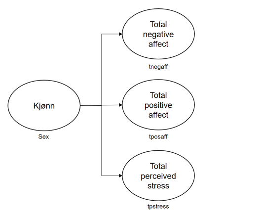
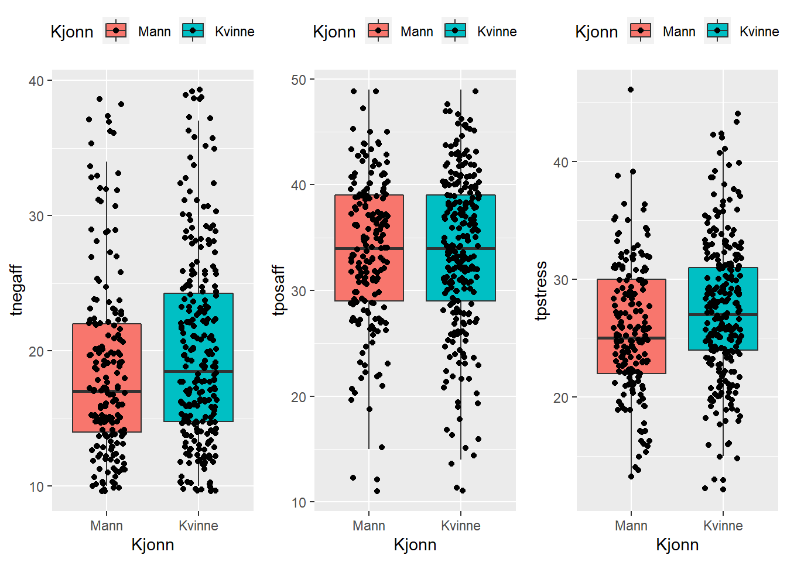
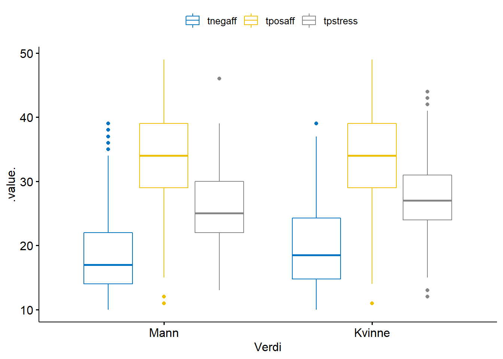
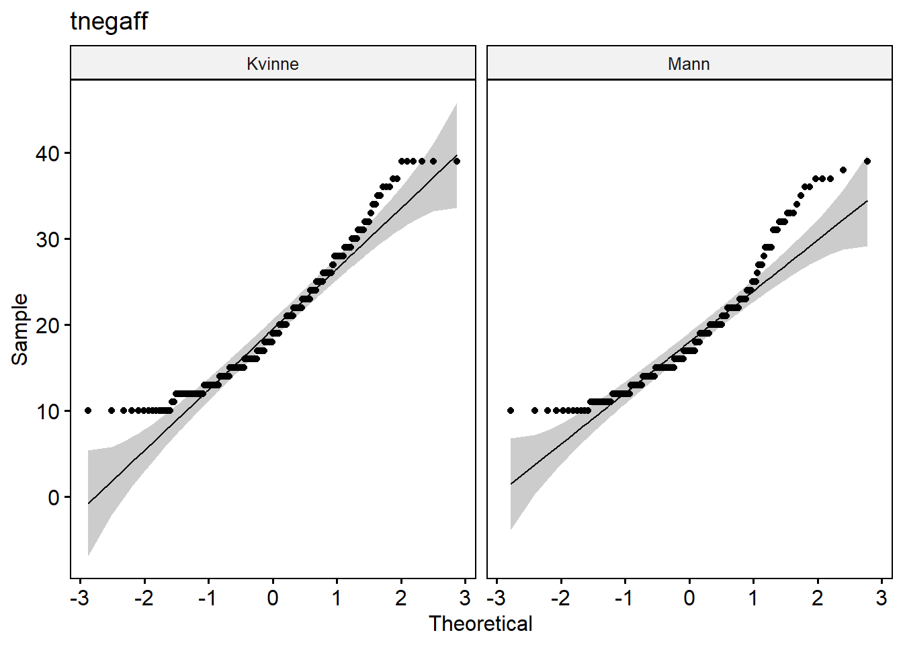
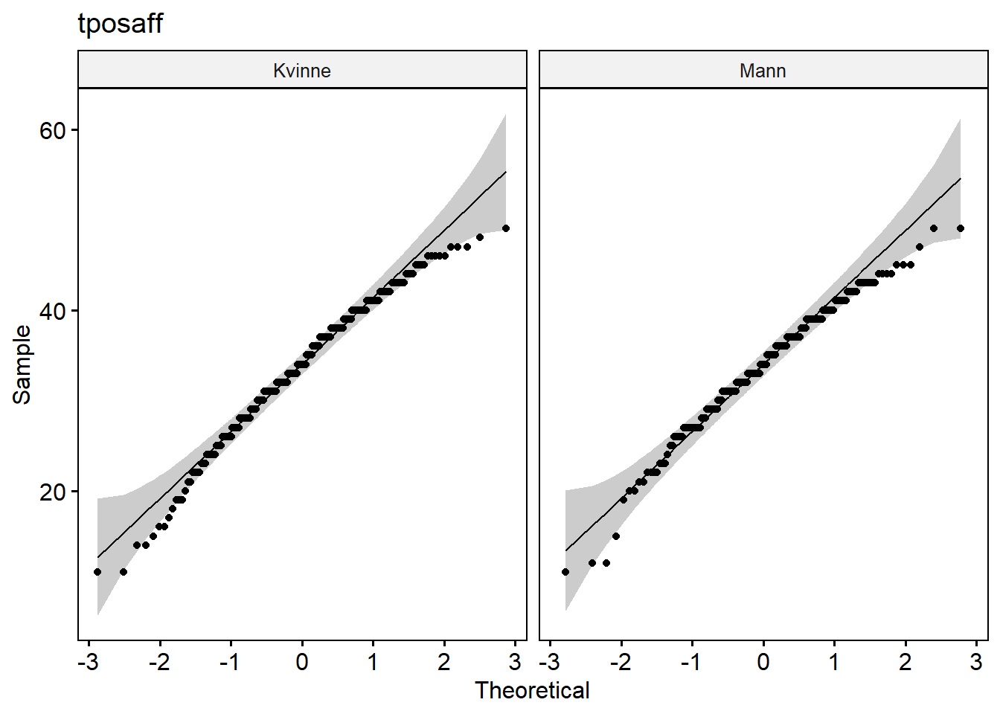
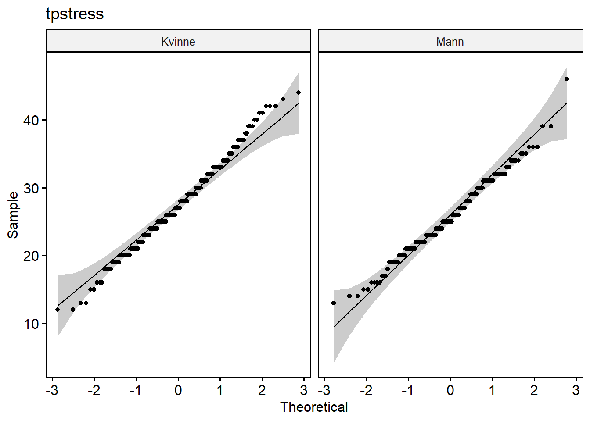
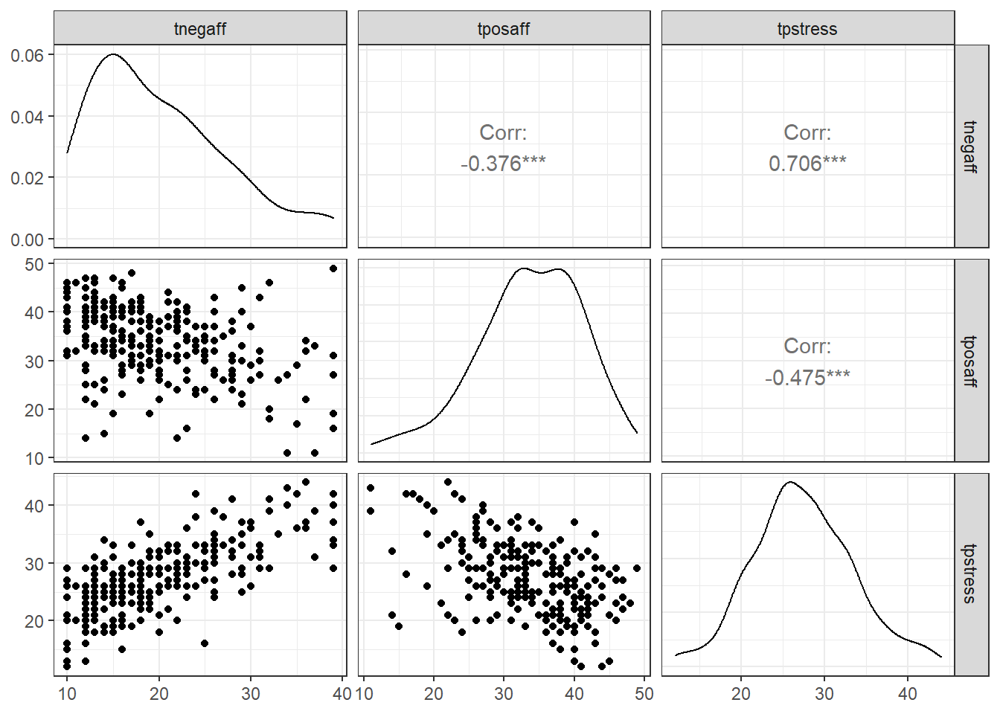
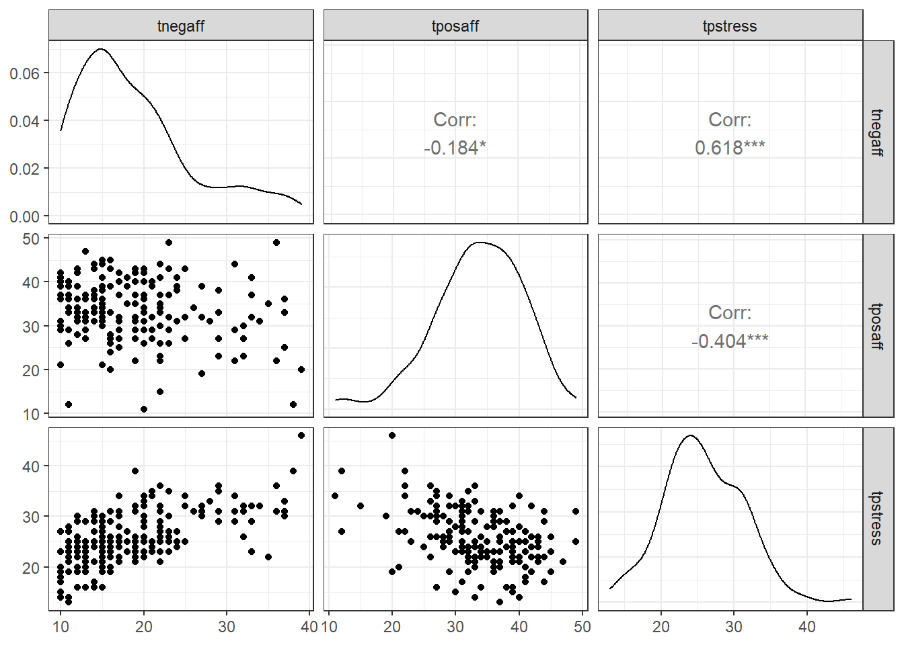

# Variansanalyse - MANOVA ("Multivariate Analysis of Variance")

R-pakker brukt i dette kapittelet:


```r
pacman::p_load(readxl, writexl, tidyverse, summarytools, gridExtra, lsr, rstatix, mvnormalTest, heplots, plyr, xtable, broom, ggpubr, car, GGally, knitr, sjPlot)
```

## Enveis MANOVA

Forskjellen mellom de analysene vi har gjort til nå og MANOVA er at vi kan ønske å se på effekter av ulike påvirkninger på flere enn en avhengig variabel. MANOVA er således en ANOVA med to eller flere kontinuerlige avhengige variabler, der flere avhengige variabler testes for statistiske forskjeller gjennom en "grouping variable".

Vi kan se for oss at vi forventer at en påvirkning har effekt på flere avhengige variabler. På en måte er MANOVA en analyse som kjører gjentatte ANOVAer (fordi vi har mer enn en avhengig variabel), men som samtidig korrigerer for risikoen for type 1 feil (at vi tror det er en signifikant forskjell mellom grupper uten at det er det). Hvis vi gjennomfører gjentatte ANOVAer øker sannsynligheten for at vi får signifikante resultater (kort fortalt fordi sjansen for tilfeldig signifikant resultat øker med antall ganger vi kjører testen [@mittelhammerEconometricFoundations2000] og får type 1 feil. Det skal sies at man kan gjennomføre flere ANOVAer, men et tiltak for å redusere type 1 feil kan være å sette en strengere alfaverdi. En relativt enkel korrigering er å ta den vanlige alfaverdien og dele på antall avhengige variabler (dvs antall ganger du vil kjøre ANOVA) [@pallantSPSSSurvivalManual2010]. Dette kalles en Bonferroni justering:

$Justert\ \alpha = \frac{0.05}{Antall\ variabler}, f.eks:\ Justert\ \alpha=\frac{0.05}{3}=0.17$

Nedsiden ved å korrigere slik er at man øker sjansen for type II feil (sjansene for type 1 og type 2 feil er dessverre omvendt korrelerte). Det finnes alternativer, men vi går ikke inn i disse her [se f.eks. @franeArePerFamilyType2015].

Det vi ønsker å undersøke er:

{width=75%}


`<a href="data:application/vnd.openxmlformats-officedocument.spreadsheetml.sheet;base64,UEsDBBQAAAAIAAAAIQA4nYbYPgEAAAcEAAATAAAAW0NvbnRlbnRfVHlwZXNdLnhtbK2Ty27DIBBF9/0KxLYyJF1UVRUniz6WbRbpB1AYxygYEDNJk78vtpNIrdI8lG6MzNy55w6C0WTdOLaChDb4kg/FgDPwOhjr5yX/mL0WD5whKW+UCx5KvgHkk/HNaLaJgCw3eyx5TRQfpURdQ6NQhAg+V6qQGkX5N81lVHqh5iDvBoN7qYMn8FRQ68HHo2eo1NIRe1nn7T5IAoecPfXCllVyFaOzWlGuy5U3vyjFliByZ6fB2ka8zQIuDxLayt+Abd97PplkDbCpSvSmmqySJuhpChFl1ovjLgdihqqyGrLHssktAtpABkwRsyUksrDPfJStQ4LL4bszarvPJK6dRNo4wKtHxZhAGawBqHGiNz1BpnyfoP8Or+Z3NieAXyEtPkNY/Pew7SoaZf0Z/E6Msluun/pnkL3/Lofs3vH4G1BLAwQUAAAACAAAACEA8p9J2ukAAABLAgAACwAAAF9yZWxzLy5yZWxzrZLBTsMwDEDvfEXk+5puSAihpbsgpN0mND7AJG4btY2jxIPu74mQQAyNaQeOceznZ8vrzTyN6o1S9hwMLKsaFAXLzofOwMv+aXEPKgsGhyMHMnCkDJvmZv1MI0qpyb2PWRVIyAZ6kfigdbY9TZgrjhTKT8tpQinP1OmIdsCO9Kqu73T6yYDmhKm2zkDauiWo/THSNWxuW2/pke1hoiBnWvzKKGRMHYmBedTvnIZX5qEqUNDnXVbXu/w9p55I0KGgtpxoEVOpTuLLWr91HNtdCefPjEtCt/+5HJqFgiN3WQlj/DLSJzfQfABQSwMEFAAAAAgAAAAhAOVEG6PVAAAALAIAABoAAAB4bC9fcmVscy93b3JrYm9vay54bWwucmVsc62Rz4oCMQyH7z5FyX0nMwoiYsfLsuBV9AFKJ/MHZ9rSZHedt7couiuIePAUfgn58kFW6+PQqx+K3HmnochyUOSsrzrXaNjvvj4WoFiMq0zvHWkYiWFdTlZb6o2kHW67wCpBHGtoRcISkW1Lg+HMB3JpUvs4GEkxNhiMPZiGcJrnc4z/GVDeMdWm0hA3VQFqNwZ6he3rurP06e33QE4enMBfHw/cEkmCmtiQaLi1GM+lyBIV8LHM9J0yknbpT+QcL82nDrN3OrCMfXroTeKSr+fx7snlCVBLAwQUAAAACAAAACEA9n23eSIgAAC/9QAAGAAAAHhsL3dvcmtzaGVldHMvc2hlZXQxLnhtbJ2dX48cOXLE3/0pBL371GSy/h20MuxuHGwcDBg+2+9zu6Nd+XZnFjNzt/a390jD6MpmMFgmXw63zC4pVMUKZmXlr/jxH/7nl5/f/e3+6fnL48N378PvTu/f3T98//jDl4cfv3v/n//xh79f3797frl7+OHu58eH++/e/+/98/t/+PR3H397fPrL80/39y/vXv+Ah+fv3v/08vLr7z98eP7+p/tf7p5/9/jr/cNr5PPj0y93L6//+fTjh+dfn+7vfvh20C8/f4in0/zhl7svD+/f/oTfP/1//ozHz5+/fH9/efz+r7/cP7y8/SFP9z/fvbzKf/7py6/P7z99/OHLa+zrv+fd0/3n797/Y/j9JZm9//Dp47e/+7++3P/27P7/u5e7P//p/uf771/uf3g9A+/fff2n/fnx8S9fg//yOnT6eugHOvYP32T929O7H+4/3/3155d/f/ztn++//PjTy+sfMl3/tsvdy92nj0+Pv717+vaHP3/73+//+vzy+Mvbn/B14NPH77/G//H6g9fRLw8/f3m4/9PL02v0y+tf+vLpj//9+PDw8cPLq5qvAx++z4f9U/uwl4f7H+8+f64ceD448NfH5/qBl6MDn1+e7p+fb4/88HoWrqciXv/NUfwh/3pX/8d+PfJvn2z6+OFv/p9SH768Dcd4Hb5RYVcV1qnC3v66uVDxNpy2QkX+dairSFcVqVNF+vbnhlCoyMOxUPE2HJe6iumqYupUMb3969ZCxVRXkX+91VXMVxVzp4q5/HPfVLwNx1Oh4m04zXUVy1XF0qlieVNhhYq34VRcqMvbcLS6ivWqYu1UsVb/0ee1Ol0ub8OW6iq2q4qtU8X29teV98hWvyL512JehNNukqdOHd+Off0HLoWQPB5Lz8DvT0KK82vlgFJKKP+VWUoofSpLCc27Jew2Gnp9NERxVmLV2i4YFyYWdi8NvWYa3vwxlJ6ex2M5YTGuLtBuqKHXUcObSVospZB5Zil5XBhJ2F019NpqyAZaekkeZylTeb/dStmtNfR6a3izy1AaSh7nCzQ3l5qw+2voNdiwiGlbd94Lj99K2U029LpsWKs37TmPl9P5ksdNJCNhd9rQa7VhK2/OLOVtPKVSCv3+Njvb3Tb2um18c89QXqA8nkrfz+Nq+Ym728Zet42hnqVF4bb8+1spLmntzlpj/Q7K40ZnJZZz6FbK7rax122j1bPGPE53EH6vLtDutrHXbaNIYPN4eZNf8HtxM8fdbWOv28apzMWylKme0uP36gLtbht73TbO9SQS43RWstuKJCHubht73TYu9eUwUuaapSxtX9ndNva6bVyry945j5cp1SWPqywu7m4be902buJm3oTFbc07yHa3tV63NXLP/CB6qi4IF4yrB+Ldba3XbS2U/8osJVQlXvB74ba2u631uq1l9yynbR6PaymFXPhWiqsTdBcKrD5XjGoCWYqVy+etlN1trddtLVWfvM55PJXLoVEufCtld1vrdVubxFyZ6haHceErtrut9bqtzfXUKY9TkoDfq5t5d1vrdVtb6s9BebyssFzwe3UH7W5rvW5rq5i22VWpwkU5762U3W2t121tqy+HGKcLROO31bbdbVOv26ZT/azk8VieFfxerMxpd9vU67Yp1FOnPB7Lx/dEOe+tlN1tU6/bJqoMZClRnBUav5Wyu23qddtk9UcyjJf5CsbFtE2uNNtdm1XF2STOSmrPld1tU6/bpnop9pzHqdSTx+UF2t029bptqrvqGeMkZW4+kqXdbVOv26alvgblcXpmxu/Fypx2t029bpvqldlzHucLtJZ5zK2U3W1Tr9smUbXN45HOSruSMO1uO/W67XQqn/bepOTxVCYJeTwqKbvbTr1uO4XqTXvGeOkreVyeld1tp163nWJpWVnK23giKfT7Wym72069bjtZ3VfyOCUJ+L24mafdbadet51SPXXK46msxU3tuu3k3oZ1vw6b6haXx8lXprbbTrvbTr1uOwm3FeOXqV23nXa3nXrddhKVBIyXz8z8+1spu9tOvW47ibptHqcCGH6vbubdbadet5024Sv1nPeCcTFt591t5163nU/1mzmPk6/M9PbsVsrutnOv286hPOFZSiinZ5aS3VZJ2d127nXbmeqwWUqs+wp+r15v724797rtbPW5ksfp6ZB/fytld9u5121nqsNmKSK35fFbKbvbzr1uO0/1R7I8Tq/c8XthcbNrQOjuQCD3zFLqrQkXjAuLm3e3nXvddha57Uz12SyFXPhWyu62c6/bzmt5wrOUtZrHXDAu6ivz7rZzr9vOm7A4UUmY2z0Jy+62S6/bLsJt8zhVKDGuGlZ2t1163XYRlYQ8TtXsPK6Mf9nddul120W8Jcvj3D+Tfy+eg5bdbZdet13qFYNzHqe5gnF1Vna3XXrddklCSqqvzEs7t112t1163XYRbpvHqYSM36s7aHfbpddtl7l8mMhS5vrKnMdVs9Xier66m76W+sqM8TJfyeNyruxuu/S67SJavzBeVhIWynlvpexuu/S67SLcNo/zXKEKw2033O62a6/brqd6xr9Sp9ebFPxeNebtbrv2uu0a6svhKnLbtV1JWHe3XXvddo31NBvjZb6Sx9Wbj3V327XXbVfRAbaKt2QYF/nKurvt2uu2a6qnTnmcpbRz23V327XXbddJnBVRSVip8nArZXfbtddt17m8ObOUuf7wwb+/lbK77drrtmu99+C81jvDLvz7Wymuzba7z5Zy1SxlrecrK/Uw3ErZ3XbtdduVctUsZRO+0n5Ltu1uu/W67Xaqr0GbqCRs7dx2291263XbjXoMspRQLntZSiil30rZ3XbrddtN5Lab6LfN42rabrvbbr1uu4mehDxOd9DW7rfddrfdet12E267idw2j6ta3La77dbrthv1z2Ypot92a9dtt91tt1633eb6zZzH6ZFsoz7cWym72269brtRj0GWstQTSh6/lbK77dbrtptw2030JGxUYbiV4siGbrRhq2dxm3DbPC6RgpPHG/r5BvGiDAHu5T+1GxPCyTEOp27I4aQohxyguxoBlS6EkwMdTt2kwynW5zACFT2xmUmFk6MdTt24w4m6DqDH6tMHAZV6h5NDHk7dzMNJNIYhQH5zPUKeH8c9nLrBhxPVaKFnKpMW6JmaBhhODn44ddMPp7mehyNAeR4CklA5OQLi1I1AnBZ1f9Vfsl0qgUKPwyBO3RzESbQvIECtnwjo+92xEKduGOJE/bbQs9WfVhCQwIrHz/r5syCKvQjQMyUCKvkLNwxaP4RW5x/OCPB8Du2ab/AgWj+JFsRLNgQY6gntFrLgabR+HA18WUm0IlC5XsROFHqcP/czaUG0kiFAmQ8C0g89l9YPpgXRT4ZARc/Uvt89nNZPpwXlz0G8eQtHgJon1PoRtcycVa6XKFEgoO9358/9nBqANKZOc52CsVMqFxd6nD/3w2pBZM8IVPRs7XzDAWuhm1gLUflzVPlzpBJHocf5cze2FiJVIaBHoBSBibZCj/PnbnYtRJU/R8FTXAPqfnf8WugG2AKINPLnHOD1K1JiXehx/txNsYVIbgs9yp8jvdIr9Dh/7kbZAtg0nj9UsoAeSqwLPc6fu3m2kAE1vt+jqGcgINcvx7SFbqgtZEqtcr8riBi8mzw/zp+7ybYAhI3Wryj6fxFQDcDB0W2hG28L4NWonpADvH5F+qhD8XEA58/djFvI0Frl+wDi/R0C8vw4zi10g27BVP4M1I3Oj7Xf4gUHu4Vu2i0Aa6P7HVwbf0Ahtu93R7yFbuQtgGGj+WOieQIBeX857C10c28hg2zsPyDi+HodfNbBsW+hG34Lpuobpj7tgIDU4/y5m4ALGWnj52WwbuSHduDPjoIL3RhcANfG80e0ryEg8w2HwoVuFi4AbqP8x8iGoaddeg6OhwvdQFzIhFvFD7M/05cnckD6oYPiQjcVF5Ly5xxgPenAnx0ZF7rRuJBU/pxES9v1CKnH+XM3Hxcy8Mb5Bsg5yueByKn80DFyoRuSC4KGO18DlG+kdr9FcKBc6CblQqrb8BkBXi8SNWMUepw/d+NyAbwcn59J+GFqd14Eh8yFbmYuJPE6EIHK/UWAR6HH+XM3OBeSqj8n5c8cKPQ4f+6m5wJwOHr+yoHK/X7gz46gC90IXUgqfwYsx/Nna+txGF3o5ujCpPw5B/j59AClC46lC90wXQA1R+vppOobBzxdcEBd6CbqQkbkOP+ZRG8GAvr8OH/uxuoCODnWo+rPU5tjDg6tC91sXZhEkwYC/LwzHdSfHV8XugG7MNHbPuhR7weng/qzg+xCN2UXgM3x/UWEB/S00Y/gSLvQjdqFSXTIXQN8v1OncqHH+XM3bxcm0ZSMQOX+an+8JzjmLnRDd2GiagX0EF4HPVs7H3PgXegm78JM3RhZDxg7ul4H8F1w9F3oxu9C5ul4vQBoR/OZybxCj/PnbgYvKAgPAV6/5oP+DcfhhW4QL4CsIz+clT/PB/VnB+OFbhovAMej9XRW9ef5oH/DEXmhG8kLs8qfZ/HBCQT0/eU/Xtn/9Ur1fpAJPOhpwyLBsXmhG84Lis5DgPsT5oP6hgP0QjehF2ZVf55V/wYgPTl/nD93Y3oB3B293wGox/P5wJ8dqhe6Wb0AWI+/Oar8+QDXC47XC93AXlhEVzMCfH7A7Mnz4/y5m9oLwPBo/coBfj5dDuobjtwL3eheWOgbatCj/Hmhjo9Cj/Pnbn4vZCCP53MOVM7PwftBx/CFbogvgMqj+31R9Y3lIH92IF/oJvnCovx5UfXnhTLuQo//wnD/J4bpbR/0LMIPl3bXc3BIX+hm+oKC+hDg56/loL7huL7QDfaFRfVvLOr9INg+dX4c3Be66b6wKn8G30d61oP82RF+oRvxC6t6PwiYj78MfVB/dphf6Ob8wqr8GUQfn594cL2cP3fDfmElngR6xCeIr0eofj8H/IVu4i+syp9X5c+A/uT8cf7cjf0FcH+sZ1J62l8jDg79C5L9++Pfvjw83NcVid01EKDPIyOgr5hzaIkAthSpHBoBPkdUtS4U+U/BK49uKcpZNN/1a1XqBQFZJXM8YJBAYEtR3Y7PCNBOINcj1DlyWGCQXGBD0SY+V4wAK2JosFDknFrigS1F1NkMRaqXg5nCQpHzakkJthTVixpnBMq0/4JAUk9jjhUMEhZsKap/z+2MAH17G4Gk6ncOGQySGWwpSmU+CkX1b2VcENDnyDm2RAdbiuqljTMCvLXLRhR3och5tiQIW4qUZ2/U/AxFlG4XipxnS5CwpYi+ewFF9GlNKFoOrprzbMkTthTRlhxQlN8c8r22ttc1RxUGiRW2FNVLHOdrgB1yKz31RlF0bGGUbKFWFMEKlvcaAlStugakIrenh6QLW4rqZY7zNVCeo2tA1F+j4wuj5AtbiuqJ9PkaoI0SEJA7sLgdPiRh2FIkvoSMAGUjCKh3UtExhlEyhi1FYmslBMp094JAkufI7fchKcOWIvEVegToY7fXI8RzWnScYZScYUtRfbu68zVAW9ac2p140ZGGUZKGLUXZmlnRUndIBNS7juhYwyhZw5aitbrEnxGg/Oh6hLxqbi8QSRu2FKn9QE5i+6XrEepec7xhlLxhQxGIw/IJEgHqWIy8SV6hyO/DNODZ2PmOzpFiDq9HyHPkPFsyhy1FVOOAolg+ckARlbMLRc6zJXXYUiS+8IkAbywD7lBeNefZkjtsKUrV6XK+BmhmhwPPduRhlORhS5HIs68BVkR7ihSKnGdL9rClSHyIDgHeJCmQyxeKnGdL+rClSPAtCNC38a5HqI21HH8YJX/YUiQIRBW4IKDvNefZkkBsKRI75iFQufsP9szzm+ZJBrGhKNZfJp4R4KsW213U0e+dJynElqJQzgooyp5NO5HFdh9IvNlCb8CzQSKyImrIg6L2m8bod9KTJGJLkfhy3TVAMxssotxl0Hm2ZBFbiurbP58R4BwSAbWBnN9XT9KILUWiHwQBzo8YVCwUOc+WPGJLUb3x44wA7U58PUIqcp4ticSWokWsa2ILvkvliEKR82zJJLYU1Zs/zlHsxHdBQFX9ot9zT1KJLUUqz5Yb7zHJeKvIcYlRcokNRYpMRID3akRAKnKeLcnEliKVZwNBpMwfNKOa2Y5NjJJNbCmql63PCPBVwxFy81O/++mAZ6s9+RCoXLX2+8fo+MQo+cSWIvFBfQToK+kIyGzEEYpREootRXVU/IwA71hr7XeQ0TGKUTKKLUXiE6QIsEMioPIjRylGSSm2FOWsmZ6OjNpBoGhpZ/6OU4ySU2wpoqwZiqhsDUXUgl0ocp4tScWWIur8gCLxqTwE5ErrWMUoWcWGIkCJdPcn5dmp3c0XHa0YJa3YUiR4RQSoXxYBWYd0vGKUvGJLEVWnoSiKq3awqV90xGKUxGJLEe0dBUUmno5Su6cvOmYxSmaxpSiJVQRwIq20OEI5pKMWo6QWW4rUHtZJ9I1E3gGwUOQ8W3KLLUXiyx8IJD5H7c7r6MjFKMnFliLRN4IA9c5eA8qzHbsYJbvYUlTfduqMAK8i6aA24ujFKOnFliL62hIUie8zISDfHTl+MUp+saFoUrURBhWzoukgz3YEY5QEY0sRVaehSNVGJuoKLBQ5z5YMY0tR3ZrP1wDNI+CNyiEdxRglxdhSpGojOVA5R0TWFIqcZ0uOsaVI1UawTyBV/XCEckhHMkZJMrYUid0CEeBVBEcoP3IsY5QsY0vRLNa1HKicI6qAF4qcZ0uasaVI1bOBLdK6hoCcR86zJc/YUlS35jMClXPU/vR/dERjlERjS5HYbQUBfuPHFOStIsc0Rsk0NhTNlDVnRbN6B3lANUZHNUZJNbYUUZc1FKnaCAJqHjmuMUqusaUoVzooz84BfrsOslFeNefZkmxsKVK1kVnl2WAbVSXCsY1Rso0tRUk8rwFi5HNEWHqhyHm2pBtbilQ9G5sOsqI23xgd3xgl39hSpPLsmdqwoajd6xcd4Rgl4dhSVG/pO0e1BeE1IBU5z5aMY0uR6huZVZ49H9RGHOUYJeXYUiT22kagMo8OPNtxjlFyjg1Fi+obWcTeLZERyEKR82xJOrYUiZ23IyONUNTeDTY61jFK1rGlKAo/QoCyWgSUQzraMUrasaWo/tmmMwLcE7Ec5NmOd4ySd2wpqlvzGQGu+S/UHVgocp4ticeWIrFzIQJcPQbzqO5+xzxGyTy2FM3qHKleP+CQ8qo5z5bUY0tRHZ05I1A5R+3vOkXHPUbJPbYUreqqrWIVYVayUOQ8W5KPLUW0kwsU1bfyvlyPUPPIsY9Rso8NRYAcKYdEgK4aBwpFzrMl/dhSVLfmMwLc63ewy2F0/GOU/GNLkeobWVWvH45QtRFHQEZJQLYUiW+kIsA9EeuBZzsGMkoGsqVI9fqJwKUSKBQ5z5YUZEuRyrNXVRsBBykVOc8e4CDjqmoj4CBpXTvYCDE6DjIOcJBxVXn2SugMFLU5yOg4yDjAQUbFQSLADnnAQUbHQcYBDjKu1AUCRWLjbwRkVus4yDjAQcZNefZWfzl5uQbU05HjIOMABxk35dlbvWhyuQbUzHYcZBzgICNwR3pTs6k8G1smyqvmPHuAg4wbvVGEovoHoS4IyIzNcZBxgIOMG71RhCKVZ+MI5ZCOg4wDHGQE7sgzW/X6bQd5tuMg4wAHGXlzRCiahUNulIAXipxnD3CQcSMHhiL1DnI7yLMdBxkHOMi41RH1MwJcG+FAoch59gAHGbHDIitS7yA36jS5UWSOg7QBDtLAQZbzCAFaRRDQioJT1O/ZdhLvIBEg6tB4Z8ZCUXSK+j3bTuTAUBSVorZnm+MgbYCDtJOojSBAq8g1IFZacxykDXCQxnsnQpFgahDQiianqN+zDVQjKxJ5th1wkOY4SBvgIO1EbxShSOTZ1yPkPFqcon7PNlCN5dqPAPVo2cGei+Y4SBvgII2pRigSnm28HWOhaHOK+j3bTiLPRqBy1Q4823GQNsBBmtp5EQGe2eHAsx0HaQMcpIFqLDM2BGhdQ0Arcp49wEEadl8snyARoGoNAuop2xwHaQMcpGWqsXLVxP5eCKhnEXMcpA1wkAbckWZ2EHm2MSBZKHKePcBBWqAuEChSnh0oMy8UOc8e4CANVCP5EW+2CEXterY5DtIGOEgL9faQ8zVAK2048GzHQdoAB2lB1LMR4FUktOvZ5jhIG+AgDTsrlnm2ClwQUP2Q5jhIG+AgDVQj+RF2Yyw7EK4BlR85DtIGOEiLyrOxH2P5vHY9QmUjjoO0AQ7SwEGyIlEbuR4hFTnPHuAgLSrPjvWPR10QUN0+5jhIG+AgLVLnHhSJXb/sgIM0x0HaAAdpkarTUJQ9m9Y1BJRDOg7SBjhIi6KejQD70cHOjOY4SBvgIA07LdJTdhS9fteA6PYxx0HaAAdpUdSzEeBsJB54tuMgbYCDNFCNfPcLdh0B1X9kjoO0AQ7SwEFSfpQDnNVih0Y1jxwHaQMcpBk5MBTVG0ouCMi133GQNsBBGnZppKuGzRhpZiMgr5rz7AEO0sBB0tpvKs+2A892HKQNcJAG3JHufsYdoeigNuI4SBvgIM1EPRuBiiL6iHahyHn2AAdp4CDJs43SaShq7zZjjoO0AQ7STPRnI8DZiJGZF4qcZw9wkGbKs03sCIaAdkjn2QMcpKk9GxGonKP2no3mOEgb4CANVCOdI3CQ5JBMThaKnGcPcJDGuzBCUSj/Yihq942Y4yBtgIM0UI3kkGrnxmtAzSPHQdoAB2mJuq2hiKwZitrsujkO0gY4SAPVSGt/ok9BQVF79xlzHKQNcJCG/Rsp88+BiqKD2ojjIG2AgzRwkHyvKc8GB6kc0nGQNsBBWhK9fghwxpZoV7FCkfPsAQ7SMtVYmUer8qODPNtxkDbAQVpSnp2opQ+K2v3Z5jhIG+AgbRL92QjwzJ7I5QtFzrMHOEibVG1kEr1+CMiZ7ThIG+AgDbs5Uv1oUp6NgLxqzrMHOEgDB8lXzcS9dsBBmuMgbYCDtKn+qvGMAL+n5UChyHn2AAdpk3oHCQ6S1jXeBbJQ5Dx7gIM0phqhqF7ovhjvA1kocp49wEEaqEbK/Hn7Rihq70tjjoO0AQ7SJpVnYwNHVtTu9TPHQdoAB2mTegc5qXeQ4CCVQzoO0gY4SFMcpCkOEgHpR46DtAEO0sBB0lWbxf7o1yPUPHIcpA1wkAYOks8RvWqEolhO+UKR8+wBDtJANdK9NtcbSi7XgMqzHQdpAxykYZdH8mzgjrSKHOzyaI6DtAEO0kA10to/U9kaigi2KRQ5zx7gIG1WtZFZeTY4SOVHjoO0AQ7SwEHS2p8DlXvtoJ7tOEgb4CANuCNftfpmCJfrEVKR8+wBDtLAQVKtdla1kfnAsx0HaQMcpC1Unc6Klnrj9uUakIqcZw9wkLaoejZwR5rZTE4WipxnD3CQhl0faaUF7kg5JHZ9VPmR4yBtgIM0phqhSPX6IaBWWsdB2gAHaWrnRwT46QjkpDxHzrMHOEhbVG0EHCSta8tBnu04SBvgIA27P/I5ImuGovY3osxxkDbAQdpSbw85I1CZ2Qd5tuMgbYCDtIWq01C0qru/3Z9tjoO0AQ7S1B6QCPC6drAHpDkO0gY4SFtVbWSl9pCsaD3Isx0HaQMcpKl9II1xRyg6eAfpOEgb4CBtVXk2NnykGtvBTpDmOEgb4CANHCQrUn0jKyXghSLn2QMcpIFqZEUqz17p5WShyHn2AAdpq+r1AwdJ99pKLycLRc6zBzhIAwdJOaTYKPKCgFzXHAdpAxykrVSdhiKxp/r1CPV+zXGQNsBBGjhIPkcqz14P8mzHQdoAB2mgGllRzrOpxrYe9Po5DtIGOEjLVCPPbAFIXiqBQpHz7AEO0nh3RyhStZEDDtIcB2kDHKQpDhIBntngINUq4jhIG+AgDds+0jwC7shX7aCe7ThIG+AgbaOsGYrqH4+6XI9QT0eOg7QBDtIUB4kAOySOUHe/4yBtgIM0phqhiD6TDUX0hZJCkfPsAQ7SFAeJANePtoN3kI6DtAEO0hQHiQDnkOAg5cx2nj3AQdqmPFvtB3k9Qszs5DjINMBBJnCQZeaPAN1rCKiVNjkOMg1wkOkk2PVroJzZCKh1LTkOMg1wkOkkPBsBmtkIqPwoOQ4yDXCQ6STq2dcAn6P297OT4yDTAAeZxLaPZwToWeQaEA6ZHAeZBjjIhG0fS4dEgOpH1yOEQybHQaYBDjIx1QhFYs8DBJQfJcdBpgEOMmE/yDI/Sow7QlG7np0cB5kGOMiEbR/Zj0RtJPEOkoWizSnq9+wEDpLPkfjeCALyqjkOMg1wkAkcZLmKIEDrGgJakfPsAQ4ygYOkuz+IPQ8QkH7kOMg0wEEmxUEiUDlH9HKyUOQ8e4CDTEHk2QhUFLX7s5PjINMAB5mC+N4IApWrRuRkoch59gAHmUA10tqv9oO8BtTa7zjINMBBpiBqI4lxRyg68GzHQaYBDjIF5dnAHfmqtfPs5DjINMBBJnCQfPcrzw7tenZyHGQa4CBTphorikSejYC81xwHmQY4yBRFbQQBXkVwhFTkPHuAg0zY3bF8pkWA86PY7htJjoNMAxxkwu6OlLGBg6SZHQ8823GQaYCDTKAaWRG9aoSigzzbcZBpgINM4CAph4yiNoKAVuQ8e4CDTFF5tuIg08F+kMlxkGmAg0xR9PohwJ4d2/Xs5DjINMBBpqg8G9s+lrXaxIBkoch59gAHmUA18swWtZHEG0UWipxnD3CQCVQj+5Hy7HhQG3EcZBrgIJNRt3VWxNs+ZkU4Qipynj3AQSZwkJTVAnekeWTt/uzkOMg0wEEm7O5IfsS4IxQdeLbjINMAB5nAQbIiU+dI5Nkfnn+6v3+53L3cffr4692P9/969/Tjl4fndz/ff34VdfrdqxE8ffnxJ/z/l8dfv/2/Vw/98+PLy+Mv+K+f7u9+uH/6+l+v/5zPj48v+I8Pr3/Hb49Pf/n293z6P1BLAwQUAAAACAAAACEAgxhqJUgBAAAmAgAADwAAAHhsL3dvcmtib29rLnhtbI1Ry07DMBC88xXW3mkeaiNaNanES1RCgERpzybeNFYdO7Id0v4961QpcOO0M+Pd0c56uTo2in2hddLoHJJJDAx1aYTU+xw+No/XN8Cc51pwZTTmcEIHq+Jq2Rt7+DTmwGheuxxq79tFFLmyxoa7iWlR00tlbMM9UbuPXGuRC1cj+kZFaRxnUcOlhrPDwv7Hw1SVLPHelF2D2p9NLCruaXtXy9ZBsaykwu05EONt+8IbWvuogCnu/IOQHkUOU6Kmxz+C7drbTqpAZvEMouIS8s0ygRXvlN/QaqM7nSudpmkWOkPXVmLvfoYCZced1ML0OaRTuuxpZMkMWD/gnRS+JiGL5xftCeW+9jnMsywO5tEv9+F+Y2V6CPcecEL/FOqa9idsF5KAXYtkcBjHSq5KShPK0JhOZ8kcWNUpdUfaq342fDAIQ2OS4htQSwMEFAAAAAgAAAAhAD/Y7yGxBQAAUxsAABMAAAB4bC90aGVtZS90aGVtZTEueG1s7VlNj9NGGL7zK0a+g+PEDtkVWbTJJtDCwmo3UHGc2BN7yNhjzUx2ya2CY6VKVWnVS6XeeqjaIoHUC/0121K1VOIv9PVHkvFmsmRhqxZBDoln/LzfH37HuXL1QczQIRGS8qRtOZdqFiKJzwOahG3rzqB/sWUhqXASYMYT0ramRFpXty5cwZsqIjFBQJ7ITdy2IqXSTduWPmxjeYmnJIF7Iy5irGApQjsQ+AjYxsyu12pNO8Y0sVCCY+B6ezSiPkGDjKW1NWPeY/CVKJlt+Ewc+LlEnSLHBmMn+5FT2WUCHWLWtkBOwI8G5IGyEMNSwY22Vcs/lr11xZ4TMbWCVqPr55+SriQIxvWcToTDOaHTdzcu78z51wv+y7her9ftOXN+OQD7PljqLGHdfsvpzHhqoOJymXe35tXcKl7j31jCb3Q6HW+jgm8s8O4SvlVrutv1Ct5d4L1l/Tvb3W6zgvcW+OYSvn95o+lW8TkoYjQZL6GzeM4jM4eMOLtuhLcA3polwAJla9lV0CdqVa7F+D4XfQDkwcWKJkhNUzLCPuC6OB4KijMBeJNg7U6x5culrUwWkr6gqWpbH6cYKmIBefX8x1fPn6JXz58cP3x2/PCX40ePjh/+bCC8jpNQJ3z5/Rd/f/sp+uvpdy8ff2XGSx3/+0+f/fbrl2ag0oEvvn7yx7MnL775/M8fHhvg2wIPdfiAxkSiW+QI7fMYbDMIIENxNopBhGmFAkeANAB7KqoAb00xM+E6pOq8uwIagAl4bXK/outBJCaKGoA3orgC3OWcdbgwmnMjk6WbM0lCs3Ax0XH7GB+aZHdPhLY3SSGTqYllNyIVNfcYRBuHJCEKZff4mBAD2T1KK37dpb7gko8UukdRB1OjSwZ0qMxE12kMcZmaFIRQV3yzexd1ODOx3yGHVSQUBGYmloRV3HgNTxSOjRrjmOnIm1hFJiUPpsKvOFwqiHRIGEe9gEhporktphV1b2DoRMaw77JpXEUKRccm5E3MuY7c4eNuhOPUqDNNIh37kRxDimK0x5VRCV6tkGwNccDJynDfpUSdrazv0DAyJ0h2ZyLKrl3pvzFNTmvGjEI3/tCMZ/BteDSZSuJkC16Fewcb7w6eJHsEcv1D3/3Qd9/HvruqltfttosGa+tzcc4vXjkkjyhjB2rKyE2Zt2YJSgd92MwXOdF8Jk8juCzFVXChwPk1Elx9QlV0EOEUxDi5hFCWrEOJUi7hJGCt5J0fJykYn+95szMgoLHa5UGx3dDPhnM2+SqUuqBGxmBdYY3LbyfMKYBrSnM8szTvVGm25k2oBoSzg7/TrBeiIWMwI0Hm94LBLCznHiIZ4YCUMXKMhjiNNd3Wer3XNGkbjbeTtk6QdHHuCnHeOUSpthQle7kcWVJdoSPQyqt7FvJx2rZGMEnBZZwCP5k1IMzCpG35qjTltcV80mBzWjq1lQZXRKRCqh0so4IqvzV7dZIs9K97buaH8zHA0I3W06LRcv5DLeyToSWjEfHVip3FsrzHJ4qIgyg4QkM2EfsY9HaL7AqohGdGfbYQUKFumXjVyi+r4OQrmrI6MEsjXPaklhb7Ap5fz3XIV5p69grd39CUxjma4r2/pmSZC2NrI8gPVDAGCIyyHG1bXKiIQxdKI+r3BQwOuSzQC0FZZCohlr1vznQlh4u+VfAomlwYqX0aIkGh06lIELKnSjtfw8yp68/XGaOyz8zVlWnxOySHhA2y6m1m9lsomnWT0hE57mTQbFN1DcP+/3jycVdMPqePBwtB7llmEVdr+tqjYOPtVDjjo7Zutrjurf2oTeHwgbIvaNxU+Gwx3w74PkQfzSdKBIl4sVWW33xzCDq3NOMyVv/uGLUIQWtFvM9z+NSc3Vjh7NPFvbmzPYOvvdNdbS+XqK0dZPLV0h9PfHgfZO/AQWnClCzeJj2Ao2Z39pcB8LEXpFsX/gFQSwMEFAAAAAgAAAAhAK/OEl3DAQAAUgQAAA0AAAB4bC9zdHlsZXMueG1svVTfi5wwEH7vXxHy3nMVetwV9SiFhUJbDm4LfY0aNTBJJBkXvb/+JkbdXWg56ENfzMw3M9/8cJL8adLAztJ5ZU3B07sDZ9LUtlGmK/iv0/HjA2cehWkEWCMLPkvPn8oPuccZ5EsvJTJiML7gPeLwOUl83Ust/J0dpCFLa50WSKrrEj84KRofgjQk2eFwn2ihDC/z1hr0rLajwYJnK1Dm/pWdBVBZKU/KvLZgHUOipzoWxAgto8dXAapyKoCt0ArmCGcBWCpa/bQy1gUwiRnit0r+R67l8BSkAG6bJaDMB4EonTmSwlb5NA+U3tDgI83i945358ScZp+uApaD8lbWNfSjt8wp36AyB9kiBTjV9eFEOyTBiGg1CY0SnTUCAuUWsQpEW0uAl7ANv9sb7qllZtRHjd+agtNahe43kQpaxUgTlcB/zRa5r2izf6JlU7vz/y06fT+aiWGA+Whjf1H7AqozWm4ti01lvXXqlVzDHtQEyLgIU7u2uHe39Hoztx1lYeUK/jPcILiqoxoVoDJ/mBlxNtNlXIsVRUUX9SYLcTSyFSPgaTcW/CL/kI0a9ePu9azOFlevi/w9LEt6v1RweQ3KN1BLAwQUAAAACAAAACEAvFqb6yUBAABQAgAAEQAAAGRvY1Byb3BzL2NvcmUueG1snZLNTsMwEITvPEXke2InFQWsJJUA9UQlJIpA3Cx7m1rEP7INad8eJ2nTVuqJ43pmv51duVzsVJv8gvPS6ArlGUEJaG6E1E2F3tfL9B4lPjAtWGs0VGgPHi3qm5Jbyo2DV2csuCDBJxGkPeW2QtsQLMXY8y0o5rPo0FHcGKdYiKVrsGX8mzWAC0LmWEFgggWGe2BqJyI6IAWfkPbHtQNAcAwtKNDB4zzL8ckbwCl/tWFQzpxKhr2Fq9ajOLl3Xk7GruuybjZYY/4cf65e3oZVU6n7U3FAdSk45Q5YMK4u8XkRD9cyH1bxxBsJ4nEf9Stvh0XGPhBJDEDHuEflY/b0vF6iuiBFkZKHlORrMqe3BS3uvvqRF/0noDoM+TfxCBhzX36C+g9QSwMEFAAAAAgAAAAhAF66p9N3AQAAEAMAABAAAABkb2NQcm9wcy9hcHAueG1snZLBTuswEEX3fEXkPXVSIfRUOUaogFjwRKUWWBtn0lg4tuUZopavx0nVkAIrsrozc3V9Mra42rU26yCi8a5kxSxnGTjtK+O2JXva3J3/YxmScpWy3kHJ9oDsSp6JVfQBIhnALCU4LFlDFBaco26gVThLY5cmtY+tolTGLfd1bTTceP3egiM+z/NLDjsCV0F1HsZAdkhcdPTX0Mrrng+fN/uQ8qS4DsEarSj9pPxvdPToa8pudxqs4NOhSEFr0O/R0F7mgk9LsdbKwjIFy1pZBMG/GuIeVL+zlTIRpeho0YEmHzM0H2lrc5a9KoQep2SdikY5YgfboRi0DUhRvvj4hg0AoeBjc5BT71SbC1kMhiROjXwESfoUcWPIAj7WKxXpF+JiSjwwsAnjuucrfvAdT/qWvfRtUC4tkI/qwbg3fAobf6MIjus8bYp1oyJU6QbGdY8NcZ+4ou39y0a5LVRHz89Bf/nPhwcui/ksT99w58ee4F9vWX4CUEsBAgAAFAAAAAgAAAAhADidhtg+AQAABwQAABMAAAAAAAAAAQAAAAAAAAAAAFtDb250ZW50X1R5cGVzXS54bWxQSwECAAAUAAAACAAAACEA8p9J2ukAAABLAgAACwAAAAAAAAABAAAAAABvAQAAX3JlbHMvLnJlbHNQSwECAAAUAAAACAAAACEA5UQbo9UAAAAsAgAAGgAAAAAAAAABAAAAAACBAgAAeGwvX3JlbHMvd29ya2Jvb2sueG1sLnJlbHNQSwECAAAUAAAACAAAACEA9n23eSIgAAC/9QAAGAAAAAAAAAABAAAAAACOAwAAeGwvd29ya3NoZWV0cy9zaGVldDEueG1sUEsBAgAAFAAAAAgAAAAhAIMYaiVIAQAAJgIAAA8AAAAAAAAAAQAAAAAA5iMAAHhsL3dvcmtib29rLnhtbFBLAQIAABQAAAAIAAAAIQA/2O8hsQUAAFMbAAATAAAAAAAAAAEAAAAAAFslAAB4bC90aGVtZS90aGVtZTEueG1sUEsBAgAAFAAAAAgAAAAhAK/OEl3DAQAAUgQAAA0AAAAAAAAAAQAAAAAAPSsAAHhsL3N0eWxlcy54bWxQSwECAAAUAAAACAAAACEAvFqb6yUBAABQAgAAEQAAAAAAAAABAAAAAAArLQAAZG9jUHJvcHMvY29yZS54bWxQSwECAAAUAAAACAAAACEAXrqn03cBAAAQAwAAEAAAAAAAAAABAAAAAAB/LgAAZG9jUHJvcHMvYXBwLnhtbFBLBQYAAAAACQAJAD4CAAAkMAAAAAA=" download="Pallant_Survey_MANOVA.xlsx">Download Pallant_Survey_MANOVA.xlsx</a>`{=html}

Vi kan se på variablene gruppert etter kjønn:

```r
manova1 <- read_excel("Pallant_Survey_MANOVA.xlsx")
manova1 %>%
  group_by(Kjonn) %>%
  rstatix::get_summary_stats(tnegaff, tposaff, tpstress, type = "mean_sd")
#> # A tibble: 6 × 5
#>   Kjonn  variable     n  mean    sd
#>   <chr>  <chr>    <dbl> <dbl> <dbl>
#> 1 Kvinne tnegaff    248  20.0  7.18
#> 2 Kvinne tposaff    248  33.7  7.44
#> 3 Kvinne tpstress   248  27.4  6.08
#> 4 Mann   tnegaff    184  18.7  6.90
#> 5 Mann   tposaff    184  33.6  6.98
#> 6 Mann   tpstress   184  25.8  5.41
```

Grafisk ser de avhengige variablene slik ut:

```r
p1 <- ggplot(manova1, aes(x = Kjonn, y = tnegaff, fill = Kjonn)) + 
    geom_boxplot(outlier.shape = NA) + 
    geom_jitter(width = 0.2) + 
    theme_bw() +
    theme(legend.position="top") 

p2 <- ggplot(manova1, aes(x = Kjonn, y = tposaff, fill = Kjonn)) + 
    geom_boxplot(outlier.shape = NA) + 
    geom_jitter(width = 0.2) + 
    theme_bw() +
    theme(legend.position="top")
p3 <- ggplot(manova1, aes(x = Kjonn, y = tpstress, fill = Kjonn)) + 
    geom_boxplot(outlier.shape = NA) + 
    geom_jitter(width = 0.2) + 
    theme_bw() +
    theme(legend.position="top")
grid.arrange(p1, p2, p3, ncol=3)
```

<div class="figure">

<p class="caption">(\#fig:unnamed-chunk-5)Grafisk framstilling av de avhengige variablene i MANOVA #1</p>
</div>

Gruppert på en litt annen måte kan vi også framstille dataene grafisk slik:


```r
ggpubr::ggboxplot(
  manova1, x = "Kjonn", y = c("tnegaff", "tposaff", "tpstress"), 
  merge = TRUE, palette = "jco", xlab = "Verdi")
```

<div class="figure">

<p class="caption">(\#fig:unnamed-chunk-6)Grafisk framstilling av de avhengige variablene i MANOVA #2</p>
</div>

Vi kan se ut fra de grafiske framstillingene (og tabellen lenger opp) at for variabelen "tposaff" ser gjennomsnittsverdien og spredningen ut til å være veldig lik mellom kjønnene, mens for begge de to andre ser ut til å ha høyere gjennomsnittsverdi for kvinner. Vi vet imidlertid ikke om dette er statistisk signifikant eller sannsynligvis tilfeldig. 

Vi kan så lage en MANOVA der vi tester følgende:

$H_0: De\ multivariate\ vektorene\ av\ gjennomsnittsverdier\ for\ to\ eller\ flere\ grupperer\ like$

$H_A: Minst\ en\ er\ ulik$


```r
avhengige <- cbind(manova1$tnegaff, manova1$tposaff, manova1$tpstress)
manovares1 <- manova(avhengige ~ Kjonn, data = manova1)
summary(manovares1)
#>            Df   Pillai approx F num Df den Df  Pr(>F)  
#> Kjonn       1 0.024406    3.569      3    428 0.01418 *
#> Residuals 430                                          
#> ---
#> Signif. codes:  
#> 0 '***' 0.001 '**' 0.01 '*' 0.05 '.' 0.1 ' ' 1
```


Pillais testverdi er statistisk signifikant [Pillais Trace = 0.024, *F*(3, 428) = 3.569, p = 0.014]. Det er grunn til å tro at det er forskjeller mellom gruppene. Vi finner med andre ord en signifikant forskjell mellom menn og kvinner (men kan ikke ut fra dette si noe om hvor forskjellene er).


```r
etamanova <- effectsize::eta_squared(manovares1)
etamanova
#> # Effect Size for ANOVA (Type I)
#> 
#> Parameter | Eta2 (partial) |       95% CI
#> -----------------------------------------
#> Kjonn     |           0.02 | [0.00, 1.00]
#> 
#> - One-sided CIs: upper bound fixed at [1.00].
```

$\eta^2$ = 0.024 viser imidlertid at effekten er liten.


```r
summary.aov(manovares1)
#>  Response 1 :
#>              Df  Sum Sq Mean Sq F value Pr(>F)  
#> Kjonn         1   172.3 172.348  3.4563 0.0637 .
#> Residuals   430 21442.1  49.865                 
#> ---
#> Signif. codes:  
#> 0 '***' 0.001 '**' 0.01 '*' 0.05 '.' 0.1 ' ' 1
#> 
#>  Response 2 :
#>              Df  Sum Sq Mean Sq F value Pr(>F)
#> Kjonn         1     0.4   0.440  0.0084 0.9272
#> Residuals   430 22596.2  52.549               
#> 
#>  Response 3 :
#>              Df  Sum Sq Mean Sq F value   Pr(>F)   
#> Kjonn         1   281.1 281.099  8.3423 0.004069 **
#> Residuals   430 14489.1  33.696                    
#> ---
#> Signif. codes:  
#> 0 '***' 0.001 '**' 0.01 '*' 0.05 '.' 0.1 ' ' 1
```

Vi kan se at kun en av variablene - betegnet "Response 3" (= "tpstress" siden den er lagt inn som tredje variabel i vår modell) - er statistisk signifikant (p < 0.05). Vi omtalte imidlertid behovet for å foreta en justering av $\alpha$ til 0.17 gjennom en Bonferronikorreksjon (det finnes andre måter å korrigere for, men det går vi ikke videre inn på her). Med justering blir også "Response 1" ("tnegaff") statistisk signifikant. 

Vi kan gå tilbake til de to signifikante variablene:


```r
manova1 %>% 
    group_by(Kjonn) %>%  
    dplyr::summarise(n = n(), 
              mean = mean(tnegaff), 
              sd = sd(tnegaff))
#> # A tibble: 2 × 4
#>   Kjonn      n  mean    sd
#>   <chr>  <int> <dbl> <dbl>
#> 1 Kvinne   248  20.0  7.18
#> 2 Mann     184  18.7  6.90
manova1 %>% 
    group_by(Kjonn) %>%  
    dplyr::summarise(n = n(), 
              mean = mean(tpstress), 
              sd = sd(tpstress)) 
#> # A tibble: 2 × 4
#>   Kjonn      n  mean    sd
#>   <chr>  <int> <dbl> <dbl>
#> 1 Kvinne   248  27.4  6.08
#> 2 Mann     184  25.8  5.41
```

Ut fra våre funn kan vi si at kvinner er statistisk signifikant mer stresset enn menn i denne undersøkelsen på 2 av 3 variabler, men forskjellen er liten.

## Sjekk av forutsetninger

### Teoretisk begrunnede variabler

Dette er kanskje en litt «merkelig» forutsetning, og strengt tatt er det vel ikke en forutsetning, men heller en forsiktighetsregel mot å misbruke MANOVA. MANOVA kan synes som en type analyse der man kan slenge inn en rekke variabler og får et statistikkprogram til å kjøre gjentatte ANOVAer. Som @fieldDiscoveringStatisticsUsing2012 presisierer må det være en grunn til å kjøre en MANOVA. Så kan man selvsat si at dette er - vel, selvsagt - men det er likevel slik at dette kanskje ikke er - vel, selvsagt - så derfor nevnes det her. Dette poenget er selvsagt i den forstand at det bør gjelde alle analyser vi gjør. 

### Utvalgsstørrelse


```r
celler <- manova1 %>%
  group_by(Kjonn) %>%
  dplyr::summarise(N = n())
celler
#> # A tibble: 2 × 2
#>   Kjonn      N
#>   <chr>  <int>
#> 1 Kvinne   248
#> 2 Mann     184
```

Dette er godt over "nødvendig" utvalgsstørrelse. Litteraturen gir ingen entydige retningslinjer for hva som er "stort nok", men en tommelfingerregel som gjengis flere steder er:

$n\ i\ hver\ celle\ > antall\ avhengige\ variabler$


```r
(celler[1,2])
#> # A tibble: 1 × 1
#>       N
#>   <int>
#> 1   248
ncol(manova1)-1
#> [1] 3
```

i vårt eksempel har vi 248 og 184 som må ses opp mot 3.

@wilsonvanvoorhisUnderstandingPowerRules2007 angir for ANOVA at hver celle bør ha 30. Dette er uansett ingen utfordring i vårt eksempel.

### Univariat normalitet


```r
manova1 %>%
  group_by(Kjonn) %>%
  rstatix::shapiro_test(tnegaff, tposaff, tpstress) %>%
  arrange(variable)
#> # A tibble: 6 × 4
#>   Kjonn  variable statistic             p
#>   <chr>  <chr>        <dbl>         <dbl>
#> 1 Kvinne tnegaff      0.937 0.00000000848
#> 2 Mann   tnegaff      0.903 0.00000000130
#> 3 Kvinne tposaff      0.979 0.000827     
#> 4 Mann   tposaff      0.977 0.00395      
#> 5 Kvinne tpstress     0.992 0.179        
#> 6 Mann   tpstress     0.987 0.0959
```

Vi ser at vi har gjentatte problemer med signifikante verdier på shapiros test, noe som er problematisk ift. normalitet. Vi kan også sjekke skjevhet og kurtosis:


```r
mardia(manova1[, c("tnegaff", "tposaff", "tpstress")])$mv.test
#>           Test Statistic p-value Result
#> 1     Skewness   96.5931       0     NO
#> 2     Kurtosis    3.5846  0.0003     NO
#> 3 MV Normality      <NA>    <NA>     NO
```

Dette ser også ut til å bekrefte brudd på forutsetning om univariat normalitet.

Siden vi har store utvalg (432) vil vi imidlertid kunne vise til sentralgrenseteoremet (se vedlegg B) og anta at vi har multivariat normalitet [@bedreMANOVAUsingExamples2018 angir n > 20 for hver kombinasjon av variabler], og gjerne se på dataene gjennom QQ-plott:


```r
diagram1 <- ggqqplot(manova1, "tnegaff", 
                     facet.by = "Kjonn", 
                     title = "tnegaff")
diagram2 <- ggqqplot(manova1, "tposaff", 
                     facet.by = "Kjonn", 
                     title = "tposaff")
diagram3 <- ggqqplot(manova1, "tpstress", 
                     facet.by = "Kjonn", 
                     title = "tpstress")
```


```r
diagram1
```

<div class="figure">

<p class="caption">(\#fig:unnamed-chunk-17)QQ plott for 'tnegaff'</p>
</div>


```r
diagram2
```

<div class="figure">

<p class="caption">(\#fig:unnamed-chunk-18)QQ plott for 'tpsoaff'</p>
</div>


```r
diagram3
```

<div class="figure">

<p class="caption">(\#fig:unnamed-chunk-19)QQ plott for 'tpstress'</p>
</div>

Vi ser at spesielt "tnegaff" viser avvik fra normalitet. 

### Multivariat normalitet


```r
manova1 %>%
  select(tnegaff, tposaff, tpstress) %>%
  rstatix::mshapiro_test()
#> # A tibble: 1 × 2
#>   statistic  p.value
#>       <dbl>    <dbl>
#> 1     0.984 0.000128
```

Vi ser ut til å ha en utfordring også med multivariat normalitet (men jfr. pkt. om sentralgrenseteoremet og utvalgsstørrelse ovenfor).

### Homogenitet i varians-kovariansmatrisene


```r
boxtest <- boxM(Y = manova1[, c("tnegaff", "tposaff", "tpstress")], group = manova1$Kjonn)
boxtest
#> 
#> 	Box's M-test for Homogeneity of Covariance Matrices
#> 
#> data:  manova1[, c("tnegaff", "tposaff", "tpstress")]
#> Chi-Sq (approx.) = 6.8875, df = 6, p-value = 0.3314
```

Siden p = 0.331 kan vi si at varians-kovariansmatrisene er like for alle kombinasjoner av de avhengige variablene gitt av de ulike gruppene i den uavhengige variabelen.

### Univariate uteliggere

Her sjekker vi for uteliggere med ekstrem påvirkning i de enkelte avhengige variablene:


```r
manova1 %>%
    group_by(Kjonn) %>%
    identify_outliers(tnegaff)
#> # A tibble: 14 × 6
#>    Kjonn  tnegaff tposaff tpstress is.outlier is.extreme
#>    <chr>    <dbl>   <dbl>    <dbl> <lgl>      <lgl>     
#>  1 Kvinne      39      49       29 TRUE       FALSE     
#>  2 Kvinne      39      16       42 TRUE       FALSE     
#>  3 Kvinne      39      19       40 TRUE       FALSE     
#>  4 Kvinne      39      27       33 TRUE       FALSE     
#>  5 Kvinne      39      31       34 TRUE       FALSE     
#>  6 Kvinne      39      31       37 TRUE       FALSE     
#>  7 Mann        35      35       22 TRUE       FALSE     
#>  8 Mann        36      49       31 TRUE       FALSE     
#>  9 Mann        38      12       39 TRUE       FALSE     
#> 10 Mann        39      20       46 TRUE       FALSE     
#> 11 Mann        37      25       30 TRUE       FALSE     
#> 12 Mann        37      36       31 TRUE       FALSE     
#> 13 Mann        37      33       33 TRUE       FALSE     
#> 14 Mann        36      22       36 TRUE       FALSE
```


```r
manova1 %>%
    group_by(Kjonn) %>%
    identify_outliers(tposaff)
#> # A tibble: 5 × 6
#>   Kjonn  tnegaff tposaff tpstress is.outlier is.extreme
#>   <chr>    <dbl>   <dbl>    <dbl> <lgl>      <lgl>     
#> 1 Kvinne      37      11       39 TRUE       FALSE     
#> 2 Kvinne      34      11       43 TRUE       FALSE     
#> 3 Mann        11      12       27 TRUE       FALSE     
#> 4 Mann        38      12       39 TRUE       FALSE     
#> 5 Mann        20      11       34 TRUE       FALSE
```


```r
manova1 %>%
    group_by(Kjonn) %>%
    identify_outliers(tpstress)
#> # A tibble: 10 × 6
#>    Kjonn  tnegaff tposaff tpstress is.outlier is.extreme
#>    <chr>    <dbl>   <dbl>    <dbl> <lgl>      <lgl>     
#>  1 Kvinne      34      11       43 TRUE       FALSE     
#>  2 Kvinne      39      16       42 TRUE       FALSE     
#>  3 Kvinne      24      23       42 TRUE       FALSE     
#>  4 Kvinne      36      22       44 TRUE       FALSE     
#>  5 Kvinne      35      17       42 TRUE       FALSE     
#>  6 Kvinne      10      44       12 TRUE       FALSE     
#>  7 Kvinne      10      41       12 TRUE       FALSE     
#>  8 Kvinne      12      45       13 TRUE       FALSE     
#>  9 Kvinne      10      40       13 TRUE       FALSE     
#> 10 Mann        39      20       46 TRUE       FALSE
```

Vi observerer ingen uteliggere med ekstrem påvirkning. Pakken "rstatix" definerer her uteliggere som observasjoner som ligger over
$Q3 + 1.5 * IQR$ eller under $Q1 - 1.5*IQR$ der

$Q1\ og\ Q3\ er\ første\ og\ tredje\ kvartil$

$IQR = Interquartile\ range\ (IQR = Q3-Q1)$

Uteliggere med ekstrem påvirkning er definert som observasjoner over $Q3 + 3 * IQR$ eller under $Q1 - 3*IQR$.

### Multivariate uteliggere

Multivariate uteliggere er observasjoner som har en uvanlig kombinasjon av verdier ift. de avhengige variablene. En vanlig måte å sjekke for multivariate uteliggere er gjennom den såkalte "Mahalanobis distance". Mahalanobis' avstand er et mål på en observasjons avstand til et tenkt senterpunkt ("centroid") i et multivariat rom der gjennomsnittet for alle variablene møtes. Hvis vi tenker oss alle observasjonene for alle de avhengige variabene plottet i en sky - og vi har et senterpunkt i denne skyen - er Mahalanobis' avstand avstanden fra en observajson til senterpunktet i skyen. Multivariate uteliggere utgjøres av eventuelle observasjoner som har uvanlige kombinasjoner av skårer, f.eks. veldig høyt på en variabel og veldig lavt på en annen. 


```r
mvuteliggere <- rstatix::mahalanobis_distance(data = manova1[, c("tnegaff", "tposaff", "tpstress")])$is.outlier
which(mvuteliggere, arr.ind = TRUE)
#> [1] 185
```

Vi ser vi har multivariat uteligger(e) - observasjon nr. 185. Vi kan se om MANOVA endrer seg mye om denne tas vekk:


```r
manova2 <- manova1[-c(185), ]
dim(manova2)
#> [1] 431   4
```


```r
avhengige2 <- cbind(manova2$tnegaff, manova2$tposaff, manova2$tpstress)
manovares2 <- manova(avhengige2 ~ Kjonn, data = manova2)
summary(manovares2)
#>            Df   Pillai approx F num Df den Df  Pr(>F)  
#> Kjonn       1 0.023713   3.4571      3    427 0.01649 *
#> Residuals 429                                          
#> ---
#> Signif. codes:  
#> 0 '***' 0.001 '**' 0.01 '*' 0.05 '.' 0.1 ' ' 1
```


```r
effectsize::eta_squared(manovares2)
#> # Effect Size for ANOVA (Type I)
#> 
#> Parameter | Eta2 (partial) |       95% CI
#> -----------------------------------------
#> Kjonn     |           0.02 | [0.00, 1.00]
#> 
#> - One-sided CIs: upper bound fixed at [1.00].
```

$\eta^2$ = 0.024 viser imidlertid at effekten er liten.

Sammenliknet med verdier fra den opprinnelige modellen har vi i praksis ingen endring ved å ta bort den ene definerte multivariate uteliggeren. Den kan derfor ikke ha nevneverdig innflytelse på modellen.


```r
etamanova2 <- effectsize::eta_squared(manovares2)
sammenlikning <- as_tibble(c(etamanova$Eta2_partial, etamanova2$Eta2_partial))
sammenlikning$Modell <- c("Manovamodell 1", "Manovamodell 2")
colnames(sammenlikning) <- c("Eta-squared", "Modell")
sammenlikning <- sammenlikning[, c(2,1)]
sammenlikning
#> # A tibble: 2 × 2
#>   Modell         `Eta-squared`
#>   <chr>                  <dbl>
#> 1 Manovamodell 1        0.0244
#> 2 Manovamodell 2        0.0237
```

### Linearitet

De parvise sammenhengene mellom de avhengige variablene bør være lineære for hver av gruppene i den uavhengige variabelen.


```r
linearitet <- manova1 %>%
  select(tnegaff, tposaff, tpstress, Kjonn) %>%
  group_by(Kjonn) %>%
  doo(~ggpairs(.) + 
  theme_bw(), result = "plots")
linearitet$plots
#> [[1]]
```



```
#> 
#> [[2]]
```



Det øverste plottet viser korrelasjoner for kvinner, det nederste for menn, jfr. "kontroll" av korrelasjonekoeffisienten for kvinner for variablene "tnegaff" og "tpsoaff":

```r
manovamann <- filter(manova1, Kjonn=="Mann")
round(cor(manovamann$tpstress, manovamann$tposaff), 3)
#> [1] -0.404
```

Det vi kan se er at det muligens er en utfordring med variabelen "tnegaff". Vi så også under sjekk av normalitet at tnegaff var problematisk.

### Multikolinearitet


```r
manova3 <- manova1[ ,c("tnegaff", "tposaff", "tpstress")]
tab_corr(manova3, triangle = "lower")
```

<table style="border-collapse:collapse; border:none;">
<tr>
<th style="font-style:italic; font-weight:normal; border-top:double black; border-bottom:1px solid black; padding:0.2cm;">&nbsp;</th>
<th style="font-style:italic; font-weight:normal; border-top:double black; border-bottom:1px solid black; padding:0.2cm;">tnegaff</th>
<th style="font-style:italic; font-weight:normal; border-top:double black; border-bottom:1px solid black; padding:0.2cm;">tposaff</th>
<th style="font-style:italic; font-weight:normal; border-top:double black; border-bottom:1px solid black; padding:0.2cm;">tpstress</th>
</tr>
<tr>
<td style="font-style:italic;">tnegaff</td>
<td style="padding:0.2cm; text-align:center;">&nbsp;</td>
<td style="padding:0.2cm; text-align:center;">&nbsp;</td>
<td style="padding:0.2cm; text-align:center;">&nbsp;</td>
</tr>
<tr>
<td style="font-style:italic;">tposaff</td>
<td style="padding:0.2cm; text-align:center;">-0.297<span style="vertical-align:super;font-size:0.8em;">***</span></td>
<td style="padding:0.2cm; text-align:center;">&nbsp;</td>
<td style="padding:0.2cm; text-align:center;">&nbsp;</td>
</tr>
<tr>
<td style="font-style:italic;">tpstress</td>
<td style="padding:0.2cm; text-align:center;">0.674<span style="vertical-align:super;font-size:0.8em;">***</span></td>
<td style="padding:0.2cm; text-align:center;">-0.443<span style="vertical-align:super;font-size:0.8em;">***</span></td>
<td style="padding:0.2cm; text-align:center;">&nbsp;</td>
</tr>
<tr>
<td colspan="4" style="border-bottom:double black; border-top:1px solid black; font-style:italic; font-size:0.9em; text-align:right;">Computed correlation used pearson-method with listwise-deletion.</td>
</tr>
 
</table>

@tabachnikUsingMultivariateStatistics2007 forslår r=0.90 som en øvre grense for korrelasjon mellom to variabler, mens @pallantSPSSSurvivalManual2010 opererer med 0.80 som en grense for bekymring. Ut fra dette ser det ikke ut til at vi har noen bekymringer for dette i eksempelet.


