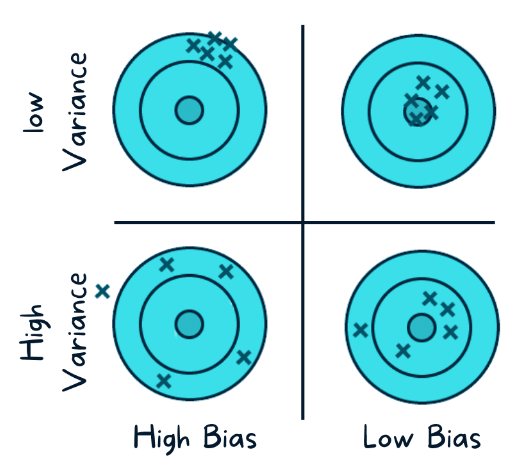
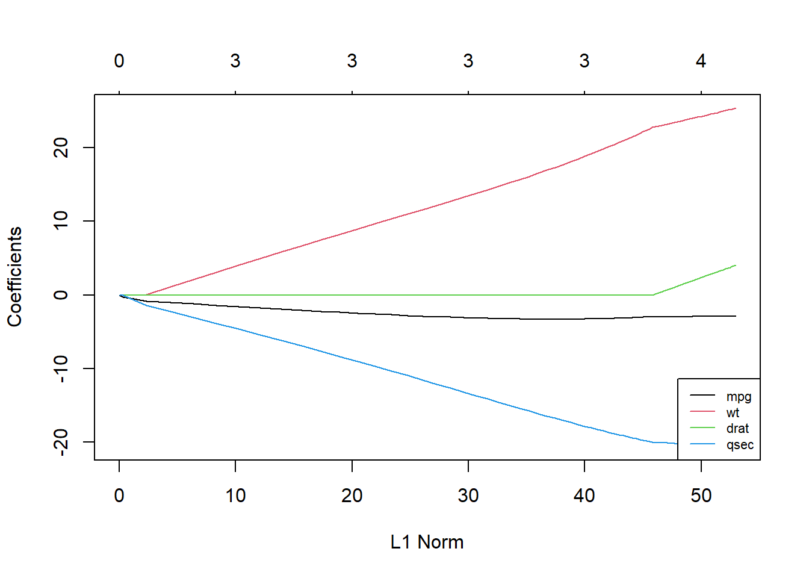

```r
pacman::p_load(datasets, tidyverse, explore, glmnet)
```

# Regularized regression

I kapittelet om regresjonsanalyse (ikke medregnet logistisk regresjon) har vi brukt minste kvadratsums metode ("Ordinary Least Squares"). Dersom vi har mange forklaringsvariabler i forhold til antall observasjoner eller stor korrelasjon mellom forklaringsvariablene (multikolinearitet) kan det være aktuelt å bruke alternative metoder fordi minste kvadratsums metode vil medføre stor varians i estimatorene. @projectproHowCreateOptimize2021 beskriver dette slik:

"The subset selection methods use ordinary least squares to fit a linear model that contains a subset of the predictors. As an alternative, we can fit a model containing all p predictors using a technique that constrains or regularizes the coefficient estimates, or equivalently, that shrinks the coefficient estimates towards zero. This shrinkage is also known as regularisation."

I OLS-regresjon ("Ordinary Least Squares") - der vi altså søker å predikere gjennom en kombinasjon av prediktorer (uavhengige variabler) (og forutsetter normalfordelte feilledd). Vi estimerer parametrene fra et utvalg siden vi ikke kjenner populasjonens "ekte" parametere gjennom å minimalisere de kvadrerte residualene (jfr kapittel om lineær regresjon). De estimerte koeffisientene kan være skjeve/"feil" på to måter: bias og varians. Variansen er et mål på usikkerheten i estimatene gjennom spredningen. Bias er forskjellen mellom populasjonenens sanne parameter og den forventede parameteren. @aryaBiasVarianceTradeoff2022 illustrerer dette slik:



Vi ønsker selvsagt at både varians og bias skal være så liten som mulig siden det vil gi oss gode prediksjoner, men like selvsagt er det at det åpenbart varierer. En OLS-estimator er "unbiased", men kan ha en stor varians - spesielt ved multikolinearitet og et høyt antall uavhengige variabler. Det regularized regression søker å gjøre er å redusere variansen, med den implisitte effekten at bias økes noe. Vi kan se på forholdet mellom bias, varians og modellkompleksitet slik:

{width=85%}

Ettersom modellens kompleksitet øker reduseres bias (fordi vi antar at våre estimater vil ligge nærmere populasjonens sanne verdi med økt antall variabler). Regularisering er altså et forsøk på å finne det optimale punketet der bias og varians tilsammen gir lavest mulig total feil. 

Regularisering innebærer dermed at man legger begrensninger på ikke-betydningsfulle regresjonskoeffiseinter mot 0. Hensikten med dette er bl.a. lettere tolkbare resultater (for L2/lasso - L1/ridge gir ikke denne effekten). Hovedhensikten er også å gjøre modellen mer generaliserbar fordi effekten av ikke-betydningsfulle prediktorer reduseres (ved at koeffisientene til disse reduseres mot 0 eller fjernes). Det primære anvendelsesområdet kan derfor sies å være tilfeller der vi har komplekse modeller - modeller med mange variabler. En effekt - som vi ikke går nærmere inn på her - er også at metodene er raskere enn mange alternativer ved svært store datasett. Dette kan være spesielt interessant i maskinlæringstilfeller. En siste effekt vi kan nevne her er at disse metodene vil fungere også når antallet prediktorer er høyere enn antall observasjoner - noe som er problematisk i andre regresjonsmetoder.

Ofte snakker man om tre metoder for såkalt "Regularized Regression":

1. Ridge regression - også kalt L2-regresjon - søker å minimere koeffisientenes kvadratsum. L2 vil påvirke store koeffisienter mer enn små, siden de koeffisientene som er små/nærme 0 ikke vil reduseres relativt sett like mye som større koeffisienter. Man får dermed en modell med flere koeffisienter nærme 0 (men ikke 0). Ridge/L2 vil normalt fungere bedre enn L1 dersom vi har et stort antall uavhengige variabler som alle bidrar i mdoellen (få/ingen prediktorer som har vesentlig høyere påvirkning enn øvrige prediktorer). 

2. Lasso regression ("Least Absolute Shrinkage and Selection Operator") - også kalt L1-regresjon - søker å minimere den absolutte verdien av regresjonskoeffisientene. L1 vil altså redusere noen koeffisienter til 0 (eller i praksis eksludere dem fra modellen), noe som i realiteten er en implisitt varaibelseleksjon. L1 - lasso regression - er dermed egnet dersom man f.eks. i en eksplorerende analyse ønsker å foreta et utvalg blant mange variabler. Lasso regresjon/L1 vil gi bedre resultater/bedre prediktiv evne enn ridge/L2 dersom man har relativt få uavhengige variabler som er gode prediktorer og øvrige uavhengige variabler ikke har stor påvirkning.

3. Elastic-Net regression - er en kombinasjon av ridge og lasso.

I disse tilnærmingene tilfører vi en "shrinkage" på koeffisientene gjennom en straffeparameter som som regel bete3gnes $\lambda$ (lambda). Jo større $\lambda$-verdien er, jo mer reduserer vi koeffisientene. Som vi vil vise under kan vi teste for hva den optimale $\lambda$-verdien er, f.eks. gjennom kryssvalidering (som vi omtaler mer i detalj andre steder i boka). 

## Ridge regresjon

En av disse er "ridge regression" [@hoerlRidgeRegressionApplications1970; @hoerlRidgeRegressionBiased1970]. Vi tenker det er i overkant teknisk å gå inn i utregning (se f.eks. [her](https://www.publichealth.columbia.edu/research/population-health-methods/ridge-regression) for en rimelig bra forklaring (på engelsk), men poenget er å få estimatorer som er mer "korrekt" under de betingelsene som er nevnt over. Ridge regresjon utvider lineær regresjon ved å ta hensyn til kompleksiteten i modellen ved å introdusere en "straffeparameter" ("penalty parameter") som utgjøres av den kvadrerte størrelsen av koeffisientene.   

For å illustrere dette bruker vi et eksempel fra @zachLassoRegressionStepbyStep2020 og et innebygd og ofte brukt datasett i R ("mtcars"). Den avhengige variabelen er "hp" ("gross horsepower"), og "mpg" ("Miles pr gallon"), "wt" ("weight"), "drat" ("Rear axle ratio") og "qsec" ("1/4 mile time") som de uavhengige variablene. 
Den avhengige variabelen er da:


```r
y <- data.matrix(mtcars$hp)
head(y)
#>      [,1]
#> [1,]  110
#> [2,]  110
#> [3,]   93
#> [4,]  110
#> [5,]  175
#> [6,]  105
```

Og de uavhengige variablene:


```r
x <- data.matrix(mtcars[, c('mpg', 'wt', 'drat', 'qsec')])
x
#>                      mpg    wt drat  qsec
#> Mazda RX4           21.0 2.620 3.90 16.46
#> Mazda RX4 Wag       21.0 2.875 3.90 17.02
#> Datsun 710          22.8 2.320 3.85 18.61
#> Hornet 4 Drive      21.4 3.215 3.08 19.44
#> Hornet Sportabout   18.7 3.440 3.15 17.02
#> Valiant             18.1 3.460 2.76 20.22
#> Duster 360          14.3 3.570 3.21 15.84
#> Merc 240D           24.4 3.190 3.69 20.00
#> Merc 230            22.8 3.150 3.92 22.90
#> Merc 280            19.2 3.440 3.92 18.30
#> Merc 280C           17.8 3.440 3.92 18.90
#> Merc 450SE          16.4 4.070 3.07 17.40
#> Merc 450SL          17.3 3.730 3.07 17.60
#> Merc 450SLC         15.2 3.780 3.07 18.00
#> Cadillac Fleetwood  10.4 5.250 2.93 17.98
#> Lincoln Continental 10.4 5.424 3.00 17.82
#> Chrysler Imperial   14.7 5.345 3.23 17.42
#> Fiat 128            32.4 2.200 4.08 19.47
#> Honda Civic         30.4 1.615 4.93 18.52
#> Toyota Corolla      33.9 1.835 4.22 19.90
#> Toyota Corona       21.5 2.465 3.70 20.01
#> Dodge Challenger    15.5 3.520 2.76 16.87
#> AMC Javelin         15.2 3.435 3.15 17.30
#> Camaro Z28          13.3 3.840 3.73 15.41
#> Pontiac Firebird    19.2 3.845 3.08 17.05
#> Fiat X1-9           27.3 1.935 4.08 18.90
#> Porsche 914-2       26.0 2.140 4.43 16.70
#> Lotus Europa        30.4 1.513 3.77 16.90
#> Ford Pantera L      15.8 3.170 4.22 14.50
#> Ferrari Dino        19.7 2.770 3.62 15.50
#> Maserati Bora       15.0 3.570 3.54 14.60
#> Volvo 142E          21.4 2.780 4.11 18.60
```

Modellen blir da:


```r
ridgemodell <- glmnet(x, y, alpha = 0)
summary(ridgemodell)
#>           Length Class     Mode   
#> a0        100    -none-    numeric
#> beta      400    dgCMatrix S4     
#> df        100    -none-    numeric
#> dim         2    -none-    numeric
#> lambda    100    -none-    numeric
#> dev.ratio 100    -none-    numeric
#> nulldev     1    -none-    numeric
#> npasses     1    -none-    numeric
#> jerr        1    -none-    numeric
#> offset      1    -none-    logical
#> call        4    -none-    call   
#> nobs        1    -none-    numeric
```

Vi kan legge merke til at i koden velger vi alpha = 0. Glmnet = 0 gir ridge regresjon, alpha = 1 gir lasso regresjon, og alpha mellom 0 og 1 gir elastic-net regresjon. Vi kan også merke også at disse typene regresjon forutsetter standardisering, men dette ivaretar glmnet for oss.
Vi kommenterer ikke modellen på dette stadiet. Neste steg blir å velge en såkalt lambdaverdi ($\lambda$) som gir lavest MSE (Mean Square Error). Dette gjør vi gjennom en kryssvalidering ("cv.glmnet" som default velger k=10 folds). 


```r
cv_ridgemodell <- cv.glmnet(x, y, alpha = 0)
beste_lambda_ridge <- cv_ridgemodell$lambda.min
beste_lambda_ridge
#> [1] 11.02511
plot(cv_ridgemodell)
```


Vi kan da optimalisere modellen gjennom den identifiserte beste $\lambda$.


```r
beste_modell <- glmnet(x, y, alpha = 0, lambda = beste_lambda_ridge)
coef(beste_modell)
#> 5 x 1 sparse Matrix of class "dgCMatrix"
#>                     s0
#> (Intercept) 473.959381
#> mpg          -3.296526
#> wt           19.125705
#> drat         -1.624337
#> qsec        -17.745374
```

Et interessant plott er et "trace-plott" som viser hvordan koeffisientene endrer seg som følge av endret lamda-verdi:


```r
plot(ridgemodell, xvar = "lambda")
legend("bottomright", lwd = 1, col = 1:6, legend = colnames(x), cex = .7)
```


Til slutt kan vi se på $R^2$ for beste modell:


```r
y_prediksjon <- predict(ridgemodell, s = beste_lambda_ridge, newx = x)
sst <- sum((y - mean(y))^2)
sse <- sum((y_prediksjon - y)^2)
rsq <- 1 - sse/sst
rsq
#> [1] 0.7987884
```

Beste modell kan dermed forklare 79.9 % av variansen i den avhengige variabelen.

## Lasso regression

Vi fortsetter med eksempelet ovenfor, og som nevnt kan vi endre alpha-verdien fra 0 til 1 for å skifte fra ridge regresjon til lasso regresjon.


```r
lassomodell <- glmnet(x, y, alpha = 1)
summary(lassomodell)
#>           Length Class     Mode   
#> a0         64    -none-    numeric
#> beta      256    dgCMatrix S4     
#> df         64    -none-    numeric
#> dim         2    -none-    numeric
#> lambda     64    -none-    numeric
#> dev.ratio  64    -none-    numeric
#> nulldev     1    -none-    numeric
#> npasses     1    -none-    numeric
#> jerr        1    -none-    numeric
#> offset      1    -none-    logical
#> call        4    -none-    call   
#> nobs        1    -none-    numeric
```

Identifisering av optimal lambda:


```r
cv_lassomodell <- cv.glmnet(x, y, alpha = 1)
beste_lambda_lasso <- cv_lassomodell$lambda.min
beste_lambda_lasso
#> [1] 3.527229
plot(cv_lassomodell)
```


```r
plot(lassomodell)
legend("bottomright", lwd = 1, col = 1:6, legend = colnames(x), cex = .7)
```


```r
beste_lassomodell <- glmnet(x, y, alpha = 1, lambda = beste_lambda_lasso)
coef(beste_lassomodell)
#> 5 x 1 sparse Matrix of class "dgCMatrix"
#>                     s0
#> (Intercept) 480.781860
#> mpg          -3.036576
#> wt           20.223703
#> drat          .       
#> qsec        -18.945436
```

Her kan vi se at lassoregresjonen har redusert koeffisienten til "drat" til 0 (variabelen er dermed ikke i beste modell). Lassoregresjon kan altså redusere variablers koeffisienter **til** 0, mens ridgeregresjon reduserer kan redusere koeffisientene **mot** 0. 

Vi kan til slutt se på $R^2$ for beste modell:


```r
y_prediksjon2 <- predict(lassomodell, s = beste_lambda_lasso, newx = x)
sst2 <- sum((y - mean(y))^2)
sse2 <- sum((y_prediksjon2 - y)^2)
rsq2 <- 1 - sse2/sst2
rsq2
#> [1] 0.801801
```

Beste modell kan dermed forklare 80.2 % av variansen i den avhengige variabelen.

## Elastic-net regresjon


```r
en_modell <- glmnet(x, y, alpha = 0.3)
summary(en_modell)
#>           Length Class     Mode   
#> a0         69    -none-    numeric
#> beta      276    dgCMatrix S4     
#> df         69    -none-    numeric
#> dim         2    -none-    numeric
#> lambda     69    -none-    numeric
#> dev.ratio  69    -none-    numeric
#> nulldev     1    -none-    numeric
#> npasses     1    -none-    numeric
#> jerr        1    -none-    numeric
#> offset      1    -none-    logical
#> call        4    -none-    call   
#> nobs        1    -none-    numeric
```

Identifisering av optimal lambda:


```r
cv_en_modell <- cv.glmnet(x, y, alpha = 0.3)
beste_lambda_en <- cv_en_modell$lambda.min
beste_lambda_en
#> [1] 4.637372
plot(cv_en_modell)
```


```r
plot(en_modell)
legend("bottomright", lwd = 1, col = 1:6, legend = colnames(x), cex = .7)
```




```r
beste_en_modell <- glmnet(x, y, alpha = 0.3, lambda = beste_lambda_en)
coef(beste_en_modell)
#> 5 x 1 sparse Matrix of class "dgCMatrix"
#>                     s0
#> (Intercept) 482.820989
#> mpg          -3.158214
#> wt           20.768802
#> drat          .       
#> qsec        -19.021020
```


```r
y_prediksjon3 <- predict(en_modell, s = beste_lambda_en, newx = x)
sst3 <- sum((y - mean(y))^2)
sse3 <- sum((y_prediksjon3 - y)^2)
rsq3 <- 1 - sse3/sst3
rsq3
#> [1] 0.8035875
```

Beste modell kan dermed forklare 80.4 % av variansen i den avhengige variabelen.

## Ridge vs Lasso vs Elastic-net

Vi kan sammenblikne $R^2$ for de tre teknikkene:

```r
rsq4 <- cbind("R-squared" = c(rsq, rsq2, rsq3))
rownames(rsq4) <- c("Ridge regression", "Lasso regression", "Elastic-net")
print(rsq4)
#>                  R-squared
#> Ridge regression 0.7987884
#> Lasso regression 0.8018010
#> Elastic-net      0.8035875
```

De gir realtivt like $R^2$-verdier. Som tidligere nevnt kan man ikke si at den ene er generelt bedre enn de andre. De lar oss håndtere multikolinearitet, og lasso kan fungere som teknikk for å redusere antall variabler (ridge kan ikke det). 


