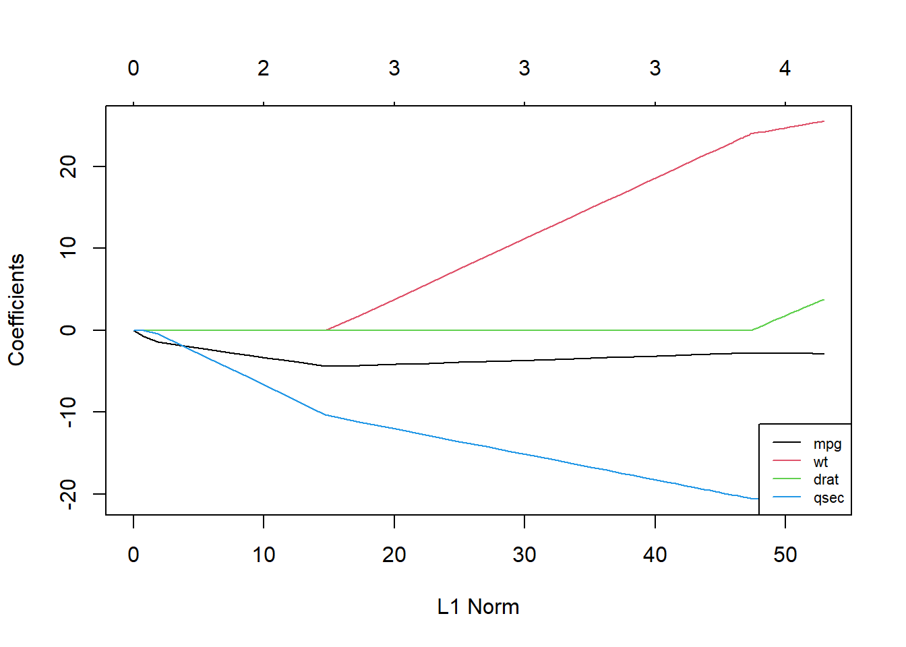

# Polynomisk regresjon

R-pakker brukt i dette kapittelet:


```r
pacman::p_load(tidyverse, readxl)
```

Anta at vi har lønnsdata fra en bedrift som har regnet ut snittlønn for de 10 stillingskategoriene de har av ansatte. 


```r
polydata <- read_excel("polydata.xlsx")
```

`<a href="data:application/vnd.openxmlformats-officedocument.spreadsheetml.sheet;base64,UEsDBBQABgAIAAAAIQBi7p1oXgEAAJAEAAATAAgCW0NvbnRlbnRfVHlwZXNdLnhtbCCiBAIooAACAAAAAAAAAAAAAAAAAAAAAAAAAAAAAAAAAAAAAAAAAAAAAAAAAAAAAAAAAAAAAAAAAAAAAAAAAAAAAAAAAAAAAAAAAAAAAAAAAAAAAAAAAAAAAAAAAAAAAAAAAAAAAAAAAAAAAAAAAAAAAAAAAAAAAAAAAAAAAAAAAAAAAAAAAAAAAAAAAAAAAAAAAAAAAAAAAAAAAAAAAAAAAAAAAAAAAAAAAAAAAAAAAAAAAAAAAAAAAAAAAAAAAAAAAAAAAAAAAAAAAAAAAAAAAAAAAAAAAAAAAAAAAAAAAAAAAAAAAAAAAAAAAAAAAAAAAAAAAAAAAAAAAAAAAAAAAAAAAAAAAAAAAAAAAAAAAAAAAAAAAAAAAAAAAAAAAAAAAAAAAAAAAAAAAAAAAAAAAAAAAAAAAAAAAAAAAAAAAAAAAAAAAAAAAAAAAAAAAAAAAAAAAAAAAAAAAAAAAAAAAAAAAAAAAAAAAAAAAAAAAAAAAAAAAAAAAAAAAAAAAAAAAAAAAAAAAAAAAAAAAAAAAAAAAAAAAAAAAAAAAAAAAAAAAAAAAAAAAAAAAAAAAAAAAAAAAAAAAAAAAAAAAAAAAAAAAAAAAAAAAAAAAAAAAAAAAAAAAAAAAAAAAAAAAAAAAAAAAAAAAAAAAAAAAAAAAAAAAAAAAAAAAAAAAAAAAAAAAAAAAACslMtOwzAQRfdI/EPkLUrcskAINe2CxxIqUT7AxJPGqmNbnmlp/56J+xBCoRVqN7ESz9x7MvHNaLJubbaCiMa7UgyLgcjAVV4bNy/Fx+wlvxcZknJaWe+gFBtAMRlfX41mmwCYcbfDUjRE4UFKrBpoFRY+gOOd2sdWEd/GuQyqWqg5yNvB4E5W3hE4yqnTEOPRE9RqaSl7XvPjLUkEiyJ73BZ2XqVQIVhTKWJSuXL6l0u+cyi4M9VgYwLeMIaQvQ7dzt8Gu743Hk00GrKpivSqWsaQayu/fFx8er8ojov0UPq6NhVoXy1bnkCBIYLS2ABQa4u0Fq0ybs99xD8Vo0zL8MIg3fsl4RMcxN8bZLqej5BkThgibSzgpceeRE85NyqCfqfIybg4wE/tYxx8bqbRB+QERfj/FPYR6brzwEIQycAhJH2H7eDI6Tt77NDlW4Pu8ZbpfzL+BgAA//8DAFBLAwQUAAYACAAAACEAtVUwI/QAAABMAgAACwAIAl9yZWxzLy5yZWxzIKIEAiigAAIAAAAAAAAAAAAAAAAAAAAAAAAAAAAAAAAAAAAAAAAAAAAAAAAAAAAAAAAAAAAAAAAAAAAAAAAAAAAAAAAAAAAAAAAAAAAAAAAAAAAAAAAAAAAAAAAAAAAAAAAAAAAAAAAAAAAAAAAAAAAAAAAAAAAAAAAAAAAAAAAAAAAAAAAAAAAAAAAAAAAAAAAAAAAAAAAAAAAAAAAAAAAAAAAAAAAAAAAAAAAAAAAAAAAAAAAAAAAAAAAAAAAAAAAAAAAAAAAAAAAAAAAAAAAAAAAAAAAAAAAAAAAAAAAAAAAAAAAAAAAAAAAAAAAAAAAAAAAAAAAAAAAAAAAAAAAAAAAAAAAAAAAAAAAAAAAAAAAAAAAAAAAAAAAAAAAAAAAAAAAAAAAAAAAAAAAAAAAAAAAAAAAAAAAAAAAAAAAAAAAAAAAAAAAAAAAAAAAAAAAAAAAAAAAAAAAAAAAAAAAAAAAAAAAAAAAAAAAAAAAAAAAAAAAAAAAAAAAAAAAAAAAAAAAAAAAAAAAAAAAAAAAAAAAAAAAAAAAAAAAAAAAAAAAAAAAAAAAAAAAAAAAAAAAAAAAAAAAAAAAAAAAAAAAAAAAAAAAAAAAAAAAAAAAAAAAAAAAAAAAAAAAAAAAAAAAAAAAAAAAAAAAAAAAAAAAAAAAAAAAAAAAAAAAAAAAAAAAAAAAAAKySTU/DMAyG70j8h8j31d2QEEJLd0FIuyFUfoBJ3A+1jaMkG92/JxwQVBqDA0d/vX78ytvdPI3qyCH24jSsixIUOyO2d62Gl/pxdQcqJnKWRnGs4cQRdtX11faZR0p5KHa9jyqruKihS8nfI0bT8USxEM8uVxoJE6UchhY9mYFaxk1Z3mL4rgHVQlPtrYawtzeg6pPPm3/XlqbpDT+IOUzs0pkVyHNiZ9mufMhsIfX5GlVTaDlpsGKecjoieV9kbMDzRJu/E/18LU6cyFIiNBL4Ms9HxyWg9X9atDTxy515xDcJw6vI8MmCix+o3gEAAP//AwBQSwMEFAAGAAgAAAAhAN/90CipAwAA2QgAAA8AAAB4bC93b3JrYm9vay54bWysVWtvozgU/b7S/gfEdwrmDWo64hG01bajqpNpP0YuOIkVsFljmlTV/Pe5hpC2m9Uq21kpAT8uh3PvPcdcftk3tfZMREc5m+nowtI1wkpeUbae6d8XhRHqWicxq3DNGZnpL6TTv1z9/tvljovtE+dbDQBYN9M3UraxaXblhjS4u+AtYbCz4qLBEqZibXatILjqNoTIpjZty/LNBlOmjwixOAeDr1a0JDkv+4YwOYIIUmMJ9LsNbbsJrSnPgWuw2PatUfKmBYgnWlP5MoDqWlPG12vGBX6qIe098rS9gJ8Pf2TBxZ7eBFsnr2poKXjHV/ICoM2R9En+yDIR+lCC/WkNzkNyTUGeqerhkZXwP8nKP2L5b2DI+mU0BNIatBJD8T6J5h252frV5YrW5GGUrobb9ituVKdqXatxJ+cVlaSa6QFM+Y58WBB9m/a0hl3bcxxLN6+Ocr4TWkVWuK/lAoQ8wYMzfD+yPRUJwkhqSQTDkmScSdDhIa9f1dyAnW04KFy7J3/1VBAwFugLcoUrLmP81N1hudF6UY8V7MByPWWsBocSaTQvF90GC9JyykbttVAfznBtMlp3y+0zrZ8xWy/hkSXj5mSkDkbbwVJEmN8BSoCaGJwBZvJn4pjvpI5PffUfxI5LVUETSjimOY7/Xk7IVsSToO+k0GB8nd9AU7/hZ2gx0rXqcAJcQw/D5atvZe7cCQvD9TPfcCPHM8IgD4xk7nh5UKS+jZIfkIXw45LjXm4OslGYM90FjZxs3eL9tIOsuKfV2/tfg8LOCuTNDdcLE8MNA98IvdQ2/DT08yJKw8QvfqhM1QH5QMmuexOYmmr7R8oqvpvpBrLBFi8fp7th85FWcgMKjSwXQsa1Pwhdb4AxCny1CEZSzGb6a2AXbp4EkeFZLlQhyxwjzOzEyIqwmCdOihzPHhiZ7ygNRzFQG+4aG+yTiC2Ud1hRtYWxiNUbxHWFht5ND5W4LsEs6jYERsiyIxVB9vKmk8MddEqBHHKtJLAi17CgHVCuyDZC17GNzM3tuRfM83nqqe6oD0n8fxyng13i6QulWIIp5ELgcguavierFHeDjpQYge97sqkXppYDFN0CQSVRZBlp6ruGlxeOF6A8m3vQ24msSn/1ycMsNIenCZY9GF15fJjH6locVo+Lq3Hh0KUPlovvc1X3w9P/FvgNsq/JmcHFw5mB2dfbxe2ZsTfzxfKxODc4uU3z5BBv/mN1xu6p66A5c+r51U8AAAD//wMAUEsDBBQABgAIAAAAIQCBPpSX8wAAALoCAAAaAAgBeGwvX3JlbHMvd29ya2Jvb2sueG1sLnJlbHMgogQBKKAAAQAAAAAAAAAAAAAAAAAAAAAAAAAAAAAAAAAAAAAAAAAAAAAAAAAAAAAAAAAAAAAAAAAAAAAAAAAAAAAAAAAAAAAAAAAAAAAAAAAAAAAAAAAAAAAAAAAAAAAAAAAAAAAAAAAAAAAAAAAAAAAAAAAAAAAAAAAAAAAAAAAAAAAAAAAAAAAAAAAAAAAAAAAAAAAAAAAAAAAAAAAAAAAAAAAAAAAAAAAAAAAAAAAAAAAAAAAAAAAAAAAAAAAAAAAAAAAAAAAAAAAAAAAAAAAAAAAAAAAAAAAAAAAAAAAAAAAAAAAAAAAAAAAAAAAAAAAAAAAAAAAAAAAAAAAAAAAAAAAAAACsUk1LxDAQvQv+hzB3m3YVEdl0LyLsVesPCMm0KdsmITN+9N8bKrpdWNZLLwNvhnnvzcd29zUO4gMT9cErqIoSBHoTbO87BW/N880DCGLtrR6CRwUTEuzq66vtCw6acxO5PpLILJ4UOOb4KCUZh6OmIkT0udKGNGrOMHUyanPQHcpNWd7LtOSA+oRT7K2CtLe3IJopZuX/uUPb9gafgnkf0fMZCUk8DXkA0ejUISv4wUX2CPK8/GZNec5rwaP6DOUcq0seqjU9fIZ0IIfIRx9/KZJz5aKZu1Xv4XRC+8opv9vyLMv072bkycfV3wAAAP//AwBQSwMEFAAGAAgAAAAhAOr65xVOAwAAYwkAABgAAAB4bC93b3Jrc2hlZXRzL3NoZWV0MS54bWyck8lu2zAQhu8F+g4E71ptyYphOajlGM2t6HqmqZFFmBRVkt5Q9N0zlGPHQC5GAC2j0ej7Z8Sfs8ejkmQPxgrdlTQJY0qg47oW3aakv36ugoIS61hXM6k7KOkJLH2cf/40O2iztS2AI0jobElb5/ppFFnegmI21D10+KbRRjGHj2YT2d4Aq4ePlIzSOM4jxURHz4SpuYehm0ZwWGq+U9C5M8SAZA77t63o7YWm+D04xcx21wdcqx4RayGFOw1QShSfPm86bdha4tzHZMw4ORo8UjxHF5kh/05JCW601Y0LkRyde34//kP0EDF+Jb2f/y5MMo4M7IVfwDdU+rGWkuzKSt9gow/C8ivM/y4z3Ym6pP/yfPk0qiZVsIzTKhg/ZUWwyFaLICvyOK8mi+VqVP2n81ktcIX9VMRAU9IvyXSRJDSazwYD/RZwsDcxcWz9AyRwByiSUOL9udZ66wufMRUj0g4FHsm4E3uoQMqSVogl9u+g4mOUiK4at/FFbzV4+psha2ah0vKPqF2Lorh3amjYTrrv+vAVxKZ1mM1wdm+eaX1aguXoWmwmTDOvw7VEKF6JEn77oevY8dz+KzMLx2k2KRKsx3148lbEKr6zTquL7ivpzMB1Gxh4P1z6CossG+fF5JbhpxzkXwAAAP//AAAA//+U1NEKgjAUBuBXkT1AbnOaxhSKXkRM6KrCidXbtyMdXScWnTvx//XbgW3Wnft+PLZj29jhek+GWiiRuFt7cf5pp0XyUKbtdqfnsXddfxlrITc6F43toLuH8vyJD5x/OzXSplNj0+7dOHw31NJIPbm43vrfhTK4IK7/m9d0CLMsl3Jd0YeXcTwoo6fJhGFmVNQzHA/K6GXECzNTRr2c40EZPUO8MCuyqFdwPCijlxMvzMr4fFuOB2X0CuKFmdJ+vsiGKTkglBHcEjDMVBHfoRUHhDKCJQHDTIMXmVBJjji3kazosYdfLTvqxzFUvPsGr5P54H/dNZ8pDEonTdcL7wUAAP//AAAA//+yKUhMT/VNLErPzCtWyElNK7FVMtAzV1IoykzPgLFL8gvAoqZKCkn5JSX5uTBeRmpiSmoRiGespJCWn18C4+jb2eiX5xdlF2ekppbYAQAAAP//AwBQSwMEFAAGAAgAAAAhADaADYZSBwAAxSAAABMAAAB4bC90aGVtZS90aGVtZTEueG1s7FnNixs3FL8X+j8Mc3f8NeOPJd7gz2yT3SRknZQctbbsUVYzMpK8GxMCJTn1UiikpZdCbz2U0kADDb30jwkktOkf0SfN2COt5SSbbEpadg2LR/69p6f3nn5683Tx0r2YekeYC8KSll++UPI9nIzYmCTTln9rOCg0fE9IlIwRZQlu+Qss/Evbn35yEW3JCMfYA/lEbKGWH0k52yoWxQiGkbjAZjiB3yaMx0jCI58Wxxwdg96YFiulUq0YI5L4XoJiUHt9MiEjXJAg6m8vdfcpTJBIoQZGlO8rzdgS0NjxYVkhxEJ0KfeOEG35MM2YHQ/xPel7FAkJP7T8kv7zi9sXi2grE6Jyg6whN9B/mVwmMD6s6Dn59GA1aRCEQa290q8BVK7j+vV+rV9b6dMANBrBSlNbbJ31SjfIsAYo/erQ3av3qmULb+ivrtncDtXHwmtQqj9Yww8GXfCihdegFB+u4cNOs9Oz9WtQiq+t4euldi+oW/o1KKIkOVxDl8Jatbtc7QoyYXTHCW+GwaBeyZTnKMiGVXapKSYskZtyLUZ3GR8AQAEpkiTx5GKGJ2gESdxFlBxw4u2SaQSJN0MJEzBcqpQGpSr8V59Af9MRRVsYGdLKLrBErA0pezwx4mQmW/4V0OobkBfPnj1/+PT5w9+eP3r0/OEv2dxalSW3g5KpKffqx6///v4L769ff3j1+Jt06pN4YeJf/vzly9//eJ16WHHuihffPnn59MmL777686fHDu1tjg5M+JDEWHjX8LF3k8WwQIf9+ICfTmIYIWJJoAh0O1T3ZWQBry0QdeE62HbhbQ4s4wJent+1bN2P+FwSx8xXo9gC7jFGO4w7HXBVzWV4eDhPpu7J+dzE3UToyDV3FyVWgPvzGdArcansRtgy8wZFiURTnGDpqd/YIcaO1d0hxPLrHhlxJthEeneI10HE6ZIhObASKRfaITHEZeEyEEJt+Wbvttdh1LXqHj6ykbAtEHUYP8TUcuNlNJcodqkcopiaDt9FMnIZub/gIxPXFxIiPcWUef0xFsIlc53Deo2gXwWGcYd9jy5iG8klOXTp3EWMmcgeO+xGKJ45bSZJZGI/E4eQosi7waQLvsfsHaKeIQ4o2Rju2wRb4X4zEdwCcjVNyhNE/TLnjlhexszejws6QdjFMm0eW+za5sSZHZ351ErtXYwpOkZjjL1bnzks6LCZ5fPc6CsRsMoOdiXWFWTnqnpOsMCermvWKXKXCCtl9/GUbbBnb3GCeBYoiRHfpPkaRN1KXTjlnFR6nY4OTeA1AtUf5IvTKdcF6DCSu79J640IWWeXehbufF1wK35vs8dgX9497b4EGXxqGSD2t/bNEFFrgjxhhggKDBfdgogV/lxEnatabO6Um9ibNg8DFEZWvROT5I3Fz4myJ/x3yh53AXMGBY9b8fuUOpsoZedEgbMJ9x8sa3pontzAcJKsc9Z5VXNe1fj/+6pm014+r2XOa5nzWsb19vVBapm8fIHKJu/y6J5PvLHlMyGU7ssFxbtCd30EvNGMBzCo21G6J7lqAc4i+Jo1mCzclCMt43EmPycy2o/QDFpDZd3AnIpM9VR4MyagY6SHdScVn9Ct+07zeI+N005nuay6mqkLBZL5eClcjUOXSqboWj3v3q3U637oVHdZlwYo2dMYYUxmG1F1GFFfDkIUXmeEXtmZWNF0WNFQ6pehWkZx5QowbRUVeOX24EW95YdB2kGGZhyU52MVp7SZvIyuCs6ZRnqTM6mZAVBiLzMgj3RT2bpxeWp1aaq9RaQtI4x0s40w0jCCF+EsO82W+1nGupmH1DJPuWK5G3Iz6o0PEWtFIie4gSYmU9DEO275tWoIlyojNGv5E+gYw9d4Brkj1FsXolO4dRlJnm74d2GWGReyh0SUOlyTTsoGMZGYe5TELV8tf5UNNNEcom0rV4AQPlrjmkArH5txEHQ7yHgywSNpht0YUZ5OH4HhU65w/qrF3x2sJNkcwr0fjY+9AzrnNxGkWFgvKweOiYCLg3LqzTGBm7AVkeX5d+JgymjXvIrSOZSOIzqLUHaimGSewjWJrszRTysfGE/ZmsGh6y48mKoD9r1P3Tcf1cpzBmnmZ6bFKurUdJPphzvkDavyQ9SyKqVu/U4tcq5rLrkOEtV5Srzh1H2LA8EwLZ/MMk1ZvE7DirOzUdu0MywIDE/UNvhtdUY4PfGuJz/IncxadUAs60qd+PrG3LzVZgd3gTx6cH84p1LoUMKdNUdQ9KU3kCltwBa5J7MaEb55c05a/v1S2A66lbBbKDXCfiGoBqVCI2xXC+0wrJb7YbnU61QewMEio7gcprf1A7jCoIvszl6Pr93bx8tbmgsjFheZvpcvasP1vX254ri394bqZt73CJDO/Vpl0Kw2O7VCs9oeFIJep1FodmudQq/WrfcGvW7YaA4e+N6RBgftajeo9RuFWrnbLQS1kjK/0SzUg0qlHdTbjX7QfpCVMbDylD4yX4B7tV3b/wAAAP//AwBQSwMEFAAGAAgAAAAhAN6F1anOAgAAxwYAAA0AAAB4bC9zdHlsZXMueG1spFXbbtswDH0fsH8Q9O7KduMsCWwXTVMDBbZhQDtgr4otJ0J1MSQlczrs30fZTuKiwy7tSyxS1NEhD8WkV60UaM+M5VplOLoIMWKq1BVXmwx/fSiCGUbWUVVRoRXL8IFZfJW/f5dadxDsfsuYQwChbIa3zjULQmy5ZZLaC90wBTu1NpI6MM2G2MYwWll/SAoSh+GUSMoV7hEWsvwXEEnN464JSi0b6viaC+4OHRZGslzcbZQ2dC2AahtNaInaaGpi1JrjJZ33xT2Sl0ZbXbsLwCW6rnnJXtKdkzmh5RkJkF+HFCUkjJ/l3ppXIk2IYXvu5cN5WmvlLCr1TjkQE4j6Eiwelf6uCr/lnX1UntontKcCPBEmeVpqoQ1yIB1UrvMoKlkfcUMFXxvuw2oquTj07tg7OrWHOMmh9t5JPI/hY+EQF+LEKvYEwJGnIJ9jRhVgoGH9cGjgegWd1sN0cX+J3hh6iOJkdIB0F+bpWpsKOvtcj6MrTwWrHRA1fLP1X6cb+F1r50D9PK043WhFhU+lBzktIJ2SCXHvu/9b/Qy7rZHayUK6uyrD8I58EY5LSGRY9ni94fHHaD32CNYX6/9hUVuf8N9wGtGmEYdrwTdKsr6h8hRaoTfRVhv+BCn6Hiphn/XSt/WQFKQxqtWzSp1yRr7JMvzZzwgB7TrwRusdF46r31QJMKv2XPfQy+78e+8UOd0C5a9YTXfCPZw2M3xef2IV38n4FPWF77XrIDJ8Xn/07RFN/R2sdR8t9DR80c7wDP+4XX6Yr26LOJiFy1kwuWRJME+WqyCZ3CxXq2IexuHNz9HUecPM6YYkdEI0WVgBk8kMyQ4p3p99GR4ZPf3uYQDtMfd5PA2vkygMisswCiZTOgtm08skKJIoXk0ny9ukSEbck1fOppBEUT/lPPlk4bhkgqujVkeFxl4QCcw/JEGOSpDzP1D+CwAA//8DAFBLAwQUAAYACAAAACEAvzoLqawAAADaAAAAFAAAAHhsL3NoYXJlZFN0cmluZ3MueG1sRI5BCsIwEEX3gncIs9dUFyKSxIXgBdQDhHZsg8mkZqaitzeC4vLx/odn9s8U1QMLh0wWVssGFFKbu0C9hcv5uNiCYvHU+ZgJLbyQYe/mM8Msqn6JLQwi405rbgdMnpd5RKrmmkvyUrH0mseCvuMBUVLU66bZ6OQDgWrzRGJhDWqicJ/w8GNnODgj7iQhxhrDNy/Y5xKMFmf0R34HFERqG/2Frm3uDQAA//8DAFBLAwQUAAYACAAAACEA28pHF0oBAABrAgAAEQAIAWRvY1Byb3BzL2NvcmUueG1sIKIEASigAAEAAAAAAAAAAAAAAAAAAAAAAAAAAAAAAAAAAAAAAAAAAAAAAAAAAAAAAAAAAAAAAAAAAAAAAAAAAAAAAAAAAAAAAAAAAAAAAAAAAAAAAAAAAAAAAAAAAAAAAAAAAAAAAAAAAAAAAAAAAAAAAAAAAAAAAAAAAAAAAAAAAAAAAAAAAAAAAAAAAAAAAAAAAAAAAAAAAAAAAAAAAAAAAAAAAAAAAAAAAAAAAAAAAAAAAAAAAAAAAAAAAAAAAAAAAAAAAAAAAAAAAAAAAAAAAAAAAAAAAAAAAAAAAAAAAAAAAAAAAAAAAAAAAAAAAAAAAAAAAAAAAAAAAAAAAAAAAAAAAAAAjJJfT4MwFMXfTfwOpO+sBbKpDbBEzV78ExMxGt+a9o41QmnaOrZvb4EN0fngY3vO/fWcm6bLXV0FWzBWNipD0YygABRvhFRlhl6KVXiJAuuYEqxqFGRoDxYt8/OzlGvKGwNPptFgnAQbeJKylOsMbZzTFGPLN1AzO/MO5cV1Y2rm/NGUWDP+wUrAMSELXINjgjmGO2CoRyI6IAUfkfrTVD1AcAwV1KCcxdEswt9eB6a2fw70ysRZS7fXvtMh7pQt+CCO7p2Vo7Ft21mb9DF8/gi/Pdw/91VDqbpdcUB5KjjlBphrTP4oKxvcbWW1ZapM8UTptlgx6x78wtcSxPX+t/nU4Ml9kQEPIvDR6FDkqLwmN7fFCuUxieOQXIRkXsSEzhNK5u/d+z/mu6jDRX1I8Q9itCgiT1zQ5GpCPALyFJ98j/wLAAD//wMAUEsDBBQABgAIAAAAIQAEuKNihwEAAA0DAAAQAAgBZG9jUHJvcHMvYXBwLnhtbCCiBAEooAABAAAAAAAAAAAAAAAAAAAAAAAAAAAAAAAAAAAAAAAAAAAAAAAAAAAAAAAAAAAAAAAAAAAAAAAAAAAAAAAAAAAAAAAAAAAAAAAAAAAAAAAAAAAAAAAAAAAAAAAAAAAAAAAAAAAAAAAAAAAAAAAAAAAAAAAAAAAAAAAAAAAAAAAAAAAAAAAAAAAAAAAAAAAAAAAAAAAAAAAAAAAAAAAAAAAAAAAAAAAAAAAAAAAAAAAAAAAAAAAAAAAAAAAAAAAAAAAAAAAAAAAAAAAAAAAAAAAAAAAAAAAAAAAAAAAAAAAAAAAAAAAAAAAAAAAAAAAAAAAAAAAAAAAAAAAAAAAAAAAAAJySQW/bMAyF7wP2HwzdGzntUAyBrKJIO/SwosGS9s7JdCJElgSJNZL++tE2mjrdTruRfMTTpyepm0Prig5TtsFXYj4rRYHehNr6bSWeNz8uvosiE/gaXPBYiSNmcaO/flGrFCImspgLtvC5EjuiuJAymx22kGcse1aakFogbtNWhqaxBu+CeW3Rk7wsy2uJB0JfY30RT4ZidFx09L+mdTA9X37ZHCMDa3Ubo7MGiG+pH61JIYeGivuDQafkVFRMt0bzmiwddanktFVrAw6XbKwbcBmV/BioB4Q+tBXYlLXqaNGhoZCKbN84tktR/IaMPU4lOkgWPDFWvzY2Q+1ipqR/4dYjpL2SLI+joZxuTmv7Tc+HBS7OF3uDEYOFc8CNJYf5qVlBon/wzqe8A8NIO+Lcpv144pRuuC6f88l5GdoI/sjCqfpp/T4/x024A8L3KM+Har2DhDWnf4r6NFAPnGJyvclyB36L9fvO30L/8C/j79bz61l5VfKbTmZKfvxj/QcAAP//AwBQSwECLQAUAAYACAAAACEAYu6daF4BAACQBAAAEwAAAAAAAAAAAAAAAAAAAAAAW0NvbnRlbnRfVHlwZXNdLnhtbFBLAQItABQABgAIAAAAIQC1VTAj9AAAAEwCAAALAAAAAAAAAAAAAAAAAJcDAABfcmVscy8ucmVsc1BLAQItABQABgAIAAAAIQDf/dAoqQMAANkIAAAPAAAAAAAAAAAAAAAAALwGAAB4bC93b3JrYm9vay54bWxQSwECLQAUAAYACAAAACEAgT6Ul/MAAAC6AgAAGgAAAAAAAAAAAAAAAACSCgAAeGwvX3JlbHMvd29ya2Jvb2sueG1sLnJlbHNQSwECLQAUAAYACAAAACEA6vrnFU4DAABjCQAAGAAAAAAAAAAAAAAAAADFDAAAeGwvd29ya3NoZWV0cy9zaGVldDEueG1sUEsBAi0AFAAGAAgAAAAhADaADYZSBwAAxSAAABMAAAAAAAAAAAAAAAAASRAAAHhsL3RoZW1lL3RoZW1lMS54bWxQSwECLQAUAAYACAAAACEA3oXVqc4CAADHBgAADQAAAAAAAAAAAAAAAADMFwAAeGwvc3R5bGVzLnhtbFBLAQItABQABgAIAAAAIQC/OguprAAAANoAAAAUAAAAAAAAAAAAAAAAAMUaAAB4bC9zaGFyZWRTdHJpbmdzLnhtbFBLAQItABQABgAIAAAAIQDbykcXSgEAAGsCAAARAAAAAAAAAAAAAAAAAKMbAABkb2NQcm9wcy9jb3JlLnhtbFBLAQItABQABgAIAAAAIQAEuKNihwEAAA0DAAAQAAAAAAAAAAAAAAAAACQeAABkb2NQcm9wcy9hcHAueG1sUEsFBgAAAAAKAAoAgAIAAOEgAAAAAA==" download="polydata.xlsx">Download polydata.xlsx</a>`{=html}


```r
glimpse(polydata)
#> Rows: 10
#> Columns: 2
#> $ Stillingskategori <dbl> 1, 2, 3, 4, 5, 6, 7, 8, 9, 10
#> $ Snittlonn         <dbl> 35000, 41000, 48000, 63000, 8800…
```

Vi kan se på disse dataene og se en klar ikke-lineær trend:

```r
enkelOLS <- lm(Snittlonn ~ Stillingskategori, data = polydata)
ggplot() +
    geom_point(aes(x = polydata$Stillingskategori, y = polydata$Snittlonn), col = "red") +
    theme_bw() +
    xlab("Stillingskategori") +
    ylab("Gjennomsnittslonn") +
    labs(caption = "Ikke-linear forhold mellom stillingskategori og snittlonn")
```


Vi kunne kanskje ane dette ut fra dataene (og fordi det selvsagt er et eksempel der vanlig lineær regresjon ikke skal funke så bra...). Det synes i hvert fall klart at den lineære regresjonslinja sannsynligvis er en dårlig modell for lønnsdataene. 

Fra kapittelet om enkel, lineær regresjon vet vi at vi kan uttrykke regresjonslinja slik:

$y=\alpha + \beta x$

Vi kan videre uttrykke en multippel regresjon slik:

$y=\alpha + \beta_1x_1 + \beta_2x_2 +\ ...\ +\beta_nx_n$

En polynomisk regresjonslikning likner, men her introduserer vi "i n-te ledd":

$y=\alpha + \beta_1x_1 + \beta_2x_1^2+\ ...\ +\beta_nx_1^n$

Selv om dette sikkert er kjent er det greit å illustrere ulike n'te-ledd grafisk:


```r
funksjonsgrafer <- ggplot(data.frame(x = c(-5, 5)), aes(x = x)) + 
            stat_function(fun = function(x){x^4}, color="red", lwd = 1) +        
            stat_function(fun = function(x){x^3}, color="blue", lwd = 1) + 
            stat_function(fun = function(x){4*x^2}, color="orange", lwd = 1) +
            stat_function(fun = function(x){10*x}, color="purple", lwd = 1) +
            annotate(geom="text", label = "Quartic", x = -4, y = 200, size = 5) + 
            annotate(geom="text", label = "Quadratic", x = -4.6, y = 107, size =5) +
            annotate(geom="text", label = "Cubic", x = -3.8, y = -90, size =5) + 
            annotate(geom="text", label = "Linear", x = -4.6, y = -32, size =5) +
            geom_hline(yintercept=0) +
            geom_vline(xintercept=0) +
            ylim(-100, 200)
funksjonsgrafer
```


Imidlertid er vi sjeldent interessert i negative x-verdier i praktisk bruk (matematisk er det selvsagt interessant, men som sagt sjeldent i anvendt analyse som vi driver med). 

```r
funksjonsgrafer2 <- ggplot(data.frame(x = c(0, 5)), aes(x = x)) + 
            stat_function(fun = function(x){x^4}, color="red", lwd = 1) +        
            stat_function(fun = function(x){x^3}, color="blue", lwd = 1) + 
            stat_function(fun = function(x){4*x^2}, color="orange", lwd = 1) +
            stat_function(fun = function(x){10*x}, color="purple", lwd = 1) +
            annotate(geom="text", label = "Quartic", x = 4.2, y = 200, size = 5) + 
            annotate(geom="text", label = "Quadratic", x = 4.8, y = 75, size =5) +
            annotate(geom="text", label = "Cubic", x = 4.5, y = 120, size =5) + 
            annotate(geom="text", label = "Linear", x = 4.8, y = 40, size =5) +
            geom_hline(yintercept=0) +
            geom_vline(xintercept=0) +
            ylim(-100, 200) +
            xlim(0, 5)

funksjonsgrafer2
```


Vi skal nedenfor vise hvordan vi kan utvikle polynomisk regresjon, men det er på sin plass å komme med en liten advarsel. Vi kan, som nevnt, i prinsippet ha så mange med så mange ledd vi vil, og muligens vil vi få bedre og bedre "fit" til dataene jo flere vi legger til. Det betyr imidlertid ikke at modellen blir bedre og bedre til å predikere framtidige verdier. Vi kan få det vi kaller overtilpasning ("overfitting"), dvs at modellen vår passer helt utmerket til dataene våre, men at modellen ikke vil klare å predikere nye verdier med særlig god treffsikkerhet. Det er alltid en avveining mellom å få en modell som er godt tilpasset dataene, predikativ evne og modellens kompleksitet/enkelhet (alt annet likt foretrekker vi som regel enklere modeller framfor komplekse modeller). Vi skal altså alltid være bevisst på hva vi gjør i polynomisk regresjon (som med alt annet selvsagt...). 

Et annet punkt, som forsåvidt også gjelder andre modeller, er at vi skal være klar over i hvilket område - x-verdier - modellen kan sies å være gyldig. Som vi ser av grafene ovenfor er det tildels store forskjeller i hva modellene vil predikere, og valg av modell må ses i sammenheng med det området vi har observasjoner og hvilket område vi ønsker å predikere i. Vi skal være ekstra observante når vi tenker på å gjøre prediksjoner i områder vi ikke har modellert, eller i områder vi ikke har hatt data på når vi har modellert.

## Modellering av andregrads ("quadratic") polynomisk regresjon


```r
polydata$Stillingskategori2 <- polydata$Stillingskategori^2
glimpse(polydata)
#> Rows: 10
#> Columns: 3
#> $ Stillingskategori  <dbl> 1, 2, 3, 4, 5, 6, 7, 8, 9, 10
#> $ Snittlonn          <dbl> 35000, 41000, 48000, 63000, 880…
#> $ Stillingskategori2 <dbl> 1, 4, 9, 16, 25, 36, 49, 64, 81…
```

Vi har altså laget en kvadrert variabel som heter Stillingskategori2. Lager så polynomial modell med ^2 ledd:


```r
poly_reg2 <- lm(Snittlonn ~ ., data = polydata)
ggplot() +
    geom_point(aes(x = polydata$Stillingskategori, y = polydata$Snittlonn), col = "red") +
    geom_line(aes(x = polydata$Stillingskategori, y = predict(poly_reg2, newdata = polydata)), col = "blue") +
    ggtitle("Polynomial regression ^2") +
    xlab("Stillingskategori") +
    ylab("Snittlønn")
```


## Modellering av tredjegrads ("cubic") polynomisk regresjon


```r
polydata$Stillingskategori3 <- polydata$Stillingskategori^3
glimpse(polydata)
#> Rows: 10
#> Columns: 4
#> $ Stillingskategori  <dbl> 1, 2, 3, 4, 5, 6, 7, 8, 9, 10
#> $ Snittlonn          <dbl> 35000, 41000, 48000, 63000, 880…
#> $ Stillingskategori2 <dbl> 1, 4, 9, 16, 25, 36, 49, 64, 81…
#> $ Stillingskategori3 <dbl> 1, 8, 27, 64, 125, 216, 343, 51…
```


```r
polydata$Stillingskategori3 <- polydata$Stillingskategori^3

poly_reg3 <- lm(Snittlonn ~ ., data = polydata)

ggplot() +
    geom_point(aes(x = polydata$Stillingskategori, y = polydata$Snittlonn), col = "red") +
    geom_line(aes(x = polydata$Stillingskategori, y = predict(poly_reg3, newdata = polydata)), col = "blue") +
    ggtitle("Polynomial regression ^3") +
    xlab("Stillingskategori") +
    ylab("Snittlønn")
```



## Modellering av fjerdegrads ("quartic") polynomisk regresjon


```r
polydata$Stillingskategori4 <- polydata$Stillingskategori^4

poly_reg4 <- lm(Snittlonn ~ ., data = polydata)

ggplot() +
    geom_point(aes(x = polydata$Stillingskategori, y = polydata$Snittlonn), col = "red") +
    geom_line(aes(x = polydata$Stillingskategori, y = predict(poly_reg4, newdata = polydata)), col = "blue") +
    ggtitle("Polynomial regression ^4") +
    xlab("Stillingskategori") +
    ylab("Snittlønn")
```


## Tolkning

Av grafene over får vi en indikasjon på hvilken modell som ser ut til å passe våre data best. Vi kan også se på hvordan de ulike modellene predikerer ulikt. La oss f.eks. anta at man ønsker å innføre en stillingskategori 5.5. Hva er predikert snittlønn for denne kategorien?


```r
# Enkel OLS
pred1 <- predict(enkelOLS, data.frame(Stillingskategori = 5.5))
# ^4 polynomial
pred2 <- predict(poly_reg4, data.frame(Stillingskategori = 5.5,
                              Stillingskategori2 = 5.5^2,
                              Stillingskategori3 = 5.5^3,
                              Stillingskategori4 = 5.5^4))
pred <- as.data.frame(c(pred1, pred2))
pred
#>   c(pred1, pred2)
#> 1          224500
#> 2          110250
```

Vi kan se at det er en vesentlig forskjell i prediksjonene. Når vi ser på grafen for enkel OLS lenger opp ser vi også at regresjonslinja ligger godt over linja/punktene for dataene. Den siste av grafene - polynomial ^4 - ser ut til å treffe ganske bra. 

## Tilnæmring gjennom kryssvalidering - valg av antall grader i polynomialfunksjonen

Dette eksempelet er modifisert fra @zachPolynomialRegressionStepbyStep2019.

Vi kan tilnærme oss valg av riktig polynomialfunksjon gjennom "Mean Squared Error" (MSE) som forteller oss hvor nærme en regresjonslinje er datapunktene. Jo lavere MSE, jo bedre kan vi anta prediksjonsevnen til modellen er. Vi skal ikke gå i dybden på dette, men vise hvordan dette kan se ut for eksempelet ovenfor. I eksempelet brukes det som kalles "k-fold cross-validation" som vi ikke går nærmere inn på (men som vi forklarte i kapittelet om Principal Component Analysis). Utregning av MSE følger av:

$MSE = \frac{1}{n}*\sum(faktisk\ verdi - predikert\ verdi)$

I eksempelet har vi generert data som ser på timer studenter har brukt på et emne og respektive resultater. 


```r
set.seed(1)
df <- data.frame(timer = runif(50, 5, 15), resultat=50)
df$resultat <- df$resultat + df$timer^3/150 + df$timer*runif(50, 1, 2)
glimpse(df)
#> Rows: 50
#> Columns: 2
#> $ timer    <dbl> 7.655087, 8.721239, 10.728534, 14.082078,…
#> $ resultat <dbl> 64.30191, 70.65430, 73.66114, 86.14630, 5…
ggplot(df, aes(x = timer, y = resultat)) +
  geom_point(col = "red")
```


Vi kan se på en enkel OLS på datasettet:


```r
enkelOLS2 <- lm(resultat ~ timer, data = df)
ggplot() +
    geom_point(aes(x = df$timer, y = df$resultat), col = "red") +
    geom_line(aes(x = df$timer, y = predict(enkelOLS2, newdata = df)), col = "blue") +
    ggtitle("Enkel OLS") +
    xlab("timer") +
    ylab("resultat")
```


Neste steg er å lage 5 modeller (kan selvsagt lage x antall modeller).


```r
# Stokker om dataene tilfeldig
df.shuffled <- df[sample(nrow(df)),]
# Setter antall "folds" som skal brukes i "k-fold cross-validation"
K <- 10 
# Definerer antall polynomfunksjoner
degree <- 5
# Lager k antall like store "folds"
folds <- cut(seq(1,nrow(df.shuffled)),breaks=K,labels=FALSE)
# Lager matrise som skal fylles med MSE for de 5 modellene
mse = matrix(data=NA,nrow=K,ncol=degree)
# Gjennomfører "K-fold cross validation"
for(i in 1:K){
    # Deler opp i treningsdata og testdata
    testIndexes <- which(folds==i,arr.ind=TRUE)
    testData <- df.shuffled[testIndexes, ]
    trainData <- df.shuffled[-testIndexes, ]
    # Evaluerer modellene gjennom "k-fold cv" 
    for (j in 1:degree){
        fit.train = lm(resultat ~ poly(timer,j), data=trainData)
        fit.test = predict(fit.train, newdata=testData)
        mse[i,j] = mean((fit.test- testData$resultat)^2) 
    }
}
colMeans(mse)
#> [1]  9.886172  8.589655  9.439514 10.214915 12.745574
```

Modell 2 ser ut til å ha lavest MSE.

Vi kan til slutt visualisere valgt modell og se på modellens parametere. 


```r
ggplot(df, aes(x=timer, y=resultat)) + 
          geom_point(col = "red") +
          stat_smooth(method='lm', formula = y ~ poly(x,2), size = 1) + 
          xlab('timer') +
          ylab('resultat')
```


```r

bestemodell <- lm(resultat ~ poly(timer,2, raw=T), data=df)

summary(bestemodell)
#> 
#> Call:
#> lm(formula = resultat ~ poly(timer, 2, raw = T), data = df)
#> 
#> Residuals:
#>     Min      1Q  Median      3Q     Max 
#> -5.6589 -2.0770 -0.4599  2.5923  4.5122 
#> 
#> Coefficients:
#>                          Estimate Std. Error t value
#> (Intercept)              54.00526    5.52855   9.768
#> poly(timer, 2, raw = T)1 -0.07904    1.15413  -0.068
#> poly(timer, 2, raw = T)2  0.18596    0.05724   3.249
#>                          Pr(>|t|)    
#> (Intercept)              6.78e-13 ***
#> poly(timer, 2, raw = T)1  0.94569    
#> poly(timer, 2, raw = T)2  0.00214 ** 
#> ---
#> Signif. codes:  
#> 0 '***' 0.001 '**' 0.01 '*' 0.05 '.' 0.1 ' ' 1
#> 
#> Residual standard error: 2.8 on 47 degrees of freedom
#> Multiple R-squared:   0.93,	Adjusted R-squared:  0.927 
#> F-statistic: 312.1 on 2 and 47 DF,  p-value: < 2.2e-16
```

