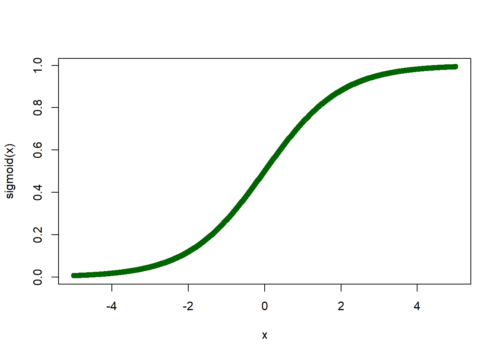
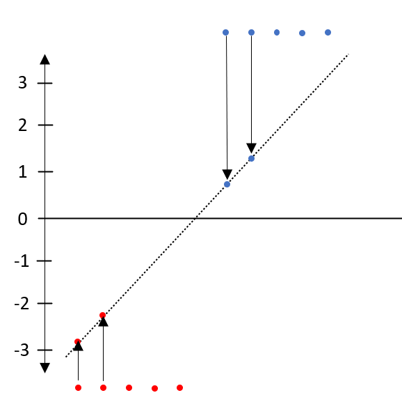
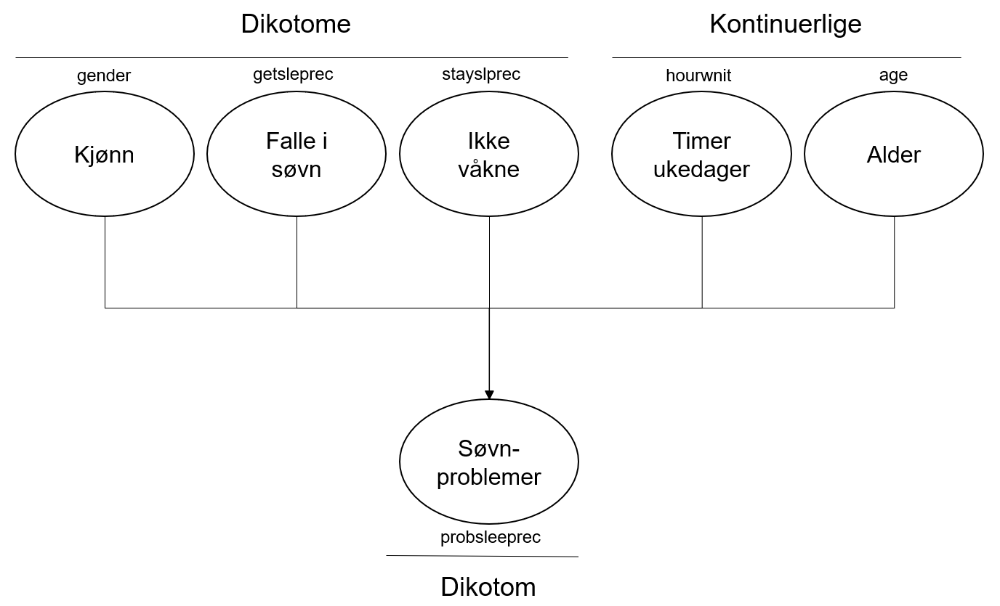
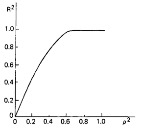
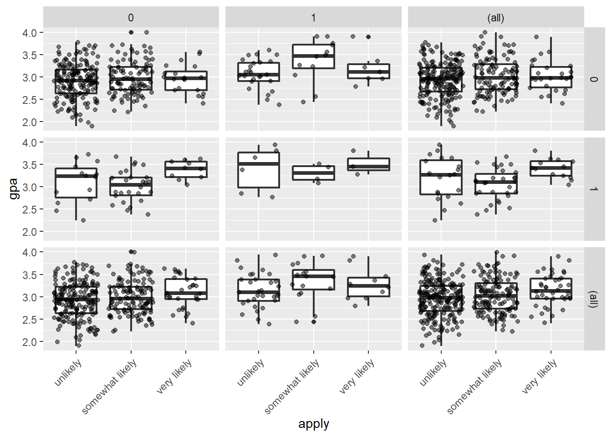
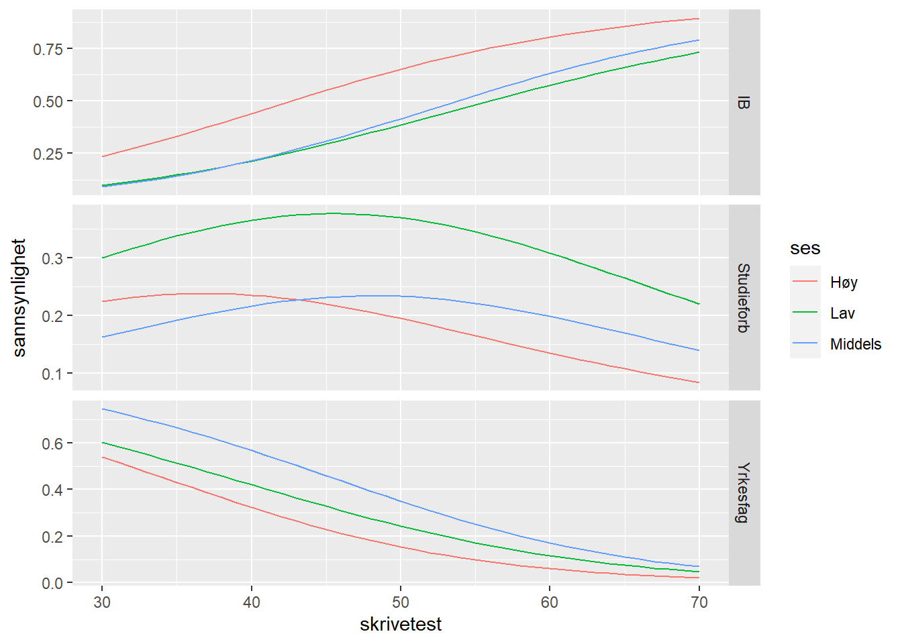

# Logistisk regresjon

Som vi vil se i kapittelet om regresjonsforutsetninger er det en forutsetning at den avhengige variabelen er kontinuerlig. Så langt har vi hatt det. Men det kan gjerne tenkes at vi sitter med en avhengig variabel som er kategorisk. Logistisk regresjon er regresjonsanalyse der de uavhengige variablene er kontinuerlige eller kategoriske og den avhengige kategorisk. Av den grunn bygger logistisk regresjon på andre prinsipper og teknikker enn «vanlig» regresjon. Der lineær regresjon er en regresjonsalgoritme (bestemmer/predikere en kontonuerlig variabel) er logistisk regresjon en klassifiseringsalgoritme (bestemme/predikere en binær klassifiering - f.eks. sant/usant) dersom analysen kobles til en verdi/terskel for beslutninger.  [@vyasUnderstandingLogisticRegression2020]. 

Et viktig poeng med logistisk regresjon er at det er et viktig element i temaer som maskinlæring og kunstige nevrale nettverk (@monroeLogisticRegression2017). Dette går vi ikke nærmere inn på i dette kapittelet.

Det er vanlig å snakke om tre typer logistisk regresjon:

1. Binær logistisk regresjon (ofte omtalt kun som "logistisk regresjon") der vi den avhangige variabelen kun har to mulige utfall (f.eks. 0,1 - ja/nei - død/levende o.l.).

2. Ordinal logistisk regresjon (noen steder omtalt som "ordinal regresjon") er en forlengelse av binær logistisk regresjon. Dette brukes når vi har en avhengig variabel med rangerte ("ordered") kategorier - f.eks. en svarskala (sterkt uenig - uenig - nøytral - enig - sterkt enig). 

3. Multinomial logistisk regresjon der den avhengige variabelen kan ha tre eller flere mulige utfall (f.eks. gruppe 1, gruppe 2, gruppe 3 - klasse A, klasse B, klasse C o.l.), men der det ikke er rangerte kategorier i forhold til hverandre (som i ordinal logistisk regresjon).

Selve begrepet "logistisk" har sitt utspring i "logit-funksjonen" (der begrepet "logit" i sin opprinnelse er en kortform for "logistic unit" [@berksonApplicationLogisticFunction1944]). Matematikken bak logistisk regresjon er noe mer komplisert enn for lineær regresjon. @fieldDiscoveringStatisticsUsing2009 skriver (s.265) at "I don’t wish to dwell on the underlying principles of logistic regression because they aren’t necessary to understand the test (I am living proof of this fact)”. Likevel forsøker vi under å gi en kort (og ufullstendig) beskrivelse. Et ok sted å lese mer detaljert om dette er f.eks. @milesApplyingRegressionCorrelation2001.

Fra lineær regresjon kjenner vi at den avhengige variabelen er kontinuerlig (med mulig utfall $-\infty, \infty$). I en binær avhengig variabel er utfallet en sannsynlighetsverdi mellom $0,1$. Utfordringen er da å transformere $0,1$ til $-\infty, \infty$ for å kunne kjøre (lineær) regresjon på de transformerte verdiene. Veien til dette går om "log odds". Enhver sannsynlighet kan konverteres til log odds gjennom å ta logaritmen til odds ratioen (vår gjennomgang lener seg på @glenLogOddsSimple2021). Sannsynlighet, odds og log odds er (litt upresist sagt) samme sak uttrykt på ulik måte:

$Sannsynlighet = uttrykk\ for\ hvor\ trolig\ det\ er\ at\ en\ hendelse\ vil\ inntreffe$ ^[Uttrykkes ofte som % av 100, eller matematisk som en verdi mellom 0 og 1] 

$Odds\ ("odds\ of\ success") =\frac{sannsynlighet\ for\ suksess}{sannsynlighet\ for\ ikke-suksess}= f.eks.\ \frac{sannsynlighet\ for\ regn}{sannsynlighet\ for\ oppholdsvær}$

$Odds-ratio = \frac{sannsynlighet\ for\ regn}{sannsynlighet\ for\ oppholdsvær}= \frac{80\%}{20\%}=4$

$log-odds=ln(4)\approx1.386$

På en mer generell form kan log-odds uttrykkes:

$log-odds = log\left[\frac{p}{p-1}\right] (=logit(p))$

der $p$ er sannsynligheten for en hendelse.

Logistisk regresjon innebærer å konvertere sannsynligheter til log-odds, og deretter tilbake til sannsynligheter (se eksempel litt lenger ned). Logitfunksjonen estimerer sannsynligheter mellom 0 og 1 for våre hendelser/data. I en binær logistisk regresjon kalukulerer vi dermed den betingede sannsynligheten for variabelen (Y) gitt variabelen (X). Dette kan uttrykkes slik:

$P(Y=1|X), dvs.\ den\ betingede\ sannsynligheten\ for\ Y=1\ gitt\ X$  

eller

$P(Y=0|X), dvs.\ den\ betingede\ sannsynligheten\ for\ Y=0\ gitt\ X$

P(Y|X) er estimert som en såkalt sigmoid-funksjon. En sigmoid funksjon

$p=\frac{e^{log(odds)}}{1+e^{log(odds)}} = \frac{1}{e^{-log(odds)}} = \frac{1}{1+e^{-x}} (= Sigmoid\ funksjon)$ 

Sigmoid-funksjon er (som del av logistisk regresjon) også et sentralt element i f.eks. maskinlæring. Vi kan visualisere en sigmoid-funksjon slik:


```r
sigmoid <- function(x) {
   1 / (1 + exp(-x))
}
x <- seq(-5, 5, 0.01)
plot(x, sigmoid(x), col='darkgreen')
```



Dette gjør at vi kan plotte verdier i spennet $(0,1)$ som $-\infty, \infty$. 

La oss se på et enkelt eksempel på hvordan logistisk regresjon kan brukes (basert på @starmerLogisticRegressionDetails2018).

Vi vil klassifisere en person som enten smittet eller ikke smittet av en sykdom. Output er enten 1 (= smittet) eller 0 (ikke smittet) - basert på en eller annen test/kriterium. La oss si vi har 10 tilfeller:


```r
smitte <- data.frame(x1 = 1:10,
                   x2 = c(0, 0, 0, 0, 0, 1, 1, 1, 1, 1))
smitteplott <- ggplot(smitte, aes(x1, x2)) +
    geom_point(col = ifelse(1:nrow(smitte) == 1:5, "red", "blue"))
smitteplott <- smitteplott + scale_x_discrete(name ="Pasient", 
                    limits=c("1":"10")) + ylab("Smittet")
smitteplott 
```


Målet vårt er altså å finne den linjen som best passer til disse dataene (slik vi gjennom OLS-regresjon forsøker å finne den linja som passer best til dataene i lineær regresjon). I logistisk regresjon bruker vi imidlertid ikke minste kvadratsums metode (OLS), men det som kalles "Maximum Likelihood" (ML). Grunnen til dette er at transformasjonen (gjennom logit funksjonen) gir uendelig store kvadratsummer fordi punktene etter transformasjonen har uendelig verdi.

Første steg er å konvertere sannsynlighetene for smitte til  log(odds) for smitte og bruke log(odds) på y-aksen. Vi legger på en "kandidatlinje" til regresjonslinja ("kandidatlinje" som i: vi trekker en linje som er ca. riktig visuelt og bruker den videre). 

{width=75%}

Ved å trekke vertikale linjer fra hvert punkt til kandidatlinjen finner vi hvert punkts log(odds) punkt (y-verdien der punktets vertikale linje treffer kandidatlinjen). Deretter brukes sigmoid-funksjonen til å konvertere log(odds) verdiene til hver observasjon til sannsynligheter. Det gir oss y-verdien på linja fra sigmoid-funksjonen for den første observasjonen:


```r
sigmoid <- function(x) {
   1 / (1 + exp(-x))
}
x <- seq(-5, 5, 0.01)
sigmoidplott <- plot(x, sigmoid(x), col='darkgreen', xaxt='n')
points(-4, 0.02, col = "red", pch=16)
```


```r
sigmoidplott
#> NULL
```

Som repeteres for alle observasjonene. Dette gjør at vi kan regne ut samlet sannsynlighet (y-verdien for på sigmoid-linja for det enkelt punkt er det samme som sannsynligheten for y-verdien for dette punktet). Dette gjør vi enten ved å multiplisere alle observasjonenes sannsynlighet, eller å addere log(sannsynlighet) for alle observasjonene (gir samme resultat). Verdien vi får er altså samlet sannsynlighet for dataene gitt kandidatlinja. 

Deretter roteres kandidatlinja og prosedyren gjentas inntil man får linja med høyest sannsynlighet (= Maximum likelihood). Algoritmen som gjør dette for oss roterer kun på en måte som øker sannsynligheten (= tids- og ressursbesparende). 

Når vi har funnet linja som best forklarer dataen kan vi bruke denne i prediksjon. Dersom vi har en gitt test elelr indikasjon på om en ny perosn er smittet kan vi bruke testverdien til å predikere om vi tror vedkommende er smittet eller ikke. Hvilken cut-off verdi vi setter er kontekstavhengig, men hvis vi f.eks. setter 0.5 vil en måling på 0.51 gjøre at vi klassifiserer vedkommende som smittet, mens en verdi på 0.49 vil klassifisere som ikke-smittet. Man kan selvsagt legge til flere målinger (=flere uavhengige variabler) for å fange opp flere forhold som gjør at vi kan si noe sikrere om smitte/ikke-smitte. Akkurat dette - muligheten til å bruke sannsynlighet for å klassifisere nye tilfeller/observasjoner som kan være både kategoriske og kontinuerlige - gjør metoden særlig egnet i teknikker som maskinlæring. @tabachnikUsingMultivariateStatistics2007 beskriver logistisk regresjon som relativt fri for begrensninger og i stand til å analysere en miks av kontinuerlige og kategoriske variabler ("the variety and complexity of data sets that can be analyzed are almost unlimited" - s.441).

Imidlertid er det litt mer komplisert å se om en uavhengig variabel bidrar i modellen. I lineær regresjon er dette relativt enkelt. Det vi gjør i logistisk regresjon er å teste om en variabels effekt på prediksjonen er signifikant forskjellig fra 0 (gjennom en såkalt Walds test). Hvis effekten til en variabel er 0 gir den åpenbart ingen hjelp i prediksjonen (og er unødvendig i modellen). 

## Binær logistisk regresjon

I dette eksempelet følger vi @pallantSPSSSurvivalManual2010. 


```r
sovn <- read_sav("sleep4ED.sav")
write_sav(sovn, "sovn.sav")
```

`<a href="data:application/octet-stream;base64,JEZMMkAoIykgU1BTUyBEQVRBIEZJTEUgLSBodHRwczovL2dpdGh1Yi5jb20vV2l6YXJkTWFjL1JlYWRTdGF0IAIAAAA3AAAAAQAAAAAAAAAPAQAAAAAAAAAAWUAwOSBKdWwgMjIyMjoyNDozNCAgICAgICAgICAgICAgICAgICAgICAgICAgICAgICAgICAgICAgICAgICAgICAgICAgICAgICAgICAgICAgICAAAAACAAAAAAAAAAEAAAAAAAAAAAgFAAAIBQBJRCAgICAgIBUAAABJZGVudGlmaWNhdGlvbiBOdW1iZXIAAAACAAAAAAAAAAEAAAAAAAAAAAgFAAAIBQBTRVggICAgIAMAAABzZXgAAgAAAAAAAAABAAAAAAAAAAAIBQAACAUAQUdFICAgICADAAAAYWdlAAIAAAAAAAAAAQAAAAAAAAAACAUAAAgFAE1BUklUQUwgDgAAAG1hcml0YWwgc3RhdHVzAAACAAAAAAAAAAEAAAAAAAAAAAgFAAAIBQBFRExFVkVMICAAAABoaWdoZXN0IGVkdWNhdGlvbiBsZXZlbCBhY2hpZXZlZAIAAAAAAAAAAAAAAAAAAAAACAUAAAgFAFdFSUdIVCAgAgAAAAAAAAAAAAAAAAAAAAAIBQAACAUASEVJR0hUICACAAAAAAAAAAEAAAAAAAAAAAgFAAAIBQBIRUFMVEhSQQ4AAABnZW5lcmFsIGhlYWx0aAAAAgAAAAAAAAABAAAAAAAAAAAIBQAACAUARklUUkFURSAQAAAAcGh5c2ljYWwgZml0bmVzcwIAAAAAAAAAAQAAAAAAAAAACAUAAAgFAFdFSUdIVFJBDgAAAGN1cnJlbnQgd2VpZ2h0AAACAAAAAAAAAAEAAAAAAAAAAAgFAAAIBQBTTU9LRSAgIAwAAABkbyB5b3Ugc21va2UCAAAAAAAAAAEAAAAAAAAAAAgFAAAIBQBTTU9LRU5VTQwAAABjaWdzIHBlciBkYXkCAAAAAAAAAAEAAAAAAAAAAggFAAIIBQBBTENIT0hPTCIAAABob3cgIG1hbnkgYWxjb2hvbGljIGRyaW5rcyBwZXIgZGF5AAACAAAAAAAAAAEAAAAAAAAAAggFAAIIBQBDQUZGRUlORSAAAABob3cgbWFueSBjYWZmZWluZSBkcmlua3MgcGVyIGRheQIAAAAAAAAAAQAAAAAAAAABCAUAAQgFAEhPVVJXTklUGAAAAGhvdXJzIHNsZWVwLyB3ZWVrIG5pZ2h0cwIAAAAAAAAAAQAAAAAAAAABCAUAAQgFAEhPVVJXRU5EFgAAAGhvdXJzIHNsZWVwLyB3ZWVrIGVuZHMAAAIAAAAAAAAAAQAAAAAAAAABCAUAAQgFAEhPVVJORUVEGwAAAGhvdyBtYW55IGhvdXJzIHNsZWVwIG5lZWRlZAACAAAAAAAAAAEAAAAAAAAAAAgFAAAIBQBUUlVCU0xFUBcAAAB0cm91YmxlIGZhbGxpbmcgYXNsZWVwPwACAAAAAAAAAAEAAAAAAAAAAAgFAAAIBQBUUlVCU1RBWRYAAAB0cm91YmxlIHN0YXlpbmcgYXNsZWVwAAACAAAAAAAAAAEAAAAAAAAAAAgFAAAIBQBXQUtFTklURRMAAAB3YWtpbmcgZHVyaW5nIG5pZ2h0AAIAAAAAAAAAAQAAAAAAAAAACAUAAAgFAE5JVEVTSEZUIwAAAHdvcmsgbmlnaHQgc2hpZnQgb3Igcm90YXRpbmcgc2hpZnRzAAIAAAAAAAAAAQAAAAAAAAAACAUAAAgFAExJVEVTTFAgDgAAAGxpZ2h0IHNsZWVwZXI/AAACAAAAAAAAAAEAAAAAAAAAAAgFAAAIBQBSRUZSRVNIRB8AAABkbyB5b3UgZmVlbCByZWZyZXNoZWQgd2Vla2RheXM/AAIAAAAAAAAAAQAAAAAAAAAACAUAAAgFAFNBVFNMRUVQGwAAAHNhdGlzZmllZCB3aXRoIHNsZWVwIGFtb3VudAACAAAAAAAAAAEAAAAAAAAAAAgFAAAIBQBRVUFMU0xQIBAAAABxdWFsaXR5IG9mIHNsZWVwAgAAAAAAAAABAAAAAAAAAAAIBQAACAUAU1RSRVNTTU8dAAAAaG93IHN0cmVzc2VkIG92ZXIgbGFzdCBtb250aD8AAAACAAAAAAAAAAEAAAAAAAAAAAgFAAAIBQBNRURIRUxQICAAAABtZWRpY2F0aW9uICB0YWtlbiB0byBoZWxwIHNsZWVwPwIAAAAAAAAAAQAAAAAAAAAACAUAAAgFAFBST0JMRU0gEwAAAHByb2JsZW0gd2l0aCBzbGVlcD8AAgAAAAAAAAABAAAAAAAAAAAIBQAACAUASU1QQUNUMSAEAAAAbW9vZAIAAAAAAAAAAQAAAAAAAAAACAUAAAgFAElNUEFDVDIgDAAAAGVuZXJneSBsZXZlbAIAAAAAAAAAAQAAAAAAAAAACAUAAAgFAElNUEFDVDMgBwAAAGNvbmNlbnQAAgAAAAAAAAABAAAAAAAAAAAIBQAACAUASU1QQUNUNCAGAAAAbWVtb3J5AAACAAAAAAAAAAEAAAAAAAAAAAgFAAAIBQBJTVBBQ1Q1IAgAAABsaWZlIHNhdAIAAAAAAAAAAQAAAAAAAAAACAUAAAgFAElNUEFDVDYgEgAAAG92ZXJhbGwgd2VsbC1iZWluZwAAAgAAAAAAAAABAAAAAAAAAAAIBQAACAUASU1QQUNUNyANAAAAcmVsYXRpb25zaGlwcwAAAAIAAAAAAAAAAQAAAAAAAAAACAUAAAgFAFNUT1BCICAgDgAAAHN0b3AgYnJlYXRoaW5nAAACAAAAAAAAAAEAAAAAAAAAAAgFAAAIBQBSRVNUTFNTIBAAAAByZXN0bGVzcyBzbGVlcGVyAgAAAAAAAAABAAAAAAAAAAAIBQAACAUARFJWU0xFRVAUAAAAYXNsZWVwIHdoaWxlIGRyaXZpbmcCAAAAAAAAAAEAAAAAAAAAAAgFAAAIBQBEUlZSRVNVTCIAAABkcml2ZSwgcmVzdWx0IGluIGFjYyBkdWUgdG8gc2xlZXB5AAACAAAAAAAAAAEAAAAAAAAAAAgFAAAIBQBFU1MgICAgIBgAAABlcHdvcnRoIHNsZWVwaW5lc3Mgc2NhbGUCAAAAAAAAAAEAAAAAAAAAAAgFAAAIBQBBTlhJRVRZIAwAAABIQURTIEFueGlldHkCAAAAAAAAAAEAAAAAAAAAAAgFAAAIBQBERVBSRVNTIA8AAABIQURTIERlcHJlc3Npb24AAgAAAAAAAAABAAAAAAAAAAAIBQAACAUARkFUSUdVRSAIAAAAZmF0aWd1ZWQCAAAAAAAAAAEAAAAAAAAAAAgFAAAIBQBMRVRIQVJHWQkAAABsZXRoYXJnaWMAAAACAAAAAAAAAAEAAAAAAAAAAAgFAAAIBQBUSVJFRCAgIAUAAAB0aXJlZAAAAAIAAAAAAAAAAQAAAAAAAAAACAUAAAgFAFNMRUVQWSAgBgAAAHNsZWVweQAAAgAAAAAAAAABAAAAAAAAAAAIBQAACAUARU5FUkdZICALAAAAbGFjayBlbmVyZ3kAAgAAAAAAAAABAAAAAAAAAAAIBQAACAUAU1RBWVNMUFIUAAAAcHJvYiBzdGF5IGFzbGVlcCByZWMCAAAAAAAAAAEAAAAAAAAAAAgFAAAIBQBHRVRTTEVQUhQAAABwcm9iIGZhbGwgYXNsZWVwIHJlYwIAAAAAAAAAAQAAAAAAAAAACAUAAAgFAFFVQUxTTEVFDgAAAHF1YWwgc2xlZXAgcmVjAAACAAAAAAAAAAEAAAAAAAAAAAgFAAAIBQBUT1RTQVMgIB8AAABzbGVlcHkgJiBhc3NvYyBzZW5zYXRpb25zIHNjYWxlAAIAAAAAAAAAAQAAAAAAAAAABQUAAAUFAENJR1NHUDMgEAAAAGNpZ3MgcGVyIGRheSBncDMCAAAAAAAAAAEAAAAAAAAAAAUFAAAFBQBBR0VHUDMgIAYAAABhZ2VncDMAAAIAAAAAAAAAAQAAAAAAAAAACAUAAAgFAFBST0JTTEVFFAAAAHByb2Igc2xlZXAgcmVjb2RlIDAxAgAAAAAAAAABAAAAAAAAAAAIBQAACAUARFJWU0xQUkUZAAAAZmFsbCBhc2xlZXAgd2hpbGUgZHJpdmluZwAAAAMAAAACAAAAAAAAAAAAAAAGZmVtYWxlIAAAAAAAAPA/BG1hbGUgICAEAAAAAQAAAAIAAAADAAAABAAAAAAAAAAAAPA/BnNpbmdsZSAAAAAAAAAAQA9tYXJyaWVkL2RlZmFjdG8AAAAAAAAIQAhkaXZvcmNlZCAgICAgICAAAAAAAAAQQAd3aWRvd2VkBAAAAAEAAAAEAAAAAwAAAAUAAAAAAAAAAADwPw5wcmltYXJ5IHNjaG9vbCAAAAAAAAAAQBBzZWNvbmRhcnkgc2Nob29sICAgICAgIAAAAAAAAAhAJ3RyYWRlIHRyYWluaW5nLyBwb3N0IHNlY29uZGFyeSB0cmFpbmluZwAAAAAAABBAFHVuZGVyZ3JhZHVhdGUgZGVncmVlICAgAAAAAAAAFEATcG9zdGdyYWR1YXRlIGRlZ3JlZSAgICAEAAAAAQAAAAUAAAADAAAAAgAAAAAAAAAAAPA/CXZlcnkgcG9vciAgICAgIAAAAAAAACRACXZlcnkgZ29vZCAgICAgIAQAAAABAAAACAAAAAMAAAACAAAAAAAAAAAA8D8JdmVyeSBwb29yICAgICAgAAAAAAAAJEAJdmVyeSBnb29kICAgICAgBAAAAAEAAAAJAAAAAwAAAAIAAAAAAAAAAADwPxB2ZXJ5IHVuZGVyd2VpZ2h0ICAgICAgIAAAAAAAACRAD3Zlcnkgb3ZlcndlaWdodAQAAAABAAAACgAAAAMAAAACAAAAAAAAAAAA8D8DeWVzICAgIAAAAAAAAABAAm5vICAgICAEAAAAAQAAAAsAAAADAAAAAgAAAAAAAAAAAPA/A3llcyAgICAAAAAAAAAAQAJubyAgICAgBAAAAAEAAAASAAAAAwAAAAIAAAAAAAAAAADwPwN5ZXMgICAgAAAAAAAAAEACbm8gICAgIAQAAAABAAAAEwAAAAMAAAACAAAAAAAAAAAA8D8DeWVzICAgIAAAAAAAAABAAm5vICAgICAEAAAAAQAAABQAAAADAAAAAwAAAAAAAAAAAPA/A3llcyAgICAAAAAAAAAAQAJubyAgICAgAAAAAAAACEAJc29tZXRpbWVzICAgICAgBAAAAAEAAAAVAAAAAwAAAAIAAAAAAAAAAADwPwN5ZXMgICAgAAAAAAAAAEACbm8gICAgIAQAAAABAAAAFgAAAAMAAAACAAAAAAAAAAAA8D8DeWVzICAgIAAAAAAAAABAAm5vICAgICAEAAAAAQAAABcAAAADAAAAAgAAAAAAAAAAAPA/EXZlcnkgZGlzc2F0aXNmaWVkICAgICAgAAAAAAAAJEAOdmVyeSBzYXRpc2ZpZWQgBAAAAAEAAAAYAAAAAwAAAAYAAAAAAAAAAADwPwl2ZXJ5IHBvb3IgICAgICAAAAAAAAAAQARwb29yICAgAAAAAAAACEAEZmFpciAgIAAAAAAAABBABGdvb2QgICAAAAAAAAAUQAl2ZXJ5IGdvb2QgICAgICAAAAAAAAAYQAlleGNlbGxlbnQgICAgICAEAAAAAQAAABkAAAADAAAAAgAAAAAAAAAAAPA/Cm5vdCBhdCBhbGwgICAgIAAAAAAAACRAEmV4dHJlbWVseSBzdHJlc3NlZCAgICAgBAAAAAEAAAAaAAAAAwAAAAIAAAAAAAAAAADwPwN5ZXMgICAgAAAAAAAAAEACbm8gICAgIAQAAAABAAAAGwAAAAMAAAACAAAAAAAAAAAA8D8DeWVzICAgIAAAAAAAAABAAm5vICAgICAEAAAAAQAAABwAAAADAAAAAgAAAAAAAAAAAPA/Cm5vdCBhdCBhbGwgICAgIAAAAAAAACRAEXRvIGEgZ3JlYXQgZXh0ZW50ICAgICAgBAAAAAEAAAAdAAAAAwAAAAIAAAAAAAAAAADwPwpub3QgYXQgYWxsICAgICAAAAAAAAAkQBF0byBhIGdyZWF0IGV4dGVudCAgICAgIAQAAAABAAAAHgAAAAMAAAACAAAAAAAAAAAA8D8Kbm90IGF0IGFsbCAgICAgAAAAAAAAJEARdG8gYSBncmVhdCBleHRlbnQgICAgICAEAAAAAQAAAB8AAAADAAAAAgAAAAAAAAAAAPA/Cm5vdCBhdCBhbGwgICAgIAAAAAAAACRAEXRvIGEgZ3JlYXQgZXh0ZW50ICAgICAgBAAAAAEAAAAgAAAAAwAAAAIAAAAAAAAAAADwPwpub3QgYXQgYWxsICAgICAAAAAAAAAkQBF0byBhIGdyZWF0IGV4dGVudCAgICAgIAQAAAABAAAAIQAAAAMAAAACAAAAAAAAAAAA8D8Kbm90IGF0IGFsbCAgICAgAAAAAAAAJEARdG8gYSBncmVhdCBleHRlbnQgICAgICAEAAAAAQAAACIAAAADAAAAAgAAAAAAAAAAAPA/Cm5vdCBhdCBhbGwgICAgIAAAAAAAACRAEXRvIGEgZ3JlYXQgZXh0ZW50ICAgICAgBAAAAAEAAAAjAAAAAwAAAAIAAAAAAAAAAADwPwN5ZXMgICAgAAAAAAAAAEACbm8gICAgIAQAAAABAAAAJAAAAAMAAAACAAAAAAAAAAAA8D8DeWVzICAgIAAAAAAAAABAAm5vICAgICAEAAAAAQAAACUAAAADAAAAAgAAAAAAAAAAAPA/A3llcyAgICAAAAAAAAAAQAJubyAgICAgBAAAAAEAAAAmAAAAAwAAAAIAAAAAAAAAAADwPwN5ZXMgICAgAAAAAAAAAEACbm8gICAgIAQAAAABAAAAJwAAAAMAAAACAAAAAAAAAAAAAAACbm8gICAgIAAAAAAAAPA/A3llcyAgICAEAAAAAQAAADAAAAADAAAAAgAAAAAAAAAAAAAAAm5vICAgICAAAAAAAADwPwN5ZXMgICAgBAAAAAEAAAAxAAAAAwAAAAQAAAAAAAAAAADwPw92ZXJ5IHBvb3IsIHBvb3IAAAAAAAAAQARmYWlyICAgAAAAAAAACEAEZ29vZCAgIAAAAAAAABBAFHZlcnkgZ29vZCwgZXhjZWxsZW50ICAgBAAAAAEAAAAyAAAAAwAAAAMAAAAAAAAAAADwPwQ8PSA1ICAgAAAAAAAAAEAGNiAtIDE1IAAAAAAAAAhAAzE2KyAgICAEAAAAAQAAADQAAAADAAAAAwAAAAAAAAAAAPA/BTw9IDM3ICAAAAAAAAAAQAczOCAtIDUwAAAAAAAACEADNTErICAgIAQAAAABAAAANQAAAAMAAAACAAAAAAAAAAAAAAACbm8gICAgIAAAAAAAAPA/A3llcyAgICAEAAAAAQAAADYAAAADAAAAAgAAAAAAAAAAAAAAAm5vICAgICAAAAAAAADwPwN5ZXMgICAgBAAAAAEAAAA3AAAABwAAAAMAAAAEAAAACAAAABQAAAAAAAAAAAAAAP////8BAAAAAQAAAAIAAADp/QAABwAAAAQAAAAIAAAAAwAAAP///////+//////////73/+///////v/wcAAAALAAAABAAAAKUAAAADAAAACAAAAAEAAAADAAAACAAAAAEAAAADAAAACAAAAAEAAAADAAAACAAAAAEAAAADAAAACAAAAAEAAAADAAAACAAAAAEAAAADAAAACAAAAAEAAAADAAAACAAAAAEAAAADAAAACAAAAAEAAAADAAAACAAAAAEAAAADAAAACAAAAAEAAAADAAAACAAAAAEAAAADAAAACAAAAAEAAAADAAAACAAAAAEAAAADAAAACAAAAAEAAAADAAAACAAAAAEAAAADAAAACAAAAAEAAAADAAAACAAAAAEAAAADAAAACAAAAAEAAAADAAAACAAAAAEAAAADAAAACAAAAAEAAAADAAAACAAAAAEAAAADAAAACAAAAAEAAAADAAAACAAAAAEAAAADAAAACAAAAAEAAAADAAAACAAAAAEAAAADAAAACAAAAAEAAAADAAAACAAAAAEAAAADAAAACAAAAAEAAAADAAAACAAAAAEAAAADAAAACAAAAAEAAAADAAAACAAAAAEAAAADAAAACAAAAAEAAAADAAAACAAAAAEAAAADAAAACAAAAAEAAAADAAAACAAAAAEAAAADAAAACAAAAAEAAAADAAAACAAAAAEAAAADAAAACAAAAAEAAAADAAAACAAAAAEAAAADAAAACAAAAAEAAAADAAAACAAAAAEAAAADAAAACAAAAAEAAAADAAAACAAAAAEAAAADAAAACAAAAAEAAAADAAAACAAAAAEAAAADAAAACAAAAAEAAAADAAAACgAAAAEAAAADAAAACwAAAAEAAAADAAAADAAAAAEAAAADAAAACAAAAAEAAAADAAAACAAAAAEAAAADAAAACAAAAAEAAAADAAAACgAAAAEAAAADAAAACQAAAAEAAAAHAAAADQAAAAEAAAB0AwAASUQ9aWQJU0VYPXNleAlBR0U9YWdlCU1BUklUQUw9bWFyaXRhbAlFRExFVkVMPWVkbGV2ZWwJV0VJR0hUPXdlaWdodAlIRUlHSFQ9aGVpZ2h0CUhFQUxUSFJBPWhlYWx0aHJhdGUJRklUUkFURT1maXRyYXRlCVdFSUdIVFJBPXdlaWdodHJhdGUJU01PS0U9c21va2UJU01PS0VOVU09c21va2VudW0JQUxDSE9IT0w9YWxjaG9ob2wJQ0FGRkVJTkU9Y2FmZmVpbmUJSE9VUldOSVQ9aG91cnduaXQJSE9VUldFTkQ9aG91cndlbmQJSE9VUk5FRUQ9aG91cm5lZWQJVFJVQlNMRVA9dHJ1YnNsZXAJVFJVQlNUQVk9dHJ1YnN0YXkJV0FLRU5JVEU9d2FrZW5pdGUJTklURVNIRlQ9bml0ZXNoZnQJTElURVNMUD1saXRlc2xwCVJFRlJFU0hEPXJlZnJlc2hkCVNBVFNMRUVQPXNhdHNsZWVwCVFVQUxTTFA9cXVhbHNscAlTVFJFU1NNTz1zdHJlc3NtbwlNRURIRUxQPW1lZGhlbHAJUFJPQkxFTT1wcm9ibGVtCUlNUEFDVDE9aW1wYWN0MQlJTVBBQ1QyPWltcGFjdDIJSU1QQUNUMz1pbXBhY3QzCUlNUEFDVDQ9aW1wYWN0NAlJTVBBQ1Q1PWltcGFjdDUJSU1QQUNUNj1pbXBhY3Q2CUlNUEFDVDc9aW1wYWN0NwlTVE9QQj1zdG9wYglSRVNUTFNTPXJlc3Rsc3MJRFJWU0xFRVA9ZHJ2c2xlZXAJRFJWUkVTVUw9ZHJ2cmVzdWwJRVNTPWVzcwlBTlhJRVRZPWFueGlldHkJREVQUkVTUz1kZXByZXNzCUZBVElHVUU9ZmF0aWd1ZQlMRVRIQVJHWT1sZXRoYXJneQlUSVJFRD10aXJlZAlTTEVFUFk9c2xlZXB5CUVORVJHWT1lbmVyZ3kJU1RBWVNMUFI9c3RheXNscHJlYwlHRVRTTEVQUj1nZXRzbGVwcmVjCVFVQUxTTEVFPXF1YWxzbGVlcHJlYwlUT1RTQVM9dG90c2FzCUNJR1NHUDM9Y2lnc2dwMwlBR0VHUDM9YWdlZ3AzCVBST0JTTEVFPXByb2JzbGVlcHJlYwlEUlZTTFBSRT1kcnZzbHByZWMHAAAAEAAAAAgAAAACAAAAAQAAAAAAAAAPAQAAAAAAAOcDAAAAAAAAt2SOZmaY/W4AAAAAAEBkQGtpZXNnaW1tbf//ZWZmZWZqZmZm/////////2ZmZmZsZmVmZmZmZv//aG5mZmRkAP1kmmZppf1sAAAAAABgckAAAAAAAMBlQGtpZv9kbv39AAAAAAAAGkAAAAAAAAAaQGtlZWVmZWVpaGlmZv////////9mZWZmdWpmZmdpaWllZWd4/2dkZAD9Zf9mZr39agAAAAAAkHpAAAAAAABAZUBpa2b/cGhqamxlZWVmZWZnZmplZv////////9mZWVlcW1ua2tqamllZWWD//9kZQCkZI1maab9bQAAAAAAQGZAa2llaWZna2xsZWZmZmZmaGhsZmb/////////ZmZmZnBsZ2trampsZGVnhmVmZGQA/WSLZmmi/W0AAAAAAMCAQAAAAAAAAGRAaWtm/2Vqa2v9ZWVlZmZlZgAAAAAAAB5AaGpmZv////////9mZmZmcGhkaWdpamplZWd9/2ZkZACdZKZmaKL9bAAAAAAAoGRAbGlm/2Vna2xsZWVlZmZmaGdrZmb/////////ZmX/Zm5wamtramprZWVmhf9nZP8A/WSIZWei/W0AAAAAAGBvQAAAAAAAoGRAa2tm/2RnamxsZWVlZmZmamhsZmb/////////ZmZmZm5wbv9sbGxtZWVn//9lZGQA/WSHZmmv/WoAAAAAAOBvQAAAAAAAwGVAamxm/2ZnamtrZWVlZmVma2lsZmb/////////ZmZlZm5xb2tsbGpsZWVoif9lZGUA/WX/Zmm+/WoAAAAAAJBwQAAAAAAAgGZAamxm//1ma2sAAAAAAADQP2xlZmX//////2pmZWpqamprbGxmZWZmbnBva2pr//9kZf////9lZAD9ZY1maa/9bQAAAAAAIHJAAAAAAABgZ0BtZ2VrZWdqbGtlZmZmZmZsaWlmZv////////9mZmZmbmVkZmZoaWdkZWh0ZmZkZAD9Zf9maar/bgAAAAAAIHpAa2pm/2Zpa2z9ZWVlZmVmZwAAAAAAAB5AZmZmZWlrbGxramdlZWZmbmloa2prbGtlZWWH//9lZADDZf9laLL9bAAAAAAAQGZAbGpm/2Rla2psZWZlZWVlbGhpZmb/////////ZmZmZm1rZGdmZ2dnZGVncv//ZGQAsWSFZmmn/W0AAAAAAMBjQGhrZv9lZmz9AAAAAAAAHkD9ZWZlZmVlbAAAAAAAABpAaGtmZv////////9mZWZmbGdnaWhpa2tkZWeA/2VkZAD9ZP9mabT9bAAAAAAAYGlAAAAAAACQZUBqbGX/ZGlqamxlZWVlZWZnZmxmZW1ta2tra2tlZWZmbHBwbGtsbG1lZWWM//9lZAD9ZHxo/5z9bQAAAAAA0HlAAAAAAABAZEBsaWb/ZWZs/QAAAAAAACNAbWVmZmZmZmhoa2Zm/////////2ZmZmZsaGRqa2pqbGRlZ4X/ZWRkAKlkfGZolf1sAAAAAACgZEBqaWb/ZWdrbm5lZmVmZmZsaWpmZmdnZ2dnZ2dmZmZla2pmampma2hkZWh9/2VkZAD9ZIdmaZb9bAAAAAAAUHFAAAAAAAAgY0BrbGb/ZWVrbGxlZWVmZWZqaG5mZv////////9mZmZma3BkamxqamxlZWeG/2VkZAD9ZYBmaK/9bAAAAAAAEHlAAAAAAABAZUBsaWb/ZGVsbGtlZmVmZWVsaWZmZv////////9mZWZma2hnZmZmZ2dkZWhw/2VkZABrZXdlZqD9bQAAAAAAAGZAbWlm/2RlbGz9ZWZmZmZmbAAAAAAAACFAaWZmZv////////9mZmZmamdlaWpqbGlkZWiC/2VkZABwZYNlaf//bGtoZv9ka2tra2VmZWZmZWtpamZmZmdnZWVmZWZmZmZqa2tnZmdnZ2RlaHL/ZWRkAJZl/2ZprP1qAAAAAACgZUBpamb/ZGZtbGtlZWVmZWVsaW1mZWtuamdsbG1mZWZmam5pbGtsaGxlZWiH//9lZACnZf9lZ8P9agAAAAAAAGhAaGtldWVqa/0AAAAAAAAhQGxlZWVmZmVraGhmZWtmZ2hsbG1mZmZmam9pZ2dpZ2hlZWd2Z/9lZAD9ZI1maa/9bAAAAAAAQGtAAAAAAABAZUBrbWZkZGRsbGxlZmVmZWVpaGxmZv////////9lZmZmanNubGtramxkZWeIZWZkZAD9ZZFmaL39awAAAAAAoG5AAAAAAADgZUBpa2b/ZWlrbGxlZWVmZmVrZ2xmZv////////9mZWZmam1oamtramtlZWaF/2ZkZAD9ZHtlaKj9agAAAAAAIHBAAAAAAABAZkBpa2b/ZGhr/QAAAAAAACFAa2VmZWZmZWlpbWZm/////////2ZmZmZqb2Zra2tra2RlaIf/ZWRkAP1klGZn//1rAAAAAAAwckAAAAAAAFBkQGpsZv9kZmpta2VmZWZlZWxoZ2Zm/////////2ZmZmZqbWtoaWdnZ2RlZ3b/ZmRkAGZlomZpvv1sAAAAAACAZ0Bra2b/aWn9bAAAAAAAABpAbGVlZWZlZmhna2ZmZ2lpaGloZ2ZlZmZpbGdpaGlpaWVlZnz/Z2RkAIxl/2Zpwv1sAAAAAAAgZ0BqbGb//2hrbP1lZWVmZmVnAAAAAAAAHkBna2ZlZ2dnZ2dnZ2VlZWVpZWVrZmdnZmVlZnX//2VlAJdl/2Vmqv1rAAAAAABgZkBsaWVmZ2pqbWxlZWVmZWZoZ2dmZmdnZWZlZWZmZWZmaWdlZmdnaWdlZWZ0Zf9kZAB+Zf9naaP9bAAAAAAAwGVAbWdm/2Rma2v/ZWVlZmVmZWVsZmVubm5lbGxsZmVmZmhtbGxsbW5tZWVlkP//ZWQA/WV5ZWj//20AAAAAACBvQGxoZv9kZ2tsbWVlZWZmZmloaWZm/////////2ZmZmZoaGVoaWhqamVlZ33/ZWRkAP1lf2Votv1tAAAAAACgeUAAAAAAACBnQGxpZv9kZGpsa2VmZWZmZmtoaWZm/////////2ZmZmZoa2RnZ2hoaWRlZ3f/ZWRkAP1kg2Zpp/1sAAAAAAAIgEAAAAAAAKBkQGtrZv//Z21sbGVmZWZlZWxnaGZm/////////2ZlZmZoaWdoZ2prZ2RlZnv/ZWRkAP1lfmVptP1rAAAAAABogEAAAAAAAIBmQGtrZv9kZ2xsamVmZmZmZWxqbWZm/////////2ZmZmZoa2hnZ2dnZWRlaHH/ZWRkAJNlfWVmr/1sAAAAAACAZkBraWb/ZGdsbm5lZmZmZmZqaGlmZv////////9mZmZmZ2ll/2ppamdkZWf//2VkZACjZZ9mZq/9awAAAAAAwGZAa2pm/2Vnamv9ZWZlZmZlbAAAAAAAABpAaGtmZv////////9mZmZmZ2tmZWdlaWlkZWdz/2dkZACoZZBmaL79bQAAAAAAwGVAa2tm/2dma2trZWZlZmVlbWdmZmb/////////ZmVmZmdmZWhoamhnZGVmef9mZGQA/WX/ZWmc/W4AAAAAAOBpQAAAAAAAYGVAa2lm//1ma2wAAAAAAADgP2xlZWZmZWVsaWdmZv////////9mZmZmZ2hmZmZmZ2ZlZWhv//9kZAD9ZZxmaa/9awAAAAAA4HJAAAAAAACAZkBpamb/ZWdrbP1lZWVmZmZnAAAAAAAAIUBma2Zm/////////2ZmZWZna25sa2xsbGVlZYv/Z2RlAP1l/2Zpr/1sAAAAAACQeUAAAAAAAABmQGppZv9kZ2pqbGVlZWZlZmhna2ZlaWlnZWZmZWZlZmZnaGVna2trbGVlZoT//2VkAP1kh2VonP1tAAAAAADAeUAAAAAAAGBkQGpqZv9kbGpsbGVlZWZlZmpobGVmaWtoa2hpaWZmZmZnamxqampqa2VlZ4P/ZWRkAP1klGdppP1uAAAAAAC4gEAAAAAAAIBlQG5oZv9laf39AAAAAAAAFkAAAAAAAAAWQGxlZWVlZmZlZmtmZmtna2tra2pmZmZmZ2xlZ2dnamZlZWV1/2ZkZACiZJ9maLT9bgAAAAAAoGVAbWxm/2RmamxsZWZlZmVmaWhoZmZs//////9pZmZmZmZpZWdnZ2pnZGVndv9nZGQAqmSOZ2iW/WwAAAAAAKBkQGxpZW5lZ2tra2VlZWZlZWloZmVm/////////2ZmZmZmaGRmZmdpaGVlZ3RmZmRkAP1k/2Vnpv1rAAAAAACAb0AAAAAAAABkQGpqZv9laGlpaWX/ZWZmZWpnZmZm//////////9mZmZlZWVnZ2dpaP9lZnb//2RkAP1lgWZprv1uAAAAAABgeUAAAAAAAEBlQG1rZv9lZ2xsbGVmZmZmZmtoaWZm/////////2ZmZmZkZ2doaGhqZ2RlZ3n/ZWRkAP1kdmVlnv1sAAAAAAB4gEAAAAAAAKBjQG1qZv9kZ2xua2VlZmZmZmtpZmZm/////////2Zl//9kaWVmZmZnZmVlaG//ZWT/ALNklGZooP1tAAAAAACgZED//2b/ZGj//2ZlZmVmZWZraG1mZv////////9mZWZm/2ppZ2dnaGtkZWd4/2ZkZAD9ZIlmaZ/9aQAAAAAAoGpAAAAAAACgZEBramVzZmZsbGxlZmVmZmZoaGlmZv////////9mZmZm/2toampra2tkZWeFZmVkZAD9ZLhoZqP9bAAAAAAAEHpAAAAAAACgZEBs/2b/ZWhqamplZmVmZWVpaGVm//////////9mZv///2hlZ2VnaWZkZWdy/2f//wD9ZKloZa/9/wAAAAAAKIBAAAAAAABgZEBp/2b/ZmhoaGplZWVm//9oZWlm//////////9mZWZm/2plZmhoaWllZWV4/2f/ZAD9ZIlnZqP9bQAAAAAA6IBAAAAAAADAY0BraWb/ZWVsbG5lZWVmZWZrZ2xmZv////////9mZv//////amxqaWplZWaD/2Vk/wClZf9labT9bQAAAAAA4GZAbWlm/2Vr/f0AAAAAAAAaQAAAAAAAAB5Aa2ZmZWZmZmdpZWZl/////////2ZmZWV2ZWZmZWloaWRkaHX//2VlAHxlo2Zp//9ubGlm/2RoamtrZmZlZmZlbWpsZmb/////////ZmVlZXNrZ2hnaWprZGRoff9nZGUAm2SPZmn//2xra2b/ZGZqbGtmZmVmZWZnamZmZv////////9mZmZmc2ppbG1tbWxkZGiP/2ZkZAD9ZI5maf//bAAAAAAAAGtAaW1m/2RmamxsZmZmZmZmamhsZmb/////////ZmZmZnJubWppamtrZGRng/9mZGQA/WSWZmeb/WoAAAAAAFBwQAAAAAAAEGNAampm/2RobGxsZmVlZmVlaGlrZmb/////////ZmZmZnJsZGlqampoZWRof/9mZGQA/WSTZmmo/W0AAAAAAIB5QAAAAAAAAGRAamxm/2Vo/W0AAAAAAAAeQG1mZmVmZmVsaWtmZv////////9mZWZmcmppa2trbGxkZGiJ/2ZkZABxZYdnaKr9aQAAAAAAgGZAaWllZ2ZoamtqZmZmZWZlbWlsZmb/////////ZmZmZnBmaWZmZmZnZGRob2VlZGQAeGWjZmm2/WwAAAAAAMBmQGprZv9maWpr/WZmZWZmZWgAAAAAAAAaQGhrZmZpaGtqamppZmZmZnBnZ/9oa2lpZGRn//9nZGQA/WSYZmnI/WoAAAAAAHBwQAAAAAAAgGVAam1m/2RmbGxsZmVlZmVmaWdoZmb/////////ZmVmZnBqaGxsa2trZWRmif9nZGQAhGSVZWa0/WsAAAAAAABkQGhoZv9kZ2r/a2ZmZmZmZmxobWZm/////////2ZmZmZvbGhoZWtrbGRkZ3//ZmRkAP1kd2Voo/1rAAAAAADgbkAAAAAAAIBjQGr/ZWdkZGxtbmZmZWZlZmxobGZmbGxtamdpZmZmZmZvaGZsbG1tbGRkZ45lZWRkAP1kgWZoj/1sAAAAAACggEAAAAAAAGBjQGxoZv9kZWpra2ZmZmZmZWdoaGZm/////////2Zl//9vbWhqaGppZ2RkZ3z/ZWT/AHtkmWZpnf1uAAAAAADAY0Bramb/ZWVrbGtmZWVmZmVpZ2hmZv////////9mZWZmbmllZ2doamdlZGZ3/2dkZAD9ZZ1maf/9bAAAAAAAgGtAAAAAAAAwZ0Bsamb/ZGlrbGxmZmVmZmVoaGxmZv////////9mZmZmbmhmZ2dnZ2dkZGdz/2dkZAD9ZP9maKr9bAAAAAAAwG5AAAAAAAAAY0Bpa2V4ZmdsbG1mZWVmZmZqaGdlZWtpa2tmaWlmZmVmbmpoampqamplZGeCZ/9lZQD9ZJxmaJv9bAAAAAAAgHFAAAAAAAAQY0BsbWb/ZGZsbWxmZmVmZmVtaWdmZv////////9mZmZmbmtpaWdoaGhkZGh4/2dkZAD9ZIllaJn9bAAAAAAA0HFAAAAAAAAAZUBraGb/ZWdrbGxmZmVmZf9oaWxmZv////////9mZmZmbmxnZmpraGtkZGh+/2VkZAD9ZYJlaa/9bAAAAAAAMHlAAAAAAABAZUBramb/ZmRrbGxmZmVmZWZoaGtmZv////////9mZf//bmhkZmZpaGhkZGd1/2Vk/wBzZZdnadL9aQAAAAAAgGZAaWtm/2T/amz9ZmZlZmZmaAAAAAAAABpAaGdmZv////////9lZmVlbWRmZmZnZ2dkZGdx/2dkZQC5ZIZmaKH9bAAAAAAA4GRAbGpm/2Zna21sZmZlZmVmamdrZmb/////////ZmX//21qZWZla2xrZGRmff9lZP8A/WWmaGm2/W4AAAAAAIBpQAAAAAAAgGZA//9m/2Rma21tZmZlZmZlbGhmZmb/////////ZWZmZm1lZWdmZ2doZGRnc/9nZGQA/WSRZmmn/W4AAAAAAIBqQAAAAAAAQGVAbGxm/2Zm/WwAAAAAAAAhQG1mZmVmZmVtaWZmZv////////9mZmZmbWpkZ2ZpaGZkZGh0/2ZkZAD9ZJ1naf/9aQAAAAAAQHlAAAAAAABQZEBpa2WCZ2doaGhmZmVmZWVtaWZmZv////////9mZv//bWllZ21nZ2dkZGh5Z2dk/wD9ZZpmabj9awAAAAAAsH9AAAAAAABAZkBra2b//WhrbAAAAAAAAOA/a2ZmZWZmZW1pamZm/////////2ZmZmZtbG5naGdnaGRkaHX/Z2RkAP1kkWVopf1rAAAAAADQgEAAAAAAAKBjQGhrZv//af1sAAAAAAAAGkBsZmZmZmZmamlrZmb/////////ZmVmZm1qa2xrbGxrZGRoiv9mZGQAdWSOZmmW/W0AAAAAAOBjQG1tZv///2xsbGZmZWZlZWxobWZm/////////2Zm//9sZ2Vp/2dsbGRkZ///ZmT/AJRkimdok/1sAAAAAAAAZEBraWb/ZGZsbW1mZmZmZmZsaGlmZv////////9mZmZmbGdoZmVnZ2hkZGdx/2ZkZADFZYhmabz9bQAAAAAAIGZAaWxm/2Vka2trZmZmZmZlbWlrZmb/////////ZmZlZmxmZ2ZnZmdoZGRocv9lZGUA/WSKZWiU/W0AAAAAAOBwQAAAAAAAYGRAbWllaWRnamxsZmZmZmZmamloZmb/////////ZmZmZmxrZGdnamtoZGRoe2VmZGQA/WX/Zmmv/W0AAAAAAABxQAAAAAAA4GZAbGpm/2Vna2trZmZlZmVlbWlmZmb/////////ZWZmZmxoZmdnZ2dnZGRoc///ZGQA/WSEZmeZ/WwAAAAAAJBxQAAAAAAAoGNAaWtm/2RnbGtsZmZlZmVmaWhnZmb/////////ZmVm/2xraWhoamhqZGRnfP9lZGQA/WWjZmn9/24AAAAAAMB/QAAAAAAAoFJAbmlm/2Zoa2trZmZl//////9mZmb/////////ZmZmZmxmZWZm////ZGT///9nZGQA/WWaZmm5/WwAAAAAAEBpQAAAAAAA4GZAbGpm/2hqbW1tZmZlZmZla2hoZmb/////////ZmZmZmtsZmhoZmdnZGRndP9nZGQA/WWAZWmn/W0AAAAAAMBwQAAAAAAAoGVAaWb/////amxqZmZmZmZlbGhoZmb/////////Zmb//2toZWdlZ2hrZGRndv9lZP8A/WSGZWmg/W0AAAAAAGBxQAAAAAAAAGVAampm/2VnbGz9ZmZmZmZlbQAAAAAAAB5AaWlmZv////////9mZmZma2dlZmdnZ2dkZGhy/2VkZAD9ZJ5maf39bQAAAAAAUHJAZmZmZmbmUkAAAAAAAKBkQGdsZv9lamxsamb/ZWZlZW5qaGZm/////////2ZmZmZraWRlZWZnZf9kaGz/Z2RkAP1km2dpsP1tAAAAAADQckAAAAAAAKBkQGtuZv9laWpqa2ZlZWZmZWxpaWZm/////////2ZmZmZraGRrZmtrZ2VkaH7/Z2RkAP1lqGZpr/9sAAAAAADgeUBqa2b/ZWlra2pmZmVmZmVuaWZmZv////////9mZmZma2ZkZmdmZmZkZGhv/2dkZAD9ZZ9maLH9ZwAAAAAAsIBAAAAAAAAgZkBoamWCZGxtbWxmZmVmZmVtamdmZv////////9lZmZma2pmZ2ZmZmZkZGhvZ2dkZABlZaZmabL9bAAAAAAAQGVAa2tm/2Vma2xsZmVlZmZma2lrZmb/////////ZWZmZmppZWdnZ2loZWRodv9nZGQAaWWIZWin/W4AAAAAAKBkQG1qZv9kZGtta2ZmZmZmZW1pamZm/////////2ZmZmVqZWdpamdrZ2RkaHz/ZWRkAG5llWZp0v1tAAAAAACAZkBnbWb/ZGZrbGtmZmVmZmVtamZmZv////////9mZv//amRmZmZmZ2VkZGhu/2Zk/wB6ZIVmaaD9aQAAAAAAAGRAaWpm//9mamttZmZmZmZmZmdmZmb/////////Zmb//2ptZmhpaWlpZGRmfP9lZP8AkmSPZmiq/WsAAAAAAEBjQGprZv9lZ2trbGZmZWZmZmxoa2Zm/////////2ZmZmZqZ2dqa2pramRkZ4T/ZmRkAJhkkGZps/1qAAAAAABgZEBobWb/ZGhpbWtmZmZmZmZoaGxmZv////////9mZmZmampra2tsbG5kZGeM/2ZkZACgZaBnabT9bAAAAAAAgGZAbGtleGVnbGxsZmZmZmZlZ2hmZmb/////////ZWZmZmpraGdnZ2dnZGRnc2dnZGQAxGWOZmmz/W0AAAAAAGBmQG1qZv9kZ2tr/WZmZWZlZWwAAAAAAAAeQGlqZmb/////////ZmZmZmpoZWdnZ2lnZGRodf9mZGQA/WSUZmmY/W4AAAAAAIBsQAAAAAAAQGRAa2plaWRna21rZmZmZmZlbGhnZmb/////////ZmZmZmpqZWZmZmhoZGRncmVmZGQA/WWMZmfC/W0AAAAAAKBtQAAAAAAAEGhAbGlm/2dnamr/ZmVlZmVlaWdnZmb/////////ZmZlZmptbWlpamtqZWRmgf9mZGUA/WWUZmm2/W0AAAAAAMByQAAAAAAAgGZAbGpm/2ZkbP0AAAAAAAAhQGxmZmVmZmVtaWdmZv////////9mZmZmamhl/2VoZmZkZGj//2ZkZAD9Zf9mZqj9ZwAAAAAAcHlAAAAAAACAZEBmaGb/ZGlsbGxmZmVmZmVtaWVmZv////////9lZmZmamRmZmVlZ2hkZGhv//9kZAD9ZH9mZ579bAAAAAAAAIBAAAAAAACAY0Bqamb/ZGdramxmZmZmZWZraW1mZv////////9mZmZmamplamprampkZGiD/2VkZABtZYdmacP9awAAAAAAYGdAamtm/2ZlbGxqZmZlZmZlbmlmZmb/////////ZmZmZmllZmdpZWZpZGRodP9lZGQAeWSeZ2mj/W0AAAAAAABkQG1qZv9lZmtra2ZmZWZmZW1pbGZm/////////2ZmZmZpaGRmZmZmZmRkaG7/Z2RkAIFklmZppf1sAAAAAAAAZUBsamb/ZWdra2tmZWVmZWZoZ2xmZv////////9mZmZmaW9qa2psa2xlZGaI/2ZkZACLZI1mZq/9bAAAAAAAYGRAa2xlamZobG1sZmZlZWZmbGhqZmb/////////ZWZmZWlqaWpobGxsZGRnhmZmZGQAq2SEZ2ml/WwAAAAAAKBkQGxpZv/9ZWtsAAAAAAAA+D9rZmZlZWZlaWhnZmb/////////ZmZlZmloZGdnZ2trZGRne/9lZGUAtGWdZ2mx/WwAAAAAAEBmQGxpZv9mZ2tsa2ZlZWZmZWhnZ2Zm/////////2ZmZmZpaGVnZ2hqZmVkZnb/Z2RkALVllWZltP1uAAAAAADgaEBlZ2b/ZWprbGxmZmVmZmZtZ2tmZv////////9mZWZmaWpnZWZmZWZkZGZs/2ZkZAC6ZZNmaa39bgAAAAAA4GVAbWpm/2doa2trZmZlZmZmbGlmZmb/////////ZmZmZmlkZGdnaWhpZGRoeP9mZGQAxmR9ZWj//2tramb/ZWZsbGxmZmVmZWZsaGtmZv////////9mZmZmaWhnZ2ZmZ2dkZGdx/2VkZAD9ZH1maKL9bAAAAAAAQG9AAAAAAACgZEBsaWb/ZWZsbWxmZmVmZmZtaWVmZv////////9mZmZmaWhlZWVmZmZkZGhs/2VkZAD9ZIdmaaH9bQAAAAAAMHBAAAAAAACgZEBsamb/ZGZra2xmZmVmZmZnaGpmZv////////9mZmZlaWhmamdrbWxkZGeF/2VkZAD9ZJdoZ6P9bQAAAAAAoHFAAAAAAACgZEBoa2b/ZG1tbW1mZmZmZmVuamxmZv////////9mZmZmaW9ramprbGxkZGiH/2dkZAD9ZJ5maLT9bQAAAAAAQHJAAAAAAAAAZUBsbGb/ZmhsbWxmZmVmZmVtaGZmZv////////9mZmZmaWhlZmdmZmdkZGdw/2dkZAD9ZZJmZv//agAAAAAAWIBAampm//9ra2xsZmZlZmVma2hpZmb/////////ZmZmZWloZWdnZ2toZGRneP9mZGQAhmX/Zmiz/WwAAAAAAIBlQGxqZv9lZmtrbGZmZWZmZWlobGZl/////////2ZmZmZoa2dra2pramRkZ4X//2VkAP1lmWZprP1uAAAAAADgakAAAAAAAOBlQGtqZv9lZmxsbGZlZWZl/2hnaGZmZWpmZWVlZWZlZmZoa21namtrbGVkZoP/Z2RkAP1ki2Zo//9sAAAAAAAgbkBpa2b///9sbGxmZmZmZmZqaGlmZv////////9mZmZmaGdoa2xsbG1kZGeM/2ZkZAD9ZJJmaf39bQAAAAAAoHBAZmZmZmYmTkAAAAAAAFBkQGlpZv9kaGxtbGZmZWZmZW1pamZm/////////2ZmZmZoaGdoZWhnamRkaHb/ZmRkAP1kpWZomf9pAAAAAAAwcUBpaGb/Z2VsbGxmZmVmZmVtaGdmZv////////9mZmZmaGtsZ2dnZ2dkZGdz/2dkZAD9Zf9mab79bgAAAAAAoHJAAAAAAADAZ0Bra2b/ZGpsbGxmZmVmZmVlZWVmZv////////9mZmZmaGZlZWVlaGVkZGVs//9kZAD9ZIxmZ6P9bgAAAAAAsHlAAAAAAABgZEBsaWb/ZGhsbWtmZmZmZWZtaGxmZv////////9mZmZmaGpkZmZmZmZkZGdu/2ZkZAD9ZIxmaab9bAAAAAAA0H9AAAAAAABAZUBpamb/ZWlrbGxmZWVmZWZmaG1mZv////////9mZmZmaHFvbm1ta21lZGeQ/2ZkZABqZJNlacb9/wAAAAAAoGVA/21m/2Zp/WsAAAAAAAAaQGtmZmZmZmVraP1mZv////8AAAAAAAAeQP///2Zm/2ZnZ2dsbG3/bGRkZ///ZmT/AGxklGZpmP1tAAAAAABgZEBqaWb/ZWlsbWxmZmVmZmVtaGlmZv////////9mZmZmZ2hlZ2ZnaWhkZGd1/2ZkZAB0ZJVmaaX9bQAAAAAAQGVAa2pm/2Rn/WwAAAAAAAAhQGxmZmVmZWVsaGlmZv////////9mZmZmZ2pmZmhmZmdkZGdx/2ZkZAB2ZP9mZqr9aAAAAAAA4GVAaGtm/WX9bm4AAAAAAAAMQAAAAAAAAARAbGZmZWZmZm1paGZm/////////2ZmZmZnaGhmZmZmZ2RkaG9l/2RkAI1lk2Znrv1nAAAAAADgZkBnamV4bmprcmxmZmVnZmZqaGhmZv////////9mZmVlZ2lnZWdnZmlkZGdyZ2ZkZQCfZIdmaan9awAAAAAAQGVAbGtm/2Vk/f0AAAAAAAAhQAAAAAAAACFAbGZmZWZlZW1pbWZm/////////2ZlZmZnb2tmZmVmZWRkaGz/ZWRkALBlmGZnxv1sAAAAAAAAZUBsbGWEZWZsbGxmZmZmZmVraWhmZv///////////2ZmZ2hl/2hoaGdkZGj/Z2dkZAC8ZX5laa79bQAAAAAAAGdAbGhm/2Zka25uZmZlZmZl//9mZmb/////////ZmZmZmdmZ2dnZ///ZGT///9lZGQAwGWOZmm2/WsAAAAAAOBlQGtrZv9kaGtsbWZmZWZmZmpoa2Zm/////////2ZmZmZnZmdqZ2tsamRkZ4L/ZmRkAMFlnWZpvv1rAAAAAADgZkBra2b/ZmlrbGxmZmZmZmZpZ2xmZv////////9l/2ZmZ2xlaWdpZ2lkZGZ5/2dkZAD9ZY9maa39bAAAAAAAQGpAAAAAAACQZUBsamb/ZWZsbGxmZmZmZmVnaWZmZv////////9mZmZmZ2VkZmZmZ2dkZGhw/2ZkZAD9ZY1maf//bgAAAAAAwGpAampm/2ZmbGxsZmZlZv9lbmlpZmb/////////ZmZmZmdnZP9mZmZnZGRo//9mZGQA/WWUZma4/WwAAAAAAMBrQAAAAAAAIGdAa2pm/2VmbW1sZmZlZmZlbmlqZmb/////////ZmZmZmduZmZnZmZnZGRocP9mZGQA/WWbZmmw/W0AAAAAAKBsQAAAAAAAgGdAbGlm/2VnbGxsZmZlZmZlZmloZmb/////////ZmZmZmdmZf9nZ2hnZGRo//9nZGQA/WSTZ2mn/W4AAAAAAABtQAAAAAAAgGVAa2pm/2Zma21sZmVlZmZla2hsZmb/////////ZmZmZmdmZv9oZmhoZWRn//9mZGQA/WWYZmmw/WwAAAAAAGBuQAAAAAAAgGZAbGlm/2RnamtqZmVlZmVlaWdpZmb/////////ZmZmZmdraGVnZ2doZWRmcv9nZGQA/WV8ZWa7/WwAAAAAABBwQAAAAAAAAGhAa2pm/2Vla21rZmZmZmZlbWlnZmb/////////ZWZlZmdnZmZmZmZmZGRobv9lZGUA/WSQZmmj/WwAAAAAAAB5QAAAAAAAoGRAampm//9la21sZmZlZmZmamhrZmb/////////ZmZmZmdrZWxrbG1sZGRnjP9mZGQA/WScZ2jG/WwAAAAAAEB6QAAAAAAAoGRAamxm/2RoampqZmZlZmVlZmhlZmb/////////ZmZmZmdpZWVlZWdmZGRnbP9nZGQA/WV7ZWi4/WsAAAAAAGB6QAAAAAAAQGZAa2lm/2RkbG1sZmZmZmZma2lsZmb/////////ZWZlZmduZ2praGhqZGRof/9lZGUA/WSfZma0/WsAAAAAAEiAQAAAAAAAwGNAbGtm/2Roa2trZmZlZmVlbmlnZmb/////////ZmVmZmdpZGVlZWVsZGRocP9nZGQA/WWKZmiy/W4AAAAAAICAQAAAAAAAgGZAa2pm/2Vma2trZmZlZmZmaGhqZmb/////////ZmZmZmdoZGpqamprZGRng/9mZGQAiGX/Zmi9/W0AAAAAAEBoQGlpZv9mZWtsa2ZmZWZmZmxpamZm/////////2ZmZmZmZ2VmZmZnaGRkaHH//2RkALJkkmZmqP1pAAAAAABgY0BlaWb/ZWhrbGxmZmVmZWZoZ2lmZv//////////ZWZmZm9tZmhoZmlkZGZ1/2ZkZAC/ZX5maP////9qZv9kZGxsbGZmZmZmZmpoZmZm/////////2ZmZmZmaWhnZ2dnZmRkZ3L/ZWRkAP1kkGZppP1sAAAAAABgakAAAAAAABBjQGtsZv9kZ2xsbGZlZWZlZW1pZ2Zm/////////2ZlZmZmamhlZWVlZWVkaGn/ZmRkAP1l/2Zpw/1sAAAAAABgbEAAAAAAAEBlQGttZv9lZv39AAAAAAAAFkAAAAAAAAAWQP1mZWVmZmZrAAAAAAAAFkBnZ2ZlZmZmZmZmZmZlZmZmamVoZ2trZ2VkZnz//2VkAP1lf2Zpxf1pAAAAAABAbkAAAAAAAOBlQGlrZv9kZG1u/WZmZmZmZmwAAAAAAAAhQGlmZmb/////////ZmZmZmZoZ2ZmaGdmZGRocf9lZGQA/WWTZmbc/WkAAAAAAJiAQAAAAAAAgGdAaWtm/2VramxqZmZmZmZlbGhmZmb///////////9mZmZlZ/9mZ2dnZGRn//9mZGQA/WSUZmaZ/W4AAAAAABCBQAAAAAAAYGRAbGdm/2Rn/f0AAAAAAAAaQAAAAAAAACFAa2ZmZWZlZWxpZWZm/////////2ZmZmZmZWRlZWVmZmRkaGv/ZmRkAKFlf2Zpzf1rAAAAAADAZkBrbWVpZGRsbnRmZmZmZmZsaWdmZv////////9mZmZmZWdlZ2ZmaWhkZGh0ZWVkZAD9ZIRlaZ7/bQAAAAAAUHlAZ2pm/2VlbGxsZmZmZmZmbGlsZmb/////////ZmZmZmVrZmdqaWdsZGRoff9lZGQAmWV9ZWn//2xsamb/ZGRtbW1mZWVmZWZtaGxmZv////////9mZf//ZG1raWlnamplZGd9/2Vk/wD9Zf9mabf9bQAAAAAA0HBAAAAAAACAZkBraWb/ZGdsbGtmZmVmZWVsaGtmZv////////9mZmZmZGZm/2tra2tkZGf///9kZAD9ZaZmZ8H9bAAAAAAAoHpAAAAAAACgZ0Bsamb/ZGb9/QAAAAAAABZAAAAAAAAAFkD9ZmZmZmZlZwAAAAAAABZAaWlmZv////////9mZmZmZGhkZmdmZ2lkZGhz/2dkZAD9ZYJmaK/9bgAAAAAAiIBAAAAAAABAZkBuaWb/ZGVqbGtmZmVmZmVsamdmZv////////9mZmZmZGVkZmZmZmZkZGhu/2VkZACHZItmaaz9agAAAAAAAGRAaGtm/2RobG1tZmVlZmVmbGdlZmb/////////ZmZmZv9pZGpoampqZWRmgP9mZGQA/WSOZmmU/W4AAAAAAABpQAAAAAAAwGNAbmlm/2RlbGxsZmZmZmZlZWplZmb/////////Zmb///9kZGVlZmVlZGRoav9mZP8A/WSeZmmY//8AAAAAAIBtQP9rZv9maGxtbGZmZWZlZm5paWZm////////////Zmb///9ra2tsamRkaIf/Z2RkAP1lomZn/f1rAAAAAACAekAAAAAAAABkQAAAAAAAQGZAa25m/2VmbW1tZmZlZmVma2doZmZlZ2VlZWVlZmZmZv9namVoaGtrZGRme/9nZGQA/WSFZmmt/WwAAAAAAPBxQAAAAAAA8GRAamtm/2Roa2ts//9lZmVmZ2huZmVua2tsbW5sZmZmZmduaGlpa2ps//9ng/9lZWQAr2WGZmms/W0AAAAAAMBmQGtqZv/9ZmttAAAAAAAA+D9sZWZlZmZmaGhtZmVqa2lrbGxsZmVmZnVsaGxobGxoZGVnhP9lZWQA/WR+Zmig/W0AAAAAACBqQAAAAAAAgGRAbGlm/2Vna21tZWVlZmVmaGhsZmVqa2xrZ2dlZmVmZm9rZmtoamtqZWVngv9lZWQA/WV3ZWay/WcAAAAAAEBtQAAAAAAAQGZAZmllbmX9am0AAAAAAAD4P2tlZmZmZmZoaGxmZWttbGhpamxmZf//bnNnbW5tbW5kZWeTZmVl/wD9ZINlaMj9agAAAAAAAG5AAAAAAACwY0BobWb/ZGZrbm5lZmZmZmZtZ2xmZWxsa2lsbGtmZWZmbnBvbm5ubm5kZWaW/2VlZAD9ZX5laLr9awAAAAAAAHpAAAAAAACAZ0BqaWb/ZmVsbP1lZWVmZmZoAAAAAAAAI0BnbGZlbWxsbGtta2ZlZWZubG9sa2tramVlZof/ZWVlAIllh2Vprf1sAAAAAACAZUBsamVpZWf9bQAAAAAAAB5AbGVmZmZmZmdna2Zla2ptbGxsbWZlZWVtcG1ra2trbGRlZohlZWVlALhleWVooP9sbGhm/2VkbG9uZWVlZmZmZ2ZpZmVpam5ta2ppZv9mZm1rbmxrbG1oZWVliP9lZWQA/WSCZ2iq/WsAAAAAAOBtQAAAAAAAAGRAaWtm////aWlrZWVlZmVmaWdrZmVrbGtsaGlnZmVmZm1uZmxsbGxrZWVmi/9lZWQA/WSEZmaa/WoAAAAAABiAQAAAAAAAwGNAaGllemRma21uZWZmZmZmZ2drZmVsbW1uaWxnZmZmZm1xa2xsbGxsZGVmjGdlZWQAfWWIZWa7/W0AAAAAAIBnQGtqZv9kZWtqa2VlZWZmZWloamZlZmdnZ2ZmZmZmZmZsaWRnaGdpaWVlZ3j/ZWVkALtlemZn//9sa2plc2Vpa29uZWZmZmZma2hrZmVqbWpra2xlZmb//2xsaWxsa2xtZGVnjGZlZf8A/WSBZmi0/WsAAAAAAJCAQAAAAAAAAGVAa2lm/2Vk/f0AAAAAAAAaQAAAAAAAAB5AbGVlZWZlZWdnbmVla2tqZ2xsa2ZlZmZrcmlrbGtsamVlZoj/ZWVkAP1kemVpq/1sAAAAAABQekAAAAAAAEBlQGpqZv9kZWtt/WVmZWZmZmwAAAAAAAAhQGdtZmVsbGtpZ2lnZmZmZmpuamppaWlpZGVmfv9lZWQA/WSDZmes/WoAAAAAAFCAQAAAAAAA4GVAamtlc2Rpa279ZWZlZmVmaAAAAAAAACFAaGlmZWxlZ2hpamZmZmZmamZpbGxsbG1kZWeNZmVlZAD9ZHtlaKr9bAAAAAAAcIBAAAAAAACgZEBpamb/ZGZsa/1lZWVmZWZpAAAAAAAAGkBnbWZlbGxsaWlpaWZlZmZqcGhra2tramVlZob/ZWVkAIVlhmZot/1sAAAAAABAZkBramVlZWVrbGxlZWVmZWZnZmdmZWppaGhoaWlmZf//aWdmaGtrbGllZWWDZWVl/wD9ZIBlZ6D9awAAAAAA2IBAAAAAAAAAZEBoamVmZmVrcG1lZWVlZWZmZ2tlZWtsaGhqa2xmZWZlaW9nbGxrbGxlZWaLZWVlZACKZHtm/6/9awAAAAAAIGNAamtm//1o/f0AAAAAAADgPwAAAAAAABZAAAAAAAAAFkD9ZWZmZmZmaQAAAAAAABpAZ21lZWlqaWtpa2lmZWZmaHBnbG1tbW1kZWaQ/2VlZAC9ZXplZrn9agAAAAAAQGdAaWplZWVoampsZWVlZmVmZWVsZmVsbmxra2trZWVlZWhnZm1sbm5sZWVlkWVlZWUA/WWHZ2i5/WgAAAAAACB5QAAAAAAAIGdAa2lm/2Vma2z/ZWVlZmVmaWZrZmVqZmtnZ2lnZv///2hva2tna2drZWVlf/9lZf8A/WWCZWex/WwAAAAAAPCAQAAAAAAAYGdAamxm/2dkampsZWVlZmVmaGZrZmVsbGpqamlpZmZlZWhybWxrbGxqZWVlif9lZWUAwmSCZmmg/WwAAAAAAKBkQGtrZv9mZWpsbGVmZmVlZmpoa2ZlZmpnZ2dnZ2ZmZmZnaWZqa2poa2RlZ4L/ZWVkAP1kiGVonP1tAAAAAACAckAAAAAAAKBkQG1pZv9kZGtsbGVmZWZmZWpoZ2ZlaGhoaGpoZmZmZmZmZmRpZmppaWRlZ3v/ZWVkAGhlfmVovf1sAAAAAADgZkBsamb/ZWVrbW1lZmVmZWZqZ2xmZWxoZWVsa2xmZWZmZWplamtqamhkZWaB/2VlZAD9ZYdmaLn9awAAAAAAIIBAAAAAAADgZkBramb//WRr/QAAAAAAAOA/AAAAAAAAIUD9ZmVlZmZmaAAAAAAAAB5AZ2xmZWtramZqaWdmZWVlcWxnampra2xlZGaG/2VlZQD9ZYRmaMP9awAAAAAAAIFAAAAAAAAgaEBramb/ZGX9bAAAAAAAABpAbGZmZmZmZmdpamZlZ2ppamhqZ2ZmZmZvamf/aGtra2RkaP//ZWVkAH9lf2Vmr/1tAAAAAADgZUBsamV2aWZqbGxmZmZmZmZpZ2pmZWtramlramtmZWVlbW1mbGxra2xkZGaKZ2VlZQD9ZIFlaKT9bAAAAAAAqIBAAAAAAACgZEBqa2b/ZP9rbm1mZmVmZmZlaGpmZWxsbGxqbGxmZmZmbWpnbGxsbGxkZGeM/2VlZACCZYRmacX9bQAAAAAAIGdAa2tm/2RmbGxuZmVlZmZmZ2dsZmVsa2dnZWZrZmVmZmttZ2tra2trZWRmh/9lZWQA/WSIZWac/WkAAAAAAAiBQAAAAAAAgGVAaGpleGRlbGtsZmVlZmVmaWZsZmVqbGpqbGxrZmZmZWpuaWtsbGxsZWRli2dlZWQA/WSGZmn9/W4AAAAAAMBxQJqZmZmZWUxAAAAAAAAAZEBtaWb/ZGZrbWxmZmVmZmZnaGpmZWxsa2tra2pmZWZmaWtlampsa2xkZGeH/2VlZACQZYVmabz9awAAAAAAAGVAampm/2Vna2tsZmVlZmVmZWZoZmVna2llaWdnZmZmZmhmZGhrbm5sZWRli/9lZWQA/WSBZmf9/WwAAAAAALBwQAAAAAAAoFNAAAAAAAAAZEBoa2b/ZGZrbm1mZmVmZmZpaGxmZWdqaGVnamdmZmZmaGZoa2psbGtkZGeI/2VlZAD9ZIlmaKP9awAAAAAA0HpAAAAAAACAZEBqamb/ZWf9bAAAAAAAABpAbGZlZWVlZmdmbGZlbGxta2tsa2ZmZmZlamdraWlramVkZYL/ZWVkAKZklmZpt/1tAAAAAABgZEBpbWb/ZGVsam5lZWVmZWZmZ2xmZW5ubm5ubm5mZWVmcm1obWxtbWxlZWaP/2ZlZQD9ZJNmaav9bAAAAAAA8HlAAAAAAAAAZkBsaWb//WT9/QAAAAAAAOA/AAAAAAAAGkAAAAAAAAAaQGtlZWVmZWZnZmhmZWZra2tmZ2ZmZmZmcmdlaWdsZ2hlZWV7/2ZlZACRZJBmaLb9bAAAAAAAoGNAa2plsmRna2lrZWVlZmZlaWdoZmVpZmVmaGdlZmVlZnFpZGdmZ2dlZWVmcGdmZWUA/WSPZmn//24AAAAAAABsQGlqZv9kZGdnbGVlZWZlZmVlaWZlbm5ubm5ubmZmZWZubGpra2tra2VlZYf/ZmVlAP1kj2Znpv1pAAAAAADggEAAAAAAAEBlQGtqZv9kZ2pr/2VlZWZlZmVla2ZlbW1tbW1tbWZmZmZucG9tbWxtbWVlZZD/ZmVkAJVkk2ZppP1sAAAAAABgZEBra2b/Zmlra2tlZWVmZWZoZmtmZWhra21oampmZWZmbXNla2tsbGxlZWWK/2ZlZAD9ZY1maP/9bQAAAAAAoG9AAAAAAABgZEBqamb/ZGRpamllZWVmZWVmaGtmZWZmZmdnZ2ZmZmZmbWhkZmdoa2dlZWd3/2ZlZAC+ZY9maMP9bQAAAAAAoGVAa2tm//9naf0AAAAAAAAaQGplZmZlZWZqZ2tmZWdqaWhra2lmZWZma25samtra2tkZWaG/2ZlZAD9ZI5nZ7T9agAAAAAAEIBAAAAAAADAY0Bqa2b/ZGpoav1lZWVmZWZmAAAAAAAAHkBnbWZlamtoaGtraGZmZmZrbmpsamprbGVlZof/ZmVkAP1kkmhomP1sAAAAAAAgcUAAAAAAAABkQGxoZv9mZ2xtbGVmZmZlZWpna2VlaGpqa2hpbGZmZmZqaWVqaGpraWRlZoD/ZmVkAI5klmZnlv1qAAAAAABgZEBpaGb/ZGdr/QAAAAAAACFA/WVlZWZlZmUAAAAAAAAhQGVtZmVqbmtra21rZmZmZmluam1tbmtuZWVlkf9mZWQA/WWTZmi2/WwAAAAAACBtQAAAAAAAMGZAaWtm/2RmamtsZWVlZmZmamdqZmVsbGxna2hrZmZmZmlrbmv/bGprZWVm//9mZWQAZ2SMZmiU/WoAAAAAAEBjQGpqZv9kZ2trbmVlZWZlZWlnaWZlZmZoZWVlZWZm/2Zoa2dlaGhpamVlZnj/ZmX/AP1kjWVpr/1tAAAAAADAbUAAAAAAAPBkQGxqZv9lZWtrbGVlZWZlZmZmbGZla2tsampqaWZlZmZnamZraWttamVlZYb/ZmVkAP1kkmZop/1sAAAAAABgcEAAAAAAAMBkQGhrZv9maP1sAAAAAAAAGkD9ZWZlZmZmaAAAAAAAACFAaGplZWxsbGZraWtmZmZmZ2xqa2dqamtkZWeB/2ZlZACaZJNmaJj9awAAAAAAwGNAaGlm/2Rl/W0AAAAAAAAaQGxlZWVmZWZnaGVmZWdoZmZnZmZmZv///2xpZ2Zna2xlZWd7/2Zl/wB3ZIxmZs79bQAAAAAAAGZAaW5m//9ma21sZmVlZmZmaWZuZmVubmtra2trZmVmZnJoa2xra25sZWRljP9mZWQA/WSUZmmd/WwAAAAAAHByQAAAAAAAQGRAampm/2VmamtsZmVlZmVmZmZsZmVramtsampoZmVmZnJub2xsbWxsZWRljf9mZWQA/WSQZmef/W0AAAAAAKBrQAAAAAAAoGRAaWpm/2Rla2xrZmVlZmVmaWdsZmVrbGpoaWlqZmZmZnBpaGtrbGtsZWRmif9mZWQA/WSWZmm8/WwAAAAAAABqQAAAAAAAQGZAa2tm/2Vna2xrZmVlZmVma2dsZmVsa2hra2xsZmVmZm9pZ2tra2trZWRmh/9mZWQA/WWNZmfE/WoAAAAAAPiAQAAAAAAAoGRAZ2xm/2dsamxsZmVlZmZmZ2ZrZmVrbW1pamxrZWVlZm9qa2tra2xsZWRlif9mZWUAj2SVZWb//2ppa2b/ZmpsbmxmZWVmZmZnZ2tmZWxtbGxsbWpmZv//bmlma2tsa2xlZGaJ/2Zl/wD9ZJZmaaz9bAAAAAAAyIBAAAAAAABAZUBramb/ZGRsbWxmZmVmZmVtaWpmZWltZ2Vrbm5mZmZmbWdkZmVnZmZkZGhu/2ZlZACuZJBmaKX9bAAAAAAAIGhAbGlm/2VmbGxsZmVlZmVmaWdqZmVpbGxsamtmZv9mZmxtamtna2tpZWRmgf9mZWQArGSNZmil/WkAAAAAACBkQGhqZv9nZ2ttbGZmZWZmZmlobGZla2xsbGxsbGZlZmVrdG9sbWtsbGRkZ4z/ZmVkAP1kjGVoo/1sAAAAAADAb0AAAAAAACBkQGppZv9mZWxubGZmZWZlZmtoZWVl/////////2ZmZWZqZmdmZ2lpaWRkZ3j/ZmVlAP1kj2Zokf1tAAAAAACQckAAAAAAAABkQGhpZW5lZmtsbWZlZWZmZmhnamZla2trbGtqaWZlZmZqamlra2trbGVkZohmZmVkAJ5ll2Zpuf1tAAAAAACgZkBqa2b/ZGhqa2xmZWVmZmZoZ2lmZWlpaWdpaWdmZmZmaWlpaWZqaWZlZGZ4/2dlZAD9ZZFmaL39aAAAAAAAIGtAAAAAAACAZUBobGb/ZGxsbG1mZWVmZmZoZ2tmZWtra2ltbW1mZmZlaWlnampqamplZGaC/2ZlZAD9ZJJoZ6/9bQAAAAAA4GxAAAAAAABgY0Bra2b/Zf9rbG1mZWVmZWZsZ25mZW1tbG1tbP//ZWZmaGxpamxta21lZGaL/2ZlZAD9ZZRmZ6v9bAAAAAAAQIBAAAAAAAAAZUBqamb/ZGZqa2pmZWVmZmZqaGtmZWdraGhmaGZmZmZmaGxmaWpqamllZGeA/2ZlZAD9ZYtmaZr9bgAAAAAAwGlAAAAAAADAZUBtZ2b/ZGRtbGxmZWVmZWVsZ2dmZWZmZmZmZmZmZmZmZ2hmZmZnZ2ZlZGZw/2ZlZACcZZdmacP9ZwAAAAAA4GZAaGtm/2X//WsAAAAAAAAWQGtmZWVmZWZtZm1mZf////9t/2xmZWVl/3Rv/2xsZ21lZGX//2dlZQD9ZY9maaz9bAAAAAAAYIBAAAAAAACgZEBqaWb/ZGhsbm5mZmZmZWZqaGlmZWdnaWpnaWlmZmZm/2ZkZ2loamhkZGd6/2ZlZAByZaBmabT9bQAAAAAAgGVAbWpm/2Zl/f0AAAAAAAAaQAAAAAAAAB5A/WVlZWZmZmcAAAAAAAAeQGZnZmVna2llaGlmZmZmZnFmZWtrbGtrZWVliP9nZWQA/WSeZmn9/W0AAAAAALByQJqZmZmZWUxAAAAAAABQZEBqamb/ZGhqa2xlZWVmZWZnZ21mZWprbGxra2tmZmZmcW1ra2xrbGtlZWaJ/2dlZAD9ZKZmZr7/aQAAAAAAOIBAZ2xm/2RnampqZWZlZmZmaWhnZmVlamhlZWVlZmZlZnBsZmlpaWltZGVngf9nZWUA/WSdZmmk/WsAAAAAAMBsQAAAAAAAUGRAa2pm/2VpbG39ZWVlZmZmawAAAAAAACFAaGhmZWdqamZoaGhmZmZmbmtlaGdpaWplZWd7/2dlZAD9ZadmaP39bAAAAAAAQHFAMzMzMzMzWUAAAAAAADBmQGpsZv9pZmxsbWVlZWZlZmdmZWVlZWpnZ2trZWZlZmZtZ2Zqa2lpaWVlZYD/Z2VkAP1lnWZpqP1sAAAAAADwf0AAAAAAAEBlQGxqZv/9aWxrAAAAAAAA+D9sZWVlZmZmZ2ZoZmVnaGVlaGdmZmZmZmxrZmdpampqZWVlfv9nZWQAtmSYZmeq/WgAAAAAAGBkQGhqZW5oZ2pt/2VlZWZlZmVlbGZlZ2ttbWlpaWZmZmZrcW1saWlsbWVlZYdmZ2VkAP1kmGZoqP1sAAAAAADga0AAAAAAAABkQGtsZv9mZmpsbGVlZWZlZmdnbGVla2xqampqaGZlZmZrbmxsbGxsbGVlZoz/Z2VkAP1kmGVnvv1qAAAAAAAAb0AAAAAAAFBkQGprZv9kZGpsbGVlZWZlZmtnaGZlbGxoaGloZmZmZmZrbGVoamppaGVlZn3/Z2VkAK1kmWZou/1qAAAAAACgZEBqbGb/ZGpra21lZWVlZWVoZWlmZWlraWlqampmZWZmaG5qaWdpamllZWV8/2dlZAD9ZJpmZpv9bAAAAAAAoGlAAAAAAACwY0BsaWVpZmdoaGtlZWVmZWZlZW1lZWlnaWpnaGdmZWZmaHVoa2hraWllZWWAZWdlZAD9ZJhmZv//aQAAAAAAYGtAaWpm/2ZoaWlsZWVlZmVmZWdrZmVpamlqampqZmVmZmhra2pqa2tsZWVmhv9nZWQA/WSfZ2mX/W0AAAAAAIBwQAAAAAAAAGRAa2pm//9mamxqZWVlZmVmZmdsZmVqbWxsZmdmZmVmZmhpZmhrZ2htZWVmf/9nZWQA/WScZmn//W0AAAAAACBsQAAAAAAAAGVAa2xm/2ZoamtsZWVlZmVmZWVtZWVra2pqbGxs/2VmZmZzZ2pqbGpsZWVlhv9nZWQA/WSpaGap+24AAAAAAMB6QGluZv////39AAAAAAAAEkAAAAAAAAASQGllZWVmZWVqZ2tmZW5ubmpubm5mZmZm/29nbmpsbmplZWaM/2dlZAD9ZJllaP39aQAAAAAAQHBAzczMzMwcUkAAAAAAAFBkQGdtZv9laWxtbWZlZWZmZmdobGZla2xsbGZraWZmZmZybGptbG1tbWVkZ5D/Z2VkAP1kn2Zmsv1sAAAAAAAQcUAAAAAAAFBkQGhqZv9mZ2pqbGZlZWZlZmZmaWZlZWppbGlpZmZlZWZycGdtbGxsa2VkZYz/Z2VlAP1loGZpqv1sAAAAAAAwekAAAAAAAEBnQGtqZv9kZGtsa2ZlZWZmZmxoa2ZlZmtraGhoZmVmZWZyZmdra2tra2VkZ4f/Z2VlAP1kn2dp//9rAAAAAACwcUBra2b/ZmhsbWxmZWVmZWZoZ2tmZWpqaGdpamn/ZWZmb2xrampqa2xlZGaF/2dlZAD9ZaJmabz9awAAAAAAcHFAAAAAAADAZUBrbGb/Zmpqa2xmZWVmZmZnZ2lmZWpqaWppamllZWZmbmlra2pqa2plZGaE/2dlZAD9ZKBmaZ79bQAAAAAAEHJAAAAAAAAAZEBtamb//Whq/QAAAAAAAOA/AAAAAAAAGkD9ZmZlZmVmaAAAAAAAAB5AZ2dmZWdmZmZoaGVmZmZmbmpmZ2ZmZ2dkZGZx/2dlZAD9ZJ1maar9bAAAAAAAQGxAAAAAAACgZEBqbGb/ZmdqampmZWVmZWVoZmtmZWtramppaWhlZWZmbWtla2lqaWxlZGWD/2dlZAD9ZapmaaL9bAAAAAAAgG5AAAAAAABAZUBpaWb//WhqagAAAAAAAOA/bGZlZWZlZmVmbGZlaWxnaWdnZmZmZmVta2hraGtsbGVkZYb/Z2VkAP1lmmZpwP1pAAAAAAAwgEAAAAAAAEBlQGZtZv9lamtsa2b/ZmZmZWpnbWZlZmtqZWVlZWVlZmZtbWZqamtrbP9kZob/Z2VkAINkmWZpyP1uAAAAAAAAZUBqa2b/ZGdsbGxmZWVmZmVtaGxmZW5ubm5ubm5mZmZmbG9qaGhp/2tlZGf//2dlZAD9ZZpmabD9bQAAAAAA4H9AAAAAAACAZ0Bsamb/ZWdpampmZWVmZv9nZ2tmZWpoamdra2dmZWZmbGhmampra2hlZGaC/2dlZACAZJplaaD6a2hrZv/9amlrAAAAAAAA0D9rZmZlZmZmZ2dtZmVsbGxsbGtpZmZmZmtpam1pbWxtZGRmjP9nZWQAb2WbZmmo/WwAAAAAAEBlQGtsZv9lbGpqbGZlZWZlZmhnbmZlamtra2tqaWZlZWZqbWlqa2xsbGVkZon/Z2VlAP1ln2Zpr/1sAAAAAAAgaUAAAAAAAEBlQGpqZv9pZ2tsbGZlZWZlZmhnbGZlamtqaWtraWZlZmZqbGdqa2trbGVkZof/Z2VkAP1knmZpqv1sAAAAAABgbUAAAAAAAIBjQGlrZv9ma2xsbGZmZWZmZmhnZWZlaGhlZWhoaGZlZmZoaWpqaWxsbGRkZof/Z2VkAP1lnmZptv1uAAAAAAAAcEAAAAAAAGBjQGprZv9nZ2lqamZlZWZlZmhna2Zla2traGpsbGZmZWZoamlqaGdna2VkZnv/Z2VlAP1lnGZpvv1oAAAAAADgcUAAAAAAAOBlQGdsZv9naGpsbWZmZmZmZmdoa2ZlamtqaGloa2ZlZmVobWxoa2xsbGRkZ4f/Z2VkAP1km2doqv1pAAAAAADwcEAAAAAAAFBkQGdqZv9lZ2hoamZlZWZlZmZnbGZlaGxqZmtraGZlZmZmcGxra2pqa2VkZoX/Z2VkAP1km2Zm//9uAAAAAAAAckBua2b/ZGltbGxmZWVm//9qZ2xlZWlnZ2VoZmZmZmZm//9pZ2hs/2hlZGb//2dlZAD9ZKtmZ6j9bQAAAAAAcHpAAAAAAAAAZUBtaWb/ZmRrbGtmZWVmZmVrZ2hmZWtsZWVlamhmZWZm/2pmZmZmZ2hlZGZx/2dlZAD9ZaJmZ9X9aQAAAAAAsHpAAAAAAACgZ0BpbGb/ZGb9/QAAAAAAABpAAAAAAAAAGkD9ZmZlZmZmaQAAAAAAABpAZ2pmZf////////9lZWb//25saWpqaWpkZGaA/2dlZPw=" download="sovn.sav">Download sovn.sav</a>`{=html}

Som Pallant beskriver er det vesentlig for enklere tolkning av resultatene at variablene kodes fornuftig. For en dikotom variabler bør 0 brukes på det alternativet som indikerer fravær av det du spør om, mens 1 brukes om tilstedeværelse. F.eks.: Hvis spørsmålet er "Spiller du tennis?" så bør "Nei" kodes 0 og "Ja" kodes 1. 

{width=75%}


```r
head(sovn)
#> # A tibble: 6 × 55
#>      id        sex   age       marital edlevel weight height
#>   <dbl>  <dbl+lbl> <dbl>     <dbl+lbl> <dbl+l>  <dbl>  <dbl>
#> 1    83 0 [female]    42 2 [married/d… 2 [sec…     52    162
#> 2   294 0 [female]    54 2 [married/d… 5 [pos…     65    174
#> 3   425 1 [male]      NA 2 [married/d… 2 [sec…     89    170
#> 4    64 0 [female]    41 2 [married/d… 5 [pos…     66    178
#> 5   536 0 [female]    39 2 [married/d… 5 [pos…     62    160
#> 6    57 0 [female]    66 2 [married/d… 4 [und…     62    165
#> # … with 48 more variables: healthrate <dbl+lbl>,
#> #   fitrate <dbl+lbl>, weightrate <dbl+lbl>,
#> #   smoke <dbl+lbl>, smokenum <dbl>, alchohol <dbl>,
#> #   caffeine <dbl>, hourwnit <dbl>, hourwend <dbl>,
#> #   hourneed <dbl>, trubslep <dbl+lbl>, trubstay <dbl+lbl>,
#> #   wakenite <dbl+lbl>, niteshft <dbl+lbl>,
#> #   liteslp <dbl+lbl>, refreshd <dbl+lbl>, …
```


```r
sovnlogit <- glm(probsleeprec ~ sex + getsleprec + stayslprec + hourwnit + age, data = sovn, family = "binomial")
summary(sovnlogit)
#> 
#> Call:
#> glm(formula = probsleeprec ~ sex + getsleprec + stayslprec + 
#>     hourwnit + age, family = "binomial", data = sovn)
#> 
#> Deviance Residuals: 
#>     Min       1Q   Median       3Q      Max  
#> -2.0186  -0.7329  -0.5076   0.8504   2.0633  
#> 
#> Coefficients:
#>              Estimate Std. Error z value Pr(>|z|)    
#> (Intercept)  1.953457   1.451062   1.346  0.17823    
#> sex         -0.108266   0.314660  -0.344  0.73079    
#> getsleprec   0.716079   0.338920   2.113  0.03462 *  
#> stayslprec   1.984240   0.324843   6.108 1.01e-09 ***
#> hourwnit    -0.448479   0.165242  -2.714  0.00665 ** 
#> age         -0.006031   0.013711  -0.440  0.66003    
#> ---
#> Signif. codes:  
#> 0 '***' 0.001 '**' 0.01 '*' 0.05 '.' 0.1 ' ' 1
#> 
#> (Dispersion parameter for binomial family taken to be 1)
#> 
#>     Null deviance: 329.00  on 240  degrees of freedom
#> Residual deviance: 252.98  on 235  degrees of freedom
#>   (30 observations deleted due to missingness)
#> AIC: 264.98
#> 
#> Number of Fisher Scoring iterations: 4
```

### "Deviance Residuals"

Det første vi kan se på i output fra modellen er "Deviance Residuals". Dette forteller oss noe om modellens "fit". 

### Koeffisientene


```r
summary(sovnlogit)$coefficients
#>                 Estimate Std. Error    z value     Pr(>|z|)
#> (Intercept)  1.953457430 1.45106156  1.3462264 1.782295e-01
#> sex         -0.108266375 0.31466036 -0.3440738 7.307908e-01
#> getsleprec   0.716079317 0.33892007  2.1128265 3.461562e-02
#> stayslprec   1.984240290 0.32484318  6.1083022 1.006965e-09
#> hourwnit    -0.448478626 0.16524155 -2.7140791 6.646030e-03
#> age         -0.006031274 0.01371143 -0.4398720 6.600298e-01
```

Her kan vi først se på p-verdiene. Vi ser at getsleprec, stayslprec og hourwnit er statistisk signifikante. Med andre ord, de tre variablene som signifikant påvirker søvnproblemer er "Falle i søvn", "Ikke våkne" og "Timer søvn ukedager". 

Tolkningen av koeffisientene er ikke like rett fram som for lineær regresjon. Her viser de til endring i log(odds) til den avhengige variabelen for en enhet økning i den respektive uavhengige variabelen:

- For hver enhet økning i "Falle i søvn" (der 0 er "nei" og 1 er "ja") øker log(odds) for søvnproblemer med 0.72
- For hver enhet økning i "Ikke våkne" (der 0 er "nei" og 1 er "ja") øker log(odds) for søvnproblemer med 1.98
- For hver enhet økning i "Timer søvn hverdager" (timer søvn i gjennomsnitt hver ukedag) reduseres log(odds) for søvnproblemer med 0.44 (øker med -0.44)

### ANOVA på residualene


```r
anova(sovnlogit, test="Chisq")
#> Analysis of Deviance Table
#> 
#> Model: binomial, link: logit
#> 
#> Response: probsleeprec
#> 
#> Terms added sequentially (first to last)
#> 
#> 
#>            Df Deviance Resid. Df Resid. Dev  Pr(>Chi)    
#> NULL                         240     329.00              
#> sex         1    1.213       239     327.78  0.270801    
#> getsleprec  1   19.145       238     308.64 1.211e-05 ***
#> stayslprec  1   47.776       237     260.86 4.779e-12 ***
#> hourwnit    1    7.692       236     253.17  0.005545 ** 
#> age         1    0.194       235     252.98  0.659761    
#> ---
#> Signif. codes:  
#> 0 '***' 0.001 '**' 0.01 '*' 0.05 '.' 0.1 ' ' 1
```

Her ser vi på kolonnen "Resid. Dev". Vi ser på hvor stor nedgang det er for hver variabel som legges inn i modellen. Vi ser at forskjellene er størst for de signifikante variablene. Vi har et markert dropp når "getsleprec" legges inn og når "stayslprec" legges inn, og et noe mindre dropp når "hourwnit" inkluderes. 

### Fit indekser

Vi har ingen eksakt ekvivalent til $R^2$ som vi vil ha i lineær regresjon, men McFadden $\rho^2$ indeks kan gi oss verdifull informasjon [@mcfaddenConditionalLogitAnalysis1974;@mcfaddenQuantitativeMethodsAnalyzing1977].


```r
DescTools::PseudoR2(sovnlogit, which = "all")
#>        McFadden     McFaddenAdj        CoxSnell 
#>       0.2310662       0.1945916       0.2705286 
#>      Nagelkerke   AldrichNelson VeallZimmermann 
#>       0.3632952       0.2397952       0.4154529 
#>           Efron McKelveyZavoina            Tjur 
#>       0.2876696       0.3452914       0.2899666 
#>             AIC             BIC          logLik 
#>     264.9760850     285.8848666    -126.4880425 
#>         logLik0              G2 
#>    -164.4979666      76.0198483
```

McFaddens $\rho^2$ kalles en $pseudo\ R^2$. Verdiene på $R^2$ og $\rho^2$ er imidlertid ikke direkte sammenliknbare. 



Vi kan se av illustrasjonen over at forholdet ikke er lineært, og at $\rho^2-verdiene$ er betraktelig lavere enn $R^2-verdiene$ [se feks. @smithComparisonLogisticRegression2013]. McFadden uttrykte selv [@mcfaddenQuantitativeMethodsAnalyzing1979] at verdier mellom 0.2 og 0.4 ga uttrykk for en utmerket fit. I så fall har vi med 0.23 en god modell.

@smithComparisonLogisticRegression2013 finner i sin studie av ulike $pseudo-R^2$ indekser at "Aldrich-Nelson" ligger nærmest $R^2$. Man skal likevel være observant på at $pseudo-R^2$ indekser er en tilnærming til $R^2$ og at man uansett skal være forsiktig med å tolke en $pseudo-R^2$ helt likt som en $R^2$ selv om det gir oss en indikasjon på hva modellen forklarer slik $R^2$ gir i lineær regresjon.

### Total effekt (Wald test)


```r
options(scipen = 999)
aod::wald.test(b = coef(sovnlogit), Sigma = vcov(sovnlogit), Terms = 3:5)
#> Wald test:
#> ----------
#> 
#> Chi-squared test:
#> X2 = 54.9, df = 3, P(> X2) = 0.0000000000073
```

Vi ser at Walds test indikerer at den totale effekten er statistisk signifikant. 

### Forskjeller mellom de signifikante uavhengige variablene


```r
# Forskjell mellom variabel 3 og 4 i modellen
diff1 <- cbind(0, 0, 1, -1, 0, 0)
wald.test(b = coef(sovnlogit), Sigma = vcov(sovnlogit), L = diff1)
#> Wald test:
#> ----------
#> 
#> Chi-squared test:
#> X2 = 6.3, df = 1, P(> X2) = 0.012
```


```r
# Forskjell mellom variabel 4 og 5 i modellen
diff2 <- cbind(0, 0, 0, 1, -1, 0)
wald.test(b = coef(sovnlogit), Sigma = vcov(sovnlogit), L = diff2)
#> Wald test:
#> ----------
#> 
#> Chi-squared test:
#> X2 = 42.0, df = 1, P(> X2) = 0.000000000094
```


```r
# Forskjell mellom variabel 3 og 5 i modellen
diff3 <- cbind(0, 0, 1, 0, -1, 0)
wald.test(b = coef(sovnlogit), Sigma = vcov(sovnlogit), L = diff3)
#> Wald test:
#> ----------
#> 
#> Chi-squared test:
#> X2 = 10.8, df = 1, P(> X2) = 0.00099
```

Vi kan se av de tre kjikvadrattestene at det er statistisk signifikant forskjell mellom varaibelparrene 3-4, 4-5 og 3-5 (som var de tre statistisk signifikante variablene i modellen).

### Fra log(odds) til odds-ratios

Odds-ratios er enklere å tolke enn log(odds). Derfor ønsker vi å konvertere log(odds) til odds-ratio.


```r
exp(cbind(OR = coef(sovnlogit), confint(sovnlogit)))
#> Waiting for profiling to be done...
#>                    OR     2.5 %      97.5 %
#> (Intercept) 7.0530308 0.4184472 126.4735087
#> sex         0.8973885 0.4831609   1.6657006
#> getsleprec  2.0463942 1.0542105   3.9997539
#> stayslprec  7.2735195 3.8980843  13.9805634
#> hourwnit    0.6385990 0.4573768   0.8762471
#> age         0.9939869 0.9673924   1.0210516
```

Dette kan vi tolke slik:


```r
exp(coefficients(sovnlogit)[3])
#> getsleprec 
#>   2.046394
```
- For hver enhet økning i "Falle i søvn" øker oddsene for søvnproblemer med en faktor på 2.05. 


```r
exp(coefficients(sovnlogit)[4])
#> stayslprec 
#>    7.27352
```

- For hver enhet økning i "Ikke våkne" øker oddsene for søvnproblemer med en faktor på 7.28


```r
exp(coefficients(sovnlogit)[5])
#> hourwnit 
#> 0.638599
```
- For hver enhet økning i "Timer søvn hverdager" reduseres oddsene for søvnproblemer med en faktor på 0.64

Størst odds for å få søvnproblemer får vi altså hvis vi våkner opp i løpet av søvnen. Det er imidlertid "gode odds" for at vi får søvnproblemer også av å ikek få sove, mens - ikke uventet - oddsene for å få søvnproblemer synker med lengden (antall timer) på søvnen.

## Ordinal logistisk regresjon

Ordinal logistisk regresjon er en utvidelse av binær logistisk regresjon når vi har en avhengig variabel som er kategorisk, men der kategoriene er ordnet i forhold til hverandre og der analysen bør beholde dette innbyrdes forholdet.

Vi bruker her et datasett fra UCLA [@OrdinalLogisticRegression].


```r
orddata <- foreign::read.dta("https://stats.idre.ucla.edu/stat/data/ologit.dta")
```

`<a href="data:application/vnd.openxmlformats-officedocument.spreadsheetml.sheet;base64,UEsDBBQAAAAIAAAAIQA4nYbYPgEAAAcEAAATAAAAW0NvbnRlbnRfVHlwZXNdLnhtbK2Ty27DIBBF9/0KxLYyJF1UVRUniz6WbRbpB1AYxygYEDNJk78vtpNIrdI8lG6MzNy55w6C0WTdOLaChDb4kg/FgDPwOhjr5yX/mL0WD5whKW+UCx5KvgHkk/HNaLaJgCw3eyx5TRQfpURdQ6NQhAg+V6qQGkX5N81lVHqh5iDvBoN7qYMn8FRQ68HHo2eo1NIRe1nn7T5IAoecPfXCllVyFaOzWlGuy5U3vyjFliByZ6fB2ka8zQIuDxLayt+Abd97PplkDbCpSvSmmqySJuhpChFl1ovjLgdihqqyGrLHssktAtpABkwRsyUksrDPfJStQ4LL4bszarvPJK6dRNo4wKtHxZhAGawBqHGiNz1BpnyfoP8Or+Z3NieAXyEtPkNY/Pew7SoaZf0Z/E6Msluun/pnkL3/Lofs3vH4G1BLAwQUAAAACAAAACEA8p9J2ukAAABLAgAACwAAAF9yZWxzLy5yZWxzrZLBTsMwDEDvfEXk+5puSAihpbsgpN0mND7AJG4btY2jxIPu74mQQAyNaQeOceznZ8vrzTyN6o1S9hwMLKsaFAXLzofOwMv+aXEPKgsGhyMHMnCkDJvmZv1MI0qpyb2PWRVIyAZ6kfigdbY9TZgrjhTKT8tpQinP1OmIdsCO9Kqu73T6yYDmhKm2zkDauiWo/THSNWxuW2/pke1hoiBnWvzKKGRMHYmBedTvnIZX5qEqUNDnXVbXu/w9p55I0KGgtpxoEVOpTuLLWr91HNtdCefPjEtCt/+5HJqFgiN3WQlj/DLSJzfQfABQSwMEFAAAAAgAAAAhAOVEG6PVAAAALAIAABoAAAB4bC9fcmVscy93b3JrYm9vay54bWwucmVsc62Rz4oCMQyH7z5FyX0nMwoiYsfLsuBV9AFKJ/MHZ9rSZHedt7couiuIePAUfgn58kFW6+PQqx+K3HmnochyUOSsrzrXaNjvvj4WoFiMq0zvHWkYiWFdTlZb6o2kHW67wCpBHGtoRcISkW1Lg+HMB3JpUvs4GEkxNhiMPZiGcJrnc4z/GVDeMdWm0hA3VQFqNwZ6he3rurP06e33QE4enMBfHw/cEkmCmtiQaLi1GM+lyBIV8LHM9J0yknbpT+QcL82nDrN3OrCMfXroTeKSr+fx7snlCVBLAwQUAAAACAAAACEAwY/nGQ8eAACL/wAAGAAAAHhsL3dvcmtzaGVldHMvc2hlZXQxLnhtbKWdX3MdR27F3/MpVHwPOQDmr0vW1oaoreQhVansJu+0dCWxLJEqkraz3z6je4luyMSZC/b4wWUd+V6CPTN9Bt39A97+5f++fnnz++Hh8fb+7ucLuuwu3hzu3t9/uL379PPF//zjb/86X7x5fLq5+3Dz5f7u8PPFPw+PF3959y9v/7h/+PXx8+Hw9Gb9grvHny8+Pz19++nq6vH958PXm8fL+2+Hu/VvPt4/fL15Wv/48Onq8dvD4ebD8UNfv1xx141XX29u7y5O3/DTQ+Y77j9+vH1/0Pv3v3093D2dvuTh8OXmaQ3/8fPtt8eLd28/3K5/9/33efNw+PjzxV/pJ+07urh69/b4s//39vDHo/vvN083v/z98OXw/unwYR2Bizfff7Vf7u9//f6X/7FK3fePXr347N+OYf3Xw5sPh483v315+u/7P/79cPvp89P6JUP5aXrzdPPu7cP9H28ejl/+ePz3+98en+6/nr7hu/Du7fvvf//X8j+s6u3dl9u7w9+fHta/vV1/6NO7m2/fvvzz7dXTGs134er988f+bftj324eDh+Cj12f+dhvv3y5fR98Trc/9+nbzY8fulp/+zIEXH5XBp9fb8Z/vvly++sh/l2/f8Hv77q3V7/7XyVU9aTKJQ/L8Z+uH4WHqfxfP0QmJTIBkT3efz388fnmaSM6Of5E+lN0EkYnFh113/+RmfpxmSSOri/R9SC63+5wWH0YVqhq/xzW0h/DGibmrh+WOKyhhDW0D9oQXtJQ1ZPKl3N3vKI9T9My9BRHN5boxvboxjC6UNXxObqBj9FNJPMyTSC6qUQ3NVzSKQxrCi/pZGHNx7Cop3ER4jisuYQ1tw/aHEYXqjpbdEPiki4luqU9uiWMLlR1eY5ukuPjQEs3ST+PcXTU1am8a7iox8+/jCyW9VkGMwY5W0FzdWKsjl/zcu54ll+ERM+zxwCCqvM/IQPYHCCOowllJTOAcThevGWQceoF3PhUHYB2WACFs/11LOuzvE5okng2qdoAIR8445/Ux+HFZkDFDbrMCFY7oB1+QLEhxLKSWcI4H0Mcx2n1rA6FWD2BkCls3oBjfAPGfvAsr4/DeLy6IrxOb8sMYquOQC2WQLEnxLI+y3LZZVyBqi0Q8oXN2GJHeJZf3HbzmWmk2gAhH9iMJnaAWFYyD6DpeIdNIy+y9CA2rh7AyAPOvePGNvAs/3mwnmW5lKOBzsuwPqYzo/CqLfAOW+Bw/r+OZWWzhT4zjbBLElqzBJAmgDyBzeTRoFVr4B3WwHF6wLE1cEkQToPWT+MsE4FXD67WwC0pAse+EMv6LPNln8kSuPoCI1/YjC02hFhWLjnC6S2cZerGbkCXthoCtxgCx/kBhz6hzzJ4ZeNqAIwMIHObxT7AcXLA5gN88qg1s+JxoB6EWH2Ad+QHHM771xxnCGx2QMe7jbp+TeUJPqzVHHhHksCxR8SyPsvrJHwcxXke1nSmm8EMJ9UjpNEjJPYIiT3iWV5nuJPZjzQP0jFaCqkeIcgjtp4Jic0hlvVZ5tw7plRzEGQOmYWa2CBiWcUSCTm+YxL167y3EHiPE7eUhNxic/jiDEJC91CxDGIZEjYh1SakxSYktolYVjGbWOZE9izVJqTFJmQIJ5VY1mdZcktJUm1CWmxCYpuIZRVbSJp+fGECsVXbkJa8QWK/iGUVW00aKTPTVb+QlrxB4rwhllVsLWnu3YLviJ7TahSywygkNopYVrFkArhXX62hR9aQCKqP7SGWtS/2gKKqjtC3OEIfO0Isa2+OkFq476sj9C1rSn1sBbGsveUKXWaNt69W0O9IHPo4cejjxKGX1zwFvdtaaNpbiB0hlrU3R5hOWQ3PI3XMIHHoqyP0OxaU+jh/iGXtS/6wJN42+2oM/Y5dhj5eV+pjf+jNH/opM4rVH/oWf+hjf4hl7cu6kiReNfvqD32LP/SxP8Sy9pZIdEvmyaj+0LesMvWxMcSy9sUYMmuFQ7WJoWWnYYj9IZZ1MH9IrRUO1SyGHUtMQ+wZsaxDySJS+5bVM4YWzxhiz4hlHSx96DOv6EP1jKElfRji9CGWdTCzmDJeO1SzGBo3IIbYL4Z4A2IoGcSY2CUf3H50SwYxgK1osBf9KqMYqlEMO4xiiBOJWNbBjGLJGMVQjWLYsf40xH4xxOtPg/nFcjoHMQ+zdOOM5r3qF8OO9achto1Y1sHSiimzRDZU2xhabGOIbSOWdSi20SWe37HaxthiG2NsG7Gso+1McCaNHattjC05xhj7RSzraH6RWsEeq1+MO1adxtg2YlnHsi0xJVKNsdrG2GIbY2wbsaxjWXVKDV+1jbElxxjjA0xjnGOMtmnNmRxjrJ4xtnjGGHtGLOtoq07AJUZ3Zgm5xBmDHeNUYgRHll61RT1Whxh3OMQYO0Qs62gOkdp/HatDjC0ZxRhbwxjvVI+WUXDmfNBYrWFssYYxtoZY1tGsIeWsU7WGqcUaptgaYlmnYg2ZuW2q1jC1WMMUW8MUnm3SyXarhRKPxFStYWpJJabYE2JZp3KkKbP6OlVPmFo8YYo9IZZ1Mk8YTutOAwuNPIPXpKl6wtTiCVOcR8SyTiWPyLwIT9UTJuQJZ2bhKd6MmGJbmMwWRklsME3VJKaWzYgpziGmeM96MofoKPH2O7ljrU3nWsHBVnCy1azhh+QVLehM1RqmFmuYYmuIZZ0sa0htzE3VGiZkDeduuSW+5UJZJ9uxTu1/zdUd5h3bEnO4PX09xyYx27JT6mjfXE1ibjGJOT7pOsf5w2wmkVrInqtJzC0mMccmEcs6W+LQ/7ilDmKrJjG3mMQcm0Qs61zWm1LjVk1ibjGJOU4c5tgkZjMJdHhurr4wt+QKc5wrxLLOtr6UwgnmagpziynMsSnEss5mCqkturmawoxM4czkNse+EMs6F+Qhk9XMjnlo8YUZ4A6Adyi+kDnvMldfmFtShjlOGWJZZzOFLvMKt1RTWHaYwhJnDrGsi5lCandzqaaw7NiLWOIEIpb1WUajVr1gaTzeusQYxBLbwVK2HzI33FLtYNmxZb3ErrDEh5iWctY1s1K4VFdYWlxhiVOHJd6CWGw5KbXCulSLWBpThyV2iVjWpbhE6pGtLrG0uMQSu0Qs61JShxTbVV1iaXSJJXaJWNZnGd1l1RWWHVsNS2wOsaxLOeqaSQQXh8O1mMMCSDiAwpk50JhYT6LOw3A77OH0RS+jBLqanjwdQZ0D5bo9pFwXmwTQ1fTk/uH6K7g4m+C5Ls4igK6mJ48hUucAuq4lkzh9QxQggOc6ed0d6fC5rsU4Tt8QBRgnFKav73qcWLqmzgF03R6CrgMIXayr6VlQrXMUXbdjM/v0RQFO1wGerjNDSWW21DmirtuxX3H6omg842Up05NQM3WOrut2eM3pi6LxjN3G9PUByiwnU+e4u27HkdnTF0VxAgKvs62MHMnrOWwIYqfgZ2A9iMgms57UuyL9wGjvgrSB9UBM21avuinBSJHHtiG3nYoTOFCsq+np6+4cCDLcmxM8orcRvl347SU1IXmAGxLc2wECB4p1NZ1zOwvkEe5dDDeCuBHFXTDu0w15Jo0hz3FDkDsVZ5zQUAx6KxWku88cSCPPdLdB3YjqRlh34brHLoEDkwe728huhHbHulKBu5Nzj/OcNtibgNkg3Jssz0ntTZMDvgkS39tFLYDLAOCbKvGd2bohh3wTZL63AwT2AnBv05PLr+SAb4LEd+ZhBtg30NX0dSBTGZjDwAly4NsDCewFIOCmJ0kYchA4NVHgBDBwoCtVEDyV4DgSnJpQcAIsONCVCg2e2iEmh4MT5MFTtyLIbAAYbrrkziOSQ8VpDytOABYHupqeRDrJ8eK0BxgnQIwTQMapMOO58iYOGidIjW/fmKCmCMfb71SJ8VTlH4eME2TGNwMExDjQlQoznitN5KBxaqLGCWDjQFcq4HjqBAM5cpwgOr4dILAXQI2bnqTuyXHj1ASOEyDHga5U2PHUzhA5eJya6HEC+DjQ1fTk2SNyBDlBhDxVwwu4TKyr6dk81dHkBHHyVJwgewFcORWwPLVZRI4sJ4iWp+IM18muCTDmpmfXpRxlTk2YOQHOHOhKhTTP2aBDzQmy5ucqtwnIYwBpbno2E3TkOUH0fHMQAXQOdKWCnecG0UHo1EShE8DQga6mr7fhknkpcyQ6NaHoBFh0oKvpyb1pcjg6QR59O0DgMABFNz1J3JKD0amJRieAowNdTZfkjOiIdIJI+naAwFoAjU4FR08+JM5aIJB+tkYksBWAo1Ph0XOroA5IpyYinQCSDnSlCqXnrrLzkyYsnQCXDnQ1PT2Czk+a2HQCcDrQlQqenoIiyPHp1ASoEyDUga5UGHXkbw5LJ8ilb4cE7GOIORKqTHrq9dpB6QSp9HOP7hAfDQO6UmHTc4udDk4nSKenarwCIwGYOhVOPXWanhyoTpBUT8UJ/CTW1fTVTzLlL8gR6wSR9VScqGguqpprO/6Uejl09DpBfH374QELYoBcN13gYWxyuDpBXn07JmAjsa6mJ6FhcrA6QVp9O0BgIwBUp0Kqp46PkUPVCbLqqbsPuAmA1k1PIrrksHWC3HomTsCvA12pEOy5A0YOYacmhp0AxA50NT27g+E4dtoDshMg2YGupvPl6UjeuenbwewEafZUnMBmANZuenbZ2IHtBMn2VJzAZgDiToVxT96YzmaaKHcCmDvQ1XROvlc47p0g+L4dIMhZAPduepKOJke+E0TftwMEZgOodyrYe25N0XHv1AS+EyDfga6m8+WcKTxODn6nJvqdAP5u+ot327FssaQmR0fAUxMCT4CBB7pSoeCnTA8gchg8NXHwBEB4oCsVFB5eVYe/UxP/TgCAB7pSQeBT1aDJMfDUBMEToOCBrlQ4+D41szgQniAJn/EQQMQDXU3PHsRxUDxBKn57IIGHxKy8UqHic7s/DosnyMWnBhJYSawrFUKeUjO1Q+QJMvLn8nzAyQNdTc/mzw6VpyZWngAsD3SlgsvnUgLHyxME5lMXG5hKrKvpWddz4DztIecJoPME2Hkq8PycqVlOjp4niM+fuyljVv4a6Gp6spY0OYqemjB6Ahw90NX0ZFl/cig9QZY+dbGB5QCo3vTsPpDD6gly9ak4geUAwN707Dut4+0JAvdnb8q4EgsB6t50SR5pc9w9QfD+bIzAcQB9b3r2FcPx99QK4BMg8E1/2cOpNBZJvdw6CJ+aKHwCGD7Q1fTsIpQj8akJxSfA4gNdTU8WgCCH49MeHp8AkA90pYLkj6k3csfkE4Tyt9t3AZ8BPL7pyWqF5Ah9goh+aiCB3QBQ3/QsNuZQfYKs/vZAAp8BmD4VTj93LseB+gRJ/dRAAp+JdaXC7OcOVzponyC1vz2QILUB0L7p2bnHYfsEuf3UQAKjAQA/VYI/tXHuEH6CDH8qTmA2gOQ3fR3P1FFLx/bTHrifAN0PdDWdkys+DvCnJsKfAOIPdDV9TRsyb7zsIH+GkP9m/zRA9wNdTU9eaXZ0P0O6fztA0OoQYP2mZ/sxOqyfm7B+7uItf6ArF6w/VUGHHdbPTVg/A6wf6Gp68tw0O6yfIdaf6fgG6H6gq+lrNpM5HsiO7mdI959tDQp6IQKynyvZn3mlYEf2MyT7ty82aIgIkH4uSP+QWeRjh/QzRPq3A4zPIgNdTU82f2PH8jNk+c9e5dhWOOb7lSvHnznNwY7j5z0cPwOOnwHHb3q2p6nj+LmpoToDgB/oygXgzzUPdQA/Q4B/O0DUSBd10n0Vuc+O3GdI7p+7GwG1z6DtOhdqP1Vslx21z03UPgNqH+jKhdpPJazsqH1uovYZUPtAVy7UfqqEETtqnyG1f/YqA2cBxL7p652YgXzZEfu8h9hnQOwDXbkQ+8k5xxlME7HPgNgHupqehHLYEfvcROwzIPaBrqavd2PmCDo7Yp+biH0G/dmBrlyJ/dQLo2/RDon9zK2IGrXHupqenXd8r/ZdzdpRt3bUrr30a0+tTvAPDdt3rJcxg0wG9m0vp8qWzJPj27jv6uMOMH6gK5dW7ql9Lva93NuauaNu7qide8H4kwE6v4EYf2oggedwfCLA9GRzQfbN3du6u6P27qi/O5eNmQzHwb7jO8T4twMEZoO6vZd27ykgi32/d8jvn3uzQN3eUbv32u89s0vIvuH7ro7vqOU76vnOr6pKxg7h5yaEnwHCD3Q1Pfu4OISfmxB+Bgi/6S/uRinZTOrVxyH83ITwM0D4ga5cEP7UKQp2CD9DhD9zKwKSH+jKheRPnUphR/IzJPlTcQKjAUC/6Wg+dAA/N/WAZ0DuA125kPupBk7syH1uagTPANk3/eUjUg6Xpd4ZHbLPTd3gGbSDB7pybQifac/FjtXnJlafAasPdDU9uzjmWH3e0xeeQWN4oCsXXn9K3YqO1+c9reIZYPtAVy7YfqqdLTtsn5uwfQbYPtCVC7afsz2H7XMTts8A2we6cmkin6q7wg7b5z1t5BnQ+0BXLvR+f7ojtxvwsKP3GdL7qTiBqwCIn0tX+VS9OXYQPzdB/AwgfqAr157ymfMI7CB+hhD/doDAZQDBz4Xgz03ijuBnSPCfSwt6sBET68oF4k/OO85oIMSfuhtB+gJYfi4sf+6d0bH8DFn+VJzAbwDSzwXpT/WXZYf0cxPSzwDpB7qanl2GcoA/NwH+HIP81wx6zpu+Bphaf3KAP0PAP3OlAeTPoP+86dnswEH+vAfyZwD5A125QP653TcH+fMeyJ8B5A905QL5p2hWdpA/74H8GUD+QFeukH9qgcJB/rynRz0D1h/oyoX1z21qOvCfm8B/BuA/0JUL+J/q48AO/Ocm8J8B+A905QL+p3qJsAP/GYL/5/x7AJv/APrnAv2njjOzg/65qVk9A9of6MqF9s+tjTranyHtn3lcRmA7APrn8XUnzBz0z3ugfwbQP9DV9GT/GHbQP++B/hlA/0BXLs3sc4m3g/65qZ09g372DGh/05NNM9nR/txE+zOg/YGuXNva5x5tZzRNtD+DJvcMaH8ube5zuYOj/bmJ9mdA+wNdTU+WeWNH+zOk/VPPCjAaAP3z+LrkxkH/DKH/c0YT8/3XDPrec+H+U+QRO+6fm7h/Btw/0JUL95/qi8eO++cm7p8B9w90NT27QOWKADAsApC5G0EtAKArl1oAuYUfVwuAm2oB8BSCMdcMagFwqQWQe1xcLQCGtQC2AwSpDCgCwKUIAI+Z47euCAA3FQFgUAQA6Gp69tXbFQFgWATg3IQDCgAAXU1PVjdiVwCAYQGA1OMCVtBAEQAuRQByNu2KADAsApCKE5gMqAVgevbItasFwLAWwPZNCZbOQBEA05Pll9gVAeA9RQA4hv2vga5cigCkul+wKwLAsAjA5kCCCgBAVy4VAKZMgxN2FQC4qQIAgwoAQFcuFQBy/ISrAMCwAsB2gCB5Aei/6Vlgy6H/vAf95xnkMAD9Nz1Z4ZYd+s8Q/d8eSGA0gPs3nS/HObPZ5bh/htz/doDAZQD0zwX6T46gcxkI/aeuNEhlYl1NX+PMtEhjB/5zE/jPM9igiXU1fZ10Uu88DvxnCP6nBhK4DOD/TU/W5mXH/zPk/zcHEoD/pr8YyAL+5xZ4HPjPTeA/A/Af6Go6XZ7OhS/TSMN6N6Jn2oH/DMH/7QCBvQDi3/TsAThH/DMk/jO3IgD/GYD/picr37ID/3kP+M8A/Ae6cgX/UztIDvxnCP6n4gRms4CDzIX/z71WOP6fIf+/fWMCswHgv+mc3Dpy4D9D8H87QOAygPg3PbtX6Ih/3kP8MyD+ga5cif8Um+KIf4bEfypOYDYA/OcC/qfWmMWB/wLB/zN5tnRxTTMB7L90rzrPLI79lyb2XwD7b/qfH2sp7H+XSbDFsf/SxP5LF/sN0FUq+5/JrMWx/wLZ/8TdKKAEANDV9OQSrrgSAAJLAGwPZGw0QFfTk68+4th/gez/doCxwwBdpYL/maVRceC/QPA/daVjowG6ms65M4bi+H9p4v+li40G6CqF/08dHxbH/wvk/7cDjB0G6Gp6cg1FHPwve+B/iSH/a6CrFPg/1ZxAHPwvTfC/APgf6CoF/kfnJsTx/tLE+wvg/YGupidX8MTx/gJ5/+0AgaPEupouuZOj4mB/aYL9BcD+QFfTJddDWRzsL02wvwDYH+hquuSKOYqD/aUV9hcA+wNdpcD+nLI7B/sLhP23BxHYCKD8pVD+qURaHOUvkPLPTIIUb8EIgP2lwP6prQ1xsL9A2D8VJzAVwPxLYf5TzSPFMf8Cmf9UnPFeP9BVCvpPmVVbcei/QPR/88YEzD/Q1fRkKUJxzL/sYf4FMP9AV9OTiII45l8g8789kMBoAOwvr4P9xcH+AmH/7QCB0QDKX/h1OYuj/KWJ8hdA+QNdpVL+qRcwR/kLpPy3AwQuE+tq+jo5Zjp6i8P7pQnvF4D3A12l4P2pQiPi8H5pwvsF4P1AVyl4f6oQuDi8XyDen5ptgL0AxN/05K6lOMRfIOK/PZAgWQFsv+nJRlDi2H6BbH9mIAUsiQHE3/Tsgo5D/KUJ8ZcY5b+WGP1X05OlrMQh/gIR/9RAAnuRkJ1R0yW5/ulIf4Gk//ZAAnsBiL/pyTpW4hB/2YP4C0D8ga6mJ2FMcci/NCH/ApB/oKvp2VTBIf/ShPwLQP6BrlKQ/9SZPHHIvzQh/wKQf6Cr6UnuTRzyL03IvwDkH+hqevJEvzjkXyDyvx0gSFsA62969lXMsf4CWf/NAAHkD3SVAvmnzkiIg/ylCfIXAPkDXaVA/qkNSnGQvzRB/gIgf6CrFMg/VWZZHOQvEPLfDhAYCqD7TWfY3E0c0C97gH4BQD/Q1fTk9rg4oF+agH4BQD/QVQrQnzrxKw7oFwj0n1uzA0w/0FUK05/qeiGO6RfI9KcuNlgS64Gb9OVUcob+FMf1yx6uX2J+/xroKoXrT5W1Fcf1C+T6z15zkLYApt/05MlpcUy/QKb/XIwA6we6mp48HygO65cmrF9ifP8a6Gp68rCTOKxf9mD9EuP71xLj/mq64P0qR/LLHpJfAMkPdDU9WRxYHMkve0h+ASQ/0NX07KkXR/ILJPm370VgNADhl4rwp14UHcIvEOHfDhC4TKyrFHY/1WRXHLsvTey+AHbf9JdPyet2XBy7L5DdT92KwF4Awi/D65bEHMIvEOHfHkjgLTHXr6YnO2aL4/cF8vvnvGUEy2EA4ZeC8MN3Wkftyx5qXwC1D3SVQu3nlmYdtS+Q2t+8vmNoG9emvxy7spOfyqgcri97cH0BuD7Q1fTsgRyH6wvE9c/eh8BXALEvldhP7QU5Yl+aiH0BxD7QVcbXLYI5Yl+aiH2JyfxroKvp62yTOhfmiH2BxH7qbgT2AsB9KeC+pNJ8B+7LHnBfALgPdJUC7qcqU4sD9wWC+9sXHNgLoPalUvupczqO2pcmal8AtQ90lULt55bEHLUvTdS+AGrf9BcOM5nD5C6xo/YFUvvbAYKEBeD6UnD93Luiw/WlCdeXGMu/Brqanuz3LA7XlyZcXwCuD3Q1nXJlQsTh+tKE68sUd08WgOtLxfVT07bD9QXi+tsBAl8BrL7pyeJJ4lh9gaz+doDAUACkb3qyx6o4SF/2QPoCIH2gqxRIP1U5WxykLxDST8UJfGUCaUth9X+cFNF4OlZfIKu/ecEBpA90lQLp59aSHaQvTZC+AEgf6CoF0s8dYXOQvjRB+gIgfaCrFEg/tx/pIH2BkH7mVgSsPtDV9Gzm4lh9gaz+9kACewGQvunJYvPiIH2BkH5qIIHLAFbfdMmx+uJYfYGsfipOYDYA2ZeC7Kcq2IpD9gUi+9sXHJgNYPWlsPq5Y76O1RfI6qcGEpgNQPZNl1wLMnHIvkBk/1zOD3B9oKsUXD9VxVQcri9NuL4AXB/oKhXXT51edLi+NOH6AnB9oKvp2Vcfh+tLE64vANc3/cVtuNiefg52cbi+7MH1BeD6QFfT5XJIgbIO1xeI6597XACqD3Q1PVnxUByqL3tQfYmR/GuJEX6VguoLZbayHKovENVPxRmXuBRA7JuevubOa5qIfQHEPtDV9GTVbHHEvkBifztAYDIA1ZeC6ucOZTlUX/ag+gJQfaCrFFQf+XTv6Pwe0vmJ0PqYxL8GuvZd3X9JLOL1jtDvIaF/ZuLpAaQPdO0LpL/dcfzq8fPh8KQ3Tzfv3n67+XT4z5uHT7d3j2++HD6uYXaX6zPzcPvps/330/2343+tU9Mv909P91/tT58PNx8OD9//tDrAx/v7J/vD1foz/rh/+PX4c979P1BLAwQUAAAACAAAACEAgxhqJUgBAAAmAgAADwAAAHhsL3dvcmtib29rLnhtbI1Ry07DMBC88xXW3mkeaiNaNanES1RCgERpzybeNFYdO7Id0v4961QpcOO0M+Pd0c56uTo2in2hddLoHJJJDAx1aYTU+xw+No/XN8Cc51pwZTTmcEIHq+Jq2Rt7+DTmwGheuxxq79tFFLmyxoa7iWlR00tlbMM9UbuPXGuRC1cj+kZFaRxnUcOlhrPDwv7Hw1SVLPHelF2D2p9NLCruaXtXy9ZBsaykwu05EONt+8IbWvuogCnu/IOQHkUOU6Kmxz+C7drbTqpAZvEMouIS8s0ygRXvlN/QaqM7nSudpmkWOkPXVmLvfoYCZced1ML0OaRTuuxpZMkMWD/gnRS+JiGL5xftCeW+9jnMsywO5tEv9+F+Y2V6CPcecEL/FOqa9idsF5KAXYtkcBjHSq5KShPK0JhOZ8kcWNUpdUfaq342fDAIQ2OS4htQSwMEFAAAAAgAAAAhAD/Y7yGxBQAAUxsAABMAAAB4bC90aGVtZS90aGVtZTEueG1s7VlNj9NGGL7zK0a+g+PEDtkVWbTJJtDCwmo3UHGc2BN7yNhjzUx2ya2CY6VKVWnVS6XeeqjaIoHUC/0121K1VOIv9PVHkvFmsmRhqxZBDoln/LzfH37HuXL1QczQIRGS8qRtOZdqFiKJzwOahG3rzqB/sWUhqXASYMYT0ramRFpXty5cwZsqIjFBQJ7ITdy2IqXSTduWPmxjeYmnJIF7Iy5irGApQjsQ+AjYxsyu12pNO8Y0sVCCY+B6ezSiPkGDjKW1NWPeY/CVKJlt+Ewc+LlEnSLHBmMn+5FT2WUCHWLWtkBOwI8G5IGyEMNSwY22Vcs/lr11xZ4TMbWCVqPr55+SriQIxvWcToTDOaHTdzcu78z51wv+y7her9ftOXN+OQD7PljqLGHdfsvpzHhqoOJymXe35tXcKl7j31jCb3Q6HW+jgm8s8O4SvlVrutv1Ct5d4L1l/Tvb3W6zgvcW+OYSvn95o+lW8TkoYjQZL6GzeM4jM4eMOLtuhLcA3polwAJla9lV0CdqVa7F+D4XfQDkwcWKJkhNUzLCPuC6OB4KijMBeJNg7U6x5culrUwWkr6gqWpbH6cYKmIBefX8x1fPn6JXz58cP3x2/PCX40ePjh/+bCC8jpNQJ3z5/Rd/f/sp+uvpdy8ff2XGSx3/+0+f/fbrl2ag0oEvvn7yx7MnL775/M8fHhvg2wIPdfiAxkSiW+QI7fMYbDMIIENxNopBhGmFAkeANAB7KqoAb00xM+E6pOq8uwIagAl4bXK/outBJCaKGoA3orgC3OWcdbgwmnMjk6WbM0lCs3Ax0XH7GB+aZHdPhLY3SSGTqYllNyIVNfcYRBuHJCEKZff4mBAD2T1KK37dpb7gko8UukdRB1OjSwZ0qMxE12kMcZmaFIRQV3yzexd1ODOx3yGHVSQUBGYmloRV3HgNTxSOjRrjmOnIm1hFJiUPpsKvOFwqiHRIGEe9gEhporktphV1b2DoRMaw77JpXEUKRccm5E3MuY7c4eNuhOPUqDNNIh37kRxDimK0x5VRCV6tkGwNccDJynDfpUSdrazv0DAyJ0h2ZyLKrl3pvzFNTmvGjEI3/tCMZ/BteDSZSuJkC16Fewcb7w6eJHsEcv1D3/3Qd9/HvruqltfttosGa+tzcc4vXjkkjyhjB2rKyE2Zt2YJSgd92MwXOdF8Jk8juCzFVXChwPk1Elx9QlV0EOEUxDi5hFCWrEOJUi7hJGCt5J0fJykYn+95szMgoLHa5UGx3dDPhnM2+SqUuqBGxmBdYY3LbyfMKYBrSnM8szTvVGm25k2oBoSzg7/TrBeiIWMwI0Hm94LBLCznHiIZ4YCUMXKMhjiNNd3Wer3XNGkbjbeTtk6QdHHuCnHeOUSpthQle7kcWVJdoSPQyqt7FvJx2rZGMEnBZZwCP5k1IMzCpG35qjTltcV80mBzWjq1lQZXRKRCqh0so4IqvzV7dZIs9K97buaH8zHA0I3W06LRcv5DLeyToSWjEfHVip3FsrzHJ4qIgyg4QkM2EfsY9HaL7AqohGdGfbYQUKFumXjVyi+r4OQrmrI6MEsjXPaklhb7Ap5fz3XIV5p69grd39CUxjma4r2/pmSZC2NrI8gPVDAGCIyyHG1bXKiIQxdKI+r3BQwOuSzQC0FZZCohlr1vznQlh4u+VfAomlwYqX0aIkGh06lIELKnSjtfw8yp68/XGaOyz8zVlWnxOySHhA2y6m1m9lsomnWT0hE57mTQbFN1DcP+/3jycVdMPqePBwtB7llmEVdr+tqjYOPtVDjjo7Zutrjurf2oTeHwgbIvaNxU+Gwx3w74PkQfzSdKBIl4sVWW33xzCDq3NOMyVv/uGLUIQWtFvM9z+NSc3Vjh7NPFvbmzPYOvvdNdbS+XqK0dZPLV0h9PfHgfZO/AQWnClCzeJj2Ao2Z39pcB8LEXpFsX/gFQSwMEFAAAAAgAAAAhAK/OEl3DAQAAUgQAAA0AAAB4bC9zdHlsZXMueG1svVTfi5wwEH7vXxHy3nMVetwV9SiFhUJbDm4LfY0aNTBJJBkXvb/+JkbdXWg56ENfzMw3M9/8cJL8adLAztJ5ZU3B07sDZ9LUtlGmK/iv0/HjA2cehWkEWCMLPkvPn8oPuccZ5EsvJTJiML7gPeLwOUl83Ust/J0dpCFLa50WSKrrEj84KRofgjQk2eFwn2ihDC/z1hr0rLajwYJnK1Dm/pWdBVBZKU/KvLZgHUOipzoWxAgto8dXAapyKoCt0ArmCGcBWCpa/bQy1gUwiRnit0r+R67l8BSkAG6bJaDMB4EonTmSwlb5NA+U3tDgI83i945358ScZp+uApaD8lbWNfSjt8wp36AyB9kiBTjV9eFEOyTBiGg1CY0SnTUCAuUWsQpEW0uAl7ANv9sb7qllZtRHjd+agtNahe43kQpaxUgTlcB/zRa5r2izf6JlU7vz/y06fT+aiWGA+Whjf1H7AqozWm4ti01lvXXqlVzDHtQEyLgIU7u2uHe39Hoztx1lYeUK/jPcILiqoxoVoDJ/mBlxNtNlXIsVRUUX9SYLcTSyFSPgaTcW/CL/kI0a9ePu9azOFlevi/w9LEt6v1RweQ3KN1BLAwQUAAAACAAAACEAf964WiUBAABQAgAAEQAAAGRvY1Byb3BzL2NvcmUueG1snZLNTsMwEITvPEXke2InRVCsJJUA9UQlJIpA3Cx721rEP7INad4eJ2nTVuqJ43pmv51duVzsVZP8gvPS6ArlGUEJaG6E1NsKva+X6RwlPjAtWGM0VKgDjxb1Tckt5cbBqzMWXJDgkwjSnnJboV0IlmLs+Q4U81l06ChujFMsxNJtsWX8m20BF4TcYQWBCRYY7oGpnYjogBR8Qtof1wwAwTE0oEAHj/MsxydvAKf81YZBOXMqGToLV61HcXLvvZyMbdtm7Wywxvw5/ly9vA2rplL3p+KA6lJwyh2wYFxd4vMiHq5hPqziiTcSxGMX9Stvh0XGPhBJDEDHuEflY/b0vF6iuiBFkZL7lDysC0KLWzqbf/UjL/pPQHUY8m/iETDmvvwE9R9QSwMEFAAAAAgAAAAhAF66p9N3AQAAEAMAABAAAABkb2NQcm9wcy9hcHAueG1snZLBTuswEEX3fEXkPXVSIfRUOUaogFjwRKUWWBtn0lg4tuUZopavx0nVkAIrsrozc3V9Mra42rU26yCi8a5kxSxnGTjtK+O2JXva3J3/YxmScpWy3kHJ9oDsSp6JVfQBIhnALCU4LFlDFBaco26gVThLY5cmtY+tolTGLfd1bTTceP3egiM+z/NLDjsCV0F1HsZAdkhcdPTX0Mrrng+fN/uQ8qS4DsEarSj9pPxvdPToa8pudxqs4NOhSEFr0O/R0F7mgk9LsdbKwjIFy1pZBMG/GuIeVL+zlTIRpeho0YEmHzM0H2lrc5a9KoQep2SdikY5YgfboRi0DUhRvvj4hg0AoeBjc5BT71SbC1kMhiROjXwESfoUcWPIAj7WKxXpF+JiSjwwsAnjuucrfvAdT/qWvfRtUC4tkI/qwbg3fAobf6MIjus8bYp1oyJU6QbGdY8NcZ+4ou39y0a5LVRHz89Bf/nPhwcui/ksT99w58ee4F9vWX4CUEsBAgAAFAAAAAgAAAAhADidhtg+AQAABwQAABMAAAAAAAAAAQAAAAAAAAAAAFtDb250ZW50X1R5cGVzXS54bWxQSwECAAAUAAAACAAAACEA8p9J2ukAAABLAgAACwAAAAAAAAABAAAAAABvAQAAX3JlbHMvLnJlbHNQSwECAAAUAAAACAAAACEA5UQbo9UAAAAsAgAAGgAAAAAAAAABAAAAAACBAgAAeGwvX3JlbHMvd29ya2Jvb2sueG1sLnJlbHNQSwECAAAUAAAACAAAACEAwY/nGQ8eAACL/wAAGAAAAAAAAAABAAAAAACOAwAAeGwvd29ya3NoZWV0cy9zaGVldDEueG1sUEsBAgAAFAAAAAgAAAAhAIMYaiVIAQAAJgIAAA8AAAAAAAAAAQAAAAAA0yEAAHhsL3dvcmtib29rLnhtbFBLAQIAABQAAAAIAAAAIQA/2O8hsQUAAFMbAAATAAAAAAAAAAEAAAAAAEgjAAB4bC90aGVtZS90aGVtZTEueG1sUEsBAgAAFAAAAAgAAAAhAK/OEl3DAQAAUgQAAA0AAAAAAAAAAQAAAAAAKikAAHhsL3N0eWxlcy54bWxQSwECAAAUAAAACAAAACEAf964WiUBAABQAgAAEQAAAAAAAAABAAAAAAAYKwAAZG9jUHJvcHMvY29yZS54bWxQSwECAAAUAAAACAAAACEAXrqn03cBAAAQAwAAEAAAAAAAAAABAAAAAABsLAAAZG9jUHJvcHMvYXBwLnhtbFBLBQYAAAAACQAJAD4CAAARLgAAAAA=" download="orddata.xlsx">Download orddata.xlsx</a>`{=html}


```r
names(orddata)
#> [1] "apply"  "pared"  "public" "gpa"
dim(orddata)
#> [1] 400   4
```

Variabelen "apply" er en rangert kategorisk variabel der studenter har svart på en undersøkelse som kategoriserer dem etter hvor sannsynlig det er at de søker høyere akademiske studier (Usannsynlig = 1, Mulig = 2, Sannsynlig = 3). Variabelen "pared" er binær der 0 betyr at ingen av foreldrene har gjennomført høyere akademisk utdannelse, og 1 betyr at minst en av foreldrene har det. "public" er også binær, der 0 betyr privat institusjon, 1 betyr offentlig. "gps" ("Grade Point Average") måler gjennomsnittskarakter i lavere akademisk utdannelse. 

Vi kan se på dataene:


```r
lapply(orddata[, c("apply", "pared", "public")], table)
#> $apply
#> 
#>        unlikely somewhat likely     very likely 
#>             220             140              40 
#> 
#> $pared
#> 
#>   0   1 
#> 337  63 
#> 
#> $public
#> 
#>   0   1 
#> 343  57
ftable(xtabs(~ public + apply + pared, data = orddata))
#>                        pared   0   1
#> public apply                        
#> 0      unlikely              175  14
#>        somewhat likely        98  26
#>        very likely            20  10
#> 1      unlikely               25   6
#>        somewhat likely        12   4
#>        very likely             7   3
summary(orddata$gpa)
#>    Min. 1st Qu.  Median    Mean 3rd Qu.    Max. 
#>   1.900   2.720   2.990   2.999   3.270   4.000
round(sd(orddata$gpa),3)
#> [1] 0.398
```

Visuelt:


```r
ggplot(orddata, aes(x = apply, y = gpa)) +
  geom_boxplot(size = .75) +
  geom_jitter(alpha = .5) +
  facet_grid(pared ~ public, margins = TRUE) +
  theme(axis.text.x = element_text(angle = 45, hjust = 1, vjust = 1))
```



Lager modellen:


```r
ordlogmod <- polr(apply ~ pared + public + gpa, data = orddata, Hess=TRUE)
summary(ordlogmod)
#> Call:
#> polr(formula = apply ~ pared + public + gpa, data = orddata, 
#>     Hess = TRUE)
#> 
#> Coefficients:
#>           Value Std. Error t value
#> pared   1.04769     0.2658  3.9418
#> public -0.05879     0.2979 -0.1974
#> gpa     0.61594     0.2606  2.3632
#> 
#> Intercepts:
#>                             Value   Std. Error t value
#> unlikely|somewhat likely     2.2039  0.7795     2.8272
#> somewhat likely|very likely  4.2994  0.8043     5.3453
#> 
#> Residual Deviance: 717.0249 
#> AIC: 727.0249
```

Koeffisientene er (log)odds. For "pared" (foreldre) vil vi si at for en enhets økning i "pared" (dcs fra 0 til 1 siden det er en binær variabel) vil vi forvente en økning på 1.048 i den forvente verdien på "apply" *på (log)odds skalaen. Dette er selvsagt noe kludrete å tolke. Det vil være lettere å tolke odds (odds ratio).


```r
round(exp(coef(ordlogmod)),3)
#>  pared public    gpa 
#>  2.851  0.943  1.851
```

Her kan vi tolke:

- For studenter med foreldre som har høyere utdannelse er oddsene for å søke dersom man tilhører kategoriene "very likely" eller "somewhat likely" 2.85 ganger høyere enn om man har foreldre som ikke har høyere utdannelse, gitt at alle andre variabler holdes konstant. 

- For studenter som er i offentlig skole er oddsene for å være i kategorien "very likely" eller "somewhat likely" 5.7% høyere enn de som går på privat skole ($(1-0.943)*100$).

- For hver enhet økning i "gpa" øker oddsene for å være i kategoriene "very likely" eller "somewhat likely" med 85% (eller øker med en faktor på 1.85). 

Og se p-verdiene.


```r
options(scipen = 999)
koefftabell <- coef(summary(ordlogmod))
sanns <- pnorm(abs(koefftabell[, "t value"]), lower.tail = FALSE) * 2
koefftabell <- cbind(koefftabell, "p value" = sanns)
round(koefftabell, 3)
#>                              Value Std. Error t value
#> pared                        1.048      0.266   3.942
#> public                      -0.059      0.298  -0.197
#> gpa                          0.616      0.261   2.363
#> unlikely|somewhat likely     2.204      0.780   2.827
#> somewhat likely|very likely  4.299      0.804   5.345
#>                             p value
#> pared                         0.000
#> public                        0.844
#> gpa                           0.018
#> unlikely|somewhat likely      0.005
#> somewhat likely|very likely   0.000
```

Vi ser at variabelen "public" ikke er statistisk signifikant, mens "pared" og "gpa" har p < 0.05. 

## Multinomial logistisk regresjon

I motsetning til binær logistisk regresjon er multinomial logistisk regresjon klassifisering i tilfeller der en kategorisk avhengig variabel kan anta tre eller flere utfall, men der de ikke er rangerte som i ordinal logistisk regresjon.

Eksempelet er hentet fra @MultinomialLogisticRegression2014, og går på hvilke valg elever som skal inn på videregående skole (min oversettelse, dataene omtaler "high school students", men det spiller ikke noen stor betydning for eksempelets skyld). Disse elevene velger mellom studieforberedende ("general program"), yrkesfag ("vocational program") og et akademisk program ("academic program", ingen klar norsk oversettelse, men som vi her kaller "IB" fra International Baccalaureate for å skille det fra studieforberedende).

Her kan vi vise hvordan vi laster ned data direkte fra nett i R:

```r
multinommod <- foreign::read.dta("https://stats.idre.ucla.edu/stat/data/hsbdemo.dta")
```

For vårt formål trenger vi den avhengige variabelen "prog", og de to uavhengige variablene "ses" (sosio-økononmisk status) og "write" (score på skrivetest). Vi døper også om variablene til norsk.


`<a href="data:application/vnd.openxmlformats-officedocument.spreadsheetml.sheet;base64,UEsDBBQAAAAIAAAAIQA4nYbYPgEAAAcEAAATAAAAW0NvbnRlbnRfVHlwZXNdLnhtbK2Ty27DIBBF9/0KxLYyJF1UVRUniz6WbRbpB1AYxygYEDNJk78vtpNIrdI8lG6MzNy55w6C0WTdOLaChDb4kg/FgDPwOhjr5yX/mL0WD5whKW+UCx5KvgHkk/HNaLaJgCw3eyx5TRQfpURdQ6NQhAg+V6qQGkX5N81lVHqh5iDvBoN7qYMn8FRQ68HHo2eo1NIRe1nn7T5IAoecPfXCllVyFaOzWlGuy5U3vyjFliByZ6fB2ka8zQIuDxLayt+Abd97PplkDbCpSvSmmqySJuhpChFl1ovjLgdihqqyGrLHssktAtpABkwRsyUksrDPfJStQ4LL4bszarvPJK6dRNo4wKtHxZhAGawBqHGiNz1BpnyfoP8Or+Z3NieAXyEtPkNY/Pew7SoaZf0Z/E6Msluun/pnkL3/Lofs3vH4G1BLAwQUAAAACAAAACEA8p9J2ukAAABLAgAACwAAAF9yZWxzLy5yZWxzrZLBTsMwDEDvfEXk+5puSAihpbsgpN0mND7AJG4btY2jxIPu74mQQAyNaQeOceznZ8vrzTyN6o1S9hwMLKsaFAXLzofOwMv+aXEPKgsGhyMHMnCkDJvmZv1MI0qpyb2PWRVIyAZ6kfigdbY9TZgrjhTKT8tpQinP1OmIdsCO9Kqu73T6yYDmhKm2zkDauiWo/THSNWxuW2/pke1hoiBnWvzKKGRMHYmBedTvnIZX5qEqUNDnXVbXu/w9p55I0KGgtpxoEVOpTuLLWr91HNtdCefPjEtCt/+5HJqFgiN3WQlj/DLSJzfQfABQSwMEFAAAAAgAAAAhAOVEG6PVAAAALAIAABoAAAB4bC9fcmVscy93b3JrYm9vay54bWwucmVsc62Rz4oCMQyH7z5FyX0nMwoiYsfLsuBV9AFKJ/MHZ9rSZHedt7couiuIePAUfgn58kFW6+PQqx+K3HmnochyUOSsrzrXaNjvvj4WoFiMq0zvHWkYiWFdTlZb6o2kHW67wCpBHGtoRcISkW1Lg+HMB3JpUvs4GEkxNhiMPZiGcJrnc4z/GVDeMdWm0hA3VQFqNwZ6he3rurP06e33QE4enMBfHw/cEkmCmtiQaLi1GM+lyBIV8LHM9J0yknbpT+QcL82nDrN3OrCMfXroTeKSr+fx7snlCVBLAwQUAAAACAAAACEACYJzbzwqAACLdgEAGAAAAHhsL3dvcmtzaGVldHMvc2hlZXQxLnhtbJ2d3Y7kRtKez30Vgzn3TvOfXEj68JX3WxZZK8Dw2gZ82JppaRoaTQs9Lcl7Zz73jblLFUFyMuLJdObJQhvBl5WctzOZfBiZ/Obf/vcvn978/vD85fHp87dvq7/cvX3z8Pn904fHzz99+/Z//Pe//+fx7ZsvL/efP9x/evr88O3bfz18eftv3/2nb/54ev75y8eHh5c3ryf4/OXbtx9fXn7967t3X95/fPjl/stfnn59+Pya+fHp+Zf7l9f/+/zTuy+/Pj/cf/hT9Mund/XdXf/ul/vHz29vZ/jr8//POZ5+/PHx/cPfnt7/9svD55fbSZ4fPt2/vDb/y8fHX7+8/e6bD4+vuev1vHl++PHbt/9e/fX7+q56++67b/787f/5+PDHl8N/v3m5/+GfD58e3r88fHj9F3j75nppPzw9/XxNLq+hu6v0ndH+/c9m/dfnNx8efrz/7dPLf3v64/zw+NPHl9eTdNuv/e3+5f67b56f/njz/OfJv/z5v+9/+/Ly9MvtDNfAd9+8v+b/fTvgNfr4+dPj54d/vjy/Zh9ff/Tlu8cP37x7eW3K9f+9ey+aU1zz4+u/5KcHR/df4rovD18c0d8SovcfX/71q6P7j7ju1+enn57vf3GEf48Lr39QjmpONPPn58ffH14evrw42nNc+2rYR0e1pP5hHl97lWfDmhA+vXdbeYnLPj59fnr2DPxHXHf/x/3zB0/3fVz3PvzTfPf6F7/92dfb3/f1v37/ru2+eff78U+4zv7jJcU/7n/3/mzp8F9/++HT43vvD5YU/+v554cvP97/5P2t3q6uab++ulnCwUWf5d+i+jq83ML19HV4lXD/dfhCzfz89PI6jj8/ffr04HWQf9xOd/f12b6/RfcWfeVis7nY3A67GwMbG+wzvol0/PePHz48fHLHH5KwkaT458tvHx4fXu8tP3hWNr6VEm4CKxvfSjk68Gz1wxdqaMrKxrWyiVnZbla2t8PCDtlmOknHn//v//mXZyMdzzaSItYfbxfXBF1p9sPnW7gNLF9at+OtcnQdmEjNTJnYuia2MRO7zcTuz8P6ITCxyzSRjocxlQ5nD0kR8/B2bU1wbbMfPneuK0vndttVwqGH1MyUh53rYRfzsN887KUjBm089Zkm0vGRMZUkbCQpYkb2fmeUcDB0nm/hNvjHXPyTrLdwF5zkQs1MGdm7RvYxI4fNyMFty2nInuKQgsZUOp5tJEX81ji4fWwe3Lva2T96GVzb18H190INTRk5uEYOMSPHzcjxdlgf3BBOY2aPpOMjPZIkbCUpYj1ydD2YR9/IW7gNwsvo90j/6As1M2Xk6Bo5xoycNiOn22Hh8H+aMo2k4yNGkoSNJEXMyNsFdsE/zzz5Q+vkD62TO+Nd/ZNcqJkpIyfXyClmZHW345G722QsMPI1nA0/SBIxEzXsJkpidspVmlulxMPHjLMeH/x9L3p88M+1wnku2NiUqXLC0FUJk60H6lXd/oDDDloxhAFXSRBzFaEUu0qSqKuV/0ip8XAqK3Ez4Orx4YirceMqNTbpauW7WkVd3VlPFdIEMTUf9qAEnkzw+IilJbynAuAj8fBR8qzxcOjV8xhLfUR0wcYmLfWxj3Hqa0t38FMJVahD8lPloh8U0OwWBRFPSbKcXDcbGHYB+mh8DN0UGjSEbvqU6ILNTLrpkx8J1+Dmzn4qwQt9aGYu/UEB9c98/IOSaP9sXSdmiZuZUQUISI8PGRDEL9jYpKM+BpIwObqDoEpgw52xlJhGZNAlSexems+EUBI1tnP/4WeJ24HXx0VL5fOiVeOmq5aiocpnQxImY3c6VN3gwziFvhLiiPhKEuqs+XgIJVFPhe10oad+/FwBIqp8GLTqeZrQ01JKVPmYSMLk6Q6KKuEQ4fThVBHuQEtJQJbmoyKUxFmRXGPYIWeInysfAC0aD59O9TxmBC4lRpWPjCRMpu7QqBImYToqkY9IRyUJuZpPjVCScPV2keEscK586nPWuHlAHd2/glXihudic5Ou+vxIrwNc3QlSJYDCvLiuiINEbC3ASKiJWFsCkuQ6DdvVuDF2ginwBBMm/zwXbGzSWJ8nSRiMrXegVAuiCB9Sa0IhWI9QwJNQE6lKIIn/SCOXZysS7nw/NR78mS+1T6RWjZuqhFKSVPskqQ6539d+7iSpFjhRhe9C61yUhAJ6QEVBxM0SjlQDR5J4G77Wrn1etOjx4dxX4p3xtJQj1T5HkjB5eqgZEjpxF95T64KyIZLEumlB8RBJ4vdVuVIz/NY+HzrD8QvEV42H91VsbtJaKCOqo9buPKlWnhQ6m4uTUBDzNZ8ooSTaYRv34XOWuJkDa9wMwj6fWvV402FLuVLtcyX9fXB150p1617wqSYsEumvmWQJj494WkKW5BLDnjTXPnE6azx8WK39WqRV4mYGjI1NeuqTJf198HQnS7XUGJkxOB8soYQ8zYdKKIl66sOjGeJnjRtP/fgqcfOCBhub9NSHSvo74OkOlerefSw71flQCSXkaT5UQglMfXu3J84SN6/b4B9j0bi5l/Yw6pbipNrHSdpecHPHSbXgpClkv3UuTkIBTn2RJz0//n7/4v3If6AG7ASQJPHwCfSsx5tZrw+Y1hpAEjYzaacPkvT3wc4dJNV+Gc6pzgdJKKHOmQ+SUJKY8PoAaNa4mfD6xy/6j9WFrgJIwuYmXfVBkv4+uLqDpFpAUmdWQOQWI6EgNuPNx0goSRg7gbF+/Fz7YGiRuO2uExhbCpJqHyTp7/vGNjtIam6EIuytTX5lEkqgt+LxkSUReRRJrs3cShuoR2p8urRoPJwYwXku2MzkigifIkmYzNwpUiNoJDQzf40dSsjMfIiEEjCz8numxMMiwrMeb9a2QBmSnseYWYqPmrDeSMysombu+KgRGBGOuE0+PUJJbMFSPj1CSWLJUg3dFKqRNB7SI4ivErfrlkrpUePTI/19cPawDE3XoYWgocleiEYC6qYFy9BK0FHjlxLNjY+CznD8onFjqZQKGUuL16LBYrQmaumOjhrhHqGhuRVJKCBD87kRSmDchVqkxidDZ42Hz6MaD6e6jV/TdMFmJq30iZH+Pli5E6Omcy/41OQTI5SQm/nECCXgpn9xs8bDF2saDx9HG1iZ1kABEjYz6abPivR3wM2dFTWy+in8Oz01uQvUUBC7iebjIpREx9seJkc9zHShBkni4WRqlbgdb0uhUeNDI20X2LpDo0bqWsIXME0uM0JBzNX8MiSURF2FFWuNz4LOEF8kHr4ZXRtgR9jYpKs+O9LfAVd3dtRIEZJZn5+7dA0FMVfz6RFKoq6Obh+bJW7X6PtMaWmgCKnxAdwFG5t01WdH+vvg6s6OGmERZgTOr0FCCRFeFERMJQncUSd3iJ0l3plO6pcqLQ2sY2uAGGEzk3aGNUZi5xSzs92JUevTkFObW3qEApgd4fGRzRdIEn8ibf0FaHML4Ejj4ZxX4uZ2Cue5YHOTuzD44Eh/BzzdwVErrGIIOWCbW36EgsjIi5rIaxjU+L1ULtDMeyF+boEetVB81AI9wmYmHfWLj9qQ8H3t6E6PWik+Cqdsp5aoBzpaAI9QE+mqZfCohdIjiZulMhLvQtKg5wkXP+nxxthSeNT68Eh/H4zd4VEr8GgKn0/bXHiEAtz8BulRpJ/mrWWTqzOTo9YHQWc4fmlhCyOJ98bOUnDU+uBI2wV2HvYxat05+KnNrzlCCd1PCzYzymNHrc98ZomHLxPPLaxjk7iZG7V+NdMFm5l0M1ywJm6GdO9rN3d21Pq45NTmbmmEAuyb+egIJdGtqTrooH7x0Fni5pkU/qXW1gdUF2xs0lIfIOl1gKU7QGplBVvoaH6tEUqof+bDI5RA/4S9jVofJ50l3oXPLnD8qvExNLMUG7U+NtJ2gZk7Nmql1qgOX5G2+dscoYTszKdGKIn2UKBGEu+MqQNMdf3zrHD8BRubNDXc10hMHaKm7tSoFWoUlgO2+RVHKInNdfO5EUqivo7wCAOL11p/h6MFzrNK3E6NSrlR63MjCZOvOzdqpebILHJq88ERSqiz5nMjlCQeYPxKoVnitrv6xy8St7b6S9ou2NykreGmR2LrFLO12/lRJ0vXwoHl1OXXHKEk0l9RE9n/sWQ3pA6qjzofLp0lbm6uHaxh0+PD/oqNTW4D6UMk/R0wdodInUCkKRyIu/z6I5TEjC3ASKjxJ0wdFCF1sIZN4+E60w6KkDrASNjMpKc+RtLfAU93jNQJRroLKxu6/CoklMQ8zQdJKAFLa/+BRuKG9Wo8XOWk8XAOrOcPx19sZtJSHyDp74ClO0DqBE2ETzRdLj9CQczP/AIklEQH38YlDHPn72V01njIkTp/rdsK57lgY5Ou+hypi3KkbudIneyJFO6/furyQRJKaEPlfJCEkvhkqfMB0Qzxc+fTtaXzi5rWDpavYXOTtvrFSBLuwdbDDtmCT0xnzd4jO3eT7IJdsvNKkeTSDByUeEjoz51PnpbOX5626vFm4C3eJjvc9Ei87KJe7iSpk1Kk0Ux881kSSmJjL/KkyPwoDyh1UIfU+eDo3MHiNTjPqucx/bMUKKknoad91NMdKHXCLsyHCLrcQiQUUAfNx0koSQy6AJQ6f6naWePG1MHtwGvnlyddsLlJU/0yJAmTqTtQ6gQohZCwyy1DQgFRfBRETCUJ9FCgSBo3E6PRxRCLHh/SQT3emFlKkTqfIkmYzNwpUie4YjA9NJ8ioQT9RIwUGXLLOFLnc55Z4vZ2CnVIerzppX6d0wWbmzTWr0OSMBjb7xypv3PvEac+HyOhBMZePD7y5YkShNQDQpJ4H95O9fjw2bT3t1Nae3/B2wUbG/34RLhK7eanthX83PFRf2MSY/gmvM8tQUIB9VIUROwkSbyT9sCPJG5qPyVuRl+Nj6GhsJc2Njf5RRGfH0mYTN35UX+jEkM45e3z8RFKYl+IycdHKIl2VKhCkriB+Hp8WIUE8VXjpqOWQiQ5YTjvlTD5ukOk3ucfpz4XIqEg5mo+REKJP0vqoQyp9zHRWeNm4PUx1Kpx42cpPup9fCThAfzc8VEv+GgyhubjI5Tg+Iv8iGdJqAFDYRWbxM2DaQ+r2DRuBl4BOmbgLQVHakhoaBs1dAdHveyobchRn7+MDSWxPprPj1ASHXk716i5B4rU+3VKS+/TpVXjxthSitT7FEnCZOzhe2s3NBFi3j77e2slH1wr+OJa0SfX/LqhWeMhceihLqkHjNQDRsLGJk2FL6/1UVN3jNQLRjJfX+vz65JQEjM2HyahJGrsAMOwvxLtLHFr7ADDMKxow8YmjfVRkoTJ2B0l9YKSzL7afX5xEkroKTUfJqEk8Vjjw6BZ4nYQHmG65C+NW/X4cAt8bG7S1nADbbF1jNq6Q6V+cud1pz6fKaEk1l0LsBJqYMI0uT1vlrgdgv34onEzBE8wYSrFSb2/EZKEwdJhx0nDjVMMYfHKkI+TUBKxFDWRr2Dm7YY0+IvR5sGvOzprPJwCD1CPpMeHYy82M/kRzPAzbDdH1ShwdAdKg2zUHM6Ah/xyJJTEHM2nSihJfNjUryaaB//zdOcBqJLGw+F38BfDXbC5SWf9rZEkTM7uVGm4YYopXII65FMllODXavOREkqgowJMGgAmaTx8pIH4qvHw89HYzKSdPkyS8Ah27jBpkCVt4Yq2gWhIxM4CnISaiKN5OGmA7ZAkbuZHenxYNjhANdIA1UjYzKSj4afYxNEm6uiOkwahF3ch9x1yN0RCAfbP/GIklICbPjOaB3812nnwi4oWjYd76Gjc3EhLWdLgFyFJmNzcWdIgbMIMt7lFSCiAJxg8PuIlSRK3UB8XzRo3kyN/n6Nl8JevrXD+CzY36Wnnj7ld1NMdIw26L5KZHeUXI6EkNujmoySUxIjD4G+DPUvcDr0+Glr0PMbY3n+OwcYmjQ0/wybGhssQvzZ2R0mDv8zrNOSTJJRQdy3YThs1if4KIAmu/jz4YGgZoCZpgJokbG7SVn+Rm4TJ1h0kDT5iOQ35HAklse6az5JQEu2u/mK2WeJ2HJZ4SJL0PGamBOVJ2Nikr6Pv6xj1dSdJw41PjGbum0+SUBLzNX+dG0oSPdavK5oHHzSdB9hZG86zatw4WwqUBn+dmxrmOzvuQGmUb3+FSH/M3ScJBRFfUcO+oiTu6+iXYc0QP0s8vGEuI+yVNEKNEjY35evoL3OTMPm6Y6VR4MVojM0tVEJBzNiCRW6o8Z9vRh8DzRI3L2k0Ho7BIxQpSdxMmbCZSUf9IiUJk6M7ThqFX/Qhzh9z90pCAcyY8PhINy2pT5IrNMWhEjc0f/RR0yLx0LoVzn/BxiYtrX1Lo0hp3JHSKIUv4dPNmI+UUBLrpflICSXQSf2dtGeJmwkwxBeNhxBiBKSEzUw62ri3UwlP4OiOlEapfAnLQ8dcooQCIkooiJiZR5RGqE4aoTppBKKkcXMPBaKEzUya6VcnSZjM3InSKEUw4VvxMZcooYAG3HyihJLEvMgnR/MIX2XTePgCVc8TlhCOPoG6YHOTnvobJUmYPN2J0iiFSWZalA+UUIJdNJ8moSR6H/X3x55HKEzS48OHmBFoksZNRy2lSaNfmDSGRWRfm7rTpNEvwDmN+TQJJdRV82uSUALDrg9/5hGqkfT48I04xFeJ98bNUog0+tVIEiY3d4g0CqwIQf6YD5FQEpsV5UMklCQGX1jlNvqr2c56vBl8R3AW9krC5iad9TGShMnZHSONQiXME0zu59lQEPM1HyKhJOGrX3c1j/6mSOfRX/y2aNz46kOnCzY36atflSRh8HXaIdLkU5HTlAuRUBDxFTXsK0rivsJlzhoPfZ38PZSWya9ZWicfOl2wuSlf5YThWxoJk687RJr8j9WfplyGhIKYr/mVSSiJzZb0IsPeOvnA6Dz5gGmZACRp3LhaCpImHyRJmFzdQdIkeCR89zbl1yWhhKbAKIiYWoKSJr+qaNZ4+KwqcUMH9XhjKqAkbGzSVL86ScN34OrOkiYhF+YDFlM+TEIJ2ppPklCSGIOF+IQraSYgSpO/tm2B+KrnN8aWEqXJJ0oaJmN3pDQJxTCrGKdcpoQCtDWfKaEk2ltlXZoxFTZMmnwStUxQqzQBWcLGJk31a5XUKjJ1R0uTFCuZMTh/3RtKYvfWfMCEEv+pdYJSpclfwXaG+DL5K9tWjYebNmMzk5b6pUoaJkt3sjRJ7UtYmj/lkyWUxCzNh0soifZVgEsSN7s9TP7H3RY9jxmAZbdvM12ixkZNlZOFpvZxU3eyNA1ua05TPllCSczUglol1CRurANMgwd4uIFFbxNsyD1BrRI2N9lhB//hZoh7u3OmSWiG2fZhyt1BCQUxa/MxE0pgCAa8NEGV0uSvg1smwEsT4CVsZtJRHy9Nhgd+7ejOlyYphhnNbTW/TgklMU8LVryhJjoIQ5nSBGVKk0+SlsknVesEZUrY2KS1fpmShsHa6m5nTLf/fp0yhfDwmsjrrqyIeMsi7rCsiZmrV9qH7mrCIH9NmFetWyLsu9tvhJ2Xm5yyWE8ZToo1ziZXB5O1bCmsNLxmcrswa6I+F9QusSh+09XrNdNkTZhlGqRYtkTYl7dEuJKKG5222kdQm31odX2wWtCG+SLGNZPboQt2XWJRrEPnLZLTizR1h5owI/WWsF25dh+S1y1hu3IpjNq8Mf6qZ+Rvc/BXCEf4RHC6ZvK7ckF9E4tiDpds5K0X6/TjhnyGvbw1YarXtlOFN2VuctpnH05tcfS5Pfgs0MO8r71m8n0mTdTnfE7FmrjPsKpuS4RvC7aE9VkSYfG/Jpz+XIqr9JThs9LuHfncHXwWEmLe8l0zueN1AbNiUczlkt2a9FLNcqwtYe/KPu5aNBE+Y66aMJyDm5x22a+N2pxDl/uDy4JGejsBy927iRVRl/M5FmtSs6/evaXOmjCVUppowtcJ26nCT3lup7I+l1ZL6Smtz33C5+Hgs+wNZG3OJ1usgaIpFsRMziub0isMh9FZE4ZoacLU12wJO1RD7RQ3Nm2uj7U0zuaOB3NH96/0dE3km5u5oRMLog9QZSVUeqnOszIUUW0Je0OGfZ22hO3CpaRLT2knXmPC5engssAT842caybf5gLexaJYPy4rqtLLdaZe8A26LWEHayis2hLW6VLwtblknJ7iTlcH9FUJQanMo1SVv+8Ta2JOoyjiNGpgxK78PZ7mLWFGbEmYLUg2hYEhFXEvbGzS4cqvstpdI4cP3KvyP8F2uiYyZ12oiNqbX2zFGrKXWFflk6vzlgjfMW0JM1RXUGzFjU3bW4G9VcLeA+uqhJuE72JO10x+B85cv8eCmLuZpEsu0bxt0oR5MawJ81KCEut2KusuNTburBRxGWcTlKs6UK4q3Ltafc3dYpwV0X5bQLhQQ84S26qg5mpLmIl05W8xtW4K62wx26qAbVUJtlUd2FYlKMZMpKsCtIWaqMEFaAs1ZLDPruYtYQ1u3eeeRRPm7f92KvOkhI1NG+wv79viNRl8gFqVoJHe3nizoRYqov4WQC3UkL+wyG9LWH8JZ1Wwzm9L2A5cjLMqvyJri6O/B5xVCRIxmzBeM/k9uARooSj2OIwisthfqjdrwpk69673y5YIS56337BduJhkVf42UpttaPGBZFUCRswq+msmtwsX1GixKGpwycbkeq2OzYPbYc+UWLaEtRl2J+cmp20GpqXWoc0HplUJGQn/kk/XTK7NuV+8Y0VsmM4r19IrdG7DfqHVeVPYPuyvFFzpVBdubNzYEWbQY8LYA8aqBITUdoguwFioYWsLGBZqyFrZR9y8aKigYGtLWGthZ6ktYa0tZlcVsKvNMrC3PrCrWilIuIjsmsm2FzWxARpFEYdRAw7LZdqHpJrYlSaMw7W/zHDdEmZkxsYmHa6BXalr6PCBXdWyIbYZmOuCki3URA0uoFeoIYNlPyjzokETpgtLwr5Oqole1USvsLFxcyt/dJY4m3sgV/WNhUxmclUXgCvUELhCQczYkvWCep1O/61d38+bwhRqacLgK0k04fa63OS4vTX03Tph7wFf1QJDavNmoS4o0kJNtPMWICzUUOf1q7DmLWFH58adHi9bwrrbuEzkwo1Nj87+Bue7a+TwAWHVQkOc4bmAYaEm6nDBl/NYRBbD7lSaCBneeUuYF8E1bFC1JazF1Ni4vXI6Y69Y1pC9B4BVCwxxBuj8pYSswdkzKqLeZgKs2t+vfNaEfTKqfRy1bArbfakeCxsb97aDe2+X8PYAr2qhIKPtutm1WKiIdtwSdIUiMpfQVU3oqvbLtpZNYc0ldIWNTY/NgK7UNDT4gK5q4R+TNTgbXaGCu24Jt0IRuesvE5y3hHXX3+9q0YQtjIbEhRubdheIlTqG7h6IVa3Eyj75FpRhoSbagQuwFWrIYb9sat4S1mF/QeGiCcdhwlbY2LTD/sf1NtfQ4QO6qoWDhHO+0zWT73BJBRaKYg5n0quaKq80YR2G9YaacBwmeoWNTTs8gcNT3OHmQK8a4SDhJPF0zWQ7jJqYwyiKOIwacLjxy6VmTdjJMyiWLWEmzw1VXmFjo+7q74TuqmPo7oFcNQJCzMaR10y+u6TBOzAqYtZmcqsGtrfaEuaVkSbMy31NmFdGDeyVzo1Ndt4Gqq7UMrT3wK4aASFmS45rJnN6hYpo10V8FZlhoYgMrt3Z8KwJOzpLwoJJVZi3+5IYrMHFSwwboFdqGhp8oFeNbMsdLve/JnL9zd3yihWxzpvJrRp/l6pZE3aBSuOvHlwosW6/YZ6NsLFpb2+nNAtUJF615O2BWzW67ZV5Nmpy971iBXFnFMS8JU2irr2Bza804XjsJ5btVGYRkiqsx8XVV42/BdbuG3l8gFeNwpBwe51rJv/+mw2vUBGzOZNdyTWGM6hZE87wTMVXkghdXLffsPYWF1/JKe3w3CXsPfCrRhCJHZ6z8RUqorffgqWEqCF7e3g2amA/rC1hp1ew3fqWsPaW7ImlpzNosukT1h7IVSObedvBuWD5IGq44xasH0RNanymmquGCJYmrMP+csF1S9j5VTHBaoBgSZxdPhCsRnfIsuNzds0VKqI9uIBfoYZ6MK0gbGgFISiWTWHnzyMN0MX8qoEVhBpHfw/8qtHtl+wInbsjOyu4ExegK9SQuX4Z1ayJcNZ13hT27gt7ZWnCGZ6psXFj5XTG2ClubHvAVq18Js702zZ7ryxU0NwZBRFbUQO2yvXZObMkwu2Bz5qwS1Jan3Ct26na0FZsbLLPtrBDlsTZ2gOzamWbb7PiqM1eKYgK7LKoiHmbCaxaKrSShB2PW59LLZRYt98w91tsbNrbyh+PNY7eHoBVK0zEwOY2m1ehgr0tqLVCDXnrF1PNmrB1sJoww7GeyvAMSFy4sWlva/C2Tnh7YFWtbodlYGRbUGmFGhyVC2gVashdqrJq/RWEZ02EnyJYNoXtuUSrsLFpd6HKSh3ryN0DrWqFekxmpWCbTatQEZspoyiGmlGUeCSSq7XFkpA4a8JOmVVhjaZaK2x02mjYBUvNQ6MPyKq98Q+zw+w1ketzyXpBFMX6cdm3AfVanVmWT6jOW8L2Z3+79nVL2NG6GF21gK7aLmHzAV21gq7sLCsbXaEianMBukINDdd+tdSsCVtVB4llO5VBV5qwvbgIXbWAriTO1h7QVasbKZmKybaAXaEm6m4BvkJNqhPDvu6asICy9VcGLpRYt1PZTkyNjrs8gMtDwuUDumpvGMSSq7ag9go1UZML2BVqUib7W7fPmnBMHt2OuWwJazIxLGx03GRYOtiOCZMP/Kr1Ic7pmsg3mTQ4pS7gV6hJGUwlWPpPYAp0NGFnXP7e7uuWsL24iGPp6YzBU9zg7sCxOgEj5ouR10zmfRgVsU6Moti0GkVwI+6IZnX+osLzljDVV5owvVcSdhtKbGxyntXB2kE1DQ0+0KxOl6KZiVaXjbNQgcgDFZEejBoytyJzBU6Z10edX5i1bAmDKju/YuvCjU2bC/VXahiae8BZneARu8lol82zUBHtvSX1Vygig/2iqXlLWINr96a8bArbe2sYmrGxaYOh/kpNQ4MPTKsTQjKaqXRXwLRQw/0XoVbM30yqJRfpdOAG5ladz6iWLWE7sF+cdeHGxr1t/LmV+tWTtwei1fnE5nRN5PbdEqCFotjYnLlmsCOO1dGaQVWYJ+DOr+Jat4S1tmjNYAdrBiXO1h4YVueXC52uifxeW0KxUBQzt2grd73W0VjcUe/tqPf6nyhct4S1uGjpYAdLB7suYfGBX3UCRAbzaNQV7HuFGno0QkHM38JN3Dv4IKEmHIcJY3X+wsJ1+w3rcBHG6gBjqWvo8AFjdQJDRtuLCzAWaqK9uGQBIYpojPY3sJo14dg7uC4u26ns7Xegh6MiftUBv1LL0N4Dv+puGGSy7hbwK9TwzKoAXqGGnB3dm+ysCfuiv/OXAS6bwk6cfcx14camJ85QeKVxdPcArjotvDJ4sisgV6hhewvQFWrIXh9AzVvCdlxJ2Adf2vOq81nWhRsbt3aCjjvFre0PyKq/885xusYzp82ooLsuCiKuogZc7YlV9bRSsKc92uFUqyasq9jYqKs9rBTs7xKuHjhVL9hjMI9DfTanQgV2V1TEjM3kVHKFtsy5p/2ter+IatkSZvdBTVhji/a36mF/KzULjT0wqv6GOyazArQv2N8KNexsQdEVahIT5d6vsZo1EY67501hBmRV2K5LxVfY6LjDt9MNxuE64fABUvU+pjldE7k9N5tQoSLmL2lS/jYwn4LEWRPO0Owzr3VL2B5cBKrkdHZoToCq/gCqet0tybwj6gs2uEIN3nQLOBVqaGymJYK9D+nOW8K8IOrpq4O9v3bwwo2NOwu1VurWQM4eOFUvhTzmGagv4FSo4b5bAKlQQ852MEnuaXVg73OrZUuYgtie8BQ2NvkM1EOJlcTZ3QOi6nWjJLOGrC9AVKiJAQwUxRzOrLKSy7QAsqftrXrCU6ow/EISdnk+NjbtMGxvpa6hwwdE1ev23uYpty9AVKiJOlxQaYWaKGiWi3V8pmWCmjCcqvcB1rolrM/FywR7WCao3qHPB1bV65IzUxTbZy8TRAUP0wWoCjWpKRatFex9lnXWhC2m632WtW4JeyMuqrPSBhiDx4TBB1zV69IzeyfOXieICja4AFahhkZpf3HfrAnn6VcSptS594vS1i1hjS2CVT3AKjWLjB0OsGrQzZJMhcZQsL0VatBaVESsRQ1YOxCxGohYQWLRhN1fUhVmYMbGRq0dgFipXWjtgVgNWlllSOSQTaxQwcYWECvUJAZluVJ75x2owmrw66WW7VTWYCJX2OjknXeACis1biSTD/RqUA5i5tBDdoUVKujJFwUxjwvZ1UBFVpqwHvuIatkShk5Kwq7jxkanPYYiK/UNPT7wq0GKeczkaiiosUIN9+SSGisU0RgtX1G0Y7RfGHXWhEWTA9VYDYSusLFxa6HGamgS1h7Q1XCDIY0dogvIFWqw/xaQK9SQsVRhNVCFlSQGwzcGIlcDrRTExsaNhQoribOxB3I1SAmPYc5DAblCDffZAnKFmuhT7+DXRM2asO8UBr/4bKHEuv2G9beovEpOZ94pSJz9PbCrQShIZQfl7PWBqGB7C7AVaqjjErbShO24frnVoglnRPZB14UbGze2h47bJ4w9IKtBkZV5mTAUICvU4JBcgKtQQ84SqNKEdZYWBA4+2lq3hO2yRQVVejrj7JBw9gCpBn838tM1kW9syYJAFMXMzaypGqimShN2PB5pnkybWQ3+0soLNzZu7gjj8Zgw9wCoBtnq206kCsqpUIO9tgBQoYaM9df5zZQ4bwkDqCRhi+Uk4RhbBKgGWAAocTR2PACqUWt0zCuEsQBQoYacRUHEWdSAsyN9OVASFj1Kwk6RRx9DrZS4cGOjzo5ujdv3m1vo7IFPjYI57kyfHbP5FCpwCoWKmLGZFVVyhUNvjBX8ZI2toMtCYt0S1thiLqXGGHMlPpG5By41Ct+wO3OPBWVVqGF7Sxb+oYj89QnTTInzljCb0GnCdlyqp8LGxr0VxGW8rRPeHnjUKICjMS+DxuyCKlTE5lEoivXdTCA1Ui3VSB8MlERYILpspzJMWU9lvS3eymqErazUM/T3AKVG3Q3J9t3slX+o4J5bAKVQQ+b67GmmxHlLGGgx+qv7VlJcuLFxYwFKqVlo7AFKjbr/kXnZN2bvXYWKaMctwFKoSbwwGGnd30iFVZowT7mSGOzNl7Zdx0anOzAUVql36PMBTo033jHZiVVBXRVquAcX0CnUUA+Wgid76+3hMXckOiUJ+zSkCutuEZ3SJhtn+4SzBzo1ysIywzDGAjiFGna2gE6hhpz1t0ift4R11k8sW8KOzf5vXLixcWcHcHZIOHugU+MNdtiNFMYCOoUadrYATaGGnB1pRPaLqs5bwj4Oje48et0S1tkiNDXCNwIlzs4e0NQotMOuMBmza6dQwcYimoo9CGWyqZHY1Ogv6DtvCQMdR79GatWEZVPY2LizE/TZKe7sdGBTk2yybpaETdlL/VCBxqIi0mNRA75Ofh3UvCUMwNCEmUNpwvgKiQs3NurrBGRK4uzrgUxNUphzZ43NJlOoiM2TURTrtCgic6lqaqJt1iUxmLK4yS+OWilx4cYmJ8gT0KkpQaemA52atPrGGlxAp1DDfbeETqGI/K3dAXPWhH3I1YShU5KwU2T4jQs3Nu5t7T/kSvywLX7g7YFOTTfSMZq77VRQLYUatraATaGGnG2o59KGVJNPs5YtYSZSk193deHGxp2FYimJs7MHLjXpyjHDpaZsLoWK6LBcssU6isjclsxtgVtIIuyEy3YqOyxTwRQ2Nj0sw3I/jaPBBz413RiH3UJ/ysZTqOCOW8CmUEPedkAtJn8V4HlTWG9psR8oLtzYuK/AozSOvh541OSX+ZyuifwhOZtHoSLmbCaPkku0r/r02s2rIE2Y1wWTT7DWLWF7bRGPktOZV0ESZ2cPPGoSwuHMlAuAFGrY2gIghRqy1l+MN28JO48aqNMOdLf1FRdubNxaKJeSOFt7AFKTrukzFHnKXtOHiujdtgBJoSZawzr5FVAzJc6acJ6EJFEbhwlMYZPjDo/QeceEwwcwNU3uTON0TeQaTIqowQVVU6ihzjvRHZfI1ORzpmVTmNe4Ey3rw8bGrQUyJXGytr7bydTtv21J0emayB2WWRMxl0VsLmt8c/UqzROuJszIvCnCl0CbIpwqb/+Sobnc2Ji52+kCczXO5lYHc4V0mMUF10xex2VF1Nv82inWkLeV33E1YZ5xSbFsivCuuyWstyW7UenpwmdcjRtv3335+PDw8rf7l/vvvvn1/qeH7++ff3r8/OXNp4cfX3/87i+vt/7nx58+6n+/PP3653+9TuN/eHp5efpF/9/Hh/sPD8/X//f6aP7j09OL/p93r7/xx9Pzz3/+znf/D1BLAwQUAAAACAAAACEAgxhqJUgBAAAmAgAADwAAAHhsL3dvcmtib29rLnhtbI1Ry07DMBC88xXW3mkeaiNaNanES1RCgERpzybeNFYdO7Id0v4961QpcOO0M+Pd0c56uTo2in2hddLoHJJJDAx1aYTU+xw+No/XN8Cc51pwZTTmcEIHq+Jq2Rt7+DTmwGheuxxq79tFFLmyxoa7iWlR00tlbMM9UbuPXGuRC1cj+kZFaRxnUcOlhrPDwv7Hw1SVLPHelF2D2p9NLCruaXtXy9ZBsaykwu05EONt+8IbWvuogCnu/IOQHkUOU6Kmxz+C7drbTqpAZvEMouIS8s0ygRXvlN/QaqM7nSudpmkWOkPXVmLvfoYCZced1ML0OaRTuuxpZMkMWD/gnRS+JiGL5xftCeW+9jnMsywO5tEv9+F+Y2V6CPcecEL/FOqa9idsF5KAXYtkcBjHSq5KShPK0JhOZ8kcWNUpdUfaq342fDAIQ2OS4htQSwMEFAAAAAgAAAAhAD/Y7yGxBQAAUxsAABMAAAB4bC90aGVtZS90aGVtZTEueG1s7VlNj9NGGL7zK0a+g+PEDtkVWbTJJtDCwmo3UHGc2BN7yNhjzUx2ya2CY6VKVWnVS6XeeqjaIoHUC/0121K1VOIv9PVHkvFmsmRhqxZBDoln/LzfH37HuXL1QczQIRGS8qRtOZdqFiKJzwOahG3rzqB/sWUhqXASYMYT0ramRFpXty5cwZsqIjFBQJ7ITdy2IqXSTduWPmxjeYmnJIF7Iy5irGApQjsQ+AjYxsyu12pNO8Y0sVCCY+B6ezSiPkGDjKW1NWPeY/CVKJlt+Ewc+LlEnSLHBmMn+5FT2WUCHWLWtkBOwI8G5IGyEMNSwY22Vcs/lr11xZ4TMbWCVqPr55+SriQIxvWcToTDOaHTdzcu78z51wv+y7her9ftOXN+OQD7PljqLGHdfsvpzHhqoOJymXe35tXcKl7j31jCb3Q6HW+jgm8s8O4SvlVrutv1Ct5d4L1l/Tvb3W6zgvcW+OYSvn95o+lW8TkoYjQZL6GzeM4jM4eMOLtuhLcA3polwAJla9lV0CdqVa7F+D4XfQDkwcWKJkhNUzLCPuC6OB4KijMBeJNg7U6x5culrUwWkr6gqWpbH6cYKmIBefX8x1fPn6JXz58cP3x2/PCX40ePjh/+bCC8jpNQJ3z5/Rd/f/sp+uvpdy8ff2XGSx3/+0+f/fbrl2ag0oEvvn7yx7MnL775/M8fHhvg2wIPdfiAxkSiW+QI7fMYbDMIIENxNopBhGmFAkeANAB7KqoAb00xM+E6pOq8uwIagAl4bXK/outBJCaKGoA3orgC3OWcdbgwmnMjk6WbM0lCs3Ax0XH7GB+aZHdPhLY3SSGTqYllNyIVNfcYRBuHJCEKZff4mBAD2T1KK37dpb7gko8UukdRB1OjSwZ0qMxE12kMcZmaFIRQV3yzexd1ODOx3yGHVSQUBGYmloRV3HgNTxSOjRrjmOnIm1hFJiUPpsKvOFwqiHRIGEe9gEhporktphV1b2DoRMaw77JpXEUKRccm5E3MuY7c4eNuhOPUqDNNIh37kRxDimK0x5VRCV6tkGwNccDJynDfpUSdrazv0DAyJ0h2ZyLKrl3pvzFNTmvGjEI3/tCMZ/BteDSZSuJkC16Fewcb7w6eJHsEcv1D3/3Qd9/HvruqltfttosGa+tzcc4vXjkkjyhjB2rKyE2Zt2YJSgd92MwXOdF8Jk8juCzFVXChwPk1Elx9QlV0EOEUxDi5hFCWrEOJUi7hJGCt5J0fJykYn+95szMgoLHa5UGx3dDPhnM2+SqUuqBGxmBdYY3LbyfMKYBrSnM8szTvVGm25k2oBoSzg7/TrBeiIWMwI0Hm94LBLCznHiIZ4YCUMXKMhjiNNd3Wer3XNGkbjbeTtk6QdHHuCnHeOUSpthQle7kcWVJdoSPQyqt7FvJx2rZGMEnBZZwCP5k1IMzCpG35qjTltcV80mBzWjq1lQZXRKRCqh0so4IqvzV7dZIs9K97buaH8zHA0I3W06LRcv5DLeyToSWjEfHVip3FsrzHJ4qIgyg4QkM2EfsY9HaL7AqohGdGfbYQUKFumXjVyi+r4OQrmrI6MEsjXPaklhb7Ap5fz3XIV5p69grd39CUxjma4r2/pmSZC2NrI8gPVDAGCIyyHG1bXKiIQxdKI+r3BQwOuSzQC0FZZCohlr1vznQlh4u+VfAomlwYqX0aIkGh06lIELKnSjtfw8yp68/XGaOyz8zVlWnxOySHhA2y6m1m9lsomnWT0hE57mTQbFN1DcP+/3jycVdMPqePBwtB7llmEVdr+tqjYOPtVDjjo7Zutrjurf2oTeHwgbIvaNxU+Gwx3w74PkQfzSdKBIl4sVWW33xzCDq3NOMyVv/uGLUIQWtFvM9z+NSc3Vjh7NPFvbmzPYOvvdNdbS+XqK0dZPLV0h9PfHgfZO/AQWnClCzeJj2Ao2Z39pcB8LEXpFsX/gFQSwMEFAAAAAgAAAAhAK/OEl3DAQAAUgQAAA0AAAB4bC9zdHlsZXMueG1svVTfi5wwEH7vXxHy3nMVetwV9SiFhUJbDm4LfY0aNTBJJBkXvb/+JkbdXWg56ENfzMw3M9/8cJL8adLAztJ5ZU3B07sDZ9LUtlGmK/iv0/HjA2cehWkEWCMLPkvPn8oPuccZ5EsvJTJiML7gPeLwOUl83Ust/J0dpCFLa50WSKrrEj84KRofgjQk2eFwn2ihDC/z1hr0rLajwYJnK1Dm/pWdBVBZKU/KvLZgHUOipzoWxAgto8dXAapyKoCt0ArmCGcBWCpa/bQy1gUwiRnit0r+R67l8BSkAG6bJaDMB4EonTmSwlb5NA+U3tDgI83i945358ScZp+uApaD8lbWNfSjt8wp36AyB9kiBTjV9eFEOyTBiGg1CY0SnTUCAuUWsQpEW0uAl7ANv9sb7qllZtRHjd+agtNahe43kQpaxUgTlcB/zRa5r2izf6JlU7vz/y06fT+aiWGA+Whjf1H7AqozWm4ti01lvXXqlVzDHtQEyLgIU7u2uHe39Hoztx1lYeUK/jPcILiqoxoVoDJ/mBlxNtNlXIsVRUUX9SYLcTSyFSPgaTcW/CL/kI0a9ePu9azOFlevi/w9LEt6v1RweQ3KN1BLAwQUAAAACAAAACEALMPH1yUBAABQAgAAEQAAAGRvY1Byb3BzL2NvcmUueG1snZLLasMwEEX3/QqjvS3ZCX0I24G2ZNVAoSkt3Qlp4ohaDyS1Tv6+sp04CWTV5ejeOXNnULnYqTb5Beel0RXKM4IS0NwIqZsKva+X6T1KfGBasNZoqNAePFrUNyW3lBsHr85YcEGCTyJIe8pthbYhWIqx51tQzGfRoaO4MU6xEEvXYMv4N2sAF4TcYgWBCRYY7oGpnYjogBR8Qtof1w4AwTG0oEAHj/MsxydvAKf81YZBOXMqGfYWrlqP4uTeeTkZu67Lutlgjflz/Ll6eRtWTaXuT8UB1aXglDtgwbi6xOdFPFzLfFjFE28kiMd91K+8HRYZ+0AkMQAd4x6Vj9nT83qJ6oIURUruUvKwLggt5nSef/UjL/pPQHUY8m/iETDmvvwE9R9QSwMEFAAAAAgAAAAhAF66p9N3AQAAEAMAABAAAABkb2NQcm9wcy9hcHAueG1snZLBTuswEEX3fEXkPXVSIfRUOUaogFjwRKUWWBtn0lg4tuUZopavx0nVkAIrsrozc3V9Mra42rU26yCi8a5kxSxnGTjtK+O2JXva3J3/YxmScpWy3kHJ9oDsSp6JVfQBIhnALCU4LFlDFBaco26gVThLY5cmtY+tolTGLfd1bTTceP3egiM+z/NLDjsCV0F1HsZAdkhcdPTX0Mrrng+fN/uQ8qS4DsEarSj9pPxvdPToa8pudxqs4NOhSEFr0O/R0F7mgk9LsdbKwjIFy1pZBMG/GuIeVL+zlTIRpeho0YEmHzM0H2lrc5a9KoQep2SdikY5YgfboRi0DUhRvvj4hg0AoeBjc5BT71SbC1kMhiROjXwESfoUcWPIAj7WKxXpF+JiSjwwsAnjuucrfvAdT/qWvfRtUC4tkI/qwbg3fAobf6MIjus8bYp1oyJU6QbGdY8NcZ+4ou39y0a5LVRHz89Bf/nPhwcui/ksT99w58ee4F9vWX4CUEsBAgAAFAAAAAgAAAAhADidhtg+AQAABwQAABMAAAAAAAAAAQAAAAAAAAAAAFtDb250ZW50X1R5cGVzXS54bWxQSwECAAAUAAAACAAAACEA8p9J2ukAAABLAgAACwAAAAAAAAABAAAAAABvAQAAX3JlbHMvLnJlbHNQSwECAAAUAAAACAAAACEA5UQbo9UAAAAsAgAAGgAAAAAAAAABAAAAAACBAgAAeGwvX3JlbHMvd29ya2Jvb2sueG1sLnJlbHNQSwECAAAUAAAACAAAACEACYJzbzwqAACLdgEAGAAAAAAAAAABAAAAAACOAwAAeGwvd29ya3NoZWV0cy9zaGVldDEueG1sUEsBAgAAFAAAAAgAAAAhAIMYaiVIAQAAJgIAAA8AAAAAAAAAAQAAAAAAAC4AAHhsL3dvcmtib29rLnhtbFBLAQIAABQAAAAIAAAAIQA/2O8hsQUAAFMbAAATAAAAAAAAAAEAAAAAAHUvAAB4bC90aGVtZS90aGVtZTEueG1sUEsBAgAAFAAAAAgAAAAhAK/OEl3DAQAAUgQAAA0AAAAAAAAAAQAAAAAAVzUAAHhsL3N0eWxlcy54bWxQSwECAAAUAAAACAAAACEALMPH1yUBAABQAgAAEQAAAAAAAAABAAAAAABFNwAAZG9jUHJvcHMvY29yZS54bWxQSwECAAAUAAAACAAAACEAXrqn03cBAAAQAwAAEAAAAAAAAAABAAAAAACZOAAAZG9jUHJvcHMvYXBwLnhtbFBLBQYAAAAACQAJAD4CAAA+OgAAAAA=" download="multinommod.xlsx">Download multinommod.xlsx</a>`{=html}

Vi kan se litt på dataene:

```r
with(multinommod, table(ses, program))
#>          program
#> ses       Studieforb IB Yrkesfag
#>   Lav             16 19       12
#>   Middels         20 44       31
#>   Høy              9 42        7
```


```r
round(with(multinommod, do.call(rbind, tapply(skrivetest, program, function(x) c(M = mean(x), SD = sd(x))))),2)
#>                M   SD
#> Studieforb 51.33 9.40
#> IB         56.26 7.94
#> Yrkesfag   46.76 9.32
```

Første skritt i å lage modellen er å lage en basline, altså en av kategoriene i den avhengige variabelen vi "sammenlikner med". Vi ser på oddsene for å være i en kategori (i den avhengige variabelen) relativt til oddsene for å være i baselinekategorien. 


```r
multinommod$program2 <- relevel(multinommod$program, ref = "IB")
```


```r
modell1 <- nnet::multinom(program2 ~ ses + skrivetest, data = multinommod)
#> # weights:  15 (8 variable)
#> initial  value 219.722458 
#> iter  10 value 179.982880
#> final  value 179.981726 
#> converged
summary(modell1)
#> Call:
#> nnet::multinom(formula = program2 ~ ses + skrivetest, data = multinommod)
#> 
#> Coefficients:
#>            (Intercept) sesMiddels     sesHøy skrivetest
#> Studieforb    2.852198 -0.5332810 -1.1628226 -0.0579287
#> Yrkesfag      5.218260  0.2913859 -0.9826649 -0.1136037
#> 
#> Std. Errors:
#>            (Intercept) sesMiddels    sesHøy skrivetest
#> Studieforb    1.166441  0.4437323 0.5142196 0.02141097
#> Yrkesfag      1.163552  0.4763739 0.5955665 0.02221996
#> 
#> Residual Deviance: 359.9635 
#> AIC: 375.9635
```

Vi trenger også å se på p-verdiene for koeffisientene gjennom Walds test:


```r
options(scipen = 999)
zverdier <- summary(modell1)$coefficients/summary(modell1)$standard.errors
pverdier <- (1 - pnorm(abs(zverdier), 0, 1)) * 2
round(pverdier, 3)
#>            (Intercept) sesMiddels sesHøy skrivetest
#> Studieforb       0.014      0.229  0.024      0.007
#> Yrkesfag         0.000      0.541  0.099      0.000
```

Hvis vi først ser på koeffisientene ser vi i første linje "Studieforberedende" sammenliknet med baseline "IB", og på andre linjer "Yrkesfag" sammenliknet med baseline "IB". 

Vi ser først på første linje. En enhets økning i skrivetesten er forbundet med en nedgang i (log)oddsene for å være i studieforberedende i forhold til IB på 0.058. Likeledes - en enhets økning i skrivetesten er assosiert med en nedgang i (log)oddsene for å være i yrkesfag i forhold til IB på 0.114.

(Log)oddsene for å være i studieforberedende vs. IB synker med 1.163 dersom man går fra lav til høy sosioøkonmisk status. 

(Log)oddsene for å være i studieforberedende vs. IB synker med 0.533 dersom man går fra lav til middels sosioøkonmisk status, men forskjellen er ikke signifikant.

(Log)oddsene for å være i yrkesfag vs. IB synker med 0.983 dersom man går fra lav til høy sosioøkonomisk status.

(Log)oddsene for å være i yrkesfag vs. IB øker med 0.291 dersom man går fra lav til middels sosioøkonomisk status, men forskjellen er ikke signifikant.

Vi kan også se på den relative risken - oddsene - for å være i en kategori i forhold til å være i baselinekateogrien IB:


```r
round(exp(coef(modell1)),3)
#>            (Intercept) sesMiddels sesHøy skrivetest
#> Studieforb      17.326      0.587  0.313      0.944
#> Yrkesfag       184.613      1.338  0.374      0.893
```

Oddsene for en enhets økning på skrivetesten er 0.944 for å være i studieforberedende vs. IB.

Oddsene for å endre fra lav til høy sosioøkonomisk status er 0.313 ved å være i studieforberedende vs. IB.

### Predikerte sannsynligheter i modellen


```r
predsann <- fitted(modell1)
```

Vi genererer datasett der vi varierer en variabel mens vi holder de andre konstant (ved å låse den/de som skal holdes konstante til gjennomsnittsverdien). 


```r
dses <- data.frame(ses = c("Lav", "Middels", "Høy"), skrivetest = mean(multinommod$skrivetest))
predict(modell1, newdata = dses, "probs")
#>          IB Studieforb  Yrkesfag
#> 1 0.4396845  0.3581917 0.2021238
#> 2 0.4777488  0.2283353 0.2939159
#> 3 0.7009007  0.1784939 0.1206054
```

Tabellen over inneholder altså de predikerte verdiene for nivåene av sosioøkonomisk status (lav, middels, høy) når skrivetest holdes konstant. Modellen predikerer altså at f.eks. for de som har lav sosioøkonomisk status vil ca. 44% være i kateogrien IB, ca. 36% være i kateogrien studieforberedende og ca. 20% være i kategorien yrkesfag. For de med høy sosioøkonomisk status predikerer modellen at ca. 70% vil være i kateogrien IB, ca. 18% i studieforberedende og ca. 12% i yrkesfag. 

Vi kan snu på prediksjonene og se på hva forventet score på skrivetesten for hvert nivå av sosioøkonomisk status:


```r
dskrivetest <- data.frame(ses = rep(c("Lav", "Middels", "Høy"), each = 41), skrivetest = rep(c(30:70),
    3))
pred_skrivetest <- cbind(dskrivetest, predict(modell1, newdata = dskrivetest, type = "probs", se = TRUE))
by(pred_skrivetest[, 3:5], pred_skrivetest$ses, colMeans)
#> pred_skrivetest$ses: Høy
#>         IB Studieforb   Yrkesfag 
#>  0.6164315  0.1808037  0.2027648 
#> --------------------------------------------- 
#> pred_skrivetest$ses: Lav
#>         IB Studieforb   Yrkesfag 
#>  0.3972977  0.3278174  0.2748849 
#> --------------------------------------------- 
#> pred_skrivetest$ses: Middels
#>         IB Studieforb   Yrkesfag 
#>  0.4256198  0.2010864  0.3732938
```

For hvert nivå av sosioøkonomisk status ser vi predikerte gjennomsnittlige sannsynligheter for skrivetesten for de ulike kategoriene. 

Vi kan visualisere det samme (ofte er tolkning lettere visuelt):


```r
longpred <- melt(pred_skrivetest, id.vars = c("ses", "skrivetest"), value.name = "sannsynlighet")
ggplot(longpred, aes(x = skrivetest, y = sannsynlighet, colour = ses)) + geom_line() + facet_grid(variable ~
    ., scales = "free")
```



