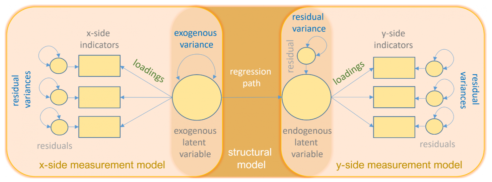
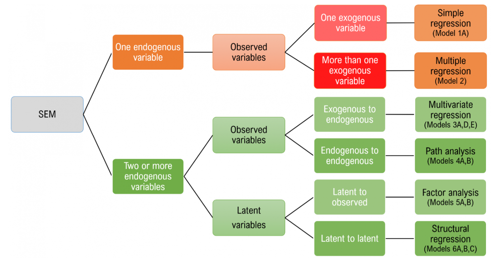
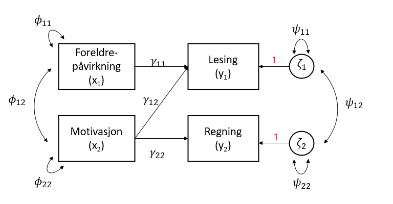
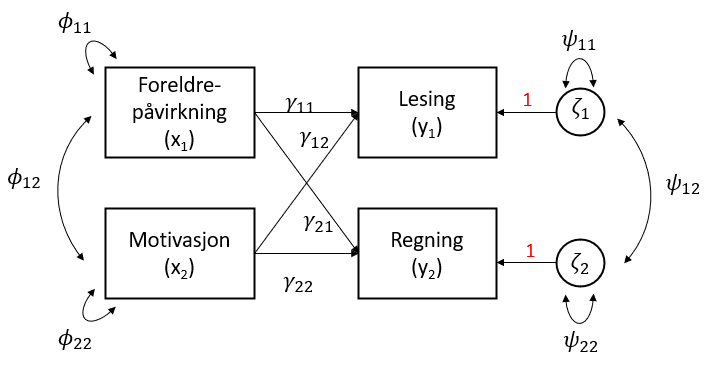
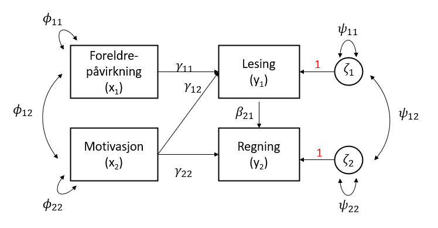
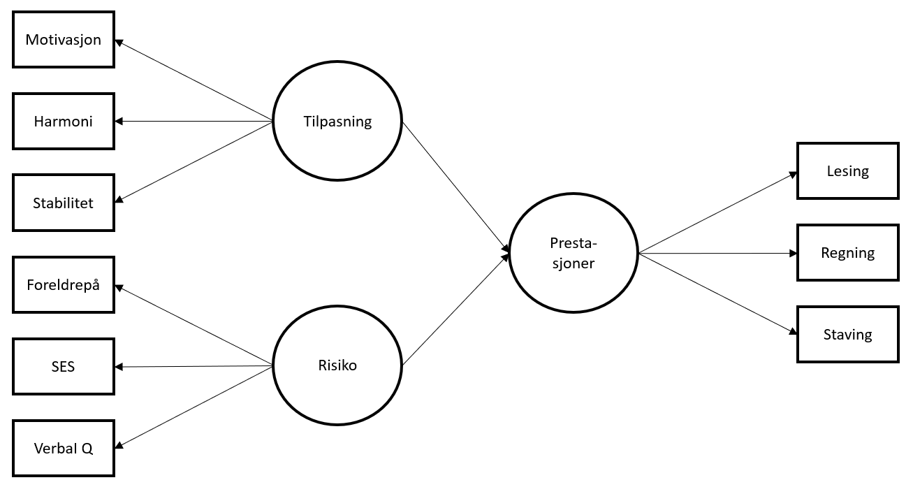

# Structural Equation Modelling (SEM - Strukturelle Regresjonsmodeller)

R-pakker brukt i dette kapittelet:


```r
pacman::p_load(lavaan, lavaanPlot, haven, tidyverse, sjPlot)
```

SEM-analyse er en lineær metodikk som modellerer regresjonslikninger og latente variabler samtidig. En "vanlig" lineær regresjon (og f.eks. CFA) kan ses på som ulike spesielle tilfeller av SEM. Alle modellene er satt i et overordnet rammeverk - LISREL (LInear Structural RELations) [@joreskogGeneralApproachConfirmatory1969; @joreskogGeneralMethodEstimating1970; @joreskogStructuralAnalysisCovariance1978; @joreskogkarlg.MultivariateAnalysisLISREL2016] (LISREL&copy; er også et [program](https://ssicentral.com/index.php/products/lisrel/) for standard og multilevel modellering av strukturelle regresjonsmodeller).

For en svært nyttig gjennomgang av SEM anbefaler vi @linIntroductionStructuralEquation2021. @linIntroductionStructuralEquation2021 beskriver disse modellene under SEM-paraplyen:

- Enkel lineær regresjon
- Multippel regresjon
- Multivariat regresjon
- Stianalyse ("path analysis")
- Bekreftende faktoranalyse
- Strukturell regresjon

Lineær regresjon behandler forholdet mellom observerte variabler, CFA forholdet mellom latente og observerte variabler, mens strukturell regresjon behandler latent-til-latent variabler. Stianalyse er en form for multippel regresjonsanalyse. 

Det som er særegent for SEM er at det omfatter både forholdet observert-latente variabler ("measurement model") og latent-latent variabler ("structural model"). 

@linIntroductionStructuralEquation2021 illustrerer en typisk SEM-modell slik:

{width=90%}

- Sirkel = Latent variabel
- Firkant = Observert variabel
- Trekant = Intercept
- Rett pil = Sti (startpunkt markerer variabel som predikerer sluttpunkt på pila)
- Buet pil = Varians eller kovarians

Et sentral poeng å huske på er at på lik linje med bekreftende faktoranalyse CFA er SEM en "bekreftende metode", altså bør det ligge solid teori i bakgrunnen der vi modellerer for å finne støtte eller ikke for modellen. 

Vi vil også poengtere at SEM-analyse trives best med større datautvalg. @klinePrinciplesPracticeStructural2016 foreskriver at $\frac{n}{q}$ bør være $20:1$, der $q$ er antall parametere i modellen. Altså, hvis antall parametere er 15 bør utvalgsstørrelsen være minst 300.

@linIntroductionStructuralEquation2021 illustrerer modellvalg i SEM på denne måten (referansene til "Model 1A" etc. i illustrasjonen under referer til ulike modeller Lin bygger i sin gjennomgang) ^[se kapittel 1 for definisjon av begreper som eksogene og endogene variabler]:

{width=90%}

Siden vi i foregående kapitler har sett på såvel enkel som multippel regresjon og faktoranalyse vil vi i dette kapittelet bruke Lins eksempel for å belyse multivariat regresjon, stianalyse og strukturell regresjon.

## Datasettet

`<a href="" download="worland5.csv">Download worland5.csv</a>`{=html}

Datasettet i eksempelet ser på effektene av studenters bakgrunn på deres akademiske prestasjoner. 


```r
semdata <- read.csv("worland5.csv")
glimpse(semdata)
#> Rows: 500
#> Columns: 9
#> $ motiv  <dbl> -7.907122, 1.751478, 14.472570, -1.165421, …
#> $ harm   <dbl> -5.075312, -4.155847, -4.540677, -5.668406,…
#> $ stabi  <dbl> -3.138836, 3.520752, 4.070600, 2.600437, -6…
#> $ ppsych <dbl> -17.800210, 7.009367, 23.734260, 1.493158, …
#> $ ses    <dbl> 4.766450, -6.048681, -16.970670, 1.396363, …
#> $ verbal <dbl> -3.633360, -7.693461, -3.909941, 21.409450,…
#> $ read   <dbl> -3.488981, -4.520552, -4.818170, -3.138441,…
#> $ arith  <dbl> -9.989121, 8.196238, 7.529984, 5.730547, -0…
#> $ spell  <dbl> -6.567873, 8.778973, -5.688716, -2.915676, …
```

Vi ser at datasettet har 500 observasjoner av 9 observerte variabler. Hypotesen er at de 9 observerte variablene utgjør 3 latente variabler: Tilpasning, risiko og prestasjoner på denne måten:

- Tilpasning ("Adjustment")
    - **motiv**: Motivasjon
    - **harm**: Harmoni
    - **stabi**: Stabilitet
- Risiko ("Risk")
    - **ppsych**: (Negativ) foreldrepåvirkning
    - **ses**: SES - Sosioøkonomisk status
    - **verbal**: Verbal IQ
- Prestasjoner:
    - **read**: Lesing
    - **artih**: Regning
    - **spell**: Staving

Vi kan se på kovariansmatrisen:


```r
semdatacov <- as.matrix(cov(semdata))
tab_corr(semdatacov, triangle = "lower")
```

<table style="border-collapse:collapse; border:none;">
<tr>
<th style="font-style:italic; font-weight:normal; border-top:double black; border-bottom:1px solid black; padding:0.2cm;">&nbsp;</th>
<th style="font-style:italic; font-weight:normal; border-top:double black; border-bottom:1px solid black; padding:0.2cm;">motiv</th>
<th style="font-style:italic; font-weight:normal; border-top:double black; border-bottom:1px solid black; padding:0.2cm;">harm</th>
<th style="font-style:italic; font-weight:normal; border-top:double black; border-bottom:1px solid black; padding:0.2cm;">stabi</th>
<th style="font-style:italic; font-weight:normal; border-top:double black; border-bottom:1px solid black; padding:0.2cm;">ppsych</th>
<th style="font-style:italic; font-weight:normal; border-top:double black; border-bottom:1px solid black; padding:0.2cm;">ses</th>
<th style="font-style:italic; font-weight:normal; border-top:double black; border-bottom:1px solid black; padding:0.2cm;">verbal</th>
<th style="font-style:italic; font-weight:normal; border-top:double black; border-bottom:1px solid black; padding:0.2cm;">read</th>
<th style="font-style:italic; font-weight:normal; border-top:double black; border-bottom:1px solid black; padding:0.2cm;">arith</th>
<th style="font-style:italic; font-weight:normal; border-top:double black; border-bottom:1px solid black; padding:0.2cm;">spell</th>
</tr>
<tr>
<td style="font-style:italic;">motiv</td>
<td style="padding:0.2cm; text-align:center;">&nbsp;</td>
<td style="padding:0.2cm; text-align:center;">&nbsp;</td>
<td style="padding:0.2cm; text-align:center;">&nbsp;</td>
<td style="padding:0.2cm; text-align:center;">&nbsp;</td>
<td style="padding:0.2cm; text-align:center;">&nbsp;</td>
<td style="padding:0.2cm; text-align:center;">&nbsp;</td>
<td style="padding:0.2cm; text-align:center;">&nbsp;</td>
<td style="padding:0.2cm; text-align:center;">&nbsp;</td>
<td style="padding:0.2cm; text-align:center;">&nbsp;</td>
</tr>
<tr>
<td style="font-style:italic;">harm</td>
<td style="padding:0.2cm; text-align:center;">77.000</td>
<td style="padding:0.2cm; text-align:center;">&nbsp;</td>
<td style="padding:0.2cm; text-align:center;">&nbsp;</td>
<td style="padding:0.2cm; text-align:center;">&nbsp;</td>
<td style="padding:0.2cm; text-align:center;">&nbsp;</td>
<td style="padding:0.2cm; text-align:center;">&nbsp;</td>
<td style="padding:0.2cm; text-align:center;">&nbsp;</td>
<td style="padding:0.2cm; text-align:center;">&nbsp;</td>
<td style="padding:0.2cm; text-align:center;">&nbsp;</td>
</tr>
<tr>
<td style="font-style:italic;">stabi</td>
<td style="padding:0.2cm; text-align:center;">59.000</td>
<td style="padding:0.2cm; text-align:center;">58.000</td>
<td style="padding:0.2cm; text-align:center;">&nbsp;</td>
<td style="padding:0.2cm; text-align:center;">&nbsp;</td>
<td style="padding:0.2cm; text-align:center;">&nbsp;</td>
<td style="padding:0.2cm; text-align:center;">&nbsp;</td>
<td style="padding:0.2cm; text-align:center;">&nbsp;</td>
<td style="padding:0.2cm; text-align:center;">&nbsp;</td>
<td style="padding:0.2cm; text-align:center;">&nbsp;</td>
</tr>
<tr>
<td style="font-style:italic;">ppsych</td>
<td style="padding:0.2cm; text-align:center;">-25.000</td>
<td style="padding:0.2cm; text-align:center;">-25.000</td>
<td style="padding:0.2cm; text-align:center;">-16.000</td>
<td style="padding:0.2cm; text-align:center;">&nbsp;</td>
<td style="padding:0.2cm; text-align:center;">&nbsp;</td>
<td style="padding:0.2cm; text-align:center;">&nbsp;</td>
<td style="padding:0.2cm; text-align:center;">&nbsp;</td>
<td style="padding:0.2cm; text-align:center;">&nbsp;</td>
<td style="padding:0.2cm; text-align:center;">&nbsp;</td>
</tr>
<tr>
<td style="font-style:italic;">ses</td>
<td style="padding:0.2cm; text-align:center;">25.000</td>
<td style="padding:0.2cm; text-align:center;">26.000</td>
<td style="padding:0.2cm; text-align:center;">18.000</td>
<td style="padding:0.2cm; text-align:center;">-42.000</td>
<td style="padding:0.2cm; text-align:center;">&nbsp;</td>
<td style="padding:0.2cm; text-align:center;">&nbsp;</td>
<td style="padding:0.2cm; text-align:center;">&nbsp;</td>
<td style="padding:0.2cm; text-align:center;">&nbsp;</td>
<td style="padding:0.2cm; text-align:center;">&nbsp;</td>
</tr>
<tr>
<td style="font-style:italic;">verbal</td>
<td style="padding:0.2cm; text-align:center;">32.000</td>
<td style="padding:0.2cm; text-align:center;">25.000</td>
<td style="padding:0.2cm; text-align:center;">27.000</td>
<td style="padding:0.2cm; text-align:center;">-40.000</td>
<td style="padding:0.2cm; text-align:center;">40.000</td>
<td style="padding:0.2cm; text-align:center;">&nbsp;</td>
<td style="padding:0.2cm; text-align:center;">&nbsp;</td>
<td style="padding:0.2cm; text-align:center;">&nbsp;</td>
<td style="padding:0.2cm; text-align:center;">&nbsp;</td>
</tr>
<tr>
<td style="font-style:italic;">read</td>
<td style="padding:0.2cm; text-align:center;">53.000</td>
<td style="padding:0.2cm; text-align:center;">42.000</td>
<td style="padding:0.2cm; text-align:center;">36.000</td>
<td style="padding:0.2cm; text-align:center;">-39.000</td>
<td style="padding:0.2cm; text-align:center;">43.000</td>
<td style="padding:0.2cm; text-align:center;">56.000</td>
<td style="padding:0.2cm; text-align:center;">&nbsp;</td>
<td style="padding:0.2cm; text-align:center;">&nbsp;</td>
<td style="padding:0.2cm; text-align:center;">&nbsp;</td>
</tr>
<tr>
<td style="font-style:italic;">arith</td>
<td style="padding:0.2cm; text-align:center;">60.000</td>
<td style="padding:0.2cm; text-align:center;">44.000</td>
<td style="padding:0.2cm; text-align:center;">38.000</td>
<td style="padding:0.2cm; text-align:center;">-24.000</td>
<td style="padding:0.2cm; text-align:center;">37.000</td>
<td style="padding:0.2cm; text-align:center;">49.000</td>
<td style="padding:0.2cm; text-align:center;">73.000</td>
<td style="padding:0.2cm; text-align:center;">&nbsp;</td>
<td style="padding:0.2cm; text-align:center;">&nbsp;</td>
</tr>
<tr>
<td style="font-style:italic;">spell</td>
<td style="padding:0.2cm; text-align:center;">59.000</td>
<td style="padding:0.2cm; text-align:center;">45.000</td>
<td style="padding:0.2cm; text-align:center;">38.000</td>
<td style="padding:0.2cm; text-align:center;">-31.000</td>
<td style="padding:0.2cm; text-align:center;">33.000</td>
<td style="padding:0.2cm; text-align:center;">48.000</td>
<td style="padding:0.2cm; text-align:center;">87.000</td>
<td style="padding:0.2cm; text-align:center;">72.000</td>
<td style="padding:0.2cm; text-align:center;">&nbsp;</td>
</tr>
<tr>
<td colspan="10" style="border-bottom:double black; border-top:1px solid black; font-style:italic; font-size:0.9em; text-align:right;">Computed correlation used pearson-method with listwise-deletion.</td>
</tr>
 
</table>

En positiv kovarians betyr altså at når f.eks. motivasjon og harmoni er positivt kovariert (77) øker den ene når den andre øker. Og motsatt - når motivasjon og foreldrepåvirkning er negativt kovariert (-25) betyr det at negativ foreldrepåvirkning resulterer i lavere motivasjon.

## Multivariat regresjon

Multivariat regresjon skiller seg fra multippel regresjon ved at vi har flere avhengige variabler (multippel regresjon har flere uavhengige variabler, men kun 1 avhengig variabel). 

I dette eksempelet er vår hypotese at motivasjon predikerer både lesing og regning, mens foreldrepåvirkning kun predikerer lesing (sammen med motivasjon). 

{width=90%}

$\gamma_{11}, \gamma_{12}\ og\ \gamma_{22}\ er\ ladningen\ på\ de\ latente\ variablene$
$\phi_{11}\ og\ \phi_{22}\ er\ variansen\ i\ x_1\ og\ x_2\ (de\ observerte\ variablene\ x_1\ og\ x_2)$
$\phi_{12}\ er\ kovariansen\ mellom\ de\ to\ eksogene\ variablene\ x_1\ og\ x_2$
$\zeta_1\ og\ \zeta_2\ er\ residualene\ til\ de\ to\ latente\ variablene\ y_1\ og\ y_2$
$\psi_{11}\ og\ \psi_{22}\ er\ variansen\ i\ residualene\ til\ de\ latente\ variablene$
$\psi_{12}\ er\ kovariansen\ mellom\ residualene\ til\ de\ latente\ variablene$

Vi kan da lage den første modellen:


```r
semmultivregr <- '
    read ~ ppsych + motiv
    arith ~ motiv'
fitsemmultivregr <- sem(semmultivregr, data = semdata)
summary(fitsemmultivregr)
#> lavaan 0.6-12 ended normally after 17 iterations
#> 
#>   Estimator                                         ML
#>   Optimization method                           NLMINB
#>   Number of model parameters                         6
#> 
#>   Number of observations                           500
#> 
#> Model Test User Model:
#>                                                       
#>   Test statistic                                 6.796
#>   Degrees of freedom                                 1
#>   P-value (Chi-square)                           0.009
#> 
#> Parameter Estimates:
#> 
#>   Standard errors                             Standard
#>   Information                                 Expected
#>   Information saturated (h1) model          Structured
#> 
#> Regressions:
#>                    Estimate  Std.Err  z-value  P(>|z|)
#>   read ~                                              
#>     ppsych           -0.216    0.030   -7.289    0.000
#>     motiv             0.476    0.037   12.918    0.000
#>   arith ~                                             
#>     motiv             0.600    0.036   16.771    0.000
#> 
#> Covariances:
#>                    Estimate  Std.Err  z-value  P(>|z|)
#>  .read ~~                                             
#>    .arith            39.179    3.373   11.615    0.000
#> 
#> Variances:
#>                    Estimate  Std.Err  z-value  P(>|z|)
#>    .read             65.032    4.113   15.811    0.000
#>    .arith            63.872    4.040   15.811    0.000
```

I delen "Regressions" over ser vi at forholdet mellom lesing og foreldrepåvirkning er -0.216, og 0.476 mellom lesing og motivasjon. Dvs. for hver enhet økning i (negativ) foreldrepåvirkning synker lesing med 0.216 når det er kontrollert for påvirkningen fra motivasjon. På samme måte: en enhets økning i motivasjon øker lesing med 0.476 når vi har kontrollert for foreldrepåvirkningen. Vi ser også at regning øker med 0.6 når motivasjon øker med en enhet. 

Vi kan imidlertid tenke oss at foreldrepåvirkning også predikerer regning slik at vi får følgende modell:

{width=90%}

Vi får da modeel 2:


```r
semmultivregr2 <- '
    read ~ 1 + ppsych + motiv
    arith ~ 1 + ppsych + motiv'
fitsemmultivregr2 <- sem(semmultivregr2, data = semdata)
summary(fitsemmultivregr2)
#> lavaan 0.6-12 ended normally after 25 iterations
#> 
#>   Estimator                                         ML
#>   Optimization method                           NLMINB
#>   Number of model parameters                         9
#> 
#>   Number of observations                           500
#> 
#> Model Test User Model:
#>                                                       
#>   Test statistic                                 0.000
#>   Degrees of freedom                                 0
#> 
#> Parameter Estimates:
#> 
#>   Standard errors                             Standard
#>   Information                                 Expected
#>   Information saturated (h1) model          Structured
#> 
#> Regressions:
#>                    Estimate  Std.Err  z-value  P(>|z|)
#>   read ~                                              
#>     ppsych           -0.275    0.037   -7.385    0.000
#>     motiv             0.461    0.037   12.404    0.000
#>   arith ~                                             
#>     ppsych           -0.096    0.037   -2.616    0.009
#>     motiv             0.576    0.037   15.695    0.000
#> 
#> Covariances:
#>                    Estimate  Std.Err  z-value  P(>|z|)
#>  .read ~~                                             
#>    .arith            38.651    3.338   11.579    0.000
#> 
#> Intercepts:
#>                    Estimate  Std.Err  z-value  P(>|z|)
#>    .read             -0.000    0.360   -0.000    1.000
#>    .arith             0.000    0.355    0.000    1.000
#> 
#> Variances:
#>                    Estimate  Std.Err  z-value  P(>|z|)
#>    .read             64.708    4.092   15.811    0.000
#>    .arith            63.010    3.985   15.811    0.000
```

Vi kan tolke dette på samme måte som første modell.

## Stianalyse

Vi skal bygge videre på den første multivariate regresjonsmodellen over, men nå tenke oss at de endogende variablene påvirker hverandre $\beta_\{21}$. Dette kan vi illustrere slik:

{width=90%}

Vi ser at vi her har en tilleggshypotese om at lesing predikerer regning.


```r
stianalyse <- '
    read ~ 1 + ppsych + motiv
    arith ~ 1 + motiv + read
'
fitstianalyse <- sem(stianalyse, data = semdata)
summary(fitstianalyse)
#> lavaan 0.6-12 ended normally after 1 iterations
#> 
#>   Estimator                                         ML
#>   Optimization method                           NLMINB
#>   Number of model parameters                         8
#> 
#>   Number of observations                           500
#> 
#> Model Test User Model:
#>                                                       
#>   Test statistic                                 4.870
#>   Degrees of freedom                                 1
#>   P-value (Chi-square)                           0.027
#> 
#> Parameter Estimates:
#> 
#>   Standard errors                             Standard
#>   Information                                 Expected
#>   Information saturated (h1) model          Structured
#> 
#> Regressions:
#>                    Estimate  Std.Err  z-value  P(>|z|)
#>   read ~                                              
#>     ppsych           -0.275    0.037   -7.385    0.000
#>     motiv             0.461    0.037   12.404    0.000
#>   arith ~                                             
#>     motiv             0.296    0.034    8.841    0.000
#>     read              0.573    0.034   17.093    0.000
#> 
#> Intercepts:
#>                    Estimate  Std.Err  z-value  P(>|z|)
#>    .read              0.000    0.360    0.000    1.000
#>    .arith             0.000    0.284    0.000    1.000
#> 
#> Variances:
#>                    Estimate  Std.Err  z-value  P(>|z|)
#>    .read             64.708    4.092   15.811    0.000
#>    .arith            40.314    2.550   15.811    0.000
```

Det vi først og fremst vil kommentere her er at regning predikeres i større grad av lesing enn av motivasjon - en enhets økning i motivasjon gir økning i regning på 0.296, mens tilsvarende en enhets økning i lesing gir økning på 0.573.

Som @linIntroductionStructuralEquation2021 poengterer er modellen "over-saturated" (vi går ikke inn i detaljer rundt det, men vi kan se at antall frihetsgrader er positiv slik at vi i prinsippet kan legge til flere stier - avhengig av hvor mange frihetsgrader som er "tilgjengelig"). Hvis vi ikke har noen sterk hypotese om hvilken sti dette bør være kan man gjennomføre en kjikvadrattest ("modification index") som vil vise hvordna kjikvadratverdien vil endre seg som følge av å inkludere en gitt parameter til i modellen:


```r
modindices(fitstianalyse, sort = TRUE)
#>       lhs op    rhs     mi    epc sepc.lv sepc.all sepc.nox
#> 21  motiv  ~  arith 68.073  8.874   8.874    8.874    8.874
#> 14   read ~~  arith  4.847 16.034  16.034    0.314    0.314
#> 16  arith  ~ ppsych  4.847  0.068   0.068    0.068    0.007
#> 15   read  ~  arith  4.847  0.398   0.398    0.398    0.398
#> 18 ppsych  ~  arith  2.188  0.071   0.071    0.071    0.071
#> 20  motiv  ~   read  0.000  0.000   0.000    0.000    0.000
#> 17 ppsych  ~   read  0.000  0.000   0.000    0.000    0.000
#> 22  motiv  ~ ppsych  0.000  0.000   0.000    0.000    0.000
#> 11  motiv ~~  motiv  0.000  0.000   0.000    0.000    0.000
#> 10 ppsych ~~  motiv  0.000  0.000   0.000       NA    0.000
#> 19 ppsych  ~  motiv  0.000  0.000   0.000    0.000    0.000
```

Den klart mest innflytelsesrike parameteren er motiv ~ arith. Forventet endring i regresjonskoeffisienten ("expected parameter change" - epc) er 8.874. 
Vi går ikke videre med revidert modell, og det er verdt å poengtere @linIntroductionStructuralEquation2021 advarsel om forsiktighet i å endre modellen "fordi vi kan". Faren for Type I feil kan stige drastisk. Igjen er et et nøkkelpunkt å ha solide hypotseser og teoretisk forankring i forkant av analysene.

Vi skal til slutt se på hvor god modellen er ("fit statistics").


```r
summary(fitstianalyse, fit.measures = TRUE)
#> lavaan 0.6-12 ended normally after 1 iterations
#> 
#>   Estimator                                         ML
#>   Optimization method                           NLMINB
#>   Number of model parameters                         8
#> 
#>   Number of observations                           500
#> 
#> Model Test User Model:
#>                                                       
#>   Test statistic                                 4.870
#>   Degrees of freedom                                 1
#>   P-value (Chi-square)                           0.027
#> 
#> Model Test Baseline Model:
#> 
#>   Test statistic                               674.748
#>   Degrees of freedom                                 5
#>   P-value                                        0.000
#> 
#> User Model versus Baseline Model:
#> 
#>   Comparative Fit Index (CFI)                    0.994
#>   Tucker-Lewis Index (TLI)                       0.971
#> 
#> Loglikelihood and Information Criteria:
#> 
#>   Loglikelihood user model (H0)              -3385.584
#>   Loglikelihood unrestricted model (H1)      -3383.149
#>                                                       
#>   Akaike (AIC)                                6787.168
#>   Bayesian (BIC)                              6820.885
#>   Sample-size adjusted Bayesian (BIC)         6795.492
#> 
#> Root Mean Square Error of Approximation:
#> 
#>   RMSEA                                          0.088
#>   90 Percent confidence interval - lower         0.024
#>   90 Percent confidence interval - upper         0.172
#>   P-value RMSEA <= 0.05                          0.139
#> 
#> Standardized Root Mean Square Residual:
#> 
#>   SRMR                                           0.015
#> 
#> Parameter Estimates:
#> 
#>   Standard errors                             Standard
#>   Information                                 Expected
#>   Information saturated (h1) model          Structured
#> 
#> Regressions:
#>                    Estimate  Std.Err  z-value  P(>|z|)
#>   read ~                                              
#>     ppsych           -0.275    0.037   -7.385    0.000
#>     motiv             0.461    0.037   12.404    0.000
#>   arith ~                                             
#>     motiv             0.296    0.034    8.841    0.000
#>     read              0.573    0.034   17.093    0.000
#> 
#> Intercepts:
#>                    Estimate  Std.Err  z-value  P(>|z|)
#>    .read              0.000    0.360    0.000    1.000
#>    .arith             0.000    0.284    0.000    1.000
#> 
#> Variances:
#>                    Estimate  Std.Err  z-value  P(>|z|)
#>    .read             64.708    4.092   15.811    0.000
#>    .arith            40.314    2.550   15.811    0.000
```

1. CFI - Confirmatory Factor Index: Vil være en verdi mellom 0 og 1. Verdier over 0.9, evt 0.95 for en mer konsvervativ tilnærming, vurderes som bra. Siden vi har 0.994 her indikerer det en god modell.

2. TLI - Tucker Lewis Index: Også verdier mellom 0 og 1, og 0.9 som en foreslått grense for god modell. Vi har 0.971. 

3. RMSEA - Root Mean Square Error of Approximation: @klinePrinciplesPracticeStructural2016 foreslår at verdier under eller lik 0.05 er "close fit", mellom 0.05 og 0.08 er "reasonable fit", mens verdier over 0.08 er "poor fit". Siden vi har 0.088 har vi en "reasonable fit". 

## Strukturell regresjon

### En endogen variabel

Vår hypotese for denne modellen er at de latente eksogene variablene Tilpasning og Risiko hver har 3 indikatorer (jfr. gjennomgang av datasettet i starten av kapittelet). Vi har videre en latent endogen variabel - Prestasjon - med sine tre indikatorer. Begge "sidene" utgjør "measurement models". I tillegg har vi den strukturelle regresjonen der vi hypotetiserer at Tilpasning positivt predikerer Prestasjon, mens Risiko negativt predikerer Prestasjon. Under viser vi under modellen svært forenklet.

{width=90%}


```r
strukregrsem <- '
    adjust = ~ motiv + harm + stabi
    risk = ~ verbal + ppsych + ses
    achieve = ~ read + arith + spell
    achieve ~ adjust + risk
    '
fitstrukregrsem <- sem(strukregrsem, data=semdata)
summary(fitstrukregrsem, standardized=TRUE, fit.measures=TRUE)
#> lavaan 0.6-12 ended normally after 130 iterations
#> 
#>   Estimator                                         ML
#>   Optimization method                           NLMINB
#>   Number of model parameters                        21
#> 
#>   Number of observations                           500
#> 
#> Model Test User Model:
#>                                                       
#>   Test statistic                               148.982
#>   Degrees of freedom                                24
#>   P-value (Chi-square)                           0.000
#> 
#> Model Test Baseline Model:
#> 
#>   Test statistic                              2597.972
#>   Degrees of freedom                                36
#>   P-value                                        0.000
#> 
#> User Model versus Baseline Model:
#> 
#>   Comparative Fit Index (CFI)                    0.951
#>   Tucker-Lewis Index (TLI)                       0.927
#> 
#> Loglikelihood and Information Criteria:
#> 
#>   Loglikelihood user model (H0)             -15517.857
#>   Loglikelihood unrestricted model (H1)     -15443.366
#>                                                       
#>   Akaike (AIC)                               31077.713
#>   Bayesian (BIC)                             31166.220
#>   Sample-size adjusted Bayesian (BIC)        31099.565
#> 
#> Root Mean Square Error of Approximation:
#> 
#>   RMSEA                                          0.102
#>   90 Percent confidence interval - lower         0.087
#>   90 Percent confidence interval - upper         0.118
#>   P-value RMSEA <= 0.05                          0.000
#> 
#> Standardized Root Mean Square Residual:
#> 
#>   SRMR                                           0.041
#> 
#> Parameter Estimates:
#> 
#>   Standard errors                             Standard
#>   Information                                 Expected
#>   Information saturated (h1) model          Structured
#> 
#> Latent Variables:
#>                    Estimate  Std.Err  z-value  P(>|z|)
#>   adjust =~                                           
#>     motiv             1.000                           
#>     harm              0.884    0.041   21.774    0.000
#>     stabi             0.695    0.043   15.987    0.000
#>   risk =~                                             
#>     verbal            1.000                           
#>     ppsych           -0.770    0.075  -10.223    0.000
#>     ses               0.807    0.076   10.607    0.000
#>   achieve =~                                          
#>     read              1.000                           
#>     arith             0.837    0.034   24.437    0.000
#>     spell             0.976    0.028   34.338    0.000
#>    Std.lv  Std.all
#>                   
#>     9.324    0.933
#>     8.246    0.825
#>     6.478    0.648
#>                   
#>     7.319    0.733
#>    -5.636   -0.564
#>     5.906    0.591
#>                   
#>     9.404    0.941
#>     7.873    0.788
#>     9.178    0.919
#> 
#> Regressions:
#>                    Estimate  Std.Err  z-value  P(>|z|)
#>   achieve ~                                           
#>     adjust            0.375    0.046    8.085    0.000
#>     risk              0.724    0.078    9.253    0.000
#>    Std.lv  Std.all
#>                   
#>     0.372    0.372
#>     0.564    0.564
#> 
#> Covariances:
#>                    Estimate  Std.Err  z-value  P(>|z|)
#>   adjust ~~                                           
#>     risk             32.098    4.320    7.431    0.000
#>    Std.lv  Std.all
#>                   
#>     0.470    0.470
#> 
#> Variances:
#>                    Estimate  Std.Err  z-value  P(>|z|)
#>    .motiv            12.870    2.852    4.512    0.000
#>    .harm             31.805    2.973   10.698    0.000
#>    .stabi            57.836    3.990   14.494    0.000
#>    .verbal           46.239    4.788    9.658    0.000
#>    .ppsych           68.033    5.068   13.425    0.000
#>    .ses              64.916    4.975   13.048    0.000
#>    .read             11.372    1.608    7.074    0.000
#>    .arith            37.818    2.680   14.109    0.000
#>    .spell            15.560    1.699    9.160    0.000
#>     adjust           86.930    6.830   12.727    0.000
#>     risk             53.561    6.757    7.927    0.000
#>    .achieve          30.685    3.449    8.896    0.000
#>    Std.lv  Std.all
#>    12.870    0.129
#>    31.805    0.319
#>    57.836    0.580
#>    46.239    0.463
#>    68.033    0.682
#>    64.916    0.650
#>    11.372    0.114
#>    37.818    0.379
#>    15.560    0.156
#>     1.000    1.000
#>     1.000    1.000
#>     0.347    0.347
```

Vi kan også vise modellen grafisk. I illustrasjonen under har vi spesifisert at vi kun ønsker signifikante stier (< 0.05).


```r
lavaanPlot(model = fitstrukregrsem, 
           node_options = list(shape = "box", fontname = "Helvetica"), 
           edge_options = list(color = "grey"), coefs = TRUE, sig = .05)
```

```{=html}
<div id="htmlwidget-be99e70858b676b78a65" style="width:672px;height:480px;" class="grViz html-widget"></div>
<script type="application/json" data-for="htmlwidget-be99e70858b676b78a65">{"x":{"diagram":" digraph plot { \n graph [ overlap = true, fontsize = 10 ] \n node [ shape = box, fontname = Helvetica ] \n node [shape = box] \n motiv; harm; stabi; verbal; ppsych; ses; read; arith; spell \n node [shape = oval] \n adjust; risk; achieve \n \n edge [ color = grey ] \n adjust->achieve [label = \"0.37\"] risk->achieve [label = \"0.72\"] adjust->motiv [label = \"1\"] adjust->harm [label = \"0.88\"] adjust->stabi [label = \"0.69\"] risk->verbal [label = \"1\"] risk->ppsych [label = \"-0.77\"] risk->ses [label = \"0.81\"] achieve->read [label = \"1\"] achieve->arith [label = \"0.84\"] achieve->spell [label = \"0.98\"] \n}","config":{"engine":"dot","options":null}},"evals":[],"jsHooks":[]}</script>
```

### To endogene variabler

En annen mulig hypotese er denne:

{width=90%}

Risiko predikerer i denne modellen Tilpasning, og at den endogene variabelen Tilpasning og den eksogene variabelen Risiko predikerer den endogene variabelen Prestasjon.


```r
strukregrsem2 <- '
    adjust =~ motiv + harm + stabi
    risk =~ verbal + ses + ppsych
    achieve =~ read + arith + spell
    adjust ~ risk 
    achieve ~ adjust + risk
    '
fitstrukregrsem2 <- sem(strukregrsem2, data = semdata)
summary(fitstrukregrsem2, standardized = TRUE, fit.measures = TRUE)
#> lavaan 0.6-12 ended normally after 112 iterations
#> 
#>   Estimator                                         ML
#>   Optimization method                           NLMINB
#>   Number of model parameters                        21
#> 
#>   Number of observations                           500
#> 
#> Model Test User Model:
#>                                                       
#>   Test statistic                               148.982
#>   Degrees of freedom                                24
#>   P-value (Chi-square)                           0.000
#> 
#> Model Test Baseline Model:
#> 
#>   Test statistic                              2597.972
#>   Degrees of freedom                                36
#>   P-value                                        0.000
#> 
#> User Model versus Baseline Model:
#> 
#>   Comparative Fit Index (CFI)                    0.951
#>   Tucker-Lewis Index (TLI)                       0.927
#> 
#> Loglikelihood and Information Criteria:
#> 
#>   Loglikelihood user model (H0)             -15517.857
#>   Loglikelihood unrestricted model (H1)     -15443.366
#>                                                       
#>   Akaike (AIC)                               31077.713
#>   Bayesian (BIC)                             31166.220
#>   Sample-size adjusted Bayesian (BIC)        31099.565
#> 
#> Root Mean Square Error of Approximation:
#> 
#>   RMSEA                                          0.102
#>   90 Percent confidence interval - lower         0.087
#>   90 Percent confidence interval - upper         0.118
#>   P-value RMSEA <= 0.05                          0.000
#> 
#> Standardized Root Mean Square Residual:
#> 
#>   SRMR                                           0.041
#> 
#> Parameter Estimates:
#> 
#>   Standard errors                             Standard
#>   Information                                 Expected
#>   Information saturated (h1) model          Structured
#> 
#> Latent Variables:
#>                    Estimate  Std.Err  z-value  P(>|z|)
#>   adjust =~                                           
#>     motiv             1.000                           
#>     harm              0.884    0.041   21.774    0.000
#>     stabi             0.695    0.043   15.987    0.000
#>   risk =~                                             
#>     verbal            1.000                           
#>     ses               0.807    0.076   10.607    0.000
#>     ppsych           -0.770    0.075  -10.223    0.000
#>   achieve =~                                          
#>     read              1.000                           
#>     arith             0.837    0.034   24.437    0.000
#>     spell             0.976    0.028   34.338    0.000
#>    Std.lv  Std.all
#>                   
#>     9.324    0.933
#>     8.246    0.825
#>     6.478    0.648
#>                   
#>     7.319    0.733
#>     5.906    0.591
#>    -5.636   -0.564
#>                   
#>     9.404    0.941
#>     7.873    0.788
#>     9.178    0.919
#> 
#> Regressions:
#>                    Estimate  Std.Err  z-value  P(>|z|)
#>   adjust ~                                            
#>     risk              0.599    0.076    7.837    0.000
#>   achieve ~                                           
#>     adjust            0.375    0.046    8.085    0.000
#>     risk              0.724    0.078    9.253    0.000
#>    Std.lv  Std.all
#>                   
#>     0.470    0.470
#>                   
#>     0.372    0.372
#>     0.564    0.564
#> 
#> Variances:
#>                    Estimate  Std.Err  z-value  P(>|z|)
#>    .motiv            12.870    2.852    4.512    0.000
#>    .harm             31.805    2.973   10.698    0.000
#>    .stabi            57.836    3.990   14.494    0.000
#>    .verbal           46.239    4.788    9.658    0.000
#>    .ses              64.916    4.975   13.048    0.000
#>    .ppsych           68.033    5.068   13.425    0.000
#>    .read             11.372    1.608    7.074    0.000
#>    .arith            37.818    2.680   14.109    0.000
#>    .spell            15.560    1.699    9.160    0.000
#>    .adjust           67.694    6.066   11.160    0.000
#>     risk             53.561    6.757    7.927    0.000
#>    .achieve          30.685    3.449    8.896    0.000
#>    Std.lv  Std.all
#>    12.870    0.129
#>    31.805    0.319
#>    57.836    0.580
#>    46.239    0.463
#>    64.916    0.650
#>    68.033    0.682
#>    11.372    0.114
#>    37.818    0.379
#>    15.560    0.156
#>     0.779    0.779
#>     1.000    1.000
#>     0.347    0.347
```


```r
lavaanPlot(model = fitstrukregrsem2, 
           node_options = list(shape = "box", fontname = "Helvetica"), 
           edge_options = list(color = "grey"), coefs = TRUE, sig = .05)
```

```{=html}
<div id="htmlwidget-51087caf7e8af76668b7" style="width:672px;height:480px;" class="grViz html-widget"></div>
<script type="application/json" data-for="htmlwidget-51087caf7e8af76668b7">{"x":{"diagram":" digraph plot { \n graph [ overlap = true, fontsize = 10 ] \n node [ shape = box, fontname = Helvetica ] \n node [shape = box] \n motiv; harm; stabi; verbal; ses; ppsych; read; arith; spell \n node [shape = oval] \n adjust; risk; achieve \n \n edge [ color = grey ] \n risk->adjust [label = \"0.6\"] adjust->achieve [label = \"0.37\"] risk->achieve [label = \"0.72\"] adjust->motiv [label = \"1\"] adjust->harm [label = \"0.88\"] adjust->stabi [label = \"0.69\"] risk->verbal [label = \"1\"] risk->ses [label = \"0.81\"] risk->ppsych [label = \"-0.77\"] achieve->read [label = \"1\"] achieve->arith [label = \"0.84\"] achieve->spell [label = \"0.98\"] \n}","config":{"engine":"dot","options":null}},"evals":[],"jsHooks":[]}</script>
```

