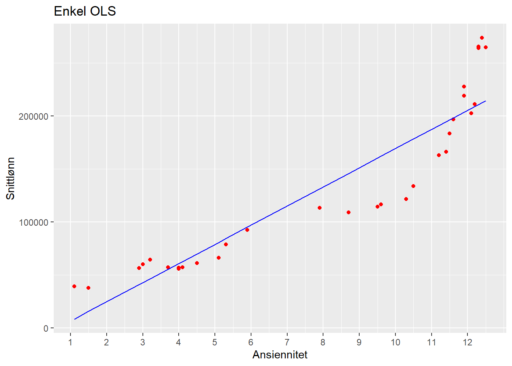
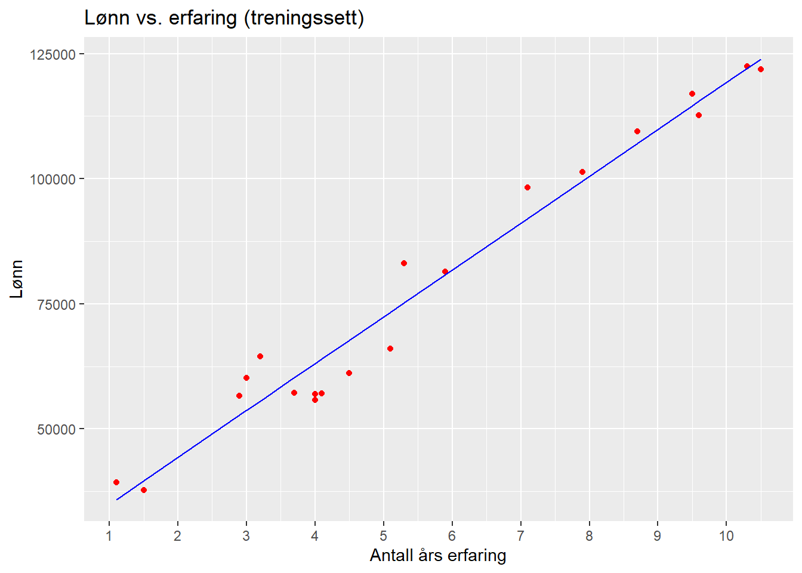
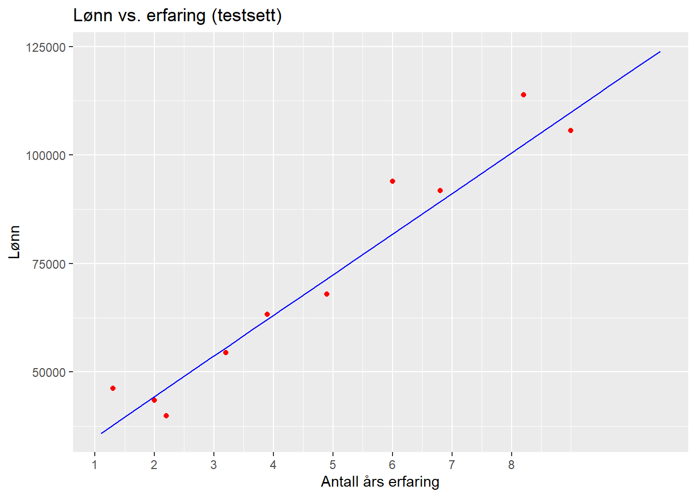
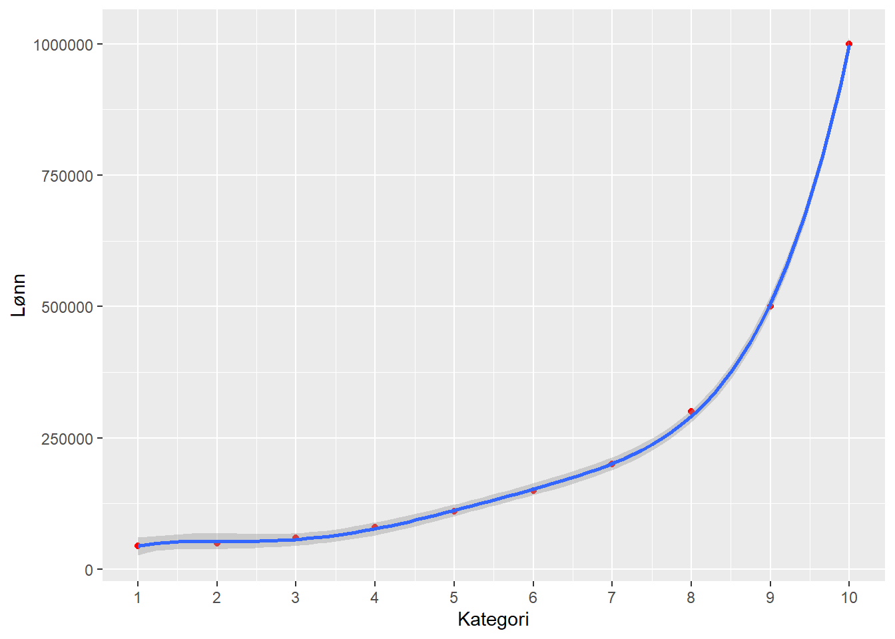
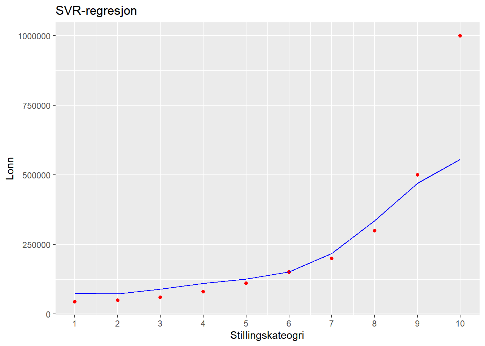
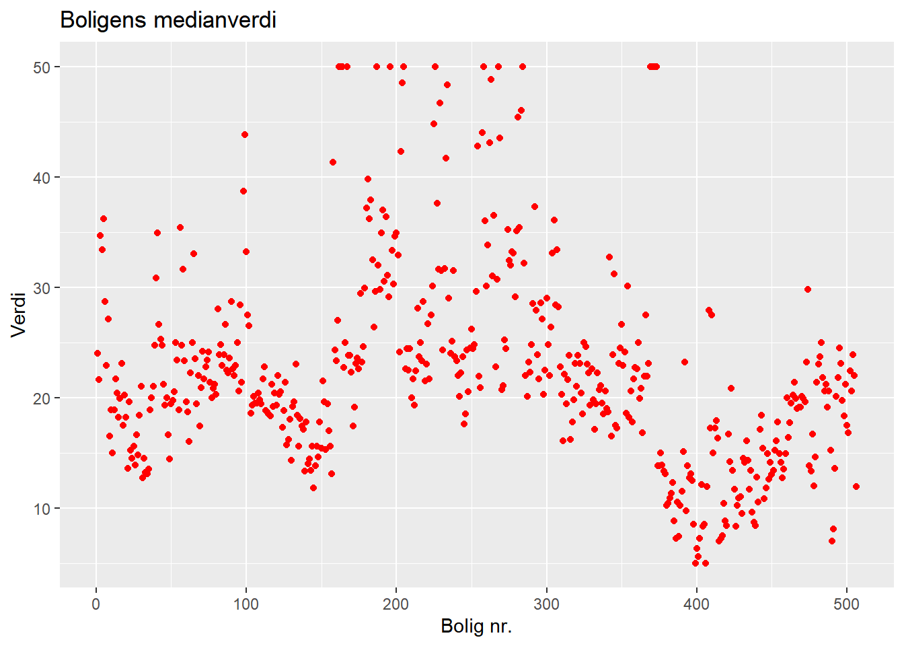
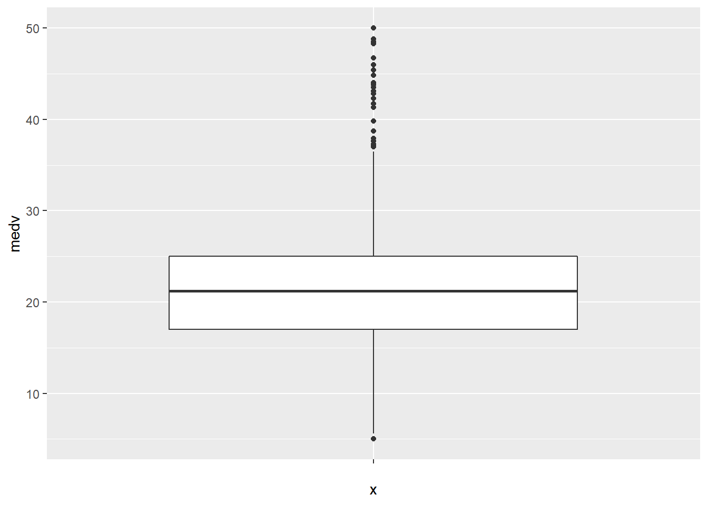

# Maskinlæring (Machine Learning)

Berepet "maskinlæring" har blitt et mer og mer sentralt begrep i dataanalyse. Selve begrepet ble "coinet" (først brukt) av @samuelStudiesMachineLearning1959. Endel av metodene i maskinlæring kjenner vi fra før. Regresjon er f.eks. et sentralt element i "pakken" av metoder som kan puttes inn i begrepet maskinlæring. Og regresjon er jo ikke noe nytt, så er maskinlæring kun et moteord? Et fancy ord på ting vi har gjort før? Tja, kanskje svaret er både ja og nei. Det er unektelig slik at vi har drevet med regresjonsanalyser lenge før begrepet maskinlæring i hvert fall ble allment kjent og popularisert. Samtidig er maskinlæring en distinkt gruppe av analytiske metoder hvis hensikt er å - nettopp - lære. Med dette mener vi modeller som bruker data til å forbedre analyseopgavene vi har foran oss. 

Maskinlæring knyttes tett til kunstig intelligens (Articifical Intelligence, eller bare AI). Det er imildertid ulike oppfatninger av hvordan disse begrepene forholder seg til hverandre. I tillegg har begrepet "deep learning" også kommet mer i fokus. En vanlig måte å se sammenhengen på er denne [@superdatascienceMachineLearningAZ2022]:


Det er videre vanlig å sele inn maskinlæring ut fra hvordan dataanalysen skjer:

- Supervised learning: Modellering gjennom algoritmer som kjenner både input og ønsket output.
- Unsupervised learning: Modellering gjennom algortimer som kjenner kun input, og forsøker finne mønstre og grupper i dataene. 
- Semi-supervised learning: En form for mellomting mellom supervised og unsupervised, dvs. vi kan ha mindre deler av data med input og putput som kan brukes på data uten kjent/ønsket output
- Reinforcement learning: Modellering gjennom algoritmer der henskten/målsetningen er å maksimere en oppfatning om kumulativ belønning/utkomme. Reinforcement learning brukes f.eks. til å lære maskiner å spille spill mot mennesker. 
- Dimensionality reduction: Dette kjenner vi fra f.eks. Principal Component Analysis (PCA), der hensikten er å redusere et større antall variabler til et mindre antall komponenter. 

Teknikkene som ofte brukes i maskinlæring er:

- Regresjon
- Klassifisering
- Clustering
- Association
- Natural Language Processing - NLP
- Deep learning
- Dimensionality reduction

## Regresjon

Vi har i tidligere kapitler gått gjennom enkel og multippel OLS og polynomial regresjon. Disse er også teknikker under paraplyen maskinlæring. Selv om vi har vist regresjon i tidligere kapittel introduserer vi et element i maskinlæringskapittelet som viser splitting av datasett i treningsdata og testdata. Dette er karakteristisk for maskinlæring. Det innebærer at vi deler datasettet (tilfeldig) inn i to grupper: den første gruppa - treningsdata - bruker vi til å lage/trene en modell. Den andre gruppa - testdata - bruker vi for å se hvor god modellen vi lagde med treningsdataene klarer å predikere dataene som ligger i testdatasettet. Testdatasettet består jo av "virkelige" data, så hvis modellen vår er god og klarer å predikere disse dataene kan vi si noe sikrere om hvor godt vi kan anta modellen vil predikere nye, hittil ikke målte/observerte verdier. 

Eksempelet er basert på @superdatascienceMachineLearningAZ2022. Det baserer seg på at vi har lønnsdata på 47 medarbeidere i et firma. I dette delkapittelet har vi lagd gjennomsnitt av lønn og ansiennitet for de ulike stillingskategoriene


```r
library(readxl)
library(tidyverse)
library(sjPlot)
```


```r
mldata1 <- read.csv("Lonnsdata.csv")
```

`<a href="data:text/csv;base64,RXJmYXJpbmcsTG9ubg0KMS4xLDM5MzQzLjAwDQoxLjMsNDYyMDUuMDANCjEuNSwzNzczMS4wMA0KMi4wLDQzNTI1LjAwDQoyLjIsMzk4OTEuMDANCjIuOSw1NjY0Mi4wMA0KMy4wLDYwMTUwLjAwDQozLjIsNTQ0NDUuMDANCjMuMiw2NDQ0NS4wMA0KMy43LDU3MTg5LjAwDQozLjksNjMyMTguMDANCjQuMCw1NTc5NC4wMA0KNC4wLDU2OTU3LjAwDQo0LjEsNTcwODEuMDANCjQuNSw2MTExMS4wMA0KNC45LDY3OTM4LjAwDQo1LjEsNjYwMjkuMDANCjUuMyw4MzA4OC4wMA0KNS45LDgxMzYzLjAwDQo2LjAsOTM5NDAuMDANCjYuOCw5MTczOC4wMA0KNy4xLDk4MjczLjAwDQo3LjksMTAxMzAyLjAwDQo4LjIsMTEzODEyLjAwDQo4LjcsMTA5NDMxLjAwDQo5LjAsMTA1NTgyLjAwDQo5LjUsMTE2OTY5LjAwDQo5LjYsMTEyNjM1LjAwDQoxMC4zLDEyMjM5MS4wMA0KMTAuNSwxMjE4NzIuMDANCg==" download="Lonnsdata.csv">Download Lonnsdata.csv</a>`{=html}


```r
glimpse(mldata1)
#> Rows: 30
#> Columns: 2
#> $ Erfaring <dbl> 1.1, 1.3, 1.5, 2.0, 2.2, 2.9, 3.0, 3.2, 3…
#> $ Lonn     <dbl> 39343, 46205, 37731, 43525, 39891, 56642,…
```

Vi har altså variablene "Erfaring" (ansiennitet i år) og månedslønn.

### Enkel lineær regresjon

Det første vi gjør er å splitte datasettet i treningsdata og testdata.


```r
library(caTools)
set.seed(123)
splitt <- sample.split(mldata1$Lonn, SplitRatio = 2/3)
treningssett1 <- subset(mldata1, splitt == TRUE)
testsett1 <- subset(mldata1, splitt == FALSE)
```

Det neste er å lage lineær modell på treningsdatasettet.


```r
enkelOLS <- lm(Lonn ~ Erfaring, data = treningssett1)
tab_model(enkelOLS)
```

<table style="border-collapse:collapse; border:none;">
<tr>
<th style="border-top: double; text-align:center; font-style:normal; font-weight:bold; padding:0.2cm;  text-align:left; ">&nbsp;</th>
<th colspan="3" style="border-top: double; text-align:center; font-style:normal; font-weight:bold; padding:0.2cm; ">Lonn</th>
</tr>
<tr>
<td style=" text-align:center; border-bottom:1px solid; font-style:italic; font-weight:normal;  text-align:left; ">Predictors</td>
<td style=" text-align:center; border-bottom:1px solid; font-style:italic; font-weight:normal;  ">Estimates</td>
<td style=" text-align:center; border-bottom:1px solid; font-style:italic; font-weight:normal;  ">CI</td>
<td style=" text-align:center; border-bottom:1px solid; font-style:italic; font-weight:normal;  ">p</td>
</tr>
<tr>
<td style=" padding:0.2cm; text-align:left; vertical-align:top; text-align:left; ">(Intercept)</td>
<td style=" padding:0.2cm; text-align:left; vertical-align:top; text-align:center;  ">25592.17</td>
<td style=" padding:0.2cm; text-align:left; vertical-align:top; text-align:center;  ">20033.16&nbsp;&ndash;&nbsp;31151.17</td>
<td style=" padding:0.2cm; text-align:left; vertical-align:top; text-align:center;  "><strong>&lt;0.001</strong></td>
</tr>
<tr>
<td style=" padding:0.2cm; text-align:left; vertical-align:top; text-align:left; ">Erfaring</td>
<td style=" padding:0.2cm; text-align:left; vertical-align:top; text-align:center;  ">9365.08</td>
<td style=" padding:0.2cm; text-align:left; vertical-align:top; text-align:center;  ">8480.60&nbsp;&ndash;&nbsp;10249.57</td>
<td style=" padding:0.2cm; text-align:left; vertical-align:top; text-align:center;  "><strong>&lt;0.001</strong></td>
</tr>
<tr>
<td style=" padding:0.2cm; text-align:left; vertical-align:top; text-align:left; padding-top:0.1cm; padding-bottom:0.1cm; border-top:1px solid;">Observations</td>
<td style=" padding:0.2cm; text-align:left; vertical-align:top; padding-top:0.1cm; padding-bottom:0.1cm; text-align:left; border-top:1px solid;" colspan="3">20</td>
</tr>
<tr>
<td style=" padding:0.2cm; text-align:left; vertical-align:top; text-align:left; padding-top:0.1cm; padding-bottom:0.1cm;">R<sup>2</sup> / R<sup>2</sup> adjusted</td>
<td style=" padding:0.2cm; text-align:left; vertical-align:top; padding-top:0.1cm; padding-bottom:0.1cm; text-align:left;" colspan="3">0.965 / 0.963</td>
</tr>

</table>

```r
enkelOLSplott <- ggplot() +
    geom_point(aes(x = treningssett1$Erfaring, y = treningssett1$Lonn), col = "red") +
    scale_x_continuous(breaks = round(seq(min(treningssett1$Erfaring), max(treningssett1$Erfaring), by = 1),0)) +
    geom_line(aes(x = treningssett1$Erfaring, y = predict(enkelOLS, newdata = treningssett1)), col = "blue") +
    ggtitle("Enkel OLS") +
    xlab("Stillingskategori") +
    ylab("Snittlønn")
enkelOLSplott
```



Vi kan visualisere såvel treningssett som testsett.


```r
library(ggplot2)
ggplot() +
    geom_point(aes(x = treningssett1$Erfaring, y = treningssett1$Lonn), 
               color = "red") +
    scale_x_continuous(breaks = round(seq(min(treningssett1$Erfaring), max(treningssett1$Erfaring), by = 1),0)) +
    geom_line(aes(x = treningssett1$Erfaring, y = predict(enkelOLS, newdata = treningssett1)),
              color = "blue") +
    ggtitle("Lønn vs. erfaring (treningssett)") +
    xlab("Antall års erfaring") + 
    ylab("Lønn")
```




```r
library(ggplot2)
ggplot() +
    geom_point(aes(x = testsett1$Erfaring, y = testsett1$Lonn), 
               color = "red") +
    scale_x_continuous(breaks = round(seq(min(testsett1$Erfaring), max(testsett1$Erfaring), by = 1),0)) +
    geom_line(aes(x = treningssett1$Erfaring, y = predict(enkelOLS, newdata = treningssett1)), 
              color = "blue") +
    ggtitle("Lønn vs. erfaring (testsett)") +
    xlab("Antall års erfaring") + 
    ylab("Lønn")
```



Så kan vi se på hvilke verdier modellen vil predikere på testdataene:


```r
y_prediksjon1 <- predict(enkelOLS, newdata = testsett1)
y_pred1 <- as.data.frame(y_prediksjon1)
obs1 <- as.data.frame(testsett1$Lonn)
df1 <- as.data.frame(c(y_pred1, obs1))
df1
#>    y_prediksjon1 testsett1.Lonn
#> 1       37766.77          46205
#> 2       44322.33          43525
#> 3       46195.35          39891
#> 4       55560.43          54445
#> 5       62115.99          63218
#> 6       71481.07          67938
#> 7       81782.66          93940
#> 8       89274.72          91738
#> 9      102385.84         113812
#> 10     109877.90         105582
```

Den venstre kolonnen i tabellen over er verdien modellen predikerer, den høyre kolonnen tilhørende observerte verdi i testsettet. Når vi ser de to kolonnene, og hvor stor differansen er mellom dem, kan vi sammenholde det med grafen rett over som viser observerte verdier mot regresjonslinja (modellens prediksjon). I noen områder forventer vi ut fra grafen at de er ganske nærme hverandre - f.eks. rundt x = 4 og x = 12. Og i tabellen ser vi at vi for noen verdier har lite avvik og for noen større avvik. I kapittelet om polynomisk regresjon beskrev vi "Mean Square Error" (MSE) slik:

$MSE = \frac{1}{n}*\sum(faktisk\ verdi - predikert\ verdi)$

Vi kan regne ut MSE slik:


```r
((1/(nrow(df1))))*sum((df1$testsett1.Lonn - df1$y_prediksjon1)^2)
#> [1] 42947680
# Alternativt:
mseOLS <- mean((df1$testsett1.Lonn - df1$y_prediksjon1)^2)
mseOLS
#> [1] 42947680
```

Vi kan bruke MSE til å sammenlikne modeller. Av to modeller vil modellen med lavest MSE være best til å predikere. MSE kan altså ikke vurderes direkte, men til sammenlikning. 

### Multippel regresjon

Vi bruker det samme datasettet, men utvider med en uavhengig variabel. 

`<a href="data:application/vnd.openxmlformats-officedocument.spreadsheetml.sheet;base64,UEsDBBQABgAIAAAAIQBi7p1oXgEAAJAEAAATAAgCW0NvbnRlbnRfVHlwZXNdLnhtbCCiBAIooAACAAAAAAAAAAAAAAAAAAAAAAAAAAAAAAAAAAAAAAAAAAAAAAAAAAAAAAAAAAAAAAAAAAAAAAAAAAAAAAAAAAAAAAAAAAAAAAAAAAAAAAAAAAAAAAAAAAAAAAAAAAAAAAAAAAAAAAAAAAAAAAAAAAAAAAAAAAAAAAAAAAAAAAAAAAAAAAAAAAAAAAAAAAAAAAAAAAAAAAAAAAAAAAAAAAAAAAAAAAAAAAAAAAAAAAAAAAAAAAAAAAAAAAAAAAAAAAAAAAAAAAAAAAAAAAAAAAAAAAAAAAAAAAAAAAAAAAAAAAAAAAAAAAAAAAAAAAAAAAAAAAAAAAAAAAAAAAAAAAAAAAAAAAAAAAAAAAAAAAAAAAAAAAAAAAAAAAAAAAAAAAAAAAAAAAAAAAAAAAAAAAAAAAAAAAAAAAAAAAAAAAAAAAAAAAAAAAAAAAAAAAAAAAAAAAAAAAAAAAAAAAAAAAAAAAAAAAAAAAAAAAAAAAAAAAAAAAAAAAAAAAAAAAAAAAAAAAAAAAAAAAAAAAAAAAAAAAAAAAAAAAAAAAAAAAAAAAAAAAAAAAAAAAAAAAAAAAAAAAAAAAAAAAAAAAAAAAAAAAAAAAAAAAAAAAAAAAAAAAAAAAAAAAAAAAAAAAAAAAAAAAAAAAAAAAAAAAAAAAAAAAAAAAAAAAAAAAAAAAAAAACslMtOwzAQRfdI/EPkLUrcskAINe2CxxIqUT7AxJPGqmNbnmlp/56J+xBCoRVqN7ESz9x7MvHNaLJubbaCiMa7UgyLgcjAVV4bNy/Fx+wlvxcZknJaWe+gFBtAMRlfX41mmwCYcbfDUjRE4UFKrBpoFRY+gOOd2sdWEd/GuQyqWqg5yNvB4E5W3hE4yqnTEOPRE9RqaSl7XvPjLUkEiyJ73BZ2XqVQIVhTKWJSuXL6l0u+cyi4M9VgYwLeMIaQvQ7dzt8Gu743Hk00GrKpivSqWsaQayu/fFx8er8ojov0UPq6NhVoXy1bnkCBIYLS2ABQa4u0Fq0ybs99xD8Vo0zL8MIg3fsl4RMcxN8bZLqej5BkThgibSzgpceeRE85NyqCfqfIybg4wE/tYxx8bqbRB+QERfj/FPYR6brzwEIQycAhJH2H7eDI6Tt77NDlW4Pu8ZbpfzL+BgAA//8DAFBLAwQUAAYACAAAACEAtVUwI/QAAABMAgAACwAIAl9yZWxzLy5yZWxzIKIEAiigAAIAAAAAAAAAAAAAAAAAAAAAAAAAAAAAAAAAAAAAAAAAAAAAAAAAAAAAAAAAAAAAAAAAAAAAAAAAAAAAAAAAAAAAAAAAAAAAAAAAAAAAAAAAAAAAAAAAAAAAAAAAAAAAAAAAAAAAAAAAAAAAAAAAAAAAAAAAAAAAAAAAAAAAAAAAAAAAAAAAAAAAAAAAAAAAAAAAAAAAAAAAAAAAAAAAAAAAAAAAAAAAAAAAAAAAAAAAAAAAAAAAAAAAAAAAAAAAAAAAAAAAAAAAAAAAAAAAAAAAAAAAAAAAAAAAAAAAAAAAAAAAAAAAAAAAAAAAAAAAAAAAAAAAAAAAAAAAAAAAAAAAAAAAAAAAAAAAAAAAAAAAAAAAAAAAAAAAAAAAAAAAAAAAAAAAAAAAAAAAAAAAAAAAAAAAAAAAAAAAAAAAAAAAAAAAAAAAAAAAAAAAAAAAAAAAAAAAAAAAAAAAAAAAAAAAAAAAAAAAAAAAAAAAAAAAAAAAAAAAAAAAAAAAAAAAAAAAAAAAAAAAAAAAAAAAAAAAAAAAAAAAAAAAAAAAAAAAAAAAAAAAAAAAAAAAAAAAAAAAAAAAAAAAAAAAAAAAAAAAAAAAAAAAAAAAAAAAAAAAAAAAAAAAAAAAAAAAAAAAAAAAAAAAAAAAAAAAAAAAAAAAAAAAAAAAAAAAAAAAAAAAAKySTU/DMAyG70j8h8j31d2QEEJLd0FIuyFUfoBJ3A+1jaMkG92/JxwQVBqDA0d/vX78ytvdPI3qyCH24jSsixIUOyO2d62Gl/pxdQcqJnKWRnGs4cQRdtX11faZR0p5KHa9jyqruKihS8nfI0bT8USxEM8uVxoJE6UchhY9mYFaxk1Z3mL4rgHVQlPtrYawtzeg6pPPm3/XlqbpDT+IOUzs0pkVyHNiZ9mufMhsIfX5GlVTaDlpsGKecjoieV9kbMDzRJu/E/18LU6cyFIiNBL4Ms9HxyWg9X9atDTxy515xDcJw6vI8MmCix+o3gEAAP//AwBQSwMEFAAGAAgAAAAhAErlavRjAwAAMggAAA8AAAB4bC93b3JrYm9vay54bWykVV1vozgUfV9p/wPinRo7QBLUdERC0Fbbjqppp32MXHCCFWOzxjSpRvPf9xpCOt2MRtlOlNjY9/pwP85xLj/tK+G8MN1wJWcuvvBdh8lcFVxuZu7Xh8ybuE5jqCyoUJLN3FfWuJ+u/vzjcqf09lmprQMAspm5pTF1jFCTl6yizYWqmQTLWumKGljqDWpqzWjRlIyZSiDi+xGqKJdujxDrczDUes1zlqq8rZg0PYhmghoIvyl53QxoVX4OXEX1tq29XFU1QDxzwc1rB+o6VR5fb6TS9FlA2nscOnsN3wh+2IeBDG8C08mrKp5r1ai1uQBo1Ad9kj/2EcbvSrA/rcF5SAHS7IXbHh6j0tEHo4qOWNEbGPZ/Gw0DtTquxFC8D6KFx9iIe3W55oI99tR1aF1/ppXtlHAdQRuzLLhhxcwdw1Lt2NtG4Dq6rectF2AlISGhi66OdL7TTsHWtBXmAYg8wIMySEBIZD2BGIkwTEtq2EJJAzw85PW7nOuwF6UChjtf2D8t1wyEBfyCXGGkeUyfmztqSqfVoq9gA5JruZQCFMqMV71eNCXVrFZc9tyroT5KUoEkF81q+8LFC5WbFRxZSYUGITXwtO0kxTT6ClAa2CThDkDJ38kI/UB1eqqr/0F2mtsKIihhn2b//N9yQrY6Hgh9Z7QDz9fpDTT1nr5Ai8nIdYrDFXANTcR4tVxGQZYulpNsPE0m6SiK/HG4CEk2mqYJGZMkWQTJJEogEx3FuaKtKQ/UsbgzNwCenJhu6X6wYD9uefEWw7flKJ2Que97y2xCvAAvll4yJoE3J9PlNAvmIzIi32229pJ85GzXvJHMLp39E5eF2s1cDxOQxuv75a4zPvHClJDw1A/Apd/7i/FNCRHjcWQ3QUw2spn7zT98PJhTO/heBp9uGGxdROiHkLrrGELrZkd2Erq3VzSGe9/OXYFBMrF9h74ucNfB4VhORQ6SsVPnOMU+mVoPtjc3jelmYCuH8ObhZO6PplCrDGdQsKnvzedR4IVpNgrHGJoXZt+PTLOI6w/eEhPUnWbUtKAgK55uHdsxO+weN9f9xiH1d1yOv6Q2lcPpXzneg1QEO9M5ezzTcfH59uH2TN+b5cPqKTvXObmdp8nBH/20OggaCOoc2oiGv/urfwEAAP//AwBQSwMEFAAGAAgAAAAhAIE+lJfzAAAAugIAABoACAF4bC9fcmVscy93b3JrYm9vay54bWwucmVscyCiBAEooAABAAAAAAAAAAAAAAAAAAAAAAAAAAAAAAAAAAAAAAAAAAAAAAAAAAAAAAAAAAAAAAAAAAAAAAAAAAAAAAAAAAAAAAAAAAAAAAAAAAAAAAAAAAAAAAAAAAAAAAAAAAAAAAAAAAAAAAAAAAAAAAAAAAAAAAAAAAAAAAAAAAAAAAAAAAAAAAAAAAAAAAAAAAAAAAAAAAAAAAAAAAAAAAAAAAAAAAAAAAAAAAAAAAAAAAAAAAAAAAAAAAAAAAAAAAAAAAAAAAAAAAAAAAAAAAAAAAAAAAAAAAAAAAAAAAAAAAAAAAAAAAAAAAAAAAAAAAAAAAAAAAAAAAAAAAAAAAAAAAAAAKxSTUvEMBC9C/6HMHebdhUR2XQvIuxV6w8IybQp2yYhM3703xsqul1Y1ksvA2+Gee/Nx3b3NQ7iAxP1wSuoihIEehNs7zsFb83zzQMIYu2tHoJHBRMS7Orrq+0LDppzE7k+ksgsnhQ45vgoJRmHo6YiRPS50oY0as4wdTJqc9Adyk1Z3su05ID6hFPsrYK0t7cgmilm5f+5Q9v2Bp+CeR/R8xkJSTwNeQDR6NQhK/jBRfYI8rz8Zk15zmvBo/oM5RyrSx6qNT18hnQgh8hHH38pknPlopm7Ve/hdEL7yim/2/Isy/TvZuTJx9XfAAAA//8DAFBLAwQUAAYACAAAACEAjULC/CIFAAB9FAAAGAAAAHhsL3dvcmtzaGVldHMvc2hlZXQxLnhtbJyTS2/jIBDH7yvtd0DcY4zzUGPFqdpU0fa22ucZ43GMAsYL5KXVfvcdk8aplEtUyx7wAL//DAyLx6PRZA/OK9sWlCcpJdBKW6l2U9CfP9ajB0p8EG0ltG2hoCfw9HH5+dPiYN3WNwCBIKH1BW1C6HLGvGzACJ/YDlocqa0zIuCv2zDfORBVXGQ0y9J0xoxQLT0TcncPw9a1kvBi5c5AG84QB1oEjN83qvMXmpH34Ixw2103ktZ0iCiVVuEUoZQYmb9uWutEqTHvI58ISY4O3wy/8UUm+m+UjJLOeluHBMnsHPNt+nM2Z0IOpNv878LwCXOwV/0BXlHZx0Li04GVXWHjD8JmA6zfLpfvVFXQv+nbM8KW9ya9msvYP7pcVApPuM+KOKgL+sTz1ZhTtlzEAvql4ODf9UkQ5XfQIAOgCKekr8/S2m0/8RVdKSJ9nNAjhQxqDyvQuqDPiCX+T1Tp+yjBBo33/YveOtb0V0dK4WFl9W9VhQZF8e5UUIudDlfnPOGTdJZNh6Fv9vAF1KYJuAC9sX7y6vQCXmJBY5wJTsYQpNWoh5YYhTcTj8OIY2wPb3I8yR6mfBrhJfiwVj2TErnzwZpLUDGdCPsPAAD//wAAAP//lFjbjhoxDP2VFR8Q4tyzokiFVf8DUaS+7EVAafv3zYzNzo5NQJ4ndOzknCTOGQ+r06/D4fyyO+/Wq+P7n6fjtwUsnk4fu7dT+/Xs2+8R2f8+nd9ff7wfX3fnEfgLYbd//vnv5XDaH94aZo2Li/VqP0zxfZhjTGuBU0Mva7taXtar5Z4yNjLDzTO2MgM+M5ZN66dgNxd8X5kb1YABO3umqccFbCiNqd4i7KsP/raWYcO+bN59LZ60THMhOeGcHOGQnI23yYOGPBD5NBeSE840bRH2OfvOKUQN+VAplzU78Q2iwKkRDj66zrqThjohtXHzAuBaME1oQdjXUjvbkDVaMmmp7HIgLsgRjimFSe3sJhQNeRnJee0hColdRoSThThV5Yy6aqgrUhu+6YgLcoRjCKFTAGA17C17qD4v6Ckg+AlPdwQw03zgjkACMjdFDEgBiMcMZSqV2faDygRbNu4ALzwKSAE4IHkH5bb3gMr5WvYgIPD1k/Px6qP0GHOdhszXr/I+QDcT9OR90xJHS9xSekw1Tic2p1e5H5CjGVtnD1v2hvK+bDnpwfEx29JxIVBZYsseT8PwdwEFpAAckKA9nXJQ+SCgswVT56YsDoiMURwQ4ilX3ytPlTUC2l18eEDklkIP2WWyrndfVX4J5ICGuzUFHG8VCC/els6GOJVltuyhQqLhhkEBIYDwAj51OiWnssyWPQjgN4RgSY/p1dfQeV85XddI/mfYSW/aNGMnIxpFxCvkXkU6lWG27IEnG9GoYkDuAOK1uNw7AJVlOvTGLCsAA1IAmakFbzvtSvtgUHTL4+fFZV0MzF2T3wnKk4KovQRfoCdIZZsOXbCY9EAQtZyiRqjHtDX0mmqnstGWPRSJuKPUZgp+clMbY+ltiMo2HdpeFe8RCoj3yBWHVFPHKJ3KKFv2uANGGAW1ltypaQCAS77TXHqVU7bsQQFY4dXXCJdwxZ3zvY8Kr/LKlk0S+Pv8GhESaETr7jKvhOX0D8F/AAAA//8AAAD//7IpSExP9U0sSs/MK1bISU0rsVUy0DNXUijKTM+AsUvyC8CipkoKSfklJfm5MF5GamJKahGIZ6ykkJafXwLj6NvZ6JfnF2UXZ6SmltgBAAAA//8DAFBLAwQUAAYACAAAACEAwrjMZkoHAAAcIgAAEwAAAHhsL3RoZW1lL3RoZW1lMS54bWzsWklvGzcUvhfofyDmnliyJcc2IgeWLMVJvMFWUuRIjagZWpzhgKTs6FYkxwIFiqZFLwV666FoGyABekl/jdsUbQrkL/SRHElDiYrtxkU3O0A8y/cWvo1vHn3z1qOEoWMiJOVpLShfLwWIpCHv0jSqBffbrWsrAZIKp13MeEpqwZDI4Nb6++/dxGsqJglBQJ/KNVwLYqWytYUFGcJjLK/zjKTwrsdFghXcimihK/AJ8E3YwmKptLyQYJoGKMUJsN3r9WhIrikgDdZHvJsMBKRK6gchE4eaM3EIDLbbL2uEHMoGE+gYs1oAYrr8pE0eqQAxLBW8qAUl8xMsrN9cwGs5EVNzaAt0LfOT0+UE3f6ikSmizlhouVVZvbE55m8ATM3ims1mo1ke8zMAHIawUqtLkWeltVKuj3gWQPZylnejVC1VXHyB/9KMzqv1er26mutimRqQvazM4FdKy5WNRQdvQBZfncFX6huNxrKDNyCLX57Bt26sLldcvAHFjKb9GbR2aKuVcx9DepxteeErAF8p5fAJCqJhHF1aRI+nal6sJfiIixYANJBhRVOkhhnp4RCCuIGTjqA4QBlOuYQHpcVSq7QE/+t/FXNV0eLxGsEFOvsolDOPtCZIhoJmqhbcBa5BAfLm5bdvXj5Hb14+O3384vTxD6dPnpw+/t7ycgi3cBoVCV9//cnvX36Ifnv+1eunn/nxsoj/+buPfvrxUz8Q8muy/lefP/vlxbNXX3z86zdPPfANgTtFeJsmRKJdcoIOeAJrM4ZxNScdcTGKdoypQ4Fj4O1h3VSxA9wdYubD1YlrvAcCSosPeHtw5Oh6GIuBoh7J9+LEAe5wzupceA1wT8sqWLg9SCO/cDEo4g4wPvbJbuDUcW1zkEFNhZCdtX0jJo6a+wynCkckJQrpd7xPiIfsIaWOXXdoKLjkPYUeUlTH1GuSNu04gTQh2qIJ+GXoUxBc7dhm5wGqc+Zb9SY5dpGQEJh5lG8T5pjxNh4onPhYtnHCigbfxir2KXk4FGER15QKPB0RxlGzS6T00ewJWG/B6fcwVDOv23fYMHGRQtG+j+c25ryI3OT9RoyTzKszTeMi9o7sQ4hitM+VD77D3QzR9+AHnM519wNKHHefXQju08hRaRIg+s1AeHx5m3A3H4esh4mvymyIxCmsG1DDfdFRH0ROaG8TwvAJ7hKC7t/xaFDnmWPzidJ3Y6gqW8QXWHexG6v6PiWSINPMzKbpNpVOyB6SiM/RZ2c4VXiGOE2wmMd5F7zuhC7sbd5SusfCfhG4S6Hlg3jxGmVPAo9CcDfncd2PsbNr6Xvpj9ehcPx3nhyDvDy6aF4CDbkwDRT2c9umjZkjYBIwbUzRtq/cAonj/gmJ3lcN2cBL13OTduIG6IacJieh6ds6HkbBgVMdT/Wq47Et23THM6+ybE31OfNw/8LuZhMP0n0CG8ps6bpqbq6am+A/39zMy+WrluaqpblqaXwfYX9JSzPpYqDBmUx4zLwnmTvu6VHGDtWQkW1pJj4SPmy6LXhoRlFmHjke/2UxXOr1gAAHFwlsaJDg6gOq4sMYZzAcKpvhZSRz1pFEGZcwMzKPzRSVTPE2g1EKIyEz46zq6Ze1n8Rqh3ft46XilHPMxmgVmUnqSNCSZnBeYUs33k1Y2Wo112zu0spGNdMxOEsbL1mbeGT98dLg4dia8MWM4DsbrLwMs2atO8zRoL3uartbH43cokVfqotkDN+EuY/0umd9VDZOGsXKzEL0Omww6InlGT4qSFvVbN9B2nmcVBRXmSNu5L138dJoTDvxks7bqXRkaTE5WYpOasFqdbEaoBBntaAHA1q4TDLwutTfO5hFcMgRKmHD/sxkNuE68eaqPyzLMHO3dp9ZsFMHMiHVJpaxDQ3zKg8BlppxstF/sQpmvawFeKrR+bRYWoFg+Nu0ADu6riW9HglV0dmFJ2aebgB5KeUDRcRh3D1BHTYQBxjcr0MV1tOlEibppiLoGzgU0tY2r9zinCdd8SjG4OxzzLIY5+VWp+goky3cFKSxDubOamvUg7V5dTeLu/hSTMpf0lKKYfw/W4reT2C0vdTVHgjhSFJgpDOlFnChYg5VKItp2BJwIGNqB0QLHCzCawgqOBg1vwU51r9tzlkeJq1hQqkOaIQEhf1IxYKQfShLJvrOYFbO9y7LkuWMbIcxUVdmVu0OOSasrWvgst7bAxRDqJtqkpcBg5uOP/c+z6BOpJucf2rnY5P5ou3BZFe19OfsRSqFol/YCla9e5/pqcbl4C0b+wW3WluxZla8WD33VpvBAQWcSyqIiZCKEAaNpvUFL7f5AdRWBKfmtr1CENXXbOOBdIG05bEDjZN9aINJs7KdV97dXnobBWereac7lgtZ+mc63Qsae9ycueKcXHx793kxY+cWdmxd7HQ9poaknU5R3R6NPmSMY8yfZxT/hIJ3jsDRm3BYPWBK2mPoR3AcBV8Z9rgbkt8615Cu/wEAAP//AwBQSwMEFAAGAAgAAAAhAO8WPzDmAgAAQQcAAA0AAAB4bC9zdHlsZXMueG1stFXbbtswDH0fsH8Q9O7KduMsCWwXTVMDBbZhQDtgr4otJ0J1MWSlczrs30dZTuKi3a3DXmKJog4PDykmveikQA/MtFyrDEdnIUZMlbriapPhz3dFMMOotVRVVGjFMrxnLb7I375JW7sX7HbLmEUAodoMb61tFoS05ZZJ2p7phik4qbWR1MLWbEjbGEar1l2SgsRhOCWScoU9wkKWfwIiqbnfNUGpZUMtX3PB7b7HwkiWi5uN0oauBVDtogktURdNTYw6cwjSW5/Fkbw0utW1PQNcouual+w53TmZE1qekAD5dUhRQsL4Se6deSXShBj2wF35cJ7WWtkWlXqnbIZjIOokWNwr/VUV7ggqPHjlafuIHqgAS4RJnpZaaIMslA6U6y2KSuY9rqjga8OdW00lF3tvjp2hr/bgJzlo74zE8fBs8nTtvP57rD5kCzG5ECMFvCFPoVUsM6qAUzSs7/YNpKqgqz1lOPqt98bQfRQnowukDwhZalPBKzpo72T2pjwVrLaggeGbrfta3cDvWlsLnZanFacbrahwsh1uDAtIp2RC3LqX9qV+gt3VSO1kIe1NlWF4s07wwxISGZYez28c/hjNY49gY6D897Coq4/4P7sdAb+XSR1vI9o0Yu961HWf310KvlGSeVOeQhP6Ldpqwx/B1XVvCefMN11XDylCUiPlnuh2VAC59s7wRzedBDyUIQu03nFhuXpBM8CsulMVQtcE1k2avj7HKFCMitV0J+zd8TDDp/UHVvGdnB+9PvEHbXuIDJ/W712zRFMXg3X2fQuvCb5oZ3iGv10v381X10UczMLlLJicsySYJ8tVkEyulqtVMQ/j8Or7aN79w7TrxzP0RTRZtAJmohmSHVK8PdkyPNp4+v0zAdpj7vN4Gl4mURgU52EUTKZ0Fsym50lQJFG8mk6W10mRjLgnr5yKIYkiP18d+WRhuWSCq0OtDhUaW6FIsP1FEuRQCXL678t/AAAA//8DAFBLAwQUAAYACAAAACEAnjRJ2a4AAADmAAAAFAAAAHhsL3NoYXJlZFN0cmluZ3MueG1sXI5BCsIwEEX3gncIs9dUBRFJ0oXoyqUeILSjDTSTmpmK3t6IiODyvceHb+pH7NUdM4dEFhbzChRSk9pAVwvn02G2AcXiqfV9IrTwRIbaTSeGWVTZElvoRIat1tx0GD3P04BUyiXl6KVgvmoeMvqWO0SJvV5W1VpHHwhUk0YSCytQI4XbiLsvO8PBGXH7fPG5nDFanNFv9/HHRPTvztJ6IuwZf0WXn+4FAAD//wMAUEsDBBQABgAIAAAAIQBvD2ZLQwEAAF4CAAARAAgBZG9jUHJvcHMvY29yZS54bWwgogQBKKAAAQAAAAAAAAAAAAAAAAAAAAAAAAAAAAAAAAAAAAAAAAAAAAAAAAAAAAAAAAAAAAAAAAAAAAAAAAAAAAAAAAAAAAAAAAAAAAAAAAAAAAAAAAAAAAAAAAAAAAAAAAAAAAAAAAAAAAAAAAAAAAAAAAAAAAAAAAAAAAAAAAAAAAAAAAAAAAAAAAAAAAAAAAAAAAAAAAAAAAAAAAAAAAAAAAAAAAAAAAAAAAAAAAAAAAAAAAAAAAAAAAAAAAAAAAAAAAAAAAAAAAAAAAAAAAAAAAAAAAAAAAAAAAAAAAAAAAAAAAAAAAAAAAAAAAAAAAAAAAAAAAAAAAAAAAAAAAAAAAAAAACMkkFLwzAUx++C36Hk3qbNwGloO1DZRSeCE8VbSN66YJOGJK7btzdtt1qZB4/J+79ffu+RfLFXdbQD62SjC5QlKYpA80ZIXRXodb2Mr1HkPNOC1Y2GAh3AoUV5eZFzQ3lj4dk2BqyX4KJA0o5yU6Ct94Zi7PgWFHNJSOhQ3DRWMR+OtsKG8U9WASZpeoUVeCaYZ7gDxmYkoiNS8BFpvmzdAwTHUIMC7R3Okgz/ZD1Y5f5s6CuTpJL+YMJMR90pW/ChOKb3To7Btm2TdtZrBP8Mv68eX/pRY6m7XXFAZS445RaYb2yZ4+khLK5mzq/CjjcSxO2hfJK1ix52st4xXeX4PBBgvftABBEFGzq4nypvs7v79RKVJCUkTudxer3OCCVzOks/uvd/9Xd2w4U6WvyfeEPJlHgChCHPfkT5DQAA//8DAFBLAwQUAAYACAAAACEA++DxJ4gBAAAPAwAAEAAIAWRvY1Byb3BzL2FwcC54bWwgogQBKKAAAQAAAAAAAAAAAAAAAAAAAAAAAAAAAAAAAAAAAAAAAAAAAAAAAAAAAAAAAAAAAAAAAAAAAAAAAAAAAAAAAAAAAAAAAAAAAAAAAAAAAAAAAAAAAAAAAAAAAAAAAAAAAAAAAAAAAAAAAAAAAAAAAAAAAAAAAAAAAAAAAAAAAAAAAAAAAAAAAAAAAAAAAAAAAAAAAAAAAAAAAAAAAAAAAAAAAAAAAAAAAAAAAAAAAAAAAAAAAAAAAAAAAAAAAAAAAAAAAAAAAAAAAAAAAAAAAAAAAAAAAAAAAAAAAAAAAAAAAAAAAAAAAAAAAAAAAAAAAAAAAAAAAAAAAAAAAAAAAAAAAACckkFv2zAMhe8D+h8M3Rs53VAMgaxiSFf0sGHBkvbOyXQsVJYEiTWS/frRNpo6a0+9kXzE06cnqZtD54oeU7bBV2K5KEWB3oTa+n0lHnZ3l19FkQl8DS54rMQRs7jRF5/UJoWIiSzmgi18rkRLFFdSZtNiB3nBsmelCakD4jbtZWgaa/A2mOcOPcmrsryWeCD0NdaX8WQoJsdVTx81rYMZ+PLj7hgZWKtvMTprgPiW+qc1KeTQUPH9YNApORcV023RPCdLR10qOW/V1oDDNRvrBlxGJV8H6h5hCG0DNmWtelr1aCikItu/HNuVKP5AxgGnEj0kC54Ya1ibmrF2MVPSv3HvEdKTkixPo7Gcb85r+0UvxwUuzhcHgwmDhXPAnSWH+VezgUTv8C7nvCPDRDvhbFtEms6c840X5pP+816HLoI/snCqflj/lB/iLtwC4UuY50O1bSFhzfmfwj4N1D3nmNxgsm7B77F+2XkrDE//OP1vvbxelJ9LftXZTMnXn6z/AQAA//8DAFBLAQItABQABgAIAAAAIQBi7p1oXgEAAJAEAAATAAAAAAAAAAAAAAAAAAAAAABbQ29udGVudF9UeXBlc10ueG1sUEsBAi0AFAAGAAgAAAAhALVVMCP0AAAATAIAAAsAAAAAAAAAAAAAAAAAlwMAAF9yZWxzLy5yZWxzUEsBAi0AFAAGAAgAAAAhAErlavRjAwAAMggAAA8AAAAAAAAAAAAAAAAAvAYAAHhsL3dvcmtib29rLnhtbFBLAQItABQABgAIAAAAIQCBPpSX8wAAALoCAAAaAAAAAAAAAAAAAAAAAEwKAAB4bC9fcmVscy93b3JrYm9vay54bWwucmVsc1BLAQItABQABgAIAAAAIQCNQsL8IgUAAH0UAAAYAAAAAAAAAAAAAAAAAH8MAAB4bC93b3Jrc2hlZXRzL3NoZWV0MS54bWxQSwECLQAUAAYACAAAACEAwrjMZkoHAAAcIgAAEwAAAAAAAAAAAAAAAADXEQAAeGwvdGhlbWUvdGhlbWUxLnhtbFBLAQItABQABgAIAAAAIQDvFj8w5gIAAEEHAAANAAAAAAAAAAAAAAAAAFIZAAB4bC9zdHlsZXMueG1sUEsBAi0AFAAGAAgAAAAhAJ40SdmuAAAA5gAAABQAAAAAAAAAAAAAAAAAYxwAAHhsL3NoYXJlZFN0cmluZ3MueG1sUEsBAi0AFAAGAAgAAAAhAG8PZktDAQAAXgIAABEAAAAAAAAAAAAAAAAAQx0AAGRvY1Byb3BzL2NvcmUueG1sUEsBAi0AFAAGAAgAAAAhAPvg8SeIAQAADwMAABAAAAAAAAAAAAAAAAAAvR8AAGRvY1Byb3BzL2FwcC54bWxQSwUGAAAAAAoACgCAAgAAeyIAAAAA" download="mldata2.xlsx">Download mldata2.xlsx</a>`{=html}


```r
mldata2 <- read_xlsx("mldata2.xlsx")
glimpse(mldata2)
#> Rows: 30
#> Columns: 3
#> $ Erfaring   <dbl> 1.1, 1.3, 1.5, 2.0, 2.2, 2.9, 3.0, 3.2,…
#> $ Utdannelse <dbl> 10, 10, 13, 13, 13, 13, 16, 16, 16, 16,…
#> $ Lonn       <dbl> 39343, 46205, 37731, 43525, 39891, 5664…
```

Deler datasettet:


```r
library(caTools)
set.seed(123)
splitt2 <- sample.split(mldata2$Lonn, SplitRatio = 2/3)
treningssett2 <- subset(mldata2, splitt2 == TRUE)
testsett2 <- subset(mldata2, splitt2 == FALSE)
```

Lager modell på treningssettet:


```r
multiregressor <- lm(Lonn ~ ., data = treningssett2)
```

Prediksjon ift testdata:


```r
y_prediksjon2 <- predict(multiregressor, newdata = testsett2)
y_pred2 <- as.data.frame(y_prediksjon2)
obs2 <- as.data.frame(testsett2$Lonn)
df2 <- as.data.frame(c(y_pred2, obs2))
df2
#>    y_prediksjon2 testsett2.Lonn
#> 1       38388.41          46205
#> 2       44593.73          43525
#> 3       46483.49          39891
#> 4       55523.45          54445
#> 5       62137.61          63218
#> 6       71313.86          67938
#> 7       81434.98          93940
#> 8       88994.02          91738
#> 9      102222.35         113812
#> 10     109781.39         105582
```

Vi kan se av tabellen over at prediksjonene for den multiple modellen er ganske lik den enkle lineære. Vi kan sammenlikne MSE:


```r
msemultippel <- mean((df2$testsett2.Lonn - df2$y_prediksjon2)^2)
msemultippel
#> [1] 43528878
```


```r
msetab <- data.frame(mseOLS, msemultippel)
msetab
#>     mseOLS msemultippel
#> 1 42947680     43528878
```

Det kan se ut til at den enkle OLS har noe lavere MSE enn den multiple regresjonsmodellen.

## Polynomisk regresjon

Her brukes et nytt datasett hvor vi har stillingstittel, stillingsnivå (i organisasjonen) og lønn.

`<a href="data:application/vnd.openxmlformats-officedocument.spreadsheetml.sheet;base64,UEsDBBQABgAIAAAAIQBi7p1oXgEAAJAEAAATAAgCW0NvbnRlbnRfVHlwZXNdLnhtbCCiBAIooAACAAAAAAAAAAAAAAAAAAAAAAAAAAAAAAAAAAAAAAAAAAAAAAAAAAAAAAAAAAAAAAAAAAAAAAAAAAAAAAAAAAAAAAAAAAAAAAAAAAAAAAAAAAAAAAAAAAAAAAAAAAAAAAAAAAAAAAAAAAAAAAAAAAAAAAAAAAAAAAAAAAAAAAAAAAAAAAAAAAAAAAAAAAAAAAAAAAAAAAAAAAAAAAAAAAAAAAAAAAAAAAAAAAAAAAAAAAAAAAAAAAAAAAAAAAAAAAAAAAAAAAAAAAAAAAAAAAAAAAAAAAAAAAAAAAAAAAAAAAAAAAAAAAAAAAAAAAAAAAAAAAAAAAAAAAAAAAAAAAAAAAAAAAAAAAAAAAAAAAAAAAAAAAAAAAAAAAAAAAAAAAAAAAAAAAAAAAAAAAAAAAAAAAAAAAAAAAAAAAAAAAAAAAAAAAAAAAAAAAAAAAAAAAAAAAAAAAAAAAAAAAAAAAAAAAAAAAAAAAAAAAAAAAAAAAAAAAAAAAAAAAAAAAAAAAAAAAAAAAAAAAAAAAAAAAAAAAAAAAAAAAAAAAAAAAAAAAAAAAAAAAAAAAAAAAAAAAAAAAAAAAAAAAAAAAAAAAAAAAAAAAAAAAAAAAAAAAAAAAAAAAAAAAAAAAAAAAAAAAAAAAAAAAAAAAAAAAAAAAAAAAAAAAAAAAAAAAAAAAAAAACslMtOwzAQRfdI/EPkLUrcskAINe2CxxIqUT7AxJPGqmNbnmlp/56J+xBCoRVqN7ESz9x7MvHNaLJubbaCiMa7UgyLgcjAVV4bNy/Fx+wlvxcZknJaWe+gFBtAMRlfX41mmwCYcbfDUjRE4UFKrBpoFRY+gOOd2sdWEd/GuQyqWqg5yNvB4E5W3hE4yqnTEOPRE9RqaSl7XvPjLUkEiyJ73BZ2XqVQIVhTKWJSuXL6l0u+cyi4M9VgYwLeMIaQvQ7dzt8Gu743Hk00GrKpivSqWsaQayu/fFx8er8ojov0UPq6NhVoXy1bnkCBIYLS2ABQa4u0Fq0ybs99xD8Vo0zL8MIg3fsl4RMcxN8bZLqej5BkThgibSzgpceeRE85NyqCfqfIybg4wE/tYxx8bqbRB+QERfj/FPYR6brzwEIQycAhJH2H7eDI6Tt77NDlW4Pu8ZbpfzL+BgAA//8DAFBLAwQUAAYACAAAACEAtVUwI/QAAABMAgAACwAIAl9yZWxzLy5yZWxzIKIEAiigAAIAAAAAAAAAAAAAAAAAAAAAAAAAAAAAAAAAAAAAAAAAAAAAAAAAAAAAAAAAAAAAAAAAAAAAAAAAAAAAAAAAAAAAAAAAAAAAAAAAAAAAAAAAAAAAAAAAAAAAAAAAAAAAAAAAAAAAAAAAAAAAAAAAAAAAAAAAAAAAAAAAAAAAAAAAAAAAAAAAAAAAAAAAAAAAAAAAAAAAAAAAAAAAAAAAAAAAAAAAAAAAAAAAAAAAAAAAAAAAAAAAAAAAAAAAAAAAAAAAAAAAAAAAAAAAAAAAAAAAAAAAAAAAAAAAAAAAAAAAAAAAAAAAAAAAAAAAAAAAAAAAAAAAAAAAAAAAAAAAAAAAAAAAAAAAAAAAAAAAAAAAAAAAAAAAAAAAAAAAAAAAAAAAAAAAAAAAAAAAAAAAAAAAAAAAAAAAAAAAAAAAAAAAAAAAAAAAAAAAAAAAAAAAAAAAAAAAAAAAAAAAAAAAAAAAAAAAAAAAAAAAAAAAAAAAAAAAAAAAAAAAAAAAAAAAAAAAAAAAAAAAAAAAAAAAAAAAAAAAAAAAAAAAAAAAAAAAAAAAAAAAAAAAAAAAAAAAAAAAAAAAAAAAAAAAAAAAAAAAAAAAAAAAAAAAAAAAAAAAAAAAAAAAAAAAAAAAAAAAAAAAAAAAAAAAAAAAAAAAAAAAAAAAAAAAAAAAAAAAAAAAAKySTU/DMAyG70j8h8j31d2QEEJLd0FIuyFUfoBJ3A+1jaMkG92/JxwQVBqDA0d/vX78ytvdPI3qyCH24jSsixIUOyO2d62Gl/pxdQcqJnKWRnGs4cQRdtX11faZR0p5KHa9jyqruKihS8nfI0bT8USxEM8uVxoJE6UchhY9mYFaxk1Z3mL4rgHVQlPtrYawtzeg6pPPm3/XlqbpDT+IOUzs0pkVyHNiZ9mufMhsIfX5GlVTaDlpsGKecjoieV9kbMDzRJu/E/18LU6cyFIiNBL4Ms9HxyWg9X9atDTxy515xDcJw6vI8MmCix+o3gEAAP//AwBQSwMEFAAGAAgAAAAhAK4XiadgAwAAMggAAA8AAAB4bC93b3JrYm9vay54bWykVV1v4jgUfV9p/0OU99RxSAJEpSMCibbadlRNO+0jchNDLBw7azuFajT/fa8TQqfLaMR2EPjz+vh+nGMuP+1r7rxQpZkUMxdf+K5DRSFLJjYz9+tD7k1cRxsiSsKloDP3lWr309Wff1zupNo+S7l1AEDomVsZ0yQI6aKiNdEXsqECdtZS1cTAVG2QbhQlpa4oNTVHge/HqCZMuD1Cos7BkOs1K+hSFm1NhelBFOXEgPu6Yo0e0OriHLiaqG3beIWsG4B4ZpyZ1w7Udeoiud4Iqcgzh7D3OHL2Cr4x/LAPTTDcBFsnV9WsUFLLtbkAaNQ7fRI/9hHG71KwP83BeUghUvSF2RoevVLxB72Kj1jxGxj2fxsNA7U6riSQvA+iRUffAvfqcs04feyp65Cm+UxqWynuOpxok5XM0HLmjmEqd/RtIXQd1TZpyzjsBlEQRC66OtL5TjklXZOWmwcg8gAPygjCIIitJRBjzg1Vghi6kMIADw9x/S7nOuxFJYHhzhf6T8sUBWEBvyBWaEmRkGd9R0zltIr3GdQguZYJwUGh1Hj164WuiKKNZKLnXgP5kYJwJBjXq+0L4y9EbFZwZCUkGoSkYbTtJEUV+gpQCtgk4A1A87/nI/QD1cmprv4H2UlhM4gghX2Y/fi/6YRoVTIQ+s4oB8bXyxso6j15gRJjqGl5eAKuoYgYr7I8TvPlIpvk4+l8shzFsT+OFlGQj8J5HqSBny7n0yiFxwwknBSStKY6UMfiztwQME+2bsl+2MF+0rLyzYdvk3wxDzM/9bIs8z0Yjb1JisdeFkRZOh3BxePRdxutfSQfGd3pN5LZqbN/YqKUu5nr4QCk8fp+uus2n1hpKmDp1A/BpF/7i7JNBR7jcWwXQUzWs5n7zT98POiXtvG9HD5dM+x1HqEfXOqeY3Ct6x3RSejePtEY3n3bdwkGyST2DnVd4q6Cw7GC8AIkY7vOcIr9YGot6N7caNP1wFYG7qXRJPVH08ALc5x7IZ76XprGoRct81E0xlC8KP9+ZJpFXH/wlZig7jQlpgUFWfF088S2+WH1uLjuFw6hv+Ny8mVpQzmc/pXhPUiF0zON88czDRefbx9uz7S9yR5WT/m5xvNb0MPBHv00OwgKCOocyoiGv/urfwEAAP//AwBQSwMEFAAGAAgAAAAhAIE+lJfzAAAAugIAABoACAF4bC9fcmVscy93b3JrYm9vay54bWwucmVscyCiBAEooAABAAAAAAAAAAAAAAAAAAAAAAAAAAAAAAAAAAAAAAAAAAAAAAAAAAAAAAAAAAAAAAAAAAAAAAAAAAAAAAAAAAAAAAAAAAAAAAAAAAAAAAAAAAAAAAAAAAAAAAAAAAAAAAAAAAAAAAAAAAAAAAAAAAAAAAAAAAAAAAAAAAAAAAAAAAAAAAAAAAAAAAAAAAAAAAAAAAAAAAAAAAAAAAAAAAAAAAAAAAAAAAAAAAAAAAAAAAAAAAAAAAAAAAAAAAAAAAAAAAAAAAAAAAAAAAAAAAAAAAAAAAAAAAAAAAAAAAAAAAAAAAAAAAAAAAAAAAAAAAAAAAAAAAAAAAAAAAAAAAAAAKxSTUvEMBC9C/6HMHebdhUR2XQvIuxV6w8IybQp2yYhM3703xsqul1Y1ksvA2+Gee/Nx3b3NQ7iAxP1wSuoihIEehNs7zsFb83zzQMIYu2tHoJHBRMS7Orrq+0LDppzE7k+ksgsnhQ45vgoJRmHo6YiRPS50oY0as4wdTJqc9Adyk1Z3su05ID6hFPsrYK0t7cgmilm5f+5Q9v2Bp+CeR/R8xkJSTwNeQDR6NQhK/jBRfYI8rz8Zk15zmvBo/oM5RyrSx6qNT18hnQgh8hHH38pknPlopm7Ve/hdEL7yim/2/Isy/TvZuTJx9XfAAAA//8DAFBLAwQUAAYACAAAACEA9nxY04sDAABkCgAAGAAAAHhsL3dvcmtzaGVldHMvc2hlZXQxLnhtbJyTTY/bIBCG75X6HxD3GON8tLHirKqsVt1b1W7bM8HjGAWMCzgfqvrfO9jrZKVcorVsjAd43nnNsHo4GU0O4LyyTUF5klICjbSlanYF/fnyNPlMiQ+iKYW2DRT0DJ4+rD9+WB2t2/saIBAkNL6gdQhtzpiXNRjhE9tCgyOVdUYE/HQ75lsHouwXGc2yNF0wI1RDB0Lu7mHYqlISHq3sDDRhgDjQImD+vlatH2lG3oMzwu27diKtaRGxVVqFcw+lxMj8eddYJ7YafZ/4TEhycnhn+ExHmT5+o2SUdNbbKiRIZkPOt/aXbMmEvJBu/d+F4TPm4KDiBl5R2ftS4vMLK7vCpu+ELS6w+Ltc3qmyoH/T12uCbx6b9NqMY//oelUq3OHoijioCvqF5xvOKVuv+gL6peDo3/RJENsfoEEGQBFOSazPrbX7OPEZQykifT8hIoUM6gAb0DqSMT3/51VlGiXYReNtf9R76mv6myNb4WFj9W9VhhpF8eyUUIlOh2twmfBZusjml6Hv9vgV1K4OuACjff3k5fkRvMSCxjwTnIwpSKtRD1tiVDyZWJDiNDgb5LI0mX9KpzyyfTjHIkUfsvPBmjGj3ktP+g8AAP//AAAA//+UletqhDAQhV9F8gDVeHdRoWbpe4gV+mcvGLtt376ZmUXN2FjyR8LxkHyeHMZaf4zjfO7nvq2n21cwNUKKQN/7qzarU2LWqAyfer5d3m7TpZ9R+JZpP5zef86jHsar0aKXOBNtPcAWr7BHI2IRmBfaqI82rcNHW4fD09GRwzwXR2w71N6RLI7QsC7A5pgt8DEZmBthvms5N2NkMfJKRkNqmkVR9DcFRLWJ7ZiCct1S5IwiQQqeCakA4aBIfSjAbGdRMIoUKdbc8XYVqbmbIvOhALNNUTIK6NWuQYrU0k2R+1CA2aaoGEWOFKwtilQp3RiFDwaYbQy53jSm3xXIwfqiSJUH1Sh9OMDMOFgXuxI5WGMUqTHE4aho5cMBZpuDx1EhBquMIjU5wJCRDwe6WSBsRHTGAz1lvVFPGW/GEYlkM/ef4UqTcTs9diiShhgLS5mDABHburufcP0X/AIAAP//AAAA//+yKUhMT/VNLErPzCtWyElNK7FVMtAzV1IoykzPgLFL8gvAoqZKCkn5JSX5uTBeRmpiSmoRiGespJCWn18C4+jb2eiX5xdlF2ekppbYAQAAAP//AwBQSwMEFAAGAAgAAAAhAMK4zGZKBwAAHCIAABMAAAB4bC90aGVtZS90aGVtZTEueG1s7FpJbxs3FL4X6H8g5p5YsiXHNiIHlizFSbzBVlLkSI2oGVqc4YCk7OhWJMcCBYqmRS8FeuuhaBsgAXpJf43bFG0K5C/0kRxJQ4mK7cZFNztAPMv3Fr6Nbx5989ajhKFjIiTlaS0oXy8FiKQh79I0qgX3261rKwGSCqddzHhKasGQyODW+vvv3cRrKiYJQUCfyjVcC2KlsrWFBRnCYyyv84yk8K7HRYIV3IpooSvwCfBN2MJiqbS8kGCaBijFCbDd6/VoSK4pIA3WR7ybDASkSuoHIROHmjNxCAy22y9rhBzKBhPoGLNaAGK6/KRNHqkAMSwVvKgFJfMTLKzfXMBrORFTc2gLdC3zk9PlBN3+opEpos5YaLlVWb2xOeZvAEzN4prNZqNZHvMzAByGsFKrS5FnpbVSro94FkD2cpZ3o1QtVVx8gf/SjM6r9Xq9uprrYpkakL2szOBXSsuVjUUHb0AWX53BV+objcaygzcgi1+ewbdurC5XXLwBxYym/Rm0dmirlXMfQ3qcbXnhKwBfKeXwCQqiYRxdWkSPp2perCX4iIsWADSQYUVTpIYZ6eEQgriBk46gOEAZTrmEB6XFUqu0BP/rfxVzVdHi8RrBBTr7KJQzj7QmSIaCZqoW3AWuQQHy5uW3b14+R29ePjt9/OL08Q+nT56cPv7e8nIIt3AaFQlff/3J719+iH57/tXrp5/58bKI//m7j3768VM/EPJrsv5Xnz/75cWzV198/Os3Tz3wDYE7RXibJkSiXXKCDngCazOGcTUnHXExinaMqUOBY+DtYd1UsQPcHWLmw9WJa7wHAkqLD3h7cOToehiLgaIeyffixAHucM7qXHgNcE/LKli4PUgjv3AxKOIOMD72yW7g1HFtc5BBTYWQnbV9IyaOmvsMpwpHJCUK6Xe8T4iH7CGljl13aCi45D2FHlJUx9RrkjbtOIE0IdqiCfhl6FMQXO3YZucBqnPmW/UmOXaRkBCYeZRvE+aY8TYeKJz4WLZxwooG38Yq9il5OBRhEdeUCjwdEcZRs0uk9NHsCVhvwen3MFQzr9t32DBxkULRvo/nNua8iNzk/UaMk8yrM03jIvaO7EOIYrTPlQ++w90M0ffgB5zOdfcDShx3n10I7tPIUWkSIPrNQHh8eZtwNx+HrIeJr8psiMQprBtQw33RUR9ETmhvE8LwCe4Sgu7f8WhQ55lj84nSd2OoKlvEF1h3sRur+j4lkiDTzMym6TaVTsgekojP0WdnOFV4hjhNsJjHeRe87oQu7G3eUrrHwn4RuEuh5YN48RplTwKPQnA353Hdj7Gza+l76Y/XoXD8d54cg7w8umheAg25MA0U9nPbpo2ZI2ASMG1M0bav3AKJ4/4Jid5XDdnAS9dzk3biBuiGnCYnoenbOh5GwYFTHU/1quOxLdt0xzOvsmxN9TnzcP/C7mYTD9J9AhvKbOm6am6umpvgP9/czMvlq5bmqqW5aml8H2F/SUsz6WKgwZlMeMy8J5k77ulRxg7VkJFtaSY+Ej5sui14aEZRZh45Hv9lMVzq9YAABxcJbGiQ4OoDquLDGGcwHCqb4WUkc9aRRBmXMDMyj80UlUzxNoNRCiMhM+Os6umXtZ/Eaod37eOl4pRzzMZoFZlJ6kjQkmZwXmFLN95NWNlqNdds7tLKRjXTMThLGy9Zm3hk/fHS4OHYmvDFjOA7G6y8DLNmrTvM0aC97mq7Wx+N3KJFX6qLZAzfhLmP9LpnfVQ2ThrFysxC9DpsMOiJ5Rk+Kkhb1WzfQdp5nFQUV5kjbuS9d/HSaEw78ZLO26l0ZGkxOVmKTmrBanWxGqAQZ7WgBwNauEwy8LrU3zuYRXDIESphw/7MZDbhOvHmqj8syzBzt3afWbBTBzIh1SaWsQ0N8yoPAZaacbLRf7EKZr2sBXiq0fm0WFqBYPjbtAA7uq4lvR4JVdHZhSdmnm4AeSnlA0XEYdw9QR02EAcY3K9DFdbTpRIm6aYi6Bs4FNLWNq/c4pwnXfEoxuDsc8yyGOflVqfoKJMt3BSksQ7mzmpr1IO1eXU3i7v4UkzKX9JSimH8P1uK3k9gtL3U1R4I4UhSYKQzpRZwoWIOVSiLadgScCBjagdECxwswmsIKjgYNb8FOda/bc5ZHiatYUKpDmiEBIX9SMWCkH0oSyb6zmBWzvcuy5LljGyHMVFXZlbtDjkmrK1r4LLe2wMUQ6ibapKXAYObjj/3Ps+gTqSbnH9q52OT+aLtwWRXtfTn7EUqhaJf2ApWvXuf6anG5eAtG/sFt1pbsWZWvFg991abwQEFnEsqiImQihAGjab1BS+3+QHUVgSn5ra9QhDV12zjgXSBtOWxA42TfWiDSbOynVfe3V56GwVnq3mnO5YLWfpnOt0LGnvcnLninFx8e/d5MWPnFnZsXex0PaaGpJ1OUd0ejT5kjGPMn2cU/4SCd47A0ZtwWD1gStpj6EdwHAVfGfa4G5LfOteQrv8BAAD//wMAUEsDBBQABgAIAAAAIQAVLmxD/QIAADUIAAANAAAAeGwvc3R5bGVzLnhtbLRVyW7bMBC9F+g/ELwrWmK5tiEpiOMICNAWBZICvdISZRPhIlC0K6fov3coyraMLE1T5CKRw+GbNzOPZHLRCo62VDdMyRSHZwFGVBaqZHKV4u93uTfBqDFEloQrSVO8ow2+yD5+SBqz4/R2TalBACGbFK+NqWe+3xRrKkhzpmoqYaVSWhADU73ym1pTUjZ2k+B+FARjXxAmsUOYieI1IILo+03tFUrUxLAl48zsOiyMRDG7WUmlyZID1TYckQK14VhHqNX7IJ31URzBCq0aVZkzwPVVVbGCPqY79ac+KY5IgPw2pDD2g+gk91a/EWnka7pltn04SyolTYMKtZEmxREQtSWY3Uv1U+Z2CTrce2VJ84C2hIMlxH6WFIorjQy0DirXWSQR1HlcEc6Wmlm3igjGd84cWUPX7d5PMKi9NfqWh2OTJUvr9e6xupANxGScDyrgDFkCUjFUyxxWUT++29WQqgRVO8qw9FfvlSa7MIoHG/wuIGSpdAmnaF97W2ZnyhJOKwM10Gy1tn+javgulTGgtCwpGVkpSbgt235HP4B0Csr5rT1pP6oT7LZCciNyYW7KFMOZtQXfDyGRfujw3MTiD9Ec9gB2BJT/HRa11QH/ud0h8Hua1GE3InXNd1ajVn1udsnZSgrqTFkCInRTtFaaPYCrVW8B69SJrq2eT+A9Kdj+dop4iYDt0atq8KqsT0J2bYVGDtRyopVD15E90in+am9kDpdD3zm03DBumHxCJ4BZtkflBTZNY2/XTpOHKJBcSSuy4ebusJji4/gLLdlGTA9e39hWmQ4ixcfxZ3tAwrGNQVvzuYEbBP5oo1mKf13PP00X13nkTYL5xBud09ibxvOFF4+u5otFPg2i4Or34I7/jxu+e5JASuFo1nB4B3SfbJ/i7dGW4sHE0e+EALSH3KfROLiMw8DLz4PQG43JxJuMz2Mvj8NoMR7Nr+M8HnCP3/gSBH4YujfFko9nhgnKmdz3at+hoRWaBNMXkvD3nfCP7332BwAA//8DAFBLAwQUAAYACAAAACEAkcgr1fQAAADpAQAAFAAAAHhsL3NoYXJlZFN0cmluZ3MueG1sfJFBS8QwEIXvgv8h5G5TVxCRNIvs6kEXFFZ/QGhn22yTSc1MF/ffGxE8tOse53u8ecw8vfwKXhwgkYtYyeuilAKwjo3DtpIf709Xd1IQW2ysjwiVPALJpbm80EQsshepkh3zcK8U1R0ES0UcALOyiylYzmNqFQ0JbEMdAAevFmV5q4J1KEUdR+SceyPFiO5zhNUfMJqc0WzebGKEpBUbrX7QL149vk7Ri2VoY3JTvomIU7Zl530+csof0Poju34e+JyKPiKNHpBn285p0NM+Gz0086Vrd3D/q1vrW6I97E7kDaffsslVTSwqV2W+AQAA//8DAFBLAwQUAAYACAAAACEAe839vEUBAABeAgAAEQAIAWRvY1Byb3BzL2NvcmUueG1sIKIEASigAAEAAAAAAAAAAAAAAAAAAAAAAAAAAAAAAAAAAAAAAAAAAAAAAAAAAAAAAAAAAAAAAAAAAAAAAAAAAAAAAAAAAAAAAAAAAAAAAAAAAAAAAAAAAAAAAAAAAAAAAAAAAAAAAAAAAAAAAAAAAAAAAAAAAAAAAAAAAAAAAAAAAAAAAAAAAAAAAAAAAAAAAAAAAAAAAAAAAAAAAAAAAAAAAAAAAAAAAAAAAAAAAAAAAAAAAAAAAAAAAAAAAAAAAAAAAAAAAAAAAAAAAAAAAAAAAAAAAAAAAAAAAAAAAAAAAAAAAAAAAAAAAAAAAAAAAAAAAAAAAAAAAAAAAAAAAAAAAAAAAAAAjJJBS8MwFMfvgt+h5N6m7TYdoe1AZRedCE4UbyF564JNGpK4bt/etN26yjx4TN7//fJ7j2SLvayCHRgrapWjJIpRAIrVXKgyR2/rZThHgXVUcVrVCnJ0AIsWxfVVxjRhtYEXU2swToANPElZwnSOts5pgrFlW5DURj6hfHFTG0mdP5oSa8q+aAk4jeMbLMFRTh3FLTDUAxEdkZwNSP1tqg7AGYYKJChncRIl+Jx1YKT9s6GrjJJSuIP2Mx11x2zO+uKQ3lsxBJumiZpJp+H9E/yxenrtRg2FanfFABUZZ4QZoK42RYbHB7+4ilq38jveCOB3h+JZVDZ43IlqR1WZ4cuAh3XuPRF44G1I736qvE/uH9ZLVKRxmobxbRjP10lKZilJp5/t+7/6W7v+Qh4t/k+ckWkyIp4AfsiLH1H8AAAA//8DAFBLAwQUAAYACAAAACEA++DxJ4gBAAAPAwAAEAAIAWRvY1Byb3BzL2FwcC54bWwgogQBKKAAAQAAAAAAAAAAAAAAAAAAAAAAAAAAAAAAAAAAAAAAAAAAAAAAAAAAAAAAAAAAAAAAAAAAAAAAAAAAAAAAAAAAAAAAAAAAAAAAAAAAAAAAAAAAAAAAAAAAAAAAAAAAAAAAAAAAAAAAAAAAAAAAAAAAAAAAAAAAAAAAAAAAAAAAAAAAAAAAAAAAAAAAAAAAAAAAAAAAAAAAAAAAAAAAAAAAAAAAAAAAAAAAAAAAAAAAAAAAAAAAAAAAAAAAAAAAAAAAAAAAAAAAAAAAAAAAAAAAAAAAAAAAAAAAAAAAAAAAAAAAAAAAAAAAAAAAAAAAAAAAAAAAAAAAAAAAAAAAAAAAAACckkFv2zAMhe8D+h8M3Rs53VAMgaxiSFf0sGHBkvbOyXQsVJYEiTWS/frRNpo6a0+9kXzE06cnqZtD54oeU7bBV2K5KEWB3oTa+n0lHnZ3l19FkQl8DS54rMQRs7jRF5/UJoWIiSzmgi18rkRLFFdSZtNiB3nBsmelCakD4jbtZWgaa/A2mOcOPcmrsryWeCD0NdaX8WQoJsdVTx81rYMZ+PLj7hgZWKtvMTprgPiW+qc1KeTQUPH9YNApORcV023RPCdLR10qOW/V1oDDNRvrBlxGJV8H6h5hCG0DNmWtelr1aCikItu/HNuVKP5AxgGnEj0kC54Ya1ibmrF2MVPSv3HvEdKTkixPo7Gcb85r+0UvxwUuzhcHgwmDhXPAnSWH+VezgUTv8C7nvCPDRDvhbFtEms6c840X5pP+816HLoI/snCqflj/lB/iLtwC4UuY50O1bSFhzfmfwj4N1D3nmNxgsm7B77F+2XkrDE//OP1vvbxelJ9LftXZTMnXn6z/AQAA//8DAFBLAQItABQABgAIAAAAIQBi7p1oXgEAAJAEAAATAAAAAAAAAAAAAAAAAAAAAABbQ29udGVudF9UeXBlc10ueG1sUEsBAi0AFAAGAAgAAAAhALVVMCP0AAAATAIAAAsAAAAAAAAAAAAAAAAAlwMAAF9yZWxzLy5yZWxzUEsBAi0AFAAGAAgAAAAhAK4XiadgAwAAMggAAA8AAAAAAAAAAAAAAAAAvAYAAHhsL3dvcmtib29rLnhtbFBLAQItABQABgAIAAAAIQCBPpSX8wAAALoCAAAaAAAAAAAAAAAAAAAAAEkKAAB4bC9fcmVscy93b3JrYm9vay54bWwucmVsc1BLAQItABQABgAIAAAAIQD2fFjTiwMAAGQKAAAYAAAAAAAAAAAAAAAAAHwMAAB4bC93b3Jrc2hlZXRzL3NoZWV0MS54bWxQSwECLQAUAAYACAAAACEAwrjMZkoHAAAcIgAAEwAAAAAAAAAAAAAAAAA9EAAAeGwvdGhlbWUvdGhlbWUxLnhtbFBLAQItABQABgAIAAAAIQAVLmxD/QIAADUIAAANAAAAAAAAAAAAAAAAALgXAAB4bC9zdHlsZXMueG1sUEsBAi0AFAAGAAgAAAAhAJHIK9X0AAAA6QEAABQAAAAAAAAAAAAAAAAA4BoAAHhsL3NoYXJlZFN0cmluZ3MueG1sUEsBAi0AFAAGAAgAAAAhAHvN/bxFAQAAXgIAABEAAAAAAAAAAAAAAAAABhwAAGRvY1Byb3BzL2NvcmUueG1sUEsBAi0AFAAGAAgAAAAhAPvg8SeIAQAADwMAABAAAAAAAAAAAAAAAAAAgh4AAGRvY1Byb3BzL2FwcC54bWxQSwUGAAAAAAoACgCAAgAAQCEAAAAA" download="mldata3.xlsx">Download mldata3.xlsx</a>`{=html}


```r
mldata3 <- read_xlsx("mldata3.xlsx")
glimpse(mldata3)
#> Rows: 10
#> Columns: 3
#> $ Stilling <chr> "Analytiker", "Jr.konsulent", "Sr.konsule…
#> $ Kategori <dbl> 1, 2, 3, 4, 5, 6, 7, 8, 9, 10
#> $ Lonn     <dbl> 45000, 50000, 60000, 80000, 110000, 15000…
```

Vi viser til kapittelet for polynomisk regresjon for en grundigere gjennomgang. Her vil vi kun vise resultatet for å kunne sammenlikne med senere modeller (i kapittelet). 


```r
stokketdata <- mldata3[sample(nrow(mldata3)),]
K <- 10 
grader <- 5
folds <- cut(seq(1,nrow(stokketdata)),breaks = K, labels = FALSE)
mse = matrix(data = NA, nrow = K, ncol = grader)
for(i in 1:K){
    testIndexes <- which(folds==i,arr.ind=TRUE)
    testData <- stokketdata[testIndexes, ]
    trainData <- stokketdata[-testIndexes, ]
    for (j in 1:grader){
        fit.train = lm(Lonn ~ poly(Kategori,j), data=trainData)
        fit.test = predict(fit.train, newdata=testData)
        mse[i,j] = mean((fit.test- testData$Lonn)^2) 
    }
}
colMeans(mse)
#> [1] 53435320364 26261114037 13182515402  5451200363
#> [5]  1474751107
min(colMeans(mse))
#> [1] 1474751107
```

Modellen med lavest MSE er den siste modellen som vi kan plotte:


```r
ggplot(mldata3, aes(x=Kategori, y=Lonn)) + 
          geom_point(col = "red") +
          stat_smooth(method='lm', formula = y ~ poly(x,5), size = 1) + 
          scale_x_continuous(breaks = round(seq(min(mldata3$Kategori), max(mldata3$Kategori), by = 1),0)) +
          xlab('Kategori') +
          ylab('Lønn')
```



## Linear Support Vector Regression (SVR)

Så kommer vi til den første nye teknikken vi knytter til maskinlæring. 

SVR skiller seg fra OLS regresjon ved at metoden ikke forsøker å finne en regresjonslinje som gir minste kvadraters sum for avstandene mellom observasjon og regresjonslinje (minimalisere feil), men i stedet lar oss definere hvilken feilmargin vi anser som formålstjenlig for vårt formål/i vår kontekst. Grafisk kan vi illustrere dette slik (datapunktene i hhv. venstre og høyre del av illustrasjonen er like):

{width=85%}

I figuren over ser vi i den venstre delen en "tradisjonell" lineær regresjon, der vi altså forsøker å finne den linja som minimerer summen av kvadrerte avvik, der linja blir vår modell som vi vil predikere ut fra. I den høyre delen viser vi prinsippet med SVR. Vi tillater et feilnivå - målt ved $\epsilon$. Vi får et bånd - en slags "margin of error" - som vi tilater at vår modell predikerer innenfor (vi bryr oss ikke om "feilene" innenfor dette båndet). Der vi i linær regresjon bryr oss om hvert enkelt punkts avstand til regresjonslinja gjør vi ikke det i SVR for de punktene som ligger innenfor grensene på båndet vårt. Derimot bryr vi oss i SVR om de punktene som ligger utenfor båndet ("båndet" omtales gjerne på engelsk som $\epsilon\ insensitive\ tube$). For disse punktene måles avstanden fra det enkelte punkt til kanten på båndet. I figuren over ser vi disse som $\xi_1, \xi_2...osv$. Punktene utenfor båndet kalles "slack variables". Så teknikken i SVR går da ut på å minimere summen av avstandene fra hvert enkelt "slack variabel" til kanten av båndet (husk at vi selv definerer hvor bred/smal båndet skal være). Hensikten er at ulike praktiske analyser kan rettferdiggjøre ulike tilnærminger til hvor bred båndet skal være, og dermed hvor stor variasjon vi fanger opp innenfor båndet. Modellen vil derfor kunne variere med hvilken verdi vi setter på $\epsilon$. 

Hvorfor begrepet Support Vector Regression? Vel, alle datapunktene er vektorer (med en retning og avstand ut fra origo). Gitt at vi har definert båndet (gjennom $\epsilon$) vil punktene innenfor båndet ikke ha noen påvirkning på modellen, kun punktene utenfor. Derfor er det punktene utenfor som definerer modellen og dermed "støtter" ("supports") modellen. 

La oss se på dataene i vårt eksempel.


```r
mldata4 <- read_excel("mldata3.xlsx")
mldata4 <- mldata4[2:3]
glimpse(mldata4)
#> Rows: 10
#> Columns: 2
#> $ Kategori <dbl> 1, 2, 3, 4, 5, 6, 7, 8, 9, 10
#> $ Lonn     <dbl> 45000, 50000, 60000, 80000, 110000, 15000…
```


```r
library(e1071)
svrregressor <- svm(Lonn ~ ., data = mldata4, type = "eps-regression")

svrregresjon <- ggplot() +
    geom_point(aes(x = mldata4$Kategori, y = mldata4$Lonn), col = "red") +
    scale_x_continuous(breaks = round(seq(min(mldata4$Kategori), max(mldata4$Kategori), by = 1),0)) +
    geom_line(aes(x = mldata4$Kategori, y = predict(svrregressor, newdata = mldata4)), col = "blue") +
    ggtitle("SVR-regresjon") +
    xlab("Stillingskateogri") +
    ylab("Lonn")
svrregresjon
```



### SVR eksempel 2

Vi kan illustrere SVR på en annen type datasett. Datasettet "Boston" ligger integrert i R-pakken "MASS" og ble opprinnelig publisert i 1978. Datasettet inneholder boligdata fra Boston (N = 506) og var en undersøkelse "to measure the willingness to pay for clean air"  [@harrisonHedonicHousingPrices1978, s.81]. I dette eksempelet bruker vi variabelen "medv" som avhengig variabel (som er boligenens medianverdi målt i $1000). Vi har tatt ut en variabel - "B-1000" - fra det opprinnelige datasettet.


```r
library(e1071)
library(caret)
#> Loading required package: lattice
#> 
#> Attaching package: 'caret'
#> The following object is masked from 'package:purrr':
#> 
#>     lift
bostondata <-  MASS::Boston
bostondata <- subset(bostondata, select = -(black))
glimpse(bostondata)
#> Rows: 506
#> Columns: 13
#> $ crim    <dbl> 0.00632, 0.02731, 0.02729, 0.03237, 0.0690…
#> $ zn      <dbl> 18.0, 0.0, 0.0, 0.0, 0.0, 0.0, 12.5, 12.5,…
#> $ indus   <dbl> 2.31, 7.07, 7.07, 2.18, 2.18, 2.18, 7.87, …
#> $ chas    <int> 0, 0, 0, 0, 0, 0, 0, 0, 0, 0, 0, 0, 0, 0, …
#> $ nox     <dbl> 0.538, 0.469, 0.469, 0.458, 0.458, 0.458, …
#> $ rm      <dbl> 6.575, 6.421, 7.185, 6.998, 7.147, 6.430, …
#> $ age     <dbl> 65.2, 78.9, 61.1, 45.8, 54.2, 58.7, 66.6, …
#> $ dis     <dbl> 4.0900, 4.9671, 4.9671, 6.0622, 6.0622, 6.…
#> $ rad     <int> 1, 2, 2, 3, 3, 3, 5, 5, 5, 5, 5, 5, 5, 4, …
#> $ tax     <dbl> 296, 242, 242, 222, 222, 222, 311, 311, 31…
#> $ ptratio <dbl> 15.3, 17.8, 17.8, 18.7, 18.7, 18.7, 15.2, …
#> $ lstat   <dbl> 4.98, 9.14, 4.03, 2.94, 5.33, 5.21, 12.43,…
#> $ medv    <dbl> 24.0, 21.6, 34.7, 33.4, 36.2, 28.7, 22.9, …
```

Vi kan se på variabelen "medv" grafisk:


```r
ggplot() +
    geom_point((aes(x=seq_along(bostondata$medv), y=bostondata$medv)), color = "red") + 
    ggtitle("Boligens medianverdi") +
    xlab("Bolig nr.") +
    ylab("Verdi")
```



Vi lager SVR-modellen:


```r
set.seed(321)
splitt3 <- sample.split(bostondata$medv, SplitRatio = .8)
btreningssett <- subset(bostondata, splitt3 == TRUE)
btestsett <- subset(bostondata, splitt3 == FALSE)
svrreg <- svm(medv~., data=btreningssett)
print(svrreg)
#> 
#> Call:
#> svm(formula = medv ~ ., data = btreningssett)
#> 
#> 
#> Parameters:
#>    SVM-Type:  eps-regression 
#>  SVM-Kernel:  radial 
#>        cost:  1 
#>       gamma:  0.08333333 
#>     epsilon:  0.1 
#> 
#> 
#> Number of Support Vectors:  292
```

Og predikerer på bakgrunn av treningssettet og sammenlikner med testdataene:


```r
pred <-  predict(svrreg, btestsett)
x = 1:length(btestsett$medv)
ggplot() +
    geom_point(aes(x = x, y = btestsett$medv), 
               color = "red") +
    geom_line(aes(x = x, y = predict(svrreg, newdata = btestsett)),
              color = "blue") +
    ggtitle("Median boligverdi (testsett)") +
    xlab("Bolig nr.") + 
    ylab("Medianverdi")
```


Vi kan til slutt sjekke hvor godt modellen predikerer:


```r
library(Metrics)
mse <- mse(btestsett$medv, pred)
mae <- MAE(btestsett$medv, pred)
rmse <- RMSE(btestsett$medv, pred)
r2 <- R2(btestsett$medv, pred, form = "traditional")
cat(" MAE:", mae, "\n", "MSE:", mse, "\n", 
     "RMSE:", rmse, "\n", "R^2:", r2)
#>  MAE: 2.140371 
#>  MSE: 11.82974 
#>  RMSE: 3.439439 
#>  R^2: 0.6344135
```

MSE/RMSE kan fortelle oss noe om hvor god modellen er ved at den sammenlikner observerte verdier mot predikerte verdier. RMSE forteller oss f.eks. den gjennomsnittlige avstanden mellom en predikert verdi og den "tilhørende" observerte verdien. Jo nærmere 0 verdien er, jo bedre predikerer modellen (0 = perfekt prediksjon). Men det er nødvendig å se verdiene vi får i kontekst. Gitt at den avhengige variabelen "medv" er median boligpris målt i 1000, betyr det at RMSE på 3.43 * 1000 betyr at modellen i gjennomsnitt bommer med $3430. Er det bra eller dårlig? Vel, la oss se på variabelen:


```r
library(psych)
deskdata <- describe(btestsett$medv)
deskdata
#>    vars  n  mean   sd median trimmed mad min max range skew
#> X1    1 72 21.51 7.55  20.55   20.59 4.6 7.2  50  42.8 2.06
#>    kurtosis   se
#> X1     6.04 0.89
```

Vi kan se at boligprisen varierer mellom 5000 og 50000, med et standardavvik (= verdienes gjennomsnittlig avstand fra gjennomsnittet) på 9200 (9.2). I det perspektivet kan modellen se ut til å predikere rimelig bra. 

En veg videre i tolkningen er også å normalisere RMSE verdien. Det finnes fire beskrevne måter å normalisere RMSE [@ottoHowNormalizeRMSE2019]:


```r
# Gjennom maks og min verdier
egennrmse1 <- as.data.frame(rmse/(deskdata$max-deskdata$min))
# Gjennom gjennomsnitt
egennrmse2 <- as.data.frame(rmse/deskdata$mean)
# Gjennom standardavvik
egennrmse3 <- as.data.frame(rmse/deskdata$sd)
# Gjennom interkvartil bredde (IQR)
interkvart <- IQR(bostondata$medv)
egennrmse4 <- as.data.frame(rmse/(interkvart))
normrmse <- data.frame(c(egennrmse1, egennrmse2, egennrmse3, egennrmse4))
normrmse <- rename(normrmse, MaksMin = rmse..deskdata.max...deskdata.min.,
       Snitt = rmse.deskdata.mean,
       Standardavvik = rmse.deskdata.sd,
       IQR = rmse..interkvart.)
normrmse
#>      MaksMin     Snitt Standardavvik       IQR
#> 1 0.08036072 0.1598809     0.4555671 0.4312776
```

En lettere veg i R er gjennom pakken tdr (hensikten med utregning ovenfor er å vise - utregningen):

```r
library(tdr)
normrmse2 <- tdStats(pred, btestsett$medv)
normrmse2
#>          mo          mm         sdo         sdm         mbe 
#> 21.51250000 20.97258013  7.54979596  5.72835018 -0.53991987 
#>         mae        rmse        nmbe       cvmbe        nmae 
#>  2.14037091  3.43943880 -0.01261495 -0.02509796  0.05000867 
#>       cvmae       nrmse      cvrmse          r2      tStone 
#>  0.09949429  0.08036072  0.15988094  0.81555551  1.33933423
```
Merk at "tdr"-pakken bruker snitt til å normalisere i kolonnen "cvrmse" og MaksMin for å normalisere i kolonnen "nrmse" (hvilket vi ser gjennom de like verdiene fra pakken og fra vår manuelle utregning).

Jaha...så hvilken metode skal man bruke siden det gir fire ulike normaliserte verdier?

@ottoHowNormalizeRMSE2019 finner i sin simulering at "there is no normalization method (of the one tested here) that is obviously superior", men gir følgende råd:

- Gjennomsnitt er ok hvis man sammenlikner modeller som baserer seg på samme responsvariabel. Hvis ikke, bruk en av de andre tre.
- Maks-min metoden sies å være mer sensitiv for utvalgsstørrelse, men Otto fant ingen større forskjeller for utvalg helt ned til 5
- IQR sies å være mindre sensitiv for ekstreme verdier

I vårt datasett har vi ikke noe problem med utvalgsstørrelsen. Hvis vi ser på et boksplott vil vi se at vi har endel uteliggere og kanskje ekstreme verdier:


```r
ggplot(bostondata, aes(x = "", y = medv)) + geom_boxplot()
```



Vi kan gå videre med å se på hvor inflytelsesrike uteliggerne er for å se om det taler for bruk av IQR, men det gjør vi ikke her. 


