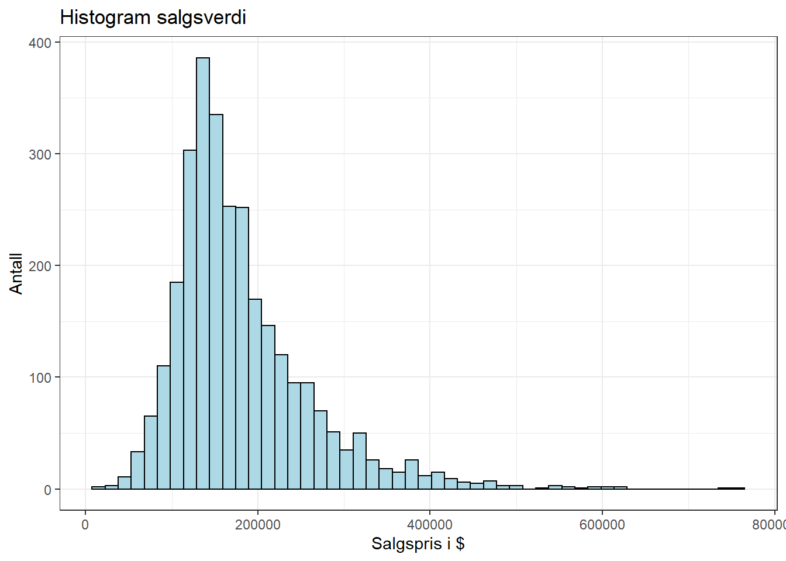
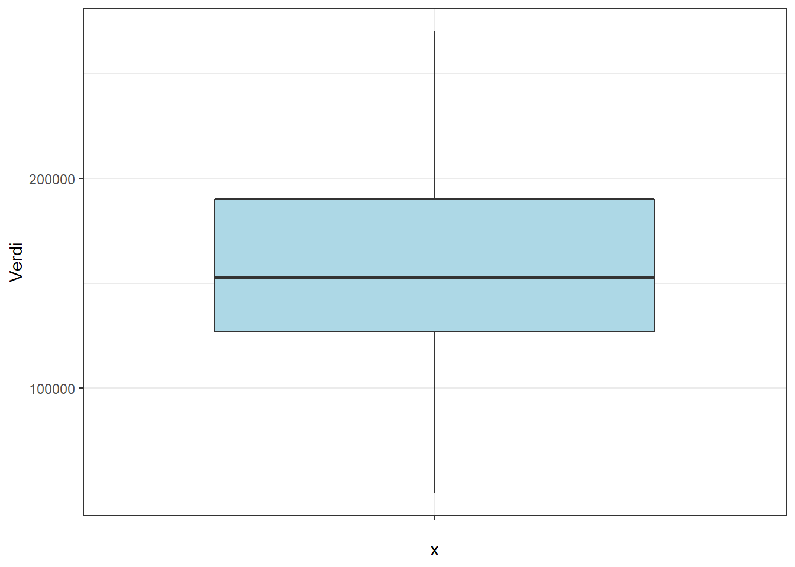
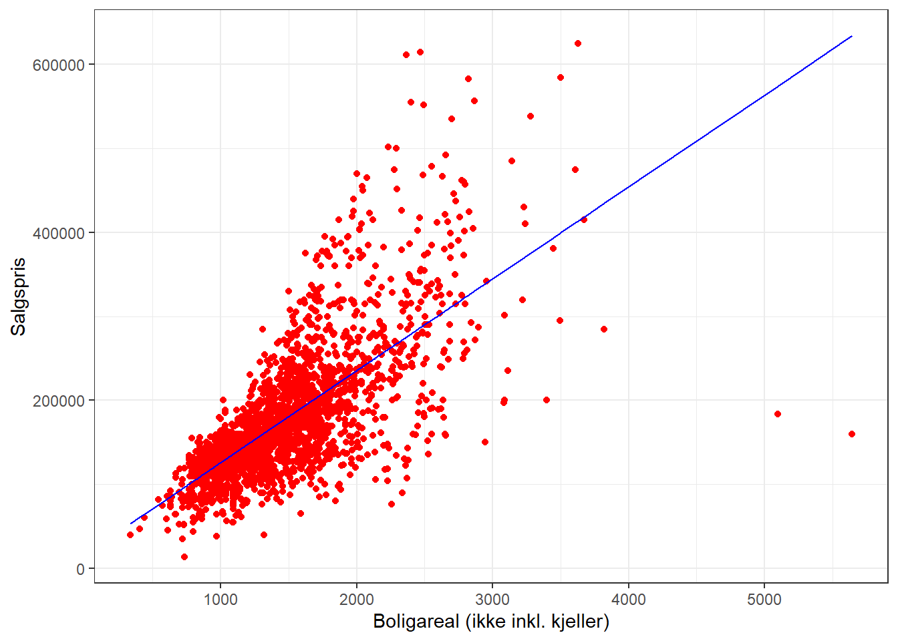
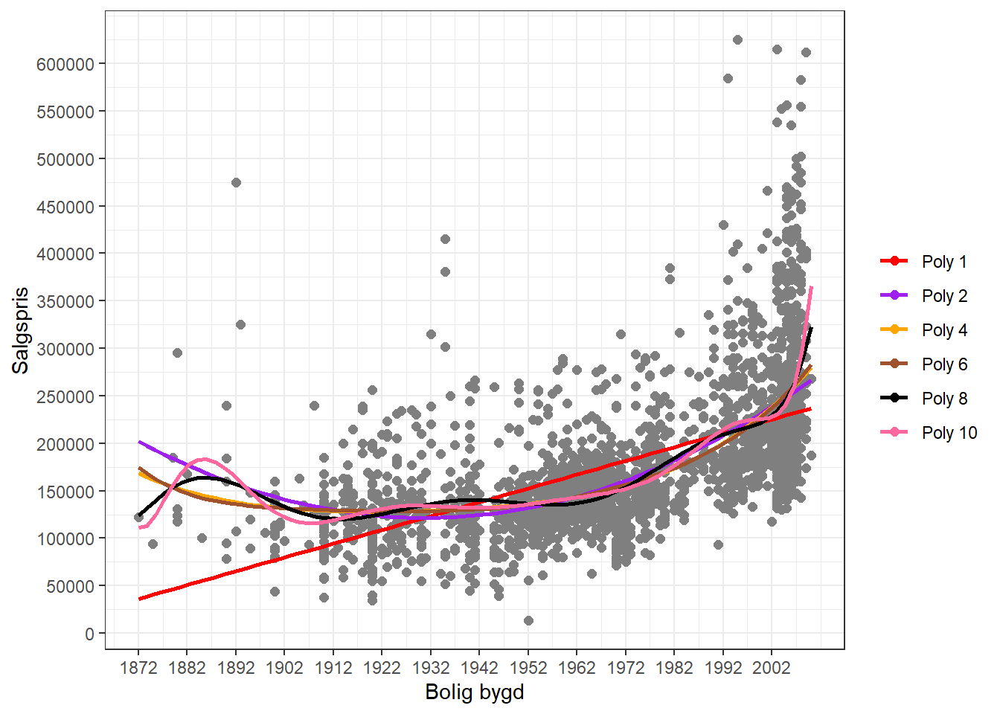
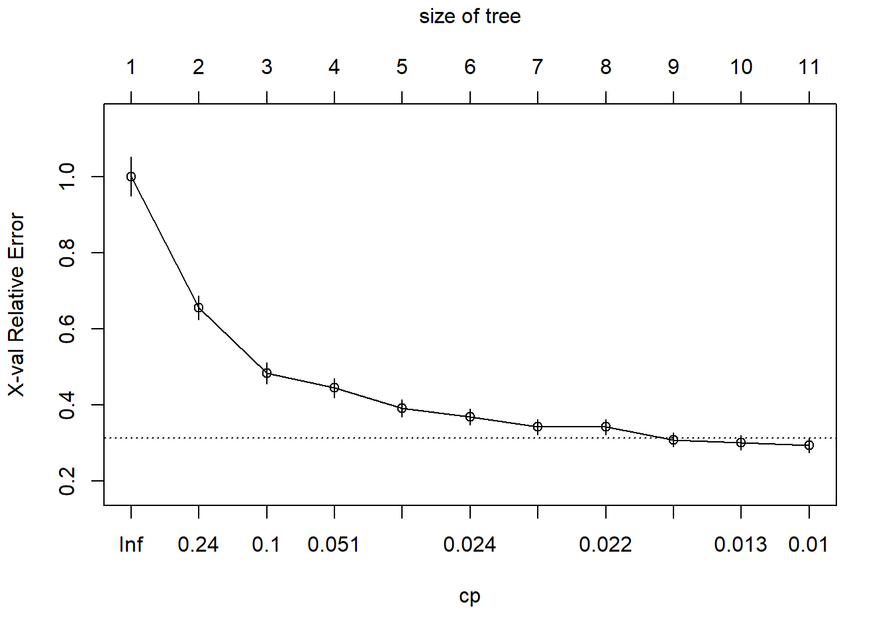
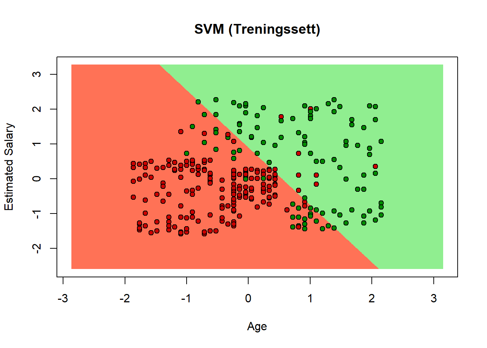

# Maskinlæring (Machine Learning)

R-pakker brukt i dette kapittelet:


```r
pacman::p_load(tidyverse, AmesHousing, outliers, EnvStats, caTools, Metrics, psych, tdr, readxl, e1071, caret, plotly, rpart, rpart.plot, knitr, hydroGOF, ggridges, tidymodels, sf, patchwork, RColorBrewer, grid, ragg, ipred, rattle, randomForest, glmnet, datasets, plotrix, ggforce, ROCit, car, class, e1071) 
```

Hensikten med å analysere samfunnet rundt oss er å forstå verden. I dette ligger at vi ønsker å kunne forklare hva som skjer og hvorfor (faktuelt og kaulsalt) *og* predikere hva vi tror kommer til å skje. Forklaring og prediksjon kan ofte stå i litt i motsetning til hverandre. Som vi har nevnt et sted tidligere - alle modeller (sav samfunnet) er feil. Men noen modeller er mindre feil enn andre, og noen er også nyttige for oss (selv om vi vet de inneholder feil). En modell som inneholder "alt" er ingen modell, men virkeligheten selv. Altså må vi hele tiden foreta valg når vi lager modeller. En modell som inneholder et svært høyt antall variabler kan være mer nøyaktig, men samtidig veldig vanskelig å forstå. Og en modell som forklarer hva som har skjedd godt trenger ikke å være en modell som predikerer godt hva som kommer til å skje.

Vi antar at avveiningen mellom forklaring og prediksjon er viktig og sentral for alle felt innenfor samfunnsvitenskapene, og at avveiningen har ulikt fokus og innretting fra fagfelt til fagfelt. @yarkoniChoosingPredictionExplanation2017 påpker f.eks. at for psykologi som fagfelt at "an increased focus on prediction, rather than explanation, can ultimately lead us to greater understanding of behavior" (s.1100).

Berepet "maskinlæring" har blitt et mer og mer sentralt begrep i samfunnsvitenskapelig metode generelt og i dataanalyse spesielt. Selve begrepet ble "coinet" (først brukt) av @samuelStudiesMachineLearning1959. Endel av metodene i maskinlæring kjenner vi fra før. Regresjon er f.eks. et sentralt element i "pakken" av metoder som kan puttes inn i begrepet maskinlæring. Og regresjon er jo ikke noe nytt, så er maskinlæring kun et moteord? Et fancy ord på ting vi har gjort før? Tja, kanskje svaret er både ja og nei. Det er unektelig slik at vi har drevet med regresjonsanalyser lenge før begrepet maskinlæring i hvert fall ble allment kjent og popularisert. Samtidig er maskinlæring en distinkt gruppe av analytiske metoder hvis hensikt er å - nettopp - lære. Med dette mener vi modeller som bruker data til å forbedre analyseoppgavene vi har foran oss.

Maskinlæring kan defineres som en prosess der vi mater data inn i generiske algoritmer og vi (forhåpentligvis) får vite noe fornuftig om dataene uten å skrive spesifikk kode for å få denne innsikten.       

## Assosiasjon vs. prediksjon

Et sentralt element i maskinlæring er prediksjon. Som nevnt ovenfor er f.eks. regresjonsanalyser et kjent begrep som vi har gått relativt grundig gjennom i tidligere kapitler. Vi skal imidlertid være klar over at all snakk om $R^2$ *ikke* sier noe om hvor godt en regresjonsmodell evner å predikere. $R^2$ forteller oss imidlertid noe om hvor godt den gitte regresjonsmodellen i snitt forklarer variansen i dataene vi har. Regresjonskoeffisientene beregnes for å maksimere $R^2$ (gjennom å minimere feilleddene). Av to modeller for samme data forklarer en modell med høyere $R^2$ mer av variansen i de foreliggende dataene enn en modell med lavere $R^2$. Men vi vet ikke noe om de to modellenes evne til å predikere. Derfor er maskinlæring fokusert på at modeller må trenes og testes. Dvs at dataene deles i uavhengige deler, der modellen utvikles og trenes på en del, og testes på en annen del. Merk: Dette er ikke det samme som å utvikle en regresjonsmodell på et datasett, og "teste" ved å replikere analysen på nye data. Dette er i realiteten to modeller - tradisjonell replikasjon - siden koeffisientene i modellen vil tilpasses to sett data (selv om de uavhengige variablene er de samme). Merk: Dette er ikke en kritikk av replikasjon, men en klargjøring av at i maskinlæring er prediksjon det sentrale. Den prediktive lakkmustesten for modeller ligger i hvor godt den klarer å predikere nye verdier ift observerte verdier den ikke har sett (altså hvor nærme observasjonene kommer prediksjonene). 

## Konsepter og definisjoner

Maskinlæring knyttes tett til kunstig intelligens (Articifical Intelligence, eller bare AI). Det er imildertid ulike oppfatninger av hvordan disse begrepene forholder seg til hverandre. I tillegg har begrepet "deep learning" også kommet mer i fokus. En vanlig måte å se sammenhengen på er denne [@superdatascienceMachineLearningAZ2022]:


Det er videre vanlig å sele inn maskinlæring ut fra hvordan dataanalysen skjer:

-   Supervised learning: Modellering gjennom algoritmer som kjenner både input og ønsket output. Her lager vi modeller som kan predikere gjennom å "se" på korrekte/virkelige data ("virkeligheten") for å finne matematiske sammenhenger i dataene som gir de resultatene som foreligger. Vi kan se på dette som å forberede seg til en eksamen gjennom å se på tidligere eksamensoppgaver og fasit for disse, lære hvordan de riktige resultatene (i fasiten) ble regnet ut, og bruke den lærdommen på nye oppgaver. Jo flere tidligere eksamener man har regnet gjennom og lært av - jo større sannsynlighet for at man kan bruke denne lærdommen som modell for å løse neste eksamensoppgave. De to vanligste teknikkene å bruke i supervised learning er:
    - Regresjon: F.eks. lineær, logistisk, polynomial, SVR. Regresjon predikerer en numerisk verdi. En lønnsomhetsmodell kan f.eks. predikere lønnsomhet for en bedrift som en numerisk verdi (kroner). En meteorologisk modell kan predikere nedbør (mm). En salgsprismodell kan predikere salgspris for eiendommer (kroner).
    - Klassifisering: F.eks. lineær, SVM, beslutningstre, k-nearest neighbor, random forest. Klassifisering predikerer et sett av ordnede eller uordnede kvalitative verdier. Generelt kan man si at en klassifiseringsmodell predikerer sannsynligheten for at et eller annet befinner seg i en spesifisert kategori. En klassifiseringsmodell kan f.eks. predikere om en gitt e-post er spam eller ikke. En klassifiseringsmodell kan predikere om en gitt ansatt vil bytte jobb eller ikke, eller om en gitt kunde vil kjøpe en vare eller ikke. 
-   Unsupervised learning: Modellering gjennom algortimer som kjenner kun input, og forsøker finne mønstre og grupper i dataene gjennom sannsynligheter (for at noe tilhører den ene eller den andre gruppen eller kategorien). I motsetning til supervised learning kjenner vi ikke svarene. Hvis studenten som leser til en eksamen bruker tidligere eksamensoppgaver, men ikke har fasiten, er det vanskelig å se hvordan studenten kan lære (i hvert fall være sikker på at det er korrekt). I unsupervised learning har man en datamengde (ofte stor) der man forsøker å finne meningsfulle mønstre og sammenhenger i dataene. Her er ikke kategoriene definert på forhånd (som i supervised learning). 
    - Clustering: Gruppering av data basert på likhet eller forskjeller
    - Assosiering: Identifisering av sammenhenger mellom variabler
    - Dimensionality reduction: Komponentanalyse (PCA), SVD o.l.
-   Semi-supervised learning: En form for mellomting mellom supervised og unsupervised, dvs. vi kan ha mindre deler av data med input og output som kan brukes på data uten kjent/ønsket output. F.eks. at supervised learning bruker unsupervised learning gjennom såkalt "feature engineering".
-   Reinforcement learning: Modellering gjennom algoritmer der henskten/målsetningen er å maksimere en oppfatning om kumulativ utkomme gjennom belønning eller straff. Reinforcement learning brukes f.eks. til å lære maskiner å spille spill mot mennesker, eller til å generere policies/strategier for å maksimere kost/nytte-vurderinger i ulike sammenhenger. Andre eksempler kan være selvstyrende biler, trading i finans- og investeringsbeslutninger, "natural language processing - NLP" som innebærer automatisk behandling av tekst (f.eks. i oversettelser) og anvendelser i helsesektoren (som "dymanic treatment regimes - DTR") innenfir diagnose og behandling. Modellen utvikles gjennom å straffe "feil" beslutninger/tiltak og belønne "riktige". 

I tillegg skal man ikke holde på lenge med maskinlæring før begrepene Neural networks, Natural Language Processing (NLP) og Deep learning dukker opp. Disse kan, slik vi ser det, alle assosieres med såvel supervised som unsupervised learning. Vi kommer ikke til å gå inn på disse begrepene i dette kapittelet, men heller ta for oss disse begrepene i eget kapittel.

## Supervised Learning

### Generisk forståelse av supervised learning

Vi ønsker altså å lage modeller som kan predikere hvilke verdier vi kan forvente på en avhengig variabel ut fra gitte verdier på x antall uavhengige variabler. Før vi kan gjøre disse prediksjonene må vi trene opp modellen. Dette gjøres normalt gjennom å dele opp et datasett i en treningsdel og en testdel. 

For å trene modellen må vi kjøre observasjoner gjennom algoritmen (modellen), gjøre prediksjoner, sjekke med "fasit", evaluere mdoellen, og gjenta prosessen:

{width=75%}

Prosedyren som er vist for to observasjoner over gjentas for datasettet. Modellen oppdateres og lærer sammenhengen mellom de uavhengige og den avhengige variabelen ved hver iterasjon. Intuitivt kan vi se at mange iterasjoner (store datasett) gir flere muligheter for modellen å lære, og dermed vil man anta at læring fra store datasett gir bedre modeller enn for små datasett. Til slutt kan vi evaluere modellen ved å kjøre modellen på testdelen av datasettet og sammenlikne de predikerte verdiene for den avhengige variabelen fra modellen med de faktiske målingene i testdataene. Dette gjør oss i stand til å vurdere hvor god vår modell er.

#### Tap og minimering av tap ("loss and reducing loss")

Når vi trener modellen i supervised learning finner vi verdier i modellens parametere (tenk på f.eks. stigningstall og skjæringspunkt i en enkel lineær regresjon) som minimerer tap ("loss"). Tap innebærer en måling/verdi av hvor dårlig modellens prediksjon var for et enkelt tilfelle. Perfekt perdiksjon = 0 tap, og en god modell har lite tap i gjennomsnitt for alle tilfellene/observasjonene. For datasettet bruker vi ofte MSE - Mean Square Error som et mål på dette (se mer detaljer om MSE under f.eks. lineær regresjon lenger ned). 

Vi kan illustrere prosedyren for algoritmens beregning av minimalisering av tap med det følgende:


Algoritmen starter i punkt 1 og beregner gradienten for "loss courve" (som i eksempelet = den dervierte/stigningstallet til kurven i det relevante punktet). Ut fra dette kan algoritmen bevege seg mot minimum loss. I punkt 2, 3 og 4 skjer det samme (i ounkt 4 har vi åpenbart "gått for langt" (positiv gradient) og algoritmen beregner at man må tilbake for å nå minimum loss). I prinsippet kan man ta museskritt for hvert steg, men det vil kreve et stort antall forsøk. På samme måte kan stegene bli for store og man vil hoppe fra den ene siden av minimum loss til den andre og tilbake. Antall steg man må gjennom før minimum loss finnes kalles "learning rate". 

### Regresjon

Vi har i tidligere kapitler gått gjennom enkel og multippel OLS og polynomial regresjon. Disse er også teknikker under paraplyen maskinlæring. Selv om vi har vist regresjon i tidligere kapittel introduserer vi et element i maskinlæringskapittelet som viser splitting av datasett i treningsdata og testdata. Dette er karakteristisk for maskinlæring. Det innebærer at vi deler datasettet (tilfeldig) inn i to grupper: den første gruppa - treningsdata - bruker vi til å lage/trene en modell. Den andre gruppa - testdata - bruker vi for å se hvor god modellen vi lagde med treningsdataene klarer å predikere dataene som ligger i testdatasettet. Testdatasettet består jo av "virkelige" data, så hvis modellen vår er god og klarer å predikere disse dataene kan vi si noe sikrere om hvor godt vi kan anta modellen vil predikere nye, hittil ikke målte/observerte verdier.

I delkapittelet om regresjon skal vi bruke datasettet AmesHousing


`<a href="data:text/csv;base64,T3JkZXIsUElELE1TIFN1YkNsYXNzLE1TIFpvbmluZyxMb3QgRnJvbnRhZ2UsTG90IEFyZWEsU3RyZWV0LEFsbGV5LExvdCBTaGFwZSxMYW5kIENvbnRvdXIsVXRpbGl0aWVzLExvdCBDb25maWcsTGFuZCBTbG9wZSxOZWlnaGJvcmhvb2QsQ29uZGl0aW9uIDEsQ29uZGl0aW9uIDIsQmxkZyBUeXBlLEhvdXNlIFN0eWxlLE92ZXJhbGwgUXVhbCxPdmVyYWxsIENvbmQsWWVhciBCdWlsdCxZZWFyIFJlbW9kL0FkZCxSb29mIFN0eWxlLFJvb2YgTWF0bCxFeHRlcmlvciAxc3QsRXh0ZXJpb3IgMm5kLE1hcyBWbnIgVHlwZSxNYXMgVm5yIEFyZWEsRXh0ZXIgUXVhbCxFeHRlciBDb25kLEZvdW5kYXRpb24sQnNtdCBRdWFsLEJzbXQgQ29uZCxCc210IEV4cG9zdXJlLEJzbXRGaW4gVHlwZSAxLEJzbXRGaW4gU0YgMSxCc210RmluIFR5cGUgMixCc210RmluIFNGIDIsQnNtdCBVbmYgU0YsVG90YWwgQnNtdCBTRixIZWF0aW5nLEhlYXRpbmcgUUMsQ2VudHJhbCBBaXIsRWxlY3RyaWNhbCwxc3QgRmxyIFNGLDJuZCBGbHIgU0YsTG93IFF1YWwgRmluIFNGLEdyIExpdiBBcmVhLEJzbXQgRnVsbCBCYXRoLEJzbXQgSGFsZiBCYXRoLEZ1bGwgQmF0aCxIYWxmIEJhdGgsQmVkcm9vbSBBYnZHcixLaXRjaGVuIEFidkdyLEtpdGNoZW4gUXVhbCxUb3RSbXMgQWJ2R3JkLEZ1bmN0aW9uYWwsRmlyZXBsYWNlcyxGaXJlcGxhY2UgUXUsR2FyYWdlIFR5cGUsR2FyYWdlIFlyIEJsdCxHYXJhZ2UgRmluaXNoLEdhcmFnZSBDYXJzLEdhcmFnZSBBcmVhLEdhcmFnZSBRdWFsLEdhcmFnZSBDb25kLFBhdmVkIERyaXZlLFdvb2QgRGVjayBTRixPcGVuIFBvcmNoIFNGLEVuY2xvc2VkIFBvcmNoLDNTc24gUG9yY2gsU2NyZWVuIFBvcmNoLFBvb2wgQXJlYSxQb29sIFFDLEZlbmNlLE1pc2MgRmVhdHVyZSxNaXNjIFZhbCxNbyBTb2xkLFlyIFNvbGQsU2FsZSBUeXBlLFNhbGUgQ29uZGl0aW9uLFNhbGVQcmljZQ0KMSwwNTI2MzAxMTAwLDAyMCxSTCwxNDEsMzE3NzAsUGF2ZSxOQSxJUjEsTHZsLEFsbFB1YixDb3JuZXIsR3RsLE5BbWVzLE5vcm0sTm9ybSwxRmFtLDFTdG9yeSw2LDUsMTk2MCwxOTYwLEhpcCxDb21wU2hnLEJya0ZhY2UsUGx5d29vZCxTdG9uZSwxMTIsVEEsVEEsQ0Jsb2NrLFRBLEdkLEdkLEJMUSw2MzksVW5mLDAsNDQxLDEwODAsR2FzQSxGYSxZLFNCcmtyLDE2NTYsMCwwLDE2NTYsMSwwLDEsMCwzLDEsVEEsNyxUeXAsMixHZCxBdHRjaGQsMTk2MCxGaW4sMiw1MjgsVEEsVEEsUCwyMTAsNjIsMCwwLDAsMCxOQSxOQSxOQSwwLDUsMjAxMCxXRCAsTm9ybWFsLDIxNTAwMA0KMiwwNTI2MzUwMDQwLDAyMCxSSCw4MCwxMTYyMixQYXZlLE5BLFJlZyxMdmwsQWxsUHViLEluc2lkZSxHdGwsTkFtZXMsRmVlZHIsTm9ybSwxRmFtLDFTdG9yeSw1LDYsMTk2MSwxOTYxLEdhYmxlLENvbXBTaGcsVmlueWxTZCxWaW55bFNkLE5vbmUsMCxUQSxUQSxDQmxvY2ssVEEsVEEsTm8sUmVjLDQ2OCxMd1EsMTQ0LDI3MCw4ODIsR2FzQSxUQSxZLFNCcmtyLDg5NiwwLDAsODk2LDAsMCwxLDAsMiwxLFRBLDUsVHlwLDAsTkEsQXR0Y2hkLDE5NjEsVW5mLDEsNzMwLFRBLFRBLFksMTQwLDAsMCwwLDEyMCwwLE5BLE1uUHJ2LE5BLDAsNiwyMDEwLFdEICxOb3JtYWwsMTA1MDAwDQozLDA1MjYzNTEwMTAsMDIwLFJMLDgxLDE0MjY3LFBhdmUsTkEsSVIxLEx2bCxBbGxQdWIsQ29ybmVyLEd0bCxOQW1lcyxOb3JtLE5vcm0sMUZhbSwxU3RvcnksNiw2LDE5NTgsMTk1OCxIaXAsQ29tcFNoZyxXZCBTZG5nLFdkIFNkbmcsQnJrRmFjZSwxMDgsVEEsVEEsQ0Jsb2NrLFRBLFRBLE5vLEFMUSw5MjMsVW5mLDAsNDA2LDEzMjksR2FzQSxUQSxZLFNCcmtyLDEzMjksMCwwLDEzMjksMCwwLDEsMSwzLDEsR2QsNixUeXAsMCxOQSxBdHRjaGQsMTk1OCxVbmYsMSwzMTIsVEEsVEEsWSwzOTMsMzYsMCwwLDAsMCxOQSxOQSxHYXIyLDEyNTAwLDYsMjAxMCxXRCAsTm9ybWFsLDE3MjAwMA0KNCwwNTI2MzUzMDMwLDAyMCxSTCw5MywxMTE2MCxQYXZlLE5BLFJlZyxMdmwsQWxsUHViLENvcm5lcixHdGwsTkFtZXMsTm9ybSxOb3JtLDFGYW0sMVN0b3J5LDcsNSwxOTY4LDE5NjgsSGlwLENvbXBTaGcsQnJrRmFjZSxCcmtGYWNlLE5vbmUsMCxHZCxUQSxDQmxvY2ssVEEsVEEsTm8sQUxRLDEwNjUsVW5mLDAsMTA0NSwyMTEwLEdhc0EsRXgsWSxTQnJrciwyMTEwLDAsMCwyMTEwLDEsMCwyLDEsMywxLEV4LDgsVHlwLDIsVEEsQXR0Y2hkLDE5NjgsRmluLDIsNTIyLFRBLFRBLFksMCwwLDAsMCwwLDAsTkEsTkEsTkEsMCw0LDIwMTAsV0QgLE5vcm1hbCwyNDQwMDANCjUsMDUyNzEwNTAxMCwwNjAsUkwsNzQsMTM4MzAsUGF2ZSxOQSxJUjEsTHZsLEFsbFB1YixJbnNpZGUsR3RsLEdpbGJlcnQsTm9ybSxOb3JtLDFGYW0sMlN0b3J5LDUsNSwxOTk3LDE5OTgsR2FibGUsQ29tcFNoZyxWaW55bFNkLFZpbnlsU2QsTm9uZSwwLFRBLFRBLFBDb25jLEdkLFRBLE5vLEdMUSw3OTEsVW5mLDAsMTM3LDkyOCxHYXNBLEdkLFksU0Jya3IsOTI4LDcwMSwwLDE2MjksMCwwLDIsMSwzLDEsVEEsNixUeXAsMSxUQSxBdHRjaGQsMTk5NyxGaW4sMiw0ODIsVEEsVEEsWSwyMTIsMzQsMCwwLDAsMCxOQSxNblBydixOQSwwLDMsMjAxMCxXRCAsTm9ybWFsLDE4OTkwMA0KNiwwNTI3MTA1MDMwLDA2MCxSTCw3OCw5OTc4LFBhdmUsTkEsSVIxLEx2bCxBbGxQdWIsSW5zaWRlLEd0bCxHaWxiZXJ0LE5vcm0sTm9ybSwxRmFtLDJTdG9yeSw2LDYsMTk5OCwxOTk4LEdhYmxlLENvbXBTaGcsVmlueWxTZCxWaW55bFNkLEJya0ZhY2UsMjAsVEEsVEEsUENvbmMsVEEsVEEsTm8sR0xRLDYwMixVbmYsMCwzMjQsOTI2LEdhc0EsRXgsWSxTQnJrciw5MjYsNjc4LDAsMTYwNCwwLDAsMiwxLDMsMSxHZCw3LFR5cCwxLEdkLEF0dGNoZCwxOTk4LEZpbiwyLDQ3MCxUQSxUQSxZLDM2MCwzNiwwLDAsMCwwLE5BLE5BLE5BLDAsNiwyMDEwLFdEICxOb3JtYWwsMTk1NTAwDQo3LDA1MjcxMjcxNTAsMTIwLFJMLDQxLDQ5MjAsUGF2ZSxOQSxSZWcsTHZsLEFsbFB1YixJbnNpZGUsR3RsLFN0b25lQnIsTm9ybSxOb3JtLFR3bmhzRSwxU3RvcnksOCw1LDIwMDEsMjAwMSxHYWJsZSxDb21wU2hnLENlbW50QmQsQ21lbnRCZCxOb25lLDAsR2QsVEEsUENvbmMsR2QsVEEsTW4sR0xRLDYxNixVbmYsMCw3MjIsMTMzOCxHYXNBLEV4LFksU0Jya3IsMTMzOCwwLDAsMTMzOCwxLDAsMiwwLDIsMSxHZCw2LFR5cCwwLE5BLEF0dGNoZCwyMDAxLEZpbiwyLDU4MixUQSxUQSxZLDAsMCwxNzAsMCwwLDAsTkEsTkEsTkEsMCw0LDIwMTAsV0QgLE5vcm1hbCwyMTM1MDANCjgsMDUyNzE0NTA4MCwxMjAsUkwsNDMsNTAwNSxQYXZlLE5BLElSMSxITFMsQWxsUHViLEluc2lkZSxHdGwsU3RvbmVCcixOb3JtLE5vcm0sVHduaHNFLDFTdG9yeSw4LDUsMTk5MiwxOTkyLEdhYmxlLENvbXBTaGcsSGRCb2FyZCxIZEJvYXJkLE5vbmUsMCxHZCxUQSxQQ29uYyxHZCxUQSxObyxBTFEsMjYzLFVuZiwwLDEwMTcsMTI4MCxHYXNBLEV4LFksU0Jya3IsMTI4MCwwLDAsMTI4MCwwLDAsMiwwLDIsMSxHZCw1LFR5cCwwLE5BLEF0dGNoZCwxOTkyLFJGbiwyLDUwNixUQSxUQSxZLDAsODIsMCwwLDE0NCwwLE5BLE5BLE5BLDAsMSwyMDEwLFdEICxOb3JtYWwsMTkxNTAwDQo5LDA1MjcxNDYwMzAsMTIwLFJMLDM5LDUzODksUGF2ZSxOQSxJUjEsTHZsLEFsbFB1YixJbnNpZGUsR3RsLFN0b25lQnIsTm9ybSxOb3JtLFR3bmhzRSwxU3RvcnksOCw1LDE5OTUsMTk5NixHYWJsZSxDb21wU2hnLENlbW50QmQsQ21lbnRCZCxOb25lLDAsR2QsVEEsUENvbmMsR2QsVEEsTm8sR0xRLDExODAsVW5mLDAsNDE1LDE1OTUsR2FzQSxFeCxZLFNCcmtyLDE2MTYsMCwwLDE2MTYsMSwwLDIsMCwyLDEsR2QsNSxUeXAsMSxUQSxBdHRjaGQsMTk5NSxSRm4sMiw2MDgsVEEsVEEsWSwyMzcsMTUyLDAsMCwwLDAsTkEsTkEsTkEsMCwzLDIwMTAsV0QgLE5vcm1hbCwyMzY1MDANCjEwLDA1MjcxNjIxMzAsMDYwLFJMLDYwLDc1MDAsUGF2ZSxOQSxSZWcsTHZsLEFsbFB1YixJbnNpZGUsR3RsLEdpbGJlcnQsTm9ybSxOb3JtLDFGYW0sMlN0b3J5LDcsNSwxOTk5LDE5OTksR2FibGUsQ29tcFNoZyxWaW55bFNkLFZpbnlsU2QsTm9uZSwwLFRBLFRBLFBDb25jLFRBLFRBLE5vLFVuZiwwLFVuZiwwLDk5NCw5OTQsR2FzQSxHZCxZLFNCcmtyLDEwMjgsNzc2LDAsMTgwNCwwLDAsMiwxLDMsMSxHZCw3LFR5cCwxLFRBLEF0dGNoZCwxOTk5LEZpbiwyLDQ0MixUQSxUQSxZLDE0MCw2MCwwLDAsMCwwLE5BLE5BLE5BLDAsNiwyMDEwLFdEICxOb3JtYWwsMTg5MDAwDQoxMSwwNTI3MTYzMDEwLDA2MCxSTCw3NSwxMDAwMCxQYXZlLE5BLElSMSxMdmwsQWxsUHViLENvcm5lcixHdGwsR2lsYmVydCxOb3JtLE5vcm0sMUZhbSwyU3RvcnksNiw1LDE5OTMsMTk5NCxHYWJsZSxDb21wU2hnLEhkQm9hcmQsSGRCb2FyZCxOb25lLDAsVEEsVEEsUENvbmMsR2QsVEEsTm8sVW5mLDAsVW5mLDAsNzYzLDc2MyxHYXNBLEdkLFksU0Jya3IsNzYzLDg5MiwwLDE2NTUsMCwwLDIsMSwzLDEsVEEsNyxUeXAsMSxUQSxBdHRjaGQsMTk5MyxGaW4sMiw0NDAsVEEsVEEsWSwxNTcsODQsMCwwLDAsMCxOQSxOQSxOQSwwLDQsMjAxMCxXRCAsTm9ybWFsLDE3NTkwMA0KMTIsMDUyNzE2NTIzMCwwMjAsUkwsLDc5ODAsUGF2ZSxOQSxJUjEsTHZsLEFsbFB1YixJbnNpZGUsR3RsLEdpbGJlcnQsTm9ybSxOb3JtLDFGYW0sMVN0b3J5LDYsNywxOTkyLDIwMDcsR2FibGUsQ29tcFNoZyxIZEJvYXJkLEhkQm9hcmQsTm9uZSwwLFRBLEdkLFBDb25jLEdkLFRBLE5vLEFMUSw5MzUsVW5mLDAsMjMzLDExNjgsR2FzQSxFeCxZLFNCcmtyLDExODcsMCwwLDExODcsMSwwLDIsMCwzLDEsVEEsNixUeXAsMCxOQSxBdHRjaGQsMTk5MixGaW4sMiw0MjAsVEEsVEEsWSw0ODMsMjEsMCwwLDAsMCxOQSxHZFBydixTaGVkLDUwMCwzLDIwMTAsV0QgLE5vcm1hbCwxODUwMDANCjEzLDA1MjcxNjYwNDAsMDYwLFJMLDYzLDg0MDIsUGF2ZSxOQSxJUjEsTHZsLEFsbFB1YixJbnNpZGUsR3RsLEdpbGJlcnQsTm9ybSxOb3JtLDFGYW0sMlN0b3J5LDYsNSwxOTk4LDE5OTgsR2FibGUsQ29tcFNoZyxWaW55bFNkLFZpbnlsU2QsTm9uZSwwLFRBLFRBLFBDb25jLEdkLFRBLE5vLFVuZiwwLFVuZiwwLDc4OSw3ODksR2FzQSxHZCxZLFNCcmtyLDc4OSw2NzYsMCwxNDY1LDAsMCwyLDEsMywxLFRBLDcsVHlwLDEsR2QsQXR0Y2hkLDE5OTgsRmluLDIsMzkzLFRBLFRBLFksMCw3NSwwLDAsMCwwLE5BLE5BLE5BLDAsNSwyMDEwLFdEICxOb3JtYWwsMTgwNDAwDQoxNCwwNTI3MTgwMDQwLDAyMCxSTCw4NSwxMDE3NixQYXZlLE5BLFJlZyxMdmwsQWxsUHViLEluc2lkZSxHdGwsR2lsYmVydCxOb3JtLE5vcm0sMUZhbSwxU3RvcnksNyw1LDE5OTAsMTk5MCxHYWJsZSxDb21wU2hnLEhkQm9hcmQsSGRCb2FyZCxOb25lLDAsVEEsVEEsUENvbmMsR2QsVEEsR2QsR0xRLDYzNyxVbmYsMCw2NjMsMTMwMCxHYXNBLEdkLFksU0Jya3IsMTM0MSwwLDAsMTM0MSwxLDAsMSwxLDIsMSxHZCw1LFR5cCwxLFBvLEF0dGNoZCwxOTkwLFVuZiwyLDUwNixUQSxUQSxZLDE5MiwwLDAsMCwwLDAsTkEsTkEsTkEsMCwyLDIwMTAsV0QgLE5vcm1hbCwxNzE1MDANCjE1LDA1MjcxODIxOTAsMTIwLFJMLCw2ODIwLFBhdmUsTkEsSVIxLEx2bCxBbGxQdWIsQ29ybmVyLEd0bCxTdG9uZUJyLE5vcm0sTm9ybSxUd25oc0UsMVN0b3J5LDgsNSwxOTg1LDE5ODUsR2FibGUsQ29tcFNoZyxIZEJvYXJkLEhkQm9hcmQsTm9uZSwwLEdkLFRBLFBDb25jLEdkLFRBLEF2LEdMUSwzNjgsQkxRLDExMjAsMCwxNDg4LEdhc0EsVEEsWSxTQnJrciwxNTAyLDAsMCwxNTAyLDEsMCwxLDEsMSwxLEdkLDQsVHlwLDAsTkEsQXR0Y2hkLDE5ODUsUkZuLDIsNTI4LFRBLFRBLFksMCw1NCwwLDAsMTQwLDAsTkEsTkEsTkEsMCw2LDIwMTAsV0QgLE5vcm1hbCwyMTIwMDANCjE2LDA1MjcyMTYwNzAsMDYwLFJMLDQ3LDUzNTA0LFBhdmUsTkEsSVIyLEhMUyxBbGxQdWIsQ3VsRFNhYyxNb2QsU3RvbmVCcixOb3JtLE5vcm0sMUZhbSwyU3RvcnksOCw1LDIwMDMsMjAwMyxIaXAsQ29tcFNoZyxDZW1udEJkLFdkIFNobmcsQnJrRmFjZSw2MDMsRXgsVEEsUENvbmMsR2QsVEEsR2QsQUxRLDE0MTYsVW5mLDAsMjM0LDE2NTAsR2FzQSxFeCxZLFNCcmtyLDE2OTAsMTU4OSwwLDMyNzksMSwwLDMsMSw0LDEsRXgsMTIsTW9kLDEsR2QsQnVpbHRJbiwyMDAzLEZpbiwzLDg0MSxUQSxUQSxZLDUwMywzNiwwLDAsMjEwLDAsTkEsTkEsTkEsMCw2LDIwMTAsV0QgLE5vcm1hbCw1MzgwMDANCjE3LDA1MjcyMjUwMzUsMDUwLFJMLDE1MiwxMjEzNCxQYXZlLE5BLElSMSxCbmssQWxsUHViLEluc2lkZSxNb2QsR2lsYmVydCxOb3JtLE5vcm0sMUZhbSwxLjVGaW4sOCw3LDE5ODgsMjAwNSxHYWJsZSxDb21wU2hnLFdkIFNkbmcsV2QgU2RuZyxOb25lLDAsR2QsVEEsV29vZCxHZCxUQSxBdixHTFEsNDI3LFVuZiwwLDEzMiw1NTksR2FzQSxHZCxZLFNCcmtyLDEwODAsNjcyLDAsMTc1MiwwLDAsMiwwLDQsMSxUQSw4LFR5cCwwLE5BLEJhc21lbnQsMTk4OCxSRm4sMiw0OTIsVEEsVEEsWSwzMjUsMTIsMCwwLDAsMCxOQSxOQSxOQSwwLDYsMjAxMCxXRCAsTm9ybWFsLDE2NDAwMA0KMTgsMDUyNzI1ODAxMCwwMjAsUkwsODgsMTEzOTQsUGF2ZSxOQSxSZWcsTHZsLEFsbFB1YixDb3JuZXIsR3RsLFN0b25lQnIsTm9ybSxOb3JtLDFGYW0sMVN0b3J5LDksMiwyMDEwLDIwMTAsSGlwLENvbXBTaGcsVmlueWxTZCxWaW55bFNkLFN0b25lLDM1MCxHZCxUQSxQQ29uYyxFeCxUQSxBdixHTFEsMTQ0NSxVbmYsMCw0MTEsMTg1NixHYXNBLEV4LFksU0Jya3IsMTg1NiwwLDAsMTg1NiwxLDAsMSwxLDEsMSxFeCw4LFR5cCwxLEV4LEF0dGNoZCwyMDEwLEZpbiwzLDgzNCxUQSxUQSxZLDExMywwLDAsMCwwLDAsTkEsTkEsTkEsMCw2LDIwMTAsTmV3LFBhcnRpYWwsMzk0NDMyDQoxOSwwNTI3Mjc2MTUwLDAyMCxSTCwxNDAsMTkxMzgsUGF2ZSxOQSxSZWcsTHZsLEFsbFB1YixDb3JuZXIsR3RsLEdpbGJlcnQsTm9ybSxOb3JtLDFGYW0sMVN0b3J5LDQsNSwxOTUxLDE5NTEsR2FibGUsQ29tcFNoZyxWaW55bFNkLFZpbnlsU2QsTm9uZSwwLFRBLFRBLENCbG9jayxUQSxUQSxObyxMd1EsMTIwLFVuZiwwLDc0NCw4NjQsR2FzQSxFeCxZLFNCcmtyLDg2NCwwLDAsODY0LDAsMCwxLDAsMiwxLFRBLDQsVHlwLDAsTkEsRGV0Y2hkLDE5NTEsVW5mLDIsNDAwLFRBLFRBLFksMCwwLDAsMCwwLDAsTkEsTkEsTkEsMCw2LDIwMTAsV0QgLE5vcm1hbCwxNDEwMDANCjIwLDA1MjczMDIxMTAsMDIwLFJMLDg1LDEzMTc1LFBhdmUsTkEsUmVnLEx2bCxBbGxQdWIsSW5zaWRlLEd0bCxOV0FtZXMsTm9ybSxOb3JtLDFGYW0sMVN0b3J5LDYsNiwxOTc4LDE5ODgsR2FibGUsQ29tcFNoZyxQbHl3b29kLFBseXdvb2QsU3RvbmUsMTE5LFRBLFRBLENCbG9jayxHZCxUQSxObyxBTFEsNzkwLFJlYywxNjMsNTg5LDE1NDIsR2FzQSxUQSxZLFNCcmtyLDIwNzMsMCwwLDIwNzMsMSwwLDIsMCwzLDEsVEEsNyxNaW4xLDIsVEEsQXR0Y2hkLDE5NzgsVW5mLDIsNTAwLFRBLFRBLFksMzQ5LDAsMCwwLDAsMCxOQSxNblBydixOQSwwLDIsMjAxMCxXRCAsTm9ybWFsLDIxMDAwMA0KMjEsMDUyNzM1ODE0MCwwMjAsUkwsMTA1LDExNzUxLFBhdmUsTkEsSVIxLEx2bCxBbGxQdWIsSW5zaWRlLEd0bCxOV0FtZXMsTm9ybSxOb3JtLDFGYW0sMVN0b3J5LDYsNiwxOTc3LDE5NzcsSGlwLENvbXBTaGcsUGx5d29vZCxQbHl3b29kLEJya0ZhY2UsNDgwLFRBLFRBLENCbG9jayxHZCxUQSxObyxCTFEsNzA1LFVuZiwwLDExMzksMTg0NCxHYXNBLEV4LFksU0Jya3IsMTg0NCwwLDAsMTg0NCwwLDAsMiwwLDMsMSxUQSw3LFR5cCwxLFRBLEF0dGNoZCwxOTc3LFJGbiwyLDU0NixUQSxUQSxZLDAsMTIyLDAsMCwwLDAsTkEsTW5QcnYsTkEsMCwxLDIwMTAsQ09ELE5vcm1hbCwxOTAwMDANCjIyLDA1MjczNTgyMDAsMDg1LFJMLDg1LDEwNjI1LFBhdmUsTkEsUmVnLEx2bCxBbGxQdWIsSW5zaWRlLEd0bCxOV0FtZXMsTm9ybSxOb3JtLDFGYW0sU0ZveWVyLDcsNiwxOTc0LDE5NzQsR2FibGUsQ29tcFNoZyxQbHl3b29kLFBseXdvb2QsQnJrRmFjZSw4MSxUQSxUQSxDQmxvY2ssR2QsVEEsR2QsR0xRLDg4NSxMd1EsMTY4LDAsMTA1MyxHYXNBLFRBLFksU0Jya3IsMTE3MywwLDAsMTE3MywxLDAsMiwwLDMsMSxHZCw2LFR5cCwyLFRBLEF0dGNoZCwxOTc0LFJGbiwyLDUyOCxUQSxUQSxZLDAsMTIwLDAsMCwwLDAsTkEsTW5QcnYsTkEsMCwxLDIwMTAsV0QgLEZhbWlseSwxNzAwMDANCjIzLDA1MjczNjgwMjAsMDYwLEZWLCw3NTAwLFBhdmUsTkEsUmVnLEx2bCxBbGxQdWIsSW5zaWRlLEd0bCxTb21lcnN0LE5vcm0sTm9ybSwxRmFtLDJTdG9yeSw3LDUsMjAwMCwyMDAwLEdhYmxlLENvbXBTaGcsVmlueWxTZCxWaW55bFNkLE5vbmUsMCxHZCxUQSxQQ29uYyxHZCxUQSxObyxHTFEsNTMzLFVuZiwwLDI4MSw4MTQsR2FzQSxFeCxZLFNCcmtyLDgxNCw4NjAsMCwxNjc0LDEsMCwyLDEsMywxLEdkLDcsVHlwLDAsTkEsQXR0Y2hkLDIwMDAsUkZuLDIsNjYzLFRBLFRBLFksMCw5NiwwLDAsMCwwLE5BLE5BLE5BLDAsMSwyMDEwLFdEICxOb3JtYWwsMjE2MDAwDQoyNCwwNTI3NDAyMjAwLDAyMCxSTCwsMTEyNDEsUGF2ZSxOQSxJUjEsTHZsLEFsbFB1YixDdWxEU2FjLEd0bCxOQW1lcyxOb3JtLE5vcm0sMUZhbSwxU3RvcnksNiw3LDE5NzAsMTk3MCxHYWJsZSxDb21wU2hnLFdkIFNkbmcsV2QgU2RuZyxCcmtGYWNlLDE4MCxUQSxUQSxDQmxvY2ssVEEsVEEsTm8sQUxRLDU3OCxVbmYsMCw0MjYsMTAwNCxHYXNBLEV4LFksU0Jya3IsMTAwNCwwLDAsMTAwNCwxLDAsMSwwLDIsMSxUQSw1LFR5cCwxLFRBLEF0dGNoZCwxOTcwLEZpbiwyLDQ4MCxUQSxUQSxZLDAsMCwwLDAsMCwwLE5BLE5BLFNoZWQsNzAwLDMsMjAxMCxXRCAsTm9ybWFsLDE0OTAwMA0KMjUsMDUyNzQwMjI1MCwwMjAsUkwsLDEyNTM3LFBhdmUsTkEsSVIxLEx2bCxBbGxQdWIsQ3VsRFNhYyxHdGwsTkFtZXMsTm9ybSxOb3JtLDFGYW0sMVN0b3J5LDUsNiwxOTcxLDIwMDgsR2FibGUsQ29tcFNoZyxWaW55bFNkLFZpbnlsU2QsTm9uZSwwLFRBLFRBLENCbG9jayxUQSxUQSxObyxHTFEsNzM0LFVuZiwwLDM0NCwxMDc4LEdhc0EsRXgsWSxTQnJrciwxMDc4LDAsMCwxMDc4LDEsMCwxLDEsMywxLFRBLDYsVHlwLDEsRmEsQXR0Y2hkLDE5NzEsRmluLDIsNTAwLFRBLFRBLFksMCwwLDAsMCwwLDAsTkEsTkEsTkEsMCw0LDIwMTAsV0QgLE5vcm1hbCwxNDk5MDANCjI2LDA1Mjc0MDMwMjAsMDIwLFJMLDY1LDg0NTAsUGF2ZSxOQSxSZWcsTHZsLEFsbFB1YixJbnNpZGUsR3RsLE5BbWVzLE5vcm0sTm9ybSwxRmFtLDFTdG9yeSw1LDYsMTk2OCwxOTY4LEdhYmxlLENvbXBTaGcsVmlueWxTZCxWaW55bFNkLE5vbmUsMCxUQSxUQSxDQmxvY2ssVEEsVEEsTm8sQkxRLDc3NSxVbmYsMCwyODEsMTA1NixHYXNBLEV4LFksU0Jya3IsMTA1NiwwLDAsMTA1NiwxLDAsMSwwLDMsMSxUQSw2LFR5cCwxLEZhLEF0dGNoZCwxOTY4LFVuZiwxLDMwNCxUQSxUQSxZLDAsODUsMTg0LDAsMCwwLE5BLE5BLE5BLDAsNywyMDEwLFdEICxOb3JtYWwsMTQyMDAwDQoyNywwNTI3NDA0MTIwLDAyMCxSTCw3MCw4NDAwLFBhdmUsTkEsUmVnLEx2bCxBbGxQdWIsQ29ybmVyLEd0bCxOQW1lcyxOb3JtLE5vcm0sMUZhbSwxU3RvcnksNCw1LDE5NzAsMTk3MCxHYWJsZSxDb21wU2hnLFBseXdvb2QsUGx5d29vZCxOb25lLDAsVEEsVEEsQ0Jsb2NrLFRBLFRBLE5vLEFMUSw4MDQsUmVjLDc4LDAsODgyLEdhc0EsVEEsWSxTQnJrciw4ODIsMCwwLDg4MiwxLDAsMSwwLDIsMSxUQSw0LFR5cCwwLE5BLEF0dGNoZCwxOTcwLEZpbiwyLDUyNSxUQSxUQSxZLDI0MCwwLDAsMCwwLDAsTkEsTW5QcnYsTkEsMCw0LDIwMTAsV0QgLE5vcm1hbCwxMjYwMDANCjI4LDA1Mjc0MjUwOTAsMDIwLFJMLDcwLDEwNTAwLFBhdmUsTkEsUmVnLEx2bCxBbGxQdWIsRlIyLEd0bCxOQW1lcyxOb3JtLE5vcm0sMUZhbSwxU3RvcnksNCw1LDE5NzEsMTk3MSxHYWJsZSxDb21wU2hnLEhkQm9hcmQsSGRCb2FyZCxOb25lLDAsVEEsVEEsQ0Jsb2NrLFRBLFRBLE5vLEFMUSw0MzIsVW5mLDAsNDMyLDg2NCxHYXNBLFRBLFksU0Jya3IsODY0LDAsMCw4NjQsMCwwLDEsMCwzLDEsVEEsNSxUeXAsMSxQbyxOQSwsTkEsMCwwLE5BLE5BLFksMCwwLDAsMCwwLDAsTkEsTkEsTkEsMCw0LDIwMTAsQ29uTEksTm9ybWFsLDExNTAwMA0KMjksMDUyNzQyNzIzMCwxMjAsUkgsMjYsNTg1OCxQYXZlLE5BLElSMSxMdmwsQWxsUHViLEZSMixHdGwsTkFtZXMsTm9ybSxOb3JtLFR3bmhzRSwxU3RvcnksNyw1LDE5OTksMTk5OSxHYWJsZSxDb21wU2hnLE1ldGFsU2QsTWV0YWxTZCxOb25lLDAsR2QsVEEsUENvbmMsR2QsVEEsTm8sR0xRLDEwNTEsQkxRLDAsMzU0LDE0MDUsR2FzQSxFeCxZLFNCcmtyLDEzMzcsMCwwLDEzMzcsMSwwLDIsMCwyLDEsR2QsNSxUeXAsMSxGYSxBdHRjaGQsMTk5OSxGaW4sMiw1MTEsVEEsVEEsWSwyMDMsNjgsMCwwLDAsMCxOQSxOQSxOQSwwLDYsMjAxMCxXRCAsTm9ybWFsLDE4NDAwMA0KMzAsMDUyNzQ1MTE4MCwxNjAsUk0sMjEsMTY4MCxQYXZlLE5BLFJlZyxMdmwsQWxsUHViLEluc2lkZSxHdGwsQnJEYWxlLE5vcm0sTm9ybSxUd25ocywyU3RvcnksNiw1LDE5NzEsMTk3MSxHYWJsZSxDb21wU2hnLEhkQm9hcmQsSGRCb2FyZCxCcmtGYWNlLDUwNCxUQSxUQSxDQmxvY2ssVEEsVEEsTm8sUmVjLDE1NixVbmYsMCwzMjcsNDgzLEdhc0EsVEEsWSxTQnJrciw0ODMsNTA0LDAsOTg3LDAsMCwxLDEsMiwxLFRBLDUsVHlwLDAsTkEsRGV0Y2hkLDE5NzEsVW5mLDEsMjY0LFRBLFRBLFksMjc1LDAsMCwwLDAsMCxOQSxOQSxOQSwwLDIsMjAxMCxDT0QsTm9ybWFsLDk2MDAwDQozMSwwNTI3NDUxMzMwLDE2MCxSTSwyMSwxNjgwLFBhdmUsTkEsUmVnLEx2bCxBbGxQdWIsSW5zaWRlLEd0bCxCckRhbGUsTm9ybSxOb3JtLFR3bmhzLDJTdG9yeSw1LDUsMTk3MSwxOTcxLEdhYmxlLENvbXBTaGcsSGRCb2FyZCxIZEJvYXJkLEJya0ZhY2UsNDkyLFRBLFRBLENCbG9jayxUQSxUQSxObyxSZWMsMzAwLFVuZiwwLDIyNSw1MjUsR2FzQSxUQSxZLFNCcmtyLDUyNSw1NjcsMCwxMDkyLDAsMCwxLDEsMywxLFRBLDYsVHlwLDAsTkEsRGV0Y2hkLDE5OTcsVW5mLDEsMzIwLFRBLFRBLFksMCwwLDAsMCwwLDAsTkEsTkEsTkEsMCwzLDIwMTAsV0QgLE5vcm1hbCwxMDU1MDANCjMyLDA1Mjc0NTE0MTAsMTYwLFJNLDIxLDE2ODAsUGF2ZSxOQSxSZWcsTHZsLEFsbFB1YixJbnNpZGUsR3RsLEJyRGFsZSxOb3JtLE5vcm0sVHduaHMsMlN0b3J5LDYsNSwxOTcxLDE5NzEsR2FibGUsQ29tcFNoZyxIZEJvYXJkLEltU3R1Y2MsQnJrRmFjZSwzODEsVEEsVEEsQ0Jsb2NrLFRBLFRBLE5vLFVuZiwwLFVuZiwwLDUyNSw1MjUsR2FzQSxUQSxZLFNCcmtyLDUyNSw1NjcsMCwxMDkyLDAsMCwxLDEsMywxLFRBLDYsVHlwLDAsTkEsRGV0Y2hkLDE5NzEsVW5mLDEsMjY0LFRBLFRBLFksMCwwLDAsMCwwLDAsTkEsTkEsTkEsMCwzLDIwMTAsV0QgLEZhbWlseSw4ODAwMA0KMzMsMDUyNzQ1MjE5MCwxMjAsUkwsNTMsNDA0MyxQYXZlLE5BLFJlZyxMdmwsQWxsUHViLEluc2lkZSxHdGwsTlBrVmlsbCxOb3JtLE5vcm0sVHduaHNFLDFTdG9yeSw2LDUsMTk3NywxOTc3LEdhYmxlLENvbXBTaGcsUGx5d29vZCxQbHl3b29kLE5vbmUsMCxUQSxUQSxDQmxvY2ssR2QsVEEsTm8sQUxRLDM2MCxVbmYsMCw3MDksMTA2OSxHYXNBLFRBLFksU0Jya3IsMTA2OSwwLDAsMTA2OSwwLDAsMiwwLDIsMSxUQSw0LFR5cCwxLEZhLEF0dGNoZCwxOTc3LFJGbiwyLDQ0MCxUQSxUQSxZLDAsNTUsMCwwLDE2NSwwLE5BLE5BLE5BLDAsNywyMDEwLFdEICxOb3JtYWwsMTI3NTAwDQozNCwwNTI3NDUzMTMwLDE2MCxSTCwyNCwyMjgwLFBhdmUsTkEsUmVnLEx2bCxBbGxQdWIsRlIyLEd0bCxOUGtWaWxsLE5vcm0sTm9ybSxUd25ocywyU3RvcnksNiw2LDE5NzUsMTk3NSxHYWJsZSxDb21wU2hnLFBseXdvb2QsQnJrIENtbixOb25lLDAsVEEsVEEsQ0Jsb2NrLFRBLFRBLE5vLEFMUSw1MTQsVW5mLDAsMzQxLDg1NSxHYXNBLFRBLFksU0Jya3IsODU1LDYwMSwwLDE0NTYsMCwwLDIsMSwzLDEsR2QsNixUeXAsMSxUQSxBdHRjaGQsMTk3NSxVbmYsMiw0NDAsVEEsVEEsWSwxNzMsMCwwLDAsMCwwLE5BLE5BLE5BLDAsNiwyMDEwLFdEICxOb3JtYWwsMTQ5OTAwDQozNSwwNTI3NDUzMTUwLDEyMCxSTCwyNCwyMjgwLFBhdmUsTkEsUmVnLEx2bCxBbGxQdWIsRlIyLEd0bCxOUGtWaWxsLE5vcm0sTm9ybSxUd25ocywxU3RvcnksNyw2LDE5NzUsMTk3NSxHYWJsZSxDb21wU2hnLFBseXdvb2QsQnJrIENtbixOb25lLDAsVEEsVEEsQ0Jsb2NrLEdkLFRBLE5vLFVuZiwwLFVuZiwwLDgzNiw4MzYsR2FzQSxFeCxZLFNCcmtyLDgzNiwwLDAsODM2LDAsMCwxLDAsMiwxLFRBLDQsVHlwLDAsTkEsQXR0Y2hkLDE5NzUsVW5mLDEsMzA4LFRBLFRBLFksMCwzMCwwLDAsMCwwLE5BLE5BLE5BLDAsNiwyMDEwLFdEICxOb3JtYWwsMTIwMDAwDQozNiwwNTI3NDU0MjAwLDE2MCxSTCwyNCwyMjgwLFBhdmUsTkEsUmVnLEx2bCxBbGxQdWIsSW5zaWRlLEd0bCxOUGtWaWxsLE5vcm0sTm9ybSxUd25ocywyU3RvcnksNiw1LDE5NzgsMTk3OCxHYWJsZSxDb21wU2hnLFBseXdvb2QsQnJrIENtbixOb25lLDAsVEEsVEEsQ0Jsb2NrLEdkLFRBLE5vLEFMUSwzMTEsVW5mLDAsNTQ0LDg1NSxHYXNBLEZhLFksU0Jya3IsODU1LDYwMSwwLDE0NTYsMCwwLDIsMSwzLDEsVEEsNyxUeXAsMSxUQSxBdHRjaGQsMTk3OCxVbmYsMiw0NDAsVEEsVEEsWSwyNiwwLDAsMCwwLDAsTkEsTkEsTkEsMCw3LDIwMTAsV0QgLE5vcm1hbCwxNDYwMDANCjM3LDA1MjgxMDgxMjAsMDYwLFJMLDEwMiwxMjg1OCxQYXZlLE5BLElSMSxMdmwsQWxsUHViLEluc2lkZSxHdGwsTnJpZGdIdCxOb3JtLE5vcm0sMUZhbSwyU3RvcnksOSw1LDIwMDksMjAxMCxHYWJsZSxDb21wU2hnLFZpbnlsU2QsVmlueWxTZCxTdG9uZSwxNjIsRXgsVEEsUENvbmMsRXgsVEEsTm8sVW5mLDAsVW5mLDAsMTU5MCwxNTkwLEdhc0EsRXgsWSxTQnJrciwxNjI3LDcwNywwLDIzMzQsMCwwLDIsMSwzLDEsRXgsMTAsVHlwLDEsR2QsQXR0Y2hkLDIwMDksRmluLDMsNzUxLFRBLFRBLFksMTQ0LDEzMywwLDAsMCwwLE5BLE5BLE5BLDAsMSwyMDEwLE5ldyxQYXJ0aWFsLDM3NjE2Mg0KMzgsMDUyODExMjAyMCwwMjAsUkwsOTgsMTE0NzgsUGF2ZSxOQSxSZWcsTHZsLEFsbFB1YixJbnNpZGUsR3RsLE5yaWRnSHQsTm9ybSxOb3JtLDFGYW0sMVN0b3J5LDgsNSwyMDA3LDIwMDgsR2FibGUsQ29tcFNoZyxWaW55bFNkLFZpbnlsU2QsU3RvbmUsMjAwLEdkLFRBLFBDb25jLEV4LFRBLE5vLEdMUSwxMjE4LFVuZiwwLDQ4NiwxNzA0LEdhc0EsRXgsWSxTQnJrciwxNzA0LDAsMCwxNzA0LDEsMCwyLDAsMywxLEdkLDcsVHlwLDEsR2QsQXR0Y2hkLDIwMDgsUkZuLDMsNzcyLFRBLFRBLFksMCw1MCwwLDAsMCwwLE5BLE5BLE5BLDAsNSwyMDEwLFdEICxOb3JtYWwsMzA2MDAwDQozOSwwNTI4MTIwMDYwLDAyMCxSTCw4MywxMDE1OSxQYXZlLE5BLElSMSxMdmwsQWxsUHViLEluc2lkZSxHdGwsTnJpZGdIdCxOb3JtLE5vcm0sMUZhbSwxU3RvcnksOSw1LDIwMDksMjAxMCxIaXAsQ29tcFNoZyxWaW55bFNkLFZpbnlsU2QsU3RvbmUsNDUwLEV4LFRBLFBDb25jLEV4LFRBLEF2LEdMUSwxNjQ2LFVuZiwwLDI4NCwxOTMwLEdhc0EsRXgsWSxTQnJrciwxOTQwLDAsMCwxOTQwLDEsMCwyLDEsMywxLEV4LDgsVHlwLDEsR2QsQXR0Y2hkLDIwMTAsRmluLDMsNjA2LFRBLFRBLFksMTY4LDk1LDAsMCwwLDAsTkEsTkEsTkEsMCw0LDIwMTAsTmV3LFBhcnRpYWwsMzk1MTkyDQo0MCwwNTI4MTIwMDkwLDAyMCxSTCw5NCwxMjg4MyxQYXZlLE5BLElSMSxMdmwsQWxsUHViLENvcm5lcixHdGwsTnJpZGdIdCxOb3JtLE5vcm0sMUZhbSwxU3RvcnksOCw1LDIwMDksMjAxMCxHYWJsZSxDb21wU2hnLFZpbnlsU2QsVmlueWxTZCxTdG9uZSwyNTYsR2QsVEEsUENvbmMsR2QsVEEsTm8sVW5mLDAsVW5mLDAsMTU0NCwxNTQ0LEdhc0EsRXgsWSxTQnJrciwxNTQ0LDAsMCwxNTQ0LDAsMCwyLDAsMywxLEdkLDcsVHlwLDAsTkEsQXR0Y2hkLDIwMDksUkZuLDMsODY4LFRBLFRBLFksMCwzNSwwLDAsMCwwLE5BLE5BLE5BLDAsNiwyMDEwLE5ldyxQYXJ0aWFsLDI5MDk0MQ0KNDEsMDUyODEyMDEwMCwwMjAsUkwsOTUsMTIxODIsUGF2ZSxOQSxSZWcsTHZsLEFsbFB1YixDb3JuZXIsR3RsLE5yaWRnSHQsTm9ybSxOb3JtLDFGYW0sMVN0b3J5LDcsNSwyMDA1LDIwMDUsR2FibGUsQ29tcFNoZyxWaW55bFNkLFZpbnlsU2QsQnJrRmFjZSwyMjYsR2QsVEEsUENvbmMsR2QsVEEsTW4sQkxRLDEyMDEsVW5mLDAsMzQwLDE1NDEsR2FzQSxFeCxZLFNCcmtyLDE1NDEsMCwwLDE1NDEsMCwwLDIsMCwzLDEsR2QsNyxUeXAsMSxHZCxBdHRjaGQsMjAwNSxSRm4sMiw1MzIsVEEsVEEsWSwwLDcwLDAsMCwwLDAsTkEsTkEsTkEsMCw1LDIwMTAsTmV3LFBhcnRpYWwsMjIwMDAwDQo0MiwwNTI4MTIwMTIwLDAyMCxSTCw5MCwxMTUyMCxQYXZlLE5BLFJlZyxMdmwsQWxsUHViLEluc2lkZSxHdGwsTnJpZGdIdCxQb3NOLE5vcm0sMUZhbSwxU3RvcnksOSw1LDIwMDUsMjAwNSxIaXAsQ29tcFNoZyxWaW55bFNkLFZpbnlsU2QsQnJrRmFjZSw2MTUsR2QsVEEsUENvbmMsRXgsVEEsTm8sR0xRLDExMCxVbmYsMCwxNTg4LDE2OTgsR2FzQSxFeCxZLFNCcmtyLDE2OTgsMCwwLDE2OTgsMCwwLDIsMCwzLDEsRXgsNyxUeXAsMSxHZCxBdHRjaGQsMjAwNSxGaW4sMyw3MzAsVEEsVEEsWSwxOTIsNzQsMCwwLDAsMCxOQSxOQSxOQSwwLDYsMjAxMCxXRCAsTm9ybWFsLDI3NTAwMA0KNDMsMDUyODEzODAyMCwwMjAsUkwsNzksMTQxMjIsUGF2ZSxOQSxJUjEsTHZsLEFsbFB1YixJbnNpZGUsR3RsLE5yaWRnSHQsTm9ybSxOb3JtLDFGYW0sMVN0b3J5LDgsNSwyMDA1LDIwMDYsSGlwLENvbXBTaGcsQ2VtbnRCZCxDbWVudEJkLEJya0ZhY2UsMjQwLEdkLFRBLFBDb25jLEV4LFRBLE5vLEdMUSwyOCxVbmYsMCwxNzk0LDE4MjIsR2FzQSxFeCxZLFNCcmtyLDE4MjIsMCwwLDE4MjIsMCwwLDIsMCwzLDEsRXgsOCxUeXAsMSxHZCxBdHRjaGQsMjAwNSxSRm4sMyw2NzgsVEEsVEEsWSwwLDExOSwwLDAsMCwwLE5BLE5BLE5BLDAsMiwyMDEwLFdEICxOb3JtYWwsMjU5MDAwDQo0NCwwNTI4MTM4MDYwLDAyMCxSTCw3MCwxMDE3MSxQYXZlLE5BLElSMSxMdmwsQWxsUHViLEluc2lkZSxHdGwsTnJpZGdIdCxOb3JtLE5vcm0sMUZhbSwxU3RvcnksNyw1LDIwMDQsMjAwNCxHYWJsZSxDb21wU2hnLFZpbnlsU2QsVmlueWxTZCxCcmtGYWNlLDE2OCxHZCxUQSxQQ29uYyxHZCxUQSxObyxHTFEsMixVbmYsMCwxNTE1LDE1MTcsR2FzQSxFeCxZLFNCcmtyLDE1MzUsMCwwLDE1MzUsMCwwLDIsMCwzLDEsR2QsNyxUeXAsMCxOQSxBdHRjaGQsMjAwNCxSRm4sMiw1MzIsVEEsVEEsWSwwLDAsMCwwLDAsMCxOQSxOQSxOQSwwLDMsMjAxMCxXRCAsTm9ybWFsLDIxNDAwMA0KNDUsMDUyODE1MDA3MCwwMjAsUkwsMTAwLDEyOTE5LFBhdmUsTkEsSVIxLEx2bCxBbGxQdWIsSW5zaWRlLEd0bCxOcmlkZ0h0LE5vcm0sTm9ybSwxRmFtLDFTdG9yeSw5LDUsMjAwOSwyMDEwLEhpcCxDb21wU2hnLFZpbnlsU2QsVmlueWxTZCxTdG9uZSw3NjAsRXgsVEEsUENvbmMsRXgsVEEsR2QsR0xRLDIxODgsVW5mLDAsMTQyLDIzMzAsR2FzQSxFeCxZLFNCcmtyLDIzNjQsMCwwLDIzNjQsMSwwLDIsMSwyLDEsRXgsMTEsVHlwLDIsR2QsQXR0Y2hkLDIwMDksRmluLDMsODIwLFRBLFRBLFksMCw2NywwLDAsMCwwLE5BLE5BLE5BLDAsMywyMDEwLE5ldyxQYXJ0aWFsLDYxMTY1Nw0KNDYsMDUyODE3NTAxMCwxMjAsUkwsNDQsNjM3MSxQYXZlLE5BLElSMSxMdmwsQWxsUHViLEluc2lkZSxHdGwsTnJpZGdIdCxOb3JtLE5vcm0sVHduaHNFLDFTdG9yeSw3LDUsMjAwOSwyMDEwLEdhYmxlLENvbXBTaGcsVmlueWxTZCxWaW55bFNkLFN0b25lLDEyOCxHZCxUQSxQQ29uYyxHZCxUQSxNbixHTFEsNzMzLFVuZiwwLDYyNSwxMzU4LEdhc0EsRXgsWSxTQnJrciwxMzU4LDAsMCwxMzU4LDEsMCwyLDAsMiwxLEdkLDYsVHlwLDEsR2QsQXR0Y2hkLDIwMTAsUkZuLDIsNDg0LFRBLFRBLFksMTkyLDM1LDAsMCwwLDAsTkEsTkEsTkEsMCw2LDIwMTAsTmV3LFBhcnRpYWwsMjI0MDAwDQo0NywwNTI4MTc2MDEwLDAyMCxSTCwxMTAsMTQzMDAsUGF2ZSxOQSxSZWcsSExTLEFsbFB1YixJbnNpZGUsTW9kLE5yaWRnSHQsTm9ybSxOb3JtLDFGYW0sMVN0b3J5LDksNSwyMDAzLDIwMDQsSGlwLENvbXBTaGcsVmlueWxTZCxWaW55bFNkLEJya0ZhY2UsMTA5NSxFeCxUQSxQQ29uYyxFeCxUQSxHZCxHTFEsMTM3MyxVbmYsMCwxNDczLDI4NDYsR2FzQSxFeCxZLFNCcmtyLDI2OTYsMCwwLDI2OTYsMSwwLDIsMSwzLDEsRXgsMTAsVHlwLDIsR2QsQXR0Y2hkLDIwMDMsRmluLDMsOTU4LFRBLFRBLFksMjIwLDE1MCwwLDAsMCwwLE5BLE5BLE5BLDAsNiwyMDEwLFdEICxOb3JtYWwsNTAwMDAwDQo0OCwwNTI4MTc2MDcwLDA2MCxSTCwxMDUsMTM2NTAsUGF2ZSxOQSxSZWcsTHZsLEFsbFB1YixDb3JuZXIsR3RsLE5yaWRnSHQsTm9ybSxOb3JtLDFGYW0sMlN0b3J5LDgsNSwyMDAyLDIwMDIsR2FibGUsQ29tcFNoZyxWaW55bFNkLFZpbnlsU2QsQnJrRmFjZSwyMzIsR2QsVEEsUENvbmMsR2QsVEEsR2QsR0xRLDU3OCxVbmYsMCwxMDkzLDE2NzEsR2FzQSxFeCxZLFNCcmtyLDE2ODcsNTYzLDAsMjI1MCwxLDAsMiwxLDMsMSxHZCw3LFR5cCwxLEV4LEF0dGNoZCwyMDAyLEZpbiwzLDc1NixUQSxUQSxZLDIzOCwxMzAsMCwwLDAsMCxOQSxOQSxOQSwwLDYsMjAxMCxXRCAsTm9ybWFsLDMyMDAwMA0KNDksMDUyODE4MDA3MCwxMjAsUkwsNjEsNzY1OCxQYXZlLE5BLFJlZyxMdmwsQWxsUHViLEluc2lkZSxHdGwsTnJpZGdIdCxOb3JtLE5vcm0sVHduaHNFLDFTdG9yeSw5LDUsMjAwNSwyMDA1LEhpcCxDb21wU2hnLE1ldGFsU2QsTWV0YWxTZCxCcmtGYWNlLDQxMixFeCxUQSxQQ29uYyxFeCxUQSxObyxHTFEsNDU2LFVuZiwwLDEyOTYsMTc1MixHYXNBLEV4LFksU0Jya3IsMTc1MiwwLDAsMTc1MiwxLDAsMiwwLDIsMSxFeCw2LFR5cCwxLEdkLEF0dGNoZCwyMDA1LFJGbiwyLDU3NixUQSxUQSxZLDE5Niw4MiwwLDAsMCwwLE5BLE5BLE5BLDAsMiwyMDEwLFdEICxOb3JtYWwsMzE5OTAwDQo1MCwwNTI4MTgxMDUwLDEyMCxSTCw0MSw3MTMyLFBhdmUsTkEsSVIxLEx2bCxBbGxQdWIsSW5zaWRlLEd0bCxOcmlkZ0h0LE5vcm0sTm9ybSxUd25oc0UsMVN0b3J5LDgsNSwyMDA2LDIwMDYsR2FibGUsQ29tcFNoZyxWaW55bFNkLFZpbnlsU2QsU3RvbmUsMTc4LEdkLFRBLFBDb25jLEdkLFRBLE1uLEdMUSwyNCxVbmYsMCwxMzQ2LDEzNzAsR2FzQSxFeCxZLFNCcmtyLDEzNzAsMCwwLDEzNzAsMCwwLDIsMCwyLDEsR2QsNixUeXAsMSxHZCxBdHRjaGQsMjAwNixSRm4sMiw0ODQsVEEsVEEsWSwxMjAsNDksMCwwLDAsMCxOQSxOQSxOQSwwLDQsMjAxMCxXRCAsTm9ybWFsLDIwNTAwMA0KNTEsMDUyODE4ODEyMCwxNjAsUkwsMzYsMjYyOCxQYXZlLE5BLFJlZyxMdmwsQWxsUHViLEluc2lkZSxHdGwsTnJpZGdIdCxOb3JtLE5vcm0sVHduaHMsMlN0b3J5LDcsNSwyMDAzLDIwMDMsR2FibGUsQ29tcFNoZyxWaW55bFNkLFdkIFNobmcsU3RvbmUsMTA2LEdkLFRBLFBDb25jLEdkLFRBLE5vLFVuZiwwLFVuZiwwLDc2NCw3NjQsR2FzQSxFeCxZLFNCcmtyLDc2NCw4NjIsMCwxNjI2LDAsMCwyLDEsMiwxLEdkLDYsVHlwLDAsTkEsQnVpbHRJbiwyMDAzLFJGbiwyLDQ3NCxUQSxUQSxZLDAsMjcsMCwwLDAsMCxOQSxOQSxOQSwwLDYsMjAxMCxXRCAsTm9ybWFsLDE3NTUwMA0KNTIsMDUyODIxODE1MCwwMjAsUkwsMTAwLDE4NDk0LFBhdmUsTkEsSVIxLEx2bCxBbGxQdWIsQ29ybmVyLEd0bCxHaWxiZXJ0LE5vcm0sTm9ybSwxRmFtLDFTdG9yeSw2LDUsMjAwNSwyMDA1LEdhYmxlLENvbXBTaGcsVmlueWxTZCxWaW55bFNkLE5vbmUsMCxHZCxUQSxQQ29uYyxHZCxUQSxObyxVbmYsMCxVbmYsMCwxMzI0LDEzMjQsR2FzQSxFeCxZLFNCcmtyLDEzMjQsMCwwLDEzMjQsMCwwLDIsMCwzLDEsR2QsNixUeXAsMCxOQSxBdHRjaGQsMjAwNSxGaW4sMiw0MzAsVEEsVEEsWSwzNiwyMywwLDAsMCwwLE5BLE5BLE5BLDAsMSwyMDEwLFdEICxOb3JtYWwsMTk5NTAwDQo1MywwNTI4MjI4Mjg1LDEyMCxSTCw0MywzMjAzLFBhdmUsTkEsUmVnLEx2bCxBbGxQdWIsSW5zaWRlLEd0bCxCbG1uZ3RuLE5vcm0sTm9ybSxUd25oc0UsMVN0b3J5LDcsNSwyMDA2LDIwMDYsR2FibGUsQ29tcFNoZyxWaW55bFNkLFZpbnlsU2QsQnJrRmFjZSwxNCxHZCxUQSxQQ29uYyxHZCxUQSxBdixHTFEsMTYsVW5mLDAsMTEyOSwxMTQ1LEdhc0EsRXgsWSxTQnJrciwxMTQ1LDAsMCwxMTQ1LDAsMCwyLDAsMiwxLEdkLDYsVHlwLDAsTkEsQXR0Y2hkLDIwMDYsRmluLDIsNDM3LFRBLFRBLFksMTAwLDExNiwwLDAsMCwwLE5BLE5BLE5BLDAsMSwyMDEwLFdEICxOb3JtYWwsMTYwMDAwDQo1NCwwNTI4MjI4NDQwLDEyMCxSTCw0MywzMTgyLFBhdmUsTkEsUmVnLEx2bCxBbGxQdWIsSW5zaWRlLEd0bCxCbG1uZ3RuLE5vcm0sTm9ybSxUd25oc0UsMVN0b3J5LDgsNSwyMDA0LDIwMDUsR2FibGUsQ29tcFNoZyxWaW55bFNkLFZpbnlsU2QsQnJrRmFjZSwxNixHZCxUQSxQQ29uYyxHZCxUQSxObyxHTFEsMjQsVW5mLDAsMTIzMiwxMjU2LEdhc0EsRXgsWSxTQnJrciwxMjY5LDAsMCwxMjY5LDAsMCwyLDAsMiwxLEdkLDYsVHlwLDEsVEEsQXR0Y2hkLDIwMDQsRmluLDIsNDMwLFRBLFRBLFksMTQ2LDIwLDAsMCwxNDQsMCxOQSxOQSxOQSwwLDQsMjAxMCxXRCAsTm9ybWFsLDE5MjAwMA0KNTUsMDUyODIzMTAyMCwwODAsUkwsNjcsMTMzMDAsUGF2ZSxOQSxJUjEsTHZsLEFsbFB1YixJbnNpZGUsR3RsLEdpbGJlcnQsTm9ybSxOb3JtLDFGYW0sU0x2bCw3LDUsMjAwNCwyMDA0LEdhYmxlLENvbXBTaGcsVmlueWxTZCxWaW55bFNkLE5vbmUsMCxHZCxUQSxQQ29uYyxHZCxUQSxObyxHTFEsMzI2LFVuZiwwLDU4LDM4NCxHYXNBLEV4LFksU0Jya3IsNzQ0LDYzMCwwLDEzNzQsMSwwLDIsMSwzLDEsR2QsNyxUeXAsMSxHZCxCdWlsdEluLDIwMDQsRmluLDIsNDAwLFRBLFRBLFksMTAwLDAsMCwwLDAsMCxOQSxOQSxOQSwwLDYsMjAxMCxXRCAsTm9ybWFsLDE4NDUwMA0KNTYsMDUyODI0MDA3MCwwNjAsUkwsLDc4NTEsUGF2ZSxOQSxSZWcsTHZsLEFsbFB1YixJbnNpZGUsR3RsLEdpbGJlcnQsTm9ybSxOb3JtLDFGYW0sMlN0b3J5LDYsNSwyMDAyLDIwMDIsR2FibGUsQ29tcFNoZyxWaW55bFNkLFZpbnlsU2QsLCxHZCxUQSxQQ29uYyxHZCxUQSxObyxHTFEsNjI1LFVuZiwwLDIzNSw4NjAsR2FzQSxFeCxZLFNCcmtyLDg2MCwxMTAwLDAsMTk2MCwxLDAsMiwxLDQsMSxHZCw4LFR5cCwyLFRBLEJ1aWx0SW4sMjAwMixGaW4sMiw0NDAsVEEsVEEsWSwyODgsNDgsMCwwLDAsMCxOQSxOQSxOQSwwLDUsMjAxMCxXRCAsTm9ybWFsLDIxNjUwMA0KNTcsMDUyODI0MDEzMCwwNjAsUkwsNjMsODU3NyxQYXZlLE5BLElSMSxMdmwsQWxsUHViLEluc2lkZSxHdGwsR2lsYmVydCxOb3JtLE5vcm0sMUZhbSwyU3RvcnksNyw1LDIwMDQsMjAwNCxHYWJsZSxDb21wU2hnLFZpbnlsU2QsVmlueWxTZCxOb25lLDAsR2QsVEEsUENvbmMsR2QsVEEsTm8sVW5mLDAsVW5mLDAsODQ3LDg0NyxHYXNBLEV4LFksU0Jya3IsODQ3LDg4NiwwLDE3MzMsMCwwLDIsMSwzLDEsR2QsNyxUeXAsMSxHZCxCdWlsdEluLDIwMDQsRmluLDIsNDMzLFRBLFRBLFksMTQ0LDQ4LDAsMCwwLDAsTkEsTkEsTkEsMCw0LDIwMTAsV0QgLE5vcm1hbCwxODUwODgNCjU4LDA1MjgyNTAxMDAsMDgwLFJMLCw3NzUwLFBhdmUsTkEsSVIxLEx2bCxBbGxQdWIsSW5zaWRlLEd0bCxHaWxiZXJ0LE5vcm0sTm9ybSwxRmFtLFNMdmwsNyw1LDIwMDAsMjAwMCxHYWJsZSxDb21wU2hnLFZpbnlsU2QsVmlueWxTZCxOb25lLDAsVEEsVEEsUENvbmMsR2QsVEEsTm8sR0xRLDI1MCxVbmYsMCwxMzQsMzg0LEdhc0EsRXgsWSxTQnJrciw3NzQsNjU2LDAsMTQzMCwwLDAsMiwxLDMsMSxUQSw3LFR5cCwxLFRBLEJ1aWx0SW4sMjAwMCxGaW4sMiw0MDAsVEEsVEEsWSwxODAsMCwwLDAsMCwwLE5BLE5BLE5BLDAsNCwyMDEwLFdEICxOb3JtYWwsMTgwMDAwDQo1OSwwNTI4MjkyMDIwLDA2MCxSTCwsOTUwNSxQYXZlLE5BLElSMSxMdmwsQWxsUHViLEN1bERTYWMsR3RsLEdpbGJlcnQsTm9ybSxOb3JtLDFGYW0sMlN0b3J5LDcsNSwyMDAxLDIwMDEsR2FibGUsQ29tcFNoZyxWaW55bFNkLFZpbnlsU2QsQnJrRmFjZSwxODAsR2QsVEEsUENvbmMsR2QsVEEsTm8sVW5mLDAsVW5mLDAsODg0LDg4NCxHYXNBLEV4LFksU0Jya3IsODg0LDExNTEsMCwyMDM1LDAsMCwyLDEsMywxLEdkLDgsVHlwLDEsR2QsQnVpbHRJbiwyMDAxLEZpbiwyLDQzNCxUQSxUQSxZLDE0NCw0OCwwLDAsMCwwLE5BLE5BLE5BLDAsNSwyMDEwLFdEICxOb3JtYWwsMjIyNTAwDQo2MCwwNTI4MzI4MTAwLDA2MCxSTCwxMDgsMTQ3NzQsUGF2ZSxOQSxJUjEsTHZsLEFsbFB1YixDb3JuZXIsR3RsLE5vUmlkZ2UsTm9ybSxOb3JtLDFGYW0sMlN0b3J5LDksNSwxOTk5LDE5OTksR2FibGUsQ29tcFNoZyxWaW55bFNkLFZpbnlsU2QsQnJrRmFjZSwxNjUsR2QsVEEsUENvbmMsR2QsVEEsTm8sVW5mLDAsVW5mLDAsMTM5MywxMzkzLEdhc0EsRXgsWSxTQnJrciwxNDIyLDExNzcsMCwyNTk5LDAsMCwyLDEsNCwxLEdkLDEwLFR5cCwxLFRBLEJ1aWx0SW4sMTk5OSxGaW4sMyw3NzksVEEsVEEsWSw2NjgsMzAsMCwwLDAsMCxOQSxOQSxOQSwwLDUsMjAxMCxXRCAsTm9ybWFsLDMzMzE2OA0KNjEsMDUyODM0NDA3MCwwNjAsUkwsNjAsMTc0MzMsUGF2ZSxOQSxJUjIsTHZsLEFsbFB1YixDdWxEU2FjLEd0bCxOb1JpZGdlLE5vcm0sTm9ybSwxRmFtLDJTdG9yeSw4LDUsMTk5OCwxOTk4LEhpcCxDb21wU2hnLFZpbnlsU2QsVmlueWxTZCxCcmtGYWNlLDExNCxHZCxUQSxQQ29uYyxFeCxUQSxObyxVbmYsMCxVbmYsMCwxNjI5LDE2MjksR2FzQSxFeCxZLFNCcmtyLDE2NDUsODMwLDAsMjQ3NSwwLDAsMiwxLDQsMSxHZCw3LFR5cCwxLFRBLEF0dGNoZCwxOTk4LEZpbiwzLDk2MixUQSxUQSxZLDIzLDE3MiwwLDAsMjU2LDAsTkEsTkEsTkEsMCwxLDIwMTAsV0QgLE5vcm1hbCwzNTUwMDANCjYyLDA1MjgzNTgwMTAsMDIwLFJMLDU5LDEwNTkzLFBhdmUsTkEsSVIxLEx2bCxBbGxQdWIsSW5zaWRlLEd0bCxOb1JpZGdlLE5vcm0sTm9ybSwxRmFtLDFTdG9yeSw3LDUsMTk5NiwxOTk2LEhpcCxDb21wU2hnLFZpbnlsU2QsVmlueWxTZCxCcmtGYWNlLDMzOCxHZCxUQSxQQ29uYyxHZCxUQSxObyxHTFEsOTE5LFVuZiwwLDgwMSwxNzIwLEdhc0EsRXgsWSxTQnJrciwxNzIwLDAsMCwxNzIwLDEsMCwyLDAsMywxLEdkLDcsVHlwLDEsVEEsQXR0Y2hkLDE5OTYsRmluLDIsNTI3LFRBLFRBLFksMjQwLDU2LDE1NCwwLDAsMCxOQSxOQSxOQSwwLDMsMjAxMCxXRCAsTm9ybWFsLDI2MDQwMA0KNjMsMDUyODM2MzEzMCwwNjAsUkwsOTgsMTIyNTYsUGF2ZSxOQSxJUjEsTHZsLEFsbFB1YixDb3JuZXIsR3RsLE5vUmlkZ2UsTm9ybSxOb3JtLDFGYW0sMlN0b3J5LDgsNSwxOTk0LDE5OTUsR2FibGUsQ29tcFNoZyxIZEJvYXJkLEhkQm9hcmQsQnJrRmFjZSwzNjIsR2QsVEEsUENvbmMsRXgsVEEsQXYsR0xRLDEwMzIsVW5mLDAsNDMxLDE0NjMsR2FzQSxFeCxZLFNCcmtyLDE1MDAsMTEyMiwwLDI2MjIsMSwwLDIsMSwzLDEsR2QsOSxUeXAsMixUQSxBdHRjaGQsMTk5NCxSRm4sMiw3MTIsVEEsVEEsWSwxODYsMzIsMCwwLDAsMCxOQSxOQSxOQSwwLDQsMjAxMCxXRCAsTm9ybWFsLDMyNTAwMA0KNjQsMDUyODM4MjAyMCwwNjAsUkwsOTIsMTE3NjQsUGF2ZSxOQSxJUjEsTHZsLEFsbFB1YixDdWxEU2FjLEd0bCxOb1JpZGdlLE5vcm0sTm9ybSwxRmFtLDJTdG9yeSw4LDcsMTk5OSwyMDA3LEdhYmxlLENvbXBTaGcsVmlueWxTZCxWaW55bFNkLEJya0ZhY2UsMzQ4LEdkLFRBLFBDb25jLEdkLFRBLE5vLEdMUSw1MjQsVW5mLDAsNjI4LDExNTIsR2FzQSxFeCxZLFNCcmtyLDExNjQsMTEwNiwwLDIyNzAsMCwwLDIsMSw0LDEsR2QsOSxUeXAsMSxHZCxBdHRjaGQsMTk5OSxGaW4sMyw2NzEsVEEsVEEsWSwxMzIsNTcsMCwwLDAsMCxOQSxOQSxOQSwwLDQsMjAxMCxXRCAsTm9ybWFsLDI5MDAwMA0KNjUsMDUyODM4MjAzMCwwNjAsUkwsNTgsMTY3NzAsUGF2ZSxOQSxJUjIsTHZsLEFsbFB1YixDdWxEU2FjLEd0bCxOb1JpZGdlLE5vcm0sTm9ybSwxRmFtLDJTdG9yeSw3LDUsMTk5OCwxOTk4LEdhYmxlLENvbXBTaGcsVmlueWxTZCxWaW55bFNkLEJya0ZhY2UsMzAsR2QsVEEsUENvbmMsR2QsVEEsTm8sVW5mLDAsVW5mLDAsMTE5NSwxMTk1LEdhc0EsR2QsWSxTQnJrciwxMTk1LDY0NCwwLDE4MzksMCwwLDIsMSw0LDEsVEEsNyxUeXAsMCxOQSxBdHRjaGQsMTk5OCxGaW4sMiw0ODYsVEEsVEEsWSwwLDgxLDAsMCwwLDAsTkEsTkEsTkEsMCw2LDIwMTAsV0QgLE5vcm1hbCwyMjEwMDANCjY2LDA1MjgzODYwNDAsMDUwLFJMLDU2LDE0NzIwLFBhdmUsTkEsSVIxLEx2bCxBbGxQdWIsQ3VsRFNhYyxHdGwsTm9SaWRnZSxOb3JtLE5vcm0sMUZhbSwxLjVGaW4sOCw1LDE5OTUsMTk5NixIaXAsQ29tcFNoZyxWaW55bFNkLFZpbnlsU2QsQnJrRmFjZSw1NzksR2QsVEEsUENvbmMsR2QsVEEsQXYsR0xRLDgxNixVbmYsMCwxMjE3LDIwMzMsR2FzQSxFeCxZLFNCcmtyLDIwNTMsMTE4NSwwLDMyMzgsMSwwLDIsMSw0LDEsR2QsOSxUeXAsMSxFeCxBdHRjaGQsMTk5NixGaW4sMyw2NjYsVEEsVEEsWSwyODMsODYsMCwwLDAsMCxOQSxOQSxOQSwwLDMsMjAxMCxXRCAsTm9ybWFsLDQxMDAwMA0KNjcsMDUyODQ0NTA2MCwwMjAsUkwsNzMsODk4NyxQYXZlLE5BLFJlZyxMdmwsQWxsUHViLEluc2lkZSxHdGwsU29tZXJzdCxOb3JtLE5vcm0sMUZhbSwxU3RvcnksOCw1LDIwMDUsMjAwNixHYWJsZSxDb21wU2hnLFZpbnlsU2QsVmlueWxTZCxCcmtGYWNlLDIyNixHZCxUQSxQQ29uYyxHZCxUQSwsVW5mLDAsVW5mLDAsMTU5NSwxNTk1LEdhc0EsRXgsWSxTQnJrciwxNTk1LDAsMCwxNTk1LDAsMCwyLDAsMiwxLEdkLDYsVHlwLDEsR2QsQXR0Y2hkLDIwMDUsUkZuLDMsODgwLFRBLFRBLFksMTQ0LDAsMCwwLDAsMCxOQSxOQSxOQSwwLDUsMjAxMCxXRCAsTm9ybWFsLDIyMTUwMA0KNjgsMDUyODQ1NjE2MCwwMjAsRlYsOTIsOTIxNSxQYXZlLE5BLFJlZyxMdmwsQWxsUHViLEluc2lkZSxHdGwsU29tZXJzdCxOb3JtLE5vcm0sMUZhbSwxU3RvcnksNyw1LDIwMDksMjAxMCxIaXAsQ29tcFNoZyxWaW55bFNkLFZpbnlsU2QsTm9uZSwwLEdkLFRBLFBDb25jLEdkLFRBLE5vLFVuZiwwLFVuZiwwLDEyMTgsMTIxOCxHYXNBLEV4LFksU0Jya3IsMTIxOCwwLDAsMTIxOCwwLDAsMiwwLDIsMSxHZCw0LFR5cCwwLE5BLEF0dGNoZCwyMDA5LFJGbiwyLDY3NixUQSxUQSxZLDAsMTM2LDAsMCwwLDAsTkEsTkEsTkEsMCw0LDIwMTAsTmV3LFBhcnRpYWwsMjA0NTAwDQo2OSwwNTI4NDU4MDcwLDA2MCxGViw3Miw4NjQwLFBhdmUsTkEsUmVnLEx2bCxBbGxQdWIsSW5zaWRlLEd0bCxTb21lcnN0LE5vcm0sTm9ybSwxRmFtLDJTdG9yeSw3LDUsMjAwOSwyMDA5LEdhYmxlLENvbXBTaGcsVmlueWxTZCxWaW55bFNkLE5vbmUsMCxUQSxUQSxQQ29uYyxHZCxUQSxNbixHTFEsMjQsVW5mLDAsNzMyLDc1NixHYXNBLEV4LFksU0Jya3IsNzY0LDc4MywwLDE1NDcsMCwwLDIsMSwzLDEsR2QsNyxUeXAsMCxOQSxBdHRjaGQsMjAwOSxVbmYsMiw2MTQsVEEsVEEsWSwxNjksNDUsMCwwLDAsMCxOQSxOQSxOQSwwLDYsMjAxMCxDb24sTm9ybWFsLDIxNTIwMA0KNzAsMDUyODQ1ODExMCwwMjAsRlYsNzUsOTAwMCxQYXZlLE5BLFJlZyxMdmwsQWxsUHViLEluc2lkZSxHdGwsU29tZXJzdCxOb3JtLE5vcm0sMUZhbSwxU3RvcnksOCw1LDIwMDgsMjAwOCxHYWJsZSxDb21wU2hnLFZpbnlsU2QsVmlueWxTZCxTdG9uZSwzNixHZCxUQSxQQ29uYyxHZCxUQSxBdixHTFEsMTA3OCxVbmYsMCw0ODgsMTU2NixHYXNBLEV4LFksU0Jya3IsMTU2NiwwLDAsMTU2NiwxLDAsMiwwLDMsMSxHZCw3LFR5cCwwLE5BLEF0dGNoZCwyMDA4LFJGbiwyLDc1MCxUQSxUQSxZLDE0NCwxNjgsMCwwLDAsMCxOQSxOQSxOQSwwLDQsMjAxMCxXRCAsTm9ybWFsLDI2MjUwMA0KNzEsMDUyODQ3NzA4MCwwNjAsRlYsMTAwLDEyNTUyLFBhdmUsTkEsUmVnLEx2bCxBbGxQdWIsQ29ybmVyLEd0bCxTb21lcnN0LE5vcm0sTm9ybSwxRmFtLDJTdG9yeSw3LDUsMjAwNCwyMDA1LEdhYmxlLENvbXBTaGcsVmlueWxTZCxWaW55bFNkLE5vbmUsMCxHZCxUQSxQQ29uYyxHZCxUQSxObyxHTFEsMjIyLFVuZiwwLDc2OSw5OTEsR2FzQSxFeCxZLFNCcmtyLDk5MSw5NTYsMCwxOTQ3LDAsMCwyLDEsMywxLEdkLDgsVHlwLDEsR2QsQXR0Y2hkLDIwMDQsUkZuLDIsNjc4LFRBLFRBLFksMCwxMzYsMCwwLDAsMCxOQSxHZFdvLE5BLDAsNSwyMDEwLFdEICxOb3JtYWwsMjU0OTAwDQo3MiwwNTI4NDgwMDkwLDAyMCxGViw4NCwxMDQ0MCxQYXZlLE5BLFJlZyxMdmwsQWxsUHViLENvcm5lcixHdGwsU29tZXJzdCxOb3JtLE5vcm0sMUZhbSwxU3RvcnksNiw1LDIwMDUsMjAwNSxHYWJsZSxDb21wU2hnLFZpbnlsU2QsVmlueWxTZCxOb25lLDAsR2QsVEEsUENvbmMsRXgsVEEsTm8sR0xRLDE0MTQsVW5mLDAsNTQsMTQ2OCxHYXNBLEV4LFksU0Jya3IsMTQ2OCwwLDAsMTQ2OCwxLDAsMiwwLDIsMSxHZCw2LFR5cCwxLEdkLEF0dGNoZCwyMDA1LEZpbiwyLDUyOCxUQSxUQSxZLDAsMTAyLDAsMCwyMTYsMCxOQSxOQSxOQSwwLDUsMjAxMCxXRCAsTm9ybWFsLDI3MTUwMA0KNzMsMDUzMTM2NzA1MCwwNjAsUkwsNzYsMTAxNDIsUGF2ZSxOQSxJUjEsTHZsLEFsbFB1YixJbnNpZGUsR3RsLFNhd3llclcsTm9ybSxOb3JtLDFGYW0sMlN0b3J5LDcsNSwyMDA0LDIwMDQsR2FibGUsQ29tcFNoZyxWaW55bFNkLFZpbnlsU2QsTm9uZSwwLEdkLFRBLFBDb25jLEdkLFRBLE5vLEdMUSw2NTYsVW5mLDAsMzAwLDk1NixHYXNBLEV4LFksU0Jya3IsOTU2LDExMjgsMCwyMDg0LDEsMCwyLDEsNCwxLEdkLDgsVHlwLDAsTkEsQnVpbHRJbiwyMDA0LFJGbiwyLDYxOCxUQSxUQSxZLDAsNDUsMCwwLDAsMCxOQSxOQSxOQSwwLDEsMjAxMCxXRCAsTm9ybWFsLDIzMzAwMA0KNzQsMDUzMTM2OTA2MCwwNjAsUkwsNzAsMTE5MjAsUGF2ZSxOQSxSZWcsTHZsLEFsbFB1YixJbnNpZGUsR3RsLFNhd3llclcsTm9ybSxOb3JtLDFGYW0sMlN0b3J5LDcsNSwyMDA0LDIwMDQsR2FibGUsQ29tcFNoZyxWaW55bFNkLFZpbnlsU2QsQnJrRmFjZSwxMjIsR2QsVEEsUENvbmMsR2QsVEEsQXYsVW5mLDAsVW5mLDAsODMxLDgzMSxHYXNBLEV4LFksU0Jya3IsODMxLDgyOCwwLDE2NTksMCwwLDIsMSwzLDEsR2QsOCxUeXAsMCxOQSxBdHRjaGQsMjAwNCxSRm4sMiw0ODQsVEEsVEEsWSwxNDQsNjgsMCwwLDAsMCxOQSxOQSxOQSwwLDQsMjAxMCxXRCAsTm9ybWFsLDE4MTAwMA0KNzUsMDUzMTM4MDA4MCwwNjAsUkwsLDg4ODAsUGF2ZSxOQSxJUjEsTHZsLEFsbFB1YixJbnNpZGUsR3RsLFNhd3llclcsTm9ybSxOb3JtLDFGYW0sMlN0b3J5LDcsNSwxOTk0LDIwMDIsR2FibGUsQ29tcFNoZyxWaW55bFNkLFZpbnlsU2QsTm9uZSwwLEdkLFRBLFBDb25jLEdkLFRBLE5vLEdMUSw2OTUsVW5mLDAsMjUzLDk0OCxHYXNBLEV4LFksU0Jya3IsMTIyMiw4ODgsMCwyMTEwLDEsMCwyLDEsMywxLEdkLDgsVHlwLDIsRmEsQXR0Y2hkLDE5OTQsUkZuLDIsNDYzLFRBLFRBLFksMCwxMzAsMCwwLDAsMCxOQSxOQSxOQSwwLDUsMjAxMCxXRCAsTm9ybWFsLDIwNTAwMA0KNzYsMDUzMTQ1MTExMCwxMjAsUkwsNTAsODAxMixQYXZlLE5BLFJlZyxMdmwsQWxsUHViLEluc2lkZSxHdGwsU2F3eWVyVyxOb3JtLE5vcm0sVHduaHNFLDFTdG9yeSw2LDUsMTk4MCwxOTgwLEdhYmxlLENvbXBTaGcsUGx5d29vZCxQbHl3b29kLE5vbmUsMCxUQSxUQSxDQmxvY2ssR2QsVEEsTm8sQkxRLDU0MyxCTFEsMTE5LDI2MSw5MjMsR2FzQSxUQSxZLFNCcmtyLDkyMywwLDAsOTIzLDAsMCwyLDAsMiwxLFRBLDUsVHlwLDEsVEEsQXR0Y2hkLDE5ODAsUkZuLDEsMjY0LFRBLFRBLFksODAsMCwwLDAsMCwwLE5BLE5BLE5BLDAsNSwyMDEwLFdEICxOb3JtYWwsMTQzMDAwDQo3NywwNTMxNDUxMjgwLDA2MCxSTCw3MCwxMTIxOCxQYXZlLE5BLFJlZyxMdmwsQWxsUHViLEluc2lkZSxHdGwsU2F3eWVyVyxOb3JtLE5vcm0sMUZhbSwyU3RvcnksNiw1LDE5OTIsMTk5MixHYWJsZSxDb21wU2hnLFdkIFNkbmcsV2QgU2RuZyxOb25lLDAsR2QsVEEsUENvbmMsR2QsVEEsTm8sVW5mLDAsVW5mLDAsMTA1NSwxMDU1LEdhc0EsRXgsWSxTQnJrciwxMDU1LDc5MCwwLDE4NDUsMCwwLDIsMSwzLDEsR2QsOCxUeXAsMSxUQSxBdHRjaGQsMTk5MixSRm4sMiw0NjIsVEEsVEEsWSw2MzUsMTA0LDAsMCwwLDAsTkEsR2RQcnYsU2hlZCw0MDAsNSwyMDEwLFdEICxOb3JtYWwsMTg5MDAwDQo3OCwwNTMxNDUyMDIwLDEyMCxSTCw1NSw3ODkyLFBhdmUsTkEsUmVnLEx2bCxBbGxQdWIsSW5zaWRlLEd0bCxTYXd5ZXJXLE5vcm0sTm9ybSxUd25oc0UsMVN0b3J5LDYsNSwxOTc5LDE5NzksR2FibGUsQ29tcFNoZyxQbHl3b29kLFBseXdvb2QsTm9uZSwwLFRBLFRBLENCbG9jayxHZCxUQSxObyxVbmYsMCxVbmYsMCw5MTgsOTE4LEdhc0EsVEEsWSxTQnJrciw5MTgsMCwwLDkxOCwwLDAsMiwwLDIsMSxUQSw1LFR5cCwxLFRBLEF0dGNoZCwxOTc5LFVuZiwxLDI2NCxUQSxUQSxZLDI4LDAsMCwwLDAsMCxOQSxOQSxOQSwwLDQsMjAxMCxXRCAsTm9ybWFsLDk5NTAwDQo3OSwwNTMxNDUyMDUwLDEyMCxSTCw1MCw3MTc1LFBhdmUsTkEsUmVnLEx2bCxBbGxQdWIsSW5zaWRlLEd0bCxTYXd5ZXJXLE5vcm0sTm9ybSxUd25oc0UsMVN0b3J5LDYsNSwxOTg0LDE5ODQsR2FibGUsQ29tcFNoZyxQbHl3b29kLFBseXdvb2QsTm9uZSwwLFRBLFRBLENCbG9jayxHZCxUQSxObyxBTFEsNjIzLEx3USwxMjEsMCw3NDQsR2FzQSxUQSxZLFNCcmtyLDc1MiwwLDAsNzUyLDEsMCwxLDAsMiwxLFRBLDQsVHlwLDAsTkEsQXR0Y2hkLDE5ODQsVW5mLDEsMjY0LFRBLFRBLFksMzUzLDAsMCwwLDkwLDAsTkEsTW5QcnYsTkEsMCwyLDIwMTAsV0QgLE5vcm1hbCwxMjUwMDANCjgwLDA1MzE0NTIxODAsMDYwLFJMLCw5NDUzLFBhdmUsTkEsSVIxLEx2bCxBbGxQdWIsQ3VsRFNhYyxHdGwsU2F3eWVyVyxSUk5lLE5vcm0sMUZhbSwyU3RvcnksNyw3LDE5OTMsMjAwMyxHYWJsZSxDb21wU2hnLEhkQm9hcmQsSGRCb2FyZCxOb25lLDAsR2QsVEEsUENvbmMsR2QsVEEsTm8sQkxRLDQwMixVbmYsMCw1OTQsOTk2LEdhc0EsRXgsWSxTQnJrciwxMDE0LDczMCwwLDE3NDQsMCwwLDIsMSwzLDEsR2QsNyxUeXAsMCxOQSxBdHRjaGQsMTk5MyxSRm4sMiw0NTcsVEEsVEEsWSwzNzAsNzAsMCwyMzgsMCwwLE5BLE5BLE5BLDAsMiwyMDEwLFdEICxOb3JtYWwsMTk0NTAwDQo4MSwwNTMxNDUzMDEwLDAyMCxSTCw4MSw5NjcyLFBhdmUsTkEsUmVnLEx2bCxBbGxQdWIsQ29ybmVyLEd0bCxTYXd5ZXJXLE5vcm0sTm9ybSwxRmFtLDFTdG9yeSw2LDUsMTk4NCwxOTg1LEhpcCxDb21wU2hnLEhkQm9hcmQsUGx5d29vZCxOb25lLDAsVEEsVEEsUENvbmMsR2QsVEEsTm8sR0xRLDMzOCxVbmYsMCw3MDIsMTA0MCxHYXNBLFRBLFksU0Jya3IsMTA5NywwLDAsMTA5NywwLDAsMiwwLDMsMSxUQSw2LFR5cCwwLE5BLEF0dGNoZCwxOTg2LFVuZiwyLDQ4MCxUQSxUQSxZLDAsMCwwLDAsMCwwLE5BLEdkUHJ2LE5BLDAsNSwyMDEwLFdEICxOb3JtYWwsMTUyMDAwDQo4MiwwNTMxNDUzMDQwLDA2MCxSTCw3MCw4NDAwLFBhdmUsTkEsUmVnLEx2bCxBbGxQdWIsSW5zaWRlLEd0bCxTYXd5ZXJXLE5vcm0sTm9ybSwxRmFtLDJTdG9yeSw2LDYsMTk4MCwxOTgxLEdhYmxlLENvbXBTaGcsSGRCb2FyZCxIZEJvYXJkLEJya0ZhY2UsMTMwLFRBLFRBLENCbG9jayxHZCxUQSxObyxVbmYsMCxVbmYsMCw2NTAsNjUwLEdhc0EsVEEsWSxTQnJrciw4ODgsNjc2LDAsMTU2NCwwLDAsMiwxLDMsMSxUQSw3LFR5cCwxLFRBLEF0dGNoZCwxOTgwLFVuZiwyLDQ3NixUQSxUQSxZLDAsNTAsMCwwLDIwNCwwLE5BLE1uUHJ2LE5BLDAsNCwyMDEwLFdEICxOb3JtYWwsMTcxMDAwDQo4MywwNTMxNDc3MDUwLDAzMCxSSCw3MCw5ODAwLFBhdmUsTkEsUmVnLEx2bCxBbGxQdWIsQ29ybmVyLEd0bCxTYXd5ZXJXLEZlZWRyLE5vcm0sMUZhbSwxU3RvcnksNSw1LDE5MjAsMTk1MCxHYWJsZSxDb21wU2hnLFdkIFNkbmcsV2QgU2RuZyxOb25lLDAsVEEsRmEsQnJrVGlsLFRBLFRBLE5vLFVuZiwwLFVuZiwwLDgxNiw4MTYsR2FzQSxUQSxOLEZ1c2VBLDEwMTIsMCwwLDEwMTIsMCwwLDEsMCwyLDEsVEEsNSxUeXAsMCxOQSxEZXRjaGQsMTkyMCxVbmYsMSw0MjksVEEsVEEsWSwxMjEsMCw4MCwwLDAsMCxOQSxOQSxOQSwwLDQsMjAxMCxXRCAsTm9ybWFsLDY3NTAwDQo4NCwwNTMyMzUxMTQwLDA5MCxSTSw2OCw4OTMwLFBhdmUsTkEsUmVnLEx2bCxBbGxQdWIsSW5zaWRlLEd0bCxTYXd5ZXIsUlJBZSxOb3JtLER1cGxleCwxLjVGaW4sNiw1LDE5NzgsMTk3OCxHYWJsZSxDb21wU2hnLFZpbnlsU2QsVmlueWxTZCxOb25lLDAsVEEsVEEsU2xhYixOQSxOQSxOQSxOQSwwLE5BLDAsMCwwLEdhc0EsVEEsWSxTQnJrciwxMzE4LDU4NCwwLDE5MDIsMCwwLDIsMCw0LDIsVEEsOCxUeXAsMCxOQSxBdHRjaGQsMTk3OCxVbmYsMiw1MzksVEEsVEEsWSwwLDAsMCwwLDAsMCxOQSxOQSxOQSwwLDQsMjAxMCxXRCAsTm9ybWFsLDExMjAwMA0KODUsMDUzMjM1NDA5MCwwODUsUkwsODgsMTE3ODIsUGF2ZSxOQSxJUjEsTHZsLEFsbFB1YixJbnNpZGUsR3RsLFNhd3llcixOb3JtLE5vcm0sMUZhbSxTRm95ZXIsNSw3LDE5NjEsMTk5NSxHYWJsZSxDb21wU2hnLEhkQm9hcmQsSGRCb2FyZCxOb25lLDAsVEEsVEEsQ0Jsb2NrLFRBLFRBLEF2LEFMUSw4OTksVW5mLDAsMjEwLDExMDksR2FzQSxUQSxZLFNCcmtyLDExNTUsMCwwLDExNTUsMSwwLDEsMCwzLDEsR2QsNixNaW4yLDAsTkEsRGV0Y2hkLDE5ODcsVW5mLDIsNTc2LFRBLFRBLFksMTkyLDAsMCwwLDAsMCxOQSxNblBydixTaGVkLDQwMCw2LDIwMTAsV0QgLE5vcm1hbCwxNDgwMDANCjg2LDA1MzIzNzYxNjAsMDIwLFJMLDY1LDg0NTAsUGF2ZSxOQSxSZWcsTHZsLEFsbFB1YixJbnNpZGUsR3RsLFNhd3llcixSUkFlLE5vcm0sMUZhbSwxU3RvcnksNSw4LDE5NjUsMjAwOSxHYWJsZSxDb21wU2hnLE1ldGFsU2QsTWV0YWxTZCxOb25lLDAsVEEsR2QsQ0Jsb2NrLFRBLFRBLE5vLEdMUSw1NTMsQkxRLDExNywyMjQsODk0LEdhc0EsRXgsWSxTQnJrciw4OTQsMCwwLDg5NCwxLDAsMSwwLDMsMSxUQSw1LFR5cCwxLEdkLERldGNoZCwxOTczLFVuZiwxLDMzNixUQSxUQSxZLDQxNiwxNDQsMCwwLDAsMCxOQSxNblBydixOQSwwLDQsMjAxMCxXRCAsTm9ybWFsLDEzODUwMA0KODcsMDUzMjM3NzA2MCwwMjAsUkwsLDk4MTksUGF2ZSxOQSxJUjEsTHZsLEFsbFB1YixJbnNpZGUsR3RsLFNhd3llcixOb3JtLE5vcm0sMUZhbSwxU3RvcnksNSw1LDE5NjcsMTk2NyxHYWJsZSxDb21wU2hnLE1ldGFsU2QsTWV0YWxTZCxCcmtGYWNlLDMxLFRBLEdkLENCbG9jayxUQSxUQSxObyxCTFEsNDUwLFVuZiwwLDQzMiw4ODIsR2FzQSxUQSxZLFNCcmtyLDkwMCwwLDAsOTAwLDAsMCwxLDAsMywxLFRBLDUsVHlwLDAsTkEsRGV0Y2hkLDE5NzAsVW5mLDEsMjgwLFRBLFRBLFksMCwwLDAsMCwwLDAsTkEsTW5QcnYsTkEsMCwyLDIwMTAsV0QgLE5vcm1hbCwxMjIwMDANCjg4LDA1MzIzNzcxMDAsMDIwLFJMLDc1LDc1MDAsUGF2ZSxOQSxSZWcsTHZsLEFsbFB1YixDb3JuZXIsR3RsLFNhd3llcixGZWVkcixOb3JtLDFGYW0sMVN0b3J5LDUsNSwxOTYzLDE5NjMsR2FibGUsQ29tcFNoZyxIZEJvYXJkLEhkQm9hcmQsTm9uZSwwLFRBLFRBLENCbG9jayxUQSxUQSxObyxBTFEsODI0LFVuZiwwLDIxNiwxMDQwLEdhc0EsRmEsWSxTQnJrciwxMDQwLDAsMCwxMDQwLDEsMCwxLDEsMywxLFRBLDUsVHlwLDAsTkEsQXR0Y2hkLDE5NjMsRmluLDEsMzA4LFRBLFRBLFksMCwwLDIyMCwwLDAsMCxOQSxNblBydixOQSwwLDYsMjAxMCxXRCAsTm9ybWFsLDEzMzAwMA0KODksMDUzMjM3ODExMCwwMjAsUkwsLDY4OTcsUGF2ZSxOQSxJUjEsTHZsLEFsbFB1YixDb3JuZXIsR3RsLFNhd3llcixOb3JtLE5vcm0sMUZhbSwxU3RvcnksNSw4LDE5NjIsMjAxMCxHYWJsZSxDb21wU2hnLEhkQm9hcmQsSGRCb2FyZCxOb25lLDAsVEEsR2QsQ0Jsb2NrLFRBLFRBLE5vLEFMUSw2NTksVW5mLDAsMzgxLDEwNDAsR2FzQSxFeCxZLFNCcmtyLDEwNDAsMCwwLDEwNDAsMSwwLDEsMSwzLDEsVEEsNixUeXAsMCxOQSxEZXRjaGQsMTk2MixVbmYsMSwyNjAsVEEsVEEsWSwwLDEwNCwwLDAsMCwwLE5BLE5BLE5BLDAsNCwyMDEwLFdEICxOb3JtYWwsMTI3MDAwDQo5MCwwNTMyNDc5MDcwLDAyMCxSTCwzOSwxNTQxMCxQYXZlLE5BLElSMSxMdmwsQWxsUHViLEN1bERTYWMsR3RsLFNhd3llcixSUk5lLE5vcm0sMUZhbSwxU3RvcnksNiw2LDE5NzQsMjAwMixIaXAsQ29tcFNoZyxQbHl3b29kLFBseXdvb2QsQnJrQ21uLDI1MCxUQSxHZCxDQmxvY2ssVEEsVEEsR2QsQkxRLDEyNixHTFEsODU5LDIyMywxMjA4LEdhc0EsRXgsWSxTQnJrciwxNDk0LDAsMCwxNDk0LDEsMCwyLDAsMywxLFRBLDcsVHlwLDIsRmEsQXR0Y2hkLDE5NzQsRmluLDIsNDYxLFRBLFRBLFksMjk2LDAsMTg2LDAsMCwwLE5BLEdkUHJ2LE5BLDAsNCwyMDEwLFdEICxBYm5vcm1sLDE2OTAwMA0KOTEsMDUzMzEzMDAyMCwwNjAsUkwsMTA3LDEwMTg2LFBhdmUsTkEsSVIxLEx2bCxBbGxQdWIsSW5zaWRlLEd0bCxOb1JpZGdlLE5vcm0sTm9ybSwxRmFtLDJTdG9yeSw3LDUsMTk5MiwxOTkyLEdhYmxlLENvbXBTaGcsSGRCb2FyZCxIZEJvYXJkLE5vbmUsMCxHZCxUQSxQQ29uYyxHZCxUQSxObyxHTFEsNjc0LFVuZiwwLDc2LDc1MCxHYXNBLEV4LFksU0Jya3IsMTA2MSw4NjIsMCwxOTIzLDEsMCwyLDEsMywxLEdkLDgsVHlwLDEsVEEsQXR0Y2hkLDE5OTIsUkZuLDIsNTY0LFRBLFRBLFksMjQwLDM5LDAsMCwwLDAsTkEsTkEsTkEsMCw2LDIwMTAsV0QgLE5vcm1hbCwxOTAwMDANCjkyLDA1MzMxMzAxMzAsMDYwLFJMLDg1LDEzMTQzLFBhdmUsTkEsSVIxLEx2bCxBbGxQdWIsSW5zaWRlLEd0bCxOb1JpZGdlLE5vcm0sTm9ybSwxRmFtLDJTdG9yeSw4LDUsMTk5MywxOTkzLEdhYmxlLENvbXBTaGcsSGRCb2FyZCxJbVN0dWNjLEJya0ZhY2UsNTA0LEdkLFRBLFBDb25jLEdkLFRBLE5vLEx3USwyNTAsR0xRLDk4MSwwLDEyMzEsR2FzQSxFeCxZLFNCcmtyLDEyNTEsMTA5OCwwLDIzNDksMSwwLDIsMSw0LDEsR2QsOSxUeXAsMSxUQSxBdHRjaGQsMTk5MyxSRm4sMyw3NjIsVEEsVEEsWSwzMiwxMzAsMCwwLDAsMCxOQSxOQSxOQSwwLDYsMjAxMCxXRCAsTm9ybWFsLDM2MjUwMA0KOTMsMDUzMzEzMDE2MCwwNjAsUkwsODgsMTExMzQsUGF2ZSxOQSxSZWcsTHZsLEFsbFB1YixJbnNpZGUsR3RsLE5vUmlkZ2UsTm9ybSxOb3JtLDFGYW0sMlN0b3J5LDgsNSwxOTkyLDE5OTMsR2FibGUsQ29tcFNoZyxIZEJvYXJkLEhkQm9hcmQsQnJrRmFjZSwxODAsR2QsVEEsUENvbmMsR2QsVEEsTm8sR0xRLDExMjksVW5mLDAsMjYxLDEzOTAsR2FzQSxFeCxZLFNCcmtyLDE0MDIsODIzLDAsMjIyNSwxLDAsMiwxLDQsMSxHZCw3LFR5cCwxLFRBLEF0dGNoZCwxOTkyLFJGbiwzLDcxMyxUQSxUQSxZLDE5OCwzMCwwLDAsMCwwLE5BLE5BLE5BLDAsNiwyMDEwLFdEICxOb3JtYWwsMjg1MDAwDQo5NCwwNTMzMjA1MDYwLDEyMCxGViwyNSw0ODM1LFBhdmUsTkEsSVIxLEx2bCxBbGxQdWIsQ3VsRFNhYyxHdGwsU29tZXJzdCxOb3JtLE5vcm0sVHduaHNFLDFTdG9yeSw3LDUsMjAwNCwyMDA1LEdhYmxlLENvbXBTaGcsTWV0YWxTZCxNZXRhbFNkLE5vbmUsMCxHZCxUQSxQQ29uYyxFeCxUQSxBdixHTFEsMTI5OCxVbmYsMCwxOTAsMTQ4OCxHYXNBLEV4LFksU0Jya3IsMTQ4OCwwLDAsMTQ4OCwxLDAsMiwwLDIsMSxHZCw2LFR5cCwxLEdkLEF0dGNoZCwyMDA0LEZpbiwyLDUwNixUQSxUQSxZLDE2OCw1MCwwLDAsMCwwLE5BLE5BLE5BLDAsMywyMDEwLFdEICxOb3JtYWwsMjYwMDAwDQo5NSwwNTMzMjA4MDkwLDE2MCxGViwzOSwzNTE1LFBhdmUsUGF2ZSxSZWcsTHZsLEFsbFB1YixJbnNpZGUsR3RsLFNvbWVyc3QsTm9ybSxOb3JtLFR3bmhzRSwyU3RvcnksNyw1LDIwMDQsMjAwNCxHYWJsZSxDb21wU2hnLFZpbnlsU2QsVmlueWxTZCxOb25lLDAsR2QsVEEsUENvbmMsR2QsVEEsTm8sVW5mLDAsVW5mLDAsODQwLDg0MCxHYXNBLEV4LFksU0Jya3IsODQwLDg0MCwwLDE2ODAsMCwwLDIsMSwyLDEsR2QsMyxUeXAsMCxOQSxBdHRjaGQsMjAwNCxSRm4sMiw1ODgsVEEsVEEsWSwwLDExMSwwLDAsMCwwLE5BLE5BLE5BLDAsMSwyMDEwLFdEICxOb3JtYWwsMTkwMDAwDQo5NiwwNTMzMjEwMDYwLDE2MCxGViwzMCwzMjE1LFBhdmUsUGF2ZSxSZWcsTHZsLEFsbFB1YixJbnNpZGUsR3RsLFNvbWVyc3QsTm9ybSxOb3JtLFR3bmhzRSwyU3RvcnksNyw1LDIwMDQsMjAwNCxHYWJsZSxDb21wU2hnLE1ldGFsU2QsTWV0YWxTZCxCcmtGYWNlLDEyMCxHZCxUQSxQQ29uYyxHZCxUQSxBdixHTFEsMjgwLFVuZiwwLDMyMCw2MDAsR2FzQSxFeCxZLFNCcmtyLDYwMCw2MDAsMCwxMjAwLDAsMCwyLDEsMiwxLEdkLDQsVHlwLDAsTkEsRGV0Y2hkLDIwMDQsUkZuLDIsNDgwLFRBLFRBLFksMCwxNzIsMCwwLDAsMCxOQSxOQSxOQSwwLDQsMjAxMCxDb25MRCxOb3JtYWwsMTU1MDAwDQo5NywwNTMzMjEyMDEwLDE2MCxGViwzMCwzMTgyLFBhdmUsUGF2ZSxSZWcsTHZsLEFsbFB1YixJbnNpZGUsR3RsLFNvbWVyc3QsTm9ybSxOb3JtLFR3bmhzRSwyU3RvcnksNyw1LDIwMDQsMjAwNSxHYWJsZSxDb21wU2hnLE1ldGFsU2QsTWV0YWxTZCxOb25lLDAsR2QsVEEsUENvbmMsR2QsVEEsTm8sVW5mLDAsVW5mLDAsNjAwLDYwMCxHYXNBLEV4LFksU0Jya3IsNjAwLDYwMCwwLDEyMDAsMCwwLDIsMSwyLDEsR2QsNCxUeXAsMCxOQSxEZXRjaGQsMjAwNCxSRm4sMiw0ODAsVEEsVEEsWSwwLDE3MiwwLDAsMCwwLE5BLE5BLE5BLDAsNiwyMDEwLFdEICxOb3JtYWwsMTUxMDAwDQo5OCwwNTMzMjEyMDIwLDE2MCxGViwyNCwyNTQ0LFBhdmUsUGF2ZSxSZWcsTHZsLEFsbFB1YixJbnNpZGUsR3RsLFNvbWVyc3QsTm9ybSxOb3JtLFR3bmhzLDJTdG9yeSw3LDUsMjAwNCwyMDA1LEdhYmxlLENvbXBTaGcsTWV0YWxTZCxNZXRhbFNkLE5vbmUsMCxHZCxUQSxQQ29uYyxHZCxUQSxObyxHTFEsMzY4LEFMUSw0MiwxOTAsNjAwLEdhc0EsRXgsWSxTQnJrciw2MDAsNjAwLDAsMTIwMCwxLDAsMiwxLDIsMSxHZCw0LFR5cCwwLE5BLERldGNoZCwyMDA0LFJGbiwyLDQ4MCxUQSxUQSxZLDAsMTcyLDAsMCwwLDAsTkEsTkEsTkEsMCwyLDIwMTAsV0QgLE5vcm1hbCwxNDk1MDANCjk5LDA1MzMyMTIwNjAsMTYwLEZWLDI0LDI1NDQsUGF2ZSxQYXZlLFJlZyxMdmwsQWxsUHViLEluc2lkZSxHdGwsU29tZXJzdCxOb3JtLE5vcm0sVHduaHMsMlN0b3J5LDYsNSwyMDA1LDIwMDUsR2FibGUsQ29tcFNoZyxWaW55bFNkLFZpbnlsU2QsQnJrRmFjZSwyMTYsR2QsVEEsUENvbmMsR2QsVEEsTm8sR0xRLDM3NixVbmYsMCwyMjQsNjAwLEdhc0EsRXgsWSxTQnJrciw2MDAsNjM2LDAsMTIzNiwxLDAsMiwxLDIsMSxHZCw0LFR5cCwwLE5BLERldGNoZCwyMDA1LFJGbiwyLDQ4MCxUQSxUQSxZLDAsMTY2LDAsMCwwLDAsTkEsTkEsTkEsMCw1LDIwMTAsV0QgLE5vcm1hbCwxNTIwMDANCjEwMCwwNTMzMjEzMDMwLDAyMCxGViwsNDQwMyxQYXZlLE5BLElSMixMdmwsQWxsUHViLEluc2lkZSxHdGwsU29tZXJzdCxOb3JtLE5vcm0sMUZhbSwxU3RvcnksNyw1LDIwMDksMjAwOSxHYWJsZSxDb21wU2hnLE1ldGFsU2QsTWV0YWxTZCxTdG9uZSw0MzIsRXgsVEEsUENvbmMsRXgsVEEsQXYsR0xRLDU3OCxVbmYsMCw4OTIsMTQ3MCxHYXNBLEV4LFksU0Jya3IsMTQ3OCwwLDAsMTQ3OCwxLDAsMiwxLDIsMSxHZCw3LFR5cCwxLEdkLEF0dGNoZCwyMDA5LEZpbiwyLDQ4NCxUQSxUQSxZLDAsMTQ0LDAsMCwwLDAsTkEsTkEsTkEsMCw2LDIwMTAsTmV3LFBhcnRpYWwsMjIyMDAwDQoxMDEsMDUzMzIyMTA5MCwxNjAsRlYsLDIxMTcsUGF2ZSxOQSxSZWcsTHZsLEFsbFB1YixJbnNpZGUsR3RsLFNvbWVyc3QsTm9ybSxOb3JtLFR3bmhzLDJTdG9yeSw2LDUsMjAwMCwyMDAwLEdhYmxlLENvbXBTaGcsTWV0YWxTZCxNZXRhbFNkLEJya0ZhY2UsMjE2LEdkLFRBLFBDb25jLEdkLFRBLE5vLEdMUSwzNzgsVW5mLDAsMzc4LDc1NixHYXNBLEV4LFksU0Jya3IsNzY5LDgwNCwwLDE1NzMsMCwwLDIsMSwzLDEsR2QsNSxUeXAsMCxOQSxEZXRjaGQsMjAwMCxVbmYsMiw0NDAsVEEsVEEsWSwwLDMyLDAsMCwwLDAsTkEsTkEsTkEsMCw2LDIwMTAsV0QgLE5vcm1hbCwxNzc1MDANCjEwMiwwNTMzMjIxMTEwLDE2MCxGViwsMjk4MCxQYXZlLE5BLFJlZyxMdmwsQWxsUHViLENvcm5lcixHdGwsU29tZXJzdCxOb3JtLE5vcm0sVHduaHNFLDJTdG9yeSw2LDUsMjAwMCwyMDAwLEdhYmxlLENvbXBTaGcsTWV0YWxTZCxNZXRhbFNkLEJya0ZhY2UsMTE1OSxHZCxUQSxQQ29uYyxHZCxUQSxObyxHTFEsNDY2LFVuZiwwLDI5MCw3NTYsR2FzQSxFeCxZLFNCcmtyLDc1Niw3NTYsMCwxNTEyLDEsMCwyLDEsMiwxLEdkLDUsVHlwLDAsTkEsRGV0Y2hkLDIwMDAsVW5mLDIsNDQwLFRBLFRBLFksMCwzMiwwLDAsMCwwLE5BLE5BLE5BLDAsNSwyMDEwLFdEICxOb3JtYWwsMTc3MDAwDQoxMDMsMDUzMzIyMzAyMCwxNjAsRlYsMjQsMjU3MixQYXZlLE5BLFJlZyxMdmwsQWxsUHViLEZSMixHdGwsU29tZXJzdCxOb3JtLE5vcm0sVHduaHMsMlN0b3J5LDcsNSwxOTk5LDE5OTksSGlwLENvbXBTaGcsTWV0YWxTZCxNZXRhbFNkLE5vbmUsMCxHZCxUQSxQQ29uYyxHZCxUQSxObyxBTFEsNjA0LFVuZiwwLDkyLDY5NixHYXNBLEV4LFksU0Jya3IsNjk2LDcyMCwwLDE0MTYsMSwwLDIsMSwzLDEsR2QsNixUeXAsMCxOQSxEZXRjaGQsMTk5OSxVbmYsMiw0ODQsVEEsVEEsWSwwLDQ0LDAsMCwwLDAsTkEsTkEsTkEsMCw1LDIwMTAsV0QgLE5vcm1hbCwxNTUwMDANCjEwNCwwNTMzMjIzMTAwLDE2MCxGViwsMjQwMyxQYXZlLE5BLElSMSxMdmwsQWxsUHViLEZSMixHdGwsU29tZXJzdCxOb3JtLE5vcm0sVHduaHNFLDJTdG9yeSw3LDUsMjAwMywyMDAzLEdhYmxlLENvbXBTaGcsVmlueWxTZCxWaW55bFNkLE5vbmUsMCxHZCxUQSxQQ29uYyxHZCxUQSxObyxHTFEsMjQ0LFVuZiwwLDI4Niw1MzAsR2FzQSxFeCxZLFNCcmtyLDUzMCw1NTAsMCwxMDgwLDAsMCwyLDEsMiwxLEdkLDQsVHlwLDAsTkEsQXR0Y2hkLDIwMDMsUkZuLDIsNDk2LFRBLFRBLFksMCw1MCwwLDAsMCwwLE5BLE5BLE5BLDAsNiwyMDEwLFdEICxOb3JtYWwsMTQ3MTEwDQoxMDUsMDUzMzIzODA0NSwwMjAsRlYsNTcsMTI4NTMsUGF2ZSxQYXZlLElSMSxMdmwsQWxsUHViLEluc2lkZSxHdGwsU29tZXJzdCxOb3JtLE5vcm0sMUZhbSwxU3RvcnksOCw1LDIwMTAsMjAxMCxHYWJsZSxDb21wU2hnLENlbW50QmQsQ21lbnRCZCxOb25lLDAsR2QsVEEsUENvbmMsRXgsUG8sTm8sR0xRLDEwMzIsVW5mLDAsNjEwLDE2NDIsR2FzQSxFeCxZLFNCcmtyLDE0MTgsMCwwLDE0MTgsMSwwLDEsMSwxLDEsR2QsNixUeXAsMSxHZCxBdHRjaGQsMjAxMCxSRm4sMyw4NTIsVEEsVEEsWSwxNjAsMTkyLDAsMjI0LDAsMCxOQSxOQSxOQSwwLDQsMjAxMCxOZXcsUGFydGlhbCwyNjc5MTYNCjEwNiwwNTMzMjQ0MDMwLDA2MCxGViw2OCw3Mzc5LFBhdmUsTkEsSVIxLEx2bCxBbGxQdWIsSW5zaWRlLEd0bCxTb21lcnN0LE5vcm0sTm9ybSwxRmFtLDJTdG9yeSw4LDUsMjAwMCwyMDAwLEdhYmxlLENvbXBTaGcsVmlueWxTZCxWaW55bFNkLE5vbmUsMCxHZCxUQSxQQ29uYyxHZCxUQSxObyxHTFEsNDg0LFVuZiwwLDQ5MSw5NzUsR2FzQSxFeCxZLFNCcmtyLDk3NSw4NzMsMCwxODQ4LDEsMCwyLDEsMywxLEdkLDcsVHlwLDEsVEEsQXR0Y2hkLDIwMDAsUkZuLDIsNTkyLFRBLFRBLFksMjgwLDE4NCwwLDAsMCwwLE5BLE5BLE5BLDAsNCwyMDEwLFdEICxOb3JtYWwsMjU0MDAwDQoxMDcsMDUzMzI1MzA2MCwxMjAsUkwsMzAsNDQyMCxQYXZlLE5BLElSMSxMdmwsQWxsUHViLEN1bERTYWMsR3RsLEdyZWVucyxOb3JtLE5vcm0sVHduaHNFLDFTdG9yeSw4LDUsMTk4MCwxOTgwLEdhYmxlLENvbXBTaGcsV2QgU2RuZyxXZCBTZG5nLE5vbmUsMCxHZCxUQSxDQmxvY2ssR2QsVEEsR2QsR0xRLDcyOCxVbmYsMCwwLDcyOCxHYXNBLFRBLFksU0Jya3IsNzg4LDAsMCw3ODgsMSwwLDEsMCwxLDEsR2QsMyxUeXAsMSxUQSxEZXRjaGQsMTk4MCxGaW4sMiw0ODQsVEEsVEEsWSwxMzMsNDIsMCwwLDAsMCxOQSxOQSxOQSwwLDYsMjAxMCxXRCAsTm9ybWFsLDE1NTAwMA0KMTA4LDA1MzMyNTMyMTAsMTIwLFJMLDQwLDM4ODAsUGF2ZSxOQSxJUjEsTHZsLEFsbFB1YixJbnNpZGUsR3RsLEdyZWVucyxOb3JtLE5vcm0sVHduaHMsMVN0b3J5LDgsNiwxOTc4LDE5NzgsR2FibGUsQ29tcFNoZyxXZCBTZG5nLFBseXdvb2QsTm9uZSwwLEdkLFRBLENCbG9jayxHZCxUQSxHZCxHTFEsMTA1MixVbmYsMCwxNzQsMTIyNixHYXNBLFRBLFksU0Jya3IsMTIyNiwwLDAsMTIyNiwxLDAsMSwwLDEsMSxHZCw0LFR5cCwxLFRBLEF0dGNoZCwxOTc4LEZpbiwyLDQ4NCxUQSxUQSxZLDIyMyw3OCwwLDAsMCwwLE5BLE5BLE5BLDAsMSwyMDEwLFdEICxOb3JtYWwsMjA2MDAwDQoxMDksMDUzMzM1MjE3MCwwNjAsUkwsLDEzNTE3LFBhdmUsTkEsSVIxLEx2bCxBbGxQdWIsQ3VsRFNhYyxHdGwsU2F3eWVyLFJSQWUsTm9ybSwxRmFtLDJTdG9yeSw2LDgsMTk3NiwyMDA1LEdhYmxlLENvbXBTaGcsSGRCb2FyZCxQbHl3b29kLEJya0ZhY2UsMjg5LEdkLFRBLENCbG9jayxUQSxUQSxObyxHTFEsNTMzLFVuZiwwLDE5Miw3MjUsR2FzQSxFeCxZLFNCcmtyLDcyNSw3NTQsMCwxNDc5LDAsMCwyLDEsMywxLEdkLDYsVHlwLDAsTkEsQXR0Y2hkLDE5NzYsUkZuLDIsNDc1LFRBLFRBLFksMCw0NCwwLDAsMCwwLE5BLE5BLE5BLDAsMywyMDEwLFdEICxOb3JtYWwsMTMwNTAwDQoxMTAsMDUzNDEwMjAyNSwwMjAsRlYsODAsODAwMCxQYXZlLE5BLFJlZyxMdmwsQWxsUHViLEluc2lkZSxHdGwsU29tZXJzdCxOb3JtLE5vcm0sMUZhbSwxU3RvcnksNyw1LDIwMDIsMjAwMixHYWJsZSxDb21wU2hnLFZpbnlsU2QsVmlueWxTZCxOb25lLDAsR2QsVEEsUENvbmMsR2QsVEEsTm8sR0xRLDgzMyxVbmYsMCw2NTksMTQ5MixHYXNBLEV4LFksU0Jya3IsMTQ5MiwwLDAsMTQ5MiwxLDAsMiwwLDMsMSxHZCw2LFR5cCwxLEdkLEF0dGNoZCwyMDAyLFJGbiwyLDU5NixUQSxUQSxZLDI3NywxMzcsMCwwLDAsMCxOQSxOQSxOQSwwLDQsMjAxMCxXRCAsTm9ybWFsLDIzMDAwMA0KMTExLDA1MzQxMjkwNDAsMDIwLFJMLCwxMDQ1NixQYXZlLE5BLElSMSxMdmwsQWxsUHViLEluc2lkZSxHdGwsTldBbWVzLE5vcm0sTm9ybSwxRmFtLDFTdG9yeSw2LDYsMTk2NywxOTY3LEhpcCxDb21wU2hnLEhkQm9hcmQsSGRCb2FyZCxCcmtGYWNlLDEyMCxUQSxUQSxDQmxvY2ssVEEsVEEsTm8sR0xRLDUwNixVbmYsMCwxMzIzLDE4MjksR2FzQSxHZCxZLFNCcmtyLDE4MjksMCwwLDE4MjksMSwwLDIsMCw0LDEsVEEsOCxUeXAsMCxOQSxBdHRjaGQsMTk2NyxSRm4sMiw1MzUsVEEsVEEsWSwwLDc2LDAsMCwwLDAsTkEsTkEsTkEsMCw1LDIwMTAsV0QgLE5vcm1hbCwyMTg1MDANCjExMiwwNTM0MTUxMTc1LDA2MCxSTCw4MCwxMDc5MSxQYXZlLE5BLFJlZyxMdmwsQWxsUHViLEluc2lkZSxHdGwsTldBbWVzLE5vcm0sTm9ybSwxRmFtLDJTdG9yeSw2LDUsMTk5MywxOTkzLEdhYmxlLENvbXBTaGcsTWV0YWxTZCxNZXRhbFNkLE5vbmUsMCxUQSxUQSxQQ29uYyxHZCxUQSxNbixHTFEsMTEzNyxVbmYsMCwxNDMsMTI4MCxHYXNBLEV4LFksU0Jya3IsMTI4MCwxMjE1LDAsMjQ5NSwxLDAsMiwxLDQsMSxHZCw5LFR5cCwxLFRBLEF0dGNoZCwxOTkzLFVuZiwyLDY2MCxUQSxUQSxZLDIyNCwzMiwwLDAsMCwwLE5BLE5BLE5BLDAsMywyMDEwLFdEICxOb3JtYWwsMjQzNTAwDQoxMTMsMDUzNDE1MjA1MCwwMjAsUkwsLDEwNjAzLFBhdmUsTkEsSVIxLEx2bCxBbGxQdWIsSW5zaWRlLEd0bCxOV0FtZXMsTm9ybSxOb3JtLDFGYW0sMVN0b3J5LDYsNywxOTc3LDIwMDEsR2FibGUsQ29tcFNoZyxQbHl3b29kLFBseXdvb2QsQnJrRmFjZSwyOCxUQSxUQSxQQ29uYyxUQSxUQSxNbixBTFEsMTIwMCxVbmYsMCw0MTAsMTYxMCxHYXNBLEdkLFksU0Jya3IsMTYxMCwwLDAsMTYxMCwxLDAsMiwwLDMsMSxHZCw2LFR5cCwyLFRBLEF0dGNoZCwxOTc3LFJGbiwyLDQ4MCxUQSxUQSxZLDE2OCw2OCwwLDAsMCwwLE5BLE5BLE5BLDAsMiwyMDEwLFdEICxOb3JtYWwsMjA1MDAwDQoxMTQsMDUzNDE1MjA3MCwwNTAsUkwsLDE4ODM3LFBhdmUsTkEsSVIxLEx2bCxBbGxQdWIsSW5zaWRlLEd0bCxOV0FtZXMsTm9ybSxOb3JtLDFGYW0sMS41RmluLDYsNSwxOTc4LDE5NzgsR2FibGUsQ29tcFNoZyxNZXRhbFNkLE1ldGFsU2QsTm9uZSwwLFRBLFRBLFBDb25jLEdkLFRBLE1uLEFMUSw2ODcsTHdRLDQ2LDQ5MSwxMjI0LEdhc0EsVEEsWSxTQnJrciwxMjg3LDYwNCwwLDE4OTEsMCwxLDMsMCwzLDEsVEEsNyxUeXAsMSxUQSxBdHRjaGQsMTk3OCxSRm4sMiw2NzgsVEEsVEEsWSwwLDY5LDAsMCwwLDAsTkEsTkEsTkEsMCw0LDIwMTAsV0QgLE5vcm1hbCwyMTI1MDANCjExNSwwNTM0MTUyMTAwLDA2MCxSTCw4MCwxMDQyMSxQYXZlLE5BLFJlZyxMdmwsQWxsUHViLEluc2lkZSxHdGwsTldBbWVzLE5vcm0sTm9ybSwxRmFtLDJTdG9yeSw3LDUsMTk4OCwxOTg4LEdhYmxlLENvbXBTaGcsSGRCb2FyZCxIZEJvYXJkLEJya0ZhY2UsNDIsVEEsVEEsQ0Jsb2NrLEdkLFRBLE5vLEdMUSwzOTQsVW5mLDAsNTg2LDk4MCxHYXNBLFRBLFksU0Jya3IsOTgwLDczNCwwLDE3MTQsMCwwLDIsMSwzLDEsVEEsNyxUeXAsMSxUQSxBdHRjaGQsMTk4OCxVbmYsMiw0OTYsVEEsVEEsWSwyMjgsNjYsMTU2LDAsMCwwLE5BLE1uUHJ2LFNoZWQsNTAwLDMsMjAxMCxXRCAsTm9ybWFsLDE5NjUwMA0KMTE2LDA1MzQxNzYwNjAsMDIwLFJMLDc4LDkzNjAsUGF2ZSxOQSxSZWcsTHZsLEFsbFB1YixJbnNpZGUsR3RsLE5XQW1lcyxOb3JtLE5vcm0sMUZhbSwxU3RvcnksNiw3LDE5NzIsMjAwNixIaXAsQ29tcFNoZyxQbHl3b29kLFBseXdvb2QsTm9uZSwwLFRBLFRBLENCbG9jayxUQSxUQSxObyxBTFEsOTgyLFVuZiwwLDE3OSwxMTYxLEdhc0EsVEEsWSxTQnJrciwxMzgxLDAsMCwxMzgxLDEsMCwxLDEsMywxLEdkLDUsVHlwLDEsVEEsQXR0Y2hkLDE5NzIsUkZuLDIsNjc2LFRBLFRBLFksMCwwLDAsMCwwLDAsTkEsTkEsTkEsMCwzLDIwMTAsV0QgLE5vcm1hbCwxOTc1MDANCjExNywwNTM0MTc2MjMwLDA2MCxSTCw4MCw5NjAwLFBhdmUsTkEsUmVnLEx2bCxBbGxQdWIsSW5zaWRlLEd0bCxOV0FtZXMsTm9ybSxOb3JtLDFGYW0sMlN0b3J5LDYsNiwxOTcxLDE5NzEsR2FibGUsQ29tcFNoZyxNZXRhbFNkLE1ldGFsU2QsTm9uZSwwLFRBLFRBLENCbG9jayxUQSxUQSxObyxBTFEsMzI5LFVuZiwwLDM4Niw3MTUsR2FzQSxUQSxZLFNCcmtyLDkzMCw3MTUsMCwxNjQ1LDAsMCwxLDIsNCwxLFRBLDcsVHlwLDAsTkEsQXR0Y2hkLDE5NzEsUkZuLDIsNDQxLFRBLFRBLFksMCw3OCwwLDAsMCwwLE5BLEdkV28sTkEsMCw2LDIwMTAsV0QgLE5vcm1hbCwxNzEwMDANCjExOCwwNTM0MjAyMTYwLDAyMCxSTCw4MCw5NjAwLFBhdmUsTkEsUmVnLEx2bCxBbGxQdWIsSW5zaWRlLEd0bCxOQW1lcyxOb3JtLE5vcm0sMUZhbSwxU3RvcnksNSw1LDE5NjYsMTk2NixIaXAsQ29tcFNoZyxWaW55bFNkLFZpbnlsU2QsQnJrRmFjZSwxNzIsVEEsVEEsQ0Jsb2NrLFRBLFRBLE5vLFJlYyw2OTgsVW5mLDAsNTM0LDEyMzIsR2FzQSxUQSxZLFNCcmtyLDEyMzIsMCwwLDEyMzIsMSwwLDEsMSwzLDEsVEEsNixUeXAsMCxOQSxBdHRjaGQsMTk2NixSRm4sMiw0OTAsVEEsVEEsWSwwLDIyNCwwLDAsMCwwLE5BLE5BLE5BLDAsNCwyMDEwLFdEICxOb3JtYWwsMTQyMjUwDQoxMTksMDUzNDI1MTMyMCwwMjAsUkwsLDk3OTAsUGF2ZSxOQSxSZWcsTHZsLEFsbFB1YixJbnNpZGUsR3RsLE5XQW1lcyxGZWVkcixOb3JtLDFGYW0sMVN0b3J5LDYsNSwxOTYzLDE5NjMsSGlwLENvbXBTaGcsSGRCb2FyZCxIZEJvYXJkLEJya0ZhY2UsNDUxLFRBLFRBLENCbG9jayxUQSxUQSxObyxBTFEsNTY5LFJlYyw4MSw2NzgsMTMyOCxHYXNBLFRBLFksU0Jya3IsMTMyOCwwLDAsMTMyOCwxLDAsMSwxLDMsMSxUQSw2LFR5cCwyLEdkLEF0dGNoZCwxOTYzLFVuZiwyLDUyOCxUQSxUQSxZLDAsMjYsMCwwLDAsMCxOQSxOQSxOQSwwLDYsMjAxMCxXRCAsTm9ybWFsLDE0MzAwMA0KMTIwLDA1MzQyNzYzNjAsMDIwLFJMLDc3LDkzMjAsUGF2ZSxOQSxJUjEsTHZsLEFsbFB1YixJbnNpZGUsR3RsLE5BbWVzLE5vcm0sTm9ybSwxRmFtLDFTdG9yeSw0LDUsMTk1OSwxOTU5LEdhYmxlLENvbXBTaGcsUGx5d29vZCxQbHl3b29kLE5vbmUsMCxUQSxUQSxDQmxvY2ssVEEsVEEsTm8sQUxRLDU2OSxVbmYsMCwzODEsOTUwLEdhc0EsRmEsWSxTQnJrciwxMjI1LDAsMCwxMjI1LDEsMCwxLDEsMywxLFRBLDYsVHlwLDAsTkEsTkEsLE5BLDAsMCxOQSxOQSxZLDM1MiwwLDAsMCwwLDAsTkEsTkEsU2hlZCw0MDAsMSwyMDEwLFdEICxOb3JtYWwsMTI4OTUwDQoxMjEsMDUzNDQwMTExMCwwMjAsUkwsOTAsOTkwMCxQYXZlLE5BLFJlZyxMdmwsQWxsUHViLENvcm5lcixHdGwsTkFtZXMsTm9ybSxOb3JtLDFGYW0sMVN0b3J5LDUsNSwxOTY2LDE5NjYsSGlwLENvbXBTaGcsSGRCb2FyZCxIZEJvYXJkLE5vbmUsMCxUQSxUQSxQQ29uYyxHZCxUQSxObyxCTFEsMTA1OSxVbmYsMCwxNTAsMTIwOSxHYXNBLEdkLFksU0Jya3IsMTIwOSwwLDAsMTIwOSwxLDAsMSwwLDMsMSxUQSw2LFR5cCwwLE5BLEF0dGNoZCwxOTY2LFJGbiwyLDUwNCxUQSxUQSxZLDAsMCwxMjAsMCwwLDAsTkEsTkEsTkEsMCw0LDIwMTAsQ29uTEQsTm9ybWFsLDE1OTAwMA0KMTIyLDA1MzQ0MDExNDAsMDIwLFJMLDg4LDk2ODAsUGF2ZSxOQSxSZWcsTHZsLEFsbFB1YixJbnNpZGUsR3RsLE5BbWVzLE5vcm0sTm9ybSwxRmFtLDFTdG9yeSw1LDYsMTk2NywxOTY3LEdhYmxlLENvbXBTaGcsV2QgU2RuZyxQbHl3b29kLEJya0ZhY2UsMjY4LFRBLFRBLENCbG9jayxUQSxUQSxObyxCTFEsMTAxMCxVbmYsMCw1MDAsMTUxMCxHYXNBLEV4LFksU0Jya3IsMTUxMCwwLDAsMTUxMCwxLDAsMiwwLDMsMSxHZCw2LFR5cCwwLE5BLEF0dGNoZCwxOTY3LFJGbiwyLDUxNyxUQSxUQSxZLDAsNDAsMCwwLDIwNCwwLE5BLEdkUHJ2LE5BLDAsNCwyMDEwLFdEICxOb3JtYWwsMTc4OTAwDQoxMjMsMDUzNDQwMzM2MCwwODAsUkwsLDEwNjAwLFBhdmUsUGF2ZSxJUjEsTHZsLEFsbFB1YixJbnNpZGUsR3RsLE5BbWVzLE5vcm0sTm9ybSwxRmFtLFNMdmwsNiw1LDE5NjQsMTk2NCxHYWJsZSxDb21wU2hnLEhkQm9hcmQsSGRCb2FyZCxOb25lLDAsVEEsVEEsQ0Jsb2NrLFRBLFRBLE5vLFVuZiwwLFVuZiwwLDUzMyw1MzMsR2FzQSxUQSxZLFNCcmtyLDExMzEsNjQ0LDAsMTc3NSwwLDAsMiwwLDMsMSxUQSw4LFR5cCwwLE5BLEF0dGNoZCwxOTY0LFVuZiwyLDQ4MCxUQSxUQSxZLDAsMTcyLDAsMCwwLDAsTkEsTkEsTkEsMCw1LDIwMTAsQ09ELEZhbWlseSwxMzYzMDANCjEyNCwwNTM0NDAzNDEwLDA4MCxSTCwsMTQxMTIsUGF2ZSxOQSxJUjEsTHZsLEFsbFB1YixDb3JuZXIsR3RsLE5BbWVzLE5vcm0sTm9ybSwxRmFtLFNMdmwsNSw3LDE5NjQsMTk2NCxIaXAsQ29tcFNoZyxXZCBTZG5nLEhkQm9hcmQsQnJrRmFjZSw4NixUQSxUQSxQQ29uYyxUQSxUQSxBdixHTFEsMTAxNCxVbmYsMCwxMzgsMTE1MixHYXNBLFRBLFksU0Jya3IsMTE1MiwwLDAsMTE1MiwxLDAsMSwwLDMsMSxUQSw2LFR5cCwxLEdkLEF0dGNoZCwxOTY0LFJGbiwyLDQ4NCxUQSxUQSxZLDIyNywwLDAsMCwwLDAsTkEsTkEsTkEsMCw0LDIwMTAsV0QgLE5vcm1hbCwxODA1MDANCjEyNSwwNTM0NDI1MzEwLDA4NSxSTCw4MCw4ODAwLFBhdmUsTkEsUmVnLEx2bCxBbGxQdWIsSW5zaWRlLEd0bCxOQW1lcyxGZWVkcixOb3JtLDFGYW0sU0ZveWVyLDYsNywxOTYzLDE5NjMsR2FibGUsQ29tcFNoZyxNZXRhbFNkLE1ldGFsU2QsQnJrRmFjZSwxNTYsVEEsR2QsUENvbmMsVEEsVEEsR2QsR0xRLDc2MyxVbmYsMCwxNzMsOTM2LEdhc0EsRXgsWSxTQnJrciwxMDU0LDAsMCwxMDU0LDEsMCwxLDAsMywxLEdkLDYsVHlwLDAsTkEsQXR0Y2hkLDE5NjMsUkZuLDIsNDgwLFRBLFRBLFksMTIwLDAsMCwwLDAsMCxOQSxNblBydixOQSwwLDUsMjAxMCxXRCAsQWJub3JtbCwxMzc1MDANCjEyNiwwNTM0NDI3MDEwLDA5MCxSTCw5OCwxMzI2MCxQYXZlLE5BLElSMSxMdmwsQWxsUHViLEluc2lkZSxHdGwsTkFtZXMsTm9ybSxOb3JtLER1cGxleCwxU3RvcnksNSw2LDE5NjIsMjAwMSxIaXAsQ29tcFNoZyxIZEJvYXJkLEhkQm9hcmQsQnJrRmFjZSwxNDQsVEEsVEEsQ0Jsb2NrLFRBLFRBLE5vLEJMUSwxNTAwLFVuZiwwLDIyOCwxNzI4LEdhc0EsVEEsWSxTQnJrciwxNzI4LDAsMCwxNzI4LDIsMCwyLDAsNiwyLFRBLDEwLFR5cCwwLE5BLE5BLCxOQSwwLDAsTkEsTkEsWSwwLDAsMCwwLDAsMCxOQSxOQSxOQSwwLDEsMjAxMCxPdGgsQWJub3JtbCw4NDkwMA0KMTI3LDA1MzQ0MzAwODAsMDIwLFJMLDY4LDk3MTcsUGF2ZSxOQSxSZWcsTHZsLEFsbFB1YixJbnNpZGUsR3RsLE5BbWVzLE5vcm0sTm9ybSwxRmFtLDFTdG9yeSw1LDYsMTk1MCwxOTk2LEhpcCxDb21wU2hnLE1ldGFsU2QsTWV0YWxTZCxOb25lLDAsVEEsVEEsQ0Jsb2NrLFRBLFRBLE1uLEdMUSw0OSxSZWMsMTAyOSwwLDEwNzgsR2FzQSxHZCxZLEZ1c2VBLDEwNzgsMCwwLDEwNzgsMSwwLDEsMCwyLDEsR2QsNSxUeXAsMCxOQSxBdHRjaGQsMTk1MCxVbmYsMSwyNDAsVEEsVEEsWSwzNjYsMCwxMTIsMCwwLDAsTkEsTkEsTkEsMCw0LDIwMTAsV0QgLE5vcm1hbCwxNDIxMjUNCjEyOCwwNTM0NDMxMDUwLDA1MCxSTCw2OCw5NzI0LFBhdmUsTkEsUmVnLEx2bCxBbGxQdWIsSW5zaWRlLEd0bCxOQW1lcyxOb3JtLE5vcm0sMUZhbSwxLjVGaW4sNSw3LDE5NTIsMjAwMixHYWJsZSxDb21wU2hnLE1ldGFsU2QsTWV0YWxTZCxCcmtGYWNlLDI2NSxHZCxUQSxDQmxvY2ssVEEsVEEsTm8sTHdRLDY3MCxVbmYsMCw0NzAsMTE0MCxHYXNBLEdkLFksU0Jya3IsMTkyOSw1MzIsMCwyNDYxLDAsMCwyLDAsMywxLFRBLDcsTWluMiwyLEdkLERldGNoZCwxOTk0LFVuZiwyLDQwMCxUQSxUQSxZLDAsMCwwLDAsMCwwLE5BLEdkV28sTkEsMCwzLDIwMTAsV0QgLE5vcm1hbCwxOTc2MDANCjEyOSwwNTM0NDMxMDcwLDA1MCxSTCwxMjAsMTczNjAsUGF2ZSxOQSxSZWcsTHZsLEFsbFB1YixDb3JuZXIsR3RsLE5BbWVzLEFydGVyeSxOb3JtLDFGYW0sMS41RmluLDYsNiwxOTQ5LDE5NTAsR2FibGUsQ29tcFNoZyxNZXRhbFNkLE1ldGFsU2QsU3RvbmUsMzQwLFRBLEdkLENCbG9jayxUQSxUQSxObyxSZWMsMzAwLFVuZiwwLDQ4Miw3ODIsR2FzQSxUQSxZLFNCcmtyLDEwMTksNTM3LDAsMTU1NiwwLDAsMiwwLDMsMSxUQSw2LFR5cCwxLEdkLEF0dGNoZCwxOTQ5LFVuZiwyLDQ3MCxUQSxUQSxZLDAsMCwxNTAsMCwwLDAsTkEsTkEsTkEsMCwxLDIwMTAsV0QgLE5vcm1hbCwxNzI1MDANCjEzMCwwNTM0NDUwMTgwLDAyMCxSTCw1MCw3MjA3LFBhdmUsTkEsSVIxLEx2bCxBbGxQdWIsSW5zaWRlLEd0bCxCcmtTaWRlLE5vcm0sTm9ybSwxRmFtLDFTdG9yeSw1LDcsMTk1OCwyMDA4LEdhYmxlLENvbXBTaGcsV2QgU2RuZyxQbHl3b29kLE5vbmUsMCxUQSxHZCxDQmxvY2ssVEEsVEEsR2QsQkxRLDY5NixVbmYsMCwxNjIsODU4LEdhc0EsR2QsWSxTQnJrciw4NTgsMCwwLDg1OCwxLDAsMSwwLDIsMSxUQSw0LFR5cCwwLE5BLE5BLCxOQSwwLDAsTkEsTkEsWSwxMTcsMCwwLDAsMCwwLE5BLE5BLE5BLDAsMiwyMDEwLFdEICxOb3JtYWwsMTE2NTAwDQoxMzEsMDUzNDQ1MTE1MCwwMzAsUkwsNTUsNTM1MCxQYXZlLE5BLElSMSxMdmwsQWxsUHViLEluc2lkZSxHdGwsQnJrU2lkZSxOb3JtLE5vcm0sMUZhbSwxU3RvcnksMywyLDE5NDAsMTk2NixHYWJsZSxDb21wU2hnLFdkIFNkbmcsUGx5d29vZCxOb25lLDAsVEEsUG8sQ0Jsb2NrLFRBLFRBLE5vLFVuZiwwLFVuZiwwLDcyOCw3MjgsR2FzQSxFeCxZLFNCcmtyLDEzMDYsMCwwLDEzMDYsMCwwLDEsMCwzLDEsRmEsNixNb2QsMCxOQSxOQSwsTkEsMCwwLE5BLE5BLFksMjYzLDAsMCwwLDAsMCxOQSxHZFdvLFNoZWQsNDUwLDUsMjAxMCxXRCAsTm9ybWFsLDc2NTAwDQoxMzIsMDUzNDQ3NTEwMCwwMjAsUkwsODAsOTkyMCxQYXZlLE5BLFJlZyxMdmwsQWxsUHViLEluc2lkZSxHdGwsTkFtZXMsTm9ybSxOb3JtLDFGYW0sMVN0b3J5LDUsNSwxOTU0LDE5NTQsR2FibGUsQ29tcFNoZyxIZEJvYXJkLEhkQm9hcmQsU3RvbmUsMTEwLFRBLFRBLENCbG9jayxUQSxUQSxObyxSZWMsMzU0LEx3USwyOTAsNDEyLDEwNTYsR2FzQSxUQSxZLFNCcmtyLDEwNjMsMCwwLDEwNjMsMSwwLDEsMCwzLDEsVEEsNixUeXAsMCxOQSxBdHRjaGQsMTk1NCxSRm4sMSwyODAsVEEsVEEsWSwwLDAsMTY0LDAsMCwwLE5BLE1uUHJ2LE5BLDAsMiwyMDEwLFdEICxOb3JtYWwsMTI4MDAwDQoxMzMsMDUzNDQ3NjI2MCwwODAsUkwsODAsOTYwMCxQYXZlLE5BLFJlZyxMdmwsQWxsUHViLEluc2lkZSxHdGwsTkFtZXMsTm9ybSxOb3JtLDFGYW0sU0x2bCw2LDYsMTk1NSwxOTcyLEdhYmxlLENvbXBTaGcsQXNiU2huZyxBc2JTaG5nLEJya0ZhY2UsMTY0LFRBLFRBLENCbG9jayxUQSxUQSxBdixCTFEsNjc0LEx3USwxMzIsMzUwLDExNTYsR2FzQSxFeCxZLFNCcmtyLDE1MjAsMCwwLDE1MjAsMSwwLDEsMCwzLDEsVEEsNyxUeXAsMixHZCxCYXNtZW50LDE5NTUsUkZuLDEsMzY0LFRBLFRBLFksMCwwLDE4OSwwLDAsMCxOQSxOQSxOQSwwLDMsMjAxMCxXRCAsTm9ybWFsLDE1MzAwMA0KMTM0LDA1MzQ0NzkzMjAsMDIwLFJMLDc4LDc4MDAsUGF2ZSxOQSxSZWcsTHZsLEFsbFB1YixJbnNpZGUsR3RsLE5BbWVzLE5vcm0sTm9ybSwxRmFtLDFTdG9yeSw1LDYsMTk1NCwxOTU0LEdhYmxlLENvbXBTaGcsSGRCb2FyZCxIZEJvYXJkLEJya0ZhY2UsMjAwLFRBLFRBLFBDb25jLFRBLFRBLE5vLEx3USw1NDAsVW5mLDAsNzI4LDEyNjgsR2FzQSxHZCxZLFNCcmtyLDEyNjgsMCwwLDEyNjgsMCwwLDEsMCwyLDEsVEEsNyxUeXAsMSxHZCxBdHRjaGQsMTk1NCxGaW4sMSwyNDQsVEEsVEEsWSwwLDk4LDAsMCwwLDAsTkEsTkEsTkEsMCwzLDIwMTAsV0QgLE5vcm1hbCwxMzIwMDANCjEzNSwwNTM1MTAxMDIwLDA4NSxSTCw3NSwxMTM4MCxQYXZlLE5BLElSMSxMdmwsQWxsUHViLEluc2lkZSxHdGwsTkFtZXMsTm9ybSxOb3JtLDFGYW0sU0ZveWVyLDYsOCwxOTY2LDIwMDgsR2FibGUsQ29tcFNoZyxIZEJvYXJkLEhkQm9hcmQsQnJrRmFjZSwyMTYsVEEsVEEsQ0Jsb2NrLFRBLFRBLEdkLEdMUSw5NDQsVW5mLDAsMTM2LDEwODAsR2FzQSxHZCxZLFNCcmtyLDExMjgsMCwwLDExMjgsMSwwLDEsMCwyLDEsR2QsNSxUeXAsMSxHZCxBdHRjaGQsMTk2NixVbmYsMSwzMTUsVEEsVEEsWSwyMzgsMCwwLDAsMCwwLE5BLE5BLFNoZWQsMTUwMCwxLDIwMTAsV0QgLE5vcm1hbCwxNzgwMDANCjEzNiwwNTM1MTA2MTkwLDA5MCxSTCw4MCwxMTYwMCxQYXZlLE5BLFJlZyxMdmwsQWxsUHViLENvcm5lcixHdGwsTkFtZXMsRmVlZHIsTm9ybSxEdXBsZXgsMlN0b3J5LDUsNSwxOTYwLDE5NjAsR2FibGUsQ29tcFNoZyxNZXRhbFNkLE1ldGFsU2QsQnJrRmFjZSwzNjEsVEEsVEEsQ0Jsb2NrLFRBLFRBLE5vLFJlYyw0NDMsVW5mLDAsNjYyLDExMDUsR2FzQSxUQSxZLEZ1c2VBLDExMDUsMTE2OSwwLDIyNzQsMCwwLDIsMCw1LDIsVEEsMTIsVHlwLDAsTkEsRGV0Y2hkLDE5NjAsVW5mLDIsNDgwLFRBLFRBLFksMCwwLDAsMCwwLDAsTkEsTkEsTkEsMCwxLDIwMTAsV0QgLE5vcm1hbCwxNTQzMDANCjEzNywwNTM1MTI1MDEwLDAyMCxSTCwsMTk5MDAsUGF2ZSxOQSxSZWcsTHZsLEFsbFB1YixJbnNpZGUsR3RsLE5BbWVzLFBvc0EsTm9ybSwxRmFtLDFTdG9yeSw3LDUsMTk3MCwxOTg5LEdhYmxlLENvbXBTaGcsUGx5d29vZCxQbHl3b29kLEJya0ZhY2UsMjg3LFRBLFRBLENCbG9jayxHZCxUQSxHZCxHTFEsOTEyLFVuZiwwLDEwMzUsMTk0NyxHYXNBLFRBLFksU0Jya3IsMjIwNywwLDAsMjIwNywxLDAsMiwwLDMsMSxUQSw3LE1pbjEsMSxHZCxBdHRjaGQsMTk3MCxSRm4sMiw1NzYsVEEsVEEsWSwzMDEsMCwwLDAsMCwwLE5BLE5BLE5BLDAsNywyMDEwLFdEICxOb3JtYWwsMTgwMDAwDQoxMzgsMDUzNTEyNjA0MCwwMjAsUkwsMTM3LDE2NDkyLFBhdmUsTkEsSVIxLEx2bCxBbGxQdWIsQ29ybmVyLEd0bCxOQW1lcyxQb3NBLE5vcm0sMUZhbSwxU3RvcnksNiw2LDE5NjYsMjAwMixHYWJsZSxDb21wU2hnLEJya0ZhY2UsUGx5d29vZCxOb25lLDAsR2QsVEEsQ0Jsb2NrLFRBLFRBLE5vLEFMUSwyNDcsUmVjLDcxMyw1NTcsMTUxNyxHYXNBLEV4LFksU0Jya3IsMTg4OCwwLDAsMTg4OCwwLDAsMiwxLDIsMSxHZCw2LE1vZCwxLEdkLEF0dGNoZCwxOTY2LEZpbiwyLDU3OCxUQSxUQSxZLDAsMCwwLDAsMCwwLE5BLE5BLE5BLDAsNiwyMDEwLFdEICxOb3JtYWwsMTkwMDAwDQoxMzksMDUzNTE1MjAxMCwwOTAsUkwsNzAsODI2NyxQYXZlLE5BLFJlZyxMdmwsQWxsUHViLENvcm5lcixHdGwsTkFtZXMsRmVlZHIsTm9ybSxEdXBsZXgsMVN0b3J5LDUsNSwxOTU4LDE5NTgsR2FibGUsQ29tcFNoZyxIZEJvYXJkLEhkQm9hcmQsTm9uZSwwLFRBLFRBLENCbG9jayxUQSxUQSxObyxVbmYsMCxVbmYsMCwxNjA0LDE2MDQsR2FzQSxUQSxZLFNCcmtyLDE2MDQsMCwwLDE2MDQsMCwwLDIsMCw0LDIsVEEsOCxUeXAsMCxOQSxBdHRjaGQsMTk1OCxVbmYsMiw1NzYsVEEsVEEsWSw0MiwwLDAsMCwwLDAsTkEsTkEsTkEsMCwzLDIwMTAsV0QgLE5vcm1hbCwxMzUwMDANCjE0MCwwNTM1MTUyMDUwLDAyMCxSTCw3MCw4MTk3LFBhdmUsTkEsUmVnLEx2bCxBbGxQdWIsSW5zaWRlLEd0bCxOQW1lcyxOb3JtLE5vcm0sMUZhbSwxU3RvcnksNyw1LDIwMDMsMjAwOSxHYWJsZSxDb21wU2hnLFZpbnlsU2QsVmlueWxTZCxCcmtGYWNlLDUwNixHZCxUQSxQQ29uYyxHZCxUQSxObyxHTFEsMTE4OCxVbmYsMCwyOTIsMTQ4MCxHYXNBLEV4LFksU0Jya3IsMTQ4MCwwLDAsMTQ4MCwxLDAsMiwwLDMsMSxHZCw3LFR5cCwwLE5BLEF0dGNoZCwyMDAzLFJGbiwyLDYyMCxUQSxUQSxZLDI1Miw3MywwLDAsMCwwLE5BLE1uUHJ2LFNoZWQsMzAwLDIsMjAxMCxXRCAsTm9ybWFsLDIxNDAwMA0KMTQxLDA1MzUxNTIxMzAsMDIwLFJMLCw4MDUwLFBhdmUsTkEsSVIxLEx2bCxBbGxQdWIsSW5zaWRlLEd0bCxOQW1lcyxOb3JtLE5vcm0sMUZhbSwxU3RvcnksNSw1LDE5NTksMTk1OSxIaXAsQ29tcFNoZyxNZXRhbFNkLE1ldGFsU2QsQnJrRmFjZSwxNTAsVEEsVEEsQ0Jsb2NrLFRBLFRBLE5vLEJMUSw4NTYsUmVjLDE2MiwxMjUsMTE0MyxHYXNBLFRBLFksU0Jya3IsMTE0MywwLDAsMTE0MywxLDAsMSwwLDMsMSxUQSw2LFR5cCwwLE5BLEF0dGNoZCwxOTU5LFJGbiwxLDMwOCxUQSxUQSxZLDAsMCwwLDAsMCwwLE5BLEdkUHJ2LE5BLDAsNSwyMDEwLFdEICxOb3JtYWwsMTM2MDAwDQoxNDIsMDUzNTE1MjE1MCwwMjAsUkwsNzAsMTA1NTIsUGF2ZSxOQSxJUjEsTHZsLEFsbFB1YixJbnNpZGUsR3RsLE5BbWVzLE5vcm0sTm9ybSwxRmFtLDFTdG9yeSw1LDUsMTk1OSwxOTU5LEhpcCxDb21wU2hnLEJya0ZhY2UsQnJrRmFjZSxOb25lLDAsVEEsVEEsQ0Jsb2NrLFRBLFRBLE5vLFJlYywxMDE4LFVuZiwwLDM4MCwxMzk4LEdhc0EsR2QsWSxTQnJrciwxNzAwLDAsMCwxNzAwLDAsMSwxLDEsNCwxLEdkLDYsVHlwLDEsR2QsQXR0Y2hkLDE5NTksUkZuLDIsNDQ3LFRBLFRBLFksMCwzOCwwLDAsMCwwLE5BLE5BLE5BLDAsNCwyMDEwLFdEICxOb3JtYWwsMTY1NTAwDQoxNDMsMDUzNTE1MjI1MCwwMjAsUkwsNzAsODQwMCxQYXZlLE5BLFJlZyxMdmwsQWxsUHViLEluc2lkZSxHdGwsTkFtZXMsTm9ybSxOb3JtLDFGYW0sMVN0b3J5LDUsNiwxOTU3LDE5NTcsR2FibGUsQ29tcFNoZyxNZXRhbFNkLE1ldGFsU2QsTm9uZSwwLFRBLEdkLENCbG9jayxUQSxUQSxObyxSZWMsOTIyLFVuZiwwLDM5MiwxMzE0LEdhc0EsVEEsWSxTQnJrciwxMzE0LDAsMCwxMzE0LDEsMCwxLDAsMywxLFRBLDUsVHlwLDAsTkEsQXR0Y2hkLDE5NTcsUkZuLDEsMjk0LFRBLFRBLFksMjUwLDAsMCwwLDAsMCxOQSxOQSxOQSwwLDYsMjAxMCxXRCAsTm9ybWFsLDE0NTAwMA0KMTQ0LDA1MzUxNTMwNzAsMDIwLFJMLDczLDg3NjAsUGF2ZSxOQSxSZWcsTHZsLEFsbFB1YixJbnNpZGUsR3RsLE5BbWVzLE5vcm0sTm9ybSwxRmFtLDFTdG9yeSw2LDYsMTk1OSwxOTU5LEhpcCxDb21wU2hnLE1ldGFsU2QsTWV0YWxTZCxCcmtGYWNlLDIyMCxUQSxUQSxDQmxvY2ssVEEsVEEsTm8sVW5mLDAsVW5mLDAsMTE5NCwxMTk0LEdhc0EsVEEsWSxTQnJrciwxMTk0LDAsMCwxMTk0LDEsMCwxLDAsMywxLFRBLDYsVHlwLDAsTkEsQXR0Y2hkLDE5NTksUkZuLDEsMzEyLFRBLFRBLFksMCwwLDEyMCwwLDAsMCxOQSxOQSxOQSwwLDQsMjAxMCxXRCAsTm9ybWFsLDE0ODAwMA0KMTQ1LDA1MzUxNTQwNTAsMDIwLFJMLCwxMjE2MCxQYXZlLE5BLElSMSxMdmwsQWxsUHViLEluc2lkZSxHdGwsTkFtZXMsTm9ybSxOb3JtLDFGYW0sMVN0b3J5LDUsNSwxOTU5LDE5NTksSGlwLENvbXBTaGcsUGx5d29vZCxQbHl3b29kLEJya0ZhY2UsMTgwLFRBLFRBLENCbG9jayxUQSxUQSxObyxSZWMsMTAwMCxVbmYsMCwxODgsMTE4OCxHYXNBLEZhLFksU0Jya3IsMTE4OCwwLDAsMTE4OCwxLDAsMSwwLDMsMSxUQSw2LFR5cCwwLE5BLEF0dGNoZCwxOTU5LFJGbiwyLDUzMSxUQSxUQSxZLDAsMCwwLDAsMCwwLE5BLE1uUHJ2LE5BLDAsNSwyMDEwLENPRCxBYm5vcm1sLDE0MjAwMA0KMTQ2LDA1MzUxNzUwNzAsMDIwLFJMLDczLDkzMDAsUGF2ZSxOQSxSZWcsTHZsLEFsbFB1YixJbnNpZGUsR3RsLE5BbWVzLEZlZWRyLE5vcm0sMUZhbSwxU3RvcnksNSw1LDE5NjAsMTk2MCxHYWJsZSxDb21wU2hnLE1ldGFsU2QsSGRCb2FyZCxCcmtGYWNlLDMyNCxUQSxUQSxDQmxvY2ssVEEsVEEsTm8sUmVjLDY5NyxVbmYsMCw1NzEsMTI2OCxHYXNBLFRBLFksU0Jya3IsMTI2NCwwLDAsMTI2NCwxLDAsMSwwLDMsMSxUQSw2LFR5cCwyLEdkLEF0dGNoZCwxOTYwLFVuZiwyLDQ2MSxUQSxUQSxZLDAsMCwwLDAsMTQzLDAsTkEsTkEsTkEsMCw0LDIwMTAsV0QgLE5vcm1hbCwxNjc1MDANCjE0NywwNTM1MTc1MTgwLDAyMCxSTCw4NywxMDcyNSxQYXZlLE5BLElSMSxMdmwsQWxsUHViLEluc2lkZSxHdGwsTkFtZXMsTm9ybSxOb3JtLDFGYW0sMVN0b3J5LDUsNSwxOTU5LDE5NTksSGlwLENvbXBTaGcsTWV0YWxTZCxNZXRhbFNkLEJya0ZhY2UsOTEsVEEsVEEsQ0Jsb2NrLFRBLFRBLE5vLFJlYyw5MzYsVW5mLDAsMjcwLDEyMDYsR2FzQSxGYSxZLFNCcmtyLDEyMDYsMCwwLDEyMDYsMCwwLDEsMCwzLDEsVEEsNixUeXAsMCxOQSxBdHRjaGQsMTk1OSxSRm4sMSwzMTIsVEEsVEEsWSwwLDIxLDAsMCwwLDAsTkEsTkEsTkEsMCw1LDIwMTAsV0QgLE5vcm1hbCwxMDg1MzgNCjE0OCwwNTM1MTc5MDIwLDAyMCxSTCw4MCwxMDAzMixQYXZlLE5BLFJlZyxMdmwsQWxsUHViLEluc2lkZSxHdGwsTkFtZXMsTm9ybSxOb3JtLDFGYW0sMVN0b3J5LDYsNSwxOTU5LDE5NTksR2FibGUsQ29tcFNoZyxXZCBTZG5nLFdkIFNkbmcsU3RvbmUsNDMyLFRBLFRBLENCbG9jayxUQSxUQSxObyxSZWMsNzM0LFVuZiwwLDUxMCwxMjQ0LEdhc0EsRXgsWSxTQnJrciwxNTgwLDAsMCwxNTgwLDEsMCwxLDEsMywxLFRBLDYsVHlwLDIsR2QsQXR0Y2hkLDE5NTYsVW5mLDIsNDQwLFRBLFRBLFksMCwyOCwwLDAsMTYwLDAsTkEsR2RXbyxOQSwwLDYsMjAxMCxXRCAsTm9ybWFsLDE1OTUwMA0KMTQ5LDA1MzUxODAxMzAsMDUwLFJMLDYwLDgzODIsUGF2ZSxOQSxSZWcsTHZsLEFsbFB1YixJbnNpZGUsR3RsLE5BbWVzLE5vcm0sTm9ybSwxRmFtLDEuNUZpbiw0LDUsMTk1NiwxOTU2LEdhYmxlLENvbXBTaGcsTWV0YWxTZCxNZXRhbFNkLE5vbmUsMCxUQSxUQSxDQmxvY2ssVEEsVEEsTm8sVW5mLDAsVW5mLDAsODMyLDgzMixHYXNBLFRBLFksRnVzZUEsODMyLDUwNSwwLDEzMzcsMCwwLDEsMCwzLDEsVEEsNSxUeXAsMCxOQSxBdHRjaGQsMTk1NixVbmYsMSwyNjMsVEEsVEEsWSwwLDAsMCwwLDAsMCxOQSxOQSxOQSwwLDIsMjAxMCxXRCAsTm9ybWFsLDEwODAwMA0KMTUwLDA1MzUzMDIwODAsMDIwLFJMLDYwLDEwOTUwLFBhdmUsTkEsUmVnLEx2bCxBbGxQdWIsSW5zaWRlLEd0bCxOQW1lcyxOb3JtLE5vcm0sMUZhbSwxU3RvcnksNSw3LDE5NTIsMTk1MixHYWJsZSxDb21wU2hnLFdkU2hpbmcsV2QgU2huZyxOb25lLDAsVEEsVEEsQ0Jsb2NrLFRBLFRBLE5vLEJMUSwzMzksVW5mLDAsNTI1LDg2NCxHYXNBLFRBLFksU0Jya3IsMTA2NCwwLDAsMTA2NCwwLDEsMSwwLDIsMSxGYSw0LFR5cCwwLE5BLERldGNoZCwxOTUyLFVuZiwxLDMxOCxUQSxUQSxZLDAsMCwwLDAsMCwwLE5BLE5BLE5BLDAsNSwyMDEwLFdEICxOb3JtYWwsMTM1MDAwDQoxNTEsMDUzNTMwMjIwMCwwMjAsUkwsMTE5LDEwODk1LFBhdmUsTkEsUmVnLEx2bCxBbGxQdWIsQ29ybmVyLEd0bCxOQW1lcyxOb3JtLE5vcm0sMUZhbSwxU3RvcnksNSw2LDE5NTUsMTk1NSxHYWJsZSxDb21wU2hnLE1ldGFsU2QsTWV0YWxTZCxOb25lLDAsVEEsR2QsQ0Jsb2NrLFRBLFRBLE5vLFJlYyw2NDgsVW5mLDAsMzI0LDk3MixHYXNBLFRBLFksU0Jya3IsOTcyLDAsMCw5NzIsMCwwLDEsMCwzLDEsVEEsNSxUeXAsMCxOQSxBdHRjaGQsMTk1NSxVbmYsMSwzMDUsVEEsVEEsWSwwLDAsMjA1LDAsMCwwLE5BLEdkV28sTkEsMCw2LDIwMTAsV0QgLE5vcm1hbCwxMjI1MDANCjE1MiwwNTM1MzA0MDYwLDE5MCxSTCw3MCwxMzU4NyxQYXZlLE5BLFJlZyxMdmwsQWxsUHViLEluc2lkZSxHdGwsTkFtZXMsTm9ybSxOb3JtLDJmbUNvbiwxU3RvcnksNSw1LDE5NTgsMTk1OCxHYWJsZSxDb21wU2hnLE1ldGFsU2QsTWV0YWxTZCxOb25lLDAsVEEsVEEsQ0Jsb2NrLFRBLFRBLEF2LFJlYyw1MzIsVW5mLDAsNDU2LDk4OCxHYXNBLFRBLFksU0Jya3IsOTg4LDAsMCw5ODgsMSwwLDEsMCwyLDEsVEEsNSxUeXAsMCxOQSxBdHRjaGQsMTk1OCxVbmYsMSwyNjQsVEEsVEEsWSwwLDAsMCwwLDAsMCxOQSxOQSxOQSwwLDQsMjAxMCxXRCAsQWJub3JtbCwxMTkwMDANCjE1MywwNTM1MzA0MTgwLDAyMCxSTCw2OCw3OTIyLFBhdmUsTkEsUmVnLEx2bCxBbGxQdWIsSW5zaWRlLEd0bCxOQW1lcyxOb3JtLE5vcm0sMUZhbSwxU3RvcnksNSw3LDE5NTMsMjAwNyxHYWJsZSxDb21wU2hnLFZpbnlsU2QsVmlueWxTZCxOb25lLDAsVEEsR2QsQ0Jsb2NrLFRBLFRBLE5vLEdMUSw3MzEsVW5mLDAsMzI2LDEwNTcsR2FzQSxUQSxZLFNCcmtyLDEwNTcsMCwwLDEwNTcsMSwwLDEsMCwzLDEsR2QsNSxUeXAsMCxOQSxEZXRjaGQsMTk1MyxVbmYsMSwyNDYsVEEsVEEsWSwwLDUyLDAsMCwwLDAsTkEsTkEsTkEsMCwxLDIwMTAsV0QgLEFibm9ybWwsMTA5MDAwDQoxNTQsMDUzNTMyNTQwMCwwMzAsUkwsNjUsNzg5OCxQYXZlLE5BLFJlZyxMdmwsQWxsUHViLENvcm5lcixHdGwsTkFtZXMsTm9ybSxOb3JtLDFGYW0sMVN0b3J5LDQsNywxOTIwLDE5OTQsR2FibGUsQ29tcFNoZyxNZXRhbFNkLE1ldGFsU2QsTm9uZSwwLFRBLFRBLEJya1RpbCxUQSxUQSxObyxVbmYsMCxVbmYsMCw1NzYsNTc2LEdhc0EsR2QsWSxTQnJrciw5ODUsMCwwLDk4NSwwLDEsMSwwLDIsMSxUQSw0LFR5cCwwLE5BLERldGNoZCwxOTg5LFVuZiwyLDY3NixUQSxUQSxOLDAsMCwwLDAsMCwwLE5BLE5BLE5BLDAsNCwyMDEwLFdEICxOb3JtYWwsMTA1MDAwDQoxNTUsMDUzNTMyNzE0MCwwMjAsUkwsNjAsNzIwMCxQYXZlLE5BLFJlZyxMdmwsQWxsUHViLEluc2lkZSxHdGwsTkFtZXMsTm9ybSxOb3JtLDFGYW0sMVN0b3J5LDUsNywxOTU1LDIwMDcsR2FibGUsQ29tcFNoZyxWaW55bFNkLFZpbnlsU2QsTm9uZSwwLFRBLFRBLFNsYWIsTkEsTkEsTkEsTkEsMCxOQSwwLDAsMCxHYXNBLEV4LFksU0Jya3IsODI3LDAsMCw4MjcsMCwwLDEsMCwyLDEsVEEsNSxNb2QsMSxQbyxEZXRjaGQsMTk2NyxVbmYsMSwzOTIsVEEsVEEsWSwwLDAsMCwwLDAsMCxOQSxOQSxOQSwwLDQsMjAxMCxXRCAsTm9ybWFsLDEwNzUwMA0KMTU2LDA1MzUzNTAwMzAsMDIwLFJMLDg1LDEwMjAwLFBhdmUsTkEsUmVnLEx2bCxBbGxQdWIsSW5zaWRlLEd0bCxOQW1lcyxOb3JtLE5vcm0sMUZhbSwxU3RvcnksNSw3LDE5NTQsMjAwMyxHYWJsZSxDb21wU2hnLFdkIFNkbmcsV2QgU2RuZyxCcmtGYWNlLDEwNCxUQSxUQSxDQmxvY2ssVEEsVEEsTm8sQUxRLDMyMCxCTFEsMzYyLDQwNCwxMDg2LEdhc0EsR2QsWSxTQnJrciwxMDg2LDAsMCwxMDg2LDEsMCwxLDAsMywxLFRBLDYsVHlwLDAsTkEsQXR0Y2hkLDE5ODksVW5mLDIsNDkwLFRBLFRBLFksMCwwLDAsMCwwLDAsTkEsR2RXbyxOQSwwLDUsMjAxMCxXRCAsTm9ybWFsLDE0NDkwMA0KMTU3LDA1MzUzNTAwNDAsMDIwLFJMLDc0LDU4NjgsUGF2ZSxOQSxSZWcsTHZsLEFsbFB1YixJbnNpZGUsR3RsLE5BbWVzLE5vcm0sTm9ybSwxRmFtLDFTdG9yeSw1LDcsMTk1NiwyMDAwLEdhYmxlLENvbXBTaGcsTWV0YWxTZCxNZXRhbFNkLE5vbmUsMCxUQSxUQSxDQmxvY2ssVEEsVEEsTm8sQkxRLDI0OCxSZWMsMjQwLDQ0OCw5MzYsR2FzQSxFeCxZLFNCcmtyLDkzNiwwLDAsOTM2LDEsMCwxLDAsMiwxLFRBLDQsVHlwLDAsTkEsQXR0Y2hkLDE5NTYsRmluLDEsMzA4LFRBLFRBLFksMCwwLDgwLDAsMTYwLDAsTkEsTkEsTkEsMCw1LDIwMTAsV0QgLE5vcm1hbCwxMjkwMDANCjE1OCwwNTM1MzUzMTkwLDA1MCxSTCw3OCwxNzUwMyxQYXZlLE5BLFJlZyxMdmwsQWxsUHViLEluc2lkZSxHdGwsTkFtZXMsQXJ0ZXJ5LE5vcm0sMUZhbSwxLjVGaW4sNiw1LDE5NDgsMTk1MCxHYWJsZSxDb21wU2hnLFZpbnlsU2QsVmlueWxTZCxOb25lLDAsVEEsVEEsQ0Jsb2NrLFRBLFRBLE5vLFVuZiwwLFVuZiwwLDkxMiw5MTIsR2FzQSxUQSxZLFNCcmtyLDkxMiw1NDYsMCwxNDU4LDAsMSwxLDAsMywxLFRBLDYsVHlwLDEsR2QsQXR0Y2hkLDE5NDgsVW5mLDEsMzMwLFRBLFRBLFksMTkyLDAsMCwwLDAsMCxOQSxOQSxOQSwwLDEsMjAxMCxXRCAsQWJub3JtbCw5NzUwMA0KMTU5LDA1MzUzNzcwOTAsMDkwLFJMLDY0LDY5NzksUGF2ZSxOQSxSZWcsTHZsLEFsbFB1YixJbnNpZGUsR3RsLE9sZFRvd24sTm9ybSxOb3JtLER1cGxleCxTRm95ZXIsNiw1LDE5ODAsMTk4MCxHYWJsZSxDb21wU2hnLFBseXdvb2QsUGx5d29vZCxOb25lLDAsVEEsVEEsQ0Jsb2NrLFRBLFRBLE5vLEdMUSwxMDU2LFVuZiwwLDAsMTA1NixHYXNBLEdkLFksU0Jya3IsMTA1NiwwLDAsMTA1NiwyLDAsMCwwLDAsMixUQSw0LFR5cCwwLE5BLERldGNoZCwxOTgwLFVuZiwyLDU3NixUQSxUQSxZLDI2NCw1NiwwLDAsMCwwLE5BLEdkUHJ2LFNoZWQsNjAwLDYsMjAxMCxXRCAsTm9ybWFsLDE0NDAwMA0KMTYwLDA1MzU0MDEwODAsMDIwLFJMLCw5ODMwLFBhdmUsTkEsSVIxLEx2bCxBbGxQdWIsQ29ybmVyLEd0bCxOQW1lcyxOb3JtLE5vcm0sMUZhbSwxU3RvcnksNSw3LDE5NTksMjAwNixHYWJsZSxDb21wU2hnLFdkIFNkbmcsV2QgU2RuZyxOb25lLDAsVEEsR2QsQ0Jsb2NrLFRBLFRBLE5vLEFMUSw3MixSZWMsMjU4LDczMywxMDYzLEdhc0EsRXgsWSxTQnJrciwxMjg3LDAsMCwxMjg3LDEsMCwxLDAsMywxLEdkLDcsVHlwLDEsR2QsRGV0Y2hkLDE5OTcsRmluLDIsNTc2LFRBLFRBLFksMzY0LDE3LDAsMCwxODIsMCxOQSxOQSxOQSwwLDMsMjAxMCxXRCAsTm9ybWFsLDE2MjAwMA0KMTYxLDA1MzU0MjUwMTAsMDgwLFJMLDk2LDExMjc1LFBhdmUsTkEsUmVnLEx2bCxBbGxQdWIsQ29ybmVyLEd0bCxOQW1lcyxQb3NOLE5vcm0sMUZhbSxTTHZsLDcsNywxOTY3LDIwMDcsTWFuc2FyZCxXZFNoYWtlLFdkIFNkbmcsV2QgU2RuZyxCcmtGYWNlLDMwMCxHZCxHZCxDQmxvY2ssR2QsVEEsTm8sVW5mLDAsVW5mLDAsNzEwLDcxMCxHYXNBLEV4LFksU0Jya3IsMTg5OCwxMDgwLDAsMjk3OCwwLDAsMiwxLDUsMSxHZCwxMSxUeXAsMSxHZCxCdWlsdEluLDE5NjEsRmluLDIsNTY0LFRBLFRBLFksMjQwLDAsMCwwLDAsMCxOQSxOQSxOQSwwLDYsMjAxMCxXRCAsTm9ybWFsLDI0MjAwMA0KMTYyLDA1MzU0NTAyMTAsMDUwLFJMLDYwLDgwNjQsUGF2ZSxOQSxSZWcsTHZsLEFsbFB1YixJbnNpZGUsR3RsLE5BbWVzLEFydGVyeSxOb3JtLDFGYW0sMS41RmluLDYsOCwxOTQ4LDIwMDQsR2FibGUsQ29tcFNoZyxXZFNoaW5nLFdkIFNobmcsTm9uZSwwLFRBLFRBLENCbG9jayxUQSxUQSxObyxBTFEsNDgxLFJlYywxNzQsMTYxLDgxNixHYXNBLFRBLFksU0Jya3IsODE2LDQwOCwwLDEyMjQsMSwwLDEsMCwzLDEsVEEsNSxUeXAsMCxOQSxEZXRjaGQsMTk1MCxVbmYsMSwyODAsVEEsVEEsWSw0MTQsMCwwLDAsMCwwLE5BLEdkV28sTkEsMCw1LDIwMTAsV0QgLE5vcm1hbCwxMzIwMDANCjE2MywwNTM1NDUzMDcwLDAyMCxSTCw3NSw3NTAwLFBhdmUsTkEsUmVnLEx2bCxBbGxQdWIsSW5zaWRlLEd0bCxOQW1lcyxOb3JtLE5vcm0sMUZhbSwxU3RvcnksNSw3LDE5NTksMTk5NCxIaXAsQ29tcFNoZyxCcmtGYWNlLEJya0ZhY2UsTm9uZSwwLFRBLFRBLENCbG9jayxUQSxUQSxObyxMd1EsMzQwLFJlYyw5MDYsMCwxMjQ2LEdhc0EsRXgsWSxTQnJrciwxMjQ2LDAsMCwxMjQ2LDEsMCwxLDEsMywxLEdkLDYsVHlwLDAsTkEsQXR0Y2hkLDE5NTksUkZuLDEsMzA1LFRBLFRBLFksMjE4LDAsMCwwLDAsMCxOQSxHZFBydixOQSwwLDUsMjAxMCxXRCAsTm9ybWFsLDE1NDAwMA0KMTY0LDA1MzU0NTQwNzAsMDUwLFJMLDcxLDg1MjAsUGF2ZSxOQSxSZWcsTHZsLEFsbFB1YixDb3JuZXIsR3RsLE5BbWVzLEFydGVyeSxOb3JtLDFGYW0sMS41RmluLDUsNCwxOTUyLDE5NTIsR2FibGUsQ29tcFNoZyxCcmtGYWNlLFdkIFNkbmcsTm9uZSwwLFRBLEZhLENCbG9jayxUQSxUQSxObyxSZWMsNTA3LFVuZiwwLDQwMyw5MTAsR2FzQSxGYSxZLFNCcmtyLDkxMCw0NzUsMCwxMzg1LDAsMCwyLDAsNCwxLFRBLDYsVHlwLDAsTkEsRGV0Y2hkLDIwMDAsVW5mLDIsNzIwLFRBLFRBLFksMCwwLDAsMCwwLDAsTkEsTW5QcnYsTkEsMCw2LDIwMTAsV0QgLE5vcm1hbCwxNjYwMDANCjE2NSwwNTM1NDU2MTEwLDAyMCxSTCw2MCw3MjAwLFBhdmUsTkEsUmVnLEx2bCxBbGxQdWIsQ29ybmVyLEd0bCxOQW1lcyxOb3JtLE5vcm0sMUZhbSwxU3RvcnksNSw3LDE5NTEsMjAwMCxHYWJsZSxDb21wU2hnLFdkIFNkbmcsV2QgU2RuZyxOb25lLDAsVEEsVEEsQ0Jsb2NrLFRBLFRBLE1uLEJMUSwyMzQsUmVjLDQ4NiwxODAsOTAwLEdhc0EsVEEsWSxTQnJrciw5MDAsMCwwLDkwMCwwLDEsMSwwLDMsMSxHZCw1LFR5cCwwLE5BLERldGNoZCwyMDA1LFVuZiwyLDU3NixUQSxUQSxZLDIyMiwzMiwwLDAsMCwwLE5BLE5BLE5BLDAsNSwyMDEwLFdEICxOb3JtYWwsMTM0ODAwDQoxNjYsMDUzNTQ1NzAxMCwwMjAsUkwsODcsMTAwMDAsUGF2ZSxOQSxJUjEsTHZsLEFsbFB1YixDb3JuZXIsR3RsLE5BbWVzLE5vcm0sTm9ybSwxRmFtLDFTdG9yeSw2LDYsMTk2MiwxOTYyLEhpcCxDb21wU2hnLFdkIFNkbmcsV2QgU2RuZyxCcmtGYWNlLDI2MSxUQSxUQSxDQmxvY2ssVEEsVEEsTm8sVW5mLDAsVW5mLDAsMTExNiwxMTE2LEdhc0EsVEEsWSxTQnJrciwxMTE2LDAsMCwxMTE2LDAsMCwxLDEsMywxLFRBLDUsVHlwLDAsTkEsQXR0Y2hkLDE5NjIsVW5mLDIsNDQwLFRBLFRBLFksMCwwLDAsMCwzODUsMCxOQSxOQSxOQSwwLDIsMjAxMCxXRCAsTm9ybWFsLDE2MDAwMA0KMTY3LDA1MzU0NTcwOTAsMDIwLFJMLDgxLDc2MzUsUGF2ZSxOQSxJUjEsTHZsLEFsbFB1YixDb3JuZXIsR3RsLE5BbWVzLE5vcm0sTm9ybSwxRmFtLDFTdG9yeSw1LDYsMTk2MCwxOTYwLEdhYmxlLENvbXBTaGcsQnJrRmFjZSxXZCBTZG5nLE5vbmUsMCxUQSxUQSxDQmxvY2ssVEEsVEEsTm8sUmVjLDU4OCxMd1EsMzUwLDIzNywxMTc1LEdhc0EsRXgsWSxTQnJrciwxMTc1LDAsMCwxMTc1LDAsMCwxLDEsMywxLFRBLDYsVHlwLDAsTkEsRGV0Y2hkLDE5NjAsUkZuLDIsNDg0LFRBLFRBLFksMCwwLDAsMCwwLDAsTkEsTkEsTkEsMCw2LDIwMTAsV0QgLE5vcm1hbCwxNDgwMDANCjE2OCwwNTM1NDc2MzUwLDAyMCxSTCw4MCw5NzYwLFBhdmUsTkEsUmVnLEx2bCxBbGxQdWIsSW5zaWRlLE1vZCxOQW1lcyxOb3JtLE5vcm0sMUZhbSwxU3RvcnksNiw3LDE5NjMsMTk4NCxIaXAsQ29tcFNoZyxXZCBTZG5nLFdkIFNkbmcsQnJrRmFjZSwyMTgsVEEsVEEsQ0Jsb2NrLFRBLFRBLEdkLEJMUSw3MTcsTHdRLDI2Myw0MTUsMTM5NSxHYXNBLFRBLFksU0Jya3IsMTM5NSwwLDAsMTM5NSwxLDAsMSwwLDIsMSxUQSw3LE1pbjEsMSxUQSxBdHRjaGQsMTk2MyxSRm4sMiw0NDAsVEEsVEEsWSw2NTcsMCwxMTMsMCwyNDAsMCxOQSxOQSxOQSwwLDUsMjAxMCxXRCAsTm9ybWFsLDE5MjAwMA0KMTY5LDA1MzU0NzcwMjAsMDYwLFJMLDcwLDc3MDAsUGF2ZSxOQSxSZWcsTHZsLEFsbFB1YixJbnNpZGUsR3RsLE5BbWVzLFBvc04sTm9ybSwxRmFtLDJTdG9yeSw2LDUsMTk2NiwxOTY2LEdhYmxlLENvbXBTaGcsTWV0YWxTZCxNZXRhbFNkLEJya0ZhY2UsMzUxLFRBLFRBLENCbG9jayxUQSxUQSxObyxVbmYsMCxVbmYsMCw3NTYsNzU2LEdhc0EsVEEsWSxTQnJrciwxMDUxLDc4OCwwLDE4MzksMCwwLDEsMSw0LDEsVEEsNyxUeXAsMSxUQSxBdHRjaGQsMTk2NixVbmYsMiw0NDIsVEEsVEEsWSwwLDEyNCwyMTYsMCwwLDAsTkEsTkEsTkEsMCw2LDIwMTAsV0QgLE5vcm1hbCwxNTUwMDANCjE3MCwwOTAyMTAyMTAwLDA1MCxSTSw2MCw0ODAwLFBhdmUsTkEsUmVnLEx2bCxBbGxQdWIsQ29ybmVyLEd0bCxPbGRUb3duLE5vcm0sTm9ybSwxRmFtLDEuNUZpbiw0LDUsMTkwMCwxOTU0LEhpcCxDb21wU2hnLFdkIFNkbmcsV2QgU2RuZyxCcmtGYWNlLDc3MSxUQSxUQSxQQ29uYyxUQSxUQSxObyxBTFEsNDgsVW5mLDAsNjYxLDcwOSxHYXNBLFRBLFksU0Jya3IsMTE1Nyw2ODcsMCwxODQ0LDEsMCwxLDAsMywxLFRBLDksTWluMiwyLEdkLEJhc21lbnQsMTkwMCxVbmYsMSwyNDAsVEEsVEEsWSw4NCwwLDAsMCwwLDAsTkEsTkEsTkEsMCwxLDIwMTAsQ09ELEFibm9ybWwsODA0MDANCjE3MSwwOTAyMTA0MDYwLDA1MCxSTSw1NSw4ODAwLFBhdmUsR3J2bCxSZWcsTHZsLEFsbFB1YixDb3JuZXIsR3RsLE9sZFRvd24sTm9ybSxOb3JtLDFGYW0sMS41RmluLDQsNywxOTEwLDIwMDQsR2FibGUsQ29tcFNoZyxXZCBTZG5nLFdkIFNkbmcsTm9uZSwwLFRBLFRBLEJya1RpbCxUQSxGYSxObyxVbmYsMCxVbmYsMCw1NzYsNTc2LEdhc0EsR2QsWSxTQnJrciw3OTIsMzQ4LDAsMTE0MCwwLDAsMSwwLDMsMSxUQSw3LE1pbjIsMCxOQSxOQSwsTkEsMCwwLE5BLE5BLE4sMCwxNjAsMCwwLDAsMCxOQSxOQSxOQSwwLDYsMjAxMCxXRCAsTm9ybWFsLDk2NTAwDQoxNzIsMDkwMjEwNjEzMCwwMzAsUk0sNTYsNDQ4NSxQYXZlLEdydmwsUmVnLEx2bCxBbGxQdWIsSW5zaWRlLEd0bCxPbGRUb3duLEFydGVyeSxOb3JtLDFGYW0sMVN0b3J5LDUsNywxOTIwLDE5NTAsR2FibGUsQ29tcFNoZyxXZCBTZG5nLFdkIFNkbmcsTm9uZSwwLFRBLFRBLFBDb25jLFRBLFRBLE5vLEJMUSw1NzksVW5mLDAsMzU3LDkzNixHYXNBLFRBLFksU0Jya3IsOTM2LDAsMCw5MzYsMSwwLDEsMCwyLDEsVEEsNSxUeXAsMSxHZCxOQSwsTkEsMCwwLE5BLE5BLFAsNTEsMCwxMzUsMCwwLDAsTkEsTW5QcnYsTkEsMCw1LDIwMTAsV0QgLE5vcm1hbCwxMDk1MDANCjE3MywwOTAyMTA2MTQwLDAzMCxSTSw1Niw4OTYwLFBhdmUsR3J2bCxSZWcsTHZsLEFsbFB1YixJbnNpZGUsR3RsLE9sZFRvd24sQXJ0ZXJ5LE5vcm0sMUZhbSwxU3RvcnksNSw2LDE5MjcsMTk1MCxHYWJsZSxDb21wU2hnLFdkU2hpbmcsV2QgU2huZyxOb25lLDAsVEEsVEEsQ0Jsb2NrLFRBLFRBLE5vLFVuZiwwLFVuZiwwLDEwMDgsMTAwOCxHYXNBLEdkLFksRnVzZUEsMTAyOCwwLDAsMTAyOCwwLDAsMSwwLDIsMSxUQSw1LFR5cCwxLEdkLERldGNoZCwxOTI3LFVuZiwyLDM2MCxUQSxUQSxZLDAsMCwxMzAsMCwwLDAsTkEsTkEsTkEsMCwzLDIwMTAsV0QgLE5vcm1hbCwxMTUwMDANCjE3NCwwOTAyMTEwMDkwLDAyMCxSTSw2OSw1ODA1LFBhdmUsR3J2bCxSZWcsQm5rLEFsbFB1YixJbnNpZGUsTW9kLE9sZFRvd24sTm9ybSxOb3JtLDFGYW0sMVN0b3J5LDUsNywxOTU3LDE5NTcsSGlwLENvbXBTaGcsTWV0YWxTZCxNZXRhbFNkLE5vbmUsMCxUQSxUQSxDQmxvY2ssVEEsVEEsTW4sQkxRLDI3NCxSZWMsMTA3MywwLDEzNDcsR2FzQSxHZCxZLFNCcmtyLDEzNDcsMCwwLDEzNDcsMSwxLDEsMCwzLDEsR2QsNixUeXAsMCxOQSxEZXRjaGQsMTk1NyxVbmYsMiw1NTEsVEEsVEEsWSwwLDAsMCwwLDAsMCxOQSxOQSxOQSwwLDYsMjAxMCxXRCAsTm9ybWFsLDE0MzAwMA0KMTc1LDA5MDIxMjUwODAsMDUwLFJNLDYwLDU3OTAsUGF2ZSxOQSxSZWcsTHZsLEFsbFB1YixDb3JuZXIsR3RsLE9sZFRvd24sTm9ybSxOb3JtLDFGYW0sMlN0b3J5LDMsNiwxOTE1LDE5NTAsR2FtYnJlbCxDb21wU2hnLFZpbnlsU2QsVmlueWxTZCxOb25lLDAsR2QsR2QsQ0Jsb2NrLEZhLFRBLE5vLFVuZiwwLFVuZiwwLDg0MCw4NDAsR2FzQSxHZCxOLFNCcmtyLDg0MCw3NjUsMCwxNjA1LDAsMCwyLDAsMywyLFRBLDgsVHlwLDAsTkEsRGV0Y2hkLDE5MTUsVW5mLDEsMzc5LFRBLFRBLFksMCwwLDIwMiwwLDAsMCxOQSxOQSxOQSwwLDUsMjAxMCxXRCAsTm9ybWFsLDEwNzQwMA0KMTc2LDA5MDIxMjUxNjAsMDMwLFJNLDQ3LDQ2MDgsUGF2ZSxOQSxSZWcsTHZsLEFsbFB1YixDb3JuZXIsR3RsLE9sZFRvd24sQXJ0ZXJ5LE5vcm0sMUZhbSwxU3RvcnksNCw2LDE5NDUsMTk1MCxHYWJsZSxDb21wU2hnLE1ldGFsU2QsTWV0YWxTZCxOb25lLDAsVEEsR2QsQ0Jsb2NrLFRBLFRBLE5vLFVuZiwwLFVuZiwwLDc0Nyw3NDcsR2FzQSxUQSxZLFNCcmtyLDc0NywwLDAsNzQ3LDAsMCwxLDAsMiwxLFRBLDQsVHlwLDAsTkEsQXR0Y2hkLDE5NDUsVW5mLDEsMjIwLFRBLFRBLFksMCwwLDAsMCwwLDAsTkEsTkEsTkEsMCw2LDIwMTAsV0QgLE5vcm1hbCw4MDAwMA0KMTc3LDA5MDIxMjgxNzAsMDMwLFJNLDYwLDcyMDAsUGF2ZSxOQSxSZWcsTHZsLEFsbFB1YixDb3JuZXIsR3RsLE9sZFRvd24sTm9ybSxOb3JtLDFGYW0sMVN0b3J5LDUsNywxOTQwLDE5OTIsR2FibGUsQ29tcFNoZyxNZXRhbFNkLE1ldGFsU2QsU3RvbmUsMjk0LFRBLEdkLENCbG9jayxUQSxUQSxObyxCTFEsNTEwLFVuZiwwLDI3OCw3ODgsR2FzQSxUQSxZLFNCcmtyLDgwNCwwLDAsODA0LDEsMCwxLDAsMiwxLEdkLDQsVHlwLDIsR2QsQXR0Y2hkLDE5NDAsVW5mLDEsMjQwLFRBLFRBLFksMCwwLDE1NCwwLDAsMCxOQSxNblBydixOQSwwLDIsMjAxMCxXRCAsQWJub3JtbCwxMTkwMDANCjE3OCwwOTAyMjA2MDQwLDA1MCxSTSw1MCw1NTAwLFBhdmUsTkEsUmVnLEx2bCxBbGxQdWIsQ29ybmVyLEd0bCxPbGRUb3duLE5vcm0sTm9ybSwxRmFtLDEuNUZpbiw1LDcsMTkyOSwyMDAxLEdhYmxlLENvbXBTaGcsV2QgU2RuZyxXZCBTZG5nLE5vbmUsMCxUQSxUQSxCcmtUaWwsVEEsVEEsTm8sTHdRLDIzNCxBTFEsNjkyLDAsOTI2LEdhc0EsVEEsWSxTQnJrciw5MjYsMCwzOTAsMTMxNiwxLDAsMSwwLDMsMSxUQSw2LFR5cCwwLE5BLERldGNoZCwxOTc0LFVuZiwyLDQ4NCxUQSxUQSxZLDAsMCwwLDAsMCwwLE5BLE5BLE5BLDAsNCwyMDEwLFdEICxOb3JtYWwsMTMwMDAwDQoxNzksMDkwMjIwNjEzMCwwNDUsUk0sNTAsNjkwMCxQYXZlLE5BLFJlZyxMdmwsQWxsUHViLENvcm5lcixHdGwsT2xkVG93bixOb3JtLE5vcm0sMUZhbSwxLjVGaW4sNiw3LDE5MzgsMjAwMCxHYWJsZSxDb21wU2hnLE1ldGFsU2QsTWV0YWxTZCxOb25lLDAsVEEsVEEsUENvbmMsR2QsVEEsTm8sVW5mLDAsVW5mLDAsODI3LDgyNyxHYXNBLEdkLFksU0Jya3IsODI3LDQyNCwwLDEyNTEsMCwwLDEsMCwzLDEsRmEsNixUeXAsMCxOQSxEZXRjaGQsMTkzOCxVbmYsMSwyNDAsRmEsVEEsTiwwLDAsMCwwLDAsMCxOQSxOQSxOQSwwLDEsMjAxMCxXRCAsTm9ybWFsLDExOTAwMA0KMTgwLDA5MDIyMDYyMjAsMDUwLFJNLDY5LDExODUxLFBhdmUsTkEsUmVnLEx2bCxBbGxQdWIsSW5zaWRlLEd0bCxPbGRUb3duLEFydGVyeSxOb3JtLDFGYW0sMS41RmluLDUsNywxOTQ4LDIwMDksR2FibGUsQ29tcFNoZyxWaW55bFNkLFZpbnlsU2QsTm9uZSwwLFRBLEdkLEJya1RpbCxUQSxUQSxObyxCTFEsNzgwLFVuZiwwLDI0NywxMDI3LEdhc0EsRXgsWSxTQnJrciwxMDI3LDYwNiwwLDE2MzMsMCwwLDEsMCwzLDEsR2QsNyxUeXAsMSxHZCxEZXRjaGQsMTk0OCxVbmYsMSwyNDAsVEEsVEEsWSwwLDEwMCwxMjYsMCwwLDAsTkEsTkEsTkEsMCw2LDIwMTAsV0QgLE5vcm1hbCwxMjkwMDANCjE4MSwwOTAyMjA2MjQwLDA1MCxSTSwsODIzOSxQYXZlLE5BLFJlZyxMdmwsQWxsUHViLEluc2lkZSxHdGwsT2xkVG93bixBcnRlcnksTm9ybSwxRmFtLDEuNUZpbiw1LDYsMTkyMCwxOTYyLEdhYmxlLENvbXBTaGcsTWV0YWxTZCxNZXRhbFNkLE5vbmUsMCxUQSxUQSxCcmtUaWwsVEEsVEEsTm8sUmVjLDE3NixVbmYsMCw4MzIsMTAwOCxHYXNBLFRBLFksU0Jya3IsMTA2MCwxODUsMCwxMjQ1LDAsMCwxLDAsMywxLFRBLDYsVHlwLDAsTkEsRGV0Y2hkLDE5NjIsVW5mLDEsMzE1LFRBLFRBLFksMCwwLDMzNCwwLDAsMCxOQSxOQSxOQSwwLDMsMjAxMCxXRCAsTm9ybWFsLDEwMDAwMA0KMTgyLDA5MDIyMDcxMzAsMDMwLFJNLDY4LDk2NTYsUGF2ZSxOQSxSZWcsTHZsLEFsbFB1YixJbnNpZGUsR3RsLE9sZFRvd24sTm9ybSxOb3JtLDFGYW0sMVN0b3J5LDIsMiwxOTIzLDE5NzAsR2FibGUsQ29tcFNoZyxBc2JTaG5nLEFzYlNobmcsTm9uZSwwLFRBLEZhLEJya1RpbCxGYSxGYSxObyxVbmYsMCxVbmYsMCw2NzgsNjc4LEdhc0EsVEEsTixTQnJrciw4MzIsMCwwLDgzMiwwLDAsMSwwLDIsMSxUQSw1LFR5cCwxLEdkLERldGNoZCwxOTI4LFVuZiwyLDc4MCxGYSxGYSxOLDAsMCwwLDAsMCwwLE5BLE5BLE5BLDAsNiwyMDEwLFdEICxBYm5vcm1sLDEyNzg5DQoxODMsMDkwMjIwNzE0MCwwMzAsUk0sNjAsODUyMCxQYXZlLE5BLFJlZyxMdmwsQWxsUHViLEluc2lkZSxHdGwsT2xkVG93bixOb3JtLE5vcm0sMUZhbSwxU3RvcnksNiw4LDE5MjgsMjAwMyxHYWJsZSxDb21wU2hnLFZpbnlsU2QsVmlueWxTZCxOb25lLDAsVEEsR2QsQnJrVGlsLFRBLFRBLE5vLFVuZiwwLFVuZiwwLDYyNCw2MjQsR2FzQSxHZCxZLFNCcmtyLDcyMCwwLDAsNzIwLDAsMCwxLDAsMiwxLFRBLDUsVHlwLDAsTkEsRGV0Y2hkLDIwMDUsVW5mLDIsNDg0LFRBLFRBLFksMTA2LDAsMCwwLDAsMCxOQSxOQSxOQSwwLDUsMjAxMCxXRCAsTm9ybWFsLDEwNTkwMA0KMTg0LDA5MDIzMDUxMTAsMDcwLFJNLDYwLDk2MDAsUGF2ZSxHcnZsLFJlZyxMdmwsQWxsUHViLENvcm5lcixHdGwsT2xkVG93bixOb3JtLE5vcm0sMUZhbSwyU3RvcnksOCw5LDE5MDAsMjAwMyxHYWJsZSxDb21wU2hnLFdkIFNkbmcsV2QgU2RuZyxOb25lLDAsR2QsR2QsQnJrVGlsLFRBLFRBLE5vLFVuZiwwLFVuZiwwLDkzMCw5MzAsR2FzVyxUQSxOLFNCcmtyLDkzMCw2MzYsMCwxNTY2LDAsMCwyLDAsMywxLEdkLDcsVHlwLDAsTkEsRGV0Y2hkLDE5MzAsVW5mLDEsMjg4LFRBLFRBLFksNTQsMjI4LDI0NiwwLDAsMCxOQSxOQSxOQSwwLDQsMjAxMCxXRCAsQWJub3JtbCwxNTAwMDANCjE4NSwwOTAyMzI3MDQwLDA1MCxSTSw2MCwxMDgwMCxQYXZlLE5BLFJlZyxMdmwsQWxsUHViLEluc2lkZSxHdGwsT2xkVG93bixBcnRlcnksTm9ybSwxRmFtLDEuNUZpbiw1LDYsMTkxNSwxOTUwLEdhYmxlLENvbXBTaGcsTWV0YWxTZCxNZXRhbFNkLE5vbmUsMCxUQSxHZCxQQ29uYyxGYSxUQSxObyxMd1EsNjg2LFVuZiwwLDAsNjg2LEdhc0EsVEEsWSxTQnJrciw5NjYsNjg2LDAsMTY1MiwxLDAsMiwwLDQsMSxUQSw3LFR5cCwwLE5BLERldGNoZCwxOTYxLFVuZiwxLDQxNixUQSxUQSxZLDAsMCwxOTYsMCwwLDAsTkEsTkEsU2hlZCwxMjAwLDYsMjAxMCxXRCAsTm9ybWFsLDEzOTAwMA0KMTg2LDA5MDIzMjkwMzAsMDcwLFJNLDUwLDkwMDAsUGF2ZSxHcnZsLFJlZyxMdmwsQWxsUHViLEluc2lkZSxHdGwsT2xkVG93bixOb3JtLE5vcm0sMUZhbSwyU3RvcnksOCw5LDE4OTAsMjAwMixHYWJsZSxDb21wU2hnLFdkIFNkbmcsV2QgU2RuZyxOb25lLDAsR2QsR2QsU3RvbmUsRmEsRmEsTm8sVW5mLDAsVW5mLDAsMzQ2LDM0NixHYXNBLEV4LFksU0Jya3IsMTE1NywxMTExLDAsMjI2OCwwLDAsMywwLDMsMSxHZCw3LFR5cCwwLE5BLERldGNoZCwyMDAzLFVuZiwyLDYyNCxUQSxUQSxOLDAsMTA4LDAsMCwwLDAsTkEsTkEsTkEsMCw0LDIwMTAsV0QgLE5vcm1hbCwyNDAwMDANCjE4NywwOTAyNDAxMDYwLDE5MCxSTSwxMDAsOTA0NSxQYXZlLE5BLFJlZyxMdmwsQWxsUHViLEluc2lkZSxHdGwsT2xkVG93bixOb3JtLE5vcm0sMmZtQ29uLDJTdG9yeSw1LDMsMTkxMCwxOTUwLEdhYmxlLENvbXBTaGcsTWV0YWxTZCxNZXRhbFNkLE5vbmUsMCxUQSxGYSxCcmtUaWwsVEEsVEEsTW4sVW5mLDAsVW5mLDAsODQwLDg0MCxHcmF2LEZhLE4sRnVzZUYsMTEyOCwxMTI4LDAsMjI1NiwwLDAsMiwwLDQsMixGYSwxMixUeXAsMCxOQSxOQSwsTkEsMCwwLE5BLE5BLE4sMCwxOCwxOCwwLDAsMCxOQSxOQSxOQSwwLDYsMjAxMCxXRCAsQWJub3JtbCw3NjUwMA0KMTg4LDA5MDI0MDIwMTAsMDIwLFJNLDkwLDc0MDcsUGF2ZSxOQSxSZWcsTHZsLEFsbFB1YixJbnNpZGUsR3RsLE9sZFRvd24sQXJ0ZXJ5LE5vcm0sMUZhbSwxU3RvcnksNiw3LDE5NTcsMTk5NixHYWJsZSxDb21wU2hnLE1ldGFsU2QsTWV0YWxTZCxOb25lLDAsVEEsVEEsQ0Jsb2NrLFRBLFRBLE5vLEdMUSw2MDAsVW5mLDAsMzEyLDkxMixHYXNBLFRBLFksRnVzZUEsMTIzNiwwLDAsMTIzNiwxLDAsMSwwLDIsMSxUQSw2LFR5cCwwLE5BLEF0dGNoZCwxOTU3LFVuZiwyLDkyMyxUQSxUQSxZLDAsMTU4LDE1OCwwLDAsMCxOQSxNblBydixOQSwwLDQsMjAxMCxXRCAsTm9ybWFsLDE0OTcwMA0KMTg5LDA5MDI0MDIxMzAsMDcwLFJNLDYwLDc3NDAsUGF2ZSxOQSxSZWcsTHZsLEFsbFB1YixJbnNpZGUsR3RsLE9sZFRvd24sTm9ybSxOb3JtLDFGYW0sMlN0b3J5LDQsNywxOTEwLDE5NTAsR2FibGUsQ29tcFNoZyxWaW55bFNkLFZpbnlsU2QsTm9uZSwwLFRBLFRBLENCbG9jayxGYSxUQSxObyxVbmYsMCxVbmYsMCw2MjIsNjIyLEdhc0EsR2QsWSxTQnJrciw3NDEsNjIyLDAsMTM2MywwLDAsMSwwLDMsMSxUQSw2LFR5cCwwLE5BLERldGNoZCwxOTY2LFVuZiwyLDUyOCxUQSxUQSxZLDAsMCwwLDAsMTY4LDAsTkEsTkEsTkEsMCw2LDIwMTAsV0QgLE5vcm1hbCwxMjU1MDANCjE5MCwwOTAyNDAyMjUwLDE5MCxSTSw2MCwxMTM0MCxQYXZlLE5BLFJlZyxMdmwsQWxsUHViLEluc2lkZSxHdGwsT2xkVG93bixOb3JtLE5vcm0sMmZtQ29uLDJTdG9yeSw0LDYsMTg4NSwxOTUwLEdhYmxlLENvbXBTaGcsVmlueWxTZCxBc2JTaG5nLE5vbmUsMCxUQSxUQSxQQ29uYyxUQSxUQSxObyxVbmYsMCxVbmYsMCw3NzcsNzc3LEdhc0EsR2QsWSxTQnJrciwxMjQ2LDEwNDQsMCwyMjkwLDAsMCwyLDAsNCwyLFRBLDExLFR5cCwwLE5BLERldGNoZCwxOTcxLFVuZiwyLDU2MCxUQSxUQSxOLDAsMCwxMTQsMCwwLDAsTkEsTkEsTkEsMCw0LDIwMTAsV0QgLE5vcm1hbCwxMjI1MDANCjE5MSwwOTAyNDAzMDcwLDA3MCxSTSw2MCwxMDU2MCxQYXZlLE5BLFJlZyxMdmwsQWxsUHViLEluc2lkZSxHdGwsT2xkVG93bixOb3JtLE5vcm0sMUZhbSwyU3RvcnksNiw3LDE5MjIsMTk5NCxHYWJsZSxDb21wU2hnLFdkIFNkbmcsV2QgU2RuZyxOb25lLDAsVEEsVEEsQ0Jsb2NrLEZhLFRBLE5vLFJlYywyODMsVW5mLDAsNDU1LDczOCxHYXNBLEV4LFksU0Jya3IsODY4LDYwMiwwLDE0NzAsMCwwLDEsMSwyLDEsVEEsNixNaW4xLDAsTkEsRGV0Y2hkLDE5NzAsVW5mLDIsNjI0LFRBLFRBLFksMCwwLDAsMCwwLDAsTkEsTkEsTkEsMCw2LDIwMTAsV0QgLE5vcm1hbCwxNDA3NTANCjE5MiwwOTAzMjA0MDQwLDA1MCxSTSw1Myw1ODMwLFBhdmUsTkEsUmVnLEx2bCxBbGxQdWIsQ29ybmVyLEd0bCxCcmtTaWRlLEZlZWRyLEZlZWRyLDFGYW0sMS41RmluLDUsNiwxOTUwLDE5OTcsR2FibGUsQ29tcFNoZyxNZXRhbFNkLE1ldGFsU2QsTm9uZSwwLFRBLEdkLENCbG9jayxUQSxUQSxObyxSZWMsNzg4LFVuZiwwLDIwMCw5ODgsR2FzQSxFeCxZLFNCcmtyLDEwMzAsNTgyLDAsMTYxMiwwLDAsMSwxLDMsMSxUQSw3LFR5cCwwLE5BLERldGNoZCwxOTUwLFVuZiwxLDM2MyxUQSxUQSxZLDAsMCwwLDAsMCwwLE5BLE1uUHJ2LE5BLDAsMywyMDEwLFdEICxOb3JtYWwsMTI4NTAwDQoxOTMsMDkwMzIwNjEyMCwwNzUsUkwsLDc3OTMsUGF2ZSxOQSxJUjEsQm5rLEFsbFB1YixDb3JuZXIsR3RsLEJya1NpZGUsTm9ybSxOb3JtLDFGYW0sMi41VW5mLDcsNywxOTIyLDIwMDUsR2FibGUsQ29tcFNoZyxXZCBTZG5nLFdkIFNkbmcsTm9uZSwwLFRBLFRBLEJya1RpbCxHZCxUQSxObyxCTFEsNDc0LFVuZiwwLDYzNCwxMTA4LEdhc0EsVEEsTixGdXNlQSwxMTYwLDkwOCwwLDIwNjgsMCwwLDEsMSwzLDEsR2QsOCxUeXAsMSxHZCxEZXRjaGQsMTkyOCxVbmYsMSwzMTUsVEEsVEEsWSwwLDAsNjAsMCwwLDAsTkEsTkEsTkEsMCw1LDIwMTAsV0QgLE5vcm1hbCwyMDk1MDANCjE5NCwwOTAzMjI1MTUwLDAzMCxSTSw1MCw1MDAwLFBhdmUsTkEsUmVnLEx2bCxBbGxQdWIsSW5zaWRlLEd0bCxCcmtTaWRlLEZlZWRyLE5vcm0sMUZhbSwxU3RvcnksNCw3LDE5MjUsMTk1MCxHYWJsZSxDb21wU2hnLE1ldGFsU2QsTWV0YWxTZCxOb25lLDAsVEEsVEEsQnJrVGlsLFRBLFRBLE5vLFJlYywxODgsVW5mLDAsNTc3LDc2NSxHYXNBLFRBLE4sRnVzZUYsNzY1LDAsMCw3NjUsMSwwLDEsMCwyLDEsR2QsNCxUeXAsMCxOQSxEZXRjaGQsMTkyNixVbmYsMSwyMDAsRmEsVEEsUCwxMzUsMCw0MSwwLDAsMCxOQSxNblBydixOQSwwLDQsMjAxMCxXRCAsTm9ybWFsLDg3MDAwDQoxOTUsMDkwMzIyNjE2MCwwNTAsUk0sNTAsNjAwMCxQYXZlLE5BLFJlZyxMdmwsQWxsUHViLEluc2lkZSxHdGwsQnJrU2lkZSxOb3JtLE5vcm0sMUZhbSwxLjVGaW4sNiw3LDE5MzksMTk1MCxHYWJsZSxDb21wU2hnLE1ldGFsU2QsTWV0YWxTZCxOb25lLDAsVEEsVEEsQnJrVGlsLFRBLEdkLE5vLEJMUSw0NTIsTHdRLDEyLDE0NCw2MDgsR2FzQSxUQSxZLFNCcmtyLDYwOCw1MjQsMCwxMTMyLDEsMCwxLDAsMiwxLFRBLDUsVHlwLDAsTkEsRGV0Y2hkLDE5MzksVW5mLDEsMjQwLFRBLFRBLFksMCwwLDEyOCwwLDAsMCxOQSxNblBydixOQSwwLDQsMjAxMCxXRCAsQWJub3JtbCwxMzQwMDANCjE5NiwwOTAzMjI3MDIwLDA1MCxSTSw1MCw2MDAwLFBhdmUsTkEsUmVnLEx2bCxBbGxQdWIsSW5zaWRlLEd0bCxCcmtTaWRlLE5vcm0sTm9ybSwxRmFtLDEuNUZpbiw2LDYsMTk0MCwxOTUwLEdhYmxlLENvbXBTaGcsTWV0YWxTZCxNZXRhbFNkLE5vbmUsMCxUQSxHZCxDQmxvY2ssVEEsVEEsTm8sTHdRLDI2NCxVbmYsMCwzMDgsNTcyLEdhc0EsRXgsWSxGdXNlQSw4NDgsMzQ4LDAsMTE5NiwwLDEsMSwxLDMsMSxUQSw2LFR5cCwyLEdkLERldGNoZCwxOTczLFVuZiwyLDU3NixUQSxUQSxZLDAsMCwwLDAsMCwwLE5BLE5BLE5BLDAsMywyMDEwLFdEICxOb3JtYWwsMTI4MDAwDQoxOTcsMDkwMzIyNzE1MCwwNTAsUk0sNTMsNjM2MCxQYXZlLE5BLFJlZyxMdmwsQWxsUHViLENvcm5lcixHdGwsQnJrU2lkZSxGZWVkcixOb3JtLDFGYW0sMS41RmluLDUsNiwxOTQyLDE5NTAsR2FibGUsQ29tcFNoZyxNZXRhbFNkLE1ldGFsU2QsU3RvbmUsMzAwLFRBLFRBLENCbG9jayxUQSxUQSxObyxSZWMsMzYwLEx3USwxNTksMzE2LDgzNSxHYXNBLFRBLFksRnVzZUEsOTU1LDQ5OCwwLDE0NTMsMCwwLDEsMSwzLDEsR2QsNyxNaW4yLDIsRmEsRGV0Y2hkLDE5NDIsVW5mLDEsMjQwLFRBLFRBLFksMCwwLDM1LDAsMTQ4LDAsTkEsTkEsTkEsMCwzLDIwMTAsV0QgLE5vcm1hbCwxMzIwMDANCjE5OCwwOTAzMjI4MTUwLDA1MCxSTSw1MCw2MDAwLFBhdmUsTkEsUmVnLEx2bCxBbGxQdWIsSW5zaWRlLEd0bCxCcmtTaWRlLE5vcm0sTm9ybSwxRmFtLDEuNUZpbiw2LDcsMTk0OCwxOTUwLEdhYmxlLENvbXBTaGcsV2QgU2RuZyxXZCBTZG5nLE5vbmUsMCxUQSxUQSxDQmxvY2ssVEEsVEEsTm8sUmVjLDMwMCxVbmYsMCw0ODAsNzgwLEdhc0EsVEEsWSxTQnJrciw3ODAsNjM2LDAsMTQxNiwwLDAsMSwxLDMsMSxUQSw2LFR5cCwwLE5BLERldGNoZCwxOTQ4LFVuZiwxLDMxMixUQSxUQSxQLDIyMSwwLDQ4LDAsMCwwLE5BLE5BLE5BLDAsMywyMDEwLFdEICxOb3JtYWwsMTM5OTAwDQoxOTksMDkwMzIzMjE5MCwwNTAsUk0sNTIsNjI0MCxQYXZlLE5BLFJlZyxMdmwsQWxsUHViLEluc2lkZSxHdGwsQnJrU2lkZSxOb3JtLE5vcm0sMUZhbSwxLjVGaW4sNSw3LDE5MzYsMTk4MCxHYWJsZSxDb21wU2hnLFZpbnlsU2QsVmlueWxTZCxOb25lLDAsVEEsVEEsQ0Jsb2NrLFRBLEZhLE5vLFJlYywyNzYsVW5mLDAsMjUyLDUyOCxHYXNBLEdkLFksU0Jya3IsNTQ4LDQ5MiwwLDEwNDAsMCwwLDEsMCwyLDEsVEEsNSxUeXAsMCxOQSxEZXRjaGQsMTk3OSxGaW4sMiw2MjQsVEEsVEEsUCwzMDYsMCwzMiwwLDAsMCxOQSxOQSxOQSwwLDUsMjAxMCxXRCAsTm9ybWFsLDEyMzkwMA0KMjAwLDA5MDMyMzMxMjAsMDUwLFJNLDUyLDYyNDAsUGF2ZSxOQSxSZWcsTHZsLEFsbFB1YixJbnNpZGUsR3RsLEJya1NpZGUsTm9ybSxOb3JtLDFGYW0sMS41RmluLDUsNSwxOTMwLDE5NTAsR2FibGUsQ29tcFNoZyxNZXRhbFNkLE1ldGFsU2QsTm9uZSwwLFRBLFRBLEJya1RpbCxUQSxUQSxObyxMd1EsNDQ4LFVuZiwwLDQ4MCw5MjgsR2FzQSxUQSxZLEZ1c2VGLDkyOCw2MDgsMCwxNTM2LDAsMCwyLDAsNCwxLFRBLDcsVHlwLDEsR2QsRGV0Y2hkLDE5MzAsVW5mLDIsNDgwLFRBLFRBLFksMCwxMCwwLDAsMCwwLE5BLE1uUHJ2LE5BLDAsMywyMDEwLFdEICxOb3JtYWwsMTM4NDAwDQoyMDEsMDkwMzIzNDA1MCwwMzAsUk0sNTEsNjEyMCxQYXZlLE5BLFJlZyxMdmwsQWxsUHViLEluc2lkZSxHdGwsT2xkVG93bixBcnRlcnksTm9ybSwxRmFtLDFTdG9yeSw2LDUsMTkyMywxOTUwLEdhYmxlLENvbXBTaGcsV2QgU2RuZyxXZCBTZG5nLE5vbmUsMCxUQSxUQSxCcmtUaWwsRmEsRmEsTm8sQUxRLDk2MCxVbmYsMCwxNjQsMTEyNCxHYXNBLFRBLFksU0Jya3IsMTA2OCwwLDAsMTA2OCwxLDAsMSwwLDIsMSxUQSw1LFR5cCwxLEdkLERldGNoZCwxOTIzLFVuZiwxLDI4OCxUQSxUQSxZLDAsMCwxMjgsMCwwLDAsTkEsTkEsTkEsMCwzLDIwMTAsV0QgLE5vcm1hbCwxMDk1MDANCjIwMiwwOTAzNDI1MTEwLDA3MCxSTSw1MCwxMDMwMCxQYXZlLE5BLElSMSxCbmssQWxsUHViLEluc2lkZSxHdGwsT2xkVG93bixSUkFuLEZlZWRyLDFGYW0sMlN0b3J5LDcsNiwxOTIxLDE5NTAsR2FibGUsQ29tcFNoZyxTdHVjY28sU3R1Y2NvLE5vbmUsMCxUQSxUQSxCcmtUaWwsVEEsVEEsTm8sVW5mLDAsVW5mLDAsNTc2LDU3NixHYXNBLEdkLFksU0Jya3IsOTAyLDgwOCwwLDE3MTAsMCwwLDIsMCwzLDEsVEEsOSxUeXAsMCxOQSxEZXRjaGQsMTk5MCxVbmYsMiw0ODAsVEEsVEEsWSwxMiwxMSw2NCwwLDAsMCxOQSxHZFBydixOQSwwLDQsMjAxMCxXRCAsTm9ybWFsLDE0MDAwMA0KMjAzLDA5MDM0MjYxODAsMDUwLFJNLDU3LDgwOTQsUGF2ZSxHcnZsLFJlZyxMdmwsQWxsUHViLEluc2lkZSxHdGwsT2xkVG93bixOb3JtLE5vcm0sMUZhbSwxLjVGaW4sNCw1LDE5MTUsMTk1MCxHYWJsZSxDb21wU2hnLE1ldGFsU2QsTWV0YWxTZCxOb25lLDAsVEEsRmEsQ0Jsb2NrLFRBLFRBLE5vLFVuZiwwLFVuZiwwLDg4OCw4ODgsR2FzQSxFeCxZLFNCcmtyLDg4OCwxMDc0LDAsMTk2MiwwLDAsMSwxLDQsMSxUQSw5LFR5cCwxLFRBLERldGNoZCwxOTE1LFVuZiwyLDU3MixUQSxUQSxZLDE2MCwwLDM2NCwwLDAsMCxOQSxHZFBydixOQSwwLDYsMjAxMCxXRCAsTm9ybWFsLDE0OTUwMA0KMjA0LDA5MDM0MjYyMDAsMDcwLFJNLDYwLDEyOTAwLFBhdmUsR3J2bCxSZWcsTHZsLEFsbFB1YixJbnNpZGUsR3RsLE9sZFRvd24sTm9ybSxOb3JtLDFGYW0sMlN0b3J5LDYsOCwxOTEyLDIwMDksR2FibGUsQ29tcFNoZyxXZCBTZG5nLFdkIFNkbmcsTm9uZSwwLEdkLEdkLFBDb25jLFRBLFRBLE5vLFVuZiwwLFVuZiwwLDc4MCw3ODAsR2FzQSxFeCxZLFNCcmtyLDc4MCw3ODAsMCwxNTYwLDAsMCwxLDEsMywxLEdkLDcsVHlwLDAsTkEsTkEsLE5BLDAsMCxOQSxOQSxOLDM0NCwwLDAsMCwxNjgsMCxOQSxOQSxOQSwwLDUsMjAxMCxXRCAsTm9ybWFsLDE1OTkwMA0KMjA1LDA5MDM0MzAwODAsMDcwLFJNLDUyLDMwNjgsUGF2ZSxHcnZsLFJlZyxMdmwsQWxsUHViLEluc2lkZSxHdGwsT2xkVG93bixOb3JtLE5vcm0sMUZhbSwyU3RvcnksNiw4LDE5MjAsMTk5MyxHYWJsZSxDb21wU2hnLFZpbnlsU2QsVmlueWxTZCxOb25lLDAsVEEsR2QsQnJrVGlsLFRBLFRBLE5vLFVuZiwwLFVuZiwwLDY2Miw2NjIsR2FzQSxFeCxZLFNCcmtyLDY2Miw2NjIsMCwxMzI0LDAsMSwxLDAsMywxLFRBLDYsVHlwLDAsTkEsRGV0Y2hkLDE5MjAsVW5mLDEsMTgwLFRBLFRBLFksMCwwLDExMiwwLDAsMCxOQSxHZFBydixOQSwwLDIsMjAxMCxXRCAsTm9ybWFsLDEyMjAwMA0KMjA2LDA5MDM0NTAxMTAsMDkwLFJNLDExMCw4NDcyLEdydmwsTkEsSVIyLEJuayxBbGxQdWIsQ29ybmVyLE1vZCxJRE9UUlIsUlJObixOb3JtLER1cGxleCwxU3RvcnksNSw1LDE5NjMsMTk2MyxHYWJsZSxDb21wU2hnLFdkIFNkbmcsV2QgU2RuZyxOb25lLDAsRmEsVEEsQ0Jsb2NrLEdkLFRBLEdkLEx3USwxMDQsR0xRLDcxMiwwLDgxNixHYXNBLFRBLE4sU0Jya3IsODE2LDAsMCw4MTYsMSwwLDEsMCwyLDEsVEEsNSxUeXAsMCxOQSxDYXJQb3J0LDE5NjMsVW5mLDIsNTE2LFRBLFRBLFksMTA2LDAsMCwwLDAsMCxOQSxOQSxOQSwwLDUsMjAxMCxXRCAsTm9ybWFsLDExMDAwMA0KMjA3LDA5MDM0NTQwNjAsMTkwLFJNLDcwLDU2MDAsUGF2ZSxOQSxSZWcsTHZsLEFsbFB1YixJbnNpZGUsR3RsLElET1RSUixOb3JtLE5vcm0sMmZtQ29uLDJTdG9yeSw0LDUsMTkzMCwxOTUwLEhpcCxDb21wU2hnLFZpbnlsU2QsV2QgU2huZyxOb25lLDAsRmEsRmEsU2xhYixOQSxOQSxOQSxOQSwwLE5BLDAsMCwwLEdhc0EsRmEsTixTQnJrciwzNzIsNzIwLDAsMTA5MiwwLDAsMiwwLDMsMixGYSw3LE1vZCwwLE5BLE5BLCxOQSwwLDAsTkEsTkEsTiwwLDAsMCwwLDAsMCxOQSxOQSxPdGhyLDM1MDAsNywyMDEwLFdEICxOb3JtYWwsNTUwMDANCjIwOCwwOTAzNDc2MDMwLDE5MCxSTSw3Niw3NjMwLFBhdmUsTkEsUmVnLEx2bCxBbGxQdWIsSW5zaWRlLEd0bCxPbGRUb3duLEZlZWRyLE5vcm0sMmZtQ29uLDJTdG9yeSw1LDksMTkwMCwxOTk2LEdhYmxlLENvbXBTaGcsV2QgU2RuZyxXZCBTZG5nLE5vbmUsMCxUQSxHZCxCcmtUaWwsR2QsVEEsTm8sVW5mLDAsVW5mLDAsMzYwLDM2MCxHYXNBLEdkLFksU0Jya3IsMTAzMiw3ODAsMCwxODEyLDAsMCwyLDAsNCwyLEdkLDgsVHlwLDEsUG8sRGV0Y2hkLDE5OTksVW5mLDIsNjcyLFRBLFRBLE4sMzQ0LDAsNDAsMCwwLDAsTkEsTW5QcnYsTkEsMCw1LDIwMTAsV0QgLE5vcm1hbCwxNDAwMDANCjIwOSwwOTA0MTAwMTQwLDA3MCxSTCwsMjQwOTAsUGF2ZSxOQSxSZWcsTHZsLEFsbFB1YixJbnNpZGUsR3RsLENsZWFyQ3IsTm9ybSxOb3JtLDFGYW0sMlN0b3J5LDcsNywxOTQwLDE5NTAsR2FibGUsQ29tcFNoZyxNZXRhbFNkLE1ldGFsU2QsTm9uZSwwLFRBLEdkLENCbG9jayxUQSxUQSxNbixVbmYsMCxVbmYsMCwxMDMyLDEwMzIsR2FzQSxFeCxZLFNCcmtyLDEyMDcsMTE5NiwwLDI0MDMsMCwwLDIsMCw0LDEsVEEsMTAsVHlwLDIsVEEsQXR0Y2hkLDE5NDAsVW5mLDEsMzQ5LFRBLFRBLFksNTYsMCwzMTgsMCwwLDAsTkEsTkEsTkEsMCw2LDIwMTAsQ09ELE5vcm1hbCwyNDQ0MDANCjIxMCwwOTA0MTAxMTEwLDAyMCxSTCwxMDAsMTUyNjMsUGF2ZSxOQSxJUjEsTHZsLEFsbFB1YixJbnNpZGUsR3RsLENsZWFyQ3IsRmVlZHIsTm9ybSwxRmFtLDFTdG9yeSw1LDUsMTk1OSwxOTU5LEdhYmxlLENvbXBTaGcsSGRCb2FyZCxIZEJvYXJkLEJya0ZhY2UsOTAsVEEsVEEsQ0Jsb2NrLEdkLFRBLE5vLFJlYyw3NjYsVW5mLDAsNjU2LDE0MjIsR2FzQSxHZCxZLFNCcmtyLDE2NzUsMCwwLDE2NzUsMCwwLDIsMCwzLDEsVEEsOCxUeXAsMixHZCxBdHRjaGQsMTk1OSxVbmYsMSwzNjUsVEEsVEEsWSwwLDEzMiwwLDAsMCwwLE5BLE5BLE5BLDAsNSwyMDEwLFdEICxOb3JtYWwsMTczMDAwDQoyMTEsMDkwNDMwMDE1MCwwNTAsUkwsNzIsMTA2MzIsUGF2ZSxOQSxJUjEsTHZsLEFsbFB1YixJbnNpZGUsR3RsLENsZWFyQ3IsTm9ybSxOb3JtLDFGYW0sMS41RmluLDUsMywxOTE3LDE5NTAsR2FibGUsQ29tcFNoZyxXZCBTZG5nLFdkIFNkbmcsTm9uZSwwLFRBLFRBLEJya1RpbCxHZCxGYSxObyxVbmYsMCxVbmYsMCw2ODksNjg5LEdhc0EsR2QsTixTQnJrciw3MjUsNDk5LDAsMTIyNCwwLDAsMSwxLDMsMSxQbyw2LE1vZCwwLE5BLERldGNoZCwxOTE3LFVuZiwxLDE4MCxGYSxGYSxOLDAsMCwyNDgsMCwwLDAsTkEsTkEsTkEsMCwxLDIwMTAsQ09ELE5vcm1hbCwxMDc1MDANCjIxMiwwOTA0MzAyMjYwLDE5MCxSTCw2MCw5OTAwLFBhdmUsTkEsUmVnLEx2bCxBbGxQdWIsSW5zaWRlLEd0bCxTV0lTVSxOb3JtLE5vcm0sMmZtQ29uLDEuNUZpbiw1LDQsMTkxNSwxOTUwLEdhYmxlLENvbXBTaGcsV2QgU2RuZyxXZCBTaG5nLE5vbmUsMCxGYSxGYSxCcmtUaWwsVEEsVEEsTm8sUmVjLDEwMjYsVW5mLDAsMTg2LDEyMTIsR2FzQSxUQSxOLFNCcmtyLDEyMTIsMTgwLDAsMTM5MiwxLDAsMSwwLDMsMSxUQSw2LFR5cCwwLE5BLE5BLCxOQSwwLDAsTkEsTkEsTiwwLDAsMTY4LDAsMCwwLE5BLE5BLE5BLDAsMiwyMDEwLENvbkxELE5vcm1hbCwxMDAwMDANCjIxMywwOTA0MzUwMDQ1LDA1MCxSTCw2NSw2MDAxLFBhdmUsTkEsSVIxLEJuayxBbGxQdWIsSW5zaWRlLE1vZCxTV0lTVSxOb3JtLE5vcm0sMUZhbSwxLjVGaW4sNiw1LDE5NDAsMTk1MCxHYWJsZSxDb21wU2hnLFZpbnlsU2QsVmlueWxTZCxOb25lLDAsVEEsVEEsQ0Jsb2NrLEZhLFRBLE5vLEx3USwzNjgsVW5mLDAsMjMyLDYwMCxHYXNBLEV4LE4sU0Jya3IsNjAwLDMxOSwwLDkxOSwwLDAsMSwwLDMsMSxUQSw1LFR5cCwwLE5BLERldGNoZCwxOTQwLFVuZiwxLDIzMSxUQSxUQSxZLDAsMCw0NSwwLDAsMCxOQSxNblBydixOQSwwLDMsMjAxMCxXRCAsTm9ybWFsLDk1MDAwDQoyMTQsMDkwNDM1MTA0MCwwNzAsQyAoYWxsKSwsNjQ0OSxQYXZlLE5BLElSMSxMdmwsQWxsUHViLEluc2lkZSxHdGwsU1dJU1UsTm9ybSxOb3JtLDFGYW0sMlN0b3J5LDQsMSwxOTA3LDE5NTAsR2FtYnJlbCxDb21wU2hnLFdkIFNkbmcsU3R1Y2NvLE5vbmUsMCxUQSxUQSxDQmxvY2ssVEEsVEEsTm8sUmVjLDczLFVuZiwwLDYzNCw3MDcsR2FzVyxUQSxOLFNCcmtyLDk0Miw5NDIsMCwxODg0LDAsMCwxLDEsNCwxLFRBLDcsVHlwLDAsTkEsTkEsLE5BLDAsMCxOQSxOQSxOLDAsMCwyMzksMCwwLDAsTkEsTkEsTkEsMCwzLDIwMTAsV0QgLEFibm9ybWwsOTMzNjkNCjIxNSwwOTA0MzUyMTkwLDE5MCxSSCw2MCw2MDQ4LFBhdmUsTkEsUmVnLEx2bCxBbGxQdWIsQ29ybmVyLEd0bCxTV0lTVSxBcnRlcnksTm9ybSwyZm1Db24sMS41RmluLDUsNywxOTEwLDE5NTAsR2FibGUsQ29tcFNoZyxXZCBTZG5nLFdkIFNkbmcsTm9uZSwwLFRBLEdkLEJya1RpbCxUQSxUQSxNbixMd1EsNzM2LFVuZiwwLDEyMCw4NTYsR2FzQSxHZCxZLFNCcmtyLDkzNiw3NDQsMCwxNjgwLDEsMCwyLDAsMiwyLFRBLDcsVHlwLDEsR2QsRGV0Y2hkLDE5MTAsVW5mLDIsNDUwLFRBLEZhLFAsNTYsMTQ0LDAsMCwwLDAsTkEsTkEsTkEsMCw2LDIwMTAsQ09ELE5vcm1hbCwxMTQ5MDANCjIxNiwwOTA1MTAxMTAwLDA1MCxSTCw1NCw2MzQyLFBhdmUsTkEsUmVnLEx2bCxBbGxQdWIsSW5zaWRlLEd0bCxTYXd5ZXIsRmVlZHIsTm9ybSwxRmFtLDEuNUZpbiw1LDgsMTg3NSwxOTk2LEdhYmxlLENvbXBTaGcsVmlueWxTZCxWaW55bFNkLE5vbmUsMCxUQSxHZCxDQmxvY2ssVEEsVEEsTm8sVW5mLDAsVW5mLDAsNzgwLDc4MCxHYXNBLEdkLE4sU0Jya3IsNzgwLDI0MCwwLDEwMjAsMCwwLDEsMCwyLDEsVEEsNixUeXAsMCxOQSxOQSwsTkEsMCwwLE5BLE5BLE4sMCwwLDE3NiwwLDAsMCxOQSxOQSxOQSwwLDUsMjAxMCxXRCAsTm9ybWFsLDk0MDAwDQoyMTcsMDkwNTEwMTMwMCwwOTAsUkwsNzIsMTA3NzMsUGF2ZSxOQSxSZWcsTHZsLEFsbFB1YixJbnNpZGUsR3RsLFNhd3llcixOb3JtLE5vcm0sRHVwbGV4LDFTdG9yeSw0LDMsMTk2NywxOTY3LEdhYmxlLFRhciZHcnYsUGx5d29vZCxQbHl3b29kLEJya0ZhY2UsNzIsRmEsRmEsQ0Jsb2NrLFRBLFRBLE5vLEFMUSw3MDQsVW5mLDAsMTEyOCwxODMyLEdhc0EsVEEsTixTQnJrciwxODMyLDAsMCwxODMyLDIsMCwyLDAsNCwyLFRBLDgsVHlwLDAsTkEsTkEsLE5BLDAsMCxOQSxOQSxZLDAsNTgsMCwwLDAsMCxOQSxOQSxOQSwwLDUsMjAxMCxXRCAsTm9ybWFsLDEzNjAwMA0KMjE4LDA5MDUxMDEzMTAsMDkwLFJMLDcyLDEwNzc4LFBhdmUsTkEsUmVnLEx2bCxBbGxQdWIsSW5zaWRlLEd0bCxTYXd5ZXIsTm9ybSxOb3JtLER1cGxleCwxU3RvcnksNCw1LDE5NjgsMTk2OCxIaXAsQ29tcFNoZyxIZEJvYXJkLEhkQm9hcmQsTm9uZSwwLFRBLFRBLENCbG9jayxUQSxUQSxObyxVbmYsMCxVbmYsMCwxNzY4LDE3NjgsR2FzQSxUQSxOLFNCcmtyLDE3NjgsMCwwLDE3NjgsMCwwLDIsMCw0LDIsVEEsOCxUeXAsMCxOQSxOQSwsTkEsMCwwLE5BLE5BLFksMCwwLDAsMCwwLDAsTkEsTkEsTkEsMCw0LDIwMTAsV0QgLE5vcm1hbCwxMzY1MDANCjIxOSwwOTA1MTAyMDYwLDE5MCxSTCw3NSwxMTYyNSxQYXZlLE5BLFJlZyxMdmwsQWxsUHViLEluc2lkZSxHdGwsU2F3eWVyLE5vcm0sTm9ybSwyZm1Db24sMVN0b3J5LDUsNCwxOTY1LDE5NjUsSGlwLENvbXBTaGcsUGx5d29vZCxIZEJvYXJkLE5vbmUsMCxUQSxUQSxQQ29uYyxUQSxUQSxNbixCTFEsODQxLFVuZiwwLDE5OCwxMDM5LEdhc0EsRXgsWSxTQnJrciwxMDM5LDAsMCwxMDM5LDEsMCwxLDEsMywxLFRBLDYsVHlwLDAsTkEsQXR0Y2hkLDE5NjUsVW5mLDIsNTA0LFRBLFRBLFksMCwwLDAsMCwwLDAsTkEsTkEsTkEsMCw0LDIwMTAsV0QgLE5vcm1hbCwxMzE1MDANCjIyMCwwOTA1MTAzMDYwLDAyMCxSTCwsMTEzNDEsUGF2ZSxOQSxJUjEsTHZsLEFsbFB1YixJbnNpZGUsR3RsLFNhd3llcixOb3JtLE5vcm0sMUZhbSwxU3RvcnksNSw2LDE5NTcsMTk5NixIaXAsQ29tcFNoZyxXZCBTZG5nLFdkIFNkbmcsQnJrRmFjZSwxODAsVEEsVEEsQ0Jsb2NrLEdkLFRBLE5vLEFMUSwxMzAyLFVuZiwwLDkwLDEzOTIsR2FzQSxUQSxZLFNCcmtyLDEzOTIsMCwwLDEzOTIsMSwwLDEsMSwzLDEsVEEsNSxNb2QsMSxHZCxEZXRjaGQsMTk1NyxVbmYsMiw1MjgsVEEsVEEsWSwwLDAsMCwwLDk1LDAsTkEsTkEsTkEsMCw1LDIwMTAsV0QgLE5vcm1hbCwxMjE1MDANCjIyMSwwOTA1MTA0MjEwLDAyMCxSTCw3MCw4NTIxLFBhdmUsTkEsUmVnLEx2bCxBbGxQdWIsRlIyLEd0bCxTYXd5ZXIsRmVlZHIsTm9ybSwxRmFtLDFTdG9yeSw1LDUsMTk2NywxOTY3LEdhYmxlLENvbXBTaGcsSGRCb2FyZCxIZEJvYXJkLE5vbmUsMCxUQSxUQSxDQmxvY2ssVEEsVEEsTm8sQUxRLDg0MixVbmYsMCw3MCw5MTIsR2FzQSxUQSxZLFNCcmtyLDkxMiwwLDAsOTEyLDAsMCwxLDAsMywxLFRBLDUsVHlwLDEsRmEsRGV0Y2hkLDE5NzQsVW5mLDEsMzM2LFRBLFRBLFksMCwwLDAsMCwwLDAsTkEsTW5QcnYsTkEsMCw1LDIwMTAsV0QgLE5vcm1hbCwxMjUwMDANCjIyMiwwOTA1MTA1MDcwLDAyMCxSTCwsODI0NixQYXZlLE5BLElSMSxMdmwsQWxsUHViLEluc2lkZSxHdGwsU2F3eWVyLE5vcm0sTm9ybSwxRmFtLDFTdG9yeSw1LDgsMTk2OCwyMDAxLEdhYmxlLENvbXBTaGcsUGx5d29vZCxQbHl3b29kLE5vbmUsMCxUQSxHZCxDQmxvY2ssVEEsVEEsTW4sUmVjLDE4OCxBTFEsNjY4LDIwNCwxMDYwLEdhc0EsRXgsWSxTQnJrciwxMDYwLDAsMCwxMDYwLDEsMCwxLDAsMywxLEdkLDYsVHlwLDEsVEEsQXR0Y2hkLDE5NjgsVW5mLDEsMjcwLFRBLFRBLFksNDA2LDkwLDAsMCwwLDAsTkEsTW5QcnYsTkEsMCw1LDIwMTAsV0QgLE5vcm1hbCwxNTQwMDANCjIyMywwOTA1MTA1MjAwLDAyMCxSTCw2NSw3ODAwLFBhdmUsTkEsUmVnLEx2bCxBbGxQdWIsSW5zaWRlLEd0bCxTYXd5ZXIsTm9ybSxOb3JtLDFGYW0sMVN0b3J5LDUsNywxOTY2LDIwMDgsSGlwLENvbXBTaGcsSGRCb2FyZCxIZEJvYXJkLEJya0ZhY2UsNDcsVEEsVEEsQ0Jsb2NrLFRBLFRBLE1uLEJMUSwyNDAsUmVjLDQ3NCwxNTAsODY0LEdhc0EsRXgsWSxTQnJrciw4OTIsMCwwLDg5MiwxLDAsMSwwLDMsMSxHZCw1LFR5cCwwLE5BLERldGNoZCwxOTY2LFVuZiwxLDQxNixUQSxUQSxZLDAsMCwwLDAsMCwwLE5BLE5BLE5BLDAsNiwyMDEwLFdEICxOb3JtYWwsMTM3OTAwDQoyMjQsMDkwNTEwNjE0MCwwNjAsUkwsODAsOTM2NCxQYXZlLE5BLFJlZyxMdmwsQWxsUHViLENvcm5lcixHdGwsU2F3eWVyLE5vcm0sTm9ybSwxRmFtLDJTdG9yeSw2LDcsMTk2OSwxOTY5LEdhYmxlLENvbXBTaGcsSGRCb2FyZCxIZEJvYXJkLFN0b25lLDE0MyxUQSxUQSxDQmxvY2ssVEEsVEEsTm8sQUxRLDM3MSxVbmYsMCwyOTIsNjYzLEdhc0EsVEEsWSxTQnJrciw2NjMsNjg5LDAsMTM1MiwwLDAsMSwxLDQsMSxUQSw3LFR5cCwwLE5BLEF0dGNoZCwxOTY5LEZpbiwxLDI5OSxUQSxUQSxZLDM3OSwzNiwwLDAsMCwwLE5BLE1uUHJ2LE5BLDAsMywyMDEwLFdEICxOb3JtYWwsMTU4MDAwDQoyMjUsMDkwNTEwNjE3MCwwMjAsUkwsNjUsNzgzMixQYXZlLE5BLFJlZyxMdmwsQWxsUHViLEluc2lkZSxHdGwsU2F3eWVyLE5vcm0sTm9ybSwxRmFtLDFTdG9yeSw1LDUsMTk2OCwxOTY4LEhpcCxDb21wU2hnLEhkQm9hcmQsSGRCb2FyZCxOb25lLDAsVEEsVEEsQ0Jsb2NrLFRBLFRBLE5vLEdMUSw3NzUsVW5mLDAsODksODY0LEdhc0EsRXgsWSxTQnJrciw4NjQsMCwwLDg2NCwxLDAsMSwwLDIsMSxUQSw0LFR5cCwwLE5BLERldGNoZCwxOTY5LFVuZiwxLDI4MCxUQSxUQSxZLDIyNiwwLDAsMCwwLDAsTkEsTkEsTkEsMCw1LDIwMTAsV0QgLE5vcm1hbCwxMzcyNTANCjIyNiwwOTA1MTA3MTEwLDA5MCxSTCwsNzQyNCxQYXZlLE5BLElSMSxMdmwsQWxsUHViLEluc2lkZSxHdGwsU2F3eWVyLE5vcm0sTm9ybSxEdXBsZXgsU0ZveWVyLDUsNSwxOTc4LDE5NzgsR2FibGUsQ29tcFNoZyxQbHl3b29kLFBseXdvb2QsTm9uZSwwLFRBLFRBLENCbG9jayxHZCxUQSxBdixHTFEsMTMxOSxVbmYsMCwwLDEzMTksR2FzQSxUQSxZLFNCcmtyLDEzNzMsMCwwLDEzNzMsMSwwLDEsMCwzLDEsVEEsNSxUeXAsMixUQSxBdHRjaGQsMTk3OCxGaW4sMiw1OTEsVEEsVEEsWSwwLDAsMCwwLDAsMCxOQSxOQSxOQSwwLDUsMjAxMCxXRCAsTm9ybWFsLDE2MDI1MA0KMjI3LDA5MDUxMDcyNTAsMDYwLFJMLDg2LDExMjI3LFBhdmUsTkEsUmVnLEx2bCxBbGxQdWIsSW5zaWRlLEd0bCxTYXd5ZXIsTm9ybSxOb3JtLDFGYW0sMlN0b3J5LDUsNSwxOTY4LDE5NjgsR2FibGUsQ29tcFNoZyxIZEJvYXJkLEhkQm9hcmQsTm9uZSwwLFRBLEdkLENCbG9jayxUQSxHZCxObyxSZWMsMjY3LEFMUSw0NTMsMCw3MjAsR2FzQSxFeCxZLFNCcmtyLDcyMCw3MjAsMCwxNDQwLDAsMCwxLDEsNCwxLFRBLDcsVHlwLDIsVEEsQXR0Y2hkLDE5NjgsVW5mLDIsNDgwLFRBLFRBLFksMTkyLDM4LDAsMCwwLDAsTkEsTW5QcnYsTkEsMCwzLDIwMTAsV0QgLE5vcm1hbCwxNjMwMDANCjIyOCwwOTA1MTA3MzIwLDA2MCxSTCwsMTE2MTYsUGF2ZSxOQSxJUjEsTHZsLEFsbFB1YixDdWxEU2FjLEd0bCxTYXd5ZXIsTm9ybSxOb3JtLDFGYW0sMlN0b3J5LDYsNSwxOTc4LDE5NzgsSGlwLENvbXBTaGcsSGRCb2FyZCxIZEJvYXJkLEJya0NtbiwzMjgsVEEsVEEsQ0Jsb2NrLFRBLFRBLE1uLFJlYyw0MzgsVW5mLDAsMjM0LDY3MixHYXNBLFRBLFksU0Jya3IsNjcyLDcxNCwwLDEzODYsMCwwLDIsMSwzLDEsVEEsNixUeXAsMSxUQSxBdHRjaGQsMTk3OCxGaW4sMiw0NDAsVEEsVEEsWSwzMzUsMCwwLDAsMCwwLE5BLEdkUHJ2LE5BLDAsNCwyMDEwLFdEICxBYm5vcm1sLDE1ODkwMA0KMjI5LDA5MDUxMDkxMzAsMDYwLFJMLDgwLDE0MDAwLFBhdmUsTkEsUmVnLEx2bCxBbGxQdWIsSW5zaWRlLE1vZCxDbGVhckNyLE5vcm0sTm9ybSwxRmFtLDJTdG9yeSw3LDUsMTk5NiwxOTk3LEdhYmxlLENvbXBTaGcsV2QgU2RuZyxXZCBTZG5nLE5vbmUsMCxHZCxUQSxQQ29uYyxFeCxUQSxHZCxHTFEsMTIwMSxVbmYsMCwxMDUsMTMwNixHYXNBLEV4LFksU0Jya3IsMTMwNiw5NTQsMCwyMjYwLDEsMCwyLDEsMywxLEdkLDcsVHlwLDAsTkEsQXR0Y2hkLDE5OTYsUkZuLDIsNTMzLFRBLFRBLFksMjk2LDQ0LDAsMCwwLDAsTkEsTkEsTkEsMCw0LDIwMTAsV0QgLE5vcm1hbCwzMjgwMDANCjIzMCwwOTA1MTA5MTcwLDAyMCxSTCwsMjAwNjIsUGF2ZSxOQSxJUjEsTG93LEFsbFB1YixJbnNpZGUsTW9kLENsZWFyQ3IsTm9ybSxOb3JtLDFGYW0sMVN0b3J5LDcsNywxOTc3LDIwMDEsSGlwLENvbXBTaGcsV2QgU2RuZyxXZCBTZG5nLE5vbmUsMCxHZCxHZCxDQmxvY2ssR2QsVEEsR2QsQUxRLDEwOTIsVW5mLDAsMzI4LDE0MjAsR2FzQSxHZCxZLFNCcmtyLDE0ODMsMCwwLDE0ODMsMSwwLDEsMSwxLDEsVEEsNCxUeXAsMixUQSxBdHRjaGQsMTk3NyxSRm4sMiw2OTAsVEEsVEEsWSw0OTYsMCwwLDAsMCwwLE5BLE5BLE5BLDAsNCwyMDEwLFdEICxOb3JtYWwsMjcwMDAwDQoyMzEsMDkwNTIwMTAzMCwwMzAsUkwsOTQsOTI1OSxQYXZlLE5BLFJlZyxMdmwsQWxsUHViLENvcm5lcixHdGwsU2F3eWVyLEZlZWRyLE5vcm0sMUZhbSwxU3RvcnksNCw0LDE5MjcsMTk1MCxHYWJsZSxDb21wU2hnLFdkIFNkbmcsV2QgU2RuZyxOb25lLDAsVEEsVEEsQnJrVGlsLEZhLFRBLE5vLFVuZiwwLFVuZiwwLDY2MCw2NjAsR2FzQSxUQSxOLFNCcmtyLDc1NiwwLDAsNzU2LDAsMCwxLDAsMiwxLFRBLDQsVHlwLDAsTkEsRGV0Y2hkLDE5NDUsVW5mLDIsNDQwLFRBLFRBLE4sODAsMCwwLDAsMCwwLE5BLE5BLE5BLDAsNiwyMDEwLFdEICxOb3JtYWwsODUwMDANCjIzMiwwOTA1MjAyMDkwLDAyMCxSTCw2MCw5NjAwLFBhdmUsTkEsUmVnLEx2bCxBbGxQdWIsSW5zaWRlLEd0bCxTYXd5ZXIsTm9ybSxOb3JtLDFGYW0sMVN0b3J5LDQsNywxOTUwLDE5OTUsR2FibGUsQ29tcFNoZyxWaW55bFNkLEhkQm9hcmQsTm9uZSwwLFRBLFRBLENCbG9jayxHZCxUQSxObyxCTFEsNDQyLFVuZiwwLDYyNSwxMDY3LEdhc0EsVEEsWSxTQnJrciwxMDY3LDAsMCwxMDY3LDAsMCwyLDAsMiwxLEdkLDQsTWluMiwwLE5BLEF0dGNoZCwxOTk2LFVuZiwyLDQzNixUQSxUQSxZLDI5MCwwLDAsMCwwLDAsTkEsTkEsTkEsMCwyLDIwMTAsV0QgLE5vcm1hbCwxMjgwMDANCjIzMywwOTA1MzI1MDMwLDA0MCxSTCwsMjM1OTUsUGF2ZSxOQSxSZWcsTG93LEFsbFB1YixJbnNpZGUsU2V2LENsZWFyQ3IsTm9ybSxOb3JtLDFGYW0sMVN0b3J5LDcsNiwxOTc5LDE5NzksU2hlZCxXZFNoYWtlLFBseXdvb2QsUGx5d29vZCxOb25lLDAsR2QsVEEsUENvbmMsR2QsVEEsR2QsR0xRLDEyNTgsVW5mLDAsNzQsMTMzMixHYXNBLFRBLFksU0Jya3IsMTMzMiwxOTIsMCwxNTI0LDIsMCwwLDEsMCwxLEdkLDQsVHlwLDEsVEEsQXR0Y2hkLDE5NzksRmluLDIsNTg2LFRBLFRBLFksMjY4LDAsMCwwLDAsMCxOQSxOQSxOQSwwLDQsMjAxMCxXRCAsTm9ybWFsLDI2MDAwMA0KMjM0LDA5MDUzNTIxNDAsMDYwLFJMLCwxNzA4MixQYXZlLE5BLElSMSxMb3csQWxsUHViLEN1bERTYWMsTW9kLENsZWFyQ3IsTm9ybSxOb3JtLDFGYW0sMlN0b3J5LDYsNSwxOTc4LDE5OTIsR2FibGUsQ29tcFNoZyxWaW55bFNkLFZpbnlsU2QsQnJrRmFjZSwyODgsVEEsVEEsUENvbmMsR2QsVEEsQXYsQUxRLDk2NCxVbmYsMCwxNTMsMTExNyxHYXNBLEV4LFksU0Jya3IsMTExNyw4NjQsMCwxOTgxLDEsMCwyLDEsNCwxLEdkLDgsVHlwLDEsVEEsQXR0Y2hkLDE5NzgsRmluLDIsNTIyLFRBLFRBLFksMzM2LDEwNCwwLDAsMCwwLE5BLE5BLE5BLDAsNSwyMDEwLFdEICxOb3JtYWwsMjMwMDAwDQoyMzUsMDkwNTM3ODA0MCwwNTAsUkwsMTI0LDE4NjAwLFBhdmUsTkEsUmVnLEx2bCxBbGxQdWIsSW5zaWRlLEd0bCxFZHdhcmRzLE5vcm0sTm9ybSwxRmFtLDEuNUZpbiwzLDQsMTkzOCwxOTkwLEdhYmxlLENvbXBTaGcsV2QgU2RuZyxXZCBTZG5nLE5vbmUsMCxUQSxUQSxDQmxvY2ssVEEsVEEsTW4sQkxRLDI4OCxMd1EsNjg0LDAsOTcyLEdhc0EsVEEsWSxGdXNlQSwxMDUyLDU1OCwwLDE2MTAsMCwxLDIsMCw0LDEsRmEsOCxUeXAsMSxHZCxBdHRjaGQsMTkzOCxSRm4sMSw0ODAsVEEsVEEsWSwwLDAsNjAsMCwwLDAsTkEsTkEsU2hlZCw0NTAsNiwyMDEwLFdEICxOb3JtYWwsMTI0MDAwDQoyMzYsMDkwNTQyNjA2MCwwMzAsUkwsODUsMTA2MjUsUGF2ZSxOQSxSZWcsTHZsLEFsbFB1YixDb3JuZXIsR3RsLEVkd2FyZHMsTm9ybSxOb3JtLDFGYW0sMVN0b3J5LDUsNSwxOTIwLDE5NTAsR2FibGUsQ29tcFNoZyxXZCBTZG5nLFdkIFNkbmcsTm9uZSwwLFRBLFRBLEJya1RpbCxUQSxUQSxObyxBTFEsMTA4LFVuZiwwLDM1MCw0NTgsR2FzQSxGYSxOLFNCcmtyLDgzNSwwLDAsODM1LDAsMCwxLDAsMiwxLFRBLDUsVHlwLDAsTkEsQmFzbWVudCwxOTIwLFVuZiwxLDM2NixGYSxUQSxZLDAsMCw3NywwLDAsMCxOQSxOQSxTaGVkLDQwMCw1LDIwMTAsQ09ELEFibm9ybWwsODMwMDANCjIzNywwOTA1NDI2MjAwLDAyMCxSTCw2NSwxMTQ3OSxQYXZlLE5BLFJlZyxMdmwsQWxsUHViLEluc2lkZSxHdGwsRWR3YXJkcyxOb3JtLE5vcm0sMUZhbSwxU3RvcnksNiw3LDE5NTAsMTk4NyxHYWJsZSxDb21wU2hnLFdkIFNkbmcsUGx5d29vZCxOb25lLDAsVEEsVEEsQ0Jsb2NrLFRBLFRBLE5vLEdMUSwxMDQsUmVjLDM4NywxNzIsNjYzLEdhc0EsRXgsWSxTQnJrciwxMDc0LDAsMCwxMDc0LDEsMCwxLDAsMywxLEdkLDYsVHlwLDEsVEEsQXR0Y2hkLDE5ODcsVW5mLDEsNDY3LFRBLFRBLFksMCw1Miw1MiwwLDAsMCxOQSxNblBydixOQSwwLDYsMjAxMCxXRCAsTm9ybWFsLDE0NDUwMA0KMjM4LDA5MDU0NTEzMjAsMDIwLFJMLDY4LDk1NzEsUGF2ZSxOQSxSZWcsTHZsLEFsbFB1YixJbnNpZGUsR3RsLEVkd2FyZHMsTm9ybSxOb3JtLDFGYW0sMVN0b3J5LDUsNiwxOTU2LDE5NTYsR2FibGUsQ29tcFNoZyxXZCBTZG5nLFdkIFNkbmcsTm9uZSwwLFRBLFRBLENCbG9jayxUQSxUQSxBdixCTFEsNzM5LFVuZiwwLDQwNSwxMTQ0LEdhc0EsVEEsWSxTQnJrciwxMTQ0LDAsMCwxMTQ0LDEsMCwxLDAsMywxLFRBLDYsVHlwLDAsTkEsQXR0Y2hkLDE5NTYsVW5mLDEsNTk2LFRBLFRBLFksNDQsMCwwLDAsMCwwLE5BLE5BLE5BLDAsNiwyMDEwLFdEICxOb3JtYWwsMTI5MDAwDQoyMzksMDkwNTQ1MjExMCwwNTAsUkwsNTAsOTM1MCxQYXZlLE5BLFJlZyxCbmssQWxsUHViLEluc2lkZSxHdGwsRWR3YXJkcyxOb3JtLE5vcm0sMUZhbSwxLjVGaW4sNCw2LDE5NDcsMTk3OSxHYWJsZSxDb21wU2hnLFdkU2hpbmcsV2QgU2huZyxOb25lLDAsVEEsVEEsQ0Jsb2NrLFRBLEZhLE5vLEx3USwxOTIsVW5mLDAsNTY0LDc1NixHYXNBLEV4LFksU0Jya3IsMTE2OSwwLDM2MiwxNTMxLDAsMCwxLDAsMywxLFRBLDgsVHlwLDEsVEEsRGV0Y2hkLDE5NDcsVW5mLDEsMjA5LEZhLFRBLFksMCwwLDAsMCwwLDAsTkEsTW5QcnYsTkEsMCw2LDIwMTAsV0QgLE5vcm1hbCwxMjcwMDANCjI0MCwwOTA1NDUyMTYwLDAyMCxSTCw3NSw5NTI1LFBhdmUsTkEsUmVnLEx2bCxBbGxQdWIsSW5zaWRlLEd0bCxFZHdhcmRzLE5vcm0sTm9ybSwxRmFtLDFTdG9yeSw1LDcsMTk1NCwxOTk4LEdhYmxlLENvbXBTaGcsV2RTaGluZyxXZCBTaG5nLE5vbmUsMCxUQSxUQSxDQmxvY2ssVEEsVEEsQXYsQkxRLDk1NCxVbmYsMCwyMTgsMTE3MixHYXNBLFRBLFksU0Jya3IsMTE3MiwwLDAsMTE3MiwxLDAsMSwwLDMsMSxUQSw1LFR5cCwwLE5BLEF0dGNoZCwxOTU0LEZpbiwxLDM2NixUQSxUQSxZLDI0MCwwLDAsMCwwLDAsTkEsTkEsTkEsMCw2LDIwMTAsV0QgLE5vcm1hbCwxMjgwMDANCjI0MSwwOTA1NDUzMDQwLDAyMCxSTCw4MywxMDQyMCxQYXZlLE5BLFJlZyxMdmwsQWxsUHViLENvcm5lcixHdGwsRWR3YXJkcyxOb3JtLE5vcm0sMUZhbSwxU3RvcnksNiw1LDIwMDksMjAwOSxHYWJsZSxDb21wU2hnLFZpbnlsU2QsVmlueWxTZCxOb25lLDAsVEEsVEEsUENvbmMsR2QsVEEsTW4sR0xRLDM2LFVuZiwwLDExNzYsMTIxMixHYXNBLEV4LFksU0Jya3IsMTIxMiwwLDAsMTIxMiwwLDAsMiwwLDMsMSxHZCw2LFR5cCwwLE5BLEF0dGNoZCwyMDA5LFJGbiwyLDQ2MCxUQSxUQSxZLDEwMCwyMiwwLDAsMCwwLE5BLE5BLE5BLDAsMywyMDEwLFdEICxOb3JtYWwsMTg2MDAwDQoyNDIsMDkwNTQ1MzA4MCwwMjAsUkwsNDQsMTc0ODUsUGF2ZSxOQSxJUjIsTHZsLEFsbFB1YixJbnNpZGUsR3RsLEVkd2FyZHMsTm9ybSxOb3JtLDFGYW0sMVN0b3J5LDcsNSwyMDA5LDIwMTAsR2FibGUsQ29tcFNoZyxWaW55bFNkLFZpbnlsU2QsU3RvbmUsOTYsR2QsVEEsUENvbmMsR2QsVEEsR2QsR0xRLDEzNDYsVW5mLDAsMTYyLDE1MDgsR2FzQSxFeCxZLFNCcmtyLDE1MDgsMCwwLDE1MDgsMSwwLDEsMCwxLDEsR2QsNSxUeXAsMixUQSxBdHRjaGQsMjAwOSxSRm4sMiw1NzIsVEEsVEEsWSwwLDAsMCwwLDAsMCxOQSxOQSxOQSwwLDEsMjAxMCxDb24sUGFydGlhbCwzMDgwMzANCjI0MywwOTA1NDc1NTEwLDAyMCxSTCwsMTEyMDAsUGF2ZSxOQSxJUjEsTHZsLEFsbFB1YixDdWxEU2FjLEd0bCxFZHdhcmRzLE5vcm0sTm9ybSwxRmFtLDFTdG9yeSw1LDMsMTk2NCwxOTY0LEdhYmxlLENvbXBTaGcsV2QgU2RuZyxXZCBTZG5nLE5vbmUsMCxUQSxGYSxDQmxvY2ssVEEsVEEsTW4sVW5mLDAsVW5mLDAsMTI1MCwxMjUwLEdhc0EsRXgsWSxTQnJrciwxMjk4LDAsMCwxMjk4LDAsMCwyLDAsMywxLFRBLDUsVHlwLDAsTkEsRGV0Y2hkLDE5NjQsVW5mLDIsNTA0LFRBLEZhLE4sMCwxNDQsMCwwLDAsMCxOQSxOQSxOQSwwLDYsMjAxMCxDT0QsTm9ybWFsLDExNDAwMA0KMjQ0LDA5MDU0NzgxOTAsMDIwLFJMLDYwLDExMTAwLFBhdmUsTkEsUmVnLExvdyxBbGxQdWIsSW5zaWRlLEd0bCxFZHdhcmRzLE5vcm0sTm9ybSwxRmFtLDFTdG9yeSw0LDcsMTk0NiwyMDA2LEdhYmxlLENvbXBTaGcsTWV0YWxTZCxNZXRhbFNkLE5vbmUsMCxUQSxUQSxDQmxvY2ssTkEsTkEsTkEsTkEsMCxOQSwwLDAsMCxHYXNBLEV4LFksU0Jya3IsOTMwLDAsMCw5MzAsMCwwLDEsMCwyLDEsR2QsNixUeXAsMCxOQSxEZXRjaGQsMTk0NixVbmYsMSwzMDgsVEEsVEEsWSwwLDAsMCwwLDAsMCxOQSxOQSxOQSwwLDQsMjAxMCxXRCAsQWJub3JtbCw4NDkwMA0KMjQ1LDA5MDYyMDEwMzAsMDYwLFJMLDc3LDkyMDYsUGF2ZSxOQSxSZWcsTHZsLEFsbFB1YixJbnNpZGUsR3RsLFNhd3llclcsTm9ybSxOb3JtLDFGYW0sMlN0b3J5LDYsNSwxOTg1LDE5ODUsR2FibGUsQ29tcFNoZyxIZEJvYXJkLEhkQm9hcmQsQnJrRmFjZSwzMzYsR2QsVEEsQ0Jsb2NrLEdkLFRBLE5vLFVuZiwwLFVuZiwwLDc0MSw3NDEsR2FzQSxUQSxZLFNCcmtyLDk3Nyw3NTUsMCwxNzMyLDAsMCwyLDEsMywxLEdkLDcsVHlwLDEsVEEsQXR0Y2hkLDE5ODUsRmluLDIsNDc2LFRBLFRBLFksMTkyLDQ2LDAsMCwwLDAsTkEsTkEsTkEsMCw2LDIwMTAsV0QgLE5vcm1hbCwxNzgwMDANCjI0NiwwOTA2MjAxMTIwLDAyMCxSTCw4MywxMTk4MCxQYXZlLE5BLFJlZyxMb3csQWxsUHViLEluc2lkZSxNb2QsU2F3eWVyVyxOb3JtLE5vcm0sMUZhbSwxU3RvcnksNyw1LDE5ODcsMTk4NyxHYWJsZSxDb21wU2hnLFBseXdvb2QsUGx5d29vZCxCcmtGYWNlLDE3NyxHZCxUQSxDQmxvY2ssR2QsVEEsR2QsR0xRLDE0MzMsVW5mLDAsMCwxNDMzLEdhc0EsRXgsWSxTQnJrciwxNDMzLDAsMCwxNDMzLDEsMCwxLDEsMSwxLEdkLDQsVHlwLDIsVEEsQXR0Y2hkLDE5ODcsUkZuLDIsNTI4LEdkLEdkLFksMCwyNzgsMCwwLDI2NiwwLE5BLE1uUHJ2LE5BLDAsNiwyMDEwLFdEICxOb3JtYWwsMjcwMDAwDQoyNDcsMDkwNjIwNDIzMCwwNjAsUkwsODcsMTIzNjEsUGF2ZSxOQSxJUjEsTHZsLEFsbFB1YixDdWxEU2FjLEd0bCxTYXd5ZXJXLE5vcm0sTm9ybSwxRmFtLDJTdG9yeSw2LDcsMTk5MywxOTkzLEdhYmxlLENvbXBTaGcsVmlueWxTZCxWaW55bFNkLEJya0ZhY2UsODUsR2QsR2QsUENvbmMsR2QsVEEsTm8sR0xRLDg2MCxVbmYsMCw4Niw5NDYsR2FzQSxFeCxZLFNCcmtyLDk2NCw4MzgsMCwxODAyLDAsMSwyLDEsMywxLEdkLDgsVHlwLDEsR2QsMlR5cGVzLDIwMDAsUkZuLDQsMTAxNyxUQSxUQSxZLDQ1MCw5MiwwLDAsMCwwLE5BLE5BLE5BLDAsNSwyMDEwLFdEICxOb3JtYWwsMjE4MDAwDQoyNDgsMDkwNjIyMzA5MCwwNjAsUkwsODAsOTkzOCxQYXZlLE5BLFJlZyxMdmwsQWxsUHViLEluc2lkZSxHdGwsU2F3eWVyVyxOb3JtLE5vcm0sMUZhbSwyU3RvcnksNyw1LDE5OTMsMTk5NCxHYWJsZSxDb21wU2hnLE1ldGFsU2QsTWV0YWxTZCxCcmtGYWNlLDI0NixHZCxUQSxQQ29uYyxHZCxUQSxObyxHTFEsNzUwLFVuZiwwLDMwMCwxMDUwLEdhc0EsRXgsWSxTQnJrciwxMDYyLDg4NywwLDE5NDksMSwwLDIsMSwzLDEsR2QsOCxUeXAsMSxUQSxBdHRjaGQsMTk5MyxGaW4sMiw1NzQsVEEsVEEsWSwxNTYsOTAsMCwwLDAsMCxOQSxHZFBydixOQSwwLDYsMjAxMCxXRCAsTm9ybWFsLDIzNjAwMA0KMjQ5LDA5MDYyMjUyMTAsMDg1LFJMLDczLDkwNjksUGF2ZSxOQSxSZWcsTHZsLEFsbFB1YixJbnNpZGUsR3RsLFNhd3llclcsTm9ybSxOb3JtLDFGYW0sU0ZveWVyLDYsNiwxOTkyLDE5OTIsR2FibGUsQ29tcFNoZyxIZEJvYXJkLEhkQm9hcmQsTm9uZSwwLFRBLFRBLFBDb25jLEdkLFRBLEF2LEdMUSw3NDcsVW5mLDAsMTg5LDkzNixHYXNBLEV4LFksU0Jya3IsOTk2LDAsMCw5OTYsMSwwLDEsMCwyLDEsR2QsNSxUeXAsMCxOQSxBdHRjaGQsMTk5MixVbmYsMiw1NjQsVEEsVEEsWSwxMjAsMCwwLDAsMCwwLE5BLE5BLE5BLDAsNCwyMDEwLFdEICxOb3JtYWwsMTQ3MDAwDQoyNTAsMDkwNjM3ODEwMCwwMjAsUkwsNjQsMTA0NzUsUGF2ZSxOQSxJUjEsTHZsLEFsbFB1YixDb3JuZXIsR3RsLENvbGxnQ3IsTm9ybSxOb3JtLDFGYW0sMVN0b3J5LDgsNSwyMDA4LDIwMDgsR2FibGUsQ29tcFNoZyxWaW55bFNkLFZpbnlsU2QsU3RvbmUsNzIsR2QsVEEsUENvbmMsR2QsVEEsQXYsVW5mLDAsVW5mLDAsMTY5NCwxNjk0LEdhc0EsRXgsWSxTQnJrciwxNjk0LDAsMCwxNjk0LDAsMCwyLDAsMywxLEdkLDcsVHlwLDAsTkEsQXR0Y2hkLDIwMDgsUkZuLDMsNzc2LFRBLFRBLFksMTYwLDMzLDAsMCwwLDAsTkEsTkEsTkEsMCwyLDIwMTAsV0QgLE5vcm1hbCwyNDUzNTANCjI1MSwwOTA2MzgwMTkwLDAyMCxSTCw2NCw2NzYyLFBhdmUsTkEsUmVnLEx2bCxBbGxQdWIsSW5zaWRlLEd0bCxDb2xsZ0NyLE5vcm0sTm9ybSwxRmFtLDFTdG9yeSw3LDUsMjAwNiwyMDA2LEdhYmxlLENvbXBTaGcsVmlueWxTZCxWaW55bFNkLFN0b25lLDI0LEdkLFRBLFBDb25jLEdkLFRBLEF2LEdMUSw2ODYsVW5mLDAsNTAxLDExODcsR2FzQSxFeCxZLFNCcmtyLDEyMDgsMCwwLDEyMDgsMSwwLDIsMCwyLDEsR2QsNixUeXAsMCxOQSxBdHRjaGQsMjAwNixSRm4sMiw2MzIsVEEsVEEsWSwxMDUsNjEsMCwwLDAsMCxOQSxOQSxOQSwwLDIsMjAxMCxXRCAsTm9ybWFsLDIwNjAwMA0KMjUyLDA5MDYzODUwMTAsMDIwLFJMLDk0LDEwNDAyLFBhdmUsTkEsSVIxLEx2bCxBbGxQdWIsQ29ybmVyLEd0bCxDb2xsZ0NyLE5vcm0sTm9ybSwxRmFtLDFTdG9yeSw3LDUsMjAwOSwyMDA5LEdhYmxlLENvbXBTaGcsVmlueWxTZCxWaW55bFNkLE5vbmUsMCxUQSxUQSxQQ29uYyxHZCxUQSxObyxVbmYsMCxVbmYsMCwxMjI2LDEyMjYsR2FzQSxFeCxZLFNCcmtyLDEyMjYsMCwwLDEyMjYsMCwwLDIsMCwzLDEsR2QsNixUeXAsMCxOQSxBdHRjaGQsMjAwOSxSRm4sMyw3NDAsVEEsVEEsWSwwLDM2LDAsMCwwLDAsTkEsTkEsTkEsMCw1LDIwMTAsV0QgLE5vcm1hbCwxOTg5MDANCjI1MywwOTA2Mzg1MDIwLDAyMCxSTCw2NCw3MzYwLFBhdmUsTkEsUmVnLEx2bCxBbGxQdWIsSW5zaWRlLEd0bCxDb2xsZ0NyLE5vcm0sTm9ybSwxRmFtLDFTdG9yeSw3LDUsMjAxMCwyMDEwLEdhYmxlLENvbXBTaGcsVmlueWxTZCxWaW55bFNkLFN0b25lLDgwLEdkLFRBLFBDb25jLEdkLFRBLE5vLEdMUSwyNCxVbmYsMCwxMTk4LDEyMjIsR2FzQSxFeCxZLFNCcmtyLDEyMjIsMCwwLDEyMjIsMCwwLDIsMCwyLDEsR2QsNixUeXAsMCxOQSxBdHRjaGQsMjAwOSxSRm4sMiw2MTUsVEEsVEEsWSwwLDU0LDAsMCwwLDAsTkEsTkEsTkEsMCwzLDIwMTAsV0QgLE5vcm1hbCwxODcwMDANCjI1NCwwOTA2NDAyMjAwLDA2MCxSTCw5MCwxMjM3NixQYXZlLE5BLFJlZyxMdmwsQWxsUHViLENvcm5lcixHdGwsU2F3eWVyVyxOb3JtLE5vcm0sMUZhbSwyU3RvcnksNyw1LDE5OTAsMTk5MCxIaXAsQ29tcFNoZyxQbHl3b29kLFBseXdvb2QsTm9uZSwwLFRBLFRBLFBDb25jLEdkLFRBLE1uLEdMUSwxNDcwLFVuZiwwLDIwMywxNjczLEdhc0EsR2QsWSxTQnJrciwxNjk5LDE1MjMsMCwzMjIyLDEsMCwzLDAsNSwxLEdkLDExLFR5cCwyLFRBLEF0dGNoZCwxOTkwLFVuZiwzLDU5NCxUQSxUQSxZLDM2NywwLDAsMCwwLDAsTkEsTkEsTkEsMCw1LDIwMTAsV0QgLE5vcm1hbCwzMjAwMDANCjI1NSwwOTA2NDI1MDQ1LDA1MCxSTCw4MiwxNDIzNSxQYXZlLE5BLElSMSxMdmwsQWxsUHViLEluc2lkZSxHdGwsU2F3eWVyVyxOb3JtLE5vcm0sMUZhbSwxLjVGaW4sNiw4LDE5MDAsMTk5MyxHYWJsZSxDb21wU2hnLFdkIFNkbmcsUGx5d29vZCxOb25lLDAsVEEsVEEsUENvbmMsRmEsR2QsTm8sVW5mLDAsVW5mLDAsNjc2LDY3NixHYXNBLFRBLFksU0Jya3IsODMxLDYxNCwwLDE0NDUsMCwwLDIsMCwzLDEsVEEsNixUeXAsMCxOQSxEZXRjaGQsMTk1NyxVbmYsMiw0ODQsVEEsVEEsTiwwLDU5LDAsMCwwLDAsTkEsTkEsTkEsMCwzLDIwMTAsV0QgLE5vcm1hbCwxMzg1MDANCjI1NiwwOTA2NDc3MTEwLDA4MCxSTCw4MCw4ODE2LFBhdmUsTkEsUmVnLEx2bCxBbGxQdWIsSW5zaWRlLEd0bCxDbGVhckNyLE5vcm0sTm9ybSwxRmFtLFNMdmwsNiw3LDE5NzEsMTk3MSxHYWJsZSxDb21wU2hnLEhkQm9hcmQsSGRCb2FyZCxCcmtGYWNlLDgwLFRBLFRBLENCbG9jayxUQSxUQSxBdixHTFEsNTA0LFVuZiwwLDUwNiwxMDEwLEdhc0EsR2QsWSxTQnJrciwxMDUyLDAsMCwxMDUyLDEsMCwxLDAsMywxLFRBLDYsVHlwLDAsTkEsQXR0Y2hkLDE5NzEsVW5mLDIsNDQwLFRBLFRBLFksMCwwLDAsMCwwLDAsTkEsTW5QcnYsTkEsMCw2LDIwMTAsV0QgLE5vcm1hbCwxNTUwMDANCjI1NywwOTA3MTI1MDkwLDA4NSxSTCw4MiwxMTEwNSxQYXZlLE5BLFJlZyxMdmwsQWxsUHViLENvcm5lcixHdGwsQ29sbGdDcixOb3JtLE5vcm0sMUZhbSxTRm95ZXIsNSw1LDE5OTYsMTk5NixHYWJsZSxDb21wU2hnLFZpbnlsU2QsVmlueWxTZCxOb25lLDAsVEEsR2QsUENvbmMsR2QsRmEsQXYsR0xRLDg3MCxVbmYsMCwwLDg3MCxHYXNBLEdkLFksU0Jya3IsOTY1LDAsMCw5NjUsMSwwLDEsMCwyLDEsVEEsNCxUeXAsMCxOQSxBdHRjaGQsMTk5OCxVbmYsMiw1ODAsR2QsVEEsWSw3MSwwLDAsMCwwLDAsTkEsR2RQcnYsTkEsMCw3LDIwMTAsV0QgLE5vcm1hbCwxNTkwMDANCjI1OCwwOTA3MTgwMDUwLDA2MCxSTCwsOTMzNyxQYXZlLE5BLElSMSxMdmwsQWxsUHViLEluc2lkZSxHdGwsQ29sbGdDcixOb3JtLE5vcm0sMUZhbSwyU3RvcnksNyw1LDE5OTcsMTk5OCxHYWJsZSxDb21wU2hnLFZpbnlsU2QsVmlueWxTZCxOb25lLDAsVEEsVEEsUENvbmMsR2QsVEEsTm8sQUxRLDM1MyxVbmYsMCw1MjUsODc4LEdhc0EsRXgsWSxTQnJrciw4OTIsODAwLDAsMTY5MiwwLDAsMiwxLDMsMSxUQSw4LFR5cCwxLFRBLEF0dGNoZCwxOTk3LFJGbiwyLDUxMyxUQSxUQSxZLDAsMzksMCwwLDAsMCxOQSxOQSxOQSwwLDQsMjAxMCxXRCAsTm9ybWFsLDE5MTAwMA0KMjU5LDA5MDcxODUwNjAsMDYwLFJMLDcwLDg3NTAsUGF2ZSxOQSxSZWcsTHZsLEFsbFB1YixJbnNpZGUsR3RsLENvbGxnQ3IsTm9ybSxOb3JtLDFGYW0sMlN0b3J5LDYsNSwxOTk4LDE5OTgsR2FibGUsQ29tcFNoZyxWaW55bFNkLFZpbnlsU2QsQnJrRmFjZSwxMTYsVEEsVEEsUENvbmMsR2QsVEEsTm8sR0xRLDUwNSxVbmYsMCwyOTksODA0LEdhc0EsRXgsWSxTQnJrciw4MDQsODc4LDAsMTY4MiwwLDAsMiwxLDMsMSxHZCw3LFR5cCwwLE5BLEF0dGNoZCwxOTk4LFJGbiwyLDUyMyxUQSxUQSxZLDAsNzcsMCwwLDAsMCxOQSxOQSxOQSwwLDYsMjAxMCxXRCAsTm9ybWFsLDIwMDUwMA0KMjYwLDA5MDcyMDAyODAsMDIwLFJMLDM4LDE1MjQwLFBhdmUsTkEsSVIxLEx2bCxBbGxQdWIsRlIyLEd0bCxDb2xsZ0NyLE5vcm0sTm9ybSwxRmFtLDFTdG9yeSw1LDgsMTk3NywyMDA0LEdhYmxlLENvbXBTaGcsQ2VtbnRCZCxDbWVudEJkLE5vbmUsMCxHZCxHZCxDQmxvY2ssR2QsVEEsTm8sR0xRLDE5OCxSZWMsNjg4LDE0MCwxMDI2LEdhc0EsRXgsWSxTQnJrciwxMDI2LDAsMCwxMDI2LDEsMCwxLDEsMywxLFRBLDUsVHlwLDAsTkEsQXR0Y2hkLDE5NzcsVW5mLDEsMzA4LFRBLFRBLFksMzE2LDg1LDAsMCwwLDAsTkEsTW5QcnYsTkEsMCw2LDIwMTAsV0QgLE5vcm1hbCwxNTAwMDANCjI2MSwwOTA3MjAwMjkwLDA2MCxSTCwsMTA5MDAsUGF2ZSxOQSxJUjEsTHZsLEFsbFB1YixGUjIsR3RsLENvbGxnQ3IsTm9ybSxOb3JtLDFGYW0sMlN0b3J5LDYsNywxOTc3LDE5NzcsR2FibGUsQ29tcFNoZyxIZEJvYXJkLEhkQm9hcmQsQnJrRmFjZSwxNTMsVEEsVEEsQ0Jsb2NrLEdkLFRBLE5vLEdMUSwzNzgsVW5mLDAsMzExLDY4OSxHYXNBLEV4LFksU0Jya3IsNjg5LDcwMywwLDEzOTIsMCwwLDEsMSwzLDEsVEEsNixUeXAsMCxOQSxBdHRjaGQsMTk3NyxGaW4sMSwyOTksVEEsVEEsWSwwLDM2LDAsMCwwLDAsTkEsTW5QcnYsU2hlZCw0NTAsMywyMDEwLFdEICxOb3JtYWwsMTYxNzUwDQoyNjIsMDkwNzIwMDM0MCwwMjAsUkwsNzUsMTA2NTAsUGF2ZSxOQSxSZWcsTHZsLEFsbFB1YixDb3JuZXIsR3RsLENvbGxnQ3IsTm9ybSxOb3JtLDFGYW0sMVN0b3J5LDUsNiwxOTc2LDE5NzYsR2FibGUsQ29tcFNoZyxIZEJvYXJkLEhkQm9hcmQsTm9uZSwwLFRBLFRBLENCbG9jayxUQSxHZCxBdixMd1EsMTgyLEFMUSw3MTIsMCw4OTQsR2FzQSxUQSxZLFNCcmtyLDg5NCwwLDAsODk0LDEsMCwxLDAsMywxLFRBLDUsVHlwLDAsTkEsQXR0Y2hkLDE5NzYsVW5mLDEsMzA4LFRBLFRBLFksMzY1LDAsMCwwLDAsMCxOQSxNblBydixOQSwwLDIsMjAxMCxXRCAsTm9ybWFsLDEyODIwMA0KMjYzLDA5MDcyMDMwNzAsMDIwLFJMLDY4LDc0ODAsUGF2ZSxOQSxSZWcsTHZsLEFsbFB1YixJbnNpZGUsR3RsLENvbGxnQ3IsTm9ybSxOb3JtLDFGYW0sMVN0b3J5LDUsNiwxOTcyLDE5NzIsR2FibGUsQ29tcFNoZyxXZCBTZG5nLFdkIFNkbmcsTm9uZSwwLFRBLFRBLENCbG9jayxUQSxUQSxBdixBTFEsNDgwLFVuZiwwLDM5Niw4NzYsR2FzQSxUQSxZLFNCcmtyLDg3NiwwLDAsODc2LDEsMCwxLDAsMywxLFRBLDUsVHlwLDAsTkEsRGV0Y2hkLDE5NzcsVW5mLDIsNDg0LFRBLFRBLFksMCwwLDAsMCwwLDAsTkEsTW5QcnYsTkEsMCw2LDIwMTAsV0QgLE5vcm1hbCwxMjcwMDANCjI2NCwwOTA3MjUwMDMwLDAyMCxSTCw4MCwxMDM4OSxQYXZlLE5BLFJlZyxMdmwsQWxsUHViLEluc2lkZSxHdGwsQ29sbGdDcixOb3JtLE5vcm0sMUZhbSwxU3RvcnksOCw1LDIwMDMsMjAwMyxIaXAsQ29tcFNoZyxDZW1udEJkLENtZW50QmQsQnJrRmFjZSwzMjAsR2QsVEEsUENvbmMsR2QsVEEsTm8sR0xRLDE2ODIsVW5mLDAsMjk2LDE5NzgsR2FzQSxFeCxZLFNCcmtyLDE5NzgsMCwwLDE5NzgsMSwwLDIsMSwzLDEsR2QsOCxUeXAsMSxHZCxBdHRjaGQsMjAwMyxSRm4sMyw4NTAsVEEsVEEsWSwxODgsMjUsMCwwLDAsMCxOQSxOQSxOQSwwLDUsMjAxMCxXRCAsTm9ybWFsLDMxODAwMA0KMjY1LDA5MDcyNTIxMjAsMDIwLFJMLCwxMTQyMyxQYXZlLE5BLFJlZyxMdmwsQWxsUHViLEluc2lkZSxHdGwsQ29sbGdDcixOb3JtLE5vcm0sMUZhbSwxU3RvcnksOCw1LDIwMDEsMjAwMixHYWJsZSxDb21wU2hnLFZpbnlsU2QsVmlueWxTZCxCcmtGYWNlLDQ3OSxHZCxUQSxQQ29uYyxHZCxUQSxBdixHTFEsMTM1OCxVbmYsMCwyMjMsMTU4MSxHYXNBLEV4LFksU0Jya3IsMTYwMSwwLDAsMTYwMSwxLDAsMiwwLDMsMSxHZCw2LFR5cCwxLFRBLEF0dGNoZCwyMDAxLFJGbiwyLDY3MCxUQSxUQSxZLDE4MCwwLDAsMCwwLDAsTkEsTW5QcnYsU2hlZCwyMDAwLDUsMjAxMCxXRCAsTm9ybWFsLDI3MjAwMA0KMjY2LDA5MDcyNjIwNTAsMDYwLFJMLDQ0LDk1NDgsUGF2ZSxOQSxJUjEsTHZsLEFsbFB1YixDdWxEU2FjLEd0bCxDb2xsZ0NyLE5vcm0sTm9ybSwxRmFtLDJTdG9yeSw3LDYsMjAwMywyMDAzLEdhYmxlLENvbXBTaGcsVmlueWxTZCxWaW55bFNkLEJya0ZhY2UsMjIzLEdkLFRBLFBDb25jLEdkLFRBLE5vLEdMUSw0ODMsVW5mLDAsNDU4LDk0MSxHYXNBLEV4LFksU0Jya3IsOTQxLDg4OCwwLDE4MjksMSwwLDIsMSwzLDEsR2QsNyxUeXAsMSxUQSxBdHRjaGQsMjAwMyxSRm4sMiw2MTMsVEEsVEEsWSwxOTIsMzksMCwwLDAsMCxOQSxOQSxOQSwwLDEsMjAxMCxXRCAsTm9ybWFsLDIzNzAwMA0KMjY3LDA5MDcyODAwNDAsMDYwLFJMLDc1LDkzNzUsUGF2ZSxOQSxSZWcsTHZsLEFsbFB1YixJbnNpZGUsR3RsLENvbGxnQ3IsTm9ybSxOb3JtLDFGYW0sMlN0b3J5LDcsNSwxOTk3LDE5OTcsR2FibGUsQ29tcFNoZyxWaW55bFNkLFZpbnlsU2QsTm9uZSwwLEdkLFRBLFBDb25jLEdkLFRBLE5vLFVuZiwwLFVuZiwwLDEwNDAsMTA0MCxHYXNBLEV4LFksU0Jya3IsMTA0NCwxMDU0LDAsMjA5OCwwLDAsMiwxLDQsMSxHZCw5LFR5cCwxLFRBLEF0dGNoZCwxOTk3LEZpbiwyLDYyMSxUQSxUQSxZLDMzMSwzOCwwLDAsMCwwLE5BLE5BLE5BLDAsNCwyMDEwLFdEICxOb3JtYWwsMjQwMDAwDQoyNjgsMDkwNzI5MDA0MCwwMjAsUkwsNDgsMTIxMzcsUGF2ZSxOQSxJUjIsTHZsLEFsbFB1YixDdWxEU2FjLEd0bCxDb2xsZ0NyLE5vcm0sTm9ybSwxRmFtLDFTdG9yeSw3LDUsMTk5OCwxOTk4LEdhYmxlLENvbXBTaGcsVmlueWxTZCxWaW55bFNkLEJya0ZhY2UsNDQyLFRBLFRBLFBDb25jLEdkLFRBLE5vLFVuZiwwLFVuZiwwLDE2NDksMTY0OSxHYXNBLEV4LFksU0Jya3IsMTY2MSwwLDAsMTY2MSwwLDAsMiwwLDMsMSxHZCw2LFR5cCwwLE5BLEF0dGNoZCwxOTk4LFJGbiwyLDU5OCxUQSxUQSxZLDAsMzQsMCwwLDAsMCxOQSxOQSxOQSwwLDUsMjAxMCxXRCAsTm9ybWFsLDIyNDkwMA0KMjY5LDA5MDcyOTAxNzAsMTIwLFJNLCw0NDM1LFBhdmUsTkEsUmVnLEx2bCxBbGxQdWIsSW5zaWRlLEd0bCxDb2xsZ0NyLE5vcm0sTm9ybSxUd25oc0UsMVN0b3J5LDYsNSwyMDAzLDIwMDMsR2FibGUsQ29tcFNoZyxWaW55bFNkLFZpbnlsU2QsQnJrRmFjZSwxNzAsR2QsVEEsUENvbmMsR2QsVEEsQXYsR0xRLDY3MixVbmYsMCwxNzYsODQ4LEdhc0EsRXgsWSxTQnJrciw4NDgsMCwwLDg0OCwxLDAsMSwwLDEsMSxHZCw0LFR5cCwwLE5BLEF0dGNoZCwyMDAzLEZpbiwyLDQyMCxUQSxUQSxZLDE0MCwwLDAsMCwwLDAsTkEsTkEsTkEsMCw0LDIwMTAsV0QgLE5vcm1hbCwxNDM3NTANCjI3MCwwOTA3MjkwMjQwLDEyMCxSTSwsNDQyNixQYXZlLE5BLFJlZyxMdmwsQWxsUHViLEluc2lkZSxHdGwsQ29sbGdDcixOb3JtLE5vcm0sVHduaHNFLDFTdG9yeSw2LDUsMjAwNCwyMDA0LEdhYmxlLENvbXBTaGcsVmlueWxTZCxWaW55bFNkLEJya0ZhY2UsMTY5LEdkLFRBLFBDb25jLEdkLFRBLEF2LEdMUSw2NjIsVW5mLDAsMTg2LDg0OCxHYXNBLEV4LFksU0Jya3IsODQ4LDAsMCw4NDgsMSwwLDEsMCwxLDEsR2QsMyxUeXAsMCxOQSxBdHRjaGQsMjAwNCxSRm4sMiw0MjAsVEEsVEEsWSwxNjAsMCwwLDAsMCwwLE5BLE5BLE5BLDAsNSwyMDEwLFdEICxOb3JtYWwsMTQzMDAwDQoyNzEsMDkwNzQwMTA5MCwwMjAsUkwsNDgsMTA2MzUsUGF2ZSxOQSxJUjIsTHZsLEFsbFB1YixGUjIsR3RsLENvbGxnQ3IsTm9ybSxOb3JtLDFGYW0sMVN0b3J5LDgsNSwyMDAzLDIwMDMsSGlwLENvbXBTaGcsVmlueWxTZCxWaW55bFNkLEJya0ZhY2UsMTcxLEdkLFRBLFBDb25jLEdkLFRBLEF2LEJMUSwzNzAsR0xRLDk3MiwzMTUsMTY1NyxHYXNBLEV4LFksU0Jya3IsMTY2OCwwLDAsMTY2OCwxLDAsMiwwLDMsMSxHZCw4LFR5cCwxLFRBLEF0dGNoZCwyMDAzLEZpbiwyLDUwMixUQSxUQSxZLDAsMjYyLDAsMCwwLDAsTkEsTkEsTkEsMCw1LDIwMTAsV0QgLE5vcm1hbCwyMzIwMDANCjI3MiwwOTA3NDEwMDgwLDAyMCxSTCw3MCw4NDAwLFBhdmUsTkEsUmVnLEx2bCxBbGxQdWIsSW5zaWRlLEd0bCxDb2xsZ0NyLE5vcm0sTm9ybSwxRmFtLDFTdG9yeSw3LDUsMjAwNCwyMDA1LEdhYmxlLENvbXBTaGcsVmlueWxTZCxWaW55bFNkLEJya0ZhY2UsMTA5LEdkLFRBLFBDb25jLEdkLFRBLEF2LEdMUSw3MTIsVW5mLDAsNzYxLDE0NzMsR2FzQSxFeCxZLFNCcmtyLDE0ODQsMCwwLDE0ODQsMSwwLDIsMCwzLDEsR2QsNyxUeXAsMCxOQSxBdHRjaGQsMjAwNCxSRm4sMiw2MDYsVEEsVEEsWSwwLDM1LDAsMTQ0LDAsMCxOQSxOQSxOQSwwLDUsMjAxMCxXRCAsTm9ybWFsLDIxMzAwMA0KMjczLDA5MDc0MTQwMzAsMDIwLFJMLDY1LDg3NzMsUGF2ZSxOQSxSZWcsTHZsLEFsbFB1YixGUjIsR3RsLENvbGxnQ3IsTm9ybSxOb3JtLDFGYW0sMVN0b3J5LDcsNSwyMDA0LDIwMDQsR2FibGUsQ29tcFNoZyxWaW55bFNkLFZpbnlsU2QsQnJrRmFjZSw5OCxHZCxUQSxQQ29uYyxHZCxUQSxBdixHTFEsMjQsVW5mLDAsMTM5MCwxNDE0LEdhc0EsRXgsWSxTQnJrciwxNDE0LDAsMCwxNDE0LDAsMCwyLDAsMywxLEdkLDYsVHlwLDAsTkEsQXR0Y2hkLDIwMDQsUkZuLDIsNDk0LFRBLFRBLFksMTMyLDEwNSwwLDAsMCwwLE5BLE5BLE5BLDAsNSwyMDEwLFdEICxOb3JtYWwsMTg1NTAwDQoyNzQsMDkwODEwMjA2MCwwMzAsUkwsNjcsODc3NyxQYXZlLE5BLFJlZyxMdmwsQWxsUHViLEluc2lkZSxNb2QsRWR3YXJkcyxGZWVkcixOb3JtLDFGYW0sMVN0b3J5LDMsNiwxOTQ1LDIwMDcsR2FibGUsQ29tcFNoZyxWaW55bFNkLFZpbnlsU2QsTm9uZSwwLFRBLEdkLENCbG9jayxOQSxOQSxOQSxOQSwwLE5BLDAsMCwwLEdhc0EsVEEsTixTQnJrciw2NDAsMCwwLDY0MCwwLDAsMSwwLDIsMSxUQSw1LE1pbjEsMCxOQSxEZXRjaGQsMTk0NSxVbmYsMSwyNDAsVEEsVEEsTiwwLDAsMCwwLDAsMCxOQSxOQSxOQSwwLDQsMjAxMCxDb25MRCxOb3JtYWwsODQ5MDANCjI3NSwwOTA4MTAyMTEwLDAyMCxSTCw2OCw4ODQyLFBhdmUsTkEsUmVnLEx2bCxBbGxQdWIsQ29ybmVyLEd0bCxFZHdhcmRzLE5vcm0sTm9ybSwxRmFtLDFTdG9yeSw1LDYsMTk1NCwxOTU0LEdhYmxlLENvbXBTaGcsVmlueWxTZCxWaW55bFNkLE5vbmUsMCxUQSxHZCxDQmxvY2ssRmEsVEEsTm8sVW5mLDAsVW5mLDAsMzgxLDM4MSxHYXNBLEV4LFksU0Jya3IsOTkyLDAsMCw5OTIsMCwwLDEsMCwzLDEsVEEsNixUeXAsMCxOQSxEZXRjaGQsMTk1NCxVbmYsMSwzMTksVEEsVEEsWSw2MCwwLDU2LDAsMCwwLE5BLE1uUHJ2LE5BLDAsMSwyMDEwLE90aCxBYm5vcm1sLDE1NTg5MQ0KMjc2LDA5MDgxMDIxMzAsMDkwLFJMLDc1LDk4MjUsUGF2ZSxOQSxSZWcsTHZsLEFsbFB1YixJbnNpZGUsR3RsLEVkd2FyZHMsTm9ybSxOb3JtLER1cGxleCwxU3RvcnksNSw1LDE5NjUsMTk2NSxIaXAsQ29tcFNoZyxBc3BoU2huLEFzcGhTaG4sTm9uZSwwLFRBLFRBLENCbG9jayxOQSxOQSxOQSxOQSwwLE5BLDAsMCwwLEdhc0EsVEEsTixTQnJrciwxNjY0LDAsMCwxNjY0LDAsMCwyLDAsNCwyLFRBLDgsVHlwLDAsTkEsTkEsLE5BLDAsMCxOQSxOQSxZLDAsMCwwLDAsMCwwLE5BLE5BLE5BLDAsNSwyMDEwLFdEICxOb3JtYWwsMTAwMDAwDQoyNzcsMDkwODEwMjE3MCwwMjAsUkwsNjAsMTAwNDQsUGF2ZSxOQSxJUjEsTG93LEFsbFB1YixDdWxEU2FjLEd0bCxFZHdhcmRzLE5vcm0sTm9ybSwxRmFtLDFTdG9yeSw1LDYsMTk2OCwxOTY4LEdhYmxlLENvbXBTaGcsTWV0YWxTZCxNZXRhbFNkLE5vbmUsMCxUQSxUQSxDQmxvY2ssR2QsVEEsR2QsQUxRLDEwNzAsVW5mLDAsMTI2LDExOTYsR2FzQSxUQSxZLFNCcmtyLDExOTYsMCwwLDExOTYsMSwwLDEsMCwzLDEsVEEsNixUeXAsMCxOQSxBdHRjaGQsMTk2OCxSRm4sMSwzMzYsVEEsVEEsWSwyNTcsMCwxNjgsMCwwLDAsTkEsTW5QcnYsTkEsMCw2LDIwMTAsV0QgLE5vcm1hbCwxNDQwMDANCjI3OCwwOTA4MTAyMzAwLDA1MCxSTCw4OSwxMTc5MixQYXZlLE5BLFJlZyxMdmwsQWxsUHViLEluc2lkZSxHdGwsRWR3YXJkcyxOb3JtLE5vcm0sMUZhbSwxLjVGaW4sNCw1LDE5NDgsMTk1MCxHYWJsZSxDb21wU2hnLFZpbnlsU2QsVmlueWxTZCxOb25lLDAsVEEsVEEsQ0Jsb2NrLFRBLFRBLE5vLFVuZiwwLFVuZiwwLDc0NCw3NDQsR2FzQSxFeCxOLEZ1c2VGLDc5MiwzMjgsMCwxMTIwLDAsMCwxLDAsMiwxLEZhLDUsVHlwLDAsTkEsRGV0Y2hkLDE5NTYsVW5mLDIsNDgwLFRBLEZhLFAsMCwwLDAsMCwxNjAsMCxOQSxOQSxOQSwwLDYsMjAxMCxXRCAsQWJub3JtbCw2NDAwMA0KMjc5LDA5MDgxMDMzNTAsMDgwLFJMLDY1LDYzMDUsUGF2ZSxOQSxSZWcsTHZsLEFsbFB1YixJbnNpZGUsR3RsLEVkd2FyZHMsTm9ybSxOb3JtLDFGYW0sU0x2bCw2LDYsMTk3NSwxOTc1LEdhYmxlLENvbXBTaGcsUGx5d29vZCxQbHl3b29kLE5vbmUsMCxUQSxUQSxDQmxvY2ssVEEsVEEsQXYsQUxRLDUyOCxVbmYsMCw0ODAsMTAwOCxHYXNBLFRBLFksU0Jya3IsMTA5NiwwLDAsMTA5NiwxLDAsMSwwLDMsMSxUQSw1LFR5cCwxLEZhLERldGNoZCwxOTc1LFVuZiwxLDM1MixUQSxUQSxZLDAsMCwwLDAsMCwwLE5BLE5BLE5BLDAsNiwyMDEwLFdEICxOb3JtYWwsMTI1MjAwDQoyODAsMDkwODE1MjA4MCwwODAsUkwsOTQsNzgxOSxQYXZlLE5BLFJlZyxMdmwsQWxsUHViLEluc2lkZSxHdGwsRWR3YXJkcyxOb3JtLE5vcm0sMUZhbSxTTHZsLDYsNSwxOTc2LDE5NzYsR2FibGUsQ29tcFNoZyxQbHl3b29kLFBseXdvb2QsTm9uZSwwLFRBLFRBLENCbG9jayxUQSxUQSxBdixBTFEsNDIyLEJMUSwxMjcsNDgwLDEwMjksR2FzQSxUQSxZLFNCcmtyLDExMTcsMCwwLDExMTcsMSwwLDEsMCwzLDEsVEEsNixUeXAsMSxUQSxEZXRjaGQsMTk3NixVbmYsMiw2NzIsVEEsVEEsWSwxNDQsMCwwLDAsMCwwLE5BLE1uUHJ2LE5BLDAsMywyMDEwLFdEICxBYm5vcm1sLDEwNzAwMA0KMjgxLDA5MDgyMDMxMDAsMDIwLFJMLDY0LDY0MTAsUGF2ZSxOQSxSZWcsSExTLEFsbFB1YixJbnNpZGUsR3RsLEVkd2FyZHMsTm9ybSxOb3JtLDFGYW0sMVN0b3J5LDQsNSwxOTU4LDE5NTgsSGlwLENvbXBTaGcsV2RTaGluZyxXZCBTaG5nLE5vbmUsMCxUQSxUQSxDQmxvY2ssVEEsVEEsTm8sVW5mLDAsVW5mLDAsOTYwLDk2MCxHYXNBLEV4LFksU0Jya3IsOTYwLDAsMCw5NjAsMCwwLDEsMCwzLDEsVEEsNSxUeXAsMCxOQSxOQSwsTkEsMCwwLE5BLE5BLFksMCwwLDAsMCwwLDAsTkEsTW5QcnYsTkEsMCw1LDIwMTAsV0QgLE5vcm1hbCw5MDAwMA0KMjgyLDA5MDgyMDgwMjAsMDIwLFJNLDgwLDg1NDYsUGF2ZSxOQSxSZWcsTHZsLEFsbFB1YixDb3JuZXIsR3RsLEVkd2FyZHMsTm9ybSxOb3JtLDFGYW0sMVN0b3J5LDQsNSwyMDAzLDIwMDQsR2FibGUsQ29tcFNoZyxWaW55bFNkLFZpbnlsU2QsTm9uZSwwLFRBLFRBLFBDb25jLEdkLFRBLE5vLFVuZiwwLFVuZiwwLDExMjEsMTEyMSxHYXNBLEV4LFksU0Jya3IsMTEyMSwwLDAsMTEyMSwwLDAsMiwwLDIsMSxUQSw1LFR5cCwwLE5BLEF0dGNoZCwyMDAzLFJGbiwyLDQ0MCxUQSxUQSxZLDEzMiw2NCwwLDAsMCwwLE5BLE5BLE5BLDAsMywyMDEwLFdEICxOb3JtYWwsMTQwMDAwDQoyODMsMDkwODIyNTMyMCwwNTAsUkwsNTIsODc0MSxQYXZlLE5BLFJlZyxMdmwsQWxsUHViLEluc2lkZSxHdGwsRWR3YXJkcyxOb3JtLE5vcm0sMUZhbSwxLjVGaW4sNiw0LDE5NDUsMTk1MCxHYWJsZSxDb21wU2hnLFZpbnlsU2QsVmlueWxTZCxOb25lLDAsVEEsVEEsQ0Jsb2NrLFRBLEZhLE5vLEx3USw5NCxVbmYsMCw2NDEsNzM1LEdhc0EsVEEsWSxGdXNlQSw3OTgsNjg5LDAsMTQ4NywwLDAsMSwxLDMsMSxUQSw3LFR5cCwxLEdkLERldGNoZCwxOTQ5LFVuZiwxLDIyMCxUQSxUQSxZLDAsMTQwLDAsMCwwLDAsTkEsTW5QcnYsTkEsMCw0LDIwMTAsV0QgLE5vcm1hbCwxMTMwMDANCjI4NCwwOTA4MjI2MTMwLDE5MCxSTCw2MCwxMjE4MCxQYXZlLE5BLFJlZyxMdmwsQWxsUHViLEluc2lkZSxHdGwsRWR3YXJkcyxOb3JtLE5vcm0sMmZtQ29uLDEuNUZpbiw0LDQsMTk0MSwxOTUwLEdhYmxlLENvbXBTaGcsTWV0YWxTZCxNZXRhbFNkLE5vbmUsMCxUQSxGYSxCcmtUaWwsR2QsVEEsTm8sQkxRLDM0OCxVbmYsMCwzMjQsNjcyLEdyYXYsRmEsTixGdXNlQSw2NzIsMjUyLDAsOTI0LDEsMCwxLDAsMiwxLEZhLDUsVHlwLDAsTkEsRGV0Y2hkLDE5NDEsVW5mLDEsMjgwLFRBLFRBLFksMCwwLDAsMCwwLDAsTkEsTW5QcnYsTkEsMCw3LDIwMTAsV0QgLE5vcm1hbCw4MDAwMA0KMjg1LDA5MDgyNzUzMDAsMDIwLFJMLDY4LDg1NjIsUGF2ZSxOQSxSZWcsTHZsLEFsbFB1YixJbnNpZGUsTW9kLEVkd2FyZHMsTm9ybSxOb3JtLDFGYW0sMVN0b3J5LDUsNiwxOTU3LDIwMDIsSGlwLENvbXBTaGcsSGRCb2FyZCxIZEJvYXJkLFN0b25lLDE0NSxUQSxUQSxDQmxvY2ssVEEsVEEsQXYsUmVjLDM4MyxVbmYsMCw4MzMsMTIxNixHYXNBLEV4LFksRnVzZUEsMTUyNiwwLDAsMTUyNiwwLDAsMSwwLDQsMSxUQSw3LE1pbjIsMSxHZCxCYXNtZW50LDE5NTcsVW5mLDEsMzY0LFRBLFRBLFksMTE2LDc4LDAsMCwwLDAsTkEsTkEsTkEsMCw1LDIwMTAsV0QgLE5vcm1hbCwxNDQ1MDANCjI4NiwwOTA5MTAwMDgwLDAzMCxSTCw2Nyw0ODUzLFBhdmUsTkEsUmVnLEJuayxBbGxQdWIsSW5zaWRlLEd0bCxTV0lTVSxBcnRlcnksTm9ybSwxRmFtLDFTdG9yeSw1LDYsMTkyNCwxOTk5LEdhYmxlLENvbXBTaGcsTWV0YWxTZCxWaW55bFNkLEJya0ZhY2UsMjAzLFRBLFRBLEJya1RpbCxUQSxUQSxNbixSZWMsMTMzLFVuZiwwLDk3NCwxMTA3LEdhc0EsRmEsTixGdXNlQSwxMjk2LDAsMCwxMjk2LDAsMCwyLDAsMiwxLEZhLDUsVHlwLDEsR2QsRGV0Y2hkLDE5NzksVW5mLDEsMjYwLFRBLFRBLFksMCwwLDM2LDAsMCwwLE5BLE1uUHJ2LE5BLDAsNSwyMDEwLFdEICxOb3JtYWwsMTA0MDAwDQoyODcsMDkwOTEwMDExMCwwNzAsUkwsNjYsNjg1OCxQYXZlLE5BLFJlZyxCbmssQWxsUHViLENvcm5lcixHdGwsU1dJU1UsTm9ybSxOb3JtLDFGYW0sMlN0b3J5LDYsNCwxOTE1LDE5NTAsR2FibGUsQ29tcFNoZyxXZCBTZG5nLFdkIFNkbmcsTm9uZSwwLFRBLFRBLFBDb25jLEdkLFRBLE5vLFVuZiwwLFVuZiwwLDgwNiw4MDYsR2FzQSxUQSxOLEZ1c2VGLDg0MSw4MDYsMCwxNjQ3LDEsMCwxLDEsNCwxLEZhLDYsVHlwLDAsTkEsRGV0Y2hkLDE5MjAsVW5mLDEsMjE2LFRBLFRBLFksMCw2NiwxMzYsMCwwLDAsTkEsTkEsTkEsMCw1LDIwMTAsV0QgLE5vcm1hbCwxMjgwMDANCjI4OCwwOTA5MTAxMDcwLDAzMCxSTCw0NSw4MjEyLFBhdmUsR3J2bCxSZWcsTHZsLEFsbFB1YixJbnNpZGUsR3RsLEVkd2FyZHMsTm9ybSxOb3JtLDFGYW0sMVN0b3J5LDMsMywxOTE0LDE5NTAsR2FibGUsQ29tcFNoZyxTdHVjY28sU3R1Y2NvLE5vbmUsMCxUQSxGYSxCcmtUaWwsVEEsRmEsTm8sUmVjLDIwMyxVbmYsMCw2NjEsODY0LEdhc0EsVEEsTixGdXNlRiw4NjQsMCwwLDg2NCwxLDAsMSwwLDIsMSxUQSw1LFR5cCwwLE5BLERldGNoZCwxOTM4LFVuZiwxLDIwMCxUQSxGYSxZLDAsMCw5NiwwLDAsMCxOQSxOQSxOQSwwLDYsMjAxMCxXRCAsTm9ybWFsLDU4NTAwDQoyODksMDkwOTE3NjE0MCwwNTAsUkwsNTAsNTAwMCxQYXZlLFBhdmUsUmVnLEx2bCxBbGxQdWIsSW5zaWRlLEd0bCxTV0lTVSxOb3JtLE5vcm0sMUZhbSwxLjVGaW4sNSw2LDE5MjQsMTk1MCxHYWJsZSxDb21wU2hnLEJya0ZhY2UsV2QgU2RuZyxOb25lLDAsVEEsVEEsQnJrVGlsLFRBLFRBLE5vLEx3USwyMTgsVW5mLDAsODA4LDEwMjYsR2FzQSxUQSxZLFNCcmtyLDEwMjYsNjY1LDAsMTY5MSwwLDAsMiwwLDMsMSxHZCw2LFR5cCwxLEdkLERldGNoZCwxOTI0LFVuZiwxLDMwOCxUQSxUQSxZLDAsMCwyNDIsMCwwLDAsTkEsTkEsTkEsMCw1LDIwMTAsV0QgLE5vcm1hbCwxMjcwMDANCjI5MCwwOTA5MTc2MTUwLDAzMCxSTCwsNzg5MCxQYXZlLE5BLFJlZyxMdmwsQWxsUHViLENvcm5lcixHdGwsU1dJU1UsTm9ybSxOb3JtLDFGYW0sMVN0b3J5LDYsNiwxOTM5LDE5NTAsR2FibGUsQ29tcFNoZyxXZCBTZG5nLFdkIFNkbmcsTm9uZSwwLFRBLFRBLENCbG9jayxUQSxUQSxObyxSZWMsMjM4LFVuZiwwLDYxOCw4NTYsR2FzQSxUQSxZLFNCcmtyLDg1NiwwLDAsODU2LDEsMCwxLDAsMiwxLFRBLDQsVHlwLDEsR2QsRGV0Y2hkLDE5MzksVW5mLDIsMzk5LFRBLFRBLFksMCwwLDAsMCwxNjYsMCxOQSxOQSxOQSwwLDMsMjAxMCxXRCAsTm9ybWFsLDEyNjAwMA0KMjkxLDA5MDkxNzcxMDAsMDkwLFJILDYwLDcyMDAsUGF2ZSxQYXZlLFJlZyxMdmwsQWxsUHViLEluc2lkZSxHdGwsU1dJU1UsTm9ybSxOb3JtLER1cGxleCwyU3RvcnksNCw2LDE5NjcsMTk2NyxGbGF0LFRhciZHcnYsUGx5d29vZCxDQmxvY2ssTm9uZSwwLFRBLFRBLFNsYWIsTkEsTkEsTkEsTkEsMCxOQSwwLDAsMCxHYXNBLFRBLFksU0Jya3IsODYyLDE3ODgsMCwyNjUwLDAsMCwzLDAsNiwyLFRBLDEwLE1pbjIsMCxOQSxOQSwsTkEsMCwwLE5BLE5BLFksMCwwLDAsMCwwLDAsTkEsTkEsU2hlZCw1MDAsMiwyMDEwLFdEICxOb3JtYWwsMTYwMDAwDQoyOTIsMDkwOTI1MDAzMCwwNTAsUkwsNTEsOTgzOSxQYXZlLE5BLFJlZyxMdmwsQWxsUHViLEluc2lkZSxHdGwsU1dJU1UsRmVlZHIsTm9ybSwxRmFtLDEuNUZpbiw1LDIsMTkzMSwxOTUwLEdhYmxlLENvbXBTaGcsVmlueWxTZCxWaW55bFNkLE5vbmUsMCxUQSxUQSxQQ29uYyxUQSxGYSxObyxVbmYsMCxVbmYsMCw4OTQsODk0LEdhc0EsRXgsWSxTQnJrciw4OTQsNzcyLDAsMTY2NiwxLDAsMSwwLDMsMSxUQSw3LFR5cCwxLEdkLE5BLCxOQSwwLDAsTkEsTkEsTiwwLDE1NiwwLDAsMCwwLE5BLE5BLE5BLDAsNSwyMDEwLFdEICxOb3JtYWwsMTAwMDAwDQoyOTMsMDkwOTI1MDA2MCwwNTAsUkwsNTAsOTYzOCxQYXZlLE5BLFJlZyxMdmwsQWxsUHViLEluc2lkZSxHdGwsU1dJU1UsRmVlZHIsTm9ybSwxRmFtLDEuNUZpbiw2LDcsMTkxOSwxOTkwLEdhYmxlLENvbXBTaGcsV2QgU2RuZyxXZCBTaG5nLE5vbmUsMCxUQSxUQSxQQ29uYyxUQSxUQSxObyxVbmYsMCxVbmYsMCw4MDQsODA0LEdhc0EsRXgsWSxTQnJrciwxNjk5LDc0OCwwLDI0NDcsMCwwLDIsMCw0LDEsR2QsMTAsTWluMiwxLEdkLERldGNoZCwxOTY5LFVuZiwxLDMzNixUQSxUQSxZLDI3MiwwLDQyLDAsMTE2LDAsTkEsTkEsTkEsMCwzLDIwMTAsV0QgLE5vcm1hbCwxNjkwMDANCjI5NCwwOTA5MjgxMDgwLDA1MCxSTCw3OCwxMDQ1MixQYXZlLE5BLElSMSxMdmwsQWxsUHViLEluc2lkZSxHdGwsQ3Jhd2ZvcixOb3JtLE5vcm0sMUZhbSwxLjVGaW4sNyw2LDE5NDEsMTk4NSxHYWJsZSxDb21wU2hnLFdkIFNkbmcsV2QgU2RuZyxCcmtGYWNlLDM3MSxHZCxHZCxCcmtUaWwsR2QsVEEsTm8sQUxRLDQyNixCTFEsMjUyLDg1MCwxNTI4LEdhc0EsRXgsWSxTQnJrciwxMjI1LDkwOCwwLDIxMzMsMSwwLDEsMSw0LDEsVEEsOCxUeXAsMixUQSxBdHRjaGQsMTk0MSxVbmYsMSwzMTIsVEEsVEEsWSwwLDAsODYsMCwwLDAsTkEsTkEsTkEsMCw3LDIwMTAsV0QgLE5vcm1hbCwyNTc1MDANCjI5NSwwOTA5NDI2MDgwLDA5MCxSTCw3OCwxNTYwMCxQYXZlLE5BLFJlZyxMdmwsQWxsUHViLEluc2lkZSxHdGwsQ3Jhd2ZvcixOb3JtLE5vcm0sRHVwbGV4LDJTdG9yeSw1LDYsMTk1MCwxOTkxLEdhYmxlLENvbXBTaGcsVmlueWxTZCxWaW55bFNkLEJya0ZhY2UsNDMwLFRBLEdkLENCbG9jayxUQSxUQSxObyxBTFEsMzc1LFVuZiwwLDY1NywxMDMyLEdhc0EsRXgsWSxTQnJrciwxMTAyLDEwNzUsMCwyMTc3LDAsMCwyLDEsNSwyLFRBLDExLFR5cCwwLE5BLERldGNoZCwxOTUwLFVuZiwyLDQ4NCxUQSxUQSxZLDAsMCwwLDAsMCwwLE5BLE5BLE5BLDAsMywyMDEwLFdEICxOb3JtYWwsMjE1MDAwDQoyOTYsMDkwOTQyNzIzMCwwNzAsUkwsNjYsOTA0MixQYXZlLE5BLFJlZyxMdmwsQWxsUHViLEluc2lkZSxHdGwsQ3Jhd2ZvcixOb3JtLE5vcm0sMUZhbSwyU3RvcnksNyw5LDE5NDEsMjAwNixHYWJsZSxDb21wU2hnLENlbW50QmQsQ21lbnRCZCxOb25lLDAsRXgsR2QsU3RvbmUsVEEsR2QsTm8sR0xRLDI3NSxVbmYsMCw4NzcsMTE1MixHYXNBLEV4LFksU0Jya3IsMTE4OCwxMTUyLDAsMjM0MCwwLDAsMiwwLDQsMSxHZCw5LFR5cCwyLEdkLEF0dGNoZCwxOTQxLFJGbiwxLDI1MixUQSxUQSxZLDAsNjAsMCwwLDAsMCxOQSxHZFBydixTaGVkLDI1MDAsNSwyMDEwLFdEICxOb3JtYWwsMjY2NTAwDQoyOTcsMDkwOTQyODI4MCwwMjAsUkwsMTAwLDE3NTAwLFBhdmUsTkEsUmVnLEx2bCxBbGxQdWIsSW5zaWRlLEd0bCxDcmF3Zm9yLFBvc0EsTm9ybSwxRmFtLDFTdG9yeSw3LDgsMTk1OSwyMDAyLEdhYmxlLENvbXBTaGcsQnJrRmFjZSxIZEJvYXJkLE5vbmUsMCxHZCxHZCxQQ29uYyxHZCxUQSxBdixHTFEsMTQwNixVbmYsMCw0OTYsMTkwMixHYXNBLFRBLFksU0Jya3IsMTkwMiwwLDAsMTkwMiwxLDAsMiwwLDMsMSxFeCw3LFR5cCwyLFRBLEF0dGNoZCwxOTU5LEZpbiwyLDU2NyxUQSxUQSxZLDAsMjA3LDE2MiwwLDAsMCxOQSxOQSxOQSwwLDUsMjAxMCxXRCAsTm9ybWFsLDMzNTAwMA0KMjk4LDA5MDk0NTIxMTQsMDgwLFJMLDg1LDE5NjQ1LFBhdmUsTkEsSVIxLEx2bCxBbGxQdWIsRlIyLEd0bCxDcmF3Zm9yLE5vcm0sTm9ybSwxRmFtLFNMdmwsNyw2LDE5OTQsMjAwNyxHYWJsZSxDb21wU2hnLFZpbnlsU2QsVmlueWxTZCxCcmtGYWNlLDQ0LFRBLFRBLFBDb25jLEdkLFRBLE5vLEdMUSwzNDMsVW5mLDAsODAsNDIzLEdhc0EsRXgsWSxTQnJrciw4OTYsNzU2LDAsMTY1MiwxLDAsMiwxLDMsMSxHZCw2LFR5cCwwLE5BLEJ1aWx0SW4sMTk5NCxSRm4sMiw0NzMsVEEsVEEsWSwwLDAsMCwwLDAsMCxOQSxOQSxOQSwwLDYsMjAxMCxXRCAsTm9ybWFsLDIwMzEzNQ0KMjk5LDA5MDk0NTUwMzAsMTIwLFJNLDM1LDM5MDcsUGF2ZSxOQSxJUjEsSExTLEFsbFB1YixJbnNpZGUsTW9kLEJsdWVzdGUsTm9ybSxOb3JtLFR3bmhzRSwxU3RvcnksOCw2LDE5ODksMTk4OSxHYWJsZSxDb21wU2hnLEhkQm9hcmQsSGRCb2FyZCxOb25lLDAsR2QsVEEsQ0Jsb2NrLEdkLFRBLEdkLEdMUSw3NDcsVW5mLDAsMjM1LDk4MixHYXNBLEdkLFksU0Jya3IsMTAzNCwwLDAsMTAzNCwxLDAsMSwwLDEsMSxHZCw0LFR5cCwxLFRBLEF0dGNoZCwxOTg5LEZpbiwyLDU5OCxUQSxUQSxZLDE0MSwzNiwwLDAsMCwwLE5BLE5BLE5BLDAsNCwyMDEwLFdEICxOb3JtYWwsMTg1MDAwDQozMDAsMDkwOTQ1NTA0MCwxMjAsUk0sMzUsMzkwNyxQYXZlLE5BLElSMSxITFMsQWxsUHViLEluc2lkZSxNb2QsQmx1ZXN0ZSxOb3JtLE5vcm0sVHduaHNFLDFTdG9yeSw4LDUsMTk4OSwxOTg5LEdhYmxlLENvbXBTaGcsSGRCb2FyZCxIZEJvYXJkLE5vbmUsMCxHZCxUQSxDQmxvY2ssR2QsVEEsQXYsR0xRLDc2LFVuZiwwLDExMTUsMTE5MSxHYXNBLEdkLFksU0Jya3IsMTE5MSwwLDAsMTE5MSwwLDAsMiwwLDIsMSxHZCw1LFR5cCwxLFRBLEF0dGNoZCwxOTg5LFVuZiwyLDUzMSxUQSxUQSxZLDExMiw4MSwwLDAsMCwwLE5BLE5BLE5BLDAsMywyMDEwLFdEICxOb3JtYWwsMTYyNTAwDQozMDEsMDkwOTQ3NTE0MCwwMjAsUkwsMTAwLDE1NjAyLFBhdmUsTkEsSVIxLEx2bCxBbGxQdWIsSW5zaWRlLEd0bCxDcmF3Zm9yLE5vcm0sTm9ybSwxRmFtLDFTdG9yeSw3LDgsMTk1OSwxOTk3LEdhYmxlLENvbXBTaGcsQnJrRmFjZSxXZCBTZG5nLE5vbmUsMCxUQSxUQSxDQmxvY2ssVEEsVEEsTm8sQUxRLDEyNDcsVW5mLDAsMjU0LDE1MDEsR2FzQSxUQSxZLFNCcmtyLDE4MDEsMCwwLDE4MDEsMSwwLDIsMCwxLDEsVEEsNixUeXAsMixUQSxBdHRjaGQsMTk1OSxGaW4sMiw0ODQsVEEsVEEsWSwwLDU0LDAsMCwxNjEsMCxOQSxHZFdvLE5BLDAsMywyMDEwLFdEICxOb3JtYWwsMjg5MDAwDQozMDIsMDkxMDIwMjA2MCwwNTAsUk0sNDAsNTQzNixQYXZlLE5BLFJlZyxMdmwsQWxsUHViLEluc2lkZSxHdGwsSURPVFJSLE5vcm0sTm9ybSwxRmFtLDEuNUZpbiw0LDgsMTkyMiwyMDA3LEdhYmxlLENvbXBTaGcsVmlueWxTZCxWaW55bFNkLE5vbmUsMCxUQSxHZCxCcmtUaWwsVEEsVEEsTm8sQkxRLDczNSxVbmYsMCw2MSw3OTYsR2FzQSxHZCxZLFNCcmtyLDc5NiwzNTgsMCwxMTU0LDEsMCwxLDAsMywxLEdkLDcsVHlwLDAsTkEsRGV0Y2hkLDE5MjIsVW5mLDEsMjQwLFRBLFRBLE4sMCw5NiwwLDAsMCwwLE5BLE1uUHJ2LE5BLDAsNSwyMDEwLFdEICxOb3JtYWwsMTI1NTAwDQozMDMsMDkxMDIwMzI1MCwwMzAsUk0sNTgsODE1NCxQYXZlLE5BLFJlZyxMdmwsQWxsUHViLEluc2lkZSxHdGwsSURPVFJSLE5vcm0sTm9ybSwxRmFtLDFTdG9yeSwyLDUsMTk0MSwxOTUwLEdhYmxlLENvbXBTaGcsV2QgU2RuZyxXZCBTZG5nLE5vbmUsMCxUQSxUQSxCcmtUaWwsVEEsVEEsTm8sQkxRLDQ4MCxVbmYsMCwwLDQ4MCxHYXNBLFRBLFksU0Jya3IsNTQwLDAsMCw1NDAsMCwwLDEsMCwxLDEsVEEsNCxUeXAsMCxOQSxEZXRjaGQsMTk1MSxVbmYsMSwyMDAsRmEsRmEsTiwwLDAsMCwwLDAsMCxOQSxOQSxOQSwwLDQsMjAxMCxDb25MdyxOb3JtYWwsODIwMDANCjMwNCwwOTEwMjA1MTIwLDA1MCxSTSw1MCw5MTQwLFBhdmUsTkEsUmVnLEhMUyxBbGxQdWIsSW5zaWRlLEd0bCxJRE9UUlIsTm9ybSxOb3JtLDFGYW0sMS41RmluLDYsNSwxOTIxLDE5NzUsR2FibGUsQ29tcFNoZyxXZCBTZG5nLFdkIFNkbmcsTm9uZSwwLFRBLFRBLEJya1RpbCxUQSxUQSxNbixCTFEsMzA4LFVuZiwwLDMyMSw2MjksR2FzQSxGYSxZLFNCcmtyLDcyNywzODAsMCwxMTA3LDAsMCwxLDAsMiwxLFRBLDUsVHlwLDAsTkEsRGV0Y2hkLDE5NTAsVW5mLDEsNjI1LFRBLFRBLFksMCw1NiwwLDAsMjAwLDAsTkEsTW5QcnYsTkEsMCw0LDIwMTAsQ09ELE5vcm1hbCwxMTAwMDANCjMwNSwwOTExMTI4MTgwLDA1MCxDIChhbGwpLDYwLDc1MDAsUGF2ZSxOQSxSZWcsTHZsLEFsbFB1YixJbnNpZGUsR3RsLElET1RSUixOb3JtLE5vcm0sMUZhbSwxLjVGaW4sNCw0LDE5MjAsMTk1MCxHYWJsZSxDb21wU2hnLE1ldGFsU2QsTWV0YWxTZCxOb25lLDAsVEEsR2QsQ0Jsb2NrLFRBLFRBLE5vLFVuZiwwLFVuZiwwLDY5OCw2OTgsR2FzQSxUQSxZLEZ1c2VBLDY5OCw0MzAsMCwxMTI4LDAsMCwxLDAsMiwxLFRBLDYsVHlwLDAsTkEsRGV0Y2hkLDE5ODAsUkZuLDIsNTI4LFRBLFRBLFksMzAsMCwxNjQsMCwwLDAsTkEsTkEsTkEsMCw0LDIwMTAsQ09ELEFibm9ybWwsNjg0MDANCjMwNiwwOTExMjAyMTAwLDA1MCxDIChhbGwpLDY2LDg3MTIsUGF2ZSxQYXZlLFJlZyxITFMsQWxsUHViLEluc2lkZSxNb2QsSURPVFJSLE5vcm0sTm9ybSwxRmFtLDEuNUZpbiw0LDcsMTkwMCwxOTUwLEdhYmxlLENvbXBTaGcsTWV0YWxTZCxNZXRhbFNkLE5vbmUsMCxUQSxUQSxTdG9uZSxUQSxUQSxNbixVbmYsMCxVbmYsMCw4NTksODU5LEdhc0EsR2QsWSxTQnJrciw4NTksMzE5LDAsMTE3OCwwLDAsMSwwLDIsMSxUQSw3LFR5cCwwLE5BLERldGNoZCwxOTY0LFJGbiwxLDM4NCxUQSxUQSxOLDY4LDAsOTgsMCwwLDAsTkEsTkEsTkEsMCwxLDIwMTAsV0QgLEFibm9ybWwsMTAyNzc2DQozMDcsMDkxMTIwNDA5MCwwMjAsQyAoYWxsKSw2Niw4NzEyLEdydmwsTkEsUmVnLEJuayxBbGxQdWIsSW5zaWRlLE1vZCxJRE9UUlIsTm9ybSxOb3JtLDFGYW0sMVN0b3J5LDUsNSwxOTUyLDE5NTIsSGlwLENvbXBTaGcsV2QgU2RuZyxXZCBTZG5nLE5vbmUsMCxGYSxUQSxDQmxvY2ssVEEsVEEsQXYsVW5mLDAsVW5mLDAsNTQwLDU0MCxHYXNBLFRBLE4sRnVzZUEsMTA0NCwwLDAsMTA0NCwwLDAsMSwwLDIsMSxGYSw0LFR5cCwwLE5BLEJhc21lbnQsMTk1MixVbmYsMiw1MDQsVEEsVEEsTiwwLDAsMCwwLDAsMCxOQSxOQSxTaGVkLDU0LDYsMjAxMCxXRCAsQWxsb2NhLDU1OTkzDQozMDgsMDkxMTIwNDEwMCwwMzAsQyAoYWxsKSw2Niw4NzEyLEdydmwsTkEsUmVnLEx2bCxBbGxQdWIsQ29ybmVyLEd0bCxJRE9UUlIsTm9ybSxOb3JtLDFGYW0sMVN0b3J5LDQsNywxODk2LDE5NTAsSGlwLENvbXBTaGcsV2QgU2RuZyxXZCBTZG5nLE5vbmUsMCxGYSxGYSxDQmxvY2ssVEEsVEEsTm8sVW5mLDAsVW5mLDAsNzU2LDc1NixHYXNBLEdkLFksU0Jya3IsOTUyLDAsMCw5NTIsMCwwLDEsMCwzLDEsVEEsNSxUeXAsMCxOQSxEZXRjaGQsMTg5NixSRm4sMSwzMzAsVEEsVEEsTiwwLDAsMjY1LDAsMCwwLE5BLE5BLE5BLDAsNiwyMDEwLFdEICxBbGxvY2EsNTAxMzgNCjMwOSwwOTExMzcwNTEwLDEyMCxSTSw0NCwzODExLFBhdmUsTkEsSVIxLEhMUyxBbGxQdWIsQ29ybmVyLE1vZCxDcmF3Zm9yLEFydGVyeSxOb3JtLFR3bmhzRSwxU3RvcnksOCw1LDIwMDQsMjAwNSxIaXAsQ29tcFNoZyxDZW1udEJkLENtZW50QmQsU3RvbmUsMTg2LEdkLFRBLFBDb25jLEV4LFRBLEdkLEdMUSwxMzczLFVuZiwwLDIyMSwxNTk0LEdhc0EsRXgsWSxTQnJrciwxNjQ2LDAsMCwxNjQ2LDEsMSwyLDAsMiwxLEdkLDUsVHlwLDEsR2QsQXR0Y2hkLDIwMDQsRmluLDIsNTI1LFRBLFRBLFksMTI4LDUzLDAsMCwxNTUsMCxOQSxOQSxOQSwwLDUsMjAxMCxXRCAsTm9ybWFsLDI0NjAwMA0KMzEwLDA5MTQ0NjcwNDAsMDYwLFJMLDg1LDExMDUwLFBhdmUsTkEsUmVnLEx2bCxBbGxQdWIsSW5zaWRlLEd0bCxNaXRjaGVsLE5vcm0sTm9ybSwxRmFtLDJTdG9yeSw4LDUsMTk5OCwxOTk5LEdhYmxlLENvbXBTaGcsVmlueWxTZCxWaW55bFNkLE5vbmUsMCxHZCxUQSxQQ29uYyxHZCxUQSxObyxHTFEsNjE1LFVuZiwwLDQzNCwxMDQ5LEdhc0EsRXgsWSxTQnJrciwxMDM2LDg4MCwwLDE5MTYsMSwwLDIsMSwzLDEsR2QsOCxUeXAsMSxUQSxBdHRjaGQsMTk5OCxVbmYsMyw3NDEsVEEsVEEsWSwwLDcwLDAsMCwwLDAsTkEsTkEsTkEsMCw1LDIwMTAsV0QgLE5vcm1hbCwyNTQ5MDANCjMxMSwwOTE0NDc1MDkwLDA4MCxSTCw3NCw5NjIwLFBhdmUsTkEsUmVnLEx2bCxBbGxQdWIsSW5zaWRlLEd0bCxNaXRjaGVsLE5vcm0sTm9ybSwxRmFtLFNMdmwsNiw3LDE5NzcsMTk3NyxHYWJsZSxDb21wU2hnLFBseXdvb2QsUGx5d29vZCxOb25lLDAsVEEsVEEsQ0Jsb2NrLFRBLFRBLE5vLEFMUSw2NzksVW5mLDAsNTY0LDEyNDMsR2FzQSxUQSxZLFNCcmtyLDEyODUsMCwwLDEyODUsMCwxLDIsMCwzLDEsR2QsNixUeXAsMSxGYSxBdHRjaGQsMTk3NyxVbmYsMiw0NzMsVEEsVEEsWSwzNzUsMjYsMCwwLDAsMCxOQSxHZFBydixTaGVkLDgwLDUsMjAxMCxXRCAsTm9ybWFsLDE5MDAwMA0KMzEyLDA5MTQ0NzY1MjAsMDIwLFJMLDEyOSw5MTk2LFBhdmUsTkEsSVIxLEx2bCxBbGxQdWIsSW5zaWRlLEd0bCxNaXRjaGVsLE5vcm0sTm9ybSwxRmFtLDFTdG9yeSw3LDUsMjAwMywyMDAzLEdhYmxlLENvbXBTaGcsVmlueWxTZCxWaW55bFNkLE5vbmUsMCxHZCxUQSxQQ29uYyxFeCxUQSxObyxVbmYsMCxVbmYsMCwxNTYwLDE1NjAsR2FzQSxFeCxZLFNCcmtyLDE1NjAsMCwwLDE1NjAsMCwwLDIsMCwzLDEsR2QsNyxUeXAsMCxOQSxBdHRjaGQsMjAwMyxGaW4sMiw1NzMsVEEsVEEsWSwxMDAsMTUwLDAsMCwwLDAsTkEsTkEsTkEsMCw0LDIwMTAsV0QgLE5vcm1hbCwyMDEwMDANCjMxMywwOTE0NDc4MDQ1LDA4MCxSTCwsMTIzMjgsUGF2ZSxOQSxJUjEsTHZsLEFsbFB1YixJbnNpZGUsR3RsLE1pdGNoZWwsTm9ybSxOb3JtLDFGYW0sU0x2bCw2LDUsMTk3NiwxOTc2LEdhYmxlLENvbXBTaGcsSGRCb2FyZCxIZEJvYXJkLEJya0ZhY2UsMzM1LFRBLFRBLENCbG9jayxUQSxUQSxBdixHTFEsNTM5LFVuZiwwLDQ3MywxMDEyLEdhc0EsVEEsWSxTQnJrciwxMDM0LDAsMCwxMDM0LDEsMCwxLDAsMywxLFRBLDYsVHlwLDAsTkEsQXR0Y2hkLDE5NzYsVW5mLDMsODg4LFRBLFRBLFksMCwwLDAsMCwwLDAsTkEsTkEsTkEsMCw1LDIwMTAsV0QgLE5vcm1hbCwxNjk5MDANCjMxNCwwOTE0NDc4MTEwLDA5MCxSTCwsMTI3NjAsUGF2ZSxOQSxJUjEsTHZsLEFsbFB1YixJbnNpZGUsR3RsLE1pdGNoZWwsTm9ybSxOb3JtLER1cGxleCwxU3RvcnksNiw1LDE5NzYsMTk3NixHYWJsZSxDb21wU2hnLFBseXdvb2QsUGx5d29vZCxOb25lLDAsVEEsVEEsQ0Jsb2NrLFRBLFRBLE5vLFVuZiwwLFVuZiwwLDE5NTgsMTk1OCxHYXNBLFRBLFksU0Jya3IsMjA0OCwwLDAsMjA0OCwwLDAsMywwLDUsMixUQSw5LFR5cCwwLE5BLDJUeXBlcywxOTc2LFVuZiwyLDc3NixUQSxUQSxZLDAsMCwwLDAsMCwwLE5BLE5BLE5BLDAsMywyMDEwLENvbkxELE5vcm1hbCwxNzAwMDANCjMxNSwwOTE2MTI1MzYwLDAyMCxSTCwsNTcyMDAsUGF2ZSxOQSxJUjEsQm5rLEFsbFB1YixJbnNpZGUsU2V2LFRpbWJlcixOb3JtLE5vcm0sMUZhbSwxU3RvcnksNSw1LDE5NDgsMTk1MCxHYWJsZSxDb21wU2hnLFdkIFNkbmcsV2QgU2RuZyxOb25lLDAsVEEsVEEsQ0Jsb2NrLFRBLFRBLEF2LEJMUSwzNTMsUmVjLDMzNCw2MCw3NDcsR2FzQSxUQSxZLFNCcmtyLDE2ODcsMCwwLDE2ODcsMSwwLDEsMCwzLDEsVEEsNyxNaW4xLDIsVEEsRGV0Y2hkLDE5NjYsVW5mLDIsNTcyLFRBLFRBLE4sMCwwLDUwLDAsMCwwLE5BLE5BLE5BLDAsNiwyMDEwLFdEICxOb3JtYWwsMTYwMDAwDQozMTYsMDkxNjM4NjAxMCwwMjAsUkwsODgsMTE4OTYsUGF2ZSxOQSxJUjEsTHZsLEFsbFB1YixDb3JuZXIsR3RsLFRpbWJlcixOb3JtLE5vcm0sMUZhbSwxU3RvcnksNyw1LDIwMDgsMjAwOCxHYWJsZSxDb21wU2hnLFZpbnlsU2QsVmlueWxTZCxTdG9uZSw2MCxHZCxUQSxQQ29uYyxHZCxUQSxObyxHTFEsNzgsVW5mLDAsMTI1OCwxMzM2LEdhc0EsRXgsWSxTQnJrciwxMzQ2LDAsMCwxMzQ2LDEsMCwyLDAsMywxLEdkLDYsVHlwLDEsVEEsQXR0Y2hkLDIwMDgsRmluLDMsNjYwLFRBLFRBLFksMTAwLDQ4LDAsMCwwLDAsTkEsTkEsTkEsMCw1LDIwMTAsV0QgLE5vcm1hbCwyMjAwMDANCjMxNywwOTE2Mzg2MDIwLDAyMCxSTCw3Myw5ODAzLFBhdmUsTkEsUmVnLEx2bCxBbGxQdWIsSW5zaWRlLEd0bCxUaW1iZXIsTm9ybSxOb3JtLDFGYW0sMVN0b3J5LDcsNSwyMDA5LDIwMTAsR2FibGUsQ29tcFNoZyxWaW55bFNkLFZpbnlsU2QsTm9uZSwwLEdkLFRBLFBDb25jLEdkLFRBLE5vLFVuZiwwLFVuZiwwLDEyMTQsMTIxNCxHYXNBLEV4LFksU0Jya3IsMTIxNCwwLDAsMTIxNCwwLDAsMiwwLDIsMSxHZCw2LFR5cCwwLE5BLEF0dGNoZCwyMDEwLFJGbiwyLDUyMCxUQSxUQSxZLDAsMjUsMCwwLDAsMCxOQSxOQSxOQSwwLDEsMjAxMCxOZXcsUGFydGlhbCwxNzk3ODENCjMxOCwwOTE2Mzg2MDYwLDA2MCxSTCw3Myw5ODAyLFBhdmUsTkEsUmVnLEx2bCxBbGxQdWIsSW5zaWRlLEd0bCxUaW1iZXIsTm9ybSxOb3JtLDFGYW0sMlN0b3J5LDUsNSwyMDA2LDIwMDcsR2FibGUsQ29tcFNoZyxWaW55bFNkLFZpbnlsU2QsTm9uZSwwLFRBLFRBLFBDb25jLEdkLFRBLE5vLFVuZiwwLFVuZiwwLDM4NCwzODQsR2FzQSxHZCxZLFNCcmtyLDc0NCw3MDAsMCwxNDQ0LDAsMCwyLDEsMywxLFRBLDcsVHlwLDAsTkEsQnVpbHRJbiwyMDA3LEZpbiwyLDQwMCxUQSxUQSxZLDEwMCwwLDAsMCwwLDAsTkEsTkEsTkEsMCw0LDIwMTAsV0QgLE5vcm1hbCwxNzQwMDANCjMxOSwwOTE2Mzg2MDkwLDA2MCxSTCw5MiwxMjAwMyxQYXZlLE5BLFJlZyxMdmwsQWxsUHViLENvcm5lcixHdGwsVGltYmVyLE5vcm0sTm9ybSwxRmFtLDJTdG9yeSw4LDUsMjAwOSwyMDEwLEdhYmxlLENvbXBTaGcsVmlueWxTZCxWaW55bFNkLEJya0ZhY2UsODQsR2QsVEEsUENvbmMsRXgsVEEsTm8sVW5mLDAsVW5mLDAsNzc0LDc3NCxHYXNBLEV4LFksU0Jya3IsNzc0LDExOTQsMCwxOTY4LDAsMCwyLDEsNCwxLEV4LDgsVHlwLDEsR2QsQnVpbHRJbiwyMDA5LEZpbiwzLDY4MCxUQSxUQSxZLDAsNzUsMCwwLDAsMCxOQSxOQSxOQSwwLDUsMjAxMCxOZXcsUGFydGlhbCwyNjk1MDANCjMyMCwwOTE2NDU1MTcwLDA2MCxSTCw4MCwxMTMxNixQYXZlLE5BLFJlZyxMdmwsQWxsUHViLENvcm5lcixHdGwsVGltYmVyLE5vcm0sTm9ybSwxRmFtLDJTdG9yeSw3LDUsMjAwMiwyMDAzLEdhYmxlLENvbXBTaGcsVmlueWxTZCxWaW55bFNkLEJya0ZhY2UsNDQsR2QsVEEsUENvbmMsR2QsVEEsTm8sR0xRLDYyNCxVbmYsMCwxOTMsODE3LEdhc0EsRXgsWSxTQnJrciw4MjQsMTA3MCwwLDE4OTQsMSwwLDIsMSw0LDEsR2QsOCxUeXAsMSxHZCxCdWlsdEluLDIwMDIsRmluLDIsNTEwLFRBLFRBLFksMCw0MCwwLDAsMCwwLE5BLE5BLE5BLDAsMiwyMDEwLFdEICxOb3JtYWwsMjE0OTAwDQozMjEsMDkxNjQ3NTExMCwwNjAsUkwsODUsMTQxOTEsUGF2ZSxOQSxSZWcsTHZsLEFsbFB1YixJbnNpZGUsR3RsLFRpbWJlcixOb3JtLE5vcm0sMUZhbSwyU3RvcnksOCw1LDIwMDIsMjAwMixHYWJsZSxDb21wU2hnLFZpbnlsU2QsVmlueWxTZCxOb25lLDAsR2QsVEEsUENvbmMsR2QsVEEsTm8sVW5mLDAsVW5mLDAsOTY3LDk2NyxHYXNBLEV4LFksU0Jya3IsOTkzLDkxNSwwLDE5MDgsMCwwLDIsMSw0LDEsR2QsOSxUeXAsMCxOQSxBdHRjaGQsMjAwMixGaW4sMiw0MzEsVEEsVEEsWSwxMzUsMCwwLDAsMCwwLE5BLE5BLE5BLDAsNCwyMDEwLFdEICxOb3JtYWwsMjAyOTAwDQozMjIsMDkyMTEyODAyMCwwMjAsUkwsODksMTMyMTQsUGF2ZSxOQSxJUjEsSExTLEFsbFB1YixJbnNpZGUsR3RsLFRpbWJlcixOb3JtLE5vcm0sMUZhbSwxU3RvcnksOSw1LDIwMDgsMjAwOSxIaXAsQ29tcFNoZyxTdHVjY28sQ21lbnRCZCxOb25lLDAsRXgsVEEsUENvbmMsRXgsVEEsR2QsVW5mLDAsVW5mLDAsMjAwMiwyMDAyLEdhc0EsRXgsWSxTQnJrciwyMDE4LDAsMCwyMDE4LDAsMCwyLDAsMywxLEV4LDEwLFR5cCwxLEdkLEF0dGNoZCwyMDA5LEZpbiwzLDc0NixUQSxUQSxZLDE0NCw3NiwwLDAsMCwwLE5BLE5BLE5BLDAsNSwyMDEwLFdEICxOb3JtYWwsMzc4NTAwDQozMjMsMDkyMzIwMTAyMCwwMjAsUkwsODUsMTUzMDAsUGF2ZSxOQSxSZWcsQm5rLEFsbFB1YixJbnNpZGUsR3RsLE1pdGNoZWwsTm9ybSxOb3JtLDFGYW0sMVN0b3J5LDUsNSwxOTY1LDE5NzcsSGlwLENvbXBTaGcsUGx5d29vZCxIZEJvYXJkLE5vbmUsMCxUQSxUQSxDQmxvY2ssVEEsVEEsTm8sUmVjLDQyLFVuZiwwLDEwMjYsMTA2OCxHYXNBLFRBLFksU0Jya3IsMTI2NCwwLDAsMTI2NCwxLDAsMSwwLDIsMSxUQSw3LFR5cCwxLFRBLEF0dGNoZCwxOTY1LFVuZiwyLDUyOCxUQSxUQSxZLDAsMCwwLDAsMCwwLE5BLE5BLE5BLDAsNiwyMDEwLFdEICxOb3JtYWwsMTY5MDAwDQozMjQsMDkyMzIwMjEwNSwwMjAsUkwsOTMsMTAxMTQsUGF2ZSxOQSxSZWcsTHZsLEFsbFB1YixJbnNpZGUsR3RsLE1pdGNoZWwsTm9ybSxOb3JtLDFGYW0sMVN0b3J5LDUsNSwyMDA0LDIwMDUsR2FibGUsQ29tcFNoZyxWaW55bFNkLFZpbnlsU2QsTm9uZSwwLFRBLFRBLFBDb25jLEV4LFRBLEF2LFVuZiwwLFVuZiwwLDE0MzAsMTQzMCxHYXNBLEV4LFksU0Jya3IsMTQzMCwwLDAsMTQzMCwwLDAsMiwwLDMsMSxHZCw3LFR5cCwwLE5BLEF0dGNoZCwyMDA0LFJGbiwyLDYyNCxUQSxUQSxZLDAsMCwwLDAsMCwwLE5BLE5BLE5BLDAsMywyMDEwLFdEICxOb3JtYWwsMTczNTAwDQozMjUsMDkyMzIwNDE1MCwwOTAsUkwsOTQsOTQwMCxQYXZlLE5BLFJlZyxMb3csQWxsUHViLENvcm5lcixHdGwsTWl0Y2hlbCxOb3JtLE5vcm0sRHVwbGV4LDJTdG9yeSw2LDUsMTk3MSwxOTcxLE1hbnNhcmQsQ29tcFNoZyxNZXRhbFNkLFdkIFNobmcsTm9uZSwwLFRBLFRBLENCbG9jayxUQSxUQSxBdixVbmYsMCxVbmYsMCw5MTIsOTEyLEdhc0EsVEEsWSxTQnJrciw5MTIsOTEyLDAsMTgyNCwwLDAsMiwyLDQsMixUQSw4LFR5cCwwLE5BLE5BLCxOQSwwLDAsTkEsTkEsWSwxMjgsMCwwLDAsMCwwLE5BLE5BLE5BLDAsNCwyMDEwLFdEICxOb3JtYWwsMTM5MDAwDQozMjYsMDkyMzIwNTAxNSwwMjAsUkwsLDExODc1LFBhdmUsTkEsUmVnLEx2bCxBbGxQdWIsSW5zaWRlLEd0bCxNaXRjaGVsLE5vcm0sTm9ybSwxRmFtLDFTdG9yeSw1LDUsMTk5OSwxOTk5LEdhYmxlLENvbXBTaGcsVmlueWxTZCxWaW55bFNkLE5vbmUsMCxUQSxUQSxQQ29uYyxHZCxUQSxObyxVbmYsMCxVbmYsMCwxMzQ0LDEzNDQsR2FzQSxFeCxZLFNCcmtyLDEzNDQsMCwwLDEzNDQsMCwwLDIsMCwzLDEsVEEsNyxUeXAsMSxHZCxBdHRjaGQsMjAwMSxVbmYsMiw2ODYsVEEsVEEsWSwzMjgsMCwwLDAsMCwwLE5BLE5BLE5BLDAsNiwyMDEwLFdEICxOb3JtYWwsMTY2NTAwDQozMjcsMDkyMzIyNTMwMCwxNjAsUk0sLDE5NzQsUGF2ZSxOQSxSZWcsTHZsLEFsbFB1YixJbnNpZGUsR3RsLE1lYWRvd1YsTm9ybSxOb3JtLFR3bmhzRSwyU3RvcnksNCw1LDE5NzMsMTk3MyxHYWJsZSxDb21wU2hnLENlbW50QmQsQ21lbnRCZCxOb25lLDAsVEEsVEEsQ0Jsb2NrLFRBLFRBLE5vLEJMUSwzMzQsVW5mLDAsMjEyLDU0NixHYXNBLFRBLFksU0Jya3IsNTQ2LDU0NiwwLDEwOTIsMCwwLDEsMSwzLDEsVEEsNixUeXAsMCxOQSxBdHRjaGQsMTk3MyxSRm4sMSwyODYsVEEsVEEsWSwxMjAsOTYsMCwwLDAsMCxOQSxOQSxOQSwwLDUsMjAxMCxXRCAsTm9ybWFsLDgzNTAwDQozMjgsMDkyMzIyNTM5MCwxMjAsUk0sMzEsMjM5NCxQYXZlLE5BLFJlZyxMb3csQWxsUHViLEluc2lkZSxNb2QsTWVhZG93VixOb3JtLE5vcm0sVHduaHMsMVN0b3J5LDUsNiwxOTczLDE5NzMsR2FibGUsQ29tcFNoZyxDZW1udEJkLENtZW50QmQsTm9uZSwwLFRBLFRBLENCbG9jayxHZCxUQSxHZCxHTFEsOTE1LFVuZiwwLDMwLDk0NSxHYXNBLEV4LFksU0Jya3IsOTQ1LDAsMCw5NDUsMSwxLDEsMCwyLDEsVEEsNSxUeXAsMSxQbyxBdHRjaGQsMTk3MyxSRm4sMSwyNTMsVEEsVEEsWSwxNzQsMCw1NiwwLDEwOCwwLE5BLE5BLE5BLDAsNSwyMDEwLFdEICxOb3JtYWwsMTE5NTAwDQozMjksMDkyMzIyNTQ0MCwxNjAsUk0sMzYsMjU5MixQYXZlLE5BLFJlZyxMdmwsQWxsUHViLEluc2lkZSxHdGwsTWVhZG93VixOb3JtLE5vcm0sVHduaHNFLDJTdG9yeSw1LDMsMTk3NiwxOTc2LEdhYmxlLENvbXBTaGcsQ2VtbnRCZCxDbWVudEJkLE5vbmUsMCxUQSxUQSxDQmxvY2ssR2QsVEEsTm8sUmVjLDEyOSxCTFEsMjMyLDE3NSw1MzYsR2FzQSxUQSxZLFNCcmtyLDUzNiw1NzYsMCwxMTEyLDAsMCwxLDEsMywxLFRBLDQsVHlwLDAsTkEsQXR0Y2hkLDE5NzYsVW5mLDEsMzM2LFRBLFRBLFksMTgyLDAsMCwwLDAsMCxOQSxOQSxOQSwwLDQsMjAxMCxXRCAsTm9ybWFsLDg1MDAwDQozMzAsMDkyMzIyNjI1MCwxNjAsUk0sMjEsMTQ3NixQYXZlLE5BLFJlZyxMdmwsQWxsUHViLEluc2lkZSxHdGwsTWVhZG93VixOb3JtLE5vcm0sVHduaHMsMlN0b3J5LDQsNywxOTcwLDE5NzAsR2FibGUsQ29tcFNoZyxDZW1udEJkLENtZW50QmQsTm9uZSwwLFRBLFRBLENCbG9jayxUQSxUQSxObyxHTFEsMTc2LFVuZiwwLDM3MCw1NDYsR2FzQSxFeCxZLFNCcmtyLDU0Niw1NDYsMCwxMDkyLDAsMCwxLDEsMywxLFRBLDUsVHlwLDAsTkEsTkEsLE5BLDAsMCxOQSxOQSxZLDIwMCwyNiwwLDAsMCwwLE5BLE5BLE5BLDAsMywyMDEwLFdEICxOb3JtYWwsNzYwMDANCjMzMSwwOTIzMjI2MzIwLDE4MCxSTSwyMSwxNDkxLFBhdmUsTkEsUmVnLEx2bCxBbGxQdWIsSW5zaWRlLEd0bCxNZWFkb3dWLE5vcm0sTm9ybSxUd25oc0UsU0ZveWVyLDQsNiwxOTcyLDE5NzIsR2FibGUsQ29tcFNoZyxDZW1udEJkLENtZW50QmQsTm9uZSwwLFRBLFRBLENCbG9jayxHZCxUQSxBdixMd1EsMTUwLEdMUSw0ODAsMCw2MzAsR2FzQSxFeCxZLFNCcmtyLDYzMCwwLDAsNjMwLDEsMCwxLDAsMSwxLFRBLDMsVHlwLDAsTkEsTkEsLE5BLDAsMCxOQSxOQSxZLDk2LDI0LDAsMCwwLDAsTkEsTkEsTkEsMCw1LDIwMTAsV0QgLE5vcm1hbCw3NTUwMA0KMzMyLDA5MjMyMjgyNzAsMTYwLFJNLDIxLDE5MDAsUGF2ZSxOQSxSZWcsTHZsLEFsbFB1YixJbnNpZGUsR3RsLE1lYWRvd1YsTm9ybSxOb3JtLFR3bmhzRSwyU3RvcnksNCw0LDE5NzAsMTk3MCxHYWJsZSxDb21wU2hnLENlbW50QmQsQ21lbnRCZCxOb25lLDAsVEEsVEEsQ0Jsb2NrLFRBLFRBLE5vLFVuZiwwLFVuZiwwLDU0Niw1NDYsR2FzQSxFeCxZLFNCcmtyLDU0Niw1NDYsMCwxMDkyLDAsMCwxLDEsMywxLFRBLDUsVHlwLDAsTkEsTkEsLE5BLDAsMCxOQSxOQSxZLDAsMCwwLDAsMCwwLE5BLE5BLE5BLDAsNiwyMDEwLFdEICxOb3JtYWwsODgyNTANCjMzMywwOTIzMjI4MzcwLDE2MCxSTSwyMSwxODkwLFBhdmUsTkEsUmVnLEx2bCxBbGxQdWIsSW5zaWRlLEd0bCxNZWFkb3dWLE5vcm0sTm9ybSxUd25oc0UsMlN0b3J5LDQsNiwxOTcyLDE5NzIsR2FibGUsQ29tcFNoZyxDZW1udEJkLENtZW50QmQsTm9uZSwwLFRBLFRBLENCbG9jayxUQSxUQSxObyxSZWMsMjk0LFVuZiwwLDI1Miw1NDYsR2FzQSxUQSxZLFNCcmtyLDU0Niw1NDYsMCwxMDkyLDAsMCwxLDEsMywxLFRBLDUsVHlwLDAsTkEsQXR0Y2hkLDE5NzIsVW5mLDEsMjg2LFRBLFRBLFksMCwwLDY0LDAsMCwwLE5BLE5BLE5BLDAsNiwyMDEwLFdEICxOb3JtYWwsODU1MDANCjMzNCwwOTIzMjMwMTkwLDAyMCxSTCw1MCw2OTUzLFBhdmUsTkEsUmVnLEx2bCxBbGxQdWIsSW5zaWRlLEd0bCxNaXRjaGVsLE5vcm0sTm9ybSwxRmFtLDFTdG9yeSw1LDcsMTk3MSwyMDA0LEdhYmxlLENvbXBTaGcsVmlueWxTZCxWaW55bFNkLE5vbmUsMCxUQSxHZCxDQmxvY2ssVEEsVEEsTm8sQUxRLDQ2OSxVbmYsMCwzOTUsODY0LEdhc0EsRXgsWSxTQnJrciw4NzQsMCwwLDg3NCwwLDAsMSwwLDMsMSxUQSw1LFR5cCwwLE5BLERldGNoZCwxOTcxLFVuZiwxLDM1MixUQSxUQSxZLDAsMCwwLDAsMCwwLE5BLE5BLE5BLDAsNiwyMDEwLENvbkxELE5vcm1hbCwxMzAwMDANCjMzNSwwOTIzMjUxMDgwLDAyMCxSTCwsMjYxNDIsUGF2ZSxOQSxJUjEsTHZsLEFsbFB1YixDdWxEU2FjLEd0bCxNaXRjaGVsLE5vcm0sTm9ybSwxRmFtLDFTdG9yeSw1LDcsMTk2MiwxOTYyLEdhYmxlLENvbXBTaGcsSGRCb2FyZCxIZEJvYXJkLEJya0ZhY2UsMTg5LFRBLFRBLENCbG9jayxUQSxUQSxObyxSZWMsNTkzLFVuZiwwLDU5NSwxMTg4LEdhc0EsVEEsWSxTQnJrciwxMTg4LDAsMCwxMTg4LDAsMCwxLDAsMywxLFRBLDYsVHlwLDAsTkEsQXR0Y2hkLDE5NjIsVW5mLDEsMzEyLFRBLFRBLFAsMjYxLDM5LDAsMCwwLDAsTkEsTkEsTkEsMCw0LDIwMTAsV0QgLE5vcm1hbCwxNTc5MDANCjMzNiwwOTIzMjc2MDMwLDAyMCxSTCw3NiwxMjg4NyxQYXZlLE5BLFJlZyxMdmwsQWxsUHViLEluc2lkZSxHdGwsTWl0Y2hlbCxOb3JtLE5vcm0sMUZhbSwxU3RvcnksNSw3LDE5ODQsMTk4NCxHYWJsZSxDb21wU2hnLFZpbnlsU2QsVmlueWxTZCxOb25lLDAsVEEsVEEsQ0Jsb2NrLEdkLFRBLE1uLFJlYywyMDcsR0xRLDU5MCwzNiw4MzMsR2FzQSxUQSxZLFNCcmtyLDgzMywwLDAsODMzLDEsMCwxLDAsMiwxLEdkLDUsVHlwLDAsTkEsQXR0Y2hkLDE5ODQsVW5mLDIsNDk1LFRBLFRBLFksNDMxLDAsMCwwLDAsMCxOQSxNblBydixOQSwwLDQsMjAxMCxXRCAsTm9ybWFsLDE0OTkwMA0KMzM3LDA5MjMyNzYyNTAsMDkwLFJMLDcwLDc3MDAsUGF2ZSxOQSxSZWcsTHZsLEFsbFB1YixJbnNpZGUsR3RsLE1pdGNoZWwsTm9ybSxOb3JtLER1cGxleCwyU3RvcnksNSwyLDE5ODUsMTk4NixHYWJsZSxDb21wU2hnLEhkQm9hcmQsSGRCb2FyZCxOb25lLDAsVEEsUG8sUENvbmMsVEEsVEEsTm8sVW5mLDAsVW5mLDAsMTIxNiwxMjE2LEdhc0EsR2QsWSxTQnJrciwxMjE2LDEyMTYsMCwyNDMyLDAsMCw0LDIsNCwyLFRBLDEwLFR5cCwwLE5BLEF0dGNoZCwxOTg1LFVuZiwyLDYxNixUQSxGYSxZLDIwMCwwLDAsMCwwLDAsTkEsTkEsU2hlZCw2MDAsMiwyMDEwLFdEICxOb3JtYWwsMTU5MDAwDQozMzgsMDkyMzQyNjA3MCwwNjAsUkwsNjMsMTA0NzUsUGF2ZSxOQSxSZWcsTHZsLEFsbFB1YixJbnNpZGUsR3RsLE1pdGNoZWwsTm9ybSxOb3JtLDFGYW0sMlN0b3J5LDUsNSwxOTkxLDE5OTEsR2FibGUsQ29tcFNoZyxIZEJvYXJkLEhkQm9hcmQsTm9uZSwwLFRBLFRBLFBDb25jLEdkLFRBLE5vLFJlYyw0NTgsVW5mLDAsMTY2LDYyNCxHYXNBLEdkLFksU0Jya3IsNjI0LDY1MCwwLDEyNzQsMCwwLDEsMSwzLDEsVEEsNixUeXAsMCxOQSxEZXRjaGQsMTk5MyxVbmYsMiw1NzYsVEEsVEEsWSwyMiwwLDAsMCwwLDAsTkEsR2RXbyxOQSwwLDMsMjAxMCxXRCAsTm9ybWFsLDEzNjAwMA0KMzM5LDA5MjQxMDAwNTAsMDUwLFJMLDY4LDEwNTQ0LFBhdmUsTkEsSVIxLEx2bCxBbGxQdWIsSW5zaWRlLE1vZCxNaXRjaGVsLE5vcm0sTm9ybSwxRmFtLDEuNUZpbiw1LDUsMTk2OSwxOTY5LEdhYmxlLENvbXBTaGcsSGRCb2FyZCxIZEJvYXJkLE5vbmUsMCxUQSxUQSxDQmxvY2ssVEEsVEEsQXYsQkxRLDQ3NixVbmYsMCwzODgsODY0LEdhc0EsVEEsWSxTQnJrciw4NjQsNjE1LDAsMTQ3OSwwLDAsMiwwLDUsMSxUQSw4LFR5cCwwLE5BLEF0dGNoZCwxOTY5LEZpbiwxLDI3NSxUQSxUQSxZLDI4NywwLDI4MCwwLDAsMCxOQSxOQSxOQSwwLDQsMjAxMCxXRCAsTm9ybWFsLDE2MTAwMA0KMzQwLDA5MjQxNTEwNDAsMDIwLFJMLDc2LDk4OTIsUGF2ZSxOQSxSZWcsTHZsLEFsbFB1YixJbnNpZGUsTW9kLE1pdGNoZWwsTm9ybSxOb3JtLDFGYW0sMVN0b3J5LDgsNSwxOTk0LDE5OTUsSGlwLENvbXBTaGcsVmlueWxTZCxWaW55bFNkLE5vbmUsMCxHZCxHZCxQQ29uYyxHZCxHZCxHZCxHTFEsMTM0MSxMd1EsMjg0LDU0LDE2NzksR2FzQSxFeCxZLFNCcmtyLDE4MDMsMCwwLDE4MDMsMSwxLDIsMSwzLDEsR2QsNixUeXAsMixUQSxBdHRjaGQsMTk5NCxVbmYsMiw0ODIsVEEsVEEsWSwxMjksNjQsMjIyLDAsMCwwLE5BLEdkV28sTkEsMCwyLDIwMTAsV0QgLE5vcm1hbCwyODUwMDANCjM0MSwwOTI0MTUyMDMwLDA2MCxSTCw3NCwxMjk2MSxQYXZlLE5BLFJlZyxMdmwsQWxsUHViLEluc2lkZSxHdGwsTWl0Y2hlbCxOb3JtLE5vcm0sMUZhbSwyU3RvcnksNiw1LDE5OTMsMTk5NCxHYWJsZSxDb21wU2hnLFZpbnlsU2QsVmlueWxTZCxOb25lLDAsR2QsR2QsUENvbmMsR2QsVEEsTW4sR0xRLDk0NCxVbmYsMCwyMDgsMTE1MixHYXNBLEV4LFksU0Jya3IsMTE1Miw2NDUsMCwxNzk3LDEsMCwyLDEsMywxLEdkLDcsVHlwLDEsRmEsQXR0Y2hkLDE5OTMsRmluLDIsNjE2LFRBLFRBLFksMTYyLDMxMiwwLDAsMCwwLE5BLE5BLE5BLDAsMywyMDEwLFdEICxOb3JtYWwsMjMxMDAwDQozNDIsMDUyNjMwMjExMCwwMjAsUkwsNzQsMTMwMDgsUGF2ZSxOQSxJUjEsTHZsLEFsbFB1YixJbnNpZGUsR3RsLE5BbWVzLE5vcm0sTm9ybSwxRmFtLDFTdG9yeSw2LDUsMTk1NiwxOTU2LEdhYmxlLENvbXBTaGcsTWV0YWxTZCxNZXRhbFNkLE5vbmUsMCxUQSxUQSxDQmxvY2ssRmEsRmEsTm8sUmVjLDU2NCxVbmYsMCwzMTgsODgyLEdhc0EsVEEsWSxTQnJrciw4ODIsMCwwLDg4MiwwLDAsMSwwLDIsMSxUQSw1LFR5cCwwLE5BLEF0dGNoZCwxOTU2LFVuZiwxLDUwMixUQSxUQSxZLDAsMCwwLDAsMCwwLE5BLE5BLE5BLDAsMTAsMjAwOSxXRCAsTm9ybWFsLDEyNDUwMA0KMzQzLDA1MjYzNTExMDAsMDIwLFJMLDg1LDEwMjAwLFBhdmUsTkEsUmVnLEx2bCxBbGxQdWIsSW5zaWRlLEd0bCxOQW1lcyxOb3JtLE5vcm0sMUZhbSwxU3RvcnksNiw1LDE5NzQsMTk3NCxIaXAsQ29tcFNoZyxQbHl3b29kLFBseXdvb2QsQnJrRmFjZSw0NDAsVEEsVEEsQ0Jsb2NrLFRBLFRBLE5vLEx3USw4NDQsVW5mLDAsNTkwLDE0MzQsR2FzQSxUQSxZLFNCcmtyLDE0MzQsMCwwLDE0MzQsMSwwLDIsMCw0LDEsVEEsNyxUeXAsMSxHZCxBdHRjaGQsMTk3NCxSRm4sMiw1MjgsVEEsVEEsWSw4MCwyMSwwLDAsMCwwLE5BLE5BLE5BLDAsNiwyMDA5LFdEICxOb3JtYWwsMTU3MDAwDQozNDQsMDUyNjM1NTA4MCwwODAsUkwsNzUsMTM4NjAsUGF2ZSxOQSxSZWcsTHZsLEFsbFB1YixJbnNpZGUsR3RsLE5BbWVzLE5vcm0sTm9ybSwxRmFtLFNMdmwsOCw3LDE5NzIsMTk5NSxHYWJsZSxDb21wU2hnLFBseXdvb2QsV2QgU2RuZyxOb25lLDAsR2QsVEEsQ0Jsb2NrLEdkLFRBLEdkLEdMUSwxNDEwLFVuZiwwLDU0MiwxOTUyLEdhc0EsR2QsWSxTQnJrciwyMDAwLDcwNCwwLDI3MDQsMSwwLDIsMSw0LDEsRXgsOSxUeXAsMyxUQSxBdHRjaGQsMTk3MixGaW4sMiw1MzgsVEEsVEEsWSwyNjksMTExLDAsMCwwLDAsTkEsTW5QcnYsTkEsMCw3LDIwMDksV0QgLE5vcm1hbCwzNDUwMDANCjM0NSwwNTI3MTA1MDcwLDA2MCxSTCw4OCwxMDE3OSxQYXZlLE5BLElSMSxMdmwsQWxsUHViLENvcm5lcixHdGwsR2lsYmVydCxOb3JtLE5vcm0sMUZhbSwyU3RvcnksNiw1LDE5OTcsMTk5NyxHYWJsZSxDb21wU2hnLFZpbnlsU2QsVmlueWxTZCxOb25lLDAsVEEsVEEsUENvbmMsR2QsVEEsTm8sQUxRLDg0NyxVbmYsMCw5OCw5NDUsR2FzQSxFeCxZLFNCcmtyLDk0NSw2NjMsMCwxNjA4LDAsMCwyLDEsMywxLFRBLDcsVHlwLDEsVEEsQXR0Y2hkLDE5OTcsRmluLDIsNDcwLFRBLFRBLFksMjUyLDMwLDAsMCwwLDAsTkEsTkEsTkEsMCw3LDIwMDksV0QgLE5vcm1hbCwxODk1MDANCjM0NiwwNTI3MTA1MTMwLDA2MCxSTCwsMTE3OTIsUGF2ZSxOQSxJUjEsTHZsLEFsbFB1YixJbnNpZGUsR3RsLEdpbGJlcnQsTm9ybSxOb3JtLDFGYW0sMlN0b3J5LDgsNSwyMDAzLDIwMDMsR2FibGUsQ29tcFNoZyxWaW55bFNkLFZpbnlsU2QsQnJrRmFjZSwxODgsR2QsVEEsUENvbmMsR2QsVEEsR2QsR0xRLDg1MCxVbmYsMCwxNTgsMTAwOCxHYXNBLEV4LFksU0Jya3IsMTAwOCwxMjc1LDAsMjI4MywwLDAsMiwxLDQsMSxHZCw5LFR5cCwxLEdkLEJ1aWx0SW4sMjAwMyxGaW4sMyw2MzIsVEEsVEEsWSwxMjAsNDYsMCwwLDAsMCxOQSxOQSxOQSwwLDgsMjAwOSxXRCAsTm9ybWFsLDI3MDAwMA0KMzQ3LDA1MjcxMDcxMzAsMDgwLFJMLDYwLDg0MDAsUGF2ZSxOQSxSZWcsTHZsLEFsbFB1YixJbnNpZGUsR3RsLEdpbGJlcnQsTm9ybSxOb3JtLDFGYW0sU0x2bCw3LDUsMTk5NiwxOTk3LEdhYmxlLENvbXBTaGcsSGRCb2FyZCxIZEJvYXJkLEJya0ZhY2UsMzIsVEEsVEEsUENvbmMsR2QsVEEsTm8sR0xRLDI4NCxVbmYsMCwxMDAsMzg0LEdhc0EsR2QsWSxTQnJrciw5NTgsNjcwLDAsMTYyOCwwLDAsMiwxLDMsMSxUQSw3LFR5cCwxLFRBLEJ1aWx0SW4sMTk5NixGaW4sMiwzOTAsVEEsVEEsWSw0OCw3MiwwLDAsMCwwLE5BLE5BLFNoZWQsNDkwLDYsMjAwOSxXRCAsTm9ybWFsLDE4OTAwMA0KMzQ4LDA1MjcxMDgwNzAsMDIwLFJMLDQyLDE0ODkyLFBhdmUsTkEsSVIxLEhMUyxBbGxQdWIsQ3VsRFNhYyxHdGwsR2lsYmVydCxOb3JtLE5vcm0sMUZhbSwxU3RvcnksOSw1LDIwMDYsMjAwNyxHYWJsZSxDb21wU2hnLFZpbnlsU2QsVmlueWxTZCxTdG9uZSwxNjAsRXgsVEEsUENvbmMsRXgsVEEsR2QsR0xRLDEzMjAsVW5mLDAsNDI2LDE3NDYsR2FzQSxFeCxZLFNCcmtyLDE3NDYsMCwwLDE3NDYsMSwwLDIsMCwzLDEsRXgsNyxUeXAsMixHZCxBdHRjaGQsMjAwNixGaW4sMyw3NTgsVEEsVEEsWSwyMDEsMzksMCwwLDAsMCxOQSxOQSxOQSwwLDEwLDIwMDksV0QgLE5vcm1hbCwzNzc1MDANCjM0OSwwNTI3MTEwMDIwLDA4MCxSTCwsODUzMCxQYXZlLE5BLElSMSxMdmwsQWxsUHViLEluc2lkZSxHdGwsR2lsYmVydCxOb3JtLE5vcm0sMUZhbSxTTHZsLDcsNSwxOTk1LDE5OTYsR2FibGUsQ29tcFNoZyxIZEJvYXJkLEhkQm9hcmQsQnJrRmFjZSwyMixUQSxUQSxQQ29uYyxHZCxUQSxObyxVbmYsMCxVbmYsMCwzODQsMzg0LEdhc0EsR2QsWSxTQnJrciw4MDQsNjcwLDAsMTQ3NCwwLDAsMiwxLDMsMSxUQSw3LFR5cCwxLFRBLEJ1aWx0SW4sMTk5NSxGaW4sMiw0MDAsVEEsVEEsWSwxMjAsNzIsMCwwLDAsMCxOQSxOQSxTaGVkLDcwMCw1LDIwMDksV0QgLE5vcm1hbCwxNjg1MDANCjM1MCwwNTI3MTI3MTAwLDEyMCxSTCwyOCw3Mjk2LFBhdmUsTkEsSVIxLEx2bCxBbGxQdWIsQ3VsRFNhYyxHdGwsU3RvbmVCcixOb3JtLE5vcm0sVHduaHNFLDFTdG9yeSw4LDUsMjAwNCwyMDA1LEdhYmxlLENvbXBTaGcsQ2VtbnRCZCxDbWVudEJkLE5vbmUsMCxHZCxUQSxQQ29uYyxFeCxUQSxBdixHTFEsMTk2NSxVbmYsMCwyNDMsMjIwOCxHYXNBLEV4LFksU0Jya3IsMjUyMiwwLDAsMjUyMiwxLDAsMiwwLDEsMSxHZCw4LFR5cCwxLEdkLEF0dGNoZCwyMDA0LEZpbiwyLDU2NCxUQSxUQSxZLDE4Miw1NywwLDAsMCwwLE5BLE5BLE5BLDAsMTEsMjAwOSxXRCAsTm9ybWFsLDM3NTAwMA0KMzUxLDA1MjcxMzEwMzAsMTIwLFJMLDQwLDU2NjQsUGF2ZSxOQSxJUjEsTHZsLEFsbFB1YixJbnNpZGUsR3RsLFN0b25lQnIsTm9ybSxOb3JtLFR3bmhzRSwxU3RvcnksOCw1LDIwMDAsMjAwMCxHYWJsZSxDb21wU2hnLENlbW50QmQsQ21lbnRCZCxOb25lLDAsR2QsVEEsUENvbmMsR2QsVEEsTm8sR0xRLDExNTgsVW5mLDAsMzQzLDE1MDEsR2FzQSxFeCxZLFNCcmtyLDE2NTksMCwwLDE2NTksMSwwLDIsMCwyLDEsRXgsNSxUeXAsMSxFeCxBdHRjaGQsMjAwMCxGaW4sMiw0OTksVEEsVEEsWSwyMTIsNTksMCwwLDAsMCxOQSxOQSxOQSwwLDEwLDIwMDksV0QgLE5vcm1hbCwyNzgwMDANCjM1MiwwNTI3MTMyMDkwLDEyMCxSTCw2MSw3MzgwLFBhdmUsTkEsSVIxLEx2bCxBbGxQdWIsQ29ybmVyLEd0bCxTdG9uZUJyLE5vcm0sTm9ybSwxRmFtLDFTdG9yeSw4LDUsMTk5OCwxOTk4LEdhYmxlLENvbXBTaGcsQ2VtbnRCZCxDbWVudEJkLE5vbmUsMCxUQSxUQSxQQ29uYyxHZCxUQSxBdixHTFEsMzQxLFVuZiwwLDEwNzcsMTQxOCxHYXNBLEV4LFksU0Jya3IsMTQ3OCwwLDAsMTQ3OCwxLDAsMiwwLDIsMSxUQSw1LFR5cCwwLE5BLEF0dGNoZCwxOTk4LEZpbiwyLDQ5NSxUQSxUQSxZLDE2OCw0MywwLDAsMCwwLE5BLE5BLE5BLDAsNywyMDA5LFdEICxOb3JtYWwsMjQwMDAwDQozNTMsMDUyNzE0NjAxMCwxMjAsUkwsNTcsODAxMyxQYXZlLE5BLElSMSxMdmwsQWxsUHViLENvcm5lcixHdGwsU3RvbmVCcixOb3JtLE5vcm0sVHduaHNFLDFTdG9yeSw4LDUsMTk5NSwxOTk2LEdhYmxlLENvbXBTaGcsQ2VtbnRCZCxDbWVudEJkLE5vbmUsMCxHZCxUQSxQQ29uYyxHZCxUQSxObyxHTFEsNzQxLFVuZiwwLDg0NiwxNTg3LEdhc0EsRXgsWSxTQnJrciwxNzM0LDAsMCwxNzM0LDEsMCwyLDAsMiwxLEdkLDYsVHlwLDAsTkEsQXR0Y2hkLDE5OTUsUkZuLDIsNTI4LFRBLFRBLFksNTIsNTAsMCwwLDAsMCxOQSxOQSxOQSwwLDksMjAwOSxXRCAsTm9ybWFsLDIzOTUwMA0KMzU0LDA1MjcxNjEwNDAsMDgwLFJMLDU3LDg5MjMsUGF2ZSxOQSxJUjEsTHZsLEFsbFB1YixJbnNpZGUsR3RsLEdpbGJlcnQsTm9ybSxOb3JtLDFGYW0sU0x2bCw3LDUsMTk5OCwxOTk4LEdhYmxlLENvbXBTaGcsVmlueWxTZCxWaW55bFNkLE5vbmUsMCxHZCxUQSxQQ29uYyxHZCxUQSxObyxHTFEsMTg5LFVuZiwwLDE5NSwzODQsR2FzQSxHZCxZLFNCcmtyLDc1MSw2MzEsMCwxMzgyLDAsMCwyLDEsMywxLFRBLDcsVHlwLDEsVEEsQnVpbHRJbiwxOTk4LEZpbiwyLDM5NixUQSxUQSxZLDI1NiwwLDAsMCwwLDAsTkEsTkEsTkEsMCwyLDIwMDksV0QgLE5vcm1hbCwxNzc1MDANCjM1NSwwNTI3MTYyMTEwLDA2MCxSTCw3NCwxMDE0MSxQYXZlLE5BLElSMSxMdmwsQWxsUHViLENvcm5lcixHdGwsR2lsYmVydCxOb3JtLE5vcm0sMUZhbSwyU3RvcnksNyw1LDE5OTgsMTk5OCxHYWJsZSxDb21wU2hnLFZpbnlsU2QsVmlueWxTZCxCcmtGYWNlLDQwLFRBLFRBLFBDb25jLEdkLFRBLE5vLFVuZiwwLFVuZiwwLDgzMiw4MzIsR2FzQSxHZCxZLFNCcmtyLDg4NSw4MzMsMCwxNzE4LDAsMCwyLDEsMywxLFRBLDcsVHlwLDEsVEEsQXR0Y2hkLDE5OTgsRmluLDIsNDI3LFRBLFRBLFksMCw5NCwwLDAsMjkxLDAsTkEsTkEsTkEsMCwxMiwyMDA5LFdEICxOb3JtYWwsMTg1MDAwDQozNTYsMDUyNzE2MjEyMCwwNjAsUkwsNjAsNzUwMCxQYXZlLE5BLFJlZyxMdmwsQWxsUHViLEluc2lkZSxHdGwsR2lsYmVydCxOb3JtLE5vcm0sMUZhbSwyU3RvcnksNiw1LDE5OTgsMTk5OSxHYWJsZSxDb21wU2hnLFZpbnlsU2QsVmlueWxTZCxOb25lLDAsR2QsVEEsUENvbmMsR2QsVEEsTm8sR0xRLDQ3NixVbmYsMCw0NzYsOTUyLEdhc0EsR2QsWSxTQnJrciw5NTIsNjg0LDAsMTYzNiwxLDAsMiwxLDMsMSxUQSw3LFR5cCwxLFRBLEF0dGNoZCwxOTk4LEZpbiwyLDQ0MCxUQSxUQSxZLDAsODQsMCwwLDAsMCxOQSxOQSxOQSwwLDEwLDIwMDksV0QgLE5vcm1hbCwxOTEwMDANCjM1NywwNTI3MTYzMDQwLDA2MCxSTCw1OSw3ODM3LFBhdmUsTkEsSVIxLEx2bCxBbGxQdWIsSW5zaWRlLEd0bCxHaWxiZXJ0LE5vcm0sTm9ybSwxRmFtLDJTdG9yeSw2LDcsMTk5MywxOTk0LEdhYmxlLENvbXBTaGcsVmlueWxTZCxWaW55bFNkLE5vbmUsMCxHZCxUQSxQQ29uYyxHZCxUQSxObyxVbmYsMCxVbmYsMCw3OTksNzk5LEdhc0EsR2QsWSxTQnJrciw3OTksNzcyLDAsMTU3MSwwLDAsMiwxLDMsMSxUQSw3LFR5cCwxLFRBLEF0dGNoZCwxOTkzLFJGbiwyLDM4MCxUQSxUQSxZLDAsNDAsMCwwLDAsMCxOQSxOQSxOQSwwLDUsMjAwOSxXRCAsTm9ybWFsLDE3ODAwMA0KMzU4LDA1MjcxNjMwNzAsMDYwLFJMLCw5NzY1LFBhdmUsTkEsSVIyLEx2bCxBbGxQdWIsQ29ybmVyLEd0bCxHaWxiZXJ0LE5vcm0sTm9ybSwxRmFtLDJTdG9yeSw2LDgsMTk5MywxOTkzLEdhYmxlLENvbXBTaGcsVmlueWxTZCxWaW55bFNkLEJya0ZhY2UsNjgsRXgsR2QsUENvbmMsR2QsR2QsTm8sQUxRLDMxMCxVbmYsMCwzNzAsNjgwLEdhc0EsR2QsWSxTQnJrciw2ODAsNzkwLDAsMTQ3MCwwLDAsMiwxLDMsMSxUQSw2LFR5cCwxLFRBLEJ1aWx0SW4sMTk5MyxGaW4sMiw0MjAsVEEsVEEsWSwyMzIsNjMsMCwwLDAsMCxOQSxOQSxTaGVkLDQ4MCw0LDIwMDksV0QgLE5vcm1hbCwxODUwMDANCjM1OSwwNTI3MTYzMTMwLDA2MCxSTCwsODgwMyxQYXZlLE5BLElSMSxMdmwsQWxsUHViLEluc2lkZSxHdGwsR2lsYmVydCxOb3JtLE5vcm0sMUZhbSwyU3RvcnksNiw1LDE5OTQsMTk5NSxHYWJsZSxDb21wU2hnLEhkQm9hcmQsSGRCb2FyZCxOb25lLDAsVEEsVEEsUENvbmMsR2QsVEEsTm8sR0xRLDYwMCxVbmYsMCwxMDcsNzA3LEdhc0EsR2QsWSxTQnJrciw3MDcsODA5LDAsMTUxNiwxLDAsMiwxLDMsMSxHZCw3LFR5cCwxLFRBLEF0dGNoZCwxOTk0LEZpbiwyLDQwOSxUQSxUQSxZLDAsNDYsMCwwLDAsMCxOQSxOQSxOQSwwLDcsMjAwOSxXRCAsTm9ybWFsLDE4MTMxNg0KMzYwLDA1MjcxNjQwMjAsMDIwLFJMLDU4LDcyNTAsUGF2ZSxOQSxSZWcsTHZsLEFsbFB1YixJbnNpZGUsR3RsLEdpbGJlcnQsTm9ybSxOb3JtLDFGYW0sMVN0b3J5LDYsNSwxOTkzLDE5OTMsR2FibGUsQ29tcFNoZyxIZEJvYXJkLEhkQm9hcmQsQnJrRmFjZSw0NSxUQSxUQSxQQ29uYyxHZCxUQSxObyxVbmYsMCxVbmYsMCwxMTgxLDExODEsR2FzQSxFeCxZLFNCcmtyLDExOTAsMCwwLDExOTAsMCwwLDIsMCwzLDEsR2QsNixUeXAsMSxUQSxBdHRjaGQsMTk5MyxVbmYsMiw0MzAsVEEsVEEsWSwwLDIxLDAsMCwwLDAsTkEsTkEsTkEsMCwxMSwyMDA5LFdEICxOb3JtYWwsMTY2MDAwDQozNjEsMDUyNzE2NDA2MCwwNjAsUkwsLDk2MzYsUGF2ZSxOQSxJUjEsTHZsLEFsbFB1YixDb3JuZXIsR3RsLEdpbGJlcnQsTm9ybSxOb3JtLDFGYW0sMlN0b3J5LDYsNSwxOTkyLDE5OTMsR2FibGUsQ29tcFNoZyxWaW55bFNkLFZpbnlsU2QsTm9uZSwwLFRBLFRBLFBDb25jLEdkLFRBLE5vLFVuZiwwLFVuZiwwLDgwOCw4MDgsR2FzQSxHZCxZLFNCcmtyLDgwOCw3ODUsMCwxNTkzLDAsMCwyLDEsMywxLFRBLDcsVHlwLDEsVEEsQnVpbHRJbiwxOTkzLFJGbiwyLDM4OSxUQSxUQSxZLDM0Miw0MCwwLDAsMCwwLE5BLE1uUHJ2LE5BLDAsMTIsMjAwOSxXRCAsTm9ybWFsLDE3ODAwMA0KMzYyLDA1MjcxNjQwOTAsMDYwLFJMLDY1LDgxMjUsUGF2ZSxOQSxSZWcsTHZsLEFsbFB1YixJbnNpZGUsR3RsLEdpbGJlcnQsTm9ybSxOb3JtLDFGYW0sMlN0b3J5LDYsNSwxOTk0LDE5OTUsR2FibGUsQ29tcFNoZyxIZEJvYXJkLEhkQm9hcmQsTm9uZSwwLFRBLFRBLFBDb25jLEdkLFRBLE5vLFVuZiwwLFVuZiwwLDcwMiw3MDIsR2FzQSxHZCxZLFNCcmtyLDcwMiw3NzksMCwxNDgxLDAsMCwyLDEsMywxLFRBLDYsVHlwLDEsVEEsQXR0Y2hkLDE5OTQsRmluLDIsMzQzLFRBLFRBLFksMCwzNiwwLDAsMCwwLE5BLE5BLE5BLDAsMywyMDA5LFdEICxOb3JtYWwsMTc0MDAwDQozNjMsMDUyNzE2NTEzMCwwMjAsUkwsLDkyNDgsUGF2ZSxOQSxJUjEsTHZsLEFsbFB1YixJbnNpZGUsR3RsLEdpbGJlcnQsTm9ybSxOb3JtLDFGYW0sMVN0b3J5LDYsNiwxOTkyLDE5OTIsR2FibGUsQ29tcFNoZyxIZEJvYXJkLEhkQm9hcmQsQnJrRmFjZSwxMDYsVEEsVEEsUENvbmMsR2QsVEEsTm8sR0xRLDU2MCxVbmYsMCw1OTgsMTE1OCxHYXNBLEdkLFksU0Jya3IsMTE2NywwLDAsMTE2NywxLDAsMiwwLDMsMSxHZCw2LFR5cCwwLE5BLEF0dGNoZCwxOTkyLFJGbiwyLDQwMCxUQSxUQSxZLDEyMCwyNiwwLDAsMCwwLE5BLE5BLE5BLDAsNywyMDA5LFdEICxOb3JtYWwsMTczMDAwDQozNjQsMDUyNzE2NjAxMCwwNjAsUkwsLDEwNzYyLFBhdmUsTkEsSVIxLEx2bCxBbGxQdWIsQ3VsRFNhYyxHdGwsR2lsYmVydCxOb3JtLE5vcm0sMUZhbSwyU3RvcnksNyw1LDE5OTksMTk5OSxHYWJsZSxDb21wU2hnLFZpbnlsU2QsVmlueWxTZCxOb25lLDM0NCxHZCxUQSxQQ29uYyxHZCxUQSxObyxHTFEsNjk0LFVuZiwwLDI4NCw5NzgsR2FzQSxFeCxZLFNCcmtyLDEwMDUsOTc4LDAsMTk4MywwLDAsMiwxLDMsMSxHZCw5LFR5cCwxLFRBLEF0dGNoZCwxOTk5LEZpbiwyLDQ5MCxUQSxUQSxZLDAsMCwwLDAsMCwwLE5BLE5BLE5BLDAsNSwyMDA5LFdEICxOb3JtYWwsMjI1MDAwDQozNjUsMDUyNzE4MDEwMCwwMjAsUkwsOTksMTE4NTEsUGF2ZSxOQSxSZWcsTHZsLEFsbFB1YixDb3JuZXIsR3RsLEdpbGJlcnQsTm9ybSxOb3JtLDFGYW0sMVN0b3J5LDcsNSwxOTkwLDE5OTAsR2FibGUsQ29tcFNoZyxIZEJvYXJkLEhkQm9hcmQsTm9uZSwwLFRBLFRBLFBDb25jLEdkLFRBLE5vLFVuZiwwLFVuZiwwLDE0MjQsMTQyNCxHYXNBLEV4LFksU0Jya3IsMTQ0MiwwLDAsMTQ0MiwwLDAsMiwwLDMsMSxUQSw1LFR5cCwwLE5BLEF0dGNoZCwxOTkwLFJGbiwyLDUwMCxUQSxUQSxZLDAsMzQsMCw1MDgsMCwwLE5BLE5BLE5BLDAsNSwyMDA5LFdEICxOb3JtYWwsMTgwNTAwDQozNjYsMDUyNzE4MjExMCwxMjAsUkwsLDU4MTQsUGF2ZSxOQSxJUjEsTHZsLEFsbFB1YixDdWxEU2FjLEd0bCxTdG9uZUJyLE5vcm0sTm9ybSxUd25oc0UsMVN0b3J5LDgsNSwxOTg0LDE5ODQsR2FibGUsQ29tcFNoZyxIZEJvYXJkLEhkQm9hcmQsTm9uZSwwLEdkLFRBLENCbG9jayxHZCxUQSxBdixHTFEsMTAzNixVbmYsMCwxODQsMTIyMCxHYXNBLEdkLFksU0Jya3IsMTM2MCwwLDAsMTM2MCwxLDAsMSwwLDEsMSxHZCw0LFR5cCwxLEV4LEF0dGNoZCwxOTg0LFJGbiwyLDU2NSxUQSxUQSxZLDYzLDAsMCwwLDAsMCxOQSxOQSxOQSwwLDgsMjAwOSxDT0QsQWJub3JtbCwxODc1MDANCjM2NywwNTI3MjE0MDUwLDAyMCxSTCw2MywxNzQyMyxQYXZlLE5BLElSMSxMdmwsQWxsUHViLEN1bERTYWMsR3RsLFN0b25lQnIsTm9ybSxOb3JtLDFGYW0sMVN0b3J5LDksNSwyMDA4LDIwMDksSGlwLENvbXBTaGcsVmlueWxTZCxWaW55bFNkLFN0b25lLDc0OCxFeCxUQSxQQ29uYyxFeCxUQSxObyxHTFEsMTkwNCxVbmYsMCwzMTIsMjIxNixHYXNBLEV4LFksU0Jya3IsMjIzNCwwLDAsMjIzNCwxLDAsMiwwLDEsMSxFeCw5LFR5cCwxLEdkLEF0dGNoZCwyMDA5LEZpbiwzLDExNjYsVEEsVEEsWSwwLDYwLDAsMCwwLDAsTkEsTkEsTkEsMCw3LDIwMDksTmV3LFBhcnRpYWwsNTAxODM3DQozNjgsMDUyNzI1NDAyMCwwMjAsUkwsODAsMTE4NDQsUGF2ZSxOQSxJUjEsTHZsLEFsbFB1YixJbnNpZGUsR3RsLFN0b25lQnIsTm9ybSxOb3JtLDFGYW0sMVN0b3J5LDgsNSwyMDA4LDIwMDgsSGlwLENvbXBTaGcsVmlueWxTZCxWaW55bFNkLFN0b25lLDQ2NCxHZCxUQSxQQ29uYyxFeCxUQSxNbixVbmYsMCxVbmYsMCwyMDQ2LDIwNDYsR2FzQSxFeCxZLFNCcmtyLDIwNDYsMCwwLDIwNDYsMCwwLDIsMSwzLDEsR2QsNyxUeXAsMSxHZCxBdHRjaGQsMjAwOCxGaW4sMyw4MzQsVEEsVEEsWSwzMjIsODIsMCwwLDAsMCxOQSxOQSxOQSwwLDcsMjAwOSxOZXcsUGFydGlhbCwzNzI1MDANCjM2OSwwNTI3MjU4MDIwLDAyMCxSTCwxMjQsMTYxNTgsUGF2ZSxOQSxJUjEsTG93LEFsbFB1YixJbnNpZGUsTW9kLFN0b25lQnIsTm9ybSxOb3JtLDFGYW0sMVN0b3J5LDcsNSwyMDA1LDIwMDUsSGlwLENvbXBTaGcsVmlueWxTZCxWaW55bFNkLFN0b25lLDE2LEdkLFRBLFBDb25jLEV4LFRBLEF2LEFMUSwxMjc0LFVuZiwwLDI1NiwxNTMwLEdhc0EsRXgsWSxTQnJrciwxNTMwLDAsMCwxNTMwLDEsMCwyLDAsMywxLEdkLDcsVHlwLDEsR2QsQXR0Y2hkLDIwMDUsRmluLDIsNDMwLFRBLFRBLFksMTY4LDM2LDAsMCwwLDAsTkEsTkEsTkEsMCw2LDIwMDksV0QgLE5vcm1hbCwyNjAwMDANCjM3MCwwNTI3Mjc2MTYwLDA2MCxSTCw4NSwxMTkwMCxQYXZlLE5BLFJlZyxMdmwsQWxsUHViLEluc2lkZSxHdGwsR2lsYmVydCxOb3JtLE5vcm0sMUZhbSwyU3RvcnksNSw2LDE5NzcsMTk3NyxHYWJsZSxDb21wU2hnLEhkQm9hcmQsV2QgU2RuZyxCcmtGYWNlLDE1NyxUQSxUQSxQQ29uYyxHZCxUQSxObyxBTFEsNDAwLFVuZiwwLDcyMiwxMTIyLEdhc0EsRXgsWSxTQnJrciw5NDYsOTg4LDAsMTkzNCwxLDAsMiwxLDMsMSxUQSw2LFR5cCwxLFRBLEF0dGNoZCwxOTc3LFVuZiwyLDU2NyxUQSxUQSxQLDAsMTc2LDAsMCwyMDAsMCxOQSxOQSxOQSwwLDcsMjAwOSxXRCAsTm9ybWFsLDE4NTAwMA0KMzcxLDA1MjczMDEzMjAsMDYwLFJMLDk0LDEzMDA1LFBhdmUsTkEsSVIxLEx2bCxBbGxQdWIsQ29ybmVyLEd0bCxOV0FtZXMsTm9ybSxOb3JtLDFGYW0sMlN0b3J5LDcsNywxOTgwLDE5ODAsR2FibGUsQ29tcFNoZyxDZW1udEJkLENtZW50QmQsQnJrRmFjZSwyNzgsR2QsVEEsQ0Jsb2NrLEdkLFRBLE5vLEdMUSw2OTIsVW5mLDAsMTUzLDg0NSxHYXNBLFRBLFksU0Jya3IsMTE1MywxMjAwLDAsMjM1MywxLDAsMiwxLDQsMSxFeCwxMCxUeXAsMSxUQSxBdHRjaGQsMTk4MyxSRm4sMiw0ODQsVEEsVEEsWSwyODgsMTk1LDAsMCwwLDAsTkEsR2RQcnYsTkEsMCw4LDIwMDksV0QgLE5vcm1hbCwyNjAwMDANCjM3MiwwNTI3MzAyMTc1LDAyMCxSTCw0OCwxNzA0MyxQYXZlLE5BLElSMSxMdmwsQWxsUHViLEN1bERTYWMsR3RsLE5XQW1lcyxOb3JtLE5vcm0sMUZhbSwxU3RvcnksNiw1LDE5NzksMTk5OCxHYWJsZSxDb21wU2hnLEhkQm9hcmQsSGRCb2FyZCxOb25lLDAsVEEsR2QsQ0Jsb2NrLEdkLEZhLE5vLFVuZiwwLFVuZiwwLDEzNjIsMTM2MixHYXNBLFRBLFksU0Jya3IsMTU4NiwwLDAsMTU4NiwwLDAsMiwwLDMsMSxUQSw3LFR5cCwxLFRBLEF0dGNoZCwxOTc5LFVuZiwyLDQzNSxUQSxUQSxZLDE5MiwwLDAsMCwwLDAsTkEsTkEsTkEsMCwxLDIwMDksV0QgLE5vcm1hbCwxODEwMDANCjM3MywwNTI3MzI2MDQwLDAyMCxSTCw4NSwxMTkwMCxQYXZlLE5BLFJlZyxMdmwsQWxsUHViLEluc2lkZSxHdGwsTldBbWVzLE5vcm0sTm9ybSwxRmFtLDFTdG9yeSw3LDUsMTk3NywxOTc3LEhpcCxDb21wU2hnLFBseXdvb2QsUGx5d29vZCxCcmtGYWNlLDIwOSxUQSxHZCxDQmxvY2ssVEEsVEEsTm8sQUxRLDgyMixVbmYsMCw1NjQsMTM4NixHYXNBLFRBLFksU0Jya3IsMTQxMSwwLDAsMTQxMSwwLDAsMiwwLDMsMSxUQSw2LFR5cCwxLFRBLEF0dGNoZCwxOTc3LEZpbiwyLDU0NCxUQSxUQSxZLDE5MiwwLDAsMCwwLDAsTkEsTkEsTkEsMCw0LDIwMDksV0QgLEZhbWlseSw4MjUwMA0KMzc0LDA1MjczMjYxNTAsMDIwLFJMLCwxNjYzNSxQYXZlLE5BLElSMSxMdmwsQWxsUHViLEZSMixHdGwsTldBbWVzLE5vcm0sTm9ybSwxRmFtLDFTdG9yeSw2LDcsMTk3NywyMDAwLEdhYmxlLENvbXBTaGcsQ2VtbnRCZCxDbWVudEJkLFN0b25lLDEyNixHZCxUQSxDQmxvY2ssR2QsVEEsTm8sQUxRLDEyNDYsVW5mLDAsMzU2LDE2MDIsR2FzQSxHZCxZLFNCcmtyLDE2MDIsMCwwLDE2MDIsMCwxLDIsMCwzLDEsR2QsOCxUeXAsMSxUQSxBdHRjaGQsMTk3NyxGaW4sMiw1MjksVEEsVEEsWSwyNDAsMCwwLDAsMCwwLE5BLE5BLE5BLDAsNiwyMDA5LFdEICxOb3JtYWwsMjE1MDAwDQozNzUsMDUyNzM1MjE1MCwwNjAsUkwsLDEzMjUwLFBhdmUsTkEsSVIxLEx2bCxBbGxQdWIsSW5zaWRlLEd0bCxOV0FtZXMsUlJObixOb3JtLDFGYW0sMlN0b3J5LDcsNiwxOTc4LDE5NzgsR2FibGUsQ29tcFNoZyxIZEJvYXJkLEhkQm9hcmQsQnJrRmFjZSwyNTYsVEEsVEEsQ0Jsb2NrLEdkLFRBLE5vLFVuZiwwLFVuZiwwLDgzMiw4MzIsR2FzQSxUQSxZLFNCcmtyLDExNTQsODk2LDAsMjA1MCwwLDAsMiwxLDQsMSxHZCw4LFR5cCwxLFRBLEF0dGNoZCwxOTc4LFJGbiwyLDUyOSxUQSxUQSxZLDE5MiwxOTIsMCwwLDAsMCxOQSxOQSxOQSwwLDUsMjAwOSxXRCAsQWJub3JtbCwxNTQwMDANCjM3NiwwNTI3MzUzMDIwLDAyMCxSTCw4MCwxMDkyOCxQYXZlLE5BLFJlZyxMdmwsQWxsUHViLEluc2lkZSxHdGwsTldBbWVzLE5vcm0sTm9ybSwxRmFtLDFTdG9yeSw2LDYsMTk3OCwxOTg2LEdhYmxlLENvbXBTaGcsVmlueWxTZCxWaW55bFNkLEJya0ZhY2UsMTAxLFRBLFRBLFBDb25jLFRBLFRBLE5vLEx3USwzNjMsVW5mLDAsMTA2NCwxNDI3LEdhc0EsVEEsWSxTQnJrciwxNjcxLDAsMCwxNjcxLDAsMCwyLDAsMywxLFRBLDcsVHlwLDEsVEEsQXR0Y2hkLDE5NzgsUkZuLDIsNDg0LFRBLFRBLFksMjUyLDU1LDAsMCwwLDAsTkEsTkEsTkEsMCw4LDIwMDksV0QgLE5vcm1hbCwyMDAwMDANCjM3NywwNTI3MzUzMDYwLDA2MCxSTCwsMTIzODgsUGF2ZSxOQSxJUjEsTHZsLEFsbFB1YixJbnNpZGUsR3RsLE5XQW1lcyxOb3JtLE5vcm0sMUZhbSwyU3RvcnksNyw3LDE5ODAsMTk5MSxHYWJsZSxDb21wU2hnLFBseXdvb2QsUGx5d29vZCxCcmtGYWNlLDIyOSxUQSxUQSxDQmxvY2ssR2QsVEEsTm8sQUxRLDYwMixVbmYsMCw0NDEsMTA0MyxHYXNBLFRBLFksU0Jya3IsMTUzOSwxMTM0LDAsMjY3MywwLDAsMiwxLDQsMSxHZCw5LFR5cCwxLFRBLEJ1aWx0SW4sMTk4MCxSRm4sMiw0NDEsVEEsVEEsWSwxNzgsODQsMCwwLDAsMCxOQSxOQSxOQSwwLDgsMjAwOSxXRCAsTm9ybWFsLDI0OTAwMA0KMzc4LDA1MjczNTQxMDAsMDgwLFJMLCwxNDExNSxQYXZlLE5BLFJlZyxMdmwsQWxsUHViLEluc2lkZSxHdGwsTldBbWVzLE5vcm0sTm9ybSwxRmFtLFNMdmwsNyw1LDE5ODAsMTk4MCxHYWJsZSxDb21wU2hnLFBseXdvb2QsUGx5d29vZCxCcmtGYWNlLDIyNSxUQSxUQSxDQmxvY2ssR2QsVEEsQXYsR0xRLDEwMzYsVW5mLDAsMzM2LDEzNzIsR2FzQSxUQSxZLFNCcmtyLDE0NzIsMCwwLDE0NzIsMSwwLDIsMCwzLDEsVEEsNixUeXAsMixUQSxBdHRjaGQsMTk4MCxVbmYsMiw1ODgsVEEsVEEsWSwyMzMsNDgsMCwwLDAsMCxOQSxOQSxOQSwwLDYsMjAwOSxXRCAsTm9ybWFsLDE4NzUwMA0KMzc5LDA1MjczNTQyMDAsMDIwLFJMLDgwLDExMDg4LFBhdmUsTkEsUmVnLEx2bCxBbGxQdWIsSW5zaWRlLEd0bCxOV0FtZXMsTm9ybSxOb3JtLDFGYW0sMVN0b3J5LDYsNSwxOTc4LDE5OTgsR2FibGUsQ29tcFNoZyxIZEJvYXJkLEhkQm9hcmQsQnJrRmFjZSwxNDQsVEEsVEEsUENvbmMsVEEsVEEsTm8sQUxRLDgzMixVbmYsMCwzMDgsMTE0MCxHYXNBLEdkLFksU0Jya3IsMTcwNywwLDAsMTcwNywwLDAsMiwwLDMsMSxUQSw3LFR5cCwxLFRBLEF0dGNoZCwxOTc4LEZpbiwyLDQ3OSxUQSxUQSxZLDAsMCwwLDAsMCwwLE5BLE5BLE5BLDAsNSwyMDA5LFdEICxOb3JtYWwsMTg0MDAwDQozODAsMDUyNzM1NTE1MCwwMjAsUkwsODAsOTYwMCxQYXZlLE5BLFJlZyxMdmwsQWxsUHViLEluc2lkZSxHdGwsTldBbWVzLFBvc04sTm9ybSwxRmFtLDFTdG9yeSw4LDUsMTk4MSwxOTgxLEhpcCxXZFNobmdsLEJya0ZhY2UsQnJrRmFjZSxOb25lLDAsR2QsVEEsUENvbmMsR2QsVEEsTm8sQUxRLDExMDQsVW5mLDAsMTQyMCwyNTI0LEdhc0EsVEEsWSxTQnJrciwyNTI0LDAsMCwyNTI0LDEsMCwyLDEsNCwxLEdkLDksVHlwLDEsR2QsQXR0Y2hkLDE5ODEsRmluLDIsNTQyLFRBLFRBLFksNDc0LDEyMCwwLDAsMCwwLE5BLE1uUHJ2LE5BLDAsNywyMDA5LFdEICxOb3JtYWwsMjc4MDAwDQozODEsMDUyNzM1NjA0MCwwMjAsUkwsODIsMTE4ODAsUGF2ZSxOQSxJUjEsTHZsLEFsbFB1YixJbnNpZGUsR3RsLE5XQW1lcyxSUkFuLE5vcm0sMUZhbSwxU3RvcnksNyw1LDE5NzgsMTk3OCxHYWJsZSxDb21wU2hnLFBseXdvb2QsUGx5d29vZCxCcmtGYWNlLDIwNixUQSxUQSxDQmxvY2ssR2QsVEEsTm8sQUxRLDcwNCxVbmYsMCw1NjcsMTI3MSxHYXNBLFRBLFksU0Jya3IsMTYwMSwwLDAsMTYwMSwwLDAsMiwwLDMsMSxUQSw3LFR5cCwxLFRBLEF0dGNoZCwxOTc4LFJGbiwyLDQ3OCxUQSxUQSxZLDAsMCwwLDAsMCwwLE5BLE5BLE5BLDAsNCwyMDA5LENPRCxBYm5vcm1sLDE1NzAwMA0KMzgyLDA1MjczNTkwNTAsMDIwLFJMLDgwLDEwNDAwLFBhdmUsTkEsUmVnLEx2bCxBbGxQdWIsSW5zaWRlLEd0bCxOV0FtZXMsTm9ybSxOb3JtLDFGYW0sMVN0b3J5LDcsNSwxOTc2LDE5NzYsR2FibGUsQ29tcFNoZyxIZEJvYXJkLEhkQm9hcmQsQnJrRmFjZSwxODksVEEsVEEsQ0Jsb2NrLEdkLFRBLE5vLFVuZiwwLFVuZiwwLDEwOTAsMTA5MCxHYXNBLFRBLFksU0Jya3IsMTM3MCwwLDAsMTM3MCwwLDAsMiwwLDMsMSxUQSw2LFR5cCwxLFRBLEF0dGNoZCwxOTc2LFJGbiwyLDQ3OSxUQSxUQSxZLDAsMCwwLDAsMCwwLE5BLE1uUHJ2LE5BLDAsNiwyMDA5LFdEICxGYW1pbHksMTUyMDAwDQozODMsMDUyNzM1OTE4MCwwNjAsUkwsLDEwMzA0LFBhdmUsTkEsSVIxLEx2bCxBbGxQdWIsQ3VsRFNhYyxHdGwsTldBbWVzLFBvc04sTm9ybSwxRmFtLDJTdG9yeSw1LDcsMTk3NiwxOTc2LEdhYmxlLENvbXBTaGcsUGx5d29vZCxQbHl3b29kLEJya0ZhY2UsNDQsVEEsR2QsQ0Jsb2NrLFRBLFRBLE5vLEFMUSwzODEsVW5mLDAsMzk5LDc4MCxHYXNBLEV4LFksU0Jya3IsMTA4OCw3ODAsMCwxODY4LDEsMCwyLDEsNCwxLEdkLDksVHlwLDEsVEEsQXR0Y2hkLDE5NzYsVW5mLDIsNDg0LFRBLFRBLFksNDQ4LDk2LDAsMCwwLDAsTkEsTkEsTkEsMCwxMCwyMDA5LFdEICxOb3JtYWwsMTk3NTAwDQozODQsMDUyNzM2NDAzMCwwNjAsRlYsNzAsNzAwMCxQYXZlLE5BLFJlZyxMdmwsQWxsUHViLEluc2lkZSxHdGwsU29tZXJzdCxOb3JtLE5vcm0sMUZhbSwyU3RvcnksNyw1LDIwMDMsMjAwMyxHYWJsZSxDb21wU2hnLENlbW50QmQsQ21lbnRCZCxOb25lLDAsR2QsVEEsUENvbmMsR2QsVEEsTW4sR0xRLDYyMixVbmYsMCwzMDQsOTI2LEdhc0EsRXgsWSxTQnJrciwxMDE2LDg2OCwwLDE4ODQsMSwwLDIsMSwzLDEsRXgsNyxUeXAsMSxFeCxBdHRjaGQsMjAwMyxSRm4sMiw1ODEsVEEsVEEsWSwwLDM1LDAsMCwwLDAsTkEsTkEsTkEsMCw2LDIwMDksV0QgLE5vcm1hbCwyNDA5MDANCjM4NSwwNTI3MzY1MDMwLDA2MCxGViw3NSw4MDA0LFBhdmUsTkEsSVIxLEx2bCxBbGxQdWIsSW5zaWRlLEd0bCxTb21lcnN0LFJSQW4sTm9ybSwxRmFtLDJTdG9yeSw4LDUsMjAwOSwyMDA5LEdhYmxlLENvbXBTaGcsVmlueWxTZCxWaW55bFNkLFN0b25lLDExMCxHZCxUQSxQQ29uYyxHZCxUQSxObyxHTFEsNTQ0LFVuZiwwLDI4OCw4MzIsR2FzQSxFeCxZLFNCcmtyLDgzMiwxMTAzLDAsMTkzNSwxLDAsMiwxLDMsMSxUQSw4LFR5cCwwLE5BLEJ1aWx0SW4sMjAwOSxGaW4sMiw1NTIsVEEsVEEsWSwwLDE1MCwwLDAsMCwwLE5BLE5BLE5BLDAsMTIsMjAwOSxOZXcsUGFydGlhbCwyNjM0MzUNCjM4NiwwNTI3MzY2MDMwLDA2MCxGViwsNzUwMCxQYXZlLE5BLFJlZyxMdmwsQWxsUHViLEluc2lkZSxHdGwsU29tZXJzdCxSUk5uLE5vcm0sMUZhbSwyU3RvcnksOCw1LDIwMDAsMjAwMSxHYWJsZSxDb21wU2hnLFZpbnlsU2QsVmlueWxTZCxOb25lLDAsR2QsVEEsUENvbmMsR2QsVEEsTm8sVW5mLDAsVW5mLDAsMTA1OCwxMDU4LEdhc0EsRXgsWSxTQnJrciwxMDU4LDgxNiwwLDE4NzQsMCwwLDIsMSwzLDEsR2QsNyxUeXAsMSxUQSxBdHRjaGQsMjAwMCxGaW4sMiw1ODgsVEEsVEEsWSwwLDEzNCwwLDAsMCwwLE5BLE5BLE5BLDAsMywyMDA5LFdEICxOb3JtYWwsMjIwMDAwDQozODcsMDUyNzM2ODAxMCwwNjAsRlYsLDg0NzAsUGF2ZSxOQSxSZWcsTHZsLEFsbFB1YixDb3JuZXIsR3RsLFNvbWVyc3QsTm9ybSxOb3JtLDFGYW0sMlN0b3J5LDgsNSwyMDAyLDIwMDIsR2FibGUsQ29tcFNoZyxWaW55bFNkLFZpbnlsU2QsTm9uZSwwLEdkLFRBLFBDb25jLEdkLFRBLE5vLEdMUSwyMjUsQUxRLDI3Niw0NzEsOTcyLEdhc0EsRXgsWSxTQnJrciw5NzIsODM5LDAsMTgxMSwwLDAsMiwxLDMsMSxHZCw3LFR5cCwxLEdkLEF0dGNoZCwyMDAyLFJGbiwyLDU2NSxUQSxUQSxZLDIyNSw0OCwwLDAsMCwwLE5BLE5BLE5BLDAsMTAsMjAwOSxXRCAsTm9ybWFsLDIzNTAwMA0KMzg4LDA1MjczNzUxMDAsMDIwLFJMLCw5MzczLFBhdmUsTkEsSVIxLEx2bCxBbGxQdWIsQ3VsRFNhYyxHdGwsTldBbWVzLFBvc04sTm9ybSwxRmFtLDFTdG9yeSw1LDcsMTk3NSwxOTc1LEdhYmxlLENvbXBTaGcsSGRCb2FyZCxIZEJvYXJkLEJya0ZhY2UsMTYxLFRBLFRBLENCbG9jayxHZCxUQSxBdixBTFEsMTMzMyxMd1EsMTY4LDEyMCwxNjIxLEdhc0EsVEEsWSxTQnJrciwxNjIxLDAsMCwxNjIxLDEsMCwyLDAsMywxLFRBLDcsVHlwLDIsRmEsQXR0Y2hkLDE5NzUsUkZuLDIsNDc4LFRBLFRBLFksMCwwLDAsMCw0OTAsMCxOQSxOQSxOQSwwLDYsMjAwOSxXRCAsTm9ybWFsLDIxMzAwMA0KMzg5LDA1MjczNzUxODAsMDIwLFJMLDc4LDEwMTQwLFBhdmUsTkEsUmVnLEx2bCxBbGxQdWIsSW5zaWRlLEd0bCxOV0FtZXMsTm9ybSxOb3JtLDFGYW0sMVN0b3J5LDYsNiwxOTc0LDE5NzQsSGlwLENvbXBTaGcsUGx5d29vZCxQbHl3b29kLEJya0ZhY2UsMTk2LFRBLFRBLENCbG9jayxUQSxUQSxObyxBTFEsODg4LFVuZiwwLDIyOCwxMTE2LEdhc0EsRXgsWSxTQnJrciwxMTE2LDAsMCwxMTE2LDEsMCwyLDAsMywxLFRBLDYsVHlwLDEsVEEsQXR0Y2hkLDE5NzQsUkZuLDIsNTI4LFRBLFRBLFksMCwwLDAsMCwwLDAsTkEsR2RXbyxOQSwwLDQsMjAwOSxXRCAsTm9ybWFsLDE2NzkwMA0KMzkwLDA1MjczNzUyMTAsMDIwLFJMLDg1LDExMDUwLFBhdmUsTkEsSVIxLEx2bCxBbGxQdWIsQ29ybmVyLEd0bCxOV0FtZXMsTm9ybSxOb3JtLDFGYW0sMVN0b3J5LDcsNSwxOTc1LDE5NzUsR2FibGUsQ29tcFNoZyxQbHl3b29kLFBseXdvb2QsTm9uZSwwLFRBLFRBLENCbG9jayxUQSxUQSxObyxBTFEsNjM2LFVuZiwwLDU0MCwxMTc2LEdhc0EsRmEsWSxTQnJrciwxMTkzLDAsMCwxMTkzLDAsMCwyLDAsMywxLFRBLDUsVHlwLDEsVEEsQXR0Y2hkLDE5NzUsVW5mLDIsNTA2LFRBLFRBLFksNDAsMCwwLDAsMCwwLE5BLE5BLE5BLDAsOCwyMDA5LFdEICxOb3JtYWwsMTU4MDAwDQozOTEsMDUyNzM3NjEwMCwwMjAsUkwsNzgsMTAxNDAsUGF2ZSxOQSxSZWcsTHZsLEFsbFB1YixJbnNpZGUsR3RsLE5XQW1lcyxOb3JtLE5vcm0sMUZhbSwxU3RvcnksNiw1LDE5NzQsMTk3NCxIaXAsQ29tcFNoZyxIZEJvYXJkLEhkQm9hcmQsQnJrRmFjZSwxNzQsVEEsVEEsQ0Jsb2NrLEdkLFRBLE5vLFVuZiwwLFVuZiwwLDEwNjQsMTA2NCxHYXNBLFRBLFksU0Jya3IsMTM1MCwwLDAsMTM1MCwwLDAsMiwwLDMsMSxUQSw3LFR5cCwxLFRBLEF0dGNoZCwxOTc0LFJGbiwyLDQ3OCxUQSxUQSxZLDAsMCwwLDAsMCwwLE5BLE1uUHJ2LE5BLDAsOCwyMDA5LFdEICxOb3JtYWwsMTY1MDAwDQozOTIsMDUyNzM3ODE0MCwwODAsUkwsLDEwNDQ4LFBhdmUsTkEsSVIxLEx2bCxBbGxQdWIsQ29ybmVyLEd0bCxOV0FtZXMsTm9ybSxOb3JtLDFGYW0sU0x2bCw2LDYsMTk3MiwxOTcyLEdhYmxlLENvbXBTaGcsSGRCb2FyZCxIZEJvYXJkLEJya0ZhY2UsMzMzLFRBLFRBLENCbG9jayxUQSxUQSxObyxVbmYsMCxVbmYsMCw2ODksNjg5LEdhc0EsVEEsWSxTQnJrciwxMzc4LDc0MSwwLDIxMTksMCwwLDIsMSwzLDEsVEEsNyxUeXAsMSxUQSxBdHRjaGQsMTk3MixSRm4sMiw1ODMsVEEsVEEsWSwwLDEwNCwwLDAsMCwwLE5BLEdkUHJ2LE5BLDAsOCwyMDA5LENPRCxBYm5vcm1sLDE1ODAwMA0KMzkzLDA1Mjc0MDExNjAsMDkwLFJMLDYwLDkwMDAsUGF2ZSxOQSxSZWcsTHZsLEFsbFB1YixGUjIsR3RsLE5BbWVzLE5vcm0sTm9ybSxEdXBsZXgsMlN0b3J5LDUsNSwxOTc0LDE5NzQsR2FibGUsQ29tcFNoZyxWaW55bFNkLFZpbnlsU2QsTm9uZSwwLFRBLFRBLENCbG9jayxHZCxUQSxObyxVbmYsMCxVbmYsMCw4OTYsODk2LEdhc0EsVEEsWSxTQnJrciw4OTYsODk2LDAsMTc5MiwwLDAsMiwyLDQsMixUQSw4LFR5cCwwLE5BLE5BLCxOQSwwLDAsTkEsTkEsWSwzMiw0NSwwLDAsMCwwLE5BLE5BLE5BLDAsOSwyMDA5LFdEICxOb3JtYWwsMTM2MDAwDQozOTQsMDUyNzQwMjIyMCwwMjAsUkwsLDg3NTAsUGF2ZSxOQSxJUjEsTHZsLEFsbFB1YixJbnNpZGUsR3RsLE5BbWVzLE5vcm0sTm9ybSwxRmFtLDFTdG9yeSw1LDYsMTk3MCwxOTcwLEdhYmxlLENvbXBTaGcsTWV0YWxTZCxNZXRhbFNkLEJya0ZhY2UsNzYsVEEsVEEsQ0Jsb2NrLFRBLFRBLE5vLEJMUSw4MjgsVW5mLDAsMTc0LDEwMDIsR2FzQSxUQSxZLFNCcmtyLDEwMDIsMCwwLDEwMDIsMSwwLDEsMCwzLDEsVEEsNSxUeXAsMCxOQSxEZXRjaGQsMTk3MyxVbmYsMiw5MDIsVEEsVEEsWSwwLDAsMCwwLDAsMCxOQSxNblBydixOQSwwLDgsMjAwOSxXRCAsTm9ybWFsLDE0ODUwMA0KMzk1LDA1Mjc0MDMwNDAsMDIwLFJMLDYxLDc5MzAsUGF2ZSxOQSxSZWcsTHZsLEFsbFB1YixJbnNpZGUsR3RsLE5BbWVzLE5vcm0sTm9ybSwxRmFtLDFTdG9yeSw2LDgsMTk2OSwyMDA1LEdhYmxlLENvbXBTaGcsUGx5d29vZCxQbHl3b29kLE5vbmUsMCxUQSxUQSxDQmxvY2ssVEEsVEEsTm8sR0xRLDQzOSxMd1EsNDcyLDExNSwxMDI2LEdhc0EsR2QsWSxTQnJrciwxMDI2LDAsMCwxMDI2LDEsMCwxLDAsMywxLEdkLDUsVHlwLDAsTkEsRGV0Y2hkLDE5NjksUkZuLDIsNDQwLFRBLFRBLFksMTcxLDQ4LDAsMCwwLDAsTkEsTkEsTkEsMCw3LDIwMDksV0QgLE5vcm1hbCwxNTYwMDANCjM5NiwwNTI3NDA0MDIwLDAyMCxSTCwsNzgzMCxQYXZlLE5BLElSMSxMdmwsQWxsUHViLEluc2lkZSxHdGwsTkFtZXMsTm9ybSxOb3JtLDFGYW0sMVN0b3J5LDUsNSwxOTcwLDE5NzAsR2FibGUsQ29tcFNoZyxIZEJvYXJkLEhkQm9hcmQsTm9uZSwwLFRBLFRBLENCbG9jayxUQSxUQSxObyxVbmYsMCxVbmYsMCwxMTgwLDExODAsR2FzQSxUQSxZLFNCcmtyLDExODAsMCwwLDExODAsMCwwLDEsMSwyLDEsVEEsNixUeXAsMCxOQSxBdHRjaGQsMTk3MCxSRm4sMiw0NzcsVEEsVEEsWSwwLDQ1LDAsMCwwLDAsTkEsTkEsTkEsMCwzLDIwMDksQ09ELE5vcm1hbCwxMjgwMDANCjM5NywwNTI3NDA0MDMwLDAyMCxSTCwsODUxMCxQYXZlLE5BLElSMSxMdmwsQWxsUHViLEluc2lkZSxHdGwsTkFtZXMsTm9ybSxOb3JtLDFGYW0sMVN0b3J5LDUsNywxOTcxLDE5NzEsR2FibGUsQ29tcFNoZyxQbHl3b29kLFBseXdvb2QsQnJrRmFjZSwxNzgsVEEsVEEsQ0Jsb2NrLEdkLFRBLE5vLEFMUSw1MDAsVW5mLDAsNTQzLDEwNDMsR2FzQSxFeCxZLFNCcmtyLDEwNTAsMCwwLDEwNTAsMSwwLDEsMSwzLDEsVEEsNixUeXAsMCxOQSxBdHRjaGQsMTk3MSxVbmYsMSwzMzYsVEEsVEEsWSwwLDAsMCwwLDAsMCxOQSxOQSxOQSwwLDcsMjAwOSxXRCAsTm9ybWFsLDE0MzAwMA0KMzk4LDA1Mjc0MDUxMzAsMDIwLFJMLDYwLDcwMzgsUGF2ZSxOQSxSZWcsTHZsLEFsbFB1YixJbnNpZGUsR3RsLE5BbWVzLE5vcm0sTm9ybSwxRmFtLDFTdG9yeSw0LDYsMTk3MCwxOTcwLEdhYmxlLENvbXBTaGcsVmlueWxTZCxWaW55bFNkLE5vbmUsMCxUQSxUQSxDQmxvY2ssVEEsVEEsTm8sQUxRLDcyNixVbmYsMCwxMzgsODY0LEdhc0EsVEEsWSxTQnJrciw4NjQsMCwwLDg2NCwxLDAsMSwwLDMsMSxUQSw1LFR5cCwwLE5BLERldGNoZCwyMDAxLFVuZiwyLDU3NixUQSxUQSxZLDIxMCwwLDAsMCwwLDAsTkEsR2RQcnYsTkEsMCw5LDIwMDksV0QgLEFibm9ybWwsNzY1MDANCjM5OSwwNTI3NDA1MTYwLDAyMCxSTCw2MCw2OTYwLFBhdmUsTkEsUmVnLEx2bCxBbGxQdWIsSW5zaWRlLEd0bCxOQW1lcyxOb3JtLE5vcm0sMUZhbSwxU3RvcnksNCw2LDE5NzAsMTk3MCxHYWJsZSxDb21wU2hnLEhkQm9hcmQsUGx5d29vZCxOb25lLDAsVEEsVEEsQ0Jsb2NrLFRBLFRBLE5vLEFMUSwzNzUsQkxRLDIzOSwyNTAsODY0LEdhc0EsVEEsWSxTQnJrciw4NjQsMCwwLDg2NCwwLDAsMSwwLDMsMSxHZCw1LFR5cCwwLE5BLERldGNoZCwxOTg5LFVuZiwyLDY2MCxUQSxUQSxZLDk2LDAsMCwwLDAsMCxOQSxOQSxTaGVkLDUwMCwxMSwyMDA5LFdEICxOb3JtYWwsMTIwNTAwDQo0MDAsMDUyNzQwNTE4MCwwMjAsUkwsNzAsODEyMCxQYXZlLE5BLFJlZyxMdmwsQWxsUHViLEluc2lkZSxHdGwsTkFtZXMsTm9ybSxOb3JtLDFGYW0sMVN0b3J5LDQsNywxOTcwLDE5NzAsR2FibGUsQ29tcFNoZyxNZXRhbFNkLE1ldGFsU2QsTm9uZSwwLFRBLEdkLENCbG9jayxUQSxUQSxObyxBTFEsMTkxLFVuZiwwLDY3Myw4NjQsR2FzQSxFeCxZLFNCcmtyLDg2NCwwLDAsODY0LDAsMCwxLDAsMywxLFRBLDUsVHlwLDAsTkEsRGV0Y2hkLDE5OTQsVW5mLDIsNDYzLFRBLFRBLFksMCwwLDAsMCwwLDAsTkEsTkEsTkEsMCw3LDIwMDksV0QgLE5vcm1hbCwxMjQ1MDANCjQwMSwwNTI3NDI1MDYwLDAyMCxSTCw3MCwxMDUwMCxQYXZlLE5BLFJlZyxMdmwsQWxsUHViLEZSMixHdGwsTkFtZXMsTm9ybSxOb3JtLDFGYW0sMVN0b3J5LDQsNiwxOTcxLDE5NzEsR2FibGUsQ29tcFNoZyxIZEJvYXJkLEhkQm9hcmQsTm9uZSwwLFRBLFRBLENCbG9jayxUQSxUQSxObyxBTFEsNTI0LEx3USwxODAsMTYwLDg2NCxHYXNBLEdkLFksU0Jya3IsODY0LDAsMCw4NjQsMCwwLDEsMCwyLDEsVEEsNCxUeXAsMCxOQSxEZXRjaGQsMTk4OSxVbmYsMiw1NzYsVEEsVEEsWSwyMTYsMCwwLDAsMCwwLE5BLE5BLE5BLDAsMywyMDA5LFdEICxBYm5vcm1sLDk3MDAwDQo0MDIsMDUyNzQyNTExMCwwMjAsUkwsNjAsOTAwMCxQYXZlLE5BLFJlZyxMdmwsQWxsUHViLEZSMixHdGwsTkFtZXMsTm9ybSxOb3JtLDFGYW0sMVN0b3J5LDQsNywxOTcxLDIwMDYsR2FibGUsQ29tcFNoZyxWaW55bFNkLFZpbnlsU2QsTm9uZSwwLFRBLEdkLENCbG9jayxUQSxUQSxObyxBTFEsMjQwLFVuZiwwLDYyNCw4NjQsR2FzQSxHZCxZLFNCcmtyLDg2NCwwLDAsODY0LDAsMCwxLDAsMywxLFRBLDUsVHlwLDAsTkEsRGV0Y2hkLDE5ODYsVW5mLDIsNTc2LFRBLFRBLFksMjAwLDAsMCwwLDAsMCxOQSxHZFdvLE5BLDAsNywyMDA5LFdEICxOb3JtYWwsMTMwMDAwDQo0MDMsMDUyNzQ1MDI4MCwxNjAsUk0sMjEsMTY4MCxQYXZlLE5BLFJlZyxMdmwsQWxsUHViLEluc2lkZSxHdGwsQnJEYWxlLE5vcm0sTm9ybSxUd25ocywyU3RvcnksNiw1LDE5NzMsMTk3MyxHYWJsZSxDb21wU2hnLEhkQm9hcmQsSGRCb2FyZCxCcmtGYWNlLDUwNCxUQSxUQSxDQmxvY2ssVEEsVEEsTm8sQkxRLDI1NCxVbmYsMCwyMjksNDgzLEdhc0EsVEEsWSxTQnJrciw0ODMsNTA0LDAsOTg3LDEsMCwxLDEsMiwxLFRBLDUsVHlwLDAsTkEsRGV0Y2hkLDE5NzMsVW5mLDEsMjY0LFRBLFRBLFksMCwwLDAsMCwwLDAsTkEsTkEsTkEsMCw3LDIwMDksV0QgLE5vcm1hbCwxMTEwMDANCjQwNCwwNTI3NDUxMTEwLDE2MCxSTSwyNCwyMzY4LFBhdmUsTkEsUmVnLEx2bCxBbGxQdWIsSW5zaWRlLEd0bCxCckRhbGUsTm9ybSxOb3JtLFR3bmhzRSwyU3RvcnksNSw2LDE5NzAsMTk3MCxHYWJsZSxDb21wU2hnLEhkQm9hcmQsSGRCb2FyZCxOb25lLDMxMixUQSxUQSxDQmxvY2ssVEEsVEEsTm8sTHdRLDc2NSxVbmYsMCwwLDc2NSxHYXNBLFRBLFksU0Jya3IsNzY1LDYwMCwwLDEzNjUsMCwwLDEsMSwzLDEsVEEsNyxNaW4xLDAsTkEsQXR0Y2hkLDE5NzAsVW5mLDIsNDQwLFRBLFRBLFksMCwzNiwwLDAsMCwwLE5BLE5BLE5BLDAsNSwyMDA5LFdEICxOb3JtYWwsMTI1MDAwDQo0MDUsMDUyNzQ1MTMyMCwxNjAsUk0sMjEsMTY4MCxQYXZlLE5BLFJlZyxMdmwsQWxsUHViLEluc2lkZSxHdGwsQnJEYWxlLE5vcm0sTm9ybSxUd25ocywyU3RvcnksNSw1LDE5NzEsMTk3MSxHYWJsZSxDb21wU2hnLEhkQm9hcmQsSGRCb2FyZCxCcmtGYWNlLDE0MixUQSxUQSxDQmxvY2ssVEEsVEEsTm8sVW5mLDAsVW5mLDAsNjMwLDYzMCxHYXNBLFRBLFksU0Jya3IsNjMwLDY3MiwwLDEzMDIsMCwwLDIsMSwzLDEsVEEsNixUeXAsMCxOQSxEZXRjaGQsMTk5MSxVbmYsMSwyODAsVEEsVEEsWSwwLDAsMCwwLDAsMCxOQSxOQSxOQSwwLDUsMjAwOSxDT0QsQWJub3JtbCwxMTIwMDANCjQwNiwwNTI3NDUxNTQwLDE2MCxSTSwyMSwxNjgwLFBhdmUsTkEsUmVnLEx2bCxBbGxQdWIsSW5zaWRlLEd0bCxCckRhbGUsTm9ybSxOb3JtLFR3bmhzLDJTdG9yeSw2LDYsMTk3MiwxOTcyLEdhYmxlLENvbXBTaGcsSGRCb2FyZCxIZEJvYXJkLEJya0ZhY2UsNDI1LFRBLFRBLENCbG9jayxUQSxUQSxObyxSZWMsMTEwLEx3USwyOTQsNzksNDgzLEdhc0EsVEEsWSxTQnJrciw0ODMsNTA0LDAsOTg3LDEsMCwxLDEsMiwxLFRBLDUsVHlwLDAsTkEsRGV0Y2hkLDE5NzIsVW5mLDEsMjg4LFRBLFRBLFksMCwwLDAsMCwwLDAsTkEsTkEsTkEsMCw3LDIwMDksV0QgLE5vcm1hbCw5NzAwMA0KNDA3LDA1Mjc0NTE2NDAsMTYwLFJNLDIxLDE2ODAsUGF2ZSxOQSxSZWcsTHZsLEFsbFB1YixJbnNpZGUsR3RsLEJyRGFsZSxOb3JtLE5vcm0sVHduaHMsMlN0b3J5LDYsOCwxOTcyLDIwMDcsR2FibGUsQ29tcFNoZyxIZEJvYXJkLEhkQm9hcmQsQnJrRmFjZSw1MTAsVEEsVEEsQ0Jsb2NrLFRBLFRBLE5vLEFMUSwxNjIsVW5mLDAsMzIxLDQ4MyxHYXNBLEdkLFksU0Jya3IsNDgzLDUwNCwwLDk4NywwLDAsMSwxLDIsMSxHZCw1LFR5cCwwLE5BLERldGNoZCwxOTcyLFVuZiwxLDI2NCxUQSxUQSxZLDI1MCwwLDAsMCwwLDAsTkEsTkEsTkEsMCw1LDIwMDksV0QgLE5vcm1hbCwxMTgwMDANCjQwOCwwNTI3NDUxNjUwLDE2MCxSTSwyMSwxNjgwLFBhdmUsTkEsUmVnLEx2bCxBbGxQdWIsSW5zaWRlLEd0bCxCckRhbGUsTm9ybSxOb3JtLFR3bmhzLDJTdG9yeSw1LDcsMTk3MiwxOTcyLEdhYmxlLENvbXBTaGcsQ2VtbnRCZCxDbWVudEJkLEJya0ZhY2UsMjY4LFRBLFRBLENCbG9jayxUQSxUQSxObyxBTFEsMjMxLFVuZiwwLDM5OSw2MzAsR2FzQSxUQSxZLFNCcmtyLDYzMCw2NzIsMCwxMzAyLDAsMCwyLDEsMywxLFRBLDYsVHlwLDAsTkEsRGV0Y2hkLDE5NzIsVW5mLDEsMjY0LFRBLFRBLFksMTg1LDAsMCwwLDAsMCxOQSxOQSxOQSwwLDIsMjAwOSxXRCAsTm9ybWFsLDExOTUwMA0KNDA5LDA1Mjc0NTIwNjAsMTIwLFJMLCw0OTI4LFBhdmUsTkEsSVIxLEx2bCxBbGxQdWIsSW5zaWRlLEd0bCxOUGtWaWxsLE5vcm0sTm9ybSxUd25oc0UsMVN0b3J5LDYsNiwxOTc2LDE5NzYsR2FibGUsQ29tcFNoZyxQbHl3b29kLFBseXdvb2QsTm9uZSwwLFRBLFRBLENCbG9jayxHZCxUQSxObyxMd1EsOTU4LFVuZiwwLDAsOTU4LEdhc0EsVEEsWSxTQnJrciw5NTgsMCwwLDk1OCwwLDAsMiwwLDIsMSxUQSw1LFR5cCwwLE5BLEF0dGNoZCwxOTc2LFJGbiwyLDQ0MCxUQSxUQSxZLDAsNjAsMCwwLDAsMCxOQSxOQSxOQSwwLDEwLDIwMDksV0QgLE5vcm1hbCwxNDM3NTANCjQxMCwwNTI3NDUzMDUwLDE2MCxSTCwyNCwyMzA4LFBhdmUsTkEsUmVnLEx2bCxBbGxQdWIsRlIyLEd0bCxOUGtWaWxsLE5vcm0sTm9ybSxUd25oc0UsMlN0b3J5LDYsNSwxOTc2LDE5NzYsR2FibGUsQ29tcFNoZyxQbHl3b29kLEJyayBDbW4sTm9uZSwwLFRBLFRBLENCbG9jayxHZCxUQSxObyxBTFEsMzA2LFVuZiwwLDQ5OCw4MDQsR2FzQSxUQSxZLFNCcmtyLDgwNCw3NDQsMCwxNTQ4LDAsMCwyLDEsMywxLFRBLDcsVHlwLDEsVEEsRGV0Y2hkLDE5NzYsUkZuLDIsNDQwLFRBLFRBLFksMTA4LDAsMCwwLDAsMCxOQSxOQSxOQSwwLDksMjAwOSxXRCAsTm9ybWFsLDE0NjAwMA0KNDExLDA1Mjc0NTMwNjAsMTYwLFJMLDI0LDIyODAsUGF2ZSxOQSxSZWcsTHZsLEFsbFB1YixGUjIsR3RsLE5Qa1ZpbGwsTm9ybSxOb3JtLFR3bmhzLDJTdG9yeSw2LDYsMTk3NiwxOTc2LEdhYmxlLENvbXBTaGcsUGx5d29vZCxCcmsgQ21uLE5vbmUsMCxUQSxUQSxDQmxvY2ssR2QsVEEsTm8sQUxRLDU2NixVbmYsMCwyODksODU1LEdhc0EsVEEsWSxTQnJrciw4NTUsNjAxLDAsMTQ1NiwwLDAsMiwxLDMsMSxUQSw3LFR5cCwxLFRBLEF0dGNoZCwxOTc2LFVuZiwyLDQ0MCxUQSxUQSxZLDg3LDAsMCwwLDAsMCxOQSxOQSxOQSwwLDcsMjAwOSxXRCAsTm9ybWFsLDE0ODUwMA0KNDEyLDA1Mjc0NTMxNDAsMTIwLFJMLDI0LDIyODAsUGF2ZSxOQSxSZWcsTHZsLEFsbFB1YixGUjIsR3RsLE5Qa1ZpbGwsTm9ybSxOb3JtLFR3bmhzLDFTdG9yeSw3LDUsMTk3NSwxOTc1LEdhYmxlLENvbXBTaGcsUGx5d29vZCxCcmsgQ21uLE5vbmUsMCxUQSxUQSxDQmxvY2ssR2QsVEEsTm8sQUxRLDQzNSxMd1EsNjIyLDAsMTA1NyxHYXNBLFRBLFksU0Jya3IsMTA1NSwwLDAsMTA1NSwwLDEsMiwwLDIsMSxUQSw0LFR5cCwxLEZhLEF0dGNoZCwxOTc1LFJGbiwyLDQ0MCxUQSxUQSxZLDAsMjcsMCwwLDAsMCxOQSxOQSxOQSwwLDgsMjAwOSxXRCAsTm9ybWFsLDEyMzAwMA0KNDEzLDA1Mjc0NTQwNTAsMTYwLFJMLDI0LDIzMDgsUGF2ZSxOQSxSZWcsTHZsLEFsbFB1YixJbnNpZGUsR3RsLE5Qa1ZpbGwsTm9ybSxOb3JtLFR3bmhzRSwyU3RvcnksNiw1LDE5NzQsMTk3NCxHYWJsZSxDb21wU2hnLFBseXdvb2QsQnJrIENtbixOb25lLDAsVEEsVEEsQ0Jsb2NrLFRBLFRBLE5vLEFMUSwyNTcsUmVjLDQ5NSwxMDMsODU1LEdhc0EsVEEsWSxTQnJrciw4NTUsNDY3LDAsMTMyMiwwLDEsMiwxLDMsMSxUQSw2LFR5cCwxLEZhLEF0dGNoZCwxOTc0LFVuZiwyLDQ0MCxUQSxUQSxZLDI2MCwwLDAsMCwwLDAsTkEsTkEsTkEsMCw2LDIwMDksV0QgLE5vcm1hbCwxNDcwMDANCjQxNCwwNTI3NDU0MTMwLDE2MCxSTCwyNCwyMzQ5LFBhdmUsTkEsUmVnLEx2bCxBbGxQdWIsSW5zaWRlLEd0bCxOUGtWaWxsLE5vcm0sTm9ybSxUd25ocywyU3RvcnksNiw1LDE5NzcsMTk3NyxHYWJsZSxDb21wU2hnLFBseXdvb2QsQnJrIENtbixOb25lLDAsVEEsVEEsQ0Jsb2NrLEdkLFRBLE5vLEFMUSwzODksVW5mLDAsNDY2LDg1NSxHYXNBLFRBLFksU0Jya3IsODU1LDYwMSwwLDE0NTYsMCwwLDIsMSwzLDEsVEEsNixUeXAsMSxUQSxBdHRjaGQsMTk3NyxVbmYsMiw0NDAsVEEsVEEsWSwwLDI4LDAsMCwwLDAsTkEsTkEsTkEsMCw1LDIwMDksV0QgLE5vcm1hbCwxMzc5MDANCjQxNSwwNTI3NDU1MDUwLDE2MCxSTCwyNCwyMzY0LFBhdmUsTkEsUmVnLEx2bCxBbGxQdWIsSW5zaWRlLEd0bCxOUGtWaWxsLE5vcm0sTm9ybSxUd25oc0UsMlN0b3J5LDYsNSwxOTc4LDE5NzgsR2FibGUsQ29tcFNoZyxQbHl3b29kLEJyayBDbW4sTm9uZSwwLFRBLFRBLENCbG9jayxHZCxUQSxObyxBTFEsMzIwLFVuZiwwLDQ4NCw4MDQsR2FzQSxUQSxZLFNCcmtyLDgwNCw3NDQsMCwxNTQ4LDAsMSwyLDEsMywxLFRBLDcsVHlwLDEsVEEsRGV0Y2hkLDE5NzgsVW5mLDIsNDQwLFRBLFRBLFksMTA4LDAsMCwwLDAsMCxOQSxOQSxOQSwwLDcsMjAwOSxXRCAsTm9ybWFsLDE0NzAwMA0KNDE2LDA1Mjc0NTUwNjAsMTYwLFJMLDI0LDIyODksUGF2ZSxOQSxSZWcsTHZsLEFsbFB1YixJbnNpZGUsR3RsLE5Qa1ZpbGwsTm9ybSxOb3JtLFR3bmhzLDJTdG9yeSw2LDYsMTk3OCwxOTc4LEdhYmxlLENvbXBTaGcsUGx5d29vZCxCcmsgQ21uLE5vbmUsMCxUQSxUQSxDQmxvY2ssVEEsVEEsTm8sQUxRLDMxMSxVbmYsMCw1NDQsODU1LEdhc0EsVEEsWSxTQnJrciw4NTUsNTg2LDAsMTQ0MSwwLDAsMiwxLDMsMSxUQSw3LFR5cCwxLFRBLEF0dGNoZCwxOTc4LFVuZiwyLDQ0MCxUQSxUQSxZLDI4LDAsMCwwLDAsMCxOQSxOQSxOQSwwLDQsMjAwOSxXRCAsTm9ybWFsLDE0ODUwMA0KNDE3LDA1Mjc0NTUwODAsMTYwLFJMLDI0LDIzNjQsUGF2ZSxOQSxSZWcsTHZsLEFsbFB1YixJbnNpZGUsR3RsLE5Qa1ZpbGwsTm9ybSxOb3JtLFR3bmhzRSwyU3RvcnksNiw1LDE5NzgsMTk3OCxHYWJsZSxDb21wU2hnLFBseXdvb2QsQnJrIENtbixOb25lLDAsR2QsVEEsQ0Jsb2NrLEdkLFRBLE5vLEFMUSwyNzksVW5mLDAsNTc2LDg1NSxHYXNBLFRBLFksU0Jya3IsODU1LDYwMSwwLDE0NTYsMCwwLDIsMSwzLDEsVEEsNixUeXAsMSxUQSxBdHRjaGQsMTk3OCxGaW4sMiw0NDAsVEEsVEEsWSwxNDcsMCwwLDAsMCwwLE5BLE5BLE5BLDAsNCwyMDA5LFdEICxOb3JtYWwsMTM4MDAwDQo0MTgsMDUyNzQ1NTA5MCwxMjAsUkwsMjQsMjEwNCxQYXZlLE5BLFJlZyxMdmwsQWxsUHViLEluc2lkZSxHdGwsTlBrVmlsbCxOb3JtLE5vcm0sVHduaHNFLDFTdG9yeSw3LDYsMTk3NiwxOTc2LEdhYmxlLENvbXBTaGcsUGx5d29vZCxCcmsgQ21uLE5vbmUsMCxUQSxUQSxDQmxvY2ssVEEsVEEsTm8sQUxRLDUzNixVbmYsMCwzMDAsODM2LEdhc0EsVEEsWSxTQnJrciw4MzYsMCwwLDgzNiwwLDEsMSwwLDIsMSxUQSw1LFR5cCwwLE5BLEF0dGNoZCwxOTc2LFVuZiwxLDM0NSxUQSxUQSxZLDE1MCwyMCwwLDAsMCwwLE5BLE5BLE5BLDAsMTAsMjAwOSxXRCAsTm9ybWFsLDEyODUwMA0KNDE5LDA1Mjc0NTUyNDAsMDIwLFJMLDY1LDcxNTAsUGF2ZSxOQSxSZWcsTHZsLEFsbFB1YixJbnNpZGUsR3RsLE5BbWVzLE5vcm0sTm9ybSwxRmFtLDFTdG9yeSw1LDUsMTk2NywxOTY3LEdhYmxlLENvbXBTaGcsSGRCb2FyZCxIZEJvYXJkLEJya0ZhY2UsNjAsVEEsVEEsQ0Jsb2NrLFRBLFRBLE5vLEJMUSw0MzIsVW5mLDAsNDYwLDg5MixHYXNBLFRBLFksU0Jya3IsODkyLDAsMCw4OTIsMCwwLDEsMCwzLDEsVEEsNSxUeXAsMCxOQSxBdHRjaGQsMTk2NyxSRm4sMSwyODgsVEEsVEEsWSwwLDAsMCwwLDAsMCxOQSxHZFdvLE5BLDAsNywyMDA5LFdEICxOb3JtYWwsMTAwMDAwDQo0MjAsMDUyNzQ1NTI4MCwwMjAsUkwsLDEwNzEwLFBhdmUsTkEsUmVnLEx2bCxBbGxQdWIsSW5zaWRlLEd0bCxOQW1lcyxOb3JtLE5vcm0sMUZhbSwxU3RvcnksNSw3LDE5NjYsMjAwNCxIaXAsQ29tcFNoZyxIZEJvYXJkLEhkQm9hcmQsQnJrRmFjZSwxNjUsR2QsVEEsUENvbmMsVEEsVEEsTm8sQkxRLDY0NCxVbmYsMCwyMjAsODY0LEdhc0EsRXgsWSxTQnJrciwxMTIwLDAsMCwxMTIwLDAsMSwxLDAsMywxLFRBLDUsVHlwLDEsVEEsQXR0Y2hkLDE5NjYsUkZuLDIsNjU2LFRBLFRBLFksMCwxNjIsMCwwLDAsMCxOQSxOQSxTaGVkLDEyMDAsNywyMDA5LFdEICxOb3JtYWwsMTQ4ODAwDQo0MjEsMDUyODEwMjA0MCwwMjAsUkwsOTYsMTI0NTYsUGF2ZSxOQSxSZWcsTHZsLEFsbFB1YixGUjIsR3RsLE5yaWRnSHQsTm9ybSxOb3JtLDFGYW0sMVN0b3J5LDEwLDUsMjAwNiwyMDA3LEhpcCxDb21wU2hnLENlbW50QmQsQ21lbnRCZCxTdG9uZSwyMzAsRXgsVEEsUENvbmMsRXgsVEEsR2QsR0xRLDExNzIsVW5mLDAsNTI4LDE3MDAsR2FzQSxFeCxZLFNCcmtyLDE3MTgsMCwwLDE3MTgsMSwwLDIsMCwzLDEsRXgsNyxUeXAsMSxHZCxBdHRjaGQsMjAwOCxGaW4sMyw3ODYsVEEsVEEsWSwyMTYsNDgsMCwwLDAsMCxOQSxOQSxOQSwwLDcsMjAwOSxXRCAsTm9ybWFsLDMzNzUwMA0KNDIyLDA1MjgxMDIxNDAsMDYwLFJMLDExMCwxNDI1NyxQYXZlLE5BLFJlZyxMdmwsQWxsUHViLEluc2lkZSxHdGwsTnJpZGdIdCxQb3NOLE5vcm0sMUZhbSwyU3RvcnksOSw1LDIwMDcsMjAwNyxIaXAsQ29tcFNoZyxWaW55bFNkLFZpbnlsU2QsU3RvbmUsNzI2LEV4LFRBLFBDb25jLEV4LFRBLE5vLEdMUSwxMzYwLFVuZiwwLDQxNiwxNzc2LEdhc0EsRXgsWSxTQnJrciwxNzk0LDk3OCwwLDI3NzIsMSwwLDMsMSw0LDEsRXgsMTAsVHlwLDMsR2QsQnVpbHRJbiwyMDA3LEZpbiwzLDc1NCxUQSxUQSxZLDEzNSw2NCwwLDAsMCwwLE5BLE5BLE5BLDAsNiwyMDA5LFdEICxOb3JtYWwsNDYyMDAwDQo0MjMsMDUyODEwNDA3MCwwNjAsUkwsMTA0LDEzNTE4LFBhdmUsTkEsUmVnLEx2bCxBbGxQdWIsSW5zaWRlLEd0bCxOcmlkZ0h0LE5vcm0sTm9ybSwxRmFtLDJTdG9yeSw5LDUsMjAwOCwyMDA5LEhpcCxDb21wU2hnLFZpbnlsU2QsVmlueWxTZCxTdG9uZSw4NjAsRXgsVEEsUENvbmMsRXgsVEEsTm8sVW5mLDAsVW5mLDAsMTkyNiwxOTI2LEdhc0EsRXgsWSxTQnJrciwxOTY2LDExNzQsMCwzMTQwLDAsMCwzLDEsNCwxLEV4LDExLFR5cCwyLEdkLEJ1aWx0SW4sMjAwOSxGaW4sMyw4MjAsVEEsVEEsWSwxNDQsNzgsMCwwLDAsMCxOQSxOQSxOQSwwLDcsMjAwOSxOZXcsUGFydGlhbCw0ODUwMDANCjQyNCwwNTI4MTA2MDIwLDAyMCxSTCwxMDUsMTU0MzEsUGF2ZSxOQSxSZWcsTHZsLEFsbFB1YixJbnNpZGUsR3RsLE5yaWRnSHQsTm9ybSxOb3JtLDFGYW0sMVN0b3J5LDEwLDUsMjAwOCwyMDA4LEhpcCxDb21wU2hnLFZpbnlsU2QsVmlueWxTZCxTdG9uZSwyMDAsRXgsVEEsUENvbmMsRXgsVEEsR2QsR0xRLDE3NjcsQUxRLDUzOSw3ODgsMzA5NCxHYXNBLEV4LFksU0Jya3IsMjQwMiwwLDAsMjQwMiwxLDAsMiwwLDIsMSxFeCwxMCxUeXAsMixHZCxBdHRjaGQsMjAwOCxGaW4sMyw2NzIsVEEsVEEsWSwwLDcyLDAsMCwxNzAsMCxOQSxOQSxOQSwwLDQsMjAwOSxXRCAsTm9ybWFsLDU1NTAwMA0KNDI1LDA1MjgxMDYwNzAsMDIwLFJMLDEwOCwxMzE3MyxQYXZlLE5BLElSMSxMdmwsQWxsUHViLENvcm5lcixHdGwsTnJpZGdIdCxOb3JtLE5vcm0sMUZhbSwxU3RvcnksOSw1LDIwMDYsMjAwNyxIaXAsQ29tcFNoZyxWaW55bFNkLFZpbnlsU2QsU3RvbmUsMzAwLEdkLFRBLFBDb25jLEV4LFRBLE5vLEdMUSwxNTcyLFVuZiwwLDgwLDE2NTIsR2FzQSxFeCxZLFNCcmtyLDE2NTIsMCwwLDE2NTIsMSwwLDIsMCwyLDEsRXgsNixUeXAsMixFeCxBdHRjaGQsMjAwNixGaW4sMiw4NDAsVEEsVEEsWSw0MDQsMTAyLDAsMCwwLDAsTkEsTkEsTkEsMCwxMSwyMDA5LFdEICxOb3JtYWwsMzI1MDAwDQo0MjYsMDUyODEwODAxMCwwMjAsUkwsMTEwLDE0MjMwLFBhdmUsTkEsUmVnLEx2bCxBbGxQdWIsQ29ybmVyLEd0bCxOcmlkZ0h0LE5vcm0sTm9ybSwxRmFtLDFTdG9yeSw4LDUsMjAwNywyMDA3LEdhYmxlLENvbXBTaGcsVmlueWxTZCxWaW55bFNkLFN0b25lLDY0MCxHZCxUQSxQQ29uYyxHZCxUQSxObyxVbmYsMCxVbmYsMCwxNTY2LDE1NjYsR2FzQSxFeCxZLFNCcmtyLDE2MDAsMCwwLDE2MDAsMCwwLDIsMCwzLDEsR2QsNyxUeXAsMSxHZCxBdHRjaGQsMjAwNyxSRm4sMyw4OTAsVEEsVEEsWSwwLDU2LDAsMCwwLDAsTkEsTkEsTkEsMCw3LDIwMDksV0QgLE5vcm1hbCwyNTYzMDANCjQyNywwNTI4MTA4MDIwLDAyMCxSTCw5OCwxMjcwNCxQYXZlLE5BLFJlZyxMdmwsQWxsUHViLEluc2lkZSxHdGwsTnJpZGdIdCxOb3JtLE5vcm0sMUZhbSwxU3RvcnksOCw1LDIwMDgsMjAwOSxIaXAsQ29tcFNoZyxWaW55bFNkLFZpbnlsU2QsQnJrRmFjZSwzMDYsRXgsVEEsUENvbmMsRXgsVEEsTm8sVW5mLDAsVW5mLDAsMjA0MiwyMDQyLEdhc0EsRXgsWSxTQnJrciwyMDQyLDAsMCwyMDQyLDAsMCwyLDEsMywxLEV4LDgsVHlwLDEsR2QsQXR0Y2hkLDIwMDksUkZuLDMsMTM5MCxUQSxUQSxZLDAsOTAsMCwwLDAsMCxOQSxOQSxOQSwwLDgsMjAwOSxOZXcsUGFydGlhbCwyNTMyOTMNCjQyOCwwNTI4MTA4MDQwLDA2MCxSTCw5NSwxMjM1MCxQYXZlLE5BLFJlZyxMdmwsQWxsUHViLEluc2lkZSxHdGwsTnJpZGdIdCxOb3JtLE5vcm0sMUZhbSwyU3RvcnksOSw1LDIwMDksMjAwOSxHYWJsZSxDb21wU2hnLFZpbnlsU2QsVmlueWxTZCxOb25lLDAsR2QsVEEsUENvbmMsRXgsVEEsTm8sR0xRLDk4NixVbmYsMCwzNzksMTM2NSxHYXNBLEV4LFksU0Jya3IsMTM2NSwxMzI1LDAsMjY5MCwxLDAsMiwxLDMsMSxFeCw4LFR5cCwxLEdkLEF0dGNoZCwyMDA5LFJGbiwzLDg2NCxUQSxUQSxZLDAsMTk3LDAsMCwwLDAsTkEsTkEsTkEsMCw3LDIwMDksTmV3LFBhcnRpYWwsMzk4ODAwDQo0MjksMDUyODEwODA3MCwwNjAsUkwsOTYsMTEzMDgsUGF2ZSxOQSxJUjEsTHZsLEFsbFB1YixJbnNpZGUsR3RsLE5yaWRnSHQsTm9ybSxOb3JtLDFGYW0sMlN0b3J5LDksNSwyMDA4LDIwMDgsR2FibGUsQ29tcFNoZyxWaW55bFNkLFZpbnlsU2QsU3RvbmUsMTU0LEV4LFRBLFBDb25jLEV4LFRBLEF2LEdMUSw5MzYsVW5mLDAsMTY4LDExMDQsR2FzQSxFeCxZLFNCcmtyLDExMzAsMTA1NCwwLDIxODQsMSwwLDIsMSwzLDEsRXgsMTAsVHlwLDEsR2QsQXR0Y2hkLDIwMDgsRmluLDMsODM2LFRBLFRBLFksMCwxMDIsMCwwLDAsMCxOQSxOQSxOQSwwLDcsMjAwOSxXRCAsTm9ybWFsLDMzNTAwMA0KNDMwLDA1MjgxMDgxMzAsMDIwLFJMLDk1LDEyMzUwLFBhdmUsTkEsUmVnLEx2bCxBbGxQdWIsSW5zaWRlLEd0bCxOcmlkZ0h0LE5vcm0sTm9ybSwxRmFtLDFTdG9yeSw5LDUsMjAwOCwyMDA4LEhpcCxDb21wU2hnLFZpbnlsU2QsVmlueWxTZCxTdG9uZSw0NTAsRXgsVEEsUENvbmMsRXgsVEEsQXYsR0xRLDEyMzIsVW5mLDAsNzg4LDIwMjAsR2FzQSxFeCxZLFNCcmtyLDIwMjAsMCwwLDIwMjAsMSwwLDIsMCwzLDEsRXgsNyxUeXAsMSxHZCxBdHRjaGQsMjAwOCxSRm4sMyw4OTYsVEEsVEEsWSwxOTIsOTgsMCwwLDAsMCxOQSxOQSxOQSwwLDUsMjAwOSxXRCAsTm9ybWFsLDQwNDAwMA0KNDMxLDA1MjgxMDgxNDAsMDIwLFJMLDk0LDEyMjIwLFBhdmUsTkEsUmVnLEx2bCxBbGxQdWIsSW5zaWRlLEd0bCxOcmlkZ0h0LE5vcm0sTm9ybSwxRmFtLDFTdG9yeSwxMCw1LDIwMDksMjAwOSxIaXAsQ29tcFNoZyxDZW1udEJkLENtZW50QmQsQnJrRmFjZSwzMDUsRXgsVEEsQ0Jsb2NrLEV4LFRBLE5vLEdMUSwxNDM2LFVuZiwwLDU3MCwyMDA2LEdhc0EsRXgsWSxTQnJrciwyMDIwLDAsMCwyMDIwLDEsMCwyLDEsMywxLEV4LDksVHlwLDEsR2QsQXR0Y2hkLDIwMDksRmluLDMsOTAwLFRBLFRBLFksMTU2LDU0LDAsMCwwLDAsTkEsTkEsTkEsMCw5LDIwMDksTmV3LFBhcnRpYWwsNDAyODYxDQo0MzIsMDUyODExMDAxMCwwNjAsUkwsOTcsMTM0NzgsUGF2ZSxOQSxJUjEsTHZsLEFsbFB1YixDb3JuZXIsR3RsLE5yaWRnSHQsTm9ybSxOb3JtLDFGYW0sMlN0b3J5LDEwLDUsMjAwOCwyMDA4LEdhYmxlLENvbXBTaGcsQ2VtbnRCZCxDbWVudEJkLFN0b25lLDQyMCxFeCxUQSxQQ29uYyxFeCxUQSxHZCxHTFEsMTMzOCxVbmYsMCwzODQsMTcyMixHYXNBLEV4LFksU0Jya3IsMTcyOCw1NjgsMCwyMjk2LDEsMCwyLDEsMywxLEV4LDEwLFR5cCwxLEdkLEJ1aWx0SW4sMjAwOCxSRm4sMyw4NDIsVEEsVEEsWSwzODIsMjc0LDAsMCwwLDAsTkEsTkEsTkEsMCw2LDIwMDksQ29uTEksTm9ybWFsLDQ1MTk1MA0KNDMzLDA1MjgxMTAwMjAsMDIwLFJMLDEwNSwxMzY5MyxQYXZlLE5BLFJlZyxMdmwsQWxsUHViLEluc2lkZSxHdGwsTnJpZGdIdCxQb3NBLFBvc0EsMUZhbSwxU3RvcnksMTAsNSwyMDA3LDIwMDcsSGlwLENvbXBTaGcsVmlueWxTZCxWaW55bFNkLFN0b25lLDQ3MixFeCxUQSxQQ29uYyxFeCxUQSxHZCxHTFEsMjI4OCxVbmYsMCwzNDIsMjYzMCxHYXNBLEV4LFksU0Jya3IsMjY3NCwwLDAsMjY3NCwyLDAsMiwxLDIsMSxFeCw4LFR5cCwyLEdkLEF0dGNoZCwyMDA3LEZpbiwzLDc2MixUQSxUQSxZLDM2MCw1MCwwLDAsMCwwLE5BLE5BLE5BLDAsMywyMDA5LFdEICxOb3JtYWwsNjEwMDAwDQo0MzQsMDUyODExMDA5MCwwNjAsUkwsMTA3LDEzODkxLFBhdmUsTkEsUmVnLEx2bCxBbGxQdWIsSW5zaWRlLEd0bCxOcmlkZ0h0LE5vcm0sTm9ybSwxRmFtLDJTdG9yeSw5LDUsMjAwOCwyMDA5LEhpcCxDb21wU2hnLFZpbnlsU2QsVmlueWxTZCxTdG9uZSw0MjQsRXgsVEEsUENvbmMsRXgsVEEsR2QsVW5mLDAsVW5mLDAsMTczNCwxNzM0LEdhc0EsRXgsWSxTQnJrciwxNzM0LDEwODgsMCwyODIyLDAsMCwzLDEsNCwxLEV4LDEyLFR5cCwxLEdkLEJ1aWx0SW4sMjAwOSxSRm4sMywxMDIwLFRBLFRBLFksNTIsMTcwLDAsMCwxOTIsMCxOQSxOQSxOQSwwLDEsMjAwOSxOZXcsUGFydGlhbCw1ODI5MzMNCjQzNSwwNTI4MTEyMDQwLDAyMCxSTCw5NSwxMTU3OCxQYXZlLE5BLFJlZyxMdmwsQWxsUHViLEluc2lkZSxHdGwsTnJpZGdIdCxOb3JtLE5vcm0sMUZhbSwxU3RvcnksOSw1LDIwMDgsMjAwOCxHYWJsZSxDb21wU2hnLFZpbnlsU2QsVmlueWxTZCxTdG9uZSwzMDIsRXgsVEEsUENvbmMsRXgsVEEsTm8sVW5mLDAsVW5mLDAsMTczNiwxNzM2LEdhc0EsRXgsWSxTQnJrciwxNzM2LDAsMCwxNzM2LDAsMCwyLDAsMywxLEV4LDcsVHlwLDEsR2QsQXR0Y2hkLDIwMDgsUkZuLDMsODM0LFRBLFRBLFksMzE5LDkwLDAsMCwwLDAsTkEsTkEsTkEsMCw3LDIwMDksV0QgLE5vcm1hbCwzNjAwMDANCjQzNiwwNTI4MTE2MDEwLDAyMCxSTCwxMjksMTY4NzAsUGF2ZSxOQSxJUjEsTHZsLEFsbFB1YixGUjMsR3RsLE5yaWRnSHQsTm9ybSxOb3JtLDFGYW0sMVN0b3J5LDgsNSwyMDA0LDIwMDUsSGlwLENvbXBTaGcsVmlueWxTZCxWaW55bFNkLEJya0ZhY2UsMjM4LEdkLFRBLFBDb25jLEV4LFRBLEdkLEdMUSwxNTMxLFVuZiwwLDI1MSwxNzgyLEdhc0EsRXgsWSxTQnJrciwxNzgyLDAsMCwxNzgyLDEsMCwyLDAsMywxLEdkLDcsVHlwLDIsR2QsQXR0Y2hkLDIwMDQsRmluLDMsOTMyLFRBLFRBLFksOTksODIsMCwwLDAsMCxOQSxOQSxOQSwwLDQsMjAwOSxXRCAsTm9ybWFsLDI5NjAwMA0KNDM3LDA1MjgxMTgwNjAsMDYwLFJMLDU5LDIzMzAzLFBhdmUsTkEsSVIzLEx2bCxBbGxQdWIsQ3VsRFNhYyxHdGwsTnJpZGdIdCxOb3JtLE5vcm0sMUZhbSwyU3RvcnksOCw1LDIwMDcsMjAwNyxHYWJsZSxDb21wU2hnLFZpbnlsU2QsVmlueWxTZCxTdG9uZSwyMCxHZCxUQSxQQ29uYyxFeCxUQSxBdixHTFEsMTIzMCxVbmYsMCwyNzgsMTUwOCxHYXNBLEV4LFksU0Jya3IsMTUwOCwxMDEyLDAsMjUyMCwxLDAsMiwxLDUsMSxFeCwxMCxUeXAsMSxHZCxCdWlsdEluLDIwMDcsRmluLDMsNjQwLFRBLFRBLFksMTkyLDI3MywwLDAsMCwwLE5BLE5BLE5BLDAsNiwyMDA5LFdEICxGYW1pbHksNDA5OTAwDQo0MzgsMDUyODEyMDAyMCwwMjAsUkwsODcsMTExNDYsUGF2ZSxOQSxJUjEsTHZsLEFsbFB1YixJbnNpZGUsR3RsLE5yaWRnSHQsTm9ybSxOb3JtLDFGYW0sMVN0b3J5LDgsNSwyMDA2LDIwMDYsR2FibGUsQ29tcFNoZyxWaW55bFNkLFZpbnlsU2QsU3RvbmUsMjUwLEdkLFRBLFBDb25jLEV4LFRBLEF2LFVuZiwwLFVuZiwwLDE3MDksMTcwOSxHYXNBLEV4LFksU0Jya3IsMTcxNywwLDAsMTcxNywwLDAsMiwwLDMsMSxHZCw3LFR5cCwxLEdkLEF0dGNoZCwyMDA2LFJGbiwzLDkwOCxUQSxUQSxZLDE2OSwzOSwwLDAsMCwwLE5BLE5BLE5BLDAsNywyMDA5LFdEICxOb3JtYWwsMjU1NTAwDQo0MzksMDUyODEyMDAzMCwwMjAsUkwsODcsMTAzNjcsUGF2ZSxOQSxJUjEsTHZsLEFsbFB1YixJbnNpZGUsR3RsLE5yaWRnSHQsTm9ybSxOb3JtLDFGYW0sMVN0b3J5LDksNSwyMDA4LDIwMDgsSGlwLENvbXBTaGcsVmlueWxTZCxWaW55bFNkLFN0b25lLDI4NCxFeCxUQSxQQ29uYyxFeCxUQSxNbixHTFEsMTAxNSxVbmYsMCw3MjQsMTczOSxHYXNBLEV4LFksU0Jya3IsMTc0MywwLDAsMTc0MywxLDAsMiwwLDMsMSxFeCw4LFR5cCwxLEdkLEF0dGNoZCwyMDA4LFJGbiwzLDkyNyxUQSxUQSxZLDE2OCw0NSwwLDAsMCwwLE5BLE5BLE5BLDAsNiwyMDA5LENvbkxJLE5vcm1hbCwzMzUwMDANCjQ0MCwwNTI4MTIwMTYwLDAyMCxSTCw3Niw5NTkxLFBhdmUsTkEsUmVnLEx2bCxBbGxQdWIsSW5zaWRlLEd0bCxOcmlkZ0h0LE5vcm0sTm9ybSwxRmFtLDFTdG9yeSw4LDUsMjAwNCwyMDA1LEhpcCxDb21wU2hnLFZpbnlsU2QsVmlueWxTZCxCcmtGYWNlLDI2MixHZCxUQSxQQ29uYyxFeCxUQSxBdixHTFEsMTA4OCxVbmYsMCw2MjUsMTcxMyxHYXNBLEV4LFksU0Jya3IsMTcxMywwLDAsMTcxMywxLDAsMiwwLDMsMSxFeCw3LFR5cCwxLEdkLEF0dGNoZCwyMDA0LEZpbiwzLDg1NixUQSxUQSxZLDAsMjYsMCwwLDE3MCwwLE5BLE5BLE5BLDAsMSwyMDA5LFdEICxOb3JtYWwsMjc0OTAwDQo0NDEsMDUyODEyMDE3MCwwMjAsUkwsNzcsMTA4NzIsUGF2ZSxOQSxJUjEsTHZsLEFsbFB1YixJbnNpZGUsR3RsLE5yaWRnSHQsTm9ybSxOb3JtLDFGYW0sMVN0b3J5LDksNSwyMDA2LDIwMDYsR2FibGUsQ29tcFNoZyxWaW55bFNkLFZpbnlsU2QsU3RvbmUsMTIyLEdkLFRBLFBDb25jLEV4LEdkLEF2LEdMUSwxMDM3LFVuZiwwLDQ2NywxNTA0LEdhc0EsRXgsWSxTQnJrciwxNTMxLDAsMCwxNTMxLDEsMCwyLDAsMiwxLEV4LDYsVHlwLDEsR2QsQXR0Y2hkLDIwMDYsRmluLDMsNzAwLFRBLFRBLFksMTg0LDUyLDAsMCwwLDAsTkEsTkEsTkEsMCwyLDIwMDksV0QgLE5vcm1hbCwzMDAwMDANCjQ0MiwwNTI4MTM4MDEwLDAyMCxSTCwxMDIsMTM1MTQsUGF2ZSxOQSxJUjEsTHZsLEFsbFB1YixDb3JuZXIsR3RsLE5yaWRnSHQsTm9ybSxOb3JtLDFGYW0sMVN0b3J5LDksNSwyMDA4LDIwMDgsSGlwLENvbXBTaGcsVmlueWxTZCxWaW55bFNkLE5vbmUsMjg1LEV4LFRBLFBDb25jLEV4LFRBLE5vLEdMUSwxMTQyLFVuZiwwLDYzMiwxNzc0LEdhc0EsRXgsWSxTQnJrciwxODA4LDAsMCwxODA4LDEsMCwyLDAsMywxLEV4LDcsVHlwLDEsR2QsQXR0Y2hkLDIwMDgsRmluLDMsODUwLFRBLFRBLFksMjAwLDI2LDAsMCwwLDAsTkEsTkEsTkEsMCwzLDIwMDksV0QgLE5vcm1hbCwzMjQwMDANCjQ0MywwNTI4MTQyMDQwLDA2MCxSTCw3NCw4ODM0LFBhdmUsTkEsUmVnLEx2bCxBbGxQdWIsSW5zaWRlLEd0bCxOcmlkZ0h0LE5vcm0sTm9ybSwxRmFtLDJTdG9yeSw5LDUsMjAwNCwyMDA1LEhpcCxDb21wU2hnLFZpbnlsU2QsVmlueWxTZCxTdG9uZSwyMTYsR2QsVEEsUENvbmMsRXgsVEEsTm8sR0xRLDExNzAsVW5mLDAsMjkyLDE0NjIsR2FzQSxFeCxZLFNCcmtyLDE0NjIsNzYyLDAsMjIyNCwxLDAsMiwxLDQsMSxFeCwxMCxUeXAsMSxHZCxBdHRjaGQsMjAwNCxGaW4sMyw3MzgsVEEsVEEsWSwxODQsMCwwLDAsMCwwLE5BLE5BLE5BLDAsNiwyMDA5LFdEICxOb3JtYWwsMzUwMDAwDQo0NDQsMDUyODE0MjA5MCwwMjAsUkwsMTA3LDExMzYyLFBhdmUsTkEsSVIxLEx2bCxBbGxQdWIsSW5zaWRlLEd0bCxOcmlkZ0h0LE5vcm0sTm9ybSwxRmFtLDFTdG9yeSw4LDUsMjAwNCwyMDA1LEdhYmxlLENvbXBTaGcsTWV0YWxTZCxNZXRhbFNkLFN0b25lLDQyLEdkLFRBLFBDb25jLEV4LFRBLE1uLEdMUSwxMDM5LFVuZiwwLDc5NywxODM2LEdhc0EsRXgsWSxTQnJrciwxODM2LDAsMCwxODM2LDEsMCwyLDAsMywxLEdkLDcsVHlwLDEsR2QsQXR0Y2hkLDIwMDQsRmluLDMsODYyLFRBLFRBLFksMTI1LDE4NSwwLDAsMCwwLE5BLE5BLE5BLDAsMywyMDA5LFdEICxOb3JtYWwsMjgwMDAwDQo0NDUsMDUyODE0MjEzMCwwMjAsUkwsODUsMTA2NTUsUGF2ZSxOQSxJUjEsTHZsLEFsbFB1YixJbnNpZGUsR3RsLE5yaWRnSHQsTm9ybSxOb3JtLDFGYW0sMVN0b3J5LDgsNSwyMDAzLDIwMDQsR2FibGUsQ29tcFNoZyxWaW55bFNkLFZpbnlsU2QsQnJrRmFjZSwyOTYsR2QsVEEsUENvbmMsR2QsVEEsTm8sR0xRLDExMjQsLDQ3OSwxNjAzLDMyMDYsR2FzQSxFeCxZLFNCcmtyLDE2MjksMCwwLDE2MjksMSwwLDIsMCwzLDEsR2QsNyxUeXAsMSxHZCxBdHRjaGQsMjAwMyxSRm4sMyw4ODAsVEEsVEEsWSwwLDAsMCwwLDAsMCxOQSxOQSxOQSwwLDEwLDIwMDksV0QgLE5vcm1hbCwyODQwMDANCjQ0NiwwNTI4MTQyMTUwLDAyMCxSTCw5MCwxMjg3OCxQYXZlLE5BLElSMSxMdmwsQWxsUHViLENvcm5lcixHdGwsTnJpZGdIdCxOb3JtLE5vcm0sMUZhbSwxU3RvcnksNyw1LDIwMDMsMjAwNCxIaXAsQ29tcFNoZyxWaW55bFNkLFZpbnlsU2QsQnJrRmFjZSw0MTgsR2QsVEEsUENvbmMsR2QsVEEsTm8sQUxRLDEyNjIsVW5mLDAsNDk4LDE3NjAsR2FzQSxFeCxZLFNCcmtyLDE3NjAsMCwwLDE3NjAsMSwwLDIsMCwzLDEsR2QsOCxUeXAsMSxHZCxBdHRjaGQsMjAwMyxGaW4sMiw1ODMsVEEsVEEsWSwxNjUsMTkwLDAsMCwwLDAsTkEsTkEsTkEsMCw2LDIwMDksV0QgLE5vcm1hbCwyNjk1MDANCjQ0NywwNTI4MTQ0MDIwLDAyMCxSTCw3OSw5NTQxLFBhdmUsTkEsSVIxLEx2bCxBbGxQdWIsSW5zaWRlLEd0bCxOcmlkZ0h0LE5vcm0sTm9ybSwxRmFtLDFTdG9yeSw3LDUsMjAwOSwyMDA5LEdhYmxlLENvbXBTaGcsVmlueWxTZCxWaW55bFNkLFN0b25lLDI2OCxHZCxUQSxQQ29uYyxHZCxUQSxObyxVbmYsMCxVbmYsMCwxNTAyLDE1MDIsR2FzQSxFeCxZLFNCcmtyLDE1MDIsMCwwLDE1MDIsMCwwLDIsMCwzLDEsR2QsNyxUeXAsMCxOQSxBdHRjaGQsMjAwOSxSRm4sMiw2NDQsVEEsVEEsWSwwLDExNCwwLDAsMCwwLE5BLE5BLE5BLDAsOSwyMDA5LE5ldyxQYXJ0aWFsLDIzMzE3MA0KNDQ4LDA1MjgxNjYwNjAsMDIwLFJMLDEwMywxMzQ3MixQYXZlLE5BLFJlZyxMdmwsQWxsUHViLEluc2lkZSxHdGwsTnJpZGdIdCxOb3JtLE5vcm0sMUZhbSwxU3RvcnksMTAsNSwyMDAzLDIwMDMsSGlwLENvbXBTaGcsVmlueWxTZCxWaW55bFNkLEJya0ZhY2UsOTIyLEV4LFRBLFBDb25jLEV4LFRBLEdkLEdMUSw1NixVbmYsMCwyMzM2LDIzOTIsR2FzQSxFeCxZLFNCcmtyLDIzOTIsMCwwLDIzOTIsMCwwLDIsMCwzLDEsRXgsOCxUeXAsMSxFeCxBdHRjaGQsMjAwMyxGaW4sMyw5NjgsVEEsVEEsWSwyNDgsMTA1LDAsMCwwLDAsTkEsTkEsTkEsMCw2LDIwMDksV0QgLE5vcm1hbCwzODYyNTANCjQ0OSwwNTI4MTY2MDkwLDAyMCxSTCwxMTAsMTUyNzQsUGF2ZSxOQSxJUjEsTHZsLEFsbFB1YixDb3JuZXIsR3RsLE5yaWRnSHQsTm9ybSxOb3JtLDFGYW0sMVN0b3J5LDksNSwyMDAzLDIwMDMsSGlwLENvbXBTaGcsVmlueWxTZCxWaW55bFNkLEJya0ZhY2UsNzI0LEdkLFRBLFBDb25jLEV4LFRBLE5vLEdMUSwxOTcyLFVuZiwwLDQ4MCwyNDUyLEdhc0EsRXgsWSxTQnJrciwyNDUyLDAsMCwyNDUyLDIsMCwyLDAsMywxLEV4LDEwLFR5cCwxLEdkLEF0dGNoZCwyMDAzLEZpbiwzLDg4NixUQSxUQSxZLDAsMTE2LDAsMCwwLDAsTkEsTW5QcnYsTkEsMCw3LDIwMDksV0QgLE5vcm1hbCw0NDUwMDANCjQ1MCwwNTI4MTY4MDMwLDA2MCxSTCw5NiwxMzI2MixQYXZlLE5BLElSMSxMdmwsQWxsUHViLEluc2lkZSxHdGwsTnJpZGdIdCxOb3JtLE5vcm0sMUZhbSwyU3RvcnksOCw1LDIwMDMsMjAwNCxHYWJsZSxDb21wU2hnLFZpbnlsU2QsVmlueWxTZCxTdG9uZSwxODYsR2QsVEEsUENvbmMsR2QsVEEsTm8sVW5mLDAsVW5mLDAsMTA4MiwxMDgyLEdhc0EsRXgsWSxTQnJrciwxMTA1LDEyOTUsMCwyNDAwLDAsMCwzLDEsNCwxLEdkLDEwLFR5cCwxLEdkLEJ1aWx0SW4sMjAwMyxGaW4sMyw3MzAsVEEsVEEsWSwxMTQsNDAsMCwwLDAsMCxOQSxOQSxOQSwwLDYsMjAwOSxXRCAsTm9ybWFsLDI5MDAwMA0KNDUxLDA1MjgxNzIwNjAsMDIwLFJMLDcwLDk2NTgsUGF2ZSxOQSxJUjEsTHZsLEFsbFB1YixJbnNpZGUsR3RsLE5yaWRnSHQsTm9ybSxOb3JtLDFGYW0sMVN0b3J5LDgsNSwyMDA2LDIwMDYsR2FibGUsQ29tcFNoZyxWaW55bFNkLFZpbnlsU2QsU3RvbmUsMzgzLEdkLFRBLFBDb25jLEdkLFRBLE5vLFVuZiwwLFVuZiwwLDE1OTgsMTU5OCxHYXNBLEdkLFksU0Jya3IsMTYwNiwwLDAsMTYwNiwwLDAsMiwwLDMsMSxHZCw2LFR5cCwxLEdkLEF0dGNoZCwyMDA2LFJGbiwzLDg3MSxUQSxUQSxZLDIzMCw2MCwwLDAsMCwwLE5BLE5BLE5BLDAsNywyMDA5LFdEICxOb3JtYWwsMjU1OTAwDQo0NTIsMDUyODE3NDA1MCwxMjAsUkwsNDcsNjkwNCxQYXZlLE5BLElSMSxMdmwsQWxsUHViLEluc2lkZSxHdGwsTnJpZGdIdCxOb3JtLE5vcm0sVHduaHNFLDFTdG9yeSw2LDUsMjAwNSwyMDA1LEdhYmxlLENvbXBTaGcsVmlueWxTZCxWaW55bFNkLFN0b25lLDI0MCxHZCxUQSxQQ29uYyxHZCxUQSxBdixBTFEsODM2LFVuZiwwLDUyMiwxMzU4LEdhc0EsRXgsWSxTQnJrciwxMzU4LDAsMCwxMzU4LDAsMCwyLDAsMiwxLEdkLDYsVHlwLDEsR2QsQXR0Y2hkLDIwMDUsUkZuLDIsNDg0LFRBLFRBLFksMTkyLDM2LDAsMCwwLDAsTkEsTkEsTkEsMCw4LDIwMDksV0QgLE5vcm1hbCwyMTMwMDANCjQ1MywwNTI4MTc0MDYwLDEyMCxSTCwzNCw1MzgxLFBhdmUsTkEsSVIxLEx2bCxBbGxQdWIsSW5zaWRlLEd0bCxOcmlkZ0h0LE5vcm0sTm9ybSxUd25ocywxU3RvcnksNiw1LDIwMDUsMjAwNSxHYWJsZSxDb21wU2hnLFZpbnlsU2QsVmlueWxTZCxTdG9uZSwxMzUsR2QsVEEsUENvbmMsR2QsVEEsQXYsQUxRLDkwMCxVbmYsMCw0MDYsMTMwNixHYXNBLEV4LFksU0Jya3IsMTMwNiwwLDAsMTMwNiwxLDAsMiwwLDEsMSxHZCw1LFR5cCwxLEdkLEF0dGNoZCwyMDA1LFJGbiwyLDYyNCxUQSxUQSxZLDE3MCw2MywwLDAsMCwwLE5BLE5BLE5BLDAsOCwyMDA5LFdEICxOb3JtYWwsMTk2MDAwDQo0NTQsMDUyODE3NDA3MCwxMjAsUkwsMzQsNTEyMixQYXZlLE5BLElSMSxMdmwsQWxsUHViLEluc2lkZSxHdGwsTnJpZGdIdCxOb3JtLE5vcm0sVHduaHMsMVN0b3J5LDYsNSwyMDA1LDIwMDUsR2FibGUsQ29tcFNoZyxWaW55bFNkLFZpbnlsU2QsU3RvbmUsMTM1LEdkLFRBLFBDb25jLEdkLFRBLEF2LEdMUSw4ODEsVW5mLDAsNDI1LDEzMDYsR2FzQSxFeCxZLFNCcmtyLDEzMDYsMCwwLDEzMDYsMSwwLDIsMCwxLDEsR2QsNSxUeXAsMSxHZCxBdHRjaGQsMjAwNSxSRm4sMiw2MjQsVEEsVEEsWSwxNzAsNjMsMCwwLDAsMCxOQSxOQSxOQSwwLDMsMjAwOSxXRCAsTm9ybWFsLDE4NDUwMA0KNDU1LDA1MjgxNzUwNTAsMTIwLFJMLDgwLDEwMzA3LFBhdmUsTkEsSVIxLEx2bCxBbGxQdWIsSW5zaWRlLEd0bCxOcmlkZ0h0LE5vcm0sTm9ybSxUd25oc0UsMVN0b3J5LDcsNSwyMDA3LDIwMDgsR2FibGUsQ29tcFNoZyxWaW55bFNkLFZpbnlsU2QsU3RvbmUsMTc2LEdkLFRBLFBDb25jLEdkLFRBLE5vLEdMUSw4NzYsVW5mLDAsNDc0LDEzNTAsR2FzQSxFeCxZLFNCcmtyLDEzNTgsMCwwLDEzNTgsMSwwLDIsMCwyLDEsR2QsNixUeXAsMSxHZCxBdHRjaGQsMjAwOCxSRm4sMiw0ODQsVEEsVEEsWSwxOTIsMjYsMCwwLDAsMCxOQSxOQSxOQSwwLDUsMjAwOSxXRCAsTm9ybWFsLDIxMjUwMA0KNDU2LDA1MjgxNzUwNjAsMTIwLFJMLDM0LDUwMDEsUGF2ZSxOQSxJUjEsTHZsLEFsbFB1YixJbnNpZGUsR3RsLE5yaWRnSHQsTm9ybSxOb3JtLFR3bmhzLDFTdG9yeSw3LDUsMjAwNywyMDA4LEdhYmxlLENvbXBTaGcsVmlueWxTZCxWaW55bFNkLFN0b25lLDE2NixHZCxUQSxQQ29uYyxHZCxUQSxObyxHTFEsOTA0LFVuZiwwLDQxMCwxMzE0LEdhc0EsRXgsWSxTQnJrciwxMzE0LDAsMCwxMzE0LDEsMCwyLDAsMiwxLEdkLDYsVHlwLDEsR2QsQXR0Y2hkLDIwMDgsUkZuLDIsNjI2LFRBLFRBLFksMTcyLDYyLDAsMCwwLDAsTkEsTkEsTkEsMCw3LDIwMDksV0QgLE5vcm1hbCwyMzAwMDANCjQ1NywwNTI4MTc2MDMwLDAyMCxSTCwxMDAsMTQ4MzYsUGF2ZSxOQSxJUjEsSExTLEFsbFB1YixJbnNpZGUsTW9kLE5yaWRnSHQsTm9ybSxOb3JtLDFGYW0sMVN0b3J5LDEwLDUsMjAwNCwyMDA1LEhpcCxDb21wU2hnLENlbW50QmQsQ21lbnRCZCxTdG9uZSw3MzAsRXgsVEEsUENvbmMsRXgsVEEsR2QsR0xRLDIxNDYsVW5mLDAsMzQ2LDI0OTIsR2FzQSxFeCxZLFNCcmtyLDI0OTIsMCwwLDI0OTIsMSwwLDIsMSwyLDEsRXgsOCxUeXAsMSxFeCxBdHRjaGQsMjAwNCxGaW4sMyw5NDksVEEsVEEsWSwyMjYsMjM1LDAsMCwwLDAsTkEsTkEsTkEsMCwyLDIwMDksV0QgLEFibm9ybWwsNTUyMDAwDQo0NTgsMDUyODE3ODAxMCwwMjAsUkwsMTE3LDE1MjYyLFBhdmUsTkEsSVIxLEx2bCxBbGxQdWIsQ29ybmVyLEd0bCxOcmlkZ0h0LE5vcm0sTm9ybSwxRmFtLDFTdG9yeSw4LDUsMjAwMywyMDA0LEhpcCxDb21wU2hnLFZpbnlsU2QsVmlueWxTZCxCcmtGYWNlLDQ3MCxHZCxUQSxQQ29uYyxFeCxUQSxHZCxHTFEsMTU1NyxVbmYsMCw2NDMsMjIwMCxHYXNBLEV4LFksU0Jya3IsMjIwMCwwLDAsMjIwMCwxLDAsMiwxLDMsMSxFeCw4LFR5cCwxLEdkLEF0dGNoZCwyMDAzLEZpbiwzLDY4NSxUQSxUQSxZLDIwOCw1NSwwLDAsMCwwLE5BLE5BLE5BLDAsNywyMDA5LFdEICxOb3JtYWwsMzgyNTAwDQo0NTksMDUyODE4MDEyMCwxMjAsUkwsNDQsNzM5MCxQYXZlLE5BLElSMSxMdmwsQWxsUHViLEluc2lkZSxHdGwsTnJpZGdIdCxOb3JtLE5vcm0sVHduaHNFLDFTdG9yeSw5LDUsMjAwOCwyMDA5LEhpcCxDb21wU2hnLE1ldGFsU2QsTWV0YWxTZCxCcmtGYWNlLDMwOCxFeCxUQSxQQ29uYyxFeCxUQSxObyxHTFEsODAwLFVuZiwwLDEwODQsMTg4NCxHYXNBLEV4LFksU0Jya3IsMTg4NCwwLDAsMTg4NCwxLDAsMiwwLDIsMSxFeCw2LFR5cCwxLEdkLEF0dGNoZCwyMDA4LEZpbiwyLDY0OSxUQSxUQSxZLDIzMSw5MCwwLDAsMCwwLE5BLE5BLE5BLDAsNSwyMDA5LE5ldyxQYXJ0aWFsLDMyMDAwMA0KNDYwLDA1MjgxODAxMzAsMTIwLFJMLDQ4LDY0NzIsUGF2ZSxOQSxSZWcsTHZsLEFsbFB1YixJbnNpZGUsR3RsLE5yaWRnSHQsTm9ybSxOb3JtLFR3bmhzRSwxU3RvcnksOSw1LDIwMDgsMjAwOCxIaXAsQ29tcFNoZyxWaW55bFNkLFZpbnlsU2QsQnJrRmFjZSw1MDAsRXgsVEEsUENvbmMsRXgsVEEsTm8sVW5mLDAsVW5mLDAsMTQ1MSwxNDUxLEdhc0EsRXgsWSxTQnJrciwxNDU2LDAsMCwxNDU2LDAsMCwyLDAsMiwxLEV4LDYsVHlwLDEsR2QsQXR0Y2hkLDIwMDgsUkZuLDIsNTM5LFRBLFRBLFksMTkyLDQyLDAsMCwwLDAsTkEsTkEsTkEsMCw0LDIwMDksV0QgLE5vcm1hbCwyNDg1MDANCjQ2MSwwNTI4MTg2MDEwLDAyMCxSTCwxMjksMTY3NzAsUGF2ZSxOQSxSZWcsTHZsLEFsbFB1YixDb3JuZXIsR3RsLE5yaWRnSHQsTm9ybSxOb3JtLDFGYW0sMVN0b3J5LDgsNSwyMDAyLDIwMDMsSGlwLENvbXBTaGcsVmlueWxTZCxWaW55bFNkLEJya0ZhY2UsMjcwLEdkLFRBLFBDb25jLEV4LFRBLEdkLEdMUSwxMTk2LFVuZiwwLDUxNiwxNzEyLEdhc0EsRXgsWSxTQnJrciwxNzEyLDAsMCwxNzEyLDEsMCwyLDAsMywxLEdkLDgsVHlwLDEsR2QsQXR0Y2hkLDIwMDIsUkZuLDMsNzAxLFRBLFRBLFksMjE4LDE4MywwLDAsMCwwLE5BLE5BLE5BLDAsOSwyMDA5LFdEICxOb3JtYWwsMjg2NTAwDQo0NjIsMDUyODE4NjE4MCwxMjAsUkwsNDgsNjI0MCxQYXZlLE5BLFJlZyxMdmwsQWxsUHViLEluc2lkZSxHdGwsTnJpZGdIdCxOb3JtLE5vcm0sVHduaHNFLDFTdG9yeSw4LDUsMjAwNiwyMDA2LEhpcCxDb21wU2hnLE1ldGFsU2QsTWV0YWxTZCxCcmtGYWNlLDE3NixHZCxUQSxQQ29uYyxHZCxUQSxObyxHTFEsODYzLFVuZiwwLDQ2MSwxMzI0LEdhc0EsRXgsWSxTQnJrciwxMzI0LDAsMCwxMzI0LDEsMCwyLDAsMiwxLEdkLDYsVHlwLDEsR2QsQXR0Y2hkLDIwMDYsRmluLDIsNTUwLFRBLFRBLFksMTkyLDM4LDAsMCwwLDAsTkEsTkEsTkEsMCwxMiwyMDA5LFdEICxOb3JtYWwsMjU0MDAwDQo0NjMsMDUyODE4ODAyMCwxMjAsUkwsNDgsMzQ4MCxQYXZlLE5BLFJlZyxMdmwsQWxsUHViLEluc2lkZSxHdGwsTnJpZGdIdCxOb3JtLE5vcm0sVHduaHNFLDFTdG9yeSw3LDUsMjAwMywyMDAzLEdhYmxlLENvbXBTaGcsVmlueWxTZCxWaW55bFNkLFN0b25lLDE2MyxHZCxUQSxQQ29uYyxHZCxUQSxObyxVbmYsMCxVbmYsMCwxNDA1LDE0MDUsR2FzQSxFeCxZLFNCcmtyLDE0MDUsMCwwLDE0MDUsMCwwLDIsMCwyLDEsR2QsNixUeXAsMSxUQSxBdHRjaGQsMjAwMyxSRm4sMiw0NzgsVEEsVEEsWSwxNDgsMzYsMCwwLDAsMCxOQSxOQSxOQSwwLDExLDIwMDksV0QgLE5vcm1hbCwxNzMwMDANCjQ2NCwwNTI4MTg4MDYwLDE2MCxSTCwzNiwyMjY4LFBhdmUsTkEsUmVnLEx2bCxBbGxQdWIsSW5zaWRlLEd0bCxOcmlkZ0h0LE5vcm0sTm9ybSxUd25ocywyU3RvcnksNyw1LDIwMDMsMjAwNCxHYWJsZSxDb21wU2hnLFZpbnlsU2QsV2QgU2huZyxTdG9uZSwxMDYsR2QsVEEsUENvbmMsR2QsVEEsTm8sR0xRLDU2NyxVbmYsMCwxOTcsNzY0LEdhc0EsRXgsWSxTQnJrciw3NjQsODYyLDAsMTYyNiwwLDAsMiwwLDIsMSxHZCw2LFR5cCwwLE5BLEJ1aWx0SW4sMjAwMyxSRm4sMiw0NzQsVEEsVEEsWSwwLDI3LDAsMCwwLDAsTkEsTkEsTkEsMCw3LDIwMDksV0QgLE5vcm1hbCwxNzMwMDANCjQ2NSwwNTI4MjE4MDkwLDA2MCxSTCw2MywxMDkyOCxQYXZlLE5BLFJlZyxMdmwsQWxsUHViLEluc2lkZSxHdGwsR2lsYmVydCxSUkFuLE5vcm0sMUZhbSwyU3RvcnksNyw1LDIwMDUsMjAwNSxHYWJsZSxDb21wU2hnLFZpbnlsU2QsVmlueWxTZCxOb25lLDAsR2QsVEEsUENvbmMsR2QsR2QsTm8sVW5mLDAsVW5mLDAsNzI4LDcyOCxHYXNBLEV4LFksU0Jya3IsNzI4LDcyOCwwLDE0NTYsMCwwLDIsMSwzLDEsR2QsOCxUeXAsMSxHZCxBdHRjaGQsMjAwNSxGaW4sMiwzOTAsVEEsVEEsWSwxMDAsMCwwLDAsMCwwLE5BLE5BLE5BLDAsNiwyMDA5LFdEICxOb3JtYWwsMTg0MDAwDQo0NjYsMDUyODIyMDA0MCwwNjAsUkwsNTcsODkxOCxQYXZlLE5BLElSMSxMdmwsQWxsUHViLEluc2lkZSxHdGwsR2lsYmVydCxOb3JtLE5vcm0sMUZhbSwyU3RvcnksNiw1LDIwMDUsMjAwNixHYWJsZSxDb21wU2hnLFZpbnlsU2QsVmlueWxTZCxOb25lLDAsR2QsVEEsUENvbmMsR2QsVEEsQXYsVW5mLDAsVW5mLDAsNzQ1LDc0NSxHYXNBLEV4LFksU0Jya3IsNzQ1LDc0NSwwLDE0OTAsMCwwLDIsMSwzLDEsR2QsNyxUeXAsMSxHZCxBdHRjaGQsMjAwNSxGaW4sMiwzOTIsVEEsVEEsWSwzNiwyMCwwLDAsMCwwLE5BLE5BLE5BLDAsNywyMDA5LFdEICxOb3JtYWwsMTY3ODAwDQo0NjcsMDUyODIyMTA2MCwwNjAsUkwsMTQ5LDEyNTg5LFBhdmUsTkEsSVIyLEx2bCxBbGxQdWIsSW5zaWRlLEd0bCxHaWxiZXJ0LE5vcm0sTm9ybSwxRmFtLDJTdG9yeSw2LDUsMjAwNSwyMDA1LEdhYmxlLENvbXBTaGcsVmlueWxTZCxWaW55bFNkLE5vbmUsMCxHZCxUQSxQQ29uYyxHZCxUQSxObyxVbmYsMCxVbmYsMCw3NDIsNzQyLEdhc0EsRXgsWSxTQnJrciw3NDIsNzQyLDAsMTQ4NCwwLDAsMiwxLDMsMSxHZCw4LFR5cCwxLEdkLEF0dGNoZCwyMDA1LEZpbiwyLDM5MCxUQSxUQSxZLDM2LDI0LDAsMCwwLDAsTkEsTkEsTkEsMCw2LDIwMDksV0QgLE5vcm1hbCwxNzQwMDANCjQ2OCwwNTI4MjIxMDcwLDA2MCxSTCwxMjIsMTE5MTEsUGF2ZSxOQSxJUjIsTHZsLEFsbFB1YixJbnNpZGUsR3RsLEdpbGJlcnQsTm9ybSxOb3JtLDFGYW0sMlN0b3J5LDYsNSwyMDA1LDIwMDUsR2FibGUsQ29tcFNoZyxWaW55bFNkLFZpbnlsU2QsTm9uZSwwLEdkLFRBLFBDb25jLEdkLFRBLEF2LFVuZiwwLFVuZiwwLDY4NCw2ODQsR2FzQSxFeCxZLFNCcmtyLDY4NCw4NzYsMCwxNTYwLDAsMCwyLDEsMywxLEdkLDYsVHlwLDEsR2QsQnVpbHRJbiwyMDA1LEZpbiwyLDQwMCxUQSxUQSxZLDEwMCwzOCwwLDAsMCwwLE5BLE5BLE5BLDAsMywyMDA5LFdEICxOb3JtYWwsMTc0MDAwDQo0NjksMDUyODIyODI5MCwxMjAsUkwsNTMsMzY4NCxQYXZlLE5BLFJlZyxMdmwsQWxsUHViLEluc2lkZSxHdGwsQmxtbmd0bixOb3JtLE5vcm0sVHduaHNFLDFTdG9yeSw3LDUsMjAwNywyMDA3LEhpcCxDb21wU2hnLFZpbnlsU2QsVmlueWxTZCxCcmtGYWNlLDEzMCxHZCxUQSxQQ29uYyxHZCxUQSxObyxVbmYsMCxVbmYsMCwxMzczLDEzNzMsR2FzQSxFeCxZLFNCcmtyLDE1NTUsMCwwLDE1NTUsMCwwLDIsMCwyLDEsR2QsNyxUeXAsMSxUQSxBdHRjaGQsMjAwNyxGaW4sMyw2NjAsVEEsVEEsWSwxNDMsMjAsMCwwLDAsMCxOQSxOQSxOQSwwLDYsMjAwOSxXRCAsTm9ybWFsLDE3NDAwMA0KNDcwLDA1MjgyMjgyOTUsMTIwLFJMLDUxLDM2MzUsUGF2ZSxOQSxSZWcsTHZsLEFsbFB1YixJbnNpZGUsR3RsLEJsbW5ndG4sTm9ybSxOb3JtLFR3bmhzRSwxU3RvcnksNyw1LDIwMDcsMjAwNyxIaXAsQ29tcFNoZyxWaW55bFNkLFZpbnlsU2QsQnJrRmFjZSwxMzAsR2QsVEEsUENvbmMsR2QsVEEsTm8sQUxRLDk4OCxVbmYsMCwzOTgsMTM4NixHYXNBLEV4LFksU0Jya3IsMTU2OSwwLDAsMTU2OSwwLDEsMiwwLDEsMSxHZCw3LFR5cCwxLFRBLEF0dGNoZCwyMDA3LFJGbiwzLDY2MCxUQSxUQSxZLDE0MywyMCwwLDAsMCwwLE5BLE5BLE5BLDAsNSwyMDA5LFdEICxOb3JtYWwsMTc1OTAwDQo0NzEsMDUyODIyODQzNSwxMjAsUkwsNDMsMzE4MixQYXZlLE5BLFJlZyxMdmwsQWxsUHViLEluc2lkZSxHdGwsQmxtbmd0bixOb3JtLE5vcm0sVHduaHNFLDFTdG9yeSw3LDUsMjAwNSwyMDA2LEdhYmxlLENvbXBTaGcsVmlueWxTZCxWaW55bFNkLEJya0ZhY2UsMTYsR2QsVEEsUENvbmMsR2QsVEEsQXYsR0xRLDE2LFVuZiwwLDEzNTcsMTM3MyxHYXNBLEV4LFksU0Jya3IsMTU1NSwwLDAsMTU1NSwwLDAsMiwwLDIsMSxHZCw3LFR5cCwxLFRBLEF0dGNoZCwyMDA1LEZpbiwyLDQzMCxUQSxUQSxZLDE0MywyMCwwLDAsMCwwLE5BLE5BLE5BLDAsNSwyMDA5LFdEICxOb3JtYWwsMTkyNTAwDQo0NzIsMDUyODIyODQ1MCwxMjAsUkwsNDMsMzE4MixQYXZlLE5BLFJlZyxMdmwsQWxsUHViLEluc2lkZSxHdGwsQmxtbmd0bixOb3JtLE5vcm0sVHduaHNFLDFTdG9yeSw3LDUsMjAwNSwyMDA2LEdhYmxlLENvbXBTaGcsVmlueWxTZCxWaW55bFNkLEJya0ZhY2UsMTYsR2QsVEEsUENvbmMsR2QsVEEsTm8sR0xRLDE2LFVuZiwwLDEzMzAsMTM0NixHYXNBLEV4LFksU0Jya3IsMTUwNCwwLDAsMTUwNCwwLDAsMiwwLDEsMSxHZCw3LFR5cCwxLEdkLEF0dGNoZCwyMDA1LEZpbiwyLDQ1NyxUQSxUQSxZLDE1NiwwLDAsMCwwLDAsTkEsTkEsTkEsMCw1LDIwMDksV0QgLE5vcm1hbCwxODEwMDANCjQ3MywwNTI4MjI4NDU1LDEyMCxSTCw0MywzMTgyLFBhdmUsTkEsUmVnLEx2bCxBbGxQdWIsSW5zaWRlLEd0bCxCbG1uZ3RuLE5vcm0sTm9ybSxUd25oc0UsMVN0b3J5LDcsNSwyMDA1LDIwMDYsR2FibGUsQ29tcFNoZyxWaW55bFNkLFZpbnlsU2QsQnJrRmFjZSwxNixHZCxUQSxQQ29uYyxHZCxUQSxBdixHTFEsMTYsVW5mLDAsMTIwNCwxMjIwLEdhc0EsRXgsWSxTQnJrciwxMjIwLDAsMCwxMjIwLDAsMCwyLDAsMiwxLEdkLDUsVHlwLDEsR2QsQXR0Y2hkLDIwMDUsRmluLDIsMzk3LFRBLFRBLFksMTAwLDE2LDAsMCwwLDAsTkEsTkEsTkEsMCw4LDIwMDksV0QgLE5vcm1hbCwxODAwMDANCjQ3NCwwNTI4MjI4NDYwLDEyMCxSTCw0MywzMTgyLFBhdmUsTkEsUmVnLEx2bCxBbGxQdWIsSW5zaWRlLEd0bCxCbG1uZ3RuLE5vcm0sTm9ybSxUd25oc0UsMVN0b3J5LDcsNSwyMDA1LDIwMDYsR2FibGUsQ29tcFNoZyxWaW55bFNkLFZpbnlsU2QsQnJrRmFjZSwxMSxHZCxUQSxQQ29uYyxHZCxUQSxObyxHTFEsMTYsVW5mLDAsMTEyOSwxMTQ1LEdhc0EsRXgsWSxTQnJrciwxMTQ1LDAsMCwxMTQ1LDAsMCwyLDAsMiwxLEdkLDUsVHlwLDEsR2QsQXR0Y2hkLDIwMDUsRmluLDIsMzk3LFRBLFRBLFksMTAwLDE2LDAsMCwwLDAsTkEsTkEsTkEsMCw5LDIwMDksV0QgLE5vcm1hbCwxNjAyMDANCjQ3NSwwNTI4MjM1MDEwLDA2MCxSTCw3MSw3Nzk1LFBhdmUsTkEsSVIxLEx2bCxBbGxQdWIsSW5zaWRlLEd0bCxHaWxiZXJ0LE5vcm0sTm9ybSwxRmFtLDJTdG9yeSw3LDUsMjAwNCwyMDA1LEdhYmxlLENvbXBTaGcsVmlueWxTZCxWaW55bFNkLE5vbmUsMCxHZCxUQSxQQ29uYyxHZCxUQSxObyxHTFEsNDI1LFVuZiwwLDI5MSw3MTYsR2FzQSxFeCxZLFNCcmtyLDcxNiw3MTYsMCwxNDMyLDEsMCwyLDEsMywxLEdkLDYsVHlwLDEsR2QsQXR0Y2hkLDIwMDQsRmluLDIsNDMyLFRBLFRBLFksMTAwLDUxLDAsMCwwLDAsTkEsTkEsTkEsMCw3LDIwMDksV0QgLE5vcm1hbCwxODg1MDANCjQ3NiwwNTI4MjM1MDkwLDA2MCxSTCwsODA2OCxQYXZlLE5BLElSMSxMdmwsQWxsUHViLEluc2lkZSxHdGwsR2lsYmVydCxOb3JtLE5vcm0sMUZhbSwyU3RvcnksNiw1LDIwMDIsMjAwMixHYWJsZSxDb21wU2hnLFZpbnlsU2QsVmlueWxTZCxOb25lLDAsR2QsVEEsUENvbmMsR2QsVEEsTm8sVW5mLDAsVW5mLDAsMTAxMCwxMDEwLEdhc0EsRXgsWSxTQnJrciwxMDEwLDEyNTcsMCwyMjY3LDAsMCwyLDEsNCwxLEdkLDgsVHlwLDEsVEEsQnVpbHRJbiwyMDAyLFJGbiwyLDM5MCxUQSxUQSxZLDEyMCw0NiwwLDAsMCwwLE5BLE5BLE5BLDAsMTIsMjAwOSxDb25MSSxOb3JtYWwsMjAwMDAwDQo0NzcsMDUyODIzNTIwMCwwODAsUkwsNTksOTQzNCxQYXZlLE5BLElSMSxMdmwsQWxsUHViLEluc2lkZSxHdGwsR2lsYmVydCxOb3JtLE5vcm0sMUZhbSxTTHZsLDcsNSwyMDA0LDIwMDUsR2FibGUsQ29tcFNoZyxXZFNoaW5nLFdkIFNobmcsTm9uZSwwLEdkLFRBLFBDb25jLEdkLFRBLE1uLFVuZiwwLFVuZiwwLDM4NCwzODQsR2FzQSxFeCxZLFNCcmtyLDc0NCw2MzAsMCwxMzc0LDAsMCwyLDEsMywxLEdkLDYsVHlwLDEsR2QsQnVpbHRJbiwyMDA0LEZpbiwyLDQwMCxUQSxUQSxZLDEwMCwwLDAsMCwwLDAsTkEsTkEsTkEsMCw4LDIwMDksV0QgLE5vcm1hbCwxNzAwMDANCjQ3OCwwNTI4MjQwMDMwLDA2MCxSTCw2Miw3OTg0LFBhdmUsTkEsSVIxLEx2bCxBbGxQdWIsSW5zaWRlLEd0bCxHaWxiZXJ0LE5vcm0sTm9ybSwxRmFtLDJTdG9yeSw3LDUsMjAwNCwyMDA1LEdhYmxlLENvbXBTaGcsVmlueWxTZCxWaW55bFNkLEJya0ZhY2UsMjAwLEdkLFRBLFBDb25jLEdkLFRBLE5vLFVuZiwwLFVuZiwwLDg2OCw4NjgsR2FzQSxFeCxZLFNCcmtyLDg2OCw3NjIsMCwxNjMwLDAsMCwyLDEsMywxLEdkLDcsVHlwLDEsR2QsQnVpbHRJbiwyMDA0LEZpbiwyLDQzNixUQSxUQSxZLDEyMCw0OCwwLDAsMCwwLE5BLE5BLE5BLDAsOSwyMDA5LFdEICxOb3JtYWwsMTg5NTAwDQo0NzksMDUyODI0MDA2MCwwODAsUkwsLDc3NTAsUGF2ZSxOQSxSZWcsTHZsLEFsbFB1YixJbnNpZGUsR3RsLEdpbGJlcnQsTm9ybSxOb3JtLDFGYW0sU0x2bCw4LDUsMjAwMiwyMDAyLEhpcCxDb21wU2hnLFZpbnlsU2QsVmlueWxTZCxOb25lLDAsR2QsVEEsUENvbmMsR2QsVEEsTm8sR0xRLDM1MyxVbmYsMCw1NSw0MDgsR2FzQSxFeCxZLFNCcmtyLDc3OSw2NDAsMCwxNDE5LDEsMCwyLDEsMywxLEdkLDcsVHlwLDEsVEEsQnVpbHRJbiwyMDAyLEZpbiwyLDUyNyxUQSxUQSxZLDEyMCwwLDAsMCwwLDAsTkEsTkEsTkEsMCwzLDIwMDksV0QgLE5vcm1hbCwxODQxMDANCjQ4MCwwNTI4MjQwMTUwLDA2MCxSTCw2MSwxMDEyNSxQYXZlLE5BLElSMSxMdmwsQWxsUHViLEluc2lkZSxHdGwsR2lsYmVydCxOb3JtLE5vcm0sMUZhbSwyU3RvcnksNyw1LDIwMDQsMjAwNCxHYWJsZSxDb21wU2hnLFZpbnlsU2QsVmlueWxTZCxOb25lLDAsR2QsVEEsUENvbmMsR2QsVEEsTW4sVW5mLDAsVW5mLDAsODQ2LDg0NixHYXNBLEV4LFksU0Jya3IsODQ2LDc0OCwwLDE1OTQsMCwwLDIsMSwzLDEsR2QsNyxUeXAsMSxHZCxBdHRjaGQsMjAwNCxGaW4sMiw0MzQsVEEsVEEsWSwzMDAsNDgsMCwwLDAsMCxOQSxNblBydixOQSwwLDcsMjAwOSxXRCAsTm9ybWFsLDE5NTUwMA0KNDgxLDA1MjgyNTAwMjAsMDYwLFJMLCw4OTY1LFBhdmUsTkEsSVIxLEx2bCxBbGxQdWIsSW5zaWRlLEd0bCxHaWxiZXJ0LE5vcm0sTm9ybSwxRmFtLDJTdG9yeSw3LDUsMjAwMywyMDAzLEdhYmxlLENvbXBTaGcsVmlueWxTZCxWaW55bFNkLE5vbmUsMCxHZCxUQSxQQ29uYyxHZCxUQSxObyxHTFEsNjUyLFVuZiwwLDEzMCw3ODIsR2FzQSxFeCxZLFNCcmtyLDgwNiw2ODMsMCwxNDg5LDEsMCwyLDEsMywxLEdkLDgsVHlwLDEsR2QsQXR0Y2hkLDIwMDMsRmluLDIsNDAwLFRBLFRBLFksMCw3NSwwLDAsMCwwLE5BLE5BLE5BLDAsNiwyMDA5LFdEICxOb3JtYWwsMTkyMDAwDQo0ODIsMDUyODI1MDA0MCwwNjAsUkwsLDgxNzQsUGF2ZSxOQSxJUjEsTHZsLEFsbFB1YixJbnNpZGUsR3RsLEdpbGJlcnQsTm9ybSxOb3JtLDFGYW0sMlN0b3J5LDcsNSwyMDAzLDIwMDMsR2FibGUsQ29tcFNoZyxWaW55bFNkLFZpbnlsU2QsTm9uZSwwLEdkLFRBLFBDb25jLEdkLFRBLE5vLEdMUSw0OTQsVW5mLDAsMjA0LDY5OCxHYXNBLEV4LFksU0Jya3IsNjk4LDY0NCwwLDEzNDIsMSwwLDIsMSwzLDEsR2QsNyxUeXAsMSxUQSxBdHRjaGQsMjAwMyxGaW4sMiwzOTMsVEEsVEEsWSwxMDAsNTYsMCwwLDAsMCxOQSxOQSxOQSwwLDUsMjAwOSxXRCAsTm9ybWFsLDE3ODAwMA0KNDgzLDA1MjgyNTMwMTAsMTIwLFJMLDM0LDUwNjMsUGF2ZSxOQSxSZWcsTHZsLEFsbFB1YixJbnNpZGUsR3RsLE5yaWRnSHQsTm9ybSxOb3JtLFR3bmhzLDFTdG9yeSw3LDUsMjAwNywyMDA4LEdhYmxlLENvbXBTaGcsVmlueWxTZCxWaW55bFNkLFN0b25lLDE2NixHZCxUQSxQQ29uYyxHZCxUQSxObyxHTFEsOTA0LFVuZiwwLDQxMCwxMzE0LEdhc0EsRXgsWSxTQnJrciwxMzE0LDAsMCwxMzE0LDEsMCwyLDAsMiwxLEdkLDYsVHlwLDEsR2QsQXR0Y2hkLDIwMDgsUkZuLDIsNjI2LFRBLFRBLFksMTcyLDYyLDAsMCwwLDAsTkEsTkEsTkEsMCw0LDIwMDksQ29uTHcsTm9ybWFsLDIwNzUwMA0KNDg0LDA1MjgyNzUwNzAsMDYwLFJMLCw4Nzk1LFBhdmUsTkEsSVIxLEx2bCxBbGxQdWIsSW5zaWRlLEd0bCxHaWxiZXJ0LE5vcm0sTm9ybSwxRmFtLDJTdG9yeSw3LDUsMjAwMCwyMDAwLEdhYmxlLENvbXBTaGcsVmlueWxTZCxWaW55bFNkLE5vbmUsMCxHZCxUQSxQQ29uYyxHZCxUQSxObyxHTFEsMzAwLFVuZiwwLDY1Miw5NTIsR2FzQSxFeCxZLFNCcmtyLDk4MCwxMjc2LDAsMjI1NiwwLDAsMiwxLDQsMSxHZCw4LFR5cCwxLFRBLEJ1aWx0SW4sMjAwMCxGaW4sMiw1NTQsVEEsVEEsWSwyMjQsNTQsMCwwLDAsMCxOQSxOQSxOQSwwLDQsMjAwOSxXRCAsTm9ybWFsLDIzNjAwMA0KNDg1LDA1MjgyNzUxNjAsMDYwLFJMLCwxMjg5MSxQYXZlLE5BLElSMSxMdmwsQWxsUHViLENvcm5lcixHdGwsR2lsYmVydCxOb3JtLE5vcm0sMUZhbSwyU3RvcnksOCw1LDIwMDIsMjAwMixHYWJsZSxDb21wU2hnLFZpbnlsU2QsVmlueWxTZCwsLEdkLFRBLFBDb25jLEV4LFRBLE5vLEdMUSw2NTEsVW5mLDAsMjE5LDg3MCxHYXNBLEV4LFksU0Jya3IsODc4LDExMjYsMCwyMDA0LDEsMCwyLDEsNCwxLEdkLDgsVHlwLDEsR2QsQnVpbHRJbiwyMDAyLEZpbiwzLDY0NCxUQSxUQSxZLDAsNDgsMCwwLDAsMCxOQSxOQSxOQSwwLDcsMjAwOSxXRCAsTm9ybWFsLDI1NzUwMA0KNDg2LDA1MjgyODAyMzAsMDYwLFJMLCwxMjIyNCxQYXZlLE5BLElSMSxMdmwsQWxsUHViLENvcm5lcixHdGwsR2lsYmVydCxOb3JtLE5vcm0sMUZhbSwyU3RvcnksNiw1LDIwMDAsMjAwMCxHYWJsZSxDb21wU2hnLFZpbnlsU2QsVmlueWxTZCxCcmtGYWNlLDQwLEdkLFRBLFBDb25jLEdkLFRBLE5vLEdMUSw2OTUsVW5mLDAsMjk3LDk5MixHYXNBLEV4LFksU0Jya3IsMTAyMiwxMDMyLDAsMjA1NCwxLDAsMiwxLDMsMSxHZCw3LFR5cCwxLFRBLEJ1aWx0SW4sMjAwMCxSRm4sMiwzOTAsVEEsVEEsWSwyNCw0OCwwLDAsMCwwLE5BLE5BLE5BLDAsNywyMDA5LFdEICxOb3JtYWwsMjQ0MDAwDQo0ODcsMDUyODI5MDAzMCwwODAsUkwsNjEsOTczNCxQYXZlLE5BLElSMSxMdmwsQWxsUHViLEluc2lkZSxHdGwsR2lsYmVydCxSUkFuLE5vcm0sMUZhbSxTTHZsLDcsNSwyMDA0LDIwMDQsR2FibGUsQ29tcFNoZyxWaW55bFNkLFZpbnlsU2QsTm9uZSwwLEdkLFRBLFBDb25jLEdkLFRBLE1uLEdMUSwyNDEsUmVjLDExMywzMCwzODQsR2FzQSxFeCxZLFNCcmtyLDc0NCw2MzAsMCwxMzc0LDAsMCwyLDEsMywxLEdkLDcsVHlwLDAsTkEsQnVpbHRJbiwyMDA0LEZpbiwyLDQwMCxUQSxUQSxZLDAsMCwwLDAsMCwwLE5BLE5BLE5BLDAsNSwyMDA5LFdEICxOb3JtYWwsMTY3MDAwDQo0ODgsMDUyODI5MDEyMCwwNjAsUkwsNjAsODEyMyxQYXZlLE5BLElSMSxMdmwsQWxsUHViLEluc2lkZSxHdGwsR2lsYmVydCxSUkFuLE5vcm0sMUZhbSwyU3RvcnksNiw1LDIwMDAsMjAwMCxHYWJsZSxDb21wU2hnLFZpbnlsU2QsVmlueWxTZCxCcmtGYWNlLDE2LFRBLFRBLFBDb25jLEdkLFRBLE5vLFVuZiwwLFVuZiwwLDk4Miw5ODIsR2FzQSxFeCxZLFNCcmtyLDEwMDcsNzkzLDAsMTgwMCwwLDAsMiwxLDMsMSxUQSw3LFR5cCwxLFRBLEF0dGNoZCwyMDAwLEZpbiwyLDQ2MyxUQSxUQSxZLDEwMCw2MywwLDAsMCwwLE5BLE5BLE5BLDAsNiwyMDA5LFdEICxOb3JtYWwsMTc5MDAwDQo0ODksMDUyODI5MDE4MCwwNjAsUkwsNDIsODQzMyxQYXZlLE5BLElSMSxMdmwsQWxsUHViLEluc2lkZSxHdGwsR2lsYmVydCxOb3JtLE5vcm0sMUZhbSwyU3RvcnksNiw1LDIwMDAsMjAwMCxHYWJsZSxDb21wU2hnLFZpbnlsU2QsVmlueWxTZCxOb25lLDAsVEEsVEEsUENvbmMsR2QsVEEsTm8sR0xRLDY4MyxVbmYsMCwxMTEsNzk0LEdhc0EsRXgsWSxTQnJrciw4MTksNjk1LDAsMTUxNCwxLDAsMiwxLDMsMSxUQSw3LFR5cCwxLFRBLEF0dGNoZCwyMDAwLEZpbiwyLDM5NCxUQSxUQSxZLDAsNzIsMCwwLDAsMCxOQSxOQSxOQSwwLDYsMjAwOSxXRCAsTm9ybWFsLDE5MDAwMA0KNDkwLDA1MjgyOTAxOTAsMDgwLFJMLDYyLDc3NTAsUGF2ZSxOQSxSZWcsTHZsLEFsbFB1YixJbnNpZGUsR3RsLEdpbGJlcnQsTm9ybSxOb3JtLDFGYW0sU0x2bCw3LDUsMTk5OSwyMDAwLEdhYmxlLENvbXBTaGcsVmlueWxTZCxWaW55bFNkLE5vbmUsMCxUQSxUQSxQQ29uYyxHZCxUQSxObyxVbmYsMCxVbmYsMCwzODQsMzg0LEdhc0EsRXgsWSxTQnJrciw3NzQsNjU2LDAsMTQzMCwwLDAsMiwxLDMsMSxUQSw3LFR5cCwxLFRBLEJ1aWx0SW4sMTk5OSxSRm4sMiw0MDAsVEEsVEEsWSwwLDAsMCwwLDAsMCxOQSxOQSxOQSwwLDMsMjAwOSxXRCAsTm9ybWFsLDE1NjAwMA0KNDkxLDA1MjgyOTIwMzAsMDYwLFJMLCwxNTg5NixQYXZlLE5BLElSMixMdmwsQWxsUHViLEN1bERTYWMsR3RsLEdpbGJlcnQsUlJObixOb3JtLDFGYW0sMlN0b3J5LDcsNSwxOTk5LDE5OTksR2FibGUsQ29tcFNoZyxWaW55bFNkLFZpbnlsU2QsQnJrRmFjZSwyMTAsR2QsVEEsUENvbmMsR2QsVEEsTm8sQUxRLDkxMyxVbmYsMCwyNjQsMTE3NyxHYXNBLEV4LFksU0Jya3IsMTIyMywxMDg5LDAsMjMxMiwxLDAsMiwxLDQsMSxHZCw4LFR5cCwxLFRBLEJ1aWx0SW4sMTk5OSxGaW4sMyw2NTgsVEEsVEEsWSwyOTgsMCwwLDAsMCwwLE5BLE5BLE5BLDAsNSwyMDA5LFdEICxOb3JtYWwsMjQ1MDAwDQo0OTIsMDUyODI5MjA0MCwwNjAsUkwsLDI0NjgyLFBhdmUsTkEsSVIzLEx2bCxBbGxQdWIsQ3VsRFNhYyxHdGwsR2lsYmVydCxSUkFuLE5vcm0sMUZhbSwyU3RvcnksNiw1LDE5OTksMTk5OSxHYWJsZSxDb21wU2hnLFZpbnlsU2QsVmlueWxTZCxOb25lLDAsVEEsVEEsUENvbmMsR2QsVEEsTm8sVW5mLDAsVW5mLDAsODQxLDg0MSxHYXNBLEV4LFksU0Jya3IsODkyLDc4MywwLDE2NzUsMCwwLDIsMSwzLDEsVEEsNyxUeXAsMSxUQSxCdWlsdEluLDE5OTksRmluLDIsNTAyLFRBLFRBLFksMCwxMDMsMCwwLDAsMCxOQSxOQSxOQSwwLDYsMjAwOSxXRCAsTm9ybWFsLDE4MTAwMA0KNDkzLDA1MjgyOTIwNzAsMDYwLFJMLCw4NzU1LFBhdmUsTkEsSVIxLEx2bCxBbGxQdWIsRlIyLEd0bCxHaWxiZXJ0LFJSTm4sTm9ybSwxRmFtLDJTdG9yeSw3LDUsMTk5OSwxOTk5LEdhYmxlLENvbXBTaGcsVmlueWxTZCxWaW55bFNkLEJya0ZhY2UsMjk4LEdkLFRBLFBDb25jLEdkLFRBLE5vLEFMUSw3NzIsVW5mLDAsMjIwLDk5MixHYXNBLEV4LFksU0Jya3IsMTAyMiwxMDM4LDAsMjA2MCwxLDAsMiwxLDMsMSxHZCw4LFR5cCwxLFRBLEJ1aWx0SW4sMTk5OSxSRm4sMiwzOTAsVEEsVEEsWSwwLDAsMCwxNjgsMCwwLE5BLEdkUHJ2LE5BLDAsNiwyMDA5LFdEICxOb3JtYWwsMjE0MDAwDQo0OTQsMDUyODI5NDA1MCwwODAsUkwsNjQsNzg0OCxQYXZlLE5BLElSMSxMdmwsQWxsUHViLEluc2lkZSxHdGwsR2lsYmVydCxOb3JtLE5vcm0sMUZhbSxTTHZsLDcsNiwxOTk5LDE5OTksR2FibGUsQ29tcFNoZyxWaW55bFNkLFZpbnlsU2QsTm9uZSwwLFRBLFRBLFBDb25jLFRBLFRBLE5vLFVuZiwwLFVuZiwwLDM4NCwzODQsR2FzQSxFeCxZLFNCcmtyLDc3NCw2NTYsMCwxNDMwLDAsMCwyLDEsMywxLFRBLDcsVHlwLDEsVEEsQnVpbHRJbiwxOTk5LEZpbiwyLDQxMCxUQSxUQSxZLDAsMCwwLDAsMCwwLE5BLE5BLE5BLDAsNiwyMDA5LFdEICxOb3JtYWwsMTY4MDAwDQo0OTUsMDUyODMxNTA5MCwwNjAsUkwsODIsOTQzMCxQYXZlLE5BLFJlZyxMdmwsQWxsUHViLEluc2lkZSxHdGwsTm9SaWRnZSxOb3JtLE5vcm0sMUZhbSwyU3RvcnksOCw1LDE5OTksMTk5OSxHYWJsZSxDb21wU2hnLFZpbnlsU2QsVmlueWxTZCxCcmtGYWNlLDY3MyxHZCxUQSxQQ29uYyxHZCxUQSxNbixHTFEsMTE2MyxVbmYsMCw4OSwxMjUyLEdhc0EsRXgsWSxTQnJrciwxMjY4LDEwOTcsMCwyMzY1LDEsMCwyLDEsMywxLEdkLDgsVHlwLDEsR2QsQXR0Y2hkLDE5OTksUkZuLDMsODU2LFRBLFRBLFksMCwxMjgsMCwwLDE4MCwwLE5BLE5BLE5BLDAsNywyMDA5LFdEICxOb3JtYWwsMzM3MDAwDQo0OTYsMDUyODMyMTAxMCwwNjAsUkwsMTc0LDE1MTM4LFBhdmUsTkEsSVIxLEx2bCxBbGxQdWIsSW5zaWRlLEd0bCxOb1JpZGdlLE5vcm0sTm9ybSwxRmFtLDJTdG9yeSw4LDUsMTk5NSwxOTk2LEdhYmxlLENvbXBTaGcsVmlueWxTZCxWaW55bFNkLEJya0ZhY2UsNTA2LEdkLFRBLFBDb25jLEdkLFRBLE5vLEdMUSw2ODksVW5mLDAsNzczLDE0NjIsR2FzQSxFeCxZLFNCcmtyLDE0OTAsMTMwNCwwLDI3OTQsMSwwLDIsMSw0LDEsRXgsOSxUeXAsMSxUQSxBdHRjaGQsMTk5NSxGaW4sMyw4MTAsVEEsVEEsWSwwLDE0NiwyMDIsMCwwLDAsTkEsTkEsTkEsMCw3LDIwMDksV0QgLE5vcm1hbCw0MDMwMDANCjQ5NywwNTI4MzI3MDcwLDA2MCxSTCwxMDYsMTI3MjAsUGF2ZSxOQSxSZWcsTHZsLEFsbFB1YixJbnNpZGUsR3RsLE5vUmlkZ2UsTm9ybSxOb3JtLDFGYW0sMlN0b3J5LDgsNSwyMDAwLDIwMDAsR2FibGUsQ29tcFNoZyxWaW55bFNkLFZpbnlsU2QsQnJrRmFjZSwxNTAsR2QsVEEsUENvbmMsR2QsVEEsTW4sR0xRLDExNzMsVW5mLDAsMjgyLDE0NTUsR2FzQSxFeCxZLFNCcmtyLDE0NjYsMTIyMSwwLDI2ODcsMSwwLDIsMSw0LDEsR2QsMTAsVHlwLDIsVEEsQnVpbHRJbiwyMDAwLFJGbiwzLDgxMCxUQSxUQSxZLDI1MiwzMCwwLDAsMCwwLE5BLE5BLE5BLDAsOSwyMDA5LFdEICxOb3JtYWwsMzI3MDAwDQo0OTgsMDUyODM0NDA0MCwwNjAsUkwsLDE2NTQ1LFBhdmUsTkEsSVIxLEx2bCxBbGxQdWIsSW5zaWRlLEd0bCxOb1JpZGdlLE5vcm0sTm9ybSwxRmFtLDJTdG9yeSw4LDUsMTk5OCwxOTk4LEdhYmxlLENvbXBTaGcsVmlueWxTZCxWaW55bFNkLEJya0ZhY2UsNzMxLEdkLFRBLFBDb25jLEdkLFRBLE1uLEdMUSw3ODEsVW5mLDAsNTAzLDEyODQsR2FzQSxFeCxZLFNCcmtyLDEzMTAsMTE0MCwwLDI0NTAsMSwwLDIsMSwzLDEsR2QsNyxUeXAsMSxUQSxBdHRjaGQsMTk5OCxGaW4sMywxMDY5LFRBLFRBLFksMCwxMjYsMCwwLDAsMCxOQSxOQSxOQSwwLDUsMjAwOSxXRCAsTm9ybWFsLDM0MDAwMA0KNDk5LDA1MjgzNDQxMDAsMDYwLFJMLDk4LDEyMjAzLFBhdmUsTkEsSVIxLEx2bCxBbGxQdWIsQ29ybmVyLEd0bCxOb1JpZGdlLE5vcm0sTm9ybSwxRmFtLDJTdG9yeSw4LDUsMTk5OCwxOTk5LEhpcCxDb21wU2hnLFZpbnlsU2QsVmlueWxTZCxCcmtGYWNlLDk3NSxHZCxUQSxQQ29uYyxHZCxUQSxObyxHTFEsODU0LFVuZiwwLDM3MSwxMjI1LEdhc0EsRXgsWSxTQnJrciwxMjc2LDEzMzYsMCwyNjEyLDEsMCwyLDEsNCwxLEdkLDgsVHlwLDEsVEEsQXR0Y2hkLDE5OTgsRmluLDMsNjc2LFRBLFRBLFksMjUwLDAsMCwwLDAsMCxOQSxOQSxOQSwwLDcsMjAwOSxXRCAsTm9ybWFsLDMzNjAwMA0KNTAwLDA1MjgzNTQwNTAsMDYwLFJMLDc5LDEwMjA4LFBhdmUsTkEsSVIxLEx2bCxBbGxQdWIsSW5zaWRlLEd0bCxOb1JpZGdlLE5vcm0sTm9ybSwxRmFtLDJTdG9yeSw3LDUsMTk5NiwxOTk3LEdhYmxlLENvbXBTaGcsVmlueWxTZCxWaW55bFNkLEJya0ZhY2UsOTIxLEdkLFRBLFBDb25jLEdkLFRBLE5vLFVuZiwwLFVuZiwwLDEyNjQsMTI2NCxHYXNBLEV4LFksU0Jya3IsMTI3NywxMDY3LDAsMjM0NCwwLDAsMiwxLDMsMSxHZCw3LFR5cCwxLFRBLEF0dGNoZCwxOTk2LFJGbiwzLDg4OSxUQSxUQSxZLDIyMCwwLDAsMCwwLDAsTkEsTkEsTkEsMCw3LDIwMDksV0QgLE5vcm1hbCwyNjUwMDANCjUwMSwwNTI4MzYzMDUwLDAyMCxSTCwsMTA3NTAsUGF2ZSxOQSxJUjEsTHZsLEFsbFB1YixDdWxEU2FjLEd0bCxOb1JpZGdlLE5vcm0sTm9ybSwxRmFtLDFTdG9yeSw4LDUsMTk5NCwxOTk1LEhpcCxDb21wU2hnLFdkIFNkbmcsV2QgU2RuZyxCcmtGYWNlLDYzNCxHZCxUQSxQQ29uYyxHZCxUQSxBdixCTFEsMjM2LEdMUSwxNTI2LDI2MiwyMDI0LEdhc0EsRXgsWSxTQnJrciwyMDYzLDAsMCwyMDYzLDEsMCwyLDAsMywxLEdkLDcsVHlwLDIsR2QsQXR0Y2hkLDE5OTQsRmluLDMsODE1LFRBLFRBLFksMTgyLDU2LDAsMCwwLDAsTkEsTkEsTkEsMCw2LDIwMDksV0QgLE5vcm1hbCwzMTUwMDANCjUwMiwwNTI4MzY1MDcwLDA2MCxSTCw5MCw5OTAwLFBhdmUsTkEsUmVnLExvdyxBbGxQdWIsSW5zaWRlLE1vZCxOb1JpZGdlLE5vcm0sTm9ybSwxRmFtLDJTdG9yeSw3LDUsMTk5MywxOTkzLEdhYmxlLENvbXBTaGcsSGRCb2FyZCxIZEJvYXJkLEJya0ZhY2UsMjU2LEdkLFRBLFBDb25jLEdkLFRBLEdkLEdMUSw5ODcsVW5mLDAsMzYwLDEzNDcsR2FzQSxFeCxZLFNCcmtyLDEzNzIsMTI3NCwwLDI2NDYsMSwwLDIsMSw0LDEsR2QsOSxUeXAsMSxUQSxBdHRjaGQsMTk5MyxSRm4sMyw2NTYsVEEsVEEsWSwzNDAsNjAsMTQ0LDAsMCwwLE5BLE5BLE5BLDAsNCwyMDA5LFdEICxOb3JtYWwsMjYwMDAwDQo1MDMsMDUyODM4NTA1MCwwNjAsUkwsNzksOTA4NSxQYXZlLE5BLFJlZyxMdmwsQWxsUHViLEluc2lkZSxHdGwsTm9SaWRnZSxOb3JtLE5vcm0sMUZhbSwyU3RvcnksNyw1LDE5OTUsMTk5NixHYWJsZSxDb21wU2hnLFZpbnlsU2QsVmlueWxTZCxCcmtGYWNlLDI4NixHZCxUQSxQQ29uYyxHZCxUQSxObyxHTFEsODE2LFVuZiwwLDI1NCwxMDcwLEdhc0EsRXgsWSxTQnJrciwxMDk0LDk2NywwLDIwNjEsMSwwLDIsMSwzLDEsR2QsNyxUeXAsMSxUQSxBdHRjaGQsMTk5NSxGaW4sMiw2NDcsVEEsVEEsWSwyOTYsMTAyLDIwOSwwLDAsMCxOQSxOQSxOQSwwLDExLDIwMDksV0QgLE5vcm1hbCwyNjAwMDANCjUwNCwwNTI4Mzg3MDMwLDA2MCxSTCwsMTE2OTIsUGF2ZSxOQSxJUjEsTHZsLEFsbFB1YixJbnNpZGUsR3RsLE5vUmlkZ2UsTm9ybSxOb3JtLDFGYW0sMlN0b3J5LDgsNSwxOTkzLDE5OTQsR2FibGUsQ29tcFNoZyxIZEJvYXJkLEhkQm9hcmQsQnJrRmFjZSwzNzIsR2QsVEEsUENvbmMsR2QsVEEsTm8sR0xRLDYyNCxVbmYsMCw1NDksMTE3MyxHYXNBLEV4LFksU0Jya3IsMTIxNSwxMDE3LDAsMjIzMiwxLDAsMiwxLDMsMSxHZCw4LFR5cCwxLFRBLEF0dGNoZCwxOTkzLFJGbiwyLDYyMyxUQSxUQSxZLDE3MywxNjUsMCwwLDAsMCxOQSxOQSxOQSwwLDEwLDIwMDksV0QgLE5vcm1hbCwyNjM1NTANCjUwNSwwNTI4MzkwMTAwLDA2MCxSTCw1Miw0NjU4OSxQYXZlLE5BLElSMixMdmwsQWxsUHViLEN1bERTYWMsR3RsLE5vUmlkZ2UsTm9ybSxOb3JtLDFGYW0sMlN0b3J5LDgsNywxOTk0LDIwMDUsSGlwLENvbXBTaGcsVmlueWxTZCxWaW55bFNkLEJya0ZhY2UsNTI4LEdkLFRBLFBDb25jLEdkLEdkLE5vLEdMUSwxMzYxLFJlYywxODAsODgsMTYyOSxHYXNBLEV4LFksU0Jya3IsMTY4Niw3NjIsMCwyNDQ4LDEsMCwyLDEsNCwxLEdkLDgsVHlwLDEsVEEsQXR0Y2hkLDE5OTQsUkZuLDMsNzExLFRBLFRBLFksNTE3LDc2LDAsMCwwLDAsTkEsTkEsTkEsMCw3LDIwMDksV0QgLE5vcm1hbCw0MDIwMDANCjUwNiwwNTI4MzkwMjEwLDA2MCxSTCwsMjk5NTksUGF2ZSxOQSxJUjIsTHZsLEFsbFB1YixGUjIsR3RsLE5vUmlkZ2UsTm9ybSxOb3JtLDFGYW0sMlN0b3J5LDcsNiwxOTk0LDE5OTQsR2FibGUsQ29tcFNoZyxIZEJvYXJkLEhkQm9hcmQsTm9uZSwwLEdkLFRBLFBDb25jLEdkLFRBLE5vLEdMUSw1OTUsVW5mLDAsMzc4LDk3MyxHYXNBLEV4LFksU0Jya3IsOTc5LDg3MSwwLDE4NTAsMCwwLDIsMSwzLDEsR2QsNyxUeXAsMSxHZCxCdWlsdEluLDE5OTQsRmluLDIsNDY3LFRBLFRBLFksMTY4LDk4LDAsMCwwLDAsTkEsTkEsTkEsMCwxLDIwMDksV0QgLE5vcm1hbCwyNDgwMDANCjUwNywwNTI4NDI3MDIwLDAyMCxSTCw3NCw5NjEyLFBhdmUsTkEsUmVnLEx2bCxBbGxQdWIsSW5zaWRlLEd0bCxTb21lcnN0LEZlZWRyLE5vcm0sMUZhbSwxU3RvcnksOCw1LDIwMDgsMjAwOSxHYWJsZSxDb21wU2hnLFZpbnlsU2QsVmlueWxTZCxTdG9uZSw3MixHZCxUQSxQQ29uYyxHZCxUQSxObyxVbmYsMCxVbmYsMCwxNDY4LDE0NjgsR2FzQSxFeCxZLFNCcmtyLDE0NjgsMCwwLDE0NjgsMCwwLDIsMCwzLDEsR2QsNixUeXAsMSxHZCxBdHRjaGQsMjAwOCxGaW4sMyw4OTgsVEEsVEEsWSwyMTAsMTUwLDAsMCwwLDAsTkEsTkEsTkEsMCwxMiwyMDA5LE5ldyxQYXJ0aWFsLDI0NDYwMA0KNTA4LDA1Mjg0MzEwMjAsMDIwLFJMLDg2LDExMTk0LFBhdmUsTkEsSVIxLEx2bCxBbGxQdWIsSW5zaWRlLEd0bCxTb21lcnN0LFBvc04sTm9ybSwxRmFtLDFTdG9yeSw4LDUsMjAwOCwyMDA4LEdhYmxlLENvbXBTaGcsVmlueWxTZCxWaW55bFNkLFN0b25lLDI0MCxHZCxUQSxQQ29uYyxHZCxUQSxNbixVbmYsMCxVbmYsMCwxNjk2LDE2OTYsR2FzQSxFeCxZLFNCcmtyLDE2OTYsMCwwLDE2OTYsMCwwLDIsMCwzLDEsR2QsNyxUeXAsMCxOQSxBdHRjaGQsMjAwOCxSRm4sMyw5NzIsVEEsVEEsWSwxMjAsNTYsMCwwLDAsMCxOQSxOQSxOQSwwLDksMjAwOSxXRCAsTm9ybWFsLDI3NTAwMA0KNTA5LDA1Mjg0MzEwNzAsMDIwLFJMLDc4LDEwMjA2LFBhdmUsTkEsUmVnLEx2bCxBbGxQdWIsSW5zaWRlLEd0bCxTb21lcnN0LFBvc04sTm9ybSwxRmFtLDFTdG9yeSw4LDUsMjAwOCwyMDA4LEdhYmxlLENvbXBTaGcsVmlueWxTZCxWaW55bFNkLEJya0ZhY2UsMjk0LEdkLFRBLFBDb25jLEdkLFRBLE5vLFVuZiwwLFVuZiwwLDE2MTQsMTYxNCxHYXNBLEV4LFksU0Jya3IsMTY1OCwwLDAsMTY1OCwwLDAsMiwxLDMsMSxHZCw3LFR5cCwxLEdkLEF0dGNoZCwyMDA4LEZpbiwzLDcyNixUQSxUQSxZLDE0NCw0NCwwLDAsMCwwLE5BLE5BLE5BLDAsOSwyMDA5LFdEICxOb3JtYWwsMjU3NTAwDQo1MTAsMDUyODQzNTAzMCwwMjAsUkwsNzgsOTI2MixQYXZlLE5BLFJlZyxMdmwsQWxsUHViLEluc2lkZSxHdGwsU29tZXJzdCxOb3JtLE5vcm0sMUZhbSwxU3RvcnksOCw1LDIwMDgsMjAwOSxHYWJsZSxDb21wU2hnLENlbW50QmQsQ21lbnRCZCxTdG9uZSwxOTQsR2QsVEEsUENvbmMsR2QsVEEsTm8sVW5mLDAsVW5mLDAsMTU3MywxNTczLEdhc0EsRXgsWSxTQnJrciwxNTc4LDAsMCwxNTc4LDAsMCwyLDAsMywxLEV4LDcsVHlwLDEsR2QsQXR0Y2hkLDIwMDgsRmluLDMsODQwLFRBLFRBLFksMCwzNiwwLDAsMCwwLE5BLE5BLE5BLDAsNSwyMDA5LE5ldyxQYXJ0aWFsLDI4NzA5MA0KNTExLDA1Mjg0MzUwNTAsMDIwLFJMLDg1LDEwMTMwLFBhdmUsTkEsUmVnLEx2bCxBbGxQdWIsSW5zaWRlLEd0bCxTb21lcnN0LE5vcm0sTm9ybSwxRmFtLDFTdG9yeSw4LDUsMjAwNywyMDA3LEdhYmxlLENvbXBTaGcsVmlueWxTZCxWaW55bFNkLFN0b25lLDI2MCxHZCxUQSxQQ29uYyxHZCxUQSxBdixHTFEsMTI5NCxVbmYsMCw0MDgsMTcwMixHYXNBLEV4LFksU0Jya3IsMTcwMiwwLDAsMTcwMiwxLDAsMiwwLDMsMSxHZCw3LFR5cCwxLEdkLEF0dGNoZCwyMDA3LFJGbiwzLDg0NCxUQSxUQSxZLDAsNjksMCwwLDAsMCxOQSxOQSxOQSwwLDMsMjAwOSxXRCAsTm9ybWFsLDI3NTUwMA0KNTEyLDA1Mjg0MzkwNjAsMDIwLFJMLDc2LDkxMzksUGF2ZSxOQSxJUjEsTHZsLEFsbFB1YixJbnNpZGUsR3RsLFNvbWVyc3QsTm9ybSxOb3JtLDFGYW0sMVN0b3J5LDgsNSwyMDA2LDIwMDYsSGlwLENvbXBTaGcsVmlueWxTZCxWaW55bFNkLFN0b25lLDIwNixHZCxUQSxQQ29uYyxFeCxUQSxBdixHTFEsMzc5LFVuZiwwLDEwNDMsMTQyMixHYXNBLEV4LFksU0Jya3IsMTQzMiwwLDAsMTQzMiwwLDAsMiwwLDMsMSxHZCw3LFR5cCwxLEdkLEF0dGNoZCwyMDA2LEZpbiwyLDQ5MixUQSxUQSxZLDI5Nyw1MCwwLDAsMCwwLE5BLE5BLE5BLDAsOSwyMDA5LFdEICxOb3JtYWwsMjQ1MDAwDQo1MTMsMDUyODQ0MTAyMCwwNjAsUkwsNzUsOTY3NSxQYXZlLE5BLFJlZyxMdmwsQWxsUHViLEluc2lkZSxHdGwsU29tZXJzdCxOb3JtLE5vcm0sMUZhbSwyU3RvcnksNyw1LDIwMDUsMjAwNSxHYWJsZSxDb21wU2hnLFZpbnlsU2QsVmlueWxTZCxOb25lLDAsR2QsVEEsUENvbmMsR2QsVEEsTW4sR0xRLDM0MSxVbmYsMCw3NzIsMTExMyxHYXNBLEV4LFksU0Jya3IsMTExMyw4NTgsMCwxOTcxLDAsMCwyLDEsMywxLEdkLDgsVHlwLDEsR2QsQXR0Y2hkLDIwMDUsUkZuLDIsNjg5LFRBLFRBLFksMCw0OCwwLDAsMCwwLE5BLE5BLE5BLDAsMiwyMDA5LFdEICxOb3JtYWwsMjUzMDAwDQo1MTQsMDUyODQ0MTA5MCwwMjAsUkwsODUsMTExMjgsUGF2ZSxOQSxSZWcsTHZsLEFsbFB1YixDb3JuZXIsR3RsLFNvbWVyc3QsUG9zTixQb3NOLDFGYW0sMVN0b3J5LDksNSwyMDA1LDIwMDYsSGlwLENvbXBTaGcsVmlueWxTZCxWaW55bFNkLFN0b25lLDE5OCxFeCxUQSxQQ29uYyxFeCxUQSxHZCxHTFEsMjE1OCxVbmYsMCwzMDAsMjQ1OCxHYXNBLEV4LFksU0Jya3IsMjQ5MCwwLDAsMjQ5MCwxLDAsMiwwLDIsMSxFeCw5LFR5cCwyLEdkLEF0dGNoZCwyMDA1LEZpbiwzLDc5NSxUQSxUQSxZLDcwLDIyNiwwLDAsMCwwLE5BLEdkUHJ2LE5BLDAsMTAsMjAwOSxXRCAsTm9ybWFsLDQ2ODAwMA0KNTE1LDA1Mjg0NTYxODAsMDYwLEZWLDcyLDg2NDAsUGF2ZSxOQSxSZWcsTHZsLEFsbFB1YixJbnNpZGUsR3RsLFNvbWVyc3QsTm9ybSxOb3JtLDFGYW0sMlN0b3J5LDcsNSwyMDA5LDIwMDksR2FibGUsQ29tcFNoZyxWaW55bFNkLFZpbnlsU2QsTm9uZSwwLFRBLFRBLFBDb25jLEdkLFRBLE5vLEdMUSw4MjIsVW5mLDAsNzgsOTAwLEdhc0EsRXgsWSxTQnJrciw5MzIsOTIwLDAsMTg1MiwxLDAsMiwxLDMsMSxHZCw3LFR5cCwxLFRBLEF0dGNoZCwyMDA5LFJGbiwyLDY0NCxUQSxUQSxZLDE2OCwxMDgsMCwwLDAsMCxOQSxOQSxOQSwwLDcsMjAwOSxOZXcsUGFydGlhbCwyNTI2NzgNCjUxNiwwNTI4NDU2MjIwLDA2MCxGViw3NSw5MDAwLFBhdmUsTkEsUmVnLEx2bCxBbGxQdWIsSW5zaWRlLEd0bCxTb21lcnN0LE5vcm0sTm9ybSwxRmFtLDJTdG9yeSw4LDUsMjAwOCwyMDA4LEdhYmxlLENvbXBTaGcsVmlueWxTZCxWaW55bFNkLE5vbmUsMCxHZCxUQSxQQ29uYyxHZCxUQSxObyxVbmYsMCxVbmYsMCw3NjgsNzY4LEdhc0EsRXgsWSxTQnJrciw3ODYsODA0LDAsMTU5MCwwLDAsMiwxLDMsMSxHZCw2LFR5cCwwLE5BLEF0dGNoZCwyMDA4LFJGbiwyLDY3NixUQSxUQSxZLDAsMzAsMCwwLDAsMCxOQSxOQSxOQSwwLDYsMjAwOSxXRCAsTm9ybWFsLDIxMDAwMA0KNTE3LDA1Mjg0NTYyNDAsMDIwLEZWLDc1LDc4NjIsUGF2ZSxOQSxJUjEsTHZsLEFsbFB1YixJbnNpZGUsR3RsLFNvbWVyc3QsTm9ybSxOb3JtLDFGYW0sMVN0b3J5LDYsNSwyMDA5LDIwMDksR2FibGUsQ29tcFNoZyxWaW55bFNkLFZpbnlsU2QsTm9uZSwwLEdkLFRBLFBDb25jLEdkLFRBLE5vLEdMUSwyNyxVbmYsMCwxMTkxLDEyMTgsR2FzQSxFeCxZLFNCcmtyLDEyMTgsMCwwLDEyMTgsMCwwLDIsMCwyLDEsR2QsNCxUeXAsMCxOQSxBdHRjaGQsMjAwOSxGaW4sMiw2NzYsVEEsVEEsWSwwLDEwMiwwLDAsMCwwLE5BLE5BLE5BLDAsOSwyMDA5LE5ldyxQYXJ0aWFsLDIwODMwMA0KNTE4LDA1Mjg0NTgwMjAsMDIwLEZWLDkwLDc5OTMsUGF2ZSxOQSxJUjEsTHZsLEFsbFB1YixJbnNpZGUsR3RsLFNvbWVyc3QsTm9ybSxOb3JtLDFGYW0sMVN0b3J5LDcsNSwyMDA4LDIwMDksR2FibGUsQ29tcFNoZyxWaW55bFNkLFZpbnlsU2QsLCxHZCxUQSxQQ29uYyxFeCxUQSxObyxVbmYsMCxVbmYsMCwxNDM2LDE0MzYsR2FzQSxFeCxZLFNCcmtyLDE0MzYsMCwwLDE0MzYsMCwwLDIsMCwzLDEsR2QsNixUeXAsMCxOQSxBdHRjaGQsMjAwOCxGaW4sMiw1MjksVEEsVEEsWSwwLDEyMSwwLDAsMCwwLE5BLE5BLE5BLDAsMTAsMjAwOSxOZXcsUGFydGlhbCwyMjUwMDANCjUxOSwwNTI4NDU4MDQwLDAyMCxGViw3Miw4NjQwLFBhdmUsTkEsUmVnLEx2bCxBbGxQdWIsSW5zaWRlLEd0bCxTb21lcnN0LE5vcm0sTm9ybSwxRmFtLDFTdG9yeSw4LDUsMjAwOSwyMDA5LEdhYmxlLENvbXBTaGcsQ2VtbnRCZCxDbWVudEJkLFN0b25lLDcyLEdkLFRBLFBDb25jLEdkLFRBLE1uLEdMUSw5MzYsVW5mLDAsMzY0LDEzMDAsR2FzQSxFeCxZLFNCcmtyLDEzMTQsMCwwLDEzMTQsMSwwLDIsMCwzLDEsR2QsNixUeXAsMCxOQSxBdHRjaGQsMjAwOSxSRm4sMiw1NTIsVEEsVEEsWSwxMzUsMTEyLDAsMCwwLDAsTkEsTkEsTkEsMCw5LDIwMDksTmV3LFBhcnRpYWwsMjI5NDU2DQo1MjAsMDUyODQ1ODA2MCwwMjAsRlYsNzIsODY0MCxQYXZlLE5BLFJlZyxMdmwsQWxsUHViLEluc2lkZSxHdGwsU29tZXJzdCxOb3JtLE5vcm0sMUZhbSwxU3RvcnksNyw1LDIwMDgsMjAwOCxIaXAsQ29tcFNoZyxWaW55bFNkLFZpbnlsU2QsTm9uZSwwLEdkLFRBLFBDb25jLEdkLFRBLE5vLFVuZiwwLFVuZiwwLDE0MDIsMTQwMixHYXNBLEV4LFksU0Jya3IsMTQwMiwwLDAsMTQwMiwwLDAsMiwwLDMsMSxHZCw3LFR5cCwwLE5BLEF0dGNoZCwyMDA4LFJGbiwyLDYyNSxUQSxUQSxZLDIwNSwxMjYsMCwwLDAsMCxOQSxOQSxOQSwwLDUsMjAwOSxXRCAsTm9ybWFsLDIyOTgwMA0KNTIxLDA1Mjg0NTgxNDAsMDIwLEZWLDExMiwxMjYwNixQYXZlLE5BLElSMSxMdmwsQWxsUHViLEluc2lkZSxHdGwsU29tZXJzdCxOb3JtLE5vcm0sMUZhbSwxU3RvcnksOSw1LDIwMDcsMjAwOCxHYWJsZSxDb21wU2hnLFZpbnlsU2QsVmlueWxTZCxTdG9uZSwxMjAsR2QsVEEsUENvbmMsR2QsVEEsQXYsVW5mLDAsVW5mLDAsMTUzMCwxNTMwLEdhc0EsRXgsWSxTQnJrciwxNTMwLDAsMCwxNTMwLDAsMCwyLDAsMywxLEdkLDcsVHlwLDEsR2QsQXR0Y2hkLDIwMDgsUkZuLDMsOTg0LFRBLFRBLFksMjEyLDEzNiwwLDAsMCwwLE5BLE5BLE5BLDAsNSwyMDA5LFdEICxOb3JtYWwsMjUwMDAwDQo1MjIsMDUyODQ1ODE2MCwwMjAsRlYsODUsOTE4NyxQYXZlLE5BLFJlZyxMdmwsQWxsUHViLEluc2lkZSxHdGwsU29tZXJzdCxOb3JtLE5vcm0sMUZhbSwxU3RvcnksOSw1LDIwMDksMjAwOSxHYWJsZSxDb21wU2hnLENlbW50QmQsQ21lbnRCZCxTdG9uZSwxNjIsRXgsVEEsUENvbmMsRXgsVEEsTW4sR0xRLDExMjEsVW5mLDAsNjQ1LDE3NjYsR2FzQSxFeCxZLFNCcmtyLDE3NjYsMCwwLDE3NjYsMSwwLDIsMSwyLDEsRXgsNyxUeXAsMSxHZCxBdHRjaGQsMjAwOSxGaW4sMyw0NzgsVEEsVEEsWSwxOTUsMTMwLDAsMCwwLDAsTkEsTkEsTkEsMCwxMCwyMDA5LE5ldyxQYXJ0aWFsLDM3MDg3OA0KNTIzLDA1Mjg0NTgxODAsMDIwLEZWLDc1LDc1MDAsUGF2ZSxOQSxSZWcsTHZsLEFsbFB1YixJbnNpZGUsR3RsLFNvbWVyc3QsTm9ybSxOb3JtLDFGYW0sMVN0b3J5LDgsNSwyMDA2LDIwMDcsR2FibGUsQ29tcFNoZyxWaW55bFNkLFZpbnlsU2QsU3RvbmUsMjM4LEdkLFRBLFBDb25jLEdkLFRBLE5vLEdMUSwyNCxVbmYsMCwxMzQ4LDEzNzIsR2FzQSxFeCxZLFNCcmtyLDE0NDgsMCwwLDE0NDgsMCwwLDIsMCwyLDEsR2QsNixUeXAsMSxHZCxBdHRjaGQsMjAwNixSRm4sMiw2OTIsVEEsVEEsWSwwLDE0MCwwLDAsMCwwLE5BLE5BLE5BLDAsNiwyMDA5LFdEICxOb3JtYWwsMjM4NTAwDQo1MjQsMDUyODQ3NzA1MCwwNjAsRlYsODUsMTEwMDMsUGF2ZSxOQSxSZWcsTHZsLEFsbFB1YixJbnNpZGUsR3RsLFNvbWVyc3QsTm9ybSxOb3JtLDFGYW0sMlN0b3J5LDEwLDUsMjAwOCwyMDA4LEdhYmxlLENvbXBTaGcsVmlueWxTZCxWaW55bFNkLFN0b25lLDE2MCxFeCxUQSxQQ29uYyxFeCxUQSxBdixHTFEsNzY1LFVuZiwwLDI1MiwxMDE3LEdhc0EsRXgsWSxTQnJrciwxMDI2LDk4MSwwLDIwMDcsMSwwLDIsMSwzLDEsRXgsMTAsVHlwLDEsRXgsQXR0Y2hkLDIwMDgsRmluLDMsODEyLFRBLFRBLFksMTY4LDUyLDAsMCwwLDAsTkEsTkEsTkEsMCw0LDIwMDksV0QgLE5vcm1hbCwzMTAwMDANCjUyNSwwNTI4NDc3MDcwLDA2MCxGViw4NCwxMDYwMyxQYXZlLE5BLFJlZyxMdmwsQWxsUHViLEluc2lkZSxHdGwsU29tZXJzdCxOb3JtLE5vcm0sMUZhbSwyU3RvcnksOCw1LDIwMDYsMjAwNixIaXAsQ29tcFNoZyxWaW55bFNkLFZpbnlsU2QsU3RvbmUsMTIxLEdkLFRBLFBDb25jLEV4LEdkLE5vLEdMUSw2ODIsVW5mLDAsMjE4LDkwMCxHYXNBLEV4LFksU0Jya3IsOTA5LDg4NiwwLDE3OTUsMSwwLDIsMSwzLDEsR2QsOCxUeXAsMSxHZCxBdHRjaGQsMjAwNixGaW4sMyw3ODIsVEEsVEEsWSwxNjgsNDUsMCwwLDAsMCxOQSxOQSxOQSwwLDcsMjAwOSxXRCAsTm9ybWFsLDI3MDAwMA0KNTI2LDA1Mjg0ODAwNDAsMDYwLEZWLDg1LDEwNTc0LFBhdmUsTkEsUmVnLEx2bCxBbGxQdWIsSW5zaWRlLEd0bCxTb21lcnN0LE5vcm0sTm9ybSwxRmFtLDJTdG9yeSw4LDUsMjAwNSwyMDA2LEdhYmxlLENvbXBTaGcsVmlueWxTZCxWaW55bFNkLE5vbmUsMCxHZCxUQSxQQ29uYyxHZCxUQSxNbixVbmYsMCxVbmYsMCwxMDgyLDEwODIsR2FzQSxFeCxZLFNCcmtyLDEwODIsODcxLDAsMTk1MywwLDAsMiwxLDMsMSxHZCw5LFR5cCwxLEdkLEF0dGNoZCwyMDA1LFJGbiwzLDEwNDMsVEEsVEEsWSwxNjAsNTAsMCwwLDAsMCxOQSxOQSxOQSwwLDUsMjAwOSxXRCAsTm9ybWFsLDI1MjAwMA0KNTI3LDA1Mjg0ODAxMzAsMDYwLEZWLDY1LDgxMjUsUGF2ZSxOQSxSZWcsTHZsLEFsbFB1YixJbnNpZGUsR3RsLFNvbWVyc3QsTm9ybSxOb3JtLDFGYW0sMlN0b3J5LDcsNSwyMDA2LDIwMDcsR2FibGUsQ29tcFNoZyxDZW1udEJkLENtZW50QmQsU3RvbmUsMTAwLEdkLFRBLFBDb25jLEdkLFRBLE5vLEdMUSw4MTIsVW5mLDAsMjgwLDEwOTIsR2FzQSxFeCxZLFNCcmtyLDExMTIsNDM4LDAsMTU1MCwxLDAsMiwwLDIsMSxHZCw3LFR5cCwwLE5BLEF0dGNoZCwyMDA3LEZpbiwyLDQzOCxUQSxUQSxZLDAsMTY4LDAsMCwwLDAsTkEsTkEsTkEsMCwxMCwyMDA5LFdEICxOb3JtYWwsMjQxMDAwDQo1MjgsMDUyODQ4MDE3MCwwMjAsRlYsNjUsODEyNSxQYXZlLE5BLFJlZyxMdmwsQWxsUHViLENvcm5lcixHdGwsU29tZXJzdCxOb3JtLE5vcm0sMUZhbSwxU3RvcnksOCw1LDIwMDgsMjAwOSxIaXAsQ29tcFNoZyxWaW55bFNkLFZpbnlsU2QsQnJrRmFjZSwyODgsR2QsVEEsUENvbmMsR2QsVEEsTm8sVW5mLDAsVW5mLDAsMTgzNiwxODM2LEdhc0EsRXgsWSxTQnJrciwxODM2LDAsMCwxODM2LDAsMCwyLDAsMywxLEdkLDgsVHlwLDEsR2QsQXR0Y2hkLDIwMDksRmluLDIsNTE3LFRBLFRBLFksMCwxNzUsMCwwLDAsMCxOQSxOQSxOQSwwLDEwLDIwMDksTmV3LFBhcnRpYWwsMjY0NTAwDQo1MjksMDUyODQ4MjA0MCwwMjAsRlYsODUsMTA2MjUsUGF2ZSxOQSxSZWcsTHZsLEFsbFB1YixJbnNpZGUsR3RsLFNvbWVyc3QsTm9ybSxOb3JtLDFGYW0sMVN0b3J5LDcsNSwyMDA2LDIwMDcsR2FibGUsQ29tcFNoZyxWaW55bFNkLFZpbnlsU2QsTm9uZSwwLEdkLFRBLFBDb25jLEdkLFRBLE5vLEdMUSwxNDMwLFVuZiwwLDIyMiwxNjUyLEdhc0EsRXgsWSxTQnJrciwxNjYyLDAsMCwxNjYyLDEsMCwyLDAsMywxLEV4LDgsVHlwLDEsR2QsQXR0Y2hkLDIwMDYsUkZuLDMsNzExLFRBLFRBLFksMTY4LDEyMCwwLDAsMCwwLE5BLE5BLE5BLDAsMywyMDA5LFdEICxOb3JtYWwsMjkxMDAwDQo1MzAsMDUyODQ4MjEzMCwwNjAsRlYsNzUsOTM3NSxQYXZlLE5BLFJlZyxMdmwsQWxsUHViLEluc2lkZSxHdGwsU29tZXJzdCxOb3JtLE5vcm0sMUZhbSwyU3RvcnksNyw1LDIwMDMsMjAwNCxHYWJsZSxDb21wU2hnLFZpbnlsU2QsVmlueWxTZCxOb25lLDAsR2QsVEEsUENvbmMsR2QsVEEsTm8sVW5mLDAsVW5mLDAsOTEyLDkxMixHYXNBLEV4LFksU0Jya3IsOTEyLDExODIsMCwyMDk0LDAsMCwyLDEsNCwxLEdkLDgsVHlwLDEsR2QsQnVpbHRJbiwyMDAzLEZpbiwyLDYxNSxUQSxUQSxZLDE4MiwxODIsMCwwLDAsMCxOQSxOQSxOQSwwLDExLDIwMDksV0QgLE5vcm1hbCwyNjMwMDANCjUzMSwwNTI4NDg4MTAwLDAyMCxGViw2Miw3NTAwLFBhdmUsUGF2ZSxSZWcsTHZsLEFsbFB1YixJbnNpZGUsR3RsLFNvbWVyc3QsTm9ybSxOb3JtLDFGYW0sMVN0b3J5LDcsNSwyMDA0LDIwMDUsR2FibGUsQ29tcFNoZyxWaW55bFNkLFZpbnlsU2QsTm9uZSwwLEdkLFRBLFBDb25jLEdkLFRBLE5vLEdMUSw0MTAsVW5mLDAsODExLDEyMjEsR2FzQSxFeCxZLFNCcmtyLDEyMjEsMCwwLDEyMjEsMSwwLDIsMCwyLDEsR2QsNixUeXAsMCxOQSxBdHRjaGQsMjAwNCxSRm4sMiw0MDAsVEEsVEEsWSwwLDExMywwLDAsMCwwLE5BLE5BLE5BLDAsMTAsMjAwOSxXRCAsTm9ybWFsLDE4NTAwMA0KNTMyLDA1Mjg0OTAwNDAsMDIwLEZWLDY4LDg3MzYsUGF2ZSxOQSxJUjEsTHZsLEFsbFB1YixJbnNpZGUsR3RsLFNvbWVyc3QsTm9ybSxOb3JtLDFGYW0sMVN0b3J5LDcsNSwyMDAzLDIwMDQsR2FibGUsQ29tcFNoZyxWaW55bFNkLFdkIFNobmcsTm9uZSwwLEdkLFRBLFBDb25jLEdkLFRBLE5vLEdMUSw3NzEsQUxRLDM2MCw0MjIsMTU1MyxHYXNBLEV4LFksU0Jya3IsMTU1MywwLDAsMTU1MywxLDAsMiwwLDMsMSxHZCw2LFR5cCwwLE5BLEF0dGNoZCwyMDAzLFJGbiwyLDU4OCxUQSxUQSxZLDE5Miw4OCwwLDAsMCwwLE5BLE5BLE5BLDAsOCwyMDA5LFdEICxOb3JtYWwsMjM0NTAwDQo1MzMsMDUyODQ5MDA3MCwwNjAsRlYsNjUsODEyNyxQYXZlLE5BLElSMSxMdmwsQWxsUHViLEluc2lkZSxHdGwsU29tZXJzdCxOb3JtLE5vcm0sMUZhbSwyU3RvcnksNyw1LDIwMDMsMjAwMyxHYWJsZSxDb21wU2hnLFZpbnlsU2QsVmlueWxTZCxOb25lLDAsR2QsVEEsUENvbmMsR2QsVEEsTm8sR0xRLDQxMCxVbmYsMCw0MDIsODEyLEdhc0EsRXgsWSxTQnJrciw4MTIsODQxLDAsMTY1MywxLDAsMiwxLDMsMSxHZCw2LFR5cCwwLE5BLEF0dGNoZCwyMDAzLFJGbiwyLDYyOCxUQSxUQSxZLDAsNDUsMCwwLDAsMCxOQSxOQSxOQSwwLDMsMjAwOSxXRCAsTm9ybWFsLDIwOTAwMA0KNTM0LDA1MzEzNjMwMTAsMDIwLFJMLDgwLDk2MDUsUGF2ZSxOQSxSZWcsTHZsLEFsbFB1YixDb3JuZXIsR3RsLFNhd3llclcsTm9ybSxOb3JtLDFGYW0sMVN0b3J5LDcsNiwyMDA3LDIwMDcsR2FibGUsQ29tcFNoZyxWaW55bFNkLFZpbnlsU2QsTm9uZSwwLEdkLFRBLFBDb25jLEdkLFRBLE5vLFVuZiwwLFVuZiwwLDEyMTgsMTIxOCxHYXNBLEV4LFksU0Jya3IsMTIxOCwwLDAsMTIxOCwwLDAsMSwxLDMsMSxHZCw2LFR5cCwwLE5BLERldGNoZCwyMDA3LFJGbiwyLDU3NixUQSxUQSxZLDAsMTc4LDAsMCwwLDAsTkEsTkEsTkEsMCw0LDIwMDksV0QgLE5vcm1hbCwxNTkwMDANCjUzNSwwNTMxMzYzMDMwLDAyMCxSTCw2Myw3NTAwLFBhdmUsTkEsUmVnLEx2bCxBbGxQdWIsSW5zaWRlLEd0bCxTYXd5ZXJXLE5vcm0sTm9ybSwxRmFtLDFTdG9yeSw3LDUsMjAwNiwyMDA2LEdhYmxlLENvbXBTaGcsVmlueWxTZCxWaW55bFNkLE5vbmUsMCxHZCxUQSxQQ29uYyxHZCxHZCxObyxHTFEsNTQsVW5mLDAsMTA4NywxMTQxLEdhc0EsRXgsWSxTQnJrciwxMTQxLDAsMCwxMTQxLDEsMCwxLDEsMywxLEdkLDYsVHlwLDAsTkEsRGV0Y2hkLDIwMDYsUkZuLDIsNDg0LFRBLFRBLFksMTgyLDAsMCwwLDAsMCxOQSxOQSxOQSwwLDYsMjAwOSxXRCAsTm9ybWFsLDE1MjAwMA0KNTM2LDA1MzEzNjMwNTAsMDIwLFJMLDYzLDc1MDAsUGF2ZSxOQSxSZWcsTHZsLEFsbFB1YixJbnNpZGUsR3RsLFNhd3llclcsTm9ybSxOb3JtLDFGYW0sMVN0b3J5LDYsNSwyMDA0LDIwMDQsR2FibGUsQ29tcFNoZyxWaW55bFNkLFZpbnlsU2QsTm9uZSwwLFRBLFRBLFBDb25jLEdkLFRBLE5vLFVuZiwwLFVuZiwwLDExNTgsMTE1OCxHYXNBLEV4LFksU0Jya3IsMTE1OCwwLDAsMTE1OCwwLDAsMSwxLDMsMSxHZCw1LFR5cCwwLE5BLE5BLCxOQSwwLDAsTkEsTkEsWSwwLDUwLDAsMCwwLDAsTkEsTkEsTkEsMCw4LDIwMDksV0QgLE5vcm1hbCwxNDM1MDANCjUzNywwNTMxMzY5MDEwLDA2MCxSTCw5NiwxMDYyOCxQYXZlLE5BLElSMSxMdmwsQWxsUHViLENvcm5lcixHdGwsU2F3eWVyVyxOb3JtLE5vcm0sMUZhbSwyU3RvcnksNyw1LDIwMDQsMjAwNCxHYWJsZSxDb21wU2hnLFZpbnlsU2QsVmlueWxTZCxOb25lLDAsR2QsVEEsUENvbmMsR2QsVEEsR2QsVW5mLDAsVW5mLDAsODM1LDgzNSxHYXNBLEV4LFksU0Jya3IsODcxLDk0MSwwLDE4MTIsMCwwLDIsMSwzLDEsR2QsOCxUeXAsMCxOQSxCdWlsdEluLDIwMDQsUkZuLDIsNDc4LFRBLFRBLFksMTQ2LDkxLDAsMCwwLDAsTkEsTkEsTkEsMCwxLDIwMDksV0QgLE5vcm1hbCwxOTMwMDANCjUzOCwwNTMxMzY5MDIwLDAyMCxSTCw3NiwxMDE0MSxQYXZlLE5BLElSMSxMdmwsQWxsUHViLEluc2lkZSxHdGwsU2F3eWVyVyxOb3JtLE5vcm0sMUZhbSwxU3RvcnksOCw1LDIwMDQsMjAwNCxHYWJsZSxUYXImR3J2LFZpbnlsU2QsVmlueWxTZCxCcmtGYWNlLDI2NCxHZCxUQSxQQ29uYyxHZCxUQSxHZCxCTFEsNTE2LFJlYyw3NzQsMjIyLDE1MTIsR2FzQSxFeCxZLFNCcmtyLDE1MTIsMCwwLDE1MTIsMCwwLDIsMCwzLDEsR2QsNixUeXAsMCxOQSxBdHRjaGQsMjAwNCxSRm4sMyw4NDUsVEEsVEEsWSwyMTAsMzYsMCwwLDAsMCxOQSxOQSxOQSwwLDEsMjAwOSxXRCAsTm9ybWFsLDIwMzAwMA0KNTM5LDA1MzEzNzEwNTAsMDIwLFJMLDY3LDEwMDgzLFBhdmUsTkEsUmVnLEx2bCxBbGxQdWIsSW5zaWRlLEd0bCxTYXd5ZXJXLE5vcm0sTm9ybSwxRmFtLDFTdG9yeSw3LDUsMjAwMywyMDAzLEdhYmxlLENvbXBTaGcsVmlueWxTZCxWaW55bFNkLCwsR2QsVEEsUENvbmMsR2QsVEEsTm8sR0xRLDgzMyxVbmYsMCwzNDMsMTE3NixHYXNBLEV4LFksU0Jya3IsMTIwMCwwLDAsMTIwMCwxLDAsMiwwLDIsMSxHZCw1LFR5cCwwLE5BLEF0dGNoZCwyMDAzLFJGbiwyLDU1NSxUQSxUQSxZLDAsNDEsMCwwLDAsMCxOQSxOQSxOQSwwLDgsMjAwOSxXRCAsTm9ybWFsLDE4NDkwMA0KNTQwLDA1MzEzNzUwNDAsMDIwLFJMLDYzLDEzMDcyLFBhdmUsTkEsUmVnLEx2bCxBbGxQdWIsSW5zaWRlLEd0bCxTYXd5ZXJXLFJSQWUsTm9ybSwxRmFtLDFTdG9yeSw3LDUsMjAwNCwyMDA1LEdhYmxlLENvbXBTaGcsVmlueWxTZCxWaW55bFNkLE5vbmUsMCxHZCxUQSxQQ29uYyxHZCxUQSxObyxVbmYsMCxVbmYsMCwxMTE0LDExMTQsR2FzQSxFeCxZLFNCcmtyLDExMTQsMCwwLDExMTQsMCwwLDEsMSwzLDEsR2QsNixUeXAsMCxOQSxEZXRjaGQsMjAwNSxVbmYsMiw1NzYsVEEsVEEsWSwyNDgsMTAyLDAsMCwwLDAsTkEsTkEsTkEsMCw1LDIwMDksV0QgLE5vcm1hbCwxNTkwMDANCjU0MSwwNTMxMzc1MDkwLDAyMCxSTCw2MywxMzA3MixQYXZlLE5BLFJlZyxMdmwsQWxsUHViLEluc2lkZSxHdGwsU2F3eWVyVyxSUkFlLE5vcm0sMUZhbSwxU3RvcnksNSw1LDIwMDQsMjAwNCxHYWJsZSxDb21wU2hnLFZpbnlsU2QsVmlueWxTZCxOb25lLDAsVEEsVEEsUENvbmMsR2QsVEEsTm8sVW5mLDAsVW5mLDAsMTExNCwxMTE0LEdhc0EsRXgsWSxTQnJrciwxMTE0LDAsMCwxMTE0LDAsMCwxLDEsMywxLEdkLDYsVHlwLDAsTkEsTkEsLE5BLDAsMCxOQSxOQSxZLDAsMzksMCwwLDAsMCxOQSxOQSxOQSwwLDgsMjAwOSxXRCAsTm9ybWFsLDE0MjAwMA0KNTQyLDA1MzEzNzUxMzAsMDIwLFJMLDYwLDEyNDUwLFBhdmUsTkEsUmVnLEx2bCxBbGxQdWIsSW5zaWRlLEd0bCxTYXd5ZXJXLFJSQWUsTm9ybSwxRmFtLDFTdG9yeSw1LDUsMjAwMywyMDA0LEdhYmxlLENvbXBTaGcsVmlueWxTZCxWaW55bFNkLE5vbmUsMCxUQSxUQSxQQ29uYyxHZCxUQSxObyxHTFEsODM2LFVuZiwwLDI3OCwxMTE0LEdhc0EsRXgsWSxTQnJrciwxMTE0LDAsMCwxMTE0LDEsMCwyLDAsMywxLEdkLDYsVHlwLDAsTkEsRGV0Y2hkLDIwMDQsVW5mLDIsNTc2LFRBLFRBLFksMCw0MiwwLDAsMCwwLE5BLE5BLE5BLDAsNiwyMDA5LFdEICxOb3JtYWwsMTUzMDAwDQo1NDMsMDUzMTM3NjA5MCwwMjAsUkwsNjEsNzMyOCxQYXZlLE5BLFJlZyxMdmwsQWxsUHViLEluc2lkZSxHdGwsU2F3eWVyVyxOb3JtLE5vcm0sMUZhbSwxU3RvcnksNyw1LDIwMDgsMjAwOSxHYWJsZSxDb21wU2hnLFZpbnlsU2QsVmlueWxTZCxCcmtGYWNlLDE0MCxHZCxUQSxQQ29uYyxHZCxUQSxObyxVbmYsMCxVbmYsMCwxNDUwLDE0NTAsR2FzQSxFeCxZLFNCcmtyLDE0NTAsMCwwLDE0NTAsMCwwLDIsMCwyLDEsR2QsNixUeXAsMCxOQSxBdHRjaGQsMjAwOCxSRm4sMyw3ODgsVEEsVEEsWSwwLDkzLDAsMCwwLDAsTkEsTkEsTkEsMCwyLDIwMDksTmV3LFBhcnRpYWwsMjI0MjQzDQo1NDQsMDUzMTM3OTA1MCwwNjAsUkwsNDMsMTE0OTIsUGF2ZSxOQSxJUjEsTHZsLEFsbFB1YixDdWxEU2FjLEd0bCxTYXd5ZXJXLE5vcm0sTm9ybSwxRmFtLDJTdG9yeSw3LDUsMTk5NiwxOTk3LEdhYmxlLENvbXBTaGcsVmlueWxTZCxWaW55bFNkLEJya0ZhY2UsMTMyLEdkLFRBLFBDb25jLEdkLFRBLE5vLEdMUSw2MzcsVW5mLDAsMjc2LDkxMyxHYXNBLEV4LFksU0Jya3IsOTEzLDEyMDksMCwyMTIyLDEsMCwyLDEsNCwxLEdkLDgsVHlwLDEsVEEsQXR0Y2hkLDE5OTcsUkZuLDIsNTU5LFRBLFRBLFksMCw3NCwwLDAsMCwwLE5BLE5BLE5BLDAsNCwyMDA5LFdEICxOb3JtYWwsMjIwMDAwDQo1NDUsMDUzMTM4MjA3MCwwMjAsUkwsODgsMTA5OTQsUGF2ZSxOQSxJUjEsTHZsLEFsbFB1YixDb3JuZXIsR3RsLFNhd3llclcsTm9ybSxOb3JtLDFGYW0sMVN0b3J5LDgsNSwyMDA1LDIwMDYsR2FibGUsQ29tcFNoZyxWaW55bFNkLFZpbnlsU2QsU3RvbmUsMzY2LEdkLFRBLFBDb25jLEdkLEdkLE5vLEdMUSw5NzYsVW5mLDAsODY4LDE4NDQsR2FzQSxFeCxZLFNCcmtyLDE4NDQsMCwwLDE4NDQsMSwwLDIsMCwyLDEsR2QsNyxUeXAsMSxHZCxBdHRjaGQsMjAwNSxGaW4sMiw2MjAsVEEsVEEsWSwxNjUsNDQsMCwwLDAsMCxOQSxOQSxOQSwwLDksMjAwOSxDT0QsQWJub3JtbCwyNTcwMDANCjU0NiwwNTMxMzg1MDIwLDAyMCxSTCw2NSw4NTI5LFBhdmUsTkEsSVIxLEx2bCxBbGxQdWIsSW5zaWRlLEd0bCxTYXd5ZXJXLE5vcm0sTm9ybSwxRmFtLDFTdG9yeSw3LDUsMjAwMSwyMDAxLEdhYmxlLENvbXBTaGcsVmlueWxTZCxWaW55bFNkLE5vbmUsMCxHZCxUQSxQQ29uYyxHZCxUQSxObyxHTFEsMjAsVW5mLDAsMTQzNCwxNDU0LEdhc0EsRXgsWSxTQnJrciwxNDM0LDAsMCwxNDM0LDAsMCwyLDAsMywxLEdkLDYsVHlwLDEsVEEsQXR0Y2hkLDIwMDEsUkZuLDIsNTI3LFRBLFRBLFksMjkwLDM5LDAsMCwwLDAsTkEsTkEsTkEsMCw0LDIwMDksV0QgLE5vcm1hbCwxODkwMDANCjU0NywwNTMxNDUwMTIwLDA2MCxSTCw3MCw3NzAzLFBhdmUsTkEsUmVnLEx2bCxBbGxQdWIsSW5zaWRlLEd0bCxTYXd5ZXJXLE5vcm0sTm9ybSwxRmFtLDJTdG9yeSw2LDYsMTk5MiwxOTkyLEdhYmxlLENvbXBTaGcsSGRCb2FyZCxIZEJvYXJkLE5vbmUsMCxHZCxHZCxQQ29uYyxHZCxHZCxObyxHTFEsNTIsUmVjLDM2NCw0MDAsODE2LEdhc0EsRXgsWSxTQnJrciw4MzMsODk3LDAsMTczMCwwLDAsMiwxLDMsMSxHZCw2LFR5cCwwLE5BLEF0dGNoZCwxOTkyLFJGbiwyLDUyOCxUQSxUQSxZLDAsOTEsMCwwLDE2OCwwLE5BLE5BLE5BLDAsMTEsMjAwOSxXRCAsTm9ybWFsLDE3MTUwMA0KNTQ4LDA1MzE0NTIwMTAsMTYwLFJMLDc1LDEwNzYyLFBhdmUsTkEsUmVnLEx2bCxBbGxQdWIsQ29ybmVyLEd0bCxTYXd5ZXJXLE5vcm0sTm9ybSxUd25oc0UsMlN0b3J5LDYsNiwxOTgwLDE5ODAsR2FibGUsQ29tcFNoZyxQbHl3b29kLFBseXdvb2QsTm9uZSwwLFRBLFRBLENCbG9jayxHZCxUQSxObyxVbmYsMCxVbmYsMCw2MjYsNjI2LEdhc0EsVEEsWSxTQnJrciw2MjYsNTkxLDAsMTIxNywwLDAsMSwxLDMsMSxUQSw2LFR5cCwxLFRBLEF0dGNoZCwxOTgwLFJGbiwxLDI4OCxUQSxUQSxZLDAsMjgsMCwwLDAsMCxOQSxOQSxOQSwwLDQsMjAwOSxXRCAsTm9ybWFsLDEyMDAwMA0KNTQ5LDA1MzE0NTIwNzAsMTIwLFJMLDUwLDcxNzUsUGF2ZSxOQSxSZWcsTHZsLEFsbFB1YixJbnNpZGUsR3RsLFNhd3llclcsTm9ybSxOb3JtLFR3bmhzRSwxU3RvcnksNiw1LDE5OTAsMTk5MSxHYWJsZSxDb21wU2hnLFBseXdvb2QsSW1TdHVjYyxOb25lLDAsR2QsVEEsUENvbmMsR2QsVEEsTm8sVW5mLDAsVW5mLDAsMTMzMiwxMzMyLEdhc0EsR2QsWSxTQnJrciwxMzMyLDAsMCwxMzMyLDAsMCwyLDAsMiwxLEdkLDUsVHlwLDAsTkEsQXR0Y2hkLDE5OTAsUkZuLDIsNTQyLFRBLFRBLFksMCw2MCwwLDAsMCwwLE5BLE5BLE5BLDAsMiwyMDA5LFdEICxOb3JtYWwsMTQ1MDAwDQo1NTAsMDUzMTQ1MjI2MCwwNjAsUkwsNzAsOTEwOSxQYXZlLE5BLFJlZyxMdmwsQWxsUHViLEluc2lkZSxHdGwsU2F3eWVyVyxSUkFlLE5vcm0sMUZhbSwyU3RvcnksNyw1LDE5OTQsMTk5NCxHYWJsZSxDb21wU2hnLFZpbnlsU2QsVmlueWxTZCxOb25lLDAsR2QsVEEsUENvbmMsR2QsVEEsTm8sTHdRLDM2LEdMUSw1OTYsMTIyLDc1NCxHYXNBLEV4LFksU0Jya3IsNzU0LDc4NiwwLDE1NDAsMSwwLDIsMSwzLDEsR2QsNixUeXAsMCxOQSxBdHRjaGQsMTk5NCxSRm4sMiw0OTUsVEEsVEEsWSwxNDAsMzIsMCwwLDAsMCxOQSxOQSxOQSwwLDEwLDIwMDksV0QgLE5vcm1hbCwxODQwMDANCjU1MSwwNTMxNDUzMTAwLDA2MCxSTCwsMTAyNzQsUGF2ZSxOQSxJUjEsTHZsLEFsbFB1YixDdWxEU2FjLEd0bCxTYXd5ZXJXLE5vcm0sTm9ybSwxRmFtLDJTdG9yeSw2LDcsMTk4NiwxOTg2LEdhYmxlLENvbXBTaGcsVmlueWxTZCxWaW55bFNkLEJya0ZhY2UsMTQxLFRBLEdkLENCbG9jayxHZCxUQSxObyxSZWMsMzMxLFVuZiwwLDM0NSw2NzYsR2FzQSxUQSxZLFNCcmtyLDY5OCw3MDIsMCwxNDAwLDAsMCwyLDEsMywxLFRBLDYsVHlwLDAsTkEsQXR0Y2hkLDE5ODYsUkZuLDIsNDY1LFRBLFRBLFksMCw0OCwwLDAsMCwwLE5BLE5BLE5BLDAsNywyMDA5LFdEICxOb3JtYWwsMTYyMDAwDQo1NTIsMDUzMTQ3NTIyMCwwOTAsUkwsNzUsODI1MCxQYXZlLE5BLFJlZyxMdmwsQWxsUHViLEluc2lkZSxHdGwsU2F3eWVyVyxOb3JtLE5vcm0sRHVwbGV4LDJTdG9yeSw2LDcsMTk4MSwxOTgxLEdhYmxlLENvbXBTaGcsV2QgU2RuZyxXZCBTaG5nLE5vbmUsMCxUQSxUQSxTbGFiLE5BLE5BLE5BLE5BLDAsTkEsMCwwLDAsR2FzQSxUQSxZLFNCcmtyLDk2NCw5MTgsMCwxODgyLDAsMCwyLDAsNCwyLFRBLDgsVHlwLDIsVEEsQXR0Y2hkLDE5ODEsVW5mLDIsNjEyLFRBLFRBLFksMCwwLDAsMCwwLDAsTkEsTkEsTkEsMCw1LDIwMDksV0QgLE5vcm1hbCwxNjAwMDANCjU1MywwNTMxNDc3MDIwLDAyMCxSSCw2MCw4NDAwLFBhdmUsTkEsUmVnLEx2bCxBbGxQdWIsSW5zaWRlLEd0bCxTYXd5ZXJXLEZlZWRyLE5vcm0sMUZhbSwxU3RvcnksNCw0LDE5NTAsMTk1MCxHYWJsZSxDb21wU2hnLFdkIFNkbmcsQXNiU2huZyxOb25lLDAsRmEsRmEsQ0Jsb2NrLFRBLEZhLE5vLFVuZiwwLFVuZiwwLDcyMSw3MjEsR2FzQSxHZCxZLFNCcmtyLDg0MSwwLDAsODQxLDAsMCwxLDAsMiwxLFRBLDQsVHlwLDAsTkEsQ2FyUG9ydCwxOTUwLFVuZiwxLDI5NCxUQSxUQSxOLDI1MCwwLDI0LDAsMCwwLE5BLE5BLE5BLDAsOSwyMDA5LFdEICxOb3JtYWwsODIwMDANCjU1NCwwNTMxNDc5MDIwLDA0NSxSSCw2MCw5MDAwLFBhdmUsTkEsUmVnLEx2bCxBbGxQdWIsQ29ybmVyLEd0bCxTYXd5ZXJXLE5vcm0sTm9ybSwxRmFtLDEuNVVuZiw2LDMsMTkyOCwxOTUwLEdhYmxlLENvbXBTaGcsV2QgU2RuZyxXZCBTZG5nLE5vbmUsMCxUQSxUQSxCcmtUaWwsRmEsRmEsTm8sVW5mLDAsVW5mLDAsNzg0LDc4NCxHYXNBLFRBLE4sRnVzZUEsNzg0LDAsMCw3ODQsMCwwLDEsMCwyLDEsVEEsNSxUeXAsMCxOQSxEZXRjaGQsMTk1MCxVbmYsMiwzNjAsRmEsRmEsTiwwLDAsOTEsMCwwLDAsTkEsTkEsTkEsMCwxMCwyMDA5LFdEICxOb3JtYWwsNzYwMDANCjU1NSwwNTMyMzUzMDIwLDAyMCxSTCw2Myw5NzUwLFBhdmUsTkEsSVIxLEx2bCxBbGxQdWIsSW5zaWRlLEd0bCxTYXd5ZXIsTm9ybSxOb3JtLDFGYW0sMVN0b3J5LDUsNSwxOTYyLDE5NjIsSGlwLENvbXBTaGcsSGRCb2FyZCxQbHl3b29kLE5vbmUsMCxUQSxUQSxDQmxvY2ssVEEsVEEsTm8sTHdRLDY4LEJMUSw4ODQsMjgsOTgwLEdhc0EsR2QsWSxTQnJrciw5ODAsMCwwLDk4MCwxLDAsMSwwLDMsMSxUQSw1LFR5cCwwLE5BLERldGNoZCwxOTY5LFVuZiwyLDQwMCxUQSxUQSxZLDAsMjgsMCwwLDAsMCxOQSxNblBydixOQSwwLDExLDIwMDksV0QgLE5vcm1hbCwxMTAwMDANCjU1NiwwNTMyMzUzMTMwLDAyMCxSTCw3MSw3MDY0LFBhdmUsTkEsUmVnLEx2bCxBbGxQdWIsSW5zaWRlLEd0bCxTYXd5ZXIsTm9ybSxOb3JtLDFGYW0sMVN0b3J5LDUsNiwxOTc3LDE5NzcsR2FibGUsQ29tcFNoZyxQbHl3b29kLFBseXdvb2QsQnJrRmFjZSwxNTMsVEEsVEEsQ0Jsb2NrLFRBLFRBLE5vLEJMUSw1NjAsVW5mLDAsNDIwLDk4MCxHYXNBLFRBLFksU0Jya3IsOTgwLDAsMCw5ODAsMCwwLDEsMCwzLDEsVEEsNixUeXAsMCxOQSxEZXRjaGQsMTk4NixVbmYsMiw0ODQsVEEsVEEsWSwxOTIsMCwwLDAsMCwwLE5BLE5BLE5BLDAsNywyMDA5LFdEICxOb3JtYWwsMTM1MDAwDQo1NTcsMDUzMjM1NDE2MCwwMjAsUkwsLDg0OTksUGF2ZSxOQSxJUjEsTHZsLEFsbFB1YixDb3JuZXIsR3RsLFNhd3llcixGZWVkcixOb3JtLDFGYW0sMVN0b3J5LDUsNiwxOTYxLDE5NjEsR2FibGUsQ29tcFNoZyxNZXRhbFNkLE1ldGFsU2QsTm9uZSwwLFRBLFRBLENCbG9jayxUQSxUQSxObyxHTFEsNjYwLFVuZiwwLDIwNCw4NjQsR2FzQSxFeCxZLFNCcmtyLDg2NCwwLDAsODY0LDEsMCwxLDAsMywxLFRBLDUsVHlwLDAsTkEsRGV0Y2hkLDE5ODIsVW5mLDIsNzMyLFRBLFRBLFksMCwzMTIsMCwwLDAsMCxOQSxOQSxOQSwwLDYsMjAwOSxXRCAsTm9ybWFsLDE0MTAwMA0KNTU4LDA1MzIzNTQyMzAsMDIwLFJMLCw5MDc5LFBhdmUsTkEsSVIxLEx2bCxBbGxQdWIsSW5zaWRlLEd0bCxTYXd5ZXIsTm9ybSxOb3JtLDFGYW0sMVN0b3J5LDUsNSwxOTYxLDE5NjEsR2FibGUsQ29tcFNoZyxXZCBTZG5nLFBseXdvb2QsTm9uZSwwLFRBLFRBLENCbG9jayxUQSxUQSxObyxCTFEsODY0LFVuZiwwLDAsODY0LEdhc0EsVEEsWSxTQnJrciw4NjQsMCwwLDg2NCwwLDAsMSwwLDIsMSxUQSw1LFR5cCwwLE5BLEF0dGNoZCwxOTYxLFVuZiwxLDQ0MCxUQSxUQSxZLDE1OCwwLDAsMCwwLDAsTkEsTkEsTkEsMCw3LDIwMDksV0QgLE5vcm1hbCwxMjIwMDANCjU1OSwwNTMyMzc2MDcwLDAyMCxSTCwsOTMxNixQYXZlLE5BLElSMSxMdmwsQWxsUHViLEluc2lkZSxHdGwsU2F3eWVyLE5vcm0sTm9ybSwxRmFtLDFTdG9yeSw1LDUsMTk2NSwxOTY1LEdhYmxlLENvbXBTaGcsSGRCb2FyZCxQbHl3b29kLE5vbmUsMCxUQSxUQSxDQmxvY2ssVEEsVEEsTm8sUmVjLDU0NCxVbmYsMCw0ODAsMTAyNCxHYXNBLEdkLFksU0Jya3IsMTAyMCwwLDAsMTAyMCwwLDAsMiwwLDMsMSxUQSw1LFR5cCwwLE5BLEF0dGNoZCwxOTY1LFVuZiwxLDI4OCxUQSxUQSxZLDE3MSwwLDAsMCwwLDAsTkEsTW5QcnYsTkEsMCw1LDIwMDksT3RoLEZhbWlseSwxMjQxMDANCjU2MCwwNTMyMzc2MTEwLDAyMCxSTCwsNzc5MSxQYXZlLE5BLElSMSxMdmwsQWxsUHViLEluc2lkZSxHdGwsU2F3eWVyLFJSQWUsTm9ybSwxRmFtLDFTdG9yeSw1LDgsMTk2MywxOTk1LEdhYmxlLENvbXBTaGcsUGx5d29vZCxQbHl3b29kLE5vbmUsMCxHZCxHZCxDQmxvY2ssVEEsVEEsTm8sQUxRLDYyNCxVbmYsMCwyODgsOTEyLEdhc0EsRXgsWSxTQnJrciw5MTIsMCwwLDkxMiwxLDAsMSwwLDMsMSxHZCw2LFR5cCwwLE5BLEF0dGNoZCwxOTYzLFJGbiwxLDMwMCxUQSxUQSxZLDAsMCwwLDAsMCwwLE5BLEdkV28sTkEsMCwxMCwyMDA5LFdEICxOb3JtYWwsMTI5MDAwDQo1NjEsMDUzMjM3NzEzMCwwMjAsUkwsODAsMTAwMDAsUGF2ZSxOQSxSZWcsTHZsLEFsbFB1YixDb3JuZXIsR3RsLFNhd3llcixGZWVkcixOb3JtLDFGYW0sMVN0b3J5LDUsNiwxOTYxLDE5ODMsSGlwLENvbXBTaGcsSGRCb2FyZCxIZEJvYXJkLE5vbmUsMCxUQSxUQSxDQmxvY2ssVEEsVEEsTm8sQkxRLDU5NCxVbmYsMCwyNzAsODY0LEdhc0EsRXgsWSxTQnJrciwxMTQ0LDAsMCwxMTQ0LDEsMCwxLDAsMywxLFRBLDYsVHlwLDEsVEEsQXR0Y2hkLDE5NjEsUkZuLDEsMjY0LFRBLFRBLFksMTY1LDAsMCwwLDAsMCxOQSxHZFdvLFNoZWQsNDAwLDMsMjAwOSxXRCAsTm9ybWFsLDEzMTQwMA0KNTYyLDA1MzIzNzgxMjAsMDIwLFJMLDYwLDgyODEsUGF2ZSxOQSxJUjEsTHZsLEFsbFB1YixJbnNpZGUsR3RsLFNhd3llcixOb3JtLE5vcm0sMUZhbSwxU3RvcnksNSw1LDE5NjUsMTk2NSxHYWJsZSxDb21wU2hnLE1ldGFsU2QsTWV0YWxTZCxOb25lLDAsVEEsVEEsQ0Jsb2NrLFRBLFRBLE5vLFJlYyw1NTMsQkxRLDMxMSwwLDg2NCxHYXNBLEdkLFksU0Jya3IsODY0LDAsMCw4NjQsMCwwLDEsMCwzLDEsVEEsNSxUeXAsMSxQbyxEZXRjaGQsMTk2NSxVbmYsMSwzNjAsVEEsVEEsWSwwLDAsMjM2LDAsMCwwLE5BLEdkV28sTkEsMCwxMiwyMDA5LFdEICxOb3JtYWwsNjIzODMNCjU2MywwNTMyMzc4MTgwLDAyMCxSTCw2NSw3MTUwLFBhdmUsTkEsUmVnLEx2bCxBbGxQdWIsSW5zaWRlLEd0bCxTYXd5ZXIsRmVlZHIsTm9ybSwxRmFtLDFTdG9yeSw1LDYsMTk2MiwxOTYyLEdhYmxlLENvbXBTaGcsVmlueWxTZCxWaW55bFNkLEJya0ZhY2UsNjAsVEEsVEEsQ0Jsb2NrLFRBLFRBLE5vLEx3USwxNDAsQkxRLDU5MCwxODIsOTEyLEdhc0EsR2QsWSxTQnJrciw5MTIsMCwwLDkxMiwwLDEsMSwwLDMsMSxUQSw2LFR5cCwwLE5BLEF0dGNoZCwxOTYyLFVuZiwxLDI1MixUQSxUQSxZLDAsMCwwLDAsMCwwLE5BLE5BLE5BLDAsMTAsMjAwOSxXRCAsTm9ybWFsLDEyMzAwMA0KNTY0LDA1MzI0NzgwMjAsMDIwLFJMLCwxNTY3NixQYXZlLE5BLElSMSxMb3csQWxsUHViLEluc2lkZSxHdGwsVmVlbmtlcixOb3JtLE5vcm0sMUZhbSwxU3RvcnksOCw4LDE5ODAsMTk4MCxHYWJsZSxDb21wU2hnLFZpbnlsU2QsVmlueWxTZCxCcmtGYWNlLDExNSxHZCxHZCxDQmxvY2ssR2QsR2QsR2QsQUxRLDE3MzMsUmVjLDkyLDE4OSwyMDE0LEdhc0EsR2QsWSxTQnJrciwyMDE0LDAsMCwyMDE0LDEsMCwyLDAsMiwxLEdkLDYsTWFqMSwyLEdkLEF0dGNoZCwxOTgwLFJGbiwzLDg2NCxUQSxUQSxZLDQ2MiwwLDAsMjU1LDAsMCxOQSxNblBydixOQSwwLDQsMjAwOSxXRCAsTm9ybWFsLDI3NTAwMA0KNTY1LDA1MzMxMzUwMjAsMDYwLFJMLCwxMTk0OSxQYXZlLE5BLFJlZyxMdmwsQWxsUHViLEluc2lkZSxHdGwsTm9SaWRnZSxOb3JtLE5vcm0sMUZhbSwyU3RvcnksNyw4LDE5OTEsMjAwOCxHYWJsZSxDb21wU2hnLFZpbnlsU2QsVmlueWxTZCxCcmtGYWNlLDE5NixHZCxHZCxQQ29uYyxHZCxUQSxObyxHTFEsNjAxLEFMUSwyMTYsMTU4LDk3NSxHYXNBLEV4LFksU0Jya3IsOTc1LDc4MCwwLDE3NTUsMCwxLDIsMSwzLDEsR2QsNyxUeXAsMSxUQSxBdHRjaGQsMTk5MSxVbmYsMiw1MjQsVEEsVEEsWSw1MDIsNjAsMCwwLDAsMCxOQSxHZFBydixOQSwwLDcsMjAwOSxXRCAsTm9ybWFsLDIzNTAwMA0KNTY2LDA1MzMyMDYwMjAsMTYwLEZWLDMyLDI4ODAsUGF2ZSxQYXZlLFJlZyxMdmwsQWxsUHViLEluc2lkZSxHdGwsU29tZXJzdCxOb3JtLE5vcm0sVHduaHMsMlN0b3J5LDcsNSwyMDA0LDIwMDUsR2FibGUsQ29tcFNoZyxNZXRhbFNkLE1ldGFsU2QsTm9uZSwwLEdkLFRBLFBDb25jLEdkLFRBLE5vLFVuZiwwLFVuZiwwLDEzNzYsMTM3NixHYXNBLEV4LFksU0Jya3IsMTM3NiwxNjI5LDAsMzAwNSwwLDAsMiwxLDMsMSxHZCw5LE1vZCwxLFRBLEJ1aWx0SW4sMjAwNCxGaW4sMyw3MDQsVEEsVEEsWSwwLDE3NywwLDAsMCwwLE5BLE5BLE5BLDAsNywyMDA5LFdEICxOb3JtYWwsMjgwNzUwDQo1NjcsMDUzMzIxMDAxMCwxNjAsRlYsNDAsMzk1MSxQYXZlLFBhdmUsUmVnLEx2bCxBbGxQdWIsQ29ybmVyLEd0bCxTb21lcnN0LE5vcm0sTm9ybSxUd25oc0UsMlN0b3J5LDYsNSwyMDA5LDIwMDksR2FibGUsQ29tcFNoZyxWaW55bFNkLFZpbnlsU2QsU3RvbmUsNzYsR2QsVEEsUENvbmMsR2QsVEEsQXYsVW5mLDAsVW5mLDAsNjEyLDYxMixHYXNBLEV4LFksU0Jya3IsNjEyLDYxMiwwLDEyMjQsMCwwLDIsMSwyLDEsR2QsNCxUeXAsMCxOQSxEZXRjaGQsMjAwOSxSRm4sMiw1MjgsVEEsVEEsWSwwLDIzNCwwLDAsMCwwLE5BLE5BLE5BLDAsNiwyMDA5LE5ldyxQYXJ0aWFsLDE2NDUwMA0KNTY4LDA1MzMyMTAwMjAsMTYwLEZWLDMwLDMwMDAsUGF2ZSxQYXZlLFJlZyxMdmwsQWxsUHViLEluc2lkZSxHdGwsU29tZXJzdCxOb3JtLE5vcm0sVHduaHNFLDJTdG9yeSw2LDUsMjAwOSwyMDA5LEdhYmxlLENvbXBTaGcsVmlueWxTZCxWaW55bFNkLFN0b25lLDc2LEdkLFRBLFBDb25jLEdkLFRBLEF2LEdMUSwyOTQsVW5mLDAsMzE4LDYxMixHYXNBLEV4LFksU0Jya3IsNjEyLDYxMiwwLDEyMjQsMCwwLDIsMSwyLDEsR2QsNCxUeXAsMCxOQSxEZXRjaGQsMjAwOSxSRm4sMiw1MjgsVEEsVEEsWSwwLDIzNCwwLDAsMCwwLE5BLE5BLE5BLDAsNiwyMDA5LE5ldyxQYXJ0aWFsLDE3MzczMw0KNTY5LDA1MzMyMTMwMTAsMTIwLEZWLCwzODMwLFBhdmUsUGF2ZSxJUjEsTHZsLEFsbFB1YixJbnNpZGUsR3RsLFNvbWVyc3QsTm9ybSxOb3JtLFR3bmhzRSwxU3RvcnksNiw1LDIwMDgsMjAwOCxHYWJsZSxDb21wU2hnLFZpbnlsU2QsVmlueWxTZCxTdG9uZSwyODAsR2QsVEEsUENvbmMsR2QsVEEsTm8sVW5mLDAsVW5mLDAsMTcyNiwxNzI2LEdhc0EsRXgsWSxTQnJrciwxNzI2LDAsMCwxNzI2LDAsMCwyLDEsMiwxLEdkLDYsVHlwLDEsR2QsQXR0Y2hkLDIwMDgsRmluLDIsNTYxLFRBLFRBLFksMCwyNTQsMCwwLDAsMCxOQSxOQSxOQSwwLDEsMjAwOSxOZXcsUGFydGlhbCwyMjIwMDANCjU3MCwwNTMzMjEzMDIwLDEyMCxGViwsNDIxNyxQYXZlLFBhdmUsSVIxLEx2bCxBbGxQdWIsSW5zaWRlLEd0bCxTb21lcnN0LE5vcm0sTm9ybSxUd25oc0UsMVN0b3J5LDYsNSwyMDA4LDIwMDgsR2FibGUsQ29tcFNoZyxWaW55bFNkLFZpbnlsU2QsU3RvbmUsMjUyLEdkLFRBLFBDb25jLEdkLFRBLE5vLEdMUSw5NjIsVW5mLDAsMTgzLDExNDUsR2FzQSxFeCxZLFNCcmtyLDEyNTYsMCwwLDEyNTYsMSwwLDEsMSwxLDEsR2QsNSxUeXAsMSxHZCxBdHRjaGQsMjAwOCxGaW4sMiw2NDEsVEEsVEEsWSwwLDE2OSwwLDAsMCwwLE5BLE5BLE5BLDAsMywyMDA5LFdEICxOb3JtYWwsMTk1MDAwDQo1NzEsMDUzMzIxMzA0MCwxNjAsRlYsMzQsMzIzMCxQYXZlLFBhdmUsUmVnLEx2bCxBbGxQdWIsSW5zaWRlLEd0bCxTb21lcnN0LE5vcm0sTm9ybSxUd25oc0UsMlN0b3J5LDYsNSwxOTk5LDE5OTksR2FibGUsQ29tcFNoZyxNZXRhbFNkLE1ldGFsU2QsQnJrRmFjZSw4OTQsVEEsVEEsUENvbmMsR2QsVEEsTm8sR0xRLDM4MSxVbmYsMCwzNDgsNzI5LEdhc0EsR2QsWSxTQnJrciw3NDIsNzI5LDAsMTQ3MSwwLDAsMiwxLDMsMSxUQSw2LFR5cCwwLE5BLERldGNoZCwxOTk5LFVuZiwyLDQ0MCxUQSxUQSxZLDAsMjQsMCwwLDAsMCxOQSxOQSxOQSwwLDMsMjAwOSxXRCAsTm9ybWFsLDE3MjUwMA0KNTcyLDA1MzMyMjEwNDAsMTYwLEZWLDM0LDI5OTgsUGF2ZSxOQSxSZWcsTHZsLEFsbFB1YixJbnNpZGUsR3RsLFNvbWVyc3QsTm9ybSxOb3JtLFR3bmhzRSwyU3RvcnksNiw1LDIwMDAsMjAwMCxHYWJsZSxDb21wU2hnLE1ldGFsU2QsTWV0YWxTZCxCcmtGYWNlLDUxMyxHZCxUQSxQQ29uYyxHZCxUQSxObyxHTFEsNTA3LFVuZiwwLDI0OSw3NTYsR2FzQSxFeCxZLFNCcmtyLDc1Niw3NTYsMCwxNTEyLDEsMCwyLDEsMiwxLEdkLDQsVHlwLDAsTkEsRGV0Y2hkLDIwMDAsVW5mLDIsNDQwLFRBLFRBLFksMCwzMiwwLDAsMCwwLE5BLE5BLE5BLDAsOCwyMDA5LFdEICxOb3JtYWwsMTgwMDAwDQo1NzMsMDUzMzIyMzAzMCwxNjAsRlYsMzUsMzc2OCxQYXZlLE5BLFJlZyxMdmwsQWxsUHViLEZSMixHdGwsU29tZXJzdCxOb3JtLE5vcm0sVHduaHNFLDJTdG9yeSw3LDUsMTk5OSwxOTk5LEhpcCxDb21wU2hnLE1ldGFsU2QsTWV0YWxTZCxCcmtGYWNlLDIxOCxHZCxUQSxQQ29uYyxHZCxUQSxObyxHTFEsNTQ5LFVuZiwwLDE0Miw2OTEsR2FzQSxFeCxZLFNCcmtyLDcxMyw3MzksMCwxNDUyLDEsMCwyLDEsMywxLEdkLDYsVHlwLDAsTkEsRGV0Y2hkLDE5OTksVW5mLDIsNTA2LFRBLFRBLFksMCwzNCwwLDAsMCwwLE5BLE5BLE5BLDAsOSwyMDA5LFdEICxOb3JtYWwsMTU2MDAwDQo1NzQsMDUzMzIzNjA1MCwxNjAsRlYsMjQsMjY0NSxQYXZlLFBhdmUsUmVnLEx2bCxBbGxQdWIsSW5zaWRlLEd0bCxTb21lcnN0LE5vcm0sTm9ybSxUd25ocywyU3RvcnksOCw1LDE5OTksMjAwMCxHYWJsZSxDb21wU2hnLE1ldGFsU2QsTWV0YWxTZCxCcmtGYWNlLDQ1NixHZCxUQSxQQ29uYyxHZCxUQSxObyxHTFEsNjQ5LFVuZiwwLDMyMSw5NzAsR2FzQSxFeCxZLFNCcmtyLDk4Myw3NTYsMCwxNzM5LDEsMCwyLDEsMywxLEdkLDcsVHlwLDAsTkEsQXR0Y2hkLDE5OTksRmluLDIsNDgwLFRBLFRBLFksMTE1LDAsMCwwLDAsMCxOQSxOQSxOQSwwLDgsMjAwOSxXRCAsQWJub3JtbCwxNzI1MDANCjU3NSwwNTMzMjUyMDQwLDAyMCxSTCwsMTQ2OTQsUGF2ZSxOQSxJUjEsTHZsLEFsbFB1YixJbnNpZGUsR3RsLFZlZW5rZXIsTm9ybSxOb3JtLDFGYW0sMVN0b3J5LDgsOSwxOTc3LDIwMDgsR2FibGUsQ29tcFNoZyxNZXRhbFNkLE1ldGFsU2QsQnJrRmFjZSw0NTAsRXgsRXgsQ0Jsb2NrLEdkLEdkLEdkLEdMUSwxMjUyLEFMUSwxMzYsMzA2LDE2OTQsR2FzQSxFeCxZLFNCcmtyLDE2OTQsMCwwLDE2OTQsMSwwLDIsMCwyLDEsRXgsNSxUeXAsMSxHZCxBdHRjaGQsMTk3NyxGaW4sMiw2NDIsVEEsVEEsWSw1MDEsMTIwLDAsMjI1LDAsMCxOQSxOQSxOQSwwLDYsMjAwOSxXRCAsTm9ybWFsLDMxODc1MA0KNTc2LDA1MzMyNTMwNzAsMTIwLFJMLDYxLDM3ODIsUGF2ZSxOQSxJUjEsTHZsLEFsbFB1YixDdWxEU2FjLEd0bCxHcmVlbnMsTm9ybSxOb3JtLFR3bmhzRSwxU3RvcnksOCw1LDE5ODEsMTk4MSxHYWJsZSxDb21wU2hnLFdkIFNkbmcsUGx5d29vZCxOb25lLDAsR2QsVEEsQ0Jsb2NrLEdkLFRBLEdkLEdMUSw5NjAsVW5mLDAsMjY2LDEyMjYsR2FzQSxUQSxZLFNCcmtyLDEyMjYsMCwwLDEyMjYsMSwwLDEsMCwxLDEsR2QsNCxUeXAsMixUQSxBdHRjaGQsMTk4MSxGaW4sMiw0ODQsVEEsVEEsWSwxMzMsNzgsMCwwLDAsMCxOQSxOQSxOQSwwLDksMjAwOSxXRCAsTm9ybWFsLDIxMTUwMA0KNTc3LDA1MzMyNTQwNTAsMDIwLFJMLDExMCwxNTQxNyxQYXZlLE5BLFJlZyxMdmwsQWxsUHViLEluc2lkZSxHdGwsVmVlbmtlcixOb3JtLE5vcm0sMUZhbSwxU3RvcnksNyw1LDE5ODEsMTk4MSxHYWJsZSxDb21wU2hnLEJya0ZhY2UsQnJrRmFjZSxOb25lLDAsR2QsVEEsQ0Jsb2NrLEdkLFRBLE1uLEx3USwxMjEsVW5mLDAsMTYxOSwxNzQwLEdhc0EsVEEsWSxTQnJrciwxNzQwLDAsMCwxNzQwLDAsMCwxLDEsMiwxLEdkLDcsVHlwLDAsTkEsQXR0Y2hkLDE5ODEsUkZuLDIsNTQwLFRBLFRBLFksMjI4LDIwLDIxOCwwLDAsMCxOQSxOQSxOQSwwLDYsMjAwOSxXRCAsTm9ybWFsLDI0MTYwMA0KNTc4LDA1MzMyNTQxMTAsMDgwLFJMLDgwLDk2MDAsUGF2ZSxOQSxSZWcsTG93LEFsbFB1YixGUjIsTW9kLFZlZW5rZXIsRmVlZHIsTm9ybSwxRmFtLFNMdmwsOCw1LDE5NzYsMTk3NixHYWJsZSxDb21wU2hnLFBseXdvb2QsUGx5d29vZCxCcmtGYWNlLDIwMCxHZCxHZCxDQmxvY2ssVEEsVEEsTm8sVW5mLDAsVW5mLDAsMzkyLDM5MixHYXNBLEV4LFksU0Jya3IsMTQ4NywxMDEyLDAsMjQ5OSwwLDAsMiwxLDQsMSxUQSw1LFR5cCwxLEdkLEF0dGNoZCwxOTc2LFVuZiwyLDUyNyxUQSxUQSxZLDAsNjQsMCwwLDAsMCxOQSxOQSxOQSwwLDEsMjAwOSxXRCAsQWJub3JtbCwxODA1MDANCjU3OSwwNTMzMzUyMTUwLDAyMCxSTCwsOTk5MSxQYXZlLE5BLElSMSxMdmwsQWxsUHViLENvcm5lcixHdGwsU2F3eWVyLEZlZWRyLE5vcm0sMUZhbSwxU3RvcnksNCw0LDE5NzYsMTk5MyxHYWJsZSxDb21wU2hnLFBseXdvb2QsUGx5d29vZCxOb25lLDAsVEEsVEEsQ0Jsb2NrLFRBLFRBLE5vLEJMUSwxMTE2LFVuZiwwLDE2NSwxMjgxLEdhc0EsRXgsWSxTQnJrciwxNjIwLDAsMCwxNjIwLDEsMCwyLDAsMywxLFRBLDgsTWluMSwxLFRBLEF0dGNoZCwxOTkzLFVuZiwyLDQ5MCxUQSxUQSxZLDEyMCw3OCwwLDAsMCwwLE5BLEdkV28sTkEsMCw2LDIwMDksV0QgLE5vcm1hbCwxNTAwMDANCjU4MCwwNTM0MTI1MDgwLDA2MCxSTCw3OCwxMTcwMCxQYXZlLE5BLFJlZyxMdmwsQWxsUHViLEluc2lkZSxHdGwsTldBbWVzLFJSQW4sTm9ybSwxRmFtLDJTdG9yeSw2LDYsMTk2OCwxOTY4LEdhYmxlLENvbXBTaGcsTWV0YWxTZCxNZXRhbFNkLE5vbmUsMCxUQSxUQSxDQmxvY2ssVEEsVEEsTm8sUmVjLDI5OCxVbmYsMCw0MjksNzI3LEdhc0EsRXgsWSxTQnJrciw4MjksNzI3LDAsMTU1NiwwLDAsMSwxLDQsMSxUQSw4LFR5cCwwLE5BLEF0dGNoZCwxOTY4LFVuZiwyLDQ0MSxUQSxUQSxZLDAsMCwwLDAsMCwwLE5BLE5BLE5BLDAsNSwyMDA5LFdEICxOb3JtYWwsMTU0MDAwDQo1ODEsMDUzNDEyNzEzMCwwMjAsUkwsLDExNzE3LFBhdmUsTkEsSVIxLEx2bCxBbGxQdWIsSW5zaWRlLEd0bCxOV0FtZXMsUG9zQSxOb3JtLDFGYW0sMVN0b3J5LDYsNiwxOTcwLDE5NzAsSGlwLENvbXBTaGcsSGRCb2FyZCxIZEJvYXJkLEJya0ZhY2UsNTcxLFRBLFRBLENCbG9jayxUQSxUQSxObyxVbmYsMCxVbmYsMCwxNDQyLDE0NDIsR2FzQSxUQSxZLFNCcmtyLDE0NDIsMCwwLDE0NDIsMCwwLDIsMCwyLDEsVEEsNixUeXAsMSxUQSxBdHRjaGQsMTk3MCxSRm4sMiw2MTUsVEEsVEEsWSwzNzEsMCwwLDAsMCwwLE5BLE5BLE5BLDAsMiwyMDA5LFdEICxOb3JtYWwsMTg1MDAwDQo1ODIsMDUzNDEyNzE3MCwwMjAsUkwsLDkxNTYsUGF2ZSxOQSxJUjEsTHZsLEFsbFB1YixJbnNpZGUsR3RsLE5XQW1lcyxQb3NOLE5vcm0sMUZhbSwxU3RvcnksNiw3LDE5NjgsMTk2OCxIaXAsQ29tcFNoZyxCcmtGYWNlLEJya0ZhY2UsTm9uZSwwLFRBLFRBLENCbG9jayxUQSxUQSxObyxVbmYsMCxVbmYsMCwxNDg5LDE0ODksR2FzQSxHZCxZLFNCcmtyLDE0ODksMCwwLDE0ODksMCwwLDIsMCwzLDEsR2QsNyxUeXAsMSxHZCxBdHRjaGQsMTk2OCxSRm4sMiw0NjIsVEEsVEEsWSwwLDAsMCwwLDAsMCxOQSxOQSxOQSwwLDgsMjAwOSxXRCAsTm9ybWFsLDE4NTc1MA0KNTgzLDA1MzQxMjgwMTAsMDYwLFJMLCwxMDM4MixQYXZlLE5BLElSMSxMdmwsQWxsUHViLENvcm5lcixHdGwsTldBbWVzLFBvc04sTm9ybSwxRmFtLDJTdG9yeSw3LDYsMTk3MywxOTczLEdhYmxlLENvbXBTaGcsSGRCb2FyZCxIZEJvYXJkLFN0b25lLDI0MCxUQSxUQSxDQmxvY2ssR2QsVEEsTW4sQUxRLDg1OSxCTFEsMzIsMjE2LDExMDcsR2FzQSxFeCxZLFNCcmtyLDExMDcsOTgzLDAsMjA5MCwxLDAsMiwxLDMsMSxUQSw3LFR5cCwyLFRBLEF0dGNoZCwxOTczLFJGbiwyLDQ4NCxUQSxUQSxZLDIzNSwyMDQsMjI4LDAsMCwwLE5BLE5BLFNoZWQsMzUwLDExLDIwMDksV0QgLE5vcm1hbCwyMDAwMDANCjU4NCwwNTM0MTI4MDIwLDA2MCxSTCwsMTI3MzIsUGF2ZSxOQSxJUjEsTHZsLEFsbFB1YixDdWxEU2FjLEd0bCxOV0FtZXMsUG9zTixOb3JtLDFGYW0sMlN0b3J5LDcsNiwxOTc0LDE5NzQsR2FibGUsQ29tcFNoZyxWaW55bFNkLFZpbnlsU2QsTm9uZSwwLFRBLFRBLENCbG9jayxUQSxUQSxNbixHTFEsNTYwLEx3USw0MiwxNTAsNzUyLEdhc0EsVEEsWSxTQnJrciwxMjg1LDc4MiwwLDIwNjcsMCwwLDIsMSwzLDEsR2QsNyxUeXAsMixUQSxBdHRjaGQsMTk3NCxSRm4sMiw3ODQsVEEsVEEsWSwyOTcsNDAsMCwwLDAsMCxOQSxOQSxOQSwwLDYsMjAwOSxXRCAsTm9ybWFsLDIwNjAwMA0KNTg1LDA1MzQxMjgxMDAsMDYwLFJMLCwxMjkzNixQYXZlLE5BLElSMSxMdmwsQWxsUHViLEN1bERTYWMsR3RsLE5XQW1lcyxOb3JtLE5vcm0sMUZhbSwyU3RvcnksNiw2LDE5NzIsMTk3MixHYWJsZSxDb21wU2hnLEhkQm9hcmQsUGx5d29vZCxOb25lLDAsVEEsVEEsQ0Jsb2NrLFRBLEdkLE5vLEJMUSw1OTMsVW5mLDAsMTMwLDcyMyxHYXNBLFRBLFksU0Jya3IsNzM1LDY2MCwwLDEzOTUsMCwxLDEsMSwzLDEsVEEsNixUeXAsMSxUQSxBdHRjaGQsMTk3MixVbmYsMiw0OTcsVEEsVEEsWSwyOTQsMTE2LDAsMCwwLDAsTkEsTkEsTkEsMCwxMiwyMDA5LFdEICxOb3JtYWwsMTYyMDAwDQo1ODYsMDUzNDEyODE5MCwwNjAsUkwsODAsMTA0MDAsUGF2ZSxOQSxSZWcsTHZsLEFsbFB1YixJbnNpZGUsR3RsLE5XQW1lcyxQb3NBLE5vcm0sMUZhbSwyU3RvcnksNiw3LDE5NjcsMTk5NyxHYWJsZSxDb21wU2hnLE1ldGFsU2QsTWV0YWxTZCxCcmtGYWNlLDI1NixUQSxUQSxQQ29uYyxUQSxUQSxObyxVbmYsMCxVbmYsMCw5MzIsOTMyLEdhc0EsR2QsWSxTQnJrciwxMjcxLDEzNjksMCwyNjQwLDAsMCwyLDEsNSwxLEdkLDgsVHlwLDEsVEEsQXR0Y2hkLDE5NjcsUkZuLDIsNTE1LFRBLFRBLFksMCwxMjAsMCwwLDE2OCwwLE5BLE5BLE5BLDAsNSwyMDA5LFdEICxOb3JtYWwsMjU2OTAwDQo1ODcsMDUzNDEyOTA4MCwwODAsUkwsLDE3ODcxLFBhdmUsTkEsSVIxLEx2bCxBbGxQdWIsQ3VsRFNhYyxHdGwsTldBbWVzLE5vcm0sTm9ybSwxRmFtLFNMdmwsNiw1LDE5NjcsMTk3NixHYWJsZSxDb21wU2hnLEhkQm9hcmQsSGRCb2FyZCxCcmtGYWNlLDM1OSxUQSxUQSxDQmxvY2ssR2QsVEEsQXYsQUxRLDUyOCxVbmYsMCwxMTUyLDE2ODAsR2FzQSxGYSxZLFNCcmtyLDE3MjQsMCwwLDE3MjQsMSwwLDEsMSwzLDEsVEEsNyxUeXAsMSxHZCxBdHRjaGQsMTk2NyxSRm4sMiw0ODAsVEEsVEEsWSwwLDAsMCwwLDAsMCxOQSxOQSxOQSwwLDYsMjAwOSxXRCAsTm9ybWFsLDE5NzkwMA0KNTg4LDA1MzQxMjkzNzAsMDIwLFJMLDgwLDk2MDAsUGF2ZSxOQSxSZWcsTHZsLEFsbFB1YixJbnNpZGUsR3RsLE5XQW1lcyxGZWVkcixOb3JtLDFGYW0sMVN0b3J5LDUsNSwxOTY5LDE5NjksR2FibGUsQ29tcFNoZyxIZEJvYXJkLEhkQm9hcmQsQnJrRmFjZSwxMjgsVEEsVEEsQ0Jsb2NrLEdkLFRBLE1uLEFMUSw1NTMsUmVjLDE0Nyw1ODgsMTI4OCxHYXNBLFRBLFksU0Jya3IsMTMzNiwwLDAsMTMzNiwwLDEsMiwwLDMsMSxUQSw2LFR5cCwxLEZhLEF0dGNoZCwxOTY5LFJGbiwyLDUwMixUQSxUQSxZLDMxMiwxMSwwLDAsMCwwLE5BLE5BLFNoZWQsNjUwLDgsMjAwOSxXRCAsTm9ybWFsLDE2MzAwMA0KNTg5LDA1MzQxMjkzODAsMDIwLFJMLDc1LDkwMDAsUGF2ZSxOQSxSZWcsTHZsLEFsbFB1YixJbnNpZGUsR3RsLE5XQW1lcyxGZWVkcixOb3JtLDFGYW0sMVN0b3J5LDYsNSwxOTY5LDE5NjksR2FibGUsQ29tcFNoZyxIZEJvYXJkLEhkQm9hcmQsQnJrRmFjZSwyMDAsVEEsVEEsQ0Jsb2NrLFRBLFRBLEF2LEJMUSw5NTUsVW5mLDAsMjYxLDEyMTYsR2FzQSxUQSxZLFNCcmtyLDEyMTYsMCwwLDEyMTYsMSwwLDEsMCwzLDEsVEEsNSxUeXAsMCxOQSxBdHRjaGQsMTk2OSxVbmYsMSwzMzYsVEEsVEEsWSwwLDAsMCwwLDAsMCxOQSxNblBydixOQSwwLDgsMjAwOSxXRCAsQWJub3JtbCwxMTMwMDANCjU5MCwwNTM0MTUxMTIwLDA2MCxSTCwsMTM3NzQsUGF2ZSxOQSxJUjEsTHZsLEFsbFB1YixJbnNpZGUsR3RsLE5XQW1lcyxOb3JtLE5vcm0sMUZhbSwyU3RvcnksNyw3LDE5NzcsMTk5MixIaXAsQ29tcFNoZyxIZEJvYXJkLEhkQm9hcmQsQnJrRmFjZSwyODMsVEEsR2QsUENvbmMsR2QsVEEsTm8sR0xRLDQzMixVbmYsMCw0NzYsOTA4LEdhc0EsRXgsWSxTQnJrciwxMzE2LDk3MiwwLDIyODgsMCwwLDEsMiw0LDEsR2QsOCxUeXAsMixUQSxBdHRjaGQsMTk3NyxSRm4sMiw1MjAsVEEsVEEsWSwzMjEsNzIsMCwwLDE1NiwwLE5BLE5BLE5BLDAsMTEsMjAwOSxXRCAsTm9ybWFsLDIzMDAwMA0KNTkxLDA1MzQxNTIxMjAsMDIwLFJMLDgwLDk2NTAsUGF2ZSxOQSxSZWcsTHZsLEFsbFB1YixJbnNpZGUsR3RsLE5XQW1lcyxOb3JtLE5vcm0sMUZhbSwxU3RvcnksNiw1LDE5NzcsMTk3NyxHYWJsZSxDb21wU2hnLFBseXdvb2QsUGx5d29vZCxCcmtGYWNlLDM2MCxUQSxUQSxDQmxvY2ssR2QsVEEsTm8sQUxRLDY4NixVbmYsMCw2NjQsMTM1MCxHYXNBLFRBLFksU0Jya3IsMTMzNCwwLDAsMTMzNCwwLDEsMiwwLDIsMSxUQSw2LFR5cCwxLFRBLEF0dGNoZCwxOTc3LFJGbiwyLDYzMCxUQSxUQSxZLDAsMTYsMCwwLDAsMCxOQSxOQSxOQSwwLDQsMjAwOSxXRCAsTm9ybWFsLDE2NzkwMA0KNTkyLDA1MzQxNzUwODAsMDIwLFJMLDc4LDEwMTQwLFBhdmUsTkEsUmVnLEx2bCxBbGxQdWIsSW5zaWRlLEd0bCxOV0FtZXMsUlJBbixOb3JtLDFGYW0sMVN0b3J5LDcsNSwxOTk4LDE5OTksSGlwLENvbXBTaGcsVmlueWxTZCxWaW55bFNkLE5vbmUsMCxHZCxUQSxQQ29uYyxFeCxUQSxObyxMd1EsMTQ0LEdMUSwxMTI3LDM3OSwxNjUwLEdhc0EsRXgsWSxTQnJrciwxNjgwLDAsMCwxNjgwLDEsMCwyLDAsMywxLEdkLDcsTWFqMSwxLFRBLEF0dGNoZCwxOTk4LEZpbiwyLDU4MyxUQSxUQSxZLDc4LDczLDAsMCwwLDAsTkEsTkEsTkEsMCw2LDIwMDksV0QgLE5vcm1hbCwyMTMyNTANCjU5MywwNTM0MTc3MjMwLDA2MCxSTCw3MCw4NDAwLFBhdmUsTkEsUmVnLEx2bCxBbGxQdWIsSW5zaWRlLEd0bCxOV0FtZXMsTm9ybSxOb3JtLDFGYW0sMlN0b3J5LDgsNiwyMDAxLDIwMDEsR2FibGUsQ29tcFNoZyxWaW55bFNkLFZpbnlsU2QsTm9uZSwwLEdkLFRBLFBDb25jLEdkLFRBLE5vLEdMUSw2NDMsVW5mLDAsMTY3LDgxMCxHYXNBLEV4LFksU0Jya3IsODEwLDg1NSwwLDE2NjUsMSwwLDIsMSwzLDEsR2QsNixUeXAsMCxOQSxBdHRjaGQsMjAwMSxGaW4sMiw1MjgsVEEsVEEsWSwwLDQ1LDAsMCwwLDAsTkEsTkEsTkEsMCwxMSwyMDA5LFdEICxOb3JtYWwsMjI3MDAwDQo1OTQsMDUzNDIwMDAzMCwwMjAsUkwsNjIsNzEzMCxQYXZlLE5BLFJlZyxMdmwsQWxsUHViLEluc2lkZSxHdGwsTkFtZXMsTm9ybSxOb3JtLDFGYW0sMVN0b3J5LDUsNiwxOTY3LDE5NjcsR2FibGUsQ29tcFNoZyxIZEJvYXJkLEhkQm9hcmQsTm9uZSwwLFRBLFRBLFBDb25jLFRBLFRBLE5vLEJMUSw2NDgsVW5mLDAsMjE2LDg2NCxHYXNBLFRBLFksU0Jya3IsODY0LDAsMCw4NjQsMCwxLDEsMCwyLDEsVEEsNSxUeXAsMCxOQSxBdHRjaGQsMTk2NyxGaW4sMSwzMTIsVEEsVEEsWSwwLDAsMCwwLDAsMCxOQSxHZFBydixOQSwwLDYsMjAwOSxXRCAsTm9ybWFsLDEzMDAwMA0KNTk1LDA1MzQyMDIxNzAsMDIwLFJMLDgwLDk2MDAsUGF2ZSxOQSxSZWcsTHZsLEFsbFB1YixJbnNpZGUsR3RsLE5BbWVzLE5vcm0sTm9ybSwxRmFtLDFTdG9yeSw1LDUsMTk2NywxOTY3LEhpcCxDb21wU2hnLEhkQm9hcmQsSGRCb2FyZCxOb25lLDAsVEEsVEEsQ0Jsb2NrLFRBLFRBLE5vLFVuZiwwLFVuZiwwLDE1NjgsMTU2OCxHYXNBLFRBLFksU0Jya3IsMTU2OCwwLDAsMTU2OCwwLDAsMSwxLDMsMSxUQSw3LFR5cCwwLE5BLEF0dGNoZCwxOTY3LFVuZiwyLDQ0MCxUQSxUQSxZLDE2MCw0MCwwLDAsMCwwLE5BLE5BLE5BLDAsMywyMDA5LENPRCxOb3JtYWwsMTQzMDAwDQo1OTYsMDUzNDIyNjEyMCwwMjAsUkwsNzAsOTEwMCxQYXZlLE5BLFJlZyxMdmwsQWxsUHViLEluc2lkZSxHdGwsTkFtZXMsTm9ybSxOb3JtLDFGYW0sMVN0b3J5LDUsNiwxOTY1LDE5NjUsR2FibGUsQ29tcFNoZyxWaW55bFNkLFZpbnlsU2QsTm9uZSwwLFRBLFRBLENCbG9jayxUQSxUQSxObyxCTFEsMzM4LFJlYyw0NjYsMTIxLDkyNSxHYXNBLEV4LFksU0Jya3IsOTI1LDAsMCw5MjUsMCwxLDEsMCwyLDEsVEEsNSxUeXAsMCxOQSxEZXRjaGQsMTk2NSxVbmYsMSw0MjksVEEsVEEsWSwwLDAsMCwwLDAsMCxOQSxHZFdvLE5BLDAsNywyMDA5LFdEICxOb3JtYWwsMTE3NTAwDQo1OTcsMDUzNDI1MDQwMCwwNjAsUkwsODAsOTYwMCxQYXZlLE5BLFJlZyxMdmwsQWxsUHViLEluc2lkZSxHdGwsTldBbWVzLE5vcm0sTm9ybSwxRmFtLDJTdG9yeSw3LDUsMTk3NCwxOTc0LEdhYmxlLENvbXBTaGcsUGx5d29vZCxQbHl3b29kLEJya0ZhY2UsMjUyLFRBLFRBLENCbG9jayxUQSxUQSxObyxBTFEsNjk4LFVuZiwwLDQ2NywxMTY1LEdhc0EsR2QsWSxTQnJrciwxMTY1LDg5NiwwLDIwNjEsMCwxLDIsMSw0LDEsVEEsOCxUeXAsMSxUQSxBdHRjaGQsMTk3NCxSRm4sMiw0OTgsVEEsVEEsWSwwLDc3LDAsMCwxOTYsMCxOQSxOQSxOQSwwLDUsMjAwOSxDT0QsQWJub3JtbCwxNjg1MDANCjU5OCwwNTM0MjUxMDMwLDA4NSxSTCwsMTY1MDAsUGF2ZSxOQSxSZWcsTHZsLEFsbFB1YixJbnNpZGUsR3RsLE5XQW1lcyxOb3JtLE5vcm0sMUZhbSxTRm95ZXIsNiw1LDE5NzEsMTk3MSxIaXAsQ29tcFNoZyxIZEJvYXJkLEhkQm9hcmQsQnJrRmFjZSw1MDksVEEsVEEsQ0Jsb2NrLEdkLFRBLEF2LEdMUSw5NjIsVW5mLDAsMjcwLDEyMzIsR2FzQSxGYSxZLFNCcmtyLDEzMjAsMCwwLDEzMjAsMCwxLDIsMCwzLDEsVEEsNSxUeXAsMSxHZCxBdHRjaGQsMTk3MSxSRm4sMiw0OTUsVEEsVEEsWSwwLDIwLDAsMCwwLDAsTkEsTkEsTkEsMCw1LDIwMDksV0QgLE5vcm1hbCwxNzI1MDANCjU5OSwwNTM0MjUyMjQwLDAyMCxSTCwsOTc5MCxQYXZlLE5BLFJlZyxMdmwsQWxsUHViLEluc2lkZSxHdGwsTldBbWVzLEZlZWRyLE5vcm0sMUZhbSwxU3RvcnksNiw1LDE5NjcsMTk2NyxHYWJsZSxDb21wU2hnLEJya0ZhY2UsV2QgU2RuZyxOb25lLDAsVEEsVEEsQ0Jsb2NrLFRBLFRBLE5vLFJlYywyNTEsTHdRLDYzMCw0OTEsMTM3MixHYXNBLFRBLFksU0Jya3IsMTM0MiwwLDAsMTM0MiwwLDAsMiwwLDMsMSxUQSw3LFR5cCwxLEdkLEF0dGNoZCwxOTY3LFVuZiwyLDQ1NyxUQSxUQSxZLDAsMCwwLDAsMTk3LDAsTkEsTkEsTkEsMCw5LDIwMDksV0QgLE5vcm1hbCwxNjE1MDANCjYwMCwwNTM0Mjc1MDYwLDAyMCxSTCw2MCw3NDM2LFBhdmUsTkEsUmVnLEx2bCxBbGxQdWIsSW5zaWRlLEd0bCxOQW1lcyxOb3JtLE5vcm0sMUZhbSwxU3RvcnksNCw3LDE5NjAsMTk2MCxHYWJsZSxDb21wU2hnLFZpbnlsU2QsVmlueWxTZCxOb25lLDAsVEEsVEEsQ0Jsb2NrLFRBLFRBLE5vLEFMUSw3MzQsVW5mLDAsMTYwLDg5NCxHYXNBLEdkLFksU0Jya3IsODk0LDAsMCw4OTQsMSwwLDEsMCwyLDEsVEEsNSxUeXAsMSxQbyxEZXRjaGQsMTk4OCxVbmYsMiwzOTYsVEEsVEEsWSwwLDAsMCwzNjAsMCwwLE5BLEdkV28sTkEsMCw4LDIwMDksV0QgLE5vcm1hbCwxNDE1MDANCjYwMSwwNTM0Mjc1MTAwLDAyMCxSTCw2NSw4MTI1LFBhdmUsTkEsUmVnLEx2bCxBbGxQdWIsSW5zaWRlLEd0bCxOQW1lcyxOb3JtLE5vcm0sMUZhbSwxU3RvcnksNSw3LDE5NTksMTk1OSxIaXAsQ29tcFNoZyxNZXRhbFNkLE1ldGFsU2QsTm9uZSwwLFRBLFRBLENCbG9jayxUQSxUQSxObyxCTFEsNDAzLFVuZiwwLDQ2MSw4NjQsR2FzQSxFeCxZLFNCcmtyLDg2NCwwLDAsODY0LDAsMCwxLDAsMywxLFRBLDUsVHlwLDAsTkEsRGV0Y2hkLDE5NjAsVW5mLDEsMzA4LFRBLFRBLFksMCwwLDAsMCwwLDAsTkEsTkEsTkEsMCw5LDIwMDksV0QgLE5vcm1hbCwxMTgwMDANCjYwMiwwNTM0Mjc2MDQwLDAyMCxSTCw3MCw5MTAwLFBhdmUsTkEsUmVnLEx2bCxBbGxQdWIsSW5zaWRlLEd0bCxOQW1lcyxOb3JtLE5vcm0sMUZhbSwxU3RvcnksNiw2LDE5NTksMTk1OSxIaXAsQ29tcFNoZyxXZCBTZG5nLFdkIFNkbmcsTm9uZSwwLFRBLFRBLENCbG9jayxUQSxUQSxObyxSZWMsNjEyLFVuZiwwLDI1Miw4NjQsR2FzQSxFeCxZLFNCcmtyLDg2NCwwLDAsODY0LDAsMCwxLDAsMiwxLFRBLDUsVHlwLDAsTkEsRGV0Y2hkLDIwMDgsVW5mLDEsMzAwLEV4LEV4LFksMCwwLDAsMCwwLDAsTkEsTkEsU2hlZCw0NTAsMTAsMjAwOSxXRCAsTm9ybWFsLDEyNzUwMA0KNjAzLDA1MzQyNzcwOTAsMDIwLFJMLCw5NDUwLFBhdmUsTkEsSVIxLEx2bCxBbGxQdWIsQ29ybmVyLEd0bCxOQW1lcyxOb3JtLE5vcm0sMUZhbSwxU3RvcnksNCw1LDE5NTcsMTk1NyxHYWJsZSxDb21wU2hnLFdkIFNkbmcsV2QgU2RuZyxCcmtGYWNlLDE2MCxUQSxUQSxDQmxvY2ssVEEsVEEsTm8sQkxRLDc3NSxVbmYsMCwyNjUsMTA0MCxHYXNBLFRBLFksU0Jya3IsMTM2MiwwLDAsMTM2MiwxLDAsMSwwLDMsMSxUQSw2LFR5cCwxLEdkLEF0dGNoZCwxOTgyLFJGbiwzLDc2OCxUQSxUQSxZLDAsMCw4NCwwLDAsMCxOQSxNblBydixOQSwwLDUsMjAwOSxXRCAsTm9ybWFsLDE0MDAwMA0KNjA0LDA1MzQyNzgwNzAsMDIwLFJMLCwxMzQ5NSxQYXZlLE5BLElSMSxMdmwsQWxsUHViLENvcm5lcixHdGwsTkFtZXMsTm9ybSxOb3JtLDFGYW0sMVN0b3J5LDUsNiwxOTU2LDE5NTYsR2FibGUsQ29tcFNoZyxXZCBTZG5nLFdkIFNkbmcsQnJrRmFjZSw3MCxUQSxHZCxDQmxvY2ssVEEsVEEsTm8sQkxRLDYyNSxMd1EsMjAxLDIyMiwxMDQ4LEdhc0EsRmEsWSxTQnJrciwxNzI4LDAsMCwxNzI4LDEsMCwyLDAsMywxLFRBLDcsTWluMSwxLEdkLERldGNoZCwxOTU2LFVuZiwyLDU3NixUQSxUQSxZLDAsOTksMCwwLDAsMCxOQSxOQSxOQSwwLDcsMjAwOSxXRCAsTm9ybWFsLDE3NzYyNQ0KNjA1LDA1MzQyNzgyMzAsMDkwLFJMLDg1LDExNDc1LFBhdmUsTkEsUmVnLEx2bCxBbGxQdWIsQ29ybmVyLEd0bCxOQW1lcyxOb3JtLE5vcm0sRHVwbGV4LDFTdG9yeSw1LDUsMTk1OCwxOTU4LEdhYmxlLENvbXBTaGcsVmlueWxTZCxWaW55bFNkLEJya0ZhY2UsOTUsVEEsVEEsQ0Jsb2NrLFRBLFRBLE5vLFVuZiwwLFVuZiwwLDE1ODQsMTU4NCxHYXNBLFRBLFksU0Jya3IsMTc3NiwwLDAsMTc3NiwxLDAsMiwwLDQsMixUQSw5LFR5cCwwLE5BLERldGNoZCwxOTY4LFVuZiwzLDg4OCxUQSxUQSxZLDAsMjUsMCwwLDAsMCxOQSxOQSxOQSwwLDcsMjAwOSxDT0QsQWJub3JtbCwxMTAwMDANCjYwNiwwNTM0NDAwMDUwLDAyMCxSTCwxMDAsMTAwMDQsUGF2ZSxOQSxSZWcsTHZsLEFsbFB1YixJbnNpZGUsR3RsLE5BbWVzLE5vcm0sTm9ybSwxRmFtLDFTdG9yeSw2LDYsMTk2NCwxOTY0LEdhYmxlLENvbXBTaGcsSGRCb2FyZCxQbHl3b29kLEJya0ZhY2UsMTgwLFRBLFRBLENCbG9jayxUQSxUQSxObyxSZWMsMTk2LEJMUSwzNDUsOTc1LDE1MTYsR2FzQSxUQSxZLFNCcmtyLDE1MTYsMCwwLDE1MTYsMCwwLDEsMSwzLDEsVEEsNixUeXAsMCxOQSxBdHRjaGQsMTk2NCxSRm4sMiw0NzIsVEEsVEEsWSwwLDAsMCwwLDE1MiwwLE5BLE5BLE5BLDAsMiwyMDA5LFdEICxOb3JtYWwsMTY3MDAwDQo2MDcsMDUzNDQwMDI5MCwwMjAsUkwsODUsOTM1MCxQYXZlLE5BLFJlZyxMdmwsQWxsUHViLEluc2lkZSxHdGwsTkFtZXMsTm9ybSxOb3JtLDFGYW0sMVN0b3J5LDUsNiwxOTYxLDE5OTUsR2FibGUsQ29tcFNoZyxXZCBTZG5nLFdkIFNkbmcsQnJrRmFjZSwyMTcsVEEsVEEsQ0Jsb2NrLFRBLFRBLE5vLEFMUSwzMTAsQkxRLDUxMiw0OTEsMTMxMyxHYXNBLFRBLFksU0Jya3IsMTMxMywwLDAsMTMxMywxLDAsMSwxLDMsMSxHZCw2LFR5cCwxLFRBLEF0dGNoZCwxOTYxLFJGbiwyLDYxMCxUQSxUQSxZLDE3MiwyOCwwLDAsMTIxLDAsTkEsTW5QcnYsTkEsMCwyLDIwMDksV0QgLE5vcm1hbCwxNTMwMDANCjYwOCwwNTM0NDAyMDYwLDAyMCxSTCwxMTUsMTA1MDAsUGF2ZSxOQSxJUjEsTHZsLEFsbFB1YixJbnNpZGUsR3RsLE5BbWVzLE5vcm0sTm9ybSwxRmFtLDFTdG9yeSw1LDUsMTk2NCwxOTY0LEdhYmxlLENvbXBTaGcsSGRCb2FyZCxIZEJvYXJkLFN0b25lLDE0NCxUQSxHZCxDQmxvY2ssVEEsVEEsTm8sTHdRLDk5OCxVbmYsMCwyOTQsMTI5MixHYXNBLFRBLFksU0Jya3IsMTI5MiwwLDAsMTI5MiwxLDAsMSwxLDMsMSxUQSw2LFR5cCwyLEdkLERldGNoZCwxOTY0LFVuZiwyLDUyMCxUQSxUQSxZLDAsMzIsMCwwLDkyLDAsTkEsTkEsTkEsMCw3LDIwMDksQ09ELEFibm9ybWwsMTQ1MTAwDQo2MDksMDUzNDQwMjE0MCwwMjAsUkwsLDExMDAwLFBhdmUsTkEsSVIxLEx2bCxBbGxQdWIsQ3VsRFNhYyxHdGwsTkFtZXMsTm9ybSxOb3JtLDFGYW0sMVN0b3J5LDUsNiwxOTY2LDE5NjYsR2FibGUsQ29tcFNoZyxQbHl3b29kLFBseXdvb2QsQnJrRmFjZSwyMDAsVEEsVEEsQ0Jsb2NrLFRBLFRBLE1uLEJMUSw3NDAsUmVjLDIzMCwxODQsMTE1NCxHYXNBLEV4LFksU0Jya3IsMTE1NCwwLDAsMTE1NCwwLDAsMSwxLDMsMSxUQSw2LFR5cCwxLFBvLEF0dGNoZCwxOTY2LFJGbiwyLDQ4MCxUQSxUQSxZLDAsNTgsMCwwLDAsMCxOQSxNblBydixOQSwwLDExLDIwMDksV0QgLE5vcm1hbCwxNTQwMDANCjYxMCwwNTM0NDAyMTcwLDA2MCxSTCwsODk3MCxQYXZlLE5BLElSMSxMdmwsQWxsUHViLENvcm5lcixHdGwsTkFtZXMsTm9ybSxOb3JtLDFGYW0sMlN0b3J5LDUsNiwxOTY1LDE5NjUsR2FibGUsQ29tcFNoZyxNZXRhbFNkLE1ldGFsU2QsTm9uZSwwLFRBLEdkLENCbG9jayxUQSxUQSxObyxBTFEsMzg4LFVuZiwwLDM1Niw3NDQsR2FzQSxUQSxZLFNCcmtyLDgyNSwxMzE1LDAsMjE0MCwwLDAsMiwxLDQsMSxUQSw3LFR5cCwxLFRBLEF0dGNoZCwxOTY1LEZpbiwyLDU0OSxUQSxUQSxZLDAsNDAsMjY0LDAsMCwwLE5BLE1uUHJ2LE5BLDAsNiwyMDA5LFdEICxOb3JtYWwsMTc3NTAwDQo2MTEsMDUzNDQwMzM3MCwwODAsUkwsLDEyMDk1LFBhdmUsTkEsSVIxLEx2bCxBbGxQdWIsQ29ybmVyLEd0bCxOQW1lcyxOb3JtLE5vcm0sMUZhbSxTTHZsLDYsNiwxOTY0LDE5NjQsR2FibGUsQ29tcFNoZyxNZXRhbFNkLEhkQm9hcmQsQnJrRmFjZSwxMTUsVEEsR2QsQ0Jsb2NrLFRBLFRBLEdkLFJlYyw1NjQsVW5mLDAsNTYzLDExMjcsR2FzQSxUQSxZLFNCcmtyLDE0NDUsMCwwLDE0NDUsMCwwLDEsMSwzLDEsVEEsNyxUeXAsMSxGYSxBdHRjaGQsMTk2NCxSRm4sMiw2NDUsVEEsVEEsWSwxODAsMCwwLDAsMCwwLE5BLE1uUHJ2LE5BLDAsOCwyMDA5LFdEICxOb3JtYWwsMTU4MDAwDQo2MTIsMDUzNDQyNjExMCwwMjAsUkwsODAsOTYwMCxQYXZlLE5BLFJlZyxMdmwsQWxsUHViLENvcm5lcixHdGwsTkFtZXMsTm9ybSxOb3JtLDFGYW0sMVN0b3J5LDUsNiwxOTU5LDE5NTksR2FibGUsQ29tcFNoZyxNZXRhbFNkLE1ldGFsU2QsQnJrRmFjZSwxMzIsVEEsVEEsQ0Jsb2NrLFRBLFRBLE5vLEFMUSw5OTEsVW5mLDAsNTAsMTA0MSxHYXNBLEV4LFksU0Jya3IsMTA0MSwwLDAsMTA0MSwxLDAsMSwwLDMsMSxUQSw2LFR5cCwwLE5BLEF0dGNoZCwxOTU5LFJGbiwxLDI3MCxUQSxUQSxZLDIyNCw4OCwwLDAsMCwwLE5BLE1uUHJ2LE5BLDAsNywyMDA5LFdEICxOb3JtYWwsMTI0NTAwDQo2MTMsMDUzNDQyOTE1MCwwODAsUkwsODUsMTE0NzUsUGF2ZSxOQSxSZWcsTHZsLEFsbFB1YixDb3JuZXIsR3RsLE5BbWVzLE5vcm0sTm9ybSwxRmFtLFNMdmwsNiw2LDE5NjEsMTk2MSxIaXAsQ29tcFNoZyxIZEJvYXJkLEhkQm9hcmQsQnJrRmFjZSw5MCxUQSxUQSxDQmxvY2ssVEEsVEEsR2QsQUxRLDU2OCxVbmYsMCw2NDAsMTIwOCxHYXNBLEV4LFksU0Jya3IsMTU3NiwwLDAsMTU3NiwxLDAsMSwwLDQsMSxHZCw3LFR5cCwxLFBvLEJ1aWx0SW4sMTk2MSxGaW4sMiwzNjgsVEEsVEEsWSw4NSwwLDAsMCwwLDAsTkEsTkEsTkEsMCw5LDIwMDksV0QgLE5vcm1hbCwxNzQ1MDANCjYxNCwwNTM0NDMxMTMwLDAyMCxSTCw2OCw5NzY4LFBhdmUsTkEsUmVnLEx2bCxBbGxQdWIsSW5zaWRlLEd0bCxOQW1lcyxOb3JtLE5vcm0sMUZhbSwxU3RvcnksNSw1LDE5NTUsMTk1NSxHYWJsZSxDb21wU2hnLFdkIFNkbmcsV2QgU2RuZyxOb25lLDAsVEEsVEEsQ0Jsb2NrLFRBLFRBLE5vLFJlYywxMDAsQUxRLDI0Nyw2MTMsOTYwLEdhc0EsR2QsWSxTQnJrciw5NjAsMCwwLDk2MCwxLDAsMSwwLDIsMSxUQSw1LFR5cCwwLE5BLEF0dGNoZCwxOTU1LFJGbiwxLDMzMCxUQSxUQSxZLDAsNzAsMCwwLDAsMCxOQSxNblBydixOQSwwLDIsMjAwOSxXRCAsTm9ybWFsLDEyMjAwMA0KNjE1LDA1MzQ0NTAxNTAsMDMwLFJMLDUwLDUzMzAsUGF2ZSxOQSxSZWcsSExTLEFsbFB1YixJbnNpZGUsR3RsLEJya1NpZGUsTm9ybSxOb3JtLDFGYW0sMVN0b3J5LDQsNywxOTQwLDE5NTAsSGlwLENvbXBTaGcsVmlueWxTZCxWaW55bFNkLE5vbmUsMCxGYSxUQSxDQmxvY2ssVEEsVEEsTm8sTHdRLDI4MCxVbmYsMCwxNDAsNDIwLEdhc0EsR2QsWSxTQnJrciw3MDgsMCwwLDcwOCwwLDAsMSwwLDIsMSxGYSw1LFR5cCwwLE5BLE5BLCxOQSwwLDAsTkEsTkEsWSwxNjQsMCwwLDAsMCwwLE5BLE5BLE5BLDAsMTIsMjAwOSxXRCAsTm9ybWFsLDgyNTAwDQo2MTYsMDUzNDQ1MTExMCwwNTAsUkwsLDcwMTUsUGF2ZSxOQSxJUjEsQm5rLEFsbFB1YixDb3JuZXIsR3RsLEJya1NpZGUsTm9ybSxOb3JtLDFGYW0sMS41RmluLDUsNCwxOTUwLDE5NTAsR2FibGUsQ29tcFNoZyxNZXRhbFNkLE1ldGFsU2QsQnJrQ21uLDE2MSxUQSxUQSxDQmxvY2ssVEEsVEEsTm8sTHdRLDE4NSxVbmYsMCw1MjQsNzA5LEdhc0EsVEEsWSxTQnJrciw5NzksMjI0LDAsMTIwMywxLDAsMSwwLDMsMSxHZCw1LFR5cCwxLFRBLERldGNoZCwxOTUwLFVuZiwxLDM1MixUQSxUQSxZLDAsMCwyNDgsMCwwLDAsTkEsTkEsTkEsMCw3LDIwMDksV0QgLE5vcm1hbCwxMTAwMDANCjYxNywwNTM0NDc1MTg1LDAyMCxSTCwxMjgsMTIxNjAsUGF2ZSxOQSxSZWcsTHZsLEFsbFB1YixJbnNpZGUsR3RsLE5BbWVzLEZlZWRyLE5vcm0sMUZhbSwxU3RvcnksNiw0LDE5NTMsMTk1MyxIaXAsQ29tcFNoZyxXZCBTZG5nLFdkIFNkbmcsQnJrRmFjZSw5MCxUQSxUQSxDQmxvY2ssVEEsVEEsTm8sQkxRLDEwMjQsVW5mLDAsNDgxLDE1MDUsR2FzQSxFeCxZLFNCcmtyLDE1MDUsMCwwLDE1MDUsMSwwLDEsMCwyLDEsVEEsNixUeXAsMSxUQSxBdHRjaGQsMTk1MyxSRm4sMiw1MDUsVEEsVEEsWSwwLDAsMCwxNjIsMCwwLE5BLE5BLE5BLDAsMiwyMDA5LFdEICxOb3JtYWwsMTQ5NTAwDQo2MTgsMDUzNDQ3NTI1MCwwMjAsUkwsOTAsOTkwMCxQYXZlLE5BLFJlZyxMdmwsQWxsUHViLEluc2lkZSxHdGwsTkFtZXMsRmVlZHIsTm9ybSwxRmFtLDFTdG9yeSw2LDUsMTk2NywxOTY3LEdhYmxlLENvbXBTaGcsQnJrQ29tbSxCcmsgQ21uLE5vbmUsMCxHZCxUQSxDQmxvY2ssVEEsVEEsTm8sUmVjLDExNzMsVW5mLDAsNTA3LDE2ODAsR2FzQSxUQSxZLFNCcmtyLDE2OTEsMCwwLDE2OTEsMSwwLDEsMCwyLDEsVEEsNSxUeXAsMCxOQSxBdHRjaGQsMTk2NyxVbmYsMiw1NTAsR2QsVEEsWSwwLDY3LDI2MCwwLDAsMCxOQSxNblBydixOQSwwLDQsMjAwOSxXRCAsTm9ybWFsLDE3NTAwMA0KNjE5LDA1MzQ0NzYxNTAsMDIwLFJMLDgwLDk2MDAsUGF2ZSxOQSxSZWcsTHZsLEFsbFB1YixJbnNpZGUsR3RsLE5BbWVzLE5vcm0sTm9ybSwxRmFtLDFTdG9yeSw2LDUsMTk1MywxOTUzLEhpcCxDb21wU2hnLEhkQm9hcmQsSGRCb2FyZCxTdG9uZSwyMzgsVEEsVEEsQ0Jsb2NrLFRBLFRBLE5vLEdMUSwxMjg1LFVuZiwwLDEzMSwxNDE2LEdhc0EsVEEsWSxTQnJrciwxNjQ0LDAsMCwxNjQ0LDEsMCwxLDAsMywxLFRBLDcsVHlwLDIsR2QsQXR0Y2hkLDE5NTMsRmluLDIsNDE4LFRBLFRBLFksMTEwLDAsMCwwLDAsMCxOQSxOQSxOQSwwLDEwLDIwMDksV0QgLE5vcm1hbCwxNjcwMDANCjYyMCwwNTM0NDc2MzIwLDAyMCxSTCw4MCw5NjAwLFBhdmUsTkEsUmVnLEx2bCxBbGxQdWIsSW5zaWRlLEd0bCxOQW1lcyxOb3JtLE5vcm0sMUZhbSwxU3RvcnksNSw2LDE5NTYsMTk1NixIaXAsQ29tcFNoZyxNZXRhbFNkLE1ldGFsU2QsTm9uZSwwLFRBLFRBLENCbG9jayxUQSxUQSxObyxSZWMsNTA0LFVuZiwwLDU0NiwxMDUwLEdhc0EsR2QsWSxTQnJrciwxMDUwLDAsMCwxMDUwLDAsMCwxLDAsMiwxLFRBLDUsVHlwLDAsTkEsQXR0Y2hkLDE5NTYsVW5mLDEsMzM4LFRBLFRBLFksMCwwLDAsMCwwLDAsTkEsTkEsTkEsMCw2LDIwMDksV0QgLE5vcm1hbCwxMjg5MDANCjYyMSwwNTM0NDc3MTEwLDA1MCxSTCw4MCw5NjAwLFBhdmUsTkEsUmVnLEx2bCxBbGxQdWIsSW5zaWRlLEd0bCxOQW1lcyxOb3JtLE5vcm0sMUZhbSwxLjVGaW4sNiw4LDE5NTAsMjAwNSxHYWJsZSxDb21wU2hnLFZpbnlsU2QsVmlueWxTZCxOb25lLDAsVEEsR2QsQ0Jsb2NrLFRBLFRBLE5vLEJMUSwxMjAsVW5mLDAsNzM2LDg1NixHYXNBLEV4LFksU0Jya3IsMTExMiw1NTYsMCwxNjY4LDAsMCwxLDEsMywxLFRBLDYsTWluMiwwLE5BLEF0dGNoZCwxOTUwLFVuZiwxLDI3MSxUQSxUQSxZLDAsMCwwLDAsMCwwLE5BLE1uUHJ2LE5BLDAsOSwyMDA5LFdEICxOb3JtYWwsMTQwMDAwDQo2MjIsMDUzNDQ3ODIzMCwwMjAsUkwsODAsOTYwMCxQYXZlLE5BLFJlZyxMdmwsQWxsUHViLEluc2lkZSxHdGwsTkFtZXMsTm9ybSxOb3JtLDFGYW0sMVN0b3J5LDUsNywxOTUwLDIwMDcsR2FibGUsQ29tcFNoZyxNZXRhbFNkLE1ldGFsU2QsTm9uZSwwLEdkLFRBLENCbG9jayxUQSxUQSxObyxBTFEsNjA3LFVuZiwwLDUwNiwxMTEzLEdhc0EsR2QsWSxTQnJrciwxMTEzLDAsMCwxMTEzLDAsMCwxLDAsMywxLEdkLDUsVHlwLDEsR2QsQXR0Y2hkLDE5NTAsVW5mLDEsMjY0LFRBLFRBLFksMCw4MCwxMjAsMCwwLDAsTkEsTkEsTkEsMCw3LDIwMDksV0QgLE5vcm1hbCwxNDcwMDANCjYyMywwNTM1MTAxMTIwLDA5MCxSTCw2NSw4OTQ0LFBhdmUsTkEsUmVnLEx2bCxBbGxQdWIsSW5zaWRlLEd0bCxOQW1lcyxOb3JtLE5vcm0sRHVwbGV4LDFTdG9yeSw1LDUsMTk2NywxOTY3LEdhYmxlLENvbXBTaGcsUGx5d29vZCxQbHl3b29kLE5vbmUsMCxUQSxUQSxDQmxvY2ssVEEsVEEsTm8sVW5mLDAsVW5mLDAsMTU4NCwxNTg0LEdhc0EsVEEsWSxTQnJrciwxNTg0LDAsMCwxNTg0LDAsMCwyLDAsNCwyLFRBLDgsTW9kLDAsTkEsRGV0Y2hkLDE5NjcsVW5mLDMsNzkyLFRBLFRBLFksMCwxNTIsMCwwLDAsMCxOQSxOQSxOQSwwLDQsMjAwOSxXRCAsTm9ybWFsLDEyNDAwMA0KNjI0LDA1MzUxMDQxMjAsMDIwLFJMLDkyLDEwNTczLFBhdmUsTkEsSVIxLEx2bCxBbGxQdWIsQ29ybmVyLEd0bCxOQW1lcyxOb3JtLE5vcm0sMUZhbSwxU3RvcnksNiw2LDE5NjEsMTk2MSxIaXAsQ29tcFNoZyxNZXRhbFNkLE1ldGFsU2QsQnJrRmFjZSwzLFRBLFRBLENCbG9jayxUQSxUQSxObyxSZWMsMTMxMixVbmYsMCwxNDEsMTQ1MyxHYXNBLEV4LFksU0Jya3IsMTQ1MywwLDAsMTQ1MywxLDAsMiwwLDMsMSxUQSw2LFR5cCwxLFRBLEF0dGNoZCwxOTYxLFJGbiwyLDUzMCxUQSxUQSxZLDAsNDksMCwwLDI4OCwwLE5BLEdkUHJ2LE5BLDAsNCwyMDA5LFdEICxOb3JtYWwsMTg3NTAwDQo2MjUsMDUzNTEwNTEwMCwwMjAsUkwsLDk1MDAsUGF2ZSxOQSxJUjEsTHZsLEFsbFB1YixJbnNpZGUsR3RsLE5BbWVzLE5vcm0sTm9ybSwxRmFtLDFTdG9yeSw2LDUsMTk2MywxOTYzLEdhYmxlLENvbXBTaGcsUGx5d29vZCxQbHl3b29kLEJya0ZhY2UsMjQ3LFRBLFRBLENCbG9jayxHZCxUQSxObyxCTFEsNjA5LFVuZiwwLDc4NSwxMzk0LEdhc0EsR2QsWSxTQnJrciwxMzk0LDAsMCwxMzk0LDEsMCwxLDEsMywxLFRBLDYsVHlwLDIsR2QsQXR0Y2hkLDE5NjMsUkZuLDIsNTE0LFRBLFRBLFksMCw3NiwwLDAsMTg1LDAsTkEsTkEsTkEsMCw3LDIwMDksV0QgLE5vcm1hbCwxNTkwMDANCjYyNiwwNTM1MTI1MDcwLDAyMCxSTCw4MCwxNDY5NSxQYXZlLE5BLElSMSxMdmwsQWxsUHViLEluc2lkZSxHdGwsTkFtZXMsTm9ybSxOb3JtLDFGYW0sMVN0b3J5LDYsOCwxOTY2LDIwMDgsR2FibGUsQ29tcFNoZyxNZXRhbFNkLE1ldGFsU2QsQnJrRmFjZSwyMTAsVEEsR2QsQ0Jsb2NrLFRBLFRBLE5vLEFMUSwxMzg3LFVuZiwwLDE3NSwxNTYyLEdhc0EsR2QsWSxTQnJrciwxNTY3LDAsMCwxNTY3LDEsMCwyLDAsMiwxLEdkLDUsVHlwLDIsR2QsQXR0Y2hkLDE5NjYsVW5mLDIsNTQyLFRBLFRBLFksMCwxMTAsMCwwLDM0MiwwLE5BLEdkV28sTkEsMCw3LDIwMDksV0QgLE5vcm1hbCwyNTYwMDANCjYyNywwNTM1MTI1MDkwLDA2MCxSTCw4NSwxMzYwMCxQYXZlLE5BLFJlZyxMdmwsQWxsUHViLEluc2lkZSxHdGwsTkFtZXMsTm9ybSxOb3JtLDFGYW0sMlN0b3J5LDcsNiwxOTY1LDE5OTAsR2FibGUsQ29tcFNoZyxIZEJvYXJkLEhkQm9hcmQsQnJrRmFjZSwxNzYsVEEsVEEsQ0Jsb2NrLFRBLFRBLE5vLEJMUSw0NTQsVW5mLDAsMzE0LDc2OCxHYXNBLFRBLFksU0Jya3IsMTE4Niw4MDAsMCwxOTg2LDAsMCwyLDEsMywxLFRBLDcsVHlwLDMsRmEsQXR0Y2hkLDE5NjUsVW5mLDIsNDg2LFRBLFRBLFksMCw0MiwwLDAsMTg5LDAsTkEsTkEsTkEsMCwxMCwyMDA5LFdEICxOb3JtYWwsMjA1MDAwDQo2MjgsMDUzNTEyNjAxMCwwNjAsUkwsMTAwLDEzMDAwLFBhdmUsTkEsUmVnLEx2bCxBbGxQdWIsQ29ybmVyLEd0bCxOQW1lcyxOb3JtLE5vcm0sMUZhbSwyU3RvcnksNiw2LDE5NjgsMTk2OCxHYWJsZSxDb21wU2hnLFZpbnlsU2QsVmlueWxTZCxCcmtGYWNlLDU3NixUQSxHZCxDQmxvY2ssR2QsVEEsTm8sUmVjLDQ0OCxVbmYsMCw0NDgsODk2LEdhc0EsVEEsWSxTQnJrciwxMTgyLDk2MCwwLDIxNDIsMCwwLDIsMSw0LDEsR2QsOCxUeXAsMSxHZCxBdHRjaGQsMTk2OCxGaW4sMSw1MDksVEEsVEEsWSwwLDcyLDAsMCwyNTIsMCxOQSxOQSxOQSwwLDYsMjAwOSxXRCAsTm9ybWFsLDE5MzUwMA0KNjI5LDA1MzUxMjYxMDAsMDIwLFJMLDEyMCwxMzU2MCxQYXZlLE5BLFJlZyxMdmwsQWxsUHViLENvcm5lcixHdGwsTkFtZXMsTm9ybSxOb3JtLDFGYW0sMVN0b3J5LDYsMywxOTY4LDE5NjgsSGlwLENvbXBTaGcsV2QgU2RuZyxXZCBTZG5nLEJya0ZhY2UsMjE2LFRBLFRBLENCbG9jayxGYSxGYSxObyxVbmYsMCxVbmYsMCwxMzkyLDEzOTIsR2FzQSxHZCxZLFNCcmtyLDEzOTIsMCwwLDEzOTIsMSwwLDEsMCwyLDEsVEEsNSxNYWoyLDIsVEEsQXR0Y2hkLDE5NjgsUkZuLDIsNTc2LFRBLFRBLFksMCwwLDI0MCwwLDAsMCxOQSxOQSxOQSwwLDcsMjAwOSxXRCAsTm9ybWFsLDExMDAwMA0KNjMwLDA1MzUxNTAwNzAsMDUwLFJMLCwxMjUxMyxQYXZlLE5BLElSMSxMdmwsQWxsUHViLEZSMixHdGwsTkFtZXMsRmVlZHIsTm9ybSwxRmFtLDEuNUZpbiw0LDQsMTkyMCwyMDA3LEdhYmxlLENvbXBTaGcsVmlueWxTZCxWaW55bFNkLE5vbmUsMCxUQSxHZCxCcmtUaWwsVEEsRmEsTm8sVW5mLDAsVW5mLDAsNzE1LDcxNSxHYXNBLEdkLFksU0Jya3IsMTI4MSw0NTcsMCwxNzM4LDAsMCwyLDAsNCwxLFRBLDcsVHlwLDEsR2QsQXR0Y2hkLDE5MjAsVW5mLDEsMzY4LFRBLFRBLFksNTUsMCwwLDAsMCwwLE5BLE5BLE5BLDAsNiwyMDA5LFdEICxOb3JtYWwsMTA0OTAwDQo2MzEsMDUzNTE1MTA0MCwwMjAsUkwsNzMsODc2MCxQYXZlLE5BLFJlZyxMdmwsQWxsUHViLEluc2lkZSxHdGwsTkFtZXMsTm9ybSxOb3JtLDFGYW0sMVN0b3J5LDUsNywxOTU2LDE5NTYsR2FibGUsQ29tcFNoZyxXZCBTZG5nLFdkIFNkbmcsQnJrRmFjZSwxNjQsR2QsVEEsQ0Jsb2NrLFRBLFRBLE5vLEFMUSw4NTYsVW5mLDAsMzEzLDExNjksR2FzQSxUQSxZLFNCcmtyLDExNDQsMCwwLDExNDQsMSwwLDEsMCwzLDEsVEEsNixUeXAsMCxOQSxBdHRjaGQsMTk1NixSRm4sMSwyODYsVEEsVEEsWSwyNTcsMCwwLDAsMCwwLE5BLE5BLE5BLDAsNiwyMDA5LFdEICxOb3JtYWwsMTUwMDAwDQo2MzIsMDUzNTE1MjIzMCwwMjAsUkwsNzAsODQwMCxQYXZlLE5BLFJlZyxMdmwsQWxsUHViLEluc2lkZSxHdGwsTkFtZXMsTm9ybSxOb3JtLDFGYW0sMVN0b3J5LDYsMywxOTU3LDE5NTcsSGlwLENvbXBTaGcsQnJrRmFjZSxCcmtGYWNlLE5vbmUsMCxUQSxUQSxDQmxvY2ssVEEsVEEsTm8sQUxRLDE4OSxSZWMsNjYxLDYyOCwxNDc4LEdhc0EsR2QsWSxTQnJrciwxNDc4LDAsMCwxNDc4LDEsMCwxLDEsMywxLFRBLDYsVHlwLDIsR2QsQXR0Y2hkLDE5NTcsUkZuLDIsNDQyLFRBLFRBLFksMTE0LDAsMCwwLDIxNiwwLE5BLE5BLE5BLDAsNiwyMDA5LFdEICxOb3JtYWwsMTU2NTAwDQo2MzMsMDUzNTE1NDA2MCwwMjAsUkwsLDEyMjg1LFBhdmUsTkEsSVIxLEx2bCxBbGxQdWIsSW5zaWRlLEd0bCxOQW1lcyxOb3JtLE5vcm0sMUZhbSwxU3RvcnksNyw2LDE5NjAsMTk2MCxHYWJsZSxDb21wU2hnLFBseXdvb2QsUGx5d29vZCxCcmtGYWNlLDEyOCxUQSxUQSxDQmxvY2ssVEEsVEEsTm8sQkxRLDU0NCxVbmYsMCw3ODUsMTMyOSxHYXNBLEdkLFksU0Jya3IsMTMyOSwwLDAsMTMyOSwwLDAsMSwxLDMsMSxUQSw1LFR5cCwyLEdkLEF0dGNoZCwxOTYwLFVuZiwyLDQ0MSxUQSxUQSxZLDAsMCwyMDMsMCwwLDAsTkEsTkEsTkEsMCw4LDIwMDksV0QgLE5vcm1hbCwxNzYwMDANCjYzNCwwNTM1MTU0MTMwLDAyMCxSTCw2Niw5MjQwLFBhdmUsTkEsSVIxLEx2bCxBbGxQdWIsSW5zaWRlLEd0bCxOQW1lcyxOb3JtLE5vcm0sMUZhbSwxU3RvcnksNiw4LDE5NTksMTk5OCxIaXAsQ29tcFNoZyxNZXRhbFNkLE1ldGFsU2QsTm9uZSwwLEdkLFRBLENCbG9jayxUQSxUQSxObyxBTFEsNzA4LFVuZiwwLDI4MCw5ODgsR2FzQSxUQSxZLFNCcmtyLDk4OCwwLDAsOTg4LDEsMCwyLDAsMywxLEdkLDYsVHlwLDAsTkEsQXR0Y2hkLDE5NTksVW5mLDEsMjk3LFRBLFRBLFksMTU2LDAsMCwwLDAsMCxOQSxOQSxOQSwwLDYsMjAwOSxXRCAsTm9ybWFsLDE0OTUwMA0KNjM1LDA1MzUxNzUwMzAsMDIwLFJMLDgwLDk2MDAsUGF2ZSxOQSxSZWcsTHZsLEFsbFB1YixJbnNpZGUsR3RsLE5BbWVzLEZlZWRyLE5vcm0sMUZhbSwxU3RvcnksNiw2LDE5NTgsMTk4OCxIaXAsQ29tcFNoZyxXZCBTZG5nLFdkIFNkbmcsQnJrQ21uLDE4MyxUQSxUQSxDQmxvY2ssVEEsVEEsTm8sUmVjLDYyMCxMd1EsNjIwLDAsMTI0MCxHYXNBLEdkLFksU0Jya3IsMTYzMiwwLDAsMTYzMiwxLDAsMiwwLDMsMSxUQSw2LE1pbjEsMSxHZCxBdHRjaGQsMTk1OCxSRm4sMSwzMzgsVEEsVEEsWSwyODksMCwwLDAsMCwwLE5BLE1uUHJ2LE5BLDAsNCwyMDA5LFdEICxOb3JtYWwsMTM5MDAwDQo2MzYsMDUzNTE3NTA1MCwwMjAsUkwsNjYsMTI0MDAsUGF2ZSxOQSxJUjEsTHZsLEFsbFB1YixJbnNpZGUsR3RsLE5BbWVzLEZlZWRyLE5vcm0sMUZhbSwxU3RvcnksNiw3LDE5NTgsMTk5OCxIaXAsQ29tcFNoZyxXZCBTZG5nLFdkIFNkbmcsQnJrRmFjZSwxNzYsVEEsVEEsQ0Jsb2NrLFRBLEZhLE5vLFJlYyw1ODUsVW5mLDAsNjMwLDEyMTUsR2FzQSxUQSxZLEZ1c2VBLDEyMTUsMCwwLDEyMTUsMCwwLDEsMCwzLDEsVEEsNixUeXAsMCxOQSxBdHRjaGQsMTk1OCxVbmYsMSwyOTcsVEEsVEEsWSwwLDAsMCwwLDIzNCwwLE5BLE5BLE5BLDAsNiwyMDA5LFdEICxOb3JtYWwsMTU1MDAwDQo2MzcsMDUzNTE3ODA0MCwwMjAsUkwsNzAsODc1MCxQYXZlLE5BLFJlZyxMdmwsQWxsUHViLEluc2lkZSxHdGwsTkFtZXMsTm9ybSxOb3JtLDFGYW0sMVN0b3J5LDUsNSwxOTU2LDE5NTYsR2FibGUsQ29tcFNoZyxCcmtGYWNlLEJya0ZhY2UsTm9uZSwwLFRBLFRBLENCbG9jayxUQSxUQSxObyxSZWMsNDM1LEJMUSwyMDIsNTY1LDEyMDIsR2FzQSxUQSxZLFNCcmtyLDEyMDIsMCwwLDEyMDIsMCwxLDEsMCwzLDEsVEEsNixUeXAsMCxOQSxBdHRjaGQsMTk1NixSRm4sMSwzMDQsVEEsVEEsWSwwLDM1LDEyMCwwLDAsMCxOQSxHZFdvLE5BLDAsMTEsMjAwOSxDT0QsQWJub3JtbCwxMjAwMDANCjYzOCwwNTM1MTc4MTIwLDAyMCxSTCw3MCw4NzUwLFBhdmUsTkEsUmVnLEx2bCxBbGxQdWIsSW5zaWRlLEd0bCxOQW1lcyxOb3JtLE5vcm0sMUZhbSwxU3RvcnksNSw1LDE5NTUsMTk1NSxHYWJsZSxDb21wU2hnLEFzYlNobmcsQXNiU2huZyxOb25lLDAsVEEsVEEsQ0Jsb2NrLFRBLFRBLE5vLFJlYywxNzIsTHdRLDQ4Myw3MjcsMTM4MixHYXNBLEdkLFksRnVzZUEsMTM4MiwwLDAsMTM4MiwwLDEsMSwwLDMsMSxHZCw2LFR5cCwwLE5BLEF0dGNoZCwxOTU1LFVuZiwxLDM1MCxUQSxUQSxZLDI4MCwwLDAsMCwwLDAsTkEsR2RXbyxOQSwwLDcsMjAwOSxXRCAsTm9ybWFsLDE1MzAwMA0KNjM5LDA1MzUxNzkxNjAsMDIwLFJMLDgwLDEwNDAwLFBhdmUsTkEsUmVnLEx2bCxBbGxQdWIsQ29ybmVyLEd0bCxOQW1lcyxOb3JtLE5vcm0sMUZhbSwxU3RvcnksNCw1LDE5NTYsMTk1NixHYWJsZSxDb21wU2hnLFBseXdvb2QsUGx5d29vZCxOb25lLDAsVEEsVEEsQ0Jsb2NrLFRBLFRBLE5vLFJlYywxNTUsTHdRLDc1MCwyOTUsMTIwMCxHYXNBLFRBLFksU0Jya3IsMTIwMCwwLDAsMTIwMCwxLDAsMSwwLDMsMSxUQSw2LFR5cCwyLEdkLEF0dGNoZCwxOTU2LFVuZiwxLDI5NCxUQSxUQSxZLDAsMTg5LDE0MCwwLDAsMCxOQSxOQSxOQSwwLDExLDIwMDksV0QgLEZhbWlseSwxNDQwMDANCjY0MCwwNTM1MzAwMTIwLDA4MCxSTCwxMjAsMTkyOTYsUGF2ZSxOQSxSZWcsTHZsLEFsbFB1YixDb3JuZXIsR3RsLE5BbWVzLEFydGVyeSxOb3JtLDFGYW0sU0x2bCw2LDUsMTk2MiwxOTYyLEdhYmxlLENvbXBTaGcsV2QgU2RuZyxXZCBTZG5nLEJya0ZhY2UsMzk5LFRBLFRBLENCbG9jayxUQSxUQSxHZCxSZWMsNjcyLEFMUSw2OTAsMCwxMzYyLEdhc0EsVEEsWSxTQnJrciwxMzgyLDAsMCwxMzgyLDEsMCwxLDAsMywxLFRBLDYsVHlwLDEsVEEsQXR0Y2hkLDE5OTEsVW5mLDIsODg0LFRBLFRBLFksMCwwLDI1MiwwLDAsMCxOQSxHZFdvLE5BLDAsNSwyMDA5LFdEICxOb3JtYWwsMTc2MDAwDQo2NDEsMDUzNTMwMTE3MCwwMjAsUkwsNzQsODUzMixQYXZlLE5BLFJlZyxMdmwsQWxsUHViLEluc2lkZSxHdGwsTkFtZXMsTm9ybSxOb3JtLDFGYW0sMVN0b3J5LDUsNiwxOTU0LDE5OTAsSGlwLENvbXBTaGcsV2QgU2RuZyxXZCBTZG5nLEJya0ZhY2UsNjUwLFRBLFRBLENCbG9jayxUQSxUQSxObyxSZWMsMTIxMyxVbmYsMCw4NCwxMjk3LEdhc0EsR2QsWSxTQnJrciwxMjk3LDAsMCwxMjk3LDAsMSwxLDAsMywxLFRBLDUsVHlwLDEsVEEsQXR0Y2hkLDE5NTQsRmluLDIsNDk4LFRBLFRBLFksMCwwLDAsMCwwLDAsTkEsTkEsTkEsMCwxMCwyMDA5LFdEICxOb3JtYWwsMTUzMDAwDQo2NDIsMDUzNTMwMjEyMCwwOTAsUkwsNzYsOTQ4MixQYXZlLE5BLFJlZyxMdmwsQWxsUHViLEluc2lkZSxHdGwsTkFtZXMsTm9ybSxOb3JtLER1cGxleCwxU3RvcnksNSw0LDE5NTgsMTk1OCxIaXAsQ29tcFNoZyxXZCBTZG5nLFdkIFNkbmcsQnJrRmFjZSw2NTcsVEEsVEEsUENvbmMsVEEsVEEsTm8sVW5mLDAsVW5mLDAsMTg2NiwxODY2LEdhc0EsRXgsWSxTQnJrciwxODY2LDAsMCwxODY2LDAsMCwyLDAsNCwyLFRBLDgsVHlwLDAsTkEsRGV0Y2hkLDE5NTgsVW5mLDIsNDk1LFRBLEZhLFksMCwwLDAsMCwwLDAsTkEsTkEsTkEsMCwxMiwyMDA5LFdEICxOb3JtYWwsMTM1MDAwDQo2NDMsMDUzNTMwMzExMCwwMjAsUkwsNTMsODEyOCxQYXZlLE5BLElSMSxMdmwsQWxsUHViLEN1bERTYWMsR3RsLE5BbWVzLE5vcm0sTm9ybSwxRmFtLDFTdG9yeSw2LDcsMTk1NCwxOTU0LEhpcCxDb21wU2hnLE1ldGFsU2QsTWV0YWxTZCxCcmtGYWNlLDgwLFRBLFRBLENCbG9jayxUQSxUQSxObyxBTFEsNDkwLFVuZiwwLDU3MiwxMDYyLEdhc0EsR2QsWSxTQnJrciwxMDYyLDAsMCwxMDYyLDEsMCwxLDAsMywxLFRBLDYsVHlwLDAsTkEsQXR0Y2hkLDE5NTQsVW5mLDEsMjk3LFRBLFRBLFksMCwwLDAsMCwwLDAsTkEsTkEsTkEsMCwyLDIwMDksV0QgLE5vcm1hbCwxMzEwMDANCjY0NCwwNTM1MzAzMTUwLDAyMCxSTCw3OSwxMDYzNCxQYXZlLE5BLFJlZyxMdmwsQWxsUHViLEluc2lkZSxHdGwsTkFtZXMsTm9ybSxOb3JtLDFGYW0sMVN0b3J5LDUsNiwxOTUzLDE5NTMsR2FibGUsQ29tcFNoZyxNZXRhbFNkLE1ldGFsU2QsTm9uZSwwLFRBLFRBLFBDb25jLFRBLFRBLE5vLEJMUSw0MjgsTHdRLDE4MCwwLDYwOCxHYXNBLFRBLFksU0Jya3IsMTMxOSwwLDAsMTMxOSwxLDAsMSwwLDMsMSxUQSw1LE1pbjIsMCxOQSxBdHRjaGQsMTk1MyxVbmYsMSwyNzAsVEEsVEEsWSw2NiwwLDAsMCwwLDAsTkEsR2RXbyxOQSwwLDExLDIwMDksV0QgLE5vcm1hbCwxMjMwMDANCjY0NSwwNTM1MzA0MTAwLDAyMCxSTCw2NywxMzA3MCxQYXZlLE5BLFJlZyxMdmwsQWxsUHViLENvcm5lcixHdGwsTkFtZXMsTm9ybSxOb3JtLDFGYW0sMVN0b3J5LDUsNSwxOTUxLDE5NTEsSGlwLENvbXBTaGcsTWV0YWxTZCxNZXRhbFNkLE5vbmUsMCxUQSxUQSxDQmxvY2ssVEEsVEEsTm8sUmVjLDMwOCxVbmYsMCwzMjMsNjMxLEdhc0EsVEEsWSxGdXNlQSwxMTEyLDAsMCwxMTEyLDAsMCwxLDAsMiwxLFRBLDUsVHlwLDAsTkEsQmFzbWVudCwxOTUxLFVuZiwyLDQ4MCxUQSxUQSxZLDAsMCwwLDAsMjU1LDAsTkEsTkEsTkEsMCwxMCwyMDA5LFdEICxOb3JtYWwsMTI2MDAwDQo2NDYsMDUzNTMyNTI5MCwwMjAsUkwsNjAsMTA0MzQsUGF2ZSxOQSxSZWcsTHZsLEFsbFB1YixJbnNpZGUsR3RsLE5BbWVzLE5vcm0sTm9ybSwxRmFtLDFTdG9yeSw0LDUsMTk1NSwxOTU1LEdhYmxlLENvbXBTaGcsUGx5d29vZCxQbHl3b29kLE5vbmUsMCxUQSxUQSxDQmxvY2ssVEEsVEEsTm8sVW5mLDAsVW5mLDAsMTAwNSwxMDA1LEdhc0EsVEEsWSxTQnJrciwxMDA1LDAsMCwxMDA1LDAsMCwxLDAsMiwxLEZhLDUsVHlwLDEsVEEsRGV0Y2hkLDE5NzcsVW5mLDIsNjcyLEZhLEZhLFksMCwwLDAsMCwwLDAsTkEsTkEsTkEsMCwxMSwyMDA5LFdEICxOb3JtYWwsMTE1MDAwDQo2NDcsMDUzNTM1MTA1MCwwMjAsUkwsNzUsMTQ1NTksUGF2ZSxOQSxSZWcsTHZsLEFsbFB1YixJbnNpZGUsR3RsLE5BbWVzLE5vcm0sTm9ybSwxRmFtLDFTdG9yeSw1LDcsMTk1MSwyMDAwLEhpcCxDb21wU2hnLFdkIFNkbmcsV2QgU2RuZyxCcmtDbW4sNzAsR2QsVEEsQ0Jsb2NrLFRBLFRBLE5vLEJMUSw2NTAsUmVjLDE4MCwxNzgsMTAwOCxHYXNBLEV4LFksU0Jya3IsMTM2MywwLDAsMTM2MywxLDAsMSwwLDIsMSxUQSw2LE1pbjEsMixUQSxDYXJQb3J0LDE5NTEsVW5mLDEsMjg4LFRBLFRBLFksMzI0LDQyLDAsMCwxNjgsMCxOQSxOQSxTaGVkLDIwMDAsNiwyMDA5LFdEICxOb3JtYWwsMTY0OTAwDQo2NDgsMDUzNTM1MjA5MCwwMzAsUkwsODAsODQ4MCxQYXZlLE5BLFJlZyxMdmwsQWxsUHViLENvcm5lcixHdGwsTkFtZXMsTm9ybSxOb3JtLDFGYW0sMVN0b3J5LDUsNiwxOTQ1LDE5NTAsR2FibGUsQ29tcFNoZyxNZXRhbFNkLE1ldGFsU2QsTm9uZSwwLFRBLEdkLENCbG9jayxUQSxUQSxObyxCTFEsNzAwLFVuZiwwLDkzLDc5MyxHYXNBLFRBLFksU0Jya3IsNzkzLDAsMCw3OTMsMSwwLDEsMCwyLDEsRmEsNCxUeXAsMCxOQSxEZXRjaGQsMTk0NSxVbmYsMSwyNDAsVEEsVEEsWSwwLDAsMCwwLDAsMCxOQSxOQSxOQSwwLDgsMjAwOSxXRCAsTm9ybWFsLDExMzAwMA0KNjQ5LDA1MzUzNTMwNDAsMDIwLFJMLDYwLDc2MjYsUGF2ZSxOQSxSZWcsTHZsLEFsbFB1YixJbnNpZGUsR3RsLE5BbWVzLE5vcm0sTm9ybSwxRmFtLDFTdG9yeSw1LDgsMTk1MiwyMDA1LEhpcCxDb21wU2hnLFdkIFNkbmcsV2QgU2RuZyxOb25lLDAsR2QsVEEsQ0Jsb2NrLFRBLFRBLE5vLEdMUSw5MzEsVW5mLDAsMTAwLDEwMzEsR2FzQSxHZCxZLFNCcmtyLDEwMzEsMCwwLDEwMzEsMSwwLDEsMCwyLDEsR2QsNSxUeXAsMCxOQSxBdHRjaGQsMTk1MixVbmYsMSwyMzAsVEEsVEEsWSwwLDAsMCwwLDAsMCxOQSxNblBydixOQSwwLDMsMjAwOSxXRCAsTm9ybWFsLDE0NTUwMA0KNjUwLDA1MzUzNTMwNjAsMDIwLFJMLDc1LDk1MzMsUGF2ZSxOQSxSZWcsTHZsLEFsbFB1YixJbnNpZGUsR3RsLE5BbWVzLE5vcm0sTm9ybSwxRmFtLDFTdG9yeSw1LDUsMTk1MywxOTUzLEhpcCxDb21wU2hnLFdkIFNkbmcsV2QgU2RuZyxCcmtGYWNlLDE0MCxUQSxUQSxTbGFiLE5BLE5BLE5BLE5BLDAsTkEsMCwwLDAsR2FzQSxUQSxZLEZ1c2VBLDEyMTAsMCwwLDEyMTAsMCwwLDEsMSwyLDEsVEEsNyxUeXAsMCxOQSxBdHRjaGQsMTk1MyxGaW4sMSw2MTYsVEEsVEEsWSwyMDgsMCwxMDAsMCwwLDAsTkEsTW5QcnYsTkEsMCw4LDIwMDksQ29uTEQsTm9ybWFsLDEwMjkwMA0KNjUxLDA1MzUzNTMxNDAsMTkwLFJMLDEwNywxMDYxNSxQYXZlLE5BLElSMSxCbmssQWxsUHViLENvcm5lcixNb2QsT2xkVG93bixBcnRlcnksQXJ0ZXJ5LDJmbUNvbiwyU3RvcnksMyw1LDE5MDAsMTk3MCxHYWJsZSxDb21wU2hnLEhkQm9hcmQsSGRCb2FyZCxOb25lLDAsVEEsVEEsQ0Jsb2NrLEZhLFRBLE1uLEJMUSw0NDAsVW5mLDAsNTM4LDk3OCxHYXNBLFRBLFksU0Jya3IsMTAxNCw2ODUsMCwxNjk5LDEsMCwyLDAsMywyLFRBLDcsVHlwLDAsTkEsQ2FyUG9ydCwxOTIwLFVuZiwyLDQyMCxGYSxGYSxZLDAsNzQsMCwwLDAsMCxOQSxOQSxOQSwwLDgsMjAwOSxXRCAsQWJub3JtbCw5NTAwMA0KNjUyLDA1MzUzNTMyNDAsMDYwLFJMLDc4LDExNDE5LFBhdmUsTkEsUmVnLEx2bCxBbGxQdWIsQ29ybmVyLEd0bCxOQW1lcyxBcnRlcnksTm9ybSwxRmFtLDJTdG9yeSw3LDcsMTk0OCwxOTk5LEdhYmxlLENvbXBTaGcsV2RTaGluZyxXZCBTaG5nLE5vbmUsMCxUQSxUQSxDQmxvY2ssVEEsVEEsTW4sQUxRLDY5OSxVbmYsMCwwLDY5OSxHYXNBLEV4LFksRnVzZUEsODAxLDcyNiwwLDE1MjcsMSwwLDEsMSwzLDEsVEEsNixUeXAsMSxHZCxBdHRjaGQsMTk0OCxVbmYsMiw0MTAsVEEsVEEsWSwwLDAsMTM0LDAsMCwwLE5BLEdkV28sTkEsMCwxMiwyMDA5LFdEICxOb3JtYWwsMTUyNTAwDQo2NTMsMDUzNTM1NDA3MCwwMjAsUkwsNjAsOTYwMCxQYXZlLE5BLFJlZyxMdmwsQWxsUHViLEluc2lkZSxHdGwsTkFtZXMsTm9ybSxOb3JtLDFGYW0sMVN0b3J5LDUsNiwxOTUwLDE5NTAsR2FibGUsQ29tcFNoZyxXZCBTZG5nLFdkIFNkbmcsTm9uZSwwLFRBLFRBLENCbG9jayxUQSxUQSxObyxCTFEsMzkwLFVuZiwwLDgxMCwxMjAwLEdhc0EsVEEsWSxTQnJrciwxMjAwLDAsMCwxMjAwLDAsMCwxLDAsMywxLFRBLDYsVHlwLDAsTkEsQXR0Y2hkLDE5NTAsRmluLDEsMjQ2LFRBLFRBLFksMTI2LDAsMCwwLDAsMCxOQSxHZFdvLE5BLDAsOCwyMDA5LFdEICxOb3JtYWwsMTI5OTAwDQo2NTQsMDUzNTM1NDEwMCwwMjAsUkwsNTAsODAwMCxQYXZlLE5BLFJlZyxMdmwsQWxsUHViLEluc2lkZSxHdGwsTkFtZXMsTm9ybSxOb3JtLDFGYW0sMVN0b3J5LDYsNiwxOTQ4LDIwMDIsR2FibGUsQ29tcFNoZyxWaW55bFNkLFZpbnlsU2QsTm9uZSwwLFRBLEdkLENCbG9jayxUQSxUQSxObyxBTFEsNjgwLFVuZiwwLDI5Miw5NzIsR2FzQSxFeCxZLFNCcmtyLDk3MiwwLDAsOTcyLDEsMCwxLDAsMiwxLFRBLDUsVHlwLDEsR2QsRGV0Y2hkLDE5NDgsVW5mLDEsMjQwLFRBLFRBLFksMCwwLDAsMCwwLDAsTkEsTkEsTkEsMCw1LDIwMDksV0QgLE5vcm1hbCwxMzIwMDANCjY1NSwwNTM1Mzc1MDEwLDAyMCxSTCw1Myw1NDcwLFBhdmUsTkEsUmVnLEx2bCxBbGxQdWIsSW5zaWRlLEd0bCxPbGRUb3duLE5vcm0sTm9ybSwxRmFtLDFTdG9yeSwzLDUsMTk1OCwxOTU4LEdhYmxlLENvbXBTaGcsTWV0YWxTZCxNZXRhbFNkLE5vbmUsMCxUQSxUQSxDQmxvY2ssVEEsVEEsTm8sVW5mLDAsVW5mLDAsNzkyLDc5MixHYXNBLEdkLFksRnVzZUEsNzkyLDAsMCw3OTIsMCwwLDEsMCwyLDEsVEEsNCxUeXAsMCxOQSxBdHRjaGQsMTk1OCxVbmYsMSwzNjYsRmEsVEEsWSwwLDkwLDAsMCwwLDAsTkEsTkEsTkEsMCw4LDIwMDksV0QgLE5vcm1hbCw5OTkwMA0KNjU2LDA1MzUzNzUwNTAsMDUwLFJMLDYwLDEwNDEwLFBhdmUsTkEsUmVnLEx2bCxBbGxQdWIsSW5zaWRlLEd0bCxPbGRUb3duLE5vcm0sTm9ybSwxRmFtLDEuNUZpbiw1LDcsMTkxNiwxOTg3LEdhYmxlLENvbXBTaGcsSGRCb2FyZCxIZEJvYXJkLE5vbmUsMCxUQSxUQSxDQmxvY2ssRmEsVEEsTm8sVW5mLDAsVW5mLDAsNjYwLDY2MCxHYXNBLEV4LFksU0Jya3IsODA4LDcwNCwxNDQsMTY1NiwwLDAsMiwxLDMsMSxUQSw4LE1pbjIsMCxOQSxEZXRjaGQsMTkxNixVbmYsMSwxODAsRmEsRmEsTiwwLDAsMCwxNDAsMCwwLE5BLE1uUHJ2LE5BLDAsOCwyMDA5LFdEICxOb3JtYWwsMTM1MDAwDQo2NTcsMDUzNTM3NjA2MCwwNjAsUkwsNjAsMTA4MDAsUGF2ZSxOQSxSZWcsTHZsLEFsbFB1YixJbnNpZGUsR3RsLE9sZFRvd24sTm9ybSxOb3JtLDFGYW0sMlN0b3J5LDUsNywxOTM5LDIwMDYsR2FibGUsQ29tcFNoZyxWaW55bFNkLFZpbnlsU2QsTm9uZSwwLFRBLEdkLEJya1RpbCxUQSxUQSxObyxVbmYsMCxVbmYsMCw2NzYsNjc2LEdhc0EsRXgsWSxTQnJrciw2NzYsNjc2LDAsMTM1MiwwLDEsMiwwLDQsMSxHZCw3LFR5cCwwLE5BLERldGNoZCwxOTM5LFVuZiwyLDcyMCxUQSxUQSxZLDE4NywwLDEyOCwwLDAsMCxOQSxOQSxOQSwwLDgsMjAwOSxXRCAsTm9ybWFsLDE0OTAwMA0KNjU4LDA1MzUzNzcxNTAsMDcwLFJMLDgwLDgxNDYsUGF2ZSxOQSxSZWcsTHZsLEFsbFB1YixDb3JuZXIsR3RsLE9sZFRvd24sTm9ybSxOb3JtLDFGYW0sMlN0b3J5LDQsOCwxOTAwLDIwMDMsR2FibGUsQ29tcFNoZyxNZXRhbFNkLE1ldGFsU2QsTm9uZSwwLEdkLEdkLEJya1RpbCxGYSxUQSxObyxVbmYsMCxVbmYsMCw0MDUsNDA1LEdhc0EsR2QsWSxTQnJrciw3MTcsMzIyLDAsMTAzOSwwLDAsMSwwLDIsMSxUQSw2LFR5cCwwLE5BLERldGNoZCwxOTQwLFVuZiwxLDI4MSxUQSxUQSxOLDAsMCwxNjgsMCwxMTEsMCxOQSxOQSxOQSwwLDUsMjAwOSxXRCAsTm9ybWFsLDExNDAwMA0KNjU5LDA1MzUzNzgwMjAsMDMwLFJMLDUyLDkwMjIsUGF2ZSxOQSxSZWcsTHZsLEFsbFB1YixJbnNpZGUsR3RsLE9sZFRvd24sTm9ybSxOb3JtLDFGYW0sMVN0b3J5LDUsOCwxOTI0LDIwMDYsR2FibGUsQ29tcFNoZyxWaW55bFNkLFZpbnlsU2QsTm9uZSwwLEdkLFRBLEJya1RpbCxUQSxUQSxObyxVbmYsMCxVbmYsMCw3NjgsNzY4LEdhc0EsRXgsWSxTQnJrciw3OTIsMCwwLDc5MiwwLDAsMSwwLDIsMSxHZCw1LFR5cCwwLE5BLERldGNoZCwxOTI0LFVuZiwxLDI0MCxGYSxGYSxOLDMxNiwwLDEyMCwwLDAsMCxOQSxOQSxOQSwwLDUsMjAwOSxXRCAsTm9ybWFsLDEwOTUwMA0KNjYwLDA1MzUzNzgxMjAsMDMwLFJMLDYwLDEwMjMwLFBhdmUsR3J2bCxSZWcsTHZsLEFsbFB1YixJbnNpZGUsR3RsLE9sZFRvd24sTm9ybSxOb3JtLDFGYW0sMVN0b3J5LDUsNywxOTI1LDE5NTAsR2FibGUsQ29tcFNoZyxNZXRhbFNkLE1ldGFsU2QsTm9uZSwwLFRBLFRBLEJya1RpbCxUQSxUQSxObyxVbmYsMCxVbmYsMCwxMDU0LDEwNTQsR2FzQSxFeCxZLFNCcmtyLDEwNzgsMCwwLDEwNzgsMCwwLDEsMCwzLDEsRXgsNixUeXAsMCxOQSxEZXRjaGQsMTk4NyxVbmYsMSwyNjQsVEEsVEEsTiwwLDAsMCwwLDExMiwwLE5BLEdkV28sTkEsMCwxMiwyMDA5LFdEICxOb3JtYWwsMTI1MDAwDQo2NjEsMDUzNTM4MTA0MCwwNTAsUkwsNjAsMTA0MTAsUGF2ZSxHcnZsLFJlZyxMdmwsQWxsUHViLEluc2lkZSxHdGwsT2xkVG93bixOb3JtLE5vcm0sMUZhbSwxLjVGaW4sNCw1LDE5MTUsMTk1MCxHYWJsZSxDb21wU2hnLE1ldGFsU2QsTWV0YWxTZCxOb25lLDAsVEEsVEEsQnJrVGlsLFRBLFRBLE5vLFVuZiwwLFVuZiwwLDEzMTMsMTMxMyxHYXNBLFRBLFksU0Jya3IsMTMxMywwLDEwNjQsMjM3NywwLDAsMiwwLDMsMSxHZCw4LE1pbjIsMSxUQSxEZXRjaGQsMTk1NCxVbmYsMiw1MjgsVEEsVEEsWSwwLDAsNDMyLDAsMCwwLE5BLE5BLE5BLDAsNiwyMDA5LFdEICxOb3JtYWwsMTQyOTAwDQo2NjIsMDUzNTM4MjEwMCwwNzAsUkwsNjAsNzIwMCxQYXZlLE5BLFJlZyxMdmwsQWxsUHViLENvcm5lcixHdGwsT2xkVG93bixBcnRlcnksTm9ybSwxRmFtLDJTdG9yeSw3LDksMTkxMCwyMDA4LEdhYmxlLENvbXBTaGcsVmlueWxTZCxWaW55bFNkLE5vbmUsMCxHZCxHZCxQQ29uYyxUQSxUQSxObyxVbmYsMCxVbmYsMCw1NjAsNTYwLEdhc0EsRXgsWSxTQnJrciw5MzAsNzYwLDAsMTY5MCwwLDAsMiwwLDQsMSxHZCw1LFR5cCwwLE5BLERldGNoZCwyMDA4LFVuZiwyLDYyNCxUQSxUQSxZLDAsMCwxMTIsMCwwLDAsTkEsTkEsTkEsMCw4LDIwMDksV0QgLE5vcm1hbCwxNTY1MDANCjY2MywwNTM1MzgzMDYwLDAzMCxSTCw5MCw1NDAwLFBhdmUsTkEsUmVnLEx2bCxBbGxQdWIsSW5zaWRlLEd0bCxPbGRUb3duLEFydGVyeSxOb3JtLDFGYW0sMVN0b3J5LDIsNSwxOTQwLDE5NTAsR2FibGUsQ29tcFNoZyxTdHVjY28sU3R1Y2NvLE5vbmUsMCxGYSxUQSxQQ29uYyxGYSxUQSxObyxVbmYsMCxVbmYsMCw0MTYsNDE2LEdhc0EsR2QsTixGdXNlQSw1OTksMCwwLDU5OSwxLDAsMSwwLDIsMSxHZCw0LFR5cCwwLE5BLE5BLCxOQSwwLDAsTkEsTkEsTiwwLDgxLDAsMCwwLDAsTkEsTkEsTkEsMCw2LDIwMDksV0QgLE5vcm1hbCw1OTAwMA0KNjY0LDA1MzUzODMwNzAsMDUwLFJMLDkwLDU0MDAsUGF2ZSxOQSxSZWcsTHZsLEFsbFB1YixDb3JuZXIsR3RsLE9sZFRvd24sQXJ0ZXJ5LE5vcm0sMUZhbSwxLjVGaW4sNCw2LDE5MjAsMTk1MCxHYWJsZSxDb21wU2hnLENCbG9jayxDQmxvY2ssTm9uZSwwLEZhLFRBLFBDb25jLFRBLFRBLE5vLEFMUSwzMTUsUmVjLDEwNSw0MjAsODQwLEdhc0EsRXgsWSxTQnJrciw4NDAsNTM0LDAsMTM3NCwwLDAsMSwwLDIsMSxUQSw2LFR5cCwwLE5BLERldGNoZCwxOTY3LEZpbiwxLDMzOCxUQSxUQSxZLDAsMCwxOTgsMCwwLDAsTkEsTkEsTkEsMCwxMCwyMDA5LFdEICxOb3JtYWwsMTA1MDAwDQo2NjUsMDUzNTM4MzExMCwwMzAsUkwsNjAsMTA4MDAsUGF2ZSxHcnZsLFJlZyxMdmwsQWxsUHViLEluc2lkZSxHdGwsT2xkVG93bixOb3JtLE5vcm0sMUZhbSwxU3RvcnksNSw3LDE5MjAsMTk1MCxHYWJsZSxDb21wU2hnLFdkIFNkbmcsV2QgU2RuZyxOb25lLDAsVEEsVEEsQnJrVGlsLFRBLFRBLE5vLFVuZiwwLFVuZiwwLDcyMCw3MjAsR2FzQSxUQSxOLFNCcmtyLDg0NiwwLDAsODQ2LDAsMCwxLDAsMiwxLEdkLDQsVHlwLDAsTkEsRGV0Y2hkLDE5ODAsRmluLDIsNTc2LFRBLFRBLE4sMCwwLDAsMCwwLDAsTkEsTkEsTkEsMCw2LDIwMDksV0QgLE5vcm1hbCwxMDYwMDANCjY2NiwwNTM1MzgzMTIwLDAzMCxSTCw2MCwxMDgwMCxQYXZlLEdydmwsUmVnLEx2bCxBbGxQdWIsQ29ybmVyLEd0bCxPbGRUb3duLE5vcm0sTm9ybSwxRmFtLDFTdG9yeSwzLDUsMTg5MCwxOTk4LEdhYmxlLENvbXBTaGcsVmlueWxTZCxWaW55bFNkLE5vbmUsMCxUQSxUQSxCcmtUaWwsVEEsVEEsTm8sVW5mLDAsVW5mLDAsNjMwLDYzMCxHYXNBLFRBLFksRnVzZUEsNzI1LDAsMCw3MjUsMCwwLDEsMSwxLDEsVEEsNCxUeXAsMCxOQSxEZXRjaGQsMTk1OSxVbmYsMSwzMjAsVEEsVEEsWSwwLDMwLDAsMCwwLDAsTkEsTkEsTkEsMCwxMSwyMDA5LFdEICxOb3JtYWwsNzg1MDANCjY2NywwNTM1NDAyMDEwLDA5MCxSTCw4MSw5NjcxLFBhdmUsTkEsUmVnLEx2bCxBbGxQdWIsQ29ybmVyLEd0bCxOQW1lcyxBcnRlcnksTm9ybSxEdXBsZXgsMlN0b3J5LDYsNSwxOTY5LDE5NjksR2FibGUsQ29tcFNoZyxNZXRhbFNkLE1ldGFsU2QsU3RvbmUsNDgwLFRBLFRBLENCbG9jayxUQSxUQSxObyxVbmYsMCxVbmYsMCwxMjQ4LDEyNDgsR2FzQSxUQSxZLFNCcmtyLDEyNDgsMTI5NiwwLDI1NDQsMCwwLDIsMiw2LDIsVEEsMTIsVHlwLDAsTkEsQXR0Y2hkLDE5NjksUkZuLDMsOTA3LFRBLFRBLFksMCwwLDAsMCwwLDAsTkEsTkEsTkEsMCw4LDIwMDksV0QgLE5vcm1hbCwxOTAwMDANCjY2OCwwNTM1NDAyMDkwLDAyMCxSTCw4MywxMDE0MyxQYXZlLE5BLFJlZyxMdmwsQWxsUHViLEluc2lkZSxHdGwsTkFtZXMsTm9ybSxOb3JtLDFGYW0sMVN0b3J5LDYsNywxOTYzLDE5NjMsR2FibGUsQ29tcFNoZyxIZEJvYXJkLEhkQm9hcmQsQnJrRmFjZSwyOTUsVEEsVEEsQ0Jsb2NrLFRBLFRBLE5vLFJlYywzODQsVW5mLDAsOTk2LDEzODAsR2FzQSxGYSxZLFNCcmtyLDEzODAsMCwwLDEzODAsMCwwLDEsMSwzLDEsVEEsNixUeXAsMCxOQSxBdHRjaGQsMTk2MyxVbmYsMSwzNjQsVEEsVEEsWSwwLDAsMCwwLDIxNiwwLE5BLEdkV28sTkEsMCw2LDIwMDksV0QgLE5vcm1hbCwxNTQwMDANCjY2OSwwNTM1NDAyMjcwLDAyMCxSTCw3NywxMTUwMCxQYXZlLE5BLElSMSxMdmwsQWxsUHViLEluc2lkZSxHdGwsTkFtZXMsTm9ybSxOb3JtLDFGYW0sMVN0b3J5LDYsNCwxOTY3LDE5NjcsR2FibGUsQ29tcFNoZyxIZEJvYXJkLEhkQm9hcmQsTm9uZSwwLEZhLFRBLENCbG9jayxUQSxGYSxObyxCTFEsODcyLFJlYyw2MCwxMDgsMTA0MCxHYXNBLEdkLFksU0Jya3IsMTA0MCwwLDAsMTA0MCwxLDAsMSwwLDMsMSxUQSw2LE1pbjEsMSxQbyxBdHRjaGQsMTk2NyxSRm4sMiw0ODAsVEEsVEEsWSwwLDAsMTU2LDAsMCwwLE5BLE1uUHJ2LE5BLDAsNSwyMDA5LFdEICxOb3JtYWwsMTYzMDAwDQo2NzAsMDUzNTQwMjMzMCwwOTAsUkwsOTEsMTE2NDMsUGF2ZSxOQSxSZWcsTHZsLEFsbFB1YixJbnNpZGUsR3RsLE5BbWVzLEFydGVyeSxOb3JtLER1cGxleCwyU3RvcnksNSw1LDE5NjksMTk2OSxHYWJsZSxDb21wU2hnLE1ldGFsU2QsTWV0YWxTZCxCcmtGYWNlLDM2OCxUQSxUQSxDQmxvY2ssVEEsVEEsTm8sTHdRLDUwMCxVbmYsMCw3NDgsMTI0OCxHYXNBLFRBLFksU0Jya3IsMTMzOCwxMjk2LDAsMjYzNCwxLDEsMiwyLDYsMixUQSwxMixUeXAsMCxOQSxEZXRjaGQsMTk2OSxVbmYsNCw5NjgsVEEsVEEsWSwwLDAsMCwwLDAsMCxOQSxOQSxOQSwwLDgsMjAwOSxXRCAsTm9ybWFsLDIwMDAwMA0KNjcxLDA1MzU0MDMxOTAsMDIwLFJMLDYyLDgwMTAsUGF2ZSxOQSxSZWcsTHZsLEFsbFB1YixJbnNpZGUsR3RsLE5BbWVzLE5vcm0sTm9ybSwxRmFtLDFTdG9yeSw2LDksMTk1OCwyMDA3LEhpcCxDb21wU2hnLFdkIFNkbmcsV2QgU2RuZyxOb25lLDAsR2QsR2QsQ0Jsb2NrLFRBLFRBLE1uLEdMUSw3NDUsVW5mLDAsMjA2LDk1MSxHYXNBLEdkLFksU0Jya3IsOTUxLDAsMCw5NTEsMSwwLDEsMCwyLDEsR2QsNixUeXAsMCxOQSxEZXRjaGQsMTk4NSxVbmYsMiw0ODAsVEEsVEEsWSwwLDAsNDIsMCwwLDAsTkEsTkEsU2hlZCw0NTAsOSwyMDA5LFdEICxOb3JtYWwsMTQzNTAwDQo2NzIsMDUzNTQwMzIxMCwwMjAsUkwsOTAsMTA0NTQsUGF2ZSxOQSxJUjEsTHZsLEFsbFB1YixDb3JuZXIsR3RsLE5BbWVzLE5vcm0sTm9ybSwxRmFtLDFTdG9yeSw2LDYsMTk1NywxOTU3LEhpcCxDb21wU2hnLFBseXdvb2QsUGx5d29vZCxTdG9uZSwxNDMsVEEsVEEsQ0Jsb2NrLFRBLFRBLE5vLFJlYyw1NDYsVW5mLDAsNTU5LDExMDUsR2FzQSxHZCxZLEZ1c2VBLDExMDUsMCwwLDExMDUsMCwwLDEsMCwzLDEsVEEsNSxUeXAsMCxOQSxEZXRjaGQsMTk1NyxVbmYsMSwzMDgsVEEsVEEsWSwwLDAsMCwwLDAsMCxOQSxOQSxOQSwwLDQsMjAwOSxXRCAsTm9ybWFsLDEzNTAwMA0KNjczLDA1MzU0MDMyODAsMDIwLFJMLDY0LDg3MTIsUGF2ZSxOQSxJUjEsTHZsLEFsbFB1YixJbnNpZGUsR3RsLE5BbWVzLE5vcm0sTm9ybSwxRmFtLDFTdG9yeSw1LDcsMTk1NywyMDAwLEhpcCxDb21wU2hnLE1ldGFsU2QsTWV0YWxTZCxOb25lLDAsVEEsR2QsQ0Jsb2NrLFRBLFRBLE1uLEJMUSw4NjAsVW5mLDAsMTMyLDk5MixHYXNBLFRBLFksU0Jya3IsMTMwNiwwLDAsMTMwNiwxLDAsMSwwLDIsMSxUQSw1LFR5cCwwLE5BLERldGNoZCwxOTY4LFVuZiwxLDc1NixUQSxUQSxZLDAsMCwwLDAsMCwwLE5BLE5BLE5BLDAsNSwyMDA5LFdEICxOb3JtYWwsMTUzMDAwDQo2NzQsMDUzNTQyNTA3MCwwMjAsUkwsLDE3NjAwLFBhdmUsTkEsSVIxLEx2bCxBbGxQdWIsSW5zaWRlLEd0bCxOQW1lcyxOb3JtLE5vcm0sMUZhbSwxU3RvcnksNiw1LDE5NjAsMTk2MCxHYWJsZSxDb21wU2hnLFdkIFNkbmcsV2QgU2RuZyxCcmtGYWNlLDMwLFRBLFRBLENCbG9jayxUQSxUQSxObyxCTFEsMTI3MCxVbmYsMCwyMDgsMTQ3OCxHYXNBLEV4LFksRnVzZUEsMTQ3OCwwLDAsMTQ3OCwxLDAsMiwwLDMsMSxUQSw2LFR5cCwyLEdkLEF0dGNoZCwxOTYwLFVuZiwyLDQ5OCxUQSxUQSxZLDAsNDAsMCwwLDAsMCxOQSxOQSxOQSwwLDEyLDIwMDksV0QgLE5vcm1hbCwxNTc1MDANCjY3NSwwNTM1NDI2MTUwLDAyMCxSTCw4MCw5MDAwLFBhdmUsTkEsSVIxLEhMUyxBbGxQdWIsSW5zaWRlLE1vZCxOQW1lcyxOb3JtLE5vcm0sMUZhbSwxU3RvcnksNiw2LDE5NTgsMTk1OCxGbGF0LFRhciZHcnYsV2QgU2RuZyxXZCBTZG5nLEJya0ZhY2UsODIsVEEsVEEsQ0Jsb2NrLEdkLFRBLEdkLFVuZiwwLFVuZiwwLDE2MCwxNjAsR2FzQSxGYSxZLFNCcmtyLDExNDIsMCwwLDExNDIsMCwwLDEsMCwyLDEsVEEsNSxUeXAsMSxHZCxCYXNtZW50LDE5NTgsUkZuLDEsMzg0LFRBLFRBLFksMCwyOCw2NCwwLDAsMCxOQSxOQSxOQSwwLDQsMjAwOSxXRCAsTm9ybWFsLDExMzUwMA0KNjc2LDA1MzU0NTAwNzAsMDQwLFJMLDYwLDEyMTQ0LFBhdmUsTkEsUmVnLEx2bCxBbGxQdWIsSW5zaWRlLEd0bCxOQW1lcyxOb3JtLE5vcm0sMUZhbSwxU3RvcnksNSw3LDE5NDksMTk1MCxHYWJsZSxDb21wU2hnLEhkQm9hcmQsSGRCb2FyZCxOb25lLDAsR2QsVEEsQ0Jsb2NrLFRBLFRBLE5vLFJlYywzNzUsVW5mLDAsNDU3LDgzMixHYXNBLEdkLFksU0Jya3IsMTAzNiwwLDIzMiwxMjY4LDAsMCwxLDAsMywxLFRBLDYsVHlwLDEsR2QsQXR0Y2hkLDE5NDksVW5mLDEsMjg4LFRBLFRBLFksMCwyOCwwLDAsMCwwLE5BLE5BLE90aHIsMCw5LDIwMDksV0QgLE5vcm1hbCwxMzMwMDANCjY3NywwNTM1NDUwMTYwLDA5MCxSTCw2MCw4NTQ0LFBhdmUsTkEsUmVnLEx2bCxBbGxQdWIsQ29ybmVyLEd0bCxOQW1lcyxOb3JtLE5vcm0sRHVwbGV4LDFTdG9yeSwzLDQsMTk1MCwxOTUwLEdhYmxlLENvbXBTaGcsQnJrRmFjZSxCcmtGYWNlLE5vbmUsMCxUQSxUQSxTbGFiLE5BLE5BLE5BLE5BLDAsTkEsMCwwLDAsV2FsbCxGYSxOLEZ1c2VBLDEwNDAsMCwwLDEwNDAsMCwwLDIsMCwyLDIsVEEsNixUeXAsMCxOQSxEZXRjaGQsMTk4NyxVbmYsMiw0MDAsVEEsVEEsWSwwLDAsMCwwLDAsMCxOQSxOQSxOQSwwLDYsMjAwOSxXRCAsTm9ybWFsLDkyOTAwDQo2NzgsMDUzNTQ1MDIwMCwwNTAsUkwsNjAsODA2NCxQYXZlLE5BLFJlZyxMdmwsQWxsUHViLEluc2lkZSxHdGwsTkFtZXMsQXJ0ZXJ5LE5vcm0sMUZhbSwxLjVGaW4sNiw1LDE5NTAsMTk1MCxHYWJsZSxDb21wU2hnLFdkIFNkbmcsV2QgU2RuZyxOb25lLDAsVEEsVEEsQ0Jsb2NrLFRBLFRBLEF2LFJlYyw2MjEsVW5mLDAsMTc0LDc5NSxHYXNBLEdkLE4sU0Jya3IsNzY1LDM2OCwwLDExMzMsMCwwLDEsMCwzLDEsVEEsNSxUeXAsMCxOQSxEZXRjaGQsMTk4OSxVbmYsMiw5MDAsVEEsVEEsWSwwLDAsMCwwLDIzMSwwLE5BLE5BLE5BLDAsMTIsMjAwOSxDT0QsQWJub3JtbCwxMjg1MDANCjY3OSwwNTM1NDUxMTcwLDA5MCxSTCw2MCw3MjAwLFBhdmUsTkEsUmVnLEx2bCxBbGxQdWIsSW5zaWRlLEd0bCxOQW1lcyxOb3JtLE5vcm0sRHVwbGV4LDFTdG9yeSw0LDUsMTk0OSwxOTUwLEdhYmxlLENvbXBTaGcsQnJrRmFjZSxTdG9uZSxOb25lLDAsVEEsVEEsU2xhYixOQSxOQSxOQSxOQSwwLE5BLDAsMCwwLFdhbGwsRmEsTixGdXNlRiwxMDQwLDAsMCwxMDQwLDAsMCwyLDAsMiwyLFRBLDYsVHlwLDAsTkEsRGV0Y2hkLDE5NTYsVW5mLDIsNDIwLFRBLFRBLFksMCwwLDAsMCwwLDAsTkEsTkEsTkEsMCw2LDIwMDksV0QgLE5vcm1hbCw5MDAwMA0KNjgwLDA1MzU0NTEyNTAsMDUwLFJMLDYwLDcyMDAsUGF2ZSxOQSxSZWcsTHZsLEFsbFB1YixJbnNpZGUsR3RsLE5BbWVzLE5vcm0sTm9ybSwxRmFtLDEuNUZpbiw1LDQsMTk1MCwxOTgyLEdhYmxlLENvbXBTaGcsVmlueWxTZCxXZCBTZG5nLE5vbmUsMCxUQSxUQSxDQmxvY2ssVEEsVEEsTm8sUmVjLDE4MCxCTFEsMzUyLDY3NiwxMjA4LEdhc0EsR2QsWSxGdXNlQSwxMTM2LDc2OCwwLDE5MDQsMSwwLDEsMSwzLDEsVEEsNyxNaW4xLDAsTkEsQXR0Y2hkLDE5NTAsVW5mLDEsMjQwLFRBLFRBLFksMCwwLDE2OCwwLDAsMCxOQSxHZFBydixOQSwwLDUsMjAwOSxXRCAsTm9ybWFsLDEzODAwMA0KNjgxLDA1MzU0NTIwOTAsMDIwLFJMLDcxLDczNTAsUGF2ZSxOQSxSZWcsTHZsLEFsbFB1YixJbnNpZGUsR3RsLE5BbWVzLE5vcm0sTm9ybSwxRmFtLDFTdG9yeSw1LDYsMTk1OCwxOTU4LEhpcCxDb21wU2hnLEJya0ZhY2UsQnJrRmFjZSxOb25lLDAsVEEsVEEsQ0Jsb2NrLFRBLFRBLE5vLFVuZiwwLFVuZiwwLDEwNDEsMTA0MSxHYXNBLEdkLFksU0Jya3IsMTA0MSwwLDAsMTA0MSwwLDAsMSwwLDMsMSxUQSw2LFR5cCwwLE5BLEF0dGNoZCwxOTU4LFJGbiwxLDI5NCxUQSxUQSxZLDAsMCwwLDAsMCwwLE5BLEdkV28sTkEsMCwzLDIwMDksV0QgLE5vcm1hbCwxMjgwMDANCjY4MiwwNTM1NDUyMTAwLDAyMCxSTCw3MCw3NTYwLFBhdmUsTkEsUmVnLEx2bCxBbGxQdWIsSW5zaWRlLEd0bCxOQW1lcyxOb3JtLE5vcm0sMUZhbSwxU3RvcnksNSw2LDE5NTgsMTk2NSxIaXAsQ29tcFNoZyxCcmtGYWNlLFBseXdvb2QsTm9uZSwwLFRBLFRBLENCbG9jayxUQSxUQSxObyxMd1EsNTA0LFVuZiwwLDUyNSwxMDI5LEdhc0EsVEEsWSxTQnJrciwxMzM5LDAsMCwxMzM5LDAsMCwxLDAsMywxLFRBLDYsTWluMSwwLE5BLEF0dGNoZCwxOTU4LFVuZiwxLDI5NCxUQSxUQSxZLDAsMCwwLDAsMCwwLE5BLE1uUHJ2LE5BLDAsNSwyMDA5LENPRCxBYm5vcm1sLDEzOTAwMA0KNjgzLDA1MzU0NTIxNDAsMDIwLFJMLDYwLDcyMDAsUGF2ZSxOQSxSZWcsTHZsLEFsbFB1YixDb3JuZXIsR3RsLE5BbWVzLE5vcm0sTm9ybSwxRmFtLDFTdG9yeSw1LDcsMTk1MiwxOTUyLEdhYmxlLENvbXBTaGcsTWV0YWxTZCxNZXRhbFNkLE5vbmUsMCxUQSxHZCxDQmxvY2ssVEEsR2QsTm8sQUxRLDYzMCxCTFEsMTAyLDAsNzMyLEdhc0EsVEEsWSxTQnJrciw3MzIsMCwwLDczMiwxLDAsMSwwLDIsMSxUQSw0LFR5cCwwLE5BLERldGNoZCwxOTUyLFVuZiwxLDI0MCxUQSxUQSxZLDAsNjgsMCwwLDAsMCxOQSxOQSxOQSwwLDksMjAwOSxXRCAsTm9ybWFsLDExODkwMA0KNjg0LDA1MzU0NTMxMDAsMDgwLFJMLDgwLDgwMDAsUGF2ZSxOQSxSZWcsTHZsLEFsbFB1YixJbnNpZGUsR3RsLE5BbWVzLE5vcm0sTm9ybSwxRmFtLFNMdmwsNSw1LDE5NTksMTk1OSxHYWJsZSxDb21wU2hnLEJya0ZhY2UsUGx5d29vZCxOb25lLDAsVEEsVEEsQ0Jsb2NrLEdkLFRBLEF2LEdMUSw0MzMsUmVjLDk1LDAsNTI4LEdhc0EsVEEsWSxTQnJrciwxMTgzLDAsMCwxMTgzLDEsMCwxLDAsMywxLFRBLDYsVHlwLDAsTkEsQXR0Y2hkLDE5NTksUkZuLDEsMjg4LFRBLFRBLFksMCwwLDAsMCwwLDAsTkEsR2RXbyxOQSwwLDcsMjAwOSxXRCAsTm9ybWFsLDEzODAwMA0KNjg1LDA1MzU0NTMyMDAsMDIwLFJMLDcwLDc5MzEsUGF2ZSxOQSxSZWcsTHZsLEFsbFB1YixJbnNpZGUsR3RsLE5BbWVzLE5vcm0sTm9ybSwxRmFtLDFTdG9yeSw1LDUsMTk1OSwxOTU5LEhpcCxDb21wU2hnLEJya0ZhY2UsUGx5d29vZCxOb25lLDAsVEEsVEEsQ0Jsb2NrLFRBLFRBLE5vLEJMUSwxMTQ4LFVuZiwwLDAsMTE0OCxHYXNBLFRBLFksU0Jya3IsMTE0OCwwLDAsMTE0OCwxLDAsMSwwLDMsMSxUQSw2LFR5cCwwLE5BLEF0dGNoZCwxOTU5LFVuZiwxLDY3MixUQSxUQSxZLDAsMCwwLDAsMCwwLE5BLEdkUHJ2LE5BLDAsNywyMDA5LFdEICxOb3JtYWwsMTMyNTAwDQo2ODYsMDUzNTQ1NDEwMCwwNTAsUkwsNjAsMTA4MDAsUGF2ZSxOQSxSZWcsTHZsLEFsbFB1YixJbnNpZGUsR3RsLE5BbWVzLEFydGVyeSxOb3JtLDFGYW0sMS41RmluLDQsNywxOTQ5LDE5OTYsR2FibGUsQ29tcFNoZyxNZXRhbFNkLE1ldGFsU2QsTm9uZSwwLFRBLFRBLENCbG9jayxUQSxUQSxObyxVbmYsMCxVbmYsMCw4MzIsODMyLEdhc0EsVEEsWSxGdXNlRiw4MzIsNjI5LDAsMTQ2MSwwLDAsMiwwLDQsMSxUQSw2LFR5cCwwLE5BLERldGNoZCwxOTQ5LFVuZiwxLDM4NCxUQSxUQSxZLDAsMjA0LDAsMCwwLDAsTkEsTkEsTkEsMCw4LDIwMDksV0QgLE5vcm1hbCwxMzM1MDANCjY4NywwNTM1NDU0MTYwLDA1MCxSTCw2MCw4MDY0LFBhdmUsTkEsUmVnLEx2bCxBbGxQdWIsQ29ybmVyLEd0bCxOQW1lcyxBcnRlcnksTm9ybSwxRmFtLDEuNUZpbiw2LDcsMTk0OCwxOTk0LEdhYmxlLENvbXBTaGcsTWV0YWxTZCxNZXRhbFNkLE5vbmUsMCxUQSxUQSxDQmxvY2ssVEEsVEEsTm8sTHdRLDEyMCxVbmYsMCw3NDQsODY0LEdhc0EsVEEsWSxTQnJrciwxMDY0LDAsNDMxLDE0OTUsMCwwLDEsMCwzLDEsVEEsNixUeXAsMCxOQSxEZXRjaGQsMTk5NCxVbmYsMiw1NzYsVEEsVEEsWSwxODAsMzYsMCwwLDAsMCxOQSxOQSxOQSwwLDgsMjAwOSxDT0QsQWJub3JtbCwxMzUwMDANCjY4OCwwNTM1NDc1MDEwLDA2MCxSTCw3Niw3NTcwLFBhdmUsTkEsUmVnLEx2bCxBbGxQdWIsQ29ybmVyLEd0bCxOQW1lcyxOb3JtLE5vcm0sMUZhbSwyU3RvcnksNiw1LDE5NjQsMTk2NCxHYWJsZSxDb21wU2hnLEhkQm9hcmQsSGRCb2FyZCxCcmtGYWNlLDQyMCxUQSxUQSxDQmxvY2ssVEEsVEEsTm8sVW5mLDAsVW5mLDAsNzgwLDc4MCxHYXNBLFRBLFksU0Jya3IsOTkzLDgxMywwLDE4MDYsMCwwLDEsMSw0LDEsVEEsOCxUeXAsMCxOQSxBdHRjaGQsMTk2NCxVbmYsMiw0ODMsVEEsVEEsWSwwLDU1LDAsMCwwLDAsTkEsTkEsTkEsMCwzLDIwMDksV0QgLE5vcm1hbCwxNDQ3NTANCjY4OSwwNTM1NDc2MTEwLDA5MCxSTCw3NSw4NjA0LFBhdmUsTkEsSVIxLEx2bCxBbGxQdWIsSW5zaWRlLEd0bCxOQW1lcyxOb3JtLE5vcm0sRHVwbGV4LFNGb3llciw1LDcsMTk3OCwxOTc4LEdhYmxlLENvbXBTaGcsUGx5d29vZCxQbHl3b29kLEJya0ZhY2UsMTI0LFRBLEdkLENCbG9jayxHZCxUQSxBdixHTFEsOTQxLFVuZiwwLDAsOTQxLEdhc0EsR2QsWSxTQnJrciw5NDEsMCwwLDk0MSwxLDAsMSwwLDIsMSxHZCw0LFR5cCwwLE5BLEF0dGNoZCwxOTc4LFVuZiwyLDU2NCxUQSxUQSxZLDAsNDAsMCwwLDAsMCxOQSxOQSxOQSwwLDExLDIwMDksV0QgLE5vcm1hbCwxNDUwMDANCjY5MCwwNTM1NDc2MjQwLDAyMCxSTCw4MCw3OTM2LFBhdmUsTkEsUmVnLEx2bCxBbGxQdWIsSW5zaWRlLEd0bCxOQW1lcyxOb3JtLE5vcm0sMUZhbSwxU3RvcnksNiw2LDE5NjMsMTk2MyxIaXAsQ29tcFNoZyxIZEJvYXJkLEhkQm9hcmQsTm9uZSwwLFRBLFRBLENCbG9jayxUQSxUQSxObyxCTFEsODI2LFVuZiwwLDIxOSwxMDQ1LEdhc0EsVEEsWSxTQnJrciwxMDQ1LDAsMCwxMDQ1LDEsMCwxLDAsMywxLFRBLDYsVHlwLDEsRmEsQXR0Y2hkLDE5NjMsUkZuLDEsMjY0LFRBLFRBLFksMCwwLDAsMCwwLDAsTkEsTkEsTkEsMCw0LDIwMDksV0QgLE5vcm1hbCwxMjcwMDANCjY5MSwwNTM1NDc3MTUwLDAyMCxSTCw2MCw2NjAwLFBhdmUsTkEsUmVnLEx2bCxBbGxQdWIsSW5zaWRlLEd0bCxOQW1lcyxQb3NOLE5vcm0sMUZhbSwxU3RvcnksNSw1LDE5NjIsMTk2MixIaXAsQ29tcFNoZyxNZXRhbFNkLE1ldGFsU2QsTm9uZSwwLFRBLFRBLENCbG9jayxUQSxUQSxObyxVbmYsMCxVbmYsMCw4OTQsODk0LEdhc0EsR2QsTixTQnJrciw4OTQsMCwwLDg5NCwwLDAsMSwwLDIsMSxUQSw1LFR5cCwwLE5BLERldGNoZCwxOTYyLFVuZiwxLDMwOCxUQSxUQSxZLDAsMCwwLDAsMCwwLE5BLE5BLE5BLDAsOCwyMDA5LFdEICxOb3JtYWwsMTA5NTAwDQo2OTIsMDkwMjEwMTAxMCwwNTAsUk0sLDM5NTAsUGF2ZSxHcnZsLFJlZyxCbmssQWxsUHViLEluc2lkZSxHdGwsT2xkVG93bixBcnRlcnksTm9ybSwxRmFtLDEuNUZpbiw2LDgsMTkyNiwyMDA0LEdhYmxlLENvbXBTaGcsTWV0YWxTZCxNZXRhbFNkLE5vbmUsMCxUQSxUQSxDQmxvY2ssVEEsVEEsTm8sUmVjLDQ2OCxVbmYsMCwzNTAsODE4LEdhc0EsVEEsWSxTQnJrciw4MTgsNDA2LDAsMTIyNCwwLDAsMSwwLDMsMSxUQSw1LFR5cCwwLE5BLERldGNoZCwxOTI2LFVuZiwxLDIxMCxUQSxUQSxOLDAsMCwxMTYsMCwwLDAsTkEsTkEsTkEsMCwxMiwyMDA5LFdEICxOb3JtYWwsMTE1MDAwDQo2OTMsMDkwMjEwMjA4MCwwNTAsUk0sNjAsMTA0NDAsUGF2ZSxHcnZsLFJlZyxMdmwsQWxsUHViLENvcm5lcixHdGwsT2xkVG93bixOb3JtLE5vcm0sMUZhbSwyU3RvcnksNSw2LDE5MTAsMTk4MSxHYWJsZSxDb21wU2hnLFdkIFNkbmcsV2QgU2RuZyxOb25lLDAsVEEsVEEsUENvbmMsVEEsVEEsTm8sVW5mLDAsVW5mLDAsNDQwLDQ0MCxHYXNBLEdkLFksU0Jya3IsNjgyLDU0OCwwLDEyMzAsMCwwLDEsMSwyLDEsVEEsNSxUeXAsMCxOQSxEZXRjaGQsMTk2NixVbmYsMiw0NDAsVEEsVEEsWSw3NCwwLDEyOCwwLDAsMCxOQSxNblBydixOQSwwLDUsMjAwOSxXRCAsTm9ybWFsLDExMDAwMA0KNjk0LDA5MDIxMDMxMDAsMDUwLFJNLDY4LDQwODAsUGF2ZSxHcnZsLFJlZyxMdmwsQWxsUHViLEluc2lkZSxHdGwsT2xkVG93bixOb3JtLE5vcm0sMUZhbSwxLjVGaW4sNiw4LDE5MzUsMTk5OCxHYWJsZSxDb21wU2hnLFdkIFNkbmcsV2QgU2RuZyxOb25lLDAsVEEsVEEsUENvbmMsVEEsVEEsTm8sVW5mLDAsVW5mLDAsOTAxLDkwMSxHYXNBLEdkLFksU0Jya3IsODYxLDUxNywwLDEzNzgsMCwwLDEsMCwzLDEsR2QsNixUeXAsMCxOQSxEZXRjaGQsMTkyMCxVbmYsMSwxNjIsRmEsRmEsUCw1NCwwLDQwLDAsMCwwLE5BLE5BLE5BLDAsNiwyMDA5LFdEICxOb3JtYWwsMTI4OTAwDQo2OTUsMDkwMjEwMzEyMCwwOTAsUk0sNTcsMTAzMDcsUGF2ZSxHcnZsLFJlZyxMdmwsQWxsUHViLEluc2lkZSxHdGwsT2xkVG93bixOb3JtLE5vcm0sRHVwbGV4LDJTdG9yeSw2LDUsMTkxMCwxOTUwLEdhYmxlLENvbXBTaGcsV2QgU2RuZyxXZCBTZG5nLE5vbmUsMCxUQSxUQSxDQmxvY2ssVEEsVEEsTW4sTHdRLDYzMyxVbmYsMCwzMzksOTcyLEdhc0EsR2QsTixGdXNlQSw5NzIsOTcyLDAsMTk0NCwxLDAsMiwwLDQsMixUQSwxMixUeXAsMCxOQSxEZXRjaGQsMTkyMCxVbmYsMiwzMjQsRmEsVEEsTiwwLDI4LDE2OSwwLDAsMCxOQSxOQSxOQSwwLDYsMjAwOSxXRCAsTm9ybWFsLDEwMzUwMA0KNjk2LDA5MDIxMDMxNzAsMDUwLFJNLDUyLDU3MjAsUGF2ZSxOQSxSZWcsTHZsLEFsbFB1YixJbnNpZGUsR3RsLE9sZFRvd24sQXJ0ZXJ5LE5vcm0sMUZhbSwxLjVGaW4sNSw2LDE5NDEsMTk1MCxHYWJsZSxDb21wU2hnLFdkIFNkbmcsV2QgU2RuZyxOb25lLDAsVEEsVEEsQ0Jsb2NrLFRBLFRBLE5vLFVuZiwwLFVuZiwwLDY3Niw2NzYsR2FzQSxFeCxZLFNCcmtyLDY3Niw0NTUsMCwxMTMxLDAsMCwxLDEsMywxLFRBLDUsVHlwLDAsTkEsRGV0Y2hkLDE5NDEsVW5mLDEsMjAwLFRBLFRBLFksMjYsMCwwLDAsMCwwLE5BLE5BLE5BLDAsOCwyMDA5LFdEICxBYm5vcm1sLDY2NTAwDQo2OTcsMDkwMjEwNTA1MCwwNTAsUk0sOTAsMTU2NjAsUGF2ZSxOQSxSZWcsTHZsLEFsbFB1YixJbnNpZGUsR3RsLE9sZFRvd24sTm9ybSxOb3JtLDFGYW0sMS41RmluLDUsOCwxOTEwLDIwMDMsR2FibGUsQ29tcFNoZyxWaW55bFNkLFZpbnlsU2QsTm9uZSwwLFRBLEdkLENCbG9jayxUQSxUQSxObyxVbmYsMCxVbmYsMCwyNDAsMjQwLEdhc0EsVEEsWSxTQnJrciw4MTAsNDk2LDAsMTMwNiwwLDAsMSwxLDMsMSxHZCw2LFR5cCwwLE5BLERldGNoZCwxOTU5LFVuZiwyLDQ3MixGYSxUQSxOLDAsMCwwLDAsMCwwLE5BLE1uUHJ2LE5BLDAsNywyMDA5LFdEICxOb3JtYWwsMTMwMDAwDQo2OTgsMDkwMjEwNTA2MCwwNzAsUk0sOTAsOTkwMCxQYXZlLE5BLFJlZyxMdmwsQWxsUHViLENvcm5lcixHdGwsT2xkVG93bixOb3JtLE5vcm0sMUZhbSwyU3RvcnksNSw4LDE5MTAsMjAwMixHYWJsZSxDb21wU2hnLFZpbnlsU2QsVmlueWxTZCxOb25lLDAsR2QsVEEsQ0Jsb2NrLFRBLFRBLE5vLFVuZiwwLFVuZiwwLDUwNCw1MDQsR2FzQSxFeCxZLFNCcmtyLDc2NCw3MDAsMCwxNDY0LDAsMCwyLDAsMywxLFRBLDcsVHlwLDAsTkEsTkEsLE5BLDAsMCxOQSxOQSxOLDAsMCwxNzYsMCwwLDAsTkEsTkEsTkEsMCwzLDIwMDksV0QgLE5vcm1hbCwxMjkwMDANCjY5OSwwOTAyMTA2MDEwLDA3MCxSTSw1Nyw2NDA2LFBhdmUsR3J2bCxSZWcsTHZsLEFsbFB1YixJbnNpZGUsR3RsLE9sZFRvd24sTm9ybSxOb3JtLDFGYW0sMlN0b3J5LDUsNiwxOTM5LDE5NTAsR2FibGUsQ29tcFNoZyxXZCBTZG5nLFdkIFNkbmcsTm9uZSwwLFRBLFRBLEJya1RpbCxUQSxUQSxObyxBTFEsNDIxLFVuZiwwLDI2OSw2OTAsR2FzQSxUQSxZLEZ1c2VBLDg2OCw2OTAsMCwxNTU4LDAsMCwxLDEsMywxLFRBLDcsVHlwLDEsR2QsRGV0Y2hkLDE5MzksVW5mLDIsNDAwLFRBLFRBLFksMCwzNiwwLDAsMTgyLDAsTkEsTW5QcnYsTkEsMCwxMCwyMDA5LFdEICxOb3JtYWwsMTUwMDAwDQo3MDAsMDkwMjEwNjA2MCwwNzAsUk0sNjAsNjYwMCxQYXZlLE5BLFJlZyxMdmwsQWxsUHViLENvcm5lcixHdGwsT2xkVG93bixOb3JtLE5vcm0sMUZhbSwyU3RvcnksNSw0LDE4OTIsMTk2NSxHYWJsZSxDb21wU2hnLFdkIFNkbmcsV2QgU2RuZyxOb25lLDAsVEEsVEEsU3RvbmUsVEEsVEEsTm8sVW5mLDAsVW5mLDAsOTk0LDk5NCxHYXNBLFRBLE4sU0Jya3IsMTM3OCw5OTQsMCwyMzcyLDAsMCwyLDAsNCwyLFRBLDExLE1pbjIsMCxOQSxBdHRjaGQsMTk4NSxSRm4sMSw0MzIsVEEsVEEsWSwwLDI4NywwLDAsMCwwLE5BLE5BLE5BLDAsMTIsMjAwOSxXRCAsTm9ybWFsLDEwNzUwMA0KNzAxLDA5MDIxMDkxMzAsMTkwLFJNLDYzLDc2MjcsUGF2ZSxOQSxSZWcsTHZsLEFsbFB1YixDb3JuZXIsR3RsLE9sZFRvd24sQXJ0ZXJ5LE5vcm0sMmZtQ29uLDJTdG9yeSw0LDYsMTkyMCwxOTUwLEdhYmxlLENvbXBTaGcsQXNiU2huZyxBc2JTaG5nLE5vbmUsMCxGYSxUQSxCcmtUaWwsRmEsUG8sTm8sVW5mLDAsVW5mLDAsNjAwLDYwMCxHYXNBLEdkLE4sU0Jya3IsMTEwMSw2MDAsMCwxNzAxLDAsMCwyLDAsNCwyLEZhLDgsVHlwLDAsTkEsTkEsLE5BLDAsMCxOQSxOQSxOLDAsMCwxNDgsMCwwLDAsTkEsTkEsTkEsMCwxMCwyMDA5LFdEICxOb3JtYWwsOTQ1NTANCjcwMiwwOTAyMTA5MTQwLDA5MCxSTSw2MCw3NTk2LFBhdmUsR3J2bCxSZWcsTHZsLEFsbFB1YixJbnNpZGUsR3RsLE9sZFRvd24sQXJ0ZXJ5LE5vcm0sRHVwbGV4LDJTdG9yeSw1LDUsMTk1MiwxOTUyLEhpcCxDb21wU2hnLFdkIFNkbmcsV2QgU2RuZyxCcmtGYWNlLDM2MCxUQSxUQSxDQmxvY2ssVEEsVEEsTm8sVW5mLDAsVW5mLDAsOTYwLDk2MCxHYXNBLEdkLFksU0Jya3IsOTYwLDEwMDAsMCwxOTYwLDAsMCwyLDAsNCwyLFRBLDEwLFR5cCwwLE5BLERldGNoZCwxOTUyLFVuZiwyLDQwMCxUQSxUQSxOLDAsMCwwLDAsMCwwLE5BLE5BLE5BLDAsNywyMDA5LENPRCxOb3JtYWwsMTI0NTAwDQo3MDMsMDkwMjExMDA4MCwwNjAsUk0sNjAsMzM3OCxQYXZlLEdydmwsUmVnLEhMUyxBbGxQdWIsSW5zaWRlLEd0bCxPbGRUb3duLE5vcm0sTm9ybSwxRmFtLDJTdG9yeSw3LDgsMTk0NiwxOTkyLEdhYmxlLENvbXBTaGcsSGRCb2FyZCxIZEJvYXJkLE5vbmUsMCxUQSxHZCxDQmxvY2ssVEEsVEEsTm8sVW5mLDAsVW5mLDAsNjUxLDY1MSxHYXNBLEdkLFksU0Jya3IsNzA3LDY4MiwwLDEzODksMCwwLDEsMSwzLDEsVEEsNixUeXAsMixHZCxEZXRjaGQsMTk0NyxVbmYsMSwyNDAsVEEsVEEsUCwwLDAsMTI2LDAsMCwwLE5BLE5BLE5BLDAsOSwyMDA5LFdEICxOb3JtYWwsMTM1MDAwDQo3MDQsMDkwMjEzNDEyMCwwNTAsUk0sNTYsMTAxMzQsUGF2ZSxHcnZsLFJlZyxMdmwsQWxsUHViLEluc2lkZSxHdGwsT2xkVG93bixOb3JtLE5vcm0sMUZhbSwxLjVGaW4sNSw1LDE5MTAsMTk1MCxHYWJsZSxDb21wU2hnLE1ldGFsU2QsTWV0YWxTZCxOb25lLDAsVEEsVEEsQnJrVGlsLEZhLFRBLE5vLFVuZiwwLFVuZiwwLDgwMSw4MDEsR2FzQSxHZCxOLFNCcmtyLDgwMSw2NDYsMCwxNDQ3LDAsMCwxLDAsMywxLFRBLDYsVHlwLDAsTkEsTkEsLE5BLDAsMCxOQSxOQSxOLDgwLDAsMjQ0LDAsMCwwLE5BLE5BLE5BLDAsNywyMDA5LFdEICxOb3JtYWwsMTAzMDAwDQo3MDUsMDkwMjEzNTAyMCwwMjAsUk0sNjAsNjAwMCxQYXZlLFBhdmUsUmVnLEJuayxBbGxQdWIsSW5zaWRlLE1vZCxPbGRUb3duLE5vcm0sTm9ybSwyZm1Db24sMVN0b3J5LDQsNCwxOTUzLDE5NTMsR2FibGUsQ29tcFNoZyxNZXRhbFNkLE1ldGFsU2QsTm9uZSwwLEZhLFRBLENCbG9jayxGYSxUQSxObyxVbmYsMCxVbmYsMCw5MzYsOTM2LEdhc0EsVEEsTixTQnJrciw5MzYsMCwwLDkzNiwwLDAsMSwwLDIsMSxUQSw0LE1pbjIsMCxOQSxEZXRjaGQsMTk3NCxVbmYsMiw1NzYsVEEsVEEsWSwwLDMyLDExMiwwLDAsMCxOQSxOQSxOQSwwLDIsMjAwOSxXRCAsTm9ybWFsLDkzMDAwDQo3MDYsMDkwMjIwMTExMCwwNTAsUk0sNTAsNjAwMCxQYXZlLE5BLFJlZyxMdmwsQWxsUHViLEluc2lkZSxHdGwsT2xkVG93bixOb3JtLE5vcm0sMUZhbSwxLjVGaW4sNSw3LDE5NTAsMTk3MCxHYWJsZSxDb21wU2hnLFdkIFNkbmcsV2QgU2RuZyxOb25lLDAsVEEsRXgsQ0Jsb2NrLFRBLFRBLE5vLEJMUSwzODQsVW5mLDAsMzg0LDc2OCxHYXNBLFRBLFksRnVzZUEsNzY4LDU2MCwwLDEzMjgsMCwwLDEsMSwzLDEsVEEsNixUeXAsMCxOQSxEZXRjaGQsMTk1MCxVbmYsMSwzMDgsVEEsVEEsWSwwLDEyLDAsMCwwLDAsTkEsTW5QcnYsTkEsMCwzLDIwMDksV0QgLE5vcm1hbCwxMjk1MDANCjcwNywwOTAyMjAyMTUwLDE5MCxSTSw1MCw2MDAwLFBhdmUsTkEsUmVnLEx2bCxBbGxQdWIsSW5zaWRlLEd0bCxPbGRUb3duLE5vcm0sTm9ybSwyZm1Db24sMS41RmluLDUsNCwxOTU0LDE5NTQsR2FibGUsQ29tcFNoZyxXZCBTZG5nLFdkIFNkbmcsTm9uZSwwLFRBLFRBLENCbG9jayxUQSxUQSxObyxVbmYsMCxVbmYsMCw4MTEsODExLEdhc0EsVEEsWSxGdXNlQSw4MTEsNTc2LDAsMTM4NywwLDAsMiwwLDMsMixHZCw3LFR5cCwwLE5BLEJ1aWx0SW4sMTk1NCxVbmYsMSwyNTYsVEEsVEEsWSwwLDAsMCwwLDAsMCxOQSxOQSxOQSwwLDExLDIwMDksV0QgLE5vcm1hbCw5MzAwMA0KNzA4LDA5MDIyMDQwODAsMDMwLFJNLDYyLDc0MDQsUGF2ZSxOQSxSZWcsTHZsLEFsbFB1YixDb3JuZXIsR3RsLE9sZFRvd24sTm9ybSxOb3JtLDFGYW0sMVN0b3J5LDQsNiwxOTIwLDE5NTAsR2FibGUsQ29tcFNoZyxNZXRhbFNkLE1ldGFsU2QsTm9uZSwwLFRBLFRBLEJya1RpbCxGYSxUQSxObyxVbmYsMCxVbmYsMCw4NjEsODYxLEdhc0EsVEEsWSxTQnJrciw4NjEsMCwwLDg2MSwwLDAsMSwwLDIsMSxUQSw1LFR5cCwwLE5BLERldGNoZCwxOTIwLFVuZiwyLDI4OCxUQSxUQSxOLDAsMCwxMjgsMCwwLDAsTkEsTkEsTkEsMCwxMSwyMDA5LE90aCxOb3JtYWwsODAwMDANCjcwOSwwOTAyMjA1MDEwLDAzMCxSTSw1MCw1OTI1LFBhdmUsTkEsUmVnLEx2bCxBbGxQdWIsQ29ybmVyLEd0bCxPbGRUb3duLE5vcm0sTm9ybSwxRmFtLDFTdG9yeSwyLDQsMTk0MCwxOTUwLEdhYmxlLENvbXBTaGcsTWV0YWxTZCxNZXRhbFNkLE5vbmUsMCxUQSxHZCxCcmtUaWwsTkEsTkEsTkEsTkEsMCxOQSwwLDAsMCxHYXNBLEZhLE4sRnVzZUEsNjEyLDAsMCw2MTIsMCwwLDEsMCwxLDEsVEEsNCxUeXAsMCxOQSxEZXRjaGQsMTk2NSxVbmYsMSwzMDgsVEEsRmEsTiwwLDAsMjUsMCwwLDAsTkEsTkEsTkEsMCwxMCwyMDA5LFdEICxOb3JtYWwsNDUwMDANCjcxMCwwOTAyMjA1MDMwLDA1MCxSTSw1MCw1OTI1LFBhdmUsTkEsUmVnLEx2bCxBbGxQdWIsSW5zaWRlLEd0bCxPbGRUb3duLE5vcm0sTm9ybSwxRmFtLDEuNUZpbiwzLDYsMTkxMCwxOTUwLEdhYmxlLENvbXBTaGcsVmlueWxTZCxWaW55bFNkLE5vbmUsMCxUQSxUQSxCcmtUaWwsVEEsVEEsTm8sVW5mLDAsVW5mLDAsNjAwLDYwMCxHcmF2LEZhLE4sU0Jya3IsNjAwLDM2OCwwLDk2OCwwLDAsMSwwLDIsMSxUQSw2LFR5cCwwLE5BLE5BLCxOQSwwLDAsTkEsTkEsWSwwLDAsMCwwLDAsMCxOQSxHZFdvLE5BLDAsNSwyMDA5LFdEICxBYm5vcm1sLDM3OTAwDQo3MTEsMDkwMjIwNjI2MCwwMzAsUk0sNTAsNTc4NCxQYXZlLE5BLFJlZyxMdmwsQWxsUHViLEluc2lkZSxHdGwsT2xkVG93bixBcnRlcnksTm9ybSwxRmFtLDFTdG9yeSw1LDgsMTkzOCwxOTk2LEdhYmxlLENvbXBTaGcsTWV0YWxTZCxNZXRhbFNkLE5vbmUsMCxUQSxUQSxCcmtUaWwsRmEsVEEsTm8sVW5mLDAsVW5mLDAsMTkwLDE5MCxHYXNBLEdkLFksRnVzZUEsODg2LDAsMCw4ODYsMCwwLDEsMCwyLDEsVEEsNCxUeXAsMCxOQSxBdHRjaGQsMTkzOCxVbmYsMSwyNzMsVEEsVEEsWSwxNDQsMjAsODAsMCwwLDAsTkEsTkEsTkEsMCwxMiwyMDA5LFdEICxOb3JtYWwsOTEzMDANCjcxMiwwOTAyMjA3MTcwLDAzMCxSTSw2MCw4NTIwLFBhdmUsTkEsUmVnLEx2bCxBbGxQdWIsSW5zaWRlLEd0bCxPbGRUb3duLE5vcm0sTm9ybSwxRmFtLDFTdG9yeSw1LDgsMTkyMywxOTUwLEdhYmxlLENvbXBTaGcsU3R1Y2NvLFN0dWNjbyxOb25lLDAsR2QsVEEsUENvbmMsRmEsVEEsTm8sVW5mLDAsVW5mLDAsNjI0LDYyNCxHYXNBLFRBLFksU0Jya3IsNzkyLDAsMCw3OTIsMCwwLDEsMCwyLDEsVEEsNSxUeXAsMCxOQSxEZXRjaGQsMTk2MyxVbmYsMSwyODcsVEEsVEEsWSwwLDAsODEsMCwwLDAsTkEsR2RXbyxOQSwwLDIsMjAwOSxXRCAsTm9ybWFsLDk5NTAwDQo3MTMsMDkwMjMwMDA5MCwxOTAsUk0sMzMsNDQ1NixQYXZlLE5BLFJlZyxMdmwsQWxsUHViLEluc2lkZSxHdGwsT2xkVG93bixOb3JtLE5vcm0sMmZtQ29uLDJTdG9yeSw0LDUsMTkyMCwyMDA4LEdhYmxlLENvbXBTaGcsTWV0YWxTZCxNZXRhbFNkLE5vbmUsMCxUQSxUQSxCcmtUaWwsVEEsVEEsTm8sVW5mLDAsVW5mLDAsNzM2LDczNixHYXNBLEdkLFksU0Jya3IsNzM2LDcxNiwwLDE0NTIsMCwwLDIsMCwyLDMsVEEsOCxUeXAsMCxOQSxOQSwsTkEsMCwwLE5BLE5BLE4sMCwwLDEwMiwwLDAsMCxOQSxOQSxOQSwwLDYsMjAwOSxOZXcsUGFydGlhbCwxMTMwMDANCjcxNCwwOTAyMzAxMDYwLDA3MCxSTSw2MCw5NjAwLFBhdmUsTkEsUmVnLEx2bCxBbGxQdWIsSW5zaWRlLEd0bCxPbGRUb3duLE5vcm0sTm9ybSwxRmFtLDJTdG9yeSw0LDQsMTkxMCwxOTUwLEdhYmxlLENvbXBTaGcsVmlueWxTZCxWaW55bFNkLE5vbmUsMCxHZCxHZCxCcmtUaWwsRmEsVEEsTm8sVW5mLDAsVW5mLDAsNjc3LDY3NyxHYXNBLFRBLFksU0Jya3IsODMzLDY3NywwLDE1MTAsMCwwLDIsMCwzLDEsR2QsNyxUeXAsMCxOQSxEZXRjaGQsMTk3NCxVbmYsMiw3MjAsVEEsVEEsTiwwLDAsMTYwLDAsMCwwLE5BLE5BLE5BLDAsNiwyMDA5LFdEICxOb3JtYWwsODc1MDANCjcxNSwwOTAyMzAxMDgwLDA1MCxSTSw1MCwzNTAwLFBhdmUsR3J2bCxSZWcsTHZsLEFsbFB1YixJbnNpZGUsR3RsLE9sZFRvd24sTm9ybSxOb3JtLDFGYW0sMS41RmluLDUsNywxOTQ3LDE5NTAsR2FibGUsQ29tcFNoZyxBc2JTaG5nLEFzYlNobmcsTm9uZSwwLFRBLFRBLENCbG9jayxUQSxUQSxObyxMd1EsMzEyLFVuZiwwLDQwOCw3MjAsR2FzQSxUQSxZLFNCcmtyLDcyMCw1NjQsMCwxMjg0LDAsMCwxLDEsMiwxLFRBLDUsVHlwLDAsTkEsRGV0Y2hkLDE5NDgsVW5mLDEsMjQwLFRBLFRBLFksMCwzNSwwLDAsMCwwLE5BLE1uV3csTkEsMCw0LDIwMDksV0QgLE5vcm1hbCwxMTAwMDANCjcxNiwwOTAyMzI1MDcwLDA3NSxSTSw5MCw4MTAwLFBhdmUsTkEsUmVnLEx2bCxBbGxQdWIsQ29ybmVyLEd0bCxPbGRUb3duLE5vcm0sTm9ybSwxRmFtLDIuNVVuZiw1LDUsMTg5OCwxOTY1LEhpcCxDb21wU2hnLEFzYlNobmcsQXNiU2huZyxOb25lLDAsVEEsVEEsUENvbmMsVEEsVEEsTm8sVW5mLDAsVW5mLDAsODQ5LDg0OSxHYXNBLFRBLE4sRnVzZUEsMTA3NSwxMDYzLDAsMjEzOCwwLDAsMiwwLDIsMyxUQSwxMSxUeXAsMCxOQSxEZXRjaGQsMTkxMCxVbmYsMiwzNjAsRmEsUG8sTiw0MCwxNTYsMCwwLDAsMCxOQSxNblBydixOQSwwLDExLDIwMDksV0QgLE5vcm1hbCwxMDYwMDANCjcxNywwOTAyMzI2MDMwLDA3MCxSTSw2NSwxMTcwMCxQYXZlLFBhdmUsSVIxLEx2bCxBbGxQdWIsQ29ybmVyLEd0bCxPbGRUb3duLE5vcm0sTm9ybSwxRmFtLDJTdG9yeSw3LDcsMTg4MCwyMDAzLE1hbnNhcmQsQ29tcFNoZyxTdHVjY28sU3R1Y2NvLE5vbmUsMCxHZCxUQSxTdG9uZSxUQSxGYSxObyxVbmYsMCxVbmYsMCwxMjQwLDEyNDAsR2FzVyxUQSxOLFNCcmtyLDEzMjAsMTMyMCwwLDI2NDAsMCwwLDEsMSw0LDEsR2QsOCxUeXAsMSxHZCxEZXRjaGQsMTk1MCxVbmYsNCw4NjQsVEEsVEEsTiwxODEsMCwzODYsMCwwLDAsTkEsTkEsTkEsMCw1LDIwMDksV0QgLE5vcm1hbCwyNjU5NzkNCjcxOCwwOTAyMzI3MDcwLDA3MCxSTSw3MCw4NDAwLFBhdmUsTkEsUmVnLEx2bCxBbGxQdWIsQ29ybmVyLEd0bCxPbGRUb3duLEFydGVyeSxOb3JtLDFGYW0sMlN0b3J5LDYsNywxOTAwLDE5NTAsR2FibGUsQ29tcFNoZyxTdHVjY28sQnJrRmFjZSxOb25lLDAsVEEsVEEsQnJrVGlsLEZhLEdkLE1uLFVuZiwwLFVuZiwwLDkxNyw5MTcsR2FzQSxHZCxZLEZ1c2VBLDEwOTAsOTE3LDAsMjAwNywwLDAsMiwwLDMsMSxFeCw4LFR5cCwwLE5BLERldGNoZCwxOTMwLFVuZiwxLDM1NyxUQSxUQSxZLDAsMjM1LDAsMCwwLDAsTkEsTkEsTkEsMCw2LDIwMDksV0QgLE5vcm1hbCwxNjAwMDANCjcxOSwwOTAyMzI5MDgwLDA3MCxSTSw2MCwzNjAwLFBhdmUsR3J2bCxSZWcsTHZsLEFsbFB1YixJbnNpZGUsR3RsLE9sZFRvd24sTm9ybSxOb3JtLDFGYW0sMlN0b3J5LDYsNywxOTE3LDIwMDcsR2FibGUsQ29tcFNoZyxTdHVjY28sU3R1Y2NvLE5vbmUsMCxUQSxUQSxCcmtUaWwsVEEsVEEsTm8sVW5mLDAsVW5mLDAsNjI0LDYyNCxHYXNBLEV4LFksU0Jya3IsNjY0LDYyNCwwLDEyODgsMSwwLDEsMCwzLDEsRXgsNSxUeXAsMSxHZCxBdHRjaGQsMTkxNyxVbmYsMSwyODAsVEEsVEEsTiwwLDEwMywwLDAsMCwwLE5BLE5BLE5BLDAsNSwyMDA5LFdEICxOb3JtYWwsMTE5MDAwDQo3MjAsMDkwMjMzMDA0MCwwNzAsUk0sMTIxLDE3NjcxLFBhdmUsR3J2bCxSZWcsTHZsLEFsbFB1YixDb3JuZXIsR3RsLE9sZFRvd24sQXJ0ZXJ5LE5vcm0sMUZhbSwyU3RvcnksOCw5LDE4ODIsMTk4NixHYWJsZSxDb21wU2hnLFdkIFNkbmcsV2QgU2RuZyxOb25lLDAsR2QsR2QsQnJrVGlsLFRBLFRBLE5vLEJMUSwyMTYsVW5mLDAsNzAwLDkxNixHYXNBLEdkLFksU0Jya3IsOTE2LDgyNiwwLDE3NDIsMCwwLDEsMSw0LDEsR2QsOCxUeXAsMSxHZCxBdHRjaGQsMTkyNSxVbmYsMiw0MjQsVEEsVEEsUCwwLDE2OSwwLDAsMCwwLE5BLE5BLE5BLDAsMTEsMjAwOSxXRCAsTm9ybWFsLDE2ODAwMA0KNzIxLDA5MDIzMzEwMTAsMDMwLEMgKGFsbCksLDMzMDAsUGF2ZSxOQSxSZWcsTHZsLEFsbFB1YixJbnNpZGUsR3RsLE9sZFRvd24sTm9ybSxOb3JtLDFGYW0sMVN0b3J5LDQsMywxOTEwLDE5NTAsR2FibGUsQ29tcFNoZyxTdHVjY28sU3R1Y2NvLE5vbmUsMCxUQSxUQSxCcmtUaWwsVEEsVEEsTm8sVW5mLDAsVW5mLDAsNjI0LDYyNCxHYXNBLEV4LFksU0Jya3IsODE2LDAsMCw4MTYsMCwwLDEsMCwyLDEsVEEsNSxUeXAsMSxHZCxOQSwsTkEsMCwwLE5BLE5BLE4sMCwzMywwLDAsMCwwLE5BLE5BLE5BLDAsNiwyMDA5LFdEICxOb3JtYWwsNTg1MDANCjcyMiwwOTAyNDAxMTMwLDA3MCxSTSw1MCw5MDAwLFBhdmUsTkEsUmVnLEx2bCxBbGxQdWIsSW5zaWRlLEd0bCxPbGRUb3duLEFydGVyeSxOb3JtLDFGYW0sMlN0b3J5LDcsOSwxOTIwLDE5ODgsSGlwLENvbXBTaGcsVmlueWxTZCxWaW55bFNkLE5vbmUsMCxUQSxHZCxQQ29uYyxUQSxUQSxObyxBTFEsNjI0LFVuZiwwLDI2LDY1MCxHYXNBLEV4LFksU0Jya3IsODMyLDY1MCwwLDE0ODIsMCwxLDEsMCwzLDEsVEEsNyxUeXAsMCxOQSxEZXRjaGQsMTkzMCxVbmYsMiwzMjQsVEEsVEEsWSwwLDAsMCwwLDAsMCxOQSxOQSxOQSwwLDcsMjAwOSxXRCAsTm9ybWFsLDE0MzAwMA0KNzIzLDA5MDI0MDIxNTAsMDMwLFJNLDYwLDcyMDAsUGF2ZSxOQSxSZWcsTHZsLEFsbFB1YixJbnNpZGUsR3RsLE9sZFRvd24sTm9ybSxOb3JtLDFGYW0sMVN0b3J5LDUsNCwxOTEwLDIwMDYsSGlwLENvbXBTaGcsTWV0YWxTZCxTdHVjY28sTm9uZSwwLFRBLFRBLEJya1RpbCxUQSxUQSxObyxBTFEsMjQ3LFJlYyw0NjUsMzEwLDEwMjIsR2FzVyxUQSxOLFNCcmtyLDEwMjIsMCwwLDEwMjIsMSwwLDEsMCwyLDEsVEEsNCxNYWoyLDAsTkEsRGV0Y2hkLDE5NTYsVW5mLDEsMjgwLFRBLFRBLFksMCwzMCwyMjYsMCwwLDAsTkEsTkEsTkEsMCw2LDIwMDksV0QgLE5vcm1hbCw4NTAwMA0KNzI0LDA5MDI0MDUxMDAsMDUwLFJNLDk4LDg4MjAsUGF2ZSxOQSxSZWcsTHZsLEFsbFB1YixDb3JuZXIsR3RsLE9sZFRvd24sTm9ybSxOb3JtLDFGYW0sMS41RmluLDUsNiwxODkwLDE5OTYsSGlwLENvbXBTaGcsVmlueWxTZCxWaW55bFNkLE5vbmUsMCxUQSxUQSxCcmtUaWwsVEEsVEEsTm8sTHdRLDEwODgsVW5mLDAsMCwxMDg4LEdhc0EsVEEsWSxTQnJrciwxMTg4LDU2MSwxMjAsMTg2OSwwLDAsMSwwLDIsMSxUQSw3LFR5cCwwLE5BLERldGNoZCwxOTYzLFVuZiwyLDQ1NixUQSxUQSxZLDQ4LDAsMjQ0LDAsMCwwLE5BLE1uV3csTkEsMCw5LDIwMDksV0QgLE5vcm1hbCwxMjQ5MDANCjcyNSwwOTAyNDA1MTIwLDA1MCxSTSw2MCw1NDAwLFBhdmUsTkEsUmVnLEx2bCxBbGxQdWIsSW5zaWRlLEd0bCxPbGRUb3duLE5vcm0sTm9ybSwxRmFtLDEuNUZpbiw2LDYsMTkyMCwxOTUwLEdhYmxlLENvbXBTaGcsTWV0YWxTZCxNZXRhbFNkLE5vbmUsMCxGYSxUQSxCcmtUaWwsVEEsVEEsTm8sVW5mLDAsVW5mLDAsOTcyLDk3MixHYXNBLEV4LFksU0Jya3IsMTA0NCwwLDQzNiwxNDgwLDAsMCwxLDAsMywxLFRBLDYsVHlwLDAsTkEsRGV0Y2hkLDE5MjAsVW5mLDEsMjA3LEZhLFRBLFksMCwwLDE3NiwwLDAsMCxOQSxOQSxOQSwwLDksMjAwOSxDb25MSSxGYW1pbHksMTE5MDAwDQo3MjYsMDkwMjQwNjA3MCwwNzAsUk0sNjAsOTcyMCxQYXZlLEdydmwsUmVnLEx2bCxBbGxQdWIsSW5zaWRlLEd0bCxPbGRUb3duLE5vcm0sTm9ybSwxRmFtLDJTdG9yeSw2LDcsMTkxMCwyMDAyLEdhYmxlLENvbXBTaGcsTWV0YWxTZCxNZXRhbFNkLE5vbmUsMCxUQSxUQSxQQ29uYyxUQSxUQSxObyxVbmYsMCxVbmYsMCw3NDEsNzQxLEdhc0EsRXgsWSxTQnJrciw3ODAsNzQxLDAsMTUyMSwwLDAsMSwwLDQsMSxHZCw4LFR5cCwwLE5BLERldGNoZCwxOTUwLFVuZiwzLDY0MCxUQSxUQSxZLDAsMCwyMzgsMCwwLDAsTkEsTW5QcnYsTkEsMCw5LDIwMDksV0QgLE5vcm1hbCwxNDY1MDANCjcyNywwOTAyNDc3MTIwLDAzMCxDIChhbGwpLDYwLDc4NzksUGF2ZSxOQSxSZWcsTHZsLEFsbFB1YixJbnNpZGUsR3RsLElET1RSUixOb3JtLE5vcm0sMUZhbSwxU3RvcnksNCw1LDE5MjAsMTk1MCxHYWJsZSxDb21wU2hnLFdkIFNkbmcsV2QgU2RuZyxOb25lLDAsVEEsVEEsQ0Jsb2NrLFRBLFRBLE5vLFJlYyw0OTUsVW5mLDAsMjI1LDcyMCxHYXNBLFRBLE4sRnVzZUEsNzIwLDAsMCw3MjAsMCwwLDEsMCwyLDEsVEEsNCxUeXAsMCxOQSxOQSwsTkEsMCwwLE5BLE5BLE4sMCw1MjMsMTE1LDAsMCwwLE5BLEdkV28sTkEsMCwxMSwyMDA5LFdEICxBYm5vcm1sLDM0OTAwDQo3MjgsMDkwMjQ3NzEzMCwwMzAsQyAoYWxsKSw3Miw5MzkyLFBhdmUsTkEsUmVnLEx2bCxBbGxQdWIsQ29ybmVyLEd0bCxJRE9UUlIsTm9ybSxOb3JtLDFGYW0sMVN0b3J5LDMsMywxOTAwLDE5NTAsTWFuc2FyZCxDb21wU2hnLEFzYlNobmcsQXNiU2huZyxOb25lLDAsVEEsRmEsQ0Jsb2NrLEZhLFRBLE5vLFVuZiwwLFVuZiwwLDI0NSwyNDUsR2FzQSxUQSxOLFNCcmtyLDc5NywwLDAsNzk3LDAsMCwxLDAsMiwxLFRBLDUsVHlwLDAsTkEsTkEsLE5BLDAsMCxOQSxOQSxOLDAsMzYsOTQsMCwwLDAsTkEsTkEsTkEsMCw5LDIwMDksV0QgLEFibm9ybWwsNDQwMDANCjcyOSwwOTAzMjAwMDgwLDA3MCxSTCwxNDQsMjEzODQsUGF2ZSxOQSxSZWcsTHZsLEFsbFB1YixJbnNpZGUsR3RsLEJya1NpZGUsTm9ybSxOb3JtLDFGYW0sMlN0b3J5LDUsNiwxOTIzLDIwMDQsR2FibGUsQ29tcFNoZyxXZCBTZG5nLFdkIFNkbmcsTm9uZSwwLFRBLFRBLENCbG9jayxUQSxUQSxHZCxHTFEsMTMwOSxVbmYsMCwxNSwxMzI0LEdhc0EsRXgsWSxTQnJrciwxMDcyLDUwNCwwLDE1NzYsMiwwLDEsMSwzLDEsR2QsNixUeXAsMSxUQSxBdHRjaGQsMTkyMyxSRm4sMiw1MjgsVEEsVEEsWSwwLDMxMiwwLDAsMCwwLE5BLE5BLE5BLDAsNSwyMDA5LFdEICxOb3JtYWwsMjIzNTAwDQo3MzAsMDkwMzIwMTAyMCwwMzAsUkwsLDY2MTUsUGF2ZSxOQSxSZWcsTHZsLEFsbFB1YixJbnNpZGUsR3RsLEJya1NpZGUsTm9ybSxOb3JtLDFGYW0sMVN0b3J5LDYsNiwxOTIzLDE5NTAsR2FibGUsQ29tcFNoZyxNZXRhbFNkLE1ldGFsU2QsTm9uZSwwLFRBLFRBLEJya1RpbCxUQSxUQSxObyxVbmYsMCxVbmYsMCwxMDIyLDEwMjIsR2FzQSxUQSxOLEZ1c2VBLDE0MzIsMCwwLDE0MzIsMCwwLDEsMCwzLDEsR2QsNixUeXAsMSxHZCxCdWlsdEluLDE5MjMsVW5mLDEsMjE2LEZhLFRBLFksMjY2LDYxLDAsMCwwLDAsTkEsR2RXbyxOQSwwLDksMjAwOSxXRCAsTm9ybWFsLDE0OTAwMA0KNzMxLDA5MDMyMDEwODAsMDUwLFJMLDU1LDcyNjQsUGF2ZSxOQSxSZWcsTHZsLEFsbFB1YixJbnNpZGUsR3RsLEJya1NpZGUsTm9ybSxOb3JtLDFGYW0sMS41RmluLDcsNywxOTI1LDIwMDcsR2FibGUsQ29tcFNoZyxXZCBTZG5nLFdkIFNkbmcsTm9uZSwwLEdkLEdkLEJya1RpbCxUQSxUQSxObyxVbmYsMCxVbmYsMCw5NTIsOTUyLEdhc1csR2QsTixTQnJrciw5NTIsNTk2LDAsMTU0OCwwLDAsMiwxLDMsMSxFeCw1LFR5cCwwLE5BLERldGNoZCwxOTc4LFVuZiwyLDY3MixUQSxUQSxZLDc0LDAsMCwwLDE0NCwwLE5BLE5BLE5BLDAsMTAsMjAwOSxXRCAsTm9ybWFsLDIwNTAwMA0KNzMyLDA5MDMyMDIxNzAsMDcwLFJMLDUwLDQ5NjAsUGF2ZSxOQSxSZWcsTHZsLEFsbFB1YixJbnNpZGUsR3RsLEJya1NpZGUsUlJBbixOb3JtLDFGYW0sMS41RmluLDUsNywxOTMwLDE5ODIsR2FibGUsQ29tcFNoZyxXZFNoaW5nLFdkIFNobmcsTm9uZSwwLFRBLFRBLENCbG9jayxUQSxUQSxObyxVbmYsMCxVbmYsMCwyOTcsMjk3LEdhc0EsRXgsWSxTQnJrciwxMDAxLDY1MywwLDE2NTQsMCwwLDIsMCwzLDEsVEEsNyxUeXAsMSxHZCxEZXRjaGQsMTk1NSxVbmYsMSwzMzYsVEEsVEEsTiwyNDQsNjAsMCwwLDAsMCxOQSxOQSxOQSwwLDUsMjAwOSxXRCAsTm9ybWFsLDEzNzAwMA0KNzMzLDA5MDMyMDUwNDAsMDMwLFJMLCw4ODU0LFBhdmUsTkEsUmVnLEx2bCxBbGxQdWIsSW5zaWRlLEd0bCxCcmtTaWRlLE5vcm0sTm9ybSwxRmFtLDEuNVVuZiw2LDYsMTkxNiwxOTUwLEdhYmxlLENvbXBTaGcsV2QgU2RuZyxXZCBTZG5nLE5vbmUsMCxUQSxUQSxCcmtUaWwsVEEsVEEsTm8sVW5mLDAsVW5mLDAsOTUyLDk1MixHcmF2LEZhLE4sRnVzZUYsOTUyLDAsMCw5NTIsMCwwLDEsMCwyLDEsRmEsNCxUeXAsMSxHZCxEZXRjaGQsMTkxNixVbmYsMSwxOTIsRmEsUG8sUCwwLDk4LDAsMCw0MCwwLE5BLE5BLE5BLDAsNSwyMDA5LFdEICxOb3JtYWwsMTIxMDAwDQo3MzQsMDkwMzIyNjEzMCwwNTAsUk0sNTAsNjAwMCxQYXZlLE5BLFJlZyxMdmwsQWxsUHViLEluc2lkZSxHdGwsQnJrU2lkZSxOb3JtLE5vcm0sMUZhbSwxLjVGaW4sNCw2LDE5MzYsMTk1MCxHYWJsZSxDb21wU2hnLE1ldGFsU2QsTWV0YWxTZCxOb25lLDAsVEEsVEEsQnJrVGlsLFRBLFRBLE5vLEJMUSw2NzIsVW5mLDAsMCw2NzIsR2FzQSxUQSxZLFNCcmtyLDc1Nyw1NjcsMCwxMzI0LDAsMCwxLDAsMywxLFRBLDYsVHlwLDAsTkEsRGV0Y2hkLDE5MzYsVW5mLDEsMjQwLFRBLFRBLFksMCwwLDAsMCwwLDAsTkEsTkEsTkEsMCw3LDIwMDksV0QgLE5vcm1hbCwxMjgwMDANCjczNSwwOTAzMjI2MTcwLDA1MCxSTSw1MCw2MDAwLFBhdmUsTkEsUmVnLEx2bCxBbGxQdWIsSW5zaWRlLEd0bCxCcmtTaWRlLE5vcm0sTm9ybSwxRmFtLDEuNUZpbiw2LDksMTkzNywyMDAwLEdhYmxlLENvbXBTaGcsTWV0YWxTZCxNZXRhbFNkLE5vbmUsMCxHZCxUQSxCcmtUaWwsVEEsVEEsTm8sVW5mLDAsVW5mLDAsNjk4LDY5OCxHYXNBLFRBLFksU0Jya3IsNzg2LDM5MCwwLDExNzYsMCwwLDEsMCwyLDEsVEEsNCxUeXAsMCxOQSxEZXRjaGQsMTk5OSxVbmYsMiw2MjQsVEEsVEEsTiwyMTAsMCwwLDAsMCwwLE5BLE5BLE5BLDAsNywyMDA5LFdEICxOb3JtYWwsMTM0OTAwDQo3MzYsMDkwMzIyNzA3MCwwNTAsUk0sNTAsNjAwMCxQYXZlLE5BLFJlZyxMdmwsQWxsUHViLENvcm5lcixHdGwsQnJrU2lkZSxOb3JtLE5vcm0sMUZhbSwxLjVGaW4sNSw4LDE5MjUsMTk5NyxHYWJsZSxDb21wU2hnLFdkIFNkbmcsV2QgU2RuZyxOb25lLDAsVEEsVEEsQnJrVGlsLFRBLFRBLE5vLFVuZiwwLFVuZiwwLDg4NCw4ODQsR2FzQSxFeCxZLFNCcmtyLDg4NCw0NjQsMCwxMzQ4LDEsMCwxLDAsMywxLFRBLDUsVHlwLDEsRmEsRGV0Y2hkLDE5NjAsVW5mLDEsMjE2LFRBLFRBLE4sMCwwLDIwOCwwLDAsMCxOQSxOQSxOQSwwLDUsMjAwOSxXRCAsTm9ybWFsLDExNzAwMA0KNzM3LDA5MDMyMjcwOTAsMDUwLFJNLDUwLDYwMDAsUGF2ZSxOQSxSZWcsTHZsLEFsbFB1YixJbnNpZGUsR3RsLEJya1NpZGUsTm9ybSxOb3JtLDFGYW0sMS41RmluLDYsNiwxOTM5LDE5NTAsR2FibGUsQ29tcFNoZyxNZXRhbFNkLE1ldGFsU2QsTm9uZSwwLFRBLEZhLENCbG9jayxUQSxUQSxObyxVbmYsMCxVbmYsMCw3ODAsNzgwLEdhc0EsRXgsWSxGdXNlRiw4MjUsNTg3LDAsMTQxMiwwLDAsMSwwLDQsMSxUQSw2LFR5cCwxLEdkLERldGNoZCwxOTM5LFVuZiwxLDI4MCxUQSxUQSxZLDQ1LDAsMCwwLDAsMCxOQSxOQSxOQSwwLDUsMjAwOSxXRCAsTm9ybWFsLDEzMjUwMA0KNzM4LDA5MDMyMjgwNzAsMDUwLFJNLDYwLDYwMDAsUGF2ZSxOQSxSZWcsTHZsLEFsbFB1YixDb3JuZXIsR3RsLEJya1NpZGUsTm9ybSxOb3JtLDFGYW0sMS41RmluLDUsNSwxOTI0LDE5NTAsR2FibGUsQ29tcFNoZyxTdHVjY28sU3R1Y2NvLEJya0ZhY2UsNDQ0LFRBLFRBLEJya1RpbCxUQSxUQSxObyxSZWMsMjIwLFVuZiwwLDI0OCw0NjgsR2FzQSxHZCxZLFNCcmtyLDgyMiwzMjAsMCwxMTQyLDAsMCwxLDAsMywxLFRBLDYsVHlwLDAsTkEsQXR0Y2hkLDE5MjQsRmluLDEsMzIwLFRBLFRBLFksMCwwLDk4LDAsMCwwLE5BLE5BLE5BLDAsNiwyMDA5LFdEICxOb3JtYWwsOTMwMDANCjczOSwwOTAzMjI4MTIwLDA0NSxSTSw1MCw2MDAwLFBhdmUsTkEsUmVnLEx2bCxBbGxQdWIsSW5zaWRlLEd0bCxCcmtTaWRlLE5vcm0sTm9ybSwxRmFtLDEuNVVuZiw2LDcsMTkyNiwyMDA0LEdhYmxlLENvbXBTaGcsV2QgU2RuZyxXZCBTZG5nLE5vbmUsMCxHZCxUQSxQQ29uYyxUQSxUQSxObyxVbmYsMCxVbmYsMCw4ODQsODg0LEdhc0EsR2QsWSxTQnJrciw5MDQsMCwwLDkwNCwwLDAsMSwwLDIsMSxUQSw0LFR5cCwwLE5BLERldGNoZCwxOTI2LFVuZiwxLDE4MCxUQSxUQSxZLDAsMCwxMDUsMCwwLDAsTkEsTkEsTkEsMCwxLDIwMDksV0QgLE5vcm1hbCwxMTkwMDANCjc0MCwwOTAzMjMwMTAwLDAzMCxSTSw2MCw2OTExLFBhdmUsTkEsUmVnLEx2bCxBbGxQdWIsRlIyLEd0bCxCcmtTaWRlLEZlZWRyLE5vcm0sMUZhbSwxU3RvcnksNSw1LDE5MjQsMTk1MCxHYWJsZSxDb21wU2hnLFdkIFNkbmcsV2QgU2RuZyxOb25lLDAsVEEsVEEsUENvbmMsVEEsVEEsTW4sTHdRLDQwNSxVbmYsMCw3NDAsMTE0NSxHYXNBLFRBLFksU0Jya3IsMTMwMSwwLDAsMTMwMSwwLDAsMSwwLDIsMSxGYSw1LE1pbjEsMCxOQSxEZXRjaGQsMTk2NSxVbmYsMiw0NDAsVEEsVEEsWSwwLDAsMCwwLDAsMCxOQSxOQSxOQSwwLDEwLDIwMDksV0QgLE5vcm1hbCwxMDAwMDANCjc0MSwwOTAzMjMxMDEwLDA1MCxSTSw1MSw2MTIwLFBhdmUsTkEsUmVnLEx2bCxBbGxQdWIsQ29ybmVyLEd0bCxCcmtTaWRlLE5vcm0sTm9ybSwxRmFtLDEuNUZpbiw1LDYsMTkzNiwxOTUwLEdhYmxlLENvbXBTaGcsV2QgU2RuZyxXZCBTZG5nLE5vbmUsMCxUQSxGYSxCcmtUaWwsVEEsVEEsTm8sVW5mLDAsVW5mLDAsOTI3LDkyNyxHYXNBLFRBLFksU0Jya3IsMTA2Nyw0NzIsMCwxNTM5LDAsMCwxLDEsMywxLFRBLDUsVHlwLDAsTkEsRGV0Y2hkLDE5OTUsVW5mLDIsNTc2LFRBLFRBLFksMTEyLDAsMCwwLDAsMCxOQSxNblBydixOQSwwLDQsMjAwOSxXRCAsTm9ybWFsLDE0MTUwMA0KNzQyLDA5MDMyMzEwMzAsMDUwLFJNLDUxLDYxMjAsUGF2ZSxOQSxSZWcsTHZsLEFsbFB1YixJbnNpZGUsR3RsLEJya1NpZGUsTm9ybSxOb3JtLDFGYW0sMS41RmluLDQsNywxOTM1LDE5OTUsR2FibGUsQ29tcFNoZyxBc2JTaG5nLEFzYlNobmcsTm9uZSwwLFRBLFRBLEJya1RpbCxUQSxUQSxObyxVbmYsMCxVbmYsMCw4ODQsODg0LEdhc0EsRXgsWSxTQnJrciw5ODksNTg0LDAsMTU3MywwLDAsMSwwLDMsMSxHZCw2LFR5cCwwLE5BLERldGNoZCwxOTM1LFVuZiwxLDI0MCxUQSxUQSxZLDAsMCw1NCwwLDEyMCwwLE5BLE5BLE5BLDAsNywyMDA5LFdEICxOb3JtYWwsMTMzMDAwDQo3NDMsMDkwMzIzMTA2MCwwMzAsUk0sNTEsNjEyMCxQYXZlLE5BLFJlZyxMdmwsQWxsUHViLEluc2lkZSxHdGwsQnJrU2lkZSxOb3JtLE5vcm0sMUZhbSwxU3RvcnksMiwzLDE5MzYsMTk1MCxHYWJsZSxDb21wU2hnLEFzYlNobmcsQXNiU2huZyxOb25lLDAsRmEsRmEsQnJrVGlsLFRBLEZhLE5vLFVuZiwwLFVuZiwwLDI2NCwyNjQsR3JhdixGYSxOLEZ1c2VBLDgwMCwwLDAsODAwLDAsMCwxLDAsMSwxLEZhLDQsTWFqMSwxLFBvLE5BLCxOQSwwLDAsTkEsTkEsTiwwLDAsMCwwLDAsMCxOQSxOQSxOQSwwLDEsMjAwOSxDb25MdyxOb3JtYWwsNjAwMDANCjc0NCwwOTAzMjMxMTMwLDAzMCxSTSw1MSw2MTIwLFBhdmUsTkEsUmVnLEx2bCxBbGxQdWIsQ29ybmVyLEd0bCxCcmtTaWRlLE5vcm0sTm9ybSwxRmFtLDFTdG9yeSw1LDcsMTkzMSwxOTkzLEdhYmxlLENvbXBTaGcsV2QgU2RuZyxXZCBTZG5nLE5vbmUsMCxUQSxUQSxCcmtUaWwsVEEsVEEsTm8sQkxRLDIwOSxVbmYsMCw1MDYsNzE1LEdhc0EsVEEsWSxGdXNlQSw4NzUsMCwwLDg3NSwxLDAsMSwwLDIsMSxUQSw1LFR5cCwwLE5BLERldGNoZCwxOTMxLFVuZiwxLDE4MCxGYSxUQSxZLDQ4LDAsMCwwLDAsMCxOQSxOQSxOQSwwLDExLDIwMDksV0QgLE5vcm1hbCwxMDUwMDANCjc0NSwwOTAzMjMyMDYwLDAzMCxSTSw1MSw2MTIwLFBhdmUsTkEsUmVnLEx2bCxBbGxQdWIsSW5zaWRlLEd0bCxCcmtTaWRlLE5vcm0sTm9ybSwxRmFtLDFTdG9yeSw1LDYsMTkyNSwxOTk5LEdhYmxlLENvbXBTaGcsTWV0YWxTZCxNZXRhbFNkLE5vbmUsMCxUQSxUQSxCcmtUaWwsVEEsVEEsTm8sVW5mLDAsVW5mLDAsOTYwLDk2MCxHYXNBLEdkLFksU0Jya3IsOTk1LDAsMCw5OTUsMCwwLDEsMCwyLDEsVEEsNSxUeXAsMCxOQSxEZXRjaGQsMTkyNixVbmYsMSwyNjQsVEEsVEEsWSwwLDE1LDUxLDAsMCwwLE5BLE1uUHJ2LE5BLDAsMywyMDA5LFdEICxBYm5vcm1sLDExNTAwMA0KNzQ2LDA5MDMyMzQyMjAsMDUwLFJNLDUxLDYxMjAsUGF2ZSxOQSxSZWcsTHZsLEFsbFB1YixJbnNpZGUsR3RsLEJya1NpZGUsTm9ybSxOb3JtLDFGYW0sMS41RmluLDUsNiwxOTM4LDE5NTAsR2FibGUsQ29tcFNoZyxXZCBTZG5nLFdkIFNkbmcsTm9uZSwwLFRBLFRBLEJya1RpbCxUQSxGYSxObyxMd1EsMjczLFVuZiwwLDY3OSw5NTIsR2FzQSxUQSxZLEZ1c2VBLDk5NCw1ODgsMCwxNTgyLDAsMCwyLDAsMywxLFRBLDYsVHlwLDEsR2QsRGV0Y2hkLDE5MzgsVW5mLDEsMjUwLEZhLFRBLFksMTg5LDAsMzQsMTUwLDAsMCxOQSxOQSxOQSwwLDIsMjAwOSxXRCAsTm9ybWFsLDE1MDAwMA0KNzQ3LDA5MDMyMzYwNDAsMDMwLFJNLDUwLDg2MzUsUGF2ZSxOQSxSZWcsTHZsLEFsbFB1YixJbnNpZGUsR3RsLEJya1NpZGUsTm9ybSxOb3JtLDFGYW0sMVN0b3J5LDUsNSwxOTI1LDE5NTAsSGlwLENvbXBTaGcsV2QgU2RuZyxXZCBTZG5nLE5vbmUsMCxUQSxGYSxCcmtUaWwsVEEsVEEsTm8sTHdRLDEzNCxVbmYsMCw5MzgsMTA3MixHYXNBLFRBLFksU0Jya3IsMTA3MiwwLDAsMTA3MiwxLDAsMSwwLDIsMSxUQSw1LFR5cCwwLE5BLERldGNoZCwxOTgyLFVuZiw1LDExODQsRmEsVEEsUCwwLDAsMTA1LDAsMCwwLE5BLE5BLE5BLDAsOCwyMDA5LFdEICxOb3JtYWwsMTI2NTAwDQo3NDgsMDkwMzQwMDIyMCwwNzUsUkwsLDExODg4LFBhdmUsUGF2ZSxJUjEsQm5rLEFsbFB1YixJbnNpZGUsR3RsLEJya1NpZGUsUG9zTixOb3JtLDFGYW0sMi41VW5mLDYsNiwxOTE2LDE5OTQsR2FibGUsQ29tcFNoZyxXZCBTZG5nLFdkIFNobmcsTm9uZSwwLFRBLFRBLEJya1RpbCxUQSxUQSxObyxVbmYsMCxVbmYsMCw4NDQsODQ0LEdhc0EsR2QsTixGdXNlQSwxNDQ1LDY4OSwwLDIxMzQsMCwwLDIsMCw1LDEsR2QsMTAsVHlwLDAsTkEsRGV0Y2hkLDE5MzAsVW5mLDIsNDQxLFRBLFRBLFksMCw2MCwyNjgsMCwwLDAsTkEsTkEsTkEsMCw3LDIwMDksV0QgLE5vcm1hbCwyMTQ1MDANCjc0OSwwOTAzNDI1MjQ1LDA3MCxSTCw2MCwxMTQxNCxQYXZlLE5BLElSMSxMdmwsQWxsUHViLENvcm5lcixHdGwsQnJrU2lkZSxSUkFuLEZlZWRyLDFGYW0sMlN0b3J5LDcsOCwxOTEwLDE5OTMsR2FibGUsQ29tcFNoZyxIZEJvYXJkLEhkQm9hcmQsTm9uZSwwLFRBLEdkLEJya1RpbCxHZCxUQSxObyxVbmYsMCxVbmYsMCw3MjgsNzI4LEdhc0EsVEEsTixTQnJrciwxMTM2LDg4MywwLDIwMTksMCwwLDEsMCwzLDEsR2QsOCxUeXAsMCxOQSxEZXRjaGQsMTk5NyxVbmYsMiw1MzIsVEEsVEEsWSw1MDksMTM1LDAsMCwwLDAsTkEsR2RQcnYsTkEsMCwxMCwyMDA5LFdEICxOb3JtYWwsMTY3NTAwDQo3NTAsMDkwMzQyNzEyMCwwNzAsUk0sNTcsODA5NCxQYXZlLEdydmwsUmVnLEx2bCxBbGxQdWIsSW5zaWRlLEd0bCxPbGRUb3duLE5vcm0sTm9ybSwxRmFtLDJTdG9yeSw2LDYsMTkxNSwxOTUwLEdhYmxlLENvbXBTaGcsTWV0YWxTZCxNZXRhbFNkLE5vbmUsMCxUQSxUQSxQQ29uYyxUQSxUQSxObyxVbmYsMCxVbmYsMCwxMDQ4LDEwNDgsR2FzQSxHZCxZLEZ1c2VBLDEwNDgsNzIwLDAsMTc2OCwwLDAsMiwwLDMsMSxUQSw4LFR5cCwwLE5BLERldGNoZCwxOTMwLFVuZiwyLDU3NixGYSxGYSxZLDAsMCwxNTAsMCwwLDAsTkEsTkEsTkEsMCw2LDIwMDksV0QgLE5vcm1hbCwxNTUwMDANCjc1MSwwOTAzNDI5MDgwLDA3MCxSTSw1MCwyNTAwLFBhdmUsUGF2ZSxSZWcsTHZsLEFsbFB1YixDb3JuZXIsR3RsLE9sZFRvd24sTm9ybSxOb3JtLDFGYW0sMlN0b3J5LDcsOCwxOTE1LDIwMDUsR2FibGUsQ29tcFNoZyxTdHVjY28sU3R1Y2NvLE5vbmUsMCxHZCxUQSxQQ29uYyxUQSxUQSxObyxBTFEsMjk5LFVuZiwwLDYxMSw5MTAsR2FzQSxFeCxZLFNCcmtyLDkxNiw5MTAsMCwxODI2LDEsMCwxLDEsNCwxLEV4LDcsTWluMiwxLEdkLEF0dGNoZCwxOTE1LFVuZiwxLDE2NCxGYSxGYSxZLDAsMCwwLDAsMCwwLE5BLE5BLE5BLDAsNiwyMDA5LFdEICxOb3JtYWwsMTU1MDAwDQo3NTIsMDkwMzQyOTExMCwwNzAsUk0sNjgsOTkyOCxQYXZlLEdydmwsUmVnLEx2bCxBbGxQdWIsSW5zaWRlLEd0bCxPbGRUb3duLE5vcm0sTm9ybSwxRmFtLDJTdG9yeSw3LDgsMTkxNSwxOTk0LEdhYmxlLENvbXBTaGcsV2QgU2RuZyxXZCBTZG5nLE5vbmUsMCxUQSxHZCxCcmtUaWwsVEEsVEEsTm8sVW5mLDAsVW5mLDAsNjcyLDY3MixHYXNBLEZhLFksU0Jya3IsMTI3Miw2NzIsMCwxOTQ0LDAsMCwyLDAsMywxLFRBLDgsTWluMiwwLE5BLERldGNoZCwxOTE1LFVuZiwxLDIxNixUQSxUQSxOLDI0LDI4LDAsMCwwLDAsTkEsTkEsU2hlZCw0MDAsNiwyMDA5LFdEICxOb3JtYWwsMTc5OTAwDQo3NTMsMDkwMzQzMDA2MCwwNzUsUk0sOTIsNTUyMCxQYXZlLE5BLFJlZyxMdmwsQWxsUHViLENvcm5lcixHdGwsT2xkVG93bixOb3JtLE5vcm0sMUZhbSwyLjVGaW4sNiw2LDE5MTIsMTk1MCxHYWJsZSxDb21wU2hnLFdkIFNkbmcsV2QgU2RuZyxOb25lLDAsVEEsVEEsQ0Jsb2NrLFRBLFRBLE5vLFVuZiwwLFVuZiwwLDc1NSw3NTUsR2FzQSxFeCxZLFNCcmtyLDkyOSw5MjksMzcxLDIyMjksMCwwLDEsMCw1LDEsVEEsOCxUeXAsMCxOQSxOQSwsTkEsMCwwLE5BLE5BLFksMCwxOTgsMzAsMCwwLDAsTkEsTW5QcnYsTkEsMCw3LDIwMDksV0QgLEFibm9ybWwsMTA0MDAwDQo3NTQsMDkwMzQzMDA3MCwwOTAsUk0sNTAsMzAwMCxQYXZlLEdydmwsUmVnLEJuayxBbGxQdWIsSW5zaWRlLEd0bCxPbGRUb3duLE5vcm0sTm9ybSxEdXBsZXgsMlN0b3J5LDUsMSwxOTIyLDE5NTAsSGlwLENvbXBTaGcsTWV0YWxTZCxNZXRhbFNkLE5vbmUsMCxUQSxUQSxCcmtUaWwsVEEsRmEsTm8sVW5mLDAsVW5mLDAsMTA0MCwxMDQwLEdhc0EsVEEsTixTQnJrciwxMDg4LDEwNDAsMCwyMTI4LDAsMCwyLDAsNCwyLFRBLDExLFNldiwwLE5BLE5BLCxOQSwwLDAsTkEsTkEsWSwwLDU2LDAsMCwwLDAsTkEsTkEsTkEsMCw5LDIwMDksV0QgLEFibm9ybWwsNjI1MDANCjc1NSwwOTAzNDUxMDkwLDA3MCxSTSw1Nyw2ODc2LFBhdmUsTkEsUmVnLEx2bCxBbGxQdWIsSW5zaWRlLEd0bCxJRE9UUlIsTm9ybSxOb3JtLDFGYW0sMlN0b3J5LDYsNSwxOTI3LDE5NTAsR2FibGUsQ29tcFNoZyxQbHl3b29kLFBseXdvb2QsTm9uZSwwLFRBLFRBLENCbG9jayxUQSxGYSxObyxCTFEsNTIyLFVuZiwwLDE5OCw3MjAsR2FzQSxGYSxZLFNCcmtyLDExNDYsNzg0LDAsMTkzMCwxLDAsMiwwLDQsMSxUQSw4LFR5cCwwLE5BLEF0dGNoZCwxOTI3LFVuZiwxLDMxNixUQSxUQSxZLDAsMCwyMTMsMCwwLDAsTkEsTW5QcnYsTkEsMCw4LDIwMDksV0QgLE5vcm1hbCwxNDkwMDANCjc1NiwwOTAzNDU4MTcwLDAzMCxSTSw1Miw2MjQwLFBhdmUsR3J2bCxSZWcsTHZsLEFsbFB1YixJbnNpZGUsR3RsLElET1RSUixOb3JtLE5vcm0sMUZhbSwxLjVGaW4sNCw1LDE5MjUsMTk1MCxHYWJsZSxDb21wU2hnLE1ldGFsU2QsTWV0YWxTZCxOb25lLDAsVEEsVEEsQ0Jsb2NrLFRBLFRBLE5vLEJMUSwxNTIsVW5mLDAsNjI4LDc4MCxHYXNBLFRBLFksRnVzZUEsODQ4LDAsMzYwLDEyMDgsMCwwLDEsMCwyLDEsVEEsNSxUeXAsMCxOQSxEZXRjaGQsMTk2MixVbmYsMiw1MzksVEEsVEEsWSwwLDIzLDExMiwwLDAsMCxOQSxOQSxOQSwwLDEsMjAwOSxXRCAsTm9ybWFsLDEwMzAwMA0KNzU3LDA5MDM0NzUxMDAsMDcwLFJNLCw1Nzc1LFBhdmUsTkEsSVIyLEJuayxBbGxQdWIsQ29ybmVyLE1vZCxPbGRUb3duLEZlZWRyLE5vcm0sMUZhbSwyU3RvcnksNiw3LDE5MTUsMjAwMixHYWJsZSxDb21wU2hnLFdkIFNkbmcsV2QgU2RuZyxOb25lLDAsVEEsVEEsQnJrVGlsLFRBLFRBLE5vLFVuZiwwLFVuZiwwLDQ4Myw0ODMsR2FzQSxFeCxZLFNCcmtyLDc0MSw2ODYsMCwxNDI3LDAsMCwxLDAsMywxLEdkLDcsVHlwLDAsTkEsQXR0Y2hkLDE5MTUsVW5mLDEsMzc5LFRBLFRBLFksMCwyNCwxMTIsMCwwLDAsTkEsTkEsTkEsMCwyLDIwMDksV0QgLE5vcm1hbCwxMjMwMDANCjc1OCwwOTAzNDc2MDkwLDE5MCxSTSw0MSw1ODUyLFBhdmUsTkEsSVIzLEJuayxBbGxQdWIsQ29ybmVyLEd0bCxPbGRUb3duLEZlZWRyLE5vcm0sMmZtQ29uLDIuNVVuZiw3LDUsMTkwMiwyMDAwLEdhYmxlLENvbXBTaGcsTWV0YWxTZCxNZXRhbFNkLFN0b25lLDE4OCxUQSxGYSxCcmtUaWwsVEEsRmEsTm8sUmVjLDE2OSxVbmYsMCw4NTEsMTAyMCxHYXNBLFRBLE4sRnVzZUYsOTc4LDg4NiwwLDE4NjQsMCwwLDIsMSw2LDEsVEEsOSxUeXAsMCxOQSxOQSwsTkEsMCwwLE5BLE5BLE4sMCwxODgsMTAyLDAsMCwwLE5BLE5BLE5BLDAsNSwyMDA5LFdEICxOb3JtYWwsOTc1MDANCjc1OSwwOTAzNDgxMTIwLDA1MCxSTSw2MCw1MTYwLFBhdmUsTkEsUmVnLEx2bCxBbGxQdWIsQ29ybmVyLEd0bCxJRE9UUlIsTm9ybSxOb3JtLDFGYW0sMS41RmluLDYsNiwxOTI3LDE5NTAsR2FibGUsQ29tcFNoZyxNZXRhbFNkLE1ldGFsU2QsTm9uZSwwLFRBLEZhLEJya1RpbCxUQSxUQSxObyxVbmYsMCxVbmYsMCwxMjA0LDEyMDQsR2FzQSxUQSxZLEZ1c2VBLDEyMDQsNDYyLDAsMTY2NiwwLDAsMSwwLDMsMSxUQSw0LFR5cCwwLE5BLERldGNoZCwxOTI3LFVuZiwxLDM4NCxGYSxUQSxZLDAsMCwxNDgsMCwwLDAsTkEsTkEsTkEsMCw4LDIwMDksV0QgLE5vcm1hbCwxMzUwMDANCjc2MCwwOTAzNDgxMTMwLDA4NSxSTSw4Niw1MTYwLFBhdmUsR3J2bCxSZWcsTHZsLEFsbFB1YixJbnNpZGUsR3RsLElET1RSUixOb3JtLE5vcm0sMUZhbSxTRm95ZXIsNCw2LDE5MjMsMTk1MCxIaXAsQ29tcFNoZyxNZXRhbFNkLE1ldGFsU2QsTm9uZSwwLFRBLEdkLFBDb25jLEdkLEZhLEF2LEJMUSw3NDksUmVjLDYzLDQ2LDg1OCxHYXNBLFRBLFksU0Jya3IsODkyLDAsMCw4OTIsMSwwLDEsMCwxLDEsR2QsNSxNaW4yLDAsTkEsTkEsLE5BLDAsMCxOQSxOQSxOLDAsMCwxMDUsMCwxNjAsMCxOQSxOQSxOQSwwLDcsMjAwOSxDT0QsQWJub3JtbCw3MDAwMA0KNzYxLDA5MDM0ODQxMTAsMTkwLFJNLDYwLDEwMzIwLFBhdmUsR3J2bCxSZWcsQm5rLEFsbFB1YixJbnNpZGUsR3RsLElET1RSUixBcnRlcnksTm9ybSwyZm1Db24sMlN0b3J5LDYsNywxOTE1LDE5NjUsR2FibGUsQ29tcFNoZyxNZXRhbFNkLE1ldGFsU2QsTm9uZSwwLFRBLEdkLENCbG9jayxUQSxUQSxObyxSZWMsMjc2LEFMUSwyNjIsMTYwLDY5OCxHYXNBLEV4LFksRnVzZUYsNzU0LDY0OSwwLDE0MDMsMSwwLDEsMSwzLDEsVEEsNyxUeXAsMCxOQSxEZXRjaGQsMTkxNSxVbmYsMSwzMDgsVEEsVEEsWSwwLDAsMjg4LDAsMCwwLE5BLE5BLE5BLDAsMiwyMDA5LFdEICxOb3JtYWwsMTE2MDAwDQo3NjIsMDkwNDEwMDE5MCwwMjAsUkwsNTAsNDI4MCxQYXZlLE5BLElSMSxMdmwsQWxsUHViLEluc2lkZSxHdGwsU2F3eWVyLE5vcm0sTm9ybSwxRmFtLDFTdG9yeSw0LDksMTk0NiwyMDAxLEdhYmxlLENvbXBTaGcsTWV0YWxTZCxNZXRhbFNkLE5vbmUsMCxUQSxHZCxDQmxvY2ssRmEsVEEsTm8sVW5mLDAsVW5mLDAsNTYwLDU2MCxHYXNBLEV4LFksRnVzZUEsNzA0LDAsMCw3MDQsMCwxLDEsMCwyLDEsRmEsNCxUeXAsMCxOQSxDYXJQb3J0LDE5NDYsVW5mLDEsMjIwLFRBLFRBLFksMCwwLDI0LDAsMCwwLE5BLE5BLE5BLDAsOSwyMDA5LFdEICxOb3JtYWwsODg3NTANCjc2MywwOTA0MzAxMDYwLDA5MCxSTCw2MCwxMDgwMCxQYXZlLE5BLFJlZyxMdmwsQWxsUHViLEluc2lkZSxHdGwsRWR3YXJkcyxOb3JtLE5vcm0sRHVwbGV4LDFTdG9yeSw1LDUsMTk4NywxOTg4LEdhYmxlLENvbXBTaGcsUGx5d29vZCxQbHl3b29kLE5vbmUsMCxUQSxUQSxDQmxvY2ssR2QsR2QsR2QsR0xRLDEyMDAsVW5mLDAsMCwxMjAwLEdhc0EsVEEsWSxTQnJrciwxMjAwLDAsMCwxMjAwLDMsMCwzLDAsMywxLFRBLDUsVHlwLDAsTkEsTkEsLE5BLDAsMCxOQSxOQSxZLDEyMCwwLDAsMCwwLDAsTkEsTkEsTkEsMCwzLDIwMDksV0QgLEFsbG9jYSwxNzkwMDANCjc2NCwwOTA0MzAxMDcwLDA5MCxSTCw2MCwxMDgwMCxQYXZlLE5BLFJlZyxMdmwsQWxsUHViLEluc2lkZSxHdGwsRWR3YXJkcyxOb3JtLE5vcm0sRHVwbGV4LDFTdG9yeSw1LDUsMTk4NywxOTg4LEdhYmxlLENvbXBTaGcsUGx5d29vZCxQbHl3b29kLE5vbmUsMCxUQSxHZCxDQmxvY2ssR2QsR2QsR2QsR0xRLDEyMDAsVW5mLDAsMCwxMjAwLEdhc0EsVEEsWSxTQnJrciwxMjAwLDAsMCwxMjAwLDMsMCwzLDAsMywxLFRBLDUsVHlwLDAsTkEsTkEsLE5BLDAsMCxOQSxOQSxZLDEyMCwwLDAsMCwwLDAsTkEsTkEsTkEsMCwzLDIwMDksV0QgLEFsbG9jYSwxNzkwMDANCjc2NSwwOTA0MzAxMTAwLDA5MCxSTCwsMTA1NDcsUGF2ZSxOQSxJUjEsTHZsLEFsbFB1YixJbnNpZGUsR3RsLEVkd2FyZHMsTm9ybSxOb3JtLER1cGxleCxTRm95ZXIsNSw1LDE5NzgsMTk3OCxHYWJsZSxDb21wU2hnLFBseXdvb2QsUGx5d29vZCxOb25lLDAsVEEsVEEsUENvbmMsR2QsR2QsR2QsR0xRLDExNTIsVW5mLDAsMCwxMTUyLEdhc0EsVEEsWSxTQnJrciwxMTUyLDAsMCwxMTUyLDIsMCwyLDAsMiwyLFRBLDYsVHlwLDAsTkEsRGV0Y2hkLDE5NjAsVW5mLDEsMjUyLFRBLEZhLE4sMCwwLDAsMCwwLDAsTkEsTkEsTkEsMCw3LDIwMDksV0QgLE5vcm1hbCwxNTk5MDANCjc2NiwwOTA0MzAxMzc1LDAzMCxSTCwsMTAwMjAsUGF2ZSxOQSxJUjEsTG93LEFsbFB1YixJbnNpZGUsU2V2LEVkd2FyZHMsTm9ybSxOb3JtLDFGYW0sMVN0b3J5LDEsMSwxOTIyLDE5NTAsR2FibGUsQ29tcFNoZyxXZCBTZG5nLFdkIFNkbmcsTm9uZSwwLEZhLEZhLEJya1RpbCxGYSxQbyxHZCxCTFEsMzUwLFVuZiwwLDMzMyw2ODMsR2FzQSxHZCxOLEZ1c2VBLDkwNCwwLDAsOTA0LDEsMCwwLDEsMSwxLEZhLDQsTWFqMSwwLE5BLE5BLCxOQSwwLDAsTkEsTkEsWSwwLDAsMCwwLDAsMCxOQSxOQSxOQSwwLDMsMjAwOSxXRCAsTm9ybWFsLDYxMDAwDQo3NjcsMDkwNDM1MTIwMCwwNzAsUkgsNTQsNjYyOSxQYXZlLE5BLFJlZyxMdmwsQWxsUHViLEluc2lkZSxHdGwsRWR3YXJkcyxBcnRlcnksTm9ybSwxRmFtLDJTdG9yeSw2LDYsMTkyNSwxOTUwLEdhbWJyZWwsQ29tcFNoZyxXZCBTZG5nLFdkIFNkbmcsTm9uZSwwLFRBLEdkLEJya1RpbCxUQSxUQSxObyxCTFEsNTUxLFVuZiwwLDEyMSw2NzIsR2FzQSxUQSxOLFNCcmtyLDY5Nyw2NzIsMCwxMzY5LDEsMCwyLDAsMywxLFRBLDYsVHlwLDAsTkEsRGV0Y2hkLDE5MzAsVW5mLDEsMzAwLFRBLFRBLFksMTQ3LDAsMCwwLDAsMCxOQSxOQSxOQSwwLDcsMjAwOSxXRCAsTm9ybWFsLDEwMzYwMA0KNzY4LDA5MDQzNTEyNDAsMDUwLFJMLDYwLDk3ODAsUGF2ZSxOQSxSZWcsTHZsLEFsbFB1YixJbnNpZGUsR3RsLEVkd2FyZHMsTm9ybSxOb3JtLDFGYW0sMS41RmluLDUsMywxOTM0LDE5NTAsR2FibGUsQ29tcFNoZyxNZXRhbFNkLE1ldGFsU2QsTm9uZSwwLFRBLFRBLFBDb25jLFRBLFRBLE5vLFVuZiwwLFVuZiwwLDU4NSw1ODUsR2FzQSxUQSxOLEZ1c2VBLDY4Nyw0MjUsMCwxMTEyLDEsMCwyLDAsNCwxLFRBLDYsVHlwLDAsTkEsRGV0Y2hkLDE5MzQsVW5mLDEsMjI2LFBvLFBvLE4sMCwwLDAsMCwwLDAsTkEsTkEsTkEsMCwzLDIwMDksV0QgLE5vcm1hbCw2MzAwMA0KNzY5LDA5MDUxMDEyNjAsMDgwLFJMLDcwLDEyODg2LFBhdmUsTkEsSVIxLEx2bCxBbGxQdWIsSW5zaWRlLEd0bCxTYXd5ZXIsTm9ybSxOb3JtLDFGYW0sU0x2bCw1LDYsMTk2MywxOTk5LEdhYmxlLENvbXBTaGcsSGRCb2FyZCxIZEJvYXJkLE5vbmUsMCxUQSxUQSxDQmxvY2ssR2QsVEEsQXYsQUxRLDQ0NCxVbmYsMCw3Niw1MjAsR2FzQSxFeCxZLFNCcmtyLDE0NjQsMCwwLDE0NjQsMCwxLDIsMCwzLDEsVEEsNixNaW4yLDEsVEEsQXR0Y2hkLDE5OTcsUkZuLDIsNDgwLFRBLFRBLFksMzAyLDAsMCwwLDEwMCwwLE5BLE5BLE5BLDAsMTAsMjAwOSxXRCAsTm9ybWFsLDE3NTAwMA0KNzcwLDA5MDUxMDE0OTAsMDIwLFJMLDgwLDg4MTYsUGF2ZSxOQSxSZWcsTHZsLEFsbFB1YixDb3JuZXIsR3RsLFNhd3llcixGZWVkcixOb3JtLDFGYW0sMVN0b3J5LDUsNiwxOTYzLDE5NjMsR2FibGUsQ29tcFNoZyxWaW55bFNkLFZpbnlsU2QsTm9uZSwwLFRBLFRBLFBDb25jLFRBLFRBLE5vLFJlYyw2NTEsVW5mLDAsNDcwLDExMjEsR2FzQSxUQSxZLFNCcmtyLDExMjEsMCwwLDExMjEsMSwwLDEsMCwzLDEsVEEsNSxUeXAsMCxOQSxEZXRjaGQsMTk2MyxVbmYsMiw0ODAsVEEsVEEsWSwwLDgwLDAsMCwwLDAsTkEsTW5QcnYsTkEsMCw2LDIwMDksV0QgLE5vcm1hbCwxMzkwMDANCjc3MSwwOTA1MTAzMDQwLDA2MCxSTCw3MCwxMTE4NCxQYXZlLE5BLFJlZyxMdmwsQWxsUHViLEluc2lkZSxHdGwsU2F3eWVyLE5vcm0sTm9ybSwxRmFtLDJTdG9yeSw2LDUsMTk3OCwxOTc4LEhpcCxDb21wU2hnLEhkQm9hcmQsSGRCb2FyZCxCcmtGYWNlLDkyLFRBLFRBLENCbG9jayxUQSxUQSxObyxMd1EsMjI2LFJlYyw1MDAsMTkyLDkxOCxHYXNBLEdkLFksU0Jya3IsOTE4LDc2NSwwLDE2ODMsMCwwLDIsMSwzLDEsVEEsNyxUeXAsMSxUQSxBdHRjaGQsMTk3OCxSRm4sMiw0NDAsVEEsVEEsWSwyNDMsMCwwLDAsMCwwLE5BLE5BLE5BLDAsNywyMDA5LFdEICxOb3JtYWwsMTcyNTAwDQo3NzIsMDkwNTEwMzA3MCwwMjAsUkwsNzUsMTE2MjUsUGF2ZSxOQSxSZWcsTHZsLEFsbFB1YixJbnNpZGUsR3RsLFNhd3llcixOb3JtLE5vcm0sMUZhbSwxU3RvcnksNSw2LDE5NjcsMTk2NyxIaXAsQ29tcFNoZyxIZEJvYXJkLEhkQm9hcmQsQnJrRmFjZSwxNzIsVEEsVEEsQ0Jsb2NrLFRBLFRBLE5vLEJMUSw1MjcsVW5mLDAsNTI1LDEwNTIsR2FzQSxUQSxZLFNCcmtyLDEwNTIsMCwwLDEwNTIsMCwwLDEsMSwzLDEsVEEsNixUeXAsMSxQbyxBdHRjaGQsMTk4NCxGaW4sMSw2NjgsVEEsVEEsWSwwLDIxNSwwLDAsMCwwLE5BLE5BLE5BLDAsNCwyMDA5LFdEICxBYm5vcm1sLDExMzUwMA0KNzczLDA5MDUxMDUxOTAsMDIwLFJMLDY1LDc4MDAsUGF2ZSxOQSxSZWcsTHZsLEFsbFB1YixJbnNpZGUsR3RsLFNhd3llcixOb3JtLE5vcm0sMUZhbSwxU3RvcnksNSw3LDE5NjcsMjAwNCxIaXAsQ29tcFNoZyxIZEJvYXJkLEhkQm9hcmQsQnJrRmFjZSw4OSxUQSxUQSxQQ29uYyxUQSxUQSxObyxBTFEsNDUwLFVuZiwwLDQxNCw4NjQsR2FzQSxFeCxZLFNCcmtyLDg5OSwwLDAsODk5LDAsMCwxLDAsMywxLEdkLDUsVHlwLDAsTkEsQXR0Y2hkLDE5NjcsRmluLDEsMjg4LFRBLFRBLFksNjQsMCwwLDAsMCwwLE5BLE1uUHJ2LE5BLDAsNiwyMDA5LFdEICxOb3JtYWwsMTMwMDAwDQo3NzQsMDkwNTEwNzMxMCwwODUsUkwsLDgwMTQsUGF2ZSxOQSxJUjEsTHZsLEFsbFB1YixDdWxEU2FjLEd0bCxTYXd5ZXIsTm9ybSxOb3JtLDFGYW0sU0ZveWVyLDYsNSwxOTc4LDE5NzgsR2FibGUsQ29tcFNoZyxQbHl3b29kLEhkQm9hcmQsQnJrRmFjZSwyMyxUQSxUQSxDQmxvY2ssR2QsVEEsR2QsR0xRLDQ1NixVbmYsMCwwLDQ1NixHYXNBLFRBLFksU0Jya3IsMTAzNCwwLDAsMTAzNCwwLDEsMSwwLDMsMSxUQSw1LFR5cCwxLEZhLEJhc21lbnQsMTk3OCxGaW4sMiw1MDQsVEEsVEEsWSwwLDAsMCwwLDAsMCxOQSxOQSxOQSwwLDYsMjAwOSxXRCAsTm9ybWFsLDE0OTkwMA0KNzc1LDA5MDUxMDgxOTAsMDg1LFJMLCw3MjUyLFBhdmUsTkEsSVIxLEx2bCxBbGxQdWIsQ3VsRFNhYyxHdGwsU2F3eWVyLE5vcm0sTm9ybSwxRmFtLFNGb3llciw1LDUsMTk4MiwxOTgyLEhpcCxDb21wU2hnLFdkIFNkbmcsV2QgU2RuZyxOb25lLDAsVEEsVEEsQ0Jsb2NrLEdkLFRBLEF2LEdMUSw2ODUsVW5mLDAsMTczLDg1OCxHYXNBLFRBLFksU0Jya3IsODU4LDAsMCw4NTgsMSwwLDEsMCwyLDEsVEEsNSxUeXAsMCxOQSxEZXRjaGQsMTk4MyxVbmYsMiw1NzYsVEEsVEEsWSwxMjAsMCwwLDAsMCwwLE5BLE5BLE5BLDAsNCwyMDA5LFdEICxOb3JtYWwsMTM0OTAwDQo3NzYsMDkwNTEwODIyMCwwODUsUkwsNzQsODc0MCxQYXZlLE5BLElSMSxMdmwsQWxsUHViLEluc2lkZSxHdGwsU2F3eWVyLE5vcm0sTm9ybSwxRmFtLFNGb3llciw1LDYsMTk4MiwxOTgyLEhpcCxDb21wU2hnLEhkQm9hcmQsSGRCb2FyZCxOb25lLDAsVEEsVEEsQ0Jsb2NrLFRBLFRBLEF2LEFMUSw2NzIsVW5mLDAsMTY4LDg0MCxHYXNBLFRBLFksU0Jya3IsODYwLDAsMCw4NjAsMSwwLDEsMCwyLDEsVEEsNCxUeXAsMCxOQSxEZXRjaGQsMTk5NixVbmYsMiw1MjgsVEEsVEEsWSwwLDAsMCwwLDAsMCxOQSxOQSxOQSwwLDcsMjAwOSxXRCAsTm9ybWFsLDEzNzAwMA0KNzc3LDA5MDUyMDAyMjAsMDIwLFJMLCwxMTYxNixQYXZlLE5BLFJlZyxMdmwsQWxsUHViLEluc2lkZSxHdGwsU2F3eWVyLE5vcm0sTm9ybSwxRmFtLDFTdG9yeSw1LDUsMTk2MiwxOTYyLEdhYmxlLENvbXBTaGcsV2QgU2RuZyxXZCBTZG5nLEJya0ZhY2UsMTE2LFRBLFRBLENCbG9jayxUQSxUQSxObyxMd1EsMTcwLEJMUSw2NzAsMjUyLDEwOTIsR2FzQSxUQSxZLFNCcmtyLDEwOTIsMCwwLDEwOTIsMCwxLDEsMCwzLDEsVEEsNixUeXAsMSxQbyxBdHRjaGQsMTk2MixVbmYsMSwyODgsVEEsVEEsWSwwLDIwLDE0NCwwLDAsMCxOQSxOQSxOQSwwLDksMjAwOSxXRCAsTm9ybWFsLDEzOTAwMA0KNzc4LDA5MDUyMDAyNjAsMDgwLFJMLDg4LDE1NDAwLFBhdmUsTkEsUmVnLEx2bCxBbGxQdWIsSW5zaWRlLEd0bCxTYXd5ZXIsTm9ybSxOb3JtLDFGYW0sU0x2bCw1LDUsMTk2MSwxOTYxLEhpcCxDb21wU2hnLEhkQm9hcmQsSGRCb2FyZCxOb25lLDAsVEEsVEEsQ0Jsb2NrLFRBLEdkLE5vLFVuZiwwLFVuZiwwLDU1Miw1NTIsR2FzQSxUQSxZLFNCcmtyLDkwNCw2MTEsMjU5LDE3NzQsMCwwLDIsMCw0LDEsVEEsOCxUeXAsMSxUQSxBdHRjaGQsMTk2MSxVbmYsMSwzODQsVEEsVEEsWSwyOTAsNDAsMCwwLDAsMCxOQSxOQSxOQSwwLDcsMjAwOSxXRCAsTm9ybWFsLDE2NTAwMA0KNzc5LDA5MDUyMDAzNTAsMDgwLFJMLDg4LDE1MzEyLFBhdmUsTkEsUmVnLEx2bCxBbGxQdWIsSW5zaWRlLEd0bCxTYXd5ZXIsTm9ybSxOb3JtLDFGYW0sU0x2bCw2LDUsMTk2MCwxOTYwLEhpcCxDb21wU2hnLFdkIFNkbmcsV2QgU2RuZyxCcmtGYWNlLDU0LFRBLFRBLENCbG9jayxUQSxUQSxBdixCTFEsNTg4LFVuZiwwLDU1MCwxMTM4LEdhc0EsRXgsWSxTQnJrciwxMTM4LDAsMCwxMTM4LDAsMSwxLDAsMywxLFRBLDYsVHlwLDEsVEEsQXR0Y2hkLDE5NjAsUkZuLDIsNDgwLFRBLFRBLFksMCwwLDAsMCwxNDAsMCxOQSxNblBydixOQSwwLDMsMjAwOSxDT0QsTm9ybWFsLDE0ODAwMA0KNzgwLDA5MDUyMjUwOTAsMDgwLFJMLCwxNTU4NCxQYXZlLE5BLFJlZyxMdmwsQWxsUHViLEluc2lkZSxHdGwsQ2xlYXJDcixOb3JtLE5vcm0sMUZhbSxTTHZsLDUsNSwxOTU2LDE5NTYsSGlwLENvbXBTaGcsV2QgU2RuZyxXZCBTZG5nLEJya0ZhY2UsMzY2LFRBLFRBLENCbG9jayxUQSxUQSxNbixVbmYsMCxVbmYsMCw4MjUsODI1LEdhc0EsRXgsWSxTQnJrciwyMDcxLDAsMCwyMDcxLDAsMSwxLDEsNCwxLFRBLDksVHlwLDEsVEEsQXR0Y2hkLDE5NTYsVW5mLDEsMzM2LFRBLFRBLFksMTMxLDI4LDAsMCwwLDAsTkEsTkEsTkEsMCwxMCwyMDA5LFdEICxOb3JtYWwsMTY1MDAwDQo3ODEsMDkwNTIyODA1MCwwMjAsUkwsLDkwMDAsUGF2ZSxOQSxSZWcsTHZsLEFsbFB1YixDb3JuZXIsR3RsLFNhd3llcixOb3JtLE5vcm0sMUZhbSwxU3RvcnksMiwyLDE5NDcsMTk1MCxHYWJsZSxDb21wU2hnLFdkIFNkbmcsV2QgU2RuZyxOb25lLDAsVEEsVEEsU2xhYixOQSxOQSxOQSxOQSwwLE5BLDAsMCwwLEdhc0EsRmEsTixTQnJrciw2NjAsMCwwLDY2MCwwLDAsMSwwLDIsMSxGYSw1LE1pbjIsMCxOQSxOQSwsTkEsMCwwLE5BLE5BLE4sMCwwLDEwMCwwLDAsMCxOQSxOQSxOQSwwLDYsMjAwOSxXRCAsTm9ybWFsLDYzOTAwDQo3ODIsMDkwNTIyOTA0MCwwNTAsUkwsLDExMjUwLFBhdmUsTkEsUmVnLEx2bCxBbGxQdWIsSW5zaWRlLEd0bCxDbGVhckNyLE5vcm0sTm9ybSwxRmFtLDEuNUZpbiw0LDUsMTk1NywxOTg5LEdhYmxlLENvbXBTaGcsV2QgU2RuZyxXZCBTZG5nLE5vbmUsMCxUQSxUQSxDQmxvY2ssVEEsVEEsQXYsVW5mLDAsVW5mLDAsMTEwNCwxMTA0LEdhc0EsRXgsWSxGdXNlQSwxMTA0LDY4NCwwLDE3ODgsMSwwLDEsMCw1LDEsVEEsOCxNaW4yLDIsVEEsQXR0Y2hkLDE5NTcsVW5mLDEsMzA0LFRBLFRBLFksMTIwLDAsMCwwLDAsMCxOQSxOQSxOQSwwLDExLDIwMDksV0QgLE5vcm1hbCwxNjE1MDANCjc4MywwOTA1MzI1MDIwLDAyMCxSTCw2NSwyNTA5NSxQYXZlLE5BLElSMSxMb3csQWxsUHViLEluc2lkZSxTZXYsQ2xlYXJDcixOb3JtLE5vcm0sMUZhbSwxU3RvcnksNSw4LDE5NjgsMjAwMyxGbGF0LFRhciZHcnYsV2QgU2RuZyxXZCBTZG5nLE5vbmUsMCxUQSxUQSxDQmxvY2ssVEEsVEEsR2QsR0xRLDEzMjQsVW5mLDAsMTEzLDE0MzcsR2FzQSxFeCxZLFNCcmtyLDE0NzMsMCwwLDE0NzMsMiwwLDEsMCwxLDEsRXgsNSxUeXAsMixHZCxBdHRjaGQsMTk2OCxVbmYsMSw0NTIsVEEsVEEsWSwwLDQ4LDAsMCw2MCwwLE5BLE5BLE5BLDAsNiwyMDA5LFdEICxQYXJ0aWFsLDE0MzAwMA0KNzg0LDA5MDUzNzcwMTAsMDIwLFJMLCwxNzE0MCxQYXZlLE5BLFJlZyxMdmwsQWxsUHViLEluc2lkZSxHdGwsRWR3YXJkcyxOb3JtLE5vcm0sMUZhbSwxU3RvcnksNCw2LDE5NTYsMTk1NixHYWJsZSxDb21wU2hnLFZpbnlsU2QsVmlueWxTZCxOb25lLDAsVEEsVEEsQ0Jsb2NrLFRBLFRBLE5vLEFMUSwxMDU5LFVuZiwwLDc1LDExMzQsR2FzQSxFeCxZLEZ1c2VBLDEyMjksMCwwLDEyMjksMCwwLDEsMCwzLDEsVEEsNixUeXAsMCxOQSxBdHRjaGQsMTk1NixSRm4sMSwyODQsVEEsVEEsWSwwLDAsMCwwLDAsMCxOQSxOQSxOQSwwLDQsMjAwOSxXRCAsTm9ybWFsLDEzNTAwMA0KNzg1LDA5MDUzNzcxMzAsMDMwLFJMLCwxMjM0MixQYXZlLE5BLElSMSxMdmwsQWxsUHViLEluc2lkZSxHdGwsRWR3YXJkcyxOb3JtLE5vcm0sMUZhbSwxU3RvcnksNCw1LDE5NDAsMTk1MCxHYWJsZSxDb21wU2hnLFZpbnlsU2QsVmlueWxTZCxOb25lLDAsVEEsVEEsQ0Jsb2NrLFRBLFRBLE5vLEJMUSwyNjIsVW5mLDAsNTk5LDg2MSxHYXNBLEV4LFksU0Jya3IsODYxLDAsMCw4NjEsMCwwLDEsMCwxLDEsVEEsNCxUeXAsMCxOQSxEZXRjaGQsMTk2MSxVbmYsMiw1MzksVEEsVEEsWSwxNTgsMCwwLDAsMCwwLE5BLE5BLE5BLDAsMywyMDA5LFdEICxOb3JtYWwsODI1MDANCjc4NiwwOTA1NDAxMTAwLDAyMCxSTCwsMTA3MDgsUGF2ZSxOQSxJUjEsTHZsLEFsbFB1YixJbnNpZGUsR3RsLENsZWFyQ3IsTm9ybSxOb3JtLDFGYW0sMVN0b3J5LDUsNSwxOTU1LDE5OTMsSGlwLENvbXBTaGcsV2QgU2RuZyxXZCBTZG5nLE5vbmUsMCxHZCxUQSxDQmxvY2ssVEEsVEEsTm8sTHdRLDM3OSxCTFEsNzY4LDQ3MCwxNjE3LEdhc0EsRXgsWSxGdXNlQSwxODY3LDAsMCwxODY3LDEsMCwxLDAsMiwxLFRBLDcsVHlwLDMsR2QsQXR0Y2hkLDE5NTUsRmluLDEsMzAzLFRBLFRBLFksNDc2LDAsMCwwLDE0MiwwLE5BLEdkV28sTkEsMCwxMSwyMDA5LENPRCxOb3JtYWwsMTkwMDAwDQo3ODcsMDkwNTQwMjA2MCwwMjAsUkwsLDEzNjgwLFBhdmUsTkEsSVIxLEx2bCxBbGxQdWIsQ3VsRFNhYyxHdGwsRWR3YXJkcyxOb3JtLE5vcm0sMUZhbSwxU3RvcnksMyw1LDE5NTUsMTk1NSxIaXAsQ29tcFNoZyxCcmtGYWNlLFdkIFNkbmcsTm9uZSwwLFRBLFRBLFNsYWIsTkEsTkEsTkEsTkEsMCxOQSwwLDAsMCxHYXNBLEV4LFksRnVzZUEsMTczMywwLDAsMTczMywwLDAsMiwwLDQsMSxUQSw4LE1pbjIsMSxHZCxBdHRjaGQsMTk1NSxVbmYsMiw0NTIsVEEsVEEsWSwwLDAsMCwwLDAsMCxOQSxOQSxOQSwwLDYsMjAwOSxXRCAsTm9ybWFsLDEzOTYwMA0KNzg4LDA5MDU0MDIwNzAsMDIwLFJMLCwxNTYzNSxQYXZlLE5BLElSMSxMdmwsQWxsUHViLEN1bERTYWMsR3RsLEVkd2FyZHMsTm9ybSxOb3JtLDFGYW0sMVN0b3J5LDQsNSwxOTU0LDE5NTQsR2FibGUsQ29tcFNoZyxWaW55bFNkLFZpbnlsU2QsTm9uZSwwLFRBLFRBLENCbG9jayxOQSxOQSxOQSxOQSwwLE5BLDAsMCwwLEdhc0EsVEEsWSxTQnJrciwxMzgzLDAsMCwxMzgzLDAsMCwxLDAsMiwxLFRBLDYsTW9kLDAsTkEsQXR0Y2hkLDE5ODAsVW5mLDIsNDk4LEZhLFRBLFksMCwwLDkwLDAsMTEwLDAsTkEsTkEsTkEsMCwxMCwyMDA5LFdEICxOb3JtYWwsMTIyMDAwDQo3ODksMDkwNTQ1MDAyMCwwMjAsUkwsNzMsOTg1NSxQYXZlLE5BLFJlZyxMdmwsQWxsUHViLENvcm5lcixHdGwsRWR3YXJkcyxOb3JtLE5vcm0sMUZhbSwxU3RvcnksNiw1LDE5NTYsMTk1NixIaXAsQ29tcFNoZyxXZCBTZG5nLFdkIFNkbmcsTm9uZSwwLFRBLFRBLENCbG9jayxUQSxUQSxObyxVbmYsMCxVbmYsMCwxNDM2LDE0MzYsR2FzQSxGYSxZLFNCcmtyLDE2ODksMCwwLDE2ODksMCwwLDEsMCwzLDEsVEEsNyxUeXAsMSxHZCxBdHRjaGQsMTk1NixVbmYsMiw0ODAsVEEsVEEsWSwwLDAsMCwwLDAsMCxOQSxNblBydixOQSwwLDExLDIwMDksQ09ELE5vcm1hbCwxMjc1MDANCjc5MCwwOTA1NDUxMzAwLDAyMCxSTCw2OCw5NTcxLFBhdmUsTkEsUmVnLEx2bCxBbGxQdWIsSW5zaWRlLEd0bCxFZHdhcmRzLE5vcm0sTm9ybSwxRmFtLDFTdG9yeSw1LDUsMTk1NiwxOTU2LEhpcCxDb21wU2hnLE1ldGFsU2QsTWV0YWxTZCxOb25lLDAsVEEsVEEsQ0Jsb2NrLFRBLFRBLE5vLFJlYywyNTcsVW5mLDAsODE2LDEwNzMsR2FzQSxUQSxZLEZ1c2VBLDEwNzMsMCwwLDEwNzMsMSwwLDEsMCwyLDEsVEEsNSxUeXAsMCxOQSxBdHRjaGQsMTk1NixVbmYsMSwzNDAsVEEsVEEsWSwwLDAsMCwwLDAsMCxOQSxHZFBydixOQSwwLDIsMjAwOSxXRCAsTm9ybWFsLDEyMTUwMA0KNzkxLDA5MDU0NTEzNDAsMDIwLFJMLDY4LDk1NzEsUGF2ZSxOQSxSZWcsTHZsLEFsbFB1YixJbnNpZGUsR3RsLEVkd2FyZHMsTm9ybSxOb3JtLDFGYW0sMVN0b3J5LDUsMywxOTU4LDE5NTgsR2FibGUsQ29tcFNoZyxCcmtDb21tLEJyayBDbW4sTm9uZSwwLFRBLEZhLENCbG9jayxUQSxGYSxObyxVbmYsMCxVbmYsMCwxMjc2LDEyNzYsR2FzQSxUQSxZLEZ1c2VBLDEyNzYsMCwwLDEyNzYsMCwwLDEsMCwzLDEsVEEsNSxNb2QsMCxOQSxBdHRjaGQsMTk1OCxVbmYsMSwzNTAsVEEsVEEsWSwwLDAsMCwwLDAsMCxOQSxOQSxOQSwwLDYsMjAwOSxDT0QsQWJub3JtbCw2MDAwMA0KNzkyLDA5MDU0NTIwNDAsMDYwLFJMLDUwLDkzNTAsUGF2ZSxOQSxSZWcsQm5rLEFsbFB1YixJbnNpZGUsR3RsLEVkd2FyZHMsTm9ybSxOb3JtLDFGYW0sMlN0b3J5LDYsNywxOTQ2LDE5NTAsSGlwLENvbXBTaGcsTWV0YWxTZCxNZXRhbFNkLE5vbmUsMCxUQSxUQSxDQmxvY2ssVEEsVEEsTm8sQkxRLDM0MixVbmYsMCw0MDUsNzQ3LEdhc0EsRXgsWSxTQnJrciw4OTIsNzQ3LDAsMTYzOSwwLDAsMSwxLDMsMSxHZCw2LFR5cCwxLEdkLERldGNoZCwxOTQ2LFVuZiwxLDI0MCxUQSxUQSxZLDAsNTAsMCwwLDAsMCxOQSxOQSxOQSwwLDcsMjAwOSxXRCAsTm9ybWFsLDE1NDQwMA0KNzkzLDA5MDU0NTIwNTAsMDMwLFJMLDUwLDkzNDAsUGF2ZSxOQSxSZWcsTHZsLEFsbFB1YixJbnNpZGUsR3RsLEVkd2FyZHMsTm9ybSxOb3JtLDFGYW0sMVN0b3J5LDQsNiwxOTQxLDE5NTAsSGlwLENvbXBTaGcsTWV0YWxTZCxNZXRhbFNkLE5vbmUsMCxUQSxUQSxDQmxvY2ssVEEsVEEsTm8sUmVjLDM0NCxVbmYsMCwzMjgsNjcyLEdhc0EsVEEsWSxTQnJrciw2NzIsMCwwLDY3MiwxLDAsMSwwLDIsMSxUQSw0LFR5cCwwLE5BLEF0dGNoZCwxOTQxLFVuZiwxLDIzNCxUQSxUQSxOLDAsMTEzLDAsMCwwLDAsTkEsTkEsTkEsMCw4LDIwMDksV0QgLE5vcm1hbCwxMTMwMDANCjc5NCwwOTA1NDc1MTYwLDAyMCxSTCw2Miw3NDQwLFBhdmUsTkEsUmVnLEx2bCxBbGxQdWIsSW5zaWRlLEd0bCxFZHdhcmRzLE5vcm0sTm9ybSwxRmFtLDFTdG9yeSw1LDYsMTk1NCwxOTU0LEdhYmxlLENvbXBTaGcsV2QgU2RuZyxXZCBTZG5nLE5vbmUsMCxUQSxUQSxDQmxvY2ssR2QsVEEsTm8sQkxRLDE3MyxVbmYsMCw5MTYsMTA4OSxHYXNXLFRBLFksU0Jya3IsMTA4OSwwLDAsMTA4OSwxLDAsMSwwLDMsMSxUQSw1LFR5cCwxLEdkLERldGNoZCwxOTU0LFJGbiwxLDI1MixUQSxUQSxQLDMyOCwwLDAsMCwwLDAsTkEsTW5QcnYsTkEsMCw5LDIwMDksV0QgLE5vcm1hbCwxMjUwMDANCjc5NSwwOTA1NDc1NTAwLDAyMCxSTCwsMTE1MDAsUGF2ZSxOQSxJUjEsTHZsLEFsbFB1YixDdWxEU2FjLEd0bCxFZHdhcmRzLE5vcm0sTm9ybSwxRmFtLDFTdG9yeSw0LDMsMTk1NywxOTU3LEdhYmxlLENvbXBTaGcsV2QgU2RuZyxXZCBTZG5nLE5vbmUsMCxUQSxHZCxTbGFiLE5BLE5BLE5BLE5BLDAsTkEsMCwwLDAsR2FzQSxFeCxOLFNCcmtyLDg0NSwwLDAsODQ1LDAsMCwxLDAsMywxLFRBLDUsVHlwLDAsTkEsRGV0Y2hkLDE5NTcsVW5mLDEsMjkwLFRBLFRBLE4sMTg2LDAsMCwwLDAsMCxOQSxOQSxOQSwwLDEsMjAwOSxXRCAsTm9ybWFsLDg0MDAwDQo3OTYsMDkwNTQ3NjIzMCwxMjAsUkwsNDIsNDIzNSxQYXZlLE5BLFJlZyxMdmwsQWxsUHViLEluc2lkZSxHdGwsRWR3YXJkcyxOb3JtLE5vcm0sVHduaHNFLDFTdG9yeSw1LDUsMTk4NCwxOTg0LEdhYmxlLENvbXBTaGcsSGRCb2FyZCxIZEJvYXJkLEJya0ZhY2UsMTQ5LEdkLFRBLENCbG9jayxHZCxUQSxNbixHTFEsNTUyLEFMUSwzOTMsMTA0LDEwNDksR2FzQSxUQSxZLFNCcmtyLDEwNDksMCwwLDEwNDksMSwwLDIsMCwyLDEsR2QsNSxUeXAsMCxOQSxBdHRjaGQsMTk4NCxGaW4sMSwyNjYsVEEsVEEsWSwwLDEwNSwwLDAsMCwwLE5BLE5BLE5BLDAsMiwyMDA5LFdEICxOb3JtYWwsMTM5NTAwDQo3OTcsMDkwNTQ3ODAzMCwwNTAsUkwsNjAsMTE0MDksUGF2ZSxOQSxSZWcsTHZsLEFsbFB1YixJbnNpZGUsR3RsLEVkd2FyZHMsTm9ybSxOb3JtLDFGYW0sMS41RmluLDUsNCwxOTQ5LDIwMDgsR2FibGUsQ29tcFNoZyxXZCBTZG5nLFdkIFNkbmcsTm9uZSwwLFRBLFRBLENCbG9jayxUQSxUQSxObyxMd1EsMjkyLFVuZiwwLDQ3Niw3NjgsR2FzQSxHZCxZLFNCcmtyLDExNDgsNTY4LDAsMTcxNiwwLDAsMSwxLDMsMSxUQSw4LE1pbjIsMSxHZCxBdHRjaGQsMTk0OSxVbmYsMSwyODEsVEEsVEEsWSwwLDAsMCwwLDE2MCwwLE5BLE5BLE5BLDAsMSwyMDA5LFdEICxOb3JtYWwsMTMxMDAwDQo3OTgsMDkwNTQ4MDAzMCwwNTAsUkwsNjAsOTA2MCxQYXZlLE5BLFJlZyxMdmwsQWxsUHViLEluc2lkZSxHdGwsRWR3YXJkcyxOb3JtLE5vcm0sMUZhbSwxLjVGaW4sNiw1LDE5MzksMTk1MCxHYWJsZSxDb21wU2hnLFdkU2hpbmcsV2QgU2huZyxOb25lLDAsVEEsVEEsQnJrVGlsLFRBLFRBLE1uLFJlYywyMDQsVW5mLDAsMzU2LDU2MCxHYXNBLFRBLFksU0Jya3IsNjk4LDU2MCwwLDEyNTgsMCwwLDEsMCwyLDEsVEEsNixUeXAsMCxOQSxEZXRjaGQsMTkzOSxVbmYsMSwyODAsVEEsVEEsUCwwLDAsMCwwLDAsMCxOQSxNblBydixOQSwwLDEwLDIwMDksV0QgLE5vcm1hbCwxMDUwMDANCjc5OSwwOTA1NDgwMjEwLDA3MCxSTCw2MCw5MDg0LFBhdmUsTkEsUmVnLEx2bCxBbGxQdWIsSW5zaWRlLEd0bCxFZHdhcmRzLEFydGVyeSxOb3JtLDFGYW0sMlN0b3J5LDQsNSwxOTQwLDE5NTAsR2FibGUsQ29tcFNoZyxNZXRhbFNkLE1ldGFsU2QsTm9uZSwwLFRBLFRBLENCbG9jayxUQSxUQSxNbixVbmYsMCxVbmYsMCw3NTUsNzU1LEdhc0EsVEEsWSxTQnJrciw3NTUsNzU1LDAsMTUxMCwxLDAsMSwwLDQsMSxUQSw3LFR5cCwxLEdkLERldGNoZCwxOTQwLFVuZiwxLDI5NixGYSxQbyxQLDEyMCwwLDAsMCwwLDAsTkEsTW5QcnYsTkEsMCwxMCwyMDA5LFdEICxOb3JtYWwsMTA4MDAwDQo4MDAsMDkwNjIwMTAyMSwwODAsUkwsNzQsMTA3NzgsUGF2ZSxOQSxJUjEsTHZsLEFsbFB1YixJbnNpZGUsR3RsLFNhd3llclcsRmVlZHIsTm9ybSwxRmFtLFNMdmwsNyw2LDE5OTAsMTk5MSxHYWJsZSxDb21wU2hnLEhkQm9hcmQsSGRCb2FyZCxOb25lLDAsR2QsVEEsUENvbmMsR2QsVEEsTm8sR0xRLDQ2MCxBTFEsMjg2LDMwOCwxMDU0LEdhc0EsR2QsWSxTQnJrciwxMDYxLDAsMCwxMDYxLDEsMCwxLDEsMSwxLEdkLDQsVHlwLDAsTkEsQXR0Y2hkLDE5OTAsVW5mLDIsNDYyLFRBLFRBLFksMTE0LDM2LDAsMCwwLDAsTkEsTkEsTkEsMCw3LDIwMDksV0QgLE5vcm1hbCwxNjIwMDANCjgwMSwwOTA2MjAxMDUwLDA4MCxSTCw2NiwxOTI1NSxQYXZlLE5BLElSMSxMdmwsQWxsUHViLEluc2lkZSxHdGwsU2F3eWVyVyxOb3JtLE5vcm0sMUZhbSxTTHZsLDYsNSwxOTgzLDE5ODMsR2FibGUsQ29tcFNoZyxXZCBTZG5nLFdkIFNkbmcsQnJrRmFjZSwxMDAsR2QsVEEsQ0Jsb2NrLEdkLFRBLEF2LFJlYyw3MCxHTFEsNDUwLDAsNTIwLEdhc0EsR2QsWSxTQnJrciwxMzM4LDAsMCwxMzM4LDAsMCwxLDEsMiwxLEdkLDUsTWluMiwxLFBvLEF0dGNoZCwxOTgzLFVuZiwyLDU3NixUQSxUQSxZLDAsMCwwLDAsMCwwLE5BLE5BLFNoZWQsNjAwLDksMjAwOSxXRCAsTm9ybWFsLDE1NjUwMA0KODAyLDA5MDYyMDExMzAsMDUwLFJMLDc5LDEyMzI3LFBhdmUsTkEsSVIxLExvdyxBbGxQdWIsSW5zaWRlLE1vZCxTYXd5ZXJXLE5vcm0sTm9ybSwxRmFtLDEuNUZpbiw4LDgsMTk4MywyMDA5LEdhYmxlLENvbXBTaGcsV2QgU2RuZyxXZCBTZG5nLE5vbmUsMCxHZCxUQSxDQmxvY2ssR2QsVEEsR2QsR0xRLDE0NDEsVW5mLDAsNTUsMTQ5NixHYXNBLEV4LFksU0Jya3IsMTQ5Niw2MzYsMCwyMTMyLDEsMCwxLDEsMSwxLEdkLDUsTWluMiwxLEdkLEJ1aWx0SW4sMTk4MyxGaW4sMiw2MTIsR2QsVEEsWSwzNDksNDAsMCwwLDAsMCxOQSxOQSxOQSwwLDksMjAwOSxXRCAsTm9ybWFsLDMxNjYwMA0KODAzLDA5MDYyMDMxMjAsMDIwLFJMLDkwLDE0Njg0LFBhdmUsTkEsSVIxLEx2bCxBbGxQdWIsQ3VsRFNhYyxHdGwsU2F3eWVyVyxOb3JtLE5vcm0sMUZhbSwxU3RvcnksNyw3LDE5OTAsMTk5MSxIaXAsQ29tcFNoZyxIZEJvYXJkLEhkQm9hcmQsQnJrRmFjZSwyMzQsR2QsVEEsQ0Jsb2NrLEdkLFRBLE1uLEFMUSw0ODUsQkxRLDE3NywxNDk2LDIxNTgsR2FzQSxHZCxZLFNCcmtyLDIxOTYsMCwwLDIxOTYsMCwwLDIsMCwzLDEsR2QsNyxUeXAsMSxUQSxBdHRjaGQsMTk5MCxSRm4sMyw3MDEsVEEsVEEsWSw4NCw3MCwwLDAsMCwwLE5BLE5BLE5BLDAsNiwyMDA5LFdEICxOb3JtYWwsMjcxOTAwDQo4MDQsMDkwNjIyMzA2MCwwNjAsUkwsNzUsOTMxNyxQYXZlLE5BLFJlZyxMdmwsQWxsUHViLEluc2lkZSxHdGwsU2F3eWVyVyxOb3JtLE5vcm0sMUZhbSwyU3RvcnksNyw1LDE5OTMsMTk5MyxHYWJsZSxDb21wU2hnLEhkQm9hcmQsSGRCb2FyZCxCcmtGYWNlLDEzNyxHZCxUQSxQQ29uYyxHZCxUQSxObyxBTFEsNTEzLFVuZiwwLDIyNyw3NDAsR2FzQSxFeCxZLFNCcmtyLDEwMDYsNzY5LDAsMTc3NSwxLDAsMiwxLDMsMSxHZCw3LFR5cCwxLFRBLEF0dGNoZCwxOTkzLFVuZiwyLDQyNSxUQSxUQSxZLDIzNCw3MiwxOTIsMCwwLDAsTkEsTkEsTkEsMCw3LDIwMDksV0QgLE5vcm1hbCwyMTMwMDANCjgwNSwwOTA2MjIzMDgwLDA2MCxSTCw4NSwxMDU2MCxQYXZlLE5BLFJlZyxMdmwsQWxsUHViLENvcm5lcixHdGwsU2F3eWVyVyxOb3JtLE5vcm0sMUZhbSwyU3RvcnksNyw1LDE5OTMsMTk5NCxHYWJsZSxDb21wU2hnLFZpbnlsU2QsVmlueWxTZCxOb25lLDAsR2QsR2QsUENvbmMsR2QsR2QsTm8sR0xRLDQ3NCxVbmYsMCw2MDUsMTA3OSxHYXNBLEV4LFksU0Jya3IsMTA3OSw4MDAsMCwxODc5LDEsMCwyLDEsMywxLEdkLDgsVHlwLDEsVEEsQXR0Y2hkLDE5OTMsUkZuLDIsNDczLFRBLFRBLFksNDAwLDEwMCwxNDQsMCwwLDAsTkEsTW5QcnYsTkEsMCw4LDIwMDksV0QgLE5vcm1hbCwyMzk5MDANCjgwNiwwOTA2MjIzMjEwLDA2MCxSTCw4MCw5ODI4LFBhdmUsTkEsSVIxLEx2bCxBbGxQdWIsSW5zaWRlLEd0bCxTYXd5ZXJXLE5vcm0sTm9ybSwxRmFtLDJTdG9yeSw4LDUsMTk5NSwxOTk1LEdhYmxlLENvbXBTaGcsVmlueWxTZCxWaW55bFNkLE5vbmUsMCxHZCxUQSxQQ29uYyxHZCxUQSxObyxHTFEsNTg0LFVuZiwwLDU0NCwxMTI4LEdhc0EsRXgsWSxTQnJrciwxMTQyLDg3OCwwLDIwMjAsMCwwLDIsMSwzLDEsR2QsOCxUeXAsMSxUQSxBdHRjaGQsMTk5NSxSRm4sMiw0NjYsVEEsVEEsWSwwLDE1NSwwLDAsMCwwLE5BLE5BLE5BLDAsNiwyMDA5LFdEICxOb3JtYWwsMjM5NTAwDQo4MDcsMDkwNjIyNjA2MCwwNzAsUkwsMTIwLDI2NDAwLFBhdmUsTkEsUmVnLEJuayxBbGxQdWIsRlIyLEd0bCxTYXd5ZXJXLEZlZWRyLE5vcm0sMUZhbSwyU3RvcnksNSw3LDE4ODAsMjAwNyxHYWJsZSxDb21wU2hnLEhkQm9hcmQsSGRCb2FyZCxOb25lLDAsR2QsVEEsUENvbmMsTkEsTkEsTkEsTkEsMCxOQSwwLDAsMCxHYXNBLEV4LFksU0Jya3IsMTI4OCw3MjgsMCwyMDE2LDAsMCwxLDAsNCwxLFRBLDcsTW9kLDEsVEEsQXR0Y2hkLDE5MDAsVW5mLDIsNTc2LFRBLFRBLFAsMCwwLDAsMCwwLDAsTkEsTkEsTkEsMCw2LDIwMDksV0QgLE5vcm1hbCwxMzEwMDANCjgwOCwwOTA2MjI2MDcwLDA5MCxSTCw2NCw3MDE4LFBhdmUsTkEsUmVnLEJuayxBbGxQdWIsSW5zaWRlLEd0bCxTYXd5ZXJXLE5vcm0sTm9ybSxEdXBsZXgsMVN0b3J5LDUsNSwxOTc5LDE5NzksR2FibGUsQ29tcFNoZyxIZEJvYXJkLEhkQm9hcmQsTm9uZSwwLFRBLEZhLFNsYWIsTkEsTkEsTkEsTkEsMCxOQSwwLDAsMCxHYXNBLFRBLFksU0Jya3IsMTUzNSwwLDAsMTUzNSwwLDAsMiwwLDQsMixUQSw4LFR5cCwwLE5BLEF0dGNoZCwxOTc5LFVuZiwyLDQxMCxUQSxUQSxZLDAsMCwwLDAsMCwwLE5BLE5BLE5BLDAsNiwyMDA5LFdEICxBbGxvY2EsMTE4OTY0DQo4MDksMDkwNjIyNjA4MCwwOTAsUkwsNjQsNzAxOCxQYXZlLE5BLFJlZyxCbmssQWxsUHViLEluc2lkZSxHdGwsU2F3eWVyVyxGZWVkcixOb3JtLER1cGxleCxTRm95ZXIsNSw1LDE5NzksMTk3OSxHYWJsZSxDb21wU2hnLFBseXdvb2QsUGx5d29vZCxTdG9uZSwyNzUsVEEsVEEsQ0Jsb2NrLEdkLFRBLEF2LEdMUSwxMDg2LFVuZiwwLDAsMTA4NixHYXNBLFRBLFksU0Jya3IsMTIyNCwwLDAsMTIyNCwyLDAsMCwyLDIsMixUQSw2LFR5cCwyLFRBLERldGNoZCwxOTc5LFVuZiwyLDUyOCxUQSxUQSxZLDEyMCwwLDAsMCwwLDAsTkEsTkEsTkEsMCw2LDIwMDksV0QgLEFsbG9jYSwxNTMzMzcNCjgxMCwwOTA2MjI2MDkwLDA5MCxSTCw2NCw3MDE4LFBhdmUsTkEsUmVnLEx2bCxBbGxQdWIsSW5zaWRlLEd0bCxTYXd5ZXJXLEZlZWRyLE5vcm0sRHVwbGV4LDJTdG9yeSw1LDUsMTk3OSwxOTc5LEdhYmxlLENvbXBTaGcsSGRCb2FyZCxIZEJvYXJkLE5vbmUsMCxUQSxUQSxTbGFiLE5BLE5BLE5BLE5BLDAsTkEsMCwwLDAsR2FzQSxUQSxZLFNCcmtyLDExMTQsMTExNCwwLDIyMjgsMCwwLDIsMCw2LDIsVEEsOCxUeXAsMCxOQSxEZXRjaGQsMTk3OSxVbmYsMiw3MjAsVEEsVEEsWSw3MywwLDAsMCwwLDAsTkEsTkEsTkEsMCw2LDIwMDksV0QgLEFsbG9jYSwxNDc5ODMNCjgxMSwwOTA2MjI2MTAwLDA5MCxSTCw2NCw3MDE4LFBhdmUsTkEsUmVnLEJuayxBbGxQdWIsSW5zaWRlLEd0bCxTYXd5ZXJXLE5vcm0sTm9ybSxEdXBsZXgsMVN0b3J5LDUsNSwxOTc5LDE5NzksR2FibGUsQ29tcFNoZyxIZEJvYXJkLEhkQm9hcmQsTm9uZSwwLFRBLFRBLFNsYWIsTkEsTkEsTkEsTkEsMCxOQSwwLDAsMCxHYXNBLFRBLFksU0Jya3IsMTUzNSwwLDAsMTUzNSwwLDAsMiwwLDQsMixUQSw4LFR5cCwwLE5BLEF0dGNoZCwxOTc5LFVuZiwyLDQwMCxUQSxUQSxZLDAsMCwwLDAsMCwwLE5BLEdkUHJ2LE5BLDAsNiwyMDA5LFdEICxBbGxvY2EsMTE4ODU4DQo4MTIsMDkwNjIyNjExMCwwOTAsUkwsNjQsNzAxOCxQYXZlLE5BLFJlZyxCbmssQWxsUHViLEluc2lkZSxHdGwsU2F3eWVyVyxOb3JtLE5vcm0sRHVwbGV4LDFTdG9yeSw1LDUsMTk3OSwxOTc5LEdhYmxlLENvbXBTaGcsUGx5d29vZCxQbHl3b29kLE5vbmUsMCxUQSxUQSxTbGFiLE5BLE5BLE5BLE5BLDAsTkEsMCwwLDAsR2FzQSxUQSxZLFNCcmtyLDE1MzUsMCwwLDE1MzUsMCwwLDIsMCw0LDIsVEEsOCxUeXAsMCxOQSxBdHRjaGQsMTk3OSxVbmYsMiw0MDAsVEEsVEEsWSwwLDAsMCwwLDAsMCxOQSxOQSxOQSwwLDYsMjAwOSxXRCAsQWxsb2NhLDExODg1OA0KODEzLDA5MDYyMjYxMjAsMDkwLFJMLDY0LDcwMTgsUGF2ZSxOQSxSZWcsTHZsLEFsbFB1YixJbnNpZGUsR3RsLFNhd3llclcsRmVlZHIsTm9ybSxEdXBsZXgsMlN0b3J5LDUsNSwxOTc5LDE5NzksR2FibGUsQ29tcFNoZyxQbHl3b29kLFBseXdvb2QsTm9uZSwwLFRBLFRBLFNsYWIsTkEsTkEsTkEsTkEsMCxOQSwwLDAsMCxHYXNBLFRBLFksU0Jya3IsMTEyMCwxMTIwLDAsMjI0MCwwLDAsMiwwLDYsMixUQSwxMixUeXAsMCxOQSxEZXRjaGQsMTk3OSxVbmYsMiw1MjgsVEEsVEEsWSwxNTQsMCwwLDAsMCwwLE5BLE5BLE5BLDAsNiwyMDA5LFdEICxBbGxvY2EsMTQyOTUzDQo4MTQsMDkwNjIyNjEzMCwwOTAsUkwsNjQsNzA0MCxQYXZlLE5BLFJlZyxMdmwsQWxsUHViLEluc2lkZSxHdGwsU2F3eWVyVyxGZWVkcixOb3JtLER1cGxleCxTRm95ZXIsNSw1LDE5NzksMTk3OSxHYWJsZSxDb21wU2hnLFBseXdvb2QsUGx5d29vZCxCcmtGYWNlLDIxNixUQSxUQSxDQmxvY2ssR2QsVEEsQXYsR0xRLDEwOTQsVW5mLDAsMCwxMDk0LEdhc0EsVEEsWSxTQnJrciwxMjI5LDAsMCwxMjI5LDIsMCwwLDIsMiwyLEdkLDYsVHlwLDIsVEEsRGV0Y2hkLDE5NzksVW5mLDIsNjcyLFRBLFRBLFksMTIwLDAsMCwwLDAsMCxOQSxOQSxOQSwwLDYsMjAwOSxXRCAsQWxsb2NhLDE0ODMyNQ0KODE1LDA5MDYyMjYxNDAsMDkwLFJMLDY0LDcwMDcsUGF2ZSxOQSxSZWcsQm5rLEFsbFB1YixJbnNpZGUsR3RsLFNhd3llclcsTm9ybSxOb3JtLER1cGxleCwxU3RvcnksNSw1LDE5NzksMTk3OSxHYWJsZSxDb21wU2hnLEhkQm9hcmQsSGRCb2FyZCxOb25lLDAsVEEsVEEsU2xhYixOQSxOQSxOQSxOQSwwLE5BLDAsMCwwLEdhc0EsVEEsWSxTQnJrciwxNTEzLDAsMCwxNTEzLDAsMCwyLDAsNCwyLFRBLDgsVHlwLDAsTkEsQXR0Y2hkLDE5NzksVW5mLDIsNDAwLFRBLFRBLFksMCwwLDAsMCwwLDAsTkEsTkEsTkEsMCw2LDIwMDksV0QgLEFsbG9jYSwxMTM3MjINCjgxNiwwOTA2MjMwMDEwLDA5MCxSTCwsMTE4NTUsUGF2ZSxOQSxSZWcsTHZsLEFsbFB1YixJbnNpZGUsR3RsLFNhd3llclcsTm9ybSxOb3JtLER1cGxleCwyU3RvcnksNyw1LDIwMDAsMjAwMCxIaXAsQ29tcFNoZyxWaW55bFNkLFZpbnlsU2QsQnJrRmFjZSwyMyxUQSxUQSxQQ29uYyxFeCxUQSxObyxHTFEsODIwLFVuZiwwLDM0OCwxMTY4LEdhc0EsRXgsWSxTQnJrciwxMTY4LDE2MTksMCwyNzg3LDIsMCw0LDIsNiwyLFRBLDgsVHlwLDIsVEEsQnVpbHRJbiwyMDAwLEZpbiw0LDgyMCxUQSxUQSxZLDMxMiwwLDAsMCwwLDAsTkEsTkEsTkEsMCwxMCwyMDA5LFdEICxOb3JtYWwsMjY5NTAwDQo4MTcsMDkwNjIzMDAyMCwwOTAsUkwsLDc5MzksUGF2ZSxOQSxSZWcsTHZsLEFsbFB1YixJbnNpZGUsR3RsLFNhd3llclcsRmVlZHIsTm9ybSxEdXBsZXgsMlN0b3J5LDcsNSwyMDAwLDIwMDAsSGlwLENvbXBTaGcsVmlueWxTZCxWaW55bFNkLEJya0ZhY2UsMjMsVEEsVEEsUENvbmMsRXgsVEEsTm8sR0xRLDgyMCxVbmYsMCwzNDgsMTE2OCxHYXNBLEV4LFksU0Jya3IsMTE2OCwxNjE5LDAsMjc4NywyLDAsNCwyLDYsMixUQSw4LFR5cCwyLFRBLEJ1aWx0SW4sMjAwMCxGaW4sNCw4MjAsVEEsVEEsWSwzMTIsMCwwLDAsMCwwLE5BLE5BLE5BLDAsMTAsMjAwOSxXRCAsTm9ybWFsLDI2OTUwMA0KODE4LDA5MDYyMzAwMzAsMDkwLFJMLCw3OTc2LFBhdmUsTkEsUmVnLEx2bCxBbGxQdWIsSW5zaWRlLEd0bCxTYXd5ZXJXLEZlZWRyLE5vcm0sRHVwbGV4LDJTdG9yeSw3LDUsMjAwMCwyMDAwLEhpcCxDb21wU2hnLFZpbnlsU2QsVmlueWxTZCxCcmtGYWNlLDIzLFRBLFRBLFBDb25jLEV4LFRBLE5vLEdMUSw4MjAsVW5mLDAsMzQ4LDExNjgsR2FzQSxFeCxZLFNCcmtyLDExNjgsMTYxOSwwLDI3ODcsMiwwLDQsMiw2LDIsVEEsOCxUeXAsMixUQSxCdWlsdEluLDIwMDAsRmluLDQsODIwLFRBLFRBLFksMzEyLDAsMCwwLDAsMCxOQSxOQSxOQSwwLDEwLDIwMDksV0QgLE5vcm1hbCwyNjk1MDANCjgxOSwwOTA2MzQwMTAwLDAyMCxSTCw4NCwxMDkzMyxQYXZlLE5BLFJlZyxMdmwsQWxsUHViLEluc2lkZSxHdGwsQ29sbGdDcixOb3JtLE5vcm0sMUZhbSwxU3RvcnksOSw1LDIwMDksMjAwOSxIaXAsQ29tcFNoZyxWaW55bFNkLFZpbnlsU2QsU3RvbmUsMjQyLEV4LFRBLFBDb25jLEV4LFRBLEdkLEdMUSwxMDIxLFVuZiwwLDUzNCwxNTU1LEdhc0EsRXgsWSxTQnJrciwxNjgwLDAsMCwxNjgwLDEsMCwxLDEsMSwxLEV4LDgsVHlwLDEsR2QsQXR0Y2hkLDIwMDksRmluLDMsMTEzOCxUQSxUQSxZLDE4NSwyNCwwLDAsMCwwLE5BLE5BLE5BLDAsNywyMDA5LE5ldyxQYXJ0aWFsLDMyMzI2Mg0KODIwLDA5MDYzNDAxMTAsMDIwLFJMLDc5LDEwNjM3LFBhdmUsTkEsUmVnLEx2bCxBbGxQdWIsSW5zaWRlLEd0bCxDb2xsZ0NyLE5vcm0sTm9ybSwxRmFtLDFTdG9yeSw4LDUsMjAwNywyMDA4LEhpcCxDb21wU2hnLFZpbnlsU2QsVmlueWxTZCxTdG9uZSwzMzYsR2QsVEEsUENvbmMsRXgsVEEsR2QsR0xRLDEyODgsVW5mLDAsNDE3LDE3MDUsR2FzQSxFeCxZLFNCcmtyLDE3MTgsMCwwLDE3MTgsMSwwLDIsMCwzLDEsR2QsNyxUeXAsMSxHZCxBdHRjaGQsMjAwNyxSRm4sMyw4MjYsVEEsVEEsWSwyMDgsNDQsMCwwLDAsMCxOQSxOQSxOQSwwLDksMjAwOSxXRCAsTm9ybWFsLDI5NzAwMA0KODIxLDA5MDYzNDAxMjAsMDIwLFJMLDYxLDEwMjI2LFBhdmUsTkEsSVIxLEx2bCxBbGxQdWIsSW5zaWRlLEd0bCxDb2xsZ0NyLE5vcm0sTm9ybSwxRmFtLDFTdG9yeSw4LDUsMjAwOCwyMDA4LEdhYmxlLENvbXBTaGcsVmlueWxTZCxWaW55bFNkLFN0b25lLDI3MCxHZCxUQSxQQ29uYyxFeCxUQSxHZCxVbmYsMCxVbmYsMCwxNjIyLDE2MjIsR2FzQSxFeCxZLFNCcmtyLDE2MzAsMCwwLDE2MzAsMSwwLDIsMCwzLDEsRXgsOCxUeXAsMSxHZCxBdHRjaGQsMjAwOCxSRm4sMyw4NjAsVEEsVEEsWSwxNzIsNDIsMCwwLDAsMCxOQSxOQSxOQSwwLDEsMjAwOSxXRCAsTm9ybWFsLDI5NTQ5Mw0KODIyLDA5MDYzNDAxMzAsMDIwLFJMLDY1LDEwODE2LFBhdmUsTkEsSVIxLEx2bCxBbGxQdWIsSW5zaWRlLEd0bCxDb2xsZ0NyLE5vcm0sTm9ybSwxRmFtLDFTdG9yeSw5LDUsMjAwOCwyMDA4LEdhYmxlLENvbXBTaGcsVmlueWxTZCxWaW55bFNkLFN0b25lLDM2NCxFeCxUQSxQQ29uYyxFeCxUQSxHZCxHTFEsMTEwNCxVbmYsMCw2MTYsMTcyMCxHYXNBLEV4LFksU0Jya3IsMTcyMCwwLDAsMTcyMCwxLDAsMiwwLDMsMSxFeCw4LFR5cCwxLEdkLEF0dGNoZCwyMDA4LFJGbiwzLDg0NixUQSxUQSxZLDIwOCwxMDQsMCwwLDAsMCxOQSxOQSxOQSwwLDExLDIwMDksV0QgLE5vcm1hbCwzMzIwMDANCjgyMywwOTA2Mzc4MTEwLDAyMCxSTCw3MSw5MTc4LFBhdmUsTkEsUmVnLEx2bCxBbGxQdWIsSW5zaWRlLEd0bCxDb2xsZ0NyLE5vcm0sTm9ybSwxRmFtLDFTdG9yeSw4LDUsMjAwOCwyMDA4LEdhYmxlLENvbXBTaGcsVmlueWxTZCxWaW55bFNkLE5vbmUsMCxHZCxUQSxQQ29uYyxHZCxUQSxBdixVbmYsMCxVbmYsMCwxNDY4LDE0NjgsR2FzQSxFeCxZLFNCcmtyLDE0NjgsMCwwLDE0NjgsMCwwLDIsMCwzLDEsR2QsNixUeXAsMSxHZCxBdHRjaGQsMjAwOCxSRm4sMyw5MDQsVEEsVEEsWSwxOTIsMTQyLDAsMCwwLDAsTkEsTkEsTkEsMCw2LDIwMDksV0QgLE5vcm1hbCwyMzk5MDANCjgyNCwwOTA2MzgwMDUwLDA2MCxSTCw2OCwxMDc2OSxQYXZlLE5BLElSMSxMdmwsQWxsUHViLEluc2lkZSxHdGwsQ29sbGdDcixOb3JtLE5vcm0sMUZhbSwyU3RvcnksOCw1LDIwMDcsMjAwNyxHYWJsZSxDb21wU2hnLFZpbnlsU2QsVmlueWxTZCxOb25lLDAsR2QsVEEsUENvbmMsR2QsVEEsQXYsR0xRLDIwLFVuZiwwLDg0Niw4NjYsR2FzQSxFeCxZLFNCcmtyLDg2Niw5MDIsMCwxNzY4LDAsMCwyLDEsMywxLEdkLDcsVHlwLDAsTkEsQXR0Y2hkLDIwMDcsUkZuLDIsNTc4LFRBLFRBLFksMTQ0LDEwNSwwLDAsMCwwLE5BLE5BLE5BLDAsNCwyMDA5LFdEICxOb3JtYWwsMjEyMDAwDQo4MjUsMDkwNjM4MDA2MCwwMjAsUkwsNzcsMTE0MjIsUGF2ZSxOQSxJUjEsTHZsLEFsbFB1YixJbnNpZGUsR3RsLENvbGxnQ3IsTm9ybSxOb3JtLDFGYW0sMVN0b3J5LDgsNSwyMDA3LDIwMDgsSGlwLENvbXBTaGcsVmlueWxTZCxWaW55bFNkLFN0b25lLDM1MixHZCxUQSxQQ29uYyxFeCxUQSxBdixHTFEsMTM1OSxVbmYsMCw0NzksMTgzOCxHYXNBLEV4LFksU0Jya3IsMTgzOCwwLDAsMTgzOCwxLDAsMiwwLDMsMSxHZCw3LFR5cCwyLEdkLEF0dGNoZCwyMDA3LFJGbiwyLDUyNCxUQSxUQSxZLDE1NCwyMjIsMCwwLDAsMCxOQSxOQSxOQSwwLDQsMjAwOSxXRCAsTm9ybWFsLDI3MjUwMA0KODI2LDA5MDYzODAxMDAsMDIwLFJMLDEyMiwxMTkyMyxQYXZlLE5BLElSMSxMdmwsQWxsUHViLENvcm5lcixHdGwsQ29sbGdDcixOb3JtLE5vcm0sMUZhbSwxU3RvcnksOSw1LDIwMDcsMjAwNyxHYWJsZSxDb21wU2hnLFZpbnlsU2QsVmlueWxTZCxOb25lLDAsR2QsVEEsUENvbmMsRXgsVEEsTm8sVW5mLDAsVW5mLDAsMTgwMCwxODAwLEdhc0EsRXgsWSxTQnJrciwxODAwLDAsMCwxODAwLDAsMCwyLDAsMiwxLEV4LDcsVHlwLDAsTkEsQXR0Y2hkLDIwMDcsRmluLDIsNzAyLFRBLFRBLFksMjg4LDEzNiwwLDAsMCwwLE5BLE5BLE5BLDAsNSwyMDA5LFdEICxOb3JtYWwsMjM5MDAwDQo4MjcsMDkwNjM4MDEzMCwwMjAsUkwsNjgsODgxNCxQYXZlLE5BLFJlZyxMdmwsQWxsUHViLEluc2lkZSxHdGwsQ29sbGdDcixOb3JtLE5vcm0sMUZhbSwxU3RvcnksNyw1LDIwMDYsMjAwNixHYWJsZSxDb21wU2hnLFZpbnlsU2QsVmlueWxTZCxTdG9uZSwxODAsR2QsVEEsUENvbmMsR2QsVEEsTm8sR0xRLDEzMzQsVW5mLDAsMjcwLDE2MDQsR2FzQSxFeCxZLFNCcmtyLDE2MDQsMCwwLDE2MDQsMSwwLDIsMSwzLDEsR2QsOCxUeXAsMSxHZCxBdHRjaGQsMjAwNixSRm4sMiw2NjAsVEEsVEEsWSwxMjMsMTEwLDAsMCwwLDAsTkEsTkEsTkEsMCwzLDIwMDksV0QgLEFibm9ybWwsMjIwMDAwDQo4MjgsMDkwNjM4MDIxMCwwMjAsUkwsNjQsNjc2MixQYXZlLE5BLFJlZyxMdmwsQWxsUHViLEluc2lkZSxHdGwsQ29sbGdDcixOb3JtLE5vcm0sMUZhbSwxU3RvcnksNyw1LDIwMDcsMjAwNyxHYWJsZSxDb21wU2hnLFZpbnlsU2QsVmlueWxTZCxOb25lLDAsR2QsVEEsUENvbmMsR2QsVEEsQXYsR0xRLDkwMixVbmYsMCwzODAsMTI4MixHYXNBLEV4LFksU0Jya3IsMTI5MCwwLDAsMTI5MCwxLDAsMiwwLDIsMSxHZCw2LFR5cCwxLEdkLEF0dGNoZCwyMDA3LFJGbiwyLDY2MixUQSxUQSxZLDE2OCwwLDAsMCwwLDAsTkEsTkEsTkEsMCw1LDIwMDksV0QgLE5vcm1hbCwyMDAwMDANCjgyOSwwOTA2MzgwMjIwLDAyMCxSTCw5NSwxMDMyNCxQYXZlLE5BLElSMSxMdmwsQWxsUHViLENvcm5lcixHdGwsQ29sbGdDcixOb3JtLE5vcm0sMUZhbSwxU3RvcnksOCw1LDIwMDgsMjAwOCxHYWJsZSxDb21wU2hnLFZpbnlsU2QsVmlueWxTZCxCcmtGYWNlLDE0MCxHZCxUQSxQQ29uYyxHZCxUQSxBdixHTFEsODcyLFVuZiwwLDM4MiwxMjU0LEdhc0EsRXgsWSxTQnJrciwxMjU0LDAsMCwxMjU0LDEsMCwyLDAsMiwxLEdkLDUsVHlwLDAsTkEsQXR0Y2hkLDIwMDgsUkZuLDMsODEwLFRBLFRBLFksMTY4LDkyLDAsMCwwLDAsTkEsTkEsTkEsMCwzLDIwMDksV0QgLE5vcm1hbCwyMjE4MDANCjgzMCwwOTA2MzkyMDcwLDAyMCxSTCw2NCw3MzE0LFBhdmUsTkEsUmVnLEx2bCxBbGxQdWIsSW5zaWRlLEd0bCxDb2xsZ0NyLE5vcm0sTm9ybSwxRmFtLDFTdG9yeSw3LDUsMjAwNywyMDA3LEdhYmxlLENvbXBTaGcsVmlueWxTZCxWaW55bFNkLFN0b25lLDgyLEdkLFRBLFBDb25jLEdkLFRBLEF2LEdMUSw3MjQsVW5mLDAsNTA4LDEyMzIsR2FzQSxFeCxZLFNCcmtyLDEyMzIsMCwwLDEyMzIsMSwwLDIsMCwyLDEsR2QsNixUeXAsMCxOQSxBdHRjaGQsMjAwNyxSRm4sMiw2MzIsVEEsVEEsWSwxMzIsMCwwLDAsMCwwLE5BLE5BLE5BLDAsMiwyMDA5LFdEICxOb3JtYWwsMTk0NTAwDQo4MzEsMDkwNjM5MjExMCwwMjAsUkwsNzgsMTE2NDUsUGF2ZSxOQSxSZWcsTHZsLEFsbFB1YixJbnNpZGUsR3RsLENvbGxnQ3IsTm9ybSxOb3JtLDFGYW0sMVN0b3J5LDgsNSwyMDA1LDIwMDYsR2FibGUsQ29tcFNoZyxWaW55bFNkLFZpbnlsU2QsU3RvbmUsNzYsR2QsVEEsUENvbmMsRXgsVEEsR2QsR0xRLDI0LFVuZiwwLDE0NzQsMTQ5OCxHYXNBLEV4LFksU0Jya3IsMTQ5OCwwLDAsMTQ5OCwwLDAsMiwwLDMsMSxHZCw3LFR5cCwxLEdkLEF0dGNoZCwyMDA1LEZpbiwzLDg0NCxUQSxUQSxZLDE0NCw5OCwwLDAsMCwwLE5BLE5BLE5BLDAsMywyMDA5LFdEICxOb3JtYWwsMjM3MDAwDQo4MzIsMDkwNjM5MjEzMCwwNjAsUkwsNzksMTE2NDYsUGF2ZSxOQSxJUjEsTHZsLEFsbFB1YixJbnNpZGUsR3RsLENvbGxnQ3IsTm9ybSxOb3JtLDFGYW0sMlN0b3J5LDYsNSwyMDA1LDIwMDYsR2FibGUsQ29tcFNoZyxWaW55bFNkLFZpbnlsU2QsTm9uZSwwLEdkLFRBLFBDb25jLEdkLFRBLEF2LFVuZiwwLFVuZiwwLDcwNCw3MDQsR2FzQSxFeCxZLFNCcmtyLDcwNCw3MTgsMCwxNDIyLDAsMCwyLDEsMywxLEdkLDcsVHlwLDEsR2QsQXR0Y2hkLDIwMDUsRmluLDIsNDQwLFRBLFRBLFksMzYsMjgsMCwwLDAsMCxOQSxOQSxOQSwwLDcsMjAwOSxXRCAsTm9ybWFsLDE3MzAwMA0KODMzLDA5MDY0MDIwNjAsMDgwLFJMLCwxMjgwMCxQYXZlLE5BLFJlZyxMb3csQWxsUHViLEluc2lkZSxNb2QsU2F3eWVyVyxOb3JtLE5vcm0sMUZhbSxTTHZsLDcsNSwxOTg5LDE5ODksR2FibGUsQ29tcFNoZyxXZCBTZG5nLFdkIFNkbmcsQnJrRmFjZSwxNDUsR2QsVEEsUENvbmMsR2QsVEEsR2QsR0xRLDE1MTgsVW5mLDAsMCwxNTE4LEdhc0EsR2QsWSxTQnJrciwxNjQ0LDAsMCwxNjQ0LDEsMSwyLDAsMiwxLEdkLDUsVHlwLDEsVEEsQXR0Y2hkLDE5ODksRmluLDIsNTY5LFRBLFRBLFksODAsMCwwLDAsMzk2LDAsTkEsTkEsTkEsMCw4LDIwMDksV0QgLE5vcm1hbCwyNzUwMDANCjgzNCwwOTA2NDI2MjEwLDA2MCxSTCwsMTY2OTgsUGF2ZSxOQSxJUjEsSExTLEFsbFB1YixDdWxEU2FjLE1vZCxDbGVhckNyLE5vcm0sTm9ybSwxRmFtLDJTdG9yeSw3LDUsMTk5MiwxOTkzLEdhYmxlLENvbXBTaGcsVmlueWxTZCxWaW55bFNkLE5vbmUsMCxHZCxUQSxQQ29uYyxHZCxUQSxBdixHTFEsODAwLFVuZiwwLDY0OSwxNDQ5LEdhc0EsR2QsWSxTQnJrciw5NDQsODE1LDAsMTc1OSwxLDAsMiwxLDMsMSxHZCw3LFR5cCwxLFRBLEF0dGNoZCwxOTkyLFVuZiwyLDUyNSxUQSxUQSxZLDE1MCwxOTMsMCwwLDAsMCxOQSxOQSxOQSwwLDYsMjAwOSxXRCAsTm9ybWFsLDIzMzUwMA0KODM1LDA5MDY0NzUwNzAsMDYwLFJMLCwyODY5OCxQYXZlLE5BLElSMixMb3csQWxsUHViLEN1bERTYWMsU2V2LENsZWFyQ3IsTm9ybSxOb3JtLDFGYW0sMlN0b3J5LDUsNSwxOTY3LDE5NjcsRmxhdCxUYXImR3J2LFBseXdvb2QsUGx5d29vZCxOb25lLDAsVEEsVEEsUENvbmMsVEEsR2QsR2QsTHdRLDI0OSxBTFEsNzY0LDAsMTAxMyxHYXNBLFRBLFksU0Jya3IsMTE2MCw5NjYsMCwyMTI2LDAsMSwyLDEsMywxLFRBLDcsTWluMiwwLE5BLEF0dGNoZCwxOTY3LEZpbiwyLDUzOCxUQSxUQSxZLDQ4NiwwLDAsMCwyMjUsMCxOQSxOQSxOQSwwLDYsMjAwOSxXRCAsQWJub3JtbCwxODUwMDANCjgzNiwwOTA3MTI2MDEwLDAyMCxSTCw4MiwxMjQ2NCxQYXZlLE5BLElSMixMb3csQWxsUHViLENvcm5lcixNb2QsQ29sbGdDcixOb3JtLE5vcm0sMUZhbSwxU3RvcnksNSw1LDE5OTYsMTk5NixHYWJsZSxDb21wU2hnLFZpbnlsU2QsVmlueWxTZCxOb25lLDAsVEEsR2QsUENvbmMsR2QsVEEsTm8sR0xRLDczMixVbmYsMCwzMDgsMTA0MCxHYXNBLEdkLFksU0Jya3IsMTA0MCwwLDAsMTA0MCwxLDAsMSwwLDMsMSxHZCw2LFR5cCwwLE5BLERldGNoZCwyMDAwLFVuZiwyLDU3NixUQSxUQSxZLDE2OCwwLDAsMCwwLDAsTkEsR2RQcnYsTkEsMCwxMSwyMDA5LFdEICxOb3JtYWwsMTUyMDAwDQo4MzcsMDkwNzEyNjA1MCwwMjAsUkwsNjUsOTc1NyxQYXZlLE5BLFJlZyxMb3csQWxsUHViLEluc2lkZSxNb2QsQ29sbGdDcixOb3JtLE5vcm0sMUZhbSwxU3RvcnksNSw3LDE5OTQsMTk5NCxHYWJsZSxDb21wU2hnLFZpbnlsU2QsVmlueWxTZCxOb25lLDAsVEEsR2QsUENvbmMsVEEsVEEsTm8sQUxRLDc1NSxVbmYsMCwyMzUsOTkwLEdhc0EsRXgsWSxTQnJrciw5OTAsMCwwLDk5MCwxLDAsMSwwLDMsMSxUQSw1LFR5cCwwLE5BLEF0dGNoZCwxOTk1LFJGbiwxLDQ0MCxUQSxUQSxZLDY2LDAsMCwwLDkyLDAsTkEsTkEsTkEsMCwxMCwyMDA5LFdEICxOb3JtYWwsMTQzMDAwDQo4MzgsMDkwNzEzMDEwMCwwNjAsUkwsNjUsMTU0MjYsUGF2ZSxOQSxJUjEsTHZsLEFsbFB1YixJbnNpZGUsR3RsLENvbGxnQ3IsTm9ybSxOb3JtLDFGYW0sMlN0b3J5LDYsNSwxOTk3LDE5OTcsR2FibGUsQ29tcFNoZyxWaW55bFNkLFZpbnlsU2QsTm9uZSwwLFRBLFRBLFBDb25jLEdkLFRBLE5vLEdMUSw4MjEsVW5mLDAsMTA3LDkyOCxHYXNBLEV4LFksU0Jya3IsOTI4LDgzNiwwLDE3NjQsMSwwLDIsMSwzLDEsR2QsNyxUeXAsMCxOQSxBdHRjaGQsMTk5NyxSRm4sMiw0NzAsVEEsVEEsWSwyNzYsOTksMCwwLDAsMCxOQSxNblBydixOQSwwLDgsMjAwOSxXRCAsTm9ybWFsLDIzMTUwMA0KODM5LDA5MDcxMzEwOTAsMDYwLFJMLDQzLDEwNjY3LFBhdmUsTkEsSVIyLEx2bCxBbGxQdWIsQ3VsRFNhYyxHdGwsQ29sbGdDcixQb3NOLE5vcm0sMUZhbSwyU3RvcnksNyw2LDE5OTYsMTk5NixHYWJsZSxDb21wU2hnLFZpbnlsU2QsVmlueWxTZCxOb25lLDAsR2QsVEEsUENvbmMsR2QsVEEsQXYsR0xRLDM4NSxBTFEsMzQ0LDcwLDc5OSxHYXNBLEV4LFksU0Jya3IsODI3LDgzNCwwLDE2NjEsMSwwLDIsMSwzLDEsR2QsNixUeXAsMSxUQSxBdHRjaGQsMTk5NixSRm4sMiw1NTAsVEEsVEEsWSwxNTgsNjEsMCwwLDAsMCxOQSxOQSxOQSwwLDQsMjAwOSxDb25MdyxOb3JtYWwsMjEyMDAwDQo4NDAsMDkwNzEzMTE5MCwwMjAsUkwsNjUsMTQ3NTMsUGF2ZSxOQSxJUjIsTG93LEFsbFB1YixJbnNpZGUsR3RsLENvbGxnQ3IsUG9zTixOb3JtLDFGYW0sMVN0b3J5LDcsNSwxOTk4LDE5OTgsR2FibGUsQ29tcFNoZyxWaW55bFNkLFZpbnlsU2QsTm9uZSwwLFRBLFRBLFBDb25jLEdkLFRBLE1uLEdMUSw5NTAsVW5mLDAsNTEzLDE0NjMsR2FzQSxFeCxZLFNCcmtyLDE0NjMsMCwwLDE0NjMsMSwwLDIsMCwzLDEsVEEsNSxUeXAsMCxOQSxBdHRjaGQsMTk5OCxGaW4sMiw1MzksVEEsVEEsWSwwLDgxLDAsMCwwLDAsTkEsR2RQcnYsTkEsMCwxMiwyMDA5LFdEICxOb3JtYWwsMjA3MDAwDQo4NDEsMDkwNzEzNTA0MCwwMjAsUkwsMTEyLDEwODU5LFBhdmUsTkEsUmVnLEx2bCxBbGxQdWIsQ29ybmVyLEd0bCxDb2xsZ0NyLE5vcm0sTm9ybSwxRmFtLDFTdG9yeSw1LDUsMTk5NCwxOTk1LEdhYmxlLENvbXBTaGcsVmlueWxTZCxWaW55bFNkLE5vbmUsMCxUQSxUQSxQQ29uYyxHZCxUQSxObyxVbmYsMCxVbmYsMCwxMDk3LDEwOTcsR2FzQSxFeCxZLFNCcmtyLDEwOTcsMCwwLDEwOTcsMCwwLDEsMSwzLDEsVEEsNixUeXAsMCxOQSxBdHRjaGQsMTk5NSxVbmYsMiw2NzIsVEEsVEEsWSwzOTIsNjQsMCwwLDAsMCxOQSxOQSxOQSwwLDYsMjAwOSxXRCAsTm9ybWFsLDE0NTAwMA0KODQyLDA5MDcxMzUxNzAsMDIwLFJMLDYwLDgwNzIsUGF2ZSxOQSxSZWcsTHZsLEFsbFB1YixJbnNpZGUsR3RsLENvbGxnQ3IsTm9ybSxOb3JtLDFGYW0sMVN0b3J5LDUsNSwxOTk0LDE5OTUsR2FibGUsQ29tcFNoZyxWaW55bFNkLFZpbnlsU2QsTm9uZSwwLFRBLEdkLFBDb25jLEdkLEdkLE5vLEFMUSw3NDYsVW5mLDAsMjQ0LDk5MCxHYXNBLEV4LFksU0Jya3IsOTkwLDAsMCw5OTAsMSwwLDEsMCwzLDEsVEEsNSxUeXAsMCxOQSxEZXRjaGQsMjAwMCxVbmYsMiw0ODAsVEEsVEEsWSwwLDY0LDAsMCwwLDAsTkEsTkEsTkEsMCw1LDIwMDksV0QgLE5vcm1hbCwxMzgwMDANCjg0MywwOTA3MTc1MTAwLDA2MCxSTCw4MCwxMDQwMCxQYXZlLE5BLFJlZyxMdmwsQWxsUHViLENvcm5lcixHdGwsQ29sbGdDcixOb3JtLE5vcm0sMUZhbSwyU3RvcnksNyw1LDE5OTgsMTk5OCxHYWJsZSxDb21wU2hnLFZpbnlsU2QsVmlueWxTZCxOb25lLDAsVEEsVEEsUENvbmMsR2QsVEEsQXYsVW5mLDAsVW5mLDAsODY2LDg2NixHYXNBLEV4LFksU0Jya3IsODY2LDkxMywwLDE3NzksMCwwLDIsMSwzLDEsR2QsNixUeXAsMCxOQSxBdHRjaGQsMTk5OCxSRm4sMiw1NDYsVEEsVEEsWSwxOTgsMzYsMCwwLDAsMCxOQSxOQSxOQSwwLDMsMjAwOSxXRCAsTm9ybWFsLDE5NzkwMA0KODQ0LDA5MDcxODAxMzAsMDIwLFJMLDc4LDEwMzM1LFBhdmUsTkEsSVIxLEx2bCxBbGxQdWIsSW5zaWRlLEd0bCxDb2xsZ0NyLE5vcm0sTm9ybSwxRmFtLDFTdG9yeSw3LDUsMTk5OSwxOTk5LEdhYmxlLENvbXBTaGcsVmlueWxTZCxWaW55bFNkLEJya0ZhY2UsMTgzLEdkLFRBLFBDb25jLEdkLFRBLEdkLEdMUSw2NzksVW5mLDAsODExLDE0OTAsR2FzQSxFeCxZLFNCcmtyLDE1MDEsMCwwLDE1MDEsMSwwLDIsMCwzLDEsR2QsNixUeXAsMCxOQSxBdHRjaGQsMTk5OSxSRm4sMiw1NzcsVEEsVEEsWSwxNDQsMjksMCwwLDAsMCxOQSxOQSxOQSwwLDYsMjAwOSxXRCAsTm9ybWFsLDIwNDAwMA0KODQ1LDA5MDcxODExMDAsMDIwLFJMLDY4LDkwMTcsUGF2ZSxOQSxJUjEsTHZsLEFsbFB1YixJbnNpZGUsR3RsLENvbGxnQ3IsTm9ybSxOb3JtLDFGYW0sMVN0b3J5LDcsNSwxOTk5LDE5OTksR2FibGUsQ29tcFNoZyxWaW55bFNkLFZpbnlsU2QsTm9uZSwwLEdkLFRBLFBDb25jLEdkLFRBLEF2LEdMUSw1NjAsVW5mLDAsODcxLDE0MzEsR2FzQSxFeCxZLFNCcmtyLDE0MzEsMCwwLDE0MzEsMSwwLDIsMCwzLDEsR2QsNixUeXAsMCxOQSxBdHRjaGQsMTk5OSxGaW4sMiw2NjYsVEEsVEEsWSwwLDM1LDAsMCwwLDAsTkEsTkEsTkEsMCw5LDIwMDksV0QgLE5vcm1hbCwxOTIwMDANCjg0NiwwOTA3MTg1MDUwLDA2MCxSTCw3MCw4NzUwLFBhdmUsTkEsUmVnLEx2bCxBbGxQdWIsSW5zaWRlLEd0bCxDb2xsZ0NyLE5vcm0sTm9ybSwxRmFtLDJTdG9yeSw2LDUsMTk5OCwxOTk4LEdhYmxlLENvbXBTaGcsVmlueWxTZCxWaW55bFNkLEJya0ZhY2UsMTIwLFRBLFRBLFBDb25jLEdkLFRBLE5vLEdMUSw2MDYsVW5mLDAsMzIyLDkyOCxHYXNBLEV4LFksU0Jya3IsOTI4LDg0NCwwLDE3NzIsMSwwLDIsMSwzLDEsVEEsNyxUeXAsMSxUQSxBdHRjaGQsMTk5OCxSRm4sMiw0OTIsVEEsVEEsWSwxNTAsOTYsMCwwLDAsMCxOQSxOQSxOQSwwLDQsMjAwOSxXRCAsTm9ybWFsLDIwMDAwMA0KODQ3LDA5MDcxOTIwMzAsMDYwLFJMLDY4LDg5MzUsUGF2ZSxOQSxJUjEsTHZsLEFsbFB1YixJbnNpZGUsR3RsLENvbGxnQ3IsTm9ybSxOb3JtLDFGYW0sMlN0b3J5LDcsNSwyMDAyLDIwMDIsR2FibGUsQ29tcFNoZyxWaW55bFNkLFZpbnlsU2QsQnJrRmFjZSw5NSxHZCxUQSxQQ29uYyxHZCxUQSxObyxVbmYsMCxVbmYsMCw4MzEsODMxLEdhc0EsRXgsWSxTQnJrciw4MzEsODI5LDAsMTY2MCwwLDAsMiwxLDMsMSxHZCw3LFR5cCwwLE5BLEF0dGNoZCwyMDAyLFJGbiwyLDQ5MyxUQSxUQSxZLDE0NCw2OCwwLDAsMCwwLE5BLE5BLE5BLDAsNywyMDA5LFdEICxOb3JtYWwsMTk1MDAwDQo4NDgsMDkwNzE5MjA5MCwwMjAsUkwsNjcsOTgwOCxQYXZlLE5BLElSMSxMdmwsQWxsUHViLEluc2lkZSxHdGwsQ29sbGdDcixOb3JtLE5vcm0sMUZhbSwxU3RvcnksNyw1LDIwMDIsMjAwMixHYWJsZSxDb21wU2hnLFZpbnlsU2QsVmlueWxTZCxCcmtGYWNlLDExMCxHZCxUQSxQQ29uYyxHZCxUQSxObyxHTFEsNzg4LFVuZiwwLDc4NSwxNTczLEdhc0EsRXgsWSxTQnJrciwxNTczLDAsMCwxNTczLDEsMCwyLDAsMywxLEdkLDYsVHlwLDAsTkEsQXR0Y2hkLDIwMDIsUkZuLDIsNTQ0LFRBLFRBLFksMCw3MiwwLDAsMCwwLE5BLE5BLE5BLDAsMywyMDA5LFdEICxOb3JtYWwsMjI3MDAwDQo4NDksMDkwNzE5NDAxMCwwNjAsUkwsNzksMTI0MjAsUGF2ZSxOQSxSZWcsTHZsLEFsbFB1YixJbnNpZGUsR3RsLENvbGxnQ3IsTm9ybSxOb3JtLDFGYW0sMlN0b3J5LDcsNSwyMDAxLDIwMDEsR2FibGUsQ29tcFNoZyxWaW55bFNkLFZpbnlsU2QsTm9uZSwwLEdkLFRBLFBDb25jLEdkLFRBLE5vLEdMUSw2NjYsVW5mLDAsMjc4LDk0NCxHYXNBLEV4LFksU0Jya3IsOTQ0LDg5NiwwLDE4NDAsMSwwLDIsMSwzLDEsR2QsNixUeXAsMCxOQSxBdHRjaGQsMjAwMSxSRm4sMiw2MjIsVEEsVEEsWSwwLDQ1LDAsMCwwLDAsTkEsTkEsTkEsMCw2LDIwMDksV0QgLE5vcm1hbCwyMzAwMDANCjg1MCwwOTA3MTk0MTEwLDAyMCxSTCw2NywxNjI4NSxQYXZlLE5BLElSMixMdmwsQWxsUHViLEluc2lkZSxHdGwsQ29sbGdDcixOb3JtLE5vcm0sMUZhbSwxU3RvcnksNyw1LDIwMDEsMjAwMixHYWJsZSxDb21wU2hnLFZpbnlsU2QsVmlueWxTZCxOb25lLDAsR2QsVEEsUENvbmMsR2QsVEEsTm8sVW5mLDAsVW5mLDAsMTQxMywxNDEzLEdhc0EsRXgsWSxTQnJrciwxNDMwLDAsMCwxNDMwLDAsMCwyLDAsMywxLEdkLDYsVHlwLDAsTkEsQXR0Y2hkLDIwMDEsUkZuLDIsNjA1LFRBLFRBLFksMCwzMywwLDAsMCwwLE5BLE5BLE5BLDAsNiwyMDA5LFdEICxOb3JtYWwsMTg3MTAwDQo4NTEsMDkwNzE5NDE2MCwwMjAsUkwsNjUsMTA3MzksUGF2ZSxOQSxJUjEsTHZsLEFsbFB1YixJbnNpZGUsR3RsLENvbGxnQ3IsTm9ybSxOb3JtLDFGYW0sMVN0b3J5LDcsNSwyMDAyLDIwMDEsR2FibGUsQ29tcFNoZyxWaW55bFNkLFZpbnlsU2QsQnJrRmFjZSw2OCxHZCxUQSxQQ29uYyxHZCxUQSxObyxHTFEsMTI1OSxVbmYsMCwxNzIsMTQzMSxHYXNBLEV4LFksU0Jya3IsMTQ0NCwwLDAsMTQ0NCwxLDAsMiwwLDMsMSxHZCw2LFR5cCwwLE5BLEF0dGNoZCwyMDAyLFJGbiwyLDU3NyxUQSxUQSxZLDE0NCw0MCwwLDAsMCwwLE5BLE5BLE5BLDAsNCwyMDA5LFdEICxOb3JtYWwsMjAzMDAwDQo4NTIsMDkwNzE5NjA2MCwwMjAsUkwsNzUsMTExNjYsUGF2ZSxOQSxSZWcsTHZsLEFsbFB1YixJbnNpZGUsR3RsLENvbGxnQ3IsTm9ybSxOb3JtLDFGYW0sMVN0b3J5LDcsNSwyMDAxLDIwMDEsR2FibGUsQ29tcFNoZyxWaW55bFNkLFZpbnlsU2QsQnJrRmFjZSwxODAsR2QsVEEsUENvbmMsR2QsVEEsTW4sR0xRLDI0LFVuZiwwLDE0NjgsMTQ5MixHYXNBLEV4LFksU0Jya3IsMTQ5MiwwLDAsMTQ5MiwwLDAsMiwwLDMsMSxHZCw2LFR5cCwxLFRBLEF0dGNoZCwyMDAxLFJGbiwyLDYwOCxUQSxUQSxZLDAsMTE0LDAsMCwxNjgsMCxOQSxOQSxOQSwwLDcsMjAwOSxXRCAsRmFtaWx5LDIwMTAwMA0KODUzLDA5MDcyMDAyMzAsMDIwLFJMLDYwLDg0MzAsUGF2ZSxOQSxSZWcsSExTLEFsbFB1YixJbnNpZGUsTW9kLENvbGxnQ3IsTm9ybSxOb3JtLDFGYW0sMVN0b3J5LDUsNSwxOTc4LDE5NzgsR2FibGUsQ29tcFNoZyxIZEJvYXJkLEhkQm9hcmQsQnJrRmFjZSwxMzYsVEEsVEEsQ0Jsb2NrLEdkLFRBLE5vLFJlYyw2MTYsVW5mLDAsNDI0LDEwNDAsR2FzQSxUQSxZLFNCcmtyLDEwNDAsMCwwLDEwNDAsMCwwLDIsMCwzLDEsVEEsNSxUeXAsMCxOQSxOQSwsTkEsMCwwLE5BLE5BLFksMCwwLDAsMCwwLDAsTkEsTkEsTkEsMCw4LDIwMDksV0QgLE5vcm1hbCwxMjQwMDANCjg1NCwwOTA3MjAxMjIwLDAyMCxSTCwsMTYyNjksUGF2ZSxOQSxJUjEsTHZsLEFsbFB1YixDdWxEU2FjLEd0bCxDb2xsZ0NyLE5vcm0sTm9ybSwxRmFtLDFTdG9yeSw1LDUsMTk3OCwxOTc4LEdhYmxlLENvbXBTaGcsTWV0YWxTZCxNZXRhbFNkLEJya0ZhY2UsNzYsVEEsVEEsQnJrVGlsLEdkLFRBLEF2LEdMUSw2MjUsVW5mLDAsMjgyLDkwNyxHYXNBLFRBLFksU0Jya3IsOTA3LDAsMCw5MDcsMCwwLDEsMCwzLDEsVEEsNSxUeXAsMCxOQSxBdHRjaGQsMTk3OCxVbmYsMSwzNDMsVEEsVEEsWSw3MiwwLDAsMCwwLDAsTkEsTW5QcnYsTkEsMCw3LDIwMDksV0QgLE5vcm1hbCwxNDAwMDANCjg1NSwwOTA3MjAxMjgwLDAyMCxSTCw3Niw2OTUwLFBhdmUsTkEsSVIxLEx2bCxBbGxQdWIsSW5zaWRlLEd0bCxDb2xsZ0NyLE5vcm0sTm9ybSwxRmFtLDFTdG9yeSw1LDcsMTk3OSwxOTc5LEdhYmxlLENvbXBTaGcsSGRCb2FyZCxIZEJvYXJkLEJya0ZhY2UsNDAsVEEsVEEsQ0Jsb2NrLFRBLFRBLE5vLEFMUSw3MTAsQkxRLDcyLDEzMiw5MTQsR2FzQSxUQSxZLFNCcmtyLDkxNCwwLDAsOTE0LDEsMCwxLDAsMiwxLFRBLDUsVHlwLDAsTkEsQXR0Y2hkLDE5NzksVW5mLDIsNDQ0LFRBLFRBLFksMCwwLDAsMCwwLDAsTkEsTkEsTkEsMCwxMCwyMDA5LFdEICxOb3JtYWwsMTM0OTAwDQo4NTYsMDkwNzIwMjA1MCwwMjAsUkwsNjEsODgwMCxQYXZlLE5BLElSMSxMdmwsQWxsUHViLEluc2lkZSxHdGwsQ29sbGdDcixOb3JtLE5vcm0sMUZhbSwxU3RvcnksNSw3LDE5NzcsMjAwOCxHYWJsZSxDb21wU2hnLEhkQm9hcmQsSGRCb2FyZCxOb25lLDAsVEEsVEEsQ0Jsb2NrLEdkLFRBLE1uLEx3USw1MzIsUmVjLDE0NCwzNjQsMTA0MCxHYXNBLFRBLFksU0Jya3IsMTA0MCwwLDAsMTA0MCwwLDAsMiwwLDMsMSxHZCw1LFR5cCwwLE5BLERldGNoZCwxOTc3LFVuZiwyLDQ4NCxUQSxUQSxZLDAsMCwwLDAsMjg4LDAsTkEsTkEsTkEsMCw5LDIwMDksV0QgLE5vcm1hbCwxNTA1MDANCjg1NywwOTA3MjAyMDgwLDAyMCxSTCwsNzAwMCxQYXZlLE5BLElSMSxMdmwsQWxsUHViLEN1bERTYWMsR3RsLENvbGxnQ3IsTm9ybSxOb3JtLDFGYW0sMVN0b3J5LDUsOCwxOTc4LDIwMDUsR2FibGUsQ29tcFNoZyxWaW55bFNkLFZpbnlsU2QsQnJrRmFjZSw5MCxHZCxHZCxDQmxvY2ssVEEsVEEsTm8sQUxRLDY0NixVbmYsMCwyMTgsODY0LEdhc0EsRXgsWSxTQnJrciw4NjQsMCwwLDg2NCwxLDAsMSwwLDMsMSxUQSw2LFR5cCwwLE5BLEF0dGNoZCwxOTc4LFVuZiwxLDMzNixUQSxUQSxZLDAsMCwwLDAsMCwwLE5BLEdkV28sTkEsMCw3LDIwMDksV0QgLE5vcm1hbCwxMzY1MDANCjg1OCwwOTA3MjAyMTMwLDAyMCxSTCwsOTI4NixQYXZlLE5BLElSMSxMdmwsQWxsUHViLEN1bERTYWMsTW9kLENvbGxnQ3IsTm9ybSxOb3JtLDFGYW0sMVN0b3J5LDUsNywxOTc3LDE5ODksR2FibGUsQ29tcFNoZyxIZEJvYXJkLFBseXdvb2QsTm9uZSwwLFRBLFRBLENCbG9jayxHZCxHZCxBdixBTFEsMTk2LFVuZiwwLDEwNzIsMTI2OCxHYXNBLFRBLFksU0Jya3IsMTI2OCwwLDAsMTI2OCwwLDAsMSwxLDMsMSxHZCw1LFR5cCwwLE5BLERldGNoZCwxOTc4LFVuZiwxLDI1MixUQSxUQSxZLDE3MywwLDAsMCwwLDAsTkEsTkEsTkEsMCwxMCwyMDA5LFdEICxOb3JtYWwsMTQzNTAwDQo4NTksMDkwNzIyNzAzMCwwMjAsUkwsMzYsMTU1MjMsUGF2ZSxOQSxJUjEsTHZsLEFsbFB1YixDdWxEU2FjLEd0bCxDb2xsZ0NyLE5vcm0sTm9ybSwxRmFtLDFTdG9yeSw1LDYsMTk3MiwxOTcyLEdhYmxlLENvbXBTaGcsSGRCb2FyZCxQbHl3b29kLE5vbmUsMCxUQSxUQSxDQmxvY2ssVEEsVEEsQXYsQkxRLDQ2MCxVbmYsMCw0MDQsODY0LEdhc0EsRXgsWSxTQnJrciw4NjQsMCwwLDg2NCwxLDAsMSwwLDMsMSxUQSw1LFR5cCwxLEZhLEF0dGNoZCwxOTcyLFVuZiwxLDMzOCxUQSxUQSxZLDAsMCwwLDAsMCwwLE5BLE5BLE5BLDAsOCwyMDA5LFdEICxOb3JtYWwsMTMzNTAwDQo4NjAsMDkwNzIyNzA4MCwwMjAsUkwsNjAsNzIwMCxQYXZlLE5BLFJlZyxMb3csQWxsUHViLEluc2lkZSxHdGwsQ29sbGdDcixOb3JtLE5vcm0sMUZhbSwxU3RvcnksNSw1LDE5NzIsMTk3MixIaXAsQ29tcFNoZyxNZXRhbFNkLE1ldGFsU2QsTm9uZSwwLFRBLFRBLENCbG9jayxUQSxUQSxBdixSZWMsNzc3LFVuZiwwLDExNyw4OTQsR2FzQSxUQSxZLFNCcmtyLDg5NCwwLDAsODk0LDAsMCwxLDAsMiwxLFRBLDYsVHlwLDAsTkEsRGV0Y2hkLDE5ODUsUkZuLDIsNjAwLFRBLFRBLFksMjE1LDAsMCwwLDAsMCxOQSxOQSxOQSwwLDksMjAwOSxXRCAsTm9ybWFsLDEyMzAwMA0KODYxLDA5MDcyMjcxMTAsMDg1LFJMLDYwLDcyMDAsUGF2ZSxOQSxSZWcsTHZsLEFsbFB1YixJbnNpZGUsR3RsLENvbGxnQ3IsTm9ybSxOb3JtLDFGYW0sU0ZveWVyLDUsOCwxOTcyLDIwMDMsR2FibGUsQ29tcFNoZyxXZFNoaW5nLEhkQm9hcmQsTm9uZSwwLFRBLEdkLENCbG9jayxHZCxUQSxBdixHTFEsNjYwLFVuZiwwLDEwOCw3NjgsR2FzQSxHZCxZLFNCcmtyLDc2OCwwLDAsNzY4LDAsMSwxLDAsMiwxLFRBLDUsVHlwLDAsTkEsRGV0Y2hkLDE5NzQsRmluLDEsMzk2LFRBLFRBLFksMTkyLDAsMCwwLDAsMCxOQSxNblBydixOQSwwLDQsMjAwOSxXRCAsTm9ybWFsLDEzMzkwMA0KODYyLDA5MDcyMjcyOTAsMDg1LFJMLDcwLDg0NDUsUGF2ZSxOQSxSZWcsTHZsLEFsbFB1YixDb3JuZXIsR3RsLENvbGxnQ3IsTm9ybSxOb3JtLDFGYW0sU0ZveWVyLDUsNywxOTcyLDIwMDcsR2FibGUsQ29tcFNoZyxIZEJvYXJkLFdkIFNobmcsTm9uZSwwLFRBLFRBLENCbG9jayxHZCxUQSxBdixHTFEsNjU2LFVuZiwwLDExMiw3NjgsR2FzQSxUQSxZLFNCcmtyLDc2OCwwLDAsNzY4LDEsMCwxLDAsMiwxLFRBLDUsVHlwLDAsTkEsRGV0Y2hkLDE5ODgsVW5mLDIsMzk2LFRBLFRBLFksNTgsMCwwLDAsMCwwLE5BLE1uUHJ2LE5BLDAsMywyMDA5LFdEICxOb3JtYWwsMTMzMDAwDQo4NjMsMDkwNzI1MDA3MCwwMjAsUkwsOTAsMTE2NjQsUGF2ZSxOQSxSZWcsTHZsLEFsbFB1YixDb3JuZXIsR3RsLENvbGxnQ3IsTm9ybSxOb3JtLDFGYW0sMVN0b3J5LDcsNSwyMDAyLDIwMDIsSGlwLENvbXBTaGcsVmlueWxTZCxWaW55bFNkLE5vbmUsMCxHZCxUQSxQQ29uYyxHZCxUQSxBdixHTFEsMTIzNCxVbmYsMCwzMzUsMTU2OSxHYXNBLEV4LFksU0Jya3IsMTYxMSwwLDAsMTYxMSwxLDAsMiwwLDMsMSxHZCw2LFR5cCwwLE5BLEF0dGNoZCwyMDAyLFJGbiwzLDEyMzEsVEEsVEEsWSwyNjIsOTMsMCwwLDAsMCxOQSxOQSxOQSwwLDksMjAwOSxXRCAsTm9ybWFsLDI1MDAwMA0KODY0LDA5MDcyNTIwNjAsMDYwLFJMLCwxMjMzNCxQYXZlLE5BLElSMSxMdmwsQWxsUHViLEluc2lkZSxHdGwsQ29sbGdDcixOb3JtLE5vcm0sMUZhbSwyU3RvcnksOCw1LDIwMDMsMjAwMyxHYWJsZSxDb21wU2hnLFZpbnlsU2QsVmlueWxTZCxCcmtGYWNlLDE5OCxHZCxUQSxQQ29uYyxHZCxUQSxBdixVbmYsMCxVbmYsMCwxMDY4LDEwNjgsR2FzQSxFeCxZLFNCcmtyLDEwNjgsMTExNiwwLDIxODQsMCwwLDIsMSw0LDEsR2QsOCxUeXAsMSxHZCxCdWlsdEluLDIwMDMsUkZuLDIsNTcwLFRBLFRBLFksMTkyLDEzMiwwLDAsMCwwLE5BLE5BLE5BLDAsNiwyMDA5LFdEICxOb3JtYWwsMjU0NzUwDQo4NjUsMDkwNzI1MjIxMCwwMjAsUkwsLDExODM4LFBhdmUsTkEsUmVnLEx2bCxBbGxQdWIsSW5zaWRlLEd0bCxDb2xsZ0NyLE5vcm0sTm9ybSwxRmFtLDFTdG9yeSw4LDUsMjAwMSwyMDAxLEhpcCxDb21wU2hnLFZpbnlsU2QsVmlueWxTZCxOb25lLDAsR2QsVEEsUENvbmMsR2QsVEEsQXYsVW5mLDAsVW5mLDAsMTc1MywxNzUzLEdhc0EsRXgsWSxTQnJrciwxNzg4LDAsMCwxNzg4LDAsMCwyLDAsMywxLEV4LDcsVHlwLDEsVEEsQXR0Y2hkLDIwMDEsUkZuLDIsNTIyLFRBLFRBLFksMjAyLDE1MSwwLDAsMCwwLE5BLE5BLE5BLDAsNiwyMDA5LFdEICxOb3JtYWwsMjM2NTAwDQo4NjYsMDkwNzI1MjIyMCwwNjAsUkwsLDExODg1LFBhdmUsTkEsUmVnLEx2bCxBbGxQdWIsSW5zaWRlLEd0bCxDb2xsZ0NyLE5vcm0sTm9ybSwxRmFtLDJTdG9yeSw4LDUsMjAwMSwyMDAxLEdhYmxlLENvbXBTaGcsVmlueWxTZCxWaW55bFNkLEJya0ZhY2UsMTA4LEdkLFRBLFBDb25jLEdkLFRBLEF2LEdMUSw5OTAsVW5mLDAsMzA5LDEyOTksR2FzQSxFeCxZLFNCcmtyLDEyOTksNTczLDAsMTg3MiwxLDAsMiwxLDMsMSxFeCw3LFR5cCwxLFRBLEJ1aWx0SW4sMjAwMSxSRm4sMiw1MzEsVEEsVEEsWSwxNjAsMTIyLDAsMCwwLDAsTkEsTkEsTkEsMCwxMSwyMDA5LFdEICxOb3JtYWwsMjYxNTAwDQo4NjcsMDkwNzI1MzEzMCwwNjAsUkwsLDExMDUwLFBhdmUsTkEsUmVnLEx2bCxBbGxQdWIsSW5zaWRlLEd0bCxDb2xsZ0NyLFBvc04sTm9ybSwxRmFtLDJTdG9yeSw5LDUsMjAwMCwyMDAwLEhpcCxDb21wU2hnLFZpbnlsU2QsVmlueWxTZCxCcmtGYWNlLDIwNCxHZCxUQSxQQ29uYyxFeCxUQSxNbixHTFEsOTA0LFVuZiwwLDUzNiwxNDQwLEdhc0EsRXgsWSxTQnJrciwxNDc2LDY3NywwLDIxNTMsMSwwLDIsMSwzLDEsRXgsOCxUeXAsMixFeCxBdHRjaGQsMjAwMCxGaW4sMyw3MzYsVEEsVEEsWSwyNTMsMTQyLDAsMCwwLDAsTkEsTkEsTkEsMCw1LDIwMDksV0QgLE5vcm1hbCwzMTMwMDANCjg2OCwwOTA3MjYwMDMwLDA2MCxSTCw3MCw4NzQ5LFBhdmUsTkEsUmVnLEx2bCxBbGxQdWIsSW5zaWRlLEd0bCxDb2xsZ0NyLE5vcm0sTm9ybSwxRmFtLDJTdG9yeSw3LDUsMjAwMiwyMDAyLEdhYmxlLENvbXBTaGcsVmlueWxTZCxWaW55bFNkLCwsR2QsVEEsUENvbmMsR2QsVEEsTm8sVW5mLDAsVW5mLDAsODQwLDg0MCxHYXNBLEV4LFksU0Jya3IsODQwLDg4NSwwLDE3MjUsMCwwLDIsMSwzLDEsR2QsNixUeXAsMCxOQSxBdHRjaGQsMjAwMixSRm4sMiw1NTAsVEEsVEEsWSwwLDQ4LDAsMCwwLDAsTkEsTkEsTkEsMCwxMSwyMDA5LFdEICxOb3JtYWwsMTk4NTAwDQo4NjksMDkwNzI2NTAxMCwwNjAsUkwsLDExMjUwLFBhdmUsTkEsUmVnLEx2bCxBbGxQdWIsQ29ybmVyLEd0bCxDb2xsZ0NyLE5vcm0sTm9ybSwxRmFtLDJTdG9yeSw3LDUsMjAwMSwyMDAxLEdhYmxlLENvbXBTaGcsVmlueWxTZCxWaW55bFNkLE5vbmUsMCxHZCxUQSxQQ29uYyxHZCxUQSxObyxVbmYsMCxVbmYsMCw5NDQsOTQ0LEdhc0EsRXgsWSxTQnJrciw5NDQsOTI2LDAsMTg3MCwwLDAsMiwxLDMsMSxHZCw2LFR5cCwwLE5BLEF0dGNoZCwyMDAxLFJGbiwyLDYwOCxUQSxUQSxZLDI1Niw0MywwLDAsMCwwLE5BLE5BLE5BLDAsNSwyMDA5LFdEICxOb3JtYWwsMjExMDAwDQo4NzAsMDkwNzI3NTAxMCwwMjAsUkwsOTAsMTU3NTAsUGF2ZSxOQSxSZWcsTHZsLEFsbFB1YixGUjMsR3RsLENvbGxnQ3IsRmVlZHIsTm9ybSwxRmFtLDFTdG9yeSw4LDUsMTk5OSwyMDAwLEdhYmxlLENvbXBTaGcsVmlueWxTZCxWaW55bFNkLEJya0ZhY2UsMjYwLEdkLFRBLFBDb25jLEdkLFRBLEdkLEdMUSwxMjQ2LFVuZiwwLDIxNiwxNDYyLEdhc0EsRXgsWSxTQnJrciwxNTEzLDAsMCwxNTEzLDEsMCwyLDAsMiwxLEdkLDUsVHlwLDEsVEEsQXR0Y2hkLDE5OTksRmluLDIsNTIxLFRBLFRBLFksMTM1LDM0LDAsMCwwLDAsTkEsTkEsTkEsMCw2LDIwMDksV0QgLE5vcm1hbCwyMjAwMDANCjg3MSwwOTA3Mjc1MDkwLDAyMCxSTCw3MywxMTg4MyxQYXZlLE5BLFJlZyxMdmwsQWxsUHViLEluc2lkZSxHdGwsQ29sbGdDcixOb3JtLE5vcm0sMUZhbSwxU3RvcnksNyw1LDE5OTYsMTk5NixIaXAsQ29tcFNoZyxWaW55bFNkLFZpbnlsU2QsQnJrRmFjZSwxOTYsR2QsVEEsUENvbmMsR2QsVEEsR2QsR0xRLDY5MCxVbmYsMCw4MTQsMTUwNCxHYXNBLEV4LFksU0Jya3IsMTUwNCwwLDAsMTUwNCwxLDAsMiwwLDMsMSxHZCw2LFR5cCwxLFRBLEF0dGNoZCwxOTk2LEZpbiwyLDQ3OCxUQSxUQSxZLDExNSw2NiwwLDAsMCwwLE5BLE5BLE5BLDAsNiwyMDA5LFdEICxOb3JtYWwsMjAzMDAwDQo4NzIsMDkwNzI3NTE0MCwwMjAsUkwsLDEyNzgyLFBhdmUsTkEsUmVnLEx2bCxBbGxQdWIsSW5zaWRlLEd0bCxDb2xsZ0NyLE5vcm0sTm9ybSwxRmFtLDFTdG9yeSw4LDUsMjAwMiwyMDAzLEhpcCxDb21wU2hnLEhkQm9hcmQsSGRCb2FyZCxCcmtGYWNlLDE2NCxHZCxUQSxQQ29uYyxFeCxUQSxHZCxHTFEsMTM2MCxVbmYsMCw0NjIsMTgyMixHYXNBLEV4LFksU0Jya3IsMTgyOCwwLDAsMTgyOCwxLDAsMiwwLDMsMSxHZCw3LFR5cCwxLEdkLEF0dGNoZCwyMDAyLEZpbiwyLDUyMyxUQSxUQSxZLDE5NCwxNDQsMCwwLDAsMCxOQSxOQSxOQSwwLDYsMjAwOSxXRCAsTm9ybWFsLDI3OTUwMA0KODczLDA5MDcyODAxNzAsMDIwLFJMLDcwLDg3NTAsUGF2ZSxOQSxSZWcsTHZsLEFsbFB1YixJbnNpZGUsR3RsLENvbGxnQ3IsTm9ybSxOb3JtLDFGYW0sMVN0b3J5LDcsNSwxOTk3LDE5OTgsR2FibGUsQ29tcFNoZyxWaW55bFNkLFZpbnlsU2QsQnJrRmFjZSwyMDksR2QsVEEsUENvbmMsR2QsVEEsQXYsR0xRLDExMTEsVW5mLDAsMzA2LDE0MTcsR2FzQSxFeCxZLFNCcmtyLDE0MTcsMCwwLDE0MTcsMSwwLDIsMCwzLDEsR2QsNyxUeXAsMSxUQSxBdHRjaGQsMTk5NyxVbmYsMiw1MTEsVEEsVEEsWSw2MCwwLDAsMCwxMTcsMCxOQSxOQSxOQSwwLDgsMjAwOSxXRCAsTm9ybWFsLDIxMDAwMA0KODc0LDA5MDcyODUwMjAsMDYwLFJMLCw5Mzc1LFBhdmUsTkEsUmVnLEx2bCxBbGxQdWIsSW5zaWRlLEd0bCxDb2xsZ0NyLE5vcm0sTm9ybSwxRmFtLDJTdG9yeSw3LDUsMTk5NywxOTk4LEdhYmxlLENvbXBTaGcsVmlueWxTZCxWaW55bFNkLEJya0ZhY2UsNTczLFRBLFRBLFBDb25jLEdkLFRBLE5vLEdMUSw3MzksVW5mLDAsMzE4LDEwNTcsR2FzQSxFeCxZLFNCcmtyLDEwNTcsOTc3LDAsMjAzNCwxLDAsMiwxLDMsMSxHZCw4LFR5cCwwLE5BLEF0dGNoZCwxOTk4LFJGbiwyLDY0NSxUQSxUQSxZLDU3NiwzNiwwLDAsMCwwLE5BLEdkUHJ2LE5BLDAsMiwyMDA5LFdEICxOb3JtYWwsMjE5NTAwDQo4NzUsMDkwNzI4NTA1MCwwNjAsUkwsNzAsODc1MCxQYXZlLE5BLFJlZyxMdmwsQWxsUHViLEluc2lkZSxHdGwsQ29sbGdDcixOb3JtLE5vcm0sMUZhbSwyU3RvcnksNyw1LDE5OTYsMTk5NixHYWJsZSxDb21wU2hnLFZpbnlsU2QsVmlueWxTZCxOb25lLDAsR2QsVEEsUENvbmMsR2QsVEEsTm8sVW5mLDAsVW5mLDAsODgwLDg4MCxHYXNBLEV4LFksU0Jya3IsOTA5LDgwNywwLDE3MTYsMCwwLDIsMSwyLDEsR2QsNyxUeXAsMSxUQSxBdHRjaGQsMTk5NixSRm4sMiw1MTIsVEEsVEEsWSwwLDEyMCwwLDAsMCwwLE5BLE5BLE5BLDAsNywyMDA5LFdEICxOb3JtYWwsMTkxMDAwDQo4NzYsMDkwNzI5MDA3MCwwMjAsUkwsNzAsOTEwMCxQYXZlLE5BLFJlZyxMdmwsQWxsUHViLEluc2lkZSxHdGwsQ29sbGdDcixOb3JtLE5vcm0sMUZhbSwxU3RvcnksNyw1LDIwMDEsMjAwMSxHYWJsZSxDb21wU2hnLFZpbnlsU2QsVmlueWxTZCxOb25lLDAsR2QsVEEsUENvbmMsR2QsVEEsTm8sVW5mLDAsVW5mLDAsMTIxMiwxMjEyLEdhc0EsRXgsWSxTQnJrciwxMjEyLDAsMCwxMjEyLDAsMCwyLDAsMywxLEdkLDYsVHlwLDAsTkEsQXR0Y2hkLDIwMDEsUkZuLDIsNTczLFRBLFRBLFksMzU2LDAsMCwwLDAsMCxOQSxOQSxOQSwwLDYsMjAwOSxXRCAsTm9ybWFsLDE3ODAwMA0KODc3LDA5MDcyOTAwOTAsMDIwLFJMLDc1LDk3NTAsUGF2ZSxOQSxSZWcsTHZsLEFsbFB1YixJbnNpZGUsR3RsLENvbGxnQ3IsTm9ybSxOb3JtLDFGYW0sMVN0b3J5LDcsNSwyMDAwLDIwMDEsR2FibGUsQ29tcFNoZyxWaW55bFNkLFZpbnlsU2QsQnJrRmFjZSwxNzEsR2QsVEEsUENvbmMsR2QsVEEsTm8sVW5mLDAsVW5mLDAsMTYzMCwxNjMwLEdhc0EsRXgsWSxTQnJrciwxNjMwLDAsMCwxNjMwLDAsMCwyLDAsMywxLEdkLDYsVHlwLDEsVEEsQXR0Y2hkLDIwMDAsVW5mLDIsNDUxLFRBLFRBLFksNzQsMjM0LDAsMCwwLDAsTkEsTkEsTkEsMCwxMCwyMDA5LFdEICxOb3JtYWwsMjEzMDAwDQo4NzgsMDkwNzI5MDE4MCwxMjAsUk0sLDQ0MzUsUGF2ZSxOQSxSZWcsTHZsLEFsbFB1YixJbnNpZGUsR3RsLENvbGxnQ3IsTm9ybSxOb3JtLFR3bmhzRSwxU3RvcnksNiw1LDIwMDMsMjAwNCxHYWJsZSxDb21wU2hnLFZpbnlsU2QsVmlueWxTZCxCcmtGYWNlLDE3MCxHZCxUQSxQQ29uYyxHZCxUQSxBdixHTFEsNjg1LFVuZiwwLDE2Myw4NDgsR2FzQSxFeCxZLFNCcmtyLDg0OCwwLDAsODQ4LDEsMCwxLDAsMSwxLEdkLDQsVHlwLDAsTkEsQXR0Y2hkLDIwMDMsRmluLDIsNDIwLFRBLFRBLFksMTQwLDAsMCwwLDAsMCxOQSxOQSxOQSwwLDYsMjAwOSxXRCAsTm9ybWFsLDE0NDAwMA0KODc5LDA5MDcyOTAyMTAsMTIwLFJNLCw0NDM1LFBhdmUsTkEsUmVnLEx2bCxBbGxQdWIsSW5zaWRlLEd0bCxDb2xsZ0NyLE5vcm0sTm9ybSxUd25oc0UsMVN0b3J5LDYsNSwyMDAzLDIwMDMsR2FibGUsQ29tcFNoZyxWaW55bFNkLFZpbnlsU2QsQnJrRmFjZSwxNzAsR2QsVEEsUENvbmMsR2QsVEEsQXYsR0xRLDY4NSxVbmYsMCwxNjMsODQ4LEdhc0EsRXgsWSxTQnJrciw4NDgsMCwwLDg0OCwxLDAsMSwwLDEsMSxHZCw0LFR5cCwwLE5BLEF0dGNoZCwyMDAzLEZpbiwyLDQyMCxUQSxUQSxZLDE0MCwwLDAsMCwwLDAsTkEsTkEsTkEsMCw1LDIwMDksV0QgLE5vcm1hbCwxNDAwMDANCjg4MCwwOTA3NDEwMTMwLDAyMCxSTCw4NSwxMDIwMCxQYXZlLE5BLFJlZyxMdmwsQWxsUHViLEluc2lkZSxHdGwsQ29sbGdDcixOb3JtLE5vcm0sMUZhbSwxU3RvcnksOCw1LDIwMDcsMjAwNyxHYWJsZSxDb21wU2hnLFZpbnlsU2QsVmlueWxTZCxCcmtGYWNlLDE4MCxHZCxUQSxQQ29uYyxHZCxUQSxBdixHTFEsMTQ3OCxVbmYsMCwxMDAsMTU3OCxHYXNBLEV4LFksU0Jya3IsMTYwMiwwLDAsMTYwMiwxLDAsMiwwLDMsMSxHZCw3LFR5cCwxLEdkLEF0dGNoZCwyMDA3LFJGbiwzLDgxMCxUQSxUQSxZLDAsNDgsMCwwLDE5NSwwLE5BLE5BLE5BLDAsMSwyMDA5LFdEICxOb3JtYWwsMjkzMjAwDQo4ODEsMDkwNzQxMjAyMCwwNjAsUkwsNjUsOTMxMyxQYXZlLE5BLElSMSxMdmwsQWxsUHViLEluc2lkZSxHdGwsQ29sbGdDcixOb3JtLE5vcm0sMUZhbSwyU3RvcnksNyw1LDIwMDQsMjAwNCxHYWJsZSxDb21wU2hnLFZpbnlsU2QsVmlueWxTZCxOb25lLDAsR2QsVEEsUENvbmMsR2QsVEEsTm8sVW5mLDAsVW5mLDAsODY0LDg2NCxHYXNBLEV4LFksU0Jya3IsODY0LDg2NCwwLDE3MjgsMCwwLDIsMSwzLDEsR2QsNyxUeXAsMCxOQSxBdHRjaGQsMjAwNCxSRm4sMiw1NzIsVEEsVEEsWSwxODcsNTYsMCwwLDAsMCxOQSxOQSxOQSwwLDQsMjAwOSxXRCAsTm9ybWFsLDE5MDAwMA0KODgyLDA5MDc0MTQwMjAsMDIwLFJMLDYzLDg0ODcsUGF2ZSxOQSxSZWcsTHZsLEFsbFB1YixGUjIsR3RsLENvbGxnQ3IsTm9ybSxOb3JtLDFGYW0sMVN0b3J5LDcsNSwyMDA0LDIwMDQsR2FibGUsQ29tcFNoZyxWaW55bFNkLFZpbnlsU2QsQnJrRmFjZSwyMTAsR2QsVEEsUENvbmMsR2QsVEEsQXYsR0xRLDIwLFVuZiwwLDE0ODAsMTUwMCxHYXNBLEV4LFksU0Jya3IsMTUwMCwwLDAsMTUwMCwwLDAsMiwwLDMsMSxHZCw2LFR5cCwwLE5BLEF0dGNoZCwyMDA0LFJGbiwyLDU3MCxUQSxUQSxZLDE5MiwzNiwwLDAsMCwwLE5BLE5BLE5BLDAsOCwyMDA5LFdEICxOb3JtYWwsMTkwMDAwDQo4ODMsMDkwNzQxNDA4MCwwNjAsUkwsNjQsODYzMyxQYXZlLE5BLFJlZyxMdmwsQWxsUHViLEZSMixHdGwsQ29sbGdDcixOb3JtLE5vcm0sMUZhbSwyU3RvcnksNiw1LDIwMDUsMjAwNSxHYWJsZSxDb21wU2hnLFZpbnlsU2QsVmlueWxTZCxOb25lLDAsR2QsVEEsUENvbmMsR2QsVEEsTm8sR0xRLDE5MyxVbmYsMCw1NDUsNzM4LEdhc0EsRXgsWSxTQnJrciw3MzgsNzM4LDAsMTQ3NiwxLDAsMiwxLDMsMSxHZCw3LFR5cCwwLE5BLEF0dGNoZCwyMDA1LEZpbiwyLDU0MCxUQSxUQSxZLDEwMCwzNSwwLDAsMCwwLE5BLE5BLE5BLDAsMiwyMDA5LFdEICxOb3JtYWwsMTczNTAwDQo4ODQsMDkwNzQyMDA0MCwwNjAsUkwsODUsMTEwNjksUGF2ZSxOQSxSZWcsTHZsLEFsbFB1YixDb3JuZXIsR3RsLENvbGxnQ3IsTm9ybSxOb3JtLDFGYW0sMlN0b3J5LDYsNSwyMDA3LDIwMDcsR2FibGUsQ29tcFNoZyxWaW55bFNkLFZpbnlsU2QsTm9uZSwwLEdkLFRBLFBDb25jLEdkLFRBLE5vLFVuZiwwLFVuZiwwLDYwOCw2MDgsR2FzQSxFeCxZLFNCcmtyLDYwOCw3ODgsMCwxMzk2LDAsMCwyLDEsMywxLEdkLDYsVHlwLDEsR2QsQnVpbHRJbiwyMDA3LEZpbiwyLDQ0MCxUQSxUQSxZLDEwMCwzNiwwLDAsMCwwLE5BLE5BLE5BLDAsNywyMDA5LFdEICxOb3JtYWwsMTcwMDAwDQo4ODUsMDkwODEwMjA1MCwwMjAsUkwsNjcsODc3NyxQYXZlLE5BLFJlZyxMdmwsQWxsUHViLEluc2lkZSxHdGwsRWR3YXJkcyxGZWVkcixOb3JtLDFGYW0sMVN0b3J5LDQsNSwxOTQ5LDIwMDMsR2FibGUsQ29tcFNoZyxWaW55bFNkLFZpbnlsU2QsTm9uZSwwLFRBLFRBLENCbG9jayxOQSxOQSxOQSxOQSwwLE5BLDAsMCwwLEdhc0EsRXgsWSxTQnJrciwxMTI2LDAsMCwxMTI2LDAsMCwyLDAsMiwxLEdkLDUsVHlwLDAsTkEsRGV0Y2hkLDIwMDIsRmluLDIsNTIwLFRBLFRBLE4sMCw5NiwwLDAsMCwwLE5BLE1uUHJ2LE5BLDAsNSwyMDA5LFdEICxOb3JtYWwsMTA4MDAwDQo4ODYsMDkwODEwMjI3MCwwMjAsUkwsNzUsOTkzNyxQYXZlLE5BLFJlZyxMdmwsQWxsUHViLENvcm5lcixHdGwsRWR3YXJkcyxOb3JtLE5vcm0sMUZhbSwxU3RvcnksNSw3LDE5NjQsMTk5OSxIaXAsQ29tcFNoZyxNZXRhbFNkLE1ldGFsU2QsTm9uZSwwLFRBLEdkLFBDb25jLFRBLFRBLE5vLEJMUSw2MzcsVW5mLDAsODQ5LDE0ODYsR2FzQSxFeCxZLFNCcmtyLDE0ODYsMCwwLDE0ODYsMSwwLDEsMCwzLDEsVEEsNyxUeXAsMCxOQSxEZXRjaGQsMTk2OCxGaW4sMiw0ODAsVEEsVEEsWSwwLDAsMCwwLDAsMCxOQSxNblBydixOQSwwLDMsMjAwOSxXRCAsTm9ybWFsLDE2NzAwMA0KODg3LDA5MDgxMDIyOTAsMDIwLFJMLDY3LDg4NzcsUGF2ZSxOQSxSZWcsTHZsLEFsbFB1YixJbnNpZGUsTW9kLEVkd2FyZHMsTm9ybSxOb3JtLDFGYW0sMVN0b3J5LDQsNiwxOTM4LDE5NTgsR2FibGUsQ29tcFNoZyxNZXRhbFNkLE1ldGFsU2QsTm9uZSwwLFRBLFRBLENCbG9jayxUQSxUQSxNbixBTFEsNjkwLFVuZiwwLDEyNiw4MTYsR2FzQSxFeCxZLFNCcmtyLDgxNiwwLDAsODE2LDEsMCwxLDAsMiwxLFRBLDMsVHlwLDEsR2QsRGV0Y2hkLDE5NTgsVW5mLDEsMjg4LEZhLEZhLFksMCwwLDAsMCwwLDAsTkEsTkEsTkEsMCw1LDIwMDksV0QgLE5vcm1hbCwxMDAwMDANCjg4OCwwOTA4MTI4MDYwLDA4NSxSTCw2NCw3MzAxLFBhdmUsTkEsUmVnLEx2bCxBbGxQdWIsQ29ybmVyLEd0bCxFZHdhcmRzLE5vcm0sTm9ybSwxRmFtLFNGb3llciw3LDUsMjAwMywyMDAzLEdhYmxlLENvbXBTaGcsSGRCb2FyZCxIZEJvYXJkLEJya0ZhY2UsNTAwLEdkLFRBLFNsYWIsTkEsTkEsTkEsTkEsMCxOQSwwLDAsMCxHYXNBLEV4LFksU0Jya3IsNDk1LDE0MjcsMCwxOTIyLDAsMCwzLDAsNCwxLEdkLDcsVHlwLDEsRXgsQnVpbHRJbiwyMDAzLFJGbiwyLDY3MixUQSxUQSxZLDAsMCwxNzcsMCwwLDAsTkEsTkEsTkEsMCw3LDIwMDksQ29uTEQsTm9ybWFsLDE5ODUwMA0KODg5LDA5MDgxNTEwNTAsMDYwLFJMLDc1LDc5NTAsUGF2ZSxOQSxJUjEsQm5rLEFsbFB1YixDb3JuZXIsR3RsLEVkd2FyZHMsTm9ybSxOb3JtLDFGYW0sMlN0b3J5LDYsNiwxOTc3LDE5NzcsSGlwLENvbXBTaGcsSGRCb2FyZCxQbHl3b29kLEJya0ZhY2UsMTQwLFRBLFRBLENCbG9jayxUQSxUQSxObyxCTFEsNTM1LFVuZiwwLDE1NSw2OTAsR2FzQSxUQSxZLFNCcmtyLDY5OCw3MjgsMCwxNDI2LDAsMCwxLDEsMywxLFRBLDYsVHlwLDAsTkEsQXR0Y2hkLDE5NzcsRmluLDIsNDQwLFRBLFRBLFksMjUyLDAsMCwwLDAsMCxOQSxNblBydixOQSwwLDcsMjAwOSxXRCAsTm9ybWFsLDE1OTUwMA0KODkwLDA5MDgxNTIwMzUsMDIwLFJMLDgwLDEwNjgyLFBhdmUsTkEsUmVnLEx2bCxBbGxQdWIsSW5zaWRlLEd0bCxFZHdhcmRzLE5vcm0sTm9ybSwxRmFtLDFTdG9yeSw0LDYsMTk2MCwxOTcxLEdhYmxlLENvbXBTaGcsSGRCb2FyZCxIZEJvYXJkLE5vbmUsMCxUQSxUQSxDQmxvY2ssVEEsVEEsTm8sR0xRLDM5OSxVbmYsMCw2MTUsMTAxNCxHYXNBLFRBLFksU0Jya3IsMTE0OSwwLDAsMTE0OSwxLDAsMSwwLDMsMSxUQSw3LE1pbjEsMCxOQSwyVHlwZXMsMTk2OCxGaW4sMSw1NDQsVEEsVEEsWSwwLDI0MCwwLDAsMCwwLE5BLE1uUHJ2LE5BLDAsNywyMDA5LFdEICxOb3JtYWwsMTI3MDAwDQo4OTEsMDkwODE1MjEwMCwwODAsUkwsNzIsNzIwMCxQYXZlLE5BLFJlZyxMdmwsQWxsUHViLEluc2lkZSxHdGwsRWR3YXJkcyxOb3JtLE5vcm0sMUZhbSxTTHZsLDYsNiwxOTc2LDE5NzYsSGlwLENvbXBTaGcsTWV0YWxTZCxNZXRhbFNkLEJya0ZhY2UsMjU1LFRBLFRBLENCbG9jayxUQSxUQSxBdixBTFEsNjMxLFVuZiwwLDQxMCwxMDQxLEdhc0EsRXgsWSxTQnJrciwxMTI1LDAsMCwxMTI1LDEsMCwxLDAsMywxLFRBLDYsVHlwLDEsRmEsRGV0Y2hkLDE5NzcsVW5mLDEsMzUyLFRBLFRBLFksMjk2LDAsMCwwLDAsMCxOQSxHZFdvLE5BLDAsMTAsMjAwOSxXRCAsQWJub3JtbCwxMjUwMDANCjg5MiwwOTA4MTU0MDQwLDAyMCxSTCw4NiwxMzI4NixQYXZlLE5BLElSMSxMdmwsQWxsUHViLEluc2lkZSxHdGwsRWR3YXJkcyxOb3JtLE5vcm0sMUZhbSwxU3RvcnksOSw1LDIwMDcsMjAwOCxIaXAsQ29tcFNoZyxDZW1udEJkLENtZW50QmQsU3RvbmUsMzQwLEV4LFRBLFBDb25jLEV4LFRBLE5vLEdMUSwxMjM0LFVuZiwwLDQ2NCwxNjk4LEdhc0EsRXgsWSxTQnJrciwxNjk4LDAsMCwxNjk4LDEsMCwyLDAsMywxLEV4LDgsVHlwLDEsR2QsQXR0Y2hkLDIwMDcsRmluLDMsNzY4LFRBLFRBLFksMzI3LDY0LDAsMCwwLDAsTkEsTkEsTkEsMCwyLDIwMDksV0QgLE5vcm1hbCwzMjAwMDANCjg5MywwOTA4MTg2MDgwLDE4MCxSTSwzNSwzNjc1LFBhdmUsTkEsUmVnLEx2bCxBbGxQdWIsSW5zaWRlLEd0bCxFZHdhcmRzLE5vcm0sTm9ybSxUd25oc0UsU0ZveWVyLDYsNSwyMDA1LDIwMDYsR2FibGUsQ29tcFNoZyxWaW55bFNkLFZpbnlsU2QsQnJrRmFjZSw4MCxUQSxUQSxXb29kLEdkLFRBLEdkLEdMUSw1NDcsVW5mLDAsMCw1NDcsR2FzQSxHZCxZLFNCcmtyLDEwNzIsMCwwLDEwNzIsMSwwLDEsMCwyLDEsVEEsNSxUeXAsMCxOQSxCYXNtZW50LDIwMDUsRmluLDIsNTI1LFRBLFRBLFksMCwyOCwwLDAsMCwwLE5BLE5BLE5BLDAsNCwyMDA5LFdEICxOb3JtYWwsMTQ1NTAwDQo4OTQsMDkwODIwMTA0MCwwMjAsUkwsNTAsOTQwNSxQYXZlLE5BLFJlZyxMdmwsQWxsUHViLEluc2lkZSxHdGwsRWR3YXJkcyxOb3JtLE5vcm0sMUZhbSwxU3RvcnksNSw5LDE5NDcsMjAwOCxIaXAsQ29tcFNoZyxWaW55bFNkLFZpbnlsU2QsTm9uZSwwLFRBLEV4LENCbG9jayxUQSxUQSxObyxVbmYsMCxVbmYsMCw2OTgsNjk4LEdhc0EsRXgsWSxTQnJrciw2OTgsMCwwLDY5OCwwLDEsMSwwLDIsMSxUQSw0LFR5cCwwLE5BLE5BLCxOQSwwLDAsTkEsTkEsWSwwLDIwMCwwLDAsMCwwLE5BLE5BLE5BLDAsNiwyMDA5LFdEICxOb3JtYWwsMTE4MDAwDQo4OTUsMDkwODIwMzA5MCwwMjAsUkwsNjQsNjQxMCxQYXZlLE5BLFJlZyxITFMsQWxsUHViLEluc2lkZSxNb2QsRWR3YXJkcyxOb3JtLE5vcm0sMUZhbSwxU3RvcnksNCw1LDE5NTksMTk1OSxHYWJsZSxDb21wU2hnLEFzYlNobmcsQXNiU2huZyxOb25lLDAsVEEsVEEsQ0Jsb2NrLFRBLFRBLE5vLEx3USwzMzIsUmVjLDI0MywzMDEsODc2LEdhc0EsVEEsWSxGdXNlQSw4NzYsMCwwLDg3NiwwLDAsMSwwLDMsMSxUQSw1LFR5cCwwLE5BLERldGNoZCwxOTU5LFVuZiwxLDMyMCxUQSxUQSxZLDAsMCwwLDAsMCwwLE5BLE1uUHJ2LE5BLDAsMywyMDA5LFdEICxOb3JtYWwsODUwMDANCjg5NiwwOTA4MjI1MjkwLDAyMCxSTCw3MCwxMTc2NyxQYXZlLE5BLFJlZyxMdmwsQWxsUHViLEluc2lkZSxHdGwsRWR3YXJkcyxOb3JtLE5vcm0sMUZhbSwxU3RvcnksNSw1LDE5NTAsMTk1MCxHYWJsZSxDb21wU2hnLE1ldGFsU2QsTWV0YWxTZCxOb25lLDAsVEEsVEEsQ0Jsb2NrLEZhLFRBLE1uLFJlYywxMDc4LFVuZiwwLDAsMTA3OCxHYXNBLFRBLFksRnVzZUEsMTM2OCwwLDAsMTM2OCwxLDAsMSwwLDMsMSxUQSw2LE1pbjEsMCxOQSxBdHRjaGQsMTk1MCxSRm4sMSwxOTUsVEEsVEEsWSwwLDQxLDIxMSwwLDAsMCxOQSxOQSxTaGVkLDkwMCw2LDIwMDksV0QgLE5vcm1hbCwxMjAwMDANCjg5NywwOTA4MjI1MzcwLDA1MCxSTCw1MCw4NDA1LFBhdmUsTkEsUmVnLEx2bCxBbGxQdWIsSW5zaWRlLEd0bCxFZHdhcmRzLE5vcm0sTm9ybSwxRmFtLDEuNUZpbiw0LDMsMTk0NSwxOTUwLEdhYmxlLENvbXBTaGcsV2RTaGluZyxXZCBTaG5nLE5vbmUsMCxUQSxUQSxTbGFiLE5BLE5BLE5BLE5BLDAsTkEsMCwwLDAsV2FsbCxUQSxOLEZ1c2VGLDEwODgsNDQxLDAsMTUyOSwwLDAsMiwwLDQsMSxUQSw5LE1vZCwwLE5BLERldGNoZCwxOTQ1LFVuZiwxLDI0MCxUQSxUQSxOLDkyLDAsMTg1LDAsMCwwLE5BLE5BLE5BLDAsNCwyMDA5LFdEICxOb3JtYWwsOTgwMDANCjg5OCwwOTA4MjI5MDIwLDAzMCxSTCw1Niw0MDYwLFBhdmUsTkEsUmVnLEx2bCxBbGxQdWIsQ29ybmVyLEd0bCxFZHdhcmRzLEZlZWRyLE5vcm0sMUZhbSwxU3RvcnksNSw4LDE5MjIsMTk1MCxHYWJsZSxDb21wU2hnLFdkIFNkbmcsV2QgU2RuZyxOb25lLDAsVEEsVEEsUENvbmMsRmEsVEEsTm8sVW5mLDAsVW5mLDAsODY0LDg2NCxHYXNBLEV4LFksU0Jya3IsODY0LDAsMCw4NjQsMCwwLDEsMCwyLDEsVEEsNCxUeXAsMCxOQSxOQSwsTkEsMCwwLE5BLE5BLFksMCw5NiwwLDAsMCwwLE5BLE5BLE5BLDAsNywyMDA5LFdEICxOb3JtYWwsOTk5MDANCjg5OSwwOTA4MjUwMDMwLDAyMCxSTCw3NCwxMDIwNixQYXZlLE5BLFJlZyxMdmwsQWxsUHViLENvcm5lcixHdGwsRWR3YXJkcyxOb3JtLE5vcm0sMUZhbSwxU3RvcnksMywzLDE5NTIsMTk1MixGbGF0LFRhciZHcnYsQnJrQ29tbSxCcmsgQ21uLE5vbmUsMCxUQSxUQSxTbGFiLE5BLE5BLE5BLE5BLDAsTkEsMCwwLDAsR2FzVyxGYSxOLEZ1c2VGLDk0NCwwLDAsOTQ0LDAsMCwxLDAsMiwxLEZhLDQsTWluMSwwLE5BLERldGNoZCwxOTU2LFVuZiwyLDUyOCxUQSxGYSxZLDAsMCwwLDAsMCwwLE5BLE5BLE5BLDAsNywyMDA5LFdEICxOb3JtYWwsODIwMDANCjkwMCwwOTA4Mjc1MDQwLDA5MCxSTCw2NSwxMDkyNixQYXZlLE5BLFJlZyxMdmwsQWxsUHViLEluc2lkZSxHdGwsRWR3YXJkcyxOb3JtLE5vcm0sRHVwbGV4LDFTdG9yeSw1LDUsMTk1OSwxOTU5LEhpcCxDb21wU2hnLFZpbnlsU2QsVmlueWxTZCxCcmtGYWNlLDc0LFRBLFRBLENCbG9jayxUQSxUQSxObyxVbmYsMCxVbmYsMCwxNjc4LDE2NzgsR2FzQSxUQSxZLFNCcmtyLDE2NzgsMCwwLDE2NzgsMCwwLDIsMCw2LDIsVEEsMTAsVHlwLDAsTkEsTkEsLE5BLDAsMCxOQSxOQSxZLDAsMCwwLDAsMCwwLE5BLE5BLE5BLDAsOCwyMDA5LFdEICxOb3JtYWwsMTE5OTAwDQo5MDEsMDkwODI3NTExMCwwMjAsUkwsNzAsMTE3NjcsUGF2ZSxOQSxSZWcsTHZsLEFsbFB1YixJbnNpZGUsR3RsLEVkd2FyZHMsTm9ybSxOb3JtLDFGYW0sMVN0b3J5LDUsNSwxOTU2LDE5NTYsSGlwLENvbXBTaGcsSGRCb2FyZCxIZEJvYXJkLEJya0ZhY2UsMjU5LFRBLFRBLENCbG9jayxUQSxUQSxObyxSZWMsNTQ2LFVuZiwwLDYwNCwxMTUwLEdhc0EsRXgsWSxTQnJrciwxNTYwLDAsMCwxNTYwLDAsMCwxLDAsMiwxLFRBLDcsTWluMSwxLFRBLEF0dGNoZCwxOTU2LFVuZiwxLDMxMyxUQSxUQSxZLDAsMCwwLDAsMCwwLE5BLE5BLE5BLDAsNSwyMDA5LFdEICxOb3JtYWwsMTAzNTAwDQo5MDIsMDkwODI3NjE1MCwwMjAsUkwsLDg5MjYsUGF2ZSxOQSxJUjEsTHZsLEFsbFB1YixDb3JuZXIsR3RsLEVkd2FyZHMsTm9ybSxOb3JtLDFGYW0sMVN0b3J5LDQsMywxOTU2LDE5NTYsR2FibGUsQ29tcFNoZyxBc2JTaG5nLEFzYlNobmcsTm9uZSwwLFRBLFRBLENCbG9jayxUQSxUQSxObyxVbmYsMCxVbmYsMCw2NzIsNjcyLEdhc0EsRXgsWSxGdXNlQSw5NjAsMCwwLDk2MCwwLDAsMSwwLDMsMSxUQSw1LFR5cCwwLE5BLEJhc21lbnQsMTk1NixVbmYsMSwyODgsVEEsVEEsWSw2NCwwLDAsMCwxNjAsMCxOQSxNblBydixOQSwwLDEwLDIwMDksQ09ELEFibm9ybWwsMTEyMDAwDQo5MDMsMDkwOTEwMTAxMCwwNTAsUkwsNjcsMTIzNTQsUGF2ZSxHcnZsLFJlZyxMdmwsQWxsUHViLENvcm5lcixHdGwsRWR3YXJkcyxOb3JtLE5vcm0sMUZhbSwxLjVGaW4sNiw4LDE5MjAsMjAwMCxHYWJsZSxDb21wU2hnLFdkIFNkbmcsV2QgU2RuZyxOb25lLDAsVEEsVEEsQnJrVGlsLFRBLEZhLE1uLFVuZiwwLFVuZiwwLDY4NCw2ODQsR2FzQSxHZCxZLFNCcmtyLDY4NCw1MTIsMCwxMTk2LDAsMCwxLDAsMywxLEdkLDcsVHlwLDAsTkEsRGV0Y2hkLDIwMDUsVW5mLDIsNTI4LFRBLFRBLFksMCw0NiwwLDAsMCwwLE5BLEdkUHJ2LFNoZWQsODAwLDgsMjAwOSxDb25MSSxOb3JtYWwsMTEwMDAwDQo5MDQsMDkwOTEwMTEwMCwwNTAsUkwsNDUsODIxMixQYXZlLEdydmwsUmVnLEx2bCxBbGxQdWIsSW5zaWRlLEd0bCxFZHdhcmRzLE5vcm0sTm9ybSwxRmFtLDEuNUZpbiw1LDYsMTk0MSwxOTUwLEdhYmxlLENvbXBTaGcsV2QgU2RuZyxXZCBTZG5nLE5vbmUsMCxUQSxUQSxDQmxvY2ssVEEsVEEsTm8sUmVjLDYyNixVbmYsMCw5NCw3MjAsR2FzQSxFeCxZLFNCcmtyLDg1NCw0NDQsMCwxMjk4LDAsMCwxLDAsMywxLFRBLDYsVHlwLDIsR2QsRGV0Y2hkLDE5NDAsVW5mLDEsMjU2LFRBLFRBLFksODQsMCwwLDAsMCwwLE5BLE5BLE5BLDAsOSwyMDA5LFdEICxOb3JtYWwsMTIyMDAwDQo5MDUsMDkwOTEwMTE0MCwwNTAsUkwsNjAsMTA5OTgsUGF2ZSxHcnZsLFJlZyxMdmwsQWxsUHViLEluc2lkZSxHdGwsRWR3YXJkcyxOb3JtLE5vcm0sMUZhbSwxLjVGaW4sNSw1LDE5NDEsMTk2MCxHYWJsZSxDb21wU2hnLFdkIFNkbmcsV2QgU2RuZyxOb25lLDAsVEEsVEEsQ0Jsb2NrLFRBLFRBLE5vLEx3USw0MDgsQkxRLDQyMCwxNTYsOTg0LEdhc0EsRXgsWSxTQnJrciw5ODQsNjIwLDAsMTYwNCwwLDAsMiwwLDMsMSxUQSw2LE1pbjIsMCxOQSxEZXRjaGQsMTk3NyxVbmYsMiw2NjAsVEEsVEEsWSwwLDY4LDAsMCwwLDAsTkEsTkEsTkEsMCw3LDIwMDksV0QgLE5vcm1hbCwxMTcwMDANCjkwNiwwOTA5MTI5MDkwLDA1MCxSSCw3MCw2MzAwLFBhdmUsUGF2ZSxSZWcsTHZsLEFsbFB1YixDb3JuZXIsR3RsLFNXSVNVLE5vcm0sTm9ybSwxRmFtLDEuNUZpbiw1LDQsMTkzOCwxOTUwLEdhYmxlLENvbXBTaGcsTWV0YWxTZCxNZXRhbFNkLEJya0ZhY2UsODgsVEEsVEEsUENvbmMsVEEsRmEsTm8sTHdRLDgzMixVbmYsMCwwLDgzMixHYXNBLFRBLFksU0Jya3IsODMyLDQzNiwwLDEyNjgsMCwwLDEsMSwzLDEsVEEsNyxUeXAsMixHZCxCYXNtZW50LDE5MzgsVW5mLDEsMjUwLFRBLFRBLFksMCwwLDU1LDAsMCwwLE5BLE5BLE5BLDAsNywyMDA5LFdEICxBYm5vcm1sLDE2MDAwMA0KOTA3LDA5MDkxMjkxMDAsMDUwLFJILDU1LDQ1MDAsUGF2ZSxQYXZlLElSMixCbmssQWxsUHViLEluc2lkZSxHdGwsU1dJU1UsTm9ybSxOb3JtLDFGYW0sMS41RmluLDUsNSwxOTMyLDIwMDAsR2FibGUsQ29tcFNoZyxWaW55bFNkLFN0dWNjbyxOb25lLDAsVEEsVEEsQnJrVGlsLFRBLFRBLE5vLFJlYywxODIsVW5mLDAsNjExLDc5MyxHYXNBLEV4LFksU0Jya3IsODQ4LDY3MiwwLDE1MjAsMCwwLDEsMCwzLDEsVEEsNixUeXAsMCxOQSxEZXRjaGQsMTk2OCxVbmYsMSwyODEsVEEsVEEsWSwwLDAsNTYsMCwwLDAsTkEsTkEsTkEsMCw3LDIwMDksV0QgLEFibm9ybWwsMTU5NDM0DQo5MDgsMDkwOTE3NTA4MCwwMzAsUkwsNjAsODQwMCxQYXZlLE5BLFJlZyxCbmssQWxsUHViLEluc2lkZSxHdGwsU1dJU1UsTm9ybSxOb3JtLDFGYW0sMVN0b3J5LDIsNSwxOTIwLDE5NTAsR2FibGUsQ29tcFNoZyxXZCBTZG5nLFdkIFNkbmcsTm9uZSwwLFRBLFRBLENCbG9jayxUQSxGYSxObyxSZWMsMjkwLFVuZiwwLDAsMjkwLEdhc0EsVEEsTixGdXNlRiw0MzgsMCwwLDQzOCwwLDAsMSwwLDEsMSxGYSwzLFR5cCwwLE5BLERldGNoZCwxOTMwLFVuZiwxLDI0NixUQSxUQSxOLDAsMCwwLDAsMCwwLE5BLE5BLE5BLDAsMSwyMDA5LFdEICxOb3JtYWwsNjAwMDANCjkwOSwwOTA5MTc4MTYwLDA1MCxSTCw2MCw5OTAwLFBhdmUsTkEsUmVnLEx2bCxBbGxQdWIsSW5zaWRlLEd0bCxTV0lTVSxOb3JtLE5vcm0sMUZhbSwxLjVGaW4sNiw3LDE5NDAsMTk1MCxHYWJsZSxDb21wU2hnLFZpbnlsU2QsVmlueWxTZCxOb25lLDAsVEEsVEEsQnJrVGlsLFRBLFRBLE5vLFVuZiwwLFVuZiwwLDc3OCw3NzgsR2FzQSxUQSxZLFNCcmtyLDk0NCw1NDUsMCwxNDg5LDAsMCwyLDAsMywxLFRBLDcsVHlwLDEsR2QsRGV0Y2hkLDE5NDAsVW5mLDEsMjQwLFRBLFRBLFksMzM1LDAsMCwwLDAsMCxOQSxHZFdvLE5BLDAsNywyMDA5LFdEICxOb3JtYWwsMTM5NTAwDQo5MTAsMDkwOTE3OTAyMCwwNzUsUkwsMTAyLDE1ODYzLFBhdmUsTkEsUmVnLEx2bCxBbGxQdWIsQ29ybmVyLEd0bCxTV0lTVSxOb3JtLE5vcm0sMUZhbSwyLjVGaW4sNywzLDE5MjAsMTk3MCxHYWJsZSxDb21wU2hnLFdkIFNkbmcsUGx5d29vZCxOb25lLDAsVEEsVEEsQnJrVGlsLFRBLFRBLE5vLEdMUSw1MjMsVW5mLDAsMzAxLDgyNCxHYXNBLEV4LFksU0Jya3IsMTY4Nyw5OTgsMzk3LDMwODIsMSwwLDIsMSw1LDEsVEEsMTIsVHlwLDIsVEEsQmFzbWVudCwxOTcwLEZpbiwyLDY3MixUQSxUQSxZLDEzNiw2MywwLDAsMCwwLE5BLE5BLE5BLDAsOCwyMDA5LFdEICxOb3JtYWwsMTk3MDAwDQo5MTEsMDkwOTI1MDA4MCwwNzAsUkwsNDMsNTcwNyxQYXZlLE5BLFJlZyxCbmssQWxsUHViLEluc2lkZSxHdGwsU1dJU1UsRmVlZHIsTm9ybSwxRmFtLDJTdG9yeSw2LDYsMTkzNSwxOTUwLEdhYmxlLENvbXBTaGcsV2QgU2RuZyxXZCBTZG5nLE5vbmUsMCxUQSxUQSxCcmtUaWwsVEEsVEEsTm8sVW5mLDAsVW5mLDAsNTgzLDU4MyxHYXNBLEdkLFksRnVzZUYsNjQ3LDU5NSwwLDEyNDIsMCwwLDEsMSwzLDEsVEEsNixUeXAsMSxHZCxEZXRjaGQsMTkyNixVbmYsMSwxODAsRmEsVEEsWSwzMjksOTYsMCwwLDAsMCxOQSxOQSxOQSwwLDMsMjAwOSxXRCAsTm9ybWFsLDEwNTAwMA0KOTEyLDA5MDkyNTAyMjAsMDUwLFJMLDY1LDc4MDQsUGF2ZSxOQSxSZWcsTHZsLEFsbFB1YixJbnNpZGUsR3RsLFNXSVNVLE5vcm0sTm9ybSwxRmFtLDEuNUZpbiw0LDMsMTkyOCwxOTUwLEdhYmxlLENvbXBTaGcsV2RTaGluZyxQbHl3b29kLE5vbmUsMCxUQSxUQSxCcmtUaWwsVEEsVEEsTm8sQkxRLDYyMixVbmYsMCw1MDAsMTEyMixHYXNBLFRBLFksU0Jya3IsMTMyOCw2NTMsMCwxOTgxLDEsMCwyLDAsNCwxLEdkLDcsTWluMiwyLFRBLERldGNoZCwxOTgxLFVuZiwyLDU3NixUQSxUQSxZLDQzMSw0NCwwLDAsMCwwLE5BLE1uUHJ2LE5BLDAsMTIsMjAwOSxXRCAsTm9ybWFsLDEzNTAwMA0KOTEzLDA5MDkyNTEwNTAsMDMwLFJMLDY0LDg1NzQsUGF2ZSxOQSxSZWcsTHZsLEFsbFB1YixJbnNpZGUsR3RsLENyYXdmb3IsTm9ybSxOb3JtLDFGYW0sMVN0b3J5LDYsOCwxOTE2LDIwMDAsR2FibGUsQ29tcFNoZyxTdHVjY28sU3R1Y2NvLE5vbmUsMCxHZCxUQSxCcmtUaWwsVEEsVEEsTm8sVW5mLDAsVW5mLDAsODE2LDgxNixHYXNBLEV4LFksU0Jya3IsMTIzMiwwLDAsMTIzMiwwLDAsMSwwLDMsMSxHZCw2LFR5cCwxLEdkLERldGNoZCwxOTE2LFVuZiwyLDQ0MCxUQSxUQSxZLDAsMCwxODAsMCwwLDAsTkEsTkEsTkEsMCwxMCwyMDA5LFdEICxOb3JtYWwsMTQ3NTAwDQo5MTQsMDkwOTI1MTE3MCwwNTAsUkwsNTEsNjE3MSxQYXZlLE5BLFJlZyxMdmwsQWxsUHViLEluc2lkZSxHdGwsU1dJU1UsTm9ybSxOb3JtLDFGYW0sMS41RmluLDYsNiwxOTI1LDE5OTAsR2FibGUsQ29tcFNoZyxXZFNoaW5nLFdkIFNobmcsTm9uZSwwLFRBLFRBLEJya1RpbCxUQSxUQSxObyxCTFEsMjY0LFVuZiwwLDcxMiw5NzYsR2FzQSxFeCxZLFNCcmtyLDExNjAsNDQ4LDAsMTYwOCwwLDAsMiwxLDMsMSxHZCw3LFR5cCwxLEdkLERldGNoZCwxOTI1LFVuZiwxLDIxNixGYSxUQSxZLDE0NywxNiwwLDAsMCwwLE5BLE1uUHJ2LE5BLDAsMTAsMjAwOSxXRCAsTm9ybWFsLDEzNzQ1MA0KOTE1LDA5MDkyNTIwMjAsMDcwLFJMLDYwLDcyMDAsUGF2ZSxOQSxSZWcsTHZsLEFsbFB1YixJbnNpZGUsR3RsLFNXSVNVLEZlZWRyLE5vcm0sMUZhbSwyU3RvcnksNyw5LDE5MzYsMjAwNyxHYWJsZSxDb21wU2hnLFdkIFNkbmcsV2QgU2RuZyxOb25lLDAsR2QsR2QsUENvbmMsR2QsR2QsTm8sQUxRLDM1MCxCTFEsMjEwLDAsNTYwLEdhc0EsRXgsWSxTQnJrciw1NzUsNTYwLDAsMTEzNSwxLDAsMSwwLDMsMSxHZCw2LFR5cCwwLE5BLERldGNoZCwxOTcxLFJGbiwyLDU3NixUQSxUQSxZLDI1NiwwLDAsMCwwLDAsTkEsTW5QcnYsTkEsMCw0LDIwMDksV0QgLE5vcm1hbCwxNTUwMDANCjkxNiwwOTA5MjUzMDEwLDA1MCxSTCw1Nyw3NTU4LFBhdmUsTkEsUmVnLEJuayxBbGxQdWIsSW5zaWRlLEd0bCxDcmF3Zm9yLE5vcm0sTm9ybSwxRmFtLDEuNUZpbiw2LDYsMTkyOCwxOTUwLEdhYmxlLENvbXBTaGcsQnJrRmFjZSxTdG9uZSxOb25lLDAsVEEsVEEsQnJrVGlsLFRBLFRBLE5vLFVuZiwwLFVuZiwwLDg5Niw4OTYsR2FzQSxHZCxZLFNCcmtyLDExNzIsNzQxLDAsMTkxMywwLDAsMSwxLDMsMSxUQSw5LFR5cCwxLFRBLERldGNoZCwxOTI5LFVuZiwyLDM0MixGYSxGYSxZLDAsMCwwLDAsMCwwLE5BLE5BLE5BLDAsMywyMDA5LFdEICxOb3JtYWwsMTc3MDAwDQo5MTcsMDkwOTI1MzE4MCwwNTAsUkwsNTIsNjI5MixQYXZlLE5BLFJlZyxMdmwsQWxsUHViLEluc2lkZSxHdGwsU1dJU1UsTm9ybSxOb3JtLDFGYW0sMS41RmluLDcsNywxOTI4LDE5NTAsR2FibGUsQ29tcFNoZyxXZCBTZG5nLFdkIFNkbmcsTm9uZSwwLFRBLFRBLEJya1RpbCxUQSxUQSxObyxVbmYsMCxVbmYsMCw4NjEsODYxLEdhc0EsR2QsWSxTQnJrciw4NzcsNjAwLDAsMTQ3NywwLDEsMiwwLDMsMSxUQSw2LFR5cCwxLEdkLERldGNoZCwxOTI4LFVuZiwxLDIxNixUQSxUQSxZLDAsNTAsMCwwLDAsMCxOQSxOQSxOQSwwLDgsMjAwOSxXRCAsTm9ybWFsLDE0NTAwMA0KOTE4LDA5MDkyNTQwMTAsMDcwLFJMLDUzLDcxNTUsUGF2ZSxOQSxSZWcsTHZsLEFsbFB1YixJbnNpZGUsR3RsLENyYXdmb3IsTm9ybSxOb3JtLDFGYW0sMlN0b3J5LDcsOCwxOTE4LDE5OTAsR2FtYnJlbCxDb21wU2hnLFdkIFNkbmcsV2QgU2RuZyxOb25lLDAsVEEsVEEsQnJrVGlsLFRBLEZhLE1uLFVuZiwwLFVuZiwwLDYwMCw2MDAsR2FzQSxFeCxZLFNCcmtyLDYyOCw2MDAsMCwxMjI4LDAsMCwxLDAsMywxLFRBLDYsVHlwLDEsR2QsRGV0Y2hkLDE5MTgsVW5mLDEsMjE1LEZhLFRBLFksMCwxMTMsMCwwLDE5NSwwLE5BLE1uUHJ2LE5BLDAsNSwyMDA5LFdEICxOb3JtYWwsMTM3MDAwDQo5MTksMDkwOTI1NzA1MCwwNzAsUkwsNTMsMTA5MTgsUGF2ZSxOQSxSZWcsTHZsLEFsbFB1YixJbnNpZGUsR3RsLENyYXdmb3IsTm9ybSxOb3JtLDFGYW0sMlN0b3J5LDcsOSwxOTI2LDIwMDQsR2FtYnJlbCxDb21wU2hnLE1ldGFsU2QsTWV0YWxTZCxOb25lLDAsR2QsVEEsQnJrVGlsLEdkLFRBLE5vLFVuZiwwLFVuZiwwLDEyNzYsMTI3NixHYXNBLEV4LFksU0Jya3IsMTI3Niw4MDQsMCwyMDgwLDAsMCwxLDEsMywxLEdkLDksVHlwLDIsR2QsRGV0Y2hkLDE5MjYsVW5mLDEsMjgyLFRBLFRBLFksMCwwLDAsMCwxNDUsMCxOQSxNblBydixOQSwwLDYsMjAwOSxXRCAsTm9ybWFsLDIzNDAwMA0KOTIwLDA5MDkyNzUwODAsMDUwLFJMLDYwLDEzNjgwLFBhdmUsTkEsUmVnLEhMUyxBbGxQdWIsSW5zaWRlLE1vZCxDcmF3Zm9yLE5vcm0sTm9ybSwxRmFtLDEuNUZpbiw1LDYsMTk0MCwxOTUwLEdhYmxlLENvbXBTaGcsV2QgU2RuZyxXZCBTZG5nLE5vbmUsMCxUQSxUQSxDQmxvY2ssVEEsVEEsTm8sQUxRLDcyOCxVbmYsMCwxMTIsODQwLEdhc0EsRXgsWSxTQnJrciw4NDAsNzI3LDAsMTU2NywxLDAsMSwxLDIsMSxUQSw2LE1pbjIsMixUQSxEZXRjaGQsMTk2MSxVbmYsMiw0NDAsVEEsVEEsWSwwLDIxLDE1MCwwLDAsMCxOQSxHZFBydixOQSwwLDIsMjAwOSxXRCAsTm9ybWFsLDIwNTAwMA0KOTIxLDA5MDkyNzYxMTAsMDcwLFJMLCw3NTAwLFBhdmUsTkEsSVIxLEJuayxBbGxQdWIsSW5zaWRlLEd0bCxDcmF3Zm9yLE5vcm0sTm9ybSwxRmFtLDJTdG9yeSw2LDcsMTk0MiwxOTUwLEdhYmxlLENvbXBTaGcsV2QgU2RuZyxXZCBTZG5nLE5vbmUsMCxUQSxUQSxDQmxvY2ssVEEsVEEsTm8sQkxRLDU0NyxVbmYsMCwyMjQsNzcxLEdhc0EsRmEsWSxTQnJrciw3NTMsNzQxLDAsMTQ5NCwwLDAsMSwwLDMsMSxHZCw3LFR5cCwyLEdkLEF0dGNoZCwxOTQyLFVuZiwxLDIxMyxUQSxUQSxQLDAsMCwwLDAsMjI0LDAsTkEsTkEsTkEsMCwxMSwyMDA5LFdEICxOb3JtYWwsMTc3NTAwDQo5MjIsMDkwOTI3NjIwMCwwNTAsUkwsMTMwLDk2MDAsUGF2ZSxOQSxJUjEsSExTLEFsbFB1YixJbnNpZGUsR3RsLENyYXdmb3IsTm9ybSxOb3JtLDFGYW0sMS41RmluLDUsNywxOTQwLDE5NTAsR2FibGUsQ29tcFNoZyxNZXRhbFNkLE1ldGFsU2QsTm9uZSwwLEdkLEdkLEJya1RpbCxUQSxGYSxObyxSZWMsNDI4LFVuZiwwLDMwMCw3MjgsR2FzQSxFeCxZLFNCcmtyLDk3NiwzMzIsMCwxMzA4LDEsMCwxLDEsMiwxLFRBLDcsTWluMiwyLFRBLERldGNoZCwxOTQwLFVuZiwxLDI1NixUQSxUQSxZLDAsNzAsMCwwLDAsMCxOQSxOQSxOQSwwLDYsMjAwOSxXRCAsTm9ybWFsLDE2MDAwMA0KOTIzLDA5MDkyNzcwOTAsMDIwLFJMLDgwLDE0NjgwLFBhdmUsR3J2bCxJUjEsSExTLEFsbFB1YixJbnNpZGUsR3RsLENyYXdmb3IsTm9ybSxOb3JtLDFGYW0sMVN0b3J5LDUsNCwxOTYwLDE5NjAsR2FibGUsQ29tcFNoZyxNZXRhbFNkLE1ldGFsU2QsTm9uZSwwLFRBLFRBLENCbG9jayxUQSxUQSxObyxSZWMsNzkzLFVuZiwwLDQ4MCwxMjczLEdhc0EsRXgsWSxTQnJrciwxMjczLDAsMCwxMjczLDAsMCwxLDAsMiwxLFRBLDUsVHlwLDAsTkEsQXR0Y2hkLDE5NjAsVW5mLDEsMzA3LFRBLFRBLFksNDgzLDAsMCwwLDExNSwwLE5BLE1uUHJ2LE5BLDAsNiwyMDA5LFdEICxOb3JtYWwsMTU1MDAwDQo5MjQsMDkwOTI3NzEwMCwwMzAsUkwsODAsMTMzNjAsUGF2ZSxHcnZsLElSMSxITFMsQWxsUHViLEluc2lkZSxHdGwsQ3Jhd2ZvcixOb3JtLE5vcm0sMUZhbSwxU3RvcnksNSw3LDE5MjEsMjAwNixHYWJsZSxDb21wU2hnLFdkIFNkbmcsV2QgU2RuZyxOb25lLDAsVEEsR2QsQnJrVGlsLEdkLFRBLE5vLEFMUSw3MTMsVW5mLDAsMTYzLDg3NixHYXNBLEV4LFksU0Jya3IsOTY0LDAsMCw5NjQsMSwwLDEsMCwyLDEsVEEsNSxUeXAsMCxOQSxEZXRjaGQsMTkyMSxVbmYsMiw0MzIsVEEsVEEsWSwwLDAsNDQsMCwwLDAsTkEsTkEsTkEsMCw4LDIwMDksV0QgLE5vcm1hbCwxNjM1MDANCjkyNSwwOTA5Mjc4MDIwLDA1MCxSTCw1NCw3NjgxLFBhdmUsTkEsSVIxLEx2bCxBbGxQdWIsRlIyLEd0bCxDcmF3Zm9yLE5vcm0sTm9ybSwxRmFtLDEuNUZpbiw1LDYsMTkyMSwxOTUwLEdhYmxlLENvbXBTaGcsV2QgU2RuZyxXZCBTZG5nLE5vbmUsMCxUQSxUQSxCcmtUaWwsVEEsVEEsTm8sVW5mLDAsVW5mLDAsNzMxLDczMSxHYXNBLEV4LFksU0Jya3IsODIwLDUyMywwLDEzNDMsMCwwLDEsMSwzLDEsVEEsNyxUeXAsMSxHZCxEZXRjaGQsMTkyMSxVbmYsMSwxODYsRmEsVEEsWSwxOTIsMCwxMDIsMCwwLDAsTkEsTkEsTkEsMCw3LDIwMDksV0QgLE5vcm1hbCwxNTQ5MDANCjkyNiwwOTA5Mjc5MDEwLDA5MCxSTCwsODE0NSxQYXZlLE5BLElSMSxITFMsQWxsUHViLENvcm5lcixHdGwsQ3Jhd2ZvcixOb3JtLE5vcm0sRHVwbGV4LDIuNVVuZiw3LDYsMTk0MCwxOTUwLEdhYmxlLENvbXBTaGcsV2QgU2RuZyxXZCBTZG5nLE5vbmUsMCxUQSxUQSxCcmtUaWwsVEEsVEEsTm8sTHdRLDI0NixVbmYsMCw2NzQsOTIwLEdhc0EsRXgsWSxTQnJrciwxMjQwLDEyNDAsMCwyNDgwLDAsMCwyLDEsNSwyLFRBLDEzLFR5cCwyLEdkLERldGNoZCwxOTQwLFVuZiwyLDQwMCxUQSxUQSxZLDAsMCw1NywwLDAsMCxOQSxOQSxOQSwwLDcsMjAwOSxXRCAsTm9ybWFsLDIwNTAwMA0KOTI3LDA5MDkyODIxMzAsMDIwLFJMLDcwLDkxMDAsUGF2ZSxOQSxSZWcsTHZsLEFsbFB1YixJbnNpZGUsR3RsLENyYXdmb3IsRmVlZHIsTm9ybSwxRmFtLDFTdG9yeSw1LDYsMTk1NCwxOTU0LEdhYmxlLENvbXBTaGcsQnJrRmFjZSxCcmtGYWNlLE5vbmUsMCxUQSxHZCxCcmtUaWwsVEEsVEEsTW4sUmVjLDE1NCxBTFEsNjk0LDI2NCwxMTEyLEdhc0EsRXgsWSxTQnJrciwxMTEyLDAsMCwxMTEyLDEsMCwxLDAsMiwxLFRBLDYsVHlwLDEsR2QsQXR0Y2hkLDE5NTQsVW5mLDEsMzkwLFRBLFRBLFksMCwwLDAsMCwwLDAsTkEsTW5QcnYsTkEsMCwxMCwyMDA5LFdEICxGYW1pbHksMTQ0ODAwDQo5MjgsMDkwOTQyNTA2MCwwNzAsUkwsNzUsMTIwMDAsUGF2ZSxOQSxSZWcsQm5rLEFsbFB1YixJbnNpZGUsR3RsLENyYXdmb3IsTm9ybSxOb3JtLDFGYW0sMlN0b3J5LDcsNywxOTQxLDE5NTAsR2FibGUsQ29tcFNoZyxNZXRhbFNkLE1ldGFsU2QsTm9uZSwwLFRBLFRBLENCbG9jayxUQSxUQSxObyxSZWMsMjc1LFVuZiwwLDQyOSw3MDQsR2FzQSxFeCxZLFNCcmtyLDg2MCw3MDQsMCwxNTY0LDAsMCwxLDEsMywxLEZhLDcsVHlwLDEsR2QsQXR0Y2hkLDE5NDEsVW5mLDEsMjM0LFRBLFRBLFksMCwwLDAsMCwwLDAsTkEsTkEsTkEsMCw3LDIwMDksV0QgLE5vcm1hbCwxNzQ1MDANCjkyOSwwOTA5NDI1MTMwLDAyMCxSTCw5MCwxMzMzOSxQYXZlLE5BLElSMSxMdmwsQWxsUHViLEluc2lkZSxHdGwsQ3Jhd2ZvcixOb3JtLE5vcm0sMUZhbSwxU3RvcnksNiw2LDE5NjAsMTk2MCxHYWJsZSxDb21wU2hnLEhkQm9hcmQsUGx5d29vZCxTdG9uZSwxMzIsVEEsVEEsQ0Jsb2NrLFRBLFRBLE5vLEx3USw2NSxCTFEsODc1LDYyMSwxNTYxLEdhc0EsVEEsWSxTQnJrciwxNTYxLDAsMCwxNTYxLDEsMCwyLDAsMywxLFRBLDYsVHlwLDEsR2QsQXR0Y2hkLDE5NjAsRmluLDIsNDYzLFRBLFRBLFksMCwxNDgsMCwwLDEyMCwwLE5BLE5BLE5BLDAsNSwyMDA5LFdEICxOb3JtYWwsMTkzMDAwDQo5MzAsMDkwOTQyNjA5MCwwNTAsUkwsNzgsMTU2MDAsUGF2ZSxOQSxSZWcsQm5rLEFsbFB1YixJbnNpZGUsR3RsLENyYXdmb3IsTm9ybSxOb3JtLDFGYW0sMS41RmluLDUsNywxOTQ5LDIwMDUsR2FibGUsQ29tcFNoZyxCcmtDb21tLEJyayBDbW4sTm9uZSwwLFRBLFRBLEJya1RpbCxUQSxUQSxObyxCTFEsMzEyLFJlYyw1MDcsMjQ4LDEwNjcsR2FzVyxGYSxOLFNCcmtyLDk4Niw1MzcsMCwxNTIzLDEsMCwyLDAsMywxLEZhLDcsTWFqMiwxLFRBLEF0dGNoZCwxOTQ5LFVuZiwxLDI5NSxUQSxUQSxZLDAsMCw4MSwwLDAsMCxOQSxOQSxOQSwwLDEwLDIwMDksV0QgLE5vcm1hbCwxNTgwMDANCjkzMSwwOTA5NDI3MjAwLDAyMCxSTCw4MCwxNDAwMCxQYXZlLE5BLFJlZyxMdmwsQWxsUHViLEluc2lkZSxHdGwsQ3Jhd2ZvcixOb3JtLE5vcm0sMUZhbSwxU3RvcnksNiw4LDE5NTAsMjAwNCxHYWJsZSxDb21wU2hnLEhkQm9hcmQsSGRCb2FyZCxOb25lLDAsVEEsR2QsQ0Jsb2NrLFRBLFRBLE5vLFVuZiwwLFVuZiwwLDEwOTIsMTA5MixHYXNBLEV4LFksU0Jya3IsMTE1MiwwLDAsMTE1MiwwLDEsMSwwLDMsMSxHZCw2LFR5cCwxLEdkLEF0dGNoZCwxOTUwLFVuZiwxLDMwMCxUQSxUQSxZLDAsMzYsMCwwLDAsMCxOQSxHZFBydixOQSwwLDgsMjAwOSxXRCAsRmFtaWx5LDE1ODUwMA0KOTMyLDA5MDk0MjgyNDAsMDIwLFJMLDEwMCwxNzUwMCxQYXZlLE5BLFJlZyxCbmssQWxsUHViLENvcm5lcixNb2QsQ3Jhd2ZvcixQb3NBLE5vcm0sMUZhbSwxU3RvcnksNiw1LDE5NTQsMTk1NCxHYWJsZSxDb21wU2hnLEhkQm9hcmQsSGRCb2FyZCxTdG9uZSw0MjAsVEEsVEEsUENvbmMsVEEsVEEsQXYsTHdRLDc4NCxCTFEsNDM1LDkxLDEzMTAsR2FzQSxFeCxZLFNCcmtyLDE5MDYsMCwwLDE5MDYsMSwwLDEsMSwzLDEsVEEsNixUeXAsMixHZCxCYXNtZW50LDE5NTQsVW5mLDIsNTc2LFRBLFRBLFksMCwyMDEsMCwwLDAsMCxOQSxOQSxOQSwwLDEsMjAwOSxXRCAsTm9ybWFsLDIyNDAwMA0KOTMzLDA5MDk0NTEwNDAsMTYwLFJNLDI0LDE3MzMsUGF2ZSxOQSxSZWcsTHZsLEFsbFB1YixJbnNpZGUsR3RsLEJsdWVzdGUsTm9ybSxOb3JtLFR3bmhzLDJTdG9yeSw2LDYsMTk4MCwxOTgwLEdhYmxlLENvbXBTaGcsTWV0YWxTZCxNZXRhbFNkLE5vbmUsMCxUQSxUQSxDQmxvY2ssVEEsVEEsTm8sVW5mLDAsVW5mLDAsNTE2LDUxNixHYXNBLFRBLFksU0Jya3IsNTE2LDUxNiwwLDEwMzIsMCwwLDEsMCwyLDEsVEEsNSxUeXAsMSxUQSxEZXRjaGQsMTk4MCxVbmYsMiw0NTIsVEEsVEEsWSwyNzksMCwwLDAsMCwwLE5BLEdkUHJ2LE5BLDAsNSwyMDA5LFdEICxOb3JtYWwsMTE1MDAwDQo5MzQsMDkwOTQ1MTEwMCwxNjAsUk0sMjQsMTQ4OCxQYXZlLE5BLFJlZyxMdmwsQWxsUHViLEluc2lkZSxHdGwsQmx1ZXN0ZSxOb3JtLE5vcm0sVHduaHNFLDJTdG9yeSw2LDYsMTk4MCwxOTkyLEdhYmxlLENvbXBTaGcsTWV0YWxTZCxNZXRhbFNkLE5vbmUsMCxUQSxHZCxDQmxvY2ssR2QsVEEsTW4sQUxRLDQ3MSxVbmYsMCw5MCw1NjEsR2FzQSxUQSxZLFNCcmtyLDU2MSw2NjgsMCwxMjI5LDEsMCwxLDEsMiwxLEdkLDUsVHlwLDEsVEEsQXR0Y2hkLDE5ODAsRmluLDIsNDYyLFRBLFRBLFksMTc2LDAsMCwwLDAsMCxOQSxHZFBydixOQSwwLDEwLDIwMDksV0QgLE5vcm1hbCwxMzcwMDANCjkzNSwwOTA5NDUxMTQwLDE2MCxSTSwyNCwxNjEyLFBhdmUsTkEsUmVnLEx2bCxBbGxQdWIsSW5zaWRlLEd0bCxCbHVlc3RlLE5vcm0sTm9ybSxUd25ocywyU3RvcnksNiw2LDE5ODAsMTk4MCxHYWJsZSxDb21wU2hnLE1ldGFsU2QsTWV0YWxTZCxOb25lLDAsVEEsVEEsQ0Jsb2NrLEdkLFRBLE5vLFVuZiwwLFVuZiwwLDU2MSw1NjEsR2FzQSxUQSxZLFNCcmtyLDU2MSw2NjgsMCwxMjI5LDAsMCwxLDEsMiwxLFRBLDUsVHlwLDEsVEEsQXR0Y2hkLDE5ODAsRmluLDIsNDYyLFRBLFRBLFksMTU0LDAsMCwwLDAsMCxOQSxNblBydixOQSwwLDcsMjAwOSxXRCAsTm9ybWFsLDEyMTAwMA0KOTM2LDA5MDk0NTExODAsMTYwLFJNLDI0LDEzMDAsUGF2ZSxOQSxSZWcsTHZsLEFsbFB1YixJbnNpZGUsR3RsLEJsdWVzdGUsTm9ybSxOb3JtLFR3bmhzRSwyU3RvcnksNiw2LDE5ODAsMTk4MCxHYWJsZSxDb21wU2hnLE1ldGFsU2QsTWV0YWxTZCxOb25lLDAsVEEsVEEsQ0Jsb2NrLEdkLFRBLE5vLEFMUSwyODUsVW5mLDAsMjc2LDU2MSxHYXNBLFRBLFksU0Jya3IsNTYxLDY2OCwwLDEyMjksMCwwLDEsMSwyLDEsVEEsNSxUeXAsMSxUQSxBdHRjaGQsMTk4MCxGaW4sMiw0NjIsVEEsVEEsWSwxNTAsMCwwLDAsMCwwLE5BLEdkUHJ2LE5BLDAsNSwyMDA5LFdEICxOb3JtYWwsMTI0MDAwDQo5MzcsMDkwOTQ1MjA1MCwwODAsUkwsLDEzNjA3LFBhdmUsTkEsSVIxLEx2bCxBbGxQdWIsSW5zaWRlLEd0bCxDcmF3Zm9yLE5vcm0sTm9ybSwxRmFtLFNMdmwsNiw2LDE5ODYsMTk4NixHYWJsZSxDb21wU2hnLFZpbnlsU2QsVmlueWxTZCxCcmtGYWNlLDI0MixUQSxHZCxDQmxvY2ssVEEsVEEsTm8sQUxRLDQ1NCxVbmYsMCwxMTgsNTcyLEdhc0EsR2QsWSxTQnJrciwxMTgyLDgwMCwwLDE5ODIsMSwwLDIsMSwzLDEsVEEsNixUeXAsMSxUQSxCdWlsdEluLDE5ODYsRmluLDIsNTAxLFRBLFRBLFksNDAwLDExMiwwLDAsMCwwLE5BLE5BLFNoZWQsMTUwMCw0LDIwMDksV0QgLE5vcm1hbCwyMDgwMDANCjkzOCwwOTA5NDc1MDQwLDAyMCxSTCwsMTc1OTcsUGF2ZSxOQSxSZWcsQm5rLEFsbFB1YixJbnNpZGUsR3RsLENyYXdmb3IsTm9ybSxOb3JtLDFGYW0sMVN0b3J5LDcsOSwxOTcxLDIwMDksSGlwLENvbXBTaGcsQnJrRmFjZSxCcmtGYWNlLE5vbmUsMCxHZCxHZCxDQmxvY2ssR2QsVEEsTm8sR0xRLDgwMyxBTFEsNDE5LDU4MSwxODAzLEdhc0EsVEEsWSxTQnJrciwyMzY1LDAsMCwyMzY1LDEsMCwyLDAsMywxLEV4LDcsTWluMSwyLEdkLEF0dGNoZCwxOTcxLEZpbiwyLDU1MSxUQSxUQSxZLDIwMCwxNDQsMCwwLDAsMCxOQSxHZFBydixOQSwwLDcsMjAwOSxXRCAsTm9ybWFsLDMxNTAwMA0KOTM5LDA5MDk0NzUzMDAsMDIwLFJMLCwyMTY5NSxQYXZlLE5BLElSMSxMdmwsQWxsUHViLENvcm5lcixHdGwsQ3Jhd2ZvcixOb3JtLE5vcm0sMUZhbSwxU3RvcnksNiw5LDE5ODgsMjAwNyxIaXAsQ29tcFNoZyxXZCBTZG5nLFBseXdvb2QsQnJrRmFjZSwyNjAsR2QsR2QsQ0Jsb2NrLEdkLFRBLE5vLEdMUSw4MDgsVW5mLDAsNzIsODgwLEdhc0EsRXgsWSxTQnJrciwxNjgwLDAsMCwxNjgwLDEsMCwyLDAsMywxLEdkLDUsVHlwLDEsR2QsQXR0Y2hkLDE5ODgsRmluLDIsNTQwLFRBLFRBLFksMjkyLDQ0LDAsMTgyLDAsMCxOQSxOQSxOQSwwLDEyLDIwMDksV0QgLE5vcm1hbCwyMjIwMDANCjk0MCwwOTEwMjAyMDcwLDA3MCxSTSw1OSwxMDY5MCxQYXZlLE5BLFJlZyxMdmwsQWxsUHViLEluc2lkZSxHdGwsSURPVFJSLE5vcm0sTm9ybSwxRmFtLDJTdG9yeSw1LDcsMTkyMCwxOTk3LEhpcCxDb21wU2hnLFZpbnlsU2QsVmlueWxTZCxOb25lLDAsVEEsR2QsQ0Jsb2NrLFRBLEZhLE5vLFJlYyw0NTYsVW5mLDAsMjE2LDY3MixHYXNBLEdkLFksRnVzZUEsNjcyLDY3MiwwLDEzNDQsMCwwLDEsMCwzLDEsVEEsNixUeXAsMCxOQSxEZXRjaGQsMTk2NCxVbmYsMSw0NjgsVEEsRmEsWSwwLDEyOCwyMTgsMCwwLDAsTkEsTkEsTkEsMCw3LDIwMDksV0QgLE5vcm1hbCwxNDcwMDANCjk0MSwwOTEwMjA0MDUwLDA3MCxSTSw1MCw4NjYwLFBhdmUsTkEsUmVnLEJuayxBbGxQdWIsSW5zaWRlLEd0bCxJRE9UUlIsTm9ybSxOb3JtLDFGYW0sMlN0b3J5LDUsNiwxOTAwLDE5OTMsR2FtYnJlbCxDb21wU2hnLEFzYlNobmcsQXNiU2huZyxOb25lLDAsVEEsVEEsQnJrVGlsLFRBLFRBLE5vLFVuZiwwLFVuZiwwLDc2MCw3NjAsR2FzQSxFeCxOLFNCcmtyLDkyOCw5MjgsMzEyLDIxNjgsMCwwLDIsMCw1LDEsR2QsMTEsVHlwLDAsTkEsRGV0Y2hkLDE5OTgsVW5mLDIsNTc2LFRBLFRBLFksNDY3LDE2MCw3OCwwLDAsMCxOQSxOQSxOQSwwLDEyLDIwMDksV0QgLE5vcm1hbCwxMjMwMDANCjk0MiwwOTEwMjA1MDIwLDA3MCxSTSw2MCw2NDAyLFBhdmUsTkEsUmVnLEx2bCxBbGxQdWIsQ29ybmVyLEd0bCxJRE9UUlIsTm9ybSxOb3JtLDFGYW0sMlN0b3J5LDUsNSwxOTIwLDE5NTAsR2FibGUsQ29tcFNoZyxXZCBTZG5nLFdkIFNobmcsTm9uZSwwLFRBLFRBLFBDb25jLFRBLFRBLE1uLFVuZiwwLFVuZiwwLDU5Niw1OTYsR2FzQSxUQSxOLFNCcmtyLDU5Niw1OTYsMCwxMTkyLDAsMCwxLDAsMywxLFRBLDYsVHlwLDAsTkEsRGV0Y2hkLDE5MjAsVW5mLDEsMTg5LEZhLEZhLE4sMCwwLDEzNywwLDAsMCxOQSxHZFdvLE5BLDAsNywyMDA5LFdEICxOb3JtYWwsNzgwMDANCjk0MywwOTExMTAzMDUwLDA1MCxDIChhbGwpLDEwNSw4NDcwLFBhdmUsTkEsSVIxLEx2bCxBbGxQdWIsQ29ybmVyLEd0bCxJRE9UUlIsRmVlZHIsRmVlZHIsMUZhbSwxLjVGaW4sMywyLDE5MTUsMTk4MixIaXAsQ29tcFNoZyxQbHl3b29kLFBseXdvb2QsTm9uZSwwLEZhLEZhLENCbG9jayxUQSxGYSxObyxVbmYsMCxVbmYsMCwxMDEzLDEwMTMsR2FzQSxUQSxOLFNCcmtyLDEwMTMsMCw1MTMsMTUyNiwwLDAsMSwwLDIsMSxGYSw2LFR5cCwwLE5BLE5BLCxOQSwwLDAsTkEsTkEsTiwwLDAsMTU2LDAsMCwwLE5BLE1uUHJ2LE5BLDAsMTAsMjAwOSxDb25MRCxBYm5vcm1sLDg1MDAwDQo5NDQsMDkxMTEwNDA2MCwwMzAsQyAoYWxsKSw2MCwxMDIwMCxQYXZlLEdydmwsUmVnLEx2bCxBbGxQdWIsSW5zaWRlLEd0bCxJRE9UUlIsTm9ybSxOb3JtLDFGYW0sMVN0b3J5LDQsNiwxOTI1LDE5NTAsR2FibGUsQ29tcFNoZyxNZXRhbFNkLE1ldGFsU2QsTm9uZSwwLFRBLFRBLEJya1RpbCxUQSxUQSxObyxVbmYsMCxVbmYsMCw1NzIsNTcyLEdhc0EsRmEsTixGdXNlUCw1NzIsMCwwLDU3MiwwLDAsMSwwLDIsMSxUQSw0LFR5cCwwLE5BLERldGNoZCwxOTQwLFVuZiwxLDIwMCxUQSxUQSxOLDAsMCw3MiwwLDAsMCxOQSxOQSxOQSwwLDUsMjAwOSxXRCAsTm9ybWFsLDc1MDAwDQo5NDUsMDkxMTM3MDUwMCwxMjAsUk0sNDQsMzg0MyxQYXZlLE5BLElSMSxITFMsQWxsUHViLEluc2lkZSxNb2QsQ3Jhd2ZvcixOb3JtLE5vcm0sVHduaHNFLDFTdG9yeSw4LDUsMjAwNywyMDA4LEhpcCxDb21wU2hnLENlbW50QmQsQ21lbnRCZCxTdG9uZSwxNzQsRXgsVEEsUENvbmMsRXgsVEEsR2QsR0xRLDE0NzYsVW5mLDAsMTIwLDE1OTYsR2FzQSxFeCxZLFNCcmtyLDE2NDgsMCwwLDE2NDgsMSwxLDIsMCwyLDEsRXgsNSxUeXAsMSxHZCxBdHRjaGQsMjAwNyxGaW4sMiw0ODIsVEEsVEEsWSwxNjIsNTMsMCwxNTMsMCwwLE5BLE5BLE5BLDAsNiwyMDA5LE5ldyxQYXJ0aWFsLDIzMDAwMA0KOTQ2LDA5MTIyNTExMTAsMDMwLEkgKGFsbCksMTA5LDIxNzgwLEdydmwsTkEsUmVnLEx2bCxOb1Nld3IsSW5zaWRlLEd0bCxJRE9UUlIsTm9ybSxOb3JtLDFGYW0sMVN0b3J5LDIsNCwxOTEwLDE5NTAsR2FibGUsQ29tcFNoZyxXZCBTZG5nLFdkIFNkbmcsTm9uZSwwLEZhLEZhLENCbG9jayxOQSxOQSxOQSxOQSwwLE5BLDAsMCwwLEdhc0EsVEEsTixGdXNlQSw4MTAsMCwwLDgxMCwwLDAsMSwwLDEsMSxUQSw0LE1pbjEsMCxOQSxEZXRjaGQsMTk3NSxVbmYsMSwyODAsVEEsVEEsTiwxMTksMjQsMCwwLDAsMCxOQSxOQSxOQSwwLDMsMjAwOSxDb25MRCxOb3JtYWwsNTc2MjUNCjk0NywwOTE0NDY1MDIwLDA2MCxSTCw3NSwxMDEyNSxQYXZlLE5BLFJlZyxMdmwsQWxsUHViLEluc2lkZSxHdGwsTWl0Y2hlbCxOb3JtLE5vcm0sMUZhbSwyU3RvcnksOCw1LDIwMDAsMjAwMSxHYWJsZSxDb21wU2hnLENlbW50QmQsQ21lbnRCZCxOb25lLDAsR2QsVEEsUENvbmMsR2QsVEEsTm8sQUxRLDQ0NSxCTFEsMjUwLDQxMiwxMTA3LEdhc0EsRXgsWSxTQnJrciwxMDQwLDEwMTIsMCwyMDUyLDAsMCwyLDEsMywxLEdkLDcsVHlwLDEsVEEsQnVpbHRJbiwyMDAwLEZpbiwzLDY0MixUQSxUQSxZLDIxMCw5MSwwLDAsMCwwLE5BLE5BLE5BLDAsNSwyMDA5LFdEICxOb3JtYWwsMjUxMDAwDQo5NDgsMDkxNDQ2NTA0MCwwNTAsUkwsNDgsMTI4MjIsUGF2ZSxOQSxJUjEsTHZsLEFsbFB1YixDdWxEU2FjLEd0bCxNaXRjaGVsLE5vcm0sTm9ybSwxRmFtLDEuNUZpbiw3LDUsMjAwMywyMDAzLEdhYmxlLENvbXBTaGcsVmlueWxTZCxWaW55bFNkLE5vbmUsMCxHZCxUQSxQQ29uYyxFeCxUQSxObyxHTFEsMTM1MSxVbmYsMCw4MywxNDM0LEdhc0EsRXgsWSxTQnJrciwxNTE4LDYzMSwwLDIxNDksMSwwLDEsMSwxLDEsR2QsNixUeXAsMSxFeCxBdHRjaGQsMjAwMyxSRm4sMiw2NzAsVEEsVEEsWSwxNjgsNDMsMCwwLDE5OCwwLE5BLE5BLE5BLDAsOCwyMDA5LFdEICxBYm5vcm1sLDIzOTY4Ng0KOTQ5LDA5MTQ0NjUwNTUsMDIwLFJMLDQzLDEyMTE4LFBhdmUsTkEsSVIxLEx2bCxBbGxQdWIsQ3VsRFNhYyxHdGwsTWl0Y2hlbCxOb3JtLE5vcm0sMUZhbSwxU3RvcnksNyw1LDIwMDQsMjAwNSxIaXAsQ29tcFNoZyxWaW55bFNkLFZpbnlsU2QsU3RvbmUsMTA4LEdkLFRBLFBDb25jLEV4LFRBLE1uLFVuZiwwLFVuZiwwLDE3MTAsMTcxMCxHYXNBLEV4LFksU0Jya3IsMTcxMCwwLDAsMTcxMCwwLDAsMiwwLDMsMSxHZCw3LFR5cCwxLEdkLEF0dGNoZCwyMDA0LEZpbiwyLDU1MCxUQSxUQSxZLDEwMCw0OCwwLDAsMTgwLDAsTkEsTkEsTkEsMCw0LDIwMDksV0QgLE5vcm1hbCwyNDAwMDANCjk1MCwwOTE0NDc0MDcwLDA2MCxSTCw3MSwxMjIwOSxQYXZlLE5BLElSMSxMdmwsQWxsUHViLEN1bERTYWMsR3RsLE1pdGNoZWwsTm9ybSxOb3JtLDFGYW0sMlN0b3J5LDYsNSwyMDAxLDIwMDIsR2FibGUsQ29tcFNoZyxWaW55bFNkLFZpbnlsU2QsTm9uZSwwLFRBLFRBLFBDb25jLEV4LFRBLE5vLEFMUSw2OTAsVW5mLDAsMTE0LDgwNCxHYXNBLEV4LFksU0Jya3IsODA0LDExNTcsMCwxOTYxLDEsMCwyLDEsMywxLEdkLDcsVHlwLDEsVEEsQnVpbHRJbiwyMDAxLEZpbiwyLDU2MCxUQSxUQSxZLDEyNSwxOTIsMCwwLDAsMCxOQSxOQSxOQSwwLDYsMjAwOSxXRCAsTm9ybWFsLDIxNTAwMA0KOTUxLDA5MTQ0NzUwMTAsMDg1LFJMLDc1LDk3NTAsUGF2ZSxOQSxSZWcsTHZsLEFsbFB1YixJbnNpZGUsR3RsLE1pdGNoZWwsTm9ybSxOb3JtLDFGYW0sU0ZveWVyLDYsNiwxOTc3LDE5NzcsR2FibGUsQ29tcFNoZyxQbHl3b29kLFBseXdvb2QsTm9uZSwwLFRBLFRBLENCbG9jayxUQSxUQSxBdixBTFEsNzY3LFVuZiwwLDEzNSw5MDIsR2FzQSxFeCxZLFNCcmtyLDkyNiwwLDAsOTI2LDEsMCwxLDAsMiwxLFRBLDUsVHlwLDEsVEEsQXR0Y2hkLDE5NzcsVW5mLDEsMzUxLFRBLFRBLFksMzE5LDAsMCwwLDAsMCxOQSxNblBydixOQSwwLDQsMjAwOSxXRCAsTm9ybWFsLDE1NjQ1MA0KOTUyLDA5MTQ0NzUwMzAsMDg1LFJMLDcyLDkzNjAsUGF2ZSxOQSxSZWcsQm5rLEFsbFB1YixJbnNpZGUsR3RsLE1pdGNoZWwsTm9ybSxOb3JtLDFGYW0sU0ZveWVyLDYsNywxOTc3LDE5NzcsR2FibGUsQ29tcFNoZyxQbHl3b29kLFBseXdvb2QsTm9uZSwwLFRBLFRBLENCbG9jayxHZCxUQSxBdixHTFEsODQxLEx3USwxMTYsMCw5NTcsR2FzQSxUQSxZLFNCcmtyLDEyODcsMCwwLDEyODcsMSwwLDEsMSwyLDEsVEEsNSxUeXAsMixGYSxBdHRjaGQsMTk3NyxSRm4sMiw1NDEsVEEsVEEsWSwzMDIsMzksMCwwLDEyMCwwLE5BLEdkV28sTkEsMCwxMSwyMDA5LFdEICxOb3JtYWwsMTczMDAwDQo5NTMsMDkxNDQ3NjAyMCwwOTAsUkwsNzUsMTAxMjUsUGF2ZSxOQSxSZWcsTHZsLEFsbFB1YixJbnNpZGUsR3RsLE1pdGNoZWwsTm9ybSxOb3JtLER1cGxleCwxLjVGaW4sNSw1LDE5NzcsMTk3NyxHYWJsZSxDb21wU2hnLFBseXdvb2QsUGx5d29vZCxOb25lLDAsVEEsVEEsQ0Jsb2NrLE5BLE5BLE5BLE5BLDAsTkEsMCwwLDAsR2FzQSxUQSxZLFNCcmtyLDEzMDIsNDMyLDAsMTczNCwwLDAsMiwwLDQsMixHZCw4LFR5cCwwLE5BLEF0dGNoZCwxOTc3LFVuZiwyLDUzOSxUQSxUQSxZLDAsMCwwLDAsMCwwLE5BLE5BLE5BLDAsOCwyMDA5LENPRCxOb3JtYWwsMTI2MDAwDQo5NTQsMDkxNDQ3NjM4MCwwODAsUkwsLDk5NDcsUGF2ZSxOQSxJUjEsTHZsLEFsbFB1YixDdWxEU2FjLEd0bCxNaXRjaGVsLE5vcm0sTm9ybSwxRmFtLFNMdmwsNyw1LDE5OTAsMTk5MSxHYWJsZSxDb21wU2hnLEhkQm9hcmQsSGRCb2FyZCxOb25lLDAsVEEsVEEsUENvbmMsR2QsVEEsQXYsR0xRLDYxMSxVbmYsMCw1NzcsMTE4OCxHYXNBLEV4LFksU0Jya3IsMTIxNywwLDAsMTIxNywxLDAsMiwwLDMsMSxHZCw2LFR5cCwwLE5BLEF0dGNoZCwxOTkwLFVuZiwyLDQ5NyxUQSxUQSxZLDE2OCwyNywwLDAsMCwwLE5BLEdkUHJ2LE5BLDAsNiwyMDA5LFdEICxOb3JtYWwsMTczMDAwDQo5NTUsMDkxNDQ3NjQzMCwwMjAsUkwsODIsMTEwNzAsUGF2ZSxOQSxSZWcsTHZsLEFsbFB1YixJbnNpZGUsR3RsLE1pdGNoZWwsTm9ybSxOb3JtLDFGYW0sMVN0b3J5LDUsNSwxOTkxLDE5OTEsR2FibGUsQ29tcFNoZyxIZEJvYXJkLEhkQm9hcmQsTm9uZSwwLFRBLFRBLFBDb25jLEdkLFRBLE5vLEJMUSw1NSxVbmYsMCwxNTI3LDE1ODIsR2FzQSxUQSxZLFNCcmtyLDE1OTUsMCwwLDE1OTUsMSwwLDIsMCwyLDEsVEEsNSxUeXAsMCxOQSxEZXRjaGQsMTk5MSxVbmYsMiw2NzIsVEEsVEEsWSwwLDAsMCwwLDAsMCxOQSxOQSxOQSwwLDQsMjAwOSxDT0QsQWJub3JtbCwxNTIwMDANCjk1NiwwOTE2MTc2MDMwLDAyMCxSTCwsMTQzNzUsUGF2ZSxOQSxJUjEsTHZsLE5vU2VXYSxDdWxEU2FjLEd0bCxUaW1iZXIsTm9ybSxOb3JtLDFGYW0sU0x2bCw2LDYsMTk1OCwxOTU4LEdhYmxlLENvbXBTaGcsSGRCb2FyZCxIZEJvYXJkLEJya0ZhY2UsNTQxLFRBLFRBLENCbG9jayxUQSxUQSxObyxHTFEsMTExLFJlYywzNTQsMzU0LDgxOSxHYXNBLEdkLFksRnVzZUEsMTM0NCwwLDAsMTM0NCwwLDEsMSwwLDMsMSxHZCw3LFR5cCwxLEdkLEJhc21lbnQsMTk1OCxSRm4sMiw1MjUsVEEsVEEsWSwwLDExOCwwLDAsMjMzLDAsTkEsTkEsTkEsMCwxLDIwMDksQ09ELEFibm9ybWwsMTM3NTAwDQo5NTcsMDkxNjE3NjEyNSwwMjAsUkwsMTUwLDIxNTI0NSxQYXZlLE5BLElSMyxMb3csQWxsUHViLEluc2lkZSxTZXYsVGltYmVyLE5vcm0sTm9ybSwxRmFtLDFTdG9yeSw3LDUsMTk2NSwxOTY1LEhpcCxDb21wU2hnLEJya0ZhY2UsQnJrRmFjZSxOb25lLDAsVEEsVEEsQ0Jsb2NrLEdkLFRBLEdkLEFMUSwxMjM2LFJlYyw4MjAsODAsMjEzNixHYXNXLFRBLFksU0Jya3IsMjAzNiwwLDAsMjAzNiwyLDAsMiwwLDMsMSxUQSw4LFR5cCwyLEdkLEF0dGNoZCwxOTY1LFJGbiwyLDUxMyxUQSxUQSxZLDAsMCwwLDAsMCwwLE5BLE5BLE5BLDAsNiwyMDA5LFdEICxOb3JtYWwsMzc1MDAwDQo5NTgsMDkxNjM4MDA3MCwwMjAsUkwsODksMTI4OTgsUGF2ZSxOQSxJUjEsSExTLEFsbFB1YixJbnNpZGUsR3RsLFRpbWJlcixOb3JtLE5vcm0sMUZhbSwxU3RvcnksOSw1LDIwMDcsMjAwOCxIaXAsQ29tcFNoZyxWaW55bFNkLFZpbnlsU2QsU3RvbmUsNzAsR2QsVEEsUENvbmMsRXgsVEEsR2QsR0xRLDEwMjIsVW5mLDAsNTk4LDE2MjAsR2FzQSxFeCxZLFNCcmtyLDE2MjAsMCwwLDE2MjAsMSwwLDIsMCwyLDEsRXgsNixUeXAsMSxFeCxBdHRjaGQsMjAwOCxGaW4sMyw5MTIsVEEsVEEsWSwyMjgsMCwwLDAsMCwwLE5BLE5BLE5BLDAsOSwyMDA5LFdEICxOb3JtYWwsMzE1NTAwDQo5NTksMDkxNjM4MjAxMCwwNjAsUkwsODMsMTMxNTksUGF2ZSxOQSxJUjEsSExTLEFsbFB1YixDb3JuZXIsR3RsLFRpbWJlcixOb3JtLE5vcm0sMUZhbSwyU3RvcnksNyw1LDIwMDksMjAwOSxHYWJsZSxDb21wU2hnLFZpbnlsU2QsVmlueWxTZCxOb25lLDAsVEEsVEEsUENvbmMsRXgsVEEsQXYsVW5mLDAsVW5mLDAsODQ2LDg0NixHYXNBLEdkLFksU0Jya3IsODQ2LDg0NiwwLDE2OTIsMCwwLDIsMSwzLDEsR2QsNixUeXAsMCxOQSxBdHRjaGQsMjAwOSxSRm4sMiw2NTAsVEEsVEEsWSwyMDgsMTE0LDAsMCwwLDAsTkEsTkEsTkEsMCw3LDIwMDksTmV3LFBhcnRpYWwsMjI0NTAwDQo5NjAsMDkxNjM4MjEwMCwwMjAsUkwsMTEzLDEzNDM4LFBhdmUsTkEsSVIxLEhMUyxBbGxQdWIsQ29ybmVyLEd0bCxUaW1iZXIsTm9ybSxOb3JtLDFGYW0sMVN0b3J5LDksNSwyMDA4LDIwMDgsR2FibGUsQ29tcFNoZyxDZW1udEJkLENtZW50QmQsU3RvbmUsMjQ2LEV4LFRBLENCbG9jayxFeCxUQSxHZCxHTFEsMTc1OCxVbmYsMCw0MzIsMjE5MCxHYXNBLEV4LFksU0Jya3IsMjAzNiwwLDAsMjAzNiwxLDAsMiwwLDMsMSxFeCw5LFR5cCwxLEV4LEF0dGNoZCwyMDA4LEZpbiwzLDc4MCxUQSxUQSxZLDkwLDE1NCwwLDAsMCwwLE5BLE5BLE5BLDAsNywyMDA5LFdEICxOb3JtYWwsNDEwMDAwDQo5NjEsMDkxNjM4MjExMCwwMjAsUkwsNzksMTQ0NjMsUGF2ZSxOQSxJUjEsSExTLEFsbFB1YixDb3JuZXIsR3RsLFRpbWJlcixOb3JtLE5vcm0sMUZhbSwxU3RvcnksOSw1LDIwMDgsMjAwOCxHYWJsZSxDb21wU2hnLENlbW50QmQsQ21lbnRCZCxCcmtGYWNlLDQwNixFeCxUQSxQQ29uYyxFeCxUQSxHZCxHTFEsMTExNSxVbmYsMCw1MjYsMTY0MSxHYXNBLEV4LFksU0Jya3IsMTY0MSwwLDAsMTY0MSwxLDAsMiwwLDMsMSxFeCw3LFR5cCwwLE5BLEF0dGNoZCwyMDA4LEZpbiwzLDg4NSxUQSxUQSxZLDAsOTUsMCwwLDAsMCxOQSxOQSxOQSwwLDEsMjAwOSxXRCAsTm9ybWFsLDMxNjUwMA0KOTYyLDA5MTYzODYxNDAsMDIwLFJMLDczLDg5MjUsUGF2ZSxOQSxJUjEsSExTLEFsbFB1YixJbnNpZGUsR3RsLFRpbWJlcixOb3JtLE5vcm0sMUZhbSwxU3RvcnksOCw1LDIwMDcsMjAwNyxHYWJsZSxDb21wU2hnLFZpbnlsU2QsVmlueWxTZCxOb25lLDAsR2QsVEEsUENvbmMsR2QsVEEsQXYsR0xRLDE2LFVuZiwwLDE0NTAsMTQ2NixHYXNBLEV4LFksU0Jya3IsMTQ2NiwwLDAsMTQ2NiwwLDAsMiwwLDMsMSxHZCw3LFR5cCwwLE5BLEF0dGNoZCwyMDA3LEZpbiwzLDYxMCxUQSxUQSxZLDEwMCwxOCwwLDAsMCwwLE5BLE5BLE5BLDAsNywyMDA5LFdEICxOb3JtYWwsMjAxMDAwDQo5NjMsMDkxNjQwMzAxMCwwMjAsUkwsMTMwLDExNDU3LFBhdmUsTkEsSVIxLEx2bCxBbGxQdWIsQ29ybmVyLEd0bCxUaW1iZXIsTm9ybSxOb3JtLDFGYW0sMVN0b3J5LDYsNSwxOTg4LDE5ODgsR2FibGUsQ29tcFNoZyxIZEJvYXJkLEhkQm9hcmQsTm9uZSwwLFRBLFRBLENCbG9jayxHZCxUQSxNbixHTFEsMTAwNSxVbmYsMCwzODcsMTM5MixHYXNBLFRBLFksU0Jya3IsMTQxMiwwLDAsMTQxMiwxLDAsMiwwLDMsMSxHZCw2LFR5cCwxLFRBLEF0dGNoZCwxOTg4LFVuZiwyLDU3NixUQSxUQSxZLDAsMCwxNjksMCwwLDAsTkEsTkEsTkEsMCwzLDIwMDksV0QgLE5vcm1hbCwxNzUwMDANCjk2NCwwOTE2NDAzMjAwLDA2MCxSTCwsOTgzOSxQYXZlLE5BLElSMSxMdmwsQWxsUHViLEN1bERTYWMsR3RsLFRpbWJlcixOb3JtLE5vcm0sMUZhbSwyU3RvcnksNiw4LDE5ODAsMjAwNixHYWJsZSxDb21wU2hnLE1ldGFsU2QsTWV0YWxTZCxOb25lLDAsVEEsR2QsUENvbmMsR2QsVEEsTm8sQUxRLDQ2MixVbmYsMCwyNTAsNzEyLEdhc0EsRXgsWSxTQnJrciwxMzc1LDg2MiwwLDIyMzcsMCwwLDIsMSwzLDEsR2QsNyxUeXAsMSxUQSxCdWlsdEluLDE5ODAsRmluLDIsNDQwLFRBLFRBLFksMzA1LDI0LDAsMCwwLDAsTkEsTkEsU2hlZCwyNTAwLDIsMjAwOSxXRCAsTm9ybWFsLDIwNDAwMA0KOTY1LDA5MTY0MDMyNTAsMDgwLFJMLDEyNSwxNDQxOSxQYXZlLE5BLElSMSxMdmwsQWxsUHViLENvcm5lcixHdGwsVGltYmVyLE5vcm0sTm9ybSwxRmFtLFNMdmwsNyw1LDE5ODcsMTk4OSxIaXAsQ29tcFNoZyxQbHl3b29kLFBseXdvb2QsQnJrRmFjZSwzMTAsVEEsVEEsUENvbmMsR2QsVEEsR2QsR0xRLDkwNCxBTFEsNjI0LDExNywxNjQ1LEdhc0EsRXgsWSxTQnJrciwxNDc5LDAsMCwxNDc5LDIsMCwyLDEsMywxLEdkLDcsTWluMSwxLEZhLEF0dGNoZCwxOTg3LEZpbiwyLDU3OCxUQSxUQSxZLDIyNCwyMzgsMCwwLDAsMCxOQSxOQSxOQSwwLDcsMjAwOSxXRCAsTm9ybWFsLDIxMzUwMA0KOTY2LDA5MTY0NTUwNzAsMDIwLFJMLCw2ODUzLFBhdmUsTkEsSVIxLEx2bCxBbGxQdWIsSW5zaWRlLEd0bCxUaW1iZXIsTm9ybSxOb3JtLDFGYW0sMVN0b3J5LDgsNSwyMDAxLDIwMDIsR2FibGUsQ29tcFNoZyxWaW55bFNkLFZpbnlsU2QsQnJrRmFjZSwxMzYsR2QsVEEsUENvbmMsRXgsVEEsTm8sR0xRLDEwMDUsVW5mLDAsMjYyLDEyNjcsR2FzQSxFeCxZLFNCcmtyLDEyOTYsMCwwLDEyOTYsMSwwLDIsMCwyLDEsR2QsNixUeXAsMCxOQSxBdHRjaGQsMjAwMSxGaW4sMiw0NzEsVEEsVEEsWSwxOTIsMjUsMCwwLDAsMCxOQSxOQSxOQSwwLDYsMjAwOSxXRCAsTm9ybWFsLDIyMDAwMA0KOTY3LDA5MTY0NjAxMTAsMDYwLFJMLDc1LDkxNTcsUGF2ZSxOQSxJUjEsTHZsLEFsbFB1YixDb3JuZXIsR3RsLFRpbWJlcixOb3JtLE5vcm0sMUZhbSwyU3RvcnksNyw1LDIwMDMsMjAwMyxHYWJsZSxDb21wU2hnLFZpbnlsU2QsVmlueWxTZCxOb25lLDAsR2QsVEEsUENvbmMsR2QsVEEsTm8sVW5mLDAsVW5mLDAsOTEyLDkxMixHYXNBLEV4LFksU0Jya3IsMTA3Miw5NDIsMCwyMDE0LDAsMCwyLDEsMywxLEdkLDksVHlwLDAsTkEsQXR0Y2hkLDIwMDMsRmluLDIsNDg2LFRBLFRBLFksMTI0LDExNCwwLDAsMCwwLE5BLE5BLE5BLDAsMiwyMDA5LFdEICxBYm5vcm1sLDE3MDAwMA0KOTY4LDA5MTY0NzUwNDAsMDIwLFJMLDg1LDE0NjAxLFBhdmUsTkEsUmVnLEx2bCxBbGxQdWIsSW5zaWRlLEd0bCxUaW1iZXIsTm9ybSxOb3JtLDFGYW0sMVN0b3J5LDksNSwyMDA2LDIwMDYsSGlwLENvbXBTaGcsVmlueWxTZCxWaW55bFNkLEJya0ZhY2UsNTg0LEV4LFRBLFBDb25jLEV4LFRBLEF2LEdMUSwxMjYwLFVuZiwwLDU3OCwxODM4LEdhc0EsRXgsWSxTQnJrciwxODM4LDAsMCwxODM4LDEsMCwyLDAsMiwxLEV4LDgsVHlwLDEsR2QsQXR0Y2hkLDIwMDYsRmluLDMsNzY1LFRBLFRBLFksMjcwLDY4LDAsMCwwLDAsTkEsTkEsTkEsMCwzLDIwMDksV0QgLE5vcm1hbCwzMTUwMDANCjk2OSwwOTIxMTI4MDUwLDAyMCxSTCw4NSwxMjYzMyxQYXZlLE5BLElSMSxITFMsQWxsUHViLEluc2lkZSxHdGwsVGltYmVyLE5vcm0sTm9ybSwxRmFtLDFTdG9yeSw5LDUsMjAwNywyMDA3LEhpcCxDb21wU2hnLENlbW50QmQsQ21lbnRCZCxTdG9uZSwyOTAsRXgsVEEsUENvbmMsRXgsVEEsR2QsR0xRLDE2NDAsVW5mLDAsMzM4LDE5NzgsR2FzQSxFeCxZLFNCcmtyLDE5NzgsMCwwLDE5NzgsMSwwLDIsMCwyLDEsRXgsNyxUeXAsMSxHZCxBdHRjaGQsMjAwNyxGaW4sMyw5MjAsVEEsVEEsWSwzMDgsNTIsMCwwLDAsMCxOQSxOQSxOQSwwLDUsMjAwOSxXRCAsTm9ybWFsLDQyNTAwMA0KOTcwLDA5MjMyMDExMDAsMDIwLFJMLDc1LDEyNTE4LFBhdmUsTkEsSVIxLEx2bCxBbGxQdWIsSW5zaWRlLEd0bCxNaXRjaGVsLE5vcm0sTm9ybSwxRmFtLDFTdG9yeSw1LDcsMTk2OCwxOTY4LEdhYmxlLENvbXBTaGcsSGRCb2FyZCxIZEJvYXJkLEJya0ZhY2UsMTgyLFRBLFRBLENCbG9jayxUQSxUQSxObyxBTFEsNTMyLFVuZiwwLDQ3NiwxMDA4LEdhc0EsR2QsWSxTQnJrciwxMDA4LDAsMCwxMDA4LDAsMCwxLDAsMywxLEdkLDYsVHlwLDAsTkEsQXR0Y2hkLDE5NjgsVW5mLDEsMzg0LFRBLFRBLFksMTQ0LDAsMCwwLDAsMCxOQSxNblBydixOQSwwLDQsMjAwOSxXRCAsTm9ybWFsLDEzOTUwMA0KOTcxLDA5MjMyMDIwNjAsMDIwLFJMLDEwMCwyMTc1MCxQYXZlLE5BLFJlZyxMdmwsQWxsUHViLEluc2lkZSxHdGwsTWl0Y2hlbCxOb3JtLE5vcm0sMUZhbSwxU3RvcnksNSw0LDE5NjAsMjAwNixIaXAsQ29tcFNoZyxIZEJvYXJkLEhkQm9hcmQsQnJrRmFjZSw3NSxUQSxGYSxTbGFiLE5BLE5BLE5BLE5BLDAsTkEsMCwwLDAsR2FzQSxUQSxZLFNCcmtyLDE3NzEsMCwwLDE3NzEsMCwwLDEsMCwzLDEsVEEsOSxNaW4xLDEsVEEsQXR0Y2hkLDE5NjAsVW5mLDIsMzM2LFRBLFRBLFksMCwwLDAsMCwwLDAsTkEsR2RQcnYsTkEsMCwxMSwyMDA5LFdEICxOb3JtYWwsMTE1MDAwDQo5NzIsMDkyMzIwMzExMCwxMjAsUk0sMzIsNDUwMCxQYXZlLE5BLFJlZyxMdmwsQWxsUHViLEZSMixHdGwsTWl0Y2hlbCxOb3JtLE5vcm0sVHduaHNFLDFTdG9yeSw2LDUsMTk5OCwxOTk4LEhpcCxDb21wU2hnLFZpbnlsU2QsVmlueWxTZCxCcmtGYWNlLDMyMCxUQSxUQSxQQ29uYyxFeCxUQSxObyxHTFEsODY2LFVuZiwwLDMzOCwxMjA0LEdhc0EsRXgsWSxTQnJrciwxMjA0LDAsMCwxMjA0LDEsMCwyLDAsMiwxLFRBLDUsVHlwLDAsTkEsQXR0Y2hkLDE5OTgsRmluLDIsNDEyLFRBLFRBLFksMCwyNDcsMCwwLDAsMCxOQSxOQSxOQSwwLDYsMjAwOSxXRCAsTm9ybWFsLDE2MjAwMA0KOTczLDA5MjMyMDMxOTAsMTIwLFJNLCw0NTAwLFBhdmUsTkEsUmVnLEx2bCxBbGxQdWIsRlIyLEd0bCxNaXRjaGVsLE5vcm0sTm9ybSxUd25oc0UsMVN0b3J5LDYsNSwxOTk5LDE5OTksSGlwLENvbXBTaGcsVmlueWxTZCxWaW55bFNkLEJya0ZhY2UsNDI1LFRBLFRBLFBDb25jLEV4LFRBLE5vLEdMUSw4ODMsVW5mLDAsMzQxLDEyMjQsR2FzQSxFeCxZLFNCcmtyLDEyMjQsMCwwLDEyMjQsMSwwLDIsMCwyLDEsVEEsNSxUeXAsMCxOQSxBdHRjaGQsMTk5OSxGaW4sMiw0MDIsVEEsVEEsWSwwLDMwNCwwLDAsMCwwLE5BLE5BLE5BLDAsNiwyMDA5LFdEICxOb3JtYWwsMTY1MDAwDQo5NzQsMDkyMzIyNTM2MCwxODAsUk0sMjEsMTU5NixQYXZlLE5BLFJlZyxMdmwsQWxsUHViLEluc2lkZSxHdGwsTWVhZG93VixOb3JtLE5vcm0sVHduaHMsU0x2bCw0LDUsMTk3MywxOTczLEdhYmxlLENvbXBTaGcsQ2VtbnRCZCxDbWVudEJkLE5vbmUsMCxUQSxUQSxDQmxvY2ssR2QsVEEsR2QsR0xRLDQ2MixVbmYsMCwwLDQ2MixHYXNBLFRBLFksU0Jya3IsNTI2LDQ2MiwwLDk4OCwxLDAsMSwwLDIsMSxUQSw1LFR5cCwwLE5BLEJ1aWx0SW4sMTk3MyxVbmYsMSwyOTcsVEEsVEEsWSwxMjAsMTAxLDAsMCwwLDAsTkEsR2RXbyxOQSwwLDExLDIwMDksV0QgLE5vcm1hbCw5MTAwMA0KOTc1LDA5MjMyMjU0OTAsMDIwLFJMLDYyLDk4NTgsUGF2ZSxOQSxSZWcsTHZsLEFsbFB1YixJbnNpZGUsR3RsLE1pdGNoZWwsTm9ybSxOb3JtLDFGYW0sMVN0b3J5LDUsNiwxOTY4LDE5NjgsR2FibGUsQ29tcFNoZyxIZEJvYXJkLEhkQm9hcmQsTm9uZSwwLFRBLFRBLENCbG9jayxUQSxUQSxObyxCTFEsNTEwLFVuZiwwLDM1NCw4NjQsR2FzQSxUQSxZLFNCcmtyLDg3NCwwLDAsODc0LDEsMCwxLDAsMywxLFRBLDUsVHlwLDAsTkEsQXR0Y2hkLDE5NjgsUkZuLDEsMjg4LFRBLFRBLFksMzMsMCwwLDAsMCwwLE5BLEdkV28sU2hlZCw2MDAsMTEsMjAwOSxXRCAsTm9ybWFsLDEzMDAwMA0KOTc2LDA5MjMyMjYyNzAsMTgwLFJNLDIxLDE1MjYsUGF2ZSxOQSxSZWcsTHZsLEFsbFB1YixJbnNpZGUsR3RsLE1lYWRvd1YsTm9ybSxOb3JtLFR3bmhzLFNGb3llciw0LDgsMTk3MCwyMDAyLEdhYmxlLENvbXBTaGcsQ2VtbnRCZCxDbWVudEJkLE5vbmUsMCxUQSxHZCxDQmxvY2ssR2QsVEEsQXYsR0xRLDUxNSxVbmYsMCwxMTUsNjMwLEdhc0EsVEEsWSxTQnJrciw2MzAsMCwwLDYzMCwxLDAsMSwwLDEsMSxHZCwzLFR5cCwwLE5BLEF0dGNoZCwxOTcwLFVuZiwxLDI4NixUQSxUQSxZLDAsMCwwLDAsMCwwLE5BLE5BLE5BLDAsNSwyMDA5LFdEICxOb3JtYWwsODYwMDANCjk3NywwOTIzMjI3MDgwLDAyMCxSTCw4MywxMzM4MyxQYXZlLE5BLElSMSxMdmwsQWxsUHViLEluc2lkZSxNb2QsTWl0Y2hlbCxOb3JtLE5vcm0sMUZhbSwxU3RvcnksNSw1LDE5NjksMjAwMCxIaXAsQ29tcFNoZyxIZEJvYXJkLEhkQm9hcmQsQnJrRmFjZSwxNzYsVEEsVEEsQ0Jsb2NrLFRBLFRBLE5vLEJMUSw1OTQsVW5mLDAsNTk0LDExODgsR2FzQSxFeCxZLFNCcmtyLDE0MDQsMCwwLDE0MDQsMCwwLDIsMCwzLDEsVEEsNyxUeXAsMSxQbyxBdHRjaGQsMTk2OSxVbmYsMiw1MDQsVEEsVEEsWSwwLDE2LDAsMCwwLDAsTkEsTkEsTkEsMCwzLDIwMDksV0QgLE5vcm1hbCwxNjAwMDANCjk3OCwwOTIzMjI4MTEwLDE4MCxSTSwyMSwxNDc3LFBhdmUsTkEsUmVnLEx2bCxBbGxQdWIsSW5zaWRlLEd0bCxNZWFkb3dWLE5vcm0sTm9ybSxUd25oc0UsU0ZveWVyLDQsNCwxOTcwLDE5NzAsR2FibGUsQ29tcFNoZyxDZW1udEJkLENtZW50QmQsTm9uZSwwLFRBLFRBLENCbG9jayxHZCxUQSxBdixHTFEsNTA5LFVuZiwwLDEyMSw2MzAsR2FzQSxUQSxZLFNCcmtyLDYzMCwwLDAsNjMwLDEsMCwxLDAsMSwxLFRBLDMsVHlwLDAsTkEsQXR0Y2hkLDE5NzAsVW5mLDEsMjg2LFRBLFRBLFksMCwwLDAsMCwwLDAsTkEsTkEsTkEsMCw0LDIwMDksV0QgLE5vcm1hbCw4MDAwMA0KOTc5LDA5MjMyMjgxNTAsMTYwLFJNLDIxLDE1MzMsUGF2ZSxOQSxSZWcsTHZsLEFsbFB1YixJbnNpZGUsR3RsLE1lYWRvd1YsTm9ybSxOb3JtLFR3bmhzLDJTdG9yeSw0LDYsMTk3MCwyMDA4LEdhYmxlLENvbXBTaGcsQ2VtbnRCZCxDbWVudEJkLE5vbmUsMCxUQSxUQSxDQmxvY2ssVEEsVEEsTm8sVW5mLDAsVW5mLDAsNTQ2LDU0NixHYXNBLFRBLFksU0Jya3IsNzk4LDU0NiwwLDEzNDQsMCwwLDEsMSwzLDEsVEEsNixUeXAsMSxUQSxOQSwsTkEsMCwwLE5BLE5BLFksMCwwLDAsMCwwLDAsTkEsTkEsTkEsMCw1LDIwMDksV0QgLE5vcm1hbCw5NzAwMA0KOTgwLDA5MjMyMjgyMzAsMTYwLFJNLDIxLDIyMTcsUGF2ZSxOQSxSZWcsTHZsLEFsbFB1YixJbnNpZGUsR3RsLE1lYWRvd1YsTm9ybSxOb3JtLFR3bmhzRSwyU3RvcnksNCw0LDE5NzAsMTk3MCxHYWJsZSxDb21wU2hnLENlbW50QmQsQ21lbnRCZCxOb25lLDAsVEEsVEEsQ0Jsb2NrLFRBLFRBLE5vLEJMUSwyNzMsTHdRLDI3MywwLDU0NixHYXNBLFRBLFksU0Jya3IsNTQ2LDU0NiwwLDEwOTIsMCwwLDEsMSwzLDEsVEEsNixUeXAsMCxOQSxBdHRjaGQsMTk3MCxSRm4sMSwyODYsVEEsVEEsWSwyMzgsMCwwLDAsMCwwLE5BLE5BLE5BLDAsOCwyMDA5LFdEICxOb3JtYWwsODgwMDANCjk4MSwwOTIzMjMwMjAwLDA4NSxSTCw1MCw3Njg5LFBhdmUsTkEsSVIxLEx2bCxBbGxQdWIsSW5zaWRlLEd0bCxNaXRjaGVsLE5vcm0sTm9ybSwxRmFtLFNGb3llciw1LDgsMTk3MiwxOTcyLEdhYmxlLENvbXBTaGcsTWV0YWxTZCxNZXRhbFNkLE5vbmUsMCxUQSxUQSxDQmxvY2ssR2QsVEEsQXYsR0xRLDcyMCxCTFEsNzYsMCw3OTYsR2FzQSxHZCxZLFNCcmtyLDc5NiwwLDAsNzk2LDAsMSwxLDAsMiwxLFRBLDQsVHlwLDAsTkEsRGV0Y2hkLDE5OTgsVW5mLDEsMzM2LFRBLFRBLFksMTM4LDAsMCwwLDAsMCxOQSxNblBydixOQSwwLDcsMjAwOSxXRCAsTm9ybWFsLDEzMTkwMA0KOTgyLDA5MjMyNTIwNzUsMDgwLFJMLDYyLDc3MDYsUGF2ZSxOQSxSZWcsTHZsLEFsbFB1YixJbnNpZGUsR3RsLE1pdGNoZWwsTm9ybSxOb3JtLDFGYW0sU0x2bCw2LDUsMTk5MywxOTk2LEdhYmxlLENvbXBTaGcsSGRCb2FyZCxIZEJvYXJkLE5vbmUsMCxUQSxHZCxDQmxvY2ssR2QsVEEsQXYsUmVjLDExNCxHTFEsMjcwLDAsMzg0LEdhc0EsRXgsWSxTQnJrciwxMDkxLDAsMCwxMDkxLDAsMSwxLDAsMiwxLFRBLDUsVHlwLDAsTkEsQXR0Y2hkLDE5OTMsRmluLDEsNDI5LFRBLFRBLFksMjgwLDAsMCwwLDAsMCxOQSxOQSxTaGVkLDcwMCw4LDIwMDksV0QgLE5vcm1hbCwxMzEyNTANCjk4MywwOTIzMjc1MDQwLDA4NSxSTCwsOTEwMSxQYXZlLE5BLElSMSxMdmwsQWxsUHViLENvcm5lcixHdGwsTWl0Y2hlbCxOb3JtLE5vcm0sMUZhbSxTRm95ZXIsNSw2LDE5NzgsMTk3OCxHYWJsZSxDb21wU2hnLFBseXdvb2QsUGx5d29vZCxCcmtGYWNlLDEwNCxUQSxHZCxQQ29uYyxHZCxUQSxBdixHTFEsMTA5NyxVbmYsMCwwLDEwOTcsR2FzQSxFeCxZLFNCcmtyLDExMTAsMCwwLDExMTAsMSwwLDEsMCwxLDEsR2QsNCxUeXAsMSxUQSxBdHRjaGQsMTk3OCxGaW4sMiw2MDIsVEEsVEEsWSwzMDMsMzAsMCwwLDAsMCxOQSxOQSxOQSwwLDcsMjAwOSxXRCAsTm9ybWFsLDE2NTUwMA0KOTg0LDA5MjMyNzUxNDAsMDIwLFJMLCw4NzgwLFBhdmUsTkEsSVIxLEx2bCxBbGxQdWIsQ29ybmVyLEd0bCxNaXRjaGVsLE5vcm0sTm9ybSwxRmFtLDFTdG9yeSw1LDUsMTk4NSwxOTg1LEdhYmxlLENvbXBTaGcsSGRCb2FyZCxQbHl3b29kLE5vbmUsMCxUQSxUQSxDQmxvY2ssVEEsVEEsTm8sQUxRLDYyNSxVbmYsMCwyMDgsODMzLEdhc0EsRXgsWSxTQnJrciw4MzMsMCwwLDgzMywxLDAsMSwwLDMsMSxUQSw1LFR5cCwwLE5BLE5BLCxOQSwwLDAsTkEsTkEsWSwwLDAsMCwwLDAsMCxOQSxNblBydixOQSwwLDMsMjAwOSxXRCAsTm9ybWFsLDExMjAwMA0KOTg1LDA5MjMyNzYyNjAsMDg1LFJMLDcwLDc2NjksUGF2ZSxOQSxSZWcsTHZsLEFsbFB1YixJbnNpZGUsR3RsLE1pdGNoZWwsTm9ybSxOb3JtLDFGYW0sU0ZveWVyLDUsNiwxOTkyLDE5OTMsR2FibGUsQ29tcFNoZyxIZEJvYXJkLFdkIFNobmcsTm9uZSwwLFRBLFRBLFBDb25jLEdkLFRBLEF2LEdMUSw3MTgsTHdRLDExMCwwLDgyOCxHYXNBLFRBLFksU0Jya3IsODgzLDAsMCw4ODMsMSwwLDEsMCwyLDEsVEEsNSxUeXAsMSxGYSxEZXRjaGQsMTk5OCxVbmYsMiw2OTgsVEEsVEEsWSwxMDAsMzIsMCwwLDAsMCxOQSxHZFBydixOQSwwLDYsMjAwOSxXRCAsTm9ybWFsLDE0OTAwMA0KOTg2LDA5MjM0MDAwMjUsMDUwLFJMLDg1LDE0MTE1LFBhdmUsTkEsSVIxLEx2bCxBbGxQdWIsSW5zaWRlLEd0bCxNaXRjaGVsLE5vcm0sTm9ybSwxRmFtLDEuNUZpbiw1LDUsMTk5MywxOTk1LEdhYmxlLENvbXBTaGcsVmlueWxTZCxWaW55bFNkLE5vbmUsMCxUQSxUQSxXb29kLEdkLFRBLE5vLEdMUSw3MzIsVW5mLDAsNjQsNzk2LEdhc0EsRXgsWSxTQnJrciw3OTYsNTY2LDAsMTM2MiwxLDAsMSwxLDEsMSxUQSw1LFR5cCwwLE5BLEF0dGNoZCwxOTkzLFVuZiwyLDQ4MCxUQSxUQSxZLDQwLDMwLDAsMzIwLDAsMCxOQSxNblBydixTaGVkLDcwMCwxMCwyMDA5LFdEICxOb3JtYWwsMTQzMDAwDQo5ODcsMDkyMzQwMDExMCwwNjAsUkwsNjIsMTA0MjksUGF2ZSxOQSxSZWcsTHZsLEFsbFB1YixJbnNpZGUsR3RsLE1pdGNoZWwsTm9ybSxOb3JtLDFGYW0sMlN0b3J5LDUsNSwxOTkyLDE5OTIsR2FibGUsQ29tcFNoZyxIZEJvYXJkLFdkIFNobmcsTm9uZSwwLFRBLFRBLFBDb25jLEdkLFRBLE5vLEFMUSwzMzAsVW5mLDAsMjk0LDYyNCxHYXNBLFRBLFksU0Jya3IsNjI0LDY2MywwLDEyODcsMCwwLDEsMSwzLDEsVEEsNixUeXAsMCxOQSxEZXRjaGQsMjAwMSxVbmYsMiw0NDAsVEEsVEEsWSwxNTAsMCwwLDAsMCwwLE5BLE5BLE5BLDAsNywyMDA5LFdEICxOb3JtYWwsMTMwMDAwDQo5ODgsMDkyNDEwMDA0MCwwMjAsUkwsLDk4MTksUGF2ZSxOQSxJUjEsTHZsLEFsbFB1YixJbnNpZGUsTW9kLE1pdGNoZWwsTm9ybSxOb3JtLDFGYW0sMVN0b3J5LDYsNSwxOTc3LDE5NzcsR2FibGUsQ29tcFNoZyxQbHl3b29kLEltU3R1Y2MsTm9uZSwwLFRBLFRBLFBDb25jLFRBLFRBLEdkLEFMUSwxNTY3LFVuZiwwLDAsMTU2NyxHYXNBLFRBLFksU0Jya3IsMTU2NywwLDAsMTU2NywxLDAsMiwwLDIsMSxHZCw1LFR5cCwyLFRBLEF0dGNoZCwxOTc3LFJGbiwyLDcxNCxUQSxUQSxZLDI2NCwzMiwwLDAsMCwwLE5BLE5BLE5BLDAsNSwyMDA5LFdEICxOb3JtYWwsMTk2MDAwDQo5ODksMDkyNDEwMDA2MCwwNjAsUkwsNzAsMTA0NTcsUGF2ZSxOQSxJUjEsTHZsLEFsbFB1YixJbnNpZGUsTW9kLE1pdGNoZWwsTm9ybSxOb3JtLDFGYW0sMlN0b3J5LDUsNywxOTY5LDE5NjksR2FibGUsQ29tcFNoZyxWaW55bFNkLFZpbnlsU2QsQnJrRmFjZSwxNzgsR2QsRXgsQ0Jsb2NrLFRBLFRBLEdkLEJMUSw0OTYsTHdRLDI4OCwwLDc4NCxHYXNBLEV4LFksU0Jya3IsNzg0LDg0OCwwLDE2MzIsMCwwLDEsMSw0LDEsVEEsNyxUeXAsMSxUQSxBdHRjaGQsMTk2OSxSRm4sMiw4OTgsVEEsVEEsWSwwLDE3MywzNjgsMCwwLDAsTkEsTW5QcnYsTkEsMCw0LDIwMDksV0QgLE5vcm1hbCwxNzMwMDANCjk5MCwwNTI2MzUxMDMwLDAyMCxSTCw4NywxMTAyOSxQYXZlLE5BLElSMSxMdmwsQWxsUHViLENvcm5lcixHdGwsTkFtZXMsTm9ybSxOb3JtLDFGYW0sMVN0b3J5LDYsOCwxOTU4LDIwMDIsSGlwLENvbXBTaGcsTWV0YWxTZCxNZXRhbFNkLE5vbmUsMCxFeCxUQSxDQmxvY2ssR2QsVEEsTm8sQUxRLDUyOCxCTFEsNDExLDI0NSwxMTg0LEdhc0EsRXgsWSxTQnJrciwxNDE0LDAsMCwxNDE0LDEsMCwxLDAsMywxLFRBLDYsTWluMSwxLFRBLEF0dGNoZCwxOTkwLFVuZiwyLDYwMSxUQSxUQSxZLDAsNTEsMCwwLDE5MCwwLE5BLE5BLE5BLDAsNSwyMDA4LFdEICxOb3JtYWwsMTc2NTAwDQo5OTEsMDUyNjM1MzA1MCwwMjAsUkwsLDEyOTI1LFBhdmUsTkEsSVIxLEx2bCxBbGxQdWIsQ29ybmVyLEd0bCxOQW1lcyxOb3JtLE5vcm0sMUZhbSwxU3RvcnksNiw3LDE5NzAsMTk3MCxHYWJsZSxDb21wU2hnLEJya0ZhY2UsUGx5d29vZCxOb25lLDAsVEEsVEEsQ0Jsb2NrLFRBLFRBLE1uLEJMUSw4NjUsVW5mLDAsMzQwLDEyMDUsR2FzQSxFeCxZLFNCcmtyLDIxMTcsMCwwLDIxMTcsMCwwLDIsMSw0LDEsVEEsNyxUeXAsMixHZCxBdHRjaGQsMTk3MCxGaW4sMiw1NTAsVEEsVEEsWSwwLDQyLDAsMCwwLDAsTkEsTkEsTkEsMCw1LDIwMDgsV0QgLE5vcm1hbCwyMzc1MDANCjk5MiwwNTI2MzU0MDcwLDA2MCxSTCw4NSwxMTA3NSxQYXZlLE5BLFJlZyxMdmwsQWxsUHViLEluc2lkZSxHdGwsTkFtZXMsTm9ybSxOb3JtLDFGYW0sMlN0b3J5LDYsNSwxOTY5LDE5NjksR2FibGUsQ29tcFNoZyxIZEJvYXJkLEhkQm9hcmQsTm9uZSwwLFRBLFRBLENCbG9jayxGYSxUQSxNbixBTFEsNTAwLEx3USwyNzYsMTc2LDk1MixHYXNBLFRBLFksU0Jya3IsMTA5MiwxMDIwLDAsMjExMiwwLDAsMiwxLDQsMSxUQSw5LFR5cCwyLEdkLEF0dGNoZCwxOTY5LFVuZiwyLDU3NixUQSxUQSxZLDI4MCwwLDAsMCwwLDAsTkEsTkEsTkEsMCw2LDIwMDgsV0QgLE5vcm1hbCwyMDY5MDANCjk5MywwNTI3MTA1MDUwLDA2MCxSTCw3Miw4NzAyLFBhdmUsTkEsSVIxLEx2bCxBbGxQdWIsSW5zaWRlLEd0bCxHaWxiZXJ0LE5vcm0sTm9ybSwxRmFtLDJTdG9yeSw2LDUsMTk5NywxOTk4LEdhYmxlLENvbXBTaGcsVmlueWxTZCxWaW55bFNkLE5vbmUsMCxUQSxUQSxQQ29uYyxUQSxUQSxObyxCTFEsNzA2LFVuZiwwLDIyMCw5MjYsR2FzQSxFeCxZLFNCcmtyLDkyNiw2NzgsMCwxNjA0LDAsMCwyLDEsMywxLFRBLDcsVHlwLDEsVEEsQXR0Y2hkLDE5OTcsRmluLDIsNDcwLFRBLFRBLFksMCwzNiwwLDAsMCwwLE5BLE5BLE5BLDAsNCwyMDA4LFdEICxOb3JtYWwsMTg3NTAwDQo5OTQsMDUyNzEwNjA1MCwwNjAsUkwsNjUsODEzOSxQYXZlLE5BLFJlZyxMdmwsQWxsUHViLEluc2lkZSxHdGwsR2lsYmVydCxOb3JtLE5vcm0sMUZhbSwyU3RvcnksNiw1LDE5OTUsMTk5NixHYWJsZSxDb21wU2hnLFZpbnlsU2QsVmlueWxTZCxCcmtGYWNlLDExOSxUQSxUQSxQQ29uYyxHZCxUQSxObyxBTFEsNDc2LFVuZiwwLDIwNCw2ODAsR2FzQSxHZCxZLFNCcmtyLDY4MCw3OTAsMCwxNDcwLDAsMCwyLDEsMywxLFRBLDcsVHlwLDEsVEEsQnVpbHRJbiwxOTk1LEZpbiwyLDQyMCxUQSxUQSxZLDE5Miw0OSwwLDAsMCwwLE5BLE5BLE5BLDAsMTAsMjAwOCxXRCAsTm9ybWFsLDE2NTAwMA0KOTk1LDA1MjcxMDYxNDAsMDYwLFJMLDU5LDk1MzUsUGF2ZSxOQSxJUjEsTHZsLEFsbFB1YixJbnNpZGUsR3RsLEdpbGJlcnQsTm9ybSxOb3JtLDFGYW0sMlN0b3J5LDYsNSwxOTk4LDE5OTgsR2FibGUsQ29tcFNoZyxWaW55bFNkLFZpbnlsU2QsTm9uZSwwLFRBLFRBLFBDb25jLEdkLFRBLEdkLEdMUSw4NTEsVW5mLDAsNzUsOTI2LEdhc0EsRXgsWSxTQnJrciw5MjYsNjc4LDAsMTYwNCwwLDAsMiwxLDMsMSxUQSw3LFR5cCwwLE5BLEF0dGNoZCwxOTk4LEZpbiwyLDQ3MixUQSxUQSxZLDEwMCw4MiwwLDAsMCwwLE5BLE5BLE5BLDAsNSwyMDA4LFdEICxOb3JtYWwsMTk1NTAwDQo5OTYsMDUyNzEwNjE1MCwwNjAsUkwsNTksOTA0MixQYXZlLE5BLElSMSxMdmwsQWxsUHViLEluc2lkZSxHdGwsR2lsYmVydCxOb3JtLE5vcm0sMUZhbSwyU3RvcnksNiw1LDE5OTgsMTk5OCxHYWJsZSxDb21wU2hnLFZpbnlsU2QsVmlueWxTZCxOb25lLDAsVEEsVEEsUENvbmMsR2QsVEEsR2QsR0xRLDgyOCxVbmYsMCwxMTUsOTQzLEdhc0EsR2QsWSxTQnJrciw5NDMsNjk1LDAsMTYzOCwxLDAsMiwxLDMsMSxUQSw3LFR5cCwyLFRBLEF0dGNoZCwxOTk4LEZpbiwyLDQ3MixUQSxUQSxZLDEwMCwzOCwwLDAsMCwwLE5BLE5BLE5BLDAsNywyMDA4LFdEICxOb3JtYWwsMTkyMDAwDQo5OTcsMDUyNzEwNzAxMCwwNjAsUkwsLDE1MDM4LFBhdmUsTkEsSVIyLEx2bCxBbGxQdWIsQ29ybmVyLEd0bCxHaWxiZXJ0LE5vcm0sTm9ybSwxRmFtLDJTdG9yeSw2LDUsMTk5NiwxOTk2LEdhYmxlLENvbXBTaGcsSGRCb2FyZCxIZEJvYXJkLE5vbmUsMCxUQSxUQSxQQ29uYyxHZCxUQSxObyxSZWMsMTM4LFVuZiwwLDc3OCw5MTYsR2FzQSxHZCxZLFNCcmtyLDkxNiw3MjAsMCwxNjM2LDAsMCwyLDEsMywxLFRBLDcsVHlwLDEsVEEsQXR0Y2hkLDE5OTYsRmluLDIsMzg2LFRBLFRBLFksMTY4LDg0LDAsMCwwLDAsTkEsTkEsTkEsMCwxMSwyMDA4LFdEICxOb3JtYWwsMTczMDAwDQo5OTgsMDUyNzEwNzA5MCwwMjAsUkwsNTMsMTQxMzcsUGF2ZSxOQSxJUjEsTHZsLEFsbFB1YixJbnNpZGUsR3RsLEdpbGJlcnQsTm9ybSxOb3JtLDFGYW0sMVN0b3J5LDUsNSwxOTk2LDE5OTcsR2FibGUsQ29tcFNoZyxIZEJvYXJkLEhkQm9hcmQsTm9uZSwwLEdkLFRBLFBDb25jLEdkLFRBLE5vLEdMUSw0NTAsVW5mLDAsODk4LDEzNDgsR2FzQSxHZCxZLFNCcmtyLDEzODQsMCwwLDEzODQsMSwwLDIsMCwzLDEsR2QsNyxUeXAsMCxOQSxBdHRjaGQsMTk5NixVbmYsMiw0MDQsVEEsVEEsWSwwLDM5LDAsMCwwLDAsTkEsTkEsTkEsMCwxMSwyMDA4LFdEICxOb3JtYWwsMTc3OTAwDQo5OTksMDUyNzEwNzIxMCwwNjAsUkwsNTcsMjE4NzIsUGF2ZSxOQSxJUjIsSExTLEFsbFB1YixGUjIsR3RsLEdpbGJlcnQsTm9ybSxOb3JtLDFGYW0sMlN0b3J5LDcsNSwxOTk2LDE5OTcsR2FibGUsQ29tcFNoZyxIZEJvYXJkLEhkQm9hcmQsTm9uZSwwLFRBLFRBLFBDb25jLEdkLFRBLEdkLEdMUSw2MDQsVW5mLDAsMTI1LDcyOSxHYXNBLEV4LFksU0Jya3IsNzI5LDcxNywwLDE0NDYsMCwxLDIsMSwzLDEsVEEsNixUeXAsMSxUQSxBdHRjaGQsMTk5NixVbmYsMiw0MDYsVEEsVEEsWSwyNjQsMjIsMCwwLDAsMCxOQSxOQSxOQSwwLDgsMjAwOCxXRCAsTm9ybWFsLDE3NTAwMA0KMTAwMCwwNTI3MTI3MTQwLDEyMCxSTCw0MSw0OTIzLFBhdmUsTkEsUmVnLEx2bCxBbGxQdWIsSW5zaWRlLEd0bCxTdG9uZUJyLE5vcm0sTm9ybSxUd25oc0UsMVN0b3J5LDgsNSwyMDAxLDIwMDIsR2FibGUsQ29tcFNoZyxDZW1udEJkLENtZW50QmQsTm9uZSwwLEdkLFRBLFBDb25jLEV4LFRBLEF2LEdMUSwxMTUzLFVuZiwwLDQ0MCwxNTkzLEdhc0EsRXgsWSxTQnJrciwxNTkzLDAsMCwxNTkzLDEsMCwxLDEsMCwxLEV4LDUsVHlwLDEsR2QsQXR0Y2hkLDIwMDEsRmluLDIsNjgyLFRBLFRBLFksMCwxMjAsMCwwLDIyNCwwLE5BLE5BLE5BLDAsOCwyMDA4LFdEICxOb3JtYWwsMjg2MDAwDQoxMDAxLDA1MjcxMzExMTAsMTIwLFJMLDQ1LDYyNjQsUGF2ZSxOQSxJUjEsTHZsLEFsbFB1YixDb3JuZXIsR3RsLFN0b25lQnIsTm9ybSxOb3JtLDFGYW0sMVN0b3J5LDgsNSwxOTk3LDE5OTcsR2FibGUsQ29tcFNoZyxDZW1udEJkLENtZW50QmQsTm9uZSwwLEdkLFRBLFBDb25jLEV4LFRBLE1uLEdMUSw2NTYsVW5mLDAsMTAwOCwxNjY0LEdhc0EsRXgsWSxTQnJrciwxNjgyLDAsMCwxNjgyLDEsMCwxLDEsMSwxLEdkLDYsTWluMSwxLFRBLEF0dGNoZCwxOTk3LEZpbiwyLDUyOCxUQSxUQSxZLDAsMCwwLDAsMCwwLE5BLE5BLE5BLDAsNywyMDA4LFdEICxOb3JtYWwsMjQ3OTAwDQoxMDAyLDA1MjcxNDAwOTAsMTIwLFJMLDQxLDUzOTUsUGF2ZSxOQSxJUjEsSExTLEFsbFB1YixJbnNpZGUsR3RsLFN0b25lQnIsTm9ybSxOb3JtLFR3bmhzRSwxU3RvcnksOCw1LDE5OTMsMTk5MyxHYWJsZSxDb21wU2hnLEhkQm9hcmQsSGRCb2FyZCxOb25lLDAsR2QsVEEsUENvbmMsR2QsVEEsTm8sR0xRLDczMyxVbmYsMCw2MDQsMTMzNyxHYXNBLEdkLFksU0Jya3IsMTMzNywwLDAsMTMzNywxLDAsMiwwLDIsMSxHZCw1LFR5cCwxLFRBLEF0dGNoZCwxOTkzLFJGbiwyLDQ2MixUQSxUQSxZLDk2LDAsNzAsMTY4LDAsMCxOQSxOQSxOQSwwLDEwLDIwMDgsV0QgLE5vcm1hbCwxODAwMDANCjEwMDMsMDUyNzE0NTA5MCwxMjAsUkwsMzksNTA3MCxQYXZlLE5BLElSMSxITFMsQWxsUHViLEluc2lkZSxHdGwsU3RvbmVCcixOb3JtLE5vcm0sVHduaHNFLDFTdG9yeSw4LDUsMTk5MiwxOTkyLEdhYmxlLENvbXBTaGcsSGRCb2FyZCxIZEJvYXJkLE5vbmUsMCxHZCxUQSxQQ29uYyxHZCxUQSxNbixVbmYsMCxVbmYsMCwxMjgwLDEyODAsR2FzQSxFeCxZLFNCcmtyLDEyODAsMCwwLDEyODAsMCwwLDIsMCwyLDEsR2QsNSxUeXAsMCxOQSxBdHRjaGQsMTk5MixSRm4sMiw1MDYsVEEsVEEsWSwwLDgyLDAsMCwxNDQsMCxOQSxOQSxOQSwwLDgsMjAwOCxXRCAsTm9ybWFsLDE4MDAwMA0KMTAwNCwwNTI3MTYxMDEwLDA2MCxSTCwxMDAsMTA4MzksUGF2ZSxOQSxJUjEsTHZsLEFsbFB1YixDb3JuZXIsR3RsLEdpbGJlcnQsTm9ybSxOb3JtLDFGYW0sMlN0b3J5LDYsNSwxOTk3LDE5OTgsR2FibGUsQ29tcFNoZyxWaW55bFNkLFZpbnlsU2QsTm9uZSwwLFRBLFRBLFBDb25jLEdkLFRBLE5vLFVuZiwwLFVuZiwwLDkyNiw5MjYsR2FzQSxFeCxZLFNCcmtyLDkyNiw2NzgsMCwxNjA0LDAsMCwyLDEsMywxLFRBLDcsVHlwLDEsVEEsQXR0Y2hkLDE5OTcsRmluLDIsNDcwLFRBLFRBLFksMCwzNiwwLDAsMCwwLE5BLE5BLE5BLDAsNywyMDA4LFdEICxOb3JtYWwsMTgxMDAwDQoxMDA1LDA1MjcxNjIxODAsMDYwLFJMLDczLDExMTg0LFBhdmUsTkEsSVIxLEx2bCxBbGxQdWIsQ29ybmVyLEd0bCxHaWxiZXJ0LE5vcm0sTm9ybSwxRmFtLDJTdG9yeSw2LDUsMTk5OCwxOTk4LEdhYmxlLENvbXBTaGcsVmlueWxTZCxWaW55bFNkLE5vbmUsMCxUQSxUQSxQQ29uYyxHZCxUQSxObyxVbmYsMCxVbmYsMCw5MzIsOTMyLEdhc0EsR2QsWSxTQnJrciw5MzIsNzAxLDAsMTYzMywwLDAsMiwxLDMsMSxUQSw3LFR5cCwxLFRBLEF0dGNoZCwxOTk4LEZpbiwyLDQ2MCxUQSxUQSxZLDAsMzksMCwwLDAsMCxOQSxOQSxOQSwwLDQsMjAwOCxXRCAsRmFtaWx5LDE4MzAwMA0KMTAwNiwwNTI3MTYzMTAwLDA2MCxSTCwsODAwMCxQYXZlLE5BLFJlZyxMdmwsQWxsUHViLEluc2lkZSxHdGwsR2lsYmVydCxOb3JtLE5vcm0sMUZhbSwyU3RvcnksNiw1LDE5OTUsMTk5NixHYWJsZSxDb21wU2hnLEhkQm9hcmQsSGRCb2FyZCxOb25lLDAsVEEsVEEsUENvbmMsR2QsVEEsTm8sR0xRLDIxOSxVbmYsMCw1NTQsNzczLEdhc0EsR2QsWSxTQnJrciw3NzMsODg1LDAsMTY1OCwxLDAsMiwxLDMsMSxUQSw4LFR5cCwxLFRBLEF0dGNoZCwxOTk1LEZpbiwyLDQzMSxUQSxUQSxZLDIyNCw4NCwwLDAsMCwwLE5BLE5BLE5BLDAsNiwyMDA4LFdEICxOb3JtYWwsMTg4MDAwDQoxMDA3LDA1MjcxNjQxMjAsMDYwLFJMLCwxMDgzMixQYXZlLE5BLElSMSxMdmwsQWxsUHViLENvcm5lcixHdGwsR2lsYmVydCxOb3JtLE5vcm0sMUZhbSwyU3RvcnksNyw1LDE5OTQsMTk5NixHYWJsZSxDb21wU2hnLE1ldGFsU2QsTWV0YWxTZCxOb25lLDAsR2QsVEEsUENvbmMsR2QsVEEsTm8sVW5mLDAsVW5mLDAsNzEyLDcxMixHYXNBLEV4LFksU0Jya3IsMTA4Niw4MDksMCwxODk1LDAsMCwyLDEsMywxLEdkLDcsVHlwLDEsVEEsQXR0Y2hkLDE5OTQsRmluLDIsNDA5LFRBLFRBLFksMTQzLDQ2LDAsMCwwLDAsTkEsTkEsU2hlZCw1MDAsMTAsMjAwOCxXRCAsTm9ybWFsLDE5NDUwMA0KMTAwOCwwNTI3MTY1MDEwLDA2MCxSTCwsMTQwNjcsUGF2ZSxOQSxSZWcsTHZsLEFsbFB1YixGUjMsR3RsLEdpbGJlcnQsTm9ybSxOb3JtLDFGYW0sMlN0b3J5LDYsNSwxOTkxLDE5OTEsR2FibGUsQ29tcFNoZyxIZEJvYXJkLEhkQm9hcmQsQnJrRmFjZSwxOTQsVEEsVEEsUENvbmMsR2QsVEEsTm8sQUxRLDUwNCxVbmYsMCwzMzIsODM2LEdhc0EsR2QsWSxTQnJrciw4NTEsODU4LDAsMTcwOSwxLDAsMiwxLDMsMSxHZCw3LFR5cCwwLE5BLEF0dGNoZCwxOTkxLEZpbiwyLDQxNixUQSxUQSxZLDAsNDAsMCwwLDAsMCxOQSxHZFBydixOQSwwLDksMjAwOCxXRCAsTm9ybWFsLDE4NTAwMA0KMTAwOSwwNTI3MTgzMDMwLDEyMCxSTCw0MCw0NjcxLFBhdmUsTkEsSVIxLEhMUyxBbGxQdWIsSW5zaWRlLEd0bCxTdG9uZUJyLE5vcm0sTm9ybSxUd25oc0UsMVN0b3J5LDgsNSwxOTg4LDE5ODksR2FibGUsQ29tcFNoZyxIZEJvYXJkLEhkQm9hcmQsTm9uZSwwLEdkLFRBLFBDb25jLEdkLFRBLE1uLEdMUSw3NjcsVW5mLDAsNDYxLDEyMjgsR2FzQSxHZCxZLFNCcmtyLDEyMjgsMCwwLDEyMjgsMSwwLDIsMCwyLDEsR2QsNSxUeXAsMSxHZCxBdHRjaGQsMTk4OCxGaW4sMiw0NzIsVEEsVEEsWSwxNjgsMTIwLDAsMCwwLDAsTkEsTkEsTkEsMCwxMCwyMDA4LFdEICxOb3JtYWwsMTg5MDAwDQoxMDEwLDA1MjcxODMwNjAsMTIwLFJMLDY1LDU5NTAsUGF2ZSxOQSxJUjEsSExTLEFsbFB1YixJbnNpZGUsTW9kLFN0b25lQnIsTm9ybSxOb3JtLFR3bmhzRSwxU3RvcnksOCw1LDE5ODksMTk4OSxHYWJsZSxDb21wU2hnLEhkQm9hcmQsSGRCb2FyZCxOb25lLDAsR2QsVEEsUENvbmMsR2QsVEEsR2QsR0xRLDMxOSxVbmYsMCwxMDE4LDEzMzcsR2FzQSxHZCxZLFNCcmtyLDEzMzcsMCwwLDEzMzcsMSwwLDIsMCwyLDEsR2QsNSxUeXAsMSxUQSxBdHRjaGQsMTk4OSxSRm4sMiw0NjIsVEEsVEEsWSwwLDczLDE1NCwwLDAsMCxOQSxOQSxOQSwwLDQsMjAwOCxXRCAsTm9ybWFsLDE4ODUwMA0KMTAxMSwwNTI3MjA4MDEwLDA2MCxSTCwxMDEsMTM1NDMsUGF2ZSxOQSxJUjEsSExTLEFsbFB1YixDb3JuZXIsR3RsLFN0b25lQnIsTm9ybSxOb3JtLDFGYW0sMlN0b3J5LDgsNSwyMDA1LDIwMDUsR2FibGUsQ29tcFNoZyxWaW55bFNkLFZpbnlsU2QsU3RvbmUsMTMwLEdkLFRBLFBDb25jLEV4LFRBLEdkLEdMUSwxNixVbmYsMCwxMTUyLDExNjgsR2FzQSxFeCxZLFNCcmtyLDExNjgsMTMzMiwwLDI1MDAsMCwwLDMsMSw1LDEsRXgsOSxUeXAsMSxHZCxCdWlsdEluLDIwMDUsRmluLDMsNjgzLFRBLFRBLFksMTkyLDMyLDAsMCwwLDAsTkEsTkEsTkEsMCw3LDIwMDgsV0QgLE5vcm1hbCwzNTUwMDANCjEwMTIsMDUyNzIxMjA1MCwwNjAsUkwsNzcsMTExOTgsUGF2ZSxOQSxJUjEsTHZsLEFsbFB1YixJbnNpZGUsR3RsLFN0b25lQnIsTm9ybSxOb3JtLDFGYW0sMlN0b3J5LDksNSwyMDA1LDIwMDcsSGlwLENvbXBTaGcsVmlueWxTZCxWaW55bFNkLEJya0ZhY2UsMjQ1LEdkLFRBLFBDb25jLEdkLEdkLE5vLFVuZiwwLFVuZiwwLDExMjIsMTEyMixHYXNBLEV4LFksU0Jya3IsMTEzNCwxMzcwLDAsMjUwNCwwLDAsMiwxLDQsMSxFeCwxMSxUeXAsMSxHZCxCdWlsdEluLDIwMDUsRmluLDMsNjU2LFRBLFRBLFksMTQ0LDM5LDAsMCwwLDAsTkEsTkEsTkEsMCw2LDIwMDgsV0QgLE5vcm1hbCwzMjUwMDANCjEwMTMsMDUyNzIxNDAzMCwwMjAsUkwsNTMsMTU0MDEsUGF2ZSxOQSxJUjEsSExTLEFsbFB1YixDdWxEU2FjLEd0bCxTdG9uZUJyLE5vcm0sTm9ybSwxRmFtLDFTdG9yeSw5LDUsMjAwNCwyMDA0LEhpcCxDb21wU2hnLFZpbnlsU2QsVmlueWxTZCxCcmtGYWNlLDI5NixFeCxUQSxQQ29uYyxFeCxUQSxHZCxHTFEsMTMzNyxVbmYsMCw1NDcsMTg4NCxHYXNBLEV4LFksU0Jya3IsMTg4NCwwLDAsMTg4NCwxLDAsMiwwLDIsMSxFeCw3LFR5cCwxLEdkLEF0dGNoZCwyMDA0LEZpbiwzLDY3MCxUQSxUQSxZLDIxNCw3NiwwLDAsMCwwLE5BLE5BLE5BLDAsOSwyMDA4LFdEICxOb3JtYWwsMzg3MDAwDQoxMDE0LDA1MjcyMjYwMjAsMDIwLFJMLCwzMTIyMCxQYXZlLE5BLElSMSxCbmssTm9TZXdyLEZSMixHdGwsR2lsYmVydCxGZWVkcixOb3JtLDFGYW0sMVN0b3J5LDYsMiwxOTUyLDE5NTIsSGlwLENvbXBTaGcsQnJrRmFjZSxCcmtGYWNlLE5vbmUsMCxUQSxUQSxDQmxvY2ssVEEsVEEsTm8sVW5mLDAsVW5mLDAsMTYzMiwxNjMyLEdhc0EsVEEsWSxGdXNlQSwxNDc0LDAsMCwxNDc0LDAsMCwxLDAsMywxLFRBLDcsTWluMiwyLEdkLEF0dGNoZCwxOTUyLFVuZiwyLDQ5NSxUQSxUQSxZLDAsMCwxNDQsMCwwLDAsTkEsTkEsU2hlZCw3NTAsNSwyMDA4LFdEICxOb3JtYWwsMTE1MDAwDQoxMDE1LDA1MjcyNTIwODAsMTIwLFJMLDYwLDgxMTgsUGF2ZSxOQSxSZWcsSExTLEFsbFB1YixJbnNpZGUsR3RsLFN0b25lQnIsUG9zTixQb3NOLFR3bmhzRSwxU3RvcnksOSw1LDIwMDcsMjAwNyxIaXAsQ29tcFNoZyxNZXRhbFNkLE1ldGFsU2QsQnJrRmFjZSwxNzgsRXgsVEEsUENvbmMsRXgsVEEsR2QsR0xRLDEwMzQsVW5mLDAsNjc2LDE3MTAsR2FzQSxFeCxZLFNCcmtyLDE3MTAsMCwwLDE3MTAsMSwwLDIsMCwyLDEsRXgsNixUeXAsMSxHZCxBdHRjaGQsMjAwNyxSRm4sMiw1NTcsVEEsVEEsWSwxNTYsNDgsMCwwLDAsMCxOQSxOQSxOQSwwLDcsMjAwOCxXRCAsTm9ybWFsLDMzNDAwMA0KMTAxNiwwNTI3Mjc2MDQwLDAyMCxSTCwsNDcyODAsUGF2ZSxOQSxJUjEsTHZsLEFsbFB1YixJbnNpZGUsR3RsLEdpbGJlcnQsTm9ybSxOb3JtLDFGYW0sMVN0b3J5LDYsNSwxOTUwLDE5NTAsSGlwLENvbXBTaGcsQXNiU2huZyxBc2JTaG5nLEJya0ZhY2UsNDQsVEEsVEEsQ0Jsb2NrLFRBLFRBLE5vLFVuZiwwLFVuZiwwLDE0ODgsMTQ4OCxHYXNBLEdkLFksU0Jya3IsMTQ4OCwwLDAsMTQ4OCwwLDAsMiwxLDMsMSxUQSw2LFR5cCwxLFRBLEF0dGNoZCwxOTUwLFJGbiwyLDczOCxUQSxUQSxZLDAsMCwxODAsMCwwLDAsTkEsTkEsTkEsMCw3LDIwMDgsV0QgLEZhbWlseSwxMzMwMDANCjEwMTcsMDUyNzMwMTE3MCwwNjAsUkwsNDYsMjA1NDQsUGF2ZSxOQSxJUjEsTHZsLEFsbFB1YixDdWxEU2FjLEd0bCxOV0FtZXMsTm9ybSxOb3JtLDFGYW0sMlN0b3J5LDcsNiwxOTg2LDE5OTEsR2FibGUsQ29tcFNoZyxQbHl3b29kLFBseXdvb2QsQnJrRmFjZSwxMjMsVEEsR2QsQ0Jsb2NrLEdkLFRBLE5vLFVuZiwwLFVuZiwwLDc5MSw3OTEsR2FzQSxHZCxZLFNCcmtyLDEyMzYsODU3LDAsMjA5MywwLDAsMiwxLDMsMSxUQSw3LFR5cCwxLFRBLEF0dGNoZCwxOTg2LEZpbiwyLDU0MixUQSxUQSxZLDM2NCw2MywwLDAsMCwwLE5BLE1uUHJ2LE5BLDAsMTEsMjAwOCxXRCAsTm9ybWFsLDIxNTAwMA0KMTAxOCwwNTI3MzAxMjQ1LDAyMCxSTCw2MywxMjY4MCxQYXZlLE5BLElSMSxMdmwsQWxsUHViLEluc2lkZSxHdGwsTldBbWVzLE5vcm0sTm9ybSwxRmFtLDFTdG9yeSw3LDYsMTk4OCwxOTg4LEdhYmxlLENvbXBTaGcsUGx5d29vZCxXZCBTZG5nLEJya0ZhY2UsMTAyLEdkLFRBLENCbG9jayxHZCxHZCxNbixHTFEsOTgzLFVuZiwwLDY5MiwxNjc1LEdhc0EsRXgsWSxTQnJrciwxNjg4LDAsMCwxNjg4LDEsMCwyLDAsMiwxLEV4LDYsVHlwLDEsRXgsQXR0Y2hkLDE5ODgsUkZuLDIsNTI4LFRBLFRBLFksMCw0OCwwLDAsMTQxLDAsTkEsTkEsTkEsMCw2LDIwMDgsV0QgLE5vcm1hbCwyMjY1MDANCjEwMTksMDUyNzMwMjA1MCwwMjAsUkwsNzgsMTIwOTAsUGF2ZSxOQSxJUjEsTHZsLEFsbFB1YixJbnNpZGUsR3RsLE5XQW1lcyxOb3JtLE5vcm0sMUZhbSwxU3RvcnksNiw2LDE5ODEsMTk4MSxHYWJsZSxDb21wU2hnLE1ldGFsU2QsTWV0YWxTZCxCcmtGYWNlLDIxMCxUQSxHZCxDQmxvY2ssR2QsVEEsTm8sR0xRLDU4OCxMd1EsMjI4LDYwNiwxNDIyLEdhc0EsVEEsWSxTQnJrciwxNDIyLDAsMCwxNDIyLDAsMCwyLDAsMywxLEdkLDcsVHlwLDEsVEEsQXR0Y2hkLDE5ODEsRmluLDIsNTc2LFRBLFRBLFksMjc2LDAsMCwwLDAsMCxOQSxHZFBydixOQSwwLDYsMjAwOCxXRCAsTm9ybWFsLDE3NTUwMA0KMTAyMCwwNTI3MzAyMDcwLDAyMCxSTCwsMTA4MjUsUGF2ZSxOQSxJUjEsTHZsLEFsbFB1YixJbnNpZGUsR3RsLE5XQW1lcyxOb3JtLE5vcm0sMUZhbSwxU3RvcnksNyw3LDE5ODMsMTk4MyxHYWJsZSxDb21wU2hnLFdkU2hpbmcsUGx5d29vZCxCcmtGYWNlLDE3NCxHZCxUQSxDQmxvY2ssR2QsVEEsTW4sR0xRLDc0NyxVbmYsMCw1MTMsMTI2MCxHYXNBLFRBLFksU0Jya3IsMTI2MCwwLDAsMTI2MCwxLDAsMiwwLDMsMSxUQSw2LFR5cCwwLE5BLEF0dGNoZCwxOTgzLFVuZiwyLDU5OCxUQSxUQSxZLDE1MiwwLDAsMCwwLDAsTkEsTkEsTkEsMCw3LDIwMDgsV0QgLE5vcm1hbCwxODE5MDANCjEwMjEsMDUyNzMwMjE4NSwwMjAsUkwsNTYsMTg1NTksUGF2ZSxOQSxJUjEsTHZsLEFsbFB1YixDdWxEU2FjLEd0bCxOV0FtZXMsTm9ybSxOb3JtLDFGYW0sMVN0b3J5LDcsNSwxOTc4LDE5NzgsSGlwLENvbXBTaGcsUGx5d29vZCxQbHl3b29kLEJya0ZhY2UsMzgzLEdkLEdkLENCbG9jayxHZCxUQSxObyxHTFEsMTIwNixSZWMsMTg2LDY1NiwyMDQ4LEdhc0EsVEEsWSxTQnJrciwyMDY0LDAsMCwyMDY0LDEsMCwyLDAsMywxLEdkLDcsVHlwLDIsRmEsQXR0Y2hkLDE5NzgsRmluLDIsNTUwLFRBLFRBLFksMjAwLDAsMCwwLDAsMCxOQSxOQSxOQSwwLDgsMjAwOCxXRCAsTm9ybWFsLDIzNTAwMA0KMTAyMiwwNTI3MzAyMjEwLDAyMCxSTCw4NSwxNDQ1MCxQYXZlLE5BLFJlZyxMdmwsQWxsUHViLEluc2lkZSxHdGwsTldBbWVzLE5vcm0sTm9ybSwxRmFtLDFTdG9yeSw3LDUsMTk3OSwxOTc5LEhpcCxDb21wU2hnLFBseXdvb2QsUGx5d29vZCxCcmtGYWNlLDE5NCxHZCxUQSxDQmxvY2ssR2QsRmEsTm8sQUxRLDg2NCxMd1EsNDQ5LDQ2OSwxNzgyLEdhc0EsVEEsWSxTQnJrciwxNzgyLDAsMCwxNzgyLDAsMSwyLDAsMywxLEdkLDYsVHlwLDEsVEEsQXR0Y2hkLDE5NzksRmluLDIsNTUxLFRBLFRBLFksNDY3LDAsMCwwLDAsMCxOQSxOQSxOQSwwLDMsMjAwOCxXRCAsTm9ybWFsLDIyMDAwMA0KMTAyMywwNTI3MzI1MDcwLDA2MCxSTCwsMTIyMjcsUGF2ZSxOQSxJUjEsTHZsLEFsbFB1YixDb3JuZXIsR3RsLE5XQW1lcyxQb3NOLE5vcm0sMUZhbSwyU3RvcnksNiw3LDE5NzcsMTk5NSxHYWJsZSxDb21wU2hnLEhkQm9hcmQsSGRCb2FyZCxCcmtGYWNlLDQyNCxUQSxHZCxDQmxvY2ssR2QsR2QsTm8sQUxRLDg5NixVbmYsMCw0MzQsMTMzMCxHYXNBLFRBLFksU0Jya3IsMTU0MiwxMzMwLDAsMjg3MiwxLDAsMiwxLDQsMSxUQSwxMSxUeXAsMSxUQSxBdHRjaGQsMTk3NyxGaW4sMiw2MTksVEEsVEEsWSw1NTAsMjgyLDAsMCwwLDAsTkEsTkEsTkEsMCw3LDIwMDgsV0QgLE5vcm1hbCwyNzIwMDANCjEwMjQsMDUyNzMyNTI0MCwwMjAsUkwsOTAsMTMwNjgsUGF2ZSxOQSxSZWcsTHZsLEFsbFB1YixDb3JuZXIsR3RsLE5XQW1lcyxOb3JtLE5vcm0sMUZhbSwxU3RvcnksNiw1LDE5NzYsMTk3NixIaXAsQ29tcFNoZyxIZEJvYXJkLEhkQm9hcmQsQnJrRmFjZSw2MjEsVEEsVEEsUENvbmMsR2QsVEEsTm8sQUxRLDg5MCxSZWMsNDgsMjczLDEyMTEsR2FzQSxUQSxZLFNCcmtyLDEyMTEsMCwwLDEyMTEsMSwwLDIsMCwzLDEsR2QsNixUeXAsMSxQbyxBdHRjaGQsMTk3NixGaW4sMiw0NjEsVEEsVEEsWSwwLDAsMCwxNzQsMCwwLE5BLE1uUHJ2LE5BLDAsMTEsMjAwOCxXRCAsTm9ybWFsLDE2MTAwMA0KMTAyNSwwNTI3MzI2MTMwLDAyMCxSTCwsMTU2MTEsUGF2ZSxOQSxJUjEsTHZsLEFsbFB1YixDb3JuZXIsR3RsLE5XQW1lcyxOb3JtLE5vcm0sMUZhbSwxU3RvcnksNSw2LDE5NzcsMTk3NyxHYWJsZSxDb21wU2hnLFZpbnlsU2QsVmlueWxTZCxOb25lLDAsVEEsVEEsUENvbmMsR2QsVEEsQXYsQUxRLDc2NyxMd1EsOTMsMjY2LDExMjYsR2FzQSxUQSxZLFNCcmtyLDExMjYsMCwwLDExMjYsMCwxLDIsMCwzLDEsRXgsNixUeXAsMCxOQSxBdHRjaGQsMTk3NyxSRm4sMiw1NDAsVEEsVEEsWSwxODAsMCwwLDAsMCwwLE5BLE5BLE5BLDAsMywyMDA4LFdEICxBYm5vcm1sLDE3NTAwMA0KMTAyNiwwNTI3MzU0MTYwLDA2MCxSTCw4MCwxMDQwMCxQYXZlLE5BLFJlZyxMdmwsQWxsUHViLEluc2lkZSxHdGwsTldBbWVzLE5vcm0sTm9ybSwxRmFtLDJTdG9yeSw3LDYsMTk4MCwxOTg4LEdhYmxlLENvbXBTaGcsSGRCb2FyZCxIZEJvYXJkLEJya0ZhY2UsMjgwLFRBLFRBLENCbG9jayxHZCxUQSxNbixVbmYsMCxVbmYsMCw3MzgsNzM4LEdhc0EsVEEsWSxTQnJrciwxMjc3LDc2NywwLDIwNDQsMCwwLDIsMSwzLDEsVEEsNyxNaW4xLDEsVEEsQXR0Y2hkLDE5ODAsVW5mLDIsNDg5LFRBLFRBLFksMjgsNzMsMCwwLDAsMCxOQSxOQSxOQSwwLDMsMjAwOCxXRCAsTm9ybWFsLDE4NTAwMA0KMTAyNywwNTI3MzU3MTEwLDA2MCxSTCw3NSw5NzQzLFBhdmUsTkEsUmVnLEx2bCxBbGxQdWIsSW5zaWRlLEd0bCxOV0FtZXMsTm9ybSxOb3JtLDFGYW0sMlN0b3J5LDUsNiwxOTY5LDE5NjksR2FibGUsQ29tcFNoZyxWaW55bFNkLFZpbnlsU2QsTm9uZSwwLFRBLFRBLENCbG9jayxUQSxGYSxObyxCTFEsMjgwLFVuZiwwLDQ0MCw3MjAsR2FzQSxHZCxZLFNCcmtyLDcyMCw1ODgsMCwxMzA4LDAsMCwxLDEsMywxLFRBLDcsVHlwLDAsTkEsRGV0Y2hkLDE5NjksVW5mLDIsNDg0LFRBLFRBLFksMCwwLDAsMCwwLDAsTkEsTkEsTkEsMCw2LDIwMDgsV0QgLE5vcm1hbCwxNDY5MDANCjEwMjgsMDUyNzM1NzE4MCwwNjAsUkwsLDEyNTExLFBhdmUsTkEsSVIxLEx2bCxBbGxQdWIsQ29ybmVyLEd0bCxOV0FtZXMsTm9ybSxOb3JtLDFGYW0sMlN0b3J5LDcsNywxOTc4LDE5NzgsTWFuc2FyZCxXZFNoYWtlLFBseXdvb2QsUGx5d29vZCxCcmtGYWNlLDE2OCxHZCxUQSxQQ29uYyxHZCxUQSxObyxBTFEsOTg4LFVuZiwwLDQzMiwxNDIwLEdhc0EsRXgsWSxTQnJrciwxNDIwLDE0MjAsMCwyODQwLDAsMSwyLDEsNCwxLEdkLDgsTWluMiwyLEdkLEF0dGNoZCwxOTc4LEZpbiw0LDEzMTQsVEEsR2QsWSwwLDE2LDAsMCwyMDgsMCxOQSxNblBydixOQSwwLDEyLDIwMDgsV0QgLE5vcm1hbCwyOTI1MDANCjEwMjksMDUyNzM1ODEyMCwwMjAsUkwsMTA0LDExMzYxLFBhdmUsTkEsUmVnLEx2bCxBbGxQdWIsSW5zaWRlLEd0bCxOV0FtZXMsTm9ybSxOb3JtLDFGYW0sMVN0b3J5LDYsNSwxOTc2LDE5NzYsR2FibGUsQ29tcFNoZyxQbHl3b29kLFBseXdvb2QsQnJrRmFjZSwxNjAsVEEsVEEsQ0Jsb2NrLEdkLFRBLE5vLEFMUSw2NDQsVW5mLDAsNTQ5LDExOTMsR2FzQSxUQSxZLFNCcmtyLDE1MjMsMCwwLDE1MjMsMCwxLDIsMCwzLDEsVEEsNyxUeXAsMSxUQSxBdHRjaGQsMTk3NixGaW4sMiw0NzgsVEEsVEEsWSwwLDAsMCwwLDE4OSwwLE5BLE1uUHJ2LE5BLDAsNSwyMDA4LENPRCxBYm5vcm1sLDE4MDAwMA0KMTAzMCwwNTI3MzU5MDMwLDAyMCxSTCw4MCwxMDQwMCxQYXZlLE5BLFJlZyxMdmwsQWxsUHViLEluc2lkZSxHdGwsTldBbWVzLE5vcm0sTm9ybSwxRmFtLDFTdG9yeSw2LDUsMTk3NiwxOTc2LEdhYmxlLENvbXBTaGcsSGRCb2FyZCxIZEJvYXJkLEJya0ZhY2UsMTIwLFRBLFRBLENCbG9jayxUQSxUQSxObyxVbmYsMCxVbmYsMCwxNDQ0LDE0NDQsR2FzQSxUQSxZLFNCcmtyLDE0NDQsMCwwLDE0NDQsMCwwLDIsMCwyLDEsVEEsNSxUeXAsMSxHZCxBdHRjaGQsMTk3NixVbmYsMiw0NzMsVEEsVEEsWSwwLDI0LDAsMCwwLDAsTkEsR2RXbyxOQSwwLDQsMjAwOCxXRCAsTm9ybWFsLDE1OTkwMA0KMTAzMSwwNTI3MzU5MDcwLDA2MCxSTCw4MCwxMDQ4MCxQYXZlLE5BLFJlZyxMdmwsQWxsUHViLEluc2lkZSxHdGwsTldBbWVzLE5vcm0sTm9ybSwxRmFtLDJTdG9yeSw3LDYsMTk3NiwxOTc2LEhpcCxDb21wU2hnLFBseXdvb2QsUGx5d29vZCxCcmtGYWNlLDY2MCxUQSxUQSxDQmxvY2ssVEEsVEEsTm8sQUxRLDQwMyxVbmYsMCw0MDAsODAzLEdhc0EsVEEsWSxTQnJrciwxMDk4LDg2NiwwLDE5NjQsMCwwLDIsMSw0LDEsVEEsOCxUeXAsMSxHZCxBdHRjaGQsMTk3NixSRm4sMiw0ODMsVEEsVEEsWSwwLDY5LDAsMCwwLDAsTkEsTkEsTkEsMCw5LDIwMDgsV0QgLE5vcm1hbCwyMDUwMDANCjEwMzIsMDUyNzM3ODAyMCwwMjAsUkwsODAsMTAwMDAsUGF2ZSxOQSxSZWcsTHZsLEFsbFB1YixJbnNpZGUsR3RsLE5XQW1lcyxOb3JtLE5vcm0sMUZhbSwxU3RvcnksNSw2LDE5NzMsMjAwMCxHYWJsZSxDb21wU2hnLEhkQm9hcmQsSGRCb2FyZCxOb25lLDAsVEEsVEEsQ0Jsb2NrLEdkLFRBLE5vLEJMUSwxMDg0LFVuZiwwLDkyLDExNzYsR2FzQSxHZCxZLFNCcmtyLDExNzgsMCwwLDExNzgsMCwxLDEsMSwzLDEsR2QsNSxUeXAsMSxGYSxBdHRjaGQsMTk3MyxVbmYsMiw0MzksVEEsVEEsWSwyMjQsMCwwLDAsMCwwLE5BLE1uUHJ2LE5BLDAsMTEsMjAwOCxXRCAsTm9ybWFsLDE1NzAwMA0KMTAzMywwNTI3MzgwMjQwLDA2MCxSTCwsMTQzMTEsUGF2ZSxOQSxJUjEsTHZsLEFsbFB1YixGUjMsR3RsLE5XQW1lcyxOb3JtLE5vcm0sMUZhbSwyU3RvcnksOCw1LDE5OTYsMTk5NixHYWJsZSxDb21wU2hnLFZpbnlsU2QsVmlueWxTZCxCcmtGYWNlLDQwMixHZCxUQSxQQ29uYyxHZCxUQSxObyxHTFEsMTAyMyxVbmYsMCwyMTMsMTIzNixHYXNBLEV4LFksU0Jya3IsMTIzNiwxMTA0LDAsMjM0MCwxLDAsMiwxLDQsMSxHZCw5LFR5cCwxLEdkLEF0dGNoZCwxOTk2LFJGbiwzLDc4NyxUQSxUQSxZLDE5MiwxODAsMjE4LDAsMCwwLE5BLEdkUHJ2LE5BLDAsNiwyMDA4LFdEICxOb3JtYWwsMzA2MDAwDQoxMDM0LDA1Mjc0MDExMzAsMDkwLFJMLDYwLDkwMDAsUGF2ZSxOQSxSZWcsTHZsLEFsbFB1YixGUjIsR3RsLE5BbWVzLE5vcm0sTm9ybSxEdXBsZXgsMlN0b3J5LDUsNSwxOTc0LDE5NzQsR2FibGUsQ29tcFNoZyxWaW55bFNkLFZpbnlsU2QsTm9uZSwwLFRBLFRBLENCbG9jayxHZCxUQSxNbixVbmYsMCxVbmYsMCw4OTYsODk2LEdhc0EsVEEsWSxTQnJrciw4OTYsODk2LDAsMTc5MiwwLDAsMiwyLDQsMixUQSw4LFR5cCwwLE5BLERldGNoZCwxOTgyLFVuZiwyLDQ4MCxUQSxUQSxZLDAsNDUsMCwwLDAsMCxOQSxOQSxOQSwwLDYsMjAwOCxXRCAsTm9ybWFsLDEzMzAwMA0KMTAzNSwwNTI3NDAyMDYwLDAyMCxSTCw2NSw5NzUwLFBhdmUsTkEsUmVnLEx2bCxBbGxQdWIsRlIyLEd0bCxOQW1lcyxOb3JtLE5vcm0sMUZhbSwxU3RvcnksNiw4LDE5NjksMTk2OSxHYWJsZSxDb21wU2hnLEhkQm9hcmQsSGRCb2FyZCxOb25lLDAsVEEsVEEsQ0Jsb2NrLEdkLFRBLE5vLEFMUSw2MDIsTHdRLDQzOCwxNCwxMDU0LEdhc0EsR2QsWSxTQnJrciwxMDU0LDAsMCwxMDU0LDEsMCwxLDEsMywxLFRBLDYsVHlwLDAsTkEsQXR0Y2hkLDE5NjksVW5mLDIsNDYwLFRBLFRBLFksMTgwLDAsMCwwLDgwLDAsTkEsTkEsTkEsMCw3LDIwMDgsV0QgLE5vcm1hbCwxNTEwMDANCjEwMzYsMDUyNzQwMjEzMCwwMjAsUkwsNjgsMTAyOTUsUGF2ZSxOQSxSZWcsTHZsLEFsbFB1YixGUjIsR3RsLE5BbWVzLE5vcm0sTm9ybSwxRmFtLDFTdG9yeSw0LDYsMTk2OSwxOTY5LEdhYmxlLENvbXBTaGcsSGRCb2FyZCxIZEJvYXJkLEJya0ZhY2UsNzIsVEEsVEEsQ0Jsb2NrLEdkLFRBLE1uLFJlYywyNTIsVW5mLDAsNjg0LDkzNixHYXNBLFRBLFksU0Jya3IsOTM2LDAsMCw5MzYsMCwwLDEsMCwyLDEsVEEsNCxUeXAsMCxOQSxBdHRjaGQsMTk2OSxVbmYsMSwyODgsVEEsVEEsWSwxNiwwLDAsMCwwLDAsTkEsTkEsTkEsMCw5LDIwMDgsQ09ELE5vcm1hbCwxMTE5MDANCjEwMzcsMDUyNzQwMzM2MCwwMjAsUkwsNjMsNzU2MCxQYXZlLE5BLFJlZyxMdmwsQWxsUHViLEluc2lkZSxHdGwsTkFtZXMsTm9ybSxOb3JtLDFGYW0sMVN0b3J5LDUsNSwxOTcxLDE5NzEsSGlwLENvbXBTaGcsTWV0YWxTZCxNZXRhbFNkLE5vbmUsMCxUQSxUQSxDQmxvY2ssR2QsVEEsTm8sUmVjLDExOSxBTFEsNjEzLDEzMiw4NjQsR2FzQSxUQSxZLFNCcmtyLDg2NCwwLDAsODY0LDEsMCwxLDAsMywxLFRBLDUsVHlwLDAsTkEsRGV0Y2hkLDE5NzcsVW5mLDIsNTc2LFRBLFRBLFksMCwwLDAsMCwwLDAsTkEsTkEsTkEsMCw1LDIwMDgsV0QgLE5vcm1hbCwxMjMwMDANCjEwMzgsMDUyNzQyNTAzNSwwMjAsUkwsLDEyNzM1LFBhdmUsTkEsSVIxLEx2bCxBbGxQdWIsRlIyLEd0bCxOQW1lcyxOb3JtLE5vcm0sMUZhbSwxU3RvcnksNCw1LDE5NzIsMTk3MixIaXAsQ29tcFNoZyxNZXRhbFNkLE1ldGFsU2QsTm9uZSwwLFRBLFRBLENCbG9jayxUQSxUQSxObyxCTFEsNjAwLFVuZiwwLDI2NCw4NjQsR2FzQSxUQSxZLFNCcmtyLDg2NCwwLDAsODY0LDAsMCwxLDAsMywxLFRBLDUsVHlwLDAsTkEsRGV0Y2hkLDE5ODAsVW5mLDIsNTc2LFRBLFRBLFksMjE2LDAsMCwwLDAsMCxOQSxNbld3LE5BLDAsNCwyMDA4LENPRCxOb3JtYWwsMTExMjUwDQoxMDM5LDA1Mjc0MjcxMTAsMTIwLFJILDM0LDQwNjAsUGF2ZSxOQSxSZWcsTHZsLEFsbFB1YixJbnNpZGUsR3RsLE5BbWVzLE5vcm0sTm9ybSxUd25oc0UsMVN0b3J5LDYsNSwxOTk4LDE5OTksR2FibGUsQ29tcFNoZyxNZXRhbFNkLE1ldGFsU2QsTm9uZSwwLEdkLFRBLFBDb25jLEdkLFRBLE5vLEdMUSwyNjYsVW5mLDAsMTEzOSwxNDA1LEdhc0EsRXgsWSxTQnJrciwxMzM3LDAsMCwxMzM3LDEsMCwyLDAsMiwxLEdkLDUsVHlwLDAsTkEsQXR0Y2hkLDE5OTgsRmluLDIsNTExLFRBLFRBLFksMTQ0LDY4LDAsMCwwLDAsTkEsTkEsTkEsMCw4LDIwMDgsQ09ELEFibm9ybWwsMTgxMDAwDQoxMDQwLDA1Mjc0NTAxMTAsMTYwLFJNLDIxLDE2ODAsUGF2ZSxOQSxSZWcsTHZsLEFsbFB1YixJbnNpZGUsR3RsLEJyRGFsZSxOb3JtLE5vcm0sVHduaHMsMlN0b3J5LDYsNSwxOTczLDE5NzMsR2FibGUsQ29tcFNoZyxIZEJvYXJkLEhkQm9hcmQsQnJrRmFjZSwzNTksVEEsVEEsQ0Jsb2NrLFRBLFRBLE5vLEx3USw0NTgsVW5mLDAsMjUsNDgzLEdhc0EsVEEsWSxTQnJrciw0ODMsNTA0LDAsOTg3LDAsMSwxLDEsMiwxLFRBLDUsVHlwLDAsTkEsRGV0Y2hkLDE5NzMsVW5mLDEsMjY0LFRBLFRBLFksNTIsMCwwLDAsMCwwLE5BLE5BLE5BLDAsMiwyMDA4LFdEICxOb3JtYWwsMTAzNDAwDQoxMDQxLDA1Mjc0NTAyNTAsMTYwLFJNLDIxLDE2ODAsUGF2ZSxOQSxSZWcsTHZsLEFsbFB1YixJbnNpZGUsR3RsLEJyRGFsZSxOb3JtLE5vcm0sVHduaHMsMlN0b3J5LDYsNSwxOTczLDE5NzMsR2FibGUsQ29tcFNoZyxIZEJvYXJkLEhkQm9hcmQsQnJrRmFjZSwxNTgsVEEsVEEsQ0Jsb2NrLFRBLFRBLE5vLEJMUSwzMzAsVW5mLDAsMTUzLDQ4MyxHYXNBLFRBLFksU0Jya3IsNDgzLDUwNCwwLDk4NywxLDAsMSwxLDIsMSxUQSw1LFR5cCwwLE5BLERldGNoZCwxOTczLFVuZiwxLDI2NCxUQSxUQSxZLDAsMCwwLDAsMCwwLE5BLE5BLE5BLDAsMTEsMjAwOCxXRCAsTm9ybWFsLDEwMDAwMA0KMTA0MiwwNTI3NDUwNTIwLDE2MCxSTSwyMSwxODkwLFBhdmUsTkEsUmVnLEx2bCxBbGxQdWIsSW5zaWRlLEd0bCxCckRhbGUsTm9ybSxOb3JtLFR3bmhzLDJTdG9yeSw2LDYsMTk3MiwxOTcyLEdhYmxlLENvbXBTaGcsSGRCb2FyZCxIZEJvYXJkLEJya0ZhY2UsNDIyLFRBLFRBLENCbG9jayxUQSxUQSxObyxMd1EsNDgzLFVuZiwwLDAsNDgzLEdhc0EsR2QsWSxTQnJrciw0ODMsNTA0LDAsOTg3LDAsMCwxLDEsMiwxLFRBLDUsVHlwLDAsTkEsRGV0Y2hkLDE5NzUsVW5mLDEsMzUyLFRBLFRBLFksNDExLDAsMCwwLDAsMCxOQSxOQSxOQSwwLDQsMjAwOCxXRCAsTm9ybWFsLDEwMDUwMA0KMTA0MywwNTI3NDUxMDYwLDE2MCxSTSwyMSwxODY5LFBhdmUsTkEsUmVnLEx2bCxBbGxQdWIsSW5zaWRlLEd0bCxCckRhbGUsTm9ybSxOb3JtLFR3bmhzLDJTdG9yeSw2LDYsMTk3MCwxOTcwLEdhYmxlLENvbXBTaGcsSGRCb2FyZCxIZEJvYXJkLEJya0ZhY2UsMTI3LFRBLFRBLENCbG9jayxUQSxUQSxObyxSZWMsMzIxLFVuZiwwLDE2Miw0ODMsR2FzQSxUQSxZLFNCcmtyLDQ4Myw1MDQsMCw5ODcsMCwwLDEsMSwyLDEsVEEsNSxUeXAsMCxOQSxEZXRjaGQsMTk4NyxVbmYsMSwyODAsVEEsVEEsWSwwLDAsMCwwLDAsMCxOQSxOQSxOQSwwLDksMjAwOCxXRCAsTm9ybWFsLDEwNjAwMA0KMTA0NCwwNTI3NDUxMjkwLDE2MCxSTSwyMSwxNjgwLFBhdmUsTkEsUmVnLEx2bCxBbGxQdWIsSW5zaWRlLEd0bCxCckRhbGUsTm9ybSxOb3JtLFR3bmhzLDJTdG9yeSw2LDUsMTk3MSwxOTcxLEdhYmxlLENvbXBTaGcsSGRCb2FyZCxIZEJvYXJkLEJya0ZhY2UsMjMyLFRBLFRBLENCbG9jayxUQSxUQSxObyxBTFEsMzg3LFVuZiwwLDk2LDQ4MyxHYXNBLFRBLFksU0Jya3IsNDgzLDUwNCwwLDk4NywwLDAsMSwxLDIsMSxUQSw0LFR5cCwwLE5BLERldGNoZCwxOTcxLFVuZiwxLDI2NCxUQSxUQSxZLDAsMCwwLDAsMCwwLE5BLE5BLE5BLDAsNywyMDA4LENPRCxBYm5vcm1sLDg1NDAwDQoxMDQ1LDA1Mjc0NTE0MDAsMTYwLFJNLDIxLDE2ODAsUGF2ZSxOQSxSZWcsTHZsLEFsbFB1YixJbnNpZGUsR3RsLEJyRGFsZSxOb3JtLE5vcm0sVHduaHNFLDJTdG9yeSw2LDMsMTk3MSwxOTcxLEdhYmxlLENvbXBTaGcsSGRCb2FyZCxIZEJvYXJkLEJya0ZhY2UsNjA0LFRBLFRBLENCbG9jayxUQSxUQSxObyxBTFEsMzU4LFVuZiwwLDEyNSw0ODMsR2FzQSxUQSxZLFNCcmtyLDQ4Myw1MDQsMCw5ODcsMCwwLDEsMSwyLDEsVEEsNSxUeXAsMCxOQSxEZXRjaGQsMTk3MSxVbmYsMSwyNjQsVEEsVEEsWSwwLDAsMCwwLDAsMCxOQSxOQSxOQSwwLDgsMjAwOCxXRCAsTm9ybWFsLDg5NTAwDQoxMDQ2LDA1Mjc0NTE1NTAsMTYwLFJNLDIxLDE2ODAsUGF2ZSxOQSxSZWcsTHZsLEFsbFB1YixJbnNpZGUsR3RsLEJyRGFsZSxOb3JtLE5vcm0sVHduaHMsMlN0b3J5LDUsNSwxOTcyLDE5NzIsR2FibGUsQ29tcFNoZyxIZEJvYXJkLEhkQm9hcmQsQnJrRmFjZSwzNTYsVEEsVEEsQ0Jsb2NrLFRBLFRBLE5vLFJlYywzNTAsVW5mLDAsMjgwLDYzMCxHYXNBLFRBLFksU0Jya3IsNjMwLDY3MiwwLDEzMDIsMCwwLDIsMSwzLDEsVEEsNixUeXAsMCxOQSxEZXRjaGQsMTk3MixVbmYsMSwyNjQsVEEsVEEsWSwwLDAsMCwwLDAsMCxOQSxOQSxOQSwwLDEyLDIwMDgsV0QgLE5vcm1hbCwxMTE3NTANCjEwNDcsMDUyNzQ1MjE1MCwxMjAsUkwsNTMsNDA0MyxQYXZlLE5BLFJlZyxMdmwsQWxsUHViLEluc2lkZSxHdGwsTlBrVmlsbCxOb3JtLE5vcm0sVHduaHNFLDFTdG9yeSw2LDYsMTk3NywxOTc3LEdhYmxlLENvbXBTaGcsUGx5d29vZCxQbHl3b29kLE5vbmUsMCxUQSxUQSxDQmxvY2ssR2QsVEEsTm8sQUxRLDU1OSxVbmYsMCw1MTAsMTA2OSxHYXNBLFRBLFksU0Jya3IsMTA2OSwwLDAsMTA2OSwwLDAsMiwwLDIsMSxUQSw0LFR5cCwwLE5BLEF0dGNoZCwxOTc3LFJGbiwyLDQ0MCxUQSxUQSxZLDAsNTUsMCwwLDIwMCwwLE5BLE5BLE5BLDAsMTAsMjAwOCxDT0QsQWJub3JtbCwxNDAwMDANCjEwNDgsMDUyNzQ1MzE2MCwxNjAsUkwsMjQsMjMwOCxQYXZlLE5BLFJlZyxMdmwsQWxsUHViLEZSMixHdGwsTlBrVmlsbCxOb3JtLE5vcm0sVHduaHNFLDJTdG9yeSw2LDYsMTk3NSwxOTc1LEdhYmxlLENvbXBTaGcsUGx5d29vZCxCcmsgQ21uLE5vbmUsMCxUQSxUQSxDQmxvY2ssR2QsVEEsTm8sQUxRLDI4NixMd1EsMjk0LDI3NSw4NTUsR2FzQSxHZCxZLFNCcmtyLDg1NSw2MDEsMCwxNDU2LDAsMCwyLDEsNCwxLFRBLDcsVHlwLDAsTkEsQXR0Y2hkLDE5NzUsUkZuLDIsNDYwLFRBLFRBLFksMCwwLDAsMCwwLDAsTkEsTkEsTkEsMCw1LDIwMDgsV0QgLE5vcm1hbCwxNDMwMDANCjEwNDksMDUyNzQ1NDEyMCwxMjAsUkwsMjQsMjUyOSxQYXZlLE5BLFJlZyxMdmwsQWxsUHViLEluc2lkZSxHdGwsTlBrVmlsbCxOb3JtLE5vcm0sVHduaHMsMVN0b3J5LDcsNiwxOTc3LDE5NzcsR2FibGUsQ29tcFNoZyxQbHl3b29kLEJyayBDbW4sTm9uZSwwLFRBLFRBLENCbG9jayxHZCxUQSxObyxBTFEsMzc4LFVuZiwwLDY3NywxMDU1LEdhc0EsRmEsWSxTQnJrciwxMDU1LDAsMCwxMDU1LDAsMCwyLDAsMiwxLFRBLDQsVHlwLDAsTkEsQXR0Y2hkLDE5NzcsVW5mLDIsNDQwLFRBLFRBLFksMCwzOCwwLDAsMCwwLE5BLE5BLE5BLDAsOSwyMDA4LFdEICxOb3JtYWwsMTQ4NTAwDQoxMDUwLDA1Mjc0NTUyNzAsMDIwLFJMLCw5NDc3LFBhdmUsTkEsUmVnLEx2bCxBbGxQdWIsQ29ybmVyLEd0bCxOQW1lcyxOb3JtLE5vcm0sMUZhbSwxU3RvcnksNSw1LDE5NjYsMTk2NixHYWJsZSxDb21wU2hnLEhkQm9hcmQsSGRCb2FyZCxCcmtGYWNlLDY1LFRBLFRBLENCbG9jayxUQSxUQSxObyxSZWMsMzQwLFVuZiwwLDUyNCw4NjQsR2FzQSxUQSxZLFNCcmtyLDg5MiwwLDAsODkyLDAsMCwxLDAsMywxLFRBLDUsVHlwLDAsTkEsQXR0Y2hkLDE5NjYsUkZuLDEsMjY0LFRBLFRBLFksMCwwLDAsMCwwLDAsTkEsR2RXbyxOQSwwLDEwLDIwMDgsV0QgLE5vcm1hbCwxMTAwMDANCjEwNTEsMDUyODEwMjAzMCwwMjAsUkwsOTYsMTI0NDQsUGF2ZSxOQSxSZWcsTHZsLEFsbFB1YixGUjIsR3RsLE5yaWRnSHQsTm9ybSxOb3JtLDFGYW0sMVN0b3J5LDgsNSwyMDA4LDIwMDgsSGlwLENvbXBTaGcsVmlueWxTZCxWaW55bFNkLFN0b25lLDQyNixFeCxUQSxQQ29uYyxFeCxUQSxBdixHTFEsMTMzNixVbmYsMCw1OTYsMTkzMixHYXNBLEV4LFksU0Jya3IsMTkzMiwwLDAsMTkzMiwxLDAsMiwwLDIsMSxFeCw3LFR5cCwxLEdkLEF0dGNoZCwyMDA4LEZpbiwzLDc3NCxUQSxUQSxZLDAsNjYsMCwzMDQsMCwwLE5BLE5BLE5BLDAsMTEsMjAwOCxOZXcsUGFydGlhbCwzOTQ2MTcNCjEwNTIsMDUyODEwMjExMCwwNjAsUkwsOTYsMTI0NzQsUGF2ZSxOQSxSZWcsTHZsLEFsbFB1YixJbnNpZGUsR3RsLE5yaWRnSHQsTm9ybSxOb3JtLDFGYW0sMlN0b3J5LDEwLDUsMjAwNywyMDA4LEdhYmxlLENvbXBTaGcsVmlueWxTZCxWaW55bFNkLFN0b25lLDI3MixFeCxUQSxQQ29uYyxFeCxUQSxBdixHTFEsMTI4MCxVbmYsMCw0MDIsMTY4MixHYXNBLEV4LFksU0Jya3IsMTc0Miw1OTAsMCwyMzMyLDEsMCwyLDEsMywxLEV4LDksVHlwLDEsRXgsQnVpbHRJbiwyMDA4LEZpbiwzLDg0NixUQSxUQSxZLDE5NiwxMzQsMCwwLDAsMCxOQSxOQSxOQSwwLDgsMjAwOCxOZXcsUGFydGlhbCw0MjYwMDANCjEwNTMsMDUyODEwNDA1MCwwMjAsUkwsMTE0LDE0ODAzLFBhdmUsTkEsUmVnLEx2bCxBbGxQdWIsSW5zaWRlLEd0bCxOcmlkZ0h0LFBvc04sUG9zTiwxRmFtLDFTdG9yeSwxMCw1LDIwMDcsMjAwOCxIaXAsQ29tcFNoZyxDZW1udEJkLENtZW50QmQsQnJrRmFjZSw4MTYsRXgsVEEsUENvbmMsRXgsVEEsQXYsR0xRLDE2MzYsVW5mLDAsNDQyLDIwNzgsR2FzQSxFeCxZLFNCcmtyLDIwODQsMCwwLDIwODQsMSwwLDIsMCwyLDEsRXgsNyxUeXAsMSxHZCxBdHRjaGQsMjAwNyxGaW4sMywxMjIwLFRBLFRBLFksMTg4LDQ1LDAsMCwwLDAsTkEsTkEsTkEsMCw2LDIwMDgsTmV3LFBhcnRpYWwsMzg1MDAwDQoxMDU0LDA1MjgxMDQwODAsMDYwLFJMLDY3LDE0OTQ4LFBhdmUsTkEsSVIxLEx2bCxBbGxQdWIsSW5zaWRlLEd0bCxOcmlkZ0h0LE5vcm0sTm9ybSwxRmFtLDJTdG9yeSw5LDUsMjAwOCwyMDA4LEhpcCxDb21wU2hnLFZpbnlsU2QsVmlueWxTZCxTdG9uZSwyNjgsRXgsVEEsUENvbmMsRXgsVEEsQXYsR0xRLDEzMzAsVW5mLDAsMTIyLDE0NTIsR2FzQSxFeCxZLFNCcmtyLDE0NzYsMTIzNywwLDI3MTMsMSwwLDIsMSwzLDEsRXgsMTEsVHlwLDEsR2QsQXR0Y2hkLDIwMDgsRmluLDMsODU4LFRBLFRBLFksMTI2LDY2LDAsMCwwLDAsTkEsTkEsTkEsMCwxMSwyMDA4LE5ldyxQYXJ0aWFsLDQ0NjI2MQ0KMTA1NSwwNTI4MTA4MTUwLDAyMCxSTCw5OCwxMjcwNCxQYXZlLE5BLFJlZyxMdmwsQWxsUHViLEluc2lkZSxHdGwsTnJpZGdIdCxOb3JtLE5vcm0sMUZhbSwxU3RvcnksOCw1LDIwMDcsMjAwNyxIaXAsQ29tcFNoZyxWaW55bFNkLFZpbnlsU2QsU3RvbmUsMzAyLEdkLFRBLFBDb25jLEV4LFRBLE5vLEdMUSwxMDEyLFVuZiwwLDU3MCwxNTgyLEdhc0EsRXgsWSxTQnJrciwxNTgyLDAsMCwxNTgyLDEsMCwyLDAsMywxLEdkLDcsVHlwLDAsTkEsQXR0Y2hkLDIwMDcsRmluLDMsOTA1LFRBLFRBLFksMjA5LDk1LDAsMCwwLDAsTkEsTkEsTkEsMCwxLDIwMDgsTmV3LFBhcnRpYWwsMzE3NTAwDQoxMDU2LDA1MjgxMTAwODAsMDIwLFJMLDEwNywxMzg5MSxQYXZlLE5BLFJlZyxMdmwsQWxsUHViLEluc2lkZSxHdGwsTnJpZGdIdCxOb3JtLE5vcm0sMUZhbSwxU3RvcnksOCw1LDIwMDcsMjAwOCxIaXAsQ29tcFNoZyxWaW55bFNkLFZpbnlsU2QsU3RvbmUsNDM2LEdkLFRBLFBDb25jLEV4LFRBLEdkLEdMUSwxNDAwLFVuZiwwLDMxMCwxNzEwLEdhc0EsRXgsWSxTQnJrciwxNzEwLDAsMCwxNzEwLDEsMCwyLDAsMiwxLEdkLDYsVHlwLDEsR2QsQXR0Y2hkLDIwMDcsUkZuLDMsODY2LFRBLFRBLFksMCwxMDIsMCwwLDAsMCxOQSxOQSxOQSwwLDEsMjAwOCxOZXcsUGFydGlhbCwzNzI0MDINCjEwNTcsMDUyODExMDExMCwwMjAsUkwsMTA1LDEzNjkzLFBhdmUsTkEsUmVnLEx2bCxBbGxQdWIsSW5zaWRlLEd0bCxOcmlkZ0h0LE5vcm0sTm9ybSwxRmFtLDFTdG9yeSw4LDUsMjAwNywyMDA3LEhpcCxDb21wU2hnLFZpbnlsU2QsVmlueWxTZCxTdG9uZSw1NTQsR2QsVEEsUENvbmMsRXgsVEEsR2QsR0xRLDE3MjgsQkxRLDQ5NSwxOTUsMjQxOCxHYXNBLEV4LFksU0Jya3IsMjQ2NCwwLDAsMjQ2NCwxLDAsMiwxLDQsMSxFeCw5LFR5cCwxLEV4LEF0dGNoZCwyMDA3LEZpbiwzLDY1MCxUQSxUQSxZLDM1OCw3OCwwLDAsMCwwLE5BLE5BLE5BLDAsOCwyMDA4LFdEICxOb3JtYWwsNDE3NTAwDQoxMDU4LDA1MjgxMTQwNDAsMDIwLFJMLDEwNCwxNDQxOCxQYXZlLE5BLElSMSxMdmwsQWxsUHViLEluc2lkZSxHdGwsTnJpZGdIdCxOb3JtLE5vcm0sMUZhbSwxU3RvcnksOSw1LDIwMDcsMjAwNyxIaXAsQ29tcFNoZyxWaW55bFNkLFZpbnlsU2QsQnJrRmFjZSw0ODAsRXgsVEEsUENvbmMsRXgsVEEsR2QsR0xRLDEzNzUsVW5mLDAsNTc1LDE5NTAsR2FzQSxFeCxZLFNCcmtyLDE5NTAsMCwwLDE5NTAsMSwwLDIsMCwyLDEsRXgsNyxUeXAsMSxHZCxBdHRjaGQsMjAwNyxGaW4sMyw3MDYsVEEsVEEsWSwxNTYsMjA3LDAsMCwwLDAsTkEsTkEsTkEsMCw1LDIwMDgsV0QgLE5vcm1hbCwzODMwMDANCjEwNTksMDUyODExODAzMCwwNjAsUkwsMTA4LDEzNDE4LFBhdmUsTkEsUmVnLEx2bCxBbGxQdWIsSW5zaWRlLEd0bCxOcmlkZ0h0LE5vcm0sTm9ybSwxRmFtLDJTdG9yeSw5LDUsMjAwNiwyMDA2LEhpcCxDb21wU2hnLFZpbnlsU2QsVmlueWxTZCxCcmtGYWNlLDI3MCxHZCxUQSxQQ29uYyxFeCxUQSxHZCxHTFEsMTQyMCxVbmYsMCw0MzAsMTg1MCxHYXNBLEV4LFksU0Jya3IsMTg1MCw4OTgsMCwyNzQ4LDEsMCwyLDEsNCwxLEV4LDksVHlwLDEsR2QsQnVpbHRJbiwyMDA2LEZpbiwzLDg1MCxUQSxUQSxZLDIxMiwxODIsMCwwLDAsMCxOQSxOQSxOQSwwLDEwLDIwMDgsV0QgLEFibm9ybWwsMzkwMDAwDQoxMDYwLDA1MjgxMTgwOTAsMDYwLFJMLDk2LDEyNTM5LFBhdmUsTkEsUmVnLEx2bCxBbGxQdWIsSW5zaWRlLEd0bCxOcmlkZ0h0LFBvc04sTm9ybSwxRmFtLDJTdG9yeSwxMCw1LDIwMDUsMjAwNixIaXAsQ29tcFNoZyxDZW1udEJkLENtZW50QmQsQnJrRmFjZSw0NjgsRXgsVEEsUENvbmMsRXgsVEEsR2QsR0xRLDEwODIsVW5mLDAsNTM4LDE2MjAsR2FzQSxFeCxZLFNCcmtyLDE2MzIsMTE1OCwwLDI3OTAsMSwwLDIsMSw0LDEsRXgsMTAsVHlwLDEsRXgsQnVpbHRJbiwyMDA1LEZpbiw0LDExNTAsVEEsVEEsWSwzMCwyMDAsMCwwLDE5MiwwLE5BLE5BLE5BLDAsNiwyMDA4LFdEICxOb3JtYWwsNDYwMDAwDQoxMDYxLDA1MjgxMjAxMzAsMDYwLFJMLDEwMiwxMjE1MSxQYXZlLE5BLElSMSxMdmwsQWxsUHViLEluc2lkZSxHdGwsTnJpZGdIdCxOb3JtLE5vcm0sMUZhbSwyU3RvcnksOSw1LDIwMDUsMjAwNSxHYWJsZSxDb21wU2hnLENlbW50QmQsQ21lbnRCZCxCcmtGYWNlLDM2OCxHZCxUQSxQQ29uYyxFeCxUQSxBdixHTFEsMTI0OSxVbmYsMCwxNjUsMTQxNCxHYXNBLEV4LFksU0Jya3IsMTQxNCw5MTcsMCwyMzMxLDEsMCwyLDEsMywxLEV4LDksVHlwLDEsR2QsQnVpbHRJbiwyMDA1LEZpbiwzLDEwMDMsVEEsVEEsWSwxOTIsNjMsMCwwLDAsMCxOQSxOQSxOQSwwLDgsMjAwOCxXRCAsTm9ybWFsLDM3OTAwMA0KMTA2MiwwNTI4MTQyMDIwLDA2MCxSTCw3NCw4ODk5LFBhdmUsTkEsUmVnLEx2bCxBbGxQdWIsSW5zaWRlLEd0bCxOcmlkZ0h0LE5vcm0sTm9ybSwxRmFtLDJTdG9yeSw4LDUsMjAwNywyMDA3LEhpcCxDb21wU2hnLFZpbnlsU2QsVmlueWxTZCxTdG9uZSwxMDgsRXgsVEEsUENvbmMsR2QsVEEsQXYsR0xRLDQwLFVuZiwwLDkwOCw5NDgsR2FzQSxFeCxZLFNCcmtyLDk0OCwxMTQwLDAsMjA4OCwwLDAsMiwxLDQsMSxHZCwxMCxUeXAsMSxHZCxCdWlsdEluLDIwMDcsRmluLDMsNjU2LFRBLFRBLFksMTAwLDI0LDAsMCwwLDAsTkEsTkEsTkEsMCw2LDIwMDgsV0QgLE5vcm1hbCwyNTAwMDANCjEwNjMsMDUyODE0MjE0MCwwNjAsUkwsODUsMTA1NzQsUGF2ZSxOQSxJUjEsTHZsLEFsbFB1YixJbnNpZGUsR3RsLE5yaWRnSHQsTm9ybSxOb3JtLDFGYW0sMlN0b3J5LDgsNSwyMDA0LDIwMDQsR2FibGUsQ29tcFNoZyxWaW55bFNkLFZpbnlsU2QsU3RvbmUsMTI2LEdkLFRBLFBDb25jLEV4LFRBLE5vLEdMUSw4NTYsVW5mLDAsMjkyLDExNDgsR2FzQSxFeCxZLFNCcmtyLDExNzAsMTE2MiwwLDIzMzIsMSwwLDIsMSw0LDEsRXgsOSxUeXAsMSxHZCxCdWlsdEluLDIwMDQsRmluLDMsNzU2LFRBLFRBLFksMjI0LDE0MiwwLDAsMCwwLE5BLE5BLE5BLDAsNywyMDA4LFdEICxOb3JtYWwsMzE2MDAwDQoxMDY0LDA1MjgxNjQwNjAsMDIwLFJMLDEwNiwxMjcyMCxQYXZlLE5BLFJlZyxITFMsQWxsUHViLEluc2lkZSxNb2QsTnJpZGdIdCxOb3JtLE5vcm0sMUZhbSwxU3RvcnksMTAsNSwyMDAzLDIwMDMsSGlwLENvbXBTaGcsTWV0YWxTZCxNZXRhbFNkLFN0b25lLDY4MCxFeCxUQSxQQ29uYyxFeCxUQSxHZCxHTFEsMjI1NyxVbmYsMCwyNzgsMjUzNSxHYXNBLEV4LFksU0Jya3IsMjQ3MCwwLDAsMjQ3MCwyLDAsMSwxLDEsMSxFeCw3LFR5cCwyLEdkLEF0dGNoZCwyMDAzLEZpbiwzLDc4OSxUQSxUQSxZLDE1NCw2NSwwLDAsMjE2LDE0NCxFeCxOQSxOQSwwLDIsMjAwOCxXRCAsTm9ybWFsLDYxNTAwMA0KMTA2NSwwNTI4MTY2MTIwLDA2MCxSTCwxMTAsMTM2ODgsUGF2ZSxOQSxJUjEsTHZsLEFsbFB1YixJbnNpZGUsR3RsLE5yaWRnSHQsTm9ybSxOb3JtLDFGYW0sMlN0b3J5LDksNSwyMDAzLDIwMDQsR2FibGUsQ29tcFNoZyxWaW55bFNkLFZpbnlsU2QsQnJrRmFjZSw2NjQsR2QsVEEsUENvbmMsRXgsVEEsQXYsR0xRLDEwMTYsVW5mLDAsNTU2LDE1NzIsR2FzQSxFeCxZLFNCcmtyLDE1NzIsMTA5NiwwLDI2NjgsMSwwLDIsMSwzLDEsRXgsMTAsVHlwLDIsR2QsQnVpbHRJbiwyMDAzLEZpbiwzLDcyNixUQSxUQSxZLDQwMCwwLDAsMCwwLDAsTkEsTkEsTkEsMCwzLDIwMDgsV0QgLE5vcm1hbCw0MTI1MDANCjEwNjYsMDUyODE3MDA3MCwwNjAsUkwsODUsMTA2MjUsUGF2ZSxOQSxSZWcsTHZsLEFsbFB1YixJbnNpZGUsR3RsLE5yaWRnSHQsTm9ybSxOb3JtLDFGYW0sMlN0b3J5LDcsNSwyMDAzLDIwMDQsR2FibGUsQ29tcFNoZyxWaW55bFNkLFZpbnlsU2QsQnJrRmFjZSwyOTIsR2QsVEEsUENvbmMsR2QsVEEsTm8sR0xRLDg2NixVbmYsMCwxMzIsOTk4LEdhc0EsRXgsWSxTQnJrciwxMDA2LDEwNDAsMCwyMDQ2LDEsMCwyLDEsMywxLEdkLDgsVHlwLDEsR2QsQnVpbHRJbiwyMDAzLFJGbiwzLDg3MSxUQSxUQSxZLDMyMCw2MiwwLDAsMCwwLE5BLE5BLE5BLDAsOCwyMDA4LFdEICxOb3JtYWwsMjg0MDAwDQoxMDY3LDA1MjgxNzIwODAsMDIwLFJMLDkyLDEwODQ1LFBhdmUsTkEsSVIxLEx2bCxBbGxQdWIsQ29ybmVyLEd0bCxOcmlkZ0h0LE5vcm0sTm9ybSwxRmFtLDFTdG9yeSw4LDUsMjAwMywyMDA0LEdhYmxlLENvbXBTaGcsVmlueWxTZCxWaW55bFNkLEJya0ZhY2UsNTA0LEdkLFRBLFBDb25jLEdkLFRBLE1uLEdMUSwxMTQ5LFVuZiwwLDQ1NCwxNjAzLEdhc0EsRXgsWSxTQnJrciwxNTc1LDAsMCwxNTc1LDEsMCwyLDAsMiwxLEdkLDcsVHlwLDEsVEEsQXR0Y2hkLDIwMDMsRmluLDMsNzMyLFRBLFRBLFksMjE2LDI4LDAsMCwwLDAsTkEsTkEsTkEsMCw2LDIwMDgsV0QgLE5vcm1hbCwyODQwMDANCjEwNjgsMDUyODE3ODA3MCwwNjAsUkwsMTMwLDE2OTAwLFBhdmUsTkEsUmVnLEx2bCxBbGxQdWIsSW5zaWRlLEd0bCxOcmlkZ0h0LE5vcm0sTm9ybSwxRmFtLDJTdG9yeSw4LDUsMjAwMSwyMDAyLEdhYmxlLENvbXBTaGcsVmlueWxTZCxWaW55bFNkLEJya0ZhY2UsMTExMCxHZCxUQSxQQ29uYyxFeCxUQSxNbixHTFEsMTA3NSxVbmYsMCw0MDQsMTQ3OSxHYXNBLEV4LFksU0Jya3IsMTUxNSwxMTM0LDAsMjY0OSwxLDAsMiwxLDQsMSxHZCwxMCxUeXAsMSxUQSxBdHRjaGQsMjAwMSxGaW4sMyw3NDYsVEEsVEEsWSwwLDYwLDAsMCwwLDAsTkEsTkEsTkEsMCwxLDIwMDgsV0QgLE5vcm1hbCw0MjEyNTANCjEwNjksMDUyODE3ODA5MCwwNjAsUkwsMTEyLDE2NDUxLFBhdmUsTkEsSVIxLEx2bCxBbGxQdWIsQ29ybmVyLEd0bCxOcmlkZ0h0LE5vcm0sTm9ybSwxRmFtLDJTdG9yeSw4LDUsMjAwMywyMDAzLEdhYmxlLENvbXBTaGcsVmlueWxTZCxWaW55bFNkLEJya0ZhY2UsMjIxLEdkLFRBLFBDb25jLEV4LFRBLEdkLFVuZiwwLFVuZiwwLDE3NjUsMTc2NSxHYXNBLEV4LFksU0Jya3IsMTgwNCw4ODYsMCwyNjkwLDAsMCwyLDEsNCwxLEdkLDksVHlwLDEsR2QsQnVpbHRJbiwyMDAzLEZpbiwzLDc5NSxUQSxUQSxZLDI2OCw1OCwwLDAsMCwwLE5BLE5BLE5BLDAsNywyMDA4LFdEICxOb3JtYWwsMzcwMDAwDQoxMDcwLDA1MjgxODAxMTAsMTIwLFJMLDU4LDEwMTEwLFBhdmUsTkEsSVIxLEx2bCxBbGxQdWIsSW5zaWRlLEd0bCxOcmlkZ0h0LE5vcm0sTm9ybSxUd25oc0UsMVN0b3J5LDksNSwyMDA4LDIwMDgsSGlwLENvbXBTaGcsTWV0YWxTZCxNZXRhbFNkLEJya0ZhY2UsNDkyLEV4LFRBLFBDb25jLEdkLFRBLE5vLEdMUSwzNzIsVW5mLDAsMTQ4NiwxODU4LEdhc0EsRXgsWSxTQnJrciwxODY2LDAsMCwxODY2LDEsMCwyLDAsMiwxLEV4LDcsVHlwLDEsR2QsQXR0Y2hkLDIwMDgsRmluLDMsODcwLFRBLFRBLFksMCw0OCwwLDAsMCwwLE5BLE5BLE5BLDAsMTEsMjAwOCxOZXcsUGFydGlhbCwzMzY4NjANCjEwNzEsMDUyODE4MDE0MCwxMjAsUkwsNjUsODc2OSxQYXZlLE5BLFJlZyxMdmwsQWxsUHViLENvcm5lcixHdGwsTnJpZGdIdCxOb3JtLE5vcm0sVHduaHNFLDFTdG9yeSw5LDUsMjAwOCwyMDA4LEhpcCxDb21wU2hnLE1ldGFsU2QsTWV0YWxTZCxCcmtGYWNlLDc2NixFeCxUQSxQQ29uYyxFeCxUQSxObyxHTFEsMTU0MCxVbmYsMCwxNjIsMTcwMixHYXNBLEV4LFksU0Jya3IsMTcwMiwwLDAsMTcwMiwxLDAsMSwxLDEsMSxFeCw3LFR5cCwxLEdkLEF0dGNoZCwyMDA4LEZpbiwzLDEwNTIsVEEsVEEsWSwwLDcyLDAsMCwyMjQsMCxOQSxOQSxOQSwwLDEwLDIwMDgsTmV3LFBhcnRpYWwsMzY3Mjk0DQoxMDcyLDA1MjgxODEwMTAsMTIwLFJMLDEzNSwxMjMwNCxQYXZlLE5BLElSMyxMdmwsQWxsUHViLENvcm5lcixHdGwsTnJpZGdIdCxOb3JtLE5vcm0sVHduaHNFLDFTdG9yeSw3LDUsMjAwNSwyMDA1LEdhYmxlLENvbXBTaGcsVmlueWxTZCxWaW55bFNkLFN0b25lLDE0NCxHZCxUQSxQQ29uYyxHZCxUQSxObyxHTFEsMjAsVW5mLDAsMTM0NywxMzY3LEdhc0EsRXgsWSxTQnJrciwxMzY3LDAsMCwxMzY3LDAsMCwyLDAsMiwxLEdkLDYsVHlwLDEsR2QsQXR0Y2hkLDIwMDUsUkZuLDIsNDg0LFRBLFRBLFksMCwzMywwLDAsMCwwLE5BLE5BLE5BLDAsNiwyMDA4LFdEICxOb3JtYWwsMTkyMDAwDQoxMDczLDA1MjgxODYwMzAsMTIwLFJMLDYyLDEyNjc3LFBhdmUsTkEsSVIxLEx2bCxBbGxQdWIsSW5zaWRlLEd0bCxOcmlkZ0h0LE5vcm0sTm9ybSxUd25oc0UsMVN0b3J5LDgsNSwyMDAzLDIwMDQsSGlwLENvbXBTaGcsTWV0YWxTZCxNZXRhbFNkLEJya0ZhY2UsNDcyLEV4LFRBLFBDb25jLEV4LFRBLEdkLEdMUSwxMjE4LFVuZiwwLDMwMCwxNTE4LEdhc0EsRXgsWSxTQnJrciwxNTE4LDAsMCwxNTE4LDAsMCwxLDEsMSwxLEV4LDYsVHlwLDEsR2QsQXR0Y2hkLDIwMDMsUkZuLDIsNTg4LFRBLFRBLFksMTg1LDE0MCwwLDAsMCwwLE5BLE5BLE5BLDAsNCwyMDA4LFdEICxOb3JtYWwsMjc0MDAwDQoxMDc0LDA1MjgxODYwODAsMTIwLFJMLDYzLDg4NDksUGF2ZSxOQSxJUjEsTHZsLEFsbFB1YixJbnNpZGUsR3RsLE5yaWRnSHQsTm9ybSxOb3JtLFR3bmhzRSwxU3RvcnksOSw1LDIwMDUsMjAwNSxIaXAsQ29tcFNoZyxNZXRhbFNkLE1ldGFsU2QsQnJrRmFjZSw2MTYsRXgsVEEsUENvbmMsRXgsVEEsTm8sR0xRLDI4LFVuZiwwLDE2NTYsMTY4NCxHYXNBLEV4LFksU0Jya3IsMTY4NCwwLDAsMTY4NCwwLDAsMiwwLDIsMSxFeCw2LFR5cCwxLEV4LEF0dGNoZCwyMDA1LFJGbiwyLDU2NCxUQSxUQSxZLDQ5NSw3MiwwLDAsMCwwLE5BLE5BLE5BLDAsNywyMDA4LFdEICxOb3JtYWwsMjY2MDAwDQoxMDc1LDA1MjgxODYxMzAsMTIwLFJMLDg5LDgyMzIsUGF2ZSxOQSxJUjEsTHZsLEFsbFB1YixJbnNpZGUsR3RsLE5yaWRnSHQsTm9ybSxOb3JtLFR3bmhzRSwxU3RvcnksOSw1LDIwMDcsMjAwOCxIaXAsQ29tcFNoZyxNZXRhbFNkLE1ldGFsU2QsQnJrRmFjZSw3MTQsRXgsVEEsUENvbmMsRXgsVEEsTm8sR0xRLDEyMDQsVW5mLDAsNTk2LDE4MDAsR2FzQSxFeCxZLFNCcmtyLDE4MDAsMCwwLDE4MDAsMSwwLDIsMCwyLDEsRXgsNixUeXAsMSxHZCxBdHRjaGQsMjAwOCxSRm4sMyw5NDQsVEEsVEEsWSwyMTAsMCwwLDAsMCwwLE5BLE5BLE5BLDAsNiwyMDA4LE5ldyxQYXJ0aWFsLDM3MDk2Nw0KMTA3NiwwNTI4MTg2MTYwLDEyMCxSTCw0OCw2MjQwLFBhdmUsTkEsUmVnLEx2bCxBbGxQdWIsSW5zaWRlLEd0bCxOcmlkZ0h0LE5vcm0sTm9ybSxUd25oc0UsMVN0b3J5LDgsNSwyMDA2LDIwMDcsSGlwLENvbXBTaGcsTWV0YWxTZCxNZXRhbFNkLEJya0ZhY2UsMTc2LEdkLFRBLFBDb25jLEdkLFRBLE5vLEdMUSw4NDYsVW5mLDAsNDk2LDEzNDIsR2FzQSxFeCxZLFNCcmtyLDEzNDIsMCwwLDEzNDIsMSwwLDIsMCwyLDEsR2QsNixUeXAsMSxHZCxBdHRjaGQsMjAwNyxGaW4sMiw1NTAsVEEsVEEsWSwwLDM1LDAsMCwwLDAsTkEsTkEsTkEsMCw2LDIwMDgsV0QgLE5vcm1hbCwyMzQyNTANCjEwNzcsMDUyODE4NjE3MCwxMjAsUkwsNDgsNjI0MCxQYXZlLE5BLFJlZyxMdmwsQWxsUHViLEluc2lkZSxHdGwsTnJpZGdIdCxOb3JtLE5vcm0sVHduaHNFLDFTdG9yeSw4LDUsMjAwNiwyMDA3LEhpcCxDb21wU2hnLE1ldGFsU2QsTWV0YWxTZCxCcmtGYWNlLDE5NixHZCxUQSxQQ29uYyxHZCxUQSxObyxHTFEsMjQsVW5mLDAsMTMxOCwxMzQyLEdhc0EsRXgsWSxTQnJrciwxMzQyLDAsMCwxMzQyLDAsMCwyLDAsMiwxLEdkLDYsVHlwLDEsR2QsQXR0Y2hkLDIwMDcsUkZuLDIsNTUwLFRBLFRBLFksMCwzNSwwLDAsMCwwLE5BLE5BLE5BLDAsMiwyMDA4LFdEICxOb3JtYWwsMjE5NTAwDQoxMDc4LDA1MjgxODgwOTAsMTYwLFJMLDM2LDI0NDgsUGF2ZSxOQSxSZWcsTHZsLEFsbFB1YixJbnNpZGUsR3RsLE5yaWRnSHQsTm9ybSxOb3JtLFR3bmhzLDJTdG9yeSw3LDUsMjAwMywyMDA0LEdhYmxlLENvbXBTaGcsVmlueWxTZCxXZCBTaG5nLFN0b25lLDEwNixHZCxUQSxQQ29uYyxHZCxUQSxObyxVbmYsMCxVbmYsMCw3NjQsNzY0LEdhc0EsRXgsWSxTQnJrciw3NjQsODYyLDAsMTYyNiwwLDAsMiwxLDIsMSxHZCw2LFR5cCwwLE5BLEJ1aWx0SW4sMjAwMyxSRm4sMiw0NzQsVEEsVEEsWSwwLDI3LDAsMCwwLDAsTkEsTkEsTkEsMCwxMCwyMDA4LFdEICxOb3JtYWwsMTU1MDAwDQoxMDc5LDA1MjgxODgxNTAsMTYwLFJMLDM2LDI0NDgsUGF2ZSxOQSxSZWcsTHZsLEFsbFB1YixJbnNpZGUsR3RsLE5yaWRnSHQsTm9ybSxOb3JtLFR3bmhzLDJTdG9yeSw3LDUsMjAwMywyMDA0LEdhYmxlLENvbXBTaGcsVmlueWxTZCxXZCBTaG5nLFN0b25lLDEwNixHZCxUQSxQQ29uYyxHZCxUQSxObyxHTFEsNTczLFVuZiwwLDE5MSw3NjQsR2FzQSxFeCxZLFNCcmtyLDc2NCw4NjIsMCwxNjI2LDEsMCwyLDEsMiwxLEdkLDYsVHlwLDAsTkEsQnVpbHRJbiwyMDAzLFJGbiwyLDQ3NCxUQSxUQSxZLDAsMjcsMCwwLDAsMCxOQSxOQSxOQSwwLDEwLDIwMDgsV0QgLE5vcm1hbCwxNTQwMDANCjEwODAsMDUyODE5MDAxMCwxMjAsUk0sNTksODE5OCxQYXZlLE5BLFJlZyxMdmwsQWxsUHViLEZSMyxHdGwsTnJpZGdIdCxOb3JtLE5vcm0sVHduaHNFLDFTdG9yeSw3LDUsMjAwNCwyMDA0LEdhYmxlLENvbXBTaGcsVmlueWxTZCxWaW55bFNkLFN0b25lLDE0NixHZCxUQSxQQ29uYyxHZCxUQSxBdixHTFEsNzIwLFVuZiwwLDYzOCwxMzU4LEdhc0EsRXgsWSxTQnJrciwxMzU4LDAsMCwxMzU4LDEsMCwyLDAsMiwxLEdkLDYsVHlwLDEsR2QsQXR0Y2hkLDIwMDQsUkZuLDIsNDg0LFRBLFRBLFksMTkyLDMwLDAsMCwwLDAsTkEsTkEsTkEsMCw3LDIwMDgsV0QgLE5vcm1hbCwyMDcwMDANCjEwODEsMDUyODIyODM0NSwxMjAsUkwsLDM5NDAsUGF2ZSxOQSxSZWcsTHZsLEFsbFB1YixJbnNpZGUsR3RsLEJsbW5ndG4sTm9ybSxOb3JtLFR3bmhzRSwxU3RvcnksNyw1LDIwMDMsMjAwMyxHYWJsZSxDb21wU2hnLFZpbnlsU2QsVmlueWxTZCxCcmtGYWNlLDE0MyxHZCxUQSxQQ29uYyxHZCxUQSxHZCxHTFEsMTA3MyxVbmYsMCwzNDIsMTQxNSxHYXNBLEV4LFksU0Jya3IsMTQ1NSwwLDAsMTQ1NSwxLDAsMiwwLDIsMSxHZCw2LFR5cCwxLFRBLEF0dGNoZCwyMDAzLEZpbiwzLDY0NCxUQSxUQSxZLDE1NiwyMCwwLDAsMTQ0LDAsTkEsTkEsTkEsMCw4LDIwMDgsV0QgLE5vcm1hbCwxOTUwMDANCjEwODIsMDUyODIyODQwNSwxMjAsUk0sLDM5NDAsUGF2ZSxOQSxSZWcsTHZsLEFsbFB1YixJbnNpZGUsR3RsLEJsbW5ndG4sTm9ybSxOb3JtLFR3bmhzRSwxU3RvcnksNyw1LDIwMDQsMjAwNCxIaXAsQ29tcFNoZyxWaW55bFNkLFZpbnlsU2QsQnJrRmFjZSwyNCxHZCxUQSxQQ29uYyxHZCxUQSxObyxHTFEsMTA4NyxVbmYsMCwzMDYsMTM5MyxHYXNBLEV4LFksU0Jya3IsMTU3NiwwLDAsMTU3NiwxLDAsMiwwLDIsMSxHZCw3LFR5cCwxLFRBLEF0dGNoZCwyMDA0LFJGbiwzLDY2OCxUQSxUQSxZLDE0MywyMCwwLDAsMCwwLE5BLE5BLE5BLDAsNSwyMDA4LFdEICxOb3JtYWwsMjE5OTkwDQoxMDgzLDA1MjgyMjg0NDUsMTIwLFJMLDQzLDMxODIsUGF2ZSxOQSxSZWcsTHZsLEFsbFB1YixJbnNpZGUsR3RsLEJsbW5ndG4sTm9ybSxOb3JtLFR3bmhzRSwxU3RvcnksNyw1LDIwMDUsMjAwNixHYWJsZSxDb21wU2hnLFZpbnlsU2QsVmlueWxTZCxCcmtGYWNlLDE0LEdkLFRBLFBDb25jLEdkLEdkLE5vLEdMUSwxNixVbmYsMCwxMzMwLDEzNDYsR2FzQSxFeCxZLFNCcmtyLDE1MDQsMCwwLDE1MDQsMCwwLDIsMCwyLDEsR2QsNyxUeXAsMSxHZCxBdHRjaGQsMjAwNSxGaW4sMiw0MzcsVEEsVEEsWSwxNTYsMjAsMCwwLDAsMCxOQSxOQSxOQSwwLDUsMjAwOCxXRCAsTm9ybWFsLDE5MTAwMA0KMTA4NCwwNTI4MjI4NDY1LDAyMCxSTCw0MywzMTgyLFBhdmUsTkEsUmVnLEx2bCxBbGxQdWIsSW5zaWRlLEd0bCxCbG1uZ3RuLE5vcm0sTm9ybSwxRmFtLDFTdG9yeSw3LDUsMjAwNywyMDA3LEdhYmxlLENvbXBTaGcsVmlueWxTZCxWaW55bFNkLEJya0ZhY2UsMTYsR2QsVEEsUENvbmMsR2QsVEEsQXYsVW5mLDAsVW5mLDAsMTI2NiwxMjY2LEdhc0EsRXgsWSxTQnJrciwxMjY2LDAsMCwxMjY2LDAsMCwyLDAsMiwxLEdkLDYsVHlwLDEsR2QsQXR0Y2hkLDIwMDcsRmluLDIsMzg4LFRBLFRBLFksMTAwLDE2LDAsMCwwLDAsTkEsTkEsTkEsMCwzLDIwMDgsV0QgLE5vcm1hbCwxNTk4OTUNCjEwODUsMDUyODIyODU0MCwwMjAsUkwsNTMsMzcxMCxQYXZlLE5BLFJlZyxMdmwsQWxsUHViLEluc2lkZSxHdGwsQmxtbmd0bixOb3JtLE5vcm0sMUZhbSwxU3RvcnksNyw1LDIwMDcsMjAwOCxHYWJsZSxDb21wU2hnLFdkU2hpbmcsV2QgU2huZyxCcmtGYWNlLDIwLEdkLFRBLFBDb25jLEdkLFRBLEdkLFVuZiwwLFVuZiwwLDExNDYsMTE0NixHYXNBLEV4LFksU0Jya3IsMTI0NiwwLDAsMTI0NiwwLDAsMiwwLDIsMSxHZCw1LFR5cCwxLEdkLEF0dGNoZCwyMDA3LEZpbiwyLDQyOCxUQSxUQSxZLDEwMCwyNCwwLDAsMCwwLE5BLE5BLE5BLDAsMywyMDA4LE5ldyxQYXJ0aWFsLDE4NzY4Nw0KMTA4NiwwNTI4MjM1MDIwLDA2MCxSTCw4MCw5MDI0LFBhdmUsTkEsSVIxLEx2bCxBbGxQdWIsSW5zaWRlLEd0bCxHaWxiZXJ0LE5vcm0sTm9ybSwxRmFtLDJTdG9yeSw2LDUsMjAwNCwyMDA0LEdhYmxlLENvbXBTaGcsVmlueWxTZCxWaW55bFNkLE5vbmUsMCxHZCxUQSxQQ29uYyxHZCxUQSxObyxVbmYsMCxVbmYsMCw3ODksNzg5LEdhc0EsRXgsWSxTQnJrciw4MTMsNzAyLDAsMTUxNSwwLDAsMiwxLDMsMSxHZCw4LFR5cCwxLEdkLEF0dGNoZCwyMDA0LEZpbiwyLDM5MyxUQSxUQSxZLDAsNzUsMCwwLDAsMCxOQSxOQSxOQSwwLDcsMjAwOCxXRCAsTm9ybWFsLDE3OTAwMA0KMTA4NywwNTI4MjM1MTIwLDA2MCxSTCw2Miw3NDE1LFBhdmUsTkEsSVIxLEx2bCxBbGxQdWIsSW5zaWRlLEd0bCxHaWxiZXJ0LE5vcm0sTm9ybSwxRmFtLDJTdG9yeSw2LDUsMjAwNCwyMDA0LEdhYmxlLENvbXBTaGcsVmlueWxTZCxWaW55bFNkLE5vbmUsMCxUQSxUQSxQQ29uYyxUQSxUQSxObyxHTFEsNzU5LFVuZiwwLDgwLDgzOSxHYXNBLEV4LFksU0Jya3IsODY0LDcyOSwwLDE1OTMsMSwwLDIsMSwzLDEsVEEsOCxUeXAsMSxUQSxBdHRjaGQsMjAwNCxGaW4sMiwzOTgsVEEsVEEsWSwxMDAsNzUsMCwwLDAsMCxOQSxOQSxOQSwwLDQsMjAwOCxXRCAsTm9ybWFsLDE5MzAwMA0KMTA4OCwwNTI4MjM1MTgwLDA4MCxSTCw1OSw5NTg3LFBhdmUsTkEsSVIxLEx2bCxBbGxQdWIsSW5zaWRlLEd0bCxHaWxiZXJ0LE5vcm0sTm9ybSwxRmFtLFNMdmwsNyw1LDIwMDUsMjAwNSxHYWJsZSxDb21wU2hnLFZpbnlsU2QsVmlueWxTZCxTdG9uZSwxODIsR2QsVEEsUENvbmMsR2QsVEEsR2QsR0xRLDY1NSxVbmYsMCwyMDEsODU2LEdhc0EsRXgsWSxTQnJrciwxMTY2LDAsMCwxMTY2LDEsMCwyLDAsMiwxLEdkLDUsVHlwLDAsTkEsQXR0Y2hkLDIwMDUsRmluLDIsNDAwLFRBLFRBLFksMjEyLDAsMCwwLDAsMCxOQSxOQSxOQSwwLDcsMjAwOCxXRCAsTm9ybWFsLDE5MDAwMA0KMTA4OSwwNTI4MjQwMDQwLDA2MCxSTCw1MSw4MDI5LFBhdmUsTkEsSVIxLEx2bCxBbGxQdWIsSW5zaWRlLEd0bCxHaWxiZXJ0LE5vcm0sTm9ybSwxRmFtLDJTdG9yeSw2LDUsMjAwNSwyMDA1LEdhYmxlLENvbXBTaGcsVmlueWxTZCxWaW55bFNkLE5vbmUsMCxUQSxUQSxQQ29uYyxHZCxUQSxObyxVbmYsMCxVbmYsMCw3MjgsNzI4LEdhc0EsRXgsWSxTQnJrciw3MjgsNzI4LDAsMTQ1NiwwLDAsMiwxLDMsMSxHZCw4LFR5cCwwLE5BLEF0dGNoZCwyMDA1LEZpbiwyLDQwMCxUQSxUQSxZLDEwMCwyNCwwLDAsMCwwLE5BLE5BLE5BLDAsNywyMDA4LFdEICxOb3JtYWwsMTc2MDAwDQoxMDkwLDA1MjgyNDAwNTAsMDYwLFJMLCw4MDEwLFBhdmUsTkEsSVIxLEx2bCxBbGxQdWIsSW5zaWRlLEd0bCxHaWxiZXJ0LE5vcm0sTm9ybSwxRmFtLDJTdG9yeSw3LDUsMjAwMiwyMDAzLEdhYmxlLENvbXBTaGcsVmlueWxTZCxWaW55bFNkLE5vbmUsMCxHZCxUQSxQQ29uYyxHZCxUQSxObyxVbmYsMCxVbmYsMCw4NDAsODQwLEdhc0EsRXgsWSxTQnJrciw4NDAsODgwLDAsMTcyMCwwLDAsMiwxLDMsMSxHZCw3LFR5cCwxLEdkLEJ1aWx0SW4sMjAwMixGaW4sMiw0MDAsVEEsVEEsWSwxMzgsNDgsMCwwLDAsMCxOQSxOQSxOQSwwLDcsMjAwOCxXRCAsTm9ybWFsLDE4ODAwMA0KMTA5MSwwNTI4MjUwMDMwLDA2MCxSTCwsODM5NixQYXZlLE5BLElSMSxMdmwsQWxsUHViLEluc2lkZSxHdGwsR2lsYmVydCxOb3JtLE5vcm0sMUZhbSwyU3RvcnksNyw1LDIwMDMsMjAwMyxHYWJsZSxDb21wU2hnLFZpbnlsU2QsVmlueWxTZCxCcmtGYWNlLDE5NixHZCxUQSxQQ29uYyxHZCxUQSxObyxVbmYsMCxVbmYsMCw4NDcsODQ3LEdhc0EsRXgsWSxTQnJrciw4NDcsMTEzOSwwLDE5ODYsMCwwLDIsMSw0LDEsR2QsOSxUeXAsMSxHZCxCdWlsdEluLDIwMDMsRmluLDIsNDM0LFRBLFRBLFksMTIwLDQ4LDAsMCwwLDAsTkEsTkEsTkEsMCw1LDIwMDgsV0QgLE5vcm1hbCwyMTMwMDANCjEwOTIsMDUyODI1MzAyMCwxMjAsUkwsNTUsNzMwMSxQYXZlLE5BLElSMSxMdmwsQWxsUHViLEluc2lkZSxHdGwsTnJpZGdIdCxOb3JtLE5vcm0sVHduaHNFLDFTdG9yeSw3LDYsMjAwNywyMDA4LEdhYmxlLENvbXBTaGcsVmlueWxTZCxWaW55bFNkLFN0b25lLDE3NixHZCxUQSxQQ29uYyxHZCxUQSxObyxHTFEsODc2LFVuZiwwLDQ3NCwxMzUwLEdhc0EsRXgsWSxTQnJrciwxMzU4LDAsMCwxMzU4LDEsMCwyLDAsMiwxLEdkLDYsVHlwLDEsR2QsQXR0Y2hkLDIwMDgsUkZuLDIsNDg0LFRBLFRBLFksMTkyLDI2LDAsMCwwLDAsTkEsTkEsTkEsMCwxMSwyMDA4LE5ldyxQYXJ0aWFsLDIxNzMwMA0KMTA5MywwNTI4MjgwMTMwLDA2MCxSTCw5MywxMDI2MSxQYXZlLE5BLElSMSxMdmwsQWxsUHViLEluc2lkZSxHdGwsR2lsYmVydCxOb3JtLE5vcm0sMUZhbSwyU3RvcnksNiw1LDIwMDAsMjAwMCxHYWJsZSxDb21wU2hnLFZpbnlsU2QsVmlueWxTZCxCcmtGYWNlLDMxOCxUQSxUQSxQQ29uYyxHZCxUQSxObyxVbmYsMCxVbmYsMCw5MzYsOTM2LEdhc0EsRXgsWSxTQnJrciw5NjIsODMwLDAsMTc5MiwxLDAsMiwxLDMsMSxUQSw4LFR5cCwxLFRBLEF0dGNoZCwyMDAwLEZpbiwyLDQ1MSxUQSxUQSxZLDAsMCwwLDAsMCwwLE5BLE5BLE5BLDAsNSwyMDA4LFdEICxOb3JtYWwsMTg2NTAwDQoxMDk0LDA1MjgyODAxODAsMDYwLFJMLDcxLDgyMjAsUGF2ZSxOQSxJUjEsTHZsLEFsbFB1YixJbnNpZGUsR3RsLEdpbGJlcnQsTm9ybSxOb3JtLDFGYW0sMlN0b3J5LDcsNSwyMDAwLDIwMDEsR2FibGUsQ29tcFNoZyxWaW55bFNkLFZpbnlsU2QsQnJrRmFjZSw2NDcsR2QsVEEsUENvbmMsR2QsVEEsQXYsR0xRLDU0NCxVbmYsMCw0MzgsOTgyLEdhc0EsRXgsWSxTQnJrciwxMDA4LDg4NCwwLDE4OTIsMCwwLDIsMSwzLDEsVEEsOCxUeXAsMSxUQSxBdHRjaGQsMjAwMCxSRm4sMiw0MzEsVEEsVEEsWSwxMDgsMCwwLDAsMCwwLE5BLE5BLE5BLDAsNywyMDA4LFdEICxOb3JtYWwsMjI2NzUwDQoxMDk1LDA1MjgyOTAwMTAsMDYwLFJMLDYwLDE1Mzg0LFBhdmUsTkEsSVIxLEx2bCxBbGxQdWIsSW5zaWRlLEd0bCxHaWxiZXJ0LFJSQW4sTm9ybSwxRmFtLDJTdG9yeSw3LDUsMjAwNCwyMDA1LEdhYmxlLENvbXBTaGcsVmlueWxTZCxWaW55bFNkLE5vbmUsMCxHZCxUQSxQQ29uYyxHZCxUQSxBdixHTFEsNzI0LFVuZiwwLDY0LDc4OCxHYXNBLEV4LFksU0Jya3IsNzg4LDcwMiwwLDE0OTAsMSwwLDIsMSwzLDEsR2QsOCxUeXAsMSxHZCxBdHRjaGQsMjAwNCxGaW4sMiwzODgsVEEsVEEsWSwxMDAsNzUsMCwwLDAsMCxOQSxOQSxOQSwwLDIsMjAwOCxXRCAsTm9ybWFsLDE4NDAwMA0KMTA5NiwwNTI4MjkwMDkwLDA2MCxSTCwsNzc1MCxQYXZlLE5BLFJlZyxMdmwsQWxsUHViLEluc2lkZSxHdGwsR2lsYmVydCxSUkFuLE5vcm0sMUZhbSwyU3RvcnksNyw1LDIwMDIsMjAwMixHYWJsZSxDb21wU2hnLFZpbnlsU2QsVmlueWxTZCwsLEdkLFRBLFBDb25jLEdkLFRBLE5vLFVuZiwwLFVuZiwwLDcwNyw3MDcsR2FzQSxFeCxZLFNCcmtyLDcwNyw3MDcsMCwxNDE0LDAsMCwyLDEsMywxLEdkLDYsVHlwLDEsR2QsQXR0Y2hkLDIwMDIsRmluLDIsNDAzLFRBLFRBLFksMTAwLDM1LDAsMCwwLDAsTkEsTkEsTkEsMCw0LDIwMDgsV0QgLE5vcm1hbCwxNzYwMDANCjEwOTcsMDUyODI5MjA2MCwwNjAsUkwsNDEsMTI0NjAsUGF2ZSxOQSxJUjEsTHZsLEFsbFB1YixGUjIsR3RsLEdpbGJlcnQsUlJBbixOb3JtLDFGYW0sMlN0b3J5LDcsNSwxOTk5LDIwMDAsR2FibGUsQ29tcFNoZyxWaW55bFNkLFZpbnlsU2QsTm9uZSwwLEdkLFRBLFBDb25jLEdkLFRBLE5vLEdMUSw4NzAsVW5mLDAsMTY3LDEwMzcsR2FzQSxFeCxZLFNCcmtyLDEwMzcsMTI4NSwwLDIzMjIsMCwwLDIsMSw0LDEsVEEsOCxUeXAsMSxUQSxCdWlsdEluLDE5OTksRmluLDIsNDAwLFRBLFRBLFksMTQ0LDQ0LDAsMCwwLDAsTkEsTkEsTkEsMCw1LDIwMDgsV0QgLE5vcm1hbCwyMjUwMDANCjEwOTgsMDUyODI5NDA2MCwwNjAsUkwsNzcsODM5MCxQYXZlLE5BLElSMSxMdmwsQWxsUHViLEluc2lkZSxHdGwsR2lsYmVydCxOb3JtLE5vcm0sMUZhbSwyU3RvcnksNyw1LDE5OTksMTk5OSxHYWJsZSxDb21wU2hnLFZpbnlsU2QsVmlueWxTZCxOb25lLDAsVEEsVEEsUENvbmMsR2QsVEEsTm8sVW5mLDAsVW5mLDAsODMxLDgzMSxHYXNBLEV4LFksU0Jya3IsODczLDc3OCwwLDE2NTEsMCwwLDIsMSwzLDEsVEEsNyxUeXAsMSxUQSxCdWlsdEluLDE5OTksRmluLDIsNDUwLFRBLFRBLFksMCwxMDMsMCwwLDAsMCxOQSxOQSxOQSwwLDUsMjAwOCxXRCAsTm9ybWFsLDE4NTkwMA0KMTA5OSwwNTI4MzE1MDYwLDA3NSxSTCw4NCw5NjYwLFBhdmUsTkEsUmVnLEx2bCxBbGxQdWIsSW5zaWRlLEd0bCxOb1JpZGdlLE5vcm0sTm9ybSwxRmFtLDIuNVVuZiw4LDUsMTk5NywxOTk3LEhpcCxDb21wU2hnLEhkQm9hcmQsSGRCb2FyZCxCcmtGYWNlLDEyOTAsR2QsVEEsUENvbmMsR2QsVEEsTm8sVW5mLDAsVW5mLDAsMTE3MywxMTczLEdhc0EsRXgsWSxTQnJrciwxMTgyLDEwMTcsMCwyMTk5LDAsMCwyLDEsMywxLEdkLDksVHlwLDEsVEEsQXR0Y2hkLDE5OTcsRmluLDIsNTE2LFRBLFRBLFksMCwxMzEsMCwwLDAsMCxOQSxOQSxOQSwwLDksMjAwOCxXRCAsTm9ybWFsLDI4NDUwMA0KMTEwMCwwNTI4MzE1MTEwLDA2MCxSTCw4MCw5MjAwLFBhdmUsTkEsUmVnLEx2bCxBbGxQdWIsSW5zaWRlLEd0bCxOb1JpZGdlLE5vcm0sTm9ybSwxRmFtLDJTdG9yeSw4LDUsMTk5OCwxOTk4LEdhYmxlLENvbXBTaGcsVmlueWxTZCxWaW55bFNkLEJya0ZhY2UsNDczLEdkLFRBLFBDb25jLEdkLFRBLE5vLEdMUSw5ODYsVW5mLDAsNDg0LDE0NzAsR2FzQSxHZCxZLFNCcmtyLDE0NzAsMTE2MCwwLDI2MzAsMSwwLDIsMSw0LDEsR2QsOCxUeXAsMSxUQSxBdHRjaGQsMTk5OCxGaW4sMyw2OTYsVEEsVEEsWSwwLDY2LDAsMCwwLDAsTkEsTkEsTkEsMCw2LDIwMDgsV0QgLE5vcm1hbCwzMTUwMDANCjExMDEsMDUyODMyNjAzMCwwNjAsUkwsODQsMTQyNjAsUGF2ZSxOQSxJUjEsTHZsLEFsbFB1YixGUjIsR3RsLE5vUmlkZ2UsTm9ybSxOb3JtLDFGYW0sMlN0b3J5LDgsNSwyMDAwLDIwMDAsR2FibGUsQ29tcFNoZyxWaW55bFNkLFZpbnlsU2QsQnJrRmFjZSwzNTAsR2QsVEEsUENvbmMsR2QsVEEsQXYsR0xRLDY1NSxVbmYsMCw0OTAsMTE0NSxHYXNBLEV4LFksU0Jya3IsMTE0NSwxMDUzLDAsMjE5OCwxLDAsMiwxLDQsMSxHZCw5LFR5cCwxLFRBLEF0dGNoZCwyMDAwLFJGbiwzLDgzNixUQSxUQSxZLDE5Miw4NCwwLDAsMCwwLE5BLE5BLE5BLDAsMTIsMjAwOCxXRCAsTm9ybWFsLDI1MDAwMA0KMTEwMiwwNTI4MzI2MTEwLDA2MCxSTCwsMTEwMDAsUGF2ZSxOQSxSZWcsTHZsLEFsbFB1YixGUjIsR3RsLE5vUmlkZ2UsTm9ybSxOb3JtLDFGYW0sMlN0b3J5LDksNSwyMDAwLDIwMDAsSGlwLENvbXBTaGcsVmlueWxTZCxWaW55bFNkLEJya0ZhY2UsMjk1LEdkLFRBLFBDb25jLEV4LFRBLE1uLFVuZiwwLFVuZiwwLDE1MTksMTUxOSxHYXNBLEV4LFksU0Jya3IsMTUzMyw2MzksMCwyMTcyLDAsMCwyLDEsNCwxLEV4LDgsVHlwLDEsVEEsQnVpbHRJbiwyMDAwLFJGbiwzLDY4NyxUQSxUQSxZLDE2MiwxNTMsMCwwLDAsMCxOQSxOQSxOQSwwLDYsMjAwOCxXRCAsTm9ybWFsLDI5MTAwMA0KMTEwMywwNTI4MzQ2MDUwLDAyMCxSTCwxMzYsMTE2NzUsUGF2ZSxOQSxJUjEsTHZsLEFsbFB1YixJbnNpZGUsR3RsLE5vUmlkZ2UsTm9ybSxOb3JtLDFGYW0sMVN0b3J5LDgsNSwxOTk4LDE5OTgsR2FibGUsQ29tcFNoZyxWaW55bFNkLFZpbnlsU2QsQnJrRmFjZSw0OTUsR2QsVEEsUENvbmMsR2QsVEEsQXYsR0xRLDE2NjAsVW5mLDAsMzIyLDE5ODIsR2FzQSxFeCxZLFNCcmtyLDIwMDYsMCwwLDIwMDYsMSwwLDIsMCwyLDEsR2QsNSxUeXAsMSxUQSxBdHRjaGQsMTk5OCxGaW4sMyw5MzgsVEEsVEEsWSwxNDQsMzMsMCwwLDAsMCxOQSxOQSxOQSwwLDcsMjAwOCxXRCAsTm9ybWFsLDM1MDAwMA0KMTEwNCwwNTI4MzU0MTAwLDA2MCxSTCw5NywxMDk5MCxQYXZlLE5BLElSMSxMdmwsQWxsUHViLEN1bERTYWMsR3RsLE5vUmlkZ2UsTm9ybSxOb3JtLDFGYW0sMlN0b3J5LDcsNSwxOTk2LDE5OTcsR2FibGUsQ29tcFNoZyxWaW55bFNkLFZpbnlsU2QsTm9uZSwwLEdkLFRBLFBDb25jLEV4LFRBLE5vLEdMUSw4NTEsVW5mLDAsMjEzLDEwNjQsR2FzQSxFeCxZLFNCcmtyLDEwNjQsMTA2MSwwLDIxMjUsMSwwLDIsMSw0LDEsR2QsMTIsVHlwLDIsVEEsQXR0Y2hkLDE5OTYsUkZuLDIsNTc2LFRBLFRBLFksMTY4LDAsMCwwLDAsMCxOQSxOQSxOQSwwLDYsMjAwOCxXRCAsTm9ybWFsLDI3OTUwMA0KMTEwNSwwNTI4MzYzMDIwLDA2MCxSTCwsMTE5MjksUGF2ZSxOQSxJUjEsTHZsLEFsbFB1YixDdWxEU2FjLEd0bCxOb1JpZGdlLE5vcm0sTm9ybSwxRmFtLDJTdG9yeSw4LDcsMTk5NSwxOTk1LEdhYmxlLENvbXBTaGcsVmlueWxTZCxWaW55bFNkLEJya0ZhY2UsNDY2LEdkLFRBLFBDb25jLEdkLFRBLEF2LFVuZiwwLFVuZiwwLDEyNDIsMTI0MixHYXNBLEV4LFksU0Jya3IsMTI1MSwxMjUwLDAsMjUwMSwwLDAsMiwxLDQsMSxHZCw5LFR5cCwxLFRBLEF0dGNoZCwxOTk1LFJGbiwzLDc1MSxUQSxUQSxZLDE5Miw4NywwLDAsMCwwLE5BLE5BLE5BLDAsNiwyMDA4LFdEICxOb3JtYWwsMjkwMDAwDQoxMTA2LDA1MjgzNjMxMTAsMDIwLFJMLDkxLDEwNDM3LFBhdmUsTkEsSVIxLEx2bCxBbGxQdWIsSW5zaWRlLEd0bCxOb1JpZGdlLE5vcm0sTm9ybSwxRmFtLDFTdG9yeSw4LDYsMTk5NSwxOTk1LEhpcCxDb21wU2hnLE1ldGFsU2QsTWV0YWxTZCxCcmtGYWNlLDY2MCxHZCxHZCxQQ29uYyxHZCxUQSxHZCxHTFEsMTY5NixVbmYsMCw0MTMsMjEwOSxHYXNBLEV4LFksU0Jya3IsMjExMywwLDAsMjExMywxLDAsMiwxLDIsMSxHZCw3LFR5cCwxLFRBLEF0dGNoZCwxOTk1LEZpbiwzLDgzOSxUQSxUQSxZLDIzNiw0NiwwLDAsMCwwLE5BLE5BLE5BLDAsOCwyMDA4LFdEICxOb3JtYWwsMzUwMDAwDQoxMTA3LDA1MjgzNjUwNjAsMDYwLFJMLDk2LDEwNTQyLFBhdmUsTkEsUmVnLEx2bCxBbGxQdWIsSW5zaWRlLEd0bCxOb1JpZGdlLE5vcm0sTm9ybSwxRmFtLDJTdG9yeSw3LDUsMTk5MywxOTk0LEhpcCxDb21wU2hnLFdkIFNkbmcsSW1TdHVjYyxCcmtGYWNlLDY1MSxHZCxUQSxQQ29uYyxHZCxUQSxHZCxHTFEsMTE3MyxVbmYsMCwxMzgsMTMxMSxHYXNBLEV4LFksU0Jya3IsMTMyNSwxMDkzLDAsMjQxOCwxLDAsMiwxLDMsMSxHZCw5LFR5cCwxLFRBLEF0dGNoZCwxOTkzLFJGbiwzLDk4MyxUQSxUQSxZLDI1MCwxNTQsMjE2LDAsMCwwLE5BLE5BLE5BLDAsOCwyMDA4LFdEICxOb3JtYWwsMzQxMDAwDQoxMTA4LDA1MjgzNjUwODAsMDYwLFJMLDkxLDEwMDEwLFBhdmUsTkEsUmVnLEx2bCxBbGxQdWIsSW5zaWRlLEd0bCxOb1JpZGdlLE5vcm0sTm9ybSwxRmFtLDJTdG9yeSw3LDUsMTk5MywxOTk0LEhpcCxXZFNoYWtlLFZpbnlsU2QsVmlueWxTZCxCcmtGYWNlLDMyMCxHZCxUQSxQQ29uYyxHZCxUQSxBdixCTFEsMjI4LEdMUSw4NTIsMCwxMDgwLEdhc0EsRXgsWSxTQnJrciwxMTA4LDEwODksMCwyMTk3LDEsMCwyLDEsNCwxLEdkLDksVHlwLDEsR2QsQXR0Y2hkLDE5OTMsRmluLDMsNzgzLFRBLFRBLFksMzg1LDk5LDAsMCwwLDAsTkEsTkEsTkEsMCw3LDIwMDgsV0QgLE5vcm1hbCwyODc1MDANCjExMDksMDUyODM4NzA1MCwwNjAsUkwsODEsMTA5NDQsUGF2ZSxOQSxJUjEsTHZsLEFsbFB1YixJbnNpZGUsR3RsLE5vUmlkZ2UsTm9ybSxOb3JtLDFGYW0sMlN0b3J5LDcsNSwxOTk0LDE5OTQsR2FibGUsQ29tcFNoZyxWaW55bFNkLFZpbnlsU2QsQnJrRmFjZSw0NDgsR2QsVEEsUENvbmMsR2QsVEEsTm8sR0xRLDEwMDAsVW5mLDAsMjIzLDEyMjMsR2FzQSxFeCxZLFNCcmtyLDEyMjMsOTA0LDAsMjEyNywxLDAsMiwxLDMsMSxHZCw1LFR5cCwyLFRBLEF0dGNoZCwxOTk0LFJGbiwyLDUyNSxUQSxUQSxZLDE3MSwxMzIsMCwwLDAsMCxOQSxOQSxOQSwwLDgsMjAwOCxXRCAsTm9ybWFsLDI3MTAwMA0KMTExMCwwNTI4MzkwMDIwLDAyMCxSTCw5MSwxNDMwMyxQYXZlLE5BLElSMSxMdmwsQWxsUHViLENvcm5lcixHdGwsTm9SaWRnZSxOb3JtLE5vcm0sMUZhbSwxU3RvcnksOCw1LDE5OTQsMTk5NCxIaXAsQ29tcFNoZyxIZEJvYXJkLEhkQm9hcmQsQnJrRmFjZSw1NTQsR2QsVEEsUENvbmMsR2QsVEEsR2QsR0xRLDEzMTQsVW5mLDAsNjcyLDE5ODYsR2FzQSxFeCxZLFNCcmtyLDE5ODcsMCwwLDE5ODcsMSwwLDIsMCwyLDEsR2QsNyxUeXAsMSxUQSxBdHRjaGQsMTk5NCxGaW4sMiw2OTEsVEEsVEEsWSwyNjIsMzYsMCwwLDAsMCxOQSxOQSxOQSwwLDgsMjAwOCxXRCAsTm9ybWFsLDMwMTUwMA0KMTExMSwwNTI4NDI3MDEwLDAyMCxSTCw5MiwxMTkzMixQYXZlLE5BLFJlZyxMdmwsQWxsUHViLEZSMixHdGwsU29tZXJzdCxGZWVkcixOb3JtLDFGYW0sMVN0b3J5LDgsNSwyMDA3LDIwMDgsR2FibGUsQ29tcFNoZyxWaW55bFNkLFZpbnlsU2QsU3RvbmUsMTg2LEdkLFRBLFBDb25jLEdkLFRBLE5vLFVuZiwwLFVuZiwwLDE1ODAsMTU4MCxHYXNBLEV4LFksU0Jya3IsMTU4MCwwLDAsMTU4MCwwLDAsMiwwLDMsMSxHZCw3LFR5cCwwLE5BLEF0dGNoZCwyMDA4LFJGbiwzLDgzMCxUQSxUQSxZLDAsMjQsMCwwLDAsMCxOQSxOQSxOQSwwLDYsMjAwOCxDb25MRCxQYXJ0aWFsLDIzNTEyOA0KMTExMiwwNTI4NDI3MDcwLDA2MCxSTCw4NiwxNDU5OCxQYXZlLE5BLElSMSxMdmwsQWxsUHViLEN1bERTYWMsR3RsLFNvbWVyc3QsRmVlZHIsTm9ybSwxRmFtLDJTdG9yeSw2LDUsMjAwNywyMDA3LEdhYmxlLENvbXBTaGcsVmlueWxTZCxWaW55bFNkLFN0b25lLDc0LEdkLFRBLFBDb25jLEdkLFRBLE1uLFVuZiwwLFVuZiwwLDg5NCw4OTQsR2FzQSxFeCxZLFNCcmtyLDg5NCwxMDM5LDAsMTkzMywwLDAsMiwxLDQsMSxHZCw5LFR5cCwxLEdkLEJ1aWx0SW4sMjAwNyxGaW4sMyw2NjgsVEEsVEEsWSwxMDAsMTgsMCwwLDAsMCxOQSxOQSxOQSwwLDEsMjAwOCxXRCAsTm9ybWFsLDIxNDAwMA0KMTExMywwNTI4NDI5MDUwLDAyMCxSTCw3NSwxMTk1NyxQYXZlLE5BLElSMSxMdmwsQWxsUHViLEluc2lkZSxHdGwsU29tZXJzdCxSUkFuLE5vcm0sMUZhbSwxU3RvcnksOCw1LDIwMDYsMjAwNixHYWJsZSxDb21wU2hnLFZpbnlsU2QsVmlueWxTZCxCcmtGYWNlLDUzLEdkLFRBLFBDb25jLEdkLFRBLE5vLEdMUSwyNCxVbmYsMCwxNTUwLDE1NzQsR2FzQSxFeCxZLFNCcmtyLDE1NzQsMCwwLDE1NzQsMCwwLDIsMCwzLDEsR2QsNyxUeXAsMSxHZCxBdHRjaGQsMjAwNixSRm4sMyw4MjQsVEEsVEEsWSwxNDQsMTA0LDAsMCwwLDAsTkEsTkEsTkEsMCw3LDIwMDgsV0QgLE5vcm1hbCwyMzIwMDANCjExMTQsMDUyODQyOTA3MCwwMjAsUkwsNzQsMTMyNTMsUGF2ZSxOQSxJUjEsTHZsLEFsbFB1YixJbnNpZGUsR3RsLFNvbWVyc3QsUlJBbixOb3JtLDFGYW0sMVN0b3J5LDcsNSwyMDA2LDIwMDYsR2FibGUsQ29tcFNoZyxWaW55bFNkLFZpbnlsU2QsQnJrRmFjZSwxMjgsR2QsVEEsUENvbmMsRXgsVEEsTm8sR0xRLDEwOTYsVW5mLDAsNDgyLDE1NzgsR2FzQSxHZCxZLFNCcmtyLDE1NzgsMCwwLDE1NzgsMSwwLDIsMCwzLDEsR2QsNyxUeXAsMSxHZCxBdHRjaGQsMjAwNixVbmYsMyw2NDIsVEEsVEEsWSwwLDI2LDAsMCwwLDAsTkEsTkEsTkEsMCw1LDIwMDgsV0QgLE5vcm1hbCwyNDAwMDANCjExMTUsMDUyODQyOTA4MCwwMjAsUkwsNzUsMTQ1ODcsUGF2ZSxOQSxJUjEsTHZsLEFsbFB1YixJbnNpZGUsR3RsLFNvbWVyc3QsTm9ybSxOb3JtLDFGYW0sMVN0b3J5LDksNSwyMDA4LDIwMDgsR2FibGUsQ29tcFNoZyxWaW55bFNkLFZpbnlsU2QsU3RvbmUsMjg0LEdkLFRBLFBDb25jLEdkLFRBLE5vLFVuZiwwLFVuZiwwLDE0OTgsMTQ5OCxHYXNBLEV4LFksU0Jya3IsMTUwNiwwLDAsMTUwNiwwLDAsMiwwLDIsMSxFeCw2LFR5cCwxLEdkLEF0dGNoZCwyMDA4LEZpbiwyLDU5MixUQSxUQSxZLDAsMTc0LDAsMCwwLDAsTkEsTkEsTkEsMCw4LDIwMDgsTmV3LFBhcnRpYWwsMjY0MTMyDQoxMTE2LDA1Mjg0MzEwNjAsMDIwLFJMLDc4LDEwMjA2LFBhdmUsTkEsUmVnLEx2bCxBbGxQdWIsSW5zaWRlLEd0bCxTb21lcnN0LE5vcm0sTm9ybSwxRmFtLDFTdG9yeSw4LDUsMjAwNywyMDA3LEdhYmxlLENvbXBTaGcsVmlueWxTZCxWaW55bFNkLFN0b25lLDQ2OCxUQSxUQSxQQ29uYyxHZCxUQSxObyxHTFEsMzMsVW5mLDAsMTUzMCwxNTYzLEdhc0EsRXgsWSxTQnJrciwxNTYzLDAsMCwxNTYzLDAsMCwyLDAsMywxLEdkLDYsVHlwLDEsR2QsQXR0Y2hkLDIwMDcsUkZuLDMsNzU4LFRBLFRBLFksMTQ0LDk5LDAsMCwwLDAsTkEsTkEsTkEsMCwxMCwyMDA4LFdEICxOb3JtYWwsMjQ1MDAwDQoxMTE3LDA1Mjg0MzEwODAsMDIwLFJMLDkxLDEyMjc0LFBhdmUsTkEsSVIxLEx2bCxBbGxQdWIsRlIyLEd0bCxTb21lcnN0LE5vcm0sTm9ybSwxRmFtLDFTdG9yeSw3LDUsMjAwOCwyMDA4LEdhYmxlLENvbXBTaGcsVmlueWxTZCxWaW55bFNkLFN0b25lLDI1NixHZCxUQSxQQ29uYyxHZCxUQSxObyxVbmYsMCxVbmYsMCwxNDE3LDE0MTcsR2FzQSxFeCxZLFNCcmtyLDE0MjgsMCwwLDE0MjgsMCwwLDIsMCwzLDEsRXgsNixUeXAsMCxOQSxBdHRjaGQsMjAwOCxSRm4sMiw1NTQsVEEsVEEsWSwwLDYwLDAsMCwwLDAsTkEsTkEsTkEsMCw3LDIwMDgsTmV3LFBhcnRpYWwsMjI3NjgwDQoxMTE4LDA1Mjg0MzExMjAsMDYwLFJMLDczLDk4MDEsUGF2ZSxOQSxSZWcsTHZsLEFsbFB1YixJbnNpZGUsR3RsLFNvbWVyc3QsTm9ybSxOb3JtLDFGYW0sMlN0b3J5LDgsNSwyMDA3LDIwMDcsR2FibGUsQ29tcFNoZyxWaW55bFNkLFZpbnlsU2QsU3RvbmUsMTU2LEdkLFRBLFBDb25jLEdkLFRBLEF2LFVuZiwwLFVuZiwwLDEzNDEsMTM0MSxHYXNBLEV4LFksU0Jya3IsMTM0MSw1MjAsMCwxODYxLDAsMCwzLDAsMywxLEdkLDcsVHlwLDEsR2QsQnVpbHRJbiwyMDA3LFJGbiwzLDg1MSxUQSxUQSxZLDE0NCw2MCwwLDAsMCwwLE5BLE5BLE5BLDAsNywyMDA4LFdEICxOb3JtYWwsMjU3MDAwDQoxMTE5LDA1Mjg0MzUwMjAsMDYwLFJMLDgwLDk0MjgsUGF2ZSxOQSxSZWcsTHZsLEFsbFB1YixJbnNpZGUsR3RsLFNvbWVyc3QsTm9ybSxOb3JtLDFGYW0sMlN0b3J5LDgsNSwyMDA3LDIwMDgsSGlwLENvbXBTaGcsVmlueWxTZCxWaW55bFNkLFN0b25lLDMxMCxHZCxUQSxQQ29uYyxHZCxUQSxBdixHTFEsNzI5LFVuZiwwLDIyNiw5NTUsR2FzQSxFeCxZLFNCcmtyLDk1NSw5MTksMCwxODc0LDEsMCwyLDEsMywxLEdkLDgsVHlwLDEsR2QsQXR0Y2hkLDIwMDcsRmluLDMsODgwLFRBLFRBLFksMTY4LDEwOCwwLDAsMCwwLE5BLE5BLE5BLDAsMiwyMDA4LE5ldyxQYXJ0aWFsLDI5NzkwMA0KMTEyMCwwNTI4NDM5MDEwLDAyMCxSTCw4NywxMDAzNyxQYXZlLE5BLFJlZyxMdmwsQWxsUHViLENvcm5lcixHdGwsU29tZXJzdCxGZWVkcixOb3JtLDFGYW0sMVN0b3J5LDgsNSwyMDA2LDIwMDcsSGlwLENvbXBTaGcsVmlueWxTZCxWaW55bFNkLCwsR2QsVEEsUENvbmMsRXgsVEEsTm8sR0xRLDY2NixVbmYsMCw3OTQsMTQ2MCxHYXNBLEV4LFksU0Jya3IsMTQ2MCwwLDAsMTQ2MCwwLDAsMiwwLDMsMSxHZCw2LFR5cCwxLEdkLEF0dGNoZCwyMDA2LEZpbiwyLDQ4MCxUQSxUQSxZLDAsMjAsMCwwLDAsMCxOQSxOQSxOQSwwLDgsMjAwOCxXRCAsTm9ybWFsLDI0NzAwMA0KMTEyMSwwNTI4NDU4MDMwLDAyMCxGViw3Miw4NjQwLFBhdmUsTkEsUmVnLEx2bCxBbGxQdWIsSW5zaWRlLEd0bCxTb21lcnN0LE5vcm0sTm9ybSwxRmFtLDFTdG9yeSw4LDUsMjAwNywyMDA4LEdhYmxlLENvbXBTaGcsVmlueWxTZCxWaW55bFNkLE5vbmUsMCxHZCxUQSxQQ29uYyxHZCxUQSxObyxHTFEsMjQsVW5mLDAsMTMzOSwxMzYzLEdhc0EsRXgsWSxTQnJrciwxMzcyLDAsMCwxMzcyLDAsMCwyLDAsMywxLEdkLDYsVHlwLDAsTkEsQXR0Y2hkLDIwMDgsUkZuLDIsNTg4LFRBLFRBLFksMTkyLDExMywwLDAsMCwwLE5BLE5BLE5BLDAsNywyMDA4LE5ldyxQYXJ0aWFsLDIxMjcwMA0KMTEyMiwwNTI4NDU4MDUwLDAyMCxGViw3Miw4NjQwLFBhdmUsTkEsUmVnLEx2bCxBbGxQdWIsSW5zaWRlLEd0bCxTb21lcnN0LE5vcm0sTm9ybSwxRmFtLDFTdG9yeSw3LDUsMjAwNywyMDA4LEdhYmxlLENvbXBTaGcsVmlueWxTZCxWaW55bFNkLE5vbmUsMCxHZCxUQSxQQ29uYyxFeCxUQSxObyxVbmYsMCxVbmYsMCwxMzcyLDEzNzIsR2FzQSxFeCxZLFNCcmtyLDEzNzIsMCwwLDEzNzIsMCwwLDIsMCwzLDEsR2QsNixUeXAsMCxOQSxBdHRjaGQsMjAwOCxGaW4sMiw1MjksVEEsVEEsWSwwLDE0MCwwLDAsMCwwLE5BLE5BLE5BLDAsNSwyMDA4LE5ldyxQYXJ0aWFsLDI1MDU4MA0KMTEyMywwNTI4NDYyMDQwLDAyMCxGViw5NSwxMTYzOSxQYXZlLE5BLFJlZyxMdmwsQWxsUHViLENvcm5lcixHdGwsU29tZXJzdCxOb3JtLE5vcm0sMUZhbSwxU3RvcnksNyw1LDIwMDcsMjAwOCxHYWJsZSxDb21wU2hnLENlbW50QmQsQ21lbnRCZCwsLEdkLFRBLFBDb25jLEdkLFRBLE5vLFVuZiwwLFVuZiwwLDE0MjgsMTQyOCxHYXNBLEV4LFksU0Jya3IsMTQyOCwwLDAsMTQyOCwwLDAsMiwwLDMsMSxHZCw2LFR5cCwwLE5BLEF0dGNoZCwyMDA3LEZpbiwyLDQ4MCxUQSxUQSxZLDAsMTIwLDAsMCwwLDAsTkEsTkEsTkEsMCwxMiwyMDA4LE5ldyxQYXJ0aWFsLDE4MjAwMA0KMTEyNCwwNTI4NDc3MDQwLDA2MCxGViw3NSw5ODAzLFBhdmUsTkEsUmVnLEx2bCxBbGxQdWIsSW5zaWRlLEd0bCxTb21lcnN0LE5vcm0sTm9ybSwxRmFtLDJTdG9yeSw3LDUsMjAwNSwyMDA1LEdhYmxlLENvbXBTaGcsVmlueWxTZCxWaW55bFNkLE5vbmUsMCxHZCxUQSxQQ29uYyxHZCxUQSxObyxHTFEsNDAwLFVuZiwwLDQ2Niw4NjYsR2FzQSxHZCxZLFNCcmtyLDg2Niw5MDIsMCwxNzY4LDAsMCwyLDEsMywxLEdkLDcsVHlwLDAsTkEsQXR0Y2hkLDIwMDUsUkZuLDIsNjAzLFRBLFRBLFksMCwxMDgsMCwwLDAsMCxOQSxOQSxOQSwwLDIsMjAwOCxXRCAsTm9ybWFsLDIyNjcwMA0KMTEyNSwwNTI4NDc4MDMwLDA2MCxGViw3NSw5Mzc1LFBhdmUsTkEsUmVnLEx2bCxBbGxQdWIsSW5zaWRlLEd0bCxTb21lcnN0LE5vcm0sTm9ybSwxRmFtLDJTdG9yeSw4LDUsMjAwMywyMDA0LEhpcCxDb21wU2hnLFZpbnlsU2QsVmlueWxTZCxCcmtGYWNlLDc2OCxHZCxUQSxQQ29uYyxFeCxUQSxObyxVbmYsMCxVbmYsMCwxMDUzLDEwNTMsR2FzQSxFeCxZLFNCcmtyLDEwNTMsOTM5LDAsMTk5MiwwLDAsMiwxLDMsMSxHZCw5LFR5cCwxLEdkLEF0dGNoZCwyMDAzLFJGbiwyLDY0OCxUQSxUQSxZLDE0MCw0NSwwLDAsMCwwLE5BLE5BLE5BLDAsOCwyMDA4LFdEICxOb3JtYWwsMjUwMDAwDQoxMTI2LDA1Mjg0NzgwNDAsMDYwLEZWLDg1LDEwNjI1LFBhdmUsTkEsUmVnLEx2bCxBbGxQdWIsSW5zaWRlLEd0bCxTb21lcnN0LE5vcm0sTm9ybSwxRmFtLDJTdG9yeSw3LDUsMjAwNSwyMDA1LEdhYmxlLENvbXBTaGcsQ2VtbnRCZCxDbWVudEJkLE5vbmUsMCxHZCxUQSxQQ29uYyxHZCxUQSxObyxVbmYsMCxVbmYsMCwxMDI2LDEwMjYsR2FzQSxFeCxZLFNCcmtyLDEwMjYsOTMyLDAsMTk1OCwwLDAsMiwxLDMsMSxHZCw5LFR5cCwxLEdkLEF0dGNoZCwyMDA1LEZpbiwzLDkzNixUQSxUQSxZLDE1NCwyMTAsMCwwLDAsMCxOQSxOQSxOQSwwLDcsMjAwOCxXRCAsTm9ybWFsLDI1MDAwMA0KMTEyNywwNTI4NDgwMDYwLDA2MCxGViw4NSwxMDgwMCxQYXZlLE5BLFJlZyxMdmwsQWxsUHViLEluc2lkZSxHdGwsU29tZXJzdCxOb3JtLE5vcm0sMUZhbSwyU3RvcnksOCw1LDIwMDcsMjAwOCxHYWJsZSxDb21wU2hnLFZpbnlsU2QsVmlueWxTZCxTdG9uZSwxMDAsR2QsVEEsUENvbmMsRXgsVEEsTm8sR0xRLDc4OSxVbmYsMCwyNDUsMTAzNCxHYXNBLEV4LFksU0Jya3IsMTA1MCwxMDI4LDAsMjA3OCwxLDAsMiwxLDMsMSxFeCw4LFR5cCwxLEdkLEF0dGNoZCwyMDA4LEZpbiwzLDgzNixUQSxUQSxZLDAsMTAyLDAsMCwwLDAsTkEsTkEsTkEsMCw0LDIwMDgsTmV3LFBhcnRpYWwsMzM5NzUwDQoxMTI4LDA1Mjg0ODAxNjAsMDYwLEZWLDY1LDgxMjUsUGF2ZSxOQSxSZWcsTHZsLEFsbFB1YixJbnNpZGUsR3RsLFNvbWVyc3QsTm9ybSxOb3JtLDFGYW0sMlN0b3J5LDcsNiwyMDA3LDIwMDcsR2FibGUsQ29tcFNoZyxDZW1udEJkLENtZW50QmQsLCxHZCxUQSxQQ29uYyxHZCxUQSxObyxVbmYsMCxVbmYsMCw4MTMsODEzLEdhc0EsRXgsWSxTQnJrciw4MjIsODQzLDAsMTY2NSwwLDAsMiwxLDMsMSxHZCw3LFR5cCwwLE5BLEF0dGNoZCwyMDA3LFJGbiwyLDU2MixUQSxUQSxZLDAsMCwwLDAsMCwwLE5BLE5BLE5BLDAsNSwyMDA4LFdEICxOb3JtYWwsMjA1OTUwDQoxMTI5LDA1Mjg0ODIwMjAsMDIwLEZWLDg1LDEwNjI1LFBhdmUsTkEsUmVnLEx2bCxBbGxQdWIsSW5zaWRlLEd0bCxTb21lcnN0LE5vcm0sTm9ybSwxRmFtLDFTdG9yeSw4LDUsMjAwNywyMDA3LEdhYmxlLENvbXBTaGcsVmlueWxTZCxWaW55bFNkLEJya0ZhY2UsMjkyLEdkLFRBLFBDb25jLEdkLFRBLEF2LFVuZiwwLFVuZiwwLDE2NjAsMTY2MCxHYXNBLEV4LFksU0Jya3IsMTY2MCwwLDAsMTY2MCwwLDAsMiwwLDMsMSxHZCw3LFR5cCwxLEdkLEF0dGNoZCwyMDA3LEZpbiwzLDY2MCxUQSxUQSxZLDEzMywxMjAsMCwwLDAsMCxOQSxOQSxOQSwwLDYsMjAwOCxXRCAsTm9ybWFsLDI1NjAwMA0KMTEzMCwwNTI4NDg4MTQwLDAyMCxGViw2Miw3NTAwLFBhdmUsUGF2ZSxSZWcsTHZsLEFsbFB1YixJbnNpZGUsR3RsLFNvbWVyc3QsTm9ybSxOb3JtLDFGYW0sMVN0b3J5LDcsNSwyMDA3LDIwMDgsR2FibGUsQ29tcFNoZyxDZW1udEJkLENtZW50QmQsU3RvbmUsMjEwLEdkLFRBLFBDb25jLEdkLFRBLE5vLEdMUSw5MDIsVW5mLDAsMzE2LDEyMTgsR2FzQSxFeCxZLFNCcmtyLDEyMTgsMCwwLDEyMTgsMSwwLDIsMCwyLDEsR2QsNixUeXAsMCxOQSxBdHRjaGQsMjAwOCxGaW4sMiw0NjIsVEEsVEEsWSwxNjgsMTY4LDAsMCwwLDAsTkEsTkEsTkEsMCw0LDIwMDgsTmV3LFBhcnRpYWwsMjMwMzQ4DQoxMTMxLDA1Mjg0OTAwODAsMDYwLEZWLDY0LDg3OTEsUGF2ZSxOQSxJUjEsTHZsLEFsbFB1YixJbnNpZGUsR3RsLFNvbWVyc3QsTm9ybSxOb3JtLDFGYW0sMlN0b3J5LDYsNSwyMDAzLDIwMDMsR2FibGUsQ29tcFNoZyxWaW55bFNkLFZpbnlsU2QsTm9uZSwwLEdkLFRBLFBDb25jLEdkLFRBLE5vLFJlYyw1MDMsVW5mLDAsMzYxLDg2NCxHYXNBLEV4LFksU0Jya3IsODY0LDg2NCwwLDE3MjgsMCwwLDIsMSwzLDEsR2QsNyxUeXAsMCxOQSxBdHRjaGQsMjAwMyxSRm4sMiw2NzMsVEEsVEEsWSwyMTYsNTYsMCwwLDAsMCxOQSxOQSxOQSwwLDUsMjAwOCxXRCAsTm9ybWFsLDIwNzUwMA0KMTEzMiwwNTMxMzYzMDYwLDAyMCxSTCw2Myw3NTAwLFBhdmUsTkEsUmVnLEx2bCxBbGxQdWIsSW5zaWRlLEd0bCxTYXd5ZXJXLE5vcm0sTm9ybSwxRmFtLDFTdG9yeSw3LDUsMjAwNCwyMDA1LEdhYmxlLENvbXBTaGcsVmlueWxTZCxWaW55bFNkLEJya0ZhY2UsMTIwLFRBLFRBLFBDb25jLEdkLFRBLE5vLEdMUSw2ODAsVW5mLDAsNDAwLDEwODAsR2FzQSxFeCxZLFNCcmtyLDEwODAsMCwwLDEwODAsMSwwLDEsMCwzLDEsR2QsNixUeXAsMCxOQSxOQSwsTkEsMCwwLE5BLE5BLFksMCwwLDAsMCwwLDAsTkEsTkEsTkEsMCw0LDIwMDgsV0QgLE5vcm1hbCwxNDEwMDANCjExMzMsMDUzMTM3MTA3MCwwNjAsUkwsNjgsMTAxMTAsUGF2ZSxOQSxSZWcsTHZsLEFsbFB1YixJbnNpZGUsR3RsLFNhd3llclcsTm9ybSxOb3JtLDFGYW0sMlN0b3J5LDYsNSwyMDAzLDIwMDMsR2FibGUsQ29tcFNoZyxWaW55bFNkLFZpbnlsU2QsTm9uZSwwLEdkLFRBLFBDb25jLEdkLFRBLE1uLEdMUSw4MCxBTFEsNTU1LDIwMCw4MzUsR2FzQSxFeCxZLFNCcmtyLDgzNSw4NjEsMCwxNjk2LDEsMCwyLDEsMywxLEdkLDcsVHlwLDAsTkEsQXR0Y2hkLDIwMDMsUkZuLDIsNTQyLFRBLFRBLFksMTQzLDY2LDAsMCwwLDAsTkEsTkEsTkEsMCw3LDIwMDgsV0QgLE5vcm1hbCwxODgwMDANCjExMzQsMDUzMTM3MzA2MCwwNjAsUkwsNjcsMTI3NzQsUGF2ZSxOQSxSZWcsTHZsLEFsbFB1YixGUjIsR3RsLFNhd3llclcsTm9ybSxOb3JtLDFGYW0sMlN0b3J5LDcsNSwyMDAzLDIwMDQsR2FibGUsQ29tcFNoZyxWaW55bFNkLFZpbnlsU2QsQnJrRmFjZSw5NSxHZCxUQSxQQ29uYyxHZCxUQSxBdixVbmYsMCxVbmYsMCw4MzUsODM1LEdhc0EsRXgsWSxTQnJrciw4MzUsODI4LDAsMTY2MywwLDAsMiwxLDMsMSxHZCw4LFR5cCwwLE5BLEF0dGNoZCwyMDAzLFJGbiwyLDQ3OCxUQSxUQSxZLDE2OCw2OCwwLDAsMCwwLE5BLE5BLE5BLDAsNywyMDA4LFdEICxOb3JtYWwsMTkyNTAwDQoxMTM1LDA1MzEzNzUwNTAsMDIwLFJMLDYzLDEzMDcyLFBhdmUsTkEsUmVnLEx2bCxBbGxQdWIsSW5zaWRlLEd0bCxTYXd5ZXJXLFJSQWUsTm9ybSwxRmFtLDFTdG9yeSw2LDUsMjAwNSwyMDA2LEdhYmxlLENvbXBTaGcsVmlueWxTZCxWaW55bFNkLEJya0ZhY2UsMTI2LFRBLFRBLFBDb25jLEdkLEdkLE5vLEdMUSw4MCxVbmYsMCwxMDk1LDExNzUsR2FzQSxFeCxZLFNCcmtyLDExNzUsMCwwLDExNzUsMSwwLDEsMCwzLDEsR2QsNixUeXAsMCxOQSxOQSwsTkEsMCwwLE5BLE5BLFksMCw5MCwwLDAsMCwwLE5BLE5BLE5BLDAsNiwyMDA4LFdEICxOb3JtYWwsMTQ2MDAwDQoxMTM2LDA1MzEzNzUxMTAsMDIwLFJMLDY2LDEzNjk1LFBhdmUsTkEsUmVnLEx2bCxBbGxQdWIsSW5zaWRlLEd0bCxTYXd5ZXJXLFJSQWUsTm9ybSwxRmFtLDFTdG9yeSw1LDUsMjAwNCwyMDA0LEdhYmxlLENvbXBTaGcsVmlueWxTZCxWaW55bFNkLE5vbmUsMCxUQSxUQSxQQ29uYyxUQSxUQSxObyxHTFEsNjQ2LFVuZiwwLDQ2OCwxMTE0LEdhc0EsRXgsWSxTQnJrciwxMTE0LDAsMCwxMTE0LDEsMCwxLDEsMywxLEdkLDYsVHlwLDAsTkEsRGV0Y2hkLDIwMDQsVW5mLDIsNTc2LFRBLFRBLFksMCwxMDIsMCwwLDAsMCxOQSxOQSxOQSwwLDYsMjAwOCxXRCAsTm9ybWFsLDE1OTAwMA0KMTEzNywwNTMxMzc1MTIwLDAyMCxSTCw2NiwxMzY5NSxQYXZlLE5BLFJlZyxMdmwsQWxsUHViLEluc2lkZSxHdGwsU2F3eWVyVyxSUkFlLE5vcm0sMUZhbSwxU3RvcnksNiw1LDIwMDMsMjAwNCxHYWJsZSxDb21wU2hnLFZpbnlsU2QsVmlueWxTZCxOb25lLDAsVEEsVEEsUENvbmMsR2QsVEEsTm8sR0xRLDgxNCxVbmYsMCwzMDAsMTExNCxHYXNBLEV4LFksU0Jya3IsMTExNCwwLDAsMTExNCwxLDAsMSwwLDMsMSxHZCw2LFR5cCwwLE5BLERldGNoZCwyMDA0LFVuZiwyLDU3NixUQSxUQSxZLDAsNzgsMCwwLDAsMCxOQSxOQSxOQSwwLDcsMjAwOCxXRCAsTm9ybWFsLDE1NTAwMA0KMTEzOCwwNTMxMzc2MDEwLDA2MCxSTCw2NSw4MzY2LFBhdmUsTkEsSVIxLEx2bCxBbGxQdWIsSW5zaWRlLEd0bCxTYXd5ZXJXLE5vcm0sTm9ybSwxRmFtLDJTdG9yeSw2LDUsMjAwNCwyMDA0LEdhYmxlLENvbXBTaGcsVmlueWxTZCxWaW55bFNkLE5vbmUsMCxHZCxUQSxQQ29uYyxHZCxUQSxObyxVbmYsMCxVbmYsMCw3OTgsNzk4LEdhc0EsRXgsWSxTQnJrciw3OTgsODQyLDAsMTY0MCwwLDAsMiwxLDMsMSxHZCw2LFR5cCwwLE5BLEF0dGNoZCwyMDA0LFJGbiwyLDUyMCxUQSxUQSxZLDEzOCw0NSwwLDAsMCwwLE5BLE5BLE5BLDAsMTIsMjAwOCxXRCAsTm9ybWFsLDE3MzAwMA0KMTEzOSwwNTMxMzc2MDcwLDAyMCxSTCw4MSw5MjYwLFBhdmUsTkEsUmVnLEx2bCxBbGxQdWIsQ29ybmVyLEd0bCxTYXd5ZXJXLE5vcm0sTm9ybSwxRmFtLDFTdG9yeSw3LDUsMjAwNywyMDA3LEdhYmxlLENvbXBTaGcsVmlueWxTZCxWaW55bFNkLE5vbmUsMCxHZCxUQSxQQ29uYyxHZCxUQSxNbixVbmYsMCxVbmYsMCwxMTYyLDExNjIsR2FzQSxFeCxZLFNCcmtyLDExNjIsMCwwLDExNjIsMCwwLDIsMCwzLDEsR2QsNixUeXAsMCxOQSxBdHRjaGQsMjAwNyxGaW4sMiw0ODMsVEEsVEEsWSwwLDMyLDAsMCwwLDAsTkEsTkEsTkEsMCwzLDIwMDgsV0QgLE5vcm1hbCwxNzAwMDANCjExNDAsMDUzMTM4MjA5MCwwNjAsUkwsNjUsODQ1MyxQYXZlLE5BLElSMSxMdmwsQWxsUHViLEluc2lkZSxHdGwsU2F3eWVyVyxOb3JtLE5vcm0sMUZhbSwyU3RvcnksNiw1LDE5OTUsMTk5NSxHYWJsZSxDb21wU2hnLFZpbnlsU2QsVmlueWxTZCxCcmtGYWNlLDM4LEdkLFRBLFBDb25jLEdkLFRBLE5vLEdMUSwzNjIsVW5mLDAsMzkyLDc1NCxHYXNBLEV4LFksU0Jya3IsNzU0LDg1NSwwLDE2MDksMCwwLDIsMSwzLDEsR2QsNixUeXAsMCxOQSxBdHRjaGQsMTk5NSxSRm4sMiw1MjUsVEEsVEEsWSwwLDcwLDAsMCwwLDAsTkEsTkEsTkEsMCw0LDIwMDgsV0QgLE5vcm1hbCwxODIwMDANCjExNDEsMDUzMTM4MjExMCwwNjAsUkwsNTAsODQ4MCxQYXZlLE5BLElSMSxMdmwsQWxsUHViLEluc2lkZSxHdGwsU2F3eWVyVyxOb3JtLE5vcm0sMUZhbSwyU3RvcnksNiw1LDE5OTMsMTk5NCxHYWJsZSxDb21wU2hnLEhkQm9hcmQsSGRCb2FyZCxCcmtGYWNlLDEyMCxHZCxUQSxQQ29uYyxHZCxUQSxObyxHTFEsNjAyLFVuZiwwLDI4NCw4ODYsR2FzQSxFeCxZLFNCcmtyLDg4Niw3OTQsMCwxNjgwLDAsMSwyLDEsMywxLEdkLDcsVHlwLDAsTkEsQXR0Y2hkLDE5OTMsUkZuLDIsNDc0LFRBLFRBLFksMTQ0LDk2LDAsMCwwLDAsTkEsTkEsTkEsMCwxMCwyMDA4LFdEICxOb3JtYWwsMTYzMDAwDQoxMTQyLDA1MzEzODIxMjAsMDIwLFJMLDY1LDgxMjUsUGF2ZSxOQSxSZWcsTHZsLEFsbFB1YixJbnNpZGUsR3RsLFNhd3llclcsTm9ybSxOb3JtLDFGYW0sMVN0b3J5LDYsNSwxOTk0LDE5OTgsR2FibGUsQ29tcFNoZyxIZEJvYXJkLEhkQm9hcmQsQnJrRmFjZSwyNTgsVEEsVEEsUENvbmMsR2QsVEEsTm8sR0xRLDExMzgsVW5mLDAsMjcwLDE0MDgsR2FzQSxFeCxZLFNCcmtyLDE2NzksMCwwLDE2NzksMSwwLDIsMCwzLDEsR2QsNyxUeXAsMSxGYSxBdHRjaGQsMTk5NCxSRm4sMiw1NzUsVEEsVEEsWSwyMjQsNDIsMCwwLDAsMCxOQSxOQSxOQSwwLDEwLDIwMDgsV0QgLE5vcm1hbCwxOTM1MDANCjExNDMsMDUzMTM4NDAzMCwwNjAsUkwsNDMsMTQ1NjUsUGF2ZSxOQSxJUjIsTHZsLEFsbFB1YixDdWxEU2FjLEd0bCxTYXd5ZXJXLE5vcm0sTm9ybSwxRmFtLDJTdG9yeSw3LDUsMTk5NCwxOTk1LEdhYmxlLENvbXBTaGcsVmlueWxTZCxWaW55bFNkLEJya0ZhY2UsMTQ1LEdkLFRBLFBDb25jLEdkLFRBLEF2LEdMUSw1MzcsVW5mLDAsMjk1LDgzMixHYXNBLEV4LFksU0Jya3IsODMyLDgyNSwwLDE2NTcsMCwwLDIsMSwzLDEsR2QsNixUeXAsMCxOQSxBdHRjaGQsMTk5NCxSRm4sMiw0ODMsVEEsVEEsWSwxNDQsNzQsMCwwLDAsMCxOQSxOQSxTaGVkLDIwMDAsMTEsMjAwOCxXRCAsTm9ybWFsLDE4OTAwMA0KMTE0NCwwNTMxMzg1MDYwLDA2MCxSTCw2NSw4NDUwLFBhdmUsTkEsUmVnLEx2bCxBbGxQdWIsSW5zaWRlLEd0bCxTYXd5ZXJXLE5vcm0sTm9ybSwxRmFtLDJTdG9yeSw2LDUsMjAwMSwyMDAxLEdhYmxlLENvbXBTaGcsVmlueWxTZCxWaW55bFNkLE5vbmUsMCxHZCxUQSxQQ29uYyxHZCxUQSxObyxHTFEsNDcyLFVuZiwwLDM1NSw4MjcsR2FzQSxFeCxZLFNCcmtyLDgyNyw4NTAsMCwxNjc3LDEsMCwyLDEsMywxLEdkLDcsVHlwLDAsTkEsQXR0Y2hkLDIwMDEsUkZuLDIsNjI3LFRBLFRBLFksMCw2OCwwLDAsMCwwLE5BLE5BLE5BLDAsOSwyMDA4LFdEICxOb3JtYWwsMTkwNTAwDQoxMTQ1LDA1MzE0NTAwMzAsMDYwLFJMLDc1LDgyODUsUGF2ZSxOQSxSZWcsTHZsLEFsbFB1YixDb3JuZXIsR3RsLFNhd3llclcsTm9ybSxOb3JtLDFGYW0sMlN0b3J5LDcsNSwxOTkyLDE5OTIsR2FibGUsQ29tcFNoZyxIZEJvYXJkLEhkQm9hcmQsTm9uZSwwLEdkLFRBLFBDb25jLEdkLFRBLE5vLEdMUSwzOTcsVW5mLDAsNDM5LDgzNixHYXNBLEdkLFksU0Jya3IsODQ0LDg5MywwLDE3MzcsMCwxLDIsMSwzLDEsR2QsNyxUeXAsMCxOQSxBdHRjaGQsMTk5MixGaW4sMiw1MDYsVEEsVEEsWSwxOTIsODUsMCwwLDAsMCxOQSxOQSxOQSwwLDUsMjAwOCxXRCAsTm9ybWFsLDE3NTAwMA0KMTE0NiwwNTMxNDUwMDkwLDAyMCxSTCwsNzE1MyxQYXZlLE5BLFJlZyxMdmwsQWxsUHViLEluc2lkZSxHdGwsU2F3eWVyVyxOb3JtLE5vcm0sMUZhbSwxU3RvcnksNiw1LDE5OTEsMTk5MSxHYWJsZSxDb21wU2hnLEhkQm9hcmQsSGRCb2FyZCxCcmtGYWNlLDg4LFRBLFRBLENCbG9jayxHZCxUQSxObyxHTFEsMTIwMCxVbmYsMCw3OCwxMjc4LEdhc0EsR2QsWSxTQnJrciwxMjk0LDAsMCwxMjk0LDEsMCwyLDAsMywxLEdkLDYsVHlwLDAsTkEsQXR0Y2hkLDE5OTEsUkZuLDIsNDk2LFRBLFRBLFksMTEyLDUxLDAsMCwwLDAsTkEsR2RXbyxOQSwwLDYsMjAwOCxXRCAsTm9ybWFsLDE3OTIwMA0KMTE0NywwNTMxNDUwMTcwLDA2MCxSTCw3Niw5MjkxLFBhdmUsTkEsSVIxLEx2bCxBbGxQdWIsQ29ybmVyLEd0bCxTYXd5ZXJXLFJSTmUsTm9ybSwxRmFtLDJTdG9yeSw2LDUsMTk5MywxOTkzLEdhYmxlLENvbXBTaGcsSGRCb2FyZCxIZEJvYXJkLEJya0ZhY2UsMTIwLEdkLFRBLFBDb25jLEdkLFRBLE5vLEdMUSw0MjYsVW5mLDAsNDA2LDgzMixHYXNBLEV4LFksU0Jya3IsODMyLDg3OCwwLDE3MTAsMCwwLDIsMSwzLDEsR2QsNyxUeXAsMCxOQSxBdHRjaGQsMTk5MyxSRm4sMiw1MDYsVEEsVEEsWSwxNDQsNzAsMCwwLDAsMCxOQSxOQSxOQSwwLDYsMjAwOCxXRCAsTm9ybWFsLDE4NzAwMA0KMTE0OCwwNTMxNDUxMDIwLDEyMCxSTCw1MCw4MDEyLFBhdmUsTkEsUmVnLEx2bCxBbGxQdWIsSW5zaWRlLEd0bCxTYXd5ZXJXLE5vcm0sTm9ybSxUd25oc0UsMVN0b3J5LDYsNSwxOTkzLDE5OTQsR2FibGUsQ29tcFNoZyxQbHl3b29kLFBseXdvb2QsTm9uZSwwLEdkLFRBLFBDb25jLEdkLFRBLE5vLEx3USwxNjUsR0xRLDg0MSw1OTgsMTYwNCxHYXNBLEV4LFksU0Jya3IsMTYxNywwLDAsMTYxNywxLDAsMiwwLDIsMSxHZCw1LFR5cCwxLEZhLEF0dGNoZCwxOTkzLFJGbiwyLDUzMyxUQSxUQSxZLDAsNjksMCwwLDAsMCxOQSxOQSxOQSwwLDcsMjAwOCxXRCAsTm9ybWFsLDE5MzAwMA0KMTE0OSwwNTMxNDUyMTQwLDEyMCxSTCw1NSw3ODkyLFBhdmUsTkEsUmVnLEx2bCxBbGxQdWIsSW5zaWRlLEd0bCxTYXd5ZXJXLE5vcm0sTm9ybSxUd25oc0UsMVN0b3J5LDYsNSwxOTkzLDE5OTMsR2FibGUsQ29tcFNoZyxQbHl3b29kLFBseXdvb2QsTm9uZSwwLEdkLFRBLFBDb25jLEdkLFRBLE5vLEdMUSwzMDAsVW5mLDAsODk5LDExOTksR2FzQSxFeCxZLFNCcmtyLDExOTksMCwwLDExOTksMCwwLDIsMCwyLDEsR2QsNSxUeXAsMCxOQSxBdHRjaGQsMTk5MyxSRm4sMiw1MzAsVEEsVEEsWSwwLDYzLDAsMCwwLDAsTkEsTkEsTkEsMCwzLDIwMDgsV0QgLE5vcm1hbCwxNTM5MDANCjExNTAsMDUzMjM1MTA1MCwwMjAsUkwsNzAsOTEwMCxQYXZlLE5BLFJlZyxMdmwsQWxsUHViLEluc2lkZSxHdGwsU2F3eWVyLFJSQWUsTm9ybSwxRmFtLDFTdG9yeSw1LDUsMTk2MywxOTYzLEhpcCxDb21wU2hnLFdkIFNkbmcsV2QgU2RuZyxOb25lLDAsVEEsVEEsUENvbmMsVEEsR2QsTm8sQkxRLDUzLEFMUSw3OTksMTMyLDk4NCxHYXNBLFRBLFksU0Jya3IsOTg0LDAsMCw5ODQsMSwwLDEsMCwzLDEsVEEsNSxUeXAsMSxUQSxBdHRjaGQsMTk2MyxSRm4sMSwzODQsVEEsVEEsWSwxNDUsNTYsMCwwLDAsMCxOQSxNblBydixTaGVkLDQwMCw4LDIwMDgsV0QgLE5vcm1hbCwxMjgwMDANCjExNTEsMDUzMjM1MzA1MCwwMjAsUkwsLDEyOTY4LFBhdmUsTkEsSVIyLEx2bCxBbGxQdWIsSW5zaWRlLEd0bCxTYXd5ZXIsTm9ybSxOb3JtLDFGYW0sMVN0b3J5LDUsNiwxOTYyLDE5NjIsSGlwLENvbXBTaGcsSGRCb2FyZCxQbHl3b29kLE5vbmUsMCxUQSxUQSxDQmxvY2ssVEEsVEEsTm8sQUxRLDczNyxVbmYsMCwxNzUsOTEyLEdhc0EsVEEsWSxTQnJrciw5MTIsMCwwLDkxMiwxLDAsMSwwLDIsMSxUQSw0LFR5cCwwLE5BLERldGNoZCwxOTYyLFVuZiwxLDM1MixUQSxUQSxZLDE0MCwwLDAsMCwxNzYsMCxOQSxOQSxOQSwwLDksMjAwOCxXRCAsTm9ybWFsLDE0NDAwMA0KMTE1MiwwNTMyMzU0MTUwLDAyMCxSTCw3NSw4MTAwLFBhdmUsTkEsUmVnLEx2bCxBbGxQdWIsSW5zaWRlLEd0bCxTYXd5ZXIsRmVlZHIsTm9ybSwxRmFtLDFTdG9yeSw1LDgsMTk2MSwyMDA3LEdhYmxlLENvbXBTaGcsV2QgU2RuZyxXZCBTZG5nLE5vbmUsMCxUQSxHZCxDQmxvY2ssVEEsVEEsTm8sQUxRLDc2NCxVbmYsMCwxMDAsODY0LEdhc0EsRXgsWSxTQnJrciw4NjQsMCwwLDg2NCwxLDAsMSwwLDMsMSxHZCw1LFR5cCwxLFRBLERldGNoZCwxOTYyLFVuZiwxLDQyMCxUQSxUQSxZLDEzMiwwLDAsMCwwLDAsTkEsTkEsTkEsMCw3LDIwMDgsV0QgLE5vcm1hbCwxMzUwMDANCjExNTMsMDUzMjM3NjE3MCwxOTAsUkwsNjUsODQ1MCxQYXZlLE5BLFJlZyxMdmwsQWxsUHViLEluc2lkZSxHdGwsU2F3eWVyLFJSQWUsTm9ybSwyZm1Db24sMVN0b3J5LDUsNSwxOTY4LDE5NjgsR2FibGUsQ29tcFNoZyxIZEJvYXJkLEhkQm9hcmQsTm9uZSwwLFRBLFRBLENCbG9jayxUQSxGYSxNbixBTFEsODkwLFVuZiwwLDAsODkwLEdhc0EsR2QsTixTQnJrciw4OTAsMCwwLDg5MCwxLDAsMSwwLDMsMSxUQSw1LFR5cCwwLE5BLERldGNoZCwxOTcwLFVuZiwxLDMwOCxUQSxUQSxZLDAsMCwwLDAsMCwwLE5BLE5BLE5BLDAsNCwyMDA4LFdEICxOb3JtYWwsMTE1MDAwDQoxMTU0LDA1MzIzNzcwMjAsMDIwLFJMLDYwLDYzNjAsUGF2ZSxOQSxSZWcsTHZsLEFsbFB1YixJbnNpZGUsR3RsLFNhd3llcixOb3JtLE5vcm0sMUZhbSwxU3RvcnksNSw1LDE5NjMsMTk2MyxIaXAsQ29tcFNoZyxXZCBTZG5nLEhkQm9hcmQsTm9uZSwwLFRBLFRBLENCbG9jayxHZCxHZCxObyxBTFEsNDg5LFVuZiwwLDM3NSw4NjQsR2FzQSxUQSxZLFNCcmtyLDg2NCwwLDAsODY0LDAsMCwxLDAsMywxLFRBLDUsVHlwLDAsTkEsQXR0Y2hkLDE5NjMsVW5mLDEsMjc2LFRBLFRBLFksMCwwLDAsMCwwLDAsTkEsTkEsU2hlZCw2NTAsMSwyMDA4LENPRCxBYm5vcm1sLDExOTkxNg0KMTE1NSwwNTMyMzc4MjAwLDAyMCxSTCw2NSw2NzY4LFBhdmUsTkEsSVIxLEx2bCxBbGxQdWIsSW5zaWRlLEd0bCxTYXd5ZXIsRmVlZHIsTm9ybSwxRmFtLDFTdG9yeSw2LDgsMTk2MSwxOTk2LEhpcCxDb21wU2hnLEhkQm9hcmQsSGRCb2FyZCxOb25lLDAsVEEsR2QsQ0Jsb2NrLFRBLFRBLE1uLEdMUSw4MzIsVW5mLDAsODAsOTEyLEdhc0EsR2QsWSxTQnJrciw5MTIsMCwwLDkxMiwxLDEsMSwwLDMsMSxHZCw1LFR5cCwwLE5BLERldGNoZCwxOTYyLFVuZiwxLDI4OCxUQSxUQSxZLDE2OCwwLDAsMCwwLDAsTkEsR2RQcnYsTkEsMCw1LDIwMDgsV0QgLE5vcm1hbCwxNDIwMDANCjExNTYsMDUzMjQ3NzAzMCwwMjAsUkwsOTUsMTk1MDgsUGF2ZSxOQSxSZWcsTHZsLEFsbFB1YixJbnNpZGUsR3RsLFZlZW5rZXIsTm9ybSxOb3JtLDFGYW0sMVN0b3J5LDYsNSwxOTc0LDE5NzQsR2FibGUsQ29tcFNoZyxIZEJvYXJkLEltU3R1Y2MsQnJrRmFjZSwxNDQsVEEsVEEsQ0Jsb2NrLFRBLFRBLEF2LEFMUSw4MDAsVW5mLDAsNjMwLDE0MzAsR2FzQSxUQSxZLFNCcmtyLDE0MzAsMCwwLDE0MzAsMCwxLDIsMCwzLDEsVEEsNixUeXAsMixUQSxBdHRjaGQsMTk3NCxVbmYsMiw0ODQsVEEsVEEsWSwxMTcsMTA4LDE2NSwwLDAsMCxOQSxOQSxOQSwwLDcsMjAwOCxXRCAsTm9ybWFsLDE5MjAwMA0KMTE1NywwNTMyNDc5MDIwLDA1MCxSTCw3MCwxMDc1OSxQYXZlLE5BLFJlZyxMdmwsQWxsUHViLENvcm5lcixHdGwsU2F3eWVyLEZlZWRyLE5vcm0sMUZhbSwxLjVGaW4sNSw0LDE5NzIsMTk3MixHYWJsZSxDb21wU2hnLEhkQm9hcmQsSGRCb2FyZCxOb25lLDAsVEEsR2QsQ0Jsb2NrLEdkLFRBLE5vLEx3USwxOTAsQUxRLDgxMSwwLDEwMDEsR2FzQSxUQSxZLFNCcmtyLDEwMDEsNjQwLDAsMTY0MSwwLDAsMiwwLDQsMSxUQSw1LFR5cCwxLEdkLERldGNoZCwxOTcyLFVuZiwyLDQ5MCxUQSxUQSxZLDAsMCw5MiwwLDAsMCxOQSxHZFBydixOQSwwLDcsMjAwOCxXRCAsTm9ybWFsLDE0MDAwMA0KMTE1OCwwNTMzMTI1MDgwLDA2MCxSTCwsOTIwNSxQYXZlLE5BLElSMSxMdmwsQWxsUHViLEluc2lkZSxHdGwsTm9SaWRnZSxOb3JtLE5vcm0sMUZhbSwyU3RvcnksNiw1LDE5OTAsMTk5MSxIaXAsQ29tcFNoZyxIZEJvYXJkLEhkQm9hcmQsQnJrRmFjZSwzMDQsR2QsVEEsUENvbmMsR2QsVEEsTm8sQUxRLDcwNCxVbmYsMCwyMjYsOTMwLEdhc0EsRXgsWSxTQnJrciwxMzY0LDEzMTksMCwyNjgzLDEsMCwyLDEsNCwxLEdkLDksVHlwLDIsR2QsQXR0Y2hkLDE5OTAsUkZuLDIsNDczLFRBLFRBLFksMjM3LDI1MSwwLDAsMTk2LDAsTkEsTkEsTkEsMCw2LDIwMDgsV0QgLE5vcm1hbCwyOTAwMDANCjExNTksMDUzMzEyNTE0MCwwNjAsUkwsMTA1LDExMDI1LFBhdmUsTkEsUmVnLEx2bCxBbGxQdWIsSW5zaWRlLEd0bCxOb1JpZGdlLE5vcm0sTm9ybSwxRmFtLDEuNUZpbiw5LDUsMTk5MywxOTk0LEhpcCxDb21wU2hnLFdkIFNkbmcsV2QgU2RuZyxCcmtGYWNlLDU2OCxHZCxUQSxQQ29uYyxHZCxUQSxHZCxCTFEsNTIwLFVuZiwwLDEzMjgsMTg0OCxHYXNBLEV4LFksU0Jya3IsMTgyNyw5NTksMCwyNzg2LDEsMCwyLDEsNCwxLEdkLDEwLFR5cCwxLEV4LEF0dGNoZCwxOTkzLEZpbiwyLDYzNixUQSxUQSxZLDI5NCw0OSwwLDAsMCwwLE5BLE5BLE5BLDAsNiwyMDA4LFdEICxOb3JtYWwsMzcyNTAwDQoxMTYwLDA1MzMyMDYwNTAsMTIwLEZWLDU5LDQyODIsUGF2ZSxQYXZlLElSMixMdmwsQWxsUHViLEluc2lkZSxHdGwsU29tZXJzdCxOb3JtLE5vcm0sVHduaHNFLDFTdG9yeSw3LDUsMjAwNCwyMDA0LEdhYmxlLENvbXBTaGcsTWV0YWxTZCxNZXRhbFNkLE5vbmUsMCxHZCxUQSxQQ29uYyxHZCxUQSxNbixHTFEsMTYsVW5mLDAsMTM3NSwxMzkxLEdhc0EsRXgsWSxTQnJrciwxMzkxLDAsMCwxMzkxLDAsMCwyLDAsMiwxLEdkLDUsVHlwLDAsTkEsQXR0Y2hkLDIwMDQsUkZuLDIsNTMwLFRBLFRBLFksMTU2LDE1OCwwLDAsMCwwLE5BLE5BLE5BLDAsNywyMDA4LFdEICxOb3JtYWwsMTk2MDAwDQoxMTYxLDA1MzMyMDgwODAsMTYwLEZWLDM1LDQwMTcsUGF2ZSxQYXZlLElSMSxMdmwsQWxsUHViLEluc2lkZSxHdGwsU29tZXJzdCxOb3JtLE5vcm0sVHduaHNFLDJTdG9yeSw3LDUsMjAwNiwyMDA3LEdhYmxlLENvbXBTaGcsTWV0YWxTZCxNZXRhbFNkLE5vbmUsMCxHZCxUQSxQQ29uYyxHZCxUQSxObyxVbmYsMCxVbmYsMCw2MjUsNjI1LEdhc0EsRXgsWSxTQnJrciw2MjUsNjI1LDAsMTI1MCwwLDAsMiwxLDIsMSxHZCw1LFR5cCwwLE5BLERldGNoZCwyMDA2LEZpbiwyLDYyNSxUQSxUQSxZLDAsNTQsMCwwLDAsMCxOQSxOQSxOQSwwLDMsMjAwOCxXRCAsTm9ybWFsLDE3MTkwMA0KMTE2MiwwNTMzMjA4MTQwLDEyMCxGViwzNywzNDM1LFBhdmUsUGF2ZSxJUjEsTHZsLEFsbFB1YixDb3JuZXIsR3RsLFNvbWVyc3QsTm9ybSxOb3JtLFR3bmhzRSwxU3RvcnksNyw1LDIwMDQsMjAwNSxHYWJsZSxDb21wU2hnLE1ldGFsU2QsTWV0YWxTZCxOb25lLDAsR2QsVEEsUENvbmMsR2QsVEEsTm8sR0xRLDI0LFVuZiwwLDEyMTEsMTIzNSxHYXNBLEV4LFksU0Jya3IsMTI0NSwwLDAsMTI0NSwwLDAsMiwwLDEsMSxHZCw1LFR5cCwwLE5BLEF0dGNoZCwyMDA0LFJGbiwyLDQ5NSxUQSxUQSxZLDAsMTAwLDAsMCwwLDAsTkEsTkEsTkEsMCw2LDIwMDgsV0QgLE5vcm1hbCwxNzgwMDANCjExNjMsMDUzMzIxMjA1MCwxNjAsRlYsMzAsMzE4MCxQYXZlLFBhdmUsUmVnLEx2bCxBbGxQdWIsSW5zaWRlLEd0bCxTb21lcnN0LE5vcm0sTm9ybSxUd25oc0UsMlN0b3J5LDYsNSwyMDA1LDIwMDUsR2FibGUsQ29tcFNoZyxNZXRhbFNkLE1ldGFsU2QsTm9uZSwwLEdkLFRBLFBDb25jLEdkLFRBLE5vLEdMUSwzOTAsVW5mLDAsMjEwLDYwMCxHYXNBLEV4LFksU0Jya3IsNjAwLDYwMCwwLDEyMDAsMSwwLDIsMSwyLDEsR2QsNSxUeXAsMCxOQSxEZXRjaGQsMjAwNSxSRm4sMiw0ODAsVEEsVEEsWSwwLDE2NiwwLDAsMCwwLE5BLE5BLE5BLDAsNSwyMDA4LFdEICxOb3JtYWwsMTY1MDAwDQoxMTY0LDA1MzMyMTIxNDAsMTYwLEZWLDMwLDMxODAsUGF2ZSxQYXZlLFJlZyxMdmwsQWxsUHViLEluc2lkZSxHdGwsU29tZXJzdCxOb3JtLE5vcm0sVHduaHNFLDJTdG9yeSw3LDUsMjAwNywyMDA3LEdhYmxlLENvbXBTaGcsVmlueWxTZCxWaW55bFNkLE5vbmUsMCxHZCxUQSxQQ29uYyxHZCxUQSxObyxVbmYsMCxVbmYsMCw2ODksNjg5LEdhc0EsRXgsWSxTQnJrciw3MDMsNjg5LDAsMTM5MiwwLDAsMiwwLDIsMSxHZCw1LFR5cCwwLE5BLERldGNoZCwyMDA3LFVuZiwyLDU0MCxUQSxUQSxZLDAsMTAyLDAsMCwwLDAsTkEsTkEsTkEsMCwzLDIwMDgsV0QgLEFibm9ybWwsMTQ2MDAwDQoxMTY1LDA1MzMyMTIxNTAsMTYwLEZWLDM0LDM2MDQsUGF2ZSxQYXZlLFJlZyxMdmwsQWxsUHViLENvcm5lcixHdGwsU29tZXJzdCxOb3JtLE5vcm0sVHduaHNFLDJTdG9yeSw3LDUsMjAwNywyMDA3LEdhYmxlLENvbXBTaGcsVmlueWxTZCxWaW55bFNkLE5vbmUsMCxHZCxUQSxQQ29uYyxHZCxUQSxObyxVbmYsMCxVbmYsMCw2ODksNjg5LEdhc0EsRXgsWSxTQnJrciw3MDMsNjg5LDAsMTM5MiwwLDAsMiwwLDIsMSxHZCw1LFR5cCwwLE5BLERldGNoZCwyMDA3LFVuZiwyLDU0MCxUQSxUQSxZLDAsMTAyLDAsMCwwLDAsTkEsTkEsTkEsMCwyLDIwMDgsV0QgLEFibm9ybWwsMTQ2MDAwDQoxMTY2LDA1MzMyMTMwNzAsMTYwLEZWLDI0LDIyODAsUGF2ZSxQYXZlLFJlZyxMdmwsQWxsUHViLEluc2lkZSxHdGwsU29tZXJzdCxOb3JtLE5vcm0sVHduaHMsMlN0b3J5LDcsNSwxOTk5LDE5OTksR2FibGUsQ29tcFNoZyxNZXRhbFNkLE1ldGFsU2QsQnJrRmFjZSwzNjAsVEEsVEEsUENvbmMsR2QsVEEsTm8sQUxRLDU0OSxVbmYsMCwxOTUsNzQ0LEdhc0EsR2QsWSxTQnJrciw3NTcsNzQ0LDAsMTUwMSwwLDAsMiwxLDMsMSxUQSw2LFR5cCwwLE5BLERldGNoZCwxOTk5LFVuZiwyLDQ0MCxUQSxUQSxZLDAsMCwwLDAsMCwwLE5BLE5BLE5BLDAsOCwyMDA4LFdEICxOb3JtYWwsMTc5NDAwDQoxMTY3LDA1MzMyMTMxMjAsMTYwLEZWLDI0LDIyODAsUGF2ZSxQYXZlLFJlZyxMdmwsQWxsUHViLEluc2lkZSxHdGwsU29tZXJzdCxOb3JtLE5vcm0sVHduaHMsMlN0b3J5LDYsNSwxOTk5LDE5OTksR2FibGUsQ29tcFNoZyxNZXRhbFNkLE1ldGFsU2QsU3RvbmUsMjE2LFRBLFRBLFBDb25jLEdkLFRBLE5vLEdMUSw1NTAsVW5mLDAsMTk0LDc0NCxHYXNBLEdkLFksU0Jya3IsNzU3LDc5MiwwLDE1NDksMSwwLDIsMSwzLDEsVEEsNixUeXAsMCxOQSxEZXRjaGQsMTk5OSxVbmYsMiw0NDAsVEEsVEEsWSwwLDMyLDAsMCwwLDAsTkEsTkEsTkEsMCw0LDIwMDgsV0QgLE5vcm1hbCwxNzI5MDANCjExNjgsMDUzMzIxNTAyMCwxMjAsRlYsLDQ3NjUsUGF2ZSxOQSxJUjEsTHZsLEFsbFB1YixJbnNpZGUsR3RsLFNvbWVyc3QsTm9ybSxOb3JtLFR3bmhzRSwxU3RvcnksOSw1LDIwMDAsMjAwMCxIaXAsQ29tcFNoZyxNZXRhbFNkLE1ldGFsU2QsQnJrRmFjZSwyNjAsR2QsVEEsUENvbmMsR2QsVEEsQXYsR0xRLDEwMjcsVW5mLDAsNTg3LDE2MTQsR2FzQSxFeCxZLFNCcmtyLDE2MzgsMCwwLDE2MzgsMSwwLDIsMCwyLDEsRXgsNSxUeXAsMSxUQSxBdHRjaGQsMjAwMCxGaW4sMiw0OTUsVEEsVEEsWSwyMzAsNjgsMCwwLDAsMCxOQSxOQSxOQSwwLDcsMjAwOCxXRCAsTm9ybWFsLDMwMDAwMA0KMTE2OSwwNTMzMjE1MDMwLDEyMCxGViwsNDUzOCxQYXZlLE5BLElSMSxMdmwsQWxsUHViLEluc2lkZSxHdGwsU29tZXJzdCxOb3JtLE5vcm0sVHduaHNFLDFTdG9yeSw5LDUsMjAwMSwyMDAxLEdhYmxlLENvbXBTaGcsVmlueWxTZCxWaW55bFNkLEJya0ZhY2UsMTc5LEdkLFRBLFBDb25jLEV4LFRBLEF2LEdMUSwxMDA0LFVuZiwwLDMwNiwxMzEwLEdhc0EsRXgsWSxTQnJrciwxMzEwLDAsMCwxMzEwLDEsMCwxLDEsMSwxLEdkLDUsVHlwLDEsVEEsQXR0Y2hkLDIwMDEsUkZuLDIsNTQ1LFRBLFRBLFksMjc3LDQ1LDAsMCwwLDAsTkEsTkEsTkEsMCw3LDIwMDgsV0QgLE5vcm1hbCwyODUwMDANCjExNzAsMDUzMzIxNTA0MCwxMjAsRlYsNDIsNDM4NSxQYXZlLE5BLElSMSxMdmwsQWxsUHViLEluc2lkZSxHdGwsU29tZXJzdCxOb3JtLE5vcm0sVHduaHNFLDFTdG9yeSw5LDUsMjAwMSwyMDAxLEdhYmxlLENvbXBTaGcsVmlueWxTZCxWaW55bFNkLE5vbmUsMCxHZCxUQSxQQ29uYyxFeCxUQSxBdixHTFEsOTY0LFVuZiwwLDQ1NSwxNDE5LEdhc0EsRXgsWSxTQnJrciwxNDE5LDAsMCwxNDE5LDEsMCwxLDEsMiwxLEV4LDUsVHlwLDEsVEEsQXR0Y2hkLDIwMDEsRmluLDIsNTg4LFRBLFRBLFksMTU1LDU4LDAsMCwwLDAsTkEsTkEsTkEsMCw5LDIwMDgsV0QgLE5vcm1hbCwyOTAwMDANCjExNzEsMDUzMzIxNTA3MCwxMjAsRlYsMzUsNDEwOSxQYXZlLE5BLElSMSxMdmwsQWxsUHViLEluc2lkZSxHdGwsU29tZXJzdCxOb3JtLE5vcm0sVHduaHNFLDFTdG9yeSw5LDUsMTk5OSwyMDAwLEdhYmxlLENvbXBTaGcsVmlueWxTZCxWaW55bFNkLEJya0ZhY2UsMjYwLEdkLFRBLFBDb25jLEdkLFRBLEF2LEdMUSwxMTQxLFVuZiwwLDQxNiwxNTU3LEdhc0EsRXgsWSxTQnJrciwxNTU3LDAsMCwxNTU3LDEsMCwyLDAsMiwxLEV4LDUsVHlwLDEsVEEsQXR0Y2hkLDE5OTksUkZuLDIsNDg0LFRBLFRBLFksMTI0LDExMywwLDAsMCwwLE5BLE5BLE5BLDAsNiwyMDA4LFdEICxOb3JtYWwsMzA1MDAwDQoxMTcyLDA1MzMyMTUwODAsMTIwLEZWLDUwLDUxMTksUGF2ZSxOQSxJUjEsTHZsLEFsbFB1YixDdWxEU2FjLEd0bCxTb21lcnN0LE5vcm0sTm9ybSxUd25oc0UsMVN0b3J5LDksNSwxOTk5LDIwMDAsR2FibGUsQ29tcFNoZyxNZXRhbFNkLE1ldGFsU2QsQnJrRmFjZSw2MCxHZCxUQSxQQ29uYyxFeCxUQSxBdixHTFEsMTIzOCxVbmYsMCw0NjAsMTY5OCxHYXNBLEV4LFksU0Jya3IsMTcwOSwwLDAsMTcwOSwxLDAsMiwwLDIsMSxHZCw1LFR5cCwxLFRBLEF0dGNoZCwxOTk5LEZpbiwyLDUwNixUQSxUQSxZLDk3LDY1LDAsMCwwLDAsTkEsTkEsTkEsMCwxLDIwMDgsQ1dELEFibm9ybWwsMzI4OTAwDQoxMTczLDA1MzMyMTcwNTAsMTYwLEZWLDI0LDIxNjAsUGF2ZSxQYXZlLFJlZyxMdmwsQWxsUHViLEluc2lkZSxHdGwsU29tZXJzdCxOb3JtLE5vcm0sVHduaHMsMlN0b3J5LDcsNSwxOTk5LDIwMDAsR2FibGUsQ29tcFNoZyxNZXRhbFNkLE1ldGFsU2QsQnJrRmFjZSwyMTIsR2QsVEEsUENvbmMsR2QsVEEsTm8sQkxRLDUxMCxVbmYsMCw5MCw2MDAsR2FzQSxFeCxZLFNCcmtyLDYyNCw2MjgsMCwxMjUyLDEsMCwyLDEsMiwxLEdkLDQsVHlwLDAsTkEsRGV0Y2hkLDE5OTksVW5mLDIsNDYyLFRBLFRBLFksMCw0OCwwLDAsMCwwLE5BLE5BLE5BLDAsMywyMDA4LFdEICxOb3JtYWwsMTYwMDAwDQoxMTc0LDA1MzMyMTcwNjAsMTYwLEZWLDI0LDIxNjAsUGF2ZSxQYXZlLFJlZyxMdmwsQWxsUHViLEluc2lkZSxHdGwsU29tZXJzdCxOb3JtLE5vcm0sVHduaHMsU0x2bCw3LDUsMTk5OSwyMDAwLEdhYmxlLENvbXBTaGcsVmlueWxTZCxWaW55bFNkLEJya0ZhY2UsMjE2LEdkLFRBLFBDb25jLEdkLFRBLE5vLEdMUSw2MDAsVW5mLDAsNzIsNjcyLEdhc0EsRXgsWSxTQnJrciw2ODQsNzIwLDAsMTQwNCwxLDAsMiwxLDMsMSxHZCw1LFR5cCwwLE5BLERldGNoZCwxOTk5LFVuZiwyLDQ2MixUQSxUQSxZLDIwLDAsMCwwLDAsMCxOQSxOQSxOQSwwLDYsMjAwOCxXRCAsTm9ybWFsLDE3MDAwMA0KMTE3NSwwNTMzMjM0MDIwLDA2MCxGViw3OSwxMDY0NixQYXZlLE5BLElSMSxMdmwsQWxsUHViLENvcm5lcixHdGwsU29tZXJzdCxOb3JtLE5vcm0sMUZhbSwyU3RvcnksNyw1LDIwMDEsMjAwMSxHYWJsZSxDb21wU2hnLFZpbnlsU2QsVmlueWxTZCxCcmtGYWNlLDUxMyxUQSxUQSxQQ29uYyxUQSxUQSxObyxHTFEsNjgxLFVuZiwwLDE3Nyw4NTgsR2FzQSxFeCxZLFNCcmtyLDg3Miw5MTcsMCwxNzg5LDEsMCwyLDEsMywxLFRBLDcsVHlwLDEsVEEsQXR0Y2hkLDIwMDEsRmluLDIsNTQ2LFRBLFRBLFksMCwwLDAsMCwwLDAsTkEsTkEsTkEsMCw2LDIwMDgsV0QgLE5vcm1hbCwyMjMwMDANCjExNzYsMDUzMzIzNjA2MCwxNjAsRlYsMjQsMjY0NSxQYXZlLFBhdmUsUmVnLEx2bCxBbGxQdWIsSW5zaWRlLEd0bCxTb21lcnN0LE5vcm0sTm9ybSxUd25ocywyU3RvcnksOCw1LDE5OTksMTk5OSxHYWJsZSxDb21wU2hnLE1ldGFsU2QsTWV0YWxTZCxCcmtGYWNlLDQ2NixHZCxUQSxQQ29uYyxHZCxUQSxObyxHTFEsNjEyLFVuZiwwLDM0OCw5NjAsR2FzQSxFeCxZLFNCcmtyLDk2Miw2MjQsMCwxNTg2LDEsMCwyLDEsMywxLEdkLDcsVHlwLDAsTkEsRGV0Y2hkLDE5OTksVW5mLDIsNDgwLFRBLFRBLFksMTY5LDAsMCwwLDAsMCxOQSxOQSxOQSwwLDEyLDIwMDgsV0QgLE5vcm1hbCwxNzAwMDANCjExNzcsMDUzMzIzNjA3MCwxNjAsRlYsMjQsMjY0NSxQYXZlLFBhdmUsUmVnLEx2bCxBbGxQdWIsSW5zaWRlLEd0bCxTb21lcnN0LE5vcm0sTm9ybSxUd25ocywyU3RvcnksOCw1LDE5OTksMjAwMCxHYWJsZSxDb21wU2hnLE1ldGFsU2QsTWV0YWxTZCxCcmtGYWNlLDQ1NixHZCxUQSxQQ29uYyxHZCxUQSxObyxHTFEsODEzLFVuZiwwLDE0Nyw5NjAsR2FzQSxFeCxZLFNCcmtyLDk2Miw2NDUsMCwxNjA3LDEsMCwyLDEsMywxLEdkLDcsVHlwLDAsTkEsRGV0Y2hkLDIwMDAsVW5mLDIsNDgwLFRBLFRBLFksMTY5LDAsMCwwLDAsMCxOQSxOQSxOQSwwLDEyLDIwMDgsQ29uTEQsTm9ybWFsLDIwMDAwMA0KMTE3OCwwNTMzMjM2MDkwLDE2MCxGViwzNiwzOTUxLFBhdmUsUGF2ZSxJUjEsTHZsLEFsbFB1YixJbnNpZGUsR3RsLFNvbWVyc3QsTm9ybSxOb3JtLFR3bmhzRSwyU3RvcnksMTAsNSwxOTk4LDE5OTksR2FibGUsQ29tcFNoZyxCcmtGYWNlLE1ldGFsU2QsTm9uZSwwLEV4LFRBLFBDb25jLEdkLFRBLE1uLEJMUSwxMjgsR0xRLDg0MiwwLDk3MCxHYXNBLEV4LFksU0Jya3IsMTQ2OSw5MjQsMCwyMzkzLDEsMCwyLDEsMiwxLEV4LDcsVHlwLDEsVEEsQXR0Y2hkLDE5OTgsRmluLDIsODQ2LFRBLFRBLFksMCw5MCwwLDAsOTQsMCxOQSxOQSxOQSwwLDIsMjAwOCxXRCAsTm9ybWFsLDM0NTAwMA0KMTE3OSwwNTMzMjUwMDUwLDEyMCxSTCwzOCwxNDk2MyxQYXZlLE5BLElSMixMdmwsQWxsUHViLEluc2lkZSxHdGwsVmVlbmtlcixOb3JtLE5vcm0sVHduaHNFLDFTdG9yeSw4LDUsMTk5NiwxOTk2LEdhYmxlLENvbXBTaGcsQnJrRmFjZSxCcmtGYWNlLE5vbmUsMCxHZCxUQSxQQ29uYyxHZCxUQSxObyxHTFEsNzg2LFVuZiwwLDQ3NCwxMjYwLEdhc0EsRXgsWSxTQnJrciwxMjg4LDAsMCwxMjg4LDEsMCwxLDEsMSwxLEV4LDQsVHlwLDIsR2QsQXR0Y2hkLDE5OTYsRmluLDIsNTAwLFRBLFRBLFksMTIwLDMwLDAsMCwyMjQsMCxOQSxOQSxOQSwwLDEyLDIwMDgsV0QgLE5vcm1hbCwyNDU1MDANCjExODAsMDUzMzI1MDExMCwxMjAsUkwsMjIsMTEwNjQsUGF2ZSxOQSxJUjIsTHZsLEFsbFB1YixDdWxEU2FjLEd0bCxWZWVua2VyLE5vcm0sTm9ybSxUd25oc0UsMVN0b3J5LDgsNSwxOTk1LDE5OTUsSGlwLENvbXBTaGcsQnJrRmFjZSxCcmtGYWNlLE5vbmUsMCxHZCxUQSxQQ29uYyxHZCxUQSxHZCxMd1EsNTYwLEdMUSw2NzAsMCwxMjMwLEdhc0EsRXgsWSxTQnJrciwxMjM5LDAsMCwxMjM5LDEsMCwxLDEsMSwxLEdkLDQsVHlwLDEsRmEsQXR0Y2hkLDE5OTUsRmluLDIsNDc3LFRBLFRBLFksMTcyLDI0LDAsMCwwLDAsTkEsTkEsTkEsMCw4LDIwMDgsV0QgLE5vcm1hbCwyMTc1MDANCjExODEsMDUzMzI1MDE2MCwxMjAsUkwsMzIsMTA4NDYsUGF2ZSxOQSxJUjEsTHZsLEFsbFB1YixDdWxEU2FjLEd0bCxWZWVua2VyLE5vcm0sTm9ybSxUd25oc0UsMVN0b3J5LDgsNSwxOTkzLDE5OTMsR2FibGUsQ29tcFNoZyxCcmtGYWNlLEJya0ZhY2UsTm9uZSwwLEdkLFRBLFBDb25jLEdkLFRBLEdkLEdMUSwxNjE5LFVuZiwwLDEwMCwxNzE5LEdhc0EsRXgsWSxTQnJrciwxNzE5LDAsMCwxNzE5LDIsMCwxLDEsMSwxLEdkLDYsVHlwLDIsR2QsQXR0Y2hkLDE5OTMsRmluLDIsNDczLFRBLFRBLFksMTIyLDMwLDAsMCwwLDAsTkEsTkEsTkEsMCw1LDIwMDgsQ29uLE5vcm1hbCwzMjQwMDANCjExODIsMDUzMzI1MTEyMCwwMjAsUkwsLDExMTIwLFBhdmUsTkEsSVIxLEx2bCxBbGxQdWIsQ3VsRFNhYyxHdGwsVmVlbmtlcixOb3JtLE5vcm0sMUZhbSwxU3RvcnksNiw2LDE5ODQsMTk4NCxHYWJsZSxDb21wU2hnLFBseXdvb2QsUGx5d29vZCxOb25lLDAsVEEsVEEsUENvbmMsR2QsVEEsTm8sQkxRLDY2MCxVbmYsMCw1NzIsMTIzMixHYXNBLFRBLFksU0Jya3IsMTIzMiwwLDAsMTIzMiwwLDAsMiwwLDMsMSxUQSw2LFR5cCwwLE5BLEF0dGNoZCwxOTg0LFVuZiwyLDUxNixUQSxUQSxZLDAsMCwwLDAsMCwwLE5BLE5BLE5BLDAsNiwyMDA4LFdEICxOb3JtYWwsMTYyNTAwDQoxMTgzLDA1MzMzNTAwOTAsMDYwLFJMLCwyNDU3MixQYXZlLE5BLElSMSxMdmwsQWxsUHViLEN1bERTYWMsR3RsLFZlZW5rZXIsTm9ybSxOb3JtLDFGYW0sMlN0b3J5LDksMywxOTc3LDE5NzcsTWFuc2FyZCxDb21wU2hnLFdkIFNkbmcsV2QgU2RuZyxCcmtGYWNlLDEwNTAsR2QsR2QsQ0Jsb2NrLEdkLFRBLE5vLEdMUSw0MTAsVW5mLDAsNTg0LDk5NCxHYXNBLFRBLFksU0Jya3IsMTU5OSwxMzQ1LDAsMjk0NCwwLDAsMiwyLDMsMSxHZCw5LFR5cCwxLEdkLEF0dGNoZCwxOTc3LFJGbiwzLDg2NCxUQSxUQSxZLDE0MCw3MCwxNiwwLDAsMCxOQSxOQSxOQSwwLDYsMjAwOCxXRCAsRmFtaWx5LDE1MDAwMA0KMTE4NCwwNTMzMzUwMTIwLDAyMCxSTCwxMDMsMTYyODAsUGF2ZSxOQSxSZWcsTHZsLEFsbFB1YixJbnNpZGUsR3RsLFZlZW5rZXIsTm9ybSxOb3JtLDFGYW0sMVN0b3J5LDgsOSwxOTc2LDIwMDcsR2FibGUsQ29tcFNoZyxWaW55bFNkLFZpbnlsU2QsTm9uZSwwLEV4LEV4LENCbG9jayxHZCxFeCxNbixHTFEsMTA0NCxSZWMsMzgyLDAsMTQyNixHYXNBLEV4LFksU0Jya3IsMTY3MSwwLDAsMTY3MSwxLDAsMywwLDMsMSxFeCw2LFR5cCwxLEdkLEF0dGNoZCwxOTc2LFJGbiwyLDU1MCxUQSxUQSxZLDI4MCw5MCwwLDAsMCwwLE5BLEdkV28sTkEsMCw1LDIwMDgsV0QgLE5vcm1hbCwyOTAwMDANCjExODUsMDUzNDEwNDEwMCwwNjAsRlYsLDc1MDAsUGF2ZSxOQSxSZWcsTHZsLEFsbFB1YixJbnNpZGUsR3RsLFNvbWVyc3QsTm9ybSxOb3JtLDFGYW0sMlN0b3J5LDcsNSwyMDAyLDIwMDIsR2FibGUsQ29tcFNoZyxWaW55bFNkLFZpbnlsU2QsLCxHZCxUQSxQQ29uYyxHZCxUQSxObyxVbmYsMCxVbmYsMCw5NTIsOTUyLEdhc0EsRXgsWSxTQnJrciw5NTIsODYwLDAsMTgxMiwwLDAsMiwxLDMsMSxUQSw3LFR5cCwxLFRBLEF0dGNoZCwyMDAyLFJGbiwyLDQ2OSxUQSxUQSxZLDE0NCwxMTIsMCwwLDAsMCxOQSxOQSxOQSwwLDQsMjAwOCxXRCAsTm9ybWFsLDIwNTAwMA0KMTE4NiwwNTM0MTI2MDkwLDAyMCxSTCw4MCwxMDQwMCxQYXZlLE5BLFJlZyxMdmwsQWxsUHViLEluc2lkZSxHdGwsTldBbWVzLE5vcm0sTm9ybSwxRmFtLDFTdG9yeSw3LDYsMTk3MCwxOTcwLEhpcCxDb21wU2hnLFBseXdvb2QsUGx5d29vZCxCcmtGYWNlLDI4OCxUQSxUQSxQQ29uYyxUQSxUQSxObyxVbmYsMCxVbmYsMCwxMzA0LDEzMDQsR2FzQSxHZCxZLFNCcmtyLDE2ODIsMCwwLDE2ODIsMCwwLDIsMCwzLDEsVEEsNyxUeXAsMSxHZCxBdHRjaGQsMTk3MCxVbmYsMiw1MzAsVEEsVEEsWSw5OCwwLDAsMCwwLDAsTkEsTW5QcnYsTkEsMCw1LDIwMDgsV0QgLE5vcm1hbCwxNzQwMDANCjExODcsMDUzNDEyNzIxMCwwODAsUkwsLDExMTA0LFBhdmUsTkEsSVIxLEx2bCxBbGxQdWIsSW5zaWRlLEd0bCxOV0FtZXMsTm9ybSxOb3JtLDFGYW0sU0x2bCw2LDYsMTk2OSwxOTY5LEdhYmxlLENvbXBTaGcsTWV0YWxTZCxNZXRhbFNkLE5vbmUsMCxUQSxUQSxDQmxvY2ssVEEsVEEsQXYsR0xRLDgyOCxVbmYsMCw1OTksMTQyNyxHYXNBLEdkLFksU0Jya3IsMTQyNywwLDAsMTQyNywwLDEsMiwwLDQsMSxUQSw3LFR5cCwwLE5BLEF0dGNoZCwxOTY5LFJGbiwyLDUxNixUQSxUQSxZLDAsMCwwLDAsMjE2LDAsTkEsTkEsTkEsMCw1LDIwMDgsV0QgLE5vcm1hbCwxODMwMDANCjExODgsMDUzNDEyNzIzMCwwMjAsUkwsODUsMTEwNTAsUGF2ZSxOQSxSZWcsTHZsLEFsbFB1YixJbnNpZGUsR3RsLE5XQW1lcyxOb3JtLE5vcm0sMUZhbSwxU3RvcnksNiw1LDE5NjgsMTk2OCxHYWJsZSxDb21wU2hnLEhkQm9hcmQsSGRCb2FyZCxOb25lLDAsVEEsVEEsQ0Jsb2NrLFRBLFRBLE5vLFJlYywzMDEsVW5mLDAsMTQzOSwxNzQwLEdhc0EsRmEsWSxTQnJrciwxNzQwLDAsMCwxNzQwLDAsMCwxLDEsNCwxLFRBLDgsVHlwLDEsVEEsQXR0Y2hkLDE5NjgsUkZuLDIsNTEyLFRBLFRBLFksMjUsMCwwLDAsMTkyLDAsTkEsR2RXbyxOQSwwLDEwLDIwMDgsV0QgLEZhbWlseSwxNTAwMDANCjExODksMDUzNDEyODA1MCwwMjAsUkwsODAsMTEwNDAsUGF2ZSxOQSxSZWcsTHZsLEFsbFB1YixJbnNpZGUsR3RsLE5XQW1lcyxOb3JtLE5vcm0sMUZhbSwxU3RvcnksNiw3LDE5NzEsMjAwNCxHYWJsZSxDb21wU2hnLFZpbnlsU2QsVmlueWxTZCxCcmtGYWNlLDE0NCxHZCxHZCxDQmxvY2ssVEEsVEEsTm8sQUxRLDY1NixVbmYsMCw2MDIsMTI1OCxHYXNBLEV4LFksU0Jya3IsMTI1OCwwLDAsMTI1OCwwLDEsMiwwLDMsMSxHZCw1LFR5cCwwLE5BLEF0dGNoZCwxOTcxLFJGbiwyLDUyOCxUQSxUQSxZLDU1LDAsMCwyMTYsMCwwLE5BLE5BLE5BLDAsMTAsMjAwOCxDT0QsQWJub3JtbCwxNDUwMDANCjExOTAsMDUzNDEyOTA2MCwwMjAsUkwsLDE1Mzg3LFBhdmUsTkEsSVIxLEx2bCxBbGxQdWIsQ3VsRFNhYyxHdGwsTldBbWVzLE5vcm0sTm9ybSwxRmFtLDFTdG9yeSw3LDcsMTk2NywxOTY3LEdhYmxlLENvbXBTaGcsUGx5d29vZCxQbHl3b29kLE5vbmUsMCxUQSxUQSxDQmxvY2ssVEEsVEEsTm8sQUxRLDYwMyxCTFEsMjk0LDcyMywxNjIwLEdhc0EsRXgsWSxTQnJrciwxNjIwLDAsMCwxNjIwLDAsMCwyLDAsNCwxLEdkLDgsVHlwLDEsR2QsQXR0Y2hkLDE5NjcsVW5mLDIsNTc4LFRBLFRBLFksMCw2MiwxOTIsMCwwLDAsTkEsTkEsU2hlZCw0NTAsOCwyMDA4LFdEICxOb3JtYWwsMjE1MDAwDQoxMTkxLDA1MzQxNzUxNDAsMDkwLFJMLDc1LDk3NTAsUGF2ZSxOQSxSZWcsTHZsLEFsbFB1YixJbnNpZGUsR3RsLE5XQW1lcyxSUkFuLE5vcm0sRHVwbGV4LDFTdG9yeSw1LDYsMTk2NSwxOTY1LEdhYmxlLENvbXBTaGcsTWV0YWxTZCxNZXRhbFNkLE5vbmUsMCxUQSxUQSxDQmxvY2ssVEEsVEEsTm8sVW5mLDAsVW5mLDAsMTYyNSwxNjI1LEdhc0EsRXgsWSxTQnJrciwxNjI1LDAsMCwxNjI1LDAsMCwyLDAsNCwyLFRBLDgsVHlwLDAsTkEsRGV0Y2hkLDE5NjUsVW5mLDIsNDg0LFRBLFRBLFksMCwwLDAsMCwwLDAsTkEsTkEsTkEsMCw4LDIwMDgsQ29uTEQsTm9ybWFsLDE0MDUwMA0KMTE5MiwwNTM0MTc3MTgwLDA2MCxSTCw5MCwxMDgwMCxQYXZlLE5BLFJlZyxMdmwsQWxsUHViLEluc2lkZSxHdGwsTldBbWVzLE5vcm0sTm9ybSwxRmFtLDJTdG9yeSw2LDcsMTk3NCwxOTk3LEdhYmxlLENvbXBTaGcsSGRCb2FyZCxIZEJvYXJkLE5vbmUsMCxUQSxUQSxDQmxvY2ssVEEsVEEsTm8sQUxRLDk1NixSZWMsMTgyLDM4NCwxNTIyLEdhc0EsVEEsWSxTQnJrciwxNTQ4LDEwNjYsMCwyNjE0LDAsMCwyLDEsNCwxLFRBLDksVHlwLDEsVEEsQXR0Y2hkLDE5NzQsUkZuLDIsNjI0LFRBLFRBLFksMzgsMjQzLDAsMCwwLDAsTkEsTkEsTkEsMCw2LDIwMDgsV0QgLE5vcm1hbCwyNDAwMDANCjExOTMsMDUzNDIwMTI0MCwwNjAsUkwsNzMsODgxNCxQYXZlLE5BLFJlZyxMdmwsQWxsUHViLEluc2lkZSxHdGwsTkFtZXMsRmVlZHIsTm9ybSwxRmFtLDJTdG9yeSw1LDYsMTk2OCwxOTY4LEdhYmxlLENvbXBTaGcsTWV0YWxTZCxNZXRhbFNkLE5vbmUsMCxUQSxUQSxDQmxvY2ssVEEsVEEsTm8sTHdRLDczMixVbmYsMCwwLDczMixHYXNBLEV4LFksU0Jya3IsNzMyLDczMiwwLDE0NjQsMCwwLDEsMSw0LDEsVEEsNyxUeXAsMCxOQSxBdHRjaGQsMTk2OCxVbmYsMiw0NzAsVEEsVEEsWSwwLDQwLDAsMCwwLDAsTkEsTkEsTkEsMCw2LDIwMDgsV0QgLE5vcm1hbCwxNDEwMDANCjExOTQsMDUzNDIwMjEzMCwwMjAsUkwsNzIsODg3MixQYXZlLE5BLFJlZyxMdmwsQWxsUHViLENvcm5lcixHdGwsTkFtZXMsTm9ybSxOb3JtLDFGYW0sMVN0b3J5LDUsOCwxOTY1LDIwMDgsR2FibGUsQ29tcFNoZyxWaW55bFNkLFZpbnlsU2QsQnJrRmFjZSwzMDAsVEEsVEEsQ0Jsb2NrLFRBLFRBLE5vLEFMUSw1OTUsVW5mLDAsMzE3LDkxMixHYXNBLEV4LFksU0Jya3IsOTEyLDAsMCw5MTIsMSwwLDEsMCwyLDEsR2QsNSxUeXAsMCxOQSxEZXRjaGQsMTk5MixVbmYsMiw1NzYsVEEsVEEsWSwwLDI0MCwwLDAsMCwwLE5BLE5BLE5BLDAsMTIsMjAwOCxXRCAsTm9ybWFsLDE0NzAwMA0KMTE5NSwwNTM0MjA0MDMwLDAyMCxSTCw2NSw4MTI1LFBhdmUsTkEsUmVnLEx2bCxBbGxQdWIsSW5zaWRlLEd0bCxOQW1lcyxOb3JtLE5vcm0sMUZhbSwxU3RvcnksNSw3LDE5NjUsMjAwNSxIaXAsQ29tcFNoZyxIZEJvYXJkLEhkQm9hcmQsTm9uZSwwLEdkLFRBLENCbG9jayxUQSxUQSxObyxBTFEsMjYwLFJlYyw0NTYsMTk2LDkxMixHYXNBLEV4LFksU0Jya3IsOTI1LDAsMCw5MjUsMSwwLDEsMCwzLDEsVEEsNSxUeXAsMCxOQSxEZXRjaGQsMTk3OCxVbmYsMiw1NzYsVEEsVEEsWSwyMzMsMCwwLDAsMCwwLE5BLE5BLE5BLDAsNywyMDA4LFdEICxOb3JtYWwsMTM1MDAwDQoxMTk2LDA1MzQyMjUxMTAsMDkwLFJMLDcyLDExMDcyLFBhdmUsTkEsSVIxLEx2bCxBbGxQdWIsSW5zaWRlLEd0bCxOQW1lcyxOb3JtLE5vcm0sRHVwbGV4LDFTdG9yeSw1LDUsMTk2NSwxOTY1LEdhYmxlLENvbXBTaGcsSGRCb2FyZCxIZEJvYXJkLE5vbmUsMCxUQSxUQSxDQmxvY2ssVEEsVEEsTm8sVW5mLDAsVW5mLDAsMTcyOCwxNzI4LEdhc0EsVEEsWSxTQnJrciwxNzI4LDAsMCwxNzI4LDAsMCwyLDAsNiwyLFRBLDEwLFR5cCwwLE5BLERldGNoZCwxOTg3LFVuZiwyLDU3NixUQSxUQSxZLDAsMCwwLDAsMCwwLE5BLE5BLE5BLDAsMTEsMjAwOCxXRCAsTm9ybWFsLDE0NTAwMA0KMTE5NywwNTM0MjI1MTIwLDA5MCxSTCw3NCwxMzEwMSxQYXZlLE5BLElSMSxMdmwsQWxsUHViLEluc2lkZSxHdGwsTkFtZXMsTm9ybSxOb3JtLER1cGxleCwxU3RvcnksNSw1LDE5NjUsMTk2NSxHYWJsZSxDb21wU2hnLEhkQm9hcmQsSGRCb2FyZCxCcmtGYWNlLDEwOCxUQSxUQSxDQmxvY2ssVEEsVEEsTm8sTHdRLDIzMSxVbmYsMCwxNDk3LDE3MjgsR2FzQSxUQSxZLFNCcmtyLDE3MjgsMCwwLDE3MjgsMCwwLDIsMCw2LDIsVEEsMTAsVHlwLDAsTkEsRGV0Y2hkLDE5ODcsVW5mLDIsNTc2LFRBLFRBLFksMCwwLDAsMCwwLDAsTkEsTkEsTkEsMCwxMSwyMDA4LFdEICxOb3JtYWwsMTQyNjAwDQoxMTk4LDA1MzQyNTAwMTAsMDkwLFJMLDg3LDkyNDYsUGF2ZSxOQSxJUjEsTHZsLEFsbFB1YixJbnNpZGUsR3RsLE5XQW1lcyxGZWVkcixOb3JtLER1cGxleCwxU3RvcnksNSw1LDE5NzMsMTk3MyxHYWJsZSxDb21wU2hnLFBseXdvb2QsUGx5d29vZCxCcmtGYWNlLDU2NCxUQSxUQSxDQmxvY2ssVEEsVEEsTm8sVW5mLDAsVW5mLDAsMTY1NiwxNjU2LEdhc0EsVEEsWSxTQnJrciwxNjU2LDAsMCwxNjU2LDAsMCwyLDAsNCwyLFRBLDgsVHlwLDAsTkEsRGV0Y2hkLDE5NzMsVW5mLDIsNTA2LFRBLFRBLFksMCwyMTEsMCwwLDAsMCxOQSxOQSxOQSwwLDExLDIwMDgsV0QgLE5vcm1hbCwxMzUwMDANCjExOTksMDUzNDI1MDMzNSwwNjAsUkwsLDEzMzU1LFBhdmUsTkEsSVIxLEx2bCxBbGxQdWIsSW5zaWRlLEd0bCxOV0FtZXMsTm9ybSxOb3JtLDFGYW0sMlN0b3J5LDcsNiwxOTcxLDE5NzEsR2FibGUsQ29tcFNoZyxIZEJvYXJkLEhkQm9hcmQsTm9uZSwwLFRBLFRBLENCbG9jayxHZCxHZCxObyxBTFEsNTgzLFVuZiwwLDI0Miw4MjUsR2FzQSxUQSxZLFNCcmtyLDg0NSw4MjUsMCwxNjcwLDAsMCwxLDEsNCwxLFRBLDcsVHlwLDAsTkEsQXR0Y2hkLDE5NzEsRmluLDIsNDY0LFRBLFRBLFksMCwwLDAsMCwwLDAsTkEsTkEsTkEsMCw1LDIwMDgsV0QgLE5vcm1hbCwxNzAwMDANCjEyMDAsMDUzNDI1MDM3MCwwNjAsUkwsLDg5NjMsUGF2ZSxOQSxJUjEsTHZsLEFsbFB1YixJbnNpZGUsR3RsLE5XQW1lcyxOb3JtLE5vcm0sMUZhbSwyU3RvcnksOCw5LDE5NzYsMTk5NixIaXAsQ29tcFNoZyxWaW55bFNkLFZpbnlsU2QsQnJrRmFjZSwyODksRXgsR2QsQ0Jsb2NrLFRBLEdkLE5vLEdMUSw1NzUsQUxRLDgwLDQ4NywxMTQyLEdhc0EsRXgsWSxTQnJrciwxMTc1LDE1NDAsMCwyNzE1LDAsMSwzLDEsNCwxLEdkLDExLFR5cCwyLFRBLEJ1aWx0SW4sMTk5NCxGaW4sMiw4MzEsVEEsVEEsWSwwLDIwNCwwLDAsMCwwLE5BLE5BLE5BLDAsNywyMDA4LFdEICxOb3JtYWwsMjk5ODAwDQoxMjAxLDA1MzQyNTA0MTAsMDYwLFJMLDc2LDkxMjAsUGF2ZSxOQSxSZWcsTHZsLEFsbFB1YixJbnNpZGUsR3RsLE5XQW1lcyxOb3JtLE5vcm0sMUZhbSwyU3RvcnksNiw2LDE5NzQsMTk3NCxIaXAsQ29tcFNoZyxIZEJvYXJkLEhkQm9hcmQsQnJrRmFjZSwyNzAsR2QsVEEsQ0Jsb2NrLFRBLFRBLE5vLEFMUSw0NDIsVW5mLDAsNDU5LDkwMSxHYXNBLFRBLFksU0Jya3IsOTQzLDkzMywwLDE4NzYsMCwwLDIsMSw0LDEsR2QsOCxUeXAsMSxUQSxBdHRjaGQsMTk3NCxSRm4sMiw1NDAsR2QsVEEsWSwwLDY5LDAsMCwwLDAsTkEsTkEsTkEsMCw3LDIwMDgsV0QgLE5vcm1hbCwxODUwMDANCjEyMDIsMDUzNDI1MTI4MCwwNjAsUkwsLDkxMzAsUGF2ZSxOQSxSZWcsTHZsLEFsbFB1YixJbnNpZGUsR3RsLE5XQW1lcyxGZWVkcixOb3JtLDFGYW0sMlN0b3J5LDYsOCwxOTY2LDIwMDAsSGlwLENvbXBTaGcsSGRCb2FyZCxIZEJvYXJkLEJya0ZhY2UsMjUyLFRBLFRBLENCbG9jayxUQSxUQSxObyxHTFEsNDAwLFJlYyw2NCwzMzYsODAwLEdhc0EsR2QsWSxTQnJrciw4MDAsODMyLDAsMTYzMiwwLDEsMSwxLDQsMSxHZCw3LFR5cCwwLE5BLEF0dGNoZCwxOTY2LFVuZiwyLDQ4NCxUQSxUQSxZLDAsNDAsMCwwLDAsMCxOQSxOQSxOQSwwLDcsMjAwOCxXRCAsTm9ybWFsLDE3MzAwMA0KMTIwMywwNTM0MjUyMDkwLDA4NSxSTCwsMTIxMjIsUGF2ZSxOQSxJUjEsTHZsLEFsbFB1YixDb3JuZXIsR3RsLE5BbWVzLE5vcm0sTm9ybSwxRmFtLFNGb3llciw3LDksMTk2MSwyMDA3LEdhYmxlLENvbXBTaGcsQ2VtbnRCZCxDbWVudEJkLFN0b25lLDIxMCxFeCxUQSxDQmxvY2ssVEEsVEEsQXYsQUxRLDg2NyxVbmYsMCw3Nyw5NDQsR2FzQSxHZCxZLFNCcmtyLDk5OSwwLDAsOTk5LDEsMCwxLDAsMywxLEV4LDYsVHlwLDAsTkEsQXR0Y2hkLDE5NjEsUkZuLDIsNTg4LFRBLFRBLFksMTQ0LDc2LDAsMCwwLDAsTkEsTkEsTkEsMCw3LDIwMDgsV0QgLE5vcm1hbCwxNzg0MDANCjEyMDQsMDUzNDI1MjI3MCwwNjAsUkwsLDk5MDAsUGF2ZSxOQSxSZWcsTHZsLEFsbFB1YixJbnNpZGUsR3RsLE5XQW1lcyxGZWVkcixOb3JtLDFGYW0sMlN0b3J5LDcsNSwxOTY4LDE5NjgsR2FibGUsQ29tcFNoZyxNZXRhbFNkLE1ldGFsU2QsQnJrRmFjZSwzNDIsVEEsVEEsQ0Jsb2NrLFRBLFRBLE5vLEJMUSw1NTIsVW5mLDAsMjgwLDgzMixHYXNBLEdkLFksU0Jya3IsMTA5OCw4ODAsMCwxOTc4LDAsMCwyLDEsNCwxLFRBLDksVHlwLDEsR2QsQXR0Y2hkLDE5NjgsUkZuLDIsNDg2LFRBLFRBLFksMCw0MywwLDAsMCwwLE5BLEdkUHJ2LE5BLDAsNCwyMDA4LFdEICxOb3JtYWwsMTc2MDAwDQoxMjA1LDA1MzQyNzYxOTAsMDIwLFJMLDc0LDc3ODUsUGF2ZSxOQSxJUjEsTHZsLEFsbFB1YixJbnNpZGUsR3RsLE5BbWVzLE5vcm0sTm9ybSwxRmFtLDFTdG9yeSw1LDUsMTk1NiwxOTU2LEdhYmxlLENvbXBTaGcsSGRCb2FyZCxIZEJvYXJkLE5vbmUsMCxUQSxUQSxTbGFiLE5BLE5BLE5BLE5BLDAsTkEsMCwwLDAsR2FzQSxUQSxZLFNCcmtyLDEwMTQsMCwwLDEwMTQsMCwwLDEsMCwyLDEsVEEsNixUeXAsMCxOQSxBdHRjaGQsMTk1NixSRm4sMSwyNjcsVEEsVEEsWSwwLDAsNDAsMCwyMDAsMCxOQSxHZFdvLE5BLDAsMywyMDA4LFdEICxOb3JtYWwsOTgwMDANCjEyMDYsMDUzNDI3NzA2MCwwMjAsUkwsNzcsODU5MyxQYXZlLE5BLElSMSxMdmwsQWxsUHViLEluc2lkZSxHdGwsTkFtZXMsTm9ybSxOb3JtLDFGYW0sMVN0b3J5LDQsNiwxOTU3LDE5NTcsSGlwLENvbXBTaGcsTWV0YWxTZCxNZXRhbFNkLE5vbmUsMCxUQSxUQSxDQmxvY2ssVEEsVEEsTm8sUmVjLDI4OCxVbmYsMCw2MTksOTA3LEdhc0EsRXgsWSxTQnJrciw5MDcsMCwwLDkwNywwLDAsMSwwLDMsMSxUQSw1LFR5cCwwLE5BLERldGNoZCwxOTY0LFVuZiwxLDM1MixUQSxUQSxZLDAsMCwwLDAsMCwwLE5BLE5BLE5BLDAsNywyMDA4LFdEICxOb3JtYWwsMTA5MDA4DQoxMjA3LDA1MzQyNzcwNzAsMDIwLFJMLCw4NDc1LFBhdmUsTkEsSVIxLEx2bCxBbGxQdWIsSW5zaWRlLEd0bCxOQW1lcyxOb3JtLE5vcm0sMUZhbSwxU3RvcnksNCw3LDE5NTYsMTk1NixHYWJsZSxDb21wU2hnLFZpbnlsU2QsVmlueWxTZCxOb25lLDAsVEEsVEEsQ0Jsb2NrLFRBLFRBLE5vLEFMUSwyMjgsVW5mLDAsNzI0LDk1MixHYXNBLEV4LFksRnVzZUEsOTUyLDAsMCw5NTIsMCwwLDEsMCwyLDEsVEEsNCxUeXAsMCxOQSxEZXRjaGQsMTk1NixVbmYsMSwyODMsVEEsVEEsWSwwLDAsMCwwLDAsMCxOQSxOQSxOQSwwLDQsMjAwOCxXRCAsTm9ybWFsLDEzNTc1MA0KMTIwOCwwNTM0NDAwMDMwLDAyMCxSTCw4MCw4NzAwLFBhdmUsTkEsUmVnLEx2bCxBbGxQdWIsSW5zaWRlLEd0bCxOQW1lcyxOb3JtLE5vcm0sMUZhbSwxU3RvcnksNSw2LDE5NjMsMTk2MyxIaXAsQ29tcFNoZyxNZXRhbFNkLE1ldGFsU2QsQnJrRmFjZSwxNDgsVEEsR2QsQ0Jsb2NrLFRBLFRBLE1uLEFMUSw3NzYsVW5mLDAsMzQ0LDExMjAsR2FzQSxHZCxZLFNCcmtyLDExMjgsMCwwLDExMjgsMSwwLDIsMCwzLDEsVEEsNixUeXAsMCxOQSxBdHRjaGQsMTk2MyxSRm4sMiw1MjUsVEEsVEEsWSwxOTIsMjAsMTIzLDAsMCwwLE5BLE1uUHJ2LE5BLDAsMTIsMjAwOCxXRCAsTm9ybWFsLDE1NTAwMA0KMTIwOSwwNTM0NDAwMDYwLDAyMCxSTCwxMDAsMTAxNzUsUGF2ZSxOQSxJUjEsTHZsLEFsbFB1YixJbnNpZGUsR3RsLE5BbWVzLE5vcm0sTm9ybSwxRmFtLDFTdG9yeSw2LDUsMTk2NCwxOTY0LEdhYmxlLENvbXBTaGcsSGRCb2FyZCxQbHl3b29kLEJya0ZhY2UsMjcyLFRBLFRBLENCbG9jayxUQSxUQSxObyxCTFEsNDkwLFVuZiwwLDkzNSwxNDI1LEdhc0EsR2QsWSxTQnJrciwxNDI1LDAsMCwxNDI1LDAsMCwyLDAsMywxLFRBLDcsVHlwLDEsR2QsQXR0Y2hkLDE5NjQsUkZuLDIsNTc2LFRBLFRBLFksMCwwLDAsNDA3LDAsMCxOQSxOQSxOQSwwLDcsMjAwOCxXRCAsTm9ybWFsLDE4MDUwMA0KMTIxMCwwNTM0NDAxMTMwLDA4MCxSTCw4Miw5MDIwLFBhdmUsTkEsUmVnLEx2bCxBbGxQdWIsSW5zaWRlLEd0bCxOQW1lcyxOb3JtLE5vcm0sMUZhbSxTTHZsLDYsNywxOTY2LDE5NjYsR2FibGUsQ29tcFNoZyxIZEJvYXJkLEhkQm9hcmQsQnJrRmFjZSwxODMsVEEsVEEsQ0Jsb2NrLFRBLFRBLEdkLFJlYywzMTIsQUxRLDUzOSwyNzYsMTEyNyxHYXNBLFRBLFksU0Jya3IsMTE2NSwwLDAsMTE2NSwxLDAsMSwxLDMsMSxUQSw2LFR5cCwwLE5BLEF0dGNoZCwxOTY2LFJGbiwyLDQ5MCxHZCxHZCxZLDAsMTI5LDAsMCwwLDAsTkEsR2RQcnYsTkEsMCw1LDIwMDgsV0QgLE5vcm1hbCwxNzQ5MDANCjEyMTEsMDUzNDQwMTE5MCwwMjAsUkwsODAsOTIwMCxQYXZlLE5BLFJlZyxMdmwsQWxsUHViLEluc2lkZSxHdGwsTkFtZXMsTm9ybSxOb3JtLDFGYW0sMVN0b3J5LDYsNiwxOTY1LDE5NjUsR2FibGUsQ29tcFNoZyxIZEJvYXJkLEhkQm9hcmQsTm9uZSwwLFRBLFRBLENCbG9jayxUQSxUQSxObyxSZWMsODkyLFVuZiwwLDI0NCwxMTM2LEdhc0EsVEEsWSxTQnJrciwxMTM2LDAsMCwxMTM2LDEsMCwxLDAsMywxLFRBLDUsVHlwLDEsR2QsQXR0Y2hkLDE5NjUsUkZuLDEsMzg0LFRBLFRBLFksNDI2LDAsMCwwLDAsMCxOQSxOQSxOQSwwLDcsMjAwOCxXRCAsTm9ybWFsLDE0MDAwMA0KMTIxMiwwNTM0NDAzMDUwLDAyMCxSTCw3NSw4MjUwLFBhdmUsTkEsUmVnLEx2bCxBbGxQdWIsSW5zaWRlLEd0bCxOQW1lcyxOb3JtLE5vcm0sMUZhbSwxU3RvcnksNiw3LDE5NjQsMTk2NCxIaXAsQ29tcFNoZyxIZEJvYXJkLEhkQm9hcmQsU3RvbmUsMjYwLFRBLFRBLENCbG9jayxHZCxUQSxObyxSZWMsNzg3LFVuZiwwLDMwNSwxMDkyLEdhc0EsRXgsWSxTQnJrciwxMDkyLDAsMCwxMDkyLDEsMCwxLDAsMywxLFRBLDYsVHlwLDAsTkEsQXR0Y2hkLDE5NjQsUkZuLDIsNTA0LFRBLEdkLFksMCwwLDAsMCwwLDAsTkEsTW5QcnYsTkEsMCw3LDIwMDgsV0QgLE5vcm1hbCwxNDUwMDANCjEyMTMsMDUzNDQwMzA4MCwwODAsUkwsODUsOTM1MCxQYXZlLE5BLFJlZyxMdmwsQWxsUHViLEluc2lkZSxHdGwsTkFtZXMsTm9ybSxOb3JtLDFGYW0sU0x2bCw1LDgsMTk2NSwxOTk5LEdhYmxlLENvbXBTaGcsQnJrRmFjZSxCcmtGYWNlLE5vbmUsMCxUQSxHZCxQQ29uYyxUQSxUQSxHZCxBTFEsNjMzLFVuZiwwLDU4NiwxMjE5LEdhc0EsR2QsWSxTQnJrciwxMjY1LDAsMCwxMjY1LDAsMSwyLDAsMywxLEdkLDYsVHlwLDEsR2QsQXR0Y2hkLDE5NjUsUkZuLDIsNTAyLFRBLFRBLFksMCw5MiwwLDk2LDAsMCxOQSxNblBydixOQSwwLDEwLDIwMDgsV0QgLE5vcm1hbCwxNzk5MDANCjEyMTQsMDUzNDQwMzEwMCwwODAsUkwsODIsOTAyMCxQYXZlLE5BLFJlZyxMdmwsQWxsUHViLENvcm5lcixHdGwsTkFtZXMsRmVlZHIsTm9ybSwxRmFtLFNMdmwsNiw1LDE5NjQsMTk2NCxHYWJsZSxXZFNobmdsLFBseXdvb2QsV2QgU2RuZyxCcmtGYWNlLDI1OSxUQSxUQSxDQmxvY2ssVEEsVEEsR2QsR0xRLDYyNCxSZWMsMzM2LDI4OCwxMjQ4LEdhc0EsVEEsWSxTQnJrciwxMzUwLDAsMCwxMzUwLDEsMCwxLDEsMywxLFRBLDYsVHlwLDAsTkEsQXR0Y2hkLDE5NjQsUkZuLDIsNTIwLFRBLFRBLFksMTc2LDAsMCwwLDAsMCxOQSxHZFBydixOQSwwLDYsMjAwOCxXRCAsTm9ybWFsLDE2ODUwMA0KMTIxNSwwNTM0NDAzMjYwLDAyMCxSTCw5MCw5OTAwLFBhdmUsTkEsUmVnLEx2bCxBbGxQdWIsQ29ybmVyLEd0bCxOQW1lcyxOb3JtLE5vcm0sMUZhbSwxU3RvcnksNSw1LDE5NjEsMTk2MSxHYWJsZSxDb21wU2hnLFBseXdvb2QsUGx5d29vZCxOb25lLDAsVEEsR2QsQ0Jsb2NrLFRBLFRBLE5vLFVuZiwwLFVuZiwwLDExMTQsMTExNCxHYXNBLFRBLFksU0Jya3IsMTExNCwwLDAsMTExNCwxLDAsMSwwLDMsMSxUQSw1LFR5cCwwLE5BLEF0dGNoZCwxOTYxLFJGbiwyLDQ1MSxUQSxUQSxZLDAsMCwwLDAsMTY0LDAsTkEsTkEsTkEsMCw1LDIwMDgsQ09ELEFibm9ybWwsMTQwMDAwDQoxMjE2LDA1MzQ0MjYwNDAsMDIwLFJMLDcyLDEwMDA3LFBhdmUsTkEsSVIxLEx2bCxBbGxQdWIsSW5zaWRlLEd0bCxOQW1lcyxOb3JtLE5vcm0sMUZhbSwxU3RvcnksNSw3LDE5NTksMjAwNixHYWJsZSxDb21wU2hnLEhkQm9hcmQsSGRCb2FyZCxCcmtGYWNlLDU0LEdkLFRBLENCbG9jayxUQSxUQSxObyxBTFEsODA2LFVuZiwwLDI0NywxMDUzLEdhc0EsRXgsWSxTQnJrciwxMDUzLDAsMCwxMDUzLDEsMCwxLDEsMywxLEdkLDUsVHlwLDAsTkEsQXR0Y2hkLDE5NTksUkZuLDEsMzEyLFRBLFRBLFksMCwwLDAsMCwwLDAsTkEsTW5QcnYsTkEsMCw4LDIwMDgsV0QgLE5vcm1hbCwxNDU1MDANCjEyMTcsMDUzNDQyNzA0MCwwMjAsUkwsODAsMTA3MjEsUGF2ZSxOQSxJUjEsTHZsLEFsbFB1YixJbnNpZGUsR3RsLE5BbWVzLE5vcm0sTm9ybSwxRmFtLDFTdG9yeSw2LDYsMTk1OSwxOTU5LEhpcCxDb21wU2hnLEhkQm9hcmQsSGRCb2FyZCxTdG9uZSwyNDMsR2QsVEEsQ0Jsb2NrLFRBLFRBLE5vLFVuZiwwLFVuZiwwLDEyNTIsMTI1MixHYXNBLEV4LFksU0Jya3IsMTI1MiwwLDAsMTI1MiwwLDAsMSwwLDMsMSxHZCw3LFR5cCwwLE5BLERldGNoZCwxOTYwLFVuZiwyLDUyOCxUQSxUQSxZLDAsMzksMCwwLDAsMCxOQSxOQSxOQSwwLDEwLDIwMDgsV0QgLE5vcm1hbCwxNDIwMDANCjEyMTgsMDUzNDQyODAyMCwwMjAsUkwsLDEyNDkzLFBhdmUsTkEsSVIxLEx2bCxBbGxQdWIsSW5zaWRlLEd0bCxOQW1lcyxOb3JtLE5vcm0sMUZhbSwxU3RvcnksNCw1LDE5NjAsMTk2MCxHYWJsZSxDb21wU2hnLFdkIFNkbmcsV2QgU2RuZyxOb25lLDAsVEEsVEEsUENvbmMsVEEsVEEsTm8sQUxRLDQxOSxSZWMsMzA2LDM3NSwxMTAwLEdhc0EsVEEsWSxTQnJrciwxMTAwLDAsMCwxMTAwLDEsMCwxLDAsMywxLFRBLDYsVHlwLDEsUG8sQXR0Y2hkLDE5NjAsUkZuLDEsMzEyLFRBLFRBLFksMzU1LDAsMCwwLDAsMCxOQSxHZFdvLE5BLDAsNCwyMDA4LFdEICxOb3JtYWwsMTQxMDAwDQoxMjE5LDA1MzQ0MjgxMDAsMDIwLFJMLCwxMTMzMixQYXZlLE5BLElSMSxMdmwsQWxsUHViLENvcm5lcixHdGwsTkFtZXMsTm9ybSxOb3JtLDFGYW0sMVN0b3J5LDUsNywxOTYwLDIwMDAsR2FibGUsQ29tcFNoZyxXZCBTZG5nLFdkIFNkbmcsTm9uZSwwLFRBLFRBLENCbG9jayxUQSxUQSxObyxCTFEsNTI4LFVuZiwwLDU5MCwxMTE4LEdhc0EsRXgsWSxTQnJrciwxMTE4LDAsMCwxMTE4LDEsMCwxLDAsMywxLEdkLDYsVHlwLDAsTkEsQXR0Y2hkLDE5NjAsUkZuLDEsMjY0LFRBLFRBLFksMjkwLDAsMCwwLDAsMCxOQSxNblBydixOQSwwLDgsMjAwOCxXRCAsTm9ybWFsLDE1MzAwMA0KMTIyMCwwNTM0NDUxMDgwLDAyMCxSTCwsNjYyNyxQYXZlLE5BLElSMSxMdmwsQWxsUHViLENvcm5lcixHdGwsQnJrU2lkZSxGZWVkcixOb3JtLDFGYW0sMVN0b3J5LDMsNiwxOTQ5LDE5NTAsSGlwLENvbXBTaGcsVmlueWxTZCxWaW55bFNkLE5vbmUsMCxUQSxUQSxDQmxvY2ssTkEsTkEsTkEsTkEsMCxOQSwwLDAsMCxGbG9vcixUQSxOLFNCcmtyLDcyMCwwLDAsNzIwLDAsMCwxLDAsMiwxLFRBLDQsVHlwLDAsTkEsRGV0Y2hkLDE5NTUsVW5mLDEsMjg3LFRBLEZhLFksMCwwLDAsMCwwLDAsTkEsTkEsTkEsMCw3LDIwMDgsV0QgLE5vcm1hbCw3MjUwMA0KMTIyMSwwNTM0NDUxMTcwLDAzMCxSTCw1Niw0MTMwLFBhdmUsTkEsSVIxLEx2bCxBbGxQdWIsSW5zaWRlLEd0bCxCcmtTaWRlLE5vcm0sTm9ybSwxRmFtLDFTdG9yeSwzLDYsMTkzNSwyMDAzLEdhYmxlLENvbXBTaGcsVmlueWxTZCxWaW55bFNkLE5vbmUsMCxHZCxUQSxDQmxvY2ssVEEsVEEsTm8sVW5mLDAsVW5mLDAsMjcwLDI3MCxHYXNBLEdkLFksU0Jya3IsNzI5LDAsMCw3MjksMCwwLDEsMCwyLDEsVEEsNSxNYWoyLDAsTkEsTkEsLE5BLDAsMCxOQSxOQSxOLDAsMCwwLDAsMCwwLE5BLE5BLE5BLDAsNywyMDA4LFdEICxOb3JtYWwsNTIwMDANCjEyMjIsMDUzNDQ1MjA2MCwxOTAsUkwsNTAsNzQyMCxQYXZlLE5BLFJlZyxMdmwsQWxsUHViLENvcm5lcixHdGwsQnJrU2lkZSxBcnRlcnksQXJ0ZXJ5LDJmbUNvbiwxLjVVbmYsNSw2LDE5MzksMTk1MCxHYWJsZSxDb21wU2hnLE1ldGFsU2QsTWV0YWxTZCxOb25lLDAsVEEsVEEsQnJrVGlsLFRBLFRBLE5vLEdMUSw4NTEsVW5mLDAsMTQwLDk5MSxHYXNBLEV4LFksU0Jya3IsMTA3NywwLDAsMTA3NywxLDAsMSwwLDIsMixUQSw1LFR5cCwyLFRBLEF0dGNoZCwxOTM5LFJGbiwxLDIwNSxHZCxUQSxZLDAsNCwwLDAsMCwwLE5BLE5BLE5BLDAsMSwyMDA4LFdEICxOb3JtYWwsMTE4MDAwDQoxMjIzLDA1MzQ0NTMxNDAsMDcwLFJMLDUwLDQ4ODIsUGF2ZSxOQSxJUjEsQm5rLEFsbFB1YixJbnNpZGUsTW9kLEJya1NpZGUsUlJBbixGZWVkciwxRmFtLDJTdG9yeSw0LDcsMTkzNywxOTUwLEdhYmxlLENvbXBTaGcsTWV0YWxTZCxNZXRhbFNkLE5vbmUsMCxUQSxUQSxQQ29uYyxUQSxUQSxObyxSZWMsMTIwLFVuZiwwLDIyOCwzNDgsR2FzQSxUQSxZLFNCcmtyLDQ1Myw0NTMsMCw5MDYsMCwwLDEsMCwyLDEsVEEsNSxUeXAsMCxOQSxCYXNtZW50LDE5MzcsVW5mLDEsMjMxLEZhLFRBLFksMCwwLDAsMCwwLDAsTkEsTkEsTkEsMCw5LDIwMDgsV0QgLE5vcm1hbCw4NzAwMA0KMTIyNCwwNTM0NDU1MDMwLDAyMCxSTCw4MCw5NjAwLFBhdmUsTkEsUmVnLEx2bCxBbGxQdWIsSW5zaWRlLEd0bCxOQW1lcyxOb3JtLE5vcm0sMUZhbSwxU3RvcnksNSw2LDE5NjAsMTk2MCxHYWJsZSxDb21wU2hnLE1ldGFsU2QsTWV0YWxTZCxCcmtGYWNlLDIwMyxGYSxGYSxDQmxvY2ssVEEsVEEsTm8sUmVjLDY1OCxVbmYsMCw2MzgsMTI5NixHYXNBLFRBLFksU0Jya3IsMTQ5NiwwLDAsMTQ5NiwwLDAsMiwwLDMsMSxHZCw2LFR5cCwwLE5BLEF0dGNoZCwxOTYwLFJGbiwyLDQ1MCxUQSxUQSxZLDAsMjIsMCwwLDAsMCxOQSxNblBydixOQSwwLDIsMjAwOCxXRCAsTm9ybWFsLDE0MTUwMA0KMTIyNSwwNTM0NDc3MDgwLDA1MCxSTCw4MCw5NjAwLFBhdmUsTkEsUmVnLEx2bCxBbGxQdWIsSW5zaWRlLEd0bCxOQW1lcyxOb3JtLE5vcm0sMUZhbSwxLjVGaW4sNiw1LDE5NTAsMTk1MCxHYWJsZSxDb21wU2hnLFZpbnlsU2QsVmlueWxTZCxOb25lLDAsVEEsVEEsQ0Jsb2NrLFRBLFRBLE5vLEJMUSwyODAsVW5mLDAsNzUyLDEwMzIsR2FzQSxUQSxZLEZ1c2VBLDEwMzIsMjIwLDAsMTI1MiwwLDAsMSwwLDMsMSxUQSw2LFR5cCwwLE5BLEF0dGNoZCwxOTUwLFVuZiwxLDI4OCxUQSxUQSxZLDAsMCw5NiwwLDAsMCxOQSxOQSxOQSwwLDQsMjAwOCxXRCAsQWJub3JtbCwxMTkwMDANCjEyMjYsMDUzNDQ3NzA5MCwwMjAsUkwsODAsOTYwMCxQYXZlLE5BLFJlZyxMdmwsQWxsUHViLEluc2lkZSxHdGwsTkFtZXMsTm9ybSxOb3JtLDFGYW0sMVN0b3J5LDUsOCwxOTUwLDIwMDYsR2FibGUsQ29tcFNoZyxIZEJvYXJkLEhkQm9hcmQsTm9uZSwwLFRBLEdkLENCbG9jayxUQSxUQSxObyxCTFEsMzIsUmVjLDMwOCwyMzIsNTcyLEdhc0EsR2QsWSxTQnJrciwxMzM3LDAsMCwxMzM3LDEsMCwxLDAsMywxLEdkLDcsVHlwLDEsR2QsQXR0Y2hkLDE5NTAsUkZuLDEsMjY0LFRBLFRBLFksMCwxOTIsMCwwLDAsMCxOQSxOQSxOQSwwLDksMjAwOCxXRCAsTm9ybWFsLDE0MTUwMA0KMTIyNywwNTM0NDc3MjcwLDA4MCxSTCw4MCw5NjAwLFBhdmUsTkEsUmVnLEx2bCxBbGxQdWIsSW5zaWRlLEd0bCxOQW1lcyxOb3JtLE5vcm0sMUZhbSxTTHZsLDYsNiwxOTU1LDE5OTYsSGlwLENvbXBTaGcsQXNiU2huZyxBc2JTaG5nLE5vbmUsMCxUQSxUQSxDQmxvY2ssVEEsVEEsQXYsQkxRLDgzMSxVbmYsMCwxNjEsOTkyLEdhc0EsR2QsWSxTQnJrciwxNjYxLDAsMCwxNjYxLDEsMCwxLDAsMywxLEdkLDgsVHlwLDEsVEEsQnVpbHRJbiwxOTU1LFJGbiwxLDM3NyxUQSxUQSxZLDAsMjgsMCwwLDE3OCwwLE5BLE1uUHJ2LE5BLDAsMTAsMjAwOCxXRCAsTm9ybWFsLDE2NTUwMA0KMTIyOCwwNTM0NDc5MTUwLDAyMCxSTCw2Myw3NTg0LFBhdmUsTkEsUmVnLEx2bCxBbGxQdWIsSW5zaWRlLEd0bCxOQW1lcyxBcnRlcnksTm9ybSwxRmFtLDFTdG9yeSw1LDUsMTk1MywxOTUzLEhpcCxDb21wU2hnLFdkIFNkbmcsV2QgU2RuZyxCcmtGYWNlLDg4LFRBLFRBLENCbG9jayxUQSxUQSxObyxMd1EsNTMxLFVuZiwwLDUwNSwxMDM2LEdhc0EsRXgsWSxTQnJrciwxMDM2LDAsMCwxMDM2LDAsMCwxLDAsMywxLFRBLDUsVHlwLDAsTkEsQXR0Y2hkLDE5NTMsUkZuLDEsMzEyLFRBLFRBLFksMTIwLDI0LDAsMCwwLDAsTkEsTW5QcnYsTkEsMCw2LDIwMDgsV0QgLE5vcm1hbCwxMTI5MDANCjEyMjksMDUzNTEwMzA1MCwwNjAsUkwsLDEzNzAwLFBhdmUsTkEsSVIxLEx2bCxBbGxQdWIsSW5zaWRlLEd0bCxOQW1lcyxOb3JtLE5vcm0sMUZhbSwyU3RvcnksNyw2LDE5NjUsMTk4OCxHYWJsZSxDb21wU2hnLFZpbnlsU2QsVmlueWxTZCxTdG9uZSwyODgsVEEsVEEsQ0Jsb2NrLFRBLFRBLEdkLEFMUSw0NTQsVW5mLDAsNDEwLDg2NCxHYXNBLFRBLFksU0Jya3IsOTAyLDkxOCwwLDE4MjAsMCwwLDEsMiw0LDEsR2QsOCxUeXAsMixHZCxBdHRjaGQsMTk2NSxVbmYsMiw0OTIsVEEsVEEsWSw2MCw4NCwwLDAsMjczLDAsTkEsR2RQcnYsTkEsMCw1LDIwMDgsV0QgLE5vcm1hbCwyMDE4MDANCjEyMzAsMDUzNTEwNDAyMCwwMjAsUkwsODAsMTAxOTcsUGF2ZSxOQSxJUjEsTHZsLEFsbFB1YixJbnNpZGUsR3RsLE5BbWVzLE5vcm0sTm9ybSwxRmFtLDFTdG9yeSw2LDUsMTk2MSwxOTYxLEdhYmxlLENvbXBTaGcsV2RTaGluZyxXZCBTaG5nLEJya0Ntbiw0OTEsVEEsVEEsQ0Jsb2NrLFRBLFRBLE5vLEFMUSwyODgsUmVjLDM3NCw3MDAsMTM2MixHYXNBLFRBLFksU0Jya3IsMTM2MiwwLDAsMTM2MiwxLDAsMSwxLDMsMSxUQSw2LFR5cCwxLFRBLEF0dGNoZCwxOTYxLFVuZiwyLDUwNCxUQSxUQSxZLDAsMjAsMCwwLDAsMCxOQSxOQSxOQSwwLDYsMjAwOCxDT0QsTm9ybWFsLDE2MzAwMA0KMTIzMSwwNTM1MTA1MDMwLDAyMCxSTCw3NSw3ODc1LFBhdmUsTkEsUmVnLEx2bCxBbGxQdWIsSW5zaWRlLEd0bCxOQW1lcyxOb3JtLE5vcm0sMUZhbSwxU3RvcnksNSw2LDE5NjEsMTk2MSxHYWJsZSxDb21wU2hnLFZpbnlsU2QsVmlueWxTZCxCcmtGYWNlLDEzNixUQSxUQSxDQmxvY2ssVEEsVEEsTm8sUmVjLDU3MixVbmYsMCw1NzIsMTE0NCxHYXNBLEdkLFksU0Jya3IsMTE0NCwwLDAsMTE0NCwxLDAsMSwwLDMsMSxUQSw2LFR5cCwwLE5BLEF0dGNoZCwxOTYxLFVuZiwyLDQ1NixUQSxUQSxZLDAsMCwwLDAsMCwwLE5BLEdkV28sTkEsMCw5LDIwMDgsV0QgLE5vcm1hbCwxMzk5NTANCjEyMzIsMDUzNTEwNTA2MCwwMjAsUkwsODAsODQwMCxQYXZlLE5BLFJlZyxMdmwsQWxsUHViLEluc2lkZSxHdGwsTkFtZXMsTm9ybSxOb3JtLDFGYW0sMVN0b3J5LDYsOSwxOTYyLDIwMDUsR2FibGUsQ29tcFNoZyxXZCBTZG5nLFdkIFNkbmcsQnJrRmFjZSwyMzcsR2QsR2QsQ0Jsb2NrLFRBLFRBLE5vLFVuZiwwLFVuZiwwLDEzMTksMTMxOSxHYXNBLFRBLFksU0Jya3IsMTUzNywwLDAsMTUzNywxLDAsMSwxLDMsMSxHZCw3LFR5cCwxLEdkLEF0dGNoZCwxOTYyLFJGbiwyLDQ2MixUQSxUQSxZLDAsMzYsMCwwLDAsMCxOQSxHZFBydixOQSwwLDcsMjAwOCxDT0QsQWJub3JtbCwxNzQwMDANCjEyMzMsMDUzNTEwNTA5MCwwODAsUkwsMTAxLDkxNTAsUGF2ZSxOQSxJUjEsTHZsLEFsbFB1YixDb3JuZXIsR3RsLE5BbWVzLE5vcm0sTm9ybSwxRmFtLFNMdmwsNiw1LDE5NjIsMTk2MixHYWJsZSxUYXImR3J2LFBseXdvb2QsUGx5d29vZCxCcmtGYWNlLDMwNSxUQSxUQSxDQmxvY2ssR2QsVEEsR2QsR0xRLDM3MSxVbmYsMCw3MjgsMTA5OSxHYXNBLEdkLFksU0Jya3IsMTQzMSwwLDAsMTQzMSwwLDEsMSwwLDMsMSxUQSw2LFR5cCwxLEdkLEJhc21lbnQsMTk2MixSRm4sMSwyOTYsVEEsVEEsWSw2NCwxMTAsMCwwLDAsMCxOQSxOQSxOQSwwLDEyLDIwMDgsV0QgLE5vcm1hbCwxNjUwMDANCjEyMzQsMDUzNTEyNjE0MCwwNjAsUkwsOTAsMTQ2NzAsUGF2ZSxOQSxSZWcsTHZsLEFsbFB1YixJbnNpZGUsR3RsLE5BbWVzLE5vcm0sTm9ybSwxRmFtLDJTdG9yeSw2LDcsMTk2NiwxOTk5LEdhYmxlLENvbXBTaGcsVmlueWxTZCxWaW55bFNkLEJya0ZhY2UsNDEwLEdkLEdkLENCbG9jayxUQSxUQSxObyxCTFEsNTc1LFVuZiwwLDUyOSwxMTA0LEdhc0EsRXgsWSxTQnJrciwxMTA0LDg4NCwwLDE5ODgsMCwwLDIsMSw0LDEsR2QsOSxUeXAsMSxHZCxBdHRjaGQsMTk2NixSRm4sMiw0ODAsVEEsVEEsWSwwLDIzMCwwLDAsMCwwLE5BLE1uUHJ2LE5BLDAsOCwyMDA4LFdEICxOb3JtYWwsMjI3MDAwDQoxMjM1LDA1MzUxNTAyMTAsMDIwLFJMLCw3MzkwLFBhdmUsTkEsSVIxLEx2bCxBbGxQdWIsSW5zaWRlLEd0bCxOQW1lcyxOb3JtLE5vcm0sMUZhbSwxU3RvcnksNSw3LDE5NTUsMTk1NSxIaXAsQ29tcFNoZyxXZCBTZG5nLFdkIFNkbmcsQnJrRmFjZSwxNTEsVEEsVEEsQ0Jsb2NrLFRBLFRBLE5vLEFMUSw5MDIsVW5mLDAsMTk2LDEwOTgsR2FzQSxUQSxZLFNCcmtyLDEwOTgsMCwwLDEwOTgsMSwwLDEsMCwzLDEsVEEsNixUeXAsMCxOQSxBdHRjaGQsMTk1NSxVbmYsMSwyNjAsVEEsVEEsWSwwLDAsMCwwLDAsMCxOQSxOQSxOQSwwLDcsMjAwOCxXRCAsTm9ybWFsLDEzNTAwMA0KMTIzNiwwNTM1MTUwMjgwLDAyMCxSTCw3MSw5MjA0LFBhdmUsTkEsUmVnLEx2bCxBbGxQdWIsSW5zaWRlLEd0bCxOQW1lcyxOb3JtLE5vcm0sMUZhbSwxU3RvcnksNSw1LDE5NjMsMTk2MyxHYWJsZSxDb21wU2hnLEhkQm9hcmQsSGRCb2FyZCxOb25lLDAsVEEsVEEsQ0Jsb2NrLFRBLFRBLE5vLEJMUSwyNSxSZWMsODcyLDI0NywxMTQ0LEdhc0EsVEEsWSxTQnJrciwxMTQ0LDAsMCwxMTQ0LDEsMCwxLDEsMywxLFRBLDYsVHlwLDAsTkEsRGV0Y2hkLDE5NjIsVW5mLDEsMzM2LFRBLFRBLFksMCw4OCwwLDAsMCwwLE5BLE5BLE5BLDAsOCwyMDA4LENPRCxOb3JtYWwsMTI0MDAwDQoxMjM3LDA1MzUxNTExNjAsMDIwLFJMLDcwLDc3NjMsUGF2ZSxOQSxSZWcsTHZsLEFsbFB1YixJbnNpZGUsR3RsLE5BbWVzLE5vcm0sTm9ybSwxRmFtLDFTdG9yeSw1LDcsMTk2MiwxOTgwLEdhYmxlLENvbXBTaGcsTWV0YWxTZCxNZXRhbFNkLE5vbmUsMCxUQSxHZCxDQmxvY2ssVEEsVEEsTm8sUmVjLDUwNCxCTFEsMTA4LDMxOSw5MzEsR2FzQSxUQSxZLFNCcmtyLDEyODMsMCwwLDEyODMsMSwwLDEsMCwzLDEsVEEsNixUeXAsMCxOQSxEZXRjaGQsMTk4MCxVbmYsMiw1MDYsVEEsVEEsWSwwLDAsMCwwLDAsMCxOQSxOQSxOQSwwLDEwLDIwMDgsV0QgLE5vcm1hbCwxNDAwMDANCjEyMzgsMDUzNTE1MjIwMCwwMjAsUkwsNzQsODg1NixQYXZlLE5BLFJlZyxMdmwsQWxsUHViLEluc2lkZSxHdGwsTkFtZXMsTm9ybSxOb3JtLDFGYW0sMVN0b3J5LDUsNCwxOTU3LDE5NTcsR2FibGUsQ29tcFNoZyxXZCBTZG5nLFdkIFNkbmcsQnJrRmFjZSwxNDMsVEEsVEEsQ0Jsb2NrLFRBLFRBLE5vLEFMUSw2MjEsTHdRLDUyLDUwMywxMTc2LEdhc0EsVEEsWSxTQnJrciwxMTc2LDAsMCwxMTc2LDEsMCwxLDAsMywxLFRBLDYsVHlwLDIsR2QsQXR0Y2hkLDE5NTcsUkZuLDEsMjkyLFRBLFRBLFksMCw4OCwwLDAsOTUsMCxOQSxOQSxOQSwwLDUsMjAwOCxXRCAsTm9ybWFsLDEzNjUwMA0KMTIzOSwwNTM1MTUzMTQwLDAyMCxSTCw4Miw5ODQwLFBhdmUsTkEsUmVnLEx2bCxBbGxQdWIsSW5zaWRlLEd0bCxOQW1lcyxOb3JtLE5vcm0sMUZhbSwxU3RvcnksNSw3LDE5NTksMTk5OCxHYWJsZSxDb21wU2hnLEhkQm9hcmQsSGRCb2FyZCxOb25lLDAsVEEsVEEsQ0Jsb2NrLFRBLFRBLE5vLEFMUSwxMDUzLFVuZiwwLDE5NSwxMjQ4LEdhc0EsVEEsWSxTQnJrciwxNDQwLDAsMCwxNDQwLDEsMCwyLDAsMiwxLEdkLDcsVHlwLDAsTkEsQXR0Y2hkLDE5NTksUkZuLDEsNDgwLFRBLFRBLFksMTUwLDAsMCwwLDI1NiwwLE5BLE5BLE5BLDAsNiwyMDA4LFdEICxOb3JtYWwsMTg1MDAwDQoxMjQwLDA1MzUxNTMxNTAsMDIwLFJMLDc2LDkxMjAsUGF2ZSxOQSxSZWcsTHZsLEFsbFB1YixJbnNpZGUsR3RsLE5BbWVzLE5vcm0sTm9ybSwxRmFtLDFTdG9yeSw2LDYsMTk1OCwxOTU4LEhpcCxDb21wU2hnLE1ldGFsU2QsTWV0YWxTZCxOb25lLDAsVEEsVEEsQ0Jsb2NrLFRBLFRBLE5vLEFMUSw2NjIsVW5mLDAsNTk5LDEyNjEsR2FzQSxFeCxZLFNCcmtyLDEyNjEsMCwwLDEyNjEsMSwwLDEsMCwzLDEsVEEsNixUeXAsMSxUQSxBdHRjaGQsMTk1OCxSRm4sMiw0MzMsVEEsVEEsWSwwLDAsMCwwLDI4OCwwLE5BLE5BLFNoZWQsMTQwMCwxMSwyMDA4LFdEICxOb3JtYWwsMTYzMDAwDQoxMjQxLDA1MzUxNzYxMDAsMDIwLFJMLDkwLDEzMjAwLFBhdmUsTkEsSVIxLEx2bCxBbGxQdWIsSW5zaWRlLEd0bCxOQW1lcyxGZWVkcixOb3JtLDFGYW0sMVN0b3J5LDYsNiwxOTU4LDE5NTgsR2FibGUsQ29tcFNoZyxXZCBTZG5nLFdkIFNkbmcsQnJrRmFjZSwxODcsVEEsVEEsQ0Jsb2NrLFRBLFRBLE5vLEx3USw5NTgsVW5mLDAsNDM3LDEzOTUsR2FzQSxFeCxZLFNCcmtyLDE1NzAsMCwwLDE1NzAsMSwwLDEsMCwzLDEsVEEsNSxUeXAsMSxUQSxBdHRjaGQsMTk1OCxSRm4sMiw0NDEsVEEsVEEsWSw0OTAsMCwwLDAsMCwwLE5BLE5BLE5BLDAsNSwyMDA4LFdEICxOb3JtYWwsMTY2ODAwDQoxMjQyLDA1MzUxNzgwNjAsMDIwLFJMLDcyLDkwMDAsUGF2ZSxOQSxSZWcsTHZsLEFsbFB1YixJbnNpZGUsR3RsLE5BbWVzLE5vcm0sTm9ybSwxRmFtLDFTdG9yeSw2LDUsMTk1NiwxOTU2LEdhYmxlLENvbXBTaGcsV2QgU2RuZyxXZCBTZG5nLEJya0ZhY2UsNzQsVEEsVEEsQ0Jsb2NrLEdkLFRBLE5vLEx3USw2MTYsVW5mLDAsNTgwLDExOTYsR2FzQSxHZCxZLEZ1c2VBLDExOTYsMCwwLDExOTYsMSwwLDEsMCwyLDEsVEEsNixUeXAsMSxHZCxBdHRjaGQsMTk1NixSRm4sMSwyOTcsVEEsVEEsWSwwLDQ0LDAsMCwwLDAsTkEsTkEsTkEsMCw1LDIwMDgsV0QgLE5vcm1hbCwxMzkwMDANCjEyNDMsMDUzNTE3OTA2MCwwMjAsUkwsODAsMTE5MDAsUGF2ZSxOQSxJUjEsTHZsLEFsbFB1YixDb3JuZXIsR3RsLE5BbWVzLE5vcm0sTm9ybSwxRmFtLDFTdG9yeSw2LDUsMTk1NywxOTU3LEdhYmxlLENvbXBTaGcsSGRCb2FyZCxIZEJvYXJkLEJya0ZhY2UsMzg3LFRBLFRBLENCbG9jayxUQSxUQSxObyxSZWMsMTA0MCxVbmYsMCwzNTIsMTM5MixHYXNBLFRBLFksRnVzZUEsMTM5MiwwLDAsMTM5MiwxLDAsMSwxLDMsMSxUQSw2LFR5cCwyLEdkLEF0dGNoZCwxOTU3LFJGbiwyLDQ1OCxUQSxUQSxZLDAsMCwwLDAsMTkyLDAsTkEsTkEsTkEsMCw2LDIwMDgsV0QgLE5vcm1hbCwxNjYwMDANCjEyNDQsMDUzNTE4MDEwMCwwMjAsUkwsNzUsOTQ2NCxQYXZlLE5BLFJlZyxMdmwsQWxsUHViLENvcm5lcixHdGwsTkFtZXMsTm9ybSxOb3JtLDFGYW0sMVN0b3J5LDYsNywxOTU4LDE5NTgsSGlwLENvbXBTaGcsTWV0YWxTZCxNZXRhbFNkLEJya0ZhY2UsMTM1LFRBLEdkLENCbG9jayxUQSxUQSxObyxCTFEsNTcwLFVuZiwwLDUxMCwxMDgwLEdhc0EsR2QsWSxTQnJrciwxMDgwLDAsMCwxMDgwLDAsMCwxLDAsMywxLFRBLDUsVHlwLDAsTkEsQXR0Y2hkLDE5NTgsVW5mLDEsMjg4LFRBLFRBLFksMCwwLDAsMCwxMzAsMCxOQSxOQSxOQSwwLDYsMjAwOCxXRCAsTm9ybWFsLDEzNjAwMA0KMTI0NSwwNTM1MTgwMTIwLDAyMCxSTCw3NSwxMDQyNSxQYXZlLE5BLFJlZyxMdmwsQWxsUHViLEluc2lkZSxHdGwsTkFtZXMsTm9ybSxOb3JtLDFGYW0sMVN0b3J5LDUsNSwxOTU2LDE5NTgsR2FibGUsQ29tcFNoZyxNZXRhbFNkLE1ldGFsU2QsTm9uZSwwLFRBLFRBLENCbG9jayxUQSxUQSxObyxSZWMsNzc0LFVuZiwwLDMzMCwxMTA0LEdhc0EsR2QsWSxTQnJrciwxMTA0LDAsMCwxMTA0LDEsMCwxLDAsMywxLFRBLDUsVHlwLDAsTkEsQXR0Y2hkLDE5NTYsUkZuLDEsMzg0LFRBLFRBLFksMCwwLDAsMCwwLDAsTkEsTkEsTkEsMCw0LDIwMDgsV0QgLE5vcm1hbCwxMzMwMDANCjEyNDYsMDUzNTMwMTA4MCwwMjAsUkwsNjAsMTE1NTYsUGF2ZSxOQSxSZWcsTHZsLEFsbFB1YixJbnNpZGUsR3RsLE5BbWVzLE5vcm0sTm9ybSwxRmFtLDFTdG9yeSw1LDYsMTk1MiwxOTUyLEdhYmxlLENvbXBTaGcsTWV0YWxTZCxNZXRhbFNkLFN0b25lLDUyLFRBLFRBLENCbG9jayxUQSxUQSxObyxSZWMsMTQ4LFVuZiwwLDU3Miw3MjAsR2FzQSxFeCxZLEZ1c2VBLDg4MiwwLDAsODgyLDEsMCwxLDAsMiwxLEdkLDQsVHlwLDAsTkEsQXR0Y2hkLDE5NTIsVW5mLDEsMjQwLFRBLFRBLFksMCwwLDAsMCwwLDAsTkEsTW5QcnYsTkEsMCw1LDIwMDgsV0QgLE5vcm1hbCwxMTYwMDANCjEyNDcsMDUzNTMwMjEzMCwwMjAsUkwsMTAyLDkzNzMsUGF2ZSxOQSxJUjEsTHZsLEFsbFB1YixDb3JuZXIsR3RsLE5BbWVzLE5vcm0sTm9ybSwxRmFtLDFTdG9yeSw1LDYsMTk1MywxOTUzLEdhYmxlLENvbXBTaGcsTWV0YWxTZCxNZXRhbFNkLEJya0ZhY2UsODQsVEEsVEEsQ0Jsb2NrLFRBLFRBLE5vLFJlYyw1MDAsTHdRLDE5Niw0NTYsMTE1MixHYXNBLFRBLFksU0Jya3IsMTE1MiwwLDAsMTE1MiwwLDAsMSwxLDMsMSxUQSw2LFR5cCwwLE5BLERldGNoZCwxOTcxLFVuZiwyLDYzNixUQSxUQSxZLDAsMCwwLDAsMCwwLE5BLE5BLE5BLDAsNSwyMDA4LFdEICxOb3JtYWwsMTM3NTAwDQoxMjQ4LDA1MzUzMDIxNDAsMDIwLFJMLCwxMjc3NCxQYXZlLE5BLFJlZyxMdmwsQWxsUHViLEluc2lkZSxTZXYsTkFtZXMsTm9ybSxOb3JtLDFGYW0sMVN0b3J5LDUsNSwxOTUzLDE5NTMsSGlwLENvbXBTaGcsTWV0YWxTZCxNZXRhbFNkLE5vbmUsMCxUQSxUQSxQQ29uYyxUQSxUQSxObyxCTFEsNjI0LEx3USwxMjgsMjMyLDk4NCxHYXNXLFRBLE4sU0Jya3IsOTUwLDAsMCw5NTAsMCwwLDEsMCwyLDEsVEEsNSxUeXAsMCxOQSxEZXRjaGQsMTk1MyxVbmYsMiw0MDAsVEEsVEEsWSwwLDMyLDAsMCwwLDAsTkEsR2RXbyxOQSwwLDcsMjAwOCxXRCAsTm9ybWFsLDEzMDAwMA0KMTI0OSwwNTM1MzAzMDMwLDAyMCxSTCw5NSwxNDI1MCxQYXZlLE5BLFJlZyxMdmwsQWxsUHViLEluc2lkZSxHdGwsTkFtZXMsTm9ybSxOb3JtLDFGYW0sMVN0b3J5LDYsNSwxOTU3LDE5NTcsR2FibGUsQ29tcFNoZyxQbHl3b29kLFBseXdvb2QsQnJrRmFjZSwzNjAsVEEsVEEsQ0Jsb2NrLFRBLFRBLE5vLFVuZiwwLFVuZiwwLDk5OCw5OTgsR2FzQSxUQSxZLFNCcmtyLDE3OTAsMCwwLDE3OTAsMCwwLDIsMCwzLDEsVEEsNixUeXAsMixHZCxBdHRjaGQsMTk1NyxGaW4sMiw1NDAsVEEsVEEsWSwwLDQwLDAsMCwwLDAsTkEsTkEsU2hlZCwxNTAwLDksMjAwOCxXRCAsTm9ybWFsLDE4MDAwMA0KMTI1MCwwNTM1MzA1MDMwLDAyMCxSTCw2MCw3MzUwLFBhdmUsTkEsUmVnLEx2bCxBbGxQdWIsQ29ybmVyLEd0bCxOQW1lcyxOb3JtLE5vcm0sMUZhbSwxU3RvcnksNSw3LDE5NTEsMTk1MSxHYWJsZSxDb21wU2hnLEhkQm9hcmQsSGRCb2FyZCxOb25lLDAsVEEsVEEsQ0Jsb2NrLFRBLFRBLE1uLEFMUSw4NTIsVW5mLDAsMTAwLDk1MixHYXNBLFRBLFksU0Jya3IsOTUyLDAsMCw5NTIsMSwwLDEsMCwyLDEsVEEsNCxUeXAsMCxOQSxEZXRjaGQsMTk4OCxVbmYsMiw4NDAsVEEsVEEsWSwwLDAsMCwwLDAsMCxOQSxOQSxOQSwwLDYsMjAwOCxDT0QsQWJub3JtbCwxMzkwMDANCjEyNTEsMDUzNTMwNTE2MCwwMjAsUkwsNTcsNzY3NyxQYXZlLE5BLFJlZyxMdmwsQWxsUHViLEluc2lkZSxHdGwsTkFtZXMsTm9ybSxOb3JtLDFGYW0sMVN0b3J5LDUsNSwxOTUzLDE5NTMsR2FibGUsQ29tcFNoZyxWaW55bFNkLFZpbnlsU2QsTm9uZSwwLFRBLFRBLENCbG9jayxUQSxUQSxObyxCTFEsNTcwLFVuZiwwLDIwMyw3NzMsR2FzQSxHZCxZLFNCcmtyLDc3MywwLDAsNzczLDAsMCwxLDAsMiwxLFRBLDQsVHlwLDAsTkEsQXR0Y2hkLDE5NTMsVW5mLDEsMjQwLFRBLFRBLFksMCwwLDAsMCwwLDAsTkEsTkEsTkEsMCw0LDIwMDgsV0QgLEFibm9ybWwsMTEwMDAwDQoxMjUyLDA1MzUzMjcyMzAsMDIwLFJMLDcxLDg4MzgsUGF2ZSxOQSxSZWcsTHZsLEFsbFB1YixJbnNpZGUsR3RsLE5BbWVzLE5vcm0sTm9ybSwxRmFtLDFTdG9yeSw1LDMsMTk1NywxOTgyLEdhYmxlLENvbXBTaGcsTWV0YWxTZCxNZXRhbFNkLE5vbmUsMCxUQSxUQSxCcmtUaWwsTkEsTkEsTkEsTkEsMCxOQSwwLDAsMCxHYXNBLEdkLFksU0Jya3IsMTc2NCwwLDAsMTc2NCwwLDAsMiwxLDQsMSxUQSw3LE1hajIsMSxUQSxBdHRjaGQsMTk1NyxGaW4sMSwzMDEsVEEsVEEsWSwwLDcyLDAsMCwwLDAsTkEsTkEsTkEsMCwxMCwyMDA4LFdEICxOb3JtYWwsMTAwMDAwDQoxMjUzLDA1MzUzNTIwODAsMDUwLFJMLDgwLDg0ODAsUGF2ZSxOQSxSZWcsTHZsLEFsbFB1YixJbnNpZGUsR3RsLE5BbWVzLE5vcm0sTm9ybSwxRmFtLDEuNUZpbiw1LDUsMTk0NywxOTUwLEdhYmxlLENvbXBTaGcsTWV0YWxTZCxNZXRhbFNkLE5vbmUsMCxUQSxUQSxDQmxvY2ssVEEsVEEsTm8sUmVjLDQ0MixVbmYsMCwzOTAsODMyLEdhc0EsVEEsWSxTQnJrciw4MzIsMzg0LDAsMTIxNiwwLDAsMSwwLDIsMSxUQSw2LFR5cCwwLE5BLERldGNoZCwxOTQ3LFVuZiwxLDMzNixUQSxUQSxZLDE1OCwwLDEwMiwwLDAsMCxOQSxOQSxOQSwwLDEwLDIwMDgsQ09ELEFibm9ybWwsMTE4NTAwDQoxMjU0LDA1MzUzNTQyMDAsMDkwLFJMLDc2LDEyNDM2LFBhdmUsTkEsUmVnLEx2bCxBbGxQdWIsSW5zaWRlLEd0bCxOQW1lcyxOb3JtLE5vcm0sRHVwbGV4LDFTdG9yeSw1LDUsMTk1NywxOTU3LEdhYmxlLENvbXBTaGcsV2QgU2RuZyxXZCBTZG5nLE5vbmUsMCxUQSxUQSxDQmxvY2ssVEEsVEEsTm8sVW5mLDAsVW5mLDAsMTgyNCwxODI0LEdhc0EsRmEsWSxGdXNlQSwxODI0LDAsMCwxODI0LDAsMCwyLDAsNSwyLFRBLDksVHlwLDAsTkEsRGV0Y2hkLDE5NTgsVW5mLDIsNDg0LFRBLFRBLFksMCwwLDAsMCwwLDAsTkEsTkEsTkEsMCwxLDIwMDgsV0QgLE5vcm1hbCwxNDYwMDANCjEyNTUsMDUzNTM3NTE0MCwwMjAsUkwsNjAsMTAxMjIsUGF2ZSxOQSxSZWcsTHZsLEFsbFB1YixJbnNpZGUsR3RsLE9sZFRvd24sTm9ybSxOb3JtLDFGYW0sMVN0b3J5LDQsNiwxOTQ4LDE5NTAsR2FibGUsQ29tcFNoZyxNZXRhbFNkLE1ldGFsU2QsTm9uZSwwLFRBLFRBLFNsYWIsTkEsTkEsTkEsTkEsMCxOQSwwLDAsMCxHYXNBLFRBLE4sU0Jya3IsODY5LDAsMCw4NjksMCwwLDEsMCwxLDEsVEEsMyxUeXAsMCxOQSxEZXRjaGQsMTk0OCxVbmYsMSwzOTAsRmEsVEEsTiwwLDAsNjYsMCwwLDAsTkEsR2RQcnYsTkEsMCw4LDIwMDgsV0QgLE5vcm1hbCw4OTkwMA0KMTI1NiwwNTM1Mzc1MTYwLDA1MCxSTCw0NSw3NTA2LFBhdmUsTkEsUmVnLEx2bCxBbGxQdWIsQ29ybmVyLEd0bCxPbGRUb3duLE5vcm0sTm9ybSwxRmFtLDEuNUZpbiw1LDgsMTkyNSwxOTUwLEdhYmxlLENvbXBTaGcsVmlueWxTZCxWaW55bFNkLE5vbmUsMCxUQSxHZCxQQ29uYyxUQSxUQSxObyxVbmYsMCxVbmYsMCw3NDcsNzQ3LEdhc0EsVEEsWSxTQnJrciw3NDcsNDEyLDAsMTE1OSwwLDAsMSwwLDMsMSxUQSw1LFR5cCwwLE5BLERldGNoZCwxOTMyLFVuZiwxLDI4OCxGYSxUQSxOLDg0LDAsOTYsMCwwLDAsTkEsTkEsTkEsMCw1LDIwMDgsV0QgLE5vcm1hbCwxMTQwMDANCjEyNTcsMDUzNTM4MDA1MCwwNTAsUkwsNjAsMTA5MzAsUGF2ZSxHcnZsLFJlZyxCbmssQWxsUHViLEluc2lkZSxHdGwsTkFtZXMsQXJ0ZXJ5LE5vcm0sMUZhbSwxLjVGaW4sNSw2LDE5NDUsMTk1MCxHYWJsZSxDb21wU2hnLE1ldGFsU2QsTWV0YWxTZCxOb25lLDAsVEEsVEEsQ0Jsb2NrLFRBLFRBLE5vLEJMUSw1ODAsVW5mLDAsMzMzLDkxMyxHYXNBLFRBLFksRnVzZUEsMTA0OCw1MTAsMCwxNTU4LDEsMCwxLDEsMywxLFRBLDYsVHlwLDEsVEEsQXR0Y2hkLDE5NjIsVW5mLDEsMjg4LFRBLFRBLFksMCwwLDAsMCwwLDAsTkEsTkEsTkEsMCw0LDIwMDgsV0QgLE5vcm1hbCwxNDAwMDANCjEyNTgsMDUzNTM4MDExMCwwMzAsUkwsNjAsNTQwMCxQYXZlLE5BLFJlZyxMdmwsQWxsUHViLENvcm5lcixHdGwsT2xkVG93bixOb3JtLE5vcm0sMUZhbSwxU3RvcnksNCw3LDE5NDAsMjAwNSxHYW1icmVsLENvbXBTaGcsVmlueWxTZCxWaW55bFNkLE5vbmUsMCxHZCxUQSxQQ29uYyxUQSxUQSxObyxVbmYsMCxVbmYsMCw2NzIsNjcyLEdhc0EsR2QsWSxTQnJrciw2NzIsMCwwLDY3MiwwLDAsMSwwLDIsMSxUQSw0LFR5cCwwLE5BLERldGNoZCwxOTk3LFVuZiwxLDMwOCxUQSxUQSxOLDg4LDEwOCwwLDAsMCwwLE5BLE5BLE5BLDAsNywyMDA4LFdEICxOb3JtYWwsODY5MDANCjEyNTksMDUzNTM4MDE0MCwwNTAsUkwsNjAsMTA4MzYsUGF2ZSxHcnZsLFJlZyxMdmwsQWxsUHViLEluc2lkZSxHdGwsT2xkVG93bixOb3JtLE5vcm0sMUZhbSwxLjVGaW4sNSw1LDE5MjIsMTk1MCxHYWJsZSxDb21wU2hnLFdkIFNkbmcsV2QgU2RuZyxOb25lLDAsVEEsVEEsQnJrVGlsLFRBLFRBLE5vLFVuZiwwLFVuZiwwLDg5Miw4OTIsR2FzQSxFeCxZLFNCcmtyLDEyNTQsMTgyLDAsMTQzNiwwLDEsMSwwLDMsMSxUQSw3LFR5cCwxLEdkLERldGNoZCwxOTY4LFVuZiw0LDE0ODgsRmEsVEEsTiwwLDAsMTAwLDAsMCwwLE5BLEdkV28sTkEsMCw2LDIwMDgsV0QgLE5vcm1hbCwxMzkwMDANCjEyNjAsMDUzNTM4MzEwMCwxOTAsUkwsNjAsMTA4MDAsUGF2ZSxHcnZsLFJlZyxMdmwsQWxsUHViLEluc2lkZSxHdGwsT2xkVG93bixOb3JtLE5vcm0sMmZtQ29uLDJTdG9yeSw0LDcsMTkwMCwyMDAwLEdhYmxlLENvbXBTaGcsTWV0YWxTZCxNZXRhbFNkLE5vbmUsMCxUQSxUQSxCcmtUaWwsTkEsTkEsTkEsTkEsMCxOQSwwLDAsMCxHYXNBLFRBLE4sRnVzZUEsNjk0LDYwMCwwLDEyOTQsMCwwLDIsMCwzLDIsVEEsNyxUeXAsMCxOQSxOQSwsTkEsMCwwLE5BLE5BLE4sMjIwLDExNCwyMTAsMCwwLDAsTkEsTkEsTkEsMCw4LDIwMDgsV0QgLE5vcm1hbCwxMDYyNTANCjEyNjEsMDUzNTQwMjEyMCwwNjAsUkwsNzAsOTI0NyxQYXZlLE5BLElSMSxMdmwsQWxsUHViLEluc2lkZSxHdGwsTkFtZXMsTm9ybSxOb3JtLDFGYW0sMlN0b3J5LDYsNiwxOTYyLDE5NjIsR2FibGUsQ29tcFNoZyxIZEJvYXJkLEhkQm9hcmQsQnJrRmFjZSwzMTgsVEEsVEEsQ0Jsb2NrLFRBLFRBLE5vLFJlYywzMTksVW5mLDAsNTM5LDg1OCxHYXNBLEV4LFksU0Jya3IsODU4LDg1OCwwLDE3MTYsMCwwLDEsMSw0LDEsVEEsOCxUeXAsMSxHZCxBdHRjaGQsMTk2MixGaW4sMiw0OTAsVEEsVEEsWSwwLDg0LDAsMCwxMjAsMCxOQSxOQSxOQSwwLDMsMjAwOCxXRCAsTm9ybWFsLDE3MTAwMA0KMTI2MiwwNTM1NDAzMDEwLDAyMCxSTCw3OCwxMDE4MCxQYXZlLE5BLElSMSxMdmwsQWxsUHViLENvcm5lcixHdGwsTkFtZXMsRmVlZHIsTm9ybSwxRmFtLDFTdG9yeSw1LDYsMTk2OCwxOTY4LEdhYmxlLENvbXBTaGcsSGRCb2FyZCxQbHl3b29kLE5vbmUsMCxUQSxUQSxDQmxvY2ssVEEsVEEsTm8sUmVjLDc0NCxVbmYsMCwxNjgsOTEyLEdhc0EsVEEsWSxTQnJrciwxMDQ0LDAsMCwxMDQ0LDAsMSwxLDEsMywxLFRBLDUsVHlwLDEsRmEsQXR0Y2hkLDE5OTAsRmluLDIsMzcyLFRBLFRBLFksMjAwLDQ4LDAsMCwwLDAsTkEsR2RXbyxTaGVkLDQ1MCw2LDIwMDgsV0QgLE5vcm1hbCwxMzkwMDANCjEyNjMsMDUzNTQyNTA2MCwwMjAsUkwsNzYsMTEzNTUsUGF2ZSxOQSxJUjEsTHZsLEFsbFB1YixDb3JuZXIsR3RsLE5BbWVzLE5vcm0sTm9ybSwxRmFtLDFTdG9yeSw3LDcsMTk1OCwyMDAxLEdhYmxlLFRhciZHcnYsSGRCb2FyZCxIZEJvYXJkLEJya0ZhY2UsMTI1LFRBLFRBLENCbG9jayxUQSxUQSxObyxCTFEsNjM3LFVuZiwwLDY3NSwxMzEyLEdhc0EsRXgsWSxTQnJrciwxMzEyLDAsMCwxMzEyLDAsMCwxLDEsMywxLFRBLDYsVHlwLDEsR2QsQXR0Y2hkLDE5NTgsUkZuLDIsNDk1LFRBLFRBLFksMCwzMDQsMTQ0LDAsMCwwLE5BLE1uUHJ2LE90aHIsNjUwMCw0LDIwMDgsV0QgLE5vcm1hbCwxODYwMDANCjEyNjQsMDUzNTQyNjI2MCwwMjAsUkwsLDEwOTIwLFBhdmUsTkEsSVIxLEx2bCxBbGxQdWIsQ29ybmVyLEd0bCxOQW1lcyxOb3JtLE5vcm0sMUZhbSwxU3RvcnksNiw1LDE5NjAsMTk2MCxIaXAsQ29tcFNoZyxNZXRhbFNkLE1ldGFsU2QsQnJrRmFjZSwyMTIsVEEsVEEsQ0Jsb2NrLFRBLFRBLE5vLEJMUSw3MzMsVW5mLDAsNTIwLDEyNTMsR2FzQSxUQSxZLFNCcmtyLDEyNTMsMCwwLDEyNTMsMSwwLDEsMSwyLDEsVEEsNSxUeXAsMSxGYSxBdHRjaGQsMTk2MCxSRm4sMSwzNTIsVEEsVEEsWSwwLDIxMywxNzYsMCwwLDAsTkEsR2RXbyxOQSwwLDUsMjAwOCxXRCAsTm9ybWFsLDE1NzAwMA0KMTI2NSwwNTM1NDI2MzUwLDAyMCxSTCwsMTI5MjksUGF2ZSxOQSxJUjEsTHZsLEFsbFB1YixJbnNpZGUsR3RsLE5BbWVzLE5vcm0sTm9ybSwxRmFtLDFTdG9yeSw2LDYsMTk2MCwxOTkzLEdhYmxlLENvbXBTaGcsV2QgU2RuZyxXZCBTZG5nLEJya0ZhY2UsMjc2LFRBLFRBLENCbG9jayxUQSxUQSxHZCxHTFEsNjk3LFVuZiwwLDM4NCwxMDgxLEdhc0EsVEEsWSxTQnJrciwxMDgxLDAsMCwxMDgxLDEsMCwxLDAsMywxLFRBLDUsVHlwLDAsTkEsQ2FyUG9ydCwxOTYwLFVuZiwxLDQwMSxUQSxUQSxZLDM2LDgyLDAsMCwwLDAsTkEsTkEsTkEsMCw2LDIwMDgsV0QgLE5vcm1hbCwxNDgwMDANCjEyNjYsMDUzNTQyNzA3MCwwMjAsUkwsMzEzLDI3NjUwLFBhdmUsTkEsSVIyLEhMUyxBbGxQdWIsSW5zaWRlLE1vZCxOQW1lcyxQb3NBLE5vcm0sMUZhbSwxU3RvcnksNyw3LDE5NjAsMjAwNyxGbGF0LFRhciZHcnYsV2QgU2RuZyxXZCBTZG5nLE5vbmUsMCxUQSxUQSxDQmxvY2ssR2QsVEEsR2QsR0xRLDQyNSxVbmYsMCwxNjAsNTg1LEdhc0EsRXgsWSxTQnJrciwyMDY5LDAsMCwyMDY5LDEsMCwyLDAsNCwxLEdkLDksVHlwLDEsR2QsQXR0Y2hkLDE5NjAsUkZuLDIsNTA1LFRBLFRBLFksMCwwLDAsMCwwLDAsTkEsTkEsTkEsMCwxMSwyMDA4LFdEICxOb3JtYWwsMjQyMDAwDQoxMjY3LDA1MzU0NTEwMTAsMDIwLFJMLDc0LDg4OTIsUGF2ZSxOQSxSZWcsTHZsLEFsbFB1YixDb3JuZXIsR3RsLE5BbWVzLE5vcm0sTm9ybSwxRmFtLDFTdG9yeSw1LDcsMTk1MywxOTk2LEdhYmxlLENvbXBTaGcsV2RTaGluZyxXZCBTaG5nLE5vbmUsMCxHZCxUQSxTdG9uZSxUQSxUQSxBdixVbmYsMCxVbmYsMCwxMDUsMTA1LEdhc0EsR2QsWSxTQnJrciw5MTAsMCwwLDkxMCwwLDAsMSwwLDMsMSxHZCw1LFR5cCwwLE5BLEF0dGNoZCwxOTUzLFVuZiwyLDQxNCxUQSxUQSxZLDE5NiwwLDE1MCwwLDAsMCxOQSxHZFdvLE5BLDAsMTAsMjAwOCxXRCAsTm9ybWFsLDExNjAwMA0KMTI2OCwwNTM1NDUxMDUwLDAyMCxSTCw2MCw3MjAwLFBhdmUsTkEsUmVnLEx2bCxBbGxQdWIsSW5zaWRlLEd0bCxOQW1lcyxOb3JtLE5vcm0sMUZhbSwxU3RvcnksNSw3LDE5NTEsMTk1MSxHYWJsZSxDb21wU2hnLE1ldGFsU2QsTWV0YWxTZCxOb25lLDAsVEEsVEEsQ0Jsb2NrLEZhLFRBLE5vLEx3USw0MzIsVW5mLDAsNDQ0LDg3NixHYXNBLFRBLFksU0Jya3IsODc2LDAsMCw4NzYsMCwwLDEsMCwyLDEsVEEsNSxUeXAsMSxUQSxEZXRjaGQsMTk3MixVbmYsMiw1NzYsVEEsVEEsWSwwLDAsMCwwLDAsMCxOQSxOQSxOQSwwLDIsMjAwOCxXRCAsQWJub3JtbCw5NDAwMA0KMTI2OSwwNTM1NDUxMjMwLDAyMCxSTCw2MCw3MjAwLFBhdmUsTkEsUmVnLEx2bCxBbGxQdWIsSW5zaWRlLEd0bCxOQW1lcyxOb3JtLE5vcm0sMUZhbSwxU3RvcnksNSw1LDE5NTAsMTk1MCxIaXAsQ29tcFNoZyxNZXRhbFNkLE1ldGFsU2QsTm9uZSwwLFRBLFRBLENCbG9jayxOQSxOQSxOQSxOQSwwLE5BLDAsMCwwLEdhc0EsR2QsWSxTQnJrciwxMDQ4LDAsMCwxMDQ4LDAsMCwxLDAsMywxLFRBLDcsTWluMSwwLE5BLERldGNoZCwxOTUwLFVuZiwyLDQyMCxUQSxUQSxZLDAsMjcsMCwwLDAsMCxOQSxOQSxOQSwwLDcsMjAwOCxXRCAsTm9ybWFsLDk4MzAwDQoxMjcwLDA1MzU0NTIxMjAsMDgwLFJMLDcwLDc5MTAsUGF2ZSxOQSxSZWcsTHZsLEFsbFB1YixJbnNpZGUsR3RsLE5BbWVzLE5vcm0sTm9ybSwxRmFtLFNMdmwsNSw1LDE5NjAsMTk2MCxIaXAsQ29tcFNoZyxCcmtGYWNlLEhkQm9hcmQsTm9uZSwwLFRBLFRBLENCbG9jayxUQSxUQSxObyxBTFEsNjY2LFVuZiwwLDQwOSwxMDc1LEdhc0EsR2QsWSxTQnJrciwxNTA3LDAsMCwxNTA3LDAsMCwyLDAsNCwxLFRBLDcsTWFqMSwwLE5BLEJhc21lbnQsMTk2MCxVbmYsMSw0MDQsVEEsVEEsWSwwLDAsMCwwLDAsMCxOQSxHZFdvLE5BLDAsOCwyMDA4LFdEICxOb3JtYWwsMTI3MDAwDQoxMjcxLDA1MzU0NTMwMjAsMDIwLFJMLDgwLDgwMDAsUGF2ZSxOQSxSZWcsTHZsLEFsbFB1YixJbnNpZGUsR3RsLE5BbWVzLE5vcm0sTm9ybSwxRmFtLDFTdG9yeSw1LDYsMTk1OSwxOTU5LEdhYmxlLENvbXBTaGcsQnJrRmFjZSxXZCBTZG5nLE5vbmUsMCxUQSxUQSxQQ29uYyxUQSxUQSxObyxCTFEsNDc2LFJlYyw0ODgsMjkyLDEyNTYsR2FzQSxHZCxZLEZ1c2VBLDEyNTYsMCwwLDEyNTYsMSwwLDEsMSwzLDEsR2QsNixUeXAsMCxOQSxBdHRjaGQsMTk1OSxSRm4sMSwzMTEsVEEsVEEsWSwwLDI0MCwwLDAsMCwwLE5BLE5BLE5BLDAsNSwyMDA4LFdEICxOb3JtYWwsMTU5MDAwDQoxMjcyLDA1MzU0NTMwNDAsMDIwLFJMLDgwLDgwMDAsUGF2ZSxOQSxSZWcsTHZsLEFsbFB1YixJbnNpZGUsR3RsLE5BbWVzLE5vcm0sTm9ybSwxRmFtLDFTdG9yeSw1LDUsMTk2MiwxOTYyLEdhYmxlLENvbXBTaGcsQnJrRmFjZSxNZXRhbFNkLE5vbmUsMCxUQSxUQSxDQmxvY2ssVEEsVEEsTm8sQkxRLDUyMCxSZWMsMzE5LDE4OCwxMDI3LEdhc0EsVEEsWSxTQnJrciwxMDI3LDAsMCwxMDI3LDAsMSwxLDAsMywxLFRBLDYsVHlwLDAsTkEsQXR0Y2hkLDE5NjIsVW5mLDEsMjk5LFRBLFRBLFksMCwwLDAsMCwwLDAsTkEsTkEsTkEsMCwxMSwyMDA4LFdEICxOb3JtYWwsMTI1OTAwDQoxMjczLDA1MzU0NTMyMTAsMDIwLFJMLDcwLDc5MzEsUGF2ZSxOQSxSZWcsTHZsLEFsbFB1YixJbnNpZGUsR3RsLE5BbWVzLE5vcm0sTm9ybSwxRmFtLDFTdG9yeSw1LDYsMTk2MCwxOTYwLEdhYmxlLENvbXBTaGcsQnJrRmFjZSxXZCBTZG5nLE5vbmUsMCxUQSxUQSxDQmxvY2ssVEEsVEEsTm8sQkxRLDM3NCxMd1EsNTMyLDM2MywxMjY5LEdhc0EsVEEsWSxGdXNlQSwxMjY5LDAsMCwxMjY5LDAsMCwxLDEsMywxLFRBLDYsVHlwLDEsRmEsRGV0Y2hkLDE5NjQsVW5mLDEsMzA4LFRBLFRBLFksMCwwLDAsMCwwLDAsTkEsTkEsTkEsMCw2LDIwMDgsV0QgLE5vcm1hbCwxNTUwMDANCjEyNzQsMDUzNTQ1NDE1MCwwNTAsUkwsNjAsODA2NCxQYXZlLE5BLFJlZyxMdmwsQWxsUHViLEluc2lkZSxHdGwsTkFtZXMsQXJ0ZXJ5LE5vcm0sMUZhbSwxLjVGaW4sNiw2LDE5NDgsMTk1MCxHYWJsZSxDb21wU2hnLFdkIFNkbmcsV2QgU2RuZyxOb25lLDAsVEEsVEEsQ0Jsb2NrLFRBLFRBLE5vLEFMUSwzMTUsVW5mLDAsNDUzLDc2OCxHYXNBLEV4LFksU0Jya3IsODE5LDUwMSwwLDEzMjAsMCwwLDIsMCwzLDEsVEEsNSxUeXAsMCxOQSxEZXRjaGQsMTk5NCxVbmYsMiw1NzYsVEEsVEEsWSwxMDgsMCwwLDAsMCwwLE5BLEdkV28sTkEsMCw5LDIwMDgsV0QgLE5vcm1hbCwxMzgwMDANCjEyNzUsMDUzNTQ1NTA2MCwwNDUsUkwsNjQsNjM5MCxQYXZlLE5BLFJlZyxMdmwsQWxsUHViLENvcm5lcixHdGwsTkFtZXMsRmVlZHIsTm9ybSwxRmFtLDEuNVVuZiw2LDcsMTk1NCwxOTU0LEdhYmxlLENvbXBTaGcsTWV0YWxTZCxNZXRhbFNkLE5vbmUsMCxUQSxUQSxDQmxvY2ssVEEsVEEsTm8sVW5mLDAsVW5mLDAsOTM2LDkzNixHYXNBLFRBLFksRnVzZUEsOTg0LDAsMCw5ODQsMSwwLDEsMCwyLDEsVEEsNCxUeXAsMCxOQSxEZXRjaGQsMTk1NCxVbmYsMSwyODAsVEEsVEEsWSwwLDAsMCwwLDAsMCxOQSxHZFdvLE5BLDAsNiwyMDA4LFdEICxOb3JtYWwsMTEyNTAwDQoxMjc2LDA1MzU0NTUwODAsMDQ1LFJMLDU5LDcyMjcsUGF2ZSxOQSxSZWcsSExTLEFsbFB1YixDb3JuZXIsTW9kLE5BbWVzLEFydGVyeSxOb3JtLDFGYW0sMS41VW5mLDYsNiwxOTU0LDE5NTQsR2FibGUsQ29tcFNoZyxNZXRhbFNkLE1ldGFsU2QsTm9uZSwwLFRBLFRBLENCbG9jayxUQSxUQSxObyxVbmYsMCxVbmYsMCw4MzIsODMyLEdhc0EsR2QsWSxTQnJrciw4MzIsMCwwLDgzMiwwLDAsMSwwLDIsMSxHZCw0LFR5cCwwLE5BLERldGNoZCwxOTYyLFVuZiwyLDUyOCxUQSxUQSxZLDAsMCwwLDAsMCwwLE5BLE5BLE5BLDAsNiwyMDA4LFdEICxOb3JtYWwsMTA1NTAwDQoxMjc3LDA1MzU0NTUwOTAsMDUwLFJMLDYwLDcyMDAsUGF2ZSxOQSxSZWcsTHZsLEFsbFB1YixJbnNpZGUsR3RsLE5BbWVzLE5vcm0sTm9ybSwxRmFtLDEuNUZpbiw2LDUsMTk1NCwxOTU0LEdhYmxlLENvbXBTaGcsTWV0YWxTZCxNZXRhbFNkLE5vbmUsMCxUQSxUQSxDQmxvY2ssVEEsVEEsTm8sUmVjLDY3MyxVbmYsMCwxODEsODU0LEdhc0EsRmEsWSxGdXNlQSw4NTQsNDI0LDAsMTI3OCwwLDAsMSwwLDQsMSxUQSw2LFR5cCwwLE5BLEF0dGNoZCwxOTU0LFVuZiwxLDI0MCxUQSxUQSxZLDAsMCwwLDAsMCwwLE5BLE1uV3csTkEsMCw0LDIwMDgsV0QgLE5vcm1hbCwxMjc1MDANCjEyNzgsMDUzNTQ1NjA1MCwwOTAsUkwsMTEzLDg1MTMsUGF2ZSxOQSxSZWcsTHZsLEFsbFB1YixDb3JuZXIsR3RsLE5BbWVzLEFydGVyeSxOb3JtLER1cGxleCwxU3RvcnksNSw1LDE5NjEsMTk2MSxHYWJsZSxDb21wU2hnLEJya0ZhY2UsV2QgU2RuZyxOb25lLDAsVEEsVEEsQ0Jsb2NrLFRBLFRBLEF2LFVuZiwwLFVuZiwwLDE4MDAsMTgwMCxHYXNBLFRBLE4sU0Jya3IsMTgwMCwwLDAsMTgwMCwwLDAsMiwwLDYsMixUQSwxMCxUeXAsMCxOQSxOQSwsTkEsMCwwLE5BLE5BLE4sMCwwLDAsMCwwLDAsTkEsTkEsTkEsMCwxMSwyMDA4LFdEICxBYm5vcm1sLDEzMDAwMA0KMTI3OSwwNTM1NDU2MDcwLDA1MCxSTCw2MCw3MjAwLFBhdmUsTkEsUmVnLEx2bCxBbGxQdWIsSW5zaWRlLEd0bCxOQW1lcyxOb3JtLE5vcm0sMUZhbSwxLjVGaW4sNSw2LDE5NTUsMTk2NyxHYWJsZSxDb21wU2hnLE1ldGFsU2QsTWV0YWxTZCxOb25lLDAsVEEsR2QsQ0Jsb2NrLFRBLFRBLE1uLEdMUSwzNzAsVW5mLDAsMzk4LDc2OCxHYXNBLEdkLFksU0Jya3IsMTAyNCw1NjQsMCwxNTg4LDAsMCwxLDEsMywxLFRBLDYsVHlwLDAsTkEsRGV0Y2hkLDE5NTUsVW5mLDIsNDgwLFRBLFRBLFksMCwwLDAsMCwwLDAsTkEsTkEsTkEsMCwzLDIwMDgsV0QgLE5vcm1hbCwxNTAwMDANCjEyODAsMDUzNTQ1NjEwMCwwMjAsUkwsNjAsNzIwMCxQYXZlLE5BLFJlZyxMdmwsQWxsUHViLEluc2lkZSxHdGwsTkFtZXMsTm9ybSxOb3JtLDFGYW0sMVN0b3J5LDUsNywxOTU0LDE5NTQsR2FibGUsQ29tcFNoZyxNZXRhbFNkLE1ldGFsU2QsTm9uZSwwLFRBLFRBLENCbG9jayxUQSxUQSxObyxVbmYsMCxVbmYsMCw4MjUsODI1LEdhc0EsVEEsWSxGdXNlQSw4MjUsMCwwLDgyNSwwLDEsMSwwLDIsMSxUQSw0LFR5cCwwLE5BLEF0dGNoZCwxOTU0LFVuZiwxLDM1MCxUQSxUQSxZLDAsMCwwLDAsMCwwLE5BLE5BLE5BLDAsNywyMDA4LFdEICxOb3JtYWwsMTA5NTAwDQoxMjgxLDA1MzU0NzUwMjAsMDYwLFJMLDcxLDcwNTYsUGF2ZSxOQSxSZWcsTHZsLEFsbFB1YixJbnNpZGUsR3RsLE5BbWVzLE5vcm0sTm9ybSwxRmFtLDJTdG9yeSw2LDUsMTk2MywxOTYzLEhpcCxDb21wU2hnLEhkQm9hcmQsSGRCb2FyZCxCcmtGYWNlLDQxNSxUQSxUQSxDQmxvY2ssVEEsVEEsTm8sQkxRLDQwMCxVbmYsMCwzODAsNzgwLEdhc0EsVEEsWSxTQnJrciw5ODMsODEzLDAsMTc5NiwxLDAsMSwxLDQsMSxUQSw4LFR5cCwxLFRBLEF0dGNoZCwxOTYzLFJGbiwyLDQ4MyxUQSxUQSxZLDAsNTAsMCwwLDAsMCxOQSxOQSxOQSwwLDEwLDIwMDgsV0QgLE5vcm1hbCwxNDAwMDANCjEyODIsMDUzNTQ3NjM3MCwwNjAsUkwsODAsOTc2MCxQYXZlLE5BLFJlZyxMdmwsQWxsUHViLEluc2lkZSxNb2QsTkFtZXMsTm9ybSxOb3JtLDFGYW0sMlN0b3J5LDYsNiwxOTY0LDE5NjQsR2FibGUsQ29tcFNoZyxIZEJvYXJkLEhkQm9hcmQsQnJrRmFjZSwzNjAsVEEsVEEsQ0Jsb2NrLFRBLFRBLEdkLEdMUSw2NzQsTHdRLDEwNiwwLDc4MCxHYXNBLFRBLFksU0Jya3IsNzk4LDgxMywwLDE2MTEsMSwwLDEsMSw0LDEsVEEsNyxUeXAsMCxOQSxBdHRjaGQsMTk2NCxSRm4sMiw0NDIsVEEsVEEsWSwzMjgsMTI4LDAsMCwxODksMCxOQSxOQSxOQSwwLDYsMjAwOCxXRCAsTm9ybWFsLDE2NzkwMA0KMTI4MywwNTM1NDc3MDkwLDAyMCxSTCw2OSw3NTkwLFBhdmUsTkEsUmVnLEx2bCxBbGxQdWIsSW5zaWRlLEd0bCxOQW1lcyxQb3NOLE5vcm0sMUZhbSwxU3RvcnksNSw1LDE5NjMsMTk2MyxHYWJsZSxDb21wU2hnLFdkIFNkbmcsV2QgU2RuZyxOb25lLDAsVEEsVEEsQ0Jsb2NrLFRBLFRBLE5vLFVuZiwwLFVuZiwwLDExMTcsMTExNyxHYXNBLEV4LFksU0Jya3IsMTExNywwLDAsMTExNywwLDAsMSwwLDMsMSxUQSw2LFR5cCwwLE5BLEF0dGNoZCwxOTYzLFVuZiwxLDI2NCxUQSxUQSxZLDAsMCwwLDAsMCwwLE5BLE5BLE5BLDAsNSwyMDA4LENPRCxOb3JtYWwsMTM2ODcwDQoxMjg0LDA5MDIxMDAwMjAsMDIwLFJNLDU2LDk4MzYsUGF2ZSxHcnZsLFJlZyxCbmssQWxsUHViLEluc2lkZSxHdGwsT2xkVG93bixBcnRlcnksTm9ybSwxRmFtLDFTdG9yeSw2LDUsMjAwOCwyMDA4LEdhYmxlLENvbXBTaGcsVmlueWxTZCxWaW55bFNkLE5vbmUsMCxUQSxUQSxQQ29uYyxUQSxUQSxObyxHTFEsOTYsVW5mLDAsOTYsMTkyLEdhc0EsR2QsTixTQnJrciwxMTMzLDAsMCwxMTMzLDEsMCwxLDAsMywxLFRBLDcsVHlwLDAsTkEsRGV0Y2hkLDIwMDgsVW5mLDEsMzA4LFRBLFRBLFksMCwxNzUsMCwwLDAsMCxOQSxOQSxOQSwwLDEyLDIwMDgsV0QgLEFibm9ybWwsMTQzMDAwDQoxMjg1LDA5MDIxMDAwMzAsMDMwLFJNLDMwLDUyMzIsUGF2ZSxHcnZsLElSMyxCbmssQWxsUHViLEluc2lkZSxHdGwsT2xkVG93bixBcnRlcnksTm9ybSwxRmFtLDFTdG9yeSw1LDUsMTkyNSwyMDA0LEdhYmxlLENvbXBTaGcsV2QgU2RuZyxXZCBTZG5nLE5vbmUsMCxUQSxUQSxCcmtUaWwsRmEsVEEsTm8sVW5mLDAsVW5mLDAsNjgwLDY4MCxHYXNBLEdkLE4sRnVzZVAsNzY0LDAsMCw3NjQsMCwwLDEsMCwyLDEsVEEsNCxUeXAsMCxOQSxEZXRjaGQsMTk2NSxVbmYsMiw1MDQsVEEsVEEsTiwwLDAsMCwwLDAsMCxOQSxOQSxOQSwwLDYsMjAwOCxXRCAsTm9ybWFsLDczMDAwDQoxMjg2LDA5MDIxMDIwNjAsMDcwLFJNLDYwLDEwNDQwLFBhdmUsR3J2bCxSZWcsTHZsLEFsbFB1YixJbnNpZGUsR3RsLE9sZFRvd24sTm9ybSxOb3JtLDFGYW0sMlN0b3J5LDUsOCwxOTA0LDIwMDIsR2FibGUsQ29tcFNoZyxNZXRhbFNkLE1ldGFsU2QsTm9uZSwwLFRBLFRBLFBDb25jLFRBLFRBLE5vLFVuZiwwLFVuZiwwLDY1MCw2NTAsR2FzQSxHZCxZLFNCcmtyLDk1OCw1ODEsMCwxNTM5LDAsMCwyLDAsMywxLEdkLDgsVHlwLDEsUG8sRGV0Y2hkLDE5ODMsVW5mLDIsNjg2LEdkLFRBLFAsNzAsNzgsNjgsMCwwLDAsTkEsTkEsTkEsMCw2LDIwMDgsV0QgLE5vcm1hbCwxNTc1MDANCjEyODcsMDkwMjEwMzE1MCwwNTAsUk0sNTcsOTE4NCxQYXZlLEdydmwsUmVnLEx2bCxBbGxQdWIsSW5zaWRlLEd0bCxPbGRUb3duLEFydGVyeSxOb3JtLDFGYW0sMS41RmluLDUsNywxOTQ4LDIwMDUsR2FibGUsQ29tcFNoZyxXZFNoaW5nLFdkIFNobmcsTm9uZSwwLFRBLFRBLEJya1RpbCxUQSxUQSxObyxVbmYsMCxVbmYsMCw3ODAsNzgwLEdhc0EsRXgsWSxTQnJrciw5NDgsMzc1LDAsMTMyMywwLDAsMSwwLDMsMSxUQSw2LFR5cCwwLE5BLERldGNoZCwxOTQ4LFVuZiwyLDQwMCxUQSxUQSxZLDAsMCwwLDAsMCwwLE5BLE5BLE5BLDAsNywyMDA4LFdEICxOb3JtYWwsMTIyNjAwDQoxMjg4LDA5MDIxMDUwMTAsMDcwLFJNLDgwLDQ4MDAsUGF2ZSxHcnZsLFJlZyxMdmwsQWxsUHViLEluc2lkZSxHdGwsT2xkVG93bixOb3JtLE5vcm0sMUZhbSwyU3RvcnksNSw1LDE5MTAsMjAwMyxHYWJsZSxDb21wU2hnLEFzYlNobmcsQXNiU2huZyxOb25lLDAsVEEsVEEsQnJrVGlsLFRBLEZhLE5vLFVuZiwwLFVuZiwwLDY4MCw2ODAsR2FzQSxGYSxOLFNCcmtyLDY4MCw2ODAsMCwxMzYwLDAsMCwxLDAsMiwxLFRBLDYsVHlwLDAsTkEsQXR0Y2hkLDE5MTAsVW5mLDEsMzMwLEZhLFRBLFksMTkyLDUwLDAsMCwwLDAsTkEsTkEsTkEsMCwxLDIwMDgsV0QgLE5vcm1hbCwxMTEwMDANCjEyODksMDkwMjEwNTAyMCwwNTAsUk0sNjAsMTA0NDAsUGF2ZSxHcnZsLFJlZyxMdmwsQWxsUHViLENvcm5lcixHdGwsT2xkVG93bixOb3JtLE5vcm0sMUZhbSwxLjVGaW4sNiw3LDE5MjAsMTk1MCxHYWJsZSxDb21wU2hnLEJya0ZhY2UsV2QgU2RuZyxOb25lLDAsR2QsR2QsQnJrVGlsLEdkLFRBLE5vLEx3USw0OTMsVW5mLDAsMTAxNywxNTEwLEdhc1csRXgsWSxTQnJrciwxNTg0LDEyMDgsMCwyNzkyLDAsMCwyLDAsNSwxLFRBLDgsTW9kLDIsVEEsRGV0Y2hkLDE5MjAsVW5mLDIsNTIwLEZhLFRBLFksMCw1NDcsMCwwLDQ4MCwwLE5BLE1uUHJ2LFNoZWQsMTE1MCw2LDIwMDgsV0QgLE5vcm1hbCwyNTYwMDANCjEyOTAsMDkwMjEwNTEzMCwwMzAsUk0sNjAsNDgwMCxQYXZlLE5BLFJlZyxMdmwsQWxsUHViLENvcm5lcixHdGwsT2xkVG93bixOb3JtLE5vcm0sMUZhbSwxU3RvcnksNSw0LDE5NDAsMTk1MCxHYWJsZSxDb21wU2hnLE1ldGFsU2QsTWV0YWxTZCxOb25lLDAsVEEsVEEsQ0Jsb2NrLEZhLFRBLE5vLFVuZiwwLFVuZiwwLDY3Miw2NzIsR2FzQSxUQSxZLFNCcmtyLDY3MiwwLDAsNjcyLDAsMCwxLDAsMiwxLFRBLDQsVHlwLDAsTkEsRGV0Y2hkLDE5NTAsVW5mLDEsMjU2LFRBLFRBLFksMCwwLDAsMCwwLDAsTkEsTW5QcnYsTkEsMCw4LDIwMDgsV0QgLE5vcm1hbCw2NDAwMA0KMTI5MSwwOTAyMTA3MDMwLDA3NSxSTSw2MCw2MDAwLFBhdmUsTkEsUmVnLEx2bCxBbGxQdWIsSW5zaWRlLEd0bCxPbGRUb3duLE5vcm0sTm9ybSwxRmFtLDIuNVVuZiw2LDcsMTkxNSwyMDA1LEdhYmxlLENvbXBTaGcsV2QgU2RuZyxXZCBTZG5nLE5vbmUsMCxHZCxUQSxCcmtUaWwsVEEsVEEsTm8sVW5mLDAsVW5mLDAsNzI4LDcyOCxHYXNBLEdkLFksU0Jya3IsNzI4LDcyOCwwLDE0NTYsMCwwLDEsMSw0LDEsR2QsNyxUeXAsMCxOQSxEZXRjaGQsMTkxNSxVbmYsMSwzMDgsRmEsRmEsTiwwLDAsMjQ4LDAsMCwwLE5BLE5BLE5BLDAsNiwyMDA4LFdEICxOb3JtYWwsMTM5NTAwDQoxMjkyLDA5MDIxMDkwODAsMTkwLFJNLDYzLDExNDI2LFBhdmUsR3J2bCxSZWcsTHZsLEFsbFB1YixJbnNpZGUsR3RsLE9sZFRvd24sTm9ybSxOb3JtLDJmbUNvbiwxLjVGaW4sNCw2LDE5MTAsMTk5NixHYWJsZSxDb21wU2hnLFdkIFNkbmcsV2QgU2RuZyxOb25lLDAsVEEsVEEsU3RvbmUsVEEsVEEsTm8sVW5mLDAsVW5mLDAsODI4LDgyOCxHYXNBLEdkLFksRnVzZUEsODI4LDY1OCwxMDgsMTU5NCwwLDAsMiwwLDMsMixUQSw5LFR5cCwwLE5BLE5BLCxOQSwwLDAsTkEsTkEsTiwwLDE3MiwxMDksMCwwLDAsTkEsTkEsTkEsMCw2LDIwMDgsV0QgLE5vcm1hbCwxMTgwMDANCjEyOTMsMDkwMjEwOTExMCwwNTAsUk0sNjMsMTE0MjYsUGF2ZSxOQSxSZWcsTHZsLEFsbFB1YixJbnNpZGUsR3RsLE9sZFRvd24sTm9ybSxOb3JtLDFGYW0sMS41RmluLDcsNSwyMDAzLDIwMDMsR2FibGUsQ29tcFNoZyxWaW55bFNkLFZpbnlsU2QsTm9uZSwwLFRBLFRBLFBDb25jLEdkLFRBLE5vLFVuZiwwLFVuZiwwLDEzNjIsMTM2MixHYXNBLEV4LFksU0Jya3IsMTM2Miw3MjAsMCwyMDgyLDAsMCwyLDEsMywxLEdkLDYsTW9kLDAsTkEsRGV0Y2hkLDIwMDMsVW5mLDIsNDg0LFRBLFRBLE4sMjgwLDIzOCwwLDAsMCwwLE5BLE5BLE5BLDAsNiwyMDA4LFdEICxOb3JtYWwsMjAwMDAwDQoxMjk0LDA5MDIxMDkxMjAsMDUwLFJNLDYzLDc2MjgsUGF2ZSxOQSxSZWcsTHZsLEFsbFB1YixJbnNpZGUsR3RsLE9sZFRvd24sTm9ybSxOb3JtLDFGYW0sMS41RmluLDQsNiwxOTQwLDE5ODUsR2FibGUsQ29tcFNoZyxNZXRhbFNkLE1ldGFsU2QsTm9uZSwwLFRBLEdkLEJya1RpbCxUQSxUQSxObyxVbmYsMCxVbmYsMCw4MDEsODAxLEdhc0EsR2QsWSxGdXNlQSwxMDk1LDU2MSwwLDE2NTYsMCwwLDIsMCwyLDEsVEEsOCxNb2QsMCxOQSxEZXRjaGQsMTk1OCxVbmYsMiw0NDAsVEEsVEEsWSwxODcsMCwwLDAsMCwwLE5BLE5BLE5BLDAsNSwyMDA4LFdEICxOb3JtYWwsMTE5MTY0DQoxMjk1LDA5MDIxMDkxNjAsMDUwLFJNLDgxLDczMDgsUGF2ZSxOQSxSZWcsTHZsLEFsbFB1YixDb3JuZXIsR3RsLE9sZFRvd24sQXJ0ZXJ5LE5vcm0sMUZhbSwxLjVGaW4sNSw1LDE5MjAsMTk1MCxHYWJsZSxDb21wU2hnLFdkU2hpbmcsV2QgU2huZyxOb25lLDAsRmEsRmEsQnJrVGlsLFRBLFRBLE5vLFJlYywzNjAsVW5mLDAsNTc2LDkzNixHYXNBLEdkLE4sRnVzZUEsOTYwLDc4MCwwLDE3NDAsMCwwLDEsMCwyLDEsRXgsNixUeXAsMSxHZCxEZXRjaGQsMTkyMCxVbmYsMSwyMjUsRmEsRmEsTiwwLDAsMjM2LDAsMCwwLE5BLE5BLE5BLDAsNiwyMDA4LFdEICxOb3JtYWwsMTIyMjUwDQoxMjk2LDA5MDIxMjgwNzUsMDMwLFJNLDYwLDU0MDAsUGF2ZSxOQSxSZWcsTHZsLEFsbFB1YixJbnNpZGUsR3RsLE9sZFRvd24sTm9ybSxOb3JtLDFGYW0sMVN0b3J5LDcsNiwxOTIwLDIwMDYsR2FibGUsQ29tcFNoZyxTdHVjY28sU3R1Y2NvLE5vbmUsMCxHZCxUQSxDQmxvY2ssVEEsVEEsTm8sVW5mLDAsVW5mLDAsOTMxLDkzMSxHYXNBLFRBLFksU0Jya3IsMTAyNywwLDAsMTAyNywwLDEsMSwwLDIsMSxHZCw1LFR5cCwxLFRBLE5BLCxOQSwwLDAsTkEsTkEsTiwwLDI4LDAsMCwwLDAsTkEsTkEsTkEsMCwyLDIwMDgsV0QgLE5vcm1hbCwxMjAwMDANCjEyOTcsMDkwMjEyODE1MCwxOTAsUk0sNjAsMTA4MDAsUGF2ZSxHcnZsLFJlZyxMdmwsQWxsUHViLEluc2lkZSxHdGwsT2xkVG93bixOb3JtLE5vcm0sMmZtQ29uLDEuNUZpbiw2LDYsMTk0MCwxOTUwLEdhYmxlLENvbXBTaGcsV2QgU2RuZyxXZCBTZG5nLE5vbmUsMCxUQSxUQSxDQmxvY2ssVEEsVEEsTm8sQkxRLDU5MCxVbmYsMCwyOTQsODg0LEdhc0EsVEEsWSxTQnJrciw4ODQsNTUyLDAsMTQzNiwwLDAsMiwwLDMsMixUQSw4LFR5cCwyLEdkLERldGNoZCwxOTQwLFVuZiwyLDgyOCxUQSxUQSxZLDAsMCwxMjYsMCwwLDAsTkEsTkEsTkEsMCw1LDIwMDgsQ29uLE5vcm1hbCwxNTUwMDANCjEyOTgsMDkwMjEzNDEwMCwwMzAsUk0sNjAsNjc1NixQYXZlLE5BLFJlZyxMdmwsQWxsUHViLEluc2lkZSxHdGwsT2xkVG93bixOb3JtLE5vcm0sMUZhbSwxU3RvcnksNSw2LDE5MTAsMTk1MCxNYW5zYXJkLENvbXBTaGcsTWV0YWxTZCxNZXRhbFNkLE5vbmUsMCxUQSxUQSxCcmtUaWwsVEEsR2QsTm8sVW5mLDAsVW5mLDAsNDgxLDQ4MSxHYXNBLFRBLE4sRnVzZUEsODk5LDAsMCw4OTksMCwwLDEsMCwyLDEsVEEsNSxUeXAsMCxOQSxEZXRjaGQsMTkzMCxVbmYsMSwyMDAsRmEsVEEsUCwwLDAsOTYsMCwwLDAsTkEsTkEsTkEsMCw5LDIwMDgsV0QgLE5vcm1hbCw3ODAwMA0KMTI5OSwwOTAyMTM2MTEwLDA1MCxSTSw0NCw1OTE0LFBhdmUsR3J2bCxSZWcsTHZsLEFsbFB1YixJbnNpZGUsR3RsLE9sZFRvd24sTm9ybSxOb3JtLDFGYW0sMS41RmluLDUsOSwxODkwLDE5OTYsR2FibGUsQ29tcFNoZyxXZCBTZG5nLEhkQm9hcmQsTm9uZSwwLFRBLFRBLEJya1RpbCxGYSxUQSxObyxVbmYsMCxVbmYsMCw2ODQsNjg0LEdhc0EsR2QsWSxTQnJrciw2ODQsMzk2LDAsMTA4MCwwLDAsMSwwLDMsMSxHZCw1LFR5cCwwLE5BLE5BLCxOQSwwLDAsTkEsTkEsTiwwLDE2NSwzMCwwLDAsMCxOQSxOQSxOQSwwLDksMjAwOCxXRCAsTm9ybWFsLDk1MDAwDQoxMzAwLDA5MDIyMDExMjAsMDIwLFJNLDUwLDYwMDAsUGF2ZSxOQSxSZWcsTHZsLEFsbFB1YixJbnNpZGUsR3RsLE9sZFRvd24sTm9ybSxOb3JtLDFGYW0sMVN0b3J5LDUsNSwxOTQ4LDE5NTAsR2FibGUsQ29tcFNoZyxWaW55bFNkLFZpbnlsU2QsTm9uZSwwLFRBLFRBLENCbG9jayxUQSxUQSxObyxBTFEsMTA0LEJMUSwxNjksNTE2LDc4OSxHYXNBLEV4LFksU0Jya3IsNzg5LDAsMCw3ODksMCwwLDEsMCwyLDEsVEEsNSxUeXAsMCxOQSxEZXRjaGQsMTk0OCxVbmYsMSwyNTAsVEEsVEEsWSwwLDAsMCwwLDAsMCxOQSxOQSxOQSwwLDQsMjAwOCxXRCAsUGFydGlhbCwxMTUwMDANCjEzMDEsMDkwMjIwMTE0MCwwMjAsUk0sMTAwLDEyMDAwLFBhdmUsTkEsUmVnLEx2bCxBbGxQdWIsSW5zaWRlLEd0bCxPbGRUb3duLE5vcm0sTm9ybSwxRmFtLDFTdG9yeSw1LDcsMTk0OCwyMDA1LEdhYmxlLENvbXBTaGcsTWV0YWxTZCxNZXRhbFNkLE5vbmUsMCxUQSxUQSxDQmxvY2ssVEEsVEEsTm8sR0xRLDE0NCxBTFEsNjA4LDE3Miw5MjQsR2FzQSxFeCxZLFNCcmtyLDExMjIsMCwwLDExMjIsMSwwLDEsMCwyLDEsR2QsNixUeXAsMCxOQSxBdHRjaGQsMTk0OCxVbmYsMiw1MjgsVEEsVEEsWSwwLDM2LDAsMCwwLDAsTkEsR2RXbyxOQSwwLDUsMjAwOCxXRCAsTm9ybWFsLDE0NzAwMA0KMTMwMiwwOTAyMjAyMDkwLDA1MCxSTSw3NSw5MDAwLFBhdmUsTkEsUmVnLEx2bCxBbGxQdWIsQ29ybmVyLEd0bCxPbGRUb3duLE5vcm0sTm9ybSwxRmFtLDEuNUZpbiw1LDYsMTk0NiwxOTUwLEdhYmxlLENvbXBTaGcsTWV0YWxTZCxNZXRhbFNkLE5vbmUsMCxUQSxUQSxDQmxvY2ssVEEsVEEsTm8sUmVjLDQ0NSxVbmYsMCw0NTksOTA0LEdhc0EsRXgsWSxGdXNlQSw5MDQsNTk1LDAsMTQ5OSwwLDAsMSwwLDMsMSxUQSw1LFR5cCwxLFBvLERldGNoZCwxOTU5LFVuZiwzLDg2OSxUQSxHZCxZLDAsMjAsMCwwLDAsMCxOQSxOQSxOQSwwLDYsMjAwOCxXRCAsTm9ybWFsLDE0MDAwMA0KMTMwMywwOTAyMjA1MDcwLDAyMCxSTSw2Miw3MzExLFBhdmUsTkEsUmVnLEx2bCxBbGxQdWIsQ29ybmVyLEd0bCxPbGRUb3duLE5vcm0sTm9ybSwxRmFtLDFTdG9yeSwyLDUsMTk0NiwxOTUwLEdhYmxlLENvbXBTaGcsVmlueWxTZCxWaW55bFNkLE5vbmUsMCxUQSxHZCxCcmtUaWwsVEEsVEEsTm8sVW5mLDAsVW5mLDAsNDA3LDQwNyxHYXNBLFRBLE4sRnVzZUEsNDA3LDAsMCw0MDcsMCwwLDEsMCwxLDEsVEEsMyxUeXAsMCxOQSxEZXRjaGQsMTk0OSxVbmYsMSwyOTcsRmEsVEEsWSw3NiwwLDEyMCwwLDAsMCxOQSxOQSxOQSwwLDMsMjAwOCxXRCAsQWJub3JtbCw0NjUwMA0KMTMwNCwwOTAyMjA1MDkwLDAyMCxSTSw1MCw2MDAwLFBhdmUsTkEsUmVnLEx2bCxBbGxQdWIsSW5zaWRlLEd0bCxPbGRUb3duLE5vcm0sTm9ybSwxRmFtLDFTdG9yeSw1LDYsMTk1NywxOTU3LEhpcCxDb21wU2hnLEJya0ZhY2UsQnJrRmFjZSxOb25lLDAsVEEsVEEsQ0Jsb2NrLFRBLFRBLE5vLFJlYywzMDgsVW5mLDAsNjIwLDkyOCxHYXNBLEdkLFksRnVzZUEsOTI4LDAsMCw5MjgsMCwwLDEsMCwzLDEsVEEsNSxUeXAsMCxOQSxBdHRjaGQsMTk1NyxGaW4sMSwyODgsVEEsVEEsWSwwLDAsMCwwLDAsMCxOQSxOQSxOQSwwLDYsMjAwOCxXRCAsTm9ybWFsLDExMjUwMA0KMTMwNSwwOTAyMjA1MTQwLDAyMCxSTSw1MCw2MDAwLFBhdmUsTkEsUmVnLEx2bCxBbGxQdWIsQ29ybmVyLEd0bCxPbGRUb3duLE5vcm0sTm9ybSwxRmFtLDFTdG9yeSw0LDcsMTk1NCwyMDAwLEdhYmxlLENvbXBTaGcsTWV0YWxTZCxNZXRhbFNkLE5vbmUsMCxUQSxUQSxDQmxvY2ssVEEsVEEsTm8sVW5mLDAsVW5mLDAsOTAxLDkwMSxHYXNBLEV4LFksU0Jya3IsOTAxLDAsMCw5MDEsMCwwLDEsMCwyLDEsVEEsNCxUeXAsMCxOQSxEZXRjaGQsMTk1NCxVbmYsMSwyODEsRmEsVEEsWSwwLDAsMCwwLDAsMCxOQSxOQSxOQSwwLDgsMjAwOCxXRCAsTm9ybWFsLDEwNzkwMA0KMTMwNiwwOTAyMjA3MTIwLDAyMCxSTSwxMDMsMTIyMDUsUGF2ZSxOQSxSZWcsTHZsLEFsbFB1YixJbnNpZGUsR3RsLE9sZFRvd24sTm9ybSxOb3JtLDFGYW0sMVN0b3J5LDMsMSwxOTQ5LDE5OTIsR2FibGUsQ29tcFNoZyxNZXRhbFNkLE1ldGFsU2QsTm9uZSwwLFRBLFRBLEJya1RpbCxGYSxGYSxObyxVbmYsMCxVbmYsMCw0NDgsNDQ4LEdhc0EsR2QsWSxTQnJrciwxNTg4LDAsMCwxNTg4LDAsMCwyLDAsNSwxLFRBLDYsTWFqMiwwLE5BLE5BLCxOQSwwLDAsTkEsTkEsTiwwLDAsMCwwLDAsMCxOQSxNblBydixOQSwwLDEyLDIwMDgsV0QgLEFibm9ybWwsNjUwMDANCjEzMDcsMDkwMjIwNzIyMCwwNzUsUk0sODcsMTgzODYsUGF2ZSxOQSxSZWcsTHZsLEFsbFB1YixJbnNpZGUsR3RsLE9sZFRvd24sTm9ybSxOb3JtLDFGYW0sMi41RmluLDcsOSwxODgwLDIwMDIsR2FibGUsQ29tcFNoZyxDZW1udEJkLENtZW50QmQsTm9uZSwwLFRBLFRBLEJya1RpbCxUQSxUQSxObyxVbmYsMCxVbmYsMCwxNDcwLDE0NzAsR2FzQSxFeCxZLFNCcmtyLDE2NzUsMTgxOCwwLDM0OTMsMCwwLDMsMCwzLDEsR2QsMTAsVHlwLDEsRXgsQXR0Y2hkLDIwMDMsVW5mLDMsODcwLFRBLFRBLFksMzAyLDAsMCwwLDAsMCxOQSxOQSxOQSwwLDUsMjAwOCxXRCAsTm9ybWFsLDI5NTAwMA0KMTMwOCwwOTAyMzAwMTEwLDE5MCxSTSw2OSw5MTQyLFBhdmUsTkEsUmVnLEx2bCxBbGxQdWIsSW5zaWRlLEd0bCxPbGRUb3duLE5vcm0sTm9ybSwyZm1Db24sMlN0b3J5LDUsNSwxOTAwLDIwMDYsR2FibGUsQ29tcFNoZyxNZXRhbFNkLE1ldGFsU2QsTm9uZSwwLFRBLEZhLEJya1RpbCxGYSxUQSxObyxVbmYsMCxVbmYsMCw3OTcsNzk3LEdhc0EsVEEsTixGdXNlQSw4MzAsNzk3LDAsMTYyNywwLDAsMiwwLDQsMixUQSwxMCxUeXAsMCxOQSxEZXRjaGQsMTk1MCxVbmYsMiw0MjAsRmEsUG8sTiwxOTIsMCw2MCwwLDAsMCxOQSxOQSxOQSwwLDIsMjAwOCxXRCAsTm9ybWFsLDEzOTUwMA0KMTMwOSwwOTAyMzAwMjE1LDA1MCxSTSwxMDAsMTI2NjUsUGF2ZSxHcnZsLElSMSxMdmwsQWxsUHViLEluc2lkZSxHdGwsT2xkVG93bixBcnRlcnksTm9ybSwxRmFtLDEuNUZpbiw1LDgsMTkxNSwxOTUwLEdhYmxlLENvbXBTaGcsV2QgU2RuZyxXZCBTZG5nLE5vbmUsMCxUQSxUQSxCcmtUaWwsVEEsVEEsTW4sVW5mLDAsVW5mLDAsODc2LDg3NixHYXNBLEdkLFksU0Jya3IsODc2LDU0MCwwLDE0MTYsMCwwLDEsMSw0LDEsVEEsNyxUeXAsMSxHZCxEZXRjaGQsMTk0OSxVbmYsMyw3MjAsVEEsVEEsWSw0MTgsMCwxOTQsMCwwLDAsTkEsTkEsTkEsMCw2LDIwMDgsV0QgLE5vcm1hbCwxNTM5MDANCjEzMTAsMDkwMjMwMDI2MCwwNzUsUk0sNTMsNTM1MCxQYXZlLE5BLFJlZyxMdmwsQWxsUHViLENvcm5lcixHdGwsT2xkVG93bixBcnRlcnksTm9ybSwxRmFtLDJTdG9yeSw3LDgsMTkyMCwxOTY1LEdhYmxlLENvbXBTaGcsV2QgU2RuZyxXZCBTaG5nLE5vbmUsMCxUQSxUQSxCcmtUaWwsVEEsVEEsTm8sQkxRLDExNixVbmYsMCw1MDgsNjI0LEdhc0EsRXgsWSxTQnJrciw3MzAsNzIwLDAsMTQ1MCwwLDAsMSwwLDMsMSxUQSw3LFR5cCwwLE5BLERldGNoZCwxOTM1LFVuZiwxLDI4OCxUQSxUQSxZLDAsMTkyLDAsMCwwLDAsTkEsTW5QcnYsTkEsMCwzLDIwMDgsV0QgLE5vcm1hbCwxMzIwMDANCjEzMTEsMDkwMjMwMTE0MCwwNzAsUk0sMzQsNDU3MSxQYXZlLEdydmwsUmVnLEx2bCxBbGxQdWIsSW5zaWRlLEd0bCxPbGRUb3duLE5vcm0sTm9ybSwxRmFtLDJTdG9yeSw1LDUsMTkxNiwxOTUwLEdhYmxlLENvbXBTaGcsQXNiU2huZyxBc2JTaG5nLE5vbmUsMCxUQSxUQSxCcmtUaWwsVEEsVEEsTm8sVW5mLDAsVW5mLDAsNjI0LDYyNCxHYXNBLEZhLE4sU0Jya3IsNjI0LDcyMCwwLDEzNDQsMCwwLDEsMCw0LDEsVEEsNyxUeXAsMCxOQSxEZXRjaGQsMTkxNixVbmYsMyw1MTMsRmEsRmEsWSwwLDAsOTYsMCwwLDAsTkEsTkEsTkEsMCw1LDIwMDgsQ09ELEFibm9ybWwsOTgwMDANCjEzMTIsMDkwMjMwMTE1MCwwNTAsUk0sNjksOTE0MyxQYXZlLEdydmwsUmVnLEx2bCxBbGxQdWIsQ29ybmVyLEd0bCxPbGRUb3duLE5vcm0sTm9ybSwxRmFtLDEuNUZpbiw1LDcsMTkwMCwyMDAzLEdhYmxlLENvbXBTaGcsVmlueWxTZCxWaW55bFNkLE5vbmUsMCxUQSxUQSxDQmxvY2ssVEEsVEEsTm8sVW5mLDAsVW5mLDAsMzQ2LDM0NixHYXNBLEV4LFksU0Jya3IsNzA5LDMwOCwwLDEwMTcsMCwwLDEsMCwyLDEsVEEsNSxUeXAsMCxOQSxEZXRjaGQsMTk2MSxVbmYsMSwzMDgsVEEsVEEsTiwwLDAsMTM5LDAsMCwwLE5BLE5BLE5BLDAsNSwyMDA4LFdEICxOb3JtYWwsMTE0MDAwDQoxMzEzLDA5MDIzMDQwNjAsMTkwLFJNLDYwLDk2MDAsUGF2ZSxHcnZsLFJlZyxMdmwsQWxsUHViLEluc2lkZSxHdGwsT2xkVG93bixOb3JtLE5vcm0sMmZtQ29uLDJTdG9yeSw1LDUsMTkyMCwxOTYwLEdhYmxlLENvbXBTaGcsQXNiU2huZyxBc2JTaG5nLE5vbmUsMCxUQSxUQSxCcmtUaWwsVEEsVEEsTm8sUmVjLDIzNCxVbmYsMCw3MzksOTczLEdhc0EsVEEsWSxGdXNlUCwxMzc3LDk3MywwLDIzNTAsMCwwLDIsMCw0LDIsVEEsMTAsVHlwLDAsTkEsMlR5cGVzLDE5MzAsVW5mLDIsMzkzLFRBLFRBLFksMCwwLDIxOSwwLDAsMCxOQSxOQSxOQSwwLDQsMjAwOCxXRCAsTm9ybWFsLDEzMDAwMA0KMTMxNCwwOTAyMzA1MDgwLDA3NSxSTSw2MCw5NjAwLFBhdmUsR3J2bCxSZWcsTHZsLEFsbFB1YixJbnNpZGUsR3RsLE9sZFRvd24sTm9ybSxOb3JtLDFGYW0sMi41VW5mLDYsNSwxOTE3LDE5NTAsR2FibGUsQ29tcFNoZyxBc2JTaG5nLEFzYlNobmcsTm9uZSwwLFRBLFRBLEJya1RpbCxHZCxUQSxObyxSZWMsMzE5LFVuZiwwLDQxNiw3MzUsT3RoVyxGYSxOLFNCcmtyLDExMzQsOTI0LDAsMjA1OCwwLDAsMSwxLDMsMSxUQSw4LFR5cCwxLEdkLERldGNoZCwxOTUwLFVuZiwyLDM5NixGYSxGYSxQLDAsMCwyNTksMCwwLDAsTkEsTkEsTkEsMCw0LDIwMDgsV0QgLE5vcm1hbCwxMjk1MDANCjEzMTUsMDkwMjMwNjEyMCwwNzAsUk0sNjAsNjAwMCxQYXZlLEdydmwsUmVnLEx2bCxBbGxQdWIsQ29ybmVyLEd0bCxPbGRUb3duLE5vcm0sTm9ybSwxRmFtLDJTdG9yeSw1LDksMTkwNSwyMDA1LEdhYmxlLENvbXBTaGcsTWV0YWxTZCxNZXRhbFNkLE5vbmUsMCxHZCxUQSxCcmtUaWwsRmEsVEEsTm8sVW5mLDAsVW5mLDAsNTcyLDU3MixHYXNBLEV4LFksU0Jya3IsODg0LDY1NiwwLDE1NDAsMCwwLDEsMSwzLDEsR2QsNyxUeXAsMCxOQSxOQSwsTkEsMCwwLE5BLE5BLE4sMjQwLDc3LDAsMCwwLDAsTkEsTkEsTkEsMCwyLDIwMDgsV0QgLE5vcm1hbCwxMjk0MDANCjEzMTYsMDkwMjMwNjEzMCwwNzAsUk0sNjAsOTYwMCxQYXZlLE5BLFJlZyxMdmwsQWxsUHViLEluc2lkZSxHdGwsT2xkVG93bixOb3JtLE5vcm0sMUZhbSwyU3RvcnksNyw5LDE5MjgsMjAwNSxHYW1icmVsLENvbXBTaGcsTWV0YWxTZCxNZXRhbFNkLE5vbmUsMCxUQSxFeCxCcmtUaWwsVEEsVEEsTm8sUmVjLDE0MSxVbmYsMCw1NDgsNjg5LEdhc0EsRXgsWSxTQnJrciw2ODksNjg5LDAsMTM3OCwwLDAsMiwwLDMsMSxHZCw3LFR5cCwxLEdkLERldGNoZCwxOTI4LFVuZiwyLDM2MCxUQSxUQSxOLDAsMCwxMTYsMCwwLDAsTkEsTkEsTkEsMCwxMCwyMDA4LFdEICxOb3JtYWwsMTYxMDAwDQoxMzE3LDA5MDIzMjYwNjAsMTkwLFJNLDYwLDEwODAwLFBhdmUsUGF2ZSxSZWcsTHZsLEFsbFB1YixJbnNpZGUsR3RsLE9sZFRvd24sTm9ybSxOb3JtLDJmbUNvbiwxLjVGaW4sNiw3LDE5MDUsMjAwMCxHYWJsZSxDb21wU2hnLFdkIFNkbmcsV2QgU2RuZyxOb25lLDAsVEEsVEEsQnJrVGlsLEZhLFRBLE5vLFVuZiwwLFVuZiwwLDQ4Miw0ODIsR2FzQSxFeCxOLFNCcmtyLDEyMjEsNjkxLDAsMTkxMiwwLDAsMiwwLDMsMixUQSw3LFR5cCwxLFRBLERldGNoZCwyMDAzLFVuZiwyLDY3MixHZCxUQSxZLDAsMjUsMjEyLDAsMCwwLE5BLE5BLE5BLDAsNCwyMDA4LFdEICxOb3JtYWwsMTYzMDAwDQoxMzE4LDA5MDIzMjgwNDAsMDc1LFJNLDM1LDYzMDAsUGF2ZSxHcnZsLFJlZyxMdmwsQWxsUHViLEluc2lkZSxHdGwsT2xkVG93bixOb3JtLE5vcm0sMUZhbSwyLjVVbmYsNiw2LDE5MTQsMjAwMSxHYWJsZSxDb21wU2hnLFdkIFNkbmcsV2QgU2huZyxOb25lLDAsVEEsVEEsQ0Jsb2NrLFRBLFRBLE5vLFVuZiwwLFVuZiwwLDc0Miw3NDIsR2FzQSxFeCxZLFNCcmtyLDc0Miw3NDIsMCwxNDg0LDAsMCwyLDAsMywxLFRBLDksVHlwLDEsR2QsTkEsLE5BLDAsMCxOQSxOQSxZLDAsMjkxLDEzNCwwLDAsMCxOQSxOQSxOQSwwLDYsMjAwOCxXRCAsTm9ybWFsLDEyODAwMA0KMTMxOSwwOTAyMzMwMDEwLDA3MCxSTSw1MCw1MjUwLFBhdmUsUGF2ZSxSZWcsTHZsLEFsbFB1YixJbnNpZGUsR3RsLE9sZFRvd24sTm9ybSxOb3JtLDFGYW0sMlN0b3J5LDgsNSwxODcyLDE5ODcsR2FibGUsQ29tcFNoZyxNZXRhbFNkLE1ldGFsU2QsTm9uZSwwLFRBLEdkLEJya1RpbCxUQSxGYSxObyxMd1EsMjU5LFVuZiwwLDQyNSw2ODQsT3RoVyxGYSxOLFNCcmtyLDkzOCwxMjE1LDIwNSwyMzU4LDAsMCwyLDAsNCwxLFRBLDgsVHlwLDAsTkEsTkEsLE5BLDAsMCxOQSxOQSxZLDAsNTQsMjAsMCwwLDAsTkEsTkEsTkEsMCwxMiwyMDA4LFdEICxOb3JtYWwsMTIyMDAwDQoxMzIwLDA5MDI0MDEwMTAsMDUwLFJNLCw1NzAwLFBhdmUsTkEsUmVnLEx2bCxBbGxQdWIsSW5zaWRlLEd0bCxPbGRUb3duLE5vcm0sTm9ybSwxRmFtLDEuNUZpbiw3LDcsMTkyNiwxOTUwLEdhYmxlLENvbXBTaGcsV2QgU2RuZyxXZCBTZG5nLE5vbmUsMCxUQSxUQSxQQ29uYyxUQSxUQSxObyxVbmYsMCxVbmYsMCw1NzIsNTcyLEdhc0EsVEEsWSxTQnJrciw1NzIsNTM5LDAsMTExMSwwLDAsMSwwLDIsMSxUQSw1LFR5cCwxLEdkLERldGNoZCwxOTgyLFVuZiwxLDI4OCxUQSxUQSxZLDAsMCwxNzYsMCwwLDAsTkEsTkEsTkEsMCw4LDIwMDgsV0QgLE5vcm1hbCwxMTY5MDANCjEzMjEsMDkwMjQwMTEyMCwwNzUsUk0sNzUsMTM1MDAsUGF2ZSxOQSxSZWcsTHZsLEFsbFB1YixJbnNpZGUsR3RsLE9sZFRvd24sQXJ0ZXJ5LFBvc0EsMUZhbSwyLjVVbmYsMTAsOSwxODkzLDIwMDAsR2FibGUsQ29tcFNoZyxXZCBTZG5nLFdkIFNkbmcsTm9uZSwwLEV4LEV4LEJya1RpbCxUQSxUQSxObyxVbmYsMCxVbmYsMCwxMjM3LDEyMzcsR2FzQSxHZCxZLFNCcmtyLDE1MjEsMTI1NCwwLDI3NzUsMCwwLDMsMSwzLDEsR2QsOSxUeXAsMSxHZCxEZXRjaGQsMTk4OCxVbmYsMiw4ODAsR2QsVEEsWSwxMDUsNTAyLDAsMCwwLDAsTkEsTkEsTkEsMCw3LDIwMDgsV0QgLE5vcm1hbCwzMjUwMDANCjEzMjIsMDkwMjQwMjI2MCwwNzAsUk0sNjAsMTEzNDAsUGF2ZSxOQSxSZWcsTHZsLEFsbFB1YixJbnNpZGUsR3RsLE9sZFRvd24sTm9ybSxOb3JtLDFGYW0sMlN0b3J5LDIsMSwxOTIwLDE5NTAsR2FibGUsQ29tcFNoZyxBc2JTaG5nLEFzYlNobmcsTm9uZSwwLEZhLEZhLEJya1RpbCxGYSxGYSxObyxVbmYsMCxVbmYsMCw3MjMsNzIzLEdhc0EsVEEsTixTQnJrciw3MjMsMzYzLDAsMTA4NiwwLDAsMSwwLDIsMSxUQSw1LE1hajEsMCxOQSxEZXRjaGQsMTkyMCxVbmYsMiw0MDAsRmEsUG8sTiwwLDI0LDE0NCwwLDAsMCxOQSxOQSxOQSwwLDExLDIwMDgsQ29uTEQsTm9ybWFsLDU1MDAwDQoxMzIzLDA5MDI0MDUwNzAsMDcwLFJNLDYwLDEwODAwLFBhdmUsTkEsUmVnLEx2bCxBbGxQdWIsSW5zaWRlLEd0bCxPbGRUb3duLE5vcm0sTm9ybSwxRmFtLDJTdG9yeSw3LDcsMTg5MCwxOTk5LEdhYmxlLENvbXBTaGcsV2QgU2RuZyxXZCBTaG5nLE5vbmUsMCxUQSxUQSxCcmtUaWwsVEEsVEEsTW4sVW5mLDAsVW5mLDAsMTMxMywxMzEzLEdhc1csR2QsWSxTQnJrciwxMzEzLDExODIsMCwyNDk1LDAsMCwyLDAsNSwxLFRBLDEwLFR5cCwxLEdkLERldGNoZCwxOTUwLFVuZiwyLDM0MixUQSxGYSxZLDAsMjk5LDAsMCwwLDAsTkEsTkEsTkEsMCwxMiwyMDA4LFdEICxOb3JtYWwsMTg0MDAwDQoxMzI0LDA5MDI0MDYwMjAsMDIwLFJNLDY1LDk3NTAsUGF2ZSxOQSxSZWcsTHZsLEFsbFB1YixJbnNpZGUsR3RsLE9sZFRvd24sTm9ybSxOb3JtLDFGYW0sMVN0b3J5LDUsNiwxOTU5LDE5NTksR2FibGUsQ29tcFNoZyxNZXRhbFNkLE1ldGFsU2QsQnJrRmFjZSwxNjQsVEEsVEEsQ0Jsb2NrLFRBLFRBLE5vLFJlYywyMDAsVW5mLDAsNzg0LDk4NCxHYXNBLEdkLFksU0Jya3IsOTg0LDAsMCw5ODQsMSwwLDEsMCwyLDEsRmEsNSxUeXAsMCxOQSxEZXRjaGQsMTk1OSxVbmYsMSwzMDgsVEEsVEEsTiwwLDAsMCwwLDAsMCxOQSxOQSxOQSwwLDYsMjAwOCxXRCAsTm9ybWFsLDExMDAwMA0KMTMyNSwwOTAyNDA2MDkwLDA1MCxSTSw4MSwxMjE1MCxQYXZlLEdydmwsUmVnLEx2bCxBbGxQdWIsSW5zaWRlLEd0bCxPbGRUb3duLE5vcm0sTm9ybSwxRmFtLDEuNUZpbiw1LDUsMTk1NCwxOTU0LEdhYmxlLENvbXBTaGcsTWV0YWxTZCxNZXRhbFNkLEJya0ZhY2UsMzM1LFRBLFRBLEJya1RpbCxUQSxUQSxObyxVbmYsMCxVbmYsMCwxMDUwLDEwNTAsR2FzQSxFeCxOLEZ1c2VGLDEwNTAsNzQ1LDAsMTc5NSwwLDAsMiwwLDQsMSxUQSw3LFR5cCwwLE5BLEF0dGNoZCwxOTU0LFVuZiwxLDM1MixGYSxUQSxZLDAsMCwwLDAsMCwwLE5BLE5BLE5BLDAsMTEsMjAwOCxXRCAsTm9ybWFsLDEzMTUwMA0KMTMyNiwwOTAyNDI3MDQ1LDAyMCxSTSw3MCwxMjcwMixQYXZlLE5BLFJlZyxMdmwsQWxsUHViLEluc2lkZSxHdGwsT2xkVG93bixOb3JtLE5vcm0sMUZhbSwxU3RvcnksNSw1LDE5NTYsMTk1NixHYWJsZSxDb21wU2hnLEJya0ZhY2UsQnJrRmFjZSxOb25lLDAsVEEsVEEsUENvbmMsTkEsTkEsTkEsTkEsMCxOQSwwLDAsMCxHYXNBLEdkLFksRnVzZUEsODgyLDAsMCw4ODIsMCwwLDEsMCwyLDEsVEEsNCxUeXAsMCxOQSxEZXRjaGQsMTk1NixVbmYsMSwzMDgsVEEsVEEsWSwwLDQ1LDAsMCwwLDAsTkEsTkEsTkEsMCwxMiwyMDA4LFdEICxOb3JtYWwsOTcwMDANCjEzMjcsMDkwMjQyNzE1MCwwMjAsUk0sNTIsODUxNixQYXZlLE5BLFJlZyxMdmwsQWxsUHViLEluc2lkZSxHdGwsT2xkVG93bixOb3JtLE5vcm0sMUZhbSwxU3RvcnksNCw2LDE5NTgsMjAwNixHYWJsZSxDb21wU2hnLE1ldGFsU2QsTWV0YWxTZCxOb25lLDAsVEEsVEEsQ0Jsb2NrLFRBLFRBLE5vLFVuZiwwLFVuZiwwLDg2OSw4NjksR2FzQSxUQSxZLFNCcmtyLDEwOTMsMCwwLDEwOTMsMCwwLDEsMCwyLDEsVEEsNSxUeXAsMCxOQSxEZXRjaGQsMTk1OSxVbmYsMSwzMDgsVEEsVEEsWSwwLDAsMCwwLDAsMCxOQSxOQSxOQSwwLDUsMjAwOCxXRCAsTm9ybWFsLDExNTUwMA0KMTMyOCwwOTAzMjAxMDMwLDAzMCxSTCw1NSw3MTExLFBhdmUsTkEsSVIxLEJuayxBbGxQdWIsSW5zaWRlLEd0bCxCcmtTaWRlLE5vcm0sTm9ybSwxRmFtLDFTdG9yeSw1LDcsMTkyOCwxOTgzLEdhYmxlLENvbXBTaGcsV2RTaGluZyxXZCBTaG5nLE5vbmUsMCxHZCxHZCxCcmtUaWwsVEEsVEEsTm8sTHdRLDQwNixCTFEsMjczLDMyOSwxMDA4LEdhc0EsVEEsWSxTQnJrciwxMTQzLDAsMCwxMTQzLDAsMCwxLDAsMiwxLFRBLDUsVHlwLDEsUG8sRGV0Y2hkLDE5OTIsVW5mLDEsMjg4LFRBLFRBLFksMjY1LDAsMCwwLDAsMCxOQSxHZFBydixOQSwwLDcsMjAwOCxXRCAsTm9ybWFsLDEzODAwMA0KMTMyOSwwOTAzMjA0MDEwLDA1MCxSTSwsNzQyNSxQYXZlLE5BLElSMSxCbmssQWxsUHViLENvcm5lcixHdGwsQnJrU2lkZSxSUkFuLEFydGVyeSwxRmFtLDEuNUZpbiw3LDcsMTk0NSwxOTUwLEdhYmxlLENvbXBTaGcsV2QgU2RuZyxXZCBTZG5nLE5vbmUsMCxUQSxUQSxDQmxvY2ssVEEsRmEsTm8sVW5mLDAsVW5mLDAsNjcyLDY3MixHYXNBLEdkLFksU0Jya3IsMTE5NSw0NzMsMCwxNjY4LDAsMCwxLDEsMywxLEdkLDgsVHlwLDAsTkEsQXR0Y2hkLDE5NDUsVW5mLDEsMjUyLFRBLFRBLFksMjEwLDAsMCwwLDAsMCxOQSxOQSxOQSwwLDgsMjAwOCxXRCAsQWJub3JtbCwxMDgwMDANCjEzMzAsMDkwMzIwNDA5NSwwNDAsUk0sNTAsOTEwMCxQYXZlLE5BLFJlZyxMdmwsQWxsUHViLEluc2lkZSxHdGwsQnJrU2lkZSxSUkFuLEZlZWRyLDFGYW0sMVN0b3J5LDUsNiwxOTMwLDE5NjAsR2FibGUsQ29tcFNoZyxWaW55bFNkLFZpbnlsU2QsTm9uZSwwLFRBLFRBLEJya1RpbCxUQSxUQSxObyxVbmYsMCxVbmYsMCw3NDIsNzQyLEdhc0EsVEEsWSxGdXNlQSw3NzksMCwxNTYsOTM1LDAsMCwxLDAsMiwxLFRBLDQsVHlwLDAsTkEsRGV0Y2hkLDE5ODgsVW5mLDEsMzA4LFRBLFRBLFAsMCwwLDAsMCwwLDAsTkEsTkEsU2hlZCw2MDAsOCwyMDA4LFdEICxOb3JtYWwsNzk1MDANCjEzMzEsMDkwMzIwNjA3MCwwNTAsUkwsLDcwMTAsUGF2ZSxOQSxSZWcsTHZsLEFsbFB1YixJbnNpZGUsR3RsLEJya1NpZGUsTm9ybSxOb3JtLDFGYW0sMS41RmluLDUsNSwxOTM1LDE5NTAsR2FibGUsQ29tcFNoZyxXZCBTZG5nLFdkIFNkbmcsTm9uZSwwLFRBLFRBLEJya1RpbCxUQSxUQSxObyxSZWMsMTc1LFVuZiwwLDg0OSwxMDI0LEdhc0EsVEEsWSxTQnJrciwxMTQ0LDU5NCwwLDE3MzgsMCwwLDIsMCwzLDEsVEEsNixUeXAsMSxHZCxEZXRjaGQsMTk1MCxVbmYsMSwyNDAsVEEsVEEsUCwwLDMwLDAsMCwwLDAsTkEsTkEsTkEsMCw3LDIwMDgsV0QgLE5vcm1hbCwxNTMwMDANCjEzMzIsMDkwMzIyNTA1MCwwNDUsUk0sNTAsNjEzMCxQYXZlLE5BLFJlZyxMdmwsQWxsUHViLEluc2lkZSxHdGwsQnJrU2lkZSxOb3JtLE5vcm0sMUZhbSwxLjVVbmYsNSw2LDE5MjQsMTk1MCxHYWJsZSxDb21wU2hnLE1ldGFsU2QsTWV0YWxTZCxOb25lLDAsVEEsVEEsQnJrVGlsLFRBLFRBLE5vLEFMUSw3ODQsVW5mLDAsMCw3ODQsR2FzQSxHZCxZLFNCcmtyLDc4NCwwLDAsNzg0LDEsMCwxLDAsMiwxLEdkLDUsVHlwLDAsTkEsTkEsLE5BLDAsMCxOQSxOQSxZLDAsMCwxMTYsMCwwLDAsTkEsTkEsTkEsMCw1LDIwMDgsV0QgLE5vcm1hbCwxMDk1MDANCjEzMzMsMDkwMzIyNTE0MCwwNTAsUk0sNTAsNTAwMCxQYXZlLE5BLFJlZyxMdmwsQWxsUHViLEluc2lkZSxHdGwsQnJrU2lkZSxGZWVkcixOb3JtLDFGYW0sMS41RmluLDUsNywxOTQxLDIwMDYsR2FibGUsQ29tcFNoZyxXZCBTZG5nLFdkIFNkbmcsTm9uZSwwLFRBLEdkLENCbG9jayxUQSxUQSxObyxBTFEsNjAwLFVuZiwwLDcyLDY3MixHYXNBLEV4LFksU0Jya3IsODMyLDM3OCwwLDEyMTAsMCwwLDEsMCwzLDEsR2QsNixUeXAsMCxOQSxEZXRjaGQsMTk0MSxVbmYsMSwyNDAsVEEsVEEsUCwwLDAsMCwwLDAsMCxOQSxOQSxOQSwwLDUsMjAwOCxXRCAsTm9ybWFsLDEyNDAwMA0KMTMzNCwwOTAzMjI1MTYwLDA3MCxSTSw1OSw1ODcwLFBhdmUsTkEsUmVnLEx2bCxBbGxQdWIsQ29ybmVyLEd0bCxCcmtTaWRlLEZlZWRyLEZlZWRyLDFGYW0sMlN0b3J5LDYsOSwxOTAwLDIwMDAsR2FibGUsQ29tcFNoZyxIZEJvYXJkLEhkQm9hcmQsTm9uZSwwLFRBLEdkLEJya1RpbCxUQSxUQSxObyxVbmYsMCxVbmYsMCw1NTQsNTU0LEdhc0EsRXgsWSxTQnJrciw3MzYsNTU0LDAsMTI5MCwwLDAsMSwxLDMsMSxUQSw2LFR5cCwwLE5BLERldGNoZCwxOTI2LFVuZiwxLDIwMCxGYSxUQSxZLDM4LDExMiwwLDAsMCwwLE5BLE1uUHJ2LFNoZWQsNDAwLDQsMjAwOCxXRCAsTm9ybWFsLDEwNjkwMA0KMTMzNSwwOTAzMjI2MDYwLDA1MCxSTSw1MCw2MDAwLFBhdmUsTkEsUmVnLEx2bCxBbGxQdWIsSW5zaWRlLEd0bCxCcmtTaWRlLE5vcm0sTm9ybSwxRmFtLDEuNUZpbiw2LDcsMTk0MCwxOTg5LEdhYmxlLENvbXBTaGcsV2QgU2RuZyxXZCBTZG5nLE5vbmUsMCxUQSxUQSxDQmxvY2ssVEEsVEEsTm8sQUxRLDUyMSxVbmYsMCw0NjAsOTgxLEdhc0EsRXgsWSxTQnJrciwxMDE0LDY1OCwwLDE2NzIsMCwwLDEsMSwzLDEsR2QsNixUeXAsMSxHZCxEZXRjaGQsMTk0MCxVbmYsMSwyNDAsVEEsVEEsWSwwLDExLDAsMCwwLDAsTkEsR2RQcnYsTkEsMCw3LDIwMDgsV0QgLE5vcm1hbCwxNjQ5MDANCjEzMzYsMDkwMzIyNjE1MCwwMzAsUk0sNTAsNjAwMCxQYXZlLE5BLFJlZyxITFMsQWxsUHViLEluc2lkZSxHdGwsQnJrU2lkZSxOb3JtLE5vcm0sMUZhbSwxU3RvcnksNSw3LDE5MjQsMjAwMyxHYWJsZSxDb21wU2hnLFdkIFNkbmcsV2QgU2RuZyxOb25lLDAsVEEsRmEsQnJrVGlsLFRBLEZhLE5vLFVuZiwwLFVuZiwwLDk0OSw5NDksR2FzQSxFeCxZLFNCcmtyLDk0OSwwLDAsOTQ5LDAsMCwxLDAsMiwxLFRBLDUsVHlwLDEsRmEsRGV0Y2hkLDE5MjQsVW5mLDIsMzcwLFRBLFRBLFksMCwwLDQ4LDAsMCwwLE5BLE5BLE5BLDAsNywyMDA4LFdEICxOb3JtYWwsMTE5MDAwDQoxMzM3LDA5MDMyMjcwODAsMDUwLFJNLDUwLDYwMDAsUGF2ZSxOQSxSZWcsTHZsLEFsbFB1YixDb3JuZXIsR3RsLEJya1NpZGUsTm9ybSxOb3JtLDFGYW0sMS41RmluLDYsNywxOTI5LDE5NTAsR2FibGUsQ29tcFNoZyxXZFNoaW5nLFdkIFNobmcsTm9uZSwwLFRBLFRBLEJya1RpbCxUQSxUQSxObyxVbmYsMCxVbmYsMCw4NjIsODYyLEdhc0EsVEEsWSxTQnJrciw5NTAsMjA4LDAsMTE1OCwwLDAsMSwwLDMsMSxUQSw1LFR5cCwxLEdkLEJ1aWx0SW4sMTkyOSxSRm4sMSwyMDgsVEEsVEEsWSwwLDAsMTEyLDAsMCwwLE5BLE5BLE5BLDAsNywyMDA4LFdEICxOb3JtYWwsMTIwMDAwDQoxMzM4LDA5MDMyMjgwNDAsMDUwLFJNLDUwLDYwMDAsUGF2ZSxOQSxSZWcsTHZsLEFsbFB1YixJbnNpZGUsR3RsLEJya1NpZGUsTm9ybSxOb3JtLDFGYW0sMS41RmluLDYsNywxOTM3LDIwMDAsR2FibGUsQ29tcFNoZyxXZCBTZG5nLFdkIFNkbmcsTm9uZSwwLFRBLEdkLEJya1RpbCxUQSxUQSxObyxSZWMsMjAxLEx3USwxNjIsNDYyLDgyNSxHYXNBLEV4LFksU0Jya3IsODI1LDY3MiwwLDE0OTcsMCwwLDIsMCwzLDEsVEEsNSxUeXAsMCxOQSxEZXRjaGQsMjAwNCxVbmYsMSw2NzIsVEEsVEEsWSwyNzIsMCwwLDAsMCwwLE5BLEdkUHJ2LE5BLDAsNSwyMDA4LFdEICxOb3JtYWwsMTU3MDAwDQoxMzM5LDA5MDMyMjgwNjAsMDUwLFJNLDUwLDYwMDAsUGF2ZSxOQSxSZWcsTHZsLEFsbFB1YixJbnNpZGUsR3RsLEJya1NpZGUsTm9ybSxOb3JtLDFGYW0sMS41RmluLDYsNSwxOTM5LDE5NTAsR2FibGUsQ29tcFNoZyxXZCBTZG5nLFdkIFNkbmcsTm9uZSwwLFRBLFRBLENCbG9jayxUQSxUQSxObyxMd1EsMjY0LFVuZiwwLDQ3NSw3MzksR2FzQSxFeCxZLFNCcmtyLDg3NCw0NjgsMCwxMzQyLDAsMCwyLDAsMiwyLFRBLDcsVHlwLDEsR2QsRGV0Y2hkLDE5MzksVW5mLDEsMjQwLFRBLFRBLFksMCwwLDAsMCwwLDAsTkEsTkEsTkEsMCw0LDIwMDgsV0QgLE5vcm1hbCwxMDUwMDANCjEzNDAsMDkwMzIyODA5MCwwNDUsUk0sNTAsNTAwMCxQYXZlLE5BLFJlZyxCbmssQWxsUHViLEluc2lkZSxNb2QsQnJrU2lkZSxOb3JtLE5vcm0sMUZhbSwxLjVVbmYsNiw3LDE5MjYsMTk1MCxHYWJsZSxDb21wU2hnLE1ldGFsU2QsTWV0YWxTZCxOb25lLDAsVEEsVEEsQnJrVGlsLFRBLFRBLE5vLFVuZiwwLFVuZiwwLDk5Miw5OTIsR2FzQSxFeCxZLFNCcmtyLDEwMTMsMCwwLDEwMTMsMCwwLDEsMCwzLDEsVEEsNixUeXAsMCxOQSxEZXRjaGQsMTkyNixVbmYsMSwxNjAsRmEsVEEsWSwwLDAsMTAxLDAsMCwwLE5BLE5BLE5BLDAsNCwyMDA4LFdEICxOb3JtYWwsMTEzMDAwDQoxMzQxLDA5MDMyMzAxMTAsMDUwLFJNLDYwLDU1MjAsUGF2ZSxOQSxJUjEsTHZsLEFsbFB1YixGUjIsR3RsLEJya1NpZGUsRmVlZHIsTm9ybSwxRmFtLDEuNUZpbiw1LDcsMTkyMCwxOTk3LEdhYmxlLENvbXBTaGcsQXNiU2huZyxBc2JTaG5nLE5vbmUsMCxUQSxHZCxCcmtUaWwsVEEsVEEsTm8sQUxRLDY4LFVuZiwwLDQ5Nyw1NjUsR2FzQSxUQSxZLFNCcmtyLDU2NSw2NTEsMCwxMjE2LDEsMCwxLDAsMywxLFRBLDYsVHlwLDEsR2QsQnVpbHRJbiwxOTIwLFJGbiwxLDM1NSxGYSxUQSxZLDAsMCwxODAsMCwwLDAsTkEsTW5QcnYsTkEsMCw0LDIwMDgsV0QgLE5vcm1hbCwxMTUwMDANCjEzNDIsMDkwMzIzMDEyMCwwMjAsUk0sOTksNTk0MCxQYXZlLE5BLElSMSxMdmwsQWxsUHViLEZSMyxHdGwsQnJrU2lkZSxGZWVkcixOb3JtLDFGYW0sMVN0b3J5LDQsNywxOTQ2LDE5NTAsR2FibGUsQ29tcFNoZyxNZXRhbFNkLENCbG9jayxOb25lLDAsVEEsVEEsUENvbmMsLCwsLCwsLCwsR2FzQSxUQSxZLEZ1c2VBLDg5NiwwLDAsODk2LCwsMSwwLDIsMSxUQSw0LFR5cCwwLE5BLERldGNoZCwxOTQ2LFVuZiwxLDI4MCxUQSxUQSxZLDAsMCwwLDAsMCwwLE5BLE1uUHJ2LE5BLDAsNCwyMDA4LENvbkxELEFibm9ybWwsNzkwMDANCjEzNDMsMDkwMzIzMTA4MCwwNTAsUk0sNTIsNjI0MCxQYXZlLE5BLFJlZyxMdmwsQWxsUHViLEluc2lkZSxHdGwsQnJrU2lkZSxOb3JtLE5vcm0sMUZhbSwxLjVGaW4sNCw3LDE5MjksMTk1MCxHYWJsZSxDb21wU2hnLE1ldGFsU2QsTWV0YWxTZCxOb25lLDAsVEEsVEEsUENvbmMsVEEsVEEsTm8sQkxRLDgwLFVuZiwwLDYyNCw3MDQsR2FzQSxFeCxZLFNCcmtyLDYyNCw1MTIsMCwxMTM2LDAsMSwxLDAsMiwxLFRBLDYsVHlwLDAsTkEsRGV0Y2hkLDE5OTAsVW5mLDEsMzM2LFRBLFRBLFksMCwzNjUsODAsMCwwLDAsTkEsTkEsTkEsMCw4LDIwMDgsV0QgLE5vcm1hbCwxMjMwMDANCjEzNDQsMDkwMzIzMjAzMCwwMzAsUk0sLDYxMjAsUGF2ZSxOQSxSZWcsTHZsLEFsbFB1YixJbnNpZGUsR3RsLEJya1NpZGUsTm9ybSxOb3JtLDFGYW0sMVN0b3J5LDUsNiwxOTQ1LDE5OTUsR2FibGUsQ29tcFNoZyxQbHl3b29kLFBseXdvb2QsTm9uZSwwLFRBLEdkLENCbG9jayxOQSxOQSxOQSxOQSwwLE5BLDAsMCwwLEdhc0EsR2QsTixTQnJrciw4MDgsMCwwLDgwOCwwLDAsMSwwLDEsMSxUQSw2LE1pbjIsMCxOQSxBdHRjaGQsMTkyNSxVbmYsMSwxNjQsVEEsVEEsUCwwLDQ4LDAsMCwwLDAsTkEsTkEsTkEsMCw2LDIwMDgsV0QgLE5vcm1hbCw4MTMwMA0KMTM0NSwwOTAzMjMyMDkwLDA1MCxSTSw1Miw2MjQwLFBhdmUsTkEsUmVnLEx2bCxBbGxQdWIsSW5zaWRlLEd0bCxCcmtTaWRlLE5vcm0sTm9ybSwxRmFtLDEuNUZpbiw1LDcsMTkzMCwxOTkyLEdhYmxlLENvbXBTaGcsTWV0YWxTZCxNZXRhbFNkLE5vbmUsMCxUQSxUQSxQQ29uYyxUQSxUQSxObyxVbmYsMCxVbmYsMCwxMDc4LDEwNzgsR2FzQSxUQSxZLFNCcmtyLDExMjgsNDQ1LDAsMTU3MywwLDAsMiwwLDMsMSxUQSw4LFR5cCwxLEdkLERldGNoZCwxOTMwLFVuZiwyLDM2MCxUQSxUQSxQLDAsMCwwLDAsMCwwLE5BLE5BLE5BLDAsNiwyMDA4LFdEICxOb3JtYWwsMTYyOTAwDQoxMzQ2LDA5MDMyMzMwODAsMDUwLFJNLDUyLDYyNDAsUGF2ZSxOQSxSZWcsTHZsLEFsbFB1YixJbnNpZGUsR3RsLEJya1NpZGUsTm9ybSxOb3JtLDFGYW0sMS41RmluLDcsNSwxOTM5LDE5NTAsR2FibGUsQ29tcFNoZyxXZCBTZG5nLFdkIFNkbmcsTm9uZSwwLFRBLFRBLEJya1RpbCxUQSxUQSxNbixSZWMsMzAwLEx3USwyNDAsNDQ5LDk4OSxHYXNBLFRBLFksU0Jya3IsMTI0NSw3NjQsMCwyMDA5LDAsMCwyLDAsNCwxLFRBLDcsTWluMiwxLEdkLERldGNoZCwxOTM5LFVuZiwyLDQwMCxUQSxUQSxZLDAsMjAsMCwwLDAsMCxOQSxNblBydixOQSwwLDEsMjAwOCxXRCAsTm9ybWFsLDE1MDAwMA0KMTM0NywwOTAzMjM0MDkwLDA3MCxSTSw1MSw2MTIwLFBhdmUsTkEsUmVnLEx2bCxBbGxQdWIsSW5zaWRlLEd0bCxPbGRUb3duLEFydGVyeSxOb3JtLDFGYW0sMlN0b3J5LDUsNSwxOTIzLDE5NTAsR2FtYnJlbCxDb21wU2hnLFdkIFNkbmcsV2QgU2RuZyxOb25lLDAsVEEsVEEsQnJrVGlsLFRBLFRBLE5vLEx3USwyMDMsVW5mLDAsODk3LDExMDAsR2FzQSxUQSxZLFNCcmtyLDEyMjYsNjc2LDAsMTkwMiwwLDAsMiwwLDQsMSxUQSw3LFR5cCwwLE5BLERldGNoZCwxOTYwLFVuZiwyLDU3NixUQSxUQSxZLDAsMTM5LDU1LDAsMCwwLE5BLE5BLE5BLDAsMTAsMjAwOCxXRCAsTm9ybWFsLDEyMzUwMA0KMTM0OCwwOTAzMjM0MTAwLDA1MCxSTSw1MSw2MTIwLFBhdmUsTkEsUmVnLEx2bCxBbGxQdWIsSW5zaWRlLEd0bCxPbGRUb3duLEFydGVyeSxOb3JtLDFGYW0sMS41RmluLDcsNSwxOTMxLDE5NTAsR2FibGUsQ29tcFNoZyxCcmtGYWNlLFdkIFNobmcsTm9uZSwwLFRBLFRBLEJya1RpbCxUQSxUQSxObyxVbmYsMCxVbmYsMCw5NTIsOTUyLEdhc0EsR2QsWSxGdXNlRiwxMDIyLDc1MiwwLDE3NzQsMCwwLDIsMCwyLDIsVEEsOCxNaW4xLDIsVEEsRGV0Y2hkLDE5MzEsVW5mLDIsNDY4LEZhLFRBLFksOTAsMCwyMDUsMCwwLDAsTkEsTkEsTkEsMCw0LDIwMDgsV0QgLEFibm9ybWwsMTI5OTAwDQoxMzQ5LDA5MDMyMzUwMTAsMDcwLFJNLDYwLDYxNTUsUGF2ZSxOQSxJUjEsTHZsLEFsbFB1YixGUjMsR3RsLEJya1NpZGUsUlJObixGZWVkciwxRmFtLDJTdG9yeSw2LDgsMTkyMCwxOTk5LEdhYmxlLENvbXBTaGcsV2QgU2RuZyxXZCBTZG5nLE5vbmUsMCxUQSxUQSxCcmtUaWwsRmEsRmEsTW4sVW5mLDAsVW5mLDAsNjExLDYxMSxHYXNBLEV4LFksU0Jya3IsNzUxLDYxMSwwLDEzNjIsMCwwLDIsMCwzLDEsVEEsNixUeXAsMCxOQSxEZXRjaGQsMTkyMCxGaW4sMiw1MDIsVEEsRmEsWSwwLDAsODQsMCwwLDAsTkEsTkEsTkEsMCw2LDIwMDgsV0QgLE5vcm1hbCwxMjgwMDANCjEzNTAsMDkwMzIzNTEwMCwwMzAsUk0sNjAsNjMyNCxQYXZlLE5BLElSMSxMdmwsQWxsUHViLEluc2lkZSxHdGwsQnJrU2lkZSxGZWVkcixSUk5uLDFGYW0sMVN0b3J5LDQsNiwxOTI3LDE5NTAsR2FibGUsQ29tcFNoZyxNZXRhbFNkLE1ldGFsU2QsTm9uZSwwLFRBLFRBLEJya1RpbCxUQSxUQSxObyxVbmYsMCxVbmYsMCw1MjAsNTIwLEdhc0EsRmEsTixTQnJrciw1MjAsMCwwLDUyMCwwLDAsMSwwLDEsMSxGYSw0LFR5cCwwLE5BLERldGNoZCwxOTIwLFVuZiwxLDI0MCxGYSxUQSxZLDQ5LDAsODcsMCwwLDAsTkEsTkEsTkEsMCw1LDIwMDgsV0QgLE5vcm1hbCw2ODUwMA0KMTM1MSwwOTAzMjM2MDEwLDA1MCxSTSw1MCw4NjM1LFBhdmUsTkEsUmVnLEx2bCxBbGxQdWIsSW5zaWRlLEd0bCxCcmtTaWRlLE5vcm0sTm9ybSwxRmFtLDEuNUZpbiw1LDUsMTk0OCwyMDAxLEdhYmxlLENvbXBTaGcsV2QgU2RuZyxXZCBTZG5nLE5vbmUsMCxUQSxUQSxDQmxvY2ssVEEsVEEsTm8sQkxRLDMzNixHTFEsNDEsMjk1LDY3MixHYXNBLFRBLFksU0Jya3IsMTA3MiwyMTMsMCwxMjg1LDEsMCwxLDAsMiwxLFRBLDYsTWluMSwwLE5BLERldGNoZCwxOTQ4LFVuZiwxLDI0MCxUQSxUQSxZLDAsMCwwLDAsMCwwLE5BLE1uUHJ2LE5BLDAsMSwyMDA4LFdEICxOb3JtYWwsMTI3MDAwDQoxMzUyLDA5MDM0MDAxODAsMDUwLFJMLDY0LDEzMDUzLFBhdmUsUGF2ZSxSZWcsQm5rLEFsbFB1YixJbnNpZGUsR3RsLEJya1NpZGUsTm9ybSxOb3JtLDFGYW0sMS41RmluLDYsNywxOTIzLDIwMDAsR2FtYnJlbCxDb21wU2hnLFdkIFNkbmcsV2QgU2RuZyxOb25lLDAsVEEsVEEsQnJrVGlsLFRBLFRBLE5vLFVuZiwwLFVuZiwwLDgzMyw4MzMsR2FzQSxHZCxZLFNCcmtyLDEwNTMsNzk1LDAsMTg0OCwwLDAsMSwxLDQsMSxHZCw4LFR5cCwxLEdkLERldGNoZCwxOTIyLFVuZiwyLDM3MCxUQSxUQSxOLDAsMCwwLDAsMjIwLDAsTkEsTkEsTkEsMCw2LDIwMDgsV0QgLE5vcm1hbCwyMDcwMDANCjEzNTMsMDkwMzQwMTAyMCwwNTAsUkwsNjAsOTEyMCxQYXZlLFBhdmUsUmVnLEx2bCxBbGxQdWIsSW5zaWRlLEd0bCxCcmtTaWRlLE5vcm0sTm9ybSwxRmFtLDEuNUZpbiw3LDYsMTkyNSwxOTUwLEdhYmxlLENvbXBTaGcsV2QgU2RuZyxXZCBTZG5nLE5vbmUsMCxUQSxHZCxQQ29uYyxUQSxUQSxObyxSZWMsMzI5LFVuZiwwLDY5NywxMDI2LEdhc0EsRXgsWSxTQnJrciwxMTMzLDY4NywwLDE4MjAsMSwwLDIsMCw0LDEsVEEsOCxUeXAsMCxOQSxEZXRjaGQsMTkyNSxVbmYsMSwyNDAsVEEsVEEsTiwwLDEwMCwwLDAsMCwwLE5BLEdkUHJ2LE5BLDAsNiwyMDA4LFdEICxOb3JtYWwsMTg0MDAwDQoxMzU0LDA5MDM0MDEwMzAsMDUwLFJMLDYwLDkxNDQsUGF2ZSxQYXZlLFJlZyxMdmwsQWxsUHViLEluc2lkZSxHdGwsQnJrU2lkZSxOb3JtLE5vcm0sMUZhbSwxLjVGaW4sNiw0LDE5MTUsMjAwNCxHYWJsZSxDb21wU2hnLFZpbnlsU2QsVmlueWxTZCxOb25lLDAsVEEsR2QsQnJrVGlsLFRBLFRBLE5vLFVuZiwwLFVuZiwwLDgxMCw4MTAsR2FzQSxFeCxZLFNCcmtyLDExNzAsNTQ2LDAsMTcxNiwwLDAsMiwwLDQsMSxHZCw4LFR5cCwwLE5BLERldGNoZCwxOTcwLFVuZiwyLDY3MixUQSxUQSxZLDAsMTk1LDAsMCwwLDAsTkEsTkEsTkEsMCwzLDIwMDgsV0QgLE5vcm1hbCwxNjI1MDANCjEzNTUsMDkwMzQwMTA1MCwwNTAsUkwsLDkxNDQsUGF2ZSxQYXZlLFJlZyxMdmwsQWxsUHViLEluc2lkZSxHdGwsQnJrU2lkZSxOb3JtLE5vcm0sMUZhbSwxLjVGaW4sNSw1LDE5NDAsMTk4MixHYWJsZSxDb21wU2hnLE1ldGFsU2QsTWV0YWxTZCxOb25lLDAsVEEsVEEsQ0Jsb2NrLFRBLFRBLE5vLFJlYywzOTksVW5mLDAsNDg0LDg4MyxHYXNBLEdkLFksU0Jya3IsOTg4LDUxNywwLDE1MDUsMSwwLDEsMCwzLDEsVEEsOCxUeXAsMCxOQSxEZXRjaGQsMTk0MCxVbmYsMSwyNDAsVEEsVEEsTiwwLDAsMCwwLDAsMCxOQSxOQSxOQSwwLDcsMjAwOCxXRCAsTm9ybWFsLDE0NTAwMA0KMTM1NiwwOTAzNDI1NDIwLDAzMCxSTCw1NSwxMDI2NyxQYXZlLE5BLFJlZyxMdmwsQWxsUHViLEluc2lkZSxHdGwsQnJrU2lkZSxSUkFuLE5vcm0sMUZhbSwxU3RvcnksNiw3LDE5MTgsMjAwMCxHYWJsZSxDb21wU2hnLFN0dWNjbyxXZCBTaG5nLE5vbmUsMCxUQSxHZCxCcmtUaWwsVEEsR2QsTW4sUmVjLDIxMCxBTFEsNjA2LDAsODE2LEdhc0EsRXgsWSxTQnJrciw4MzgsMCwwLDgzOCwxLDAsMSwwLDIsMSxGYSw1LFR5cCwwLE5BLERldGNoZCwxOTYxLEZpbiwxLDI3NSxUQSxUQSxOLDAsMCwxMTIsMCwwLDAsTkEsTW5XdyxOQSwwLDUsMjAwOCxXRCAsTm9ybWFsLDEzMDAwMA0KMTM1NywwOTAzNDI2MTYwLDA2MCxSTSw1Nyw4MDk0LFBhdmUsR3J2bCxSZWcsTHZsLEFsbFB1YixJbnNpZGUsR3RsLE9sZFRvd24sTm9ybSxOb3JtLDJmbUNvbiwyLjVVbmYsNiw4LDE5MTAsMTk4MyxHYWJsZSxDb21wU2hnLFdkIFNkbmcsV2QgU2RuZyxOb25lLDAsVEEsVEEsUENvbmMsVEEsVEEsTW4sUmVjLDE5NixVbmYsMCwxMDQ2LDEyNDIsR2FzQSxHZCxZLFNCcmtyLDEyNDIsNzQyLDAsMTk4NCwwLDAsMiwwLDUsMSxUQSw4LFR5cCwwLE5BLERldGNoZCwsLDEsMzYwLE5BLE5BLFksNjQsMCwxODAsMCwwLDAsTkEsTW5QcnYsU2hlZCwxMDAwLDksMjAwOCxXRCAsTm9ybWFsLDE2MDAwMA0KMTM1OCwwOTAzNDI3MDkwLDA3MCxSTSwsNTEwMCxQYXZlLEdydmwsUmVnLEx2bCxBbGxQdWIsSW5zaWRlLEd0bCxPbGRUb3duLE5vcm0sTm9ybSwxRmFtLDJTdG9yeSw4LDcsMTkyNSwxOTk2LEhpcCxDb21wU2hnLFN0dWNjbyxXZCBTaG5nLE5vbmUsMCxUQSxHZCxQQ29uYyxUQSxUQSxObyxVbmYsMCxVbmYsMCw1ODgsNTg4LEdhc0EsRmEsWSxTQnJrciw4MzMsODMzLDAsMTY2NiwwLDAsMSwwLDMsMSxHZCw3LFR5cCwxLEdkLERldGNoZCwxOTI1LFVuZiwxLDIyOCxUQSxUQSxZLDE5Miw2MywwLDAsMCwwLE5BLE1uUHJ2LE5BLDAsNiwyMDA4LFdEICxOb3JtYWwsMTYxMDAwDQoxMzU5LDA5MDM0MjkwMTAsMDUwLFJNLDYzLDQzNDcsUGF2ZSxOQSxSZWcsTHZsLEFsbFB1YixJbnNpZGUsR3RsLE9sZFRvd24sTm9ybSxOb3JtLDFGYW0sMS41RmluLDYsOCwxOTEwLDE5NTAsR2FtYnJlbCxDb21wU2hnLE1ldGFsU2QsTWV0YWxTZCxOb25lLDAsR2QsVEEsQnJrVGlsLEdkLEdkLE5vLFVuZiwwLFVuZiwwLDc5Niw3OTYsR2FzQSxFeCxZLFNCcmtyLDgyNSw3ODQsMCwxNjA5LDAsMCwxLDAsMywxLFRBLDcsVHlwLDAsTkEsRGV0Y2hkLDE5MTAsVW5mLDEsMjI4LEZhLEZhLE4sMCwxODIsMCwwLDAsMCxOQSxOQSxOQSwwLDYsMjAwOCxXRCAsTm9ybWFsLDEyNzUwMA0KMTM2MCwwOTAzNDUyMDI1LDAzMCxSTSwsNjI5MSxHcnZsLE5BLElSMSxMdmwsQWxsUHViLEluc2lkZSxHdGwsSURPVFJSLFJSTmUsTm9ybSwxRmFtLDFTdG9yeSw2LDYsMTkzMCwxOTUwLEdhYmxlLENvbXBTaGcsU3R1Y2NvLFdkIFNobmcsTm9uZSwwLEdkLEdkLEJya1RpbCxUQSxUQSxObyxVbmYsMCxVbmYsMCw3NjgsNzY4LEdhc0EsVEEsWSxTQnJrciw3NjgsMCwwLDc2OCwwLDAsMSwwLDEsMSxUQSw0LFR5cCwwLE5BLERldGNoZCwxOTMwLFVuZiwyLDQ0MCxUQSxUQSxOLDAsMCw4NCwwLDAsMCxOQSxOQSxOQSwwLDcsMjAwOCxXRCAsTm9ybWFsLDkzODUwDQoxMzYxLDA5MDM0NTMwNTAsMDcwLFJNLDYwLDEwMjY2LFBhdmUsTkEsUmVnLEx2bCxBbGxQdWIsSW5zaWRlLEd0bCxJRE9UUlIsTm9ybSxOb3JtLDFGYW0sMlN0b3J5LDYsNiwxOTUyLDE5NTIsR2FibGUsQ29tcFNoZyxNZXRhbFNkLE1ldGFsU2QsTm9uZSwwLFRBLFRBLENCbG9jayxUQSxUQSxObyxSZWMsMzcyLFVuZiwwLDM5Niw3NjgsR2FzQSxUQSxZLEZ1c2VBLDc2OCw3NjgsMCwxNTM2LDAsMCwxLDEsNCwxLFRBLDcsVHlwLDAsTkEsRGV0Y2hkLDE5NTIsVW5mLDEsMzA4LFRBLFRBLFksMCwyMTYsODAsMCwwLDAsTkEsTkEsTkEsMCw1LDIwMDgsQ09ELEFibm9ybWwsMTM2MDAwDQoxMzYyLDA5MDM0NTQxMDAsMDUwLFJNLDYwLDY4NzYsUGF2ZSxOQSxSZWcsQm5rLEFsbFB1YixJbnNpZGUsR3RsLElET1RSUixOb3JtLE5vcm0sMUZhbSwxLjVGaW4sNiw2LDE5MzgsMTk1OCxHYWJsZSxDb21wU2hnLFdkIFNkbmcsV2QgU2RuZyxOb25lLDAsVEEsVEEsQnJrVGlsLFRBLFRBLE5vLFVuZiwwLFVuZiwwLDEyNzIsMTI3MixHYXNBLFRBLFksU0Jya3IsMTI3MiwwLDY5NywxOTY5LDAsMCwyLDAsNCwxLFRBLDksTWluMSwxLEdkLERldGNoZCwxOTM4LFVuZiwyLDQwMCxUQSxUQSxZLDAsMzQsMCwwLDAsMCxOQSxOQSxOQSwwLDExLDIwMDgsQ09ELE5vcm1hbCwxNDEwMDANCjEzNjMsMDkwMzQ1NTAzMCwwNTAsUk0sLDEwMzIwLFBhdmUsR3J2bCxSZWcsTHZsLEFsbFB1YixJbnNpZGUsR3RsLElET1RSUixOb3JtLE5vcm0sMUZhbSwxLjVGaW4sNSw2LDE5MTUsMTk3OCxHYWJsZSxDb21wU2hnLEhkQm9hcmQsSGRCb2FyZCxOb25lLDAsVEEsRmEsQnJrVGlsLFRBLEZhLE5vLFVuZiwwLFVuZiwwLDg4MCw4ODAsR2FzQSxHZCxZLFNCcmtyLDg4MCw0MjgsMCwxMzA4LDAsMCwyLDAsMiwxLFRBLDYsVHlwLDAsTkEsRGV0Y2hkLDE5NTAsVW5mLDIsNDAwLEZhLEZhLFksMCwwLDExNywwLDAsMCxOQSxOQSxOQSwwLDQsMjAwOCxXRCAsTm9ybWFsLDEyMDAwMA0KMTM2NCwwOTAzNDU1MTQwLDAzMCxSTSw2MCw3MjAwLFBhdmUsTkEsUmVnLEx2bCxBbGxQdWIsQ29ybmVyLEd0bCxJRE9UUlIsTm9ybSxOb3JtLDFGYW0sMVN0b3J5LDYsNywxOTI1LDE5OTIsR2FibGUsQ29tcFNoZyxWaW55bFNkLFZpbnlsU2QsTm9uZSwwLFRBLFRBLENCbG9jayxUQSxUQSxObyxVbmYsMCxVbmYsMCwxMDQwLDEwNDAsR2FzQSxHZCxZLFNCcmtyLDEwNDAsMCwwLDEwNDAsMCwwLDEsMCwyLDEsVEEsNSxUeXAsMCxOQSxEZXRjaGQsMTk5MyxVbmYsMiwzMjAsVEEsVEEsWSwwLDEzMiwwLDAsMCwwLE5BLE5BLE5BLDAsNywyMDA4LFdEICxOb3JtYWwsMTI3NTAwDQoxMzY1LDA5MDM0NTYxMzAsMDUwLFJNLDYyLDcwMDYsUGF2ZSxOQSxSZWcsTHZsLEFsbFB1YixJbnNpZGUsR3RsLElET1RSUixOb3JtLE5vcm0sMUZhbSwxLjVGaW4sNiw2LDE5MjUsMTk1MCxHYWJsZSxDb21wU2hnLFN0dWNjbyxTdHVjY28sTm9uZSwwLFRBLFRBLFBDb25jLFRBLFRBLE5vLFJlYywxMjEsVW5mLDAsNjQ3LDc2OCxHYXNBLFRBLFksU0Jya3IsNzg4LDQ0OCwwLDEyMzYsMSwwLDIsMCwzLDEsVEEsNixUeXAsMSxHZCxEZXRjaGQsMTk4NSxVbmYsMSwzODQsVEEsVEEsWSwwLDAsMCwwLDAsMCxOQSxNblBydixOQSwwLDgsMjAwOCxXRCAsRmFtaWx5LDEyNzAwMA0KMTM2NiwwOTAzNDU4MTEwLDA1MCxSTSwsNzkyMCxQYXZlLEdydmwsSVIxLEx2bCxBbGxQdWIsSW5zaWRlLEd0bCxJRE9UUlIsQXJ0ZXJ5LE5vcm0sMUZhbSwxLjVGaW4sNiw3LDE5MjAsMTk1MCxHYWJsZSxDb21wU2hnLE1ldGFsU2QsTWV0YWxTZCxOb25lLDAsVEEsRmEsQ0Jsb2NrLFRBLFRBLE5vLFVuZiwwLFVuZiwwLDMxOSwzMTksR2FzQSxUQSxZLEZ1c2VBLDEwMzUsMzcxLDAsMTQwNiwwLDAsMSwwLDMsMSxGYSw2LFR5cCwwLE5BLE5BLCxOQSwwLDAsTkEsTkEsTiwwLDE0NCwwLDAsMCwwLE5BLE1uUHJ2LE5BLDAsMywyMDA4LFdEICxOb3JtYWwsODk1MDANCjEzNjcsMDkwMzQ3NTAyMCwwMjAsUk0sNDksODIzNSxQYXZlLE5BLElSMSxITFMsQWxsUHViLEluc2lkZSxHdGwsT2xkVG93bixGZWVkcixSUk5uLDFGYW0sMVN0b3J5LDUsNywxOTU1LDE5OTUsR2FibGUsQ29tcFNoZyxNZXRhbFNkLE1ldGFsU2QsTm9uZSwwLFRBLEdkLENCbG9jayxUQSxUQSxObyxMd1EsMTgwLFJlYyw2NDUsMCw4MjUsR2FzQSxUQSxZLFNCcmtyLDgyNSwwLDAsODI1LDEsMCwxLDAsMiwxLFRBLDQsVHlwLDAsTkEsRGV0Y2hkLDE5NjMsUkZuLDIsNzIwLFRBLFRBLFksMTQwLDUwLDAsMCwwLDAsTkEsTW5QcnYsTkEsMCw2LDIwMDgsV0QgLE5vcm1hbCwxMjUwMDANCjEzNjgsMDkwMzQ3NjExMCwwNTAsUk0sNjAsNTU4NixQYXZlLE5BLElSMSxCbmssQWxsUHViLEluc2lkZSxHdGwsT2xkVG93bixGZWVkcixOb3JtLDFGYW0sMS41RmluLDYsNywxOTIwLDE5OTgsR2FibGUsQ29tcFNoZyxNZXRhbFNkLE1ldGFsU2QsTm9uZSwwLFRBLFRBLEJya1RpbCxUQSxUQSxObyxVbmYsMCxVbmYsMCw5MDEsOTAxLEdhc0EsR2QsWSxTQnJrciwxMDg4LDExMCwwLDExOTgsMCwwLDEsMCw0LDEsVEEsNyxUeXAsMCxOQSxOQSwsTkEsMCwwLE5BLE5BLE4sMCw5OCwwLDAsMCwwLE5BLE1uUHJ2LE5BLDAsOSwyMDA4LENvbkxELEFibm9ybWwsNzk5MDANCjEzNjksMDkwMzQ4MTAxMCwwMzAsUk0sNjAsMTAzMjAsUGF2ZSxOQSxSZWcsTHZsLEFsbFB1YixJbnNpZGUsR3RsLElET1RSUixSUk5lLE5vcm0sMUZhbSwxU3RvcnksNSw4LDE5MTIsMTk5MSxHYWJsZSxDb21wU2hnLFdkIFNkbmcsV2QgU2RuZyxOb25lLDAsVEEsVEEsQnJrVGlsLEZhLFRBLE5vLFVuZiwwLFVuZiwwLDQ1MSw0NTEsR2FzQSxUQSxZLFNCcmtyLDc1OSwwLDAsNzU5LDAsMCwxLDAsMSwxLFRBLDUsVHlwLDAsTkEsRGV0Y2hkLDE5OTcsVW5mLDIsNTc2LFRBLFRBLE4sNDAsMCwwLDAsMCwwLE5BLE5BLE5BLDAsOCwyMDA4LENvbkxELEZhbWlseSw4NTAwMA0KMTM3MCwwOTAzNDgxMTAwLDE5MCxSTSw2MCwxMDMyMCxQYXZlLEdydmwsUmVnLEx2bCxBbGxQdWIsSW5zaWRlLEd0bCxJRE9UUlIsTm9ybSxOb3JtLDJmbUNvbiwyU3RvcnksMywzLDE5MTUsMTk1MCxHYWJsZSxDb21wU2hnLEFzcGhTaG4sQXNwaFNobixOb25lLDAsRmEsRmEsUENvbmMsVEEsRmEsTm8sVW5mLDAsVW5mLDAsNTM2LDUzNixHYXNBLEV4LE4sRnVzZUYsODA4LDUzNiwwLDEzNDQsMCwwLDIsMCwzLDIsVEEsOCxUeXAsMCxOQSxOQSwsTkEsMCwwLE5BLE5BLE4sNDIsMCwyMDQsMCwwLDAsTkEsTkEsTkEsMCw1LDIwMDgsV0QgLE5vcm1hbCw4MjM3NQ0KMTM3MSwwOTAzNDg0MDIwLDA1MCxSTSw2MCwxMDMyMCxQYXZlLEdydmwsUmVnLEx2bCxBbGxQdWIsSW5zaWRlLEd0bCxJRE9UUlIsTm9ybSxOb3JtLDFGYW0sMS41RmluLDYsNywxOTA2LDE5OTUsR2FibGUsQ29tcFNoZyxNZXRhbFNkLE1ldGFsU2QsTm9uZSwwLFRBLFRBLENCbG9jayxUQSxUQSxObyxVbmYsMCxVbmYsMCw3NTYsNzU2LEdhc0EsRXgsWSxTQnJrciw3NTYsNzEzLDAsMTQ2OSwwLDAsMSwwLDMsMSxUQSw3LFR5cCwwLE5BLERldGNoZCwxOTA2LFVuZiwxLDIxNixUQSxUQSxZLDU3LDAsMjM5LDAsMCwwLE5BLE1uUHJ2LE5BLDAsNiwyMDA4LFdEICxOb3JtYWwsMTM1MDAwDQoxMzcyLDA5MDQxMDAwMjAsMDIwLFJMLDgyLDk0ODgsUGF2ZSxOQSxSZWcsTHZsLEFsbFB1YixJbnNpZGUsR3RsLFNhd3llcixGZWVkcixOb3JtLDFGYW0sMVN0b3J5LDUsNiwxOTQ3LDE5OTMsR2FibGUsQ29tcFNoZyxWaW55bFNkLFZpbnlsU2QsTm9uZSwwLEdkLFRBLENCbG9jayxUQSxUQSxObyxVbmYsMCxVbmYsMCwxMDQ2LDEwNDYsR2FzQSxHZCxOLFNCcmtyLDEwNTQsMCwwLDEwNTQsMCwwLDEsMCwzLDEsVEEsNixUeXAsMCxOQSxEZXRjaGQsMTk0NyxVbmYsMSwyNDAsVEEsVEEsWSwwLDYwLDEyMiwwLDAsMCxOQSxOQSxOQSwwLDksMjAwOCxXRCAsQWJub3JtbCwxMjQwMDANCjEzNzMsMDkwNDEwMDA0MCwwMjAsUkwsNTUsODI1MCxQYXZlLE5BLFJlZyxMdmwsQWxsUHViLEluc2lkZSxHdGwsU2F3eWVyLEZlZWRyLE5vcm0sMUZhbSwxU3RvcnksNSw1LDE5NjgsMTk2OCxIaXAsQ29tcFNoZyxIZEJvYXJkLEhkQm9hcmQsTm9uZSwwLFRBLFRBLENCbG9jayxUQSxUQSxObyxCTFEsMjUwLEx3USw0OTIsMjEwLDk1MixHYXNBLEV4LFksU0Jya3IsMTIxMSwwLDAsMTIxMSwwLDAsMSwwLDMsMSxUQSw1LFR5cCwxLFRBLEF0dGNoZCwxOTY4LFVuZiwxLDMyMixUQSxUQSxZLDAsNjMsMCwwLDAsMCxOQSxOQSxOQSwwLDgsMjAwOCxXRCAsTm9ybWFsLDEzNDAwMA0KMTM3NCwwOTA0MTAwMTYwLDA1MCxSTCwxMTUsMjEyODYsUGF2ZSxOQSxSZWcsTHZsLEFsbFB1YixJbnNpZGUsR3RsLFNhd3llcixOb3JtLE5vcm0sMUZhbSwxLjVGaW4sNSw1LDE5NDgsMTk1MCxHYWJsZSxDb21wU2hnLFdkIFNkbmcsV2QgU2RuZyxOb25lLDAsVEEsVEEsQ0Jsb2NrLFRBLFRBLE5vLFVuZiwwLFVuZiwwLDcyMCw3MjAsR2FzQSxUQSxZLFNCcmtyLDcyMCw1NTEsMCwxMjcxLDAsMCwyLDAsNCwxLFRBLDcsVHlwLDEsR2QsQXR0Y2hkLDE5NDgsVW5mLDEsMzEyLFRBLFRBLFksMCwwLDEwOCwwLDAsMCxOQSxOQSxOQSwwLDgsMjAwOCxXRCAsTm9ybWFsLDEzNTAwMA0KMTM3NSwwOTA0MTAxMTcwLDA1MCxSTCw4MCwxNzEyMCxQYXZlLE5BLFJlZyxMdmwsQWxsUHViLEluc2lkZSxHdGwsQ2xlYXJDcixGZWVkcixOb3JtLDFGYW0sMS41RmluLDQsNCwxOTU5LDE5NTksR2FibGUsQ29tcFNoZyxXZFNoaW5nLFBseXdvb2QsTm9uZSwwLFRBLFRBLENCbG9jayxOQSxOQSxOQSxOQSwwLE5BLDAsMCwwLEdhc0EsVEEsWSxTQnJrciwxMTIwLDQ2OCwwLDE1ODgsMCwwLDIsMCw0LDEsVEEsNyxNaW4yLDEsR2QsRGV0Y2hkLDE5OTEsRmluLDIsNjgwLFRBLFRBLE4sMCw1OSwwLDAsMCwwLE5BLE5BLE5BLDAsNywyMDA4LFdEICxOb3JtYWwsMTM0NDMyDQoxMzc2LDA5MDQzNTEyODAsMTkwLFJMLDYyLDEwMTA2LFBhdmUsTkEsUmVnLEx2bCxBbGxQdWIsSW5zaWRlLEd0bCxFZHdhcmRzLE5vcm0sTm9ybSwyZm1Db24sMS41RmluLDUsNywxOTQwLDE5OTksR2FibGUsQ29tcFNoZyxXZCBTZG5nLFdkIFNkbmcsTm9uZSwwLFRBLEdkLEJya1RpbCxUQSxUQSxObyxBTFEsMzUxLFJlYywxODEsMTEyLDY0NCxHYXNBLEdkLFksU0Jya3IsODA4LDU0NywwLDEzNTUsMSwwLDIsMCw0LDIsVEEsNixUeXAsMCxOQSxOQSwsTkEsMCwwLE5BLE5BLFksMTQwLDAsMCwwLDAsMCxOQSxOQSxOQSwwLDksMjAwOCxXRCAsTm9ybWFsLDEyNzUwMA0KMTM3NywwOTA1MTAwMDIwLDA4NSxSTCwsMTEyMzUsUGF2ZSxOQSxSZWcsTHZsLEFsbFB1YixDb3JuZXIsR3RsLFNhd3llcixGZWVkcixOb3JtLDFGYW0sU0ZveWVyLDUsNiwxOTYzLDE5NjMsR2FibGUsQ29tcFNoZyxIZEJvYXJkLFdkIFNkbmcsTm9uZSwwLFRBLFRBLENCbG9jayxHZCxUQSxBdixBTFEsNzg0LFVuZiwwLDE5Nyw5ODEsR2FzQSxUQSxZLFNCcmtyLDEwNzUsMCwwLDEwNzUsMSwwLDEsMCwzLDEsR2QsNixUeXAsMCxOQSxEZXRjaGQsMTk5NixVbmYsMiw0NDAsVEEsVEEsWSw2NCwwLDAsMCw2NCwwLE5BLE1uUHJ2LE5BLDAsNSwyMDA4LFdEICxBYm5vcm1sLDE0ODAwMA0KMTM3OCwwOTA1MTAyMTcwLDAyMCxSTCw3MCwxMTIwMCxQYXZlLE5BLFJlZyxMdmwsQWxsUHViLEluc2lkZSxHdGwsU2F3eWVyLE5vcm0sTm9ybSwxRmFtLDFTdG9yeSw1LDUsMTk2NSwxOTY1LEhpcCxDb21wU2hnLEhkQm9hcmQsSGRCb2FyZCxOb25lLDAsVEEsVEEsQ0Jsb2NrLFRBLFRBLE5vLFJlYyw5MDYsVW5mLDAsMTM0LDEwNDAsR2FzQSxFeCxZLFNCcmtyLDEwNDAsMCwwLDEwNDAsMSwwLDEsMCwzLDEsVEEsNSxUeXAsMCxOQSxEZXRjaGQsMTk2NSxVbmYsMSwzODQsVEEsVEEsWSwwLDAsMCwwLDAsMCxOQSxOQSxOQSwwLDIsMjAwOCxXRCAsTm9ybWFsLDEyOTUwMA0KMTM3OSwwOTA1MTAzMDMwLDA4MCxSTCw4MCwxMzAxNCxQYXZlLE5BLFJlZyxMdmwsQWxsUHViLEluc2lkZSxHdGwsU2F3eWVyLE5vcm0sTm9ybSwxRmFtLFNMdmwsNiw1LDE5NzgsMTk3OCxHYWJsZSxDb21wU2hnLEhkQm9hcmQsUGx5d29vZCxCcmtGYWNlLDM5LFRBLFRBLENCbG9jayxUQSxUQSxBdixBTFEsNTI4LFVuZiwwLDQ4MCwxMDA4LEdhc0EsVEEsWSxTQnJrciwxMDk2LDAsMCwxMDk2LDEsMCwxLDAsMywxLFRBLDYsVHlwLDEsRmEsQXR0Y2hkLDE5NzgsVW5mLDIsNDg0LFRBLFRBLFksMTY4LDAsMCwwLDAsMCxOQSxOQSxOQSwwLDEyLDIwMDgsV0QgLE5vcm1hbCwxNTc1MDANCjEzODAsMDkwNTEwNDA4MCwwMjAsUkwsLDcxNjIsUGF2ZSxOQSxJUjEsTHZsLEFsbFB1YixJbnNpZGUsR3RsLFNhd3llcixOb3JtLE5vcm0sMUZhbSwxU3RvcnksNSw3LDE5NjYsMTk2NixHYWJsZSxDb21wU2hnLEhkQm9hcmQsSGRCb2FyZCxCcmtDbW4sNDEsVEEsVEEsUENvbmMsVEEsVEEsTm8sVW5mLDAsVW5mLDAsODc2LDg3NixHYXNBLFRBLFksU0Jya3IsOTA0LDAsMCw5MDQsMCwwLDEsMCwzLDEsVEEsNixUeXAsMCxOQSxBdHRjaGQsMTk2NixVbmYsMSw0MDgsVEEsVEEsWSwwLDAsMCwwLDAsMCxOQSxNblBydixOQSwwLDEyLDIwMDgsV0QgLEFibm9ybWwsMTA5OTAwDQoxMzgxLDA5MDUxMDQxMTAsMDIwLFJMLDY4LDEwMjY1LFBhdmUsTkEsSVIxLEx2bCxBbGxQdWIsSW5zaWRlLEd0bCxTYXd5ZXIsTm9ybSxOb3JtLDFGYW0sMVN0b3J5LDUsNywxOTY3LDIwMDUsR2FibGUsQ29tcFNoZyxIZEJvYXJkLEhkQm9hcmQsTm9uZSwwLFRBLEZhLENCbG9jayxUQSxUQSxObyxBTFEsNzU4LFVuZiwwLDIzNCw5OTIsR2FzQSxFeCxZLFNCcmtyLDk5MiwwLDAsOTkyLDEsMCwxLDAsMywxLEdkLDYsVHlwLDAsTkEsQXR0Y2hkLDE5NjcsUkZuLDEsMjk0LFRBLFRBLFksMjA0LDAsMCwwLDAsMCxOQSxNblBydixTaGVkLDYwMCw3LDIwMDgsV0QgLE5vcm1hbCwxNDUwMDANCjEzODIsMDkwNTEwNDE4MCwwMjAsUkwsNTcsOTc2NCxQYXZlLE5BLElSMSxMdmwsQWxsUHViLEZSMixHdGwsU2F3eWVyLEZlZWRyLE5vcm0sMUZhbSwxU3RvcnksNSw3LDE5NjcsMjAwMyxHYWJsZSxDb21wU2hnLFZpbnlsU2QsVmlueWxTZCxOb25lLDAsVEEsVEEsQ0Jsb2NrLFRBLFRBLE5vLEJMUSw3MDIsVW5mLDAsMTkyLDg5NCxHYXNBLEV4LFksU0Jya3IsODk0LDAsMCw4OTQsMSwwLDEsMCwzLDEsR2QsNSxUeXAsMCxOQSxBdHRjaGQsMTk2NyxSRm4sMiw0NTAsVEEsVEEsWSwwLDAsMCwwLDAsMCxOQSxOQSxOQSwwLDUsMjAwOCxXRCAsTm9ybWFsLDEzMDAwMA0KMTM4MywwOTA1MTA3MjgwLDA4NSxSTCwsNzcwMyxQYXZlLE5BLElSMSxMdmwsQWxsUHViLEN1bERTYWMsR3RsLFNhd3llcixOb3JtLE5vcm0sMUZhbSxTRm95ZXIsNiw4LDE5NzgsMTk3OCxHYWJsZSxDb21wU2hnLEhkQm9hcmQsSGRCb2FyZCxCcmtDbW4sNDAsVEEsVEEsQ0Jsb2NrLEdkLFRBLEdkLEFMUSw0NTAsVW5mLDAsMCw0NTAsR2FzQSxFeCxZLFNCcmtyLDEwMzQsMCwwLDEwMzQsMCwxLDEsMCwzLDEsVEEsNixUeXAsMSxQbyxCYXNtZW50LDE5NzgsRmluLDIsNTA0LFRBLFRBLFksMzExLDAsMCwwLDAsMCxOQSxHZFdvLE5BLDAsNSwyMDA4LFdEICxOb3JtYWwsMTUzMDAwDQoxMzg0LDA5MDUxMDczODAsMDIwLFJMLCw5OTgxLFBhdmUsTkEsSVIxLEx2bCxBbGxQdWIsQ29ybmVyLEd0bCxTYXd5ZXIsTm9ybSxOb3JtLDFGYW0sMVN0b3J5LDUsNSwxOTY3LDE5NjcsR2FibGUsQ29tcFNoZyxNZXRhbFNkLE1ldGFsU2QsQnJrRmFjZSwzNDAsVEEsVEEsQ0Jsb2NrLFRBLFRBLE1uLEJMUSwyMjEsVW5mLDAsODUyLDEwNzMsR2FzQSxHZCxZLFNCcmtyLDEwNzMsMCwwLDEwNzMsMCwwLDEsMCwzLDEsVEEsNixUeXAsMCxOQSxBdHRjaGQsMTk2NyxSRm4sMSwyNzAsVEEsVEEsWSwwLDkwLDAsMCwwLDAsTkEsTW5QcnYsTkEsMCwzLDIwMDgsV0QgLE5vcm1hbCwxMjAwMDANCjEzODUsMDkwNTEwODE3MCwwODUsUkwsLDc0MDAsUGF2ZSxOQSxJUjEsTHZsLEFsbFB1YixDdWxEU2FjLEd0bCxTYXd5ZXIsTm9ybSxOb3JtLDFGYW0sU0ZveWVyLDUsNSwxOTg0LDE5ODQsR2FibGUsQ29tcFNoZyxWaW55bFNkLFZpbnlsU2QsTm9uZSwwLFRBLFRBLFBDb25jLEdkLFRBLEF2LEx3USwxMDQsQUxRLDk1NiwwLDEwNjAsR2FzQSxUQSxZLFNCcmtyLDExMjYsMCwwLDExMjYsMSwwLDEsMCwyLDEsVEEsNSxUeXAsMCxOQSxBdHRjaGQsMTk4NCxVbmYsMiw1MDYsVEEsVEEsWSwxNzgsMCwwLDAsMCwwLE5BLE5BLE5BLDAsMywyMDA4LFdEICxOb3JtYWwsMTUyMDAwDQoxMzg2LDA5MDUyMDAwOTAsMDkwLFJMLDYwLDEyOTAwLFBhdmUsTkEsUmVnLEx2bCxBbGxQdWIsSW5zaWRlLEd0bCxTYXd5ZXIsRmVlZHIsTm9ybSxEdXBsZXgsU0ZveWVyLDQsNCwxOTY5LDE5NjksR2FibGUsQ29tcFNoZyxQbHl3b29kLFBseXdvb2QsTm9uZSwwLFRBLFRBLENCbG9jayxHZCxUQSxBdixHTFEsMTE5OCxVbmYsMCwwLDExOTgsR2FzQSxUQSxZLFNCcmtyLDEyNTgsMCwwLDEyNTgsMiwwLDAsMiwwLDIsVEEsNixUeXAsMCxOQSxDYXJQb3J0LDE5NjksVW5mLDIsNDAwLEZhLFRBLFksMTIwLDAsMCwwLDAsMCxOQSxOQSxOQSwwLDEsMjAwOCxXRCAsQWxsb2NhLDEwODk1OQ0KMTM4NywwOTA1MjAwMTAwLDE5MCxSTCw2MCwxMjkwMCxQYXZlLE5BLFJlZyxMdmwsQWxsUHViLEluc2lkZSxHdGwsU2F3eWVyLEZlZWRyLE5vcm0sMmZtQ29uLDFTdG9yeSw1LDQsMTkyMCwxOTUwLEdhYmxlLENvbXBTaGcsQnJrRmFjZSxTdHVjY28sTm9uZSwwLFRBLFRBLFBDb25jLFRBLEZhLE5vLEJMUSwxMzAwLFVuZiwwLDAsMTMwMCxHYXNBLEZhLFksU0Jya3IsMTE0MCwwLDAsMTE0MCwxLDAsMSwwLDMsMSxUQSw2LFR5cCwwLE5BLENhclBvcnQsMTkyMCxVbmYsMiw0MDAsVEEsVEEsWSwwLDAsMTkwLDAsMCwwLE5BLE5BLE5BLDAsMSwyMDA4LFdEICxBbGxvY2EsOTU1NDENCjEzODgsMDkwNTIwMDE2MCwwMjAsUkwsLDkwMDAsUGF2ZSxOQSxSZWcsTHZsLEFsbFB1YixJbnNpZGUsR3RsLFNhd3llcixOb3JtLE5vcm0sMUZhbSwxU3RvcnksNSwzLDE5NTksMTk1OSxHYWJsZSxDb21wU2hnLFdkIFNkbmcsUGx5d29vZCxOb25lLDAsVEEsVEEsQ0Jsb2NrLFRBLFRBLE5vLEdMUSwyODgsVW5mLDAsNzE4LDEwMDYsR2FzQSxUQSxZLFNCcmtyLDEwMDYsMCwwLDEwMDYsMCwwLDEsMCwzLDEsVEEsNSxUeXAsMCxOQSxOQSwsTkEsMCwwLE5BLE5BLFksMCwyNCwwLDAsMCwwLE5BLE5BLE5BLDAsNywyMDA4LFdEICxOb3JtYWwsODAwMDANCjEzODksMDkwNTIwMDUxMCwwMjAsUkwsLDg1NDQsUGF2ZSxOQSxJUjEsTHZsLEFsbFB1YixDdWxEU2FjLEd0bCxTYXd5ZXIsTm9ybSxOb3JtLDFGYW0sMVN0b3J5LDUsNiwxOTY2LDIwMDYsR2FibGUsQ29tcFNoZyxIZEJvYXJkLEhkQm9hcmQsTm9uZSwwLFRBLFRBLENCbG9jayxUQSxUQSxObyxVbmYsMCxVbmYsMCwxMjI4LDEyMjgsR2FzQSxHZCxZLFNCcmtyLDEyMjgsMCwwLDEyMjgsMCwwLDEsMSwzLDEsR2QsNixUeXAsMCxOQSxBdHRjaGQsMTk2NixVbmYsMSwyNzEsVEEsVEEsWSwwLDY1LDAsMCwwLDAsTkEsTW5QcnYsTkEsMCw2LDIwMDgsV0QgLE5vcm1hbCwxNDkzNTANCjEzOTAsMDkwNTIwMTAyMCwwMjAsUkwsOTQsOTIzOSxQYXZlLE5BLFJlZyxMdmwsQWxsUHViLEluc2lkZSxHdGwsU2F3eWVyLEZlZWRyLE5vcm0sMUZhbSwxU3RvcnksNSw4LDE5NjMsMjAwMyxHYWJsZSxDb21wU2hnLFZpbnlsU2QsVmlueWxTZCxOb25lLDAsVEEsR2QsQ0Jsb2NrLFRBLFRBLE5vLEdMUSw2MzQsVW5mLDAsMzI2LDk2MCxHYXNBLEV4LFksU0Jya3IsOTYwLDAsMCw5NjAsMSwwLDEsMCwzLDEsR2QsNixUeXAsMCxOQSxBdHRjaGQsMTk2MyxGaW4sMSwzMDAsVEEsVEEsWSwxNjgsMCwwLDAsMCwwLE5BLE5BLE5BLDAsNSwyMDA4LFdEICxOb3JtYWwsMTQ0OTAwDQoxMzkxLDA5MDUyMDExMTAsMDIwLFJMLDg4LDE0MTc1LFBhdmUsTkEsUmVnLEx2bCxBbGxQdWIsSW5zaWRlLEd0bCxTYXd5ZXIsUG9zQSxOb3JtLDFGYW0sMVN0b3J5LDYsOCwxOTU2LDE5NTYsR2FibGUsQ29tcFNoZyxIZEJvYXJkLEhkQm9hcmQsTm9uZSwwLFRBLFRBLENCbG9jayxUQSxHZCxHZCxHTFEsNzc2LFVuZiwwLDIxMiw5ODgsR2FzQSxUQSxZLEZ1c2VBLDExODgsMCwwLDExODgsMSwwLDEsMCwxLDEsVEEsNCxUeXAsMSxUQSxBdHRjaGQsMTk1NixVbmYsMiw2MjEsVEEsVEEsWSwxMDIsODksMjMxLDAsMCwwLE5BLE5BLE5BLDAsNiwyMDA4LFdEICxOb3JtYWwsMTg1MDAwDQoxMzkyLDA5MDUyMDExMjAsMDIwLFJMLCwxMzI4NCxQYXZlLE5BLFJlZyxMdmwsQWxsUHViLEluc2lkZSxHdGwsU2F3eWVyLFBvc04sTm9ybSwxRmFtLDFTdG9yeSw1LDUsMTk1NCwxOTU0LEdhYmxlLENvbXBTaGcsV2QgU2RuZyxQbHl3b29kLE5vbmUsMCxUQSxUQSxQQ29uYyxHZCxUQSxNbixCTFEsMTA2NCxVbmYsMCwzMTksMTM4MyxHYXNBLFRBLFksU0Jya3IsMTM4MywwLDAsMTM4MywxLDAsMSwwLDMsMSxUQSw2LFR5cCwxLEdkLEF0dGNoZCwxOTU0LFVuZiwxLDM1NCxUQSxUQSxZLDUxMSwxMTYsMCwwLDAsMCxOQSxHZFBydixOQSwwLDYsMjAwOCxXRCAsTm9ybWFsLDE2NTAwMA0KMTM5MywwOTA1MjAyMjMwLDAyMCxSTCwsMTM1MDAsUGF2ZSxOQSxSZWcsTHZsLEFsbFB1YixJbnNpZGUsR3RsLENsZWFyQ3IsTm9ybSxOb3JtLDFGYW0sMVN0b3J5LDYsNywxOTYwLDE5NzUsRmxhdCxDb21wU2hnLEJya0ZhY2UsUGx5d29vZCxOb25lLDAsVEEsVEEsQ0Jsb2NrLEdkLFRBLEdkLEJMUSw0MjksQUxRLDEwODAsOTMsMTYwMixHYXNBLEdkLFksU0Jya3IsMTI1MiwwLDAsMTI1MiwxLDAsMSwwLDEsMSxUQSw0LFR5cCwxLEdkLEF0dGNoZCwxOTYwLFJGbiwyLDU2NCxUQSxUQSxZLDQwOSwwLDAsMCwwLDAsTkEsTkEsTkEsMCwzLDIwMDgsV0QgLE5vcm1hbCwyMzUwMDANCjEzOTQsMDkwNTIyNTA0MCwwODAsUkwsODUsMTM4MjUsUGF2ZSxOQSxSZWcsTHZsLEFsbFB1YixJbnNpZGUsR3RsLFNhd3llcixOb3JtLE5vcm0sMUZhbSxTTHZsLDUsNiwxOTU4LDE5ODcsR2FibGUsQ29tcFNoZyxNZXRhbFNkLE1ldGFsU2QsTm9uZSwwLFRBLEdkLENCbG9jayxUQSxUQSxObyxVbmYsMCxVbmYsMCw1MzMsNTMzLEdhc0EsVEEsWSxTQnJrciwxMDIxLDU4MCwwLDE2MDEsMCwxLDEsMCwzLDEsVEEsNixNaW4yLDAsTkEsQnVpbHRJbiwxOTU4LFJGbiwxLDMwMCxUQSxUQSxZLDI4MCwzNCwwLDAsMCwwLE5BLE5BLE5BLDAsMTIsMjAwOCxXRCAsTm9ybWFsLDE0MDAwMA0KMTM5NSwwOTA1MjI2MDMwLDAzMCxSTCw2MCwxMDIwMCxQYXZlLE5BLFJlZyxMdmwsQWxsUHViLEluc2lkZSxHdGwsU2F3eWVyLE5vcm0sTm9ybSwxRmFtLDFTdG9yeSw1LDgsMTk0MCwxOTk3LEdhYmxlLENvbXBTaGcsV2QgU2RuZyxXZCBTZG5nLE5vbmUsMCxUQSxUQSxQQ29uYyxUQSxUQSxObyxVbmYsMCxVbmYsMCw2NzIsNjcyLEdhc0EsRXgsWSxTQnJrciw2NzIsMCwwLDY3MiwwLDAsMSwwLDIsMSxUQSw0LFR5cCwwLE5BLERldGNoZCwxOTQwLFVuZiwxLDI0MCxUQSxUQSxOLDE2OCwwLDAsMCwwLDAsTkEsR2RQcnYsTkEsMCw4LDIwMDgsV0QgLE5vcm1hbCwxMDgwMDANCjEzOTYsMDkwNTIyNjExMCwxOTAsUkwsLDEwNTMyLFBhdmUsTkEsUmVnLEx2bCxBbGxQdWIsQ29ybmVyLEd0bCxDbGVhckNyLE5vcm0sTm9ybSwxRmFtLDFTdG9yeSw1LDMsMTk2MCwxOTYwLEZsYXQsVGFyJkdydixQbHl3b29kLFBseXdvb2QsU3RvbmUsMjc1LFRBLFRBLENCbG9jayxUQSxUQSxNbixSZWMsOTg4LFVuZiwwLDAsOTg4LEdhc0EsR2QsWSxTQnJrciwxNzIxLDAsMCwxNzIxLDEsMCwyLDAsMywxLFRBLDcsTW9kLDIsVEEsQmFzbWVudCwxOTYwLFVuZiwyLDYyNixUQSxUQSxZLDUwLDg0LDAsMCwwLDAsTkEsTkEsTkEsMCwxMiwyMDA4LFdEICxBYm5vcm1sLDE0NTAwMA0KMTM5NywwOTA1MjI3MDUwLDA1MCxSTCw2Myw4Mzc1LFBhdmUsTkEsUmVnLEx2bCxBbGxQdWIsQ29ybmVyLEd0bCxTYXd5ZXIsTm9ybSxOb3JtLDFGYW0sMS41RmluLDUsNywxOTQxLDE5NzMsR2FibGUsQ29tcFNoZyxXZCBTZG5nLFdkIFNkbmcsTm9uZSwwLFRBLFRBLEJya1RpbCxUQSxUQSxObyxBTFEsMzM2LFVuZiwwLDI0MCw1NzYsR2FzQSxHZCxZLFNCcmtyLDg2NCw0ODYsMCwxMzUwLDEsMCwxLDEsMiwxLEdkLDYsTWluMSwwLE5BLDJUeXBlcywxOTczLFVuZiwzLDYyNyxUQSxUQSxOLDAsMCwwLDAsMCwwLE5BLE1uUHJ2LE5BLDAsNiwyMDA4LFdEICxOb3JtYWwsMTUyNDAwDQoxMzk4LDA5MDUzMDAwMjAsMDgwLFJMLCwxMDIwMCxQYXZlLE5BLFJlZyxMdmwsQWxsUHViLEluc2lkZSxHdGwsU2F3eWVyLE5vcm0sTm9ybSwxRmFtLFNMdmwsNSw4LDE5NzAsMTk3MCxIaXAsQ29tcFNoZyxIZEJvYXJkLEhkQm9hcmQsTm9uZSwwLFRBLEdkLFBDb25jLEdkLFRBLEF2LEFMUSw3MDQsVW5mLDAsMTYwLDg2NCxHYXNBLEV4LFksU0Jya3IsOTA0LDAsMCw5MDQsMCwwLDEsMCwzLDEsR2QsNSxUeXAsMCxOQSwyVHlwZXMsMTk3OSxVbmYsMyw5MTIsVEEsVEEsWSwxNDMsMCwwLDAsMCwwLE5BLE1uUHJ2LE5BLDAsNiwyMDA4LFdEICxOb3JtYWwsMTQ0MDAwDQoxMzk5LDA5MDUzNTEwODksMTIwLFJMLCwyODg3LFBhdmUsTkEsUmVnLEhMUyxBbGxQdWIsSW5zaWRlLEd0bCxDbGVhckNyLE5vcm0sTm9ybSwxRmFtLDFTdG9yeSw2LDUsMTk5NiwxOTk3LEdhYmxlLENvbXBTaGcsV2QgU2RuZyxXZCBTZG5nLE5vbmUsMCxUQSxUQSxQQ29uYyxHZCxUQSxNbixHTFEsMTAwMyxVbmYsMCwyODgsMTI5MSxHYXNBLEV4LFksU0Jya3IsMTI5MSwwLDAsMTI5MSwxLDAsMSwwLDIsMSxHZCw2LFR5cCwxLEdkLEF0dGNoZCwxOTk2LFVuZiwyLDQzMSxUQSxUQSxZLDMwNywwLDAsMCwwLDAsTkEsTkEsTkEsMCwxMSwyMDA4LFdEICxOb3JtYWwsMTczMDAwDQoxNDAwLDA5MDUzNTIwMzAsMDYwLFJMLDgzLDEwMDA1LFBhdmUsTkEsUmVnLEx2bCxBbGxQdWIsSW5zaWRlLEd0bCxDbGVhckNyLE5vcm0sTm9ybSwxRmFtLDJTdG9yeSw3LDUsMTk3NywxOTc3LEhpcCxDb21wU2hnLFBseXdvb2QsUGx5d29vZCxCcmtGYWNlLDI5OSxUQSxUQSxDQmxvY2ssR2QsVEEsTm8sQkxRLDM5MixVbmYsMCw3NjgsMTE2MCxHYXNBLEV4LFksU0Jya3IsMTE1Niw4NjYsMCwyMDIyLDAsMCwyLDEsNCwxLFRBLDgsVHlwLDEsVEEsQXR0Y2hkLDE5NzcsRmluLDIsNTA1LFRBLFRBLFksMjg4LDExNywwLDAsMCwwLE5BLE5BLE5BLDAsMywyMDA4LFdEICxOb3JtYWwsMTkyMDAwDQoxNDAxLDA5MDUzNTIwNzAsMDIwLFJMLDgyLDIwMjcwLFBhdmUsTkEsSVIxLEx2bCxBbGxQdWIsQ3VsRFNhYyxHdGwsQ2xlYXJDcixOb3JtLE5vcm0sMUZhbSwxU3RvcnksNyw2LDE5NzksMTk3OSxHYWJsZSxDb21wU2hnLFBseXdvb2QsUGx5d29vZCxOb25lLDAsVEEsVEEsQ0Jsb2NrLEdkLFRBLEdkLEdMUSw1OTksVW5mLDAsOTI1LDE1MjQsR2FzQSxUQSxZLFNCcmtyLDE1MjQsMCwwLDE1MjQsMSwwLDIsMCwzLDEsVEEsNyxUeXAsMixHZCxBdHRjaGQsMTk3OSxGaW4sMiw0NzgsVEEsVEEsWSwxNDAsMCwwLDAsMCwwLE5BLE5BLE5BLDAsNCwyMDA4LFdEICxOb3JtYWwsMjQ1MDAwDQoxNDAyLDA5MDU0MDEwNDUsMDIwLFJMLDczLDM5MTA0LFBhdmUsTkEsSVIxLExvdyxBbGxQdWIsQ3VsRFNhYyxTZXYsQ2xlYXJDcixOb3JtLE5vcm0sMUZhbSwxU3RvcnksNyw3LDE5NTQsMjAwNSxGbGF0LE1lbWJyYW4sUGx5d29vZCxQbHl3b29kLE5vbmUsMCxUQSxUQSxDQmxvY2ssR2QsVEEsR2QsTHdRLDIyNixHTFEsMTA2Myw5NiwxMzg1LEdhc0EsRXgsWSxTQnJrciwxMzYzLDAsMCwxMzYzLDEsMCwxLDAsMiwxLFRBLDUsTW9kLDIsVEEsQXR0Y2hkLDE5NTQsVW5mLDIsNDM5LFRBLFRBLFksODEsMCwwLDAsMCwwLE5BLE5BLE5BLDAsNCwyMDA4LFdEICxOb3JtYWwsMjQxNTAwDQoxNDAzLDA5MDU0MDEwNjAsMDIwLFJMLCw1MzIyNyxQYXZlLE5BLElSMSxMb3csQWxsUHViLEN1bERTYWMsTW9kLENsZWFyQ3IsTm9ybSxOb3JtLDFGYW0sMVN0b3J5LDQsNiwxOTU0LDE5OTQsRmxhdCxUYXImR3J2LFBseXdvb2QsUGx5d29vZCxOb25lLDAsVEEsVEEsQ0Jsb2NrLEdkLFRBLEdkLEJMUSwxMTE2LFVuZiwwLDI0OCwxMzY0LEdhc0EsRXgsWSxTQnJrciwxNjYzLDAsMCwxNjYzLDEsMCwxLDAsMiwxLEdkLDYsTWluMSwyLEdkLEF0dGNoZCwxOTU0LEZpbiwyLDUyOSxUQSxUQSxZLDIyNCwxMzcsMCwwLDAsMCxOQSxOQSxOQSwwLDMsMjAwOCxXRCAsTm9ybWFsLDI1NjAwMA0KMTQwNCwwOTA1NDAyMDkwLDA4MCxSTCwxMjQsMTE1MTIsUGF2ZSxOQSxJUjEsTHZsLEFsbFB1YixDb3JuZXIsR3RsLEVkd2FyZHMsTm9ybSxOb3JtLDFGYW0sU0x2bCw2LDcsMTk1OSwyMDA2LEdhYmxlLENvbXBTaGcsUGx5d29vZCxQbHl3b29kLEJya0ZhY2UsODQsVEEsVEEsQ0Jsb2NrLFRBLFRBLEF2LEFMUSw3MTksVW5mLDAsMzAwLDEwMTksR2FzQSxHZCxZLFNCcmtyLDEzNTcsMCwwLDEzNTcsMSwwLDEsMCwyLDEsRXgsNSxUeXAsMSxHZCxCYXNtZW50LDE5NTksUkZuLDEsMzEyLFRBLFRBLFksMCwwLDAsMCwxNjMsMCxOQSxHZFBydixOQSwwLDUsMjAwOCxXRCAsTm9ybWFsLDE3NzAwMA0KMTQwNSwwOTA1NDAzMDYwLDA1MCxSTCw1MCw1MTkwLFBhdmUsTkEsUmVnLEx2bCxBbGxQdWIsSW5zaWRlLEd0bCxFZHdhcmRzLE5vcm0sTm9ybSwxRmFtLDEuNUZpbiw3LDUsMTk0OCwxOTUwLEdhYmxlLENvbXBTaGcsQnJrRmFjZSxQbHl3b29kLE5vbmUsMCxUQSxUQSxDQmxvY2ssVEEsVEEsTm8sVW5mLDAsVW5mLDAsNTcwLDU3MCxHYXNBLFRBLFksU0Jya3IsNjE3LDQ2MiwwLDEwNzksMCwwLDEsMCwyLDEsVEEsNSxUeXAsMSxHZCxBdHRjaGQsMTk0OCxVbmYsMSwyNDksVEEsVEEsWSwxMzUsMCwwLDAsMCwwLE5BLE5BLE5BLDAsMSwyMDA4LFdEICxOb3JtYWwsMTI1NjAwDQoxNDA2LDA5MDU0MDMxNTAsMDIwLFJMLDg1LDEwNDUyLFBhdmUsTkEsSVIxLEx2bCxBbGxQdWIsSW5zaWRlLEd0bCxFZHdhcmRzLE5vcm0sTm9ybSwxRmFtLDFTdG9yeSw2LDUsMTk1MywxOTUzLEhpcCxDb21wU2hnLFdkIFNkbmcsV2QgU2RuZyxTdG9uZSwyMTYsVEEsVEEsQ0Jsb2NrLFRBLFRBLE1uLFJlYyw1MDAsVW5mLDAsNTk0LDEwOTQsR2FzQSxFeCxZLFNCcmtyLDEwOTQsMCwwLDEwOTQsMCwwLDEsMCwzLDEsVEEsNSxUeXAsMixHZCxBdHRjaGQsMTk1MyxSRm4sMiw0OTUsVEEsVEEsWSwwLDAsMCwwLDI4NywwLE5BLE5BLE5BLDAsNiwyMDA4LFdEICxOb3JtYWwsMTU1MDAwDQoxNDA3LDA5MDU0MjUxMjUsMDUwLFJMLDc1LDQ1NjAwLFBhdmUsTkEsSVIyLEJuayxBbGxQdWIsSW5zaWRlLEd0bCxDbGVhckNyLE5vcm0sTm9ybSwxRmFtLDEuNUZpbiw2LDgsMTkwOCwxOTk3LEdhYmxlLENvbXBTaGcsV2QgU2RuZyxXZCBTZG5nLE5vbmUsMCxUQSxUQSxCcmtUaWwsVEEsVEEsTm8sVW5mLDAsVW5mLDAsOTA3LDkwNyxHYXNBLFRBLFksU0Jya3IsMTMwNywxMDUxLDAsMjM1OCwwLDAsMywwLDUsMSxUQSwxMCxUeXAsMSxHZCxEZXRjaGQsMTkwOCxVbmYsMiwzNjAsRmEsVEEsWSw0ODYsNDAsMCwwLDE3NSwwLE5BLE5BLE5BLDAsOSwyMDA4LFdEICxOb3JtYWwsMjQwMDAwDQoxNDA4LDA5MDU0MjYwMzAsMDMwLFJMLDg1LDE5NTUwLFBhdmUsTkEsUmVnLEx2bCxBbGxQdWIsSW5zaWRlLEd0bCxFZHdhcmRzLE5vcm0sTm9ybSwxRmFtLDFTdG9yeSw1LDcsMTk0MCwyMDA3LEZsYXQsVGFyJkdydixQcmVDYXN0LFByZUNhc3QsTm9uZSwwLFRBLFRBLFBDb25jLFRBLFRBLEdkLEFMUSwxMDM1LFVuZiwwLDU0NSwxNTgwLEdhc0EsRXgsWSxTQnJrciwxNTE4LDAsMCwxNTE4LDEsMCwxLDAsMiwxLEZhLDUsVHlwLDIsR2QsTkEsLE5BLDAsMCxOQSxOQSxZLDAsMzksMCwwLDAsMCxOQSxOQSxOQSwwLDEsMjAwOCxXRCAsTm9ybWFsLDI2MDAwMA0KMTQwOSwwOTA1NDI3MDUwLDA1MCxSTCw2NiwyMTc4MCxQYXZlLE5BLFJlZyxMdmwsQWxsUHViLEluc2lkZSxHdGwsRWR3YXJkcyxOb3JtLE5vcm0sMUZhbSwxLjVGaW4sNiw3LDE5MTgsMTk1MCxHYWJsZSxDb21wU2hnLFdkIFNkbmcsV2QgU2RuZyxOb25lLDAsVEEsVEEsQnJrVGlsLEdkLFRBLE1uLFVuZiwwLFVuZiwwLDExNjMsMTE2MyxHYXNBLEV4LFksU0Jya3IsMTE2Myw1MTEsMCwxNjc0LDAsMCwyLDAsNCwxLFRBLDgsVHlwLDEsR2QsRGV0Y2hkLDE5NTUsRmluLDIsMzk2LFRBLFRBLE4sNzIsMzYsMCwwLDE0NCwwLE5BLE5BLE5BLDAsNywyMDA4LFdEICxOb3JtYWwsMTg1MDAwDQoxNDEwLDA5MDU0MjcwNzAsMDcwLFJMLDEyMCwxMzcyOCxQYXZlLE5BLFJlZyxMdmwsQWxsUHViLENvcm5lcixHdGwsRWR3YXJkcyxOb3JtLE5vcm0sMUZhbSwyU3RvcnksNiw3LDE5MzUsMTk4NixIaXAsQ29tcFNoZyxTdHVjY28sU3R1Y2NvLE5vbmUsMCxUQSxUQSxDQmxvY2ssVEEsVEEsTm8sUmVjLDYyNixVbmYsMCw1MDEsMTEyNyxHYXNBLEV4LFksU0Jya3IsMTIzNiw4NzIsMCwyMTA4LDAsMCwyLDAsNCwxLEdkLDcsVHlwLDIsVEEsQmFzbWVudCwxOTM1LFVuZiwyLDU0MCxUQSxUQSxZLDAsMCwwLDAsOTAsMCxOQSxOQSxOQSwwLDcsMjAwOCxXRCAsTm9ybWFsLDIzNTAwMA0KMTQxMSwwOTA1NDUxMzMwLDAyMCxSTCw2OCw5NTcxLFBhdmUsTkEsUmVnLEx2bCxBbGxQdWIsSW5zaWRlLEd0bCxFZHdhcmRzLE5vcm0sTm9ybSwxRmFtLDFTdG9yeSw1LDYsMTk1NiwxOTU2LEhpcCxDb21wU2hnLFdkIFNkbmcsV2QgU2RuZyxOb25lLDAsVEEsVEEsQ0Jsb2NrLFRBLFRBLEF2LFJlYyw4NzAsVW5mLDAsNjM5LDE1MDksR2FzQSxUQSxZLEZ1c2VBLDE1MDksMCwwLDE1MDksMSwwLDEsMCwzLDEsR2QsNixUeXAsMSxUQSxBdHRjaGQsMTk1NixVbmYsMSwzMjIsVEEsVEEsWSwxNTgsMCwwLDAsNTc2LDAsTkEsTW5QcnYsTkEsMCw3LDIwMDgsV0QgLE5vcm1hbCwxNTk5MDANCjE0MTIsMDkwNTQ1MjA3MCwwOTAsUkwsNTAsOTM1MCxQYXZlLE5BLFJlZyxMdmwsQWxsUHViLEluc2lkZSxHdGwsRWR3YXJkcyxOb3JtLE5vcm0sRHVwbGV4LFNGb3llciw1LDUsMTk3NSwxOTc1LEdhYmxlLENvbXBTaGcsSGRCb2FyZCxIZEJvYXJkLE5vbmUsMCxUQSxUQSxQQ29uYyxHZCxUQSxBdixHTFEsODY0LFVuZiwwLDAsODY0LEdhc0EsRmEsTixTQnJrciw4NjQsMCwwLDg2NCwxLDAsMSwwLDIsMSxUQSw0LFR5cCwwLE5BLE5BLCxOQSwwLDAsTkEsTkEsWSwwLDAsMCwwLDAsMCxOQSxOQSxOQSwwLDQsMjAwOCxXRCAsTm9ybWFsLDk5NjAwDQoxNDEzLDA5MDU0NTIxMjAsMDYwLFJMLDUwLDkzNjAsUGF2ZSxOQSxSZWcsTHZsLEFsbFB1YixDb3JuZXIsR3RsLEVkd2FyZHMsTm9ybSxOb3JtLDFGYW0sMlN0b3J5LDYsOCwxOTYyLDIwMDEsR2FibGUsQ29tcFNoZyxWaW55bFNkLFZpbnlsU2QsQnJrQ21uLDIxNixHZCxUQSxDQmxvY2ssVEEsVEEsTm8sUmVjLDMyNCxVbmYsMCwyOTcsNjIxLEdhc0EsVEEsWSxTQnJrciw2MjEsNjQ4LDAsMTI2OSwwLDAsMSwxLDMsMSxUQSw3LFR5cCwwLE5BLERldGNoZCwxOTYyLFVuZiwxLDI4MCxUQSxUQSxZLDAsMjM2LDAsMCwwLDAsTkEsR2RXbyxOQSwwLDExLDIwMDgsV0QgLE5vcm1hbCwxMzQ1MDANCjE0MTQsMDkwNTQ3NjEyMCwwNTAsUkwsNTAsODQwNSxQYXZlLEdydmwsUmVnLEx2bCxBbGxQdWIsSW5zaWRlLEd0bCxFZHdhcmRzLE5vcm0sTm9ybSwxRmFtLDEuNUZpbiw1LDgsMTkwMCwxOTUwLEdhYmxlLENvbXBTaGcsTWV0YWxTZCxNZXRhbFNkLE5vbmUsMCxUQSxUQSxCcmtUaWwsVEEsR2QsTm8sUmVjLDI0MSxCTFEsMzkxLDIyOSw4NjEsR2FzQSxFeCxZLFNCcmtyLDk2MSw0MDYsMCwxMzY3LDEsMCwxLDAsNCwxLFRBLDcsVHlwLDAsTkEsRGV0Y2hkLDE5NzgsVW5mLDEsMzg0LFRBLFRBLFksMCwxMzAsMTEyLDAsMCwwLE5BLE1uUHJ2LE5BLDAsNCwyMDA4LFdEICxOb3JtYWwsMTE5MDAwDQoxNDE1LDA5MDU0NzcwNTAsMTkwLFJMLDcwLDcwMDAsUGF2ZSxOQSxSZWcsTHZsLEFsbFB1YixJbnNpZGUsR3RsLEVkd2FyZHMsTm9ybSxOb3JtLDJmbUNvbiwyU3RvcnksNSw3LDE5MTAsMTk5MSxHYWJsZSxDb21wU2hnLE1ldGFsU2QsTWV0YWxTZCxOb25lLDAsVEEsVEEsQ0Jsb2NrLEdkLFRBLEdkLEdMUSw5NjksVW5mLDAsMTQ4LDExMTcsR2FzQSxUQSxZLFNCcmtyLDgyMCw1MjcsMCwxMzQ3LDEsMCwxLDAsMywxLFRBLDUsVHlwLDAsTkEsTkEsLE5BLDAsMCxOQSxOQSxOLDg1LDAsMTQ4LDAsMCwwLE5BLE5BLE5BLDAsMSwyMDA4LFdEICxOb3JtYWwsMTA3NTAwDQoxNDE2LDA5MDU0NzkxMTAsMTkwLFJMLDY4LDEwODgwLFBhdmUsTkEsUmVnLEx2bCxBbGxQdWIsSW5zaWRlLEd0bCxFZHdhcmRzLE5vcm0sTm9ybSwyZm1Db24sMVN0b3J5LDUsNSwxOTUwLDE5NTAsR2FibGUsQ29tcFNoZyxNZXRhbFNkLE1ldGFsU2QsTm9uZSwwLFRBLFRBLENCbG9jayxUQSxUQSxObyxBTFEsMTA0MCxVbmYsMCwxMjQsMTE2NCxHYXNXLFRBLE4sU0Jya3IsMTE2NCwwLDAsMTE2NCwxLDAsMSwwLDMsMSxUQSw1LFR5cCwwLE5BLERldGNoZCwxOTUwLFVuZiwxLDI0MCxUQSxUQSxZLDAsNDgsMCwwLDAsMCxOQSxOQSxOQSwwLDgsMjAwOCxDb25MRCxOb3JtYWwsMTI1MDAwDQoxNDE3LDA5MDU0ODAxNTAsMDUwLFJMLDYwLDk2MDAsUGF2ZSxOQSxSZWcsTHZsLEFsbFB1YixDb3JuZXIsR3RsLEVkd2FyZHMsQXJ0ZXJ5LE5vcm0sMUZhbSwxLjVGaW4sNiw1LDE5MjQsMTk1MCxHYWJsZSxDb21wU2hnLFdkIFNkbmcsV2QgU2RuZyxOb25lLDAsVEEsVEEsQnJrVGlsLFRBLFRBLE5vLFVuZiwwLFVuZiwwLDU3Miw1NzIsR3JhdixGYSxOLEZ1c2VGLDU3Miw1MjQsMCwxMDk2LDAsMCwxLDAsMiwxLFRBLDUsVHlwLDAsTkEsTkEsLE5BLDAsMCxOQSxOQSxOLDAsOCwxMjgsMCwwLDAsTkEsTkEsTkEsMCw0LDIwMDgsV0QgLE5vcm1hbCw3OTAwMA0KMTQxOCwwOTA1NDgwMjQwLDA1MCxSTCw2MCw5MDg0LFBhdmUsTkEsUmVnLEx2bCxBbGxQdWIsSW5zaWRlLEd0bCxFZHdhcmRzLEFydGVyeSxOb3JtLDFGYW0sMS41RmluLDUsNiwxOTQxLDE5NTAsR2FibGUsQ29tcFNoZyxWaW55bFNkLFZpbnlsU2QsTm9uZSwwLFRBLFRBLENCbG9jayxUQSxGYSxNbixMd1EsMjM2LFJlYywzODAsMCw2MTYsR2FzQSxUQSxOLFNCcmtyLDYxNiw0OTUsMCwxMTExLDAsMSwxLDAsMywxLFRBLDUsVHlwLDAsTkEsRGV0Y2hkLDE5NDEsVW5mLDEsMjAwLFRBLEZhLFksNDgsMCwwLDAsMCwwLE5BLE5BLE5BLDAsMywyMDA4LENvbkx3LE5vcm1hbCw5NTAwMA0KMTQxOSwwOTA2MjA0MTUwLDA2MCxSTCw4NiwxMTgzOSxQYXZlLE5BLFJlZyxMdmwsQWxsUHViLEluc2lkZSxHdGwsU2F3eWVyVyxOb3JtLE5vcm0sMUZhbSwyU3RvcnksNyw1LDE5OTAsMTk5MCxIaXAsQ29tcFNoZyxIZEJvYXJkLEhkQm9hcmQsQnJrRmFjZSw5OSxUQSxUQSxQQ29uYyxHZCxUQSxObyxHTFEsMTA4NSxVbmYsMCwzOTAsMTQ3NSxHYXNBLEV4LFksU0Jya3IsMTUzMiw3OTcsMCwyMzI5LDEsMCwyLDEsNCwxLEdkLDEwLFR5cCwxLEV4LEF0dGNoZCwxOTkwLFVuZiwyLDUxNCxUQSxUQSxZLDE5MiwxMjEsMCwwLDAsMCxOQSxOQSxOQSwwLDUsMjAwOCxXRCAsTm9ybWFsLDI2MjI4MA0KMTQyMCwwOTA2MjA0MjgwLDA2MCxSTCwsOTc3MSxQYXZlLE5BLElSMyxMdmwsQWxsUHViLENvcm5lcixHdGwsU2F3eWVyVyxOb3JtLE5vcm0sMUZhbSwyU3RvcnksNiw1LDE5OTUsMjAwMixHYWJsZSxDb21wU2hnLEhkQm9hcmQsSGRCb2FyZCxCcmtGYWNlLDE5MCxHZCxUQSxQQ29uYyxHZCxUQSxObyxMd1EsNzc5LFVuZiwwLDI5OCwxMDc3LEdhc0EsRXgsWSxTQnJrciwxMDkzLDE3MjEsMCwyODE0LDAsMSwyLDEsNCwxLEdkLDksVHlwLDEsVEEsQnVpbHRJbiwxOTk1LEZpbiwyLDYxNCxUQSxUQSxZLDQ4LDMyLDAsMCwyMTYsMCxOQSxHZFBydixOQSwwLDYsMjAwOCxXRCAsTm9ybWFsLDI2MDAwMA0KMTQyMSwwOTA2MjIzMTEwLDAyMCxSTCw4MCw5OTM4LFBhdmUsTkEsUmVnLEx2bCxBbGxQdWIsSW5zaWRlLEd0bCxTYXd5ZXJXLE5vcm0sTm9ybSwxRmFtLDFTdG9yeSw3LDUsMTk5NCwxOTk0LEdhYmxlLENvbXBTaGcsSGRCb2FyZCxIZEJvYXJkLEJya0ZhY2UsMjUxLEdkLFRBLFBDb25jLEdkLFRBLE5vLEdMUSwxMjcxLFVuZiwwLDMzMSwxNjAyLEdhc0EsRXgsWSxTQnJrciwxNjI2LDAsMCwxNjI2LDEsMCwyLDEsMywxLEdkLDcsVHlwLDEsVEEsQXR0Y2hkLDE5OTQsUkZuLDIsNTM0LFRBLFRBLFksNDI0LDQwLDAsMCwwLDAsTkEsTkEsTkEsMCw0LDIwMDgsV0QgLE5vcm1hbCwyMjY1MDANCjE0MjIsMDkwNjIyMzE0MCwwNjAsUkwsLDE0MTcxLFBhdmUsTkEsSVIyLEx2bCxBbGxQdWIsQ3VsRFNhYyxHdGwsU2F3eWVyVyxOb3JtLE5vcm0sMUZhbSwyU3RvcnksNyw1LDE5OTMsMTk5NCxHYWJsZSxDb21wU2hnLFZpbnlsU2QsVmlueWxTZCxOb25lLDAsR2QsVEEsUENvbmMsR2QsVEEsTm8sR0xRLDM1NSxVbmYsMCw0NTcsODEyLEdhc0EsRXgsWSxTQnJrciwxMTAxLDEwOTksMCwyMjAwLDAsMCwyLDEsNCwxLEdkLDksVHlwLDEsVEEsQXR0Y2hkLDE5OTMsUkZuLDIsNDUzLFRBLFRBLFksMTY4LDk4LDAsMCwwLDAsTkEsTkEsTkEsMCwxMiwyMDA4LFdEICxOb3JtYWwsMjI1MDAwDQoxNDIzLDA5MDYyMjMyMjAsMDgwLFJMLDg1LDEwNTQxLFBhdmUsTkEsSVIxLEx2bCxBbGxQdWIsQ29ybmVyLEd0bCxTYXd5ZXJXLE5vcm0sTm9ybSwxRmFtLFNMdmwsNyw1LDE5OTYsMTk5NixHYWJsZSxDb21wU2hnLFZpbnlsU2QsVmlueWxTZCxOb25lLDAsR2QsVEEsUENvbmMsR2QsVEEsQXYsVW5mLDAsVW5mLDAsNjcyLDY3MixHYXNBLEV4LFksU0Jya3IsMTMwMiw3MzUsMCwyMDM3LDAsMCwyLDEsMywxLEdkLDgsVHlwLDEsVEEsQXR0Y2hkLDE5OTYsRmluLDIsNDcyLFRBLFRBLFksMTAwLDMzLDAsMCwwLDAsTkEsTkEsTkEsMCwyLDIwMDgsV0QgLE5vcm1hbCwyMjkwMDANCjE0MjQsMDkwNjM3ODE5MCwwNjAsUkwsNjUsMTA2MTYsUGF2ZSxOQSxJUjEsTHZsLEFsbFB1YixJbnNpZGUsR3RsLENvbGxnQ3IsTm9ybSxOb3JtLDFGYW0sMlN0b3J5LDcsNSwyMDA3LDIwMDcsR2FibGUsQ29tcFNoZyxWaW55bFNkLFZpbnlsU2QsTm9uZSwwLEdkLFRBLFBDb25jLEdkLFRBLE5vLFVuZiwwLFVuZiwwLDYyOCw2MjgsR2FzQSxFeCxZLFNCcmtyLDYyOCw3MjgsMCwxMzU2LDAsMCwyLDEsMywxLEdkLDYsVHlwLDEsR2QsQnVpbHRJbiwyMDA3LEZpbiwyLDQ4NCxUQSxUQSxZLDEwMCwyNCwwLDAsMCwwLE5BLE5BLE5BLDAsMywyMDA4LE5ldyxQYXJ0aWFsLDE3NzQzOQ0KMTQyNSwwOTA2MzgwMDMwLDAyMCxSTCw2NSw5MzQ1LFBhdmUsTkEsSVIxLEx2bCxBbGxQdWIsSW5zaWRlLEd0bCxDb2xsZ0NyLE5vcm0sTm9ybSwxRmFtLDFTdG9yeSw4LDUsMjAwNywyMDA3LEdhYmxlLENvbXBTaGcsVmlueWxTZCxWaW55bFNkLFN0b25lLDE1NixHZCxUQSxQQ29uYyxHZCxUQSxBdixVbmYsMCxVbmYsMCwxNjE1LDE2MTUsR2FzQSxFeCxZLFNCcmtyLDE2MTUsMCwwLDE2MTUsMCwwLDIsMCwzLDEsR2QsNyxUeXAsMSxHZCxBdHRjaGQsMjAwNyxSRm4sMyw4NjQsVEEsVEEsWSwxNjgsMzAsMCwwLDAsMCxOQSxOQSxOQSwwLDUsMjAwOCxXRCAsTm9ybWFsLDI0ODUwMA0KMTQyNiwwOTA2NDEyMDEwLDAyMCxSTCw5MSwxMTc3OCxQYXZlLE5BLFJlZyxMdmwsQWxsUHViLEluc2lkZSxHdGwsQ29sbGdDcixOb3JtLE5vcm0sMUZhbSwxU3RvcnksOSw1LDIwMDgsMjAwOCxIaXAsQ29tcFNoZyxWaW55bFNkLFZpbnlsU2QsU3RvbmUsNTU0LEdkLFRBLFBDb25jLEdkLFRBLEdkLEdMUSwyMDg1LFVuZiwwLDE4NiwyMjcxLEdhc0EsRXgsWSxTQnJrciwyMjc2LDAsMCwyMjc2LDEsMCwyLDAsMywxLEV4LDcsVHlwLDIsR2QsQXR0Y2hkLDIwMDgsUkZuLDMsMTM0OCxHZCxUQSxZLDAsMCw3MCwwLDI1NSwwLE5BLE5BLE5BLDAsNiwyMDA4LFdEICxBYm5vcm1sLDQ3NTAwMA0KMTQyNywwOTA2NDEyMDUwLDAyMCxSTCw5MSwxMTc3OCxQYXZlLE5BLFJlZyxMdmwsQWxsUHViLEluc2lkZSxHdGwsQ29sbGdDcixQb3NOLE5vcm0sMUZhbSwxU3RvcnksOSw1LDIwMDgsMjAwOCxIaXAsQ29tcFNoZyxWaW55bFNkLFZpbnlsU2QsU3RvbmUsNDAyLEV4LFRBLFBDb25jLEV4LFRBLEF2LEdMUSwxMTUzLFVuZiwwLDU5OCwxNzUxLEdhc0EsRXgsWSxTQnJrciwxNzY2LDAsMCwxNzY2LDEsMCwyLDEsMywxLEV4LDgsVHlwLDIsR2QsQXR0Y2hkLDIwMDgsRmluLDMsODc0LFRBLFRBLFksMjE2LDM2LDAsMCwwLDAsTkEsTkEsTkEsMCwxMiwyMDA4LE5ldyxQYXJ0aWFsLDM5NTAzOQ0KMTQyOCwwOTA2NDIwMTMwLDA2MCxSTCw1OSwxMTIyOCxQYXZlLE5BLElSMixMdmwsQWxsUHViLEN1bERTYWMsR3RsLFNhd3llclcsTm9ybSxOb3JtLDFGYW0sMlN0b3J5LDcsNSwxOTkzLDE5OTMsR2FibGUsQ29tcFNoZyxWaW55bFNkLFZpbnlsU2QsTm9uZSwwLEdkLFRBLFBDb25jLEdkLFRBLE5vLEJMUSw1MCxHTFEsNTMxLDQ5OSwxMDgwLEdhc0EsRXgsWSxTQnJrciwxMDgwLDEwMTcsMCwyMDk3LDAsMSwyLDEsMywxLEdkLDksVHlwLDEsVEEsQXR0Y2hkLDE5OTMsVW5mLDMsNjc4LFRBLFRBLFksMTk2LDE4NywwLDAsMCwwLE5BLE5BLE5BLDAsMTIsMjAwOCxXRCAsTm9ybWFsLDIyODAwMA0KMTQyOSwwOTA2NDI0MDEwLDA4MCxSTCwsMTE0NTQsUGF2ZSxOQSxJUjIsTHZsLEFsbFB1YixDb3JuZXIsR3RsLFNhd3llclcsTm9ybSxOb3JtLDFGYW0sU0x2bCw4LDUsMTk5NSwxOTk1LEdhYmxlLENvbXBTaGcsVmlueWxTZCxWaW55bFNkLEJya0ZhY2UsMzAyLEdkLFRBLFBDb25jLEdkLFRBLEdkLEdMUSw3NzAsVW5mLDAsNjMxLDE0MDEsR2FzQSxFeCxZLFNCcmtyLDE1MTEsMCwwLDE1MTEsMSwwLDIsMCwzLDEsR2QsNixUeXAsMSxGYSxBdHRjaGQsMTk5NSxGaW4sMyw4MTEsVEEsVEEsWSwxNjgsNDIsMCwwLDAsMCxOQSxOQSxOQSwwLDIsMjAwOCxXRCAsTm9ybWFsLDIyNTAwMA0KMTQzMCwwOTA2NDc1MTAwLDAyMCxSTCwsMTE1MDAsUGF2ZSxOQSxJUjEsQm5rLEFsbFB1YixDdWxEU2FjLEd0bCxDbGVhckNyLE5vcm0sTm9ybSwxRmFtLDFTdG9yeSw2LDYsMTk2NiwxOTY2LEZsYXQsVGFyJkdydixQbHl3b29kLFBseXdvb2QsTm9uZSwwLFRBLFRBLENCbG9jayxHZCxHZCxHZCxMd1EsMjYyLEFMUSw3MjMsMTk3LDExODIsR2FzQSxFeCxZLFNCcmtyLDE2NDMsMCwwLDE2NDMsMSwwLDIsMCwyLDEsVEEsNixUeXAsMSxHZCxBdHRjaGQsMTk2NixVbmYsMiw0MzgsVEEsVEEsWSwzMzksMCwwLDAsMCwwLE5BLE5BLE5BLDAsMywyMDA4LFdEICxOb3JtYWwsMTk1MDAwDQoxNDMxLDA5MDY0NzYwMzAsMDYwLFJMLDc5LDEyNzk4LFBhdmUsTkEsSVIxLEhMUyxBbGxQdWIsSW5zaWRlLE1vZCxDbGVhckNyLEZlZWRyLE5vcm0sMUZhbSwyU3RvcnksNiw1LDE5OTcsMTk5NyxHYWJsZSxDb21wU2hnLFZpbnlsU2QsVmlueWxTZCxOb25lLDAsVEEsVEEsUENvbmMsR2QsVEEsR2QsR0xRLDQ2MixVbmYsMCwxNTQsNjE2LEdhc0EsR2QsWSxTQnJrciw2MTYsMTA3MiwwLDE2ODgsMSwwLDIsMSw0LDEsR2QsOCxUeXAsMCxOQSxBdHRjaGQsMTk5NyxSRm4sMiw2MDMsVEEsVEEsWSw0MDMsMTE0LDE4NSwwLDAsMCxOQSxOQSxTaGVkLDQwMCw1LDIwMDgsV0QgLE5vcm1hbCwyMDAwMDANCjE0MzIsMDkwNzEyNjAzMCwwMjAsUkwsNjUsOTc1MCxQYXZlLE5BLFJlZyxMb3csQWxsUHViLEluc2lkZSxNb2QsQ29sbGdDcixOb3JtLE5vcm0sMUZhbSwxU3RvcnksNSw3LDE5OTQsMTk5NCxHYWJsZSxDb21wU2hnLFZpbnlsU2QsVmlueWxTZCxOb25lLDAsVEEsVEEsUENvbmMsR2QsVEEsTm8sR0xRLDcyMixVbmYsMCwyNjgsOTkwLEdhc0EsRXgsWSxTQnJrciw5OTAsMCwwLDk5MCwxLDAsMSwwLDMsMSxUQSw1LFR5cCwwLE5BLERldGNoZCwxOTk3LFVuZiwyLDUyOCxUQSxUQSxZLDE2OCwwLDAsMCwwLDAsTkEsTkEsTkEsMCw4LDIwMDgsV0QgLE5vcm1hbCwxNTUwMDANCjE0MzMsMDkwNzEzNTAyMCwwMjAsUkwsNzUsOTUyNSxQYXZlLE5BLFJlZyxMdmwsQWxsUHViLEluc2lkZSxHdGwsQ29sbGdDcixOb3JtLE5vcm0sMUZhbSwxU3RvcnksNSw2LDE5OTUsMjAwNixHYWJsZSxDb21wU2hnLFZpbnlsU2QsVmlueWxTZCxOb25lLDAsVEEsVEEsUENvbmMsR2QsVEEsTm8sVW5mLDAsVW5mLDAsMTA5OSwxMDk5LEdhc0EsRXgsWSxTQnJrciwxMDk5LDAsMCwxMDk5LDAsMCwxLDEsMywxLEdkLDYsVHlwLDAsTkEsQXR0Y2hkLDE5OTksVW5mLDEsMzUyLFRBLFRBLFksMjc4LDAsMCwwLDAsMCxOQSxOQSxOQSwwLDYsMjAwOCxXRCAsTm9ybWFsLDE0NDAwMA0KMTQzNCwwOTA3MTM1MjYwLDAyMCxSTCw1Nyw5MjQ1LFBhdmUsTkEsSVIyLEx2bCxBbGxQdWIsSW5zaWRlLEd0bCxDb2xsZ0NyLE5vcm0sTm9ybSwxRmFtLDFTdG9yeSw1LDUsMTk5NCwxOTk1LEdhYmxlLENvbXBTaGcsVmlueWxTZCxWaW55bFNkLE5vbmUsMCxUQSxUQSxQQ29uYyxHZCxUQSxObyxHTFEsNjg2LFVuZiwwLDMwNCw5OTAsR2FzQSxFeCxZLFNCcmtyLDk5MCwwLDAsOTkwLDAsMSwxLDAsMywxLFRBLDUsVHlwLDAsTkEsRGV0Y2hkLDE5OTYsVW5mLDIsNjcyLFRBLFRBLFksMCwwLDAsMCwwLDAsTkEsTkEsTkEsMCwyLDIwMDgsV0QgLE5vcm1hbCwxNDUwMDANCjE0MzUsMDkwNzE3NTA4MCwwMjAsUkwsLDg2OTYsUGF2ZSxOQSxJUjEsTHZsLEFsbFB1YixJbnNpZGUsR3RsLENvbGxnQ3IsTm9ybSxOb3JtLDFGYW0sMVN0b3J5LDcsNSwxOTk3LDE5OTgsR2FibGUsQ29tcFNoZyxWaW55bFNkLFZpbnlsU2QsQnJrRmFjZSwxNTAsVEEsVEEsUENvbmMsR2QsVEEsR2QsR0xRLDEzMDgsVW5mLDAsMTEwLDE0MTgsR2FzQSxFeCxZLFNCcmtyLDE0MTgsMCwwLDE0MTgsMSwwLDIsMCwzLDEsR2QsNSxUeXAsMSxUQSxBdHRjaGQsMTk5NyxSRm4sMiw1NTgsVEEsVEEsWSwyMDgsMTEwLDAsMCwwLDAsTkEsTkEsTkEsMCw1LDIwMDgsV0QgLE5vcm1hbCwyMjYwMDENCjE0MzYsMDkwNzE3NjAxMCwwNjAsUkwsLDEzMTQyLFBhdmUsTkEsSVIxLEx2bCxBbGxQdWIsQ29ybmVyLEd0bCxDb2xsZ0NyLFBvc04sTm9ybSwxRmFtLDJTdG9yeSw2LDUsMTk5NywxOTk3LEdhYmxlLENvbXBTaGcsVmlueWxTZCxWaW55bFNkLEJya0ZhY2UsMTI4LFRBLFRBLFBDb25jLEdkLFRBLE5vLEdMUSw2ODgsVW5mLDAsMTc2LDg2NCxHYXNBLEV4LFksU0Jya3IsODcyLDg5OSwwLDE3NzEsMSwwLDIsMSwzLDEsR2QsNixUeXAsMCxOQSxBdHRjaGQsMTk5NyxSRm4sMiw2MDAsVEEsVEEsWSwwLDk2LDAsMCwwLDAsTkEsTkEsTkEsMCw3LDIwMDgsV0QgLE5vcm1hbCwyMTU3MDANCjE0MzcsMDkwNzE4MTEyMCwwNjAsUkwsNjgsODk5OCxQYXZlLE5BLElSMSxMdmwsQWxsUHViLEluc2lkZSxHdGwsQ29sbGdDcixOb3JtLE5vcm0sMUZhbSwyU3RvcnksNyw1LDIwMDAsMjAwMCxHYWJsZSxDb21wU2hnLFZpbnlsU2QsVmlueWxTZCxCcmtGYWNlLDEyMCxHZCxUQSxQQ29uYyxHZCxUQSxNbixHTFEsNTI3LFVuZiwwLDI1NSw3ODIsR2FzQSxFeCxZLFNCcmtyLDc4Miw4NzAsMCwxNjUyLDAsMCwyLDEsMywxLEdkLDYsVHlwLDAsTkEsQXR0Y2hkLDIwMDAsUkZuLDIsNTMyLFRBLFRBLFksMCw3MCwwLDAsMCwwLE5BLE5BLE5BLDAsNiwyMDA4LFdEICxOb3JtYWwsMjA3NTAwDQoxNDM4LDA5MDcxODExNDAsMDYwLFJMLDY4LDkxNzksUGF2ZSxOQSxJUjEsTHZsLEFsbFB1YixJbnNpZGUsR3RsLENvbGxnQ3IsTm9ybSxOb3JtLDFGYW0sMlN0b3J5LDcsNSwxOTk5LDE5OTksR2FibGUsQ29tcFNoZyxWaW55bFNkLFZpbnlsU2QsQnJrRmFjZSwxNTgsR2QsVEEsUENvbmMsR2QsVEEsTm8sR0xRLDYzMyxVbmYsMCwyNDAsODczLEdhc0EsRXgsWSxTQnJrciw4ODIsOTA4LDAsMTc5MCwxLDAsMiwxLDMsMSxHZCw3LFR5cCwwLE5BLEF0dGNoZCwxOTk5LFJGbiwyLDU4OCxUQSxUQSxZLDAsODgsMCwwLDAsMCxOQSxOQSxOQSwwLDYsMjAwOCxXRCAsQWJub3JtbCwxOTMwMDANCjE0MzksMDkwNzE4NzAzMCwwNjAsUkwsNTcsODkyNCxQYXZlLE5BLElSMSxMdmwsQWxsUHViLEN1bERTYWMsR3RsLENvbGxnQ3IsTm9ybSxOb3JtLDFGYW0sMlN0b3J5LDcsNSwxOTk4LDE5OTksR2FibGUsQ29tcFNoZyxWaW55bFNkLFZpbnlsU2QsTm9uZSwwLFRBLFRBLFBDb25jLEdkLFRBLEF2LFVuZiwwLFVuZiwwLDg4MCw4ODAsR2FzQSxFeCxZLFNCcmtyLDg4MCw4NDQsMCwxNzI0LDAsMCwyLDEsMywxLEdkLDgsVHlwLDAsTkEsQXR0Y2hkLDE5OTgsRmluLDIsNTI3LFRBLFRBLFksMTIwLDE1NSwwLDAsMCwwLE5BLE5BLE5BLDAsNywyMDA4LFdEICxOb3JtYWwsMTg4MDAwDQoxNDQwLDA5MDcxODcwODAsMDIwLFJMLDkzLDkzODIsUGF2ZSxOQSxJUjEsTHZsLEFsbFB1YixDdWxEU2FjLEd0bCxDb2xsZ0NyLE5vcm0sTm9ybSwxRmFtLDFTdG9yeSw3LDUsMTk5OSwyMDAwLEdhYmxlLENvbXBTaGcsVmlueWxTZCxWaW55bFNkLEJya0ZhY2UsMTI1LEdkLFRBLFBDb25jLEdkLFRBLE5vLFVuZiwwLFVuZiwwLDE0NjgsMTQ2OCxHYXNBLEV4LFksU0Jya3IsMTQ3OSwwLDAsMTQ3OSwwLDAsMiwwLDMsMSxHZCw2LFR5cCwwLE5BLEF0dGNoZCwxOTk5LFJGbiwyLDU3NyxUQSxUQSxZLDEyMCwyNSwwLDAsMCwwLE5BLE5BLE5BLDAsNywyMDA4LFdEICxOb3JtYWwsMTkxMDAwDQoxNDQxLDA5MDcxOTIxMzAsMDIwLFJMLDg4LDEyODAzLFBhdmUsTkEsSVIxLEx2bCxBbGxQdWIsSW5zaWRlLEd0bCxDb2xsZ0NyLE5vcm0sTm9ybSwxRmFtLDFTdG9yeSw3LDUsMjAwMiwyMDAyLEdhYmxlLENvbXBTaGcsVmlueWxTZCxWaW55bFNkLEJya0ZhY2UsOTksR2QsVEEsUENvbmMsR2QsVEEsTW4sR0xRLDkyMixVbmYsMCw1NzIsMTQ5NCxHYXNBLEV4LFksU0Jya3IsMTQ5NCwwLDAsMTQ5NCwxLDAsMiwwLDMsMSxHZCw2LFR5cCwxLFRBLEF0dGNoZCwyMDAyLFJGbiwyLDUzMCxUQSxUQSxZLDE5MiwzNiwwLDAsMCwwLE5BLE5BLE5BLDAsOSwyMDA4LFdEICxOb3JtYWwsMjIxMDAwDQoxNDQyLDA5MDcxOTQwMjAsMDYwLFJMLDgwLDEyNDM1LFBhdmUsTkEsUmVnLEx2bCxBbGxQdWIsSW5zaWRlLEd0bCxDb2xsZ0NyLE5vcm0sTm9ybSwxRmFtLDJTdG9yeSw3LDUsMjAwMSwyMDAxLEdhYmxlLENvbXBTaGcsVmlueWxTZCxWaW55bFNkLEJya0ZhY2UsMTcyLEdkLFRBLFBDb25jLEdkLFRBLE5vLEdMUSwzNjEsVW5mLDAsNjAyLDk2MyxHYXNBLEV4LFksU0Jya3IsOTYzLDgyOSwwLDE3OTIsMCwwLDIsMSwzLDEsR2QsNyxUeXAsMSxUQSxBdHRjaGQsMjAwMSxSRm4sMiw1NjQsVEEsVEEsWSwwLDk2LDAsMjQ1LDAsMCxOQSxOQSxOQSwwLDUsMjAwOCxXRCAsTm9ybWFsLDIzMTUwMA0KMTQ0MywwOTA3MTk2MDQwLDA2MCxSTCw3NSwxMjE5MixQYXZlLE5BLElSMSxMdmwsQWxsUHViLEluc2lkZSxHdGwsQ29sbGdDcixOb3JtLE5vcm0sMUZhbSwyU3RvcnksNyw1LDIwMDAsMjAwMSxHYWJsZSxDb21wU2hnLFZpbnlsU2QsVmlueWxTZCxOb25lLDAsR2QsVEEsUENvbmMsR2QsVEEsTm8sR0xRLDY2MyxVbmYsMCwyNjUsOTI4LEdhc0EsRXgsWSxTQnJrciw5MjgsODk1LDAsMTgyMywxLDAsMiwxLDMsMSxHZCw2LFR5cCwwLE5BLEF0dGNoZCwyMDAwLFJGbiwyLDYyNixUQSxUQSxZLDE5MiwzNiwwLDAsMCwwLE5BLE5BLFNoZWQsNDUwMCw1LDIwMDgsV0QgLE5vcm1hbCwyMzUwMDANCjE0NDQsMDkwNzE5NjA1MCwwNjAsUkwsNjgsMTEyNTAsUGF2ZSxOQSxJUjEsTHZsLEFsbFB1YixJbnNpZGUsR3RsLENvbGxnQ3IsTm9ybSxOb3JtLDFGYW0sMlN0b3J5LDcsNSwyMDAxLDIwMDIsR2FibGUsQ29tcFNoZyxWaW55bFNkLFZpbnlsU2QsQnJrRmFjZSwxNjIsR2QsVEEsUENvbmMsR2QsVEEsTW4sR0xRLDQ4NixVbmYsMCw0MzQsOTIwLEdhc0EsRXgsWSxTQnJrciw5MjAsODY2LDAsMTc4NiwxLDAsMiwxLDMsMSxHZCw2LFR5cCwxLFRBLEF0dGNoZCwyMDAxLFJGbiwyLDYwOCxUQSxUQSxZLDAsNDIsMCwwLDAsMCxOQSxOQSxOQSwwLDksMjAwOCxXRCAsTm9ybWFsLDIyMzUwMA0KMTQ0NSwwOTA3MjAwMTEwLDAyMCxSTCwsOTIwMCxQYXZlLE5BLElSMSxMdmwsQWxsUHViLEN1bERTYWMsR3RsLENvbGxnQ3IsTm9ybSxOb3JtLDFGYW0sMVN0b3J5LDUsNiwxOTc1LDE5ODAsSGlwLENvbXBTaGcsVmlueWxTZCxWaW55bFNkLE5vbmUsMCxUQSxUQSxDQmxvY2ssR2QsVEEsQXYsTHdRLDI4MCxCTFEsNDkxLDE2Nyw5MzgsR2FzQSxUQSxZLFNCcmtyLDkzOCwwLDAsOTM4LDEsMCwxLDAsMywxLFRBLDUsVHlwLDAsTkEsRGV0Y2hkLDE5NzcsVW5mLDEsMzA4LFRBLFRBLFksMTQ1LDAsMCwwLDAsMCxOQSxNblBydixOQSwwLDcsMjAwOCxXRCAsTm9ybWFsLDEzMDI1MA0KMTQ0NiwwOTA3MjAxMDYwLDA4MCxSTCw2NSw4Mzg1LFBhdmUsTkEsUmVnLEx2bCxBbGxQdWIsSW5zaWRlLEd0bCxDb2xsZ0NyLE5vcm0sTm9ybSwxRmFtLFNMdmwsNSw4LDE5NzcsMTk3NyxHYWJsZSxDb21wU2hnLEhkQm9hcmQsSGRCb2FyZCxCcmtGYWNlLDIyMCxHZCxUQSxDQmxvY2ssR2QsR2QsQXYsR0xRLDU5NSxVbmYsMCwzOTAsOTg1LEdhc0EsVEEsWSxTQnJrciw5ODUsMCwwLDk4NSwwLDAsMiwwLDMsMSxUQSw2LFR5cCwwLE5BLEF0dGNoZCwxOTc3LFVuZiwxLDMyOCxUQSxUQSxZLDIxMCwwLDAsMCwwLDAsTkEsTkEsTkEsMCwxMSwyMDA4LFdEICxOb3JtYWwsMTQ5OTAwDQoxNDQ3LDA5MDcyMDIwMTAsMDIwLFJMLCwxMjI1MCxQYXZlLE5BLElSMSxMdmwsQWxsUHViLEluc2lkZSxHdGwsQ29sbGdDcixOb3JtLE5vcm0sMUZhbSwxU3RvcnksNSw2LDE5NzgsMTk3OCxHYWJsZSxDb21wU2hnLEhkQm9hcmQsSGRCb2FyZCxCcmtGYWNlLDE4MCxUQSxUQSxDQmxvY2ssR2QsVEEsTW4sQUxRLDc4MSxVbmYsMCw4Myw4NjQsR2FzQSxFeCxZLFNCcmtyLDExNzQsMCwwLDExNzQsMSwwLDEsMCwzLDEsVEEsNSxUeXAsMCxOQSxBdHRjaGQsMTk3OCxVbmYsMiw1MjgsVEEsVEEsWSwyMTEsMCwyODAsMCwwLDAsTkEsTkEsTkEsMCw1LDIwMDgsV0QgLE5vcm1hbCwxNTgwMDANCjE0NDgsMDkwNzIwMjE2MCwwODAsUkwsLDEwOTcwLFBhdmUsTkEsSVIxLExvdyxBbGxQdWIsSW5zaWRlLE1vZCxDb2xsZ0NyLE5vcm0sTm9ybSwxRmFtLFNMdmwsNiw2LDE5NzgsMTk3OCxHYWJsZSxDb21wU2hnLFBseXdvb2QsSGRCb2FyZCxOb25lLDAsVEEsVEEsQ0Jsb2NrLEdkLEdkLEdkLEdMUSw1MDUsTHdRLDQzNSwwLDk0MCxHYXNBLFRBLFksU0Jya3IsMTAyNiwwLDAsMTAyNiwxLDAsMSwwLDMsMSxUQSw1LFR5cCwwLE5BLERldGNoZCwxOTgxLFVuZiwyLDU3NixUQSxGYSxZLDAsMCwzNCwwLDAsMCxOQSxNblBydixOQSwwLDEwLDIwMDgsV0QgLE5vcm1hbCwxNDcwMDANCjE0NDksMDkwNzIwMjE5MCwwMjAsUkwsLDkyMTYsUGF2ZSxOQSxJUjEsTHZsLEFsbFB1YixJbnNpZGUsR3RsLENvbGxnQ3IsTm9ybSxOb3JtLDFGYW0sMVN0b3J5LDUsNiwxOTc1LDE5NzUsR2FibGUsQ29tcFNoZyxIZEJvYXJkLEhkQm9hcmQsQnJrRmFjZSwxNzYsVEEsVEEsQ0Jsb2NrLFRBLFRBLEF2LEFMUSwyOTQsVW5mLDAsNzgyLDEwNzYsR2FzQSxUQSxZLFNCcmtyLDEwNzYsMCwwLDEwNzYsMCwwLDEsMSwzLDEsVEEsNSxUeXAsMSxGYSxEZXRjaGQsMTk4NSxVbmYsMiw1NzYsVEEsVEEsWSwwLDAsMCwwLDAsMCxOQSxNblBydixOQSwwLDksMjAwOCxXRCAsQWJub3JtbCwxNDMxOTUNCjE0NTAsMDkwNzIwMjI0MCwwMjAsUkwsNDAsMTQzMzAsUGF2ZSxOQSxJUjEsTHZsLEFsbFB1YixDdWxEU2FjLEd0bCxDb2xsZ0NyLE5vcm0sTm9ybSwxRmFtLDFTdG9yeSw1LDYsMTk3NSwyMDAxLEdhYmxlLENvbXBTaGcsUGx5d29vZCxXZCBTZG5nLE5vbmUsMCxUQSxUQSxDQmxvY2ssVEEsVEEsTm8sUmVjLDg4LEFMUSw1OTYsMTgwLDg2NCxHYXNBLFRBLFksU0Jya3IsMTU1OCwwLDAsMTU1OCwxLDAsMiwwLDIsMSxUQSw1LE1pbjIsMCxOQSxBdHRjaGQsMTk3NSxGaW4sMiw0NDAsVEEsVEEsWSwxNDAsMCwyMzksMCwyMjcsMCxOQSxOQSxOQSwwLDgsMjAwOCxXRCAsTm9ybWFsLDE2MzAwMA0KMTQ1MSwwOTA3MjAzMDkwLDAyMCxSTCw4OCw3OTkwLFBhdmUsTkEsSVIxLEx2bCxBbGxQdWIsSW5zaWRlLEd0bCxDb2xsZ0NyLE5vcm0sTm9ybSwxRmFtLDFTdG9yeSw1LDYsMTk3NSwxOTc1LEhpcCxDb21wU2hnLEhkQm9hcmQsSGRCb2FyZCxOb25lLDAsVEEsVEEsQ0Jsb2NrLEdkLFRBLE5vLFVuZiwwLFVuZiwwLDkyNCw5MjQsR2FzQSxUQSxZLFNCcmtyLDkyNCwwLDAsOTI0LDAsMCwxLDAsMywxLFRBLDUsVHlwLDAsTkEsRGV0Y2hkLDE5ODEsVW5mLDEsMjgwLFRBLFRBLFksMCwwLDAsMCwwLDAsTkEsTW5QcnYsTkEsMCw0LDIwMDgsV0QgLE5vcm1hbCwxMTAwMDANCjE0NTIsMDkwNzIyNzA1MCwwMjAsUkwsNjAsNzE4MCxQYXZlLE5BLElSMSxMdmwsQWxsUHViLEluc2lkZSxHdGwsQ29sbGdDcixOb3JtLE5vcm0sMUZhbSwxU3RvcnksNSw3LDE5NzIsMTk3MixIaXAsQ29tcFNoZyxIZEJvYXJkLEhkQm9hcmQsTm9uZSwwLFRBLFRBLENCbG9jayxUQSxUQSxBdixBTFEsMzkwLFVuZiwwLDQ3NCw4NjQsR2FzQSxUQSxZLFNCcmtyLDg2NCwwLDAsODY0LDAsMCwxLDAsMywxLFRBLDUsVHlwLDAsTkEsRGV0Y2hkLDE5ODksVW5mLDEsMzUyLFRBLFRBLFksMCwwLDAsMCwwLDAsTkEsTkEsTkEsMCw1LDIwMDgsV0QgLE5vcm1hbCwxMjcwMDANCjE0NTMsMDkwNzIyNzMwMCwwMjAsUkwsNjAsNzIwMCxQYXZlLE5BLFJlZyxCbmssQWxsUHViLEluc2lkZSxHdGwsQ29sbGdDcixOb3JtLE5vcm0sMUZhbSwxU3RvcnksNSw3LDE5NzIsMTk3MixHYWJsZSxDb21wU2hnLEhkQm9hcmQsSGRCb2FyZCxOb25lLDAsVEEsVEEsQ0Jsb2NrLFRBLFRBLEF2LEFMUSw2MzIsVW5mLDAsMTQ4LDc4MCxHYXNBLEV4LFksU0Jya3IsNzgwLDAsMCw3ODAsMCwwLDEsMCwyLDEsVEEsNCxUeXAsMCxOQSxEZXRjaGQsMTk3MyxVbmYsMSwzNTIsVEEsVEEsWSwxOTYsMCwwLDAsMCwwLE5BLE1uUHJ2LE5BLDAsMSwyMDA4LFdEICxOb3JtYWwsMTI0OTAwDQoxNDU0LDA5MDcyNTAwMjAsMDIwLFJMLDc1LDk3NDIsUGF2ZSxOQSxSZWcsTHZsLEFsbFB1YixJbnNpZGUsR3RsLENvbGxnQ3IsTm9ybSxOb3JtLDFGYW0sMVN0b3J5LDgsNSwyMDAyLDIwMDIsSGlwLENvbXBTaGcsVmlueWxTZCxWaW55bFNkLEJya0ZhY2UsMjgxLEdkLFRBLFBDb25jLEdkLFRBLE5vLFVuZiwwLFVuZiwwLDE3NzcsMTc3NyxHYXNBLEV4LFksU0Jya3IsMTc5NSwwLDAsMTc5NSwwLDAsMiwwLDMsMSxHZCw3LFR5cCwxLEdkLEF0dGNoZCwyMDAyLFJGbiwyLDUzNCxUQSxUQSxZLDE3MSwxNTksMCwwLDAsMCxOQSxOQSxOQSwwLDksMjAwOCxXRCAsTm9ybWFsLDIzMDAwMA0KMTQ1NSwwOTA3MjUxMDkwLDA2MCxSTCw3NSw5NDczLFBhdmUsTkEsUmVnLEx2bCxBbGxQdWIsSW5zaWRlLEd0bCxDb2xsZ0NyLE5vcm0sTm9ybSwxRmFtLDJTdG9yeSw4LDUsMjAwMiwyMDAyLEdhYmxlLENvbXBTaGcsVmlueWxTZCxWaW55bFNkLCwsR2QsVEEsUENvbmMsR2QsVEEsTm8sR0xRLDgwNCxVbmYsMCwzMjQsMTEyOCxHYXNBLEV4LFksU0Jya3IsMTEyOCw5MDMsMCwyMDMxLDEsMCwyLDEsMywxLEdkLDcsVHlwLDEsR2QsQXR0Y2hkLDIwMDIsUkZuLDIsNTc3LFRBLFRBLFksMCwyMTEsMCwwLDAsMCxOQSxOQSxOQSwwLDMsMjAwOCxXRCAsTm9ybWFsLDIzNzAwMA0KMTQ1NiwwOTA3MjUzMDYwLDA2MCxSTCwsMTAzMTYsUGF2ZSxOQSxJUjEsTHZsLEFsbFB1YixJbnNpZGUsR3RsLENvbGxnQ3IsTm9ybSxOb3JtLDFGYW0sMlN0b3J5LDcsNSwyMDAwLDIwMDAsR2FibGUsQ29tcFNoZyxWaW55bFNkLFZpbnlsU2QsTm9uZSwwLEdkLFRBLFBDb25jLEdkLFRBLE5vLEdMUSw3MzUsVW5mLDAsMjU3LDk5MixHYXNBLEV4LFksU0Jya3IsOTkyLDg3MywwLDE4NjUsMSwwLDIsMSwzLDEsR2QsNyxUeXAsMSxUQSxBdHRjaGQsMjAwMCxSRm4sMyw4MzksVEEsVEEsWSwwLDE4NCwwLDAsMCwwLE5BLE5BLE5BLDAsNiwyMDA4LFdEICxOb3JtYWwsMjM1MDAwDQoxNDU3LDA5MDcyNTMxMTAsMDYwLFJMLCwxMDQwMCxQYXZlLE5BLFJlZyxMdmwsQWxsUHViLEluc2lkZSxHdGwsQ29sbGdDcixOb3JtLE5vcm0sMUZhbSwyU3RvcnksNyw1LDIwMDEsMjAwMSxHYWJsZSxDb21wU2hnLFZpbnlsU2QsVmlueWxTZCxCcmtGYWNlLDIyNyxHZCxUQSxQQ29uYyxHZCxUQSxObyxVbmYsMCxVbmYsMCwxMjU3LDEyNTcsR2FzQSxFeCxZLFNCcmtyLDEyOTAsODcxLDAsMjE2MSwwLDAsMiwxLDMsMSxHZCw4LFR5cCwxLFRBLEF0dGNoZCwyMDAxLFJGbiwyLDU3MCxUQSxUQSxZLDAsODQsMCwwLDAsMCxOQSxOQSxOQSwwLDYsMjAwOCxXRCAsTm9ybWFsLDIzMDUwMA0KMTQ1OCwwOTA3MjU0MDIwLDA2MCxSTCw3Myw5MDY2LFBhdmUsTkEsSVIxLEx2bCxBbGxQdWIsSW5zaWRlLEd0bCxDb2xsZ0NyLE5vcm0sTm9ybSwxRmFtLDJTdG9yeSw4LDUsMTk5OSwyMDAwLEdhYmxlLENvbXBTaGcsVmlueWxTZCxWaW55bFNkLEJya0ZhY2UsMzIwLEdkLFRBLFBDb25jLEdkLFRBLE1uLEdMUSw2NjgsVW5mLDAsMzM2LDEwMDQsR2FzQSxFeCxZLFNCcmtyLDEwMDQsODQ4LDAsMTg1MiwwLDAsMiwxLDMsMSxHZCw3LFR5cCwyLFRBLEF0dGNoZCwxOTk5LEZpbiwzLDY2MCxUQSxUQSxZLDIyNCwxMDYsMCwwLDAsMCxOQSxHZFBydixOQSwwLDEyLDIwMDgsV0QgLE5vcm1hbCwyMzAwMDANCjE0NTksMDkwNzI1NDA5MCwwNjAsUkwsNzUsMTE0MDQsUGF2ZSxOQSxJUjEsTHZsLEFsbFB1YixJbnNpZGUsR3RsLENvbGxnQ3IsTm9ybSxOb3JtLDFGYW0sMlN0b3J5LDcsNSwxOTk4LDE5OTksR2FibGUsQ29tcFNoZyxWaW55bFNkLFZpbnlsU2QsQnJrRmFjZSwyMDIsR2QsVEEsUENvbmMsR2QsVEEsQXYsQUxRLDI1MixVbmYsMCw5MDEsMTE1MyxHYXNBLEV4LFksU0Jya3IsMTE1Myw4NzgsMCwyMDMxLDAsMCwyLDEsMywxLEdkLDgsVHlwLDEsVEEsQXR0Y2hkLDE5OTgsRmluLDIsNTQxLFRBLFRBLFksMTkyLDg0LDAsMCwwLDAsTkEsTkEsTkEsMCw3LDIwMDgsV0QgLE5vcm1hbCwyMjI1MDANCjE0NjAsMDkwNzI1NTAyMCwwNjAsUkwsLDkyNDAsUGF2ZSxOQSxSZWcsTHZsLEFsbFB1YixJbnNpZGUsR3RsLENvbGxnQ3IsTm9ybSxOb3JtLDFGYW0sMlN0b3J5LDgsNSwyMDAxLDIwMDIsR2FibGUsQ29tcFNoZyxWaW55bFNkLFZpbnlsU2QsQnJrRmFjZSwzOTYsR2QsVEEsUENvbmMsR2QsVEEsTm8sVW5mLDAsVW5mLDAsMTA1NSwxMDU1LEdhc0EsRXgsWSxTQnJrciwxMDU1LDEyMDgsMCwyMjYzLDAsMCwyLDEsMywxLEdkLDcsVHlwLDEsVEEsQnVpbHRJbiwyMDAxLEZpbiwyLDkwNSxUQSxUQSxZLDAsNDUsMCwwLDE4OSwwLE5BLE5BLE5BLDAsOSwyMDA4LFdEICxOb3JtYWwsMjg3MDAwDQoxNDYxLDA5MDcyNTUwMzAsMDYwLFJMLCw5NzIwLFBhdmUsTkEsSVIxLEx2bCxBbGxQdWIsQ3VsRFNhYyxHdGwsQ29sbGdDcixOb3JtLE5vcm0sMUZhbSwyU3RvcnksOSw1LDIwMDEsMjAwMixHYWJsZSxDb21wU2hnLFZpbnlsU2QsVmlueWxTZCxCcmtGYWNlLDEzNCxHZCxUQSxQQ29uYyxHZCxUQSxNbixHTFEsMTE5NCxVbmYsMCwxNjMsMTM1NyxHYXNBLEV4LFksU0Jya3IsMTM2Niw1ODEsMCwxOTQ3LDEsMCwyLDEsMywxLEdkLDcsVHlwLDEsVEEsQnVpbHRJbiwyMDAxLEZpbiwzLDcyNSxUQSxUQSxZLDE2OCwxMTYsMCwwLDAsMCxOQSxOQSxOQSwwLDEsMjAwOCxXRCAsTm9ybWFsLDI3NDAwMA0KMTQ2MiwwOTA3MjU1MDYwLDAyMCxSTCwsMTQ4NjAsUGF2ZSxOQSxJUjIsTHZsLEFsbFB1YixDdWxEU2FjLEd0bCxDb2xsZ0NyLE5vcm0sTm9ybSwxRmFtLDFTdG9yeSw4LDUsMjAwMiwyMDAzLEhpcCxDb21wU2hnLFZpbnlsU2QsVmlueWxTZCxCcmtGYWNlLDI0MCxHZCxUQSxQQ29uYyxFeCxUQSxHZCxHTFEsMTUzOCxVbmYsMCwyNDAsMTc3OCxHYXNBLEV4LFksU0Jya3IsMTc4NiwwLDAsMTc4NiwxLDAsMiwwLDMsMSxHZCw2LFR5cCwxLEdkLEF0dGNoZCwyMDAyLFJGbiwzLDcxNSxUQSxUQSxZLDE4MiwzNSwwLDAsMCwwLE5BLE5BLE5BLDAsNiwyMDA4LFdEICxOb3JtYWwsMzAwMDAwDQoxNDYzLDA5MDcyNjAwMTAsMDYwLFJMLCwxMTI1MCxQYXZlLE5BLFJlZyxMdmwsQWxsUHViLENvcm5lcixHdGwsQ29sbGdDcixOb3JtLE5vcm0sMUZhbSwyU3RvcnksOCw1LDIwMDIsMjAwMixHYWJsZSxDb21wU2hnLENlbW50QmQsQ21lbnRCZCxOb25lLDAsR2QsVEEsUENvbmMsR2QsVEEsTW4sVW5mLDAsVW5mLDAsMTEyOCwxMTI4LEdhc0EsRXgsWSxTQnJrciwxMTQ5LDExNDEsMCwyMjkwLDAsMCwyLDEsNCwxLEdkLDksVHlwLDEsR2QsQXR0Y2hkLDIwMDIsVW5mLDIsNzc5LFRBLFRBLFksMCwwLDAsMCwwLDAsTkEsTkEsTkEsMCw1LDIwMDgsV0QgLE5vcm1hbCwyNTU5MDANCjE0NjQsMDkwNzI2MjAzMCwwNjAsUkwsNjUsODE1OCxQYXZlLE5BLFJlZyxMdmwsQWxsUHViLEluc2lkZSxHdGwsQ29sbGdDcixOb3JtLE5vcm0sMUZhbSwyU3RvcnksNyw1LDIwMDMsMjAwMyxHYWJsZSxDb21wU2hnLFZpbnlsU2QsVmlueWxTZCxCcmtGYWNlLDI1MixHZCxUQSxQQ29uYyxHZCxUQSxObyxHTFEsNTUwLFVuZiwwLDMzNCw4ODQsR2FzQSxFeCxZLFNCcmtyLDg4NCw4ODQsMCwxNzY4LDEsMCwyLDEsMywxLEdkLDgsVHlwLDAsTkEsQXR0Y2hkLDIwMDMsUkZuLDIsNTQzLFRBLFRBLFksMCw2MywwLDAsMCwwLE5BLE5BLE5BLDAsNywyMDA4LFdEICxOb3JtYWwsMjI0OTAwDQoxNDY1LDA5MDcyNjIwNjAsMDYwLFJMLDQxLDEwOTA1LFBhdmUsTkEsSVIyLEx2bCxBbGxQdWIsQ3VsRFNhYyxHdGwsQ29sbGdDcixOb3JtLE5vcm0sMUZhbSwyU3RvcnksNyw1LDIwMDMsMjAwMyxHYWJsZSxDb21wU2hnLFZpbnlsU2QsVmlueWxTZCxOb25lLDAsR2QsVEEsUENvbmMsR2QsVEEsTm8sVW5mLDAsVW5mLDAsMTEyOSwxMTI5LEdhc0EsRXgsWSxTQnJrciwxMTI5LDExOTgsMCwyMzI3LDAsMCwyLDEsNCwxLEdkLDksVHlwLDEsR2QsQnVpbHRJbiwyMDAzLFJGbiwyLDU5NixUQSxUQSxZLDAsNTcsMCwwLDAsMCxOQSxOQSxOQSwwLDgsMjAwOCxXRCAsTm9ybWFsLDI0MDAwMA0KMTQ2NiwwOTA3MjYyMDcwLDA2MCxSTCw3Miw3MjI2LFBhdmUsTkEsSVIxLEx2bCxBbGxQdWIsQ3VsRFNhYyxHdGwsQ29sbGdDcixOb3JtLE5vcm0sMUZhbSwyU3RvcnksNyw1LDIwMDMsMjAwMyxHYWJsZSxDb21wU2hnLFZpbnlsU2QsVmlueWxTZCxOb25lLDAsR2QsVEEsUENvbmMsR2QsVEEsTm8sVW5mLDAsVW5mLDAsNzk4LDc5OCxHYXNBLEV4LFksU0Jya3IsNzk4LDg0MiwwLDE2NDAsMCwwLDIsMSwzLDEsR2QsNixUeXAsMCxOQSxBdHRjaGQsMjAwMyxSRm4sMiw1OTUsVEEsVEEsWSwwLDQ1LDAsMCwwLDAsTkEsTkEsTkEsMCw2LDIwMDgsV0QgLE5vcm1hbCwxODMwMDANCjE0NjcsMDkwNzI2NTEwMCwwNjAsUkwsOTYsMTE2OTAsUGF2ZSxOQSxJUjEsTHZsLEFsbFB1YixJbnNpZGUsR3RsLENvbGxnQ3IsTm9ybSxOb3JtLDFGYW0sMlN0b3J5LDgsNSwxOTk5LDIwMDAsR2FibGUsQ29tcFNoZyxWaW55bFNkLFZpbnlsU2QsQnJrRmFjZSwxOTIsR2QsVEEsUENvbmMsR2QsVEEsQXYsVW5mLDAsVW5mLDAsODUwLDg1MCxHYXNBLEV4LFksU0Jya3IsODg2LDg3OCwwLDE3NjQsMCwwLDIsMSwzLDEsR2QsNyxUeXAsMSxUQSxBdHRjaGQsMTk5OSxVbmYsMiw1NjAsVEEsVEEsWSwxMjAsMjksMCwwLDAsMCxOQSxOQSxOQSwwLDYsMjAwOCxXRCAsTm9ybWFsLDIwNzAwMA0KMTQ2OCwwOTA3Mjg1MDgwLDA2MCxSTCw3MCw4NzUwLFBhdmUsTkEsUmVnLEx2bCxBbGxQdWIsSW5zaWRlLEd0bCxDb2xsZ0NyLE5vcm0sTm9ybSwxRmFtLDJTdG9yeSw3LDUsMTk5NCwxOTk1LEdhYmxlLENvbXBTaGcsVmlueWxTZCxWaW55bFNkLE5vbmUsMCxHZCxHZCxQQ29uYyxHZCxUQSxObyxHTFEsNjQyLFVuZiwwLDI3Myw5MTUsR2FzQSxFeCxZLFNCcmtyLDkzMyw5NzUsMCwxOTA4LDEsMCwyLDEsNCwxLEdkLDgsVHlwLDEsVEEsQXR0Y2hkLDE5OTQsVW5mLDIsNDkzLFRBLFRBLFksMTQ0LDEzMywwLDAsMCwwLE5BLE5BLE5BLDAsNywyMDA4LFdEICxOb3JtYWwsMjEwMDAwDQoxNDY5LDA5MDcyOTAxNTAsMTIwLFJNLDM3LDQ0MzUsUGF2ZSxOQSxSZWcsTHZsLEFsbFB1YixJbnNpZGUsR3RsLENvbGxnQ3IsTm9ybSxOb3JtLFR3bmhzRSwxU3RvcnksNiw1LDIwMDMsMjAwMyxHYWJsZSxDb21wU2hnLFZpbnlsU2QsVmlueWxTZCxCcmtGYWNlLDE3MCxHZCxUQSxQQ29uYyxHZCxUQSxBdixHTFEsNjg2LFVuZiwwLDE2Miw4NDgsR2FzQSxFeCxZLFNCcmtyLDg0OCwwLDAsODQ4LDEsMCwxLDAsMSwxLEdkLDMsVHlwLDAsTkEsQXR0Y2hkLDIwMDMsRmluLDIsNDIwLFRBLFRBLFksMTQwLDAsMCwwLDAsMCxOQSxOQSxOQSwwLDMsMjAwOCxXRCAsTm9ybWFsLDEzNjUwMA0KMTQ3MCwwOTA3MjkwMjUwLDEyMCxSTSwsNDQyNixQYXZlLE5BLFJlZyxMdmwsQWxsUHViLEluc2lkZSxHdGwsQ29sbGdDcixOb3JtLE5vcm0sVHduaHNFLDFTdG9yeSw2LDUsMjAwNCwyMDA0LEdhYmxlLENvbXBTaGcsVmlueWxTZCxWaW55bFNkLEJya0ZhY2UsMjA1LEdkLFRBLFBDb25jLEdkLFRBLE1uLEdMUSw2NjIsVW5mLDAsMTg2LDg0OCxHYXNBLEV4LFksU0Jya3IsODQ4LDAsMCw4NDgsMSwwLDEsMCwxLDEsR2QsMyxUeXAsMCxOQSxBdHRjaGQsMjAwNCxSRm4sMiw0MjAsVEEsVEEsWSwxNDAsMCwwLDAsMCwwLE5BLE5BLE5BLDAsMiwyMDA4LFdEICxOb3JtYWwsMTQ1MDAwDQoxNDcxLDA5MDcyOTUwMjAsMDIwLFJMLDc1LDEzMTI1LFBhdmUsTkEsUmVnLEx2bCxBbGxQdWIsSW5zaWRlLE1vZCxDb2xsZ0NyLE5vcm0sTm9ybSwxRmFtLDFTdG9yeSw2LDUsMTk5NywxOTk4LEdhYmxlLENvbXBTaGcsVmlueWxTZCxWaW55bFNkLEJya0ZhY2UsMjE1LFRBLFRBLFBDb25jLEdkLFRBLEdkLEdMUSw5OTQsVW5mLDAsNDg0LDE0NzgsR2FzQSxFeCxZLFNCcmtyLDE0OTMsMCwwLDE0OTMsMSwwLDIsMCwzLDEsR2QsNyxUeXAsMSxUQSxBdHRjaGQsMTk5NyxGaW4sMiw1MDgsVEEsVEEsWSwxNDAsMzksMCwwLDAsMCxOQSxOQSxOQSwwLDQsMjAwOCxXRCAsTm9ybWFsLDIwODkwMA0KMTQ3MiwwOTA3Mjk1MTAwLDA5MCxSTSw4MywxMDEyNixQYXZlLE5BLFJlZyxMdmwsQWxsUHViLENvcm5lcixHdGwsQ29sbGdDcixOb3JtLE5vcm0sRHVwbGV4LFNGb3llciw2LDUsMTk5NywxOTk4LEdhYmxlLENvbXBTaGcsVmlueWxTZCxWaW55bFNkLE5vbmUsMCxUQSxHZCxQQ29uYyxHZCxUQSxHZCxHTFEsMTU5MyxMd1EsMTYyLDgzLDE4MzgsR2FzQSxFeCxZLFNCcmtyLDE4MzgsMCwwLDE4MzgsMiwwLDIsMCwyLDIsVEEsOCxUeXAsMCxOQSxBdHRjaGQsMTk5OCxVbmYsMyw3MjEsVEEsVEEsWSwxNjAsNjcsMCwwLDAsMCxOQSxOQSxOQSwwLDcsMjAwOCxXRCAsQWJub3JtbCwxODUwMDANCjE0NzMsMDkwNzQwNTAyMCwwMjAsUkwsNzAsOTEzNSxQYXZlLE5BLFJlZyxMdmwsQWxsUHViLEluc2lkZSxHdGwsQ29sbGdDcixOb3JtLE5vcm0sMUZhbSwxU3RvcnksNyw1LDIwMDIsMjAwMyxHYWJsZSxDb21wU2hnLFZpbnlsU2QsVmlueWxTZCxCcmtGYWNlLDExMyxHZCxUQSxQQ29uYyxHZCxUQSxBdixHTFEsODEwLFVuZiwwLDcyNiwxNTM2LEdhc0EsRXgsWSxTQnJrciwxNTM2LDAsMCwxNTM2LDEsMCwyLDAsMywxLEdkLDcsVHlwLDAsTkEsQXR0Y2hkLDIwMDIsUkZuLDIsNTMyLFRBLFRBLFksMTkyLDc0LDAsMCwwLDAsTkEsTkEsTkEsMCwxMiwyMDA4LFdEICxOb3JtYWwsMjE0MDAwDQoxNDc0LDA5MDc0MDUxNDAsMDYwLFJMLDY1LDg0NTAsUGF2ZSxOQSxSZWcsTHZsLEFsbFB1YixJbnNpZGUsR3RsLENvbGxnQ3IsTm9ybSxOb3JtLDFGYW0sMlN0b3J5LDcsNSwyMDAzLDIwMDMsR2FibGUsQ29tcFNoZyxWaW55bFNkLFZpbnlsU2QsQnJrRmFjZSwxOTYsR2QsVEEsUENvbmMsR2QsVEEsTm8sR0xRLDcwNixVbmYsMCwxNTAsODU2LEdhc0EsRXgsWSxTQnJrciw4NTYsODU0LDAsMTcxMCwxLDAsMiwxLDMsMSxHZCw4LFR5cCwwLE5BLEF0dGNoZCwyMDAzLFJGbiwyLDU0OCxUQSxUQSxZLDAsNjEsMCwwLDAsMCxOQSxOQSxOQSwwLDIsMjAwOCxXRCAsTm9ybWFsLDIwODUwMA0KMTQ3NSwwOTA3NDEyMDQwLDAyMCxSTCw3NSw5NzUwLFBhdmUsTkEsUmVnLEx2bCxBbGxQdWIsSW5zaWRlLEd0bCxDb2xsZ0NyLE5vcm0sTm9ybSwxRmFtLDFTdG9yeSw3LDUsMjAwNCwyMDA0LEdhYmxlLENvbXBTaGcsVmlueWxTZCxWaW55bFNkLFN0b25lLDUwLEdkLFRBLFBDb25jLEdkLFRBLE1uLEdMUSwyNCxVbmYsMCwxNDIxLDE0NDUsR2FzQSxFeCxZLFNCcmtyLDE0NDUsMCwwLDE0NDUsMCwwLDIsMCwzLDEsR2QsNixUeXAsMCxOQSxBdHRjaGQsMjAwNCxVbmYsMiw0NzAsVEEsVEEsWSwwLDM1LDAsMCwwLDAsTkEsTkEsTkEsMCw2LDIwMDgsV0QgLE5vcm1hbCwxODY1MDANCjE0NzYsMDkwNzQxMjA3MCwwMjAsUkwsNjUsODQ1MCxQYXZlLE5BLFJlZyxMdmwsQWxsUHViLEluc2lkZSxHdGwsQ29sbGdDcixOb3JtLE5vcm0sMUZhbSwxU3RvcnksNyw1LDIwMDQsMjAwNCxHYWJsZSxDb21wU2hnLFZpbnlsU2QsVmlueWxTZCxCcmtGYWNlLDI2NixHZCxUQSxQQ29uYyxHZCxUQSxNbixHTFEsOTQ2LFVuZiwwLDQ5MCwxNDM2LEdhc0EsRXgsWSxTQnJrciwxNDM2LDAsMCwxNDM2LDEsMCwyLDAsMywxLEdkLDgsVHlwLDAsTkEsQXR0Y2hkLDIwMDQsVW5mLDIsNDg0LFRBLFRBLFksMTM5LDk4LDAsMCwwLDAsTkEsTkEsTkEsMCw0LDIwMDgsV0QgLE5vcm1hbCwyMTAwMDANCjE0NzcsMDkwNzQxMjA4MCwwNjAsUkwsNjQsODMyMCxQYXZlLE5BLFJlZyxMdmwsQWxsUHViLEluc2lkZSxHdGwsQ29sbGdDcixOb3JtLE5vcm0sMUZhbSwyU3RvcnksNyw1LDIwMDQsMjAwNCxHYWJsZSxDb21wU2hnLFZpbnlsU2QsVmlueWxTZCxOb25lLDAsR2QsVEEsUENvbmMsR2QsVEEsTm8sR0xRLDQ5MCxVbmYsMCwyODAsNzcwLEdhc0EsRXgsWSxTQnJrciw3NzAsODEyLDAsMTU4MiwwLDAsMiwxLDMsMSxHZCw2LFR5cCwwLE5BLEF0dGNoZCwyMDA0LFJGbiwyLDUyMCxUQSxUQSxZLDAsNDUsMCwwLDAsMCxOQSxOQSxOQSwwLDksMjAwOCxXRCAsTm9ybWFsLDE4NTkwMA0KMTQ3OCwwOTA3NDEyMDkwLDAyMCxSTCw4NSwxMTA0OSxQYXZlLE5BLFJlZyxMdmwsQWxsUHViLENvcm5lcixHdGwsQ29sbGdDcixOb3JtLE5vcm0sMUZhbSwxU3RvcnksOCw1LDIwMDcsMjAwNyxHYWJsZSxDb21wU2hnLFZpbnlsU2QsVmlueWxTZCxOb25lLDAsR2QsVEEsUENvbmMsRXgsVEEsQXYsVW5mLDAsVW5mLDAsMTIzNCwxMjM0LEdhc0EsRXgsWSxTQnJrciwxMjM0LDAsMCwxMjM0LDAsMCwyLDAsMywxLEdkLDcsVHlwLDAsTkEsQXR0Y2hkLDIwMDcsUkZuLDIsNDg0LFRBLFRBLFksMCwzMCwwLDAsMCwwLE5BLE5BLE5BLDAsMSwyMDA4LFdEICxOb3JtYWwsMTc5OTAwDQoxNDc5LDA5MDc0MTgwMTAsMDIwLFJMLDg1LDExMDU4LFBhdmUsTkEsUmVnLEx2bCxBbGxQdWIsQ29ybmVyLEd0bCxDb2xsZ0NyLE5vcm0sTm9ybSwxRmFtLDFTdG9yeSw3LDYsMjAwNywyMDA3LEdhYmxlLENvbXBTaGcsVmlueWxTZCxWaW55bFNkLFN0b25lLDIxMixHZCxUQSxQQ29uYyxHZCxUQSxObyxHTFEsNTYsVW5mLDAsMTUwOCwxNTY0LEdhc0EsRXgsWSxTQnJrciwxNTY0LDAsMCwxNTY0LDAsMCwyLDAsMywxLEdkLDYsVHlwLDAsTkEsQXR0Y2hkLDIwMDcsUkZuLDMsODE0LFRBLFRBLFksMCwyNCwwLDAsMCwwLE5BLE5BLE5BLDAsMiwyMDA4LFdEICxOb3JtYWwsMjE4ODM2DQoxNDgwLDA5MDc0MTgwNDAsMDIwLFJMLDc0LDk2MjcsUGF2ZSxOQSxSZWcsTHZsLEFsbFB1YixJbnNpZGUsR3RsLENvbGxnQ3IsTm9ybSxOb3JtLDFGYW0sMVN0b3J5LDcsNSwyMDA3LDIwMDcsR2FibGUsQ29tcFNoZyxWaW55bFNkLFZpbnlsU2QsTm9uZSwwLEdkLFRBLFBDb25jLEdkLFRBLEF2LEdMUSwyNCxVbmYsMCwxMzI3LDEzNTEsR2FzQSxFeCxZLFNCcmtyLDEzNjEsMCwwLDEzNjEsMCwwLDIsMCwzLDEsR2QsNixUeXAsMCxOQSxBdHRjaGQsMjAwNyxSRm4sMiw2MTAsVEEsVEEsWSwwLDUwLDAsMCwwLDAsTkEsTkEsTkEsMCw2LDIwMDgsV0QgLE5vcm1hbCwxOTMwMDANCjE0ODEsMDkwNzQyMDA4MCwwNjAsUkwsNjMsODE5OSxQYXZlLE5BLFJlZyxMdmwsQWxsUHViLEluc2lkZSxHdGwsQ29sbGdDcixOb3JtLE5vcm0sMUZhbSwyU3RvcnksNyw1LDIwMDUsMjAwNSxHYWJsZSxDb21wU2hnLFdkU2hpbmcsV2QgU2huZyxOb25lLDAsR2QsVEEsUENvbmMsR2QsVEEsQXYsR0xRLDY0OCxVbmYsMCw4MCw3MjgsR2FzQSxFeCxZLFNCcmtyLDcyOCw3MjgsMCwxNDU2LDEsMCwyLDEsMywxLEdkLDcsVHlwLDEsR2QsQXR0Y2hkLDIwMDUsRmluLDIsNDEwLFRBLFRBLFksMzYsMTgsMCwwLDAsMCxOQSxOQSxOQSwwLDEwLDIwMDgsV0QgLE5vcm1hbCwxODkwMDANCjE0ODIsMDkwNzQyNTAxMCwxMjAsUk0sLDQ0MjYsUGF2ZSxOQSxSZWcsTHZsLEFsbFB1YixJbnNpZGUsR3RsLENvbGxnQ3IsTm9ybSxOb3JtLFR3bmhzRSwxU3RvcnksNiw1LDIwMDQsMjAwNCxHYWJsZSxDb21wU2hnLFZpbnlsU2QsVmlueWxTZCxCcmtGYWNlLDE0NyxHZCxUQSxQQ29uYyxHZCxUQSxBdixHTFEsNjk3LFVuZiwwLDE1MSw4NDgsR2FzQSxFeCxZLFNCcmtyLDg0OCwwLDAsODQ4LDEsMCwxLDAsMSwxLEdkLDMsVHlwLDEsVEEsQXR0Y2hkLDIwMDQsUkZuLDIsNDIwLFRBLFRBLFksMTQ5LDAsMCwwLDAsMCxOQSxOQSxOQSwwLDUsMjAwOCxXRCAsTm9ybWFsLDE0OTMwMA0KMTQ4MywwOTA3NDI1MDE1LDEyMCxSTSwsNDQyNixQYXZlLE5BLFJlZyxMdmwsQWxsUHViLEluc2lkZSxHdGwsQ29sbGdDcixOb3JtLE5vcm0sVHduaHNFLDFTdG9yeSw2LDUsMjAwNCwyMDA0LEdhYmxlLENvbXBTaGcsVmlueWxTZCxWaW55bFNkLEJya0ZhY2UsMTQ3LEdkLFRBLFBDb25jLEdkLFRBLEdkLEdMUSw2OTcsVW5mLDAsMTUxLDg0OCxHYXNBLEV4LFksU0Jya3IsODQ4LDAsMCw4NDgsMSwwLDEsMCwxLDEsR2QsMyxUeXAsMSxUQSxBdHRjaGQsMjAwNCxSRm4sMiw0MjAsVEEsVEEsWSwxNDksMCwwLDAsMCwwLE5BLE5BLE5BLDAsNSwyMDA4LFdEICxOb3JtYWwsMTQxMDAwDQoxNDg0LDA5MDc0MjUwMzAsMTIwLFJNLCw0NDM4LFBhdmUsTkEsUmVnLEx2bCxBbGxQdWIsSW5zaWRlLEd0bCxDb2xsZ0NyLE5vcm0sTm9ybSxUd25oc0UsMVN0b3J5LDYsNSwyMDA0LDIwMDQsR2FibGUsQ29tcFNoZyxWaW55bFNkLFZpbnlsU2QsQnJrRmFjZSwyMDUsR2QsVEEsUENvbmMsR2QsVEEsQXYsR0xRLDY2MixVbmYsMCwxODYsODQ4LEdhc0EsRXgsWSxTQnJrciw4NDgsMCwwLDg0OCwxLDAsMSwwLDEsMSxHZCwzLFR5cCwxLEdkLEF0dGNoZCwyMDA0LFJGbiwyLDQyMCxUQSxUQSxZLDE0OSwwLDAsMCwwLDAsTkEsTkEsTkEsMCwxLDIwMDgsV0QgLE5vcm1hbCwxNDkwMDANCjE0ODUsMDkwNzQyNTAzNSwxMjAsUk0sLDQ0MzgsUGF2ZSxOQSxSZWcsTHZsLEFsbFB1YixJbnNpZGUsR3RsLENvbGxnQ3IsTm9ybSxOb3JtLFR3bmhzRSwxU3RvcnksNiw1LDIwMDQsMjAwNCxHYWJsZSxDb21wU2hnLFZpbnlsU2QsVmlueWxTZCxCcmtGYWNlLDE2OSxHZCxUQSxQQ29uYyxHZCxUQSxHZCxHTFEsNjYyLFVuZiwwLDE4Niw4NDgsR2FzQSxFeCxZLFNCcmtyLDg0OCwwLDAsODQ4LDEsMCwxLDAsMSwxLEdkLDQsVHlwLDEsR2QsQXR0Y2hkLDIwMDQsRmluLDIsNDIwLFRBLFRBLFksMTQwLDAsMCwwLDAsMCxOQSxOQSxOQSwwLDYsMjAwOCxDb25MRCxOb3JtYWwsMTQ0NTAwDQoxNDg2LDA5MDgxMDIwMzAsMDMwLFJMLDY3LDg3NzcsUGF2ZSxOQSxSZWcsTHZsLEFsbFB1YixJbnNpZGUsR3RsLEVkd2FyZHMsRmVlZHIsTm9ybSwxRmFtLDFTdG9yeSw1LDcsMTkxMCwxOTUwLEdhYmxlLENvbXBTaGcsTWV0YWxTZCxXZCBTZG5nLE5vbmUsMCxUQSxUQSxDQmxvY2ssRmEsVEEsTm8sVW5mLDAsVW5mLDAsNzk2LDc5NixHYXNBLEdkLFksRnVzZUEsNzk2LDAsMCw3OTYsMCwwLDEsMCwyLDEsVEEsNCxUeXAsMCxOQSxOQSwsTkEsMCwwLE5BLE5BLFAsMzI4LDAsMTY0LDAsMCwwLE5BLE1uUHJ2LE5BLDAsNSwyMDA4LFdEICxOb3JtYWwsODUwMDANCjE0ODcsMDkwODEwMjA0MCwwOTAsUkwsNjcsODc3NyxQYXZlLE5BLFJlZyxMdmwsQWxsUHViLEluc2lkZSxHdGwsRWR3YXJkcyxGZWVkcixOb3JtLER1cGxleCwxLjVGaW4sNSw3LDE5MDAsMjAwMyxHYWJsZSxDb21wU2hnLE1ldGFsU2QsTWV0YWxTZCxOb25lLDAsVEEsVEEsQ0Jsb2NrLFRBLFRBLE5vLEFMUSwxMDg0LFVuZiwwLDE4OCwxMjcyLEdhc0EsR2QsWSxTQnJrciwxMjcyLDkyOCwwLDIyMDAsMiwwLDIsMiw0LDIsVEEsOSxUeXAsMCxOQSxOQSwsTkEsMCwwLE5BLE5BLE4sMCw3MCwwLDAsMCwwLE5BLEdkUHJ2LE5BLDAsOSwyMDA4LFdEICxOb3JtYWwsMTQ1OTAwDQoxNDg4LDA5MDgxMDIxNDAsMDIwLFJMLDc1LDk4MjUsUGF2ZSxOQSxSZWcsTHZsLEFsbFB1YixJbnNpZGUsR3RsLEVkd2FyZHMsTm9ybSxOb3JtLDFGYW0sMVN0b3J5LDUsNSwxOTY2LDE5NjYsSGlwLENvbXBTaGcsSGRCb2FyZCxIZEJvYXJkLE5vbmUsMCxUQSxUQSxDQmxvY2ssVEEsVEEsTm8sUmVjLDYwOSxVbmYsMCw0ODMsMTA5MixHYXNBLFRBLFksU0Jya3IsMTA5MiwwLDAsMTA5MiwwLDAsMSwwLDMsMSxUQSw2LFR5cCwwLE5BLEF0dGNoZCwxOTY2LFVuZiwxLDI2NCxUQSxUQSxZLDI1OSwwLDAsMCwxNjEsMCxOQSxNblBydixOQSwwLDQsMjAwOCxDT0QsQWJub3JtbCwxMjMwMDANCjE0ODksMDkwODEwMjI2MCwwMjAsUkwsNzUsOTkzNyxQYXZlLE5BLFJlZyxMdmwsQWxsUHViLEluc2lkZSxHdGwsRWR3YXJkcyxOb3JtLE5vcm0sMUZhbSwxU3RvcnksNSw2LDE5NjUsMTk2NSxHYWJsZSxDb21wU2hnLEhkQm9hcmQsSGRCb2FyZCxOb25lLDAsR2QsVEEsQ0Jsb2NrLFRBLFRBLE5vLEJMUSw4MzAsTHdRLDI5MCwxMzYsMTI1NixHYXNBLEdkLFksU0Jya3IsMTI1NiwwLDAsMTI1NiwxLDAsMSwxLDMsMSxUQSw2LFR5cCwwLE5BLEF0dGNoZCwxOTY1LEZpbiwxLDI3NixUQSxUQSxZLDczNiw2OCwwLDAsMCwwLE5BLE5BLE5BLDAsNiwyMDA4LFdEICxOb3JtYWwsMTQ3NTAwDQoxNDkwLDA5MDgxMDMyNjAsMDg1LFJMLDY0LDEyMTAyLFBhdmUsTkEsUmVnLEx2bCxBbGxQdWIsSW5zaWRlLEd0bCxFZHdhcmRzLE5vcm0sTm9ybSwxRmFtLFNGb3llciw1LDUsMTk3NiwxOTc2LEdhYmxlLENvbXBTaGcsSGRCb2FyZCxQbHl3b29kLEJya0ZhY2UsMjIyLFRBLFRBLENCbG9jayxHZCxHZCxHZCxBTFEsNDU2LFVuZiwwLDAsNDU2LEdhc0EsRXgsWSxTQnJrciwxMDMzLDAsMCwxMDMzLDAsMSwxLDAsMywxLFRBLDYsVHlwLDAsTkEsQnVpbHRJbiwxOTc2LFJGbiwyLDUwNCxGYSxUQSxZLDIyNCwwLDAsMCwwLDAsTkEsTkEsTkEsMCw0LDIwMDgsV0QgLEZhbWlseSwxNjUwMDANCjE0OTEsMDkwODEwMzI4MCwwMjAsUkwsNjUsNjUwMCxQYXZlLE5BLFJlZyxMdmwsQWxsUHViLEluc2lkZSxHdGwsRWR3YXJkcyxOb3JtLE5vcm0sMUZhbSwxU3RvcnksNiw2LDE5NzYsMTk3NixIaXAsQ29tcFNoZyxIZEJvYXJkLFBseXdvb2QsQnJrRmFjZSw4NCxUQSxUQSxDQmxvY2ssVEEsRXgsTm8sQkxRLDEwMzMsVW5mLDAsOTQsMTEyNyxHYXNBLFRBLFksU0Jya3IsMTEyNywwLDAsMTEyNywwLDEsMSwxLDMsMSxUQSw2LFR5cCwxLFBvLERldGNoZCwxOTkxLFVuZiwyLDQ4MCxUQSxUQSxZLDAsMCwxMzgsMCwwLDAsTkEsTkEsTkEsMCw1LDIwMDgsV0QgLE5vcm1hbCwxMzUwMDANCjE0OTIsMDkwODEyNzEyMCwwMzAsUkwsNjMsMTM5MDcsUGF2ZSxOQSxSZWcsTHZsLEFsbFB1YixJbnNpZGUsR3RsLEVkd2FyZHMsTm9ybSxOb3JtLDFGYW0sMVN0b3J5LDUsNiwxOTQwLDE5NjksR2FibGUsQ29tcFNoZyxXZFNoaW5nLFdkIFNobmcsTm9uZSwwLFRBLFRBLENCbG9jayxUQSxUQSxObyxCTFEsMjkwLFVuZiwwLDcwNiw5OTYsR2FzQSxFeCxZLFNCcmtyLDk5NiwwLDAsOTk2LDEsMCwxLDAsMywxLFRBLDYsVHlwLDEsR2QsTkEsLE5BLDAsMCxOQSxOQSxZLDE0NCwwLDAsMCwwLDAsTkEsTkEsTkEsMCw3LDIwMDgsV0QgLE5vcm1hbCwxMDgwMDANCjE0OTMsMDkwODEyODA1MCwwODUsUkwsOTAsMTAwMTIsUGF2ZSxOQSxSZWcsTHZsLEFsbFB1YixJbnNpZGUsR3RsLEVkd2FyZHMsTm9ybSxOb3JtLDFGYW0sU0ZveWVyLDQsNSwxOTcyLDE5NzIsR2FibGUsQ29tcFNoZyxQbHl3b29kLFBseXdvb2QsTm9uZSwwLFRBLFRBLENCbG9jayxHZCxUQSxBdixCTFEsOTIwLFJlYywxODAsMzgsMTEzOCxHYXNBLFRBLFksU0Jya3IsMTE4MSwwLDAsMTE4MSwxLDAsMiwwLDMsMSxUQSw2LFR5cCwwLE5BLERldGNoZCwxOTc0LFJGbiwyLDU4OCxUQSxUQSxZLDAsMCwxODAsMCwwLDAsTkEsTW5QcnYsTkEsMCw0LDIwMDgsV0QgLE5vcm1hbCwxMzc1MDANCjE0OTQsMDkwODEyODExMCwwNjAsUkwsNjAsNjkzMSxQYXZlLE5BLFJlZyxMdmwsQWxsUHViLEluc2lkZSxHdGwsRWR3YXJkcyxOb3JtLE5vcm0sMUZhbSwyU3RvcnksNyw1LDIwMDMsMjAwNCxHYWJsZSxDb21wU2hnLFZpbnlsU2QsVmlueWxTZCxTdG9uZSw5MixHZCxUQSxQQ29uYyxHZCxUQSxObyxVbmYsMCxVbmYsMCw3NDYsNzQ2LEdhc0EsRXgsWSxTQnJrciw3NjAsODk2LDAsMTY1NiwwLDAsMiwxLDMsMSxHZCw3LFR5cCwxLEdkLEJ1aWx0SW4sMjAwMyxGaW4sMiwzOTcsVEEsVEEsWSwxNzgsMTI4LDAsMCwwLDAsTkEsTkEsTkEsMCw3LDIwMDgsV0QgLE5vcm1hbCwxNjU0MDANCjE0OTUsMDkwODE1MTA0MCwwODAsUkwsLDk2MzgsUGF2ZSxOQSxJUjEsTHZsLEFsbFB1YixDdWxEU2FjLEd0bCxFZHdhcmRzLE5vcm0sTm9ybSwxRmFtLFNMdmwsNiw2LDE5NzcsMTk3NyxIaXAsQ29tcFNoZyxQbHl3b29kLFBseXdvb2QsTm9uZSwwLFRBLFRBLENCbG9jayxUQSxUQSxBdixBTFEsMzY4LFJlYywxMjAsNTQxLDEwMjksR2FzQSxUQSxZLFNCcmtyLDExMTcsMCwwLDExMTcsMSwwLDEsMCwzLDEsVEEsNixUeXAsMSxGYSxBdHRjaGQsMTk3NyxSRm4sMiw1NDIsVEEsVEEsWSwyOTIsMCwwLDAsMCwwLE5BLE5BLE5BLDAsMTEsMjAwOCxXRCAsTm9ybWFsLDE0NzAwMA0KMTQ5NiwwOTA4MTUyMTEwLDA2MCxSTCw3Miw3MjAwLFBhdmUsTkEsUmVnLEx2bCxBbGxQdWIsSW5zaWRlLEd0bCxFZHdhcmRzLE5vcm0sTm9ybSwxRmFtLDJTdG9yeSw2LDcsMTk3NiwyMDAxLEhpcCxDb21wU2hnLFBseXdvb2QsUGx5d29vZCxOb25lLDAsVEEsVEEsQ0Jsb2NrLFRBLFRBLEF2LEFMUSwyODgsVW5mLDAsMzk2LDY4NCxHYXNBLFRBLFksU0Jya3IsNjg0LDcxNCwwLDEzOTgsMCwwLDEsMSwzLDEsVEEsNixUeXAsMSxUQSxBdHRjaGQsMTk3NixGaW4sMiw0NDAsVEEsVEEsWSwwLDAsMCwwLDAsMCxOQSxNblBydixOQSwwLDIsMjAwOCxXRCAsTm9ybWFsLDE2MDUwMA0KMTQ5NywwOTA4MTUyMjcwLDAyMCxSTCw2MCw3MDI0LFBhdmUsTkEsUmVnLEx2bCxBbGxQdWIsSW5zaWRlLEd0bCxFZHdhcmRzLE5vcm0sTm9ybSwxRmFtLDFTdG9yeSw0LDUsMjAwNSwyMDA1LEdhYmxlLENvbXBTaGcsVmlueWxTZCxWaW55bFNkLE5vbmUsMCxUQSxUQSxQQ29uYyxHZCxUQSxObyxHTFEsMTAyNCxVbmYsMCwxMDgsMTEzMixHYXNBLEV4LFksU0Jya3IsMTEzMiwwLDAsMTEzMiwxLDAsMSwxLDIsMSxHZCw1LFR5cCwwLE5BLEF0dGNoZCwyMDA1LEZpbiwyLDQ1MSxUQSxUQSxZLDI1Miw2NCwwLDAsMCwwLE5BLE5BLE5BLDAsNiwyMDA4LFdEICxOb3JtYWwsMTc2MDAwDQoxNDk4LDA5MDgxNTQwODAsMDIwLFJMLDEyMyw0NzAwNyxQYXZlLE5BLElSMSxMdmwsQWxsUHViLEluc2lkZSxHdGwsRWR3YXJkcyxOb3JtLE5vcm0sMUZhbSwxU3RvcnksNSw3LDE5NTksMTk5NixHYWJsZSxDb21wU2hnLFBseXdvb2QsUGx5d29vZCxOb25lLDAsVEEsVEEsU2xhYixOQSxOQSxOQSxOQSwwLE5BLDAsMCwwLEdhc0EsVEEsWSxTQnJrciwzODIwLDAsMCwzODIwLCwsMywxLDUsMSxFeCwxMSxUeXAsMixHZCxBdHRjaGQsMTk1OSxVbmYsMiw2MjQsVEEsVEEsWSwwLDM3MiwwLDAsMCwwLE5BLE5BLE5BLDAsNywyMDA4LFdEICxOb3JtYWwsMjg0NzAwDQoxNDk5LDA5MDgxNTQyMzUsMDYwLFJMLDMxMyw2Mzg4NyxQYXZlLE5BLElSMyxCbmssQWxsUHViLENvcm5lcixHdGwsRWR3YXJkcyxGZWVkcixOb3JtLDFGYW0sMlN0b3J5LDEwLDUsMjAwOCwyMDA4LEhpcCxDbHlUaWxlLFN0dWNjbyxTdHVjY28sU3RvbmUsNzk2LEV4LFRBLFBDb25jLEV4LFRBLEdkLEdMUSw1NjQ0LFVuZiwwLDQ2Niw2MTEwLEdhc0EsRXgsWSxTQnJrciw0NjkyLDk1MCwwLDU2NDIsMiwwLDIsMSwzLDEsRXgsMTIsVHlwLDMsR2QsQXR0Y2hkLDIwMDgsRmluLDIsMTQxOCxUQSxUQSxZLDIxNCwyOTIsMCwwLDAsNDgwLEdkLE5BLE5BLDAsMSwyMDA4LE5ldyxQYXJ0aWFsLDE2MDAwMA0KMTUwMCwwOTA4MTg2MDQwLDE4MCxSTSwzNSwzNjc1LFBhdmUsTkEsUmVnLEx2bCxBbGxQdWIsSW5zaWRlLEd0bCxFZHdhcmRzLE5vcm0sTm9ybSxUd25oc0UsU0x2bCw2LDUsMjAwNSwyMDA1LEdhYmxlLENvbXBTaGcsVmlueWxTZCxWaW55bFNkLEJya0ZhY2UsODAsVEEsVEEsUENvbmMsR2QsVEEsR2QsR0xRLDQ1OSxVbmYsMCw4OCw1NDcsR2FzQSxFeCxZLFNCcmtyLDEwNzIsMCwwLDEwNzIsMSwwLDEsMCwyLDEsVEEsNSxUeXAsMCxOQSxCYXNtZW50LDIwMDUsUkZuLDIsNTI1LFRBLFRBLFksMCwyOCwwLDAsMCwwLE5BLE5BLE5BLDAsNiwyMDA4LFdEICxOb3JtYWwsMTQ4MDAwDQoxNTAxLDA5MDgyMDExMDAsMDkwLFJMLDY1LDYwNDAsUGF2ZSxOQSxSZWcsTHZsLEFsbFB1YixJbnNpZGUsR3RsLEVkd2FyZHMsTm9ybSxOb3JtLER1cGxleCwxU3RvcnksNCw1LDE5NTUsMTk1NSxHYWJsZSxDb21wU2hnLEFzYlNobmcsUGx5d29vZCxOb25lLDAsVEEsVEEsUENvbmMsTkEsTkEsTkEsTkEsMCxOQSwwLDAsMCxHYXNBLFRBLE4sRnVzZVAsMTE1MiwwLDAsMTE1MiwwLDAsMiwwLDIsMixGYSw2LFR5cCwwLE5BLE5BLCxOQSwwLDAsTkEsTkEsTiwwLDAsMCwwLDAsMCxOQSxOQSxOQSwwLDYsMjAwOCxXRCAsQWRqTGFuZCw4MjAwMA0KMTUwMiwwOTA4MjAxMTEwLDA5MCxSTCw2NSw2MDEyLFBhdmUsTkEsUmVnLEx2bCxBbGxQdWIsQ29ybmVyLEd0bCxFZHdhcmRzLE5vcm0sTm9ybSxEdXBsZXgsMVN0b3J5LDQsNSwxOTU1LDE5NTUsR2FibGUsQ29tcFNoZyxBc2JTaG5nLFBseXdvb2QsTm9uZSwwLFRBLEZhLFBDb25jLE5BLE5BLE5BLE5BLDAsTkEsMCwwLDAsR2FzQSxUQSxOLFNCcmtyLDExNTIsMCwwLDExNTIsMCwwLDIsMCwyLDIsVEEsNixUeXAsMCxOQSxOQSwsTkEsMCwwLE5BLE5BLE4sMCwwLDAsMCwwLDAsTkEsTkEsTkEsMCw2LDIwMDgsV0QgLEFkakxhbmQsODIwMDANCjE1MDMsMDkwODIwMTEyMCwwOTAsUkwsOTIsMTIxMDgsUGF2ZSxOQSxSZWcsTHZsLEFsbFB1YixJbnNpZGUsR3RsLEVkd2FyZHMsTm9ybSxOb3JtLER1cGxleCwxU3RvcnksNCw0LDE5NTUsMTk1NSxHYWJsZSxDb21wU2hnLFZpbnlsU2QsVmlueWxTZCxCcmtGYWNlLDI3MCxUQSxUQSxDQmxvY2ssVEEsVEEsTm8sQUxRLDEzMyxVbmYsMCwxMzA3LDE0NDAsR2FzQSxUQSxOLEZ1c2VGLDE0NDAsMCwwLDE0NDAsMCwwLDIsMCw0LDIsRmEsOCxUeXAsMCxOQSxOQSwsTkEsMCwwLE5BLE5BLFksMCwwLDAsMCwwLDAsTkEsTkEsTkEsMCw5LDIwMDgsV0QgLE5vcm1hbCwxMTgwMDANCjE1MDQsMDkwODIwNDE2MCwwOTAsUkwsNzQsNjg0NSxQYXZlLE5BLFJlZyxMdmwsQWxsUHViLEluc2lkZSxHdGwsRWR3YXJkcyxOb3JtLE5vcm0sRHVwbGV4LDFTdG9yeSw0LDUsMTk1NSwxOTU1LEdhYmxlLENvbXBTaGcsV2RTaGluZyxXZCBTaG5nLEJya0Ntbiw1OCxUQSxUQSxTbGFiLE5BLE5BLE5BLE5BLDAsTkEsMCwwLDAsR2FzQSxUQSxOLEZ1c2VGLDExNTIsMCwwLDExNTIsMCwwLDIsMCwyLDIsVEEsNixUeXAsMCxOQSxOQSwsTkEsMCwwLE5BLE5BLE4sMCwwLDAsMCwwLDAsTkEsTkEsTkEsMCw3LDIwMDgsV0QgLE5vcm1hbCw4MjUwMA0KMTUwNSwwOTA4MjI1MTcwLDE5MCxSTCw1Niw2OTMxLFBhdmUsTkEsUmVnLEx2bCxBbGxQdWIsSW5zaWRlLEd0bCxFZHdhcmRzLE5vcm0sTm9ybSwyZm1Db24sMVN0b3J5LDQsNSwxOTU1LDE5NTUsSGlwLENvbXBTaGcsV2QgU2RuZyxXZCBTZG5nLE5vbmUsMCxUQSxUQSxDQmxvY2ssVEEsVEEsQXYsQUxRLDc4NCxVbmYsMCwwLDc4NCxHYXNBLFRBLE4sRnVzZVAsNzg0LDAsMCw3ODQsMSwwLDEsMCwyLDEsVEEsNCxUeXAsMCxOQSxOQSwsTkEsMCwwLE5BLE5BLFksMTEyLDAsMCwwLDAsMCxOQSxOQSxOQSwwLDUsMjAwOCxXRCAsTm9ybWFsLDkxOTAwDQoxNTA2LDA5MDgyMjYxMjAsMDUwLFJMLDYwLDEyMTgwLFBhdmUsTkEsUmVnLEx2bCxBbGxQdWIsSW5zaWRlLEd0bCxFZHdhcmRzLE5vcm0sTm9ybSwxRmFtLDEuNUZpbiw1LDcsMTkzOCwyMDA3LEdhYmxlLENvbXBTaGcsV2QgU2RuZyxXZCBTZG5nLE5vbmUsMCxUQSxUQSxQQ29uYyxUQSxUQSxObyxVbmYsMCxVbmYsMCw1ODUsNTg1LEdhc0EsR2QsWSxGdXNlRiw1ODUsNDY4LDAsMTA1MywwLDAsMSwxLDIsMSxFeCw1LFR5cCwwLE5BLE5BLCxOQSwwLDAsTkEsTkEsTiw0MiwwLDAsMCwwLDAsTkEsTkEsTkEsMCwxLDIwMDgsV0QgLEZhbWlseSwxMjAwMDANCjE1MDcsMDkwODI1MDA0MCwwNTAsUkwsNTcsODA1MCxQYXZlLE5BLFJlZyxMdmwsQWxsUHViLEluc2lkZSxHdGwsRWR3YXJkcyxOb3JtLE5vcm0sMUZhbSwxLjVGaW4sNSw4LDE5NDcsMTk5MyxHYWJsZSxDb21wU2hnLE1ldGFsU2QsTWV0YWxTZCxOb25lLDAsVEEsR2QsU2xhYixOQSxOQSxOQSxOQSwwLE5BLDAsMCwwLEdhc0EsR2QsWSxTQnJrciw5MjksMjA4LDAsMTEzNywwLDAsMSwxLDQsMSxUQSw4LE1pbjEsMCxOQSxOQSwsTkEsMCwwLE5BLE5BLFksMCwwLDAsMCwwLDAsTkEsTkEsTkEsMCw0LDIwMDgsV0QgLE5vcm1hbCw5NjAwMA0KMTUwOCwwOTA4MjUwMDkwLDAyMCxSTCw2OCw5NTIwLFBhdmUsTkEsUmVnLEJuayxBbGxQdWIsSW5zaWRlLE1vZCxFZHdhcmRzLE5vcm0sTm9ybSwxRmFtLDFTdG9yeSw0LDUsMTk1MywxOTUzLEdhYmxlLENvbXBTaGcsTWV0YWxTZCxNZXRhbFNkLFN0b25lLDExNSxUQSxUQSxDQmxvY2ssR2QsVEEsTm8sUmVjLDc2NyxVbmYsMCwxNDQsOTExLEdhc0EsVEEsWSxTQnJrciw5MzAsMCwwLDkzMCwwLDAsMSwwLDIsMSxUQSw1LFR5cCwwLE5BLEF0dGNoZCwxOTUzLFJGbiwxLDI4NixUQSxUQSxZLDEzNCwwLDAsMCwwLDAsTkEsTW5QcnYsR2FyMiwzMDAwLDUsMjAwOCxXRCAsTm9ybWFsLDk5MDAwDQoxNTA5LDA5MDgyNzUxMzAsMDUwLFJMLDcwLDExNzY3LFBhdmUsTkEsUmVnLEx2bCxBbGxQdWIsSW5zaWRlLEd0bCxFZHdhcmRzLE5vcm0sTm9ybSwxRmFtLDEuNUZpbiw1LDYsMTk0NiwxOTk1LEdhYmxlLENvbXBTaGcsTWV0YWxTZCxNZXRhbFNkLE5vbmUsMCxUQSxUQSxDQmxvY2ssVEEsVEEsTm8sQkxRLDM1MixVbmYsMCw0MTYsNzY4LEdhc0EsRXgsWSxTQnJrciw3NjgsNDMyLDAsMTIwMCwwLDAsMSwwLDMsMSxUQSw2LFR5cCwwLE5BLERldGNoZCwxOTQ2LFVuZiwxLDI0MCxUQSxUQSxZLDAsMCwwLDAsMCwwLE5BLE5BLE5BLDAsNSwyMDA4LFdEICxOb3JtYWwsMTMwNTAwDQoxNTEwLDA5MDgyNzUxODAsMDUwLFJMLDYwLDgxNzIsUGF2ZSxOQSxSZWcsTHZsLEFsbFB1YixJbnNpZGUsR3RsLEVkd2FyZHMsTm9ybSxOb3JtLDFGYW0sMS41RmluLDQsNiwxOTU0LDE5NzIsR2FibGUsQ29tcFNoZyxNZXRhbFNkLE1ldGFsU2QsTm9uZSwwLFRBLFRBLFBDb25jLFRBLFRBLE5vLFVuZiwwLFVuZiwwLDk0MSw5NDEsR2FzQSxFeCxZLFNCcmtyLDk5Nyw0NzMsMCwxNDcwLDAsMCwyLDAsNCwxLFRBLDcsVHlwLDAsTkEsRGV0Y2hkLDE5NTgsVW5mLDEsNTQ4LFRBLFRBLFksMCwwLDAsMCwxNTYsMCxOQSxOQSxOQSwwLDUsMjAwOCxXRCAsTm9ybWFsLDEzNTAwMA0KMTUxMSwwOTA4Mjc1MjgwLDA1MCxSTCw1OSwxNjQ2NixQYXZlLE5BLElSMSxMdmwsQWxsUHViLEluc2lkZSxHdGwsRWR3YXJkcyxOb3JtLE5vcm0sMUZhbSwxLjVGaW4sNSw3LDE5NTUsMTk1NSxHYWJsZSxDb21wU2hnLE1ldGFsU2QsTWV0YWxTZCxOb25lLDAsVEEsR2QsUENvbmMsVEEsVEEsTm8sVW5mLDAsVW5mLDAsODE2LDgxNixHYXNBLFRBLFksU0Jya3IsODcyLDUyMSwwLDEzOTMsMCwwLDEsMSwzLDEsVEEsOCxUeXAsMCxOQSxBdHRjaGQsMTk1NSxVbmYsMSwzMDAsVEEsVEEsWSwxMjEsMCwwLDAsMjY1LDAsTkEsTkEsTkEsMCw0LDIwMDgsV0QgLE5vcm1hbCwxMzU1MDANCjE1MTIsMDkwODI3NjE0MCwwODAsUkwsNjIsNzY5MixQYXZlLE5BLFJlZyxCbmssQWxsUHViLEluc2lkZSxNb2QsRWR3YXJkcyxOb3JtLE5vcm0sMUZhbSxTTHZsLDQsNiwxOTU0LDE5NTQsR2FibGUsQ29tcFNoZyxXZCBTZG5nLFdkIFNkbmcsTm9uZSwwLFRBLFRBLENCbG9jayxFeCxUQSxBdixVbmYsMCxVbmYsMCw0MTYsNDE2LEdhc0EsR2QsWSxGdXNlQSwxMjA0LDAsMCwxMjA0LDAsMCwxLDAsMywxLFRBLDYsVHlwLDAsTkEsQmFzbWVudCwxOTU0LFVuZiwxLDMxMixUQSxUQSxZLDAsMCwwLDAsMCwwLE5BLE5BLE5BLDAsMTEsMjAwOCxXRCAsQWJub3JtbCwxMDAwMDANCjE1MTMsMDkwOTEwMDE1MCwwMzAsUkwsNjcsNTE0MixQYXZlLE5BLFJlZyxMdmwsQWxsUHViLEluc2lkZSxHdGwsRWR3YXJkcyxOb3JtLE5vcm0sMUZhbSwxLjVGaW4sNCw3LDE5MjMsMjAwOCxHYWJsZSxDb21wU2hnLFdkIFNkbmcsV2QgU2RuZyxOb25lLDAsVEEsVEEsUENvbmMsVEEsVEEsTm8sQUxRLDIyNCxVbmYsMCw3MjUsOTQ5LEdhc0EsVEEsWSxTQnJrciw5NDksMzQzLDAsMTI5MiwwLDAsMSwxLDMsMSxHZCw2LFR5cCwwLE5BLERldGNoZCwxOTIzLFVuZiwxLDIwNSxUQSxUQSxOLDAsMCwxODMsMCwwLDAsTkEsTkEsTkEsMCw2LDIwMDgsV0QgLE5vcm1hbCwxMDgwMDANCjE1MTQsMDkwOTEwMDE3MCwwMzAsUkwsNjcsNTYwNCxQYXZlLE5BLFJlZyxMdmwsQWxsUHViLEluc2lkZSxHdGwsRWR3YXJkcyxOb3JtLE5vcm0sMUZhbSwxU3RvcnksNSw2LDE5MjUsMTk1MCxHYWJsZSxDb21wU2hnLFN0dWNjbyxTdHVjY28sTm9uZSwwLFRBLFRBLENCbG9jayxUQSxUQSxObyxSZWMsNDY4LFVuZiwwLDM5Niw4NjQsR2FzQSxUQSxOLEZ1c2VBLDg2NCwwLDAsODY0LDEsMCwxLDAsMiwxLFRBLDUsVHlwLDAsTkEsTkEsLE5BLDAsMCxOQSxOQSxZLDAsMCw5NiwwLDAsMCxOQSxOQSxOQSwwLDQsMjAwOCxXRCAsTm9ybWFsLDk4MDAwDQoxNTE1LDA5MDkxMDEwNjAsMDMwLFJMLDQ1LDgyNDgsUGF2ZSxHcnZsLFJlZyxMdmwsQWxsUHViLEluc2lkZSxHdGwsRWR3YXJkcyxOb3JtLE5vcm0sMUZhbSwxU3RvcnksMywzLDE5MTQsMTk1MCxHYWJsZSxDb21wU2hnLFN0dWNjbyxTdHVjY28sTm9uZSwwLFRBLFRBLEJya1RpbCxUQSxUQSxObyxCTFEsNDEsVW5mLDAsODIzLDg2NCxHYXNBLFRBLE4sRnVzZUYsODY0LDAsMCw4NjQsMSwwLDEsMCwyLDEsVEEsNSxUeXAsMCxOQSxOQSwsTkEsMCwwLE5BLE5BLE4sMCwwLDEwMCwwLDAsMCxOQSxOQSxOQSwwLDksMjAwOCxXRCAsTm9ybWFsLDY3MDAwDQoxNTE2LDA5MDkxMDExODAsMTkwLFJMLDU1LDU2ODcsUGF2ZSxHcnZsLFJlZyxCbmssQWxsUHViLEluc2lkZSxHdGwsU1dJU1UsTm9ybSxOb3JtLDJmbUNvbiwyU3RvcnksNSw2LDE5MTIsMjAwMCxHYWJsZSxDb21wU2hnLFZpbnlsU2QsVmlueWxTZCxOb25lLDAsVEEsRmEsUENvbmMsVEEsRmEsTm8sUmVjLDIxMCxVbmYsMCw1NzAsNzgwLEdhc0EsRXgsTixTQnJrciw5MzYsNzgwLDAsMTcxNiwxLDAsMiwwLDYsMSxGYSw5LFR5cCwwLE5BLE5BLCxOQSwwLDAsTkEsTkEsTiwwLDE4NCwwLDAsMCwwLE5BLE5BLE5BLDAsMywyMDA4LFdEICxOb3JtYWwsMTM1OTAwDQoxNTE3LDA5MDkxMzExNzAsMDcwLFJILCwxMjE1NSxQYXZlLE5BLElSMSxMdmwsQWxsUHViLEluc2lkZSxHdGwsU1dJU1UsTm9ybSxOb3JtLDFGYW0sMlN0b3J5LDYsOCwxOTI1LDE5NTAsR2FibGUsQ29tcFNoZyxXZCBTZG5nLFdkIFNkbmcsTm9uZSwwLFRBLFRBLEJya1RpbCxUQSxUQSxObyxCTFEsMTU2LFVuZiwwLDUxNiw2NzIsR2FzQSxUQSxOLFNCcmtyLDgxMCw2NzIsMCwxNDgyLDAsMCwyLDAsNCwxLEZhLDcsVHlwLDAsTkEsRGV0Y2hkLDE5MzQsVW5mLDEsNDAwLFRBLFRBLFAsMCwwLDI1NCwwLDAsMCxOQSxOQSxOQSwwLDMsMjAwOCxXRCAsTm9ybWFsLDE0MDAwMA0KMTUxOCwwOTA5MTc1MDUwLDA3NSxSTCw2MCw4NDAwLFBhdmUsTkEsUmVnLEJuayxBbGxQdWIsSW5zaWRlLE1vZCxTV0lTVSxOb3JtLE5vcm0sMUZhbSwyLjVGaW4sNSw4LDE5MzksMTk5NyxHYWJsZSxDb21wU2hnLFdkIFNkbmcsV2QgU2RuZyxOb25lLDAsVEEsVEEsUENvbmMsVEEsVEEsTm8sTHdRLDM3OCxVbmYsMCwzNDIsNzIwLEdhc0EsRXgsWSxTQnJrciwxMDUyLDcyMCw0MjAsMjE5MiwwLDAsMiwxLDQsMSxHZCw4LFR5cCwxLEdkLERldGNoZCwxOTM5LFVuZiwxLDI0MCxUQSxUQSxZLDI2MiwyNCwwLDAsMCwwLE5BLE5BLE5BLDAsNywyMDA4LFdEICxOb3JtYWwsMTc5NTAwDQoxNTE5LDA5MDkxNzUxMDAsMDUwLFJMLDYwLDg0MDAsUGF2ZSxOQSxSZWcsQm5rLEFsbFB1YixJbnNpZGUsR3RsLFNXSVNVLE5vcm0sTm9ybSwxRmFtLDEuNUZpbiw2LDUsMTkyNSwxOTUwLEdhYmxlLENvbXBTaGcsTWV0YWxTZCxNZXRhbFNkLE5vbmUsMCxUQSxUQSxQQ29uYyxUQSxUQSxObyxSZWMsNDIzLFVuZiwwLDc1OCwxMTgxLEdhc0EsRmEsWSxTQnJrciwxMzkwLDMwNCwwLDE2OTQsMCwwLDIsMCw0LDEsVEEsNyxUeXAsMSxHZCxEZXRjaGQsMTkyNSxVbmYsMiw1NzYsVEEsVEEsWSwzNDIsMCwxMjgsMCwwLDAsTkEsTkEsTkEsMCw2LDIwMDgsV0QgLE5vcm1hbCwxMzY1MDANCjE1MjAsMDkwOTE3NzEyMCwwMzAsUkwsNjAsNzI5MCxQYXZlLE5BLFJlZyxMdmwsQWxsUHViLENvcm5lcixHdGwsU1dJU1UsTm9ybSxOb3JtLDFGYW0sMVN0b3J5LDcsOCwxOTIxLDE5NTAsR2FibGUsQ29tcFNoZyxXZFNoaW5nLFdkIFNobmcsQnJrRmFjZSwxNzQsVEEsVEEsQnJrVGlsLFRBLFRBLE5vLFVuZiwwLFVuZiwwLDEyMjgsMTIyOCxHYXNBLEV4LFksU0Jya3IsMTQyNCwwLDAsMTQyNCwwLDAsMiwwLDIsMSxUQSw3LFR5cCwxLEdkLEF0dGNoZCwxOTIxLFVuZiwxLDMxMixUQSxUQSxZLDAsMCw5MCwwLDAsMCxOQSxOQSxOQSwwLDQsMjAwOCxXRCAsTm9ybWFsLDE2ODAwMA0KMTUyMSwwOTA5MjAxMTEwLDA3MCxSSCw1NSw4NTI1LFBhdmUsTkEsUmVnLEJuayxBbGxQdWIsSW5zaWRlLEd0bCxTV0lTVSxOb3JtLE5vcm0sMUZhbSwyU3RvcnksNSw2LDE5MTEsMTk1MCxHYWJsZSxDb21wU2hnLE1ldGFsU2QsTWV0YWxTZCxOb25lLDAsVEEsVEEsUENvbmMsVEEsVEEsQXYsVW5mLDAsVW5mLDAsOTQwLDk0MCxHYXNBLFRBLE4sRnVzZUEsMTAyNCw5NDAsMCwxOTY0LDAsMCwxLDEsNCwxLFRBLDcsVHlwLDAsTkEsTkEsLE5BLDAsMCxOQSxOQSxOLDAsMTkyLDAsMCwwLDAsTkEsTkEsTkEsMCwxMSwyMDA4LFdEICxBYm5vcm1sLDEzMDAwMA0KMTUyMiwwOTA5MjUwMDQwLDA3MCxSTCw1MSw5ODQyLFBhdmUsTkEsUmVnLEx2bCxBbGxQdWIsSW5zaWRlLEd0bCxTV0lTVSxGZWVkcixOb3JtLDFGYW0sMlN0b3J5LDUsNiwxOTIxLDE5OTgsR2FibGUsQ29tcFNoZyxNZXRhbFNkLFdkIFNkbmcsTm9uZSwwLFRBLFRBLEJya1RpbCxUQSxGYSxObyxVbmYsMCxVbmYsMCw2MTIsNjEyLEdhc0EsRXgsWSxTQnJrciw5OTAsMTYxMSwwLDI2MDEsMCwwLDMsMSw0LDEsVEEsOCxUeXAsMCxOQSxCdWlsdEluLDE5OTgsUkZuLDIsNjIxLFRBLFRBLFksMTgzLDAsMzAxLDAsMCwwLE5BLE5BLE5BLDAsNSwyMDA4LFdEICxOb3JtYWwsMTg5MDAwDQoxNTIzLDA5MDkyNTAyMzAsMDkwLFJMLDY0LDc4MDQsUGF2ZSxOQSxSZWcsTHZsLEFsbFB1YixJbnNpZGUsR3RsLFNXSVNVLE5vcm0sTm9ybSxEdXBsZXgsMi41VW5mLDYsNywxOTMwLDE5NTAsR2FibGUsQ29tcFNoZyxTdHVjY28sU3R1Y2NvLE5vbmUsMCxUQSxUQSxCcmtUaWwsVEEsVEEsTm8sQUxRLDI4MSxSZWMsNjc5LDAsOTYwLEdhc0EsRXgsWSxTQnJrciw5NjAsOTYwLDAsMTkyMCwyLDAsMiwyLDQsMixUQSwxMCxUeXAsMixHZCxEZXRjaGQsMTkzMCxVbmYsMiw0ODAsVEEsVEEsWSwyNDgsMCwxMjEsMCwwLDAsTkEsTkEsTkEsMCw3LDIwMDgsV0QgLEFibm9ybWwsMTYxOTAwDQoxNTI0LDA5MDkyNTEwODAsMDcwLFJMLDY2LDg5NjksUGF2ZSxOQSxSZWcsQm5rLEFsbFB1YixJbnNpZGUsR3RsLENyYXdmb3IsTm9ybSxOb3JtLDFGYW0sMlN0b3J5LDYsNiwxOTI2LDE5NTAsR2FtYnJlbCxDb21wU2hnLFdkIFNkbmcsV2QgU2RuZyxOb25lLDAsVEEsVEEsQnJrVGlsLFRBLFRBLE5vLEJMUSwzNzksVW5mLDAsMjY1LDY0NCxHYXNBLEV4LFksU0Jya3IsNjcyLDY0NCwwLDEzMTYsMSwwLDEsMCwyLDEsVEEsNixUeXAsMSxHZCxEZXRjaGQsMjAwMSxVbmYsMSwzNjksVEEsVEEsUCwwLDAsMCwwLDE5MiwwLE5BLE1uUHJ2LE5BLDAsNywyMDA4LFdEICxOb3JtYWwsMTQ1MDAwDQoxNTI1LDA5MDkyNTEwOTAsMDcwLFJMLDc5LDExNTI2LFBhdmUsTkEsSVIxLEJuayxBbGxQdWIsSW5zaWRlLE1vZCxDcmF3Zm9yLE5vcm0sTm9ybSwxRmFtLDIuNUZpbiw2LDcsMTkyMiwxOTk0LEdhYmxlLENvbXBTaGcsTWV0YWxTZCxNZXRhbFNkLE5vbmUsMCxUQSxUQSxCcmtUaWwsRXgsVEEsTm8sVW5mLDAsVW5mLDAsNTg4LDU4OCxHYXNBLEZhLFksU0Jya3IsMTQyMyw3NDgsMzg0LDI1NTUsMCwwLDIsMCwzLDEsVEEsMTEsTWluMSwxLEdkLERldGNoZCwxOTkzLEZpbiwyLDY3MixUQSxUQSxZLDQzMSwwLDAsMCwwLDAsTkEsTkEsTkEsMCw5LDIwMDgsV0QgLE5vcm1hbCwxOTEwMDANCjE1MjYsMDkwOTI1MjExMCwwNzAsUkwsNjMsMTU1NzYsUGF2ZSxOQSxSZWcsTHZsLEFsbFB1YixJbnNpZGUsR3RsLENyYXdmb3IsTm9ybSxOb3JtLDFGYW0sMlN0b3J5LDYsNywxOTE1LDE5NzYsR2FibGUsQ29tcFNoZyxXZCBTZG5nLFBseXdvb2QsTm9uZSwwLFRBLFRBLEJya1RpbCxHZCxUQSxObyxVbmYsMCxVbmYsMCw4NDAsODQwLEdhc0EsRXgsWSxTQnJrciw4NDAsODQwLDAsMTY4MCwwLDAsMiwwLDQsMSxUQSw4LFR5cCwwLE5BLEF0dGNoZCwxOTYwLFVuZiwxLDMwOCxUQSxUQSxZLDAsMCwxNjAsMCwwLDAsTkEsTkEsTkEsMCwzLDIwMDgsV0QgLE5vcm1hbCwxNzcwMDANCjE1MjcsMDkwOTI1MjIyMCwwNTAsUkwsNjMsMTU1NjQsUGF2ZSxOQSxSZWcsTHZsLEFsbFB1YixJbnNpZGUsR3RsLENyYXdmb3IsTm9ybSxOb3JtLDFGYW0sMS41RmluLDYsNiwxOTE0LDE5OTUsR2FibGUsQ29tcFNoZyxXZCBTZG5nLFdkIFNobmcsTm9uZSwwLFRBLFRBLEJya1RpbCxHZCxUQSxObyxVbmYsMCxVbmYsMCw2NzYsNjc2LEdhc0EsRXgsWSxTQnJrciw2NzYsNTg4LDAsMTI2NCwwLDAsMSwwLDMsMSxUQSw2LFR5cCwwLE5BLERldGNoZCwxOTk0LFVuZiwyLDQwMCxUQSxUQSxZLDQyNCwwLDAsMCwwLDAsTkEsTkEsU2hlZCw0MDAsMSwyMDA4LFdEICxOb3JtYWwsMTQ3NTAwDQoxNTI4LDA5MDkyNTMxOTAsMDMwLFJMLDUyLDYyOTIsUGF2ZSxOQSxSZWcsQm5rLEFsbFB1YixJbnNpZGUsR3RsLFNXSVNVLE5vcm0sTm9ybSwxRmFtLDFTdG9yeSw2LDUsMTkzMCwxOTUwLEdhYmxlLENvbXBTaGcsV2QgU2RuZyxXZCBTZG5nLE5vbmUsMCxUQSxUQSxCcmtUaWwsR2QsVEEsTW4sUmVjLDM4NCxVbmYsMCwzODQsNzY4LEdhc0EsVEEsTixTQnJrciw3OTAsMCwwLDc5MCwwLDAsMSwwLDIsMSxUQSw0LFR5cCwwLE5BLERldGNoZCwxOTI1LFVuZiwxLDE2MCxGYSxUQSxZLDAsMTQxLDAsMCwwLDAsTkEsTkEsTkEsMCw0LDIwMDgsV0QgLE5vcm1hbCw5MTAwMA0KMTUyOSwwOTA5MjU0MDUwLDA3MCxSTCw1NCw3NjA5LFBhdmUsTkEsUmVnLEx2bCxBbGxQdWIsQ29ybmVyLEd0bCxDcmF3Zm9yLE5vcm0sTm9ybSwxRmFtLDJTdG9yeSw4LDksMTkyNSwxOTk3LEdhYmxlLENvbXBTaGcsU3R1Y2NvLFN0dWNjbyxOb25lLDAsR2QsR2QsUENvbmMsRmEsVEEsTm8sQUxRLDQwNixVbmYsMCwzOTIsNzk4LEdhc0EsRXgsWSxTQnJrciw3OTgsNzE0LDAsMTUxMiwxLDAsMiwwLDMsMSxHZCw3LFR5cCwxLEdkLERldGNoZCwxOTI1LFVuZiwxLDE4MCxUQSxUQSxQLDg1LDE2LDQxLDAsMCwwLE5BLEdkUHJ2LE5BLDAsNiwyMDA4LFdEICxOb3JtYWwsMjMxMDAwDQoxNTMwLDA5MDkyNTYwNjAsMDUwLFJMLDUxLDEwNDgwLFBhdmUsTkEsUmVnLEx2bCxBbGxQdWIsSW5zaWRlLEd0bCxTV0lTVSxOb3JtLE5vcm0sMUZhbSwxLjVGaW4sNiw1LDE5MzYsMTk1MCxHYWJsZSxDb21wU2hnLE1ldGFsU2QsTWV0YWxTZCxOb25lLDAsVEEsVEEsQnJrVGlsLFRBLFRBLE5vLFVuZiwwLFVuZiwwLDEwNjQsMTA2NCxHYXNBLEV4LFksRnVzZUEsMTE2NiwwLDQ3MywxNjM5LDAsMCwxLDAsMywxLFRBLDYsTWFqMiwwLE5BLERldGNoZCwxOTM2LFVuZiwxLDI0MCxUQSxUQSxZLDAsMCwwLDAsMCwwLE5BLE5BLE5BLDAsMywyMDA4LFdEICxOb3JtYWwsMTE1MDAwDQoxNTMxLDA5MDkyNzUwNDAsMDcwLFJMLCw5NjUwLFBhdmUsTkEsSVIxLEhMUyxBbGxQdWIsQ29ybmVyLEd0bCxDcmF3Zm9yLE5vcm0sTm9ybSwxRmFtLDJTdG9yeSw2LDMsMTkyMywxOTUwLEhpcCxDb21wU2hnLFdkIFNkbmcsUGx5d29vZCxOb25lLDAsVEEsVEEsQnJrVGlsLFRBLFRBLE5vLFVuZiwwLFVuZiwwLDc4NCw3ODQsR2FzQSxUQSxZLFNCcmtyLDgxOSw3ODQsMCwxNjAzLDAsMCwxLDAsNCwxLFRBLDcsVHlwLDEsR2QsQXR0Y2hkLDE5ODAsVW5mLDIsNTk5LFRBLFRBLFksMCwyMTcsMCwwLDAsMCxOQSxOQSxOQSwwLDYsMjAwOCxXRCAsTm9ybWFsLDEzODAwMA0KMTUzMiwwOTA5Mjc1MDUwLDA3MCxSTCw2MCw3MjAwLFBhdmUsTkEsUmVnLEhMUyxBbGxQdWIsSW5zaWRlLE1vZCxDcmF3Zm9yLE5vcm0sTm9ybSwxRmFtLDJTdG9yeSw3LDYsMTkzMSwyMDAwLEdhYmxlLENvbXBTaGcsU3R1Y2NvLFdkIFNobmcsTm9uZSwwLFRBLEZhLEJya1RpbCxHZCxUQSxObyxVbmYsMCxVbmYsMCw3NzYsNzc2LEdhc0EsVEEsWSxTQnJrciw4NTEsNjUxLDAsMTUwMiwwLDAsMSwxLDMsMSxUQSw2LFR5cCwxLEdkLEF0dGNoZCwxOTMxLFJGbiwxLDI3MCxUQSxUQSxQLDAsMCwxMTIsMCwwLDAsTkEsTW5QcnYsTkEsMCwyLDIwMDgsV0QgLE5vcm1hbCwxNDkwMDANCjE1MzMsMDkwOTI3NjE3MCwwNzAsUkwsNzQsMTE5ODgsUGF2ZSxOQSxJUjEsSExTLEFsbFB1YixJbnNpZGUsTW9kLENyYXdmb3IsTm9ybSxOb3JtLDFGYW0sMlN0b3J5LDYsNywxOTM0LDE5OTUsSGlwLENvbXBTaGcsU3R1Y2NvLFN0dWNjbyxOb25lLDAsVEEsVEEsQ0Jsb2NrLFRBLFRBLE5vLEx3USwzMjYsVW5mLDAsMzg5LDcxNSxHYXNBLEZhLFksRnVzZUEsODQ5LDgxMSwwLDE2NjAsMCwwLDEsMSwzLDEsVEEsNixUeXAsMSxHZCxEZXRjaGQsMTkzOSxVbmYsMSwyNDAsVEEsVEEsWSwwLDAsMCwwLDAsMCxOQSxOQSxOQSwwLDgsMjAwOCxXRCAsTm9ybWFsLDE4ODcwMA0KMTUzNCwwOTA5Mjc3MDQwLDA1MCxSTCwsMTE3MDAsUGF2ZSxHcnZsLElSMSxITFMsQWxsUHViLEluc2lkZSxNb2QsQ3Jhd2ZvcixOb3JtLE5vcm0sMUZhbSwxLjVGaW4sNSw2LDE5MzcsMTk5NSxHYWJsZSxDb21wU2hnLFdkU2hpbmcsV2QgU2huZyxOb25lLDAsVEEsVEEsQ0Jsb2NrLFRBLFRBLE5vLEJMUSw2MDYsVW5mLDAsMzM2LDk0MixHYXNBLEV4LFksU0Jya3IsMTI2NSw2NzMsMCwxOTM4LDAsMCwyLDAsNCwxLEdkLDcsTWluMiwxLEdkLERldGNoZCwxOTM3LFVuZiwxLDI0MCxUQSxUQSxZLDAsNDAsMCwwLDAsMCxOQSxOQSxOQSwwLDcsMjAwOCxXRCAsTm9ybWFsLDE5ODAwMA0KMTUzNSwwOTA5Mjc3MDcwLDA1MCxSTCwsOTI2MCxQYXZlLEdydmwsSVIxLEhMUyxBbGxQdWIsSW5zaWRlLEd0bCxDcmF3Zm9yLEZlZWRyLE5vcm0sMUZhbSwxLjVGaW4sNSw0LDE5MzgsMTk1MCxHYWJsZSxDb21wU2hnLFdkIFNkbmcsV2QgU2RuZyxOb25lLDAsVEEsVEEsQnJrVGlsLFRBLFRBLE5vLFVuZiwwLFVuZiwwLDg4NCw4ODQsR2FzQSxUQSxZLEZ1c2VGLDkzMiw0NDIsMCwxMzc0LDAsMCwxLDAsMywxLFRBLDYsVHlwLDAsTkEsRGV0Y2hkLDE5MzgsVW5mLDEsMjI1LFRBLFRBLFksNjQsMCwwLDAsMTAwLDAsTkEsTkEsTkEsMCwzLDIwMDgsV0QgLE5vcm1hbCwxMTAwMDANCjE1MzYsMDkwOTI4MTAzMCwwMjAsUkwsNzksNzgwMSxQYXZlLE5BLElSMSxMdmwsQWxsUHViLENvcm5lcixHdGwsQ3Jhd2ZvcixGZWVkcixOb3JtLDFGYW0sMVN0b3J5LDYsNSwxOTUxLDE5NTEsSGlwLENvbXBTaGcsV2RTaGluZyxQbHl3b29kLEJya0ZhY2UsODgsVEEsRmEsUENvbmMsVEEsVEEsTm8sUmVjLDUwMCxVbmYsMCw1OTEsMTA5MSxHYXNBLEZhLE4sRnVzZUEsMTA5MSwwLDAsMTA5MSwwLDEsMSwwLDIsMSxUQSw1LFR5cCwxLFRBLEF0dGNoZCwxOTUxLEZpbiwxLDM0NCxUQSxUQSxZLDY2LDEwNSwwLDAsMjIxLDAsTkEsTW5QcnYsTkEsMCw1LDIwMDgsV0QgLE5vcm1hbCwxMDQwMDANCjE1MzcsMDkwOTI4MTExMCwwNzAsUkwsMTAwLDk2NzAsUGF2ZSxOQSxJUjEsSExTLEFsbFB1YixJbnNpZGUsTW9kLENyYXdmb3IsTm9ybSxOb3JtLDFGYW0sMlN0b3J5LDgsNiwxOTM1LDE5NTAsR2FibGUsQ29tcFNoZyxCcmtGYWNlLFN0dWNjbyxTdG9uZSw0MCxUQSxUQSxQQ29uYyxUQSxGYSxObyxMd1EsMjEwLFVuZiwwLDM5OCw2MDgsR2FzQSxUQSxZLFNCcmtyLDk4Myw4OTAsMCwxODczLDAsMCwxLDEsNCwxLFRBLDksVHlwLDIsR2QsRGV0Y2hkLDE5MzUsRmluLDIsNzg2LEZhLFRBLFksMCwwLDIwNywwLDAsMCxOQSxOQSxOQSwwLDYsMjAwOCxXRCAsQWxsb2NhLDI1NzA3Ng0KMTUzOCwwOTA5MjgyMDMwLDA1MCxSTCwsMTQxMDAsUGF2ZSxOQSxJUjEsTHZsLEFsbFB1YixJbnNpZGUsTW9kLENyYXdmb3IsTm9ybSxOb3JtLDFGYW0sMS41RmluLDgsOSwxOTM1LDE5OTcsR2FibGUsQ29tcFNoZyxTdHVjY28sU3R1Y2NvLEJya0ZhY2UsNjMyLFRBLEdkLENCbG9jayxUQSxUQSxNbixSZWMsMTkyLFVuZiwwLDUzNiw3MjgsR2FzQSxFeCxZLFNCcmtyLDE5NjgsMTQ3OSwwLDM0NDcsMCwwLDMsMSw0LDEsR2QsMTEsVHlwLDIsR2QsQnVpbHRJbiwxOTgyLFVuZiwzLDEwMTQsVEEsVEEsWSwzMTQsMTIsMCwwLDAsMCxOQSxHZFdvLE5BLDAsNSwyMDA4LFdEICxOb3JtYWwsMzgxMDAwDQoxNTM5LDA5MDk0MjUwMTAsMDUwLFJMLCwxNTY2MCxQYXZlLE5BLElSMSxMdmwsQWxsUHViLENvcm5lcixHdGwsQ3Jhd2ZvcixOb3JtLE5vcm0sMUZhbSwxLjVGaW4sNyw5LDE5MzksMjAwNixHYWJsZSxDb21wU2hnLFZpbnlsU2QsVmlueWxTZCxCcmtGYWNlLDMxMixHZCxHZCxDQmxvY2ssVEEsVEEsTm8sQkxRLDM0MSxVbmYsMCw0NTcsNzk4LEdhc0EsRXgsWSxTQnJrciwxMTM3LDgxNywwLDE5NTQsMCwxLDEsMSwzLDEsR2QsOCxUeXAsMixUQSxBdHRjaGQsMTkzOSxVbmYsMiw0MzEsVEEsVEEsWSwwLDExOSwxNTAsMCwwLDAsTkEsTkEsTkEsMCw1LDIwMDgsV0QgLE5vcm1hbCwzMTE1MDANCjE1NDAsMDkwOTQyNTA4NSwwNTAsUkwsNzAsMTIzOTIsUGF2ZSxOQSxSZWcsQm5rLEFsbFB1YixJbnNpZGUsR3RsLENyYXdmb3IsTm9ybSxOb3JtLDFGYW0sMS41RmluLDcsOSwxOTUwLDIwMDAsR2FibGUsQ29tcFNoZyxWaW55bFNkLFZpbnlsU2QsTm9uZSwwLFRBLEdkLENCbG9jayxUQSxHZCxObyxHTFEsNDM1LFVuZiwwLDM5Nyw4MzIsR2FzQSxFeCxZLFNCcmtyLDEyMTgsOTQzLDAsMjE2MSwxLDAsMiwxLDMsMSxHZCw4LFR5cCwyLFRBLEF0dGNoZCwxOTk0LEZpbiwyLDUwNixUQSxUQSxZLDAsOTYsMCwwLDAsMCxOQSxOQSxOQSwwLDQsMjAwOCxXRCAsTm9ybWFsLDI2MzQwMA0KMTU0MSwwOTA5NDI4MTcwLDAyMCxSTCw1NiwyNjA3MyxQYXZlLE5BLElSMSxMdmwsQWxsUHViLEN1bERTYWMsR3RsLENyYXdmb3IsTm9ybSxOb3JtLDFGYW0sMVN0b3J5LDUsNSwxOTU2LDE5NTYsR2FibGUsQ29tcFNoZyxCcmtGYWNlLE1ldGFsU2QsTm9uZSwwLFRBLFRBLFBDb25jLFRBLFRBLE5vLFJlYywxMTE2LFVuZiwwLDc4MiwxODk4LEdhc0EsRXgsWSxGdXNlQSwxODk4LDAsMCwxODk4LDAsMCwyLDEsMywxLFRBLDcsVHlwLDIsVEEsQXR0Y2hkLDE5NTYsVW5mLDIsNDg0LFRBLFRBLFksMCw1MSwyMjQsMCwwLDAsTkEsTW5QcnYsTkEsMCw0LDIwMDgsV0QgLE5vcm1hbCwyMzY1MDANCjE1NDIsMDkwOTQyODE5MCwwMjAsUkwsLDE0Nzc4LFBhdmUsTkEsSVIxLExvdyxBbGxQdWIsQ3VsRFNhYyxHdGwsQ3Jhd2ZvcixQb3NOLE5vcm0sMUZhbSwxU3RvcnksNiw3LDE5NTQsMjAwNixIaXAsQ29tcFNoZyxIZEJvYXJkLEhkQm9hcmQsQnJrRmFjZSw3MixHZCxUQSxDQmxvY2ssVEEsVEEsTm8sQkxRLDcyOCxVbmYsMCw1NjgsMTI5NixHYXNBLEV4LFksU0Jya3IsMTY0MCwwLDAsMTY0MCwxLDAsMSwwLDMsMSxHZCw3LFR5cCwxLEdkLERldGNoZCwxOTkzLFVuZiwyLDkyNCxUQSxUQSxZLDEwOCwwLDAsMjE2LDAsMCxOQSxOQSxOQSwwLDExLDIwMDgsV0QgLE5vcm1hbCwyMjQwMDANCjE1NDMsMDkwOTQ1MTAyMCwxNjAsUk0sMjQsMTg3OSxQYXZlLE5BLFJlZyxMdmwsQWxsUHViLEN1bERTYWMsR3RsLEJsdWVzdGUsTm9ybSxOb3JtLFR3bmhzLDJTdG9yeSw2LDYsMTk4MCwxOTgwLEdhYmxlLENvbXBTaGcsTWV0YWxTZCxNZXRhbFNkLE5vbmUsMCxUQSxUQSxDQmxvY2ssR2QsVEEsTm8sR0xRLDM2NixVbmYsMCwxNTAsNTE2LEdhc0EsVEEsWSxTQnJrciw1MTYsNTE2LDAsMTAzMiwwLDAsMSwwLDIsMSxUQSw1LFR5cCwxLFRBLERldGNoZCwxOTgwLFVuZiwyLDQ2MixUQSxUQSxZLDIxMywwLDAsMCwwLDAsTkEsR2RQcnYsTkEsMCwxMiwyMDA4LFdEICxOb3JtYWwsMTE2NTAwDQoxNTQ0LDA5MDk0NTExNTAsMTYwLFJNLDI0LDE5NTAsUGF2ZSxOQSxSZWcsTHZsLEFsbFB1YixJbnNpZGUsR3RsLEJsdWVzdGUsTm9ybSxOb3JtLFR3bmhzLDJTdG9yeSw2LDYsMTk4MCwxOTgwLEdhYmxlLENvbXBTaGcsTWV0YWxTZCxNZXRhbFNkLE5vbmUsMCxUQSxHZCxDQmxvY2ssR2QsVEEsTm8sTHdRLDgxLEdMUSw2MTIsMjMsNzE2LEdhc0EsVEEsWSxTQnJrciw3MTYsODQwLDAsMTU1NiwxLDAsMiwxLDMsMSxUQSw2LFR5cCwxLFRBLEF0dGNoZCwxOTgwLEZpbiwyLDQ1MixUQSxUQSxZLDE2MSwwLDAsMCwwLDAsTkEsR2RQcnYsTkEsMCw3LDIwMDgsQ09ELE5vcm1hbCwxNTEwMDANCjE1NDUsMDkxMDIwMDA4MCwwMzAsUk0sNTAsNzAwMCxQYXZlLE5BLFJlZyxMdmwsQWxsUHViLEluc2lkZSxHdGwsSURPVFJSLE5vcm0sTm9ybSwxRmFtLDFTdG9yeSw2LDgsMTkyNiwxOTk4LEdhYmxlLENvbXBTaGcsVmlueWxTZCxWaW55bFNkLE5vbmUsMCxUQSxHZCxCcmtUaWwsVEEsVEEsTm8sUmVjLDI5OSxHTFEsNDAsNTU1LDg5NCxHYXNBLFRBLFksU0Jya3IsOTE5LDAsMCw5MTksMSwwLDEsMCwyLDEsVEEsNSxUeXAsMCxOQSxEZXRjaGQsMTkyNixVbmYsMSwxOTUsVEEsVEEsUCwwLDAsMTE2LDAsMCwwLE5BLE1uUHJ2LE5BLDAsNywyMDA4LFdEICxOb3JtYWwsMTI2MDAwDQoxNTQ2LDA5MTAyMDExMzAsMDUwLFJNLDYwLDYwMDAsUGF2ZSxOQSxSZWcsTHZsLEFsbFB1YixJbnNpZGUsR3RsLElET1RSUixOb3JtLE5vcm0sMUZhbSwxLjVGaW4sNiw4LDE5NDAsMjAwNixHYWJsZSxDb21wU2hnLFZpbnlsU2QsVmlueWxTZCxOb25lLDAsVEEsVEEsQ0Jsb2NrLEZhLFRBLE5vLFVuZiwwLFVuZiwwLDcyMCw3MjAsR2FzQSxHZCxZLFNCcmtyLDc2MCwzMzAsMCwxMDkwLDAsMCwxLDAsMywxLFRBLDUsVHlwLDAsTkEsRGV0Y2hkLDE5NDAsVW5mLDEsMjQwLFRBLFRBLFksMCwwLDAsMCwwLDAsTkEsTkEsTkEsMCw3LDIwMDgsV0QgLE5vcm1hbCwxMjAwMDANCjE1NDcsMDkxMDIwMjA1MCwwMzAsUk0sNDAsMzYzNixQYXZlLE5BLFJlZyxMdmwsQWxsUHViLEluc2lkZSxHdGwsSURPVFJSLE5vcm0sTm9ybSwxRmFtLDFTdG9yeSw0LDQsMTkyMiwxOTUwLEdhYmxlLENvbXBTaGcsQXNiU2huZyxBc2JTaG5nLE5vbmUsMCxUQSxUQSxCcmtUaWwsVEEsRmEsTm8sVW5mLDAsVW5mLDAsNzk2LDc5NixHYXNBLEZhLE4sU0Jya3IsNzk2LDAsMCw3OTYsMCwwLDEsMCwyLDEsVEEsNSxUeXAsMCxOQSxOQSwsTkEsMCwwLE5BLE5BLE4sMCwwLDEwMCwwLDAsMCxOQSxNblBydixOQSwwLDEsMjAwOCxXRCAsTm9ybWFsLDU1MDAwDQoxNTQ4LDA5MTAyMDIxMDAsMDMwLFJNLCw1ODkwLFBhdmUsTkEsUmVnLEx2bCxBbGxQdWIsQ29ybmVyLEd0bCxJRE9UUlIsTm9ybSxOb3JtLDFGYW0sMVN0b3J5LDYsOCwxOTMwLDIwMDcsR2FibGUsQ29tcFNoZyxXZCBTZG5nLFdkIFNkbmcsTm9uZSwwLEdkLEdkLEJya1RpbCxUQSxUQSxBdixBTFEsNTM4LFVuZiwwLDI3OCw4MTYsR2FzQSxFeCxZLFNCcmtyLDgxNiwwLDAsODE2LDAsMCwxLDAsMiwxLFRBLDUsVHlwLDAsTkEsRGV0Y2hkLDIwMDIsVW5mLDEsNDMyLFRBLFRBLFksMCwwLDk2LDAsMCwwLE5BLE5BLE5BLDAsNiwyMDA4LFdEICxOb3JtYWwsMTIwNTAwDQoxNTQ5LDA5MTAyMDMwMjAsMDMwLFJNLDcxLDY5MDAsUGF2ZSxOQSxSZWcsTHZsLEFsbFB1YixJbnNpZGUsR3RsLElET1RSUixOb3JtLE5vcm0sMUZhbSwxU3RvcnksNSw2LDE5NDAsMTk1NSxHYWJsZSxDb21wU2hnLFZpbnlsU2QsVmlueWxTZCxOb25lLDAsVEEsVEEsQ0Jsb2NrLFRBLFRBLE5vLEFMUSw0MDMsUmVjLDEyNSwyMTIsNzQwLEdhc0EsRXgsWSxTQnJrciw3NzgsMCwwLDc3OCwwLDAsMSwwLDIsMSxUQSw0LFR5cCwxLEdkLERldGNoZCwxOTY2LEZpbiwxLDkyNCxFeCxFeCxZLDAsMjUsMCwwLDAsMCxOQSxOQSxOQSwwLDIsMjAwOCxXRCAsTm9ybWFsLDEyMDUwMA0KMTU1MCwwOTEwMjAzMDkwLDA1MCxSTSw1OCw4MTU1LFBhdmUsTkEsUmVnLEx2bCxBbGxQdWIsSW5zaWRlLEd0bCxJRE9UUlIsTm9ybSxOb3JtLDFGYW0sMS41RmluLDUsNywxOTMwLDE5NTAsR2FibGUsQ29tcFNoZyxXZCBTZG5nLFdkIFNkbmcsTm9uZSwwLFRBLFRBLENCbG9jayxHZCxUQSxObyxVbmYsMCxVbmYsMCw3ODAsNzgwLEdhc0EsR2QsWSxGdXNlQSw3ODAsNDIwLDAsMTIwMCwwLDAsMSwwLDQsMSxUQSw3LFR5cCwwLE5BLE5BLCxOQSwwLDAsTkEsTkEsWSwwLDAsOTYsMCwwLDAsTkEsTkEsTkEsMCw3LDIwMDgsV0QgLE5vcm1hbCwxMTkwMDANCjE1NTEsMDkxMDIwNTAxMCwwODAsUk0sNzUsNjAwMCxQYXZlLE5BLFJlZyxMdmwsQWxsUHViLEluc2lkZSxHdGwsSURPVFJSLE5vcm0sTm9ybSwxRmFtLFNMdmwsNSw1LDE5NjcsMTk2NyxIaXAsQ29tcFNoZyxIZEJvYXJkLFBseXdvb2QsTm9uZSwwLEZhLFRBLENCbG9jayxHZCxUQSxNbixSZWMsMjU3LFVuZiwwLDM2Nyw2MjQsR2FzQSxFeCxZLFNCcmtyLDEwOTIsNTY0LDAsMTY1NiwwLDAsMSwxLDMsMSxUQSw3LE1vZCwxLFBvLEF0dGNoZCwxOTY3LFVuZiwxLDI4OCxUQSxUQSxZLDAsMTgwLDAsMCwxMDAsMCxOQSxNblBydixOQSwwLDcsMjAwOCxXRCAsTm9ybWFsLDEyNjAwMA0KMTU1MiwwOTEwMjA2MTEwLDAzMCxSTSw2MCw3MzkyLFBhdmUsTkEsUmVnLEx2bCxBbGxQdWIsSW5zaWRlLEd0bCxJRE9UUlIsTm9ybSxOb3JtLDFGYW0sMVN0b3J5LDUsNywxOTMwLDE5OTUsR2FibGUsQ29tcFNoZyxXZCBTZG5nLFdkIFNkbmcsTm9uZSwwLFRBLFRBLEJya1RpbCxUQSxUQSxObyxVbmYsMCxVbmYsMCw1MjAsNTIwLEdhc0EsVEEsWSxGdXNlQSw5MTIsMCwwLDkxMiwwLDAsMSwwLDIsMSxUQSw1LFR5cCwwLE5BLERldGNoZCwxOTM0LFJGbiwxLDM2MCxUQSxUQSxZLDAsOTAsMCwwLDAsMCxOQSxOQSxOQSwwLDUsMjAwOCxXRCAsTm9ybWFsLDk5NTAwDQoxNTUzLDA5MTAyMjYwNDAsMDUwLFJNLDc1LDkwMDAsUGF2ZSxOQSxSZWcsTHZsLEFsbFB1YixJbnNpZGUsR3RsLElET1RSUixOb3JtLE5vcm0sMUZhbSwxLjVGaW4sNSw1LDE5NTgsMTk1OCxHYWJsZSxDb21wU2hnLFdkU2hpbmcsV2QgU2huZyxCcmtGYWNlLDE2MixUQSxUQSxDQmxvY2ssVEEsVEEsTm8sQUxRLDMzMCxVbmYsMCw4MjEsMTE1MSxHYXNBLEdkLFksRnVzZUEsMTE1MSw4MDQsMCwxOTU1LDAsMCwyLDAsNCwxLFRBLDcsVHlwLDAsTkEsQXR0Y2hkLDE5NTgsRmluLDEsMzU2LFRBLFRBLFksMCwwLDAsMCwwLDAsTkEsTkEsTkEsMCwxLDIwMDgsV0QgLE5vcm1hbCwxNjU1MDANCjE1NTQsMDkxMDI1MTA1MCwwMjAsQSAoYWdyKSw4MCwxNDU4NCxQYXZlLE5BLFJlZyxMb3csQWxsUHViLEluc2lkZSxNb2QsSURPVFJSLE5vcm0sTm9ybSwxRmFtLDFTdG9yeSwxLDUsMTk1MiwxOTUyLEdhYmxlLENvbXBTaGcsQXNiU2huZyxWaW55bFNkLE5vbmUsMCxGYSxQbyxTbGFiLE5BLE5BLE5BLE5BLDAsTkEsMCwwLDAsV2FsbCxQbyxOLEZ1c2VBLDczMywwLDAsNzMzLDAsMCwxLDAsMiwxLEZhLDQsU2FsLDAsTkEsQXR0Y2hkLDE5NTIsVW5mLDIsNDg3LEZhLFBvLE4sMCwwLDAsMCwwLDAsTkEsTkEsTkEsMCwyLDIwMDgsV0QgLEFibm9ybWwsMTMxMDANCjE1NTUsMDkxMTEwMjA5MCwwNzAsQyAoYWxsKSw2MCw1MjgwLFBhdmUsTkEsUmVnLEx2bCxBbGxQdWIsQ29ybmVyLEd0bCxJRE9UUlIsRmVlZHIsTm9ybSwxRmFtLDJTdG9yeSw0LDcsMTg5NSwxOTUwLEdhYmxlLENvbXBTaGcsV2QgU2RuZyxXZCBTZG5nLE5vbmUsMCxUQSxUQSxTdG9uZSxQbyxGYSxObyxVbmYsMCxVbmYsMCwxNzMsMTczLEdhc0EsRXgsTixTQnJrciw4MjUsNTM2LDAsMTM2MSwwLDAsMSwwLDIsMSxUQSw2LFR5cCwwLE5BLERldGNoZCwxODk1LFVuZiwxLDE4NSxGYSxUQSxZLDAsMTIzLDAsMCwwLDAsTkEsTkEsTkEsMCw3LDIwMDgsV0QgLE5vcm1hbCw4OTAwMA0KMTU1NiwwOTExMTAyMTcwLDA3MCxDIChhbGwpLDUwLDg1MDAsUGF2ZSxQYXZlLFJlZyxMdmwsQWxsUHViLEluc2lkZSxHdGwsSURPVFJSLEZlZWRyLE5vcm0sMUZhbSwyU3RvcnksNCw0LDE5MjAsMTk1MCxHYW1icmVsLENvbXBTaGcsQnJrRmFjZSxCcmtGYWNlLE5vbmUsMCxUQSxGYSxCcmtUaWwsVEEsVEEsTm8sVW5mLDAsVW5mLDAsNjQ5LDY0OSxHYXNBLFRBLE4sU0Jya3IsNjQ5LDY2OCwwLDEzMTcsMCwwLDEsMCwzLDEsVEEsNixUeXAsMCxOQSxEZXRjaGQsMTkyMCxVbmYsMSwyNTAsVEEsRmEsTiwwLDU0LDE3MiwwLDAsMCxOQSxNblBydixOQSwwLDcsMjAwOCxXRCAsTm9ybWFsLDQwMDAwDQoxNTU3LDA5MTExMDIxODAsMDUwLEMgKGFsbCksNTIsNTE1MCxQYXZlLE5BLFJlZyxMdmwsQWxsUHViLENvcm5lcixHdGwsSURPVFJSLEZlZWRyLE5vcm0sMUZhbSwxLjVGaW4sNCw3LDE5MTAsMjAwMCxHYWJsZSxDb21wU2hnLFBseXdvb2QsUGx5d29vZCxOb25lLDAsVEEsVEEsUENvbmMsUG8sVEEsTm8sVW5mLDAsVW5mLDAsMzU2LDM1NixHYXNBLFRBLE4sRnVzZUEsNjcxLDM3OCwwLDEwNDksMCwwLDEsMCwyLDEsVEEsNSxUeXAsMCxOQSxEZXRjaGQsMTkxMCxVbmYsMSwxOTUsUG8sRmEsTiwwLDAsMCwwLDAsMCxOQSxOQSxOQSwwLDUsMjAwOCxXRCAsTm9ybWFsLDgwOTAwDQoxNTU4LDA5MTEyMjYwMTAsMDMwLEMgKGFsbCksMTIwLDE4MDAwLEdydmwsTkEsUmVnLExvdyxBbGxQdWIsSW5zaWRlLEd0bCxJRE9UUlIsTm9ybSxOb3JtLDFGYW0sMVN0b3J5LDMsNCwxOTM1LDE5NTAsR2FibGUsQ29tcFNoZyxNZXRhbFNkLE1ldGFsU2QsTm9uZSwwLEZhLFRBLENCbG9jayxUQSxUQSxObyxVbmYsMCxVbmYsMCw4OTQsODk0LEdhc0EsVEEsWSxTQnJrciw4OTQsMCwwLDg5NCwwLDAsMSwwLDIsMSxUQSw2LFR5cCwwLE5BLERldGNoZCwxOTk0LFJGbiwzLDEyNDgsVEEsVEEsWSwwLDIwLDAsMCwwLDAsTkEsTkEsU2hlZCw1NjAsOCwyMDA4LENvbkxELE5vcm1hbCw4MTAwMA0KMTU1OSwwOTExMjI2MDMwLDA3MCxDIChhbGwpLDYwLDkwMDAsR3J2bCxOQSxSZWcsQm5rLEFsbFB1YixJbnNpZGUsR3RsLElET1RSUixOb3JtLE5vcm0sMUZhbSwyU3RvcnksNCw2LDE5MjAsMTk1MCxHYWJsZSxDb21wU2hnLE1ldGFsU2QsTWV0YWxTZCxOb25lLDAsVEEsVEEsU3RvbmUsRmEsRmEsTW4sVW5mLDAsVW5mLDAsNTkyLDU5MixHYXNBLEV4LFksU0Jya3IsNDMyLDQzMiwwLDg2NCwwLDAsMSwxLDMsMSxGYSw1LE1pbjIsMCxOQSxEZXRjaGQsMTkyMCxVbmYsMSwyMTYsRmEsRmEsTiwwLDMwLDE2MCwwLDAsMCxOQSxOQSxOQSwwLDYsMjAwOCxXRCAsTm9ybWFsLDY1MDAwDQoxNTYwLDA5MTEzNzA0MTAsMTIwLFJNLDY0LDU1ODcsUGF2ZSxOQSxJUjEsSExTLEFsbFB1YixJbnNpZGUsTW9kLENyYXdmb3IsTm9ybSxOb3JtLFR3bmhzRSwxU3RvcnksOCw1LDIwMDgsMjAwOCxIaXAsQ29tcFNoZyxDZW1udEJkLENtZW50QmQsU3RvbmUsMTg2LEV4LFRBLFBDb25jLEV4LFRBLEdkLEdMUSwxNDgwLFVuZiwwLDEyMCwxNjAwLEdhc0EsRXgsWSxTQnJrciwxNjUyLDAsMCwxNjUyLDEsMSwyLDAsMiwxLEdkLDUsVHlwLDEsR2QsQXR0Y2hkLDIwMDgsRmluLDIsNDgyLFRBLFRBLFksMTYyLDUzLDAsMTUzLDAsMCxOQSxOQSxOQSwwLDExLDIwMDgsTmV3LFBhcnRpYWwsMzkyNTAwDQoxNTYxLDA5MTEzNzA0OTAsMTIwLFJNLDQ0LDM4NDMsUGF2ZSxOQSxJUjEsSExTLEFsbFB1YixJbnNpZGUsTW9kLENyYXdmb3IsTm9ybSxOb3JtLFR3bmhzRSwxU3RvcnksOCw1LDIwMDcsMjAwOCxIaXAsQ29tcFNoZyxDZW1udEJkLENtZW50QmQsU3RvbmUsMTg2LEV4LFRBLFBDb25jLEV4LFRBLEdkLEdMUSwxNDc2LFVuZiwwLDEyMCwxNTk2LEdhc0EsRXgsWSxTQnJrciwxNjQ4LDAsMCwxNjQ4LDEsMSwyLDAsMiwxLEV4LDUsVHlwLDEsR2QsQXR0Y2hkLDIwMDcsRmluLDIsNTI1LFRBLFRBLFksMTYyLDUzLDAsMTUzLDAsMCxOQSxOQSxOQSwwLDgsMjAwOCxOZXcsUGFydGlhbCwyOTQ0NjQNCjE1NjIsMDkxMTM3MDUyMCwxMjAsUk0sNDQsMzgxMSxQYXZlLE5BLElSMSxITFMsQWxsUHViLEluc2lkZSxNb2QsQ3Jhd2ZvcixOb3JtLE5vcm0sVHduaHNFLDFTdG9yeSw3LDUsMjAwNCwyMDA1LEhpcCxDb21wU2hnLENlbW50QmQsQ21lbnRCZCxTdG9uZSwxNzQsR2QsVEEsUENvbmMsRXgsVEEsR2QsR0xRLDE0NzQsVW5mLDAsMTIwLDE1OTQsR2FzQSxFeCxZLFNCcmtyLDE2NDYsMCwwLDE2NDYsMSwxLDIsMCwyLDEsRXgsNSxUeXAsMSxHZCxBdHRjaGQsMjAwNCxGaW4sMiw0ODIsVEEsVEEsWSwxMjgsNTMsMCwwLDE1NSwwLE5BLE5BLE5BLDAsNywyMDA4LFdEICxOb3JtYWwsMjUwMDAwDQoxNTYzLDA5MTEzNzA1NDAsMTIwLFJNLDQ0LDM4NDIsUGF2ZSxOQSxJUjEsSExTLEFsbFB1YixJbnNpZGUsTW9kLENyYXdmb3IsTm9ybSxOb3JtLFR3bmhzRSwxU3RvcnksOCw1LDIwMDQsMjAwNSxIaXAsQ29tcFNoZyxDZW1udEJkLENtZW50QmQsU3RvbmUsMTc0LEdkLFRBLFBDb25jLEV4LFRBLEdkLEdMUSwxMzczLFVuZiwwLDIyMSwxNTk0LEdhc0EsRXgsWSxTQnJrciwxNjQ2LDAsMCwxNjQ2LDEsMSwyLDAsMiwxLEdkLDUsVHlwLDEsR2QsQXR0Y2hkLDIwMDQsRmluLDIsNDgyLFRBLFRBLFksMTI4LDUzLDAsMCwxNTUsMCxOQSxOQSxOQSwwLDEsMjAwOCxXRCAsTm9ybWFsLDI3NTAwMA0KMTU2NCwwOTE0NDUzMDQ1LDAyMCxSTCwsMjM3MzAsUGF2ZSxOQSxJUjIsTHZsLEFsbFB1YixJbnNpZGUsR3RsLE1pdGNoZWwsTm9ybSxOb3JtLDFGYW0sMVN0b3J5LDcsNSwxOTk2LDE5OTcsR2FibGUsQ29tcFNoZyxNZXRhbFNkLE1ldGFsU2QsQnJrRmFjZSw2NjgsR2QsVEEsUENvbmMsRXgsVEEsTW4sR0xRLDcwMCxVbmYsMCwxMTQwLDE4NDAsR2FzQSxFeCxZLFNCcmtyLDIwMzIsMCwwLDIwMzIsMSwwLDMsMCwzLDEsR2QsNyxUeXAsMCxOQSxBdHRjaGQsMTk5NixGaW4sMyw3ODYsVEEsVEEsWSwwLDQ2LDE5MiwwLDAsMCxOQSxOQSxOQSwwLDksMjAwOCxXRCAsTm9ybWFsLDMwMDAwMA0KMTU2NSwwOTE0NDY1MDYwLDAyMCxSTCwsMTMyNjUsUGF2ZSxOQSxJUjEsTHZsLEFsbFB1YixDdWxEU2FjLEd0bCxNaXRjaGVsLE5vcm0sTm9ybSwxRmFtLDFTdG9yeSw4LDUsMjAwMiwyMDAyLEhpcCxDb21wU2hnLENlbW50QmQsQ21lbnRCZCxCcmtGYWNlLDE0OCxHZCxUQSxQQ29uYyxHZCxUQSxObyxHTFEsMTIxOCxVbmYsMCwzNTAsMTU2OCxHYXNBLEV4LFksU0Jya3IsMTY4OSwwLDAsMTY4OSwxLDAsMiwwLDMsMSxHZCw3LFR5cCwyLEdkLEF0dGNoZCwyMDAyLFJGbiwzLDg1NyxUQSxUQSxZLDE1MCw1OSwwLDAsMCwwLE5BLE5BLE5BLDAsNywyMDA4LFdEICxOb3JtYWwsMjcxMDAwDQoxNTY2LDA5MTQ0NjcwNTAsMDYwLFJMLCwxMTA1MCxQYXZlLE5BLFJlZyxMdmwsQWxsUHViLEluc2lkZSxHdGwsTWl0Y2hlbCxOb3JtLE5vcm0sMUZhbSwyU3RvcnksNyw1LDE5OTYsMTk5NyxHYWJsZSxDb21wU2hnLFZpbnlsU2QsVmlueWxTZCxOb25lLDAsVEEsVEEsUENvbmMsR2QsVEEsTW4sVW5mLDAsVW5mLDAsOTEwLDkxMCxHYXNBLEV4LFksU0Jya3IsOTEwLDkxMCwwLDE4MjAsMCwwLDIsMSwzLDEsR2QsOCxUeXAsMSxUQSxBdHRjaGQsMTk5NixVbmYsMyw4MTYsVEEsVEEsWSwzMTgsMzIsMCwwLDAsMCxOQSxOQSxOQSwwLDksMjAwOCxXRCAsTm9ybWFsLDIxMzAwMA0KMTU2NywwOTE0NDc1MDIwLDA4MCxSTCw3Niw5ODgwLFBhdmUsTkEsUmVnLEx2bCxBbGxQdWIsSW5zaWRlLEd0bCxNaXRjaGVsLE5vcm0sTm9ybSwxRmFtLFNMdmwsNiw2LDE5NzcsMTk3NyxHYWJsZSxDb21wU2hnLFBseXdvb2QsUGx5d29vZCxOb25lLDAsVEEsVEEsQ0Jsb2NrLFRBLFRBLEF2LEFMUSw1MjIsVW5mLDAsNTc0LDEwOTYsR2FzQSxUQSxZLFNCcmtyLDExMTgsMCwwLDExMTgsMSwwLDEsMCwzLDEsVEEsNixUeXAsMSxQbyxBdHRjaGQsMTk3NyxGaW4sMSwzNTgsVEEsVEEsWSwyMDMsMCwwLDAsMCw1NzYsR2QsR2RQcnYsTkEsMCw3LDIwMDgsV0QgLE5vcm1hbCwxNzEwMDANCjE1NjgsMDkxNDQ3NjAxMCwwMjAsUkwsNzUsMTAxMjUsUGF2ZSxOQSxSZWcsTHZsLEFsbFB1YixJbnNpZGUsR3RsLE1pdGNoZWwsTm9ybSxOb3JtLDFGYW0sMVN0b3J5LDYsNiwxOTc3LDE5NzcsR2FibGUsQ29tcFNoZyxQbHl3b29kLFBseXdvb2QsTm9uZSwwLFRBLFRBLENCbG9jayxUQSxUQSxObyxBTFEsNjQxLEx3USwyNzksMjc2LDExOTYsR2FzQSxUQSxZLFNCcmtyLDEyNzksMCwwLDEyNzksMCwxLDIsMCwzLDEsVEEsNixUeXAsMixGYSxEZXRjaGQsMTk4MCxVbmYsMiw0NzMsVEEsVEEsWSwyMzgsODMsMCwwLDAsMCxOQSxNblBydixOQSwwLDIsMjAwOCxXRCAsTm9ybWFsLDE3MTUwMA0KMTU2OSwwOTE0NDc2MDgwLDA5MCxSTCw3NiwxMDI2MCxQYXZlLE5BLFJlZyxMdmwsQWxsUHViLEluc2lkZSxHdGwsTWl0Y2hlbCxOb3JtLE5vcm0sRHVwbGV4LDJTdG9yeSw1LDQsMTk3NiwxOTc2LEdhYmxlLENvbXBTaGcsUGx5d29vZCxQbHl3b29kLE5vbmUsMCxUQSxUQSxDQmxvY2ssTkEsTkEsTkEsTkEsMCxOQSwwLDAsMCxHYXNBLFRBLFksU0Jya3IsOTM2LDkzNiwwLDE4NzIsMCwwLDIsMiw0LDIsVEEsOCxUeXAsMCxOQSxBdHRjaGQsMTk3NixVbmYsMiw0ODQsVEEsVEEsWSwwLDAsMCwwLDAsMCxOQSxOQSxOQSwwLDExLDIwMDgsV0QgLEFibm9ybWwsMTAwMDAwDQoxNTcwLDA5MTQ0NzY0NTAsMDIwLFJMLDc0LDk5OTAsUGF2ZSxOQSxSZWcsTHZsLEFsbFB1YixJbnNpZGUsR3RsLE1pdGNoZWwsTm9ybSxOb3JtLDFGYW0sMVN0b3J5LDQsNSwxOTkxLDE5OTEsR2FibGUsQ29tcFNoZyxIZEJvYXJkLEhkQm9hcmQsTm9uZSwwLFRBLFRBLFBDb25jLEdkLFRBLE5vLEFMUSwxMzgzLFVuZiwwLDI5NywxNjgwLEdhc0EsR2QsWSxTQnJrciwxNjg5LDAsMCwxNjg5LDEsMCwyLDAsMywxLFRBLDYsVHlwLDEsVEEsQXR0Y2hkLDE5OTEsVW5mLDIsNDMyLFRBLFRBLFksNDI4LDEyMCwwLDAsMCwwLE5BLE5BLE5BLDAsNywyMDA4LFdEICxOb3JtYWwsMjI4NTAwDQoxNTcxLDA5MTYxMjU0MjUsMTkwLFJMLCwxNjQ2NjAsR3J2bCxOQSxJUjEsSExTLEFsbFB1YixDb3JuZXIsU2V2LFRpbWJlcixOb3JtLE5vcm0sMmZtQ29uLDEuNUZpbiw1LDYsMTk2NSwxOTY1LEdhYmxlLENvbXBTaGcsUGx5d29vZCxQbHl3b29kLE5vbmUsMCxUQSxUQSxDQmxvY2ssVEEsVEEsR2QsQUxRLDEyNDksQkxRLDE0NywxMDMsMTQ5OSxHYXNBLEV4LFksU0Jya3IsMTYxOSwxNjcsMCwxNzg2LDIsMCwyLDAsMywxLFRBLDcsVHlwLDIsR2QsQXR0Y2hkLDE5NjUsRmluLDIsNTI5LFRBLFRBLFksNjcwLDAsMCwwLDAsMCxOQSxOQSxTaGVkLDcwMCw4LDIwMDgsV0QgLE5vcm1hbCwyMjg5NTANCjE1NzIsMDkxNjIyNjAzMCwxMjAsUkwsNDIsNDA4NCxQYXZlLE5BLElSMSxMdmwsQWxsUHViLEluc2lkZSxHdGwsVGltYmVyLE5vcm0sTm9ybSxUd25oc0UsMVN0b3J5LDcsNiwxOTg2LDE5ODYsR2FibGUsQ29tcFNoZyxWaW55bFNkLFZpbnlsU2QsQnJrRmFjZSwzNDAsR2QsVEEsQ0Jsb2NrLEdkLFRBLEF2LEdMUSw4OTMsVW5mLDAsMzg0LDEyNzcsR2FzQSxHZCxZLFNCcmtyLDE1MDEsMCwwLDE1MDEsMSwwLDIsMCwyLDEsR2QsNixUeXAsMSxUQSxBdHRjaGQsMTk4NixGaW4sMiw1MTIsVEEsVEEsWSwyNDAsMCwwLDAsMCwwLE5BLE5BLE5BLDAsNywyMDA4LFdEICxOb3JtYWwsMjQxNTAwDQoxNTczLDA5MTYzMjUwODAsMDIwLFJMLCwxNTQ5OCxQYXZlLE5BLElSMSxMdmwsQWxsUHViLENvcm5lcixHdGwsVGltYmVyLE5vcm0sTm9ybSwxRmFtLDFTdG9yeSw4LDYsMTk3NiwxOTc2LEhpcCxXZFNoYWtlLFN0b25lLEhkQm9hcmQsTm9uZSwwLEdkLFRBLENCbG9jayxHZCxUQSxBdixBTFEsMTE2NSxMd1EsNDAwLDAsMTU2NSxHYXNBLFRBLFksU0Jya3IsMjg5OCwwLDAsMjg5OCwxLDAsMiwwLDIsMSxHZCwxMCxUeXAsMSxHZCxBdHRjaGQsMTk3NixGaW4sMiw2NjUsVEEsVEEsWSwwLDcyLDE3NCwwLDAsMCxOQSxOQSxOQSwwLDUsMjAwOCxDT0QsQWJub3JtbCwyODcwMDANCjE1NzQsMDkxNjM4MDA2MCwwMjAsUkwsNzQsMTE1NjMsUGF2ZSxOQSxJUjEsSExTLEFsbFB1YixJbnNpZGUsR3RsLFRpbWJlcixOb3JtLE5vcm0sMUZhbSwxU3RvcnksOCw1LDIwMDYsMjAwNyxIaXAsQ29tcFNoZyxWaW55bFNkLFZpbnlsU2QsU3RvbmUsMjU4LEdkLFRBLFBDb25jLEV4LFRBLEdkLEdMUSwxMDM2LFVuZiwwLDQ4MiwxNTE4LEdhc0EsRXgsWSxTQnJrciwxNTM3LDAsMCwxNTM3LDEsMCwyLDAsMywxLEdkLDgsVHlwLDAsTkEsQXR0Y2hkLDIwMDcsRmluLDMsNzg4LFRBLFRBLFksMCwyNiwwLDAsMCwwLE5BLE5BLE5BLDAsNCwyMDA4LFdEICxOb3JtYWwsMjk0MDAwDQoxNTc1LDA5MTYzODIxMjAsMDIwLFJMLDcxLDk1MjAsUGF2ZSxOQSxJUjEsSExTLEFsbFB1YixJbnNpZGUsR3RsLFRpbWJlcixOb3JtLE5vcm0sMUZhbSwxU3RvcnksOCw1LDIwMDcsMjAwOCxHYWJsZSxDb21wU2hnLFZpbnlsU2QsVmlueWxTZCxTdG9uZSwzMzgsR2QsVEEsUENvbmMsR2QsVEEsR2QsR0xRLDE1MTMsVW5mLDAsMTI1LDE2MzgsR2FzQSxFeCxZLFNCcmtyLDE2NDYsMCwwLDE2NDYsMSwwLDIsMCwzLDEsR2QsNyxUeXAsMSxHZCxBdHRjaGQsMjAwOCxSRm4sMyw4MDAsVEEsVEEsWSwxOTIsNDQsMCwwLDAsMCxOQSxOQSxOQSwwLDQsMjAwOCxOZXcsUGFydGlhbCwyOTMwNzcNCjE1NzYsMDkxNjM4NDEwMCwwNjAsUkwsMTA3LDEyODUyLFBhdmUsTkEsSVIxLEhMUyxBbGxQdWIsQ29ybmVyLEd0bCxUaW1iZXIsTm9ybSxOb3JtLDFGYW0sMlN0b3J5LDgsNSwyMDA3LDIwMDcsR2FibGUsQ29tcFNoZyxWaW55bFNkLFZpbnlsU2QsTm9uZSwwLEdkLFRBLFBDb25jLEdkLFRBLEF2LEdMUSw3NzAsVW5mLDAsMTUwLDkyMCxHYXNBLEV4LFksU0Jya3IsOTIwLDg2MCwwLDE3ODAsMSwwLDIsMSwzLDEsR2QsNixUeXAsMSxHZCxBdHRjaGQsMjAwNyxGaW4sMiw2MTIsVEEsVEEsWSwwLDE5MiwwLDAsMCwwLE5BLE5BLE5BLDAsMSwyMDA4LE5ldyxQYXJ0aWFsLDI2NDk2Ng0KMTU3NywwOTE2Mzg2MDQwLDA4MCxSTCw3Myw5ODAyLFBhdmUsTkEsUmVnLEx2bCxBbGxQdWIsSW5zaWRlLEd0bCxUaW1iZXIsTm9ybSxOb3JtLDFGYW0sU0x2bCw1LDUsMjAwNiwyMDA3LEdhYmxlLENvbXBTaGcsVmlueWxTZCxWaW55bFNkLE5vbmUsMCxUQSxUQSxQQ29uYyxHZCxUQSxObyxVbmYsMCxVbmYsMCwzNTIsMzUyLEdhc0EsR2QsWSxTQnJrciw3MTIsNzMwLDAsMTQ0MiwwLDAsMiwxLDMsMSxUQSw2LFR5cCwwLE5BLEJ1aWx0SW4sMjAwNyxGaW4sMiw0MDAsVEEsVEEsWSwxMDAsMCwwLDAsMCwwLE5BLE5BLE5BLDAsNCwyMDA4LFdEICxOb3JtYWwsMTcyNTAwDQoxNTc4LDA5MTYzODYwODAsMDgwLFJMLDczLDk3MzUsUGF2ZSxOQSxSZWcsTHZsLEFsbFB1YixJbnNpZGUsR3RsLFRpbWJlcixOb3JtLE5vcm0sMUZhbSxTTHZsLDUsNSwyMDA2LDIwMDcsR2FibGUsQ29tcFNoZyxWaW55bFNkLFZpbnlsU2QsTm9uZSwwLFRBLFRBLFBDb25jLEdkLFRBLE5vLFVuZiwwLFVuZiwwLDM4NCwzODQsR2FzQSxHZCxZLCw3NTQsNjQwLDAsMTM5NCwwLDAsMiwxLDMsMSxHZCw3LFR5cCwwLE5BLEJ1aWx0SW4sMjAwNyxGaW4sMiw0MDAsVEEsVEEsWSwxMDAsMCwwLDAsMCwwLE5BLE5BLE5BLDAsNSwyMDA4LFdEICxOb3JtYWwsMTY3NTAwDQoxNTc5LDA5MTYzODYxODAsMDYwLFJMLDgxLDEyMDE4LFBhdmUsTkEsSVIxLEhMUyxBbGxQdWIsQ29ybmVyLEd0bCxUaW1iZXIsTm9ybSxOb3JtLDFGYW0sMlN0b3J5LDcsNSwyMDA4LDIwMDgsR2FibGUsQ29tcFNoZyxWaW55bFNkLFZpbnlsU2QsU3RvbmUsNjAsR2QsVEEsUENvbmMsR2QsVEEsQXYsVW5mLDAsVW5mLDAsNzk2LDc5NixHYXNBLEV4LFksU0Jya3IsNzk2LDgxNiwwLDE2MTIsMCwwLDIsMSwzLDEsR2QsNixUeXAsMCxOQSxBdHRjaGQsMjAwOCxGaW4sMyw2NjYsVEEsVEEsWSwwLDY0LDAsMCwwLDAsTkEsTkEsTkEsMCwxMCwyMDA4LE5ldyxQYXJ0aWFsLDIxODY4OQ0KMTU4MCwwOTE2NDAyMDE1LDAyMCxSTCw3NSwxMjg5MCxQYXZlLE5BLElSMSxMdmwsQWxsUHViLEluc2lkZSxHdGwsVGltYmVyLE5vcm0sTm9ybSwxRmFtLDFTdG9yeSw2LDUsMTk4OSwxOTg5LEdhYmxlLENvbXBTaGcsV2QgU2RuZyxXZCBTZG5nLEJya0ZhY2UsMTI4LFRBLFRBLENCbG9jayxHZCxUQSxObyxVbmYsMCxVbmYsMCwxNDk1LDE0OTUsR2FzQSxFeCxZLFNCcmtyLDE0OTUsMCwwLDE0OTUsMCwwLDIsMCwzLDEsVEEsOCxUeXAsMSxUQSxBdHRjaGQsMTk4OSxVbmYsMiw0MzgsVEEsVEEsWSwyNTIsMCwxOTIsMCwwLDAsTkEsTkEsTkEsMCw3LDIwMDgsV0QgLE5vcm1hbCwxNTAwMDANCjE1ODEsMDkxNjQwMjExNSwwMjAsUkwsNDcsMTI0MTYsUGF2ZSxOQSxJUjEsTHZsLEFsbFB1YixJbnNpZGUsR3RsLFRpbWJlcixOb3JtLE5vcm0sMUZhbSwxU3RvcnksNiw1LDE5ODYsMTk4NixHYWJsZSxDb21wU2hnLFZpbnlsU2QsUGx5d29vZCxTdG9uZSwxMzIsVEEsVEEsQ0Jsb2NrLEdkLEZhLE5vLEFMUSwxMzk4LEx3USwyMDgsMCwxNjA2LEdhc0EsVEEsWSxTQnJrciwxNjUxLDAsMCwxNjUxLDEsMCwyLDAsMywxLFRBLDcsTWluMiwxLFRBLEF0dGNoZCwxOTg2LEZpbiwyLDYxNixUQSxUQSxZLDE5MiwwLDAsMCwwLDAsTkEsTkEsTkEsMCwxMSwyMDA4LFdEICxOb3JtYWwsMTg0MDAwDQoxNTgyLDA5MTY0MDIyMTUsMDIwLFJMLDkzLDE4MjY1LFBhdmUsTkEsUmVnLEx2bCxBbGxQdWIsQ29ybmVyLEd0bCxUaW1iZXIsTm9ybSxOb3JtLDFGYW0sMVN0b3J5LDYsNSwxOTg2LDE5ODYsR2FibGUsQ29tcFNoZyxQbHl3b29kLEhkQm9hcmQsQnJrRmFjZSwyMjgsR2QsR2QsQ0Jsb2NrLEdkLEdkLEF2LEdMUSw5MjAsUmVjLDYwLDI3NiwxMjU2LEdhc0EsRXgsWSxTQnJrciwxMjU2LDAsMCwxMjU2LDAsMCwyLDAsMywxLEdkLDYsVHlwLDEsRmEsQXR0Y2hkLDE5ODYsVW5mLDIsNTc4LFRBLFRBLFksMjgyLDAsMCwwLDAsMCxOQSxOQSxOQSwwLDMsMjAwOCxXRCAsTm9ybWFsLDE4MDAwMA0KMTU4MywwOTE2NDAzMjMwLDA4MCxSTCw4NSwxMDIwMCxQYXZlLE5BLFJlZyxMdmwsQWxsUHViLEluc2lkZSxHdGwsVGltYmVyLE5vcm0sTm9ybSwxRmFtLFNMdmwsNiw1LDE5ODgsMTk4OSxHYWJsZSxDb21wU2hnLEhkQm9hcmQsSGRCb2FyZCxCcmtGYWNlLDIxOSxHZCxUQSxDQmxvY2ssR2QsVEEsQXYsR0xRLDc4MyxVbmYsMCw2NzgsMTQ2MSxHYXNBLEV4LFksU0Jya3IsMTUwOSwwLDAsMTUwOSwxLDAsMiwwLDMsMSxHZCw1LFR5cCwxLEZhLEF0dGNoZCwxOTg4LFJGbiwyLDYwMCxUQSxUQSxZLDIyNCwwLDAsMCwwLDAsTkEsTkEsTkEsMCw4LDIwMDgsV0QgLEFibm9ybWwsMTc1MDAwDQoxNTg0LDA5MTY0NTUxMjAsMDIwLFJMLDgyLDExMjAyLFBhdmUsTkEsSVIxLEx2bCxBbGxQdWIsSW5zaWRlLEd0bCxUaW1iZXIsTm9ybSxOb3JtLDFGYW0sMVN0b3J5LDgsNSwyMDAzLDIwMDMsSGlwLENvbXBTaGcsVmlueWxTZCxWaW55bFNkLEJya0ZhY2UsMjA2LEdkLFRBLFBDb25jLEV4LFRBLEF2LEdMUSwxMDI5LFVuZiwwLDQwMywxNDMyLEdhc0EsRXgsWSxTQnJrciwxNDQwLDAsMCwxNDQwLDEsMCwyLDAsMywxLEdkLDcsVHlwLDEsVEEsQXR0Y2hkLDIwMDMsRmluLDIsNDY3LFRBLFRBLFksMTg1LDk1LDAsMCwwLDAsTkEsTkEsTkEsMCw2LDIwMDgsV0QgLE5vcm1hbCwyMzI1MDANCjE1ODUsMDkxNjQ2MDA2MCwwMjAsUkwsLDc5MTUsUGF2ZSxOQSxJUjEsTHZsLEFsbFB1YixJbnNpZGUsR3RsLFRpbWJlcixOb3JtLE5vcm0sMUZhbSwxU3RvcnksNiw1LDE5OTksMjAwMCxIaXAsQ29tcFNoZyxWaW55bFNkLFZpbnlsU2QsTm9uZSwwLEdkLFRBLFBDb25jLEV4LFRBLE1uLEdMUSwxMjIzLFVuZiwwLDQ0MywxNjY2LEdhc0EsRXgsWSxTQnJrciwxNjc1LDAsMCwxNjc1LDEsMCwyLDAsMywxLEdkLDYsVHlwLDAsTkEsQXR0Y2hkLDE5OTksUkZuLDIsNDM1LFRBLFRBLFksMTY1LDUyLDAsMCwwLDAsTkEsTkEsTkEsMCwxMiwyMDA4LFdEICxOb3JtYWwsMTk1MDAwDQoxNTg2LDA5MTY0NzcwMjAsMDYwLFJMLDg1LDEyMjQ0LFBhdmUsTkEsUmVnLEx2bCxBbGxQdWIsSW5zaWRlLEd0bCxUaW1iZXIsTm9ybSxOb3JtLDFGYW0sMlN0b3J5LDgsNSwyMDAzLDIwMDMsSGlwLENvbXBTaGcsVmlueWxTZCxWaW55bFNkLFN0b25lLDIyNixHZCxUQSxQQ29uYyxHZCxUQSxHZCxHTFEsODcxLFVuZiwwLDYxMSwxNDgyLEdhc0EsRXgsWSxTQnJrciwxNDgyLDc4MCwwLDIyNjIsMSwwLDIsMSw0LDEsR2QsMTAsVHlwLDIsR2QsQXR0Y2hkLDIwMDMsRmluLDMsNzQ5LFRBLFRBLFksMTY4LDAsMCwwLDAsMCxOQSxOQSxOQSwwLDgsMjAwOCxXRCAsTm9ybWFsLDMwNTAwMA0KMTU4NywwOTIxMTI2MDMwLDAyMCxSTCw3OSwxMTQ0OSxQYXZlLE5BLElSMSxITFMsQWxsUHViLEluc2lkZSxHdGwsVGltYmVyLE5vcm0sTm9ybSwxRmFtLDFTdG9yeSw4LDUsMjAwNywyMDA3LEdhYmxlLENvbXBTaGcsVmlueWxTZCxWaW55bFNkLE5vbmUsMCxHZCxUQSxQQ29uYyxHZCxUQSxBdixHTFEsMTAxMSxVbmYsMCw4NzMsMTg4NCxHYXNBLEV4LFksU0Jya3IsMTcyOCwwLDAsMTcyOCwxLDAsMiwwLDMsMSxHZCw3LFR5cCwxLEdkLEF0dGNoZCwyMDA3LEZpbiwyLDUyMCxUQSxUQSxZLDAsMjc2LDAsMCwwLDAsTkEsTkEsTkEsMCwxLDIwMDgsV0QgLE5vcm1hbCwyOTg3NTENCjE1ODgsMDkyMTIwMTA2MCwwMjAsUkwsODUsMTE0NDcsUGF2ZSxOQSxJUjEsTHZsLEFsbFB1YixJbnNpZGUsR3RsLFRpbWJlcixOb3JtLE5vcm0sMUZhbSwxU3RvcnksOCw1LDIwMDUsMjAwNixHYWJsZSxDb21wU2hnLFZpbnlsU2QsVmlueWxTZCxCcmtGYWNlLDY3NCxHZCxUQSxQQ29uYyxFeCxUQSxBdixHTFEsMTU3MSxVbmYsMCwzOTMsMTk2NCxHYXNBLEV4LFksU0Jya3IsMTk2NCwwLDAsMTk2NCwxLDAsMiwxLDMsMSxHZCw3LFR5cCwxLEdkLEF0dGNoZCwyMDA1LEZpbiwzLDg5MixUQSxUQSxZLDAsMjY1LDAsMCwwLDAsTkEsTkEsTkEsMCw2LDIwMDgsV0QgLE5vcm1hbCwzNzAwMDANCjE1ODksMDkyMzIwMjAwNSwwOTAsUk0sOTcsODk0MCxQYXZlLE5BLElSMSxMdmwsQWxsUHViLENvcm5lcixHdGwsTWl0Y2hlbCxOb3JtLE5vcm0sRHVwbGV4LFNGb3llciw3LDUsMTk5NywxOTk4LEdhYmxlLENvbXBTaGcsVmlueWxTZCxWaW55bFNkLEJya0ZhY2UsMjAwLFRBLEdkLFBDb25jLEdkLEdkLEdkLEdMUSwxMzA5LFVuZiwwLDM1LDEzNDQsR2FzQSxFeCxZLFNCcmtyLDEzNDQsMCwwLDEzNDQsMiwwLDIsMCwyLDIsVEEsOCxUeXAsMCxOQSxBdHRjaGQsMTk5NyxGaW4sNCw3ODQsVEEsVEEsWSwwLDAsMCwwLDAsMCxOQSxOQSxOQSwwLDExLDIwMDgsV0QgLEFsbG9jYSwyMDkyMDANCjE1OTAsMDkyMzIwMjAxNSwwOTAsUk0sNzgsNzA2MCxQYXZlLE5BLFJlZyxMdmwsQWxsUHViLEluc2lkZSxHdGwsTWl0Y2hlbCxOb3JtLE5vcm0sRHVwbGV4LFNGb3llciw3LDUsMTk5NywxOTk4LEdhYmxlLENvbXBTaGcsVmlueWxTZCxWaW55bFNkLEJya0ZhY2UsMjAwLFRBLEdkLFBDb25jLEdkLEdkLEdkLEdMUSwxMzA5LFVuZiwwLDM1LDEzNDQsR2FzQSxFeCxZLFNCcmtyLDEzNDQsMCwwLDEzNDQsMiwwLDIsMCwyLDIsVEEsOCxUeXAsMCxOQSxBdHRjaGQsMTk5NyxGaW4sNCw3ODQsVEEsVEEsWSwwLDAsMCwwLDAsMCxOQSxOQSxOQSwwLDExLDIwMDgsV0QgLEFsbG9jYSwyMDYzMDANCjE1OTEsMDkyMzIwMjEzNywwMjAsUkwsNzcsOTI3OCxQYXZlLE5BLFJlZyxMdmwsQWxsUHViLEZSMixHdGwsTWl0Y2hlbCxGZWVkcixBcnRlcnksMUZhbSwxU3RvcnksNSw1LDIwMDcsMjAwOCxHYWJsZSxDb21wU2hnLFZpbnlsU2QsVmlueWxTZCxOb25lLDAsVEEsVEEsUENvbmMsR2QsVEEsTm8sVW5mLDAsVW5mLDAsMTA5MiwxMDkyLEdhc0EsRXgsWSxTQnJrciwxMDkyLDAsMCwxMDkyLDAsMCwxLDAsMiwxLFRBLDUsVHlwLDAsTkEsTkEsLE5BLDAsMCxOQSxOQSxZLDAsNTIsMCwwLDAsMCxOQSxOQSxOQSwwLDIsMjAwOCxXRCAsQWJub3JtbCwxNDYwMDANCjE1OTIsMDkyMzIwMzE0MCwxMjAsUk0sMzIsNDUwMCxQYXZlLE5BLFJlZyxMdmwsQWxsUHViLEZSMixHdGwsTWl0Y2hlbCxOb3JtLE5vcm0sVHduaHNFLDFTdG9yeSw2LDUsMTk5NywxOTk3LEhpcCxDb21wU2hnLFZpbnlsU2QsVmlueWxTZCxCcmtGYWNlLDE5NyxUQSxUQSxQQ29uYyxFeCxUQSxObyxHTFEsODY0LFVuZiwwLDMyNSwxMTg5LEdhc0EsRXgsWSxTQnJrciwxMTg5LDAsMCwxMTg5LDEsMCwyLDAsMiwxLFRBLDQsVHlwLDAsTkEsQXR0Y2hkLDE5OTcsUkZuLDIsMzkyLFRBLFRBLFksMCwxMjIsMCwwLDAsMCxOQSxOQSxOQSwwLDQsMjAwOCxXRCAsTm9ybWFsLDE2MDUwMA0KMTU5MywwOTIzMjA0MDQwLDA4NSxSTCwxNTAsMTQxMzcsUGF2ZSxOQSxSZWcsTHZsLEFsbFB1YixDb3JuZXIsR3RsLE1pdGNoZWwsTm9ybSxOb3JtLDFGYW0sU0ZveWVyLDQsNSwxOTY0LDE5NjQsR2FibGUsQ29tcFNoZyxIZEJvYXJkLEhkQm9hcmQsQnJrRmFjZSw5OCxUQSxUQSxDQmxvY2ssR2QsVEEsQXYsQUxRLDg2NSxMd1EsMjQ3LDg4LDEyMDAsR2FzQSxHZCxZLFNCcmtyLDEyMDAsMCwwLDEyMDAsMSwwLDEsMCwzLDEsVEEsNixUeXAsMCxOQSwyVHlwZXMsMTk2NCxGaW4sMyw4NTAsVEEsVEEsWSwwLDExOSwwLDAsMTcxLDAsTkEsTkEsTkEsMCwxMSwyMDA4LENvbkxELE5vcm1hbCwxNzMwMDANCjE1OTQsMDkyMzIyNTA4MCwxMjAsUk0sLDQyMjQsUGF2ZSxOQSxSZWcsTHZsLEFsbFB1YixJbnNpZGUsR3RsLE1lYWRvd1YsTm9ybSxOb3JtLFR3bmhzRSwxU3RvcnksNSw2LDE5NzUsMTk3NSxHYWJsZSxDb21wU2hnLENlbW50QmQsQ21lbnRCZCxOb25lLDAsVEEsVEEsUENvbmMsR2QsVEEsTm8sR0xRLDc2OSxVbmYsMCwyNzEsMTA0MCxHYXNBLEdkLFksU0Jya3IsMTA0MCwwLDAsMTA0MCwwLDAsMSwwLDMsMSxUQSw2LFR5cCwwLE5BLEF0dGNoZCwxOTc1LFVuZiwyLDQ5OSxUQSxUQSxZLDAsMTAwLDAsMCwwLDAsTkEsTkEsTkEsMCw2LDIwMDgsV0QgLE5vcm1hbCwxMjQwMDANCjE1OTUsMDkyMzIyNTE1MCwxNjAsUk0sLDI2NjUsUGF2ZSxOQSxSZWcsTHZsLEFsbFB1YixJbnNpZGUsR3RsLE1lYWRvd1YsTm9ybSxOb3JtLFR3bmhzRSwyU3RvcnksNSw2LDE5NzYsMTk3NixHYWJsZSxDb21wU2hnLENlbW50QmQsQ21lbnRCZCxOb25lLDAsVEEsVEEsUENvbmMsR2QsVEEsTW4sVW5mLDAsVW5mLDAsMjY0LDI2NCxHYXNBLFRBLFksU0Jya3IsNjE2LDY4OCwwLDEzMDQsMCwwLDEsMSwzLDEsVEEsNCxUeXAsMSxHZCxCdWlsdEluLDE5NzYsRmluLDEsMzM2LFRBLFRBLFksMTQxLDI0LDAsMCwwLDAsTkEsTkEsTkEsMCw2LDIwMDgsV0QgLE5vcm1hbCwxMTUwMDANCjE1OTYsMDkyMzIyNTIwMCwxNjAsUk0sNDEsMjY2NSxQYXZlLE5BLFJlZyxMdmwsQWxsUHViLEluc2lkZSxHdGwsTWVhZG93VixOb3JtLE5vcm0sVHduaHNFLDJTdG9yeSw1LDcsMTk3NiwxOTc2LEdhYmxlLENvbXBTaGcsQ2VtbnRCZCxDbWVudEJkLE5vbmUsMCxUQSxUQSxQQ29uYyxHZCxUQSxObyxBTFEsMzE4LFVuZiwwLDIzMiw1NTAsR2FzQSxUQSxZLFNCcmtyLDkyNSw1NTAsMCwxNDc1LDAsMCwyLDAsNCwxLFRBLDYsVHlwLDEsVEEsQXR0Y2hkLDE5NzYsVW5mLDEsMzM2LFRBLFRBLFksOTIsMjYsMCwwLDAsMCxOQSxOQSxOQSwwLDUsMjAwOCxXRCAsTm9ybWFsLDEyOTUwMA0KMTU5NywwOTIzMjI1MzEwLDE4MCxSTSwyMSwxOTc0LFBhdmUsTkEsUmVnLEx2bCxBbGxQdWIsSW5zaWRlLEd0bCxNZWFkb3dWLE5vcm0sTm9ybSxUd25ocyxTRm95ZXIsNCw3LDE5NzMsMjAwNixHYWJsZSxDb21wU2hnLENlbW50QmQsQ21lbnRCZCxOb25lLDAsVEEsR2QsQ0Jsb2NrLEdkLFRBLEF2LEdMUSw1MDEsVW5mLDAsMjUsNTI2LEdhc0EsR2QsWSxTQnJrciw1MjYsNDYyLDAsOTg4LDEsMCwxLDAsMiwxLFRBLDUsVHlwLDAsTkEsQnVpbHRJbiwxOTczLFJGbiwxLDI5NyxUQSxUQSxZLDEyMCwxMDEsMCwwLDAsMCxOQSxOQSxOQSwwLDYsMjAwOCxXRCAsTm9ybWFsLDEwNTAwMA0KMTU5OCwwOTIzMjI1MzcwLDE4MCxSTSwyMSwxNTk2LFBhdmUsTkEsUmVnLEx2bCxBbGxQdWIsSW5zaWRlLEd0bCxNZWFkb3dWLE5vcm0sTm9ybSxUd25ocyxTTHZsLDQsNiwxOTczLDE5NzMsR2FibGUsQ29tcFNoZyxDZW1udEJkLENtZW50QmQsTm9uZSwwLFRBLFRBLENCbG9jayxHZCxUQSxHZCxHTFEsNDM3LFVuZiwwLDI1LDQ2MixHYXNBLFRBLFksU0Jya3IsNTI2LDQ2MiwwLDk4OCwxLDAsMSwwLDEsMSxUQSw0LFR5cCwxLFBvLEJ1aWx0SW4sMTk3MyxSRm4sMSwyOTcsVEEsVEEsWSwwLDEwMSwwLDEyMCwwLDAsTkEsR2RXbyxOQSwwLDcsMjAwOCxXRCAsTm9ybWFsLDk0OTAwDQoxNTk5LDA5MjMyMjcwMzAsMDIwLFJMLCwxNzk3OSxQYXZlLE5BLElSMSxMdmwsQWxsUHViLENvcm5lcixHdGwsTWl0Y2hlbCxOb3JtLE5vcm0sMUZhbSwxU3RvcnksNSw2LDE5NjgsMTk2OCxHYWJsZSxDb21wU2hnLFBseXdvb2QsUGx5d29vZCxOb25lLDAsVEEsR2QsQ0Jsb2NrLFRBLFRBLE5vLEFMUSw3ODUsVW5mLDAsMzI4LDExMTMsR2FzQSxFeCxZLFNCcmtyLDExNjAsMCwwLDExNjAsMSwwLDEsMCwzLDEsR2QsNixUeXAsMCxOQSxBdHRjaGQsMTk2OCxVbmYsMSwyNTcsVEEsVEEsWSw4MSwwLDAsMCwwLDAsTkEsR2RXbyxTaGVkLDUwMCwyLDIwMDgsV0QgLE5vcm1hbCwxNTI1MDANCjE2MDAsMDkyMzIyODA4MCwxNjAsUk0sMjEsMTQ3NyxQYXZlLE5BLFJlZyxMdmwsQWxsUHViLEluc2lkZSxHdGwsTWVhZG93VixOb3JtLE5vcm0sVHduaHMsMlN0b3J5LDYsOSwxOTcwLDIwMDcsR2FibGUsQ29tcFNoZyxDZW1udEJkLENtZW50QmQsTm9uZSwwLFRBLEdkLENCbG9jayxUQSxUQSxObyxHTFEsMzU4LFVuZiwwLDE4OCw1NDYsR2FzQSxFeCxZLFNCcmtyLDU0Niw1NDYsMCwxMDkyLDAsMCwyLDEsMywxLFRBLDYsVHlwLDAsTkEsTkEsLE5BLDAsMCxOQSxOQSxZLDE4NywwLDAsMCwwLDAsTkEsTkEsTkEsMCwzLDIwMDgsV0QgLE5vcm1hbCw5ODAwMA0KMTYwMSwwOTIzMjI4NDIwLDE4MCxSTSwyMSwxODkwLFBhdmUsTkEsUmVnLEx2bCxBbGxQdWIsSW5zaWRlLEd0bCxNZWFkb3dWLE5vcm0sTm9ybSxUd25ocyxTRm95ZXIsNCw3LDE5NzIsMTk3MixHYWJsZSxDb21wU2hnLENlbW50QmQsQ21lbnRCZCxOb25lLDAsVEEsR2QsQ0Jsb2NrLEdkLFRBLEF2LEFMUSw0OTUsVW5mLDAsMTM1LDYzMCxHYXNBLEdkLFksU0Jya3IsNjMwLDAsMCw2MzAsMSwwLDEsMCwxLDEsVEEsMyxUeXAsMCxOQSxOQSwsTkEsMCwwLE5BLE5BLFksODgsMCwwLDAsMCwwLE5BLE5BLE5BLDAsNiwyMDA4LFdEICxOb3JtYWwsODEwMDANCjE2MDIsMDkyMzI1MDIxMCwwMjAsUkwsMTAwLDIxNzUwLFBhdmUsTkEsUmVnLEhMUyxBbGxQdWIsSW5zaWRlLE1vZCxNaXRjaGVsLEFydGVyeSxOb3JtLDFGYW0sMVN0b3J5LDUsNSwxOTU0LDE5NTQsSGlwLENvbXBTaGcsSGRCb2FyZCxIZEJvYXJkLE5vbmUsMCxUQSxUQSxDQmxvY2ssVEEsVEEsTm8sVW5mLDAsVW5mLDAsOTg4LDk4OCxHYXNBLEV4LFksRnVzZUEsOTg4LDAsMCw5ODgsMCwwLDEsMCwyLDEsVEEsNCxUeXAsMCxOQSxBdHRjaGQsMTk1NCxSRm4sMiw1MjAsVEEsVEEsTiwwLDAsMCwwLDAsMCxOQSxOQSxOQSwwLDIsMjAwOCxXRCAsTm9ybWFsLDExMzAwMA0KMTYwMywwOTIzMjUyMTAwLDAyMCxSTCw1OSw2NDkwLFBhdmUsTkEsUmVnLEx2bCxBbGxQdWIsSW5zaWRlLEd0bCxNaXRjaGVsLE5vcm0sTm9ybSwxRmFtLDFTdG9yeSw1LDcsMTk4MywxOTgzLEdhYmxlLENvbXBTaGcsVmlueWxTZCxWaW55bFNkLE5vbmUsMCxUQSxHZCxDQmxvY2ssVEEsVEEsTm8sR0xRLDUzNCxVbmYsMCwyODIsODE2LEdhc0EsRXgsWSxTQnJrciw4MTYsMCwwLDgxNiwwLDEsMSwwLDIsMSxUQSw0LFR5cCwwLE5BLEF0dGNoZCwxOTgzLFVuZiwxLDI2NCxUQSxUQSxZLDMxNSwwLDAsMCwwLDAsTkEsR2RXbyxOQSwwLDQsMjAwOCxXRCAsTm9ybWFsLDEyODUwMA0KMTYwNCwwOTIzMjc1MDkwLDAyMCxSTCwzNyw2OTUxLFBhdmUsTkEsSVIxLEx2bCxBbGxQdWIsQ3VsRFNhYyxHdGwsTWl0Y2hlbCxOb3JtLE5vcm0sMUZhbSwxU3RvcnksNSw1LDE5ODQsMTk4NSxHYWJsZSxDb21wU2hnLEhkQm9hcmQsUGx5d29vZCxOb25lLDAsVEEsVEEsQ0Jsb2NrLFRBLFRBLE5vLEFMUSw2NTgsVW5mLDAsMjE4LDg3NixHYXNBLFRBLFksU0Jya3IsOTIzLDAsMCw5MjMsMSwwLDEsMCwzLDEsVEEsNSxUeXAsMCxOQSxBdHRjaGQsMTk4NCxVbmYsMSwyNjQsVEEsVEEsWSwzNjIsMCwwLDAsMCwwLE5BLE1uUHJ2LE5BLDAsMTAsMjAwOCxXRCAsTm9ybWFsLDExOTUwMA0KMTYwNSwwOTIzMjc3MDMwLDAyMCxSTCw2MCw2NjAwLFBhdmUsTkEsUmVnLEx2bCxBbGxQdWIsSW5zaWRlLEd0bCxNaXRjaGVsLE5vcm0sTm9ybSwxRmFtLDFTdG9yeSw1LDksMTk4MiwyMDA4LEdhYmxlLENvbXBTaGcsVmlueWxTZCxWaW55bFNkLE5vbmUsMCxHZCxHZCxDQmxvY2ssVEEsVEEsTm8sQUxRLDY0MSxVbmYsMCwxNzUsODE2LEdhc0EsRXgsWSxTQnJrciw4MTYsMCwwLDgxNiwwLDEsMSwwLDMsMSxHZCw1LFR5cCwxLEV4LEF0dGNoZCwxOTgyLFVuZiwxLDI2NCxUQSxUQSxZLDAsMCwwLDAsMCwwLE5BLE1uUHJ2LE5BLDAsMTAsMjAwOCxXRCAsTm9ybWFsLDEzMDUwMA0KMTYwNiwwOTIzMjc3MDQwLDAyMCxSTCw2MCw2NjAwLFBhdmUsTkEsUmVnLEx2bCxBbGxQdWIsSW5zaWRlLEd0bCxNaXRjaGVsLE5vcm0sTm9ybSwxRmFtLDFTdG9yeSw1LDgsMTk4MiwyMDAzLEdhYmxlLENvbXBTaGcsSGRCb2FyZCxIZEJvYXJkLE5vbmUsMCxUQSxHZCxQQ29uYyxUQSxHZCxObyxHTFEsODE2LFVuZiwwLDAsODE2LEdhc0EsRXgsWSxTQnJrciw4MTYsMCwwLDgxNiwxLDAsMSwwLDIsMSxUQSw0LFR5cCwwLE5BLERldGNoZCwxOTg1LEZpbiwyLDgxNixUQSxUQSxZLDAsMCwwLDAsMCwwLE5BLE5BLE5BLDAsNiwyMDA4LFdEICxOb3JtYWwsMTM4MDAwDQoxNjA3LDA5MjMyNzcwODAsMDIwLFJMLDYwLDY2MDAsUGF2ZSxOQSxSZWcsTHZsLEFsbFB1YixJbnNpZGUsR3RsLE1pdGNoZWwsTm9ybSxOb3JtLDFGYW0sMVN0b3J5LDUsNiwxOTgyLDIwMDUsR2FibGUsQ29tcFNoZyxIZEJvYXJkLFBseXdvb2QsTm9uZSwwLFRBLFRBLENCbG9jayxUQSxUQSxObyxHTFEsNjM4LFVuZiwwLDIwNyw4NDUsR2FzQSxHZCxZLFNCcmtyLDg0NSwwLDAsODQ1LDAsMCwxLDAsMywxLEdkLDYsVHlwLDAsTkEsQXR0Y2hkLDE5ODIsVW5mLDEsMjY0LFRBLFRBLFksMCwwLDAsMCwwLDAsTkEsTkEsTkEsMCw3LDIwMDgsV0QgLE5vcm1hbCwxMzQ1MDANCjE2MDgsMDkyMzQwMDA0MCwwNTAsUkwsNzUsMTI1MDgsUGF2ZSxOQSxJUjEsTHZsLEFsbFB1YixJbnNpZGUsR3RsLE1pdGNoZWwsTm9ybSxOb3JtLDFGYW0sMS41RmluLDYsNywxOTQwLDE5ODUsR2FibGUsQ29tcFNoZyxWaW55bFNkLFZpbnlsU2QsTm9uZSwwLFRBLFRBLENCbG9jayxHZCxUQSxNbixBTFEsNjYwLFVuZiwwLDMyMyw5ODMsR2FzQSxFeCxZLFNCcmtyLDk4Myw3NjcsMCwxNzUwLDEsMCwyLDAsNCwxLFRBLDcsTW9kLDAsTkEsQXR0Y2hkLDE5ODksVW5mLDEsNDIzLFRBLFRBLFksMjQ1LDAsMTU2LDAsMCwwLE5BLE5BLFNoZWQsMTMwMCw3LDIwMDgsV0QgLE5vcm1hbCwxNjAwMDANCjE2MDksMDkyMzQyNjAxMCwwMjAsUkwsNzQsMTIzOTUsUGF2ZSxOQSxSZWcsTHZsLEFsbFB1YixDb3JuZXIsR3RsLE1pdGNoZWwsTm9ybSxOb3JtLDFGYW0sMVN0b3J5LDUsNiwxOTg0LDE5ODQsR2FibGUsQ29tcFNoZyxIZEJvYXJkLFBseXdvb2QsTm9uZSwwLFRBLFRBLENCbG9jayxUQSxUQSxObyxBTFEsNjQ3LFVuZiwwLDIxNyw4NjQsR2FzQSxUQSxZLFNCcmtyLDg4OSwwLDAsODg5LDAsMCwxLDAsMywxLFRBLDYsVHlwLDAsTkEsQXR0Y2hkLDE5ODQsVW5mLDIsNDg0LFRBLFRBLFksMCwwLDAsMCwwLDAsTkEsTkEsTkEsMCw0LDIwMDgsV0QgLE5vcm1hbCwxMzc1MDANCjE2MTAsMDkyNDEwMDAyMCwwNjAsUkwsLDExMDc1LFBhdmUsTkEsSVIxLEx2bCxBbGxQdWIsSW5zaWRlLE1vZCxNaXRjaGVsLE5vcm0sTm9ybSwxRmFtLDJTdG9yeSw1LDQsMTk2OSwxOTY5LEdhYmxlLENvbXBTaGcsSGRCb2FyZCxIZEJvYXJkLEJya0ZhY2UsMjMyLFRBLFRBLENCbG9jayxUQSxUQSxBdixBTFEsNTYyLEx3USwxOTMsMjksNzg0LEdhc0EsRXgsWSxTQnJrciwxMTY4LDgwMCwwLDE5NjgsMCwxLDIsMSw0LDEsVEEsNyxNaW4yLDEsUG8sQXR0Y2hkLDE5NjksUkZuLDIsNTMwLFRBLFRBLFksMzA1LDE4OSwwLDAsMCwwLE5BLE1uUHJ2LFNoZWQsNDAwLDksMjAwOCxXRCAsTm9ybWFsLDE3MjAwMA0KMTYxMSwxMDA3MTAwMTEwLDA3MCxJIChhbGwpLCw1NjYwMCxQYXZlLE5BLElSMSxMb3csQWxsUHViLEluc2lkZSxHdGwsSURPVFJSLE5vcm0sTm9ybSwxRmFtLDIuNVVuZiw1LDEsMTkwMCwxOTUwLEhpcCxDb21wU2hnLFdkIFNkbmcsV2QgU2RuZyxOb25lLDAsVEEsVEEsQnJrVGlsLFRBLFRBLE5vLFVuZiwwLFVuZiwwLDY4Niw2ODYsR2FzQSxFeCxZLFNCcmtyLDExNTAsNjg2LDAsMTgzNiwwLDAsMiwwLDQsMSxUQSw3LE1hajEsMCxOQSxEZXRjaGQsMTkwMCxVbmYsMSwyODgsVEEsRmEsTiwwLDAsMCwwLDAsMCxOQSxOQSxOQSwwLDEsMjAwOCxXRCAsTm9ybWFsLDEwMzAwMA0KMTYxMiwwNTI2MzUyMDgwLDAyMCxSTCw4NSwxMDY2NyxQYXZlLE5BLFJlZyxMdmwsQWxsUHViLEluc2lkZSxHdGwsTkFtZXMsTm9ybSxOb3JtLDFGYW0sMVN0b3J5LDYsNiwxOTcxLDE5NzEsR2FibGUsQ29tcFNoZyxNZXRhbFNkLE1ldGFsU2QsQnJrRmFjZSwzMDIsVEEsVEEsQ0Jsb2NrLFRBLFRBLE5vLEJMUSw4MzgsVW5mLDAsNzQ5LDE1ODcsR2FzQSxUQSxZLFNCcmtyLDE1ODcsMCwwLDE1ODcsMCwwLDIsMCwzLDEsVEEsNyxUeXAsMSxHZCxBdHRjaGQsMTk3MSxVbmYsMiw1MjUsVEEsVEEsWSwwLDQ0LDAsMCwwLDAsTkEsTkEsTkEsMCwzLDIwMDcsV0QgLE5vcm1hbCwxNjczMDANCjE2MTMsMDUyNjM1MjA5MCwwMjAsUkwsODUsMTA2MjgsUGF2ZSxOQSxSZWcsTHZsLEFsbFB1YixJbnNpZGUsR3RsLE5BbWVzLE5vcm0sTm9ybSwxRmFtLDFTdG9yeSw3LDUsMTk3MCwxOTcwLEZsYXQsVGFyJkdydixQbHl3b29kLFBseXdvb2QsTm9uZSwwLFRBLEdkLENCbG9jayxUQSxHZCxHZCxHTFEsNzc4LFVuZiwwLDQ5OSwxMjc3LEdhc0EsVEEsWSxTQnJrciwxMjc3LDAsMCwxMjc3LDEsMCwxLDAsMiwxLFRBLDUsVHlwLDEsUG8sQXR0Y2hkLDE5NzAsVW5mLDIsNTI2LFRBLFRBLFksMCwwLDAsMCwxNzYsMCxOQSxHZFdvLE5BLDAsNCwyMDA3LFdEICxOb3JtYWwsMTY3MDAwDQoxNjE0LDA1MjYzNTUxNzAsMDIwLFJMLDk1LDEzNjUxLFBhdmUsTkEsSVIxLEx2bCxBbGxQdWIsSW5zaWRlLEd0bCxOQW1lcyxOb3JtLE5vcm0sMUZhbSwxU3RvcnksNyw2LDE5NzMsMTk3MyxHYWJsZSxDb21wU2hnLFBseXdvb2QsUGx5d29vZCxCcmtGYWNlLDExMTUsVEEsR2QsQ0Jsb2NrLEdkLFRBLEdkLEFMUSwxODgwLFVuZiwwLDM0MywyMjIzLEdhc0EsRXgsWSxTQnJrciwyMjIzLDAsMCwyMjIzLDEsMCwyLDAsMywxLFRBLDgsVHlwLDIsR2QsQXR0Y2hkLDE5NzMsRmluLDIsNTE2LFRBLFRBLFksMzAwLDAsMCwwLDAsMCxOQSxOQSxOQSwwLDIsMjAwNyxXRCAsTm9ybWFsLDI0NDAwMA0KMTYxNSwwNTI2MzU1MTkwLDAyMCxSTCw5NSwxNTg2NSxQYXZlLE5BLElSMSxMdmwsQWxsUHViLEluc2lkZSxNb2QsTkFtZXMsTm9ybSxOb3JtLDFGYW0sMVN0b3J5LDgsNiwxOTcwLDE5NzAsRmxhdCxUYXImR3J2LFdkIFNkbmcsV2QgU2RuZyxOb25lLDAsR2QsR2QsUENvbmMsVEEsR2QsR2QsQUxRLDM1MSxSZWMsODIzLDEwNDMsMjIxNyxHYXNBLEV4LFksU0Jya3IsMjIxNywwLDAsMjIxNywxLDAsMiwwLDQsMSxHZCw4LFR5cCwxLFRBLEF0dGNoZCwxOTcwLFVuZiwyLDYyMSxUQSxUQSxZLDgxLDIwNywwLDAsMjI0LDAsTkEsTkEsTkEsMCwxMCwyMDA3LFdEICxOb3JtYWwsMjY4MDAwDQoxNjE2LDA1MjcxMDUxNDAsMDYwLFJMLCwxMjM5NCxQYXZlLE5BLElSMSxMdmwsQWxsUHViLENvcm5lcixHdGwsR2lsYmVydCxOb3JtLE5vcm0sMUZhbSwyU3RvcnksNyw1LDIwMDMsMjAwMyxHYWJsZSxDb21wU2hnLFZpbnlsU2QsVmlueWxTZCxOb25lLDAsR2QsVEEsUENvbmMsR2QsVEEsR2QsVW5mLDAsVW5mLDAsODQ3LDg0NyxHYXNBLEV4LFksU0Jya3IsODQ3LDg4NiwwLDE3MzMsMCwwLDIsMSwzLDEsR2QsNyxUeXAsMSxHZCxCdWlsdEluLDIwMDMsRmluLDIsNDMzLFRBLFRBLFksMTAwLDQ4LDAsMCwwLDAsTkEsTkEsTkEsMCwxMCwyMDA3LFdEICxGYW1pbHksMjI1MDAwDQoxNjE3LDA1MjcxMDcwNDAsMDYwLFJMLCwxMDM2NCxQYXZlLE5BLElSMSxMdmwsQWxsUHViLEluc2lkZSxHdGwsR2lsYmVydCxOb3JtLE5vcm0sMUZhbSwyU3RvcnksNiw1LDE5OTUsMTk5NixHYWJsZSxDb21wU2hnLE1ldGFsU2QsTWV0YWxTZCxOb25lLDAsVEEsVEEsUENvbmMsR2QsVEEsTm8sVW5mLDAsVW5mLDAsODA2LDgwNixHYXNBLEdkLFksU0Jya3IsODA2LDc2NiwwLDE1NzIsMCwwLDIsMSwzLDEsVEEsNyxUeXAsMSxUQSxCdWlsdEluLDE5OTUsRmluLDIsMzczLFRBLFRBLFksMCw0MCwwLDAsMCwwLE5BLE5BLE5BLDAsNSwyMDA3LFdEICxOb3JtYWwsMTY4MDAwDQoxNjE4LDA1MjcxMTAwODAsMDYwLFJMLCwxMzg2OSxQYXZlLE5BLElSMixMdmwsQWxsUHViLENvcm5lcixHdGwsR2lsYmVydCxOb3JtLE5vcm0sMUZhbSwyU3RvcnksNiw2LDE5OTcsMTk5NyxHYWJsZSxDb21wU2hnLFZpbnlsU2QsVmlueWxTZCxOb25lLDAsVEEsVEEsUENvbmMsR2QsVEEsQXYsR0xRLDE4MixVbmYsMCw2MTIsNzk0LEdhc0EsR2QsWSxTQnJrciw3OTQsNjc2LDAsMTQ3MCwwLDEsMiwwLDMsMSxUQSw2LFR5cCwwLE5BLEF0dGNoZCwxOTk3LEZpbiwyLDM4OCxUQSxUQSxZLDAsNzUsMCwwLDAsMCxOQSxOQSxOQSwwLDcsMjAwNyxXRCAsTm9ybWFsLDE3NzAwMA0KMTYxOSwwNTI3MTEwMTIwLDA2MCxSTCw1Nyw4NzczLFBhdmUsTkEsSVIxLEhMUyxBbGxQdWIsSW5zaWRlLEd0bCxHaWxiZXJ0LE5vcm0sTm9ybSwxRmFtLDJTdG9yeSw2LDUsMTk5NywxOTk3LEdhYmxlLENvbXBTaGcsVmlueWxTZCxWaW55bFNkLE5vbmUsMCxUQSxUQSxQQ29uYyxHZCxUQSxBdixVbmYsMCxVbmYsMCw5MTYsOTE2LEdhc0EsR2QsWSxTQnJrciw5MTYsNjg0LDAsMTYwMCwwLDAsMiwxLDMsMSxUQSw3LFR5cCwxLFRBLEF0dGNoZCwxOTk3LEZpbiwyLDQ2MCxUQSxUQSxZLDEwMCwzOCwwLDAsMCwwLE5BLE5BLE5BLDAsOCwyMDA3LFdEICxOb3JtYWwsMTY5MDAwDQoxNjIwLDA1MjcxMTAxMzAsMDgwLFJMLDU2LDg4NzIsUGF2ZSxOQSxJUjEsSExTLEFsbFB1YixJbnNpZGUsR3RsLEdpbGJlcnQsTm9ybSxOb3JtLDFGYW0sU0x2bCw2LDUsMTk5NywxOTk3LEdhYmxlLENvbXBTaGcsVmlueWxTZCxWaW55bFNkLE5vbmUsMCxUQSxUQSxQQ29uYyxHZCxUQSxObyxVbmYsMCxVbmYsMCwzODQsMzg0LEdhc0EsR2QsWSxTQnJrciw3NTQsNjMwLDAsMTM4NCwwLDAsMiwxLDMsMSxUQSw3LFR5cCwxLFRBLEJ1aWx0SW4sMTk5NyxGaW4sMiwzOTAsVEEsVEEsWSwwLDAsMCwwLDAsMCxOQSxOQSxOQSwwLDMsMjAwNyxXRCAsTm9ybWFsLDE2MTUwMA0KMTYyMSwwNTI3MTI2MDMwLDEyMCxSTCw0MSw1MzMwLFBhdmUsTkEsUmVnLEx2bCxBbGxQdWIsSW5zaWRlLEd0bCxTdG9uZUJyLE5vcm0sTm9ybSxUd25oc0UsMVN0b3J5LDgsNSwyMDAwLDIwMDAsR2FibGUsQ29tcFNoZyxDZW1udEJkLENtZW50QmQsTm9uZSwwLEdkLFRBLFBDb25jLEdkLFRBLEF2LEdMUSwxMTk2LFVuZiwwLDI5OCwxNDk0LEdhc0EsRXgsWSxTQnJrciwxNjUyLDAsMCwxNjUyLDEsMCwyLDAsMiwxLEV4LDYsVHlwLDAsTkEsQXR0Y2hkLDIwMDAsUkZuLDIsNDk5LFRBLFRBLFksOTYsNDgsMCwwLDAsMCxOQSxOQSxOQSwwLDgsMjAwNyxXRCAsTm9ybWFsLDI1MTAwMA0KMTYyMiwwNTI3MTU4MDkwLDA4MCxSTCwsMTAxNDcsUGF2ZSxOQSxJUjEsTHZsLEFsbFB1YixDdWxEU2FjLEd0bCxHaWxiZXJ0LE5vcm0sTm9ybSwxRmFtLFNMdmwsNiw1LDE5OTQsMTk5NCxHYWJsZSxDb21wU2hnLEhkQm9hcmQsSGRCb2FyZCxCcmtGYWNlLDMyLFRBLFRBLFBDb25jLEdkLFRBLE5vLEx3USwxODYsVW5mLDAsMjA2LDM5MixHYXNBLEdkLFksU0Jya3IsOTI0LDc3MCwwLDE2OTQsMCwwLDIsMSwzLDEsVEEsNyxUeXAsMSxUQSxCdWlsdEluLDE5OTQsRmluLDIsMzk4LFRBLFRBLFksMjU2LDY0LDAsMCwwLDAsTkEsTW5QcnYsTkEsMCwzLDIwMDcsV0QgLE5vcm1hbCwxNjAwMDANCjE2MjMsMDUyNzE2MTA5MCwwNjAsUkwsLDg2MzcsUGF2ZSxOQSxJUjEsTHZsLEFsbFB1YixJbnNpZGUsR3RsLEdpbGJlcnQsTm9ybSxOb3JtLDFGYW0sMlN0b3J5LDYsNSwxOTk5LDIwMDAsR2FibGUsQ29tcFNoZyxWaW55bFNkLFZpbnlsU2QsTm9uZSwwLFRBLFRBLFBDb25jLEdkLFRBLE5vLEFMUSw4NzEsVW5mLDAsNTIsOTIzLEdhc0EsR2QsWSxTQnJrciw5NDcsNzY3LDAsMTcxNCwxLDAsMiwxLDMsMSxUQSw3LFR5cCwxLFRBLEF0dGNoZCwyMDAwLEZpbiwyLDQ1MSxUQSxUQSxZLDI1Niw0OCwwLDAsMCwwLE5BLE5BLE5BLDAsNCwyMDA3LFdEICxBYm5vcm1sLDE4MDAwMA0KMTYyNCwwNTI3MTYyMDgwLDA2MCxSTCw2Myw3ODc1LFBhdmUsTkEsUmVnLEx2bCxBbGxQdWIsSW5zaWRlLEd0bCxHaWxiZXJ0LE5vcm0sTm9ybSwxRmFtLDJTdG9yeSw3LDUsMTk5NiwxOTk2LEdhYmxlLENvbXBTaGcsSGRCb2FyZCxIZEJvYXJkLE5vbmUsMCxHZCxUQSxQQ29uYyxHZCxUQSxObyxSZWMsNDE0LFVuZiwwLDI3Nyw2OTEsR2FzQSxHZCxZLFNCcmtyLDY5MSw4NjIsMCwxNTUzLDAsMCwyLDEsMywxLEdkLDYsVHlwLDAsTkEsQXR0Y2hkLDE5OTYsRmluLDIsNDIwLFRBLFRBLFksMCw0NCwwLDAsMCwwLE5BLE5BLE5BLDAsOCwyMDA3LFdEICxOb3JtYWwsMTc4NzUwDQoxNjI1LDA1MjcxNjIwOTAsMDIwLFJMLDYzLDc4NzUsUGF2ZSxOQSxSZWcsTHZsLEFsbFB1YixJbnNpZGUsR3RsLEdpbGJlcnQsTm9ybSxOb3JtLDFGYW0sMVN0b3J5LDcsNSwxOTk1LDE5OTYsR2FibGUsQ29tcFNoZyxIZEJvYXJkLEhkQm9hcmQsQnJrRmFjZSwzOCxUQSxUQSxQQ29uYyxHZCxHZCxObyxVbmYsMCxVbmYsMCwxMjM3LDEyMzcsR2FzQSxHZCxZLFNCcmtyLDEyNTMsMCwwLDEyNTMsMCwwLDIsMCwzLDEsVEEsNixUeXAsMSxUQSxBdHRjaGQsMTk5NSxGaW4sMiw0MDIsVEEsVEEsWSwyMjAsMjEsMCwwLDAsMCxOQSxOQSxOQSwwLDYsMjAwNyxXRCAsTm9ybWFsLDE3NjAwMA0KMTYyNiwwNTI3MTYyMTQwLDA2MCxSTCw2MCw3NTAwLFBhdmUsTkEsUmVnLEx2bCxBbGxQdWIsSW5zaWRlLEd0bCxHaWxiZXJ0LE5vcm0sTm9ybSwxRmFtLDJTdG9yeSw2LDUsMTk5OSwyMDAzLEdhYmxlLENvbXBTaGcsVmlueWxTZCxWaW55bFNkLE5vbmUsMCxUQSxUQSxQQ29uYyxHZCxUQSxObyxVbmYsMCxVbmYsMCw5MzgsOTM4LEdhc0EsRXgsWSxTQnJrciw5NTcsMTM0MiwwLDIyOTksMCwwLDMsMSw1LDEsVEEsNyxUeXAsMSxUQSxBdHRjaGQsMTk5OSxGaW4sMiw0ODIsVEEsVEEsWSwxODgsMzAsMCwwLDAsMCxOQSxOQSxOQSwwLDgsMjAwNyxXRCAsTm9ybWFsLDIwNDAwMA0KMTYyNywwNTI3MTYzMDgwLDAyMCxSTCwsOTU1NixQYXZlLE5BLElSMSxMdmwsQWxsUHViLENvcm5lcixHdGwsR2lsYmVydCxOb3JtLE5vcm0sMUZhbSwxU3RvcnksNyw1LDE5OTIsMTk5MyxHYWJsZSxDb21wU2hnLEhkQm9hcmQsSGRCb2FyZCxCcmtGYWNlLDUyLFRBLFRBLFBDb25jLEdkLFRBLE5vLFVuZiwwLFVuZiwwLDExNjgsMTE2OCxHYXNBLEdkLFksU0Jya3IsMTE4NywwLDAsMTE4NywwLDAsMiwwLDMsMSxHZCw2LFR5cCwwLE5BLEF0dGNoZCwxOTkyLFJGbiwyLDQyMCxUQSxUQSxZLDAsMjEsMCwwLDAsMCxOQSxOQSxOQSwwLDgsMjAwNyxXRCAsTm9ybWFsLDE2MDAwMA0KMTYyOCwwNTI3MTY1MDIwLDA4MCxSTCwsMTA3ODQsUGF2ZSxOQSxJUjEsTHZsLEFsbFB1YixGUjIsR3RsLEdpbGJlcnQsTm9ybSxOb3JtLDFGYW0sU0x2bCw3LDUsMTk5MSwxOTkyLEdhYmxlLENvbXBTaGcsSGRCb2FyZCxIZEJvYXJkLEJya0ZhY2UsNzYsR2QsVEEsUENvbmMsR2QsVEEsTm8sVW5mLDAsVW5mLDAsMzg0LDM4NCxHYXNBLEdkLFksU0Jya3IsODAyLDY3MCwwLDE0NzIsMCwwLDIsMSwzLDEsR2QsNyxUeXAsMSxUQSxBdHRjaGQsMTk5MSxSRm4sMiw0MDIsVEEsVEEsWSwxNjQsMCwwLDAsMCwwLE5BLE5BLE5BLDAsNSwyMDA3LFdEICxOb3JtYWwsMTYwMDAwDQoxNjI5LDA1MjcxNjUxMDAsMDgwLFJMLCw5MTI1LFBhdmUsTkEsSVIxLEx2bCxBbGxQdWIsSW5zaWRlLEd0bCxHaWxiZXJ0LE5vcm0sTm9ybSwxRmFtLFNMdmwsNyw1LDE5OTIsMTk5MixHYWJsZSxDb21wU2hnLEhkQm9hcmQsSGRCb2FyZCxCcmtGYWNlLDE3MCxUQSxUQSxQQ29uYyxHZCxUQSxObyxVbmYsMCxVbmYsMCwzODQsMzg0LEdhc0EsR2QsWSxTQnJrciw4MTIsNjcwLDAsMTQ4MiwwLDAsMiwxLDMsMSxHZCw3LFR5cCwxLFRBLEF0dGNoZCwxOTkyLEZpbiwyLDM5MixUQSxUQSxZLDEwMCwyNSwwLDAsMCwwLE5BLE5BLE5BLDAsNywyMDA3LFdEICxOb3JtYWwsMTYzOTAwDQoxNjMwLDA1MjcxNjUxNzAsMDYwLFJMLCw3NjU1LFBhdmUsTkEsSVIxLEx2bCxBbGxQdWIsQ3VsRFNhYyxHdGwsR2lsYmVydCxOb3JtLE5vcm0sMUZhbSwyU3RvcnksNiw1LDE5OTMsMTk5NCxHYWJsZSxDb21wU2hnLEhkQm9hcmQsSGRCb2FyZCxOb25lLDAsVEEsVEEsUENvbmMsR2QsVEEsTm8sVW5mLDAsVW5mLDAsOTAzLDkwMyxHYXNBLEdkLFksU0Jya3IsOTEwLDczMiwwLDE2NDIsMCwwLDIsMSwzLDEsVEEsNyxUeXAsMSxUQSxBdHRjaGQsMTk5MyxSRm4sMiwzOTIsVEEsVEEsWSwyOTAsODQsMCwwLDAsMCxOQSxOQSxOQSwwLDcsMjAwNyxXRCAsTm9ybWFsLDE2ODAwMA0KMTYzMSwwNTI3MTc1MTMwLDAyMCxSTCwxNjAsMTgxNjAsR3J2bCxOQSxSZWcsTHZsLEFsbFB1YixJbnNpZGUsR3RsLEdpbGJlcnQsTm9ybSxOb3JtLDFGYW0sMVN0b3J5LDYsNiwxOTY0LDE5NjQsR2FibGUsQ29tcFNoZyxIZEJvYXJkLEhkQm9hcmQsQnJrQ21uLDEzOCxUQSxUQSxDQmxvY2ssVEEsVEEsQXYsQkxRLDU1MCxVbmYsMCw3NTIsMTMwMixHYXNBLEZhLFksU0Jya3IsMTEyOCwwLDAsMTEyOCwxLDAsMSwwLDMsMSxUQSw2LFR5cCwxLFRBLEF0dGNoZCwxOTY0LFVuZiwyLDQ4MCxUQSxUQSxQLDAsMTA4LDI0NiwwLDAsMCxOQSxNblBydixOQSwwLDMsMjAwNyxXRCAsQWxsb2NhLDE1NDIwNA0KMTYzMiwwNTI3MTgyMDQwLDEyMCxSTCwsMzY5NixQYXZlLE5BLFJlZyxMdmwsQWxsUHViLEluc2lkZSxHdGwsU3RvbmVCcixOb3JtLE5vcm0sVHduaHNFLDFTdG9yeSw4LDUsMTk4NiwxOTg2LEdhYmxlLENvbXBTaGcsSGRCb2FyZCxIZEJvYXJkLE5vbmUsMCxHZCxUQSxDQmxvY2ssR2QsVEEsTm8sVW5mLDAsVW5mLDAsMTA3NCwxMDc0LEdhc0EsRXgsWSxTQnJrciwxMDg4LDAsMCwxMDg4LDAsMCwxLDEsMiwxLEdkLDUsVHlwLDAsTkEsQXR0Y2hkLDE5ODcsUkZuLDIsNDYxLFRBLFRBLFksMCw3NCwxMzcsMCwwLDAsTkEsTkEsTkEsMCwxMCwyMDA3LFdEICxOb3JtYWwsMTcwMDAwDQoxNjMzLDA1MjcxODIxNzAsMTYwLFJMLCw1MDYyLFBhdmUsTkEsSVIxLEx2bCxBbGxQdWIsQ3VsRFNhYyxHdGwsU3RvbmVCcixOb3JtLE5vcm0sVHduaHNFLDJTdG9yeSw3LDUsMTk4NCwxOTg0LEdhYmxlLENvbXBTaGcsSGRCb2FyZCxIZEJvYXJkLE5vbmUsMCxHZCxUQSxDQmxvY2ssR2QsVEEsTW4sR0xRLDgyOCxMd1EsMTgyLDE4MCwxMTkwLEdhc0EsR2QsWSxTQnJrciwxMTkwLDkwMCwwLDIwOTAsMSwwLDIsMCwzLDEsR2QsNixNaW4xLDEsVEEsQXR0Y2hkLDE5ODQsRmluLDIsNTc3LFRBLFRBLFksMjE5LDAsMCwwLDAsMCxOQSxOQSxOQSwwLDksMjAwNyxXRCAsTm9ybWFsLDIwNzUwMA0KMTYzNCwwNTI3MTg0MDIwLDEyMCxSTCwzOCw0NzQwLFBhdmUsTkEsSVIxLEx2bCxBbGxQdWIsSW5zaWRlLEd0bCxTdG9uZUJyLE5vcm0sTm9ybSxUd25oc0UsMVN0b3J5LDgsNSwxOTg4LDE5ODgsR2FibGUsQ29tcFNoZyxDZW1udEJkLENtZW50QmQsTm9uZSwwLEdkLFRBLENCbG9jayxHZCxUQSxHZCxHTFEsMjQ4LFVuZiwwLDkxOCwxMTY2LEdhc0EsR2QsWSxTQnJrciwxMTc5LDAsMCwxMTc5LDEsMCwyLDAsMiwxLFRBLDUsVHlwLDAsTkEsQXR0Y2hkLDE5ODgsUkZuLDIsNDgwLFRBLFRBLFksMCwxMDgsMCwwLDEzNSwwLE5BLE5BLE5BLDAsMTAsMjAwNyxXRCAsTm9ybWFsLDE4MjAwMA0KMTYzNSwwNTI3MTg0MTEwLDEyMCxSTCwzNSw1MTE4LFBhdmUsTkEsSVIxLEhMUyxBbGxQdWIsSW5zaWRlLEd0bCxTdG9uZUJyLE5vcm0sTm9ybSxUd25oc0UsMVN0b3J5LDgsNSwxOTkwLDE5OTAsR2FibGUsQ29tcFNoZyxDZW1udEJkLENtZW50QmQsTm9uZSwwLEdkLFRBLFBDb25jLEdkLFRBLEdkLEdMUSw5MjYsVW5mLDAsMzg2LDEzMTIsR2FzQSxHZCxZLFNCcmtyLDEzMjEsMCwwLDEzMjEsMSwwLDEsMCwxLDEsR2QsNCxUeXAsMSxUQSxBdHRjaGQsMTk5MCxSRm4sMiw0ODQsVEEsVEEsWSwwLDY0LDE0MCwwLDAsMCxOQSxOQSxOQSwwLDgsMjAwNyxXRCAsTm9ybWFsLDIxMjAwMA0KMTYzNiwwNTI3MjEwMDYwLDAyMCxSTCw4NiwxNDE1NyxQYXZlLE5BLElSMSxITFMsQWxsUHViLENvcm5lcixHdGwsU3RvbmVCcixOb3JtLE5vcm0sMUZhbSwxU3RvcnksOSw1LDIwMDUsMjAwNixIaXAsQ29tcFNoZyxWaW55bFNkLFZpbnlsU2QsU3RvbmUsMjAwLEdkLFRBLFBDb25jLEV4LFRBLEdkLEdMUSwxMjQ5LFVuZiwwLDY3MywxOTIyLEdhc0EsRXgsWSxTQnJrciwxOTIyLDAsMCwxOTIyLDEsMCwyLDAsMywxLEdkLDgsVHlwLDEsR2QsQXR0Y2hkLDIwMDUsRmluLDMsNjc2LFRBLFRBLFksMTc4LDUxLDAsMCwwLDAsTkEsTkEsTkEsMCw3LDIwMDcsV0QgLE5vcm1hbCwzNzc0MjYNCjE2MzcsMDUyNzIxMjA2MCwwNjAsUkwsOTgsMTIzMjgsUGF2ZSxOQSxJUjEsTHZsLEFsbFB1YixJbnNpZGUsR3RsLFN0b25lQnIsTm9ybSxOb3JtLDFGYW0sMlN0b3J5LDgsNSwyMDA1LDIwMDUsSGlwLENvbXBTaGcsVmlueWxTZCxWaW55bFNkLFN0b25lLDE0NixHZCxUQSxQQ29uYyxFeCxUQSxNbixHTFEsOTg2LFVuZiwwLDE2MywxMTQ5LEdhc0EsRXgsWSxTQnJrciwxMTY0LDEzNzcsMCwyNTQxLDEsMCwzLDEsNCwxLEV4LDEwLFR5cCwxLEdkLEJ1aWx0SW4sMjAwNSxGaW4sMyw3MjksVEEsVEEsWSwxMjAsMzIsMCwwLDAsMCxOQSxOQSxOQSwwLDcsMjAwNyxXRCAsTm9ybWFsLDM0OTI2NQ0KMTYzOCwwNTI3MjE2MDgwLDAyMCxSTCw1Miw1MTk3NCxQYXZlLE5BLElSMSxMdmwsQWxsUHViLEN1bERTYWMsR3RsLFN0b25lQnIsUG9zTixOb3JtLDFGYW0sMVN0b3J5LDksNSwyMDA2LDIwMDcsSGlwLENvbXBTaGcsVmlueWxTZCxWaW55bFNkLEJya0ZhY2UsNzEwLEV4LFRBLFBDb25jLEV4LFRBLEF2LEdMUSwxMTAxLFVuZiwwLDE1NTksMjY2MCxHYXNBLEV4LFksU0Jya3IsMjMzOCwwLDAsMjMzOCwxLDAsMiwxLDQsMSxHZCw4LFR5cCwyLEdkLEF0dGNoZCwyMDA1LEZpbiwzLDExMTAsR2QsVEEsWSwwLDEzNSwwLDAsMzIyLDAsTkEsTkEsTkEsMCw2LDIwMDcsTmV3LFBhcnRpYWwsNTkxNTg3DQoxNjM5LDA1MjcyMjYwNDAsMTkwLFJMLDE5NSw0MTYwMCxQYXZlLE5BLElSMSxMdmwsQWxsUHViLEZSMixHdGwsR2lsYmVydCxOb3JtLE5vcm0sMmZtQ29uLDFTdG9yeSw1LDUsMTk2OSwxOTkwLEdhYmxlLENvbXBTaGcsSGRCb2FyZCxIZEJvYXJkLE5vbmUsMCxUQSxUQSxDQmxvY2ssR2QsVEEsR2QsQUxRLDEwNDcsVW5mLDAsNTMsMTEwMCxHYXNXLFRBLFksU0Jya3IsMTQyNCwwLDAsMTQyNCwxLDAsMSwxLDMsMSxUQSw3LE1vZCwwLE5BLDJUeXBlcywxOTY5LFVuZiwzLDgyOCxUQSxUQSxOLDE0NCwwLDAsMCwwLDAsTkEsTkEsTkEsMCwxMSwyMDA3LFdEICxOb3JtYWwsMTU1MDAwDQoxNjQwLDA1MjcyNTIwNTAsMTIwLFJMLDYxLDgwMzUsUGF2ZSxOQSxJUjEsSExTLEFsbFB1YixJbnNpZGUsR3RsLFN0b25lQnIsTm9ybSxOb3JtLFR3bmhzRSwxU3RvcnksOSw1LDIwMDYsMjAwNixHYWJsZSxDb21wU2hnLE1ldGFsU2QsTWV0YWxTZCxCcmtGYWNlLDE2NSxHZCxUQSxQQ29uYyxFeCxUQSxHZCxHTFEsNzk3LFVuZiwwLDgxNSwxNjEyLEdhc0EsRXgsWSxTQnJrciwxNjEyLDAsMCwxNjEyLDEsMCwyLDAsMiwxLEV4LDYsVHlwLDEsR2QsQXR0Y2hkLDIwMDYsRmluLDIsNTU2LFRBLFRBLFksMCwxNjQsMCwwLDAsMCxOQSxOQSxOQSwwLDMsMjAwNyxXRCAsTm9ybWFsLDMxOTkwMA0KMTY0MSwwNTI3MjUyMDcwLDAyMCxSTCw2MCw4MDg5LFBhdmUsTkEsUmVnLEhMUyxBbGxQdWIsSW5zaWRlLEd0bCxTdG9uZUJyLE5vcm0sTm9ybSwxRmFtLDFTdG9yeSw4LDYsMjAwNywyMDA3LEdhYmxlLENvbXBTaGcsTWV0YWxTZCxNZXRhbFNkLEJya0ZhY2UsMCxHZCxUQSxQQ29uYyxHZCxUQSxBdixHTFEsOTQ1LFVuZiwwLDQ3NCwxNDE5LEdhc0EsRXgsWSxTQnJrciwxNDE5LDAsMCwxNDE5LDEsMCwyLDAsMiwxLEdkLDcsVHlwLDEsR2QsQXR0Y2hkLDIwMDcsUkZuLDIsNTY3LFRBLFRBLFksMTQwLDAsMCwwLDAsMCxOQSxOQSxOQSwwLDEwLDIwMDcsTmV3LFBhcnRpYWwsMzkyMDAwDQoxNjQyLDA1MjcyNTYwMzAsMDIwLFJMLDg1LDE0MDgyLFBhdmUsTkEsSVIxLEhMUyxBbGxQdWIsSW5zaWRlLEd0bCxTdG9uZUJyLE5vcm0sTm9ybSwxRmFtLDFTdG9yeSw4LDUsMjAwNiwyMDA2LEhpcCxDb21wU2hnLFZpbnlsU2QsVmlueWxTZCxCcmtGYWNlLDk0NSxHZCxUQSxQQ29uYyxFeCxHZCxHZCxHTFEsMTU1OCxVbmYsMCw2NjIsMjIyMCxHYXNBLEV4LFksU0Jya3IsMjIzNCwwLDAsMjIzNCwxLDAsMSwxLDEsMSxHZCw3LFR5cCwxLEdkLEF0dGNoZCwyMDA2LFJGbiwyLDcyNCxUQSxUQSxZLDM5MCw4MCwwLDAsMCwwLE5BLE5BLE5BLDAsMSwyMDA3LFdEICxOb3JtYWwsNDQxOTI5DQoxNjQzLDA1MjcyNTYwNDAsMDIwLFJMLDgxLDEzODcwLFBhdmUsTkEsSVIxLEhMUyxBbGxQdWIsSW5zaWRlLEd0bCxTdG9uZUJyLFBvc0EsUG9zQSwxRmFtLDFTdG9yeSwxMCw1LDIwMDYsMjAwNyxIaXAsQ29tcFNoZyxDZW1udEJkLENtZW50QmQsQnJrRmFjZSwyNTAsRXgsVEEsUENvbmMsRXgsVEEsR2QsR0xRLDExNTIsVW5mLDAsNTkwLDE3NDIsR2FzQSxFeCxZLFNCcmtyLDIwNDIsMCwwLDIwNDIsMSwwLDIsMCwzLDEsRXgsOCxUeXAsMSxHZCxBdHRjaGQsMjAwNyxGaW4sMyw3MjQsVEEsVEEsWSwyNDAsNTIsMCwwLDE3NCwwLE5BLE5BLE5BLDAsMTAsMjAwNyxOZXcsUGFydGlhbCw0NTUwMDANCjE2NDQsMDUyNzMwMTA4MCwwMjAsUkwsLDEyNTQ2LFBhdmUsTkEsSVIxLEx2bCxBbGxQdWIsQ29ybmVyLEd0bCxOV0FtZXMsTm9ybSxOb3JtLDFGYW0sMVN0b3J5LDYsNywxOTgxLDE5ODEsR2FibGUsQ29tcFNoZyxNZXRhbFNkLE1ldGFsU2QsQnJrRmFjZSwzMTAsR2QsR2QsQ0Jsb2NrLEdkLFRBLE5vLEJMUSw2NzgsVW5mLDAsNzYyLDE0NDAsR2FzQSxFeCxZLFNCcmtyLDE0NDAsMCwwLDE0NDAsMCwwLDIsMCwzLDEsR2QsNyxUeXAsMSxUQSxBdHRjaGQsMTk4MSxGaW4sMiw0NjcsVEEsVEEsWSwwLDAsOTksMCwwLDAsTkEsTkEsTkEsMCw0LDIwMDcsV0QgLE5vcm1hbCwxODI5MDANCjE2NDUsMDUyNzMwMTI4MCwwMjAsUkwsLDEwOTYwLFBhdmUsTkEsSVIxLEx2bCxBbGxQdWIsSW5zaWRlLEd0bCxOV0FtZXMsTm9ybSxOb3JtLDFGYW0sMVN0b3J5LDYsNSwxOTg0LDE5ODQsSGlwLENvbXBTaGcsSGRCb2FyZCxIZEJvYXJkLE5vbmUsMCxUQSxUQSxDQmxvY2ssR2QsVEEsTm8sR0xRLDI1NixVbmYsMCwxMDI4LDEyODQsR2FzQSxUQSxZLFNCcmtyLDEyODQsMCwwLDEyODQsMSwwLDIsMCwzLDEsVEEsNSxUeXAsMCxOQSxBdHRjaGQsMTk4NCxVbmYsMiw0ODAsVEEsVEEsWSwwLDAsMTkyLDAsMCwwLE5BLE5BLE5BLDAsNCwyMDA3LENPRCxBYm5vcm1sLDE3NDAwMA0KMTY0NiwwNTI3MzAyMDIwLDA4MCxSTCw3OCwxMjA5MCxQYXZlLE5BLFJlZyxMdmwsQWxsUHViLEluc2lkZSxHdGwsTldBbWVzLE5vcm0sTm9ybSwxRmFtLFNMdmwsNiw3LDE5ODQsMjAwMyxIaXAsQ29tcFNoZyxWaW55bFNkLFZpbnlsU2QsQnJrRmFjZSw3NCxUQSxUQSxDQmxvY2ssR2QsVEEsTm8sVW5mLDAsVW5mLDAsNTg1LDU4NSxHYXNBLEV4LFksU0Jya3IsMTE0MCw3MjgsMCwxODY4LDAsMCwzLDEsMywxLFRBLDcsVHlwLDEsVEEsQnVpbHRJbiwxOTg0LEZpbiwyLDQ3NyxUQSxUQSxZLDI2OCwxMTIsMCwwLDE0NywwLE5BLE5BLE5BLDAsMSwyMDA3LFdEICxBYm5vcm1sLDE3ODAwMA0KMTY0NywwNTI3MzAyMDYwLDA2MCxSTCw3OCwxMjA5MCxQYXZlLE5BLFJlZyxMdmwsQWxsUHViLEluc2lkZSxHdGwsTldBbWVzLE5vcm0sTm9ybSwxRmFtLDJTdG9yeSw3LDcsMTk4MSwyMDAzLEdhYmxlLENvbXBTaGcsTWV0YWxTZCxNZXRhbFNkLEJya0ZhY2UsMzA2LEdkLFRBLENCbG9jayxHZCxUQSxObyxBTFEsMzIxLFVuZiwwLDQwNCw3MjUsR2FzQSxFeCxZLFNCcmtyLDcyNSw3NTQsMCwxNDc5LDAsMCwyLDEsMywxLEdkLDYsVHlwLDEsVEEsQXR0Y2hkLDE5ODEsUkZuLDIsNDg0LFRBLFRBLFksMTY3LDcyLDAsMCwwLDAsTkEsTkEsTkEsMCwzLDIwMDcsV0QgLE5vcm1hbCwxNzYwMDANCjE2NDgsMDUyNzMwMjA5MCwwMjAsUkwsOTMsMTIyOTksUGF2ZSxOQSxSZWcsTHZsLEFsbFB1YixJbnNpZGUsR3RsLE5XQW1lcyxOb3JtLE5vcm0sMUZhbSwxU3RvcnksNyw2LDE5NzgsMTk4NSxHYWJsZSxDb21wU2hnLFBseXdvb2QsUGx5d29vZCxTdG9uZSw2NyxUQSxUQSxDQmxvY2ssR2QsVEEsTm8sR0xRLDEzMjgsVW5mLDAsMjAxLDE1MjksR2FzQSxUQSxZLFNCcmtyLDE2NjQsMCwwLDE2NjQsMSwwLDIsMCwzLDEsR2QsNyxUeXAsMSxUQSxBdHRjaGQsMTk3OCxGaW4sMiw2NjMsVEEsVEEsWSwwLDAsMCwwLDAsMCxOQSxOQSxOQSwwLDksMjAwNyxXRCAsTm9ybWFsLDIxMzAwMA0KMTY0OSwwNTI3MzI1MDkwLDA2MCxSTCw2MSwxMTMzOSxQYXZlLE5BLElSMSxMdmwsQWxsUHViLEluc2lkZSxHdGwsTldBbWVzLFBvc0EsTm9ybSwxRmFtLDJTdG9yeSw3LDUsMTk3OSwxOTc5LEhpcCxXZFNoYWtlLEhkQm9hcmQsUGx5d29vZCxCcmtGYWNlLDU0OSxUQSxUQSxDQmxvY2ssR2QsVEEsTm8sQUxRLDc1OCxVbmYsMCwyMiw3ODAsR2FzQSxUQSxZLFNCcmtyLDEwODUsODQ1LDAsMTkzMCwxLDAsMiwxLDQsMSxHZCw5LFR5cCwxLFRBLEF0dGNoZCwxOTc5LEZpbiwyLDQ4MSxUQSxUQSxZLDE5Miw3MiwwLDAsMCwwLE5BLE5BLE5BLDAsMywyMDA3LFdEICxOb3JtYWwsMTkyMDAwDQoxNjUwLDA1MjczMjUxMTAsMDYwLFJMLDkyLDExOTUyLFBhdmUsTkEsUmVnLEx2bCxBbGxQdWIsSW5zaWRlLEd0bCxOV0FtZXMsUG9zQSxOb3JtLDFGYW0sMlN0b3J5LDcsNiwxOTc3LDE5NzcsTWFuc2FyZCxXZFNoYWtlLFdkU2hpbmcsUGx5d29vZCxOb25lLDAsVEEsVEEsQ0Jsb2NrLEdkLFRBLE5vLFVuZiwwLFVuZiwwLDgwOCw4MDgsR2FzQSxUQSxZLFNCcmtyLDExNjEsODA4LDAsMTk2OSwwLDAsMiwxLDMsMSxUQSw4LFR5cCwxLEdkLEF0dGNoZCwxOTc3LFJGbiwyLDUzNCxUQSxUQSxZLDAsMCwwLDAsMjc2LDAsTkEsTkEsTkEsMCwxMSwyMDA3LFdEICxOb3JtYWwsMTkwMDAwDQoxNjUxLDA1MjczMjcwNTAsMDYwLFJMLCwxMjA0NixQYXZlLE5BLElSMSxMdmwsQWxsUHViLEluc2lkZSxHdGwsTldBbWVzLE5vcm0sTm9ybSwxRmFtLDJTdG9yeSw2LDYsMTk3NiwxOTc2LEdhYmxlLENvbXBTaGcsUGx5d29vZCxQbHl3b29kLEJya0ZhY2UsMjk4LFRBLFRBLENCbG9jayxUQSxUQSxObyxMd1EsMTU2LFVuZiwwLDY5Miw4NDgsR2FzQSxUQSxZLFNCcmtyLDExMTgsOTEyLDAsMjAzMCwwLDAsMiwxLDQsMSxHZCw4LFR5cCwxLFRBLEF0dGNoZCwxOTc2LEZpbiwyLDU1MSxUQSxUQSxZLDAsMjI0LDAsMCwwLDAsTkEsTkEsTkEsMCw2LDIwMDcsV0QgLE5vcm1hbCwxOTUwMDANCjE2NTIsMDUyNzMyODAyMCwwODAsUkwsLDEwMzk1LFBhdmUsTkEsSVIxLEx2bCxBbGxQdWIsRlIyLEd0bCxOV0FtZXMsTm9ybSxOb3JtLDFGYW0sU0x2bCw2LDYsMTk3OCwxOTc4LEdhYmxlLENvbXBTaGcsSGRCb2FyZCxIZEJvYXJkLEJya0ZhY2UsMjMzLFRBLFRBLENCbG9jayxHZCxUQSxBdixBTFEsNjA1LFVuZiwwLDQyNywxMDMyLEdhc0EsVEEsWSxTQnJrciwxMDMyLDAsMCwxMDMyLDAsMSwyLDAsMywxLFRBLDYsVHlwLDEsVEEsQXR0Y2hkLDE5NzgsVW5mLDIsNTY0LFRBLFRBLFksMCwwLDAsMCwwLDAsTkEsTW5QcnYsU2hlZCw1MDAsNywyMDA3LFdEICxOb3JtYWwsMTQ4MDAwDQoxNjUzLDA1MjczMjgwNTAsMDIwLFJMLDc5LDExODUwLFBhdmUsTkEsUmVnLEx2bCxBbGxQdWIsRlIyLEd0bCxOV0FtZXMsTm9ybSxOb3JtLDFGYW0sMVN0b3J5LDYsNiwxOTg0LDE5ODQsR2FibGUsQ29tcFNoZyxQbHl3b29kLFBseXdvb2QsQnJrRmFjZSw5OCxUQSxUQSxDQmxvY2ssR2QsVEEsTm8sQUxRLDc4MSxVbmYsMCwzNzIsMTE1MyxHYXNBLFRBLFksU0Jya3IsMTE3NywwLDAsMTE3NywwLDAsMiwwLDMsMSxHZCw2LFR5cCwwLE5BLEF0dGNoZCwxOTg0LEZpbiwyLDQ5NSxUQSxUQSxZLDIwNCwxMDMsMCwwLDAsMCxOQSxNblBydixOQSwwLDgsMjAwNyxXRCAsTm9ybWFsLDE1MTUwMA0KMTY1NCwwNTI3MzUzMDgwLDA2MCxSTCw4MCwxMTU4NCxQYXZlLE5BLFJlZyxMdmwsQWxsUHViLEluc2lkZSxHdGwsTldBbWVzLE5vcm0sTm9ybSwxRmFtLFNMdmwsNyw2LDE5NzksMTk3OSxIaXAsQ29tcFNoZyxIZEJvYXJkLEhkQm9hcmQsQnJrRmFjZSw5NixUQSxUQSxDQmxvY2ssVEEsVEEsTm8sR0xRLDMxNSxSZWMsMTEwLDExNCw1MzksR2FzQSxUQSxZLFNCcmtyLDEwNDAsNjg1LDAsMTcyNSwwLDAsMiwxLDMsMSxUQSw2LFR5cCwxLFRBLEF0dGNoZCwxOTc5LFJGbiwyLDU1MCxUQSxUQSxZLDAsODgsMjE2LDAsMCwwLE5BLE5BLE5BLDAsMTEsMjAwNyxXRCAsTm9ybWFsLDE5NzAwMA0KMTY1NSwwNTI3MzU0MDUwLDAyMCxSTCw4MCwxMDQwMCxQYXZlLE5BLFJlZyxMdmwsQWxsUHViLEluc2lkZSxHdGwsTldBbWVzLE5vcm0sTm9ybSwxRmFtLDFTdG9yeSw2LDUsMTk3OSwxOTk5LEdhYmxlLENvbXBTaGcsTWV0YWxTZCxNZXRhbFNkLEJya0ZhY2UsMjUzLFRBLFRBLENCbG9jayxHZCxUQSxObyxHTFEsOTAzLFVuZiwwLDM1NiwxMjU5LEdhc0EsRXgsWSxTQnJrciwxMzUzLDAsMCwxMzUzLDEsMCwyLDAsMiwxLFRBLDUsVHlwLDEsVEEsQXR0Y2hkLDE5NzksUkZuLDIsNDc4LFRBLFRBLFksMjQwLDE0MSwwLDAsMCwwLE5BLE5BLE5BLDAsOCwyMDA3LFdEICxOb3JtYWwsMTkyMzUwDQoxNjU2LDA1MjczNTYwNTAsMDYwLFJMLDgwLDEwNzkzLFBhdmUsTkEsUmVnLEx2bCxBbGxQdWIsSW5zaWRlLEd0bCxOV0FtZXMsUlJBbixOb3JtLDFGYW0sMlN0b3J5LDUsNSwxOTY5LDE5NjksTWFuc2FyZCxDb21wU2hnLFdkU2hpbmcsSGRCb2FyZCxCcmtGYWNlLDI2MyxUQSxUQSxDQmxvY2ssVEEsVEEsTm8sUmVjLDQ5MyxCTFEsMjg3LDAsNzgwLEdhc0EsRXgsWSxTQnJrciw3ODAsODQwLDAsMTYyMCwwLDAsMiwxLDQsMSxUQSw3LE1pbjEsMCxOQSxBdHRjaGQsMTk2OSxGaW4sMiw0NjIsVEEsVEEsWSwyMDgsMCwwLDAsMCwwLE5BLEdkV28sTkEsMCw0LDIwMDcsV0QgLE5vcm1hbCwxNTIwMDANCjE2NTcsMDUyNzM1NzAyMCwwMjAsUkwsMTI4LDEzMDAxLFBhdmUsTkEsSVIxLEx2bCxBbGxQdWIsSW5zaWRlLEd0bCxOV0FtZXMsUG9zTixOb3JtLDFGYW0sMVN0b3J5LDYsNSwxOTcxLDE5NzEsSGlwLENvbXBTaGcsSGRCb2FyZCxIZEJvYXJkLEJya0ZhY2UsMTc2LFRBLFRBLENCbG9jayxUQSxUQSxNbixBTFEsNDkyLEJMUSwxMjEsMTAxMiwxNjI1LEdhc0EsVEEsWSxTQnJrciwxMjIwLDAsMCwxMjIwLDAsMSwyLDAsMiwxLFRBLDYsVHlwLDEsVEEsQXR0Y2hkLDE5NzEsVW5mLDIsOTQ0LFRBLFRBLFksMCwwLDI0OSwwLDAsMCxOQSxOQSxOQSwwLDksMjAwNyxXRCAsTm9ybWFsLDE3MDAwMA0KMTY1OCwwNTI3MzU4MDYwLDAyMCxSTCw3MCwxMjI0MyxQYXZlLE5BLElSMSxMdmwsQWxsUHViLEluc2lkZSxHdGwsTldBbWVzLE5vcm0sTm9ybSwxRmFtLDFTdG9yeSw1LDYsMTk3MSwxOTcxLEdhYmxlLENvbXBTaGcsUGx5d29vZCxQbHl3b29kLE5vbmUsMCxUQSxUQSxDQmxvY2ssR2QsVEEsQXYsQUxRLDk5OCxVbmYsMCw0ODYsMTQ4NCxHYXNBLEdkLFksU0Jya3IsMTQ4NCwwLDAsMTQ4NCwwLDAsMiwwLDMsMSxUQSw3LFR5cCwxLFRBLEF0dGNoZCwxOTcxLFVuZiwyLDQ4NyxUQSxUQSxZLDIyNCwwLDAsMCwxODAsMCxOQSxOQSxOQSwwLDIsMjAwNyxXRCAsTm9ybWFsLDE3NTAwMA0KMTY1OSwwNTI3MzU5MDEwLDA2MCxSTCw5MCwxMTcwMCxQYXZlLE5BLFJlZyxMdmwsQWxsUHViLEluc2lkZSxHdGwsTldBbWVzLE5vcm0sTm9ybSwxRmFtLDJTdG9yeSw2LDYsMTk2OCwxOTY4LE1hbnNhcmQsQ29tcFNoZyxIZEJvYXJkLEFzcGhTaG4sQnJrRmFjZSwzNjUsR2QsVEEsQ0Jsb2NrLFRBLFRBLE5vLEFMUSwzODQsUmVjLDE3NSwxNDMsNzAyLEdhc0EsR2QsWSxTQnJrciwxMDQxLDcwMiwwLDE3NDMsMCwxLDEsMiwzLDEsVEEsNyxUeXAsMSxHZCxBdHRjaGQsMTk2OCxVbmYsMiw1MzksVEEsVEEsWSwyMjQsMCwwLDAsMCwwLE5BLE5BLE5BLDAsNiwyMDA3LFdEICxOb3JtYWwsMTc1MDAwDQoxNjYwLDA1MjczNTkwODAsMDYwLFJMLCwxMjM4NCxQYXZlLE5BLFJlZyxMdmwsQWxsUHViLEN1bERTYWMsR3RsLE5XQW1lcyxOb3JtLE5vcm0sMUZhbSwyU3RvcnksNyw3LDE5NzYsMTk3NixHYWJsZSxDb21wU2hnLFBseXdvb2QsUGx5d29vZCxCcmtGYWNlLDIzMyxUQSxUQSxDQmxvY2ssR2QsVEEsTm8sVW5mLDAsVW5mLDAsNzkzLDc5MyxHYXNBLFRBLFksU0Jya3IsMTE0Miw3OTMsMCwxOTM1LDAsMCwyLDEsMywxLFRBLDcsVHlwLDEsVEEsQXR0Y2hkLDE5NzYsUkZuLDIsNTUwLFRBLFRBLFksMCwxMTMsMjUyLDAsMCwwLE5BLE5BLE5BLDAsMTEsMjAwNyxXRCAsTm9ybWFsLDE5NzkwMA0KMTY2MSwwNTI3MzU5MTYwLDA4MCxSTCw2NCw4OTkxLFBhdmUsTkEsSVIxLEx2bCxBbGxQdWIsQ3VsRFNhYyxHdGwsTldBbWVzLFBvc04sTm9ybSwxRmFtLFNMdmwsNyw2LDE5NzYsMTk3NixHYWJsZSxDb21wU2hnLFBseXdvb2QsUGx5d29vZCxTdG9uZSwxMzAsVEEsVEEsQ0Jsb2NrLEdkLFRBLEdkLEdMUSw2MjQsUmVjLDYwNCwwLDEyMjgsR2FzQSxUQSxZLFNCcmtyLDEzMjQsMCwwLDEzMjQsMCwxLDIsMCwzLDEsR2QsNSxUeXAsMSxGYSxBdHRjaGQsMTk3NixGaW4sMiw1ODUsVEEsVEEsWSw0MDcsMzYsMCwwLDAsMCxOQSxOQSxOQSwwLDIsMjAwNyxXRCAsTm9ybWFsLDE3NDAwMA0KMTY2MiwwNTI3Mzc3MTEwLDA2MCxSTCw4MCw4MDAwLFBhdmUsTkEsUmVnLEx2bCxBbGxQdWIsSW5zaWRlLEd0bCxOV0FtZXMsUG9zTixOb3JtLDFGYW0sMlN0b3J5LDYsNiwxOTc0LDE5NzQsR2FibGUsQ29tcFNoZyxIZEJvYXJkLEhkQm9hcmQsTm9uZSwwLFRBLFRBLENCbG9jayxUQSxUQSxObyxBTFEsOTMxLEx3USwxNTMsMCwxMDg0LEdhc0EsVEEsWSxTQnJrciwxMDg0LDc5MywwLDE4NzcsMSwwLDIsMSw0LDEsVEEsOCxUeXAsMSxUQSxBdHRjaGQsMTk3NCxVbmYsMiw0ODgsVEEsVEEsWSwwLDk2LDAsMCwwLDAsTkEsTkEsTkEsMCwxMSwyMDA3LFdEICxOb3JtYWwsMTc4OTAwDQoxNjYzLDA1Mjc0MDIwOTAsMDgwLFJMLDcwLDEwNTAwLFBhdmUsTkEsUmVnLEx2bCxBbGxQdWIsRlIyLEd0bCxOQW1lcyxOb3JtLE5vcm0sMUZhbSxTTHZsLDUsNywxOTcxLDIwMDUsR2FtYnJlbCxDb21wU2hnLE1ldGFsU2QsQXNwaFNobixCcmtGYWNlLDgyLFRBLFRBLENCbG9jayxUQSxUQSxBdixBTFEsMzQ5LFVuZiwwLDIzLDM3MixHYXNBLFRBLFksU0Jya3IsNTc2LDUzMywwLDExMDksMCwxLDEsMCwzLDEsVEEsNSxUeXAsMCxOQSxCdWlsdEluLDE5NzEsVW5mLDEsMjg4LFRBLFRBLFksMzUsMCwwLDAsMCwwLE5BLEdkV28sTkEsMCwxMiwyMDA3LFdEICxOb3JtYWwsMTM5MDAwDQoxNjY0LDA1Mjc0MDIxNTAsMDIwLFJMLCwxMDUzMCxQYXZlLE5BLElSMSxMdmwsQWxsUHViLENvcm5lcixHdGwsTkFtZXMsTm9ybSxOb3JtLDFGYW0sMVN0b3J5LDYsNSwxOTcxLDE5NzEsSGlwLENvbXBTaGcsUGx5d29vZCxQbHl3b29kLE5vbmUsMCxUQSxUQSxDQmxvY2ssVEEsVEEsTm8sQUxRLDI4MixMd1EsMzUsNjY0LDk4MSxHYXNBLFRBLFksU0Jya3IsOTgxLDAsMCw5ODEsMSwwLDEsMSwzLDEsVEEsNSxUeXAsMCxOQSxEZXRjaGQsMTk3OSxVbmYsMiw1NzYsVEEsVEEsWSwwLDMxMiw0MCwwLDAsMCxOQSxOQSxOQSwwLDMsMjAwNyxXRCAsTm9ybWFsLDE0MzI1MA0KMTY2NSwwNTI3NDAyMjQwLDA2MCxSTCwsNzQ3MixQYXZlLE5BLElSMSxMdmwsQWxsUHViLEN1bERTYWMsR3RsLE5BbWVzLE5vcm0sTm9ybSwxRmFtLDJTdG9yeSw3LDksMTk3MiwyMDA0LEdhYmxlLENvbXBTaGcsSGRCb2FyZCxIZEJvYXJkLEJya0ZhY2UsMTM4LFRBLFRBLENCbG9jayxUQSxUQSxObyxBTFEsNjI2LFVuZiwwLDk5LDcyNSxHYXNBLEdkLFksU0Jya3IsNzI1LDc1NCwwLDE0NzksMSwwLDEsMSw0LDEsR2QsNyxUeXAsMCxOQSxBdHRjaGQsMTk3MixGaW4sMiw0ODQsVEEsVEEsWSwwLDMyLDAsMCwwLDAsTkEsTkEsTkEsMCw2LDIwMDcsV0QgLE5vcm1hbCwxODQwMDANCjE2NjYsMDUyNzQwMzMxMCwwMjAsUkwsNjMsOTQ1NyxQYXZlLE5BLFJlZyxMdmwsQWxsUHViLEluc2lkZSxHdGwsTkFtZXMsTm9ybSxOb3JtLDFGYW0sMVN0b3J5LDUsNiwxOTcwLDE5OTAsR2FibGUsQ29tcFNoZyxNZXRhbFNkLE1ldGFsU2QsTm9uZSwwLFRBLFRBLENCbG9jayxUQSxUQSxObyxBTFEsNTY2LFVuZiwwLDM1OSw5MjUsR2FzQSxUQSxZLFNCcmtyLDE0MjIsMCwwLDE0MjIsMSwwLDEsMCwzLDEsVEEsNyxNaW4yLDAsTkEsRGV0Y2hkLDE5ODgsVW5mLDIsNTc2LFRBLFRBLFksMjUyLDAsMCwwLDAsMCxOQSxHZFdvLE5BLDAsOSwyMDA3LFdEICxOb3JtYWwsMTU1MDAwDQoxNjY3LDA1Mjc0MDQwNTAsMDIwLFJMLDY2LDc5MjAsUGF2ZSxOQSxSZWcsTHZsLEFsbFB1YixJbnNpZGUsR3RsLE5BbWVzLE5vcm0sTm9ybSwxRmFtLDFTdG9yeSw1LDUsMTk3MCwyMDAyLEdhYmxlLENvbXBTaGcsSGRCb2FyZCxIZEJvYXJkLEJya0ZhY2UsMzIsVEEsVEEsQ0Jsb2NrLFRBLFRBLE5vLEFMUSw4MSxHTFEsNjE5LDIxNCw5MTQsR2FzQSxFeCxZLFNCcmtyLDkxNCwwLDAsOTE0LDAsMCwxLDAsMywxLEV4LDUsVHlwLDAsTkEsQXR0Y2hkLDE5NzAsUkZuLDEsMzY4LFRBLEdkLFksMTIwLDAsMCwwLDAsMCxOQSxOQSxOQSwwLDEwLDIwMDcsV0QgLE5vcm1hbCwxMzMwMDANCjE2NjgsMDUyNzQwNDEwMCwwMjAsUkwsNjEsOTc1OCxQYXZlLE5BLElSMSxMdmwsQWxsUHViLEluc2lkZSxHdGwsTkFtZXMsTm9ybSxOb3JtLDFGYW0sMVN0b3J5LDUsNSwxOTcxLDE5NzEsR2FibGUsQ29tcFNoZyxIZEJvYXJkLE1ldGFsU2QsTm9uZSwwLFRBLFRBLENCbG9jayxUQSxUQSxObyxCTFEsNDEyLEx3USwyODcsMjUxLDk1MCxHYXNBLFRBLFksU0Jya3IsOTUwLDAsMCw5NTAsMCwwLDEsMCwzLDEsVEEsNSxUeXAsMCxOQSxEZXRjaGQsMTk4MSxVbmYsMSwyODAsVEEsVEEsWSwwLDAsMCwwLDAsMCxOQSxOQSxOQSwwLDcsMjAwNyxXRCAsTm9ybWFsLDExOTUwMA0KMTY2OSwwNTI3NDA0MTQwLDAyMCxSTCw3MCw4Mjk0LFBhdmUsTkEsUmVnLEx2bCxBbGxQdWIsSW5zaWRlLEd0bCxOQW1lcyxOb3JtLE5vcm0sMUZhbSwxU3RvcnksNCw1LDE5NzEsMTk3MSxHYWJsZSxDb21wU2hnLE1ldGFsU2QsTWV0YWxTZCxOb25lLDAsVEEsVEEsQ0Jsb2NrLFRBLFRBLE5vLFVuZiwwLFVuZiwwLDg1OCw4NTgsR2FzQSxUQSxZLFNCcmtyLDg3MiwwLDAsODcyLDAsMCwxLDAsMywxLFRBLDUsVHlwLDAsTkEsRGV0Y2hkLDE5NzQsVW5mLDQsNDgwLFRBLFRBLFksMCwwLDAsMCwwLDAsTkEsR2RXbyxOQSwwLDYsMjAwNyxXRCAsTm9ybWFsLDEyMzAwMA0KMTY3MCwwNTI3NDA0MTUwLDAyMCxSTCwsNzM0MCxQYXZlLE5BLElSMSxMdmwsQWxsUHViLEluc2lkZSxHdGwsTkFtZXMsTm9ybSxOb3JtLDFGYW0sMVN0b3J5LDQsNiwxOTcxLDE5NzEsR2FibGUsQ29tcFNoZyxIZEJvYXJkLEhkQm9hcmQsTm9uZSwwLFRBLFRBLENCbG9jayxUQSxUQSxObyxBTFEsMzIyLFVuZiwwLDUzNiw4NTgsR2FzQSxUQSxZLFNCcmtyLDg1OCwwLDAsODU4LDAsMCwxLDAsMiwxLFRBLDQsVHlwLDAsTkEsRGV0Y2hkLDE5NzksVW5mLDEsNjg0LFRBLFRBLFksMCwwLDAsMCwwLDAsTkEsTkEsTkEsMCw2LDIwMDcsV0QgLE5vcm1hbCwxMTAwMDANCjE2NzEsMDUyNzQyNTAyNSwwMjAsUkwsLDE3MTk5LFBhdmUsTkEsUmVnLEx2bCxBbGxQdWIsRlIyLEd0bCxOQW1lcyxOb3JtLE5vcm0sMUZhbSwxU3RvcnksNCw3LDE5NjEsMTk2MSxHYWJsZSxDb21wU2hnLE1ldGFsU2QsTWV0YWxTZCxOb25lLDAsVEEsR2QsQnJrVGlsLFRBLFRBLE5vLEFMUSwzMTQsVW5mLDAsNjAwLDkxNCxHYXNBLEV4LFksU0Jya3IsOTE0LDAsMCw5MTQsMCwwLDEsMCwyLDEsVEEsNCxUeXAsMCxOQSxCYXNtZW50LDE5NjEsVW5mLDEsMjcwLEZhLFRBLFksMTQwLDAsMCwwLDAsMCxOQSxHZFdvLE5BLDAsNywyMDA3LFdEICxOb3JtYWwsMTI4MDAwDQoxNjcyLDA1Mjc0MjUxNDAsMDIwLFJMLDYwLDkwMDAsUGF2ZSxOQSxSZWcsTHZsLEFsbFB1YixGUjIsR3RsLE5BbWVzLE5vcm0sTm9ybSwxRmFtLDFTdG9yeSw0LDYsMTk3MSwxOTcxLEdhYmxlLENvbXBTaGcsSGRCb2FyZCxIZEJvYXJkLE5vbmUsMCxUQSxUQSxQQ29uYyxUQSxUQSxObyxBTFEsNjE2LFVuZiwwLDI0OCw4NjQsR2FzQSxUQSxZLFNCcmtyLDg2NCwwLDAsODY0LDAsMCwxLDAsMywxLFRBLDUsVHlwLDAsTkEsRGV0Y2hkLDE5NzQsVW5mLDIsNTI4LFRBLFRBLFksMCwwLDAsMCwwLDAsTkEsR2RXbyxOQSwwLDUsMjAwNyxXRCAsTm9ybWFsLDEyMDUwMA0KMTY3MywwNTI3NDI3MDkwLDEyMCxSSCwzNCw0MDU4LFBhdmUsTkEsUmVnLEx2bCxBbGxQdWIsSW5zaWRlLEd0bCxOQW1lcyxOb3JtLE5vcm0sVHduaHNFLFNGb3llciw3LDUsMTk5OCwxOTk4LEdhYmxlLENvbXBTaGcsTWV0YWxTZCxNZXRhbFNkLEJya0ZhY2UsMTgyLFRBLFRBLFBDb25jLEdkLFRBLEF2LEdMUSw1ODQsTHdRLDEzOSwwLDcyMyxHYXNBLEV4LFksU0Jya3IsNzY3LDAsMCw3NjcsMSwwLDEsMCwxLDEsVEEsNCxUeXAsMCxOQSxBdHRjaGQsMTk5OCxGaW4sMSwzNjcsVEEsVEEsWSwxMjAsNDAsMCwwLDAsMCxOQSxOQSxOQSwwLDYsMjAwNyxXRCAsTm9ybWFsLDEzMzAwMA0KMTY3NCwwNTI3NDI3MTYwLDEyMCxSSCwzMyw0MTEzLFBhdmUsTkEsSVIxLEx2bCxBbGxQdWIsSW5zaWRlLEd0bCxOQW1lcyxOb3JtLE5vcm0sVHduaHNFLDFTdG9yeSw2LDUsMjAwMSwyMDAxLEdhYmxlLENvbXBTaGcsTWV0YWxTZCxNZXRhbFNkLE5vbmUsMCxHZCxUQSxQQ29uYyxHZCxUQSxNbixVbmYsMCxVbmYsMCwxMzM3LDEzMzcsR2FzQSxFeCxZLFNCcmtyLDEzMzcsMCwwLDEzMzcsMCwwLDIsMCwyLDEsR2QsNSxUeXAsMSxUQSxBdHRjaGQsMjAwMSxGaW4sMiw1MTEsVEEsVEEsWSwxMzYsNjgsMCwwLDAsMCxOQSxOQSxOQSwwLDcsMjAwNyxXRCAsTm9ybWFsLDE1NTAwMA0KMTY3NSwwNTI3NDI3MjAwLDEyMCxSSCwyNiwxMDk0MyxQYXZlLE5BLElSMixMdmwsQWxsUHViLEZSMixHdGwsTkFtZXMsTm9ybSxOb3JtLFR3bmhzRSwxU3RvcnksNiw1LDE5OTcsMTk5OCxHYWJsZSxDb21wU2hnLE1ldGFsU2QsTWV0YWxTZCxOb25lLDAsR2QsVEEsUENvbmMsR2QsVEEsTm8sR0xRLDkzMCxVbmYsMCw0NzUsMTQwNSxHYXNBLEV4LFksU0Jya3IsMTMzNywwLDAsMTMzNywxLDAsMiwwLDIsMSxHZCw1LFR5cCwxLFRBLEF0dGNoZCwxOTk3LEZpbiwyLDUyMixUQSxUQSxZLDAsNjgsMCwwLDAsMCxOQSxOQSxOQSwwLDEwLDIwMDcsV0QgLE5vcm1hbCwxNzcwMDANCjE2NzYsMDUyNzQ1MDAzMCwxNjAsUk0sMjEsMjIwNSxQYXZlLE5BLFJlZyxMdmwsQWxsUHViLEluc2lkZSxHdGwsQnJEYWxlLE5vcm0sTm9ybSxUd25ocywyU3RvcnksNiw2LDE5NzMsMTk3MyxHYWJsZSxDb21wU2hnLEhkQm9hcmQsSGRCb2FyZCxCcmtGYWNlLDU2NyxUQSxUQSxDQmxvY2ssVEEsVEEsTm8sQUxRLDMxMixVbmYsMCwyMTMsNTI1LEdhc0EsVEEsWSxTQnJrciw1MjUsNTY3LDAsMTA5MiwwLDAsMSwxLDMsMSxUQSw2LFR5cCwwLE5BLERldGNoZCwxOTczLFVuZiwxLDI2NCxUQSxUQSxZLDE0NCwwLDAsMCwwLDAsTkEsTkEsTkEsMCwyLDIwMDcsV0QgLE5vcm1hbCwxMTM1MDANCjE2NzcsMDUyNzQ1MDE1MCwxNjAsUk0sMjEsMTg5MCxQYXZlLE5BLFJlZyxMdmwsQWxsUHViLEluc2lkZSxHdGwsQnJEYWxlLE5vcm0sTm9ybSxUd25ocywyU3RvcnksNiw1LDE5NzMsMTk3MyxHYWJsZSxDb21wU2hnLEhkQm9hcmQsSGRCb2FyZCxCcmtGYWNlLDI4NSxUQSxUQSxDQmxvY2ssVEEsVEEsTm8sQkxRLDM1NixVbmYsMCwzMTYsNjcyLEdhc0EsVEEsWSxTQnJrciw2NzIsNTQ2LDAsMTIxOCwwLDAsMSwxLDMsMSxUQSw3LFR5cCwwLE5BLERldGNoZCwxOTczLFVuZiwxLDI2NCxUQSxUQSxZLDE0NCwyOCwwLDAsMCwwLE5BLE5BLE5BLDAsNSwyMDA3LFdEICxOb3JtYWwsMTEzMDAwDQoxNjc4LDA1Mjc0NTAyMjAsMTYwLFJNLDIxLDIwNTgsUGF2ZSxOQSxSZWcsTHZsLEFsbFB1YixJbnNpZGUsR3RsLEJyRGFsZSxOb3JtLE5vcm0sVHduaHMsMlN0b3J5LDYsNSwxOTczLDE5NzMsR2FibGUsQ29tcFNoZyxIZEJvYXJkLEhkQm9hcmQsQnJrRmFjZSwyNjUsVEEsVEEsQ0Jsb2NrLFRBLFRBLE5vLFVuZiwwLFVuZiwwLDY3Miw2NzIsR2FzQSxFeCxZLFNCcmtyLDY3Miw1NDYsMCwxMjE4LDAsMCwxLDEsNCwxLEV4LDcsVHlwLDAsTkEsRGV0Y2hkLDE5NzMsVW5mLDEsMjY0LFRBLFRBLFksMCwyOCwwLDAsMCwwLE5BLE5BLE5BLDAsMTIsMjAwNyxXRCAsTm9ybWFsLDExMzcwMA0KMTY3OSwwNTI3NDUxMDIwLDE2MCxSTSwyNCwyMDE2LFBhdmUsTkEsUmVnLEx2bCxBbGxQdWIsSW5zaWRlLEd0bCxCckRhbGUsTm9ybSxOb3JtLFR3bmhzRSwyU3RvcnksNSw1LDE5NzAsMTk3MCxHYWJsZSxDb21wU2hnLEhkQm9hcmQsSGRCb2FyZCxCcmtGYWNlLDMwNCxUQSxUQSxDQmxvY2ssVEEsVEEsTm8sVW5mLDAsVW5mLDAsNjMwLDYzMCxHYXNBLFRBLFksU0Jya3IsNjMwLDY3MiwwLDEzMDIsMCwwLDIsMSwzLDEsVEEsNixUeXAsMCxOQSxEZXRjaGQsMTk3MCxVbmYsMiw0NDAsVEEsVEEsWSwwLDAsMCwwLDAsMCxOQSxOQSxOQSwwLDQsMjAwNyxXRCAsTm9ybWFsLDEwNjAwMA0KMTY4MCwwNTI3NDUxMTcwLDE2MCxSTSwyNCwxOTIwLFBhdmUsTkEsUmVnLEx2bCxBbGxQdWIsSW5zaWRlLEd0bCxCckRhbGUsTm9ybSxOb3JtLFR3bmhzRSwyU3RvcnksNSw1LDE5NzEsMTk3MSxHYWJsZSxDb21wU2hnLEhkQm9hcmQsSGRCb2FyZCxCcmtGYWNlLDM3NixUQSxUQSxDQmxvY2ssVEEsVEEsTm8sQUxRLDQ3MSxVbmYsMCwyOTQsNzY1LEdhc0EsRXgsWSxTQnJrciw3NjUsNjAwLDAsMTM2NSwxLDAsMSwxLDIsMSxUQSw2LE1pbjEsMCxOQSxEZXRjaGQsMTk3MSxVbmYsMiw0NDAsVEEsVEEsWSwyNDAsMzYsMCwwLDAsMCxOQSxOQSxOQSwwLDgsMjAwNyxXRCAsTm9ybWFsLDEyMjUwMA0KMTY4MSwwNTI3NDUyMTAwLDEyMCxSTCwsNDkyOCxQYXZlLE5BLElSMSxMdmwsQWxsUHViLEluc2lkZSxHdGwsTlBrVmlsbCxOb3JtLE5vcm0sVHduaHNFLDFTdG9yeSw2LDUsMTk3NiwxOTc2LEdhYmxlLENvbXBTaGcsUGx5d29vZCxQbHl3b29kLE5vbmUsMCxUQSxUQSxDQmxvY2ssR2QsVEEsTm8sQUxRLDEyMCxVbmYsMCw5NTgsMTA3OCxHYXNBLFRBLFksU0Jya3IsOTU4LDAsMCw5NTgsMCwwLDIsMCwyLDEsVEEsNSxUeXAsMSxUQSxBdHRjaGQsMTk3NyxSRm4sMiw0NDAsVEEsVEEsWSwwLDIwNSwwLDAsMCwwLE5BLE5BLE5BLDAsMiwyMDA3LFdEICxOb3JtYWwsMTI4MDAwDQoxNjgyLDA1Mjc0NTMwMTAsMTYwLFJMLDI0LDIzMDgsUGF2ZSxOQSxSZWcsTHZsLEFsbFB1YixDb3JuZXIsR3RsLE5Qa1ZpbGwsTm9ybSxOb3JtLFR3bmhzRSwyU3RvcnksNiw2LDE5NzYsMTk3NixHYWJsZSxDb21wU2hnLFBseXdvb2QsQnJrIENtbixOb25lLDAsVEEsVEEsQ0Jsb2NrLEdkLFRBLE5vLEFMUSw1NTYsVW5mLDAsMjQ4LDgwNCxHYXNBLFRBLFksU0Jya3IsODA0LDc0NCwwLDE1NDgsMSwwLDIsMSwzLDEsR2QsNyxUeXAsMSxUQSxEZXRjaGQsMTk3NixVbmYsMiw0NDAsVEEsVEEsWSw0OCwwLDAsMCwwLDAsTkEsTkEsTkEsMCw3LDIwMDcsV0QgLE5vcm1hbCwxNTUwMDANCjE2ODMsMDUyNzQ1NTAzMCwxMjAsUkwsMjQsMjMwNCxQYXZlLE5BLFJlZyxMdmwsQWxsUHViLEluc2lkZSxHdGwsTlBrVmlsbCxOb3JtLE5vcm0sVHduaHMsMVN0b3J5LDcsNywxOTc4LDE5NzgsR2FibGUsQ29tcFNoZyxQbHl3b29kLEJyayBDbW4sTm9uZSwwLFRBLFRBLENCbG9jayxHZCxUQSxObyxHTFEsNjMyLFVuZiw2LDQyMywxMDYxLEdhc0EsVEEsWSxTQnJrciwxMDU1LDAsMCwxMDU1LDAsMCwyLDAsMiwxLFRBLDQsVHlwLDAsTkEsQXR0Y2hkLDE5NzgsVW5mLDEsMzE5LFRBLFRBLFksMTA4LDMyLDAsMCwwLDAsTkEsTkEsTkEsMCw0LDIwMDcsV0QgLE5vcm1hbCwxNDI1MDANCjE2ODQsMDUyNzQ1NTI1MCwwMjAsUkwsNjUsNzE1MCxQYXZlLE5BLFJlZyxMdmwsQWxsUHViLEluc2lkZSxHdGwsTkFtZXMsTm9ybSxOb3JtLDFGYW0sMVN0b3J5LDUsNiwxOTY2LDE5NjYsSGlwLENvbXBTaGcsSGRCb2FyZCxIZEJvYXJkLEJya0ZhY2UsNTIsVEEsVEEsQ0Jsb2NrLFRBLFRBLE5vLEJMUSw3MjUsVW5mLDAsMjYzLDk4OCxHYXNBLFRBLFksU0Jya3IsOTg4LDAsMCw5ODgsMSwwLDEsMCwzLDEsVEEsNSxUeXAsMCxOQSxEZXRjaGQsMTk3NCxVbmYsMSwzNjAsVEEsVEEsWSwwLDAsMCwwLDAsMCxOQSxOQSxOQSwwLDExLDIwMDcsV0QgLE5vcm1hbCwxMjkyNTANCjE2ODUsMDUyODEwMjA1MCwwMjAsUkwsOTYsMTI0NjksUGF2ZSxOQSxSZWcsTHZsLEFsbFB1YixGUjIsR3RsLE5yaWRnSHQsTm9ybSxOb3JtLDFGYW0sMVN0b3J5LDksNSwyMDA2LDIwMDcsSGlwLENvbXBTaGcsVmlueWxTZCxWaW55bFNkLFN0b25lLDM3OCxFeCxUQSxQQ29uYyxFeCxUQSxHZCxHTFEsMTE1MSxVbmYsMCw2MzksMTc5MCxHYXNBLEV4LFksU0Jya3IsMTgxNiwwLDAsMTgxNiwxLDAsMiwwLDMsMSxFeCw3LFR5cCwxLEdkLEF0dGNoZCwyMDA3LEZpbiwzLDczMCxUQSxUQSxZLDE4NiwzNiwwLDAsMCwwLE5BLE5BLE5BLDAsOCwyMDA3LE5ldyxQYXJ0aWFsLDM1NjAwMA0KMTY4NiwwNTI4MTAyMDkwLDAyMCxSTCw5MCwxMTY5NCxQYXZlLE5BLFJlZyxMdmwsQWxsUHViLEluc2lkZSxHdGwsTnJpZGdIdCxOb3JtLE5vcm0sMUZhbSwxU3RvcnksOSw1LDIwMDcsMjAwNyxIaXAsQ29tcFNoZyxDZW1udEJkLENtZW50QmQsQnJrRmFjZSw0NTIsRXgsVEEsUENvbmMsRXgsVEEsQXYsR0xRLDQ4LFVuZiwwLDE3NzQsMTgyMixHYXNBLEV4LFksU0Jya3IsMTgyOCwwLDAsMTgyOCwwLDAsMiwwLDMsMSxHZCw5LFR5cCwxLEdkLEF0dGNoZCwyMDA3LFVuZiwzLDc3NCxUQSxUQSxZLDAsMTA4LDAsMCwyNjAsMCxOQSxOQSxOQSwwLDcsMjAwNyxOZXcsUGFydGlhbCwzMTQ4MTMNCjE2ODcsMDUyODEwMjEwMCwwMjAsUkwsOTMsMTIwMzAsUGF2ZSxOQSxSZWcsTHZsLEFsbFB1YixJbnNpZGUsR3RsLE5yaWRnSHQsTm9ybSxOb3JtLDFGYW0sMVN0b3J5LDgsNSwyMDA3LDIwMDcsSGlwLENvbXBTaGcsVmlueWxTZCxWaW55bFNkLEJya0ZhY2UsMjU0LEV4LFRBLFBDb25jLEV4LFRBLE5vLFVuZiwwLFVuZiwwLDE2OTQsMTY5NCxHYXNBLEV4LFksU0Jya3IsMTY5NCwwLDAsMTY5NCwwLDAsMiwwLDMsMSxHZCw3LFR5cCwwLE5BLEF0dGNoZCwyMDA3LEZpbiwzLDgxOCxUQSxUQSxZLDE2OCwyMjgsMCwwLDAsMCxOQSxOQSxOQSwwLDEyLDIwMDcsTmV3LFBhcnRpYWwsMzE4MDAwDQoxNjg4LDA1MjgxMDIxMjAsMDIwLFJMLDkxLDExODI1LFBhdmUsTkEsUmVnLEx2bCxBbGxQdWIsSW5zaWRlLEd0bCxOcmlkZ0h0LE5vcm0sTm9ybSwxRmFtLDFTdG9yeSw4LDUsMjAwNiwyMDA3LEdhYmxlLENvbXBTaGcsQ2VtbnRCZCxDbWVudEJkLFN0b25lLDMwMixHZCxUQSxQQ29uYyxFeCxUQSxNbixVbmYsMCxVbmYsMCwxNjk0LDE2OTQsR2FzQSxFeCxZLFNCcmtyLDE2OTQsMCwwLDE2OTQsMCwwLDIsMCwzLDEsR2QsNyxUeXAsMSxHZCxBdHRjaGQsMjAwNixSRm4sMyw4NTYsVEEsVEEsWSwwLDExMiwwLDAsMCwwLE5BLE5BLE5BLDAsNiwyMDA3LE5ldyxQYXJ0aWFsLDMyMjQwMA0KMTY4OSwwNTI4MTAyMTMwLDAyMCxSTCw5MywxMjA4NSxQYXZlLE5BLFJlZyxMdmwsQWxsUHViLEluc2lkZSxHdGwsTnJpZGdIdCxOb3JtLE5vcm0sMUZhbSwxU3RvcnksOCw1LDIwMDcsMjAwNyxIaXAsQ29tcFNoZyxWaW55bFNkLFZpbnlsU2QsU3RvbmUsMzI4LEdkLFRBLFBDb25jLEV4LFRBLE5vLEdMUSwxMDA0LFVuZiwwLDczMCwxNzM0LEdhc0EsRXgsWSxTQnJrciwxNzM0LDAsMCwxNzM0LDEsMCwyLDAsMywxLEV4LDcsVHlwLDEsR2QsQXR0Y2hkLDIwMDcsUkZuLDMsOTI4LFRBLFRBLFksMCwwLDAsMCwwLDAsTkEsTkEsTkEsMCwxMSwyMDA3LE5ldyxQYXJ0aWFsLDMxODAwMA0KMTY5MCwwNTI4MTA0MDEwLDAyMCxSTCwxMTAsMTQzMzMsUGF2ZSxOQSxSZWcsTHZsLEFsbFB1YixDb3JuZXIsR3RsLE5yaWRnSHQsTm9ybSxOb3JtLDFGYW0sMVN0b3J5LDgsNSwyMDA3LDIwMDcsR2FibGUsQ29tcFNoZyxWaW55bFNkLFZpbnlsU2QsTm9uZSwwLEdkLFRBLFBDb25jLEdkLFRBLEdkLEdMUSwxNTE4LFVuZiwwLDU5MCwyMTA4LEdhc0EsRXgsWSxTQnJrciwyMTIyLDAsMCwyMTIyLDEsMCwyLDEsMiwxLEdkLDcsVHlwLDEsRXgsQXR0Y2hkLDIwMDcsRmluLDMsOTM4LFRBLFRBLFksMTMwLDE0MiwwLDAsMCwwLE5BLE5BLE5BLDAsMTEsMjAwNyxOZXcsUGFydGlhbCwzNDU0NzQNCjE2OTEsMDUyODEwNjA0MCwwMjAsUkwsMTA3LDE0NDUwLFBhdmUsTkEsUmVnLEx2bCxBbGxQdWIsSW5zaWRlLEd0bCxOcmlkZ0h0LE5vcm0sTm9ybSwxRmFtLDFTdG9yeSw5LDUsMjAwNiwyMDA3LEdhYmxlLENvbXBTaGcsQ2VtbnRCZCxDbWVudEJkLEJya0ZhY2UsMzE1LEV4LFRBLFBDb25jLEV4LFRBLEdkLFVuZiwwLFVuZiwwLDIxMjEsMjEyMSxHYXNBLEV4LFksU0Jya3IsMjEyMSwwLDAsMjEyMSwwLDAsMiwxLDMsMSxFeCw4LFR5cCwxLEV4LEF0dGNoZCwyMDA3LEZpbiwzLDczMixUQSxUQSxZLDEyNCw5OCwwLDAsMTQyLDAsTkEsTkEsTkEsMCw1LDIwMDcsTmV3LFBhcnRpYWwsNDE1Mjk4DQoxNjkyLDA1MjgxMDYwNTAsMDYwLFJMLDEwNywxMzY0MSxQYXZlLE5BLFJlZyxMdmwsQWxsUHViLEluc2lkZSxHdGwsTnJpZGdIdCxOb3JtLE5vcm0sMUZhbSwyU3RvcnksOSw1LDIwMDcsMjAwNyxIaXAsQ29tcFNoZyxDZW1udEJkLENtZW50QmQsQnJrRmFjZSw0NTYsRXgsVEEsUENvbmMsRXgsVEEsR2QsR0xRLDEzMDQsVW5mLDAsNjMwLDE5MzQsR2FzQSxFeCxZLFNCcmtyLDE5NDMsNzEzLDAsMjY1NiwxLDAsMiwxLDMsMSxFeCw4LFR5cCwxLEdkLEF0dGNoZCwyMDA3LFJGbiwzLDEwNDAsVEEsVEEsWSwyNjgsNTgsMCwwLDAsMCxOQSxOQSxOQSwwLDEyLDIwMDcsTmV3LFBhcnRpYWwsNDkyMDAwDQoxNjkzLDA1MjgxMDYwNjAsMDYwLFJMLDExMCwxMzQ0MCxQYXZlLE5BLFJlZyxMdmwsQWxsUHViLEluc2lkZSxHdGwsTnJpZGdIdCxOb3JtLE5vcm0sMUZhbSwyU3RvcnksOCw1LDIwMDYsMjAwNyxIaXAsQ29tcFNoZyxWaW55bFNkLFZpbnlsU2QsQnJrRmFjZSwxOTAsR2QsVEEsUENvbmMsRXgsVEEsTm8sVW5mLDAsVW5mLDAsMTEwOCwxMTA4LEdhc0EsRXgsWSxTQnJrciwxMTQ4LDE0MDIsMCwyNTUwLDAsMCwyLDEsNCwxLEV4LDExLFR5cCwxLEdkLEJ1aWx0SW4sMjAwNixGaW4sMyw2NzAsVEEsVEEsWSwxMjAsMzksMCwwLDAsMCxOQSxOQSxOQSwwLDMsMjAwNyxOZXcsUGFydGlhbCwzMzg5MzENCjE2OTQsMDUyODEwNjExMCwwMjAsUkwsMTA1LDE1NDMxLFBhdmUsTkEsUmVnLEx2bCxBbGxQdWIsSW5zaWRlLEd0bCxOcmlkZ0h0LE5vcm0sTm9ybSwxRmFtLDFTdG9yeSwxMCw1LDIwMDUsMjAwNixIaXAsQ29tcFNoZyxWaW55bFNkLFZpbnlsU2QsQnJrRmFjZSw0MDAsRXgsVEEsUENvbmMsRXgsVEEsR2QsR0xRLDE0MzAsVW5mLDAsNTY0LDE5OTQsR2FzQSxFeCxZLFNCcmtyLDIwNDYsMCwwLDIwNDYsMSwwLDIsMSwyLDEsRXgsNyxUeXAsMixHZCxBdHRjaGQsMjAwNSxGaW4sMyw4NzgsVEEsVEEsWSwxODgsNjUsMCwwLDE3NSwwLE5BLE5BLE5BLDAsOCwyMDA3LFdEICxOb3JtYWwsNDUwMDAwDQoxNjk1LDA1MjgxMDgxNjAsMDYwLFJMLDEwOSwxNDE1NCxQYXZlLE5BLFJlZyxMdmwsQWxsUHViLENvcm5lcixHdGwsTnJpZGdIdCxOb3JtLE5vcm0sMUZhbSwyU3RvcnksNyw1LDIwMDYsMjAwNixHYWJsZSxDb21wU2hnLFZpbnlsU2QsVmlueWxTZCxCcmtGYWNlLDM1MCxHZCxUQSxQQ29uYyxFeCxHZCxObyxVbmYsMCxVbmYsMCwxMDYzLDEwNjMsR2FzQSxFeCxZLFNCcmtyLDEwNzEsMTEwMSwwLDIxNzIsMCwwLDIsMSwzLDEsR2QsOSxUeXAsMSxHZCxBdHRjaGQsMjAwNixSRm4sMyw5NDcsVEEsVEEsWSwxOTIsNjIsMCwwLDAsMCxOQSxOQSxOQSwwLDgsMjAwNyxOZXcsUGFydGlhbCwyODAwMDANCjE2OTYsMDUyODExMDA0MCwwMjAsUkwsMTA3LDEzODkxLFBhdmUsTkEsUmVnLEx2bCxBbGxQdWIsSW5zaWRlLEd0bCxOcmlkZ0h0LE5vcm0sTm9ybSwxRmFtLDFTdG9yeSw5LDUsMjAwNywyMDA3LEhpcCxDb21wU2hnLFZpbnlsU2QsVmlueWxTZCxTdG9uZSw0NTYsRXgsVEEsUENvbmMsRXgsVEEsR2QsR0xRLDE4MTIsVW5mLDAsNzQwLDI1NTIsR2FzQSxFeCxZLFNCcmtyLDI1NTIsMCwwLDI1NTIsMSwwLDIsMCwzLDEsRXgsOCxUeXAsMixFeCxBdHRjaGQsMjAwNyxGaW4sMyw5MzIsVEEsVEEsWSwxMzAsMjgsMCwwLDAsMCxOQSxOQSxOQSwwLDEwLDIwMDcsTmV3LFBhcnRpYWwsNDc5MDY5DQoxNjk3LDA1MjgxMTAwNzAsMDIwLFJMLDExMCwxNDIyNixQYXZlLE5BLFJlZyxMdmwsQWxsUHViLENvcm5lcixHdGwsTnJpZGdIdCxOb3JtLE5vcm0sMUZhbSwxU3RvcnksOCw1LDIwMDYsMjAwNixIaXAsQ29tcFNoZyxWaW55bFNkLFZpbnlsU2QsQnJrRmFjZSwzNzUsR2QsVEEsUENvbmMsR2QsVEEsQXYsVW5mLDAsVW5mLDAsMTkzNSwxOTM1LEdhc0EsR2QsWSxTQnJrciwxOTczLDAsMCwxOTczLDAsMCwyLDAsMywxLEdkLDksVHlwLDEsR2QsQXR0Y2hkLDIwMDYsRmluLDMsODk1LFRBLFRBLFksMzE1LDQ1LDAsMCwwLDAsTkEsTkEsTkEsMCw3LDIwMDcsTmV3LFBhcnRpYWwsMzk1MDAwDQoxNjk4LDA1MjgxMTAxMDAsMDYwLFJMLDEwNSwxMzY5MyxQYXZlLE5BLFJlZyxMdmwsQWxsUHViLEluc2lkZSxHdGwsTnJpZGdIdCxOb3JtLE5vcm0sMUZhbSwyU3RvcnksOSw1LDIwMDYsMjAwNixIaXAsQ29tcFNoZyxWaW55bFNkLFZpbnlsU2QsQnJrRmFjZSw3NzIsRXgsVEEsUENvbmMsR2QsVEEsQXYsVW5mLDAsVW5mLDAsMjE1MywyMTUzLEdhc0EsRXgsWSxTQnJrciwyMDY5LDU3NCwwLDI2NDMsMCwwLDIsMSwzLDEsRXgsOSxUeXAsMSxHZCxCdWlsdEluLDIwMDYsRmluLDMsNjk0LFRBLFRBLFksNDE0LDg0LDAsMCwwLDAsTkEsTkEsTkEsMCwzLDIwMDcsV0QgLE5vcm1hbCwzODAwMDANCjE2OTksMDUyODExMjE1MCwwMjAsUkwsOTgsMTE0MjgsUGF2ZSxOQSxJUjEsTHZsLEFsbFB1YixJbnNpZGUsR3RsLE5yaWRnSHQsTm9ybSxOb3JtLDFGYW0sMVN0b3J5LDgsNSwyMDA2LDIwMDYsR2FibGUsQ29tcFNoZyxWaW55bFNkLFZpbnlsU2QsU3RvbmUsMjQ4LEdkLFRBLFBDb25jLEdkLFRBLE5vLFVuZiwwLFVuZiwwLDE2MjYsMTYyNixHYXNBLEV4LFksU0Jya3IsMTYzNCwwLDAsMTYzNCwwLDAsMiwwLDMsMSxHZCw3LFR5cCwxLEdkLEF0dGNoZCwyMDA2LFJGbiwzLDg2NixUQSxUQSxZLDAsNDQsMCwwLDAsMCxOQSxOQSxOQSwwLDUsMjAwNyxXRCAsTm9ybWFsLDI1MDAwMA0KMTcwMCwwNTI4MTE0MDUwLDAyMCxSTCwxMTAsMTQ5NzcsUGF2ZSxOQSxJUjEsTHZsLEFsbFB1YixJbnNpZGUsR3RsLE5yaWRnSHQsTm9ybSxOb3JtLDFGYW0sMVN0b3J5LDgsNSwyMDA2LDIwMDcsR2FibGUsQ29tcFNoZyxWaW55bFNkLFZpbnlsU2QsQnJrRmFjZSwzMDQsR2QsVEEsUENvbmMsRXgsVEEsR2QsR0xRLDEzNTAsVW5mLDAsNjI2LDE5NzYsR2FzQSxFeCxZLFNCcmtyLDE5NzYsMCwwLDE5NzYsMSwwLDIsMCwyLDEsR2QsNyxUeXAsMSxFeCxBdHRjaGQsMjAwNixSRm4sMyw5MDgsVEEsVEEsWSwyNTAsNjMsMCwwLDAsMCxOQSxOQSxOQSwwLDcsMjAwNyxOZXcsUGFydGlhbCw0NDAwMDANCjE3MDEsMDUyODExODA0MCwwNjAsUkwsMTE4LDEzNjU0LFBhdmUsTkEsSVIxLEx2bCxBbGxQdWIsQ3VsRFNhYyxHdGwsTnJpZGdIdCxOb3JtLE5vcm0sMUZhbSwyU3RvcnksOSw1LDIwMDUsMjAwNixHYWJsZSxDb21wU2hnLE1ldGFsU2QsTWV0YWxTZCxCcmtGYWNlLDM2NSxHZCxUQSxQQ29uYyxFeCxUQSxHZCxVbmYsMCxVbmYsMCwxNzA0LDE3MDQsR2FzQSxFeCxZLFNCcmtyLDE3MjIsMTAzNiwwLDI3NTgsMCwwLDIsMSw0LDEsRXgsOSxUeXAsMSxFeCxCdWlsdEluLDIwMDUsRmluLDMsODE0LFRBLFRBLFksMjgyLDU1LDAsMCwwLDAsTkEsTkEsTkEsMCw1LDIwMDcsV0QgLE5vcm1hbCw0MTgwMDANCjE3MDIsMDUyODExODA1MCwwMjAsUkwsNTksMTcxNjksUGF2ZSxOQSxJUjIsTHZsLEFsbFB1YixDdWxEU2FjLEd0bCxOcmlkZ0h0LE5vcm0sTm9ybSwxRmFtLDFTdG9yeSwxMCw1LDIwMDcsMjAwNyxIaXAsQ29tcFNoZyxDZW1udEJkLENtZW50QmQsQnJrRmFjZSw5NzAsRXgsVEEsUENvbmMsRXgsVEEsQXYsR0xRLDE2ODQsVW5mLDAsNjM2LDIzMjAsR2FzQSxFeCxZLFNCcmtyLDIyOTAsMCwwLDIyOTAsMiwwLDIsMSwyLDEsRXgsNyxUeXAsMSxHZCxBdHRjaGQsMjAwNyxGaW4sMywxMTc0LFRBLFRBLFksMTkyLDMwLDAsMCwwLDAsTkEsTkEsTkEsMCw4LDIwMDcsTmV3LFBhcnRpYWwsNTAwMDY3DQoxNzAzLDA1MjgxMjAwMTAsMDYwLFJMLDEzNCwxNjY1OSxQYXZlLE5BLElSMSxMdmwsQWxsUHViLENvcm5lcixHdGwsTnJpZGdIdCxOb3JtLE5vcm0sMUZhbSwyU3RvcnksOCw1LDIwMDcsMjAwOCxHYWJsZSxDb21wU2hnLFZpbnlsU2QsVmlueWxTZCxOb25lLDAsR2QsVEEsUENvbmMsR2QsVEEsTm8sVW5mLDAsVW5mLDAsMTU4MiwxNTgyLEdhc0EsRXgsWSxTQnJrciwxNTgyLDU3MCwwLDIxNTIsMCwwLDIsMSwzLDEsR2QsNyxUeXAsMSxHZCxEZXRjaGQsMjAwNyxVbmYsMiw3MjgsVEEsVEEsWSwwLDM2OCwwLDAsMCwwLE5BLE5BLE5BLDAsNiwyMDA3LE5ldyxQYXJ0aWFsLDI2MDExNg0KMTcwNCwwNTI4MTIwMTUwLDA2MCxSTCw3Niw5NTkxLFBhdmUsTkEsUmVnLEx2bCxBbGxQdWIsSW5zaWRlLEd0bCxOcmlkZ0h0LE5vcm0sTm9ybSwxRmFtLDJTdG9yeSw4LDUsMjAwNCwyMDA1LEdhYmxlLENvbXBTaGcsVmlueWxTZCxWaW55bFNkLEJya0ZhY2UsMzQ0LEdkLFRBLFBDb25jLEV4LFRBLEF2LFVuZiwwLFVuZiwwLDExNDMsMTE0MyxHYXNBLEV4LFksU0Jya3IsMTE0MywxMzMwLDAsMjQ3MywwLDAsMiwxLDQsMSxHZCw5LFR5cCwxLEdkLEJ1aWx0SW4sMjAwNCxSRm4sMyw4NTIsVEEsVEEsWSwxOTIsMTUxLDAsMCwwLDAsTkEsTkEsTkEsMCwxMCwyMDA3LFdEICxOb3JtYWwsMzE3MDAwDQoxNzA1LDA1MjgxNDIwNTAsMDYwLFJMLDgyLDk3MDksUGF2ZSxOQSxJUjEsTHZsLEFsbFB1YixJbnNpZGUsR3RsLE5yaWRnSHQsTm9ybSxOb3JtLDFGYW0sMlN0b3J5LDgsNSwyMDA3LDIwMDcsR2FibGUsQ29tcFNoZyxWaW55bFNkLFZpbnlsU2QsU3RvbmUsMTIwLEV4LFRBLFBDb25jLEV4LFRBLEdkLEdMUSw3NzgsVW5mLDAsMTQwLDkxOCxHYXNBLEV4LFksU0Jya3IsOTU4LDExNDIsMCwyMTAwLDEsMCwyLDEsMywxLEV4LDgsVHlwLDIsR2QsQnVpbHRJbiwyMDA3LEZpbiwzLDc4NixUQSxUQSxZLDE3MiwxMDQsMCwwLDAsMCxOQSxOQSxOQSwwLDksMjAwNyxOZXcsUGFydGlhbCwzMTk1MDANCjE3MDYsMDUyODE0NDA1MCwwNjAsUkwsODYsMTA1NjIsUGF2ZSxOQSxSZWcsTHZsLEFsbFB1YixJbnNpZGUsR3RsLE5yaWRnSHQsTm9ybSxOb3JtLDFGYW0sMlN0b3J5LDgsNSwyMDA3LDIwMDcsR2FibGUsQ29tcFNoZyxWaW55bFNkLFZpbnlsU2QsU3RvbmUsMzAwLEdkLFRBLFBDb25jLEV4LFRBLE5vLEdMUSwxMjg4LFVuZiwwLDI5NCwxNTgyLEdhc0EsRXgsWSxTQnJrciwxNjEwLDU1MSwwLDIxNjEsMSwwLDEsMSwzLDEsRXgsOCxUeXAsMSxHZCxBdHRjaGQsMjAwNyxGaW4sMyw3ODksVEEsVEEsWSwxNzgsMTIwLDAsMCwwLDAsTkEsTkEsTkEsMCwxMSwyMDA3LE5ldyxQYXJ0aWFsLDMyNTYyNA0KMTcwNywwNTI4MTUwMDQwLDAyMCxSTCw5NCwxMzYxNSxQYXZlLE5BLElSMSxITFMsQWxsUHViLENvcm5lcixNb2QsTnJpZGdIdCxOb3JtLE5vcm0sMUZhbSwxU3RvcnksOSw1LDIwMDYsMjAwNixIaXAsQ29tcFNoZyxNZXRhbFNkLE1ldGFsU2QsU3RvbmUsNTEwLEV4LFRBLFBDb25jLEV4LFRBLEdkLFVuZiwwLFVuZiwwLDE4MDIsMTgwMixHYXNBLEV4LFksU0Jya3IsMTgwMiwwLDAsMTgwMiwwLDAsMiwxLDMsMSxFeCw3LFR5cCwxLEdkLEF0dGNoZCwyMDA2LEZpbiwzLDg0MyxUQSxUQSxZLDE1OCwxMDUsMCwwLDAsMCxOQSxOQSxOQSwwLDYsMjAwNyxXRCAsTm9ybWFsLDM3MjAwMA0KMTcwOCwwNTI4MTUwMTEwLDA2MCxSTCw5OSwxMzA2OSxQYXZlLE5BLElSMSxMdmwsQWxsUHViLEluc2lkZSxHdGwsTnJpZGdIdCxOb3JtLE5vcm0sMUZhbSwyU3RvcnksOCw1LDIwMDQsMjAwNCxHYWJsZSxDb21wU2hnLFZpbnlsU2QsVmlueWxTZCxCcmtGYWNlLDUwMixHZCxUQSxQQ29uYyxHZCxUQSxBdixVbmYsMCxVbmYsMCwxNzA2LDE3MDYsR2FzQSxFeCxZLFNCcmtyLDE3MTgsMTIzOCwwLDI5NTYsMCwwLDIsMSw1LDEsRXgsMTEsVHlwLDEsRXgsQnVpbHRJbiwyMDA0LFJGbiwzLDkxNixUQSxUQSxZLDE5NCw1MCwwLDAsMCwwLE5BLE5BLE5BLDAsOCwyMDA3LFdEICxOb3JtYWwsMzQyMDAwDQoxNzA5LDA1MjgxNTAxMjAsMDYwLFJMLDk5LDEyMDk5LFBhdmUsTkEsSVIxLEx2bCxBbGxQdWIsSW5zaWRlLEd0bCxOcmlkZ0h0LE5vcm0sTm9ybSwxRmFtLDJTdG9yeSw4LDUsMjAwNCwyMDA0LEdhYmxlLENvbXBTaGcsVmlueWxTZCxWaW55bFNkLEJya0ZhY2UsMzg4LEdkLFRBLFBDb25jLEV4LFRBLEF2LEdMUSw5NzAsVW5mLDAsMTY2LDExMzYsR2FzQSxFeCxZLFNCcmtyLDExMzYsMTMzMiwwLDI0NjgsMSwwLDIsMSw0LDEsR2QsMTAsVHlwLDEsR2QsQnVpbHRJbiwyMDA0LEZpbiwzLDg3MixUQSxUQSxZLDE4NCwxNTQsMCwwLDAsMCxOQSxOQSxOQSwwLDYsMjAwNyxXRCAsTm9ybWFsLDM1NDAwMA0KMTcxMCwwNTI4MTY2MTUwLDA2MCxSTCwxMTAsMTQyNzcsUGF2ZSxOQSxSZWcsTHZsLEFsbFB1YixJbnNpZGUsR3RsLE5yaWRnSHQsTm9ybSxOb3JtLDFGYW0sMlN0b3J5LDgsNSwyMDAzLDIwMDMsR2FibGUsQ29tcFNoZyxWaW55bFNkLFZpbnlsU2QsQnJrRmFjZSwyODAsR2QsVEEsUENvbmMsRXgsVEEsTW4sR0xRLDkzOCxVbmYsMCwzNzksMTMxNyxHYXNBLEV4LFksU0Jya3IsMTIxNywxMTY4LDAsMjM4NSwxLDAsMiwxLDMsMSxHZCw3LFR5cCwxLEdkLEF0dGNoZCwyMDAzLEZpbiwzLDgxOCxUQSxUQSxZLDE5MiwyMjgsMCwwLDAsMCxOQSxOQSxOQSwwLDEsMjAwNyxXRCAsTm9ybWFsLDM1MDAwMA0KMTcxMSwwNTI4MTY4MDQwLDA2MCxSTCw5MywxMTk5OSxQYXZlLE5BLFJlZyxMdmwsQWxsUHViLEluc2lkZSxHdGwsTnJpZGdIdCxOb3JtLE5vcm0sMUZhbSwyU3RvcnksOCw1LDIwMDMsMjAwNCxIaXAsQ29tcFNoZyxWaW55bFNkLFZpbnlsU2QsQnJrRmFjZSwzNDAsR2QsVEEsUENvbmMsR2QsVEEsTm8sVW5mLDAsVW5mLDAsMTE4MSwxMTgxLEdhc0EsRXgsWSxTQnJrciwxMjM0LDExNDAsMCwyMzc0LDAsMCwyLDEsNCwxLEV4LDEwLFR5cCwxLEdkLEJ1aWx0SW4sMjAwMyxGaW4sMyw2NTYsVEEsVEEsWSwxMDQsMTAwLDAsMCwwLDAsTkEsTkEsTkEsMCw1LDIwMDcsV0QgLE5vcm1hbCwyODUwMDANCjE3MTIsMDUyODE3MjAzMCwwNjAsUkwsLDEyNTY4LFBhdmUsTkEsUmVnLEx2bCxBbGxQdWIsSW5zaWRlLEd0bCxOcmlkZ0h0LE5vcm0sTm9ybSwxRmFtLDJTdG9yeSw4LDUsMjAwNywyMDA3LEhpcCxDb21wU2hnLFZpbnlsU2QsVmlueWxTZCxTdG9uZSwyNDYsR2QsVEEsUENvbmMsRXgsVEEsQXYsR0xRLDY2OSxVbmYsMCwyMjYsODk1LEdhc0EsRXgsWSxTQnJrciw4OTUsOTIzLDAsMTgxOCwxLDAsMiwxLDMsMSxFeCw4LFR5cCwxLEdkLEF0dGNoZCwyMDA3LEZpbiwzLDc3NCxUQSxUQSxZLDE5NiwxMDQsMCwwLDAsMCxOQSxOQSxOQSwwLDgsMjAwNyxOZXcsUGFydGlhbCwyODE1MDANCjE3MTMsMDUyODE3MjA1MCwwMjAsUkwsNzAsOTkyNixQYXZlLE5BLElSMSxMdmwsQWxsUHViLEluc2lkZSxHdGwsTnJpZGdIdCxOb3JtLE5vcm0sMUZhbSwxU3RvcnksNyw1LDIwMDUsMjAwNixHYWJsZSxDb21wU2hnLFZpbnlsU2QsVmlueWxTZCxCcmtGYWNlLDIxMCxHZCxUQSxQQ29uYyxHZCxUQSxNbixHTFEsMTE3OCxVbmYsMCw0MzYsMTYxNCxHYXNBLEV4LFksU0Jya3IsMTYxNCwwLDAsMTYxNCwxLDAsMiwwLDMsMSxHZCw3LFR5cCwwLE5BLEF0dGNoZCwyMDA1LFJGbiwzLDg3OCxUQSxUQSxZLDEwMCwzOCwwLDAsMCwwLE5BLE5BLE5BLDAsNSwyMDA3LFdEICxOb3JtYWwsMjQ1NzAwDQoxNzE0LDA1MjgxNzIwNzAsMDIwLFJMLDcxLDkyNTQsUGF2ZSxOQSxJUjEsTHZsLEFsbFB1YixJbnNpZGUsR3RsLE5yaWRnSHQsTm9ybSxOb3JtLDFGYW0sMVN0b3J5LDgsNSwyMDA1LDIwMDUsR2FibGUsQ29tcFNoZyxWaW55bFNkLFZpbnlsU2QsQnJrRmFjZSwyMTAsR2QsVEEsUENvbmMsR2QsVEEsTm8sR0xRLDExOSxVbmYsMCwxNjAyLDE3MjEsR2FzQSxFeCxZLFNCcmtyLDE3MjEsMCwwLDE3MjEsMSwwLDIsMCwzLDEsR2QsNyxUeXAsMCxOQSxBdHRjaGQsMjAwNSxSRm4sMiw1NTQsVEEsVEEsWSwxNjgsMjcsMCwwLDAsMCxOQSxOQSxOQSwwLDEsMjAwNyxXRCAsTm9ybWFsLDIzMjY5OA0KMTcxNSwwNTI4MTcyMDc1LDA2MCxSTCw5MiwxMDczMixQYXZlLE5BLElSMSxMdmwsQWxsUHViLENvcm5lcixHdGwsTnJpZGdIdCxOb3JtLE5vcm0sMUZhbSwyU3RvcnksOCw1LDIwMDYsMjAwNyxHYWJsZSxDb21wU2hnLFZpbnlsU2QsVmlueWxTZCxOb25lLDAsR2QsVEEsUENvbmMsR2QsVEEsTm8sVW5mLDAsVW5mLDAsMTI5OCwxMjk4LEdhc0EsRXgsWSxTQnJrciwxMjk4LDUzMCwwLDE4MjgsMCwwLDIsMSwzLDEsR2QsNyxUeXAsMCxOQSxCdWlsdEluLDIwMDYsUkZuLDMsODc2LFRBLFRBLFksMCw0MCwwLDAsMCwwLE5BLE5BLE5BLDAsMiwyMDA3LE5ldyxQYXJ0aWFsLDI1MDAwMA0KMTcxNiwwNTI4MTc0MDEwLDEyMCxSTCw2MSw3NTc3LFBhdmUsTkEsSVIxLEx2bCxBbGxQdWIsQ29ybmVyLEd0bCxOcmlkZ0h0LE5vcm0sTm9ybSxUd25oc0UsMVN0b3J5LDYsNSwyMDA1LDIwMDYsR2FibGUsQ29tcFNoZyxWaW55bFNkLFZpbnlsU2QsU3RvbmUsMjU2LEdkLFRBLFBDb25jLEdkLFRBLEF2LEFMUSwyMCxVbmYsMCwxMzQyLDEzNjIsR2FzQSxFeCxZLFNCcmtyLDEzNjIsMCwwLDEzNjIsMCwwLDIsMCwyLDEsR2QsNixUeXAsMSxHZCxBdHRjaGQsMjAwNSxSRm4sMiw0NjAsVEEsVEEsWSwxOTIsMjgsMCwwLDAsMCxOQSxOQSxOQSwwLDYsMjAwNyxXRCAsTm9ybWFsLDE5NDcwMA0KMTcxNywwNTI4MTc0MDIwLDEyMCxSTCwzNCwzOTAxLFBhdmUsTkEsUmVnLEx2bCxBbGxQdWIsSW5zaWRlLEd0bCxOcmlkZ0h0LE5vcm0sTm9ybSxUd25ocywxU3RvcnksNiw1LDIwMDUsMjAwNixHYWJsZSxDb21wU2hnLFZpbnlsU2QsVmlueWxTZCxTdG9uZSwxODIsR2QsVEEsUENvbmMsR2QsVEEsQXYsQUxRLDg2NixVbmYsMCw0MzYsMTMwMixHYXNBLEV4LFksU0Jya3IsMTMwMiwwLDAsMTMwMiwxLDAsMSwxLDEsMSxHZCw1LFR5cCwxLEdkLEF0dGNoZCwyMDA1LFJGbiwyLDYzMSxUQSxUQSxZLDExMCw1MCwwLDAsMCwwLE5BLE5BLE5BLDAsOCwyMDA3LE5ldyxQYXJ0aWFsLDIwNDAwMA0KMTcxOCwwNTI4MTc0MDMwLDEyMCxSTCwzNCwzOTAzLFBhdmUsTkEsUmVnLEx2bCxBbGxQdWIsSW5zaWRlLEd0bCxOcmlkZ0h0LE5vcm0sTm9ybSxUd25ocywxU3RvcnksNiw1LDIwMDUsMjAwNixHYWJsZSxDb21wU2hnLFZpbnlsU2QsVmlueWxTZCxTdG9uZSwxODIsR2QsVEEsUENvbmMsR2QsVEEsQXYsQUxRLDEwMzAsVW5mLDAsMjcyLDEzMDIsR2FzQSxFeCxZLFNCcmtyLDEzMDIsMCwwLDEzMDIsMSwwLDEsMSwxLDEsR2QsNSxUeXAsMSxHZCxBdHRjaGQsMjAwNSxSRm4sMiw2MzEsVEEsVEEsWSwxMTAsNTAsMCwwLDAsMCxOQSxOQSxOQSwwLDUsMjAwNyxXRCAsTm9ybWFsLDIwMDAwMA0KMTcxOSwwNTI4MTc0MDQwLDEyMCxSTCw0MSw2Mjg5LFBhdmUsTkEsSVIxLEx2bCxBbGxQdWIsSW5zaWRlLEd0bCxOcmlkZ0h0LE5vcm0sTm9ybSxUd25oc0UsMVN0b3J5LDYsNSwyMDA1LDIwMDYsR2FibGUsQ29tcFNoZyxWaW55bFNkLFZpbnlsU2QsU3RvbmUsMjU2LEdkLFRBLFBDb25jLEdkLFRBLEF2LEFMUSw3NjIsVW5mLDAsNjAwLDEzNjIsR2FzQSxFeCxZLFNCcmtyLDEzNjIsMCwwLDEzNjIsMSwwLDIsMCwyLDEsR2QsNixUeXAsMSxHZCxBdHRjaGQsMjAwNSxSRm4sMiw0NjAsVEEsVEEsWSwxOTIsMjgsMCwwLDAsMCxOQSxOQSxOQSwwLDYsMjAwNyxXRCAsTm9ybWFsLDIwNzAwMA0KMTcyMCwwNTI4MTgxMDYwLDEyMCxSTCwzNCw0NTkwLFBhdmUsTkEsUmVnLEx2bCxBbGxQdWIsSW5zaWRlLEd0bCxOcmlkZ0h0LE5vcm0sTm9ybSxUd25ocywxU3RvcnksOCw1LDIwMDYsMjAwNixHYWJsZSxDb21wU2hnLFZpbnlsU2QsVmlueWxTZCxTdG9uZSwxMDgsR2QsVEEsUENvbmMsR2QsR2QsTW4sR0xRLDI0LFVuZiwwLDE1MzAsMTU1NCxHYXNBLEV4LFksU0Jya3IsMTU1NCwwLDAsMTU1NCwwLDAsMiwwLDIsMSxHZCw2LFR5cCwxLEdkLEF0dGNoZCwyMDA2LFJGbiwyLDYyNyxUQSxUQSxZLDE1Niw3MywwLDAsMCwwLE5BLE5BLE5BLDAsOCwyMDA3LFdEICxOb3JtYWwsMjA5NTAwDQoxNzIxLDA1MjgxODEwNzAsMTIwLFJMLDM0LDQ1OTAsUGF2ZSxOQSxSZWcsTHZsLEFsbFB1YixJbnNpZGUsR3RsLE5yaWRnSHQsTm9ybSxOb3JtLFR3bmhzLDFTdG9yeSw4LDUsMjAwNiwyMDA2LEdhYmxlLENvbXBTaGcsVmlueWxTZCxWaW55bFNkLFN0b25lLDEwOCxHZCxUQSxQQ29uYyxHZCxHZCxNbixHTFEsMjQsVW5mLDAsMTUzMCwxNTU0LEdhc0EsRXgsWSxTQnJrciwxNTU0LDAsMCwxNTU0LDAsMCwyLDAsMiwxLEdkLDYsVHlwLDEsR2QsQXR0Y2hkLDIwMDYsUkZuLDIsNjI3LFRBLFRBLFksMTU2LDczLDAsMCwwLDAsTkEsTkEsTkEsMCw1LDIwMDcsQ1dELE5vcm1hbCwyMDk1MDANCjE3MjIsMDUyODE4MTA4MCwxMjAsUkwsNDQsNjQ0MixQYXZlLE5BLElSMSxMdmwsQWxsUHViLEluc2lkZSxHdGwsTnJpZGdIdCxOb3JtLE5vcm0sVHduaHNFLDFTdG9yeSw4LDUsMjAwNiwyMDA2LEdhYmxlLENvbXBTaGcsVmlueWxTZCxWaW55bFNkLFN0b25lLDE3OCxHZCxUQSxQQ29uYyxHZCxHZCxNbixHTFEsMjQsVW5mLDAsMTM0NiwxMzcwLEdhc0EsRXgsWSxTQnJrciwxMzcwLDAsMCwxMzcwLDAsMCwyLDAsMiwxLEdkLDYsVHlwLDEsR2QsQXR0Y2hkLDIwMDYsUkZuLDIsNDg0LFRBLFRBLFksMTIwLDQ5LDAsMCwwLDAsTkEsTkEsTkEsMCwxMCwyMDA3LFdEICxOb3JtYWwsMjAyNTAwDQoxNzIzLDA1MjgxODYwNTAsMTIwLFJMLDQ4LDc4NDEsUGF2ZSxOQSxJUjEsTHZsLEFsbFB1YixJbnNpZGUsR3RsLE5yaWRnSHQsTm9ybSxOb3JtLFR3bmhzRSwxU3RvcnksOSw1LDIwMDUsMjAwNSxIaXAsQ29tcFNoZyxNZXRhbFNkLE1ldGFsU2QsQnJrRmFjZSwzOTQsRXgsVEEsUENvbmMsRXgsVEEsTm8sR0xRLDg0OCxVbmYsMCw3MjksMTU3NyxHYXNBLEV4LFksU0Jya3IsMTU3NywwLDAsMTU3NywxLDAsMiwwLDIsMSxFeCw2LFR5cCwxLEdkLEF0dGNoZCwyMDA1LFJGbiwyLDU2NCxUQSxUQSxZLDIwMywzOSwwLDAsMCwwLE5BLE5BLE5BLDAsNSwyMDA3LFdEICxOb3JtYWwsMjgwMDAwDQoxNzI0LDA1MjgxODYwOTAsMTIwLFJMLDYwLDczMTMsUGF2ZSxOQSxSZWcsTHZsLEFsbFB1YixJbnNpZGUsR3RsLE5yaWRnSHQsTm9ybSxOb3JtLFR3bmhzRSwxU3RvcnksOSw1LDIwMDUsMjAwNSxIaXAsQ29tcFNoZyxNZXRhbFNkLE1ldGFsU2QsQnJrRmFjZSwyNDYsRXgsVEEsUENvbmMsRXgsVEEsTm8sR0xRLDExNTMsVW5mLDAsNDA4LDE1NjEsR2FzQSxFeCxZLFNCcmtyLDE1NjEsMCwwLDE1NjEsMSwwLDIsMCwyLDEsRXgsNixUeXAsMSxHZCxBdHRjaGQsMjAwNSxGaW4sMiw1NTYsVEEsVEEsWSwyMDMsNDcsMCwwLDAsMCxOQSxOQSxOQSwwLDgsMjAwNyxXRCAsTm9ybWFsLDI3NzUwMA0KMTcyNSwwNTI4MTg2MTIwLDEyMCxSTCw2OCw3ODIwLFBhdmUsTkEsSVIxLEx2bCxBbGxQdWIsSW5zaWRlLEd0bCxOcmlkZ0h0LE5vcm0sTm9ybSxUd25oc0UsMVN0b3J5LDksNSwyMDA3LDIwMDcsSGlwLENvbXBTaGcsTWV0YWxTZCxNZXRhbFNkLEJya0ZhY2UsMzYyLEV4LFRBLFBDb25jLEV4LFRBLE5vLFVuZiwwLFVuZiwwLDE4NjksMTg2OSxHYXNBLEV4LFksU0Jya3IsMTg2OSwwLDAsMTg2OSwwLDAsMiwwLDIsMSxFeCw2LFR5cCwxLEdkLEF0dGNoZCwyMDA3LFJGbiwyLDYxNyxUQSxUQSxZLDIxMCw1NCwwLDAsMCwwLE5BLE5BLE5BLDAsMTIsMjAwNyxOZXcsUGFydGlhbCwzMTgwNjENCjE3MjYsMDUyODE4NjE5MCwxMjAsUkwsNDgsNjI0MCxQYXZlLE5BLFJlZyxMdmwsQWxsUHViLEluc2lkZSxHdGwsTnJpZGdIdCxOb3JtLE5vcm0sVHduaHNFLDFTdG9yeSw4LDUsMjAwNiwyMDA2LEhpcCxDb21wU2hnLE1ldGFsU2QsTWV0YWxTZCxCcmtGYWNlLDE3NixHZCxUQSxQQ29uYyxHZCxUQSxObyxHTFEsMjQsVW5mLDAsMTMwMCwxMzI0LEdhc0EsRXgsWSxTQnJrciwxMzI0LDAsMCwxMzI0LDAsMCwyLDAsMiwxLEdkLDYsVHlwLDEsR2QsQXR0Y2hkLDIwMDYsRmluLDIsNTUwLFRBLFRBLFksMCwzOCwwLDAsMCwwLE5BLE5BLE5BLDAsOSwyMDA3LE5ldyxQYXJ0aWFsLDIyMTM3MA0KMTcyNywwNTI4MTg4MTYwLDEyMCxSTCw0OCwzMjQyLFBhdmUsTkEsUmVnLEx2bCxBbGxQdWIsSW5zaWRlLEd0bCxOcmlkZ0h0LE5vcm0sTm9ybSxUd25oc0UsMVN0b3J5LDcsNSwyMDAzLDIwMDMsR2FibGUsQ29tcFNoZyxWaW55bFNkLFdkIFNobmcsU3RvbmUsMjM1LEdkLFRBLFBDb25jLEdkLFRBLE5vLEdMUSwxMDAwLFVuZiwwLDQwNSwxNDA1LEdhc0EsRXgsWSxTQnJrciwxNDA1LDAsMCwxNDA1LDEsMCwyLDAsMiwxLEdkLDYsVHlwLDEsR2QsQXR0Y2hkLDIwMDMsUkZuLDIsNDc4LFRBLFRBLFksMTM2LDM2LDAsMCwwLDAsTkEsTkEsTkEsMCwzLDIwMDcsV0QgLE5vcm1hbCwyMDAwMDANCjE3MjgsMDUyODIxODAxMCwwNjAsUkwsNTksMTU4MTAsUGF2ZSxOQSxJUjEsTHZsLEFsbFB1YixJbnNpZGUsR3RsLEdpbGJlcnQsUlJBbixOb3JtLDFGYW0sMlN0b3J5LDYsNSwyMDA3LDIwMDcsR2FibGUsQ29tcFNoZyxWaW55bFNkLFZpbnlsU2QsLCxHZCxUQSxDQmxvY2ssR2QsVEEsTm8sVW5mLDAsVW5mLDAsNzY4LDc2OCxHYXNBLEV4LFksU0Jya3IsNzY4LDcyOCwwLDE0OTYsMCwwLDMsMCwzLDEsR2QsNyxUeXAsMCxOQSxBdHRjaGQsMjAwNyxVbmYsMiw1NzIsVEEsVEEsWSwxMDAsMCwwLDAsMCwwLE5BLE5BLE5BLDAsNSwyMDA3LE5ldyxQYXJ0aWFsLDE4MTc1NQ0KMTcyOSwwNTI4MjE4MDIwLDA2MCxSTCw2NSwxMDIzNyxQYXZlLE5BLFJlZyxMdmwsQWxsUHViLEluc2lkZSxHdGwsR2lsYmVydCxSUkFuLE5vcm0sMUZhbSwyU3RvcnksNiw1LDIwMDUsMjAwNixHYWJsZSxDb21wU2hnLFZpbnlsU2QsVmlueWxTZCxOb25lLDAsR2QsVEEsUENvbmMsR2QsVEEsTm8sVW5mLDAsVW5mLDAsNzY4LDc2OCxHYXNBLEV4LFksU0Jya3IsNzY4LDc2OCwwLDE1MzYsMCwwLDIsMSwzLDEsR2QsNixUeXAsMSxHZCxBdHRjaGQsMjAwNSxGaW4sMiw0MDAsVEEsVEEsWSwxMDAsMzgsMCwwLDAsMCxOQSxOQSxOQSwwLDYsMjAwNyxXRCAsTm9ybWFsLDE3NjAwMA0KMTczMCwwNTI4MjE4MDUwLDA2MCxSTCw2NSwxMDIzNyxQYXZlLE5BLFJlZyxMdmwsQWxsUHViLEluc2lkZSxHdGwsR2lsYmVydCxSUkFuLE5vcm0sMUZhbSwyU3RvcnksNiw1LDIwMDUsMjAwNyxHYWJsZSxDb21wU2hnLFZpbnlsU2QsVmlueWxTZCxOb25lLDAsR2QsVEEsUENvbmMsR2QsVEEsTm8sVW5mLDAsVW5mLDAsNzgzLDc4MyxHYXNBLEV4LFksU0Jya3IsNzgzLDcwMSwwLDE0ODQsMCwwLDIsMSwzLDEsR2QsOCxUeXAsMSxHZCxBdHRjaGQsMjAwNSxGaW4sMiwzOTMsVEEsVEEsWSwwLDcyLDAsMCwwLDAsTkEsTkEsTkEsMCw3LDIwMDcsTmV3LFBhcnRpYWwsMTc4OTAwDQoxNzMxLDA1MjgyMTgxMDAsMDYwLFJMLDU4LDEzMjA0LFBhdmUsTkEsSVIxLEx2bCxBbGxQdWIsSW5zaWRlLEd0bCxHaWxiZXJ0LFJSQW4sTm9ybSwxRmFtLDJTdG9yeSw3LDUsMjAwNiwyMDA3LEdhYmxlLENvbXBTaGcsVmlueWxTZCxWaW55bFNkLFN0b25lLDQ0LFRBLFRBLFBDb25jLEdkLFRBLE5vLFVuZiwwLFVuZiwwLDYwOCw2MDgsR2FzQSxFeCxZLFNCcmtyLDYwOCw4NTAsMCwxNDU4LDAsMCwyLDAsMywxLEdkLDYsVHlwLDAsTkEsQnVpbHRJbiwyMDA3LEZpbiwyLDQ1NCxUQSxUQSxZLDEwMCwzMywwLDAsMCwwLE5BLE5BLE5BLDAsNSwyMDA3LE5ldyxQYXJ0aWFsLDE2ODE2NQ0KMTczMiwwNTI4MjIxMDMwLDA2MCxSTCw2Miw4ODU3LFBhdmUsTkEsSVIxLEx2bCxBbGxQdWIsSW5zaWRlLEd0bCxHaWxiZXJ0LE5vcm0sTm9ybSwxRmFtLDJTdG9yeSw2LDUsMjAwNiwyMDA2LEdhYmxlLENvbXBTaGcsVmlueWxTZCxWaW55bFNkLE5vbmUsMCxHZCxUQSxQQ29uYyxHZCxUQSxObyxVbmYsMCxVbmYsMCw3MzgsNzM4LEdhc0EsRXgsWSxTQnJrciw3MzgsNzU3LDAsMTQ5NSwwLDAsMiwxLDMsMSxHZCw3LFR5cCwxLEdkLEF0dGNoZCwyMDA2LFJGbiwyLDQ0MCxUQSxUQSxZLDEwMCwzMCwwLDAsMCwwLE5BLE5BLE5BLDAsMywyMDA3LE5ldyxQYXJ0aWFsLDE3MTkyNQ0KMTczMywwNTI4MjIxMDQwLDA2MCxSTCw2Myw5NzI5LFBhdmUsTkEsSVIxLEx2bCxBbGxQdWIsSW5zaWRlLEd0bCxHaWxiZXJ0LE5vcm0sTm9ybSwxRmFtLDJTdG9yeSw2LDUsMjAwNiwyMDA3LEdhYmxlLENvbXBTaGcsVmlueWxTZCxWaW55bFNkLE5vbmUsMCxHZCxUQSxQQ29uYyxHZCxUQSxObyxVbmYsMCxVbmYsMCw2OTgsNjk4LEdhc0EsRXgsWSxTQnJrciw2OTgsMTA0OCwwLDE3NDYsMSwwLDIsMSwzLDEsR2QsNixUeXAsMSxHZCxCdWlsdEluLDIwMDcsVW5mLDMsMzUwLFRBLFRBLFksMCwzNCwwLDAsMCwwLE5BLE5BLE5BLDAsNiwyMDA3LE5ldyxQYXJ0aWFsLDE5ODQ0NA0KMTczNCwwNTI4MjIxMDUwLDAyMCxSTCw4OCwxMjIxNixQYXZlLE5BLElSMSxMdmwsQWxsUHViLENvcm5lcixHdGwsR2lsYmVydCxOb3JtLE5vcm0sMUZhbSwxU3RvcnksNiw1LDIwMDUsMjAwNSxHYWJsZSxDb21wU2hnLFZpbnlsU2QsVmlueWxTZCxOb25lLDAsVEEsVEEsUENvbmMsR2QsVEEsQXYsR0xRLDkxOCxVbmYsMCw0MDgsMTMyNixHYXNBLEV4LFksU0Jya3IsMTMyNiwwLDAsMTMyNiwxLDAsMiwwLDMsMSxHZCw2LFR5cCwwLE5BLEF0dGNoZCwyMDA1LEZpbiwyLDM4OCxUQSxUQSxZLDEyMCwyMywwLDAsMCwwLE5BLE5BLFNoZWQsMjAwMCw2LDIwMDcsV0QgLE5vcm1hbCwyMDMwMDANCjE3MzUsMDUyODIyMTA5MCwwNjAsUkwsNjUsOTAxOCxQYXZlLE5BLElSMSxMdmwsQWxsUHViLEluc2lkZSxHdGwsR2lsYmVydCxOb3JtLE5vcm0sMUZhbSwyU3RvcnksNyw1LDIwMDcsMjAwNyxIaXAsQ29tcFNoZyxWaW55bFNkLFZpbnlsU2QsTm9uZSwwLEdkLFRBLFBDb25jLEdkLFRBLEF2LFVuZiwwLFVuZiwwLDcyOCw3MjgsR2FzQSxFeCxZLFNCcmtyLDcyOCw3MjgsMCwxNDU2LDAsMCwyLDEsMywxLEdkLDgsVHlwLDEsR2QsQXR0Y2hkLDIwMDcsRmluLDIsNDAwLFRBLFRBLFksMTAwLDI0LDAsMCwwLDAsTkEsTkEsTkEsMCw3LDIwMDcsTmV3LFBhcnRpYWwsMTc5NTQwDQoxNzM2LDA1MjgyMjIwMzAsMDIwLFJMLDczLDg5OTMsUGF2ZSxOQSxJUjEsTHZsLEFsbFB1YixJbnNpZGUsR3RsLEdpbGJlcnQsTm9ybSxOb3JtLDFGYW0sMVN0b3J5LDcsNSwyMDA3LDIwMDcsR2FibGUsQ29tcFNoZyxWaW55bFNkLFZpbnlsU2QsTm9uZSwwLEdkLFRBLFBDb25jLEdkLFRBLEF2LFVuZiwwLFVuZiwwLDEzMDIsMTMwMixHYXNBLEV4LFksU0Jya3IsMTMwMiwwLDAsMTMwMiwwLDAsMiwwLDMsMSxHZCw2LFR5cCwwLE5BLEF0dGNoZCwyMDA3LEZpbiwyLDQzNixUQSxUQSxZLDAsMjIsMCwwLDAsMCxOQSxOQSxOQSwwLDgsMjAwNyxOZXcsUGFydGlhbCwxNzY0ODUNCjE3MzcsMDUyODIyMjA0MCwwMjAsUkwsNzMsODg5OSxQYXZlLE5BLElSMSxMdmwsQWxsUHViLEluc2lkZSxHdGwsR2lsYmVydCxOb3JtLE5vcm0sMUZhbSwxU3RvcnksNyw1LDIwMDcsMjAwNyxHYWJsZSxDb21wU2hnLFZpbnlsU2QsVmlueWxTZCxOb25lLDAsR2QsVEEsUENvbmMsR2QsVEEsQXYsR0xRLDI0LFVuZiwwLDEzMTYsMTM0MCxHYXNBLEV4LFksU0Jya3IsMTM0MCwwLDAsMTM0MCwwLDAsMiwwLDMsMSxHZCw2LFR5cCwwLE5BLEF0dGNoZCwyMDA3LEZpbiwyLDM5NixUQSxUQSxZLDEwMCwzMCwwLDAsMCwwLE5BLE5BLE5BLDAsOCwyMDA3LE5ldyxQYXJ0aWFsLDE4MTEzNA0KMTczOCwwNTI4MjIyMDUwLDA2MCxSTCw3Myw4NDk5LFBhdmUsTkEsSVIxLEx2bCxBbGxQdWIsSW5zaWRlLEd0bCxHaWxiZXJ0LE5vcm0sTm9ybSwxRmFtLDJTdG9yeSw2LDUsMjAwNiwyMDA3LEdhYmxlLENvbXBTaGcsVmlueWxTZCxWaW55bFNkLE5vbmUsMCxUQSxUQSxQQ29uYyxHZCxUQSxObyxVbmYsMCxVbmYsMCw2MTYsNjE2LEdhc0EsRXgsWSxTQnJrciw2MTYsNzk2LDAsMTQxMiwwLDAsMiwxLDMsMSxHZCw2LFR5cCwxLEdkLEJ1aWx0SW4sMjAwNyxGaW4sMiw0MzIsVEEsVEEsWSwwLDM2LDAsMCwwLDAsTkEsTkEsTkEsMCwzLDIwMDcsTmV3LFBhcnRpYWwsMTU2OTMyDQoxNzM5LDA1MjgyMjIwNjAsMDYwLFJMLDcyLDgyMjksUGF2ZSxOQSxJUjEsTHZsLEFsbFB1YixJbnNpZGUsR3RsLEdpbGJlcnQsTm9ybSxOb3JtLDFGYW0sMlN0b3J5LDYsNSwyMDA3LDIwMDcsR2FibGUsQ29tcFNoZyxWaW55bFNkLFZpbnlsU2QsU3RvbmUsMjIsR2QsVEEsUENvbmMsR2QsVEEsQXYsVW5mLDAsVW5mLDAsNzUyLDc1MixHYXNBLEV4LFksU0Jya3IsNzUyLDc1MiwwLDE1MDQsMCwwLDIsMSwzLDEsR2QsNixUeXAsMCxOQSxBdHRjaGQsMjAwNyxGaW4sMiw0NDAsVEEsVEEsWSwxMDAsMzIsMCwwLDAsMCxOQSxOQSxOQSwwLDEyLDIwMDcsTmV3LFBhcnRpYWwsMTY2MDAwDQoxNzQwLDA1MjgyMjIwODAsMDYwLFJMLDY0LDc3MTMsUGF2ZSxOQSxSZWcsTHZsLEFsbFB1YixJbnNpZGUsR3RsLEdpbGJlcnQsTm9ybSxOb3JtLDFGYW0sMlN0b3J5LDcsNSwyMDA3LDIwMDcsR2FibGUsQ29tcFNoZyxWaW55bFNkLFZpbnlsU2QsU3RvbmUsMTYsR2QsVEEsUENvbmMsR2QsVEEsTm8sVW5mLDAsVW5mLDAsNzI4LDcyOCxHYXNBLEV4LFksU0Jya3IsNzI4LDcyOCwwLDE0NTYsMCwwLDIsMSwzLDEsR2QsNyxUeXAsMCxOQSxBdHRjaGQsMjAwNyxGaW4sMiw0MDAsVEEsVEEsWSwxMDAsMjQsMCwwLDAsMCxOQSxOQSxOQSwwLDcsMjAwNyxOZXcsUGFydGlhbCwxNzc1OTQNCjE3NDEsMDUyODIyMjA5MCwwMjAsUkwsNjQsNzY5NyxQYXZlLE5BLFJlZyxMdmwsQWxsUHViLEluc2lkZSxHdGwsR2lsYmVydCxOb3JtLE5vcm0sMUZhbSwxU3RvcnksNyw2LDIwMDcsMjAwNyxHYWJsZSxDb21wU2hnLFZpbnlsU2QsVmlueWxTZCxCcmtGYWNlLDAsR2QsVEEsUENvbmMsR2QsVEEsTm8sVW5mLDAsVW5mLDAsMTI0NiwxMjQ2LEdhc0EsRXgsWSxTQnJrciwxMjU4LDAsMCwxMjU4LDAsMCwyLDAsMywxLEdkLDYsVHlwLDAsTkEsQXR0Y2hkLDIwMDcsUkZuLDIsNDYyLFRBLFRBLFksMCwwLDAsMCwwLDAsTkEsTkEsTkEsMCw4LDIwMDcsTmV3LFBhcnRpYWwsMTczNTAwDQoxNzQyLDA1MjgyMjgyNzAsMTIwLFJMLDUzLDM5MjIsUGF2ZSxOQSxSZWcsTHZsLEFsbFB1YixJbnNpZGUsR3RsLEJsbW5ndG4sTm9ybSxOb3JtLFR3bmhzRSwxU3RvcnksNyw1LDIwMDYsMjAwNyxHYWJsZSxDb21wU2hnLFdkU2hpbmcsV2QgU2huZyxCcmtGYWNlLDcyLEdkLFRBLFBDb25jLEV4LFRBLEF2LFVuZiwwLFVuZiwwLDEyNTgsMTI1OCxHYXNBLEV4LFksU0Jya3IsMTI1OCwwLDAsMTI1OCwwLDAsMiwwLDIsMSxHZCw2LFR5cCwxLEdkLEF0dGNoZCwyMDA3LEZpbiwzLDY0OCxUQSxUQSxZLDE0NCwxNiwwLDAsMCwwLE5BLE5BLE5BLDAsNiwyMDA3LE5ldyxQYXJ0aWFsLDE3MjUwMA0KMTc0MywwNTI4MjI4Mjc1LDEyMCxSTCw1MywzOTIyLFBhdmUsTkEsUmVnLEx2bCxBbGxQdWIsSW5zaWRlLEd0bCxCbG1uZ3RuLE5vcm0sTm9ybSxUd25oc0UsMVN0b3J5LDcsNSwyMDA2LDIwMDcsR2FibGUsQ29tcFNoZyxWaW55bFNkLFZpbnlsU2QsQnJrRmFjZSw3MixHZCxUQSxQQ29uYyxFeCxUQSxBdixVbmYsMCxVbmYsMCwxMjU4LDEyNTgsR2FzQSxFeCxZLFNCcmtyLDE0MDIsMCwwLDE0MDIsMCwyLDAsMiwyLDEsR2QsNyxUeXAsMSxHZCxBdHRjaGQsMjAwNixGaW4sMyw2NDgsVEEsVEEsWSwxMjAsMTYsMCwwLDAsMCxOQSxOQSxOQSwwLDIsMjAwNyxOZXcsUGFydGlhbCwxOTQyMDENCjE3NDQsMDUyODIyODM3NSwxMjAsUkwsLDM2MjEsUGF2ZSxOQSxSZWcsTHZsLEFsbFB1YixJbnNpZGUsR3RsLEJsbW5ndG4sTm9ybSxOb3JtLFR3bmhzRSwxU3RvcnksOCw1LDIwMDMsMjAwMyxIaXAsQ29tcFNoZyxWaW55bFNkLFZpbnlsU2QsQnJrRmFjZSw3MixHZCxUQSxQQ29uYyxHZCxUQSxHZCxHTFEsMTA4NCxVbmYsMCwzMjIsMTQwNixHYXNBLEV4LFksU0Jya3IsMTU4OSwwLDAsMTU4OSwxLDAsMiwwLDIsMSxHZCw3LFR5cCwxLFRBLEF0dGNoZCwyMDAzLEZpbiwzLDYzMCxUQSxUQSxZLDE0MywyMCwwLDAsMCwwLE5BLE5BLE5BLDAsMTEsMjAwNyxXRCAsTm9ybWFsLDIyNjUwMA0KMTc0NSwwNTI4MjI4NTU1LDAyMCxSTCw1MywzNzEwLFBhdmUsTkEsUmVnLEx2bCxBbGxQdWIsSW5zaWRlLEd0bCxCbG1uZ3RuLE5vcm0sTm9ybSwxRmFtLDFTdG9yeSw3LDUsMjAwNywyMDA3LEdhYmxlLENvbXBTaGcsVmlueWxTZCxWaW55bFNkLEJya0ZhY2UsMTYsR2QsVEEsUENvbmMsR2QsVEEsQXYsVW5mLDAsVW5mLDAsMTI2NiwxMjY2LEdhc0EsRXgsWSxTQnJrciwxMjY2LDAsMCwxMjY2LDAsMCwyLDAsMiwxLEdkLDYsVHlwLDEsR2QsQXR0Y2hkLDIwMDcsRmluLDIsMzg4LFRBLFRBLFksMTAwLDE2LDAsMCwwLDAsTkEsTkEsTkEsMCw4LDIwMDcsTmV3LFBhcnRpYWwsMTg1NDg1DQoxNzQ2LDA1MjgyMzEwMTAsMDIwLFJMLDE4MiwxNDU3MixQYXZlLE5BLElSMyxMdmwsQWxsUHViLENvcm5lcixHdGwsR2lsYmVydCxOb3JtLE5vcm0sMUZhbSwxU3RvcnksNyw1LDIwMDQsMjAwNCxIaXAsQ29tcFNoZyxWaW55bFNkLFZpbnlsU2QsTm9uZSwwLEdkLFRBLFBDb25jLEdkLFRBLEF2LEdMUSwxMzAwLFVuZiwwLDIzMCwxNTMwLEdhc0EsRXgsWSxTQnJrciwxNTMwLDAsMCwxNTMwLDEsMCwyLDAsMywxLEdkLDcsVHlwLDEsR2QsQXR0Y2hkLDIwMDQsRmluLDMsNjMwLFRBLFRBLFksMTQ0LDM2LDAsMCwwLDAsTkEsTkEsTkEsMCwxMSwyMDA3LFdEICxGYW1pbHksMjU5MDAwDQoxNzQ3LDA1MjgyMzEwMzAsMDgwLFJMLDY1LDE2MjE5LFBhdmUsTkEsSVIyLEx2bCxBbGxQdWIsSW5zaWRlLEd0bCxHaWxiZXJ0LE5vcm0sTm9ybSwxRmFtLFNMdmwsNyw1LDIwMDQsMjAwNSxHYWJsZSxDb21wU2hnLFZpbnlsU2QsVmlueWxTZCxOb25lLDAsR2QsVEEsUENvbmMsR2QsVEEsR2QsR0xRLDc3OSxVbmYsMCw1Niw4MzUsR2FzQSxFeCxZLFNCcmtyLDExMTksMCwwLDExMTksMSwwLDIsMCwyLDEsR2QsNSxUeXAsMCxOQSxBdHRjaGQsMjAwNCxGaW4sMiw0MzcsVEEsVEEsWSwxMDAsMjQsMCwwLDAsMCxOQSxOQSxOQSwwLDQsMjAwNyxXRCAsTm9ybWFsLDE4ODUwMA0KMTc0OCwwNTI4MjM1MDAwLDA4MCxSTCw4NywxMTA4NCxQYXZlLE5BLElSMSxMdmwsQWxsUHViLENvcm5lcixHdGwsR2lsYmVydCxOb3JtLE5vcm0sMUZhbSxTTHZsLDcsNSwyMDA0LDIwMDQsR2FibGUsQ29tcFNoZyxWaW55bFNkLFZpbnlsU2QsTm9uZSwwLEdkLFRBLFBDb25jLEdkLFRBLE5vLEdMUSwxOTIsVW5mLDAsMTkyLDM4NCxHYXNBLEV4LFksU0Jya3IsNzQ0LDYzMCwwLDEzNzQsMSwwLDIsMSwzLDEsR2QsOCxUeXAsMSxHZCxCdWlsdEluLDIwMDQsRmluLDIsNDAwLFRBLFRBLFksMTAwLDAsMCwwLDAsMCxOQSxOQSxOQSwwLDYsMjAwNyxXRCAsRmFtaWx5LDE3NTAwMA0KMTc0OSwwNTI4MjM1MTYwLDA2MCxSTCw1OSwxMTc5NixQYXZlLE5BLElSMSxMdmwsQWxsUHViLEluc2lkZSxHdGwsR2lsYmVydCxOb3JtLE5vcm0sMUZhbSwyU3RvcnksNyw1LDIwMDQsMjAwNSxHYWJsZSxDb21wU2hnLFZpbnlsU2QsVmlueWxTZCxOb25lLDAsR2QsVEEsUENvbmMsR2QsVEEsQXYsVW5mLDAsVW5mLDAsODQ3LDg0NyxHYXNBLEV4LFksU0Jya3IsODQ3LDExMTIsMCwxOTU5LDAsMCwyLDEsNCwxLEdkLDgsVHlwLDEsR2QsQnVpbHRJbiwyMDA0LEZpbiwyLDQzNCxUQSxUQSxZLDEwMCw0OCwwLDAsMCwwLE5BLE5BLE5BLDAsNywyMDA3LFdEICxOb3JtYWwsMjE1MDAwDQoxNzUwLDA1MjgyMzUxNzAsMDIwLFJMLDU5LDEwOTM2LFBhdmUsTkEsSVIxLEx2bCxBbGxQdWIsSW5zaWRlLEd0bCxHaWxiZXJ0LE5vcm0sTm9ybSwxRmFtLDFTdG9yeSw3LDUsMjAwNiwyMDA2LEdhYmxlLENvbXBTaGcsVmlueWxTZCxWaW55bFNkLE5vbmUsMCxHZCxUQSxQQ29uYyxHZCxUQSxBdixVbmYsMCxVbmYsMCwxNTEwLDE1MTAsR2FzQSxFeCxZLFNCcmtyLDE1MjUsMCwwLDE1MjUsMCwwLDIsMSwzLDEsR2QsNixUeXAsMSxHZCxBdHRjaGQsMjAwNixSRm4sMiw1MzQsVEEsVEEsWSwxMDAsMTgsMCwwLDAsMCxOQSxOQSxOQSwwLDQsMjAwNyxOZXcsUGFydGlhbCwyMDY1ODANCjE3NTEsMDUyODI0MDAyMCwwNjAsUkwsNjIsODI0NCxQYXZlLE5BLElSMSxMdmwsQWxsUHViLEluc2lkZSxHdGwsR2lsYmVydCxOb3JtLE5vcm0sMUZhbSwyU3RvcnksNyw1LDIwMDQsMjAwNCxHYWJsZSxDb21wU2hnLFZpbnlsU2QsVmlueWxTZCxOb25lLDAsR2QsVEEsUENvbmMsR2QsVEEsTm8sVW5mLDAsVW5mLDAsODQwLDg0MCxHYXNBLEV4LFksU0Jya3IsODQwLDg4MCwwLDE3MjAsMCwwLDIsMSwzLDEsR2QsNyxUeXAsMSxHZCxBdHRjaGQsMjAwNCxGaW4sMiw0NDAsVEEsVEEsWSwxMDAsNDgsMCwwLDAsMCxOQSxOQSxOQSwwLDUsMjAwNyxXRCAsTm9ybWFsLDE4MzUwMA0KMTc1MiwwNTI4MjUwMDEwLDA4MCxSTCwsMTE5NTAsUGF2ZSxOQSxJUjEsTHZsLEFsbFB1YixDb3JuZXIsR3RsLEdpbGJlcnQsTm9ybSxOb3JtLDFGYW0sU0x2bCw3LDUsMjAwMywyMDAzLEdhYmxlLENvbXBTaGcsVmlueWxTZCxWaW55bFNkLCwsR2QsVEEsUENvbmMsR2QsVEEsTm8sVW5mLDAsVW5mLDAsMzg0LDM4NCxHYXNBLEV4LFksU0Jya3IsNzU0LDY0MCwwLDEzOTQsMCwwLDIsMSwzLDEsR2QsNyxUeXAsMSxUQSxCdWlsdEluLDIwMDMsRmluLDIsNDAwLFRBLFRBLFksMTAwLDAsMCwwLDAsMCxOQSxOQSxOQSwwLDEwLDIwMDcsV0QgLE5vcm1hbCwxNjU1MDANCjE3NTMsMDUyODI1MDA3MCwwNjAsUkwsNjMsNzg3NSxQYXZlLE5BLFJlZyxMdmwsQWxsUHViLEluc2lkZSxHdGwsR2lsYmVydCxOb3JtLE5vcm0sMUZhbSwyU3RvcnksNyw1LDIwMDMsMjAwMyxHYWJsZSxDb21wU2hnLFZpbnlsU2QsVmlueWxTZCxCcmtGYWNlLDE2LEdkLFRBLFBDb25jLEdkLFRBLE5vLFVuZiwwLFVuZiwwLDg0Nyw4NDcsR2FzQSxFeCxZLFNCcmtyLDg0NywxMTAxLDAsMTk0OCwwLDAsMiwxLDQsMSxHZCw4LFR5cCwxLEdkLEJ1aWx0SW4sMjAwMyxGaW4sMiw0MzQsVEEsVEEsWSwwLDQ4LDAsMCwwLDAsTkEsTkEsTkEsMCw3LDIwMDcsV0QgLE5vcm1hbCwyMTEwMDANCjE3NTQsMDUyODI3NTAzNSwwNjAsUkwsLDgwNjMsUGF2ZSxOQSxSZWcsTHZsLEFsbFB1YixJbnNpZGUsR3RsLEdpbGJlcnQsTm9ybSxOb3JtLDFGYW0sMlN0b3J5LDYsNSwyMDAwLDIwMDAsR2FibGUsQ29tcFNoZyxWaW55bFNkLFZpbnlsU2QsTm9uZSwwLFRBLFRBLFBDb25jLEdkLFRBLE5vLFVuZiwwLFVuZiwwLDkyNCw5MjQsR2FzQSxFeCxZLFNCcmtyLDk0OCw3NDIsMCwxNjkwLDAsMCwyLDEsMywxLFRBLDcsVHlwLDEsVEEsQXR0Y2hkLDIwMDAsUkZuLDIsNDYzLFRBLFRBLFksMTAwLDQ4LDAsMCwwLDAsTkEsTkEsTkEsMCwxMSwyMDA3LFdEICxBYm5vcm1sLDE4MTAwMA0KMTc1NSwwNTI4Mjc1MTEwLDA2MCxSTCwsODc0MCxQYXZlLE5BLElSMSxMdmwsQWxsUHViLEluc2lkZSxHdGwsR2lsYmVydCxOb3JtLE5vcm0sMUZhbSwyU3RvcnksNyw1LDIwMDIsMjAwMixHYWJsZSxDb21wU2hnLFZpbnlsU2QsVmlueWxTZCxOb25lLDAsR2QsVEEsUENvbmMsR2QsVEEsTm8sR0xRLDU3NCxVbmYsMCwyODAsODU0LEdhc0EsRXgsWSxTQnJrciw4NjQsMTEzMSwwLDE5OTUsMCwwLDIsMSw0LDEsR2QsOCxUeXAsMSxHZCxCdWlsdEluLDIwMDIsRmluLDIsNDM1LFRBLFRBLFksMjY0LDQ4LDAsMCwwLDAsTkEsTkEsTkEsMCw3LDIwMDcsV0QgLE5vcm1hbCwyMTk1MDANCjE3NTYsMDUyODI4MDExMCwwNjAsUkwsNjIsNzkxNyxQYXZlLE5BLFJlZyxMdmwsQWxsUHViLEluc2lkZSxHdGwsR2lsYmVydCxOb3JtLE5vcm0sMUZhbSwyU3RvcnksNiw1LDE5OTksMjAwMCxHYWJsZSxDb21wU2hnLFZpbnlsU2QsVmlueWxTZCxOb25lLDAsVEEsVEEsUENvbmMsR2QsVEEsTm8sVW5mLDAsVW5mLDAsOTUzLDk1MyxHYXNBLEV4LFksU0Jya3IsOTUzLDY5NCwwLDE2NDcsMCwwLDIsMSwzLDEsVEEsNyxUeXAsMSxUQSxBdHRjaGQsMTk5OSxSRm4sMiw0NjAsVEEsVEEsWSwwLDQwLDAsMCwwLDAsTkEsTkEsTkEsMCw4LDIwMDcsV0QgLE5vcm1hbCwxNzUwMDANCjE3NTcsMDUyODI4MDE1MCwwODAsUkwsNzYsOTk2NyxQYXZlLE5BLElSMSxMdmwsQWxsUHViLEluc2lkZSxHdGwsR2lsYmVydCxOb3JtLE5vcm0sMUZhbSxTTHZsLDcsNSwyMDAwLDIwMDAsR2FibGUsQ29tcFNoZyxWaW55bFNkLFZpbnlsU2QsTm9uZSwwLFRBLFRBLFBDb25jLEdkLFRBLE5vLFVuZiwwLFVuZiwwLDM4NCwzODQsR2FzQSxFeCxZLFNCcmtyLDc3NCw2NTYsMCwxNDMwLDAsMCwyLDEsMywxLFRBLDgsVHlwLDEsVEEsQnVpbHRJbiwyMDAwLFJGbiwyLDQwMCxUQSxUQSxZLDEwMCwwLDAsMCwwLDAsTkEsTkEsTkEsMCwxMiwyMDA3LFdEICxOb3JtYWwsMTcwMDAwDQoxNzU4LDA1MjgyOTAwNjAsMDYwLFJMLCw3NzUwLFBhdmUsTkEsUmVnLEx2bCxBbGxQdWIsSW5zaWRlLEd0bCxHaWxiZXJ0LFJSQW4sTm9ybSwxRmFtLDJTdG9yeSw3LDUsMjAwMywyMDAzLEdhYmxlLENvbXBTaGcsVmlueWxTZCxWaW55bFNkLE5vbmUsMCxHZCxUQSxQQ29uYyxHZCxUQSxObyxVbmYsMCxVbmYsMCw2NjAsNjYwLEdhc0EsRXgsWSxTQnJrciw2NjAsNjYwLDAsMTMyMCwwLDAsMiwxLDMsMSxHZCw2LFR5cCwwLE5BLEF0dGNoZCwyMDAzLEZpbiwyLDQwMCxUQSxUQSxZLDAsNDgsMCwwLDAsMCxOQSxOQSxOQSwwLDgsMjAwNyxXRCAsTm9ybWFsLDE2MjAwMA0KMTc1OSwwNTI4MjkwMTcwLDA2MCxSTCw1OCw5NDg3LFBhdmUsTkEsSVIxLEx2bCxBbGxQdWIsSW5zaWRlLEd0bCxHaWxiZXJ0LE5vcm0sTm9ybSwxRmFtLDJTdG9yeSw2LDUsMjAwMCwyMDAwLEdhYmxlLENvbXBTaGcsVmlueWxTZCxWaW55bFNkLE5vbmUsMCxUQSxUQSxQQ29uYyxHZCxUQSxObyxHTFEsNTIwLFVuZiwwLDM5NSw5MTUsR2FzQSxFeCxZLFNCcmtyLDk0MCw3NTAsMCwxNjkwLDEsMCwyLDEsMywxLFRBLDcsVHlwLDEsVEEsQXR0Y2hkLDIwMDAsUkZuLDIsNDQyLFRBLFRBLFksMCw1MCwwLDAsMCwwLE5BLE5BLE5BLDAsNiwyMDA3LFdEICxOb3JtYWwsMTg3MDAwDQoxNzYwLDA1MjgyOTQwMTAsMDYwLFJMLDU5LDk2NDksUGF2ZSxOQSxJUjEsTHZsLEFsbFB1YixJbnNpZGUsR3RsLEdpbGJlcnQsTm9ybSxOb3JtLDFGYW0sMlN0b3J5LDYsNSwxOTk5LDIwMDAsR2FibGUsQ29tcFNoZyxWaW55bFNkLFZpbnlsU2QsTm9uZSwwLFRBLFRBLFBDb25jLEdkLFRBLE5vLFVuZiwwLFVuZiwwLDk0MSw5NDEsR2FzQSxFeCxZLFNCcmtyLDk2MSw2ODMsMCwxNjQ0LDAsMCwyLDEsMywxLFRBLDcsVHlwLDEsVEEsQXR0Y2hkLDE5OTksUkZuLDIsNDYwLFRBLFRBLFksNDYwLDQyLDAsMCwwLDAsTkEsTkEsTkEsMCw1LDIwMDcsV0QgLE5vcm1hbCwxODUwMDANCjE3NjEsMDUyODMyMDA1MCwwNjAsUkwsMTYwLDE1NjIzLFBhdmUsTkEsSVIxLEx2bCxBbGxQdWIsQ29ybmVyLEd0bCxOb1JpZGdlLE5vcm0sTm9ybSwxRmFtLDJTdG9yeSwxMCw1LDE5OTYsMTk5NixIaXAsQ29tcFNoZyxXZCBTZG5nLEltU3R1Y2MsTm9uZSwwLEdkLFRBLFBDb25jLEV4LFRBLEF2LEdMUSwyMDk2LFVuZiwwLDMwMCwyMzk2LEdhc0EsRXgsWSxTQnJrciwyNDExLDIwNjUsMCw0NDc2LDEsMCwzLDEsNCwxLEV4LDEwLFR5cCwyLFRBLEF0dGNoZCwxOTk2LEZpbiwzLDgxMyxUQSxUQSxZLDE3MSw3OCwwLDAsMCw1NTUsRXgsTW5QcnYsTkEsMCw3LDIwMDcsV0QgLEFibm9ybWwsNzQ1MDAwDQoxNzYyLDA1MjgzMjIwMjAsMDYwLFJMLDEwMCwxMjE5MSxQYXZlLE5BLElSMSxMdmwsQWxsUHViLEluc2lkZSxHdGwsTm9SaWRnZSxOb3JtLE5vcm0sMUZhbSwyU3RvcnksOCw1LDE5OTcsMTk5OCxIaXAsQ29tcFNoZyxWaW55bFNkLFZpbnlsU2QsQnJrRmFjZSw1MTUsR2QsVEEsUENvbmMsR2QsVEEsQXYsR0xRLDExODEsVW5mLDAsNTk4LDE3NzksR2FzQSxFeCxZLFNCcmtyLDE3NzksNzcyLDAsMjU1MSwxLDAsMiwxLDQsMSxHZCw4LFR5cCwyLFRBLEF0dGNoZCwxOTk4LEZpbiwzLDkyNSxUQSxUQSxZLDc2LDYxLDAsMCwwLDAsTkEsTkEsTkEsMCw2LDIwMDcsV0QgLE5vcm1hbCwzODQ1MDANCjE3NjMsMDUyODMyNjA2MCwwNjAsUkwsLDExMDAwLFBhdmUsTkEsUmVnLEx2bCxBbGxQdWIsRlIyLEd0bCxOb1JpZGdlLE5vcm0sTm9ybSwxRmFtLDJTdG9yeSw4LDUsMjAwMCwyMDAwLEdhYmxlLENvbXBTaGcsVmlueWxTZCxWaW55bFNkLEJya0ZhY2UsNzIsR2QsVEEsUENvbmMsR2QsVEEsTm8sVW5mLDAsVW5mLDAsOTY5LDk2OSxHYXNBLEV4LFksU0Jya3IsOTk3LDEyODgsMCwyMjg1LDAsMCwyLDEsNCwxLEdkLDgsVHlwLDEsVEEsQnVpbHRJbiwyMDAwLEZpbiwzLDY0OCxUQSxUQSxZLDAsNTYsMCwwLDAsMCxOQSxOQSxOQSwwLDYsMjAwNyxXRCAsTm9ybWFsLDI0ODAwMA0KMTc2NCwwNTI4MzI3MDYwLDAyMCxSTCwsMTE0MDAsUGF2ZSxOQSxSZWcsTHZsLEFsbFB1YixJbnNpZGUsR3RsLE5vUmlkZ2UsTm9ybSxOb3JtLDFGYW0sMVN0b3J5LDEwLDUsMjAwMSwyMDAyLEhpcCxDb21wU2hnLFZpbnlsU2QsVmlueWxTZCxCcmtGYWNlLDcwNSxFeCxUQSxQQ29uYyxFeCxUQSxHZCxHTFEsMTI4MixVbmYsMCwxMzUxLDI2MzMsR2FzQSxFeCxZLFNCcmtyLDI2MzMsMCwwLDI2MzMsMSwwLDIsMSwyLDEsRXgsOCxUeXAsMixHZCxBdHRjaGQsMjAwMSxSRm4sMyw4MDQsVEEsVEEsWSwzMTQsMTQwLDAsMCwwLDAsTkEsTkEsTkEsMCwzLDIwMDcsV0QgLE5vcm1hbCw0NjY1MDANCjE3NjUsMDUyODM0MDAzMCwwNjAsUkwsODksMTA1NTcsUGF2ZSxOQSxJUjEsTHZsLEFsbFB1YixJbnNpZGUsR3RsLE5vUmlkZ2UsTm9ybSxOb3JtLDFGYW0sMlN0b3J5LDksNSwxOTk4LDE5OTgsR2FibGUsQ29tcFNoZyxNZXRhbFNkLE1ldGFsU2QsQnJrRmFjZSw0MjIsR2QsVEEsUENvbmMsRXgsVEEsR2QsR0xRLDY3MixVbmYsMCw3MzYsMTQwOCxHYXNBLEV4LFksU0Jya3IsMTY3MSwxNDA3LDAsMzA3OCwxLDAsMiwxLDQsMSxHZCw5LFR5cCwxLFRBLEF0dGNoZCwxOTk4LEZpbiwzLDgwNixUQSxUQSxZLDEwOCw4NywwLDAsMCwwLE5BLE5BLE5BLDAsNywyMDA3LFdEICxOb3JtYWwsNDEwMDAwDQoxNzY2LDA1MjgzNDQwMjAsMDYwLFJMLDc0LDExMDAyLFBhdmUsTkEsSVIxLEx2bCxBbGxQdWIsSW5zaWRlLEd0bCxOb1JpZGdlLE5vcm0sTm9ybSwxRmFtLDJTdG9yeSw4LDUsMTk5OCwxOTk5LEdhYmxlLENvbXBTaGcsVmlueWxTZCxWaW55bFNkLE5vbmUsMCxHZCxUQSxQQ29uYyxHZCxUQSxObyxHTFEsMTA0OCxVbmYsMCwzNDEsMTM4OSxHYXNBLEV4LFksU0Jya3IsMTQxMSwxMTcxLDAsMjU4MiwxLDAsMiwxLDQsMSxHZCw5LFR5cCwxLFRBLEF0dGNoZCwxOTk4LEZpbiwzLDc1OCxUQSxUQSxZLDI4Niw2MCwwLDAsMCwwLE5BLE5BLE5BLDAsMSwyMDA3LFdEICxOb3JtYWwsMzIyNTAwDQoxNzY3LDA1MjgzNDgwMzAsMDYwLFJMLDgzLDEwNzkwLFBhdmUsTkEsUmVnLEx2bCxBbGxQdWIsSW5zaWRlLEd0bCxOb1JpZGdlLE5vcm0sTm9ybSwxRmFtLDJTdG9yeSw3LDUsMTk5OCwxOTk4LEdhYmxlLENvbXBTaGcsVmlueWxTZCxWaW55bFNkLEJya0ZhY2UsMjc1LEdkLFRBLFBDb25jLEdkLFRBLE5vLFVuZiwwLFVuZiwwLDEwNjYsMTA2NixHYXNBLEV4LFksU0Jya3IsMTEwOCwxMjc3LDAsMjM4NSwwLDAsMiwxLDQsMSxHZCw4LFR5cCwxLFRBLEJ1aWx0SW4sMTk5OCxGaW4sMyw2MDAsVEEsVEEsWSwxMjAsMzgsMCwwLDAsMCxOQSxOQSxOQSwwLDUsMjAwNyxXRCAsTm9ybWFsLDI1MjAwMA0KMTc2OCwwNTI4MzUxMDEwLDA2MCxSTCwxMDQsMjE1MzUsUGF2ZSxOQSxJUjEsTHZsLEFsbFB1YixDb3JuZXIsR3RsLE5vUmlkZ2UsTm9ybSxOb3JtLDFGYW0sMlN0b3J5LDEwLDYsMTk5NCwxOTk1LEdhYmxlLFdkU2huZ2wsSGRCb2FyZCxIZEJvYXJkLEJya0ZhY2UsMTE3MCxFeCxUQSxQQ29uYyxFeCxUQSxHZCxHTFEsMTQ1NSxVbmYsMCw5ODksMjQ0NCxHYXNBLEV4LFksU0Jya3IsMjQ0NCwxODcyLDAsNDMxNiwwLDEsMywxLDQsMSxFeCwxMCxUeXAsMixFeCxBdHRjaGQsMTk5NCxGaW4sMyw4MzIsVEEsVEEsWSwzODIsNTAsMCwwLDAsMCxOQSxOQSxOQSwwLDEsMjAwNyxXRCAsTm9ybWFsLDc1NTAwMA0KMTc2OSwwNTI4MzU0MDYwLDA2MCxSTCw5Miw5OTIwLFBhdmUsTkEsSVIxLEx2bCxBbGxQdWIsQ3VsRFNhYyxHdGwsTm9SaWRnZSxOb3JtLE5vcm0sMUZhbSwyU3RvcnksNyw1LDE5OTYsMTk5NyxHYWJsZSxDb21wU2hnLE1ldGFsU2QsTWV0YWxTZCxOb25lLDAsR2QsVEEsUENvbmMsR2QsVEEsQXYsR0xRLDg2MixVbmYsMCwyNTUsMTExNyxHYXNBLEV4LFksU0Jya3IsMTEyNyw4ODYsMCwyMDEzLDEsMCwyLDEsMywxLFRBLDgsVHlwLDEsVEEsQXR0Y2hkLDE5OTcsVW5mLDIsNDU1LFRBLFRBLFksMTgwLDEzMCwwLDAsMCwwLE5BLE5BLE5BLDAsNiwyMDA3LFdEICxOb3JtYWwsMjY5NzkwDQoxNzcwLDA1MjgzNTQxMTAsMDYwLFJMLDk1LDExNzg3LFBhdmUsTkEsSVIxLEx2bCxBbGxQdWIsSW5zaWRlLEd0bCxOb1JpZGdlLE5vcm0sTm9ybSwxRmFtLDJTdG9yeSw3LDUsMTk5NiwxOTk3LEdhYmxlLENvbXBTaGcsVmlueWxTZCxWaW55bFNkLEJya0ZhY2UsNTk0LEdkLFRBLFBDb25jLEdkLFRBLE5vLEdMUSw3MTksVW5mLDAsNjYwLDEzNzksR2FzQSxFeCxZLFNCcmtyLDEzODMsMTAxNSwwLDIzOTgsMSwwLDIsMSwzLDEsR2QsOCxUeXAsMSxUQSxBdHRjaGQsMTk5NixGaW4sMyw4MzQsVEEsVEEsWSwyMzksNjAsMCwwLDAsMCxOQSxOQSxOQSwwLDgsMjAwNyxXRCAsTm9ybWFsLDMxNTc1MA0KMTc3MSwwNTI4MzU4MDQwLDA2MCxSTCw4Miw5OTUwLFBhdmUsTkEsSVIxLEx2bCxBbGxQdWIsSW5zaWRlLEd0bCxOb1JpZGdlLE5vcm0sTm9ybSwxRmFtLDJTdG9yeSw3LDUsMTk5NSwxOTk1LEdhYmxlLENvbXBTaGcsVmlueWxTZCxWaW55bFNkLEJya0ZhY2UsMjkwLEdkLFRBLFBDb25jLEdkLFRBLE5vLEdMUSw1NjUsVW5mLDAsNjM4LDEyMDMsR2FzQSxFeCxZLFNCcmtyLDEyMTQsMTMwNiwwLDI1MjAsMCwwLDIsMSw0LDEsR2QsOSxUeXAsMSxUQSxBdHRjaGQsMTk5NSxSRm4sMyw3MjEsVEEsVEEsWSwyMjQsMTE0LDAsMCwwLDAsTkEsTkEsTkEsMCw2LDIwMDcsV0QgLEFibm9ybWwsMjkwMDAwDQoxNzcyLDA1MjgzNjQxMTAsMDYwLFJMLDY1LDEyMjU3LFBhdmUsTkEsSVIxLEx2bCxBbGxQdWIsSW5zaWRlLEd0bCxOb1JpZGdlLE5vcm0sTm9ybSwxRmFtLDJTdG9yeSw4LDUsMTk5NSwxOTk1LEdhYmxlLENvbXBTaGcsVmlueWxTZCxWaW55bFNkLEJya0ZhY2UsNTEzLEdkLFRBLFBDb25jLEdkLFRBLEF2LEx3USw1NixBTFEsNjQsMTE5OCwxMzE4LEdhc0EsRXgsWSxTQnJrciwxMzI4LDEyMDMsMCwyNTMxLDAsMCwyLDEsNCwxLEdkLDksVHlwLDEsVEEsQXR0Y2hkLDE5OTUsUkZuLDMsNzUyLFRBLFRBLFksMjIyLDk4LDAsMCwwLDAsTkEsTkEsTkEsMCwxMSwyMDA3LFdEICxOb3JtYWwsMjkwMDAwDQoxNzczLDA1MjgzNjYwNTAsMDIwLFJMLCwxMjY5MixQYXZlLE5BLElSMSxMdmwsQWxsUHViLEluc2lkZSxHdGwsTm9SaWRnZSxOb3JtLE5vcm0sMUZhbSwxU3RvcnksOCw1LDE5OTIsMTk5MyxIaXAsQ29tcFNoZyxCcmtGYWNlLEJya0ZhY2UsTm9uZSwwLEdkLFRBLFBDb25jLEdkLFRBLE5vLEdMUSwxMjMxLFVuZiwwLDE5NjksMzIwMCxHYXNBLEV4LFksU0Jya3IsMzIyOCwwLDAsMzIyOCwxLDAsMywwLDQsMSxHZCwxMCxUeXAsMSxHZCxBdHRjaGQsMTk5MixSRm4sMiw1NDYsVEEsVEEsWSwyNjQsNzUsMjkxLDAsMCwwLE5BLE5BLE5BLDAsNSwyMDA3LFdEICxOb3JtYWwsNDMwMDAwDQoxNzc0LDA1MjgzNjYwNzAsMDYwLFJMLDg4LDExNzYyLFBhdmUsTkEsUmVnLEx2bCxBbGxQdWIsSW5zaWRlLEd0bCxOb1JpZGdlLE5vcm0sTm9ybSwxRmFtLDJTdG9yeSw4LDUsMTk5MiwxOTkzLEdhYmxlLENvbXBTaGcsVmlueWxTZCxWaW55bFNkLEJya0ZhY2UsMzA5LEdkLFRBLFBDb25jLEV4LFRBLE5vLEdMUSwzMzUsVW5mLDAsNzcwLDExMDUsR2FzQSxFeCxZLFNCcmtyLDExMDUsMTA5NywwLDIyMDIsMSwwLDIsMSw0LDEsR2QsOSxUeXAsMSxUQSxBdHRjaGQsMTk5MixSRm4sMiw1MTcsVEEsVEEsWSwwLDY1LDAsMCwxNDQsMCxOQSxOQSxOQSwwLDksMjAwNyxXRCAsTm9ybWFsLDI2MzAwMA0KMTc3NSwwNTI4Mzc2MDEwLDA2MCxSTCw4Miw5MDQ0LFBhdmUsTkEsSVIxLEx2bCxBbGxQdWIsSW5zaWRlLEd0bCxOb1JpZGdlLE5vcm0sTm9ybSwxRmFtLDJTdG9yeSw4LDUsMTk5NiwxOTk3LEdhYmxlLENvbXBTaGcsVmlueWxTZCxWaW55bFNkLEJya0ZhY2UsNTI2LEdkLEdkLFBDb25jLEdkLFRBLE5vLEdMUSwxMjI1LFVuZiwwLDEwMCwxMzI1LEdhc0EsRXgsWSxTQnJrciwxMzM1LDEyMDMsMCwyNTM4LDAsMCwyLDEsNCwxLEdkLDgsVHlwLDEsVEEsQXR0Y2hkLDE5OTYsUkZuLDMsOTMzLFRBLFRBLFksMTk4LDkyLDAsMCwwLDAsTkEsTkEsTkEsMCw1LDIwMDcsV0QgLE5vcm1hbCwzMzAwMDANCjE3NzYsMDUyODQyNzA0MCwwMjAsUkwsNzUsOTkxMCxQYXZlLE5BLFJlZyxMdmwsQWxsUHViLEluc2lkZSxHdGwsU29tZXJzdCxGZWVkcixOb3JtLDFGYW0sMVN0b3J5LDcsNiwyMDA3LDIwMDcsR2FibGUsQ29tcFNoZyxWaW55bFNkLFZpbnlsU2QsTm9uZSwwLEdkLFRBLFBDb25jLEdkLFRBLE5vLFVuZiwwLFVuZiwwLDEzNjksMTM2OSxHYXNBLEV4LFksU0Jya3IsMTM2OSwwLDAsMTM2OSwwLDAsMiwwLDMsMSxHZCw1LFR5cCwwLE5BLEF0dGNoZCwyMDA3LFVuZiwyLDYwNSxUQSxUQSxZLDAsMjAzLDAsMCwwLDAsTkEsTkEsTkEsMCw5LDIwMDcsTmV3LFBhcnRpYWwsMjEzMTMzDQoxNzc3LDA1Mjg0MjcxMDAsMDIwLFJMLDkxLDExODMwLFBhdmUsTkEsUmVnLEx2bCxBbGxQdWIsSW5zaWRlLEd0bCxTb21lcnN0LEZlZWRyLE5vcm0sMUZhbSwxU3RvcnksOCw1LDIwMDcsMjAwNyxHYWJsZSxDb21wU2hnLFZpbnlsU2QsVmlueWxTZCxCcmtGYWNlLDE2NCxHZCxUQSxQQ29uYyxHZCxUQSxObyxHTFEsMTIyMCxVbmYsMCwzMjIsMTU0MixHYXNBLEV4LFksU0Jya3IsMTU0MiwwLDAsMTU0MiwxLDAsMiwwLDMsMSxHZCw2LFR5cCwxLEdkLEF0dGNoZCwyMDA3LFVuZiwzLDg1MixUQSxUQSxZLDE2OCwxMTAsMCwwLDAsMCxOQSxOQSxOQSwwLDcsMjAwNyxOZXcsUGFydGlhbCwyNjAyNjENCjE3NzgsMDUyODQyOTA5MCwwMjAsUkwsODQsMTE2NzAsUGF2ZSxOQSxJUjEsTHZsLEFsbFB1YixDb3JuZXIsR3RsLFNvbWVyc3QsUlJObixOb3JtLDFGYW0sMVN0b3J5LDksNSwyMDA2LDIwMDYsSGlwLENvbXBTaGcsVmlueWxTZCxJbVN0dWNjLFN0b25lLDMwMixFeCxUQSxQQ29uYyxFeCxHZCxObyxVbmYsMCxVbmYsMCwxOTA1LDE5MDUsR2FzQSxFeCxZLFNCcmtyLDE5MDUsMCwwLDE5MDUsMCwwLDIsMCwzLDEsRXgsOCxUeXAsMSxHZCxBdHRjaGQsMjAwNixGaW4sMyw3ODgsVEEsVEEsWSwwLDE5MSwwLDAsMCwwLE5BLE5BLE5BLDAsMywyMDA3LFdEICxOb3JtYWwsMzIwMDAwDQoxNzc5LDA1Mjg0MjkxMTAsMDIwLFJMLDQ5LDE1MjU2LFBhdmUsTkEsSVIxLEx2bCxBbGxQdWIsQ3VsRFNhYyxHdGwsU29tZXJzdCxSUkFuLE5vcm0sMUZhbSwxU3RvcnksOCw1LDIwMDcsMjAwNyxHYWJsZSxDb21wU2hnLFZpbnlsU2QsVmlueWxTZCxTdG9uZSw4NCxHZCxUQSxQQ29uYyxHZCxUQSxHZCxHTFEsOTI5LFVuZiwwLDU1NiwxNDg1LEdhc0EsRXgsWSxTQnJrciwxNDY0LDAsMCwxNDY0LDEsMCwyLDAsMywxLEdkLDYsVHlwLDAsTkEsQXR0Y2hkLDIwMDcsVW5mLDMsNzU0LFRBLFRBLFksMTY4LDE2MCwwLDAsMCwwLE5BLE5BLE5BLDAsOCwyMDA3LFdEICxOb3JtYWwsMjgyOTIyDQoxNzgwLDA1Mjg0MzEwMzAsMDIwLFJMLDc2LDEwNjEyLFBhdmUsTkEsUmVnLEx2bCxBbGxQdWIsSW5zaWRlLEd0bCxTb21lcnN0LE5vcm0sTm9ybSwxRmFtLDFTdG9yeSw4LDUsMjAwNiwyMDA2LEdhYmxlLENvbXBTaGcsVmlueWxTZCxWaW55bFNkLEJya0ZhY2UsMjQ4LEdkLFRBLFBDb25jLEdkLFRBLE1uLEdMUSwyOCxVbmYsMCwxNDk2LDE1MjQsR2FzQSxHZCxZLFNCcmtyLDE1MzQsMCwwLDE1MzQsMCwwLDIsMCwzLDEsR2QsNyxUeXAsMSxHZCxBdHRjaGQsMjAwNixGaW4sMiw0ODQsVEEsVEEsWSwxNjgsNDYsMCwwLDAsMCxOQSxOQSxOQSwwLDEsMjAwNyxXRCAsRmFtaWx5LDIxNTAwMA0KMTc4MSwwNTI4NDMxMDQwLDAyMCxSTCw5OCwxMjI5MSxQYXZlLE5BLElSMSxMdmwsQWxsUHViLEluc2lkZSxHdGwsU29tZXJzdCxOb3JtLE5vcm0sMUZhbSwxU3RvcnksMTAsNSwyMDA3LDIwMDcsSGlwLENvbXBTaGcsQ2VtbnRCZCxDbWVudEJkLEJya0ZhY2UsNzU0LEV4LFRBLFBDb25jLEV4LFRBLEF2LEdMUSwxNTcyLFVuZiwwLDM5NCwxOTY2LEdhc0EsRXgsWSxTQnJrciwxOTY2LDAsMCwxOTY2LDEsMCwyLDAsMSwxLEV4LDYsVHlwLDEsR2QsQXR0Y2hkLDIwMDcsRmluLDMsMTA5MixUQSxUQSxZLDc2LDUyLDAsMCwwLDAsTkEsTkEsTkEsMCwxMCwyMDA3LE5ldyxQYXJ0aWFsLDQxOTAwNQ0KMTc4MiwwNTI4NDMxMDUwLDAyMCxSTCwxMTYsMTM1MDEsUGF2ZSxOQSxJUjEsTHZsLEFsbFB1YixDb3JuZXIsR3RsLFNvbWVyc3QsTm9ybSxOb3JtLDFGYW0sMVN0b3J5LDgsNSwyMDA2LDIwMDYsR2FibGUsQ29tcFNoZyxWaW55bFNkLFZpbnlsU2QsU3RvbmUsMjA4LEdkLFRBLFBDb25jLEdkLFRBLE5vLEdMUSw2MyxVbmYsMCwxNTYwLDE2MjMsR2FzQSxFeCxZLFNCcmtyLDE2MzYsMCwwLDE2MzYsMSwwLDIsMCwzLDEsR2QsOCxUeXAsMSxHZCxBdHRjaGQsMjAwNixSRm4sMyw4NjUsVEEsVEEsWSwwLDYwLDAsMCwwLDAsTkEsTkEsTkEsMCw2LDIwMDcsV0QgLE5vcm1hbCwyNTUwMDANCjE3ODMsMDUyODQzMTExMCwwMjAsUkwsNzUsOTk4NixQYXZlLE5BLFJlZyxMdmwsQWxsUHViLEluc2lkZSxHdGwsU29tZXJzdCxOb3JtLE5vcm0sMUZhbSwxU3RvcnksOCw1LDIwMDYsMjAwNyxHYWJsZSxDb21wU2hnLFZpbnlsU2QsVmlueWxTZCxCcmtGYWNlLDQyOCxHZCxUQSxQQ29uYyxFeCxUQSxBdixVbmYsMCxVbmYsMCwxNzk1LDE3OTUsR2FzQSxFeCxZLFNCcmtyLDE3OTUsMCwwLDE3OTUsMCwwLDIsMCwyLDEsR2QsNyxUeXAsMSxHZCxBdHRjaGQsMjAwNyxSRm4sMyw4OTUsVEEsVEEsWSwwLDQ5LDAsMCwwLDAsTkEsTkEsTkEsMCwyLDIwMDcsTmV3LFBhcnRpYWwsMTQ3MDAwDQoxNzg0LDA1Mjg0MzUwMTAsMDIwLFJMLDg1LDk5NjUsUGF2ZSxOQSxSZWcsTHZsLEFsbFB1YixGUjIsR3RsLFNvbWVyc3QsRmVlZHIsTm9ybSwxRmFtLDFTdG9yeSw3LDUsMjAwNywyMDA3LEdhYmxlLENvbXBTaGcsVmlueWxTZCxWaW55bFNkLCwsR2QsVEEsUENvbmMsR2QsVEEsTm8sVW5mLDAsVW5mLDAsMTUyOCwxNTI4LEdhc0EsRXgsWSxTQnJrciwxNTI4LDAsMCwxNTI4LDAsMCwzLDIsMywxLEdkLDYsVHlwLDEsVEEsQXR0Y2hkLDIwMDcsVW5mLDIsNDgwLFRBLFRBLFksMCwyMjgsMCwwLDAsMCxOQSxOQSxOQSwwLDksMjAwNyxOZXcsUGFydGlhbCwyMzU4NzYNCjE3ODUsMDUyODQzNTA0MCwwMjAsUkwsNzksOTQxNixQYXZlLE5BLFJlZyxMdmwsQWxsUHViLEluc2lkZSxHdGwsU29tZXJzdCxOb3JtLE5vcm0sMUZhbSwxU3RvcnksNyw1LDIwMDcsMjAwNyxIaXAsQ29tcFNoZyxDZW1udEJkLENtZW50QmQsU3RvbmUsMjA1LEV4LFRBLFBDb25jLEV4LFRBLE5vLEdMUSwxMTI2LFVuZiwwLDYwMCwxNzI2LEdhc0EsRXgsWSxTQnJrciwxNzI2LDAsMCwxNzI2LDEsMCwyLDAsMywxLEV4LDgsVHlwLDEsR2QsQXR0Y2hkLDIwMDcsRmluLDMsNzg2LFRBLFRBLFksMTcxLDEzOCwwLDAsMjY2LDAsTkEsTkEsTkEsMCw5LDIwMDcsTmV3LFBhcnRpYWwsMzExODcyDQoxNzg2LDA1Mjg0MzUwNjAsMDIwLFJMLDgzLDk4NDksUGF2ZSxOQSxSZWcsTHZsLEFsbFB1YixJbnNpZGUsR3RsLFNvbWVyc3QsTm9ybSxOb3JtLDFGYW0sMVN0b3J5LDcsNiwyMDA3LDIwMDcsSGlwLENvbXBTaGcsVmlueWxTZCxWaW55bFNkLFN0b25lLDAsR2QsVEEsUENvbmMsR2QsVEEsQXYsVW5mLDAsVW5mLDAsMTY4OSwxNjg5LEdhc0EsRXgsWSxTQnJrciwxNjg5LDAsMCwxNjg5LDAsMCwyLDAsMywxLEdkLDcsVHlwLDAsTkEsQXR0Y2hkLDIwMDcsUkZuLDMsOTU0LFRBLFRBLFksMCw1NiwwLDAsMCwwLE5BLE5BLE5BLDAsNiwyMDA3LE5ldyxQYXJ0aWFsLDI0ODMyOA0KMTc4NywwNTI4NDM1MDcwLDAyMCxSTCw4NSwxMDAwMCxQYXZlLE5BLFJlZyxMdmwsQWxsUHViLEluc2lkZSxHdGwsU29tZXJzdCxOb3JtLE5vcm0sMUZhbSwxU3RvcnksOCw1LDIwMDYsMjAwNixIaXAsQ29tcFNoZyxWaW55bFNkLFZpbnlsU2QsU3RvbmUsNDEwLEdkLFRBLFBDb25jLEdkLEdkLEF2LFVuZiwwLFVuZiwwLDE1ODgsMTU4OCxHYXNBLEV4LFksU0Jya3IsMTU4OCwwLDAsMTU4OCwwLDAsMiwwLDMsMSxHZCw3LFR5cCwxLEdkLEF0dGNoZCwyMDA2LFJGbiwzLDgyNSxUQSxUQSxZLDE0NCw0NSwwLDAsMCwwLE5BLE5BLE5BLDAsMTIsMjAwNyxXRCAsTm9ybWFsLDIyNzAwMA0KMTc4OCwwNTI4NDM5MDQwLDAyMCxSTCw3NCw4ODQ3LFBhdmUsTkEsUmVnLEx2bCxBbGxQdWIsSW5zaWRlLEd0bCxTb21lcnN0LE5vcm0sTm9ybSwxRmFtLDFTdG9yeSw4LDUsMjAwNSwyMDA1LEdhYmxlLENvbXBTaGcsVmlueWxTZCxWaW55bFNkLEJya0ZhY2UsMTQ4LEdkLFRBLFBDb25jLEdkLFRBLEF2LEdMUSw3NjksVW5mLDAsNzY5LDE1MzgsR2FzQSxFeCxZLFNCcmtyLDE1MzgsMCwwLDE1MzgsMSwwLDIsMCwzLDEsR2QsNyxUeXAsMCxOQSxBdHRjaGQsMjAwNSxSRm4sMiw0ODQsVEEsVEEsWSwxNDYsNDAsMCwwLDAsMCxOQSxOQSxOQSwwLDEyLDIwMDcsV0QgLE5vcm1hbCwyNjAwMDANCjE3ODksMDUyODQzOTA1MCwwMjAsUkwsNzYsOTE1OCxQYXZlLE5BLFJlZyxMdmwsQWxsUHViLEluc2lkZSxHdGwsU29tZXJzdCxOb3JtLE5vcm0sMUZhbSwxU3RvcnksOCw1LDIwMDcsMjAwNyxHYWJsZSxDb21wU2hnLENlbW50QmQsQ21lbnRCZCxTdG9uZSwxNDAsR2QsVEEsUENvbmMsR2QsVEEsQXYsVW5mLDAsVW5mLDAsMTQ5NiwxNDk2LEdhc0EsRXgsWSxTQnJrciwxNDk2LDAsMCwxNDk2LDAsMCwyLDAsMywxLEdkLDcsVHlwLDAsTkEsQXR0Y2hkLDIwMDcsRmluLDIsNDc0LFRBLFRBLFksMTY4LDEzMCwwLDAsMCwwLE5BLE5BLE5BLDAsNiwyMDA3LE5ldyxQYXJ0aWFsLDIyNTAwMA0KMTc5MCwwNTI4NDM5MDgwLDAyMCxSTCw3MCw4MjUxLFBhdmUsTkEsUmVnLEx2bCxBbGxQdWIsSW5zaWRlLEd0bCxTb21lcnN0LE5vcm0sTm9ybSwxRmFtLDFTdG9yeSw3LDUsMjAwNSwyMDA2LEdhYmxlLENvbXBTaGcsVmlueWxTZCxWaW55bFNkLEJya0ZhY2UsMTQzLEdkLFRBLFBDb25jLEdkLEdkLEF2LEdMUSw3NzgsVW5mLDAsNzE2LDE0OTQsR2FzQSxFeCxZLFNCcmtyLDE1MDYsMCwwLDE1MDYsMSwwLDIsMCwzLDEsR2QsNyxUeXAsMSxHZCxBdHRjaGQsMjAwNSxSRm4sMiw2NzIsVEEsVEEsWSwxOTIsMzUsMCwwLDAsMCxOQSxOQSxOQSwwLDQsMjAwNyxXRCAsTm9ybWFsLDI0OTAwMA0KMTc5MSwwNTI4NDQxMDgwLDAyMCxSTCw3NSwxMDA4NCxQYXZlLE5BLFJlZyxMdmwsQWxsUHViLEluc2lkZSxHdGwsU29tZXJzdCxOb3JtLE5vcm0sMUZhbSwxU3RvcnksOCw1LDIwMDQsMjAwNSxHYWJsZSxDb21wU2hnLFZpbnlsU2QsVmlueWxTZCxTdG9uZSwxODYsR2QsVEEsUENvbmMsRXgsVEEsQXYsR0xRLDEzNjksVW5mLDAsMzE3LDE2ODYsR2FzQSxFeCxZLFNCcmtyLDE2OTQsMCwwLDE2OTQsMSwwLDIsMCwzLDEsR2QsNyxUeXAsMSxHZCxBdHRjaGQsMjAwNCxSRm4sMiw2MzYsVEEsVEEsWSwyNTUsNTcsMCwwLDAsMCxOQSxOQSxOQSwwLDgsMjAwNyxXRCAsTm9ybWFsLDMwNzAwMA0KMTc5MiwwNTI4NDQ1MDIwLDA2MCxSTCw3MCw5NjA1LFBhdmUsTkEsUmVnLEx2bCxBbGxQdWIsSW5zaWRlLEd0bCxTb21lcnN0LE5vcm0sTm9ybSwxRmFtLDJTdG9yeSw3LDUsMjAwNiwyMDA2LEdhYmxlLENvbXBTaGcsVmlueWxTZCxWaW55bFNkLE5vbmUsMCxHZCxUQSxQQ29uYyxHZCxUQSxObyxVbmYsMCxVbmYsMCw5ODIsOTgyLEdhc0EsRXgsWSxTQnJrciw5ODIsOTk1LDAsMTk3NywwLDAsMiwxLDMsMSxHZCw3LFR5cCwwLE5BLEF0dGNoZCwyMDA2LFJGbiwzLDU3NCxUQSxUQSxZLDI0MCw1MywwLDAsMCwwLE5BLE5BLE5BLDAsNywyMDA3LFdEICxGYW1pbHksMjUwMDAwDQoxNzkzLDA1Mjg0NDUwNzAsMDYwLFJMLDc1LDg3NzgsUGF2ZSxOQSxSZWcsTHZsLEFsbFB1YixJbnNpZGUsR3RsLFNvbWVyc3QsTm9ybSxOb3JtLDFGYW0sMlN0b3J5LDgsNSwyMDA2LDIwMDYsR2FibGUsQ29tcFNoZyxWaW55bFNkLFZpbnlsU2QsTm9uZSwwLEdkLFRBLFBDb25jLEdkLFRBLE5vLFVuZiwwLFVuZiwwLDEzMDIsMTMwMixHYXNBLEV4LFksU0Jya3IsMTMwMiw1MjgsMCwxODMwLDAsMCwyLDEsMywxLEdkLDcsVHlwLDAsTkEsQnVpbHRJbiwyMDA2LFJGbiwzLDg1OSxUQSxUQSxZLDAsNDAsMCwwLDAsMCxOQSxOQSxOQSwwLDMsMjAwNyxXRCAsTm9ybWFsLDIyMTMwMA0KMTc5NCwwNTI4NDU2MTkwLDAyMCxGViw3Miw4NjQwLFBhdmUsTkEsUmVnLEx2bCxBbGxQdWIsSW5zaWRlLEd0bCxTb21lcnN0LE5vcm0sTm9ybSwxRmFtLDFTdG9yeSw4LDUsMjAwNywyMDA3LEdhYmxlLENvbXBTaGcsVmlueWxTZCxWaW55bFNkLE5vbmUsMCxHZCxUQSxQQ29uYyxHZCxUQSxObyxHTFEsMjQsVW5mLDAsMTMxNCwxMzM4LEdhc0EsRXgsWSxTQnJrciwxMzM4LDAsMCwxMzM4LDAsMCwyLDAsMywxLEdkLDYsVHlwLDAsTkEsQXR0Y2hkLDIwMDcsUkZuLDIsNTk4LFRBLFRBLFksMCwxNDEsMCwwLDAsMCxOQSxOQSxOQSwwLDExLDIwMDcsTmV3LFBhcnRpYWwsMjA4OTAwDQoxNzk1LDA1Mjg0NTYyMzAsMDIwLEZWLDc1LDkwMDAsUGF2ZSxOQSxSZWcsTHZsLEFsbFB1YixJbnNpZGUsR3RsLFNvbWVyc3QsTm9ybSxOb3JtLDFGYW0sMVN0b3J5LDcsNSwyMDA2LDIwMDcsR2FibGUsQ29tcFNoZyxWaW55bFNkLFZpbnlsU2QsTm9uZSwwLEdkLFRBLFBDb25jLEdkLFRBLE5vLFVuZiwwLFVuZiwwLDEzMzUsMTMzNSxHYXNBLEV4LFksU0Jya3IsMTMzNSwwLDAsMTMzNSwwLDAsMiwwLDMsMSxHZCw2LFR5cCwwLE5BLEF0dGNoZCwyMDA3LFJGbiwyLDU3NSxUQSxUQSxZLDAsMjEwLDAsMCwwLDAsTkEsTkEsTkEsMCw2LDIwMDcsTmV3LFBhcnRpYWwsMjEwNDAwDQoxNzk2LDA1Mjg0NTgwODAsMDYwLEZWLDcyLDg2NDAsUGF2ZSxOQSxSZWcsTHZsLEFsbFB1YixJbnNpZGUsR3RsLFNvbWVyc3QsTm9ybSxOb3JtLDFGYW0sMlN0b3J5LDgsNSwyMDA3LDIwMDcsR2FibGUsQ29tcFNoZyxWaW55bFNkLFZpbnlsU2QsTm9uZSwwLEdkLFRBLFBDb25jLEdkLFRBLEF2LEdMUSwzNTAsVW5mLDAsNTQ2LDg5NixHYXNBLEV4LFksU0Jya3IsODk2LDg5NiwwLDE3OTIsMCwwLDIsMSwzLDEsR2QsOCxUeXAsMCxOQSxBdHRjaGQsMjAwNyxGaW4sMiw1OTAsVEEsVEEsWSwxODQsOTYsMCwwLDAsMCxOQSxOQSxOQSwwLDExLDIwMDcsTmV3LFBhcnRpYWwsMjU1MDAwDQoxNzk3LDA1Mjg0NTgwOTAsMDYwLEZWLDgxLDEwNDExLFBhdmUsTkEsUmVnLEx2bCxBbGxQdWIsQ29ybmVyLEd0bCxTb21lcnN0LE5vcm0sTm9ybSwxRmFtLDJTdG9yeSw1LDUsMjAwNywyMDA3LEdhYmxlLENvbXBTaGcsVmlueWxTZCxWaW55bFNkLE5vbmUsMCxHZCxUQSxDQmxvY2ssR2QsVEEsLFVuZiwwLFVuZiwwLDcyNSw3MjUsR2FzQSxFeCxZLFNCcmtyLDcyNSw4NjMsMCwxNTg4LDAsMCwzLDAsMywxLEdkLDgsVHlwLDAsTkEsQXR0Y2hkLDIwMDcsVW5mLDIsNTYxLFRBLFRBLFksMCwwLDAsMCwwLDAsTkEsTkEsTkEsMCw3LDIwMDcsTmV3LFBhcnRpYWwsMjEyMTA5DQoxNzk4LDA1Mjg0NTgxMjAsMDYwLEZWLDc1LDkwMDAsUGF2ZSxOQSxSZWcsTHZsLEFsbFB1YixJbnNpZGUsR3RsLFNvbWVyc3QsTm9ybSxOb3JtLDFGYW0sMlN0b3J5LDgsNSwyMDA2LDIwMDYsR2FibGUsQ29tcFNoZyxWaW55bFNkLFZpbnlsU2QsTm9uZSwwLEdkLFRBLFBDb25jLEdkLFRBLEF2LFVuZiwwLFVuZiwwLDEwODgsMTA4OCxHYXNBLEV4LFksU0Jya3IsMTA4OCw4NzEsMCwxOTU5LDAsMCwyLDEsMywxLEdkLDgsVHlwLDEsR2QsQXR0Y2hkLDIwMDYsUkZuLDMsMTAyNSxUQSxUQSxZLDIwOCw0NiwwLDAsMCwwLE5BLE5BLE5BLDAsMTIsMjAwNyxXRCAsTm9ybWFsLDI3MDAwMA0KMTc5OSwwNTI4NDU4MTMwLDA2MCxGViw3NSw5MDAwLFBhdmUsTkEsUmVnLEx2bCxBbGxQdWIsSW5zaWRlLEd0bCxTb21lcnN0LE5vcm0sTm9ybSwxRmFtLDJTdG9yeSw4LDUsMjAwNywyMDA3LEdhYmxlLENvbXBTaGcsQ2VtbnRCZCxDbWVudEJkLE5vbmUsMCxHZCxUQSxQQ29uYyxHZCxUQSxBdixHTFEsNjQsVW5mLDAsMTEyMCwxMTg0LEdhc0EsRXgsWSxTQnJrciwxMTg0LDE0MjYsMCwyNjEwLDAsMCwyLDEsNCwxLEV4LDExLFR5cCwxLEdkLEJ1aWx0SW4sMjAwNyxGaW4sMiw1NTAsVEEsVEEsWSwyMDgsMzY0LDAsMCwwLDAsTkEsTkEsTkEsMCw4LDIwMDcsTmV3LFBhcnRpYWwsMzAzNDc3DQoxODAwLDA1Mjg0NTgxNTAsMDYwLEZWLDExMiwxMjIxNyxQYXZlLE5BLElSMSxMdmwsQWxsUHViLEluc2lkZSxHdGwsU29tZXJzdCxOb3JtLE5vcm0sMUZhbSwyU3RvcnksOCw1LDIwMDcsMjAwNyxIaXAsQ29tcFNoZyxXZFNoaW5nLFdkIFNobmcsLCxHZCxUQSxQQ29uYyxFeCxUQSxBdixHTFEsNzQ1LFVuZiwwLDIxMCw5NTUsR2FzQSxFeCxZLFNCcmtyLDk1NSw5MjUsMCwxODgwLDEsMCwyLDEsMywxLEV4LDgsVHlwLDEsR2QsQXR0Y2hkLDIwMDcsRmluLDMsODgwLFRBLFRBLFksMTY4LDEyNywwLDAsMCwwLE5BLE5BLE5BLDAsMTIsMjAwNyxOZXcsUGFydGlhbCwzMTAwMTMNCjE4MDEsMDUyODQ3NzAyMCwwMjAsRlYsODQsMTEwOTYsUGF2ZSxOQSxSZWcsTHZsLEFsbFB1YixJbnNpZGUsR3RsLFNvbWVyc3QsTm9ybSxOb3JtLDFGYW0sMVN0b3J5LDgsNSwyMDA2LDIwMDYsR2FibGUsQ29tcFNoZyxWaW55bFNkLFZpbnlsU2QsTm9uZSwwLEdkLFRBLFBDb25jLEdkLFRBLEF2LEdMUSwyNCxVbmYsMCwxNjMyLDE2NTYsR2FzQSxFeCxZLFNCcmtyLDE2NTYsMCwwLDE2NTYsMCwwLDIsMCwzLDEsR2QsNyxUeXAsMCxOQSxBdHRjaGQsMjAwNixSRm4sMyw4MjYsVEEsVEEsWSwwLDE0NiwwLDAsMCwwLE5BLE5BLE5BLDAsNywyMDA3LFdEICxOb3JtYWwsMjQ5NzAwDQoxODAyLDA1Mjg0ODAwMjAsMDYwLEZWLDg0LDEwMjA3LFBhdmUsTkEsUmVnLEx2bCxBbGxQdWIsSW5zaWRlLEd0bCxTb21lcnN0LE5vcm0sTm9ybSwxRmFtLDJTdG9yeSw3LDYsMjAwNywyMDA3LEdhYmxlLENvbXBTaGcsVmlueWxTZCxWaW55bFNkLE5vbmUsMCxHZCxUQSxQQ29uYyxHZCxUQSxObyxVbmYsMCxVbmYsMCw4NzQsODc0LEdhc0EsRXgsWSxTQnJrciw4NzQsODg3LDAsMTc2MSwwLDAsMywwLDMsMSxHZCw3LFR5cCwwLE5BLEF0dGNoZCwyMDA3LEZpbiwyLDU3OCxUQSxUQSxZLDE0NCwxMDUsMCwwLDAsMCxOQSxOQSxOQSwwLDgsMjAwNyxOZXcsUGFydGlhbCwyMjc4NzUNCjE4MDMsMDUyODQ4MDE4MCwwMjAsRlYsODQsMTA0NDAsUGF2ZSxOQSxSZWcsTHZsLEFsbFB1YixDb3JuZXIsR3RsLFNvbWVyc3QsTm9ybSxOb3JtLDFGYW0sMVN0b3J5LDgsNSwyMDA3LDIwMDcsR2FibGUsQ29tcFNoZyxDZW1udEJkLENtZW50QmQsTm9uZSwwLEV4LFRBLFBDb25jLEdkLFRBLE1uLFVuZiwwLFVuZiwwLDE1NzQsMTU3NCxHYXNBLEV4LFksU0Jya3IsMTU4NCwwLDAsMTU4NCwwLDAsMiwwLDIsMSxFeCw2LFR5cCwxLEdkLEF0dGNoZCwyMDA3LEZpbiwyLDU5NCxUQSxUQSxZLDAsMjU2LDAsMCwwLDAsTkEsTkEsTkEsMCw1LDIwMDcsTmV3LFBhcnRpYWwsMjYxMzI5DQoxODA0LDA1Mjg0ODIwMTAsMDIwLEZWLDEwMCwxMTgyNCxQYXZlLE5BLElSMSxMdmwsQWxsUHViLENvcm5lcixHdGwsU29tZXJzdCxOb3JtLE5vcm0sMUZhbSwxU3RvcnksOCw1LDIwMDYsMjAwNixHYWJsZSxDb21wU2hnLFZpbnlsU2QsVmlueWxTZCxCcmtGYWNlLDI5OCxHZCxUQSxQQ29uYyxHZCxUQSxBdixVbmYsMCxVbmYsMCwxNjg1LDE2ODUsR2FzQSxFeCxZLFNCcmtyLDE2ODUsMCwwLDE2ODUsMCwwLDIsMCwyLDEsR2QsNSxUeXAsMSxHZCxBdHRjaGQsMjAwNixGaW4sMyw2NTgsVEEsVEEsWSwxMTIsNjMsMCwwLDAsMCxOQSxOQSxOQSwwLDQsMjAwNyxXRCAsTm9ybWFsLDI1MzAwMA0KMTgwNSwwNTI4NDgyMDMwLDA2MCxGViw4NSwxMDYyNSxQYXZlLE5BLFJlZyxMdmwsQWxsUHViLEluc2lkZSxHdGwsU29tZXJzdCxOb3JtLE5vcm0sMUZhbSwyU3RvcnksNiw1LDIwMDQsMjAwNCxHYWJsZSxDb21wU2hnLFZpbnlsU2QsVmlueWxTZCxCcmtGYWNlLDM1MyxHZCxUQSxQQ29uYyxHZCxUQSxBdixVbmYsMCxVbmYsMCwxMTU4LDExNTgsR2FzQSxFeCxZLFNCcmtyLDExNTgsMTI4NSwwLDI0NDMsMCwwLDIsMSw0LDEsR2QsOSxNaW4yLDEsR2QsQnVpbHRJbiwyMDA0LFJGbiwzLDc0NCxUQSxUQSxZLDE5MywxMjcsMCwwLDAsMCxOQSxOQSxOQSwwLDYsMjAwNyxXRCAsTm9ybWFsLDI2NTAwMA0KMTgwNiwwNTI4NDgyMDkwLDA2MCxGViwxMDIsMTExNDMsUGF2ZSxOQSxJUjEsTHZsLEFsbFB1YixDb3JuZXIsR3RsLFNvbWVyc3QsTm9ybSxOb3JtLDFGYW0sMlN0b3J5LDgsNSwyMDA0LDIwMDUsR2FibGUsQ29tcFNoZyxDZW1udEJkLENtZW50QmQsTm9uZSwwLEdkLFRBLFBDb25jLEdkLFRBLE5vLFVuZiwwLFVuZiwwLDE1ODAsMTU4MCxHYXNBLEV4LFksU0Jya3IsMTU4MCw4ODYsMCwyNDY2LDAsMCwzLDAsNCwxLEdkLDgsVHlwLDEsR2QsQXR0Y2hkLDIwMDQsUkZuLDIsNjEwLFRBLFRBLFksMTU5LDIxNCwwLDAsMCwwLE5BLE5BLE5BLDAsMTIsMjAwNyxXRCAsTm9ybWFsLDM0MDAwMA0KMTgwNywwNTMxMzYzMDIwLDAyMCxSTCw2Myw3NTAwLFBhdmUsTkEsUmVnLEx2bCxBbGxQdWIsSW5zaWRlLEd0bCxTYXd5ZXJXLE5vcm0sTm9ybSwxRmFtLDFTdG9yeSw2LDUsMjAwNiwyMDA3LEdhYmxlLENvbXBTaGcsVmlueWxTZCxWaW55bFNkLE5vbmUsMCxUQSxUQSxQQ29uYyxHZCxUQSxObyxVbmYsMCxVbmYsMCwxMTAwLDExMDAsR2FzQSxFeCxZLFNCcmtyLDExMDAsMCwwLDExMDAsMCwwLDEsMSwzLDEsVEEsNixUeXAsMCxOQSxOQSwsTkEsMCwwLE5BLE5BLFksMCwxMzYsMCwwLDAsMCxOQSxOQSxOQSwwLDYsMjAwNyxOZXcsUGFydGlhbCwxNDYwMDANCjE4MDgsMDUzMTM2MzA0MCwwMjAsUkwsNjMsNzUwMCxQYXZlLE5BLFJlZyxMdmwsQWxsUHViLEluc2lkZSxHdGwsU2F3eWVyVyxOb3JtLE5vcm0sMUZhbSwxU3RvcnksNyw1LDIwMDYsMjAwNixHYWJsZSxDb21wU2hnLFZpbnlsU2QsVmlueWxTZCxOb25lLDAsR2QsVEEsUENvbmMsR2QsR2QsTm8sVW5mLDAsVW5mLDAsMTE0MywxMTQzLEdhc0EsRXgsWSxTQnJrciwxMTQzLDAsMCwxMTQzLDAsMCwxLDEsMywxLEdkLDUsVHlwLDAsTkEsTkEsLE5BLDAsMCxOQSxOQSxZLDAsNTUsMCwwLDAsMCxOQSxOQSxOQSwwLDEwLDIwMDcsV0QgLE5vcm1hbCwxNDcwMDANCjE4MDksMDUzMTM3NTE0MCwwMjAsUkwsNjAsMTI0NTAsUGF2ZSxOQSxSZWcsTHZsLEFsbFB1YixJbnNpZGUsR3RsLFNhd3llclcsUlJBZSxOb3JtLDFGYW0sMVN0b3J5LDUsNSwyMDAzLDIwMDQsR2FibGUsQ29tcFNoZyxWaW55bFNkLFZpbnlsU2QsQnJrRmFjZSwxMjYsR2QsVEEsUENvbmMsR2QsVEEsTm8sR0xRLDcyOSxVbmYsMCwzNjUsMTA5NCxHYXNBLEV4LFksU0Jya3IsMTA5NCwwLDAsMTA5NCwxLDAsMSwwLDMsMSxHZCw2LFR5cCwwLE5BLERldGNoZCwyMDA0LFVuZiwyLDU3NixUQSxUQSxZLDAsMCwwLDAsMCwwLE5BLE5BLE5BLDAsNSwyMDA3LFdEICxOb3JtYWwsMTQ5MDAwDQoxODEwLDA1MzEzNzYwNjAsMDIwLFJMLDY1LDc0NDEsUGF2ZSxOQSxJUjEsTHZsLEFsbFB1YixJbnNpZGUsR3RsLFNhd3llclcsTm9ybSxOb3JtLDFGYW0sMVN0b3J5LDcsNSwyMDA2LDIwMDYsR2FibGUsQ29tcFNoZyxWaW55bFNkLFZpbnlsU2QsQnJrRmFjZSwxNzAsR2QsVEEsUENvbmMsR2QsVEEsTm8sVW5mLDAsVW5mLDAsMTQ2MSwxNDYxLEdhc0EsRXgsWSxTQnJrciwxNDg2LDAsMCwxNDg2LDAsMCwyLDAsMywxLEdkLDcsVHlwLDAsTkEsQXR0Y2hkLDIwMDYsUkZuLDIsNTY2LFRBLFRBLFksMCwzMiwwLDAsMCwwLE5BLE5BLE5BLDAsNiwyMDA3LFdEICxOb3JtYWwsMTgxMDAwDQoxODExLDA1MzEzODAxMTAsMDYwLFJMLDcwLDg0NjIsUGF2ZSxOQSxJUjEsTHZsLEFsbFB1YixJbnNpZGUsR3RsLFNhd3llclcsTm9ybSxOb3JtLDFGYW0sMlN0b3J5LDYsNSwxOTk0LDE5OTQsR2FibGUsQ29tcFNoZyxIZEJvYXJkLEhkQm9hcmQsQnJrRmFjZSwxMDUsR2QsR2QsUENvbmMsR2QsR2QsTm8sR0xRLDgxNCxVbmYsMCwxMTQsOTI4LEdhc0EsRXgsWSxTQnJrciw5MzYsNzg1LDAsMTcyMSwwLDEsMiwxLDMsMSxHZCw3LFR5cCwwLE5BLEF0dGNoZCwxOTk0LFJGbiwyLDQ3MSxUQSxUQSxZLDMwMCw4NywwLDAsMCwwLE5BLE5BLE5BLDAsNywyMDA3LFdEICxOb3JtYWwsMjAxMDAwDQoxODEyLDA1MzEzODQwNzAsMDYwLFJMLCwxMTYxMyxQYXZlLE5BLElSMixMdmwsQWxsUHViLENvcm5lcixHdGwsU2F3eWVyVyxOb3JtLE5vcm0sMUZhbSwyU3RvcnksNiw1LDE5OTMsMTk5NyxHYWJsZSxDb21wU2hnLFZpbnlsU2QsVmlueWxTZCxOb25lLDAsR2QsVEEsUENvbmMsR2QsVEEsTm8sQUxRLDQ4MCxVbmYsMCwzODQsODY0LEdhc0EsRXgsWSxTQnJrciw5MjAsOTAwLDAsMTgyMCwwLDAsMiwxLDMsMSxHZCw3LFR5cCwwLE5BLEF0dGNoZCwxOTkzLFJGbiwyLDQ5MixUQSxUQSxZLDE0NCw4NSwwLDAsMCwwLE5BLEdkUHJ2LE5BLDAsNSwyMDA3LFdEICxOb3JtYWwsMTkxNzUwDQoxODEzLDA1MzEzODUwNzAsMDIwLFJMLDY1LDg0NTAsUGF2ZSxOQSxSZWcsTHZsLEFsbFB1YixJbnNpZGUsR3RsLFNhd3llclcsTm9ybSxOb3JtLDFGYW0sMVN0b3J5LDcsNSwyMDAwLDIwMDEsR2FibGUsQ29tcFNoZyxWaW55bFNkLFZpbnlsU2QsQnJrRmFjZSwxMDgsVEEsVEEsUENvbmMsR2QsVEEsTm8sVW5mLDAsVW5mLDAsMTM0OSwxMzQ5LEdhc0EsRXgsWSxTQnJrciwxMzQ5LDAsMCwxMzQ5LDAsMCwyLDAsMywxLFRBLDYsVHlwLDAsTkEsQXR0Y2hkLDIwMDAsVW5mLDIsNTM5LFRBLFRBLFksMTIwLDU1LDAsMCwwLDAsTkEsR2RQcnYsTkEsMCwxMiwyMDA3LFdEICxOb3JtYWwsMTc5MDAwDQoxODE0LDA1MzEzODUxMzAsMDIwLFJMLCwxNjE5NixQYXZlLE5BLElSMyxMb3csQWxsUHViLEluc2lkZSxHdGwsU2F3eWVyVyxOb3JtLE5vcm0sMUZhbSwxU3RvcnksNyw1LDE5OTgsMTk5OCxHYWJsZSxDb21wU2hnLFZpbnlsU2QsVmlueWxTZCxOb25lLDAsR2QsVEEsUENvbmMsR2QsVEEsR2QsR0xRLDE0NDMsVW5mLDAsMzksMTQ4MixHYXNBLEV4LFksU0Jya3IsMTQ5NCwwLDAsMTQ5NCwxLDAsMiwwLDMsMSxHZCw1LFR5cCwxLEZhLEF0dGNoZCwxOTk4LFJGbiwyLDUxNCxUQSxUQSxZLDQwMiwyNSwwLDAsMCwwLE5BLE5BLE5BLDAsOCwyMDA3LFdEICxOb3JtYWwsMjE1MDAwDQoxODE1LDA1MzE0NTEwMzAsMTIwLFJMLDUwLDgwMTIsUGF2ZSxOQSxSZWcsTHZsLEFsbFB1YixJbnNpZGUsR3RsLFNhd3llclcsTm9ybSxOb3JtLFR3bmhzRSwxU3RvcnksNiw1LDE5OTIsMTk5MixHYWJsZSxDb21wU2hnLFBseXdvb2QsSW1TdHVjYyxOb25lLDAsR2QsVEEsUENvbmMsR2QsVEEsTm8sR0xRLDQzMCxVbmYsMCwxMTQ1LDE1NzUsR2FzQSxHZCxZLFNCcmtyLDE1NzUsMCwwLDE1NzUsMSwwLDIsMCwyLDEsR2QsNSxUeXAsMCxOQSxBdHRjaGQsMTk5MixSRm4sMiw1MjksVEEsVEEsWSwwLDAsNTIsMCwwLDAsTkEsTkEsTkEsMCw3LDIwMDcsV0QgLE5vcm1hbCwxNzkyMDANCjE4MTYsMDUzMTQ1MTE1MCwxNjAsUkwsNTAsODAxMixQYXZlLE5BLFJlZyxMdmwsQWxsUHViLEluc2lkZSxHdGwsU2F3eWVyVyxOb3JtLE5vcm0sVHduaHNFLDJTdG9yeSw2LDUsMTk4MCwxOTgwLEdhYmxlLENvbXBTaGcsUGx5d29vZCxQbHl3b29kLE5vbmUsMCxUQSxUQSxDQmxvY2ssVEEsVEEsTm8sVW5mLDAsVW5mLDAsNjMwLDYzMCxHYXNBLEV4LFksU0Jya3IsNjMwLDYzNiwwLDEyNjYsMCwwLDEsMSwyLDEsVEEsNSxUeXAsMixUQSxBdHRjaGQsMTk4MCxSRm4sMSwyODMsVEEsVEEsWSwzNDAsMCwwLDAsMCwwLE5BLE1uUHJ2LE5BLDAsNywyMDA3LFdEICxOb3JtYWwsMTI4MDAwDQoxODE3LDA1MzE0NTMxNDAsMDg1LFJMLCw5MTgwLFBhdmUsTkEsSVIxLEx2bCxBbGxQdWIsQ3VsRFNhYyxHdGwsU2F3eWVyVyxOb3JtLE5vcm0sMUZhbSxTRm95ZXIsNSw3LDE5ODMsMTk4MyxHYWJsZSxDb21wU2hnLEhkQm9hcmQsSGRCb2FyZCxOb25lLDAsVEEsVEEsQ0Jsb2NrLEdkLFRBLEF2LEFMUSw3NDcsTHdRLDkzLDAsODQwLEdhc0EsR2QsWSxTQnJrciw4ODQsMCwwLDg4NCwxLDAsMSwwLDIsMSxHZCw1LFR5cCwwLE5BLEF0dGNoZCwxOTgzLFJGbiwyLDUwNCxUQSxHZCxZLDI0MCwwLDAsMCwwLDAsTkEsTW5QcnYsTkEsMCwxMiwyMDA3LFdEICxOb3JtYWwsMTQ0MDAwDQoxODE4LDA1MzE0NzcwNDAsMDkwLFJILDYwLDg0MDAsUGF2ZSxOQSxSZWcsTHZsLEFsbFB1YixJbnNpZGUsR3RsLFNhd3llclcsRmVlZHIsTm9ybSxEdXBsZXgsMVN0b3J5LDUsNSwxOTc3LDE5NzcsR2FibGUsQ29tcFNoZyxQbHl3b29kLFBseXdvb2QsQnJrRmFjZSwzMjAsVEEsVEEsU2xhYixOQSxOQSxOQSxOQSwwLE5BLDAsMCwwLEdhc0EsVEEsWSxTQnJrciwyMDIwLDAsMCwyMDIwLDAsMCwyLDAsNCwyLFRBLDEwLFR5cCwyLFRBLERldGNoZCwxOTc3LFVuZiwyLDYzMCxUQSxUQSxZLDAsMCwwLDAsMCwwLE5BLE5BLE5BLDAsMTAsMjAwNyxXRCAsTm9ybWFsLDE0NDAwMA0KMTgxOSwwNTMyMzUzMTIwLDAyMCxSTCw2NCw2Mjg1LFBhdmUsTkEsUmVnLEx2bCxBbGxQdWIsSW5zaWRlLEd0bCxTYXd5ZXIsTm9ybSxOb3JtLDFGYW0sMVN0b3J5LDUsNSwxOTc3LDE5NzcsR2FibGUsQ29tcFNoZyxQbHl3b29kLFBseXdvb2QsTm9uZSwwLFRBLFRBLENCbG9jayxHZCxUQSxObyxMd1EsMTM4LFJlYywzNTEsNDA1LDg5NCxHYXNBLFRBLFksU0Jya3IsODk0LDAsMCw4OTQsMSwwLDEsMCwyLDEsVEEsNSxUeXAsMCxOQSxEZXRjaGQsMTk3OSxVbmYsMSwzMDgsVEEsVEEsWSwxOTIsMCwwLDAsMCwwLE5BLE5BLE5BLDAsMywyMDA3LFdEICxOb3JtYWwsMTIwNzUwDQoxODIwLDA1MzIzNTQwMTAsMDIwLFJMLDgwLDg0ODAsUGF2ZSxOQSxSZWcsTHZsLEFsbFB1YixDb3JuZXIsR3RsLFNhd3llcixOb3JtLE5vcm0sMUZhbSwxU3RvcnksNSw2LDE5NjMsMTk2MyxIaXAsQ29tcFNoZyxIZEJvYXJkLEhkQm9hcmQsTm9uZSwwLFRBLFRBLENCbG9jayxUQSxUQSxObyxHTFEsNjMwLFVuZiwwLDM0MCw5NzAsR2FzQSxUQSxZLFNCcmtyLDk3MCwwLDAsOTcwLDEsMCwxLDAsMiwxLFRBLDUsVHlwLDAsTkEsRGV0Y2hkLDE5OTYsVW5mLDIsNjI0LFRBLFRBLFksMCwyNCwwLDAsMTkyLDAsTkEsTkEsTkEsMCw3LDIwMDcsV0QgLE5vcm1hbCwxMzI1MDANCjE4MjEsMDUzMjM1NDA2MCwwMjAsUkwsNzAsNzQyMCxQYXZlLE5BLFJlZyxMdmwsQWxsUHViLEluc2lkZSxHdGwsU2F3eWVyLE5vcm0sTm9ybSwxRmFtLDFTdG9yeSw1LDUsMTk2MiwxOTYyLEhpcCxDb21wU2hnLE1ldGFsU2QsTWV0YWxTZCxOb25lLDAsVEEsVEEsQ0Jsb2NrLFRBLFRBLE5vLFJlYyw0MTcsVW5mLDAsNjQwLDEwNTcsR2FzQSxUQSxZLFNCcmtyLDEwNTcsMCwwLDEwNTcsMCwwLDEsMCwzLDEsVEEsNixUeXAsMCxOQSxEZXRjaGQsMTk3NyxGaW4sMiw1NzYsVEEsVEEsWSwwLDAsMCwwLDAsMCxOQSxOQSxOQSwwLDQsMjAwNyxXRCAsTm9ybWFsLDEzMjAwMA0KMTgyMiwwNTMyMzU0MDcwLDAyMCxSTCwsNzc1OCxQYXZlLE5BLElSMSxMdmwsQWxsUHViLENvcm5lcixHdGwsU2F3eWVyLE5vcm0sTm9ybSwxRmFtLDFTdG9yeSw1LDcsMTk2MiwyMDAxLEdhYmxlLENvbXBTaGcsSGRCb2FyZCxQbHl3b29kLE5vbmUsMCxUQSxHZCxDQmxvY2ssVEEsVEEsTm8sQUxRLDU4OCxVbmYsMCw0MTEsOTk5LEdhc0EsR2QsWSxTQnJrciw5OTksMCwwLDk5OSwxLDAsMSwwLDMsMSxHZCw2LFR5cCwwLE5BLERldGNoZCwxOTYzLFVuZiwxLDI2NCxUQSxUQSxZLDAsMTMyLDAsMCwwLDAsTkEsTkEsTkEsMCwzLDIwMDcsV0QgLE5vcm1hbCwxMzI1MDANCjE4MjMsMDUzMjM3NjA0MCwwMjAsUkwsODUsNjk3MCxQYXZlLE5BLFJlZyxMdmwsQWxsUHViLENvcm5lcixHdGwsU2F3eWVyLEZlZWRyLE5vcm0sMUZhbSwxU3RvcnksNCw1LDE5NjEsMTk2MSxHYWJsZSxDb21wU2hnLFZpbnlsU2QsVmlueWxTZCxOb25lLDAsVEEsVEEsQ0Jsb2NrLFRBLFRBLE5vLEFMUSw5MzIsVW5mLDAsMTA4LDEwNDAsR2FzQSxUQSxZLFNCcmtyLDExMjAsMCwwLDExMjAsMSwwLDEsMSwzLDEsRmEsNSxUeXAsMCxOQSxBdHRjaGQsMTk2MSxSRm4sMiw1NDQsVEEsVEEsWSwxNjgsMCwwLDAsMCwwLE5BLE5BLFNoZWQsNDAwLDUsMjAwNyxXRCAsTm9ybWFsLDEyOTAwMA0KMTgyNCwwNTMyMzc2MDkwLDAyMCxSTCw0MCwxMzY3MyxQYXZlLE5BLElSMSxMdmwsQWxsUHViLEN1bERTYWMsR3RsLFNhd3llcixSUkFlLE5vcm0sMUZhbSwxU3RvcnksNSw1LDE5NjIsMTk2MixHYWJsZSxDb21wU2hnLEhkQm9hcmQsSGRCb2FyZCxOb25lLDAsVEEsR2QsQ0Jsb2NrLFRBLFRBLE5vLFVuZiwwLFVuZiwwLDExNDAsMTE0MCxHYXNBLFRBLFksU0Jya3IsMTY5NiwwLDAsMTY5NiwwLDAsMSwxLDMsMSxUQSw4LE1pbjIsMSxUQSxBdHRjaGQsMTk2MixSRm4sMSwzNDksVEEsVEEsWSwwLDMwLDAsMCwwLDAsTkEsTkEsTkEsMCwzLDIwMDcsV0QgLE5vcm1hbCwxNDM5MDANCjE4MjUsMDUzMjM3NzA1MCwwMjAsUkwsODQsNzQ3NixQYXZlLE5BLFJlZyxMdmwsQWxsUHViLENvcm5lcixHdGwsU2F3eWVyLE5vcm0sTm9ybSwxRmFtLDFTdG9yeSw1LDcsMTk2OCwxOTY4LEdhYmxlLENvbXBTaGcsSGRCb2FyZCxIZEJvYXJkLE5vbmUsMCxUQSxUQSxDQmxvY2ssVEEsVEEsTm8sUmVjLDgxMixVbmYsMCwyMjgsMTA0MCxHYXNBLFRBLFksU0Jya3IsMTA0MCwwLDAsMTA0MCwxLDAsMSwxLDMsMSxUQSw1LFR5cCwwLE5BLERldGNoZCwxOTkxLEZpbiwyLDY4NixUQSxUQSxZLDE4OCwwLDAsMCwwLDAsTkEsTkEsTkEsMCw2LDIwMDcsV0QgLE5vcm1hbCwxNDUwMDANCjE4MjYsMDUzMjM3NzE0MCwwMjAsUkwsLDk5NDUsUGF2ZSxOQSxJUjEsTHZsLEFsbFB1YixJbnNpZGUsR3RsLFNhd3llcixOb3JtLE5vcm0sMUZhbSwxU3RvcnksNSw1LDE5NjEsMTk2MSxIaXAsQ29tcFNoZyxXZCBTZG5nLFdkIFNkbmcsQnJrRmFjZSw1NyxUQSxUQSxDQmxvY2ssVEEsVEEsTm8sUmVjLDgyNyxVbmYsMCwxNjEsOTg4LEdhc0EsVEEsWSxTQnJrciw5ODgsMCwwLDk4OCwxLDAsMSwwLDMsMSxUQSw1LFR5cCwwLE5BLERldGNoZCwxOTYzLFVuZiwyLDU3MixUQSxUQSxZLDAsMCwwLDAsMCwwLE5BLE5BLE5BLDAsMTAsMjAwNyxXRCAsTm9ybWFsLDEyODUwMA0KMTgyNywwNTMyMzc4MjQwLDAyMCxSTCwsNjE3MyxQYXZlLE5BLElSMSxMdmwsQWxsUHViLEluc2lkZSxHdGwsU2F3eWVyLE5vcm0sTm9ybSwxRmFtLDFTdG9yeSw1LDYsMTk2NywxOTY3LEdhYmxlLENvbXBTaGcsSGRCb2FyZCxXZCBTZG5nLEJya0ZhY2UsNzUsVEEsVEEsQ0Jsb2NrLFRBLFRBLE5vLEdMUSw1OTksVW5mLDAsMjc3LDg3NixHYXNBLFRBLFksU0Jya3IsOTAyLDAsMCw5MDIsMCwwLDEsMCwzLDEsVEEsNixUeXAsMCxOQSxBdHRjaGQsMTk2NyxVbmYsMSwyODgsVEEsVEEsWSwwLDAsMCwwLDAsMCxOQSxNblBydixOQSwwLDgsMjAwNyxXRCAsTm9ybWFsLDEyNTUwMA0KMTgyOCwwNTMyNDc2MDgwLDA2MCxSTCwsMTk1MjIsUGF2ZSxOQSxJUjEsQm5rLEFsbFB1YixJbnNpZGUsR3RsLFZlZW5rZXIsTm9ybSxOb3JtLDFGYW0sMlN0b3J5LDcsNSwxOTkwLDE5OTAsR2FibGUsQ29tcFNoZyxIZEJvYXJkLEhkQm9hcmQsQnJrRmFjZSwyNzIsR2QsVEEsUENvbmMsR2QsVEEsTm8sR0xRLDcyNyxVbmYsMCw0OTYsMTIyMyxHYXNBLEdkLFksU0Jya3IsMTI3MSwxMjMyLDAsMjUwMywxLDAsMiwxLDMsMSxHZCw3LFR5cCwxLFRBLEF0dGNoZCwxOTkwLFJGbiwyLDU2NCxUQSxUQSxZLDAsOTksMCwwLDE4MiwwLE5BLE5BLE5BLDAsMiwyMDA3LFdEICxOb3JtYWwsMzAwMDAwDQoxODI5LDA1MzI0NzcwNDAsMDYwLFJMLCwxNzU0MixQYXZlLE5BLElSMSxMdmwsQWxsUHViLEluc2lkZSxHdGwsVmVlbmtlcixOb3JtLE5vcm0sMUZhbSwyU3RvcnksNyw3LDE5NzQsMjAwMyxHYWJsZSxDb21wU2hnLFdkIFNkbmcsV2QgU2RuZyxOb25lLDAsR2QsVEEsQ0Jsb2NrLFRBLFRBLEdkLEx3USwxMjUsQUxRLDEwMzEsMzYsMTE5MixHYXNBLFRBLFksU0Jya3IsMTUxNiw2NTEsMCwyMTY3LDEsMCwyLDEsMywxLEdkLDksVHlwLDIsR2QsQXR0Y2hkLDE5NzQsUkZuLDIsNTE4LFRBLFRBLFksMjIwLDQ3LDAsMCwwLDAsTkEsTW5QcnYsTkEsMCw3LDIwMDcsV0QgLE5vcm1hbCwyOTQwMDANCjE4MzAsMDUzMjQ3OTA1MCwwMjAsUkwsNDQsMTA3NTEsUGF2ZSxOQSxJUjEsTHZsLEFsbFB1YixDdWxEU2FjLEd0bCxTYXd5ZXIsUlJBZSxOb3JtLDFGYW0sMVN0b3J5LDUsNSwxOTc0LDE5NzQsR2FibGUsQ29tcFNoZyxQbHl3b29kLFBseXdvb2QsQnJrRmFjZSw0NCxUQSxUQSxDQmxvY2ssRmEsVEEsR2QsQUxRLDc4NyxVbmYsMCwyNTAsMTAzNyxHYXNBLFRBLFksU0Jya3IsMTAzNywwLDAsMTAzNywxLDAsMSwwLDIsMSxUQSw1LFR5cCwwLE5BLEF0dGNoZCwxOTc0LFJGbiwyLDQzMSxUQSxUQSxZLDEzNiw0NywwLDAsMCwwLE5BLE5BLE5BLDAsOCwyMDA3LFdEICxOb3JtYWwsMTI5MDAwDQoxODMxLDA1MzI0NzkxMjAsMDg1LFJMLCwxNjY0NyxQYXZlLE5BLElSMSxMdmwsQWxsUHViLEN1bERTYWMsR3RsLFNhd3llcixSUkFlLE5vcm0sMUZhbSxTRm95ZXIsNSw1LDE5NzUsMTk4MSxHYWJsZSxDb21wU2hnLEhkQm9hcmQsSGRCb2FyZCxOb25lLDAsVEEsVEEsQ0Jsb2NrLEdkLFRBLEdkLEFMUSwxMzkwLFVuZiwwLDAsMTM5MCxHYXNBLFRBLFksU0Jya3IsMTcwMSwwLDAsMTcwMSwxLDAsMiwwLDMsMSxUQSw2LE1pbjIsMixUQSxCYXNtZW50LDE5NzUsRmluLDIsNjExLFRBLFRBLFksMCwwLDAsMCwwLDAsTkEsTkEsTkEsMCwxLDIwMDcsV0QgLE5vcm1hbCwxNzEwMDANCjE4MzIsMDUzMjQ3OTE0MCwwMjAsUkwsNDMsMTI3MTIsUGF2ZSxOQSxJUjEsTHZsLEFsbFB1YixDdWxEU2FjLEd0bCxTYXd5ZXIsUlJBZSxOb3JtLDFGYW0sMVN0b3J5LDYsNywxOTczLDIwMDYsR2FibGUsQ29tcFNoZyxDZW1udEJkLENtZW50QmQsTm9uZSwwLFRBLFRBLENCbG9jayxHZCxUQSxNbixBTFEsOTY4LFVuZiwwLDc2LDEwNDQsR2FzQSxUQSxZLFNCcmtyLDEwNTUsMCwwLDEwNTUsMSwwLDEsMCwyLDEsR2QsNSxUeXAsMSxUQSxBdHRjaGQsMTk3MyxSRm4sMiw1NDIsVEEsVEEsWSw0NTUsMCwwLDAsMCwwLE5BLE5BLE5BLDAsMSwyMDA3LFdEICxBYm5vcm1sLDE0NzAwMA0KMTgzMywwNTMzMTIwMDMwLDA2MCxSTCwsOTU3MixQYXZlLE5BLElSMSxMdmwsQWxsUHViLEluc2lkZSxHdGwsTm9SaWRnZSxOb3JtLE5vcm0sMUZhbSwyU3RvcnksOCw1LDE5OTAsMTk5MCxHYWJsZSxDb21wU2hnLFdkIFNkbmcsV2QgU2RuZyxCcmtGYWNlLDMzNixHZCxUQSxQQ29uYyxFeCxUQSxObyxHTFEsNDgyLFVuZiwwLDk3MSwxNDUzLEdhc0EsRXgsWSxTQnJrciwxNDUzLDEzNTcsMCwyODEwLDAsMCwyLDEsNCwxLEdkLDksVHlwLDEsRXgsQXR0Y2hkLDE5OTAsUkZuLDIsNzUwLEdkLEdkLFksNTAwLDAsMCwwLDAsMCxOQSxOQSxOQSwwLDYsMjAwNyxXRCAsTm9ybWFsLDMwMjAwMA0KMTgzNCwwNTMzMTMwMTcwLDA1MCxSTCw4NSwxMDY3OCxQYXZlLE5BLFJlZyxMdmwsQWxsUHViLEluc2lkZSxHdGwsTm9SaWRnZSxOb3JtLE5vcm0sMUZhbSwxLjVGaW4sOCw1LDE5OTIsMjAwMCxIaXAsQ29tcFNoZyxIZEJvYXJkLEhkQm9hcmQsQnJrRmFjZSwzMzcsR2QsVEEsUENvbmMsR2QsVEEsTm8sR0xRLDcwMCxVbmYsMCw5ODMsMTY4MyxHYXNBLEV4LFksU0Jya3IsMjEyOSw3NDMsMCwyODcyLDAsMCwyLDEsNCwxLEdkLDksVHlwLDEsVEEsQXR0Y2hkLDE5OTIsRmluLDIsNTQxLFRBLFRBLFksMCwzMywwLDAsMCwwLE5BLE5BLE5BLDAsNCwyMDA3LFdEICxOb3JtYWwsMjg1MDAwDQoxODM1LDA1MzMyMDUxMTAsMTIwLEZWLDQ1LDQzNzksUGF2ZSxOQSxJUjEsTHZsLEFsbFB1YixGUjIsR3RsLFNvbWVyc3QsTm9ybSxOb3JtLFR3bmhzRSwxU3RvcnksOCw1LDIwMDQsMjAwNCxHYWJsZSxDb21wU2hnLE1ldGFsU2QsTWV0YWxTZCxOb25lLDAsR2QsVEEsUENvbmMsR2QsVEEsQXYsR0xRLDg1MSxVbmYsMCw1MjcsMTM3OCxHYXNBLEV4LFksU0Jya3IsMTM3OCwwLDAsMTM3OCwxLDAsMiwwLDIsMSxHZCw2LFR5cCwxLEdkLEF0dGNoZCwyMDA0LEZpbiwyLDU0MCxUQSxUQSxZLDE2MCw1NiwwLDAsMCwwLE5BLE5BLE5BLDAsNywyMDA3LFdEICxOb3JtYWwsMjE0MDAwDQoxODM2LDA1MzMyMDYwNjAsMTIwLEZWLDgwLDM1MjMsUGF2ZSxQYXZlLElSMSxMdmwsQWxsUHViLEluc2lkZSxHdGwsU29tZXJzdCxOb3JtLE5vcm0sVHduaHNFLDFTdG9yeSw4LDUsMjAwNiwyMDA3LEdhYmxlLENvbXBTaGcsVmlueWxTZCxWaW55bFNkLFN0b25lLDMwLEdkLFRBLFBDb25jLEdkLFRBLE5vLEdMUSw2MCxVbmYsMCwxMDgxLDExNDEsR2FzQSxFeCxZLFNCcmtyLDExNTEsMCwwLDExNTEsMSwwLDIsMCwyLDEsR2QsNSxUeXAsMCxOQSxBdHRjaGQsMjAwNixGaW4sMiw0ODQsVEEsVEEsWSwwLDYwLDAsMCwwLDAsTkEsTkEsTkEsMCwyLDIwMDcsTmV3LFBhcnRpYWwsMTY2MDAwDQoxODM3LDA1MzMyMDYwNzAsMTIwLEZWLDMyLDM3ODQsUGF2ZSxQYXZlLElSMSxMdmwsQWxsUHViLEluc2lkZSxHdGwsU29tZXJzdCxOb3JtLE5vcm0sVHduaHNFLDFTdG9yeSw4LDUsMjAwNiwyMDA3LEdhYmxlLENvbXBTaGcsVmlueWxTZCxWaW55bFNkLFN0b25lLDM2LEdkLFRBLFBDb25jLEdkLFRBLE5vLEdMUSw2MCxVbmYsMCwxNDUxLDE1MTEsR2FzQSxFeCxZLFNCcmtyLDE1NjUsMCwwLDE1NjUsMSwwLDIsMCwyLDEsR2QsNSxUeXAsMCxOQSxBdHRjaGQsMjAwNixGaW4sMiw0NzYsVEEsVEEsWSwwLDEyMCwwLDAsMCwwLE5BLE5BLE5BLDAsMiwyMDA3LE5ldyxQYXJ0aWFsLDE5MzgwMA0KMTgzOCwwNTMzMjA4MDEwLDEyMCxGViw0Nyw0MjMwLFBhdmUsUGF2ZSxSZWcsTHZsLEFsbFB1YixDb3JuZXIsR3RsLFNvbWVyc3QsTm9ybSxOb3JtLFR3bmhzRSwxU3RvcnksNyw1LDIwMDYsMjAwNyxHYWJsZSxDb21wU2hnLFZpbnlsU2QsVmlueWxTZCxOb25lLDAsR2QsVEEsUENvbmMsRXgsR2QsTm8sVW5mLDAsVW5mLDAsMTM1MiwxMzUyLEdhc0EsRXgsWSxTQnJrciwxMzUyLDAsMCwxMzUyLDAsMCwyLDAsMiwxLEdkLDUsVHlwLDEsR2QsQXR0Y2hkLDIwMDYsUkZuLDIsNDY2LFRBLFRBLFksMCwyNDEsMCwwLDAsMCxOQSxOQSxOQSwwLDQsMjAwNyxOZXcsUGFydGlhbCwyMDg5MDANCjE4MzksMDUzMzIwODAyMCwxMjAsRlYsNDAsMzYwNixQYXZlLFBhdmUsUmVnLEx2bCxBbGxQdWIsSW5zaWRlLEd0bCxTb21lcnN0LE5vcm0sTm9ybSxUd25oc0UsMVN0b3J5LDcsNSwyMDA2LDIwMDcsR2FibGUsQ29tcFNoZyxWaW55bFNkLFZpbnlsU2QsTm9uZSwwLEdkLFRBLFBDb25jLEV4LEdkLE5vLEdMUSw5MzcsVW5mLDAsNDE1LDEzNTIsR2FzQSxFeCxZLFNCcmtyLDEzNTIsMCwwLDEzNTIsMSwwLDIsMCwyLDEsR2QsNSxUeXAsMSxHZCxBdHRjaGQsMjAwNixSRm4sMiw0NjYsVEEsVEEsWSwwLDI0MSwwLDAsMCwwLE5BLE5BLE5BLDAsOCwyMDA3LE5ldyxQYXJ0aWFsLDE5NDAwMA0KMTg0MCwwNTMzMjA4MDMwLDEyMCxGViwzMCw1MzMwLFBhdmUsUGF2ZSxJUjIsTHZsLEFsbFB1YixJbnNpZGUsR3RsLFNvbWVyc3QsTm9ybSxOb3JtLFR3bmhzRSwxU3RvcnksOCw1LDIwMDYsMjAwNyxHYWJsZSxDb21wU2hnLFZpbnlsU2QsVmlueWxTZCwsLEdkLFRBLFBDb25jLEdkLFRBLE5vLFVuZiwwLFVuZiwwLDE1NTAsMTU1MCxHYXNBLEV4LFksU0Jya3IsMTU1MCwwLDAsMTU1MCwwLDAsMiwxLDIsMSxHZCw1LFR5cCwwLE5BLEF0dGNoZCwyMDA3LEZpbiwyLDUyOCxUQSxUQSxZLDAsMTAyLDAsMCwwLDAsTkEsTkEsTkEsMCw3LDIwMDcsTmV3LFBhcnRpYWwsMjA3NTAwDQoxODQxLDA1MzMyMDgwNDAsMTIwLEZWLDM1LDQyNzQsUGF2ZSxQYXZlLElSMSxMdmwsQWxsUHViLEluc2lkZSxHdGwsU29tZXJzdCxOb3JtLE5vcm0sVHduaHNFLDFTdG9yeSw3LDUsMjAwNiwyMDA3LEdhYmxlLENvbXBTaGcsVmlueWxTZCxWaW55bFNkLCwsR2QsVEEsUENvbmMsR2QsVEEsTm8sR0xRLDExMDYsVW5mLDAsMTM1LDEyNDEsR2FzQSxFeCxZLFNCcmtyLDEyNDEsMCwwLDEyNDEsMSwwLDEsMSwxLDEsR2QsNCxUeXAsMCxOQSxBdHRjaGQsMjAwNyxGaW4sMiw1NjksVEEsVEEsWSwwLDExNiwwLDAsMCwwLE5BLE5BLE5BLDAsMTEsMjAwNyxOZXcsUGFydGlhbCwxOTk5MDANCjE4NDIsMDUzMzIwODA3MCwxNjAsRlYsMzUsNDI1MSxQYXZlLFBhdmUsSVIxLEx2bCxBbGxQdWIsSW5zaWRlLEd0bCxTb21lcnN0LE5vcm0sTm9ybSxUd25oc0UsMlN0b3J5LDcsNSwyMDA2LDIwMDcsR2FibGUsQ29tcFNoZyxNZXRhbFNkLE1ldGFsU2QsTm9uZSwwLEdkLFRBLFBDb25jLEdkLFRBLE5vLFVuZiwwLFVuZiwwLDYyNSw2MjUsR2FzQSxFeCxZLFNCcmtyLDYyNSw2MjUsMCwxMjUwLDAsMCwyLDEsMiwxLEdkLDUsVHlwLDAsTkEsRGV0Y2hkLDIwMDYsUkZuLDIsNTI4LFRBLFRBLFksMCw1NCwwLDAsMCwwLE5BLE5BLE5BLDAsNiwyMDA3LE5ldyxQYXJ0aWFsLDE2NDcwMA0KMTg0MywwNTMzMjEzMTMwLDE2MCxGViwyNCwyMjgwLFBhdmUsUGF2ZSxSZWcsTHZsLEFsbFB1YixJbnNpZGUsR3RsLFNvbWVyc3QsTm9ybSxOb3JtLFR3bmhzLDJTdG9yeSw2LDUsMTk5OSwxOTk5LEdhYmxlLENvbXBTaGcsTWV0YWxTZCxNZXRhbFNkLEJya0ZhY2UsMzQyLFRBLFRBLFBDb25jLEdkLFRBLE5vLEdMUSw1NjUsVW5mLDAsMTc5LDc0NCxHYXNBLEdkLFksU0Jya3IsNzU3LDc0NCwwLDE1MDEsMSwwLDIsMSwzLDEsVEEsNixUeXAsMSxUQSxEZXRjaGQsMTk5OSxVbmYsMiw0NDAsVEEsVEEsWSwwLDAsMCwwLDAsMCxOQSxOQSxOQSwwLDksMjAwNyxXRCAsTm9ybWFsLDE3NjUwMA0KMTg0NCwwNTMzMjEzMTQwLDE2MCxGViwzNCwzMjMwLFBhdmUsUGF2ZSxSZWcsTHZsLEFsbFB1YixDb3JuZXIsR3RsLFNvbWVyc3QsTm9ybSxOb3JtLFR3bmhzRSwyU3RvcnksNiw1LDE5OTksMTk5OSxHYWJsZSxDb21wU2hnLE1ldGFsU2QsTWV0YWxTZCxCcmtGYWNlLDExMjksVEEsVEEsUENvbmMsR2QsVEEsTm8sR0xRLDQxOSxVbmYsMCwzMTAsNzI5LEdhc0EsR2QsWSxTQnJrciw3MjksNzI5LDAsMTQ1OCwwLDAsMiwxLDIsMSxUQSw1LFR5cCwxLEZhLERldGNoZCwxOTk5LFVuZiwyLDQ0MCxUQSxUQSxZLDAsMzIsMCwwLDAsMCxOQSxOQSxOQSwwLDYsMjAwNyxXRCAsTm9ybWFsLDE3NjAwMA0KMTg0NSwwNTMzMjIxMDMwLDE2MCxGViwsMjExNyxQYXZlLE5BLFJlZyxMdmwsQWxsUHViLEluc2lkZSxHdGwsU29tZXJzdCxOb3JtLE5vcm0sVHduaHNFLDJTdG9yeSw2LDUsMjAwMCwyMDAwLEdhYmxlLENvbXBTaGcsTWV0YWxTZCxNZXRhbFNkLEJya0ZhY2UsNTEzLEdkLFRBLFBDb25jLEdkLFRBLE5vLEdMUSw0MjAsVW5mLDAsMzM2LDc1NixHYXNBLEV4LFksU0Jya3IsNzU2LDc1NiwwLDE1MTIsMCwwLDIsMSwyLDEsR2QsNCxUeXAsMSxUQSxEZXRjaGQsMjAwMCxVbmYsMiw0NDAsVEEsVEEsWSwwLDMyLDAsMCwwLDAsTkEsTkEsTkEsMCw2LDIwMDcsV0QgLE5vcm1hbCwxNjg1MDANCjE4NDYsMDUzMzIyMTA2MCwxNjAsRlYsMjQsMjExNyxQYXZlLE5BLFJlZyxMdmwsQWxsUHViLEluc2lkZSxHdGwsU29tZXJzdCxOb3JtLE5vcm0sVHduaHMsMlN0b3J5LDYsNSwyMDAwLDIwMDAsR2FibGUsQ29tcFNoZyxNZXRhbFNkLE1ldGFsU2QsQnJrRmFjZSwyMTYsR2QsVEEsUENvbmMsR2QsVEEsTm8sR0xRLDQxNyxVbmYsMCwzMzksNzU2LEdhc0EsRXgsWSxTQnJrciw3NjksODA0LDAsMTU3MywwLDAsMiwxLDMsMSxHZCw0LFR5cCwwLE5BLERldGNoZCwyMDAwLFVuZiwyLDQ0MCxUQSxUQSxZLDAsMzIsMCwwLDAsMCxOQSxOQSxOQSwwLDksMjAwNyxXRCAsTm9ybWFsLDE3NzAwMA0KMTg0NywwNTMzMjIxMTAwLDE2MCxGViwsMjExNyxQYXZlLE5BLFJlZyxMdmwsQWxsUHViLEluc2lkZSxHdGwsU29tZXJzdCxOb3JtLE5vcm0sVHduaHMsMlN0b3J5LDYsNSwyMDAwLDIwMDAsR2FibGUsQ29tcFNoZyxNZXRhbFNkLE1ldGFsU2QsQnJrRmFjZSw0NTYsR2QsVEEsUENvbmMsR2QsVEEsTm8sR0xRLDQzNixVbmYsMCwzMjAsNzU2LEdhc0EsRXgsWSxTQnJrciw3NjksNzU2LDAsMTUyNSwwLDAsMiwxLDMsMSxHZCw1LFR5cCwxLFRBLERldGNoZCwyMDAwLFVuZiwyLDQ0MCxUQSxUQSxZLDAsMCwwLDAsMCwwLE5BLE5BLE5BLDAsNiwyMDA3LFdEICxOb3JtYWwsMTc3MDAwDQoxODQ4LDA1MzMyMjMwNTAsMTYwLEZWLCw1MTA1LFBhdmUsTkEsSVIyLEx2bCxBbGxQdWIsRlIyLEd0bCxTb21lcnN0LE5vcm0sTm9ybSxUd25oc0UsMlN0b3J5LDcsNSwyMDA0LDIwMDQsR2FibGUsQ29tcFNoZyxNZXRhbFNkLE1ldGFsU2QsTm9uZSwwLEdkLFRBLFBDb25jLEdkLFRBLE5vLEdMUSwyMzksVW5mLDAsMzEyLDU1MSxHYXNBLEV4LFksU0Jya3IsNTUxLDU1MSwwLDExMDIsMCwwLDIsMSwyLDEsR2QsNCxUeXAsMCxOQSxEZXRjaGQsMjAwNCxVbmYsMiw0ODAsVEEsVEEsWSwwLDYwLDAsMCwwLDAsTkEsTkEsTkEsMCwzLDIwMDcsV0QgLE5vcm1hbCwxNDg4MDANCjE4NDksMDUzMzIzNjA0MCwxNjAsRlYsMjQsMjY0NSxQYXZlLFBhdmUsUmVnLEx2bCxBbGxQdWIsSW5zaWRlLEd0bCxTb21lcnN0LE5vcm0sTm9ybSxUd25ocywyU3RvcnksOCw1LDE5OTksMjAwMCxHYWJsZSxDb21wU2hnLE1ldGFsU2QsTWV0YWxTZCxCcmtGYWNlLDQ1NixHZCxUQSxQQ29uYyxHZCxUQSxObyxVbmYsMCxVbmYsMCw3NzYsNzc2LEdhc0EsRXgsWSxTQnJrciw3NjQsNjc3LDAsMTQ0MSwwLDAsMiwxLDIsMSxHZCw1LFR5cCwwLE5BLERldGNoZCwxOTk5LFVuZiwyLDQ5MixUQSxUQSxZLDIwNiwwLDAsMCwwLDAsTkEsTkEsTkEsMCwxMSwyMDA3LFdEICxOb3JtYWwsMTc0MDAwDQoxODUwLDA1MzMyNDEwMzAsMDYwLEZWLDY2LDczOTksUGF2ZSxQYXZlLElSMSxMdmwsQWxsUHViLEluc2lkZSxHdGwsU29tZXJzdCxOb3JtLE5vcm0sMUZhbSwyU3RvcnksNyw1LDE5OTcsMTk5OCxIaXAsQ29tcFNoZyxWaW55bFNkLFZpbnlsU2QsQnJrRmFjZSwxNjAwLEdkLFRBLFBDb25jLEdkLFRBLE5vLEJMUSw2NDksVW5mLDAsMzI2LDk3NSxHYXNBLEV4LFksU0Jya3IsOTc1LDk3NSwwLDE5NTAsMCwwLDIsMSwzLDEsR2QsNyxUeXAsMSxUQSxEZXRjaGQsMTk5NyxSRm4sMiw1NzYsVEEsVEEsWSwwLDEwLDAsMCwxOTgsMCxOQSxOQSxOQSwwLDYsMjAwNyxXRCAsTm9ybWFsLDIzOTAwMA0KMTg1MSwwNTMzMjQyMDgwLDAyMCxGViw3Myw3MzIxLFBhdmUsUGF2ZSxJUjEsTHZsLEFsbFB1YixJbnNpZGUsR3RsLFNvbWVyc3QsTm9ybSxOb3JtLDFGYW0sMVN0b3J5LDcsNSwxOTk5LDIwMDAsR2FibGUsQ29tcFNoZyxDZW1udEJkLENtZW50QmQsTm9uZSwwLEdkLFRBLFBDb25jLEdkLFRBLE5vLFVuZiwwLFVuZiwwLDEzMzksMTMzOSxHYXNBLEV4LFksU0Jya3IsMTM1OCwwLDAsMTM1OCwwLDAsMiwwLDMsMSxHZCw1LFR5cCwwLE5BLERldGNoZCwxOTk5LFVuZiwyLDYyNSxUQSxUQSxZLDE3NiwxNzQsMCwwLDAsMCxOQSxOQSxOQSwwLDEyLDIwMDcsQ09ELE5vcm1hbCwyMDQwMDANCjE4NTIsMDUzMzI0MjA5MCwwNjAsRlYsLDgwMTAsUGF2ZSxQYXZlLElSMSxMdmwsQWxsUHViLEluc2lkZSxHdGwsU29tZXJzdCxOb3JtLE5vcm0sMUZhbSwyU3RvcnksOCw1LDIwMDMsMjAwNCxIaXAsQ29tcFNoZyxDZW1udEJkLENtZW50QmQsTm9uZSwwLEdkLFRBLFBDb25jLEV4LFRBLE5vLEdMUSw5NjQsVW5mLDAsOTAsMTA1NCxHYXNBLEV4LFksU0Jya3IsMTA3Miw5NzYsMCwyMDQ4LDEsMCwyLDEsMywxLEdkLDgsVHlwLDIsR2QsRGV0Y2hkLDIwMDMsVW5mLDIsNTUyLFRBLFRBLFksMCw0OCwwLDAsMTgwLDAsTkEsTkEsTkEsMCw4LDIwMDcsV0QgLE5vcm1hbCwzMDEwMDANCjE4NTMsMDUzMzI0NDA0MCwwNjAsRlYsMTA2LDg0MTMsUGF2ZSxOQSxJUjEsTHZsLEFsbFB1YixJbnNpZGUsR3RsLFNvbWVyc3QsTm9ybSxOb3JtLDFGYW0sMlN0b3J5LDgsNSwxOTk4LDE5OTgsR2FibGUsQ29tcFNoZyxWaW55bFNkLFZpbnlsU2QsTm9uZSwwLEdkLEdkLFBDb25jLEV4LFRBLE1uLEdMUSw5MDEsVW5mLDAsMzE5LDEyMjAsR2FzQSxFeCxZLFNCcmtyLDEyMjAsMTE0MiwwLDIzNjIsMSwwLDIsMSwzLDEsR2QsOCxUeXAsMixUQSxBdHRjaGQsMTk5OCxSRm4sMiwxMTA1LEdkLFRBLFksMTQ3LDAsMzYsMCwxNDQsMCxOQSxOQSxOQSwwLDYsMjAwNyxXRCAsTm9ybWFsLDMxMjUwMA0KMTg1NCwwNTMzMjUwMTkwLDEyMCxSTCw1MCw5NDY2LFBhdmUsTkEsSVIyLEx2bCxBbGxQdWIsRlIyLEd0bCxWZWVua2VyLE5vcm0sTm9ybSxUd25oc0UsMVN0b3J5LDgsNSwxOTk0LDE5OTUsR2FibGUsQ29tcFNoZyxCcmtGYWNlLEJya0ZhY2UsTm9uZSwwLEdkLFRBLFBDb25jLEdkLFRBLEdkLEx3USw0NTcsQUxRLDEwMzcsMCwxNDk0LEdhc0EsRXgsWSxTQnJrciwxNDk0LDAsMCwxNDk0LDEsMCwxLDEsMSwxLEdkLDUsVHlwLDEsR2QsQXR0Y2hkLDE5OTQsRmluLDIsNDc4LFRBLFRBLFksMCwzMCwwLDAsMjE3LDAsTkEsTkEsTkEsMCw1LDIwMDcsV0QgLE5vcm1hbCwyNzk3MDANCjE4NTUsMDUzMzI1MTExMCwwMjAsUkwsODAsMTIwMDAsUGF2ZSxOQSxSZWcsTHZsLEFsbFB1YixJbnNpZGUsR3RsLFZlZW5rZXIsTm9ybSxOb3JtLDFGYW0sMVN0b3J5LDcsNiwxOTgwLDE5ODAsSGlwLENvbXBTaGcsVmlueWxTZCxNZXRhbFNkLEJya0ZhY2UsNjAwLEdkLFRBLENCbG9jayxHZCxUQSxObyxHTFEsMTczMixVbmYsMCwyNzAsMjAwMixHYXNBLEV4LFksU0Jya3IsMjM2MiwwLDAsMjM2MiwxLDAsMiwxLDMsMSxHZCw4LFR5cCwxLFRBLEF0dGNoZCwxOTgwLFJGbiwyLDU0NixHZCxUQSxZLDE4MCwxNiwwLDAsMCwwLE5BLE5BLE5BLDAsMywyMDA3LFdEICxOb3JtYWwsMjU1MDAwDQoxODU2LDA1MzMyNTExMzAsMDgwLFJMLCwxNjE1NyxQYXZlLE5BLElSMSxMdmwsQWxsUHViLEZSMixHdGwsVmVlbmtlcixGZWVkcixOb3JtLDFGYW0sU0x2bCw1LDcsMTk3OCwxOTc4LEdhYmxlLENvbXBTaGcsUGx5d29vZCxQbHl3b29kLE5vbmUsMCxUQSxUQSxQQ29uYyxHZCxUQSxHZCxBTFEsNjgwLFJlYywzOTEsMjg5LDEzNjAsR2FzQSxFeCxZLFNCcmtyLDE0MzIsMCwwLDE0MzIsMSwwLDEsMSwyLDEsR2QsNSxUeXAsMSxUQSxBdHRjaGQsMTk3OCxVbmYsMiw1ODgsVEEsVEEsWSwxNjgsMTgwLDAsMCwwLDAsTkEsTkEsTkEsMCw2LDIwMDcsV0QgLE5vcm1hbCwxOTQwMDANCjE4NTcsMDUzMzI1MjEzMCwwMjAsUkwsOTAsMTA3NjgsUGF2ZSxOQSxJUjEsTHZsLEFsbFB1YixDb3JuZXIsR3RsLFZlZW5rZXIsTm9ybSxOb3JtLDFGYW0sMVN0b3J5LDUsOCwxOTc2LDIwMDQsR2FibGUsQ29tcFNoZyxQbHl3b29kLFBseXdvb2QsTm9uZSwwLEdkLEdkLENCbG9jayxHZCxUQSxHZCxBTFEsMTE1NyxVbmYsMCwyODAsMTQzNyxHYXNBLFRBLFksU0Jya3IsMTQzNywwLDAsMTQzNywxLDAsMiwwLDMsMSxHZCw2LFR5cCwxLEZhLEF0dGNoZCwxOTc2LFJGbiwyLDUyOCxUQSxUQSxZLDAsMjEsMCwwLDE4MCwwLE5BLE5BLE5BLDAsNywyMDA3LFdEICxOb3JtYWwsMjE4MDAwDQoxODU4LDA1MzMyNTMxODAsMTIwLFJMLDQwLDM4NDAsUGF2ZSxOQSxJUjEsTHZsLEFsbFB1YixJbnNpZGUsR3RsLEdyZWVucyxOb3JtLE5vcm0sVHduaHNFLDFTdG9yeSw4LDYsMTk3OCwxOTk4LEdhYmxlLENvbXBTaGcsV2QgU2RuZyxQbHl3b29kLE5vbmUsMCxHZCxUQSxDQmxvY2ssR2QsVEEsR2QsR0xRLDg4MSxMd1EsMTc2LDAsMTA1NyxHYXNBLFRBLFksU0Jya3IsMTI5NSwwLDAsMTI5NSwxLDAsMSwwLDEsMSxHZCw0LFR5cCwyLFRBLEF0dGNoZCwxOTc4LEZpbiwyLDU3MSxUQSxUQSxZLDEzMyw4OSwwLDAsMCwwLE5BLE5BLE5BLDAsNywyMDA3LFdEICxOb3JtYWwsMjEzNzUwDQoxODU5LDA1MzMyNTQxMDAsMDgwLFJMLDgwLDk2MDAsUGF2ZSxOQSxSZWcsTHZsLEFsbFB1YixGUjIsR3RsLFZlZW5rZXIsRmVlZHIsTm9ybSwxRmFtLFNMdmwsNiw3LDE5NzYsMTk5NCxIaXAsQ29tcFNoZyxQbHl3b29kLFBseXdvb2QsQnJrRmFjZSwzNjAsR2QsR2QsQ0Jsb2NrLFRBLFRBLE5vLFVuZiwwLFVuZiwwLDUyOCw1MjgsR2FzQSxFeCxZLFNCcmtyLDEwOTQsNzYxLDAsMTg1NSwwLDAsMiwxLDMsMSxUQSw3LFR5cCwxLFRBLEF0dGNoZCwxOTc2LFJGbiwyLDUxMixUQSxUQSxZLDExMywxMDAsMCwwLDAsMCxOQSxOQSxOQSwwLDgsMjAwNyxXRCAsTm9ybWFsLDE4NzAwMA0KMTg2MCwwNTMzMjU0MTMwLDAyMCxSTCw4MCw5NjAwLFBhdmUsTkEsUmVnLEx2bCxBbGxQdWIsRlIyLEd0bCxWZWVua2VyLEZlZWRyLE5vcm0sMUZhbSwxU3RvcnksNiw4LDE5NzYsMTk3NixHYWJsZSxDb21wU2hnLE1ldGFsU2QsTWV0YWxTZCxOb25lLDAsVEEsVEEsQ0Jsb2NrLEdkLFRBLEdkLEFMUSw5NzgsVW5mLDAsMjg0LDEyNjIsR2FzQSxFeCxZLFNCcmtyLDEyNjIsMCwwLDEyNjIsMCwxLDIsMCwzLDEsVEEsNixUeXAsMSxUQSxBdHRjaGQsMTk3NixSRm4sMiw0NjAsVEEsVEEsWSwyOTgsMCwwLDAsMCwwLE5BLE5BLE5BLDAsNSwyMDA3LFdEICxOb3JtYWwsMTgxNTAwDQoxODYxLDA1MzMzNTAwMjAsMDIwLFJMLDk0LDE3Nzc4LFBhdmUsTkEsSVIxLEx2bCxBbGxQdWIsSW5zaWRlLEd0bCxWZWVua2VyLE5vcm0sTm9ybSwxRmFtLDFTdG9yeSw4LDUsMTk4MSwxOTgxLEhpcCxDb21wU2hnLEJya0ZhY2UsQnJrRmFjZSxOb25lLDAsR2QsVEEsQ0Jsb2NrLEdkLFRBLEdkLEFMUSwxNjMyLFJlYyw4MjksMCwyNDYxLEdhc0EsR2QsWSxTQnJrciwyNDk3LDAsMCwyNDk3LDEsMCwyLDAsMiwxLEdkLDcsVHlwLDIsR2QsQXR0Y2hkLDE5ODEsUkZuLDIsNjc2LFRBLFRBLFksMjY2LDAsMCwwLDAsMCxOQSxOQSxOQSwwLDMsMjAwNyxXRCAsTm9ybWFsLDM3MzAwMA0KMTg2MiwwNTMzMzUyMDc1LDA5MCxSTCwsMTg4OTAsUGF2ZSxOQSxJUjEsTHZsLEFsbFB1YixJbnNpZGUsR3RsLFNhd3llcixGZWVkcixSUkFlLER1cGxleCwxLjVGaW4sNSw1LDE5NzcsMTk3NyxTaGVkLENvbXBTaGcsUGx5d29vZCxQbHl3b29kLE5vbmUsMSxUQSxUQSxDQmxvY2ssR2QsVEEsTm8sR0xRLDQ5OCxSZWMsMjExLDY1MiwxMzYxLEdhc0EsRXgsWSxTQnJrciwxMzYxLDEyNTksMCwyNjIwLDAsMCwyLDIsNCwyLFRBLDEyLFR5cCwxLFRBLEJ1aWx0SW4sMTk3NyxSRm4sMiw2MDAsVEEsVEEsTiwxNTUsMjQsMTQ1LDAsMCwwLE5BLE5BLEdhcjIsODMwMCw4LDIwMDcsV0QgLE5vcm1hbCwxOTAwMDANCjE4NjMsMDUzNDEwNDA5MCwwNjAsRlYsLDcwNTAsUGF2ZSxOQSxSZWcsTHZsLEFsbFB1YixJbnNpZGUsR3RsLFNvbWVyc3QsTm9ybSxOb3JtLDFGYW0sMlN0b3J5LDcsNSwyMDAxLDIwMDEsR2FibGUsQ29tcFNoZyxWaW55bFNkLFZpbnlsU2QsTm9uZSwwLEdkLFRBLFBDb25jLEdkLFRBLE5vLEdMUSw3MzgsVW5mLDAsMzE5LDEwNTcsR2FzQSxFeCxZLFNCcmtyLDEwNTcsODcyLDAsMTkyOSwxLDAsMiwxLDMsMSxHZCw3LFR5cCwxLFRBLEF0dGNoZCwyMDAxLEZpbiwyLDY1MCxUQSxUQSxZLDAsMjM1LDAsMCwwLDAsTkEsTkEsTkEsMCw1LDIwMDcsV0QgLE5vcm1hbCwyMjYwMDANCjE4NjQsMDUzNDEyNTEyMCwwMjAsUkwsNzgsMTE3MDAsUGF2ZSxOQSxSZWcsTHZsLEFsbFB1YixJbnNpZGUsR3RsLE5XQW1lcyxSUkFuLE5vcm0sMUZhbSwxU3RvcnksNiw2LDE5NjgsMTk2OCxHYWJsZSxDb21wU2hnLE1ldGFsU2QsTWV0YWxTZCxCcmtGYWNlLDQxLFRBLFRBLENCbG9jayxUQSxUQSxObyxVbmYsMCxVbmYsMCw5MTIsOTEyLEdhc0EsRXgsWSxTQnJrciwxMTUyLDAsMCwxMTUyLDEsMCwxLDEsMywxLFRBLDcsVHlwLDAsTkEsQXR0Y2hkLDE5NjgsUkZuLDIsNDEyLFRBLFRBLFksMCwxMjYsMCwwLDAsMCxOQSxOQSxOQSwwLDksMjAwNyxDV0QsTm9ybWFsLDE0MzQ1MA0KMTg2NSwwNTM0MTI3MDgwLDA2MCxSTCw4MCw4MDAwLFBhdmUsTkEsUmVnLEx2bCxBbGxQdWIsSW5zaWRlLEd0bCxOV0FtZXMsUG9zQSxOb3JtLDFGYW0sMlN0b3J5LDYsNiwxOTcwLDE5NzAsR2FibGUsQ29tcFNoZyxWaW55bFNkLFZpbnlsU2QsQnJrRmFjZSw1MjUsVEEsVEEsQ0Jsb2NrLFRBLFRBLE5vLFJlYyw5MTUsVW5mLDAsOTMsMTAwOCxHYXNBLFRBLFksU0Jya3IsMTQwMywxMDA4LDAsMjQxMSwxLDAsMiwxLDQsMSxUQSw4LFR5cCwxLFBvLEF0dGNoZCwxOTcwLFJGbiwyLDU3MCxUQSxUQSxZLDAsMTkyLDAsMCwwLDAsTkEsTkEsTkEsMCw2LDIwMDcsV0QgLE5vcm1hbCwyNDAwNTANCjE4NjYsMDUzNDEyNzE0MCwwODUsUkwsLDg3MjMsUGF2ZSxOQSxJUjEsTHZsLEFsbFB1YixJbnNpZGUsR3RsLE5XQW1lcyxQb3NOLE5vcm0sMUZhbSxTRm95ZXIsNiw2LDE5NjksMTk2OSxHYWJsZSxDb21wU2hnLEhkQm9hcmQsSGRCb2FyZCxOb25lLDAsVEEsVEEsUENvbmMsR2QsVEEsQXYsQkxRLDk3MyxVbmYsMCwwLDk3MyxHYXNBLEV4LFksU0Jya3IsMTA4MiwwLDAsMTA4MiwxLDAsMSwwLDMsMSxUQSw2LFR5cCwwLE5BLEF0dGNoZCwxOTY5LFVuZiwyLDQ4MCxUQSxUQSxZLDE2MCwwLDAsMCwwLDAsTkEsTkEsTkEsMCwxLDIwMDcsV0QgLE5vcm1hbCwxNjI1MDANCjE4NjcsMDUzNDEyNzI2MCwwMjAsUkwsMTMwLDExNzAwLFBhdmUsTkEsUmVnLEx2bCxBbGxQdWIsQ29ybmVyLEd0bCxOV0FtZXMsTm9ybSxOb3JtLDFGYW0sMVN0b3J5LDYsNSwxOTY4LDE5NjgsR2FibGUsQ29tcFNoZyxIZEJvYXJkLEhkQm9hcmQsQnJrRmFjZSwxOTYsVEEsVEEsUENvbmMsR2QsVEEsTm8sQUxRLDkxMCxVbmYsMCwzODUsMTI5NSxHYXNBLEZhLFksU0Jya3IsMTI5NSwwLDAsMTI5NSwxLDAsMSwxLDMsMSxUQSw2LFR5cCwwLE5BLEF0dGNoZCwxOTY4LEZpbiwyLDUyOCxUQSxUQSxZLDAsMTk0LDAsMCwyMDAsMCxOQSxOQSxOQSwwLDQsMjAwNyxXRCAsTm9ybWFsLDE2NDAwMA0KMTg2OCwwNTM0MTI4MDkwLDAyMCxSTCwxMDgsMTEzNTgsUGF2ZSxOQSxJUjEsTHZsLEFsbFB1YixDb3JuZXIsR3RsLE5XQW1lcyxOb3JtLE5vcm0sMUZhbSwxU3RvcnksNyw3LDE5NzIsMTk4NyxIaXAsQ29tcFNoZyxXZCBTZG5nLFdkIFNkbmcsTm9uZSwwLFRBLFRBLENCbG9jayxUQSxUQSxObyxCTFEsMzQ2LFVuZiwwLDc3OCwxMTI0LEdhc0EsVEEsWSxTQnJrciwxNjEwLDAsMCwxNjEwLDAsMCwyLDAsMywxLEdkLDgsVHlwLDEsVEEsQXR0Y2hkLDE5NzIsUkZuLDIsNTE1LFRBLFRBLFksMjAyLDAsMCwwLDI1NiwwLE5BLE5BLE5BLDAsNSwyMDA3LFdEICxOb3JtYWwsMTg1MDAwDQoxODY5LDA1MzQxNTEwOTAsMDIwLFJMLDgwLDk1NDcsUGF2ZSxOQSxSZWcsTHZsLEFsbFB1YixJbnNpZGUsR3RsLE5XQW1lcyxOb3JtLE5vcm0sMUZhbSwxU3RvcnksNyw2LDE5OTMsMTk5MyxHYWJsZSxDb21wU2hnLFZpbnlsU2QsVmlueWxTZCxCcmtGYWNlLDExMixUQSxUQSxQQ29uYyxHZCxUQSxObyxVbmYsMCxVbmYsMCwxNTk0LDE1OTQsR2FzQSxFeCxZLFNCcmtyLDE1OTQsMCwwLDE1OTQsMCwwLDIsMCwyLDEsR2QsNixUeXAsMSxUQSxBdHRjaGQsMTk5MyxSRm4sMiw0NzIsVEEsVEEsWSwxOTAsODAsMCwwLDAsMCxOQSxOQSxOQSwwLDcsMjAwNyxXRCAsTm9ybWFsLDE4ODUwMA0KMTg3MCwwNTM0MTUxMTgwLDA2MCxSTCw3OCwxMDUzMCxQYXZlLE5BLFJlZyxMdmwsQWxsUHViLEluc2lkZSxHdGwsTldBbWVzLE5vcm0sTm9ybSwxRmFtLDJTdG9yeSw3LDYsMTk5MywxOTkzLEdhYmxlLENvbXBTaGcsTWV0YWxTZCxNZXRhbFNkLEJya0ZhY2UsMTk0LEdkLFRBLFBDb25jLEdkLFRBLE5vLEdMUSw4MTksVW5mLDAsMzI5LDExNDgsR2FzQSxFeCxZLFNCcmtyLDEwOTEsOTg0LDAsMjA3NSwxLDAsMiwxLDMsMSxHZCw4LFR5cCwxLEdkLEF0dGNoZCwxOTkzLFVuZiwyLDQ3MyxUQSxUQSxZLDIzNSw4NiwwLDAsMCwwLE5BLE5BLE5BLDAsOCwyMDA3LFdEICxOb3JtYWwsMjU1MDAwDQoxODcxLDA1MzQxNzUwMTAsMDkwLFJMLCwxMTUwMCxQYXZlLE5BLElSMSxMdmwsQWxsUHViLENvcm5lcixHdGwsTldBbWVzLEZlZWRyLFJSQW4sRHVwbGV4LDFTdG9yeSw1LDYsMTk3NiwxOTc2LEdhYmxlLENvbXBTaGcsVmlueWxTZCxWaW55bFNkLEJya0ZhY2UsMTY0LFRBLFRBLENCbG9jayxUQSxUQSxObyxVbmYsMCxVbmYsMCwxNjgwLDE2ODAsR2FzQSxGYSxZLFNCcmtyLDE2ODAsMCwwLDE2ODAsMCwwLDIsMCw0LDIsVEEsOCxUeXAsMCxOQSxEZXRjaGQsMTk3NixVbmYsMiw1MjgsVEEsVEEsWSwwLDAsMCwwLDAsMCxOQSxOQSxOQSwwLDYsMjAwNyxXRCAsTm9ybWFsLDEzNjkwNQ0KMTg3MiwwNTM0MTc2MTQwLDAyMCxSTCw4OCwxMDczOCxQYXZlLE5BLElSMSxMdmwsQWxsUHViLENvcm5lcixHdGwsTldBbWVzLE5vcm0sTm9ybSwxRmFtLDFTdG9yeSw2LDcsMTk2NiwxOTY2LEhpcCxDb21wU2hnLEhkQm9hcmQsSGRCb2FyZCxOb25lLDAsVEEsVEEsQ0Jsb2NrLFRBLFRBLE5vLEFMUSw3OTIsVW5mLDAsMzAxLDEwOTMsR2FzQSxHZCxZLFNCcmtyLDEwOTMsMCwwLDEwOTMsMSwwLDIsMCwzLDEsVEEsNixUeXAsMSxGYSxBdHRjaGQsMTk2NixSRm4sMiw0ODQsVEEsVEEsWSwyMjQsMCwwLDAsMCwwLE5BLE1uUHJ2LFNoZWQsNDAwLDExLDIwMDcsV0QgLE5vcm1hbCwxNTg1MDANCjE4NzMsMDUzNDE3NzIxMCwwMjAsUkwsODAsOTYwMCxQYXZlLE5BLFJlZyxMdmwsQWxsUHViLEluc2lkZSxHdGwsTldBbWVzLE5vcm0sTm9ybSwxRmFtLDFTdG9yeSw3LDYsMTk3MywxOTczLEhpcCxDb21wU2hnLEhkQm9hcmQsSGRCb2FyZCxCcmtGYWNlLDMyMCxUQSxUQSxDQmxvY2ssVEEsVEEsTm8sQUxRLDkxNixVbmYsMCwzMjYsMTI0MixHYXNBLEZhLFksU0Jya3IsMTI0MiwwLDAsMTI0MiwwLDAsMSwxLDMsMSxUQSw2LFR5cCwxLFRBLEF0dGNoZCwxOTczLFVuZiwyLDUyOCxUQSxUQSxZLDAsMCwwLDAsMCwwLE5BLE5BLE5BLDAsOSwyMDA3LFdEICxOb3JtYWwsMTc1NTAwDQoxODc0LDA1MzQxNzgwMTAsMDIwLFJMLDgwLDEwODAwLFBhdmUsTkEsUmVnLEx2bCxBbGxQdWIsSW5zaWRlLEd0bCxOV0FtZXMsTm9ybSxOb3JtLDFGYW0sMVN0b3J5LDYsNSwxOTYzLDE5NjMsR2FibGUsQ29tcFNoZyxIZEJvYXJkLEhkQm9hcmQsQnJrRmFjZSwyMDMsVEEsVEEsQ0Jsb2NrLFRBLFRBLE5vLEJMUSw2MTcsUmVjLDI2NCwxNzEsMTA1MixHYXNBLFRBLFksU0Jya3IsMTA1MiwwLDAsMTA1MiwxLDAsMSwwLDMsMSxUQSw2LFR5cCwwLE5BLEF0dGNoZCwxOTYzLEZpbiwxLDMxMSxUQSxUQSxZLDAsMTMzLDAsMCwwLDAsTkEsTkEsTkEsMCwyLDIwMDcsQ09ELE5vcm1hbCwxMjcwMDANCjE4NzUsMDUzNDIwMTA0MCwwMjAsUkwsNzAsODA1MCxQYXZlLE5BLFJlZyxMdmwsQWxsUHViLEluc2lkZSxHdGwsTkFtZXMsTm9ybSxOb3JtLDFGYW0sMVN0b3J5LDUsNiwxOTY3LDE5OTMsR2FibGUsQ29tcFNoZyxNZXRhbFNkLE1ldGFsU2QsTm9uZSwwLFRBLFRBLENCbG9jayxUQSxUQSxObyxBTFEsNDc0LEJMUSwzOCw0MzcsOTQ5LEdhc0EsVEEsWSxTQnJrciwxMTA3LDAsMCwxMTA3LDEsMCwxLDAsMywxLEdkLDUsVHlwLDAsTkEsQXR0Y2hkLDE5NjcsUkZuLDEsMzA4LFRBLFRBLFksODgsNjQsMCwwLDAsMCxOQSxOQSxOQSwwLDMsMjAwNyxXRCAsTm9ybWFsLDEyNzAwMA0KMTg3NiwwNTM0MjAyMDMwLDAyMCxSTCwsMTAzNTUsUGF2ZSxOQSxJUjEsTHZsLEFsbFB1YixDb3JuZXIsR3RsLE5BbWVzLE5vcm0sTm9ybSwxRmFtLDFTdG9yeSw1LDUsMTk2NywxOTY3LEdhYmxlLENvbXBTaGcsTWV0YWxTZCxNZXRhbFNkLEJya0ZhY2UsMTk2LFRBLFRBLENCbG9jayxUQSxUQSxObyxCTFEsNjk1LFVuZiwwLDUxOSwxMjE0LEdhc0EsVEEsWSxTQnJrciwxMjE0LDAsMCwxMjE0LDAsMCwyLDAsMywxLFRBLDUsVHlwLDEsRmEsQXR0Y2hkLDE5NjcsUkZuLDEsMzE4LFRBLFRBLFksMCwxMTEsMCwwLDAsMCxOQSxOQSxOQSwwLDcsMjAwNyxXRCAsTm9ybWFsLDE0MzAwMA0KMTg3NywwNTM0MjA0MTIwLDAyMCxSTCw3OSwxMDI4OSxQYXZlLE5BLFJlZyxMdmwsQWxsUHViLEluc2lkZSxHdGwsTkFtZXMsTm9ybSxOb3JtLDFGYW0sMVN0b3J5LDUsNywxOTY1LDE5NjUsSGlwLENvbXBTaGcsTWV0YWxTZCxNZXRhbFNkLEJya0ZhY2UsMTY4LFRBLFRBLENCbG9jayxUQSxUQSxObyxBTFEsODM2LFVuZiwwLDIzNywxMDczLEdhc0EsVEEsWSxTQnJrciwxMDczLDAsMCwxMDczLDEsMCwxLDEsMywxLFRBLDYsVHlwLDAsTkEsQXR0Y2hkLDE5NjUsUkZuLDIsNTE1LFRBLFRBLFksMCwwLDAsMCwwLDAsTkEsTkEsTkEsMCw2LDIwMDcsV0QgLE5vcm1hbCwxNTYwMDANCjE4NzgsMDUzNDI1MjA0MCwwMjAsUkwsLDk1MDMsUGF2ZSxOQSxSZWcsTHZsLEFsbFB1YixJbnNpZGUsR3RsLE5BbWVzLE5vcm0sTm9ybSwxRmFtLDFTdG9yeSw1LDUsMTk1OCwxOTgzLEhpcCxDb21wU2hnLEhkQm9hcmQsSGRCb2FyZCxOb25lLDAsVEEsVEEsQ0Jsb2NrLFRBLFRBLE5vLEFMUSw0NTcsUmVjLDM3NCwxOTMsMTAyNCxHYXNBLFRBLFksU0Jya3IsMTM0NCwwLDAsMTM0NCwxLDAsMSwwLDIsMSxUQSw2LE1pbjEsMSxUQSxEZXRjaGQsMTk3MCxVbmYsMSw0ODQsVEEsVEEsWSwzMTYsMjgsMCwwLDAsMCxOQSxHZFdvLE5BLDAsNiwyMDA3LFdEICxOb3JtYWwsMTQ0MDAwDQoxODc5LDA1MzQyNTIwNjAsMDkwLFJMLCwxMDYyNCxQYXZlLE5BLElSMSxMdmwsQWxsUHViLEluc2lkZSxHdGwsTkFtZXMsTm9ybSxOb3JtLER1cGxleCwxU3RvcnksNSw0LDE5NjQsMTk2NCxHYWJsZSxDb21wU2hnLEhkQm9hcmQsSGRCb2FyZCxCcmtGYWNlLDg0LFRBLFRBLENCbG9jayxUQSxUQSxObyxHTFEsNDAsUmVjLDI2NCwxNDI0LDE3MjgsR2FzQSxUQSxZLFNCcmtyLDE3MjgsMCwwLDE3MjgsMCwxLDIsMCw2LDIsVEEsMTAsVHlwLDAsTkEsRGV0Y2hkLDIwMDIsVW5mLDEsMzUyLFRBLFRBLFksMTU1LDAsMCwwLDAsMCxOQSxOQSxOQSwwLDExLDIwMDcsV0QgLE5vcm1hbCwxMTkwMDANCjE4ODAsMDUzNDI1MjA3MCwwOTAsUkwsLDEwODk5LFBhdmUsTkEsSVIxLEx2bCxBbGxQdWIsSW5zaWRlLEd0bCxOQW1lcyxOb3JtLE5vcm0sRHVwbGV4LDFTdG9yeSw0LDUsMTk2NCwxOTY0LEdhYmxlLENvbXBTaGcsSGRCb2FyZCxIZEJvYXJkLE5vbmUsMCxUQSxUQSxTbGFiLE5BLE5BLE5BLE5BLDAsTkEsMCwwLDAsR2FzQSxUQSxOLFNCcmtyLDEyMjQsMCwwLDEyMjQsMCwwLDIsMCwyLDIsVEEsOCxUeXAsMCxOQSxDYXJQb3J0LDE5NjQsVW5mLDMsNTMwLFRBLFRBLFksMCwwLDAsMCwwLDAsTkEsTkEsTkEsMCw0LDIwMDcsV0QgLE5vcm1hbCwxMDMwMDANCjE4ODEsMDUzNDI1MjExMCwwMjAsUkwsLDEyMzQyLFBhdmUsTkEsSVIxLEx2bCxBbGxQdWIsSW5zaWRlLEd0bCxOQW1lcyxOb3JtLE5vcm0sMUZhbSwxU3RvcnksNSw1LDE5NjAsMTk3OCxIaXAsQ29tcFNoZyxXZCBTZG5nLFdkIFNkbmcsTm9uZSwwLFRBLFRBLENCbG9jayxUQSxUQSxObyxVbmYsMCxVbmYsMCw5NzgsOTc4LEdhc0EsVEEsWSxTQnJrciwxNDIyLDAsMCwxNDIyLDAsMCwxLDAsMywxLFRBLDYsTWluMSwxLFRBLEF0dGNoZCwxOTYwLFJGbiwxLDI4NixUQSxUQSxZLDAsMCwzNiwwLDAsMCxOQSxHZFdvLFNoZWQsNjAwLDgsMjAwNyxXRCAsTm9ybWFsLDEzOTkwMA0KMTg4MiwwNTM0Mjc1MTcwLDAyMCxSTCwsMTI3NzIsUGF2ZSxOQSxJUjEsTHZsLEFsbFB1YixDdWxEU2FjLEd0bCxOQW1lcyxOb3JtLE5vcm0sMUZhbSwxU3RvcnksNiw4LDE5NjAsMTk5OCxIaXAsQ29tcFNoZyxNZXRhbFNkLE1ldGFsU2QsTm9uZSwwLFRBLEdkLENCbG9jayxUQSxUQSxNbixCTFEsNDk4LFVuZiwwLDQ2MCw5NTgsR2FzQSxUQSxZLFNCcmtyLDk1OCwwLDAsOTU4LDAsMCwxLDAsMiwxLFRBLDUsVHlwLDAsTkEsQXR0Y2hkLDE5NjAsUkZuLDEsMzAxLFRBLFRBLFksMCwwLDAsMCwwLDAsTkEsTkEsR2FyMiwxNTUwMCw0LDIwMDcsV0QgLE5vcm1hbCwxNTE1MDANCjE4ODMsMDUzNDI3NTIyMCwwMjAsUkwsODAsODg5MixQYXZlLE5BLElSMSxMdmwsQWxsUHViLEluc2lkZSxHdGwsTkFtZXMsTm9ybSxOb3JtLDFGYW0sMVN0b3J5LDUsNSwxOTYwLDE5NjAsR2FibGUsQ29tcFNoZyxNZXRhbFNkLE1ldGFsU2QsQnJrQ21uLDY2LFRBLFRBLENCbG9jayxUQSxUQSxObyxVbmYsMCxVbmYsMCwxMDY1LDEwNjUsR2FzQSxHZCxZLFNCcmtyLDEwNjUsMCwwLDEwNjUsMCwwLDEsMSwzLDEsVEEsNixUeXAsMCxOQSxEZXRjaGQsMTk3NCxVbmYsMiw0NjEsVEEsVEEsWSw3NCwwLDAsMCwwLDAsTkEsTkEsTkEsMCw3LDIwMDcsQ09ELE5vcm1hbCwxMjY1MDANCjE4ODQsMDUzNDI3NjA3MCwwODAsUkwsNjUsMTA0ODIsUGF2ZSxOQSxSZWcsTHZsLEFsbFB1YixJbnNpZGUsR3RsLE5BbWVzLE5vcm0sTm9ybSwxRmFtLFNMdmwsNiw4LDE5NTgsMTk1OCxIaXAsQ29tcFNoZyxWaW55bFNkLFZpbnlsU2QsQnJrRmFjZSw2MyxUQSxHZCxDQmxvY2ssVEEsVEEsQXYsR0xRLDUwNyxVbmYsMCw4MSw1ODgsR2FzQSxFeCxZLFNCcmtyLDExMzgsMCwwLDExMzgsMCwxLDEsMCwzLDEsVEEsNixUeXAsMCxOQSxBdHRjaGQsMTk1OCxSRm4sMSwyNjQsVEEsVEEsWSwyMjQsMCwwLDAsMCwwLE5BLE1uV3csTkEsMCw2LDIwMDcsV0QgLE5vcm1hbCwxNDUwMDANCjE4ODUsMDUzNDI3NjE2MCwwMjAsUkwsNzAsNzUzNSxQYXZlLE5BLElSMSxMdmwsQWxsUHViLEluc2lkZSxHdGwsTkFtZXMsTm9ybSxOb3JtLDFGYW0sMVN0b3J5LDUsNywxOTU4LDE5ODUsR2FibGUsQ29tcFNoZyxNZXRhbFNkLE1ldGFsU2QsTm9uZSwwLFRBLFRBLENCbG9jayxUQSxUQSxObyxCTFEsMTExLEx3USwyNzksNTIyLDkxMixHYXNBLEZhLFksU0Jya3IsOTEyLDAsMCw5MTIsMCwxLDEsMCwyLDEsVEEsNSxUeXAsMCxOQSxBdHRjaGQsMTk1OCxGaW4sMSwyOTcsVEEsVEEsWSwxMiwyODUsMCwwLDAsMCxOQSxNbld3LFNoZWQsNDgwLDYsMjAwNyxXRCAsTm9ybWFsLDEyMDAwMA0KMTg4NiwwNTM0Mjc2MTgwLDAyMCxSTCw3NCw3NDUwLFBhdmUsTkEsSVIxLEx2bCxBbGxQdWIsSW5zaWRlLEd0bCxOQW1lcyxOb3JtLE5vcm0sMUZhbSwxU3RvcnksNSw1LDE5NTYsMTk1NixIaXAsQ29tcFNoZyxXZCBTZG5nLFdkIFNkbmcsTm9uZSwwLFRBLFRBLENCbG9jayxUQSxUQSxObyxSZWMsNDM4LEx3USwyMDYsMjUwLDg5NCxHYXNBLEdkLFksU0Jya3IsMTA3NCwwLDAsMTA3NCwwLDAsMSwwLDIsMSxHZCw2LE1pbjEsMSxHZCxEZXRjaGQsMTk2NixVbmYsMiwzOTYsVEEsVEEsWSwwLDcyLDAsMCwwLDAsTkEsR2RXbyxOQSwwLDEsMjAwNyxXRCAsTm9ybWFsLDEyNDAwMA0KMTg4NywwNTM0Mjc2MjkwLDAyMCxSTCwsODMzOSxQYXZlLE5BLElSMSxMdmwsQWxsUHViLEluc2lkZSxHdGwsTkFtZXMsTm9ybSxOb3JtLDFGYW0sMVN0b3J5LDUsNywxOTU5LDE5NTksR2FibGUsQ29tcFNoZyxNZXRhbFNkLE1ldGFsU2QsTm9uZSwwLFRBLFRBLFNsYWIsTkEsTkEsTkEsTkEsMCxOQSwwLDAsMCxHYXNBLFRBLFksU0Jya3IsODgyLDAsMCw4ODIsMCwwLDEsMCwzLDEsVEEsNSxUeXAsMCxOQSxBdHRjaGQsMTk1OSxSRm4sMSwyOTQsVEEsVEEsWSwwLDAsMCwwLDAsMCxOQSxNblBydixTaGVkLDEyMDAsNywyMDA3LFdEICxOb3JtYWwsMTA2NTAwDQoxODg4LDA1MzQyNzgxNTAsMDIwLFJMLCwxNDM1NyxQYXZlLE5BLElSMSxMdmwsQWxsUHViLEN1bERTYWMsR3RsLE5BbWVzLE5vcm0sTm9ybSwxRmFtLDFTdG9yeSw1LDUsMTk2MSwxOTYxLEhpcCxDb21wU2hnLFdkIFNkbmcsV2QgU2RuZyxOb25lLDAsVEEsVEEsQ0Jsb2NrLFRBLFRBLE5vLEFMUSwzMTEsTHdRLDE2NywzODYsODY0LEdhc0EsVEEsWSxTQnJrciwxMTg3LDAsMCwxMTg3LDEsMCwxLDAsMiwxLFRBLDYsVHlwLDEsVEEsQXR0Y2hkLDE5NjEsUkZuLDIsNDQwLFRBLFRBLFksMTI4LDAsMCwwLDAsMCxOQSxOQSxOQSwwLDgsMjAwNyxDV0QsTm9ybWFsLDE0MDUwMA0KMTg4OSwwNTM0Mjc4MTcwLDAyMCxSTCw3Niw4MjQzLFBhdmUsTkEsSVIxLEx2bCxBbGxQdWIsQ3VsRFNhYyxHdGwsTkFtZXMsTm9ybSxOb3JtLDFGYW0sMVN0b3J5LDUsNywxOTYxLDE5NjEsR2FibGUsQ29tcFNoZyxWaW55bFNkLFZpbnlsU2QsQnJrRmFjZSw1NixUQSxHZCxDQmxvY2ssVEEsVEEsTm8sQUxRLDcwMCxVbmYsMCwyNjQsOTY0LEdhc0EsRXgsWSxTQnJrciw5NjQsMCwwLDk2NCwwLDAsMSwwLDMsMSxUQSw1LFR5cCwxLEZhLERldGNoZCwxOTg1LEZpbiwyLDc4NCxUQSxUQSxZLDE3MCwwLDAsMCwwLDAsTkEsR2RQcnYsTkEsMCwyLDIwMDcsV0QgLE5vcm1hbCwxMzc1MDANCjE4OTAsMDUzNDI3ODE5MCwwMjAsUkwsNzAsODY4MCxQYXZlLE5BLFJlZyxMdmwsQWxsUHViLEluc2lkZSxHdGwsTkFtZXMsTm9ybSxOb3JtLDFGYW0sMVN0b3J5LDUsNywxOTYwLDE5NjAsSGlwLENvbXBTaGcsQ2VtbnRCZCxDbWVudEJkLE5vbmUsMCxUQSxUQSxDQmxvY2ssVEEsVEEsTm8sVW5mLDAsVW5mLDAsODk0LDg5NCxHYXNBLFRBLFksU0Jya3IsODk0LDAsMCw4OTQsMCwwLDEsMCwzLDEsVEEsNSxUeXAsMCxOQSxEZXRjaGQsMTk2NSxVbmYsMSwzMTIsVEEsVEEsWSwwLDAsMCwwLDAsMCxOQSxOQSxOQSwwLDEsMjAwNyxXRCAsTm9ybWFsLDExNzYwMA0KMTg5MSwwNTM0NDAxMTIwLDAyMCxSTCw4MCw4ODAwLFBhdmUsTkEsUmVnLEx2bCxBbGxQdWIsSW5zaWRlLEd0bCxOQW1lcyxOb3JtLE5vcm0sMUZhbSwxU3RvcnksNyw2LDE5NjYsMTk2NixIaXAsQ29tcFNoZyxIZEJvYXJkLFBseXdvb2QsQnJrRmFjZSwyMDIsVEEsVEEsQ0Jsb2NrLFRBLFRBLE5vLEJMUSw2NTQsVW5mLDAsNTIwLDExNzQsR2FzQSxFeCxZLFNCcmtyLDEyMDAsMCwwLDEyMDAsMCwxLDIsMCwzLDEsVEEsNixUeXAsMSxUQSxBdHRjaGQsMTk2NixSRm4sMiw0NDAsVEEsVEEsWSwwLDAsMCwwLDAsMCxOQSxNblBydixOQSwwLDEwLDIwMDcsQ1dELE5vcm1hbCwxNjM1MDANCjE4OTIsMDUzNDQwMTIwMCwwODAsUkwsODAsOTIwMCxQYXZlLE5BLFJlZyxMdmwsQWxsUHViLEluc2lkZSxHdGwsTkFtZXMsTm9ybSxOb3JtLDFGYW0sU0x2bCw2LDUsMTk2NSwxOTY1LEdhYmxlLENvbXBTaGcsSGRCb2FyZCxIZEJvYXJkLEJya0ZhY2UsOTgsVEEsVEEsQ0Jsb2NrLFRBLFRBLEdkLEdMUSw0OTQsVW5mLDAsNTQ4LDEwNDIsR2FzQSxUQSxZLFNCcmtyLDEwNDIsMCwwLDEwNDIsMCwwLDIsMCwzLDEsVEEsNSxUeXAsMCxOQSxBdHRjaGQsMTk2NSxSRm4sMiw0NDAsVEEsVEEsWSwxOTIsMCwwLDAsMCwwLE5BLEdkUHJ2LE5BLDAsNSwyMDA3LFdEICxOb3JtYWwsMTYxMDAwDQoxODkzLDA1MzQ0MDMwNDAsMDgwLFJMLDg1LDkzNTAsUGF2ZSxOQSxSZWcsTHZsLEFsbFB1YixJbnNpZGUsR3RsLE5BbWVzLE5vcm0sTm9ybSwxRmFtLFNMdmwsNiw3LDE5NjQsMTk5MSxIaXAsQ29tcFNoZyxIZEJvYXJkLEhkQm9hcmQsQnJrRmFjZSwxMDgsVEEsVEEsQ0Jsb2NrLEdkLFRBLEdkLEx3USwyNzAsQUxRLDU4MCw0NTIsMTMwMixHYXNBLEV4LFksU0Jya3IsMTMwMiwwLDAsMTMwMiwwLDEsMiwwLDMsMSxHZCw3LE1pbjEsMCxOQSxBdHRjaGQsMTk2NCxSRm4sMSwzMDksVEEsVEEsWSwzMzMsMCwwLDAsMCwwLE5BLE1uUHJ2LE5BLDAsMTAsMjAwNyxDV0QsTm9ybWFsLDE1ODAwMA0KMTg5NCwwNTM0NDAzMjkwLDA2MCxSTCw4MCw4ODAwLFBhdmUsTkEsUmVnLEx2bCxBbGxQdWIsSW5zaWRlLEd0bCxOQW1lcyxOb3JtLE5vcm0sMUZhbSwyU3RvcnksNiw3LDE5NjQsMTk5NyxHYWJsZSxDb21wU2hnLE1ldGFsU2QsTWV0YWxTZCxCcmtGYWNlLDMwNixUQSxHZCxDQmxvY2ssVEEsVEEsTm8sQUxRLDQxNCxVbmYsMCw0MzEsODQ1LEdhc0EsRXgsWSxTQnJrciw4NDUsMTMwOSwwLDIxNTQsMCwwLDIsMSw1LDEsVEEsOCxUeXAsMSxHZCxBdHRjaGQsMTk2NCxSRm4sMiw1MzksVEEsVEEsWSwwLDAsMCwwLDE2MSwwLE5BLE1uUHJ2LE5BLDAsNywyMDA3LFdEICxOb3JtYWwsMjI0NTAwDQoxODk1LDA1MzQ0MDM0MjAsMDIwLFJMLCwxMTM4MixQYXZlLE5BLElSMSxMdmwsQWxsUHViLEluc2lkZSxHdGwsTkFtZXMsTm9ybSxOb3JtLDFGYW0sMVN0b3J5LDYsNSwxOTY0LDE5NjQsR2FibGUsQ29tcFNoZyxXZCBTZG5nLFBseXdvb2QsQnJrRmFjZSwyMTIsVEEsVEEsQ0Jsb2NrLFRBLFRBLE5vLEFMUSw1NCxSZWMsNTQzLDUzMywxMTMwLEdhc0EsVEEsWSxTQnJrciwxMzc0LDAsMCwxMzc0LDAsMSwxLDAsMywxLFRBLDcsVHlwLDEsVEEsQXR0Y2hkLDE5NjQsUkZuLDEsMjg2LFRBLFRBLFksMCwyOCw4NCwwLDAsMCxOQSxNblBydixOQSwwLDgsMjAwNyxXRCAsTm9ybWFsLDE0NzAwMA0KMTg5NiwwNTM0NDI1MDE1LDAyMCxSTCwsMjIwMDIsUGF2ZSxOQSxSZWcsTHZsLEFsbFB1YixDb3JuZXIsR3RsLE5BbWVzLE5vcm0sTm9ybSwxRmFtLDFTdG9yeSw2LDcsMTk1OSwxOTkxLEdhYmxlLENvbXBTaGcsTWV0YWxTZCxNZXRhbFNkLEJya0ZhY2UsMTM2LFRBLEdkLENCbG9jayxUQSxUQSxNbixBTFEsMTM4NixVbmYsMCwyMDYsMTU5MixHYXNBLEdkLFksU0Jya3IsMTY1MiwwLDAsMTY1MiwxLDAsMSwxLDMsMSxHZCw2LFR5cCwxLEdkLEF0dGNoZCwxOTU5LFJGbiwyLDUxMCxUQSxUQSxZLDAsMCwwLDAsMjAxLDAsTkEsTkEsTkEsMCw3LDIwMDcsV0QgLE5vcm1hbCwyMDAwMDANCjE4OTcsMDUzNDQyNTA4MCwwMjAsUkwsLDE0NTg1LFBhdmUsTkEsSVIxLEx2bCxBbGxQdWIsQ3VsRFNhYyxHdGwsTkFtZXMsTm9ybSxOb3JtLDFGYW0sMVN0b3J5LDYsNiwxOTYwLDE5ODcsR2FibGUsQ29tcFNoZyxXZCBTZG5nLFdkIFNkbmcsQnJrRmFjZSw4NSxUQSxUQSxDQmxvY2ssVEEsVEEsTm8sQkxRLDU5NCxSZWMsMjE5LDMzMSwxMTQ0LEdhc0EsRXgsWSxTQnJrciwxNDI5LDAsMCwxNDI5LDAsMSwxLDAsMywxLEdkLDcsVHlwLDIsR2QsQXR0Y2hkLDE5NjAsVW5mLDIsNTcyLFRBLFRBLFksMjE2LDExMCwwLDAsMCwwLE5BLE5BLE5BLDAsNiwyMDA3LFdEICxOb3JtYWwsMTgxOTAwDQoxODk4LDA1MzQ0MjcxNDAsMDIwLFJMLDc1LDczODgsUGF2ZSxOQSxSZWcsTHZsLEFsbFB1YixDb3JuZXIsR3RsLE5BbWVzLE5vcm0sTm9ybSwxRmFtLDFTdG9yeSw1LDYsMTk1OSwyMDAyLEdhYmxlLENvbXBTaGcsTWV0YWxTZCxNZXRhbFNkLE5vbmUsMCxUQSxUQSxDQmxvY2ssVEEsVEEsTm8sUmVjLDQwNSxVbmYsMCw2NTgsMTA2MyxHYXNBLEdkLFksU0Jya3IsMTMyNywwLDAsMTMyNywxLDAsMSwwLDMsMSxHZCw3LFR5cCwwLE5BLERldGNoZCwxOTc0LFVuZiwyLDYyNCxUQSxUQSxZLDAsMCwwLDAsMCwwLE5BLE5BLE5BLDAsNywyMDA3LFdEICxOb3JtYWwsMTUwNzUwDQoxODk5LDA1MzQ0MjkwMzAsMDkwLFJMLDcwLDk4NDIsUGF2ZSxOQSxSZWcsTHZsLEFsbFB1YixGUjIsR3RsLE5BbWVzLE5vcm0sTm9ybSxEdXBsZXgsMVN0b3J5LDQsNSwxOTYyLDE5NjIsR2FibGUsQ29tcFNoZyxIZEJvYXJkLEhkQm9hcmQsTm9uZSwwLFRBLFRBLFNsYWIsTkEsTkEsTkEsTkEsMCxOQSwwLDAsMCxHYXNBLFRBLFksU0Jya3IsMTIyNCwwLDAsMTIyNCwwLDAsMiwwLDIsMixUQSw2LFR5cCwwLE5BLENhclBvcnQsMTk2MixVbmYsMiw0NjIsVEEsVEEsWSwwLDAsMCwwLDAsMCxOQSxOQSxOQSwwLDMsMjAwNyxXRCAsTm9ybWFsLDEwMTgwMA0KMTkwMCwwNTM0NDMwMDkwLDAyMCxSTCw1Nyw4MjgwLFBhdmUsTkEsSVIxLEx2bCxBbGxQdWIsSW5zaWRlLEd0bCxOQW1lcyxOb3JtLE5vcm0sMUZhbSwxU3RvcnksNiw1LDE5NTAsMTk1MCxHYWJsZSxDb21wU2hnLEJya0ZhY2UsQnJrRmFjZSxOb25lLDAsVEEsVEEsQ0Jsb2NrLFRBLFRBLE5vLFVuZiwwLFVuZiwwLDkzMiw5MzIsR2FzQSxFeCxZLEZ1c2VBLDkzMiwwLDAsOTMyLDAsMCwxLDAsMiwxLEdkLDQsVHlwLDEsR2QsQXR0Y2hkLDE5NTAsVW5mLDEsMzA2LFRBLFRBLFksMCwwLDIxNCwwLDAsMCxOQSxHZFBydixOQSwwLDExLDIwMDcsV0QgLE5vcm1hbCwxMjQwMDANCjE5MDEsMDUzNDQzMTAyMCwwNDUsUkwsODUsMTIxNzIsUGF2ZSxOQSxSZWcsTHZsLEFsbFB1YixJbnNpZGUsR3RsLE5BbWVzLE5vcm0sTm9ybSwxRmFtLDEuNVVuZiw1LDcsMTk0MCwxOTk2LEdhYmxlLENvbXBTaGcsV2QgU2RuZyxIZEJvYXJkLE5vbmUsMCxUQSxUQSxQQ29uYyxUQSxUQSxObyxMd1EsMTMwLFJlYywyNTksNDMzLDgyMixHYXNBLFRBLFksU0Jya3IsOTA4LDAsMCw5MDgsMCwwLDEsMCwyLDEsVEEsNCxUeXAsMCxOQSxBdHRjaGQsMTk3NSxVbmYsMiw1MTIsVEEsVEEsWSwyODQsMjQsMCwwLDE5MiwwLE5BLE1uUHJ2LE5BLDAsMTAsMjAwNyxXRCAsTm9ybWFsLDEzODUwMA0KMTkwMiwwNTM0NDUwMDkwLDAyMCxSTCw1MCw1MDAwLFBhdmUsTkEsUmVnLExvdyxBbGxQdWIsSW5zaWRlLE1vZCxCcmtTaWRlLE5vcm0sTm9ybSwxRmFtLDFTdG9yeSwxLDMsMTk0NiwxOTUwLEdhYmxlLENvbXBTaGcsVmlueWxTZCxWaW55bFNkLE5vbmUsMCxGYSxGYSxTbGFiLE5BLE5BLE5BLE5BLDAsTkEsMCwwLDAsR2FzQSxGYSxOLEZ1c2VGLDMzNCwwLDAsMzM0LDAsMCwxLDAsMSwxLEZhLDIsVHlwLDAsTkEsTkEsLE5BLDAsMCxOQSxOQSxOLDAsMCwwLDAsMCwwLE5BLE5BLE5BLDAsMSwyMDA3LFdEICxOb3JtYWwsMzkzMDANCjE5MDMsMDUzNDQ1MDExMCwwMjAsUkwsNTAsNTAwMCxQYXZlLE5BLFJlZyxMdmwsQWxsUHViLEluc2lkZSxHdGwsQnJrU2lkZSxOb3JtLE5vcm0sMUZhbSwxU3RvcnksMywzLDE5NDYsMTk1MCxHYWJsZSxDb21wU2hnLFdkU2hpbmcsV2QgU2huZyxOb25lLDAsRmEsRmEsQ0Jsb2NrLEZhLEZhLE5vLEx3USwyOTksVW5mLDAsMzY3LDY2NixHYXNBLEZhLE4sU0Jya3IsNjY2LDAsMCw2NjYsMCwxLDEsMCwyLDEsR2QsNCxUeXAsMCxOQSxOQSwsTkEsMCwwLE5BLE5BLE4sMCw1MiwwLDAsMCwwLE5BLE1uUHJ2LE5BLDAsNCwyMDA3LFdEICxOb3JtYWwsNjQ1MDANCjE5MDQsMDUzNDQ1MTAyMCwwNTAsUkwsNTEsMzUwMCxQYXZlLE5BLFJlZyxMdmwsQWxsUHViLEluc2lkZSxHdGwsQnJrU2lkZSxGZWVkcixOb3JtLDFGYW0sMS41RmluLDMsNSwxOTQ1LDE5NTAsR2FibGUsQ29tcFNoZyxNZXRhbFNkLE1ldGFsU2QsTm9uZSwwLFRBLFRBLENCbG9jayxUQSxUQSxObyxMd1EsMTQ0LFVuZiwwLDIyNiwzNzAsR2FzQSxUQSxOLEZ1c2VBLDQ0MiwyMjgsMCw2NzAsMSwwLDEsMCwyLDEsRmEsNCxUeXAsMCxOQSxOQSwsTkEsMCwwLE5BLE5BLE4sMCwyMSwwLDAsMCwwLE5BLE1uUHJ2LFNoZWQsMjAwMCw3LDIwMDcsV0QgLE5vcm1hbCw2NDAwMA0KMTkwNSwwNTM0NDUzMDgwLDAyMCxSTCw1MCw1MTc1LFBhdmUsTkEsUmVnLEx2bCxBbGxQdWIsSW5zaWRlLEd0bCxCcmtTaWRlLFJSQW4sRmVlZHIsMUZhbSwxU3RvcnksNSw4LDE5NTgsMjAwMCxHYWJsZSxDb21wU2hnLFZpbnlsU2QsVmlueWxTZCxOb25lLDAsVEEsVEEsQ0Jsb2NrLFRBLFRBLE5vLEJMUSwxNTAsQUxRLDQwNCwyNTQsODA4LEdhc0EsRXgsWSxTQnJrciw4MDgsMCwwLDgwOCwwLDAsMSwwLDIsMSxUQSw1LFR5cCwwLE5BLERldGNoZCwxOTYzLFVuZiwxLDMwOCxUQSxUQSxOLDE0MywwLDAsMCwwLDAsTkEsTkEsTkEsMCw3LDIwMDcsQ09ELE5vcm1hbCwxMTIwMDANCjE5MDYsMDUzNDQ3NTE3MCwwNjAsUkwsMTAwLDk1MDAsUGF2ZSxOQSxSZWcsTHZsLEFsbFB1YixDb3JuZXIsR3RsLE5BbWVzLEFydGVyeSxOb3JtLDFGYW0sMlN0b3J5LDYsNiwxOTY0LDE5NzgsR2FibGUsQ29tcFNoZyxWaW55bFNkLFZpbnlsU2QsQnJrQ21uLDI3MixUQSxUQSxDQmxvY2ssVEEsVEEsTm8sUmVjLDQ0MixVbmYsMCwzNzQsODE2LEdhc0EsVEEsWSxTQnJrciwxMTI3LDg1MCwwLDE5NzcsMCwxLDEsMSw0LDEsVEEsOSxUeXAsMSxUQSxBdHRjaGQsMTk2NCxSRm4sMiw1NDAsVEEsVEEsWSwwLDUyLDAsMCwwLDAsTkEsR2RQcnYsTkEsMCw2LDIwMDcsV0QgLE5vcm1hbCwxNjUwMDANCjE5MDcsMDUzNDQ3NjA4MCwwMjAsUkwsODAsOTYwMCxQYXZlLE5BLFJlZyxMdmwsQWxsUHViLEluc2lkZSxHdGwsTkFtZXMsTm9ybSxOb3JtLDFGYW0sMVN0b3J5LDUsNiwxOTU1LDE5NTUsSGlwLENvbXBTaGcsSGRCb2FyZCxIZEJvYXJkLEJya0ZhY2UsMTc2LFRBLEdkLENCbG9jayxUQSxUQSxObyxCTFEsMzY4LFVuZiwwLDcxMCwxMDc4LEdhc0EsRXgsWSxTQnJrciwxMTUwLDAsMCwxMTUwLDEsMCwxLDAsMiwxLFRBLDYsVHlwLDAsTkEsQXR0Y2hkLDE5NTUsRmluLDEsMjg4LFRBLFRBLFksMCwwLDAsMCwxNzUsMCxOQSxNblBydixOQSwwLDEwLDIwMDcsV0QgLE5vcm1hbCwxNDQwMDANCjE5MDgsMDUzNDQ3ODE0MCwwOTAsUkwsOTUsMTEzNDUsUGF2ZSxOQSxSZWcsTHZsLEFsbFB1YixDb3JuZXIsR3RsLE5BbWVzLEZlZWRyLE5vcm0sRHVwbGV4LDJTdG9yeSw1LDUsMTk0OCwxOTUwLEdhYmxlLFJvbGwsQXNiU2huZyxBc2JTaG5nLFN0b25lLDU2NyxUQSxUQSxDQmxvY2ssVEEsVEEsTm8sUmVjLDIyMCxVbmYsMCw3MDgsOTI4LEdhc0EsR2QsWSxGdXNlQSw5MjgsOTkyLDAsMTkyMCwwLDAsMiwwLDQsMixUQSwxMCxUeXAsMCxOQSxEZXRjaGQsMTk0OCxVbmYsMiw0MDAsVEEsRmEsWSwwLDAsMCwwLDAsMCxOQSxOQSxOQSwwLDcsMjAwNyxXRCAsTm9ybWFsLDEzNzAwMA0KMTkwOSwwNTM0NDc5MTIwLDA1MCxSTCw3OSw5NDkyLFBhdmUsTkEsUmVnLEx2bCxBbGxQdWIsSW5zaWRlLEd0bCxOQW1lcyxBcnRlcnksTm9ybSwxRmFtLDEuNUZpbiw1LDUsMTk0MSwxOTUwLEdhYmxlLENvbXBTaGcsV2RTaGluZyxXZCBTaG5nLE5vbmUsMCxUQSxUQSxDQmxvY2ssVEEsVEEsTm8sUmVjLDM2OCxCTFEsNDEsMzU5LDc2OCxHYXNBLFRBLFksU0Jya3IsOTY4LDQwOCwwLDEzNzYsMSwwLDEsMCwzLDEsVEEsNixUeXAsMSxHZCxBdHRjaGQsMTk0MSxVbmYsMSwyNDAsVEEsVEEsWSwwLDAsMCwwLDAsMCxOQSxOQSxOQSwwLDQsMjAwNyxXRCAsTm9ybWFsLDEwNTAwMA0KMTkxMCwwNTM0NDc5MTQwLDA3MCxSTCw3OSw5NDgwLFBhdmUsTkEsUmVnLEx2bCxBbGxQdWIsSW5zaWRlLEd0bCxOQW1lcyxBcnRlcnksTm9ybSwxRmFtLDJTdG9yeSw1LDcsMTk0MiwxOTk1LEdhYmxlLENvbXBTaGcsTWV0YWxTZCxNZXRhbFNkLFN0b25lLDIyNCxUQSxUQSxDQmxvY2ssVEEsVEEsTm8sTHdRLDM4NixVbmYsMCwzNDIsNzI4LEdhc0EsRXgsWSxTQnJrciw4ODgsNzU2LDAsMTY0NCwwLDAsMSwxLDMsMSxHZCw3LFR5cCwyLEdkLEF0dGNoZCwxOTQyLFVuZiwxLDMxMixUQSxUQSxZLDE2OCwwLDAsMCwwLDAsTkEsTkEsTkEsMCw2LDIwMDcsV0QgLE5vcm1hbCwxNDY1MDANCjE5MTEsMDUzNTEwMTE1MCwwOTAsUkwsNjMsODY2OCxQYXZlLE5BLFJlZyxMdmwsQWxsUHViLENvcm5lcixHdGwsTkFtZXMsTm9ybSxOb3JtLER1cGxleCwxU3RvcnksNSw1LDE5NjgsMTk2OCxHYWJsZSxDb21wU2hnLE1ldGFsU2QsTWV0YWxTZCxOb25lLDAsVEEsVEEsQ0Jsb2NrLFRBLFRBLE5vLFVuZiwwLFVuZiwwLDE1NjAsMTU2MCxHYXNBLFRBLFksU0Jya3IsMTU2MCwwLDAsMTU2MCwwLDAsMiwwLDQsMixUQSw4LFR5cCwwLE5BLERldGNoZCwxOTY4LFVuZiwzLDc5MixUQSxUQSxZLDAsMCwwLDAsMCwwLE5BLE5BLE5BLDAsNSwyMDA3LFdEICxOb3JtYWwsMTI2MDAwDQoxOTEyLDA1MzUxMDIwMTAsMDg1LFJMLCwxMDA1MCxQYXZlLE5BLElSMSxMdmwsQWxsUHViLEluc2lkZSxHdGwsTkFtZXMsTm9ybSxOb3JtLDFGYW0sU0ZveWVyLDUsNiwxOTY2LDE5NjYsR2FibGUsQ29tcFNoZyxIZEJvYXJkLEhkQm9hcmQsQnJrRmFjZSw4NyxUQSxUQSxDQmxvY2ssVEEsVEEsQXYsR0xRLDYwMixVbmYsMCwxOTEsNzkzLEdhc0EsRXgsWSxTQnJrciwxMjgwLDAsMCwxMjgwLDAsMSwyLDAsMywxLFRBLDYsVHlwLDEsVEEsQmFzbWVudCwxOTY2LEZpbiwyLDQzMixUQSxUQSxZLDE0MCw0MCwwLDAsMCwwLE5BLE5BLE5BLDAsNiwyMDA3LFdEICxOb3JtYWwsMTc1MDAwDQoxOTEzLDA1MzUxMDUxMTAsMDgwLFJMLDEwMCw5NjAwLFBhdmUsTkEsSVIxLEx2bCxBbGxQdWIsSW5zaWRlLEd0bCxOQW1lcyxOb3JtLE5vcm0sMUZhbSxTTHZsLDYsNSwxOTYxLDE5NjEsSGlwLENvbXBTaGcsV2RTaGluZyxXZCBTaG5nLEJya0ZhY2UsMjkxLFRBLFRBLENCbG9jayxUQSxUQSxBdixBTFEsNjAwLFVuZiwwLDYxOCwxMjE4LEdhc0EsVEEsWSxTQnJrciwxMjU0LDAsMCwxMjU0LDEsMCwxLDAsMywxLFRBLDYsVHlwLDEsR2QsQXR0Y2hkLDE5NjEsUkZuLDIsNTI1LFRBLFRBLFksMCwwLDAsMCwxNjgsMCxOQSxOQSxOQSwwLDUsMjAwNyxXRCAsTm9ybWFsLDE1ODUwMA0KMTkxNCwwNTM1MTA2MTQwLDAyMCxSTCw3MCwxMDE1MCxQYXZlLE5BLFJlZyxMdmwsQWxsUHViLEluc2lkZSxHdGwsTkFtZXMsRmVlZHIsTm9ybSwxRmFtLDFTdG9yeSw1LDUsMTk1OCwxOTU4LEdhYmxlLENvbXBTaGcsV2QgU2RuZyxXZCBTZG5nLE5vbmUsMSxUQSxUQSxDQmxvY2ssVEEsVEEsTm8sUmVjLDQ1NixVbmYsMCw0NTYsOTEyLEdhc0EsRXgsWSxGdXNlQSw5MTIsMCwwLDkxMiwwLDAsMSwwLDIsMSxUQSw1LFR5cCwwLE5BLEF0dGNoZCwxOTU4LFJGbiwxLDI3NSxUQSxUQSxZLDAsMCwwLDAsMCwwLE5BLE5BLE5BLDAsNywyMDA3LENPRCxOb3JtYWwsMTE0NTAwDQoxOTE1LDA1MzUxMDYxODAsMDUwLFJMLDc4LDExMzQ0LFBhdmUsTkEsUmVnLEx2bCxBbGxQdWIsSW5zaWRlLEd0bCxOQW1lcyxGZWVkcixOb3JtLDFGYW0sMS41RmluLDUsNSwxOTU4LDE5NTgsR2FibGUsQ29tcFNoZyxNZXRhbFNkLE1ldGFsU2QsQnJrRmFjZSwxODAsVEEsVEEsQ0Jsb2NrLFRBLFRBLE5vLEJMUSw0NjAsVW5mLDAsNDE0LDg3NCxHYXNXLFRBLFksRnVzZUEsODc0LDY1MCwwLDE1MjQsMCwwLDEsMSwzLDEsVEEsNyxUeXAsMCxOQSxBdHRjaGQsMTk1OCxVbmYsMSwzMTUsVEEsVEEsWSwwLDAsMCwwLDAsMCxOQSxHZFdvLE5BLDAsNywyMDA3LFdEICxOb3JtYWwsMTQ0MDAwDQoxOTE2LDA1MzUxMjYxODAsMDYwLFJMLCwxODQ1MCxQYXZlLE5BLElSMSxMdmwsQWxsUHViLEluc2lkZSxHdGwsTkFtZXMsTm9ybSxOb3JtLDFGYW0sMlN0b3J5LDYsNSwxOTY1LDE5NzksRmxhdCxUYXImR3J2LFBseXdvb2QsUGx5d29vZCxCcmtDbW4sMTEzLFRBLEdkLENCbG9jayxHZCxUQSxObyxMd1EsMTg3LFJlYyw3MjMsMTExLDEwMjEsR2FzQSxUQSxZLFNCcmtyLDE0NjUsOTE1LDAsMjM4MCwwLDAsMiwxLDMsMSxUQSw3LFNldiwxLFBvLENhclBvcnQsMTk2NSxVbmYsMiw1OTYsVEEsVEEsWSwwLDI2NSwwLDAsMCwwLE5BLE5BLE5BLDAsOCwyMDA3LFdEICxBYm5vcm1sLDEyOTAwMA0KMTkxNywwNTM1MTUxMDIwLDAyMCxSTCw3Myw4NzYwLFBhdmUsTkEsUmVnLEx2bCxBbGxQdWIsSW5zaWRlLEd0bCxOQW1lcyxOb3JtLE5vcm0sMUZhbSwxU3RvcnksNiw3LDE5NTcsMTk5OSxHYWJsZSxDb21wU2hnLFZpbnlsU2QsVmlueWxTZCxOb25lLDAsVEEsVEEsQ0Jsb2NrLFRBLFRBLE5vLEFMUSw4NzMsVW5mLDAsNjMsOTM2LEdhc0EsVEEsWSxTQnJrciw5MzYsMCwwLDkzNiwxLDAsMSwwLDIsMSxHZCw0LFR5cCwwLE5BLEF0dGNoZCwxOTU3LFJGbiwxLDMxNSxUQSxUQSxZLDAsMCwwLDIxOSwwLDAsTkEsTkEsTkEsMCw5LDIwMDcsV0QgLE5vcm1hbCwxNDEwMDANCjE5MTgsMDUzNTE1MTEwMCwwMjAsUkwsNjUsNjg2MCxQYXZlLE5BLElSMSxMdmwsQWxsUHViLEluc2lkZSxHdGwsTkFtZXMsTm9ybSxOb3JtLDFGYW0sMVN0b3J5LDUsNiwxOTU2LDE5NTYsR2FibGUsQ29tcFNoZyxXZCBTZG5nLFdkIFNkbmcsQnJrQ21uLDU0LFRBLFRBLENCbG9jayxUQSxUQSxObyxHTFEsOTA4LFVuZiwwLDEwMCwxMDA4LEdhc0EsRXgsWSxTQnJrciwxMDA4LDAsMCwxMDA4LDEsMCwxLDAsMywxLEZhLDYsVHlwLDAsTkEsRGV0Y2hkLDE5NjQsVW5mLDEsMzA4LFRBLFRBLFksMCwwLDAsMCwwLDAsTkEsTkEsTkEsMCwxMiwyMDA3LFdEICxOb3JtYWwsMTMxMDAwDQoxOTE5LDA1MzUxNTExMTAsMDIwLFJMLDYwLDgyNTAsUGF2ZSxOQSxSZWcsTHZsLEFsbFB1YixDb3JuZXIsR3RsLE5BbWVzLE5vcm0sTm9ybSwxRmFtLDFTdG9yeSw1LDcsMTk2MywxOTYzLEdhYmxlLENvbXBTaGcsTWV0YWxTZCxNZXRhbFNkLE5vbmUsMCxUQSxUQSxDQmxvY2ssVEEsVEEsTm8sQUxRLDI4OCxVbmYsMCw3NjUsMTA1MyxHYXNBLEdkLFksU0Jya3IsMTA1MywwLDAsMTA1MywxLDAsMSwwLDMsMSxHZCw2LFR5cCwwLE5BLDJUeXBlcywxOTk0LFJGbiwyLDY5MixUQSxUQSxZLDI0MCwwLDAsMCwxMDksMCxOQSxOQSxOQSwwLDcsMjAwNyxXRCAsTm9ybWFsLDE0MjEwMA0KMTkyMCwwNTM1MTUyMDYwLDAyMCxSTCw3MCw4MTc2LFBhdmUsTkEsUmVnLEx2bCxBbGxQdWIsSW5zaWRlLEd0bCxOQW1lcyxOb3JtLE5vcm0sMUZhbSwxU3RvcnksNSw2LDE5NTgsMTk5MixHYWJsZSxDb21wU2hnLFdkIFNkbmcsV2QgU2RuZyxOb25lLDAsVEEsVEEsQ0Jsb2NrLFRBLFRBLE5vLFJlYyw4NDYsVW5mLDAsMjEwLDEwNTYsR2FzQSxGYSxZLFNCcmtyLDEwNTYsMCwwLDEwNTYsMSwwLDEsMCwzLDEsVEEsNixUeXAsMCxOQSxBdHRjaGQsMTk1OCxSRm4sMSwzMDgsVEEsVEEsWSwwLDAsMCwwLDAsMCxOQSxOQSxOQSwwLDgsMjAwNyxXRCAsTm9ybWFsLDEzOTAwMA0KMTkyMSwwNTM1MTU0MDgwLDAyMCxSTCw3NSw5NzUwLFBhdmUsTkEsUmVnLEx2bCxBbGxQdWIsSW5zaWRlLEd0bCxOQW1lcyxOb3JtLE5vcm0sMUZhbSwxU3RvcnksNiw2LDE5NTgsMTk1OCxHYWJsZSxDb21wU2hnLE1ldGFsU2QsTWV0YWxTZCxCcmtGYWNlLDI0MyxUQSxUQSxDQmxvY2ssVEEsVEEsTm8sUmVjLDYwOCxVbmYsMCw4MzQsMTQ0MixHYXNBLEdkLFksU0Jya3IsMTQ0MiwwLDAsMTQ0MiwwLDAsMSwxLDQsMSxUQSw3LFR5cCwwLE5BLEF0dGNoZCwxOTU4LFJGbiwxLDMwMSxUQSxUQSxZLDAsMCwyNzUsMCwwLDAsTkEsTkEsU2hlZCw1MDAsNCwyMDA3LENPRCxOb3JtYWwsMTU3OTAwDQoxOTIyLDA1MzUxNTUxMTAsMDIwLFJMLDgwLDkyNTAsUGF2ZSxOQSxSZWcsTHZsLEFsbFB1YixDb3JuZXIsR3RsLE5BbWVzLE5vcm0sTm9ybSwxRmFtLDFTdG9yeSw1LDcsMTk1NCwyMDA1LEdhYmxlLENvbXBTaGcsV2QgU2RuZyxXZCBTZG5nLE5vbmUsMCxUQSxUQSxDQmxvY2ssVEEsVEEsTm8sQkxRLDQ4MCxMd1EsNDY4LDEwOCwxMDU2LEdhc0EsVEEsWSxTQnJrciwxMDU2LDAsMCwxMDU2LDAsMSwxLDAsMywxLFRBLDYsVHlwLDAsTkEsQXR0Y2hkLDE5NTQsVW5mLDEsMjYwLFRBLFRBLFksMzkwLDAsMCwwLDAsMCxOQSxOQSxOQSwwLDcsMjAwNyxXRCAsTm9ybWFsLDEzOTQwMA0KMTkyMywwNTM1MTc2MDcwLDAyMCxSTCw5MCwxMTk4OCxQYXZlLE5BLElSMSxMdmwsQWxsUHViLENvcm5lcixHdGwsTkFtZXMsRmVlZHIsTm9ybSwxRmFtLDFTdG9yeSw2LDYsMTk1NywxOTU3LEdhYmxlLENvbXBTaGcsVmlueWxTZCxWaW55bFNkLE5vbmUsMCxUQSxUQSxDQmxvY2ssVEEsVEEsTm8sUmVjLDc3NyxVbmYsMCw0NjcsMTI0NCxHYXNBLEV4LFksRnVzZUEsMTI0NCwwLDAsMTI0NCwwLDAsMSwxLDMsMSxUQSw2LFR5cCwyLEdkLEF0dGNoZCwxOTU3LFVuZiwxLDMzNixUQSxUQSxZLDAsNDAsMCwwLDAsMCxOQSxOQSxOQSwwLDUsMjAwNyxXRCAsTm9ybWFsLDE1MDAwMA0KMTkyNCwwNTM1MTc3MDIwLDAyMCxSTCw3MCw5MTAwLFBhdmUsTkEsUmVnLEx2bCxBbGxQdWIsSW5zaWRlLEd0bCxOQW1lcyxOb3JtLE5vcm0sMUZhbSwxU3RvcnksNSw1LDE5NjAsMTk2MCxIaXAsQ29tcFNoZyxIZEJvYXJkLEhkQm9hcmQsQnJrQ21uLDY5LFRBLFRBLENCbG9jayxUQSxUQSxObyxVbmYsMCxVbmYsMCwxMTQ0LDExNDQsR2FzQSxUQSxZLFNCcmtyLDExNDQsMCwwLDExNDQsMCwwLDEsMCwzLDEsVEEsNixUeXAsMSxHZCxBdHRjaGQsMTk2MCxSRm4sMSwzMzYsVEEsVEEsWSwwLDAsMCwwLDAsMCxOQSxOQSxOQSwwLDYsMjAwNyxXRCAsTm9ybWFsLDEyMDAwMA0KMTkyNSwwNTM1MTc3MTEwLDAyMCxSTCw4MCw5NzM2LFBhdmUsTkEsUmVnLEx2bCxBbGxQdWIsSW5zaWRlLEd0bCxOQW1lcyxGZWVkcixOb3JtLDFGYW0sMVN0b3J5LDYsNiwxOTU3LDE5NjksR2FibGUsQ29tcFNoZyxXZCBTZG5nLFdkIFNkbmcsQnJrRmFjZSwyODksVEEsVEEsQ0Jsb2NrLFRBLFRBLE5vLEJMUSw2NjgsUmVjLDEzOCw1MjUsMTMzMSxHYXNBLEdkLFksU0Jya3IsMTcyMSwwLDAsMTcyMSwwLDAsMSwwLDQsMSxUQSw4LFR5cCwzLFRBLEF0dGNoZCwxOTU3LFVuZiwyLDQ2NCxUQSxUQSxZLDAsMCwwLDAsMCwwLE5BLE5BLE5BLDAsNCwyMDA3LFdEICxOb3JtYWwsMTc0ODUwDQoxOTI2LDA1MzUxNzkxMjAsMDIwLFJMLDcyLDk3NzAsUGF2ZSxOQSxSZWcsTHZsLEFsbFB1YixJbnNpZGUsR3RsLE5BbWVzLE5vcm0sTm9ybSwxRmFtLDFTdG9yeSw1LDUsMTk1NywxOTU3LEdhYmxlLENvbXBTaGcsV2QgU2RuZyxXZCBTZG5nLE5vbmUsMCxUQSxUQSxDQmxvY2ssVEEsVEEsTm8sUmVjLDUxMixVbmYsMCw0MTAsOTIyLEdhc0EsVEEsWSxGdXNlQSw5MjIsMCwwLDkyMiwxLDAsMSwwLDIsMSxUQSw1LFR5cCwwLE5BLEF0dGNoZCwxOTU3LFVuZiwxLDMwOCxUQSxUQSxZLDAsMzQsMCwwLDAsMCxOQSxHZFdvLE5BLDAsNCwyMDA3LFdEICxOb3JtYWwsMTE2MDAwDQoxOTI3LDA1MzUxODAwMzAsMDIwLFJMLDcyLDEwMTUyLFBhdmUsTkEsUmVnLEx2bCxBbGxQdWIsSW5zaWRlLEd0bCxOQW1lcyxOb3JtLE5vcm0sMUZhbSwxU3RvcnksNSw1LDE5NTYsMTk1NixIaXAsQ29tcFNoZyxNZXRhbFNkLE1ldGFsU2QsQnJrRmFjZSwxMjAsVEEsVEEsQ0Jsb2NrLFRBLFRBLE5vLEJMUSw1ODYsVW5mLDAsNDYyLDEwNDgsR2FzQSxUQSxZLFNCcmtyLDEwNDgsMCwwLDEwNDgsMSwwLDEsMCwzLDEsVEEsNixUeXAsMCxOQSxBdHRjaGQsMTk1NixVbmYsMSwyODYsVEEsVEEsWSwwLDIwLDAsMCwxOTIsMCxOQSxOQSxOQSwwLDYsMjAwNyxXRCAsTm9ybWFsLDEzNTAwMA0KMTkyOCwwNTM1MTgxMDMwLDAyMCxSTCwsMTIxNTUsUGF2ZSxOQSxJUjMsTHZsLEFsbFB1YixJbnNpZGUsR3RsLE5BbWVzLFBvc04sTm9ybSwxRmFtLDFTdG9yeSw2LDMsMTk3MCwxOTcwLEdhYmxlLENvbXBTaGcsUGx5d29vZCxQbHl3b29kLE5vbmUsMCxUQSxUQSxDQmxvY2ssR2QsVEEsTm8sTHdRLDEyMzcsVW5mLDAsNDIwLDE2NTcsR2FzQSxHZCxZLFNCcmtyLDE2NTcsMCwwLDE2NTcsMCwxLDIsMCwzLDEsVEEsNyxUeXAsMSxUQSxBdHRjaGQsMTk3MCxVbmYsMiw0ODQsVEEsVEEsWSwwLDAsMCwwLDE0NywwLE5BLE5BLE5BLDAsMywyMDA3LFdEICxOb3JtYWwsMTYzNTAwDQoxOTI5LDA1MzUxODExNDAsMDIwLFJMLDcwLDEyMTk4LFBhdmUsTkEsSVIxLEx2bCxBbGxQdWIsSW5zaWRlLEd0bCxOQW1lcyxOb3JtLE5vcm0sMUZhbSwxU3RvcnksNSw2LDE5NTUsMTk3NSxHYWJsZSxDb21wU2hnLFZpbnlsU2QsVmlueWxTZCxOb25lLDAsVEEsVEEsQ0Jsb2NrLFRBLFRBLEF2LFJlYyw3ODAsVW5mLDAsNDI0LDEyMDQsR2FzQSxUQSxZLFNCcmtyLDE0MTEsMCwwLDE0MTEsMCwwLDEsMCwzLDEsVEEsNyxUeXAsMSxUQSxBdHRjaGQsMTk1NSxSRm4sMSwzMTAsVEEsVEEsWSwyNzgsODIsMCwwLDAsMCxOQSxOQSxOQSwwLDYsMjAwNyxDT0QsTm9ybWFsLDEzMDAwMA0KMTkzMCwwNTM1MzAwMDQwLDAyMCxSTCw3NSwxMDA1MCxQYXZlLE5BLFJlZyxMdmwsQWxsUHViLEluc2lkZSxHdGwsTkFtZXMsTm9ybSxOb3JtLDFGYW0sMVN0b3J5LDUsNSwxOTU1LDE5NTUsSGlwLENvbXBTaGcsTWV0YWxTZCxNZXRhbFNkLE5vbmUsMCxUQSxUQSxDQmxvY2ssVEEsVEEsTm8sUmVjLDI4OCxVbmYsMCw5MjgsMTIxNixHYXNBLFRBLFksU0Jya3IsMTIxNiwwLDAsMTIxNiwxLDAsMSwwLDMsMSxUQSw1LFR5cCwwLE5BLEF0dGNoZCwxOTU1LFJGbiwxLDMzNixUQSxUQSxZLDAsMCwwLDAsMCwwLE5BLE5BLE5BLDAsOCwyMDA3LFdEICxOb3JtYWwsMTI5NTAwDQoxOTMxLDA1MzUzMDEwNjAsMDIwLFJMLDYwLDExNTU2LFBhdmUsTkEsUmVnLEx2bCxBbGxQdWIsSW5zaWRlLEd0bCxOQW1lcyxOb3JtLE5vcm0sMUZhbSwxU3RvcnksNSw5LDE5NTMsMjAwNixHYWJsZSxDb21wU2hnLFZpbnlsU2QsTWV0YWxTZCxOb25lLDAsVEEsRXgsQ0Jsb2NrLFRBLFRBLE5vLEJMUSw0MDgsVW5mLDAsNDU2LDg2NCxHYXNBLEdkLFksU0Jya3IsMTE1NCwwLDAsMTE1NCwwLDAsMSwxLDMsMSxFeCw2LFR5cCwwLE5BLERldGNoZCwxOTYyLFVuZiwxLDMzNixUQSxUQSxZLDYzLDAsMCwwLDAsMCxOQSxOQSxOQSwwLDcsMjAwNyxXRCAsTm9ybWFsLDE0MjAwMA0KMTkzMiwwNTM1MzAxMTYwLDA5MCxSTCw3MCw4MDc4LFBhdmUsTkEsUmVnLEx2bCxBbGxQdWIsSW5zaWRlLEd0bCxOQW1lcyxOb3JtLE5vcm0sRHVwbGV4LDFTdG9yeSw1LDUsMTk1OCwxOTU4LEhpcCxDb21wU2hnLFdkIFNkbmcsV2QgU2RuZyxTdG9uZSwyNjAsVEEsVEEsQ0Jsb2NrLFRBLFRBLE5vLFVuZiwwLFVuZiwwLDE1NjAsMTU2MCxHYXNBLFRBLFksU0Jya3IsMTU2MCwwLDAsMTU2MCwwLDAsMiwwLDQsMixUQSw4LFR5cCwwLE5BLERldGNoZCwxOTU4LFVuZiwyLDQ4NCxUQSxUQSxZLDAsMCwwLDAsMCwwLE5BLE5BLE5BLDAsMTIsMjAwNyxXRCAsTm9ybWFsLDEyODYwMA0KMTkzMywwNTM1MzAyMDcwLDAyMCxSTCw2MCwxMDk1MCxQYXZlLE5BLFJlZyxMdmwsQWxsUHViLEluc2lkZSxHdGwsTkFtZXMsTm9ybSxOb3JtLDFGYW0sMVN0b3J5LDYsNiwxOTUyLDE5NTIsSGlwLENvbXBTaGcsV2QgU2RuZyxXZCBTZG5nLE5vbmUsMCxUQSxUQSxDQmxvY2ssVEEsVEEsTm8sQUxRLDQ0MSxVbmYsMCw1MDcsOTQ4LEdhc0EsVEEsWSxTQnJrciw5NDgsMCwwLDk0OCwwLDAsMSwwLDIsMSxUQSw1LFR5cCwwLE5BLERldGNoZCwxOTUyLFVuZiwyLDQxMCxUQSxUQSxOLDAsNDgsMCwwLDAsMCxOQSxOQSxOQSwwLDQsMjAwNyxXRCAsTm9ybWFsLDEyNTAwMA0KMTkzNCwwNTM1MzA0MTcwLDAyMCxSTCw2OCw3OTQyLFBhdmUsTkEsUmVnLEx2bCxBbGxQdWIsSW5zaWRlLEd0bCxOQW1lcyxOb3JtLE5vcm0sMUZhbSwxU3RvcnksNiw3LDE5NTMsMTk1MyxIaXAsQ29tcFNoZyxXZCBTZG5nLFdkIFNkbmcsTm9uZSwwLFRBLFRBLENCbG9jayxUQSxUQSxObyxSZWMsODUsQUxRLDk1NSwwLDEwNDAsR2FzQSxUQSxZLEZ1c2VGLDEwNDAsMCwwLDEwNDAsMCwxLDEsMCwzLDEsVEEsNixUeXAsMCxOQSxBdHRjaGQsMTk1MyxGaW4sMSwyOTMsVEEsVEEsWSwwLDAsMCwwLDAsMCxOQSxNblBydixOQSwwLDYsMjAwNyxXRCAsTm9ybWFsLDEzNjAwMA0KMTkzNSwwNTM1MzA1MTgwLDAyMCxSTCw2Niw4OTIzLFBhdmUsTkEsUmVnLEx2bCxBbGxQdWIsSW5zaWRlLEd0bCxOQW1lcyxOb3JtLE5vcm0sMUZhbSwxU3RvcnksNSw3LDE5NTMsMjAwNixHYWJsZSxDb21wU2hnLFdkIFNkbmcsV2QgU2RuZyxOb25lLDAsVEEsVEEsQ0Jsb2NrLFRBLFRBLE5vLEJMUSw2NDMsVW5mLDAsMzY1LDEwMDgsR2FzQSxHZCxZLFNCcmtyLDEwMDgsMCwwLDEwMDgsMSwwLDEsMCwyLDEsR2QsNixUeXAsMCxOQSxBdHRjaGQsMTk1MyxVbmYsMSwyNDAsVEEsVEEsWSwwLDE4LDAsMCwwLDAsTkEsTkEsTkEsMCw1LDIwMDcsV0QgLE5vcm1hbCwxMzQ1MDANCjE5MzYsMDUzNTMyNTA5MCwwMjAsUkwsNzEsODU0MCxQYXZlLE5BLFJlZyxMdmwsQWxsUHViLENvcm5lcixHdGwsTkFtZXMsTm9ybSxOb3JtLDFGYW0sMVN0b3J5LDUsOCwxOTU2LDIwMDMsR2FibGUsQ29tcFNoZyxWaW55bFNkLFZpbnlsU2QsTm9uZSwwLFRBLEdkLENCbG9jayxUQSxUQSxObyxSZWMsMTE0LEFMUSw2OTEsMTIwLDkyNSxHYXNBLFRBLFksU0Jya3IsOTI1LDAsMCw5MjUsMSwwLDEsMCwzLDEsR2QsNSxUeXAsMCxOQSxEZXRjaGQsMTk1NixVbmYsMSwyNTIsVEEsVEEsWSwxNTIsMCwwLDAsMCwwLE5BLE5BLE5BLDAsNiwyMDA3LFdEICxOb3JtYWwsMTI3MDAwDQoxOTM3LDA1MzUzMjUyODAsMDgwLFJMLDYwLDcxMzQsUGF2ZSxOQSxSZWcsQm5rLEFsbFB1YixJbnNpZGUsTW9kLE5BbWVzLE5vcm0sTm9ybSwxRmFtLFNMdmwsNSw1LDE5NTUsMTk1NSxHYWJsZSxDb21wU2hnLE1ldGFsU2QsTWV0YWxTZCxOb25lLDAsVEEsVEEsQ0Jsb2NrLFRBLFRBLE5vLEFMUSwzODQsVW5mLDAsMCwzODQsR2FzQSxUQSxZLFNCcmtyLDEzNjAsMCwwLDEzNjAsMCwwLDEsMCwzLDEsVEEsNixNaW4xLDEsVEEsRGV0Y2hkLDE5NjIsVW5mLDIsNTcyLFRBLFRBLFksMCw1MCwwLDAsMCwwLE5BLE1uUHJ2LE5BLDAsMiwyMDA3LFdEICxOb3JtYWwsMTMwMDAwDQoxOTM4LDA1MzUzMjUzMjAsMDUwLFJMLDU1LDcxNTAsUGF2ZSxOQSxSZWcsTHZsLEFsbFB1YixJbnNpZGUsR3RsLE5BbWVzLE5vcm0sTm9ybSwxRmFtLDEuNUZpbiw0LDQsMTk1NSwxOTU1LEdhYmxlLENvbXBTaGcsTWV0YWxTZCxNZXRhbFNkLE5vbmUsMCxUQSxUQSxQQ29uYyxUQSxUQSxObyxSZWMsMTUwLFVuZiwwLDEwNDAsMTE5MCxHYXNBLEdkLFksU0Jya3IsMTA0MCw1MDAsMCwxNTQwLDEsMCwxLDAsNCwxLEZhLDcsVHlwLDAsTkEsRGV0Y2hkLDIwMDIsVW5mLDEsMzUyLFRBLFRBLFksMCwwLDAsMCwwLDAsTkEsTkEsTkEsMCw4LDIwMDcsV0QgLE5vcm1hbCwxMTUwMDANCjE5MzksMDUzNTMyNzE2MCwwMjAsUkwsNzAsODQwMCxQYXZlLE5BLFJlZyxMdmwsQWxsUHViLENvcm5lcixHdGwsTkFtZXMsTm9ybSxOb3JtLDFGYW0sMVN0b3J5LDUsNSwxOTU1LDE5NTUsR2FibGUsQ29tcFNoZyxNZXRhbFNkLE1ldGFsU2QsTm9uZSwwLFRBLEdkLENCbG9jayxUQSxUQSxObyxCTFEsNzkzLFVuZiwwLDEzMCw5MjMsR2FzQSxUQSxZLFNCcmtyLDkyNSwwLDAsOTI1LDEsMCwxLDAsMywxLFRBLDUsVHlwLDIsVEEsQXR0Y2hkLDE5NTUsVW5mLDEsMzkwLFRBLFRBLFksODEsMCwwLDAsMCwwLE5BLEdkV28sTkEsMCwzLDIwMDcsV0QgLE5vcm1hbCwxMTY5MDANCjE5NDAsMDUzNTMyNzIwMCwwMjAsUkwsNzAsMTMzMDAsUGF2ZSxOQSxSZWcsTHZsLEFsbFB1YixJbnNpZGUsR3RsLE5BbWVzLE5vcm0sTm9ybSwxRmFtLDFTdG9yeSw1LDcsMTk1NiwyMDAwLEhpcCxDb21wU2hnLFdkIFNkbmcsV2QgU2RuZyxOb25lLDAsVEEsVEEsQ0Jsb2NrLEdkLFRBLE5vLFJlYywzNzcsVW5mLDAsNTUxLDkyOCxHYXNBLFRBLFksU0Jya3IsOTI4LDAsMCw5MjgsMCwwLDEsMCwyLDEsVEEsNCxUeXAsMCxOQSxBdHRjaGQsMTk1NixVbmYsMSwyNTIsVEEsVEEsWSwyNjEsMCwxNTYsMCwwLDAsTkEsTkEsTkEsMCw2LDIwMDcsV0QgLE5vcm1hbCwxMzIwMDANCjE5NDEsMDUzNTM1MzA1MCwwMjAsUkwsNzUsOTUzMixQYXZlLE5BLFJlZyxMdmwsQWxsUHViLEluc2lkZSxHdGwsTkFtZXMsTm9ybSxOb3JtLDFGYW0sMVN0b3J5LDQsNiwxOTUzLDE5NTMsR2FibGUsQ29tcFNoZyxWaW55bFNkLFZpbnlsU2QsTm9uZSwwLFRBLFRBLENCbG9jayxUQSxUQSxObyxCTFEsNTk1LFJlYywzNTQsMTU2LDExMDUsR2FzQSxHZCxZLFNCcmtyLDE2NDcsMCwwLDE2NDcsMSwwLDEsMCwzLDEsVEEsNixNaW4xLDEsRmEsQXR0Y2hkLDE5NTMsRmluLDEsMjgwLFRBLFRBLFksMjI1LDAsMCwwLDAsMzY4LFRBLEdkUHJ2LE5BLDAsMiwyMDA3LFdEICxOb3JtYWwsMTUzMDAwDQoxOTQyLDA1MzUzNTMxMzAsMDIwLFJMLCwxNTc4MyxQYXZlLE5BLFJlZyxMdmwsQWxsUHViLEluc2lkZSxHdGwsT2xkVG93bixBcnRlcnksTm9ybSwxRmFtLDFTdG9yeSw1LDUsMTk1MiwxOTUyLEdhYmxlLENvbXBTaGcsV2QgU2RuZyxXZCBTZG5nLE5vbmUsMCxUQSxUQSxDQmxvY2ssVEEsVEEsTm8sUmVjLDI5MixVbmYsMCw2MzIsOTI0LEdhc0EsVEEsWSxTQnJrciw5MjQsMCwwLDkyNCwwLDAsMSwwLDIsMSxUQSw2LFR5cCwwLE5BLERldGNoZCwxOTUyLFVuZiwxLDQyMCxUQSxUQSxZLDAsMzI0LDAsMCwwLDAsTkEsTW5QcnYsU2hlZCw0MDAsNiwyMDA3LFdEICxOb3JtYWwsMTEyNTAwDQoxOTQzLDA1MzUzNTMxNjAsMDUwLFJMLDYwLDE0MTkwLFBhdmUsTkEsUmVnLEx2bCxBbGxQdWIsSW5zaWRlLEd0bCxPbGRUb3duLEFydGVyeSxOb3JtLDFGYW0sMS41RmluLDQsNywxODkwLDIwMDYsR2FibGUsQ29tcFNoZyxWaW55bFNkLFZpbnlsU2QsTm9uZSwwLEdkLEdkLENCbG9jayxGYSxUQSxObyxVbmYsMCxVbmYsMCw5MjUsOTI1LEdhc0EsR2QsWSxTQnJrciwxMDAwLDU0NCwwLDE1NDQsMCwwLDIsMCwzLDEsVEEsNyxUeXAsMCxOQSxOQSwsTkEsMCwwLE5BLE5BLE4sMjMxLDAsMCwwLDAsMCxOQSxOQSxOQSwwLDQsMjAwNyxXRCAsTm9ybWFsLDEzODAwMA0KMTk0NCwwNTM1MzU0MDUwLDA0NSxSTCw2MCw5NjAwLFBhdmUsTkEsUmVnLEx2bCxBbGxQdWIsSW5zaWRlLEd0bCxOQW1lcyxOb3JtLE5vcm0sMUZhbSwxLjVVbmYsNSw3LDE5NDksMjAwMyxHYWJsZSxDb21wU2hnLE1ldGFsU2QsTWV0YWxTZCxOb25lLDAsVEEsVEEsQ0Jsb2NrLFRBLFRBLE5vLEFMUSwyMjAsVW5mLDAsNjI1LDg0NSxHYXNBLFRBLFksU0Jya3IsODkzLDAsMCw4OTMsMCwxLDEsMCwyLDEsR2QsNCxUeXAsMCxOQSxEZXRjaGQsMTk4NSxVbmYsMiw1NzYsVEEsVEEsWSwwLDAsMCwwLDAsMCxOQSxOQSxOQSwwLDUsMjAwNyxXRCAsTm9ybWFsLDEzNTAwMA0KMTk0NSwwNTM1MzU0MjYwLDA1MCxSTCwsMTIwOTksUGF2ZSxOQSxJUjEsTHZsLEFsbFB1YixJbnNpZGUsR3RsLE5BbWVzLE5vcm0sTm9ybSwxRmFtLDEuNUZpbiw1LDYsMTk1MywyMDA0LEdhYmxlLENvbXBTaGcsTWV0YWxTZCxNZXRhbFNkLE5vbmUsMCxUQSxUQSxDQmxvY2ssVEEsRmEsTm8sTHdRLDE5OCxVbmYsMCwxMDE4LDEyMTYsR2FzQSxFeCxZLFNCcmtyLDEyMTYsMCw1MTIsMTcyOCwxLDAsMSwwLDMsMSxUQSw3LFR5cCwxLEdkLEF0dGNoZCwxOTUzLFVuZiwxLDM3MSxUQSxUQSxZLDIwMCwwLDAsMCwwLDAsTkEsR2RXbyxOQSwwLDYsMjAwNyxXRCAsTm9ybWFsLDE1NjAwMA0KMTk0NiwwNTM1MzU1MDIwLDA3MCxSTCwxMTMsMjEyODEsUGF2ZSxOQSxSZWcsTHZsLEFsbFB1YixJbnNpZGUsR3RsLE5BbWVzLE5vcm0sTm9ybSwxRmFtLDJTdG9yeSw1LDQsMTkzNSwyMDA3LEdhYmxlLENvbXBTaGcsV2QgU2RuZyxNZXRhbFNkLE5vbmUsMCxUQSxUQSxCcmtUaWwsVEEsRmEsTm8sVW5mLDAsVW5mLDAsNjY2LDY2NixHYXNBLEdkLFksU0Jya3IsMTMwOCwxNzc4LDAsMzA4NiwwLDAsMywxLDQsMSxHZCw5LE1pbjEsMCxOQSxCdWlsdEluLDIwMDcsVW5mLDMsMTIwMCxUQSxUQSxZLDAsMjA4LDI5MCwwLDE1NiwwLE5BLE5BLE5BLDAsMTEsMjAwNyxXRCAsRmFtaWx5LDMwMTYwMA0KMTk0NywwNTM1Mzc1MTMwLDA1MCxSTCw2MCwxMDEzNCxQYXZlLE5BLFJlZyxMdmwsQWxsUHViLEluc2lkZSxHdGwsT2xkVG93bixOb3JtLE5vcm0sMUZhbSwxLjVGaW4sNSw2LDE5NDAsMTk1MCxHYWJsZSxDb21wU2hnLE1ldGFsU2QsTWV0YWxTZCxOb25lLDAsVEEsVEEsQ0Jsb2NrLFRBLFRBLE5vLFVuZiwwLFVuZiwwLDczNSw3MzUsR2FzQSxHZCxZLEZ1c2VBLDczNSwyOTksMCwxMDM0LDAsMCwxLDAsMiwxLFRBLDUsVHlwLDAsTkEsRGV0Y2hkLDE5NDAsVW5mLDEsMjQwLFRBLFRBLFksMCwzOSwwLDAsMCwwLE5BLE5BLE5BLDAsNywyMDA3LFdEICxOb3JtYWwsMTA5MDAwDQoxOTQ4LDA1MzUzNzYwMTAsMDQ1LFJMLDU1LDU1MDAsUGF2ZSxOQSxSZWcsTHZsLEFsbFB1YixJbnNpZGUsR3RsLE9sZFRvd24sTm9ybSxOb3JtLDFGYW0sMS41VW5mLDQsNiwxOTU2LDE5NTYsR2FibGUsQ29tcFNoZyxNZXRhbFNkLE1ldGFsU2QsTm9uZSwwLFRBLFRBLENCbG9jayxUQSxUQSxObyxVbmYsMCxVbmYsMCw4ODIsODgyLEdhc0EsRXgsWSxTQnJrciw4ODIsMCwwLDg4MiwwLDAsMSwwLDEsMSxUQSw0LFR5cCwwLE5BLE5BLCxOQSwwLDAsTkEsTkEsWSwwLDAsMCwwLDAsMCxOQSxNblBydixOQSwwLDQsMjAwNyxXRCAsTm9ybWFsLDEwMzIwMA0KMTk0OSwwNTM1Mzc4MDgwLDA1MCxSTCw2MCwxMDI4NCxQYXZlLE5BLFJlZyxMdmwsQWxsUHViLENvcm5lcixHdGwsT2xkVG93bixOb3JtLE5vcm0sMUZhbSwxLjVGaW4sNCw3LDE5MjUsMTk5MyxHYWJsZSxDb21wU2hnLE1ldGFsU2QsTWV0YWxTZCxOb25lLDAsVEEsVEEsQ0Jsb2NrLFRBLFRBLE1uLEFMUSwxMDMwLEx3USw2Niw1NSwxMTUxLEdhc0EsRXgsWSxTQnJrciw4NDUsNDM2LDAsMTI4MSwxLDAsMiwwLDEsMSxUQSw2LE1vZCwwLE5BLERldGNoZCwxOTc4LFVuZiwyLDU4MCxUQSxUQSxZLDAsMCwwLDAsMCwwLE5BLE5BLE5BLDAsOCwyMDA3LFdEICxBYm5vcm1sLDEyODUwMA0KMTk1MCwwNTM1Mzc5MDYwLDAzMCxSTCw2MCwxMDgwMCxQYXZlLEdydmwsUmVnLEx2bCxBbGxQdWIsSW5zaWRlLEd0bCxPbGRUb3duLE5vcm0sTm9ybSwxRmFtLDFTdG9yeSw0LDYsMTkyNywyMDA3LEdhYmxlLENvbXBTaGcsV2QgU2RuZyxXZCBTZG5nLE5vbmUsMCxUQSxUQSxCcmtUaWwsVEEsVEEsTm8sVW5mLDAsVW5mLDAsNjU2LDY1NixHYXNBLFRBLFksU0Jya3IsOTY4LDAsMCw5NjgsMCwwLDIsMCw0LDEsVEEsNSxUeXAsMCxOQSxEZXRjaGQsMTkyOCxVbmYsMSwyMTYsRmEsRmEsWSwwLDAsMCwwLDAsMCxOQSxOQSxOQSwwLDgsMjAwNyxXRCAsTm9ybWFsLDY0NTAwDQoxOTUxLDA1MzUzNzkxMTAsMDcwLFJMLDYwLDEwODAwLFBhdmUsR3J2bCxSZWcsTHZsLEFsbFB1YixJbnNpZGUsR3RsLE9sZFRvd24sTm9ybSxOb3JtLDFGYW0sMlN0b3J5LDUsOSwxODk1LDE5OTksR2FibGUsQ29tcFNoZyxXZCBTZG5nLEhkQm9hcmQsTm9uZSwwLFRBLEdkLENCbG9jayxHZCxUQSxBdixVbmYsMCxVbmYsMCw3MzYsNzM2LEdhc0EsRXgsWSxTQnJrciw3NTEsNzgzLDAsMTUzNCwwLDAsMSwxLDMsMSxHZCw2LFR5cCwwLE5BLE5BLCxOQSwwLDAsTkEsTkEsTiwwLDExMiwwLDAsMCwwLE5BLE5BLE5BLDAsNywyMDA3LFdEICxOb3JtYWwsMTQ4MDAwDQoxOTUyLDA1MzUzODIxNTAsMDMwLFJMLDYwLDU0MDAsUGF2ZSxOQSxSZWcsTHZsLEFsbFB1YixDb3JuZXIsR3RsLE9sZFRvd24sTm9ybSxOb3JtLDFGYW0sMVN0b3J5LDUsNiwxOTIwLDE5NTAsR2FibGUsQ29tcFNoZyxXZCBTZG5nLFdkIFNkbmcsTm9uZSwwLFRBLFRBLEJya1RpbCxGYSxUQSxObyxVbmYsMCxVbmYsMCw2OTEsNjkxLEdhc0EsRXgsWSxGdXNlQSw2OTEsMCwwLDY5MSwwLDAsMSwwLDIsMSxFeCw0LFR5cCwwLE5BLERldGNoZCwxOTIwLFVuZiwxLDIxNixGYSxUQSxOLDAsMjAsOTQsMCwwLDAsTkEsTkEsTkEsMCwxLDIwMDcsV0QgLEFibm9ybWwsODYwMDANCjE5NTMsMDUzNTQwMjE0MCwwODAsUkwsOTMsMTAwOTAsUGF2ZSxOQSxJUjEsTHZsLEFsbFB1YixJbnNpZGUsR3RsLE5BbWVzLE5vcm0sTm9ybSwxRmFtLFNMdmwsNyw1LDE5NjMsMTk5OSxHYWJsZSxDb21wU2hnLFBseXdvb2QsUGx5d29vZCxCcmtGYWNlLDM2NCxUQSxUQSxDQmxvY2ssVEEsVEEsQXYsUmVjLDI0MixBTFEsNDgzLDAsNzI1LEdhc0EsVEEsWSxTQnJrciwxMDM1LDYxNiwwLDE2NTEsMCwxLDIsMCw0LDEsVEEsNixUeXAsMixUQSxCdWlsdEluLDE5NjMsVW5mLDEsMjc2LFRBLFRBLFksNDYwLDQ2LDAsMCwxNjUsMCxOQSxNblBydixOQSwwLDEwLDIwMDcsV0QgLE5vcm1hbCwxNzIwMDANCjE5NTQsMDUzNTQwMjE4MCwwMjAsUkwsNzUsODcwMCxQYXZlLE5BLElSMSxMdmwsQWxsUHViLEluc2lkZSxHdGwsTkFtZXMsTm9ybSxOb3JtLDFGYW0sMVN0b3J5LDUsNywxOTYxLDE5NjEsR2FibGUsQ29tcFNoZyxIZEJvYXJkLEhkQm9hcmQsQnJrRmFjZSw1MyxUQSxUQSxDQmxvY2ssVEEsVEEsTm8sQUxRLDE5MixVbmYsMCw3MjgsOTIwLEdhc0EsR2QsWSxTQnJrciw4ODgsMCwwLDg4OCwwLDEsMSwwLDMsMSxUQSw1LFR5cCwwLE5BLEF0dGNoZCwxOTYxLFVuZiwxLDI0MCxUQSxUQSxZLDAsMCwwLDAsMCwwLE5BLE5BLE5BLDAsMiwyMDA3LENPRCxBYm5vcm1sLDEyMDAwMA0KMTk1NSwwNTM1NDAzMDMwLDAyMCxSTCw2Niw4MzAwLFBhdmUsTkEsSVIxLEx2bCxBbGxQdWIsSW5zaWRlLEd0bCxOQW1lcyxOb3JtLE5vcm0sMUZhbSwxU3RvcnksNiw2LDE5NjgsMTk2OCxHYWJsZSxDb21wU2hnLFdkIFNkbmcsV2QgU2RuZyxCcmtGYWNlLDg2LFRBLFRBLENCbG9jayxUQSxUQSxNbixSZWMsOTUyLFVuZiwwLDAsOTUyLEdhc0EsR2QsWSxTQnJrciw5NTIsMCwwLDk1MiwxLDAsMSwwLDMsMSxUQSw1LFR5cCwwLE5BLEF0dGNoZCwxOTY4LFVuZiwxLDI4OCxUQSxUQSxZLDAsMCwwLDAsMCwwLE5BLE5BLE5BLDAsOCwyMDA3LFdEICxOb3JtYWwsMTI4NTAwDQoxOTU2LDA1MzU0MjYxMzAsMDYwLFJMLDcwLDExNjA2LFBhdmUsTkEsSVIxLEhMUyxBbGxQdWIsSW5zaWRlLFNldixOQW1lcyxOb3JtLE5vcm0sMUZhbSwyU3RvcnksNSw1LDE5NjksMTk2OSxHYWJsZSxDb21wU2hnLFBseXdvb2QsUGx5d29vZCxCcmtGYWNlLDE5MixUQSxUQSxQQ29uYyxHZCxUQSxBdixSZWMsNjUwLFVuZiwwLDM5MCwxMDQwLEdhc0EsVEEsWSxTQnJrciwxMDQwLDEwNDAsMCwyMDgwLDAsMSwxLDIsNSwxLEZhLDksVHlwLDIsVEEsQXR0Y2hkLDE5NjksVW5mLDIsNTA0LFRBLFRBLFksMzM1LDAsMCwwLDAsMCxOQSxOQSxOQSwwLDksMjAwNyxXRCAsRmFtaWx5LDEzNTAwMA0KMTk1NywwNTM1NDUwMTkwLDA1MCxSTCw2MCw4MDY0LFBhdmUsTkEsUmVnLEx2bCxBbGxQdWIsQ29ybmVyLEd0bCxOQW1lcyxBcnRlcnksTm9ybSwxRmFtLDEuNUZpbiw1LDcsMTk0OSwyMDA2LEdhYmxlLENvbXBTaGcsTWV0YWxTZCxNZXRhbFNkLE5vbmUsMCxUQSxHZCxDQmxvY2ssVEEsVEEsTW4sVW5mLDAsVW5mLDAsNjcyLDY3MixHYXNBLEV4LFksU0Jya3IsNjcyLDI1MiwwLDkyNCwwLDAsMSwwLDMsMSxUQSw2LFR5cCwxLFBvLERldGNoZCwyMDAzLFVuZiwyLDU3NixUQSxUQSxZLDAsMCwwLDAsMCwwLE5BLE1uUHJ2LFNoZWQsMjAwMCw3LDIwMDcsV0QgLE5vcm1hbCwxMjI5MDANCjE5NTgsMDUzNTQ1MDIyMCwwMjAsUkwsNjAsMTE2NjQsUGF2ZSxOQSxSZWcsTHZsLEFsbFB1YixJbnNpZGUsR3RsLE5BbWVzLEFydGVyeSxOb3JtLDFGYW0sMVN0b3J5LDYsNSwxOTQ4LDE5NTAsR2FibGUsQ29tcFNoZyxNZXRhbFNkLE1ldGFsU2QsQnJrRmFjZSwyMDYsVEEsVEEsQ0Jsb2NrLFRBLEZhLE5vLEJMUSwzMzYsVW5mLDAsNzQ2LDEwODIsR2FzQSxUQSxZLFNCcmtyLDEwODIsMCwwLDEwODIsMCwwLDEsMCwyLDEsVEEsNSxUeXAsMSxHZCxEZXRjaGQsMTk0OCxVbmYsMSwyNDAsVEEsVEEsWSwwLDEzMCwwLDAsMCwwLE5BLE5BLE5BLDAsMTEsMjAwNyxXRCAsTm9ybWFsLDExOTIwMA0KMTk1OSwwNTM1NDUwMzEwLDA1MCxSTCw3OCwxMDQ5NixQYXZlLE5BLFJlZyxMdmwsQWxsUHViLEluc2lkZSxHdGwsTkFtZXMsQXJ0ZXJ5LE5vcm0sMUZhbSwxLjVGaW4sNiw2LDE5NDksMTk1MCxHYWJsZSxDb21wU2hnLFdkIFNkbmcsV2QgU2RuZyxCcmtGYWNlLDMyMCxUQSxUQSxDQmxvY2ssVEEsVEEsTW4sUmVjLDE5NixVbmYsMCw4NDQsMTA0MCxHYXNBLEV4LFksU0Jya3IsMTE2OCw2NzgsMCwxODQ2LDAsMCwyLDAsMywxLFRBLDcsVHlwLDEsR2QsQXR0Y2hkLDE5NDksVW5mLDEsMzE1LFRBLFRBLFksMCwwLDAsMCwwLDAsTkEsR2RXbyxOQSwwLDEsMjAwNyxXRCAsTm9ybWFsLDE0MzAwMA0KMTk2MCwwNTM1NDUxMDQwLDAyMCxSTCw2MCw3MjAwLFBhdmUsTkEsUmVnLEx2bCxBbGxQdWIsSW5zaWRlLEd0bCxOQW1lcyxOb3JtLE5vcm0sMUZhbSwxU3RvcnksNSw3LDE5NTAsMTk1MCxHYWJsZSxDb21wU2hnLE1ldGFsU2QsTWV0YWxTZCxOb25lLDAsVEEsVEEsQ0Jsb2NrLFRBLFRBLE5vLEJMUSw1MzQsUmVjLDk2LDI0Niw4NzYsR2FzQSxUQSxZLFNCcmtyLDk4OCwwLDAsOTg4LDAsMCwxLDAsMywxLFRBLDYsVHlwLDAsTkEsQXR0Y2hkLDE5NTAsVW5mLDEsMjc2LFRBLFRBLFksMCw4MCwwLDAsMCwwLE5BLE5BLE5BLDAsNSwyMDA3LFdEICxOb3JtYWwsMTE5MDAwDQoxOTYxLDA1MzU0NTExMDAsMDIwLFJMLDYwLDcyMDAsUGF2ZSxOQSxSZWcsTHZsLEFsbFB1YixJbnNpZGUsR3RsLE5BbWVzLE5vcm0sTm9ybSwxRmFtLDFTdG9yeSw1LDMsMTk1MCwxOTUwLEdhYmxlLENvbXBTaGcsV2RTaGluZyxXZCBTaG5nLE5vbmUsMCxUQSxUQSxDQmxvY2ssVEEsVEEsTm8sTHdRLDQzMixVbmYsMCw0MzIsODY0LEdhc0EsRmEsWSxGdXNlQSwxMjM4LDAsMCwxMjM4LDAsMCwxLDEsMywxLFRBLDYsTWluMiwxLFRBLEF0dGNoZCwxOTUwLFVuZiwxLDM1NyxUQSxUQSxZLDAsMTcxLDAsMCwwLDAsTkEsTkEsTkEsMCwxMSwyMDA3LFdEICxOb3JtYWwsMTAyMDAwDQoxOTYyLDA1MzU0NTExMTAsMDIwLFJMLDYwLDcyMDAsUGF2ZSxOQSxSZWcsTHZsLEFsbFB1YixJbnNpZGUsR3RsLE5BbWVzLE5vcm0sTm9ybSwxRmFtLDFTdG9yeSw1LDgsMTk1MCwyMDAyLEdhYmxlLENvbXBTaGcsVmlueWxTZCxWaW55bFNkLE5vbmUsMCxUQSxUQSxDQmxvY2ssVEEsVEEsTm8sQUxRLDM5OCxCTFEsMTQ5LDMxNyw4NjQsR2FzQSxHZCxZLFNCcmtyLDg2NCwwLDAsODY0LDEsMCwxLDAsMywxLEdkLDUsVHlwLDAsTkEsRGV0Y2hkLDE5ODAsUkZuLDIsNzIwLFRBLFRBLFksMTk0LDAsMCwwLDAsMCxOQSxOQSxOQSwwLDcsMjAwNyxXRCAsTm9ybWFsLDEyOTAwMA0KMTk2MywwNTM1NDUyMDYwLDAyMCxSTCw3MCw3MDAwLFBhdmUsTkEsUmVnLEx2bCxBbGxQdWIsSW5zaWRlLEd0bCxOQW1lcyxOb3JtLE5vcm0sMUZhbSwxU3RvcnksNSw3LDE5NjAsMjAwMixHYWJsZSxDb21wU2hnLFdkIFNkbmcsV2QgU2RuZyxCcmtGYWNlLDQ1LFRBLFRBLENCbG9jayxUQSxUQSxObyxSZWMsNTg4LFVuZiwwLDQyMiwxMDEwLEdhc0EsRXgsWSxTQnJrciwxMTM0LDAsMCwxMTM0LDAsMCwxLDAsMiwxLFRBLDYsVHlwLDAsTkEsQXR0Y2hkLDE5NjAsUkZuLDEsMjU0LFRBLFRBLFksMCwxNiwwLDAsMCwwLE5BLE1uV3csTkEsMCw0LDIwMDcsV0QgLEZhbWlseSwxMzUwMDANCjE5NjQsMDUzNTQ1MzA4MCwwMjAsUkwsLDc1MDAsUGF2ZSxOQSxSZWcsTHZsLEFsbFB1YixJbnNpZGUsR3RsLE5BbWVzLE5vcm0sTm9ybSwxRmFtLDFTdG9yeSw1LDcsMTk1OSwyMDAzLEhpcCxDb21wU2hnLEJya0ZhY2UsQnJrRmFjZSxOb25lLDAsVEEsVEEsQ0Jsb2NrLFRBLFRBLE5vLEdMUSw1NzQsVW5mLDAsNDY2LDEwNDAsR2FzQSxFeCxZLFNCcmtyLDEwNDAsMCwwLDEwNDAsMSwwLDEsMCwzLDEsR2QsNixUeXAsMCxOQSxBdHRjaGQsMTk1OSxSRm4sMSwyODYsVEEsVEEsWSwwLDAsMCwwLDAsMCxOQSxOQSxTaGVkLDAsNywyMDA3LFdEICxOb3JtYWwsMTUyMDAwDQoxOTY1LDA1MzU0NTMxNTAsMDIwLFJMLDcwLDczMTUsUGF2ZSxOQSxSZWcsTHZsLEFsbFB1YixJbnNpZGUsR3RsLE5BbWVzLE5vcm0sTm9ybSwxRmFtLDFTdG9yeSw1LDYsMTk1OCwxOTU4LEhpcCxDb21wU2hnLEJya0ZhY2UsQnJrRmFjZSxOb25lLDAsVEEsVEEsQ0Jsb2NrLFRBLFRBLE5vLFJlYyw2MjUsVW5mLDAsNTQ1LDExNzAsR2FzQSxUQSxZLFNCcmtyLDExNzAsMCwwLDExNzAsMCwxLDEsMCwzLDEsVEEsNixUeXAsMSxUQSxBdHRjaGQsMTk1OCxSRm4sMSwzMzgsVEEsVEEsWSwwLDAsMCwwLDIyNSwwLE5BLE5BLE5BLDAsMywyMDA3LFdEICxOb3JtYWwsMTQwMDAwDQoxOTY2LDA1MzU0NTMxODAsMDIwLFJMLDcwLDc5MDMsUGF2ZSxOQSxSZWcsTHZsLEFsbFB1YixJbnNpZGUsR3RsLE5BbWVzLE5vcm0sTm9ybSwxRmFtLDFTdG9yeSw1LDUsMTk2MCwxOTYwLEhpcCxDb21wU2hnLEJya0ZhY2UsQnJrRmFjZSxOb25lLDAsVEEsVEEsQ0Jsb2NrLFRBLFRBLE5vLFJlYyw3MzksVW5mLDAsNTAzLDEyNDIsR2FzQSxHZCxZLEZ1c2VBLDEyNDIsMCwwLDEyNDIsMSwwLDEsMSwzLDEsVEEsNixUeXAsMCxOQSxBdHRjaGQsMTk2MCxSRm4sMSwzMjQsVEEsVEEsWSwwLDAsMCwwLDAsMCxOQSxOQSxOQSwwLDUsMjAwNyxXRCAsRmFtaWx5LDE1MjAwMA0KMTk2NywwNTM1NDU3MDIwLDAyMCxSTCw4MCw4MDAwLFBhdmUsTkEsUmVnLEx2bCxBbGxQdWIsSW5zaWRlLEd0bCxOQW1lcyxOb3JtLE5vcm0sMUZhbSwxU3RvcnksNSw1LDE5NjAsMTk2MCxIaXAsQ29tcFNoZyxCcmtGYWNlLEJya0ZhY2UsTm9uZSwwLFRBLFRBLENCbG9jayxUQSxUQSxObyxCTFEsMTA5OCxSZWMsMTU0LDEyNSwxMzc3LEdhc0EsVEEsWSxTQnJrciwxMzc3LDAsMCwxMzc3LDEsMCwxLDAsMywxLFRBLDYsVHlwLDIsVEEsQXR0Y2hkLDE5NjUsVW5mLDEsMzUxLFRBLFRBLFksMCwwLDAsMCwwLDAsTkEsTW5QcnYsTkEsMCwxMSwyMDA3LFdEICxOb3JtYWwsMTU2NTAwDQoxOTY4LDA1MzU0NTcwNDAsMDkwLFJMLDgwLDgwMDAsUGF2ZSxOQSxSZWcsTHZsLEFsbFB1YixDb3JuZXIsR3RsLE5BbWVzLEFydGVyeSxOb3JtLER1cGxleCwxU3RvcnksNSw0LDE5NjEsMTk2MSxHYWJsZSxDb21wU2hnLEJya0ZhY2UsQnJrRmFjZSxOb25lLDAsVEEsVEEsQ0Jsb2NrLFRBLFRBLE5vLFVuZiwwLFVuZiwwLDE4MDAsMTgwMCxHYXNBLEV4LE4sU0Jya3IsMTgwMCwwLDAsMTgwMCwwLDAsMiwwLDYsMixUQSwxMCxUeXAsMCxOQSxOQSwsTkEsMCwwLE5BLE5BLFksMCwwLDAsMCwwLDAsTkEsTkEsTkEsMCw3LDIwMDcsV0QgLE5vcm1hbCwxNDEwMDANCjE5NjksMDUzNTQ1NzA1MCwwMjAsUkwsNzAsNzAwMCxQYXZlLE5BLFJlZyxMdmwsQWxsUHViLENvcm5lcixHdGwsTkFtZXMsRmVlZHIsTm9ybSwxRmFtLDFTdG9yeSw1LDYsMTk2MSwxOTYxLEdhYmxlLENvbXBTaGcsQnJrRmFjZSxXZCBTZG5nLE5vbmUsMCxUQSxUQSxTbGFiLE5BLE5BLE5BLE5BLDAsTkEsMCwwLDAsR2FzQSxHZCxZLFNCcmtyLDkyNSwwLDAsOTI1LDAsMCwxLDAsMywxLFRBLDcsVHlwLDAsTkEsQXR0Y2hkLDE5NjEsRmluLDEsMzAwLFRBLFRBLFksMCwwLDAsMCwwLDAsTkEsTkEsTkEsMCw3LDIwMDcsV0QgLE5vcm1hbCw5OTAwMA0KMTk3MCwwNTM1NDc2MzYwLDA2MCxSTCw4MCw5NzYwLFBhdmUsTkEsUmVnLEx2bCxBbGxQdWIsSW5zaWRlLE1vZCxOQW1lcyxOb3JtLE5vcm0sMUZhbSwyU3RvcnksNiw4LDE5NjQsMTk5MyxIaXAsQ29tcFNoZyxXZCBTZG5nLFdkIFNkbmcsQnJrRmFjZSwzNDAsVEEsVEEsQ0Jsb2NrLFRBLFRBLEdkLEJMUSw1MzYsUmVjLDExNywxNjksODIyLEdhc0EsR2QsWSxTQnJrciwxMDIwLDgzMSwwLDE4NTEsMCwwLDIsMSwzLDEsR2QsNyxUeXAsMSxGYSxBdHRjaGQsMTk2NCxSRm4sMiw0NDAsVEEsVEEsWSwyMzksNDIsMCwwLDAsMCxOQSxNbld3LE5BLDAsNywyMDA3LFdEICxOb3JtYWwsMTg3MDAwDQoxOTcxLDA1MzU0NzcxMzAsMDYwLFJMLDY5LDc1OTAsUGF2ZSxOQSxSZWcsTHZsLEFsbFB1YixJbnNpZGUsR3RsLE5BbWVzLFBvc04sTm9ybSwxRmFtLDJTdG9yeSw1LDUsMTk2MiwxOTYyLEdhYmxlLENvbXBTaGcsVmlueWxTZCxWaW55bFNkLEJya0ZhY2UsMjg4LFRBLFRBLENCbG9jayxUQSxUQSxObyxBTFEsNTQwLFVuZiwwLDMyNCw4NjQsR2FzQSxUQSxZLFNCcmtyLDg3Niw5MzYsMCwxODEyLDAsMCwyLDAsNCwxLFRBLDgsVHlwLDEsVEEsQXR0Y2hkLDE5NjIsUkZuLDEsMjY0LFRBLFRBLFksMCwxNjgsMCwwLDAsMCxOQSxOQSxOQSwwLDcsMjAwNyxXRCAsTm9ybWFsLDE2OTUwMA0KMTk3MiwwNTM1NDc3MTgwLDAyMCxSTCw2MCw2NjAwLFBhdmUsTkEsUmVnLEx2bCxBbGxQdWIsSW5zaWRlLEd0bCxOQW1lcyxQb3NOLE5vcm0sMUZhbSwxU3RvcnksNSw1LDE5NjIsMTk2MixIaXAsQ29tcFNoZyxXZCBTZG5nLFdkIFNkbmcsTm9uZSwwLFRBLFRBLENCbG9jayxUQSxUQSxObyxBTFEsMTEwLEJMUSw0NDIsMzEyLDg2NCxHYXNBLEdkLFksU0Jya3IsODY0LDAsMCw4NjQsMCwwLDEsMCwyLDEsVEEsNSxUeXAsMCxOQSxEZXRjaGQsMTk2MixVbmYsMSwyOTQsVEEsVEEsWSw1OCwwLDAsMCwwLDAsTkEsTkEsTkEsMCwxMiwyMDA3LFdEICxOb3JtYWwsMTI1NTAwDQoxOTczLDA1MzU0NzgwNDAsMDg1LFJMLDY2LDY3NjAsUGF2ZSxOQSxSZWcsTHZsLEFsbFB1YixJbnNpZGUsR3RsLE5BbWVzLE5vcm0sTm9ybSwxRmFtLFNGb3llciw1LDUsMTk2MiwxOTYyLEdhYmxlLENvbXBTaGcsSGRCb2FyZCxIZEJvYXJkLE5vbmUsMCxUQSxUQSxDQmxvY2ssVEEsVEEsQXYsQUxRLDczNCxVbmYsMCwxNjIsODk2LEdhc0EsVEEsWSxTQnJrciw5MzYsMCwwLDkzNiwxLDAsMSwwLDMsMSxUQSw2LFR5cCwxLFBvLEF0dGNoZCwxOTYyLFJGbiwxLDI4OCxUQSxUQSxZLDI0LDkwLDE2MCwwLDAsMCxOQSxOQSxOQSwwLDEwLDIwMDcsV0QgLE5vcm1hbCwxMzAwMDANCjE5NzQsMDkwMjEwMDAxMCwwMzAsUk0sNjAsNjk3OCxQYXZlLE5BLFJlZyxCbmssQWxsUHViLEluc2lkZSxHdGwsT2xkVG93bixBcnRlcnksTm9ybSwxRmFtLDFTdG9yeSw1LDcsMTkyNiwxOTgwLEdhYmxlLENvbXBTaGcsTWV0YWxTZCxNZXRhbFNkLE5vbmUsMCxHZCxHZCxCcmtUaWwsVEEsVEEsTm8sVW5mLDAsVW5mLDAsODUwLDg1MCxHYXNBLFRBLFksU0Jya3IsOTYwLDAsMCw5NjAsMCwwLDEsMCwyLDEsVEEsNSxUeXAsMCxOQSxEZXRjaGQsMTk4MSxSRm4sMiw1NzYsVEEsVEEsWSwwLDAsMTE2LDAsMCwwLE5BLE5BLE5BLDAsNCwyMDA3LFdEICxOb3JtYWwsMTAzMDAwDQoxOTc1LDA5MDIxMDUxMTAsMDcwLFJNLDYwLDk2MDAsUGF2ZSxHcnZsLFJlZyxMdmwsQWxsUHViLEluc2lkZSxHdGwsT2xkVG93bixOb3JtLE5vcm0sMUZhbSwyU3RvcnksNSw3LDE5MTAsMjAwMixHYWJsZSxDb21wU2hnLFdkIFNkbmcsV2QgU2huZyxOb25lLDAsVEEsR2QsQnJrVGlsLEZhLEZhLE5vLFVuZiwwLFVuZiwwLDI2NCwyNjQsR2FzQSxFeCxZLFNCcmtyLDc2OCw2NjQsMCwxNDMyLDAsMCwyLDAsMiwxLFRBLDcsVHlwLDAsTkEsRGV0Y2hkLDE5MTAsVW5mLDIsMzYwLFRBLEdkLFksMjcwLDAsMTEyLDAsMCwwLE5BLEdkUHJ2LE5BLDAsNSwyMDA3LFdEICxBYm5vcm1sLDEzMjAwMA0KMTk3NiwwOTAyMTA2MDcwLDA1MCxSTSw1MCw2MDAwLFBhdmUsR3J2bCxSZWcsTHZsLEFsbFB1YixJbnNpZGUsR3RsLE9sZFRvd24sTm9ybSxOb3JtLDFGYW0sMS41RmluLDYsNiwxOTI3LDE5NTAsR2FibGUsQ29tcFNoZyxNZXRhbFNkLE1ldGFsU2QsTm9uZSwwLFRBLFRBLEJya1RpbCxUQSxUQSxObyxSZWMsMjc2LFVuZiwwLDU2OSw4NDUsR2FzQSxUQSxZLFNCcmtyLDg2Niw0MzAsMCwxMjk2LDAsMCwxLDAsMywxLFRBLDYsVHlwLDAsTkEsRGV0Y2hkLDE5ODAsVW5mLDIsNTc2LFRBLFRBLFksMCwwLDE3NSwwLDAsMCxOQSxOQSxOQSwwLDcsMjAwNyxXRCAsTm9ybWFsLDEyNzUwMA0KMTk3NywwOTAyMTA2MTIwLDAzMCxSTSw1Niw0NDgwLFBhdmUsTkEsUmVnLEx2bCxBbGxQdWIsQ29ybmVyLEd0bCxPbGRUb3duLEFydGVyeSxOb3JtLDFGYW0sMVN0b3J5LDUsNSwxOTIyLDE5NTAsR2FibGUsQ29tcFNoZyxBc2JTaG5nLEFzYlNobmcsTm9uZSwwLFRBLFRBLFBDb25jLEZhLEZhLE5vLEx3USw3ODIsVW5mLDAsMjQwLDEwMjIsR2FzQSxUQSxOLEZ1c2VGLDEwMjIsMCwwLDEwMjIsMSwwLDEsMCwyLDEsRmEsNCxUeXAsMSxHZCxEZXRjaGQsMTkyMixVbmYsMSwxODQsVEEsRmEsTiwwLDEyMiwyMCwwLDAsMCxOQSxNblBydixOQSwwLDIsMjAwNyxXRCAsTm9ybWFsLDg5NTAwDQoxOTc4LDA5MDIxMDcwNTAsMDkwLFJNLDYwLDcyMDAsUGF2ZSxHcnZsLFJlZyxMdmwsQWxsUHViLEluc2lkZSxHdGwsT2xkVG93bixOb3JtLE5vcm0sRHVwbGV4LFNGb3llciw1LDUsMTk4MCwxOTgwLEdhYmxlLENvbXBTaGcsTWV0YWxTZCxNZXRhbFNkLEJya0ZhY2UsMTgwLFRBLFRBLENCbG9jayxHZCxUQSxHZCxHTFEsOTM2LFVuZiwwLDAsOTM2LEdhc0EsVEEsWSxTQnJrciw5MzYsMCwwLDkzNiwxLDAsMSwwLDIsMSxUQSw0LFR5cCwwLE5BLERldGNoZCwxOTgwLFVuZiwyLDY3MixUQSxUQSxZLDQ5LDAsMCwwLDAsMCxOQSxOQSxOQSwwLDgsMjAwNyxXRCAsTm9ybWFsLDE0MDAwMA0KMTk3OSwwOTAyMTEwMDEwLDAzMCxSTSw1NiwzMTUzLFBhdmUsR3J2bCxSZWcsTHZsLEFsbFB1YixJbnNpZGUsR3RsLE9sZFRvd24sTm9ybSxOb3JtLDFGYW0sMVN0b3J5LDUsNiwxOTIwLDE5OTAsR2FibGUsQ29tcFNoZyxNZXRhbFNkLE1ldGFsU2QsTm9uZSwwLFRBLFRBLEJya1RpbCxUQSxUQSxObyxVbmYsMCxVbmYsMCw5NjcsOTY3LEdhc0EsR2QsWSxTQnJrciw5NjcsMCwwLDk2NywwLDAsMSwwLDIsMSxUQSw1LFR5cCwxLEdkLERldGNoZCwxOTIwLFVuZiwxLDE4MCxGYSxUQSxOLDAsMCwyNiwwLDAsMCxOQSxOQSxOQSwwLDcsMjAwNyxXRCAsTm9ybWFsLDk5OTAwDQoxOTgwLDA5MDIxMjUxMjAsMDMwLFJNLDYwLDEwODAwLFBhdmUsR3J2bCxSZWcsTHZsLEFsbFB1YixJbnNpZGUsR3RsLE9sZFRvd24sTm9ybSxOb3JtLDFGYW0sMVN0b3J5LDQsNywxODg1LDE5OTUsTWFuc2FyZCxDb21wU2hnLFZpbnlsU2QsVmlueWxTZCxOb25lLDAsVEEsVEEsQnJrVGlsLEZhLFRBLE5vLFVuZiwwLFVuZiwwLDY0MSw2NDEsR2FzQSxHZCxZLFNCcmtyLDEwNDcsMCwwLDEwNDcsMCwwLDEsMCwyLDEsVEEsNixUeXAsMCxOQSxEZXRjaGQsMTk1NCxVbmYsMSwyNzMsRmEsRmEsTiwwLDAsMCwwLDAsMCxOQSxOQSxTaGVkLDQ1MCw4LDIwMDcsV0QgLE5vcm1hbCwxMDAwMDANCjE5ODEsMDkwMjEyODE2MCwwMzAsUk0sNjAsNzIwMCxQYXZlLE5BLFJlZyxMdmwsQWxsUHViLEluc2lkZSxHdGwsT2xkVG93bixOb3JtLE5vcm0sMUZhbSwxU3RvcnksNSw4LDE5NDAsMTk1MCxHYWJsZSxDb21wU2hnLFZpbnlsU2QsVmlueWxTZCxTdG9uZSwyNzksVEEsVEEsQ0Jsb2NrLFRBLFRBLE5vLFVuZiwwLFVuZiwwLDgwOCw4MDgsR2FzQSxFeCxZLFNCcmtyLDEwNzIsMCwwLDEwNzIsMCwwLDEsMCwyLDEsVEEsNSxUeXAsMixHZCxEZXRjaGQsMTk0MCxVbmYsMiwzNzksVEEsVEEsWSwwLDAsMCwwLDAsMCxOQSxOQSxOQSwwLDUsMjAwNyxXRCAsTm9ybWFsLDEzMDAwMA0KMTk4MiwwOTAyMjAxMDkwLDA1MCxSTSwxMjAsOTAwMCxQYXZlLE5BLFJlZyxMdmwsQWxsUHViLENvcm5lcixHdGwsT2xkVG93bixOb3JtLE5vcm0sMUZhbSwxLjVGaW4sNSw4LDE5MDAsMjAwNixHYWJsZSxDb21wU2hnLFN0dWNjbyxTdHVjY28sTm9uZSwwLFRBLFRBLEJya1RpbCxUQSxGYSxObyxCTFEsMTMwLFVuZiwwLDU1MCw2ODAsR2FzQSxFeCxZLFNCcmtyLDY4MCw0OTQsMCwxMTc0LDAsMCwxLDAsMiwxLEdkLDYsVHlwLDEsR2QsRGV0Y2hkLDIwMDAsVW5mLDIsNTc2LFRBLFRBLFksMTE2LDI2LDQwLDAsMCwwLE5BLE1uUHJ2LE5BLDAsNiwyMDA3LFdEICxOb3JtYWwsMTM1MDAwDQoxOTgzLDA5MDIyMDExMzAsMDUwLFJNLDUwLDYwMDAsUGF2ZSxOQSxSZWcsTHZsLEFsbFB1YixJbnNpZGUsR3RsLE9sZFRvd24sTm9ybSxOb3JtLDFGYW0sMS41RmluLDMsNywxOTQ4LDIwMDIsR2FibGUsQ29tcFNoZyxNZXRhbFNkLE1ldGFsU2QsTm9uZSwwLFRBLEdkLENCbG9jayxUQSxUQSxObyxBTFEsMzMxLFVuZiwwLDMxOCw2NDksR2FzQSxFeCxZLFNCcmtyLDY3OSw1MDQsMCwxMTgzLDAsMCwxLDEsMiwxLFRBLDYsVHlwLDAsTkEsRGV0Y2hkLDE5ODEsVW5mLDEsMzA4LFRBLFRBLFksMCwxNzYsMCwwLDAsMCxOQSxOQSxOQSwwLDYsMjAwNyxXRCAsTm9ybWFsLDEyMDAwMA0KMTk4NCwwOTAyMjAyMDcwLDAzMCxSTSw1MCw1OTI1LFBhdmUsTkEsUmVnLEJuayxBbGxQdWIsSW5zaWRlLEd0bCxPbGRUb3duLE5vcm0sTm9ybSwxRmFtLDFTdG9yeSw0LDcsMTkzNywyMDAwLEhpcCxDb21wU2hnLFN0dWNjbyxTdHVjY28sQnJrQ21uLDQzNSxUQSxUQSxCcmtUaWwsRmEsVEEsTm8sUmVjLDE2OCxVbmYsMCw3MzksOTA3LEdhc0EsVEEsWSxTQnJrciwxMTMxLDAsMCwxMTMxLDAsMCwxLDAsMiwxLFRBLDcsVHlwLDAsTkEsRGV0Y2hkLDE5OTUsVW5mLDIsNjcyLFRBLFRBLFksMCw3MiwwLDAsMCwwLE5BLE1uUHJ2LE5BLDAsMywyMDA3LFdEICxBbGxvY2EsODk0NzENCjE5ODUsMDkwMjIwNTAyMCwwNTAsUk0sNTAsNTkyNSxQYXZlLE5BLFJlZyxMdmwsQWxsUHViLEluc2lkZSxHdGwsT2xkVG93bixOb3JtLE5vcm0sMUZhbSwxLjVGaW4sNCw2LDE5MDAsMTk1MCxHYWJsZSxDb21wU2hnLE1ldGFsU2QsTWV0YWxTZCxOb25lLDAsVEEsVEEsQnJrVGlsLEZhLFRBLE5vLEx3USwxMjIsUmVjLDQ0OCwwLDU3MCxHYXNBLEdkLE4sU0Jya3IsNzYxLDM4MCwwLDExNDEsMCwwLDEsMCwzLDEsVEEsNixUeXAsMCxOQSxEZXRjaGQsMTkzMCxVbmYsMSwyNTIsRmEsRmEsWSwwLDAsOTYsMCwwLDAsTkEsTkEsTkEsMCw1LDIwMDcsQ29uTHcsTm9ybWFsLDg1MDAwDQoxOTg2LDA5MDIyMDUxMzAsMDMwLFJNLDUwLDYwMDAsUGF2ZSxOQSxSZWcsTHZsLEFsbFB1YixJbnNpZGUsR3RsLE9sZFRvd24sTm9ybSxOb3JtLDFGYW0sMVN0b3J5LDQsNCwxOTIwLDE5NTAsSGlwLENvbXBTaGcsTWV0YWxTZCxNZXRhbFNkLE5vbmUsMCxUQSxUQSxQQ29uYyxUQSxUQSxObyxBTFEsMjUwLFVuZiwwLDcxMCw5NjAsR2FzQSxHZCxZLEZ1c2VBLDk2MCwwLDAsOTYwLDAsMCwxLDAsMiwxLEZhLDUsVHlwLDAsTkEsRGV0Y2hkLDE5OTcsVW5mLDEsMzA4LFRBLFRBLFksMCwwLDE2OCwwLDAsMCxOQSxOQSxOQSwwLDcsMjAwNyxXRCAsTm9ybWFsLDEwODUwMA0KMTk4NywwOTAyMjA2MjcwLDA3MCxSTSw1Nyw5NjM5LFBhdmUsTkEsUmVnLEx2bCxBbGxQdWIsSW5zaWRlLEd0bCxPbGRUb3duLEFydGVyeSxOb3JtLDFGYW0sMlN0b3J5LDQsOCwxOTAwLDE5NTAsR2FibGUsQ29tcFNoZyxNZXRhbFNkLE1ldGFsU2QsTm9uZSwwLFRBLFRBLFBDb25jLFRBLFRBLE5vLFVuZiwwLFVuZiwwLDEwNzUsMTA3NSxHYXNBLEV4LFksU0Jya3IsMTE1Niw2NDIsMCwxNzk4LDAsMCwyLDEsNCwxLFRBLDcsVHlwLDAsTkEsRGV0Y2hkLDE5MzUsVW5mLDIsMzQyLFRBLFRBLE4sMCwwLDE2MCwwLDAsMCxOQSxNblBydixOQSwwLDUsMjAwNyxXRCAsTm9ybWFsLDEzNzAwMA0KMTk4OCwwOTAyMjA3MDEwLDAzMCxSTSw0MCwzODgwLFBhdmUsTkEsUmVnLEx2bCxBbGxQdWIsSW5zaWRlLEd0bCxPbGRUb3duLE5vcm0sTm9ybSwxRmFtLDFTdG9yeSw1LDksMTk0NSwxOTk3LEdhYmxlLENvbXBTaGcsVmlueWxTZCxWaW55bFNkLE5vbmUsMCxUQSxHZCxDQmxvY2ssVEEsVEEsTm8sQUxRLDMyOSxVbmYsMCwzNTcsNjg2LEdhc0EsR2QsWSxTQnJrciw4NjYsMCwwLDg2NiwwLDAsMSwwLDIsMSxHZCw0LFR5cCwwLE5BLE5BLCxOQSwwLDAsTkEsTkEsWSw1OCw0MiwwLDAsMCwwLE5BLE5BLE5BLDAsOCwyMDA3LFdEICxOb3JtYWwsMTEwNTAwDQoxOTg5LDA5MDIyMDcxNTAsMDMwLFJNLDYwLDg1MjAsUGF2ZSxOQSxSZWcsTHZsLEFsbFB1YixJbnNpZGUsR3RsLE9sZFRvd24sTm9ybSxOb3JtLDFGYW0sMVN0b3J5LDUsNiwxOTIzLDIwMDYsR2FibGUsQ29tcFNoZyxXZCBTZG5nLFdkIFNkbmcsTm9uZSwwLEdkLFRBLENCbG9jayxUQSxUQSxObyxVbmYsMCxVbmYsMCw5NjgsOTY4LEdhc0EsVEEsWSxTQnJrciw5NjgsMCwwLDk2OCwwLDAsMSwwLDIsMSxUQSw1LFR5cCwwLE5BLERldGNoZCwxOTM1LFVuZiwyLDQ4MCxGYSxUQSxOLDAsMCwxODQsMCwwLDAsTkEsTkEsTkEsMCw3LDIwMDcsV0QgLE5vcm1hbCwxMDAwMDANCjE5OTAsMDkwMjMwMDAyMCwwNzAsUk0sLDEwMzM3LFBhdmUsUGF2ZSxJUjEsTHZsLEFsbFB1YixJbnNpZGUsR3RsLE9sZFRvd24sTm9ybSxOb3JtLDFGYW0sMlN0b3J5LDgsOSwxOTEwLDE5OTksSGlwLENvbXBTaGcsVmlueWxTZCxWaW55bFNkLE5vbmUsMCxHZCxHZCxCcmtUaWwsVEEsVEEsTm8sVW5mLDAsVW5mLDAsNzI1LDcyNSxHYXNBLEV4LE4sU0Jya3IsOTA5LDg2MywwLDE3NzIsMCwwLDIsMSwzLDEsR2QsNyxUeXAsMCxOQSxEZXRjaGQsMTk5MixVbmYsMiw4MTYsVEEsVEEsWSwwLDAsMCwwLDAsMCxOQSxNblBydixOQSwwLDUsMjAwNyxXRCAsTm9ybWFsLDE4NDkwMA0KMTk5MSwwOTAyMzAwMDQwLDA3MCxSTSw1Myw5ODYzLFBhdmUsUGF2ZSxSZWcsTHZsLEFsbFB1YixJbnNpZGUsR3RsLE9sZFRvd24sTm9ybSxOb3JtLDFGYW0sMlN0b3J5LDYsNiwxOTI3LDE5NTAsR2FtYnJlbCxDb21wU2hnLFdkIFNkbmcsV2QgU2RuZyxOb25lLDAsVEEsVEEsQnJrVGlsLFRBLFRBLE5vLEx3USwxOTYsUmVjLDIxMCwzMjIsNzI4LEdhc0EsVEEsWSxTQnJrciw5MTQsNzI4LDAsMTY0MiwwLDEsMSwxLDQsMSxUQSw5LFR5cCwxLEdkLERldGNoZCwxOTI3LFVuZiwxLDM3NCxUQSxUQSxZLDAsMCwwLDAsMCwwLE5BLE5BLE5BLDAsMywyMDA3LFdEICxBYm5vcm1sLDE0NTAwMA0KMTk5MiwwOTAyMzAxMDMwLDA1MCxSTSw2MCw5NjAwLFBhdmUsR3J2bCxSZWcsTHZsLEFsbFB1YixJbnNpZGUsR3RsLE9sZFRvd24sTm9ybSxOb3JtLDFGYW0sMS41RmluLDUsOCwxOTI1LDE5OTQsR2FtYnJlbCxDb21wU2hnLFZpbnlsU2QsVmlueWxTZCxOb25lLDAsVEEsVEEsUENvbmMsVEEsVEEsTW4sVW5mLDAsVW5mLDAsNzAyLDcwMixHYXNBLEdkLFksU0Jya3IsODQyLDYzMCwwLDE0NzIsMCwwLDEsMCwzLDEsR2QsNixUeXAsMCxOQSxEZXRjaGQsMTkyNSxVbmYsMSwyNTAsVEEsRmEsUCwwLDAsODQsMCwwLDAsTkEsR2RXbyxOQSwwLDcsMjAwNyxXRCAsTm9ybWFsLDEyNTAwMA0KMTk5MywwOTAyMzAxMTMwLDA3MCxSTSwzNSw0NTcxLFBhdmUsR3J2bCxSZWcsTHZsLEFsbFB1YixJbnNpZGUsR3RsLE9sZFRvd24sTm9ybSxOb3JtLDFGYW0sMlN0b3J5LDUsNywxOTEwLDE5NTAsR2FibGUsQ29tcFNoZyxNZXRhbFNkLE1ldGFsU2QsTm9uZSwwLFRBLFRBLEJya1RpbCxUQSxUQSxObyxCTFEsMTY4LFVuZiwwLDQ0OCw2MTYsR2FzQSxFeCxZLFNCcmtyLDYxNiw2MTYsMCwxMjMyLDAsMCwxLDAsMywxLFRBLDYsVHlwLDAsTkEsRGV0Y2hkLDE5MjAsVW5mLDIsNDgwLEZhLEZhLFksMjgwLDAsMTQzLDAsMCwwLE5BLE5BLE5BLDAsNiwyMDA3LFdEICxOb3JtYWwsMTE0MDAwDQoxOTk0LDA5MDIzMDIxNTAsMTkwLFJNLDg1LDEzNjAwLFBhdmUsR3J2bCxSZWcsTHZsLEFsbFB1YixJbnNpZGUsR3RsLE9sZFRvd24sTm9ybSxOb3JtLDJmbUNvbiwyU3RvcnksNSw1LDE5MDAsMTk1MCxHYWJsZSxDb21wU2hnLFdkIFNkbmcsV2QgU2RuZyxOb25lLDAsVEEsVEEsQnJrVGlsLFRBLFRBLE5vLFVuZiwwLFVuZiwwLDY2Miw2NjIsR2FzQSxUQSxOLFNCcmtyLDE0MjIsOTE1LDAsMjMzNywwLDAsMiwwLDUsMixUQSwxMCxNaW4yLDAsTkEsRGV0Y2hkLDE5NDUsVW5mLDIsNTYwLFRBLFRBLFksMCw1NywwLDAsMCwwLE5BLE5BLE5BLDAsOSwyMDA3LFdEICxOb3JtYWwsOTAwMDANCjE5OTUsMDkwMjMwMzEwMCwwNTAsUk0sNTYsODM5OCxQYXZlLEdydmwsUmVnLEx2bCxBbGxQdWIsSW5zaWRlLEd0bCxPbGRUb3duLE5vcm0sTm9ybSwxRmFtLDEuNUZpbiw2LDgsMTkxMCwxOTkwLEdhYmxlLENvbXBTaGcsV2QgU2RuZyxXZCBTZG5nLE5vbmUsMCxUQSxUQSxDQmxvY2ssR2QsR2QsTm8sQkxRLDI1OSxVbmYsMCw2NjcsOTI2LEdhc0EsVEEsWSxTQnJrciw5OTEsNjU5LDAsMTY1MCwwLDAsMiwwLDMsMSxUQSw2LFR5cCwwLE5BLERldGNoZCwxOTc5LFVuZiwyLDQ2OCxUQSxUQSxOLDEyOCwxMDMsMCwwLDAsMCxOQSxOQSxOQSwwLDExLDIwMDcsV0QgLE5vcm1hbCwxNDQxMDANCjE5OTYsMDkwMjMwNDA0MCwwNzAsUk0sOTAsOTkwMCxQYXZlLE5BLFJlZyxMdmwsQWxsUHViLEluc2lkZSxHdGwsT2xkVG93bixOb3JtLE5vcm0sMUZhbSwyU3RvcnksNiw0LDE4ODAsMTk1MCxHYWJsZSxDb21wU2hnLFdkIFNkbmcsV2QgU2RuZyxOb25lLDAsVEEsVEEsQnJrVGlsLFRBLFRBLE1uLFVuZiwwLFVuZiwwLDEwMDgsMTAwOCxHYXNXLFRBLFksU0Jya3IsMTE3OCwxMDMyLDAsMjIxMCwwLDAsMiwwLDUsMSxGYSw4LFR5cCwwLE5BLERldGNoZCwxOTMwLFVuZiwxLDIwNSxGYSxUQSxOLDAsNDgsMCwwLDAsMCxOQSxOQSxOQSwwLDUsMjAwNyxXRCAsTm9ybWFsLDExNzUwMA0KMTk5NywwOTAyMzA1MDEwLDA3MCxSTSw2MCwzNjAwLFBhdmUsR3J2bCxSZWcsTHZsLEFsbFB1YixJbnNpZGUsR3RsLE9sZFRvd24sTm9ybSxOb3JtLDFGYW0sMlN0b3J5LDUsNywxOTMwLDIwMDUsR2FtYnJlbCxDb21wU2hnLFZpbnlsU2QsVmlueWxTZCxOb25lLDAsVEEsR2QsQnJrVGlsLFRBLEZhLE5vLFJlYywzMTYsVW5mLDAsMzcxLDY4NyxHYXNBLEdkLFksU0Jya3IsNjg3LDY3MSwwLDEzNTgsMCwwLDEsMSwzLDEsR2QsNixUeXAsMSxHZCxEZXRjaGQsMjAwNCxVbmYsMSwzMzYsVEEsVEEsWSwwLDMyLDAsMCwwLDAsTkEsTW5QcnYsTkEsMCw3LDIwMDcsV0QgLFBhcnRpYWwsMTI0NTAwDQoxOTk4LDA5MDIzMzAwOTAsMDc1LFJNLDc1LDEzNTAwLFBhdmUsR3J2bCxSZWcsTHZsLEFsbFB1YixDb3JuZXIsR3RsLE9sZFRvd24sTm9ybSxOb3JtLDFGYW0sMi41VW5mLDcsOCwxODc5LDE5ODcsR2FibGUsQ29tcFNoZyxXZCBTZG5nLFdkIFNkbmcsTm9uZSwwLFRBLEdkLFBDb25jLFRBLFRBLE5vLFVuZiwwLFVuZiwwLDgxOSw4MTksR2FzQSxUQSxZLEZ1c2VBLDEzMTIsMTE0MiwwLDI0NTQsMCwwLDIsMCwzLDEsVEEsOCxUeXAsMSxHZCxBdHRjaGQsMTk1MCxVbmYsMiw1NzYsVEEsVEEsTiwwLDE0OCwxNTAsMCwwLDAsTkEsTW5QcnYsTkEsMCwyLDIwMDcsV0QgLE5vcm1hbCwxODUwMDANCjE5OTksMDkwMjMzMjAzMCwxOTAsQyAoYWxsKSw2MCw3MjAwLFBhdmUsTkEsUmVnLEx2bCxBbGxQdWIsQ29ybmVyLEd0bCxPbGRUb3duLE5vcm0sTm9ybSwyZm1Db24sMi41VW5mLDYsNiwxOTEwLDE5OTgsSGlwLENvbXBTaGcsTWV0YWxTZCxNZXRhbFNkLE5vbmUsMCxUQSxUQSxCcmtUaWwsVEEsRmEsTW4sUmVjLDEwNDYsVW5mLDAsMTY4LDEyMTQsR2FzVyxFeCxOLFNCcmtyLDEyNjAsMTAzMSwwLDIyOTEsMCwxLDIsMCw0LDIsVEEsOSxUeXAsMSxHZCxEZXRjaGQsMTkwMCxVbmYsMiw1MDYsVEEsVEEsWSwwLDAsMCwwLDk5LDAsTkEsTkEsTkEsMCwxMSwyMDA3LFdEICxOb3JtYWwsMTMzOTAwDQoyMDAwLDA5MDI0MDEwMzAsMDQwLFJNLDQwLDU0MDAsUGF2ZSxQYXZlLFJlZyxMdmwsQWxsUHViLENvcm5lcixHdGwsT2xkVG93bixOb3JtLE5vcm0sMUZhbSwxU3RvcnksNiw3LDE5MjYsMjAwNCxHYWJsZSxDb21wU2hnLE1ldGFsU2QsTWV0YWxTZCxOb25lLDAsVEEsR2QsQnJrVGlsLFRBLFRBLE1uLEx3USwzNzAsVW5mLDAsNzc5LDExNDksR2FzQSxHZCxZLEZ1c2VBLDExNDksNDY3LDAsMTYxNiwwLDAsMiwwLDMsMSxHZCw1LFR5cCwwLE5BLERldGNoZCwxOTI2LFVuZiwxLDIxNixUQSxUQSxZLDAsMCwxODMsMCwwLDAsTkEsTkEsTkEsMCwxMCwyMDA3LFdEICxOb3JtYWwsMTUyMDAwDQoyMDAxLDA5MDI0MDQwMTAsMDMwLFJNLDkwLDgxMDAsUGF2ZSxQYXZlLFJlZyxMdmwsQWxsUHViLEluc2lkZSxHdGwsT2xkVG93bixOb3JtLE5vcm0sMUZhbSwxU3RvcnksNSw2LDE5NDgsMTk3MyxHYWJsZSxDb21wU2hnLFZpbnlsU2QsVmlueWxTZCxOb25lLDAsVEEsVEEsQnJrVGlsLFRBLFRBLE5vLFJlYywzMzgsVW5mLDAsMTIyMSwxNTU5LEdhc0EsR2QsWSxTQnJrciwxNTU5LDAsMCwxNTU5LDEsMCwxLDAsMiwxLFRBLDUsTWluMiwwLE5BLERldGNoZCwxOTQ4LFVuZiwyLDgxMixUQSxUQSxZLDAsMTE2LDIzMCwwLDAsMCxOQSxHZFdvLE5BLDAsNiwyMDA3LENPRCxOb3JtYWwsMTUzNTAwDQoyMDAyLDA5MDI0MDgwODAsMDcwLFJNLDYwLDEwODAwLFBhdmUsR3J2bCxSZWcsQm5rLEFsbFB1YixJbnNpZGUsR3RsLE9sZFRvd24sTm9ybSxOb3JtLDFGYW0sMlN0b3J5LDcsOCwxODkwLDE5OTgsR2FibGUsQ29tcFNoZyxXZCBTZG5nLFZpbnlsU2QsTm9uZSwwLFRBLEdkLEJya1RpbCxUQSxUQSxObyxVbmYsMCxVbmYsMCw3MTgsNzE4LEdhc0EsRXgsWSxTQnJrciwxNTc2LDk3OCwwLDI1NTQsMCwwLDEsMSwzLDEsVEEsOCxUeXAsMCxOQSxEZXRjaGQsMTk5NixVbmYsMiw3MDQsVEEsVEEsUCwwLDQ4LDE0MywwLDAsMCxOQSxOQSxOQSwwLDcsMjAwNyxXRCAsTm9ybWFsLDE1OTUwMA0KMjAwMywwOTAyNDI3MDQwLDA1MCxSTSw1Miw5NDM5LFBhdmUsTkEsUmVnLEx2bCxBbGxQdWIsSW5zaWRlLEd0bCxPbGRUb3duLE5vcm0sTm9ybSwxRmFtLDEuNUZpbiw1LDUsMTkzMCwxOTUwLEdhYmxlLENvbXBTaGcsV2QgU2RuZyxXZCBTZG5nLE5vbmUsMCxUQSxUQSxDQmxvY2ssVEEsVEEsTm8sTHdRLDMyNCxVbmYsMCw1ODgsOTEyLEdhc0EsR2QsWSxGdXNlQSw5MTIsMzM2LDAsMTI0OCwwLDAsMSwwLDIsMSxUQSw2LFR5cCwwLE5BLERldGNoZCwxOTU3LFVuZiwxLDE2MCxGYSxGYSxZLDAsMCwxOTIsMCwwLDAsTkEsTkEsTkEsMCwzLDIwMDcsV0QgLE5vcm1hbCw4NzAwMA0KMjAwNCwwOTAyNDI3MTQwLDAyMCxSTSw1Miw4NjI2LFBhdmUsTkEsUmVnLEx2bCxBbGxQdWIsSW5zaWRlLEd0bCxPbGRUb3duLE5vcm0sTm9ybSwxRmFtLDFTdG9yeSw0LDYsMTk1NiwxOTU2LEdhYmxlLENvbXBTaGcsTWV0YWxTZCxNZXRhbFNkLE5vbmUsMSxUQSxUQSxDQmxvY2ssTkEsTkEsTkEsTkEsMCxOQSwwLDAsMCxHYXNBLEdkLFksU0Jya3IsOTY4LDAsMCw5NjgsMCwwLDEsMCwyLDEsVEEsNSxUeXAsMCxOQSxBdHRjaGQsMTk1NixVbmYsMSwzMzEsRmEsVEEsWSwwLDAsMCwwLDAsMCxOQSxOQSxOQSwwLDUsMjAwNyxXRCAsTm9ybWFsLDEwNDUwMA0KMjAwNSwwOTAyNDI3MTgwLDA4MCxSTSw3NiwxMTgwMCxQYXZlLE5BLFJlZyxMdmwsQWxsUHViLEluc2lkZSxHdGwsT2xkVG93bixOb3JtLE5vcm0sMUZhbSxTTHZsLDQsNywxOTQ5LDIwMDIsR2FibGUsQ29tcFNoZyxTdHVjY28sV2QgU2RuZyxOb25lLDAsVEEsVEEsU2xhYixOQSxOQSxOQSxOQSwwLE5BLDAsMCwwLEdhc0EsRXgsWSxTQnJrciwxMzgyLDAsMCwxMzgyLDAsMCwyLDAsMSwxLFRBLDYsTW9kLDEsVEEsQXR0Y2hkLDE5NTcsUkZuLDEsMzg0LFRBLFRBLFksMCw0MCwwLDAsMCwwLE5BLE5BLE5BLDAsNSwyMDA3LFdEICxOb3JtYWwsMTEwMDAwDQoyMDA2LDA5MDMyMDEwOTAsMDQwLFJMLDU1LDY4NTQsUGF2ZSxOQSxSZWcsQm5rLEFsbFB1YixJbnNpZGUsTW9kLEJya1NpZGUsTm9ybSxOb3JtLDFGYW0sMVN0b3J5LDUsNywxOTI1LDE5OTQsR2FibGUsQ29tcFNoZyxNZXRhbFNkLE1ldGFsU2QsTm9uZSwwLFRBLEdkLFBDb25jLFRBLFRBLE5vLEx3USwzMTcsUmVjLDIyNywyMTIsNzU2LEdhc0EsVEEsTixGdXNlQSw5MTYsMTQ0LDAsMTA2MCwxLDAsMSwwLDEsMSxUQSw2LE1vZCwxLEdkLERldGNoZCwxOTY5LFVuZiwxLDMwOCxGYSxUQSxZLDAsNjUsMCwwLDE1MCwwLE5BLE5BLE5BLDAsOCwyMDA3LFdEICxOb3JtYWwsMTM2NTAwDQoyMDA3LDA5MDMyMDQwMzAsMDUwLFJNLDU1LDg2NzQsUGF2ZSxOQSxSZWcsSExTLEFsbFB1YixJbnNpZGUsR3RsLEJya1NpZGUsUlJObixBcnRlcnksMUZhbSwxLjVGaW4sNSw2LDE5NTAsMTk1MCxHYWJsZSxDb21wU2hnLE1ldGFsU2QsTWV0YWxTZCxOb25lLDAsVEEsVEEsQ0Jsb2NrLEZhLFRBLE5vLFJlYyw5MTAsVW5mLDAsMCw5MTAsR2FzQSxUQSxZLFNCcmtyLDkxMCw1MjUsMCwxNDM1LDEsMCwxLDAsMywxLFRBLDYsVHlwLDAsTkEsRGV0Y2hkLDE5NTAsVW5mLDEsMzA4LFRBLFRBLFksMCwzMywwLDAsMCwwLE5BLE5BLE5BLDAsMywyMDA3LFdEICxOb3JtYWwsMTI4MjUwDQoyMDA4LDA5MDMyMDUwODUsMDMwLFJMLDk4LDg3MzEsUGF2ZSxOQSxJUjEsTHZsLEFsbFB1YixJbnNpZGUsR3RsLEJya1NpZGUsTm9ybSxOb3JtLDFGYW0sMVN0b3J5LDUsNSwxOTIwLDE5NTAsR2FibGUsQ29tcFNoZyxTdHVjY28sU3R1Y2NvLE5vbmUsMCxUQSxGYSxCcmtUaWwsVEEsVEEsTm8sQkxRLDY0NSxVbmYsMCwyNzAsOTE1LEdhc0EsVEEsWSxTQnJrciwxMTY3LDAsMCwxMTY3LDAsMCwxLDAsMywxLFRBLDYsTWFqMSwxLEdkLERldGNoZCwxOTcyLFVuZiwyLDQ5NSxUQSxUQSxZLDAsMCwyMTYsMCwxMjYsMCxOQSxOQSxOQSwwLDUsMjAwNyxXRCAsTm9ybWFsLDE0NDAwMA0KMjAwOSwwOTAzMjA2MTcwLDA1MCxSTCw3MCw4NzM3LFBhdmUsTkEsSVIxLEJuayxBbGxQdWIsSW5zaWRlLEd0bCxCcmtTaWRlLE5vcm0sTm9ybSwxRmFtLDEuNUZpbiw2LDcsMTkyMywxOTUwLEdhYmxlLENvbXBTaGcsQnJrRmFjZSxXZCBTZG5nLE5vbmUsMCxUQSxUQSxCcmtUaWwsR2QsVEEsTm8sUmVjLDMwMCxVbmYsMCw3NjUsMTA2NSxHYXNBLEV4LFksRnVzZUEsOTE1LDcyMCwwLDE2MzUsMCwwLDEsMSwzLDEsVEEsNixUeXAsMSxHZCxEZXRjaGQsMTk1MCxVbmYsMiw0NDAsVEEsVEEsWSwwLDM4LDAsMTQ0LDAsMCxOQSxOQSxOQSwwLDUsMjAwNyxXRCAsTm9ybWFsLDIxMDAwMA0KMjAxMCwwOTAzMjI1MDQwLDA1MCxSTSw1MCw2MTI1LFBhdmUsTkEsUmVnLEx2bCxBbGxQdWIsSW5zaWRlLEd0bCxCcmtTaWRlLE5vcm0sTm9ybSwxRmFtLDEuNUZpbiw1LDcsMTkzOSwxOTk4LEdhYmxlLENvbXBTaGcsTWV0YWxTZCxNZXRhbFNkLE5vbmUsMCxUQSxHZCxDQmxvY2ssVEEsVEEsTm8sUmVjLDMwNixVbmYsMCw0MjIsNzI4LEdhc0EsRXgsWSxTQnJrciw3MjgsNTQ2LDAsMTI3NCwwLDAsMiwwLDMsMSxUQSw2LFR5cCwwLE5BLERldGNoZCwxOTM5LFVuZiwxLDIyNCxGYSxUQSxZLDAsMCwxOTIsMCwwLDAsTkEsTkEsTkEsMCwzLDIwMDcsQ1dELE5vcm1hbCwxMzUwMDANCjIwMTEsMDkwMzIyNzE0MCwwNzAsUk0sNTAsNjAwMCxQYXZlLE5BLFJlZyxMdmwsQWxsUHViLEluc2lkZSxHdGwsQnJrU2lkZSxOb3JtLE5vcm0sMUZhbSwyU3RvcnksNiw2LDE5MzksMTk1MCxHYWJsZSxDb21wU2hnLE1ldGFsU2QsVmlueWxTZCxOb25lLDAsVEEsVEEsQ0Jsb2NrLFRBLFRBLE1uLFJlYywyNzYsVW5mLDAsMzI0LDYwMCxHYXNBLEV4LFksU0Jya3IsNjA4LDYyNCwwLDEyMzIsMCwwLDEsMSwzLDEsVEEsNixUeXAsMixUQSxBdHRjaGQsMTkzOSxVbmYsMSwyMTcsVEEsVEEsWSwwLDAsMCwwLDAsMCxOQSxHZFdvLE5BLDAsMiwyMDA3LFdEICxOb3JtYWwsMTI4MDAwDQoyMDEyLDA5MDMyMjgwODAsMDUwLFJNLDYwLDYwMDAsUGF2ZSxOQSxSZWcsTHZsLEFsbFB1YixJbnNpZGUsR3RsLEJya1NpZGUsTm9ybSxOb3JtLDFGYW0sMS41RmluLDYsNiwxOTQxLDE5NTAsR2FibGUsQ29tcFNoZyxXZCBTZG5nLFdkIFNkbmcsTm9uZSwwLFRBLEdkLEJya1RpbCxUQSxHZCxObyxBTFEsMzc1LFVuZiwwLDM2MCw3MzUsR2FzQSxFeCxZLFNCcmtyLDg2OSwzNDksMCwxMjE4LDAsMSwxLDAsMywxLFRBLDYsVHlwLDEsR2QsRGV0Y2hkLDIwMDMsVW5mLDIsNDQwLFRBLFRBLFksMCwwLDAsMCwwLDAsTkEsTkEsTkEsMCwzLDIwMDcsV0QgLE5vcm1hbCwxMzEwMDANCjIwMTMsMDkwMzIzMTA1MCwwNDUsUk0sNTEsNjEyMCxQYXZlLE5BLFJlZyxMdmwsQWxsUHViLEluc2lkZSxHdGwsQnJrU2lkZSxOb3JtLE5vcm0sMUZhbSwxLjVVbmYsNSw3LDE5MzksMTk1MCxHYWJsZSxDb21wU2hnLEFzYlNobmcsQXNiU2huZyxOb25lLDAsR2QsVEEsQnJrVGlsLFRBLFRBLE5vLFVuZiwwLFVuZiwwLDg4NCw4ODQsR2FzQSxFeCxZLFNCcmtyLDg4NCwwLDAsODg0LDAsMCwxLDAsMiwxLFRBLDUsVHlwLDAsTkEsRGV0Y2hkLDE5MzksVW5mLDEsMjQwLFRBLFRBLFksMCwwLDEzNiwwLDAsMCxOQSxNblBydixOQSwwLDcsMjAwNyxXRCAsTm9ybWFsLDExMzAwMA0KMjAxNCwwOTAzMjMxMDkwLDA1MCxSTSwsNjI0MCxQYXZlLE5BLFJlZyxMdmwsQWxsUHViLEluc2lkZSxHdGwsQnJrU2lkZSxOb3JtLE5vcm0sMUZhbSwxLjVGaW4sNiw1LDE5MzgsMTk1MCxHYWJsZSxDb21wU2hnLFZpbnlsU2QsVmlueWxTZCxOb25lLDAsVEEsVEEsQnJrVGlsLFRBLFRBLE5vLEx3USw1MixVbmYsMCw4MDksODYxLEdhc0EsR2QsWSxTQnJrciw4NjEsNTQ4LDAsMTQwOSwxLDAsMSwxLDMsMSxUQSw2LFR5cCwxLEdkLERldGNoZCwxOTY4LFVuZiwyLDUyOCxUQSxUQSxZLDIyNSwwLDg0LDAsMCwwLE5BLE5BLE5BLDAsMywyMDA3LFdEICxOb3JtYWwsMTI2MDAwDQoyMDE1LDA5MDMyMzExODAsMDUwLFJNLDUyLDYyNDAsUGF2ZSxOQSxSZWcsTHZsLEFsbFB1YixJbnNpZGUsR3RsLEJya1NpZGUsTm9ybSxOb3JtLDFGYW0sMS41RmluLDUsOCwxOTM5LDE5NTIsR2FibGUsQ29tcFNoZyxXZCBTZG5nLFdkIFNkbmcsTm9uZSwwLFRBLEdkLEJya1RpbCxUQSxUQSxObyxSZWMsNDgsVW5mLDAsNjI0LDY3MixHYXNBLEV4LFksU0Jya3IsODk5LDQyMywwLDEzMjIsMSwwLDEsMCw0LDEsVEEsNyxUeXAsMCxOQSxEZXRjaGQsMTkzOSxVbmYsMSwyODAsVEEsVEEsWSwwLDAsMCwwLDAsMCxOQSxNblBydixOQSwwLDcsMjAwNyxXRCAsTm9ybWFsLDEzMjAwMA0KMjAxNiwwOTAzMjMyMTAwLDA1MCxSTSw1Miw2MjQwLFBhdmUsTkEsUmVnLEx2bCxBbGxQdWIsSW5zaWRlLEd0bCxCcmtTaWRlLE5vcm0sTm9ybSwxRmFtLDEuNUZpbiw1LDcsMTkzMCwxOTkyLEdhYmxlLENvbXBTaGcsV2QgU2RuZyxXZCBTZG5nLE5vbmUsMCxUQSxUQSxCcmtUaWwsVEEsVEEsTm8sVW5mLDAsVW5mLDAsOTY2LDk2NixHYXNBLEV4LFksU0Jya3IsMTAxNCw0MTIsMCwxNDI2LDAsMCwxLDAsMywxLFRBLDYsVHlwLDEsR2QsRGV0Y2hkLDE5MzAsVW5mLDEsMjMwLEZhLFRBLFksMTc0LDAsOTYsMCwwLDAsTkEsR2RQcnYsTkEsMCw3LDIwMDcsV0QgLE5vcm1hbCwxMzE3NTANCjIwMTcsMDkwMzIzMzAzMCwwNTAsUk0sNTEsNjEyMCxQYXZlLE5BLFJlZyxMdmwsQWxsUHViLEluc2lkZSxHdGwsQnJrU2lkZSxOb3JtLE5vcm0sMUZhbSwxLjVGaW4sNSw2LDE5MjYsMTk1MCxHYWJsZSxDb21wU2hnLFdkIFNkbmcsV2QgU2RuZyxOb25lLDAsVEEsVEEsQnJrVGlsLFRBLFRBLE5vLEFMUSwzNTEsVW5mLDAsNDA1LDc1NixHYXNBLEdkLFksRnVzZUEsOTAzLDM3OCwwLDEyODEsMSwwLDEsMCwyLDEsR2QsNixUeXAsMCxOQSxEZXRjaGQsMTkyNixVbmYsMiwzNzksVEEsVEEsWSwyNSwwLDAsMCwwLDAsTkEsTkEsTkEsMCw4LDIwMDcsV0QgLE5vcm1hbCwxMzI1MDANCjIwMTgsMDkwMzIzMzA1MCwwNzAsUk0sNTEsNjEyMCxQYXZlLE5BLFJlZyxMdmwsQWxsUHViLEluc2lkZSxHdGwsQnJrU2lkZSxOb3JtLE5vcm0sMUZhbSwyU3RvcnksNSw4LDE5MjAsMjAwNCxHYWJsZSxDb21wU2hnLE1ldGFsU2QsTWV0YWxTZCxOb25lLDAsVEEsVEEsQnJrVGlsLFRBLFRBLE1uLFVuZiwwLFVuZiwwLDkzOSw5MzksR2FzQSxFeCxZLFNCcmtyLDkzOSw1NzQsMCwxNTEzLDAsMCwxLDEsNCwxLFRBLDgsVHlwLDAsTkEsRGV0Y2hkLDE5MzMsVW5mLDEsMTgwLEZhLEZhLE4sMjQsMCwxNTAsMCwwLDAsTkEsTkEsTkEsMCw1LDIwMDcsV0QgLE5vcm1hbCwxMzc1MDANCjIwMTksMDkwMzIzMzE0MCwwNDUsUk0sNTEsNjEyMCxQYXZlLE5BLFJlZyxMdmwsQWxsUHViLENvcm5lcixHdGwsQnJrU2lkZSxOb3JtLE5vcm0sMUZhbSwxLjVVbmYsNyw4LDE5MjksMjAwMSxHYWJsZSxDb21wU2hnLFdkIFNkbmcsV2QgU2RuZyxOb25lLDAsVEEsVEEsQnJrVGlsLFRBLFRBLE5vLFVuZiwwLFVuZiwwLDgzMiw4MzIsR2FzQSxFeCxZLEZ1c2VBLDg1NCwwLDAsODU0LDAsMCwxLDAsMiwxLFRBLDUsVHlwLDAsTkEsRGV0Y2hkLDE5OTEsVW5mLDIsNTc2LFRBLFRBLFksNDgsMTEyLDAsMCwwLDAsTkEsR2RQcnYsTkEsMCw3LDIwMDcsV0QgLE5vcm1hbCwxMzIwMDANCjIwMjAsMDkwMzIzMzE4MCwwNTAsUk0sNTIsNjI0MCxQYXZlLE5BLFJlZyxMdmwsQWxsUHViLEluc2lkZSxHdGwsQnJrU2lkZSxOb3JtLE5vcm0sMUZhbSwxLjVGaW4sNiw2LDE5MzEsMTk1MCxHYWJsZSxDb21wU2hnLFdkIFNkbmcsV2QgU2RuZyxOb25lLDAsVEEsVEEsQnJrVGlsLFRBLEZhLE5vLEx3USw0MjUsVW5mLDAsNDU5LDg4NCxHYXNBLFRBLFksRnVzZUEsOTU5LDQwOCwwLDEzNjcsMCwwLDEsMCwzLDEsVEEsNixUeXAsMSxHZCxEZXRjaGQsMTk3OCxVbmYsMSw1NjAsVEEsVEEsWSwwLDAsMCwwLDEyMCwwLE5BLE5BLE5BLDAsMTEsMjAwNyxXRCAsTm9ybWFsLDEyNzUwMA0KMjAyMSwwOTAzMjM0MTYwLDAzMCxSTSw2MCw2MTgwLFBhdmUsTkEsUmVnLEx2bCxBbGxQdWIsQ29ybmVyLEd0bCxCcmtTaWRlLE5vcm0sTm9ybSwxRmFtLDFTdG9yeSw2LDUsMTkyNiwxOTUwLEdhYmxlLENvbXBTaGcsV2QgU2RuZyxXZCBTZG5nLE5vbmUsMCxUQSxUQSxCcmtUaWwsVEEsVEEsTm8sVW5mLDAsVW5mLDAsOTYwLDk2MCxHYXNBLFRBLE4sU0Jya3IsOTg2LDAsMCw5ODYsMCwwLDEsMCwyLDEsVEEsNSxUeXAsMSxHZCxEZXRjaGQsMTkyNixVbmYsMSwxODAsVEEsVEEsWSwwLDEyOCwwLDAsMCwwLE5BLE5BLE5BLDAsNSwyMDA3LFdEICxOb3JtYWwsMTAyMDAwDQoyMDIyLDA5MDMyMzYxMzAsMDcwLFJNLDQ3LDc3NTUsUGF2ZSxOQSxSZWcsTHZsLEFsbFB1YixJbnNpZGUsR3RsLE9sZFRvd24sTm9ybSxOb3JtLDFGYW0sMlN0b3J5LDYsOCwxOTE4LDE5OTUsR2FibGUsQ29tcFNoZyxXZCBTZG5nLFdkIFNkbmcsTm9uZSwwLFRBLEdkLENCbG9jayxUQSxUQSxObyxVbmYsMCxVbmYsMCwxMTAwLDExMDAsR2FzQSxFeCxZLEZ1c2VBLDExMDAsMTE2NCwwLDIyNjQsMCwwLDIsMSw0LDEsVEEsOCxUeXAsMCxOQSxEZXRjaGQsMTk1MCxVbmYsMSw0MDgsVEEsVEEsWSwwLDE1MiwwLDAsMCwwLE5BLE1uUHJ2LE5BLDAsNSwyMDA3LFdEICxOb3JtYWwsMjAwMDAwDQoyMDIzLDA5MDM0MDAwNDAsMDcwLFJMLDYwLDEzNTE1LFBhdmUsUGF2ZSxSZWcsTHZsLEFsbFB1YixJbnNpZGUsR3RsLEJya1NpZGUsTm9ybSxOb3JtLDFGYW0sMlN0b3J5LDYsNiwxOTE5LDE5NTAsR2FtYnJlbCxDb21wU2hnLFdkIFNkbmcsV2QgU2RuZyxOb25lLDAsVEEsVEEsUENvbmMsVEEsVEEsTm8sVW5mLDAsVW5mLDAsNzY0LDc2NCxHYXNBLEV4LFksRnVzZUEsMTA2MCw3NjQsMCwxODI0LDAsMCwxLDAsMywxLFRBLDgsVHlwLDEsR2QsRGV0Y2hkLDE5NDAsVW5mLDIsNTIwLFRBLFRBLE4sMCwwLDEyNiwwLDAsMCxOQSxHZFBydixOQSwwLDcsMjAwNyxXRCAsTm9ybWFsLDE4MDUwMA0KMjAyNCwwOTAzNDAxMDcwLDA1MCxSTCw2MCw4ODUwLFBhdmUsUGF2ZSxSZWcsQm5rLEFsbFB1YixJbnNpZGUsR3RsLEJya1NpZGUsTm9ybSxOb3JtLDFGYW0sMS41RmluLDYsNywxOTIwLDE5NTAsR2FibGUsQ29tcFNoZyxXZCBTZG5nLFdkIFNobmcsTm9uZSwwLFRBLEdkLFBDb25jLFRBLFRBLE5vLFVuZiwwLFVuZiwwLDc2OCw3NjgsR2FzQSxFeCxZLFNCcmtyLDc1Miw2MjQsMCwxMzc2LDAsMCwxLDAsMywxLEdkLDcsVHlwLDAsTkEsRGV0Y2hkLDE5NzcsVW5mLDIsNTc2LFRBLFRBLFAsMCw1NCwxNDQsMCwwLDAsTkEsTkEsTkEsMCwyLDIwMDcsV0QgLE5vcm1hbCwxNjUwMDANCjIwMjUsMDkwMzQyNTI3MCwwNTAsUkwsNjAsODU1MCxQYXZlLE5BLFJlZyxMdmwsQWxsUHViLEluc2lkZSxHdGwsQnJrU2lkZSxSUkFuLE5vcm0sMUZhbSwxLjVGaW4sNSw1LDE5MjYsMTk1MCxHYWJsZSxDb21wU2hnLEhkQm9hcmQsSGRCb2FyZCxOb25lLDAsVEEsVEEsUENvbmMsRmEsVEEsTm8sVW5mLDAsVW5mLDAsNzUwLDc1MCxHYXNBLFRBLFksU0Jya3IsOTYwLDM1NiwwLDEzMTYsMCwwLDEsMCw0LDEsVEEsNyxUeXAsMCxOQSxEZXRjaGQsMTk2NSxVbmYsMiw1NzYsVEEsVEEsWSwwLDAsMCwwLDAsMCxOQSxOQSxOQSwwLDEwLDIwMDcsQ29uTHcsRmFtaWx5LDkwMDAwDQoyMDI2LDA5MDM0MjUyODAsMDcwLFJMLDYwLDg3MzAsUGF2ZSxOQSxSZWcsTHZsLEFsbFB1YixJbnNpZGUsR3RsLEJya1NpZGUsUlJBbixOb3JtLDFGYW0sMlN0b3J5LDYsNywxOTE1LDIwMDMsR2FibGUsQ29tcFNoZyxXZCBTZG5nLFdkIFNkbmcsTm9uZSwwLFRBLFRBLEJya1RpbCxUQSxUQSxObyxVbmYsMCxVbmYsMCw2OTgsNjk4LEdhc0EsRXgsWSxGdXNlQSw2OTgsNjk4LDAsMTM5NiwwLDAsMSwwLDMsMSxUQSw3LFR5cCwwLE5BLERldGNoZCwyMDAzLFVuZiwxLDM4NCxUQSxUQSxZLDAsMCwwLDAsMjU5LDAsTkEsTkEsTkEsMCw3LDIwMDcsV0QgLE5vcm1hbCwxNTM1NzUNCjIwMjcsMDkwMzQyNjAxMCwwNzAsUk0sLDU3MDAsUGF2ZSxOQSxJUjEsTHZsLEFsbFB1YixDb3JuZXIsR3RsLE9sZFRvd24sRmVlZHIsTm9ybSwxRmFtLDJTdG9yeSw3LDYsMTkyOSwxOTkwLEdhYmxlLENvbXBTaGcsV2QgU2RuZyxXZCBTaG5nLE5vbmUsMCxUQSxUQSxCcmtUaWwsVEEsVEEsTm8sUmVjLDMzNixVbmYsMCwzMzYsNjcyLEdhc0EsR2QsTixGdXNlQSw2NzIsNjcyLDAsMTM0NCwxLDAsMSwxLDMsMSxHZCw2LFR5cCwxLEdkLEF0dGNoZCwxOTc5LFVuZiwyLDQ1NixUQSxUQSxZLDAsMCw3MCwwLDAsMCxOQSxHZFBydixOQSwwLDksMjAwNyxXRCAsTm9ybWFsLDE0MDAwMA0KMjAyOCwwOTAzNDI3MDQwLDA1MCxSTSw2MCw4NTIwLFBhdmUsR3J2bCxSZWcsTHZsLEFsbFB1YixJbnNpZGUsR3RsLE9sZFRvd24sQXJ0ZXJ5LE5vcm0sMUZhbSwxLjVGaW4sNiw3LDE5MTYsMTk1MCxHYWJsZSxDb21wU2hnLFN0dWNjbyxTdHVjY28sTm9uZSwwLFRBLEdkLEJya1RpbCxUQSxUQSxObyxSZWMsMTY4LEx3USw1NDYsMCw3MTQsR2FzVyxUQSxOLFNCcmtyLDE2NjQsODYyLDAsMjUyNiwwLDAsMiwwLDUsMSxHZCwxMCxUeXAsMSxHZCxEZXRjaGQsMTkxNixVbmYsMSwyMTYsVEEsVEEsWSw4OCwxNSwwLDAsMCwwLE5BLEdkV28sTkEsMCw4LDIwMDcsQ1dELEZhbWlseSwxMzYwMDANCjIwMjksMDkwMzQzMDA0MCwwNDUsUk0sNDAsNTY4MCxQYXZlLEdydmwsUmVnLEx2bCxBbGxQdWIsSW5zaWRlLEd0bCxPbGRUb3duLE5vcm0sTm9ybSwxRmFtLDEuNUZpbiw1LDQsMTkwMSwxOTUwLEdhYmxlLENvbXBTaGcsQXNiU2huZyxBc2JTaG5nLE5vbmUsMCxUQSxUQSxDQmxvY2ssVEEsVEEsTm8sVW5mLDAsVW5mLDAsNTkyLDU5MixHYXNBLFRBLE4sRnVzZUEsOTMzLDI0MCwwLDExNzMsMCwwLDIsMCwzLDEsVEEsNyxUeXAsMCxOQSxEZXRjaGQsMTkyMCxVbmYsMSwyNDAsVEEsRmEsWSwwLDI1LDc3LDAsMCwwLE5BLE1uUHJ2LE5BLDAsOSwyMDA3LFdEICxBZGpMYW5kLDExMzAwMA0KMjAzMCwwOTAzNDMwMDUwLDA1MCxSTSw0MCw1NjgwLFBhdmUsR3J2bCxSZWcsTHZsLEFsbFB1YixJbnNpZGUsR3RsLE9sZFRvd24sTm9ybSxOb3JtLDFGYW0sMS41RmluLDUsMywxOTAxLDE5NTAsR2FibGUsQ29tcFNoZyxBc2JTaG5nLEFzYlNobmcsTm9uZSwwLFRBLFRBLENCbG9jayxUQSxUQSxObyxVbmYsMCxVbmYsMCw5NjksOTY5LEdhc0EsVEEsTixGdXNlQSw5NjksMjQ1LDAsMTIxNCwwLDAsMSwwLDIsMSxUQSw2LFR5cCwwLE5BLERldGNoZCwxOTIwLFVuZiwxLDIxNixUQSxUQSxOLDAsMCw3NywwLDAsMCxOQSxNblBydixOQSwwLDksMjAwNyxXRCAsQWRqTGFuZCwxMTcwMDANCjIwMzEsMDkwMzQ1MDA2MCwwNTAsUk0sLDc3NTgsUGF2ZSxOQSxSZWcsTHZsLEFsbFB1YixDb3JuZXIsR3RsLElET1RSUixOb3JtLE5vcm0sMUZhbSwxLjVGaW4sNyw0LDE5MzEsMTk1MCxHYWJsZSxDb21wU2hnLFN0dWNjbyxTdHVjY28sQnJrRmFjZSw2MDAsVEEsRmEsUENvbmMsVEEsVEEsTm8sTHdRLDIyNCxVbmYsMCw4MTYsMTA0MCxHYXNBLEV4LFksRnVzZUYsMTIyNiw1OTIsMCwxODE4LDAsMCwxLDEsNCwxLFRBLDcsVHlwLDIsVEEsRGV0Y2hkLDE5NTEsVW5mLDEsMjQwLFRBLFRBLFksMCwwLDAsMCwxODQsMCxOQSxOQSxOQSwwLDYsMjAwNyxXRCAsTm9ybWFsLDE2OTUwMA0KMjAzMiwwOTAzNDUxMTEwLDA0NSxSTSw1Nyw3NDQ5LFBhdmUsR3J2bCxSZWcsQm5rLEFsbFB1YixJbnNpZGUsR3RsLElET1RSUixOb3JtLE5vcm0sMUZhbSwxLjVVbmYsNyw3LDE5MzAsMTk1MCxHYWJsZSxDb21wU2hnLFdkIFNkbmcsV2QgU2RuZyxOb25lLDAsVEEsVEEsUENvbmMsVEEsVEEsTm8sVW5mLDAsVW5mLDAsNjM3LDYzNyxHYXNBLEV4LFksRnVzZUYsMTEwOCwwLDAsMTEwOCwwLDAsMSwwLDMsMSxHZCw2LFR5cCwxLEdkLEF0dGNoZCwxOTMwLFVuZiwxLDI4MCxUQSxUQSxOLDAsMCwyMDUsMCwwLDAsTkEsR2RQcnYsTkEsMCw2LDIwMDcsV0QgLE5vcm1hbCwxMzk0MDANCjIwMzMsMDkwMzQ1MzA4MCwwODAsUk0sMTIwLDEzMjAwLFBhdmUsTkEsUmVnLEx2bCxBbGxQdWIsQ29ybmVyLEd0bCxJRE9UUlIsTm9ybSxOb3JtLDFGYW0sU0x2bCw2LDYsMTk2MywxOTYzLEdhYmxlLENvbXBTaGcsSGRCb2FyZCxIZEJvYXJkLEJya0ZhY2UsMjM0LFRBLFRBLENCbG9jayxUQSxUQSxObyxCTFEsMzc1LFVuZiwwLDM2Niw3NDEsR2FzQSxGYSxZLFNCcmtyLDE0OTcsNzk3LDAsMjI5NCwwLDAsMywwLDUsMSxUQSw5LFR5cCwxLEdkLEF0dGNoZCwxOTYzLFVuZiwyLDY1OCxUQSxUQSxZLDAsMTEwLDAsMCwwLDAsTkEsTkEsTkEsMCw0LDIwMDcsV0QgLE5vcm1hbCwyMDI1MDANCjIwMzQsMDkwMzQ1NDAxMCwwNzAsUk0sNjAsNjg4MixQYXZlLE5BLFJlZyxMdmwsQWxsUHViLEluc2lkZSxHdGwsSURPVFJSLE5vcm0sTm9ybSwxRmFtLDJTdG9yeSw2LDcsMTkxNCwyMDA2LEdhYmxlLENvbXBTaGcsV2QgU2RuZyxXZCBTZG5nLE5vbmUsMCxUQSxUQSxQQ29uYyxUQSxUQSxObyxVbmYsMCxVbmYsMCw2ODQsNjg0LEdhc0EsVEEsWSxTQnJrciw3NzMsNTgyLDAsMTM1NSwwLDAsMSwxLDMsMSxHZCw3LFR5cCwwLE5BLE5BLCxOQSwwLDAsTkEsTkEsWSwxMzYsMCwxMTUsMCwwLDAsTkEsTkEsTkEsMCwzLDIwMDcsV0QgLE5vcm1hbCwxMjcwMDANCjIwMzUsMDkwMzQ1NDA5MCwwNTAsUk0sNTAsOTAwMCxQYXZlLE5BLFJlZyxCbmssQWxsUHViLEluc2lkZSxHdGwsSURPVFJSLE5vcm0sTm9ybSwxRmFtLDEuNUZpbiw2LDYsMTkzNywxOTUwLEdhYmxlLENvbXBTaGcsV2QgU2RuZyxXZCBTZG5nLE5vbmUsMCxUQSxHZCxQQ29uYyxUQSxUQSxObyxVbmYsMCxVbmYsMCw3ODAsNzgwLEdhc0EsVEEsWSxTQnJrciw3ODAsNTk1LDAsMTM3NSwwLDAsMSwxLDMsMSxHZCw2LFR5cCwxLEdkLERldGNoZCwxOTc5LFVuZiwxLDU0NCxUQSxUQSxQLDAsMTYyLDAsMCwxMjYsMCxOQSxOQSxOQSwwLDEyLDIwMDcsV0QgLE5vcm1hbCwxNDEwMDANCjIwMzYsMDkwMzQ1NjExMCwwNjAsUk0sNjAsOTc4MCxQYXZlLEdydmwsUmVnLEx2bCxBbGxQdWIsSW5zaWRlLEd0bCxJRE9UUlIsTm9ybSxOb3JtLDFGYW0sMlN0b3J5LDcsOSwxOTUwLDIwMDUsR2FibGUsQ29tcFNoZyxWaW55bFNkLFZpbnlsU2QsTm9uZSwwLFRBLEV4LENCbG9jayxUQSxUQSxObyxMd1EsMzU0LFJlYywzOTgsMjI0LDk3NixHYXNBLEV4LFksU0Jya3IsOTc2LDk3NiwwLDE5NTIsMCwwLDEsMSw0LDEsR2QsOCxUeXAsMixUQSxEZXRjaGQsMTk1MCxGaW4sMSwyOTksVEEsVEEsWSwyODUsMCwwLDAsMjE2LDAsTkEsTkEsTkEsMCw0LDIwMDcsV0QgLE5vcm1hbCwyMTIzMDANCjIwMzcsMDkwMzQ1NzA0MCwwNTAsUk0sNjAsMTAzMjAsUGF2ZSxHcnZsLFJlZyxMdmwsQWxsUHViLEluc2lkZSxHdGwsSURPVFJSLE5vcm0sTm9ybSwxRmFtLDEuNUZpbiw2LDUsMTkxNSwxOTUwLEdhYmxlLENvbXBTaGcsTWV0YWxTZCxNZXRhbFNkLE5vbmUsMCxUQSxUQSxDQmxvY2ssVEEsRmEsTm8sTHdRLDM3NSxVbmYsMCw3NjMsMTEzOCxHYXNBLEdkLFksU0Jya3IsMTEzOCwxMDQyLDAsMjE4MCwwLDAsMSwxLDMsMSxUQSw3LFR5cCwxLEdkLERldGNoZCwyMDA2LFVuZiwyLDcyMCxUQSxUQSxOLDAsMCwxNzAsMCwwLDAsTkEsTkEsTkEsMCw1LDIwMDcsV0QgLE5vcm1hbCwxNjEwMDANCjIwMzgsMDkwMzQ1NzEzMCwxOTAsUk0sNTIsNDMzMCxQYXZlLEdydmwsUmVnLEx2bCxBbGxQdWIsSW5zaWRlLEd0bCxJRE9UUlIsTm9ybSxOb3JtLDJmbUNvbiwxLjVGaW4sNCw2LDE5NTgsMTk1OCxHYWJsZSxDb21wU2hnLE1ldGFsU2QsTWV0YWxTZCxOb25lLDAsVEEsVEEsQnJrVGlsLEZhLFRBLE5vLFJlYyw2ODEsQUxRLDEyNywwLDgwOCxHYXNBLFRBLFksU0Jya3IsODM4LDQ3NywwLDEzMTUsMSwwLDIsMCwzLDEsVEEsNSxUeXAsMCxOQSxEZXRjaGQsMTk1OCxSRm4sMiw0MzYsVEEsVEEsWSwwLDAsMCwwLDAsMCxOQSxOQSxOQSwwLDIsMjAwNyxDT0QsQWJub3JtbCw5OTUwMA0KMjAzOSwwOTAzNDU4MDIwLDA3NSxSTSw2MCw3MjAwLFBhdmUsTkEsUmVnLEx2bCxBbGxQdWIsSW5zaWRlLEd0bCxJRE9UUlIsTm9ybSxOb3JtLDFGYW0sMi41VW5mLDUsNywxOTIwLDE5OTYsR2FibGUsQ29tcFNoZyxNZXRhbFNkLE1ldGFsU2QsTm9uZSwwLFRBLFRBLEJya1RpbCxUQSxGYSxObyxVbmYsMCxVbmYsMCw1MzAsNTMwLEdhc0EsVEEsTixTQnJrciw1ODEsNTMwLDAsMTExMSwwLDAsMSwwLDMsMSxGYSw2LFR5cCwwLE5BLERldGNoZCwxOTM1LFVuZiwxLDI4OCxUQSxUQSxOLDAsMCwxNDQsMCwwLDAsTkEsTkEsTkEsMCwzLDIwMDcsV0QgLE5vcm1hbCwxMDEwMDANCjIwNDAsMDkwMzQ1ODA2MCwwMzAsUk0sNDAsNDgwMCxQYXZlLE5BLFJlZyxMdmwsQWxsUHViLEluc2lkZSxHdGwsSURPVFJSLE5vcm0sTm9ybSwxRmFtLDFTdG9yeSw0LDcsMTkxNiwxOTkwLEdhYmxlLENvbXBTaGcsTWV0YWxTZCxNZXRhbFNkLE5vbmUsMCxUQSxUQSxDQmxvY2ssVEEsVEEsTm8sTHdRLDE5NyxVbmYsMCw5OTksMTE5NixHYXNBLEV4LFksRnVzZUEsMTE5NiwwLDAsMTE5NiwxLDAsMSwwLDIsMSxUQSw1LFR5cCwwLE5BLERldGNoZCwxOTU3LFVuZiwyLDQ0MCxUQSxUQSxZLDAsMCwwLDAsMCwwLE5BLE5BLE5BLDAsNywyMDA3LFdEICxOb3JtYWwsMTA5OTAwDQoyMDQxLDA5MDM0NzUwNDAsMDUwLFJNLCwxMjM1OCxQYXZlLE5BLElSMSxMdmwsQWxsUHViLEluc2lkZSxHdGwsT2xkVG93bixGZWVkcixOb3JtLDFGYW0sMS41RmluLDUsNiwxOTQxLDE5NTAsR2FibGUsQ29tcFNoZyxNZXRhbFNkLE1ldGFsU2QsTm9uZSwwLFRBLFRBLENCbG9jayxUQSxUQSxObyxSZWMsMzYwLFVuZiwwLDM2MCw3MjAsR2FzQSxUQSxZLFNCcmtyLDg1NCwwLDUyOCwxMzgyLDAsMCwxLDEsMiwxLFRBLDcsVHlwLDAsTkEsRGV0Y2hkLDE5OTEsVW5mLDIsNjYwLFRBLFRBLFksMjM3LDAsMCwwLDAsMCxOQSxOQSxOQSwwLDUsMjAwNyxXRCAsTm9ybWFsLDEyODUwMA0KMjA0MiwwOTAzNDc1MDYwLDE5MCxSTSw2MCwxMDEyMCxQYXZlLE5BLElSMSxCbmssQWxsUHViLEluc2lkZSxHdGwsT2xkVG93bixGZWVkcixOb3JtLDJmbUNvbiwyLjVVbmYsNyw0LDE5MTAsMTk1MCxIaXAsQ29tcFNoZyxXZCBTZG5nLFdkIFNkbmcsTm9uZSwwLEZhLFRBLENCbG9jayxUQSxUQSxObyxVbmYsMCxVbmYsMCw5MjUsOTI1LEdhc0EsVEEsTixGdXNlRiw5NjQsOTI1LDAsMTg4OSwwLDAsMSwxLDQsMixUQSw5LFR5cCwxLEdkLERldGNoZCwxOTYwLFVuZiwxLDMwOCxUQSxUQSxOLDAsMCwyNjQsMCwwLDAsTkEsTW5QcnYsTkEsMCwxLDIwMDcsV0QgLE5vcm1hbCwxMjIwMDANCjIwNDMsMDkwMzQ3NjEwMCwwNDUsUk0sNTUsNDM4OCxQYXZlLE5BLElSMSxCbmssQWxsUHViLEluc2lkZSxHdGwsT2xkVG93bixGZWVkcixOb3JtLDFGYW0sMS41VW5mLDUsNywxOTMwLDE5NTAsR2FibGUsQ29tcFNoZyxXZFNoaW5nLFdkIFNkbmcsTm9uZSwwLFRBLEdkLEJya1RpbCxUQSxUQSxObyxMd1EsMTE2LFVuZiwwLDU1Niw2NzIsR2FzQSxFeCxZLFNCcmtyLDg0MCwwLDAsODQwLDAsMCwxLDAsMywxLFRBLDUsVHlwLDEsVEEsTkEsLE5BLDAsMCxOQSxOQSxOLDAsMCwwLDAsMCwwLE5BLE5BLE5BLDAsNiwyMDA3LFdEICxOb3JtYWwsODcwMDANCjIwNDQsMDkwMzQ4NDA4MCwwNTAsUk0sNjAsMTAzMjAsUGF2ZSxHcnZsLFJlZyxMdmwsQWxsUHViLENvcm5lcixHdGwsSURPVFJSLEFydGVyeSxOb3JtLDFGYW0sMS41RmluLDQsMSwxOTEwLDE5NTAsR2FibGUsQ29tcFNoZyxXZCBTZG5nLFdkIFNkbmcsTm9uZSwwLEZhLEZhLENCbG9jayxUQSxGYSxObyxVbmYsMCxVbmYsMCw3NzEsNzcxLEdhc0EsRmEsWSxTQnJrciw4NjYsNTA0LDExNCwxNDg0LDAsMCwyLDAsMywxLFRBLDYsU2FsLDAsTkEsRGV0Y2hkLDE5MTAsVW5mLDEsMjY0LFRBLEZhLE4sMTQsMjExLDAsMCw4NCwwLE5BLE5BLE5BLDAsOSwyMDA3LENPRCxBYm5vcm1sLDUwMDAwDQoyMDQ1LDA5MDQxMDAxMDAsMDcwLFJMLDEwNywxMjg4OCxQYXZlLE5BLFJlZyxCbmssQWxsUHViLEluc2lkZSxHdGwsU2F3eWVyLEZlZWRyLE5vcm0sMUZhbSwyU3RvcnksNyw4LDE5MzcsMTk4MCxHYWJsZSxDb21wU2hnLFdkIFNkbmcsV2QgU2RuZyxOb25lLDAsVEEsR2QsQ0Jsb2NrLFRBLFRBLE5vLEFMUSwyODgsVW5mLDAsNzE3LDEwMDUsR2FzQSxUQSxZLFNCcmtyLDEyNjIsMTAwNSwwLDIyNjcsMSwwLDEsMSwzLDEsVEEsNyxUeXAsMixHZCxBdHRjaGQsMTkzNyxGaW4sMiw0OTgsVEEsVEEsWSw1MjEsMCwwLDAsMCwwLE5BLE5BLE5BLDAsNCwyMDA3LFdEICxOb3JtYWwsMjE5MDAwDQoyMDQ2LDA5MDQxMDEwNzAsMDUwLFJMLDEzOCwxODAzMCxQYXZlLE5BLElSMSxCbmssQWxsUHViLEluc2lkZSxHdGwsQ2xlYXJDcixOb3JtLE5vcm0sMUZhbSwxLjVGaW4sNSw2LDE5NDYsMTk5NCxHYWJsZSxDb21wU2hnLE1ldGFsU2QsTWV0YWxTZCxOb25lLDAsVEEsVEEsQ0Jsb2NrLFRBLFRBLE5vLFJlYywxNTIsQkxRLDQ2OSw5NzcsMTU5OCxHYXNBLFRBLFksU0Jya3IsMTYzNiw5NzEsNDc5LDMwODYsMCwwLDMsMCwzLDEsRXgsMTIsTWFqMSwxLEdkLE5BLCxOQSwwLDAsTkEsTkEsWSwxMjIsMCwwLDAsMCwwLE5BLE1uUHJ2LE5BLDAsMywyMDA3LFdEICxOb3JtYWwsMjAwNTAwDQoyMDQ3LDA5MDQzMDExMTAsMDUwLFJMLDYwLDgxNjAsUGF2ZSxOQSxSZWcsTHZsLEFsbFB1YixJbnNpZGUsR3RsLEVkd2FyZHMsTm9ybSxOb3JtLDFGYW0sMS41RmluLDUsNiwxOTQwLDE5NTAsR2FibGUsQ29tcFNoZyxNZXRhbFNkLE1ldGFsU2QsTm9uZSwwLFRBLFRBLEJya1RpbCxUQSxUQSxObyxBTFEsMzEyLFVuZiwwLDQ0NCw3NTYsR2FzQSxGYSxOLEZ1c2VGLDc1NiwzNzgsMCwxMTM0LDEsMCwxLDEsMywxLFRBLDcsVHlwLDAsTkEsRGV0Y2hkLDE5NDAsVW5mLDEsMjQwLFRBLFRBLFAsMCwwLDAsMCwwLDAsTkEsTkEsTkEsMCw0LDIwMDcsV0QgLEFkakxhbmQsMTI2MDAwDQoyMDQ4LDA5MDQzMDIwMTAsMTkwLFJMLDU5LDQ0ODQsUGF2ZSxOQSxJUjEsTHZsLEFsbFB1YixDb3JuZXIsR3RsLFNXSVNVLE5vcm0sTm9ybSwyZm1Db24sMS41RmluLDUsNiwxOTQyLDE5NzksR2FibGUsQ29tcFNoZyxQbHl3b29kLFBseXdvb2QsTm9uZSwwLFRBLFRBLENCbG9jayxUQSxUQSxObyxBTFEsNDg1LFVuZiwwLDE4Nyw2NzIsR2FzQSxUQSxOLFNCcmtyLDc3OCw1MDQsMCwxMjgyLDEsMCwxLDAsMiwxLFRBLDQsVHlwLDAsTkEsRGV0Y2hkLDE5NDIsVW5mLDEsMjQwLFRBLFRBLFksMCw4OCwwLDAsMCwwLE5BLE1uUHJ2LE5BLDAsNywyMDA3LFdEICxOb3JtYWwsMTA4NTAwDQoyMDQ5LDA5MDUxMDAwNjAsMTkwLFJMLDc1LDExMjM1LFBhdmUsTkEsUmVnLEx2bCxBbGxQdWIsSW5zaWRlLEd0bCxTYXd5ZXIsTm9ybSxOb3JtLDJmbUNvbixTRm95ZXIsNSw1LDE5NjMsMTk2MyxHYWJsZSxDb21wU2hnLEhkQm9hcmQsSGRCb2FyZCxOb25lLDAsVEEsVEEsQ0Jsb2NrLEdkLFRBLEF2LEFMUSw5MjUsVW5mLDAsMCw5MjUsR2FzQSxUQSxZLFNCcmtyLDk5OSwwLDAsOTk5LDEsMCwxLDAsMywxLFRBLDYsVHlwLDAsTkEsRGV0Y2hkLDE5NjMsVW5mLDEsMzA4LFRBLFRBLFksNDAsMTc2LDAsMCwwLDAsTkEsTW5QcnYsTkEsMCwzLDIwMDcsV0QgLE5vcm1hbCwxMzAwMDANCjIwNTAsMDkwNTEwMDA4MCwwODUsUkwsNzUsMTEyMzUsUGF2ZSxOQSxSZWcsTHZsLEFsbFB1YixJbnNpZGUsR3RsLFNhd3llcixOb3JtLE5vcm0sMUZhbSxTRm95ZXIsNSw1LDE5NjQsMTk4MCxHYWJsZSxDb21wU2hnLEhkQm9hcmQsSGRCb2FyZCxCcmtGYWNlLDMwLFRBLFRBLENCbG9jayxHZCxUQSxBdixCTFEsNzg1LFVuZiwwLDYzNSwxNDIwLEdhc0EsR2QsWSxTQnJrciwxNDUyLDAsMCwxNDUyLDEsMCwxLDAsMiwxLFRBLDYsTWluMiwxLFRBLERldGNoZCwxOTY0LFVuZiwyLDU3MixUQSxUQSxZLDkyLDAsODgsMCwwLDAsTkEsTkEsTkEsMCwxMSwyMDA3LFdEICxOb3JtYWwsMTU4NDUwDQoyMDUxLDA5MDUxMDEwNzAsMDIwLFJMLDYyLDE0Mjk5LFBhdmUsTkEsUmVnLEx2bCxBbGxQdWIsSW5zaWRlLEd0bCxTYXd5ZXIsRmVlZHIsTm9ybSwxRmFtLDFTdG9yeSw0LDMsMTk2NCwxOTY0LEdhYmxlLENvbXBTaGcsSGRCb2FyZCxIZEJvYXJkLE5vbmUsMCxUQSxUQSxDQmxvY2ssVEEsVEEsTm8sUmVjLDUxMyxMd1EsMTQ0LDM0OCwxMDA1LEdhc0EsVEEsWSxTQnJrciwxMDA1LDAsMCwxMDA1LDEsMCwxLDAsMywxLFRBLDUsVHlwLDAsTkEsRGV0Y2hkLDE5NjQsVW5mLDIsNDQwLFRBLFRBLE4sMCwwLDAsMCwwLDAsTkEsTW5QcnYsTkEsMCw3LDIwMDcsV0QgLE5vcm1hbCwxMTU0MDANCjIwNTIsMDkwNTEwMTIwMCwwMjAsUkwsNjEsNzk0MyxQYXZlLE5BLFJlZyxMdmwsQWxsUHViLEluc2lkZSxHdGwsU2F3eWVyLEZlZWRyLE5vcm0sMUZhbSwxU3RvcnksNCw1LDE5NjEsMTk2MSxHYWJsZSxDb21wU2hnLFZpbnlsU2QsVmlueWxTZCxCcmtDbW4sMTkyLFRBLEZhLENCbG9jayxUQSxUQSxNbixSZWMsOTAzLFVuZiwwLDEyNiwxMDI5LEdhc0EsR2QsWSxTQnJrciwxMDI5LDAsMCwxMDI5LDEsMCwxLDAsMywxLFRBLDUsVHlwLDAsTkEsQXR0Y2hkLDE5NjEsVW5mLDEsMjYxLFRBLFRBLFksNjQsMCwzOSwwLDAsMCxOQSxOQSxOQSwwLDQsMjAwNyxXRCAsTm9ybWFsLDExODUwMA0KMjA1MywwOTA1MTAyMDEwLDA4MCxSTCw2NSwxNDE0OSxQYXZlLE5BLElSMSxMdmwsQWxsUHViLEluc2lkZSxHdGwsU2F3eWVyLE5vcm0sTm9ybSwxRmFtLFNMdmwsNSw4LDE5NjQsMjAwMSxIaXAsQ29tcFNoZyxIZEJvYXJkLEhkQm9hcmQsQnJrRmFjZSw1MCxHZCxHZCxDQmxvY2ssVEEsVEEsR2QsTHdRLDY4LEJMUSw3MjIsMTkwLDk4MCxHYXNBLFRBLFksU0Jya3IsMTAyMCwwLDAsMTAyMCwwLDEsMiwwLDMsMSxUQSw1LFR5cCwxLFBvLERldGNoZCwxOTcwLFVuZiwyLDUyOCxUQSxUQSxZLDAsMCwwLDAsMCwwLE5BLE5BLE5BLDAsNSwyMDA3LFdEICxOb3JtYWwsMTY1MDAwDQoyMDU0LDA5MDUxMDMxMTAsMDIwLFJMLCwxMTY3NyxQYXZlLE5BLElSMSxMdmwsQWxsUHViLEluc2lkZSxHdGwsU2F3eWVyLE5vcm0sTm9ybSwxRmFtLDFTdG9yeSw1LDQsMTk2NiwxOTY2LEdhYmxlLENvbXBTaGcsSGRCb2FyZCxIZEJvYXJkLEJya0ZhY2UsNDQyLFRBLFRBLENCbG9jayxUQSxUQSxBdixSZWMsMjQ5LEJMUSw3NjEsMzAsMTA0MCxHYXNBLFRBLFksU0Jya3IsMTA0MCwwLDAsMTA0MCwxLDAsMSwwLDMsMSxUQSw2LFR5cCwwLE5BLEF0dGNoZCwxOTY2LFJGbiwxLDI2NCxUQSxUQSxZLDAsOTAsMCwwLDAsMCxOQSxNblBydixOQSwwLDIsMjAwNyxXRCAsTm9ybWFsLDEyMzAwMA0KMjA1NSwwOTA1MTA0MDMwLDA4NSxSTCw3MCw4NDAwLFBhdmUsTkEsUmVnLEx2bCxBbGxQdWIsSW5zaWRlLEd0bCxTYXd5ZXIsTm9ybSxOb3JtLDFGYW0sU0ZveWVyLDYsNSwxOTY2LDE5NjYsR2FibGUsQ29tcFNoZyxWaW55bFNkLFZpbnlsU2QsTm9uZSwwLFRBLFRBLENCbG9jayxUQSxUQSxHZCxMd1EsMTg3LFJlYyw2MjcsMCw4MTQsR2FzQSxHZCxZLFNCcmtyLDkxMywwLDAsOTEzLDEsMCwxLDAsMywxLFRBLDYsVHlwLDAsTkEsRGV0Y2hkLDE5OTAsVW5mLDEsMjQwLFRBLFRBLFksMCwwLDI1MiwwLDAsMCxOQSxOQSxOQSwwLDUsMjAwNyxXRCAsTm9ybWFsLDEyOTAwMA0KMjA1NiwwOTA1MTA0MDkwLDAyMCxSTCw5OSw3MDk0LFBhdmUsTkEsSVIxLEx2bCxBbGxQdWIsSW5zaWRlLEd0bCxTYXd5ZXIsTm9ybSxOb3JtLDFGYW0sMVN0b3J5LDUsNSwxOTY2LDE5NjYsR2FibGUsQ29tcFNoZyxWaW55bFNkLFZpbnlsU2QsTm9uZSwwLFRBLFRBLENCbG9jayxUQSxUQSxObyxSZWMsMTgwLEx3USwzNzQsMzQwLDg5NCxHYXNBLFRBLFksU0Jya3IsODk0LDAsMCw4OTQsMCwwLDEsMCwzLDEsVEEsNSxUeXAsMCxOQSxEZXRjaGQsMTk2NixSRm4sMSwzODQsVEEsVEEsWSwwLDAsMCwwLDAsMCxOQSxNblBydixOQSwwLDUsMjAwNyxXRCAsTm9ybWFsLDEyNTAwMA0KMjA1NywwOTA1MTA0MTcwLDAyMCxSTCwsODk3OCxQYXZlLE5BLElSMSxMdmwsQWxsUHViLENvcm5lcixHdGwsU2F3eWVyLE5vcm0sTm9ybSwxRmFtLDFTdG9yeSw1LDUsMTk2OCwxOTY4LEdhYmxlLENvbXBTaGcsUGx5d29vZCxQbHl3b29kLE5vbmUsMCxUQSxUQSxQQ29uYyxUQSxUQSxObyxVbmYsMCxVbmYsMCw5NDgsOTQ4LEdhc0EsVEEsWSxTQnJrciw5NDgsMCwwLDk0OCwwLDAsMSwwLDMsMSxUQSw2LFR5cCwwLE5BLEF0dGNoZCwxOTY4LFVuZiwxLDMwMCxUQSxUQSxZLDE0NywwLDAsMCwwLDAsTkEsTkEsTkEsMCw1LDIwMDcsV0QgLEZhbWlseSwxMDgwMDANCjIwNTgsMDkwNTEwNDI0MCwxOTAsUkwsNzAsODQyNSxQYXZlLE5BLFJlZyxMdmwsQWxsUHViLEZSMyxHdGwsU2F3eWVyLEZlZWRyLE5vcm0sMmZtQ29uLDFTdG9yeSw1LDYsMTk3MSwxOTkwLEdhYmxlLENvbXBTaGcsSGRCb2FyZCxIZEJvYXJkLE5vbmUsMCxUQSxUQSxDQmxvY2ssR2QsVEEsQXYsR0xRLDc0OCxVbmYsMCwyMCw3NjgsR2FzQSxHZCxZLFNCcmtyLDg2OCwwLDAsODY4LDEsMCwxLDAsMiwxLFRBLDYsVHlwLDAsTkEsRGV0Y2hkLDE5ODksVW5mLDIsNTc2LFRBLFRBLFksMTM4LDAsMCwwLDAsMCxOQSxHZFBydixOQSwwLDUsMjAwNyxXRCAsTm9ybWFsLDExOTkwMA0KMjA1OSwwOTA1MTA1MDQwLDAyMCxSTCw4Niw4NjY1LFBhdmUsTkEsSVIxLEx2bCxBbGxQdWIsSW5zaWRlLEd0bCxTYXd5ZXIsTm9ybSxOb3JtLDFGYW0sMVN0b3J5LDUsNSwxOTY4LDE5NjgsR2FibGUsQ29tcFNoZyxIZEJvYXJkLEhkQm9hcmQsQnJrRmFjZSw4OSxUQSxUQSxDQmxvY2ssVEEsVEEsTW4sUmVjLDE2OCxCTFEsMjg4LDQyMCw4NzYsR2FzQSxUQSxZLFNCcmtyLDg5NywwLDAsODk3LDAsMCwxLDAsMywxLFRBLDUsVHlwLDAsTkEsQXR0Y2hkLDE5NjgsUkZuLDEsMjY0LFRBLFRBLFksMCwwLDAsMCwwLDAsTkEsTkEsTkEsMCwxLDIwMDcsV0QgLE5vcm1hbCwxMTUwMDANCjIwNjAsMDkwNTEwNTE3MCwwMjAsUkwsLDgzOTgsUGF2ZSxOQSxJUjEsTHZsLEFsbFB1YixJbnNpZGUsR3RsLFNhd3llcixOb3JtLE5vcm0sMUZhbSwxU3RvcnksNSw1LDE5NjcsMTk2NyxHYWJsZSxDb21wU2hnLE1ldGFsU2QsTWV0YWxTZCxCcmtGYWNlLDMyMyxUQSxHZCxDQmxvY2ssVEEsVEEsTm8sTHdRLDExNCxCTFEsNTI5LDMwMCw5NDMsR2FzQSxUQSxZLFNCcmtyLDk0MywwLDAsOTQzLDEsMCwxLDAsMiwxLFRBLDUsVHlwLDAsTkEsRGV0Y2hkLDE5NzIsVW5mLDIsNTI4LFRBLFRBLFksMTMyLDAsMCwwLDAsMCxOQSxOQSxOQSwwLDYsMjAwNyxXRCAsTm9ybWFsLDEzNDUwMA0KMjA2MSwwOTA1MTA1MjYwLDAyMCxSTCw2Niw3NzQyLFBhdmUsTkEsUmVnLEx2bCxBbGxQdWIsSW5zaWRlLEd0bCxTYXd5ZXIsTm9ybSxOb3JtLDFGYW0sMVN0b3J5LDUsNywxOTY2LDE5NjYsR2FibGUsQ29tcFNoZyxIZEJvYXJkLEhkQm9hcmQsTm9uZSwwLFRBLFRBLENCbG9jayxUQSxUQSxObyxCTFEsNzYzLFVuZiwwLDE5Miw5NTUsR2FzQSxFeCxZLFNCcmtyLDk1NSwwLDAsOTU1LDEsMCwxLDAsMywxLFRBLDYsVHlwLDAsTkEsQXR0Y2hkLDE5NjYsVW5mLDEsMzg2LFRBLFRBLFksMCwwLDAsMCwwLDAsTkEsTW5QcnYsTkEsMCwxLDIwMDcsV0QgLE5vcm1hbCwxMjcwMDANCjIwNjIsMDkwNTEwNjE1MCwwMjAsUkwsMTA5LDg3MjQsUGF2ZSxOQSxSZWcsTHZsLEFsbFB1YixJbnNpZGUsR3RsLFNhd3llcixOb3JtLE5vcm0sMUZhbSwxU3RvcnksNSw1LDE5NjgsMTk2OCxHYWJsZSxDb21wU2hnLFZpbnlsU2QsVmlueWxTZCxOb25lLDAsVEEsVEEsQ0Jsb2NrLEdkLFRBLE5vLEJMUSw0OTIsVW5mLDAsNDAyLDg5NCxHYXNBLEdkLFksU0Jya3IsODk0LDAsMCw4OTQsMCwwLDEsMCwzLDEsVEEsNSxUeXAsMSxQbyxBdHRjaGQsMTk2OCxGaW4sMiw0NTAsVEEsVEEsWSwwLDAsMCwwLDAsMCxOQSxOQSxOQSwwLDUsMjAwNyxXRCAsTm9ybWFsLDEyOTAwMA0KMjA2MywwOTA1MTA3MTQwLDAyMCxSTCw3MSw4MTk3LFBhdmUsTkEsUmVnLEx2bCxBbGxQdWIsSW5zaWRlLEd0bCxTYXd5ZXIsTm9ybSxOb3JtLDFGYW0sMVN0b3J5LDYsNSwxOTc3LDE5NzcsR2FibGUsQ29tcFNoZyxQbHl3b29kLFBseXdvb2QsQnJrRmFjZSwxNDgsVEEsVEEsQ0Jsb2NrLFRBLFRBLE5vLFVuZiwwLFVuZiwwLDY2MCw2NjAsR2FzQSxFeCxZLFNCcmtyLDEyODUsMCwwLDEyODUsMCwwLDEsMSwzLDEsVEEsNyxUeXAsMSxUQSxBdHRjaGQsMTk3NyxSRm4sMiw1MjgsVEEsVEEsWSwxMzgsMCwwLDAsMCwwLE5BLE1uUHJ2LE5BLDAsNCwyMDA3LFdEICxOb3JtYWwsMTQzNTAwDQoyMDY0LDA5MDUyMDAwMTAsMDIwLFJMLCw4MTY5LFBhdmUsTkEsUmVnLEx2bCxBbGxQdWIsQ29ybmVyLEd0bCxTYXd5ZXIsRmVlZHIsTm9ybSwxRmFtLDFTdG9yeSw1LDcsMTk2NiwxOTY2LEdhYmxlLENvbXBTaGcsUGx5d29vZCxQbHl3b29kLE5vbmUsMCxUQSxHZCxDQmxvY2ssVEEsVEEsTm8sUmVjLDIxNixBTFEsNDM1LDI2MSw5MTIsR2FzQSxFeCxZLFNCcmtyLDkxMiwwLDAsOTEyLDEsMCwxLDAsMywxLEdkLDYsVHlwLDAsTkEsRGV0Y2hkLDE5NjYsVW5mLDEsMzE1LFRBLFRBLFksMjA0LDAsMCwwLDAsMCxOQSxNblBydixOQSwwLDcsMjAwNyxXRCAsTm9ybWFsLDEyOTAwMA0KMjA2NSwwOTA1MjAxMDgwLDAyMCxSTCw4MSwxNDE3NSxQYXZlLE5BLFJlZyxCbmssQWxsUHViLEluc2lkZSxNb2QsU2F3eWVyLFBvc0EsTm9ybSwxRmFtLDFTdG9yeSw1LDUsMTk1NiwxOTk4LEhpcCxDb21wU2hnLEJya0ZhY2UsQnJrRmFjZSxOb25lLDAsVEEsVEEsQ0Jsb2NrLFRBLFRBLE5vLFJlYywzODYsQUxRLDUyMiwzMzIsMTI0MCxHYXNBLEdkLFksU0Jya3IsMTM3NSwwLDAsMTM3NSwxLDAsMSwwLDMsMSxUQSw2LFR5cCwxLEdkLEF0dGNoZCwxOTU2LFVuZiwxLDMyMyxUQSxUQSxZLDAsMCwwLDAsMCwwLE5BLE5BLE5BLDAsMTIsMjAwNyxXRCAsTm9ybWFsLDE4NzAwMA0KMjA2NiwwOTA1MjI1MDIwLDA2MCxSTCw5OSwxNjc3OSxQYXZlLE5BLFJlZyxMdmwsQWxsUHViLEluc2lkZSxHdGwsU2F3eWVyLEZlZWRyLE5vcm0sMUZhbSwyU3RvcnksNSw0LDE5MjAsMTk5NixHYWJsZSxDb21wU2hnLFdkIFNkbmcsV2QgU2RuZyxCcmtGYWNlLDM1NixUQSxGYSxDQmxvY2ssR2QsVEEsTm8sQkxRLDI2NyxVbmYsMCw0MDQsNjcxLEdhc0EsRmEsWSxTQnJrciwxNTY3LDEwODcsMCwyNjU0LDAsMCwzLDAsNCwxLFRBLDExLE1vZCwxLEdkLEF0dGNoZCwxOTQ2LFVuZiwyLDYzOCxUQSxUQSxZLDEyOCw1NzAsMCwwLDAsMCxOQSxOQSxTaGVkLDUwMCw1LDIwMDcsV0QgLE5vcm1hbCwxNTgwMDANCjIwNjcsMDkwNTIyNjA1MCwwMzAsUkwsLDI1MzM5LFBhdmUsTkEsUmVnLEx2bCxBbGxQdWIsSW5zaWRlLEd0bCxTYXd5ZXIsTm9ybSxOb3JtLDFGYW0sMVN0b3J5LDUsNywxOTE4LDIwMDcsR2FibGUsQ29tcFNoZyxXZCBTZG5nLFdkIFNkbmcsTm9uZSwwLFRBLEdkLEJya1RpbCxUQSxUQSxObyxVbmYsMCxVbmYsMCw4MTYsODE2LEdhc0EsRXgsWSxTQnJrciwxNDE2LDAsMCwxNDE2LDAsMCwyLDAsMywxLEdkLDcsVHlwLDAsTkEsQXR0Y2hkLDIwMDcsVW5mLDIsNTc2LFRBLFRBLE4sMCwwLDExMiwwLDAsMCxOQSxOQSxOQSwwLDgsMjAwNyxXRCAsTm9ybWFsLDExMjAwMA0KMjA2OCwwOTA1MjI2MDgwLDA1MCxSTCw3MCw2OTYwLFBhdmUsTkEsUmVnLEx2bCxBbGxQdWIsSW5zaWRlLEd0bCxTYXd5ZXIsTm9ybSxOb3JtLDFGYW0sMS41RmluLDcsOCwxOTQwLDE5OTgsR2FibGUsQ29tcFNoZyxXZCBTZG5nLFdkIFNkbmcsTm9uZSwwLFRBLFRBLEJya1RpbCxUQSxUQSxObyxBTFEsMjU4LFVuZiwwLDQyMiw2ODAsR2FzQSxFeCxZLEZ1c2VBLDc5OCw1MDQsMCwxMzAyLDAsMCwxLDEsMiwxLEdkLDYsVHlwLDIsR2QsQXR0Y2hkLDE5NDAsVW5mLDEsMjI0LFRBLFRBLFksMCwwLDAsMCwxMjYsMCxOQSxNblBydixOQSwwLDcsMjAwNyxXRCAsTm9ybWFsLDE2NTI1MA0KMjA2OSwwOTA1MjI2MTMwLDAyMCxSTCw5MSwxMTM3NSxQYXZlLE5BLFJlZyxMdmwsQWxsUHViLEluc2lkZSxHdGwsU2F3eWVyLE5vcm0sTm9ybSwxRmFtLDFTdG9yeSw2LDUsMTk1NCwxOTk1LEdhYmxlLENvbXBTaGcsVmlueWxTZCxWaW55bFNkLE5vbmUsMCxUQSxUQSxDQmxvY2ssVEEsVEEsTm8sUmVjLDczNixVbmYsMCwyMzEsOTY3LEdhc0EsVEEsWSxTQnJrciwxMjk5LDAsMCwxMjk5LDAsMCwxLDAsMywxLEdkLDYsVHlwLDEsVEEsQXR0Y2hkLDE5NTQsVW5mLDIsNDk0LFRBLFRBLFksODEsMCwyODAsMCwwLDAsTkEsTkEsTkEsMCwxMCwyMDA3LFdEICxOb3JtYWwsMTUwMDAwDQoyMDcwLDA5MDUyMjYxNzAsMDIwLFJMLDg1LDEzNzcwLFBhdmUsTkEsUmVnLEx2bCxBbGxQdWIsQ29ybmVyLEd0bCxTYXd5ZXIsRmVlZHIsTm9ybSwxRmFtLDFTdG9yeSw1LDYsMTk1OCwxOTk4LEdhYmxlLENvbXBTaGcsUGx5d29vZCxQbHl3b29kLEJya0ZhY2UsMzQwLFRBLFRBLENCbG9jayxUQSxUQSxNbixSZWMsMTkwLEJMUSw4NzMsOTUsMTE1OCxHYXNBLFRBLFksU0Jya3IsMTE3NiwwLDAsMTE3NiwxLDAsMSwwLDMsMSxUQSw2LFR5cCwyLEdkLEF0dGNoZCwxOTU4LFVuZiwxLDMwMyxUQSxUQSxZLDAsMCwwLDAsMCwwLE5BLE5BLE5BLDAsMTAsMjAwNyxWV0QsTm9ybWFsLDEzNzAwMA0KMjA3MSwwOTA1MjI4MDIwLDAyMCxSTCwsOTAwMCxQYXZlLE5BLFJlZyxMdmwsQWxsUHViLEluc2lkZSxHdGwsU2F3eWVyLE5vcm0sTm9ybSwxRmFtLDFTdG9yeSw0LDcsMTk0NSwxOTUwLEdhYmxlLENvbXBTaGcsV2QgU2RuZyxXZCBTZG5nLE5vbmUsMCxGYSxUQSxTbGFiLE5BLE5BLE5BLE5BLDAsTkEsMCwwLDAsR2FzQSxUQSxOLEZ1c2VBLDk5OCwwLDAsOTk4LDAsMCwxLDAsMywxLFRBLDUsTWluMiwwLE5BLDJUeXBlcywxOTUyLFVuZiwyLDQ2MCxGYSxUQSxZLDAsMCwxNDAsMCwwLDAsTkEsTkEsTkEsMCw1LDIwMDcsV0QgLE5vcm1hbCw4OTUwMA0KMjA3MiwwOTA1MzAxMDUwLDAyMCxSTCwsMTE1MTQ5LFBhdmUsTkEsSVIyLExvdyxBbGxQdWIsQ3VsRFNhYyxTZXYsQ2xlYXJDcixOb3JtLE5vcm0sMUZhbSwxU3RvcnksNyw1LDE5NzEsMjAwMixHYWJsZSxDb21wU2hnLFBseXdvb2QsUGx5d29vZCxTdG9uZSwzNTEsVEEsVEEsQ0Jsb2NrLEdkLFRBLEdkLEdMUSwxMjE5LFVuZiwwLDQyNCwxNjQzLEdhc0EsVEEsWSxTQnJrciwxODI0LDAsMCwxODI0LDEsMCwyLDAsMiwxLEdkLDUsVHlwLDIsVEEsQXR0Y2hkLDE5NzEsVW5mLDIsNzM5LFRBLFRBLFksMzgwLDQ4LDAsMCwwLDAsTkEsTkEsTkEsMCw2LDIwMDcsV0QgLE5vcm1hbCwzMDIwMDANCjIwNzMsMDkwNTM1MjAxMCwwMjAsUkwsLDExMDc1LFBhdmUsTkEsUmVnLEx2bCxBbGxQdWIsQ29ybmVyLEd0bCxDbGVhckNyLE5vcm0sTm9ybSwxRmFtLDFTdG9yeSw2LDUsMTk4NCwxOTg0LEhpcCxDb21wU2hnLFdkIFNkbmcsV2QgU2RuZyxCcmtGYWNlLDEzNixUQSxUQSxQQ29uYyxHZCxUQSxObyxCTFEsMjk5LEx3USw4OTEsMCwxMTkwLEdhc0EsRXgsWSxTQnJrciwxNTIyLDAsMCwxNTIyLDAsMCwyLDAsMywxLFRBLDcsVHlwLDEsVEEsQXR0Y2hkLDE5ODQsRmluLDIsNTUyLFRBLFRBLFksMCw3NywwLDAsMTY4LDAsTkEsR2RQcnYsTkEsMCwyLDIwMDcsV0QgLE5vcm1hbCwxODIwMDANCjIwNzQsMDkwNTM1MjE4MCwwNjAsUkwsOTcsMTAwMjksUGF2ZSxOQSxJUjEsTHZsLEFsbFB1YixDb3JuZXIsR3RsLENsZWFyQ3IsTm9ybSxOb3JtLDFGYW0sMlN0b3J5LDYsNSwxOTg4LDE5ODksR2FibGUsQ29tcFNoZyxQbHl3b29kLFBseXdvb2QsQnJrRmFjZSwyNjgsR2QsVEEsUENvbmMsR2QsVEEsTm8sR0xRLDgzMSxVbmYsMCwzMjAsMTE1MSxHYXNBLFRBLFksU0Jya3IsMTE2NCw4OTYsMCwyMDYwLDAsMSwyLDEsNCwxLFRBLDgsVHlwLDEsVEEsQXR0Y2hkLDE5ODgsVW5mLDIsNTIxLFRBLFRBLFksMCwyMjgsMCwwLDE5MiwwLE5BLE5BLE5BLDAsOSwyMDA3LFdEICxOb3JtYWwsMjExMDAwDQoyMDc1LDA5MDUzNzYwOTAsMDIwLFJMLCwxNzU0MSxQYXZlLE5BLElSMSxMdmwsQWxsUHViLENvcm5lcixHdGwsRWR3YXJkcyxOb3JtLE5vcm0sMUZhbSwxU3RvcnksNSw3LDE5NDgsMjAwNSxIaXAsQ29tcFNoZyxXZCBTZG5nLFdkIFNkbmcsTm9uZSwwLFRBLEdkLENCbG9jayxUQSxHZCxNbixCTFEsMzAwLFVuZiwwLDEwOSw0MDksR2FzQSxFeCxZLFNCcmtyLDEzMjUsMCwwLDEzMjUsMCwwLDIsMCwzLDEsR2QsNixUeXAsMSxUQSxEZXRjaGQsMTk5NixVbmYsMiw1NzYsVEEsVEEsWSwwLDQyLDAsMCwwLDAsTkEsTkEsTkEsMCw3LDIwMDcsV0QgLE5vcm1hbCwyMTYwMDANCjIwNzYsMDkwNTM3NzAyMCwwMjAsUkwsLDIyNjkyLFBhdmUsTkEsSVIxLEx2bCxBbGxQdWIsSW5zaWRlLEd0bCxFZHdhcmRzLE5vcm0sTm9ybSwxRmFtLDFTdG9yeSw1LDUsMTk1MywxOTUzLEdhYmxlLENvbXBTaGcsTWV0YWxTZCxNZXRhbFNkLE5vbmUsMCxUQSxUQSxDQmxvY2ssVEEsVEEsTm8sUmVjLDU4NyxVbmYsMCw0ODYsMTA3MyxHYXNBLFRBLFksU0Jya3IsMTYzMCwwLDAsMTYzMCwwLDAsMiwwLDMsMSxUQSw2LE1vZCwxLFRBLERldGNoZCwxOTUzLFVuZiwyLDY0OSxUQSxUQSxQLDAsNjQsMCwwLDAsMCxOQSxOQSxOQSwwLDMsMjAwNyxDT0QsTm9ybWFsLDEzMDAwMA0KMjA3NywwOTA1Mzc3MDUwLDAyMCxSTCw4NCwxNzgwOCxQYXZlLE5BLFJlZyxMdmwsQWxsUHViLEluc2lkZSxHdGwsRWR3YXJkcyxGZWVkcixOb3JtLDFGYW0sMVN0b3J5LDQsNSwxOTQ2LDE5NTAsR2FibGUsQ29tcFNoZyxXZCBTZG5nLFdkIFNkbmcsTm9uZSwwLFRBLFRBLENCbG9jayxUQSxUQSxObyxVbmYsMCxVbmYsMCw0ODQsNDg0LEdhc0EsVEEsTixTQnJrciwxMjQyLDAsMCwxMjQyLDAsMCwxLDAsMiwxLFRBLDQsTW9kLDAsTkEsQXR0Y2hkLDE5NDYsVW5mLDEsMzM2LFRBLFRBLE4sMCwwLDAsMCwwLDAsTkEsTkEsTkEsMCw3LDIwMDcsV0QgLE5vcm1hbCwxMDk5MDANCjIwNzgsMDkwNTQwMTAyMCwwMjAsUkwsMTAyLDEyNjcxLFBhdmUsTkEsSVIxLEx2bCxBbGxQdWIsQ29ybmVyLEd0bCxDbGVhckNyLE5vcm0sTm9ybSwxRmFtLDFTdG9yeSw2LDcsMTk1NCwxOTk0LEhpcCxDb21wU2hnLE1ldGFsU2QsTWV0YWxTZCxTdG9uZSwzMDAsVEEsR2QsQ0Jsb2NrLEdkLEZhLE5vLEx3USwzNTMsVW5mLDAsOTM1LDEyODgsR2FzQSxFeCxZLFNCcmtyLDI0MjIsMCwwLDI0MjIsMCwwLDMsMCw0LDEsR2QsNixNaW4yLDIsR2QsQXR0Y2hkLDE5NTQsRmluLDIsNTI3LFRBLFRBLFksMCw2MywwLDAsMTQ0LDAsTkEsTkEsTkEsMCw3LDIwMDcsV0QgLE5vcm1hbCwyNTUwMDANCjIwNzksMDkwNTQyNjAxMCwwMjAsUkwsODQsMTI2MTUsUGF2ZSxOQSxSZWcsTHZsLEFsbFB1YixDb3JuZXIsR3RsLEVkd2FyZHMsTm9ybSxOb3JtLDFGYW0sMVN0b3J5LDYsNywxOTUwLDIwMDEsR2FibGUsQ29tcFNoZyxXZFNoaW5nLFdkIFNobmcsTm9uZSwwLFRBLFRBLENCbG9jayxUQSxHZCxBdixBTFEsNDc3LFVuZiwwLDcyNSwxMjAyLEdhc0EsVEEsWSxTQnJrciwyMTU4LDAsMCwyMTU4LDEsMCwyLDAsNCwxLEdkLDcsVHlwLDEsR2QsQXR0Y2hkLDE5NTAsVW5mLDIsNTc2LFRBLFRBLFksMCwyOSwzOSwwLDAsMCxOQSxNblBydixOQSwwLDYsMjAwNyxXRCAsTm9ybWFsLDI0MzAwMA0KMjA4MCwwOTA1NDUxMzkwLDA1MCxSTCw3MCwxMDUxMixQYXZlLE5BLFJlZyxMdmwsQWxsUHViLEluc2lkZSxHdGwsRWR3YXJkcyxOb3JtLE5vcm0sMUZhbSwxLjVGaW4sNiw2LDE5NTQsMTk1NCxHYWJsZSxDb21wU2hnLFdkIFNkbmcsV2QgU2RuZyxOb25lLDAsVEEsVEEsQ0Jsb2NrLFRBLFRBLE5vLEJMUSw0OTEsVW5mLDAsNDk3LDk4OCxHYXNBLEV4LFksU0Jya3IsOTg4LDYzOCwwLDE2MjYsMCwwLDEsMSwzLDEsR2QsNixUeXAsMCxOQSxBdHRjaGQsMTk1NCxVbmYsMSwzMzIsVEEsVEEsWSwzNjYsMCwwLDAsMCwwLE5BLE5BLE5BLDAsNSwyMDA3LFdEICxOb3JtYWwsMTU0MDAwDQoyMDgxLDA5MDU0NzUyNzAsMDIwLFJMLDYwLDU0MDAsUGF2ZSxOQSxSZWcsSExTLEFsbFB1YixJbnNpZGUsR3RsLFNXSVNVLE5vcm0sTm9ybSwxRmFtLDFTdG9yeSw1LDUsMTk1OCwxOTU4LEdhYmxlLENvbXBTaGcsTWV0YWxTZCxNZXRhbFNkLE5vbmUsMCxUQSxUQSxDQmxvY2ssVEEsVEEsTm8sUmVjLDQ1MyxVbmYsMCw0MTEsODY0LEdhc0EsVEEsWSxTQnJrciw4NjQsMCwwLDg2NCwwLDEsMSwwLDMsMSxUQSw2LFR5cCwwLE5BLEF0dGNoZCwxOTU4LFVuZiwxLDM5OSxUQSxUQSxZLDAsMCwwLDAsMCwwLE5BLE5BLE5BLDAsNSwyMDA3LFdEICxOb3JtYWwsMTE4MDAwDQoyMDgyLDA5MDU0NzU1MjAsMDMwLFJMLCwxMTUxNSxQYXZlLE5BLElSMSxMdmwsQWxsUHViLEN1bERTYWMsR3RsLEVkd2FyZHMsTm9ybSxOb3JtLDFGYW0sMVN0b3J5LDQsNSwxOTU4LDE5OTQsR2FibGUsQ29tcFNoZyxIZEJvYXJkLEhkQm9hcmQsTm9uZSwwLFRBLFRBLFNsYWIsTkEsTkEsTkEsTkEsMCxOQSwwLDAsMCxHYXNBLFRBLE4sU0Jya3IsOTQzLDAsMCw5NDMsMCwwLDEsMCwzLDEsR2QsNSxNaW4yLDAsTkEsRGV0Y2hkLDE5NTgsVW5mLDEsMzA4LFRBLFRBLE4sMCwwLDYwLDAsMCwwLE5BLE5BLE5BLDAsOCwyMDA3LFdEICxOb3JtYWwsODAwMDANCjIwODMsMDkwNTQ3NjE2MCwwOTAsUkwsNDIsNzcxMSxQYXZlLE5BLElSMSxMdmwsQWxsUHViLEluc2lkZSxHdGwsRWR3YXJkcyxOb3JtLE5vcm0sRHVwbGV4LDFTdG9yeSw0LDMsMTk3NywxOTc3LEdhYmxlLENvbXBTaGcsTWV0YWxTZCxNZXRhbFNkLE5vbmUsMCxUQSxUQSxQQ29uYyxHZCxUQSxHZCxHTFEsMTQ0MCxVbmYsMCwwLDE0NDAsR2FzQSxUQSxZLFNCcmtyLDE0NDAsMCwwLDE0NDAsMiwwLDIsMCw0LDIsVEEsOCxUeXAsMCxOQSxOQSwsTkEsMCwwLE5BLE5BLE4sMzIxLDAsMCwwLDAsMCxOQSxOQSxOQSwwLDgsMjAwNyxPdGgsQWJub3JtbCwxNTAwMDANCjIwODQsMDkwNTQ3NjE3MCwwMzAsUkwsNTgsOTA5OCxQYXZlLE5BLElSMSxMdmwsQWxsUHViLEluc2lkZSxHdGwsRWR3YXJkcyxOb3JtLE5vcm0sMUZhbSwxU3RvcnksNCw3LDE5MjAsMjAwMixHYWJsZSxDb21wU2hnLFdkIFNkbmcsV2QgU2RuZyxOb25lLDAsVEEsVEEsQnJrVGlsLFRBLFRBLE1uLEFMUSwzNDgsVW5mLDAsMTgwLDUyOCxHYXNBLEV4LFksU0Jya3IsNjA1LDAsMCw2MDUsMSwwLDEsMCwyLDEsVEEsNSxUeXAsMCxOQSxOQSwsTkEsMCwwLE5BLE5BLE4sMCwwLDE0NCwwLDAsMCxOQSxOQSxOQSwwLDcsMjAwNyxXRCAsTm9ybWFsLDg2MDAwDQoyMDg1LDA5MDU0NzYyMjUsMTIwLFJMLDM5LDM4NjksUGF2ZSxOQSxSZWcsTHZsLEFsbFB1YixJbnNpZGUsTW9kLEVkd2FyZHMsTm9ybSxOb3JtLFR3bmhzRSwxU3RvcnksNSw2LDE5ODQsMTk4NCxHYWJsZSxDb21wU2hnLFdkIFNkbmcsV2QgU2RuZyxCcmtGYWNlLDE0OSxHZCxFeCxDQmxvY2ssVEEsVEEsTm8sTHdRLDI4MyxHTFEsNzU1LDAsMTAzOCxHYXNBLEdkLFksU0Jya3IsMTAzOCwwLDAsMTAzOCwwLDAsMiwwLDIsMSxUQSw1LFR5cCwwLE5BLEF0dGNoZCwxOTg0LFJGbiwxLDI2NCxUQSxUQSxZLDAsMTA1LDAsMCwwLDAsTkEsTkEsTkEsMCw3LDIwMDcsV0QgLE5vcm1hbCwxMzAwMDANCjIwODYsMDkwNTQ3ODE0MCwwMjAsUkwsNTgsOTI4MCxQYXZlLE5BLFJlZyxMdmwsQWxsUHViLEluc2lkZSxHdGwsRWR3YXJkcyxOb3JtLE5vcm0sMUZhbSwxU3RvcnksNSw2LDE5NTEsMTk1MSxHYWJsZSxDb21wU2hnLFdkIFNkbmcsV2QgU2RuZyxOb25lLDAsVEEsVEEsQ0Jsb2NrLEZhLFRBLE5vLEFMUSw1NTcsVW5mLDAsNzg1LDEzNDIsR2FzQSxFeCxZLFNCcmtyLDEzNDIsMCwwLDEzNDIsMSwwLDEsMCw0LDEsVEEsNyxUeXAsMCxOQSxEZXRjaGQsMTk1MSxVbmYsMSwyNTYsVEEsVEEsWSwwLDAsMCwwLDAsMCxOQSxOQSxOQSwwLDQsMjAwNyxXRCAsTm9ybWFsLDEyNTAwMA0KMjA4NywwOTA1NDc4MjIwLDA1MCxSTCw2MCwxMTEwMCxQYXZlLE5BLFJlZyxMdmwsQWxsUHViLEluc2lkZSxHdGwsRWR3YXJkcyxOb3JtLE5vcm0sMUZhbSwxLjVGaW4sNSw2LDE5NTEsMTk5NCxHYWJsZSxDb21wU2hnLFdkIFNkbmcsV2QgU2RuZyxOb25lLDAsVEEsVEEsUENvbmMsVEEsVEEsTW4sTHdRLDEwODAsVW5mLDAsMCwxMDgwLEdhc0EsVEEsTixTQnJrciwxMDgwLDQwMCwwLDE0ODAsMSwwLDEsMCw0LDEsVEEsNyxUeXAsMSxHZCxBdHRjaGQsMTk1MSxVbmYsMSwyNTMsVEEsVEEsWSwwLDAsNjgsMCwwLDAsTkEsTkEsTkEsMCw3LDIwMDcsV0QgLE5vcm1hbCwxMzY1MDANCjIwODgsMDkwNTQ4MDA5MCwwNTAsUkwsNTAsNzU1MCxQYXZlLE5BLFJlZyxMdmwsQWxsUHViLEluc2lkZSxHdGwsRWR3YXJkcyxOb3JtLE5vcm0sMUZhbSwxLjVGaW4sNCw1LDE5MjAsMTk1MCxHYW1icmVsLENvbXBTaGcsTWV0YWxTZCxNZXRhbFNkLE5vbmUsMCxGYSxGYSxCcmtUaWwsVEEsRmEsTm8sVW5mLDAsVW5mLDAsOTUxLDk1MSxHYXNXLEZhLE4sU0Jya3IsOTg2LDM3NiwwLDEzNjIsMCwwLDIsMCw0LDEsVEEsNyxUeXAsMCxOQSxEZXRjaGQsMTkyMCxVbmYsMSwyODAsRmEsVEEsUCwwLDAsMCwwLDAsMCxOQSxNblBydixOQSwwLDMsMjAwNyxXRCAsTm9ybWFsLDk2MDAwDQoyMDg5LDA5MDU0ODAxODAsMDIwLFJMLDYwLDkwNjAsUGF2ZSxOQSxSZWcsTHZsLEFsbFB1YixJbnNpZGUsR3RsLEVkd2FyZHMsQXJ0ZXJ5LE5vcm0sMUZhbSwxU3RvcnksNSw2LDE5NTcsMjAwNixIaXAsQ29tcFNoZyxXZCBTZG5nLFdkIFNkbmcsQnJrRmFjZSw5OCxUQSxUQSxQQ29uYyxOQSxOQSxOQSxOQSwwLE5BLDAsMCwwLEdhc0EsRXgsWSxTQnJrciwxMzQwLDAsMCwxMzQwLDAsMCwxLDAsMywxLFRBLDcsVHlwLDEsR2QsQXR0Y2hkLDE5NTcsUkZuLDEsMjUyLFRBLFRBLFksMTE2LDAsMCwxODAsMCwwLE5BLE1uUHJ2LE5BLDAsNiwyMDA3LFdEICxOb3JtYWwsMTIwMDAwDQoyMDkwLDA5MDYyMDAyMzAsMDUwLFJMLDEwNCwyMzkyMCxQYXZlLE5BLFJlZyxMdmwsQWxsUHViLEluc2lkZSxHdGwsU2F3eWVyVyxGZWVkcixOb3JtLDFGYW0sMS41RmluLDYsNSwxOTg0LDE5ODQsR2FibGUsQ29tcFNoZyxXZCBTZG5nLFdkIFNkbmcsTm9uZSwwLFRBLFRBLENCbG9jayxUQSxUQSxObyxVbmYsMCxVbmYsMCwxMTA1LDExMDUsR2FzQSxFeCxZLFNCcmtyLDExMDUsNzE3LDAsMTgyMiwwLDAsMiwwLDQsMSxHZCw3LE1pbjIsMSxQbyxBdHRjaGQsMTk4NCxVbmYsMiw1MTUsVEEsVEEsUCwwLDE5NSwxMDEyLDAsMCw0NDQsVEEsTkEsTkEsMCw0LDIwMDcsV0QgLE5vcm1hbCwyMjg1MDANCjIwOTEsMDkwNjIwMTAyMiwwMjAsUkwsMTE0LDEwMzU3LFBhdmUsTkEsSVIxLEx2bCxBbGxQdWIsQ29ybmVyLEd0bCxTYXd5ZXJXLEZlZWRyLE5vcm0sMUZhbSwxU3RvcnksNyw1LDE5OTAsMTk5MSxIaXAsQ29tcFNoZyxIZEJvYXJkLEhkQm9hcmQsTm9uZSwwLEdkLFRBLFBDb25jLEdkLFRBLE1uLEdMUSw3MzgsVW5mLDAsMTcyLDkxMCxHYXNBLEdkLFksU0Jya3IsMTQ0MiwwLDAsMTQ0MiwxLDAsMiwwLDMsMSxHZCw2LFR5cCwxLFRBLEF0dGNoZCwxOTkwLEZpbiwyLDcxOSxUQSxUQSxZLDAsMjQ0LDAsMCwwLDAsTkEsTkEsTkEsMCw1LDIwMDcsV0QgLE5vcm1hbCwxNzk5MDANCjIwOTIsMDkwNjIwMTAyMywwNjAsUkwsMTE2LDEzNDc0LFBhdmUsTkEsUmVnLEx2bCxBbGxQdWIsSW5zaWRlLEd0bCxTYXd5ZXJXLEZlZWRyLE5vcm0sMUZhbSwyU3RvcnksNyw1LDE5OTAsMTk5MSxHYWJsZSxDb21wU2hnLEhkQm9hcmQsUGx5d29vZCxCcmtGYWNlLDI0NixHZCxUQSxDQmxvY2ssR2QsVEEsTm8sQUxRLDcwMCxVbmYsMCwwLDcwMCxHYXNBLEdkLFksU0Jya3IsMTEyMiwxMTIxLDAsMjI0MywxLDAsMiwxLDQsMSxHZCw4LFR5cCwxLFRBLEF0dGNoZCwxOTkwLFJGbiwzLDc0NixUQSxUQSxZLDEyNyw0NCwyMjQsMCwwLDAsTkEsTkEsTkEsMCw2LDIwMDcsV0QgLE5vcm1hbCwyMjUwMDANCjIwOTMsMDkwNjIwMTIwMCwwNjAsUkwsODYsMTAzODAsUGF2ZSxOQSxJUjEsTHZsLEFsbFB1YixJbnNpZGUsR3RsLFNhd3llclcsTm9ybSxOb3JtLDFGYW0sMlN0b3J5LDcsNSwxOTg2LDE5ODcsR2FibGUsQ29tcFNoZyxQbHl3b29kLFBseXdvb2QsQnJrRmFjZSwxNzIsR2QsVEEsQ0Jsb2NrLFRBLFRBLEdkLEx3USwyOCxBTFEsMTQ3NCwwLDE1MDIsR2FzQSxFeCxZLFNCcmtyLDE1NTMsMTE3NywwLDI3MzAsMSwwLDIsMSw0LDEsR2QsOCxUeXAsMSxUQSxBdHRjaGQsMTk4NyxGaW4sMiw1NzYsVEEsVEEsWSwyMDEsOTYsMCwwLDAsMCxOQSxNblBydixOQSwwLDgsMjAwNyxXRCAsTm9ybWFsLDMwMTAwMA0KMjA5NCwwOTA2MjAzMTQwLDA2MCxSTCwxMDMsMTMxMjUsUGF2ZSxOQSxJUjEsTHZsLEFsbFB1YixDb3JuZXIsR3RsLFNhd3llclcsTm9ybSxOb3JtLDFGYW0sMlN0b3J5LDcsNSwxOTkxLDE5OTEsR2FibGUsQ29tcFNoZyxIZEJvYXJkLEhkQm9hcmQsTm9uZSwwLEdkLFRBLFBDb25jLEV4LFRBLE1uLEJMUSw0OCxHTFEsNjM0LDQyMiwxMTA0LEdhc0EsRXgsWSxTQnJrciw5MTIsMTIxNSwwLDIxMjcsMSwwLDIsMSw0LDEsR2QsOCxUeXAsMSxUQSxBdHRjaGQsMTk5MSxSRm4sMyw4MzMsVEEsVEEsWSw3MiwxOTIsMjI0LDAsMCwwLE5BLEdkUHJ2LE5BLDAsMTEsMjAwNyxXRCAsTm9ybWFsLDIzODAwMA0KMjA5NSwwOTA2MjA0MTQwLDA2MCxSTCw4MiwxMTI4NyxQYXZlLE5BLFJlZyxMdmwsQWxsUHViLEluc2lkZSxHdGwsU2F3eWVyVyxOb3JtLE5vcm0sMUZhbSwyU3RvcnksNyw2LDE5ODksMTk4OSxHYWJsZSxDb21wU2hnLFBseXdvb2QsUGx5d29vZCxCcmtGYWNlLDM0MCxHZCxUQSxDQmxvY2ssR2QsVEEsQXYsR0xRLDQyMSxVbmYsMCwzODYsODA3LEdhc0EsR2QsWSxTQnJrciwxMTc1LDgwNywwLDE5ODIsMCwwLDIsMSwzLDEsR2QsNyxUeXAsMSxUQSxBdHRjaGQsMTk4OSxGaW4sMiw1NzUsVEEsVEEsWSwwLDg0LDAsMTk2LDAsMCxOQSxOQSxOQSwwLDEsMjAwNyxXRCAsTm9ybWFsLDIyODUwMA0KMjA5NiwwOTA2MjIzMDQwLDA2MCxSTCw3NSw5MzE3LFBhdmUsTkEsUmVnLEx2bCxBbGxQdWIsSW5zaWRlLEd0bCxTYXd5ZXJXLE5vcm0sTm9ybSwxRmFtLDJTdG9yeSw3LDUsMTk5NCwyMDAxLEdhYmxlLENvbXBTaGcsVmlueWxTZCxWaW55bFNkLE5vbmUsMCxHZCxHZCxQQ29uYyxHZCxHZCxObyxHTFEsNDk3LFVuZiwwLDI4Miw3NzksR2FzQSxFeCxZLFNCcmtyLDEwMjksOTI5LDAsMTk1OCwxLDAsMiwxLDMsMSxHZCw3LFR5cCwxLFRBLEF0dGNoZCwxOTk0LFJGbiwyLDQ5OSxUQSxUQSxZLDIwMiw5MywwLDAsMCwwLE5BLE5BLE5BLDAsNywyMDA3LENXRCxOb3JtYWwsMjIwMDAwDQoyMDk3LDA5MDYzNDAwODAsMDYwLFJMLDc3LDk5NjUsUGF2ZSxOQSxSZWcsTHZsLEFsbFB1YixJbnNpZGUsR3RsLENvbGxnQ3IsTm9ybSxOb3JtLDFGYW0sMlN0b3J5LDcsNSwyMDA3LDIwMDcsR2FibGUsQ29tcFNoZyxWaW55bFNkLFZpbnlsU2QsU3RvbmUsMjIwLEdkLFRBLFBDb25jLEV4LFRBLEF2LEdMUSw5ODQsVW5mLDAsMjgwLDEyNjQsR2FzQSxFeCxZLFNCcmtyLDEyODIsMTQxNCwwLDI2OTYsMSwwLDIsMSw0LDEsRXgsMTAsVHlwLDEsR2QsQnVpbHRJbiwyMDA3LEZpbiwzLDc5MixUQSxUQSxZLDEyMCwxODQsMCwwLDE2OCwwLE5BLE5BLE5BLDAsMTAsMjAwNyxOZXcsUGFydGlhbCwzODM5NzANCjIwOTgsMDkwNjM0MDA5MCwwNjAsUkwsNzcsOTk2NSxQYXZlLE5BLFJlZyxMdmwsQWxsUHViLEluc2lkZSxHdGwsQ29sbGdDcixOb3JtLE5vcm0sMUZhbSwyU3RvcnksOCw1LDIwMDYsMjAwNyxIaXAsQ29tcFNoZyxWaW55bFNkLFZpbnlsU2QsU3RvbmUsMzQwLEdkLFRBLFBDb25jLEV4LFRBLEdkLEdMUSwxMTUwLFVuZiwwLDMxNiwxNDY2LEdhc0EsRXgsWSxTQnJrciwxNDY2LDEzNjIsMCwyODI4LDEsMCwzLDAsNCwxLEdkLDExLFR5cCwxLFRBLEJ1aWx0SW4sMjAwNixSRm4sMywxMDUyLFRBLFRBLFksMTI1LDE0NCwwLDAsMCwwLE5BLE5BLE5BLDAsNCwyMDA3LE5ldyxQYXJ0aWFsLDQyNDg3MA0KMjA5OSwwOTA2Mzc4MTIwLDAyMCxSTCw3MSw5MTc4LFBhdmUsTkEsUmVnLEx2bCxBbGxQdWIsSW5zaWRlLEd0bCxDb2xsZ0NyLE5vcm0sTm9ybSwxRmFtLDFTdG9yeSw4LDUsMjAwNywyMDA3LEdhYmxlLENvbXBTaGcsVmlueWxTZCxWaW55bFNkLFN0b25lLDMwNixHZCxUQSxQQ29uYyxHZCxUQSxBdixVbmYsMCxVbmYsMCwxNjQzLDE2NDMsR2FzQSxFeCxZLFNCcmtyLDE2NTEsMCwwLDE2NTEsMCwwLDIsMCwzLDEsR2QsNyxUeXAsMSxHZCxBdHRjaGQsMjAwNyxGaW4sMyw4NzAsVEEsVEEsWSwyMDQsNjQsMCwwLDAsMCxOQSxOQSxOQSwwLDksMjAwNyxOZXcsUGFydGlhbCwyNTAwMDANCjIxMDAsMDkwNjM3ODE1MCwwMjAsUkwsOTMsMTA0ODEsUGF2ZSxOQSxJUjEsTHZsLEFsbFB1YixJbnNpZGUsR3RsLENvbGxnQ3IsTm9ybSxOb3JtLDFGYW0sMVN0b3J5LDgsNSwyMDA2LDIwMDcsSGlwLENvbXBTaGcsQ2VtbnRCZCxDbWVudEJkLE5vbmUsMCxHZCxUQSxQQ29uYyxHZCxUQSxBdixVbmYsMCxVbmYsMCwyMTQwLDIxNDAsR2FzQSxFeCxZLFNCcmtyLDIxNDAsMCwwLDIxNDAsMCwwLDIsMSwzLDEsR2QsOCxUeXAsMCxOQSxBdHRjaGQsMjAwNixGaW4sMyw4OTQsVEEsVEEsWSwxMzYsMzIsMCwwLDAsMCxOQSxOQSxOQSwwLDYsMjAwNyxOZXcsUGFydGlhbCwzNjAwMDANCjIxMDEsMDkwNjM3ODE3MCwwMjAsUkwsOTEsMTA2NTIsUGF2ZSxOQSxJUjEsTHZsLEFsbFB1YixJbnNpZGUsR3RsLENvbGxnQ3IsTm9ybSxOb3JtLDFGYW0sMVN0b3J5LDcsNSwyMDA2LDIwMDcsR2FibGUsQ29tcFNoZyxWaW55bFNkLFZpbnlsU2QsU3RvbmUsMzA2LEdkLFRBLFBDb25jLEdkLFRBLEF2LFVuZiwwLFVuZiwwLDE0OTQsMTQ5NCxHYXNBLEV4LFksU0Jya3IsMTQ5NCwwLDAsMTQ5NCwwLDAsMiwwLDMsMSxHZCw3LFR5cCwxLEdkLEF0dGNoZCwyMDA2LFJGbiwzLDg0MCxUQSxUQSxZLDE2MCwzMywwLDAsMCwwLE5BLE5BLE5BLDAsOCwyMDA3LE5ldyxQYXJ0aWFsLDI3OTUwMA0KMjEwMiwwOTA2MzgwMDEwLDAyMCxSTCwxMDMsMTExNzUsUGF2ZSxOQSxJUjEsTHZsLEFsbFB1YixDb3JuZXIsR3RsLENvbGxnQ3IsTm9ybSxOb3JtLDFGYW0sMVN0b3J5LDcsNSwyMDA3LDIwMDcsR2FibGUsQ29tcFNoZyxWaW55bFNkLFZpbnlsU2QsTm9uZSwwLEdkLFRBLFBDb25jLEdkLFRBLEF2LFVuZiwwLFVuZiwwLDEzMTYsMTMxNixHYXNBLEV4LFksU0Jya3IsMTMxNiwwLDAsMTMxNiwwLDAsMiwwLDMsMSxHZCw2LFR5cCwxLEdkLEF0dGNoZCwyMDA3LEZpbiwyLDQ0MCxUQSxUQSxZLDAsMjAsMCwwLDAsMCxOQSxOQSxOQSwwLDEwLDIwMDcsTmV3LFBhcnRpYWwsMjAwMTQxDQoyMTAzLDA5MDYzODAwNDAsMDIwLFJMLDY2LDEwMjM1LFBhdmUsTkEsSVIxLEx2bCxBbGxQdWIsSW5zaWRlLEd0bCxDb2xsZ0NyLE5vcm0sTm9ybSwxRmFtLDFTdG9yeSw4LDUsMjAwNywyMDA3LEdhYmxlLENvbXBTaGcsVmlueWxTZCxWaW55bFNkLFN0b25lLDMwNixHZCxUQSxQQ29uYyxHZCxUQSxBdixVbmYsMCxVbmYsMCwxNjQzLDE2NDMsR2FzQSxFeCxZLFNCcmtyLDE2NTEsMCwwLDE2NTEsMCwwLDIsMCwzLDEsR2QsNyxUeXAsMSxHZCxBdHRjaGQsMjAwNyxSRm4sMyw4NzAsVEEsVEEsWSwxOTIsNjQsMCwwLDAsMCxOQSxOQSxOQSwwLDksMjAwNyxOZXcsUGFydGlhbCwyNDY1MDANCjIxMDQsMDkwNjM4MDA3MCwwNjAsUkwsNjksOTU4OCxQYXZlLE5BLElSMSxMdmwsQWxsUHViLEluc2lkZSxHdGwsQ29sbGdDcixOb3JtLE5vcm0sMUZhbSwyU3RvcnksOCw1LDIwMDcsMjAwNyxHYWJsZSxDb21wU2hnLENlbW50QmQsQ21lbnRCZCxTdG9uZSwyNzAsR2QsVEEsUENvbmMsRXgsVEEsTm8sVW5mLDAsVW5mLDAsMTQ4MiwxNDgyLEdhc0EsRXgsWSxTQnJrciwxNDgyLDEwOTIsMCwyNTc0LDAsMCwyLDEsMywxLEV4LDEwLFR5cCwxLEdkLEJ1aWx0SW4sMjAwNyxGaW4sMyw4NjgsVEEsVEEsWSwwLDE0OCwwLDAsMCwwLE5BLE5BLE5BLDAsMTEsMjAwNyxOZXcsUGFydGlhbCwyNzYwMDANCjIxMDUsMDkwNjM4MDEyMCwwMjAsUkwsNjgsODgxNCxQYXZlLE5BLFJlZyxMdmwsQWxsUHViLEluc2lkZSxHdGwsQ29sbGdDcixOb3JtLE5vcm0sMUZhbSwxU3RvcnksNyw1LDIwMDUsMjAwNyxHYWJsZSxDb21wU2hnLFZpbnlsU2QsVmlueWxTZCxCcmtGYWNlLDgwLEdkLFRBLFBDb25jLEdkLFRBLE5vLEdMUSw5MjUsVW5mLDAsMzQ5LDEyNzQsR2FzQSxFeCxZLFNCcmtyLDEyNzQsMCwwLDEyNzQsMSwwLDIsMCwzLDEsR2QsNixUeXAsMCxOQSxBdHRjaGQsMjAwNSxSRm4sMiw1MDgsVEEsVEEsWSwyNjQsOTgsMCwwLDAsMCxOQSxOQSxOQSwwLDEsMjAwNyxOZXcsUGFydGlhbCwyMDMwMDANCjIxMDYsMDkwNjM4MDE0MCwwNjAsUkwsODUsMTExMDMsUGF2ZSxOQSxJUjEsTHZsLEFsbFB1YixDb3JuZXIsR3RsLENvbGxnQ3IsTm9ybSxOb3JtLDFGYW0sMlN0b3J5LDcsNSwyMDA2LDIwMDYsR2FibGUsQ29tcFNoZyxWaW55bFNkLFZpbnlsU2QsTm9uZSwwLEdkLFRBLFBDb25jLEdkLFRBLE5vLFVuZiwwLFVuZiwwLDcyOCw3MjgsR2FzQSxFeCxZLFNCcmtyLDcyOCw3MjgsMCwxNDU2LDAsMCwyLDEsMywxLEdkLDgsVHlwLDEsVEEsQXR0Y2hkLDIwMDYsRmluLDIsNDQwLFRBLFRBLFksMCwwLDAsMCwwLDAsTkEsTkEsTkEsMCw3LDIwMDcsTmV3LFBhcnRpYWwsMTU1ODM1DQoyMTA3LDA5MDYzODAxNjAsMDIwLFJMLDc0LDg1NTYsUGF2ZSxOQSxSZWcsTHZsLEFsbFB1YixJbnNpZGUsR3RsLENvbGxnQ3IsTm9ybSxOb3JtLDFGYW0sMVN0b3J5LDcsNSwyMDA2LDIwMDYsR2FibGUsQ29tcFNoZyxWaW55bFNkLFZpbnlsU2QsTm9uZSwwLEdkLFRBLFBDb25jLEdkLFRBLEF2LFVuZiwwLFVuZiwwLDEyNDAsMTI0MCxHYXNBLEV4LFksU0Jya3IsMTI0MCwwLDAsMTI0MCwwLDAsMiwwLDIsMSxHZCw1LFR5cCwwLE5BLEF0dGNoZCwyMDA2LFJGbiwzLDgyNixUQSxUQSxZLDE0MCw5MywwLDAsMCwwLE5BLE5BLE5BLDAsNSwyMDA3LFdEICxOb3JtYWwsMTk0MDAwDQoyMTA4LDA5MDYzODAyMDAsMDIwLFJMLDY0LDY3NjIsUGF2ZSxOQSxSZWcsTHZsLEFsbFB1YixJbnNpZGUsR3RsLENvbGxnQ3IsTm9ybSxOb3JtLDFGYW0sMVN0b3J5LDcsNSwyMDA3LDIwMDcsR2FibGUsQ29tcFNoZyxWaW55bFNkLFZpbnlsU2QsQnJrRmFjZSwxMDgsR2QsVEEsUENvbmMsR2QsVEEsTm8sR0xRLDY2NCxVbmYsMCw1NDQsMTIwOCxHYXNBLEV4LFksU0Jya3IsMTIwOCwwLDAsMTIwOCwxLDAsMiwwLDIsMSxHZCw2LFR5cCwwLE5BLEF0dGNoZCwyMDA3LFJGbiwyLDYyOCxUQSxUQSxZLDEwNSw1NCwwLDAsMCwwLE5BLE5BLE5BLDAsOSwyMDA3LE5ldyxQYXJ0aWFsLDE5NTQwMA0KMjEwOSwwOTA2MzgyMDIwLDAyMCxSTCw3NSwxMTc1MCxQYXZlLE5BLElSMSxMdmwsQWxsUHViLEluc2lkZSxHdGwsQ29sbGdDcixOb3JtLE5vcm0sMUZhbSwxU3RvcnksNyw1LDIwMDUsMjAwNixHYWJsZSxDb21wU2hnLFZpbnlsU2QsVmlueWxTZCxCcmtGYWNlLDIwNCxHZCxUQSxQQ29uYyxHZCxUQSxNbixHTFEsMjAsVW5mLDAsMTUyNiwxNTQ2LEdhc0EsRXgsWSxTQnJrciwxNTQ2LDAsMCwxNTQ2LDAsMCwyLDAsMywxLEdkLDcsVHlwLDAsTkEsQXR0Y2hkLDIwMDUsUkZuLDMsNzk2LFRBLFRBLFksMTQ0LDQyLDAsMCwwLDAsTkEsTkEsTkEsMCw2LDIwMDcsV0QgLE5vcm1hbCwyMTcwMDANCjIxMTAsMDkwNjM4MjA2MCwwMjAsUkwsNzMsODc2MCxQYXZlLE5BLFJlZyxMdmwsQWxsUHViLEluc2lkZSxHdGwsQ29sbGdDcixOb3JtLE5vcm0sMUZhbSwxU3RvcnksOCw1LDIwMDYsMjAwNixHYWJsZSxDb21wU2hnLFZpbnlsU2QsVmlueWxTZCxCcmtGYWNlLDEzMixHZCxUQSxQQ29uYyxHZCxUQSxObyxHTFEsMzYsVW5mLDAsMTQ1MywxNDg5LEdhc0EsRXgsWSxTQnJrciwxNTAwLDAsMCwxNTAwLDAsMCwyLDAsMywxLEdkLDcsVHlwLDEsR2QsQXR0Y2hkLDIwMDUsUkZuLDIsNjc0LFRBLFRBLFksMTQ0LDM4LDAsMCwwLDAsTkEsTkEsTkEsMCw2LDIwMDcsV0QgLE5vcm1hbCwyMTI5OTkNCjIxMTEsMDkwNjM5MjA4MCwwMjAsUkwsNjQsNzI0MixQYXZlLE5BLFJlZyxMdmwsQWxsUHViLEluc2lkZSxHdGwsQ29sbGdDcixOb3JtLE5vcm0sMUZhbSwxU3RvcnksNyw1LDIwMDUsMjAwNixHYWJsZSxDb21wU2hnLFZpbnlsU2QsVmlueWxTZCxOb25lLDAsR2QsVEEsUENvbmMsR2QsVEEsTm8sVW5mLDAsVW5mLDAsMTI3MCwxMjcwLEdhc0EsRXgsWSxTQnJrciwxMjcwLDAsMCwxMjcwLDAsMCwyLDAsMiwxLEdkLDYsVHlwLDAsTkEsQXR0Y2hkLDIwMDUsUkZuLDIsNTI0LFRBLFRBLFksMCw5NiwwLDAsMCwwLE5BLE5BLE5BLDAsNywyMDA3LFdEICxOb3JtYWwsMTc1OTAwDQoyMTEyLDA5MDYzOTQwMjAsMDYwLFJMLDc4LDkzMTYsUGF2ZSxOQSxSZWcsTHZsLEFsbFB1YixJbnNpZGUsR3RsLENvbGxnQ3IsTm9ybSxOb3JtLDFGYW0sMlN0b3J5LDcsNSwyMDA1LDIwMDYsR2FibGUsQ29tcFNoZyxWaW55bFNkLFZpbnlsU2QsTm9uZSwwLEdkLFRBLFBDb25jLEdkLFRBLEdkLFVuZiwwLFVuZiwwLDg3OSw4NzksR2FzQSxFeCxZLFNCcmtyLDg3OSw5MTYsMCwxNzk1LDAsMCwyLDEsMywxLEdkLDcsVHlwLDAsTkEsQXR0Y2hkLDIwMDUsUkZuLDIsNTc4LFRBLFRBLFksMTY0LDExMSwwLDAsMCwwLE5BLE5BLE5BLDAsMTAsMjAwNyxXRCAsTm9ybWFsLDE5MTAwMA0KMjExMywwOTA2Mzk0MDUwLDAyMCxSTCw3OCw5MzE3LFBhdmUsTkEsSVIxLEx2bCxBbGxQdWIsSW5zaWRlLEd0bCxDb2xsZ0NyLE5vcm0sTm9ybSwxRmFtLDFTdG9yeSw2LDUsMjAwNiwyMDA2LEdhYmxlLENvbXBTaGcsVmlueWxTZCxWaW55bFNkLE5vbmUsMCxHZCxUQSxQQ29uYyxHZCxUQSxObyxHTFEsMjQsVW5mLDAsMTI5MCwxMzE0LEdhc0EsR2QsWSxTQnJrciwxMzE0LDAsMCwxMzE0LDAsMCwyLDAsMywxLEdkLDYsVHlwLDEsR2QsQXR0Y2hkLDIwMDYsUkZuLDIsNDQwLFRBLFRBLFksMCwyMiwwLDAsMCwwLE5BLE5BLE5BLDAsMywyMDA3LFdEICxOb3JtYWwsMTc2NDMyDQoyMTE0LDA5MDY0MDIwNzAsMDYwLFJMLCwxNDM2NCxQYXZlLE5BLElSMSxMb3csQWxsUHViLEluc2lkZSxNb2QsU2F3eWVyVyxOb3JtLE5vcm0sMUZhbSwyU3RvcnksNyw1LDE5ODgsMTk4OSxHYWJsZSxDb21wU2hnLFBseXdvb2QsUGx5d29vZCxCcmtGYWNlLDEyOCxHZCxUQSxDQmxvY2ssR2QsVEEsR2QsR0xRLDEwNjUsVW5mLDAsOTIsMTE1NyxHYXNBLEV4LFksU0Jya3IsMTE4MCw4ODIsMCwyMDYyLDEsMCwyLDEsMywxLFRBLDcsVHlwLDEsR2QsQXR0Y2hkLDE5ODgsRmluLDIsNDU0LFRBLFRBLFksNjAsNTUsMCwwLDE1NCwwLE5BLE5BLE5BLDAsNCwyMDA3LFdEICxOb3JtYWwsMjc3MDAwDQoyMTE1LDA5MDY0MDMwNjAsMDYwLFJMLCw4ODgzLFBhdmUsTkEsSVIxLEx2bCxBbGxQdWIsSW5zaWRlLEd0bCxTYXd5ZXJXLE5vcm0sTm9ybSwxRmFtLDJTdG9yeSw3LDUsMTk4OCwxOTg4LEdhYmxlLENvbXBTaGcsSGRCb2FyZCxIZEJvYXJkLEJya0ZhY2UsMzYwLEdkLFRBLFBDb25jLEdkLFRBLE5vLEdMUSw2MDgsTHdRLDMyMSwwLDkyOSxHYXNBLEV4LFksU0Jya3IsOTQ2LDkyNywwLDE4NzMsMSwwLDIsMSwzLDEsR2QsNyxUeXAsMSxUQSxBdHRjaGQsMTk4OCxSRm4sMiw2MTksVEEsVEEsWSwxMDgsNDgsMCwwLDE0NCwwLE5BLEdkUHJ2LE5BLDAsNSwyMDA3LFdEICxOb3JtYWwsMjA3MDAwDQoyMTE2LDA5MDY0MjYwNjAsMDUwLFJMLCwxNTkwMDAsUGF2ZSxOQSxJUjIsTG93LEFsbFB1YixDdWxEU2FjLFNldixDbGVhckNyLE5vcm0sTm9ybSwxRmFtLDEuNUZpbiw2LDcsMTk1OCwyMDA2LEdhYmxlLENvbXBTaGcsV2QgU2RuZyxIZEJvYXJkLEJya0Ntbiw0NzIsR2QsVEEsQ0Jsb2NrLEdkLFRBLEdkLFJlYyw2OTcsVW5mLDAsNzQ3LDE0NDQsR2FzQSxHZCxZLFNCcmtyLDE0NDQsNzAwLDAsMjE0NCwwLDEsMiwwLDQsMSxHZCw3LFR5cCwyLFRBLEF0dGNoZCwxOTU4LEZpbiwyLDM4OSxUQSxUQSxZLDAsOTgsMCwwLDAsMCxOQSxOQSxTaGVkLDUwMCw2LDIwMDcsV0QgLE5vcm1hbCwyNzcwMDANCjIxMTcsMDkwNjQyNjE5NSwwNjAsUkwsLDUzMTA3LFBhdmUsTkEsSVIyLExvdyxBbGxQdWIsQ29ybmVyLE1vZCxDbGVhckNyLEZlZWRyLE5vcm0sMUZhbSwyU3RvcnksNiw1LDE5OTIsMTk5MixHYWJsZSxDb21wU2hnLEhkQm9hcmQsSGRCb2FyZCxOb25lLDAsR2QsVEEsUENvbmMsR2QsVEEsQXYsR0xRLDk4NSxVbmYsMCw1OTUsMTU4MCxHYXNBLEV4LFksU0Jya3IsMTA3OSw4NzQsMCwxOTUzLDEsMCwyLDEsMywxLEdkLDksVHlwLDIsRmEsQXR0Y2hkLDE5OTIsRmluLDIsNTAxLFRBLFRBLFksMjE2LDIzMSwwLDAsMCwwLE5BLE5BLE5BLDAsNiwyMDA3LFdEICxOb3JtYWwsMjQwMDAwDQoyMTE4LDA5MDY0NzUxMTAsMDYwLFJMLCwxMjIwNSxQYXZlLE5BLElSMSxMb3csQWxsUHViLEluc2lkZSxHdGwsQ2xlYXJDcixOb3JtLE5vcm0sMUZhbSwyU3RvcnksNiw4LDE5NjYsMjAwNyxHYWJsZSxDb21wU2hnLEhkQm9hcmQsSGRCb2FyZCxCcmtGYWNlLDE1NyxUQSxUQSxDQmxvY2ssVEEsRmEsR2QsTHdRLDU2OCxVbmYsMCwyNjQsODMyLEdhc0EsR2QsWSxTQnJrciw5NzYsMTExMSwwLDIwODcsMCwwLDIsMSw1LDEsR2QsOSxUeXAsMCxOQSxBdHRjaGQsMTk2NixGaW4sMiw0NDQsVEEsVEEsWSwxMzMsMTY4LDAsMCwwLDAsTkEsTkEsTkEsMCw3LDIwMDcsV0QgLE5vcm1hbCwxODc1MDANCjIxMTksMDkwNjQ3NTE3MCwwMjAsUkwsMTU1LDIwMDY0LFBhdmUsTkEsSVIxLExvdyxBbGxQdWIsSW5zaWRlLFNldixDbGVhckNyLE5vcm0sTm9ybSwxRmFtLDFTdG9yeSw4LDYsMTk3NiwxOTc2LFNoZWQsV2RTaG5nbCxXZCBTZG5nLFdkIFNkbmcsTm9uZSwwLEdkLFRBLENCbG9jayxHZCxHZCxHZCxMd1EsNTEsR0xRLDkxNSwwLDk2NixHYXNBLEV4LFksU0Jya3IsMTc0MywwLDAsMTc0MywyLDAsMCwxLDAsMSxHZCw1LFR5cCwyLEZhLEF0dGNoZCwxOTc2LEZpbiwyLDUyOSxUQSxUQSxZLDY0NiwwLDAsMCwwLDAsTkEsTkEsTkEsMCw1LDIwMDcsV0QgLE5vcm1hbCwyNzkwMDANCjIxMjAsMDkwNzEyNTA0MCwwMjAsUkwsLDE0MjE3LFBhdmUsTkEsSVIyLEx2bCxBbGxQdWIsQ3VsRFNhYyxHdGwsQ29sbGdDcixOb3JtLE5vcm0sMUZhbSwxU3RvcnksNSw1LDE5OTQsMTk5NCxHYWJsZSxDb21wU2hnLFZpbnlsU2QsVmlueWxTZCxOb25lLDAsVEEsVEEsUENvbmMsR2QsVEEsTm8sQUxRLDU1MCxVbmYsMCw0NzIsMTAyMixHYXNBLEdkLFksU0Jya3IsMTAyMiwwLDAsMTAyMiwwLDEsMSwwLDMsMSxUQSw2LFR5cCwwLE5BLERldGNoZCwxOTk1LFVuZiwyLDc0NyxUQSxUQSxZLDAsMCwwLDAsMCwwLE5BLE5BLE5BLDAsOCwyMDA3LFdEICxOb3JtYWwsMTM5NTAwDQoyMTIxLDA5MDcxMjUxMjAsMDIwLFJMLDY1LDg3NzUsUGF2ZSxOQSxSZWcsTHZsLEFsbFB1YixJbnNpZGUsR3RsLENvbGxnQ3IsTm9ybSxOb3JtLDFGYW0sMVN0b3J5LDUsNSwxOTk0LDE5OTQsR2FibGUsQ29tcFNoZyxWaW55bFNkLFZpbnlsU2QsTm9uZSwwLFRBLFRBLFBDb25jLEdkLFRBLE5vLEdMUSw0OTUsVW5mLDAsNDk1LDk5MCxHYXNBLEdkLFksU0Jya3IsOTkwLDAsMCw5OTAsMCwwLDEsMCwzLDEsVEEsNSxUeXAsMCxOQSxBdHRjaGQsMTk5NixVbmYsMSwyOTksVEEsVEEsWSwwLDY0LDAsMCwwLDAsTkEsTkEsTkEsMCw0LDIwMDcsV0QgLE5vcm1hbCwxMjYwMDANCjIxMjIsMDkwNzEzMDA2MCwwMjAsUkwsMTA1LDExMjQ5LFBhdmUsTkEsSVIyLEx2bCxBbGxQdWIsSW5zaWRlLEd0bCxDb2xsZ0NyLE5vcm0sTm9ybSwxRmFtLDFTdG9yeSw2LDUsMTk5NSwxOTk1LEdhYmxlLENvbXBTaGcsVmlueWxTZCxWaW55bFNkLE5vbmUsMCxHZCxHZCxQQ29uYyxHZCxHZCxObyxBTFEsMzM0LEJMUSw1NDQsMzIyLDEyMDAsR2FzQSxFeCxZLFNCcmtyLDEyMDAsMCwwLDEyMDAsMSwwLDIsMCwzLDEsR2QsNixUeXAsMCxOQSxBdHRjaGQsMTk5NSxSRm4sMiw1MjEsVEEsVEEsWSwwLDI2LDAsMCwwLDAsTkEsTkEsTkEsMCw4LDIwMDcsV0QgLE5vcm1hbCwxNzc1MDANCjIxMjMsMDkwNzEzMTA2MCwwNjAsUkwsNTcsMTAwMjEsUGF2ZSxOQSxJUjEsTHZsLEFsbFB1YixJbnNpZGUsR3RsLENvbGxnQ3IsTm9ybSxOb3JtLDFGYW0sMlN0b3J5LDYsNiwxOTk3LDIwMDYsR2FibGUsQ29tcFNoZyxWaW55bFNkLFZpbnlsU2QsTm9uZSwwLFRBLEdkLFBDb25jLEdkLFRBLE5vLEdMUSw1MzksVW5mLDAsOTYsNjM1LEdhc0EsRXgsWSxTQnJrciw2NDYsNjYyLDAsMTMwOCwxLDAsMiwxLDMsMSxHZCw2LFR5cCwwLE5BLEF0dGNoZCwxOTk3LFJGbiwyLDQ5NyxUQSxUQSxZLDE0Miw1NCwwLDAsMCwwLE5BLE5BLE5BLDAsNSwyMDA3LFdEICxOb3JtYWwsMTc1MDAwDQoyMTI0LDA5MDcxMzExMjAsMDYwLFJMLCw5NTMxLFBhdmUsTkEsSVIxLEx2bCxBbGxQdWIsQ3VsRFNhYyxHdGwsQ29sbGdDcixOb3JtLE5vcm0sMUZhbSwyU3RvcnksNiw1LDE5OTgsMTk5OCxHYWJsZSxDb21wU2hnLFZpbnlsU2QsVmlueWxTZCxOb25lLDAsVEEsVEEsUENvbmMsR2QsVEEsTW4sR0xRLDcwNixVbmYsMCw4OCw3OTQsR2FzQSxFeCxZLFNCcmtyLDg4Miw5MTQsMCwxNzk2LDEsMCwyLDEsMywxLFRBLDcsVHlwLDAsTkEsQXR0Y2hkLDE5OTgsUkZuLDIsNTQ2LFRBLFRBLFksMCwzNiwwLDAsMCwwLE5BLE1uUHJ2LE5BLDAsNSwyMDA3LFdEICxOb3JtYWwsMjExMDAwDQoyMTI1LDA5MDcxMzUwNTAsMDIwLFJMLDYwLDg0MjgsUGF2ZSxOQSxJUjIsTHZsLEFsbFB1YixJbnNpZGUsR3RsLENvbGxnQ3IsTm9ybSxOb3JtLDFGYW0sMVN0b3J5LDUsNywxOTk0LDE5OTQsR2FibGUsQ29tcFNoZyxWaW55bFNkLFZpbnlsU2QsTm9uZSwwLFRBLEdkLFBDb25jLEdkLEdkLE5vLEdMUSw0MjAsVW5mLDAsNTcwLDk5MCxHYXNBLEV4LFksU0Jya3IsOTkwLDAsMCw5OTAsMSwwLDEsMCwzLDEsVEEsNSxUeXAsMCxOQSxEZXRjaGQsMTk5NSxVbmYsMSwzODQsVEEsVEEsWSwyNTYsMCwwLDAsMCwwLE5BLE5BLE5BLDAsNywyMDA3LFdEICxOb3JtYWwsMTQ2MDAwDQoyMTI2LDA5MDcxMzUwODAsMDIwLFJMLDcwLDE2NTYxLFBhdmUsTkEsSVIyLExvdyxBbGxQdWIsSW5zaWRlLE1vZCxDb2xsZ0NyLE5vcm0sTm9ybSwxRmFtLDFTdG9yeSw1LDUsMTk5NiwxOTk2LEdhYmxlLENvbXBTaGcsVmlueWxTZCxWaW55bFNkLE5vbmUsMCxUQSxUQSxQQ29uYyxHZCxUQSxObyxBTFEsNTQ5LFVuZiwwLDU0OCwxMDk3LEdhc0EsRXgsWSxTQnJrciwxMDk3LDAsMCwxMDk3LDEsMCwxLDEsMywxLFRBLDYsVHlwLDAsTkEsQXR0Y2hkLDE5OTYsVW5mLDEsMjQyLFRBLFRBLFksMzA2LDAsMCwwLDAsMCxOQSxHZFBydixOQSwwLDcsMjAwNyxXRCAsTm9ybWFsLDE0NzkwMA0KMjEyNywwOTA3MTM1MTgwLDAyMCxSTCw2MCw4MDcwLFBhdmUsTkEsUmVnLEx2bCxBbGxQdWIsSW5zaWRlLEd0bCxDb2xsZ0NyLE5vcm0sTm9ybSwxRmFtLDFTdG9yeSw0LDUsMTk5NCwxOTk1LEdhYmxlLENvbXBTaGcsVmlueWxTZCxWaW55bFNkLE5vbmUsMCxUQSxUQSxQQ29uYyxHZCxUQSxObyxHTFEsNTg4LFVuZiwwLDQwMiw5OTAsR2FzQSxFeCxZLFNCcmtyLDk5MCwwLDAsOTkwLDEsMCwxLDAsMywxLFRBLDUsVHlwLDAsTkEsTkEsLE5BLDAsMCxOQSxOQSxZLDAsMCwwLDAsMCwwLE5BLE5BLE5BLDAsOCwyMDA3LFdEICxOb3JtYWwsMTIzNjAwDQoyMTI4LDA5MDcxODAwNDAsMDYwLFJMLDY5LDkzMzcsUGF2ZSxOQSxJUjEsTHZsLEFsbFB1YixJbnNpZGUsR3RsLENvbGxnQ3IsTm9ybSxOb3JtLDFGYW0sMlN0b3J5LDYsNSwxOTk3LDE5OTcsR2FibGUsQ29tcFNoZyxWaW55bFNkLFZpbnlsU2QsTm9uZSwwLFRBLEdkLFBDb25jLEdkLFRBLE5vLEdMUSw2NDgsVW5mLDAsMTc2LDgyNCxHYXNBLEV4LFksU0Jya3IsOTA1LDg4MSwwLDE3ODYsMSwwLDIsMSwzLDEsR2QsNyxUeXAsMCxOQSxBdHRjaGQsMTk5NyxSRm4sMiw2ODQsVEEsVEEsWSwwLDE2MiwwLDAsMCwwLE5BLE5BLE5BLDAsNSwyMDA3LFdEICxOb3JtYWwsMjA0NzUwDQoyMTI5LDA5MDcxODcwNDAsMDYwLFJMLDQ3LDEwODIwLFBhdmUsTkEsSVIyLEx2bCxBbGxQdWIsQ3VsRFNhYyxHdGwsQ29sbGdDcixOb3JtLE5vcm0sMUZhbSwyU3RvcnksNyw1LDE5OTksMTk5OSxHYWJsZSxDb21wU2hnLFZpbnlsU2QsVmlueWxTZCxOb25lLDAsR2QsVEEsUENvbmMsR2QsVEEsR2QsR0xRLDM0MixVbmYsMCw2NDYsOTg4LEdhc0EsRXgsWSxTQnJrciw5ODgsODg1LDAsMTg3MywwLDAsMiwxLDMsMSxHZCw3LFR5cCwxLFRBLEF0dGNoZCwxOTk5LFJGbiwyLDU5NyxUQSxUQSxZLDIwMiwxMjMsMCwwLDAsMCxOQSxOQSxOQSwwLDMsMjAwNyxXRCAsTm9ybWFsLDIzNTUwMA0KMjEzMCwwOTA3MTg3MDYwLDA2MCxSTCw0MywxMjM1MixQYXZlLE5BLElSMixMdmwsQWxsUHViLEN1bERTYWMsR3RsLENvbGxnQ3IsTm9ybSxOb3JtLDFGYW0sMlN0b3J5LDcsNSwxOTk4LDE5OTksR2FibGUsQ29tcFNoZyxWaW55bFNkLFZpbnlsU2QsQnJrRmFjZSwyOTAsR2QsVEEsUENvbmMsR2QsVEEsTm8sR0xRLDYzOCxVbmYsMCwyMTUsODUzLEdhc0EsRXgsWSxTQnJrciw4NTMsOTAwLDAsMTc1MywxLDAsMiwxLDMsMSxUQSw3LFR5cCwxLEZhLEF0dGNoZCwxOTk4LFJGbiwyLDUzNCxUQSxUQSxZLDAsNzQsMCwwLDAsMCxOQSxOQSxOQSwwLDMsMjAwNyxXRCAsTm9ybWFsLDIxNzAwMA0KMjEzMSwwOTA3MTkyMDIwLDA2MCxSTCw2OCw5NTQzLFBhdmUsTkEsSVIxLEx2bCxBbGxQdWIsSW5zaWRlLEd0bCxDb2xsZ0NyLE5vcm0sTm9ybSwxRmFtLDJTdG9yeSw3LDUsMjAwMSwyMDAxLEdhYmxlLENvbXBTaGcsVmlueWxTZCxWaW55bFNkLE5vbmUsMCxHZCxUQSxQQ29uYyxHZCxUQSxObyxVbmYsMCxVbmYsMCw4NDUsODQ1LEdhc0EsRXgsWSxTQnJrciw4NDUsODQ1LDAsMTY5MCwwLDAsMiwxLDMsMSxHZCw3LFR5cCwwLE5BLEF0dGNoZCwyMDAxLFJGbiwyLDUxNyxUQSxUQSxZLDAsMTAzLDAsMCwwLDAsTkEsTkEsTkEsMCwyLDIwMDcsV0QgLE5vcm1hbCwxOTA1NTANCjIxMzIsMDkwNzE5MjA0MCwwNjAsUkwsLDg4MjYsUGF2ZSxOQSxSZWcsTHZsLEFsbFB1YixJbnNpZGUsR3RsLENvbGxnQ3IsTm9ybSxOb3JtLDFGYW0sMlN0b3J5LDcsNSwyMDAwLDIwMDAsR2FibGUsQ29tcFNoZyxWaW55bFNkLFZpbnlsU2QsQnJrRmFjZSwxNDQsR2QsVEEsUENvbmMsR2QsVEEsTm8sR0xRLDg0MSxVbmYsMCwxNDQsOTg1LEdhc0EsRXgsWSxTQnJrciw5ODUsODU3LDAsMTg0MiwxLDAsMiwxLDMsMSxHZCw3LFR5cCwxLFRBLEF0dGNoZCwyMDAwLEZpbiwyLDQ4NixUQSxUQSxZLDE5Myw5NiwwLDAsMCwwLE5BLE5BLE5BLDAsNywyMDA3LFdEICxOb3JtYWwsMjE3NTAwDQoyMTMzLDA5MDcxOTIxMjAsMDIwLFJMLDcyLDEwNjY1LFBhdmUsTkEsSVIxLEx2bCxBbGxQdWIsSW5zaWRlLEd0bCxDb2xsZ0NyLE5vcm0sTm9ybSwxRmFtLDFTdG9yeSw3LDUsMjAwMywyMDAzLEdhYmxlLENvbXBTaGcsVmlueWxTZCxWaW55bFNkLEJya0ZhY2UsMTY3LEdkLFRBLFBDb25jLEdkLFRBLEF2LEdMUSwxMDEzLFVuZiwwLDQ0MCwxNDUzLEdhc0EsRXgsWSxTQnJrciwxNDc5LDAsMCwxNDc5LDEsMCwyLDAsMywxLEdkLDcsVHlwLDAsTkEsQXR0Y2hkLDIwMDMsUkZuLDIsNTU4LFRBLFRBLFksMTQ0LDI5LDAsMCwwLDAsTkEsTkEsTkEsMCw2LDIwMDcsV0QgLE5vcm1hbCwyMjYwMDANCjIxMzQsMDkwNzE5MjE1MCwwNjAsUkwsNzIsMTEzMTcsUGF2ZSxOQSxSZWcsTHZsLEFsbFB1YixJbnNpZGUsR3RsLENvbGxnQ3IsTm9ybSxOb3JtLDFGYW0sMlN0b3J5LDcsNSwyMDAzLDIwMDMsR2FibGUsQ29tcFNoZyxWaW55bFNkLFZpbnlsU2QsQnJrRmFjZSwxMDEsR2QsVEEsUENvbmMsR2QsVEEsTm8sVW5mLDAsVW5mLDAsODQwLDg0MCxHYXNBLEV4LFksU0Jya3IsODQwLDgyOCwwLDE2NjgsMCwwLDIsMSwzLDEsR2QsOCxUeXAsMCxOQSxBdHRjaGQsMjAwMyxSRm4sMiw1MDAsVEEsVEEsWSwxNDQsNjgsMCwwLDAsMCxOQSxOQSxOQSwwLDksMjAwNyxXRCAsTm9ybWFsLDE4MDAwMA0KMjEzNSwwOTA3MjAwMTMwLDAyMCxSTCw5NywxMTgwMCxQYXZlLE5BLElSMSxCbmssQWxsUHViLEluc2lkZSxHdGwsQ29sbGdDcixOb3JtLE5vcm0sMUZhbSwxU3RvcnksNSw1LDE5NzQsMTk3NCxHYWJsZSxDb21wU2hnLEhkQm9hcmQsSGRCb2FyZCxOb25lLDAsVEEsVEEsQ0Jsb2NrLEdkLFRBLEF2LEJMUSw2NjMsVW5mLDAsMjAxLDg2NCxHYXNBLFRBLFksU0Jya3IsODk0LDAsMCw4OTQsMCwwLDEsMCwzLDEsVEEsNSxUeXAsMCxOQSxBdHRjaGQsMTk3NCxVbmYsMiw0NDAsVEEsVEEsWSwwLDAsMCwwLDAsMCxOQSxOQSxOQSwwLDgsMjAwNyxXRCAsRmFtaWx5LDEzMTAwMA0KMjEzNiwwOTA3MjAwMTkwLDA4MCxSTCw1OSw4NjYwLFBhdmUsTkEsSVIxLEx2bCxBbGxQdWIsSW5zaWRlLEd0bCxDb2xsZ0NyLE5vcm0sTm9ybSwxRmFtLFNMdmwsNSw1LDE5NzYsMTk3NixHYWJsZSxDb21wU2hnLFZpbnlsU2QsVmlueWxTZCxCcmtGYWNlLDExMyxUQSxHZCxDQmxvY2ssR2QsVEEsQXYsR0xRLDUwMixVbmYsMCw1MTMsMTAxNSxHYXNBLFRBLFksU0Jya3IsMTAyNSwwLDAsMTAyNSwwLDAsMiwwLDMsMSxUQSw2LFR5cCwxLEZhLERldGNoZCwxOTc5LFVuZiwyLDM3MCxUQSxUQSxZLDEyNywwLDAsMCwwLDAsTkEsTkEsTkEsMCw3LDIwMDcsV0QgLE5vcm1hbCwxNTM1MDANCjIxMzcsMDkwNzIwMDI1MCwwODAsUkwsNzIsOTcyMCxQYXZlLE5BLFJlZyxMdmwsQWxsUHViLEluc2lkZSxHdGwsQ29sbGdDcixOb3JtLE5vcm0sMUZhbSxTTHZsLDUsNywxOTc3LDE5NzcsR2FibGUsQ29tcFNoZyxQbHl3b29kLFZpbnlsU2QsQnJrRmFjZSw1MSxUQSxUQSxDQmxvY2ssVEEsRXgsQXYsQUxRLDc1NSxVbmYsMCwyNDAsOTk1LEdhc0EsVEEsWSxTQnJrciwxMDA5LDAsMCwxMDA5LDAsMCwyLDAsMywxLFRBLDYsVHlwLDEsRmEsRGV0Y2hkLDE5NzcsVW5mLDIsNTc2LFRBLFRBLFksMCwwLDAsMCwwLDAsTkEsTW5QcnYsTkEsMCw2LDIwMDcsV0QgLE5vcm1hbCwxNjAwMDANCjIxMzgsMDkwNzIwMDI3MCwwMjAsUkwsNDUsODk4MixQYXZlLE5BLElSMSxMdmwsQWxsUHViLEN1bERTYWMsR3RsLENvbGxnQ3IsTm9ybSxOb3JtLDFGYW0sMVN0b3J5LDUsNSwxOTc3LDE5NzcsR2FibGUsQ29tcFNoZyxDZW1udEJkLENtZW50QmQsTm9uZSwwLFRBLFRBLENCbG9jayxHZCxUQSxBdixBTFEsNTM5LFVuZiwwLDUwMSwxMDQwLEdhc0EsVEEsWSxTQnJrciwxMDQwLDAsMCwxMDQwLDAsMCwxLDEsMywxLFRBLDUsVHlwLDAsTkEsRGV0Y2hkLDE5NzcsVW5mLDIsNzQ4LFRBLFRBLFksMCwwLDAsMCwwLDAsTkEsTW5QcnYsTkEsMCwxLDIwMDcsV0QgLE5vcm1hbCwxMzQ5MDANCjIxMzksMDkwNzIwMjEwMCwwMjAsUkwsMzksMTYzMDAsUGF2ZSxOQSxJUjEsTHZsLEFsbFB1YixDdWxEU2FjLEd0bCxDb2xsZ0NyLE5vcm0sTm9ybSwxRmFtLDFTdG9yeSw1LDQsMTk3NywxOTc3LEdhYmxlLENvbXBTaGcsSGRCb2FyZCxIZEJvYXJkLE5vbmUsMCxUQSxUQSxDQmxvY2ssR2QsVEEsQXYsUmVjLDYwLEJMUSw0MTcsMzk5LDg3NixHYXNBLFRBLFksU0Jya3IsOTA3LDAsMCw5MDcsMSwwLDEsMCwzLDEsVEEsNSxUeXAsMCxOQSxBdHRjaGQsMTk3NyxSRm4sMSwzMDgsVEEsVEEsWSwwLDAsMCwwLDAsMCxOQSxNblBydixOQSwwLDEsMjAwNyxXRCAsTm9ybWFsLDEzMDAwMA0KMjE0MCwwOTA3MjAyMjIwLDAyMCxSTCw3NSw5Njc1LFBhdmUsTkEsUmVnLEx2bCxBbGxQdWIsQ29ybmVyLEd0bCxDb2xsZ0NyLE5vcm0sTm9ybSwxRmFtLDFTdG9yeSw1LDYsMTk3NSwxOTc1LEhpcCxDb21wU2hnLEhkQm9hcmQsSGRCb2FyZCxOb25lLDAsVEEsVEEsQ0Jsb2NrLFRBLFRBLE5vLEJMUSwzMzAsUmVjLDQzMiwxMDIsODY0LEdhc0EsVEEsWSxTQnJrciw4NzksMCwwLDg3OSwwLDAsMSwwLDMsMSxUQSw1LFR5cCwwLE5BLEF0dGNoZCwxOTc1LFVuZiwyLDQ0MCxUQSxUQSxZLDAsODAsMCwwLDAsMCxOQSxOQSxOQSwwLDksMjAwNyxDb24sTm9ybWFsLDEyMDAwMA0KMjE0MSwwOTA3MjAzMDYwLDAyMCxSTCw3MCw3NzAwLFBhdmUsTkEsUmVnLEx2bCxBbGxQdWIsQ29ybmVyLEd0bCxDb2xsZ0NyLE5vcm0sTm9ybSwxRmFtLDFTdG9yeSw1LDUsMTk3MiwxOTcyLEdhYmxlLENvbXBTaGcsVmlueWxTZCxWaW55bFNkLE5vbmUsMCxUQSxUQSxDQmxvY2ssVEEsVEEsTm8sTHdRLDEzOCxSZWMsNDY4LDI3Niw4ODIsR2FzQSxUQSxZLFNCcmtyLDg4MiwwLDAsODgyLDEsMCwxLDAsMywxLFRBLDUsVHlwLDAsTkEsRGV0Y2hkLDE5ODAsVW5mLDIsNDYxLFRBLFRBLFksOTYsMCwwLDAsMCwwLE5BLE1uUHJ2LE5BLDAsMywyMDA3LFdEICxOb3JtYWwsMTEyNTAwDQoyMTQyLDA5MDcyMDMxMTAsMDIwLFJMLDEyMCwxMDM1NixQYXZlLE5BLFJlZyxMdmwsQWxsUHViLENvcm5lcixHdGwsQ29sbGdDcixOb3JtLE5vcm0sMUZhbSwxU3RvcnksNSw2LDE5NzUsMTk3NSxHYWJsZSxDb21wU2hnLEhkQm9hcmQsSGRCb2FyZCxOb25lLDAsVEEsVEEsQ0Jsb2NrLFRBLFRBLEF2LEJMUSw3MTYsVW5mLDAsMjUzLDk2OSxHYXNBLFRBLFksU0Jya3IsOTY5LDAsMCw5NjksMCwwLDEsMSwzLDEsVEEsNSxUeXAsMCxOQSxBdHRjaGQsMTk3NSxVbmYsMiw0NDAsVEEsVEEsWSwwLDAsMCwwLDAsMCxOQSxNblBydixOQSwwLDEsMjAwNyxXRCAsTm9ybWFsLDEyMjAwMA0KMjE0MywwOTA3MjI3MDYwLDAyMCxSTCw2MCw3MjAwLFBhdmUsTkEsUmVnLEx2bCxBbGxQdWIsSW5zaWRlLEd0bCxDb2xsZ0NyLE5vcm0sTm9ybSwxRmFtLDFTdG9yeSw1LDUsMTk3MiwyMDAwLEdhYmxlLENvbXBTaGcsVmlueWxTZCxWaW55bFNkLE5vbmUsMCxUQSxUQSxDQmxvY2ssVEEsVEEsTm8sQUxRLDY3MSxVbmYsMCwxOTMsODY0LEdhc0EsR2QsWSxTQnJrciw4NjQsMCwwLDg2NCwxLDAsMSwwLDMsMSxFeCw1LFR5cCwwLE5BLERldGNoZCwxOTc3LEZpbiwyLDU3NixHZCxFeCxZLDE1NSwwLDAsMCwwLDAsTkEsTkEsTkEsMCw5LDIwMDcsV0QgLE5vcm1hbCwxMjcwMDANCjIxNDQsMDkwNzIyNzEwMCwwMjAsUkwsNjAsNzIwMCxQYXZlLE5BLFJlZyxMdmwsQWxsUHViLEluc2lkZSxHdGwsQ29sbGdDcixOb3JtLE5vcm0sMUZhbSwxU3RvcnksNCw4LDE5NzIsMjAwNixHYWJsZSxDb21wU2hnLFBseXdvb2QsUGx5d29vZCxOb25lLDAsVEEsR2QsQ0Jsb2NrLFRBLFRBLE5vLFJlYywzODUsVW5mLDAsMCwzODUsR2FzQSxHZCxZLFNCcmtyLDg3NSwwLDAsODc1LDAsMCwxLDAsMywxLEdkLDUsVHlwLDAsTkEsRGV0Y2hkLDE5NzUsVW5mLDIsNzI4LFRBLFRBLFksMzUyLDAsMCwwLDAsMCxOQSxOQSxOQSwwLDEwLDIwMDcsV0QgLE5vcm1hbCwxMTcwMDANCjIxNDUsMDkwNzI1MDA1MCwwMjAsUkwsODAsMTAzODYsUGF2ZSxOQSxSZWcsTHZsLEFsbFB1YixJbnNpZGUsR3RsLENvbGxnQ3IsTm9ybSxOb3JtLDFGYW0sMVN0b3J5LDgsNSwyMDA0LDIwMDUsR2FibGUsQ29tcFNoZyxDZW1udEJkLENtZW50QmQsU3RvbmUsMjQ2LEdkLFRBLFBDb25jLEdkLFRBLE5vLEdMUSwxNDY0LFVuZiwwLDUzNiwyMDAwLEdhc0EsRXgsWSxTQnJrciwyMDAwLDAsMCwyMDAwLDEsMCwyLDAsMywxLEdkLDgsVHlwLDAsTkEsQXR0Y2hkLDIwMDQsRmluLDMsODg4LFRBLFRBLFksMTY4LDAsMCwwLDAsMCxOQSxOQSxOQSwwLDcsMjAwNyxXRCAsTm9ybWFsLDMwNTkwMA0KMjE0NiwwOTA3MjUyMDIwLDA2MCxSTCwsOTM3NSxQYXZlLE5BLFJlZyxMdmwsQWxsUHViLEluc2lkZSxHdGwsQ29sbGdDcixOb3JtLE5vcm0sMUZhbSwyU3RvcnksOCw1LDIwMDIsMjAwMixHYWJsZSxDb21wU2hnLFZpbnlsU2QsVmlueWxTZCxCcmtGYWNlLDE0OSxHZCxUQSxQQ29uYyxHZCxUQSxObyxVbmYsMCxVbmYsMCwxMjg0LDEyODQsR2FzQSxFeCxZLFNCcmtyLDEyODQsODg1LDAsMjE2OSwwLDAsMiwxLDMsMSxHZCw3LFR5cCwxLEdkLEF0dGNoZCwyMDAyLFJGbiwyLDY0NyxUQSxUQSxZLDE5Miw4NywwLDAsMCwwLE5BLE5BLE5BLDAsOCwyMDA3LFdEICxOb3JtYWwsMjI4NTAwDQoyMTQ3LDA5MDcyNTIxOTAsMDIwLFJMLCwxMTM1NCxQYXZlLE5BLFJlZyxMdmwsQWxsUHViLEluc2lkZSxHdGwsQ29sbGdDcixOb3JtLE5vcm0sMUZhbSwxU3RvcnksNyw1LDIwMDAsMjAwMCxHYWJsZSxDb21wU2hnLFZpbnlsU2QsVmlueWxTZCxOb25lLDAsR2QsVEEsUENvbmMsVEEsVEEsR2QsR0xRLDE0MTIsVW5mLDAsMjYxLDE2NzMsR2FzQSxFeCxZLFNCcmtyLDE2NzMsMCwwLDE2NzMsMSwwLDIsMCwzLDEsR2QsNyxUeXAsMSxUQSxBdHRjaGQsMjAwMCxSRm4sMiw1ODMsVEEsVEEsWSwzMDYsMTEzLDAsMCwxMTYsMCxOQSxOQSxOQSwwLDEsMjAwNyxXRCAsTm9ybWFsLDI3MDAwMA0KMjE0OCwwOTA3MjYwMDQwLDAyMCxSTCw3MCw4NzQ5LFBhdmUsTkEsUmVnLEx2bCxBbGxQdWIsSW5zaWRlLEd0bCxDb2xsZ0NyLE5vcm0sTm9ybSwxRmFtLDFTdG9yeSw3LDUsMjAwMiwyMDAyLEdhYmxlLENvbXBTaGcsVmlueWxTZCxWaW55bFNkLEJya0ZhY2UsMTAwLEdkLFRBLFBDb25jLEdkLFRBLE5vLFVuZiwwLFVuZiwwLDE0NTksMTQ1OSxHYXNBLEV4LFksU0Jya3IsMTQ1OSwwLDAsMTQ1OSwwLDAsMiwwLDMsMSxHZCw2LFR5cCwxLEdkLEF0dGNoZCwyMDAyLFJGbiwyLDUyNyxUQSxUQSxZLDE5MiwzOSwwLDAsMCwwLE5BLE5BLE5BLDAsOSwyMDA3LFdEICxOb3JtYWwsMTkyMDAwDQoyMTQ5LDA5MDcyNjAwNTAsMDYwLFJMLDcwLDg3NDksUGF2ZSxOQSxSZWcsTHZsLEFsbFB1YixJbnNpZGUsR3RsLENvbGxnQ3IsTm9ybSxOb3JtLDFGYW0sMlN0b3J5LDcsNSwyMDAzLDIwMDMsR2FibGUsQ29tcFNoZyxWaW55bFNkLFZpbnlsU2QsTm9uZSwwLEdkLFRBLFBDb25jLEdkLFRBLE5vLEdMUSw2NTQsVW5mLDAsMzI1LDk3OSxHYXNBLEV4LFksU0Jya3IsOTkyLDk0MCwwLDE5MzIsMSwwLDIsMSwzLDEsR2QsNyxUeXAsMSxHZCxBdHRjaGQsMjAwMyxSRm4sMiw2MTAsVEEsVEEsWSwwLDEyMCwwLDAsMCwwLE5BLE5BLE5BLDAsNiwyMDA3LFdEICxOb3JtYWwsMjEzMDAwDQoyMTUwLDA5MDcyNjIwMjAsMDYwLFJMLDY1LDgxNTgsUGF2ZSxOQSxSZWcsTHZsLEFsbFB1YixJbnNpZGUsR3RsLENvbGxnQ3IsTm9ybSxOb3JtLDFGYW0sMlN0b3J5LDcsNSwyMDAyLDIwMDIsR2FibGUsQ29tcFNoZyxWaW55bFNkLFZpbnlsU2QsQnJrRmFjZSwyMTQsR2QsVEEsUENvbmMsR2QsVEEsTm8sVW5mLDAsVW5mLDAsODYwLDg2MCxHYXNBLEV4LFksU0Jya3IsODYwLDg2OSwwLDE3MjksMCwwLDIsMSwzLDEsR2QsNyxUeXAsMCxOQSxBdHRjaGQsMjAwMixGaW4sMiw1NDIsVEEsVEEsWSwzODYsNjMsMCwwLDAsMCxOQSxOQSxOQSwwLDgsMjAwNyxXRCAsTm9ybWFsLDIwMDAwMA0KMjE1MSwwOTA3MjcwMDQwLDA2MCxSTCw2NiwxNjIyNixQYXZlLE5BLElSMyxMdmwsQWxsUHViLEluc2lkZSxHdGwsQ29sbGdDcixOb3JtLE5vcm0sMUZhbSwyU3RvcnksOCw1LDE5OTgsMTk5OSxHYWJsZSxDb21wU2hnLFZpbnlsU2QsVmlueWxTZCxOb25lLDAsR2QsVEEsUENvbmMsR2QsVEEsTm8sR0xRLDI4MSxVbmYsMCw3NDcsMTAyOCxHYXNBLEV4LFksU0Jya3IsMTIxMCwxMjQyLDAsMjQ1MiwwLDAsMiwxLDQsMSxHZCw5LFR5cCwxLFRBLEJ1aWx0SW4sMTk5OCxGaW4sMiw2ODMsVEEsVEEsWSwyMDgsNTAsMCwwLDAsMCxOQSxOQSxOQSwwLDUsMjAwNyxXRCAsTm9ybWFsLDI2NzAwMA0KMjE1MiwwOTA3Mjc1MDgwLDAyMCxSTCw3MywxMTkyNyxQYXZlLE5BLFJlZyxMdmwsQWxsUHViLEluc2lkZSxHdGwsQ29sbGdDcixOb3JtLE5vcm0sMUZhbSwxU3RvcnksOCw1LDE5OTQsMTk5NSxIaXAsQ29tcFNoZyxIZEJvYXJkLEhkQm9hcmQsQnJrRmFjZSw1MTksR2QsVEEsUENvbmMsR2QsVEEsR2QsQkxRLDQwOCxHTFEsNDY1LDY4MywxNTU2LEdhc0EsRXgsWSxTQnJrciwxNTkyLDAsMCwxNTkyLDAsMCwyLDAsMywxLEdkLDcsVHlwLDEsVEEsQXR0Y2hkLDE5OTQsRmluLDIsNDg0LFRBLFRBLFksMTIwLDM1LDAsMCwwLDAsTkEsTkEsTkEsMCw2LDIwMDcsV0QgLE5vcm1hbCwyMjgwMDANCjIxNTMsMDkwNzI3NTE1MCwwNjAsUkwsLDEyNzI4LFBhdmUsTkEsUmVnLEx2bCxBbGxQdWIsSW5zaWRlLEd0bCxDb2xsZ0NyLE5vcm0sTm9ybSwxRmFtLDJTdG9yeSw4LDUsMjAwMSwyMDAxLEdhYmxlLENvbXBTaGcsVmlueWxTZCxWaW55bFNkLEJya0ZhY2UsMjU2LEdkLFRBLFBDb25jLEdkLFRBLE1uLEdMUSwxMTk4LFVuZiwwLDMzMywxNTMxLEdhc0EsRXgsWSxTQnJrciwxNTMxLDkwOCwwLDI0MzksMSwwLDIsMSw0LDEsR2QsNyxUeXAsMSxUQSxBdHRjaGQsMjAwMSxGaW4sMiw1NjAsVEEsVEEsWSwxODQsMTIxLDAsMCwwLDAsTkEsTkEsTkEsMCwxLDIwMDcsV0QgLE5vcm1hbCwyNzUwMDANCjIxNTQsMDkwNzI4MDA5MCwwNjAsUkwsLDE1Mjk1LFBhdmUsTkEsSVIzLEx2bCxBbGxQdWIsQ29ybmVyLEd0bCxDb2xsZ0NyLE5vcm0sTm9ybSwxRmFtLDJTdG9yeSw3LDUsMTk5NiwyMDAyLEdhYmxlLENvbXBTaGcsVmlueWxTZCxWaW55bFNkLEJya0ZhY2UsMjU0LEdkLFRBLFBDb25jLEdkLFRBLE1uLEdMUSw3NjIsVW5mLDAsOTgsODYwLEdhc0EsRXgsWSxTQnJrciwxMjEyLDc4MCwwLDE5OTIsMSwwLDIsMSwzLDEsR2QsNyxNaW4yLDIsVEEsQXR0Y2hkLDE5OTYsUkZuLDIsNjA4LFRBLFRBLFksMjI1LDMyLDAsMCwwLDAsTkEsTkEsTkEsMCw2LDIwMDcsV0QgLE5vcm1hbCwyMTEwMDANCjIxNTUsMDkwNzI4MDEwMCwwMjAsUkwsOTAsMTEyNDgsUGF2ZSxOQSxJUjEsTHZsLEFsbFB1YixDb3JuZXIsR3RsLENvbGxnQ3IsTm9ybSxOb3JtLDFGYW0sMVN0b3J5LDksNSwyMDAyLDIwMDIsSGlwLENvbXBTaGcsVmlueWxTZCxWaW55bFNkLFN0b25lLDIxNSxHZCxUQSxQQ29uYyxHZCxUQSxBdixHTFEsMTA1OSxVbmYsMCw1NjcsMTYyNixHYXNBLEV4LFksU0Jya3IsMTY2OCwwLDAsMTY2OCwxLDAsMiwwLDMsMSxHZCw3LFR5cCwxLFRBLEF0dGNoZCwyMDAyLEZpbiwzLDcwMixUQSxUQSxZLDI1Nyw0NSwwLDAsMCwwLE5BLE5BLE5BLDAsNywyMDA3LFdEICxOb3JtYWwsMjg1MDAwDQoyMTU2LDA5MDcyODUwNDAsMDYwLFJMLDgwLDEwMDAwLFBhdmUsTkEsUmVnLEx2bCxBbGxQdWIsSW5zaWRlLEd0bCxDb2xsZ0NyLE5vcm0sTm9ybSwxRmFtLDJTdG9yeSw4LDUsMTk5NSwxOTk2LEdhYmxlLENvbXBTaGcsVmlueWxTZCxWaW55bFNkLEJya0ZhY2UsNDM4LEdkLFRBLFBDb25jLEdkLFRBLE5vLEdMUSwxMDc5LFVuZiwwLDE0MSwxMjIwLEdhc0EsRXgsWSxTQnJrciwxMjIwLDg3MCwwLDIwOTAsMSwwLDIsMSwzLDEsR2QsOCxUeXAsMSxUQSxBdHRjaGQsMTk5NSxSRm4sMiw1NTYsVEEsVEEsWSwwLDY1LDAsMCwwLDAsTkEsTkEsTkEsMCwxMiwyMDA3LFdEICxOb3JtYWwsMjQwMDAwDQoyMTU3LDA5MDcyOTAxNDAsMTIwLFJNLDM2LDQ0MzUsUGF2ZSxOQSxSZWcsTHZsLEFsbFB1YixJbnNpZGUsR3RsLENvbGxnQ3IsTm9ybSxOb3JtLFR3bmhzRSwxU3RvcnksNiw1LDIwMDMsMjAwMyxHYWJsZSxDb21wU2hnLFZpbnlsU2QsVmlueWxTZCxCcmtGYWNlLDE3MCxHZCxUQSxQQ29uYyxHZCxUQSxBdixHTFEsNjU5LFVuZiwwLDE4OSw4NDgsR2FzQSxFeCxZLFNCcmtyLDg0OCwwLDAsODQ4LDEsMCwxLDAsMSwxLEdkLDMsVHlwLDAsTkEsQXR0Y2hkLDIwMDMsRmluLDIsNDIwLFRBLFRBLFksMTQwLDAsMCwwLDAsMCxOQSxOQSxOQSwwLDExLDIwMDcsV0QgLE5vcm1hbCwxMzE1MDANCjIxNTgsMDkwNzI5NTA0MCwwMjAsUkwsNzMsMTcyMjcsUGF2ZSxOQSxJUjIsTHZsLEFsbFB1YixDdWxEU2FjLE1vZCxDb2xsZ0NyLE5vcm0sTm9ybSwxRmFtLDFTdG9yeSw4LDUsMTk5OSwyMDAwLEdhYmxlLENvbXBTaGcsVmlueWxTZCxWaW55bFNkLEJya0ZhY2UsMTU4LEdkLFRBLFBDb25jLEdkLFRBLEdkLEdMUSw5MTUsVW5mLDAsNDI2LDEzNDEsR2FzQSxFeCxZLFNCcmtyLDEzNDEsMCwwLDEzNDEsMSwwLDEsMSwxLDEsR2QsNSxUeXAsMSxUQSxBdHRjaGQsMTk5OSxSRm4sMiw0ODIsVEEsVEEsWSwyNDAsODQsMCwwLDAsMCxOQSxOQSxOQSwwLDEsMjAwNyxXRCAsTm9ybWFsLDI0NjkwMA0KMjE1OSwwOTA3NDAxMDYwLDA2MCxSTCw2NSw4MjAwLFBhdmUsTkEsUmVnLEx2bCxBbGxQdWIsSW5zaWRlLEd0bCxDb2xsZ0NyLE5vcm0sTm9ybSwxRmFtLDJTdG9yeSw3LDUsMjAwMywyMDA0LEdhYmxlLENvbXBTaGcsVmlueWxTZCxWaW55bFNkLE5vbmUsMCxHZCxUQSxQQ29uYyxHZCxUQSxObyxVbmYsMCxVbmYsMCw4NDcsODQ3LEdhc0EsRXgsWSxTQnJrciw4NDcsMTA4MSwwLDE5MjgsMCwwLDIsMSw0LDEsR2QsOCxUeXAsMSxHZCxCdWlsdEluLDIwMDMsRmluLDIsNDM0LFRBLFRBLFksMTAwLDQ4LDAsMCwwLDAsTkEsTkEsTkEsMCw3LDIwMDcsV0QgLE5vcm1hbCwyMTk1MDANCjIxNjAsMDkwNzQwNTEzMCwwMjAsUkwsNjUsODQ1MCxQYXZlLE5BLFJlZyxMdmwsQWxsUHViLEluc2lkZSxHdGwsQ29sbGdDcixOb3JtLE5vcm0sMUZhbSwxU3RvcnksNyw1LDIwMDMsMjAwMyxHYWJsZSxDb21wU2hnLFZpbnlsU2QsVmlueWxTZCxOb25lLDAsR2QsVEEsUENvbmMsR2QsVEEsTW4sR0xRLDY5OSxVbmYsMCw2MzgsMTMzNyxHYXNBLEV4LFksU0Jya3IsMTMzNywwLDAsMTMzNywxLDAsMiwwLDMsMSxHZCw2LFR5cCwwLE5BLEF0dGNoZCwyMDAzLFJGbiwyLDUzMSxUQSxUQSxZLDAsMzksMCwwLDAsMCxOQSxOQSxOQSwwLDEwLDIwMDcsV0QgLE5vcm1hbCwxODUwMDANCjIxNjEsMDkwNzQxMDAyMCwwNjAsUkwsNzAsODE0NSxQYXZlLE5BLElSMSxMdmwsQWxsUHViLEluc2lkZSxHdGwsQ29sbGdDcixOb3JtLE5vcm0sMUZhbSwyU3RvcnksNyw1LDIwMDcsMjAwNyxHYWJsZSxDb21wU2hnLFZpbnlsU2QsVmlueWxTZCxOb25lLDAsR2QsVEEsUENvbmMsR2QsVEEsTm8sVW5mLDAsVW5mLDAsNzM4LDczOCxHYXNBLEV4LFksU0Jya3IsNzM4LDczOCwwLDE0NzYsMCwwLDIsMSwzLDEsR2QsNyxUeXAsMCxOQSxBdHRjaGQsMjAwNyxSRm4sMiw1NTIsVEEsVEEsWSwwLDM1LDAsMCwwLDAsTkEsTkEsTkEsMCw2LDIwMDcsTmV3LFBhcnRpYWwsMTc5NDAwDQoyMTYyLDA5MDc0MTAwNTAsMDYwLFJMLDc5LDkyNDUsUGF2ZSxOQSxJUjEsTHZsLEFsbFB1YixJbnNpZGUsR3RsLENvbGxnQ3IsTm9ybSxOb3JtLDFGYW0sMlN0b3J5LDcsNSwyMDA2LDIwMDYsR2FibGUsQ29tcFNoZyxWaW55bFNkLFZpbnlsU2QsTm9uZSwwLEdkLFRBLFBDb25jLEdkLFRBLEF2LFVuZiwwLFVuZiwwLDkzOSw5MzksR2FzQSxFeCxZLFNCcmtyLDkzOSw4NTgsMCwxNzk3LDAsMCwyLDEsMywxLEdkLDgsVHlwLDAsTkEsQXR0Y2hkLDIwMDYsUkZuLDIsNjM5LFRBLFRBLFksMTQ0LDUzLDAsMCwwLDAsTkEsTkEsTkEsMCw0LDIwMDcsV0QgLE5vcm1hbCwyMTM1MDANCjIxNjMsMDkwNzQxNDA2MCwwMjAsUkwsNjMsODUwMCxQYXZlLE5BLFJlZyxMdmwsQWxsUHViLEZSMixHdGwsQ29sbGdDcixOb3JtLE5vcm0sMUZhbSwxU3RvcnksNyw1LDIwMDQsMjAwNCxHYWJsZSxDb21wU2hnLFZpbnlsU2QsVmlueWxTZCxCcmtGYWNlLDEwNixHZCxUQSxQQ29uYyxHZCxUQSxBdixVbmYsMCxVbmYsMCwxNDIyLDE0MjIsR2FzQSxFeCxZLFNCcmtyLDE0MjIsMCwwLDE0MjIsMCwwLDIsMCwzLDEsR2QsNyxUeXAsMCxOQSxBdHRjaGQsMjAwNCxSRm4sMiw2MjYsVEEsVEEsWSwxOTIsNjAsMCwwLDAsMCxOQSxOQSxOQSwwLDExLDIwMDcsV0QgLE5vcm1hbCwxNzk2MDANCjIxNjQsMDkwNzQxNDA3MCwwMjAsUkwsNjUsODc2OSxQYXZlLE5BLFJlZyxMdmwsQWxsUHViLEZSMixHdGwsQ29sbGdDcixOb3JtLE5vcm0sMUZhbSwxU3RvcnksNyw1LDIwMDUsMjAwNSxHYWJsZSxDb21wU2hnLFZpbnlsU2QsVmlueWxTZCxOb25lLDAsR2QsVEEsUENvbmMsR2QsVEEsQXYsR0xRLDcwOSxVbmYsMCw0NjAsMTE2OSxHYXNBLEV4LFksU0Jya3IsMTE5MCwwLDAsMTE5MCwxLDAsMiwwLDIsMSxHZCw1LFR5cCwwLE5BLEF0dGNoZCwyMDA1LFJGbiwyLDU3OCxUQSxUQSxZLDEwMCw0MSwwLDAsMCwwLE5BLE5BLE5BLDAsMTAsMjAwNyxXRCAsTm9ybWFsLDE3MzUwMA0KMjE2NSwwOTA3NDIwMDUwLDAyMCxSTCw2NCw4MzM0LFBhdmUsTkEsUmVnLEx2bCxBbGxQdWIsSW5zaWRlLEd0bCxDb2xsZ0NyLE5vcm0sTm9ybSwxRmFtLDFTdG9yeSw2LDUsMjAwNiwyMDA3LEdhYmxlLENvbXBTaGcsVmlueWxTZCxWaW55bFNkLE5vbmUsMCxHZCxUQSxQQ29uYyxHZCxUQSxObyxVbmYsMCxVbmYsMCwxMzMwLDEzMzAsR2FzQSxFeCxZLFNCcmtyLDEzMzAsMCwwLDEzMzAsMCwwLDIsMCwzLDEsR2QsNixUeXAsMSxHZCxBdHRjaGQsMjAwNixGaW4sMiw0MzcsVEEsVEEsWSwwLDIzLDAsMCwwLDAsTkEsTkEsTkEsMCw3LDIwMDcsTmV3LFBhcnRpYWwsMTY3ODQwDQoyMTY2LDA5MDc0MjAwNjAsMDYwLFJMLDY0LDgzMzMsUGF2ZSxOQSxSZWcsTHZsLEFsbFB1YixJbnNpZGUsR3RsLENvbGxnQ3IsTm9ybSxOb3JtLDFGYW0sMlN0b3J5LDcsNSwyMDA2LDIwMDYsR2FibGUsQ29tcFNoZyxWaW55bFNkLFZpbnlsU2QsTm9uZSwwLEdkLFRBLFBDb25jLEdkLFRBLE5vLFVuZiwwLFVuZiwwLDczOCw3MzgsR2FzQSxHZCxZLFNCcmtyLDczOCw3NTMsMCwxNDkxLDAsMCwyLDEsMywxLEdkLDcsVHlwLDEsR2QsQXR0Y2hkLDIwMDYsUkZuLDIsNDg0LFRBLFRBLFksMTAwLDMwLDAsMCwwLDAsTkEsTkEsTkEsMCw1LDIwMDcsV0QgLE5vcm1hbCwxNjg2NzUNCjIxNjcsMDkwNzQyMDExMCwwNjAsUkwsNjQsOTA0NSxQYXZlLE5BLElSMSxMdmwsQWxsUHViLEluc2lkZSxHdGwsQ29sbGdDcixOb3JtLE5vcm0sMUZhbSwyU3RvcnksNSw1LDIwMDUsMjAwNSxHYWJsZSxDb21wU2hnLFZpbnlsU2QsVmlueWxTZCxOb25lLDAsR2QsVEEsUENvbmMsR2QsVEEsTW4sVW5mLDAsVW5mLDAsNzY4LDc2OCxHYXNBLEV4LFksU0Jya3IsNzY4LDc2OCwwLDE1MzYsMCwwLDIsMSwzLDEsR2QsNixUeXAsMCxOQSxBdHRjaGQsMjAwNSxGaW4sMiw0MDAsVEEsVEEsWSwwLDQwLDAsMCwwLDAsTkEsTkEsTkEsMCw2LDIwMDcsV0QgLE5vcm1hbCwxNjcwMDANCjIxNjgsMDkwODEwMjEwMCwwMjAsUkwsNzAsOTE3MCxQYXZlLE5BLFJlZyxMdmwsQWxsUHViLENvcm5lcixHdGwsRWR3YXJkcyxGZWVkcixOb3JtLDFGYW0sMVN0b3J5LDUsNywxOTY1LDE5NjUsSGlwLENvbXBTaGcsTWV0YWxTZCxNZXRhbFNkLE5vbmUsMCxUQSxUQSxDQmxvY2ssVEEsVEEsTm8sQUxRLDY5OCxHTFEsOTYsNDIwLDEyMTQsR2FzQSxFeCxZLFNCcmtyLDEyMTQsMCwwLDEyMTQsMSwwLDEsMCwyLDEsVEEsNixUeXAsMCxOQSxEZXRjaGQsMTk2NSxVbmYsMiw0NjEsRmEsRmEsWSwwLDAsMTg0LDAsMCwwLE5BLEdkUHJ2LFNoZWQsNDAwLDQsMjAwNyxXRCAsTm9ybWFsLDE0MDAwMA0KMjE2OSwwOTA4MTAyMTYwLDA4NSxSTCw3NSw5ODI1LFBhdmUsTkEsUmVnLExvdyxBbGxQdWIsSW5zaWRlLEd0bCxFZHdhcmRzLE5vcm0sTm9ybSwxRmFtLFNGb3llciw1LDUsMTk2NywxOTY3LEdhYmxlLENvbXBTaGcsSGRCb2FyZCxIZEJvYXJkLEJya0ZhY2UsMTYyLFRBLFRBLENCbG9jayxHZCxUQSxHZCxBTFEsOTM2LFVuZiwwLDAsOTM2LEdhc0EsR2QsWSxTQnJrciw5MzYsMCwwLDkzNiwxLDAsMSwwLDIsMSxUQSw0LFR5cCwxLEZhLEF0dGNoZCwxOTY3LFVuZiwxLDM4NCxUQSxUQSxZLDQwNSwwLDAsMCwwLDAsTkEsTkEsU2hlZCw0NTAsOCwyMDA3LFdEICxBYm5vcm1sLDExODUwMA0KMjE3MCwwOTA4MTAzMDkwLDAyMCxSTCw2Nyw4MzA4LFBhdmUsTkEsUmVnLEx2bCxBbGxQdWIsSW5zaWRlLEd0bCxFZHdhcmRzLE5vcm0sTm9ybSwxRmFtLDFTdG9yeSw0LDYsMTk2MywxOTYzLEdhYmxlLENvbXBTaGcsVmlueWxTZCxWaW55bFNkLFN0b25lLDIwLFRBLEdkLENCbG9jayxUQSxUQSxObyxCTFEsMTMyLEx3USw4NDEsMTE1LDEwODgsR2FzQSxUQSxZLFNCcmtyLDEwODgsMCwwLDEwODgsMCwwLDEsMCwyLDEsVEEsNCxUeXAsMCxOQSxEZXRjaGQsMjAwMixVbmYsMiw1MjAsVEEsVEEsUCwwLDAsMCwwLDAsMCxOQSxOQSxOQSwwLDYsMjAwNyxDT0QsTm9ybWFsLDExMDAwMA0KMjE3MSwwOTA4MTI3MDQwLDAyMCxSTCw3MywxMDkyMSxQYXZlLE5BLFJlZyxITFMsQWxsUHViLEluc2lkZSxHdGwsRWR3YXJkcyxOb3JtLE5vcm0sMUZhbSwxU3RvcnksNCw1LDE5NjUsMTk2NSxIaXAsQ29tcFNoZyxIZEJvYXJkLEhkQm9hcmQsQnJrRmFjZSw0OCxUQSxUQSxDQmxvY2ssVEEsVEEsTm8sUmVjLDUyMCxVbmYsMCw0NDAsOTYwLEdhc0EsVEEsWSxGdXNlRiw5NjAsMCwwLDk2MCwxLDAsMSwwLDMsMSxUQSw2LFR5cCwwLE5BLEF0dGNoZCwxOTY1LEZpbiwxLDQzMixUQSxUQSxQLDEyMCwwLDAsMCwwLDAsTkEsTkEsTkEsMCw1LDIwMDcsV0QgLE5vcm1hbCw5NDc1MA0KMjE3MiwwOTA4MTI3MDYwLDA1MCxSTCw3NCwxNjI4NyxQYXZlLE5BLFJlZyxMdmwsQWxsUHViLEluc2lkZSxHdGwsRWR3YXJkcyxOb3JtLE5vcm0sMUZhbSwxLjVGaW4sNSw2LDE5MjUsMTk1MCxHYWJsZSxDb21wU2hnLFZpbnlsU2QsVmlueWxTZCxOb25lLDAsVEEsR2QsQ0Jsb2NrLFRBLFRBLE5vLEFMUSwxMzAsQkxRLDEwNSw2NjYsOTAxLEdhc0EsVEEsWSxTQnJrciw5MDEsNDUwLDAsMTM1MSwxLDAsMSwwLDMsMSxUQSw3LFR5cCwxLEdkLERldGNoZCwxOTc1LFVuZiwyLDU3NixUQSxUQSxOLDAsMCw0MywwLDEwMCwwLE5BLE5BLE5BLDAsNywyMDA3LFdEICxOb3JtYWwsMTIyMDAwDQoyMTczLDA5MDgxMjcwNzAsMDIwLFJMLDgwLDgyNDAsUGF2ZSxOQSxSZWcsTHZsLEFsbFB1YixJbnNpZGUsR3RsLEVkd2FyZHMsTm9ybSxOb3JtLDFGYW0sMVN0b3J5LDYsNiwxOTYwLDE5NjAsSGlwLENvbXBTaGcsSGRCb2FyZCxIZEJvYXJkLFN0b25lLDE5OCxUQSxUQSxDQmxvY2ssVEEsVEEsTm8sVW5mLDAsVW5mLDAsMTE3OSwxMTc5LEdhc0EsR2QsWSxTQnJrciwxMTc5LDAsMCwxMTc5LDAsMCwxLDAsMiwxLFRBLDUsTWluMiwwLE5BLEF0dGNoZCwxOTYwLEZpbiwyLDYyMixUQSxUQSxQLDAsMCwwLDAsMCwwLE5BLEdkUHJ2LE5BLDAsNiwyMDA3LFdEICxOb3JtYWwsMTEwMDAwDQoyMTc0LDA5MDgxMjcxMDAsMDkwLFJMLDgxLDExODQxLEdydmwsTkEsUmVnLEx2bCxBbGxQdWIsSW5zaWRlLEd0bCxFZHdhcmRzLE5vcm0sTm9ybSxEdXBsZXgsU0ZveWVyLDYsNSwxOTkwLDE5OTAsR2FibGUsQ29tcFNoZyxIZEJvYXJkLEhkQm9hcmQsQnJrRmFjZSwxMDQsVEEsR2QsQ0Jsb2NrLEdkLFRBLEF2LEdMUSw4MTYsVW5mLDAsMCw4MTYsR2FzQSxUQSxZLFNCcmtyLDgxNiwwLDAsODE2LDEsMCwxLDAsMywxLFRBLDUsVHlwLDAsTkEsTkEsLE5BLDAsMCxOQSxOQSxZLDAsMzIsMCwwLDAsMCxOQSxOQSxOQSwwLDUsMjAwNyxXRCAsTm9ybWFsLDExODUwMA0KMjE3NSwwOTA4MTUyMDYwLDA4MCxSTCw2NSw2Mjg1LFBhdmUsTkEsUmVnLEx2bCxBbGxQdWIsSW5zaWRlLEd0bCxFZHdhcmRzLE5vcm0sTm9ybSwxRmFtLFNMdmwsNiw2LDE5NzYsMTk3NixHYWJsZSxDb21wU2hnLEhkQm9hcmQsUGx5d29vZCxOb25lLDAsVEEsRmEsQ0Jsb2NrLFRBLFRBLEF2LEdMUSw1MDQsVW5mLDAsNDU2LDk2MCxHYXNBLFRBLFksU0Jya3IsMTA0NCwwLDAsMTA0NCwxLDAsMSwwLDMsMSxUQSw3LFR5cCwxLEZhLERldGNoZCwxOTc2LFVuZiwyLDUyOCxUQSxGYSxZLDIyOCwwLDAsMCwwLDAsTkEsTkEsTkEsMCw0LDIwMDcsV0QgLE5vcm1hbCwxMzM1MDANCjIxNzYsMDkwODE1MjA3MCwwMjAsUkwsLDc5MTcsUGF2ZSxOQSxJUjEsTHZsLEFsbFB1YixDb3JuZXIsR3RsLEVkd2FyZHMsTm9ybSxOb3JtLDFGYW0sMVN0b3J5LDYsNywxOTc2LDE5NzYsSGlwLENvbXBTaGcsSGRCb2FyZCxIZEJvYXJkLEJya0ZhY2UsMTc0LFRBLEdkLENCbG9jayxUQSxHZCxObyxCTFEsNzUxLFVuZiwwLDM5MiwxMTQzLEdhc0EsVEEsWSxTQnJrciwxMTEzLDAsMCwxMTEzLDEsMCwxLDEsMywxLFRBLDYsVHlwLDEsRmEsQXR0Y2hkLDE5ODcsUkZuLDEsNTA0LFRBLEdkLFksMzcwLDMwLDAsMCwwLDAsTkEsR2RQcnYsTkEsMCw1LDIwMDcsV0QgLE5vcm1hbCwxNDgwMDANCjIxNzcsMDkwODE1MjE4MCwwOTAsUkwsLDk1NTUsUGF2ZSxOQSxJUjEsTHZsLEFsbFB1YixDdWxEU2FjLEd0bCxFZHdhcmRzLE5vcm0sTm9ybSxEdXBsZXgsMlN0b3J5LDUsNiwxOTc5LDE5NzksR2FibGUsQ29tcFNoZyxQbHl3b29kLFBseXdvb2QsTm9uZSwwLFRBLFRBLFNsYWIsTkEsTkEsTkEsTkEsMCxOQSwwLDAsMCxHYXNBLFRBLFksU0Jya3IsMTEwMCwxMTMzLDAsMjIzMywwLDAsMiwxLDUsMixUQSwxMSxUeXAsMCxOQSxBdHRjaGQsMTk3OSxGaW4sMiw1NzksVEEsR2QsWSwwLDAsMCwwLDAsMCxOQSxOQSxOQSwwLDIsMjAwNyxXRCAsTm9ybWFsLDE0MTAwMA0KMjE3OCwwOTA4MTUyMjYwLDAyMCxSTCw3NCw4NTM2LFBhdmUsTkEsUmVnLEx2bCxBbGxQdWIsQ29ybmVyLEd0bCxFZHdhcmRzLE5vcm0sTm9ybSwxRmFtLDFTdG9yeSw1LDUsMjAwNiwyMDA3LEdhYmxlLENvbXBTaGcsVmlueWxTZCxWaW55bFNkLE5vbmUsMCxUQSxUQSxQQ29uYyxHZCxUQSxObyxVbmYsMCxVbmYsMCwxMTI1LDExMjUsR2FzQSxHZCxZLFNCcmtyLDExMjUsMCwwLDExMjUsMCwwLDEsMSwyLDEsVEEsNSxUeXAsMCxOQSxBdHRjaGQsMjAwNyxVbmYsMiw0MzAsVEEsVEEsWSw4MCw2NCwwLDAsMCwwLE5BLE5BLE5BLDAsNCwyMDA3LE5ldyxQYXJ0aWFsLDE1NTAwMA0KMjE3OSwwOTA4MTUyMjgwLDAyMCxSTCw2MCw3MDI0LFBhdmUsTkEsUmVnLEx2bCxBbGxQdWIsSW5zaWRlLEd0bCxFZHdhcmRzLE5vcm0sTm9ybSwxRmFtLDFTdG9yeSw1LDUsMjAwNSwyMDA2LEdhYmxlLENvbXBTaGcsVmlueWxTZCxWaW55bFNkLE5vbmUsMCxUQSxUQSxQQ29uYyxFeCxHZCxObyxBTFEsOTgwLFVuZiwwLDExMCwxMDkwLEdhc0EsR2QsWSxTQnJrciwxMDkwLDAsMCwxMDkwLDEsMCwxLDEsMiwxLFRBLDUsVHlwLDAsTkEsQXR0Y2hkLDIwMDUsRmluLDIsNDUwLFRBLFRBLFksMCw0OSwwLDAsMCwwLE5BLE5BLE5BLDAsNiwyMDA3LFdEICxOb3JtYWwsMTU3MDAwDQoyMTgwLDA5MDgxNTIyOTAsMDYwLFJMLDYwLDcwMjMsUGF2ZSxOQSxSZWcsTHZsLEFsbFB1YixJbnNpZGUsR3RsLEVkd2FyZHMsTm9ybSxOb3JtLDFGYW0sMlN0b3J5LDUsNSwyMDA1LDIwMDYsR2FibGUsQ29tcFNoZyxWaW55bFNkLFZpbnlsU2QsTm9uZSwwLFRBLFRBLFBDb25jLEdkLEdkLE5vLEdMUSw2MTEsVW5mLDAsMTIzLDczNCxHYXNBLEdkLFksU0Jya3IsNzM0LDY3NCwwLDE0MDgsMSwwLDIsMSwzLDEsVEEsNixUeXAsMCxOQSxCdWlsdEluLDIwMDUsRmluLDIsNDg5LFRBLFRBLFksMCw4NSwwLDAsMCwwLE5BLE5BLE5BLDAsNSwyMDA3LFdEICxOb3JtYWwsMTcxNTAwDQoyMTgxLDA5MDgxNTQxOTUsMDIwLFJMLDEyOCwzOTI5MCxQYXZlLE5BLElSMSxCbmssQWxsUHViLEluc2lkZSxHdGwsRWR3YXJkcyxOb3JtLE5vcm0sMUZhbSwxU3RvcnksMTAsNSwyMDA4LDIwMDksSGlwLENvbXBTaGcsQ2VtbnRCZCxDbWVudEJkLFN0b25lLDEyMjQsRXgsVEEsUENvbmMsRXgsVEEsR2QsR0xRLDQwMTAsVW5mLDAsMTA4NSw1MDk1LEdhc0EsRXgsWSxTQnJrciw1MDk1LDAsMCw1MDk1LDEsMSwyLDEsMiwxLEV4LDE1LFR5cCwyLEdkLEF0dGNoZCwyMDA4LEZpbiwzLDExNTQsVEEsVEEsWSw1NDYsNDg0LDAsMCwwLDAsTkEsTkEsRWxldiwxNzAwMCwxMCwyMDA3LE5ldyxQYXJ0aWFsLDE4Mzg1MA0KMjE4MiwwOTA4MTU0MjA1LDA2MCxSTCwxMzAsNDAwOTQsUGF2ZSxOQSxJUjEsQm5rLEFsbFB1YixJbnNpZGUsR3RsLEVkd2FyZHMsUG9zTixQb3NOLDFGYW0sMlN0b3J5LDEwLDUsMjAwNywyMDA4LEhpcCxDb21wU2hnLENlbW50QmQsQ21lbnRCZCxTdG9uZSw3NjIsRXgsVEEsUENvbmMsRXgsVEEsR2QsR0xRLDIyNjAsVW5mLDAsODc4LDMxMzgsR2FzQSxFeCxZLFNCcmtyLDMxMzgsMTUzOCwwLDQ2NzYsMSwwLDMsMSwzLDEsRXgsMTEsVHlwLDEsR2QsQnVpbHRJbiwyMDA3LEZpbiwzLDg4NCxUQSxUQSxZLDIwOCw0MDYsMCwwLDAsMCxOQSxOQSxOQSwwLDEwLDIwMDcsTmV3LFBhcnRpYWwsMTg0NzUwDQoyMTgzLDA5MDgxODYwNTAsMTgwLFJNLDM1LDM2NzUsUGF2ZSxOQSxSZWcsTHZsLEFsbFB1YixJbnNpZGUsR3RsLEVkd2FyZHMsTm9ybSxOb3JtLFR3bmhzRSxTRm95ZXIsNiw1LDIwMDUsMjAwNSxHYWJsZSxDb21wU2hnLFZpbnlsU2QsVmlueWxTZCxTdG9uZSw3NixUQSxUQSxQQ29uYyxHZCxUQSxHZCxHTFEsNDY3LFVuZiwwLDgwLDU0NyxHYXNBLEV4LFksU0Jya3IsMTA3MiwwLDAsMTA3MiwxLDAsMSwwLDIsMSxHZCw1LFR5cCwwLE5BLEJhc21lbnQsMjAwNSxGaW4sMiw1MjUsVEEsVEEsWSwwLDQ0LDAsMCwwLDAsTkEsTkEsTkEsMCw1LDIwMDcsV0QgLE5vcm1hbCwxNDAwMDANCjIxODQsMDkwODIwNDA5MCwwMjAsUkwsNjQsNjQwMCxQYXZlLE5BLFJlZyxMdmwsQWxsUHViLEluc2lkZSxHdGwsRWR3YXJkcyxOb3JtLE5vcm0sMUZhbSwxU3RvcnksNSw3LDE5NTksMjAwMCxHYWJsZSxDb21wU2hnLFdkU2hpbmcsV2QgU2huZyxOb25lLDAsVEEsVEEsQ0Jsb2NrLFRBLFRBLEF2LFJlYyw3NyxBTFEsODMxLDUyLDk2MCxHYXNBLEV4LFksU0Jya3IsOTYwLDAsMCw5NjAsMSwwLDEsMCwyLDEsRmEsNCxUeXAsMCxOQSxEZXRjaGQsMTk1OSxVbmYsMSwzOTIsVEEsVEEsWSwxNDQsMCwzNSwwLDAsMCxOQSxOQSxOQSwwLDEyLDIwMDcsV0QgLE5vcm1hbCwxMzE3NTANCjIxODUsMDkwODIwNDE4MCwwOTAsUkwsNzQsNjg4MixQYXZlLE5BLFJlZyxMdmwsQWxsUHViLENvcm5lcixHdGwsRWR3YXJkcyxOb3JtLE5vcm0sRHVwbGV4LDFTdG9yeSw0LDMsMTk1NSwxOTU1LEdhYmxlLENvbXBTaGcsQXNiU2huZyxQbHl3b29kLEJya0NtbiwxMjgsVEEsVEEsUENvbmMsTkEsTkEsTkEsTkEsMCxOQSwwLDAsMCxHYXNBLFRBLE4sU0Jya3IsMTE1MiwwLDAsMTE1MiwwLDAsMiwwLDIsMixGYSw2LFR5cCwwLE5BLE5BLCxOQSwwLDAsTkEsTkEsTiwwLDAsMCwwLDAsMCxOQSxOQSxOQSwwLDksMjAwNyxXRCAsTm9ybWFsLDYxNTAwDQoyMTg2LDA5MDgyMjUyNDAsMDIwLFJMLDc1LDEwMjE1LFBhdmUsTkEsUmVnLEJuayxBbGxQdWIsSW5zaWRlLEd0bCxFZHdhcmRzLE5vcm0sTm9ybSwxRmFtLDFTdG9yeSw0LDUsMTk1NCwxOTU0LEhpcCxDb21wU2hnLFdkIFNkbmcsV2QgU2RuZyxCcmtGYWNlLDEzMixUQSxUQSxQQ29uYyxUQSxUQSxObyxBTFEsNDkyLFVuZiwwLDM3Miw4NjQsR2FzQSxFeCxZLFNCcmtyLDk0OCwwLDAsOTQ4LDAsMCwxLDAsMywxLFRBLDUsVHlwLDAsTkEsQXR0Y2hkLDE5NTQsVW5mLDEsMjQ4LFRBLFRBLFksMCwwLDAsMCwwLDAsTkEsTkEsTkEsMCwyLDIwMDcsV0QgLE5vcm1hbCwxMTEwMDANCjIxODcsMDkwODIyNTMxMCwwOTAsUkwsNTIsODc0MSxQYXZlLE5BLFJlZyxMdmwsQWxsUHViLEluc2lkZSxHdGwsRWR3YXJkcyxOb3JtLE5vcm0sRHVwbGV4LDFTdG9yeSw1LDYsMTk0NiwxOTUwLEdhYmxlLENvbXBTaGcsUGx5d29vZCxQbHl3b29kLE5vbmUsMCxUQSxUQSxDQmxvY2ssVEEsVEEsTm8sVW5mLDAsVW5mLDAsMTE5NSwxMTk1LEdhc0EsVEEsTixTQnJrciwxMTk1LDAsMCwxMTk1LDAsMCwyLDAsNCwyLFRBLDgsVHlwLDAsTkEsTkEsLE5BLDAsMCxOQSxOQSxOLDExOCwwLDAsMCwwLDAsTkEsR2RXbyxOQSwwLDcsMjAwNyxXRCAsQWJub3JtbCw5ODUwMA0KMjE4OCwwOTA4MjI2MTgwLDAzMCxSSCw3MCw0MjcwLFBhdmUsTkEsUmVnLEJuayxBbGxQdWIsSW5zaWRlLE1vZCxFZHdhcmRzLE5vcm0sTm9ybSwxRmFtLDFTdG9yeSwzLDYsMTkzMSwyMDA2LEdhYmxlLENvbXBTaGcsTWV0YWxTZCxNZXRhbFNkLE5vbmUsMCxUQSxUQSxCcmtUaWwsVEEsVEEsTm8sUmVjLDU0NCxVbmYsMCwwLDU0NCxHYXNBLEV4LFksU0Jya3IsNzc0LDAsMCw3NzQsMCwwLDEsMCwzLDEsR2QsNixUeXAsMCxOQSxOQSwsTkEsMCwwLE5BLE5BLFksMCwwLDI4NiwwLDAsMCxOQSxOQSxOQSwwLDUsMjAwNyxXRCAsTm9ybWFsLDc5MDAwDQoyMTg5LDA5MDgyMjgwMTAsMDQwLFJMLDYyLDEwMDQyLFBhdmUsTkEsUmVnLEJuayxBbGxQdWIsQ29ybmVyLEd0bCxFZHdhcmRzLE5vcm0sTm9ybSwxRmFtLDEuNUZpbiw2LDgsMTkyMCwxOTk1LEdhYmxlLENvbXBTaGcsV2QgU2RuZyxXZCBTZG5nLE5vbmUsMCxUQSxUQSxCcmtUaWwsVEEsVEEsTm8sTHdRLDE0NCxBTFEsMjc4LDIzOCw2NjAsR2FzQSxUQSxZLFNCcmtyLDc0MCwxMjUsMCw4NjUsMSwwLDEsMCwyLDEsVEEsNCxUeXAsMSxHZCxEZXRjaGQsMTkyMCxVbmYsMSwyMTYsVEEsVEEsWSwwLDAsODQsMCwwLDAsTkEsTkEsTkEsMCw4LDIwMDcsV0QgLE5vcm1hbCwxMDg1MDANCjIxOTAsMDkwODI1MDEwMCwwMjAsUkwsNjgsOTQ1MCxQYXZlLE5BLFJlZyxCbmssQWxsUHViLEluc2lkZSxNb2QsRWR3YXJkcyxOb3JtLE5vcm0sMUZhbSwxU3RvcnksNCw1LDE5NTQsMTk1NCxHYWJsZSxDb21wU2hnLE1ldGFsU2QsTWV0YWxTZCxOb25lLDAsVEEsVEEsQ0Jsb2NrLFRBLFRBLE5vLEx3USw1NTIsVW5mLDAsMzQyLDg5NCxHYXNBLEV4LFksU0Jya3IsODk0LDAsMCw4OTQsMCwwLDEsMCwzLDEsVEEsNSxUeXAsMCxOQSxEZXRjaGQsMTk5OSxVbmYsMiw0MDAsVEEsVEEsWSwwLDAsMCwwLDAsMCxOQSxOQSxOQSwwLDUsMjAwNyxXRCAsQWJub3JtbCwxMTAwMDANCjIxOTEsMDkwODI3NTA5MCwwNTAsUkwsNzAsMTE3NjcsUGF2ZSxOQSxSZWcsTHZsLEFsbFB1YixJbnNpZGUsR3RsLEVkd2FyZHMsTm9ybSxOb3JtLDFGYW0sMlN0b3J5LDQsNywxOTEwLDIwMDAsR2FibGUsQ29tcFNoZyxNZXRhbFNkLEhkQm9hcmQsTm9uZSwwLFRBLFRBLENCbG9jayxGYSxUQSxObyxVbmYsMCxVbmYsMCw1NjAsNTYwLEdhc0EsR2QsTixTQnJrciw3OTYsNTUwLDAsMTM0NiwwLDAsMSwxLDIsMSxUQSw2LE1pbjIsMCxOQSxEZXRjaGQsMTk1MCxVbmYsMSwzODQsRmEsVEEsWSwxNjgsMjQsMCwwLDAsMCxOQSxHZFdvLE5BLDAsNSwyMDA3LFdEICxOb3JtYWwsMTEyMDAwDQoyMTkyLDA5MDgyNzUyMDAsMDIwLFJMLDYwLDgxNzIsUGF2ZSxOQSxSZWcsTHZsLEFsbFB1YixJbnNpZGUsR3RsLEVkd2FyZHMsTm9ybSxOb3JtLDFGYW0sMVN0b3J5LDQsNSwxOTU1LDE5NTUsR2FibGUsQ29tcFNoZyxNZXRhbFNkLE1ldGFsU2QsTm9uZSwwLFRBLFRBLENCbG9jayxUQSxUQSxObyxCTFEsNTQ0LFVuZiwwLDIyNCw3NjgsR2FzQSxUQSxZLFNCcmtyLDc2OCwwLDAsNzY4LDAsMCwxLDAsMiwxLFRBLDQsVHlwLDEsRmEsRGV0Y2hkLDE5NTksVW5mLDEsMzU1LFRBLFRBLFksMCwwLDE5NiwwLDAsMCxOQSxNblBydixOQSwwLDcsMjAwNyxXRCAsTm9ybWFsLDEyNTAwMA0KMjE5MywwOTA4Mjc1MjQwLDAyMCxSTCw2MCw4MTcyLFBhdmUsTkEsUmVnLEhMUyxBbGxQdWIsSW5zaWRlLEd0bCxFZHdhcmRzLE5vcm0sTm9ybSwxRmFtLDFTdG9yeSw0LDUsMTk1NSwxOTU1LEdhYmxlLENvbXBTaGcsV2RTaGluZyxQbHl3b29kLE5vbmUsMCxUQSxUQSxDQmxvY2ssVEEsVEEsTm8sQUxRLDY4MixVbmYsMCwxODIsODY0LEdhc0EsVEEsWSxTQnJrciw4NjQsMCwwLDg2NCwxLDAsMSwwLDMsMSxUQSw1LFR5cCwwLE5BLERldGNoZCwxOTk2LFVuZiwyLDUyOCxUQSxUQSxOLDE5NiwwLDAsMCwwLDAsTkEsTkEsTkEsMCwxMCwyMDA3LENPRCxGYW1pbHksNzkyNzUNCjIxOTQsMDkwODI3NjIzMCwwMjAsUkwsNjAsODE5MCxQYXZlLE5BLFJlZyxMdmwsQWxsUHViLEluc2lkZSxHdGwsRWR3YXJkcyxOb3JtLE5vcm0sMUZhbSwxU3RvcnksNCw2LDE5NTQsMTk1NCxIaXAsQ29tcFNoZyxXZCBTZG5nLFdkIFNkbmcsTm9uZSwwLFRBLFRBLENCbG9jayxUQSxUQSxObyxSZWMsNzMyLFVuZiwwLDIxNiw5NDgsR2FzQSxFeCxZLFNCcmtyLDk0OCwwLDAsOTQ4LDEsMCwxLDAsMywxLFRBLDUsVHlwLDEsVEEsRGV0Y2hkLDE5NTYsVW5mLDEsMjgwLFRBLFRBLFksMCwzNiwwLDAsMCwwLE5BLE5BLE5BLDAsMTAsMjAwNyxXRCAsTm9ybWFsLDExOTAwMA0KMjE5NSwwOTA5MTc2MDgwLDE5MCxSSCw2MCwxMDg5NixQYXZlLFBhdmUsUmVnLEJuayxBbGxQdWIsSW5zaWRlLEd0bCxTV0lTVSxGZWVkcixOb3JtLDJmbUNvbiwyLjVGaW4sNiw3LDE5MTQsMTk5NSxIaXAsQ29tcFNoZyxWaW55bFNkLFZpbnlsU2QsTm9uZSwwLEZhLFRBLENCbG9jayxUQSxGYSxObyxMd1EsMjU2LFVuZiwwLDExODQsMTQ0MCxHYXNBLEV4LFksRnVzZUEsMTQ0MCwxNDQwLDUxNSwzMzk1LDAsMCwyLDAsOCwyLEZhLDE0LFR5cCwwLE5BLE5BLCxOQSwwLDAsTkEsTkEsTiwwLDExMCwwLDAsMCwwLE5BLE5BLE5BLDAsMywyMDA3LFdEICxBYm5vcm1sLDIwMDAwMA0KMjE5NiwwOTA5MTc2MTcwLDA5MCxSTCw2MCwxMDg5MCxQYXZlLE5BLFJlZyxMdmwsQWxsUHViLEluc2lkZSxHdGwsU1dJU1UsTm9ybSxOb3JtLER1cGxleCwyU3RvcnksNSw2LDE5MjMsMTk1MCxIaXAsQ29tcFNoZyxXZCBTZG5nLFBseXdvb2QsTm9uZSwwLFRBLFRBLFBDb25jLFRBLFRBLE1uLFJlYywzNzEsVW5mLDAsOTI1LDEyOTYsR3JhdixGYSxOLEZ1c2VBLDEyOTYsMTI5NiwwLDI1OTIsMiwwLDIsMCw2LDIsVEEsMTIsTWluMiwwLE5BLE5BLCxOQSwwLDAsTkEsTkEsWSwwLDc0MiwyNDAsMCwwLDAsTkEsTkEsU2hlZCwxNTEyLDEsMjAwNyxXRCAsQWRqTGFuZCwxNTAwMDANCjIxOTcsMDkwOTI1MDE1MCwwNzAsUkwsNTUsMTA1OTIsUGF2ZSxOQSxSZWcsTHZsLEFsbFB1YixJbnNpZGUsR3RsLENyYXdmb3IsTm9ybSxOb3JtLDFGYW0sMlN0b3J5LDYsNywxOTIzLDE5OTYsSGlwLENvbXBTaGcsV2QgU2RuZyxXZCBTZG5nLE5vbmUsMCxUQSxHZCxQQ29uYyxUQSxGYSxObyxVbmYsMCxVbmYsMCw2MDIsNjAyLEdhc0EsVEEsWSxTQnJrciw5MDAsNjAyLDAsMTUwMiwwLDAsMSwxLDMsMSxHZCw3LFR5cCwyLFRBLERldGNoZCwxOTIzLFVuZiwxLDE4MCxUQSxUQSxZLDk2LDAsMTEyLDAsNTMsMCxOQSxOQSxOQSwwLDgsMjAwNyxXRCAsTm9ybWFsLDE2NTAwMA0KMjE5OCwwOTA5MjUwMTYwLDA0NSxSTCw1NSwxMDU5NCxQYXZlLE5BLFJlZyxMdmwsQWxsUHViLEluc2lkZSxHdGwsQ3Jhd2ZvcixOb3JtLE5vcm0sMUZhbSwxLjVVbmYsNSw1LDE5MjYsMTk1MCxHYWJsZSxDb21wU2hnLFdkIFNkbmcsV2QgU2RuZyxOb25lLDAsVEEsVEEsQnJrVGlsLFRBLFRBLE5vLFVuZiwwLFVuZiwwLDc2OCw3NjgsR3JhdixGYSxOLFNCcmtyLDc4OSwwLDAsNzg5LDAsMCwxLDAsMiwxLFRBLDUsVHlwLDAsTkEsRGV0Y2hkLDE5MjYsVW5mLDEsMjAwLFBvLFBvLFksMCwwLDExMiwwLDAsMCxOQSxNblBydixOQSwwLDYsMjAwNyxXRCAsTm9ybWFsLDk2NTAwDQoyMTk5LDA5MDkyNTEwMzAsMDMwLFJMLDU0LDcyMjMsUGF2ZSxOQSxSZWcsTHZsLEFsbFB1YixJbnNpZGUsR3RsLENyYXdmb3IsTm9ybSxOb3JtLDFGYW0sMVN0b3J5LDUsNSwxOTI2LDE5NTAsSGlwLENvbXBTaGcsU3R1Y2NvLFBseXdvb2QsTm9uZSwwLFRBLFRBLFBDb25jLFRBLFRBLE1uLEJMUSwzMTksVW5mLDAsOTcxLDEyOTAsR2FzQSxUQSxZLFNCcmtyLDE0MjIsMCwwLDE0MjIsMCwwLDEsMCwzLDEsVEEsNixUeXAsMCxOQSxEZXRjaGQsMTk3MyxVbmYsMSwzNTIsVEEsVEEsWSwwLDAsNjQsMCwwLDAsTkEsTW5QcnYsTkEsMCw0LDIwMDcsV0QgLE5vcm1hbCwxMzY1MDANCjIyMDAsMDkwOTI1MTA0MCwwNTAsUkwsNTEsNjgyMSxQYXZlLE5BLFJlZyxITFMsQWxsUHViLEluc2lkZSxHdGwsQ3Jhd2ZvcixOb3JtLE5vcm0sMUZhbSwxLjVGaW4sNiw3LDE5MjEsMjAwNSxHYWJsZSxDb21wU2hnLFdkIFNkbmcsV2QgU2RuZyxOb25lLDAsVEEsVEEsQnJrVGlsLFRBLFRBLE5vLEJMUSwxMTMsVW5mLDAsNTM4LDY1MSxHYXNBLEdkLFksU0Jya3IsNzU5LDUzOSwwLDEyOTgsMCwwLDIsMCwyLDEsVEEsOCxUeXAsMSxHZCxEZXRjaGQsMTk5NCxVbmYsMSwyNDAsVEEsVEEsUCwyMTYsMCwxNjgsMCwwLDAsTkEsTkEsTkEsMCw4LDIwMDcsV0QgLE5vcm1hbCwxNDY1MDANCjIyMDEsMDkwOTI1MjAxMCwwNTAsUkwsNjAsNzIwMCxQYXZlLE5BLFJlZyxMdmwsQWxsUHViLENvcm5lcixHdGwsU1dJU1UsRmVlZHIsTm9ybSwxRmFtLDEuNUZpbiw1LDcsMTkzNywxOTUwLEdhYmxlLENvbXBTaGcsV2QgU2RuZyxXZCBTZG5nLEJya0ZhY2UsMjUyLFRBLFRBLEJya1RpbCxHZCxUQSxObyxBTFEsNTY5LFVuZiwwLDE2Miw3MzEsR2FzQSxFeCxZLFNCcmtyLDk4MSw3ODcsMCwxNzY4LDEsMCwxLDEsMywxLEdkLDcsVHlwLDIsVEEsRGV0Y2hkLDE5MzksVW5mLDEsMjQwLFRBLFRBLFksMCwwLDI2NCwwLDAsMCxOQSxNblBydixOQSwwLDYsMjAwNyxXRCAsTm9ybWFsLDE3NTAwMA0KMjIwMiwwOTA5MjUyMTUwLDA3MCxSTCw2Myw0MDAwLFBhdmUsTkEsUmVnLEx2bCxBbGxQdWIsSW5zaWRlLEd0bCxDcmF3Zm9yLE5vcm0sTm9ybSwxRmFtLDJTdG9yeSw3LDgsMTkzMCwxOTk1LEdhYmxlLENvbXBTaGcsV2QgU2RuZyxXZCBTZG5nLE5vbmUsMCxUQSxUQSxCcmtUaWwsR2QsVEEsTm8sR0xRLDI0NixVbmYsMCwyODUsNTMxLEdhc0EsVEEsWSxTQnJrciw1NjcsNTMxLDAsMTA5OCwxLDAsMSwwLDIsMSxUQSw1LFR5cCwxLEdkLERldGNoZCwxOTMwLFVuZiwxLDIxNixUQSxUQSxZLDAsMCwwLDAsMCwwLE5BLE1uUHJ2LE5BLDAsNiwyMDA3LFdEICxOb3JtYWwsMTQ4NTAwDQoyMjAzLDA5MDkyNTIxNzAsMDcwLFJMLDUzLDY3MjAsUGF2ZSxOQSxSZWcsTHZsLEFsbFB1YixJbnNpZGUsR3RsLENyYXdmb3IsTm9ybSxOb3JtLDFGYW0sMlN0b3J5LDYsNywxOTIxLDE5NTAsR2FibGUsQ29tcFNoZyxWaW55bFNkLFZpbnlsU2QsTm9uZSwwLFRBLFRBLEJya1RpbCxUQSxUQSxObyxVbmYsMCxVbmYsMCw1ODUsNTg1LEdhc0EsVEEsTixTQnJrciw4NTEsNTg1LDAsMTQzNiwwLDAsMSwwLDMsMSxUQSw3LFR5cCwxLEdkLERldGNoZCwxOTkyLFVuZiwxLDIyOCxUQSxUQSxZLDE4NCwwLDAsMCwwLDAsTkEsTkEsTkEsMCw0LDIwMDcsQ1dELE5vcm1hbCwxNDE1MDANCjIyMDQsMDkwOTI1NDA5MCwwNTAsUkwsNTUsNzY0MixQYXZlLE5BLFJlZyxMdmwsQWxsUHViLENvcm5lcixHdGwsQ3Jhd2ZvcixOb3JtLE5vcm0sMUZhbSwxLjVGaW4sNyw4LDE5MTgsMTk5OCxHYWJsZSxDb21wU2hnLFdkIFNkbmcsV2QgU2RuZyxOb25lLDAsR2QsVEEsQnJrVGlsLFRBLFRBLE5vLFVuZiwwLFVuZiwwLDkxMiw5MTIsR2FzQSxHZCxZLFNCcmtyLDkxMiw1MTQsMCwxNDI2LDAsMCwxLDEsMywxLEdkLDcsVHlwLDEsR2QsRGV0Y2hkLDE5MjUsVW5mLDEsMjE2LFRBLFRBLFksMCwyNDAsMCwwLDAsMCxOQSxHZFBydixOQSwwLDYsMjAwNyxXRCAsTm9ybWFsLDE4OTk1MA0KMjIwNSwwOTA5MjU0MTAwLDA3MCxSTCw1Myw3MTU1LFBhdmUsTkEsUmVnLEx2bCxBbGxQdWIsSW5zaWRlLEd0bCxDcmF3Zm9yLE5vcm0sTm9ybSwxRmFtLDJTdG9yeSw2LDgsMTkyNiwxOTkxLEdhYmxlLENvbXBTaGcsV2QgU2RuZyxXZCBTZG5nLE5vbmUsMCxUQSxUQSxCcmtUaWwsVEEsVEEsTm8sVW5mLDAsVW5mLDAsNjg2LDY4NixHYXNBLFRBLFksU0Jya3IsNjg2LDc3NSwwLDE0NjEsMCwwLDEsMCwzLDEsVEEsNixUeXAsMSxHZCxEZXRjaGQsMTkyNixVbmYsMSwyMjUsVEEsVEEsTiwwLDAsMTE2LDAsMCwwLE5BLE1uUHJ2LE5BLDAsNywyMDA3LFdEICxOb3JtYWwsMTM1MDAwDQoyMjA2LDA5MDkyNTQxMzAsMDc1LFJMLDUzLDcxMjgsUGF2ZSxOQSxSZWcsTHZsLEFsbFB1YixJbnNpZGUsR3RsLENyYXdmb3IsTm9ybSxOb3JtLDFGYW0sMi41VW5mLDcsNSwxOTQxLDE5NTAsR2FibGUsQ29tcFNoZyxNZXRhbFNkLE1ldGFsU2QsTm9uZSwwLFRBLEdkLENCbG9jayxUQSxUQSxObyxSZWMsMzY0LFVuZiwwLDU1NCw5MTgsR2FzQSxHZCxZLFNCcmtyLDkxOCw3MjgsMCwxNjQ2LDAsMCwyLDAsNCwxLFRBLDcsVHlwLDIsR2QsRGV0Y2hkLDE5NDEsVW5mLDEsMjQwLFRBLFRBLFksMCwwLDAsMCwxMjYsMCxOQSxNblBydixOQSwwLDgsMjAwNyxXRCAsTm9ybWFsLDE2NDAwMA0KMjIwNywwOTA5MjU0MTQwLDAzMCxSTCw0MCw0MjgwLFBhdmUsTkEsUmVnLEx2bCxBbGxQdWIsSW5zaWRlLEd0bCxDcmF3Zm9yLE5vcm0sTm9ybSwxRmFtLDFTdG9yeSw1LDYsMTkxMywyMDAyLEdhYmxlLENvbXBTaGcsV2RTaGluZyxTdHVjY28sTm9uZSwwLFRBLFRBLFBDb25jLFRBLFRBLE5vLEx3USwzNjUsVW5mLDAsNzUsNDQwLEdhc0EsVEEsTixTQnJrciw2OTQsMCwwLDY5NCwwLDAsMSwwLDIsMSxHZCw0LFR5cCwxLEdkLERldGNoZCwxOTkwLFVuZiwxLDM1MixHZCxUQSxQLDAsMCwzNCwwLDAsMCxOQSxNblBydixOQSwwLDMsMjAwNyxXRCAsTm9ybWFsLDkwMzUwDQoyMjA4LDA5MDkyNTQxNTAsMDUwLFJMLDUzLDUzNjIsUGF2ZSxOQSxSZWcsTHZsLEFsbFB1YixDb3JuZXIsR3RsLENyYXdmb3IsTm9ybSxOb3JtLDFGYW0sMS41RmluLDUsNiwxOTEwLDIwMDMsR2FibGUsQ29tcFNoZyxXZCBTZG5nLFdkIFNobmcsTm9uZSwwLFRBLFRBLFBDb25jLFRBLFRBLE5vLFVuZiwwLFVuZiwwLDY2MSw2NjEsR2FzQSxFeCxZLFNCcmtyLDY2MSw1ODksMCwxMjUwLDAsMCwyLDAsMywxLFRBLDgsVHlwLDEsR2QsRGV0Y2hkLDE5ODUsVW5mLDIsNTUyLFRBLFRBLFksMjQyLDAsODEsMCwwLDAsTkEsTkEsTkEsMCwxMSwyMDA3LFdEICxOb3JtYWwsMTM5MDAwDQoyMjA5LDA5MDkyNTYxMjAsMDMwLFJMLDUwLDYzMDUsUGF2ZSxOQSxSZWcsQm5rLEFsbFB1YixJbnNpZGUsR3RsLENyYXdmb3IsTm9ybSxOb3JtLDFGYW0sMVN0b3J5LDUsNywxOTM4LDE5NTAsR2FibGUsQ29tcFNoZyxNZXRhbFNkLE1ldGFsU2QsTm9uZSwwLFRBLEdkLFBDb25jLEZhLEZhLE5vLFVuZiwwLFVuZiwwLDkyMCw5MjAsR2FzQSxFeCxZLFNCcmtyLDk1NCwwLDAsOTU0LDAsMCwxLDAsMiwxLEZhLDUsVHlwLDEsR2QsQmFzbWVudCwxOTM4LFVuZiwxLDI0MCxGYSxUQSxZLDAsMCwwLDAsMCwwLE5BLE1uUHJ2LE5BLDAsNiwyMDA3LFdEICxOb3JtYWwsMTE5NzUwDQoyMjEwLDA5MDkyNzUwMjAsMDkwLFJILDgyLDcxMzYsUGF2ZSxOQSxJUjEsSExTLEFsbFB1YixJbnNpZGUsR3RsLENyYXdmb3IsTm9ybSxOb3JtLER1cGxleCwyU3RvcnksNiw2LDE5NDYsMTk1MCxHYWJsZSxDb21wU2hnLE1ldGFsU2QsTWV0YWxTZCxCcmtGYWNlLDQyMyxUQSxUQSxDQmxvY2ssR2QsVEEsTm8sUmVjLDQ4NCxVbmYsMCw0OTUsOTc5LEdhc0EsVEEsTixGdXNlRiw5NzksOTc5LDAsMTk1OCwwLDAsMiwwLDQsMixUQSw4LFR5cCwwLE5BLEF0dGNoZCwxOTQ2LFVuZiwyLDQ5MixUQSxUQSxZLDAsMCwwLDAsMCwwLE5BLE5BLE5BLDAsOCwyMDA3LFdEICxOb3JtYWwsMTQ1MDAwDQoyMjExLDA5MDkyNzUwMzAsMDkwLFJILDgyLDYyNzAsUGF2ZSxOQSxSZWcsSExTLEFsbFB1YixJbnNpZGUsR3RsLENyYXdmb3IsTm9ybSxOb3JtLER1cGxleCwyU3RvcnksNSw2LDE5NDksMTk1MCxHYWJsZSxDb21wU2hnLE1ldGFsU2QsTWV0YWxTZCxOb25lLDAsVEEsVEEsQ0Jsb2NrLFRBLFRBLE5vLEJMUSwyODQsVW5mLDAsNzE3LDEwMDEsR2FzQSxUQSxOLEZ1c2VBLDEwMDEsMTAwMSwwLDIwMDIsMCwwLDIsMCw0LDIsVEEsOCxUeXAsMCxOQSwyVHlwZXMsMTk0OSxVbmYsMyw4NzEsVEEsVEEsWSwwLDAsMCwwLDAsMCxOQSxOQSxOQSwwLDgsMjAwNyxXRCAsTm9ybWFsLDE0NTAwMA0KMjIxMiwwOTA5Mjc1MTEwLDA3MCxSTCw2MCw3MjMwLFBhdmUsTkEsUmVnLEx2bCxBbGxQdWIsSW5zaWRlLEd0bCxDcmF3Zm9yLE5vcm0sTm9ybSwxRmFtLDIuNVVuZiw3LDcsMTkyNywxOTkyLEdhYmxlLENvbXBTaGcsVmlueWxTZCxWaW55bFNkLE5vbmUsMCxUQSxUQSxCcmtUaWwsVEEsVEEsTm8sVW5mLDAsVW5mLDAsODUxLDg1MSxHYXNBLEdkLFksU0Jya3IsODY3LDg1MSwwLDE3MTgsMCwwLDIsMSw0LDEsR2QsOCxUeXAsMSxUQSxEZXRjaGQsMTkyNyxVbmYsMiwyNjQsVEEsVEEsWSwyOTEsMCw2MCwwLDE1MywwLE5BLEdkUHJ2LE5BLDAsMTAsMjAwNyxXRCAsTm9ybWFsLDIzODAwMA0KMjIxMywwOTA5Mjc1MTYwLDAyMCxSTCwxMjYsMTMxMDgsUGF2ZSxOQSxJUjIsSExTLEFsbFB1YixJbnNpZGUsR3RsLENyYXdmb3IsTm9ybSxOb3JtLDFGYW0sMVN0b3J5LDUsNSwxOTUxLDE5NTEsR2FibGUsQ29tcFNoZyxXZCBTZG5nLFdkIFNkbmcsTm9uZSwwLFRBLFRBLENCbG9jayxOQSxOQSxOQSxOQSwwLE5BLDAsMCwwLEdhc0EsRmEsWSxTQnJrciwxMjI2LDAsMCwxMjI2LDAsMCwxLDEsMiwxLFRBLDcsTWluMSwxLEdkLEF0dGNoZCwxOTUxLEZpbiwyLDQwMCxUQSxUQSxZLDE3NCwyNCwxMjAsMCwyMjgsMCxOQSxOQSxOQSwwLDYsMjAwNyxXRCAsTm9ybWFsLDE1MzUwMA0KMjIxNCwwOTA5Mjc1MzEwLDA3MCxSTCw4NiwyMjQyMCxQYXZlLE5BLElSMSxMdmwsQWxsUHViLEluc2lkZSxHdGwsQ3Jhd2ZvcixGZWVkcixOb3JtLDFGYW0sMlN0b3J5LDYsNiwxOTE4LDE5NTAsSGlwLENvbXBTaGcsV2QgU2RuZyxTdHVjY28sTm9uZSwwLFRBLFRBLEJya1RpbCxHZCxUQSxObyxCTFEsMTEyOCxVbmYsMCwyNDIsMTM3MCxHYXNXLFRBLE4sRnVzZUEsMTM3MCwxMjU0LDAsMjYyNCwxLDAsMiwxLDQsMSxUQSwxMCxUeXAsMSxHZCxEZXRjaGQsMTkxOCxVbmYsMyw4NjQsVEEsVEEsTiwwLDAsMCwwLDAsMCxOQSxOQSxOQSwwLDExLDIwMDcsV0QgLE5vcm1hbCwyMzkwMDANCjIyMTUsMDkwOTI3NjE2MCwwNzAsUkwsNzgsMTIxNjgsUGF2ZSxOQSxSZWcsSExTLEFsbFB1YixJbnNpZGUsTW9kLENyYXdmb3IsTm9ybSxOb3JtLDFGYW0sMlN0b3J5LDgsNiwxOTM0LDE5OTgsR2FibGUsQ29tcFNoZyxCcmtGYWNlLFdkIFNkbmcsTm9uZSwwLFRBLFRBLFBDb25jLEdkLFRBLE1uLEJMUSw0MjgsVW5mLDAsNTM3LDk2NSxHYXNBLFRBLFksU0Jya3IsMTk0MCwxMjU0LDAsMzE5NCwwLDAsMiwxLDQsMSxUQSwxMCxUeXAsMixHZCxCYXNtZW50LDE5MzQsVW5mLDIsMzgwLFRBLFRBLFksMCwwLDAsMCwwLDAsTkEsTkEsTkEsMCw5LDIwMDcsV0QgLEFsbG9jYSwzNTkxMDANCjIyMTYsMDkwOTI3NjIxMCwwNTAsUkwsMTEwLDc4MTAsUGF2ZSxOQSxJUjEsSExTLEFsbFB1YixJbnNpZGUsR3RsLENyYXdmb3IsTm9ybSxOb3JtLDFGYW0sMS41RmluLDQsNiwxOTMwLDIwMDMsR2FibGUsQ29tcFNoZyxBc2JTaG5nLENtZW50QmQsTm9uZSwwLFRBLEdkLEJya1RpbCxUQSxHZCxObyxHTFEsMTg5LFVuZiwwLDc0MSw5MzAsR2FzQSxFeCxZLFNCcmtyLDEyMzAsNTI1LDAsMTc1NSwwLDAsMiwwLDQsMSxHZCw3LFR5cCwxLFRBLERldGNoZCwxOTMwLFVuZiwxLDIzMSxGYSxUQSxZLDAsNDAsMCwwLDAsMCxOQSxOQSxOQSwwLDExLDIwMDcsV0QgLE5vcm1hbCwxODgwMDANCjIyMTcsMDkwOTI3OTA4MCwwNTAsUkwsLDExMjc1LFBhdmUsTkEsSVIxLEhMUyxBbGxQdWIsQ29ybmVyLE1vZCxDcmF3Zm9yLE5vcm0sTm9ybSwxRmFtLDEuNUZpbiw2LDcsMTkzMiwxOTUwLEdhYmxlLENvbXBTaGcsTWV0YWxTZCxNZXRhbFNkLEJya0ZhY2UsNDgwLFRBLFRBLENCbG9jayxUQSxUQSxNbixSZWMsMjk3LEx3USw1NTcsMCw4NTQsR2FzQSxUQSxZLFNCcmtyLDEwOTYsODk1LDAsMTk5MSwwLDAsMSwxLDMsMSxUQSw3LFR5cCwxLEdkLERldGNoZCwxOTc3LFVuZiwyLDQzMixUQSxGYSxZLDAsMCwxOSwwLDAsMCxOQSxOQSxOQSwwLDMsMjAwNyxXRCAsTm9ybWFsLDIyMDAwMA0KMjIxOCwwOTA5MjgxMDIwLDE5MCxSTCw3OSw2MjIxLFBhdmUsTkEsSVIxLEx2bCxBbGxQdWIsSW5zaWRlLEd0bCxDcmF3Zm9yLE5vcm0sTm9ybSwyZm1Db24sMS41RmluLDUsNSwxOTQxLDE5NTAsR2FibGUsQ29tcFNoZyxWaW55bFNkLFZpbnlsU2QsTm9uZSwwLFRBLFRBLENCbG9jayxUQSxGYSxObyxMd1EsNTMzLFVuZiwwLDE5NSw3MjgsR2FzQSxFeCxZLFNCcmtyLDc2MCw1OTUsMCwxMzU1LDAsMCwyLDAsMywxLFRBLDUsVHlwLDAsTkEsRGV0Y2hkLDE5NjYsVW5mLDIsNTI4LFRBLFRBLFksMCwwLDAsMCwxNDQsMCxOQSxNblBydixOQSwwLDEwLDIwMDcsV0QgLE5vcm1hbCwxNDAwMDANCjIyMTksMDkwOTI4MTEzMCwwNzAsUkwsNzAsMTA1NzAsUGF2ZSxOQSxSZWcsQm5rLEFsbFB1YixJbnNpZGUsTW9kLENyYXdmb3IsTm9ybSxOb3JtLDFGYW0sMlN0b3J5LDgsOCwxOTMyLDE5OTQsSGlwLENvbXBTaGcsQnJrRmFjZSxCcmtGYWNlLE5vbmUsMCxHZCxUQSxDQmxvY2ssR2QsR2QsTm8sUmVjLDI5NyxVbmYsMCw1NTYsODUzLEdhc0EsVEEsWSxTQnJrciwxNTQ5LDExNzgsMCwyNzI3LDAsMCwyLDEsMywxLEdkLDEwLE1hajEsMixUQSxEZXRjaGQsMTkzMixVbmYsMiw0NDAsVEEsVEEsWSwwLDc0LDAsMCwwLDAsTkEsTkEsTkEsMCwxMiwyMDA3LFdEICxOb3JtYWwsMzE1MDAwDQoyMjIwLDA5MDkyODIwMjAsMDcwLFJMLDYxLDcyNTksUGF2ZSxOQSxJUjEsTHZsLEFsbFB1YixJbnNpZGUsTW9kLENyYXdmb3IsTm9ybSxOb3JtLDFGYW0sMlN0b3J5LDYsOCwxOTQ1LDIwMDIsR2FtYnJlbCxDb21wU2hnLFdkIFNkbmcsV2QgU2RuZyxOb25lLDAsVEEsVEEsQ0Jsb2NrLFRBLFRBLE5vLEFMUSw3NzQsTHdRLDE1MCwxMDQsMTAyOCxHYXNBLEV4LFksU0Jya3IsMTQzNiw4ODQsMCwyMzIwLDEsMCwyLDEsMywxLEdkLDksVHlwLDEsVEEsRGV0Y2hkLDE5NDUsVW5mLDEsMTgwLFRBLFRBLFksMjI0LDAsMCwwLDAsMCxOQSxNblBydixOQSwwLDcsMjAwNyxXRCAsTm9ybWFsLDI1OTUwMA0KMjIyMSwwOTA5NDI1MTQwLDAyMCxSTCwxMTAsMTQ0NDIsUGF2ZSxOQSxSZWcsTHZsLEFsbFB1YixJbnNpZGUsR3RsLENyYXdmb3IsTm9ybSxOb3JtLDFGYW0sMVN0b3J5LDYsNywxOTU3LDIwMDQsSGlwLENvbXBTaGcsQ2VtbnRCZCxDbWVudEJkLEJya0ZhY2UsMTA2LFRBLFRBLFBDb25jLFRBLFRBLE5vLEdMUSwxMTg2LFVuZiwwLDI5MSwxNDc3LEdhc0EsRXgsWSxTQnJrciwxODM5LDAsMCwxODM5LDEsMCwyLDAsMywxLEdkLDcsVHlwLDIsVEEsQXR0Y2hkLDE5NTcsRmluLDIsNDE2LFRBLFRBLFksMCw4NywwLDAsMjAwLDAsTkEsTkEsTkEsMCw2LDIwMDcsV0QgLE5vcm1hbCwyNTc1MDANCjIyMjIsMDkwOTQyNTI3MCwwNzAsUkwsNzUsMTMxMjUsUGF2ZSxOQSxSZWcsTHZsLEFsbFB1YixJbnNpZGUsR3RsLENyYXdmb3IsTm9ybSxOb3JtLDFGYW0sMlN0b3J5LDcsNiwxOTQwLDE5ODQsR2FibGUsQ29tcFNoZyxXZCBTZG5nLFdkIFNkbmcsTm9uZSwwLFRBLFRBLENCbG9jayxUQSxUQSxObyxCTFEsNDEwLFVuZiwwLDM5MCw4MDAsR2FzQSxUQSxZLFNCcmtyLDk2MCw3ODAsMCwxNzQwLDAsMCwxLDEsMywxLFRBLDYsVHlwLDIsR2QsQXR0Y2hkLDE5NDAsVW5mLDEsMjQwLFRBLFRBLFksMCwwLDAsMCwwLDAsTkEsTkEsTkEsMCw3LDIwMDcsQ1dELE5vcm1hbCwyMTk1MDANCjIyMjMsMDkwOTQyODEyMCwwMjAsUkwsLDIxMDAwLFBhdmUsTkEsUmVnLEJuayxBbGxQdWIsQ29ybmVyLEd0bCxDcmF3Zm9yLE5vcm0sTm9ybSwxRmFtLDFTdG9yeSw2LDUsMTk1MywxOTUzLEhpcCxDb21wU2hnLFdkIFNkbmcsV2QgU2RuZyxCcmtGYWNlLDE4NCxUQSxHZCxDQmxvY2ssR2QsVEEsTW4sQUxRLDM1LFJlYyw4NjksOTA1LDE4MDksR2FzQSxUQSxZLFNCcmtyLDIyNTksMCwwLDIyNTksMSwwLDIsMCwzLDEsR2QsNyxUeXAsMixHZCxCYXNtZW50LDE5NTMsVW5mLDIsNDUwLFRBLFRBLFksMTY2LDEyMCwxOTIsMCwwLDAsTkEsTW5QcnYsTkEsMCwxMCwyMDA3LENPRCxBYm5vcm1sLDIxNzAwMA0KMjIyNCwwOTA5NDI4MTgwLDAyMCxSTCwsMjU0ODUsUGF2ZSxOQSxJUjEsTHZsLEFsbFB1YixDdWxEU2FjLEd0bCxDcmF3Zm9yLE5vcm0sTm9ybSwxRmFtLDFTdG9yeSw2LDQsMTk2MCwxOTYwLEdhYmxlLENvbXBTaGcsV2QgU2RuZyxNZXRhbFNkLEJya0ZhY2UsNDIzLFRBLEZhLENCbG9jayxUQSxHZCxNbixMd1EsNTQwLFJlYywxMDIwLDAsMTU2MCxHYXNBLFRBLFksU0Jya3IsMTU2MCwwLDAsMTU2MCwwLDAsMSwxLDMsMSxUQSw2LFR5cCwzLFRBLEF0dGNoZCwxOTYwLFJGbiwyLDU4MCxUQSxUQSxZLDAsNzUsNTg0LDAsMCwwLE5BLE5BLE5BLDAsNSwyMDA3LFdEICxOb3JtYWwsMjAxMDAwDQoyMjI1LDA5MDk0MjgzNDAsMDIwLFJMLCwyMTU3OSxQYXZlLE5BLElSMSxMdmwsQWxsUHViLEN1bERTYWMsR3RsLENyYXdmb3IsTm9ybSxOb3JtLDFGYW0sMVN0b3J5LDYsNiwxOTY4LDE5NjgsSGlwLENvbXBTaGcsSGRCb2FyZCxCcmtGYWNlLE5vbmUsMCxUQSxUQSxQQ29uYyxHZCxUQSxObyxCTFEsODEzLFVuZiwwLDY3NSwxNDg4LEdhc0EsRXgsWSxTQnJrciwxNDg4LDAsMCwxNDg4LDAsMSwyLDAsMywxLFRBLDcsVHlwLDIsR2QsQXR0Y2hkLDE5NjgsUkZuLDIsNTUyLFRBLFRBLFksMCwwLDIxNiwwLDAsMCxOQSxOQSxOQSwwLDksMjAwNyxDV0QsTm9ybWFsLDIxNTAwMA0KMjIyNiwwOTA5NDUxMTMwLDE2MCxSTSwyNCwxNzgyLFBhdmUsTkEsUmVnLEx2bCxBbGxQdWIsSW5zaWRlLEd0bCxCbHVlc3RlLE5vcm0sTm9ybSxUd25ocywyU3RvcnksNiw2LDE5ODAsMTk4MCxHYWJsZSxDb21wU2hnLE1ldGFsU2QsTWV0YWxTZCxOb25lLDAsVEEsR2QsQ0Jsb2NrLEdkLFRBLE5vLEdMUSwzMzAsVW5mLDAsMTg2LDUxNixHYXNBLEdkLFksU0Jya3IsNTI5LDUxNiwwLDEwNDUsMCwwLDEsMCwyLDEsVEEsNSxUeXAsMSxUQSxEZXRjaGQsMTk4MCxVbmYsMiw0NjIsVEEsVEEsWSwxODAsMCwwLDAsMCwwLE5BLE1uUHJ2LE5BLDAsMTIsMjAwNyxXRCAsTm9ybWFsLDEyMzkwMA0KMjIyNywwOTA5NDUyMTAyLDAyMCxSTCwsMTc4NzEsUGF2ZSxOQSxJUjIsTHZsLEFsbFB1YixJbnNpZGUsR3RsLENyYXdmb3IsTm9ybSxOb3JtLDFGYW0sMVN0b3J5LDQsNSwxOTk1LDE5OTYsR2FibGUsQ29tcFNoZyxWaW55bFNkLFZpbnlsU2QsTm9uZSwwLFRBLFRBLFBDb25jLEdkLFRBLE5vLFVuZiwwLFVuZiwwLDE2ODAsMTY4MCxHYXNBLEdkLFksU0Jya3IsMTY4MCwwLDAsMTY4MCwwLDAsMiwwLDQsMSxHZCw3LFR5cCwwLE5BLEF0dGNoZCwxOTk2LFVuZiwyLDYyOCxUQSxUQSxZLDE1MiwwLDAsMCwwLDAsTkEsTkEsTkEsMCw2LDIwMDcsV0QgLE5vcm1hbCwxNzAwMDANCjIyMjgsMDkwOTQ1NTA2MCwxMjAsUk0sMzUsMzkwNyxQYXZlLE5BLElSMSxCbmssQWxsUHViLEluc2lkZSxNb2QsQmx1ZXN0ZSxOb3JtLE5vcm0sVHduaHNFLDFTdG9yeSw4LDUsMTk4OCwxOTg4LEdhYmxlLENvbXBTaGcsSGRCb2FyZCxIZEJvYXJkLE5vbmUsMCxUQSxUQSxDQmxvY2ssR2QsVEEsR2QsR0xRLDU3NyxVbmYsMCw0MjcsMTAwNCxHYXNBLEdkLFksU0Jya3IsMTAyMCwwLDAsMTAyMCwxLDAsMSwwLDEsMSxUQSw0LFR5cCwwLE5BLEF0dGNoZCwxOTg4LFVuZiwyLDUwOSxUQSxUQSxZLDEzNSwwLDAsMCwwLDAsTkEsTkEsTkEsMCwzLDIwMDcsV0QgLE5vcm1hbCwyMDAwMDANCjIyMjksMDkwOTQ3NTA1MCwwMjAsUkwsLDIwNjkzLFBhdmUsTkEsSVIxLEJuayxBbGxQdWIsQ29ybmVyLEd0bCxDcmF3Zm9yLE5vcm0sTm9ybSwxRmFtLDFTdG9yeSw3LDUsMTk3MSwxOTcxLEdhYmxlLENvbXBTaGcsUGx5d29vZCxQbHl3b29kLEJya0ZhY2UsNjUyLFRBLFRBLENCbG9jayxHZCxUQSxObyxSZWMsNDM0LFVuZiwwLDEyNjIsMTY5NixHYXNBLEV4LFksU0Jya3IsMTY5NiwwLDAsMTY5NiwwLDAsMiwwLDMsMSxUQSw3LFR5cCwyLFRBLEF0dGNoZCwxOTcxLEZpbiwyLDYyNSxUQSxUQSxZLDAsMTQ2LDAsMCwwLDAsTkEsR2RXbyxOQSwwLDIsMjAwNyxXRCAsTm9ybWFsLDE5ODAwMA0KMjIzMCwwOTA5NDc1MDcwLDAyMCxSTCwsMzI2NjgsUGF2ZSxOQSxJUjEsTHZsLEFsbFB1YixDdWxEU2FjLEd0bCxDcmF3Zm9yLE5vcm0sTm9ybSwxRmFtLDFTdG9yeSw2LDMsMTk1NywxOTc1LEhpcCxDb21wU2hnLFdkIFNkbmcsU3RvbmUsLCxHZCxUQSxQQ29uYyxUQSxUQSxObyxSZWMsMTIxOSxVbmYsMCw4MTYsMjAzNSxHYXNBLFRBLFksU0Jya3IsMjUxNSwwLDAsMjUxNSwxLDAsMywwLDQsMixUQSw5LE1hajEsMixUQSxBdHRjaGQsMTk3NSxSRm4sMiw0ODQsVEEsVEEsWSwwLDAsMjAwLDAsMCwwLE5BLE5BLE5BLDAsMywyMDA3LFdEICxBbGxvY2EsMjAwNjI0DQoyMjMxLDA5MDk0NzUyMzAsMDIwLFJMLDcwLDE4MDQ0LFBhdmUsTkEsSVIxLEhMUyxBbGxQdWIsQ3VsRFNhYyxHdGwsQ3Jhd2ZvcixOb3JtLE5vcm0sMUZhbSwxU3RvcnksOCw1LDE5ODYsMTk4NixHYWJsZSxDb21wU2hnLFdkU2hpbmcsUGx5d29vZCxOb25lLDAsR2QsVEEsQ0Jsb2NrLEdkLFRBLE5vLFVuZiwwLFVuZiwwLDI3OSwyNzksR2FzQSxHZCxZLFNCcmtyLDI3MjYsMCwwLDI3MjYsMCwwLDIsMSwyLDEsR2QsNixUeXAsMSxHZCxBdHRjaGQsMTk4NixGaW4sMiw2OTEsR2QsR2QsWSwyMTYsNjQsMTY5LDAsMCwyMjgsRXgsTkEsTkEsMCw4LDIwMDcsV0QgLE5vcm1hbCwzMTUwMDANCjIyMzIsMDkxMDIwMDA0MCwwNTAsUk0sODUsODUwMCxQYXZlLE5BLFJlZyxMdmwsQWxsUHViLENvcm5lcixHdGwsSURPVFJSLEFydGVyeSxOb3JtLDFGYW0sMS41RmluLDUsNywxOTE5LDIwMDUsR2FibGUsQ29tcFNoZyxDZW1udEJkLENtZW50QmQsTm9uZSwwLFRBLFRBLENCbG9jayxUQSxUQSxObyxVbmYsMCxVbmYsMCw3OTMsNzkzLEdhc1csVEEsTixGdXNlRiw5OTcsNTIwLDAsMTUxNywwLDAsMiwwLDMsMSxGYSw3LFR5cCwwLE5BLE5BLCxOQSwwLDAsTkEsTkEsTiwwLDAsMTQ0LDAsMCwwLE5BLE5BLE5BLDAsOCwyMDA3LFdEICxOb3JtYWwsMTE1MDAwDQoyMjMzLDA5MTAyMDAxMTAsMDUwLFJNLDUwLDcwMDAsUGF2ZSxOQSxSZWcsTHZsLEFsbFB1YixDb3JuZXIsR3RsLElET1RSUixOb3JtLE5vcm0sMUZhbSwxLjVGaW4sNiw3LDE5NDAsMTk1MCxHYWJsZSxDb21wU2hnLFdkIFNkbmcsV2QgU2RuZyxOb25lLDAsVEEsVEEsQnJrVGlsLFRBLFRBLE5vLEFMUSwzNzUsVW5mLDAsMzQ1LDcyMCxHYXNBLEdkLFksRnVzZUEsNzIwLDQ5NSwwLDEyMTUsMCwwLDEsMCwzLDEsR2QsNixUeXAsMCxOQSxEZXRjaGQsMTk2NSxGaW4sMiw3MjAsVEEsVEEsWSwwLDAsMzAsMCwwLDAsTkEsTW5QcnYsTkEsMCw1LDIwMDcsV0QgLE5vcm1hbCwxNDEwMDANCjIyMzQsMDkxMDIwMTAyMCwwNDUsUk0sNTAsNTAwMCxQYXZlLE5BLFJlZyxMdmwsQWxsUHViLEluc2lkZSxHdGwsSURPVFJSLFJSQWUsTm9ybSwxRmFtLDEuNVVuZiw1LDYsMTk0MSwxOTUwLEdhYmxlLENvbXBTaGcsTWV0YWxTZCxNZXRhbFNkLE5vbmUsMCxUQSxUQSxDQmxvY2ssVEEsVEEsQXYsQkxRLDExNixVbmYsMCw2MDQsNzIwLEdhc0EsUG8sTixGdXNlRiw4MDMsMCwwLDgwMywwLDAsMSwwLDIsMSxUQSw1LFR5cCwwLE5BLERldGNoZCwxOTQxLFVuZiwyLDM2MCxUQSxUQSxZLDAsMCwyNDQsMCwwLDAsTkEsTkEsTkEsMCwxMiwyMDA3LFdEICxOb3JtYWwsODcwMDANCjIyMzUsMDkxMDIwMTA1MCwwNTAsUk0sNTAsNzI4OCxQYXZlLE5BLFJlZyxMdmwsQWxsUHViLEluc2lkZSxHdGwsSURPVFJSLEFydGVyeSxOb3JtLDFGYW0sMS41RmluLDUsNywxOTI1LDIwMDMsR2FibGUsQ29tcFNoZyxWaW55bFNkLFZpbnlsU2QsTm9uZSwwLEdkLEdkLEJya1RpbCxUQSxQbyxObyxVbmYsMCxVbmYsMCw5MzYsOTM2LEdhc0EsRXgsWSxTQnJrciw5MzYsNjY1LDAsMTYwMSwwLDAsMiwwLDMsMSxUQSw2LFR5cCwwLE5BLE5BLCxOQSwwLDAsTkEsTkEsTiwwLDAsMCwxNzYsMCwwLE5BLE5BLE5BLDAsOSwyMDA3LFdEICxOb3JtYWwsMTI5ODUwDQoyMjM2LDA5MTAyMDExMTAsMDUwLFJNLDUwLDYwNjAsUGF2ZSxOQSxSZWcsTHZsLEFsbFB1YixJbnNpZGUsR3RsLElET1RSUixOb3JtLE5vcm0sMUZhbSwxLjVGaW4sNCw1LDE5MzksMTk1MCxHYWJsZSxDb21wU2hnLEFzYlNobmcsQXNiU2huZyxOb25lLDAsVEEsVEEsUENvbmMsVEEsVEEsTm8sVW5mLDAsVW5mLDAsNzMyLDczMixHYXNBLEdkLFksU0Jya3IsNzcyLDM1MSwwLDExMjMsMCwwLDEsMCwzLDEsVEEsNCxUeXAsMCxOQSxEZXRjaGQsMTk3OSxVbmYsMSwyNjQsVEEsVEEsUCwwLDAsMTQwLDAsMCwwLE5BLE1uUHJ2LE5BLDAsNiwyMDA3LFdEICxOb3JtYWwsMTAwMDAwDQoyMjM3LDA5MTAyMDExODAsMDcwLFJNLDUwLDkwNjAsUGF2ZSxOQSxSZWcsTHZsLEFsbFB1YixJbnNpZGUsR3RsLElET1RSUixOb3JtLE5vcm0sMUZhbSwyU3RvcnksNSw2LDE5MjMsMTk5OSxHYWJsZSxDb21wU2hnLFdkIFNkbmcsUGx5d29vZCxOb25lLDAsVEEsVEEsQnJrVGlsLEdkLFRBLE5vLEFMUSw1NDgsVW5mLDAsMzExLDg1OSxHYXNBLEV4LFksU0Jya3IsOTQyLDg4NiwwLDE4MjgsMCwwLDIsMCwzLDEsR2QsNixUeXAsMCxOQSxEZXRjaGQsLCwsLCwsWSwxNzQsMCwyMTIsMCwwLDAsTkEsTW5QcnYsTkEsMCwzLDIwMDcsV0QgLEFsbG9jYSwxNTA5MDkNCjIyMzgsMDkxMDIwMjAzMCwwMzAsUk0sNDYsMzY3MixQYXZlLE5BLFJlZyxMdmwsQWxsUHViLEluc2lkZSxHdGwsSURPVFJSLEFydGVyeSxOb3JtLDFGYW0sMVN0b3J5LDUsNywxOTIyLDE5NTAsR2FibGUsQ29tcFNoZyxTdHVjY28sU3R1Y2NvLE5vbmUsMCxUQSxUQSxCcmtUaWwsVEEsVEEsTm8sVW5mLDAsVW5mLDAsODE2LDgxNixHYXNBLEV4LFksU0Jya3IsODE2LDAsMCw4MTYsMCwwLDEsMCwyLDEsVEEsNSxUeXAsMCxOQSxEZXRjaGQsMTkyMixVbmYsMSwxMDAsRmEsRmEsTiwwLDAsOTYsMCwwLDAsTkEsTkEsTkEsMCw5LDIwMDcsV0QgLE5vcm1hbCw3NTIwMA0KMjIzOSwwOTEwMjAzMjkwLDAzMCxSTSw1OSw4MjYzLFBhdmUsTkEsUmVnLEJuayxBbGxQdWIsSW5zaWRlLE1vZCxJRE9UUlIsTm9ybSxOb3JtLDFGYW0sMVN0b3J5LDYsNSwxOTIwLDE5NTAsR2FibGUsQ29tcFNoZyxCcmtGYWNlLEJya0ZhY2UsTm9uZSwwLFRBLFRBLEJya1RpbCxUQSxUQSxObyxVbmYsMCxVbmYsMCwxMDEyLDEwMTIsR2FzQSxUQSxZLEZ1c2VBLDEwMTIsMCwwLDEwMTIsMCwwLDEsMCwyLDEsVEEsNixUeXAsMSxHZCxEZXRjaGQsMTkyMCxVbmYsMSwzMDgsVEEsVEEsWSwwLDIyLDExMiwwLDAsMCxOQSxNblBydixOQSwwLDUsMjAwNyxXRCAsTm9ybWFsLDExODQwMA0KMjI0MCwwOTEwMjA0MDkwLDAzMCxSTSw2MCw4OTY3LFBhdmUsTkEsUmVnLEx2bCxBbGxQdWIsQ29ybmVyLEd0bCxJRE9UUlIsTm9ybSxOb3JtLDFGYW0sMVN0b3J5LDUsMiwxOTIwLDE5NTAsR2FibGUsQ29tcFNoZyxNZXRhbFNkLE1ldGFsU2QsTm9uZSwwLFRBLEZhLEJya1RpbCxGYSxQbyxObyxVbmYsMCxVbmYsMCw5NjEsOTYxLEdhc0EsR2QsWSxNaXgsMTA3NywwLDAsMTA3NywwLDAsMSwwLDIsMSxUQSw2LE1hajIsMCxOQSxEZXRjaGQsMTkyMCxVbmYsMSwzMzgsUG8sUG8sTiwwLDAsMCwwLDAsMCxOQSxOQSxOQSwwLDExLDIwMDcsV0QgLEFibm9ybWwsNjcwMDANCjIyNDEsMDkxMDIwNTEzMCwwNTAsUk0sNzUsMTM3MTAsUGF2ZSxOQSxSZWcsTHZsLEFsbFB1YixJbnNpZGUsR3RsLElET1RSUixOb3JtLE5vcm0sMUZhbSwxLjVGaW4sNSw1LDE5NTAsMTk1MCxHYWJsZSxDb21wU2hnLFdkIFNkbmcsV2QgU2RuZyxOb25lLDAsVEEsVEEsQ0Jsb2NrLFRBLFRBLE5vLEJMUSw0MjAsVW5mLDAsNDkwLDkxMCxHYXNBLFRBLFksRnVzZUEsOTEwLDY0OCwwLDE1NTgsMCwwLDEsMSw0LDEsVEEsNixUeXAsMCxOQSxBdHRjaGQsMTk1MCxVbmYsMSwyODIsVEEsVEEsWSwyODksMCwwLDAsMCwwLE5BLE1uUHJ2LE5BLDAsNiwyMDA3LFdEICxOb3JtYWwsMTUyMDAwDQoyMjQyLDA5MTAyMDYwMTAsMDUwLFJNLDY0LDExMDY3LFBhdmUsTkEsUmVnLEx2bCxBbGxQdWIsQ29ybmVyLEd0bCxJRE9UUlIsTm9ybSxOb3JtLDFGYW0sMS41RmluLDIsNCwxOTM5LDE5NTAsR2FibGUsQ29tcFNoZyxNZXRhbFNkLE1ldGFsU2QsTm9uZSwwLFRBLFRBLEJya1RpbCxOQSxOQSxOQSxOQSwwLE5BLDAsMCwwLEdhc0EsRXgsWSxTQnJrciw2NDAsMCwyMDUsODQ1LDAsMCwxLDAsMSwxLFRBLDQsTWFqMiwwLE5BLERldGNoZCwxOTUwLFVuZiwxLDI1NixUQSxGYSxOLDQ4LDAsMCwwLDAsMCxOQSxOQSxOQSwwLDMsMjAwNyxXRCAsTm9ybWFsLDY4MTA0DQoyMjQzLDA5MTExMDMwNjAsMTkwLEMgKGFsbCksNzUsODI1MCxQYXZlLE5BLFJlZyxMdmwsQWxsUHViLEluc2lkZSxHdGwsSURPVFJSLEZlZWRyLE5vcm0sMmZtQ29uLDJTdG9yeSw1LDYsMTg5NSwyMDA2LEdhYmxlLENvbXBTaGcsVmlueWxTZCxWaW55bFNkLE5vbmUsMCxUQSxHZCxDQmxvY2ssVEEsVEEsTm8sVW5mLDAsVW5mLDAsOTU3LDk1NyxHYXNBLEZhLE4sU0Jya3IsMTAzNCw5NTcsMCwxOTkxLDAsMCwyLDAsNCwyLFRBLDksVHlwLDAsTkEsTkEsLE5BLDAsMCxOQSxOQSxOLDAsMCwxMzMsMCwwLDAsTkEsTkEsTkEsMCw2LDIwMDcsV0QgLE5vcm1hbCwxMTk2MDANCjIyNDQsMDkxMTEyODAxMCwwMjAsQyAoYWxsKSw2NSw2NTY1LFBhdmUsTkEsUmVnLEx2bCxBbGxQdWIsQ29ybmVyLEd0bCxJRE9UUlIsTm9ybSxOb3JtLDFGYW0sMVN0b3J5LDQsNiwxOTU3LDE5ODAsR2FibGUsQ29tcFNoZyxNZXRhbFNkLE1ldGFsU2QsTm9uZSwwLFRBLFRBLENCbG9jayxUQSxUQSxObyxHTFEsOTY3LFVuZiwwLDEwNiwxMDczLEdhc0EsR2QsWSxGdXNlQSwxMDczLDAsMCwxMDczLDEsMCwxLDAsMywxLFRBLDYsVHlwLDAsTkEsRGV0Y2hkLDE5ODUsVW5mLDIsNzIwLFRBLFRBLFksMCw0NDQsMCwwLDAsMCxOQSxOQSxOQSwwLDgsMjAwNyxXRCAsQWJub3JtbCwxNDAwMDANCjIyNDUsMDkxMTEyODAyMCwwMzAsQyAoYWxsKSw2MCw2MDYwLFBhdmUsTkEsUmVnLEx2bCxBbGxQdWIsSW5zaWRlLEd0bCxJRE9UUlIsTm9ybSxOb3JtLDFGYW0sMVN0b3J5LDUsOSwxOTMwLDIwMDcsSGlwLENvbXBTaGcsTWV0YWxTZCxNZXRhbFNkLE5vbmUsMCxHZCxUQSxCcmtUaWwsVEEsVEEsTm8sQUxRLDczNyxVbmYsMCwxMDAsODM3LEdhc0EsRXgsWSxTQnJrciwxMDAxLDAsMCwxMDAxLDAsMCwxLDAsMiwxLEdkLDUsVHlwLDAsTkEsRGV0Y2hkLDE5MzAsVW5mLDEsMjE2LFRBLFBvLE4sMTU0LDAsNDIsODYsMCwwLE5BLE5BLE5BLDAsMTEsMjAwNyxXRCAsTm9ybWFsLDEyNDkwMA0KMjI0NiwwOTExMzcwNDUwLDEyMCxSTSw1OSw1NTY4LFBhdmUsTkEsSVIxLEhMUyxBbGxQdWIsSW5zaWRlLE1vZCxDcmF3Zm9yLE5vcm0sTm9ybSxUd25oc0UsMVN0b3J5LDgsNSwyMDA2LDIwMDcsSGlwLENvbXBTaGcsQ2VtbnRCZCxDbWVudEJkLFN0b25lLDQ3MyxHZCxUQSxQQ29uYyxHZCxUQSxHZCxHTFEsMTU3MyxVbmYsMCwwLDE1NzMsR2FzQSxHZCxZLFNCcmtyLDE2MjUsMCwwLDE2MjUsMSwxLDIsMCwyLDEsR2QsNSxUeXAsMSxHZCxBdHRjaGQsMjAwNixGaW4sMiw0OTUsVEEsVEEsWSwxMjMsMCwwLDAsMTUzLDAsTkEsTkEsTkEsMCwxMCwyMDA3LE5ldyxQYXJ0aWFsLDM3NTAwMA0KMjI0NywwOTExMzcwNDYwLDEyMCxSTSw0NCw0NzUwLFBhdmUsTkEsSVIxLEhMUyxBbGxQdWIsSW5zaWRlLE1vZCxDcmF3Zm9yLE5vcm0sTm9ybSxUd25oc0UsMVN0b3J5LDgsNSwyMDA2LDIwMDcsSGlwLENvbXBTaGcsVmlueWxTZCxWaW55bFNkLFN0b25lLDQ4MSxHZCxUQSxQQ29uYyxHZCxUQSxHZCxHTFEsMTU3MyxVbmYsMCwwLDE1NzMsR2FzQSxFeCxZLFNCcmtyLDE2MjUsMCwwLDE2MjUsMSwxLDIsMCwyLDEsR2QsNSxUeXAsMSxHZCxBdHRjaGQsMjAwNixGaW4sMiw1MzgsVEEsVEEsWSwxMjMsMCwwLDAsMTUzLDAsTkEsTkEsTkEsMCwxMiwyMDA3LFdEICxGYW1pbHksMjM1MDAwDQoyMjQ4LDA5MTQ0NTIwOTAsMDg1LFJMLCwxMjE1MCxQYXZlLE5BLElSMSxCbmssQWxsUHViLEN1bERTYWMsR3RsLE1pdGNoZWwsTm9ybSxOb3JtLDFGYW0sU0ZveWVyLDYsNiwxOTc5LDE5NzksR2FibGUsQ29tcFNoZyxIZEJvYXJkLFdkIFNobmcsTm9uZSwwLFRBLFRBLENCbG9jayxHZCxUQSxBdixHTFEsMTAwMSxVbmYsMCwwLDEwMDEsR2FzQSxUQSxZLFNCcmtyLDEyOTksMCwwLDEyOTksMSwwLDIsMCwyLDEsR2QsNSxUeXAsMSxQbyxCdWlsdEluLDE5NzksUkZuLDIsNDg2LFRBLFRBLFksODQsMCwyMjIsMCwwLDAsTkEsTW5QcnYsTkEsMCwxLDIwMDcsV0QgLE5vcm1hbCwxODM1MDANCjIyNDksMDkxNDQ1MjEyMCwwODUsUkwsLDc1NDAsUGF2ZSxOQSxJUjEsTHZsLEFsbFB1YixDdWxEU2FjLEd0bCxNaXRjaGVsLE5vcm0sTm9ybSwxRmFtLFNGb3llciw2LDYsMTk3OCwxOTc4LEdhYmxlLENvbXBTaGcsVmlueWxTZCxWaW55bFNkLE5vbmUsMCxUQSxUQSxDQmxvY2ssR2QsVEEsQXYsR0xRLDc3MyxVbmYsMCwxMTUsODg4LEdhc0EsRXgsWSxTQnJrciw5MTIsMCwwLDkxMiwxLDAsMSwwLDIsMSxUQSw1LFR5cCwxLFRBLEF0dGNoZCwxOTc4LFJGbiwyLDQ3MCxUQSxUQSxZLDAsMCwwLDAsMTkyLDAsTkEsTW5QcnYsTkEsMCw2LDIwMDcsV0QgLE5vcm1hbCwxNTYwMDANCjIyNTAsMDkxNDQ1MjE5MCwwMjAsUkwsNzEsOTE4NyxQYXZlLE5BLFJlZyxCbmssQWxsUHViLENvcm5lcixHdGwsTWl0Y2hlbCxOb3JtLE5vcm0sMUZhbSwxU3RvcnksNiw1LDE5ODMsMTk4MyxHYWJsZSxDb21wU2hnLFZpbnlsU2QsVmlueWxTZCxOb25lLDAsVEEsR2QsUENvbmMsVEEsVEEsTm8sQUxRLDMzNixVbmYsMCw3NDgsMTA4NCxHYXNBLFRBLFksU0Jya3IsMTA4MCwwLDAsMTA4MCwwLDAsMSwxLDMsMSxUQSw1LFR5cCwwLE5BLEF0dGNoZCwxOTgzLFVuZiwyLDQ4NCxUQSxUQSxZLDEyMCwwLDE1OCwwLDAsMCxOQSxOQSxOQSwwLDYsMjAwNyxXRCAsTm9ybWFsLDEzNDAwMA0KMjI1MSwwOTE0NDYwMDIwLDAyMCxSTCw4MCwxMDAwMCxQYXZlLE5BLFJlZyxMdmwsQWxsUHViLEluc2lkZSxHdGwsTWl0Y2hlbCxOb3JtLE5vcm0sMUZhbSwxU3RvcnksNSw1LDIwMDIsMjAwMixHYWJsZSxDb21wU2hnLFZpbnlsU2QsVmlueWxTZCxCcmtGYWNlLDE2NixHZCxUQSxQQ29uYyxHZCxUQSxObyxHTFEsNTg1LFVuZiwwLDg1NiwxNDQxLEdhc0EsRXgsWSxTQnJrciwxMzkyLDAsMCwxMzkyLDAsMCwyLDAsMywxLEdkLDYsVHlwLDEsR2QsQXR0Y2hkLDIwMDIsRmluLDMsNjUwLFRBLFRBLFksMTY4LDQ5LDAsMCwwLDAsTkEsTkEsTkEsMCwxMiwyMDA3LFdEICxOb3JtYWwsMjE1MDAwDQoyMjUyLDA5MTQ0NjAxMTAsMDIwLFJMLDQ0LDEyODY0LFBhdmUsTkEsSVIxLEx2bCxBbGxQdWIsQ3VsRFNhYyxHdGwsTWl0Y2hlbCxOb3JtLE5vcm0sMUZhbSwxU3RvcnksNyw1LDIwMDIsMjAwMixHYWJsZSxDb21wU2hnLFZpbnlsU2QsVmlueWxTZCxOb25lLDAsR2QsVEEsUENvbmMsR2QsVEEsTm8sR0xRLDEzOTIsVW5mLDAsMTcsMTQwOSxHYXNBLEV4LFksU0Jya3IsMTQwOSwwLDAsMTQwOSwxLDAsMSwxLDEsMSxHZCw0LFR5cCwxLEdkLEF0dGNoZCwyMDAyLFJGbiwyLDU3NixUQSxUQSxZLDAsMTQ0LDAsMCwxNDUsMCxOQSxOQSxOQSwwLDcsMjAwNyxXRCAsTm9ybWFsLDI0NTAwMA0KMjI1MywwOTE0NDc2MzMwLDAyMCxSTCwsOTkyOCxQYXZlLE5BLElSMSxMdmwsQWxsUHViLEN1bERTYWMsR3RsLE1pdGNoZWwsTm9ybSxOb3JtLDFGYW0sMVN0b3J5LDcsNSwxOTkxLDE5OTIsR2FibGUsQ29tcFNoZyxIZEJvYXJkLEhkQm9hcmQsTm9uZSwwLFRBLFRBLFBDb25jLEdkLFRBLE5vLEdMUSwxMjM5LFVuZiwwLDIxNSwxNDU0LEdhc0EsVEEsWSxTQnJrciwxNDc4LDAsMCwxNDc4LDEsMCwyLDAsMywxLFRBLDYsVHlwLDEsVEEsQXR0Y2hkLDE5OTEsVW5mLDIsNTA2LFRBLFRBLFksMTE0LDIyLDAsMCwwLDAsTkEsTkEsTkEsMCw1LDIwMDcsV0QgLE5vcm1hbCwyMTAwMDANCjIyNTQsMDkxNDQ3ODAyMCwwODAsUkwsLDg3NTAsUGF2ZSxOQSxJUjEsTHZsLEFsbFB1YixJbnNpZGUsR3RsLE1pdGNoZWwsTm9ybSxOb3JtLDFGYW0sU0x2bCw3LDYsMTk3NSwxOTc1LEdhYmxlLENvbXBTaGcsUGx5d29vZCxQbHl3b29kLFN0b25lLDUwLFRBLFRBLENCbG9jayxUQSxUQSxBdixSZWMsMjI0LEdMUSw1MzAsOTgsODUyLEdhc0EsVEEsWSxTQnJrciw5MTgsMCwwLDkxOCwwLDEsMSwwLDMsMCxUQSw0LFR5cCwwLE5BLEF0dGNoZCwxOTc1LFVuZiwxLDM2MCxUQSxUQSxZLDE5Miw4NCwwLDAsMCwwLE5BLE5BLE5BLDAsMywyMDA3LFdEICxOb3JtYWwsMTQ4MDAwDQoyMjU1LDA5MTQ0NzgxMDAsMDg1LFJMLDgyLDg0MTAsUGF2ZSxOQSxJUjEsTHZsLEFsbFB1YixDb3JuZXIsR3RsLE1pdGNoZWwsTm9ybSxOb3JtLDFGYW0sU0ZveWVyLDYsNiwxOTc0LDE5NzQsR2FibGUsQ29tcFNoZyxQbHl3b29kLFBseXdvb2QsTm9uZSwwLFRBLFRBLENCbG9jayxHZCxUQSxBdixBTFEsOTI0LFVuZiwwLDQ2LDk3MCxHYXNBLFRBLFksU0Jya3IsMTAyNiwwLDAsMTAyNiwxLDAsMSwwLDIsMSxUQSw1LFR5cCwxLFBvLEF0dGNoZCwxOTc0LFVuZiwyLDUyOCxUQSxUQSxZLDE5MywwLDAsMCwwLDAsTkEsTkEsTkEsMCw0LDIwMDcsV0QgLE5vcm1hbCwxNDMwMDANCjIyNTYsMDkxNjIyNjA5MCwxMjAsUkwsNDYsNDA1NCxQYXZlLE5BLElSMSxMdmwsQWxsUHViLEluc2lkZSxHdGwsVGltYmVyLE5vcm0sTm9ybSxUd25oc0UsMVN0b3J5LDcsNiwxOTg3LDE5ODcsR2FibGUsQ29tcFNoZyxWaW55bFNkLFZpbnlsU2QsQnJrRmFjZSwzNTIsR2QsVEEsQnJrVGlsLEdkLFRBLEF2LEdMUSw5NDksVW5mLDAsNTUyLDE1MDEsR2FzQSxFeCxZLFNCcmtyLDE1MDEsMCwwLDE1MDEsMSwwLDIsMCwyLDEsR2QsNSxUeXAsMixUQSxBdHRjaGQsMTk4NyxGaW4sMiw1MTIsVEEsVEEsWSwyNDAsMCwwLDAsMCwwLE5BLE5BLE5BLDAsMTAsMjAwNyxXRCAsTm9ybWFsLDI0NDAwMA0KMjI1NywwOTE2MjUzMzIwLDEyMCxSTSwsOTc2MyxQYXZlLE5BLElSMSxMdmwsQWxsUHViLEluc2lkZSxHdGwsR3JuSGlsbCxOb3JtLE5vcm0sVHduaHNFLDFTdG9yeSw3LDUsMTk5OCwxOTk4LEdhYmxlLENvbXBTaGcsV2QgU2RuZyxXZCBTZG5nLEJya0ZhY2UsMjM5LEdkLFRBLFBDb25jLEdkLFRBLE5vLEdMUSwxMTAyLEFMUSw3MiwzMjgsMTUwMixHYXNBLEV4LFksU0Jya3IsMTUwMiwwLDAsMTUwMiwxLDAsMSwxLDEsMSxHZCw1LFR5cCwxLFRBLEF0dGNoZCwxOTk4LEZpbiwxLDI4NixUQSxUQSxZLDAsMCwwLDAsMCwwLE5BLE5BLE5BLDAsOSwyMDA3LFdEICxOb3JtYWwsMzMwMDAwDQoyMjU4LDA5MTYzMjYwNDAsMDIwLFJMLDExNSwxNjkwNSxQYXZlLE5BLFJlZyxMdmwsQWxsUHViLEluc2lkZSxHdGwsVGltYmVyLE5vcm0sTm9ybSwxRmFtLDFTdG9yeSw1LDYsMTk1OSwxOTU5LEdhYmxlLENvbXBTaGcsVmlueWxTZCxWaW55bFNkLE5vbmUsMCxUQSxHZCxDQmxvY2ssVEEsVEEsR2QsQkxRLDk2NyxVbmYsMCwzODMsMTM1MCxHYXNBLEdkLFksU0Jya3IsMTMyOCwwLDAsMTMyOCwwLDEsMSwxLDIsMSxUQSw1LFR5cCwyLEdkLEF0dGNoZCwxOTU5LFJGbiwxLDMwOCxUQSxUQSxQLDAsMTA0LDAsMCwwLDAsTkEsTkEsTkEsMCw3LDIwMDcsV0QgLE5vcm1hbCwxNzAwMDANCjIyNTksMDkxNjMyNjA5MCwwMjAsUkwsMTQ5LDE5OTU4LFBhdmUsTkEsUmVnLEx2bCxBbGxQdWIsSW5zaWRlLEd0bCxUaW1iZXIsTm9ybSxOb3JtLDFGYW0sMVN0b3J5LDYsOCwxOTU4LDE5OTUsSGlwLENvbXBTaGcsSGRCb2FyZCxIZEJvYXJkLEJya0ZhY2UsMTIyNCxUQSxHZCxDQmxvY2ssVEEsVEEsTm8sVW5mLDAsVW5mLDAsNTg1LDU4NSxHYXNBLEdkLFksU0Jya3IsMjI3OSwwLDAsMjI3OSwwLDAsMiwxLDQsMSxHZCw3LFR5cCwxLEdkLEF0dGNoZCwxOTU4LFJGbiwyLDQ2MSxUQSxUQSxZLDI3NCwwLDAsMCwxMzgsMCxOQSxHZFBydixOQSwwLDcsMjAwNyxXRCAsTm9ybWFsLDI1NzAwMA0KMjI2MCwwOTE2Mzg0MDUwLDAyMCxSTCw2Nyw4MzY4LFBhdmUsTkEsSVIxLEhMUyxBbGxQdWIsSW5zaWRlLEd0bCxUaW1iZXIsTm9ybSxOb3JtLDFGYW0sMVN0b3J5LDcsNSwyMDA2LDIwMDcsR2FibGUsQ29tcFNoZyxWaW55bFNkLFZpbnlsU2QsTm9uZSwwLEdkLFRBLFBDb25jLEdkLFRBLE5vLFVuZiwwLFVuZiwwLDE2ODksMTY4OSxHYXNBLEV4LFksU0Jya3IsMTY4OSwwLDAsMTY4OSwwLDAsMiwwLDMsMSxHZCw3LFR5cCwwLE5BLEF0dGNoZCwyMDA3LEZpbiwyLDQzMyxUQSxUQSxZLDEwMCwzOSwwLDAsMCwwLE5BLE5BLE5BLDAsNCwyMDA3LE5ldyxQYXJ0aWFsLDIzMTcxMw0KMjI2MSwwOTE2Mzg0MDcwLDAyMCxSTCw2OCw4Mjk4LFBhdmUsTkEsSVIxLEhMUyxBbGxQdWIsSW5zaWRlLEd0bCxUaW1iZXIsTm9ybSxOb3JtLDFGYW0sMVN0b3J5LDgsNSwyMDA2LDIwMDcsSGlwLENvbXBTaGcsVmlueWxTZCxWaW55bFNkLCwsR2QsVEEsUENvbmMsR2QsVEEsQXYsR0xRLDU4MyxVbmYsMCw5NjMsMTU0NixHYXNBLEV4LFksU0Jya3IsMTU2NCwwLDAsMTU2NCwwLDAsMiwwLDIsMSxFeCw2LFR5cCwxLEdkLEF0dGNoZCwyMjA3LFJGbiwyLDUwMixUQSxUQSxZLDEzMiwwLDAsMCwwLDAsTkEsTkEsTkEsMCw5LDIwMDcsTmV3LFBhcnRpYWwsMjY3MzAwDQoyMjYyLDA5MTYzODQwODAsMDIwLFJMLDY0LDkwMzcsUGF2ZSxOQSxJUjEsSExTLEFsbFB1YixJbnNpZGUsR3RsLFRpbWJlcixOb3JtLE5vcm0sMUZhbSwxU3RvcnksOCw1LDIwMDYsMjAwNixIaXAsQ29tcFNoZyxWaW55bFNkLFZpbnlsU2QsQnJrRmFjZSwzMixHZCxUQSxQQ29uYyxHZCxUQSxBdixHTFEsNDI4LFVuZiwwLDEwNDgsMTQ3NixHYXNBLEV4LFksU0Jya3IsMTQ4NCwwLDAsMTQ4NCwwLDAsMiwwLDIsMSxFeCw2LFR5cCwxLEdkLEF0dGNoZCwyMDA2LFJGbiwyLDQ3MixUQSxUQSxZLDEyMCwzMywwLDAsMCwwLE5BLE5BLE5BLDAsMTIsMjAwNyxXRCAsTm9ybWFsLDI2NTkwMA0KMjI2MywwOTE2Mzg0MTUwLDAyMCxSTCw4OSwxMDk5MSxQYXZlLE5BLElSMSxITFMsQWxsUHViLEluc2lkZSxHdGwsVGltYmVyLE5vcm0sTm9ybSwxRmFtLDFTdG9yeSw4LDUsMjAwNywyMDA3LEdhYmxlLENvbXBTaGcsVmlueWxTZCxWaW55bFNkLEJya0ZhY2UsODAsR2QsVEEsUENvbmMsR2QsVEEsR2QsVW5mLDAsVW5mLDAsMTU3MSwxNTcxLEdhc0EsRXgsWSxTQnJrciwxNTcxLDAsMCwxNTcxLDAsMCwyLDAsMywxLEdkLDcsVHlwLDEsR2QsQXR0Y2hkLDIwMDcsRmluLDMsNzIyLFRBLFRBLFksMTAwLDM2LDAsMCwwLDAsTkEsTkEsTkEsMCwxMiwyMDA3LE5ldyxQYXJ0aWFsLDIzOTAwMA0KMjI2NCwwOTE2Mzg2MTcwLDAyMCxSTCw2NywxMDY1NixQYXZlLE5BLElSMSxITFMsQWxsUHViLEluc2lkZSxHdGwsVGltYmVyLE5vcm0sTm9ybSwxRmFtLDFTdG9yeSw4LDUsMjAwNiwyMDA3LEdhYmxlLENvbXBTaGcsVmlueWxTZCxWaW55bFNkLFN0b25lLDI3NCxHZCxUQSxQQ29uYyxHZCxUQSxBdixVbmYsMCxVbmYsMCwxNjM4LDE2MzgsR2FzQSxFeCxZLFNCcmtyLDE2NDYsMCwwLDE2NDYsMCwwLDIsMCwzLDEsR2QsNixUeXAsMSxHZCxBdHRjaGQsMjAwNyxSRm4sMyw4NzAsVEEsVEEsWSwxOTIsODAsMCwwLDAsMCxOQSxOQSxOQSwwLDExLDIwMDcsTmV3LFBhcnRpYWwsMjQ4OTAwDQoyMjY1LDA5MTY0MDMwNDAsMDIwLFJMLDQyLDEwMzMxLFBhdmUsTkEsUmVnLEx2bCxBbGxQdWIsQ3VsRFNhYyxHdGwsVGltYmVyLE5vcm0sTm9ybSwxRmFtLDFTdG9yeSw3LDcsMTk4NSwxOTg1LEdhYmxlLENvbXBTaGcsUGx5d29vZCxQbHl3b29kLE5vbmUsMCxUQSxUQSxDQmxvY2ssR2QsVEEsTm8sQUxRLDIxNSxCTFEsODAsOTcwLDEyNjUsR2FzQSxHZCxZLFNCcmtyLDEyNDAsMCwwLDEyNDAsMCwxLDIsMCwzLDEsR2QsNixUeXAsMCxOQSxBdHRjaGQsMTk4NSxVbmYsMiw1MjgsVEEsVEEsWSwyMzIsMCwwLDAsMCwwLE5BLE5BLE5BLDAsNywyMDA3LFdEICxOb3JtYWwsMTc0MDAwDQoyMjY2LDA5MTY0MDMyOTAsMDUwLFJMLDQ0LDEzNzU4LFBhdmUsTkEsSVIxLEx2bCxBbGxQdWIsQ3VsRFNhYyxHdGwsVGltYmVyLE5vcm0sTm9ybSwxRmFtLDEuNUZpbiw3LDUsMTk5MCwxOTkxLEdhYmxlLENvbXBTaGcsSGRCb2FyZCxIZEJvYXJkLEJya0ZhY2UsMTE3LEdkLEdkLENCbG9jayxHZCxUQSxNbixMd1EsOTAyLFVuZiwwLDI1NCwxMTU2LEdhc0EsRXgsWSxTQnJrciwxMTg3LDUzMCwwLDE3MTcsMCwwLDIsMSwzLDEsR2QsNyxUeXAsMSxUQSxBdHRjaGQsMTk5MCxSRm4sMiw0MDAsVEEsVEEsWSwxNjgsMzYsMCwwLDAsMCxOQSxOQSxOQSwwLDQsMjAwNyxXRCAsTm9ybWFsLDE4NzUwMA0KMjI2NywwOTE2NDU1MDEwLDA2MCxSTCwsOTMwMyxQYXZlLE5BLElSMSxMdmwsQWxsUHViLENvcm5lcixHdGwsVGltYmVyLE5vcm0sTm9ybSwxRmFtLDJTdG9yeSw2LDUsMTk5NiwxOTk3LEhpcCxDb21wU2hnLFZpbnlsU2QsVmlueWxTZCxCcmtGYWNlLDQyLEdkLFRBLFBDb25jLEV4LFRBLE5vLEFMUSw3NDIsVW5mLDAsMTMwLDg3MixHYXNBLEV4LFksU0Jya3IsODg4LDg2OCwwLDE3NTYsMSwwLDIsMSwzLDEsVEEsNyxUeXAsMCxOQSxBdHRjaGQsMTk5NixGaW4sMiw0MjIsVEEsVEEsWSwxNDQsMTIyLDAsMCwwLDAsTkEsTkEsTkEsMCw3LDIwMDcsV0QgLE5vcm1hbCwyMDQwMDANCjIyNjgsMDkxNjQ1NTA1MCwwMjAsUkwsLDY3MTgsUGF2ZSxOQSxJUjEsTHZsLEFsbFB1YixJbnNpZGUsR3RsLFRpbWJlcixOb3JtLE5vcm0sMUZhbSwxU3RvcnksOCw1LDIwMDEsMjAwMSxHYWJsZSxDb21wU2hnLFZpbnlsU2QsVmlueWxTZCxCcmtGYWNlLDg2LEdkLFRBLFBDb25jLEV4LFRBLE1uLEdMUSwyNTAsVW5mLDAsMTAxNywxMjY3LEdhc0EsRXgsWSxTQnJrciwxMzEyLDAsMCwxMzEyLDAsMCwyLDAsMiwxLEdkLDUsVHlwLDAsTkEsQXR0Y2hkLDIwMDEsVW5mLDIsNDcxLFRBLFRBLFksMjU2LDI4LDAsMCwwLDAsTkEsTkEsTkEsMCwxLDIwMDcsV0QgLE5vcm1hbCwxODA1MDANCjIyNjksMDkxNjQ1NTExMCwwODAsUkwsNzMsOTU5MCxQYXZlLE5BLElSMSxMdmwsQWxsUHViLENvcm5lcixHdGwsVGltYmVyLE5vcm0sTm9ybSwxRmFtLFNMdmwsNyw1LDIwMDMsMjAwMyxHYWJsZSxDb21wU2hnLFZpbnlsU2QsVmlueWxTZCxCcmtGYWNlLDQ0MixHZCxUQSxQQ29uYyxFeCxUQSxBdixHTFEsNzg2LFVuZiwwLDgyLDg2OCxHYXNBLEV4LFksU0Jya3IsMTE0NiwwLDAsMTE0NiwxLDAsMiwwLDMsMSxHZCw2LFR5cCwxLEdkLEF0dGNoZCwyMDAzLEZpbiwyLDQzOCxUQSxUQSxZLDE2MCwyMiwwLDAsMCwwLE5BLE5BLE5BLDAsNSwyMDA3LFdEICxOb3JtYWwsMTg3NTAwDQoyMjcwLDA5MTY0NTUxNTAsMDIwLFJMLDgwLDExMzA1LFBhdmUsTkEsUmVnLEx2bCxBbGxQdWIsSW5zaWRlLEd0bCxUaW1iZXIsTm9ybSxOb3JtLDFGYW0sMVN0b3J5LDgsNSwyMDAyLDIwMDIsSGlwLENvbXBTaGcsVmlueWxTZCxWaW55bFNkLEJya0ZhY2UsODg2LEdkLFRBLFBDb25jLEdkLFRBLEF2LEdMUSwxMzI5LFVuZiwwLDU5MywxOTIyLEdhc0EsRXgsWSxTQnJrciwxOTIyLDAsMCwxOTIyLDEsMCwyLDAsMiwxLEdkLDYsVHlwLDEsRXgsQXR0Y2hkLDIwMDIsRmluLDMsNjkyLFRBLFRBLFksMjAxLDY0LDAsMCwwLDAsTkEsTkEsTkEsMCw0LDIwMDcsV0QgLE5vcm1hbCwyODIwMDANCjIyNzEsMDkxNjQ2MDAyMCwwMjAsUkwsLDc3NzcsUGF2ZSxOQSxJUjEsTHZsLEFsbFB1YixJbnNpZGUsR3RsLFRpbWJlcixOb3JtLE5vcm0sMUZhbSwxU3RvcnksNiw1LDE5OTYsMTk5NixHYWJsZSxDb21wU2hnLFZpbnlsU2QsVmlueWxTZCxCcmtGYWNlLDIwMyxHZCxUQSxQQ29uYyxFeCxUQSxObyxVbmYsMCxVbmYsMCwxNDkxLDE0OTEsR2FzQSxFeCxZLFNCcmtyLDE0OTEsMCwwLDE0OTEsMCwwLDIsMCwzLDEsVEEsNyxUeXAsMSxUQSxBdHRjaGQsMTk5NixGaW4sMiw1NzEsVEEsVEEsWSwwLDM1LDAsMCwwLDAsTkEsTkEsTkEsMCwxMSwyMDA3LFdEICxOb3JtYWwsMTc4MDAwDQoyMjcyLDA5MTY0NzUwMjAsMDIwLFJMLDg1LDE0NTM2LFBhdmUsTkEsUmVnLEx2bCxBbGxQdWIsSW5zaWRlLEd0bCxUaW1iZXIsTm9ybSxOb3JtLDFGYW0sMVN0b3J5LDgsNSwyMDAyLDIwMDMsSGlwLENvbXBTaGcsVmlueWxTZCxWaW55bFNkLEJya0ZhY2UsMjM2LEdkLFRBLFBDb25jLEdkLFRBLEF2LEdMUSwxMzAwLFVuZiwwLDMxNiwxNjE2LEdhc0EsRXgsWSxTQnJrciwxNjI5LDAsMCwxNjI5LDEsMCwyLDAsMywxLEdkLDksVHlwLDEsR2QsQXR0Y2hkLDIwMDIsRmluLDMsODA4LFRBLFRBLFksMCwyNTIsMCwwLDAsMCxOQSxOQSxOQSwwLDExLDIwMDcsV0QgLE5vcm1hbCwyNzAwMDANCjIyNzMsMDkxNjQ3NzA2MCwwNjAsUkwsLDExODAwLFBhdmUsTkEsSVIxLEx2bCxBbGxQdWIsSW5zaWRlLEd0bCxUaW1iZXIsTm9ybSxOb3JtLDFGYW0sMlN0b3J5LDcsNSwyMDAzLDIwMDQsR2FibGUsQ29tcFNoZyxWaW55bFNkLFZpbnlsU2QsQnJrRmFjZSw5NCxHZCxUQSxQQ29uYyxHZCxUQSxHZCxHTFEsNzY2LFVuZiwwLDM1NiwxMTIyLEdhc0EsRXgsWSxTQnJrciwxMTQ2LDEzNDAsMCwyNDg2LDEsMCwzLDEsNSwxLEdkLDEwLFR5cCwxLEdkLEJ1aWx0SW4sMjAwMyxGaW4sMiw0NTIsVEEsVEEsWSwxNDMsMzIsMCwwLDAsMCxOQSxOQSxOQSwwLDcsMjAwNyxXRCAsTm9ybWFsLDI3OTkwMA0KMjI3NCwwOTE3NDI1MTkwLDAyMCxSTCw1MCwzNTEzMyxHcnZsLE5BLFJlZyxMdmwsQWxsUHViLEluc2lkZSxNb2QsVGltYmVyLE5vcm0sTm9ybSwxRmFtLDFTdG9yeSw1LDQsMTk2MywxOTYzLEhpcCxDb21wU2hnLE1ldGFsU2QsTWV0YWxTZCxCcmtGYWNlLDIyNixUQSxUQSxDQmxvY2ssVEEsVEEsR2QsUmVjLDExNTksVW5mLDAsNDEzLDE1NzIsR2FzQSxHZCxZLFNCcmtyLDE1NzIsMCwwLDE1NzIsMSwwLDEsMSwzLDEsVEEsNSxUeXAsMixUQSwyVHlwZXMsMTk2MyxSRm4sMyw5OTUsVEEsVEEsWSwwLDI2MywwLDAsMjYzLDAsTkEsTkEsTkEsMCw1LDIwMDcsV0QgLE5vcm1hbCwxODY3MDANCjIyNzUsMDkyMTEyNjAxMCwwMjAsUkwsOTMsMTUzMDYsUGF2ZSxOQSxJUjEsSExTLEFsbFB1YixDb3JuZXIsR3RsLFRpbWJlcixOb3JtLE5vcm0sMUZhbSwxU3RvcnksOCw1LDIwMDYsMjAwNyxHYWJsZSxDb21wU2hnLFZpbnlsU2QsVmlueWxTZCxTdG9uZSwxMDAsR2QsVEEsUENvbmMsRXgsVEEsR2QsR0xRLDgwLFVuZiwwLDE2NTIsMTczMixHYXNBLEV4LFksU0Jya3IsMTc3NiwwLDAsMTc3NiwxLDAsMiwwLDMsMSxHZCw3LFR5cCwxLEdkLEF0dGNoZCwyMDA2LEZpbiwzLDcxMixUQSxUQSxZLDAsMCwwLDAsMCwwLE5BLE5BLE5BLDAsNSwyMDA3LE5ldyxQYXJ0aWFsLDI4MzQ2Mw0KMjI3NiwwOTIxMTI4MDMwLDAyMCxSTCw4NSwxMjYzMyxQYXZlLE5BLElSMSxITFMsQWxsUHViLEluc2lkZSxHdGwsVGltYmVyLFBvc0EsUG9zQSwxRmFtLDFTdG9yeSwxMCw1LDIwMDYsMjAwNyxIaXAsQ29tcFNoZyxNZXRhbFNkLE1ldGFsU2QsQnJrRmFjZSwyNDIsRXgsVEEsUENvbmMsRXgsVEEsR2QsVW5mLDAsVW5mLDAsMTgyNCwxODI0LEdhc0EsRXgsWSxTQnJrciwxODI0LDAsMCwxODI0LDAsMCwyLDAsMywxLEV4LDgsVHlwLDEsR2QsQXR0Y2hkLDIwMDYsRmluLDMsOTMyLFRBLFRBLFksMTYwLDM2LDAsMCwxMDgsMCxOQSxOQSxOQSwwLDksMjAwNyxOZXcsUGFydGlhbCwzOTIwMDANCjIyNzcsMDkyMTIwNTA3MCwwNjAsUkwsODgsMTI2NjUsUGF2ZSxOQSxJUjEsTHZsLEFsbFB1YixJbnNpZGUsR3RsLFRpbWJlcixOb3JtLE5vcm0sMUZhbSwyU3RvcnksOCw1LDIwMDUsMjAwNixIaXAsQ29tcFNoZyxWaW55bFNkLFZpbnlsU2QsQnJrRmFjZSwyNDUsR2QsVEEsUENvbmMsR2QsR2QsR2QsVW5mLDAsVW5mLDAsMTA5NCwxMDk0LEdhc0EsRXgsWSxTQnJrciwxMTMzLDEzNDksMCwyNDgyLDAsMCwyLDEsNCwxLEdkLDksVHlwLDEsR2QsQnVpbHRJbiwyMDA1LEZpbiwzLDY0MixUQSxUQSxZLDE0NCwzOSwwLDAsMCwwLE5BLE5BLE5BLDAsMiwyMDA3LFdEICxOb3JtYWwsMjgxMjEzDQoyMjc4LDA5MjMyMDIxMzQsMDIwLFJMLDcwLDg0MDIsUGF2ZSxOQSxSZWcsTHZsLEFsbFB1YixJbnNpZGUsR3RsLE1pdGNoZWwsRmVlZHIsTm9ybSwxRmFtLDFTdG9yeSw1LDUsMjAwNywyMDA3LEdhYmxlLENvbXBTaGcsVmlueWxTZCxWaW55bFNkLE5vbmUsMCxUQSxUQSxQQ29uYyxHZCxUQSxObyxBTFEsMjA2LFVuZiwwLDkxNCwxMTIwLEdhc0EsRXgsWSxTQnJrciwxMTIwLDAsMCwxMTIwLDAsMCwxLDAsMywxLFRBLDYsVHlwLDAsTkEsTkEsLE5BLDAsMCxOQSxOQSxZLDAsMzAsMCwwLDAsMCxOQSxOQSxOQSwwLDEyLDIwMDcsTmV3LFBhcnRpYWwsMTQ3MDAwDQoyMjc5LDA5MjMyMDIyMjAsMDIwLFJMLDIwMCw0MzUwMCxQYXZlLE5BLFJlZyxMdmwsQWxsUHViLEluc2lkZSxHdGwsTWl0Y2hlbCxBcnRlcnksTm9ybSwxRmFtLDFTdG9yeSwzLDUsMTk1MywxOTUzLEdhYmxlLENvbXBTaGcsTWV0YWxTZCxNZXRhbFNkLE5vbmUsMCxUQSxUQSxDQmxvY2ssTkEsTkEsTkEsTkEsMCxOQSwwLDAsMCxHYXNBLEV4LFksU0Jya3IsMjAzNCwwLDAsMjAzNCwwLDAsMSwwLDIsMSxUQSw5LE1pbjEsMCxOQSwyVHlwZXMsMTk1MyxSRm4sNCwxMDQxLFRBLFRBLE4sNDgzLDI2NiwwLDAsMCw1NjEsVEEsR2RQcnYsTkEsMCw2LDIwMDcsV0QgLE5vcm1hbCwxMzAwMDANCjIyODAsMDkyMzIwMzAxMCwxMjAsUk0sNjIsNjcxMCxQYXZlLE5BLElSMSxMdmwsQWxsUHViLEZSMyxHdGwsTWl0Y2hlbCxOb3JtLE5vcm0sVHduaHNFLFNGb3llciw2LDUsMTk5NiwxOTk3LEdhYmxlLENvbXBTaGcsVmlueWxTZCxWaW55bFNkLEJya0ZhY2UsMTM0LFRBLFRBLFBDb25jLEV4LFRBLEF2LFJlYywxNixHTFEsOTA0LDAsOTIwLEdhc0EsRXgsWSxTQnJrciw5MzYsMCwwLDkzNiwyLDAsMCwxLDAsMSxUQSwzLFR5cCwwLE5BLEF0dGNoZCwxOTk2LEZpbiwyLDQ2MCxUQSxUQSxZLDAsNDAsMCwwLDAsMCxOQSxOQSxOQSwwLDYsMjAwNyxXRCAsTm9ybWFsLDE0MDAwMA0KMjI4MSwwOTIzMjA0MDUwLDAyMCxSTCw5NCwyNTI4NixQYXZlLE5BLFJlZyxITFMsQWxsUHViLEluc2lkZSxNb2QsTWl0Y2hlbCxOb3JtLE5vcm0sMUZhbSwxU3RvcnksNCw1LDE5NjMsMTk2MyxHYWJsZSxDb21wU2hnLEhkQm9hcmQsUGx5d29vZCxOb25lLDAsVEEsVEEsUENvbmMsVEEsVEEsR2QsQUxRLDYzMyxVbmYsMCw0MzEsMTA2NCxHYXNBLEdkLFksU0Jya3IsMTA0MCwwLDAsMTA0MCwxLDAsMSwwLDMsMSxUQSw1LFR5cCwwLE5BLEF0dGNoZCwxOTYzLFVuZiwyLDY0OCxUQSxUQSxZLDAsMCwwLDAsMCwwLE5BLE5BLE5BLDAsMSwyMDA3LFdEICxOb3JtYWwsMTMyMjUwDQoyMjgyLDA5MjMyMDQxNDAsMDkwLFJMLDEwMCwyNTAwMCxQYXZlLE5BLFJlZyxMb3csQWxsUHViLEluc2lkZSxHdGwsTWl0Y2hlbCxOb3JtLE5vcm0sRHVwbGV4LDFTdG9yeSw1LDQsMTk2NywxOTY3LEdhYmxlLENvbXBTaGcsSGRCb2FyZCxQbHl3b29kLE5vbmUsMCxUQSxUQSxDQmxvY2ssVEEsVEEsQXYsVW5mLDAsVW5mLDAsMTYzMiwxNjMyLEdhc0EsVEEsWSxTQnJrciwxNjMyLDAsMCwxNjMyLDAsMCwyLDAsNCwyLFRBLDgsVHlwLDAsTkEsQXR0Y2hkLDE5NjcsVW5mLDIsNTc2LFRBLFRBLFAsMCwwLDAsMCwwLDAsTkEsTkEsTkEsMCw2LDIwMDcsV0QgLE5vcm1hbCwxNDMwMDANCjIyODMsMDkyMzIwNTAyNSwxOTAsUkwsLDMyNDYzLFBhdmUsTkEsUmVnLExvdyxBbGxQdWIsSW5zaWRlLE1vZCxNaXRjaGVsLE5vcm0sTm9ybSwyZm1Db24sMVN0b3J5LDQsNCwxOTYxLDE5NzUsR2FibGUsQ29tcFNoZyxNZXRhbFNkLE1ldGFsU2QsU3RvbmUsMTQ5LFRBLEdkLENCbG9jayxUQSxUQSxBdixCTFEsMTE1OSxVbmYsMCw5MCwxMjQ5LEdhc0EsRXgsWSxTQnJrciwxNjIyLDAsMCwxNjIyLDEsMCwxLDAsMywxLFRBLDcsVHlwLDEsVEEsMlR5cGVzLDE5NzUsRmluLDQsMTM1NixUQSxUQSxZLDQzOSwwLDAsMCwwLDAsTkEsTkEsTkEsMCwzLDIwMDcsV0QgLE5vcm1hbCwxNjgwMDANCjIyODQsMDkyMzIyNTA0MCwxMjAsUk0sNDQsNDIyNCxQYXZlLE5BLFJlZyxMdmwsQWxsUHViLEluc2lkZSxHdGwsTWVhZG93VixOb3JtLE5vcm0sVHduaHNFLDFTdG9yeSw1LDcsMTk3NiwxOTc2LEdhYmxlLENvbXBTaGcsQ2VtbnRCZCxDbWVudEJkLE5vbmUsMCxUQSxUQSxQQ29uYyxHZCxUQSxObyxHTFEsODQwLFVuZiwwLDIwMCwxMDQwLEdhc0EsVEEsWSxTQnJrciwxMDYwLDAsMCwxMDYwLDEsMCwxLDAsMywxLFRBLDYsVHlwLDEsVEEsQXR0Y2hkLDE5NzYsVW5mLDIsNTcyLFRBLFRBLFksMTAwLDExMCwwLDAsMCwwLE5BLE5BLE5BLDAsNiwyMDA3LFdEICxOb3JtYWwsMTI5OTAwDQoyMjg1LDA5MjMyMjUwNTAsMTIwLFJNLDQ0LDQyMjQsUGF2ZSxOQSxSZWcsTHZsLEFsbFB1YixJbnNpZGUsR3RsLE1lYWRvd1YsTm9ybSxOb3JtLFR3bmhzRSwxU3RvcnksNSw1LDE5NzYsMTk3NixHYWJsZSxDb21wU2hnLENlbW50QmQsQ21lbnRCZCxOb25lLDAsVEEsVEEsUENvbmMsR2QsVEEsTm8sQUxRLDg3NCxVbmYsMCwyNjgsMTE0MixHYXNBLFRBLFksU0Jya3IsMTE0MiwwLDAsMTE0MiwxLDAsMSwxLDMsMSxUQSw2LFR5cCwxLFBvLEF0dGNoZCwxOTc2LEZpbiwyLDUyOCxUQSxUQSxZLDUzNiw5MCwwLDAsMCwwLE5BLE1uUHJ2LE5BLDAsOCwyMDA3LFdEICxOb3JtYWwsMTM0MDAwDQoyMjg2LDA5MjMyMjYzMDAsMTYwLFJNLDIxLDE1MDQsUGF2ZSxOQSxSZWcsTHZsLEFsbFB1YixJbnNpZGUsR3RsLE1lYWRvd1YsTm9ybSxOb3JtLFR3bmhzLDJTdG9yeSw0LDQsMTk3MiwxOTcyLEdhYmxlLENvbXBTaGcsQ2VtbnRCZCxDbWVudEJkLE5vbmUsMCxUQSxUQSxDQmxvY2ssVEEsVEEsTm8sQkxRLDI1MixVbmYsMCwyOTQsNTQ2LEdhc0EsVEEsWSxTQnJrciw1NDYsNTQ2LDAsMTA5MiwwLDAsMSwxLDMsMSxUQSw1LFR5cCwwLE5BLEF0dGNoZCwxOTcyLFVuZiwxLDI1MyxUQSxUQSxZLDAsMCwwLDAsMCwwLE5BLE5BLE5BLDAsNSwyMDA3LFdEICxOb3JtYWwsODU1MDANCjIyODcsMDkyMzIyODIwMCwxODAsUk0sLDE1MzMsUGF2ZSxOQSxSZWcsTHZsLEFsbFB1YixJbnNpZGUsR3RsLE1lYWRvd1YsTm9ybSxOb3JtLFR3bmhzLFNMdmwsNCw1LDE5NzAsMTk3MCxHYWJsZSxDb21wU2hnLENlbW50QmQsQ21lbnRCZCxOb25lLDAsVEEsVEEsQ0Jsb2NrLEdkLFRBLEF2LEdMUSw1MDMsVW5mLDAsMjcsNTMwLEdhc0EsVEEsWSxTQnJrciw1MzAsNDYyLDAsOTkyLDEsMCwxLDAsMiwxLFRBLDQsVHlwLDAsTkEsQnVpbHRJbiwxOTcwLEZpbiwxLDI5NyxUQSxUQSxZLDExMiw5NywwLDAsMCwwLE5BLE5BLE5BLDAsNywyMDA3LFdEICxOb3JtYWwsMTA2NTAwDQoyMjg4LDA5MjMyMjgyMjAsMTYwLFJNLDIxLDE0OTUsUGF2ZSxOQSxSZWcsTHZsLEFsbFB1YixJbnNpZGUsR3RsLE1lYWRvd1YsTm9ybSxOb3JtLFR3bmhzRSwyU3RvcnksNCw2LDE5NzAsMTk3MCxHYWJsZSxDb21wU2hnLENlbW50QmQsQ21lbnRCZCxCcmtGYWNlLDE4OSxUQSxUQSxDQmxvY2ssVEEsVEEsTm8sQUxRLDM4NCxVbmYsMCwxNjIsNTQ2LEdhc0EsRXgsWSxTQnJrciw1NDYsNTQ2LDAsMTA5MiwwLDAsMSwxLDMsMSxUQSw1LFR5cCwwLE5BLE5BLCxOQSwwLDAsTkEsTkEsWSwwLDY0LDAsMCwwLDAsTkEsTkEsTkEsMCw1LDIwMDcsV0QgLE5vcm1hbCw5MzkwMA0KMjI4OSwwOTIzMjI4MjUwLDE2MCxSTSwyMSwyMDAxLFBhdmUsTkEsUmVnLEx2bCxBbGxQdWIsSW5zaWRlLEd0bCxNZWFkb3dWLE5vcm0sTm9ybSxUd25ocywyU3RvcnksNCw1LDE5NzAsMTk3MCxHYWJsZSxDb21wU2hnLENlbW50QmQsQ21lbnRCZCxCcmtGYWNlLDgwLFRBLFRBLENCbG9jayxUQSxUQSxObyxVbmYsMCxVbmYsMCw1NDYsNTQ2LEdhc0EsRmEsWSxTQnJrciw1NDYsNTQ2LDAsMTA5MiwwLDAsMSwxLDMsMSxUQSw2LFR5cCwwLE5BLEF0dGNoZCwxOTcwLFVuZiwxLDI4NixUQSxUQSxZLDAsMCwwLDAsMCwwLE5BLE5BLE5BLDAsMSwyMDA3LFdEICxOb3JtYWwsNzUwMDANCjIyOTAsMDkyMzIyODI5MCwxODAsUk0sMjEsMTkzNixQYXZlLE5BLFJlZyxMdmwsQWxsUHViLEluc2lkZSxHdGwsTWVhZG93VixOb3JtLE5vcm0sVHduaHMsU0ZveWVyLDQsNiwxOTcwLDE5NzAsR2FibGUsQ29tcFNoZyxDZW1udEJkLENtZW50QmQsTm9uZSwwLFRBLFRBLENCbG9jayxHZCxUQSxBdixCTFEsMTMxLEdMUSw0OTksMCw2MzAsR2FzQSxHZCxZLFNCcmtyLDYzMCwwLDAsNjMwLDEsMCwxLDAsMSwxLFRBLDMsVHlwLDAsTkEsTkEsLE5BLDAsMCxOQSxOQSxZLDAsMCwwLDAsMCwwLE5BLE1uUHJ2LE5BLDAsMTIsMjAwNyxXRCAsTm9ybWFsLDg0NTAwDQoyMjkxLDA5MjMyMjgzOTAsMTYwLFJNLDIxLDE4OTAsUGF2ZSxOQSxSZWcsTHZsLEFsbFB1YixJbnNpZGUsR3RsLE1lYWRvd1YsTm9ybSxOb3JtLFR3bmhzLDJTdG9yeSw0LDMsMTk3NiwxOTc2LEdhYmxlLENvbXBTaGcsQ2VtbnRCZCxDbWVudEJkLE5vbmUsMCxUQSxUQSxDQmxvY2ssVEEsVEEsTm8sVW5mLDAsVW5mLDAsNTQ2LDU0NixHYXNBLEV4LFksU0Jya3IsNTQ2LDU0NiwwLDEwOTIsMCwwLDEsMSwzLDEsVEEsNixUeXAsMCxOQSxBdHRjaGQsMTk3NixVbmYsMSwyODYsVEEsVEEsWSwwLDAsMCwwLDAsMCxOQSxHZFdvLE5BLDAsNCwyMDA3LENPRCxOb3JtYWwsNzUxOTANCjIyOTIsMDkyMzIyOTAxMCwwODAsUkwsLDExMzMzLFBhdmUsTkEsSVIxLEx2bCxBbGxQdWIsQ29ybmVyLEd0bCxNaXRjaGVsLE5vcm0sTm9ybSwxRmFtLFNMdmwsNiw1LDE5NzYsMTk3NixHYWJsZSxDb21wU2hnLEhkQm9hcmQsSGRCb2FyZCxOb25lLDAsVEEsVEEsUENvbmMsR2QsVEEsQXYsQUxRLDUzOSxVbmYsMCw0OTAsMTAyOSxHYXNBLFRBLFksU0Jya3IsMTA2MiwwLDAsMTA2MiwxLDAsMSwwLDMsMSxUQSw1LFR5cCwyLFRBLEF0dGNoZCwxOTc2LFJGbiwyLDUzOSxUQSxUQSxZLDEyMCwwLDAsMCwwLDAsTkEsTkEsTkEsMCw1LDIwMDcsV0QgLE5vcm1hbCwxNDY4MDANCjIyOTMsMDkyMzIyOTA0MCwwODUsUkwsNzIsOTEyOSxQYXZlLE5BLFJlZyxMdmwsQWxsUHViLEluc2lkZSxHdGwsTWl0Y2hlbCxOb3JtLE5vcm0sMUZhbSxTRm95ZXIsNSw1LDE5NzcsMTk3NyxHYWJsZSxDb21wU2hnLFBseXdvb2QsUGx5d29vZCxCcmtGYWNlLDE0NCxUQSxUQSxQQ29uYyxHZCxUQSxBdixHTFEsOTIzLFVuZiwwLDAsOTIzLEdhc0EsVEEsWSxTQnJrciwxMDA4LDAsMCwxMDA4LDEsMCwxLDAsMSwxLEdkLDQsVHlwLDEsRmEsQXR0Y2hkLDE5NzcsRmluLDIsNjc4LFRBLFRBLFksMjAxLDY2LDAsMCwwLDAsTkEsTW5QcnYsTkEsMCw3LDIwMDcsV0QgLE5vcm1hbCwxNTM1MDANCjIyOTQsMDkyMzIyOTEwMCwwODAsUkwsLDE1OTU3LFBhdmUsTkEsSVIxLExvdyxBbGxQdWIsQ29ybmVyLE1vZCxNaXRjaGVsLE5vcm0sTm9ybSwxRmFtLFNMdmwsNiw2LDE5NzcsMTk3NyxHYWJsZSxDb21wU2hnLEhkQm9hcmQsUGx5d29vZCxOb25lLDAsVEEsVEEsUENvbmMsR2QsVEEsR2QsR0xRLDExNDgsVW5mLDAsOTYsMTI0NCxHYXNBLFRBLFksU0Jya3IsMTM1NiwwLDAsMTM1NiwyLDAsMiwwLDMsMSxUQSw2LFR5cCwxLFRBLEF0dGNoZCwxOTc3LEZpbiwyLDUyOCxUQSxUQSxZLDE0MjQsMCwwLDAsMCwwLE5BLE1uUHJ2LE5BLDAsOSwyMDA3LFdEICxOb3JtYWwsMTg4MDAwDQoyMjk1LDA5MjMyMjkxNDAsMDIwLFJMLDYxLDMzOTgzLFBhdmUsTkEsSVIxLEx2bCxBbGxQdWIsSW5zaWRlLEd0bCxNaXRjaGVsLE5vcm0sTm9ybSwxRmFtLDFTdG9yeSw1LDYsMTk3NywxOTk0LEdhYmxlLENvbXBTaGcsUGx5d29vZCxQbHl3b29kLE5vbmUsMCxUQSxGYSxQQ29uYyxUQSxUQSxNbixBTFEsMTExMixVbmYsMCw0OCwxMTYwLEdhc0EsVEEsWSxTQnJrciwxNjc2LDAsMCwxNjc2LDEsMCwxLDEsMywxLEdkLDYsTW9kLDIsVEEsQXR0Y2hkLDE5NzcsUkZuLDIsNjcyLFRBLFRBLFAsNjkwLDkwLDAsMCwwLDAsTkEsR2RQcnYsTkEsMCw1LDIwMDcsV0QgLE5vcm1hbCwxOTYwMDANCjIyOTYsMDkyMzIzMDAxMCwwNjAsUkwsNjgsODI4NixQYXZlLE5BLElSMSxMdmwsQWxsUHViLENvcm5lcixHdGwsTWl0Y2hlbCxOb3JtLE5vcm0sMUZhbSwyU3RvcnksNSw3LDE5NzcsMTk3NyxHYWJsZSxDb21wU2hnLFBseXdvb2QsUGx5d29vZCxOb25lLDAsVEEsVEEsUENvbmMsR2QsVEEsTm8sUmVjLDUzMSxVbmYsMCwxODUsNzE2LEdhc0EsRXgsWSxTQnJrciw3MTYsNzE2LDAsMTQzMiwxLDAsMSwxLDMsMSxUQSw2LFR5cCwxLEdkLEF0dGNoZCwxOTc3LEZpbiwyLDUzMSxUQSxUQSxZLDAsMTM2LDAsMCwyNDAsMCxOQSxHZFBydixOQSwwLDYsMjAwNyxXRCAsTm9ybWFsLDE1NzAwMA0KMjI5NywwOTIzMjMwMTIwLDA4NSxSTCw1MCw2NzIzLFBhdmUsTkEsUmVnLEx2bCxBbGxQdWIsSW5zaWRlLEd0bCxNaXRjaGVsLE5vcm0sTm9ybSwxRmFtLFNGb3llciw1LDcsMTk3MSwxOTcxLEdhYmxlLENvbXBTaGcsV2QgU2RuZyxIZEJvYXJkLE5vbmUsMCxUQSxUQSxDQmxvY2ssR2QsVEEsQXYsR0xRLDc5NixVbmYsMCwwLDc5NixHYXNBLFRBLFksU0Jya3IsNzk2LDAsMCw3OTYsMCwxLDEsMCwyLDEsVEEsNSxUeXAsMCxOQSxOQSwsTkEsMCwwLE5BLE5BLFksMTI5LDAsMCwwLDAsMCxOQSxHZFdvLE5BLDAsOSwyMDA3LFdEICxOb3JtYWwsMTM4MDAwDQoyMjk4LDA5MjMyMzAxODAsMDg1LFJMLDU0LDcyNDQsUGF2ZSxOQSxSZWcsTHZsLEFsbFB1YixJbnNpZGUsR3RsLE1pdGNoZWwsTm9ybSxOb3JtLDFGYW0sU0ZveWVyLDUsNywxOTcwLDE5NzAsR2FibGUsQ29tcFNoZyxWaW55bFNkLFZpbnlsU2QsTm9uZSwwLFRBLEdkLENCbG9jayxHZCxUQSxBdixBTFEsNjE5LFVuZiwwLDE0OSw3NjgsR2FzQSxFeCxZLFNCcmtyLDc2OCwwLDAsNzY4LDEsMCwxLDAsMiwxLFRBLDUsVHlwLDAsTkEsRGV0Y2hkLDE5ODcsVW5mLDIsNjI0LFRBLFRBLFksMTA0LDAsMCwwLDAsMCxOQSxOQSxOQSwwLDQsMjAwNyxXRCAsTm9ybWFsLDEyOTUwMA0KMjI5OSwwOTIzMjUxMTYwLDAyMCxSTCwxMjQsMjc2OTcsUGF2ZSxOQSxSZWcsTHZsLEFsbFB1YixJbnNpZGUsR3RsLE1pdGNoZWwsTm9ybSxOb3JtLDFGYW0sMVN0b3J5LDQsMywxOTYxLDE5NjEsU2hlZCxDb21wU2hnLFBseXdvb2QsUGx5d29vZCxDQmxvY2ssMTk4LFRBLFRBLENCbG9jayxUQSxUQSxObyxCTFEsODExLFVuZiwwLDU4NSwxMzk2LEdhc0EsVEEsTixTQnJrciwxNjA4LDAsMCwxNjA4LDAsMCwxLDAsMywxLFRBLDYsVHlwLDAsTkEsQXR0Y2hkLDE5NjEsVW5mLDEsNDQ0LFRBLEZhLFksMTUyLDM4LDAsMCwwLDAsTkEsTkEsTkEsMCwxMSwyMDA3LENPRCxBYm5vcm1sLDgwMDAwDQoyMzAwLDA5MjMyNTIwODAsMDIwLFJMLDY5LDc1OTksUGF2ZSxOQSxSZWcsTHZsLEFsbFB1YixDb3JuZXIsR3RsLE1pdGNoZWwsTm9ybSxOb3JtLDFGYW0sMVN0b3J5LDQsNiwxOTgyLDIwMDYsR2FibGUsQ29tcFNoZyxIZEJvYXJkLFBseXdvb2QsTm9uZSwwLFRBLFRBLENCbG9jayxUQSxUQSxObyxBTFEsNTY1LFVuZiwwLDI4MCw4NDUsR2FzQSxUQSxZLFNCcmtyLDg0NSwwLDAsODQ1LDEsMCwxLDAsMiwxLFRBLDQsVHlwLDAsTkEsRGV0Y2hkLDE5ODcsVW5mLDIsMzYwLFRBLFRBLFksMCwwLDAsMCwwLDAsTkEsTkEsTkEsMCw2LDIwMDcsV0QgLE5vcm1hbCwxMjk1MDANCjIzMDEsMDkyMzI3NTAxMCwwMjAsUkwsLDExMDAwLFBhdmUsTkEsSVIyLEx2bCxBbGxQdWIsQ29ybmVyLEd0bCxNaXRjaGVsLE5vcm0sTm9ybSwxRmFtLDFTdG9yeSw1LDYsMTk3NiwyMDAzLEdhYmxlLENvbXBTaGcsUGx5d29vZCxQbHl3b29kLE5vbmUsMCxUQSxUQSxQQ29uYyxHZCxUQSxObyxMd1EsMTA5MCxVbmYsMCwwLDEwOTAsR2FzQSxUQSxZLFNCcmtyLDExNzgsMCwwLDExNzgsMSwwLDEsMSwzLDEsVEEsNixUeXAsMCxOQSxBdHRjaGQsMTk3NixVbmYsMiw1MDIsVEEsVEEsWSwwLDQ0LDAsMCw4OCwwLE5BLE1uUHJ2LE5BLDAsNiwyMDA3LFdEICxOb3JtYWwsMTM1MDAwDQoyMzAyLDA5MjMyNzUyMDAsMDIwLFJMLDc2LDgzMTQsUGF2ZSxOQSxSZWcsTHZsLEFsbFB1YixDb3JuZXIsR3RsLE1pdGNoZWwsTm9ybSxOb3JtLDFGYW0sMVN0b3J5LDUsNywxOTgyLDE5ODIsR2FibGUsQ29tcFNoZyxIZEJvYXJkLEltU3R1Y2MsTm9uZSwwLFRBLFRBLENCbG9jayxUQSxUQSxHZCxBTFEsNTQ2LFVuZiwwLDI3MCw4MTYsR2FzQSxUQSxZLFNCcmtyLDgxNiwwLDAsODE2LDAsMCwxLDAsMiwxLFRBLDUsVHlwLDAsTkEsQXR0Y2hkLDE5ODIsVW5mLDEsMjY0LFRBLFRBLFksMTY4LDAsMCwwLDAsMCxOQSxOQSxOQSwwLDYsMjAwNyxXRCAsTm9ybWFsLDEyNDUwMA0KMjMwMywwOTIzMjc2MTgwLDAyMCxSTCw2NSwxMTYyNSxQYXZlLE5BLElSMSxMdmwsQWxsUHViLEluc2lkZSxHdGwsTWl0Y2hlbCxOb3JtLE5vcm0sMUZhbSwxU3RvcnksNSw3LDE5ODMsMTk4MyxHYWJsZSxDb21wU2hnLEhkQm9hcmQsSGRCb2FyZCxOb25lLDAsVEEsVEEsQ0Jsb2NrLEdkLFRBLE5vLEFMUSw1OTYsVW5mLDAsMjIwLDgxNixHYXNBLFRBLFksU0Jya3IsODE2LDAsMCw4MTYsMSwwLDEsMCwyLDEsVEEsNCxUeXAsMCxOQSxBdHRjaGQsMTk4MyxGaW4sMSwyNjQsVEEsVEEsWSwzMzAsMCwwLDAsMCwwLE5BLE1uUHJ2LE5BLDAsNSwyMDA3LFdEICxOb3JtYWwsMTM5MDAwDQoyMzA0LDA5MjM0MDAxNTAsMDIwLFJMLDYzLDEwNzEyLFBhdmUsTkEsUmVnLEx2bCxBbGxQdWIsSW5zaWRlLEd0bCxNaXRjaGVsLE5vcm0sTm9ybSwxRmFtLDFTdG9yeSw1LDUsMTk5MSwxOTkyLEdhYmxlLENvbXBTaGcsSGRCb2FyZCxIZEJvYXJkLE5vbmUsMCxUQSxUQSxQQ29uYyxHZCxUQSxNbixCTFEsMjEyLFVuZiwwLDc2Miw5NzQsR2FzQSxUQSxZLFNCcmtyLDk3NCwwLDAsOTc0LDAsMCwxLDAsMywxLFRBLDUsVHlwLDAsTkEsTkEsLE5BLDAsMCxOQSxOQSxZLDAsMjgsMCwwLDAsMCxOQSxNblBydixOQSwwLDksMjAwNyxPdGgsQWJub3JtbCw5MzUwMA0KMjMwNSwwOTIzNDI1MDMwLDAyMCxSTCw2MiwxMDQ0NyxQYXZlLE5BLFJlZyxMdmwsQWxsUHViLEluc2lkZSxHdGwsTWl0Y2hlbCxOb3JtLE5vcm0sMUZhbSwxU3RvcnksNSw2LDE5ODQsMTk4NCxHYWJsZSxDb21wU2hnLFBseXdvb2QsSGRCb2FyZCxOb25lLDAsVEEsVEEsQ0Jsb2NrLFRBLFRBLE5vLEFMUSw1MTYsVW5mLDAsMzQ4LDg2NCxHYXNBLFRBLFksU0Jya3IsODg3LDAsMCw4ODcsMCwxLDEsMCwzLDEsVEEsNSxUeXAsMCxOQSxBdHRjaGQsMTk4NCxSRm4sMSwyODgsVEEsVEEsWSwxNDAsMCwwLDAsMCwwLE5BLE5BLE5BLDAsMTIsMjAwNyxXRCAsTm9ybWFsLDEyNDUwMA0KMjMwNiwwNTI2MzAyMDMwLDAyMCxSTCwsMTEwMjcsUGF2ZSxOQSxJUjEsTHZsLEFsbFB1YixJbnNpZGUsR3RsLE5BbWVzLE5vcm0sTm9ybSwxRmFtLDFTdG9yeSw2LDUsMTk1NCwxOTU0LEhpcCxDb21wU2hnLFdkIFNkbmcsV2QgU2RuZyxTdG9uZSwyOCxUQSxUQSxDQmxvY2ssVEEsVEEsTm8sQkxRLDQ2OCxSZWMsNTM5LDE3MSwxMTc4LEdhc0EsR2QsWSxTQnJrciwxMjkzLDAsMCwxMjkzLDEsMCwyLDAsMiwxLFRBLDUsVHlwLDAsTkEsQXR0Y2hkLDE5NTQsUkZuLDIsNDUyLFRBLFRBLFksMjgwLDAsMCwwLDAsMCxOQSxOQSxOQSwwLDUsMjAwNixXRCAsTm9ybWFsLDE0OTkwMA0KMjMwNywwNTI2MzAyMDQwLDAyMCxSTCw4NSwxMDUzMyxQYXZlLE5BLElSMSxMdmwsQWxsUHViLEluc2lkZSxHdGwsTkFtZXMsTm9ybSxOb3JtLDFGYW0sMVN0b3J5LDYsNiwxOTU2LDE5NTYsSGlwLENvbXBTaGcsVmlueWxTZCxWaW55bFNkLEJya0ZhY2UsMjQ0LFRBLEdkLENCbG9jayxUQSxUQSxObyxSZWMsNzczLFVuZiwwLDIzNSwxMDA4LEdhc0EsVEEsWSxTQnJrciwxMDI0LDAsMCwxMDI0LDEsMCwxLDAsMiwxLEdkLDUsVHlwLDIsVEEsQXR0Y2hkLDE5NTYsVW5mLDEsMzEzLFRBLFRBLFksMCwwLDAsMCwyODAsMCxOQSxOQSxOQSwwLDgsMjAwNixXRCAsTm9ybWFsLDE1NzUwMA0KMjMwOCwwNTI2MzAyMTIwLDAyMCxSTCwsMTE3NjUsUGF2ZSxOQSxJUjEsTHZsLEFsbFB1YixDb3JuZXIsR3RsLE5BbWVzLE5vcm0sTm9ybSwxRmFtLDFTdG9yeSw1LDUsMTk1NywxOTU3LEdhYmxlLENvbXBTaGcsV2QgU2RuZyxXZCBTZG5nLFN0b25lLDMwMixUQSxUQSxDQmxvY2ssVEEsVEEsTW4sUmVjLDExMjcsVW5mLDAsNDkwLDE2MTcsR2FzQSxGYSxZLFNCcmtyLDE3OTcsMCwwLDE3OTcsMCwwLDEsMSwzLDEsVEEsNyxUeXAsMSxUQSxBdHRjaGQsMTk1NyxVbmYsMyw5NjMsVEEsVEEsWSwwLDAsMCwwLDAsMCxOQSxOQSxOQSwwLDYsMjAwNixXRCAsTm9ybWFsLDE2OTAwMA0KMjMwOSwwNTI2MzAzMDYwLDAyMCxSTCwsMzkzODQsUGF2ZSxOQSxJUjEsTG93LEFsbFB1YixDdWxEU2FjLFNldixOQW1lcyxOb3JtLE5vcm0sMUZhbSwxU3RvcnksNiw2LDE5NTcsMTk1NyxHYWJsZSxDb21wU2hnLFdkIFNkbmcsV2QgU2RuZyxTdG9uZSw5MDIsVEEsVEEsQ0Jsb2NrLEdkLFRBLEdkLEFMUSwxMTEwLFVuZiwwLDU5NSwxNzA1LEdhc0EsRXgsWSxTQnJrciwxMzkwLDAsMCwxMzkwLDEsMCwxLDEsMSwxLEV4LDQsTWluMSwyLEdkLEF0dGNoZCwxOTU3LFVuZiwyLDU1MCxUQSxUQSxZLDAsMTg5LDAsMCwwLDAsTkEsTkEsTkEsMCwxMCwyMDA2LFdEICxBYm5vcm1sLDI1MjAwMA0KMjMxMCwwNTI2MzU0MDIwLDAyMCxSTCw5MCwxMTcyNyxQYXZlLE5BLFJlZyxMdmwsQWxsUHViLENvcm5lcixHdGwsTkFtZXMsTm9ybSxOb3JtLDFGYW0sMVN0b3J5LDcsNiwxOTY5LDE5NjksR2FibGUsQ29tcFNoZyxIZEJvYXJkLEhkQm9hcmQsQnJrRmFjZSw0MzQsVEEsR2QsQ0Jsb2NrLFRBLFRBLE1uLFVuZiwwLFVuZiwwLDE4NTEsMTg1MSxHYXNBLEdkLFksU0Jya3IsMTg1MSwwLDAsMTg1MSwwLDAsMiwwLDMsMSxUQSw4LFR5cCwxLFRBLEF0dGNoZCwxOTY5LEZpbiwyLDUwNixUQSxUQSxZLDAsMTQ2LDAsMCwwLDAsTkEsTkEsTkEsMCwzLDIwMDYsV0QgLE5vcm1hbCwxOTIxMDANCjIzMTEsMDUyNzEwNTA2MCwwNjAsUkwsNjAsODIzOCxQYXZlLE5BLElSMSxMdmwsQWxsUHViLEluc2lkZSxHdGwsR2lsYmVydCxOb3JtLE5vcm0sMUZhbSwyU3RvcnksNiw1LDE5OTcsMTk5OCxHYWJsZSxDb21wU2hnLFZpbnlsU2QsVmlueWxTZCxOb25lLDAsVEEsVEEsUENvbmMsVEEsVEEsTm8sR0xRLDcwMCxVbmYsMCwxMTMsODEzLEdhc0EsRXgsWSxTQnJrciw4MTMsNzEyLDAsMTUyNSwxLDAsMiwxLDMsMSxUQSw2LFR5cCwxLFRBLEF0dGNoZCwxOTk3LEZpbiwyLDQwMCxUQSxUQSxZLDQyMSw3MiwwLDAsMCwwLE5BLE5BLE5BLDAsNSwyMDA2LFdEICxOb3JtYWwsMTgzNTAwDQoyMzEyLDA1MjcxMDYwMTAsMDYwLFJMLCwxMzAwNixQYXZlLE5BLElSMSxMdmwsQWxsUHViLENvcm5lcixHdGwsR2lsYmVydCxOb3JtLE5vcm0sMUZhbSwyU3RvcnksNyw1LDE5OTcsMTk5NyxHYWJsZSxDb21wU2hnLEhkQm9hcmQsSGRCb2FyZCxCcmtGYWNlLDI4NSxUQSxUQSxQQ29uYyxHZCxUQSxObyxVbmYsMCxVbmYsMCw5NjQsOTY0LEdhc0EsR2QsWSxTQnJrciw5OTMsMTI0MywwLDIyMzYsMCwwLDIsMSw0LDEsR2QsOCxUeXAsMSxUQSxCdWlsdEluLDE5OTcsRmluLDIsNjQyLFRBLFRBLFksMCwwLDAsMCwwLDAsTkEsTkEsTkEsMCwxMSwyMDA2LFdEICxOb3JtYWwsMjIyMDAwDQoyMzEzLDA1MjcxMDcwMjAsMDYwLFJMLCwxMzA0MSxQYXZlLE5BLElSMixMdmwsQWxsUHViLEluc2lkZSxHdGwsR2lsYmVydCxOb3JtLE5vcm0sMUZhbSwyU3RvcnksNiw1LDE5OTUsMTk5NSxHYWJsZSxDb21wU2hnLEhkQm9hcmQsSGRCb2FyZCxOb25lLDAsVEEsVEEsUENvbmMsR2QsVEEsTm8sVW5mLDAsVW5mLDAsNzgxLDc4MSxHYXNBLEdkLFksU0Jya3IsNzgxLDg5MCwwLDE2NzEsMCwwLDIsMSwzLDEsVEEsNyxUeXAsMSxUQSxBdHRjaGQsMTk5NSxGaW4sMiw0MjMsVEEsVEEsWSwwLDg0LDAsMCwwLDAsTkEsTkEsTkEsMCwyLDIwMDYsV0QgLE5vcm1hbCwxNzAwMDANCjIzMTQsMDUyNzEwNzAzMCwwNjAsUkwsLDEzMDMxLFBhdmUsTkEsSVIyLEx2bCxBbGxQdWIsQ29ybmVyLEd0bCxHaWxiZXJ0LE5vcm0sTm9ybSwxRmFtLDJTdG9yeSw2LDUsMTk5NSwxOTk2LEdhYmxlLENvbXBTaGcsSGRCb2FyZCxIZEJvYXJkLE5vbmUsMCxUQSxUQSxQQ29uYyxHZCxUQSxObyxBTFEsNTkyLFVuZiwwLDk5LDY5MSxHYXNBLEdkLFksU0Jya3IsNjkxLDgwNywwLDE0OTgsMCwwLDIsMSwzLDEsVEEsNixUeXAsMSxUQSxBdHRjaGQsMTk5NSxGaW4sMiw0MDksVEEsVEEsWSwzMTUsNDQsMCwwLDAsMCxOQSxOQSxOQSwwLDcsMjAwNixXRCAsTm9ybWFsLDE4NzUwMA0KMjMxNSwwNTI3MTA3MTIwLDA2MCxSTCw1NCw5NzgzLFBhdmUsTkEsSVIxLEx2bCxBbGxQdWIsSW5zaWRlLEd0bCxHaWxiZXJ0LE5vcm0sTm9ybSwxRmFtLDJTdG9yeSw2LDUsMTk5NiwxOTk2LEdhYmxlLENvbXBTaGcsSGRCb2FyZCxIZEJvYXJkLE5vbmUsMCxUQSxUQSxQQ29uYyxHZCxUQSxObyxVbmYsMCxVbmYsMCw4MjEsODIxLEdhc0EsR2QsWSxTQnJrciw4MjEsOTU1LDAsMTc3NiwwLDAsMiwxLDMsMSxUQSw3LFR5cCwxLFRBLEJ1aWx0SW4sMTk5NixGaW4sMiw0NDMsVEEsVEEsWSwyODYsMTE2LDAsMCwwLDAsTkEsTkEsTkEsMCw1LDIwMDYsV0QgLE5vcm1hbCwyMDIwMDANCjIzMTYsMDUyNzEwNzI0MCwwNjAsUkwsNzAsMTEyMDcsUGF2ZSxOQSxJUjEsSExTLEFsbFB1YixGUjIsR3RsLEdpbGJlcnQsTm9ybSxOb3JtLDFGYW0sMlN0b3J5LDYsNSwxOTk3LDE5OTcsR2FibGUsQ29tcFNoZyxWaW55bFNkLFZpbnlsU2QsTm9uZSwwLFRBLFRBLFBDb25jLEdkLFRBLEF2LEdMUSw3MTQsVW5mLDAsODgsODAyLEdhc0EsR2QsWSxTQnJrciw4MDIsNzA5LDAsMTUxMSwxLDAsMiwxLDMsMSxUQSw4LFR5cCwxLFRBLEF0dGNoZCwxOTk3LEZpbiwyLDQxMyxUQSxUQSxZLDk1LDc1LDAsMCwwLDAsTkEsTkEsTkEsMCw2LDIwMDYsV0QgLE5vcm1hbCwxODUwMDANCjIzMTcsMDUyNzEwODAxMCwwNjAsUkwsMTM0LDE5Mzc4LFBhdmUsTkEsSVIxLEhMUyxBbGxQdWIsQ29ybmVyLEd0bCxHaWxiZXJ0LE5vcm0sTm9ybSwxRmFtLDJTdG9yeSw3LDUsMjAwNSwyMDA2LEdhYmxlLENvbXBTaGcsVmlueWxTZCxWaW55bFNkLEJya0ZhY2UsNDU2LEdkLFRBLFBDb25jLEdkLFRBLE1uLEdMUSw1NyxVbmYsMCwxMzM1LDEzOTIsR2FzQSxFeCxZLFNCcmtyLDEzOTIsMTA3MCwwLDI0NjIsMSwwLDIsMSw0LDEsR2QsOSxUeXAsMSxHZCxBdHRjaGQsMjAwNixSRm4sMiw1NzYsVEEsVEEsWSwyMzksMTMyLDAsMTY4LDAsMCxOQSxOQSxOQSwwLDMsMjAwNixOZXcsUGFydGlhbCwzMjAwMDANCjIzMTgsMDUyNzEwODAyMCwwMjAsUkwsNTAsMTQ4NTksUGF2ZSxOQSxJUjEsSExTLEFsbFB1YixDdWxEU2FjLEd0bCxHaWxiZXJ0LE5vcm0sTm9ybSwxRmFtLDFTdG9yeSw3LDUsMjAwNiwyMDA2LEhpcCxDb21wU2hnLFZpbnlsU2QsVmlueWxTZCxCcmtGYWNlLDI3LEdkLFRBLFBDb25jLEdkLFRBLE5vLFVuZiwwLFVuZiwwLDE2NzAsMTY3MCxHYXNBLEV4LFksU0Jya3IsMTY3MCwwLDAsMTY3MCwwLDAsMiwwLDMsMSxHZCw3LFR5cCwxLEdkLEF0dGNoZCwyMDA2LFJGbiwzLDY5MCxUQSxUQSxZLDE0NCw2MCwwLDAsMCwwLE5BLE5BLE5BLDAsOCwyMDA2LE5ldyxQYXJ0aWFsLDI0MDAwMA0KMjMxOSwwNTI3MTA4MDMwLDA2MCxSTCw1MCwxMzEyOCxQYXZlLE5BLElSMSxITFMsQWxsUHViLEN1bERTYWMsR3RsLEdpbGJlcnQsTm9ybSxOb3JtLDFGYW0sMlN0b3J5LDgsNSwyMDA1LDIwMDUsR2FibGUsQ29tcFNoZyxWaW55bFNkLFZpbnlsU2QsQnJrRmFjZSwyMTYsR2QsVEEsUENvbmMsR2QsVEEsTm8sVW5mLDAsVW5mLDAsMTA3NCwxMDc0LEdhc0EsRXgsWSxTQnJrciwxMDc0LDk5MCwwLDIwNjQsMCwwLDIsMSw0LDEsR2QsNyxUeXAsMSxHZCxBdHRjaGQsMjAwNSxGaW4sMiw1MjcsVEEsVEEsWSwwLDExOSwwLDAsMCwwLE5BLE5BLE5BLDAsMSwyMDA2LFdEICxOb3JtYWwsMjUwMDAwDQoyMzIwLDA1MjcxMDgwNDAsMDYwLFJMLDcyLDEwNDYzLFBhdmUsTkEsSVIxLEhMUyxBbGxQdWIsQ3VsRFNhYyxHdGwsR2lsYmVydCxOb3JtLE5vcm0sMUZhbSwyU3RvcnksOCw1LDIwMDUsMjAwNSxHYWJsZSxDb21wU2hnLFZpbnlsU2QsVmlueWxTZCxOb25lLDAsR2QsVEEsUENvbmMsR2QsVEEsTm8sVW5mLDAsVW5mLDAsODkzLDg5MyxHYXNBLEV4LFksU0Jya3IsOTAxLDkwMCwwLDE4MDEsMCwwLDIsMSwzLDEsR2QsOCxUeXAsMSxHZCxBdHRjaGQsMjAwNSxGaW4sMyw4MDAsVEEsVEEsWSwwLDExNiwwLDAsMCwwLE5BLE5BLE5BLDAsNiwyMDA2LFdEICxOb3JtYWwsMjM5OTAwDQoyMzIxLDA1MjcxMDgwNjAsMDYwLFJMLDQyLDEzNzUxLFBhdmUsTkEsSVIxLEhMUyxBbGxQdWIsQ3VsRFNhYyxHdGwsR2lsYmVydCxOb3JtLE5vcm0sMUZhbSwyU3RvcnksNyw1LDIwMDUsMjAwNixHYWJsZSxDb21wU2hnLFZpbnlsU2QsVmlueWxTZCxCcmtGYWNlLDI0OCxHZCxUQSxQQ29uYyxHZCxUQSxBdixHTFEsNjAsVW5mLDAsMTY0MCwxNzAwLEdhc0EsRXgsWSxTQnJrciwxNzAwLDUxMiwwLDIyMTIsMSwwLDIsMSwzLDEsR2QsOSxUeXAsMSxHZCxBdHRjaGQsMjAwNixGaW4sMyw3NzMsVEEsVEEsWSwyMzcsMzgsMCwwLDExNSwwLE5BLE5BLE5BLDAsNSwyMDA2LE5ldyxQYXJ0aWFsLDMwOTAwMA0KMjMyMiwwNTI3MTA4MDkwLDA2MCxSTCwxNjgsMjMyNTcsUGF2ZSxOQSxJUjMsSExTLEFsbFB1YixDdWxEU2FjLEd0bCxHaWxiZXJ0LE5vcm0sTm9ybSwxRmFtLDJTdG9yeSw3LDUsMjAwNiwyMDA2LEdhYmxlLENvbXBTaGcsVmlueWxTZCxWaW55bFNkLE5vbmUsMCxHZCxUQSxQQ29uYyxFeCxHZCxObyxVbmYsMCxVbmYsMCw4NjgsODY4LEdhc0EsRXgsWSxTQnJrciw4ODcsMTEzNCwwLDIwMjEsMCwwLDIsMSwzLDEsR2QsOSxUeXAsMSxHZCxCdWlsdEluLDIwMDYsUkZuLDIsNDIyLFRBLFRBLFksMCwxMDAsMCwwLDAsMCxOQSxOQSxOQSwwLDksMjAwNixOZXcsUGFydGlhbCwyNzQ3MjUNCjIzMjMsMDUyNzE0NjEzNSwxNjAsUkwsNjgsMTMxMDgsUGF2ZSxOQSxJUjEsTHZsLEFsbFB1YixJbnNpZGUsR3RsLFN0b25lQnIsTm9ybSxOb3JtLDFGYW0sMlN0b3J5LDgsNSwxOTk0LDE5OTQsR2FibGUsQ29tcFNoZyxDZW1udEJkLENtZW50QmQsTm9uZSwwLEdkLFRBLFBDb25jLEdkLFRBLE5vLFVuZiwwLFVuZiwwLDIwNjIsMjA2MixHYXNBLEV4LFksU0Jya3IsMjA3OSw2MDgsMCwyNjg3LDAsMCwyLDEsNCwxLEdkLDksVHlwLDAsTkEsQXR0Y2hkLDE5OTQsRmluLDIsNjE4LFRBLFRBLFksMTY4LDEyLDAsMCwwLDAsTkEsTkEsTkEsMCwxMiwyMDA2LFdEICxOb3JtYWwsMjcwMDAwDQoyMzI0LDA1MjcxNTgwMjAsMDIwLFJMLCw4MDc2LFBhdmUsTkEsSVIxLEx2bCxBbGxQdWIsSW5zaWRlLEd0bCxHaWxiZXJ0LE5vcm0sTm9ybSwxRmFtLDFTdG9yeSw2LDYsMTk5MywxOTk0LEdhYmxlLENvbXBTaGcsSGRCb2FyZCxIZEJvYXJkLEJya0ZhY2UsMTEyLFRBLFRBLFBDb25jLEdkLFRBLE5vLEdMUSw3MDUsVW5mLDAsNDU1LDExNjAsR2FzQSxHZCxZLFNCcmtyLDExNjksMCwwLDExNjksMCwxLDIsMCwzLDEsVEEsNixUeXAsMSxUQSxBdHRjaGQsMTk5MyxGaW4sMiw0MDIsVEEsVEEsWSwwLDI2LDAsMCwxNDQsMCxOQSxNblBydixOQSwwLDcsMjAwNixXRCAsTm9ybWFsLDE4MzUwMA0KMjMyNSwwNTI3MTYzMDIwLDA2MCxSTCwsNzY4NSxQYXZlLE5BLElSMSxMdmwsQWxsUHViLEluc2lkZSxHdGwsR2lsYmVydCxOb3JtLE5vcm0sMUZhbSwyU3RvcnksNiw1LDE5OTMsMTk5NCxHYWJsZSxDb21wU2hnLEhkQm9hcmQsSGRCb2FyZCxCcmtGYWNlLDExMixUQSxUQSxQQ29uYyxHZCxUQSxObyxBTFEsNTE4LFVuZiwwLDE3OSw2OTcsR2FzQSxHZCxZLFNCcmtyLDY5Nyw4MDQsMCwxNTAxLDAsMCwyLDEsMywxLEdkLDYsVHlwLDEsVEEsQXR0Y2hkLDE5OTMsRmluLDIsNDIwLFRBLFRBLFksMTkwLDYzLDAsMCwwLDAsTkEsTkEsTkEsMCw1LDIwMDYsV0QgLE5vcm1hbCwxNjU2MDANCjIzMjYsMDUyNzE2NjAzMCwwNjAsUkwsNjMsOTA4NCxQYXZlLE5BLElSMSxMdmwsQWxsUHViLEluc2lkZSxHdGwsR2lsYmVydCxOb3JtLE5vcm0sMUZhbSwyU3RvcnksNyw1LDE5OTgsMTk5OCxIaXAsQ29tcFNoZyxWaW55bFNkLFZpbnlsU2QsTm9uZSwwLFRBLFRBLFBDb25jLEdkLFRBLE5vLFVuZiwwLFVuZiwwLDkzNSw5MzUsR2FzQSxHZCxZLFNCcmtyLDk1NSw2NzcsMCwxNjMyLDAsMCwyLDEsMywxLFRBLDgsVHlwLDEsVEEsQXR0Y2hkLDE5OTgsRmluLDIsNDYyLFRBLFRBLFksMCwyOCwwLDAsMCwwLE5BLE5BLE5BLDAsNiwyMDA2LFdEICxOb3JtYWwsMTc2NTAwDQoyMzI3LDA1MjcxODIwMjAsMTIwLFJMLDMwLDM3MDEsUGF2ZSxOQSxJUjEsTHZsLEFsbFB1YixJbnNpZGUsR3RsLFN0b25lQnIsTm9ybSxOb3JtLFR3bmhzRSwxU3RvcnksOCw1LDE5ODcsMTk4NyxHYWJsZSxDb21wU2hnLEhkQm9hcmQsSGRCb2FyZCxOb25lLDAsVEEsVEEsQ0Jsb2NrLEdkLFRBLE5vLFVuZiwwLFVuZiwwLDExOTEsMTE5MSxHYXNBLFRBLFksU0Jya3IsMTIwNCwwLDAsMTIwNCwwLDAsMiwwLDIsMSxUQSw1LFR5cCwwLE5BLEF0dGNoZCwxOTg3LFJGbiwyLDQ2MSxUQSxUQSxZLDEyMCw3MCwwLDAsMCwwLE5BLE5BLE5BLDAsOCwyMDA2LFdEICxOb3JtYWwsMTMwMDAwDQoyMzI4LDA1MjcxOTAwNTAsMTYwLFJMLDQ0LDUzMDYsUGF2ZSxOQSxJUjEsTHZsLEFsbFB1YixJbnNpZGUsR3RsLFN0b25lQnIsTm9ybSxOb3JtLFR3bmhzRSwyU3RvcnksNyw3LDE5ODcsMTk4NyxHYWJsZSxDb21wU2hnLEhkQm9hcmQsSGRCb2FyZCxOb25lLDAsR2QsR2QsUENvbmMsR2QsR2QsTm8sR0xRLDQ5NSxSZWMsMjE1LDM1NCwxMDY0LEdhc0EsR2QsWSxTQnJrciwxMDY0LDcwMywwLDE3NjcsMSwwLDIsMCwyLDEsR2QsNSxUeXAsMSxUQSxBdHRjaGQsMTk4NyxSRm4sMiw1MDQsR2QsVEEsWSw0NDEsMzUsMCwwLDAsMCxOQSxOQSxOQSwwLDYsMjAwNixXRCAsTm9ybWFsLDIzOTAwMA0KMjMyOSwwNTI3MTkwMjIwLDEyMCxSTCwsNjU2MyxQYXZlLE5BLElSMSxMb3csQWxsUHViLEN1bERTYWMsTW9kLFN0b25lQnIsTm9ybSxOb3JtLDFGYW0sMVN0b3J5LDgsNSwxOTg1LDE5ODUsR2FibGUsQ29tcFNoZyxIZEJvYXJkLEhkQm9hcmQsTm9uZSwwLEdkLFRBLFBDb25jLEdkLFRBLEdkLEdMUSwxMTQ4LFVuZiwwLDU5NCwxNzQyLEdhc0EsVEEsWSxTQnJrciwxNzQyLDAsMCwxNzQyLDEsMCwyLDAsMiwxLEdkLDUsVHlwLDEsVEEsQXR0Y2hkLDE5ODUsUkZuLDIsNTY0LFRBLFRBLFksMTE0LDI4LDIzNCwwLDAsMCxOQSxOQSxOQSwwLDEyLDIwMDYsV0QgLE5vcm1hbCwyNzUwMDANCjIzMzAsMDUyNzIxMDAzMCwwNjAsUkwsNTksMTYwMjMsUGF2ZSxOQSxJUjEsSExTLEFsbFB1YixDdWxEU2FjLEd0bCxTdG9uZUJyLE5vcm0sTm9ybSwxRmFtLDJTdG9yeSw5LDUsMjAwNSwyMDA2LEhpcCxDb21wU2hnLFZpbnlsU2QsVmlueWxTZCxCcmtGYWNlLDYwMCxHZCxFeCxQQ29uYyxFeCxUQSxHZCxHTFEsMTIxOCxVbmYsMCwxODAsMTM5OCxHYXNBLEV4LFksU0Jya3IsMTQxNCwxMzg0LDAsMjc5OCwxLDAsMywxLDMsMSxFeCwxMSxUeXAsMSxHZCxCdWlsdEluLDIwMDUsRmluLDMsNjcwLFRBLFRBLFksMTgyLDM3LDAsMCwwLDAsTkEsTkEsTkEsMCwzLDIwMDYsTmV3LFBhcnRpYWwsNDU3MzQ3DQoyMzMxLDA1MjcyMTAwNDAsMDYwLFJMLDYwLDE4MDYyLFBhdmUsTkEsSVIxLEhMUyxBbGxQdWIsQ3VsRFNhYyxHdGwsU3RvbmVCcixOb3JtLE5vcm0sMUZhbSwyU3RvcnksMTAsNSwyMDA2LDIwMDYsSGlwLENvbXBTaGcsQ2VtbnRCZCxDbWVudEJkLEJya0ZhY2UsNjYyLEV4LFRBLFBDb25jLEV4LFRBLEdkLFVuZiwwLFVuZiwwLDE1MjgsMTUyOCxHYXNBLEV4LFksU0Jya3IsMTUyOCwxODYyLDAsMzM5MCwwLDAsMywxLDUsMSxFeCwxMCxUeXAsMSxFeCxCdWlsdEluLDIwMDYsRmluLDMsNzU4LFRBLFRBLFksMjA0LDM0LDAsMCwwLDAsTkEsTkEsTkEsMCw5LDIwMDYsTmV3LFBhcnRpYWwsNTQ1MjI0DQoyMzMyLDA1MjcyMTAwNTAsMDYwLFJMLDYzLDEyMjkyLFBhdmUsTkEsSVIxLEhMUyxBbGxQdWIsQ3VsRFNhYyxHdGwsU3RvbmVCcixOb3JtLE5vcm0sMUZhbSwyU3RvcnksOSw1LDIwMDYsMjAwNixIaXAsQ29tcFNoZyxWaW55bFNkLFZpbnlsU2QsQnJrRmFjZSwxODQsR2QsVEEsUENvbmMsRXgsR2QsR2QsR0xRLDIwNSxVbmYsMCw4ODksMTA5NCxHYXNBLEV4LFksU0Jya3IsMTEwMiwxMzcxLDAsMjQ3MywwLDAsMiwxLDQsMSxHZCwxMSxUeXAsMSxHZCxCdWlsdEluLDIwMDYsRmluLDMsNjc1LFRBLFRBLFksMjQ2LDM5LDAsMCwwLDAsTkEsTkEsTkEsMCw3LDIwMDYsTmV3LFBhcnRpYWwsMzU2MzgzDQoyMzMzLDA1MjcyMTIwMzAsMDYwLFJMLDg1LDE2MDU2LFBhdmUsTkEsSVIxLEx2bCxBbGxQdWIsSW5zaWRlLEd0bCxTdG9uZUJyLE5vcm0sTm9ybSwxRmFtLDJTdG9yeSw5LDUsMjAwNSwyMDA2LEhpcCxDb21wU2hnLENlbW50QmQsQ21lbnRCZCxTdG9uZSwyMDgsR2QsVEEsUENvbmMsRXgsVEEsQXYsR0xRLDI0MCxVbmYsMCwxNzUyLDE5OTIsR2FzQSxFeCxZLFNCcmtyLDE5OTIsODc2LDAsMjg2OCwwLDAsMywxLDQsMSxFeCwxMSxUeXAsMSxHZCxCdWlsdEluLDIwMDUsRmluLDMsNzE2LFRBLFRBLFksMjE0LDEwOCwwLDAsMCwwLE5BLE5BLE5BLDAsNywyMDA2LE5ldyxQYXJ0aWFsLDU1NjU4MQ0KMjMzNCwwNTI3MjEyMDQwLDA2MCxSTCw4MiwxMjQzOCxQYXZlLE5BLElSMSxMdmwsQWxsUHViLEluc2lkZSxHdGwsU3RvbmVCcixOb3JtLE5vcm0sMUZhbSwyU3RvcnksOCw1LDIwMDYsMjAwNixIaXAsQ29tcFNoZyxWaW55bFNkLFZpbnlsU2QsQnJrRmFjZSw0NjYsRXgsVEEsUENvbmMsRXgsR2QsTm8sVW5mLDAsVW5mLDAsMTIzNCwxMjM0LEdhc0EsRXgsWSxTQnJrciwxMjY0LDEzMTIsMCwyNTc2LDAsMCwyLDEsNCwxLEV4LDEwLFR5cCwxLEdkLEJ1aWx0SW4sMjAwNixGaW4sMyw2NjYsVEEsVEEsWSwzMjQsMTAwLDAsMCwwLDAsTkEsTkEsTkEsMCw3LDIwMDYsTmV3LFBhcnRpYWwsMzYxOTE5DQoyMzM1LDA1MjcyMTQwNjAsMDYwLFJMLDgyLDE2MDUyLFBhdmUsTkEsSVIxLEx2bCxBbGxQdWIsQ3VsRFNhYyxHdGwsU3RvbmVCcixOb3JtLE5vcm0sMUZhbSwyU3RvcnksMTAsNSwyMDA2LDIwMDYsSGlwLENvbXBTaGcsVmlueWxTZCxWaW55bFNkLFN0b25lLDczNCxFeCxUQSxQQ29uYyxFeCxUQSxObyxHTFEsMTIwNixVbmYsMCw2NDQsMTg1MCxHYXNBLEV4LFksU0Jya3IsMTg1MCw4NDgsMCwyNjk4LDEsMCwyLDEsNCwxLEV4LDExLFR5cCwxLEdkLEF0dGNoZCwyMDA2LFJGbiwzLDczNixUQSxUQSxZLDI1MCwwLDAsMCwwLDAsTkEsTkEsTkEsMCw3LDIwMDYsTmV3LFBhcnRpYWwsNTM1MDAwDQoyMzM2LDA1MjcyMTYwMTAsMDYwLFJMLDkyLDE1OTIyLFBhdmUsTkEsSVIxLEhMUyxBbGxQdWIsQ29ybmVyLEd0bCxTdG9uZUJyLE5vcm0sTm9ybSwxRmFtLDJTdG9yeSw5LDUsMjAwNSwyMDA2LEhpcCxDb21wU2hnLFZpbnlsU2QsVmlueWxTZCxCcmtGYWNlLDU1MCxHZCxUQSxQQ29uYyxFeCxUQSxBdixVbmYsMCxVbmYsMCwxMzkwLDEzOTAsR2FzQSxFeCxZLFNCcmtyLDEzOTAsMTQwNSwwLDI3OTUsMCwwLDMsMSw0LDEsRXgsMTAsVHlwLDEsR2QsQnVpbHRJbiwyMDA1LEZpbiwzLDY2MCxUQSxUQSxZLDI3MiwxMDIsMCwwLDAsMCxOQSxOQSxOQSwwLDEsMjAwNixOZXcsUGFydGlhbCw0MDExNzkNCjIzMzcsMDUyNzIxNjA1MCwwNjAsUkwsNjYsMTM2ODIsUGF2ZSxOQSxJUjIsSExTLEFsbFB1YixDdWxEU2FjLEd0bCxTdG9uZUJyLE5vcm0sTm9ybSwxRmFtLDJTdG9yeSwxMCw1LDIwMDYsMjAwNixIaXAsQ29tcFNoZyxWaW55bFNkLFZpbnlsU2QsQnJrRmFjZSwxMDMxLEV4LFRBLFBDb25jLEV4LFRBLEdkLFVuZiwwLFVuZiwwLDE0MTAsMTQxMCxHYXNBLEV4LFksU0Jya3IsMTQyNiwxNTE5LDAsMjk0NSwwLDAsMywxLDMsMSxHZCwxMCxUeXAsMSxHZCxCdWlsdEluLDIwMDYsRmluLDMsNjQxLFRBLFRBLFksMTkyLDAsMzcsMCwwLDAsTkEsTkEsTkEsMCwxMCwyMDA2LE5ldyxQYXJ0aWFsLDQzODc4MA0KMjMzOCwwNTI3MjI2MDEwLDA2MCxSTCwsMTQ3NjIsUGF2ZSxOQSxJUjIsTHZsLEFsbFB1YixDb3JuZXIsR3RsLEdpbGJlcnQsRmVlZHIsTm9ybSwxRmFtLDJTdG9yeSw1LDYsMTk0OCwxOTUwLEdhYmxlLENvbXBTaGcsUGx5d29vZCxQbHl3b29kLE5vbmUsMCxUQSxUQSxTbGFiLE5BLE5BLE5BLE5BLDAsTkEsMCwwLDAsR2FzQSxHZCxZLFNCcmtyLDE1NDcsNzIwLDUzLDIzMjAsMCwwLDIsMCwyLDEsVEEsNyxUeXAsMSxUQSxBdHRjaGQsMTk3OSxVbmYsMiw2NzIsVEEsVEEsUCwxMjAsMTQ0LDAsMCwwLDAsTkEsTkEsTkEsMCw1LDIwMDYsV0QgLE5vcm1hbCwxNjkwMDANCjIzMzksMDUyNzI1MDA0MCwxOTAsUkwsMTAwLDM0NjUwLFBhdmUsTkEsUmVnLEJuayxBbGxQdWIsSW5zaWRlLEd0bCxHaWxiZXJ0LE5vcm0sTm9ybSwyZm1Db24sMVN0b3J5LDUsNSwxOTU1LDE5NTUsSGlwLENvbXBTaGcsV2QgU2RuZyxXZCBTZG5nLE5vbmUsMCxUQSxUQSxDQmxvY2ssVEEsVEEsTW4sUmVjLDEwNTYsVW5mLDAsMCwxMDU2LEdhc0EsVEEsTixTQnJrciwxMDU2LDAsMCwxMDU2LDEsMCwxLDAsMywxLFRBLDUsVHlwLDAsTkEsQXR0Y2hkLDE5NTUsRmluLDIsNTcyLFRBLFRBLFksMjY0LDAsMCwwLDAsMCxOQSxOQSxOQSwwLDEsMjAwNixXRCAsTm9ybWFsLDE0NTAwMA0KMjM0MCwwNTI3MjUyMDkwLDEyMCxSTCw2MCw4MTQ3LFBhdmUsTkEsUmVnLEhMUyxBbGxQdWIsSW5zaWRlLEd0bCxTdG9uZUJyLE5vcm0sTm9ybSxUd25oc0UsMVN0b3J5LDksNSwyMDA1LDIwMDUsSGlwLENvbXBTaGcsTWV0YWxTZCxNZXRhbFNkLEJya0ZhY2UsMjMwLEdkLFRBLFBDb25jLEV4LFRBLEdkLEdMUSwxMTkxLFVuZiwwLDUyMywxNzE0LEdhc0EsRXgsWSxTQnJrciwxNzE0LDAsMCwxNzE0LDEsMCwyLDAsMiwxLEdkLDcsVHlwLDEsR2QsQXR0Y2hkLDIwMDUsRmluLDIsNTE3LFRBLFRBLFksMTU2LDU1LDAsMCwwLDAsTkEsTkEsTkEsMCw4LDIwMDYsV0QgLE5vcm1hbCwzMTgwMDANCjIzNDEsMDUyNzI1NDA3MCwwMjAsUkwsNjksMTEzMDIsUGF2ZSxOQSxJUjEsTHZsLEFsbFB1YixJbnNpZGUsR3RsLFN0b25lQnIsTm9ybSxOb3JtLDFGYW0sMVN0b3J5LDgsNSwyMDA1LDIwMDYsR2FibGUsQ29tcFNoZyxWaW55bFNkLE90aGVyLEJya0ZhY2UsMjM4LEdkLFRBLFBDb25jLEdkLFRBLEdkLEdMUSwxNDIyLFVuZiwwLDM5MiwxODE0LEdhc0EsRXgsWSxTQnJrciwxODI2LDAsMCwxODI2LDEsMCwyLDAsMywxLEdkLDcsVHlwLDEsVEEsQXR0Y2hkLDIwMDUsRmluLDMsNzU4LFRBLFRBLFksMTgwLDc1LDAsMCwxMjAsMCxOQSxOQSxOQSwwLDgsMjAwNixOZXcsUGFydGlhbCwzMTkwMDANCjIzNDIsMDUyNzI1NjEyMCwwMjAsUkwsOTAsMTgyNjEsUGF2ZSxOQSxJUjEsSExTLEFsbFB1YixJbnNpZGUsR3RsLFN0b25lQnIsTm9ybSxOb3JtLDFGYW0sMVN0b3J5LDksNSwyMDA1LDIwMDUsSGlwLENvbXBTaGcsVmlueWxTZCxWaW55bFNkLEJya0ZhY2UsNDIwLEV4LFRBLFBDb25jLEV4LFRBLEdkLEdMUSwxNDE2LFVuZiwwLDQ5NCwxOTEwLEdhc0EsRXgsWSxTQnJrciwyMDAwLDAsMCwyMDAwLDEsMCwyLDEsMywxLEV4LDgsVHlwLDIsR2QsQXR0Y2hkLDIwMDUsVW5mLDMsNzIyLFRBLFRBLFksMzUxLDEwMiwwLDAsMTIzLDAsTkEsTkEsTkEsMCw5LDIwMDYsV0QgLE5vcm1hbCw0NzAwMDANCjIzNDMsMDUyNzMwMTAxMCwwMjAsUkwsOTEsMTQxNDUsUGF2ZSxOQSxSZWcsTHZsLEFsbFB1YixDb3JuZXIsR3RsLE5XQW1lcyxOb3JtLE5vcm0sMUZhbSwxU3RvcnksNyw3LDE5ODQsMTk5OCxHYWJsZSxDb21wU2hnLFdkIFNkbmcsV2QgU2RuZyxOb25lLDAsR2QsVEEsQ0Jsb2NrLEdkLFRBLE1uLEFMUSwyMTMsVW5mLDAsOTk1LDEyMDgsR2FzQSxFeCxZLFNCcmtyLDE2MjEsMCwwLDE2MjEsMSwwLDIsMCwzLDEsR2QsOCxUeXAsMCxOQSxBdHRjaGQsMTk4NCxSRm4sMiw0NDAsVEEsVEEsWSwxMDgsNDUsMCwwLDAsMCxOQSxOQSxTaGVkLDQwMCw1LDIwMDYsV0QgLE5vcm1hbCwyMDI1MDANCjIzNDQsMDUyNzMwMjA4MCwwNTAsUkwsLDEzODM3LFBhdmUsTkEsSVIxLEx2bCxBbGxQdWIsQ29ybmVyLEd0bCxOV0FtZXMsTm9ybSxOb3JtLDFGYW0sMS41RmluLDcsNSwxOTg4LDE5ODgsR2FibGUsQ29tcFNoZyxIZEJvYXJkLEhkQm9hcmQsQnJrRmFjZSwxNzgsR2QsR2QsUENvbmMsR2QsR2QsTm8sR0xRLDEwMDIsTHdRLDIwMiwwLDEyMDQsR2FzQSxHZCxZLFNCcmtyLDEzNzcsODA2LDAsMjE4MywwLDAsMiwxLDQsMSxHZCw5LFR5cCwwLE5BLEF0dGNoZCwxOTg4LFVuZiwzLDc4NixUQSxUQSxZLDAsMCwwLDAsMCwwLE5BLE5BLE5BLDAsMiwyMDA2LFdEICxOb3JtYWwsMjI5MDAwDQoyMzQ1LDA1MjczMjUxNjAsMDYwLFJMLCwxNjY1OSxQYXZlLE5BLElSMSxMdmwsQWxsUHViLENvcm5lcixHdGwsTldBbWVzLFBvc0EsTm9ybSwxRmFtLDJTdG9yeSw3LDcsMTk3NywxOTk0LEdhYmxlLENvbXBTaGcsUGx5d29vZCxQbHl3b29kLEJya0ZhY2UsMzQsVEEsVEEsQ0Jsb2NrLFRBLFRBLE5vLEFMUSw3OTUsVW5mLDAsMCw3OTUsR2FzQSxGYSxZLFNCcmtyLDE0NjgsNzk1LDAsMjI2MywxLDAsMiwxLDMsMSxHZCw5LFR5cCwxLFRBLEF0dGNoZCwxOTc3LEZpbiwyLDUzOSxUQSxUQSxZLDAsMjUwLDAsMCwwLDAsTkEsTkEsTkEsMCwzLDIwMDYsV0QgLE5vcm1hbCwyMzUwMDANCjIzNDYsMDUyNzMyNzA4MCwwNjAsUkwsLDE4ODAwLFBhdmUsTkEsSVIxLEx2bCxBbGxQdWIsRlIyLEd0bCxOV0FtZXMsTm9ybSxOb3JtLDFGYW0sMlN0b3J5LDYsNSwxOTc2LDE5NzYsR2FibGUsQ29tcFNoZyxIZEJvYXJkLEhkQm9hcmQsQnJrRmFjZSwxMjAsVEEsVEEsUENvbmMsR2QsVEEsTW4sR0xRLDcxMixVbmYsMCw4NCw3OTYsR2FzQSxUQSxZLFNCcmtyLDc5MCw3ODQsMCwxNTc0LDEsMCwyLDEsMywxLFRBLDYsVHlwLDEsVEEsQXR0Y2hkLDE5NzYsRmluLDIsNTY2LFRBLFRBLFksMzA2LDExMSwwLDAsMCwwLE5BLE5BLE5BLDAsNywyMDA2LFdEICxOb3JtYWwsMTkwMDAwDQoyMzQ3LDA1MjczMjgwMTAsMDg1LFJMLCwxMDQ2NCxQYXZlLE5BLElSMSxMdmwsQWxsUHViLEZSMyxHdGwsTldBbWVzLE5vcm0sTm9ybSwxRmFtLFNGb3llciw2LDYsMTk4MCwxOTgwLEdhYmxlLENvbXBTaGcsSGRCb2FyZCxIZEJvYXJkLEJya0ZhY2UsMTMwLFRBLFRBLENCbG9jayxHZCxUQSxBdixHTFEsODUwLFVuZiwwLDEzOCw5ODgsR2FzQSxUQSxZLFNCcmtyLDExMDIsMCwwLDExMDIsMSwwLDEsMCwyLDEsVEEsNSxUeXAsMSxUQSxBdHRjaGQsMTk4MCxSRm4sMiw1ODIsVEEsVEEsWSwxNDAsMjIsMCwwLDAsMCxOQSxOQSxOQSwwLDYsMjAwNixXRCAsTm9ybWFsLDE2OTAwMA0KMjM0OCwwNTI3MzU0MDQwLDAyMCxSTCw4MCwxMDQwMCxQYXZlLE5BLFJlZyxMdmwsQWxsUHViLEluc2lkZSxHdGwsTldBbWVzLE5vcm0sTm9ybSwxRmFtLDFTdG9yeSw3LDUsMTk4OCwxOTg4LEdhYmxlLENvbXBTaGcsV2QgU2RuZyxXZCBTZG5nLEJya0ZhY2UsMTAyLFRBLFRBLENCbG9jayxHZCxUQSxBdixHTFEsOTI5LFVuZiwwLDkxNiwxODQ1LEdhc0EsR2QsWSxTQnJrciwxODcyLDAsMCwxODcyLDAsMSwyLDAsMywxLFRBLDYsVHlwLDEsVEEsQXR0Y2hkLDE5ODgsRmluLDIsNjA0LFRBLFRBLFksMTk3LDM5LDAsMCwwLDAsTkEsTkEsTkEsMCw2LDIwMDYsV0QgLE5vcm1hbCwyNDE1MDANCjIzNDksMDUyNzM1NTA2MCwwNjAsUkwsODEsMTA1MzAsUGF2ZSxOQSxSZWcsTHZsLEFsbFB1YixJbnNpZGUsR3RsLE5XQW1lcyxQb3NBLE5vcm0sMUZhbSwyU3RvcnksNyw1LDE5NzgsMTk3OCxHYWJsZSxDb21wU2hnLFBseXdvb2QsUGx5d29vZCxCcmtGYWNlLDY4LFRBLFRBLENCbG9jayxUQSxUQSxObyxVbmYsMCxVbmYsMCw5NDUsOTQ1LEdhc0EsVEEsWSxTQnJrciw5NDUsOTEyLDAsMTg1NywwLDAsMiwxLDQsMSxUQSw4LFR5cCwxLFRBLEF0dGNoZCwxOTc4LFJGbiwyLDQ4MixUQSxUQSxZLDQwMCwxMDUsMCwwLDAsMCxOQSxHZFBydixOQSwwLDcsMjAwNixXRCAsTm9ybWFsLDE4ODkwMA0KMjM1MCwwNTI3MzU1MjgwLDAyMCxSTCw3OSwxMDI0MCxQYXZlLE5BLFJlZyxMdmwsQWxsUHViLEluc2lkZSxHdGwsTldBbWVzLE5vcm0sTm9ybSwxRmFtLDFTdG9yeSw2LDYsMTk4MCwxOTgwLEdhYmxlLENvbXBTaGcsUGx5d29vZCxQbHl3b29kLEJya0ZhY2UsMTU3LFRBLEdkLENCbG9jayxHZCxUQSxObyxCTFEsNjI1LEx3USwxMDYxLDAsMTY4NixHYXNBLFRBLFksU0Jya3IsMTY4NiwwLDAsMTY4NiwxLDAsMiwwLDMsMSxUQSw3LFR5cCwxLFRBLEF0dGNoZCwxOTgwLFVuZiwyLDYxMixUQSxUQSxZLDM4NCwxMzEsMCwwLDAsMCxOQSxOQSxOQSwwLDUsMjAwNixXRCAsTm9ybWFsLDIwNzUwMA0KMjM1MSwwNTI3MzU2MDIwLDA2MCxSTCw4MCwxNjY5MixQYXZlLE5BLElSMSxMdmwsQWxsUHViLEluc2lkZSxHdGwsTldBbWVzLFJSQW4sTm9ybSwxRmFtLDJTdG9yeSw3LDUsMTk3OCwxOTc4LEdhYmxlLENvbXBTaGcsUGx5d29vZCxQbHl3b29kLEJya0ZhY2UsMTg0LFRBLFRBLENCbG9jayxHZCxUQSxObyxCTFEsNzkwLEx3USw0NjksMTMzLDEzOTIsR2FzQSxUQSxZLFNCcmtyLDEzOTIsMTM5MiwwLDI3ODQsMSwwLDMsMSw1LDEsR2QsMTIsVHlwLDIsVEEsQXR0Y2hkLDE5NzgsUkZuLDIsNTY0LFRBLFRBLFksMCwxMTIsMCwwLDQ0MCw1MTksRmEsTW5QcnYsVGVuQywyMDAwLDcsMjAwNixXRCAsTm9ybWFsLDI1MDAwMA0KMjM1MiwwNTI3MzU2MDYwLDA2MCxSTCw4NSwxMTQ3NSxQYXZlLE5BLFJlZyxMdmwsQWxsUHViLEluc2lkZSxHdGwsTldBbWVzLFJSQW4sTm9ybSwxRmFtLDJTdG9yeSw2LDYsMTk3NSwxOTc1LEdhYmxlLENvbXBTaGcsVmlueWxTZCxWaW55bFNkLE5vbmUsMCxUQSxUQSxDQmxvY2ssR2QsVEEsTm8sQUxRLDU1MCxVbmYsMCwxNjMsNzEzLEdhc0EsVEEsWSxTQnJrciw4MTEsNzQxLDAsMTU1MiwxLDAsMiwxLDMsMSxUQSw2LFR5cCwxLFRBLEF0dGNoZCwxOTc1LFJGbiwyLDQzNCxUQSxUQSxZLDIwOSwyMDgsMCwwLDAsMCxOQSxNblBydixOQSwwLDIsMjAwNixXRCAsTm9ybWFsLDE3OTkwMA0KMjM1MywwNTI3MzU4MDkwLDA4NSxSTCwsOTkyNyxQYXZlLE5BLElSMSxMdmwsQWxsUHViLEluc2lkZSxHdGwsTldBbWVzLE5vcm0sTm9ybSwxRmFtLFNGb3llciw3LDUsMTk3NiwxOTc2LEdhYmxlLENvbXBTaGcsVmlueWxTZCxXZCBTaG5nLFN0b25lLDI1MixHZCxUQSxDQmxvY2ssRXgsVEEsR2QsR0xRLDEwMDUsVW5mLDAsNDIsMTA0NyxHYXNBLFRBLFksU0Jya3IsMTA4MywwLDAsMTA4MywxLDAsMSwwLDIsMSxUQSw1LFR5cCwxLEZhLEF0dGNoZCwxOTc2LFJGbiwyLDU5NixUQSxUQSxZLDQ0NCwwLDQwLDAsMCwwLE5BLE5BLE5BLDAsNywyMDA2LFdEICxOb3JtYWwsMTcyMDAwDQoyMzU0LDA1MjczNjUwMTAsMDYwLEZWLDc1LDk1MTIsUGF2ZSxOQSxJUjEsTHZsLEFsbFB1YixJbnNpZGUsR3RsLFNvbWVyc3QsUlJBbixOb3JtLDFGYW0sMlN0b3J5LDcsNSwyMDA1LDIwMDYsR2FibGUsQ29tcFNoZyxWaW55bFNkLFZpbnlsU2QsTm9uZSwwLEdkLFRBLFBDb25jLEdkLFRBLE5vLEFMUSw3ODgsVW5mLDAsMTcyLDk2MCxHYXNBLEV4LFksU0Jya3IsOTYwLDEzNTgsMCwyMzE4LDEsMCwyLDEsMywxLEdkLDgsVHlwLDEsRXgsQnVpbHRJbiwyMDA1LEZpbiwyLDU0MSxUQSxUQSxZLDAsMjQ2LDAsMCwwLDAsTkEsTkEsTkEsMCw2LDIwMDYsTmV3LFBhcnRpYWwsMjk0MzIzDQoyMzU1LDA1MjczNzUxNjAsMDgwLFJMLDgxLDEwNTMwLFBhdmUsTkEsUmVnLEx2bCxBbGxQdWIsSW5zaWRlLEd0bCxOV0FtZXMsTm9ybSxOb3JtLDFGYW0sU0x2bCw2LDYsMTk3NSwyMDAwLEdhYmxlLENvbXBTaGcsUGx5d29vZCxQbHl3b29kLEJya0ZhY2UsMjQ4LFRBLFRBLENCbG9jayxUQSxGYSxObyxBTFEsNTQ4LFVuZiwwLDEyNyw2NzUsR2FzQSxUQSxZLFNCcmtyLDExMDksNzY2LDAsMTg3NSwwLDAsMywwLDMsMSxHZCw4LFR5cCwxLFRBLEF0dGNoZCwxOTc1LFJGbiwyLDQ4NSxUQSxUQSxZLDQ4LDI4LDAsMCwwLDAsTkEsTkEsTkEsMCw2LDIwMDYsV0QgLE5vcm1hbCwxODQ1MDANCjIzNTYsMDUyNzM3NjA5MCwwMjAsUkwsNzgsMTAxNDAsUGF2ZSxOQSxSZWcsTHZsLEFsbFB1YixJbnNpZGUsR3RsLE5XQW1lcyxOb3JtLE5vcm0sMUZhbSwxU3RvcnksNSw2LDE5NzUsMTk3NSxHYWJsZSxDb21wU2hnLEhkQm9hcmQsSGRCb2FyZCxOb25lLDAsVEEsVEEsQ0Jsb2NrLEdkLFRBLE5vLEFMUSw3ODgsVW5mLDAsMjY4LDEwNTYsR2FzQSxFeCxZLFNCcmtyLDEwNzQsMCwwLDEwNzQsMSwwLDEsMSwzLDEsVEEsNixUeXAsMCxOQSxBdHRjaGQsMTk3NSxSRm4sMiw0OTUsVEEsVEEsWSwwLDg4LDAsMCwwLDAsTkEsTW5QcnYsTkEsMCw3LDIwMDYsV0QgLE5vcm1hbCwxNTM1MDANCjIzNTcsMDUyNzM3NjExMCwwNjAsUkwsNzgsMTAxNDAsUGF2ZSxOQSxSZWcsTHZsLEFsbFB1YixJbnNpZGUsR3RsLE5XQW1lcyxOb3JtLE5vcm0sMUZhbSwyU3RvcnksNyw1LDE5NzYsMTk3NixHYWJsZSxDb21wU2hnLEhkQm9hcmQsSGRCb2FyZCxOb25lLDAsVEEsVEEsUENvbmMsR2QsVEEsTm8sR0xRLDE5NCxVbmYsMCw2MzgsODMyLEdhc0EsVEEsWSxTQnJrciw4MzIsODMyLDAsMTY2NCwwLDAsMiwxLDQsMSxUQSw4LFR5cCwxLFRBLEF0dGNoZCwxOTc2LFJGbiwyLDUyOCxUQSxUQSxZLDAsMjgsMCwwLDI1OSwwLE5BLEdkV28sTkEsMCwzLDIwMDYsV0QgLE5vcm1hbCwxNjI5MDANCjIzNTgsMDUyNzM3NzAzMCwwMjAsUkwsNzgsMTAxNDAsUGF2ZSxOQSxSZWcsTHZsLEFsbFB1YixJbnNpZGUsR3RsLE5XQW1lcyxOb3JtLE5vcm0sMUZhbSwxU3RvcnksNiw2LDE5NzQsMTk5OSxIaXAsQ29tcFNoZyxIZEJvYXJkLEhkQm9hcmQsQnJrRmFjZSw5OSxUQSxUQSxDQmxvY2ssVEEsVEEsTm8sQUxRLDY2MyxMd1EsMzc3LDAsMTA0MCxHYXNBLEZhLFksU0Jya3IsMTMwOSwwLDAsMTMwOSwxLDAsMSwxLDMsMSxHZCw1LFR5cCwxLEZhLEF0dGNoZCwxOTc0LFJGbiwyLDQ4NCxUQSxUQSxZLDI2NSwwLDAsMCwwLDY0OCxGYSxHZFBydixOQSwwLDEsMjAwNixXRCAsTm9ybWFsLDE4MTAwMA0KMjM1OSwwNTI3Mzc4MDEwLDAyMCxSTCw4MCwxMDAwMCxQYXZlLE5BLFJlZyxMdmwsQWxsUHViLEluc2lkZSxHdGwsTldBbWVzLE5vcm0sTm9ybSwxRmFtLDFTdG9yeSw2LDYsMTk3NCwxOTc0LEdhYmxlLENvbXBTaGcsSGRCb2FyZCxQbHl3b29kLEJya0ZhY2UsMTc2LFRBLFRBLENCbG9jayxUQSxUQSxObyxBTFEsNzU1LFVuZiwwLDM0OCwxMTAzLEdhc0EsVEEsWSxTQnJrciwxMTAzLDAsMCwxMTAzLDAsMCwyLDAsMywxLFRBLDYsVHlwLDAsTkEsQXR0Y2hkLDE5NzQsVW5mLDIsNDYyLFRBLFRBLFksMjk1LDg0LDAsMCwwLDAsTkEsR2RXbyxOQSwwLDYsMjAwNixXRCAsTm9ybWFsLDE1NTAwMA0KMjM2MCwwNTI3NDAyMjEwLDAyMCxSTCwsMTU4NzAsUGF2ZSxOQSxJUjEsTHZsLEFsbFB1YixDb3JuZXIsR3RsLE5BbWVzLE5vcm0sTm9ybSwxRmFtLDFTdG9yeSw1LDUsMTk2OSwxOTY5LEdhYmxlLENvbXBTaGcsVmlueWxTZCxQbHl3b29kLE5vbmUsMCxUQSxUQSxDQmxvY2ssVEEsVEEsTW4sQkxRLDc1LFJlYyw3OTEsMjMwLDEwOTYsR2FzQSxFeCxZLFNCcmtyLDEwOTYsMCwwLDEwOTYsMSwwLDEsMCwzLDEsVEEsNixUeXAsMCxOQSxBdHRjaGQsMTk2OSxGaW4sMSwyOTksVEEsVEEsWSwyNDAsMzIsMCwwLDAsMCxOQSxOQSxOQSwwLDMsMjAwNixXRCAsQWJub3JtbCwxMzg4MDANCjIzNjEsMDUyNzQwMjM4MCwwMjAsUkwsNzEsOTM1MyxQYXZlLE5BLFJlZyxMdmwsQWxsUHViLEluc2lkZSxHdGwsTkFtZXMsTm9ybSxOb3JtLDFGYW0sMVN0b3J5LDQsNSwxOTcwLDE5NzAsR2FibGUsQ29tcFNoZyxNZXRhbFNkLE1ldGFsU2QsTm9uZSwwLFRBLFRBLENCbG9jayxUQSxUQSxObyxVbmYsMCxVbmYsMCw4NjQsODY0LEdhc0EsR2QsWSxTQnJrciw4NjQsMCwwLDg2NCwwLDAsMSwwLDMsMSxUQSw1LFR5cCwwLE5BLEF0dGNoZCwxOTcyLFVuZiwxLDI4MCxUQSxUQSxZLDAsMCwwLDAsMCwwLE5BLE5BLFNoZWQsMCw3LDIwMDYsT3RoLEFibm9ybWwsMTE2MDUwDQoyMzYyLDA1Mjc0MDMxMjAsMDIwLFJMLCw4MTI1LFBhdmUsTkEsSVIxLEx2bCxBbGxQdWIsQ29ybmVyLEd0bCxOQW1lcyxOb3JtLE5vcm0sMUZhbSwxU3RvcnksNCw0LDE5NzEsMTk3MSxHYWJsZSxDb21wU2hnLEhkQm9hcmQsSGRCb2FyZCxOb25lLDAsVEEsVEEsQ0Jsb2NrLFRBLFRBLE5vLEJMUSw2MTQsVW5mLDAsMjQ0LDg1OCxHYXNBLFRBLFksU0Jya3IsODU4LDAsMCw4NTgsMCwwLDEsMCwzLDEsVEEsNSxUeXAsMCxOQSxOQSwsTkEsMCwwLE5BLE5BLFksMCwwLDAsMCwwLDAsTkEsTkEsTkEsMCw2LDIwMDYsV0QgLE5vcm1hbCw4ODAwMA0KMjM2MywwNTI3NDA0MTgwLDAyMCxSTCw2MCw3MjAwLFBhdmUsTkEsUmVnLEx2bCxBbGxQdWIsSW5zaWRlLEd0bCxOQW1lcyxOb3JtLE5vcm0sMUZhbSwxU3RvcnksNCw0LDE5NzEsMTk3MSxHYWJsZSxDb21wU2hnLEhkQm9hcmQsSGRCb2FyZCxOb25lLDAsVEEsVEEsQ0Jsb2NrLFRBLFRBLE5vLFJlYywyMCxMd1EsNjIwLDIyNCw4NjQsR2FzQSxUQSxZLFNCcmtyLDg3NCwwLDAsODc0LDAsMSwxLDAsMywxLFRBLDUsVHlwLDAsTkEsRGV0Y2hkLDE5OTUsVW5mLDIsNTc2LFRBLFRBLFksNjMsMCwwLDAsMCwwLE5BLE5BLE5BLDAsMywyMDA2LFdEICxOb3JtYWwsOTc1MDANCjIzNjQsMDUyNzQyNzIxMCwxMjAsUkgsMjYsODc3MyxQYXZlLE5BLElSMixMdmwsQWxsUHViLEZSMixHdGwsTkFtZXMsTm9ybSxOb3JtLFR3bmhzRSwxU3RvcnksNiw1LDIwMDIsMjAwMixHYWJsZSxDb21wU2hnLE1ldGFsU2QsTWV0YWxTZCxOb25lLDAsR2QsVEEsUENvbmMsR2QsVEEsTm8sR0xRLDk1MSxVbmYsMCw1MzYsMTQ4NyxHYXNBLEV4LFksU0Jya3IsMTQxOSwwLDAsMTQxOSwxLDAsMiwwLDIsMSxHZCw0LFR5cCwwLE5BLEF0dGNoZCwyMDAyLEZpbiwyLDU0MyxUQSxUQSxZLDE5Niw2OCwwLDAsMCwwLE5BLE5BLE5BLDAsOSwyMDA2LFdEICxOb3JtYWwsMTkwMDAwDQoyMzY1LDA1Mjc0NTAwMTAsMTYwLFJNLDI0LDI3NjAsUGF2ZSxOQSxSZWcsTHZsLEFsbFB1YixJbnNpZGUsR3RsLEJyRGFsZSxOb3JtLE5vcm0sVHduaHNFLDJTdG9yeSw2LDUsMTk3MywxOTczLEdhYmxlLENvbXBTaGcsSGRCb2FyZCxIZEJvYXJkLEJya0ZhY2UsNTE0LFRBLFRBLENCbG9jayxUQSxUQSxObyxVbmYsMCxVbmYsMCw1MjUsNTI1LEdhc0EsVEEsWSxTQnJrciw1MjUsNTY3LDAsMTA5MiwwLDAsMSwxLDMsMSxUQSw2LFR5cCwwLE5BLERldGNoZCwxOTczLFVuZiwyLDQ0MCxUQSxUQSxZLDAsMCwwLDAsMCwwLE5BLE5BLE5BLDAsMTIsMjAwNixXRCAsTm9ybWFsLDEwNTUwMA0KMjM2NiwwNTI3NDUwMDgwLDE2MCxSTSwyNCwyMTYwLFBhdmUsTkEsUmVnLEx2bCxBbGxQdWIsSW5zaWRlLEd0bCxCckRhbGUsTm9ybSxOb3JtLFR3bmhzRSwyU3RvcnksNSw2LDE5NzMsMTk3MyxHYWJsZSxDb21wU2hnLEhkQm9hcmQsSGRCb2FyZCxCcmtGYWNlLDIwMCxUQSxUQSxDQmxvY2ssVEEsVEEsTm8sTHdRLDQwMixVbmYsMCwzNjMsNzY1LEdhc0EsR2QsWSxTQnJrciw3NjUsNjAwLDAsMTM2NSwwLDAsMSwxLDMsMSxHZCw3LE1pbjEsMSxGYSxBdHRjaGQsMTk3MyxVbmYsMiw0NDAsVEEsVEEsWSwwLDM2LDAsMCwwLDAsTkEsTkEsTkEsMCw2LDIwMDYsV0QgLE5vcm1hbCwxMjU1MDANCjIzNjcsMDUyNzQ1MDIxMCwxNjAsUk0sMjEsMTk1MyxQYXZlLE5BLFJlZyxMdmwsQWxsUHViLEluc2lkZSxHdGwsQnJEYWxlLE5vcm0sTm9ybSxUd25ocywyU3RvcnksNiw1LDE5NzMsMTk3MyxHYWJsZSxDb21wU2hnLEhkQm9hcmQsSGRCb2FyZCxCcmtGYWNlLDQwOCxUQSxUQSxDQmxvY2ssVEEsRmEsTm8sQkxRLDMwOSxVbmYsMCwxNzQsNDgzLEdhc0EsVEEsWSxTQnJrciw0ODMsNTA0LDAsOTg3LDAsMCwxLDEsMiwxLFRBLDUsVHlwLDAsTkEsRGV0Y2hkLDE5NzMsVW5mLDEsMjY0LFRBLFRBLFksNzIsMCwwLDAsMCwwLE5BLE5BLE5BLDAsNiwyMDA2LFdEICxOb3JtYWwsODMwMDANCjIzNjgsMDUyNzQ1MDQ2MCwxNjAsUk0sMjEsMTg5MCxQYXZlLE5BLFJlZyxMdmwsQWxsUHViLEluc2lkZSxHdGwsQnJEYWxlLE5vcm0sTm9ybSxUd25ocywyU3RvcnksNiw3LDE5NzIsMTk3MixHYWJsZSxDb21wU2hnLEhkQm9hcmQsSGRCb2FyZCxCcmtGYWNlLDM4MCxUQSxUQSxDQmxvY2ssVEEsVEEsTm8sQUxRLDI4MixVbmYsMCwyMTIsNDk0LEdhc0EsRXgsWSxTQnJrciw0OTQsNTM2LDAsMTAzMCwwLDAsMSwxLDMsMSxUQSw2LFR5cCwwLE5BLERldGNoZCwxOTczLFVuZiwxLDI2NCxUQSxUQSxZLDAsMCwwLDAsMCwwLE5BLE5BLE5BLDAsNywyMDA2LFdEICxOb3JtYWwsMTE2MDAwDQoyMzY5LDA1Mjc0NTEyMDAsMTYwLFJNLDIxLDE2ODAsUGF2ZSxOQSxSZWcsTHZsLEFsbFB1YixJbnNpZGUsR3RsLEJyRGFsZSxOb3JtLE5vcm0sVHduaHMsMlN0b3J5LDYsNSwxOTcxLDE5NzEsR2FibGUsQ29tcFNoZyxDZW1udEJkLENtZW50QmQsQnJrRmFjZSwyMzYsVEEsVEEsQ0Jsb2NrLFRBLFRBLE5vLFVuZiwwLFVuZiwwLDY3Miw2NzIsR2FzQSxUQSxZLFNCcmtyLDY3Miw1NDYsMCwxMjE4LDAsMCwxLDEsMywxLFRBLDcsVHlwLDAsTkEsTkEsLE5BLDAsMCxOQSxOQSxOLDIwMSwwLDAsMCwwLDAsTkEsTkEsTkEsMCw0LDIwMDYsV0QgLEFibm9ybWwsOTE1MDANCjIzNzAsMDUyNzQ1MTM4MCwxNjAsUk0sMjEsMTY4MCxQYXZlLE5BLFJlZyxMdmwsQWxsUHViLEluc2lkZSxHdGwsQnJEYWxlLE5vcm0sTm9ybSxUd25ocywyU3RvcnksNiw3LDE5NzIsMTk3MixHYWJsZSxDb21wU2hnLEhkQm9hcmQsSGRCb2FyZCxCcmtGYWNlLDI4MSxUQSxUQSxDQmxvY2ssVEEsVEEsTm8sQkxRLDMxNyxVbmYsMCwzNTUsNjcyLEdhc0EsR2QsWSxTQnJrciw2NzIsNTQ2LDAsMTIxOCwwLDEsMSwxLDMsMSxUQSw3LFR5cCwwLE5BLERldGNoZCwxOTcyLFVuZiwxLDI2NCxUQSxUQSxZLDAsMjgsMCwwLDAsMCxOQSxOQSxOQSwwLDUsMjAwNixXRCAsTm9ybWFsLDExODAwMA0KMjM3MSwwNTI3NDUxNDUwLDE2MCxSTSwyMSwxNjgwLFBhdmUsTkEsUmVnLEx2bCxBbGxQdWIsSW5zaWRlLEd0bCxCckRhbGUsTm9ybSxOb3JtLFR3bmhzLDJTdG9yeSw2LDUsMTk3MiwxOTcyLEdhYmxlLENvbXBTaGcsSGRCb2FyZCxIZEJvYXJkLEJya0ZhY2UsNTA0LFRBLFRBLENCbG9jayxUQSxUQSxObyxBTFEsMjc2LFVuZiwwLDIwNyw0ODMsR2FzQSxUQSxZLFNCcmtyLDQ4Myw0NjUsMCw5NDgsMCwwLDEsMSwyLDEsVEEsNSxUeXAsMCxOQSxEZXRjaGQsMTk3MixVbmYsMSwyNjQsVEEsVEEsWSwwLDAsMCwwLDAsMCxOQSxOQSxOQSwwLDcsMjAwNixXRCAsTm9ybWFsLDg5MDAwDQoyMzcyLDA1Mjc0NTE0NjAsMTYwLFJNLDIxLDE2ODAsUGF2ZSxOQSxSZWcsTHZsLEFsbFB1YixJbnNpZGUsR3RsLEJyRGFsZSxOb3JtLE5vcm0sVHduaHMsMlN0b3J5LDYsNSwxOTcyLDE5NzIsR2FibGUsQ29tcFNoZyxIZEJvYXJkLEhkQm9hcmQsQnJrRmFjZSw1MDQsVEEsVEEsQ0Jsb2NrLFRBLFRBLE5vLEJMUSwzODIsVW5mLDAsMTQzLDUyNSxHYXNBLEdkLFksU0Jya3IsNTI1LDU2NywwLDEwOTIsMCwwLDEsMSwzLDEsVEEsNixUeXAsMCxOQSxEZXRjaGQsMTk3MixVbmYsMSwyNjQsVEEsVEEsWSwzNTIsMCwwLDAsMCwwLE5BLEdkUHJ2LE5BLDAsMTAsMjAwNixXRCAsTm9ybWFsLDEwODAwMA0KMjM3MywwNTI3NDUxNTIwLDE2MCxSTSwyMSwxNjgwLFBhdmUsTkEsUmVnLEx2bCxBbGxQdWIsSW5zaWRlLEd0bCxCckRhbGUsTm9ybSxOb3JtLFR3bmhzLDJTdG9yeSw2LDUsMTk3MiwxOTcyLEdhYmxlLENvbXBTaGcsSGRCb2FyZCxIZEJvYXJkLEJya0ZhY2UsMjk3LFRBLFRBLENCbG9jayxUQSxUQSxObyxVbmYsMCxVbmYsMCw0ODMsNDgzLEdhc0EsVEEsWSxTQnJrciw0ODMsNTA0LDAsOTg3LDAsMCwxLDEsMiwxLFRBLDUsVHlwLDEsUG8sQXR0Y2hkLDE5NzIsVW5mLDEsMjg4LFRBLFRBLFksMCwwLDAsMCwwLDAsTkEsTkEsTkEsMCw2LDIwMDYsV0QgLE5vcm1hbCw5NDUwMA0KMjM3NCwwNTI3NDUyMDcwLDEyMCxSTCw1Myw0MDQzLFBhdmUsTkEsUmVnLEx2bCxBbGxQdWIsSW5zaWRlLEd0bCxOUGtWaWxsLE5vcm0sTm9ybSxUd25oc0UsMVN0b3J5LDYsNSwxOTc1LDE5NzUsR2FibGUsQ29tcFNoZyxQbHl3b29kLFBseXdvb2QsTm9uZSwwLFRBLFRBLENCbG9jayxHZCxUQSxObyxBTFEsNzI3LEJMUSwxNTYsMTg2LDEwNjksR2FzQSxHZCxZLFNCcmtyLDEwNjksMCwwLDEwNjksMCwxLDIsMCwyLDEsVEEsNCxUeXAsMSxQbyxBdHRjaGQsMTk3NSxSRm4sMiw0NDAsVEEsVEEsWSwwLDU1LDAsMCwyMjUsMCxOQSxOQSxOQSwwLDcsMjAwNixXRCAsTm9ybWFsLDE0NjMwMA0KMjM3NSwwNTI3NDUyMjkwLDAyMCxSTCw2NSw3NTE0LFBhdmUsTkEsUmVnLEx2bCxBbGxQdWIsSW5zaWRlLEd0bCxOQW1lcyxOb3JtLE5vcm0sMUZhbSwxU3RvcnksNSw3LDE5NjcsMTk3NSxIaXAsQ29tcFNoZyxNZXRhbFNkLE1ldGFsU2QsTm9uZSwwLFRBLFRBLENCbG9jayxUQSxUQSxNbixBTFEsMzczLFJlYywxMDgsNDYyLDk0MyxHYXNBLFRBLFksU0Jya3IsMTM4NywwLDAsMTM4NywxLDAsMSwwLDMsMSxUQSw2LFR5cCwxLFRBLEF0dGNoZCwxOTc0LFJGbiwxLDMwMCxUQSxUQSxZLDAsMCwyNDAsMCwwLDAsTkEsTkEsTkEsMCw5LDIwMDYsV0QgLE5vcm1hbCwxNDUwMDANCjIzNzYsMDUyNzQ1MjMxMCwwODUsUkwsNjgsNzgzOCxQYXZlLE5BLFJlZyxMdmwsQWxsUHViLEluc2lkZSxHdGwsTkFtZXMsTm9ybSxOb3JtLDFGYW0sU0ZveWVyLDUsNSwxOTY3LDE5NjcsR2FibGUsQ29tcFNoZyxIZEJvYXJkLEhkQm9hcmQsTm9uZSwwLFRBLFRBLENCbG9jayxUQSxUQSxBdixBTFEsNzY5LFVuZiwwLDk1LDg2NCxHYXNBLFRBLFksU0Jya3IsOTAwLDAsMCw5MDAsMSwwLDEsMCwzLDEsVEEsNixUeXAsMSxQbyxBdHRjaGQsMTk2NyxSRm4sMSwyODgsVEEsVEEsWSwxNzUsMTQ0LDAsMCwwLDAsTkEsTW5XdyxOQSwwLDEyLDIwMDYsV0QgLE5vcm1hbCwxMjMwMDANCjIzNzcsMDUyNzQ1MzA3MCwxMjAsUkwsMjQsMjI4MCxQYXZlLE5BLFJlZyxMdmwsQWxsUHViLEZSMixHdGwsTlBrVmlsbCxOb3JtLE5vcm0sVHduaHMsMVN0b3J5LDcsNywxOTc2LDE5NzYsR2FibGUsQ29tcFNoZyxQbHl3b29kLEJyayBDbW4sTm9uZSwwLFRBLFRBLENCbG9jayxUQSxUQSxObyxBTFEsMTIwLEJMUSw0OTIsNDQzLDEwNTUsR2FzQSxUQSxZLFNCcmtyLDEwNTUsMCwwLDEwNTUsMSwwLDIsMCwyLDEsVEEsNCxUeXAsMCxOQSxBdHRjaGQsMTk3NixVbmYsMSwzMTksVEEsVEEsWSwwLDI5LDAsMCwwLDAsTkEsTkEsTkEsMCw0LDIwMDYsV0QgLE5vcm1hbCwxMzc1MDANCjIzNzgsMDUyNzQ1NTEwMCwxNjAsUkwsMjQsMjE3OSxQYXZlLE5BLFJlZyxMdmwsQWxsUHViLEluc2lkZSxHdGwsTlBrVmlsbCxOb3JtLE5vcm0sVHduaHMsMlN0b3J5LDYsNSwxOTc2LDE5NzYsR2FibGUsQ29tcFNoZyxQbHl3b29kLEJyayBDbW4sTm9uZSwwLFRBLFRBLENCbG9jayxHZCxUQSxObyxBTFEsNzAsVW5mLDAsNzg1LDg1NSxHYXNBLEdkLFksU0Jya3IsODU1LDYwMSwwLDE0NTYsMCwwLDIsMSwzLDEsVEEsNixUeXAsMSxUQSxBdHRjaGQsMTk3NixSRm4sMiw0NjAsVEEsVEEsWSwwLDI4LDAsMCwwLDAsTkEsTkEsTkEsMCw3LDIwMDYsV0QgLE5vcm1hbCwxNDQwMDANCjIzNzksMDUyODEwMjAxMCwwMjAsUkwsMTI5LDE2NzM3LFBhdmUsTkEsUmVnLEx2bCxBbGxQdWIsRlIzLEd0bCxOcmlkZ0h0LE5vcm0sTm9ybSwxRmFtLDFTdG9yeSw5LDUsMjAwNCwyMDA1LEhpcCxDb21wU2hnLFZpbnlsU2QsVmlueWxTZCxCcmtGYWNlLDY2LEdkLFRBLFBDb25jLEV4LFRBLEF2LEdMUSwxNDQ3LFVuZiwwLDUzMywxOTgwLEdhc0EsRXgsWSxTQnJrciwxOTgwLDAsMCwxOTgwLDEsMCwyLDAsMywxLEV4LDgsVHlwLDEsR2QsQXR0Y2hkLDIwMDQsRmluLDMsNzcwLFRBLFRBLFksMTk0LDQ1LDAsMCwwLDAsTkEsTkEsTkEsMCw5LDIwMDYsV0QgLE5vcm1hbCwzMTUwMDANCjIzODAsMDUyODEwMjA4MCwwNjAsUkwsNzIsMTYzODcsUGF2ZSxOQSxJUjEsTHZsLEFsbFB1YixJbnNpZGUsR3RsLE5yaWRnSHQsTm9ybSxOb3JtLDFGYW0sMlN0b3J5LDksNSwyMDA2LDIwMDYsSGlwLENvbXBTaGcsVmlueWxTZCxWaW55bFNkLFN0b25lLDIxNSxHZCxUQSxQQ29uYyxFeCxHZCxObyxHTFEsMTM2OSxVbmYsMCwzNjksMTczOCxHYXNBLEdkLFksU0Jya3IsMTczOCw4NTEsMCwyNTg5LDEsMCwyLDEsNCwxLEV4LDExLFR5cCwxLEdkLEF0dGNoZCwyMDA2LFJGbiwzLDgzMSxUQSxUQSxZLDAsMCwwLDAsMCwwLE5BLE5BLE5BLDAsOCwyMDA2LE5ldyxQYXJ0aWFsLDQxMjA4Mw0KMjM4MSwwNTI4MTA2MDEwLDA2MCxSTCwxMTEsMTYyNTksUGF2ZSxOQSxSZWcsTHZsLEFsbFB1YixDb3JuZXIsR3RsLE5yaWRnSHQsTm9ybSxOb3JtLDFGYW0sMlN0b3J5LDksNSwyMDA2LDIwMDYsR2FibGUsQ29tcFNoZyxWaW55bFNkLFZpbnlsU2QsU3RvbmUsMzcwLFRBLFRBLFBDb25jLEV4LEdkLEF2LFVuZiwwLFVuZiwwLDEyNDksMTI0OSxHYXNBLEV4LFksU0Jya3IsMTI0OSwxMzQ3LDAsMjU5NiwwLDAsMywxLDQsMSxHZCw5LFR5cCwwLE5BLEF0dGNoZCwyMDA2LFJGbiwzLDg0MCxUQSxUQSxZLDI0MCwxNTQsMCwwLDAsMCxOQSxOQSxOQSwwLDksMjAwNixOZXcsUGFydGlhbCwzNDI2NDMNCjIzODIsMDUyODEwNjEyMCwwMjAsUkwsMTEwLDE2MTYzLFBhdmUsTkEsUmVnLEx2bCxBbGxQdWIsQ29ybmVyLEd0bCxOcmlkZ0h0LE5vcm0sTm9ybSwxRmFtLDFTdG9yeSw4LDUsMjAwNCwyMDA0LEdhYmxlLENvbXBTaGcsVmlueWxTZCxWaW55bFNkLEJya0ZhY2UsMjMyLEdkLFRBLFBDb25jLEdkLFRBLEF2LFVuZiwwLFVuZiwwLDE2MTgsMTYxOCxHYXNBLEV4LFksU0Jya3IsMTYxOCwwLDAsMTYxOCwwLDAsMiwwLDIsMSxHZCw2LFR5cCwxLEdkLEF0dGNoZCwyMDA0LEZpbiwzLDg4MCxUQSxUQSxZLDAsMCwwLDAsMCwwLE5BLE5BLE5BLDAsNywyMDA2LFdEICxOb3JtYWwsMjUyMDAwDQoyMzgzLDA1MjgxMTAwNTAsMDIwLFJMLDEwNywxMzg5MSxQYXZlLE5BLFJlZyxMdmwsQWxsUHViLEluc2lkZSxHdGwsTnJpZGdIdCxOb3JtLE5vcm0sMUZhbSwxU3RvcnksMTAsNSwyMDA2LDIwMDYsR2FibGUsQ29tcFNoZyxWaW55bFNkLFZpbnlsU2QsLCxFeCxUQSxQQ29uYyxFeCxHZCxHZCxHTFEsMTM4NixVbmYsMCw2OTAsMjA3NixHYXNBLEV4LFksU0Jya3IsMjA3NiwwLDAsMjA3NiwxLDAsMiwxLDIsMSxFeCw3LFR5cCwxLEdkLEF0dGNoZCwyMDA2LEZpbiwzLDg1MCxUQSxUQSxZLDIxNiwyMjksMCwwLDAsMCxOQSxOQSxOQSwwLDksMjAwNixOZXcsUGFydGlhbCw0NjUwMDANCjIzODQsMDUyODExMjAxMCwwMjAsUkwsMTA4LDEyMjI4LFBhdmUsTkEsUmVnLEx2bCxBbGxQdWIsQ29ybmVyLEd0bCxOcmlkZ0h0LE5vcm0sTm9ybSwxRmFtLDFTdG9yeSw3LDUsMjAwNiwyMDA2LEhpcCxDb21wU2hnLFZpbnlsU2QsVmlueWxTZCxTdG9uZSwyMDYsR2QsVEEsUENvbmMsRXgsR2QsTm8sVW5mLDAsVW5mLDAsMTcyMSwxNzIxLEdhc0EsRXgsWSxTQnJrciwxNzQwLDAsMCwxNzQwLDAsMCwyLDAsNCwxLEdkLDgsVHlwLDAsTkEsQXR0Y2hkLDIwMDYsUkZuLDMsODc0LFRBLFRBLFksMCw0MywwLDAsMCwwLE5BLE5BLE5BLDAsOSwyMDA2LE5ldyxQYXJ0aWFsLDI5MzAwMA0KMjM4NSwwNTI4MTE0MDEwLDAyMCxSTCwxMjAsMTQ3ODAsUGF2ZSxOQSxJUjEsSExTLEFsbFB1YixDb3JuZXIsTW9kLE5yaWRnSHQsTm9ybSxOb3JtLDFGYW0sMVN0b3J5LDksNSwyMDA1LDIwMDUsSGlwLENvbXBTaGcsVmlueWxTZCxWaW55bFNkLEJya0ZhY2UsNTY4LEV4LFRBLFBDb25jLEV4LFRBLEdkLEdMUSwxNTA1LFVuZiwwLDM2MywxODY4LEdhc0EsRXgsWSxTQnJrciwxODY4LDAsMCwxODY4LDEsMCwyLDAsMiwxLEV4LDcsVHlwLDEsR2QsQXR0Y2hkLDIwMDUsRmluLDMsMTA4NSxUQSxUQSxZLDM1NCw1NiwwLDAsMTU2LDAsTkEsTkEsTkEsMCw2LDIwMDYsV0QgLE5vcm1hbCw0MTUwMDANCjIzODYsMDUyODExNjAzMCwwMjAsUkwsOTgsMTYwMzMsUGF2ZSxOQSxJUjEsTHZsLEFsbFB1YixGUjIsR3RsLE5yaWRnSHQsTm9ybSxOb3JtLDFGYW0sMVN0b3J5LDksNSwyMDA0LDIwMDUsSGlwLENvbXBTaGcsVmlueWxTZCxWaW55bFNkLEJya0ZhY2UsMzc4LEdkLFRBLFBDb25jLEV4LFRBLEdkLEdMUSwxMjYxLFVuZiwwLDU3MiwxODMzLEdhc0EsRXgsWSxTQnJrciwxODUwLDAsMCwxODUwLDEsMCwyLDAsMywxLEdkLDgsVHlwLDEsR2QsQXR0Y2hkLDIwMDQsRmluLDMsNzcyLFRBLFRBLFksNTE5LDExMiwwLDAsMCwwLE5BLE5BLE5BLDAsMywyMDA2LFdEICxOb3JtYWwsMzI2MDAwDQoyMzg3LDA1MjgxMTgwMTAsMDYwLFJMLDEwMSwxNDIxNSxQYXZlLE5BLElSMSxMdmwsQWxsUHViLENvcm5lcixHdGwsTnJpZGdIdCxOb3JtLE5vcm0sMUZhbSwyU3RvcnksOCw1LDIwMDUsMjAwNixHYWJsZSxDb21wU2hnLFZpbnlsU2QsVmlueWxTZCxCcmtGYWNlLDM4MCxHZCxUQSxQQ29uYyxFeCxUQSxBdixVbmYsMCxVbmYsMCwxMTU4LDExNTgsR2FzQSxFeCxZLFNCcmtyLDExNTgsMTIxOCwwLDIzNzYsMCwwLDMsMSw0LDEsR2QsOSxUeXAsMSxHZCxCdWlsdEluLDIwMDUsUkZuLDMsODUzLFRBLFRBLFksMjQwLDE1NCwwLDAsMCwwLE5BLE5BLE5BLDAsMTEsMjAwNixOZXcsUGFydGlhbCwzMjUzMDANCjIzODgsMDUyODExODAyMCwwNjAsUkwsMTA4LDEzNDE4LFBhdmUsTkEsUmVnLEx2bCxBbGxQdWIsSW5zaWRlLEd0bCxOcmlkZ0h0LE5vcm0sTm9ybSwxRmFtLDJTdG9yeSw4LDUsMjAwNCwyMDA1LEdhYmxlLENvbXBTaGcsVmlueWxTZCxWaW55bFNkLFN0b25lLDEzMixHZCxUQSxQQ29uYyxFeCxUQSxBdixVbmYsMCxVbmYsMCwxMTE3LDExMTcsR2FzQSxFeCxZLFNCcmtyLDExMzIsMTMyMCwwLDI0NTIsMCwwLDMsMSw0LDEsR2QsOSxUeXAsMSxHZCxCdWlsdEluLDIwMDQsRmluLDMsNjkxLFRBLFRBLFksMTEzLDMyLDAsMCwwLDAsTkEsTkEsTkEsMCw5LDIwMDYsV0QgLE5vcm1hbCwzMDkwMDANCjIzODksMDUyODExODExMCwwNjAsUkwsMTIwLDEzOTc1LFBhdmUsTkEsSVIxLEx2bCxBbGxQdWIsQ29ybmVyLEd0bCxOcmlkZ0h0LE5vcm0sTm9ybSwxRmFtLDJTdG9yeSw5LDUsMjAwNSwyMDA2LEhpcCxDb21wU2hnLFZpbnlsU2QsVmlueWxTZCxCcmtGYWNlLDUyNSxHZCxUQSxQQ29uYyxHZCxUQSxBdixVbmYsMCxVbmYsMCwxMDkwLDEwOTAsR2FzQSxFeCxZLFNCcmtyLDExMTcsMTA4OSwwLDIyMDYsMCwwLDIsMSw0LDEsRXgsMTAsVHlwLDEsR2QsQnVpbHRJbiwyMDA1LEZpbiwzLDY3MCxUQSxUQSxZLDE0OCw5NSwwLDAsMCwwLE5BLE5BLE5BLDAsOCwyMDA2LE5ldyxQYXJ0aWFsLDMwMDAwMA0KMjM5MCwwNTI4MTIwMTEwLDA2MCxSTCw4MCwxMDI0MCxQYXZlLE5BLFJlZyxMdmwsQWxsUHViLEluc2lkZSxHdGwsTnJpZGdIdCxOb3JtLE5vcm0sMUZhbSwyU3RvcnksOCw1LDIwMDUsMjAwNSxHYWJsZSxDb21wU2hnLFZpbnlsU2QsVmlueWxTZCxCcmtGYWNlLDE3OCxHZCxUQSxQQ29uYyxHZCxUQSxNbixVbmYsMCxVbmYsMCwxMDMwLDEwMzAsR2FzQSxHZCxZLFNCcmtyLDEwMzgsMTA2MCwwLDIwOTgsMCwwLDIsMSwzLDEsRXgsOCxUeXAsMSxHZCxBdHRjaGQsMjAwNSxSRm4sMyw4NzgsVEEsVEEsWSwxOTIsNTIsMCwwLDAsMCxOQSxOQSxOQSwwLDMsMjAwNixXRCAsTm9ybWFsLDI3NTUwMA0KMjM5MSwwNTI4MTIwMTQwLDA2MCxSTCw4Miw5OTQyLFBhdmUsTkEsSVIxLEx2bCxBbGxQdWIsSW5zaWRlLEd0bCxOcmlkZ0h0LE5vcm0sTm9ybSwxRmFtLDJTdG9yeSw5LDUsMjAwNSwyMDA2LEdhYmxlLENvbXBTaGcsTWV0YWxTZCxNZXRhbFNkLEJya0ZhY2UsMzg1LEV4LFRBLFBDb25jLEV4LEdkLEF2LEdMUSwxMjkwLFVuZiwwLDMxNiwxNjA2LEdhc0EsRXgsWSxTQnJrciwxNjI1LDQ2NiwwLDIwOTEsMSwwLDIsMSwzLDEsRXgsOCxUeXAsMSxHZCxBdHRjaGQsMjAwNSxSRm4sMiw1MjEsVEEsVEEsWSwxOTQsODQsMCwwLDAsMCxOQSxOQSxOQSwwLDUsMjAwNixOZXcsUGFydGlhbCwzMzg1MDANCjIzOTIsMDUyODEzODAzMCwwNjAsUkwsODUsMTE5MjQsUGF2ZSxOQSxJUjEsTHZsLEFsbFB1YixJbnNpZGUsR3RsLE5yaWRnSHQsTm9ybSxOb3JtLDFGYW0sMlN0b3J5LDksNSwyMDA1LDIwMDYsSGlwLENvbXBTaGcsV2RTaGluZyxXZCBTaG5nLFN0b25lLDI4NixFeCxUQSxQQ29uYyxFeCxUQSxObyxHTFEsOTk4LFVuZiwwLDE3NywxMTc1LEdhc0EsRXgsWSxTQnJrciwxMTgyLDExNDIsMCwyMzI0LDEsMCwzLDAsNCwxLEV4LDExLFR5cCwyLEdkLEJ1aWx0SW4sMjAwNSxGaW4sMyw3MzYsVEEsVEEsWSwxNDcsMjEsMCwwLDAsMCxOQSxOQSxOQSwwLDcsMjAwNixOZXcsUGFydGlhbCwzNDUwMDANCjIzOTMsMDUyODE0MjAxMCwwNjAsUkwsMTAzLDEyODY3LFBhdmUsTkEsSVIxLEx2bCxBbGxQdWIsQ29ybmVyLEd0bCxOcmlkZ0h0LE5vcm0sTm9ybSwxRmFtLDJTdG9yeSw4LDUsMjAwNSwyMDA2LEdhYmxlLENvbXBTaGcsQ2VtbnRCZCxDbWVudEJkLCwsR2QsVEEsUENvbmMsRXgsVEEsQXYsVW5mLDAsVW5mLDAsMTIwOSwxMjA5LEdhc0EsRXgsWSxTQnJrciwxMjA5LDEwNDQsMCwyMjUzLDAsMCwyLDEsMywxLEV4LDgsVHlwLDEsR2QsQXR0Y2hkLDIwMDUsRmluLDIsNTc1LFRBLFRBLFksMjQzLDE0MiwwLDAsMCwwLE5BLE5BLE5BLDAsNywyMDA2LE5ldyxQYXJ0aWFsLDM0NDEzMw0KMjM5NCwwNTI4MTQyMDYwLDA2MCxSTCw4MiwxMDY3MixQYXZlLE5BLElSMSxMdmwsQWxsUHViLEluc2lkZSxHdGwsTnJpZGdIdCxOb3JtLE5vcm0sMUZhbSwyU3RvcnksOCw1LDIwMDYsMjAwNixHYWJsZSxDb21wU2hnLFZpbnlsU2QsVmlueWxTZCxOb25lLDAsR2QsVEEsUENvbmMsRXgsVEEsR2QsVW5mLDAsVW5mLDAsMTA1NCwxMDU0LEdhc0EsR2QsWSxTQnJrciwxMDU0LDEzMzUsMCwyMzg5LDAsMCwyLDEsNCwxLEdkLDEwLFR5cCwxLEdkLEJ1aWx0SW4sMjAwNixGaW4sMyw2NzIsVEEsVEEsWSwxNzYsNjQsMCwwLDAsMCxOQSxOQSxOQSwwLDExLDIwMDYsTmV3LFBhcnRpYWwsMjk4MjM2DQoyMzk1LDA1MjgxNDIwNzAsMDYwLFJMLDgyLDExNjQzLFBhdmUsTkEsSVIxLEx2bCxBbGxQdWIsSW5zaWRlLEd0bCxOcmlkZ0h0LE5vcm0sTm9ybSwxRmFtLDJTdG9yeSw4LDUsMjAwNSwyMDA2LEhpcCxDb21wU2hnLE1ldGFsU2QsTWV0YWxTZCxCcmtGYWNlLDE0MixHZCxUQSxQQ29uYyxFeCxUQSxBdixHTFEsODgwLFVuZiwwLDY0NCwxNTI0LEdhc0EsRXgsWSxTQnJrciwxNTQ0LDgxNCwwLDIzNTgsMSwwLDIsMSw0LDEsRXgsMTAsVHlwLDEsR2QsQnVpbHRJbiwyMDA1LEZpbiwzLDc4NCxUQSxUQSxZLDEyMCwzNCwwLDAsMCwwLE5BLE5BLE5BLDAsOCwyMDA2LE5ldyxQYXJ0aWFsLDMyOTkwMA0KMjM5NiwwNTI4MTQyMTEwLDAyMCxSTCw5MCwxMjM3OCxQYXZlLE5BLElSMSxMdmwsQWxsUHViLEluc2lkZSxHdGwsTnJpZGdIdCxOb3JtLE5vcm0sMUZhbSwxU3RvcnksOSw1LDIwMDMsMjAwNCxHYWJsZSxDb21wU2hnLFZpbnlsU2QsVmlueWxTZCxOb25lLDAsR2QsVEEsUENvbmMsRXgsVEEsR2QsR0xRLDEyNzQsVW5mLDAsNjIyLDE4OTYsR2FzQSxFeCxZLFNCcmtyLDE5NDQsMCwwLDE5NDQsMSwwLDIsMCwzLDEsRXgsOCxUeXAsMyxFeCxBdHRjaGQsMjAwMyxGaW4sMyw3MDgsVEEsVEEsWSwyMDgsMTc1LDAsMCwwLDAsTkEsTkEsTkEsMCwxMSwyMDA2LFdEICxOb3JtYWwsMzYwMDAwDQoyMzk3LDA1MjgxNDQwMzAsMDYwLFJMLDg2LDExMDY1LFBhdmUsTkEsSVIxLEx2bCxBbGxQdWIsSW5zaWRlLEd0bCxOcmlkZ0h0LE5vcm0sTm9ybSwxRmFtLDJTdG9yeSw4LDUsMjAwNiwyMDA2LEdhYmxlLENvbXBTaGcsVmlueWxTZCxWaW55bFNkLFN0b25lLDc4OCxHZCxUQSxQQ29uYyxHZCxUQSxNbixVbmYsMCxVbmYsMCwxMDg1LDEwODUsR2FzQSxFeCxZLFNCcmtyLDExMjAsODUwLDAsMTk3MCwwLDAsMiwxLDMsMSxFeCw4LFR5cCwxLEdkLEJ1aWx0SW4sMjAwNixGaW4sMyw3NTMsVEEsVEEsWSwxNzcsNzQsMCwwLDAsMCxOQSxOQSxOQSwwLDEwLDIwMDYsTmV3LFBhcnRpYWwsMjgxMDAwDQoyMzk4LDA1MjgxNTAwODAsMDIwLFJMLDEyMSwxMzc1OCxQYXZlLE5BLElSMSxMdmwsQWxsUHViLEluc2lkZSxHdGwsTnJpZGdIdCxOb3JtLE5vcm0sMUZhbSwxU3RvcnksOSw1LDIwMDUsMjAwNixHYWJsZSxDb21wU2hnLFZpbnlsU2QsVmlueWxTZCxCcmtGYWNlLDQzMCxFeCxUQSxQQ29uYyxFeCxUQSxHZCxHTFEsMTIzMixVbmYsMCw1NjAsMTc5MixHYXNBLEV4LFksU0Jya3IsMTc5MiwwLDAsMTc5MiwxLDAsMiwwLDIsMSxHZCw2LFR5cCwxLEdkLEF0dGNoZCwyMDA1LFJGbiwzLDkyNSxUQSxUQSxZLDIwNCw0OSwwLDAsMCwwLE5BLE5BLE5BLDAsMywyMDA2LE5ldyxQYXJ0aWFsLDM3MjM5Nw0KMjM5OSwwNTI4MTUwMDkwLDAyMCxSTCwxMzEsMTQ4MjgsUGF2ZSxOQSxJUjEsTHZsLEFsbFB1YixDb3JuZXIsR3RsLE5yaWRnSHQsTm9ybSxOb3JtLDFGYW0sMVN0b3J5LDksNSwyMDA0LDIwMDUsSGlwLENvbXBTaGcsTWV0YWxTZCxNZXRhbFNkLEJya0ZhY2UsNjc0LEV4LFRBLFBDb25jLEV4LFRBLEdkLEdMUSwxMzgzLFVuZiwwLDM5NywxNzgwLEdhc0EsRXgsWSxTQnJrciwxNzgwLDAsMCwxNzgwLDEsMCwyLDAsMiwxLEV4LDcsVHlwLDEsR2QsQXR0Y2hkLDIwMDQsRmluLDMsODE2LFRBLFRBLFksMTQ0LDY4LDAsMCwwLDAsTkEsTkEsTkEsMCw4LDIwMDYsV0QgLE5vcm1hbCwzNzgwMDANCjI0MDAsMDUyODE2NDA0MCwwMjAsUkwsNzIsMTE4NDYsUGF2ZSxOQSxJUjEsSExTLEFsbFB1YixJbnNpZGUsR3RsLE5yaWRnSHQsTm9ybSxOb3JtLDFGYW0sMVN0b3J5LDksNSwyMDAzLDIwMDQsSGlwLENvbXBTaGcsVmlueWxTZCxWaW55bFNkLEJya0ZhY2UsNTYyLEdkLFRBLFBDb25jLEV4LFRBLEdkLEdMUSwxNTY3LFVuZiwwLDIyNSwxNzkyLEdhc0EsRXgsWSxTQnJrciwxNzkyLDAsMCwxNzkyLDEsMCwyLDAsMiwxLEV4LDYsVHlwLDEsR2QsQXR0Y2hkLDIwMDMsRmluLDMsODc0LFRBLFRBLFksMjA2LDQ5LDAsMCwwLDAsTkEsTkEsTkEsMCw4LDIwMDYsV0QgLE5vcm1hbCwzNzQwMDANCjI0MDEsMDUyODE3MDA0MCwwNjAsUkwsNTYsMjA0MzEsUGF2ZSxOQSxJUjIsTHZsLEFsbFB1YixJbnNpZGUsR3RsLE5yaWRnSHQsTm9ybSxOb3JtLDFGYW0sMlN0b3J5LDksNSwyMDA1LDIwMDYsSGlwLENvbXBTaGcsQ2VtbnRCZCxDbWVudEJkLEJya0ZhY2UsODcwLEV4LFRBLFBDb25jLEV4LFRBLE5vLEdMUSwxNDEwLFVuZiwwLDQzOCwxODQ4LEdhc0EsRXgsWSxTQnJrciwxODQ4LDg4MCwwLDI3MjgsMSwwLDIsMSw0LDEsRXgsMTAsVHlwLDIsRXgsQXR0Y2hkLDIwMDYsRmluLDMsNzA2LFRBLFRBLFksMCwwLDAsMCwwLDAsTkEsTkEsTkEsMCw0LDIwMDYsTmV3LFBhcnRpYWwsNDM3MTU0DQoyNDAyLDA1MjgxNzIwMjAsMDYwLFJMLDc0LDEwOTI3LFBhdmUsTkEsUmVnLEx2bCxBbGxQdWIsSW5zaWRlLEd0bCxOcmlkZ0h0LE5vcm0sTm9ybSwxRmFtLDJTdG9yeSw4LDUsMjAwNSwyMDA1LEdhYmxlLENvbXBTaGcsVmlueWxTZCxWaW55bFNkLEJya0ZhY2UsMjgwLEdkLFRBLFBDb25jLEdkLFRBLEF2LEdMUSw1NDYsVW5mLDAsNTEyLDEwNTgsR2FzQSxFeCxZLFNCcmtyLDEwNTgsODQ2LDAsMTkwNCwxLDAsMiwxLDMsMSxFeCw4LFR5cCwxLEdkLEJ1aWx0SW4sMjAwMyxGaW4sMiw3MzYsVEEsVEEsWSwxNzksNjAsMCwwLDAsMCxOQSxOQSxOQSwwLDYsMjAwNixXRCAsTm9ybWFsLDI3NTAwMA0KMjQwMywwNTI4MTcyMTUwLDA2MCxSTCwsMTMyMTUsUGF2ZSxOQSxJUjEsTHZsLEFsbFB1YixDb3JuZXIsR3RsLE5yaWRnSHQsTm9ybSxOb3JtLDFGYW0sMlN0b3J5LDgsNSwyMDA0LDIwMDQsR2FibGUsQ29tcFNoZyxWaW55bFNkLFZpbnlsU2QsQnJrRmFjZSwxMTIsR2QsVEEsUENvbmMsR2QsVEEsTm8sR0xRLDk5NCxVbmYsMCw0MjYsMTQyMCxHYXNBLEV4LFksU0Jya3IsMTQyNiw0ODgsMCwxOTE0LDEsMCwyLDEsMywxLEdkLDksVHlwLDEsVEEsQnVpbHRJbiwyMDA0LFJGbiwzLDc0NixUQSxUQSxZLDE2OCwxMjcsMCwwLDAsMCxOQSxOQSxOQSwwLDIsMjAwNixXRCAsTm9ybWFsLDI3OTAwMA0KMjQwNCwwNTI4MTc0MDgwLDEyMCxSTCw0Myw3MDUyLFBhdmUsTkEsSVIxLEx2bCxBbGxQdWIsSW5zaWRlLEd0bCxOcmlkZ0h0LE5vcm0sTm9ybSxUd25oc0UsMVN0b3J5LDcsNSwyMDA1LDIwMDUsR2FibGUsQ29tcFNoZyxWaW55bFNkLFZpbnlsU2QsU3RvbmUsMjQwLEdkLFRBLFBDb25jLEdkLFRBLEF2LEdMUSw2NTksVW5mLDAsNzA1LDEzNjQsR2FzQSxFeCxZLFNCcmtyLDEzNjQsMCwwLDEzNjQsMSwwLDIsMCwyLDEsR2QsNixUeXAsMSxHZCxBdHRjaGQsMjAwNSxSRm4sMiw0ODQsVEEsVEEsWSwxOTIsMzYsMCwwLDAsMCxOQSxOQSxOQSwwLDYsMjAwNixXRCAsTm9ybWFsLDE4NTg1MA0KMjQwNSwwNTI4MTgwMDgwLDEyMCxSTCw0OCw1OTExLFBhdmUsTkEsUmVnLEx2bCxBbGxQdWIsSW5zaWRlLEd0bCxOcmlkZ0h0LE5vcm0sTm9ybSxUd25oc0UsMVN0b3J5LDksNSwyMDA1LDIwMDUsSGlwLENvbXBTaGcsTWV0YWxTZCxNZXRhbFNkLEJya0ZhY2UsMjc4LEV4LFRBLFBDb25jLEV4LFRBLE5vLEdMUSw0NzIsVW5mLDAsMTA4OCwxNTYwLEdhc0EsRXgsWSxTQnJrciwxNTY1LDAsMCwxNTY1LDEsMCwyLDAsMiwxLEV4LDYsVHlwLDEsR2QsQXR0Y2hkLDIwMDUsUkZuLDIsNTU2LFRBLFRBLFksMTk2LDU2LDAsMCwwLDAsTkEsTkEsTkEsMCwzLDIwMDYsV0QgLE5vcm1hbCwyODI1MDANCjI0MDYsMDUyODE4MTAzMCwxMjAsUkwsNDgsNjk1NSxQYXZlLE5BLElSMSxMdmwsQWxsUHViLEluc2lkZSxHdGwsTnJpZGdIdCxOb3JtLE5vcm0sVHduaHNFLDFTdG9yeSw3LDUsMjAwNSwyMDA2LEdhYmxlLENvbXBTaGcsVmlueWxTZCxWaW55bFNkLFN0b25lLDk0LEdkLFRBLFBDb25jLEdkLFRBLE5vLFVuZiwwLFVuZiwwLDEzNjgsMTM2OCxHYXNBLEV4LFksU0Jya3IsMTM2OCwwLDAsMTM2OCwwLDAsMiwwLDIsMSxHZCw2LFR5cCwxLEdkLEF0dGNoZCwyMDA1LFJGbiwyLDQ3NCxUQSxUQSxZLDEzMiwzNSwwLDAsMCwwLE5BLE5BLE5BLDAsOSwyMDA2LE5ldyxQYXJ0aWFsLDIwMjUwMA0KMjQwNywwNTI4MTgxMDQwLDEyMCxSTCw0MCw2NzkyLFBhdmUsTkEsSVIxLEx2bCxBbGxQdWIsSW5zaWRlLEd0bCxOcmlkZ0h0LE5vcm0sTm9ybSxUd25oc0UsMVN0b3J5LDcsNSwyMDA1LDIwMDYsR2FibGUsQ29tcFNoZyxWaW55bFNkLFZpbnlsU2QsU3RvbmUsOTQsR2QsVEEsUENvbmMsR2QsVEEsTm8sVW5mLDAsVW5mLDAsMTM2OCwxMzY4LEdhc0EsRXgsWSxTQnJrciwxMzY4LDAsMCwxMzY4LDAsMCwyLDAsMiwxLEdkLDYsVHlwLDEsR2QsQXR0Y2hkLDIwMDUsUkZuLDIsNDc0LFRBLFRBLFksMTMyLDM1LDAsMCwwLDAsTkEsTkEsTkEsMCwzLDIwMDYsTmV3LFBhcnRpYWwsMjAyNjY1DQoyNDA4LDA1MjgxODYxMDAsMDIwLFJMLDYxLDc3NDAsUGF2ZSxOQSxSZWcsTHZsLEFsbFB1YixJbnNpZGUsR3RsLE5yaWRnSHQsTm9ybSxOb3JtLFR3bmhzRSwxU3RvcnksOSw1LDIwMDYsMjAwNixIaXAsQ29tcFNoZyxNZXRhbFNkLE1ldGFsU2QsQnJrRmFjZSw1MTgsR2QsVEEsUENvbmMsRXgsR2QsTm8sR0xRLDEwMjMsVW5mLDAsNjYzLDE2ODYsR2FzQSxFeCxZLFNCcmtyLDE2ODYsMCwwLDE2ODYsMSwwLDIsMCwxLDEsRXgsNixUeXAsMSxHZCxBdHRjaGQsMjAwNixGaW4sMyw4OTksVEEsVEEsWSwyNjYsMTAwLDAsMCwwLDAsTkEsTkEsTkEsMCw2LDIwMDYsTmV3LFBhcnRpYWwsMzMyMjAwDQoyNDA5LDA1MjgxODYxMTAsMTIwLFJMLDQ4LDYzNzMsUGF2ZSxOQSxSZWcsTHZsLEFsbFB1YixJbnNpZGUsR3RsLE5yaWRnSHQsTm9ybSxOb3JtLFR3bmhzRSwxU3RvcnksOSw1LDIwMDYsMjAwNixIaXAsQ29tcFNoZyxNZXRhbFNkLE1ldGFsU2QsQnJrRmFjZSw1NzIsRXgsVEEsUENvbmMsRXgsR2QsTm8sR0xRLDQxNSxVbmYsMCwxMjUxLDE2NjYsR2FzQSxFeCxZLFNCcmtyLDE2NjYsMCwwLDE2NjYsMSwwLDIsMCwyLDEsR2QsNixUeXAsMSxHZCxBdHRjaGQsMjAwNixSRm4sMiw1NzUsVEEsVEEsWSwyMjgsNzUsMCwwLDAsMCxOQSxOQSxOQSwwLDYsMjAwNixOZXcsUGFydGlhbCwzMTAwOTANCjI0MTAsMDUyODE4ODA0MCwxMjAsUkwsLDMxMzYsUGF2ZSxOQSxJUjEsTHZsLEFsbFB1YixDb3JuZXIsR3RsLE5yaWRnSHQsTm9ybSxOb3JtLFR3bmhzRSwxU3RvcnksNyw1LDIwMDMsMjAwMyxHYWJsZSxDb21wU2hnLFZpbnlsU2QsV2QgU2huZyxTdG9uZSwxNjMsR2QsVEEsUENvbmMsR2QsVEEsTm8sVW5mLDAsVW5mLDAsMTQwNSwxNDA1LEdhc0EsRXgsWSxTQnJrciwxNDA1LDAsMCwxNDA1LDAsMCwyLDAsMiwxLEdkLDYsVHlwLDEsR2QsQXR0Y2hkLDIwMDMsUkZuLDIsNDc4LFRBLFRBLFksMTQ4LDM2LDAsMCwwLDAsTkEsTkEsTkEsMCwzLDIwMDYsV0QgLE5vcm1hbCwxNzE3NTANCjI0MTEsMDUyODIxODAzMCwwMjAsUkwsNjUsMTAyMzcsUGF2ZSxOQSxSZWcsTHZsLEFsbFB1YixJbnNpZGUsR3RsLEdpbGJlcnQsUlJBbixOb3JtLDFGYW0sMVN0b3J5LDYsNSwyMDA1LDIwMDYsR2FibGUsQ29tcFNoZyxWaW55bFNkLFZpbnlsU2QsTm9uZSwwLEdkLFRBLFBDb25jLEdkLFRBLE5vLEdMUSwyOCxVbmYsMCwxMjg4LDEzMTYsR2FzQSxFeCxZLFNCcmtyLDEzMTYsMCwwLDEzMTYsMCwwLDIsMCwzLDEsR2QsNixUeXAsMSxHZCxBdHRjaGQsMjAwNSxGaW4sMiwzOTcsVEEsVEEsWSwxMDAsMCwwLDIzLDAsMCxOQSxOQSxOQSwwLDEwLDIwMDYsTmV3LFBhcnRpYWwsMTY5OTkwDQoyNDEyLDA1MjgyMTgwNjAsMDYwLFJMLDY1LDEwMjM3LFBhdmUsTkEsUmVnLEx2bCxBbGxQdWIsSW5zaWRlLEd0bCxHaWxiZXJ0LFJSQW4sTm9ybSwxRmFtLDJTdG9yeSw2LDUsMjAwNSwyMDA2LEdhYmxlLENvbXBTaGcsVmlueWxTZCxWaW55bFNkLE5vbmUsMCxHZCxUQSxQQ29uYyxHZCxUQSxObyxVbmYsMCxVbmYsMCw3MjgsNzI4LEdhc0EsRXgsWSxTQnJrciw3MjgsNzI4LDAsMTQ1NiwwLDAsMiwxLDMsMSxHZCw4LFR5cCwxLEdkLEF0dGNoZCwyMDA1LEZpbiwyLDM5MCxUQSxUQSxZLDAsMjQsMCwwLDAsMCxOQSxOQSxOQSwwLDIsMjAwNixOZXcsUGFydGlhbCwxNzA0NDANCjI0MTMsMDUyODIxODA4MCwwNjAsUkwsNjUsMTAyMzcsUGF2ZSxOQSxSZWcsTHZsLEFsbFB1YixJbnNpZGUsR3RsLEdpbGJlcnQsUlJBbixOb3JtLDFGYW0sMlN0b3J5LDcsNSwyMDA2LDIwMDYsR2FibGUsQ29tcFNoZyxWaW55bFNkLFZpbnlsU2QsTm9uZSwwLEdkLFRBLFBDb25jLEdkLFRBLE5vLFVuZiwwLFVuZiwwLDczOCw3MzgsR2FzQSxFeCxZLFNCcmtyLDczOCw3NTQsMCwxNDkyLDAsMCwyLDEsMywxLEdkLDgsVHlwLDAsTkEsQXR0Y2hkLDIwMDYsRmluLDIsNDQwLFRBLFRBLFksMCwzMiwwLDAsMCwwLE5BLE5BLE5BLDAsOSwyMDA2LE5ldyxQYXJ0aWFsLDE2OTk4NQ0KMjQxNCwwNTI4MjE4MTMwLDA2MCxSTCw1OCwxNzEwNCxQYXZlLE5BLElSMSxMdmwsQWxsUHViLEluc2lkZSxHdGwsR2lsYmVydCxOb3JtLE5vcm0sMUZhbSwyU3RvcnksNyw1LDIwMDYsMjAwNixHYWJsZSxDb21wU2hnLFZpbnlsU2QsVmlueWxTZCxOb25lLDAsR2QsVEEsUENvbmMsR2QsR2QsQXYsR0xRLDU1NCxVbmYsMCwxMDAsNjU0LEdhc0EsRXgsWSxTQnJrciw2NjQsODMyLDAsMTQ5NiwxLDAsMiwxLDMsMSxHZCw3LFR5cCwxLEdkLEF0dGNoZCwyMDA2LFJGbiwyLDQyNixUQSxUQSxZLDEwMCwyNCwwLDAsMCwwLE5BLE5BLE5BLDAsOSwyMDA2LE5ldyxQYXJ0aWFsLDE3OTY2NQ0KMjQxNSwwNTI4MjE4MTQwLDA2MCxSTCw1OCwxNDA1NCxQYXZlLE5BLElSMSxMdmwsQWxsUHViLEluc2lkZSxHdGwsR2lsYmVydCxOb3JtLE5vcm0sMUZhbSwyU3RvcnksNyw1LDIwMDYsMjAwNixHYWJsZSxDb21wU2hnLFZpbnlsU2QsVmlueWxTZCxOb25lLDAsR2QsVEEsUENvbmMsR2QsVEEsQXYsVW5mLDAsVW5mLDAsODc5LDg3OSxHYXNBLEV4LFksU0Jya3IsODc5LDk4NCwwLDE4NjMsMCwwLDIsMSw0LDEsR2QsOSxUeXAsMSxHZCxCdWlsdEluLDIwMDYsRmluLDMsNjYwLFRBLFRBLFksMTAwLDE3LDAsMCwwLDAsTkEsTkEsTkEsMCwxMSwyMDA2LE5ldyxQYXJ0aWFsLDIxOTIxMA0KMjQxNiwwNTI4MjIxMDEwLDAyMCxSTCwxMDIsMTE2NjAsUGF2ZSxOQSxJUjEsTHZsLEFsbFB1YixJbnNpZGUsR3RsLEdpbGJlcnQsTm9ybSxOb3JtLDFGYW0sMVN0b3J5LDYsNSwyMDA2LDIwMDYsR2FibGUsQ29tcFNoZyxWaW55bFNkLFZpbnlsU2QsTm9uZSwwLEdkLFRBLFBDb25jLEdkLFRBLEF2LFVuZiwwLFVuZiwwLDEzMjYsMTMyNixHYXNBLEV4LFksU0Jya3IsMTMyNiwwLDAsMTMyNiwwLDAsMiwwLDMsMSxHZCw2LFR5cCwwLE5BLEF0dGNoZCwyMDA2LEZpbiwyLDQyNyxUQSxUQSxZLDEwMCwwLDAsMCwwLDAsTkEsTkEsTkEsMCw3LDIwMDYsTmV3LFBhcnRpYWwsMTc0MTkwDQoyNDE3LDA1MjgyMjExMDAsMDYwLFJMLDEwNSwxNTU3OCxQYXZlLE5BLElSMSxMdmwsQWxsUHViLENvcm5lcixHdGwsR2lsYmVydCxOb3JtLE5vcm0sMUZhbSwyU3RvcnksNiw1LDIwMDYsMjAwNixHYWJsZSxDb21wU2hnLFZpbnlsU2QsVmlueWxTZCxOb25lLDAsR2QsVEEsUENvbmMsR2QsVEEsTm8sVW5mLDAsVW5mLDAsNzI4LDcyOCxHYXNBLEdkLFksU0Jya3IsNzI4LDcyOCwwLDE0NTYsMCwwLDIsMSwzLDEsVEEsOCxUeXAsMCxOQSxBdHRjaGQsMjAwNixSRm4sMiw0MjksVEEsVEEsWSwwLDAsMCwwLDAsMCxOQSxOQSxOQSwwLDUsMjAwNixOZXcsUGFydGlhbCwxNzI3ODUNCjI0MTgsMDUyODIyMjAxMCwwNjAsUkwsOTYsMTE2MzEsUGF2ZSxOQSxJUjEsTHZsLEFsbFB1YixDb3JuZXIsR3RsLEdpbGJlcnQsTm9ybSxOb3JtLDFGYW0sMlN0b3J5LDgsNSwyMDA0LDIwMDUsR2FibGUsQ29tcFNoZyxWaW55bFNkLFZpbnlsU2QsQnJrRmFjZSwyMzYsR2QsVEEsUENvbmMsR2QsVEEsQXYsVW5mLDAsVW5mLDAsMTA1MiwxMDUyLEdhc0EsRXgsWSxTQnJrciwxMDUyLDEzMjEsMCwyMzczLDAsMCwyLDEsNCwxLEdkLDksVHlwLDEsR2QsQnVpbHRJbiwyMDA0LEZpbiwzLDYzMixUQSxUQSxZLDEyMCw0NiwwLDAsMCwwLE5BLE5BLE5BLDAsNiwyMDA2LE5ldyxQYXJ0aWFsLDI1ODAwMA0KMjQxOSwwNTI4MjIyMDIwLDA2MCxSTCw3NSw5MDczLFBhdmUsTkEsSVIxLEx2bCxBbGxQdWIsSW5zaWRlLEd0bCxHaWxiZXJ0LE5vcm0sTm9ybSwxRmFtLDJTdG9yeSw3LDUsMjAwNiwyMDA2LEdhYmxlLENvbXBTaGcsVmlueWxTZCxWaW55bFNkLE5vbmUsMCxHZCxUQSxQQ29uYyxHZCxUQSxObyxVbmYsMCxVbmYsMCw3MzgsNzM4LEdhc0EsRXgsWSxTQnJrciw3MzgsNzU0LDAsMTQ5MiwwLDAsMiwxLDMsMSxHZCw4LFR5cCwwLE5BLEF0dGNoZCwyMDA2LEZpbiwyLDQ0MCxUQSxUQSxZLDEwMCwzMiwwLDAsMCwwLE5BLE5BLE5BLDAsMTAsMjAwNixOZXcsUGFydGlhbCwxODUxMDENCjI0MjAsMDUyODIyODI4MCwxMjAsUkwsNDMsMzA4NyxQYXZlLE5BLFJlZyxMdmwsQWxsUHViLEluc2lkZSxHdGwsQmxtbmd0bixOb3JtLE5vcm0sVHduaHNFLDFTdG9yeSw3LDUsMjAwNiwyMDA2LEdhYmxlLENvbXBTaGcsVmlueWxTZCxWaW55bFNkLEJya0ZhY2UsMTQsR2QsVEEsUENvbmMsR2QsVEEsQXYsR0xRLDQ1MyxVbmYsMCw3NjcsMTIyMCxHYXNBLEV4LFksU0Jya3IsMTM2NCwwLDAsMTM2NCwxLDAsMiwwLDIsMSxHZCw2LFR5cCwxLEdkLEF0dGNoZCwyMDA2LEZpbiwyLDQzNyxUQSxUQSxZLDEwMCwxNiwwLDAsMCwwLE5BLE5BLE5BLDAsMTEsMjAwNixOZXcsUGFydGlhbCwyMTAyNTANCjI0MjEsMDUyODIyODMyNSwxMjAsUkwsLDMxOTYsUGF2ZSxOQSxSZWcsTHZsLEFsbFB1YixJbnNpZGUsR3RsLEJsbW5ndG4sTm9ybSxOb3JtLFR3bmhzRSwxU3RvcnksNyw1LDIwMDMsMjAwNCxHYWJsZSxDb21wU2hnLFZpbnlsU2QsVmlueWxTZCxCcmtGYWNlLDE4LEdkLFRBLFBDb25jLEdkLFRBLEdkLFVuZiwwLFVuZiwwLDEzNzQsMTM3NCxHYXNBLEV4LFksU0Jya3IsMTU1NywwLDAsMTU1NywwLDAsMiwwLDIsMSxHZCw3LFR5cCwxLFRBLEF0dGNoZCwyMDAzLEZpbiwyLDQyMCxUQSxUQSxZLDE0MywyMCwwLDAsMCwwLE5BLE5BLE5BLDAsMTAsMjAwNixXRCAsTm9ybWFsLDIzNDAwMA0KMjQyMiwwNTI4MjI4MzQwLDEyMCxSTCwsMzE5NixQYXZlLE5BLFJlZyxMdmwsQWxsUHViLEluc2lkZSxHdGwsQmxtbmd0bixOb3JtLE5vcm0sVHduaHNFLDFTdG9yeSw4LDUsMjAwMywyMDAzLEdhYmxlLENvbXBTaGcsVmlueWxTZCxWaW55bFNkLEJya0ZhY2UsNDAsR2QsVEEsUENvbmMsR2QsVEEsR2QsVW5mLDAsVW5mLDAsMTI3MywxMjczLEdhc0EsRXgsWSxTQnJrciwxNDU2LDAsMCwxNDU2LDAsMCwyLDAsMiwxLEdkLDcsVHlwLDEsVEEsQXR0Y2hkLDIwMDMsRmluLDIsNDAwLFRBLFRBLFksMTQzLDIwLDAsMCwwLDAsTkEsTkEsTkEsMCw1LDIwMDYsV0QgLE5vcm1hbCwyMTUwMDANCjI0MjMsMDUyODIyODM2MCwxMjAsUkwsLDI5MzgsUGF2ZSxOQSxSZWcsTHZsLEFsbFB1YixJbnNpZGUsR3RsLEJsbW5ndG4sTm9ybSxOb3JtLFR3bmhzRSwxU3RvcnksNyw1LDIwMDIsMjAwMixHYWJsZSxDb21wU2hnLFZpbnlsU2QsVmlueWxTZCxCcmtGYWNlLDQwLEdkLFRBLFBDb25jLEdkLFRBLEF2LEdMUSwxMDM4LFVuZiwwLDMzMCwxMzY4LEdhc0EsRXgsWSxTQnJrciwxNTExLDAsMCwxNTExLDEsMCwyLDAsMiwxLEdkLDUsVHlwLDEsVEEsQXR0Y2hkLDIwMDIsRmluLDIsMzk4LFRBLFRBLFksMTMwLDMwLDAsMCwwLDAsTkEsTkEsTkEsMCw1LDIwMDYsV0QgLE5vcm1hbCwyNDY5OTANCjI0MjQsMDUyODIyODQxNSwxMjAsUk0sLDMwNzIsUGF2ZSxOQSxSZWcsTHZsLEFsbFB1YixJbnNpZGUsR3RsLEJsbW5ndG4sTm9ybSxOb3JtLFR3bmhzRSwxU3RvcnksNyw1LDIwMDQsMjAwNCxIaXAsQ29tcFNoZyxWaW55bFNkLFZpbnlsU2QsQnJrRmFjZSwxOCxHZCxUQSxQQ29uYyxHZCxUQSxObyxVbmYsMCxVbmYsMCwxMzc1LDEzNzUsR2FzQSxFeCxZLFNCcmtyLDE0MTQsMCwwLDE0MTQsMCwwLDIsMCwyLDEsR2QsNixUeXAsMSxUQSxBdHRjaGQsMjAwNCxGaW4sMiwzOTgsVEEsVEEsWSwxNDQsMjAsMCwwLDAsMCxOQSxOQSxOQSwwLDUsMjAwNixXRCAsTm9ybWFsLDE3ODc0MA0KMjQyNSwwNTI4MjI4NDMwLDEyMCxSTSwsMzA3MixQYXZlLE5BLFJlZyxMdmwsQWxsUHViLEluc2lkZSxHdGwsQmxtbmd0bixOb3JtLE5vcm0sVHduaHNFLDFTdG9yeSw3LDUsMjAwNCwyMDA0LEhpcCxDb21wU2hnLFZpbnlsU2QsVmlueWxTZCxCcmtGYWNlLDE4LEdkLFRBLFBDb25jLEdkLFRBLE5vLEdMUSwxMDU5LFVuZiwwLDMwNiwxMzY1LEdhc0EsRXgsWSxTQnJrciwxNTQ4LDAsMCwxNTQ4LDEsMCwyLDAsMiwxLEdkLDcsVHlwLDEsVEEsQXR0Y2hkLDIwMDQsRmluLDIsMzg4LFRBLFRBLFksMTQzLDIwLDAsMCwwLDAsTkEsTkEsTkEsMCw5LDIwMDYsV0QgLE5vcm1hbCwyMjUwMDANCjI0MjYsMDUyODIyODU0NSwxMjAsUkwsNDMsMzAxMCxQYXZlLE5BLFJlZyxMdmwsQWxsUHViLEluc2lkZSxHdGwsQmxtbmd0bixOb3JtLE5vcm0sVHduaHNFLDFTdG9yeSw3LDUsMjAwNSwyMDA2LEdhYmxlLENvbXBTaGcsVmlueWxTZCxWaW55bFNkLEJya0ZhY2UsMTYsR2QsVEEsUENvbmMsR2QsVEEsQXYsR0xRLDE2LFVuZiwwLDEyMzIsMTI0OCxHYXNBLEV4LFksU0Jya3IsMTI0OCwwLDAsMTI0OCwwLDAsMiwwLDIsMSxHZCw1LFR5cCwwLE5BLEF0dGNoZCwyMDA1LEZpbiwyLDQzOCxUQSxUQSxZLDEwOCwwLDAsMCwwLDAsTkEsTkEsTkEsMCwzLDIwMDYsTmV3LFBhcnRpYWwsMTY3MjQwDQoyNDI3LDA1MjgyMjg1NTAsMTIwLFJMLDQzLDMwMTAsUGF2ZSxOQSxSZWcsTHZsLEFsbFB1YixJbnNpZGUsR3RsLEJsbW5ndG4sTm9ybSxOb3JtLFR3bmhzRSwxU3RvcnksNyw1LDIwMDUsMjAwNixHYWJsZSxDb21wU2hnLFZpbnlsU2QsVmlueWxTZCxCcmtGYWNlLDE0LEdkLFRBLFBDb25jLEdkLFRBLEdkLEdMUSwxNixVbmYsMCwxMTI2LDExNDIsR2FzQSxFeCxZLFNCcmtyLDExNDIsMCwwLDExNDIsMCwwLDIsMCwyLDEsR2QsNixUeXAsMCxOQSxBdHRjaGQsMjAwNSxGaW4sMiw0NDAsVEEsVEEsWSw5MCwwLDAsMCwwLDAsTkEsTkEsTkEsMCw2LDIwMDYsTmV3LFBhcnRpYWwsMTU2ODIwDQoyNDI4LDA1MjgyMjg1NjUsMTIwLFJMLDQzLDMwMTMsUGF2ZSxOQSxSZWcsTHZsLEFsbFB1YixJbnNpZGUsR3RsLEJsbW5ndG4sTm9ybSxOb3JtLFR3bmhzRSwxU3RvcnksNyw1LDIwMDUsMjAwNSxHYWJsZSxDb21wU2hnLFZpbnlsU2QsVmlueWxTZCxCcmtGYWNlLDE0NSxHZCxUQSxQQ29uYyxHZCxUQSxHZCxHTFEsMTYsVW5mLDAsMTM0NiwxMzYyLEdhc0EsRXgsWSxTQnJrciwxNTA2LDAsMCwxNTA2LDAsMCwyLDAsMiwxLEdkLDYsVHlwLDEsR2QsQXR0Y2hkLDIwMDUsRmluLDIsNDQwLFRBLFRBLFksMTQyLDIwLDAsMCwwLDAsTkEsTkEsTkEsMCw0LDIwMDYsV0QgLE5vcm1hbCwyMTM0OTANCjI0MjksMDUyODIyODU3NSwxMjAsUkwsNTMsMzk4MixQYXZlLE5BLFJlZyxMdmwsQWxsUHViLEluc2lkZSxHdGwsQmxtbmd0bixOb3JtLE5vcm0sVHduaHNFLDFTdG9yeSw4LDUsMjAwNiwyMDA2LEhpcCxDb21wU2hnLFZpbnlsU2QsVmlueWxTZCxOb25lLDAsR2QsVEEsUENvbmMsR2QsR2QsQXYsR0xRLDExNTQsVW5mLDAsMzY2LDE1MjAsR2FzQSxFeCxZLFNCcmtyLDE1NjcsMCwwLDE1NjcsMSwwLDIsMCwxLDEsRXgsNyxUeXAsMSxHZCxBdHRjaGQsMjAwNixGaW4sMyw2NDgsVEEsVEEsWSwzMTIsMCwwLDAsMCwwLE5BLE5BLE5BLDAsMTAsMjAwNixOZXcsUGFydGlhbCwyNjQ1NjENCjI0MzAsMDUyODIyODU4MCwxMjAsUkwsNTMsNDA0NSxQYXZlLE5BLFJlZyxMdmwsQWxsUHViLEluc2lkZSxHdGwsQmxtbmd0bixOb3JtLE5vcm0sVHduaHNFLDFTdG9yeSw3LDUsMjAwNiwyMDA2LEhpcCxDb21wU2hnLFZpbnlsU2QsVmlueWxTZCxCcmtGYWNlLDQ1LEdkLFRBLFBDb25jLEdkLFRBLEF2LEdMUSwxMDcwLFVuZiwwLDI4NiwxMzU2LEdhc0EsRXgsWSxTQnJrciwxNTAwLDAsMCwxNTAwLDEsMCwyLDAsMiwxLEdkLDYsVHlwLDEsR2QsQXR0Y2hkLDIwMDYsRmluLDMsNjQ4LFRBLFRBLFksMTYxLDIwLDAsMCwwLDAsTkEsTkEsTkEsMCwxMCwyMDA2LE5ldyxQYXJ0aWFsLDI0NjU3OA0KMjQzMSwwNTI4MjMxMDUwLDA2MCxSTCw2MCwyMTkzMCxQYXZlLE5BLElSMyxMdmwsQWxsUHViLEluc2lkZSxHdGwsR2lsYmVydCxSUkFuLE5vcm0sMUZhbSwyU3RvcnksNSw1LDIwMDUsMjAwNSxHYWJsZSxDb21wU2hnLFZpbnlsU2QsVmlueWxTZCxOb25lLDAsR2QsVEEsUENvbmMsR2QsR2QsQXYsVW5mLDAsVW5mLDAsNzMyLDczMixHYXNBLEV4LFksU0Jya3IsNzM0LDExMDQsMCwxODM4LDAsMCwyLDEsNCwxLFRBLDcsVHlwLDEsR2QsQnVpbHRJbiwyMDA1LEZpbiwyLDM3MixUQSxUQSxZLDEwMCw0MCwwLDAsMCwwLE5BLE5BLE5BLDAsNywyMDA2LFdEICxOb3JtYWwsMTkyMTQwDQoyNDMyLDA1MjgyMzUwNTAsMDYwLFJMLCw3ODYxLFBhdmUsTkEsSVIxLEx2bCxBbGxQdWIsSW5zaWRlLEd0bCxHaWxiZXJ0LE5vcm0sTm9ybSwxRmFtLDJTdG9yeSw2LDUsMjAwMiwyMDAzLEdhYmxlLENvbXBTaGcsVmlueWxTZCxWaW55bFNkLE5vbmUsMCxHZCxUQSxQQ29uYyxHZCxUQSxObyxHTFEsNDU3LFVuZiwwLDMyNiw3ODMsR2FzQSxFeCxZLFNCcmtyLDgwNyw3MDIsMCwxNTA5LDEsMCwyLDEsMywxLEdkLDcsVHlwLDEsR2QsQXR0Y2hkLDIwMDIsRmluLDIsMzkzLFRBLFRBLFksMTAwLDc1LDAsMCwwLDAsTkEsTkEsTkEsMCw2LDIwMDYsV0QgLE5vcm1hbCwxODMyMDANCjI0MzMsMDUyODIzNTEzMCwwNjAsUkwsNzQsOTA1NixQYXZlLE5BLElSMSxMdmwsQWxsUHViLEluc2lkZSxHdGwsR2lsYmVydCxOb3JtLE5vcm0sMUZhbSwyU3RvcnksOCw1LDIwMDQsMjAwNCxHYWJsZSxDb21wU2hnLFZpbnlsU2QsVmlueWxTZCxOb25lLDAsR2QsVEEsUENvbmMsRXgsR2QsQXYsVW5mLDAsVW5mLDAsNzA3LDcwNyxHYXNBLEV4LFksU0Jya3IsNzA3LDcwNywwLDE0MTQsMCwwLDIsMSwzLDEsR2QsNixUeXAsMSxHZCxBdHRjaGQsMjAwNCxGaW4sMiw0MDMsVEEsVEEsWSwxMDAsMzUsMCwwLDAsMCxOQSxOQSxOQSwwLDEwLDIwMDYsV0QgLE5vcm1hbCwxNzgwMDANCjI0MzQsMDUyODIzNTE5MCwwNjAsUkwsNTksOTE3MSxQYXZlLE5BLElSMSxMdmwsQWxsUHViLEluc2lkZSxHdGwsR2lsYmVydCxOb3JtLE5vcm0sMUZhbSwyU3RvcnksNyw1LDIwMDQsMjAwNSxHYWJsZSxDb21wU2hnLFZpbnlsU2QsVmlueWxTZCxOb25lLDAsR2QsVEEsUENvbmMsR2QsVEEsQXYsVW5mLDAsVW5mLDAsODQ4LDg0OCxHYXNBLEV4LFksU0Jya3IsODQ4LDc1MCwwLDE1OTgsMCwwLDIsMSwzLDEsR2QsNyxUeXAsMSxHZCxBdHRjaGQsMjAwNCxGaW4sMiw0MzMsVEEsVEEsWSwxMDAsNDgsMCwwLDAsMCxOQSxOQSxOQSwwLDcsMjAwNixXRCAsTm9ybWFsLDIwMTQ5MA0KMjQzNSwwNTI4MjQwMDgwLDA2MCxSTCwxMDYsMTExOTQsUGF2ZSxOQSxJUjEsTHZsLEFsbFB1YixDb3JuZXIsR3RsLEdpbGJlcnQsTm9ybSxOb3JtLDFGYW0sMlN0b3J5LDgsNSwyMDAwLDIwMDAsR2FibGUsQ29tcFNoZyxWaW55bFNkLFZpbnlsU2QsQnJrRmFjZSw0MCxHZCxUQSxQQ29uYyxHZCxUQSxObyxVbmYsMCxVbmYsMCwxNDA2LDE0MDYsR2FzQSxFeCxZLFNCcmtyLDE0NTQsNDgyLDAsMTkzNiwwLDAsMiwxLDMsMSxHZCw3LFR5cCwxLFRBLEF0dGNoZCwyMDAwLFJGbiwyLDUwNCxUQSxUQSxZLDE4OCwxMjQsMCwwLDAsMCxOQSxOQSxOQSwwLDExLDIwMDYsV0QgLE5vcm1hbCwyMzA1MDANCjI0MzYsMDUyODI1MDA2MCwwNjAsUkwsNjMsNzg3NSxQYXZlLE5BLFJlZyxMdmwsQWxsUHViLEluc2lkZSxHdGwsR2lsYmVydCxOb3JtLE5vcm0sMUZhbSwyU3RvcnksNyw1LDIwMDMsMjAwMyxHYWJsZSxDb21wU2hnLFZpbnlsU2QsVmlueWxTZCxOb25lLDAsR2QsVEEsUENvbmMsR2QsVEEsTm8sVW5mLDAsVW5mLDAsNzgzLDc4MyxHYXNBLEV4LFksU0Jya3IsODA3LDcwMiwwLDE1MDksMCwwLDIsMSwzLDEsR2QsOCxUeXAsMSxHZCxBdHRjaGQsMjAwMyxGaW4sMiwzOTMsVEEsVEEsWSwwLDc1LDAsMCwwLDAsTkEsTkEsTkEsMCw3LDIwMDYsV0QgLE5vcm1hbCwxODAwMDANCjI0MzcsMDUyODI3NTA2MCwwNjAsUkwsLDgxMjEsUGF2ZSxOQSxJUjEsTHZsLEFsbFB1YixJbnNpZGUsR3RsLEdpbGJlcnQsTm9ybSxOb3JtLDFGYW0sMlN0b3J5LDYsNSwyMDAwLDIwMDAsR2FibGUsQ29tcFNoZyxWaW55bFNkLFZpbnlsU2QsTm9uZSwwLFRBLFRBLFBDb25jLEdkLFRBLE5vLFVuZiwwLFVuZiwwLDk1Myw5NTMsR2FzQSxFeCxZLFNCcmtyLDk1Myw3MTEsMCwxNjY0LDAsMCwyLDEsMywxLFRBLDcsVHlwLDEsVEEsQXR0Y2hkLDIwMDAsUkZuLDIsNDYwLFRBLFRBLFksMTAwLDQwLDAsMCwwLDAsTkEsTkEsTkEsMCwxLDIwMDYsV0QgLE5vcm1hbCwxNzI0MDANCjI0MzgsMDUyODI3NTA4MCwwNjAsUkwsLDg2NTgsUGF2ZSxOQSxJUjEsTHZsLEFsbFB1YixJbnNpZGUsR3RsLEdpbGJlcnQsTm9ybSxOb3JtLDFGYW0sMlN0b3J5LDYsNSwyMDAwLDIwMDAsR2FibGUsQ29tcFNoZyxWaW55bFNkLFZpbnlsU2QsTm9uZSwwLFRBLFRBLFBDb25jLEdkLFRBLE5vLEFMUSw3MzIsVW5mLDAsMjUwLDk4MixHYXNBLEV4LFksU0Jya3IsMTAwOCw4ODEsMCwxODg5LDAsMCwyLDEsMywxLFRBLDksVHlwLDEsVEEsQXR0Y2hkLDIwMDAsRmluLDIsNDMxLFRBLFRBLFksMCwwLDAsMCwwLDAsTkEsTkEsTkEsMCw0LDIwMDYsV0QgLE5vcm1hbCwyMTUwMDANCjI0MzksMDUyODI4MDEwMCwwNjAsUkwsLDExMjE0LFBhdmUsTkEsSVIxLEx2bCxBbGxQdWIsQ29ybmVyLEd0bCxHaWxiZXJ0LE5vcm0sTm9ybSwxRmFtLDJTdG9yeSw3LDUsMTk5OCwxOTk5LEdhYmxlLENvbXBTaGcsVmlueWxTZCxWaW55bFNkLE5vbmUsMCxHZCxUQSxQQ29uYyxHZCxUQSxObyxVbmYsMCxVbmYsMCw5MzAsOTMwLEdhc0EsR2QsWSxTQnJrciw5NTYsOTMwLDAsMTg4NiwwLDAsMiwxLDQsMSxHZCwxMCxUeXAsMSxUQSxBdHRjaGQsMTk5OCxGaW4sMiw0MzEsVEEsVEEsWSw4OSwwLDAsMCwwLDAsTkEsTkEsTkEsMCw3LDIwMDYsV0QgLE5vcm1hbCwxOTk5MDANCjI0NDAsMDUyODI5MDE0MCwwNjAsUkwsNTgsMTA4NTIsUGF2ZSxOQSxJUjEsTHZsLEFsbFB1YixJbnNpZGUsR3RsLEdpbGJlcnQsUlJBbixOb3JtLDFGYW0sMlN0b3J5LDYsNSwyMDAwLDIwMDAsR2FibGUsQ29tcFNoZyxWaW55bFNkLFZpbnlsU2QsTm9uZSwwLFRBLFRBLFBDb25jLEdkLFRBLE5vLEdMUSw3ODYsVW5mLDAsMTczLDk1OSxHYXNBLEV4LFksU0Jya3IsOTU5LDcxMiwwLDE2NzEsMSwwLDIsMSwzLDEsVEEsNyxUeXAsMSxUQSxBdHRjaGQsMjAwMCxGaW4sMiw0NzIsVEEsVEEsWSwwLDM4LDAsMCwwLDAsTkEsTkEsTkEsMCwyLDIwMDYsV0QgLE5vcm1hbCwxNzMwMDANCjI0NDEsMDUyODI5MjA4MCwwNjAsUkwsLDEyMTA0LFBhdmUsTkEsSVIxLEx2bCxBbGxQdWIsRlIzLEd0bCxHaWxiZXJ0LE5vcm0sTm9ybSwxRmFtLDJTdG9yeSw3LDUsMjAwNiwyMDA2LEdhYmxlLENvbXBTaGcsVmlueWxTZCxWaW55bFNkLE5vbmUsMCxHZCxUQSxQQ29uYyxHZCxUQSxObyxVbmYsMCxVbmYsMCwxMDM1LDEwMzUsR2FzQSxHZCxZLFNCcmtyLDEwODIsMTI0MCwwLDIzMjIsMCwwLDMsMSw0LDEsR2QsOCxUeXAsMCxOQSxBdHRjaGQsMjAwNixSRm4sMyw2MTcsVEEsVEEsWSw0MDAsNDUsMCwwLDAsMCxOQSxOQSxOQSwwLDgsMjAwNixOZXcsUGFydGlhbCwyODc2MDINCjI0NDIsMDUyODI5NDA3MCwwNjAsUkwsNjYsODczOCxQYXZlLE5BLElSMSxMdmwsQWxsUHViLEluc2lkZSxHdGwsR2lsYmVydCxOb3JtLE5vcm0sMUZhbSwyU3RvcnksNyw1LDE5OTksMTk5OSxHYWJsZSxDb21wU2hnLFZpbnlsU2QsVmlueWxTZCxCcmtGYWNlLDMwMixHZCxUQSxQQ29uYyxHZCxUQSxObyxVbmYsMCxVbmYsMCw5NzUsOTc1LEdhc0EsRXgsWSxTQnJrciwxMDA1LDEyODYsMCwyMjkxLDAsMCwyLDEsNCwxLEdkLDgsVHlwLDEsVEEsQnVpbHRJbiwxOTk5LEZpbiwyLDQyOSxUQSxUQSxZLDE5MiwwLDAsMCwwLDAsTkEsTkEsTkEsMCwyLDIwMDYsV0QgLE5vcm1hbCwyMzAwMDANCjI0NDMsMDUyODMxNTAzMCwwNjAsUkwsODIsOTQ1MixQYXZlLE5BLFJlZyxMdmwsQWxsUHViLEluc2lkZSxHdGwsTm9SaWRnZSxOb3JtLE5vcm0sMUZhbSwyU3RvcnksOCw1LDE5OTcsMTk5OCxHYWJsZSxDb21wU2hnLFZpbnlsU2QsVmlueWxTZCxCcmtGYWNlLDQyMyxHZCxUQSxQQ29uYyxHZCxUQSxObyxHTFEsMTA3NCxVbmYsMCwzMjIsMTM5NixHYXNBLEV4LFksU0Jya3IsMTQwNyw5ODUsMCwyMzkyLDEsMCwyLDEsMywxLEdkLDcsVHlwLDEsVEEsQXR0Y2hkLDE5OTcsRmluLDMsODcwLFRBLFRBLFksMCw3MCwwLDAsMCwwLE5BLE5BLE5BLDAsNiwyMDA2LFdEICxOb3JtYWwsMzQ4MDAwDQoyNDQ0LDA1MjgzMTUwNzAsMDYwLFJMLDg0LDk2NjAsUGF2ZSxOQSxJUjEsTHZsLEFsbFB1YixJbnNpZGUsR3RsLE5vUmlkZ2UsTm9ybSxOb3JtLDFGYW0sMlN0b3J5LDgsNSwxOTk4LDE5OTgsR2FibGUsQ29tcFNoZyxWaW55bFNkLFZpbnlsU2QsQnJrRmFjZSwyNDIsR2QsVEEsUENvbmMsR2QsVEEsTm8sR0xRLDc5MSxVbmYsMCwyNTMsMTA0NCxHYXNBLEV4LFksU0Jya3IsMTA3OSw4OTcsMCwxOTc2LDEsMCwyLDEsMywxLEdkLDcsVHlwLDEsRXgsQXR0Y2hkLDE5OTgsRmluLDMsODg1LFRBLFRBLFksMjEwLDMxLDAsMCwwLDAsTkEsTkEsTkEsMCwyLDIwMDYsV0QgLE5vcm1hbCwyODYwMDANCjI0NDUsMDUyODMxNTA4MCwwNjAsUkwsODMsOTU0NSxQYXZlLE5BLFJlZyxMdmwsQWxsUHViLENvcm5lcixHdGwsTm9SaWRnZSxOb3JtLE5vcm0sMUZhbSwyU3RvcnksOCw1LDIwMDAsMjAwMCxHYWJsZSxDb21wU2hnLFZpbnlsU2QsVmlueWxTZCxCcmtGYWNlLDMyMixHZCxUQSxQQ29uYyxHZCxUQSxNbixHTFEsNTA1LFVuZiwwLDY1NSwxMTYwLEdhc0EsRXgsWSxTQnJrciwxMjA1LDEwMjksMCwyMjM0LDEsMCwyLDEsMywxLEdkLDcsVHlwLDEsVEEsQnVpbHRJbiwyMDAwLFJGbiwzLDc2OCxUQSxUQSxZLDAsNTAsMCwwLDAsMCxOQSxOQSxOQSwwLDYsMjAwNixXRCAsTm9ybWFsLDMwMDAwMA0KMjQ0NiwwNTI4MzIwMDYwLDA2MCxSTCwxMTgsMzU3NjAsUGF2ZSxOQSxJUjEsTHZsLEFsbFB1YixDdWxEU2FjLEd0bCxOb1JpZGdlLE5vcm0sTm9ybSwxRmFtLDJTdG9yeSwxMCw1LDE5OTUsMTk5NixIaXAsQ29tcFNoZyxIZEJvYXJkLEhkQm9hcmQsQnJrRmFjZSwxMzc4LEdkLEdkLFBDb25jLEV4LFRBLEdkLEdMUSwxMzg3LFVuZiwwLDU0MywxOTMwLEdhc0EsRXgsWSxTQnJrciwxODMxLDE3OTYsMCwzNjI3LDEsMCwzLDEsNCwxLEdkLDEwLFR5cCwxLFRBLEF0dGNoZCwxOTk1LEZpbiwzLDgwNyxUQSxUQSxZLDM2MSw3NiwwLDAsMCwwLE5BLE5BLE5BLDAsNywyMDA2LFdEICxOb3JtYWwsNjI1MDAwDQoyNDQ3LDA1MjgzMjcwMTAsMDYwLFJMLCw5MjMzLFBhdmUsTkEsSVIxLEx2bCxBbGxQdWIsSW5zaWRlLEd0bCxOb1JpZGdlLE5vcm0sTm9ybSwxRmFtLDJTdG9yeSw5LDUsMjAwMCwyMDAwLEdhYmxlLENvbXBTaGcsVmlueWxTZCxWaW55bFNkLEJya0ZhY2UsODc3LEdkLFRBLFBDb25jLEV4LFRBLEF2LEdMUSwxMTgyLFVuZiwwLDM1OCwxNTQwLEdhc0EsRXgsWSxTQnJrciwxNTQwLDEzMTUsMCwyODU1LDEsMCwyLDEsNCwxLEV4LDksVHlwLDEsVEEsQXR0Y2hkLDIwMDAsUkZuLDMsNzc0LFRBLFRBLFksMjQ3LDU1LDAsMCwwLDAsTkEsTkEsTkEsMCwzLDIwMDYsV0QgLE5vcm1hbCw0MDUwMDANCjI0NDgsMDUyODM0NDA2MCwwNjAsUkwsNzgsMTIwMTEsUGF2ZSxOQSxJUjEsTHZsLEFsbFB1YixDdWxEU2FjLEd0bCxOb1JpZGdlLE5vcm0sTm9ybSwxRmFtLDJTdG9yeSw4LDUsMTk5OCwxOTk4LEdhYmxlLENvbXBTaGcsVmlueWxTZCxWaW55bFNkLEJya0ZhY2UsNTMwLEdkLFRBLFBDb25jLEdkLFRBLEF2LEdMUSw5NTYsVW5mLDAsMTMwLDEwODYsR2FzQSxFeCxZLFNCcmtyLDEwODYsODM4LDAsMTkyNCwxLDAsMiwxLDMsMSxHZCw3LFR5cCwxLFRBLEF0dGNoZCwxOTk4LFJGbiwyLDU5MixUQSxUQSxZLDIwOCw3NSwwLDAsMzc0LDAsTkEsTkEsTkEsMCw2LDIwMDYsV0QgLE5vcm1hbCwyODAwMDANCjI0NDksMDUyODM0ODAxMCwwNjAsUkwsOTMsMTIwOTAsUGF2ZSxOQSxSZWcsTHZsLEFsbFB1YixDb3JuZXIsR3RsLE5vUmlkZ2UsTm9ybSxOb3JtLDFGYW0sMlN0b3J5LDgsNSwxOTk4LDE5OTgsSGlwLENvbXBTaGcsVmlueWxTZCxWaW55bFNkLEJya0ZhY2UsNjUwLEdkLFRBLFBDb25jLEdkLFRBLE5vLFVuZiwwLFVuZiwwLDExNDEsMTE0MSxHYXNBLEdkLFksU0Jya3IsMTE2NSwxMDk4LDAsMjI2MywwLDAsMiwxLDQsMSxHZCwxMCxUeXAsMSxUQSxCdWlsdEluLDE5OTgsRmluLDIsNDIwLFRBLFRBLFksMTQ0LDEyMywwLDAsMCwwLE5BLE5BLE5BLDAsNywyMDA2LFdEICxBYm5vcm1sLDI1ODAwMA0KMjQ1MCwwNTI4MzU4MDMwLDA2MCxSTCw4MywxMDAxOSxQYXZlLE5BLElSMSxMdmwsQWxsUHViLEluc2lkZSxHdGwsTm9SaWRnZSxOb3JtLE5vcm0sMUZhbSwyU3RvcnksOCw1LDE5OTUsMTk5NSxIaXAsQ29tcFNoZyxWaW55bFNkLFZpbnlsU2QsQnJrRmFjZSwzOTcsR2QsVEEsUENvbmMsR2QsVEEsTm8sQUxRLDUyNyxVbmYsMCw4MTUsMTM0MixHYXNBLEV4LFksU0Jya3IsMTM1OCwxMzY4LDAsMjcyNiwwLDAsMiwxLDQsMSxHZCw5LFR5cCwxLEV4LEF0dGNoZCwxOTk1LFJGbiwzLDcyNSxUQSxUQSxZLDMwNywxNjksMTY4LDAsMCwwLE5BLE5BLE5BLDAsNiwyMDA2LFdEICxOb3JtYWwsMzUwMDAwDQoyNDUxLDA1MjgzNjAwNTAsMDYwLFJMLDExNCwxNzI0MixQYXZlLE5BLElSMSxMdmwsQWxsUHViLEluc2lkZSxHdGwsTm9SaWRnZSxOb3JtLE5vcm0sMUZhbSwyU3RvcnksOSw1LDE5OTMsMTk5NCxIaXAsQ29tcFNoZyxNZXRhbFNkLE1ldGFsU2QsQnJrRmFjZSw3MzgsR2QsR2QsUENvbmMsRXgsVEEsR2QsUmVjLDI5MixHTFEsMTM5Myw0OCwxNzMzLEdhc0EsRXgsWSxTQnJrciwxOTMzLDE1NjcsMCwzNTAwLDEsMCwzLDEsNCwxLEV4LDExLFR5cCwxLFRBLEF0dGNoZCwxOTkzLFJGbiwzLDk1OSxUQSxUQSxZLDg3MCw4NiwwLDAsMjEwLDAsTkEsTkEsTkEsMCw1LDIwMDYsV0QgLE5vcm1hbCw1ODQ1MDANCjI0NTIsMDUyODM2MzA3MCwwNjAsUkwsLDEwMjM2LFBhdmUsTkEsSVIxLEx2bCxBbGxQdWIsSW5zaWRlLEd0bCxOb1JpZGdlLE5vcm0sTm9ybSwxRmFtLDJTdG9yeSw4LDUsMTk5NCwxOTk1LEdhYmxlLENvbXBTaGcsVmlueWxTZCxWaW55bFNkLEJya0ZhY2UsNTAxLEdkLFRBLFBDb25jLEdkLFRBLEdkLEdMUSwzODAsQkxRLDE2OCw3NDIsMTI5MCxHYXNBLEV4LFksU0Jya3IsMTMwNSwxMTg5LDAsMjQ5NCwxLDAsMiwxLDQsMSxHZCw5LFR5cCwxLFRBLEF0dGNoZCwxOTk0LEZpbiwzLDgwMyxUQSxUQSxZLDIwMCw5NSwwLDAsMCwwLE5BLEdkUHJ2LE5BLDAsNiwyMDA2LFdEICxOb3JtYWwsMzIxMDAwDQoyNDUzLDA1MjgzNjUwOTAsMDYwLFJMLDkyLDEwMTIwLFBhdmUsTkEsUmVnLEx2bCxBbGxQdWIsSW5zaWRlLEd0bCxOb1JpZGdlLE5vcm0sTm9ybSwxRmFtLDJTdG9yeSw4LDUsMTk5NCwxOTk0LEhpcCxDb21wU2hnLFZpbnlsU2QsVmlueWxTZCxCcmtGYWNlLDM5MSxHZCxUQSxQQ29uYyxHZCxUQSxObyxHTFEsNzQwLFVuZiwwLDQyNSwxMTY1LEdhc0EsRXgsWSxTQnJrciwxMjAzLDEzMjMsMCwyNTI2LDEsMCwyLDEsNCwxLEdkLDgsVHlwLDEsVEEsQXR0Y2hkLDE5OTQsUkZuLDMsODQ0LFRBLFRBLFksMzA5LDc4LDAsMCwwLDAsTkEsTkEsTkEsMCwxMiwyMDA2LFdEICxOb3JtYWwsMjkwMDAwDQoyNDU0LDA1MjgzNjYwNDAsMDYwLFJMLCwxMjU4NSxQYXZlLE5BLElSMSxMdmwsQWxsUHViLEluc2lkZSxHdGwsTm9SaWRnZSxOb3JtLE5vcm0sMUZhbSwyU3RvcnksOCw1LDE5OTMsMTk5MyxHYWJsZSxDb21wU2hnLEhkQm9hcmQsSW1TdHVjYyxCcmtGYWNlLDQyMCxHZCxUQSxQQ29uYyxHZCxUQSxObyxMd1EsMjQ3LEdMUSwxMDM5LDAsMTI4NixHYXNBLEV4LFksU0Jya3IsMTU2NSwxMjM0LDAsMjc5OSwxLDAsMiwxLDMsMSxHZCw4LFR5cCwxLFRBLEF0dGNoZCwxOTkzLEZpbiwzLDcwNCxUQSxUQSxZLDQzMiwxMzYsMCwwLDAsMCxOQSxOQSxOQSwwLDEwLDIwMDYsV0QgLE5vcm1hbCwzMTUwMDANCjI0NTUsMDUyODQyOTA2MCwwNjAsUkwsNzUsMTI0NDcsUGF2ZSxOQSxJUjEsTHZsLEFsbFB1YixJbnNpZGUsR3RsLFNvbWVyc3QsUlJBbixOb3JtLDFGYW0sMlN0b3J5LDgsNSwyMDA1LDIwMDYsR2FibGUsQ29tcFNoZyxDZW1udEJkLENtZW50QmQsU3RvbmUsMTkyLEdkLFRBLFBDb25jLEdkLEdkLE5vLFVuZiwwLFVuZiwwLDExMDAsMTEwMCxHYXNBLEV4LFksU0Jya3IsMTExNiw4NDgsMCwxOTY0LDAsMCwyLDEsMywxLEdkLDgsVHlwLDEsR2QsQnVpbHRJbiwyMDA1LEZpbiwyLDc2MCxUQSxUQSxZLDIwMCw3MCwwLDAsMCwwLE5BLE5BLE5BLDAsMSwyMDA2LE5ldyxQYXJ0aWFsLDI1MjAwMA0KMjQ1NiwwNTI4NDI5MTAwLDAyMCxSTCw0OSwxNTIxOCxQYXZlLE5BLElSMSxMdmwsQWxsUHViLEN1bERTYWMsR3RsLFNvbWVyc3QsUlJBbixOb3JtLDFGYW0sMVN0b3J5LDgsNSwyMDA2LDIwMDYsR2FibGUsQ29tcFNoZyxWaW55bFNkLFZpbnlsU2QsLCxHZCxUQSxQQ29uYyxFeCxHZCxObyxHTFEsMTU2MixVbmYsMCwxMDgsMTY3MCxHYXNBLEV4LFksU0Jya3IsMTY3MCwwLDAsMTY3MCwxLDAsMiwxLDIsMSxHZCw2LFR5cCwxLEdkLEF0dGNoZCwyMDA2LFJGbiwzLDkyOCxUQSxUQSxZLDAsMjQwLDIwMCwwLDAsMCxOQSxOQSxOQSwwLDksMjAwNixOZXcsUGFydGlhbCwzMzY4MjANCjI0NTcsMDUyODQyOTEyMCwwMjAsUkwsNDksMjA4OTYsUGF2ZSxOQSxJUjIsTHZsLEFsbFB1YixDdWxEU2FjLEd0bCxTb21lcnN0LFJSQW4sTm9ybSwxRmFtLDFTdG9yeSw4LDUsMjAwNSwyMDA2LEdhYmxlLENvbXBTaGcsVmlueWxTZCxWaW55bFNkLE5vbmUsMCxHZCxUQSxQQ29uYyxFeCxUQSxNbixHTFEsMTcyMSxVbmYsMCwzNTYsMjA3NyxHYXNBLEV4LFksU0Jya3IsMjA5NywwLDAsMjA5NywxLDAsMSwxLDEsMSxFeCw4LFR5cCwxLEV4LEF0dGNoZCwyMDA1LEZpbiwzLDExMzQsVEEsVEEsWSwxOTIsMjY3LDAsMCwwLDAsTkEsTkEsTkEsMCwxLDIwMDYsTmV3LFBhcnRpYWwsNDIzMDAwDQoyNDU4LDA1Mjg0MjkxMzAsMDIwLFJMLDg1LDEwMTgyLFBhdmUsTkEsSVIxLEx2bCxBbGxQdWIsQ3VsRFNhYyxHdGwsU29tZXJzdCxSUk5uLE5vcm0sMUZhbSwxU3RvcnksOCw1LDIwMDYsMjAwNixIaXAsQ29tcFNoZyxWaW55bFNkLFZpbnlsU2QsU3RvbmUsNDIwLEdkLFRBLFBDb25jLEV4LFRBLE1uLEdMUSwxMjIwLFVuZiwwLDQ0MCwxNjYwLEdhc0EsRXgsWSxTQnJrciwxNjYwLDAsMCwxNjYwLDEsMCwyLDAsMywxLEdkLDgsVHlwLDEsR2QsQXR0Y2hkLDIwMDYsUkZuLDIsNTAwLFRBLFRBLFksMzIyLDUwLDAsMCwwLDAsTkEsTkEsTkEsMCw1LDIwMDYsTmV3LFBhcnRpYWwsMjkwMDAwDQoyNDU5LDA1Mjg0MzkwMzAsMDIwLFJMLDczLDg2ODgsUGF2ZSxOQSxSZWcsTHZsLEFsbFB1YixJbnNpZGUsR3RsLFNvbWVyc3QsTm9ybSxOb3JtLDFGYW0sMVN0b3J5LDcsNSwyMDA1LDIwMDUsR2FibGUsQ29tcFNoZyxWaW55bFNkLFZpbnlsU2QsQnJrRmFjZSwyMjgsR2QsVEEsUENvbmMsR2QsVEEsQXYsVW5mLDAsVW5mLDAsMTYxNiwxNjE2LEdhc0EsRXgsWSxTQnJrciwxNjE2LDAsMCwxNjE2LDAsMCwyLDAsMywxLEdkLDcsVHlwLDAsTkEsQXR0Y2hkLDIwMDUsUkZuLDMsODM0LFRBLFRBLFksMjA4LDU5LDAsMCwwLDAsTkEsTkEsTkEsMCw0LDIwMDYsV0QgLE5vcm1hbCwyMzIwMDANCjI0NjAsMDUyODQ0NTAxMCwwMjAsUkwsODUsMTA5MzYsUGF2ZSxOQSxSZWcsTHZsLEFsbFB1YixDb3JuZXIsR3RsLFNvbWVyc3QsRmVlZHIsTm9ybSwxRmFtLDFTdG9yeSw4LDUsMjAwNiwyMDA2LEdhYmxlLENvbXBTaGcsVmlueWxTZCxWaW55bFNkLEJya0ZhY2UsNjAsR2QsVEEsUENvbmMsR2QsVEEsTm8sVW5mLDAsVW5mLDAsMTUwNCwxNTA0LEdhc0EsRXgsWSxTQnJrciwxNTA0LDAsMCwxNTA0LDAsMCwyLDAsMywxLEdkLDcsVHlwLDAsTkEsQXR0Y2hkLDIwMDYsRmluLDIsNTEwLFRBLFRBLFksMTQ0LDAsMCwwLDAsMCxOQSxOQSxOQSwwLDksMjAwNixOZXcsUGFydGlhbCwxOTkwMDANCjI0NjEsMDUyODQ1NjIwMCwwMjAsRlYsNzIsODY0MCxQYXZlLE5BLFJlZyxMdmwsQWxsUHViLEluc2lkZSxHdGwsU29tZXJzdCxOb3JtLE5vcm0sMUZhbSwxU3RvcnksOCw1LDIwMDYsMjAwNixHYWJsZSxDb21wU2hnLFZpbnlsU2QsVmlueWxTZCxOb25lLDAsR2QsVEEsUENvbmMsR2QsVEEsTm8sR0xRLDI0LFVuZiwwLDEyNTQsMTI3OCxHYXNBLEV4LFksU0Jya3IsMTI3OCwwLDAsMTI3OCwwLDAsMiwwLDIsMSxHZCw1LFR5cCwwLE5BLEF0dGNoZCwyMDA2LFJGbiwyLDU4NCxUQSxUQSxZLDAsNjAsMCwwLDAsMCxOQSxOQSxOQSwwLDEwLDIwMDYsTmV3LFBhcnRpYWwsMTk4NjAwDQoyNDYyLDA1Mjg0NzcwMTAsMDYwLEZWLDEwMCwxMzE2MixQYXZlLE5BLFJlZyxMdmwsQWxsUHViLENvcm5lcixHdGwsU29tZXJzdCxGZWVkcixOb3JtLDFGYW0sMlN0b3J5LDksNSwyMDA2LDIwMDYsR2FibGUsQ29tcFNoZyxWaW55bFNkLFZpbnlsU2QsTm9uZSwwLEdkLFRBLFBDb25jLEV4LFRBLE5vLEdMUSwxODM2LFVuZiwwLDIwMCwyMDM2LEdhc0EsRXgsWSxTQnJrciwyMDM2LDYwNCwwLDI2NDAsMSwwLDMsMSwzLDEsRXgsMTEsVHlwLDEsR2QsQXR0Y2hkLDIwMDYsUkZuLDMsNzkyLFRBLFRBLFksMCwyNjUsMCwwLDAsMCxOQSxOQSxOQSwwLDExLDIwMDYsTmV3LFBhcnRpYWwsNDA1NzQ5DQoyNDYzLDA1Mjg0NzcwMzAsMDIwLEZWLDgxLDExMjE2LFBhdmUsTkEsUmVnLEx2bCxBbGxQdWIsSW5zaWRlLEd0bCxTb21lcnN0LE5vcm0sTm9ybSwxRmFtLDFTdG9yeSw4LDUsMjAwNiwyMDA2LEdhYmxlLENvbXBTaGcsVmlueWxTZCxWaW55bFNkLE5vbmUsMCxHZCxUQSxQQ29uYyxHZCxHZCxObyxVbmYsMCxVbmYsMCwxNDg5LDE0ODksR2FzQSxFeCxZLFNCcmtyLDE0ODksMCwwLDE0ODksMCwwLDIsMCwzLDEsR2QsNyxUeXAsMSxHZCxBdHRjaGQsMjAwNixSRm4sMiw3NzYsVEEsVEEsWSwwLDE0MCwwLDAsMCwwLE5BLE5BLE5BLDAsNiwyMDA2LE5ldyxQYXJ0aWFsLDIzMjYwMA0KMjQ2NCwwNTI4NDgwMDcwLDA2MCxGViw4NCwxMDcyOCxQYXZlLE5BLFJlZyxMdmwsQWxsUHViLEluc2lkZSxHdGwsU29tZXJzdCxOb3JtLE5vcm0sMUZhbSwyU3RvcnksOCw1LDIwMDYsMjAwNixHYWJsZSxDb21wU2hnLFZpbnlsU2QsVmlueWxTZCxOb25lLDAsR2QsVEEsUENvbmMsR2QsVEEsTW4sVW5mLDAsVW5mLDAsMTA5NSwxMDk1LEdhc0EsR2QsWSxTQnJrciwxMDk1LDg0NCwwLDE5MzksMCwwLDIsMSwzLDEsR2QsOCxUeXAsMSxHZCxBdHRjaGQsMjAwNixSRm4sMywxMDUzLFRBLFRBLFksMTkyLDUxLDAsMCwwLDAsTkEsTkEsTkEsMCw4LDIwMDYsTmV3LFBhcnRpYWwsMjY2MDAwDQoyNDY1LDA1Mjg0ODAxMDAsMDYwLEZWLDY1LDgxMjUsUGF2ZSxOQSxSZWcsTHZsLEFsbFB1YixJbnNpZGUsR3RsLFNvbWVyc3QsTm9ybSxOb3JtLDFGYW0sMlN0b3J5LDcsNSwyMDA1LDIwMDYsR2FibGUsQ29tcFNoZyxWaW55bFNkLFZpbnlsU2QsTm9uZSwwLEdkLFRBLFBDb25jLEdkLFRBLE5vLFVuZiwwLFVuZiwwLDc1Niw3NTYsR2FzQSxFeCxZLFNCcmtyLDc1Niw3OTcsMCwxNTUzLDAsMCwyLDEsMywxLEdkLDYsVHlwLDAsTkEsQXR0Y2hkLDIwMDUsUkZuLDIsNjE1LFRBLFRBLFksMCw0NSwwLDAsMCwwLE5BLE5BLE5BLDAsMywyMDA2LE5ldyxQYXJ0aWFsLDE4NjUwMA0KMjQ2NiwwNTI4NDgwMTEwLDA2MCxGViw2NSw4MTI1LFBhdmUsTkEsUmVnLEx2bCxBbGxQdWIsSW5zaWRlLEd0bCxTb21lcnN0LE5vcm0sTm9ybSwxRmFtLDJTdG9yeSw2LDUsMjAwNSwyMDA1LEdhYmxlLENvbXBTaGcsVmlueWxTZCxWaW55bFNkLE5vbmUsMCxHZCxUQSxQQ29uYyxHZCxUQSxObyxVbmYsMCxVbmYsMCw4NTgsODU4LEdhc0EsRXgsWSxTQnJrciw4NTgsODU4LDAsMTcxNiwwLDAsMiwxLDMsMSxHZCw3LFR5cCwwLE5BLEF0dGNoZCwyMDA1LFJGbiwyLDYxNSxUQSxUQSxZLDAsNTMsMCwwLDAsMCxOQSxOQSxOQSwwLDIsMjAwNixXRCAsTm9ybWFsLDIwMDgyNQ0KMjQ2NywwNTI4NDgwMTUwLDA2MCxGViw2NSw4MTI1LFBhdmUsTkEsUmVnLEx2bCxBbGxQdWIsSW5zaWRlLEd0bCxTb21lcnN0LE5vcm0sTm9ybSwxRmFtLDJTdG9yeSw3LDUsMjAwNiwyMDA2LEdhYmxlLENvbXBTaGcsVmlueWxTZCxWaW55bFNkLE5vbmUsMCxHZCxUQSxQQ29uYyxHZCxHZCxObyxVbmYsMCxVbmYsMCw3NzAsNzcwLEdhc0EsRXgsWSxTQnJrciw3NzgsNzk4LDAsMTU3NiwwLDAsMiwxLDMsMSxHZCw2LFR5cCwwLE5BLEF0dGNoZCwyMDA2LFJGbiwyLDYxNCxUQSxUQSxZLDAsNTAsMCwwLDAsMCxOQSxOQSxOQSwwLDgsMjAwNixOZXcsUGFydGlhbCwxOTcwMDANCjI0NjgsMDUyODQ4ODExMCwwMjAsRlYsNjAsNzIwMCxQYXZlLFBhdmUsUmVnLEx2bCxBbGxQdWIsSW5zaWRlLEd0bCxTb21lcnN0LE5vcm0sTm9ybSwxRmFtLDFTdG9yeSw2LDUsMjAwNiwyMDA2LEdhYmxlLENvbXBTaGcsVmlueWxTZCxWaW55bFNkLFN0b25lLDY4LEdkLFRBLFBDb25jLEdkLFRBLE5vLEdMUSw5MDUsVW5mLDAsMzU3LDEyNjIsR2FzQSxHZCxZLFNCcmtyLDEyNjIsMCwwLDEyNjIsMCwwLDIsMCwyLDEsR2QsNSxUeXAsMCxOQSxBdHRjaGQsMjAwNixGaW4sMiw1NzIsVEEsVEEsWSwwLDEyMCwwLDAsMCwwLE5BLE5BLE5BLDAsNSwyMDA2LE5ldyxQYXJ0aWFsLDE4NTAwMA0KMjQ2OSwwNTI4NDg4MTIwLDAyMCxGViw2Miw3NTAwLFBhdmUsUGF2ZSxSZWcsTHZsLEFsbFB1YixJbnNpZGUsR3RsLFNvbWVyc3QsTm9ybSxOb3JtLDFGYW0sMVN0b3J5LDcsNSwyMDA1LDIwMDUsR2FibGUsQ29tcFNoZyxWaW55bFNkLFZpbnlsU2QsTm9uZSwwLEdkLFRBLFBDb25jLEdkLFRBLE5vLFVuZiwwLFVuZiwwLDEyNTcsMTI1NyxHYXNBLEV4LFksU0Jya3IsMTI2NiwwLDAsMTI2NiwwLDAsMiwwLDMsMSxHZCw2LFR5cCwxLFRBLEF0dGNoZCwyMDA1LFVuZiwyLDQ1MyxUQSxUQSxZLDM4LDE0NCwwLDAsMCwwLE5BLE5BLE5BLDAsNCwyMDA2LFdEICxOb3JtYWwsMTc2MDAwDQoyNDcwLDA1Mjg0ODgxMzAsMDIwLEZWLDYwLDcyMDAsUGF2ZSxQYXZlLFJlZyxMdmwsQWxsUHViLEluc2lkZSxHdGwsU29tZXJzdCxOb3JtLE5vcm0sMUZhbSwxU3RvcnksNyw1LDIwMDYsMjAwNixHYWJsZSxDb21wU2hnLFZpbnlsU2QsVmlueWxTZCxOb25lLDAsR2QsVEEsUENvbmMsR2QsR2QsTm8sVW5mLDAsVW5mLDAsMTI5MywxMjkzLEdhc0EsRXgsWSxTQnJrciwxMzAxLDAsMCwxMzAxLDEsMCwyLDAsMiwxLEdkLDUsVHlwLDEsR2QsQXR0Y2hkLDIwMDYsUkZuLDIsNTcyLFRBLFRBLFksMjE2LDEyMSwwLDAsMCwwLE5BLE5BLE5BLDAsOCwyMDA2LE5ldyxQYXJ0aWFsLDE4Nzc1MA0KMjQ3MSwwNTMxMzYzMDgwLDAyMCxSTCw3NCw3NzMzLFBhdmUsTkEsSVIxLEx2bCxBbGxQdWIsSW5zaWRlLEd0bCxTYXd5ZXJXLE5vcm0sTm9ybSwxRmFtLDFTdG9yeSw2LDUsMjAwNSwyMDA1LEdhYmxlLENvbXBTaGcsVmlueWxTZCxWaW55bFNkLE5vbmUsMCxUQSxUQSxQQ29uYyxUQSxUQSxNbixHTFEsMjQsVW5mLDAsMTExOCwxMTQyLEdhc0EsRXgsWSxTQnJrciwxMTQyLDAsMCwxMTQyLDAsMCwxLDEsMywxLEdkLDUsVHlwLDAsTkEsTkEsLE5BLDAsMCxOQSxOQSxZLDQsNTAsMCwwLDAsMCxOQSxOQSxOQSwwLDEsMjAwNixXRCAsTm9ybWFsLDEzOTUwMA0KMjQ3MiwwNTMxMzY3MDEwLDAyMCxSTCw5MSwxMTAyNCxQYXZlLE5BLElSMSxMdmwsQWxsUHViLENvcm5lcixHdGwsU2F3eWVyVyxOb3JtLE5vcm0sMUZhbSwxU3RvcnksNyw1LDIwMDUsMjAwNixHYWJsZSxDb21wU2hnLFZpbnlsU2QsVmlueWxTZCxCcmtGYWNlLDExOCxHZCxUQSxQQ29uYyxHZCxUQSxBdixVbmYsMCxVbmYsMCwxNDAwLDE0MDAsR2FzQSxFeCxZLFNCcmtyLDE0MDAsMCwwLDE0MDAsMCwwLDIsMCwzLDEsR2QsNixUeXAsMCxOQSxBdHRjaGQsMjAwNSxSRm4sMiw2MTIsVEEsVEEsWSwxNDQsNTUsMCwwLDAsMCxOQSxOQSxOQSwwLDEwLDIwMDYsTmV3LFBhcnRpYWwsMTg2ODAwDQoyNDczLDA1MzEzNzUwNjAsMDIwLFJMLDYzLDEzMDcyLFBhdmUsTkEsUmVnLEx2bCxBbGxQdWIsSW5zaWRlLEd0bCxTYXd5ZXJXLFJSQWUsTm9ybSwxRmFtLDFTdG9yeSw2LDUsMjAwNSwyMDA2LEdhYmxlLENvbXBTaGcsVmlueWxTZCxWaW55bFNkLE5vbmUsMCxUQSxUQSxQQ29uYyxHZCxUQSxObyxVbmYsMCxVbmYsMCwxMTMxLDExMzEsR2FzQSxFeCxZLFNCcmtyLDExMzEsMCwwLDExMzEsMCwwLDEsMSwzLDEsR2QsNixUeXAsMCxOQSxOQSwsTkEsMCwwLE5BLE5BLFksMCwzOSwwLDAsMCwwLE5BLE5BLE5BLDAsMywyMDA2LE5ldyxQYXJ0aWFsLDEzMjAwMA0KMjQ3NCwwNTMxMzc1MDcwLDAyMCxSTCw2MywxMzA3MixQYXZlLE5BLFJlZyxMdmwsQWxsUHViLEluc2lkZSxHdGwsU2F3eWVyVyxSUkFlLE5vcm0sMUZhbSwxU3RvcnksNiw1LDIwMDUsMjAwNSxHYWJsZSxDb21wU2hnLFZpbnlsU2QsVmlueWxTZCxOb25lLDAsR2QsVEEsUENvbmMsR2QsVEEsTm8sVW5mLDAsVW5mLDAsMTE0MSwxMTQxLEdhc0EsRXgsWSxTQnJrciwxMTQxLDAsMCwxMTQxLDAsMCwxLDEsMywxLFRBLDYsVHlwLDAsTkEsRGV0Y2hkLDIwMDUsVW5mLDIsNDg0LFRBLFRBLFksMCwwLDAsMCwwLDAsTkEsTkEsTkEsMCwzLDIwMDYsV0QgLEFibm9ybWwsMTQyNTAwDQoyNDc1LDA1MzEzNzUxMDAsMDIwLFJMLDYzLDEzMDcyLFBhdmUsTkEsUmVnLEx2bCxBbGxQdWIsSW5zaWRlLEd0bCxTYXd5ZXJXLFJSQWUsTm9ybSwxRmFtLDFTdG9yeSw2LDUsMjAwNCwyMDA0LEdhYmxlLENvbXBTaGcsVmlueWxTZCxWaW55bFNkLE5vbmUsMCxUQSxUQSxQQ29uYyxHZCxUQSxObyxBTFEsOTQxLFVuZiwwLDIxNywxMTU4LEdhc0EsRXgsWSxTQnJrciwxMTU4LDAsMCwxMTU4LDEsMCwxLDEsMywxLEdkLDUsVHlwLDAsTkEsRGV0Y2hkLDIwMDYsVW5mLDIsNTc2LFRBLFRBLFksMCw1MCwwLDAsMCwwLE5BLE5BLE5BLDAsNSwyMDA2LE5ldyxQYXJ0aWFsLDE1ODAwMA0KMjQ3NiwwNTMxMzc2MDMwLDA2MCxSTCw2NSw3ODAwLFBhdmUsTkEsUmVnLEx2bCxBbGxQdWIsSW5zaWRlLEd0bCxTYXd5ZXJXLE5vcm0sTm9ybSwxRmFtLDJTdG9yeSw3LDUsMjAwNSwyMDA1LEdhYmxlLENvbXBTaGcsVmlueWxTZCxWaW55bFNkLEJya0ZhY2UsMTcyLEdkLFRBLFBDb25jLEdkLFRBLE5vLFVuZiwwLFVuZiwwLDg5MSw4OTEsR2FzQSxFeCxZLFNCcmtyLDg5MSw3OTUsMCwxNjg2LDAsMCwyLDEsMywxLEdkLDgsVHlwLDAsTkEsQXR0Y2hkLDIwMDUsRmluLDIsNDYyLFRBLFRBLFksMTQ0LDEwMSwwLDAsMCwwLE5BLE5BLE5BLDAsNCwyMDA2LFdEICxOb3JtYWwsMTg0MDAwDQoyNDc3LDA1MzEzNzYwNTAsMDYwLFJMLDc0LDc2MzIsUGF2ZSxOQSxJUjEsTHZsLEFsbFB1YixJbnNpZGUsR3RsLFNhd3llclcsTm9ybSxOb3JtLDFGYW0sMlN0b3J5LDcsNSwyMDA1LDIwMDUsR2FibGUsQ29tcFNoZyxWaW55bFNkLFZpbnlsU2QsQnJrRmFjZSw5NixHZCxUQSxQQ29uYyxHZCxUQSxObyxVbmYsMCxVbmYsMCw3ODQsNzg0LEdhc0EsRXgsWSxTQnJrciw4MzEsNzU0LDAsMTU4NSwwLDAsMiwxLDMsMSxHZCw3LFR5cCwwLE5BLEF0dGNoZCwyMDA1LFJGbiwyLDQ0OSxUQSxUQSxZLDEwMCw3NywwLDAsMCwwLE5BLE5BLE5BLDAsMywyMDA2LFdEICxOb3JtYWwsMTg0OTAwDQoyNDc4LDA1MzEzNzkwMzAsMDYwLFJMLDcwLDgzMDQsUGF2ZSxOQSxJUjEsTHZsLEFsbFB1YixJbnNpZGUsR3RsLFNhd3llclcsTm9ybSxOb3JtLDFGYW0sMlN0b3J5LDYsNSwxOTk3LDE5OTgsR2FibGUsQ29tcFNoZyxWaW55bFNkLFZpbnlsU2QsTm9uZSwwLFRBLFRBLFBDb25jLEdkLFRBLE5vLFVuZiwwLFVuZiwwLDk0MSw5NDEsR2FzQSxFeCxZLFNCcmtyLDk0MSw4OTYsMCwxODM3LDAsMCwyLDEsMywxLFRBLDcsVHlwLDAsTkEsQXR0Y2hkLDE5OTcsUkZuLDIsNjg4LFRBLFRBLFksMTUwLDE2NSwwLDAsMCwwLE5BLEdkUHJ2LE5BLDAsNywyMDA2LFdEICxOb3JtYWwsMTg3MDAwDQoyNDc5LDA1MzE0NTAwNDAsMDYwLFJMLDY1LDcxNTMsUGF2ZSxOQSxSZWcsTHZsLEFsbFB1YixJbnNpZGUsR3RsLFNhd3llclcsTm9ybSxOb3JtLDFGYW0sMlN0b3J5LDYsNSwxOTkyLDE5OTIsR2FibGUsQ29tcFNoZyxWaW55bFNkLFZpbnlsU2QsTm9uZSwwLEdkLEdkLFBDb25jLEdkLFRBLE5vLEFMUSwzODcsVW5mLDAsMzc0LDc2MSxHYXNBLEV4LFksU0Jya3IsODEwLDc5MywwLDE2MDMsMCwwLDIsMSwzLDEsR2QsNyxUeXAsMCxOQSxBdHRjaGQsMTk5MixSRm4sMiw0ODQsVEEsVEEsWSwwLDEyNCwwLDAsMCwwLE5BLE5BLE5BLDAsNywyMDA2LFdEICxOb3JtYWwsMTc1OTAwDQoyNDgwLDA1MzE0NTEyOTAsMDYwLFJMLDcwLDkzNzAsUGF2ZSxOQSxJUjIsTHZsLEFsbFB1YixJbnNpZGUsR3RsLFNhd3llclcsTm9ybSxOb3JtLDFGYW0sMlN0b3J5LDYsNSwxOTkyLDE5OTMsR2FibGUsQ29tcFNoZyxIZEJvYXJkLEhkQm9hcmQsTm9uZSwwLEdkLFRBLFBDb25jLEdkLFRBLE5vLEFMUSw3NTgsVW5mLDAsNzgsODM2LEdhc0EsRXgsWSxTQnJrciw4NDQsODg3LDAsMTczMSwxLDAsMiwxLDMsMSxHZCw3LFR5cCwwLE5BLEF0dGNoZCwxOTkyLFJGbiwyLDQ2MixUQSxUQSxZLDMwNyw4NSwwLDAsMjI0LDAsTkEsTkEsT3RociwzMDAwLDEwLDIwMDYsV0QgLEZhbWlseSwyNDg1MDANCjI0ODEsMDUzMTQ1MjA4MCwxMjAsUkwsNTAsNzE3NSxQYXZlLE5BLFJlZyxMdmwsQWxsUHViLEluc2lkZSxHdGwsU2F3eWVyVyxOb3JtLE5vcm0sVHduaHNFLDFTdG9yeSw2LDUsMTk5MCwxOTkxLEdhYmxlLENvbXBTaGcsUGx5d29vZCxQbHl3b29kLE5vbmUsMCxHZCxUQSxQQ29uYyxHZCxUQSxObyxHTFEsOTA0LFVuZiwwLDQ5NCwxMzk4LEdhc0EsR2QsWSxTQnJrciwxMzk4LDAsMCwxMzk4LDEsMCwyLDAsMiwxLEdkLDUsVHlwLDAsTkEsQXR0Y2hkLDE5OTAsUkZuLDIsNTQyLFRBLFRBLFksMCw0NiwwLDAsMCwwLE5BLE1uUHJ2LE5BLDAsNywyMDA2LFdEICxOb3JtYWwsMTcyMDAwDQoyNDgyLDA1MzE0NTIxMDAsMTIwLFJMLDUwLDcxNzUsUGF2ZSxOQSxSZWcsTHZsLEFsbFB1YixJbnNpZGUsR3RsLFNhd3llclcsTm9ybSxOb3JtLFR3bmhzRSwxU3RvcnksNiw1LDE5OTEsMTk5MSxHYWJsZSxDb21wU2hnLFBseXdvb2QsUGx5d29vZCxOb25lLDAsR2QsVEEsUENvbmMsR2QsVEEsTm8sR0xRLDI3OCxVbmYsMCw5MzksMTIxNyxHYXNBLEdkLFksU0Jya3IsMTIxNywwLDAsMTIxNywwLDAsMiwwLDIsMSxHZCw1LFR5cCwwLE5BLEF0dGNoZCwxOTkxLFJGbiwyLDQ4NCxUQSxUQSxZLDAsNjQsMCwwLDAsMCxOQSxOQSxOQSwwLDYsMjAwNixXRCAsTm9ybWFsLDE1MTAwMA0KMjQ4MywwNTMxNDUyMjEwLDA2MCxSTCwsOTAxOSxQYXZlLE5BLElSMSxMdmwsQWxsUHViLEluc2lkZSxHdGwsU2F3eWVyVyxSUkFlLE5vcm0sMUZhbSwyU3RvcnksNiw1LDE5OTQsMTk5NCxHYWJsZSxDb21wU2hnLFZpbnlsU2QsVmlueWxTZCxOb25lLDAsVEEsVEEsUENvbmMsR2QsVEEsTm8sQUxRLDI3NCxVbmYsMCwzNjIsNjM2LEdhc0EsRXgsWSxTQnJrciw2MzYsNjg0LDAsMTMyMCwwLDAsMiwxLDMsMSxHZCw2LFR5cCwwLE5BLEF0dGNoZCwxOTk0LEZpbiwyLDQ3MixUQSxUQSxZLDAsNDAsMCwwLDAsMCxOQSxOQSxOQSwwLDcsMjAwNixXRCAsTm9ybWFsLDE1MDAwMA0KMjQ4NCwwNTMxNDc4MDEwLDAyMCxSSCwsODkwMCxQYXZlLE5BLFJlZyxMdmwsQWxsUHViLEluc2lkZSxHdGwsU2F3eWVyVyxOb3JtLE5vcm0sMUZhbSwxU3RvcnksNCw0LDE5NjYsMTk2NixHYWJsZSxDb21wU2hnLEhkQm9hcmQsSGRCb2FyZCxOb25lLDAsVEEsVEEsQ0Jsb2NrLFRBLFRBLE5vLFJlYywxMDU2LFVuZiwwLDAsMTA1NixHYXNBLFRBLFksU0Jya3IsMTA1NiwwLDAsMTA1NiwxLDAsMSwwLDIsMSxUQSw1LFR5cCwwLE5BLERldGNoZCwxOTY2LFVuZiwxLDM4NCxUQSxUQSxZLDAsNDIsMCwwLDAsMCxOQSxNblBydixOQSwwLDExLDIwMDYsV0QgLE5vcm1hbCwxMDcwMDANCjI0ODUsMDUzMTQ3OTAzMCwwMjAsUkgsNjAsNzgwMCxQYXZlLE5BLFJlZyxMdmwsQWxsUHViLENvcm5lcixHdGwsU2F3eWVyVyxOb3JtLE5vcm0sMUZhbSwxU3RvcnksNSw1LDE5NjUsMTk2NSxHYWJsZSxDb21wU2hnLFZpbnlsU2QsVmlueWxTZCxOb25lLDAsVEEsVEEsQ0Jsb2NrLFRBLFRBLE5vLEJMUSw2NDEsVW5mLDAsMTg3LDgyOCxHYXNBLEdkLFksU0Jya3IsOTY1LDAsMCw5NjUsMSwwLDEsMCwzLDEsVEEsNixUeXAsMCxOQSxEZXRjaGQsMTk3OSxVbmYsMSwzMDAsVEEsVEEsWSw0MjEsMCwwLDAsMCwwLE5BLE1uUHJ2LE5BLDAsNywyMDA2LFdEICxBYm5vcm1sLDExOTkwMA0KMjQ4NiwwNTMyMzUxMDYwLDAyMCxSTCw3MCw5MTAwLFBhdmUsTkEsUmVnLEx2bCxBbGxQdWIsSW5zaWRlLEd0bCxTYXd5ZXIsUlJBZSxOb3JtLDFGYW0sMVN0b3J5LDUsNCwxOTYyLDE5NjIsSGlwLENvbXBTaGcsV2QgU2RuZyxXZCBTZG5nLEJya0ZhY2UsNTEsVEEsVEEsQ0Jsb2NrLFRBLFRBLE5vLEx3USwzNixVbmYsMCw5NTIsOTg4LEdhc0EsRXgsWSxTQnJrciw5ODgsMCwwLDk4OCwxLDAsMSwwLDMsMSxUQSw2LFR5cCwwLE5BLERldGNoZCwxOTc3LFVuZiwyLDYyNCxUQSxUQSxZLDAsMCwwLDAsMCwwLE5BLE5BLE5BLDAsNywyMDA2LFdEICxOb3JtYWwsMTI5NTAwDQoyNDg3LDA1MzIzNTEwOTAsMDkwLFJNLDcwLDkxMDAsUGF2ZSxOQSxSZWcsTHZsLEFsbFB1YixJbnNpZGUsR3RsLFNhd3llcixSUkFlLE5vcm0sRHVwbGV4LDFTdG9yeSw1LDUsMTk2MywxOTYzLEdhYmxlLENvbXBTaGcsSGRCb2FyZCxIZEJvYXJkLEJya0ZhY2UsMzM2LFRBLFRBLENCbG9jayxUQSxUQSxObyxSZWMsMTMzMixVbmYsMCwzOTYsMTcyOCxHYXNBLFRBLFksU0Jya3IsMTcyOCwwLDAsMTcyOCwxLDAsMiwwLDYsMixUQSwxMCxUeXAsMCxOQSxEZXRjaGQsMTk2MyxVbmYsMiw1MDQsVEEsVEEsWSwwLDAsMCwwLDAsMCxOQSxOQSxOQSwwLDExLDIwMDYsQ29uTEksQWJub3JtbCwxMjUwMDANCjI0ODgsMDUzMjM1MTE1MCwwOTAsUk0sNjgsODkyNyxQYXZlLE5BLFJlZyxMdmwsQWxsUHViLEluc2lkZSxHdGwsU2F3eWVyLFJSQWUsTm9ybSxEdXBsZXgsMS41RmluLDYsNiwxOTc3LDE5NzcsR2FibGUsQ29tcFNoZyxWaW55bFNkLFZpbnlsU2QsTm9uZSwwLFRBLEdkLENCbG9jayxOQSxOQSxOQSxOQSwwLE5BLDAsMCwwLEdhc0EsVEEsWSxTQnJrciwxMjg2LDM2OCwwLDE2NTQsMCwwLDIsMCw0LDIsVEEsMTAsVHlwLDAsTkEsQXR0Y2hkLDE5NzcsUkZuLDIsNTI4LFRBLFRBLFksMCwwLDAsMCwwLDAsTkEsTkEsTkEsMCw4LDIwMDYsV0QgLE5vcm1hbCwxMTk1MDANCjI0ODksMDUzMjM1MzAzMCwwMjAsUkwsLDkyNDAsUGF2ZSxOQSxJUjEsTHZsLEFsbFB1YixJbnNpZGUsR3RsLFNhd3llcixOb3JtLE5vcm0sMUZhbSwxU3RvcnksNSw2LDE5NjIsMjAwMixIaXAsQ29tcFNoZyxIZEJvYXJkLEhkQm9hcmQsTm9uZSwwLFRBLFRBLENCbG9jayxUQSxUQSxObyxCTFEsNjEyLFVuZiwwLDI1Miw4NjQsR2FzQSxHZCxZLFNCcmtyLDEyMTEsMCwwLDEyMTEsMCwwLDEsMCwyLDEsVEEsNixNaW4xLDEsVEEsRGV0Y2hkLDE5NzIsVW5mLDIsNTc2LFRBLFRBLFksMTYxLDAsMCwwLDAsMCxOQSxNblBydixOQSwwLDMsMjAwNixXRCAsTm9ybWFsLDE0NDAwMA0KMjQ5MCwwNTMyMzUzMTgwLDA4MCxSTCw4OCw4NDcxLFBhdmUsTkEsSVIxLEx2bCxBbGxQdWIsQ29ybmVyLEd0bCxTYXd5ZXIsTm9ybSxOb3JtLDFGYW0sU0x2bCw2LDcsMTk3NywxOTk1LEdhYmxlLENvbXBTaGcsSGRCb2FyZCxQbHl3b29kLEJya0ZhY2UsNDYsVEEsVEEsQ0Jsb2NrLEdkLEdkLEF2LEFMUSw1MDYsVW5mLDAsMCw1MDYsR2FzQSxUQSxZLFNCcmtyLDEyMTIsMCwwLDEyMTIsMSwwLDEsMCwzLDEsVEEsNixUeXAsMSxUQSxBdHRjaGQsMTk3OCxVbmYsMiw0OTIsVEEsVEEsWSwyOTIsMTIsMCwwLDAsMCxOQSxHZFdvLE5BLDAsNywyMDA2LFdEICxOb3JtYWwsMTUxMDAwDQoyNDkxLDA1MzIzNzYwODAsMDIwLFJMLCw5MzA4LFBhdmUsTkEsSVIxLEx2bCxBbGxQdWIsQ3VsRFNhYyxHdGwsU2F3eWVyLFJSTmUsTm9ybSwxRmFtLDFTdG9yeSw1LDUsMTk2NSwxOTY1LEdhYmxlLENvbXBTaGcsSGRCb2FyZCxIZEJvYXJkLE5vbmUsMCxUQSxUQSxDQmxvY2ssVEEsVEEsTm8sUmVjLDU1NCxVbmYsMCw0MzAsOTg0LEdhc0EsVEEsWSxTQnJrciw5ODQsMCwwLDk4NCwwLDAsMSwwLDMsMSxUQSw1LFR5cCwwLE5BLEF0dGNoZCwxOTY1LFVuZiwxLDMxMCxUQSxUQSxZLDAsMCwwLDAsMCwwLE5BLE1uUHJ2LE5BLDAsNywyMDA2LFdEICxOb3JtYWwsMTI2MDAwDQoyNDkyLDA1MzIzNzYxODAsMDIwLFJMLDY1LDg0NTAsUGF2ZSxOQSxSZWcsTHZsLEFsbFB1YixJbnNpZGUsR3RsLFNhd3llcixSUkFlLE5vcm0sMUZhbSwxU3RvcnksNSw2LDE5NjgsMTk2OCxHYWJsZSxDb21wU2hnLFBseXdvb2QsUGx5d29vZCxCcmtGYWNlLDkwLFRBLFRBLENCbG9jayxUQSxUQSxObyxCTFEsMTYyLFJlYywyNzAsNDUwLDg4MixHYXNBLFRBLFksU0Jya3IsOTA5LDAsMCw5MDksMCwwLDEsMCwzLDEsVEEsNSxUeXAsMCxOQSxBdHRjaGQsMTk2OCxVbmYsMSwyOTQsVEEsVEEsWSwwLDE1NSwwLDAsMCwwLE5BLE1uUHJ2LE5BLDAsMTEsMjAwNixDT0QsTm9ybWFsLDExNjAwMA0KMjQ5MywwNTMyMzc2MjUwLDAyMCxSTCwsODYzOCxQYXZlLE5BLElSMSxMdmwsQWxsUHViLEluc2lkZSxHdGwsU2F3eWVyLFJSQWUsTm9ybSwxRmFtLDFTdG9yeSw1LDYsMTk2MywxOTYzLEdhYmxlLENvbXBTaGcsSGRCb2FyZCxIZEJvYXJkLE5vbmUsMCxUQSxUQSxQQ29uYyxUQSxUQSxObyxBTFEsMTgxLFVuZiwwLDc0NCw5MjUsR2FzQSxHZCxZLFNCcmtyLDkyNSwwLDAsOTI1LDEsMCwxLDAsMiwxLFRBLDUsVHlwLDAsTkEsRGV0Y2hkLDE5OTAsVW5mLDIsNDg0LFRBLFRBLFksMjAzLDc0LDAsMCwwLDAsTkEsTkEsTkEsMCwxMCwyMDA2LFdEICxOb3JtYWwsMTMzNTAwDQoyNDk0LDA1MzIzNzgwNTAsMDIwLFJMLCwxMzA1MixQYXZlLE5BLElSMSxMdmwsQWxsUHViLEN1bERTYWMsR3RsLFNhd3llcixOb3JtLE5vcm0sMUZhbSwxU3RvcnksNSw2LDE5NjUsMTk2NSxHYWJsZSxDb21wU2hnLEhkQm9hcmQsSGRCb2FyZCxOb25lLDAsVEEsVEEsQ0Jsb2NrLFRBLFRBLE5vLFJlYyw3MTIsVW5mLDAsMzEyLDEwMjQsR2FzQSxUQSxZLFNCcmtyLDEwMjQsMCwwLDEwMjQsMCwwLDEsMSwzLDEsVEEsNSxUeXAsMCxOQSxBdHRjaGQsMTk2NSxVbmYsMSwzMDgsVEEsVEEsWSwwLDAsMCwwLDAsMCxOQSxNblBydixOQSwwLDEsMjAwNixXRCAsTm9ybWFsLDEyMDg3NQ0KMjQ5NSwwNTMyMzc4MDcwLDAyMCxSTCwsMTM1MjYsUGF2ZSxOQSxJUjEsTHZsLEFsbFB1YixDdWxEU2FjLEd0bCxTYXd5ZXIsTm9ybSxOb3JtLDFGYW0sMVN0b3J5LDUsNiwxOTY1LDE5NjUsSGlwLENvbXBTaGcsSGRCb2FyZCxQbHl3b29kLEJya0ZhY2UsMTE0LFRBLFRBLENCbG9jayxUQSxUQSxObyxCTFEsNTYwLEx3USwzNzUsMCw5MzUsR2FzQSxUQSxZLFNCcmtyLDkzNSwwLDAsOTM1LDEsMCwxLDAsMywxLFRBLDUsVHlwLDAsTkEsQXR0Y2hkLDE5NjUsVW5mLDEsMjg4LFRBLFRBLFksMTgwLDAsMCwwLDAsMCxOQSxNblBydixOQSwwLDExLDIwMDYsV0QgLE5vcm1hbCwxMzcwMDANCjI0OTYsMDUzMjM3ODEzMCwwMjAsUkwsLDgwMjAsUGF2ZSxOQSxJUjEsTHZsLEFsbFB1YixJbnNpZGUsR3RsLFNhd3llcixOb3JtLE5vcm0sMUZhbSwxU3RvcnksNSw2LDE5NjQsMTk2NCxHYWJsZSxDb21wU2hnLEhkQm9hcmQsSGRCb2FyZCxOb25lLDAsVEEsVEEsQ0Jsb2NrLFRBLFRBLE5vLEFMUSw2NDQsVW5mLDAsMjY4LDkxMixHYXNBLFRBLE4sU0Jya3IsOTEyLDAsMCw5MTIsMCwwLDEsMCwzLDEsVEEsNixUeXAsMCxOQSxOQSwsTkEsMCwwLE5BLE5BLFksMCwwLDAsMCwwLDAsTkEsR2RXbyxOQSwwLDQsMjAwNixXRCAsTm9ybWFsLDEyNDAwMA0KMjQ5NywwNTMyMzc4MTYwLDAyMCxSTCw2NSw2OTkzLFBhdmUsTkEsUmVnLEx2bCxBbGxQdWIsSW5zaWRlLEd0bCxTYXd5ZXIsRmVlZHIsTm9ybSwxRmFtLDFTdG9yeSw1LDcsMTk2MSwxOTk0LEdhYmxlLENvbXBTaGcsSGRCb2FyZCxQbHl3b29kLE5vbmUsMCxUQSxUQSxDQmxvY2ssVEEsVEEsTm8sQkxRLDQ2NSxVbmYsMCw0NDcsOTEyLEdhc0EsVEEsWSxTQnJrciwxMjM2LDAsMCwxMjM2LDAsMCwxLDAsMywxLFRBLDYsVHlwLDEsVEEsQXR0Y2hkLDE5NjEsVW5mLDEsMjg4LFRBLFRBLFksMCwwLDAsMCwwLDAsTkEsTkEsTkEsMCw2LDIwMDYsV0QgLE5vcm1hbCwxMzUwMDANCjI0OTgsMDUzMjM3ODIyMCwwMjAsUkwsLDg3ODksUGF2ZSxOQSxJUjEsTHZsLEFsbFB1YixJbnNpZGUsR3RsLFNhd3llcixOb3JtLE5vcm0sMUZhbSwxU3RvcnksNSw2LDE5NjcsMTk2NyxHYWJsZSxDb21wU2hnLFZpbnlsU2QsVmlueWxTZCxOb25lLDAsVEEsVEEsQ0Jsb2NrLFRBLFRBLE1uLFJlYyw2NTksVW5mLDAsMjUzLDkxMixHYXNBLFRBLFksU0Jya3IsOTQxLDAsMCw5NDEsMCwwLDEsMCwzLDEsVEEsNixUeXAsMSxQbyxBdHRjaGQsMTk2NyxVbmYsMSwyODgsVEEsVEEsWSw2NCwwLDAsMCwwLDAsTkEsTkEsTkEsMCw2LDIwMDYsV0QgLE5vcm1hbCwxMjkyMDANCjI0OTksMDUzMjQ3NjA1MCwwODAsUkwsMTAwLDE0MzMwLFBhdmUsTkEsSVIxLExvdyxBbGxQdWIsQ29ybmVyLEd0bCxWZWVua2VyLE5vcm0sTm9ybSwxRmFtLFNMdmwsNyw0LDE5NzQsMTk3NCxHYWJsZSxDb21wU2hnLFdkU2hpbmcsV2QgU2RuZyxCcmtGYWNlLDE0NSxHZCxGYSxDQmxvY2ssR2QsVEEsR2QsQUxRLDEwMjMsQkxRLDQ5NywyMjgsMTc0OCxHYXNBLEdkLFksU0Jya3IsMjE1MSw0OTUsMCwyNjQ2LDEsMiwyLDAsMywxLEdkLDksTW9kLDQsVEEsQXR0Y2hkLDE5NzQsUkZuLDIsNTUwLFRBLFRBLFksNjQxLDEwMCwwLDAsMCw4MDAsR2QsR2RQcnYsTkEsMCwxLDIwMDYsV0QgLE5vcm1hbCwyNjAwMDANCjI1MDAsMDUzMzExMDEzMCwwNjAsUkwsMTIxLDE2MDU5LFBhdmUsTkEsUmVnLEx2bCxBbGxQdWIsQ29ybmVyLEd0bCxOb1JpZGdlLE5vcm0sTm9ybSwxRmFtLDJTdG9yeSw4LDUsMTk5MSwxOTkyLEhpcCxDb21wU2hnLEhkQm9hcmQsSGRCb2FyZCxCcmtGYWNlLDI4NCxHZCxUQSxDQmxvY2ssR2QsVEEsTm8sVW5mLDAsVW5mLDAsMTI4OCwxMjg4LEdhc0EsRXgsWSxTQnJrciwxMzAxLDExMTYsMCwyNDE3LDAsMCwyLDEsNCwxLEdkLDksVHlwLDEsVEEsQXR0Y2hkLDE5OTEsVW5mLDIsNDYyLFRBLFRBLFksMTI3LDgyLDAsMCwwLDAsTkEsTkEsTkEsMCw0LDIwMDYsV0QgLE5vcm1hbCwyNjAwMDANCjI1MDEsMDUzMzEyNTEyMCwwNjAsUkwsMTA1LDExMDI1LFBhdmUsTkEsUmVnLEhMUyxBbGxQdWIsSW5zaWRlLE1vZCxOb1JpZGdlLE5vcm0sTm9ybSwxRmFtLDJTdG9yeSw4LDUsMTk5MiwxOTkzLEdhYmxlLENvbXBTaGcsSGRCb2FyZCxJbVN0dWNjLEJya0ZhY2UsNjkyLEdkLFRBLFBDb25jLEV4LFRBLEdkLEdMUSwxMTE4LFVuZiwwLDIxNiwxMzM0LEdhc0EsRXgsWSxTQnJrciwxNTIwLDEzMDYsMCwyODI2LDEsMCwyLDEsMywxLEdkLDksVHlwLDMsVEEsQXR0Y2hkLDE5OTIsUkZuLDMsODg4LFRBLFRBLFksMTc3LDIwOCwxODYsMCwwLDAsTkEsTkEsTkEsMCwxMCwyMDA2LFdEICxOb3JtYWwsMzM0MDAwDQoyNTAyLDA1MzMxMjcwODAsMDYwLFJMLCwxNDU0MSxQYXZlLE5BLElSMSxMdmwsQWxsUHViLENvcm5lcixHdGwsTm9SaWRnZSxOb3JtLE5vcm0sMUZhbSwyU3RvcnksOCw3LDE5OTMsMTk5MyxHYWJsZSxDb21wU2hnLE1ldGFsU2QsTWV0YWxTZCxOb25lLDAsR2QsR2QsUENvbmMsR2QsR2QsTm8sR0xRLDEwMTIsVW5mLDAsMzI2LDEzMzgsR2FzQSxFeCxZLFNCcmtyLDEzNTIsMTE2OCwwLDI1MjAsMSwwLDIsMSw1LDEsR2QsMTAsVHlwLDEsVEEsQXR0Y2hkLDE5OTMsUkZuLDMsNzk2LFRBLFRBLFksMjA5LDU1LDAsMCwwLDAsTkEsTkEsTkEsMCwxMSwyMDA2LFdEICxBYm5vcm1sLDMxMDAwMA0KMjUwMywwNTMzMTI4MDMwLDA2MCxSTCwsMTMzNDYsUGF2ZSxOQSxJUjEsTHZsLEFsbFB1YixDdWxEU2FjLEd0bCxOb1JpZGdlLE5vcm0sTm9ybSwxRmFtLDJTdG9yeSw3LDUsMTk5MiwyMDAwLEdhYmxlLENvbXBTaGcsSGRCb2FyZCxIZEJvYXJkLE5vbmUsMCxHZCxUQSxQQ29uYyxHZCxUQSxObyxHTFEsNzI4LFVuZiwwLDM2NywxMDk1LEdhc0EsRXgsWSxTQnJrciwxMTY2LDExMjksMCwyMjk1LDEsMCwyLDEsNCwxLEdkLDksVHlwLDEsVEEsQXR0Y2hkLDE5OTIsUkZuLDIsNTkwLFRBLFRBLFksMCw0MCwwLDAsMCwwLE5BLE5BLE5BLDAsNywyMDA2LFdEICxOb3JtYWwsMjY4MDAwDQoyNTA0LDA1MzMxMjgwOTAsMDIwLFJMLDg5LDEyNDYxLFBhdmUsTkEsUmVnLEx2bCxBbGxQdWIsQ29ybmVyLEd0bCxOb1JpZGdlLE5vcm0sTm9ybSwxRmFtLDFTdG9yeSw4LDUsMTk5NCwxOTk1LEdhYmxlLENvbXBTaGcsSW1TdHVjYyxJbVN0dWNjLE5vbmUsMCxHZCxUQSxQQ29uYyxHZCxUQSxObyxHTFEsMTQ1NixVbmYsMCwxNjgsMTYyNCxHYXNBLEV4LFksU0Jya3IsMTYyNCwwLDAsMTYyNCwxLDAsMiwwLDIsMSxHZCw1LFR5cCwxLEZhLEF0dGNoZCwxOTk0LFJGbiwzLDc1NyxUQSxUQSxZLDAsMTE0LDE5MiwwLDAsMCxOQSxHZFBydixOQSwwLDcsMjAwNixXRCAsTm9ybWFsLDI2MjAwMA0KMjUwNSwwNTMzMjA2MDQwLDEyMCxGViwzNCwzNjI4LFBhdmUsUGF2ZSxSZWcsTHZsLEFsbFB1YixJbnNpZGUsR3RsLFNvbWVyc3QsTm9ybSxOb3JtLFR3bmhzRSwxU3RvcnksNyw1LDIwMDQsMjAwNCxHYWJsZSxDb21wU2hnLE1ldGFsU2QsTWV0YWxTZCxOb25lLDAsR2QsVEEsUENvbmMsR2QsVEEsTm8sVW5mLDAsVW5mLDAsMTE0MywxMTQzLEdhc0EsRXgsWSxTQnJrciwxMTQzLDAsMCwxMTQzLDAsMCwxLDEsMSwxLEdkLDUsVHlwLDEsR2QsQXR0Y2hkLDIwMDQsUkZuLDIsNTg4LFRBLFRBLFksMCwxOTEsMCwwLDAsMCxOQSxOQSxOQSwwLDUsMjAwNixXRCAsTm9ybWFsLDE3NjQwMA0KMjUwNiwwNTMzMjA4MDUwLDEyMCxGViwzNywzMzE2LFBhdmUsUGF2ZSxJUjEsTHZsLEFsbFB1YixJbnNpZGUsR3RsLFNvbWVyc3QsTm9ybSxOb3JtLFR3bmhzRSwxU3RvcnksOCw1LDIwMDUsMjAwNSxHYWJsZSxDb21wU2hnLE1ldGFsU2QsTWV0YWxTZCxOb25lLDAsR2QsVEEsUENvbmMsR2QsVEEsTm8sR0xRLDEwMzksVW5mLDAsMjA4LDEyNDcsR2FzQSxFeCxZLFNCcmtyLDEyNDcsMCwwLDEyNDcsMSwwLDEsMSwxLDEsR2QsNCxUeXAsMSxHZCxBdHRjaGQsMjAwNSxGaW4sMiw1NTAsVEEsVEEsWSwwLDg0LDAsMCwwLDAsTkEsTkEsTkEsMCw0LDIwMDYsV0QgLE5vcm1hbCwxOTcwMDANCjI1MDcsMDUzMzIxMjEwMCwxNjAsRlYsMzAsMzE4MCxQYXZlLFBhdmUsUmVnLEx2bCxBbGxQdWIsSW5zaWRlLEd0bCxTb21lcnN0LE5vcm0sTm9ybSxUd25oc0UsMlN0b3J5LDcsNSwyMDA1LDIwMDUsR2FibGUsQ29tcFNoZyxNZXRhbFNkLE1ldGFsU2QsTm9uZSwwLFRBLFRBLFBDb25jLEdkLFRBLE5vLFVuZiwwLFVuZiwwLDYwMCw2MDAsR2FzQSxFeCxZLFNCcmtyLDUyMCw2MDAsODAsMTIwMCwwLDAsMiwxLDIsMSxHZCw0LFR5cCwwLE5BLERldGNoZCwyMDA1LFJGbiwyLDQ4MCxUQSxUQSxZLDAsMTY2LDAsMCwwLDAsTkEsTkEsTkEsMCw2LDIwMDYsV0QgLE5vcm1hbCwxNTEwMDANCjI1MDgsMDUzMzIxMjExMCwxNjAsRlYsMjQsMjU0NCxQYXZlLFBhdmUsUmVnLEx2bCxBbGxQdWIsSW5zaWRlLEd0bCxTb21lcnN0LE5vcm0sTm9ybSxUd25ocywyU3RvcnksNyw1LDIwMDUsMjAwNSxHYWJsZSxDb21wU2hnLE1ldGFsU2QsTWV0YWxTZCxOb25lLDAsR2QsVEEsUENvbmMsR2QsVEEsTm8sVW5mLDAsVW5mLDAsNjAwLDYwMCxHYXNBLEV4LFksU0Jya3IsNTIwLDYyMyw4MCwxMjIzLDAsMCwyLDEsMiwxLEdkLDQsVHlwLDAsTkEsRGV0Y2hkLDIwMDUsUkZuLDIsNDgwLFRBLFRBLFksMCwxNjYsMCwwLDAsMCxOQSxOQSxOQSwwLDcsMjAwNixXRCAsTm9ybWFsLDE0NzQwMA0KMjUwOSwwNTMzMjEyMTIwLDE2MCxGViwyNCwyNTQ0LFBhdmUsUGF2ZSxSZWcsTHZsLEFsbFB1YixJbnNpZGUsR3RsLFNvbWVyc3QsTm9ybSxOb3JtLFR3bmhzLDJTdG9yeSw3LDUsMjAwNSwyMDA1LEdhYmxlLENvbXBTaGcsTWV0YWxTZCxNZXRhbFNkLE5vbmUsMCxHZCxUQSxQQ29uYyxHZCxUQSxObyxVbmYsMCxVbmYsMCw2MDAsNjAwLEdhc0EsRXgsWSxTQnJrciw1MjAsNjIzLDgwLDEyMjMsMCwwLDIsMSwyLDEsR2QsNCxUeXAsMCxOQSxEZXRjaGQsMjAwNSxSRm4sMiw0ODAsVEEsVEEsWSwwLDE2NiwwLDAsMCwwLE5BLE5BLE5BLDAsNywyMDA2LFdEICxOb3JtYWwsMTQ5OTAwDQoyNTEwLDA1MzMyMTIxMzAsMTYwLEZWLDMwLDMxODAsUGF2ZSxQYXZlLFJlZyxMdmwsQWxsUHViLEluc2lkZSxHdGwsU29tZXJzdCxOb3JtLE5vcm0sVHduaHNFLDJTdG9yeSw3LDUsMjAwNSwyMDA1LEdhYmxlLENvbXBTaGcsTWV0YWxTZCxNZXRhbFNkLE5vbmUsMCxHZCxUQSxQQ29uYyxHZCxUQSxObyxVbmYsMCxVbmYsMCw2MDAsNjAwLEdhc0EsRXgsWSxTQnJrciw1MjAsNjAwLDgwLDEyMDAsMCwwLDIsMSwyLDEsR2QsNCxUeXAsMCxOQSxEZXRjaGQsMjAwNSxSRm4sMiw0ODAsVEEsVEEsWSwwLDE2NiwwLDAsMCwwLE5BLE5BLE5BLDAsNCwyMDA2LFdEICxBYm5vcm1sLDE0NDE1Mg0KMjUxMSwwNTMzMjIxMDgwLDE2MCxGViwsMjk5OCxQYXZlLE5BLFJlZyxMdmwsQWxsUHViLEluc2lkZSxHdGwsU29tZXJzdCxOb3JtLE5vcm0sVHduaHNFLDJTdG9yeSw2LDUsMjAwMCwyMDAwLEdhYmxlLENvbXBTaGcsTWV0YWxTZCxNZXRhbFNkLEJya0ZhY2UsNTEzLEdkLFRBLFBDb25jLEdkLFRBLE5vLEdMUSwzNTMsVW5mLDAsNDAzLDc1NixHYXNBLEV4LFksU0Jya3IsNzY4LDc1NiwwLDE1MjQsMCwwLDIsMSwyLDEsR2QsNCxUeXAsMCxOQSxEZXRjaGQsMjAwMCxVbmYsMiw0NDAsVEEsVEEsWSwwLDMyLDAsMCwwLDAsTkEsTkEsTkEsMCw2LDIwMDYsV0QgLE5vcm1hbCwxNjYwMDANCjI1MTIsMDUzMzIyMzAxMCwxNjAsRlYsMzUsMzczNSxQYXZlLE5BLFJlZyxMdmwsQWxsUHViLEZSMyxHdGwsU29tZXJzdCxOb3JtLE5vcm0sVHduaHNFLDJTdG9yeSw3LDUsMTk5OSwxOTk5LEhpcCxDb21wU2hnLE1ldGFsU2QsTWV0YWxTZCxCcmtGYWNlLDIxOCxHZCxUQSxQQ29uYyxHZCxUQSxObyxHTFEsNDUwLFVuZiwwLDI0MSw2OTEsR2FzQSxFeCxZLFNCcmtyLDcxMyw3MzksMCwxNDUyLDEsMCwyLDEsMywxLEdkLDYsVHlwLDAsTkEsRGV0Y2hkLDE5OTksVW5mLDIsNTA2LFRBLFRBLFksMCwzNCwwLDAsMCwwLE5BLE5BLE5BLDAsMywyMDA2LFdEICxOb3JtYWwsMTgzOTAwDQoyNTEzLDA1MzMyMjMwODAsMTYwLEZWLCwyNjUxLFBhdmUsTkEsUmVnLEx2bCxBbGxQdWIsRlIyLEd0bCxTb21lcnN0LE5vcm0sTm9ybSxUd25ocywyU3RvcnksNyw1LDIwMDAsMjAwMCxHYWJsZSxDb21wU2hnLE1ldGFsU2QsTWV0YWxTZCxOb25lLDAsR2QsVEEsUENvbmMsR2QsVEEsTm8sR0xRLDY0MSxVbmYsMCwzMiw2NzMsR2FzQSxFeCxZLFNCcmtyLDY3Myw3MDksMCwxMzgyLDEsMCwyLDEsMywxLEdkLDYsVHlwLDAsTkEsRGV0Y2hkLDIwMDAsVW5mLDIsNDkwLFRBLFRBLFksMTUzLDUwLDAsMCwwLDAsTkEsTkEsTkEsMCw0LDIwMDYsV0QgLE5vcm1hbCwxNjUwMDANCjI1MTQsMDUzMzIyMzExMCwxNjAsRlYsLDQ0NDcsUGF2ZSxOQSxJUjEsTHZsLEFsbFB1YixGUjIsR3RsLFNvbWVyc3QsTm9ybSxOb3JtLFR3bmhzRSwyU3RvcnksNyw1LDIwMDMsMjAwMyxHYWJsZSxDb21wU2hnLFZpbnlsU2QsVmlueWxTZCxOb25lLDAsR2QsVEEsUENvbmMsR2QsVEEsTm8sVW5mLDAsVW5mLDAsNTMwLDUzMCxHYXNBLEV4LFksU0Jya3IsNTMwLDU1MCwwLDEwODAsMCwwLDIsMSwyLDEsR2QsNCxUeXAsMCxOQSxBdHRjaGQsMjAwMyxSRm4sMiw0OTYsVEEsVEEsWSwwLDUwLDAsMCwwLDAsTkEsTkEsTkEsMCw3LDIwMDYsV0QgLE5vcm1hbCwxMzkwMDANCjI1MTUsMDUzMzI0MTAxMCwwNjAsRlYsMTE0LDgzMTQsUGF2ZSxQYXZlLElSMSxMdmwsQWxsUHViLENvcm5lcixHdGwsU29tZXJzdCxOb3JtLE5vcm0sMUZhbSwyU3RvcnksNyw1LDE5OTcsMTk5OCxIaXAsQ29tcFNoZyxXZCBTZG5nLFdkIFNkbmcsTm9uZSwwLEdkLFRBLFBDb25jLEdkLFRBLE5vLFVuZiwwLFVuZiwwLDU2OSw1NjksR2FzQSxFeCxZLFNCcmtyLDg1NCw4NDAsMCwxNjk0LDAsMCwyLDEsMywxLEdkLDYsVHlwLDEsVEEsQnVpbHRJbiwxOTk3LFVuZiwxLDQzNCxUQSxUQSxZLDAsMzgyLDAsMCwxMTAsMCxOQSxHZFBydixOQSwwLDExLDIwMDYsV0QgLE5vcm1hbCwyMDAwMDANCjI1MTYsMDUzMzI0MjAzMCwwMjAsRlYsNjAsNzE4MCxQYXZlLFBhdmUsSVIxLEx2bCxBbGxQdWIsSW5zaWRlLEd0bCxTb21lcnN0LE5vcm0sTm9ybSwxRmFtLDFTdG9yeSw4LDUsMjAwMSwyMDAyLEdhYmxlLENvbXBTaGcsQ2VtbnRCZCxDbWVudEJkLE5vbmUsMCxHZCxUQSxQQ29uYyxHZCxUQSxObyxVbmYsMCxVbmYsMCwxNTY4LDE1NjgsR2FzQSxFeCxZLFNCcmtyLDE1NjgsMCwwLDE1NjgsMCwwLDIsMCwzLDEsR2QsNixUeXAsMSxUQSxBdHRjaGQsMjAwMSxSRm4sMiw1NjQsVEEsVEEsWSwwLDI2NiwwLDAsMCwwLE5BLE5BLE5BLDAsOSwyMDA2LFdEICxOb3JtYWwsMjIxMDAwDQoyNTE3LDA1MzMyNTAxMzAsMTIwLFJMLDMwLDk1NDksUGF2ZSxOQSxJUjEsTHZsLEFsbFB1YixDdWxEU2FjLEd0bCxWZWVua2VyLE5vcm0sTm9ybSxUd25oc0UsMVN0b3J5LDgsNSwxOTk1LDE5OTYsSGlwLENvbXBTaGcsQnJrRmFjZSxCcmtGYWNlLE5vbmUsMCxHZCxHZCxQQ29uYyxHZCxHZCxBdixMd1EsNDM3LEdMUSwxMDU3LDAsMTQ5NCxHYXNBLEV4LFksU0Jya3IsMTQ5NCwwLDAsMTQ5NCwxLDAsMSwxLDIsMSxFeCw2LFR5cCwxLEdkLEF0dGNoZCwxOTk1LEZpbiwyLDQ4MSxUQSxUQSxZLDAsMzAsMCwwLDIxNiwwLE5BLE5BLE5BLDAsNCwyMDA2LFdEICxOb3JtYWwsMjcwMDAwDQoyNTE4LDA1MzMyNTIwMjAsMDIwLFJMLCwxMTI1MCxQYXZlLE5BLElSMSxMdmwsQWxsUHViLEluc2lkZSxHdGwsVmVlbmtlcixOb3JtLE5vcm0sMUZhbSwxU3RvcnksNiw2LDE5NzcsMTk3NyxHYWJsZSxDb21wU2hnLFBseXdvb2QsUGx5d29vZCxOb25lLDAsR2QsVEEsQ0Jsb2NrLEdkLFRBLE5vLEFMUSw3NjcsVW5mLDAsNDQxLDEyMDgsR2FzQSxUQSxZLFNCcmtyLDEyMDgsMCwwLDEyMDgsMSwwLDEsMSwzLDEsVEEsNixUeXAsMSxUQSxBdHRjaGQsMTk3NyxSRm4sMiw1NDYsVEEsVEEsWSwxOTgsNDIsMCwwLDAsMCxOQSxOQSxOQSwwLDYsMjAwNixXRCAsTm9ybWFsLDE2NTAwMA0KMjUxOSwwNTMzMjUzMDMwLDEyMCxSTCwsMzc2MCxQYXZlLE5BLElSMSxMdmwsQWxsUHViLEN1bERTYWMsR3RsLEdyZWVucyxOb3JtLE5vcm0sVHduaHMsMVN0b3J5LDgsNSwxOTgwLDE5ODAsR2FibGUsQ29tcFNoZyxXZCBTZG5nLFdkIFNkbmcsTm9uZSwwLEdkLFRBLENCbG9jayxHZCxUQSxHZCxHTFEsMTAwOSxMd1EsMTgyLDQ0LDEyMzUsR2FzQSxHZCxZLFNCcmtyLDEyMzUsMCwwLDEyMzUsMSwwLDEsMCwxLDEsVEEsNCxUeXAsMyxUQSxBdHRjaGQsMTk4MCxGaW4sMiw0ODQsVEEsVEEsWSwxMzMsNzgsMCwwLDAsMCxOQSxOQSxOQSwwLDUsMjAwNixXRCAsTm9ybWFsLDIxNDAwMA0KMjUyMCwwNTMzMjUzMDUwLDEyMCxSTCwzNiwzNjQwLFBhdmUsTkEsSVIxLEx2bCxBbGxQdWIsQ3VsRFNhYyxHdGwsR3JlZW5zLE5vcm0sTm9ybSxUd25ocywxU3RvcnksOCw1LDE5ODAsMTk4MCxHYWJsZSxDb21wU2hnLFdkIFNkbmcsV2QgU2RuZyxOb25lLDAsR2QsVEEsQ0Jsb2NrLEdkLFRBLEdkLEdMUSw4NjAsVW5mLDAsMTc2LDEwMzYsR2FzQSxUQSxZLFNCcmtyLDEwMzYsMCwwLDEwMzYsMSwwLDEsMCwxLDEsR2QsNCxUeXAsMSxUQSxEZXRjaGQsMTk4MCxGaW4sMiw0ODQsVEEsVEEsWSwxMzMsMTA4LDAsMCwwLDAsTkEsTkEsTkEsMCw5LDIwMDYsV0QgLE5vcm1hbCwxODgwMDANCjI1MjEsMDUzMzI1MzA5MCwxMjAsUkwsNDAsMzg3NCxQYXZlLE5BLElSMSxMdmwsQWxsUHViLEluc2lkZSxHdGwsR3JlZW5zLE5vcm0sTm9ybSxUd25oc0UsMVN0b3J5LDgsNSwxOTgwLDE5ODAsR2FibGUsQ29tcFNoZyxXZCBTZG5nLFdkIFNkbmcsTm9uZSwwLEdkLFRBLENCbG9jayxHZCxUQSxHZCxHTFEsODA3LFVuZiwwLDQxOSwxMjI2LEdhc0EsVEEsWSxTQnJrciwxMjI2LDAsMCwxMjI2LDEsMCwxLDAsMSwxLEdkLDQsVHlwLDEsRmEsQXR0Y2hkLDE5ODAsRmluLDIsNDg0LFRBLFRBLFksMTMzLDc4LDAsMCwwLDAsTkEsTkEsTkEsMCw3LDIwMDYsV0QgLE5vcm1hbCwxOTAwMDANCjI1MjIsMDUzMzI1MzE2MCwxMjAsUkwsNDAsMzg3NixQYXZlLE5BLElSMSxMdmwsQWxsUHViLEluc2lkZSxHdGwsR3JlZW5zLE5vcm0sTm9ybSxUd25ocywxU3RvcnksOCw1LDE5NzgsMTk3OCxHYWJsZSxDb21wU2hnLFdkIFNkbmcsUGx5d29vZCxOb25lLDAsR2QsVEEsQ0Jsb2NrLEdkLFRBLEdkLEdMUSw2NTIsUmVjLDUyNiw0OCwxMjI2LEdhc0EsVEEsWSxTQnJrciwxMjI2LDAsMCwxMjI2LDEsMCwxLDAsMSwxLEdkLDQsVHlwLDEsVEEsQXR0Y2hkLDE5NzgsRmluLDIsNDg0LFRBLFRBLFksMTMzLDYwLDAsMCwwLDAsTkEsTkEsTkEsMCw3LDIwMDYsV0QgLE5vcm1hbCwxNzAwMDANCjI1MjMsMDUzMzM1MDA1MCwwMjAsUkwsNjgsNTAyNzEsUGF2ZSxOQSxJUjEsTG93LEFsbFB1YixJbnNpZGUsR3RsLFZlZW5rZXIsTm9ybSxOb3JtLDFGYW0sMVN0b3J5LDksNSwxOTgxLDE5ODcsR2FibGUsV2RTaG5nbCxXZFNoaW5nLFdkIFNobmcsTm9uZSwwLEdkLFRBLENCbG9jayxFeCxUQSxHZCxHTFEsMTgxMCxVbmYsMCwzMiwxODQyLEdhc0EsR2QsWSxTQnJrciwxODQyLDAsMCwxODQyLDIsMCwwLDEsMCwxLEdkLDUsVHlwLDEsR2QsQXR0Y2hkLDE5ODEsRmluLDMsODk0LFRBLFRBLFksODU3LDcyLDAsMCwwLDAsTkEsTkEsTkEsMCwxMSwyMDA2LFdEICxOb3JtYWwsMzg1MDAwDQoyNTI0LDA1MzQxMjUyMTAsMTkwLFJMLDc5LDEzMTEwLFBhdmUsTkEsSVIxLEx2bCxBbGxQdWIsQ29ybmVyLEd0bCxOV0FtZXMsUlJBbixGZWVkciwyZm1Db24sMVN0b3J5LDUsNiwxOTcyLDE5NzIsR2FibGUsQ29tcFNoZyxQbHl3b29kLFBseXdvb2QsQnJrRmFjZSwxNDQsVEEsVEEsQ0Jsb2NrLEdkLFRBLE5vLEdMUSw5NjIsVW5mLDAsMTkxLDExNTMsR2FzQSxFeCxZLFNCcmtyLDExOTMsMCwwLDExOTMsMSwwLDIsMCwyLDEsVEEsNixUeXAsMCxOQSxBdHRjaGQsMTk3MixGaW4sMiw1MDEsVEEsVEEsWSwxNDAsMTUzLDAsMCwwLDAsTkEsTW5QcnYsTkEsMCw3LDIwMDYsV0QgLE5vcm1hbCwxNDY1MDANCjI1MjUsMDUzNDEyNjA2MCwwODAsUkwsMTAyLDEwMTkyLFBhdmUsTkEsSVIxLEx2bCxBbGxQdWIsSW5zaWRlLEd0bCxOV0FtZXMsTm9ybSxOb3JtLDFGYW0sU0x2bCw3LDYsMTk2OCwxOTkyLEdhYmxlLENvbXBTaGcsTWV0YWxTZCxNZXRhbFNkLEJya0ZhY2UsMTQzLFRBLFRBLENCbG9jayxUQSxUQSxObyxVbmYsMCxVbmYsMCw1NzAsNTcwLEdhc0EsR2QsWSxTQnJrciwxMjIyLDY5OCwwLDE5MjAsMCwwLDMsMCw0LDEsR2QsOCxUeXAsMSxUQSxBdHRjaGQsMTk2OCxSRm4sMiw0ODcsVEEsVEEsWSwwLDk4LDAsMCwwLDAsTkEsR2RQcnYsTkEsMCw5LDIwMDYsV0QgLE5vcm1hbCwxNzAwMDANCjI1MjYsMDUzNDEyNzE5MCwwMjAsUkwsLDIwNzgxLFBhdmUsTkEsSVIyLEx2bCxBbGxQdWIsQ3VsRFNhYyxHdGwsTldBbWVzLFBvc04sTm9ybSwxRmFtLDFTdG9yeSw3LDcsMTk2OCwyMDAzLEhpcCxDb21wU2hnLEJya0ZhY2UsSGRCb2FyZCxOb25lLDAsVEEsVEEsQ0Jsb2NrLFRBLFRBLE5vLEJMUSwyOTcsUmVjLDY4LDEyMDMsMTU2OCxHYXNBLFRBLFksU0Jya3IsMjE1NiwwLDAsMjE1NiwwLDAsMiwwLDMsMSxUQSw5LFR5cCwxLEdkLEF0dGNoZCwxOTY4LFJGbiwyLDUwOCxHZCxUQSxZLDAsODAsMCwyOTAsMCwwLE5BLE5BLE5BLDAsNiwyMDA2LFdEICxOb3JtYWwsMjYyNTAwDQoyNTI3LDA1MzQxMjcyNzAsMDYwLFJMLDkwLDExNzAwLFBhdmUsTkEsUmVnLEx2bCxBbGxQdWIsQ29ybmVyLEd0bCxOV0FtZXMsTm9ybSxOb3JtLDFGYW0sMlN0b3J5LDYsNiwxOTY4LDE5NjgsR2FibGUsQ29tcFNoZyxIZEJvYXJkLEhkQm9hcmQsQnJrRmFjZSw0MjAsVEEsVEEsQ0Jsb2NrLFRBLFRBLE5vLEFMUSw0MDQsVW5mLDAsMzA0LDcwOCxHYXNBLEdkLFksU0Jya3IsNzA4LDcwOCwwLDE0MTYsMCwwLDIsMSwzLDEsVEEsNyxUeXAsMSxUQSxBdHRjaGQsMTk2OCxSRm4sMiw3NzYsVEEsVEEsWSwwLDE2OSwwLDAsMTE5LDAsTkEsTkEsTkEsMCw1LDIwMDYsV0QgLE5vcm1hbCwxNzk5MDANCjI1MjgsMDUzNDEyODIxMCwwNjAsUkwsLDExMDI5LFBhdmUsTkEsSVIxLEx2bCxBbGxQdWIsQ29ybmVyLEd0bCxOV0FtZXMsUG9zQSxOb3JtLDFGYW0sMlN0b3J5LDYsNywxOTY4LDE5ODQsR2FibGUsQ29tcFNoZyxIZEJvYXJkLEhkQm9hcmQsQnJrRmFjZSwyMjAsVEEsVEEsQ0Jsb2NrLFRBLFRBLE1uLEJMUSw2MTksVW5mLDAsNDM1LDEwNTQsR2FzQSxUQSxZLFNCcmtyLDE1MTIsMTE0MiwwLDI2NTQsMSwwLDIsMSw0LDEsR2QsOSxUeXAsMSxHZCxBdHRjaGQsMTk2OCxVbmYsMiw2MTksVEEsVEEsWSwwLDY1LDAsMCwyMjIsMCxOQSxOQSxOQSwwLDgsMjAwNixXRCAsTm9ybWFsLDI1MDAwMA0KMjUyOSwwNTM0MTI5MjMwLDA2MCxSTCw4MCwxMDQwMCxQYXZlLE5BLFJlZyxMdmwsQWxsUHViLEluc2lkZSxHdGwsTldBbWVzLE5vcm0sTm9ybSwxRmFtLDJTdG9yeSw2LDUsMTk3MiwxOTcyLEdhYmxlLENvbXBTaGcsVmlueWxTZCxWaW55bFNkLE5vbmUsMjg4LFRBLFRBLENCbG9jayxUQSxUQSxObyxSZWMsMjQ3LFVuZiwwLDQ4NSw3MzIsR2FzQSxHZCxZLFNCcmtyLDEwMTIsNzc4LDAsMTc5MCwxLDAsMSwyLDQsMSxUQSw4LE1pbjIsMSxUQSxBdHRjaGQsMTk3MixSRm4sMiw0ODQsVEEsVEEsWSwxNDgsMCwwLDAsMTQ3LDAsTkEsTkEsTkEsMCwxMSwyMDA2LFdEICxOb3JtYWwsMTY1MTUwDQoyNTMwLDA1MzQxNzUxMDAsMDIwLFJMLDc4LDEwMTQwLFBhdmUsTkEsUmVnLEx2bCxBbGxQdWIsSW5zaWRlLEd0bCxOV0FtZXMsUlJBbixOb3JtLDFGYW0sMVN0b3J5LDcsNiwxOTY3LDE5NjcsSGlwLENvbXBTaGcsSGRCb2FyZCxIZEJvYXJkLEJya0ZhY2UsMjY0LFRBLFRBLENCbG9jayxUQSxUQSxObyxCTFEsNTUzLEx3USw2OCw3MTMsMTMzNCxHYXNBLEdkLFksU0Jya3IsMTMzNCwwLDAsMTMzNCwxLDAsMiwwLDMsMSxUQSw3LFR5cCwwLE5BLEF0dGNoZCwxOTY3LFJGbiwyLDQ3NyxUQSxUQSxZLDAsMjAsMzUsMCwyNjQsMCxOQSxOQSxOQSwwLDQsMjAwNixXRCAsTm9ybWFsLDE2NDUwMA0KMjUzMSwwNTM0MTc2MjUwLDAyMCxSTCw4MCw5NjAwLFBhdmUsTkEsUmVnLEx2bCxBbGxQdWIsSW5zaWRlLEd0bCxOV0FtZXMsTm9ybSxOb3JtLDFGYW0sMVN0b3J5LDcsNSwxOTY5LDE5NjksSGlwLENvbXBTaGcsSGRCb2FyZCxIZEJvYXJkLEJya0ZhY2UsMTY4LFRBLFRBLENCbG9jayxUQSxUQSxObyxVbmYsMCxVbmYsMCwxMTY0LDExNjQsR2FzQSxUQSxZLFNCcmtyLDExNjQsMCwwLDExNjQsMCwwLDEsMSwzLDEsVEEsNixUeXAsMCxOQSxBdHRjaGQsMTk2OSxVbmYsMiw1MjgsVEEsVEEsWSwwLDAsMCwwLDAsMCxOQSxOQSxOQSwwLDcsMjAwNixDT0QsTm9ybWFsLDE0MDAwMA0KMjUzMiwwNTM0MjAxMTMwLDA4MCxSTCw3NSw5NzUwLFBhdmUsTkEsUmVnLEx2bCxBbGxQdWIsSW5zaWRlLEd0bCxOQW1lcyxOb3JtLE5vcm0sMUZhbSxTTHZsLDUsNSwxOTY3LDE5NjcsR2FibGUsQ29tcFNoZyxWaW55bFNkLFZpbnlsU2QsTm9uZSwwLFRBLFRBLFBDb25jLFRBLFRBLEF2LEFMUSw0MDAsUmVjLDQ4MCwxMDAsOTgwLEdhc0EsR2QsWSxTQnJrciw5ODAsMCwwLDk4MCwwLDAsMiwwLDMsMSxUQSw2LFR5cCwwLE5BLEF0dGNoZCwxOTY3LEZpbiwxLDM4NCxUQSxUQSxZLDY4LDAsMCwwLDAsMCxOQSxOQSxOQSwwLDEwLDIwMDYsV0QgLE5vcm1hbCwxMzU1MDANCjI1MzMsMDUzNDIwMTIzMCwwMjAsUkwsODAsOTYwMCxQYXZlLE5BLFJlZyxMdmwsQWxsUHViLENvcm5lcixHdGwsTkFtZXMsRmVlZHIsTm9ybSwxRmFtLDFTdG9yeSw1LDUsMTk2OCwxOTY4LEdhYmxlLENvbXBTaGcsTWV0YWxTZCxNZXRhbFNkLE5vbmUsMCxUQSxUQSxDQmxvY2ssVEEsVEEsTm8sQUxRLDc1OCxVbmYsMCwyOTMsMTA1MSxHYXNBLEdkLFksU0Jya3IsMTA1MSwwLDAsMTA1MSwxLDAsMSwwLDMsMSxUQSw2LFR5cCwwLE5BLEF0dGNoZCwxOTY4LFJGbiwyLDUwNCxUQSxUQSxZLDAsMCwwLDAsMCwwLE5BLE5BLE5BLDAsNywyMDA2LFdEICxOb3JtYWwsMTQyMDAwDQoyNTM0LDA1MzQyMDEyNTAsMDYwLFJMLDcyLDg2NDAsUGF2ZSxOQSxSZWcsTHZsLEFsbFB1YixJbnNpZGUsR3RsLE5BbWVzLEZlZWRyLE5vcm0sMUZhbSwyU3RvcnksNSw1LDE5NjgsMTk2OCxHYWJsZSxDb21wU2hnLEhkQm9hcmQsSGRCb2FyZCxCcmtGYWNlLDMwMCxUQSxUQSxDQmxvY2ssR2QsRmEsTW4sQUxRLDM2MSxSZWMsNDgzLDU2LDkwMCxHYXNBLEV4LFksU0Jya3IsODg0LDg4NiwwLDE3NzAsMSwwLDEsMSw0LDEsVEEsNyxUeXAsMCxOQSxBdHRjaGQsMTk2OCxSRm4sMiw1MzAsVEEsVEEsWSwwLDYwLDAsMCwyNzAsMCxOQSxOQSxTaGVkLDQ1NSw2LDIwMDYsV0QgLE5vcm1hbCwxNTUwMDANCjI1MzUsMDUzNDIwMTI2MCwwMjAsUkwsNzgsOTM2MCxQYXZlLE5BLFJlZyxMdmwsQWxsUHViLEluc2lkZSxHdGwsTkFtZXMsRmVlZHIsTm9ybSwxRmFtLDFTdG9yeSw2LDcsMTk2OCwyMDA0LEhpcCxDb21wU2hnLEhkQm9hcmQsSGRCb2FyZCxCcmtGYWNlLDIwMyxUQSxUQSxDQmxvY2ssVEEsVEEsQXYsQUxRLDc2MCxVbmYsMCwyMTYsOTc2LEdhc0EsVEEsWSxTQnJrciw5NzYsMCwwLDk3NiwxLDAsMSwwLDIsMSxHZCw0LFR5cCwxLEZhLEF0dGNoZCwxOTY4LFJGbiwyLDUwNCxUQSxUQSxZLDk0LDAsMCwwLDAsMCxOQSxOQSxOQSwwLDgsMjAwNixXRCAsQWJub3JtbCwxNTc1MDANCjI1MzYsMDUzNDIwMTI4MCwwMjAsUkwsNzAsODQwMCxQYXZlLE5BLFJlZyxMdmwsQWxsUHViLEluc2lkZSxHdGwsTkFtZXMsRmVlZHIsTm9ybSwxRmFtLDFTdG9yeSw1LDUsMTk2OCwxOTY4LEhpcCxDb21wU2hnLEhkQm9hcmQsSGRCb2FyZCxCcmtGYWNlLDE2OCxUQSxUQSxDQmxvY2ssVEEsVEEsQXYsQkxRLDEwMTYsVW5mLDAsMzYsMTA1MixHYXNBLEdkLFksU0Jya3IsMTA1MiwwLDAsMTA1MiwxLDAsMSwxLDMsMSxUQSw1LFR5cCwwLE5BLEF0dGNoZCwxOTY4LFJGbiwxLDI4OCxUQSxUQSxZLDM1NiwwLDAsMCwwLDAsTkEsR2RXbyxOQSwwLDExLDIwMDYsV0QgLE5vcm1hbCwxMzg1MDANCjI1MzcsMDUzNDIwMTMwMCwwODUsUkwsNzAsODQwMCxQYXZlLE5BLFJlZyxMdmwsQWxsUHViLEluc2lkZSxHdGwsTkFtZXMsRmVlZHIsTm9ybSwxRmFtLFNGb3llciw1LDYsMTk2OCwxOTY4LEdhYmxlLENvbXBTaGcsSGRCb2FyZCxIZEJvYXJkLE5vbmUsMCxUQSxUQSxDQmxvY2ssR2QsVEEsR2QsR0xRLDc0NCxVbmYsMCw4OSw4MzMsR2FzQSxHZCxZLFNCcmtyLDg5OCwwLDAsODk4LDEsMCwxLDAsMywxLFRBLDYsVHlwLDAsTkEsQXR0Y2hkLDE5NjgsUkZuLDEsMzI2LFRBLFRBLFksMTQzLDAsMCwwLDAsMCxOQSxOQSxOQSwwLDgsMjAwNixXRCAsTm9ybWFsLDE0MDAwMA0KMjUzOCwwNTM0MjAyMDIwLDAyMCxSTCwsOTc1OSxQYXZlLE5BLElSMSxMdmwsQWxsUHViLEluc2lkZSxHdGwsTkFtZXMsTm9ybSxOb3JtLDFGYW0sMVN0b3J5LDUsNSwxOTY2LDE5NjYsR2FibGUsQ29tcFNoZyxQbHl3b29kLFBseXdvb2QsTm9uZSwwLFRBLFRBLENCbG9jayxUQSxUQSxObyxCTFEsNzk5LFVuZiwwLDI1MiwxMDUxLEdhc0EsVEEsWSxTQnJrciwxMDUxLDAsMCwxMDUxLDEsMCwxLDAsMywxLFRBLDYsVHlwLDAsTkEsQXR0Y2hkLDE5NjYsUkZuLDEsMjY0LFRBLFRBLFksMTgyLDg4LDAsMCwwLDAsTkEsTkEsTkEsMCwzLDIwMDYsV0QgLE5vcm1hbCwxMjQ0MDANCjI1MzksMDUzNDIwMjE4MCwwODAsUkwsODAsOTYwMCxQYXZlLE5BLFJlZyxMdmwsQWxsUHViLEluc2lkZSxHdGwsTkFtZXMsTm9ybSxOb3JtLDFGYW0sU0x2bCw1LDcsMTk2NywxOTY3LEdhYmxlLENvbXBTaGcsTWV0YWxTZCxNZXRhbFNkLEJya0ZhY2UsMTQwLFRBLFRBLFBDb25jLFRBLFRBLEF2LEFMUSw2MDIsUmVjLDQwMiwxMzcsMTE0MSxHYXNBLEdkLFksU0Jya3IsMTE0MSwwLDAsMTE0MSwxLDAsMSwwLDMsMSxUQSw2LFR5cCwwLE5BLEF0dGNoZCwxOTY3LFVuZiwxLDU2OCxUQSxUQSxZLDAsNzgsMCwwLDAsMCxOQSxOQSxOQSwwLDcsMjAwNixXRCAsTm9ybWFsLDE1ODAwMA0KMjU0MCwwNTM0MjI2MDYwLDAyMCxSTCw3MSw5MjMwLFBhdmUsTkEsUmVnLEx2bCxBbGxQdWIsQ29ybmVyLEd0bCxOQW1lcyxGZWVkcixOb3JtLDFGYW0sMVN0b3J5LDUsOCwxOTY1LDE5OTgsSGlwLENvbXBTaGcsTWV0YWxTZCxNZXRhbFNkLEJya0ZhY2UsMTY2LFRBLFRBLENCbG9jayxUQSxUQSxNbixHTFEsNjYxLFVuZiwwLDIwMyw4NjQsR2FzQSxHZCxZLFNCcmtyLDEyMDAsMCwwLDEyMDAsMSwwLDEsMSwxLDEsR2QsNixUeXAsMCxOQSxEZXRjaGQsMTk3NyxVbmYsMiw4ODQsVEEsVEEsWSwwLDY0LDAsMCwwLDAsTkEsTW5QcnYsTkEsMCwxMCwyMDA2LFdEICxOb3JtYWwsMTQ2MDAwDQoyNTQxLDA1MzQyNTAzMDAsMDYwLFJMLCwxNDgwMyxQYXZlLE5BLElSMSxMdmwsQWxsUHViLEN1bERTYWMsR3RsLE5XQW1lcyxOb3JtLE5vcm0sMUZhbSwyU3RvcnksNiw1LDE5NzEsMTk3MSxHYWJsZSxDb21wU2hnLEhkQm9hcmQsSGRCb2FyZCxCcmtGYWNlLDI1MixUQSxUQSxDQmxvY2ssVEEsVEEsTm8sUmVjLDQxNixVbmYsMCw0MDksODI1LEdhc0EsR2QsWSxTQnJrciwxMDk3LDg5NiwwLDE5OTMsMCwwLDIsMSw0LDEsVEEsOCxUeXAsMSxHZCxBdHRjaGQsMTk3MSxSRm4sMiw0OTUsVEEsVEEsWSwwLDY2LDAsMCwwLDAsTkEsR2RXbyxOQSwwLDYsMjAwNixXRCAsTm9ybWFsLDE5MDAwMA0KMjU0MiwwNTM0Mjc1MDEwLDAyMCxSTCwsMTA2NTksUGF2ZSxOQSxJUjEsTHZsLEFsbFB1YixJbnNpZGUsR3RsLE5BbWVzLE5vcm0sTm9ybSwxRmFtLDFTdG9yeSw1LDYsMTk2MSwxOTYxLEhpcCxDb21wU2hnLFdkIFNkbmcsV2QgU2RuZyxOb25lLDAsVEEsVEEsQ0Jsb2NrLFRBLFRBLE5vLFJlYyw5MTUsVW5mLDAsMTM1LDEwNTAsR2FzQSxUQSxZLFNCcmtyLDEwNTAsMCwwLDEwNTAsMSwwLDEsMCwzLDEsVEEsNixUeXAsMCxOQSxBdHRjaGQsMTk2MSxVbmYsMSwzNjgsVEEsVEEsWSwwLDMxOSwwLDAsMCwwLE5BLE5BLE5BLDAsMSwyMDA2LENPRCxOb3JtYWwsMTM2NTAwDQoyNTQzLDA1MzQyNzYwMTAsMDIwLFJMLDcwLDkxMDAsUGF2ZSxOQSxSZWcsTHZsLEFsbFB1YixDb3JuZXIsR3RsLE5BbWVzLEZlZWRyLE5vcm0sMUZhbSwxU3RvcnksNSw1LDE5NTgsMTk1OCxHYWJsZSxDb21wU2hnLFZpbnlsU2QsVmlueWxTZCxOb25lLDAsVEEsVEEsQ0Jsb2NrLFRBLFRBLE5vLEJMUSw1MjEsTHdRLDE3NCwxNjksODY0LEdhc0EsVEEsWSxTQnJrciw4NjQsMCwwLDg2NCwxLDAsMSwwLDMsMSxUQSw1LFR5cCwwLE5BLERldGNoZCwxOTY0LFVuZiwyLDYyNCxUQSxUQSxZLDAsMCwwLDAsMCwwLE5BLE5BLE5BLDAsNywyMDA2LFdEICxOb3JtYWwsMTI5OTAwDQoyNTQ0LDA1MzQyNzYyMzAsMDkwLFJMLDcwLDgzOTMsUGF2ZSxOQSxSZWcsTHZsLEFsbFB1YixDb3JuZXIsR3RsLE5BbWVzLE5vcm0sTm9ybSxEdXBsZXgsMVN0b3J5LDUsNSwxOTU5LDIwMDUsR2FibGUsQ29tcFNoZyxNZXRhbFNkLE1ldGFsU2QsQnJrRmFjZSwxMjIsVEEsVEEsQ0Jsb2NrLFRBLFRBLE5vLEx3USw1MjgsVW5mLDAsMTA5OCwxNjI2LEdhc0EsRXgsWSxTQnJrciwxNzEyLDAsMCwxNzEyLDAsMCwyLDAsNCwyLFRBLDgsVHlwLDAsTkEsQXR0Y2hkLDIwMDUsRmluLDIsNTg4LFRBLFRBLFksMjcyLDU0LDAsMCwwLDAsTkEsTkEsTkEsMCw2LDIwMDYsV0QgLEZhbWlseSwxNDUwMDANCjI1NDUsMDUzNDQwMDEyMCwxOTAsUkwsODAsODgwMCxQYXZlLE5BLFJlZyxMdmwsQWxsUHViLEluc2lkZSxHdGwsTkFtZXMsUlJBbixOb3JtLDJmbUNvbiwxU3RvcnksNiw3LDE5NjUsMjAwMCxIaXAsQ29tcFNoZyxCcmtGYWNlLFZpbnlsU2QsTm9uZSwwLFRBLEdkLFBDb25jLFRBLFRBLE1uLEFMUSw5MDEsQkxRLDI1MiwzNCwxMTg3LEdhc0EsRXgsWSxTQnJrciwxNTY1LDAsMCwxNTY1LDEsMCwyLDAsMywxLEdkLDcsTWluMSwyLFRBLEF0dGNoZCwxOTY1LFJGbiwxLDI5OSxUQSxUQSxZLDIwMCwyNSwyMTEsMCwwLDAsTkEsTW5QcnYsU2hlZCw0NjAsNiwyMDA2LFdEICxBYm5vcm1sLDE4NTkwMA0KMjU0NiwwNTM0NDAzMjgwLDAyMCxSTCw4MCw4ODAwLFBhdmUsTkEsUmVnLEx2bCxBbGxQdWIsSW5zaWRlLEd0bCxOQW1lcyxOb3JtLE5vcm0sMUZhbSwxU3RvcnksNiw2LDE5NjQsMTk2NCxIaXAsQ29tcFNoZyxIZEJvYXJkLEhkQm9hcmQsQnJrRmFjZSw0MjUsVEEsVEEsQ0Jsb2NrLFRBLFRBLE5vLEJMUSw1NTMsVW5mLDAsNjk4LDEyNTEsR2FzQSxUQSxZLFNCcmtyLDEyNTEsMCwwLDEyNTEsMSwwLDEsMCwzLDEsVEEsNixUeXAsMixHZCxBdHRjaGQsMTk2NCxSRm4sMSw0NjEsVEEsVEEsWSwwLDExNiwwLDAsMCwwLE5BLE1uUHJ2LFNoZWQsNzAwLDMsMjAwNixXRCAsTm9ybWFsLDE2MDAwMA0KMjU0NywwNTM0NDAzNDAwLDAyMCxSTCwsMTAzNjgsUGF2ZSxOQSxJUjEsTHZsLEFsbFB1YixDdWxEU2FjLEd0bCxOQW1lcyxOb3JtLE5vcm0sMUZhbSwxU3RvcnksNiw2LDE5NjQsMTk2NCxIaXAsQ29tcFNoZyxIZEJvYXJkLEhkQm9hcmQsQnJrRmFjZSwxMTIsVEEsVEEsQ0Jsb2NrLFRBLFRBLE5vLEFMUSwyNjAsTHdRLDc0OCwwLDEwMDgsR2FzQSxFeCxZLFNCcmtyLDE0ODgsMCwwLDE0ODgsMSwwLDEsMSwzLDEsVEEsNyxUeXAsMSxHZCxBdHRjaGQsMTk2NCxGaW4sMiw0MzAsVEEsVEEsWSwxNTQsNjAsMCwwLDAsMCxOQSxOQSxOQSwwLDQsMjAwNixXRCAsTm9ybWFsLDE2NzAwMA0KMjU0OCwwNTM0NDAzNDQwLDA2MCxSTCw4NSw5MzUwLFBhdmUsTkEsUmVnLEx2bCxBbGxQdWIsSW5zaWRlLEd0bCxOQW1lcyxOb3JtLE5vcm0sMUZhbSwyU3RvcnksNSw2LDE5NjQsMTk2NCxHYWJsZSxDb21wU2hnLEhkQm9hcmQsSGRCb2FyZCxOb25lLDAsVEEsVEEsQ0Jsb2NrLFRBLFRBLE5vLEFMUSwzNjAsVW5mLDAsMzYwLDcyMCxHYXNBLEdkLFksU0Jya3IsNzIwLDcyMCwwLDE0NDAsMCwwLDEsMSw0LDEsVEEsNyxUeXAsMSxQbyxBdHRjaGQsMTk2NCxGaW4sMiw0ODAsVEEsVEEsWSwwLDMyLDI0MCwwLDAsMCxOQSxOQSxOQSwwLDcsMjAwNixXRCAsTm9ybWFsLDE1NzUwMA0KMjU0OSwwNTM0NDI3MDkwLDE5MCxSTCw3NSwxMDM4MixQYXZlLE5BLFJlZyxMdmwsQWxsUHViLEluc2lkZSxHdGwsTkFtZXMsTm9ybSxOb3JtLDJmbUNvbixTTHZsLDYsNSwxOTU4LDE5NTgsSGlwLENvbXBTaGcsSGRCb2FyZCxIZEJvYXJkLEJya0ZhY2UsMTA1LFRBLEZhLENCbG9jayxUQSxUQSxHZCxBTFEsNTEzLFVuZiwwLDc1LDU4OCxHYXNBLFRBLFksU0Jya3IsMTA5NSwwLDAsMTA5NSwxLDAsMSwwLDIsMSxUQSw2LFR5cCwwLE5BLEF0dGNoZCwxOTU4LFJGbiwxLDI2NCxUQSxUQSxZLDAsMCwwLDAsMCwwLE5BLE5BLE5BLDAsMywyMDA2LENvbkxELE5vcm1hbCwxNDAwMDANCjI1NTAsMDUzNDQyODA2MCwwMjAsUkwsNjksODk3MyxQYXZlLE5BLFJlZyxMdmwsQWxsUHViLEluc2lkZSxHdGwsTkFtZXMsTm9ybSxOb3JtLDFGYW0sMVN0b3J5LDUsNywxOTU4LDE5OTEsR2FibGUsQ29tcFNoZyxQbHl3b29kLFBseXdvb2QsQnJrRmFjZSw4NSxUQSxUQSxDQmxvY2ssVEEsVEEsTm8sUmVjLDU2NyxCTFEsMjgsNDEzLDEwMDgsR2FzQSxUQSxZLEZ1c2VBLDEwNTMsMCwwLDEwNTMsMCwxLDEsMSwzLDEsRXgsNixUeXAsMCxOQSwyVHlwZXMsMTk5OCxSRm4sMiw3NTAsVEEsVEEsWSwwLDgwLDAsMTgwLDAsMCxOQSxNbld3LE5BLDAsNywyMDA2LFdEICxBYm5vcm1sLDE1MDAwMA0KMjU1MSwwNTM0NDI5MTMwLDAyMCxSTCw4MCwxMDgwMCxQYXZlLE5BLFJlZyxMdmwsQWxsUHViLEluc2lkZSxHdGwsTkFtZXMsTm9ybSxOb3JtLDFGYW0sMVN0b3J5LDUsNywxOTYwLDE5NjAsSGlwLENvbXBTaGcsV2QgU2RuZyxXZCBTZG5nLEJya0ZhY2UsODgsVEEsVEEsQ0Jsb2NrLFRBLFRBLE5vLEFMUSw2MzIsVW5mLDAsNjE2LDEyNDgsR2FzQSxFeCxZLFNCcmtyLDEyNDgsMCwwLDEyNDgsMSwwLDEsMCwzLDEsVEEsNixUeXAsMCxOQSxBdHRjaGQsMTk2MCxVbmYsMSwyODYsVEEsVEEsWSwwLDAsMCwwLDAsMCxOQSxNblBydixOQSwwLDUsMjAwNixXRCAsTm9ybWFsLDE1MTUwMA0KMjU1MiwwNTM0NDMwMDUwLDAzMCxSTCw2MCw4NTUwLFBhdmUsTkEsUmVnLEx2bCxBbGxQdWIsSW5zaWRlLEd0bCxOQW1lcyxOb3JtLE5vcm0sMUZhbSwxU3RvcnksNiw4LDE5MzQsMTk1MCxHYWJsZSxDb21wU2hnLE1ldGFsU2QsTWV0YWxTZCxOb25lLDAsVEEsVEEsQ0Jsb2NrLFRBLFRBLE5vLEJMUSw1NzQsVW5mLDAsMjQyLDgxNixHYXNBLEV4LFksU0Jya3IsODE2LDAsMCw4MTYsMSwwLDEsMCwyLDEsVEEsNCxUeXAsMSxGYSxBdHRjaGQsMTk0OSxVbmYsMSwyNDAsVEEsVEEsWSwyMjgsMCw0MCwwLDAsMCxOQSxNblBydixOQSwwLDcsMjAwNixXRCAsTm9ybWFsLDEyOTgwMA0KMjU1MywwNTM0NDMwMTEwLDAyMCxSTCwsMTE0MjUsUGF2ZSxOQSxJUjEsTHZsLEFsbFB1YixDb3JuZXIsR3RsLE5BbWVzLE5vcm0sTm9ybSwxRmFtLDFTdG9yeSw1LDYsMTk1NCwxOTU0LEdhYmxlLENvbXBTaGcsQnJrRmFjZSxCcmtGYWNlLE5vbmUsMCxUQSxUQSxDQmxvY2ssVEEsVEEsTm8sQkxRLDQ4NixVbmYsMCw1MjIsMTAwOCxHYXNBLEdkLFksU0Jya3IsMTAwOCwwLDAsMTAwOCwwLDAsMSwwLDIsMSxUQSw0LFR5cCwxLEdkLEF0dGNoZCwxOTU0LFJGbiwxLDI3NSxUQSxUQSxZLDAsMCwxMjAsMCwwLDAsTkEsTkEsTkEsMCw3LDIwMDYsV0QgLE5vcm1hbCwxMzcwMDANCjI1NTQsMDUzNDQzMTAzMCwwMjAsUkwsNjgsOTcyNCxQYXZlLE5BLFJlZyxMdmwsQWxsUHViLEluc2lkZSxHdGwsTkFtZXMsTm9ybSxOb3JtLDFGYW0sMVN0b3J5LDUsNywxOTQ3LDE5NTAsSGlwLENvbXBTaGcsQnJrRmFjZSxCcmtGYWNlLE5vbmUsMCxUQSxUQSxDQmxvY2ssVEEsVEEsTm8sVW5mLDAsVW5mLDAsOTM4LDkzOCxHYXNBLEV4LFksU0Jya3IsMTA0MywwLDAsMTA0MywwLDAsMSwwLDIsMSxUQSw1LFR5cCwxLEdkLERldGNoZCwxOTQ3LFVuZiwxLDI3MyxUQSxUQSxZLDEyNSw0OCwwLDAsMCwwLE5BLEdkV28sTkEsMCw1LDIwMDYsV0QgLE5vcm1hbCwxMzcwMDANCjI1NTUsMDUzNDQ1MTA1MCwwNTAsUkwsNTEsNDcxMixQYXZlLE5BLElSMSxMdmwsQWxsUHViLEluc2lkZSxNb2QsQnJrU2lkZSxGZWVkcixOb3JtLDFGYW0sMS41RmluLDQsNywxOTQ2LDE5NTAsR2FibGUsQ29tcFNoZyxNZXRhbFNkLE1ldGFsU2QsTm9uZSwwLFRBLFRBLENCbG9jayxUQSxUQSxObyxBTFEsMzg0LFVuZiwwLDM2Myw3NDcsR2FzQSxUQSxZLFNCcmtyLDc3NCw0NTYsMCwxMjMwLDEsMCwxLDEsMywxLFRBLDUsVHlwLDAsTkEsRGV0Y2hkLDE5NDYsVW5mLDEsMzA1LFRBLFRBLFksMCw1NywwLDAsNjMsMCxOQSxNblBydixOQSwwLDgsMjAwNixXRCAsQWJub3JtbCwxMjE2MDANCjI1NTYsMDUzNDQ1MTEyMCwwMzAsUkwsNTEsNTkwMCxQYXZlLE5BLElSMSxCbmssQWxsUHViLEluc2lkZSxHdGwsQnJrU2lkZSxOb3JtLE5vcm0sMUZhbSwxU3RvcnksNCw3LDE5MjMsMTk1OCxHYWJsZSxDb21wU2hnLFdkIFNkbmcsV2QgU2RuZyxOb25lLDAsVEEsVEEsUENvbmMsR2QsVEEsTm8sVW5mLDAsVW5mLDAsNDQwLDQ0MCxHYXNBLFRBLFksRnVzZUEsODY5LDAsMCw4NjksMCwwLDEsMCwyLDEsRmEsNCxUeXAsMCxOQSxOQSwsTkEsMCwwLE5BLE5BLFksMCwwLDAsMCwwLDAsTkEsTkEsTkEsMCw4LDIwMDYsV0QgLE5vcm1hbCw4NTUwMA0KMjU1NywwNTM0NDUxMTMwLDAzMCxSTCw1Miw1ODI1LFBhdmUsTkEsSVIxLEx2bCxBbGxQdWIsSW5zaWRlLEd0bCxCcmtTaWRlLE5vcm0sTm9ybSwxRmFtLDFTdG9yeSw0LDUsMTkyNiwxOTUzLEdhYmxlLENvbXBTaGcsTWV0YWxTZCxNZXRhbFNkLEJya0ZhY2UsMTA4LFRBLEdkLFBDb25jLEZhLFRBLE1uLFVuZiwwLFVuZiwwLDYwMCw2MDAsR2FzQSxHZCxZLFNCcmtyLDc0NywwLDAsNzQ3LDAsMCwxLDAsMSwxLFRBLDUsVHlwLDAsTkEsRGV0Y2hkLDE5NTMsVW5mLDIsNTI4LFRBLFRBLFksMCwwLDMyLDAsMCwwLE5BLE5BLE5BLDAsNiwyMDA2LFdEICxOb3JtYWwsNzk5MDANCjI1NTgsMDUzNDQ1MzE1MCwwNTAsUkwsOTIsNzQzOCxQYXZlLE5BLElSMSxMdmwsQWxsUHViLEluc2lkZSxHdGwsQnJrU2lkZSxSUkFuLEZlZWRyLDFGYW0sMS41RmluLDUsOCwxOTA4LDE5OTEsR2FibGUsQ29tcFNoZyxBc2JTaG5nLFBseXdvb2QsTm9uZSwwLFRBLFRBLFBDb25jLEZhLFRBLE5vLFVuZiwwLFVuZiwwLDUwNCw1MDQsR2FzQSxHZCxZLFNCcmtyLDkzNiwzMTYsMCwxMjUyLDAsMCwxLDAsMywxLFRBLDUsVHlwLDAsTkEsQXR0Y2hkLDE5ODYsVW5mLDIsNTc2LFRBLFRBLFksMTA0LDAsMCwwLDAsMCxOQSxNblBydixOQSwwLDYsMjAwNixXRCAsTm9ybWFsLDEyNzAwMA0KMjU1OSwwNTM0NDU1MDgwLDAyMCxSTCw4MCw5NjAwLFBhdmUsTkEsUmVnLEx2bCxBbGxQdWIsSW5zaWRlLEd0bCxOQW1lcyxOb3JtLE5vcm0sMUZhbSwxU3RvcnksNSw2LDE5NjEsMTk5MCxHYWJsZSxDb21wU2hnLFdkU2hpbmcsV2QgU2huZyxOb25lLDAsVEEsVEEsQ0Jsb2NrLFRBLFRBLE1uLEJMUSw5MTUsVW5mLDAsMzM2LDEyNTEsR2FzQSxUQSxZLFNCcmtyLDE0MzMsMCwwLDE0MzMsMSwwLDEsMCwzLDEsVEEsNyxNaW4xLDEsR2QsQXR0Y2hkLDE5NjEsVW5mLDIsNDQxLFRBLFRBLFksMTQ0LDAsMjA1LDAsMCwwLE5BLE5BLE5BLDAsNiwyMDA2LFdEICxOb3JtYWwsMTYxMDAwDQoyNTYwLDA1MzQ0NzUxNjAsMDIwLFJMLDg5LDEwODU4LFBhdmUsTkEsUmVnLEx2bCxBbGxQdWIsQ29ybmVyLEd0bCxOQW1lcyxGZWVkcixOb3JtLDFGYW0sMVN0b3J5LDUsNiwxOTUyLDE5NTIsR2FibGUsQ29tcFNoZyxXZCBTZG5nLFBseXdvb2QsU3RvbmUsMTUwLFRBLEdkLENCbG9jayxUQSxUQSxNbixMd1EsNDAsVW5mLDAsMTQwNCwxNDQ0LEdhc0EsRXgsWSxTQnJrciwxNjI0LDAsMCwxNjI0LDEsMCwxLDAsMiwxLFRBLDYsTWluMSwxLEdkLEF0dGNoZCwxOTUyLFJGbiwxLDI0MCxUQSxUQSxZLDAsNDAsMzI0LDAsMCwwLE5BLE1uUHJ2LE5BLDAsNywyMDA2LFdEICxQYXJ0aWFsLDE0NjUwMA0KMjU2MSwwNTM0NDc2MTAwLDAyMCxSTCw4MCw5NjAwLFBhdmUsTkEsUmVnLEx2bCxBbGxQdWIsSW5zaWRlLEd0bCxOQW1lcyxOb3JtLE5vcm0sMUZhbSwxU3RvcnksNSw1LDE5NTEsMTk1MSxHYWJsZSxDb21wU2hnLEhkQm9hcmQsSGRCb2FyZCxTdG9uZSwxNDQsVEEsVEEsQ0Jsb2NrLFRBLFRBLE5vLEFMUSw5OTYsVW5mLDAsNjAsMTA1NixHYXNBLEV4LFksRnVzZUEsMTIxNiwwLDAsMTIxNiwxLDAsMSwwLDMsMSxUQSw3LFR5cCwwLE5BLEF0dGNoZCwxOTUxLFJGbiwxLDI4MCxUQSxUQSxZLDAsMCwwLDAsMCwwLE5BLE5BLE5BLDAsNSwyMDA2LFdEICxOb3JtYWwsMTM1MDAwDQoyNTYyLDA1MzQ0NzcwMzAsMDIwLFJMLDg5LDEwNjgwLFBhdmUsTkEsUmVnLEx2bCxBbGxQdWIsSW5zaWRlLEd0bCxOQW1lcyxOb3JtLE5vcm0sMUZhbSwxU3RvcnksNSwzLDE5NTEsMTk1MSxIaXAsQ29tcFNoZyxXZCBTZG5nLFdkIFNkbmcsQnJrRmFjZSw0NCxUQSxUQSxDQmxvY2ssVEEsRmEsTm8sTHdRLDc1NixVbmYsMCwxMzgwLDIxMzYsR2FzQSxUQSxOLEZ1c2VBLDIxMzYsMCwwLDIxMzYsMCwwLDIsMCw0LDEsVEEsNyxNb2QsMCxOQSxEZXRjaGQsMTk1MSxVbmYsMiw1MjgsVEEsVEEsWSwwLDMwLDAsMCwwLDAsTkEsTW5QcnYsTkEsMCwxMCwyMDA2LFdEICxOb3JtYWwsMTM3OTAwDQoyNTYzLDA1MzQ0NzkxMzAsMDUwLFJMLDc5LDk0OTAsUGF2ZSxOQSxSZWcsTHZsLEFsbFB1YixJbnNpZGUsR3RsLE5BbWVzLEFydGVyeSxOb3JtLDFGYW0sMS41RmluLDYsNywxOTQxLDE5NTAsR2FibGUsQ29tcFNoZyxXZCBTZG5nLFdkIFNkbmcsTm9uZSwwLFRBLFRBLENCbG9jayxUQSxUQSxObyxCTFEsNDAzLFJlYywxNjUsMjM4LDgwNixHYXNBLFRBLFksRnVzZUEsOTU4LDYyMCwwLDE1NzgsMSwwLDEsMCwzLDEsRmEsNSxUeXAsMixUQSxBdHRjaGQsMTk0MSxVbmYsMSwyNDAsVEEsVEEsWSwwLDAsMzIsMCwwLDAsTkEsTW5QcnYsTkEsMCw4LDIwMDYsV0QgLE5vcm1hbCwxMzMwMDANCjI1NjQsMDUzNDQ3OTI0MCwwNjAsUkwsNzksOTQ2MixQYXZlLE5BLFJlZyxMdmwsQWxsUHViLEluc2lkZSxHdGwsTkFtZXMsTm9ybSxOb3JtLDFGYW0sMlN0b3J5LDUsNiwxOTQ5LDE5NzMsR2FibGUsQ29tcFNoZyxXZCBTZG5nLFdkIFNkbmcsTm9uZSwwLFRBLFRBLENCbG9jayxUQSxUQSxObyxVbmYsMCxVbmYsMCw3MDQsNzA0LEdhc0EsR2QsWSxGdXNlQSwxMDI0LDcwNCwwLDE3MjgsMCwwLDEsMSwzLDEsVEEsNyxNaW4xLDEsR2QsQXR0Y2hkLDE5NDksVW5mLDEsMjM0LFRBLFRBLFksMjQ1LDYwLDAsMCwwLDAsTkEsTW5QcnYsTkEsMCw3LDIwMDYsV0QgLE5vcm1hbCwxMzcwMDANCjI1NjUsMDUzNDQ3OTMwMCwwMjAsUkwsODIsOTg4OCxQYXZlLE5BLFJlZyxMdmwsQWxsUHViLEluc2lkZSxHdGwsTkFtZXMsTm9ybSxOb3JtLDFGYW0sMVN0b3J5LDUsNiwxOTU0LDE5NzUsR2FibGUsQ29tcFNoZyxNZXRhbFNkLE1ldGFsU2QsTm9uZSwwLFRBLEdkLENCbG9jayxUQSxUQSxObyxCTFEsNDg2LFVuZiwwLDQ1MCw5MzYsR2FzQSxUQSxZLEZ1c2VBLDkzNiwwLDAsOTM2LDAsMCwxLDAsMiwxLFRBLDUsVHlwLDAsTkEsQXR0Y2hkLDE5NTQsVW5mLDEsMjQwLFRBLFRBLFksMCwwLDE2MCwwLDAsMCxOQSxNblBydixOQSwwLDMsMjAwNixXRCAsTm9ybWFsLDEyMTAwMA0KMjU2NiwwNTM1MTAxMTEwLDA5MCxSTCwsODkxNyxQYXZlLE5BLElSMSxMdmwsQWxsUHViLEluc2lkZSxHdGwsTkFtZXMsTm9ybSxOb3JtLER1cGxleCwxU3RvcnksNSw1LDE5NjcsMTk2NyxHYWJsZSxDb21wU2hnLFBseXdvb2QsUGx5d29vZCxOb25lLDAsVEEsVEEsQ0Jsb2NrLFRBLFRBLE5vLFVuZiwwLFVuZiwwLDE1ODQsMTU4NCxHYXNBLFRBLFksU0Jya3IsMTU4NCwwLDAsMTU4NCwwLDAsMiwwLDQsMixUQSw4LFR5cCwwLE5BLERldGNoZCwxOTY3LFVuZiwyLDUwNixUQSxUQSxZLDAsMCwwLDAsMCwwLE5BLE5BLE5BLDAsMTAsMjAwNixXRCAsTm9ybWFsLDExOTAwMA0KMjU2NywwNTM1MTAzMDcwLDA4MCxSTCwsMTI3MDAsUGF2ZSxOQSxJUjEsTHZsLEFsbFB1YixJbnNpZGUsR3RsLE5BbWVzLE5vcm0sTm9ybSwxRmFtLFNMdmwsNiw1LDE5NjQsMTk2NCxHYWJsZSxDb21wU2hnLEhkQm9hcmQsSGRCb2FyZCxOb25lLDAsVEEsVEEsQ0Jsb2NrLFRBLFRBLE5vLEFMUSw5MzksVW5mLDAsMzA3LDEyNDYsR2FzQSxUQSxZLFNCcmtyLDEyNDYsMCwwLDEyNDYsMSwwLDEsMCwzLDEsVEEsNixUeXAsMixHZCxBdHRjaGQsMTk2NCxSRm4sMiw0NDEsVEEsVEEsWSwwLDY5LDAsMCwwLDAsTkEsTkEsTkEsMCwxMSwyMDA2LFdEICxOb3JtYWwsMTcyMDAwDQoyNTY4LDA1MzUxMDUxNjAsMDIwLFJMLDg1LDg1MDAsUGF2ZSxOQSxSZWcsTHZsLEFsbFB1YixJbnNpZGUsR3RsLE5BbWVzLE5vcm0sTm9ybSwxRmFtLDFTdG9yeSw1LDMsMTk2MSwxOTYxLEhpcCxDb21wU2hnLEhkQm9hcmQsSGRCb2FyZCxCcmtDbW4sMjAzLFRBLFRBLENCbG9jayxUQSxUQSxObyxSZWMsNjAwLFVuZiwwLDYzNSwxMjM1LEdhc0EsVEEsWSxTQnJrciwxMjM1LDAsMCwxMjM1LDAsMCwxLDAsMiwxLFRBLDYsVHlwLDAsTkEsQXR0Y2hkLDE5NjEsVW5mLDIsNDgwLFRBLFRBLFksMCwwLDAsMCwwLDAsTkEsR2RXbyxOQSwwLDEyLDIwMDYsV0QgLEFibm9ybWwsOTg2MDANCjI1NjksMDUzNTEyNTA2MCwwNjAsUkwsODgsMTQyMDAsUGF2ZSxOQSxSZWcsTHZsLEFsbFB1YixDb3JuZXIsR3RsLE5BbWVzLE5vcm0sTm9ybSwxRmFtLDJTdG9yeSw3LDYsMTk2NiwxOTY2LEdhYmxlLENvbXBTaGcsTWV0YWxTZCxNZXRhbFNkLEJya0ZhY2UsMzA5LFRBLFRBLENCbG9jayxUQSxUQSxObyxSZWMsNDQ1LFVuZiwwLDQ3OSw5MjQsR2FzQSxFeCxZLFNCcmtyLDEyMTYsOTQxLDAsMjE1NywwLDAsMiwxLDQsMSxHZCw4LFR5cCwyLEdkLEF0dGNoZCwxOTY2LEZpbiwyLDQ4NyxUQSxUQSxZLDEwNSw2NiwwLDAsMCwwLE5BLEdkUHJ2LE5BLDAsNSwyMDA2LFdEICxOb3JtYWwsMjI2MDAwDQoyNTcwLDA1MzUxNTAyNDAsMDIwLFJMLDc1LDkwMDAsUGF2ZSxOQSxSZWcsTHZsLEFsbFB1YixJbnNpZGUsR3RsLE5BbWVzLE5vcm0sTm9ybSwxRmFtLDFTdG9yeSw1LDUsMTk1NCwxOTU0LEdhYmxlLENvbXBTaGcsV2QgU2RuZyxXZCBTZG5nLE5vbmUsMCxUQSxUQSxDQmxvY2ssVEEsVEEsTm8sTHdRLDgxMixVbmYsMCwxMjQsOTM2LEdhc0EsVEEsWSxTQnJrciwxMTI4LDAsMCwxMTI4LDAsMCwxLDAsMiwxLFRBLDUsTWluMSwwLE5BLEF0dGNoZCwxOTU0LFVuZiwxLDI4NixUQSxUQSxZLDAsMCwwLDAsMCwwLE5BLEdkV28sTkEsMCw2LDIwMDYsV0QgLEZhbWlseSwxMTgwMDANCjI1NzEsMDUzNTE1MDMwMCwwNzUsUkwsMTc0LDI1NDE5LFBhdmUsTkEsUmVnLEx2bCxBbGxQdWIsQ29ybmVyLEd0bCxOQW1lcyxBcnRlcnksTm9ybSwxRmFtLDJTdG9yeSw4LDQsMTkxOCwxOTkwLEdhYmxlLENvbXBTaGcsU3R1Y2NvLFN0dWNjbyxOb25lLDAsR2QsR2QsUENvbmMsVEEsVEEsTm8sR0xRLDEwMzYsTHdRLDE4NCwxNDAsMTM2MCxHYXNBLEdkLFksU0Jya3IsMTM2MCwxMzYwLDM5MiwzMTEyLDEsMSwyLDAsNCwxLEdkLDgsVHlwLDEsRXgsRGV0Y2hkLDE5MTgsVW5mLDIsNzk1LFRBLFRBLFksMCwxNiw1NTIsMCwwLDUxMixFeCxHZFBydixOQSwwLDMsMjAwNixXRCAsQWJub3JtbCwyMzUwMDANCjI1NzIsMDUzNTE1MTA4MCwwMjAsUkwsMTA5LDk3MjMsUGF2ZSxOQSxJUjEsTHZsLEFsbFB1YixDb3JuZXIsR3RsLE5BbWVzLE5vcm0sTm9ybSwxRmFtLDFTdG9yeSw2LDcsMTk2MywxOTYzLEhpcCxDb21wU2hnLE1ldGFsU2QsTWV0YWxTZCxCcmtGYWNlLDMzMixUQSxUQSxDQmxvY2ssVEEsVEEsTm8sVW5mLDAsVW5mLDAsMTAwOCwxMDA4LEdhc0EsVEEsWSxTQnJrciwxMDA4LDAsMCwxMDA4LDAsMCwxLDAsMiwxLFRBLDUsVHlwLDAsTkEsQXR0Y2hkLDE5NjMsUkZuLDIsNDMwLFRBLFRBLFksMCwwLDAsMCwwLDAsTkEsTkEsTkEsMCwxMCwyMDA2LFdEICxOb3JtYWwsMTM1MDAwDQoyNTczLDA1MzUxNTExMzAsMDkwLFJMLDcwLDc3MjgsUGF2ZSxOQSxSZWcsTHZsLEFsbFB1YixJbnNpZGUsR3RsLE5BbWVzLE5vcm0sTm9ybSxEdXBsZXgsU0x2bCw1LDYsMTk2MiwxOTYyLEhpcCxDb21wU2hnLFdkIFNkbmcsV2QgU2RuZyxCcmtGYWNlLDEyMCxUQSxUQSxDQmxvY2ssVEEsVEEsQXYsQUxRLDgwMyxVbmYsMCwzMDMsMTEwNixHYXNBLFRBLFksU0Jya3IsMTE5MCwwLDAsMTE5MCwxLDAsMSwwLDMsMSxUQSw2LFR5cCwwLE5BLEF0dGNoZCwxOTYyLFVuZiwyLDU0MCxUQSxUQSxZLDAsMTgsMCwwLDAsMCxOQSxHZFdvLE5BLDAsNSwyMDA2LFdEICxOb3JtYWwsMTMyNTAwDQoyNTc0LDA1MzUxNTIwNzAsMDgwLFJMLDcwLDgxNjMsUGF2ZSxOQSxSZWcsTHZsLEFsbFB1YixJbnNpZGUsR3RsLE5BbWVzLE5vcm0sTm9ybSwxRmFtLFNMdmwsNSw2LDE5NTksMTk1OSxHYWJsZSxDb21wU2hnLEhkQm9hcmQsSGRCb2FyZCxCcmtGYWNlLDEyOCxUQSxHZCxDQmxvY2ssVEEsVEEsQXYsQUxRLDc0OCxCTFEsMjk0LDEwMiwxMTQ0LEdhc0EsVEEsWSxTQnJrciwxMTQ0LDAsMCwxMTQ0LDEsMCwxLDAsMywxLFRBLDYsVHlwLDEsVEEsQXR0Y2hkLDE5NTksUkZuLDEsNzk2LFRBLFRBLFksODYsMCwwLDAsMCwwLE5BLE5BLE5BLDAsMywyMDA2LFdEICxOb3JtYWwsMTQzMDAwDQoyNTc1LDA1MzUxNTIyODAsMDIwLFJMLDcwLDg0MDAsUGF2ZSxOQSxSZWcsTHZsLEFsbFB1YixDb3JuZXIsR3RsLE5BbWVzLEZlZWRyLE5vcm0sMUZhbSwxU3RvcnksNSw1LDE5NTcsMTk1NyxHYWJsZSxDb21wU2hnLEJya0ZhY2UsQnJrRmFjZSxOb25lLDAsVEEsVEEsQ0Jsb2NrLEZhLFRBLE1uLEJMUSw2MjMsVW5mLDAsNTU2LDExNzksR2FzQSxHZCxZLFNCcmtyLDEzNjQsMCwwLDEzNjQsMCwwLDEsMSwzLDEsVEEsNixUeXAsMSxHZCxBdHRjaGQsMTk1NyxSRm4sMSwzMzEsVEEsVEEsWSwwLDYwLDAsMCwwLDAsTkEsR2RQcnYsTkEsMCwzLDIwMDYsV0QgLE5vcm1hbCwxMzIwMDANCjI1NzYsMDUzNTE3NjA1MCwwMjAsUkwsODAsMTE2MDAsUGF2ZSxOQSxSZWcsTHZsLEFsbFB1YixJbnNpZGUsR3RsLE5BbWVzLE5vcm0sTm9ybSwxRmFtLDFTdG9yeSw2LDUsMTk2MCwxOTYwLEhpcCxDb21wU2hnLFdkIFNkbmcsV2QgU2RuZyxCcmtGYWNlLDE3NSxUQSxUQSxDQmxvY2ssVEEsVEEsTm8sUmVjLDU2NSxVbmYsMCw4MTgsMTM4MyxHYXNBLFRBLFksU0Jya3IsMTM4MywwLDAsMTM4MywwLDAsMSwxLDMsMSxUQSw3LFR5cCwwLE5BLEF0dGNoZCwxOTYwLFJGbiwxLDI5MixUQSxUQSxZLDAsNDUsMCwwLDAsMCxOQSxOQSxOQSwwLDQsMjAwNixXRCAsTm9ybWFsLDE0NTI1MA0KMjU3NywwNTM1MTc3MTAwLDAyMCxSTCwsOTYxMCxQYXZlLE5BLElSMSxMdmwsQWxsUHViLENvcm5lcixHdGwsTkFtZXMsRmVlZHIsTm9ybSwxRmFtLDFTdG9yeSw2LDYsMTk1OCwxOTU4LEhpcCxDb21wU2hnLFdkIFNkbmcsV2QgU2RuZyxCcmtGYWNlLDYzMixUQSxUQSxDQmxvY2ssVEEsVEEsTm8sUmVjLDIwMyxVbmYsMCw5MTgsMTEyMSxHYXNBLEV4LFksRnVzZUEsMTMzNiwwLDAsMTMzNiwwLDAsMSwxLDMsMSxUQSw3LFR5cCwxLFRBLEF0dGNoZCwxOTU4LFJGbiwyLDQ4OCxUQSxUQSxZLDgwLDAsMCwwLDAsMCxOQSxOQSxOQSwwLDEyLDIwMDYsV0QgLE5vcm1hbCwxNjIwMDANCjI1NzgsMDUzNTE3ODEwMCwwODAsUkwsMTI1LDEwMDAwLFBhdmUsTkEsUmVnLEx2bCxBbGxQdWIsQ29ybmVyLEd0bCxOQW1lcyxOb3JtLE5vcm0sMUZhbSxTTHZsLDUsNiwxOTU2LDE5NTYsSGlwLENvbXBTaGcsV2QgU2RuZyxXZCBTZG5nLEJya0ZhY2UsMjcyLFRBLFRBLENCbG9jayxUQSxUQSxBdixCTFEsNjc4LFJlYywyODEsOTksMTA1OCxHYXNBLEV4LFksU0Jya3IsMTM3MCwwLDAsMTM3MCwxLDAsMSwwLDMsMSxUQSw2LFR5cCwxLFRBLEJhc21lbnQsMTk1NixSRm4sMSwzMDAsVEEsVEEsWSwxOTEsMCwwLDAsMTIwLDAsTkEsTW5QcnYsTkEsMCwyLDIwMDYsV0QgLE5vcm1hbCwxNDgwMDANCjI1NzksMDUzNTE3OTA1MCwwMjAsUkwsNjksMTQ4NTAsUGF2ZSxOQSxJUjEsTHZsLEFsbFB1YixJbnNpZGUsR3RsLE5BbWVzLE5vcm0sTm9ybSwxRmFtLDFTdG9yeSw1LDUsMTk1NywxOTU3LEdhYmxlLENvbXBTaGcsV2QgU2RuZyxXZCBTZG5nLE5vbmUsMCxUQSxUQSxDQmxvY2ssVEEsVEEsTm8sUmVjLDg5NSxVbmYsMCwxOTcsMTA5MixHYXNBLFRBLFksRnVzZUEsMTA5MiwwLDAsMTA5MiwxLDAsMSwwLDIsMSxUQSw2LFR5cCwxLFRBLEF0dGNoZCwxOTU3LEZpbiwxLDI5OSxUQSxUQSxZLDI2OCwwLDAsMCwxMjIsMCxOQSxNbld3LE5BLDAsNSwyMDA2LFdEICxOb3JtYWwsMTQxMDAwDQoyNTgwLDA1MzUxODAwMjAsMDIwLFJMLDcyLDEwMTUyLFBhdmUsTkEsUmVnLEx2bCxBbGxQdWIsSW5zaWRlLEd0bCxOQW1lcyxOb3JtLE5vcm0sMUZhbSwxU3RvcnksNiw2LDE5NTYsMTk5NCxHYWJsZSxDb21wU2hnLFdkIFNkbmcsV2QgU2RuZyxOb25lLDAsVEEsVEEsQ0Jsb2NrLFRBLFRBLEF2LEJMUSw5MTQsVW5mLDAsMjEwLDExMjQsR2FzQSxFeCxZLFNCcmtyLDExMjQsMCwwLDExMjQsMSwwLDEsMCwzLDEsVEEsNixUeXAsMSxUQSxBdHRjaGQsMTk1NixGaW4sMSwzNTMsVEEsVEEsWSwwLDIxMSwxODAsMCwxNDIsMCxOQSxOQSxOQSwwLDUsMjAwNixXRCAsTm9ybWFsLDE1MzAwMA0KMjU4MSwwNTM1MTgwMDcwLDAyMCxSTCw3MiwxMDAxMSxQYXZlLE5BLElSMSxMdmwsQWxsUHViLEluc2lkZSxHdGwsTkFtZXMsTm9ybSxOb3JtLDFGYW0sMVN0b3J5LDUsNiwxOTU3LDE5OTYsR2FibGUsQ29tcFNoZyxIZEJvYXJkLEhkQm9hcmQsQnJrRmFjZSw2NCxUQSxUQSxDQmxvY2ssVEEsVEEsTm8sQkxRLDM2MCxVbmYsMCw3MTAsMTA3MCxHYXNBLFRBLFksU0Jya3IsMTIzNiwwLDAsMTIzNiwwLDEsMSwwLDIsMSxHZCw2LE1pbjEsMSxGYSxBdHRjaGQsMTk1NyxVbmYsMSw0NDcsVEEsVEEsWSwwLDAsMCwwLDAsMCxOQSxNblBydixOQSwwLDUsMjAwNixXRCAsTm9ybWFsLDEzNDQ1MA0KMjU4MiwwNTM1MzAxMDEwLDA5MCxSTCwsNzAzMixQYXZlLE5BLElSMSxMdmwsQWxsUHViLENvcm5lcixHdGwsTkFtZXMsTm9ybSxOb3JtLER1cGxleCxTRm95ZXIsNSw1LDE5NzksMTk3OSxHYWJsZSxDb21wU2hnLE1ldGFsU2QsTWV0YWxTZCxOb25lLDAsVEEsVEEsQ0Jsb2NrLEdkLFRBLEdkLEdMUSw5NDMsVW5mLDAsMCw5NDMsR2FzQSxUQSxZLFNCcmtyLDk0MywwLDAsOTQzLDEsMCwxLDAsMiwxLFRBLDQsVHlwLDIsVEEsRGV0Y2hkLDE5NzksVW5mLDIsNjAwLFRBLFRBLFksNDIsMCwwLDAsMCwwLE5BLE5BLE5BLDAsMTIsMjAwNixXRCAsTm9ybWFsLDEzNTk2MA0KMjU4MywwNTM1MzAxMTUwLDAyMCxSTCw3MCw4MDkyLFBhdmUsTkEsUmVnLEx2bCxBbGxQdWIsSW5zaWRlLEd0bCxOQW1lcyxOb3JtLE5vcm0sMUZhbSwxU3RvcnksNiw4LDE5NTQsMjAwMCxIaXAsQ29tcFNoZyxXZCBTZG5nLFdkIFNkbmcsQnJrRmFjZSwxNzYsVEEsR2QsQ0Jsb2NrLFRBLFRBLE5vLEFMUSw4MjQsVW5mLDAsMjI2LDEwNTAsR2FzQSxFeCxZLFNCcmtyLDEwNTAsMCwwLDEwNTAsMSwwLDEsMCwzLDEsR2QsNixUeXAsMCxOQSxBdHRjaGQsMTk1NCxSRm4sMSwyODYsVEEsVEEsWSwwLDAsMCwwLDAsMCxOQSxOQSxOQSwwLDYsMjAwNixXRCAsQWJub3JtbCwxNTYwMDANCjI1ODQsMDUzNTMwMzA1MCwwMjAsUkwsNzUsMTEzMTAsUGF2ZSxOQSxSZWcsTHZsLEFsbFB1YixJbnNpZGUsR3RsLE5BbWVzLE5vcm0sTm9ybSwxRmFtLDFTdG9yeSw2LDUsMTk1NCwxOTU0LEhpcCxDb21wU2hnLFdkIFNkbmcsQnJrRmFjZSxOb25lLDAsVEEsVEEsQ0Jsb2NrLFRBLFRBLE5vLFVuZiwwLFVuZiwwLDEzNjcsMTM2NyxHYXNBLEV4LFksU0Jya3IsMTM3NSwwLDAsMTM3NSwwLDAsMSwwLDIsMSxUQSw1LFR5cCwxLFRBLEF0dGNoZCwxOTU0LFVuZiwyLDQ1MSxUQSxUQSxZLDAsMzAsMCwwLDAsMCxOQSxOQSxOQSwwLDYsMjAwNixXRCAsTm9ybWFsLDE0MDAwMA0KMjU4NSwwNTM1MzA0MDIwLDAyMCxSTCw2NiwxMjc3OCxQYXZlLE5BLFJlZyxMdmwsQWxsUHViLEluc2lkZSxHdGwsTkFtZXMsTm9ybSxOb3JtLDFGYW0sMVN0b3J5LDUsNiwxOTUyLDIwMDMsR2FibGUsQ29tcFNoZyxNZXRhbFNkLE1ldGFsU2QsTm9uZSwwLFRBLFRBLENCbG9jayxUQSxUQSxObyxHTFEsNjU4LFVuZiwwLDM1MCwxMDA4LEdhc0EsRXgsWSxGdXNlQSwxMDA4LDAsMCwxMDA4LDEsMCwxLDAsMiwxLFRBLDQsVHlwLDAsTkEsQXR0Y2hkLDE5NTIsUkZuLDEsMjgwLFRBLFRBLFksMCwxNTQsMCwwLDAsMCxOQSxNblBydixOQSwwLDEsMjAwNixXRCAsTm9ybWFsLDEzOTUwMA0KMjU4NiwwNTM1MzA1MTIwLDAyMCxSTCw3NSwxMDE3MCxQYXZlLE5BLFJlZyxMdmwsQWxsUHViLENvcm5lcixHdGwsTkFtZXMsTm9ybSxOb3JtLDFGYW0sMVN0b3J5LDYsNiwxOTUxLDE5NTEsSGlwLENvbXBTaGcsV2QgU2RuZyxXZCBTZG5nLEJya0ZhY2UsNTIyLFRBLFRBLENCbG9jayxUQSxUQSxObyxVbmYsMCxVbmYsMCwyMTYsMjE2LEdhc0EsVEEsWSxTQnJrciwxNTc1LDAsMCwxNTc1LDAsMCwxLDEsMiwxLEdkLDUsVHlwLDEsR2QsQXR0Y2hkLDE5NTEsVW5mLDIsNDAwLFRBLFRBLFksMCwwLDAsMCwwLDAsTkEsTkEsTkEsMCw2LDIwMDYsV0QgLE5vcm1hbCwxNTUwMDANCjI1ODcsMDUzNTMyNTEzMCwwODAsUkwsNTUsNzcwMCxQYXZlLE5BLFJlZyxMdmwsQWxsUHViLEluc2lkZSxHdGwsTkFtZXMsTm9ybSxOb3JtLDFGYW0sU0x2bCw1LDcsMTk1NiwxOTU2LEdhYmxlLENvbXBTaGcsVmlueWxTZCxWaW55bFNkLE5vbmUsMCxUQSxUQSxDQmxvY2ssR2QsVEEsTm8sQkxRLDI3MSxVbmYsMCwzMCwzMDEsR2FzQSxFeCxZLEZ1c2VBLDExNDUsMCwwLDExNDUsMCwwLDEsMCwzLDEsVEEsNixNaW4yLDAsTkEsRGV0Y2hkLDE5OTMsVW5mLDIsNjg0LFRBLFRBLFksMCwwLDAsMCwwLDAsTkEsR2RXbyxOQSwwLDksMjAwNixXRCAsTm9ybWFsLDEyNzAwMA0KMjU4OCwwNTM1MzI1MzQwLDAyMCxSTCw2NSwxMTA1MCxQYXZlLE5BLFJlZyxMdmwsQWxsUHViLEluc2lkZSxHdGwsTkFtZXMsTm9ybSxOb3JtLDFGYW0sMVN0b3J5LDUsNSwxOTU2LDE5NTYsSGlwLENvbXBTaGcsV2QgU2RuZyxXZCBTZG5nLE5vbmUsMCxUQSxUQSxDQmxvY2ssVEEsVEEsTm8sTHdRLDQ4OCxVbmYsMCw1MTcsMTAwNSxHYXNBLEV4LFksU0Jya3IsMTAwNSwwLDAsMTAwNSwwLDAsMSwwLDIsMSxUQSw2LFR5cCwxLFRBLEF0dGNoZCwxOTU2LFVuZiwxLDMxOSxUQSxUQSxZLDAsMCwwLDAsMjg4LDAsTkEsTkEsTkEsMCw3LDIwMDYsV0QgLE5vcm1hbCwxMzM1MDANCjI1ODksMDUzNTMyNTM1MCwwMjAsUkwsODAsMTM2MDAsUGF2ZSxOQSxSZWcsQm5rLEFsbFB1YixJbnNpZGUsR3RsLE5BbWVzLE5vcm0sTm9ybSwxRmFtLDFTdG9yeSw1LDYsMTk1NSwxOTU1LEdhYmxlLENvbXBTaGcsSGRCb2FyZCxIZEJvYXJkLE5vbmUsMCxUQSxUQSxDQmxvY2ssVEEsVEEsTm8sUmVjLDE0NCxCTFEsOTEyLDAsMTA1NixHYXNBLEdkLFksU0Jya3IsMTA1NiwwLDAsMTA1NiwxLDAsMSwxLDMsMSxUQSw2LFR5cCwwLE5BLEF0dGNoZCwxOTU1LEZpbiwxLDMwMCxUQSxUQSxZLDAsMCwwLDAsMCwwLE5BLE1uUHJ2LFNoZWQsNjUwLDExLDIwMDYsV0QgLE5vcm1hbCwxMjUwMDANCjI1OTAsMDUzNTMyNTQ1MCwwMjAsUkwsODUsMTU0MjgsUGF2ZSxOQSxSZWcsTHZsLEFsbFB1YixJbnNpZGUsR3RsLE5BbWVzLE5vcm0sTm9ybSwxRmFtLDFTdG9yeSw1LDYsMTk1MSwxOTkxLEhpcCxDb21wU2hnLE1ldGFsU2QsTWV0YWxTZCxOb25lLDAsVEEsVEEsQ0Jsb2NrLFRBLFRBLE5vLFJlYyw3NDEsVW5mLDAsMTQzLDg4NCxHYXNBLEV4LFksU0Jya3IsODg0LDAsMCw4ODQsMSwwLDEsMCwyLDEsVEEsNCxUeXAsMCxOQSxBdHRjaGQsMTk1MSxGaW4sMSwyNzAsVEEsVEEsWSwwLDAsMCwwLDE5NSwwLE5BLE5BLE5BLDAsNiwyMDA2LFdEICxOb3JtYWwsMTQyMDAwDQoyNTkxLDA1MzUzMjU0NjAsMDMwLFJMLDExOCwyMTI5OSxQYXZlLE5BLFJlZyxMdmwsQWxsUHViLEluc2lkZSxHdGwsTkFtZXMsTm9ybSxOb3JtLDFGYW0sMVN0b3J5LDcsNSwxOTQxLDE5NjMsSGlwLFdkU2hha2UsQnJrRmFjZSxCcmtGYWNlLE5vbmUsMCxHZCxUQSxDQmxvY2ssVEEsVEEsTm8sVW5mLDAsVW5mLDAsOTI5LDkyOSxHYXNBLEV4LFksU0Jya3IsMjAzOSwwLDAsMjAzOSwxLDAsMSwxLDMsMSxUQSw3LE1pbjEsMyxHZCwyVHlwZXMsMTk0MSxVbmYsMyw3OTEsVEEsVEEsWSwwLDAsOTAsMCwwLDAsTkEsTkEsTkEsMCwxMiwyMDA2LENPRCxBYm5vcm1sLDE2NzAwMA0KMjU5MiwwNTM1MzI3MjEwLDAyMCxSTCw3MCwxMzMwMCxQYXZlLE5BLFJlZyxMdmwsQWxsUHViLEluc2lkZSxHdGwsTkFtZXMsTm9ybSxOb3JtLDFGYW0sMVN0b3J5LDUsNSwxOTU2LDIwMDEsSGlwLENvbXBTaGcsV2QgU2RuZyxWaW55bFNkLE5vbmUsMCxUQSxUQSxDQmxvY2ssVEEsVEEsTm8sUmVjLDQ5NCxVbmYsMCw1MjEsMTAxNSxHYXNBLEdkLFksU0Jya3IsMTM4NCwwLDAsMTM4NCwxLDAsMSwwLDIsMSxUQSw2LE1pbjEsMCxOQSxBdHRjaGQsMjAwMSxVbmYsMiw4OTYsVEEsVEEsWSw3NSwwLDAsMzIzLDAsMCxOQSxOQSxTaGVkLDQwMCw2LDIwMDYsV0QgLE5vcm1hbCwxNTkwMDANCjI1OTMsMDUzNTM1MzE4MCwxOTAsUkwsOTQsMjIxMzYsUGF2ZSxOQSxSZWcsTHZsLEFsbFB1YixJbnNpZGUsR3RsLE9sZFRvd24sQXJ0ZXJ5LE5vcm0sMmZtQ29uLDEuNUZpbiw1LDUsMTkyNSwxOTc1LEdhYmxlLENvbXBTaGcsTWV0YWxTZCxNZXRhbFNkLE5vbmUsMCxUQSxGYSxDQmxvY2ssVEEsVEEsTW4sR0xRLDEwMTgsVW5mLDAsMTE1MywyMTcxLEdhc0EsVEEsWSxTQnJrciwxMzkyLDEyNDgsMCwyNjQwLDIsMCwyLDEsNSwxLFRBLDEwLE1hajEsMSxHZCxBdHRjaGQsMTk3NyxSRm4sMywxMDA4LFRBLFRBLE4sNjMxLDQ4LDE0OCwwLDAsMCxOQSxOQSxOQSwwLDcsMjAwNixXRCAsTm9ybWFsLDE4MDAwMA0KMjU5NCwwNTM1MzU0MTMwLDA1MCxSTCw1MCw3NTAwLFBhdmUsTkEsUmVnLEx2bCxBbGxQdWIsSW5zaWRlLEd0bCxOQW1lcyxOb3JtLE5vcm0sMUZhbSwxLjVGaW4sNiw2LDE5NDcsMTk1MCxHYWJsZSxDb21wU2hnLFZpbnlsU2QsVmlueWxTZCxOb25lLDAsVEEsVEEsQ0Jsb2NrLFRBLFRBLE5vLFVuZiwwLFVuZiwwLDc4NCw3ODQsR2FzQSxFeCxZLEZ1c2VBLDkwMCw0MTIsMCwxMzEyLDAsMCwxLDEsMywxLFRBLDYsVHlwLDAsTkEsRGV0Y2hkLDE5NTMsVW5mLDIsNjQ5LFRBLFRBLFksMCwyOCwwLDAsMCwwLE5BLE5BLE5BLDAsMTAsMjAwNixXRCAsTm9ybWFsLDEyNzAwMA0KMjU5NSwwNTM1MzU1MTAwLDA1MCxSTCw1MCw3MDAwLFBhdmUsTkEsUmVnLEx2bCxBbGxQdWIsQ29ybmVyLEd0bCxPbGRUb3duLEFydGVyeSxOb3JtLDFGYW0sMS41RmluLDYsNiwxOTI0LDE5NTAsR2FibGUsQ29tcFNoZyxNZXRhbFNkLE1ldGFsU2QsTm9uZSwwLFRBLEdkLEJya1RpbCxGYSxUQSxObyxMd1EsNjE3LFVuZiwwLDAsNjE3LEdhc0EsR2QsWSxTQnJrciw4NjUsNDQ1LDAsMTMxMCwwLDAsMiwwLDIsMSxUQSw2LE1pbjEsMCxOQSxBdHRjaGQsMTkyNCxVbmYsMSwzOTgsVEEsVEEsWSwwLDAsMTI2LDAsMCwwLE5BLE5BLE5BLDAsNSwyMDA2LENPRCxOb3JtYWwsMTEyMDAwDQoyNTk2LDA1MzUzNzUwNDAsMDMwLFJMLDYwLDEwNDEwLFBhdmUsR3J2bCxSZWcsTHZsLEFsbFB1YixJbnNpZGUsR3RsLE9sZFRvd24sTm9ybSxOb3JtLDFGYW0sMVN0b3J5LDMsOCwxOTMwLDIwMDEsR2FibGUsQ29tcFNoZyxWaW55bFNkLFZpbnlsU2QsTm9uZSwwLFRBLEdkLFBDb25jLFRBLFRBLE5vLFVuZiwwLFVuZiwwLDcxMyw3MTMsR2FzQSxFeCxZLFNCcmtyLDcxMywwLDAsNzEzLDAsMCwxLDAsMiwxLEdkLDUsVHlwLDAsTkEsRGV0Y2hkLDE5MzYsVW5mLDEsMzcxLEZhLEZhLE4sMCw3NSwxNjEsMCwwLDAsTkEsTkEsTkEsMCwxMCwyMDA2LFdEICxOb3JtYWwsOTk4MDANCjI1OTcsMDUzNTM3NjA5MCwwMjAsUkwsOTAsNTQwMCxQYXZlLE5BLFJlZyxMdmwsQWxsUHViLEluc2lkZSxHdGwsT2xkVG93bixOb3JtLE5vcm0sMUZhbSwxU3RvcnksNSw3LDE5NTQsMjAwMCxHYWJsZSxDb21wU2hnLE1ldGFsU2QsTWV0YWxTZCxOb25lLDAsVEEsR2QsQ0Jsb2NrLFRBLFRBLE5vLFJlYyw0MTUsVW5mLDAsNDE4LDgzMyxHYXNBLEV4LFksU0Jya3IsODMzLDAsMCw4MzMsMCwwLDEsMCwyLDEsR2QsNCxUeXAsMCxOQSxEZXRjaGQsMTk1NSxVbmYsMSwzMjYsVEEsVEEsWSwwLDAsMCwwLDAsMCxOQSxNblBydixOQSwwLDgsMjAwNixXRCAsTm9ybWFsLDExNzAwMA0KMjU5OCwwNTM1Mzc2MTAwLDAzMCxSTCw2MCw1NDAwLFBhdmUsTkEsUmVnLEx2bCxBbGxQdWIsQ29ybmVyLFNldixPbGRUb3duLE5vcm0sTm9ybSwxRmFtLDFTdG9yeSw1LDYsMTkyMSwxOTY4LEdhYmxlLENvbXBTaGcsTWV0YWxTZCxNZXRhbFNkLE5vbmUsMCxUQSxUQSxCcmtUaWwsVEEsVEEsTm8sVW5mLDAsVW5mLDAsMTA3MywxMDczLEdhc0EsRXgsWSxTQnJrciwxMDczLDAsMCwxMDczLDAsMCwxLDAsMiwxLFRBLDQsVHlwLDAsTkEsRGV0Y2hkLDE5NjgsVW5mLDEsMzI2LFRBLFRBLFksMCwwLDExMiwwLDAsMCxOQSxOQSxOQSwwLDEyLDIwMDYsV0QgLEFibm9ybWwsMTA4NDgwDQoyNTk5LDA1MzUzNzcwNzAsMDMwLFJMLDYwLDEwOTE0LFBhdmUsR3J2bCxSZWcsTHZsLEFsbFB1YixJbnNpZGUsR3RsLE5BbWVzLEFydGVyeSxOb3JtLDFGYW0sMVN0b3J5LDMsMywxOTI5LDE5NTAsSGlwLENvbXBTaGcsV2QgU2RuZyxXZCBTZG5nLE5vbmUsMCxUQSxGYSxDQmxvY2ssVEEsVEEsTW4sVW5mLDAsVW5mLDAsNzE1LDcxNSxHYXNBLEZhLE4sRnVzZVAsNzE1LDAsMCw3MTUsMCwwLDEsMCwyLDEsVEEsNCxUeXAsMCxOQSxEZXRjaGQsMTk2NyxVbmYsMiw2NjAsRmEsVEEsTiwwLDAsNzUsMCwxMTIsMCxOQSxOQSxOQSwwLDgsMjAwNixXRCAsTm9ybWFsLDY4MDAwDQoyNjAwLDA1MzUzNzcxMDAsMDUwLFJMLDYwLDcwMDgsUGF2ZSxOQSxSZWcsTHZsLEFsbFB1YixDb3JuZXIsR3RsLE9sZFRvd24sTm9ybSxOb3JtLDFGYW0sMS41RmluLDQsOCwxOTAwLDE5OTgsR2FibGUsQ29tcFNoZyxNZXRhbFNkLE1ldGFsU2QsTm9uZSwwLFRBLEdkLEJya1RpbCxGYSxGYSxObyxVbmYsMCxVbmYsMCw0NDgsNDQ4LEdhc0EsRXgsWSxTQnJrciw0NDgsMjcyLDAsNzIwLDAsMCwxLDAsMSwxLEZhLDUsVHlwLDAsTkEsQXR0Y2hkLDE5MDAsVW5mLDEsMjgwLEZhLFRBLFksMCwwLDcwLDAsMCwwLE5BLE5BLE5BLDAsMywyMDA2LFdEICxOb3JtYWwsODY5MDANCjI2MDEsMDUzNTM3OTEwMCwwMzAsUkwsNjAsMTA4MDAsUGF2ZSxHcnZsLFJlZyxMdmwsQWxsUHViLEluc2lkZSxHdGwsT2xkVG93bixOb3JtLE5vcm0sMUZhbSwxU3RvcnksNSw2LDE5MjAsMTk1MCxIaXAsQ29tcFNoZyxTdHVjY28sU3R1Y2NvLE5vbmUsMCxUQSxUQSxCcmtUaWwsVEEsVEEsTm8sUmVjLDgyMSxVbmYsMCwyOTksMTEyMCxHYXNBLEV4LFksU0Jya3IsMTEzMCwwLDAsMTEzMCwxLDAsMSwwLDIsMSxUQSw1LFR5cCwxLEdkLERldGNoZCwxOTcwLFVuZiwyLDcyMCxUQSxUQSxZLDIyOSwwLDAsMCwwLDAsTkEsTkEsTkEsMCw2LDIwMDYsV0QgLE5vcm1hbCwxMjAwMDANCjI2MDIsMDUzNTM4MDAxMCwwNzAsUkwsNjAsNzIwMCxQYXZlLEdydmwsUmVnLEx2bCxBbGxQdWIsSW5zaWRlLEd0bCxPbGRUb3duLE5vcm0sTm9ybSwxRmFtLDJTdG9yeSw2LDgsMTkxNSwxOTUwLEdhYmxlLENvbXBTaGcsTWV0YWxTZCxNZXRhbFNkLE5vbmUsMCxUQSxFeCxDQmxvY2ssVEEsVEEsTm8sUmVjLDMzOCxVbmYsMCwzMjUsNjYzLEdhc0EsRXgsWSxTQnJrciw3NzQsODIxLDAsMTU5NSwwLDAsMiwwLDMsMSxUQSw3LFR5cCwxLEdkLERldGNoZCwxOTc0LFVuZiwyLDUyOCxUQSxUQSxZLDQ5LDAsMjMxLDAsMCwwLE5BLE5BLE5BLDAsNCwyMDA2LFdEICxOb3JtYWwsMTU1NTAwDQoyNjAzLDA1MzUzODAxMzAsMDUwLFJMLDYwLDEwODE4LFBhdmUsR3J2bCxSZWcsTHZsLEFsbFB1YixJbnNpZGUsR3RsLE9sZFRvd24sTm9ybSxOb3JtLDFGYW0sMS41RmluLDQsNCwxOTEwLDE5NTAsR2FibGUsQ29tcFNoZyxWaW55bFNkLFZpbnlsU2QsTm9uZSwwLFRBLFRBLEJya1RpbCxGYSxUQSxObyxVbmYsMCxVbmYsMCwxMDc3LDEwNzcsR2FzQSxUQSxZLEZ1c2VBLDk4MSw3NzksMCwxNzYwLDAsMCwxLDEsNCwxLFRBLDcsVHlwLDEsVEEsRGV0Y2hkLDE5MzUsVW5mLDIsNjQ4LEZhLFRBLFksMTIwLDAsOTYsMCwwLDAsTkEsTkEsTkEsMCwyLDIwMDYsQ09ELEFibm9ybWwsODAwMDANCjI2MDQsMDUzNTM4MTA2MCwwNTAsUkwsNjAsMTA0MTAsUGF2ZSxHcnZsLFJlZyxMdmwsQWxsUHViLENvcm5lcixHdGwsT2xkVG93bixBcnRlcnksTm9ybSwxRmFtLDEuNUZpbiwzLDQsMTkxNSwxOTUwLEdhYmxlLENvbXBTaGcsV2QgU2RuZyxXZCBTZG5nLE5vbmUsMCxUQSxUQSxQQ29uYyxUQSxUQSxObyxVbmYsMCxVbmYsMCw2NzIsNjcyLEdhc0EsVEEsWSxTQnJrciw2OTQsNTIwLDAsMTIxNCwwLDAsMSwwLDMsMSxUQSw2LFR5cCwwLE5BLERldGNoZCwxOTk4LFVuZiwzLDkzNixUQSxUQSxZLDIxNiwwLDE2MCwwLDAsMCxOQSxNblBydixOQSwwLDEsMjAwNixXRCAsRmFtaWx5LDEwNTAwMA0KMjYwNSwwNTM1MzgyMDIwLDE5MCxSTCw2MCwxMDgwMCxQYXZlLE5BLFJlZyxMdmwsQWxsUHViLENvcm5lcixHdGwsT2xkVG93bixOb3JtLE5vcm0sMmZtQ29uLDEuNUZpbiw1LDQsMTkwMCwxOTcwLEdhYmxlLENvbXBTaGcsV2QgU2RuZyxXZCBTZG5nLE5vbmUsMCxUQSxGYSxDQmxvY2ssVEEsRmEsTm8sQkxRLDY2NCxVbmYsMCwyOTAsOTU0LEdhc0EsVEEsTixGdXNlQSwxNzY2LDY0OCwwLDI0MTQsMCwwLDIsMCwzLDIsVEEsMTAsTW9kLDEsR2QsQXR0Y2hkLDE5NzAsVW5mLDIsNTIwLFRBLEZhLE4sMTQyLDAsMCwwLDAsMCxOQSxOQSxOQSwwLDUsMjAwNixDb25MRCxOb3JtYWwsMTYwMDAwDQoyNjA2LDA1MzUzODIxMzAsMDUwLFJMLDYwLDEwODAwLFBhdmUsR3J2bCxSZWcsTHZsLEFsbFB1YixJbnNpZGUsR3RsLE9sZFRvd24sTm9ybSxOb3JtLDFGYW0sMS41RmluLDUsOCwxOTM2LDE5ODksR2FibGUsQ29tcFNoZyxXZCBTZG5nLFdkIFNkbmcsTm9uZSwwLFRBLFRBLENCbG9jayxGYSxUQSxObyxBTFEsNjI2LFVuZiwwLDE3MCw3OTYsR2FzQSxHZCxZLFNCcmtyLDEwOTYsMzcwLDAsMTQ2NiwwLDEsMiwwLDMsMSxHZCw3LE1pbjEsMSxUQSxBdHRjaGQsMTk1MCxVbmYsMiw1NjYsVEEsVEEsWSw0MzYsMjEsMCwwLDAsMCxOQSxOQSxTaGVkLDUwMCw0LDIwMDYsV0QgLE5vcm1hbCwxNzAwMDANCjI2MDcsMDUzNTQwMTE0MCwwMjAsUkwsODQsODY1OCxQYXZlLE5BLFJlZyxMdmwsQWxsUHViLEluc2lkZSxHdGwsTkFtZXMsTm9ybSxOb3JtLDFGYW0sMVN0b3J5LDYsNSwxOTY1LDE5NjUsR2FibGUsQ29tcFNoZyxXZCBTZG5nLFdkIFNkbmcsQnJrRmFjZSwxMDEsVEEsVEEsQ0Jsb2NrLFRBLFRBLE5vLFJlYyw2NDMsVW5mLDAsNDQ1LDEwODgsR2FzQSxFeCxZLFNCcmtyLDEzMjQsMCwwLDEzMjQsMCwwLDIsMCwzLDEsVEEsNixUeXAsMSxUQSxBdHRjaGQsMTk2NSxSRm4sMiw0NDAsVEEsVEEsWSwwLDEzOCwwLDAsMCwwLE5BLEdkV28sTkEsMCwxMiwyMDA2LFdEICxBYm5vcm1sLDE2MDAwMA0KMjYwOCwwNTM1NDAyMDcwLDA4MCxSTCw4NSwxMzQwMCxQYXZlLE5BLFJlZyxMdmwsQWxsUHViLEluc2lkZSxHdGwsTkFtZXMsTm9ybSxOb3JtLDFGYW0sU0x2bCw1LDUsMTk2NiwxOTY2LEdhYmxlLENvbXBTaGcsVmlueWxTZCxWaW55bFNkLEJya0ZhY2UsMTA0NyxUQSxUQSxDQmxvY2ssVEEsVEEsQXYsQUxRLDUxNixCTFEsMTI4LDM4MCwxMDI0LEdhc0EsVEEsWSxTQnJrciwxMDg2LDAsMCwxMDg2LDEsMCwxLDAsMywxLFRBLDYsVHlwLDEsR2QsQXR0Y2hkLDE5NjYsUkZuLDIsNDg0LFRBLFRBLFksMCwwLDAsMCwwLDAsTkEsR2RXbyxOQSwwLDYsMjAwNixXRCAsTm9ybWFsLDE1OTk1MA0KMjYwOSwwNTM1NDAyMTAwLDA4MCxSTCw4MywxMDE4NCxQYXZlLE5BLFJlZyxMdmwsQWxsUHViLEluc2lkZSxHdGwsTkFtZXMsTm9ybSxOb3JtLDFGYW0sU0x2bCw2LDUsMTk2MywxOTYzLEdhYmxlLENvbXBTaGcsSGRCb2FyZCxIZEJvYXJkLEJya0ZhY2UsMzc5LFRBLFRBLENCbG9jayxUQSxUQSxBdixBTFEsNTgwLFVuZiwwLDUwMywxMDgzLEdhc0EsVEEsWSxTQnJrciwxMTQ2LDAsMCwxMTQ2LDAsMSwxLDAsMywxLFRBLDYsVHlwLDEsR2QsQXR0Y2hkLDE5NjMsVW5mLDEsMjk0LFRBLFRBLFksMzQ1LDc1LDAsMCwwLDAsTkEsTkEsTkEsMCw2LDIwMDYsV0QgLE5vcm1hbCwxNjUwMDANCjI2MTAsMDUzNTQwMjIyMCwwNTAsUkwsNzcsOTc4NixQYXZlLE5BLElSMSxCbmssQWxsUHViLEluc2lkZSxHdGwsTkFtZXMsTm9ybSxOb3JtLDFGYW0sMS41RmluLDYsNywxOTYyLDE5ODEsR2FibGUsQ29tcFNoZyxXZCBTZG5nLFdkIFNkbmcsTm9uZSwwLFRBLFRBLENCbG9jayxUQSxUQSxObyxSZWMsNjAwLFVuZiwwLDMxMiw5MTIsR2FzQSxUQSxZLFNCcmtyLDEwODUsNjQ5LDAsMTczNCwwLDAsMSwxLDMsMSxHZCw3LFR5cCwxLEdkLEF0dGNoZCwxOTYyLFJGbiwyLDQ0MCxUQSxUQSxZLDAsMCwwLDAsMTI4LDAsTkEsR2RQcnYsTkEsMCw2LDIwMDYsV0QgLE5vcm1hbCwxNTkwMDANCjI2MTEsMDUzNTQwMjIzMCwwMjAsUkwsNzcsOTUxMCxQYXZlLE5BLFJlZyxMdmwsQWxsUHViLEluc2lkZSxHdGwsTkFtZXMsTm9ybSxOb3JtLDFGYW0sMVN0b3J5LDYsNSwxOTYyLDE5ODUsR2FibGUsQ29tcFNoZyxIZEJvYXJkLEhkQm9hcmQsQnJrQ21uLDE2MSxUQSxUQSxDQmxvY2ssVEEsVEEsTm8sQUxRLDcwMSxVbmYsMCw0MzQsMTEzNSxHYXNBLEV4LFksU0Jya3IsMTIwNywwLDAsMTIwNywwLDAsMSwxLDMsMSxUQSw2LFR5cCwwLE5BLEF0dGNoZCwxOTYyLFJGbiwxLDI2NCxUQSxUQSxZLDAsMjQwLDAsMCwwLDAsTkEsTkEsTkEsMCw1LDIwMDYsV0QgLE5vcm1hbCwxNDcwMDANCjI2MTIsMDUzNTQwMzA0MCwwMjAsUkwsNjYsNzgwMCxQYXZlLE5BLElSMSxMdmwsQWxsUHViLEluc2lkZSxHdGwsTkFtZXMsTm9ybSxOb3JtLDFGYW0sMVN0b3J5LDUsNSwxOTY0LDE5NjQsR2FibGUsQ29tcFNoZyxXZCBTZG5nLFdkIFNkbmcsTm9uZSwwLFRBLFRBLENCbG9jayxUQSxUQSxObyxSZWMsMzEyLEx3USw2MDAsMCw5MTIsR2FzQSxUQSxZLFNCcmtyLDkxMiwwLDAsOTEyLDAsMCwxLDAsMiwxLFRBLDUsVHlwLDAsTkEsQXR0Y2hkLDE5NjQsVW5mLDEsMjg4LFRBLFRBLFksMCwwLDAsMCwwLDAsTkEsTkEsTkEsMCwxMSwyMDA2LFdEICxBYm5vcm1sLDExNTAwMA0KMjYxMywwNTM1NDAzMTUwLDAyMCxSTCw3OSw4OTEwLFBhdmUsTkEsUmVnLEx2bCxBbGxQdWIsQ29ybmVyLEd0bCxOQW1lcyxOb3JtLE5vcm0sMUZhbSwxU3RvcnksNiw2LDE5NTksMTk1OSxIaXAsQ29tcFNoZyxCcmtGYWNlLEJya0ZhY2UsTm9uZSwwLFRBLFRBLENCbG9jayxUQSxUQSxNbixBTFEsNjU1LFVuZiwwLDAsNjU1LEdhc0EsRXgsWSxTQnJrciwxMTk0LDAsMCwxMTk0LDAsMSwxLDAsMywxLFRBLDYsVHlwLDEsRmEsQnVpbHRJbiwxOTU0LEZpbiwyLDUzOSxUQSxUQSxZLDAsMCwxOTIsMCwwLDAsTkEsTkEsTkEsMCw3LDIwMDYsV0QgLE5vcm1hbCwxNTk1MDANCjI2MTQsMDUzNTQwMzIwMCwwMjAsUkwsNjAsNzMzMixQYXZlLE5BLFJlZyxMdmwsQWxsUHViLEluc2lkZSxHdGwsTkFtZXMsTm9ybSxOb3JtLDFGYW0sMVN0b3J5LDYsNiwxOTU5LDE5NTksR2FibGUsQ29tcFNoZyxXZFNoaW5nLFdkIFNobmcsQnJrRmFjZSwyMDcsVEEsVEEsQ0Jsb2NrLFRBLFRBLE5vLEJMUSw0MTQsVW5mLDAsNDUwLDg2NCxHYXNBLEV4LFksU0Jya3IsODY0LDAsMCw4NjQsMSwwLDEsMCwyLDEsR2QsNCxUeXAsMCxOQSxBdHRjaGQsMTk1OSxVbmYsMSwyODgsVEEsVEEsWSwxNjgsMCwwLDAsMCwwLE5BLE5BLE5BLDAsMTAsMjAwNixXRCAsQWJub3JtbCwxMjAwMDANCjI2MTUsMDUzNTQwNDA4MCwwMjAsUkwsNzMsNzEwMCxQYXZlLE5BLElSMSxMdmwsQWxsUHViLENvcm5lcixHdGwsTkFtZXMsTm9ybSxOb3JtLDFGYW0sMVN0b3J5LDUsNywxOTU3LDE5NTcsR2FibGUsQ29tcFNoZyxXZFNoaW5nLFdkIFNobmcsTm9uZSwwLFRBLFRBLENCbG9jayxUQSxUQSxObyxHTFEsNzA4LFVuZiwwLDEwOCw4MTYsR2FzQSxUQSxZLEZ1c2VBLDgxNiwwLDAsODE2LDEsMCwxLDAsMiwxLFRBLDUsVHlwLDAsTkEsRGV0Y2hkLDE5NTcsVW5mLDEsMzA4LFRBLFRBLFksMCwwLDAsMCwwLDAsTkEsTkEsTkEsMCw3LDIwMDYsV0QgLE5vcm1hbCwxMjk5MDANCjI2MTYsMDUzNTQyNTA0MCwwMjAsUkwsODAsMTA4MDAsUGF2ZSxOQSxSZWcsTHZsLEFsbFB1YixJbnNpZGUsR3RsLE5BbWVzLFBvc0EsTm9ybSwxRmFtLDFTdG9yeSw2LDYsMTk2MSwxOTkyLEdhYmxlLENvbXBTaGcsSGRCb2FyZCxIZEJvYXJkLEJya0ZhY2UsMTA0LFRBLFRBLENCbG9jayxUQSxUQSxObyxSZWMsOTEzLFVuZiwwLDQwMCwxMzEzLEdhc0EsVEEsWSxTQnJrciwxNzczLDAsMCwxNzczLDEsMCwyLDAsMywxLFRBLDYsTWluMiwyLFRBLEF0dGNoZCwxOTYxLFJGbiwyLDQxOCxUQSxUQSxZLDM1NSw5OCwwLDAsMTQ0LDAsTkEsTkEsTkEsMCw4LDIwMDYsV0QgLE5vcm1hbCwxODMwMDANCjI2MTcsMDUzNTQyNTA1MCwwMjAsUkwsODYsMTE2NTAsUGF2ZSxOQSxSZWcsTHZsLEFsbFB1YixDb3JuZXIsR3RsLE5BbWVzLFBvc0EsTm9ybSwxRmFtLDFTdG9yeSw3LDUsMTk1OSwxOTU5LEhpcCxDb21wU2hnLFBseXdvb2QsUGx5d29vZCxCcmtDbW4sNTgsVEEsVEEsU2xhYixOQSxOQSxOQSxOQSwwLE5BLDAsMCwwLEdhc0EsR2QsWSxGdXNlQSwxNDcyLDAsMCwxNDcyLDAsMCwyLDAsMiwxLEdkLDUsVHlwLDEsR2QsQXR0Y2hkLDE5NTksVW5mLDIsNDg0LFRBLFRBLFksMCw2OCwwLDAsMjI3LDAsTkEsTkEsTkEsMCw2LDIwMDYsV0QgLE5vcm1hbCwxNTc1MDANCjI2MTgsMDUzNTQyNTA4MCwwNjAsUkwsLDE4Mjc1LFBhdmUsTkEsSVIxLEhMUyxBbGxQdWIsSW5zaWRlLEd0bCxOQW1lcyxOb3JtLE5vcm0sMUZhbSwyU3RvcnksNyw4LDE5NjIsMTk5OCxHYWJsZSxDb21wU2hnLFBseXdvb2QsUGx5d29vZCxOb25lLDAsVEEsVEEsQ0Jsb2NrLFRBLFRBLEdkLEFMUSw2MzYsVW5mLDAsODAyLDE0MzgsR2FzQSxUQSxZLFNCcmtyLDE5MDAsNTQ4LDAsMjQ0OCwxLDAsMywwLDMsMSxUQSw5LFR5cCwyLEdkLEF0dGNoZCwxOTYyLFJGbiwyLDQ0MSxUQSxUQSxZLDUyMCwxMDIsMCwwLDAsMCxOQSxOQSxOQSwwLDksMjAwNixXRCAsTm9ybWFsLDI3NzUwMA0KMjYxOSwwNTM1NDI2MTk1LDAyMCxSTCw0NywxNjMyMSxQYXZlLE5BLElSMSxMdmwsQWxsUHViLEN1bERTYWMsR3RsLE5BbWVzLE5vcm0sTm9ybSwxRmFtLDFTdG9yeSw1LDYsMTk1NywxOTk3LEdhYmxlLENvbXBTaGcsTWV0YWxTZCxNZXRhbFNkLE5vbmUsMCxUQSxUQSxDQmxvY2ssVEEsVEEsR2QsQkxRLDEyNzcsVW5mLDAsMjA3LDE0ODQsR2FzQSxUQSxZLFNCcmtyLDE2MDAsMCwwLDE2MDAsMSwwLDEsMCwyLDEsVEEsNixUeXAsMixHZCxBdHRjaGQsMTk1NyxSRm4sMSwzMTksVEEsVEEsWSwyODgsMjU4LDAsMCwwLDAsTkEsTkEsTkEsMCwxMiwyMDA2LFdEICxOb3JtYWwsMjA3NTAwDQoyNjIwLDA1MzU0NTAxMDAsMDUwLFJMLDYwLDEyMTQ0LFBhdmUsTkEsUmVnLEx2bCxBbGxQdWIsSW5zaWRlLEd0bCxOQW1lcyxOb3JtLE5vcm0sMUZhbSwxLjVGaW4sNCw2LDE5NTAsMTk1MCxHYWJsZSxDb21wU2hnLEJya0NvbW0sV2QgU2RuZyxOb25lLDAsVEEsVEEsQ0Jsb2NrLFRBLFRBLE5vLFJlYyw0NTUsVW5mLDAsNDU1LDkxMCxHYXNBLEdkLFksU0Jya3IsOTEwLDYxMSwwLDE1MjEsMCwwLDEsMSwzLDEsR2QsNixNaW4yLDAsTkEsRGV0Y2hkLDE5NTAsVW5mLDEsNTk3LEZhLFRBLFksMTk5LDAsMTY4LDAsMCwwLE5BLE5BLE5BLDAsOSwyMDA2LFdEICxOb3JtYWwsMTQ3NTAwDQoyNjIxLDA1MzU0NTAxODAsMDUwLFJMLDYwLDEwODAwLFBhdmUsTkEsUmVnLEx2bCxBbGxQdWIsSW5zaWRlLEd0bCxOQW1lcyxOb3JtLE5vcm0sMUZhbSwxLjVGaW4sNCw0LDE5NDksMTk1MCxHYWJsZSxDb21wU2hnLEFzYlNobmcsQXNiU2huZyxOb25lLDAsVEEsVEEsQ0Jsb2NrLFRBLFRBLE5vLFVuZiwwLFVuZiwwLDcyMCw3MjAsR2FzQSxUQSxOLEZ1c2VBLDcyMCw0NzIsMCwxMTkyLDAsMCwxLDEsNCwxLFRBLDYsVHlwLDAsTkEsTkEsLE5BLDAsMCxOQSxOQSxZLDAsMCwwLDAsMCwwLE5BLE5BLE5BLDAsMTIsMjAwNixXRCAsQWJub3JtbCwxMzUwMDANCjI2MjIsMDUzNTQ1MTE5MCwwMjAsUkwsNjAsNzIwMCxQYXZlLE5BLFJlZyxMdmwsQWxsUHViLEluc2lkZSxHdGwsTkFtZXMsTm9ybSxOb3JtLDFGYW0sMVN0b3J5LDUsNywxOTUwLDE5NTAsSGlwLENvbXBTaGcsV2QgU2RuZyxXZCBTZG5nLE5vbmUsMCxUQSxUQSxDQmxvY2ssTkEsTkEsTkEsTkEsMCxOQSwwLDAsMCxHYXNBLFRBLFksRnVzZUYsMTA0MCwwLDAsMTA0MCwwLDAsMSwwLDIsMSxUQSw1LFR5cCwwLE5BLERldGNoZCwxOTUwLFVuZiwyLDYyNSxUQSxUQSxZLDAsMCwwLDAsMCwwLE5BLE5BLE5BLDAsNiwyMDA2LFdEICxOb3JtYWwsMTA5NTAwDQoyNjIzLDA1MzU0NTEyMTAsMDIwLFJMLDYwLDcyMDAsUGF2ZSxOQSxSZWcsTHZsLEFsbFB1YixJbnNpZGUsR3RsLE5BbWVzLE5vcm0sTm9ybSwxRmFtLDFTdG9yeSw0LDUsMTk1MCwxOTUwLEdhYmxlLENvbXBTaGcsQnJrRmFjZSxXZCBTZG5nLE5vbmUsMCxUQSxUQSxTbGFiLE5BLE5BLE5BLE5BLDAsTkEsMCwwLDAsR2FzQSxUQSxZLEZ1c2VBLDEwNDAsMCwwLDEwNDAsMCwwLDEsMCwyLDEsVEEsNCxUeXAsMCxOQSxEZXRjaGQsMTk1MCxVbmYsMiw0MjAsVEEsVEEsWSwwLDI5LDAsMCwwLDAsTkEsTkEsTkEsMCw3LDIwMDYsV0QgLE5vcm1hbCwxMDk5MDANCjI2MjQsMDUzNTQ1MzE2MCwwMjAsUkwsNzAsNzU2MCxQYXZlLE5BLFJlZyxMdmwsQWxsUHViLEluc2lkZSxHdGwsTkFtZXMsTm9ybSxOb3JtLDFGYW0sMVN0b3J5LDUsNSwxOTU5LDE5NTksR2FibGUsQ29tcFNoZyxCcmtGYWNlLFdkIFNkbmcsTm9uZSwwLFRBLFRBLENCbG9jayxUQSxUQSxObyxMd1EsMzY5LFVuZiwwLDY3MSwxMDQwLEdhc0EsVEEsWSxGdXNlQSwxMDQwLDAsMCwxMDQwLDAsMCwxLDAsMywxLFRBLDYsVHlwLDAsTkEsQXR0Y2hkLDE5NTksUkZuLDEsMjg2LFRBLFRBLFksMTQwLDAsMjUyLDAsMCwwLE5BLEdkV28sTkEsMCw3LDIwMDYsV0QgLE5vcm1hbCwxMzM3MDANCjI2MjUsMDUzNTQ1NDAzMCwwOTAsUkwsNjAsODU0NCxQYXZlLE5BLFJlZyxMdmwsQWxsUHViLENvcm5lcixHdGwsTkFtZXMsTm9ybSxOb3JtLER1cGxleCwxU3RvcnksMyw0LDE5NTAsMTk1MCxHYWJsZSxDb21wU2hnLEJya0ZhY2UsU3RvbmUsTm9uZSwwLFRBLFRBLFNsYWIsTkEsTkEsTkEsTkEsMCxOQSwwLDAsMCxXYWxsLEZhLE4sRnVzZUYsMTA0MCwwLDAsMTA0MCwwLDAsMiwwLDIsMixUQSw2LFR5cCwwLE5BLERldGNoZCwxOTUwLFVuZiwyLDQwMCxUQSxGYSxZLDAsMCwwLDAsMCwwLE5BLE5BLE5BLDAsMTIsMjAwNixXRCAsTm9ybWFsLDgxNDAwDQoyNjI2LDA1MzU0NTQwNTAsMDkwLFJMLCw4NTQ0LFBhdmUsTkEsUmVnLEx2bCxBbGxQdWIsSW5zaWRlLEd0bCxOQW1lcyxOb3JtLE5vcm0sRHVwbGV4LDFTdG9yeSwzLDQsMTk0OSwxOTUwLEdhYmxlLENvbXBTaGcsU3R1Y2NvLFN0dWNjbyxCcmtGYWNlLDM0MCxUQSxUQSxTbGFiLE5BLE5BLE5BLE5BLDAsTkEsMCwwLDAsV2FsbCxGYSxOLEZ1c2VBLDEwNDAsMCwwLDEwNDAsMCwwLDIsMCwyLDIsVEEsNixUeXAsMCxOQSxEZXRjaGQsMTk0OSxVbmYsMiw0MDAsVEEsVEEsWSwwLDAsMCwwLDAsMCxOQSxOQSxOQSwwLDUsMjAwNixXRCAsTm9ybWFsLDg3NTAwDQoyNjI3LDA1MzU0NTQwNjAsMDkwLFJMLDYwLDg1NDQsUGF2ZSxOQSxSZWcsTHZsLEFsbFB1YixJbnNpZGUsR3RsLE5BbWVzLE5vcm0sTm9ybSxEdXBsZXgsMVN0b3J5LDMsNCwxOTUwLDE5NTAsR2FibGUsQ29tcFNoZyxTdHVjY28sU3RvbmUsTm9uZSwwLFRBLFRBLENCbG9jayxOQSxOQSxOQSxOQSwwLE5BLDAsMCwwLEdhc0EsR2QsTixGdXNlRiwxMDQwLDAsMCwxMDQwLDAsMCwyLDAsMiwyLFRBLDYsVHlwLDAsTkEsRGV0Y2hkLDE5NDksVW5mLDIsNDAwLFRBLFRBLFksMCwwLDAsMCwwLDAsTkEsTkEsTkEsMCw3LDIwMDYsV0QgLE5vcm1hbCw5MzUwMA0KMjYyOCwwNTM1NDU2MDEwLDA5MCxSTCw3NSw4NTEyLFBhdmUsTkEsUmVnLEx2bCxBbGxQdWIsQ29ybmVyLEd0bCxOQW1lcyxOb3JtLE5vcm0sRHVwbGV4LDFTdG9yeSw1LDUsMTk2MCwxOTYwLEhpcCxDb21wU2hnLEJya0ZhY2UsQnJrRmFjZSxOb25lLDAsVEEsVEEsQ0Jsb2NrLFRBLEZhLE5vLFVuZiwwLFVuZiwwLDE1NTYsMTU1NixHYXNBLFRBLFksU0Jya3IsMTU1NiwwLDAsMTU1NiwwLDAsMiwwLDQsMixUQSw4LFR5cCwwLE5BLE5BLCxOQSwwLDAsTkEsTkEsWSwwLDAsMCwwLDAsMCxOQSxOQSxOQSwwLDksMjAwNixXRCAsTm9ybWFsLDExOTAwMA0KMjYyOSwwNTM1NDU2MDIwLDAyMCxSTCw3MCw3OTQ1LFBhdmUsTkEsUmVnLEx2bCxBbGxQdWIsSW5zaWRlLEd0bCxOQW1lcyxOb3JtLE5vcm0sMUZhbSwxU3RvcnksNSw2LDE5NTksMTk1OSxHYWJsZSxDb21wU2hnLEJya0ZhY2UsV2QgU2RuZyxOb25lLDAsVEEsVEEsQ0Jsb2NrLFRBLFRBLE5vLEFMUSwxNzksQkxRLDUwNiw0NjUsMTE1MCxHYXNBLEV4LFksRnVzZUEsMTE1MCwwLDAsMTE1MCwxLDAsMSwwLDMsMSxUQSw2LFR5cCwwLE5BLEF0dGNoZCwxOTU5LFJGbiwxLDMwMCxUQSxUQSxZLDAsMCwwLDAsMCwwLE5BLE5BLE5BLDAsNSwyMDA2LFdEICxOb3JtYWwsMTQxMDAwDQoyNjMwLDA1MzU0NTcwNzAsMDIwLFJMLDcwLDcwMDAsUGF2ZSxOQSxSZWcsTHZsLEFsbFB1YixJbnNpZGUsR3RsLE5BbWVzLE5vcm0sTm9ybSwxRmFtLDFTdG9yeSw1LDQsMTk2MSwxOTYxLEhpcCxDb21wU2hnLEJya0ZhY2UsQnJrRmFjZSxOb25lLDAsVEEsVEEsQ0Jsb2NrLFRBLFRBLE5vLEdMUSw3ODEsVW5mLDAsMzY5LDExNTAsR2FzQSxUQSxZLFNCcmtyLDExNTAsMCwwLDExNTAsMCwwLDEsMCwzLDEsVEEsNixUeXAsMCxOQSxBdHRjaGQsMTk2MSxSRm4sMSwyODgsVEEsVEEsWSwwLDAsMCwwLDE2MiwwLE5BLE5BLE5BLDAsNywyMDA2LFdEICxOb3JtYWwsMTQ2MDAwDQoyNjMxLDA1MzU0NzcwNjAsMDYwLFJMLDY5LDc1OTAsUGF2ZSxOQSxSZWcsTHZsLEFsbFB1YixJbnNpZGUsR3RsLE5BbWVzLFBvc04sTm9ybSwxRmFtLDJTdG9yeSw2LDUsMTk2NiwxOTY2LEdhYmxlLENvbXBTaGcsVmlueWxTZCxWaW55bFNkLEJya0ZhY2UsMjY2LFRBLFRBLENCbG9jayxUQSxUQSxObyxCTFEsNTEyLFVuZiwwLDE0OCw2NjAsR2FzQSxUQSxZLFNCcmtyLDY2MCw2ODgsMCwxMzQ4LDAsMCwxLDEsMywxLFRBLDYsVHlwLDEsRmEsQXR0Y2hkLDE5NjYsUkZuLDIsNDUzLFRBLFRBLFksMTg4LDEwOCwwLDAsMCwwLE5BLE5BLE5BLDAsNywyMDA2LFdEICxOb3JtYWwsMTU1MDAwDQoyNjMyLDA1MzU0NzgwMTAsMDg1LFJMLDY5LDEwMjA1LFBhdmUsTkEsSVIxLEx2bCxBbGxQdWIsSW5zaWRlLEd0bCxOQW1lcyxOb3JtLE5vcm0sMUZhbSxTRm95ZXIsNSw1LDE5NjIsMTk2MixHYWJsZSxDb21wU2hnLE1ldGFsU2QsTWV0YWxTZCxOb25lLDAsVEEsVEEsQ0Jsb2NrLFRBLFRBLEF2LEJMUSw3ODQsVW5mLDAsMTQxLDkyNSxHYXNBLFRBLFksU0Jya3IsOTk5LDAsMCw5OTksMSwwLDEsMCwzLDEsVEEsNixUeXAsMCxOQSxBdHRjaGQsMTk2MixVbmYsMSwzMDAsVEEsVEEsWSwxNTAsNzIsMCwwLDAsMCxOQSxOQSxOQSwwLDUsMjAwNixXRCAsTm9ybWFsLDEzNDUwMA0KMjYzMywwNTM1NDc4MDcwLDAyMCxSTCw3NCw3NDAwLFBhdmUsTkEsUmVnLEx2bCxBbGxQdWIsQ29ybmVyLEd0bCxOQW1lcyxBcnRlcnksTm9ybSwxRmFtLDFTdG9yeSw3LDYsMTk2MiwxOTYyLEdhYmxlLENvbXBTaGcsV2QgU2RuZyxXZCBTZG5nLE5vbmUsMCxUQSxUQSxDQmxvY2ssVEEsVEEsTm8sTHdRLDgwOSxVbmYsMCwyMzYsMTA0NSxHYXNBLEdkLFksU0Jya3IsMTA0NSwwLDAsMTA0NSwxLDAsMSwwLDMsMSxUQSw2LFR5cCwwLE5BLERldGNoZCwxOTYyLFVuZiwyLDUyOCxUQSxUQSxZLDAsMCwwLDAsMCwwLE5BLE5BLE5BLDAsMywyMDA2LFdEICxOb3JtYWwsMTIwMDAwDQoyNjM0LDA1MzU0NzgwOTAsMDIwLFJMLDcwLDcwMDAsUGF2ZSxOQSxSZWcsTHZsLEFsbFB1YixJbnNpZGUsR3RsLE5BbWVzLEFydGVyeSxOb3JtLDFGYW0sMVN0b3J5LDUsNiwxOTYyLDE5NjIsR2FibGUsQ29tcFNoZyxXZCBTZG5nLFdkIFNkbmcsTm9uZSwwLFRBLFRBLENCbG9jayxUQSxUQSxObyxCTFEsNDY4LFVuZiwwLDM5Niw4NjQsR2FzQSxHZCxZLFNCcmtyLDg2NCwwLDAsODY0LDAsMSwxLDAsMywxLFRBLDUsVHlwLDAsTkEsQXR0Y2hkLDE5NjIsVW5mLDEsMzM2LFRBLFRBLFksMCwwLDAsMCwwLDAsTkEsR2RXbyxOQSwwLDIsMjAwNixXRCAsTm9ybWFsLDEwNTAwMA0KMjYzNSwwNTM1NDc4MTEwLDE5MCxSTCw3MCw3MDAwLFBhdmUsTkEsUmVnLEx2bCxBbGxQdWIsSW5zaWRlLEd0bCxOQW1lcyxBcnRlcnksTm9ybSwyZm1Db24sU0ZveWVyLDUsNSwxOTYyLDE5NjIsR2FibGUsQ29tcFNoZyxNZXRhbFNkLE1ldGFsU2QsTm9uZSwwLFRBLFRBLENCbG9jayxUQSxUQSxBdixBTFEsOTUzLFVuZiwwLDcyLDEwMjUsR2FzQSxUQSxZLFNCcmtyLDEwMjUsMCwwLDEwMjUsMSwwLDEsMCwzLDEsVEEsNixUeXAsMCxOQSxOQSwsTkEsMCwwLE5BLE5BLFksOTYsODAsMCwwLDAsMCxOQSxOQSxOQSwwLDMsMjAwNixXRCAsTm9ybWFsLDEyNDAwMA0KMjYzNiwwOTAyMTAwMTEwLDA3MCxSTSw2Miw5ODU2LFBhdmUsR3J2bCxSZWcsTHZsLEFsbFB1YixDb3JuZXIsR3RsLE9sZFRvd24sTm9ybSxOb3JtLDFGYW0sMlN0b3J5LDUsOCwxOTAwLDIwMDUsSGlwLENvbXBTaGcsQ2VtbnRCZCxDbWVudEJkLE5vbmUsMCxHZCxHZCxQQ29uYyxGYSxUQSxObyxVbmYsMCxVbmYsMCw3MTYsNzE2LEdhc0EsRXgsWSxGdXNlQSwxMDA3LDEwMDcsMCwyMDE0LDAsMCwyLDAsNSwxLFRBLDgsVHlwLDAsTkEsRGV0Y2hkLDE5MDAsVW5mLDIsNjI0LFRBLFRBLFksMCw3MiwxNjcsMCwwLDAsTkEsTkEsTkEsMCw2LDIwMDYsV0QgLE5vcm1hbCwxNjkwMDANCjI2MzcsMDkwMjEwMDEzMCwwNzAsUk0sNTcsOTkwNixQYXZlLEdydmwsUmVnLEx2bCxBbGxQdWIsSW5zaWRlLEd0bCxPbGRUb3duLE5vcm0sTm9ybSwxRmFtLDJTdG9yeSw0LDQsMTkyNSwxOTUwLEdhYmxlLENvbXBTaGcsTWV0YWxTZCxNZXRhbFNkLE5vbmUsMCxUQSxUQSxDQmxvY2ssVEEsVEEsTm8sVW5mLDAsVW5mLDAsNjg2LDY4NixHYXNBLEZhLE4sU0Jya3IsODEwLDUxOCwwLDEzMjgsMCwwLDEsMCwzLDEsVEEsOCxUeXAsMCxOQSxEZXRjaGQsMTk0MCxVbmYsMSwyMTAsVEEsVEEsWSwwLDE3Miw2MCwwLDAsMCxOQSxOQSxOQSwwLDksMjAwNixXRCAsRmFtaWx5LDEwNzAwMA0KMjYzOCwwOTAyMTAxMDUwLDA1MCxSTSw2MCw5NjAwLFBhdmUsR3J2bCxSZWcsTHZsLEFsbFB1YixJbnNpZGUsR3RsLE9sZFRvd24sTm9ybSxOb3JtLDFGYW0sMS41RmluLDUsNiwxOTQ4LDE5NTAsR2FibGUsQ29tcFNoZyxNZXRhbFNkLE1ldGFsU2QsU3RvbmUsMjY0LFRBLFRBLENCbG9jayxUQSxUQSxObyxSZWMsMjc2LFVuZiwwLDkzNiwxMjEyLEdhc0EsR2QsWSxGdXNlQSwxMjI2LDQ0MiwwLDE2NjgsMSwwLDEsMCwzLDEsVEEsNixUeXAsMCxOQSxEZXRjaGQsMTk0OCxVbmYsMSwyNDAsVEEsVEEsWSwwLDAsMTQwLDAsMCwwLE5BLE5BLE5BLDAsNSwyMDA2LFdEICxOb3JtYWwsMTM1MDAwDQoyNjM5LDA5MDIxMDMwOTAsMDUwLFJNLDYwLDU1MjAsUGF2ZSxOQSxSZWcsTHZsLEFsbFB1YixDb3JuZXIsR3RsLE9sZFRvd24sTm9ybSxOb3JtLDFGYW0sMS41RmluLDQsNiwxOTIwLDE5ODAsR2FibGUsQ29tcFNoZyxXZCBTZG5nLFdkIFNkbmcsTm9uZSwwLFRBLFRBLFBDb25jLFRBLEZhLE5vLEx3USwyODQsVW5mLDAsODYzLDExNDcsR2FzQSxUQSxOLFNCcmtyLDExNDcsNTEwLDAsMTY1NywwLDAsMSwwLDQsMSxGYSw5LFR5cCwxLFRBLERldGNoZCwxOTIwLFVuZiwxLDE2MixGYSxGYSxOLDAsMCwwLDAsMCwwLE5BLE5BLE5BLDAsNywyMDA2LFdEICxOb3JtYWwsMTExNTAwDQoyNjQwLDA5MDIxMDQwMjAsMDUwLFJNLDYwLDk2MDAsUGF2ZSxHcnZsLFJlZyxMdmwsQWxsUHViLEluc2lkZSxHdGwsT2xkVG93bixOb3JtLE5vcm0sMUZhbSwxLjVGaW4sNiw4LDE5MDAsMjAwNCxHYWJsZSxDb21wU2hnLFdkIFNkbmcsV2QgU2RuZyxOb25lLDAsVEEsVEEsQnJrVGlsLFRBLFRBLE5vLFJlYywzODEsVW5mLDAsMzk5LDc4MCxHYXNBLEV4LFksU0Jya3IsOTQwLDQ3NiwwLDE0MTYsMCwxLDEsMCwzLDEsR2QsNyxUeXAsMCxOQSxEZXRjaGQsMTk1NixVbmYsMiw0MDAsVEEsVEEsWSwwLDI0LDAsMCwwLDAsTkEsTkEsTkEsMCw2LDIwMDYsV0QgLE5vcm1hbCwxNTY1MDANCjI2NDEsMDkwMjEwNjA0MCwwNzAsUk0sNjAsOTYwMCxQYXZlLEdydmwsUmVnLEx2bCxBbGxQdWIsSW5zaWRlLEd0bCxPbGRUb3duLE5vcm0sTm9ybSwxRmFtLDJTdG9yeSw3LDcsMTkyNSwxOTkwLEdhYmxlLENvbXBTaGcsV2QgU2RuZyxXZCBTZG5nLE5vbmUsMCxUQSxUQSxCcmtUaWwsVEEsR2QsTm8sTHdRLDE2LFVuZiwwLDcxMiw3MjgsR2FzQSxFeCxZLFNCcmtyLDgzMiw4MDksMCwxNjQxLDAsMSwxLDEsMywxLEV4LDYsVHlwLDEsR2QsRGV0Y2hkLDE5MjUsVW5mLDIsNTQ2LEZhLFRBLFksMCwwLDIzNCwwLDAsMCxOQSxOQSxOQSwwLDgsMjAwNixXRCAsTm9ybWFsLDE3ODAwMA0KMjY0MiwwOTAyMTA2MDkwLDA3MCxSTSw1OCw2NDUxLFBhdmUsR3J2bCxSZWcsTHZsLEFsbFB1YixJbnNpZGUsR3RsLE9sZFRvd24sTm9ybSxOb3JtLDFGYW0sMlN0b3J5LDcsNywxOTAwLDE5NzAsR2FibGUsQ29tcFNoZyxBc2JTaG5nLFdkIFNkbmcsTm9uZSwwLFRBLFRBLFN0b25lLFRBLFRBLE5vLFJlYywyMDgsVW5mLDAsNTA0LDcxMixHYXNBLEdkLFksU0Jya3IsODQ4LDU4MCwwLDE0MjgsMSwwLDEsMCw0LDEsVEEsNyxUeXAsMCxOQSxEZXRjaGQsMTk4NSxGaW4sMiw1NzYsVEEsVEEsWSwyNjQsMCw4NCwwLDAsMCxOQSxOQSxOQSwwLDUsMjAwNixXRCAsTm9ybWFsLDEzOTkwMA0KMjY0MywwOTAyMTA4MDYwLDA3MCxSTSw2NiwzOTYwLFBhdmUsR3J2bCxSZWcsTHZsLEFsbFB1YixJbnNpZGUsR3RsLE9sZFRvd24sTm9ybSxOb3JtLDFGYW0sMlN0b3J5LDcsOCwxOTMwLDE5NTAsR2FibGUsQ29tcFNoZyxXZCBTZG5nLFdkIFNkbmcsTm9uZSwwLFRBLFRBLEJya1RpbCxUQSxUQSxObyxVbmYsMCxVbmYsMCw1MDIsNTAyLEdhc0EsVEEsTixTQnJrciw1MDIsNTAyLDAsMTAwNCwwLDAsMSwwLDIsMSxHZCw1LFR5cCwxLFBvLERldGNoZCwxOTMwLFVuZiwxLDIwMCxGYSxUQSxOLDI4MCwwLDY4LDAsMCwwLE5BLE1uUHJ2LE5BLDAsNywyMDA2LFdEICxOb3JtYWwsMTA1MDAwDQoyNjQ0LDA5MDIxMDkwMTAsMDMwLFJNLDcwLDU2ODQsUGF2ZSxOQSxSZWcsTHZsLEFsbFB1YixJbnNpZGUsR3RsLE9sZFRvd24sTm9ybSxOb3JtLDFGYW0sMVN0b3J5LDYsOCwxOTMwLDIwMDUsSGlwLENvbXBTaGcsV2QgU2RuZyxXZCBTZG5nLE5vbmUsMCxUQSxUQSxCcmtUaWwsVEEsVEEsTm8sVW5mLDAsVW5mLDAsODEzLDgxMyxHYXNBLEV4LFksRnVzZUEsODEzLDAsMCw4MTMsMCwwLDEsMCwyLDEsR2QsNSxUeXAsMCxOQSxEZXRjaGQsMTkzMixVbmYsMSwyNzAsRmEsRmEsTiwwLDExMywwLDAsMCwwLE5BLE5BLE5BLDAsNiwyMDA2LFdEICxOb3JtYWwsMTEwMDAwDQoyNjQ1LDA5MDIxMTAxMjAsMTkwLFJNLDU2LDc3NDUsUGF2ZSxHcnZsLFJlZyxMdmwsQWxsUHViLEluc2lkZSxHdGwsT2xkVG93bixOb3JtLE5vcm0sMmZtQ29uLDEuNUZpbiw0LDYsMTkwMCwxOTUwLEdhYmxlLENvbXBTaGcsTWV0YWxTZCxNZXRhbFNkLE5vbmUsMCxHZCxUQSxQQ29uYyxUQSxUQSxObyxVbmYsMCxVbmYsMCw5MzgsOTM4LEdhc0EsR2QsTixTQnJrciwxMDg0LDg2NywwLDE5NTEsMCwwLDIsMCw0LDIsRmEsOSxUeXAsMCxOQSxEZXRjaGQsMTk5MyxVbmYsMiw1NzYsVEEsVEEsUCwwLDYsMjgsMCwwLDAsTkEsTkEsTkEsMCw0LDIwMDYsV0QgLE5vcm1hbCwxMTE1MDANCjI2NDYsMDkwMjExMDEzMCwwMzAsUk0sNTYsNzc0MSxQYXZlLEdydmwsUmVnLEx2bCxBbGxQdWIsSW5zaWRlLEd0bCxPbGRUb3duLE5vcm0sTm9ybSwxRmFtLDFTdG9yeSw2LDUsMTkyNCwxOTUwLEdhYmxlLENvbXBTaGcsTWV0YWxTZCxNZXRhbFNkLE5vbmUsMCxUQSxUQSxCcmtUaWwsVEEsRmEsTm8sQkxRLDE0MyxSZWMsNzIsODE3LDEwMzIsR2FzQSxHZCxOLEZ1c2VBLDEwMzIsMCwwLDEwMzIsMCwwLDEsMCwyLDEsVEEsNSxUeXAsMCxOQSxEZXRjaGQsMTk5NSxVbmYsMSwyODAsVEEsVEEsWSwwLDAsMTEyLDAsMCwwLE5BLE1uUHJ2LE5BLDAsNiwyMDA2LENPRCxBYm5vcm1sLDEwODAwMA0KMjY0NywwOTAyMTExMDEwLDAzMCxSTSw1MCw1NjMzLFBhdmUsUGF2ZSxSZWcsTHZsLEFsbFB1YixJbnNpZGUsR3RsLE9sZFRvd24sTm9ybSxOb3JtLDFGYW0sMVN0b3J5LDUsNywxOTI1LDE5NTAsR2FibGUsQ29tcFNoZyxNZXRhbFNkLFN0dWNjbyxOb25lLDAsVEEsVEEsQnJrVGlsLFRBLEZhLE5vLFVuZiwwLFVuZiwwLDg0NCw4NDQsR2FzQSxUQSxZLFNCcmtyLDg0NCwwLDAsODQ0LDAsMCwxLDAsMiwxLFRBLDUsVHlwLDAsTkEsRGV0Y2hkLDE5MjUsVW5mLDEsMjE2LFRBLFRBLE4sNTAsODEsMTIzLDAsMCwwLE5BLE5BLE5BLDAsNywyMDA2LFdEICxOb3JtYWwsMTExNTAwDQoyNjQ4LDA5MDIxMjUwMjAsMDcwLFJNLDUwLDkwMDAsUGF2ZSxHcnZsLFJlZyxMdmwsQWxsUHViLENvcm5lcixHdGwsT2xkVG93bixBcnRlcnksTm9ybSwxRmFtLDJTdG9yeSw1LDYsMTg4MCwxOTkxLEdhYmxlLENvbXBTaGcsVmlueWxTZCxWaW55bFNkLE5vbmUsMCxUQSxUQSxCcmtUaWwsRmEsRmEsTm8sVW5mLDAsVW5mLDAsNjM2LDYzNixHYXNBLFRBLFksRnVzZUEsMTA4OSw2NjEsMCwxNzUwLDAsMCwxLDAsMywxLEV4LDgsVHlwLDAsTkEsRGV0Y2hkLDE5MzcsVW5mLDEsMjQwLEZhLFBvLE4sMCwwLDI5MywwLDAsMCxOQSxNblBydixOQSwwLDYsMjAwNixXRCAsQWJub3JtbCwxMjQwMDANCjI2NDksMDkwMjEyODAyMCwwMjAsUk0sNjAsNzIwMCxQYXZlLEdydmwsUmVnLEx2bCxBbGxQdWIsSW5zaWRlLEd0bCxPbGRUb3duLE5vcm0sTm9ybSwxRmFtLDFTdG9yeSw0LDUsMTk1MCwxOTUwLEdhYmxlLENvbXBTaGcsTWV0YWxTZCxNZXRhbFNkLE5vbmUsMCxUQSxUQSxDQmxvY2ssVEEsVEEsTm8sVW5mLDAsVW5mLDAsNTc2LDU3NixHYXNBLEV4LFksU0Jya3IsODY0LDAsMCw4NjQsMCwwLDEsMCwyLDEsVEEsNSxUeXAsMCxOQSxEZXRjaGQsMTk1MixSRm4sMSw1MjgsVEEsVEEsWSwwLDAsMCwwLDExNSwwLE5BLE5BLE5BLDAsOCwyMDA2LENPRCxOb3JtYWwsMTA1MDAwDQoyNjUwLDA5MDIxMjgxMDAsMDUwLFJNLDQwLDQ0MDAsUGF2ZSxOQSxSZWcsTHZsLEFsbFB1YixJbnNpZGUsR3RsLE9sZFRvd24sTm9ybSxOb3JtLDFGYW0sMS41RmluLDYsOCwxOTIwLDE5NTAsR2FibGUsQ29tcFNoZyxTdHVjY28sU3R1Y2NvLE5vbmUsMCxUQSxUQSxCcmtUaWwsRmEsVEEsTm8sVW5mLDAsVW5mLDAsNjQ4LDY0OCxHYXNBLFRBLFksRnVzZUEsNzM0LDM4NCwwLDExMTgsMCwwLDEsMCwyLDEsVEEsNixUeXAsMCxOQSxEZXRjaGQsMTk5MCxVbmYsMiw0NDAsVEEsVEEsWSwwLDAsMCwwLDAsMCxOQSxOQSxOQSwwLDEwLDIwMDYsV0QgLE5vcm1hbCwxMTYwMDANCjI2NTEsMDkwMjEzNDA2MCwwNzAsUk0sNDIsNzYxNCxQYXZlLEdydmwsUmVnLEx2bCxBbGxQdWIsSW5zaWRlLE1vZCxPbGRUb3duLE5vcm0sTm9ybSwxRmFtLDJTdG9yeSwzLDUsMTkwNSwxOTUwLEdhYmxlLENvbXBTaGcsTWV0YWxTZCxNZXRhbFNkLE5vbmUsMCxUQSxUQSxCcmtUaWwsVEEsRmEsTW4sVW5mLDAsVW5mLDAsNzM4LDczOCxHYXNBLEdkLFksRnVzZUEsNzE0LDY2MiwwLDEzNzYsMCwwLDEsMCwyLDEsVEEsNyxUeXAsMCxOQSxEZXRjaGQsMTkzMCxVbmYsMSwyMTYsVEEsVEEsTiwwLDAsMTA0LDAsMjI1LDAsTkEsTkEsTkEsMCwzLDIwMDYsV0QgLE5vcm1hbCw5NjkwMA0KMjY1MiwwOTAyMjA0MDYwLDE5MCxSTSw1MCw2MDAwLFBhdmUsTkEsUmVnLEx2bCxBbGxQdWIsSW5zaWRlLEd0bCxPbGRUb3duLE5vcm0sTm9ybSwyZm1Db24sMVN0b3J5LDUsNywxOTU1LDE5NTUsSGlwLENvbXBTaGcsV2QgU2RuZyxXZCBTZG5nLE5vbmUsMCxUQSxUQSxDQmxvY2ssVEEsVEEsQXYsR0xRLDU3NixVbmYsMCwzODQsOTYwLEdhc0EsVEEsWSxGdXNlQSw5NjAsMCwwLDk2MCwxLDAsMSwwLDMsMSxUQSw1LFR5cCwwLE5BLERldGNoZCwxOTc2LFVuZiwyLDU3NixUQSxUQSxZLDAsMCwwLDAsMCwwLE5BLE5BLE5BLDAsNiwyMDA2LFdEICxOb3JtYWwsMTM1NTAwDQoyNjUzLDA5MDIyMDQxMjAsMDUwLFJNLDUwLDYwMDAsUGF2ZSxOQSxSZWcsTHZsLEFsbFB1YixJbnNpZGUsR3RsLE9sZFRvd24sTm9ybSxOb3JtLDFGYW0sMS41RmluLDUsNywxOTI0LDE5NTAsR2FibGUsQ29tcFNoZyxNZXRhbFNkLE1ldGFsU2QsQnJrRmFjZSwxNDUsVEEsR2QsUENvbmMsVEEsVEEsTm8sVW5mLDAsVW5mLDAsODE2LDgxNixHYXNBLEV4LFksU0Jya3IsODE2LDc1MCwwLDE1NjYsMCwwLDEsMSw1LDEsR2QsNyxUeXAsMCxOQSxEZXRjaGQsMTk3NixVbmYsMiw0NTAsVEEsVEEsWSwyNCwwLDI5NiwwLDAsMCxOQSxNblBydixOQSwwLDgsMjAwNixXRCAsTm9ybWFsLDEzOTAwMA0KMjY1NCwwOTAyMjA2MDIwLDAzMCxSTSw1Miw3ODMwLFBhdmUsTkEsUmVnLEx2bCxBbGxQdWIsSW5zaWRlLEd0bCxPbGRUb3duLE5vcm0sTm9ybSwxRmFtLDFTdG9yeSwzLDUsMTkyMSwxOTUwLEdhYmxlLENvbXBTaGcsQXNiU2huZyxBc2JTaG5nLE5vbmUsMCxUQSxUQSxCcmtUaWwsRmEsVEEsTm8sTHdRLDQxNixVbmYsMCw3Niw0OTIsR2FzQSxUQSxZLFNCcmtyLDQ5MiwwLDAsNDkyLDEsMCwxLDAsMSwxLFRBLDMsVHlwLDAsTkEsRGV0Y2hkLDE5MjEsVW5mLDEsMjAwLEZhLFRBLE4sMCwwLDc4LDAsMCwwLE5BLE5BLE5BLDAsNiwyMDA2LFdEICxOb3JtYWwsNjE1MDANCjI2NTUsMDkwMjIwNjA5MCwwNTAsUk0sNTYsOTU3NixQYXZlLE5BLFJlZyxMdmwsQWxsUHViLEluc2lkZSxHdGwsT2xkVG93bixOb3JtLE5vcm0sMUZhbSwxLjVGaW4sNiw3LDE5NDUsMTk1MCxHYWJsZSxDb21wU2hnLFZpbnlsU2QsVmlueWxTZCxOb25lLDAsVEEsVEEsQ0Jsb2NrLEZhLFRBLE5vLFJlYywzMTAsVW5mLDAsNDYwLDc3MCxHYXNBLFRBLFksU0Jya3IsODg1LDI5NywwLDExODIsMCwwLDEsMSwzLDEsVEEsNSxUeXAsMCxOQSxEZXRjaGQsMTk0NSxVbmYsMSwzNzgsRmEsVEEsWSwwLDAsMCwwLDAsMCxOQSxHZFdvLE5BLDAsNSwyMDA2LFdEICxOb3JtYWwsMTIwMDAwDQoyNjU2LDA5MDIyMDcwODAsMDIwLFJNLDQ5LDU4MjAsUGF2ZSxOQSxSZWcsTHZsLEFsbFB1YixJbnNpZGUsR3RsLE9sZFRvd24sTm9ybSxOb3JtLDFGYW0sMVN0b3J5LDMsOCwxOTU1LDIwMDUsR2FibGUsQ29tcFNoZyxWaW55bFNkLFZpbnlsU2QsTm9uZSwwLFRBLEdkLENCbG9jayxUQSxUQSxObyxBTFEsMjU2LFVuZiwwLDkwNiwxMTYyLEdhc0EsRXgsWSxTQnJrciwxMTYzLDAsMCwxMTYzLDEsMCwxLDAsMywxLFRBLDYsVHlwLDAsTkEsQXR0Y2hkLDE5NTUsVW5mLDEsMjIwLEZhLFRBLFksMTQyLDk4LDAsMCwwLDAsTkEsTkEsTkEsMCw3LDIwMDYsV0QgLE5vcm1hbCwxMjYxNzUNCjI2NTcsMDkwMjIwNzExMCwwMzAsUk0sNDgsNTc0NyxQYXZlLE5BLFJlZyxMdmwsQWxsUHViLEluc2lkZSxHdGwsT2xkVG93bixOb3JtLE5vcm0sMUZhbSwxU3RvcnksMyw0LDE5MjAsMTk1MCxHYWJsZSxDb21wU2hnLFdkIFNkbmcsV2QgU2RuZyxOb25lLDAsVEEsVEEsUENvbmMsVEEsVEEsTm8sVW5mLDAsVW5mLDAsNzk4LDc5OCxHYXNBLEdkLFksU0Jya3IsODQwLDAsMCw4NDAsMCwwLDEsMCwyLDEsRmEsNSxUeXAsMCxOQSxEZXRjaGQsMTkzOCxVbmYsMSwyNTAsVEEsRmEsTiwxMTIsMCwwLDAsMCwwLE5BLE5BLE5BLDAsNiwyMDA2LFdEICxOb3JtYWwsNjQwMDANCjI2NTgsMDkwMjMwMTEyMCwxOTAsUk0sNjksOTE0MixQYXZlLEdydmwsUmVnLEx2bCxBbGxQdWIsSW5zaWRlLEd0bCxPbGRUb3duLE5vcm0sTm9ybSwyZm1Db24sMlN0b3J5LDYsOCwxOTEwLDE5NTAsR2FibGUsQ29tcFNoZyxBc2JTaG5nLEFzYlNobmcsTm9uZSwwLFRBLEZhLFN0b25lLEZhLFRBLE5vLFVuZiwwLFVuZiwwLDEwMjAsMTAyMCxHYXNBLEdkLE4sRnVzZVAsOTA4LDEwMjAsMCwxOTI4LDAsMCwyLDAsNCwyLEZhLDksVHlwLDAsTkEsRGV0Y2hkLDE5MTAsVW5mLDEsNDQwLFBvLFBvLFksMCw2MCwxMTIsMCwwLDAsTkEsTkEsTkEsMCw0LDIwMDYsV0QgLE5vcm1hbCwxMzcwMDANCjI2NTksMDkwMjMwNTA5MCwwNzAsUk0sNjAsOTYwMCxQYXZlLEdydmwsUmVnLEx2bCxBbGxQdWIsSW5zaWRlLEd0bCxPbGRUb3duLE5vcm0sTm9ybSwxRmFtLDJTdG9yeSw0LDIsMTkwMCwxOTUwLEdhYmxlLENvbXBTaGcsQXNiU2huZyxTdHVjY28sTm9uZSwwLFRBLFRBLEJya1RpbCxUQSxGYSxObyxVbmYsMCxVbmYsMCwxMDk1LDEwOTUsR2FzVyxGYSxOLFNCcmtyLDEwOTUsNjc5LDAsMTc3NCwxLDAsMiwwLDQsMixUQSw4LE1pbjIsMCxOQSwyVHlwZXMsMTkyMCxVbmYsMyw3NzksRmEsRmEsTiwwLDAsOTAsMCwwLDAsTkEsTkEsTkEsMCw1LDIwMDYsV0QgLE5vcm1hbCw4NzAwMA0KMjY2MCwwOTAyMzI1MDUwLDA3NSxSTSw2MCwxMDgwMCxQYXZlLE5BLFJlZyxMdmwsQWxsUHViLEluc2lkZSxHdGwsT2xkVG93bixOb3JtLE5vcm0sMUZhbSwyLjVVbmYsNyw3LDE5MTQsMTk3MCxHYWJsZSxDb21wU2hnLFdkIFNkbmcsV2QgU2RuZyxOb25lLDAsVEEsVEEsQnJrVGlsLEdkLFRBLE1uLFJlYywzOTAsVW5mLDAsNDkwLDg4MCxHYXNXLEZhLE4sU0Jya3IsODgwLDg4OCwwLDE3NjgsMCwwLDEsMSwyLDEsVEEsNixUeXAsMixUQSxEZXRjaGQsMTkxNCxVbmYsMiwzMjAsVEEsVEEsTiwwLDM0MSwwLDAsMCwwLE5BLE5BLE5BLDAsMTAsMjAwNixXRCAsTm9ybWFsLDE2MzAwMA0KMjY2MSwwOTAyMzI1MTAwLDA3NSxSTSw3MCw2MzAwLFBhdmUsTkEsUmVnLEx2bCxBbGxQdWIsQ29ybmVyLEd0bCxPbGRUb3duLE5vcm0sTm9ybSwxRmFtLDIuNVVuZiw3LDYsMTkxMCwyMDA1LEdhYmxlLENvbXBTaGcsV2QgU2RuZyxXZCBTZG5nLE5vbmUsMCxUQSxUQSxCcmtUaWwsVEEsVEEsTm8sVW5mLDAsVW5mLDAsMTIyNiwxMjI2LEdhc0EsRXgsWSxTQnJrciwxMjI2LDg3OCwwLDIxMDQsMCwwLDIsMCw1LDEsVEEsOSxUeXAsMCxOQSxEZXRjaGQsMTkxMCxVbmYsMiw0MzIsRmEsVEEsUCwwLDM0MSw4OCwwLDAsMCxOQSxOQSxOQSwwLDcsMjAwNixXRCAsTm9ybWFsLDE1NTAwMA0KMjY2MiwwOTAyMzI1MTYwLDA1MCxSTSw2Myw1MDAwLFBhdmUsTkEsUmVnLEx2bCxBbGxQdWIsQ29ybmVyLEd0bCxPbGRUb3duLE5vcm0sTm9ybSwxRmFtLDEuNUZpbiw1LDQsMTkwMCwxOTUwLEdhYmxlLENvbXBTaGcsV2QgU2RuZyxXZCBTZG5nLE5vbmUsMCxUQSxUQSxCcmtUaWwsVEEsVEEsTm8sVW5mLDAsVW5mLDAsNTQwLDU0MCxHYXNBLEdkLE4sRnVzZUEsODg5LDU1MSwwLDE0NDAsMCwwLDEsMCwzLDEsVEEsNixUeXAsMCxOQSxBdHRjaGQsMTk0MCxVbmYsMSwzNTIsRmEsVEEsWSwwLDAsNzcsMCwwLDAsTkEsTkEsTkEsMCw0LDIwMDYsV0QgLE5vcm1hbCw3OTAwMA0KMjY2MywwOTAyMzI4MTAwLDA3NSxSTSw2NSw4ODUwLFBhdmUsTkEsSVIxLEJuayxBbGxQdWIsQ29ybmVyLEd0bCxPbGRUb3duLE5vcm0sTm9ybSwxRmFtLDIuNVVuZiw3LDYsMTkxNiwxOTUwLEdhYmxlLENvbXBTaGcsTWV0YWxTZCxNZXRhbFNkLE5vbmUsMCxUQSxUQSxCcmtUaWwsVEEsVEEsTm8sVW5mLDAsVW5mLDAsODE1LDgxNSxHYXNBLEV4LFksU0Jya3IsODE1LDg3NSwwLDE2OTAsMCwwLDEsMCwzLDEsVEEsNyxUeXAsMSxHZCxEZXRjaGQsMTkxNixVbmYsMSwyMjUsVEEsVEEsWSwwLDAsMzMwLDAsMCwwLE5BLE5BLE5BLDAsNywyMDA2LENvbkx3LE5vcm1hbCwxNDQwMDANCjI2NjQsMDkwMjMyOTA3MCwwNzAsUk0sNjAsMzYwMCxQYXZlLEdydmwsUmVnLEx2bCxBbGxQdWIsSW5zaWRlLEd0bCxPbGRUb3duLE5vcm0sTm9ybSwxRmFtLDJTdG9yeSw2LDcsMTkxMCwxOTkzLEdhYmxlLENvbXBTaGcsVmlueWxTZCxWaW55bFNkLE5vbmUsMCxUQSxUQSxDQmxvY2ssVEEsVEEsTm8sVW5mLDAsVW5mLDAsNjg0LDY4NCxHYXNBLEV4LE4sRnVzZUEsNjg0LDY4NCwwLDEzNjgsMCwwLDEsMCwzLDEsVEEsNyxUeXAsMCxOQSxEZXRjaGQsMTkzMCxVbmYsMSwyMTYsVEEsRmEsTiwwLDE1OCwwLDAsMCwwLE5BLE5BLE5BLDAsMTAsMjAwNixXRCAsTm9ybWFsLDExNDUwNA0KMjY2NSwwOTAyMzI5MDkwLDA3MCxSTSw2MCw3MjAwLFBhdmUsTkEsUmVnLEx2bCxBbGxQdWIsQ29ybmVyLEd0bCxPbGRUb3duLE5vcm0sTm9ybSwxRmFtLDJTdG9yeSw3LDcsMTkyMCwxOTUwLEhpcCxDb21wU2hnLFdkIFNkbmcsV2QgU2RuZyxOb25lLDAsVEEsVEEsQnJrVGlsLEZhLFRBLE5vLFVuZiwwLFVuZiwwLDU5Niw1OTYsR2FzQSxFeCxZLFNCcmtyLDk5OCw3NjQsMCwxNzYyLDEsMCwxLDEsNCwxLEdkLDgsVHlwLDAsTkEsRGV0Y2hkLDE5ODksVW5mLDIsNTc2LFRBLFRBLE4sMzYsMCwyMjEsMCwwLDAsTkEsTkEsTkEsMCwxMCwyMDA2LFdEICxOb3JtYWwsMTU3MDAwDQoyNjY2LDA5MDI0MDAwOTAsMDMwLFJNLDg0LDExMzQwLFBhdmUsTkEsUmVnLEx2bCxBbGxQdWIsQ29ybmVyLEd0bCxPbGRUb3duLE5vcm0sTm9ybSwxRmFtLDFTdG9yeSw2LDUsMTkyMywxOTUwLEdhYmxlLENvbXBTaGcsV2QgU2RuZyxXZCBTZG5nLE5vbmUsMCxUQSxUQSxCcmtUaWwsVEEsVEEsTm8sVW5mLDAsVW5mLDAsMTIwMCwxMjAwLEdhc0EsVEEsWSxGdXNlQSwxMjAwLDAsMCwxMjAwLDAsMCwxLDAsNCwxLFRBLDcsVHlwLDAsTkEsRGV0Y2hkLDE5MjMsVW5mLDEsMzEyLEZhLEZhLFksMCwwLDIyOCwwLDAsMCxOQSxOQSxOQSwwLDMsMjAwNixXRCAsRmFtaWx5LDEyNTAwMA0KMjY2NywwOTAyNDAwMTEwLDA3NSxSTSw5MCwyMjk1MCxQYXZlLE5BLElSMixMdmwsQWxsUHViLEluc2lkZSxHdGwsT2xkVG93bixBcnRlcnksTm9ybSwxRmFtLDIuNUZpbiwxMCw5LDE4OTIsMTk5MyxHYWJsZSxXZFNobmdsLFdkIFNkbmcsV2QgU2RuZyxOb25lLDAsR2QsR2QsQnJrVGlsLFRBLFRBLE1uLFVuZiwwLFVuZiwwLDExMDcsMTEwNyxHYXNBLEV4LFksU0Jya3IsMTUxOCwxNTE4LDU3MiwzNjA4LDAsMCwyLDEsNCwxLEV4LDEyLFR5cCwyLFRBLERldGNoZCwxOTkzLFVuZiwzLDg0MCxFeCxUQSxZLDAsMjYwLDAsMCw0MTAsMCxOQSxHZFBydixOQSwwLDYsMjAwNixXRCAsTm9ybWFsLDQ3NTAwMA0KMjY2OCwwOTAyNDAxMDkwLDA5MCxSTSwzMyw1OTc2LFBhdmUsTkEsUmVnLEx2bCxBbGxQdWIsSW5zaWRlLEd0bCxPbGRUb3duLE5vcm0sTm9ybSxEdXBsZXgsMlN0b3J5LDUsNywxOTIwLDE5NTAsSGlwLENvbXBTaGcsV2QgU2RuZyxXZCBTZG5nLE5vbmUsMCxUQSxUQSxQQ29uYyxUQSxUQSxObyxVbmYsMCxVbmYsMCw2MjQsNjI0LEdhc0EsR2QsTixGdXNlQSw2MjQsNjI0LDAsMTI0OCwwLDAsMiwwLDIsMixUQSw4LFR5cCwwLE5BLE5BLCxOQSwwLDAsTkEsTkEsTiwwLDEzMCwyNTYsMCwwLDAsTkEsTkEsTkEsMCwxMiwyMDA2LFdEICxOb3JtYWwsOTM1MDANCjI2NjksMDkwMjQwNjAzMCwwMjAsUk0sNjUsOTc1MCxQYXZlLEdydmwsUmVnLEx2bCxBbGxQdWIsSW5zaWRlLEd0bCxPbGRUb3duLE5vcm0sTm9ybSwxRmFtLDFTdG9yeSw1LDUsMTk1OCwxOTU4LEhpcCxDb21wU2hnLEhkQm9hcmQsSGRCb2FyZCxOb25lLDAsVEEsVEEsQ0Jsb2NrLFRBLFRBLE5vLFVuZiwwLFVuZiwwLDk2MCw5NjAsR2FzQSxFeCxZLFNCcmtyLDk2MCwwLDAsOTYwLDAsMCwxLDAsMywxLFRBLDUsVHlwLDAsTkEsRGV0Y2hkLDIwMDIsVW5mLDIsNjI0LFRBLFRBLFksMCwwLDAsMCwwLDAsTkEsTkEsR2FyMiw0NTAwLDcsMjAwNixXRCAsTm9ybWFsLDEyNTAwMA0KMjY3MCwwOTAyNDU2MDE1LDA1MCxDIChhbGwpLDYzLDQ3NjEsUGF2ZSxOQSxSZWcsTHZsLEFsbFB1YixDb3JuZXIsR3RsLElET1RSUixOb3JtLE5vcm0sMUZhbSwxLjVVbmYsMywzLDE5MTgsMTk1MCxHYWJsZSxDb21wU2hnLFdkIFNkbmcsV2QgU2RuZyxOb25lLDAsRmEsRmEsQnJrVGlsLFRBLEZhLE5vLFVuZiwwLFVuZiwwLDEwMjAsMTAyMCxHYXNBLEZhLE4sRnVzZVAsMTAyMCwwLDAsMTAyMCwwLDAsMSwwLDIsMSxGYSw1LFR5cCwwLE5BLE5BLCxOQSwwLDAsTkEsTkEsTiwwLDAsMTA1LDAsMCwwLE5BLE5BLE5BLDAsMTAsMjAwNixDb25MRCxOb3JtYWwsNjQ1MDANCjI2NzEsMDkwMzIwMDA1MCwwMzAsUkwsLDc0NDYsUGF2ZSxOQSxSZWcsTHZsLEFsbFB1YixDb3JuZXIsR3RsLEJya1NpZGUsRmVlZHIsTm9ybSwxRmFtLDFTdG9yeSw0LDUsMTk0MSwxOTUwLEdhYmxlLENvbXBTaGcsV2RTaGluZyxXZCBTaG5nLE5vbmUsMCxUQSxUQSxDQmxvY2ssVEEsVEEsTm8sUmVjLDI2NixVbmYsMCw1MjIsNzg4LEdhc0EsVEEsWSxGdXNlQSw3ODgsMCwwLDc4OCwwLDAsMSwwLDIsMSxUQSw0LFR5cCwyLFRBLE5BLCxOQSwwLDAsTkEsTkEsWSwwLDAsMCwwLDAsMCxOQSxHZFdvLE5BLDAsNCwyMDA2LFdEICxBYm5vcm1sLDEwMDAwMA0KMjY3MiwwOTAzMjAyMTIwLDA1MCxSTCw2NSw2NDM1LFBhdmUsTkEsUmVnLEx2bCxBbGxQdWIsSW5zaWRlLEd0bCxCcmtTaWRlLFJSQW4sTm9ybSwxRmFtLDEuNUZpbiw2LDUsMTkzOSwxOTUwLEdhYmxlLENvbXBTaGcsTWV0YWxTZCxNZXRhbFNkLE5vbmUsMCxUQSxUQSxCcmtUaWwsVEEsVEEsTm8sVW5mLDAsVW5mLDAsOTcyLDk3MixHYXNBLEdkLFksU0Jya3IsOTcyLDYwNSwwLDE1NzcsMCwwLDEsMCwzLDEsRmEsNixUeXAsMSxHZCxEZXRjaGQsMTkzOSxVbmYsMSwzMTIsVEEsVEEsWSwwLDAsMCwwLDAsMCxOQSxOQSxOQSwwLDEwLDIwMDYsV0QgLE5vcm1hbCwxNDAyMDANCjI2NzMsMDkwMzIwNjE2MCwwNzAsUkwsNjksMTE3MzcsUGF2ZSxOQSxJUjEsQm5rLEFsbFB1YixJbnNpZGUsR3RsLEJya1NpZGUsTm9ybSxOb3JtLDFGYW0sMlN0b3J5LDYsNywxOTI0LDE5OTYsR2FtYnJlbCxDb21wU2hnLEJya0NvbW0sU3R1Y2NvLE5vbmUsMCxUQSxUQSxCcmtUaWwsVEEsVEEsTm8sVW5mLDAsVW5mLDAsODQ4LDg0OCxHYXNXLFRBLE4sU0Jya3IsMTAxNyw4MTAsMCwxODI3LDAsMCwxLDAsMiwxLFRBLDksVHlwLDEsR2QsRGV0Y2hkLDE5NDMsVW5mLDEsMjQwLEZhLFRBLFksMjcsMzYsNDIsMCwwLDAsTkEsR2RQcnYsTkEsMCw1LDIwMDYsV0QgLE5vcm1hbCwyMDI1MDANCjI2NzQsMDkwMzIyNTA5MCwwNTAsUk0sNTAsNTAwMCxQYXZlLE5BLFJlZyxMdmwsQWxsUHViLENvcm5lcixHdGwsQnJrU2lkZSxGZWVkcixOb3JtLDFGYW0sMS41RmluLDYsNywxOTQ3LDE5NTAsR2FibGUsQ29tcFNoZyxDZW1udEJkLENtZW50QmQsTm9uZSwwLFRBLEdkLENCbG9jayxUQSxUQSxObyxBTFEsMzk5LFVuZiwwLDYwNSwxMDA0LEdhc0EsRXgsWSxTQnJrciwxMDA0LDY2MCwwLDE2NjQsMCwwLDIsMCwzLDEsVEEsNyxUeXAsMixHZCxEZXRjaGQsMTk1MCxVbmYsMiw0MjAsVEEsVEEsWSwwLDI0LDM2LDAsMCwwLE5BLE5BLE5BLDAsMTAsMjAwNixXRCAsTm9ybWFsLDE1OTAwMA0KMjY3NSwwOTAzMjI5MDQwLDE5MCxSTSw2NSw3ODAwLFBhdmUsTkEsUmVnLEx2bCxBbGxQdWIsSW5zaWRlLEd0bCxPbGRUb3duLEFydGVyeSxOb3JtLDJmbUNvbiwxLjVGaW4sNSw3LDE5MzksMTk1MCxHYWJsZSxDb21wU2hnLE1ldGFsU2QsTWV0YWxTZCxOb25lLDAsVEEsVEEsQ0Jsb2NrLEdkLFRBLE1uLFJlYyw1MDcsVW5mLDAsMjg2LDc5MyxHYXNBLFRBLFksU0Jya3IsNzkzLDMyNSwwLDExMTgsMSwwLDEsMCwzLDEsVEEsNSxUeXAsMSxHZCxEZXRjaGQsMTkzOSxVbmYsMiw0MTAsVEEsVEEsWSwwLDAsMCwwLDI3MSwwLE5BLE1uUHJ2LE5BLDAsNSwyMDA2LFdEICxOb3JtYWwsMTE5OTAwDQoyNjc2LDA5MDMyMzEwNzAsMDUwLFJNLDUyLDYyNDAsUGF2ZSxOQSxSZWcsTHZsLEFsbFB1YixJbnNpZGUsR3RsLEJya1NpZGUsTm9ybSxOb3JtLDFGYW0sMS41RmluLDYsNiwxOTM0LDE5NTAsR2FibGUsQ29tcFNoZyxXZCBTZG5nLFdkIFNkbmcsTm9uZSwwLFRBLFRBLFBDb25jLFRBLFRBLE5vLFVuZiwwLFVuZiwwLDgxNiw4MTYsR2FzQSxUQSxZLFNCcmtyLDgxNiwwLDM2MCwxMTc2LDAsMCwxLDAsMywxLFRBLDYsVHlwLDEsR2QsRGV0Y2hkLDE5ODUsVW5mLDIsNTI4LFRBLFRBLFksMTEyLDAsMCwwLDAsMCxOQSxNblBydixTaGVkLDQwMCw5LDIwMDYsV0QgLE5vcm1hbCwxMTQ1MDANCjI2NzcsMDkwMzIzMTE5MCwwNTAsUk0sLDYyNDAsUGF2ZSxOQSxSZWcsTHZsLEFsbFB1YixJbnNpZGUsR3RsLEJya1NpZGUsTm9ybSxOb3JtLDFGYW0sMS41RmluLDUsNCwxOTM2LDE5NTAsR2FibGUsQ29tcFNoZyxNZXRhbFNkLE1ldGFsU2QsTm9uZSwwLFRBLFRBLEJya1RpbCxHZCxUQSxObyxVbmYsMCxVbmYsMCw4OTYsODk2LEdhc0EsR2QsWSxGdXNlQSw4OTYsNDQ4LDAsMTM0NCwwLDAsMSwwLDMsMSxUQSw3LFR5cCwwLE5BLERldGNoZCwxOTM2LFVuZiwxLDI0MCxGYSxUQSxZLDIwMCwxMTQsMCwwLDAsMCxOQSxOQSxOQSwwLDQsMjAwNixXRCAsTm9ybWFsLDExNTAwMA0KMjY3OCwwOTAzMjMxMjIwLDA1MCxSTSw1MSw2MTIwLFBhdmUsTkEsUmVnLEx2bCxBbGxQdWIsSW5zaWRlLEd0bCxCcmtTaWRlLE5vcm0sTm9ybSwxRmFtLDEuNUZpbiwzLDUsMTkzMCwxOTUwLEdhYmxlLENvbXBTaGcsQXNiU2huZyxBc2JTaG5nLE5vbmUsMCxHZCxUQSxDQmxvY2ssVEEsVEEsTm8sUmVjLDM0NyxVbmYsMCwzODEsNzI4LEdhc0EsRXgsWSxTQnJrciw3MjgsNDM0LDAsMTE2MiwxLDAsMSwwLDMsMSxUQSw2LFR5cCwwLE5BLERldGNoZCwxOTMwLFVuZiwxLDI1OCxGYSxQbyxZLDAsMjQsMCwwLDAsMCxOQSxOQSxOQSwwLDExLDIwMDYsQ29uTEksQWJub3JtbCw3NTAwMA0KMjY3OSwwOTAzMjMxMjQwLDAzMCxSTSw1MSw2MTIwLFBhdmUsTkEsUmVnLEx2bCxBbGxQdWIsSW5zaWRlLEd0bCxCcmtTaWRlLE5vcm0sTm9ybSwxRmFtLDFTdG9yeSw1LDcsMTkyNSwxOTUwLEdhYmxlLENvbXBTaGcsTWV0YWxTZCxNZXRhbFNkLE5vbmUsMCxUQSxUQSxCcmtUaWwsVEEsVEEsTm8sUmVjLDQ4OSxVbmYsMCwyNzksNzY4LEdhc0EsVEEsTixTQnJrciwxMDE1LDAsMCwxMDE1LDAsMCwxLDAsMywxLFRBLDYsTWluMSwwLE5BLERldGNoZCwxOTI1LFVuZiwxLDQ1MCxUQSxUQSxZLDAsMCwxMTIsMCwxMjAsMCxOQSxNblBydixTaGVkLDYyMCw3LDIwMDYsV0QgLEFibm9ybWwsODgwMDANCjI2ODAsMDkwMzIzMjE3MCwwNTAsUk0sNTIsNjI0MCxQYXZlLE5BLFJlZyxMdmwsQWxsUHViLEluc2lkZSxHdGwsQnJrU2lkZSxOb3JtLE5vcm0sMUZhbSwxLjVGaW4sNCw1LDE5NDcsMTk1MCxHYWJsZSxDb21wU2hnLEFzYlNobmcsQXNiU2huZyxOb25lLDAsVEEsVEEsU2xhYixOQSxOQSxOQSxOQSwwLE5BLDAsMCwwLEdhc0EsR2QsTixTQnJrciw2NzIsMjQwLDAsOTEyLDAsMCwxLDAsMiwxLFRBLDMsVHlwLDAsTkEsTkEsLE5BLDAsMCxOQSxOQSxOLDAsMCwwLDAsMCwwLE5BLE5BLE5BLDAsNywyMDA2LFdEICxOb3JtYWwsODA1MDANCjI2ODEsMDkwMzIzMzEwMCwwNTAsUk0sNTIsNjI0MCxQYXZlLE5BLFJlZyxMdmwsQWxsUHViLEluc2lkZSxHdGwsQnJrU2lkZSxOb3JtLE5vcm0sMUZhbSwxLjVGaW4sNSw2LDE5MjgsMTk1MCxHYWJsZSxDb21wU2hnLE1ldGFsU2QsTWV0YWxTZCxOb25lLDAsVEEsVEEsQnJrVGlsLFRBLFRBLE5vLFVuZiwwLFVuZiwwLDEwNDIsMTA0MixHYXNBLEV4LFksU0Jya3IsMTA0Miw1MzQsMCwxNTc2LDAsMCwxLDAsMywxLFRBLDgsVHlwLDEsR2QsRGV0Y2hkLDE5MjgsVW5mLDEsMjI1LFRBLFRBLFksMCwwLDAsMCwwLDAsTkEsTkEsTkEsMCw4LDIwMDYsV0QgLEZhbWlseSwxNDkwMDANCjI2ODIsMDkwMzIzMzIyMCwwNTAsUk0sNTEsNjEyMCxQYXZlLE5BLFJlZyxMdmwsQWxsUHViLEluc2lkZSxHdGwsQnJrU2lkZSxOb3JtLE5vcm0sMUZhbSwxLjVGaW4sNSw3LDE5MzAsMTk4NCxHYWJsZSxDb21wU2hnLE1ldGFsU2QsTWV0YWxTZCxOb25lLDAsVEEsR2QsQnJrVGlsLFRBLFRBLE5vLFVuZiwwLFVuZiwwLDc0MSw3NDEsR2FzQSxHZCxZLFNCcmtyLDc0MSw1ODMsMCwxMzI0LDAsMCwxLDAsMywxLEdkLDcsVHlwLDAsTkEsRGV0Y2hkLDE5MzAsVW5mLDEsMTgwLEZhLFRBLFksMCwwLDU1LDAsMCwwLE5BLE5BLE5BLDAsMiwyMDA2LFdEICxOb3JtYWwsMTEwMDAwDQoyNjgzLDA5MDMyMzQwMzAsMDMwLFJNLDUwLDYwMDAsUGF2ZSxOQSxSZWcsTHZsLEFsbFB1YixJbnNpZGUsR3RsLE9sZFRvd24sQXJ0ZXJ5LE5vcm0sMUZhbSwxU3RvcnksNiw2LDE5MjUsMTk4MCxHYWJsZSxDb21wU2hnLE1ldGFsU2QsTWV0YWxTZCxOb25lLDAsVEEsR2QsQnJrVGlsLFRBLFRBLE5vLEJMUSwzOTcsVW5mLDAsNzA2LDExMDMsR2FzQSxHZCxZLFNCcmtyLDExMDMsMCwwLDExMDMsMCwwLDEsMCwyLDEsR2QsNSxUeXAsMSxHZCxEZXRjaGQsMTk3NixVbmYsMiw0NDAsVEEsVEEsWSwxNjYsMTIwLDAsMCwwLDAsTkEsTW5QcnYsTkEsMCw3LDIwMDYsV0QgLE5vcm1hbCwxMTA1MDANCjI2ODQsMDkwMzIzNTAyMCwwMzAsUk0sNTAsNjAwMCxQYXZlLE5BLFJlZyxMdmwsQWxsUHViLEluc2lkZSxHdGwsQnJrU2lkZSxOb3JtLE5vcm0sMUZhbSwxU3RvcnksNSw3LDE5MjEsMTk1MCxHYWJsZSxDb21wU2hnLFdkIFNkbmcsV2QgU2huZyxOb25lLDAsVEEsVEEsQ0Jsb2NrLFRBLFRBLE5vLEx3USw2MTYsVW5mLDAsMCw2MTYsR2FzQSxHZCxZLFNCcmtyLDYxNiwwLDAsNjE2LDAsMCwxLDAsMiwxLFRBLDQsVHlwLDAsTkEsRGV0Y2hkLDE5MjEsVW5mLDEsMjA1LFRBLFRBLFksMCwwLDEyOSwwLDAsMCxOQSxOQSxOQSwwLDYsMjAwNixXRCAsTm9ybWFsLDg5MDAwDQoyNjg1LDA5MDMyMzYyMDAsMDQ1LFJNLDU4LDYzODAsUGF2ZSxOQSxSZWcsTHZsLEFsbFB1YixJbnNpZGUsR3RsLEJya1NpZGUsTm9ybSxOb3JtLDFGYW0sMS41VW5mLDUsNiwxOTIyLDE5NTAsR2FibGUsQ29tcFNoZyxNZXRhbFNkLE1ldGFsU2QsTm9uZSwwLFRBLFRBLEJya1RpbCxUQSxGYSxObyxVbmYsMCxVbmYsMCw5OTMsOTkzLEdhc0EsVEEsWSxGdXNlQSwxMDQ4LDAsMCwxMDQ4LDAsMCwxLDAsMiwxLFRBLDUsVHlwLDEsR2QsRGV0Y2hkLDE5MjIsVW5mLDEsMjgwLFRBLFRBLFksMCwwLDExNiwwLDAsMCxOQSxOQSxOQSwwLDgsMjAwNixXRCAsTm9ybWFsLDExMzAwMA0KMjY4NiwwOTAzNDAwMDMwLDAzMCxSTCw1MCwxMTY3MixQYXZlLFBhdmUsSVIyLEx2bCxBbGxQdWIsSW5zaWRlLEd0bCxCcmtTaWRlLE5vcm0sTm9ybSwxRmFtLDFTdG9yeSw1LDUsMTkyNSwxOTUwLEdhYmxlLENvbXBTaGcsTWV0YWxTZCxNZXRhbFNkLE5vbmUsMCxUQSxUQSxCcmtUaWwsVEEsVEEsTm8sVW5mLDAsVW5mLDAsODE2LDgxNixHYXNBLFRBLFksRnVzZUEsODE2LDAsMCw4MTYsMCwwLDEsMCwyLDEsVEEsNCxUeXAsMCxOQSxEZXRjaGQsMTkyNSxVbmYsMSwyMTAsRmEsRmEsTiwxNjgsMCwxMTIsMCwwLDAsTkEsTkEsTkEsMCw3LDIwMDYsV0QgLE5vcm1hbCwxMDkwMDANCjI2ODcsMDkwMzQyNTE5MCwwNTAsUk0sOTAsMzMxMjAsUGF2ZSxOQSxJUjMsTHZsLEFsbFB1YixJbnNpZGUsR3RsLE9sZFRvd24sUlJBbixGZWVkciwxRmFtLDEuNUZpbiw2LDUsMTk2MiwxOTYyLEdhYmxlLENvbXBTaGcsQnJrRmFjZSxXZCBTZG5nLE5vbmUsMCxUQSxUQSxDQmxvY2ssVEEsVEEsTm8sVW5mLDAsVW5mLDAsMTU5NSwxNTk1LEdhc0EsVEEsWSxTQnJrciwxNjExLDg3NSwwLDI0ODYsMCwwLDIsMCw1LDEsVEEsOCxUeXAsMSxHZCxEZXRjaGQsMTk2MixVbmYsMiw1NzYsVEEsVEEsWSwwLDAsMCwwLDAsMCxOQSxOQSxOQSwwLDEwLDIwMDYsV0QgLE5vcm1hbCwyMjAwMDANCjI2ODgsMDkwMzQyNTM0MCwxOTAsUkwsNjAsOTg3MyxQYXZlLE5BLFJlZyxMdmwsQWxsUHViLEluc2lkZSxHdGwsQnJrU2lkZSxSUkFuLE5vcm0sMmZtQ29uLDFTdG9yeSw0LDUsMTk3MCwxOTcwLEdhYmxlLENvbXBTaGcsSGRCb2FyZCxIZEJvYXJkLEJya0ZhY2UsMTYwLFRBLFRBLENCbG9jayxUQSxUQSxBdixBTFEsNzg5LFVuZiwwLDE3MSw5NjAsR2FzVyxUQSxOLFNCcmtyLDk2MCwwLDAsOTYwLDEsMCwxLDAsMywxLFRBLDYsVHlwLDAsTkEsRGV0Y2hkLDE5NzAsVW5mLDIsNTc2LFRBLFRBLFksMCwyODgsMCwwLDAsMCxOQSxOQSxOQSwwLDUsMjAwNixXRCAsTm9ybWFsLDEyOTAwMA0KMjY4OSwwOTAzNDMwMDkwLDA1MCxSTSw1OSw1MzEwLFBhdmUsTkEsUmVnLEx2bCxBbGxQdWIsQ29ybmVyLEd0bCxPbGRUb3duLEZlZWRyLE5vcm0sMUZhbSwxLjVGaW4sNiw4LDE5MTAsMjAwMyxIaXAsQ29tcFNoZyxWaW55bFNkLFZpbnlsU2QsTm9uZSwwLFRBLEdkLENCbG9jayxUQSxGYSxObyxVbmYsMCxVbmYsMCw0ODUsNDg1LEdhc0EsR2QsWSxTQnJrciwxMDAxLDYzNCwwLDE2MzUsMCwwLDEsMCwyLDEsR2QsNSxUeXAsMCxOQSxBdHRjaGQsMTk1MCxVbmYsMSwyNTUsRmEsVEEsWSwzOTQsMCwwLDAsMCwwLE5BLE5BLE5BLDAsNiwyMDA2LFdEICxOb3JtYWwsMTE3MDAwDQoyNjkwLDA5MDM0MzAxMzAsMDMwLFJNLDE1Myw0MTE4LFBhdmUsR3J2bCxJUjEsQm5rLEFsbFB1YixDb3JuZXIsTW9kLE9sZFRvd24sRmVlZHIsTm9ybSwxRmFtLDFTdG9yeSw0LDQsMTk0MSwxOTUwLEdhYmxlLENvbXBTaGcsV2QgU2RuZyxXZCBTZG5nLE5vbmUsMCxUQSxUQSxDQmxvY2ssVEEsVEEsTm8sVW5mLDAsVW5mLDAsNjkzLDY5MyxHcmF2LEZhLE4sRnVzZUEsNjkzLDAsMCw2OTMsMCwwLDEsMCwyLDEsRmEsNCxUeXAsMCxOQSxOQSwsTkEsMCwwLE5BLE5BLE4sMCwyMCwwLDAsMCwwLE5BLE5BLE5BLDAsMywyMDA2LFdEICxOb3JtYWwsNTI1MDANCjI2OTEsMDkwMzQ1MTA1MCwwNTAsUk0sNjAsMTAzMjAsUGF2ZSxHcnZsLFJlZyxMdmwsQWxsUHViLEluc2lkZSxHdGwsSURPVFJSLE5vcm0sTm9ybSwxRmFtLDEuNUZpbiw0LDUsMTkyNCwxOTUwLEdhYmxlLENvbXBTaGcsTWV0YWxTZCxNZXRhbFNkLE5vbmUsMCxUQSxUQSxCcmtUaWwsVEEsRmEsTm8sVW5mLDAsVW5mLDAsNTk2LDU5NixHYXNBLFBvLFksRnVzZUYsODM0LDU5NiwwLDE0MzAsMCwwLDIsMCwzLDEsRmEsNyxUeXAsMCxOQSxEZXRjaGQsMTkyNCxVbmYsMiwzNzAsRmEsRmEsWSwyMTgsMCwwLDAsMjEwLDAsTkEsTkEsTkEsMCwxMCwyMDA2LFdEICxBYm5vcm1sLDEwNzAwMA0KMjY5MiwwOTAzNDUyMDkwLDA3MCxSTSw2MCw3NTE4LFBhdmUsTkEsUmVnLEx2bCxBbGxQdWIsRlIzLEd0bCxJRE9UUlIsTm9ybSxOb3JtLDFGYW0sMlN0b3J5LDUsOCwxOTEwLDIwMDQsR2FibGUsQ29tcFNoZyxBc2JTaG5nLFBseXdvb2QsTm9uZSwwLEZhLEdkLEJya1RpbCxGYSxGYSxObyxVbmYsMCxVbmYsMCwzOTYsMzk2LEdhc0EsR2QsWSxTQnJrciw2NjUsNjY1LDAsMTMzMCwwLDAsMSwwLDMsMSxUQSw3LFR5cCwwLE5BLERldGNoZCwyMDAxLFVuZiwxLDM5MCxUQSxUQSxOLDAsNzIsNDUsMCwwLDAsTkEsTW5QcnYsTkEsMCw3LDIwMDYsV0QgLE5vcm1hbCwxMTY1MDANCjI2OTMsMDkwMzQ1NDAyMCwwMzAsUk0sNTAsOTAwMCxQYXZlLE5BLFJlZyxMdmwsQWxsUHViLEluc2lkZSxHdGwsSURPVFJSLE5vcm0sTm9ybSwxRmFtLDFTdG9yeSw1LDQsMTkxOSwxOTUwLEdhYmxlLENvbXBTaGcsV2QgU2RuZyxXZCBTZG5nLE5vbmUsMCxUQSxUQSxCcmtUaWwsVEEsVEEsTm8sVW5mLDAsVW5mLDAsNjEwLDYxMCxHYXNBLEV4LE4sRnVzZUEsODE5LDAsMCw4MTksMCwwLDEsMCwyLDEsR2QsNCxUeXAsMCxOQSxOQSwsTkEsMCwwLE5BLE5BLE4sMCwwLDAsMCwwLDAsTkEsTkEsTkEsMCw5LDIwMDYsV0QgLEFibm9ybWwsNzIwMDANCjI2OTQsMDkwMzQ1NDA4MCwwNTAsUk0sNTAsODYwMCxQYXZlLE5BLFJlZyxCbmssQWxsUHViLEluc2lkZSxHdGwsSURPVFJSLE5vcm0sTm9ybSwxRmFtLDEuNUZpbiw2LDYsMTkzNywxOTUwLEdhYmxlLENvbXBTaGcsTWV0YWxTZCxNZXRhbFNkLE5vbmUsMCxUQSxUQSxCcmtUaWwsVEEsVEEsTm8sVW5mLDAsVW5mLDAsNzgwLDc4MCxHYXNBLFRBLFksU0Jya3IsNzgwLDU5NiwwLDEzNzYsMCwwLDIsMCwzLDEsVEEsNyxUeXAsMSxHZCxEZXRjaGQsMTkzNyxVbmYsMSwxOTgsVEEsVEEsTiwwLDAsMCwwLDAsMCxOQSxOQSxOQSwwLDYsMjAwNixXRCAsTm9ybWFsLDExOTUwMA0KMjY5NSwwOTAzNDU1MDkwLDA1MCxSTSw2MCw3MjAwLFBhdmUsTkEsUmVnLEx2bCxBbGxQdWIsQ29ybmVyLEd0bCxJRE9UUlIsTm9ybSxOb3JtLDFGYW0sMS41RmluLDUsNiwxOTM4LDE5OTUsR2FibGUsQ29tcFNoZyxXZCBTZG5nLFdkIFNkbmcsTm9uZSwwLFRBLFRBLENCbG9jayxUQSxUQSxObyxVbmYsMCxVbmYsMCw4MDMsODAzLEdhc0EsRXgsWSxTQnJrciw4MDMsNTU3LDAsMTM2MCwwLDAsMSwxLDIsMSxHZCw2LFR5cCwwLE5BLERldGNoZCwxOTUxLFVuZiwxLDI5NyxUQSxUQSxZLDAsNjUsMTkwLDAsMCwwLE5BLE1uUHJ2LE5BLDAsNywyMDA2LFdEICxOb3JtYWwsMTI1NTAwDQoyNjk2LDA5MDM0NTYwNjAsMDMwLFJNLDYwLDk3ODYsUGF2ZSxOQSxSZWcsTHZsLEFsbFB1YixJbnNpZGUsR3RsLElET1RSUixOb3JtLE5vcm0sMUZhbSwxU3RvcnksMyw0LDE5MjIsMTk1MCxIaXAsQ29tcFNoZyxXZCBTZG5nLFdkIFNkbmcsTm9uZSwwLFRBLFRBLEJya1RpbCxUQSxGYSxObyxVbmYsMCxVbmYsMCwxMDA3LDEwMDcsR2FzQSxGYSxOLFNCcmtyLDEwNzcsMCwwLDEwNzcsMCwwLDEsMCwzLDEsVEEsNixUeXAsMSxHZCxEZXRjaGQsMTkyMixVbmYsMSwyMTAsVEEsRmEsUCwwLDEwMCw0OCwwLDAsMCxOQSxOQSxOQSwwLDUsMjAwNixXRCAsTm9ybWFsLDkxMDAwDQoyNjk3LDA5MDM0NTYwOTAsMTkwLFJNLDYwLDY3ODAsUGF2ZSxOQSxSZWcsTHZsLEFsbFB1YixJbnNpZGUsR3RsLElET1RSUixOb3JtLE5vcm0sMmZtQ29uLDEuNUZpbiw2LDgsMTkzNSwxOTgyLEdhYmxlLENvbXBTaGcsV2QgU2RuZyxXZCBTZG5nLE5vbmUsMCxUQSxGYSxDQmxvY2ssVEEsVEEsQXYsR0xRLDQ5MCxVbmYsMCwzMCw1MjAsR2FzQSxHZCxOLFNCcmtyLDUyMCwwLDIzNCw3NTQsMSwwLDEsMCwyLDEsVEEsNSxUeXAsMCxOQSxOQSwsTkEsMCwwLE5BLE5BLE4sNTMsMCwwLDAsMCwwLE5BLE5BLE5BLDAsNiwyMDA2LFdEICxOb3JtYWwsODQ1MDANCjI2OTgsMDkwMzQ1ODAxMCwwMzAsUk0sNjAsNzIwMCxQYXZlLE5BLFJlZyxMdmwsQWxsUHViLENvcm5lcixHdGwsSURPVFJSLE5vcm0sTm9ybSwxRmFtLDFTdG9yeSw2LDYsMTkzMCwxOTUwLEdhYmxlLENvbXBTaGcsVmlueWxTZCxWaW55bFNkLE5vbmUsMCxUQSxUQSxCcmtUaWwsVEEsVEEsTm8sTHdRLDM0MyxVbmYsMCw2NDEsOTg0LEdhc0EsVEEsWSxGdXNlRiw5ODQsMCwwLDk4NCwwLDAsMSwwLDMsMSxUQSw2LFR5cCwwLE5BLERldGNoZCwxOTMwLFVuZiwxLDMwOCxUQSxUQSxOLDAsMCwxNjQsMCwwLDAsTkEsTkEsTkEsMCwzLDIwMDYsQ29uTEksRmFtaWx5LDkwMDAwDQoyNjk5LDA5MDQxMDAwMzAsMDUwLFJMLDgyLDEyMzc1LFBhdmUsTkEsUmVnLEx2bCxBbGxQdWIsSW5zaWRlLEd0bCxTYXd5ZXIsRmVlZHIsTm9ybSwxRmFtLDEuNUZpbiw1LDUsMTk1MSwxOTUxLEdhYmxlLENvbXBTaGcsSGRCb2FyZCxIZEJvYXJkLFN0b25lLDQxLFRBLEZhLENCbG9jayxUQSxUQSxObyxCTFEsMzI5LFVuZiwwLDQ3Nyw4MDYsR2FzQSxUQSxZLFNCcmtyLDEwODEsMzQxLDAsMTQyMiwxLDAsMSwwLDMsMSxUQSw3LFR5cCwxLFRBLERldGNoZCwxOTUxLFVuZiwxLDI4OCxUQSxUQSxZLDAsMCwwLDAsMCwwLE5BLEdkV28sTkEsMCw2LDIwMDYsV0QgLE5vcm1hbCwxMzc1MDANCjI3MDAsMDkwNDEwMDA5MCwwOTAsUkwsMTIwLDExMTM2LFBhdmUsTkEsUmVnLEx2bCxBbGxQdWIsQ29ybmVyLEd0bCxTYXd5ZXIsRmVlZHIsRmVlZHIsRHVwbGV4LDFTdG9yeSw2LDUsMTk2NCwxOTY0LEdhYmxlLENvbXBTaGcsQnJrRmFjZSxCcmtGYWNlLE5vbmUsMCxUQSxUQSxDQmxvY2ssVEEsVEEsTm8sVW5mLDAsVW5mLDAsMTkyMSwxOTIxLEdhc0EsVEEsWSxTQnJrciwxOTIxLDAsMCwxOTIxLDAsMCwyLDAsNCwyLFRBLDgsVHlwLDAsTkEsRGV0Y2hkLDE5NjQsVW5mLDIsNTc2LFRBLFRBLFksMCwxODAsMCwwLDAsMCxOQSxOQSxOQSwwLDcsMjAwNixXRCAsTm9ybWFsLDE1MDAwMA0KMjcwMSwwOTA0MTAwMTcwLDAyMCxSTCwxMDAsMjEzNzAsUGF2ZSxOQSxSZWcsTHZsLEFsbFB1YixGUjIsR3RsLFNhd3llcixOb3JtLE5vcm0sMUZhbSwxU3RvcnksNSw1LDE5NTAsMTk1MCxHYWJsZSxDb21wU2hnLFdkIFNkbmcsTWV0YWxTZCxOb25lLDAsVEEsVEEsU2xhYixOQSxOQSxOQSxOQSwwLE5BLDAsMCwwLEdhc0EsVEEsWSxGdXNlQSwxNjQwLDAsMCwxNjQwLDAsMCwxLDAsMywxLFRBLDcsTWluMSwxLEdkLEF0dGNoZCwxOTUwLFJGbiwyLDM5NCxUQSxUQSxZLDAsMCwyMjUsMCwwLDAsTkEsTkEsU2hlZCw2MDAsNiwyMDA2LFdEICxOb3JtYWwsMTMxMDAwDQoyNzAyLDA5MDQxMDEwNDAsMDgwLFJMLDkyLDY5MzAsUGF2ZSxOQSxJUjEsTHZsLEFsbFB1YixJbnNpZGUsR3RsLENsZWFyQ3IsTm9ybSxOb3JtLDFGYW0sU0x2bCw1LDQsMTk1OCwxOTU4LEhpcCxDb21wU2hnLFdkIFNkbmcsSW1TdHVjYyxCcmtGYWNlLDEyMCxUQSxUQSxDQmxvY2ssVEEsVEEsQXYsQkxRLDMwMCxSZWMsMjk0LDQ2OCwxMDYyLEdhc0EsRXgsWSxGdXNlRiwxMzUyLDAsMCwxMzUyLDAsMSwxLDAsMywxLEdkLDYsTWluMiwwLE5BLEJ1aWx0SW4sMTk1OCxVbmYsMSwyODgsVEEsVEEsWSwxNjgsMCwyOTQsMCwwLDAsTkEsTkEsTkEsMCw3LDIwMDYsV0QgLEFibm9ybWwsMTMwMDAwDQoyNzAzLDA5MDQzMDE0MTAsMDMwLFJMLDU1LDgyNTAsUGF2ZSxOQSxSZWcsTHZsLEFsbFB1YixJbnNpZGUsR3RsLEVkd2FyZHMsTm9ybSxOb3JtLDFGYW0sMVN0b3J5LDUsNywxOTM1LDE5NTAsR2FibGUsQ29tcFNoZyxXZCBTZG5nLFdkIFNkbmcsTm9uZSwwLFRBLFRBLFNsYWIsTkEsTkEsTkEsTkEsMCxOQSwwLDAsMCxHYXNBLFRBLE4sU0Jya3IsMTAzMiwwLDAsMTAzMiwwLDAsMSwwLDIsMSxUQSw2LFR5cCwxLFRBLERldGNoZCwxOTM5LFVuZiwxLDI2MCxUQSxUQSxZLDAsMCwxMjEsMCwwLDAsTkEsTkEsTkEsMCw2LDIwMDYsV0QgLE5vcm1hbCwxMjUwMDANCjI3MDQsMDkwNDMwMjAyMCwwMzAsUkwsNTAsNTIyMCxQYXZlLE5BLElSMSxMdmwsQWxsUHViLEluc2lkZSxHdGwsU1dJU1UsTm9ybSxOb3JtLDFGYW0sMVN0b3J5LDUsMywxOTM2LDE5NTAsR2FibGUsQ29tcFNoZyxXZCBTZG5nLFdkIFNobmcsTm9uZSwwLFRBLFRBLEJya1RpbCxUQSxUQSxObyxVbmYsMCxVbmYsMCw4MzAsODMwLEdhc0EsR2QsWSxTQnJrciw4NzksMCwwLDg3OSwwLDAsMSwwLDIsMSxUQSw0LFR5cCwwLE5BLERldGNoZCwxOTM2LFVuZiwxLDE4MCxUQSxUQSxQLDAsMTA4LDAsMCwwLDAsTkEsTkEsTkEsMCwxLDIwMDYsV0QgLE5vcm1hbCw4MDAwMA0KMjcwNSwwOTA0MzAyMDMwLDAyMCxSTCw1MCw1NTAwLFBhdmUsTkEsUmVnLEx2bCxBbGxQdWIsSW5zaWRlLEd0bCxTV0lTVSxOb3JtLE5vcm0sMUZhbSwxU3RvcnksNyw1LDIwMDQsMjAwNCxTaGVkLENvbXBTaGcsVmlueWxTZCxWaW55bFNkLE5vbmUsMCxUQSxUQSxQQ29uYyxHZCxHZCxNbixHTFEsNTEwLEx3USwzNzMsMTkwLDEwNzMsR2FzQSxFeCxZLFNCcmtyLDEwNzMsMCwwLDEwNzMsMSwwLDIsMCwyLDEsVEEsNCxUeXAsMCxOQSxEZXRjaGQsMjAwNCxVbmYsMSwyNDYsVEEsVEEsWSwwLDEyMCwwLDAsMCwwLE5BLE5BLE5BLDAsNSwyMDA2LFdEICxOb3JtYWwsMTU3MDAwDQoyNzA2LDA5MDUxMDAwMzAsMDIwLFJMLDc1LDExMjM1LFBhdmUsTkEsUmVnLEx2bCxBbGxQdWIsSW5zaWRlLEd0bCxTYXd5ZXIsTm9ybSxOb3JtLDFGYW0sMVN0b3J5LDQsNSwxOTYzLDE5NzksR2FibGUsQ29tcFNoZyxIZEJvYXJkLEhkQm9hcmQsQnJrRmFjZSw1MSxUQSxUQSxDQmxvY2ssVEEsVEEsTm8sUmVjLDU0NyxVbmYsMCw1MDQsMTA1MSxHYXNBLEdkLFksU0Jya3IsMTM4MiwwLDAsMTM4MiwwLDAsMSwxLDMsMSxUQSw2LFR5cCwxLFBvLEF0dGNoZCwxOTc0LFVuZiwyLDQ1OSxUQSxUQSxZLDAsODIsMCwwLDAsMCxOQSxOQSxOQSwwLDEwLDIwMDYsV0QgLE5vcm1hbCwxNDgwMDANCjI3MDcsMDkwNTEwMTMzMCwwOTAsUkwsNzIsMTA3OTEsUGF2ZSxOQSxSZWcsTHZsLEFsbFB1YixJbnNpZGUsR3RsLFNhd3llcixOb3JtLE5vcm0sRHVwbGV4LDFTdG9yeSw0LDUsMTk2NywxOTY3LEdhYmxlLENvbXBTaGcsTWV0YWxTZCxNZXRhbFNkLE5vbmUsMCxUQSxUQSxTbGFiLE5BLE5BLE5BLE5BLDAsTkEsMCwwLDAsR2FzQSxUQSxZLFNCcmtyLDEyOTYsMCwwLDEyOTYsMCwwLDIsMCwyLDIsVEEsNixUeXAsMCxOQSxDYXJQb3J0LDE5NjcsVW5mLDIsNTE2LFRBLFRBLFksMCwwLDAsMCwwLDAsTkEsTkEsU2hlZCw1MDAsMTAsMjAwNixXRCAsTm9ybWFsLDkwMDAwDQoyNzA4LDA5MDUxMDE0NTAsMDIwLFJMLDcwLDg0MTQsUGF2ZSxOQSxSZWcsTHZsLEFsbFB1YixJbnNpZGUsR3RsLFNhd3llcixOb3JtLE5vcm0sMUZhbSwxU3RvcnksNiw4LDE5NjMsMjAwMyxIaXAsQ29tcFNoZyxIZEJvYXJkLEhkQm9hcmQsTm9uZSwwLFRBLFRBLENCbG9jayxUQSxUQSxObyxHTFEsNjYzLFVuZiwwLDM5NiwxMDU5LEdhc0EsVEEsWSxTQnJrciwxMDY4LDAsMCwxMDY4LDAsMSwxLDAsMywxLFRBLDYsVHlwLDAsTkEsQXR0Y2hkLDE5NjMsUkZuLDEsMjY0LFRBLFRBLFksMTkyLDAsMCwwLDAsMCxOQSxNblBydixOQSwwLDIsMjAwNixXRCAsTm9ybWFsLDE1NDUwMA0KMjcwOSwwOTA1MTAzMTMwLDAyMCxSTCwsMTEzMjcsUGF2ZSxOQSxJUjEsTHZsLEFsbFB1YixJbnNpZGUsR3RsLFNhd3llcixOb3JtLE5vcm0sMUZhbSwxU3RvcnksNSw2LDE5NjcsMTk2NyxIaXAsQ29tcFNoZyxIZEJvYXJkLEhkQm9hcmQsQnJrRmFjZSwzMDUsVEEsVEEsQ0Jsb2NrLFRBLFRBLEF2LEFMUSw3NzksVW5mLDAsMjg1LDEwNjQsR2FzQSxUQSxZLFNCcmtyLDEwNjQsMCwwLDEwNjQsMCwxLDEsMCwzLDEsVEEsNixUeXAsMSxUQSxBdHRjaGQsMTk2NyxVbmYsMiw1MjgsVEEsVEEsWSwzMTQsNDgsMCwwLDAsMCxOQSxOQSxOQSwwLDYsMjAwNixXRCAsTm9ybWFsLDE1MzYwMA0KMjcxMCwwOTA1MTAzMTQwLDA4MCxSTCw5NiwxMTc3NyxQYXZlLE5BLElSMSxMdmwsQWxsUHViLEluc2lkZSxHdGwsU2F3eWVyLE5vcm0sTm9ybSwxRmFtLFNMdmwsNSw2LDE5NjYsMTk2NixHYWJsZSxDb21wU2hnLFZpbnlsU2QsVmlueWxTZCxCcmtGYWNlLDk3LFRBLFRBLENCbG9jayxUQSxUQSxBdixMd1EsMzI4LEFMUSw1NTEsMjg1LDExNjQsR2FzQSxFeCxZLFNCcmtyLDEzMjAsMCwwLDEzMjAsMSwwLDEsMCwzLDEsVEEsNixUeXAsMixGYSxBdHRjaGQsMTk2NixSRm4sMiw1NjQsVEEsVEEsWSwxNjAsNjgsMjQwLDAsMCwwLE5BLE5BLE5BLDAsNSwyMDA2LFdEICxBYm5vcm1sLDE2NDUwMA0KMjcxMSwwOTA1MTAzMTgwLDA4MCxSTCw4MCwxMDM2NixQYXZlLE5BLElSMSxMdmwsQWxsUHViLENvcm5lcixHdGwsU2F3eWVyLE5vcm0sTm9ybSwxRmFtLFNMdmwsNiw3LDE5NjQsMTk2NCxHYWJsZSxDb21wU2hnLEhkQm9hcmQsUGx5d29vZCxOb25lLDAsVEEsR2QsQ0Jsb2NrLFRBLFRBLEF2LEdMUSw0NTYsVW5mLDAsNDU2LDkxMixHYXNBLFRBLFksU0Jya3IsOTM0LDAsMCw5MzQsMCwxLDEsMCwyLDEsVEEsNCxUeXAsMCxOQSxBdHRjaGQsMTk2NCxVbmYsMSwzMzYsVEEsVEEsWSw3NywwLDAsMCwwLDAsTkEsR2RQcnYsU2hlZCw1MDAsNywyMDA2LFdEICxOb3JtYWwsMTMyMDAwDQoyNzEyLDA5MDUxMDUwMTAsMDIwLFJMLDc1LDkwMDAsUGF2ZSxOQSxSZWcsTHZsLEFsbFB1YixDb3JuZXIsR3RsLFNhd3llcixOb3JtLE5vcm0sMUZhbSwxU3RvcnksNSw2LDE5NjYsMTk2NixHYWJsZSxDb21wU2hnLFBseXdvb2QsUGx5d29vZCxOb25lLDAsVEEsVEEsQ0Jsb2NrLFRBLFRBLE5vLEFMUSw3NzMsVW5mLDAsMjg2LDEwNTksR2FzQSxHZCxZLFNCcmtyLDEwNTksMCwwLDEwNTksMSwwLDEsMCwzLDEsVEEsNixUeXAsMCxOQSxBdHRjaGQsMTk2NixGaW4sMSwyODYsVEEsVEEsWSwwLDg4LDAsMCwwLDAsTkEsR2RXbyxOQSwwLDYsMjAwNixXRCAsQWJub3JtbCwxNDI1MDANCjI3MTMsMDkwNTEwNjIxMCwwMjAsUkwsLDExNTUzLFBhdmUsTkEsSVIxLEx2bCxBbGxQdWIsSW5zaWRlLEd0bCxTYXd5ZXIsTm9ybSxOb3JtLDFGYW0sMVN0b3J5LDUsNSwxOTY4LDE5NjgsSGlwLENvbXBTaGcsUGx5d29vZCxQbHl3b29kLEJya0ZhY2UsMTg4LFRBLFRBLENCbG9jayxUQSxUQSxObyxCTFEsNjczLFVuZiwwLDM3OCwxMDUxLEdhc0EsVEEsWSxTQnJrciwxMTU5LDAsMCwxMTU5LDAsMCwxLDEsMywxLFRBLDcsVHlwLDEsRmEsQXR0Y2hkLDE5NjgsVW5mLDEsMzM2LFRBLFRBLFksNDY2LDAsMCwwLDAsMCxOQSxOQSxOQSwwLDcsMjAwNixXRCAsTm9ybWFsLDE1ODAwMA0KMjcxNCwwOTA1MTA3MDcwLDA2MCxSTCw3NCw3ODQ0LFBhdmUsTkEsUmVnLEx2bCxBbGxQdWIsSW5zaWRlLEd0bCxTYXd5ZXIsTm9ybSxOb3JtLDFGYW0sMlN0b3J5LDYsNywxOTc4LDE5NzgsSGlwLENvbXBTaGcsSGRCb2FyZCxIZEJvYXJkLEJya0ZhY2UsMjAzLFRBLFRBLENCbG9jayxUQSxUQSxObyxBTFEsMjA5LFVuZiwwLDQ2Myw2NzIsR2FzQSxUQSxZLFNCcmtyLDY3Miw3MjgsMCwxNDAwLDAsMCwxLDEsMywxLFRBLDYsVHlwLDEsVEEsQXR0Y2hkLDE5NzgsRmluLDIsNDQwLFRBLFRBLFksMCwwLDAsMCwwLDAsTkEsTkEsTkEsMCwzLDIwMDYsV0QgLE5vcm1hbCwxNDk1MDANCjI3MTUsMDkwNTEwNzIyMCwwMjAsUkwsLDk1MzUsUGF2ZSxOQSxJUjEsTHZsLEFsbFB1YixJbnNpZGUsR3RsLFNhd3llcixOb3JtLE5vcm0sMUZhbSwxU3RvcnksNSw1LDE5NjcsMTk2NyxHYWJsZSxDb21wU2hnLEhkQm9hcmQsSGRCb2FyZCxCcmtGYWNlLDQ1MCxUQSxUQSxDQmxvY2ssVEEsVEEsTm8sQkxRLDE5NCxMd1EsOTgyLDAsMTE3NixHYXNBLFRBLFksU0Jya3IsMTQ1OCwwLDAsMTQ1OCwxLDAsMSwxLDMsMSxUQSw3LFR5cCwxLFRBLEF0dGNoZCwxOTY3LFVuZiwyLDUxMixUQSxUQSxZLDI4NCwwLDAsMCwwLDAsTkEsTW5QcnYsTkEsMCw3LDIwMDYsV0QgLE5vcm1hbCwxNjUwMDANCjI3MTYsMDkwNTEwNzI0MCwwMjAsUkwsNzgsMTAzMzUsUGF2ZSxOQSxJUjEsTHZsLEFsbFB1YixJbnNpZGUsR3RsLFNhd3llcixOb3JtLE5vcm0sMUZhbSwxU3RvcnksNSw2LDE5NjgsMTk5MyxHYWJsZSxDb21wU2hnLFBseXdvb2QsUGx5d29vZCxOb25lLDAsVEEsVEEsQ0Jsb2NrLFRBLFRBLE5vLFJlYyw1NzAsVW5mLDAsODkxLDE0NjEsR2FzQSxHZCxZLFNCcmtyLDE3MjEsMCwwLDE3MjEsMCwwLDIsMSwzLDEsVEEsNyxNaW4xLDEsVEEsQXR0Y2hkLDE5NjgsUkZuLDIsNDQwLFRBLFRBLFksMCw5NiwxODAsMCwwLDAsTkEsTW5QcnYsTkEsMCw3LDIwMDYsV0QgLE5vcm1hbCwxODAwMDANCjI3MTcsMDkwNTEwNzMwMCwwODAsUkwsLDcxNzYsUGF2ZSxOQSxJUjEsTHZsLEFsbFB1YixDdWxEU2FjLEd0bCxTYXd5ZXIsTm9ybSxOb3JtLDFGYW0sU0x2bCw2LDYsMTk3OCwxOTc4LEdhYmxlLENvbXBTaGcsSGRCb2FyZCxIZEJvYXJkLEJya0ZhY2UsMjAwLFRBLFRBLENCbG9jayxUQSxHZCxHZCxHTFEsNzk0LFVuZiwwLDE2Niw5NjAsR2FzQSxGYSxZLFNCcmtyLDEwNDAsMCwwLDEwNDAsMSwwLDEsMCwzLDEsVEEsNixUeXAsMSxGYSxEZXRjaGQsMTk3OSxVbmYsMiw2MTYsVEEsVEEsWSwxMzEsMCwwLDAsMTgwLDAsTkEsR2RQcnYsTkEsMCw3LDIwMDYsV0QgLE5vcm1hbCwxNjA1MDANCjI3MTgsMDkwNTEwODA5MCwwOTAsUkwsLDk2NjIsUGF2ZSxOQSxJUjEsTHZsLEFsbFB1YixJbnNpZGUsR3RsLFNhd3llcixOb3JtLE5vcm0sRHVwbGV4LDFTdG9yeSw1LDQsMTk3NywxOTc3LEdhYmxlLENvbXBTaGcsUGx5d29vZCxQbHl3b29kLE5vbmUsMCxUQSxUQSxDQmxvY2ssR2QsVEEsTm8sVW5mLDAsVW5mLDAsMTk2NywxOTY3LEdhc0EsVEEsWSxTQnJrciwxOTY3LDAsMCwxOTY3LDAsMCwyLDAsNiwyLFRBLDEwLFR5cCwwLE5BLEF0dGNoZCwxOTc3LEZpbiwyLDU4MCxUQSxUQSxZLDE3MCwwLDAsMCwwLDAsTkEsTkEsTkEsMCw4LDIwMDYsV0QgLE5vcm1hbCwxNTY1MDANCjI3MTksMDkwNTEwODEyMCwwOTAsUkwsNzUsODIzNSxQYXZlLE5BLFJlZyxMdmwsQWxsUHViLEluc2lkZSxHdGwsU2F3eWVyLE5vcm0sTm9ybSxEdXBsZXgsMVN0b3J5LDUsNCwxOTc3LDE5NzcsR2FibGUsQ29tcFNoZyxQbHl3b29kLFBseXdvb2QsQnJrRmFjZSw5OSxUQSxUQSxDQmxvY2ssVEEsVEEsTm8sUmVjLDQ4MyxVbmYsMCwxNDY2LDE5NDksR2FzQSxUQSxZLFNCcmtyLDE5NDksMCwwLDE5NDksMCwwLDIsMCw2LDIsVEEsMTAsVHlwLDAsTkEsQXR0Y2hkLDE5NzcsUkZuLDIsNTg2LFRBLFRBLFksMzIsMCwwLDAsMCwwLE5BLE5BLE5BLDAsNSwyMDA2LFdEICxOb3JtYWwsMTU3MDAwDQoyNzIwLDA5MDUyMDAyODAsMDUwLFJMLCwxMzY1MCxQYXZlLE5BLFJlZyxMdmwsQWxsUHViLEluc2lkZSxHdGwsU2F3eWVyLE5vcm0sTm9ybSwxRmFtLDEuNUZpbiw1LDUsMTk1OCwxOTU4LEdhYmxlLENvbXBTaGcsTWV0YWxTZCxNZXRhbFNkLE5vbmUsMCxHZCxHZCxDQmxvY2ssVEEsVEEsTm8sQUxRLDU3LEJMUSw0NDEsNTU0LDEwNTIsR2FzQSxFeCxZLFNCcmtyLDEyNTIsNjY4LDAsMTkyMCwxLDAsMiwwLDQsMSxHZCw4LFR5cCwxLEdkLEF0dGNoZCwxOTU4LFVuZiwyLDQ1MSxUQSxUQSxZLDAsMCwwLDAsMCwwLE5BLE5BLE5BLDAsNywyMDA2LFdEICxOb3JtYWwsMTcyNTAwDQoyNzIxLDA5MDUyMDAyOTAsMDIwLFJMLDg4LDEzMTI1LFBhdmUsTkEsUmVnLEx2bCxBbGxQdWIsQ29ybmVyLEd0bCxTYXd5ZXIsTm9ybSxOb3JtLDFGYW0sMVN0b3J5LDUsNCwxOTU3LDIwMDAsR2FibGUsQ29tcFNoZyxXZCBTZG5nLFdkIFNkbmcsQnJrQ21uLDY3LFRBLFRBLENCbG9jayxUQSxUQSxObyxSZWMsMTY4LEJMUSw2ODIsMjg0LDExMzQsR2FzQSxFeCxZLFNCcmtyLDE4MDMsMCwwLDE4MDMsMSwwLDIsMCwzLDEsVEEsOCxNYWoxLDEsVEEsQXR0Y2hkLDE5NTcsUkZuLDIsNDg0LFRBLFRBLFksMCwwLDAsMCwwLDAsTkEsR2RQcnYsTkEsMCwxLDIwMDYsV0QgLE5vcm1hbCwxNTUwMDANCjI3MjIsMDkwNTIwMDM0MCwwMjAsUkwsMTAyLDE3OTIwLFBhdmUsTkEsUmVnLEx2bCxBbGxQdWIsSW5zaWRlLEd0bCxTYXd5ZXIsTm9ybSxOb3JtLDFGYW0sMVN0b3J5LDUsNCwxOTU1LDE5NzQsSGlwLENvbXBTaGcsV2QgU2RuZyxQbHl3b29kLE5vbmUsMCxUQSxUQSxDQmxvY2ssVEEsVEEsTW4sQUxRLDMwNixSZWMsMTA4NSwzNzIsMTc2MyxHYXNBLFRBLFksU0Jya3IsMTc3OSwwLDAsMTc3OSwxLDAsMSwxLDMsMSxUQSw2LFR5cCwxLEdkLEF0dGNoZCwxOTU1LFVuZiwyLDQ1NCxUQSxUQSxZLDAsNDE4LDAsMCwzMTIsMCxOQSxOQSxOQSwwLDcsMjAwNixXRCAsQWJub3JtbCwxNzAwMDANCjI3MjMsMDkwNTIwMDM4MCwwMzAsUkwsLDE3NTI5LFBhdmUsTkEsUmVnLEx2bCxBbGxQdWIsSW5zaWRlLEd0bCxTYXd5ZXIsTm9ybSxOb3JtLDFGYW0sMVN0b3J5LDUsNSwxOTI0LDE5NTAsR2FibGUsQ29tcFNoZyxCcmtGYWNlLFdkIFNkbmcsU3RvbmUsNjUsVEEsVEEsQnJrVGlsLFRBLFRBLE5vLFVuZiwwLFVuZiwwLDg3Miw4NzIsR2FzQSxGYSxOLEZ1c2VGLDg3MiwwLDAsODcyLDAsMCwxLDAsMiwxLEZhLDUsTW9kLDEsR2QsRGV0Y2hkLDE5MjQsVW5mLDEsMzIyLEZhLEZhLE4sMCwwLDExNiwwLDAsMCxOQSxOQSxOQSwwLDQsMjAwNixXRCAsTm9ybWFsLDEwNTAwMA0KMjcyNCwwOTA1MjAwNDkwLDA4MCxSTCwsMTAyNDYsUGF2ZSxOQSxJUjEsTHZsLEFsbFB1YixDdWxEU2FjLEd0bCxTYXd5ZXIsTm9ybSxOb3JtLDFGYW0sU0x2bCw0LDksMTk2NSwyMDAxLEdhYmxlLENvbXBTaGcsVmlueWxTZCxWaW55bFNkLE5vbmUsMCxUQSxHZCxDQmxvY2ssVEEsR2QsQXYsR0xRLDY0OCxVbmYsMCwwLDY0OCxHYXNBLEV4LFksU0Jya3IsOTYwLDAsMCw5NjAsMSwxLDAsMCwwLDEsVEEsMyxUeXAsMCxOQSxBdHRjaGQsMTk2NSxVbmYsMSwzNjQsVEEsVEEsWSw4OCwwLDAsMCwwLDAsTkEsTkEsTkEsMCw1LDIwMDYsV0QgLE5vcm1hbCwxNDUwMDANCjI3MjUsMDkwNTIwMTA5MCwwMjAsUkwsLDE0MTc1LFBhdmUsTkEsUmVnLEJuayxBbGxQdWIsQ29ybmVyLE1vZCxTYXd5ZXIsTm9ybSxOb3JtLDFGYW0sMVN0b3J5LDUsNiwxOTU2LDE5ODcsR2FibGUsQ29tcFNoZyxDZW1udEJkLFdkIFNkbmcsTm9uZSwwLFRBLFRBLENCbG9jayxUQSxUQSxObyxSZWMsOTg4LFVuZiwwLDIwMCwxMTg4LEdhc0EsR2QsWSxTQnJrciwxNDM3LDAsMCwxNDM3LDEsMCwxLDEsMywxLFRBLDYsTWluMiwxLFRBLERldGNoZCwxOTk5LFVuZiwyLDU3NixUQSxUQSxZLDMwNCwwLDAsMCwwLDAsTkEsTkEsTkEsMCwxMSwyMDA2LFdEICxOb3JtYWwsMTY4MDAwDQoyNzI2LDA5MDUyMDIxOTAsMDIwLFJMLCwyMDM1NSxQYXZlLE5BLFJlZyxMb3csQWxsUHViLEluc2lkZSxNb2QsQ2xlYXJDcixOb3JtLE5vcm0sMUZhbSwxU3RvcnksNyw2LDE5NjcsMTk2NyxHYWJsZSxUYXImR3J2LFBseXdvb2QsUGx5d29vZCxCcmtGYWNlLDEyMyxUQSxUQSxDQmxvY2ssR2QsVEEsQXYsUmVjLDgxMCxBTFEsODI2LDIyOSwxODY1LEdhc0EsVEEsWSxTQnJrciwxODMwLDAsMCwxODMwLDEsMCwxLDAsMiwxLFRBLDYsVHlwLDIsR2QsQXR0Y2hkLDE5NjcsVW5mLDIsNTIxLFRBLFRBLFksMCwxMTUsMTY4LDAsMCwwLE5BLE5BLE5BLDAsNiwyMDA2LFdEICxOb3JtYWwsMjc4MDAwDQoyNzI3LDA5MDUyMDIyMTAsMDIwLFJMLDg3LDEzMDUwLFBhdmUsTkEsUmVnLExvdyxBbGxQdWIsSW5zaWRlLE1vZCxDbGVhckNyLE5vcm0sTm9ybSwxRmFtLDFTdG9yeSw1LDYsMTk2MywxOTYzLEZsYXQsVGFyJkdydixXZFNoaW5nLFdkIFNobmcsTm9uZSwwLFRBLFRBLENCbG9jayxHZCxUQSxBdixSZWMsMTA0LEFMUSw4NTAsNDYsMTAwMCxHYXNBLEV4LFksU0Jya3IsMTAwMCwwLDAsMTAwMCwxLDAsMSwwLDEsMSxUQSw0LFR5cCwyLFRBLEF0dGNoZCwxOTkzLFVuZiwyLDU3NSxUQSxUQSxZLDIzOCwwLDE0OCwwLDAsMCxOQSxOQSxOQSwwLDQsMjAwNixXRCAsTm9ybWFsLDE2NDAwMA0KMjcyOCwwOTA1MjI1MDgwLDA1MCxSTCw4MSwxNTU5MyxQYXZlLE5BLFJlZyxMdmwsQWxsUHViLENvcm5lcixHdGwsQ2xlYXJDcixOb3JtLE5vcm0sMUZhbSwxLjVGaW4sNyw0LDE5NTMsMTk1MyxHYWJsZSxDb21wU2hnLEJya0ZhY2UsQXNiU2huZyxOb25lLDAsR2QsVEEsQ0Jsb2NrLFRBLFRBLE5vLEJMUSw2MDMsVW5mLDAsNzAxLDEzMDQsR2FzVyxUQSxZLFNCcmtyLDEzMDQsOTgzLDAsMjI4NywwLDAsMiwwLDMsMSxUQSw3LFR5cCwxLFRBLEF0dGNoZCwxOTUzLEZpbiwyLDY2NyxUQSxUQSxZLDAsMjEsMTE0LDAsMCwwLE5BLE5BLE5BLDAsNywyMDA2LFdEICxOb3JtYWwsMjI1MDAwDQoyNzI5LDA5MDUzMDAwMTAsMDg1LFJMLDcyLDEwODIwLFBhdmUsTkEsUmVnLEx2bCxBbGxQdWIsQ29ybmVyLEd0bCxTYXd5ZXIsRmVlZHIsTm9ybSwxRmFtLFNGb3llciw1LDcsMTk3MSwxOTcyLEdhYmxlLENvbXBTaGcsSGRCb2FyZCxIZEJvYXJkLEJya0ZhY2UsMTUzLFRBLFRBLFBDb25jLEdkLFRBLEF2LEdMUSw1MzUsUmVjLDE1OSw4OCw3ODIsR2FzQSxFeCxZLFNCcmtyLDgxMCwwLDAsODEwLDEsMCwxLDAsMiwxLFRBLDQsVHlwLDAsTkEsRGV0Y2hkLDE5NzMsVW5mLDIsNTc2LFRBLFRBLFksMCwwLDAsMCwwLDAsTkEsTW5QcnYsTkEsMCw2LDIwMDYsV0QgLE5vcm1hbCwxMzAwMDANCjI3MzAsMDkwNTMwMDA4MCwwMjAsUkwsMTAwLDEzMzUwLFBhdmUsTkEsSVIxLEx2bCxBbGxQdWIsSW5zaWRlLEd0bCxTYXd5ZXIsTm9ybSxOb3JtLDFGYW0sMVN0b3J5LDUsNSwxOTc0LDE5NzQsSGlwLENvbXBTaGcsSGRCb2FyZCxQbHl3b29kLE5vbmUsMCxUQSxUQSxDQmxvY2ssVEEsVEEsTm8sQUxRLDc2MixVbmYsMCwxMDIsODY0LEdhc0EsVEEsWSxTQnJrciw4OTQsMCwwLDg5NCwxLDAsMSwwLDMsMSxUQSw1LFR5cCwxLEZhLEF0dGNoZCwxOTc0LFVuZiwyLDQ0MCxUQSxUQSxZLDI0MSwwLDAsMCwwLDAsTkEsTW5QcnYsTkEsMCw2LDIwMDYsV0QgLE5vcm1hbCwxNDI1MDANCjI3MzEsMDkwNTM1MTA0NSwxNTAsUkwsLDE3MDAsUGF2ZSxOQSxSZWcsSExTLEFsbFB1YixJbnNpZGUsR3RsLENsZWFyQ3IsTm9ybSxOb3JtLFR3bmhzLDEuNUZpbiw3LDUsMTk4MCwxOTgxLEdhYmxlLENvbXBTaGcsVmlueWxTZCxWaW55bFNkLE5vbmUsMCxHZCxUQSxQQ29uYyxHZCxUQSxNbixHTFEsMzk3LFVuZiwwLDMzLDQzMCxHYXNBLFRBLFksU0Jya3IsODgwLDY4MCwxNDAsMTcwMCwxLDAsMiwxLDIsMSxHZCw3LFR5cCwwLE5BLEJhc21lbnQsMTk4MCxGaW4sMSw0NTAsR2QsVEEsWSwxODgsMzYsMCwwLDIwMCwwLE5BLE5BLE5BLDAsNCwyMDA2LFdEICxOb3JtYWwsMTQ4NDAwDQoyNzMyLDA5MDUzNTExNTAsMTIwLFJMLCw1MjcxLFBhdmUsTkEsSVIxLExvdyxBbGxQdWIsSW5zaWRlLE1vZCxDbGVhckNyLE5vcm0sTm9ybSwxRmFtLDFTdG9yeSw3LDUsMTk4NiwxOTg2LEdhYmxlLENvbXBTaGcsV2QgU2RuZyxXZCBTZG5nLE5vbmUsMCxUQSxUQSxQQ29uYyxHZCxUQSxHZCxHTFEsMTA4MixVbmYsMCwzNzEsMTQ1MyxHYXNBLEdkLFksU0Jya3IsMTQ1MywwLDAsMTQ1MywxLDAsMSwxLDIsMSxHZCw2LFR5cCwxLFRBLEF0dGNoZCwxOTg2LFJGbiwyLDQ0NSxUQSxUQSxZLDAsODAsMCwwLDE4NCwwLE5BLE5BLE5BLDAsMTIsMjAwNixXRCAsQWJub3JtbCwxOTAwMDANCjI3MzMsMDkwNTQwMjExMCwwMjAsUkwsNzUsOTM3NSxQYXZlLE5BLFJlZyxMdmwsQWxsUHViLENvcm5lcixHdGwsRWR3YXJkcyxOb3JtLE5vcm0sMUZhbSwxU3RvcnksNCw1LDE5NTQsMTk1NCxHYWJsZSxDb21wU2hnLE1ldGFsU2QsTWV0YWxTZCxOb25lLDAsVEEsR2QsQ0Jsb2NrLFRBLFRBLE5vLFJlYyw3OTksVW5mLDAsMTY4LDk2NyxHYXNBLEV4LFksU0Jya3IsMTM1MCwwLDAsMTM1MCwwLDAsMSwxLDMsMSxUQSw2LFR5cCwxLEdkLEF0dGNoZCwxOTU0LFJGbiwyLDUwNCxUQSxUQSxZLDIzNywwLDAsMCwwLDAsTkEsTkEsTkEsMCw2LDIwMDYsV0QgLE5vcm1hbCwxNDYwMDANCjI3MzQsMDkwNTQwMzA1MCwwNTAsUkwsNjIsNjQ4OCxQYXZlLE5BLFJlZyxMdmwsQWxsUHViLEluc2lkZSxHdGwsRWR3YXJkcyxOb3JtLE5vcm0sMUZhbSwxLjVGaW4sNSw1LDE5NDIsMTk1MCxHYWJsZSxDb21wU2hnLEJya0ZhY2UsV2QgU2RuZyxOb25lLDAsVEEsVEEsQnJrVGlsLFRBLFRBLE5vLEx3USwyMzAsVW5mLDAsNTY5LDc5OSxHYXNBLEV4LE4sRnVzZUEsNzk5LDM1MSwwLDExNTAsMCwwLDEsMCwzLDEsVEEsNixNb2QsMixUQSxCdWlsdEluLDE5NDIsVW5mLDEsMjE1LFRBLFRBLFksMjY0LDAsMCwwLDAsMCxOQSxOQSxOQSwwLDMsMjAwNixXRCAsRmFtaWx5LDEyODAwMA0KMjczNSwwOTA1NDI2MTAwLDAyMCxSTCw3OCw3ODAwLFBhdmUsTkEsUmVnLEJuayxBbGxQdWIsSW5zaWRlLE1vZCxFZHdhcmRzLE5vcm0sTm9ybSwxRmFtLDJTdG9yeSw1LDgsMTk0OCwyMDAyLEdhYmxlLENvbXBTaGcsTWV0YWxTZCxNZXRhbFNkLE5vbmUsMCxUQSxHZCxDQmxvY2ssVEEsR2QsTm8sR0xRLDYwMyxVbmYsMCwyOTMsODk2LEdhc0EsRXgsWSxTQnJrciwxMTEyLDg5NiwwLDIwMDgsMSwwLDMsMCwzLDEsRXgsOCxUeXAsMCxOQSxBdHRjaGQsMTk0OCxVbmYsMSwyMzAsVEEsVEEsWSwxMDMsMCwwLDAsMCwwLE5BLE5BLE5BLDAsOCwyMDA2LFdEICxOb3JtYWwsMjI1MDAwDQoyNzM2LDA5MDU0MjYxNTAsMDgwLFJMLCwxOTY5MCxQYXZlLE5BLElSMSxMdmwsQWxsUHViLEN1bERTYWMsR3RsLEVkd2FyZHMsTm9ybSxOb3JtLDFGYW0sU0x2bCw2LDcsMTk2NiwxOTY2LEZsYXQsVGFyJkdydixQbHl3b29kLFBseXdvb2QsTm9uZSwwLEdkLEdkLENCbG9jayxHZCxUQSxBdixVbmYsMCxVbmYsMCw2OTcsNjk3LEdhc0EsVEEsWSxTQnJrciwxNTc1LDYyNiwwLDIyMDEsMCwwLDIsMCw0LDEsR2QsOCxUeXAsMSxHZCxBdHRjaGQsMTk2NixVbmYsMiw0MzIsR2QsR2QsWSw1ODYsMjM2LDAsMCwwLDczOCxHZCxHZFBydixOQSwwLDgsMjAwNixXRCAsQWxsb2NhLDI3NDk3MA0KMjczNywwOTA1NDI3MDEwLDA3MCxSTCwxMTQsMTk5NTAsUGF2ZSxOQSxSZWcsTHZsLEFsbFB1YixDb3JuZXIsR3RsLEVkd2FyZHMsTm9ybSxOb3JtLDFGYW0sMlN0b3J5LDYsNywxOTI4LDE5NTAsR2FibGUsQ29tcFNoZyxXZFNoaW5nLFBseXdvb2QsTm9uZSwwLFRBLFRBLFBDb25jLFRBLFRBLE5vLFVuZiwwLFVuZiwwLDY3Miw2NzIsR2FzQSxFeCxZLFNCcmtyLDEzMzcsNjcyLDAsMjAwOSwwLDAsMiwwLDQsMSxUQSw4LFR5cCwyLEdkLDJUeXBlcywxOTI4LFVuZiwzLDc5NSxUQSxUQSxQLDAsNDIsMCwwLDE4MCwwLE5BLE5BLE5BLDAsMTIsMjAwNixXRCAsTm9ybWFsLDIzNTAwMA0KMjczOCwwOTA1NDI3MDMwLDA3NSxSTCw2MCwxOTgwMCxQYXZlLE5BLFJlZyxMdmwsQWxsUHViLEluc2lkZSxHdGwsRWR3YXJkcyxOb3JtLE5vcm0sMUZhbSwyLjVVbmYsNiw4LDE5MzUsMTk5MCxHYWJsZSxDb21wU2hnLEJya0ZhY2UsV2QgU2RuZyxOb25lLDAsVEEsVEEsQnJrVGlsLFRBLFRBLE5vLFJlYyw0MjUsVW5mLDAsMTQxMSwxODM2LEdhc0EsR2QsWSxTQnJrciwxODM2LDE4MzYsMCwzNjcyLDAsMCwzLDEsNSwxLEdkLDcsVHlwLDIsR2QsRGV0Y2hkLDE5OTMsVW5mLDIsODM2LFRBLFRBLFksNjg0LDgwLDMyLDAsMCwwLE5BLE5BLE5BLDAsMTIsMjAwNixXRCAsTm9ybWFsLDQxNTAwMA0KMjczOSwwOTA1NDI3MTQwLDA4MCxSTCw3OCwxMTY3OSxQYXZlLE5BLElSMSxMdmwsQWxsUHViLEluc2lkZSxHdGwsRWR3YXJkcyxOb3JtLE5vcm0sMUZhbSxTTHZsLDUsNSwxOTYyLDE5NjIsR2FibGUsQ29tcFNoZyxQbHl3b29kLFBseXdvb2QsU3RvbmUsOTYsVEEsVEEsQ0Jsb2NrLFRBLFRBLEdkLEFMUSw2MTIsUmVjLDExNjQsMCwxNzc2LEdhc0EsRXgsWSxTQnJrciwxNTYwLDAsMCwxNTYwLDAsMSwyLDAsMywxLFRBLDYsTWluMiwxLEZhLEF0dGNoZCwxOTYyLEZpbiwyLDUyOCxUQSxUQSxZLDQ1MywyNTMsMTQ0LDAsMCwwLE5BLE1uUHJ2LE5BLDAsNSwyMDA2LFdEICxOb3JtYWwsMTgyMDAwDQoyNzQwLDA5MDU0NTEwNTAsMDIwLFJMLDgwLDEyMDQ4LFBhdmUsTkEsUmVnLEx2bCxBbGxQdWIsSW5zaWRlLEd0bCxFZHdhcmRzLE5vcm0sTm9ybSwxRmFtLDFTdG9yeSw1LDYsMTk1MiwyMDAyLEdhYmxlLENvbXBTaGcsV2QgU2RuZyxXZCBTZG5nLEJya0ZhY2UsMjMyLFRBLFRBLFNsYWIsTkEsTkEsTkEsTkEsMCxOQSwwLDAsMCxHYXNBLEdkLFksU0Jya3IsMTQ4OCwwLDAsMTQ4OCwwLDAsMSwwLDMsMSxUQSw3LFR5cCwxLEV4LEF0dGNoZCwyMDAyLFJGbiwyLDU2OSxUQSxUQSxZLDAsMTg5LDM2LDAsMzQ4LDAsTkEsTkEsTkEsMCw0LDIwMDYsV0QgLE5vcm1hbCwxMzUwMDANCjI3NDEsMDkwNTQ1MTQxMCwwMjAsUkwsNzAsMTA1MTksUGF2ZSxOQSxSZWcsTHZsLEFsbFB1YixJbnNpZGUsR3RsLEVkd2FyZHMsTm9ybSxOb3JtLDFGYW0sMVN0b3J5LDUsOCwxOTU1LDE5OTksSGlwLENvbXBTaGcsTWV0YWxTZCxNZXRhbFNkLFN0b25lLDE2NCxUQSxUQSxDQmxvY2ssVEEsVEEsTW4sVW5mLDAsVW5mLDAsMTA1NywxMDU3LEdhc0EsR2QsWSxTQnJrciwxMDU3LDAsMCwxMDU3LDAsMSwxLDAsMywxLEdkLDYsVHlwLDAsTkEsQXR0Y2hkLDE5NTUsVW5mLDEsMjg4LFRBLFRBLFksMCwwLDAsMCwwLDAsTkEsTkEsTkEsMCwzLDIwMDYsV0QgLE5vcm1hbCwxMzcwMDANCjI3NDIsMDkwNTQ1MjE0MCwwNTAsUkwsNzUsOTUyNSxQYXZlLE5BLFJlZyxMdmwsQWxsUHViLEluc2lkZSxHdGwsRWR3YXJkcyxOb3JtLE5vcm0sMUZhbSwxLjVGaW4sNiw0LDE5NTQsMTk3MixHYWJsZSxDb21wU2hnLFdkIFNkbmcsV2QgU2RuZyxOb25lLDAsVEEsVEEsQ0Jsb2NrLFRBLEZhLE5vLFJlYyw0NDQsVW5mLDAsNTUwLDk5NCxHYXNBLEdkLFksU0Jya3IsMTIxNiw2MzksMCwxODU1LDAsMCwyLDAsNCwxLFRBLDcsVHlwLDAsTkEsQXR0Y2hkLDE5NTQsVW5mLDEsMzI1LFRBLFRBLFksMTgyLDAsMCwwLDAsMCxOQSxOQSxOQSwwLDEwLDIwMDYsV0QgLE5vcm1hbCwxMzY5MDANCjI3NDMsMDkwNTQ1MjE1MCwwNTAsUkwsNzUsOTUyNSxQYXZlLE5BLFJlZyxMdmwsQWxsUHViLEluc2lkZSxHdGwsRWR3YXJkcyxOb3JtLE5vcm0sMUZhbSwxLjVGaW4sNiw1LDE5NTMsMTk1MyxHYWJsZSxDb21wU2hnLE1ldGFsU2QsTWV0YWxTZCxOb25lLDAsVEEsVEEsQ0Jsb2NrLFRBLFRBLE5vLEx3USw0NjgsVW5mLDAsNTMyLDEwMDAsR2FzQSxUQSxZLFNCcmtyLDEwNjgsNTQxLDAsMTYwOSwwLDAsMSwxLDUsMSxUQSw3LFR5cCwwLE5BLEF0dGNoZCwxOTUzLFVuZiwxLDMwNSxGYSxUQSxZLDAsMCwwLDAsMCwwLE5BLE5BLE5BLDAsNywyMDA2LFdEICxOb3JtYWwsMTQ5OTAwDQoyNzQ0LDA5MDU0NzUxNTAsMDIwLFJMLDU3LDY0MjAsUGF2ZSxOQSxJUjEsTHZsLEFsbFB1YixJbnNpZGUsR3RsLEVkd2FyZHMsTm9ybSxOb3JtLDFGYW0sMVN0b3J5LDUsNywxOTUyLDE5NTIsR2FibGUsQ29tcFNoZyxXZCBTZG5nLFdkIFNkbmcsTm9uZSwwLFRBLFRBLFBDb25jLEV4LEdkLE1uLEx3USwyMTAsQUxRLDU1MSwyMTksOTgwLEdhc0EsRmEsWSxGdXNlQSwxMTQ4LDAsMCwxMTQ4LDAsMSwxLDAsMiwxLFRBLDYsVHlwLDAsTkEsRGV0Y2hkLDE5NTIsVW5mLDEsMzA4LFRBLFRBLFksMCwwLDAsMCwwLDAsTkEsTkEsTkEsMCw5LDIwMDYsV0QgLE5vcm1hbCwxMjM1MDANCjI3NDUsMDkwNTQ3NzAxMCwwMjAsUkwsNzcsODMzNSxQYXZlLE5BLFJlZyxMdmwsQWxsUHViLENvcm5lcixHdGwsRWR3YXJkcyxOb3JtLE5vcm0sMUZhbSwxU3RvcnksNSw1LDE5NTQsMTk1NCxHYWJsZSxDb21wU2hnLFdkIFNkbmcsV2QgU2RuZyxOb25lLDAsVEEsVEEsU2xhYixOQSxOQSxOQSxOQSwwLE5BLDAsMCwwLEdhc0EsR2QsWSxTQnJrciwxMTI0LDAsMCwxMTI0LDAsMCwxLDAsMywxLFRBLDUsTWluMiwxLEdkLE5BLCxOQSwwLDAsTkEsTkEsTiwwLDM2LDE5MCwwLDAsMCxOQSxOQSxOQSwwLDQsMjAwNixXRCAsTm9ybWFsLDkzMDAwDQoyNzQ2LDA5MDU0ODAxNjAsMDUwLFJMLDUwLDc1ODUsUGF2ZSxOQSxSZWcsTHZsLEFsbFB1YixJbnNpZGUsR3RsLEVkd2FyZHMsQXJ0ZXJ5LE5vcm0sMUZhbSwxLjVGaW4sNSwzLDE5NDgsMTk1MCxHYWJsZSxDb21wU2hnLE1ldGFsU2QsTWV0YWxTZCxOb25lLDAsVEEsVEEsQ0Jsb2NrLEZhLEZhLE1uLFVuZiwwLFVuZiwwLDgxMCw4MTAsR2FzQSxGYSxZLEZ1c2VBLDEwMDIsNDU0LDAsMTQ1NiwxLDEsMSwwLDQsMSxUQSw3LFR5cCwxLFRBLERldGNoZCwxOTU0LFVuZiwxLDI4MCxUQSxUQSxQLDAsMCwwLDAsMCwwLE5BLE5BLE5BLDAsOCwyMDA2LFdEICxOb3JtYWwsOTE1MDANCjI3NDcsMDkwNjIwMjA0MCwwMjAsUkwsLDExMjAwLFBhdmUsTkEsUmVnLEx2bCxBbGxQdWIsSW5zaWRlLEd0bCxTYXd5ZXJXLE5vcm0sTm9ybSwxRmFtLDFTdG9yeSw2LDUsMTk4NSwxOTg1LEdhYmxlLENvbXBTaGcsV2QgU2RuZyxXZCBTaG5nLEJya0ZhY2UsODUsR2QsVEEsQ0Jsb2NrLEdkLFRBLE5vLEdMUSwxMjU4LFVuZiwwLDQwLDEyOTgsR2FzQSxUQSxZLFNCcmtyLDEyOTgsMCwwLDEyOTgsMSwwLDIsMCwzLDEsR2QsNSxUeXAsMSxUQSxBdHRjaGQsMTk4NSxVbmYsMiw0MDMsVEEsVEEsWSwxNjUsMjYsMCwwLDAsMCxOQSxOQSxOQSwwLDUsMjAwNixXRCAsTm9ybWFsLDE4MDAwMA0KMjc0OCwwOTA2MjA0MTgwLDA2MCxSTCw4OCwxMjEyOCxQYXZlLE5BLElSMSxCbmssQWxsUHViLEluc2lkZSxHdGwsU2F3eWVyVyxOb3JtLE5vcm0sMUZhbSwyU3RvcnksNiw0LDE5ODksMTk4OSxHYWJsZSxDb21wU2hnLEhkQm9hcmQsSGRCb2FyZCxCcmtGYWNlLDIzMixHZCxUQSxDQmxvY2ssR2QsVEEsTm8sQUxRLDU0OSxVbmYsMCwzMTksODY4LEdhc0EsRXgsWSxTQnJrciwxMzEzLDEyNDYsMCwyNTU5LDAsMCwyLDEsNCwxLEV4LDksVHlwLDEsVEEsQXR0Y2hkLDE5ODksUkZuLDIsNTA2LFRBLFRBLFksMCwyNDUsMCwwLDE2OCwwLE5BLE1uUHJ2LE5BLDAsMTEsMjAwNixXRCAsQWJub3JtbCwyMDkwMDANCjI3NDksMDkwNjIyMzE4MCwwNjAsUkwsODAsOTU1NCxQYXZlLE5BLElSMSxMdmwsQWxsUHViLEluc2lkZSxHdGwsU2F3eWVyVyxOb3JtLE5vcm0sMUZhbSwyU3RvcnksOCw1LDE5OTMsMTk5NCxHYWJsZSxDb21wU2hnLFZpbnlsU2QsVmlueWxTZCxCcmtGYWNlLDEyNSxHZCxUQSxQQ29uYyxHZCxUQSxObyxHTFEsMzgwLFVuZiwwLDM5Nyw3NzcsR2FzQSxFeCxZLFNCcmtyLDEwNjUsODQ2LDAsMTkxMSwwLDAsMiwxLDMsMSxHZCw4LFR5cCwxLFRBLEF0dGNoZCwxOTkzLFJGbiwyLDQ3MSxUQSxUQSxZLDE4Miw4MSwwLDAsMCwwLE5BLE5BLE5BLDAsOSwyMDA2LFdEICxOb3JtYWwsMjE1MDAwDQoyNzUwLDA5MDYyMjUxODAsMDkwLFJMLDczLDkwNjksUGF2ZSxOQSxSZWcsTHZsLEFsbFB1YixJbnNpZGUsR3RsLFNhd3llclcsTm9ybSxOb3JtLER1cGxleCxTRm95ZXIsNiw4LDE5OTMsMTk5MyxHYWJsZSxDb21wU2hnLEhkQm9hcmQsSGRCb2FyZCxOb25lLDAsR2QsR2QsUENvbmMsR2QsVEEsQXYsTHdRLDI2MSxHTFEsMTA4MywwLDEzNDQsR2FzQSxHZCxZLFNCcmtyLDE0NDAsMCwwLDE0NDAsMiwwLDIsMCwyLDIsR2QsOCxUeXAsMCxOQSxBdHRjaGQsMTk5MyxVbmYsNCw5MjAsVEEsVEEsWSwyODgsMCwwLDAsMCwwLE5BLE5BLE5BLDAsNCwyMDA2LFdEICxOb3JtYWwsMjI0NTAwDQoyNzUxLDA5MDYzODAxMTAsMDYwLFJMLDEzMywxMTAwMyxQYXZlLE5BLElSMixMdmwsQWxsUHViLEluc2lkZSxHdGwsQ29sbGdDcixOb3JtLE5vcm0sMUZhbSwyU3RvcnksNyw1LDIwMDUsMjAwNixHYWJsZSxDb21wU2hnLFZpbnlsU2QsVmlueWxTZCxOb25lLDAsR2QsVEEsUENvbmMsR2QsVEEsTm8sVW5mLDAsVW5mLDAsMTMwOCwxMzA4LEdhc0EsRXgsWSxTQnJrciwxMzA4LDU2OCwwLDE4NzYsMCwwLDIsMSwzLDEsR2QsNyxUeXAsMCxOQSxCdWlsdEluLDIwMDUsUkZuLDMsODQ4LFRBLFRBLFksMCw0MCwwLDAsMCwwLE5BLE5BLE5BLDAsNywyMDA2LE5ldyxQYXJ0aWFsLDIyOTgwMA0KMjc1MiwwOTA2MzgwMTUwLDAyMCxSTCw2NCw3NDg4LFBhdmUsTkEsSVIxLEx2bCxBbGxQdWIsSW5zaWRlLEd0bCxDb2xsZ0NyLE5vcm0sTm9ybSwxRmFtLDFTdG9yeSw3LDUsMjAwNSwyMDA1LEdhYmxlLENvbXBTaGcsVmlueWxTZCxWaW55bFNkLE5vbmUsMCxHZCxUQSxQQ29uYyxHZCxUQSxBdixHTFEsMzkzLFVuZiwwLDgxNSwxMjA4LEdhc0EsRXgsWSxTQnJrciwxMjA4LDAsMCwxMjA4LDAsMCwyLDAsMiwxLEdkLDYsVHlwLDAsTkEsQXR0Y2hkLDIwMDUsUkZuLDIsNjMyLFRBLFRBLFksMTA1LDU4LDAsMCwwLDAsTkEsTkEsTkEsMCwyLDIwMDYsV0QgLEFibm9ybWwsMTgzNjAwDQoyNzUzLDA5MDYzODAxNzAsMDIwLFJMLDY0LDc0MDYsUGF2ZSxOQSxSZWcsTHZsLEFsbFB1YixJbnNpZGUsR3RsLENvbGxnQ3IsTm9ybSxOb3JtLDFGYW0sMVN0b3J5LDcsNSwyMDA2LDIwMDYsR2FibGUsQ29tcFNoZyxWaW55bFNkLFZpbnlsU2QsU3RvbmUsODQsR2QsVEEsUENvbmMsR2QsVEEsQXYsR0xRLDY4NCxVbmYsMCw1MTUsMTE5OSxHYXNBLEV4LFksU0Jya3IsMTIyMCwwLDAsMTIyMCwxLDAsMiwwLDIsMSxHZCw2LFR5cCwwLE5BLEF0dGNoZCwyMDA2LFJGbiwyLDYzMixUQSxUQSxZLDEwNSw1NCwwLDAsMCwwLE5BLE5BLE5BLDAsNywyMDA2LE5ldyxQYXJ0aWFsLDE5NDAwMA0KMjc1NCwwOTA2MzgwMTgwLDAyMCxSTCw2NCw2NzYyLFBhdmUsTkEsUmVnLEx2bCxBbGxQdWIsSW5zaWRlLEd0bCxDb2xsZ0NyLE5vcm0sTm9ybSwxRmFtLDFTdG9yeSw3LDUsMjAwNiwyMDA2LEdhYmxlLENvbXBTaGcsVmlueWxTZCxWaW55bFNkLE5vbmUsMCxHZCxUQSxQQ29uYyxHZCxHZCxBdixVbmYsMCxVbmYsMCwxMjg2LDEyODYsR2FzQSxFeCxZLFNCcmtyLDEyOTQsMCwwLDEyOTQsMCwwLDIsMCwyLDEsR2QsNixUeXAsMSxHZCxBdHRjaGQsMjAwNixSRm4sMiw2NjIsVEEsVEEsWSwxNjgsNTUsMCwwLDAsMCxOQSxOQSxOQSwwLDcsMjAwNixOZXcsUGFydGlhbCwxOTM4NzkNCjI3NTUsMDkwNjM4MjAzMCwwMjAsUkwsODYsMTEyMTAsUGF2ZSxOQSxJUjEsTHZsLEFsbFB1YixJbnNpZGUsR3RsLENvbGxnQ3IsTm9ybSxOb3JtLDFGYW0sMVN0b3J5LDcsNSwyMDA1LDIwMDYsR2FibGUsQ29tcFNoZyxWaW55bFNkLFZpbnlsU2QsQnJrRmFjZSwyNDAsR2QsVEEsUENvbmMsR2QsVEEsQXYsR0xRLDIwLFVuZiwwLDE1OTQsMTYxNCxHYXNBLEV4LFksU0Jya3IsMTYxNCwwLDAsMTYxNCwwLDAsMiwwLDMsMSxHZCw3LFR5cCwwLE5BLEF0dGNoZCwyMDA1LFJGbiwzLDg2NSxUQSxUQSxZLDE0NCw1OSwwLDAsMCwwLE5BLE5BLE5BLDAsNywyMDA2LE5ldyxQYXJ0aWFsLDIyMTUwMA0KMjc1NiwwOTA2MzgyMDQwLDAyMCxSTCw3Myw4OTkwLFBhdmUsTkEsSVIxLEx2bCxBbGxQdWIsSW5zaWRlLEd0bCxDb2xsZ0NyLE5vcm0sTm9ybSwxRmFtLDFTdG9yeSw3LDUsMjAwNiwyMDA2LEdhYmxlLENvbXBTaGcsVmlueWxTZCxWaW55bFNkLE5vbmUsMCxHZCxUQSxQQ29uYyxHZCxUQSxNbixVbmYsMCxVbmYsMCwxNDk4LDE0OTgsR2FzQSxFeCxZLFNCcmtyLDE0OTgsMCwwLDE0OTgsMCwwLDIsMCwyLDEsR2QsNSxUeXAsMCxOQSxBdHRjaGQsMjAwNixSRm4sMiw2NzUsVEEsVEEsWSwzNTEsMzMsMCwwLDAsMCxOQSxOQSxOQSwwLDQsMjAwNixOZXcsUGFydGlhbCwyMDQ5MDANCjI3NTcsMDkwNjM4MjA1MCwwNjAsUkwsNzMsODc2MCxQYXZlLE5BLFJlZyxMdmwsQWxsUHViLEluc2lkZSxHdGwsQ29sbGdDcixOb3JtLE5vcm0sMUZhbSwyU3RvcnksNyw1LDIwMDYsMjAwNixHYWJsZSxDb21wU2hnLFZpbnlsU2QsVmlueWxTZCxOb25lLDAsR2QsVEEsUENvbmMsR2QsR2QsTW4sR0xRLDQ2NCxVbmYsMCw5MjcsMTM5MSxHYXNBLEV4LFksU0Jya3IsMTM5MSw1NzEsMCwxOTYyLDAsMCwyLDEsMywxLEdkLDcsVHlwLDAsTkEsQXR0Y2hkLDIwMDYsUkZuLDMsODY4LFRBLFRBLFksMCw5MCwwLDAsMCwwLE5BLE5BLE5BLDAsOCwyMDA2LE5ldyxQYXJ0aWFsLDIzOTc5OQ0KMjc1OCwwOTA2MzkyMDkwLDAyMCxSTCw5MCwxMzM3NyxQYXZlLE5BLFJlZyxMdmwsQWxsUHViLENvcm5lcixHdGwsQ29sbGdDcixOb3JtLE5vcm0sMUZhbSwxU3RvcnksNiw1LDIwMDYsMjAwNixIaXAsQ29tcFNoZyxWaW55bFNkLFZpbnlsU2QsTm9uZSwwLEdkLFRBLFBDb25jLEdkLFRBLE5vLEdMUSwxNTc2LFVuZiwwLDI2MCwxODM2LEdhc0EsR2QsWSxTQnJrciwxODQ2LDAsMCwxODQ2LDEsMCwyLDAsMywxLEdkLDcsVHlwLDEsR2QsQXR0Y2hkLDIwMDYsUkZuLDIsNDk1LFRBLFRBLFksMCwzMiwwLDAsMCwwLE5BLE5BLE5BLDAsNywyMDA2LE5ldyxQYXJ0aWFsLDIzMzU1NQ0KMjc1OSwwOTA2MzkyMTAwLDAyMCxSTCw3OCwxMTY0NSxQYXZlLE5BLFJlZyxMdmwsQWxsUHViLEluc2lkZSxHdGwsQ29sbGdDcixOb3JtLE5vcm0sMUZhbSwxU3RvcnksNyw1LDIwMDUsMjAwNSxHYWJsZSxDb21wU2hnLFZpbnlsU2QsVmlueWxTZCxOb25lLDAsR2QsVEEsUENvbmMsR2QsVEEsQXYsR0xRLDEzMDAsVW5mLDAsNDM0LDE3MzQsR2FzQSxFeCxZLFNCcmtyLDE3MzQsMCwwLDE3MzQsMSwwLDIsMCwzLDEsR2QsNyxUeXAsMCxOQSxBdHRjaGQsMjAwNSxGaW4sMiw2NjAsVEEsVEEsWSwxNjAsMjQsMCwwLDAsMCxOQSxOQSxOQSwwLDEsMjAwNixXRCAsTm9ybWFsLDI2MDAwMA0KMjc2MCwwOTA2MzkyMTIwLDAyMCxSTCw3OCwxMTY0NSxQYXZlLE5BLFJlZyxMdmwsQWxsUHViLEluc2lkZSxHdGwsQ29sbGdDcixOb3JtLE5vcm0sMUZhbSwxU3RvcnksOCw1LDIwMDUsMjAwNixIaXAsQ29tcFNoZyxWaW55bFNkLFZpbnlsU2QsQnJrRmFjZSwxOTgsR2QsVEEsUENvbmMsRXgsVEEsR2QsR0xRLDExMjIsVW5mLDAsNDQ4LDE1NzAsR2FzQSxFeCxZLFNCcmtyLDE1OTAsMCwwLDE1OTAsMSwwLDIsMSwyLDEsRXgsNixUeXAsMCxOQSxBdHRjaGQsMjAwNSxGaW4sMyw3NTQsVEEsVEEsWSwxNzYsODAsMCwwLDAsMCxOQSxOQSxOQSwwLDgsMjAwNixOZXcsUGFydGlhbCwyOTQ5MDANCjI3NjEsMDkwNjM5NDAxMCwwNjAsUkwsOTEsMTA5ODQsUGF2ZSxOQSxJUjEsTHZsLEFsbFB1YixDb3JuZXIsR3RsLENvbGxnQ3IsTm9ybSxOb3JtLDFGYW0sMlN0b3J5LDcsNSwyMDA1LDIwMDYsR2FibGUsQ29tcFNoZyxWaW55bFNkLFZpbnlsU2QsTm9uZSwwLEdkLFRBLFBDb25jLEdkLFRBLEdkLFVuZiwwLFVuZiwwLDk0NSw5NDUsR2FzQSxFeCxZLFNCcmtyLDk0NSw4NjQsMCwxODA5LDAsMCwyLDEsMywxLEdkLDgsVHlwLDAsTkEsQXR0Y2hkLDIwMDUsUkZuLDIsNjM4LFRBLFRBLFksMTQ0LDU0LDAsMCwwLDAsTkEsTkEsTkEsMCw1LDIwMDYsTmV3LFBhcnRpYWwsMjA5NzAwDQoyNzYyLDA5MDYzOTQwNDAsMDIwLFJMLDc4LDkzMTYsUGF2ZSxOQSxSZWcsTHZsLEFsbFB1YixJbnNpZGUsR3RsLENvbGxnQ3IsTm9ybSxOb3JtLDFGYW0sMVN0b3J5LDcsNSwyMDA1LDIwMDUsR2FibGUsQ29tcFNoZyxWaW55bFNkLFZpbnlsU2QsQnJrRmFjZSwxNDAsR2QsVEEsUENvbmMsR2QsVEEsR2QsR0xRLDU2LFVuZiwwLDE1NTgsMTYxNCxHYXNBLEV4LFksU0Jya3IsMTYxNCwwLDAsMTYxNCwwLDAsMiwwLDMsMSxHZCw3LFR5cCwxLEdkLEF0dGNoZCwyMDA1LEZpbiwyLDU3NixUQSxUQSxZLDEwMCw0NSwwLDAsMCwwLE5BLE5BLE5BLDAsMywyMDA2LFdEICxOb3JtYWwsMjI1MDAwDQoyNzYzLDA5MDYzOTQwNjAsMDYwLFJMLDc4LDkzMTYsUGF2ZSxOQSxJUjEsTHZsLEFsbFB1YixJbnNpZGUsR3RsLENvbGxnQ3IsTm9ybSxOb3JtLDFGYW0sMlN0b3J5LDcsNSwyMDA1LDIwMDUsR2FibGUsQ29tcFNoZyxWaW55bFNkLFZpbnlsU2QsQnJrRmFjZSw1MzIsR2QsVEEsUENvbmMsR2QsVEEsQXYsVW5mLDAsVW5mLDAsNzg0LDc4NCxHYXNBLEV4LFksU0Jya3IsNzg0LDgxMiwwLDE1OTYsMCwwLDIsMSwzLDEsR2QsNixUeXAsMCxOQSxBdHRjaGQsMjAwNSxSRm4sMiw2MTAsVEEsVEEsWSwxNDQsNDUsMCwwLDAsMCxOQSxOQSxOQSwwLDYsMjAwNixXRCAsTm9ybWFsLDE4MTAwMA0KMjc2NCwwOTA2NDIwMDIwLDA2MCxSTCw4MCwxMDA0MSxQYXZlLE5BLElSMSxMdmwsQWxsUHViLEluc2lkZSxHdGwsU2F3eWVyVyxOb3JtLE5vcm0sMUZhbSwyU3RvcnksOCw1LDE5OTIsMTk5MixHYWJsZSxDb21wU2hnLEhkQm9hcmQsSGRCb2FyZCxOb25lLDAsR2QsVEEsUENvbmMsR2QsVEEsTW4sR0xRLDc4OSxVbmYsMCwxMTksOTA4LEdhc0EsRXgsWSxTQnJrciw5MjcsOTg4LDAsMTkxNSwxLDAsMiwxLDMsMSxHZCw4LFR5cCwxLFRBLEF0dGNoZCwxOTkyLEZpbiwyLDUwNixUQSxUQSxZLDEyMCwxNTAsMCwwLDAsMCxOQSxOQSxOQSwwLDIsMjAwNixXRCAsQWJub3JtbCwyMjAwMDANCjI3NjUsMDkwNjQyNjA5MCwwMjAsUkwsLDM2NTAwLFBhdmUsTkEsSVIxLExvdyxBbGxQdWIsSW5zaWRlLE1vZCxDbGVhckNyLE5vcm0sTm9ybSwxRmFtLDFTdG9yeSw1LDUsMTk2NCwxOTY0LEdhYmxlLENvbXBTaGcsV2QgU2RuZyxXZCBTZG5nLEJya0Ntbiw2MjEsVEEsR2QsQ0Jsb2NrLFRBLFRBLEF2LFJlYyw4MTIsVW5mLDAsODEyLDE2MjQsR2FzQSxGYSxZLFNCcmtyLDE1ODIsMCwwLDE1ODIsMCwxLDIsMCw0LDEsVEEsNyxUeXAsMCxOQSxBdHRjaGQsMTk2NCxVbmYsMiwzOTAsVEEsVEEsTiwxNjgsMTk4LDAsMCwwLDAsTkEsTkEsTkEsMCw2LDIwMDYsV0QgLE5vcm1hbCwxOTAwMDANCjI3NjYsMDkwNjQ3NTA1MCwwODAsUkwsLDIxNDUzLFBhdmUsTkEsSVIxLExvdyxBbGxQdWIsQ3VsRFNhYyxTZXYsQ2xlYXJDcixOb3JtLE5vcm0sMUZhbSxTTHZsLDYsNSwxOTY5LDE5NjksRmxhdCxNZXRhbCxQbHl3b29kLFBseXdvb2QsTm9uZSwwLFRBLFRBLENCbG9jayxUQSxUQSxHZCxBTFEsOTM4LFVuZiwwLDAsOTM4LEdhc0EsRXgsWSxTQnJrciw5ODgsMCwwLDk4OCwxLDAsMSwwLDEsMSxUQSw0LFR5cCwyLFRBLEF0dGNoZCwxOTY5LFVuZiwyLDU0MCxUQSxUQSxZLDAsMTMwLDAsMTMwLDAsMCxOQSxOQSxOQSwwLDEwLDIwMDYsV0QgLE5vcm1hbCwxODAwMDANCjI3NjcsMDkwNjQ3NTIwMCwwMjAsUkwsNjIsNzA3NjEsUGF2ZSxOQSxJUjEsTG93LEFsbFB1YixJbnNpZGUsTW9kLENsZWFyQ3IsTm9ybSxOb3JtLDFGYW0sMVN0b3J5LDcsNSwxOTc1LDE5NzUsR2FibGUsV2RTaG5nbCxQbHl3b29kLFBseXdvb2QsTm9uZSwwLFRBLFRBLENCbG9jayxHZCxUQSxHZCxBTFEsNjU1LFVuZiwwLDg3OCwxNTMzLEdhc0EsVEEsWSxTQnJrciwxNTMzLDAsMCwxNTMzLDEsMCwyLDAsMiwxLEdkLDUsVHlwLDIsVEEsQXR0Y2hkLDE5NzUsVW5mLDIsNTc2LFRBLFRBLFksMjAwLDU0LDAsMCwwLDAsTkEsTkEsTkEsMCwxMiwyMDA2LFdEICxOb3JtYWwsMjgwMDAwDQoyNzY4LDA5MDY0NzYxNDAsMDIwLFJMLDgwLDEyMDAwLFBhdmUsTkEsUmVnLEx2bCxBbGxQdWIsSW5zaWRlLEd0bCxDbGVhckNyLE5vcm0sTm9ybSwxRmFtLDFTdG9yeSw2LDUsMTk2OCwxOTY4LEdhYmxlLENvbXBTaGcsUGx5d29vZCxQbHl3b29kLE5vbmUsMCxUQSxGYSxDQmxvY2ssR2QsRmEsTm8sTHdRLDg1MyxVbmYsMCw1MzUsMTM4OCxHYXNBLEdkLFksU0Jya3IsMTM4OCwwLDAsMTM4OCwxLDAsMiwwLDMsMSxUQSw2LFR5cCwxLFBvLEF0dGNoZCwxOTY4LFJGbiwyLDUyMixUQSxUQSxZLDAsNTgsMCwwLDAsMCxOQSxOQSxOQSwwLDcsMjAwNixDT0QsQWJub3JtbCwxNTg5MDANCjI3NjksMDkwNzEyNTAyMCwwODUsUkwsNTcsODg0NixQYXZlLE5BLElSMSxMdmwsQWxsUHViLEN1bERTYWMsR3RsLENvbGxnQ3IsTm9ybSxOb3JtLDFGYW0sU0ZveWVyLDUsNSwxOTk2LDE5OTYsR2FibGUsQ29tcFNoZyxWaW55bFNkLFZpbnlsU2QsTm9uZSwwLEdkLFRBLFBDb25jLEdkLFRBLEF2LEdMUSwyOTgsVW5mLDAsNTcyLDg3MCxHYXNBLEV4LFksU0Jya3IsOTE0LDAsMCw5MTQsMCwwLDEsMCwyLDEsVEEsNSxUeXAsMCxOQSxEZXRjaGQsMTk5OCxVbmYsMiw1NzYsVEEsVEEsWSwwLDAsMCwwLDAsMCxOQSxOQSxOQSwwLDcsMjAwNixXRCAsTm9ybWFsLDE0ODAwMA0KMjc3MCwwOTA3MTI1MDgwLDAyMCxSTCw5NSwxMzAxNSxQYXZlLE5BLFJlZyxMdmwsQWxsUHViLENvcm5lcixHdGwsQ29sbGdDcixOb3JtLE5vcm0sMUZhbSwxU3RvcnksNSw2LDE5OTYsMTk5NixHYWJsZSxDb21wU2hnLFZpbnlsU2QsVmlueWxTZCxOb25lLDAsVEEsR2QsUENvbmMsR2QsVEEsTm8sVW5mLDAsVW5mLDAsMTEwMCwxMTAwLEdhc0EsRXgsWSxTQnJrciwxMTAwLDAsMCwxMTAwLDAsMCwxLDEsMywxLFRBLDUsVHlwLDAsTkEsQXR0Y2hkLDE5OTYsUkZuLDIsNDYyLFRBLFRBLFksMCwwLDAsMCwwLDAsTkEsTkEsTkEsMCw2LDIwMDYsV0QgLE5vcm1hbCwxNDUwMDANCjI3NzEsMDkwNzEzMDExMCwwNjAsUkwsNjUsMTI0MzgsUGF2ZSxOQSxJUjEsTHZsLEFsbFB1YixJbnNpZGUsR3RsLENvbGxnQ3IsUG9zTixOb3JtLDFGYW0sMlN0b3J5LDYsNSwxOTk1LDE5OTUsR2FibGUsQ29tcFNoZyxWaW55bFNkLFZpbnlsU2QsQnJrRmFjZSw2OCxHZCxUQSxQQ29uYyxHZCxUQSxObyxVbmYsMCxVbmYsMCw3ODEsNzgxLEdhc0EsRXgsWSxTQnJrciw3OTUsNzA0LDAsMTQ5OSwwLDAsMiwxLDMsMSxHZCw2LFR5cCwxLFRBLEF0dGNoZCwxOTk1LFJGbiwyLDQ3MyxUQSxUQSxZLDQxMyw5MSwwLDAsMCwwLE5BLE5BLE5BLDAsOCwyMDA2LFdEICxOb3JtYWwsMTg3MDAwDQoyNzcyLDA5MDcxMzEwNzAsMDIwLFJMLCw4Njg1LFBhdmUsTkEsSVIxLEx2bCxBbGxQdWIsQ3VsRFNhYyxHdGwsQ29sbGdDcixOb3JtLE5vcm0sMUZhbSwxU3RvcnksNyw1LDE5OTgsMTk5OCxHYWJsZSxDb21wU2hnLFZpbnlsU2QsVmlueWxTZCxOb25lLDAsVEEsVEEsUENvbmMsR2QsVEEsTW4sR0xRLDg0NixVbmYsMCw1NzksMTQyNSxHYXNBLEV4LFksU0Jya3IsMTQyNSwwLDAsMTQyNSwxLDAsMiwwLDMsMSxUQSw1LFR5cCwwLE5BLEF0dGNoZCwxOTk4LFJGbiwyLDU5MSxUQSxUQSxZLDAsMTMwLDAsMCwwLDAsTkEsTkEsTkEsMCw1LDIwMDYsV0QgLE5vcm1hbCwxOTMwMDANCjI3NzMsMDkwNzEzNTIzMCwwMjAsUkwsNDMsMTM1NjgsUGF2ZSxOQSxJUjIsTHZsLEFsbFB1YixDdWxEU2FjLEd0bCxDb2xsZ0NyLE5vcm0sTm9ybSwxRmFtLDFTdG9yeSw1LDUsMTk5NSwxOTk1LEdhYmxlLENvbXBTaGcsVmlueWxTZCxWaW55bFNkLE5vbmUsMCxUQSxUQSxQQ29uYyxHZCxUQSxObyxBTFEsNzE2LFVuZiwwLDI3NCw5OTAsR2FzQSxFeCxZLFNCcmtyLDk5MCwwLDAsOTkwLDAsMSwxLDAsMywxLFRBLDUsVHlwLDAsTkEsQXR0Y2hkLDE5OTYsVW5mLDIsNTc2LFRBLFRBLFksMjI0LDAsMCwwLDAsMCxOQSxOQSxOQSwwLDcsMjAwNixXRCAsTm9ybWFsLDE1NjAwMA0KMjc3NCwwOTA3MTc1MDMwLDAyMCxSTCw3MCw5MTAwLFBhdmUsTkEsUmVnLEx2bCxBbGxQdWIsSW5zaWRlLEd0bCxDb2xsZ0NyLE5vcm0sTm9ybSwxRmFtLDFTdG9yeSw3LDUsMjAwMCwyMDAwLEdhYmxlLENvbXBTaGcsVmlueWxTZCxWaW55bFNkLEJya0ZhY2UsMjQ0LEdkLFRBLFBDb25jLEdkLFRBLEF2LEdMUSwxNDAwLFVuZiwwLDEyNSwxNTI1LEdhc0EsRXgsWSxTQnJrciwxNTI1LDAsMCwxNTI1LDEsMCwyLDAsMywxLEdkLDYsVHlwLDAsTkEsQXR0Y2hkLDIwMDAsUkZuLDIsNTQxLFRBLFRBLFksMjE5LDM2LDAsMCwwLDAsTkEsTkEsTkEsMCw5LDIwMDYsV0QgLE5vcm1hbCwyMzUwMDANCjI3NzUsMDkwNzE3NTA2MCwwMjAsUkwsNzksOTIzNixQYXZlLE5BLElSMSxMdmwsQWxsUHViLEluc2lkZSxHdGwsQ29sbGdDcixOb3JtLE5vcm0sMUZhbSwxU3RvcnksNiw1LDE5OTcsMTk5NyxHYWJsZSxDb21wU2hnLFZpbnlsU2QsVmlueWxTZCxOb25lLDAsVEEsR2QsUENvbmMsR2QsVEEsR2QsR0xRLDEyMDAsVW5mLDAsMjc5LDE0NzksR2FzQSxFeCxZLFNCcmtyLDE0OTQsMCwwLDE0OTQsMSwwLDIsMCwzLDEsR2QsNixUeXAsMCxOQSxBdHRjaGQsMTk5NyxSRm4sMiw1NzYsVEEsVEEsWSwxNjgsMjcsMCwwLDAsMCxOQSxOQSxOQSwwLDcsMjAwNixXRCAsTm9ybWFsLDIxNzAwMA0KMjc3NiwwOTA3MTgwMTIwLDAyMCxSTCw3OCwxMDI2NCxQYXZlLE5BLElSMSxMdmwsQWxsUHViLEluc2lkZSxHdGwsQ29sbGdDcixOb3JtLE5vcm0sMUZhbSwxU3RvcnksNyw1LDE5OTksMTk5OSxHYWJsZSxDb21wU2hnLFZpbnlsU2QsVmlueWxTZCxCcmtGYWNlLDE4MyxHZCxUQSxQQ29uYyxHZCxUQSxBdixBTFEsMTE2MixVbmYsMCw0MjYsMTU4OCxHYXNBLEV4LFksU0Jya3IsMTU4OCwwLDAsMTU4OCwwLDAsMiwwLDMsMSxHZCw2LFR5cCwwLE5BLEF0dGNoZCwxOTk5LFJGbiwyLDQ3MixUQSxUQSxZLDE1OCwyOSwwLDAsMCwwLE5BLE5BLE5BLDAsOCwyMDA2LFdEICxOb3JtYWwsMjE0MDAwDQoyNzc3LDA5MDcxODEwOTAsMDYwLFJMLDY4LDkyNzIsUGF2ZSxOQSxJUjEsTHZsLEFsbFB1YixJbnNpZGUsR3RsLENvbGxnQ3IsTm9ybSxOb3JtLDFGYW0sMlN0b3J5LDcsNSwxOTk5LDE5OTksR2FibGUsQ29tcFNoZyxWaW55bFNkLFZpbnlsU2QsTm9uZSwwLEdkLFRBLFBDb25jLEdkLFRBLE5vLEdMUSw1MDAsVW5mLDAsMzQyLDg0MixHYXNBLEV4LFksU0Jya3IsODU2LDg5MywwLDE3NDksMCwwLDIsMSwzLDEsR2QsNyxUeXAsMCxOQSxBdHRjaGQsMTk5OSxSRm4sMiw1MTUsVEEsVEEsWSwxNDAsODUsMCwwLDAsMCxOQSxOQSxOQSwwLDYsMjAwNixXRCAsTm9ybWFsLDE5NjAwMA0KMjc3OCwwOTA3MTg3MDEwLDA2MCxSTCw3MiwxMzQyNixQYXZlLE5BLElSMSxMdmwsQWxsUHViLENvcm5lcixHdGwsQ29sbGdDcixOb3JtLE5vcm0sMUZhbSwyU3RvcnksNyw1LDE5OTksMjAwMCxHYWJsZSxDb21wU2hnLFZpbnlsU2QsVmlueWxTZCxOb25lLDAsR2QsVEEsUENvbmMsR2QsVEEsTW4sR0xRLDg5NCxVbmYsMCw1Nyw5NTEsR2FzQSxFeCxZLFNCcmtyLDk1MSw4MjgsMCwxNzc5LDEsMCwyLDEsMywxLEdkLDcsVHlwLDEsVEEsQXR0Y2hkLDE5OTksRmluLDIsNTg2LFRBLFRBLFksMjA4LDEwNywwLDAsMCwwLE5BLE5BLE5BLDAsOSwyMDA2LFdEICxOb3JtYWwsMjE3MDAwDQoyNzc5LDA5MDcxOTIwMTAsMDYwLFJMLDk1LDEzNDUwLFBhdmUsTkEsSVIxLEx2bCxBbGxQdWIsQ29ybmVyLEd0bCxDb2xsZ0NyLE5vcm0sTm9ybSwxRmFtLDJTdG9yeSw3LDUsMjAwMiwyMDAyLEdhYmxlLENvbXBTaGcsVmlueWxTZCxWaW55bFNkLE5vbmUsMCxHZCxUQSxQQ29uYyxHZCxUQSxObyxHTFEsNzAwLFVuZiwwLDIxNiw5MTYsR2FzQSxFeCxZLFNCcmtyLDkyMCw5NDEsMCwxODYxLDEsMCwyLDEsMywxLEdkLDgsVHlwLDAsTkEsQnVpbHRJbiwyMDAyLFJGbiwyLDQ5MixUQSxUQSxZLDE0Niw5MSwwLDAsMCwwLE5BLE5BLE5BLDAsNiwyMDA2LFdEICxOb3JtYWwsMjAwMDAwDQoyNzgwLDA5MDcxOTQxMzAsMDYwLFJMLDY1LDE0MDA2LFBhdmUsTkEsSVIxLEx2bCxBbGxQdWIsSW5zaWRlLEd0bCxDb2xsZ0NyLE5vcm0sTm9ybSwxRmFtLDJTdG9yeSw3LDUsMjAwMiwyMDAyLEdhYmxlLENvbXBTaGcsVmlueWxTZCxWaW55bFNkLEJya0ZhY2UsMTQ0LEdkLFRBLFBDb25jLEdkLFRBLCxVbmYsMCxVbmYsMCw5MzYsOTM2LEdhc0EsRXgsWSxTQnJrciw5MzYsODQwLDAsMTc3NiwwLDAsMiwxLDMsMSxHZCw3LFR5cCwxLFRBLEF0dGNoZCwyMDAyLFJGbiwyLDQ3NCxUQSxUQSxZLDE0NCw5NiwwLDAsMCwwLE5BLE5BLE5BLDAsMiwyMDA2LFdEICxOb3JtYWwsMTkyNTAwDQoyNzgxLDA5MDcxOTYwMjAsMDIwLFJMLDExOCwxMzcwNCxQYXZlLE5BLElSMSxMdmwsQWxsUHViLENvcm5lcixHdGwsQ29sbGdDcixOb3JtLE5vcm0sMUZhbSwxU3RvcnksNyw1LDIwMDEsMjAwMixHYWJsZSxDb21wU2hnLFZpbnlsU2QsVmlueWxTZCxCcmtGYWNlLDE1MCxHZCxUQSxQQ29uYyxHZCxUQSxObyxVbmYsMCxVbmYsMCwxNTQxLDE1NDEsR2FzQSxFeCxZLFNCcmtyLDE1NDEsMCwwLDE1NDEsMCwwLDIsMCwzLDEsR2QsNixUeXAsMSxUQSxBdHRjaGQsMjAwMSxSRm4sMyw4NDMsVEEsVEEsWSw0NjgsODEsMCwwLDAsMCxOQSxOQSxOQSwwLDEsMjAwNixXRCAsTm9ybWFsLDIwNTAwMA0KMjc4MiwwOTA3MjAwMTcwLDA4MCxSTCw1NSwxMDc4MCxQYXZlLE5BLElSMSxMdmwsQWxsUHViLEluc2lkZSxHdGwsQ29sbGdDcixOb3JtLE5vcm0sMUZhbSxTTHZsLDUsNSwxOTc2LDE5NzYsR2FibGUsQ29tcFNoZyxNZXRhbFNkLE1ldGFsU2QsTm9uZSwwLFRBLFRBLENCbG9jayxUQSxUQSxBdixBTFEsNDgzLFVuZiwwLDQyOCw5MTEsR2FzQSxHZCxZLFNCcmtyLDk1NCwwLDAsOTU0LDAsMCwxLDAsMywxLFRBLDYsVHlwLDAsTkEsRGV0Y2hkLDE5NzYsVW5mLDIsNTc2LFRBLFRBLFksMCwwLDAsMCwwLDAsTkEsTkEsTkEsMCw3LDIwMDYsV0QgLE5vcm1hbCwxMzI1MDANCjI3ODMsMDkwNzIwMTE2MCwwNjAsUkwsNTAsODM0MCxQYXZlLE5BLElSMSxMdmwsQWxsUHViLEluc2lkZSxHdGwsQ29sbGdDcixOb3JtLE5vcm0sMUZhbSwyU3RvcnksNiw2LDE5NzcsMTk3NyxHYWJsZSxDb21wU2hnLEhkQm9hcmQsUGx5d29vZCxCcmtGYWNlLDYyLFRBLFRBLENCbG9jayxHZCxUQSxBdixHTFEsNTA5LFVuZiwwLDE2Niw2NzUsR2FzQSxUQSxZLFNCcmtyLDY4Niw3MDIsMCwxMzg4LDAsMCwxLDEsMywxLFRBLDYsVHlwLDAsTkEsQXR0Y2hkLDE5NzcsVW5mLDEsMzE3LFRBLFRBLFksNDA2LDM2LDAsMCwwLDAsTkEsTkEsTkEsMCwxMiwyMDA2LFdEICxOb3JtYWwsMTU3NTAwDQoyNzg0LDA5MDcyMDEyMzAsMDgwLFJMLDQyLDEwMzg1LFBhdmUsTkEsSVIxLEx2bCxBbGxQdWIsQ3VsRFNhYyxHdGwsQ29sbGdDcixOb3JtLE5vcm0sMUZhbSxTTHZsLDYsNiwxOTc4LDE5NzgsR2FibGUsQ29tcFNoZyxIZEJvYXJkLEhkQm9hcmQsQnJrRmFjZSwxMjMsVEEsVEEsQ0Jsb2NrLFRBLEdkLEF2LEFMUSw1OTUsTHdRLDQwMCwwLDk5NSxHYXNBLFRBLFksU0Jya3IsMTI4MiwwLDAsMTI4MiwwLDEsMiwwLDMsMSxUQSw2LFR5cCwwLE5BLERldGNoZCwxOTg5LFVuZiwzLDY3MixGYSxUQSxZLDM4NiwwLDAsMCwwLDAsTkEsTkEsTkEsMCw0LDIwMDYsV0QgLE5vcm1hbCwxNzQwMDANCjI3ODUsMDkwNzIwMjE0MCwwMjAsUkwsNjksOTkyMCxQYXZlLE5BLElSMSxMdmwsQWxsUHViLEluc2lkZSxHdGwsQ29sbGdDcixOb3JtLE5vcm0sMUZhbSwxU3RvcnksNSw2LDE5NjksMTk2OSxHYWJsZSxDb21wU2hnLEhkQm9hcmQsUGx5d29vZCxOb25lLDAsVEEsVEEsQ0Jsb2NrLEdkLFRBLEdkLEFMUSw1MjMsVW5mLDAsNDQ4LDk3MSxHYXNBLFRBLFksU0Jya3IsOTcxLDAsMCw5NzEsMCwwLDEsMSwzLDEsVEEsNSxUeXAsMSxQbyxBdHRjaGQsMTk2OSxVbmYsMSwzMDAsVEEsVEEsWSwwLDAsMCwwLDAsMCxOQSxOQSxOQSwwLDUsMjAwNixXRCAsTm9ybWFsLDEyODUwMA0KMjc4NiwwOTA3MjAzMDEwLDAyMCxSTCwxMjAsOTU2MCxQYXZlLE5BLElSMSxMdmwsQWxsUHViLENvcm5lcixHdGwsQ29sbGdDcixOb3JtLE5vcm0sMUZhbSwxU3RvcnksNSw3LDE5NzIsMTk3MixIaXAsQ29tcFNoZyxNZXRhbFNkLE1ldGFsU2QsTm9uZSwwLFRBLEdkLENCbG9jayxUQSxUQSxNbixSZWMsMzYwLFVuZiwwLDUwNCw4NjQsR2FzQSxFeCxZLFNCcmtyLDg2NCwwLDAsODY0LDAsMCwxLDAsMywxLFRBLDUsVHlwLDAsTkEsQXR0Y2hkLDE5NzIsUkZuLDEsMjg4LFRBLFRBLFksMCwwLDAsMCwwLDAsTkEsTkEsTkEsMCw2LDIwMDYsV0QgLE5vcm1hbCwxMjg1MDANCjI3ODcsMDkwNzIwMzA0MCwwMjAsUkwsNzAsOTgwMCxQYXZlLE5BLFJlZyxMdmwsQWxsUHViLENvcm5lcixHdGwsQ29sbGdDcixOb3JtLE5vcm0sMUZhbSwxU3RvcnksNSw3LDE5NzIsMTk3MixHYWJsZSxDb21wU2hnLFZpbnlsU2QsVmlueWxTZCxOb25lLDAsVEEsVEEsUENvbmMsVEEsVEEsTm8sQUxRLDg5NCxVbmYsMCwwLDg5NCxHYXNBLFRBLFksU0Jya3IsODk0LDAsMCw4OTQsMSwwLDEsMCwzLDEsVEEsNSxUeXAsMCxOQSxBdHRjaGQsMTk3NSxVbmYsMiw1NTIsVEEsVEEsWSwyNTYsMCwwLDAsMCwwLE5BLEdkV28sTkEsMCw3LDIwMDYsV0QgLEFibm9ybWwsMTQ5OTAwDQoyNzg4LDA5MDcyMjcwOTAsMDIwLFJMLDYwLDcyMDAsUGF2ZSxOQSxSZWcsTG93LEFsbFB1YixJbnNpZGUsR3RsLENvbGxnQ3IsTm9ybSxOb3JtLDFGYW0sMVN0b3J5LDUsOCwxOTcyLDE5NzIsR2FibGUsQ29tcFNoZyxWaW55bFNkLFZpbnlsU2QsTm9uZSwwLFRBLFRBLENCbG9jayxUQSxUQSxObyxCTFEsNDM3LFVuZiwwLDQyNyw4NjQsR2FzQSxFeCxZLFNCcmtyLDg2NCwwLDAsODY0LDAsMCwxLDAsMywxLFRBLDUsVHlwLDAsTkEsRGV0Y2hkLDE5NzcsVW5mLDEsMjk3LFRBLFRBLFksMCwwLDAsMCwwLDAsTkEsTW5QcnYsTkEsMCwzLDIwMDYsV0QgLE5vcm1hbCwxMTk5MDANCjI3ODksMDkwNzIzMDI0MCwxNjAsUkgsLDM2MTIsUGF2ZSxOQSxJUjEsTHZsLEFsbFB1YixJbnNpZGUsR3RsLExhbmRtcmssTm9ybSxOb3JtLFR3bmhzLDJTdG9yeSw2LDUsMTk5MywxOTk0LEdhYmxlLENvbXBTaGcsVmlueWxTZCxWaW55bFNkLE5vbmUsMCxUQSxUQSxQQ29uYyxHZCxUQSxObyxHTFEsMzM4LFVuZiwwLDI5Miw2MzAsR2FzQSxFeCxZLFNCcmtyLDYzMCw2OTAsMCwxMzIwLDAsMCwyLDEsMywxLFRBLDUsVHlwLDAsTkEsRGV0Y2hkLDE5OTMsVW5mLDIsNDg0LFRBLFRBLFksMCw0OCwwLDAsMCwwLE5BLE1uUHJ2LE5BLDAsNiwyMDA2LFdEICxOb3JtYWwsMTM3MDAwDQoyNzkwLDA5MDcyNTExMDAsMDYwLFJMLDkwLDExMzY3LFBhdmUsTkEsUmVnLEx2bCxBbGxQdWIsQ29ybmVyLEd0bCxDb2xsZ0NyLE5vcm0sTm9ybSwxRmFtLDJTdG9yeSw4LDUsMjAwMiwyMDAyLEdhYmxlLENvbXBTaGcsVmlueWxTZCxWaW55bFNkLEJya0ZhY2UsMjEwLEdkLFRBLFBDb25jLEdkLFRBLE1uLEdMUSw5MzIsVW5mLDAsMTMzLDEwNjUsR2FzQSxFeCxZLFNCcmtyLDEwOTEsODk4LDAsMTk4OSwxLDAsMiwxLDMsMSxHZCw3LFR5cCwxLEdkLEF0dGNoZCwyMDAyLEZpbiwyLDU4NixUQSxUQSxZLDE5OSw2MCwwLDAsMCwwLE5BLE5BLE5BLDAsMTEsMjAwNixXRCAsTm9ybWFsLDI1NTAwMA0KMjc5MSwwOTA3MjUyMDUwLDA2MCxSTCwsOTkzMCxQYXZlLE5BLElSMSxMdmwsQWxsUHViLEluc2lkZSxHdGwsQ29sbGdDcixOb3JtLE5vcm0sMUZhbSwyU3RvcnksNyw1LDIwMDIsMjAwMixHYWJsZSxDb21wU2hnLFZpbnlsU2QsVmlueWxTZCxCcmtGYWNlLDE5OSxHZCxUQSxQQ29uYyxHZCxUQSxObyxHTFEsNDU2LFVuZiwwLDM3MCw4MjYsR2FzQSxFeCxZLFNCcmtyLDg3OCw4ODQsMCwxNzYyLDAsMCwyLDEsMywxLEdkLDYsVHlwLDAsTkEsQXR0Y2hkLDIwMDIsRmluLDIsNTkxLFRBLFRBLFksMzIwLDU0LDAsMCwwLDAsTkEsTkEsTkEsMCw3LDIwMDYsV0QgLE5vcm1hbCwyMjIwMDANCjI3OTIsMDkwNzI1NDA1MCwwNjAsUkwsNDUsOTQ2OCxQYXZlLE5BLElSMixMdmwsQWxsUHViLEN1bERTYWMsR3RsLENvbGxnQ3IsTm9ybSxOb3JtLDFGYW0sMlN0b3J5LDYsNSwxOTk5LDE5OTksR2FibGUsQ29tcFNoZyxWaW55bFNkLFZpbnlsU2QsQnJrRmFjZSwxNDgsVEEsVEEsUENvbmMsR2QsVEEsTW4sR0xRLDYzOSxVbmYsMCwyMDEsODQwLEdhc0EsRXgsWSxTQnJrciw4NDAsOTE1LDAsMTc1NSwxLDAsMiwxLDMsMSxUQSw3LFR5cCwxLFRBLEF0dGNoZCwxOTk5LFJGbiwyLDUzMCxUQSxUQSxZLDE3Niw3MywwLDAsMCwwLE5BLE5BLE5BLDAsOCwyMDA2LFdEICxOb3JtYWwsMjE0MDAwDQoyNzkzLDA5MDcyNTUwMTAsMDIwLFJMLCwxMTA4OCxQYXZlLE5BLFJlZyxMdmwsQWxsUHViLENvcm5lcixHdGwsQ29sbGdDcixOb3JtLE5vcm0sMUZhbSwxU3RvcnksOCw1LDIwMDIsMjAwMixIaXAsQ29tcFNoZyxTdHVjY28sU3R1Y2NvLE5vbmUsMCxHZCxUQSxQQ29uYyxHZCxUQSxObyxHTFEsODcyLFVuZiwwLDQ3NiwxMzQ4LEdhc0EsRXgsWSxTQnJrciwxMzU4LDAsMCwxMzU4LDEsMCwxLDEsMSwxLEdkLDUsVHlwLDEsVEEsQXR0Y2hkLDIwMDIsVW5mLDIsNDE4LFRBLFRBLFksNjgsMTY2LDAsMCwwLDAsTkEsTkEsTkEsMCw2LDIwMDYsV0QgLE5vcm1hbCwyMjAwMDANCjI3OTQsMDkwNzI1NTA1MCwwMjAsUkwsLDE0NzgxLFBhdmUsTkEsSVIyLEx2bCxBbGxQdWIsQ3VsRFNhYyxHdGwsQ29sbGdDcixOb3JtLE5vcm0sMUZhbSwxU3RvcnksOCw1LDIwMDEsMjAwMixIaXAsQ29tcFNoZyxWaW55bFNkLFZpbnlsU2QsQnJrRmFjZSwxNzgsR2QsVEEsUENvbmMsR2QsVEEsR2QsVW5mLDAsVW5mLDAsMTc1MywxNzUzLEdhc0EsRXgsWSxTQnJrciwxNzg3LDAsMCwxNzg3LDAsMCwyLDAsMywxLEdkLDcsVHlwLDEsVEEsQXR0Y2hkLDIwMDEsUkZuLDMsNzQ4LFRBLFRBLFksMTk4LDE1MCwwLDAsMCwwLE5BLE5BLE5BLDAsOCwyMDA2LFdEICxOb3JtYWwsMjc1MDAwDQoyNzk1LDA5MDcyNjIwODAsMDYwLFJMLDcwLDg3MjYsUGF2ZSxOQSxSZWcsTHZsLEFsbFB1YixJbnNpZGUsR3RsLENvbGxnQ3IsTm9ybSxOb3JtLDFGYW0sMlN0b3J5LDcsNSwyMDAyLDIwMDIsR2FibGUsQ29tcFNoZyxWaW55bFNkLFZpbnlsU2QsTm9uZSwwLEdkLFRBLFBDb25jLEdkLFRBLE5vLFVuZiwwLFVuZiwwLDg3Miw4NzIsR2FzQSxFeCxZLFNCcmtyLDg3MiwxMDM3LDAsMTkwOSwwLDAsMiwxLDQsMSxHZCw4LFR5cCwwLE5BLEJ1aWx0SW4sMjAwMixSRm4sMiw1MjksVEEsVEEsWSwwLDEwOCwwLDAsMCwwLE5BLE5BLE5BLDAsOSwyMDA2LFdEICxOb3JtYWwsMTk3MDAwDQoyNzk2LDA5MDcyNjUwMzAsMDIwLFJMLCw4MTI1LFBhdmUsTkEsUmVnLEx2bCxBbGxQdWIsSW5zaWRlLEd0bCxDb2xsZ0NyLE5vcm0sTm9ybSwxRmFtLDFTdG9yeSw3LDUsMjAwMiwyMDAyLEdhYmxlLENvbXBTaGcsVmlueWxTZCxWaW55bFNkLFN0b25lLDI5NSxHZCxUQSxQQ29uYyxHZCxUQSxObyxHTFEsOTg2LFVuZiwwLDY2OCwxNjU0LEdhc0EsRXgsWSxTQnJrciwxNjU0LDAsMCwxNjU0LDEsMCwyLDAsMywxLEdkLDYsVHlwLDAsTkEsQXR0Y2hkLDIwMDIsVW5mLDMsOTAwLFRBLFRBLFksMCwxMzYsMCwwLDAsMCxOQSxOQSxOQSwwLDIsMjAwNixXRCAsTm9ybWFsLDIzMDAwMA0KMjc5NywwOTA3MjcwMDUwLDA2MCxSTCw2NywxMDU2NixQYXZlLE5BLElSMSxMdmwsQWxsUHViLEluc2lkZSxHdGwsQ29sbGdDcixOb3JtLE5vcm0sMUZhbSwyU3RvcnksOCw1LDE5OTksMTk5OSxHYWJsZSxDb21wU2hnLFZpbnlsU2QsVmlueWxTZCxCcmtGYWNlLDI2MSxHZCxUQSxQQ29uYyxHZCxUQSxBdixHTFEsOTIwLFVuZiwwLDE3MCwxMDkwLEdhc0EsRXgsWSxTQnJrciwxMDkwLDExMjQsMCwyMjE0LDEsMCwyLDEsMywxLEdkLDgsVHlwLDEsVEEsQXR0Y2hkLDE5OTksRmluLDMsNjQ2LFRBLFRBLFksMTk3LDgwLDAsMCwwLDAsTkEsTkEsTkEsMCw3LDIwMDYsV0QgLE5vcm1hbCwyNjg1MDANCjI3OTgsMDkwNzI3NTAzMCwwNjAsUkwsLDIxNTMzLFBhdmUsTkEsSVIyLEx2bCxBbGxQdWIsRlIyLEd0bCxDb2xsZ0NyLEZlZWRyLE5vcm0sMUZhbSwyU3RvcnksNyw1LDE5OTYsMTk5NyxHYWJsZSxDb21wU2hnLFZpbnlsU2QsVmlueWxTZCxOb25lLDAsR2QsVEEsUENvbmMsR2QsVEEsTm8sVW5mLDAsVW5mLDAsMTA2NSwxMDY1LEdhc0EsRXgsWSxTQnJrciwxMDY1LDk4NCwwLDIwNDksMCwwLDIsMSw0LDEsR2QsOSxUeXAsMSxUQSxBdHRjaGQsMTk5NyxVbmYsMiw0NjcsVEEsVEEsWSwxMjAsNDgsMCwwLDAsMCxOQSxOQSxOQSwwLDgsMjAwNixXRCAsTm9ybWFsLDIxMDkwMA0KMjc5OSwwOTA3Mjg1MDEwLDA2MCxSTCw5MCwxMTI1MCxQYXZlLE5BLElSMSxMdmwsQWxsUHViLENvcm5lcixHdGwsQ29sbGdDcixOb3JtLE5vcm0sMUZhbSwyU3RvcnksNyw1LDE5OTgsMTk5OCxHYWJsZSxDb21wU2hnLFZpbnlsU2QsVmlueWxTZCxCcmtGYWNlLDIyNyxUQSxUQSxQQ29uYyxHZCxUQSxNbixBTFEsNzk2LFVuZiwwLDI1OCwxMDU0LEdhc0EsRXgsWSxTQnJrciwxMDcwLDg2OSwwLDE5MzksMCwxLDIsMSwzLDEsR2QsOCxUeXAsMSxUQSxBdHRjaGQsMTk5OCxSRm4sMyw1NTUsVEEsVEEsWSwxMjgsODQsMCwwLDAsMCxOQSxOQSxOQSwwLDUsMjAwNixXRCAsTm9ybWFsLDIyNzAwMA0KMjgwMCwwOTA3Mjg1MTAwLDA2MCxSTCw5MCwxMTI1MCxQYXZlLE5BLFJlZyxMdmwsQWxsUHViLENvcm5lcixHdGwsQ29sbGdDcixOb3JtLE5vcm0sMUZhbSwyU3RvcnksNyw1LDE5OTUsMTk5NixHYWJsZSxDb21wU2hnLFZpbnlsU2QsVmlueWxTZCxOb25lLDAsR2QsR2QsUENvbmMsR2QsR2QsQXYsR0xRLDY4NSxVbmYsMCwyNDUsOTMwLEdhc0EsRXgsWSxTQnJrciw5NTAsMTA0NSwwLDE5OTUsMSwwLDIsMSw0LDEsR2QsOCxUeXAsMSxUQSxBdHRjaGQsMTk5NSxSRm4sMiw2MTAsVEEsVEEsWSwyNzUsMTcwLDAsMCwwLDAsTkEsTkEsTkEsMCw3LDIwMDYsV0QgLE5vcm1hbCwyMzcwMDANCjI4MDEsMDkwNzI5MDAyMCwwNjAsUkwsNzUsOTc1MCxQYXZlLE5BLFJlZyxMdmwsQWxsUHViLENvcm5lcixHdGwsQ29sbGdDcixOb3JtLE5vcm0sMUZhbSwyU3RvcnksNyw2LDE5OTgsMTk5OCxHYWJsZSxDb21wU2hnLFZpbnlsU2QsVmlueWxTZCxOb25lLDAsVEEsVEEsUENvbmMsR2QsVEEsQXYsR0xRLDk3NSxVbmYsMCwxMzMsMTEwOCxHYXNBLEV4LFksU0Jya3IsMTEwOCw5ODksMCwyMDk3LDEsMCwyLDEsMywxLEdkLDgsVHlwLDEsVEEsRGV0Y2hkLDE5OTgsUkZuLDIsNTgzLFRBLFRBLFksMjUzLDE3MCwwLDAsMCwwLE5BLE5BLE5BLDAsNiwyMDA2LFdEICxOb3JtYWwsMjc0MzAwDQoyODAyLDA5MDcyOTAwODAsMDIwLFJMLDcwLDkxMDAsUGF2ZSxOQSxSZWcsTHZsLEFsbFB1YixJbnNpZGUsR3RsLENvbGxnQ3IsTm9ybSxOb3JtLDFGYW0sMVN0b3J5LDcsNSwyMDA0LDIwMDUsSGlwLENvbXBTaGcsVmlueWxTZCxWaW55bFNkLE5vbmUsMCxHZCxUQSxQQ29uYyxHZCxUQSxObyxHTFEsMjQsVW5mLDAsMTgzNiwxODYwLEdhc0EsRXgsWSxTQnJrciwxODM2LDAsMCwxODM2LDAsMCwyLDAsMywxLEdkLDgsVHlwLDEsR2QsQXR0Y2hkLDIwMDQsRmluLDIsNDg0LFRBLFRBLFksMTIwLDMzLDAsMCwwLDAsTkEsTkEsTkEsMCwxMCwyMDA2LFdEICxOb3JtYWwsMjE2ODM3DQoyODAzLDA5MDcyOTAxNjAsMTIwLFJNLDM3LDQ0MzUsUGF2ZSxOQSxSZWcsTHZsLEFsbFB1YixJbnNpZGUsR3RsLENvbGxnQ3IsTm9ybSxOb3JtLFR3bmhzRSwxU3RvcnksNiw1LDIwMDMsMjAwMyxHYWJsZSxDb21wU2hnLFZpbnlsU2QsVmlueWxTZCxCcmtGYWNlLDE3MCxHZCxUQSxQQ29uYyxHZCxUQSxBdixHTFEsNzE3LFVuZiwwLDEzMSw4NDgsR2FzQSxFeCxZLFNCcmtyLDg0OCwwLDAsODQ4LDEsMCwxLDAsMSwxLEdkLDQsVHlwLDAsTkEsQXR0Y2hkLDIwMDMsRmluLDIsNDIwLFRBLFRBLFksMTQwLDAsMCwwLDAsMCxOQSxOQSxOQSwwLDQsMjAwNixXRCAsTm9ybWFsLDEzMzAwMA0KMjgwNCwwOTA3MjkwMjMwLDEyMCxSTSwzNyw0NDM1LFBhdmUsTkEsUmVnLEx2bCxBbGxQdWIsSW5zaWRlLEd0bCxDb2xsZ0NyLE5vcm0sTm9ybSxUd25oc0UsMVN0b3J5LDYsNSwyMDA0LDIwMDQsR2FibGUsQ29tcFNoZyxWaW55bFNkLFZpbnlsU2QsQnJrRmFjZSwxNjksR2QsVEEsUENvbmMsR2QsVEEsTW4sR0xRLDY2MixVbmYsMCwxODYsODQ4LEdhc0EsRXgsWSxTQnJrciw4NDgsMCwwLDg0OCwxLDAsMSwwLDEsMSxHZCwzLFR5cCwxLEdkLEF0dGNoZCwyMDA0LFJGbiwyLDQyMCxUQSxUQSxZLDE0MCwwLDAsMCwwLDAsTkEsTkEsTkEsMCw1LDIwMDYsV0QgLE5vcm1hbCwxNTU5MDANCjI4MDUsMDkwNzI5MDI2MCwwNjAsUkwsMTIwLDE1NjExLFBhdmUsTkEsUmVnLEx2bCxBbGxQdWIsSW5zaWRlLEd0bCxDb2xsZ0NyLE5vcm0sTm9ybSwxRmFtLDJTdG9yeSw4LDUsMjAwNiwyMDA2LEdhYmxlLENvbXBTaGcsVmlueWxTZCxWaW55bFNkLE5vbmUsMCxHZCxUQSxQQ29uYyxHZCxUQSxBdixVbmYsMCxVbmYsMCwxMDc5LDEwNzksR2FzQSxFeCxZLFNCcmtyLDEwNzksODQwLDAsMTkxOSwwLDAsMiwxLDMsMSxHZCw4LFR5cCwxLEdkLEF0dGNoZCwyMDA2LFJGbiwyLDY4NSxHZCxUQSxZLDAsNTEsMCwwLDAsMCxOQSxOQSxOQSwwLDcsMjAwNixOZXcsUGFydGlhbCwyMzMyMzANCjI4MDYsMDkwNzQwMTA1MCwwMjAsUkwsNzAsODgxMCxQYXZlLE5BLFJlZyxMdmwsQWxsUHViLEluc2lkZSxHdGwsQ29sbGdDcixOb3JtLE5vcm0sMUZhbSwxU3RvcnksNyw1LDIwMDMsMjAwMyxHYWJsZSxDb21wU2hnLFZpbnlsU2QsVmlueWxTZCxOb25lLDAsR2QsVEEsUENvbmMsR2QsVEEsTm8sR0xRLDEwMDAsVW5mLDAsMzkwLDEzOTAsR2FzQSxFeCxZLFNCcmtyLDEzOTAsMCwwLDEzOTAsMSwwLDIsMCwzLDEsR2QsNyxUeXAsMCxOQSxBdHRjaGQsMjAwMyxSRm4sMiw1NDUsVEEsVEEsWSwwLDY4LDAsMCwwLDAsTkEsTkEsTkEsMCwzLDIwMDYsV0QgLE5vcm1hbCwyMDcwMDANCjI4MDcsMDkwNzQwMTA4MCwwNjAsUkwsNDEsMTIzOTMsUGF2ZSxOQSxJUjIsTHZsLEFsbFB1YixGUjIsR3RsLENvbGxnQ3IsTm9ybSxOb3JtLDFGYW0sMlN0b3J5LDcsNSwyMDA0LDIwMDUsR2FibGUsQ29tcFNoZyxWaW55bFNkLFZpbnlsU2QsTm9uZSwwLEdkLFRBLFBDb25jLEdkLFRBLE5vLFVuZiwwLFVuZiwwLDg0Nyw4NDcsR2FzQSxFeCxZLFNCcmtyLDg0NywxMTAxLDAsMTk0OCwwLDAsMiwxLDQsMSxHZCw4LFR5cCwxLEdkLEJ1aWx0SW4sMjAwNCxGaW4sMiw0MzQsVEEsVEEsWSwxMDAsNDgsMCwwLDAsMCxOQSxOQSxOQSwwLDksMjAwNixXRCAsTm9ybWFsLDE5NTAwMA0KMjgwOCwwOTA3NDA1MDMwLDAyMCxSTCw3MCw5MTM1LFBhdmUsTkEsUmVnLEx2bCxBbGxQdWIsSW5zaWRlLEd0bCxDb2xsZ0NyLE5vcm0sTm9ybSwxRmFtLDFTdG9yeSw2LDUsMjAwMywyMDAzLEdhYmxlLENvbXBTaGcsVmlueWxTZCxWaW55bFNkLEJya0ZhY2UsMTIwLEdkLFRBLFBDb25jLEdkLFRBLEF2LEdMUSwzNDAsVW5mLDAsMTM0MiwxNjgyLEdhc0EsRXgsWSxTQnJrciwxNzAwLDAsMCwxNzAwLDEsMCwyLDAsMywxLEdkLDcsVHlwLDAsTkEsQXR0Y2hkLDIwMDMsUkZuLDIsNTQ0LFRBLFRBLFksMTkyLDIzLDAsMCwwLDAsTkEsTkEsTkEsMCw1LDIwMDYsV0QgLE5vcm1hbCwyMDAwMDANCjI4MDksMDkwNzQxMDA0MCwwNjAsUkwsNzQsODU4MSxQYXZlLE5BLElSMSxMdmwsQWxsUHViLEluc2lkZSxHdGwsQ29sbGdDcixOb3JtLE5vcm0sMUZhbSwyU3RvcnksNyw1LDIwMDYsMjAwNixHYWJsZSxDb21wU2hnLFZpbnlsU2QsVmlueWxTZCxOb25lLDAsR2QsVEEsUENvbmMsR2QsR2QsTW4sVW5mLDAsVW5mLDAsODUxLDg1MSxHYXNBLEV4LFksU0Jya3IsODUxLDg4NiwwLDE3MzcsMCwwLDIsMSwzLDEsR2QsNyxUeXAsMCxOQSxBdHRjaGQsMjAwNixSRm4sMiw1NzgsVEEsVEEsWSwwLDEwNSwwLDAsMCwwLE5BLE5BLE5BLDAsOCwyMDA2LE5ldyxQYXJ0aWFsLDIwMzE2MA0KMjgxMCwwOTA3NDEwMTAwLDA2MCxSTCw3MCw4NDAwLFBhdmUsTkEsUmVnLEx2bCxBbGxQdWIsSW5zaWRlLEd0bCxDb2xsZ0NyLE5vcm0sTm9ybSwxRmFtLDJTdG9yeSw3LDUsMjAwNSwyMDA1LEdhYmxlLENvbXBTaGcsVmlueWxTZCxWaW55bFNkLE5vbmUsMCxHZCxUQSxQQ29uYyxHZCxUQSxBdixVbmYsMCxVbmYsMCw3ODQsNzg0LEdhc0EsRXgsWSxTQnJrciw3ODQsODI3LDAsMTYxMSwwLDAsMiwxLDMsMSxHZCw2LFR5cCwwLE5BLEF0dGNoZCwyMDA1LFJGbiwyLDU3MixUQSxUQSxZLDE0NCwzNiwwLDAsMCwwLE5BLE5BLE5BLDAsMywyMDA2LFdEICxOb3JtYWwsMTk1ODAwDQoyODExLDA5MDc0MTAxMTAsMDIwLFJMLDg0LDEwMDg0LFBhdmUsTkEsUmVnLEx2bCxBbGxQdWIsSW5zaWRlLEd0bCxDb2xsZ0NyLE5vcm0sTm9ybSwxRmFtLDFTdG9yeSw3LDUsMjAwNSwyMDA2LEdhYmxlLENvbXBTaGcsVmlueWxTZCxWaW55bFNkLEJya0ZhY2UsMTk2LEdkLFRBLFBDb25jLEdkLFRBLEF2LEdMUSwyNCxVbmYsMCwxNTI4LDE1NTIsR2FzQSxFeCxZLFNCcmtyLDE1NTIsMCwwLDE1NTIsMCwwLDIsMCwzLDEsR2QsNyxUeXAsMCxOQSxBdHRjaGQsMjAwNSxSRm4sMyw3ODIsVEEsVEEsWSwxNDQsMjAsMCwwLDAsMCxOQSxOQSxOQSwwLDcsMjAwNixOZXcsUGFydGlhbCwyMTI5MDANCjI4MTIsMDkwNzQxMjAxMCwwNjAsUkwsODksMTE2NDUsUGF2ZSxOQSxJUjEsTHZsLEFsbFB1YixDb3JuZXIsR3RsLENvbGxnQ3IsTm9ybSxOb3JtLDFGYW0sMlN0b3J5LDcsNSwyMDA0LDIwMDQsR2FibGUsQ29tcFNoZyxWaW55bFNkLFZpbnlsU2QsTm9uZSwwLEdkLFRBLFBDb25jLEdkLFRBLE5vLFVuZiwwLFVuZiwwLDg2MCw4NjAsR2FzQSxFeCxZLFNCcmtyLDg2MCw4NjAsMCwxNzIwLDAsMCwyLDEsMywxLEdkLDcsVHlwLDAsTkEsQXR0Y2hkLDIwMDQsUkZuLDIsNTY1LFRBLFRBLFksMCw3MCwwLDAsMCwwLE5BLE5BLE5BLDAsOCwyMDA2LFdEICxOb3JtYWwsMTk2NTAwDQoyODEzLDA5MDc0MTQwNDAsMDIwLFJMLDY1LDg3NzIsUGF2ZSxOQSxSZWcsTHZsLEFsbFB1YixGUjIsR3RsLENvbGxnQ3IsTm9ybSxOb3JtLDFGYW0sMVN0b3J5LDcsNSwyMDA1LDIwMDYsR2FibGUsQ29tcFNoZyxWaW55bFNkLFZpbnlsU2QsTm9uZSwwLEdkLFRBLFBDb25jLEdkLFRBLE1uLEdMUSw5OTYsVW5mLDAsMzQwLDEzMzYsR2FzQSxFeCxZLFNCcmtyLDEzMzYsMCwwLDEzMzYsMSwwLDIsMCwzLDEsR2QsNixUeXAsMCxOQSxBdHRjaGQsMjAwNSxVbmYsMiw1MDIsVEEsVEEsWSwxMzYsNDMsMCwwLDAsMCxOQSxOQSxOQSwwLDksMjAwNixOZXcsUGFydGlhbCwxOTgwMDANCjI4MTQsMDkwNzQxODAyMCwwNjAsUkwsNjgsODg0NixQYXZlLE5BLFJlZyxMdmwsQWxsUHViLEluc2lkZSxHdGwsQ29sbGdDcixOb3JtLE5vcm0sMUZhbSwyU3RvcnksNiw1LDIwMDUsMjAwNixHYWJsZSxDb21wU2hnLFZpbnlsU2QsVmlueWxTZCxOb25lLDAsVEEsVEEsUENvbmMsR2QsVEEsTm8sVW5mLDAsVW5mLDAsNzUwLDc1MCxHYXNBLEV4LFksU0Jya3IsNzUwLDc1MCwwLDE1MDAsMCwwLDIsMSwzLDEsR2QsNixUeXAsMCxOQSxBdHRjaGQsMjAwNSxSRm4sMiw1NjQsVEEsVEEsWSwwLDM1LDAsMCwwLDAsTkEsTkEsTkEsMCw4LDIwMDYsTmV3LFBhcnRpYWwsMTczOTAwDQoyODE1LDA5MDc0MjAwNzAsMDYwLFJMLDY1LDg0NjEsUGF2ZSxOQSxSZWcsTHZsLEFsbFB1YixJbnNpZGUsR3RsLENvbGxnQ3IsTm9ybSxOb3JtLDFGYW0sMlN0b3J5LDYsNSwyMDA1LDIwMDYsR2FibGUsQ29tcFNoZyxWaW55bFNkLFZpbnlsU2QsTm9uZSwwLEdkLFRBLFBDb25jLEdkLFRBLE5vLFVuZiwwLFVuZiwwLDcyOCw3MjgsR2FzQSxFeCxZLFNCcmtyLDcyOCw3MjgsMCwxNDU2LDAsMCwyLDEsMywxLEdkLDgsVHlwLDEsR2QsQXR0Y2hkLDIwMDUsRmluLDIsMzkwLFRBLFRBLFksMCwyNCwwLDAsMCwwLE5BLE5BLE5BLDAsNywyMDA2LE5ldyxQYXJ0aWFsLDE2Mzk5MA0KMjgxNiwwOTA3NDIwMDkwLDAyMCxSTCw2NSw4NzY3LFBhdmUsTkEsSVIxLEx2bCxBbGxQdWIsSW5zaWRlLEd0bCxDb2xsZ0NyLE5vcm0sTm9ybSwxRmFtLDFTdG9yeSw3LDUsMjAwNSwyMDA1LEdhYmxlLENvbXBTaGcsVmlueWxTZCxWaW55bFNkLE5vbmUsMCxHZCxUQSxQQ29uYyxHZCxUQSxBdixHTFEsMjQsVW5mLDAsMTI4NiwxMzEwLEdhc0EsRXgsWSxTQnJrciwxMzEwLDAsMCwxMzEwLDAsMCwyLDAsMywxLEdkLDYsVHlwLDEsR2QsQXR0Y2hkLDIwMDUsRmluLDIsNDAwLFRBLFRBLFksMCwwLDAsMCwwLDAsTkEsTkEsTkEsMCw3LDIwMDYsTmV3LFBhcnRpYWwsMTY0OTkwDQoyODE3LDA5MDgxMDIwMjAsMDcwLFJMLDY3LDg3NzcsUGF2ZSxOQSxSZWcsQm5rLEFsbFB1YixJbnNpZGUsR3RsLEVkd2FyZHMsRmVlZHIsTm9ybSwxRmFtLDJTdG9yeSw0LDYsMTkxMCwyMDAwLEdhYmxlLENvbXBTaGcsUGx5d29vZCxQbHl3b29kLE5vbmUsMCxUQSxHZCxDQmxvY2ssR2QsVEEsTm8sUmVjLDE3MyxCTFEsMzM3LDE2Niw2NzYsR2FzQSxHZCxZLFNCcmtyLDc2MCw2NzYsMCwxNDM2LDEsMCwyLDAsMywxLFRBLDYsTWluMSwwLE5BLEF0dGNoZCwxOTUwLFVuZiwyLDUyOCxUQSxUQSxZLDE0NywwLDAsMCwwLDAsTkEsTkEsU2hlZCw0MjAsMTAsMjAwNixXRCAsTm9ybWFsLDk4MDAwDQoyODE4LDA5MDgxMDIzMjAsMDIwLFJMLDEzNCwxNzc1NSxQYXZlLE5BLFJlZyxMdmwsQWxsUHViLEluc2lkZSxHdGwsRWR3YXJkcyxOb3JtLE5vcm0sMUZhbSwxU3RvcnksNSw0LDE5NTksMTk1OSxHYWJsZSxDb21wU2hnLEhkQm9hcmQsUGx5d29vZCxCcmtGYWNlLDEzMixUQSxUQSxDQmxvY2ssVEEsVEEsTm8sQkxRLDE3NixVbmYsMCwxMjkwLDE0NjYsR2FzQSxUQSxZLFNCcmtyLDE0NjYsMCwwLDE0NjYsMCwwLDEsMSwzLDEsRmEsNixUeXAsMixHZCxBdHRjaGQsMTk1OSxGaW4sMiw1MjgsVEEsVEEsWSwwLDE0MCwwLDAsMTAwLDAsTkEsTkEsTkEsMCwxMSwyMDA2LFdEICxOb3JtYWwsMTQ5OTAwDQoyODE5LDA5MDgxMDIzMzAsMDIwLFJMLDY3LDg4NzcsUGF2ZSxOQSxSZWcsTHZsLEFsbFB1YixJbnNpZGUsR3RsLEVkd2FyZHMsTm9ybSxOb3JtLDFGYW0sMVN0b3J5LDQsNSwxOTUxLDE5NTEsR2FibGUsQ29tcFNoZyxXZCBTZG5nLFdkIFNkbmcsTm9uZSwwLFRBLFRBLENCbG9jayxGYSxGYSxObyxMd1EsODM2LFVuZiwwLDAsODM2LEdhc0EsVEEsWSxGdXNlRiwxMjIwLDAsMCwxMjIwLDAsMCwxLDAsMiwxLFRBLDYsVHlwLDAsTkEsRGV0Y2hkLDE5NTEsVW5mLDIsMzk2LFRBLFRBLFksMCwwLDAsMCwwLDAsTkEsTkEsTkEsMCw0LDIwMDYsQ09ELE5vcm1hbCwxMDIwMDANCjI4MjAsMDkwODEwMzMxMCwwOTAsUkwsMzgsNzg0MCxQYXZlLE5BLElSMSxMdmwsQWxsUHViLEN1bERTYWMsR3RsLEVkd2FyZHMsTm9ybSxOb3JtLER1cGxleCxTRm95ZXIsNiw1LDE5NzUsMTk3NSxGbGF0LFRhciZHcnYsUGx5d29vZCxXZCBTaG5nLEJya0ZhY2UsMzU1LFRBLFRBLENCbG9jayxHZCxUQSxHZCxHTFEsOTc2LFVuZiwwLDAsOTc2LEdhc0EsVEEsWSxTQnJrciwxMDEyLDAsMCwxMDEyLDAsMiwyLDAsNCwwLFRBLDQsVHlwLDAsTkEsTkEsLE5BLDAsMCxOQSxOQSxZLDAsMCwwLDAsMCwwLE5BLE5BLE5BLDAsMTAsMjAwNixXRCAsQWRqTGFuZCwxMjc1MDANCjI4MjEsMDkwODEwMzMyMCwwOTAsUkwsMzUsOTQwMCxQYXZlLE5BLElSMSxMdmwsQWxsUHViLEN1bERTYWMsR3RsLEVkd2FyZHMsTm9ybSxOb3JtLER1cGxleCxTRm95ZXIsNiw1LDE5NzUsMTk3NSxGbGF0LFRhciZHcnYsV2RTaGluZyxQbHl3b29kLEJya0ZhY2UsMjUwLFRBLFRBLENCbG9jayxHZCxHZCxHZCxHTFEsOTQ1LFVuZiwwLDAsOTQ1LEdhc0EsVEEsWSxTQnJrciw5ODAsMCwwLDk4MCwwLDIsMiwwLDQsMCxUQSw0LFR5cCwwLE5BLE5BLCxOQSwwLDAsTkEsTkEsWSwwLDAsMCwwLDAsMCxOQSxOQSxOQSwwLDEwLDIwMDYsV0QgLEFkakxhbmQsMTI3NTAwDQoyODIyLDA5MDgxMjcwNTAsMDIwLFJMLDczLDE2MTMzLFBhdmUsTkEsUmVnLEhMUyxBbGxQdWIsSW5zaWRlLEd0bCxFZHdhcmRzLE5vcm0sTm9ybSwxRmFtLDFTdG9yeSw1LDQsMTk2OSwxOTY5LEdhYmxlLENvbXBTaGcsSGRCb2FyZCxQbHl3b29kLE5vbmUsMCxUQSxUQSxDQmxvY2ssR2QsVEEsTW4sQUxRLDg0NyxVbmYsMCwzMjksMTE3NixHYXNBLFRBLFksU0Jya3IsMTE3NiwwLDAsMTE3NiwxLDAsMSwwLDIsMSxUQSw1LFR5cCwwLE5BLEF0dGNoZCwxOTY5LFVuZiwxLDM2MCxUQSxUQSxZLDAsOTIsMCwwLDExMiwwLE5BLE5BLE5BLDAsMTIsMjAwNixXRCAsQWJub3JtbCwxMTk5MDANCjI4MjMsMDkwODEyODEwMCwwNjAsUkwsNjIsNzE2MixQYXZlLE5BLFJlZyxMdmwsQWxsUHViLEluc2lkZSxHdGwsRWR3YXJkcyxOb3JtLE5vcm0sMUZhbSwyU3RvcnksNyw1LDIwMDMsMjAwNCxIaXAsQ29tcFNoZyxIZEJvYXJkLFN0dWNjbyxCcmtGYWNlLDE5MCxHZCxUQSxQQ29uYyxHZCxUQSxObyxVbmYsMCxVbmYsMCw3OTYsNzk2LEdhc0EsRXgsWSxTQnJrciw4MDYsOTE4LDAsMTcyNCwwLDAsMiwxLDMsMSxHZCw4LFR5cCwxLEdkLEJ1aWx0SW4sMjAwMyxGaW4sMiw2MTYsVEEsVEEsWSwxNjgsNTcsMCwwLDAsMCxOQSxOQSxOQSwwLDUsMjAwNixXRCAsTm9ybWFsLDE5NjUwMA0KMjgyNCwwOTA4MTMwMDIwLDAyMCxSTCw3NSw4MDUwLFBhdmUsTkEsUmVnLEx2bCxBbGxQdWIsSW5zaWRlLEd0bCxFZHdhcmRzLE5vcm0sTm9ybSwxRmFtLDFTdG9yeSw2LDUsMjAwMiwyMDAyLEdhYmxlLENvbXBTaGcsVmlueWxTZCxWaW55bFNkLCwsVEEsVEEsUENvbmMsR2QsVEEsQXYsR0xRLDQ3NSxBTFEsMjk3LDE0Miw5MTQsR2FzQSxFeCxZLFNCcmtyLDkxNCwwLDAsOTE0LDEsMCwxLDAsMiwxLEdkLDQsVHlwLDAsTkEsTkEsLE5BLDAsMCxOQSxOQSxOLDMyLDAsMCwwLDAsMCxOQSxOQSxOQSwwLDQsMjAwNixXRCAsTm9ybWFsLDExNzI1MA0KMjgyNSwwOTA4MTc4MDUwLDA2MCxSTCw5MCwxMTA2MCxQYXZlLE5BLElSMSxMdmwsQWxsUHViLENvcm5lcixHdGwsRWR3YXJkcyxOb3JtLE5vcm0sMUZhbSwyU3RvcnksNyw1LDIwMDMsMjAwNSxHYWJsZSxDb21wU2hnLFZpbnlsU2QsVmlueWxTZCxOb25lLDAsR2QsVEEsUENvbmMsRXgsVEEsTm8sVW5mLDAsVW5mLDAsMTE1MCwxMTUwLEdhc0EsRXgsWSxTQnJrciwxMTY0LDExNTAsMCwyMzE0LDAsMCwyLDEsMywxLEdkLDksVHlwLDEsRXgsQnVpbHRJbiwyMDAzLEZpbiwyLDUwMixUQSxUQSxZLDAsMjc0LDAsMCwwLDAsTkEsTkEsTkEsMCwyLDIwMDYsQ29uTEQsTm9ybWFsLDIyOTAwMA0KMjgyNiwwOTA4MTg2MDYwLDE4MCxSTSwzNSwzNjc1LFBhdmUsTkEsUmVnLEx2bCxBbGxQdWIsSW5zaWRlLEd0bCxFZHdhcmRzLE5vcm0sTm9ybSxUd25oc0UsU0x2bCw1LDUsMjAwNSwyMDA1LEdhYmxlLENvbXBTaGcsVmlueWxTZCxWaW55bFNkLEJya0ZhY2UsODAsVEEsVEEsUENvbmMsR2QsVEEsR2QsR0xRLDU0NyxVbmYsMCwwLDU0NyxHYXNBLEdkLFksU0Jya3IsMTA3MiwwLDAsMTA3MiwxLDAsMSwwLDIsMSxUQSw1LFR5cCwwLE5BLEJhc21lbnQsMjAwNSxGaW4sMiw1MjUsVEEsVEEsWSwwLDI4LDAsMCwwLDAsTkEsTkEsTkEsMCw1LDIwMDYsV0QgLE5vcm1hbCwxNDUwMDANCjI4MjcsMDkwODE4NjA3MCwxODAsUk0sMzUsMzY3NSxQYXZlLE5BLFJlZyxMdmwsQWxsUHViLEluc2lkZSxHdGwsRWR3YXJkcyxOb3JtLE5vcm0sVHduaHNFLFNGb3llciw2LDUsMjAwNSwyMDA2LEdhYmxlLENvbXBTaGcsVmlueWxTZCxWaW55bFNkLEJya0ZhY2UsODIsVEEsVEEsUENvbmMsR2QsVEEsR2QsR0xRLDU0NyxVbmYsMCwwLDU0NyxHYXNBLEdkLFksU0Jya3IsMTA3MiwwLDAsMTA3MiwxLDAsMiwwLDIsMSxUQSw1LFR5cCwwLE5BLEJhc21lbnQsMjAwNSxGaW4sMiw1MjUsVEEsVEEsWSwwLDQ0LDAsMCwwLDAsTkEsTkEsTkEsMCw2LDIwMDYsTmV3LFBhcnRpYWwsMTQwMDAwDQoyODI4LDA5MDgxODYwOTAsMTgwLFJNLDM1LDM2NzUsUGF2ZSxOQSxSZWcsTHZsLEFsbFB1YixJbnNpZGUsR3RsLEVkd2FyZHMsTm9ybSxOb3JtLFR3bmhzRSxTRm95ZXIsNiw1LDIwMDUsMjAwNixHYWJsZSxDb21wU2hnLFZpbnlsU2QsVmlueWxTZCxCcmtGYWNlLDgyLFRBLFRBLFBDb25jLEdkLFRBLEdkLEdMUSw1NDcsVW5mLDAsMCw1NDcsR2FzQSxHZCxZLFNCcmtyLDEwNzIsMCwwLDEwNzIsMSwwLDEsMCwyLDEsVEEsNSxUeXAsMCxOQSxCYXNtZW50LDIwMDUsRmluLDIsNTI1LFRBLFRBLFksMCw0NCwwLDAsMCwwLE5BLE5BLE5BLDAsMTAsMjAwNixOZXcsUGFydGlhbCwxNDI1MDANCjI4MjksMDkwODE4ODExMCwxNjAsUk0sMjQsMjUyMixQYXZlLE5BLFJlZyxMdmwsQWxsUHViLEluc2lkZSxHdGwsRWR3YXJkcyxOb3JtLE5vcm0sVHduaHMsMlN0b3J5LDcsNSwyMDA0LDIwMDQsR2FibGUsQ29tcFNoZyxWaW55bFNkLFZpbnlsU2QsU3RvbmUsNTAsR2QsVEEsUENvbmMsR2QsVEEsTm8sVW5mLDAsVW5mLDAsOTcwLDk3MCxHYXNBLEV4LFksU0Jya3IsOTcwLDczOSwwLDE3MDksMCwwLDIsMCwzLDEsR2QsNyxNYWoxLDAsTkEsRGV0Y2hkLDIwMDQsVW5mLDIsMzgwLFRBLFRBLFksMCw0MCwwLDAsMCwwLE5BLE5BLE5BLDAsNSwyMDA2LFdEICxOb3JtYWwsMTM0MDAwDQoyODMwLDA5MDgxODgxMjAsMTYwLFJNLDI0LDI1MjIsUGF2ZSxOQSxSZWcsTHZsLEFsbFB1YixJbnNpZGUsR3RsLEVkd2FyZHMsTm9ybSxOb3JtLFR3bmhzLDJTdG9yeSw3LDUsMjAwNCwyMDA0LEdhYmxlLENvbXBTaGcsVmlueWxTZCxWaW55bFNkLFN0b25lLDUwLEdkLFRBLFBDb25jLEdkLFRBLE5vLFVuZiwwLFVuZiwwLDk3MCw5NzAsR2FzQSxFeCxZLFNCcmtyLDk3MCw3MzksMCwxNzA5LDAsMCwyLDAsMywxLEdkLDcsTWFqMSwwLE5BLERldGNoZCwyMDA0LFVuZiwyLDM4MCxUQSxUQSxZLDAsNDAsMCwwLDAsMCxOQSxOQSxOQSwwLDUsMjAwNixXRCAsTm9ybWFsLDEzMDAwMA0KMjgzMSwwOTA4MTg4MTMwLDE2MCxSTSwyNCwyNTIyLFBhdmUsTkEsUmVnLEx2bCxBbGxQdWIsSW5zaWRlLEd0bCxFZHdhcmRzLE5vcm0sTm9ybSxUd25ocywyU3RvcnksNiw1LDIwMDQsMjAwNixHYWJsZSxDb21wU2hnLFZpbnlsU2QsVmlueWxTZCxTdG9uZSw1MCxHZCxUQSxQQ29uYyxHZCxUQSxObyxVbmYsMCxVbmYsMCw5NzAsOTcwLEdhc0EsRXgsWSxTQnJrciw5NzAsNzM5LDAsMTcwOSwwLDAsMiwwLDMsMSxHZCw3LE1hajEsMCxOQSxEZXRjaGQsMjAwNCxVbmYsMiwzODAsVEEsVEEsWSwwLDQwLDAsMCwwLDAsTkEsTkEsTkEsMCw0LDIwMDYsV0QgLE5vcm1hbCwxMzAwMDANCjI4MzIsMDkwODE4ODE0MCwxNjAsUk0sMjQsMjUyMixQYXZlLE5BLFJlZyxMdmwsQWxsUHViLEluc2lkZSxHdGwsRWR3YXJkcyxOb3JtLE5vcm0sVHduaHMsMlN0b3J5LDcsNSwyMDA0LDIwMDQsR2FibGUsQ29tcFNoZyxWaW55bFNkLFZpbnlsU2QsU3RvbmUsNTAsR2QsVEEsUENvbmMsR2QsVEEsTm8sVW5mLDAsVW5mLDAsOTcwLDk3MCxHYXNBLEV4LFksU0Jya3IsOTcwLDczOSwwLDE3MDksMCwwLDIsMCwzLDEsR2QsNyxNYWoxLDAsTkEsRGV0Y2hkLDIwMDQsVW5mLDIsMzgwLFRBLFRBLFksMCw0MCwwLDAsMCwwLE5BLE5BLE5BLDAsNCwyMDA2LFdEICxOb3JtYWwsMTM3NTAwDQoyODMzLDA5MDgxODgxNTAsMTYwLFJNLDMyLDMzNjMsUGF2ZSxOQSxSZWcsTHZsLEFsbFB1YixJbnNpZGUsR3RsLEVkd2FyZHMsTm9ybSxOb3JtLFR3bmhzRSwyU3RvcnksNyw1LDIwMDQsMjAwNCxHYWJsZSxDb21wU2hnLFZpbnlsU2QsVmlueWxTZCxTdG9uZSwxMTcsR2QsVEEsUENvbmMsR2QsVEEsTm8sVW5mLDAsVW5mLDAsOTc2LDk3NixHYXNBLEV4LFksU0Jya3IsOTc2LDczMiwwLDE3MDgsMCwwLDIsMCwzLDEsR2QsNyxNYWoxLDAsTkEsRGV0Y2hkLDIwMDQsVW5mLDIsMzgwLFRBLFRBLFksMCw0MCwwLDAsMCwwLE5BLE5BLE5BLDAsNCwyMDA2LFdEICxOb3JtYWwsMTMwMDAwDQoyODM0LDA5MDgyMjUxODAsMDUwLFJMLDU2LDY5NTYsUGF2ZSxOQSxSZWcsTHZsLEFsbFB1YixJbnNpZGUsR3RsLEVkd2FyZHMsTm9ybSxOb3JtLDFGYW0sMS41RmluLDQsNywxOTQ4LDE5NTAsR2FibGUsQ29tcFNoZyxWaW55bFNkLFZpbnlsU2QsTm9uZSwwLFRBLEdkLENCbG9jayxGYSxUQSxNbixVbmYsMCxVbmYsMCw2MjQsNjI0LEdhc0EsRXgsWSxTQnJrciw2MjQsMzEyLDAsOTM2LDAsMCwxLDAsMywxLFRBLDUsVHlwLDAsTkEsQXR0Y2hkLDE5NDgsVW5mLDEsMjY1LFRBLFBvLFksMCwwLDAsMCwwLDAsTkEsTkEsTkEsMCw0LDIwMDYsV0QgLE5vcm1hbCw5NzkwMA0KMjgzNSwwOTA4MjI3MDEwLDA1MCxSTCw3Miw3ODIyLFBhdmUsTkEsUmVnLEJuayxBbGxQdWIsQ29ybmVyLEd0bCxFZHdhcmRzLEFydGVyeSxOb3JtLDFGYW0sMS41RmluLDYsMywxOTE1LDE5NTAsR2FibGUsQ29tcFNoZyxBc2JTaG5nLEFzYlNobmcsTm9uZSwwLFRBLEZhLEJya1RpbCxGYSxGYSxObyxVbmYsMCxVbmYsMCw4MzIsODMyLEdhc0EsVEEsWSxGdXNlRiw4NDYsNDkyLDAsMTMzOCwwLDAsMiwwLDMsMSxUQSw3LFR5cCwwLE5BLERldGNoZCwxOTc0LFVuZiwyLDUyOCxUQSxUQSxOLDAsMCwyMDgsMCwwLDAsTkEsR2RQcnYsTkEsMCw1LDIwMDYsV0QgLEFkakxhbmQsOTIwMDANCjI4MzYsMDkwODIyNzAzMCwwNTAsUkwsNjIsODcwNyxQYXZlLE5BLFJlZyxMdmwsQWxsUHViLEZSMixHdGwsRWR3YXJkcyxGZWVkcixOb3JtLDFGYW0sMS41RmluLDQsNSwxOTI0LDE5NTAsR2FibGUsQ29tcFNoZyxXZCBTZG5nLFdkIFNkbmcsTm9uZSwwLFRBLFRBLEJya1RpbCxUQSxUQSxObyxVbmYsMCxVbmYsMCwxMDkzLDEwOTMsR2FzQSxUQSxOLEZ1c2VGLDEwOTMsNTc2LDAsMTY2OSwwLDAsMSwxLDQsMSxUQSw5LE1pbjIsMCxOQSxBdHRjaGQsMTkyNCxVbmYsMSwyODgsRmEsVEEsWSwwLDAsNTYsMCwwLDAsTkEsTkEsTkEsMCw1LDIwMDYsV0QgLEFkakxhbmQsMTA3MDAwDQoyODM3LDA5MDgyMjcwNDAsMDUwLFJMLDU4LDg0MTAsUGF2ZSxOQSxSZWcsTHZsLEFsbFB1YixGUjIsR3RsLEVkd2FyZHMsRmVlZHIsTm9ybSwxRmFtLDEuNUZpbiw1LDMsMTkxMCwxOTk2LEdhbWJyZWwsQ29tcFNoZyxXZCBTZG5nLFZpbnlsU2QsTm9uZSwwLFRBLEZhLFBDb25jLFRBLFRBLE5vLFVuZiwwLFVuZiwwLDY1OCw2NTgsR2FzQSxUQSxZLFNCcmtyLDY1OCw1MjYsMCwxMTg0LDAsMCwxLDAsNSwxLFRBLDgsVHlwLDAsTkEsTkEsLE5BLDAsMCxOQSxOQSxOLDAsMTUxLDAsMCwwLDAsTkEsTkEsTkEsMCw1LDIwMDYsV0QgLEFkakxhbmQsODEwMDANCjI4MzgsMDkwODIyODA0MCwwNTAsUkwsNjAsOTczOCxQYXZlLE5BLFJlZyxMdmwsQWxsUHViLEluc2lkZSxHdGwsRWR3YXJkcyxOb3JtLE5vcm0sMUZhbSwxLjVGaW4sNSw3LDE5MjQsMTk1MCxHYWJsZSxDb21wU2hnLEFzYlNobmcsQXNiU2huZyxOb25lLDAsVEEsR2QsQnJrVGlsLFRBLFRBLE5vLEJMUSwzOTIsVW5mLDAsMzkyLDc4NCxHYXNBLEdkLFksU0Jya3IsOTQ5LDI3MiwwLDEyMjEsMSwwLDEsMCw0LDEsVEEsNyxUeXAsMCxOQSxBdHRjaGQsMTk2NSxVbmYsMSwzOTIsVEEsVEEsWSwwLDAsMjM2LDAsMCwwLE5BLE5BLE5BLDAsMywyMDA2LFdEICxOb3JtYWwsMTA0OTAwDQoyODM5LDA5MDgyNzUyMjAsMDIwLFJMLDYwLDgxNzIsUGF2ZSxOQSxSZWcsTHZsLEFsbFB1YixJbnNpZGUsR3RsLEVkd2FyZHMsTm9ybSxOb3JtLDFGYW0sMVN0b3J5LDUsNywxOTU1LDE5OTAsSGlwLENvbXBTaGcsV2RTaGluZyxQbHl3b29kLE5vbmUsMCxUQSxUQSxDQmxvY2ssVEEsVEEsTm8sUmVjLDE2NyxVbmYsMCw2OTcsODY0LEdhc0EsVEEsWSxTQnJrciw4NjQsMCwwLDg2NCwxLDAsMSwwLDIsMSxUQSw1LFR5cCwwLE5BLERldGNoZCwxOTU3LFVuZiwyLDU3MixUQSxUQSxOLDAsMCwwLDAsMCwwLE5BLE5BLE5BLDAsNCwyMDA2LFdEICxOb3JtYWwsMTE1MDAwDQoyODQwLDA5MDgyNzUyOTAsMDIwLFJMLDYwLDE2MDEyLFBhdmUsTkEsSVIxLEx2bCxBbGxQdWIsSW5zaWRlLEd0bCxFZHdhcmRzLE5vcm0sTm9ybSwxRmFtLDFTdG9yeSw0LDQsMTk1NCwxOTY4LEhpcCxDb21wU2hnLFdkIFNkbmcsV2QgU2RuZyxCcmtGYWNlLDYwLFRBLFRBLENCbG9jayxUQSxUQSxObyxSZWMsNjkxLFVuZiwwLDI2Myw5NTQsR2FzQSxFeCxZLFNCcmtyLDE0ODIsMCwwLDE0ODIsMCwxLDIsMCwzLDEsVEEsNixNaW4xLDEsR2QsMlR5cGVzLDE5NTYsVW5mLDIsNjA5LFRBLFRBLFksMCwzMCwwLDAsMCwwLE5BLE1uUHJ2LE5BLDAsMTAsMjAwNixXRCAsQWJub3JtbCwxMjUwMDANCjI4NDEsMDkwOTEwMTA1MCwwNTAsUkwsNDUsODI0OCxQYXZlLEdydmwsUmVnLEx2bCxBbGxQdWIsSW5zaWRlLEd0bCxFZHdhcmRzLE5vcm0sTm9ybSwxRmFtLDEuNUZpbiw1LDcsMTkxOCwxOTUwLEdhYmxlLENvbXBTaGcsU3R1Y2NvLFN0dWNjbyxOb25lLDAsVEEsVEEsQnJrVGlsLFRBLFRBLE5vLFVuZiwwLFVuZiwwLDY4Niw2ODYsR2FzVyxHZCxZLFNCcmtyLDY4Niw1NjQsMCwxMjUwLDAsMSwxLDEsMywxLEZhLDcsVHlwLDAsTkEsRGV0Y2hkLDE5NTUsVW5mLDEsMjgwLFRBLFRBLFAsMjA3LDAsOTYsMCwwLDAsTkEsTkEsTkEsMCw3LDIwMDYsV0QgLE5vcm1hbCwxMTYwMDANCjI4NDIsMDkwOTEwMTA4MCwwNTAsUkwsNDUsODI0OCxQYXZlLEdydmwsUmVnLEx2bCxBbGxQdWIsSW5zaWRlLEd0bCxFZHdhcmRzLE5vcm0sTm9ybSwxRmFtLDEuNUZpbiw0LDQsMTkyMiwxOTUwLEdhYmxlLENvbXBTaGcsV2QgU2RuZyxXZCBTZG5nLE5vbmUsMCxUQSxUQSxCcmtUaWwsVEEsVEEsTm8sVW5mLDAsVW5mLDAsODY0LDg2NCxHYXNBLFRBLE4sU0Jya3IsOTY0LDAsNDUwLDE0MTQsMCwwLDEsMCwzLDEsVEEsOCxUeXAsMSxHZCxOQSwsTkEsMCwwLE5BLE5BLE4sMCwwLDExMiwwLDAsMCxOQSxOQSxOQSwwLDksMjAwNixDT0QsQWJub3JtbCw4MzAwMA0KMjg0MywwOTA5MTAxMTkwLDA3NSxSTCw2MCw2MjA0LFBhdmUsTkEsUmVnLEJuayxBbGxQdWIsSW5zaWRlLEd0bCxTV0lTVSxOb3JtLE5vcm0sMUZhbSwyLjVGaW4sNCw1LDE5MTIsMTk1MCxHYWJsZSxDb21wU2hnLFdkIFNkbmcsV2QgU2RuZyxOb25lLDAsR2QsVEEsUENvbmMsVEEsRmEsTm8sVW5mLDAsVW5mLDAsNzk1LDc5NSxHYXNBLFRBLE4sU0Jya3IsOTU0LDc5NSw0ODEsMjIzMCwxLDAsMSwwLDUsMSxUQSwxMCxUeXAsMCxOQSxEZXRjaGQsMTk5NyxVbmYsMSw0NDAsVEEsR2QsWSwwLDE4OCwwLDAsMCwwLE5BLE5BLE5BLDAsMywyMDA2LFdEICxOb3JtYWwsMTE4NTAwDQoyODQ0LDA5MDkxMDEzMzAsMDMwLFJMLDYwLDgwODgsUGF2ZSxHcnZsLFJlZyxMdmwsQWxsUHViLEluc2lkZSxHdGwsRWR3YXJkcyxGZWVkcixOb3JtLDFGYW0sMVN0b3J5LDIsMywxOTIyLDE5NTUsR2FibGUsQ29tcFNoZyxNZXRhbFNkLE1ldGFsU2QsTm9uZSwwLFRBLFRBLEJya1RpbCxUQSxUQSxObyxVbmYsMCxVbmYsMCw0OTgsNDk4LEdhc0EsVEEsTixGdXNlRiw0OTgsMCwwLDQ5OCwwLDAsMSwwLDEsMSxUQSwzLFR5cCwwLE5BLERldGNoZCwxOTIyLFVuZiwxLDIxNixGYSxGYSxOLDAsMCwxMDAsMCwwLDAsTkEsTkEsTkEsMCwyLDIwMDYsQ29uTEQsTm9ybWFsLDM1MDAwDQoyODQ1LDA5MDkxMDMwMjAsMDUwLFJMLDc2LDExMzg4LFBhdmUsTkEsUmVnLExvdyxBbGxQdWIsSW5zaWRlLE1vZCxFZHdhcmRzLE5vcm0sTm9ybSwxRmFtLDEuNUZpbiw0LDcsMTkxMCwxOTkzLEdhYmxlLENvbXBTaGcsVmlueWxTZCxXZCBTZG5nLE5vbmUsMCxUQSxUQSxCcmtUaWwsVEEsVEEsTm8sVW5mLDAsVW5mLDAsNjE2LDYxNixHYXNBLFRBLE4sU0Jya3IsMTA1NSwyMTgsMCwxMjczLDAsMCwxLDAsMywxLEdkLDUsTWluMiwwLE5BLERldGNoZCwxOTEwLFVuZiwxLDI3NSxUQSxGYSxOLDIxMiwwLDAsMCwwLDAsTkEsTkEsTkEsMCw5LDIwMDYsV0QgLE5vcm1hbCwxMjEwMDANCjI4NDYsMDkwOTEzMTEyNSwxOTAsUkgsLDcwODIsUGF2ZSxOQSxSZWcsTHZsLEFsbFB1YixJbnNpZGUsR3RsLFNXSVNVLE5vcm0sTm9ybSwyZm1Db24sMlN0b3J5LDUsOCwxOTE2LDE5OTUsR2FibGUsQ29tcFNoZyxWaW55bFNkLFZpbnlsU2QsTm9uZSwwLFRBLFRBLFBDb25jLFRBLFRBLE1uLFVuZiwwLFVuZiwwLDY4Niw2ODYsR2FzQSxHZCxZLFNCcmtyLDk0OCw5ODAsMCwxOTI4LDAsMCwyLDAsNSwyLFRBLDEwLFR5cCwwLE5BLE5BLCxOQSwwLDAsTkEsTkEsTiwwLDAsMjI4LDAsMCwwLE5BLE5BLE5BLDAsNywyMDA2LFdEICxOb3JtYWwsMTYwMDAwDQoyODQ3LDA5MDkxNzUwMzAsMDUwLFJMLDYwLDg0MDAsUGF2ZSxOQSxSZWcsQm5rLEFsbFB1YixJbnNpZGUsR3RsLFNXSVNVLE5vcm0sTm9ybSwxRmFtLDEuNUZpbiw2LDUsMTk0MCwyMDAwLEdhYmxlLENvbXBTaGcsV2QgU2RuZyxNZXRhbFNkLE5vbmUsMCxUQSxUQSxDQmxvY2ssVEEsVEEsTm8sTHdRLDM4OCxVbmYsMCw1NTIsOTQwLEdhc0EsRXgsWSxTQnJrciwxMTkyLDQwMywwLDE1OTUsMCwwLDEsMCwyLDEsVEEsNixUeXAsMixHZCxBdHRjaGQsMTk0MCxVbmYsMSwyNDAsVEEsVEEsWSwwLDAsMTA4LDAsMCwwLE5BLE5BLE5BLDAsNiwyMDA2LFdEICxOb3JtYWwsMTQwMDAwDQoyODQ4LDA5MDkxNzYxODAsMDUwLFJMLDYwLDEwODkwLFBhdmUsTkEsUmVnLEx2bCxBbGxQdWIsSW5zaWRlLEd0bCxTV0lTVSxOb3JtLE5vcm0sMUZhbSwxLjVGaW4sNSw1LDE5MzgsMTk1MCxHYWJsZSxDb21wU2hnLE1ldGFsU2QsTWV0YWxTZCxOb25lLDAsVEEsVEEsQnJrVGlsLEZhLFRBLE5vLEx3USw5MzAsVW5mLDAsMTI4LDEwNTgsR2FzQSxUQSxZLFNCcmtyLDEwNTgsNDkzLDAsMTU1MSwxLDAsMiwwLDMsMSxGYSw2LFR5cCwwLE5BLERldGNoZCwxOTM4LFVuZiwxLDI0MCxGYSxUQSxZLDAsMCwwLDAsMCwwLE5BLE1uUHJ2LE5BLDAsNywyMDA2LFdEICxOb3JtYWwsMTM3MDAwDQoyODQ5LDA5MDkyMDExODAsMTkwLFJILDU4LDY0MzAsUGF2ZSxOQSxSZWcsQm5rLEFsbFB1YixDb3JuZXIsR3RsLFNXSVNVLEZlZWRyLE5vcm0sMmZtQ29uLDEuNUZpbiw2LDYsMTk0NSwxOTUwLEdhYmxlLENvbXBTaGcsV2QgU2RuZyxXZCBTZG5nLE5vbmUsMCxUQSxUQSxDQmxvY2ssVEEsVEEsQXYsQkxRLDc4MCxVbmYsMCwwLDc4MCxHYXNBLFRBLE4sRnVzZUYsODE2LDUyNCwwLDEzNDAsMSwwLDEsMCwzLDEsVEEsNixUeXAsMCxOQSxBdHRjaGQsMTk0NSxVbmYsMSw0NDAsVEEsVEEsWSwwLDAsMCwwLDAsMCxOQSxOQSxOQSwwLDcsMjAwNixXRCAsQWJub3JtbCwxMjgwMDANCjI4NTAsMDkwOTI1MDA3MCwwNzAsUkwsNDMsNzAwMCxQYXZlLE5BLFJlZyxMdmwsQWxsUHViLEluc2lkZSxHdGwsU1dJU1UsRmVlZHIsTm9ybSwxRmFtLDJTdG9yeSw3LDgsMTkyNiwxOTk3LEdhYmxlLENvbXBTaGcsV2QgU2RuZyxTdHVjY28sTm9uZSwwLFRBLFRBLEJya1RpbCxUQSxUQSxObyxBTFEsNDI0LFVuZiwwLDIwMCw2MjQsR2FzQSxFeCxZLFNCcmtyLDc0Myw3MzYsMCwxNDc5LDEsMCwxLDAsMywxLEdkLDYsVHlwLDIsR2QsRGV0Y2hkLDE5MjYsVW5mLDEsMzEyLFRBLFRBLFksNTMwLDAsNTYsMCwwLDAsTkEsTW5QcnYsTkEsMCw1LDIwMDYsV0QgLE5vcm1hbCwxNjAwMDANCjI4NTEsMDkwOTI1MDEyMCwwNzAsUkwsOTYsMTMxMzIsUGF2ZSxOQSxSZWcsTHZsLEFsbFB1YixJbnNpZGUsR3RsLENyYXdmb3IsTm9ybSxOb3JtLDFGYW0sMlN0b3J5LDUsNSwxOTE0LDE5NTAsR2FibGUsQ29tcFNoZyxXZCBTZG5nLFdkIFNkbmcsTm9uZSwwLFRBLFRBLEJya1RpbCxHZCxUQSxNbixVbmYsMCxVbmYsMCw3NDcsNzQ3LEdhc0EsR2QsWSxGdXNlRiw4OTIsODkyLDAsMTc4NCwwLDAsMSwxLDQsMSxUQSw5LFR5cCwwLE5BLERldGNoZCwxOTE0LFVuZiwxLDE4MCxGYSxGYSxOLDIwMyw0MCwwLDAsMCwwLE5BLE5BLE5BLDAsNywyMDA2LFdEICxOb3JtYWwsMTM4ODg3DQoyODUyLDA5MDkyNTAyMDAsMDcwLFJMLDY5LDQ4OTksUGF2ZSxOQSxSZWcsSExTLEFsbFB1YixDb3JuZXIsR3RsLFNXSVNVLE5vcm0sTm9ybSwxRmFtLDJTdG9yeSw2LDgsMTkyMCwxOTUwLEdhYmxlLENvbXBTaGcsTWV0YWxTZCxNZXRhbFNkLE5vbmUsMCxUQSxUQSxQQ29uYyxUQSxUQSxObyxCTFEsMzA1LFVuZiwwLDQ1MCw3NTUsR2FzQSxFeCxZLFNCcmtyLDc1NSw3NTUsMCwxNTEwLDAsMCwxLDAsMywxLFRBLDYsVHlwLDAsTkEsRGV0Y2hkLDE5MjAsVW5mLDEsMjE2LFRBLFRBLFksMCwwLDE2NCwwLDAsMCxOQSxOQSxOQSwwLDYsMjAwNixXRCAsTm9ybWFsLDE0OTAwMA0KMjg1MywwOTA5MjUwMjEwLDA1MCxSTCw2MCw2MDAwLFBhdmUsTkEsUmVnLEx2bCxBbGxQdWIsSW5zaWRlLEd0bCxTV0lTVSxOb3JtLE5vcm0sMUZhbSwxLjVGaW4sNSw1LDE5MjYsMTk1MCxHYWJsZSxDb21wU2hnLFdkIFNkbmcsV2QgU2RuZyxOb25lLDAsVEEsRmEsQnJrVGlsLFRBLFRBLE5vLFVuZiwwLFVuZiwwLDEwMDgsMTAwOCxHYXNBLEV4LFksU0Jya3IsMTAwOCwwLDUxNCwxNTIyLDAsMCwyLDAsNCwxLFRBLDcsVHlwLDAsTkEsTkEsLE5BLDAsMCxOQSxOQSxQLDAsMCwxMzgsMCwwLDAsTkEsTkEsTkEsMCw2LDIwMDYsV0QgLE5vcm1hbCwxMDIwMDANCjI4NTQsMDkwOTI1MzA4MCwwNzAsUkwsNTQsOTM5OSxQYXZlLE5BLFJlZyxCbmssQWxsUHViLEluc2lkZSxHdGwsQ3Jhd2ZvcixOb3JtLE5vcm0sMUZhbSwyLjVVbmYsNyw4LDE5MTksMTk1MCxHYWJsZSxDb21wU2hnLE1ldGFsU2QsU3R1Y2NvLE5vbmUsMCxUQSxUQSxCcmtUaWwsVEEsVEEsTW4sVW5mLDAsVW5mLDAsODE4LDgxOCxHYXNBLFRBLFksU0Jya3IsODE4LDgxOCwwLDE2MzYsMCwwLDEsMSw0LDEsR2QsNyxUeXAsMSxHZCxEZXRjaGQsMTkxOSxVbmYsMSwyODgsRmEsVEEsTiwwLDAsMjEyLDAsMCwwLE5BLE5BLE5BLDAsOSwyMDA2LFdEICxBYm5vcm1sLDE2NzAwMA0KMjg1NSwwOTA5MjU0MDcwLDA3MCxSTCw1NCw3NTg4LFBhdmUsTkEsUmVnLEx2bCxBbGxQdWIsSW5zaWRlLEd0bCxDcmF3Zm9yLE5vcm0sTm9ybSwxRmFtLDJTdG9yeSw3LDYsMTkyMCwxOTUwLEdhYmxlLENvbXBTaGcsU3R1Y2NvLFN0dWNjbyxOb25lLDAsVEEsVEEsQnJrVGlsLEZhLFRBLE5vLEx3USwzNTIsVW5mLDAsNDQxLDc5MyxHYXNBLEdkLFksU0Jya3IsOTAxLDkwMSwwLDE4MDIsMCwwLDEsMSw0LDEsVEEsOSxUeXAsMSxHZCxEZXRjaGQsMTkyMCxVbmYsMSwyMTYsRmEsVEEsWSwwLDAsNDAsMCwwLDAsTkEsTkEsTkEsMCw3LDIwMDYsV0QgLE5vcm1hbCwyMDAxMDANCjI4NTYsMDkwOTI1NjAxMCwwNTAsUkwsODQsMTAxNjQsUGF2ZSxOQSxSZWcsQm5rLEFsbFB1YixJbnNpZGUsR3RsLFNXSVNVLE5vcm0sTm9ybSwxRmFtLDEuNUZpbiw1LDUsMTkzOSwxOTUwLEdhYmxlLENvbXBTaGcsVmlueWxTZCxWaW55bFNkLE5vbmUsMCxUQSxUQSxDQmxvY2ssVEEsRmEsQXYsTHdRLDY0NixVbmYsMCwzNDYsOTkyLEdhc0EsRmEsWSxTQnJrciw5OTIsNDczLDAsMTQ2NSwwLDAsMiwwLDMsMSxUQSw2LFR5cCwyLFRBLERldGNoZCwxOTM5LFVuZiwxLDI0MCxUQSxUQSxZLDAsMTI2LDAsMCwwLDAsTkEsTkEsTkEsMCw3LDIwMDYsV0QgLE5vcm1hbCwxMzEwMDANCjI4NTcsMDkwOTI1NjAyMCwwNTAsUkwsNTEsNjE5MSxQYXZlLE5BLFJlZyxMdmwsQWxsUHViLENvcm5lcixHdGwsU1dJU1UsTm9ybSxOb3JtLDFGYW0sMS41RmluLDUsNCwxOTQxLDE5NTAsR2FibGUsQ29tcFNoZyxXZCBTZG5nLFdkIFNkbmcsTm9uZSwwLFRBLFRBLENCbG9jayxGYSxGYSxObyxMd1EsMzg0LFVuZiwwLDQ0MCw4MjQsR2FzQSxUQSxOLFNCcmtyLDgyNCw0NjQsMCwxMjg4LDAsMCwxLDAsNCwxLFRBLDYsVHlwLDAsTkEsRGV0Y2hkLDE5NDEsVW5mLDEsMjQwLFRBLFRBLFksMCwwLDAsMCwwLDAsTkEsTkEsTkEsMCwxMSwyMDA2LFdEICxOb3JtYWwsMTEyMDAwDQoyODU4LDA5MDkyNzUyMzAsMDcwLFJMLDYwLDk1NTAsUGF2ZSxOQSxJUjEsTHZsLEFsbFB1YixDb3JuZXIsR3RsLENyYXdmb3IsTm9ybSxOb3JtLDFGYW0sMlN0b3J5LDcsNSwxOTE1LDE5NzAsR2FibGUsQ29tcFNoZyxXZCBTZG5nLFdkIFNobmcsTm9uZSwwLFRBLFRBLEJya1RpbCxUQSxHZCxObyxBTFEsMjE2LFVuZiwwLDU0MCw3NTYsR2FzQSxHZCxZLFNCcmtyLDk2MSw3NTYsMCwxNzE3LDEsMCwxLDAsMywxLEdkLDcsVHlwLDEsR2QsRGV0Y2hkLDE5OTgsVW5mLDMsNjQyLFRBLFRBLFksMCwzNSwyNzIsMCwwLDAsTkEsTkEsTkEsMCwyLDIwMDYsV0QgLEFibm9ybWwsMTQwMDAwDQoyODU5LDA5MDkyNzUyNTAsMDUwLFJMLDY2LDIxNzgwLFBhdmUsTkEsUmVnLEx2bCxBbGxQdWIsSW5zaWRlLEd0bCxDcmF3Zm9yLE5vcm0sTm9ybSwxRmFtLDJTdG9yeSw2LDUsMTkyMCwxOTUwLEdhYmxlLENvbXBTaGcsV2QgU2RuZyxXZCBTaG5nLE5vbmUsMCxUQSxUQSxQQ29uYyxUQSxGYSxObyxVbmYsMCxVbmYsMCw4MTcsODE3LEdhc0EsR2QsWSxGdXNlRiw5NDAsNjEwLDAsMTU1MCwwLDAsMSwxLDMsMSxUQSw3LE1pbjIsMSxUQSxEZXRjaGQsMTkzNyxVbmYsMSwzMTgsVEEsVEEsUCwwLDAsNDI5LDAsMCwwLE5BLE1uUHJ2LE5BLDAsOSwyMDA2LFdEICxOb3JtYWwsMTk1MDAwDQoyODYwLDA5MDkyNzYwMTAsMDcwLFJMLCwxMTQzNSxQYXZlLE5BLElSMSxITFMsQWxsUHViLENvcm5lcixNb2QsQ3Jhd2ZvcixOb3JtLE5vcm0sMUZhbSwyU3RvcnksOCw3LDE5MjksMTk1MCxHYWJsZSxDb21wU2hnLEJya0ZhY2UsU3R1Y2NvLE5vbmUsMCxUQSxUQSxQQ29uYyxHZCxUQSxObyxVbmYsMCxVbmYsMCw3OTIsNzkyLEdhc0EsRmEsWSxTQnJrciw3OTIsNzI1LDAsMTUxNywwLDAsMSwwLDMsMSxHZCw3LFR5cCwyLEdkLERldGNoZCwxOTMxLFVuZiwyLDQwMCxUQSxUQSxZLDAsMCwwLDAsMCwwLE5BLE5BLE5BLDAsNiwyMDA2LFdEICxOb3JtYWwsMjMwMDAwDQoyODYxLDA5MDkyNzYwNzAsMDUwLFJMLDgwLDEyNDAwLFBhdmUsTkEsUmVnLEhMUyxBbGxQdWIsSW5zaWRlLE1vZCxDcmF3Zm9yLE5vcm0sTm9ybSwxRmFtLDEuNUZpbiw1LDYsMTk0MCwxOTUwLEdhYmxlLENvbXBTaGcsV2QgU2RuZyxXZCBTZG5nLE5vbmUsMCxUQSxUQSxDQmxvY2ssR2QsVEEsTW4sQkxRLDYwMixVbmYsMCwyOTksOTAxLEdhc0EsVEEsWSxTQnJrciwxMTI1LDU5MiwwLDE3MTcsMCwwLDEsMSwyLDEsVEEsNyxUeXAsMSxHZCxBdHRjaGQsMTk0MCxVbmYsMSw0MTAsVEEsVEEsWSwwLDAsMCwwLDExMywwLE5BLE5BLE5BLDAsMiwyMDA2LFdEICxOb3JtYWwsMTk0MDAwDQoyODYyLDA5MDkyNzkwNDAsMDMwLFJMLDgwLDExNjAwLFBhdmUsTkEsUmVnLEx2bCxBbGxQdWIsSW5zaWRlLEd0bCxDcmF3Zm9yLE5vcm0sTm9ybSwxRmFtLDFTdG9yeSw0LDUsMTkyMiwxOTUwLEdhYmxlLENvbXBTaGcsTWV0YWxTZCxNZXRhbFNkLE5vbmUsMCxUQSxUQSxCcmtUaWwsRmEsVEEsTm8sVW5mLDAsVW5mLDAsNzAwLDcwMCxHYXNBLEV4LFksU0Jya3IsMTE4MCwwLDAsMTE4MCwwLDAsMSwwLDIsMSxGYSw1LFR5cCwxLEdkLERldGNoZCwxOTIyLFVuZiwxLDI1MixUQSxGYSxZLDAsMCw2NywwLDAsMCxOQSxOQSxOQSwwLDcsMjAwNixXRCAsTm9ybWFsLDEzNzUwMA0KMjg2MywwOTA5MjgwMDMwLDA1MCxSTCw4NiwxMTUwMCxQYXZlLE5BLElSMSxMdmwsQWxsUHViLEluc2lkZSxHdGwsQ3Jhd2ZvcixOb3JtLE5vcm0sMUZhbSwxLjVGaW4sNyw3LDE5MzYsMTk4NyxHYWJsZSxDb21wU2hnLEJya0ZhY2UsQnJrRmFjZSxOb25lLDAsR2QsVEEsQ0Jsb2NrLEdkLFRBLE5vLFJlYywyMjMsVW5mLDAsNzk0LDEwMTcsR2FzQSxHZCxZLFNCcmtyLDEwMjAsMTAzNywwLDIwNTcsMCwwLDEsMSwzLDEsR2QsNixUeXAsMSxHZCxBdHRjaGQsMTkzNixGaW4sMSwxODAsRmEsVEEsWSwwLDAsMCwwLDMyMiwwLE5BLE5BLE5BLDAsNiwyMDA2LFdEICxOb3JtYWwsMjUwMDAwDQoyODY0LDA5MDkyODAwNzAsMDUwLFJMLDgxLDgxNzAsUGF2ZSxOQSxJUjEsTHZsLEFsbFB1YixJbnNpZGUsR3RsLENyYXdmb3IsTm9ybSxOb3JtLDFGYW0sMS41RmluLDcsNywxOTI5LDE5NTAsR2FibGUsQ29tcFNoZyxTdHVjY28sV2QgU2RuZyxCcmtGYWNlLDI3MCxHZCxHZCxCcmtUaWwsVEEsVEEsTm8sQUxRLDUyNixVbmYsMCw0OTYsMTAyMixHYXNBLEV4LFksRnVzZUEsMTEyMiw1NDksMCwxNjcxLDAsMCwyLDAsNCwxLFRBLDcsVHlwLDEsR2QsRGV0Y2hkLDE5NjMsVW5mLDIsNDUxLFRBLFRBLFksMCwwLDAsMCwwLDAsTkEsTkEsTkEsMCwyLDIwMDYsV0QgLE5vcm1hbCwyMTgwMDANCjI4NjUsMDkwOTI4MTAxMCwwNzAsUkwsODAsMTY1NjAsUGF2ZSxOQSxJUjEsTHZsLEFsbFB1YixJbnNpZGUsR3RsLENyYXdmb3IsTm9ybSxOb3JtLDFGYW0sMlN0b3J5LDYsOCwxOTMyLDE5NTAsR2FibGUsQ29tcFNoZyxXZCBTZG5nLFdkIFNkbmcsTm9uZSwwLFRBLFRBLEJya1RpbCxHZCxUQSxObyxSZWMsNTAzLFVuZiwwLDQ0OSw5NTIsR2FzQSxUQSxZLFNCcmtyLDExNzAsMTE3NSwwLDIzNDUsMCwwLDIsMSw0LDEsVEEsOSxUeXAsMSxHZCxEZXRjaGQsMTkzMixVbmYsMiwzNjAsVEEsVEEsWSwwLDAsMCwwLDAsMCxOQSxOQSxOQSwwLDcsMjAwNixXRCAsTm9ybWFsLDIzOTAwMA0KMjg2NiwwOTA5MjgyMDYwLDA3MCxSTCw3MCwxMjMyMCxQYXZlLE5BLElSMSxITFMsQWxsUHViLEluc2lkZSxHdGwsQ3Jhd2ZvcixOb3JtLE5vcm0sMUZhbSwyU3RvcnksNyw3LDE5MzIsMTk5MCxHYWJsZSxDb21wU2hnLFdkIFNkbmcsV2QgU2RuZyxOb25lLDAsVEEsVEEsQnJrVGlsLFRBLFRBLE5vLFVuZiwwLFVuZiwwLDYzNyw2MzcsR2FzQSxFeCxZLFNCcmtyLDk1OSw2NTAsMCwxNjA5LDAsMCwxLDEsMywxLEdkLDgsVHlwLDIsR2QsMlR5cGVzLDE5NjMsVW5mLDMsNTc5LFRBLFRBLFksMCwwLDAsMCwxMDQsMCxOQSxHZFdvLE5BLDAsNSwyMDA2LFdEICxOb3JtYWwsMTk5NTAwDQoyODY3LDA5MDkyODIxMTAsMDcwLFJMLDcwLDE0MjEwLFBhdmUsTkEsSVIxLEx2bCxBbGxQdWIsSW5zaWRlLEd0bCxDcmF3Zm9yLE5vcm0sTm9ybSwxRmFtLDJTdG9yeSw2LDcsMTkzMCwxOTU5LEdhYmxlLENvbXBTaGcsV2QgU2RuZyxXZCBTZG5nLE5vbmUsMCxUQSxUQSxQQ29uYyxUQSxUQSxObyxVbmYsMCxVbmYsMCw2OTcsNjk3LEdhc0EsRXgsWSxTQnJrciwxMTA0LDY5NywwLDE4MDEsMCwwLDEsMSwzLDEsVEEsOCxUeXAsMSxHZCxBdHRjaGQsMTkzMCxVbmYsMiwzNjUsRmEsVEEsWSwwLDkwLDAsMCwwLDAsTkEsTW5QcnYsTkEsMCwxMSwyMDA2LFdEICxOb3JtYWwsMjEwMDAwDQoyODY4LDA5MDk0MjUxMjAsMDIwLFJMLDkwLDE0MTE1LFBhdmUsTkEsSVIxLEx2bCxBbGxQdWIsSW5zaWRlLEd0bCxDcmF3Zm9yLE5vcm0sTm9ybSwxRmFtLDFTdG9yeSw2LDcsMTk1NiwyMDA0LEdhYmxlLENvbXBTaGcsU3RvbmUsU3RvbmUsTm9uZSwwLFRBLFRBLFBDb25jLFRBLFRBLE5vLEFMUSwyOTYsR0xRLDU0NywyMzAsMTA3MyxHYXNBLEV4LFksU0Jya3IsMTgxMSwwLDAsMTgxMSwwLDAsMSwwLDIsMSxFeCw2LFR5cCwxLEdkLEF0dGNoZCwxOTU2LEZpbiwyLDQ3MCxUQSxUQSxZLDAsMCwyODAsMCwwLDAsTkEsTkEsTkEsMCw3LDIwMDYsV0QgLEFibm9ybWwsMjMwMDAwDQoyODY5LDA5MDk0MjUxODAsMDIwLFJMLDgwLDEyOTg0LFBhdmUsTkEsUmVnLEJuayxBbGxQdWIsSW5zaWRlLEd0bCxDcmF3Zm9yLE5vcm0sTm9ybSwxRmFtLDFTdG9yeSw1LDYsMTk3NywxOTc3LEdhYmxlLENvbXBTaGcsUGx5d29vZCxQbHl3b29kLEJya0ZhY2UsNDU5LFRBLFRBLENCbG9jayxHZCxUQSxNbixBTFEsMTI4MyxMd1EsMTQ3LDAsMTQzMCxHYXNBLEV4LFksU0Jya3IsMTY0NywwLDAsMTY0NywxLDAsMiwwLDMsMSxHZCw3LFR5cCwxLFRBLEF0dGNoZCwxOTc3LEZpbiwyLDYyMSxUQSxUQSxZLDAsMCwwLDAsMCwwLE5BLE5BLE5BLDAsMywyMDA2LFdEICxOb3JtYWwsMjE3NTAwDQoyODcwLDA5MDk0MjYwNjAsMDYwLFJMLDc4LDE1NjAwLFBhdmUsTkEsUmVnLEx2bCxBbGxQdWIsSW5zaWRlLEd0bCxDcmF3Zm9yLE5vcm0sTm9ybSwxRmFtLDJTdG9yeSw1LDcsMTk1MCwxOTYzLEdhYmxlLENvbXBTaGcsV2QgU2RuZyxXZCBTZG5nLEJya0ZhY2UsNDA1LFRBLEdkLENCbG9jayxHZCxUQSxObyxHTFEsNzYwLFVuZiwwLDQwOCwxMTY4LEdhc0EsR2QsWSxTQnJrciwxMjc4LDEwMzcsMCwyMzE1LDEsMCwyLDAsNCwxLFRBLDksVHlwLDMsR2QsQXR0Y2hkLDE5NTAsRmluLDEsMzQyLFRBLFRBLFksMCwwLDAsMCwxOTIsMCxOQSxOQSxOQSwwLDcsMjAwNixXRCAsTm9ybWFsLDI1NzAwMA0KMjg3MSwwOTA5NDI4MTEwLDE5MCxSTCw5MCwxNTc1MCxQYXZlLE5BLFJlZyxMdmwsQWxsUHViLENvcm5lcixHdGwsQ3Jhd2ZvcixOb3JtLE5vcm0sMmZtQ29uLDFTdG9yeSw1LDUsMTk1MywxOTUzLEhpcCxDb21wU2hnLE1ldGFsU2QsTWV0YWxTZCxCcmtGYWNlLDU2LFRBLFRBLENCbG9jayxUQSxUQSxNbixCTFEsODQxLFVuZiwwLDMyNCwxMTY1LEdhc0EsVEEsWSxTQnJrciwxMzM2LDAsMCwxMzM2LDEsMCwxLDAsMiwxLFRBLDUsVHlwLDIsR2QsQXR0Y2hkLDE5NTMsVW5mLDEsMzc1LFRBLFRBLFksMCwwLDAsMCwwLDAsTkEsTkEsTkEsMCw2LDIwMDYsV0QgLE5vcm1hbCwxNTcwMDANCjI4NzIsMDkwOTQ3NTAyMCwwMjAsUkwsLDE2MzgxLFBhdmUsTkEsSVIxLEx2bCxBbGxQdWIsSW5zaWRlLEd0bCxDcmF3Zm9yLE5vcm0sTm9ybSwxRmFtLDFTdG9yeSw2LDUsMTk2OSwxOTY5LEdhYmxlLENvbXBTaGcsUGx5d29vZCxQbHl3b29kLEJya0ZhY2UsMzEyLEdkLEdkLENCbG9jayxUQSxUQSxBdixSZWMsMTExMCxVbmYsMCw3MzQsMTg0NCxHYXNBLEdkLFksU0Jya3IsMTg0NCwwLDAsMTg0NCwxLDAsMiwwLDMsMSxHZCw3LFR5cCwxLFRBLEF0dGNoZCwxOTY5LFJGbiwyLDU0MCxUQSxUQSxZLDAsNzMsMjE2LDAsMCwwLE5BLE5BLE5BLDAsMTIsMjAwNixXRCAsTm9ybWFsLDIyMzAwMA0KMjg3MywwOTEwMjAwMDIwLDAzMCxSTSw1MCw3Mjg4LFBhdmUsTkEsUmVnLEx2bCxBbGxQdWIsSW5zaWRlLEd0bCxJRE9UUlIsQXJ0ZXJ5LE5vcm0sMUZhbSwxU3RvcnksNSw2LDE5NDIsMTk1MCxHYWJsZSxDb21wU2hnLE1ldGFsU2QsTWV0YWxTZCxOb25lLDAsVEEsVEEsQ0Jsb2NrLFRBLFRBLE1uLFJlYywzMDUsVW5mLDAsNjcxLDk3NixHYXNBLFRBLE4sU0Jya3IsOTc2LDAsMCw5NzYsMSwwLDEsMCwyLDEsVEEsNSxUeXAsMCxOQSxEZXRjaGQsMTk0MixVbmYsMSwyMTUsVEEsVEEsTiwxNjAsMCwwLDAsMCwwLE5BLE5BLE5BLDAsOCwyMDA2LFdEICxBZGpMYW5kLDEwMjAwMA0KMjg3NCwwOTEwMjAwMDYwLDA1MCxSTSw1MCw3MDAwLFBhdmUsTkEsUmVnLEx2bCxBbGxQdWIsSW5zaWRlLEd0bCxJRE9UUlIsTm9ybSxOb3JtLDFGYW0sMS41RmluLDYsNywxOTI2LDE5NTAsSGlwLENvbXBTaGcsTWV0YWxTZCxNZXRhbFNkLE5vbmUsMCxUQSxUQSxQQ29uYyxUQSxUQSxObyxBTFEsMzc0LFVuZiwwLDQ4Nyw4NjEsR2FzQSxFeCxZLFNCcmtyLDg2MSw0MjQsMCwxMjg1LDAsMSwxLDAsMywxLFRBLDYsVHlwLDAsTkEsRGV0Y2hkLDE5NTAsRmluLDIsNTA2LFRBLFRBLFksOTYsMCwxMzIsMCwwLDAsTkEsTW5QcnYsTkEsMCw1LDIwMDYsV0QgLE5vcm1hbCwxNDU0MDANCjI4NzUsMDkxMDIwMzEwMCwwMzAsUk0sNjEsODUzNCxQYXZlLE5BLFJlZyxMb3csQWxsUHViLEluc2lkZSxHdGwsSURPVFJSLE5vcm0sTm9ybSwxRmFtLDFTdG9yeSw0LDQsMTkyNSwxOTUwLEdhYmxlLENvbXBTaGcsV2QgU2RuZyxXZCBTZG5nLE5vbmUsMCxUQSxUQSxCcmtUaWwsRmEsVEEsTm8sVW5mLDAsVW5mLDAsNDMyLDQzMixHYXNBLFRBLE4sRnVzZUEsNjcyLDAsMCw2NzIsMCwwLDEsMCwyLDEsVEEsNCxNaW4xLDAsTkEsTkEsLE5BLDAsMCxOQSxOQSxOLDAsMCwxMTIsMCwwLDAsTkEsR2RXbyxOQSwwLDYsMjAwNixXRCAsTm9ybWFsLDcyMDAwDQoyODc2LDA5MTAyMDMyMzAsMDMwLFJNLDUwLDcwMzAsUGF2ZSxOQSxSZWcsTHZsLEFsbFB1YixJbnNpZGUsR3RsLElET1RSUixOb3JtLE5vcm0sMUZhbSwxU3RvcnksNCw2LDE5MjUsMTk1MCxHYWJsZSxDb21wU2hnLE1ldGFsU2QsTWV0YWxTZCxOb25lLDAsVEEsVEEsQnJrVGlsLFRBLFRBLE5vLFVuZiwwLFVuZiwwLDY0MSw2NDEsR2FzQSxHZCxZLFNCcmtyLDY0MSwwLDAsNjQxLDAsMCwxLDAsMiwxLEZhLDQsVHlwLDAsTkEsRGV0Y2hkLDE5MjUsVW5mLDEsMjcyLFRBLFRBLE4sMTg0LDAsNzAsMCwwLDAsTkEsTW5QcnYsTkEsMCwzLDIwMDYsV0QgLE5vcm1hbCw4NTAwMA0KMjg3NywwOTEwMjA3MTEwLDAzMCxSTSw1MCw4NzY1LFBhdmUsR3J2bCxSZWcsTHZsLEFsbFB1YixJbnNpZGUsR3RsLElET1RSUixOb3JtLE5vcm0sMUZhbSwxU3RvcnksNCw2LDE5MzYsMTk1MCxHYWJsZSxDb21wU2hnLFdkIFNkbmcsV2QgU2RuZyxOb25lLDAsVEEsVEEsQnJrVGlsLFRBLFRBLE5vLEFMUSwyODUsVW5mLDAsNjY2LDk1MSxHYXNBLEV4LE4sU0Jya3IsOTUxLDAsMCw5NTEsMCwwLDEsMCwyLDEsVEEsNixUeXAsMCxOQSxEZXRjaGQsMTkzNixVbmYsMSwzMjcsVEEsVEEsWSwwLDI4LDAsMCwwLDAsTkEsTkEsTkEsMCw0LDIwMDYsV0QgLEFibm9ybWwsMTA2NTAwDQoyODc4LDA5MTAyMjYwNjAsMDUwLFJNLDc1LDkwNjAsUGF2ZSxOQSxSZWcsTHZsLEFsbFB1YixJbnNpZGUsR3RsLElET1RSUixOb3JtLE5vcm0sMUZhbSwxLjVGaW4sNiw1LDE5NTcsMTk1NyxHYWJsZSxDb21wU2hnLE1ldGFsU2QsTWV0YWxTZCxCcmtGYWNlLDMyNyxUQSxUQSxDQmxvY2ssVEEsVEEsTm8sVW5mLDAsVW5mLDAsOTY3LDk2NyxHYXNBLEdkLFksU0Jya3IsOTY3LDY3MSwwLDE2MzgsMCwwLDIsMCw0LDEsR2QsNixUeXAsMCxOQSxEZXRjaGQsMTk1NyxVbmYsMSwzODQsVEEsVEEsWSwwLDIxLDAsMCwwLDAsTkEsTkEsTkEsMCw0LDIwMDYsV0QgLE5vcm1hbCwxMzkwMDANCjI4NzksMDkxMTE3NTM2MCwwNTAsQyAoYWxsKSw2MCwxMTA0MCxQYXZlLE5BLFJlZyxMb3csQWxsUHViLEluc2lkZSxNb2QsSURPVFJSLE5vcm0sTm9ybSwxRmFtLDEuNUZpbiw0LDYsMTkyMCwxOTUwLEdhYmxlLENvbXBTaGcsTWV0YWxTZCxNZXRhbFNkLE5vbmUsMCxUQSxUQSxDQmxvY2ssVEEsVEEsTm8sUmVjLDYzNyxVbmYsMCwwLDYzNyxHYXNBLEdkLFksU0Jya3IsODk3LDQzOSwwLDEzMzYsMCwwLDEsMSwzLDEsVEEsNyxUeXAsMCxOQSxDYXJQb3J0LDE5OTQsVW5mLDEsNTcwLFRBLFRBLFksMCw0NywxMjAsMCwwLDAsTkEsTkEsTkEsMCw5LDIwMDYsQ09ELE5vcm1hbCwxMDgwMDANCjI4ODAsMDkxMTE3NTQxMCwwMzAsQyAoYWxsKSw2OSwxMjM2NixQYXZlLE5BLFJlZyxMdmwsQWxsUHViLEluc2lkZSxHdGwsSURPVFJSLEZlZWRyLE5vcm0sMUZhbSwxU3RvcnksMyw1LDE5NDUsMTk1MCxHYWJsZSxDb21wU2hnLFdkIFNkbmcsV2QgU2RuZyxOb25lLDAsVEEsVEEsU2xhYixOQSxOQSxOQSxOQSwwLE5BLDAsMCwwLEdhc0EsVEEsTixTQnJrciw3MjksMCwwLDcyOSwwLDAsMSwwLDIsMSxUQSw1LE1vZCwwLE5BLE5BLCxOQSwwLDAsTkEsTkEsTiwwLDAsMjMsMCwwLDAsTkEsTkEsTkEsMCwxMCwyMDA2LFdEICxBYm5vcm1sLDUxNjg5DQoyODgxLDA5MTExNzU0MzAsMDIwLEMgKGFsbCksNTAsOTAwMCxQYXZlLE5BLFJlZyxMdmwsQWxsUHViLEluc2lkZSxHdGwsSURPVFJSLE5vcm0sTm9ybSwxRmFtLDFTdG9yeSwyLDMsMTk0OSwxOTUwLEdhYmxlLENvbXBTaGcsQXNiU2huZyxBc2JTaG5nLE5vbmUsMCxUQSxUQSxDQmxvY2ssVEEsVEEsQXYsQkxRLDUwLFVuZiwwLDQzMCw0ODAsR2FzQSxUQSxOLEZ1c2VBLDQ4MCwwLDAsNDgwLDEsMCwwLDAsMSwxLFRBLDQsVHlwLDAsTkEsRGV0Y2hkLDE5NTgsVW5mLDEsMzA4LFRBLFRBLFksMCwwLDAsMCwwLDAsTkEsTkEsTkEsMCwxMCwyMDA2LFdEICxBYm5vcm1sLDM1MzExDQoyODgyLDA5MTExNzU0NDAsMTkwLEMgKGFsbCksNTAsOTAwMCxQYXZlLE5BLFJlZyxMdmwsQWxsUHViLEluc2lkZSxHdGwsSURPVFJSLE5vcm0sTm9ybSwyZm1Db24sMS41RmluLDUsNiwxOTUxLDE5NTEsR2FibGUsQ29tcFNoZyxXZFNoaW5nLFdkIFNobmcsTm9uZSwwLEZhLEZhLENCbG9jayxUQSxUQSxNbixVbmYsMCxVbmYsMCw2NjAsNjYwLEdhc0EsVEEsTixTQnJrciwxMDYwLDMzNiwwLDEzOTYsMCwwLDIsMCw0LDIsVEEsOCxNaW4yLDAsTkEsTkEsLE5BLDAsMCxOQSxOQSxZLDAsMCwwLDAsMCwwLE5BLE5BLE5BLDAsMTAsMjAwNixXRCAsQWJub3JtbCwxMTUwMDANCjI4ODMsMDkxMTIyNTExMCwwNTAsQyAoYWxsKSw2MCw4NTIwLEdydmwsTkEsUmVnLEJuayxBbGxQdWIsSW5zaWRlLEd0bCxJRE9UUlIsTm9ybSxOb3JtLDFGYW0sMS41RmluLDMsNSwxOTE2LDE5NTAsR2FibGUsQ29tcFNoZyxNZXRhbFNkLE1ldGFsU2QsTm9uZSwwLFRBLFRBLFBDb25jLEZhLEZhLE5vLFVuZiwwLFVuZiwwLDIxNiwyMTYsR2FzQSxGYSxOLFNCcmtyLDU3NiwzNjAsMCw5MzYsMCwwLDEsMCwyLDEsVEEsNixUeXAsMCxOQSxOQSwsTkEsMCwwLE5BLE5BLE4sMCwwLDAsMCwwLDAsTkEsTkEsTkEsMCw0LDIwMDYsV0QgLE5vcm1hbCw3ODAwMA0KMjg4NCwwOTExMzcwNDMwLDEyMCxSTSw0MSw1NzQ4LFBhdmUsTkEsSVIxLEhMUyxBbGxQdWIsSW5zaWRlLE1vZCxDcmF3Zm9yLE5vcm0sTm9ybSxUd25oc0UsMVN0b3J5LDgsNSwyMDA1LDIwMDYsSGlwLENvbXBTaGcsQ2VtbnRCZCxDbWVudEJkLFN0b25lLDQ3MyxHZCxUQSxQQ29uYyxFeCxUQSxHZCxHTFEsMTU3MyxVbmYsMCwwLDE1NzMsR2FzQSxFeCxZLFNCcmtyLDE3NzgsMCwwLDE3NzgsMiwwLDIsMCwyLDEsRXgsNSxUeXAsMSxHZCxBdHRjaGQsMjAwNSxGaW4sMiw0OTUsVEEsVEEsWSwxMjMsNTMsMCwwLDE1MywwLE5BLE5BLE5BLDAsMiwyMDA2LE5ldyxQYXJ0aWFsLDM3NTAwMA0KMjg4NSwwOTExMzcwNTMwLDEyMCxSTSw0NCwzODQyLFBhdmUsTkEsSVIxLEhMUyxBbGxQdWIsSW5zaWRlLE1vZCxDcmF3Zm9yLE5vcm0sTm9ybSxUd25oc0UsMVN0b3J5LDgsNSwyMDA0LDIwMDUsSGlwLENvbXBTaGcsQ2VtbnRCZCxDbWVudEJkLFN0b25lLDE4NixHZCxUQSxQQ29uYyxFeCxUQSxHZCxHTFEsMTU2NCxVbmYsMCwzMCwxNTk0LEdhc0EsRXgsWSxTQnJrciwxNjQ2LDAsMCwxNjQ2LDEsMSwyLDAsMiwxLEdkLDUsVHlwLDEsR2QsQXR0Y2hkLDIwMDQsRmluLDIsNTI1LFRBLFRBLFksMTI4LDUzLDAsMCwxNTUsMCxOQSxOQSxOQSwwLDEyLDIwMDYsV0QgLE5vcm1hbCwzMDAwMDANCjI4ODYsMDkxMzM1MDAzMCwwMjAsUkwsNjksMjM1ODAsUGF2ZSxOQSxJUjEsTHZsLEFsbFB1YixJbnNpZGUsTW9kLE1pdGNoZWwsTm9ybSxOb3JtLDFGYW0sMVN0b3J5LDYsNiwxOTc5LDE5NzksR2FibGUsQ29tcFNoZyxQbHl3b29kLFBseXdvb2QsTm9uZSwwLFRBLFRBLENCbG9jayxHZCxUQSxHZCxHTFEsNzc2LFVuZiwwLDg0OSwxNjI1LEdhc0EsVEEsWSxTQnJrciwxNjI1LDAsMCwxNjI1LDAsMSwyLDAsMywxLEZhLDYsVHlwLDEsVEEsQXR0Y2hkLDE5NzksRmluLDIsNTc2LFRBLFRBLFksMTM2LDI4LDAsMCwwLDAsTkEsTkEsTkEsMCw5LDIwMDYsV0QgLE5vcm1hbCwyNDI1MDANCjI4ODcsMDkxNDQ1MjA2MCwwOTAsUkwsNjUsODM4NSxQYXZlLE5BLFJlZyxMdmwsQWxsUHViLEluc2lkZSxHdGwsTWl0Y2hlbCxOb3JtLE5vcm0sRHVwbGV4LDFTdG9yeSw2LDUsMTk3OCwxOTc4LEdhYmxlLENvbXBTaGcsUGx5d29vZCxQbHl3b29kLE5vbmUsMCxUQSxUQSxDQmxvY2ssVEEsVEEsTW4sVW5mLDAsVW5mLDAsMTY2NCwxNjY0LEdhc0EsVEEsWSxTQnJrciwxNjY0LDAsMCwxNjY0LDAsMCwyLDAsNCwyLFRBLDEwLFR5cCwwLE5BLDJUeXBlcywxOTc4LFVuZiwyLDYxNixUQSxUQSxZLDAsMCwwLDAsMCwwLE5BLE5BLE5BLDAsMTAsMjAwNixXRCAsTm9ybWFsLDE0NTAwMA0KMjg4OCwwOTE0NDc0MDIwLDAyMCxSTCw3MCw5MTE2LFBhdmUsTkEsUmVnLEx2bCxBbGxQdWIsQ29ybmVyLEd0bCxNaXRjaGVsLE5vcm0sTm9ybSwxRmFtLDFTdG9yeSw4LDUsMjAwMSwyMDAxLEhpcCxDb21wU2hnLFZpbnlsU2QsVmlueWxTZCxOb25lLDAsR2QsVEEsUENvbmMsRXgsVEEsTm8sVW5mLDAsVW5mLDAsMTQ5MSwxNDkxLEdhc0EsRXgsWSxTQnJrciwxNDkxLDAsMCwxNDkxLDAsMCwyLDAsMywxLEdkLDcsVHlwLDAsTkEsQXR0Y2hkLDIwMDEsUkZuLDIsNDkwLFRBLFRBLFksMTIwLDEwMCwwLDAsMCwwLE5BLE5BLE5BLDAsNSwyMDA2LFdEICxOb3JtYWwsMjA5MDAwDQoyODg5LDA5MTQ0NzYwNTAsMDkwLFJMLDc4LDEwNTMwLFBhdmUsTkEsUmVnLEx2bCxBbGxQdWIsSW5zaWRlLEd0bCxNaXRjaGVsLE5vcm0sTm9ybSxEdXBsZXgsU0ZveWVyLDYsNSwxOTc3LDE5NzcsR2FibGUsQ29tcFNoZyxQbHl3b29kLEltU3R1Y2MsQnJrRmFjZSw5MCxUQSxUQSxDQmxvY2ssR2QsVEEsR2QsR0xRLDk3NSxVbmYsMCwwLDk3NSxHYXNBLFRBLFksU0Jya3IsMTAwNCwwLDAsMTAwNCwxLDAsMSwwLDIsMSxUQSw0LFR5cCwwLE5BLEF0dGNoZCwxOTc3LFVuZiwyLDUwNCxUQSxUQSxZLDAsMCwwLDAsMCwwLE5BLE5BLE5BLDAsNSwyMDA2LFdEICxOb3JtYWwsMTM1MDAwDQoyODkwLDA5MTQ0NzYxMzAsMDgwLFJMLDE0MCwxMTA4MCxQYXZlLE5BLFJlZyxMdmwsQWxsUHViLENvcm5lcixHdGwsTWl0Y2hlbCxOb3JtLE5vcm0sMUZhbSxTTHZsLDYsNiwxOTc1LDE5NzUsR2FibGUsQ29tcFNoZyxQbHl3b29kLFBseXdvb2QsQnJrRmFjZSwyNTcsVEEsVEEsQ0Jsb2NrLFRBLFRBLEF2LEdMUSw1NzYsVW5mLDAsNTUyLDExMjgsR2FzQSxUQSxZLFNCcmtyLDEyMTAsMCwwLDEyMTAsMSwwLDIsMCwzLDEsVEEsNixUeXAsMCxOQSxBdHRjaGQsMTk3NSxVbmYsMiw1MjgsVEEsVEEsWSwwLDAsMCwwLDAsMCxOQSxOQSxOQSwwLDUsMjAwNixXRCAsTm9ybWFsLDE0ODAwMA0KMjg5MSwwOTE0NDc2NTAwLDA5MCxSTCw4MiwxMTA3MCxQYXZlLE5BLFJlZyxMdmwsQWxsUHViLEluc2lkZSxHdGwsTWl0Y2hlbCxOb3JtLE5vcm0sRHVwbGV4LDFTdG9yeSw3LDUsMTk4OCwxOTg5LEdhYmxlLENvbXBTaGcsVmlueWxTZCxWaW55bFNkLEJya0ZhY2UsNzAsVEEsVEEsQ0Jsb2NrLFRBLFRBLE5vLFVuZiwwLFVuZiwwLDE5MDcsMTkwNyxHYXNBLEdkLFksU0Jya3IsMTk1OSwwLDAsMTk1OSwwLDAsMywwLDUsMixUQSw5LFR5cCwwLE5BLDJUeXBlcywxOTg5LFVuZiwzLDc2NixUQSxUQSxZLDAsMCwwLDAsMCwwLE5BLE5BLE5BLDAsNywyMDA2LFdEICxGYW1pbHksMTcxMDAwDQoyODkyLDA5MTYyMjUxMzAsMDYwLFJMLDQyLDI2MTc4LFBhdmUsTkEsSVIxLEx2bCxBbGxQdWIsSW5zaWRlLE1vZCxUaW1iZXIsTm9ybSxOb3JtLDFGYW0sMlN0b3J5LDcsNSwxOTg5LDE5OTAsSGlwLENvbXBTaGcsTWV0YWxTZCxNZXRhbFNkLEJya0ZhY2UsMjkzLEdkLFRBLFBDb25jLEdkLFRBLEdkLEdMUSw5NjUsVW5mLDAsMjQ1LDEyMTAsR2FzQSxFeCxZLFNCcmtyLDEyMzgsMTI4MSwwLDI1MTksMSwwLDIsMSw0LDEsR2QsOSxUeXAsMixHZCxBdHRjaGQsMTk4OSxSRm4sMiw2MjgsVEEsVEEsWSwzMjAsMjcsMCwwLDAsMCxOQSxOQSxOQSwwLDQsMjAwNixXRCAsTm9ybWFsLDMzNTAwMA0KMjg5MywwOTE2MjUyMTcwLDEyMCxSTSwsODIzOSxQYXZlLE5BLElSMSxMdmwsQWxsUHViLEluc2lkZSxHdGwsR3JuSGlsbCxOb3JtLE5vcm0sVHduaHNFLDFTdG9yeSw3LDUsMTk4NiwxOTg2LEdhYmxlLENvbXBTaGcsQnJrRmFjZSxXZCBTZG5nLE5vbmUsMCxHZCxUQSxDQmxvY2ssTkEsTkEsTkEsTkEsMCxOQSwwLDAsMCxHYXNBLEdkLFksU0Jya3IsMTI5NSwwLDAsMTI5NSwwLDAsMiwwLDIsMSxHZCw1LFR5cCwwLE5BLEF0dGNoZCwxOTg2LFJGbiwxLDMxMixUQSxUQSxZLDAsMCwwLDAsMCwwLE5BLE5BLE5BLDAsMTEsMjAwNixXRCAsTm9ybWFsLDIzMDAwMA0KMjg5NCwwOTE2MzI1MDQwLDAyMCxSTCwsNTAxMDIsUGF2ZSxOQSxJUjEsTG93LEFsbFB1YixJbnNpZGUsTW9kLFRpbWJlcixOb3JtLE5vcm0sMUZhbSwxU3RvcnksNiw1LDE5NTgsMTk1OCxHYWJsZSxUYXImR3J2LFBseXdvb2QsUGx5d29vZCxOb25lLDAsVEEsVEEsQ0Jsb2NrLEdkLFRBLEdkLEJMUSw5MDksVW5mLDAsNzIzLDE2MzIsR2FzQSxUQSxZLFNCcmtyLDE2NTAsMCwwLDE2NTAsMSwwLDEsMCwyLDEsVEEsNixUeXAsMixHZCxBdHRjaGQsMTk1OCxVbmYsMiw1MTgsVEEsVEEsWSwwLDAsMCwwLDEzOCwwLE5BLE5BLE5BLDAsMywyMDA2LFdEICxBbGxvY2EsMjUwNzY0DQoyODk1LDA5MTYzMjYwMTAsMDIwLFJMLCwxNjY2OSxQYXZlLE5BLElSMSxMdmwsQWxsUHViLENvcm5lcixHdGwsVGltYmVyLE5vcm0sTm9ybSwxRmFtLDFTdG9yeSw4LDYsMTk4MSwxOTgxLEhpcCxXZFNoYWtlLFBseXdvb2QsUGx5d29vZCxCcmtGYWNlLDY1MyxHZCxUQSxDQmxvY2ssR2QsVEEsTm8sVW5mLDAsVW5mLDAsMTY4NiwxNjg2LEdhc0EsVEEsWSxTQnJrciwxNzA3LDAsMCwxNzA3LDAsMCwyLDEsMiwxLFRBLDYsVHlwLDEsVEEsQXR0Y2hkLDE5ODEsUkZuLDIsNTExLFRBLFRBLFksNTc0LDY0LDAsMCwwLDAsTkEsTkEsTkEsMCwxLDIwMDYsV0QgLE5vcm1hbCwyMjgwMDANCjI4OTYsMDkxNjQwMjEyNSwwMjAsUkwsNTQsMTM4MTEsUGF2ZSxOQSxJUjEsTHZsLEFsbFB1YixJbnNpZGUsR3RsLFRpbWJlcixOb3JtLE5vcm0sMUZhbSwxU3RvcnksNiw2LDE5ODcsMTk4NyxHYWJsZSxDb21wU2hnLEhkQm9hcmQsSGRCb2FyZCxCcmtGYWNlLDcyLFRBLFRBLENCbG9jayxHZCxHZCxObyxHTFEsOTgwLEx3USw0MCw5MiwxMTEyLEdhc0EsR2QsWSxTQnJrciwxMTM3LDAsMCwxMTM3LDEsMCwyLDAsMiwxLEdkLDUsVHlwLDEsVEEsQXR0Y2hkLDE5ODcsVW5mLDIsNTUxLFRBLFRBLFksMTI1LDAsMCwwLDAsMCxOQSxOQSxOQSwwLDcsMjAwNixXRCAsTm9ybWFsLDE3NjAwMA0KMjg5NywwOTE2NDAzMDIwLDAyMCxSTCw1MCw4MDQ5LFBhdmUsTkEsSVIxLEx2bCxBbGxQdWIsQ3VsRFNhYyxHdGwsVGltYmVyLE5vcm0sTm9ybSwxRmFtLDFTdG9yeSw3LDUsMTk5MCwxOTkwLEhpcCxDb21wU2hnLEhkQm9hcmQsSGRCb2FyZCxCcmtGYWNlLDU0LFRBLFRBLENCbG9jayxHZCxUQSxObyxBTFEsMTA1MyxVbmYsMCwyNTYsMTMwOSxHYXNBLFRBLFksU0Jya3IsMTMzOSwwLDAsMTMzOSwxLDAsMiwwLDIsMSxUQSw2LFR5cCwxLFRBLEF0dGNoZCwxOTkwLEZpbiwyLDQ4NCxHZCxHZCxZLDAsNTgsMCwwLDkwLDAsTkEsTkEsTkEsMCw3LDIwMDYsV0QgLE5vcm1hbCwxODAwMDANCjI4OTgsMDkxNjQwMzEzMCwwNjAsUkwsLDExMTcwLFBhdmUsTkEsSVIyLEx2bCxBbGxQdWIsQ29ybmVyLEd0bCxUaW1iZXIsTm9ybSxOb3JtLDFGYW0sMlN0b3J5LDcsNSwxOTkwLDE5OTEsR2FibGUsQ29tcFNoZyxNZXRhbFNkLE1ldGFsU2QsTm9uZSwwLFRBLFRBLFdvb2QsR2QsVEEsTm8sTHdRLDEyMTYsVW5mLDAsMCwxMjE2LEdhc0EsRXgsWSxTQnJrciwxMjk4LDEyMTYsMCwyNTE0LDAsMCwyLDEsNCwxLFRBLDgsVHlwLDAsTkEsQXR0Y2hkLDE5OTAsRmluLDIsNjkzLFRBLFRBLFksMCwwLDAsMCwwLDAsTkEsR2RQcnYsTkEsMCw0LDIwMDYsV0QgLE5vcm1hbCwyNTAwMDANCjI4OTksMDkxNjQ2MDA3MCwwMjAsUkwsLDgwOTgsUGF2ZSxOQSxJUjEsTHZsLEFsbFB1YixJbnNpZGUsR3RsLFRpbWJlcixOb3JtLE5vcm0sMUZhbSwxU3RvcnksNiw1LDIwMDAsMjAwMCxHYWJsZSxDb21wU2hnLFZpbnlsU2QsVmlueWxTZCxOb25lLDAsR2QsVEEsV29vZCxHZCxUQSxBdixHTFEsMTEzNixCTFEsMTE2LDEyOSwxMzgxLEdhc0EsRXgsWSxTQnJrciwxNDAzLDAsMCwxNDAzLDEsMCwyLDAsMiwxLEdkLDUsVHlwLDAsTkEsQXR0Y2hkLDIwMDAsVW5mLDIsNDcwLFRBLFRBLFksMCwxNzMsMCwwLDAsMCxOQSxOQSxOQSwwLDEwLDIwMDYsV0QgLE5vcm1hbCwyMDIwMDANCjI5MDAsMDkxNjQ3NTEwMCwwMjAsUkwsODUsMTQzMzEsUGF2ZSxOQSxSZWcsTHZsLEFsbFB1YixJbnNpZGUsR3RsLFRpbWJlcixOb3JtLE5vcm0sMUZhbSwxU3RvcnksOCw1LDIwMDIsMjAwMixIaXAsQ29tcFNoZyxWaW55bFNkLFZpbnlsU2QsQnJrRmFjZSw2MzAsR2QsVEEsUENvbmMsRXgsVEEsR2QsR0xRLDEyNzQsVW5mLDAsNTI2LDE4MDAsR2FzQSxFeCxZLFNCcmtyLDE4MDAsMCwwLDE4MDAsMSwwLDIsMCwzLDEsR2QsNyxUeXAsMSxHZCxBdHRjaGQsMjAwMixGaW4sMyw3NjUsVEEsVEEsWSwyNzAsNzgsMCwwLDAsMCxOQSxOQSxOQSwwLDUsMjAwNixXRCAsTm9ybWFsLDMxMjUwMA0KMjkwMSwwOTE2NDc3MDEwLDAyMCxSTCw5NSwxMzYxOCxQYXZlLE5BLFJlZyxMdmwsQWxsUHViLENvcm5lcixHdGwsVGltYmVyLE5vcm0sTm9ybSwxRmFtLDFTdG9yeSw4LDUsMjAwNSwyMDA2LEdhYmxlLENvbXBTaGcsVmlueWxTZCxWaW55bFNkLFN0b25lLDE5OCxHZCxUQSxQQ29uYyxFeCxHZCxBdixHTFEsMTM1MCxVbmYsMCwzNzgsMTcyOCxHYXNBLEV4LFksU0Jya3IsMTk2MCwwLDAsMTk2MCwxLDAsMiwwLDMsMSxHZCw4LFR5cCwyLEdkLEF0dGNoZCwyMDA1LEZpbiwzLDcxNCxUQSxUQSxZLDE3MiwzOCwwLDAsMCwwLE5BLE5BLE5BLDAsMTEsMjAwNixOZXcsUGFydGlhbCwzMjAwMDANCjI5MDIsMDkyMTIwNTAzMCwwMjAsUkwsODgsMTE0NDMsUGF2ZSxOQSxSZWcsTHZsLEFsbFB1YixJbnNpZGUsR3RsLFRpbWJlcixOb3JtLE5vcm0sMUZhbSwxU3RvcnksOCw1LDIwMDUsMjAwNixIaXAsQ29tcFNoZyxWaW55bFNkLFZpbnlsU2QsQnJrRmFjZSwyMDgsR2QsVEEsUENvbmMsRXgsVEEsR2QsR0xRLDE0NjAsVW5mLDAsNDA4LDE4NjgsR2FzQSxFeCxZLFNCcmtyLDIwMjgsMCwwLDIwMjgsMSwwLDIsMCwyLDEsR2QsNyxUeXAsMixHZCxBdHRjaGQsMjAwNSxSRm4sMyw4ODAsVEEsVEEsWSwzMjYsNjYsMCwwLDAsMCxOQSxOQSxOQSwwLDMsMjAwNixOZXcsUGFydGlhbCwzNjk5MDANCjI5MDMsMDkyMTIwNTA1MCwwMjAsUkwsODgsMTE1NzcsUGF2ZSxOQSxSZWcsTHZsLEFsbFB1YixJbnNpZGUsR3RsLFRpbWJlcixOb3JtLE5vcm0sMUZhbSwxU3RvcnksOSw1LDIwMDUsMjAwNixIaXAsQ29tcFNoZyxWaW55bFNkLFZpbnlsU2QsQnJrRmFjZSwzODIsRXgsVEEsUENvbmMsR2QsVEEsR2QsR0xRLDE0NTUsVW5mLDAsMzgzLDE4MzgsR2FzQSxFeCxZLFNCcmtyLDE4MzgsMCwwLDE4MzgsMSwwLDIsMCwzLDEsRXgsOSxUeXAsMSxHZCxBdHRjaGQsMjAwNSxGaW4sMyw2ODIsVEEsVEEsWSwxNjEsMjI1LDAsMCwwLDAsTkEsTkEsTkEsMCw5LDIwMDYsTmV3LFBhcnRpYWwsMzU5OTAwDQoyOTA0LDA5MjMxMjUwMzAsMDIwLEEgKGFnciksMTI1LDMxMjUwLFBhdmUsTkEsUmVnLEx2bCxBbGxQdWIsSW5zaWRlLEd0bCxNaXRjaGVsLEFydGVyeSxOb3JtLDFGYW0sMVN0b3J5LDEsMywxOTUxLDE5NTEsR2FibGUsQ29tcFNoZyxDQmxvY2ssVmlueWxTZCxOb25lLDAsVEEsRmEsQ0Jsb2NrLE5BLE5BLE5BLE5BLDAsTkEsMCwwLDAsR2FzQSxUQSxZLEZ1c2VBLDE2MDAsMCwwLDE2MDAsMCwwLDEsMSwzLDEsVEEsNixNb2QsMCxOQSxBdHRjaGQsMTk1MSxVbmYsMSwyNzAsRmEsVEEsTiwwLDAsMTM1LDAsMCwwLE5BLE5BLE5BLDAsNSwyMDA2LFdEICxOb3JtYWwsODE1MDANCjI5MDUsMDkyMzIwMjAyNSwwOTAsUk0sNzgsNzAyMCxQYXZlLE5BLFJlZyxMdmwsQWxsUHViLEluc2lkZSxHdGwsTWl0Y2hlbCxOb3JtLE5vcm0sRHVwbGV4LFNGb3llciw3LDUsMTk5NywxOTk3LEdhYmxlLENvbXBTaGcsTWV0YWxTZCxNZXRhbFNkLEJya0ZhY2UsMjAwLFRBLEdkLFBDb25jLEdkLFRBLEdkLEdMUSwxMjQzLFVuZiwwLDQ1LDEyODgsR2FzQSxHZCxZLFNCcmtyLDEzNjgsMCwwLDEzNjgsMiwwLDIsMCwyLDIsVEEsOCxUeXAsMCxOQSxBdHRjaGQsMTk5NyxGaW4sNCw3ODQsVEEsVEEsWSwwLDQ4LDAsMCwwLDAsTkEsTkEsTkEsMCwxMSwyMDA2LFdEICxOb3JtYWwsMjE1MDAwDQoyOTA2LDA5MjMyMDMwOTAsMTIwLFJNLDMyLDQ1MDAsUGF2ZSxOQSxSZWcsTHZsLEFsbFB1YixGUjIsR3RsLE1pdGNoZWwsTm9ybSxOb3JtLFR3bmhzLDFTdG9yeSw2LDUsMTk5OCwxOTk4LEhpcCxDb21wU2hnLFZpbnlsU2QsVmlueWxTZCxCcmtGYWNlLDExNixUQSxUQSxQQ29uYyxFeCxUQSxObyxHTFEsODk3LFVuZiwwLDMxOSwxMjE2LEdhc0EsRXgsWSxTQnJrciwxMjE2LDAsMCwxMjE2LDEsMCwyLDAsMiwxLFRBLDUsVHlwLDAsTkEsQXR0Y2hkLDE5OTgsVW5mLDIsNDAyLFRBLFRBLFksMCwxMjUsMCwwLDAsMCxOQSxOQSxOQSwwLDUsMjAwNixXRCAsTm9ybWFsLDE2NDAwMA0KMjkwNywwOTIzMjAzMTAwLDEyMCxSTSwzMiw0NTAwLFBhdmUsTkEsUmVnLEx2bCxBbGxQdWIsRlIyLEd0bCxNaXRjaGVsLE5vcm0sTm9ybSxUd25oc0UsMVN0b3J5LDYsNSwxOTk4LDE5OTgsSGlwLENvbXBTaGcsVmlueWxTZCxWaW55bFNkLEJya0ZhY2UsNDQzLFRBLEdkLFBDb25jLEV4LEdkLE5vLEdMUSwxMjAxLFVuZiwwLDM2LDEyMzcsR2FzQSxFeCxZLFNCcmtyLDEzMzcsMCwwLDEzMzcsMSwwLDIsMCwyLDEsVEEsNSxUeXAsMCxOQSxBdHRjaGQsMTk5OCxGaW4sMiw0MDUsVEEsVEEsWSwwLDE5OSwwLDAsMCwwLE5BLE5BLE5BLDAsMywyMDA2LFdEICxOb3JtYWwsMTUzNTAwDQoyOTA4LDA5MjMyMDUxMjAsMDIwLFJMLDkwLDE3MjE3LFBhdmUsTkEsUmVnLEx2bCxBbGxQdWIsSW5zaWRlLEd0bCxNaXRjaGVsLE5vcm0sTm9ybSwxRmFtLDFTdG9yeSw1LDUsMjAwNiwyMDA2LEdhYmxlLENvbXBTaGcsVmlueWxTZCxWaW55bFNkLE5vbmUsMCxUQSxUQSxQQ29uYyxHZCxUQSxObyxVbmYsMCxVbmYsMCwxMTQwLDExNDAsR2FzQSxFeCxZLFNCcmtyLDExNDAsMCwwLDExNDAsMCwwLDEsMCwzLDEsVEEsNixUeXAsMCxOQSxOQSwsTkEsMCwwLE5BLE5BLFksMzYsNTYsMCwwLDAsMCxOQSxOQSxOQSwwLDcsMjAwNixXRCAsQWJub3JtbCw4NDUwMA0KMjkwOSwwOTIzMjI1MTkwLDE2MCxSTSw0MSwyNjY1LFBhdmUsTkEsUmVnLEx2bCxBbGxQdWIsSW5zaWRlLEd0bCxNZWFkb3dWLE5vcm0sTm9ybSxUd25oc0UsMlN0b3J5LDUsNiwxOTc3LDE5NzcsR2FibGUsQ29tcFNoZyxDZW1udEJkLENtZW50QmQsTm9uZSwwLFRBLFRBLFBDb25jLEdkLFRBLE1uLFVuZiwwLFVuZiwwLDI2NCwyNjQsR2FzQSxUQSxZLFNCcmtyLDYxNiw2ODgsMCwxMzA0LDAsMCwxLDEsMywxLFRBLDUsVHlwLDEsVEEsQnVpbHRJbiwxOTc3LFJGbiwxLDMzNixUQSxUQSxZLDE0MSwwLDAsMCwwLDAsTkEsTkEsTkEsMCw1LDIwMDYsV0QgLE5vcm1hbCwxMDQ1MDANCjI5MTAsMDkyMzIyNTI0MCwxNjAsUk0sNDEsMjY2NSxQYXZlLE5BLFJlZyxMdmwsQWxsUHViLEluc2lkZSxHdGwsTWVhZG93VixOb3JtLE5vcm0sVHduaHNFLDJTdG9yeSw1LDYsMTk3NywxOTc3LEdhYmxlLENvbXBTaGcsQ2VtbnRCZCxDbWVudEJkLE5vbmUsMCxUQSxUQSxQQ29uYyxUQSxUQSxObyxBTFEsNTQ4LFJlYywxNzMsMzYsNzU3LEdhc0EsRXgsWSxTQnJrciw5MjUsNTUwLDAsMTQ3NSwwLDAsMiwwLDQsMSxUQSw2LFR5cCwxLFRBLEF0dGNoZCwxOTc3LFJGbiwxLDMzNixUQSxUQSxZLDEwNCwyNiwwLDAsMCwwLE5BLE5BLE5BLDAsNywyMDA2LFdEICxOb3JtYWwsMTI3MDAwDQoyOTExLDA5MjMyMjUyNjAsMTYwLFJNLDQyLDM5NjQsUGF2ZSxOQSxSZWcsTHZsLEFsbFB1YixJbnNpZGUsR3RsLE1lYWRvd1YsTm9ybSxOb3JtLFR3bmhzRSwyU3RvcnksNiw0LDE5NzMsMTk3MyxHYWJsZSxDb21wU2hnLENlbW50QmQsQ21lbnRCZCxOb25lLDAsVEEsVEEsQ0Jsb2NrLEdkLFRBLE5vLEFMUSw4MzcsVW5mLDAsMTA1LDk0MixHYXNBLEdkLFksU0Jya3IsMTI5MSwxMjMwLDAsMjUyMSwxLDAsMiwxLDUsMSxUQSwxMCxNYWoxLDEsR2QsQXR0Y2hkLDE5NzMsRmluLDIsNTc2LFRBLFRBLFksNzI4LDIwLDAsMCwwLDAsTkEsR2RQcnYsTkEsMCw2LDIwMDYsV0QgLE5vcm1hbCwxNTE0MDANCjI5MTIsMDkyMzIyNTUxMCwwMjAsUkwsNTgsMTAxNzIsUGF2ZSxOQSxJUjEsTHZsLEFsbFB1YixJbnNpZGUsR3RsLE1pdGNoZWwsTm9ybSxOb3JtLDFGYW0sMVN0b3J5LDUsNywxOTY4LDIwMDMsR2FibGUsQ29tcFNoZyxQbHl3b29kLFBseXdvb2QsTm9uZSwwLFRBLFRBLENCbG9jayxUQSxUQSxObyxBTFEsNDQxLFVuZiwwLDQyMyw4NjQsR2FzQSxFeCxZLFNCcmtyLDg3NCwwLDAsODc0LDEsMCwxLDAsMywxLFRBLDUsVHlwLDAsTkEsQXR0Y2hkLDE5NjgsUkZuLDEsMjg4LFRBLFRBLFksMCwxMjAsMCwwLDAsMCxOQSxOQSxOQSwwLDEwLDIwMDYsV0QgLE5vcm1hbCwxMjY1MDANCjI5MTMsMDkyMzIyNjE1MCwwOTAsUkwsLDExODM2LFBhdmUsTkEsSVIxLEx2bCxBbGxQdWIsQ29ybmVyLEd0bCxNaXRjaGVsLE5vcm0sTm9ybSxEdXBsZXgsMVN0b3J5LDUsNSwxOTcwLDE5NzAsR2FibGUsQ29tcFNoZyxQbHl3b29kLFBseXdvb2QsTm9uZSwwLFRBLFRBLENCbG9jayxUQSxUQSxObyxCTFEsMTQ5LFVuZiwwLDE1MDMsMTY1MixHYXNBLFRBLFksU0Jya3IsMTY1MiwwLDAsMTY1MiwwLDAsMiwwLDQsMixUQSw4LFR5cCwwLE5BLDJUeXBlcywxOTcwLFVuZiwzLDkyOCxUQSxUQSxZLDAsMCwwLDAsMCwwLE5BLE5BLE5BLDAsMywyMDA2LFdEICxOb3JtYWwsMTQ2NTAwDQoyOTE0LDA5MjMyMjYxODAsMTgwLFJNLDIxLDE0NzAsUGF2ZSxOQSxSZWcsTHZsLEFsbFB1YixJbnNpZGUsR3RsLE1lYWRvd1YsTm9ybSxOb3JtLFR3bmhzLFNGb3llciw0LDYsMTk3MCwxOTcwLEdhYmxlLENvbXBTaGcsQ2VtbnRCZCxDbWVudEJkLE5vbmUsMCxUQSxUQSxDQmxvY2ssR2QsVEEsQXYsR0xRLDUyMixVbmYsMCwxMDgsNjMwLEdhc0EsVEEsWSxTQnJrciw2MzAsMCwwLDYzMCwxLDAsMSwwLDEsMSxUQSwzLFR5cCwwLE5BLE5BLCxOQSwwLDAsTkEsTkEsWSwwLDAsMCwwLDAsMCxOQSxOQSxOQSwwLDQsMjAwNixXRCAsTm9ybWFsLDczMDAwDQoyOTE1LDA5MjMyMjYyOTAsMTYwLFJNLDIxLDE0ODQsUGF2ZSxOQSxSZWcsTHZsLEFsbFB1YixJbnNpZGUsR3RsLE1lYWRvd1YsTm9ybSxOb3JtLFR3bmhzRSwyU3RvcnksNCw0LDE5NzIsMTk3MixHYWJsZSxDb21wU2hnLENlbW50QmQsQ21lbnRCZCxOb25lLDAsVEEsVEEsQ0Jsb2NrLFRBLFRBLE5vLFJlYywyNTIsVW5mLDAsMjk0LDU0NixHYXNBLFRBLFksU0Jya3IsNTQ2LDU0NiwwLDEwOTIsMCwwLDEsMSwzLDEsVEEsNSxUeXAsMCxOQSxBdHRjaGQsMTk3MixVbmYsMSwyNTMsVEEsRmEsWSwwLDAsMCwwLDAsMCxOQSxOQSxOQSwwLDUsMjAwNixXRCAsTm9ybWFsLDc5NDAwDQoyOTE2LDA5MjMyMjcxMDAsMDIwLFJMLDgwLDEzMzg0LFBhdmUsTkEsUmVnLEx2bCxBbGxQdWIsSW5zaWRlLE1vZCxNaXRjaGVsLE5vcm0sTm9ybSwxRmFtLDFTdG9yeSw1LDUsMTk2OSwxOTc5LEdhYmxlLENvbXBTaGcsUGx5d29vZCxQbHl3b29kLEJya0ZhY2UsMTk0LFRBLFRBLFBDb25jLFRBLFRBLEF2LFJlYywxMTksQkxRLDM0NCw2NDEsMTEwNCxHYXNBLEZhLFksU0Jya3IsMTM2MCwwLDAsMTM2MCwxLDAsMSwwLDMsMSxUQSw4LFR5cCwxLFRBLEF0dGNoZCwxOTY5LFJGbiwxLDMzNixUQSxUQSxZLDE2MCwwLDAsMCwwLDAsTkEsTkEsTkEsMCw1LDIwMDYsV0QgLE5vcm1hbCwxNDAwMDANCjI5MTcsMDkyMzIyODEzMCwxODAsUk0sMjEsMTUzMyxQYXZlLE5BLFJlZyxMdmwsQWxsUHViLEluc2lkZSxHdGwsTWVhZG93VixOb3JtLE5vcm0sVHduaHMsU0ZveWVyLDUsNywxOTcwLDE5NzAsR2FibGUsQ29tcFNoZyxDZW1udEJkLENtZW50QmQsTm9uZSwwLFRBLFRBLENCbG9jayxHZCxUQSxBdixHTFEsNTUzLFVuZiwwLDc3LDYzMCxHYXNBLEV4LFksU0Jya3IsNjMwLDAsMCw2MzAsMSwwLDEsMCwxLDEsRXgsMyxUeXAsMCxOQSxOQSwsTkEsMCwwLE5BLE5BLFksMCwwLDAsMCwwLDAsTkEsTkEsTkEsMCw4LDIwMDYsV0QgLEFibm9ybWwsOTIwMDANCjI5MTgsMDkyMzIyODE4MCwxNjAsUk0sMjEsMTUzMyxQYXZlLE5BLFJlZyxMdmwsQWxsUHViLEluc2lkZSxHdGwsTWVhZG93VixOb3JtLE5vcm0sVHduaHMsMlN0b3J5LDQsNSwxOTcwLDE5NzAsR2FibGUsQ29tcFNoZyxDZW1udEJkLENtZW50QmQsTm9uZSwwLFRBLFRBLENCbG9jayxUQSxUQSxObyxSZWMsNDA4LFVuZiwwLDEzOCw1NDYsR2FzQSxUQSxZLFNCcmtyLDU0Niw1NDYsMCwxMDkyLDAsMCwxLDEsMywxLFRBLDUsVHlwLDAsTkEsQ2FyUG9ydCwxOTcwLFVuZiwxLDI4NixUQSxUQSxZLDAsMCwwLDAsMCwwLE5BLE5BLE5BLDAsMTIsMjAwNixXRCAsQWJub3JtbCw4NzU1MA0KMjkxOSwwOTIzMjI4MjEwLDE2MCxSTSwyMSwxNTI2LFBhdmUsTkEsUmVnLEx2bCxBbGxQdWIsSW5zaWRlLEd0bCxNZWFkb3dWLE5vcm0sTm9ybSxUd25ocywyU3RvcnksNCw1LDE5NzAsMTk3MCxHYWJsZSxDb21wU2hnLENlbW50QmQsQ21lbnRCZCxOb25lLDAsVEEsVEEsQ0Jsb2NrLFRBLFRBLE5vLFVuZiwwLFVuZiwwLDU0Niw1NDYsR2FzQSxUQSxZLFNCcmtyLDU0Niw1NDYsMCwxMDkyLDAsMCwxLDEsMywxLFRBLDUsVHlwLDAsTkEsTkEsLE5BLDAsMCxOQSxOQSxZLDAsMzQsMCwwLDAsMCxOQSxHZFBydixOQSwwLDYsMjAwNixXRCAsTm9ybWFsLDc5NTAwDQoyOTIwLDA5MjMyMjgyNjAsMTYwLFJNLDIxLDE5MzYsUGF2ZSxOQSxSZWcsTHZsLEFsbFB1YixJbnNpZGUsR3RsLE1lYWRvd1YsTm9ybSxOb3JtLFR3bmhzLDJTdG9yeSw0LDcsMTk3MCwxOTcwLEdhYmxlLENvbXBTaGcsQ2VtbnRCZCxDbWVudEJkLE5vbmUsMCxUQSxUQSxDQmxvY2ssVEEsVEEsTm8sVW5mLDAsVW5mLDAsNTQ2LDU0NixHYXNBLEdkLFksU0Jya3IsNTQ2LDU0NiwwLDEwOTIsMCwwLDEsMSwzLDEsVEEsNSxUeXAsMCxOQSxOQSwsTkEsMCwwLE5BLE5BLFksMCwwLDAsMCwwLDAsTkEsTkEsTkEsMCw2LDIwMDYsV0QgLE5vcm1hbCw5MDUwMA0KMjkyMSwwOTIzMjI4MzEwLDE2MCxSTSwyMSwxODk0LFBhdmUsTkEsUmVnLEx2bCxBbGxQdWIsSW5zaWRlLEd0bCxNZWFkb3dWLE5vcm0sTm9ybSxUd25oc0UsMlN0b3J5LDQsNSwxOTcwLDE5NzAsR2FibGUsQ29tcFNoZyxDZW1udEJkLENtZW50QmQsTm9uZSwwLFRBLFRBLENCbG9jayxUQSxUQSxObyxSZWMsMjUyLFVuZiwwLDI5NCw1NDYsR2FzQSxUQSxZLFNCcmtyLDU0Niw1NDYsMCwxMDkyLDAsMCwxLDEsMywxLFRBLDYsVHlwLDAsTkEsQ2FyUG9ydCwxOTcwLFVuZiwxLDI4NixUQSxUQSxZLDAsMjQsMCwwLDAsMCxOQSxOQSxOQSwwLDQsMjAwNixXRCAsQWJub3JtbCw3MTAwMA0KMjkyMiwwOTIzMjI5MTEwLDA5MCxSTCw1NSwxMjY0MCxQYXZlLE5BLElSMSxMdmwsQWxsUHViLEluc2lkZSxHdGwsTWl0Y2hlbCxOb3JtLE5vcm0sRHVwbGV4LDFTdG9yeSw2LDUsMTk3NiwxOTc2LEdhYmxlLENvbXBTaGcsUGx5d29vZCxQbHl3b29kLE5vbmUsMCxUQSxUQSxDQmxvY2ssVEEsVEEsR2QsUmVjLDkzNixMd1EsMzk2LDM5NiwxNzI4LEdhc0EsVEEsWSxTQnJrciwxNzI4LDAsMCwxNzI4LDAsMCwyLDAsNCwyLFRBLDgsVHlwLDAsTkEsQXR0Y2hkLDE5NzYsVW5mLDIsNTc0LFRBLFRBLFksNDAsMCwwLDAsMCwwLE5BLE5BLE5BLDAsNywyMDA2LFdEICxOb3JtYWwsMTUwOTAwDQoyOTIzLDA5MjMyMzAwNDAsMDkwLFJMLDYzLDkyOTcsUGF2ZSxOQSxSZWcsTHZsLEFsbFB1YixJbnNpZGUsR3RsLE1pdGNoZWwsTm9ybSxOb3JtLER1cGxleCwxU3RvcnksNSw1LDE5NzYsMTk3NixHYWJsZSxDb21wU2hnLFBseXdvb2QsUGx5d29vZCxOb25lLDAsVEEsVEEsQ0Jsb2NrLFRBLFRBLE5vLEFMUSwxNjA2LFVuZiwwLDEyMiwxNzI4LEdhc0EsVEEsWSxTQnJrciwxNzI4LDAsMCwxNzI4LDIsMCwyLDAsNCwyLFRBLDgsVHlwLDAsTkEsRGV0Y2hkLDE5NzYsVW5mLDIsNTYwLFRBLFRBLFksMCwwLDAsMCwwLDAsTkEsTkEsTkEsMCw3LDIwMDYsV0QgLEZhbWlseSwxODgwMDANCjI5MjQsMDkyMzI1MDA2MCwwMjAsUkwsODAsMTc0MDAsUGF2ZSxOQSxSZWcsTG93LEFsbFB1YixJbnNpZGUsTW9kLE1pdGNoZWwsTm9ybSxOb3JtLDFGYW0sMVN0b3J5LDUsNSwxOTc3LDE5NzcsR2FibGUsQ29tcFNoZyxCcmtGYWNlLEJya0ZhY2UsTm9uZSwwLFRBLFRBLENCbG9jayxUQSxUQSxObyxBTFEsOTM2LFVuZiwwLDE5MCwxMTI2LEdhc0EsRmEsWSxTQnJrciwxMTI2LDAsMCwxMTI2LDEsMCwyLDAsMywxLFRBLDUsVHlwLDEsR2QsQXR0Y2hkLDE5NzcsUkZuLDIsNDg0LFRBLFRBLFAsMjk1LDQxLDAsMCwwLDAsTkEsTkEsTkEsMCw1LDIwMDYsV0QgLE5vcm1hbCwxNjAwMDANCjI5MjUsMDkyMzI1MTE4MCwwMjAsUkwsMTYwLDIwMDAwLFBhdmUsTkEsUmVnLEx2bCxBbGxQdWIsSW5zaWRlLEd0bCxNaXRjaGVsLE5vcm0sTm9ybSwxRmFtLDFTdG9yeSw1LDcsMTk2MCwxOTk2LEdhYmxlLENvbXBTaGcsVmlueWxTZCxWaW55bFNkLE5vbmUsMCxUQSxUQSxDQmxvY2ssVEEsVEEsTm8sQUxRLDEyMjQsVW5mLDAsMCwxMjI0LEdhc0EsRXgsWSxTQnJrciwxMjI0LDAsMCwxMjI0LDEsMCwxLDAsNCwxLFRBLDcsVHlwLDEsVEEsRGV0Y2hkLDE5NjAsVW5mLDIsNTc2LFRBLFRBLFksNDc0LDAsMCwwLDAsMCxOQSxOQSxOQSwwLDksMjAwNixXRCAsQWJub3JtbCwxMzEwMDANCjI5MjYsMDkyMzI3NTA4MCwwODAsUkwsMzcsNzkzNyxQYXZlLE5BLElSMSxMdmwsQWxsUHViLEN1bERTYWMsR3RsLE1pdGNoZWwsTm9ybSxOb3JtLDFGYW0sU0x2bCw2LDYsMTk4NCwxOTg0LEdhYmxlLENvbXBTaGcsSGRCb2FyZCxIZEJvYXJkLE5vbmUsMCxUQSxUQSxDQmxvY2ssVEEsVEEsQXYsR0xRLDgxOSxVbmYsMCwxODQsMTAwMyxHYXNBLFRBLFksU0Jya3IsMTAwMywwLDAsMTAwMywxLDAsMSwwLDMsMSxUQSw2LFR5cCwwLE5BLERldGNoZCwxOTg0LFVuZiwyLDU4OCxUQSxUQSxZLDEyMCwwLDAsMCwwLDAsTkEsR2RQcnYsTkEsMCwzLDIwMDYsV0QgLE5vcm1hbCwxNDI1MDANCjI5MjcsMDkyMzI3NjEwMCwwMjAsUkwsLDg4ODUsUGF2ZSxOQSxJUjEsTG93LEFsbFB1YixJbnNpZGUsTW9kLE1pdGNoZWwsTm9ybSxOb3JtLDFGYW0sMVN0b3J5LDUsNSwxOTgzLDE5ODMsR2FibGUsQ29tcFNoZyxIZEJvYXJkLEhkQm9hcmQsTm9uZSwwLFRBLFRBLENCbG9jayxHZCxUQSxBdixCTFEsMzAxLEFMUSwzMjQsMjM5LDg2NCxHYXNBLFRBLFksU0Jya3IsOTAyLDAsMCw5MDIsMSwwLDEsMCwyLDEsVEEsNSxUeXAsMCxOQSxBdHRjaGQsMTk4MyxVbmYsMiw0ODQsVEEsVEEsWSwxNjQsMCwwLDAsMCwwLE5BLE1uUHJ2LE5BLDAsNiwyMDA2LFdEICxOb3JtYWwsMTMxMDAwDQoyOTI4LDA5MjM0MDAxMjUsMDg1LFJMLDYyLDEwNDQxLFBhdmUsTkEsUmVnLEx2bCxBbGxQdWIsSW5zaWRlLEd0bCxNaXRjaGVsLE5vcm0sTm9ybSwxRmFtLFNGb3llciw1LDUsMTk5MiwxOTkyLEdhYmxlLENvbXBTaGcsSGRCb2FyZCxXZCBTaG5nLE5vbmUsMCxUQSxUQSxQQ29uYyxHZCxUQSxBdixHTFEsMzM3LFVuZiwwLDU3NSw5MTIsR2FzQSxUQSxZLFNCcmtyLDk3MCwwLDAsOTcwLDAsMSwxLDAsMywxLFRBLDYsVHlwLDAsTkEsTkEsLE5BLDAsMCxOQSxOQSxZLDgwLDMyLDAsMCwwLDAsTkEsTW5QcnYsU2hlZCw3MDAsNywyMDA2LFdEICxOb3JtYWwsMTMyMDAwDQoyOTI5LDA5MjQxMDAwNzAsMDIwLFJMLDc3LDEwMDEwLFBhdmUsTkEsUmVnLEx2bCxBbGxQdWIsSW5zaWRlLE1vZCxNaXRjaGVsLE5vcm0sTm9ybSwxRmFtLDFTdG9yeSw1LDUsMTk3NCwxOTc1LEdhYmxlLENvbXBTaGcsSGRCb2FyZCxIZEJvYXJkLE5vbmUsMCxUQSxUQSxDQmxvY2ssR2QsVEEsQXYsQUxRLDEwNzEsTHdRLDEyMywxOTUsMTM4OSxHYXNBLEdkLFksU0Jya3IsMTM4OSwwLDAsMTM4OSwxLDAsMSwwLDIsMSxUQSw2LFR5cCwxLFRBLEF0dGNoZCwxOTc1LFJGbiwyLDQxOCxUQSxUQSxZLDI0MCwzOCwwLDAsMCwwLE5BLE5BLE5BLDAsNCwyMDA2LFdEICxOb3JtYWwsMTcwMDAwDQoyOTMwLDA5MjQxNTEwNTAsMDYwLFJMLDc0LDk2MjcsUGF2ZSxOQSxSZWcsTHZsLEFsbFB1YixJbnNpZGUsTW9kLE1pdGNoZWwsTm9ybSxOb3JtLDFGYW0sMlN0b3J5LDcsNSwxOTkzLDE5OTQsR2FibGUsQ29tcFNoZyxIZEJvYXJkLEhkQm9hcmQsQnJrRmFjZSw5NCxUQSxUQSxQQ29uYyxHZCxUQSxBdixMd1EsNzU4LFVuZiwwLDIzOCw5OTYsR2FzQSxFeCxZLFNCcmtyLDk5NiwxMDA0LDAsMjAwMCwwLDAsMiwxLDMsMSxUQSw5LFR5cCwxLFRBLEF0dGNoZCwxOTkzLEZpbiwzLDY1MCxUQSxUQSxZLDE5MCw0OCwwLDAsMCwwLE5BLE5BLE5BLDAsMTEsMjAwNixXRCAsTm9ybWFsLDE4ODAwMA0K" download="AmesHousing.csv">Download AmesHousing.csv</a>`{=html}


```r
Ames <- read.csv("AmesHousing.csv")
Amesdim <- as_tibble(dim(Ames))
Amesdim
#> # A tibble: 2 × 1
#>   value
#>   <int>
#> 1  2930
#> 2    82
```

Datasettet "AmesHousing" [@decockAmesIowaAlternative2011] inneholder salgsdata for 2930 boliger i Ames, Iowa i tidsrommet 2006 til 2010 med tilhørende 82 variabler (nominelle, ordinale, diskrete og kontinuerlige). Den uavhengige variabelen er salgspris. En oversikt over variablene finnes flere stedet på nett, f.eks. [her](https://rdrr.io/cran/AmesHousing/man/ames_raw.html) og mer detaljert [her](http://jse.amstat.org/v19n3/decock/DataDocumentation.txt).

Vi skal i dette kapittelet ta utgangspunkt i det opprinnelige datasettet. Det finnes mange versjoner av dette datasette på nett siden det er et populært datasett, også i konkurranser på nett innen maskinlæring. I neste kapittel - der vi også tar for oss maskinlæring - vil vi bruke en modifisert versjon av datasettet som ligger i R-pakken "tidymodels". Vi vil også velge en litt annen tilnærming i analysen, og leseren kan dermed se både litt mer av bredden i tilnærminger og kunne sammenlikne hva ulike valg gjør med analysene.

#### Manglende verdier i datasettet (NAs)

Det kan innledningsvis være verdt å se om vi har variabler med mange manglende verdier ("na"). Vi kan først se på hvilke kolonner (variabler) som har manglende verdier:


```r
nas <- as_tibble(colSums(is.na(Ames))) %>%
    na_if(0) %>%
    drop_na()
nanavn <- as_tibble(names(which(colSums(is.na(Ames)) > 0)))
natabell <- bind_cols(nanavn, nas) %>%
    rename(Variabel = value...1, Antall_NA = value...2) %>%
    arrange(desc(Antall_NA))
#> New names:
#> • `value` -> `value...1`
#> • `value` -> `value...2`
natabell
#> # A tibble: 25 × 2
#>    Variabel      Antall_NA
#>    <chr>             <dbl>
#>  1 Pool.QC            2917
#>  2 Misc.Feature       2824
#>  3 Alley              2732
#>  4 Fence              2358
#>  5 Fireplace.Qu       1422
#>  6 Lot.Frontage        490
#>  7 Garage.Yr.Blt       159
#>  8 Garage.Qual         158
#>  9 Garage.Cond         158
#> 10 Garage.Type         157
#> # … with 15 more rows
```

Vi kan se at 5 variabler har et veldig høyt antall manglende verdier (NAs). Jeg velger å droppe disse variablene fra datasettet.


```r
Ames2 <- subset(Ames, select = -c(Pool.QC, Misc.Feature, Alley, Fence, Fireplace.Qu))
dim(Ames2)
#> [1] 2930   77
```

Vi kan følge samme prosedyre som ovenfor for å få fram revidert liste over NAs (viser ikke kdoen for dette).


```
#> New names:
#> • `value` -> `value...1`
#> • `value` -> `value...2`
#> # A tibble: 20 × 2
#>    Variabel       Antall_NA
#>    <chr>              <dbl>
#>  1 Lot.Frontage         490
#>  2 Garage.Yr.Blt        159
#>  3 Garage.Qual          158
#>  4 Garage.Cond          158
#>  5 Garage.Type          157
#>  6 Garage.Finish        157
#>  7 Bsmt.Qual             79
#>  8 Bsmt.Cond             79
#>  9 Bsmt.Exposure         79
#> 10 BsmtFin.Type.1        79
#> 11 BsmtFin.Type.2        79
#> 12 Mas.Vnr.Area          23
#> 13 Bsmt.Full.Bath         2
#> 14 Bsmt.Half.Bath         2
#> 15 BsmtFin.SF.1           1
#> 16 BsmtFin.SF.2           1
#> 17 Bsmt.Unf.SF            1
#> 18 Total.Bsmt.SF          1
#> 19 Garage.Cars            1
#> 20 Garage.Area            1
```

Det er flere måter å håndtere manglende verdier på. Vi velger her å erstatte NA med gjennomsnitt for "Lot.Frontage" som har mange manglende verdier, og lar øvrige variabler være hva angår manglende verdier. Det kan være aktuelt også å bruke median for manglende verdier, eller bare la det være.


```r
Ames2 <- Ames2 %>% 
  mutate(Lot.Frontage = ifelse(is.na(Lot.Frontage), mean(Lot.Frontage, na.rm = TRUE), Lot.Frontage))
```

Vi kan sjekke at vi ikke har na i Lot.Frontage.


```r
sum(is.na(Ames2$Lot.Frontage))
#> [1] 0
```

Og står igjen med denne lista over variabler med respektive antall na:


```
#> New names:
#> • `value` -> `value...1`
#> • `value` -> `value...2`
#> # A tibble: 19 × 2
#>    Variabel       Antall_NA
#>    <chr>              <dbl>
#>  1 Garage.Yr.Blt        159
#>  2 Garage.Qual          158
#>  3 Garage.Cond          158
#>  4 Garage.Type          157
#>  5 Garage.Finish        157
#>  6 Bsmt.Qual             79
#>  7 Bsmt.Cond             79
#>  8 Bsmt.Exposure         79
#>  9 BsmtFin.Type.1        79
#> 10 BsmtFin.Type.2        79
#> 11 Mas.Vnr.Area          23
#> 12 Bsmt.Full.Bath         2
#> 13 Bsmt.Half.Bath         2
#> 14 BsmtFin.SF.1           1
#> 15 BsmtFin.SF.2           1
#> 16 Bsmt.Unf.SF            1
#> 17 Total.Bsmt.SF          1
#> 18 Garage.Cars            1
#> 19 Garage.Area            1
```

Som tidligere nevnt kan det være aktuelt å behandle også disse - og på ulike måter. Det avhenger mye av konteksten og hvor problematisk vi oppfatter de manglende verdiene å være (hvor stor andel utgjør de pr variabel i forhold til totalt antall observasjoner o.l.). Vi lar disse være for nå.

#### Uteligger

Den avhengige variabelen er salgspris ("SalePrice"). Hvis vi ser på distribusjonen av boligenes verdi ser vi indikasjoner på at det kan være enkeltboliger med unormalt høye salgsverdier.


```r
Amessalgspris <- ggplot() +
    geom_point((aes(x = seq_along(Ames2$SalePrice), y = Ames2$SalePrice))) + 
    xlab("Bolig nr.") +
    ylab("Verdi") +
    theme_bw()
Amessalgspris
```

<div class="figure">

<p class="caption">(\#fig:unnamed-chunk-11)AmesHousing - boligens salgspris</p>
</div>

Dette kommer tydeligere fram i histogrammet:


```r
bolighistogram <- ggplot(Ames2, aes(x=SalePrice)) + 
    geom_histogram(color="black", fill="lightblue", bins = 50) +
    labs(title = "Histogram salgsverdi", x = "Salgspris i $", y = "Antall") +
    theme_bw()
bolighistogram
```

<div class="figure">

<p class="caption">(\#fig:unnamed-chunk-12)Histogram for boligsalgspris</p>
</div>

Vi får også en klar indikasjon på uteliggere gjennom boksplottet:


```r
boligbox <- ggplot(data = Ames2, aes(x = "", y = SalePrice)) + 
    geom_boxplot(fill = 'lightblue') +
    ylab("Verdi") +
    theme_bw()
boligbox
```

<div class="figure">

<p class="caption">(\#fig:unnamed-chunk-13)Boxplott for boligsalgspris</p>
</div>

Uteliggere er en "tricky" greie. Man kan si at all data har verdifull informasjon. Samtidig påvirker uteliggere mange analyser og kan gi oss større avvik i prediksjoner fordi modellene påvirkes i uforholdsmessig grad av uteliggere i forhold til andre observasjoner. Mange av teknikkene i maskinlæring er sensitive ovenfor uteliggere. Vi gikk i detalj inn på dette i kapittelet om OLS, så vi begrenser oss her til noen analyser og viser til dette kapittelet for mer utførlig forklaringer.

Vi starter med Grubbs test:


```r
grubbstest <- grubbs.test(Ames2$SalePrice)
grubbstest
#> 
#> 	Grubbs test for one outlier
#> 
#> data:  Ames2$SalePrice
#> G = 7.18773, U = 0.98236, p-value = 0.0000000007664
#> alternative hypothesis: highest value 755000 is an outlier
```

Høyeste salgsverdi bør altså regnes som uteligger (hvis ikke høyeste verdi bør ses som en uteligger er det ingen grunn til å gå videre).

Vi kan også bruke et såkalt Hampel filter som tar utgangspunkt i median:


```r
nedregrense <- median(Ames2$SalePrice) - 3*(mad(Ames2$SalePrice, constant = 1))
ovregrense <- median(Ames2$SalePrice) + 3*(mad(Ames2$SalePrice, constant = 1))
uteligger_ind <- which(Ames2$SalePrice < nedregrense |Ames2$SalePrice > ovregrense)
uteligger_ind
#>   [1]   16   18   37   38   39   40   42   45   47   48   49
#>  [12]   60   61   63   64   66   72   92   93  182  229  242
#>  [23]  254  264  265  297  301  322  340  344  348  350  351
#>  [34]  367  368  380  421  422  423  424  425  428  429  430
#>  [45]  431  432  433  434  435  436  437  439  440  441  442
#>  [56]  443  444  445  448  449  450  457  458  459  461  495
#>  [67]  496  497  498  499  501  505  508  510  511  514  522
#>  [78]  524  529  564  566  575  709  710  727  728  802  803
#>  [89]  819  820  821  822  825  833  867  872  880  892  938
#> [100]  957  958  960  961  968  969 1000 1011 1012 1013 1015
#> [111] 1023 1028 1033 1051 1052 1053 1054 1055 1056 1057 1058
#> [122] 1059 1060 1061 1063 1064 1065 1066 1067 1068 1069 1070
#> [133] 1071 1073 1075 1099 1100 1102 1103 1104 1105 1106 1107
#> [144] 1108 1110 1119 1127 1158 1159 1168 1169 1170 1171 1172
#> [155] 1178 1181 1184 1200 1303 1307 1321 1426 1427 1460 1461
#> [166] 1462 1498 1538 1539 1554 1556 1560 1561 1563 1564 1573
#> [177] 1574 1575 1586 1587 1588 1636 1637 1638 1640 1641 1642
#> [188] 1643 1685 1686 1687 1688 1689 1690 1691 1692 1693 1694
#> [199] 1695 1696 1697 1698 1700 1701 1702 1704 1705 1706 1707
#> [210] 1708 1709 1710 1711 1712 1723 1724 1725 1761 1762 1764
#> [221] 1765 1766 1768 1770 1771 1772 1773 1775 1778 1779 1781
#> [232] 1785 1791 1799 1800 1806 1828 1829 1833 1834 1852 1853
#> [243] 1854 1861 1902 1946 2072 2093 2097 2098 2100 2101 2104
#> [254] 2114 2116 2119 2145 2153 2155 2215 2219 2231 2246 2257
#> [265] 2270 2273 2275 2276 2277 2317 2321 2322 2329 2330 2331
#> [276] 2332 2333 2334 2335 2336 2337 2340 2341 2342 2354 2379
#> [287] 2380 2381 2383 2384 2385 2386 2387 2388 2389 2390 2391
#> [298] 2392 2393 2394 2395 2396 2397 2398 2399 2400 2401 2402
#> [309] 2403 2405 2408 2409 2441 2443 2444 2445 2446 2447 2448
#> [320] 2450 2451 2452 2453 2454 2456 2457 2458 2462 2501 2502
#> [331] 2523 2618 2667 2726 2736 2738 2760 2767 2794 2801 2844
#> [342] 2881 2884 2885 2892 2900 2901 2902 2903
```

Gjennom å identifisere uteliggere gjennom Hampelfilteret kan vi fjerne uteliggere (som sagt er det mange måter å forholde seg til uteliggere på og mye er kontekstavhengig - vi går ikke inn i ulike måter å behandle uteliggere på her, men velger å vise hvordan vi fjerner de identifiserte uteliggerne etter Hampel).


```r
Ames3 <- subset(Ames2, Ames2$SalePrice > nedregrense & Ames2$SalePrice < ovregrense)
```

Vi kan se hvordan datasettet har endret seg som følge av de justeringene vi nå har gjort:


```r
v1 <- as.data.frame(dim(Ames))
v2 <- as.data.frame(dim(Ames2))
v3 <- as.data.frame(dim(Ames3))
Amesendring <- as.data.frame(c(v1, v2, v3))
rownames(Amesendring) <- c("Observasjoner", "Variabler")
colnames(Amesendring) <- c("Ames", "Ames2", "Ames3")
kable(Amesendring, caption = "Utvikling av datasettet gjennom 'data cleaning'")
```


Table: (\#tab:unnamed-chunk-17)Utvikling av datasettet gjennom 'data cleaning'

|              | Ames| Ames2| Ames3|
|:-------------|----:|-----:|-----:|
|Observasjoner | 2930|  2930|  2579|
|Variabler     |   82|    77|    77|

Vi sjekker nå Ames3 gjennom Rosners test (de 5 mest uteliggende verdiene blant gjenværende data):


```r
rosnerstest <- rosnerTest(Ames3$SalePrice, k = 5)
rosnerstest$all.stats
#>   i   Mean.i     SD.i  Value Obs.Num    R.i+1 lambda.i+1
#> 1 0 159338.7 46945.31 270000     209 2.357239   4.264693
#> 2 1 159295.8 46903.77 270000     224 2.360242   4.264604
#> 3 2 159252.8 46862.12 270000     316 2.363257   4.264515
#> 4 3 159209.8 46820.36 270000     447 2.366283   4.264426
#> 5 4 159166.8 46778.49 270000    1563 2.369320   4.264338
#>   Outlier
#> 1   FALSE
#> 2   FALSE
#> 3   FALSE
#> 4   FALSE
#> 5   FALSE
rosnerstest$n.outliers
#> [1] 0
```

Vi kan også sjekke igjen med et boksplott:


```r
boligbox2 <- ggplot(data = Ames3, aes(x = "", y = SalePrice)) + 
    geom_boxplot(fill = 'lightblue') +
    ylab("Verdi") +
    theme_bw()
boligbox2
```

<div class="figure">

<p class="caption">(\#fig:unnamed-chunk-19)Boxplott for modifisert datasett</p>
</div>

Til slutt merker vi oss at variabelen "SaleCondition" er en variabel som har registrert om salget har skjedd

- "Normal" - som vi tolker som etter markedsmessige betingelser)
- "Abnorml" - "trade, foreclosure, short sale"
- "Family" - "Sale between family members"
- "Partial" - "Home was not completed when last assessed (associated with New Homes)"
- "AdjLand" - "Adjoining Land Purchase"
- "Alloca" - "Allocation - two linked properties with separate deeds, typically condo with a garage unit"

Vi kan mistenke at unormalt salg, som salg innad i familie eller tvangssalg, kan ha en vesentlig påvirkning på salgspris, og siden vi er interessert i å modellere markedsmessige betingelser ("de normale salgene") ved salgsprisen bør vi undersøke dette.


```r
group_by(Ames3, Sale.Condition) %>%
  summarise(
    count = n(),
    mean = mean(SalePrice, na.rm = TRUE))
#> # A tibble: 6 × 3
#>   Sale.Condition count    mean
#>   <chr>          <int>   <dbl>
#> 1 Abnorml          175 131845.
#> 2 AdjLand           12 108917.
#> 3 Alloca            22 147735.
#> 4 Family            44 148477.
#> 5 Normal          2184 159305.
#> 6 Partial          142 203162.
salgstype <- ggplot(Ames3, aes(x = Sale.Condition, y = SalePrice, fill = Sale.Condition)) + 
    geom_boxplot() +
    theme_bw()
salgstype
```


Vi kan se at det det er forskjeller. "Famliy" og "Normal" virker derimot ikke så veldig ulike, men forskjellene mellom andre grupper virker større. Vi kan se på den overordnede effekten av salgstypene gjennom en ANOVA.


```r
res.aov <- aov(SalePrice ~ Sale.Condition, data = Ames3)
summary(res.aov)
#>                  Df        Sum Sq     Mean Sq F value
#> Sale.Condition    5  443659381081 88731876216   43.59
#> Residuals      2573 5237897079256  2035715927        
#>                             Pr(>F)    
#> Sale.Condition <0.0000000000000002 ***
#> Residuals                             
#> ---
#> Signif. codes:  
#> 0 '***' 0.001 '**' 0.01 '*' 0.05 '.' 0.1 ' ' 1
```

Siden p-verdien er signifikant kan vi si det er signifikant forskjell mellom en eller flere av gjennomsnittsverdiene for de ulike gruppene i Sale.Condition. For å se på hviklke av gruppene som har signifikant forskjell gjør vi en post-hoc test.


```r
TukeyHSD(res.aov)
#>   Tukey multiple comparisons of means
#>     95% family-wise confidence level
#> 
#> Fit: aov(formula = SalePrice ~ Sale.Condition, data = Ames3)
#> 
#> $Sale.Condition
#>                        diff        lwr       upr     p adj
#> AdjLand-Abnorml -22928.4076 -61325.447  15468.63 0.5298822
#> Alloca-Abnorml   15890.3348 -13216.121  44996.79 0.6271519
#> Family-Abnorml   16631.6303  -5068.547  38331.81 0.2446787
#> Normal-Abnorml   27460.0338  17351.103  37568.96 0.0000000
#> Partial-Abnorml  71317.2708  56784.346  85850.20 0.0000000
#> Alloca-AdjLand   38818.7424  -7358.083  84995.57 0.1573930
#> Family-AdjLand   39560.0379  -2344.749  81464.82 0.0770790
#> Normal-AdjLand   50388.4414  13141.912  87634.97 0.0016320
#> Partial-AdjLand  94245.6784  55563.391 132927.97 0.0000000
#> Family-Alloca      741.2955 -32857.280  34339.87 0.9999999
#> Normal-Alloca    11569.6990 -16001.248  39140.65 0.8385986
#> Partial-Alloca   55426.9360  25945.204  84908.67 0.0000013
#> Normal-Family    10828.4035  -8764.172  30420.98 0.6144474
#> Partial-Family   54685.6405  32484.640  76886.64 0.0000000
#> Partial-Normal   43857.2370  32713.754  55000.72 0.0000000
```

Vi tar utgangspunkt i at "normal" er den markedsmessige salgsprosessen vi ønsker å modellere, noe vi forsåvidt også ser ut fra antallet salgsprosesser (som i overveiende grad er normale). Vi ønsker derfor å ta ut de typene salgsprosesser som har signifikant forskjellig salgsverdi i forhold til normal. Av ANOVA-resultatene ser vi at det gjelder "abnorml", "AdjLand" og "Partial" (vi kan også legge merke til at det **ikke** er signifikant forskjell på en kommersiell salgsprosess og salgsprosess i kategorien "familiy" som vi kanskje forventet). Dette stemmer bra overens med indikasjonene i den grafiske framstillingen ovenfor.

Vi velger derfor å ta ut salgstypene som er signifikant forskjellige fra normal.


```r
Ames4 <- Ames3[Ames3$Sale.Condition != "Abnorml" & Ames3$Sale.Condition != "AdjLand" & Ames3$Sale.Condition != "Partial",]
group_by(Ames4, Sale.Condition) %>%
  summarise(
    count = n(),
    mean = mean(SalePrice, na.rm = TRUE))
#> # A tibble: 3 × 3
#>   Sale.Condition count    mean
#>   <chr>          <int>   <dbl>
#> 1 Alloca            22 147735.
#> 2 Family            44 148477.
#> 3 Normal          2184 159305.
```

Vi kan se at gjennomsnittsprisen for boliger solgt til familie er lavere enn normalt salg, men forskjellen er altså ikke statistisk signifikant.
Samlet etter alle justeringer ser utviklingen i datasettet slik ut:


```r
v4 <- as.data.frame(dim(Ames4))
Amesendring2 <- data.frame(c(v1, v2, v3, v4))
rownames(Amesendring2) <- c("Observasjoner", "Variabler")
colnames(Amesendring2) <- c("Ames", "Ames2", "Ames3", "Ames4")
kable(Amesendring2, caption = "Utvikling av datasettet til Ames Housing gjennom 'data cleaning'")
```


Table: (\#tab:unnamed-chunk-24)Utvikling av datasettet til Ames Housing gjennom 'data cleaning'

|              | Ames| Ames2| Ames3| Ames4|
|:-------------|----:|-----:|-----:|-----:|
|Observasjoner | 2930|  2930|  2579|  2250|
|Variabler     |   82|    77|    77|    77|

Vårt datasett ender altså opp med 2250 boligsalg med 77 variabler.

I videre analyse vil vi bruke en versjon av datasettet som kommer i pakken "AmesHousing". I denne versjonen er det ryddet opp litt mer og det er lagt til geodata (lengde- og breddegrad på salgsobjektene). Alt vi har gjort hittil kan imidlertid være nødvendige steg i forberedelser av data til analyse. Datasettet kan lastes inn direkte fra pakken: 


```r
data(ames, package = "modeldata")
dim(ames)
#> [1] 2930   74
```

Vi kan se litt nærmere på datasettet vi tar med oss videre i analysen. Siden boligene er registrert solgt i ulike nabolag vil det være interessant å se på hvordan salgspris slår ut ift nabolag. Vi kan først vise byen Ames og de ulike salgsobjektene plottet på et kart som også viser nabolagene. Det kan ligge mye informasjon innledningsvis i et plott av denne type data på kart. Bildet under er laget i sin helhet på kode fra @kuhnTidyModeling2022, og koden finnes [her](https://github.com/tidymodels/TMwR/blob/main/extras/ames_sf.R). 


```
#> Reading layer `iowa_highway' from data source 
#>   `C:\Users\nilsk\OneDrive - Høgskolen i Innlandet\Dokumenter\Undervisning\AKA3\iowa_highway.shp' 
#>   using driver `ESRI Shapefile'
#> Simple feature collection with 343866 features and 0 fields
#> Geometry type: LINESTRING
#> Dimension:     XY
#> Bounding box:  xmin: -96.64263 ymin: 40.37181 xmax: -90.12934 ymax: 43.50618
#> CRS:           NA
#> png 
#>   2
#> png 
#>   2
#> png 
#>   2
#> png 
#>   2
#> png 
#>   2
#> png 
#>   2
```

{width=85%}

Vi kan så se på hvordan salgsprisen i gjennomsnitt ser ut for de ulike nabolagene.


```r
ames %>% 
  ggplot(aes(x = Sale_Price/1000, y = Neighborhood, fill = Neighborhood)) + 
    geom_density_ridges() + 
    labs(x='Salgspris 1000$', y = 'Nabolag') +
    theme_ridges(font_size = 11, center_axis_labels = TRUE) + 
    theme(legend.position = 'none') + 
    labs(caption = "Salgspris pr nabolag") +
    theme_bw()
```

<div class="figure">

<p class="caption">(\#fig:unnamed-chunk-27)Salgspris fordelt på nabolag</p>
</div>

#### Deling av datasettet i trenings- og testdatasett

Vi deler datasettet i trenings- og testsett siden vi vil trenge dette i regresjon som metodikk i maskinlæring.


```r
set.seed(4595) 
data_split <- initial_split(ames, strata = "Sale_Price") 
ames_trening <- training(data_split) 
ames_test <- testing(data_split)
```


```r
dim1 <- as.data.frame(dim(ames_trening))
dim2 <- as.data.frame(dim(ames_test))
dimensjoner <- data.frame(dim1, dim2)
rownames(dimensjoner) <- c("Observasjoner", "Variabler")
colnames(dimensjoner) <- c("Treningssett", "Testsett")
kable(dimensjoner, caption = "Splitting av datasettet Ames Housing fra pakken 'modeldata'")
```


Table: (\#tab:unnamed-chunk-29)Splitting av datasettet Ames Housing fra pakken 'modeldata'

|              | Treningssett| Testsett|
|:-------------|------------:|--------:|
|Observasjoner |         2197|      733|
|Variabler     |           74|       74|

#### Enkel lineær regresjon

I den enkle lineære regresjonen ser vi på forholdet mellom salgspris som avhengig variabel og "Gr.Liv.Area" som er boligareal (ikke inkludert kjeller). Det vil være rimelig å anta at det er en sammenheng mellom boligareal og salgspris.


```r
enkelOLS <- lm(Sale_Price ~ Gr_Liv_Area, data = ames_trening)
sjPlot::tab_model(enkelOLS)
#> Registered S3 method overwritten by 'parameters':
#>   method         from  
#>   predict.kmeans rattle
```

<table style="border-collapse:collapse; border:none;">
<tr>
<th style="border-top: double; text-align:center; font-style:normal; font-weight:bold; padding:0.2cm;  text-align:left; ">&nbsp;</th>
<th colspan="3" style="border-top: double; text-align:center; font-style:normal; font-weight:bold; padding:0.2cm; ">Sale Price</th>
</tr>
<tr>
<td style=" text-align:center; border-bottom:1px solid; font-style:italic; font-weight:normal;  text-align:left; ">Predictors</td>
<td style=" text-align:center; border-bottom:1px solid; font-style:italic; font-weight:normal;  ">Estimates</td>
<td style=" text-align:center; border-bottom:1px solid; font-style:italic; font-weight:normal;  ">CI</td>
<td style=" text-align:center; border-bottom:1px solid; font-style:italic; font-weight:normal;  ">p</td>
</tr>
<tr>
<td style=" padding:0.2cm; text-align:left; vertical-align:top; text-align:left; ">(Intercept)</td>
<td style=" padding:0.2cm; text-align:left; vertical-align:top; text-align:center;  ">16199.33</td>
<td style=" padding:0.2cm; text-align:left; vertical-align:top; text-align:center;  ">8715.07&nbsp;&ndash;&nbsp;23683.59</td>
<td style=" padding:0.2cm; text-align:left; vertical-align:top; text-align:center;  "><strong>&lt;0.001</strong></td>
</tr>
<tr>
<td style=" padding:0.2cm; text-align:left; vertical-align:top; text-align:left; ">Gr Liv Area</td>
<td style=" padding:0.2cm; text-align:left; vertical-align:top; text-align:center;  ">109.58</td>
<td style=" padding:0.2cm; text-align:left; vertical-align:top; text-align:center;  ">104.85&nbsp;&ndash;&nbsp;114.30</td>
<td style=" padding:0.2cm; text-align:left; vertical-align:top; text-align:center;  "><strong>&lt;0.001</strong></td>
</tr>
<tr>
<td style=" padding:0.2cm; text-align:left; vertical-align:top; text-align:left; padding-top:0.1cm; padding-bottom:0.1cm; border-top:1px solid;">Observations</td>
<td style=" padding:0.2cm; text-align:left; vertical-align:top; padding-top:0.1cm; padding-bottom:0.1cm; text-align:left; border-top:1px solid;" colspan="3">2197</td>
</tr>
<tr>
<td style=" padding:0.2cm; text-align:left; vertical-align:top; text-align:left; padding-top:0.1cm; padding-bottom:0.1cm;">R<sup>2</sup> / R<sup>2</sup> adjusted</td>
<td style=" padding:0.2cm; text-align:left; vertical-align:top; padding-top:0.1cm; padding-bottom:0.1cm; text-align:left;" colspan="3">0.485 / 0.485</td>
</tr>

</table>

```r
enkelOLSplott <- ggplot() +
    geom_point(aes(x = ames_trening$Gr_Liv_Area, y = ames_trening$Sale_Price), col = "red") +
    geom_line(aes(x = ames_trening$Gr_Liv_Area, y = predict(enkelOLS, newdata = ames_trening)), col = "blue") +
    xlab("Boligareal (ikke inkl. kjeller)") +
    ylab("Salgspris") + 
    theme_bw()
enkelOLSplott
```

<div class="figure">

<p class="caption">(\#fig:unnamed-chunk-30)Enkel OLS regresjon - treningsdata</p>
</div>

Vi kan se det er en sammenheng, men også at det er et slags konisk mønster/traktmønster der spredningen i verdiene øker med boligarealet. Dette kan tyde på at det er en (eller flere) andre variabler som påvirker sammenhengen mellom boligareal og salgspris. Dette kan f.eks. være beliggenhet/hvilket område av byen boligen ligger i (registrert i variabelen "Neighborhood"). Vi kan se på medianprisen for de ulike områdene:


```r
nabolag <- tapply(ames$Sale_Price, ames$Neighborhood, median)
nabolag <- sort(nabolag, decreasing = TRUE)
nabolag
#>                             Stone_Brook 
#>                                319000.0 
#>                      Northridge_Heights 
#>                                317750.0 
#>                              Northridge 
#>                                302000.0 
#>                             Green_Hills 
#>                                280000.0 
#>                                 Veenker 
#>                                250250.0 
#>                              Timberland 
#>                                232106.5 
#>                                Somerset 
#>                                225500.0 
#>                                Crawford 
#>                                200624.0 
#>                           College_Creek 
#>                                200000.0 
#>                                  Greens 
#>                                198000.0 
#>                             Clear_Creek 
#>                                197500.0 
#>                     Bloomington_Heights 
#>                                191500.0 
#>                                 Gilbert 
#>                                183000.0 
#>                          Northwest_Ames 
#>                                181000.0 
#>                             Sawyer_West 
#>                                180000.0 
#>                                Mitchell 
#>                                153500.0 
#>                         Northpark_Villa 
#>                                143750.0 
#>                              North_Ames 
#>                                140000.0 
#>                                Landmark 
#>                                137000.0 
#> South_and_West_of_Iowa_State_University 
#>                                136200.0 
#>                                  Sawyer 
#>                                135000.0 
#>                                 Blueste 
#>                                130500.0 
#>                               Brookside 
#>                                126750.0 
#>                                 Edwards 
#>                                125000.0 
#>                                Old_Town 
#>                                119900.0 
#>                  Iowa_DOT_and_Rail_Road 
#>                                106500.0 
#>                               Briardale 
#>                                106000.0 
#>                          Meadow_Village 
#>                                 88250.0
dotchart(nabolag, pch = 21, bg = "red",
         cex = 0.85,
         xlab="Medianpris solgt bolig")
```

<div class="figure">

<p class="caption">(\#fig:unnamed-chunk-31)Boliger sortert etter median salgspris pr nabolag</p>
</div>

Så kan vi se på hvilke verdier modellen vil predikere på testdataene:


```r
y_prediksjon1 <- predict(enkelOLS, newdata = ames_test)
OLSpred <- as.data.frame(y_prediksjon1)
obs1 <- as.data.frame(ames_test$Sale_Price)
df1 <- as.data.frame(c(OLSpred, obs1))
df1$Differanse <- round(abs(df1$y_prediksjon1 - df1$ames_test.Sale_Price),0)
colnames(df1) <- c("Predikert", "Observert", "Abs differanse")
kable(head(df1, n = 10), caption = "Første 10 differanser mellom predikert og observert verdi")
```


Table: (\#tab:unnamed-chunk-32)Første 10 differanser mellom predikert og observert verdi

| Predikert| Observert| Abs differanse|
|---------:|---------:|--------------:|
|  247406.1|    244000|           3406|
|  194699.8|    189900|           4800|
|  163141.7|    171500|           8358|
|  208177.7|    164000|          44178|
|  219573.7|    394432|         174858|
|  243351.8|    210000|          33352|
|  126214.3|    149000|          22786|
|  110873.6|    115000|           4126|
|  124351.5|     96000|          28352|
|  133336.8|    127500|           5837|

Av plasshensyn viser vi kun de første 10 sammenlikningene mellom predikert og faktisk verdi. Den venstre kolonnen i tabellen over er verdien modellen predikerer, den høyre kolonnen tilhørende observerte verdi i testsettet.

I kapittelet om polynomisk regresjon beskrev vi "Mean Square Error" (MSE) slik:

$MSE = \frac{1}{n}*\sum(faktisk\ verdi - predikert\ verdi)$

Vi kan regne ut MSE slik:


```r
((1/(nrow(df1))))*sum((df1$Observert - df1$Predikert)^2)
#> [1] 3114267728
# Alternativt:
mseOLS <- mean((df1$Observert - df1$Predikert)^2)
mseOLS
#> [1] 3114267728
```

En annen vanlig måte å se på modellens prediksjonsevne er RMSE.


```r
rmsepred1 <- sqrt(mean((df1$Observert - df1$Predikert)^2))
rmsepred1
#> [1] 55805.62
```

MSE/RMSE kan fortelle oss noe om hvor god modellen er ved at den sammenlikner observerte verdier mot predikerte verdier. RMSE forteller oss f.eks. den gjennomsnittlige avstanden mellom en predikert verdi og den "tilhørende" observerte verdien. Jo nærmere 0 verdien er, jo bedre predikerer modellen (0 = perfekt prediksjon). RMSE er 55805.62. Dvs at i gjennomsnitt bommer modellens prediksjoner med \$55805.62. Vi kan tolke dette i kontekst av dataene. Det er vanskelig å si noe fornuftig om den gjennomsnittlig feilen i prediksjonen uten å se på den avhengige variabelen. La oss derfor se på den.


```r
deskSalePrice <- describe(ames$Sale_Price)
deskSalePrice
#>    vars    n     mean       sd median  trimmed     mad
#> X1    1 2930 180796.1 79886.69 160000 170429.1 54856.2
#>      min    max  range skew kurtosis      se
#> X1 12789 755000 742211 1.74      5.1 1475.84
```

Vi kan se at boligprisen varierer mellom 12789 og 755000, med et standardavvik (= verdienes gjennomsnittlig avstand fra gjennomsnittet) på 79886.69. I det perspektivet bør altså vurdere om en gjennomsnittlig feil på 55805.62 indikerer en modell vi er fornøyd med eller ikke. Jeg vil være tilbøyelig til å si at dette virker som et noe høyt gjennomsnittlig avvik i prediksjonene.

Vi kan enklere tolke og sammenlikne RMSE hvis vi normaliserer verdien.

Det finnes fire beskrevne måter å normalisere RMSE [@ottoHowNormalizeRMSE2019]:


```r
deskdata1 <- describe(ames_test$Sale_Price)
# Gjennom maks og min verdier
egennrmse1 <- as.data.frame(rmsepred1/(deskdata1$max-deskdata1$min))
# Gjennom gjennomsnitt
egennrmse2 <- as.data.frame(rmsepred1/deskdata1$mean)
# Gjennom standardavvik
egennrmse3 <- as.data.frame(rmsepred1/deskdata1$sd)
# Gjennom interkvartil bredde (IQR)
interkvart <- IQR(ames$Sale_Price)
egennrmse4 <- as.data.frame(rmsepred1/(interkvart))
normrmse <- data.frame(c(egennrmse1, egennrmse2, egennrmse3, egennrmse4))
normrmse <- rename(normrmse, MaksMin = rmsepred1..deskdata1.max...deskdata1.min.,
       Snitt = rmsepred1.deskdata1.mean,
       Standardavvik = rmsepred1.deskdata1.sd,
       IQR = rmsepred1..interkvart.)
kable(normrmse, caption = "Sammenlikning av RMSE-verdi ved ulike beregningsmåter")
```


Table: (\#tab:unnamed-chunk-36)Sammenlikning av RMSE-verdi ved ulike beregningsmåter

|   MaksMin|     Snitt| Standardavvik|       IQR|
|---------:|---------:|-------------:|---------:|
| 0.0751884| 0.3082934|     0.6782765| 0.6643527|

En lettere veg i R er gjennom pakken tdr (hensikten med utregning ovenfor er å vise - utregningen):


```r
normrmse1 <- as.data.frame(tdStats(df1$Predikert, ames_test$Sale_Price))
normrmseverdi <- normrmse1[12,]
kable(normrmse1, caption = "Teststatistikk for modell og prediksjon fra pakken 'tdr'")
```


Table: (\#tab:unnamed-chunk-37)Teststatistikk for modell og prediksjon fra pakken 'tdr'

|       | tdStats(df1$Predikert, ames_test$Sale_Price)|
|:------|--------------------------------------------:|
|mo     |                               181014.6862210|
|mm     |                               179952.9473153|
|sdo    |                                82275.6267396|
|sdm    |                                56357.7706173|
|mbe    |                                -1061.7389057|
|mae    |                                38219.9182052|
|rmse   |                                55805.6245176|
|nmbe   |                                   -0.0014305|
|cvmbe  |                                   -0.0058655|
|nmae   |                                    0.0514947|
|cvmae  |                                    0.2111426|
|nrmse  |                                    0.0751884|
|cvrmse |                                    0.3082934|
|r2     |                                    0.5421103|
|tStone |                                    0.5148419|

Normalisert RMSE er 0.08 (ut fra 0.0751884).

Merk at "tdr"-pakken bruker snitt til å normalisere i kolonnen "cvrmse" og MaksMin for å normalisere i kolonnen "nrmse" (hvilket vi ser gjennom de like verdiene fra pakken og fra vår manuelle utregning).

Jaha...så hvilken metode skal man bruke siden det gir fire ulike normaliserte verdier?

@ottoHowNormalizeRMSE2019 finner i sin simulering at "there is no normalization method (of the one tested here) that is obviously superior", men gir følgende råd:

-   Gjennomsnitt er ok hvis man sammenlikner modeller som baserer seg på samme responsvariabel. Hvis ikke, bruk en av de andre tre.
-   Maks-min metoden sies å være mer sensitiv for utvalgsstørrelse, men Otto fant ingen større forskjeller for utvalg helt ned til 5
-   IQR sies å være mindre sensitiv for ekstreme verdier

Vi må rett og slett ta et valg ut fra de (få) retningslinjene som f.eks. @ottoHowNormalizeRMSE2019 gir, men vi bør i hvert fall være obs på dette hvis vi bruker normalisert RSME til å sammenlikne modeller slik at vi ikke sammenlikner epler og pærer.

#### Multippel regresjon

Vi modifiserer datasettet noe mer, ved å velge ut de numeriske variablene for å se hvilke variabler som har korrelasjoner > 0.5 (absolutt verdi).


```r
numerisk <- ames %>% 
    select(where(is.numeric))
korrelasjoner <- as.data.frame(cor(numerisk, ames$Sale_Price)) %>%
    na.omit(korrelasjoner) %>%
    filter(V1 > 0.5 | V1 < -0.5)
kable(korrelasjoner, caption = "Korrelasjoner større enn +/- 0.5 blant numeriske variabler i datasettet")
```


Table: (\#tab:unnamed-chunk-38)Korrelasjoner større enn +/- 0.5 blant numeriske variabler i datasettet

|               |        V1|
|:--------------|---------:|
|Year_Built     | 0.5584261|
|Year_Remod_Add | 0.5329738|
|Mas_Vnr_Area   | 0.5021960|
|Total_Bsmt_SF  | 0.6325288|
|First_Flr_SF   | 0.6216761|
|Gr_Liv_Area    | 0.7067799|
|Full_Bath      | 0.5456039|
|Garage_Cars    | 0.6475616|
|Garage_Area    | 0.6401383|
|Sale_Price     | 1.0000000|

Ut fra dette utvider vi med åtte uavhengige variabler. I tillegg til boligstørrelse tar vi nå inn "Year_Built", "Year_Remod_Add", "Mas_Vnr_Area", "Total_Bsmt_SF", "First_Flr_SF", "Full_Bath", "Garage_Cars" og "Garage_Area" som er hhv. byggeår, nyeste år for oppussing, [murflisareal](https://www.homequestionsanswered.com/what-is-masonry-veneer.htm), totalt kjellerareal, areal første etasje, antall fullverdige bad, størrelse garasje ut fra antall biler og størrelse garasjen i areal. 

Lager modell på treningssettet:


```r
multiregressor <- lm(Sale_Price ~ 
                         Gr_Liv_Area + 
                         Year_Built + 
                         Year_Remod_Add + 
                         Mas_Vnr_Area + 
                         Total_Bsmt_SF + 
                         First_Flr_SF + 
                         Full_Bath + 
                         Garage_Cars + 
                         Garage_Area, 
                     data = ames_trening)
sjPlot::tab_model(multiregressor)
```

<table style="border-collapse:collapse; border:none;">
<tr>
<th style="border-top: double; text-align:center; font-style:normal; font-weight:bold; padding:0.2cm;  text-align:left; ">&nbsp;</th>
<th colspan="3" style="border-top: double; text-align:center; font-style:normal; font-weight:bold; padding:0.2cm; ">Sale Price</th>
</tr>
<tr>
<td style=" text-align:center; border-bottom:1px solid; font-style:italic; font-weight:normal;  text-align:left; ">Predictors</td>
<td style=" text-align:center; border-bottom:1px solid; font-style:italic; font-weight:normal;  ">Estimates</td>
<td style=" text-align:center; border-bottom:1px solid; font-style:italic; font-weight:normal;  ">CI</td>
<td style=" text-align:center; border-bottom:1px solid; font-style:italic; font-weight:normal;  ">p</td>
</tr>
<tr>
<td style=" padding:0.2cm; text-align:left; vertical-align:top; text-align:left; ">(Intercept)</td>
<td style=" padding:0.2cm; text-align:left; vertical-align:top; text-align:center;  ">&#45;2079151.72</td>
<td style=" padding:0.2cm; text-align:left; vertical-align:top; text-align:center;  ">&#45;2272060.29&nbsp;&ndash;&nbsp;-1886243.14</td>
<td style=" padding:0.2cm; text-align:left; vertical-align:top; text-align:center;  "><strong>&lt;0.001</strong></td>
</tr>
<tr>
<td style=" padding:0.2cm; text-align:left; vertical-align:top; text-align:left; ">Gr Liv Area</td>
<td style=" padding:0.2cm; text-align:left; vertical-align:top; text-align:center;  ">60.82</td>
<td style=" padding:0.2cm; text-align:left; vertical-align:top; text-align:center;  ">55.69&nbsp;&ndash;&nbsp;65.94</td>
<td style=" padding:0.2cm; text-align:left; vertical-align:top; text-align:center;  "><strong>&lt;0.001</strong></td>
</tr>
<tr>
<td style=" padding:0.2cm; text-align:left; vertical-align:top; text-align:left; ">Year Built</td>
<td style=" padding:0.2cm; text-align:left; vertical-align:top; text-align:center;  ">413.34</td>
<td style=" padding:0.2cm; text-align:left; vertical-align:top; text-align:center;  ">331.78&nbsp;&ndash;&nbsp;494.90</td>
<td style=" padding:0.2cm; text-align:left; vertical-align:top; text-align:center;  "><strong>&lt;0.001</strong></td>
</tr>
<tr>
<td style=" padding:0.2cm; text-align:left; vertical-align:top; text-align:left; ">Year Remod Add</td>
<td style=" padding:0.2cm; text-align:left; vertical-align:top; text-align:center;  ">644.41</td>
<td style=" padding:0.2cm; text-align:left; vertical-align:top; text-align:center;  ">541.05&nbsp;&ndash;&nbsp;747.77</td>
<td style=" padding:0.2cm; text-align:left; vertical-align:top; text-align:center;  "><strong>&lt;0.001</strong></td>
</tr>
<tr>
<td style=" padding:0.2cm; text-align:left; vertical-align:top; text-align:left; ">Mas Vnr Area</td>
<td style=" padding:0.2cm; text-align:left; vertical-align:top; text-align:center;  ">51.60</td>
<td style=" padding:0.2cm; text-align:left; vertical-align:top; text-align:center;  ">40.92&nbsp;&ndash;&nbsp;62.29</td>
<td style=" padding:0.2cm; text-align:left; vertical-align:top; text-align:center;  "><strong>&lt;0.001</strong></td>
</tr>
<tr>
<td style=" padding:0.2cm; text-align:left; vertical-align:top; text-align:left; ">Total Bsmt SF</td>
<td style=" padding:0.2cm; text-align:left; vertical-align:top; text-align:center;  ">33.17</td>
<td style=" padding:0.2cm; text-align:left; vertical-align:top; text-align:center;  ">26.55&nbsp;&ndash;&nbsp;39.79</td>
<td style=" padding:0.2cm; text-align:left; vertical-align:top; text-align:center;  "><strong>&lt;0.001</strong></td>
</tr>
<tr>
<td style=" padding:0.2cm; text-align:left; vertical-align:top; text-align:left; ">First Flr SF</td>
<td style=" padding:0.2cm; text-align:left; vertical-align:top; text-align:center;  ">7.48</td>
<td style=" padding:0.2cm; text-align:left; vertical-align:top; text-align:center;  ">&#45;0.22&nbsp;&ndash;&nbsp;15.18</td>
<td style=" padding:0.2cm; text-align:left; vertical-align:top; text-align:center;  ">0.057</td>
</tr>
<tr>
<td style=" padding:0.2cm; text-align:left; vertical-align:top; text-align:left; ">Full Bath</td>
<td style=" padding:0.2cm; text-align:left; vertical-align:top; text-align:center;  ">&#45;6202.88</td>
<td style=" padding:0.2cm; text-align:left; vertical-align:top; text-align:center;  ">&#45;10571.96&nbsp;&ndash;&nbsp;-1833.80</td>
<td style=" padding:0.2cm; text-align:left; vertical-align:top; text-align:center;  "><strong>0.005</strong></td>
</tr>
<tr>
<td style=" padding:0.2cm; text-align:left; vertical-align:top; text-align:left; ">Garage Cars</td>
<td style=" padding:0.2cm; text-align:left; vertical-align:top; text-align:center;  ">13922.31</td>
<td style=" padding:0.2cm; text-align:left; vertical-align:top; text-align:center;  ">8902.83&nbsp;&ndash;&nbsp;18941.78</td>
<td style=" padding:0.2cm; text-align:left; vertical-align:top; text-align:center;  "><strong>&lt;0.001</strong></td>
</tr>
<tr>
<td style=" padding:0.2cm; text-align:left; vertical-align:top; text-align:left; ">Garage Area</td>
<td style=" padding:0.2cm; text-align:left; vertical-align:top; text-align:center;  ">24.78</td>
<td style=" padding:0.2cm; text-align:left; vertical-align:top; text-align:center;  ">7.42&nbsp;&ndash;&nbsp;42.13</td>
<td style=" padding:0.2cm; text-align:left; vertical-align:top; text-align:center;  "><strong>0.005</strong></td>
</tr>
<tr>
<td style=" padding:0.2cm; text-align:left; vertical-align:top; text-align:left; padding-top:0.1cm; padding-bottom:0.1cm; border-top:1px solid;">Observations</td>
<td style=" padding:0.2cm; text-align:left; vertical-align:top; padding-top:0.1cm; padding-bottom:0.1cm; text-align:left; border-top:1px solid;" colspan="3">2197</td>
</tr>
<tr>
<td style=" padding:0.2cm; text-align:left; vertical-align:top; text-align:left; padding-top:0.1cm; padding-bottom:0.1cm;">R<sup>2</sup> / R<sup>2</sup> adjusted</td>
<td style=" padding:0.2cm; text-align:left; vertical-align:top; padding-top:0.1cm; padding-bottom:0.1cm; text-align:left;" colspan="3">0.756 / 0.755</td>
</tr>

</table>

Prediksjon ift testdata (10 første verdier):


```r
y_prediksjon2 <- predict(multiregressor, newdata = ames_test)
y_pred2 <- as.data.frame(y_prediksjon2)
obs2 <- as.data.frame(ames_test$Sale_Price)
df2 <- as.data.frame(c(y_pred2, obs2))
df2$Differanse <- round(abs(df2$y_prediksjon2 - df2$ames_test.Sale_Price),0)
colnames(df2) <- c("Predikert", "Observert", "Abs differanse")
kable(head(df2, n = 10), caption = "Første 10 differanser mellom predikert og observert verdi")
```


Table: (\#tab:unnamed-chunk-40)Første 10 differanser mellom predikert og observert verdi

| Predikert| Observert| Abs differanse|
|---------:|---------:|--------------:|
| 244981.92|    244000|            982|
| 198002.68|    189900|           8103|
| 194666.69|    171500|          23167|
| 195417.90|    164000|          31418|
| 309550.97|    394432|          84881|
| 246229.60|    210000|          36230|
| 149320.11|    149000|            320|
|  87144.76|    115000|          27855|
| 125607.82|     96000|          29608|
| 146837.36|    127500|          19337|

Vi kan sammenlikne MSE mellom multippel og enkel lineær:


```r
msemultippel <- mean((df2$Observert - df2$Predikert)^2)
msetab <- data.frame(mseOLS, msemultippel)
msetab$Differanse <- round(msetab$mseOLS - msetab$msemultippel, 0) 
colnames(msetab) <- c("MSE enkel linear", "MSE multippel", "Differanse")
kable(msetab, caption = "Sammenlikning MSE for hhv enkel lineær og multippel regresjon")
```


Table: (\#tab:unnamed-chunk-41)Sammenlikning MSE for hhv enkel lineær og multippel regresjon

| MSE enkel linear| MSE multippel| Differanse|
|----------------:|-------------:|----------:|
|       3114267728|    1596846011| 1517421717|

Det ser ut til at den enkle OLS har vesentlig høyere MSE enn den multiple regresjonsmodellen.

Vi kan også se på RMSE:


```r
normrmse2 <- as.data.frame(tdStats(y_prediksjon2, ames_test$Sale_Price))
normrmseverdi2 <- normrmse2[12,]
kable(normrmse2, caption = "Teststatistikk for modell og prediksjon fra pakken 'tdr'")
```


Table: (\#tab:unnamed-chunk-42)Teststatistikk for modell og prediksjon fra pakken 'tdr'

|       | tdStats(y_prediksjon2, ames_test$Sale_Price)|
|:------|--------------------------------------------:|
|mo     |                               181014.6862210|
|mm     |                               181547.6379316|
|sdo    |                                82275.6267396|
|sdm    |                                69225.0219942|
|mbe    |                                  532.9517106|
|mae    |                                25948.2993671|
|rmse   |                                39960.5556861|
|nmbe   |                                    0.0007181|
|cvmbe  |                                    0.0029442|
|nmae   |                                    0.0349608|
|cvmae  |                                    0.1433491|
|nrmse  |                                    0.0538399|
|cvrmse |                                    0.2207586|
|r2     |                                    0.7649274|
|tStone |                                    0.3608698|

For den enkle lineære var NRMSE 0.08, mens det for den multiple var 0.05. For $R^2$ hadde den enkle lineære 0.48 og for den multiple 0.76.


|Modell       | RMSE|Uavhengige variabler                                                                                                    |
|:------------|----:|:-----------------------------------------------------------------------------------------------------------------------|
|Enkel linear | 67.8|Gr_Liv_Area                                                                                                             |
|Multippel    | 48.6|Gr_Liv_Area, Year_Built, Year_Remod_Add, Mas_Vnr_Area, Total_Bsmt_SF, First_Flr_SF, Full_Bath, Garage_Cars, Garage_Area |

#### Polynomisk regresjon

La oss anta at vi ønsker å se på sammenhengen mellom byggeår og salgspris. Vi illustrerer dette gjennom en enkel lineær regresjon:


```r
aar_pris <- ggplot(ames_trening, aes(Year_Built, Sale_Price)) +
    labs(x = "Bolig bygd", y = "Salgspris") +
    geom_point(color = "red") +
    geom_smooth(method = 'lm', se = FALSE) + 
    theme_bw()
aar_pris
#> `geom_smooth()` using formula 'y ~ x'
```


Vi kan se at den lineære regresjonen ikke er helt ueffen, men heller kanskje ikke er den beste modellen. Det kan se ut til at trenden i datapunktene ligger i en svak kurve. Vi kan forsøke uilke polynomialledd for å se om vi kan finne en bedre modell med det.


```r
poly_reg1 <- lm(formula = Sale_Price ~ poly(Year_Built, 1), data = ames_trening)
poly_reg2 <- lm(formula = Sale_Price ~ poly(Year_Built, 2), data = ames_trening)
poly_reg3 <- lm(formula = Sale_Price ~ poly(Year_Built, 3), data = ames_trening)
poly_reg4 <- lm(formula = Sale_Price ~ poly(Year_Built, 4), data = ames_trening)
poly_reg5 <- lm(formula = Sale_Price ~ poly(Year_Built, 5), data = ames_trening)
poly_reg6 <- lm(formula = Sale_Price ~ poly(Year_Built, 6), data = ames_trening)
poly_reg7 <- lm(formula = Sale_Price ~ poly(Year_Built, 7), data = ames_trening)
poly_reg8 <- lm(formula = Sale_Price ~ poly(Year_Built, 8), data = ames_trening)
poly_reg9 <- lm(formula = Sale_Price ~ poly(Year_Built, 9), data = ames_trening)
poly_reg10 <- lm(formula = Sale_Price ~ poly(Year_Built, 10), data = ames_trening)

# Viser kun 5 av de 10 polynomfunksjonene (+ den lineære)
polykurver <- ggplot(ames_trening) +
  geom_point(aes(Year_Built, Sale_Price, col = "lightgrey"), cex = 2) +
    labs(x = "Bolig bygd", y = "Salgspris") +
    scale_x_continuous(breaks = seq(min(ames_trening$Year_Built), max(ames_trening$Year_Built), by = 10)) +
    scale_y_continuous(breaks = seq(min(0), max(ames_trening$Sale_Price), by = 50000)) +
  stat_smooth(method = "lm", formula = y ~ poly(x,1), aes(Year_Built, poly_reg1$fitted.values, col = "Poly 1"), se = FALSE) +
  stat_smooth(method = "lm", formula = y ~ poly(x,2), aes(Year_Built, poly_reg2$fitted.values, col = "Poly 2"), se = FALSE) +
  stat_smooth(method = "lm", formula = y ~ poly(x,4), aes(Year_Built, poly_reg4$fitted.values, col = "Poly 4"), se = FALSE) +
  stat_smooth(method = "lm", formula = y ~ poly(x,6), aes(Year_Built, poly_reg6$fitted.values, col = "Poly 6"), se = FALSE) +
  stat_smooth(method = "lm", formula = y  ~poly(x,8), aes(Year_Built, poly_reg8$fitted.values, col = "Poly 8"), se = FALSE) +
  stat_smooth(method = "lm", formula = y ~ poly(x,10), aes(Year_Built, poly_reg10$fitted.values, col = "Poly 10"), se = FALSE) +
  scale_colour_manual("",
                      breaks = c("Original",  "Poly 1", "Poly 2", "Poly 4", "Poly 6", "Poly 8", "Poly 10"),
                      values = c("blue","red", "purple","orange","sienna", "black", "#FF689F")) +
    theme_bw()
polykurver
```

<div class="figure">

<p class="caption">(\#fig:unnamed-chunk-45)Ulike polynomfunksjoner for sammenhengen mellom byggeår og salgspris</p>
</div>

Vi kan se av plottet over at i store deler av datasettet, la oss si fra ca. 1930 til 2010, har rimelig lik prediksjon for de ulike polynomlikningene. Den lineære predikerer, ikke uventet, høyere verdier fram til ca. 1990 og deretter lavere verdier enn de polynome. 


```r
polykurver2 <- polykurver +
    xlim(1935,2010)
polykurver2
```

<div class="figure">

<p class="caption">(\#fig:unnamed-chunk-46)Byggeår og slagspris - 1935-2010</p>
</div>

Vi kan sammenlikne modellene ved å se på Residual Sum of Squares (RSS). RSS finnes slik:

$RSS = \sum(\hat{Y_i-Y_i)^2}$

Fra tidligere har vi regnet ut MSE:

$MSE = \frac{1}{n}\sum(\hat{Y_i-Y_i)^2}$

og RMSE:

$\sqrt{MSE}=\sqrt{\frac{1}{n}*RSS}$

Alle måler med andre ord forskjellen/avvikene mellom predikerte og observerte verdier. For et rent modellvalg har det forsåvidt ikke så mye å si hvilken av de tre vi bruker - lavest verdi vil indikere best modell for prediksjon. For tolkning vil det imidlertid være lettere å tolke RMSE. I vårt eksempel vil RSS-verdien være gjennomsnittlig avvik mellom predikert og observert målt i $dollar^2$, mens RMSE vil være samme avvik målt i $dollar$. Så for en direkte tolkning vil RMSE være lettere å bruke enn RSS. 

Vi regner derfor ut RSS for både trenings- og testdataene. Først lager vi prediksjonene for modellene:


```r
polypred1 <- predict(poly_reg1, newdata = data.frame(Year_Built = ames_test$Year_Built))
polypred2 <- predict(poly_reg2, newdata = data.frame(Year_Built = ames_test$Year_Built))
polypred3 <- predict(poly_reg3, newdata = data.frame(Year_Built = ames_test$Year_Built))
polypred4 <- predict(poly_reg4, newdata = data.frame(Year_Built = ames_test$Year_Built))
polypred5 <- predict(poly_reg5, newdata = data.frame(Year_Built = ames_test$Year_Built))
polypred6 <- predict(poly_reg6, newdata = data.frame(Year_Built = ames_test$Year_Built))
polypred7 <- predict(poly_reg7, newdata = data.frame(Year_Built = ames_test$Year_Built))
polypred8 <- predict(poly_reg8, newdata = data.frame(Year_Built = ames_test$Year_Built))
polypred9 <- predict(poly_reg9, newdata = data.frame(Year_Built = ames_test$Year_Built))
polypred10 <- predict(poly_reg10, newdata = data.frame(Year_Built = ames_test$Year_Built))
```

Deretter kan vi sette opp en sammenlikning av RSS-verdiene i en tabell, der vi sorterer fra laveste til høyeste verdi for RSS-verdien for testsettet.


```r
trening_rss1 <- mean((ames_trening$Sale_Price - poly_reg1$fitted.values)^2)  
trening_rss2 <- mean((ames_trening$Sale_Price - poly_reg2$fitted.values)^2)  
trening_rss3 <- mean((ames_trening$Sale_Price - poly_reg3$fitted.values)^2)  
trening_rss4 <- mean((ames_trening$Sale_Price - poly_reg4$fitted.values)^2)
trening_rss5 <- mean((ames_trening$Sale_Price - poly_reg5$fitted.values)^2)
trening_rss6 <- mean((ames_trening$Sale_Price - poly_reg6$fitted.values)^2)
trening_rss7 <- mean((ames_trening$Sale_Price - poly_reg7$fitted.values)^2)
trening_rss8 <- mean((ames_trening$Sale_Price - poly_reg8$fitted.values)^2)
trening_rss9 <- mean((ames_trening$Sale_Price - poly_reg9$fitted.values)^2)
trening_rss10 <- mean((ames_trening$Sale_Price - poly_reg10$fitted.values)^2)

test_rss1 <- mean((ames_test$Sale_Price - polypred1)^2)  
test_rss2 <- mean((ames_test$Sale_Price - polypred2)^2)  
test_rss3 <- mean((ames_test$Sale_Price - polypred3)^2)  
test_rss4 <- mean((ames_test$Sale_Price - polypred4)^2)
test_rss5 <- mean((ames_test$Sale_Price - polypred5)^2)  
test_rss6 <- mean((ames_test$Sale_Price - polypred6)^2)
test_rss7 <- mean((ames_test$Sale_Price - polypred7)^2)
test_rss8 <- mean((ames_test$Sale_Price - polypred8)^2)
test_rss9 <- mean((ames_test$Sale_Price - polypred9)^2)
test_rss10 <- mean((ames_test$Sale_Price - polypred10)^2)

rss_sammenlikning_trening <- data.frame(c(trening_rss1, trening_rss2, trening_rss3, trening_rss4, trening_rss5, trening_rss6, trening_rss7, trening_rss8, trening_rss9, trening_rss10))
ny3 <- c("Enkel linear", "Poly 2", "Poly 3", "Poly 4", "Poly 5", "Poly 6","Poly 7","Poly 8","Poly 9", "Poly 10")
rss_sammenlikning_trening$Modell <- ny3
rss_sammenlikning_trening <- rss_sammenlikning_trening[, c(2,1)]
colnames(rss_sammenlikning_trening) <- c("Modell", "RSS Trening")

rss_sammenlikning_test <- data.frame(c(test_rss1, test_rss2, test_rss3, test_rss4, test_rss5, test_rss6, test_rss7, test_rss8, test_rss9, test_rss10))
ny4 <- c("Enkel linear", "Poly 2", "Poly 3", "Poly 4", "Poly 5", "Poly 6", "Poly 7", "Poly 8", "Poly 9", "Poly 10")
rss_sammenlikning_test$Modell <- ny4
rss_sammenlikning_test <- rss_sammenlikning_test[, c(2,1)]
colnames(rss_sammenlikning_test) <- c("Modell", "RSS Test")

rss_sammenlikning <- merge(rss_sammenlikning_trening, rss_sammenlikning_test, by = "Modell")
rss_sammenlikning <- rss_sammenlikning %>% 
    arrange(rss_sammenlikning$`RSS Test`) 
kable(rss_sammenlikning, caption = "RSS sammenlikning for trenings - og testdata")
```


Table: (\#tab:unnamed-chunk-48)RSS sammenlikning for trenings - og testdata

|Modell       | RSS Trening|   RSS Test|
|:------------|-----------:|----------:|
|Poly 9       |  3701642874| 4209130757|
|Poly 10      |  3685123926| 4225026627|
|Poly 8       |  3718613922| 4232279539|
|Poly 2       |  3803621526| 4233326835|
|Poly 7       |  3731177507| 4240880142|
|Poly 4       |  3769335195| 4248014250|
|Poly 5       |  3769216275| 4250627070|
|Poly 3       |  3775009898| 4251157380|
|Poly 6       |  3768706488| 4252790733|
|Enkel linear |  4319775790| 4603105598|

Som vi kunne forvente ut fra plottet av modellene lenger opp er forskjellene i RSS-verdien ganske liten mellom modellene. Vi kan også lage et interessant plott der vi plotter RSS-verdiene "mot hverandre".


```r
trening_rss <- scale(c(trening_rss2, trening_rss3, trening_rss4, trening_rss5, trening_rss6, trening_rss7, trening_rss8, trening_rss9, trening_rss10))
test_rss <- scale(c(test_rss2, test_rss3, test_rss4, test_rss5,  test_rss6, test_rss7, test_rss8, test_rss9, test_rss10))
orders <- c(2, 3, 4, 5, 6, 7, 8, 9, 10)

ggplot() +
    geom_line(aes(orders, trening_rss, col = "Trening RSS")) +
    geom_line(aes(orders, test_rss, col = "Test RSS")) +
    scale_x_continuous(breaks = seq(min(2), max(10), by = 1)) +    
    scale_colour_manual("", 
                        breaks = c("Trening RSS", "Test RSS"), 
                        values = c("blue", "red")) +
  ylab("RSS") +
  xlab("Polynomfunksjon") +
    theme_bw()
```

<div class="figure">

<p class="caption">(\#fig:unnamed-chunk-49)RSS treningssett vs. testsett</p>
</div>

Grafen illustrerer det vi kan se fra tabellen over - modell 9 ser ut til å predikere best. Vi kan vise det samme med RMSE (som sagt er RMSE, RSS og MSE forsåvidt mål på det samme).


```r
polyrmse1 <- round(tdStats(polypred1, ames_test$Sale_Price)[[7]], 3)
polyrmse2 <- round(tdStats(polypred2, ames_test$Sale_Price)[[7]], 3)
polyrmse3 <- round(tdStats(polypred3, ames_test$Sale_Price)[[7]], 3)
polyrmse4 <- round(tdStats(polypred4, ames_test$Sale_Price)[[7]], 3)
polyrmse5 <- round(tdStats(polypred5, ames_test$Sale_Price)[[7]], 3)
polyrmse6 <- round(tdStats(polypred6, ames_test$Sale_Price)[[7]], 3)
polyrmse7 <- round(tdStats(polypred7, ames_test$Sale_Price)[[7]], 3)
polyrmse8 <- round(tdStats(polypred8, ames_test$Sale_Price)[[7]], 3)
polyrmse9 <- round(tdStats(polypred9, ames_test$Sale_Price)[[7]], 3)
polyrmse10 <- round(tdStats(polypred10, ames_test$Sale_Price)[[7]], 3)
rmsesammenlikning2 <- as_tibble(c(polyrmse1, polyrmse2, polyrmse3, polyrmse4, polyrmse5, polyrmse6, polyrmse7, polyrmse8, polyrmse9, polyrmse10)) %>%
    rename(RMSE = 1) %>%
    add_column(Modell = c("Enkel linear", "Poly 2", "Poly 3", "Poly 4", "Poly 5", "Poly 6", "Poly 7", "Poly 8", "Poly 9","Poly 10"), .before = 1) %>%
    arrange(RMSE)
kable(rmsesammenlikning2, caption = "RMSE for testdata")
```


Table: (\#tab:unnamed-chunk-50)RMSE for testdata

|Modell       |     RMSE|
|:------------|--------:|
|Poly 9       | 64877.81|
|Poly 10      | 65000.21|
|Poly 8       | 65055.97|
|Poly 2       | 65064.02|
|Poly 7       | 65122.04|
|Poly 4       | 65176.79|
|Poly 5       | 65196.83|
|Poly 3       | 65200.90|
|Poly 6       | 65213.42|
|Enkel linear | 67846.19|

Som sagt kan RMSE tolkes direkte, så en RMSE på 64877.814 for beste modell innebærer at modellen i gjennomsnitt bommer med 64877.81dollar på boligprisen. Samtidig ser vi at forskjellene, som vi har sett tidligere, er små mellom modellene. Selv med den lineære er forskjellen mellom beste og dårligste modell i dette tilfellet 2968.377.

Vår modell blir dermed (på hele datasettet):


```r
polykurver3 <- ggplot(ames_trening) +
  geom_point(aes(Year_Built, Sale_Price), col = "grey") +
    labs(x = "Bolig bygd", 
         y = "Salgspris") +
    scale_x_continuous(breaks = seq(min(ames$Year_Built), 
                                    max(ames$Year_Built), 
                                    by = 10)) +
    scale_y_continuous(breaks = seq(min(0), 
                                    max(ames$Sale_Price), 
                                    by = 50000)) +
    stat_smooth(method = "lm", 
                formula = y~poly(x,9), 
                aes(Year_Built, poly_reg9$fitted.values, col = "Poly 9"), 
                se = TRUE) +
    theme_bw()
polykurver3
```

<div class="figure">

<p class="caption">(\#fig:unnamed-chunk-51)Beste polynomregresjon på AmesHousing data</p>
</div>

Oppsummert kan vi se på RMSE for de tre modellene vi så langt har sett på (som en oppsummering uten at man direkte kan sammenlikne):


```r
rmse3 <- as.data.frame(nrmse(polypred9, ames_test$Sale_Price))
rmse3$Modell <- "Polynomial"
rmse3$Uavhengig <- "Year_Built"
colnames(rmse3) <- c("RMSE", "Modell", "Uavhengige variabler")
rmse3 <- rmse3[, c(2,1,3)]
rmsesammenlikning2 <- bind_rows(rmsesammenlikning, rmse3)
kable(rmsesammenlikning2, caption = "Sammenlikning av RMSE for valgte modeller")
```


Table: (\#tab:unnamed-chunk-52)Sammenlikning av RMSE for valgte modeller

|Modell       | RMSE|Uavhengige variabler                                                                                                    |
|:------------|----:|:-----------------------------------------------------------------------------------------------------------------------|
|Enkel linear | 67.8|Gr_Liv_Area                                                                                                             |
|Multippel    | 48.6|Gr_Liv_Area, Year_Built, Year_Remod_Add, Mas_Vnr_Area, Total_Bsmt_SF, First_Flr_SF, Full_Bath, Garage_Cars, Garage_Area |
|Polynomial   | 78.9|Year_Built                                                                                                              |

#### Linear Support Vector Regression (SVR)

Så kommer vi til den første nye teknikken vi knytter til maskinlæring.

SVR skiller seg fra OLS regresjon ved at metoden ikke forsøker å finne en regresjonslinje som gir minste kvadraters sum for avstandene mellom observasjon og regresjonslinje (minimalisere feil), men i stedet lar oss definere hvilken feilmargin vi anser som formålstjenlig for vårt formål/i vår kontekst. Grafisk kan vi illustrere dette slik (datapunktene i hhv. venstre og høyre del av illustrasjonen er like):

{width="90%"}

I figuren over ser vi i den venstre delen en "tradisjonell" lineær regresjon, der vi altså forsøker å finne den linja som minimerer summen av kvadrerte avvik, der linja blir vår modell som vi vil predikere ut fra. I den høyre delen viser vi prinsippet med SVR. Vi tillater et feilnivå - målt ved $\epsilon$. Vi får et bånd - en slags "margin of error" - som vi tilater at vår modell predikerer innenfor (vi bryr oss ikke om "feilene" innenfor dette båndet). Der vi i linær regresjon bryr oss om hvert enkelt punkts avstand til regresjonslinja gjør vi ikke det i SVR for de punktene som ligger innenfor grensene på båndet vårt. Derimot bryr vi oss i SVR om de punktene som ligger utenfor båndet ("båndet" omtales gjerne på engelsk som $\epsilon\ insensitive\ tube$). For disse punktene måles avstanden fra det enkelte punkt til kanten på båndet. I figuren over ser vi disse som $\xi_1, \xi_2...osv$. Punktene utenfor båndet kalles "slack variables". Så teknikken i SVR går da ut på å minimere summen av avstandene fra hvert enkelt "slack variabel" til kanten av båndet (husk at vi selv definerer hvor bred/smal båndet skal være). Hensikten er at ulike praktiske analyser kan rettferdiggjøre ulike tilnærminger til hvor bred båndet skal være, og dermed hvor stor variasjon vi fanger opp innenfor båndet. Modellen vil derfor kunne variere med hvilken verdi vi setter på $\epsilon$.

Hvorfor begrepet Support Vector Regression? Vel, alle datapunktene er vektorer (med en retning og avstand ut fra origo). Gitt at vi har definert båndet (gjennom $\epsilon$) vil punktene innenfor båndet ikke ha noen påvirkning på modellen, kun punktene utenfor. Derfor er det punktene utenfor som definerer modellen og dermed "støtter" ("supports") modellen.

Vi bruker samme variabler som i den multiple regresjonen.


```r
svrreg2 <- svm(Sale_Price ~ 
                   Gr_Liv_Area + 
                   Year_Built + 
                   Year_Remod_Add + 
                   Mas_Vnr_Area + 
                   Total_Bsmt_SF + 
                   First_Flr_SF + 
                   Full_Bath + 
                   Garage_Cars + 
                   Garage_Area, 
               data = ames_trening, 
               type = "eps-regression")
svrreg2
#> 
#> Call:
#> svm(formula = Sale_Price ~ Gr_Liv_Area + Year_Built + 
#>     Year_Remod_Add + Mas_Vnr_Area + Total_Bsmt_SF + 
#>     First_Flr_SF + Full_Bath + Garage_Cars + Garage_Area, 
#>     data = ames_trening, type = "eps-regression")
#> 
#> 
#> Parameters:
#>    SVM-Type:  eps-regression 
#>  SVM-Kernel:  radial 
#>        cost:  1 
#>       gamma:  0.1111111 
#>     epsilon:  0.1 
#> 
#> 
#> Number of Support Vectors:  1484
```

Og predikerer på bakgrunn av treningssettet og sammenlikner med testdataene:


```r
svrpred <-  predict(svrreg2, newdata = ames_test)
svrpred <- as.data.frame(svrpred)
observert <- as.data.frame(ames_test$Sale_Price)
df2 <- as.data.frame(c(svrpred, observert))
df2$Differanse <- round(abs(df2$svrpred - df2$ames_test.Sale_Price),0)
colnames(df2) <- c("Predikert", "Observert", "Abs differanse")
kable(head(df1, n = 10), caption = "Første 10 differanser mellom predikert og observert verdi")
```


Table: (\#tab:unnamed-chunk-54)Første 10 differanser mellom predikert og observert verdi

| Predikert| Observert| Abs differanse|
|---------:|---------:|--------------:|
|  247406.1|    244000|           3406|
|  194699.8|    189900|           4800|
|  163141.7|    171500|           8358|
|  208177.7|    164000|          44178|
|  219573.7|    394432|         174858|
|  243351.8|    210000|          33352|
|  126214.3|    149000|          22786|
|  110873.6|    115000|           4126|
|  124351.5|     96000|          28352|
|  133336.8|    127500|           5837|

```r
msesvr <- mean((df2$Observert - df2$Predikert)^2)
msesvr
#> [1] 1523675336
```

Oppsummert kan vi se på NRMSE for de fire modellene vi så langt har sett på:


```r
rmse4 <- as.data.frame(nrmse(svrpred,  ames_test$Sale_Price))
rmse4$Modell <- "SVR"
rmse4$Uavhengig <- "Gr_Liv_Area + Year_Built + Year_Remod_Add + Mas_Vnr_Area + Total_Bsmt_SF + First_Flr_SF + Full_Bath + Garage_Cars + Garage_Area"
colnames(rmse4) <- c("NRMSE", "Modell", "Uavhengige variabler")
rmse4 <- rmse4[, c(2, 1, 3)]
rmsesammenlikning3 <- bind_rows(rmsesammenlikning2, rmse4)
kable(rmsesammenlikning3, caption = "Sammenlikning av RMSE for valgte modeller")
```


Table: (\#tab:unnamed-chunk-55)Sammenlikning av RMSE for valgte modeller

|Modell       | RMSE|Uavhengige variabler                                                                                                            | NRMSE|
|:------------|----:|:-------------------------------------------------------------------------------------------------------------------------------|-----:|
|Enkel linear | 67.8|Gr_Liv_Area                                                                                                                     |    NA|
|Multippel    | 48.6|Gr_Liv_Area, Year_Built, Year_Remod_Add, Mas_Vnr_Area, Total_Bsmt_SF, First_Flr_SF, Full_Bath, Garage_Cars, Garage_Area         |    NA|
|Polynomial   | 78.9|Year_Built                                                                                                                      |    NA|
|SVR          |   NA|Gr_Liv_Area + Year_Built + Year_Remod_Add + Mas_Vnr_Area + Total_Bsmt_SF + First_Flr_SF + Full_Bath + Garage_Cars + Garage_Area |  47.4|

Siden vi vi har samme varaibler i multippel og SVR kan vi se at SVR-modellen gir betydelig lavere RMSE.

##### SVR eksempel 2

Vi kan illustrere SVR på en annen type datasett. Datasettet "Boston" ligger integrert i R-pakken "MASS" og ble opprinnelig publisert i 1978. Datasettet inneholder boligdata fra Boston (N = 506) og var en undersøkelse "to measure the willingness to pay for clean air" [@harrisonHedonicHousingPrices1978, s.81]. I dette eksempelet bruker vi variabelen "medv" som avhengig variabel (som er boligenens medianverdi målt i \$1000). Vi har tatt ut en variabel - "B-1000" - fra det opprinnelige datasettet.

`<a href="data:application/vnd.openxmlformats-officedocument.spreadsheetml.sheet;base64,UEsDBBQAAAAIAAAAIQA4nYbYPgEAAAcEAAATAAAAW0NvbnRlbnRfVHlwZXNdLnhtbK2Ty27DIBBF9/0KxLYyJF1UVRUniz6WbRbpB1AYxygYEDNJk78vtpNIrdI8lG6MzNy55w6C0WTdOLaChDb4kg/FgDPwOhjr5yX/mL0WD5whKW+UCx5KvgHkk/HNaLaJgCw3eyx5TRQfpURdQ6NQhAg+V6qQGkX5N81lVHqh5iDvBoN7qYMn8FRQ68HHo2eo1NIRe1nn7T5IAoecPfXCllVyFaOzWlGuy5U3vyjFliByZ6fB2ka8zQIuDxLayt+Abd97PplkDbCpSvSmmqySJuhpChFl1ovjLgdihqqyGrLHssktAtpABkwRsyUksrDPfJStQ4LL4bszarvPJK6dRNo4wKtHxZhAGawBqHGiNz1BpnyfoP8Or+Z3NieAXyEtPkNY/Pew7SoaZf0Z/E6Msluun/pnkL3/Lofs3vH4G1BLAwQUAAAACAAAACEA8p9J2ukAAABLAgAACwAAAF9yZWxzLy5yZWxzrZLBTsMwDEDvfEXk+5puSAihpbsgpN0mND7AJG4btY2jxIPu74mQQAyNaQeOceznZ8vrzTyN6o1S9hwMLKsaFAXLzofOwMv+aXEPKgsGhyMHMnCkDJvmZv1MI0qpyb2PWRVIyAZ6kfigdbY9TZgrjhTKT8tpQinP1OmIdsCO9Kqu73T6yYDmhKm2zkDauiWo/THSNWxuW2/pke1hoiBnWvzKKGRMHYmBedTvnIZX5qEqUNDnXVbXu/w9p55I0KGgtpxoEVOpTuLLWr91HNtdCefPjEtCt/+5HJqFgiN3WQlj/DLSJzfQfABQSwMEFAAAAAgAAAAhAOVEG6PVAAAALAIAABoAAAB4bC9fcmVscy93b3JrYm9vay54bWwucmVsc62Rz4oCMQyH7z5FyX0nMwoiYsfLsuBV9AFKJ/MHZ9rSZHedt7couiuIePAUfgn58kFW6+PQqx+K3HmnochyUOSsrzrXaNjvvj4WoFiMq0zvHWkYiWFdTlZb6o2kHW67wCpBHGtoRcISkW1Lg+HMB3JpUvs4GEkxNhiMPZiGcJrnc4z/GVDeMdWm0hA3VQFqNwZ6he3rurP06e33QE4enMBfHw/cEkmCmtiQaLi1GM+lyBIV8LHM9J0yknbpT+QcL82nDrN3OrCMfXroTeKSr+fx7snlCVBLAwQUAAAACAAAACEAlLAQT0aDAABXFwMAGAAAAHhsL3dvcmtzaGVldHMvc2hlZXQxLnhtbIy9X5MkN3Lt+b6fYozvmwz8B2SjuXazKysrpzrT1vbu7js1Q2lod4aUkZR0dz/9RrJxPKL9uEdRDzJOnEYAiVMRgR/gcPzxv/2vf/z9D//5/c+//PDTj//8TTgt3/zh+x//8tNff/jx3/75m//7/3r93/s3f/jl1+9+/Ot3f//px+//+Zv/9/tfvvlvf/rf/vhfP/38P3/52/ff//qH9QY//vLP3/zt11///Z++/faXv/zt+39898vpp3///sdV+deffv7Hd7+u//Pnf/v2l3//+fvv/vpboX/8/du4LPXbf3z3w4/ffLnDP/38e+7x07/+6w9/+f7lp7/8xz++//HXLzf5+fu/f/fr2vxf/vbDv//yzZ/++NcfVu35e/7w8/f/+s/f/PfwT4+ytG++/dMff6v7//nh+//6Zffff/j1u3/5H9///fu//Pr9X9ce+OYPz5/2Lz/99D+f4m29tDyLfktlX39r1v/x8x/++v2/fvcff//1//zpv96+/+Hf/vbrepMitb189+t3f/rjzz/91x9+/u3mv/z2///yH7/8+tM/vtzheeFPf/zLU//v8g/Wqz/8+Pcffvz+f/z686r+sFb665/+8vMP//jjt7+ujXn+72//Mkudj0v9fz8aZT4dl/nhx7/+xy9GsZcPGvi376xSl+NSP/70v4xCr8eFfrZ64npc5rt/+94o9HZc6K8/WD/p9kHrvvurUejPx4V+/c7qh/fjQv/+68/PP36j4Ofjgv/y9+/+8j+NYvfjYn9fXwa/GsUex8X+8f1f//PrUt+uz4Q8GFGegOd//eefltP6YKf4x2//c/93/kUL/evLn75cjqcUvhZe5r2+vnpBDSWpG71+UeqptPK1cp1KOakmvX0R8mkZXwu32davr/55NnXUr6+/z39dTulr4fMXIY16UhXcUfNQv+Ix68hy+aueTtLTCT0dm+65c7J67tOXq+20NNXR5j+/oIJcVdtf0+zoHFXF11lFP41l93/qX70l/PbalHT7Iimb/jyvZnX9/cv10E6qEz8nt9+/KOMU8kELH7PCcKq2DVlsyJsNUdV1zqYN2bPB/OeX7NqAG4Wu/96/KDWcdM9nv+ez2fPZ6fns9XyePR9PXT0Md1S+KOExy+RTs3u7SG8X9HaKSXXfuZi9XebbRb92Xsx/fkEFuei3S5l/9EM/sdcvSi66L95QZKlR9d/ti6Q64s+zsfpfv5f55jyp3/x53mbkU9W9jR8+surtWSadnFdMld6u6O06FvUndq5mb1evt81/fqlub1f8bWf1k69flJLpXV793q5mb1ent6vX29V9q8xGnZL+055F6q61X3V2k85u8iIZ+nk+N7Ozm9fZ5j+/NLezG97nqvXXL0Khnnhrfl83s6+b09fN6+smf9lBlbnPVp301+cxK+nee6RLZ3d0du+xj93/qY7/8u9CPClHPvX599n1S7ybfY/6SlRP42tHT+qfeZ3KOp4Zfgvf+uyMUvUjepuScuLL1RRU5713jGFUOz7PAqOc1LDnLr2j/3Aefdq9e1C+cmKIE2P2TMi56D/74fX+8Hp/mL0/3N4fs/dD073/RVkf9eWo98fs/VGo94fZ+8Pp/eH1/nDfObPIOpRRlTy+KLHtPv9f9X5YpPt/+89n38QQdO+cp2gYMBXDAdxQWSD1sAdTWv+89Dj2igYs6nZvU1jd6fotcMP9VM/Py9z1qIT7HkV65c/r1OI4Df3HjxvWXbd93f+7GYOAv/+2LNT/we3/4PZ/sPs/+P0f0Je6Adcp9XI8npc7lMFuBNuN4LkRXDeCuKEHr3eUanrE+4DSvVdR2OA1gC1jzF1/CqZomRFdM2yElXoMMwCxqemBz5TWL2LS/S+Fcm26/6Pd/9Hr/+j2P2B27QH9SZ5afI4utAG4odP9G9EGEGcITQ/7zlO0uj+53W+DrdRjdH+SZ2Ho7v8i9fjBs4A7xMheJNuL5HmRXC98wEWhdIpNW5E+ehY2rg0CtiO1rs3IrhnZNcPGW6nHMCPPD0PXD+M1ADN176NILjSlA033fvZ6P7u9j9oX/fvvWyH9jnpMKQZveBo2zg3g0BpHq7r3bdKdl/vx1MaLXfoiNfK82pTWj0AmHybiBmLfqaxMv+jpuBs07cQkUz0x8j4F/W35jALWU4DOiFXbUORV5diwAXAAoNbU9KTfOdgIPC9/aINNxFKjYYMArm7KFXVm/ff4NpV8yjXQA1FtG6pnQ3VsmAX6E161DxOmF8MI4WyHjcMGx6HJ89D0Q38ONh7Pyx8aYdOy1GgYAQDtiQZMU6psRIMRo1dtRLONaJ4RzTEC0LyOpckI9EZuRxOf85+tVOF9IjaIDpP/TktJehB8DiYIf5qXPzTFxujQfVMAwiPp2dAprUN1Gjj1A1O6bUr3TOmOKV2GrXpe5x5A/3pK5oG7JZfhNoQO4NvW9TztOZhE/Gle/tAGm6elQsMGIWL6VMwqA00mTSWfYmn0jhq2C8NzYTgujA0eyIVJ0vmkR2wPSM1DubihdATi9iXqj/85mlj8aV7+yAe79EVqNNbCANW56I/FlFLV8zlvUE7rx05/s6emjUARMmIKZASu905/IvephXDSax0PFFu8j0XcmDqCdVvUz9U5mnj8aV7+0AcbrqVCw4eJv2tbNM9NqQ76VkzF9iHYPgTPh+D4EGQMO/QDMbXVh0irk4LTng+7teBJfutzHfSDfY4mGn+alz80wlkbPlgcnhx8KuTD5Op+PNU3/9nTFHpLTY1MiZ4p0TFlFmiVmnmXMjTIeqCjk7dcGTfIjoDfXiJNOEV74Xhe/tAUG7elRsOUhK+F/ju/os7Ba/ZYPl5CTNqIZBuRPCOSYwT4eiVcPfMXBbD1CucD0nCN2AA7ZjwdKdJsR7SXjuflD42wUTtm34i5YrzeWE+ET2nwd3sq6bQiKj0R2TYie0ZkxwigthFBkfEq0pP3j2ig+9c+bKgdAb6jd72OcY42asffh9p26Uv0UTsCtXvQa3FT4rnwCNJehp6Xu0WbtKNH2tEh7bgtNJesfSj4o+/0tSgYWXnDp421I8i3lUWz4jnarB1/H2vbpS/RZ+2IBd2hZ6WuUxr5g88FwDsNjeu3aIN39MA7OuCNAs8pYXpLTbquGnoeUIr7ktq4O4KCe1608edoc3f8fdxtl75En7sjuLsQXKDOwi8p4e6SyQebu6PH3dHhbimQTvr1eZ/aczFIszak5LF23Fg7gnxrC4Pgwmbt+PtY2y59iT5rR7C28Zb6Iq2jSs3aEaxdO72lbNSOHmpHB7VRYB0+6VfRfWrrq6iTDx0WeQ/ExtoR6DtK0Ss052jDdvx9sG2XvkQftiOWrxeKkkGdnSZm45AHQk9f3aJN29Gj7ejQthRY3z5khCA1w4WAeLeNSBttJ7Bva5HCNpJN2+n30bZd+pJ82k5Yjs6apa5TWl/RR3W+zX/222tKLxslG72Th97JQW8U6I2Cwu5Jlvq1KVC6N1+eNvJOkw5PyxL1QuA52eidfh9626UvyUfvhFXp2vQ3HHU2ektNJa+jcj2kTTZ5J4+8k0PeKNCXk+aXexLyprhgvt3XLmzcncDdIS36ZXdONnen38fddulL8rk7gbsbfSuSLGgfjqRSFEs07iWbu5PH3cnhbhSozzgMbcksE/V02QP9HL0FvbSL1p5keErr860naZMTr/37sNsufUk+didZ5aawJ7STKCOBugMt5yUbupMH3cmBbhRYP9+NHgyBbj1p8YDkQkbaoDsButeXIH81bOhOvw+67dKX5EN3wmI1fzRmlXrqIwlx08vJ5u3k8XZyeBvXE/253yE1XtpGtyaPt9PG26ng7VQo6u6cbN5Ov4+37dKX5PN2Am83fbPrlLQ3b/N6OrWum39LNm4nD7eTg9so8Iy8pfeRBIPrha4HJHfRKG24nSYFnmqI+u/snGzcTr8Pt+3Sl+TjdvKXtqf0nP85HD9VuFL0l/OWbNxOHm4nB7dxPXfaq3SHtnIPvZ8qXPHeTxtvJ4kCr1l/ic7J5u0ELNZ992IXuEglWb9GXrd76W/tdUq104TsVNJp/X7SF3reUPf9JGk9k/6eZP1ZB92gFmtPzxdprGip+17iyx3EThtiJwkKHy3ruY5kI3bqbt/bVC2VGH0vVJ3pXTTXicMp677v6PtGqxK4oe777vV9d/seYN1OejnxjlJr2+izMGtanL7fsDoBcpe+BOp7G6vTcPveJmmpxOh73Iu2Uk0lB1qlm8r6MU561ueG++muH17XD7fr/QDwhHkF/Y14JOLyr3evbRidAbXrsI72+GQbo/Pidbxd4CKVcMfv7qXf/Bl8Sy8cKOuTogeKN9xQ9fy8zD0/BaPnUctItL/hjlJrv9FmtlmTu5stb7ycQa9LbDrC/DxFPdz+NK9HGja+ZJuRpZasZ1xe8xa5TXsIwZs0g5Sxpp0XHTR5m5re/oOb6QWK9yzryXrrLO70DGai7gel6z3GD5RavCmkvHFyls3KKRXauxmd3o9u79tsLLUYvY/A8YVWGbKEYVPvx4Pej3bvR6/3o9v7cet9PaWNUjxHgVLZ+9zmjYizRHtH/txmm4gzwFVPgb/YBS5SSc7U+bgXBdpPJeoX7lvGcnWLFF08Ner6eS89nHrPsnd56K6fd+qFvqj3DArvepSJitxJ7LzbswwmDVnvHTpnG4Jzdnve2bac/Z6XxWa9bHwVSYcm5XzQ9dnu+ux1fXa7ft6pP8dTuuslGl0Pc1DRfvv/112/0W8Gi4Yykl7lzDb95uL2vQ28UonR97hX1C+Pq0h6oJPLQd/bG5nnZaPvi9v32xKzXqi7T62d9IvigYr8r+2GvBkAGmLUf3nnbCNvrm7f25QrlRh9v+1Qpr/7iah61i3Xg663dzXPy0bXV7frEcA9TnrW+z61cSrlgL8fqDV4M0B5g9wM/gyNwk3O2Ybc3FwfbMiVSgwfALm0EnmdUkr82UWhQNvkbiilnWieE811wodcFFp433MWaPZeQBvlZgBo6J1fQDbl5u52vk25UonR+aDcpiOur1NaO1+vykghq/O73fnd6/zudn73O19Wj2mzbT6G3LxBbgZ/xjh0NOg525Cbh9v1NuRKJUbXy3KxntuZyjrioHf/kGdFrxnepkY9P7yeH27PA3LjSa/V3VGKVrIfUNwhT9k4t8g+55L01rRzsTm3LF7f2wUuUgn3fQHnJopdmdKg7EFvUki3+DYVyh+yOF0/BaPrcSfjj74IgNOQB/fL3qJw2SC3AD9jGBQyUexF4RLcrrcZVyoxuh64WnXg7BXV6AkGqX7pusW3YhPuvGx0fXC7PvhdH/CnrQEXynB7fgPcIoDbu54oORd7LfRTAV/WrLveBlypJevBw6vca2iEv04pc8RWwW7mTslfbsVe8MVv0fM071NY+1HnKSob4NKUJkol3s0Mabi5ijbCLZKiKyfOVmQvgn4qye1+G3GlFqP7gbhBf7WukOiVkw46317nxS/hzk9u5yO8+hk7rDsfGbooqQgqWryFlLIhbpHty4VGOcVe+/xUstv1NuNKJUbXA2QLcZZUT9m5pJDV+fYCL27GnZ/dzvdDqqUHKDQL9Xg9v0vRJTm68qDok2IveH4qxe16J09X8btetitzpi5UT+sopRx0vb2qi5tx1xe36/0NywVL3PxnD5Z23/gb4hZJ2RX4z37m1NIzmsVcHn0pNt9KDXpu6rWAVbsOvryiikbzOmjUKQX9JrgVG3BxMw3R70UYVK/c4k5Wv1eMZOhPXvYnO5OZZUPa0rZ+1w/8eYqDBjkT2046K9ZLsZlWasl6BP86pXaKtEe/IGqZ5jMLIrUrrb7cir1wi5vpCP334jJt2XYl613C94LobB5hzlLF/avfmLbIym1cKInUFPXC3icppInjpdhQKwX4Lx98nPSOoOuUkjHMmZHSK4jrDA+3qelkjLiZXnN6L8K0eh6/+ExbhMT18iGq9xMyblBbZOU2ZMr4OkWKJvsEgRZwXoqNtVJN1o/XawHW9qBnFKaUKU/HW8HaaYoaGG7FXrydl6MeLr7jxxR+72xcS70vq8c0xESOMA9r64a1VZZvS6aA2ylG/ZdfgZX67+il2lwrtWS9Ge61gpGDrv6K6nkHX5XsYYE6f2rq8p9xM73u8V5l/ZayNYJsF4oLuUuz9STUAxUlby6tbmRbJXnXkvSI6VyD0/vB7X0bbaUWo/dxL5pPuk5p/eRS7wtb64fvNiXq/OB1fnA732fbKa1/FvFoRnm7t/cYbKBbgaAh04861+gYEV0jbNCVWgwjJMqZYnemVAnl3yqWf2PUe6tuUyMnoueEwaXTiQ109avzXgV0aVoTkptMs26gW2UptwXKfDBF7v7kdr8NulKL0f3bPmL9CZjSM4jjKH6wbtyrRwq3qZEXyfMiuV4gwrmfFnolSRgzLXJB8h6EDXurrOyGhaaYKzHcdCK7TtjcK7UYTgBhOe8EJMoZ/Vbz9iBQ52e787PX+dntfJ97pdV6luyBeqK3rlU38q2ythv1dvbz1Ljvi9v3NvhKJUbfg2GbntC8TiknAt+KpdXRaYVxatT3xev74vY9wLdQqpv71CgNxoP77Oue3yWq3rB36G2W5yrrntT5iIHWAckv1YbfusFv1cPQKimrKY3mlApn+qhYXY3xqzzE2ggngTWAV49Iq6Br1UaAhNNJxxzdK8K7l8OlXtzCGx9tVFyFilPRfyznKXZKIS7RxDqDYLWpWGpJer7ntWLVWKfmv1bBVXoZoUylWdNbtTcMo8m6xe+opRIZVH+hF5VwNqKKBWVvArRuTFyFiXOi5CtT5L7vbt/bTCy1GH2/LfTS2BQcSzOgtR90vr1LGDfjzu9u5/tQjEILPR4PSO7KS92ouAoVl0aZZKub17rKCi31v43FUk/WL+/XKiHNOn3ntSI8mL8GaECmXRTV3hs8LyeNf+9V1m31hBCKjEqhDPcqe6V17882e3n0NyZuwsSpUM6C5qa0bovX982mYqmH+76BsIteNL82yb6lXzzSAO77Zu8Axr2o7/Erue+bv9yLQolOw3lAat6fftuguAkUR5qQOTc3o3ULbvfbWCz1GN0PLO4Uzj8lvUr7JtUbnW/v+8WduPONjNOz830obtgF3frBXtjH/Gdx8eak2wbFbbf6G6v/QT83E3c/zcuBl/9f7BIXqTHr0exrw6IubWu6iqTXBhqgOtLq9a3ZC8ENO3/JFOFjHeaPIj3xrlNpGmUYalhxdg/22PC4CR4Xmuo9NxN2P7Xkd76Nx1KL0fkbHuvZCdRDg+M3KWT1vr0S3JLX+8nt/W3PL+UkaFgJ7v1oPNrksCZnpqJtfNy2rNZBLzWem0m7n+Zl0wqbj6UWwwqQ5kIZz5qkztZO5AMn7GXhlj0nsuvEltRaB93cpQV6B8GjCR87+y3axsdN+HgUSuLbTNz91Irf+TYgSy1G50vwM01Wb5Lu/HLQ+fbCcCte5xe382eR1jgBQQOh68HMo320Mtw2RG6CyOsXhl5CdvDzvBz4LK8Xu8RFasl6OP7aEP0cdT9eIemuRwqtWAgGpqbXaBrwtuuudw91kiL5NOikIbRZD6EfDXuBva3WbXeyk2DwKPqUn3MzofbTvGx2vXO8U/O7XjCYYm6npJ+HN1w/cTK2W7OXhlvz+t4/5KnJt5dSoTQsTtMBZk0WtL0/+w2Dm4Q7L0FPmJ2bCbWfWvf73sZgqcXo+y5/9noOYkqNs7Y35MpaCp+vZe/qbd3r/e72Pnb1ppOeNr+jVKAArUc7DnhuGwW3bVdvW+rBMVvNpNtPbfhG2DwsNRpGyFlPhGSTbHmvHZT1yaXznZq9StyG58NwfdhyU+s38x2lFj7NY0rR3erYNybuYNWlVL275txNvv3UF7f37RIXqYV7vwNuo16fu06pJAqRgPKMLdBbHaGp7u+L0/198bofRdbu1yPQrQsoq0NHki0PAPqGxF22+XYOPu8m3n7qwe99G4ilFqP3BYgpFdaUjGzgHZtsjU8Abqh7P3i9H9ze35h4ofPlsFKsh/xdMNiZhO4bBnfB4Bz0iPDcnbXhjpxT+oP50m30lVqy7qvXvkGkRt8ppURfgL7t8tUTIrdusy9+ix4ov3ewr+56/3RiqV5PnD+kFqfjN+ztW/hz1gtS5+6sCvfkdryNvVKL0fFY06WjT65TasvxqnBPBy7YDIwfxi4kxwXEQhv73NFMihB8oBo3d2jfoLcL9KZK+9y7syjcs2uEDb1Si2EEoDfRDowppUjg1fNB39vUi9/CfZ+dvveXhKXNNPWDWtwslX1D3r4dWFxoYbI7a8K9uF1vI6/UYnQ9uDbo1aQrqqn83S0HXW8zL34Ld31xuh4rwgvFfN+7EC+9+HFCsvtnvxFvF+ItC//Z28Tb5bikobveBl6pJOsSrx3wmOj4MlSjx5tSfWu0267ba8AdIKqXv7oQb9Fd70dDd6xHr6/Mg2loVOq/fTb67UK/pemMZedu029vrg02/Eolhg2ynqunHboc1kTvfamfjmG8dXuz77xs+NBcHwDMUYft3qXRmlkfqMfd9Nh3pxzLGnAJOib/3G347d3teudo4+53/Xa4sZ5vQzUUM/u2NSBSfr1u7/Xt3ev77vb9dqoxHUPTN/7X0aGoKXor8H2j3y702wK/+23i7cPtfRt4pRKj9wV49SrrdUqFFyE7wpJbpqh0aLr3h9f7w+39Ib2v/zLuHSvAFAaHitxYrLEB79gBr+bdYfPuQFYpzZovdoGL1EGHxb4ORDjTB/Q6pU6J+d+2BkQ9CXybmt4RgMtNte19yIqt3oM0/BXgIcvWqudRjXvAzNhgdwjsFhrunYcNuyO4XW+zrlRidD2ORl5owm1KNdFLZ9cAPRV6mxp1ffC6Prhdf8C6Qw6K0n2P4GtveWtsrDs21q0UcDXsZd4R3b63UVcqMfreX+WF9NGB6mjNMuhwn6mREdEzIrpGbEcZBx2OOJAJm7YkoaLoPgUb/A6B38QR6cNe852XLSds9pVKDCfAvllPXF6n1NJxRlVpzcKHek+NnEieE8l1YtsJrEN/70PyX4+jwShq9T4KGwgPAeEc9Q668wA8alfkLCEd1/kybBKWarImm9ch4dF0ztKUSqKJuIGsz5Xw/TZsEsaPYSfk0CS9BIlaxnO6VTshKbD1gGjI+q9DAmOD4SEwHLvehXoexen+4ne/TcNSjdH9fvYrqZ92SY5y0P02DeNm3P3F7f5tazCd5bNrtu7+4xDpsdHwqNvfvmbL8xS586vf+TYPSzVG58sCMG1RnVLj8xgG8jpXWgIedlpn/Bbue+O84dn3PhCj0HLS3j9Q0eJ+DjYIHpLyKvKpe8OG4Hl5pRDNAnaBy9gguOi+FwjWs03XKRWOOxmIxM58sBgapzsfeZ11RPoABeuuxzbfRtkk71ujaTza8LA6K8Bjg+AhK8ChcNfbEDwvW11vQ/DoftcDggNNQEAazxOtDsZE/cAHe6cwLrMP3fEBPBxovek+ZC2YVsFQj7sUPzYeHkOegUXXcR42D8/LlhE2D4/hGwGwXOrwxz3X+c90z72NceDCsF0YngvDccFP9jzkkGT6BmD52AOEsGxc/OW/v6xFBlqLFFXZgOuGD06Ry1YROwFtfeXoURCkRD3wJpLlgLRQWSDXyQMoZILU8xyT6mdha4Q+oPUBKSdvYSAsYWeEcHLtR4//Wf4lmRJ8U2xs3iq1TAE4Z9pHD61S3PYbJMcVm53luuFK8Fzxg6eleSe9zPCQYu7RJGGJO1O2jcSd5o1EJSOAjHrP44tT5LJVpPvsFZK1XgytjWN2w7+Lp9Z06NoNol68x/VE+/rkdguFtEuhkU/azDvEQcciPuSW7snqYUk7XySE2sgyISr5knxfbKLeKjJ8kYTRembgCq0FGsBCWp/SoqOvbxDZiuRakXwrtpVk2mQpLTTOuMctq29F3lkBuo2Ro9lFJSuyb4VN0VtFhhWC0TS7ITWV46V9/Lv1EeGMTxDZl+z6kn1fZmD3okfYd0grXujB4UO07vFFWMrOFlDvirb67+wsKtlSfFtsut4qMmyRxWYdgXSVmtpHtpQjW4pjS3FtKb4tu4TTOuYa4jMFoB7ziuam2w1L3RkjWacTxV2LSL5U3xcbvLd6DF9A3hwEAE0np3qDEJ+rEeSDHX2N65YP1fcB9B1POqXXHeIzAo8fELmnE4MdlrbzQRA8RQpHEpWMaL4RNoVvFRlGIIl01wuCV2iDwzEgxVOgzOE3uSd50Vwvmu9Fk2dCv1nvEEOl5+Uh2vC/IX3nhTB5o4B4EcmK7lthU/lWj2GFnLakE+Vdoa0s/MEoC9MENJ14k/uTLd21pfu2bKvV+gm+Q3x+J/TsrGgHtoydLULoKdDpY6KSL8P3xYb0rSLDl23Vmt9VkqZaB4tBis8JNh05A5G9GK4Xw/cChZr1upITjGkP7e6ezlxJCDtOD7KLOXZaRhVVexEW1wu7yGWriL0IsiOZwoahjXa8nod/t35Gko4lvUEkY8LiGYPbGcag0PqQUGoLiOt3hOLoRRsut4cdtwdJZ10TndkkKhkTfGMcVpeKDGPAu5ESW0AbgR+SgAmDkvX35waRvQiuF8ZmZHgBWA+8sQdiKLTk9xDNTbIQwg7Xg+D60nRuybOo5IWP63aRy1aR4QVwPdARWtBKpkQLkGxCDw6hB5fQg0/oKPRMgUUvrIAMYGQE0oO7s4phx+dB+HxZKPBAVDJCNjnTGaJOmctWE52T/gptHUFRvBm0Ho7n2vHv1rFoo4OOpQLyZcaC66mJd/mJvPIN6TdcZ1+ka2jJVZro7rkNYcfrQVKCRXoDn0Ula/KBNQ6wS02WNXLWMR0DDu2ZJPNwuBVA7KnohYgbRLYmu9Zk3xqshWdKz3mXcsZyrGjdt2bH7EGYPUYeBweH2UM5sMaBdqnJsgbUvuj9r1do46PJlABqL5TQU+5PzhTXmeI742fQ3hXjwRc0f5Ek7Jg9CLPnqI/6PYtKxtQDYxxql5osY2TBXO/8vkLr2fjKA9xj0QunN7knmVFdM6pvBnC/87Etu96gQxRE6y6WhB25h915UfrBP4tKbrQDNxx0l5osN+RoZB0mcYXW+WxkSOv4t+q/pBtEdqO5bnh5yz5DSjlzAgcpV2iW/iFad+ezwo7dg7B7Cnqa+SwqudEP3HDoXWqy3JBVdf17rtCasVgVQOwt6Xbc5J7kRnfd6L4bQHY6zeouxSKF1Tykhe6+0hB2xB6E2Mui4yfOopIZ48AMB9mlJssMSVtGkebQevxo3AWAbwSbN6mAnBmuM8N3BovsmfYX3XddwyNi44zmr52JO36PWxayhR+T6PB7XHxn7DKXrSbDmbidIEXf9qm19AHBRyF4Y0Q8RXImLp4z+ImGM1NKqfNWSClXKDnhQ5roT63EHcFHyVCWaZPDWVSyJhxY4yC81GRZIwHf+rtwhVaNia4Ihm9FD9duUo7cCK4bbrA6pCfD0xgYxZ5xeWSGILz3OYk7hI8Ssl47hz5EB+Ej9m1TbNiLU+ay1VT0+u0rND5p7QqpUlLbN2nFOtKibWIikhdIrK33yItC+90/Q3qe0EkbZqRctp4MxKx7VuwgPkrMegu1+MP9s/xLsiUd2OIAvdRq2QKgp2Mfr9B6/uj1BaAPgz8sEMmk5JqUfJOQy4wX2e9SLhsTkGiFm84gxB3Qxy2HWTSeGAfoYz6wxgF6qcmyRoCecspB+xDo0abT0nldCyJZk11rsm/NBPpn4nXixigTAXoO8SGtcM8cC3EH9HE73XnROaXPopI15cAaB+ilJssabN/ulIMdmk7q8wYhnEbWK943aSF5UVwviu8Fcp2tf+40/tr6Qm+Cecg9m/+Y7Bg+SsD76Ln7b4iz/EvypR744vC81Gr5Igdk0c40aINzEEkz1pegHhXdRCRnqutM9Z2ZPN8GZUS/S7lGwUWPrTZ32ivueD4Kz9fBS1vR4fl53XbD4XmpyXJDeJ6SokFbef542iviBK8xeHELDSZrmmtN863Ban456S67SznjGC1phRuhHeIO7qPk8+68WV9UsqYfWOPAvdRkWYO1+cqTxVP7bdL88LM/GXsdJ9M2cmkwWdNda7pvDY74GpQt5y41tZNOzfGQexZ3TjLuUD/K6dFl6DHgWVSyRlJ9c5CwXeay1VT1OuortNUa/a28QtNRTm8QVi+6Dvy/QdTbeOQ65XXf/Sa9kQfSbxs7+dsicwIcJgytunCfdnCfgNwpFn1e41lU7UVafC/sMpetJsOLJMvzTJBTG3Rq9huktRVBbwa6QSQ3cJ3d2H4VuZH8rebSiueJ2NoMaN7HJO1gPgGxO/+cs6hkRTiwwoF5qcmyQs6Y5sjHqY3MADmlZ5JFOvMDIlsRXCuCb8VB9Dxa0Xl/j2jZHXOlHcwnIHZav5s0s5IcmE/xwAwH5qUmywzZha5HKldo63NxjCZo0/oaofOgILIz0XUm+s5s53NpyL1DDFFvCn6I5E9Hph3bp4mf66uPt39CZWfSgTMOz+O66Qx4Pumv4RXaaMZjAoSP+nSxGzT2IrleJN+LdPCUJFjBX/IkkwJeqHbaAXwSrF7/BvmV5QB8ygdeOAAvNVleSFI2nhqe2urFB0+JrMhHnltJ9tZ0uW44k31nEHjPC1h3iGH966Z9Jrin+/ra4XsCVKc49M60s6hkTDkwxsF3qckyRvBdZ/27QvtwPR5tOuVqfFjsTety3TCm+MYg9L4b4ZBp27xPMytJVuQ9MEk7mk/g6tEqh6Ymh+BTPbDGIXipybIGBN/07r8rtPERM6JN6zdSJ1iCxs5U15nqOzOlGq1HRmhejx0fohX/bbaj+SSMXVrr7g8/yz8kk9qBSQ7YS6WWSdg2njTBXqENY6EezXgenUiT+ck++EuuG8Y035gtyJ7niZME2WuOeojW3Q0PacfySVg+RjrrQlRyox+44bC81GS5AZYflPEE2uD0t5DC80RPfoHZJ4HJdcMNY1UdbiAL+vo3QUsraAaNBx4iuWcihbSj9wSmTiXqnSxnUcmMA3q3y1y2miwz5Hgvjiia2sfvL8B856OSILIzLswnH+bTtlBPp6VKMzIn5hCtuc9J3sF8BmJH+kFnEbUz+YDl7TKXrSLDmSwL9fxlycLy9NLKYPla9SzmDSKZkV2Wzz7LZ7A8B63cd+X0CvNDmugeqB3yDufztmKedaz1WVRy4wDn7TKXrSbLDdlPzvu0pvbh2DiHzRr6nmSH7bPL9tln+3zA9lnYXo82HqI1d9Y+79g+g7jj0EtoZxHJmAO0t8tctoosYyTYnnekTO35NTmcGZ7/LjzPmKRPS3bQPrton320z1i1N457lnLZiPBGE70vS96RfQbZ19j5M58dss8HZG+Xuch10xhkSl8o17q0cKE9ptL2nCjfMUS2wiX77JN9PiB7aNlYc8yybO96sSP7jExtKQYm++yQfZZ1az1f9SIaeQGy73pK5BXakxFpjh73M7yYyrPt/Clx9sPP61TRu9yOZj0/Sy+ZXkxcr5Qa5iG3dI+7CnkH8xlZ1BeK+zhDZCvKgRUOy+O6aYVkUq80FYm6DCuwFp+DzoNyk1uSFcW1ovhWHITTT221grN3ZAF7DxHzDt4zkLc1ywsH3nM98MKBd1w3vUBy9WE8FhUfdVouQTNWXqf0fxDZjOqaUX0z/DR00oW8xviQWwb/O77j9QzOTW1wNH12ID23AzMcSMd10wxAOq/woirjuWjyXOgI9xtEtqK5VjTfCoTZRyOWHj1IfywPKeengMo7Qs+IRg+lGJ8Lh9BzP7DCIXRcN62Q1Xbe2IC6DC8A6CXobec3uSV50V0vuu8FGHxQ6Nx9EzlJoGgHL6kdoWcEoKcVpZg8HELP48AMh9Bx3TQDad4Gr5BMbVCO6Ddpxvqd0SPNG0R2Y7huDN8NQHk46dbfpQ8Hn1uwu6fnRtlBeUHQeUoLR2wVh8rL4rthl7nIdcuNAioPHCM0tZH4k4FmnErUk3g3uad2Y1433MDtDDemlErlYwykD7tB5binz35lR+VFgs5T0qGDZ6jsRjhww6FyXDfdwCJ70W24Qntu2DykcrRptUZPtNykArImuNYE35pJ5WX9LNO8YhGa581xuGdxh7llh+VFaJYPOoDIzsQDZxwsx3XTGcFyXrKa2uDcvru28zC3OFvg53XLi+h7MUG8RU7BtRUj+CuC9l7wb9mBeBGYHZVz1BUHxEs6sMIBcVw3rdiOLKMZkuKCuLS9DIY/3JKsSK4VybcCsB10SMNdiqWTHok8dv3kfj52IF4AsyFW3n1VHBAvByBeHBAvByBeAOKLXpe+QtORhm9b02vQkZ43uSNZ4XJ48Tl8Silzf9+lXDTW1KEVd0q37EC8YC16HQLo5/wMlb04IHG7zEWum16AxJuevbxCG3RQzZs0Yx0c62f6JvckN1wULz6Ko5tqMHIOFOFtHTr+2PWU+73YsXgBzuaQ9HfpDJXdOGBxaOTGAYsXyUjHCWymxmGk0vSWebawOCReXBIvPolPKa1vfo62LrI8bjwZWFb3nNiBeEF69ZIKr5YXB8TLAYhDIycOQLwIiOvlliu0D/fuot7VGJ3R5waRjXG5vPhcjhb19ZXqD/PucguOln/sNPdLsmP0AkbPueo5vDNUdumA0e0yF7luugRGpzPRrtD0I/EmjVhH7Xph4CZ3JFtcRC8+ok+pW/t2ixC6Pnj7IVpyF2rLjtALIDfGZHzUHUIvB4Rul7nI9VPV0zKv0Fbg0pHfV2jjoySn8kt6axQQXxxcLy6uFx/Xp5RqOunm3uWOxhI6pOB+4uuO1iuAN+XI6Z+qQ+v1gNbtMhe5bjlTEQ+/aBK6Sl089JW2t8JeVAfWqwvr1Yf1ClhPtOh23xqvbXpAin4Mdt2xegXh5lh4d1V1WL0esLpd5iLXrRdWxQo6L6CjKsMKNL3xSTsQ2QoXzqsP5xWnnmdjD2JFInzemTCl6Acz1B2bV/BtbBTsd4bKVhzAOTSyIh48FoBzOvoF0vjoAy8/pA39eN8gsjEuqVef1CtORO8nnd7gLjXR+YRQojfuqjtOr8LpNencr2eo7MoBp9tlLnLddAX52Onstiu0QQnD37bGD+KYG0R2wgX16oN6xW72bHw5pBn6lfmQRiyeFTtMr2Ddnuig3TNUtuIA06uD6biXacXMz36iRKtXaFbsVZXd65kDRqsD6tUF9eqDekXw+6B0G/etD/Xz8pBGuFbsKL0CdEswNuVWh9LrAaVDIyvKgRXIR590qpkrtPHBuYX4d/EU9DLODRrb4hJ79Ym9bqHvehb3LqIx945GuLbscL1KMrccjZeVg+v1ANftMhe5btoiO9c5bnRqIxgvqy2FPDvh8Hp1eb36vF6xcl6MbZ9Vlsc1BT2khdHdglt3xF6xdD50ANQZGltxwOt2mYtcN60QXqeTq6DpnblvW8Nj58yZ1QH06gJ69QEdNWVOXHqX9hnb1FHOm2ivOySvQPIlULTZGSobcYDkdpmLXDeNmFnmTrT1/wptVOOrIY03wkmqA+XVhfLqQ/mUUh2cgQ4anTYsTXBfTjsgr4Kxy6JnkM9Q2YgDILfLXOS6aQS2pHc9hLhCa8MwAuv9KyexEQ6DV5fBq8/gqCk26/M9y0VjegQF/WiStoPwJkvmlC3pDJHMaAcMbpe5yHXLjAaMTRwHOrXxwRHQ2w+hGJ/m4Hhzcbz5OI5qBueLvUu5wKuCKHfgyg7HG5bOcx46KOIMlW05wHG7zEWum7YAxzMPcac2jGRz0vhI54beILIZLpA3H8gbjmlbjO0FKGdtL0ATo0vkbUfkTYh8aTqq8QyV3TggcrvMRa6bbmzZ5miUO7VncsrjhwQb1K3XV3OQvLlI3nwkR00jGvlNtnI8bwXN3yHVdljesMk7BT3vcobIzhxQuV3mItdNZ7B6rtdlr5CsOIat6Z23ejQHypsL5c2H8obV806Bk3cpF43dtltHeTPtbcflTXLGp6E/S2dRyYzJtnR00ItT5LJVpKcJXyGVE+XvuULrxoJtA5UXSkx3k3uSF7OQXnN8h/KMLyQvDsLYm8C83r34kMr8RY+24/Imh6aPoA+KOItKVhTfCmfxXCoyrECGeONk0Kl9mIaxgcpr5ixmzcFyFDJ8Kb4viGmnecI7tLE+IQetfUjFyV0jbDtIb5Jqrmed6PUsKnlUfY8cRpeKDI82ROeB11xt7xw42iQ0n1DqJvckW6prS/VtAaMn40iYKY71r+NgbuchNUfflx2vN3D0UitvjWoOsc/rpi8OsEtFhi/g9aJXAK7QUtKDzDeRnqfV8ePiEPu8bvnSfF+wG32hHed3qck4fU8q87/uO2ZvIOmlLXoy6CwqWdF9Kxxkl4oMK5Az3hgDz4qaMQYGKpeij8+5QWQnuutE953oR0+IJNDXM1wPqc0/47jtqL2BpZeSOWNWc6i9Dd8KB9qlIsMKLKInPqlnai19sIjecCB7CpyXvDkA34ZrzPCNQcx74ZhF+SW8Lwd1+RHvfYfvXQ5mX99V0f/hZ/mX2qJ53bLILnLZKmWLOkieQ9+n9FwZOnSoA+RH0Oh7g0gOoRA7NBXLoY7d6cHYIyK/hFdIpLLdEE5ZtGP5Lke2Fx6KdQflu0wA0GljdpHLVk/WGPIKbf0xRChTKp1PG5NGdM5TOrVERmAOggAFipE0HjezBsVon3HqBYo19w3WdxTft5zxpbej1L7dIfoefVMcoJdKLVPmsezPwAVyZZ42R+eAvG2taHrj8Q0auxJdV6LvypZjTqeEvm+N19JjK+dOdfUdwXfJH1+77qOzqGRF8q1wCF4qsqxAirmg01hfRYv8lZdWlKEjbG8Q2YvkeuEf+4abmU/InGN4ThYe4Qnu4Wcr7Tua71vC+KBnBs6iki/Z98WheanI8gWL7EGHiF6hDcsXOaWdEkreILIv2fXFP/MNNxuZ4nrvELOxKx3lmv8J2eF8lwzx6weTnxEH53vxvXBwXiqyvADPF43iV2gf5leWJnU+pn1q7EtxffFPfMPNzOcFQf06MvchxaK7d6fvCL5vBJ8MWxyC79W3xSF4qciyBQhfeevO1PrgVXZpxaC88jeIbEV1rfDPe8PNeEs0CiUaljykfdUFxb5j9r4x+8JzKd1h9t58Jxxml4osJ7ageH5ApmZkVu6A9tj0DsWbiOREc53wz3rDzXozAh5QLtFZMQ/pKH8bVd9RexdqL5WDgrpD7b37ZjjULhVZZmChvXOa66mVpJHgDdLaCYMPSoJIZnTXDP+oN9xs/X5x+HvHFAZv9OwfLLX3HbR3gfZGi0ZnqLqKTxBWlM5khUPtUhMl2HmFVk9Nfwev0gZaMX3bWtE6ZynrDqmjkH6hvEMJtGD5eSuU6CSn+9Z642sxy3nDqbED9bGdzF70C/cMla2YgmXFcOhcajKsGIDawoe8DKFasgLNWz/9OvfkDSJZgaazFWNxrUCh/hwiaCt2zdBWbI33mGPskHwIknfdR2eIhhfB98JhcqnI8gIB45Qr/CpVdT16eZPm2V44q+u4n+FF8L04oHJUZES7o1h2h7ZjR+VDqHwsvFNqqoYX0ffCQXGpyfIC0e6Ddx4MYz83vJCc8Y2zWg5nOR1NN7yIvhfYi97oPXSXmjjqRIp5TuxAfGwgPvTw4AzVcCL5TjgkLjVZTshp7Pov6ypVGRHuUsx0wllMx/0MJ5LvxCy0Dqo5lQl6yVjA3RrvocXY0fcQ+u61pqPJqvkvDWOyb4yD4lKrZYyguJ7FvEJbB+s0WzXykTHOyjqabhiTfWNQaG0+v68wI6A/8A8p55PG2KH4kJX1GPS9zlArjW4HwFePEV/kjmSGsLieI3+VevSDcIUyjA8HysTA+WWGGXb/Z2m3nqF8lxK0uvEZ0m+nGNN4aoC+OdwE5YIb4zB29D2EvkPm2J+pGk5U3wkHv6UmywnsSTfwexgHnMGMemSGuTf+z9J0wwwj+TrMwPFsVa/j36FlOrjtIXX5oT9jx99D+DskHaZ9htrZC6FpYr7hAPhWRC8Iv0JrVoTc1HQo4BuEtecy71IbTgb3gcBzdkKi3DM5sWVw55Va3PGk5wAe0kKP+MaOvYew9/q3ykZ0zwjJyxbJCAe+pSZKGfMKrZ0in4w7tUSZc962Yol3qQ3n8DXcTq9QvctvolNwPkshc2Qr0QP8TMxi/j7OsYPvIfCdKydZmqphxfCtcOBbarKsGPhs6+1mV2iJlkbftmKWFcOxYrhWDN+KWahYe2rRSevL9XBlAzdxj8KNy4biX/77N2PWl6JGDqhkDATDGLmjMmariY2Btj4jlJQa2op/ejy1FWNjoGlj5HZkjPwmNkYK8frKHdr6d6MXNqSYG74Ql7CzQkCcQjrOEHVem08QwklP9b7IDckJAXE97HiFtr4L6LMhVRXDCfB7LbQ9CqKeKsR1Cqh/l5p09K7cynhZye14RkSKuRgel7gzQjA8NIpSgGo4EX0nbAzfarKcwKJyoENYpKpEI9utmOmEvSSO65YT0XMCmdkz7Y2S2/GMrRSLvhNp54RgeMr6XmeoPerJiE+QOI77Re5JXgiI66fvFVrlDbFXaIljRrZiOqLmJg0kJyQ8nZxwY9ql0MoYegPXHWLj7QXSiOyNa+OSd2YIhsdAW82hmmZk3wwbvre6LDMA33RsOqTA+V0hmV7Y56TjuuWFu9NcCo3CJ0CLyBGIkLK7CycuZeeFkHfSk3RniMYbSiLI9VYPuSEZIeAddHe/QlwZgxb5oKVEEQmQnjuN9SwINA0Z0nS9bfgdiukF2Due9Hv8LiJvpZVGdG96Ki5154Ww9/rB1+wN1TCj+mbY7L3VZJox17ef70o/pPCKf5eC8e2oB8bYB6vJzzCMcXebSxvG88wzMgYdoxcyH9JAh/7i0na2yBnpqdJGNVHJFaROp4xOL06Zy1YTJSJ5hVZOXS/5X6F9tfEOTmAdfNA5UzeIbAWyqutjPeRXdWNoCxC3RlTSGTRTuGu8O7btOzMAyDEOPR18FpXM6Adm2Ci+1WSZgfB1PjwVWqHv1xukdaDD8esikhndNaP7ZoDFMy++7nqDpkWkNveQlbiMnRvbQeiBJtFFJTfGgRs2jW81WW5g13nTR5pfobVofMjHkRv26Wm4brkxfDcmSffB+Xt25XRU3UNqcyOnYtgheJDV8FRoFl1U7UZYfDegaTekJsONsKV+IwSfWuHVcEjPWTyKERFRuzGvG26g5YYbAfMAvIf5LuVW0iY3UJv/bIQdhYdtlbroNa2zqORGOHAjOG6EAzdkSZlicLe6dPY3KInnfG/Q2IvgehF8Lw4wHDdMlBPgIZr3/Q47Cg9g49AypX4TlYyIB0bYqd+2miwjsJysVyaukJ7H+R3FeeLfPV2hw7chsi3RtSX6tmA1PfFBnFKuEQE9pLbgJfGJYUflAaScGu/iEJWcSQfOJMeZdOCMn6Yd2nN387E1WK+vehnpBo2dSa4zyXcGhF5OeqB8lzsaoZ9yz+FiYdghegA2r4ROeX1EJWfygTN2NritJssZ7DvvNM0uGp/5AWk1o+jh2Q0iu5FdN7LvxrY6rnP+3qVc5UVZqS36n5IdpAeJVM8LncQpKrlRDtxwKF1qstzAUjcnhIOWDAKBZBJIcCh9XrfcKL4bSAJXCMXvENc//36wUe4hNbsHO8ewQ/YAkI59aAA9i0rO1ANnHGSXmixngNuZDjeANk5f/WzaIIh/l07F+uY7zD6vWzZV36ZZU+4ULXCXOw7i+Ydoyf+47LA9CLYPSiZ5FpWsOcB2u8xlq8myRsLXKUwXWo484RuOsD042B5cbA8+tqOm9VNPEdMQV2xpxw/Nccq4GHYEH7bFdL2+chaRbJHs5HRGqmhki2w/p5nfgBzutDnuKppevYXwnHONPPyyd5/jemx6C600u1JMg9Q0+IycXU/o+dqHVOYupcewg/ewxbEvOoPNWVRyYhw44cC71GQ4IYHgdCY9tPV1/sG4WCLro54Ov0FkY4ZrzPCNGWIMzwNPcXCYolTW3TdX3HF8FI4PC89xRYfj4+IbEx2Ol5rYmIjz1jh4F5px3hqk55yrfrnf5J7aCxRiL9Bww4uIpXQDHVGs8T5zqcw9SSrGHcXHIF5whgZRyYtw4IVD8VKT4QXW0pPO8XyFtv5FHiYAwL9bXw1VJxC5QWRjgmtM8I0B06/faRoUx21+g4wB73u27Jg+grRT6bxUEh2mj5J+nUxxiF7qKZpAXre7WU/I3GnOWbEgrU9I1YvhNylHRkwg1614l5Y3wwhQfKAgRWjPcOvDLztaW/031w7oo2D2QlMUZ1HJluTa4uC81GPZsi2xE85PbQTGlAiCX/Qq7Q0au5JcV5LvyhHBRzk2Xc9UPXaaa8WO4KNkWY+Jx1nRIfiYXSscfpd6LCtwN9oNe4XWGk/MR/B7bDzQmiJ7kV0vsu/Fxu862PkOcRClPCDF5n9DdvgeJct6oG20IpITxXXCYXepxnICd6PjHa/QOm8AgeQ4URwniutE8Z3wt5ZDaxpeHltVLqzHHaxHIHQKRX8Dz6KSEdU1wkF1qadwgGLE4nqkg3GgNSNAMcpS9tDz+De5JxlRXSOqb8Qs9Bx109RvRGg7JUgWKXt7BWPcwXmULG2x6sfrLCpZ0VwrHDTf6jGsmAH0p0ansYjGRrQjI5pjRHONaL4R2FdOa1QRWfE0sD8guXENcQfiEXy8VkGZRUUlD7rrgbOQLvVYHszY+eMkkFf5d9UYTwHLY6BjhKUcOdJdR7rvyCzUmxGRJc3QKP0QqbkRDnGH5VFWukPU1ZxFJVuGa4sD5VKPZYvEt1NWEtHG8dkf+HeOL8PxZbi+DN+XWahF2l5w3zpGH9nxkHLB9SXtqDyBlePovCSSHCpPi+eLXeKy1WP4khCnXikTHDTNFG8QntvGNKjcIJIRKMRGSD1sBAqtgzpd031rBiP5lLIPGWmH5EmWuzOn4RWVjAiuEU50u9RjGSFnqtFRndCeY3iyIhxZERwrgmtF8K3AXvf19U6UIc3QXP8QyZ8dSTsMT4LHtONfNDLChXC7xGVXi2GELKvrJZ+r1NQ/mD9MWFevTQcJ3yCyKy6RJ5/IUeg5xKPBFco9z48nWyaGu+cOxrTD8CQYXil341lUMsbFcLvEZavHMkaixXlNClr94BOS0pExDpQnF8qTD+Uo1Pho1DvEQrEQDynnM3naMXkSVm5Fbxs6i0q+uExul7js6mESnNr6B6gf2Su0xvkRIaVTT7ShU+5JVrhMnnwmR6EVQCi5FcRIW2MekPKBFTsmT4DllAwoTw6UJxfK7RKXrR7LCpywFnULrtDa8sG0bgKh10JJw6UC8sUl9OQTOgqt7y46FH1rhpYekHL3X107Rk+yzJ2btv8sKvniMnqyT0Tf6rF8wd0aR/dCM0Ak1SMrHEZPLqMnn9FRqC68ixAVrfR+OLGbsNDumbKj9dTkYVl491RyaD25tG6XuGz1WKbgbosx9J0aJ5OB5Jji8HpyeT35vI5Cz5QA/HxsAfAUmZVwTpvnxI7Zk7B0XOjcbVHJCZfZk7N2vtVjOIG7VUoCB61ZjweC3wNPsCcH05OL6cnHdBSyzoKEONYR69HmZ/y7WNyZxbRj9rSlVw96zugsKtniMrtd4rKrx7BFNpfrP4yraOGDMMY0DjxykD25yJ58ZEeh8Yw+II/QCjrRVsr5eJJ3yJ5lT3qPerbuDDWRLxmh6JTMRO6ojZGasj587xVaPWVGlCxh6vS8SLHQtVE3EbUZ8psWbUaWlXQKAUKhNk46+fV9awbPn2Q5fc0bceUdtmfZlT5iOUqqj39pGBN8YxyIl1otYwDxVe+8uEpVnAd5K2YaExxjgmtM8I0BxCcj3CTL0eg0FM4fHY0e8w7is8THB0pmcIZqmBF9MxyQl5osMzAt0PWmpCu0QjvE37ZiKdEZUyKSGdE1I/pmbKvpHBOfhd0p6Q+0XWYd5cWO3DOIOixVc/MZquFF8r1w2F1qsrzATMCih/NX0T4KypJ7mMYkx5jkGpN8Y7Cgnilzxl3KUYzlA1L0Fw/zjt2znMO2GA9J9ozJvjEOvEtFljGYCjC+8VMrkbfjZmx0X5IOLrrJPcmL7HrhHsQmhZ777fghyXhIdJapB7QYvTT6Me/oPUtAfGx6ceEM1XCj+G44/C41WW5IQLy+3xUapSh+2xTTjOKYUVwz3NPXpFDLnFQR4jq+pbFvlhPX3O/6jtizhMAvlfK1Q9WGf4JQ6EybF7kjeSFzAxo8XrfbFcOL6kIJpNMw9oBCJDMmfus/sHcogfY3fpZC65NBiRSlHO0ZfojkLx7mHannLeg9cIhDbp4ZzTfDYXWpyTJDsr/pEIIrtEZTF28i2WY0x4zmmtF8M7C2PvjsTinXjRisTXP5Y0frWVbY02AsnKrhRvfdcNbYpSbLDfB60I/nFdpX+YzghizNF+M91R03uutG991AuPv6Z8vDXAC7Pu/yIR3oL4rkHaPnIY9GNb4ZwzNj+GY4lC41WWYI8/PcYnZPSIfkmDEcM4ZrxvDNwGK6tRKCcgsfZyA96KbijWWH5kVi3CvnGYXKbpTFdaM4aC41GW4UQXP9srxCy8Ze9YJl+E5ZQ28iajfmdcONsrhuoJD5CZ/ioNx5D+nA7JuxQ/MiQe5j0XMuZ6iGGcE3w8FxqckyA1zdOEaxyEo3fcJLODIjOGYE14zgm3EU2C6t56Rx6ED3iKhYdjheBMcpl9sZouFF9L1waFwqsryQHOyUaxSa/nC+QWjreJiS6ItITkTXieg7ARZfu5S+GNIVNLAtsoruzbWXHYsXEHJcneBXVPKcSL4TDotLTZYTkoNdzyxcofF5BlAcK5JjRXKtMI4shxVYOW/GTC5E2kz5kP7z40XLjr7Llrk9xnA0eViy50v2fXFQXGq1fAGKDz2YuG4awV/B6vtYanN/xQ3/ji3KrkXZtwgr6pUyadxFPOnMaw/pSveAolh2TF5kRb12vRn+DNWwpfi2OEwuNVm2yJo6nb29aRSXJcpHthTHluLaUnxbDkLeoZ307t8HpBz9B2dH50VyymUjanGqnJa3yFq2PuZA7kiuSHS9DvB7hWYiCKqiMW/BzvUY9YfwBlFnc5e76fHpu5Qwdqyh0HO/LVuBtuvn/AEpBjcHadmxeZF07qno5bUzVMOK5lvhsLnUZFkhqK+D/67Q+I/1DZJjRnPMaK4ZzTcDG9KLQYNbM4g/prTyh2vGDs2L7EIPhaOspzrYDER569nNF7kjmSGTAPqt+AqtnWiX/1WqykyDRdLPGXPrKEdmgJYpv+JUAo2YPsvN1k8Hh5FKZ3AS0illd5y1A/MCXK4h6G44Q41sBeLL9XrRi9yRrJCadMDVK7R+asth1kv8u49iFwsyznfjM+LsScdv1U/6u9wtkUFbajkefWHqQq8kPUTy9onUHapXAHStRo7YqbI/dXH9qQ6qbzWxP1VStDOqV6Swo0RmUJ7bdSgVUHW2o+MnsQ24HdmAH9sTHT5/35qud0E+pJw3wKo7Sq9g51ooy9QZquFD8H1wKH2ryfABnNs5YUN1E8qhdevrVlPCDSL7EFwfgucDED0YuWWk6WwDVufdpcC6I/Qq8ejGcSBQDSOib4SD6FKTZQRomz7IV2g9MIGgeWYWk2qfriaFDCfsyYDP8mutHCYVm88ZC1EsuaPbukP0KgHoicLMz1ANJ5LvhIPoUpPlBGCb94JM6Zn48/BrgaaeAh3PdYPIriTXleS5ghzznQ+R2n6Hnpp+QMrJf0B2tF4l/jwuvLNwqoYt2bfFIXSpybJFIt11l16hDSNiFM07xa6PkLxBZCuya0X2rNioXKPvXeqhEPgHpNz9J2RH5RWs3CMlwztDNawovhUOlUtNlhVY8046ZeQV2siGFUgzvzQdNnuDyFYU14riWbEdraY/ancpxWE/DynoPhQ7Eq8ScV6WpfpnD+IfGqZU3xQHyqVSyxSsfUcOf5va+ChgdP6759eWh7lTZIeq61D1HMKu9GYQekXIOz8rCJR3l0HqDtArsLlVOp7jDNWwpfm2OIAuNVm2ANDpMGFIlT6pb5BWIzqvguCWZERzjWieEaBzCqi6S6HFOK4FVfmzVnVH5xXM3Dov1U7RMKL7RjhwLhVZRgDO6Rt2hdbzR88Hzl/n0MobRLalu7Z0zxZwejZm4VEqWwCCCHs31qfuUL1K/Hnrej7gDNUwxkf16qD6riZKh1WB6nG0I1Sf/04vgLxJQ58J45gKHTivLpxXD87xu59/Jvy0IF5fT8g8pAkenbcdnTfZLp51sM0ZIjvSfDhvDpxvFbEjDYTLG9mmVOgwtDdp3ak3yvjeHDZvLps3j83xW8fCB0xJP3B0yZTWIa/37Wg7OG9bdPtSs/9KOONfGp4IntJKSHNyxkmtWffHK7RC++2vUpMx+m0yWxA4DSxEMgURAolM8VO/tw3VeWoR5ZKxF1o60H1ltR2sNyB0HEObfIZqmBF9MxxYl5osM2R5nr/qU8uRZ90hrS8q+no05wg2/CTDDD/hO262cqHu8LuUowVCVOUeLRzbDtabxLZXytN5hmo4kXwnHFiXmiwnZJc7fdSbxJhTaENLB0Ykx4jkGuHnd8fNrEVBaTpPm6Cu4oaYtB2fN4llD3wgQvPwvGXfCAfPpSLLCNyO1l+u0Ern5HBNJgmsF1R2rMiuFX5yd9xsJVP9i+8Qm7FHDZX5USZtB+gN2Bxj0JB7hmqYUXwzzFPHL1tNlhmSYo1Pl5paMSYTGwLqk3HuwRTZjOKa4ed2x83WjzifTCidoXdFPKTcwYOxY/Qmq+Wl8obBqWY2A0vEevvcCyQ2Y7fPncyQ/ee8y6NhtZxjftC8lQD00u5NRDJjsrgen75Lyynt3mdphPmSkjzy/GBI290HY0fjTZbLB50Cf4ZqeNF8Lxwal5osL3C7ziu0aIOB45BOK/jScjlE8qK5XjTfi4Nj13BD4zgQFHOfih2NN0ByWDLno56q4UT3nXC2nUtNlhNy/LkGuqu0gZ8JbDpvFmM4J6617vrQfR9A4BybcN+6QiPaQ8ol/wW1A/AmOdtr0FOpZ6iGFcO3YjhWjAMrcLvOQewNedUN3sO+7l511OZNRDJjuGYM3wxsL09GCgBphsF8iJh3B7R9h95dtpe3wYnIpspm9MU1ozvsLTUZZmy34xMmOs4oZ7RA84ww45uI2ox53TCjL64ZaIT1huqYOOBdaKhr+F7s+LuDhGNYOJ6ne8zdJSEb7QjszuK41JSJBV4hrk8GZ71CXcaW8o6N7WHh5fHuLI/jR+k/43cogXb1fJZGmGagFXrd6yHF/HQYfcfcXc49T8a5Xt1j7h59MxzmlppMM7BCbjwYE++NRacO5q5DP2w3iOxFdL2IvheA7nbSgaz3rTM4Rx9aWNxxVN9hd9+OPm88Q9g97O7JN8PBbqnJNGPDeBrUoq5mPBmSe41efTcRyY3kupF8N0De6/NJ84Qd/M/ojXIHbuzQu0sg+/oBp7FU99i7Z98NJzG71GS6IUef6+/jFVqmiLI3SKsbgbMpdWdtHD/KcCP7bmAjubWtQHqD01qh8V5AVd+hd5ezz0PhjQRT5RjQKYSTjp95EYm8EPTW9bxCex5VQnE8U/tqkwSskLh5jlKwm/Fnua5x4F2UZHy+Qd6F4lvuIhpjKTTQW8ToO+7uwt3P6XNyonpOICs6r2J0Z0FcaqIpkI7l8IXPhEJFRop8KZZo69wNIhsx76ete5cSRc9Bfob0nI/SLHPfmmF8uwW7PcLoO+zugt1h4dyhU9V7UD9BiAQ/L3JHskKi1PnYtC4Ur6cRrtCsc+d7OzLDiVLH/Ti3AkpYZrQjM5BZXj/RD+kn14odd/ctRn1wwOdUecPAFAKNHF7kjmTFlgqe1va6JI9jJzqc4FEUtm0vnY9z7ib+/xnXowajdynR9QjhszQiB/3uukuxaJzhgcr8mM++A+8u4L0O1/hbMRdsKX/DJ5HorOkXuSe5Ieitx2uv0FY39FauK7RknG7TJTlc4HkQ3JPsmOit++4dipV0BI0wAUPSytOSN+ryp0HGjryHkHfWA7IzRMsMSIYZw0FvqcowY0huNL3D5QptHaTTPMhYDszAPbUZY/HMGH5mt3GA3tIK+nKjqujmVRg78h6y8r2OM2lKaqqmGcE3w2FvqcsyY9uAzWZggZo/GSMcmeFkc8P9DDP8bG5TSi0Yn4wpDuNUR1Tm75QdO/YeO/bmY0+nyh+NIdnc6Ps9HPaWmrJezX2F9gxtpfWkgRPJDTOwTB4Cb1tGE8kM7OqmwdSQHeT01Rjx4Mnw5iEeUpef/2Xs0HsIereuY3zPUA0vku+Fg95Sk+UFwropqecVWjRO4RrpyAvnTHPcz/Ai+V4crHlDM9IqDJk1cF9TO/AeAt6p6rf1GarhRfa9cBa9pSbLCyx687kqU1q/gLQ9eeQjK5wDzXE/w4rsW5EPrEBX0D5YVNXcrZdjh91DsJszdpxFJSOEUPV48sUpc9lqynqzwyu0eqJ1lKvUZewUH8Du9eXKVjinmQ+cKT7ICmRvIyMONocP7Fbn5W7UlHwndtg9BLt7GP0oaG2YOP0J121XHASXWi1XsPS98PB2atk4Y37UI1ecpe9RXVeq58rBwjcK0dTCQ2ryjyYYOwIfksNtfcXxF9zJtj7agRMOgUtNlhMg8Kpn8K/QUuBlpYHodV60v0FkJ5rrRPOcOFj2lqbrv4XHVpOb0mLsAHwIgJekh2xnUcmJfuCEA+BSk+UEAJyy4l2h6UHjmwi2D87C97xu+dA9H3ZHldNK68CSvc7w9ZCqmkvfY0ffQ3K35cBJkYbJ0Z9w3TbCYW+pyTICKM+nmUKi6cEhx48xXDgr3mO4LgzPhQPoRqFy0ge3PKSqxRtCpWWj7i///WXtIuvTK89Qm7YBQqSIyxe5o3Jhq0nP0kJ5piPQlCcVLfRaksadetSvsxtEvXCB65Rr9x1KoHn5z1Kodj7eF2KmCeuHND56ZJGWsLNCoLsUTVhnqIYVwbfCRu6tJrYC5Lzo+bortKA3gm+FTCPslW5ct4wIvhEbbutyd4iZErk9pI+cAVRa4s4Gge3nWXRkQ/RsiL4NNmxvNbENgtp6XvIKLdMJDG/SONsIe5kb1y0jom8EUHvhja5b6/Uq30N6yZ33SEvaWbEtc/NhdFD1RoNPEDgz1ovckazYsrUlMsML0b5CymThG6RyyoOOhIeoc07JT9KLu+9QQqWcU1JoFM7PDXFQEmIo3qpFWvLOCAHtEWs9SNWGf2mYkn1TbOjearVMwe0ypbOHZqAeJMcVO0Gb/CbDley7gq3g6aRf5neI64iVnxDsOvdCD9JSdsZI0nQyonhGFN8Im7m3WiwjJGidInKgBZ6JguQYYadkk99kGFF8I7Yo86xjQCBmeos9pJwbN5iWujNiizIvNBUFVffeJwiR0mK9yB3JDEFtjS+v0Nop6pNdrtAyA55Ip0Xn8rvJLckLJIGP5EV1Hr/P0g9jfSj4+415AlrXk3LV96LtvJDl7pL1sP4M1fCi+V7YsL3VZHkhsK3H9ldohba3v0nzKJfHDRJb0Vwrmm9FEyv038odYresENp23099Z4XQdisEeVANK7pvhU3bW02WFZKSjV9RUwrHqb+kqc8TUvgZsTOny88wjOm+MaBv5j5olY/K3PrS92XsfJGl78zzUVANX4bviw3fW02WLxJzTrMg0Bpt8H2T5q2toJlBKUdeDNeL4XvhM7hUxJtipK7uLXynsEPwIGA8oo7iOouqrQhIFE5fcbvEZaun6G1Qr9Ceaxg0nJpap+XeN0jpudCqI9Yg6rkQKaTnsN6hWE4Ef9VbKuLEqpD8FBUp7Ag8gItTpmy3IpIRwTXCwW+pxjJCdnjrx+UKrVUeTgXEvIdFB2vdILIRwTUi+EZsweY8F7L1RTt4mz7w7w7mqMKOyAPQuhpJVqGyL9H1xeFxXDd9kbV0HYR2hZb4YKCt6SXov6ib3JN8ia4v0fcFGM+ZWu5SLlLC2Ydo/tgq7JA8AJTbWPLiry7JPyRbkmuLw+ZSpWUL2Dzo9/oVWuGtfJCe3UEbZSCyLcm1Jfm2+Ovg0kDeyicNjL4pOzwPAOW4jjXZCfsMcly3nHCAXOqxnBC+p5hCqemDg6/x71bDNLbeoLEr2XXFmwb4LIUGpQW4SzGO6HmINtxBVtjBeZBt4HXQ/iVRyZbi2uLgudRj2SKnm+vZ/Su0bj0giAGPvK0PIltRXCu8xffPUujJIfyESBw9OTEXxYO36JfCjs6D5DGvevR+FpGMqK4RDppLNZYRknKctrpC643HukGSttNzdYPIRlTXCJ/NUWiUk36H3Le+iO3oiGX8u+im+lwHijtbgM+xJB0LdBaVfGmuLw6mSz2WL1jcpo1UV2jNmL8KkiBOf21v0NiW5tric3rYFsUpj6GUo2Dth0juATUp7Dg9SLA4M9VZVHKiu044lC71WE7I8jblZoPWE+0mg7Q6MfQk3g0iW9FdK3wyR6GxUF7uXTEKMBSt+Q/FDs0DgDnmogc1Z1HJiuFa4YC51GNZIaviPKkb5NxxfiiwC3tJPKkb7KVxXLes8ME8HIB5kMVxPeR+iDZcK+KOzOMWJx4p7lZUbUV0ydwucdnqMayIsjjOVkDjPZaQnik7GAijQ+bRJfPokzkKjUKb5+5SbuGjxqFFf4I97tg8ypp1K3r26ywqeeHCuV3istVjeSGnhOu8WVdopfNgKmJheh3y6h2WIpIXLpxHH87jDs5pYItykfMbQYuuEzscj3KYWdW7kc4ikhFyjhjNHNpFLls9Wc9Cv0J7fhNpWDu1wjGFkJ4zRRRBJeXICcSHN3JCYtF19A4k8wUlfUF8gar84VPcsXiU5Gs90JYZUcmJ5DvhELhUZDkhZ4LT2TPQjDPeITlO2HvAcd1yIvlOHBC4NF7f8SF1HbyddgQeQcapBMqOLipZkX0rHASXiiwrBME5eCfKBnC9QUOklXd1cPsNIluRXSuyb4Ufib71BTuBDfQudMcddEeB7k4nJZ1FJSeK74RD3VKR5QRWtxudjSVVWQ9FOXLCzo2O65YTxXcC1B34sGQpF4xIqigk74W0xR13R+HuHOi4RVHJjOqb4ZC3VGSZsWVyI8KLSP/GC7GQbDPsNOi4bplRfTP8CPSt8XTej9TlGrEj7bg7Q5x2LYlKRjTfCAe1pSLLCNkArlOjXKEF2onyBqk8/ePhk50GHdctI5pvxLYmzuEJ0gz9SD+ksuxORsUda0dh7SUZI1mHtWP3vXBgWyqyvJDjxiipEbTIZ5BCcrywc59v92Mvuu/FwTK4NJ5OrJa6vHWluCPtuJE2R6CLSkYM3wgHtaUiywisgS/6NPkrtJyMh2IcGWGnO8d1y4jhG3GA2igWOQu9VOamqEhph9ppi0Ov4SAD/Fn+pfYlgXg5ANcuctkq1RlzXyE9jzClL3hCxjRGPSkWKQvvDSKhHq7TSaNQAnX9Z/m5PVKy+TvED9dhcf/hrsOmHYInCVCvLaaDrWXyL8mj4Hvk8LhUangEHOfj46AFY2okhSOPHBzHdcOj4HuEcHVraiTJJnUaZCXZ2u59T9KOx9MWsE5zFmdRyYroW+EAuVRkWAEeD7oFV6mJc+RBeh5cqueHbhDZiuhaEX0rZiNqpzNf7xAHhcQ+5Jb+hGHaEXmSgPVCyzVnqDrC5hOE9Rugs7vIHcmLLWBdv3pfIT7xg5g8gaE5OFqaUTNlLISo87vIj+J5KpSw3ACTP0NOyY2Ej4qO132I5m4xS2lH5WnbH25sbpqqYUf27XCwXGoy7ZD78bg3yQ5xokEpZtphZoj7s/wow47s2zELVU71dIfYTnp88pBb+svhaUfmqWwPh77XWVQyAyitp05fnCKXrSKKxH6F9hz38qMxodiIypViuegddzdpInmBpOjsBVLA0279rRHjpPf+3LfO0IOSx1aZP9zagXmScPXUODQhOWCequ+FA+ZSkeVFFS/ICpwNxjGHUsq0wuHyVF0rqm9FFSt4hLXlcycn5I7OzvCUdmSethPEB+/6Sw6Zp+Y74ZC5VGQ5ATJfdNT5FVritKpbK0bXQbA3EcmK5lrRfCv8reHQOmeOlDu6h5mktAPzJMHqKfMieHLAPHXfCgfMpSLLCtyu6yiMK7TMh5lsxWLi2arkgHnqrhXdt+IAzBMCAvpyzB3C/d7kVdpxetrytNHM9llU8mX4vjicLhVZvuB2nTecQSN6ftuKUYKam2hky3BtGb4twPR86vzdmJy+cMod0fwZ3bzj9CycvsIjDamyw+Z5cb2wi1y2igwvMtbEF96SObVkxFJlxIl3iha9SRO1GXnxzIBimIFGjEpp8e4QO6cF293SA7+84/G8bRjPlKVNVPIi+F44DC4VWV5IwLrOFXGF9lVSa3gRjrxw9ozn4HoRfC/87OjQhrHQMaVdJykjdgSehcDXp5xeUNkh8Bx9IxwCl4osI3A7TsYtmjGcyvHICGdJPEfXiOgbcbAknkHgsR/GF2YJgPfGVnmH41lwPNBRtmeozH9TCJQb+UXuSMbs0qSTMXIENy/LTi0P422FYgsh5U2aSMaA7tmYWaLoP4HP0hGDUyfcIT436pIZ2K3um7GD8SwwHjNvc8rOEvm8HuiI4BenyGWrqOhdaq/QKm0VukIqnCJ9KxWrHpTdpIVkxVxW5w1nKFGYxDN2jQ8+nwwiH+f3kFu6hyKnvCPxLCQei55jOUOlfNAQ0kknl3iRO5IXskiu/yJfodVT1T/1Km2oxpdD1taTnlS9iUhmzKbrvB3vUIxDTqSQ+cJCwID+G3tA8vO1pbwj8byR+KIfsTNUw4vqe+GguNRkeQGc7foNcIUWjWkRKZarfqBu0nbyorpeuMeTSaHeKM/OHWKmTAsPKRfcaZG8g/G8wTiF+J1FJS9wMJjewPDiFLlsFVnfC4FxjoNGVdaHfMNgnkufoj63T67rL907lEDxjJ+lUC+0newu5RZjXyy05r+ldjieBceNo9tFJTO6b4aD41KRZYbguP5mXUUzAg2n5JjRHTO6a0b3zZiFKv/136VcNBKNQGv+k7Fj8CwMHvTq8RmiBoBPEDIt1L/IDckMWSunE06grR85nrzNckYZf75xtnhZu9YdXN6kteTLRGs9tH+HEmiD0mcpNHgZ4779EI6Kxu/w4w7LDseL4Lhx3AlUyoALIdKU2YvcUfsiNWU9YH6FZu4eR1XGsArNO60jSX/Qf8O/I19wa/373qHoTQifITy3cOjNAXeI67CMhrqoKrtvrrID8yJg/sQZcmWiL7sykZPP25A7kivBf1qKnD2uX4VXaNak7pRWwho8vkITyYp5P+3/u5Qg/z9LoXWwS3kmIRYa+D8gxerOkpQdnJcNzvmIaqiGGdE3w6FzqckyQwLW2YvZhMxj3Sk5XkTHi+h6EX0vDuC8yMwCjXULJgLcsW7Z8XjZcqfrSdQzxMpOAMc1e73IDckJP3W61HMqlPITWiIye5NWLKdGwWI3qPyKmtd1M97lfp3OoZFWtIVG93eIFo8XJGr3Px07Hi/C4y1y2MhUDTey74YD5FKT5QYSsnUNJVepyhjsQnLccPaK47rhRvbdQNB6pK19d4jNiH/bbum+pXZIXrZzyxpHShfn3DIIkcIoXuSO5IYgOZsBIm960/cVWqIMa2+Q1lFmoOTvN6iEgSjFwYhQ+CWFtfFMIUh3iPRFe0gx91SgVHZAXgTIszFpOFVjSDXZ9aQPW3+RO5ITAuSaNV+hrYRFpwpAi3xYlrRipa+u45xuUPm5QHo6mjVEVTSZiyKcPOAuffQM9DhaBURj/TRJZcfmRULYl8q7naZq+NJ8Xxw4l5osX2TJmzPsoSpKtvkmkuOLs2G8NNcXOnIMvswi7bkLiIxB43UTHnJDf+Wp7NC8AG9Hj3SgHFS2QiiWrbAPD5dbnZrO3A2pniJHsE9ttA8SjhTJM0d5wW4isi2zZh1S9i5FjNWPKT0Pv9TbL+/y8/ngpp3kBSCWHaYXpEbrxopgcVbKy/B9sU8Sl1tZvgjb8kL51PSj+AYhnsqiZz9uIrIRwzXCXyhHF41Akbd3+b2JzxmQe7onPqS6I/MqkeDrF52sqM5CeV1cKyBpK3Arw4oKLufzUKD19MEjUjFV0CIn24NIzqBmdqb6q+Z120nOUyb4+eGkU4A95J7+QlTd0XnF0nOsQUeenaGyM8F3xoFzXLec2XaS08trap2P/IP0fEz0M3QTkc0Irhn+snnFsvliLAqiM6x5RdzTD16vOzqv247swNs1q7N0XqNvhgPnuG6ZATZPPMc7NX187BuEZ2Y3nZjhJiJbEV0r/IXzivxymcJ37hAtAsEtvSmrukPzijO5eqqaxM5Q2Yfk++CgOa5bPoDMo55pvUJbX9rLQYDAG/5dPMWhF81uIrItybUl+bZgsmChBdm79Eym6I6HaMOdNKk7Tq84GLu2zvlgqrNuXrPvjIPpuG45A0pPeiHmCm1U3t5Rkc9tZXRaBYHIZmTXjOybgYXzhR6Eu3TGYpkh9/TGV3WH6RWQuY4X9azqGSqbUXwz7NPF5VaWGXJKuJ75uELTc6ZvUs9pLHrP6Q2iYUVxrfAj2KeUSjIQBO3IRiZKaNW3YsfpFSvguWU9XXGGylZU3wrzYO+L3OrUOJ6kAnXbUV60q/y7+EGa6VqPbKqeTdW1yY9uR/+V9avCry9MP+iZ7IfcMvhvrx21V6yNl1J44bA6K+q1+S450I7rpktI1kbn6lyhPeMKjp3BPMI6aOTvffOcaa4zfrA7mltoM/wdWjPyAeCO/up63SF8Rdq0OipPxlcH4auP8HaRi1w3jcFi/eBZrqmtX/wPAEWORi+cIbF6DF9dhq8+w6PPwnOjBDkz28Gvtf7hA7Mj+CoEWmhO4gyVffER3i5ykeunqiHoFdo6GjR8QSw5nQMFZR0S69DwG0TDCRfiqw/x0kvByIq4dSHn4qsfLq+3HcQ3iRgfxtirORDffIi3i1zkumWGNELP6FylJvYCytoFnP+tedjeXGxvPrY3RNwXCpi9i3jSeboekMriGbFj9obV4FoHB482h9mbz+zNXMi+yK1MIwDtlVM1TG1UzgmAqk6JUr/eIBpWuNDefGhv24ZzXquCaKR/Q/e6VuyIvYGWS+qc/605xN58Ym/mOvZFbmVaAepdOBJoaqPxNDyqOsVF9/gNomGFC+3Nh/aGBfV40oll71KOgnwfkHwrdtDekEs9Jt5t3hxmbz6z20Uuct10QqDdcAJr5vx6wpp+qDyR1TxMby6mNx/Tp7SOWykK7b714FeBYRz/M/+d78oO2BvCtGNtsXgDlzP+HRvkozskMgjoXvXej1dozxwLNB+Ppq6//3BWBfU+jy+mL3vzQL65IN98kG84QK6d9KTbfeva3g/GhA/5za5dO6Rvku0sLHrn3Bkqm+QjvV3kItdNkzCvMDhjA6oyniJAfWh6FHSDaNjiQn3zob4dxMJDyzRZ8ZAm+hkt247p25aenI6TO0NlL3ymt4tc5LrpBaLJg94Zf5WqDC9A7oEP7moeuDcX3JsP7u0gXRw0jpJ/SAsPrNiBe9vSpNFawxkqW+GDu13kItdPVec7eIXWTokT7k5tfATuaNIz4wPxYfPAvbng3nxwbwe71NGMROmaHqJ53N523N4mZpZT1O/HM0S2xcd2u8hFrpu2YOm9cjTj1IaR0AStOKWsy90gGk64pN58Um+Iik9GghmU49xHD2mjv3mn7WC9Iet6j4k37zQH1psP63aRi1w33cCCe9MhzVdpoJGVGq040cm/N2iGGS6sNx/W20EGuSaL6oYXG8c7XvQdq3dJJ14zfzu6w+rdZ3W7yEWuW170LVu7tmJK1jpJF1jveoLyJr+LvOgurHcf1vvBOWq7HqQBMJroz5v0Ha53yb7Wq2beM1T2wsd1u8hFrpteANcjn0iEqvg73sORFx6td5fWu0/rHUvsyVhiR7lAMcCPrfVu4FzfAXvHEvY6JqjR55HuoHv30d0ucpHrpi2YPzD2qU9tfHQaJ5p0yoEDTrvH8d3l+O5zfD8IjEczGqX3e4jmZ63uO5Lvsju7Nw7G7g7Kdx/l7SIXuW46I5Hx+kybK7QxPlh/R5OeB94RknQP7LsL9t0H+36Q2B3FgpGtF01c3E9839F8xylpoTc+A6Q7DN99hreLXOS6XvN5hVJOhWNOUZHxIgOzl84Z9rvH7N1l9u4zez/I645iiUMb0cLgf993nN7lLLAR+RTI7nB69zndLnKR64YRWHnX89xXqcfwAZBekp49u0E0fHAhvfuQ3g8gXWoyUgChidE3YgfpXdB0oXN7z1DZCB/S7SIXuW4YAURPxjek4hvC4ywweqbY1Jv8LLbChfTuQzqkXihv4h1iek6okheIKPBSaCljdsje5civHvRa6xkqG+Mju13kItcNYxBhHvVU0BXayiIffEIA7DkaIzAP2LsL7N0H9n4A7NAWyqf1gOZvne47Yu8g21MyjoHsDrJ3H9ntIhe5btiCdfZqvLm6++YCr+eqj8K8bb+KjHB5vfu83g+SyqFYP+kwn8fWeDfmoe9wvUtK8jL08OcMlZ3wcd0ucpHrhhNmzrcrrndj70jfltU54WX3SL27pN59Uu8HpA4tGNujO3Lie2PdsQP1MVEyP/N2ExwOB9SHD+p2kYtcZxeGrOvT52O4S+pQ1gEVfz2GR+nDpfThU/rAkno86VH0XcT160ExQNJ69800dpg+sNU7lKAJ9AyVnfAx3S5ykeuGE1jY5z3qU1q/F8cwiPY8dy3S92J4xD5cYh8+sY+DXHJbMb2Z/SFNDO5rauyAfWyEHPWS5Rkq2+Jjul3kItcNW7Dlu/HE+8D6OhkBKh/GNtDhUflwqXz4VD5A5dnYKjIEy/VG34doxZ3HGjssH9hsHUfSq/hnqOyEj+V2kYtcN5yQ3PAcFD+1HvmjMRAHH6qeP7qJyF64HD58Dh/Yrt5p1vO+6wsdK/KQeyb/ZbUD8SG0WJoO8T5DZS98ELeLXOS64QVAnMLZr9CMpwIcrkfEN0iGDy6FD5/CxwGFo5iVORwtP9Vhj8uVJzsmHzPc/FRz5lig4TD58JncLnKR62sbjwI1XvEP6ynoo3au0Eb8INoB7Tu1oaNsbxANz1xiHz6xjwNiRzPWVxWt5Y4Pl9XHjtiHrPymwtFzwyH24RO7XeQi1z+2CfHlXQeFX6EN4ygwNOl5LjF/6j2AHy7ADx/gx8EqO5pRTzrHykM0fy/i2CH7QNK2tr6ns9dfZ/w79siHd7vIRa5/7JEc16ZZ6QrNWldEk9bhGO90Hx6+//+NndvOIzeShF/F8APUVPFMYHcuBFerdSG9gxfrsQd76IGngX39LXkqUgQjQ/KdzfiziqroOnxMMtklvneN7x34vlFpmrv1w5sq3y0ZL78CBoDvVgOuBucrQAB81wDvh+zW/tkaJOATb1p/avM8ra/WoaXU+SVwg+gYI3G+a5zvb3Ae3ejLDH8P04L+Th5wvoM6S3W25+4C57vGeT9kt/bPvti+6fPqnSu0zzgD3C9U9+EG0bFJ4n7XuN+B+3G+FnfrRicCfUCTFePT+sL9f/33H1t5RCrIe4E6u4R2xyURslv7J5fwh3lJc4nKq52X8N+UJTWaAwmRfIHAvlgI+2KXzLl9TFuXuQjKw36YcmUbXLGN0beS9SRV/B37IwcBRMhu7Z/9sdJvNFoJrVZ68ViXluPnzDcORMcgNQ5gIZ5BKHd3/Px5RbbFdZ6DZ2dTiZa0hsEjrN9e1kRbw0BlZ+Q4gAjZrf2zM69KcPPzzc7r3DkYF8htHm+72Y9kY9S4gIV4xuhsvYUVnqb6+mGiZkFa4+CLre0OtB76ApV9kaMCImS39s++2Cbs82jI1c7r+GK5+jrXArtBdHxRYwQW4vmic/VD2Lyw8gFNJlrSmgZfALK5Zxreh8q+yBECEbJb+2dfUDieNrm/2nkdX6zE3jwoeoPm2KKGDCzEs+UcMqiFhsruQ9yct35YF4P6gD4+TAdjLPfc1pllL1DZGDlMIEJ2a/9sDDL5NG3zCo0+oK1DS13nTNTt9RvJGDUuYCGeMXpcwLrRvecYBmTin8kep7UMJp059ee2F1SJBSqbJAcJRMhu7Z9NwiBBpg3ioLX8fnWw9W8p65zhuEF0PFMjBhbieXaOGBwvfqpOaHG8bfTDfov+nK6DTSco1+O7fJ7bdIHKNslxAhGyW/tnm5Dz52WRdl7nIffK8tPWARAdY9QwgYV4xqBePS+hvVtc4Oq29suULW2wxWC4crF6qGyLHCMQIbu1L1QE8Qs0b+WKncpxAuMCW6X8mf0udkKNCwyXgp1AEbxDm/OaFhd5R2Tro1xDn9Y+mNHtrzOVfIbKZsiBARGyW7trhu38Nt+mVzuVYwboPxD83CA6Zij6txDPjJP+Y6B9j+/Wj+MFP09RsmNWacY28P+2np9wx8fcXJfmApXM2DT/+yG7tT8nd8xmbED+Mn9/XKF9WkhkXVpSptosENmaTQ4AbHoA4JSiUybnbnG0N87Duqi/l7dhDGDbwDEp0oa8UNkZTf5+yG7trjMgYgf2cSq+TaA8N56ZU80QHS8k62+a9XGq2mm3hruJnWfp2zFlPZa0DbC/nQT6XEA4L8i5QGUzNOz7Ibu1u2ZY2n8eur/aqRwzXrPx5wV20BwvJN5vGu8hzXOJ76/ecc7fNGnDwPabsf2a5123L1DZBs32fshu7a4NthG7Y4PE+c1wPswrvW8QHR8kzm8a5zerk0+1DSxso1f8w7r45vk08PxmZN74Lb4JnN80zvshu7W7Vpwl45dCJdHtVI4VNvc+M8JvCuE3ifCbRnhIjeveQYuJUy3WxTcv8YHgt4yzHM9bfjoJgt80wfshu7W7XthW8PMz/2qncryw+fdtXh95s9/FXkhq3zS1Q3ouLSHQeMXRkhTrox4X3gZS305Sf6aZeFx4E6S+aVL3Q3Zr/4iA6NFz1Q85o5bMm3L8m6ISqhAdZySbb5rNT6k1qut8hxaLQ4CnJlL5aRvAfDPEXtvM/xeo7IoGcz9kt/alzHf8F2jHp+HMUFc7lWMEWLxF58tWsfgmWXzTLA6p0r46d9M6vVUe0N68OAYY32xW+PGDCMY3AeObhnE/ZLd21wrk6Ov8j/sKra+cxUIvjncezTKG6HghaXzTNA5po/0A7qZlrisM7c137cDiW8eBeqINw6GyF5rF/ZDd2l0vwOKRx+E3m3n/dlmKdekgMufzSpH5Jsl802SOUz1HC/lL94wrXEHVAuWi0xQGMg8nmcclxzkBdIFK1gRN5n7Ibu2eNcE2XeNv3SCT8VCWts6F5W4Q2YwgWTxoFsepjmcqPbFeYTQVH9qfXMiVwgDmwaaLt40Ke0FlYzSY+yG7tTu1OaEdYD5fyCu0WmjisfWCq1HcoDnGSDAPGsxPKTXPGCtCTzu7Q2v6HhmwPARYsdLWuBeobIXGcj9kt3bXCts8buagq53KuUeA5S3P4243iI4VksuD5vJTis9p3uyFTbmfJ2k9TCtqtmQKA5wH2xI9BNoCCCqboeHcD9mt3TXDJuRTqS5oPVPxG+vFc4E/P7EUnQdJ50HT+SnF59yteVqk9SPPs2sfJiX5kRUGOg+WAl653gpUNkPjuR+yW/tS5tq6X6A9NyImPD+1Vt9P97YuPZMFhCFBwXqQsB40rEPqG9fctn6k+dI8hkOK6d4pDLAesFJ+zSt//gYB60HDuh+yW7vrjE3Epyr10Fr+8MkVXrvbzffhzUR2RqJ70Ohup6IStiZFLoZuFy3ql8kA7sGqxfew6Uos+Du2SCO8H7Jb+5Jp03doecnzcq0rtLp+unkKLKK9f28mskWS4YNm+ICC/7Tbhl2YStPxHqbJbZtSGCg+oBTb0sr8D/cClY3RFO+H7NbufhMjo04zTa/Q+qeJD+jS0leerhoU0wfJ9EEzfQCbz9PK768T0frOB7Q/O1clDIAfbJ54SPPS9AtUdkkDvh+yW7t7+9iygHl09Woa73ptvVh6n5dM3SA6xkjADxrw7WjeLWN1BKnYl2lyFXEKA+GHM498+F/m4b8LVDZDE74fslu7e8ugCB6tBLhCq80xA1Dfyvxwv0F0zJBQHzTUv37w/LV0Ny3R6+dhmixXlOLA9BHZ9lgqJ02iYPqomd4P2a3dMyPavnO0CM86+KEKiHVp6XEuWHODyM5ESfhRE360yny0M6OFbY4z6KJ6YsUB6SPm28fYWlM/+4K/Y4c03Pshu7W7Dtk8dPpsRk/zhzc/evSs40afzVGRfpSkHzXpI+jgMbp17ExOWsUuuhqojAPpR+y1no6PM3rzR0H6UZO+H7Jbu/dOibYVHfMMOlg+3TlIkq+Zdmw0kY2R3B8196NL0RmCwZWpzjgltKSdGbA/WsG2tfBwWBTYHzX2+yG7tbvOAPvbvLPCFVpPjP0R6/DX5twlCvujxP6osf+UnvtG8mPMtpzjt3007JcPsgH7o01pT7T48AKVzdDY74fs1u6aYZ2Ys0hXaDVxbiViP7rgrBCKivSjJP2oST+iHMAyZ3HudjEC7SL0MK1oMwbSj1aQrm08WyUK0o+a9P2Q3dq5HsgXaM+cI9HKqX3aXQt/F5a4UTViE9kZSfpRkz5+/cq7Ad5NLM7kFWhJJunjwPrR1tz3bc7FXqCyNZrw/ZDd2l1rin0V8+vkXGZPI/gRSB94U2wT2QuJ9FEjPX7uypXw7iY69Q9M01AfB6iPFX+9lfnGv0BlLzTU+yG7tVPW4QukshBoXKEd748Pn1wnTS9b4Dx9VEwfJdNHzfT48WunckZ3i3N2ybZAPSIWB5CP2DTteJLzaoYoQD5qkPdDdmv3nLHF9LQ7IDSnmj2k4yHupCCj4vgoOT5qjodUl3m10n24FjxpAr2XqxrjgPGxv243HlOJAuOjxng/ZLd2zwpQ/MaTgXEmTnRBOZ60tA0KRMcJCfFRQ3xEwf95qeLdojhP/IDW/lyJnePD6mVLssLrhZZnXKCSLUkDvR+yW7tjS7Ic/TzGe4X28Q2fLGMfaHNAiGxSkjyfNM8jqDnfXqcWk5OMxE+RT640AH0yoO/r/O66QGVfNMb7Ibu1e77Yrnjzc/hq/YuffAHGt42KfEJ0fJEYnzTGJ109z8IClWR8WBeDzH6lgeNTwJFWZ/FPEhyfNMf7Ibu1e8ZgHn2b81ZXaD18GMBPlr4v8+SSm/1INkZifNIYn7BqfnM4/nU9eWY9+ijLr6Y0cHzCZms1JK4EkgTHJ83xfshu7Z4zwHiajHa1/tX5Cn2F9ExzzWX4biayGRLjk8b4U4ot0+6Ad7sY3RmOhFYlOqaB45NlzkuhKqxQ2QzN8X7Ibu2eGcD4wNOGcSZ+3SdQ/AHxxIpJUXySFJ80xSeU1OMsyd16WJxKLK/rJN8lA8anc8X5YXiZF8NeoLIXGuP9kN3aPS+M4ufv/audyfHCtpWvVJsYouOF5Pakuf2UYvOG6V/Xgoqvmpa1FwO3J6vf1lYebEyC25Pmdj9kt3bPC6uON/9ruELr5QMrokdL65w/SYrik6T4pCnejrY6sycgRmciMfqop7WkgeITkPS5dwm/PgTFJ03xfshu7Z4zNr9+vuev0Loz8JgsGd/mq3CD6JghwT1pcD+lFJf5BXe3sOisdEg2RiK9GLg9gZlDazzwmAS3J83tfshu7Z4X6ANNXr5C6+XTR5ZBvPPxqxg+SYZPmuET9o4/QJ1KreDCVO8msSESiYsDxScA6nOTFF1QEn/HFmme90N2a/cssqw8FS+2nn58kJ1cvWzzP9qbaWyRhPuk4f6UYmvec6zjbU/7N5oW5EBLHog+n+nmJYa+dvVv84K/I4uyZns/ZLd2b4w4W7KeX/zoqjNz4pTCEso85+pmIvmSJc9nzfP5TTm84WJQLgWaTmzlAejzOaf98L44Zgigzxro/ZDd2l0zkJdPXKcgWz18Gos8pcAe3kxjLyTDZ83wpxTXRHue3e1idKdiFDSVO8kDwmdkwas3FJkFwmeN8H7Ibu2uFdYJLhGVjeHfP7syUvExzLmxm4lsjGT4rBnefgqPTGbLxPOjC5oers8DwWfUw09pm6f8XqCyMZrg/ZDd2l1jXqvj+YEVcY8QwmcgfMxcWSUrhM8S4bNG+Izl8ZmmDN/talTCmIdpWU68ywPCZytH352yalkgfNYI74fs1u66YQw/L3m+QusbfxFnQHx0Zg9lBfFZQnzWEH9K8Y/p5uSGLYPnVFb+mIvPA8RnlF47PrzWNzO8ssD5rHHeD9mt3fUFiwAiz8E7td6dNwkS8cmZPJQV0GcJ9FkD/SnF+iysTb5YIp4XcEGrElXyAPT5BOYlb7GEN74ItM8a7f2Q3dpdX5CSr1xQAl1NH2Z4ZWToU6cd0kxkkyTbZ8321l2e2/26MHOxzYdpGlryQPb5ZNal5sBjkVmQfdZk74fs1u4aA7TPPKfo1Jqz3jEjJ594H20T2QuJ9lmj/SnllTeFGi8Gv1Xqx+/gAe2z7RVXGleFygLts0Z7P2S3dtcMzK2nOfJXaB8zjhlsnxtnHLOC+yzhPmu4x69fl3lE+m5aJ+5/mCY3i0h5YPuMLHJYVy7CkgXRZ030fshu7a4zWErfebYXOrg67xVQfK20L7CJbIbE+Kwx/pTifK/e7VIcHMkvFdtsXqWyysDwBdPsjycWjxIXQe5Fk7sfslu7Z0Wxzebnf1lXaC0yuReQe220Ia2JZEWR5F40uUOqwaFFXI3j05EeWcXQXb0/yoDuxZaqrxt/CBeB7kWjux+yW7vrBjqxztM0rtBa+jAcWcDxB/gSyBcF8kWCfNEgX94k43FlaAeex+uIypYB40s43yRtc2bUF4HxRWO8H7Jbu2uLYbxzk5wYT2mtAm7P3fFBcXuR3F40t0N6siKltXAtnhOdyYmXprwYyL2cSLqUHnlWRBHkXjS5+yG7tbteWJl6fqufWmufbhFgfKYd7G8msjUS44vGeFyz57QItsZmzc9r6x6mVflaLwPGFxB0yYkLbxeB8UVjvB+yW7trDToReeDx1OaPwa8QjsdVnEeWbiayFxLii4b4oje3s0sReWda0/QaoDIwfMF8+hY22nkTKluhyd0P2a3dtQKZ+Ex7b0Jr/cO3bwHGH29E+vYtCuOLxPiiMb6gVH10Fjbi0qzO2nnvmJM1A8aXc0H60o4z8V0i4L1oePdDdmvn4cUv0J7z6WlMGNqnhdkF8N4L7e9kIlsj4b1oeC96Dzu7MtFZ6YBDbvrVMtB7OcurL1uZkeACkY3R8O6H7NbuGoMV85Xz8qeWnDFh6/paaMdaiI4XEt6LhnecKqa5bPPdLkZy4B1a11/CA7yXM8t8YFainR6hshka3v2Q3dpdMwzeeRb3qTXe3BHS8cyq87P3ZiKbIXm9aF6HFJxcfLFc/NyLh2nSioHWSz+/flMI81DfBSpboWndD9mt3VsoV5CAX7kKy6n1xINaBbSe0xx3M5GtkLReNK0XVKHfnFwJ4jZnayBcqS5HteoA7PUEyrxkqm19gUpuVA3sfshu7cs8QvMFUn7ujz2bcWrzJ+1XCMfrYuUZdlXRepW0XjWtn1IsjQbd7+OloGcUtDdWDLRekQle1jpPC7lAZSs0rfshu7V7VmDmPO9vblrhR1QFnzcap76ZyGZIPq+az+sbPq8vPqdyN69DSi8GRK9A9JhoZtoFKnuhEd0P2a3d8wKEvhVCj1Ob/+V/hXD8G+JdMiE6TkhCr5rQcSrXCYNw/r6Fpt/cdQD0Gk8n1ti4GGcVgF41oPshu7UveX6mfoH2XP1Kn1Gn1mlf9K+Q4jNtRa+Lqpi8SiavmslxqmeJPWJyXI1ACcWHaXoxXB2YvJ64ueTS5szXBSq7oZncD9mt3bsvbJE71xc6tXlw6iuE8CwdRR9RVSF5lUheNZLjGj0XR1L+FpciUQXbhx0zSvCrA5PXfN4Y5fj84keUYPKqmdwP2a3dq2ZXweTzR/XVpE9lBqtVmItcaqgqJK8SyatG8orMenLStrgy2zIf82HH7DKzXgckryhnt+bsvDwEkleN5H7Ibu3eF27FXPnEa+Aqlrh/QPJq+fTAc0yrQvIqkbxqJD+lmAPd8ffx0lB+qhqvS2sGJq9IZh9351zU8gKVrdFQ7ofs1u5ag07QjmhXaL1+sgbpdWfVaFWAXiWgVw3opxTXQF9V99epuDYnLlqUZSHqAOgV2fUDcp3XvAD0qgHdD9mt3X2a2Yr32bQrtOOh/uFxBlqP67yL9s1EdkbSetW0Xl+7yXMW8XVp5kfdwzRdXbgOwF5tAfwauGJHFcBeNbD7Ibu1u9a8qVR/asc9QyPx1SbJr/NyjJuJ7IYE9qqB/ZRi6s5kBzvV0vlGwSx54UUbcL2h8vsS5s+8C0Syomla90N2a/esaG8mxrdXybjZigZg3+pckeFmIlnRJLA3DeynFCuVmbwPF4OLDDXLrqtv4TbwejPajJFnZzXB603zuh+yW7trBrLrDpmc2rxw/Kv1wa3s3BSuN4nrTeP6KcUWnQnYzUY8eAk1jqnH2tvA680WlofEixSa4PWmed0P2a3do8QGYA9zVvpqmjO+24DsieJuEB03JLI3jeztDbLjYvB6pYcdUr3J2wDsDXPh60qr/C9Q2QoN7H7Ibu2uFQD2mQSvkA4GeJ8qbID3SKnfG0THFgnvTcM7TtWfQ3/kC4r7O7ach4zyPd4Gdm+YFl/jNic/L1DZGM3ufshu7a4xJ6AvKxcVgsZ3CEYd0sZfu03Be5Pw3jS841QHG83JifvQeX5cnYdU2fQ2kHuzJPTW5jqjF6hshCZ3P2S3dtcIpPQrQ8ipJWe+IqRl7fO8h5v9MLZC0nrTtN6QQA/OvN5mCXSeAYRj6iW7baD1BsiNtXEGpAlab5rW/ZDd2g8kpLkNzVa2z5mOK7S0zc/sr5Dis3IImaH4vEk+b5rPcaa6OlUGmjE471D9Oqb8phr4vCHxXGqcR70vUNkMzed+yG7trhk2SDB/HV2hZc8M9L1354WhmLxJJm+ayXGq1miDpbtdDR47fdgxNznE2AYob0hYl07zLi9Q2Q0N5X7Ibu2uG4ByWll3hVY7L6RqyPhnKklwg+i4ITm8aQ7HqY4HFQ8r4mokp7YANJ0fbAOHNyTOW8zOvSE4vGkO90N2a3fdsGnuM8RdTYs8oaRh7vmW59mcN4iOG5LDm+ZwnOq5pyXfG+fV4IJOj+GY6knVBxLvIOQtr42+prpA8Y6J3/Q195OI2V9nKvPkqi/Q8nPv9dmOU+uBkaMPRefo5jhFcqMjFb/NbnRD8W12o2ONurfIsL9YnIbcoekln31g8Q5EPr6omMW7YPG+vXFDwLidyXMD2fPEj6quV6l32xouzy7eILIbm3TDyXTDjZPGU3I2qEZcpE16H3Y2ZcWA4h2EHFba0etiKlkR3lghWNzO5FmBAYGVl3me2vw8/grheVtw6dJTZCOCNCJoI14bw/EUasR1Z+i2oxq/emP0AcU7CHlbM2/S1wWKn+2+FYLF7UyeFRgQIGK4QjvuCjbDNoYr88KRG0Q2I0ozojYD+L3SONTdutEIzR+mRf3GGPi7A4u3beOZul3w99nuuyEA3M7kuZHeuIEJ7TzzDd04/inNOY8bRHYjSTeSduPNjPZuM9rngqsP95CTGQODd6DxVuO82utiKpmBgnRz1bufRMj+OlGeR8u/QHsOlVGOFhrN8OlWEr4xZpxiISfA0uxExjcofUlZkOfEGcYzRR/WQ83ffeDvDiwOlba6vZhKThTthODvXt44Af52piCeWhqrGMGL8s6LIrwo0ouivXgzZb0bfnPBRfRQ7yjSB/zu1e6KxpUAusDvs931QuB3r2+8wJx1nvZ2SsF7XSAhXvv8OX6DyFZUaUXVViCINz68W1yd/7E8rIdRP6AG9u5A4kCb3V1MJCeadkKgd29vnAD/z5vUXSHV8GEUvbd3tjRhS5O2NG1Le3OH2I7uPIHkdUj5dTtAeAcbh+KM3XYB4b1rXwSE9/7GF0A47SV9hfZxg8qOzHjrXNDkFNmYLo3p2pj+xhjb4I3fIjZwIbJOeX3h+L/++w9fjs7NH1emTr6g3fFFhOyvE7Ev0MrxTpxvGNN4C2RIz8LX84W9WdxkBdrZCiiOFa8gtsLCeLT9YT2Uw4Z53QYvDMZrpUoZppIXm/bCZ/HXiTwvwOJ5Pt4VWuXvXEjHG53umRtE9mKTXmzaCwQdt/Gc9LO4TPeFSVW90fMaBi+MxkOi55Wp5EXQXvgw/jqR5wUS4yvNRYTGUzW+QnqW86FaWHZM8iJIL4L2QufFLSzRxOqHaUV96eY1Dl4AktcSStRvzYv9JflyAudz90cyxkfz11nznLj5Au1ZanSGQdP6+6JL+LvDpUpveOswuYQxhkguncrMhRCeq87nTtwhdvpmfNgBg5pIktc0eAR0XrnQ18VU8iW98cWH9NeZPF8wxZ0SUJAqz7CCFI5PRqrOYF0kJ5J0IiknNKFD67zrpB1Pjq/nNQ9GZLtZ1nne6cVUMiK/McIn9NeZPCNsfjtVZoA2P2i+QgjPhTvsQxY+ZOlDVj5oPoeWeZNJO15U62/yWgYfQM3b2me8vJhKPpQ3Pvh8/jqT54NVh6MvXmiNq/ZBevL5vETiZn0kJ4p0oignQOfOhp+vvs/TQh92QPlVVQcjgMxrqjRD2lQyor4xwofz15k8I5Abp3WzkNpKcA4pLJmmfloPyYYqbajKhvrmhsBm7LSPzniNJh/+8s/ffvnl+08/f//5r//2j59//eX+8++//v1///nDf//yt+///uO61B9/+P3vv/6G//7+7R9//Ff+8Yf/+Pb9+7f/wf/99svP//nL78//iz/+8Ldv377jf/5ynOP/vv3+X3+c56//D1BLAwQUAAAACAAAACEAgxhqJUgBAAAmAgAADwAAAHhsL3dvcmtib29rLnhtbI1Ry07DMBC88xXW3mkeaiNaNanES1RCgERpzybeNFYdO7Id0v4961QpcOO0M+Pd0c56uTo2in2hddLoHJJJDAx1aYTU+xw+No/XN8Cc51pwZTTmcEIHq+Jq2Rt7+DTmwGheuxxq79tFFLmyxoa7iWlR00tlbMM9UbuPXGuRC1cj+kZFaRxnUcOlhrPDwv7Hw1SVLPHelF2D2p9NLCruaXtXy9ZBsaykwu05EONt+8IbWvuogCnu/IOQHkUOU6Kmxz+C7drbTqpAZvEMouIS8s0ygRXvlN/QaqM7nSudpmkWOkPXVmLvfoYCZced1ML0OaRTuuxpZMkMWD/gnRS+JiGL5xftCeW+9jnMsywO5tEv9+F+Y2V6CPcecEL/FOqa9idsF5KAXYtkcBjHSq5KShPK0JhOZ8kcWNUpdUfaq342fDAIQ2OS4htQSwMEFAAAAAgAAAAhAD/Y7yGxBQAAUxsAABMAAAB4bC90aGVtZS90aGVtZTEueG1s7VlNj9NGGL7zK0a+g+PEDtkVWbTJJtDCwmo3UHGc2BN7yNhjzUx2ya2CY6VKVWnVS6XeeqjaIoHUC/0121K1VOIv9PVHkvFmsmRhqxZBDoln/LzfH37HuXL1QczQIRGS8qRtOZdqFiKJzwOahG3rzqB/sWUhqXASYMYT0ramRFpXty5cwZsqIjFBQJ7ITdy2IqXSTduWPmxjeYmnJIF7Iy5irGApQjsQ+AjYxsyu12pNO8Y0sVCCY+B6ezSiPkGDjKW1NWPeY/CVKJlt+Ewc+LlEnSLHBmMn+5FT2WUCHWLWtkBOwI8G5IGyEMNSwY22Vcs/lr11xZ4TMbWCVqPr55+SriQIxvWcToTDOaHTdzcu78z51wv+y7her9ftOXN+OQD7PljqLGHdfsvpzHhqoOJymXe35tXcKl7j31jCb3Q6HW+jgm8s8O4SvlVrutv1Ct5d4L1l/Tvb3W6zgvcW+OYSvn95o+lW8TkoYjQZL6GzeM4jM4eMOLtuhLcA3polwAJla9lV0CdqVa7F+D4XfQDkwcWKJkhNUzLCPuC6OB4KijMBeJNg7U6x5culrUwWkr6gqWpbH6cYKmIBefX8x1fPn6JXz58cP3x2/PCX40ePjh/+bCC8jpNQJ3z5/Rd/f/sp+uvpdy8ff2XGSx3/+0+f/fbrl2ag0oEvvn7yx7MnL775/M8fHhvg2wIPdfiAxkSiW+QI7fMYbDMIIENxNopBhGmFAkeANAB7KqoAb00xM+E6pOq8uwIagAl4bXK/outBJCaKGoA3orgC3OWcdbgwmnMjk6WbM0lCs3Ax0XH7GB+aZHdPhLY3SSGTqYllNyIVNfcYRBuHJCEKZff4mBAD2T1KK37dpb7gko8UukdRB1OjSwZ0qMxE12kMcZmaFIRQV3yzexd1ODOx3yGHVSQUBGYmloRV3HgNTxSOjRrjmOnIm1hFJiUPpsKvOFwqiHRIGEe9gEhporktphV1b2DoRMaw77JpXEUKRccm5E3MuY7c4eNuhOPUqDNNIh37kRxDimK0x5VRCV6tkGwNccDJynDfpUSdrazv0DAyJ0h2ZyLKrl3pvzFNTmvGjEI3/tCMZ/BteDSZSuJkC16Fewcb7w6eJHsEcv1D3/3Qd9/HvruqltfttosGa+tzcc4vXjkkjyhjB2rKyE2Zt2YJSgd92MwXOdF8Jk8juCzFVXChwPk1Elx9QlV0EOEUxDi5hFCWrEOJUi7hJGCt5J0fJykYn+95szMgoLHa5UGx3dDPhnM2+SqUuqBGxmBdYY3LbyfMKYBrSnM8szTvVGm25k2oBoSzg7/TrBeiIWMwI0Hm94LBLCznHiIZ4YCUMXKMhjiNNd3Wer3XNGkbjbeTtk6QdHHuCnHeOUSpthQle7kcWVJdoSPQyqt7FvJx2rZGMEnBZZwCP5k1IMzCpG35qjTltcV80mBzWjq1lQZXRKRCqh0so4IqvzV7dZIs9K97buaH8zHA0I3W06LRcv5DLeyToSWjEfHVip3FsrzHJ4qIgyg4QkM2EfsY9HaL7AqohGdGfbYQUKFumXjVyi+r4OQrmrI6MEsjXPaklhb7Ap5fz3XIV5p69grd39CUxjma4r2/pmSZC2NrI8gPVDAGCIyyHG1bXKiIQxdKI+r3BQwOuSzQC0FZZCohlr1vznQlh4u+VfAomlwYqX0aIkGh06lIELKnSjtfw8yp68/XGaOyz8zVlWnxOySHhA2y6m1m9lsomnWT0hE57mTQbFN1DcP+/3jycVdMPqePBwtB7llmEVdr+tqjYOPtVDjjo7Zutrjurf2oTeHwgbIvaNxU+Gwx3w74PkQfzSdKBIl4sVWW33xzCDq3NOMyVv/uGLUIQWtFvM9z+NSc3Vjh7NPFvbmzPYOvvdNdbS+XqK0dZPLV0h9PfHgfZO/AQWnClCzeJj2Ao2Z39pcB8LEXpFsX/gFQSwMEFAAAAAgAAAAhAK/OEl3DAQAAUgQAAA0AAAB4bC9zdHlsZXMueG1svVTfi5wwEH7vXxHy3nMVetwV9SiFhUJbDm4LfY0aNTBJJBkXvb/+JkbdXWg56ENfzMw3M9/8cJL8adLAztJ5ZU3B07sDZ9LUtlGmK/iv0/HjA2cehWkEWCMLPkvPn8oPuccZ5EsvJTJiML7gPeLwOUl83Ust/J0dpCFLa50WSKrrEj84KRofgjQk2eFwn2ihDC/z1hr0rLajwYJnK1Dm/pWdBVBZKU/KvLZgHUOipzoWxAgto8dXAapyKoCt0ArmCGcBWCpa/bQy1gUwiRnit0r+R67l8BSkAG6bJaDMB4EonTmSwlb5NA+U3tDgI83i945358ScZp+uApaD8lbWNfSjt8wp36AyB9kiBTjV9eFEOyTBiGg1CY0SnTUCAuUWsQpEW0uAl7ANv9sb7qllZtRHjd+agtNahe43kQpaxUgTlcB/zRa5r2izf6JlU7vz/y06fT+aiWGA+Whjf1H7AqozWm4ti01lvXXqlVzDHtQEyLgIU7u2uHe39Hoztx1lYeUK/jPcILiqoxoVoDJ/mBlxNtNlXIsVRUUX9SYLcTSyFSPgaTcW/CL/kI0a9ePu9azOFlevi/w9LEt6v1RweQ3KN1BLAwQUAAAACAAAACEAVgn/qCUBAABQAgAAEQAAAGRvY1Byb3BzL2NvcmUueG1snZLNasMwEITvfQqjuy3ZhrYRtgNtyamBQlNachPSxhG1fpDUOnn7Kk7iJOBTj6uZ/XZ2UTXfqS75Beel0TXKM4IS0NwIqdsafawW6SNKfGBasM5oqNEePJo3dxW3lBsHb85YcEGCTyJIe8ptjbYhWIqx51tQzGfRoaO4MU6xEEvXYsv4N2sBF4TcYwWBCRYYPgBTOxLRCSn4iLQ/rhsAgmPoQIEOHudZji/eAE75yYZBuXIqGfYWJq1ncXTvvByNfd9nfTlYY/4cfy1f34dVU6kPp+KAmkpwyh2wYFxT4esiHq5jPizjiTcSxNM+6hNvp0WOfSCSGIAe456Vz/L5ZbVATUGKIiUPKZmt8oLmhJaz9WHkTf8FqE5D/k08A465bz9B8wdQSwMEFAAAAAgAAAAhAF66p9N3AQAAEAMAABAAAABkb2NQcm9wcy9hcHAueG1snZLBTuswEEX3fEXkPXVSIfRUOUaogFjwRKUWWBtn0lg4tuUZopavx0nVkAIrsrozc3V9Mra42rU26yCi8a5kxSxnGTjtK+O2JXva3J3/YxmScpWy3kHJ9oDsSp6JVfQBIhnALCU4LFlDFBaco26gVThLY5cmtY+tolTGLfd1bTTceP3egiM+z/NLDjsCV0F1HsZAdkhcdPTX0Mrrng+fN/uQ8qS4DsEarSj9pPxvdPToa8pudxqs4NOhSEFr0O/R0F7mgk9LsdbKwjIFy1pZBMG/GuIeVL+zlTIRpeho0YEmHzM0H2lrc5a9KoQep2SdikY5YgfboRi0DUhRvvj4hg0AoeBjc5BT71SbC1kMhiROjXwESfoUcWPIAj7WKxXpF+JiSjwwsAnjuucrfvAdT/qWvfRtUC4tkI/qwbg3fAobf6MIjus8bYp1oyJU6QbGdY8NcZ+4ou39y0a5LVRHz89Bf/nPhwcui/ksT99w58ee4F9vWX4CUEsBAgAAFAAAAAgAAAAhADidhtg+AQAABwQAABMAAAAAAAAAAQAAAAAAAAAAAFtDb250ZW50X1R5cGVzXS54bWxQSwECAAAUAAAACAAAACEA8p9J2ukAAABLAgAACwAAAAAAAAABAAAAAABvAQAAX3JlbHMvLnJlbHNQSwECAAAUAAAACAAAACEA5UQbo9UAAAAsAgAAGgAAAAAAAAABAAAAAACBAgAAeGwvX3JlbHMvd29ya2Jvb2sueG1sLnJlbHNQSwECAAAUAAAACAAAACEAlLAQT0aDAABXFwMAGAAAAAAAAAABAAAAAACOAwAAeGwvd29ya3NoZWV0cy9zaGVldDEueG1sUEsBAgAAFAAAAAgAAAAhAIMYaiVIAQAAJgIAAA8AAAAAAAAAAQAAAAAACocAAHhsL3dvcmtib29rLnhtbFBLAQIAABQAAAAIAAAAIQA/2O8hsQUAAFMbAAATAAAAAAAAAAEAAAAAAH+IAAB4bC90aGVtZS90aGVtZTEueG1sUEsBAgAAFAAAAAgAAAAhAK/OEl3DAQAAUgQAAA0AAAAAAAAAAQAAAAAAYY4AAHhsL3N0eWxlcy54bWxQSwECAAAUAAAACAAAACEAVgn/qCUBAABQAgAAEQAAAAAAAAABAAAAAABPkAAAZG9jUHJvcHMvY29yZS54bWxQSwECAAAUAAAACAAAACEAXrqn03cBAAAQAwAAEAAAAAAAAAABAAAAAACjkQAAZG9jUHJvcHMvYXBwLnhtbFBLBQYAAAAACQAJAD4CAABIkwAAAAA=" download="bostondata.xlsx">Download bostondata.xlsx</a>`{=html}


```
#> [1] 506  13
```

Vi kan se på variabelen "medv" grafisk:


```r
medv <- ggplot() +
    geom_point((aes(x=seq_along(bostondata$medv), y=bostondata$medv)), color = "red") + 
    xlab("Bolig nr.") +
    ylab("Verdi") +
    theme_bw()
medv
```

<div class="figure">

<p class="caption">(\#fig:unnamed-chunk-58)Boligens verdi</p>
</div>

Vi lager SVR-modellen:


```r
set.seed(321)
splitt3 <- sample.split(bostondata$medv, SplitRatio = .8)
btreningssett <- subset(bostondata, splitt3 == TRUE)
btestsett <- subset(bostondata, splitt3 == FALSE)
svrreg <- svm(medv~., data=btreningssett)
print(svrreg)
#> 
#> Call:
#> svm(formula = medv ~ ., data = btreningssett)
#> 
#> 
#> Parameters:
#>    SVM-Type:  eps-regression 
#>  SVM-Kernel:  radial 
#>        cost:  1 
#>       gamma:  0.08333333 
#>     epsilon:  0.1 
#> 
#> 
#> Number of Support Vectors:  292
```

Og predikerer på bakgrunn av treningssettet og sammenlikner med testdataene:


```r
pred4 <-  predict(svrreg, btestsett)
x = 1:length(btestsett$medv)
ggplot() +
    geom_point(aes(x = x, y = btestsett$medv), 
               color = "red") +
    geom_line(aes(x = x, y = predict(svrreg, newdata = btestsett)),
              color = "blue") +
    xlab("Bolig nr.") + 
    ylab("Medianverdi") +
    theme_bw()
```

<div class="figure">

<p class="caption">(\#fig:unnamed-chunk-60)Prediksjon og observasjon</p>
</div>

Vi kan til slutt sjekke hvor godt modellen predikerer:


```r
normrmse3 <- as.data.frame(tdStats(pred4, btestsett$medv))
normrmseverdi3 <- normrmse3[12,]
normrmseverdi4 <- normrmse3[7,]
normrmse3
#>        tdStats(pred4, btestsett$medv)
#> mo                        21.51250000
#> mm                        20.97258013
#> sdo                        7.54979596
#> sdm                        5.72835018
#> mbe                       -0.53991987
#> mae                        2.14037091
#> rmse                       3.43943880
#> nmbe                      -0.01261495
#> cvmbe                     -0.02509796
#> nmae                       0.05000867
#> cvmae                      0.09949429
#> nrmse                      0.08036072
#> cvrmse                     0.15988094
#> r2                         0.81555551
#> tStone                     1.33933423
```

RMSE er 3.44. La oss se på verdien i kontekst. Gitt at den avhengige variabelen "medv" er median boligpris målt i 1000, betyr det at RMSE på 3.44 \* 1000 betyr at modellen i gjennomsnitt bommer med 3440. Er det bra eller dårlig? Vel, la oss se på variabelen:


```r
deskdata <- describe(btestsett$medv)
deskdata
#>    vars  n  mean   sd median trimmed mad min max range skew
#> X1    1 72 21.51 7.55  20.55   20.59 4.6 7.2  50  42.8 2.06
#>    kurtosis   se
#> X1     6.04 0.89
```

Vi kan se at boligprisen varierer mellom 5000 og 50000, med et standardavvik (= verdienes gjennomsnittlig avstand fra gjennomsnittet) på 9200 (9.2). I det perspektivet kan modellen se ut til å predikere rimelig bra.

#### Decision Tree Regression

Vi illustrerer DTR gjennom et eksempel basert på @plotly3DScatterPlots2022. I pakken "plotly" ligger et kjent datasett - mtcars - som er brukt i mange lærebøker og eksempler.

`<a href="data:application/vnd.openxmlformats-officedocument.spreadsheetml.sheet;base64,UEsDBBQAAAAIAAAAIQA4nYbYPgEAAAcEAAATAAAAW0NvbnRlbnRfVHlwZXNdLnhtbK2Ty27DIBBF9/0KxLYyJF1UVRUniz6WbRbpB1AYxygYEDNJk78vtpNIrdI8lG6MzNy55w6C0WTdOLaChDb4kg/FgDPwOhjr5yX/mL0WD5whKW+UCx5KvgHkk/HNaLaJgCw3eyx5TRQfpURdQ6NQhAg+V6qQGkX5N81lVHqh5iDvBoN7qYMn8FRQ68HHo2eo1NIRe1nn7T5IAoecPfXCllVyFaOzWlGuy5U3vyjFliByZ6fB2ka8zQIuDxLayt+Abd97PplkDbCpSvSmmqySJuhpChFl1ovjLgdihqqyGrLHssktAtpABkwRsyUksrDPfJStQ4LL4bszarvPJK6dRNo4wKtHxZhAGawBqHGiNz1BpnyfoP8Or+Z3NieAXyEtPkNY/Pew7SoaZf0Z/E6Msluun/pnkL3/Lofs3vH4G1BLAwQUAAAACAAAACEA8p9J2ukAAABLAgAACwAAAF9yZWxzLy5yZWxzrZLBTsMwDEDvfEXk+5puSAihpbsgpN0mND7AJG4btY2jxIPu74mQQAyNaQeOceznZ8vrzTyN6o1S9hwMLKsaFAXLzofOwMv+aXEPKgsGhyMHMnCkDJvmZv1MI0qpyb2PWRVIyAZ6kfigdbY9TZgrjhTKT8tpQinP1OmIdsCO9Kqu73T6yYDmhKm2zkDauiWo/THSNWxuW2/pke1hoiBnWvzKKGRMHYmBedTvnIZX5qEqUNDnXVbXu/w9p55I0KGgtpxoEVOpTuLLWr91HNtdCefPjEtCt/+5HJqFgiN3WQlj/DLSJzfQfABQSwMEFAAAAAgAAAAhAOVEG6PVAAAALAIAABoAAAB4bC9fcmVscy93b3JrYm9vay54bWwucmVsc62Rz4oCMQyH7z5FyX0nMwoiYsfLsuBV9AFKJ/MHZ9rSZHedt7couiuIePAUfgn58kFW6+PQqx+K3HmnochyUOSsrzrXaNjvvj4WoFiMq0zvHWkYiWFdTlZb6o2kHW67wCpBHGtoRcISkW1Lg+HMB3JpUvs4GEkxNhiMPZiGcJrnc4z/GVDeMdWm0hA3VQFqNwZ6he3rurP06e33QE4enMBfHw/cEkmCmtiQaLi1GM+lyBIV8LHM9J0yknbpT+QcL82nDrN3OrCMfXroTeKSr+fx7snlCVBLAwQUAAAACAAAACEAtXaa5y8IAACsKwAAGAAAAHhsL3dvcmtzaGVldHMvc2hlZXQxLnhtbJ2a23LbSA6G7/cpVLpfio3mMWV7KrEsKVFN1dbOzN4zMm2rRhK9JB3vvP1QJtA0ATSzVi5SFiCgm5/6gL+bV7/873iY/SjrZl+drucmCOez8rSr7venx+v5H7+v/pnNZ01bnO6LQ3Uqr+d/lc38l5t/XL1W9Z/NU1m2sy7BqbmeP7Xt86fFotk9lceiCarn8tR5Hqr6WLTdx/px0TzXZXH/FnQ8LCAMk8Wx2J/mfYZP9f+To3p42O/KZbV7OZantk9Sl4ei7brfPO2fm/nN1f2+852fZ1aXD9fzz+bT1tr54ubqren/7MvX5t3fs7b4/lt5KHdted8BmM/OT/a9qv48O792pvAcuhCxq7de/aue3ZcPxcuh/Xf1uin3j09tlyR2rS2Ltri5qqvXWf2WvHn7f/fStNWxz3A23Fztzv7P7guddX867E/lb23defddo+3N8fnxatF2fTl/XOww6Mt00O6vgxJ0Ox10v2+elajldNSTFnP3k5bqolWiVtNRr1rMejrmv025U6I201E/GiXm63RMcVRivk3HPJZFrURtf/LjFvX3cdSiG2puvIEbWOe/ftyAuVr8eD90enMytt72VpOEY/sS7YbZ73q7DfKxfYWNBgmMHWtqIIhY05vewxr4Cp7H/7U4vRTa8P7W54nGebbcOoJlHSyrw7IqLOuBZT2wrAcWNhpkacxoYaY0CBnHjVVp2Q/Tsiotbh3RihytqO9413PGK9Ky3vZWE7JvL3t7bhmuCHFljMoKmw0sH1zYQBYk7AfcoIfhij6MS32wLc8+whU7XDEOroDFf4nV4YVfjzmu2DO8YuTF+a7IAYaPL0yVBxHr0iZWgcUeYJ9fuj2t24i1VfYbNs+Y8QZGzBLHLKGfNGXMegd71NveasWUxDR8gt3h9wNOZkUODmZNmeSUTNQpmVyCLFGR9VbQkaUOWUrI+CqWqsMsxUnMCCwxTciR4feDlCVapYSMOdYYEQbAkaXqKEsvQZaqyHgDI2SZQ5b1X4sCFv8lU0dZ5hllvR0ijixzE5AhI0fMRvcaOxQHGZ+YmTrKskuQZSqybGrtzx2yHJ9VLGa5uvbnSDjhE3nZe3ihcJcjmoTvluQwzLHGHjE0m1wdY/klwNRH2+ZT09KEQ4Uf+rZL9HBmaDZRyCOW6Mr5SEN7V2MwnivnEZvA0C9GdEMdYOw68wXw9IfcUusefO8EkqHNCjg+oy5sFJCkQcLxoQt4zYEOjR95xI5AyTK+emzIw/n5avppfkbnx81jfoMOMEA7lxh+uhagAI0f+PiBlx94+QHxE+MPdH4+UTDNTxcGwjzmN0gDQ+W+WPHQw3cJNEMay+mLuTJewxnSCGHK+WFNLjxr41QC3yuMrhKMTyZM87PqdiHMY36DWDARdZNvsugR/CI/v8jHL/LyI09qOT/XMS5J0SP4+XTDNL9I58fNY36DejAx1QRi/Yt1frGfX+zjF3v5kSfNOD9KxunFOr2LRITRVYQwj+kNOsJg3R7K2asrCTRHKXB2WIaLwpgcAVeyK/R0v5zYe52cyAU+XU+YiwSF0RUFPaQH36ApTOrFl+r4enMkamR0CC16Z9QKfoXmOIhAbByp29G4sECXgHeRtNB7tqVH9MAb1IVx8oKLWKPrCzRHkYCHCsOKeeskhuCXIT/LZcma+tVtHIKfLjPMRTrD6ELDTCoNM0gNgyU/yMGniw00p+LUYImeJOH8ctpd+eEJeoCvumt0nA9PUk5P1xzGJzr85036A25FA+Oz30FzAFb9ct6CrjnQ3O0ZHB16Yi7UKJFc9tBjgkRoDnJlAc+3AV10gE90TJwE64oDJhUHDIoDsOQXJ7ZfQK3Fb9GcmiDM3//jJFGv8BWQsopzkhV6TJBZQdLJIl49g64+wKc+JkDq0kM0MAb57gqC7iCCmINUi/JbIH0R8kOsJbrylMMjfcELF2o8iDjwNbnCIOQHxqBLD7hIelDfOD/expjfID3AUukn+OnSA82W12RLl0lc5NAlhDjWo1xipq7BKaKMr4CgKw+4SHmArjyoyx58g/KAyFc5g6480GzDiOOLfPhIXYiDZOeJ5NT1KaIN6MIDLhIeoAsPNPvwDcIDsL63QriBLjzQbDmlJTrkASk4cSH2EPLwg9A1OD0UicmrKw+4SHmArjzQ7KleYFAekNACLUafrjzQHIUCn+8WA+i2QlQvzpOJ6g+Gm4yY89OlB1wkPUCXHjB5mwGD9AAUDPLcAHgBjvx6cyq23VSv/SiNQg8FRlfaCHrulkVsu/qlBvikx8S2qz7fVjQwJjfoDkC1kHBuvPBGbpnbdC1H17tyw9Fhpm5x4+iw7cCIeZvRriE2DV10gE90TJBD0cPJZZNjblAckHvLZl1xoDmPf1L5Yd1u+LkpNRikonzBkCDmQWtyJXIM6gIEPi5AMJMgOXnpYQcBYkNapfmpM3r46odmG/PCDx2QMPZ3lgSIKJutu/PgZ6bUrYhXVBv0iDcrPi4/MBNHZ7kqGaMb5Id1lT0/NrD6hQcF8KV+SQ6xcVi61ODXbyv0gBiQa0omitENegS6jwsOzCTQ8eceoxsEh8XKmpfLaBdjDutzrgKW5ODL/x05gjji4JxHgAMac/yc2ervPtmPv/yEmQQ4/txjcO/ef6IXoMTCZ9U3hW7RbPjV9pIcYc7R0UWG4bfh1mkQfsRMyTKJzqornb3gTSjPq1C6yli8e8XzuXgsfy3qx/2pmR3Kh67dMOh2+7p/I/Tt77Z6fvurq0C/V21XLdGnp7K4L+vzp67HD1XV0ofzi6fuRdubvwFQSwMEFAAAAAgAAAAhAIMYaiVIAQAAJgIAAA8AAAB4bC93b3JrYm9vay54bWyNUctOwzAQvPMV1t5pHmojWjWpxEtUQoBEac8m3jRWHTuyHdL+PetUKXDjtDPj3dHOerk6Nop9oXXS6BySSQwMdWmE1PscPjaP1zfAnOdacGU05nBCB6viatkbe/g05sBoXrscau/bRRS5ssaGu4lpUdNLZWzDPVG7j1xrkQtXI/pGRWkcZ1HDpYazw8L+x8NUlSzx3pRdg9qfTSwq7ml7V8vWQbGspMLtORDjbfvCG1r7qIAp7vyDkB5FDlOipsc/gu3a206qQGbxDKLiEvLNMoEV75Tf0GqjO50rnaZpFjpD11Zi736GAmXHndTC9DmkU7rsaWTJDFg/4J0UviYhi+cX7QnlvvY5zLMsDubRL/fhfmNlegj3HnBC/xTqmvYnbBeSgF2LZHAYx0quSkoTytCYTmfJHFjVKXVH2qt+NnwwCENjkuIbUEsDBBQAAAAIAAAAIQA/2O8hsQUAAFMbAAATAAAAeGwvdGhlbWUvdGhlbWUxLnhtbO1ZTY/TRhi+8ytGvoPjxA7ZFVm0ySbQwsJqN1BxnNgTe8jYY81MdsmtgmOlSlVp1Uul3nqo2iKB1Av9NdtStVTiL/T1R5LxZrJkYasWQQ6JZ/y83x9+x7ly9UHM0CERkvKkbTmXahYiic8DmoRt686gf7FlIalwEmDGE9K2pkRaV7cuXMGbKiIxQUCeyE3ctiKl0k3blj5sY3mJpySBeyMuYqxgKUI7EPgI2MbMrtdqTTvGNLFQgmPgens0oj5Bg4yltTVj3mPwlSiZbfhMHPi5RJ0ixwZjJ/uRU9llAh1i1rZATsCPBuSBshDDUsGNtlXLP5a9dcWeEzG1glaj6+efkq4kCMb1nE6Ewzmh03c3Lu/M+dcL/su4Xq/X7TlzfjkA+z5Y6ixh3X7L6cx4aqDicpl3t+bV3Cpe499Ywm90Oh1vo4JvLPDuEr5Va7rb9QreXeC9Zf07291us4L3FvjmEr5/eaPpVvE5KGI0GS+hs3jOIzOHjDi7boS3AN6aJcACZWvZVdAnalWuxfg+F30A5MHFiiZITVMywj7gujgeCoozAXiTYO1OseXLpa1MFpK+oKlqWx+nGCpiAXn1/MdXz5+iV8+fHD98dvzwl+NHj44f/mwgvI6TUCd8+f0Xf3/7Kfrr6XcvH39lxksd//tPn/3265dmoNKBL75+8sezJy+++fzPHx4b4NsCD3X4gMZEolvkCO3zGGwzCCBDcTaKQYRphQJHgDQAeyqqAG9NMTPhOqTqvLsCGoAJeG1yv6LrQSQmihqAN6K4AtzlnHW4MJpzI5OlmzNJQrNwMdFx+xgfmmR3T4S2N0khk6mJZTciFTX3GEQbhyQhCmX3+JgQA9k9Sit+3aW+4JKPFLpHUQdTo0sGdKjMRNdpDHGZmhSEUFd8s3sXdTgzsd8hh1UkFARmJpaEVdx4DU8Ujo0a45jpyJtYRSYlD6bCrzhcKoh0SBhHvYBIaaK5LaYVdW9g6ETGsO+yaVxFCkXHJuRNzLmO3OHjboTj1KgzTSId+5EcQ4pitMeVUQlerZBsDXHAycpw36VEna2s79AwMidIdmciyq5d6b8xTU5rxoxCN/7QjGfwbXg0mUriZAtehXsHG+8OniR7BHL9Q9/90Hffx767qpbX7baLBmvrc3HOL145JI8oYwdqyshNmbdmCUoHfdjMFznRfCZPI7gsxVVwocD5NRJcfUJVdBDhFMQ4uYRQlqxDiVIu4SRgreSdHycpGJ/vebMzIKCx2uVBsd3Qz4ZzNvkqlLqgRsZgXWGNy28nzCmAa0pzPLM071RptuZNqAaEs4O/06wXoiFjMCNB5veCwSws5x4iGeGAlDFyjIY4jTXd1nq91zRpG423k7ZOkHRx7gpx3jlEqbYUJXu5HFlSXaEj0Mqrexbycdq2RjBJwWWcAj+ZNSDMwqRt+ao05bXFfNJgc1o6tZUGV0SkQqodLKOCKr81e3WSLPSve27mh/MxwNCN1tOi0XL+Qy3sk6EloxHx1YqdxbK8xyeKiIMoOEJDNhH7GPR2i+wKqIRnRn22EFChbpl41covq+DkK5qyOjBLI1z2pJYW+wKeX891yFeaevYK3d/QlMY5muK9v6ZkmQtjayPID1QwBgiMshxtW1yoiEMXSiPq9wUMDrks0AtBWWQqIZa9b850JYeLvlXwKJpcGKl9GiJBodOpSBCyp0o7X8PMqevP1xmjss/M1ZVp8Tskh4QNsuptZvZbKJp1k9IROe5k0GxTdQ3D/v948nFXTD6njwcLQe5ZZhFXa/rao2Dj7VQ446O2bra47q39qE3h8IGyL2jcVPhsMd8O+D5EH80nSgSJeLFVlt98cwg6tzTjMlb/7hi1CEFrRbzPc/jUnN1Y4ezTxb25sz2Dr73TXW0vl6itHWTy1dIfT3x4H2TvwEFpwpQs3iY9gKNmd/aXAfCxF6RbF/4BUEsDBBQAAAAIAAAAIQCvzhJdwwEAAFIEAAANAAAAeGwvc3R5bGVzLnhtbL1U34ucMBB+718R8t5zFXrcFfUohYVCWw5uC32NGjUwSSQZF72//iZG3V1oOehDX8zMNzPf/HCS/GnSwM7SeWVNwdO7A2fS1LZRpiv4r9Px4wNnHoVpBFgjCz5Lz5/KD7nHGeRLLyUyYjC+4D3i8DlJfN1LLfydHaQhS2udFkiq6xI/OCkaH4I0JNnhcJ9ooQwv89Ya9Ky2o8GCZytQ5v6VnQVQWSlPyry2YB1Doqc6FsQILaPHVwGqciqArdAK5ghnAVgqWv20MtYFMIkZ4rdK/keu5fAUpABumyWgzAeBKJ05ksJW+TQPlN7Q4CPN4veOd+fEnGafrgKWg/JW1jX0o7fMKd+gMgfZIgU41fXhRDskwYhoNQmNEp01AgLlFrEKRFtLgJewDb/bG+6pZWbUR43fmoLTWoXuN5EKWsVIE5XAf80Wua9os3+iZVO78/8tOn0/molhgPloY39R+wKqM1puLYtNZb116pVcwx7UBMi4CFO7trh3t/R6M7cdZWHlCv4z3CC4qqMaFaAyf5gZcTbTZVyLFUVFF/UmC3E0shUj4Gk3Fvwi/5CNGvXj7vWszhZXr4v8PSxLer9UcHkNyjdQSwMEFAAAAAgAAAAhAG6vrRclAQAAUAIAABEAAABkb2NQcm9wcy9jb3JlLnhtbJ2SzU7DMBCE7zxF5HtiJ0VQrCSVAPVEJSSKQNwse5taxD+yDWnfHidp01bqieN6Zr+dXblc7FSb/ILz0ugK5RlBCWhuhNRNhd7Xy3SOEh+YFqw1Giq0B48W9U3JLeXGwaszFlyQ4JMI0p5yW6FtCJZi7PkWFPNZdOgoboxTLMTSNdgy/s0awAUhd1hBYIIFhntgaiciOiAFn5D2x7UDQHAMLSjQweM8y/HJG8Apf7VhUM6cSoa9havWozi5d15Oxq7rsm42WGP+HH+uXt6GVVOp+1NxQHUpOOUOWDCuLvF5EQ/XMh9W8cQbCeJxH/Urb4dFxj4QSQxAx7hH5WP29LxeorogRZGS+5Q8rPOCkjm9JV/9yIv+E1AdhvybeASMuS8/Qf0HUEsDBBQAAAAIAAAAIQBeuqfTdwEAABADAAAQAAAAZG9jUHJvcHMvYXBwLnhtbJ2SwU7rMBBF93xF5D11UiH0VDlGqIBY8ESlFlgbZ9JYOLblGaKWr8dJ1ZACK7K6M3N1fTK2uNq1NusgovGuZMUsZxk47SvjtiV72tyd/2MZknKVst5ByfaA7EqeiVX0ASIZwCwlOCxZQxQWnKNuoFU4S2OXJrWPraJUxi33dW003Hj93oIjPs/zSw47AldBdR7GQHZIXHT019DK654Pnzf7kPKkuA7BGq0o/aT8b3T06GvKbncarODToUhBa9Dv0dBe5oJPS7HWysIyBctaWQTBvxriHlS/s5UyEaXoaNGBJh8zNB9pa3OWvSqEHqdknYpGOWIH26EYtA1IUb74+IYNAKHgY3OQU+9UmwtZDIYkTo18BEn6FHFjyAI+1isV6RfiYko8MLAJ47rnK37wHU/6lr30bVAuLZCP6sG4N3wKG3+jCI7rPG2KdaMiVOkGxnWPDXGfuKLt/ctGuS1UR8/PQX/5z4cHLov5LE/fcOfHnuBfb1l+AlBLAQIAABQAAAAIAAAAIQA4nYbYPgEAAAcEAAATAAAAAAAAAAEAAAAAAAAAAABbQ29udGVudF9UeXBlc10ueG1sUEsBAgAAFAAAAAgAAAAhAPKfSdrpAAAASwIAAAsAAAAAAAAAAQAAAAAAbwEAAF9yZWxzLy5yZWxzUEsBAgAAFAAAAAgAAAAhAOVEG6PVAAAALAIAABoAAAAAAAAAAQAAAAAAgQIAAHhsL19yZWxzL3dvcmtib29rLnhtbC5yZWxzUEsBAgAAFAAAAAgAAAAhALV2mucvCAAArCsAABgAAAAAAAAAAQAAAAAAjgMAAHhsL3dvcmtzaGVldHMvc2hlZXQxLnhtbFBLAQIAABQAAAAIAAAAIQCDGGolSAEAACYCAAAPAAAAAAAAAAEAAAAAAPMLAAB4bC93b3JrYm9vay54bWxQSwECAAAUAAAACAAAACEAP9jvIbEFAABTGwAAEwAAAAAAAAABAAAAAABoDQAAeGwvdGhlbWUvdGhlbWUxLnhtbFBLAQIAABQAAAAIAAAAIQCvzhJdwwEAAFIEAAANAAAAAAAAAAEAAAAAAEoTAAB4bC9zdHlsZXMueG1sUEsBAgAAFAAAAAgAAAAhAG6vrRclAQAAUAIAABEAAAAAAAAAAQAAAAAAOBUAAGRvY1Byb3BzL2NvcmUueG1sUEsBAgAAFAAAAAgAAAAhAF66p9N3AQAAEAMAABAAAAAAAAAAAQAAAAAAjBYAAGRvY1Byb3BzL2FwcC54bWxQSwUGAAAAAAkACQA+AgAAMRgAAAAA" download="mtcars.xlsx">Download mtcars.xlsx</a>`{=html}


```r
glimpse(mtcars)
#> Rows: 32
#> Columns: 11
#> $ mpg  <dbl> 21.0, 21.0, 22.8, 21.4, 18.7, 18.1, 14.3, 24.…
#> $ cyl  <dbl> 6, 6, 4, 6, 8, 6, 8, 4, 4, 6, 6, 8, 8, 8, 8, …
#> $ disp <dbl> 160.0, 160.0, 108.0, 258.0, 360.0, 225.0, 360…
#> $ hp   <dbl> 110, 110, 93, 110, 175, 105, 245, 62, 95, 123…
#> $ drat <dbl> 3.90, 3.90, 3.85, 3.08, 3.15, 2.76, 3.21, 3.6…
#> $ wt   <dbl> 2.620, 2.875, 2.320, 3.215, 3.440, 3.460, 3.5…
#> $ qsec <dbl> 16.46, 17.02, 18.61, 19.44, 17.02, 20.22, 15.…
#> $ vs   <dbl> 0, 0, 1, 1, 0, 1, 0, 1, 1, 1, 1, 0, 0, 0, 0, …
#> $ am   <dbl> 1, 1, 1, 0, 0, 0, 0, 0, 0, 0, 0, 0, 0, 0, 0, …
#> $ gear <dbl> 4, 4, 4, 3, 3, 3, 3, 4, 4, 4, 4, 3, 3, 3, 3, …
#> $ carb <dbl> 4, 4, 1, 1, 2, 1, 4, 2, 2, 4, 4, 3, 3, 3, 4, …
```

Et tips i R for å se på innhold og hva de enkelte variabler er i datasett som følger pakker er:


```r
# ?mtcars
```

Hvor man får opp tekst om datasettet i hjelpevinduet (normalt nede til høyre i skjermen i RStudio). Vi kan se at variabelen "wt" er vekt, "hp" er hestekrefter og "qsec" er tid bilen bruker fra 0 til 1/4 mile. Vi kan se for oss at wt og hp er uavhengige variabler, og tid den avhengige variabelen.

Vi kan plotte dataene. Vi kan først se på de to uavhengige variablene wt og hp.


```r
ggplot(mtcars, aes(x=wt, y=hp)) + 
    geom_point(color = "red") +
    scale_x_continuous(breaks = round(seq(min(mtcars$wt), max(mtcars$wt), by = 0.5),1)) +
    theme_bw()
```

<div class="figure">

<p class="caption">(\#fig:unnamed-chunk-66)Scatterpplott 'wt' og 'hp'</p>
</div>

Siden vi har tre variabler kan vi framstille dette som et 3D-plott (vi kan ha flere variabler i regresjonen naturligvis, men det klarer vi ikke å plotte).


```r
mtcars$am[which(mtcars$am == 0)] <- 'Automatic'
mtcars$am[which(mtcars$am == 1)] <- 'Manual'
mtcars$am <- as.factor(mtcars$am)
fig <- plot_ly(mtcars, 
               x = ~wt, 
               y = ~hp, 
               z = ~qsec, 
               color = ~am, 
               colors = c('#BF382A', '#0C4B8E'))
fig <- fig %>% 
    add_markers() %>%
    layout(scene = list(xaxis = list(title = 'wt'),
                     yaxis = list(title = 'hp'),
                     zaxis = list(title = '1/4 mile tid')))
fig
```

```{=html}
<div id="htmlwidget-680b775228d7c3ac2b61" style="width:672px;height:480px;" class="plotly html-widget"></div>
<script type="application/json" data-for="htmlwidget-680b775228d7c3ac2b61">{"x":{"visdat":{"4e4c779e2b99":["function () ","plotlyVisDat"]},"cur_data":"4e4c779e2b99","attrs":{"4e4c779e2b99":{"x":{},"y":{},"z":{},"color":{},"colors":["#BF382A","#0C4B8E"],"alpha_stroke":1,"sizes":[10,100],"spans":[1,20],"type":"scatter3d","mode":"markers","inherit":true}},"layout":{"margin":{"b":40,"l":60,"t":25,"r":10},"scene":{"xaxis":{"title":"wt"},"yaxis":{"title":"hp"},"zaxis":{"title":"1/4 mile tid"}},"hovermode":"closest","showlegend":true},"source":"A","config":{"modeBarButtonsToAdd":["hoverclosest","hovercompare"],"showSendToCloud":false},"data":[{"x":[3.215,3.44,3.46,3.57,3.19,3.15,3.44,3.44,4.07,3.73,3.78,5.25,5.424,5.345,2.465,3.52,3.435,3.84,3.845],"y":[110,175,105,245,62,95,123,123,180,180,180,205,215,230,97,150,150,245,175],"z":[19.44,17.02,20.22,15.84,20,22.9,18.3,18.9,17.4,17.6,18,17.98,17.82,17.42,20.01,16.87,17.3,15.41,17.05],"type":"scatter3d","mode":"markers","name":"Automatic","marker":{"color":"rgba(191,56,42,1)","line":{"color":"rgba(191,56,42,1)"}},"textfont":{"color":"rgba(191,56,42,1)"},"error_y":{"color":"rgba(191,56,42,1)"},"error_x":{"color":"rgba(191,56,42,1)"},"line":{"color":"rgba(191,56,42,1)"},"frame":null},{"x":[2.62,2.875,2.32,2.2,1.615,1.835,1.935,2.14,1.513,3.17,2.77,3.57,2.78],"y":[110,110,93,66,52,65,66,91,113,264,175,335,109],"z":[16.46,17.02,18.61,19.47,18.52,19.9,18.9,16.7,16.9,14.5,15.5,14.6,18.6],"type":"scatter3d","mode":"markers","name":"Manual","marker":{"color":"rgba(12,75,142,1)","line":{"color":"rgba(12,75,142,1)"}},"textfont":{"color":"rgba(12,75,142,1)"},"error_y":{"color":"rgba(12,75,142,1)"},"error_x":{"color":"rgba(12,75,142,1)"},"line":{"color":"rgba(12,75,142,1)"},"frame":null}],"highlight":{"on":"plotly_click","persistent":false,"dynamic":false,"selectize":false,"opacityDim":0.2,"selected":{"opacity":1},"debounce":0},"shinyEvents":["plotly_hover","plotly_click","plotly_selected","plotly_relayout","plotly_brushed","plotly_brushing","plotly_clickannotation","plotly_doubleclick","plotly_deselect","plotly_afterplot","plotly_sunburstclick"],"base_url":"https://plot.ly"},"evals":[],"jsHooks":[]}</script>
```

DTR starter med alle dataene (i treningssettet), noe som kalles rotnode. Deretter vil en algoritme splitte dataene (noden) i to eller flere sub-noder. Dersom en sub-node igjen splittes kalles denne sub-noden en beslutningsnode. Dersom den ikke splittes kalles sub-noden en leaf eller terminalnode.

{width="90%"}

Hver node i treet utgjør en test for en case/et dilemma/et valg inntil det ikke kan tas flere valg i akkurat den respektive linjen. DTR bruker et antall algoritmer for å beslutte hvordan splitting foregår. Hver splitt søker å øke homogeniteten (hver subsett av data skal inneholder samme verdi for en eller annen attributt) i de resulterende sub-nodene sett opp mot den uavhengige variabelen.

Modellen begynner med hele datasettet og leter gjennom alle verdier for alle inputvariabler (uavhengige variabler) for å finne splittverdien som deler datasettet i to og samtidig gir lavest mulig "Sums of Squares Error". Deretter gjentas denne prosessen inntil en stoppverdi er nådd.

La oss gå tilbake til eksempelet med mtcars og se på kun de to uavhengige variablene. Eksempelet under er kun illustsrerende:


```r
dtrplott <- ggplot(mtcars, aes(x=wt, y=hp)) + geom_point(color = "red")
dtrplott +
    geom_segment(aes(x = 1.5, y = 170, xend = 3.6, yend = 170)) +
    annotate(geom ="text", x = 1.5, y = 180, label = "Splitt 2",
              color = "blue") +
    geom_segment(aes(x = 3.6, y = 0, xend = 3.6, yend = 350)) +
    annotate(geom ="text", x = 3.4, y = 350, label = "Splitt 1",
              color = "blue") +   
    geom_segment(aes(x = 1.3, y = 75, xend = 3.6, yend = 75)) +
    annotate(geom ="text", x= 1.5, y = 85, label = "Splitt 3",
              color = "blue") +
    annotate(geom ="text", x= 2.3, y = 20, label = "Splitt 4",
              color = "blue") +
    geom_segment(aes(x = 2.5, y = 0, xend = 2.5, yend = 75)) +
    annotate(geom = "text", x = 3.7, y = 350, label = "3.6") +
    annotate(geom = "text", x = 1.5, y = 160, label = "170") +
    annotate(geom = "text", x = 1.5, y = 65, label = "75")  +
    annotate(geom = "text", x = 2.6, y = 20, label = "2.5") +
    theme_bw()
```

<div class="figure">

<p class="caption">(\#fig:unnamed-chunk-68)Eksempel på 4 x splitt av datasett</p>
</div>

{width="75%"}

I grafen over har vi visualisert beslutningstreet. Første splitt skjer ved wt = 3.6. Neste splitt skjer ved hp = 170, men bare for området under wt = 3.6. Deretter kommer splitt 3 ved hp = 75, men bare for området under wt = 3.6 og under hp = 170. Splitt 4 skjer ved wt = 2.5, men bare for området under wt = 3.6, under hp = 170 og under hp = 75.

Vi har fått delt opp de to uavhengige variablene i bokser. Hvis vi nå får et nytt punkt (eller vil predikere verdien på den avhengige variabelen ut fra gitt verdier av de to uavhengige variablene) kan vi legge det nye punktet inn i riktig boks ut fra verdiene på hhv. wt og hp. Den predikerte Y-verdien - verdien på den avhengige variabelen - blir ganske enkelt gjennomsnittsverdien av alle y-verdiene i den respektive boksen (jfr $\hat{y}_n$ i figuren over). Inndeingen i boksene gjennom belsutningstreet har i realiteten tilført informasjon til våre data. Vi trenger altså predikere ut fra et mye snevrere utfallsområde enn en tradisjonell tilnærming som vil ta hensyn til alle datapunktene (ikke bare de i rette boks).

##### Eksempel DTR på Ames Housing Data

I dette eksempelet skal vi bruke datasettet fra pakken "modeldata" som over.


```r
dim(ames)
#> [1] 2930   74
```


```r
dtregress <- rpart(
    formula = Sale_Price ~ .,
    data    = ames_trening,
    method  = "anova")
dtregress
#> n= 2197 
#> 
#> node), split, n, deviance, yval
#>       * denotes terminal node
#> 
#>  1) root 2197 13737380000000 180723.1  
#>    2) Garage_Cars< 2.5 1904  5440715000000 161403.4  
#>      4) Neighborhood=North_Ames,Old_Town,Edwards,Sawyer,Mitchell,Brookside,Iowa_DOT_and_Rail_Road,South_and_West_of_Iowa_State_University,Meadow_Village,Briardale,Northpark_Villa,Blueste,Landmark 1077  1472896000000 132607.3  
#>        8) First_Flr_SF< 1243 859   756261300000 124163.7 *
#>        9) First_Flr_SF>=1243 218   414080300000 165878.0 *
#>      5) Neighborhood=College_Creek,Somerset,Northridge_Heights,Gilbert,Northwest_Ames,Sawyer_West,Crawford,Timberland,Northridge,Stone_Brook,Clear_Creek,Bloomington_Heights,Veenker,Greens,Green_Hills 827  1911717000000 198904.5  
#>       10) Gr_Liv_Area< 1482.5 343   364919300000 169399.1  
#>         20) Total_Bsmt_SF< 1217.5 217   108666500000 153670.0 *
#>         21) Total_Bsmt_SF>=1217.5 126   110106300000 196488.0 *
#>       11) Gr_Liv_Area>=1482.5 484  1036578000000 219814.3  
#>         22) Total_Bsmt_SF< 961.5 228   173296600000 193436.9 *
#>         23) Total_Bsmt_SF>=961.5 256   563362400000 243306.7 *
#>    3) Garage_Cars>=2.5 293  2967850000000 306268.3  
#>      6) Neighborhood=North_Ames,College_Creek,Old_Town,Edwards,Somerset,Gilbert,Sawyer,Northwest_Ames,Sawyer_West,Mitchell,Crawford,Iowa_DOT_and_Rail_Road,Bloomington_Heights,Veenker 135   819031600000 243742.7  
#>       12) Year_Remod_Add< 1977.5 27    40384300000 149618.5 *
#>       13) Year_Remod_Add>=1977.5 108   479643700000 267273.8 *
#>      7) Neighborhood=Northridge_Heights,Timberland,Northridge,Stone_Brook 158  1170097000000 359692.0  
#>       14) First_Flr_SF< 1720 86   297841400000 315270.8 *
#>       15) First_Flr_SF>=1720 72   499861700000 412750.6  
#>         30) Gr_Liv_Area< 2217 44   111862000000 368874.1 *
#>         31) Gr_Liv_Area>=2217 28   170183300000 481699.3 *
```

Output over beskriver stegene i byggingen av beslutningstreet (splittene). Vi ser at vi starter med 2477 salgsobjekter. Den første splitten skjer gjennom variabelen "Garage_Cars" (splitt på 2 og 3). Dette danner utgangspunkt for gren nr 2 ("Garage_Cars" < 2.5 og 3 ("Garage_Cars" > 2.5. Gren 2 omfatter 1904 boliger med gjennomsnittlig salgspris på 161403.4 og gren 3 omfatter 293 boliger med gjennomsnittlig salgspris på 306268.3. Grenene 2 og 3 splittes videre i hhv. 4 og 5, og 6 og 7. Osv. 

Plottet kan fort se smått og uoversiktlig ut (for et mindre datasett med færre grener og splitter vil dette se mer oversiktlig ut), men med litt zooming vil man se beslutningstreet og f.eks. hvor mange prosent av observasjonene som ligger i de repsektive grenene.

Hvis vi ser litt nøyere på beslutningstreet ser vi at vi ender opp med 10 terminalnoder ut av 2477 observasjoner for 82 variabler i treningssettet. Dette skjer fordi algoritmen i rpart-pakken foretar beregninger for å se hvor det ikke gir mer å inkludere flere (gjennom en kryssvalidering). Vi ser forsåvidt det samme i beslutningstreoversikten lenger opp.

Vi kan se dette i følgende plott:


```r
plotcp(dtregress)
```



I grafen over ser vi på y-aksen relative feil gjennom kryssvalidering. Den nedre x-aksen er "cost complexity" verdi. Jo flere terminalnoder et belsutningstre har, jo mer kompleks blir treet (modellen). Cost complexity er en terskelverdi - algoritmen vil splitte noden kun hvis modellen forbedres med en verdi større enn terskelverdien. I vår modell/vårt tre skjer dette ved 12 terminalnoder. Den stiplede linjen viser en alternativ tilnærming som i dette tilfellet skulle tilsi 10 terminalnoder.

Hvis vi tvinger modellen til å ikke ta hensyn til "cost complexity" lar vi modellen kjøre antall trær fullt ut:


```r
dtregress2 <- rpart(
    formula = Sale_Price ~ .,
    data    = ames_trening,
    method  = "anova", 
    control = list(cp = 0, xval = 10))

plotcp(dtregress2)
abline(v = 10, lty = "dashed", col = "red")
```


Vi kan også se på den relative innflytelsen for de ulike variablene:


```r
innflytelse <- as.data.frame(varImp(dtregress)) %>%
    filter(Overall > 0) %>%
    arrange(Overall)
innflytelse <- as.matrix(innflytelse)
dotchart(innflytelse, pch = 21, bg = "red",
         cex = 0.85,
         xlab="Innflytelse")
```


```r
dtrprediksjon <- predict(dtregress)
modelprediksjon <- sqrt(mean((ames_test$Sale_Price - dtrprediksjon)^2))
```

RMSE er 109133.47. Dvs at i gjennomsnitt bommer modellens prediksjoner med \$109133.47 dollar.

Decision Tree Regression kan i seg selv være en noe lunefull og dårlig modell for prediksjon. Det er ikke sjeldent å finne en god fit til dataene, men ofte en overfit (altså at vi får en god fit til dataene, men lav prediksjonsnøyaktighet). Derimot er den grunnstammen (no pun intended) i "Random Forests" modellering som vi skal se på i neste delkapittel. Før vi går til Random Forest skal vi se på en metodikk for å redusere sårbarheten til et enkelt beslutningstre. Denne metodikken kalles "bagging" - fra "*b*ootstrap *agg*regating [@breimanBaggingPredictors1996].

##### Bagging

@boehmkeRegressionTrees2018 illustrerer bagging slik:

{width = 90%}

Konseptet kan minne om kryssvalidering. Man ender opp med samlet prediksjon fra x antall "bagger" fra treningssettet. Hver bag utvikler sin modell som til sammen altså utgjør en samlet prediksjon. På den måten søker man å redusere variasjonen fra enkelttrær, og sannsynligheten for overfitting reduseres. Som sagt minner dette om kryssvalidering. Forskjellen er at i bagging tar gjennomsnittet av ulike modeller, mens kryssvalidering evaluerer et antall surrogatmodeller som antas å være like. Kryssvalidering er med andre ord en teknikk for å vurdere påliteligheten ("reliability") for en modell. Bagging er ikke spesifikk for DTR, men kan brukes på enhver regresjonsmodell. Imidlertid har metodikken mest for seg der variasjonen er stor, slik tilfellet ofte er med DTR. 

Vi ser på bagging i DTR-eksempelet.


```r
ames_bag1 <- bagging(
  formula = Sale_Price ~ .,
  data = ames_trening,
  nbagg = 100,  
  coob = TRUE,
  control = rpart.control(minsplit = 2, cp = 0))
ames_bag1
#> 
#> Bagging regression trees with 100 bootstrap replications 
#> 
#> Call: bagging.data.frame(formula = Sale_Price ~ ., data = ames_trening, 
#>     nbagg = 100, coob = TRUE, control = rpart.control(minsplit = 2, 
#>         cp = 0))
#> 
#> Out-of-bag estimate of root mean squared error:  27313.45
```

Vi kan se at RMSE er 27313.4496068.

Inflytelse (viser de ti største):


```r
vip2 <- as.data.frame(varImp(ames_bag1), scale = TRUE) %>%
    filter(Overall > 0) %>%
    arrange(desc(Overall)) %>%
    slice(1:10)
vip2
#>                 Overall
#> Lot_Area       592.6591
#> Lot_Frontage   522.1853
#> Neighborhood   311.6333
#> MS_SubClass    307.1403
#> Year_Built     273.8688
#> Year_Remod_Add 211.0703
#> Lot_Shape      209.8487
#> Lot_Config     202.1939
#> Overall_Cond   157.9424
#> Bsmt_Unf_SF    136.0048
```

#### Random Forest regresjon

Den enkleste (?) måten å beskrive hva hva Random Forest regresjon er er å tenke tenke tilbake på Decision Tree regresjon som ETT tre, og Random Forest som MANGE trær (= en skog). 
Sagt på en annen måte: Vi lager mange decision trees og lager prediksjoner for hvert tre og ser på gjennomsnittet av alle prediksjonene. Vi vet at Decision Tree regresjon kan være en noe lunefull og dårlig modell for prediksjon, og hensikten med Random Forest er å mitigere dene lunefullheten gjennom å repetere prosessen (f.eks. minst 500 ganger) og deretter se på gjennomsnittet av prediksjonene. 

Tenk deg at du blir bedt om å gjette hvor mange erter det er i glasset under:

{width=85%}

Ditt ene forsøk kan være temmelig nære, eller ganske langt unna. Hvis du derimot ber 1000 mennesker gjette og tar gjennomsnittet av alle gjetningene vil du med stor sannsynlighet i de fleste tilfeller treffe mye nærmere det riktige tallet enn om du gjetter en gang. Prinsippet med Random Forest vs. Decision Tree er i grunnen det samme. 


```r
rfregress500 <- randomForest(Sale_Price ~ ., 
                          data = ames,
                          ntree = 500)
rf500 <- mean(predict(rfregress500, newdata = ames_test, predict.all = TRUE)$individual)
rf500
#> [1] 180869.7
```

Vi kan se at NRMSE er betydelig lavere enn for de andre regresjonsmodellene i dette kapittelet. 


```r
rfprediksjon <- predict(rfregress500, newdata = ames_test)
rmse5 <- as.data.frame(nrmse(rfprediksjon,  ames_test$Sale_Price))
rmse5
#>   nrmse(rfprediksjon, ames_test$Sale_Price)
#> 1                                      13.8
```


### Klassifisering

Så langt - gjennom regresjon - har vi forsøkt å predikere en kontinuerlig variabel. Dersom vi i stedet har kategorier bruker vi klassifisering som prediksjon. Klassifisering omfatter teknikker som:

- K-nearest neighbors (K-NN)
- Support Vector Machine (SVM)
- Kernel SVM
- Naive Bayes
- Decision Tree Classification
- Random Forest Classification
- og (noe forvirrende begrepsmessig): Logistisk regresjon

Vi kan tenke oss mange praktiske eksempler på klassifisering i maskinlæring fra vårt dagligliv. De fleste har sikkert et spamfilter i sitt e-postprogram (som f.eks. Outlook). En innkommende mail må defineres som spam eller ikke-spam. Dette er en klassisk klassifiseringsutfordring der vi søker å lære opp e-postprogrammet til å bestemme dette så nøyaktig som mulig ut fra gitte kriterer. I dag kan lånesøknader i en bank innvilges eller avslås på sekunder - dette er et klassifiseringsproblem der kunden må defineres som kredittverdig eller ikke. I mange applikasjoner er bildegjenkjenning sentralt - dette bygger på klassifisering. I medisinsk diagnose kan klassifisering være et element i tidlig oppdagelse av sykdom. Osv.

Når vi trener en modell til å predikere en kvalitativ størrelse eller parameter har vi et klassifiseringstilfelle. 

#### Logistisk regresjon

Vi starter med logistisk regresjon, som vi gikk gjennom i detalj i eget kapittel (13). Vi går derfor ikke inn på detaljer om *hva* logistisk regresjon er eller *hvordan* logistisk regresjon generelt utføres, men konsentrerer oss om et eksempel i maskinlæringsøyemed.


For dette eksempelet har vi et datasett der vi har registrert alder og inntekt på 500 personer (som uavhengige variabler) og en kjøpsbeslutning som den avhengige variabelen - altså om personen kjøpte eller ikke kjøpte en gitt vare (som i dette tilfellet f.eks. kan være en dyr feriereise). 

`<a href="data:application/vnd.openxmlformats-officedocument.spreadsheetml.sheet;base64,UEsDBBQABgAIAAAAIQBi7p1oXgEAAJAEAAATAAgCW0NvbnRlbnRfVHlwZXNdLnhtbCCiBAIooAACAAAAAAAAAAAAAAAAAAAAAAAAAAAAAAAAAAAAAAAAAAAAAAAAAAAAAAAAAAAAAAAAAAAAAAAAAAAAAAAAAAAAAAAAAAAAAAAAAAAAAAAAAAAAAAAAAAAAAAAAAAAAAAAAAAAAAAAAAAAAAAAAAAAAAAAAAAAAAAAAAAAAAAAAAAAAAAAAAAAAAAAAAAAAAAAAAAAAAAAAAAAAAAAAAAAAAAAAAAAAAAAAAAAAAAAAAAAAAAAAAAAAAAAAAAAAAAAAAAAAAAAAAAAAAAAAAAAAAAAAAAAAAAAAAAAAAAAAAAAAAAAAAAAAAAAAAAAAAAAAAAAAAAAAAAAAAAAAAAAAAAAAAAAAAAAAAAAAAAAAAAAAAAAAAAAAAAAAAAAAAAAAAAAAAAAAAAAAAAAAAAAAAAAAAAAAAAAAAAAAAAAAAAAAAAAAAAAAAAAAAAAAAAAAAAAAAAAAAAAAAAAAAAAAAAAAAAAAAAAAAAAAAAAAAAAAAAAAAAAAAAAAAAAAAAAAAAAAAAAAAAAAAAAAAAAAAAAAAAAAAAAAAAAAAAAAAAAAAAAAAAAAAAAAAAAAAAAAAAAAAAAAAAAAAAAAAAAAAAAAAAAAAAAAAAAAAAAAAAAAAAAAAAAAAAAAAAAAAAAAAAAAAAAAAAAAAAAAAAAAAAAAAAAAAAAAAAAAAAAAAACslMtOwzAQRfdI/EPkLUrcskAINe2CxxIqUT7AxJPGqmNbnmlp/56J+xBCoRVqN7ESz9x7MvHNaLJubbaCiMa7UgyLgcjAVV4bNy/Fx+wlvxcZknJaWe+gFBtAMRlfX41mmwCYcbfDUjRE4UFKrBpoFRY+gOOd2sdWEd/GuQyqWqg5yNvB4E5W3hE4yqnTEOPRE9RqaSl7XvPjLUkEiyJ73BZ2XqVQIVhTKWJSuXL6l0u+cyi4M9VgYwLeMIaQvQ7dzt8Gu743Hk00GrKpivSqWsaQayu/fFx8er8ojov0UPq6NhVoXy1bnkCBIYLS2ABQa4u0Fq0ybs99xD8Vo0zL8MIg3fsl4RMcxN8bZLqej5BkThgibSzgpceeRE85NyqCfqfIybg4wE/tYxx8bqbRB+QERfj/FPYR6brzwEIQycAhJH2H7eDI6Tt77NDlW4Pu8ZbpfzL+BgAA//8DAFBLAwQUAAYACAAAACEAtVUwI/QAAABMAgAACwAIAl9yZWxzLy5yZWxzIKIEAiigAAIAAAAAAAAAAAAAAAAAAAAAAAAAAAAAAAAAAAAAAAAAAAAAAAAAAAAAAAAAAAAAAAAAAAAAAAAAAAAAAAAAAAAAAAAAAAAAAAAAAAAAAAAAAAAAAAAAAAAAAAAAAAAAAAAAAAAAAAAAAAAAAAAAAAAAAAAAAAAAAAAAAAAAAAAAAAAAAAAAAAAAAAAAAAAAAAAAAAAAAAAAAAAAAAAAAAAAAAAAAAAAAAAAAAAAAAAAAAAAAAAAAAAAAAAAAAAAAAAAAAAAAAAAAAAAAAAAAAAAAAAAAAAAAAAAAAAAAAAAAAAAAAAAAAAAAAAAAAAAAAAAAAAAAAAAAAAAAAAAAAAAAAAAAAAAAAAAAAAAAAAAAAAAAAAAAAAAAAAAAAAAAAAAAAAAAAAAAAAAAAAAAAAAAAAAAAAAAAAAAAAAAAAAAAAAAAAAAAAAAAAAAAAAAAAAAAAAAAAAAAAAAAAAAAAAAAAAAAAAAAAAAAAAAAAAAAAAAAAAAAAAAAAAAAAAAAAAAAAAAAAAAAAAAAAAAAAAAAAAAAAAAAAAAAAAAAAAAAAAAAAAAAAAAAAAAAAAAAAAAAAAAAAAAAAAAAAAAAAAAAAAAAAAAAAAAAAAAAAAAAAAAAAAAAAAAAAAAAAAAAAAAAAAAAAAAAAAAAAAAAAAAAAAAAAAAAAAAAAAAAAAAKySTU/DMAyG70j8h8j31d2QEEJLd0FIuyFUfoBJ3A+1jaMkG92/JxwQVBqDA0d/vX78ytvdPI3qyCH24jSsixIUOyO2d62Gl/pxdQcqJnKWRnGs4cQRdtX11faZR0p5KHa9jyqruKihS8nfI0bT8USxEM8uVxoJE6UchhY9mYFaxk1Z3mL4rgHVQlPtrYawtzeg6pPPm3/XlqbpDT+IOUzs0pkVyHNiZ9mufMhsIfX5GlVTaDlpsGKecjoieV9kbMDzRJu/E/18LU6cyFIiNBL4Ms9HxyWg9X9atDTxy515xDcJw6vI8MmCix+o3gEAAP//AwBQSwMEFAAGAAgAAAAhAA4EFF51AwAAbggAAA8AAAB4bC93b3JrYm9vay54bWykVltvozgUfl9p/wPinRoIdzUdkQvaatuqajPt7lPkghOsGJs1JklVzX/fYwjpdDMaZTsosbHP8edz+c5JLr/sK2ZsiWyo4GPTubBNg/BcFJSvx+bXRWZFptEozAvMBCdj85U05per33+73Am5eRFiYwAAb8ZmqVSdINTkJalwcyFqwkGyErLCCpZyjZpaElw0JSGqYsi17QBVmHKzR0jkORhitaI5mYm8rQhXPYgkDCswvylp3QxoVX4OXIXlpq2tXFQ1QLxQRtVrB2oaVZ5cr7mQ+IWB23vHN/YSPgF8HRsGd7gJRCdXVTSXohErdQHQqDf6xH/HRo7zIQT70xich+QhSbZU5/BolQw+aVVwxArewRz7l9EcoFbHlQSC90k0/2iba15drigjTz11DVzXd7jSmWKmwXCj5gVVpBibISzFjnzYkG09aSkDqet7bmiiqyOd76VRkBVumVoAkQd4qIwgiF1fawIxUqaI5FiRqeAKeHjw61c512FPSwEMNx7IPy2VBAoL+AW+wojzBL8091iVRitZH8EGSq6lnDOoUKKs6vWiKbEktaC8514N8REcM8Qpa5abLWVbzNdLOLLkAg2F1MDbpispItFXgJLAJg49AKV/piP0HdXxaV39D7LjXEcQQQh7N/v3/4YTvJXJQOh7JQ14v57dQFIf8RZS7AKTikMLuIYkRss3LwxG7nwSWfN0Hlhe5PnWJI0zK4yzIM4iN52O/G/ghgySXOBWlQfeaNCx6QFJTkS3eD9IHDtpafFuwFsUpWkYjlLLy4LM8tLIsVJvZlu+54fhLPImo9T7pl3VHfKJkl3zzjC9NPbPlBdiNzYtR3vz+nG564TPtFAleBvbHqj0e38Qui7BYicM9CZUkrZsbL7Zh8eCeaYH28rg6YZB1lmEvjOp68VgWjcbvKufR5FTzJZ3ROkOv0wLaKmdXEfaMQ2Z6PvkdeF0qRwgcsxyqB09dYqxY7ux1iB7ddOobgbaUjB14kcTexS7EDwHgufEtjWZBJ7lz7KRHzqz6dzPdK7070qy14irT7aLCHWnCVYtlJKuom6d6DE77B43V/3GIQwfSJ08zLQrh9M/U3yEmmHkTOXs6UzF6d3t4vZM3Zv5Yvmcnauc3k5m6fn66cND+vdi/tdwBfphQBHkHCp7yDwa/ipc/QsAAP//AwBQSwMEFAAGAAgAAAAhAIE+lJfzAAAAugIAABoACAF4bC9fcmVscy93b3JrYm9vay54bWwucmVscyCiBAEooAABAAAAAAAAAAAAAAAAAAAAAAAAAAAAAAAAAAAAAAAAAAAAAAAAAAAAAAAAAAAAAAAAAAAAAAAAAAAAAAAAAAAAAAAAAAAAAAAAAAAAAAAAAAAAAAAAAAAAAAAAAAAAAAAAAAAAAAAAAAAAAAAAAAAAAAAAAAAAAAAAAAAAAAAAAAAAAAAAAAAAAAAAAAAAAAAAAAAAAAAAAAAAAAAAAAAAAAAAAAAAAAAAAAAAAAAAAAAAAAAAAAAAAAAAAAAAAAAAAAAAAAAAAAAAAAAAAAAAAAAAAAAAAAAAAAAAAAAAAAAAAAAAAAAAAAAAAAAAAAAAAAAAAAAAAAAAAAAAAAAAAKxSTUvEMBC9C/6HMHebdhUR2XQvIuxV6w8IybQp2yYhM3703xsqul1Y1ksvA2+Gee/Nx3b3NQ7iAxP1wSuoihIEehNs7zsFb83zzQMIYu2tHoJHBRMS7Orrq+0LDppzE7k+ksgsnhQ45vgoJRmHo6YiRPS50oY0as4wdTJqc9Adyk1Z3su05ID6hFPsrYK0t7cgmilm5f+5Q9v2Bp+CeR/R8xkJSTwNeQDR6NQhK/jBRfYI8rz8Zk15zmvBo/oM5RyrSx6qNT18hnQgh8hHH38pknPlopm7Ve/hdEL7yim/2/Isy/TvZuTJx9XfAAAA//8DAFBLAwQUAAYACAAAACEA8EgjURIiAADqBQEAGAAAAHhsL3dvcmtzaGVldHMvc2hlZXQxLnhtbJyTy27CMBBF95X6D5b34CQFVCJCVUFR2VV9rh1nQiz8SG3zUtV/7yQUqMQGNUoce+ycO9eejO62WpE1OC+tyWjcjSgBI2whzSKjb6+zzi0lPnBTcGUNZHQHnt6Nr69GG+uWvgIIBAnGZ7QKoU4Z86ICzX3X1mBwprRO84BDt2C+dsCL9iOtWBJFA6a5NHRPSN0lDFuWUsDUipUGE/YQB4oHzN9XsvYHmhaX4DR3y1XdEVbXiMilkmHXQinRIp0vjHU8V+h7G/e4IFuHd4LPzUGmjZ8paSmc9bYMXSSzfc7n9odsyLg4ks79X4SJe8zBWjYHeEIl/0sp7h9ZyQl280/Y4AhrtsulK1lk9Cv6vTr4jpsmOjWHuW86HhUST7hxRRyUGb2P00k/iikbj9oKepew8X/6JPD8BRSIAKgSU9IUaG7tslk4x1CETN8uaJhcBLmGCSiV0YfeLSboP1uddoAi7Kjyt39QnLVl/eRIzj1MrPqQRahQFn+fAkq+UuHZbh5BLqqA0T7ab+onLXZT8AILF9PpJn008wMAAP//AAAA//+Uneuu5baVhF/F8AOMj0jucwmcBsb2izQ8DeRXZpA2PJO3DylV7Y61qugp/2qrqC0eXkqLl0/88evfvnz57ZfPv33+9OM//vt/v/vHX78/vv/u6/98/vvX+a+/9O+/+79jfP71L//1z1++fP31y99/++v3L//RHt9/+vHXlfY/Z+J56ev8/98/vfz4w++ffvzhV2g//bt2/FH7+d+19tR+mFl45qMl+WhnDo6PWxauy/39Zf53y8Elfbv6h2fPv/v/Xwb9fHZ/3J59XR7r0fdnX5J59kiePc5nt9fbs6/L76/i2Zdknv1Inr1awe+f2tvt2dfl4zj/8luhX5p5+Gvy8Fdd4bj8aOIvvzTz8Lfk4W/6L78uH4cq9kszD39PHv6uH35dPl5VW7808/CP5OEfV1v/1mVPG/gJl8+2fm/sl/bNAP7Q0Y6XyG1err/93tXmr6ym+KoKHpr544/M7Q7d1eevrOcfXXV2iC4Dkc0dl2uV/o7rV8u7VwBEl4HI647LumoGruvHi+r1uMllIDK8A45XXjbX9eNN9Xzc5DIQud5xeVi/dwFel21w63tHZHwz9dnW3u9vW1x/lTWw9b4jMr+Z+vT9+7sW100b3PrfERngTL0yMO4vHlx/yE4Ie9ShxhF54Ex9Pr+40HVdvntwj3HBFrngTH0+//7Sx/WHaoHQ3PMjF2yX2417C8T1h4y24JAm1MtivcsEx738G66rDgDN/f2RBzZEdvf2h+sf8u+HP5q/P7LAdlldLX9EfcoBcY/7+yMHPMP/2f9K+V8uN2T5Iyo0f3/kgO0ys1HaP6+raB/uaJ4fGWC7vKz4D68r/4Hmyj/yvwb/K4Od67ru/1v/a5H/zdTSf3H9tJ97DALN/P098r+ZWr6AcF2OeqCZCKBH/jdTr+f325j2J15X/gvNPT/yv45RbXk+BsFDGRBuchnIBrwIAu8G2HldOQBE1wIiB+wIAksJXNe7ckDc4wogcsCOoe/9DYjr77ICtjFgjxxwppZDb1w/zuffuyBEVwCRBfbLAuucx3X9IRvANgTskQXO1GcX7Pc5l40F4h7390cW2DngvT//ui5DANxjnj8iC5ypzwZQ5n2u64d8B+Mml4HIA8flgWXyB9dfVQ+E5p4feeDAQPhuQbjeVQOE5p4fWeDApN+9AeL68SILYD/vl038weruQdigNcq5v+3k34g8cKY+u+B9IP68ruYetx44Ig+cqc8ucPdgXNcTYRBdE4g8cGAcXJoAwkMVBuIe9/zIAwcmAksLQKgnx2G4yWUgMsFxmV31AMz4vajXIG4yGXhELjhTyyaI6+1NVQFEE4c8IhecqWUkiOvHmyoBiK4EIht8wAbHfQ7+ui7ngnCPe35kgw8Ma++dENdlIATNPT9ywQfc7j4UwvVDzghDdBnI1kDggvdO+MBYWLkwNPf8yAUfJhLEdb0WAdFlIHLBB1ywtEAuhsg+uA0FH5ENztTne+Buw7j+IWtguyDyiFxwppbvIVw/pA1DNDXwGrngTH1m4D4hjetdFQA09/zIBF9hguX5CBFlLIabXAYiE3w1sSCuyxVYaO75kQm+Yth79wBcP95UMArRZSBywVe44L0L4Pohx8MQXQYiF3w1ayK43nQVbKcEX7PV4MsGH/f3wPyV1Tf0ewCiK4HIBl+NDeK69mGILgORDb7CBu8+jOtyCwQ09/zIBl9hg6UNIhiUoQhuMhl4i2xwppY2iOtHk6vy100uA5EPvplgENcPacQQXQYiH3yDD959CNf1whxEl4HICN9ghPc2iOtyVgiae37kg29mbRjXh2wB2yHxW2SDM7WclcL1ppvgdkz8FtngTH1m4P4q5nVZAPttMdm+GEwLlgYAd7xeBLc9QW+IFPXSzFvkgjP16ff38Qivy+0JEF0TjGzwDTZYagBrwyoUwD3m+e+RC87UMhrFdR2LQHQZiFzwHVHffWYS12UwCM09PzLBdyyOfPuxa4cSrmsThOgyEJngO2YG76EIrr+rFgDNPT8ywXdjgrgup6ahuedHJvhuRsS4frwpE4LoMhCZ4DtMsLQAxILShHCTy0Dkgu9wwfvqFK43GQhANNNS79kOQRMLzl853fFQY3KIrgQiF3w3Y2JcP+TEHESTgY/IBmdquT6C64dcn4DoMhDZ4IfZKYjrVw3cWujPEF0GIh/8QDBYdmpikViXwHZT9EfkgzO1nJzF9SYHpRBdCURG+AEjvL+JcF3u1YTmnh8Z4QcWie8vAlyX2zSguedHPviBqcHy/N2YGDe5DEQ++GEWiXFdTg5Dc8+PbPADi8T38RCuy32C0Nzzs73SxgU/cF2ORyDa7dLhfmmskNQN01wo1lumt8Pi4yXbND2Ty5h0/c4S5PwYRVMTc4E12zhu5gjX75zvRBmWULWZyPZOv2B8XLbuQjiujRu38dEB1WYi2z/9wj0y9/3DEMwOaqg2E9ke6hczUj4gNBmmUrWdI9tI/QIjLBuZIQy5lRyiLYhsL/ULRsb3WPGAoHdyULWZyPZTvyBevL8pDwgyXKNo85DtqX4xi8kHBL2WStVlIsRLwIpUugGC6Rt/hpiEjAlCx+ISpEzkBsvjTzCTCYEkWB+YkV76BkkT3Tn+BDWZIEiUCYSQZaM/gJLDZGK7zWaCaVkm4Je1OkCcNGkTf4KcTFokKgn4ZS0JLKLIId0BJsX2jswvQZ6MQr4QSTENc8+ehPAJKJPx7W+65ncO4ieSO6RqSyIzTJAmZfvjfIFf0YRmUKDaTGSOCaSkF9cma6JZLKguExmKcpBFKdVB4ESHNFBtJjLHJJBSXqIQTFwF1WYiJPMw8Viqg+iJbhNQbSYyxwSC0otPQDDhBFSbicwxyafUNgHHNCWxXYk5JnWSOCYgldpFIRwvcuQD1ZZE5pgkVWrDROgpt4nOpcrTRWwmshAT6El9lZNJ0S8wqDYTmWOSWSnvDggGnYVqM5E5JiAUQc9ewadGJ3GXy0PGrsy/U0+LPQUN0O4H5Bm/cgBGERAvKD0JkfM2WxCZXzqKZe5WwSy17KB7juWYlEniEoBS+n3XwvqdNS0gZ0kp2oLI7BJgSi92CUGv2R17nuWYKEpUEJisLE4FpEXvXlhPWcVkSyKzS2ItJdQm16Kj3D3YckxWJSoJs617/c45UyRX8anaksjsEqxKq20CAaa2qj3ickwCJSoJA7ms3zkn9HSoDdVN0mSgy3yEmTyEYGK7PetyTBQlKQmQK+XzMut3VknogGbPu8zBa5YH2GIZkQNr0Ytq6ym7Hjp5laggzH7vg9yLXNuk6jrHZFaiTBj0ZQa3eHOobfdUbSYyw3T4ywHBzFdBtZnIDBM4S7/vtzkgmHa5Dy8noxLVhtn5eIB1cQWx3QJ+TE4lygRmMMu4B7zL8aE/C7Kloo/JqkSZuGxxlHcomBc9PbIHYo6MiFnJT2suLkHsRQf7UF2zzKiYA4RLfXuRi5GEMm+zmcj8kmhMGY9D0N/q2cMxx2RXkhYB1KW2CAgf8lMle0DmmPhKlAe4ZWmVZGT090r2kMwxGZYoE5i/rJWB+Uv55aj1lN3La3IsUSYu36tTh+BhPuTQaw/LHJN/ifJg9gat37m2SwhskqLtGZlZgowp38+YqMru/QnVZiIzS2Iz1aiwYVy/u/bgzNzdF9UG0ZnSLCFox97DM8dEW5IW4fCZ9TunlevVN6guyp58S5QJTF6W6RmyNbp/QrWZyNzScTQHQRr5WQOqrl1OziUqCdhliSTAy+hvzO1hmmNyMFEezBbK9Tvnhgk5MwLRlkP4lTHsoiwzI0RqJFEyQZutY0/iJSoIDLnrt84g6K+97bmaSYZnmUBsWfvGbjvlesru3TXRl6gkMBYvG3mA0Jil0D1gM4eMUSaI2NQvvzHqlA2TBI759tpEYJKSADHTaiYuv9Rv8T1nM9f1szxgN1GJqYja6N1Ee9bmmChMVBBYHS+DP2I4OsLdAzdzsjHLhNlkuX7nfHvpCQGozqsy7OYgd1NL4vJL+UUo3mXzkPklEZuaByz1yE+yzN3wW5eYbEzUJNzcJRgbuef0gGgLIrNL0DR14Q2C6Z97t5yITFQOmKAsbgnUxtTFdZcrhwzEmeveVwcoDQKC3P3Ju2weMq8kdFN8CoJe59njOMeEZZK6AFtTF5tI6siZmT2Rc0xgJsoDrLKWA+Yz9UaiPZZzTGomyoTbeEliR7JR6ynnsoN5e05yJsqE23gJAkdb5R7POSY8E+XBhZaAcOamEjUI3iM6xwRooky4gThBHMknrKfsorqM0znA3NSJMpI6eplnj+ocE6SJSgKhZYn0AeS86w66N8sM1zmA3tSXBoEd7dh7YueYPE1SEMBvWhltQNCVsYd25sRzlgfzQZ/1O6cNaMuG6l4bGblzgMKpy10QzBeO99suJ1oTVQbixxLmA9HRRrXnd46J10R5wORkzQME+V2L9ZSdR0zEJsoEMJ7aKhFYyo9MHXuQ55icTZQJuGUJZsjyyIHfHuY5JmsT5QE4T1kTB7Ojv7SznrKtjcwsye7UTFx+qCckcJfpntNfk4JYyc+hVf3+N6AeOW3J22wmsm+Ag90pjt0g6K9AQ7R5iMyygd0RebjMUvYM3mXzEIWWDXDOKB9jJtMj17p4m81EZJaNTE/NBIfn8pvkJH7MR7EnixP0zwZ0pyx2UdBTVFRtSURu2UDnPMq36SHM2ldfBycK5EoicssGdqd+IByCHALzLlsQkVs2oDuP8pH2J+wjP1MO1czotwnjRE0CX724T52u3zktrOl2uY0tWwb1rOTrWWXZj0KTn2Sg6koiOzimgc6p36ynID+av2d6Wsb0rORnQdRzG7i1SPYNEj+mb2RMTwO68yhNAsI1aXl7vf7M22xtZH4JOKd8LqxBMC1iu0G9ZUjPSn4u+JYOCkF/Moy3OZfIzpJpRHrKURYQZJTNu2weMrcEuPN6D6kaD5qR52lRtS0is0ueKVPeoCR65GR62xM9LTtXZiU3TsU1cRVm8zZXHeHhMvZ0GRI9civV3Fa0C7PbZG2SFwePkinVAaHphknex50yk4WXPE/mPmvYSPToOHtP9LTJ2kQlganLetgNt2JK0ybv40oi80sQPQUrahCa/JYDVddFM6KnAc2pPgFhRsEqtCPv40oiiy+B5tQhBwQ9dzm//LbvHZljkugprk2iR7JNbU/0tMnaRA0Tw/EyCgWz0+Qs0XrKZjq7hSfRgM151EwgwJTbNdZTdpnIkJ4GpKcGmBA0dMfbnG1nTE8D01PgXAr6w2dP1fSOSdskbYJMTzErCE2PfEj8uExkjkmmp7w7IOjgDqKtjcwwAeeIJoEBuUQnGokfVxDZgBxwTp2aINMjJ6saVZeJzDAB5/Qy6CDsIz/HNr+RtjXMjOlpQHfq6ItMjz6zjqoricwwAeeINsF9RPL9tWd6Wsb0rOTnqKOeXQdL1DHN/uyaWYWRTQDOqdVBpkeutKynbGZyW8b0rOTr1x73ZS8KJsQkCmTaRAb1NNA51bV5vo0+TJDIj8tEZpg8y6Z0UUI9kuFvUJ1jZlBPA7vzKKNAQj1ySxVvcyFmdqRNA51TwwkIc1ZNhZhEflx1ZI4JdqfOo/JkGz21vj/apmVUz0p+9o4y9uGpN3oUSObHlUTmmIB3arBNqkfuSm77M25aRvWs5GdJFMfk8TemOvYhZob1NPA5tU0Q69Fjnz3W0zKsZyXXM1bEenR0R9W0iUncJCEmAB1x+Og1ialHHbjL2USG9TRiPWXUAUGfwMmzclw5ZBEm+Jx6CCwEHdGQ+XF5yAJMHnJTD4K95jbNSbBYPHd5yNwSeE5dayHUIx2bx+O4PGTjcbA7oi4uF5U7aBrusm0y80oeg1NGPRD0hNme6WnZSTgr+TmsrnmAIPdL8DYXSGRMz6Tzz0yUXTwUNI9K1WYim78k1HPfL9Eg6NrYH4rTMqZnJT/tukRUpHa0RexPxmmTxUnsmkxPzcQ1famHoPvDcVqG9Kzker8Ez8fRY54909Mypmcl1y9PCNor90xPyw7JWclNHi5B75fYIz0tQ3pW8nONo3gET8rR+yX2SE/LkJ6V/CyImgl+CVO+NXCbc+wM6Wlgc2pMt0V6eJszqgzpmUckXtFtGfuR9dH7JfZIT8uQnpX87KAljoCg+8Ye6WkZ0rOSn3kojg1BbtfnXbYyMrMEmlMOFm8Q5N5PijYPWVxJbqfEthDktui253laxvOs5Gf3LINPCGYnEVRbEFlg6c7SaRDmZK2aC4DqPCIDehrQnPJ9Kgo6jtgDPS07Umcl169PCJJP5l22MrKNRDxWpwzCIZigbn+yztx8FMUyJHpK13geriOXYven67RJ2yQBFZGeYtgQzDrPnulpGdOzkuv3J0/ZkTwNb3NtIoN6Gg/aKW0CgnGJPdQzN4Nl1QGop1YHsB35vZX1lFWAtiSycTiP3KklgaG2/G5a21M9c/47Kwl8XaNs7CLVo6PsPdXTMqpnJT+jyzLcINWj1932VM/c3ZCVBKLLEs6Q6pGftlhP2baJzDEB75SvAzeewaNnDPeH8LQM61nJdXUQ69ErC3usp2VYz0p+ZqJEEzyLx2Tius110YzraQB0anWQ69FtYs/1tIzrWclP2y4+QeBHB9r7Q3nmmn7UO4Do1GVQCPMTViqu2pM9LSN7VnI9Eoagvw7M22ybyBwTiE4dAEKYp4/IktgvjWdkT+MhPWUoDOHQL7A92jOP78jaBELMshZLtEd+c3M9ZeeYk7pJIiuH9jQeyaNXpfdsz9w2mmRiJT8b5v0FRmHuUBZtgqoZdfTswJ6V/Iz470ENBf3NTaqmd/TsxJ6VfGWiQIgUpE1QtHmIBuSdDM+9czwFOfahajMRGWYnpVNrAyGm/MQGb7OZiELMTrinlgRCTLk/mrfZTESG2XkuT+0cQCHlwhtvs5mIFns64Z77KJCC/tQkVZuJyDA76Z5aHXBSOTHA26xNRIbZAfGU9xcFPRSl6koio3s66J6yR4DC/FyFMkwe6KMXAHtG96zkMrCioPdHU3XVkeE9HZxO2R9NQe+PpmozkTkmKZ772KfzyB75bQeqtk1kjgmKp2xX7xB0dEfVZiJzTPI9xScg6P3RnfSPa5iZYwLjKRuaOoS5JCR7B/zUZSJzTHdkT+eRPXLYQdVWR+aYBHzu0xOdgI+cnniqriQyx+SRPbV3YLu63EHTeaCPyUQG+MwJfD15R0Huj6boaiPjezpP7ClvcvI9Oszd8z19kjdBwL+SL9eunQOC6Rykf1xtZIYJUKcMh/v2xB6qtjoyw+SJPaVzQDBvcqquJDLDdCf2dPI9unPs+Z4+yZuoTWCJvARWIHhM59gOyfsEb6I8mEnM9TvnuMx0DnwT09VG5pc8sKcWBHary50bfY/39AzvWcnPuKoMfXiSj4QHeJvrHBne04n3lBc58R65j4a3ubgqw3s68Z5imBDmqYbqRQ7VlkRmmMR77vOHnQCPfofuj+zp2ZE9K/k5nVurA0CknKbhbbYkMsMEqFPggQ5BwwNUbZvIDJN8T3FtCPoQ3b7ne/okbxKzcnzP+p1z/kbOrlO11ZE5JkCdAg90EjwSHniqxjEneROVxGWMNZx4HuajNhV1qLZNZBEmQJ2C1nQIeoZkf2TP3OgQFQTxnuLaELRfkv0xlZHRPR2YTtkm/hSkXe7hnp7BPSv56VTFLiFItod3ufaQHdjTAemUrckU9OwIwR9XF5lZguARdXFNYOrhH7kfl4fMK4Ho1H7xFNTrcw/29IncJAZBsKe2Byydq4Wv9ZDTR105ZE4JQKcwoZ3Aj5wP2GM9PTusZyU3/eISdBRB5seVQ+aThHdKeAtBz5/uz+rpGdSzkp/R7X1h+inIutgzPT1jelZykwccBSm34/I29/rOmJ7Oo3pKx3gK0q33UE/PoJ6V/BpcPRvYdbA0BbnxkaItiMwpgecUdqFDkJ/ZoGjzkDkloJ5WKwMrPfIUjr4/qqdnR/Ws5GezLBNlEB66QeyH4dlRPZ0n8twXpSnoUAp32crIYkrwOeVs0A5BhxB7qqdnVM9KftZFsUoIekpkf1DPXLKMXp2AeuosGWkfPfyF6mKp7KSeDjynvjt5Fo+eEtmf1NMzqmcl11MiPKlHT4nsqZ6eUT0ruR6D86QeHeJTNa/wDOvp4HNEm8C6uGkT262XPcN6VnK98gfBzJzuuZ6ecT0ruakOxI56SmQP9vQM7FnJVybqlAgEMyVC7Me1icwvQeiU7yl0CGZKZA/29AzsWclNFwUGqadE9mf19AzsWcnP6igThkR39JTIHuzpGdizkp+ZKHN1JH7k9xR4m7PtjOzpT4DnHthB0O9xnuRj2mV2Vk8HwFOH4RC0X0K05ZAFl2B06jCcgoypINo8ZMElEJ1Ca3cIOp4h9uPqIhuGk9+pPQNuqYc8+5N6egb2rOTnaKP2jM05kLzLBZcZ2NPB79T9OzypR85HQLR5yMbhIHQK8tYJ9sjvOVB1mcjAnnmS3WXYpTII9sjvjPA2m4kI7OkgdGo4A0Gvfu65np5xPSu5ng2gIFvE/qyenmE9K7kOZoj16LfnHuvpGdazkp/ds4x5eBqP3n26x3p6dlbPSq49AoKeJ9tTPT2jelbys0WUNSYIEyBWE6dkfoxjZ1RPB57TaybgoqZ/7hfEM6qn86yeMiVBqkfPi+ypnp6d1bOS6+EGBL2daw/19AzqWcnPPJSCgKADyz3T0zOmZyU/81DmZsj0yNNJeZtz7Izp6UR3yjoXBT0fsGd6esb0rOSnSZS+QaZHsn+8zZZEFloCzqmbcMn0SB6075menjE9K7n27Kcg59NJ/Biryk7r6Y7poaCZHqq2OrJFHsf09C3TQ9VmIhuKA85ptYtiA5Fkevqe6ekZ07OSn22ixPpbpoe3mZKY46Rk8nIlP83qngkKmumhakZeI2N6VvKzJO5mRUEzPVRtSUQbiIZjeijIqIqizUO04XI4pucpyIiGqs1EZJjDMT1PQTI9VG0mosH4cEwPhUMyPVRtJqLR+HBMD4VDTs9QtZmIDHM4poeCZnqo2kxEhjkc00NBT6BStTYRjceHY3oo6Plsqq4kMqZnOKaHgmZ6nqp+k4+M6VnJZahNQTM9VF11ZEzPcEwPBc30ULWZyBzTMT1jy/RQtW0ic0zH9Iwt00PVZiJzTMf0jC3TQ9VWR+aYjukZW6aHqs1E5piO6RlbpoeqrY7MMR3TM7ZMz1N1PpE5pmN6BgR95gFVVx0Z0zOHV5dZ3eerKMg1eoquNjKmZzimh4IJc/dMz8iYnpVcrjhR0EwPVVsbmWE6pmdsmR6qtjoyw3RMz9gyPU/VdI7szJ7hmB4KpnPsmZ6RMT0r+fkmr53jEkzn2G4mGhnTs5Kfs9plDLhlenibbZeZX/Jknvs6x4Agt7hRtM0ys0siPfdNj4Nn8sipIqouExnSM0DulAllCvrbflRdbWRIzwCbU77tR0FuQaVoCyIbkJPouU/SDBI9EtemajOR2SUP7ClNAsKh2+X+xJ4xSZxgc/ZKLmeKKBxyDw1VWxJZfAk0RzSJa25T7tYfuMvmIQsvCfTcp/cHgR65XZ+qzUQWXoLbKRthBwRTGZfJ2jxkbkls5/5F2EFiR36OlarNRGaXJHPKu4s8j/q6xdgf1zMrMOoaIHNayQMEbVT703pGxvOs5Kt7lq8BPQX5aXmqrjIyoGfwUJ4yh8rzeOQHtHmbzUTmljytpzRLCKY2rmUim4fMLMHmlG3Jg9CO3M9E1WYiM8vnmTy3fV0Dglx9o2jzkJkl4JxWIipSO3KNfuzP6hnZWT0ruVyQpaANG3fZgsjM0h3VMyCYnrH9gNvITupZyc8Yu/oUj59QACZvcwWRQT2DUE/JBIT57XmxYYK3udAyo3oGqJ6ys4uC/jQuVVsSWWwJPOdR3JJUj/y84dhTPSOjelbys03caRYKclcVRVsQmVvyRJ4SURH30SaxP6tnTOAmiW/B55Rz19fvXBsIdLu8VFsSmV3ysJ5vP3cxVgPC/C6y7BxbBHJkXM9KfjaJ4tkUdB72seVEbqLaAAJZ+wYWx+XxagNgj3WJLLYEoiOaBHYZyW1Vg6f8mBmijOyZxyqYDgpBLwnvwZ6RgT0r+dkiSgeFIPeg8i5XGRnXMwDoFECZgl4G5VE+ri6y0JJYT2mVEHRUt6d6Rkb1rOSmLjawOO+ydZF5JY/kKS8NCHKX+iDx4+ois0oyPbUuMGkpB364y5ZDNgrnWT21X8BCpVPuiZ6RHdWzkmu3fgrqjbEHekYG9KzkOoigoPbA8i5XFxnPMwDmFPiQgvaHPc4zMpxnJdflAEHHMRBtOWRRJc/pKfE1BD38hejCmIzmGe6cnqegNhpStHnIgkoex1MmTQnsSIpl7A/qGdlBPSv5GTsWo3wK0iH2PM+YpE0SS5HnqSXBvevKIfY4z8hwnpX8LIji1hAkuM+7bIvIYkriPLUy8GEi6VK4y/bOLKQEtVMYswFBR1JkfcybM6N5Zrs3bwwI2imJ+rg8RDDPIMxT2gMEHUnxCB+Xh8wpgeXUuqAg+yZP8HF5yCJKwjylTULQkRRJH5eHzCkB5RT2ckDQiyoEfVwesogSUI6oi81JuQN3ub6ZoTwDTE4dYTwF5ZN7kmdkJM9KriOI58E9Mg9bkGdkIM9KrqcJIRh/wMDctYfMJ0HkFA52kOORXs2je0weMo5ngMipyzoQdCS153hGxvGs5OfUdXl3U5CRFET33swwnsGjeWoecAKFjqT2GM/IMJ6VXEdST0G6NSEf1yIypwSP02pJ4JQzOebcUzwjo3hWch1JQdCRFETbIrKIEhBPK+NeHswjUb8B1WYiG3wT4imvTggS9Rv7c3lGdi7PSn52z1oQlyBRP95lyyGzSpA6dU8EER6J+o39sTxzVjEZY6zkqyCOezz3FORiI1VTEo8M4VnJr5n624InhUOiflTvmfjh69++fPntl8+/ff70LwAAAP//AAAA//+yKUhMT/VNLErPzCtWyElNK7FVMtAzV1IoykzPgLFL8gvAoqZKCkn5JSX5uTBeRmpiSmoRiGespJCWn18C4+jb2eiX5xdlF2ekppbYAQAAAP//AwBQSwMEFAAGAAgAAAAhADaADYZSBwAAxSAAABMAAAB4bC90aGVtZS90aGVtZTEueG1s7FnNixs3FL8X+j8Mc3f8NeOPJd7gz2yT3SRknZQctbbsUVYzMpK8GxMCJTn1UiikpZdCbz2U0kADDb30jwkktOkf0SfN2COt5SSbbEpadg2LR/69p6f3nn5683Tx0r2YekeYC8KSll++UPI9nIzYmCTTln9rOCg0fE9IlIwRZQlu+Qss/Evbn35yEW3JCMfYA/lEbKGWH0k52yoWxQiGkbjAZjiB3yaMx0jCI58Wxxwdg96YFiulUq0YI5L4XoJiUHt9MiEjXJAg6m8vdfcpTJBIoQZGlO8rzdgS0NjxYVkhxEJ0KfeOEG35MM2YHQ/xPel7FAkJP7T8kv7zi9sXi2grE6Jyg6whN9B/mVwmMD6s6Dn59GA1aRCEQa290q8BVK7j+vV+rV9b6dMANBrBSlNbbJ31SjfIsAYo/erQ3av3qmULb+ivrtncDtXHwmtQqj9Yww8GXfCihdegFB+u4cNOs9Oz9WtQiq+t4euldi+oW/o1KKIkOVxDl8Jatbtc7QoyYXTHCW+GwaBeyZTnKMiGVXapKSYskZtyLUZ3GR8AQAEpkiTx5GKGJ2gESdxFlBxw4u2SaQSJN0MJEzBcqpQGpSr8V59Af9MRRVsYGdLKLrBErA0pezwx4mQmW/4V0OobkBfPnj1/+PT5w9+eP3r0/OEv2dxalSW3g5KpKffqx6///v4L769ff3j1+Jt06pN4YeJf/vzly9//eJ16WHHuihffPnn59MmL777686fHDu1tjg5M+JDEWHjX8LF3k8WwQIf9+ICfTmIYIWJJoAh0O1T3ZWQBry0QdeE62HbhbQ4s4wJent+1bN2P+FwSx8xXo9gC7jFGO4w7HXBVzWV4eDhPpu7J+dzE3UToyDV3FyVWgPvzGdArcansRtgy8wZFiURTnGDpqd/YIcaO1d0hxPLrHhlxJthEeneI10HE6ZIhObASKRfaITHEZeEyEEJt+Wbvttdh1LXqHj6ykbAtEHUYP8TUcuNlNJcodqkcopiaDt9FMnIZub/gIxPXFxIiPcWUef0xFsIlc53Deo2gXwWGcYd9jy5iG8klOXTp3EWMmcgeO+xGKJ45bSZJZGI/E4eQosi7waQLvsfsHaKeIQ4o2Rju2wRb4X4zEdwCcjVNyhNE/TLnjlhexszejws6QdjFMm0eW+za5sSZHZ351ErtXYwpOkZjjL1bnzks6LCZ5fPc6CsRsMoOdiXWFWTnqnpOsMCermvWKXKXCCtl9/GUbbBnb3GCeBYoiRHfpPkaRN1KXTjlnFR6nY4OTeA1AtUf5IvTKdcF6DCSu79J640IWWeXehbufF1wK35vs8dgX9497b4EGXxqGSD2t/bNEFFrgjxhhggKDBfdgogV/lxEnatabO6Um9ibNg8DFEZWvROT5I3Fz4myJ/x3yh53AXMGBY9b8fuUOpsoZedEgbMJ9x8sa3pontzAcJKsc9Z5VXNe1fj/+6pm014+r2XOa5nzWsb19vVBapm8fIHKJu/y6J5PvLHlMyGU7ssFxbtCd30EvNGMBzCo21G6J7lqAc4i+Jo1mCzclCMt43EmPycy2o/QDFpDZd3AnIpM9VR4MyagY6SHdScVn9Ct+07zeI+N005nuay6mqkLBZL5eClcjUOXSqboWj3v3q3U637oVHdZlwYo2dMYYUxmG1F1GFFfDkIUXmeEXtmZWNF0WNFQ6pehWkZx5QowbRUVeOX24EW95YdB2kGGZhyU52MVp7SZvIyuCs6ZRnqTM6mZAVBiLzMgj3RT2bpxeWp1aaq9RaQtI4x0s40w0jCCF+EsO82W+1nGupmH1DJPuWK5G3Iz6o0PEWtFIie4gSYmU9DEO275tWoIlyojNGv5E+gYw9d4Brkj1FsXolO4dRlJnm74d2GWGReyh0SUOlyTTsoGMZGYe5TELV8tf5UNNNEcom0rV4AQPlrjmkArH5txEHQ7yHgywSNpht0YUZ5OH4HhU65w/qrF3x2sJNkcwr0fjY+9AzrnNxGkWFgvKweOiYCLg3LqzTGBm7AVkeX5d+JgymjXvIrSOZSOIzqLUHaimGSewjWJrszRTysfGE/ZmsGh6y48mKoD9r1P3Tcf1cpzBmnmZ6bFKurUdJPphzvkDavyQ9SyKqVu/U4tcq5rLrkOEtV5Srzh1H2LA8EwLZ/MMk1ZvE7DirOzUdu0MywIDE/UNvhtdUY4PfGuJz/IncxadUAs60qd+PrG3LzVZgd3gTx6cH84p1LoUMKdNUdQ9KU3kCltwBa5J7MaEb55c05a/v1S2A66lbBbKDXCfiGoBqVCI2xXC+0wrJb7YbnU61QewMEio7gcprf1A7jCoIvszl6Pr93bx8tbmgsjFheZvpcvasP1vX254ri394bqZt73CJDO/Vpl0Kw2O7VCs9oeFIJep1FodmudQq/WrfcGvW7YaA4e+N6RBgftajeo9RuFWrnbLQS1kjK/0SzUg0qlHdTbjX7QfpCVMbDylD4yX4B7tV3b/wAAAP//AwBQSwMEFAAGAAgAAAAhAL1tN6uDCAAAd0IAAA0AAAB4bC9zdHlsZXMueG1sxFzbbuM2EH0v0H8QBPTR0d22AttF7ETForvbBTZb9FW2aUeNLoZEp06LAv2HfkP/oe/7J/2SDqkLydiKmVgxYezGosUzw5nhGXJ0GX2/S2LtAeVFlKVj3bowdQ2li2wZpeux/uU26A11rcBhugzjLEVj/REV+veTb78ZFfgxRp/vEMIaQKTFWL/DeHNpGMXiDiVhcZFtUAq/rLI8CTEc5muj2OQoXBakUxIbtmn2jSSMUr1EuEwWMiBJmN9vN71FlmxCHM2jOMKPFEvXksXlu3Wa5eE8BlV3lhsutJ3Vz21tl9dCaOuenCRa5FmRrfAF4BrZahUt0L66vuEb4YIhAfLrkCzPMG1h7Lv8lUiukaOHiLhPn4xWWYoLbZFtUwzOBNfR0V7ep9lvaUB+g9bqtMmo+F17CGNosXRjMlpkcZZrGHwHpqMtaZig8oxZGEfzPCKnrcIkih/LZps0UHdX5yURGJ80GkSRUh0FcoZ743FIy954tPfR+g4fH1X464FRzcnYawt6khJfaUFBFh2L4K3Do+tC1n5kdCrrUATm6/lYDwLgBss0D7qtwzCshPkzE+SdTZg3ONvInMAJBp2OTIhFLj4qUxKBTtClKY8IDK4G12czZ/fC2kZXEfG5ZgCZcN1aMeL5cT9OBgH5nCNOzpzSOvIYzaAFpNAojpuM7jgkeUPLZARrH4zyNIADrfp++7iB1J3CMo2Y1SjPO3L2Og8fLZumL7kORRZHS6LFekYXDNW0n/VvgtkNlctpJqtFC2gQzAZvAHoz9Wfdazrz/a5B7QA+HYNeeeTT+fDBVZ3ZtJqwbldKNngajsi62LwY+L4/tPrD4dB3Hct1qZHnVURH6RLt0HKs9zsz074GHmjgO0O/b4Mipjukos6qgQMKDDxv6Fm+7cI/StFvr0HXNvV01V7lNFDkVU4DRV6lK0yjA+avZkpfuVc5DRR5ldNAkVcHHTPwQLlXOQ0UeZXTQJFXaXWkw7kKVSbFeZXTQJFXOQ0UebWzxWfFwL5yr3IaKPIqp8HJXqW7K9jPzbN8CdX2pkZrwl6qbJuMYrTCsHPLSVUS/uJsA//PM4yhJD0ZLaNwnaVhTPZ2dQ+JnlC9h0L9WMd30eIehAmVw3KNXYp4KwkNO7hk1e0OXHPgena/3Nh0JDpBy2ib7I+ukX3Qf2BGYtvjA+dsSKrspQmrnS8rZBjEf5X7JHtQV1NPS3aAmKhDQrJHF2NkRT3ZMXI95MbIdZAcI9ejoyhaZlu4cPTUwUEwNE26O3pxvBwGfN6aR/vs2/NolwMWPdqni7iZ2uRDV5GSc4PrIRc3XAfJuOF6vC5uDk48oWhx3N7C6c+pUVE9ZI4FiuPPhMt/WTXpAyoXk9FupaXbJEjwOyhawPVbcu2t/grlweprmSrKA0ghbZ1s6H+4kxZuNvHjx20yR3lAL+pSabSVlCHZ0ZTmOHZ8FUfrNEG09qKXMJ/yDKMFphedacW0TR+nRR+rApLR5xT5bot8sJO0PU6RD3v7g/4AuyiVD3GmJB5gV1zbA1zAB/Vz+nQZkbCDqzUAJ6jQAHYbtQYQnio0gJVxrQEEKNMA1HkmKk6ZBxYhtoqYIAaYSJD/ViKBYw6KfMNRttEvDPks093i+BYCnZkZDt7KzG0Uq4piOLfDTGMmgIPnfABZt5uUZ7VxvjKDcKQLOjCLAA2cJyo5zgWZKhiPCwpCRapVAHVUq6Ao/VpcLBC2Um0GRRmYj0chBT9PEl0uhHgVhJR8RhX4YBDylRozCPlCjQrq+dFWxY9cMMDlbNXMYKsiSG6HpJ4fbVX8yAeDeoK0VREkFwzq+dFWxY98MKgnSEf9AtJRz4/OG/OjwRdMy/IpVzklj0G8vHCq7VZNBZXiAyJXmRXrso18jTx5MNZtU/tO+++vv7UtVH8f4AGbYhXma6SBK0pYi4TmNorhcjqRQsJksS3gCtW0bKyey5DFBfuWuDZJAxwuUPIpuIBW4RJG4XBhdp+CC2qVuDQ4GS4UuU/CBfavcEke4HCBk0/RF7pXuKLfPEm/ucfigS6kOPtCoMjo24bL4oHkZA4XzHIKLosHQu8cLpjlFFwWD4QpOL+BwFNwWTyQpMzhQjifgtvEg0v4neF6kn7rH40HQtqcfSXnRRsuiwdxXjiS86INl8WDOC+IWWTs24bL4kHkM1eSz9pwWTyIfOZK8lkbLosH0W+epN+mKEfrFPJEkx9EHLLBkLHn9dd/crgCV6OIg7Qlgx6u+N3HYY7g5mgNo/sCN0qJk8iTnJw/ZMsaQQQgK2WZUb1L4ZlUHNYgYqgR5pQB+TGDC/5YIxkVNQMS2YZsYOSgUpxncSxiiZFKErEM1geU36dhYyBSEObmPak/yqB8JBdp43pYIifRa65PFxIfv/77iHPWRaRzsniXEfsTeZr4Po9WmK1sRJNaki7mkBquEg1KioEv1KlhJzEJkodlX4jU8NET90imvdsInuBp3CNObeJxGW1uMxzGbCo+mdqSIF8wP5FodZslGVJIkdHki7CmZUvaJzEkaRsRjSUqMY7gcahX6MbSk0g8jmQsibqxpCROMPdVdmOpSIxOV9qV/M6CLVBFL7iSXvg5zAsUi2z/ZNa0jJLtvWB7tNyxG1Yo72DyfD69laXZMIHxlmgVbmN82/w41tn3D/QGP3B/ddan6CHDFGKss+/0eW5gF7i/Be3w+wLuxoO/2jaPxvofN9OBf30T2L2hOR32XAd5Pd+bXvc8dza9vg580zZnf3JvCTjhHQH0pQawv7TcyyKGNwnk1WAr5T+ztrHOHZTq09ulQG1ed9/um1eeZfYCx7R6bj8c9oZ9x+sFnmVf993pjRd4nO7eK98lYBqWVb6VgCjvXeIoQXGU1r6qPcS3gpPg8JlBGLUnDPbGiMn/AAAA//8DAFBLAwQUAAYACAAAACEAGGjt1awAAADgAAAAFAAAAHhsL3NoYXJlZFN0cmluZ3MueG1sXM7BCsIwEATQu+A/hL1rqoKIJBERBPGqHxDa1UabTc1uRf/eiojgcd4wMGb1iI26Y+aQyMJkXIBCKlMV6GzheNiOFqBYPFW+SYQWnsiwcsOBYRbVb4kt1CLtUmsua4yex6lF6ptTytFLH/NZc5vRV1wjSmz0tCjmOvpAoMrUkViYgeoo3DrcfLMzHJwRt24qzEaLM/oNH9wRCV7ln/eX1P5M9w/dCwAA//8DAFBLAwQUAAYACAAAACEAEo4JhEwBAABrAgAAEQAIAWRvY1Byb3BzL2NvcmUueG1sIKIEASigAAEAAAAAAAAAAAAAAAAAAAAAAAAAAAAAAAAAAAAAAAAAAAAAAAAAAAAAAAAAAAAAAAAAAAAAAAAAAAAAAAAAAAAAAAAAAAAAAAAAAAAAAAAAAAAAAAAAAAAAAAAAAAAAAAAAAAAAAAAAAAAAAAAAAAAAAAAAAAAAAAAAAAAAAAAAAAAAAAAAAAAAAAAAAAAAAAAAAAAAAAAAAAAAAAAAAAAAAAAAAAAAAAAAAAAAAAAAAAAAAAAAAAAAAAAAAAAAAAAAAAAAAAAAAAAAAAAAAAAAAAAAAAAAAAAAAAAAAAAAAAAAAAAAAAAAAAAAAAAAAAAAAAAAAAAAAAAAAAAAAAAAhJJfT4MwFMXfTfwOpO/QAlO3BliiZi86YyJG41vT3rFGKKStY/v2FtgQ/yQ+tufcX8+5abLcV6W3A21krVIUBgR5oHgtpCpS9Jyv/DnyjGVKsLJWkKIDGLTMzs8S3lBea3jUdQPaSjCeIylDeZOirbUNxdjwLVTMBM6hnLipdcWsO+oCN4y/swJwRMglrsAywSzDHdBvRiI6IgUfkc2HLnuA4BhKqEBZg8MgxF9eC7oyfw70ysRZSXtoXKdj3Clb8EEc3XsjR2PbtkEb9zFc/hC/ru+f+qq+VN2uOKAsEZxyDczWOnuQpfHudrLcMVUkeKJ0WyyZsWu38I0EcX34af5tcOS+yIAH4blodChyUl7im9t8hbKIRJFP5n5M8pDQiytKyFv3/rf5LupwUR1T/Etc+GSWhzNKFjSMJ8QTIEvwr++RfQIAAP//AwBQSwMEFAAGAAgAAAAhAMYxaLCJAQAACAMAABAACAFkb2NQcm9wcy9hcHAueG1sIKIEASigAAEAAAAAAAAAAAAAAAAAAAAAAAAAAAAAAAAAAAAAAAAAAAAAAAAAAAAAAAAAAAAAAAAAAAAAAAAAAAAAAAAAAAAAAAAAAAAAAAAAAAAAAAAAAAAAAAAAAAAAAAAAAAAAAAAAAAAAAAAAAAAAAAAAAAAAAAAAAAAAAAAAAAAAAAAAAAAAAAAAAAAAAAAAAAAAAAAAAAAAAAAAAAAAAAAAAAAAAAAAAAAAAAAAAAAAAAAAAAAAAAAAAAAAAAAAAAAAAAAAAAAAAAAAAAAAAAAAAAAAAAAAAAAAAAAAAAAAAAAAAAAAAAAAAAAAAAAAAAAAAAAAAAAAAAAAAAAAAAAAAAAAnJLNTuswEIX3SLxD5D11CgihyjFC/IjFvVDRwhYNzqS16tqRZwjtffrrJKKkwIrdzJzR8edjq4vN2mUNRrLBF2I8ykWG3oTS+kUhnua3R+ciIwZfggseC7FFEhf68EBNY6gxskXKkoWnQiyZ64mUZJa4Bhol2SelCnENnNq4kKGqrMHrYN7W6Fke5/mZxA2jL7E8qneGonecNPxb0zKYlo+e59s6AWt1WdfOGuB0S/3XmhgoVJzdbAw6JYeiSnQzNG/R8lbnSg5bNTPg8CoZ6wocoZKfA3WH0IY2BRtJq4YnDRoOMSP7L8V2LLJXIGxxCtFAtOA5YbVrfdPVriaO+hEXHiGulExyP+rK4eawtqd63C2kYn+xNegxkrAPOLfskB6qKUT+gXc85O0YetoeZxaMBfdyj/we4urlsqRvrN3l06lfzvlj/Yqe6nm4BsaPFPeHaraEiGUKfpfybqDuUoDRtSZXS/ALLD92vgvtmz/3H1uPz0b5SZ6eczBT8vML6/8AAAD//wMAUEsBAi0AFAAGAAgAAAAhAGLunWheAQAAkAQAABMAAAAAAAAAAAAAAAAAAAAAAFtDb250ZW50X1R5cGVzXS54bWxQSwECLQAUAAYACAAAACEAtVUwI/QAAABMAgAACwAAAAAAAAAAAAAAAACXAwAAX3JlbHMvLnJlbHNQSwECLQAUAAYACAAAACEADgQUXnUDAABuCAAADwAAAAAAAAAAAAAAAAC8BgAAeGwvd29ya2Jvb2sueG1sUEsBAi0AFAAGAAgAAAAhAIE+lJfzAAAAugIAABoAAAAAAAAAAAAAAAAAXgoAAHhsL19yZWxzL3dvcmtib29rLnhtbC5yZWxzUEsBAi0AFAAGAAgAAAAhAPBII1ESIgAA6gUBABgAAAAAAAAAAAAAAAAAkQwAAHhsL3dvcmtzaGVldHMvc2hlZXQxLnhtbFBLAQItABQABgAIAAAAIQA2gA2GUgcAAMUgAAATAAAAAAAAAAAAAAAAANkuAAB4bC90aGVtZS90aGVtZTEueG1sUEsBAi0AFAAGAAgAAAAhAL1tN6uDCAAAd0IAAA0AAAAAAAAAAAAAAAAAXDYAAHhsL3N0eWxlcy54bWxQSwECLQAUAAYACAAAACEAGGjt1awAAADgAAAAFAAAAAAAAAAAAAAAAAAKPwAAeGwvc2hhcmVkU3RyaW5ncy54bWxQSwECLQAUAAYACAAAACEAEo4JhEwBAABrAgAAEQAAAAAAAAAAAAAAAADoPwAAZG9jUHJvcHMvY29yZS54bWxQSwECLQAUAAYACAAAACEAxjFosIkBAAAIAwAAEAAAAAAAAAAAAAAAAABrQgAAZG9jUHJvcHMvYXBwLnhtbFBLBQYAAAAACgAKAIACAAAqRQAAAAA=" download="Klass_Log.xlsx">Download Klass_Log.xlsx</a>`{=html}


```r
klass_log <- read_excel("Klass_Log.xlsx")
klass_log
#> # A tibble: 500 × 3
#>    Alder Inntekt  Kjop
#>    <dbl>   <dbl> <dbl>
#>  1    19  380000     0
#>  2    35  400000     0
#>  3    26  860000     0
#>  4    27 1140000     0
#>  5    19 1520000     0
#>  6    27 1160000     0
#>  7    27 1680000     0
#>  8    32 3000000     1
#>  9    25  660000     0
#> 10    35 1300000     0
#> # … with 490 more rows
```

Vi deler datasettet i trenings- og testsett:


```r
set.seed(321)
splitt <- sample.split(klass_log$Kjop, SplitRatio = 0.7)
klass_log_trening <- subset(klass_log, splitt == TRUE)
klass_log_test <- subset(klass_log, splitt == FALSE)
dim(klass_log_trening)
#> [1] 350   3
dim(klass_log_test)
#> [1] 150   3
```

I klassifisering trenger vi å gjøre en "feature scaling" (= normalisering) av de uavhengige variablene.


```r
klass_log_trening[, 1:2] <- scale(klass_log_trening[, 1:2])
klass_log_test[, 1:2] <- scale(klass_log_test[, 1:2])
```

Hvis vi nå ser på trenings- og testsettene ser vi at de er normalisert:


```r
head(klass_log_trening)
#> # A tibble: 6 × 3
#>    Alder Inntekt  Kjop
#>    <dbl>   <dbl> <dbl>
#> 1 -0.937  -0.737     0
#> 2 -0.838  -0.345     0
#> 3 -1.63    0.188     0
#> 4 -0.838  -0.317     0
#> 5 -0.838   0.412     0
#> 6 -0.344   2.26      1
head(klass_log_test)
#> # A tibble: 6 × 3
#>     Alder Inntekt  Kjop
#>     <dbl>   <dbl> <dbl>
#> 1 -1.69    -1.24      0
#> 2 -0.0278  -1.21      0
#> 3 -0.966    0.572     0
#> 4 -0.340   -1.27      0
#> 5  1.01    -1.15      1
#> 6  1.22    -1.21      1
```

Vi kan da gå videre med å trene en logistisk regresjon på treningsdataene. Vi skal her bare bruke inntekt som uavhengig variabel.


```r
klassifisering <- glm(Kjop ~ Inntekt,
                      family = binomial,
                      data = klass_log_trening)
```

Neste steg blir da å se på prediksjoner av testdataene.


```r
sanns_prediksjon <- predict(klassifisering, 
                            klass_log_test, 
                            type = "response")
y_prediksjon3 <- ifelse(sanns_prediksjon > 0.5, 1, 0)
y_pred <- table(y_prediksjon3)
y_pred
#> y_prediksjon3
#>   0   1 
#> 137  13
```

Variabelen "sans_prediksjon" inneholder sannysnligheten for at respektive person kjøper den dyre reisen. Men siden vi ønsker å klassifisere i kjøp/ikke-kjøp bruker vi 50% (0.5) som cut-off og sier at dersom sannsynligheten er over 50% predikerer vi kjøp, hvis ikke predikerer vi ikke-kjøp ("y_prediksjon3"). Vi ser av "y-prediksjon3" at verdien 0 predikeres 137 ganger, mens verdien 1 predikeres 13 ganger.

Confusion matrix: Denne teller antallet riktige og antall feil prediksjoner:


```r
cm <- table(klass_log_test$Kjop, y_prediksjon3)
cm
#>    y_prediksjon3
#>       0   1
#>   0 101   3
#>   1  36  10
```


Denne tabellen kan vi lese som følger: Der verdiene er 0-0 og 1-1 (hhv. 101 og 10) predikerer modellen vår riktig. Og i motsatt diagonal - verdiene 36 og 3) har modellen vår predikert feil. Modellen vår har altså predikert 111 av 150 riktig, og følgelig 39 av 150 feil. Vi kan se på to mål på hvor bra dette er.

Sensitivitet:

```r
sensitivity(cm)
#> # A tibble: 1 × 3
#>   .metric     .estimator .estimate
#>   <chr>       <chr>          <dbl>
#> 1 sensitivity binary         0.737
```

Sensitivitet (= "True positive rate") er den prosentvise korrekt predikerte andelen av samsvar mellom predikerte 1-verdier og faktiske 1-verdier.

Spesifsitet:

```r
specificity(cm)
#> # A tibble: 1 × 3
#>   .metric     .estimator .estimate
#>   <chr>       <chr>          <dbl>
#> 1 specificity binary         0.769
```

Spesifsitet (= "True negative rate") er den prosentvise korrekt predikerte andelen av samsvar mellom predikerte 0-verdier og faktiske 0-verdier.

Vi kan illustrere forholdet mellom ekte og falske positive/negative gjennom en av Æsops kjente fabler - om gjetergutten som ropte Ulv!Ulv!

{width=90%}

En ekte positiv er altså tilfeller der modellen korrekt predikerer den positive klassifiseringen, mens en ekte negativ er de tilfellene der modellen korrekt predikerer den negative klassifiseringen (og motsatt for hhv falsk positiv og falsk negativ).

Hva som er gode verdier og om det er viktigst med sensitivitet eller spesifitet avhenger av problemet vi står ovenfor. Ideelt sett ønsker vi å maksimere begge, men i mange tilfeller er det ikke mulig og vi må kanskje prioritere den ene foran den andre. I noen tilfeller, som f.eks. om en bank vil predikere om en kunde vil betale avdragene sine på tid er det viktig med høy sensitivitet før man gir lånet. Om man vil teste om en medisin virker eller er giftig vil høy spesifitet være viktig. 

En visuell måte å se på ekte/falske positive/negative er et diagram som plotter prediksjon og ekte verdi fargelagt (kode modifisert fra @superdatascienceMachineLearningAZ2022).


```r
set <- klass_log_trening
X1 <- seq(min(set[, 1]) - 1, max(set[, 1]) + 1, by = 0.01)
X2 <- seq(min(set[, 2]) - 1, max(set[, 2]) + 1, by = 0.01)
grid_set <- expand.grid(X1, X2)
colnames(grid_set) <- c("Inntekt", "Kjop")
prob_set <- predict(klassifisering, type = 'response', newdata = grid_set)
y_grid <- ifelse(prob_set > 0.5, 1, 0)
plot(set[, -3],
     main = "Logistisk regresjon (Treningssett)",
     xlab = "Inntekt", ylab = "Kjop",
     xlim = range(X1), ylim = range(X2))
contour(X1, X2, matrix(as.numeric(y_grid), length(X1), length(X2)), add = TRUE)
points(grid_set, pch = '.', col = ifelse(y_grid == 1, 'springgreen3', 'tomato'))
points(set, pch = 21, bg = ifelse(set[, 3] == 1, 'green4', 'red3'))
```


```r
set <- klass_log_test
X1 <- seq(min(set[, 1]) - 1, max(set[, 1]) + 1, by = 0.01)
X2 <- seq(min(set[, 2]) - 1, max(set[, 2]) + 1, by = 0.01)
grid_set <- expand.grid(X1, X2)
colnames(grid_set) <- c("Inntekt", "Kjop")
prob_set <- predict(klassifisering, type = 'response', newdata = grid_set)
y_grid <- ifelse(prob_set > 0.5, 1, 0)
plot(set[, -3],
     main = "Logistisk regresjon (Testsett)",
     xlab = "Inntekt", ylab = "Kjop",
     xlim = range(X1), ylim = range(X2))
contour(X1, X2, matrix(as.numeric(y_grid), length(X1), length(X2)), add = TRUE)
points(grid_set, pch = '.', col = ifelse(y_grid == 1, 'springgreen3', 'tomato'))
points(set, pch = 21, bg = ifelse(set[, 3] == 1, 'green4', 'red3'))
```


Det som vises for hhv. trenings- og testsettet er alle observasjonene som punkter (røde og grønne) ut fra alder og om de foretok kjøp. De røde punktene er observasjoner som hadde verdi 0 (dvs ikke kjøp). Motsatt - de grønne punktene er observasjoner som hadde verdi 1 (dvs kjøp). Vi kan se at flertallet av ikke-kjøpene ble foretatt av unge potensielle kjøpere. De røde og grønne områdene på plottet er vårt (modellens) forsøk på klassifisering. Så det røde området er området der klassifiseringen sier alle som ikke kjøpte skal befinne seg, mens det grønne er det motsatte - klassifiseringen av alle de som man antar ville kjøpe (ut fra klassifiseringskriteriet). Punktene er altså virkeligehten (observajsonen) mens de fargede områdene er predikert klassifisering. Så et grønt punkt på det grønne området er en sann positiv, et rødt punkt på det røde området er en sann negativ, et grønt punkt på det røde området er en falsk negativ, og et rødt punkt på det grønne området er en falsk positiv.

Vi kan også legge merke til at logistisk regresjon er en lineær klassifiseringsteknikk - vi ser det gjennom at linjen/grensen mellom grønt og rødt område er rett. 

Til slutt skal vi se på den såkalt "ROC-kurven" (se f.eks. @hajjan-tilakiReceiverOperatingCharacteristic2013 for en framstilling av ROC) . ROC - "Receiver Operating Characteristic" - er en grafisk framstilling av balansen/trade-off mellom raten av falske positive og falske positive for enhver tenkelig cut-off. Nøyaktigheten for en test måles gjennom arealet under ROC-kurven. Normalt framstilles kurven med falske positive (1-spesfisitet) på x-aksen og sanne positive (sensitivitet, eller 1-falsk negativ rate) på y-aksen. Jo nærmere kurven følger venstre side og deretter toppen , jo mer nøyaktig er testen (fordi det betyr at raten for sanne positive er høy og raten for falske positive er lav). 


```r
ROC_kurve <- rocit(score=sanns_prediksjon,class=klass_log_test$Kjop)
plot(ROC_kurve)
```


ROC-kurven over vises med indikasjon for det optimale punktet (der avstanden mellom ROC-kurven og den såkalte "chance line" er størst). Dette punktet kalles "Youden Index" [@youldenIndexRatingDiagnostic1950] som er et mål på den mest optimale balansen mellom sensitivitet og spesifisitet.

##### Eksempel på logistisk regresjon 

For dette eksempelet bruker vi et ekte datasett som går på diagnose på om en kreftsvulst er godartet (B = benign) eller ondartet (M = malignant). Datasettet finnes [her](https://archive.ics.uci.edu/ml/datasets/breast+cancer+wisconsin+(diagnostic)). 

`<a href="data:text/csv;base64,ImlkIiwiZGlhZ25vc2lzIiwicmFkaXVzX21lYW4iLCJ0ZXh0dXJlX21lYW4iLCJwZXJpbWV0ZXJfbWVhbiIsImFyZWFfbWVhbiIsInNtb290aG5lc3NfbWVhbiIsImNvbXBhY3RuZXNzX21lYW4iLCJjb25jYXZpdHlfbWVhbiIsImNvbmNhdmUgcG9pbnRzX21lYW4iLCJzeW1tZXRyeV9tZWFuIiwiZnJhY3RhbF9kaW1lbnNpb25fbWVhbiIsInJhZGl1c19zZSIsInRleHR1cmVfc2UiLCJwZXJpbWV0ZXJfc2UiLCJhcmVhX3NlIiwic21vb3RobmVzc19zZSIsImNvbXBhY3RuZXNzX3NlIiwiY29uY2F2aXR5X3NlIiwiY29uY2F2ZSBwb2ludHNfc2UiLCJzeW1tZXRyeV9zZSIsImZyYWN0YWxfZGltZW5zaW9uX3NlIiwicmFkaXVzX3dvcnN0IiwidGV4dHVyZV93b3JzdCIsInBlcmltZXRlcl93b3JzdCIsImFyZWFfd29yc3QiLCJzbW9vdGhuZXNzX3dvcnN0IiwiY29tcGFjdG5lc3Nfd29yc3QiLCJjb25jYXZpdHlfd29yc3QiLCJjb25jYXZlIHBvaW50c193b3JzdCIsInN5bW1ldHJ5X3dvcnN0IiwiZnJhY3RhbF9kaW1lbnNpb25fd29yc3QiLA0KODQyMzAyLE0sMTcuOTksMTAuMzgsMTIyLjgsMTAwMSwwLjExODQsMC4yNzc2LDAuMzAwMSwwLjE0NzEsMC4yNDE5LDAuMDc4NzEsMS4wOTUsMC45MDUzLDguNTg5LDE1My40LDAuMDA2Mzk5LDAuMDQ5MDQsMC4wNTM3MywwLjAxNTg3LDAuMDMwMDMsMC4wMDYxOTMsMjUuMzgsMTcuMzMsMTg0LjYsMjAxOSwwLjE2MjIsMC42NjU2LDAuNzExOSwwLjI2NTQsMC40NjAxLDAuMTE4OQ0KODQyNTE3LE0sMjAuNTcsMTcuNzcsMTMyLjksMTMyNiwwLjA4NDc0LDAuMDc4NjQsMC4wODY5LDAuMDcwMTcsMC4xODEyLDAuMDU2NjcsMC41NDM1LDAuNzMzOSwzLjM5OCw3NC4wOCwwLjAwNTIyNSwwLjAxMzA4LDAuMDE4NiwwLjAxMzQsMC4wMTM4OSwwLjAwMzUzMiwyNC45OSwyMy40MSwxNTguOCwxOTU2LDAuMTIzOCwwLjE4NjYsMC4yNDE2LDAuMTg2LDAuMjc1LDAuMDg5MDINCjg0MzAwOTAzLE0sMTkuNjksMjEuMjUsMTMwLDEyMDMsMC4xMDk2LDAuMTU5OSwwLjE5NzQsMC4xMjc5LDAuMjA2OSwwLjA1OTk5LDAuNzQ1NiwwLjc4NjksNC41ODUsOTQuMDMsMC4wMDYxNSwwLjA0MDA2LDAuMDM4MzIsMC4wMjA1OCwwLjAyMjUsMC4wMDQ1NzEsMjMuNTcsMjUuNTMsMTUyLjUsMTcwOSwwLjE0NDQsMC40MjQ1LDAuNDUwNCwwLjI0MywwLjM2MTMsMC4wODc1OA0KODQzNDgzMDEsTSwxMS40MiwyMC4zOCw3Ny41OCwzODYuMSwwLjE0MjUsMC4yODM5LDAuMjQxNCwwLjEwNTIsMC4yNTk3LDAuMDk3NDQsMC40OTU2LDEuMTU2LDMuNDQ1LDI3LjIzLDAuMDA5MTEsMC4wNzQ1OCwwLjA1NjYxLDAuMDE4NjcsMC4wNTk2MywwLjAwOTIwOCwxNC45MSwyNi41LDk4Ljg3LDU2Ny43LDAuMjA5OCwwLjg2NjMsMC42ODY5LDAuMjU3NSwwLjY2MzgsMC4xNzMNCjg0MzU4NDAyLE0sMjAuMjksMTQuMzQsMTM1LjEsMTI5NywwLjEwMDMsMC4xMzI4LDAuMTk4LDAuMTA0MywwLjE4MDksMC4wNTg4MywwLjc1NzIsMC43ODEzLDUuNDM4LDk0LjQ0LDAuMDExNDksMC4wMjQ2MSwwLjA1Njg4LDAuMDE4ODUsMC4wMTc1NiwwLjAwNTExNSwyMi41NCwxNi42NywxNTIuMiwxNTc1LDAuMTM3NCwwLjIwNSwwLjQsMC4xNjI1LDAuMjM2NCwwLjA3Njc4DQo4NDM3ODYsTSwxMi40NSwxNS43LDgyLjU3LDQ3Ny4xLDAuMTI3OCwwLjE3LDAuMTU3OCwwLjA4MDg5LDAuMjA4NywwLjA3NjEzLDAuMzM0NSwwLjg5MDIsMi4yMTcsMjcuMTksMC4wMDc1MSwwLjAzMzQ1LDAuMDM2NzIsMC4wMTEzNywwLjAyMTY1LDAuMDA1MDgyLDE1LjQ3LDIzLjc1LDEwMy40LDc0MS42LDAuMTc5MSwwLjUyNDksMC41MzU1LDAuMTc0MSwwLjM5ODUsMC4xMjQ0DQo4NDQzNTksTSwxOC4yNSwxOS45OCwxMTkuNiwxMDQwLDAuMDk0NjMsMC4xMDksMC4xMTI3LDAuMDc0LDAuMTc5NCwwLjA1NzQyLDAuNDQ2NywwLjc3MzIsMy4xOCw1My45MSwwLjAwNDMxNCwwLjAxMzgyLDAuMDIyNTQsMC4wMTAzOSwwLjAxMzY5LDAuMDAyMTc5LDIyLjg4LDI3LjY2LDE1My4yLDE2MDYsMC4xNDQyLDAuMjU3NiwwLjM3ODQsMC4xOTMyLDAuMzA2MywwLjA4MzY4DQo4NDQ1ODIwMixNLDEzLjcxLDIwLjgzLDkwLjIsNTc3LjksMC4xMTg5LDAuMTY0NSwwLjA5MzY2LDAuMDU5ODUsMC4yMTk2LDAuMDc0NTEsMC41ODM1LDEuMzc3LDMuODU2LDUwLjk2LDAuMDA4ODA1LDAuMDMwMjksMC4wMjQ4OCwwLjAxNDQ4LDAuMDE0ODYsMC4wMDU0MTIsMTcuMDYsMjguMTQsMTEwLjYsODk3LDAuMTY1NCwwLjM2ODIsMC4yNjc4LDAuMTU1NiwwLjMxOTYsMC4xMTUxDQo4NDQ5ODEsTSwxMywyMS44Miw4Ny41LDUxOS44LDAuMTI3MywwLjE5MzIsMC4xODU5LDAuMDkzNTMsMC4yMzUsMC4wNzM4OSwwLjMwNjMsMS4wMDIsMi40MDYsMjQuMzIsMC4wMDU3MzEsMC4wMzUwMiwwLjAzNTUzLDAuMDEyMjYsMC4wMjE0MywwLjAwMzc0OSwxNS40OSwzMC43MywxMDYuMiw3MzkuMywwLjE3MDMsMC41NDAxLDAuNTM5LDAuMjA2LDAuNDM3OCwwLjEwNzINCjg0NTAxMDAxLE0sMTIuNDYsMjQuMDQsODMuOTcsNDc1LjksMC4xMTg2LDAuMjM5NiwwLjIyNzMsMC4wODU0MywwLjIwMywwLjA4MjQzLDAuMjk3NiwxLjU5OSwyLjAzOSwyMy45NCwwLjAwNzE0OSwwLjA3MjE3LDAuMDc3NDMsMC4wMTQzMiwwLjAxNzg5LDAuMDEwMDgsMTUuMDksNDAuNjgsOTcuNjUsNzExLjQsMC4xODUzLDEuMDU4LDEuMTA1LDAuMjIxLDAuNDM2NiwwLjIwNzUNCjg0NTYzNixNLDE2LjAyLDIzLjI0LDEwMi43LDc5Ny44LDAuMDgyMDYsMC4wNjY2OSwwLjAzMjk5LDAuMDMzMjMsMC4xNTI4LDAuMDU2OTcsMC4zNzk1LDEuMTg3LDIuNDY2LDQwLjUxLDAuMDA0MDI5LDAuMDA5MjY5LDAuMDExMDEsMC4wMDc1OTEsMC4wMTQ2LDAuMDAzMDQyLDE5LjE5LDMzLjg4LDEyMy44LDExNTAsMC4xMTgxLDAuMTU1MSwwLjE0NTksMC4wOTk3NSwwLjI5NDgsMC4wODQ1Mg0KODQ2MTAwMDIsTSwxNS43OCwxNy44OSwxMDMuNiw3ODEsMC4wOTcxLDAuMTI5MiwwLjA5OTU0LDAuMDY2MDYsMC4xODQyLDAuMDYwODIsMC41MDU4LDAuOTg0OSwzLjU2NCw1NC4xNiwwLjAwNTc3MSwwLjA0MDYxLDAuMDI3OTEsMC4wMTI4MiwwLjAyMDA4LDAuMDA0MTQ0LDIwLjQyLDI3LjI4LDEzNi41LDEyOTksMC4xMzk2LDAuNTYwOSwwLjM5NjUsMC4xODEsMC4zNzkyLDAuMTA0OA0KODQ2MjI2LE0sMTkuMTcsMjQuOCwxMzIuNCwxMTIzLDAuMDk3NCwwLjI0NTgsMC4yMDY1LDAuMTExOCwwLjIzOTcsMC4wNzgsMC45NTU1LDMuNTY4LDExLjA3LDExNi4yLDAuMDAzMTM5LDAuMDgyOTcsMC4wODg5LDAuMDQwOSwwLjA0NDg0LDAuMDEyODQsMjAuOTYsMjkuOTQsMTUxLjcsMTMzMiwwLjEwMzcsMC4zOTAzLDAuMzYzOSwwLjE3NjcsMC4zMTc2LDAuMTAyMw0KODQ2MzgxLE0sMTUuODUsMjMuOTUsMTAzLjcsNzgyLjcsMC4wODQwMSwwLjEwMDIsMC4wOTkzOCwwLjA1MzY0LDAuMTg0NywwLjA1MzM4LDAuNDAzMywxLjA3OCwyLjkwMywzNi41OCwwLjAwOTc2OSwwLjAzMTI2LDAuMDUwNTEsMC4wMTk5MiwwLjAyOTgxLDAuMDAzMDAyLDE2Ljg0LDI3LjY2LDExMiw4NzYuNSwwLjExMzEsMC4xOTI0LDAuMjMyMiwwLjExMTksMC4yODA5LDAuMDYyODcNCjg0NjY3NDAxLE0sMTMuNzMsMjIuNjEsOTMuNiw1NzguMywwLjExMzEsMC4yMjkzLDAuMjEyOCwwLjA4MDI1LDAuMjA2OSwwLjA3NjgyLDAuMjEyMSwxLjE2OSwyLjA2MSwxOS4yMSwwLjAwNjQyOSwwLjA1OTM2LDAuMDU1MDEsMC4wMTYyOCwwLjAxOTYxLDAuMDA4MDkzLDE1LjAzLDMyLjAxLDEwOC44LDY5Ny43LDAuMTY1MSwwLjc3MjUsMC42OTQzLDAuMjIwOCwwLjM1OTYsMC4xNDMxDQo4NDc5OTAwMixNLDE0LjU0LDI3LjU0LDk2LjczLDY1OC44LDAuMTEzOSwwLjE1OTUsMC4xNjM5LDAuMDczNjQsMC4yMzAzLDAuMDcwNzcsMC4zNywxLjAzMywyLjg3OSwzMi41NSwwLjAwNTYwNywwLjA0MjQsMC4wNDc0MSwwLjAxMDksMC4wMTg1NywwLjAwNTQ2NiwxNy40NiwzNy4xMywxMjQuMSw5NDMuMiwwLjE2NzgsMC42NTc3LDAuNzAyNiwwLjE3MTIsMC40MjE4LDAuMTM0MQ0KODQ4NDA2LE0sMTQuNjgsMjAuMTMsOTQuNzQsNjg0LjUsMC4wOTg2NywwLjA3MiwwLjA3Mzk1LDAuMDUyNTksMC4xNTg2LDAuMDU5MjIsMC40NzI3LDEuMjQsMy4xOTUsNDUuNCwwLjAwNTcxOCwwLjAxMTYyLDAuMDE5OTgsMC4wMTEwOSwwLjAxNDEsMC4wMDIwODUsMTkuMDcsMzAuODgsMTIzLjQsMTEzOCwwLjE0NjQsMC4xODcxLDAuMjkxNCwwLjE2MDksMC4zMDI5LDAuMDgyMTYNCjg0ODYyMDAxLE0sMTYuMTMsMjAuNjgsMTA4LjEsNzk4LjgsMC4xMTcsMC4yMDIyLDAuMTcyMiwwLjEwMjgsMC4yMTY0LDAuMDczNTYsMC41NjkyLDEuMDczLDMuODU0LDU0LjE4LDAuMDA3MDI2LDAuMDI1MDEsMC4wMzE4OCwwLjAxMjk3LDAuMDE2ODksMC4wMDQxNDIsMjAuOTYsMzEuNDgsMTM2LjgsMTMxNSwwLjE3ODksMC40MjMzLDAuNDc4NCwwLjIwNzMsMC4zNzA2LDAuMTE0Mg0KODQ5MDE0LE0sMTkuODEsMjIuMTUsMTMwLDEyNjAsMC4wOTgzMSwwLjEwMjcsMC4xNDc5LDAuMDk0OTgsMC4xNTgyLDAuMDUzOTUsMC43NTgyLDEuMDE3LDUuODY1LDExMi40LDAuMDA2NDk0LDAuMDE4OTMsMC4wMzM5MSwwLjAxNTIxLDAuMDEzNTYsMC4wMDE5OTcsMjcuMzIsMzAuODgsMTg2LjgsMjM5OCwwLjE1MTIsMC4zMTUsMC41MzcyLDAuMjM4OCwwLjI3NjgsMC4wNzYxNQ0KODUxMDQyNixCLDEzLjU0LDE0LjM2LDg3LjQ2LDU2Ni4zLDAuMDk3NzksMC4wODEyOSwwLjA2NjY0LDAuMDQ3ODEsMC4xODg1LDAuMDU3NjYsMC4yNjk5LDAuNzg4NiwyLjA1OCwyMy41NiwwLjAwODQ2MiwwLjAxNDYsMC4wMjM4NywwLjAxMzE1LDAuMDE5OCwwLjAwMjMsMTUuMTEsMTkuMjYsOTkuNyw3MTEuMiwwLjE0NCwwLjE3NzMsMC4yMzksMC4xMjg4LDAuMjk3NywwLjA3MjU5DQo4NTEwNjUzLEIsMTMuMDgsMTUuNzEsODUuNjMsNTIwLDAuMTA3NSwwLjEyNywwLjA0NTY4LDAuMDMxMSwwLjE5NjcsMC4wNjgxMSwwLjE4NTIsMC43NDc3LDEuMzgzLDE0LjY3LDAuMDA0MDk3LDAuMDE4OTgsMC4wMTY5OCwwLjAwNjQ5LDAuMDE2NzgsMC4wMDI0MjUsMTQuNSwyMC40OSw5Ni4wOSw2MzAuNSwwLjEzMTIsMC4yNzc2LDAuMTg5LDAuMDcyODMsMC4zMTg0LDAuMDgxODMNCjg1MTA4MjQsQiw5LjUwNCwxMi40NCw2MC4zNCwyNzMuOSwwLjEwMjQsMC4wNjQ5MiwwLjAyOTU2LDAuMDIwNzYsMC4xODE1LDAuMDY5MDUsMC4yNzczLDAuOTc2OCwxLjkwOSwxNS43LDAuMDA5NjA2LDAuMDE0MzIsMC4wMTk4NSwwLjAxNDIxLDAuMDIwMjcsMC4wMDI5NjgsMTAuMjMsMTUuNjYsNjUuMTMsMzE0LjksMC4xMzI0LDAuMTE0OCwwLjA4ODY3LDAuMDYyMjcsMC4yNDUsMC4wNzc3Mw0KODUxMTEzMyxNLDE1LjM0LDE0LjI2LDEwMi41LDcwNC40LDAuMTA3MywwLjIxMzUsMC4yMDc3LDAuMDk3NTYsMC4yNTIxLDAuMDcwMzIsMC40Mzg4LDAuNzA5NiwzLjM4NCw0NC45MSwwLjAwNjc4OSwwLjA1MzI4LDAuMDY0NDYsMC4wMjI1MiwwLjAzNjcyLDAuMDA0Mzk0LDE4LjA3LDE5LjA4LDEyNS4xLDk4MC45LDAuMTM5LDAuNTk1NCwwLjYzMDUsMC4yMzkzLDAuNDY2NywwLjA5OTQ2DQo4NTE1MDksTSwyMS4xNiwyMy4wNCwxMzcuMiwxNDA0LDAuMDk0MjgsMC4xMDIyLDAuMTA5NywwLjA4NjMyLDAuMTc2OSwwLjA1Mjc4LDAuNjkxNywxLjEyNyw0LjMwMyw5My45OSwwLjAwNDcyOCwwLjAxMjU5LDAuMDE3MTUsMC4wMTAzOCwwLjAxMDgzLDAuMDAxOTg3LDI5LjE3LDM1LjU5LDE4OCwyNjE1LDAuMTQwMSwwLjI2LDAuMzE1NSwwLjIwMDksMC4yODIyLDAuMDc1MjYNCjg1MjU1MixNLDE2LjY1LDIxLjM4LDExMCw5MDQuNiwwLjExMjEsMC4xNDU3LDAuMTUyNSwwLjA5MTcsMC4xOTk1LDAuMDYzMywwLjgwNjgsMC45MDE3LDUuNDU1LDEwMi42LDAuMDA2MDQ4LDAuMDE4ODIsMC4wMjc0MSwwLjAxMTMsMC4wMTQ2OCwwLjAwMjgwMSwyNi40NiwzMS41NiwxNzcsMjIxNSwwLjE4MDUsMC4zNTc4LDAuNDY5NSwwLjIwOTUsMC4zNjEzLDAuMDk1NjQNCjg1MjYzMSxNLDE3LjE0LDE2LjQsMTE2LDkxMi43LDAuMTE4NiwwLjIyNzYsMC4yMjI5LDAuMTQwMSwwLjMwNCwwLjA3NDEzLDEuMDQ2LDAuOTc2LDcuMjc2LDExMS40LDAuMDA4MDI5LDAuMDM3OTksMC4wMzczMiwwLjAyMzk3LDAuMDIzMDgsMC4wMDc0NDQsMjIuMjUsMjEuNCwxNTIuNCwxNDYxLDAuMTU0NSwwLjM5NDksMC4zODUzLDAuMjU1LDAuNDA2NiwwLjEwNTkNCjg1Mjc2MyxNLDE0LjU4LDIxLjUzLDk3LjQxLDY0NC44LDAuMTA1NCwwLjE4NjgsMC4xNDI1LDAuMDg3ODMsMC4yMjUyLDAuMDY5MjQsMC4yNTQ1LDAuOTgzMiwyLjExLDIxLjA1LDAuMDA0NDUyLDAuMDMwNTUsMC4wMjY4MSwwLjAxMzUyLDAuMDE0NTQsMC4wMDM3MTEsMTcuNjIsMzMuMjEsMTIyLjQsODk2LjksMC4xNTI1LDAuNjY0MywwLjU1MzksMC4yNzAxLDAuNDI2NCwwLjEyNzUNCjg1Mjc4MSxNLDE4LjYxLDIwLjI1LDEyMi4xLDEwOTQsMC4wOTQ0LDAuMTA2NiwwLjE0OSwwLjA3NzMxLDAuMTY5NywwLjA1Njk5LDAuODUyOSwxLjg0OSw1LjYzMiw5My41NCwwLjAxMDc1LDAuMDI3MjIsMC4wNTA4MSwwLjAxOTExLDAuMDIyOTMsMC4wMDQyMTcsMjEuMzEsMjcuMjYsMTM5LjksMTQwMywwLjEzMzgsMC4yMTE3LDAuMzQ0NiwwLjE0OSwwLjIzNDEsMC4wNzQyMQ0KODUyOTczLE0sMTUuMywyNS4yNywxMDIuNCw3MzIuNCwwLjEwODIsMC4xNjk3LDAuMTY4MywwLjA4NzUxLDAuMTkyNiwwLjA2NTQsMC40MzksMS4wMTIsMy40OTgsNDMuNSwwLjAwNTIzMywwLjAzMDU3LDAuMDM1NzYsMC4wMTA4MywwLjAxNzY4LDAuMDAyOTY3LDIwLjI3LDM2LjcxLDE0OS4zLDEyNjksMC4xNjQxLDAuNjExLDAuNjMzNSwwLjIwMjQsMC40MDI3LDAuMDk4NzYNCjg1MzIwMSxNLDE3LjU3LDE1LjA1LDExNSw5NTUuMSwwLjA5ODQ3LDAuMTE1NywwLjA5ODc1LDAuMDc5NTMsMC4xNzM5LDAuMDYxNDksMC42MDAzLDAuODIyNSw0LjY1NSw2MS4xLDAuMDA1NjI3LDAuMDMwMzMsMC4wMzQwNywwLjAxMzU0LDAuMDE5MjUsMC4wMDM3NDIsMjAuMDEsMTkuNTIsMTM0LjksMTIyNywwLjEyNTUsMC4yODEyLDAuMjQ4OSwwLjE0NTYsMC4yNzU2LDAuMDc5MTkNCjg1MzQwMSxNLDE4LjYzLDI1LjExLDEyNC44LDEwODgsMC4xMDY0LDAuMTg4NywwLjIzMTksMC4xMjQ0LDAuMjE4MywwLjA2MTk3LDAuODMwNywxLjQ2Niw1LjU3NCwxMDUsMC4wMDYyNDgsMC4wMzM3NCwwLjA1MTk2LDAuMDExNTgsMC4wMjAwNywwLjAwNDU2LDIzLjE1LDM0LjAxLDE2MC41LDE2NzAsMC4xNDkxLDAuNDI1NywwLjYxMzMsMC4xODQ4LDAuMzQ0NCwwLjA5NzgyDQo4NTM2MTIsTSwxMS44NCwxOC43LDc3LjkzLDQ0MC42LDAuMTEwOSwwLjE1MTYsMC4xMjE4LDAuMDUxODIsMC4yMzAxLDAuMDc3OTksMC40ODI1LDEuMDMsMy40NzUsNDEsMC4wMDU1NTEsMC4wMzQxNCwwLjA0MjA1LDAuMDEwNDQsMC4wMjI3MywwLjAwNTY2NywxNi44MiwyOC4xMiwxMTkuNCw4ODguNywwLjE2MzcsMC41Nzc1LDAuNjk1NiwwLjE1NDYsMC40NzYxLDAuMTQwMg0KODUzODI2MDEsTSwxNy4wMiwyMy45OCwxMTIuOCw4OTkuMywwLjExOTcsMC4xNDk2LDAuMjQxNywwLjEyMDMsMC4yMjQ4LDAuMDYzODIsMC42MDA5LDEuMzk4LDMuOTk5LDY3Ljc4LDAuMDA4MjY4LDAuMDMwODIsMC4wNTA0MiwwLjAxMTEyLDAuMDIxMDIsMC4wMDM4NTQsMjAuODgsMzIuMDksMTM2LjEsMTM0NCwwLjE2MzQsMC4zNTU5LDAuNTU4OCwwLjE4NDcsMC4zNTMsMC4wODQ4Mg0KODU0MDAyLE0sMTkuMjcsMjYuNDcsMTI3LjksMTE2MiwwLjA5NDAxLDAuMTcxOSwwLjE2NTcsMC4wNzU5MywwLjE4NTMsMC4wNjI2MSwwLjU1NTgsMC42MDYyLDMuNTI4LDY4LjE3LDAuMDA1MDE1LDAuMDMzMTgsMC4wMzQ5NywwLjAwOTY0MywwLjAxNTQzLDAuMDAzODk2LDI0LjE1LDMwLjksMTYxLjQsMTgxMywwLjE1MDksMC42NTksMC42MDkxLDAuMTc4NSwwLjM2NzIsMC4xMTIzDQo4NTQwMzksTSwxNi4xMywxNy44OCwxMDcsODA3LjIsMC4xMDQsMC4xNTU5LDAuMTM1NCwwLjA3NzUyLDAuMTk5OCwwLjA2NTE1LDAuMzM0LDAuNjg1NywyLjE4MywzNS4wMywwLjAwNDE4NSwwLjAyODY4LDAuMDI2NjQsMC4wMDkwNjcsMC4wMTcwMywwLjAwMzgxNywyMC4yMSwyNy4yNiwxMzIuNywxMjYxLDAuMTQ0NiwwLjU4MDQsMC41Mjc0LDAuMTg2NCwwLjQyNywwLjEyMzMNCjg1NDI1MyxNLDE2Ljc0LDIxLjU5LDExMC4xLDg2OS41LDAuMDk2MSwwLjEzMzYsMC4xMzQ4LDAuMDYwMTgsMC4xODk2LDAuMDU2NTYsMC40NjE1LDAuOTE5NywzLjAwOCw0NS4xOSwwLjAwNTc3NiwwLjAyNDk5LDAuMDM2OTUsMC4wMTE5NSwwLjAyNzg5LDAuMDAyNjY1LDIwLjAxLDI5LjAyLDEzMy41LDEyMjksMC4xNTYzLDAuMzgzNSwwLjU0MDksMC4xODEzLDAuNDg2MywwLjA4NjMzDQo4NTQyNjgsTSwxNC4yNSwyMS43Miw5My42Myw2MzMsMC4wOTgyMywwLjEwOTgsMC4xMzE5LDAuMDU1OTgsMC4xODg1LDAuMDYxMjUsMC4yODYsMS4wMTksMi42NTcsMjQuOTEsMC4wMDU4NzgsMC4wMjk5NSwwLjA0ODE1LDAuMDExNjEsMC4wMjAyOCwwLjAwNDAyMiwxNS44OSwzMC4zNiwxMTYuMiw3OTkuNiwwLjE0NDYsMC40MjM4LDAuNTE4NiwwLjE0NDcsMC4zNTkxLDAuMTAxNA0KODU0OTQxLEIsMTMuMDMsMTguNDIsODIuNjEsNTIzLjgsMC4wODk4MywwLjAzNzY2LDAuMDI1NjIsMC4wMjkyMywwLjE0NjcsMC4wNTg2MywwLjE4MzksMi4zNDIsMS4xNywxNC4xNiwwLjAwNDM1MiwwLjAwNDg5OSwwLjAxMzQzLDAuMDExNjQsMC4wMjY3MSwwLjAwMTc3NywxMy4zLDIyLjgxLDg0LjQ2LDU0NS45LDAuMDk3MDEsMC4wNDYxOSwwLjA0ODMzLDAuMDUwMTMsMC4xOTg3LDAuMDYxNjkNCjg1NTEzMyxNLDE0Ljk5LDI1LjIsOTUuNTQsNjk4LjgsMC4wOTM4NywwLjA1MTMxLDAuMDIzOTgsMC4wMjg5OSwwLjE1NjUsMC4wNTUwNCwxLjIxNCwyLjE4OCw4LjA3NywxMDYsMC4wMDY4ODMsMC4wMTA5NCwwLjAxODE4LDAuMDE5MTcsMC4wMDc4ODIsMC4wMDE3NTQsMTQuOTksMjUuMiw5NS41NCw2OTguOCwwLjA5Mzg3LDAuMDUxMzEsMC4wMjM5OCwwLjAyODk5LDAuMTU2NSwwLjA1NTA0DQo4NTUxMzgsTSwxMy40OCwyMC44Miw4OC40LDU1OS4yLDAuMTAxNiwwLjEyNTUsMC4xMDYzLDAuMDU0MzksMC4xNzIsMC4wNjQxOSwwLjIxMywwLjU5MTQsMS41NDUsMTguNTIsMC4wMDUzNjcsMC4wMjIzOSwwLjAzMDQ5LDAuMDEyNjIsMC4wMTM3NywwLjAwMzE4NywxNS41MywyNi4wMiwxMDcuMyw3NDAuNCwwLjE2MSwwLjQyMjUsMC41MDMsMC4yMjU4LDAuMjgwNywwLjEwNzENCjg1NTE2NyxNLDEzLjQ0LDIxLjU4LDg2LjE4LDU2MywwLjA4MTYyLDAuMDYwMzEsMC4wMzExLDAuMDIwMzEsMC4xNzg0LDAuMDU1ODcsMC4yMzg1LDAuODI2NSwxLjU3MiwyMC41MywwLjAwMzI4LDAuMDExMDIsMC4wMTM5LDAuMDA2ODgxLDAuMDEzOCwwLjAwMTI4NiwxNS45MywzMC4yNSwxMDIuNSw3ODcuOSwwLjEwOTQsMC4yMDQzLDAuMjA4NSwwLjExMTIsMC4yOTk0LDAuMDcxNDYNCjg1NTU2MyxNLDEwLjk1LDIxLjM1LDcxLjksMzcxLjEsMC4xMjI3LDAuMTIxOCwwLjEwNDQsMC4wNTY2OSwwLjE4OTUsMC4wNjg3LDAuMjM2NiwxLjQyOCwxLjgyMiwxNi45NywwLjAwODA2NCwwLjAxNzY0LDAuMDI1OTUsMC4wMTAzNywwLjAxMzU3LDAuMDAzMDQsMTIuODQsMzUuMzQsODcuMjIsNTE0LDAuMTkwOSwwLjI2OTgsMC40MDIzLDAuMTQyNCwwLjI5NjQsMC4wOTYwNg0KODU1NjI1LE0sMTkuMDcsMjQuODEsMTI4LjMsMTEwNCwwLjA5MDgxLDAuMjE5LDAuMjEwNywwLjA5OTYxLDAuMjMxLDAuMDYzNDMsMC45ODExLDEuNjY2LDguODMsMTA0LjksMC4wMDY1NDgsMC4xMDA2LDAuMDk3MjMsMC4wMjYzOCwwLjA1MzMzLDAuMDA3NjQ2LDI0LjA5LDMzLjE3LDE3Ny40LDE2NTEsMC4xMjQ3LDAuNzQ0NCwwLjcyNDIsMC4yNDkzLDAuNDY3LDAuMTAzOA0KODU2MTA2LE0sMTMuMjgsMjAuMjgsODcuMzIsNTQ1LjIsMC4xMDQxLDAuMTQzNiwwLjA5ODQ3LDAuMDYxNTgsMC4xOTc0LDAuMDY3ODIsMC4zNzA0LDAuODI0OSwyLjQyNywzMS4zMywwLjAwNTA3MiwwLjAyMTQ3LDAuMDIxODUsMC4wMDk1NiwwLjAxNzE5LDAuMDAzMzE3LDE3LjM4LDI4LDExMy4xLDkwNy4yLDAuMTUzLDAuMzcyNCwwLjM2NjQsMC4xNDkyLDAuMzczOSwwLjEwMjcNCjg1NjM4NTAyLE0sMTMuMTcsMjEuODEsODUuNDIsNTMxLjUsMC4wOTcxNCwwLjEwNDcsMC4wODI1OSwwLjA1MjUyLDAuMTc0NiwwLjA2MTc3LDAuMTkzOCwwLjYxMjMsMS4zMzQsMTQuNDksMC4wMDMzNSwwLjAxMzg0LDAuMDE0NTIsMC4wMDY4NTMsMC4wMTExMywwLjAwMTcyLDE2LjIzLDI5Ljg5LDEwNS41LDc0MC43LDAuMTUwMywwLjM5MDQsMC4zNzI4LDAuMTYwNywwLjM2OTMsMC4wOTYxOA0KODU3MDEwLE0sMTguNjUsMTcuNiwxMjMuNywxMDc2LDAuMTA5OSwwLjE2ODYsMC4xOTc0LDAuMTAwOSwwLjE5MDcsMC4wNjA0OSwwLjYyODksMC42NjMzLDQuMjkzLDcxLjU2LDAuMDA2Mjk0LDAuMDM5OTQsMC4wNTU1NCwwLjAxNjk1LDAuMDI0MjgsMC4wMDM1MzUsMjIuODIsMjEuMzIsMTUwLjYsMTU2NywwLjE2NzksMC41MDksMC43MzQ1LDAuMjM3OCwwLjM3OTksMC4wOTE4NQ0KODU3MTM3MDIsQiw4LjE5NiwxNi44NCw1MS43MSwyMDEuOSwwLjA4NiwwLjA1OTQzLDAuMDE1ODgsMC4wMDU5MTcsMC4xNzY5LDAuMDY1MDMsMC4xNTYzLDAuOTU2NywxLjA5NCw4LjIwNSwwLjAwODk2OCwwLjAxNjQ2LDAuMDE1ODgsMC4wMDU5MTcsMC4wMjU3NCwwLjAwMjU4Miw4Ljk2NCwyMS45Niw1Ny4yNiwyNDIuMiwwLjEyOTcsMC4xMzU3LDAuMDY4OCwwLjAyNTY0LDAuMzEwNSwwLjA3NDA5DQo4NTcxNSxNLDEzLjE3LDE4LjY2LDg1Ljk4LDUzNC42LDAuMTE1OCwwLjEyMzEsMC4xMjI2LDAuMDczNCwwLjIxMjgsMC4wNjc3NywwLjI4NzEsMC44OTM3LDEuODk3LDI0LjI1LDAuMDA2NTMyLDAuMDIzMzYsMC4wMjkwNSwwLjAxMjE1LDAuMDE3NDMsMC4wMDM2NDMsMTUuNjcsMjcuOTUsMTAyLjgsNzU5LjQsMC4xNzg2LDAuNDE2NiwwLjUwMDYsMC4yMDg4LDAuMzksMC4xMTc5DQo4NTcxNTUsQiwxMi4wNSwxNC42Myw3OC4wNCw0NDkuMywwLjEwMzEsMC4wOTA5MiwwLjA2NTkyLDAuMDI3NDksMC4xNjc1LDAuMDYwNDMsMC4yNjM2LDAuNzI5NCwxLjg0OCwxOS44NywwLjAwNTQ4OCwwLjAxNDI3LDAuMDIzMjIsMC4wMDU2NiwwLjAxNDI4LDAuMDAyNDIyLDEzLjc2LDIwLjcsODkuODgsNTgyLjYsMC4xNDk0LDAuMjE1NiwwLjMwNSwwLjA2NTQ4LDAuMjc0NywwLjA4MzAxDQo4NTcxNTYsQiwxMy40OSwyMi4zLDg2LjkxLDU2MSwwLjA4NzUyLDAuMDc2OTgsMC4wNDc1MSwwLjAzMzg0LDAuMTgwOSwwLjA1NzE4LDAuMjMzOCwxLjM1MywxLjczNSwyMC4yLDAuMDA0NDU1LDAuMDEzODIsMC4wMjA5NSwwLjAxMTg0LDAuMDE2NDEsMC4wMDE5NTYsMTUuMTUsMzEuODIsOTksNjk4LjgsMC4xMTYyLDAuMTcxMSwwLjIyODIsMC4xMjgyLDAuMjg3MSwwLjA2OTE3DQo4NTczNDMsQiwxMS43NiwyMS42LDc0LjcyLDQyNy45LDAuMDg2MzcsMC4wNDk2NiwwLjAxNjU3LDAuMDExMTUsMC4xNDk1LDAuMDU4ODgsMC40MDYyLDEuMjEsMi42MzUsMjguNDcsMC4wMDU4NTcsMC4wMDk3NTgsMC4wMTE2OCwwLjAwNzQ0NSwwLjAyNDA2LDAuMDAxNzY5LDEyLjk4LDI1LjcyLDgyLjk4LDUxNi41LDAuMTA4NSwwLjA4NjE1LDAuMDU1MjMsMC4wMzcxNSwwLjI0MzMsMC4wNjU2Mw0KODU3MzczLEIsMTMuNjQsMTYuMzQsODcuMjEsNTcxLjgsMC4wNzY4NSwwLjA2MDU5LDAuMDE4NTcsMC4wMTcyMywwLjEzNTMsMC4wNTk1MywwLjE4NzIsMC45MjM0LDEuNDQ5LDE0LjU1LDAuMDA0NDc3LDAuMDExNzcsMC4wMTA3OSwwLjAwNzk1NiwwLjAxMzI1LDAuMDAyNTUxLDE0LjY3LDIzLjE5LDk2LjA4LDY1Ni43LDAuMTA4OSwwLjE1ODIsMC4xMDUsMC4wODU4NiwwLjIzNDYsMC4wODAyNQ0KODU3Mzc0LEIsMTEuOTQsMTguMjQsNzUuNzEsNDM3LjYsMC4wODI2MSwwLjA0NzUxLDAuMDE5NzIsMC4wMTM0OSwwLjE4NjgsMC4wNjExLDAuMjI3MywwLjYzMjksMS41MiwxNy40NywwLjAwNzIxLDAuMDA4MzgsMC4wMTMxMSwwLjAwOCwwLjAxOTk2LDAuMDAyNjM1LDEzLjEsMjEuMzMsODMuNjcsNTI3LjIsMC4xMTQ0LDAuMDg5MDYsMC4wOTIwMywwLjA2Mjk2LDAuMjc4NSwwLjA3NDA4DQo4NTczOTIsTSwxOC4yMiwxOC43LDEyMC4zLDEwMzMsMC4xMTQ4LDAuMTQ4NSwwLjE3NzIsMC4xMDYsMC4yMDkyLDAuMDYzMSwwLjgzMzcsMS41OTMsNC44NzcsOTguODEsMC4wMDM4OTksMC4wMjk2MSwwLjAyODE3LDAuMDA5MjIyLDAuMDI2NzQsMC4wMDUxMjYsMjAuNiwyNC4xMywxMzUuMSwxMzIxLDAuMTI4LDAuMjI5NywwLjI2MjMsMC4xMzI1LDAuMzAyMSwwLjA3OTg3DQo4NTc0MzgsTSwxNS4xLDIyLjAyLDk3LjI2LDcxMi44LDAuMDkwNTYsMC4wNzA4MSwwLjA1MjUzLDAuMDMzMzQsMC4xNjE2LDAuMDU2ODQsMC4zMTA1LDAuODMzOSwyLjA5NywyOS45MSwwLjAwNDY3NSwwLjAxMDMsMC4wMTYwMywwLjAwOTIyMiwwLjAxMDk1LDAuMDAxNjI5LDE4LjEsMzEuNjksMTE3LjcsMTAzMCwwLjEzODksMC4yMDU3LDAuMjcxMiwwLjE1MywwLjI2NzUsMC4wNzg3Mw0KODU3NTk5MDIsQiwxMS41MiwxOC43NSw3My4zNCw0MDksMC4wOTUyNCwwLjA1NDczLDAuMDMwMzYsMC4wMjI3OCwwLjE5MiwwLjA1OTA3LDAuMzI0OSwwLjk1OTEsMi4xODMsMjMuNDcsMC4wMDgzMjgsMC4wMDg3MjIsMC4wMTM0OSwwLjAwODY3LDAuMDMyMTgsMC4wMDIzODYsMTIuODQsMjIuNDcsODEuODEsNTA2LjIsMC4xMjQ5LDAuMDg3MiwwLjA5MDc2LDAuMDYzMTYsMC4zMzA2LDAuMDcwMzYNCjg1NzYzNyxNLDE5LjIxLDE4LjU3LDEyNS41LDExNTIsMC4xMDUzLDAuMTI2NywwLjEzMjMsMC4wODk5NCwwLjE5MTcsMC4wNTk2MSwwLjcyNzUsMS4xOTMsNC44MzcsMTAyLjUsMC4wMDY0NTgsMC4wMjMwNiwwLjAyOTQ1LDAuMDE1MzgsMC4wMTg1MiwwLjAwMjYwOCwyNi4xNCwyOC4xNCwxNzAuMSwyMTQ1LDAuMTYyNCwwLjM1MTEsMC4zODc5LDAuMjA5MSwwLjM1MzcsMC4wODI5NA0KODU3NzkzLE0sMTQuNzEsMjEuNTksOTUuNTUsNjU2LjksMC4xMTM3LDAuMTM2NSwwLjEyOTMsMC4wODEyMywwLjIwMjcsMC4wNjc1OCwwLjQyMjYsMS4xNSwyLjczNSw0MC4wOSwwLjAwMzY1OSwwLjAyODU1LDAuMDI1NzIsMC4wMTI3MiwwLjAxODE3LDAuMDA0MTA4LDE3Ljg3LDMwLjcsMTE1LjcsOTg1LjUsMC4xMzY4LDAuNDI5LDAuMzU4NywwLjE4MzQsMC4zNjk4LDAuMTA5NA0KODU3ODEwLEIsMTMuMDUsMTkuMzEsODIuNjEsNTI3LjIsMC4wODA2LDAuMDM3ODksMC4wMDA2OTIsMC4wMDQxNjcsMC4xODE5LDAuMDU1MDEsMC40MDQsMS4yMTQsMi41OTUsMzIuOTYsMC4wMDc0OTEsMC4wMDg1OTMsMC4wMDA2OTIsMC4wMDQxNjcsMC4wMjE5LDAuMDAyOTksMTQuMjMsMjIuMjUsOTAuMjQsNjI0LjEsMC4xMDIxLDAuMDYxOTEsMC4wMDE4NDUsMC4wMTExMSwwLjI0MzksMC4wNjI4OQ0KODU4NDc3LEIsOC42MTgsMTEuNzksNTQuMzQsMjI0LjUsMC4wOTc1MiwwLjA1MjcyLDAuMDIwNjEsMC4wMDc3OTksMC4xNjgzLDAuMDcxODcsMC4xNTU5LDAuNTc5NiwxLjA0Niw4LjMyMiwwLjAxMDExLDAuMDEwNTUsMC4wMTk4MSwwLjAwNTc0MiwwLjAyMDksMC4wMDI3ODgsOS41MDcsMTUuNCw1OS45LDI3NC45LDAuMTczMywwLjEyMzksMC4xMTY4LDAuMDQ0MTksMC4zMjIsMC4wOTAyNg0KODU4OTcwLEIsMTAuMTcsMTQuODgsNjQuNTUsMzExLjksMC4xMTM0LDAuMDgwNjEsMC4wMTA4NCwwLjAxMjksMC4yNzQzLDAuMDY5NiwwLjUxNTgsMS40NDEsMy4zMTIsMzQuNjIsMC4wMDc1MTQsMC4wMTA5OSwwLjAwNzY2NSwwLjAwODE5MywwLjA0MTgzLDAuMDA1OTUzLDExLjAyLDE3LjQ1LDY5Ljg2LDM2OC42LDAuMTI3NSwwLjA5ODY2LDAuMDIxNjgsMC4wMjU3OSwwLjM1NTcsMC4wODAyDQo4NTg5ODEsQiw4LjU5OCwyMC45OCw1NC42NiwyMjEuOCwwLjEyNDMsMC4wODk2MywwLjAzLDAuMDA5MjU5LDAuMTgyOCwwLjA2NzU3LDAuMzU4MiwyLjA2NywyLjQ5MywxOC4zOSwwLjAxMTkzLDAuMDMxNjIsMC4wMywwLjAwOTI1OSwwLjAzMzU3LDAuMDAzMDQ4LDkuNTY1LDI3LjA0LDYyLjA2LDI3My45LDAuMTYzOSwwLjE2OTgsMC4wOTAwMSwwLjAyNzc4LDAuMjk3MiwwLjA3NzEyDQo4NTg5ODYsTSwxNC4yNSwyMi4xNSw5Ni40Miw2NDUuNywwLjEwNDksMC4yMDA4LDAuMjEzNSwwLjA4NjUzLDAuMTk0OSwwLjA3MjkyLDAuNzAzNiwxLjI2OCw1LjM3Myw2MC43OCwwLjAwOTQwNywwLjA3MDU2LDAuMDY4OTksMC4wMTg0OCwwLjAxNywwLjAwNjExMywxNy42NywyOS41MSwxMTkuMSw5NTkuNSwwLjE2NCwwLjYyNDcsMC42OTIyLDAuMTc4NSwwLjI4NDQsMC4xMTMyDQo4NTkxOTYsQiw5LjE3MywxMy44Niw1OS4yLDI2MC45LDAuMDc3MjEsMC4wODc1MSwwLjA1OTg4LDAuMDIxOCwwLjIzNDEsMC4wNjk2MywwLjQwOTgsMi4yNjUsMi42MDgsMjMuNTIsMC4wMDg3MzgsMC4wMzkzOCwwLjA0MzEyLDAuMDE1NiwwLjA0MTkyLDAuMDA1ODIyLDEwLjAxLDE5LjIzLDY1LjU5LDMxMC4xLDAuMDk4MzYsMC4xNjc4LDAuMTM5NywwLjA1MDg3LDAuMzI4MiwwLjA4NDkNCjg1OTIyMzAyLE0sMTIuNjgsMjMuODQsODIuNjksNDk5LDAuMTEyMiwwLjEyNjIsMC4xMTI4LDAuMDY4NzMsMC4xOTA1LDAuMDY1OSwwLjQyNTUsMS4xNzgsMi45MjcsMzYuNDYsMC4wMDc3ODEsMC4wMjY0OCwwLjAyOTczLDAuMDEyOSwwLjAxNjM1LDAuMDAzNjAxLDE3LjA5LDMzLjQ3LDExMS44LDg4OC4zLDAuMTg1MSwwLjQwNjEsMC40MDI0LDAuMTcxNiwwLjMzODMsMC4xMDMxDQo4NTkyODMsTSwxNC43OCwyMy45NCw5Ny40LDY2OC4zLDAuMTE3MiwwLjE0NzksMC4xMjY3LDAuMDkwMjksMC4xOTUzLDAuMDY2NTQsMC4zNTc3LDEuMjgxLDIuNDUsMzUuMjQsMC4wMDY3MDMsMC4wMjMxLDAuMDIzMTUsMC4wMTE4NCwwLjAxOSwwLjAwMzIyNCwxNy4zMSwzMy4zOSwxMTQuNiw5MjUuMSwwLjE2NDgsMC4zNDE2LDAuMzAyNCwwLjE2MTQsMC4zMzIxLDAuMDg5MTENCjg1OTQ2NCxCLDkuNDY1LDIxLjAxLDYwLjExLDI2OS40LDAuMTA0NCwwLjA3NzczLDAuMDIxNzIsMC4wMTUwNCwwLjE3MTcsMC4wNjg5OSwwLjIzNTEsMi4wMTEsMS42NiwxNC4yLDAuMDEwNTIsMC4wMTc1NSwwLjAxNzE0LDAuMDA5MzMzLDAuMDIyNzksMC4wMDQyMzcsMTAuNDEsMzEuNTYsNjcuMDMsMzMwLjcsMC4xNTQ4LDAuMTY2NCwwLjA5NDEyLDAuMDY1MTcsMC4yODc4LDAuMDkyMTENCjg1OTQ2NSxCLDExLjMxLDE5LjA0LDcxLjgsMzk0LjEsMC4wODEzOSwwLjA0NzAxLDAuMDM3MDksMC4wMjIzLDAuMTUxNiwwLjA1NjY3LDAuMjcyNywwLjk0MjksMS44MzEsMTguMTUsMC4wMDkyODIsMC4wMDkyMTYsMC4wMjA2MywwLjAwODk2NSwwLjAyMTgzLDAuMDAyMTQ2LDEyLjMzLDIzLjg0LDc4LDQ2Ni43LDAuMTI5LDAuMDkxNDgsMC4xNDQ0LDAuMDY5NjEsMC4yNCwwLjA2NjQxDQo4NTk0NzEsQiw5LjAyOSwxNy4zMyw1OC43OSwyNTAuNSwwLjEwNjYsMC4xNDEzLDAuMzEzLDAuMDQzNzUsMC4yMTExLDAuMDgwNDYsMC4zMjc0LDEuMTk0LDEuODg1LDE3LjY3LDAuMDA5NTQ5LDAuMDg2MDYsMC4zMDM4LDAuMDMzMjIsMC4wNDE5NywwLjAwOTU1OSwxMC4zMSwyMi42NSw2NS41LDMyNC43LDAuMTQ4MiwwLjQzNjUsMS4yNTIsMC4xNzUsMC40MjI4LDAuMTE3NQ0KODU5NDg3LEIsMTIuNzgsMTYuNDksODEuMzcsNTAyLjUsMC4wOTgzMSwwLjA1MjM0LDAuMDM2NTMsMC4wMjg2NCwwLjE1OSwwLjA1NjUzLDAuMjM2OCwwLjg3MzIsMS40NzEsMTguMzMsMC4wMDc5NjIsMC4wMDU2MTIsMC4wMTU4NSwwLjAwODY2MiwwLjAyMjU0LDAuMDAxOTA2LDEzLjQ2LDE5Ljc2LDg1LjY3LDU1NC45LDAuMTI5NiwwLjA3MDYxLDAuMTAzOSwwLjA1ODgyLDAuMjM4MywwLjA2NDENCjg1OTU3NSxNLDE4Ljk0LDIxLjMxLDEyMy42LDExMzAsMC4wOTAwOSwwLjEwMjksMC4xMDgsMC4wNzk1MSwwLjE1ODIsMC4wNTQ2MSwwLjc4ODgsMC43OTc1LDUuNDg2LDk2LjA1LDAuMDA0NDQ0LDAuMDE2NTIsMC4wMjI2OSwwLjAxMzcsMC4wMTM4NiwwLjAwMTY5OCwyNC44NiwyNi41OCwxNjUuOSwxODY2LDAuMTE5MywwLjIzMzYsMC4yNjg3LDAuMTc4OSwwLjI1NTEsMC4wNjU4OQ0KODU5NzExLEIsOC44ODgsMTQuNjQsNTguNzksMjQ0LDAuMDk3ODMsMC4xNTMxLDAuMDg2MDYsMC4wMjg3MiwwLjE5MDIsMC4wODk4LDAuNTI2MiwwLjg1MjIsMy4xNjgsMjUuNDQsMC4wMTcyMSwwLjA5MzY4LDAuMDU2NzEsMC4wMTc2NiwwLjAyNTQxLDAuMDIxOTMsOS43MzMsMTUuNjcsNjIuNTYsMjg0LjQsMC4xMjA3LDAuMjQzNiwwLjE0MzQsMC4wNDc4NiwwLjIyNTQsMC4xMDg0DQo4NTk3MTcsTSwxNy4yLDI0LjUyLDExNC4yLDkyOS40LDAuMTA3MSwwLjE4MywwLjE2OTIsMC4wNzk0NCwwLjE5MjcsMC4wNjQ4NywwLjU5MDcsMS4wNDEsMy43MDUsNjkuNDcsMC4wMDU4MiwwLjA1NjE2LDAuMDQyNTIsMC4wMTEyNywwLjAxNTI3LDAuMDA2Mjk5LDIzLjMyLDMzLjgyLDE1MS42LDE2ODEsMC4xNTg1LDAuNzM5NCwwLjY1NjYsMC4xODk5LDAuMzMxMywwLjEzMzkNCjg1OTk4MyxNLDEzLjgsMTUuNzksOTAuNDMsNTg0LjEsMC4xMDA3LDAuMTI4LDAuMDc3ODksMC4wNTA2OSwwLjE2NjIsMC4wNjU2NiwwLjI3ODcsMC42MjA1LDEuOTU3LDIzLjM1LDAuMDA0NzE3LDAuMDIwNjUsMC4wMTc1OSwwLjAwOTIwNiwwLjAxMjIsMC4wMDMxMywxNi41NywyMC44NiwxMTAuMyw4MTIuNCwwLjE0MTEsMC4zNTQyLDAuMjc3OSwwLjEzODMsMC4yNTg5LDAuMTAzDQo4NjEwMTc1LEIsMTIuMzEsMTYuNTIsNzkuMTksNDcwLjksMC4wOTE3MiwwLjA2ODI5LDAuMDMzNzIsMC4wMjI3MiwwLjE3MiwwLjA1OTE0LDAuMjUwNSwxLjAyNSwxLjc0LDE5LjY4LDAuMDA0ODU0LDAuMDE4MTksMC4wMTgyNiwwLjAwNzk2NSwwLjAxMzg2LDAuMDAyMzA0LDE0LjExLDIzLjIxLDg5LjcxLDYxMS4xLDAuMTE3NiwwLjE4NDMsMC4xNzAzLDAuMDg2NiwwLjI2MTgsMC4wNzYwOQ0KODYxMDQwNCxNLDE2LjA3LDE5LjY1LDEwNC4xLDgxNy43LDAuMDkxNjgsMC4wODQyNCwwLjA5NzY5LDAuMDY2MzgsMC4xNzk4LDAuMDUzOTEsMC43NDc0LDEuMDE2LDUuMDI5LDc5LjI1LDAuMDEwODIsMC4wMjIwMywwLjAzNSwwLjAxODA5LDAuMDE1NSwwLjAwMTk0OCwxOS43NywyNC41NiwxMjguOCwxMjIzLDAuMTUsMC4yMDQ1LDAuMjgyOSwwLjE1MiwwLjI2NSwwLjA2Mzg3DQo4NjEwNjI5LEIsMTMuNTMsMTAuOTQsODcuOTEsNTU5LjIsMC4xMjkxLDAuMTA0NywwLjA2ODc3LDAuMDY1NTYsMC4yNDAzLDAuMDY2NDEsMC40MTAxLDEuMDE0LDIuNjUyLDMyLjY1LDAuMDEzNCwwLjAyODM5LDAuMDExNjIsMC4wMDgyMzksMC4wMjU3MiwwLjAwNjE2NCwxNC4wOCwxMi40OSw5MS4zNiw2MDUuNSwwLjE0NTEsMC4xMzc5LDAuMDg1MzksMC4wNzQwNywwLjI3MSwwLjA3MTkxDQo4NjEwNjM3LE0sMTguMDUsMTYuMTUsMTIwLjIsMTAwNiwwLjEwNjUsMC4yMTQ2LDAuMTY4NCwwLjEwOCwwLjIxNTIsMC4wNjY3MywwLjk4MDYsMC41NTA1LDYuMzExLDEzNC44LDAuMDA3OTQsMC4wNTgzOSwwLjA0NjU4LDAuMDIwNywwLjAyNTkxLDAuMDA3MDU0LDIyLjM5LDE4LjkxLDE1MC4xLDE2MTAsMC4xNDc4LDAuNTYzNCwwLjM3ODYsMC4yMTAyLDAuMzc1MSwwLjExMDgNCjg2MTA4NjIsTSwyMC4xOCwyMy45NywxNDMuNywxMjQ1LDAuMTI4NiwwLjM0NTQsMC4zNzU0LDAuMTYwNCwwLjI5MDYsMC4wODE0MiwwLjkzMTcsMS44ODUsOC42NDksMTE2LjQsMC4wMTAzOCwwLjA2ODM1LDAuMTA5MSwwLjAyNTkzLDAuMDc4OTUsMC4wMDU5ODcsMjMuMzcsMzEuNzIsMTcwLjMsMTYyMywwLjE2MzksMC42MTY0LDAuNzY4MSwwLjI1MDgsMC41NDQsMC4wOTk2NA0KODYxMDkwOCxCLDEyLjg2LDE4LDgzLjE5LDUwNi4zLDAuMDk5MzQsMC4wOTU0NiwwLjAzODg5LDAuMDIzMTUsMC4xNzE4LDAuMDU5OTcsMC4yNjU1LDEuMDk1LDEuNzc4LDIwLjM1LDAuMDA1MjkzLDAuMDE2NjEsMC4wMjA3MSwwLjAwODE3OSwwLjAxNzQ4LDAuMDAyODQ4LDE0LjI0LDI0LjgyLDkxLjg4LDYyMi4xLDAuMTI4OSwwLjIxNDEsMC4xNzMxLDAuMDc5MjYsMC4yNzc5LDAuMDc5MTgNCjg2MTEwMyxCLDExLjQ1LDIwLjk3LDczLjgxLDQwMS41LDAuMTEwMiwwLjA5MzYyLDAuMDQ1OTEsMC4wMjIzMywwLjE4NDIsMC4wNzAwNSwwLjMyNTEsMi4xNzQsMi4wNzcsMjQuNjIsMC4wMTAzNywwLjAxNzA2LDAuMDI1ODYsMC4wMDc1MDYsMC4wMTgxNiwwLjAwMzk3NiwxMy4xMSwzMi4xNiw4NC41Myw1MjUuMSwwLjE1NTcsMC4xNjc2LDAuMTc1NSwwLjA2MTI3LDAuMjc2MiwwLjA4ODUxDQo4NjExMTYxLEIsMTMuMzQsMTUuODYsODYuNDksNTIwLDAuMTA3OCwwLjE1MzUsMC4xMTY5LDAuMDY5ODcsMC4xOTQyLDAuMDY5MDIsMC4yODYsMS4wMTYsMS41MzUsMTIuOTYsMC4wMDY3OTQsMC4wMzU3NSwwLjAzOTgsMC4wMTM4MywwLjAyMTM0LDAuMDA0NjAzLDE1LjUzLDIzLjE5LDk2LjY2LDYxNC45LDAuMTUzNiwwLjQ3OTEsMC40ODU4LDAuMTcwOCwwLjM1MjcsMC4xMDE2DQo4NjExNTU1LE0sMjUuMjIsMjQuOTEsMTcxLjUsMTg3OCwwLjEwNjMsMC4yNjY1LDAuMzMzOSwwLjE4NDUsMC4xODI5LDAuMDY3ODIsMC44OTczLDEuNDc0LDcuMzgyLDEyMCwwLjAwODE2NiwwLjA1NjkzLDAuMDU3MywwLjAyMDMsMC4wMTA2NSwwLjAwNTg5MywzMCwzMy42MiwyMTEuNywyNTYyLDAuMTU3MywwLjYwNzYsMC42NDc2LDAuMjg2NywwLjIzNTUsMC4xMDUxDQo4NjExNzkyLE0sMTkuMSwyNi4yOSwxMjkuMSwxMTMyLDAuMTIxNSwwLjE3OTEsMC4xOTM3LDAuMTQ2OSwwLjE2MzQsMC4wNzIyNCwwLjUxOSwyLjkxLDUuODAxLDY3LjEsMC4wMDc1NDUsMC4wNjA1LDAuMDIxMzQsMC4wMTg0MywwLjAzMDU2LDAuMDEwMzksMjAuMzMsMzIuNzIsMTQxLjMsMTI5OCwwLjEzOTIsMC4yODE3LDAuMjQzMiwwLjE4NDEsMC4yMzExLDAuMDkyMDMNCjg2MTIwODAsQiwxMiwxNS42NSw3Ni45NSw0NDMuMywwLjA5NzIzLDAuMDcxNjUsMC4wNDE1MSwwLjAxODYzLDAuMjA3OSwwLjA1OTY4LDAuMjI3MSwxLjI1NSwxLjQ0MSwxNi4xNiwwLjAwNTk2OSwwLjAxODEyLDAuMDIwMDcsMC4wMDcwMjcsMC4wMTk3MiwwLjAwMjYwNywxMy42NywyNC45LDg3Ljc4LDU2Ny45LDAuMTM3NywwLjIwMDMsMC4yMjY3LDAuMDc2MzIsMC4zMzc5LDAuMDc5MjQNCjg2MTIzOTksTSwxOC40NiwxOC41MiwxMjEuMSwxMDc1LDAuMDk4NzQsMC4xMDUzLDAuMTMzNSwwLjA4Nzk1LDAuMjEzMiwwLjA2MDIyLDAuNjk5NywxLjQ3NSw0Ljc4Miw4MC42LDAuMDA2NDcxLDAuMDE2NDksMC4wMjgwNiwwLjAxNDIsMC4wMjM3LDAuMDAzNzU1LDIyLjkzLDI3LjY4LDE1Mi4yLDE2MDMsMC4xMzk4LDAuMjA4OSwwLjMxNTcsMC4xNjQyLDAuMzY5NSwwLjA4NTc5DQo4NjEzNTUwMSxNLDE0LjQ4LDIxLjQ2LDk0LjI1LDY0OC4yLDAuMDk0NDQsMC4wOTk0NywwLjEyMDQsMC4wNDkzOCwwLjIwNzUsMC4wNTYzNiwwLjQyMDQsMi4yMiwzLjMwMSwzOC44NywwLjAwOTM2OSwwLjAyOTgzLDAuMDUzNzEsMC4wMTc2MSwwLjAyNDE4LDAuMDAzMjQ5LDE2LjIxLDI5LjI1LDEwOC40LDgwOC45LDAuMTMwNiwwLjE5NzYsMC4zMzQ5LDAuMTIyNSwwLjMwMiwwLjA2ODQ2DQo4NjEzNTUwMixNLDE5LjAyLDI0LjU5LDEyMiwxMDc2LDAuMDkwMjksMC4xMjA2LDAuMTQ2OCwwLjA4MjcxLDAuMTk1MywwLjA1NjI5LDAuNTQ5NSwwLjY2MzYsMy4wNTUsNTcuNjUsMC4wMDM4NzIsMC4wMTg0MiwwLjAzNzEsMC4wMTIsMC4wMTk2NCwwLjAwMzMzNywyNC41NiwzMC40MSwxNTIuOSwxNjIzLDAuMTI0OSwwLjMyMDYsMC41NzU1LDAuMTk1NiwwLjM5NTYsMC4wOTI4OA0KODYxNTk3LEIsMTIuMzYsMjEuOCw3OS43OCw0NjYuMSwwLjA4NzcyLDAuMDk0NDUsMC4wNjAxNSwwLjAzNzQ1LDAuMTkzLDAuMDY0MDQsMC4yOTc4LDEuNTAyLDIuMjAzLDIwLjk1LDAuMDA3MTEyLDAuMDI0OTMsMC4wMjcwMywwLjAxMjkzLDAuMDE5NTgsMC4wMDQ0NjMsMTMuODMsMzAuNSw5MS40Niw1NzQuNywwLjEzMDQsMC4yNDYzLDAuMjQzNCwwLjEyMDUsMC4yOTcyLDAuMDkyNjENCjg2MTU5OCxCLDE0LjY0LDE1LjI0LDk1Ljc3LDY1MS45LDAuMTEzMiwwLjEzMzksMC4wOTk2NiwwLjA3MDY0LDAuMjExNiwwLjA2MzQ2LDAuNTExNSwwLjczNzIsMy44MTQsNDIuNzYsMC4wMDU1MDgsMC4wNDQxMiwwLjA0NDM2LDAuMDE2MjMsMC4wMjQyNywwLjAwNDg0MSwxNi4zNCwxOC4yNCwxMDkuNCw4MDMuNiwwLjEyNzcsMC4zMDg5LDAuMjYwNCwwLjEzOTcsMC4zMTUxLDAuMDg0NzMNCjg2MTY0OCxCLDE0LjYyLDI0LjAyLDk0LjU3LDY2Mi43LDAuMDg5NzQsMC4wODYwNiwwLjAzMTAyLDAuMDI5NTcsMC4xNjg1LDAuMDU4NjYsMC4zNzIxLDEuMTExLDIuMjc5LDMzLjc2LDAuMDA0ODY4LDAuMDE4MTgsMC4wMTEyMSwwLjAwODYwNiwwLjAyMDg1LDAuMDAyODkzLDE2LjExLDI5LjExLDEwMi45LDgwMy43LDAuMTExNSwwLjE3NjYsMC4wOTE4OSwwLjA2OTQ2LDAuMjUyMiwwLjA3MjQ2DQo4NjE3OTksTSwxNS4zNywyMi43NiwxMDAuMiw3MjguMiwwLjA5MiwwLjEwMzYsMC4xMTIyLDAuMDc0ODMsMC4xNzE3LDAuMDYwOTcsMC4zMTI5LDAuODQxMywyLjA3NSwyOS40NCwwLjAwOTg4MiwwLjAyNDQ0LDAuMDQ1MzEsMC4wMTc2MywwLjAyNDcxLDAuMDAyMTQyLDE2LjQzLDI1Ljg0LDEwNy41LDgzMC45LDAuMTI1NywwLjE5OTcsMC4yODQ2LDAuMTQ3NiwwLjI1NTYsMC4wNjgyOA0KODYxODUzLEIsMTMuMjcsMTQuNzYsODQuNzQsNTUxLjcsMC4wNzM1NSwwLjA1MDU1LDAuMDMyNjEsMC4wMjY0OCwwLjEzODYsMC4wNTMxOCwwLjQwNTcsMS4xNTMsMi43MDEsMzYuMzUsMC4wMDQ0ODEsMC4wMTAzOCwwLjAxMzU4LDAuMDEwODIsMC4wMTA2OSwwLjAwMTQzNSwxNi4zNiwyMi4zNSwxMDQuNSw4MzAuNiwwLjEwMDYsMC4xMjM4LDAuMTM1LDAuMTAwMSwwLjIwMjcsMC4wNjIwNg0KODYyMDA5LEIsMTMuNDUsMTguMyw4Ni42LDU1NS4xLDAuMTAyMiwwLjA4MTY1LDAuMDM5NzQsMC4wMjc4LDAuMTYzOCwwLjA1NzEsMC4yOTUsMS4zNzMsMi4wOTksMjUuMjIsMC4wMDU4ODQsMC4wMTQ5MSwwLjAxODcyLDAuMDA5MzY2LDAuMDE4ODQsMC4wMDE4MTcsMTUuMSwyNS45NCw5Ny41OSw2OTkuNCwwLjEzMzksMC4xNzUxLDAuMTM4MSwwLjA3OTExLDAuMjY3OCwwLjA2NjAzDQo4NjIwMjgsTSwxNS4wNiwxOS44MywxMDAuMyw3MDUuNiwwLjEwMzksMC4xNTUzLDAuMTcsMC4wODgxNSwwLjE4NTUsMC4wNjI4NCwwLjQ3NjgsMC45NjQ0LDMuNzA2LDQ3LjE0LDAuMDA5MjUsMC4wMzcxNSwwLjA0ODY3LDAuMDE4NTEsMC4wMTQ5OCwwLjAwMzUyLDE4LjIzLDI0LjIzLDEyMy41LDEwMjUsMC4xNTUxLDAuNDIwMywwLjUyMDMsMC4yMTE1LDAuMjgzNCwwLjA4MjM0DQo4NjIwOCxNLDIwLjI2LDIzLjAzLDEzMi40LDEyNjQsMC4wOTA3OCwwLjEzMTMsMC4xNDY1LDAuMDg2ODMsMC4yMDk1LDAuMDU2NDksMC43NTc2LDEuNTA5LDQuNTU0LDg3Ljg3LDAuMDA2MDE2LDAuMDM0ODIsMC4wNDIzMiwwLjAxMjY5LDAuMDI2NTcsMC4wMDQ0MTEsMjQuMjIsMzEuNTksMTU2LjEsMTc1MCwwLjExOSwwLjM1MzksMC40MDk4LDAuMTU3MywwLjM2ODksMC4wODM2OA0KODYyMTEsQiwxMi4xOCwxNy44NCw3Ny43OSw0NTEuMSwwLjEwNDUsMC4wNzA1NywwLjAyNDksMC4wMjk0MSwwLjE5LDAuMDY2MzUsMC4zNjYxLDEuNTExLDIuNDEsMjQuNDQsMC4wMDU0MzMsMC4wMTE3OSwwLjAxMTMxLDAuMDE1MTksMC4wMjIyLDAuMDAzNDA4LDEyLjgzLDIwLjkyLDgyLjE0LDQ5NS4yLDAuMTE0LDAuMDkzNTgsMC4wNDk4LDAuMDU4ODIsMC4yMjI3LDAuMDczNzYNCjg2MjI2MSxCLDkuNzg3LDE5Ljk0LDYyLjExLDI5NC41LDAuMTAyNCwwLjA1MzAxLDAuMDA2ODI5LDAuMDA3OTM3LDAuMTM1LDAuMDY4OSwwLjMzNSwyLjA0MywyLjEzMiwyMC4wNSwwLjAxMTEzLDAuMDE0NjMsMC4wMDUzMDgsMC4wMDUyNSwwLjAxODAxLDAuMDA1NjY3LDEwLjkyLDI2LjI5LDY4LjgxLDM2Ni4xLDAuMTMxNiwwLjA5NDczLDAuMDIwNDksMC4wMjM4MSwwLjE5MzQsMC4wODk4OA0KODYyNDg1LEIsMTEuNiwxMi44NCw3NC4zNCw0MTIuNiwwLjA4OTgzLDAuMDc1MjUsMC4wNDE5NiwwLjAzMzUsMC4xNjIsMC4wNjU4MiwwLjIzMTUsMC41MzkxLDEuNDc1LDE1Ljc1LDAuMDA2MTUzLDAuMDEzMywwLjAxNjkzLDAuMDA2ODg0LDAuMDE2NTEsMC4wMDI1NTEsMTMuMDYsMTcuMTYsODIuOTYsNTEyLjUsMC4xNDMxLDAuMTg1MSwwLjE5MjIsMC4wODQ0OSwwLjI3NzIsMC4wODc1Ng0KODYyNTQ4LE0sMTQuNDIsMTkuNzcsOTQuNDgsNjQyLjUsMC4wOTc1MiwwLjExNDEsMC4wOTM4OCwwLjA1ODM5LDAuMTg3OSwwLjA2MzksMC4yODk1LDEuODUxLDIuMzc2LDI2Ljg1LDAuMDA4MDA1LDAuMDI4OTUsMC4wMzMyMSwwLjAxNDI0LDAuMDE0NjIsMC4wMDQ0NTIsMTYuMzMsMzAuODYsMTA5LjUsODI2LjQsMC4xNDMxLDAuMzAyNiwwLjMxOTQsMC4xNTY1LDAuMjcxOCwwLjA5MzUzDQo4NjI3MTcsTSwxMy42MSwyNC45OCw4OC4wNSw1ODIuNywwLjA5NDg4LDAuMDg1MTEsMC4wODYyNSwwLjA0NDg5LDAuMTYwOSwwLjA1ODcxLDAuNDU2NSwxLjI5LDIuODYxLDQzLjE0LDAuMDA1ODcyLDAuMDE0ODgsMC4wMjY0NywwLjAwOTkyMSwwLjAxNDY1LDAuMDAyMzU1LDE2Ljk5LDM1LjI3LDEwOC42LDkwNi41LDAuMTI2NSwwLjE5NDMsMC4zMTY5LDAuMTE4NCwwLjI2NTEsMC4wNzM5Nw0KODYyNzIyLEIsNi45ODEsMTMuNDMsNDMuNzksMTQzLjUsMC4xMTcsMC4wNzU2OCwwLDAsMC4xOTMsMC4wNzgxOCwwLjIyNDEsMS41MDgsMS41NTMsOS44MzMsMC4wMTAxOSwwLjAxMDg0LDAsMCwwLjAyNjU5LDAuMDA0MSw3LjkzLDE5LjU0LDUwLjQxLDE4NS4yLDAuMTU4NCwwLjEyMDIsMCwwLDAuMjkzMiwwLjA5MzgyDQo4NjI5NjUsQiwxMi4xOCwyMC41Miw3Ny4yMiw0NTguNywwLjA4MDEzLDAuMDQwMzgsMC4wMjM4MywwLjAxNzcsMC4xNzM5LDAuMDU2NzcsMC4xOTI0LDEuNTcxLDEuMTgzLDE0LjY4LDAuMDA1MDgsMC4wMDYwOTgsMC4wMTA2OSwwLjAwNjc5NywwLjAxNDQ3LDAuMDAxNTMyLDEzLjM0LDMyLjg0LDg0LjU4LDU0Ny44LDAuMTEyMywwLjA4ODYyLDAuMTE0NSwwLjA3NDMxLDAuMjY5NCwwLjA2ODc4DQo4NjI5ODAsQiw5Ljg3NiwxOS40LDYzLjk1LDI5OC4zLDAuMTAwNSwwLjA5Njk3LDAuMDYxNTQsMC4wMzAyOSwwLjE5NDUsMC4wNjMyMiwwLjE4MDMsMS4yMjIsMS41MjgsMTEuNzcsMC4wMDkwNTgsMC4wMjE5NiwwLjAzMDI5LDAuMDExMTIsMC4wMTYwOSwwLjAwMzU3LDEwLjc2LDI2LjgzLDcyLjIyLDM2MS4yLDAuMTU1OSwwLjIzMDIsMC4yNjQ0LDAuMDk3NDksMC4yNjIyLDAuMDg0OQ0KODYyOTg5LEIsMTAuNDksMTkuMjksNjcuNDEsMzM2LjEsMC4wOTk4OSwwLjA4NTc4LDAuMDI5OTUsMC4wMTIwMSwwLjIyMTcsMC4wNjQ4MSwwLjM1NSwxLjUzNCwyLjMwMiwyMy4xMywwLjAwNzU5NSwwLjAyMjE5LDAuMDI4OCwwLjAwODYxNCwwLjAyNzEsMC4wMDM0NTEsMTEuNTQsMjMuMzEsNzQuMjIsNDAyLjgsMC4xMjE5LDAuMTQ4NiwwLjA3OTg3LDAuMDMyMDMsMC4yODI2LDAuMDc1NTINCjg2MzAzMCxNLDEzLjExLDE1LjU2LDg3LjIxLDUzMC4yLDAuMTM5OCwwLjE3NjUsMC4yMDcxLDAuMDk2MDEsMC4xOTI1LDAuMDc2OTIsMC4zOTA4LDAuOTIzOCwyLjQxLDM0LjY2LDAuMDA3MTYyLDAuMDI5MTIsMC4wNTQ3MywwLjAxMzg4LDAuMDE1NDcsMC4wMDcwOTgsMTYuMzEsMjIuNCwxMDYuNCw4MjcuMiwwLjE4NjIsMC40MDk5LDAuNjM3NiwwLjE5ODYsMC4zMTQ3LDAuMTQwNQ0KODYzMDMxLEIsMTEuNjQsMTguMzMsNzUuMTcsNDEyLjUsMC4xMTQyLDAuMTAxNywwLjA3MDcsMC4wMzQ4NSwwLjE4MDEsMC4wNjUyLDAuMzA2LDEuNjU3LDIuMTU1LDIwLjYyLDAuMDA4NTQsMC4wMjMxLDAuMDI5NDUsMC4wMTM5OCwwLjAxNTY1LDAuMDAzODQsMTMuMTQsMjkuMjYsODUuNTEsNTIxLjcsMC4xNjg4LDAuMjY2LDAuMjg3MywwLjEyMTgsMC4yODA2LDAuMDkwOTcNCjg2MzI3MCxCLDEyLjM2LDE4LjU0LDc5LjAxLDQ2Ni43LDAuMDg0NzcsMC4wNjgxNSwwLjAyNjQzLDAuMDE5MjEsMC4xNjAyLDAuMDYwNjYsMC4xMTk5LDAuODk0NCwwLjg0ODQsOS4yMjcsMC4wMDM0NTcsMC4wMTA0NywwLjAxMTY3LDAuMDA1NTU4LDAuMDEyNTEsMC4wMDEzNTYsMTMuMjksMjcuNDksODUuNTYsNTQ0LjEsMC4xMTg0LDAuMTk2MywwLjE5MzcsMC4wODQ0MiwwLjI5ODMsMC4wNzE4NQ0KODYzNTUsTSwyMi4yNywxOS42NywxNTIuOCwxNTA5LDAuMTMyNiwwLjI3NjgsMC40MjY0LDAuMTgyMywwLjI1NTYsMC4wNzAzOSwxLjIxNSwxLjU0NSwxMC4wNSwxNzAsMC4wMDY1MTUsMC4wODY2OCwwLjEwNCwwLjAyNDgsMC4wMzExMiwwLjAwNTAzNywyOC40LDI4LjAxLDIwNi44LDIzNjAsMC4xNzAxLDAuNjk5NywwLjk2MDgsMC4yOTEsMC40MDU1LDAuMDk3ODkNCjg2NDAxOCxCLDExLjM0LDIxLjI2LDcyLjQ4LDM5Ni41LDAuMDg3NTksMC4wNjU3NSwwLjA1MTMzLDAuMDE4OTksMC4xNDg3LDAuMDY1MjksMC4yMzQ0LDAuOTg2MSwxLjU5NywxNi40MSwwLjAwOTExMywwLjAxNTU3LDAuMDI0NDMsMC4wMDY0MzUsMC4wMTU2OCwwLjAwMjQ3NywxMy4wMSwyOS4xNSw4My45OSw1MTguMSwwLjE2OTksMC4yMTk2LDAuMzEyLDAuMDgyNzgsMC4yODI5LDAuMDg4MzINCjg2NDAzMyxCLDkuNzc3LDE2Ljk5LDYyLjUsMjkwLjIsMC4xMDM3LDAuMDg0MDQsMC4wNDMzNCwwLjAxNzc4LDAuMTU4NCwwLjA3MDY1LDAuNDAzLDEuNDI0LDIuNzQ3LDIyLjg3LDAuMDEzODUsMC4wMjkzMiwwLjAyNzIyLDAuMDEwMjMsMC4wMzI4MSwwLjAwNDYzOCwxMS4wNSwyMS40Nyw3MS42OCwzNjcsMC4xNDY3LDAuMTc2NSwwLjEzLDAuMDUzMzQsMC4yNTMzLDAuMDg0NjgNCjg2NDA4LEIsMTIuNjMsMjAuNzYsODIuMTUsNDgwLjQsMC4wOTkzMywwLjEyMDksMC4xMDY1LDAuMDYwMjEsMC4xNzM1LDAuMDcwNywwLjM0MjQsMS44MDMsMi43MTEsMjAuNDgsMC4wMTI5MSwwLjA0MDQyLDAuMDUxMDEsMC4wMjI5NSwwLjAyMTQ0LDAuMDA1ODkxLDEzLjMzLDI1LjQ3LDg5LDUyNy40LDAuMTI4NywwLjIyNSwwLjIyMTYsMC4xMTA1LDAuMjIyNiwwLjA4NDg2DQo4NjQwOSxCLDE0LjI2LDE5LjY1LDk3LjgzLDYyOS45LDAuMDc4MzcsMC4yMjMzLDAuMzAwMywwLjA3Nzk4LDAuMTcwNCwwLjA3NzY5LDAuMzYyOCwxLjQ5LDMuMzk5LDI5LjI1LDAuMDA1Mjk4LDAuMDc0NDYsMC4xNDM1LDAuMDIyOTIsMC4wMjU2NiwwLjAxMjk4LDE1LjMsMjMuNzMsMTA3LDcwOSwwLjA4OTQ5LDAuNDE5MywwLjY3ODMsMC4xNTA1LDAuMjM5OCwwLjEwODINCjg2NDI5MixCLDEwLjUxLDIwLjE5LDY4LjY0LDMzNC4yLDAuMTEyMiwwLjEzMDMsMC4wNjQ3NiwwLjAzMDY4LDAuMTkyMiwwLjA3NzgyLDAuMzMzNiwxLjg2LDIuMDQxLDE5LjkxLDAuMDExODgsMC4wMzc0NywwLjA0NTkxLDAuMDE1NDQsMC4wMjI4NywwLjAwNjc5MiwxMS4xNiwyMi43NSw3Mi42MiwzNzQuNCwwLjEzLDAuMjA0OSwwLjEyOTUsMC4wNjEzNiwwLjIzODMsMC4wOTAyNg0KODY0NDk2LEIsOC43MjYsMTUuODMsNTUuODQsMjMwLjksMC4xMTUsMC4wODIwMSwwLjA0MTMyLDAuMDE5MjQsMC4xNjQ5LDAuMDc2MzMsMC4xNjY1LDAuNTg2NCwxLjM1NCw4Ljk2NiwwLjAwODI2MSwwLjAyMjEzLDAuMDMyNTksMC4wMTA0LDAuMDE3MDgsMC4wMDM4MDYsOS42MjgsMTkuNjIsNjQuNDgsMjg0LjQsMC4xNzI0LDAuMjM2NCwwLjI0NTYsMC4xMDUsMC4yOTI2LDAuMTAxNw0KODY0Njg1LEIsMTEuOTMsMjEuNTMsNzYuNTMsNDM4LjYsMC4wOTc2OCwwLjA3ODQ5LDAuMDMzMjgsMC4wMjAwOCwwLjE2ODgsMC4wNjE5NCwwLjMxMTgsMC45MjI3LDIsMjQuNzksMC4wMDc4MDMsMC4wMjUwNywwLjAxODM1LDAuMDA3NzExLDAuMDEyNzgsMC4wMDM4NTYsMTMuNjcsMjYuMTUsODcuNTQsNTgzLDAuMTUsMC4yMzk5LDAuMTUwMywwLjA3MjQ3LDAuMjQzOCwwLjA4NTQxDQo4NjQ3MjYsQiw4Ljk1LDE1Ljc2LDU4Ljc0LDI0NS4yLDAuMDk0NjIsMC4xMjQzLDAuMDkyNjMsMC4wMjMwOCwwLjEzMDUsMC4wNzE2MywwLjMxMzIsMC45Nzg5LDMuMjgsMTYuOTQsMC4wMTgzNSwwLjA2NzYsMC4wOTI2MywwLjAyMzA4LDAuMDIzODQsMC4wMDU2MDEsOS40MTQsMTcuMDcsNjMuMzQsMjcwLDAuMTE3OSwwLjE4NzksMC4xNTQ0LDAuMDM4NDYsMC4xNjUyLDAuMDc3MjINCjg2NDcyOSxNLDE0Ljg3LDE2LjY3LDk4LjY0LDY4Mi41LDAuMTE2MiwwLjE2NDksMC4xNjksMC4wODkyMywwLjIxNTcsMC4wNjc2OCwwLjQyNjYsMC45NDg5LDIuOTg5LDQxLjE4LDAuMDA2OTg1LDAuMDI1NjMsMC4wMzAxMSwwLjAxMjcxLDAuMDE2MDIsMC4wMDM4ODQsMTguODEsMjcuMzcsMTI3LjEsMTA5NSwwLjE4NzgsMC40NDgsMC40NzA0LDAuMjAyNywwLjM1ODUsMC4xMDY1DQo4NjQ4NzcsTSwxNS43OCwyMi45MSwxMDUuNyw3ODIuNiwwLjExNTUsMC4xNzUyLDAuMjEzMywwLjA5NDc5LDAuMjA5NiwwLjA3MzMxLDAuNTUyLDEuMDcyLDMuNTk4LDU4LjYzLDAuMDA4Njk5LDAuMDM5NzYsMC4wNTk1LDAuMDEzOSwwLjAxNDk1LDAuMDA1OTg0LDIwLjE5LDMwLjUsMTMwLjMsMTI3MiwwLjE4NTUsMC40OTI1LDAuNzM1NiwwLjIwMzQsMC4zMjc0LDAuMTI1Mg0KODY1MTI4LE0sMTcuOTUsMjAuMDEsMTE0LjIsOTgyLDAuMDg0MDIsMC4wNjcyMiwwLjA3MjkzLDAuMDU1OTYsMC4yMTI5LDAuMDUwMjUsMC41NTA2LDEuMjE0LDMuMzU3LDU0LjA0LDAuMDA0MDI0LDAuMDA4NDIyLDAuMDIyOTEsMC4wMDk4NjMsMC4wNTAxNCwwLjAwMTkwMiwyMC41OCwyNy44MywxMjkuMiwxMjYxLDAuMTA3MiwwLjEyMDIsMC4yMjQ5LDAuMTE4NSwwLjQ4ODIsMC4wNjExMQ0KODY1MTM3LEIsMTEuNDEsMTAuODIsNzMuMzQsNDAzLjMsMC4wOTM3MywwLjA2Njg1LDAuMDM1MTIsMC4wMjYyMywwLjE2NjcsMC4wNjExMywwLjE0MDgsMC40NjA3LDEuMTAzLDEwLjUsMC4wMDYwNCwwLjAxNTI5LDAuMDE1MTQsMC4wMDY0NiwwLjAxMzQ0LDAuMDAyMjA2LDEyLjgyLDE1Ljk3LDgzLjc0LDUxMC41LDAuMTU0OCwwLjIzOSwwLjIxMDIsMC4wODk1OCwwLjMwMTYsMC4wODUyMw0KODY1MTcsTSwxOC42NiwxNy4xMiwxMjEuNCwxMDc3LDAuMTA1NCwwLjExLDAuMTQ1NywwLjA4NjY1LDAuMTk2NiwwLjA2MjEzLDAuNzEyOCwxLjU4MSw0Ljg5NSw5MC40NywwLjAwODEwMiwwLjAyMTAxLDAuMDMzNDIsMC4wMTYwMSwwLjAyMDQ1LDAuMDA0NTcsMjIuMjUsMjQuOSwxNDUuNCwxNTQ5LDAuMTUwMywwLjIyOTEsMC4zMjcyLDAuMTY3NCwwLjI4OTQsMC4wODQ1Ng0KODY1NDIzLE0sMjQuMjUsMjAuMiwxNjYuMiwxNzYxLDAuMTQ0NywwLjI4NjcsMC40MjY4LDAuMjAxMiwwLjI2NTUsMC4wNjg3NywxLjUwOSwzLjEyLDkuODA3LDIzMywwLjAyMzMzLDAuMDk4MDYsMC4xMjc4LDAuMDE4MjIsMC4wNDU0NywwLjAwOTg3NSwyNi4wMiwyMy45OSwxODAuOSwyMDczLDAuMTY5NiwwLjQyNDQsMC41ODAzLDAuMjI0OCwwLjMyMjIsMC4wODAwOQ0KODY1NDMyLEIsMTQuNSwxMC44OSw5NC4yOCw2NDAuNywwLjExMDEsMC4xMDk5LDAuMDg4NDIsMC4wNTc3OCwwLjE4NTYsMC4wNjQwMiwwLjI5MjksMC44NTcsMS45MjgsMjQuMTksMC4wMDM4MTgsMC4wMTI3NiwwLjAyODgyLDAuMDEyLDAuMDE5MSwwLjAwMjgwOCwxNS43LDE1Ljk4LDEwMi44LDc0NS41LDAuMTMxMywwLjE3ODgsMC4yNTYsMC4xMjIxLDAuMjg4OSwwLjA4MDA2DQo4NjU0NjgsQiwxMy4zNywxNi4zOSw4Ni4xLDU1My41LDAuMDcxMTUsMC4wNzMyNSwwLjA4MDkyLDAuMDI4LDAuMTQyMiwwLjA1ODIzLDAuMTYzOSwxLjE0LDEuMjIzLDE0LjY2LDAuMDA1OTE5LDAuMDMyNywwLjA0OTU3LDAuMDEwMzgsMC4wMTIwOCwwLjAwNDA3NiwxNC4yNiwyMi43NSw5MS45OSw2MzIuMSwwLjEwMjUsMC4yNTMxLDAuMzMwOCwwLjA4OTc4LDAuMjA0OCwwLjA3NjI4DQo4NjU2MSxCLDEzLjg1LDE3LjIxLDg4LjQ0LDU4OC43LDAuMDg3ODUsMC4wNjEzNiwwLjAxNDIsMC4wMTE0MSwwLjE2MTQsMC4wNTg5LDAuMjE4NSwwLjg1NjEsMS40OTUsMTcuOTEsMC4wMDQ1OTksMC4wMDkxNjksMC4wMDkxMjcsMC4wMDQ4MTQsMC4wMTI0NywwLjAwMTcwOCwxNS40OSwyMy41OCwxMDAuMyw3MjUuOSwwLjExNTcsMC4xMzUsMC4wODExNSwwLjA1MTA0LDAuMjM2NCwwLjA3MTgyDQo4NjYwODMsTSwxMy42MSwyNC42OSw4Ny43Niw1NzIuNiwwLjA5MjU4LDAuMDc4NjIsMC4wNTI4NSwwLjAzMDg1LDAuMTc2MSwwLjA2MTMsMC4yMzEsMS4wMDUsMS43NTIsMTkuODMsMC4wMDQwODgsMC4wMTE3NCwwLjAxNzk2LDAuMDA2ODgsMC4wMTMyMywwLjAwMTQ2NSwxNi44OSwzNS42NCwxMTMuMiw4NDguNywwLjE0NzEsMC4yODg0LDAuMzc5NiwwLjEzMjksMC4zNDcsMC4wNzkNCjg2NjIwMyxNLDE5LDE4LjkxLDEyMy40LDExMzgsMC4wODIxNywwLjA4MDI4LDAuMDkyNzEsMC4wNTYyNywwLjE5NDYsMC4wNTA0NCwwLjY4OTYsMS4zNDIsNS4yMTYsODEuMjMsMC4wMDQ0MjgsMC4wMjczMSwwLjA0MDQsMC4wMTM2MSwwLjAyMDMsMC4wMDI2ODYsMjIuMzIsMjUuNzMsMTQ4LjIsMTUzOCwwLjEwMjEsMC4yMjY0LDAuMzIwNywwLjEyMTgsMC4yODQxLDAuMDY1NDENCjg2NjQ1OCxCLDE1LjEsMTYuMzksOTkuNTgsNjc0LjUsMC4xMTUsMC4xODA3LDAuMTEzOCwwLjA4NTM0LDAuMjAwMSwwLjA2NDY3LDAuNDMwOSwxLjA2OCwyLjc5NiwzOS44NCwwLjAwOTAwNiwwLjA0MTg1LDAuMDMyMDQsMC4wMjI1OCwwLjAyMzUzLDAuMDA0OTg0LDE2LjExLDE4LjMzLDEwNS45LDc2Mi42LDAuMTM4NiwwLjI4ODMsMC4xOTYsMC4xNDIzLDAuMjU5LDAuMDc3NzkNCjg2NjY3NCxNLDE5Ljc5LDI1LjEyLDEzMC40LDExOTIsMC4xMDE1LDAuMTU4OSwwLjI1NDUsMC4xMTQ5LDAuMjIwMiwwLjA2MTEzLDAuNDk1MywxLjE5OSwyLjc2NSw2My4zMywwLjAwNTAzMywwLjAzMTc5LDAuMDQ3NTUsMC4wMTA0MywwLjAxNTc4LDAuMDAzMjI0LDIyLjYzLDMzLjU4LDE0OC43LDE1ODksMC4xMjc1LDAuMzg2MSwwLjU2NzMsMC4xNzMyLDAuMzMwNSwwLjA4NDY1DQo4NjY3MTQsQiwxMi4xOSwxMy4yOSw3OS4wOCw0NTUuOCwwLjEwNjYsMC4wOTUwOSwwLjAyODU1LDAuMDI4ODIsMC4xODgsMC4wNjQ3MSwwLjIwMDUsMC44MTYzLDEuOTczLDE1LjI0LDAuMDA2NzczLDAuMDI0NTYsMC4wMTAxOCwwLjAwODA5NCwwLjAyNjYyLDAuMDA0MTQzLDEzLjM0LDE3LjgxLDkxLjM4LDU0NS4yLDAuMTQyNywwLjI1ODUsMC4wOTkxNSwwLjA4MTg3LDAuMzQ2OSwwLjA5MjQxDQo4NjcwLE0sMTUuNDYsMTkuNDgsMTAxLjcsNzQ4LjksMC4xMDkyLDAuMTIyMywwLjE0NjYsMC4wODA4NywwLjE5MzEsMC4wNTc5NiwwLjQ3NDMsMC43ODU5LDMuMDk0LDQ4LjMxLDAuMDA2MjQsMC4wMTQ4NCwwLjAyODEzLDAuMDEwOTMsMC4wMTM5NywwLjAwMjQ2MSwxOS4yNiwyNiwxMjQuOSwxMTU2LDAuMTU0NiwwLjIzOTQsMC4zNzkxLDAuMTUxNCwwLjI4MzcsMC4wODAxOQ0KODY3MzA1MDIsTSwxNi4xNiwyMS41NCwxMDYuMiw4MDkuOCwwLjEwMDgsMC4xMjg0LDAuMTA0MywwLjA1NjEzLDAuMjE2LDAuMDU4OTEsMC40MzMyLDEuMjY1LDIuODQ0LDQzLjY4LDAuMDA0ODc3LDAuMDE5NTIsMC4wMjIxOSwwLjAwOTIzMSwwLjAxNTM1LDAuMDAyMzczLDE5LjQ3LDMxLjY4LDEyOS43LDExNzUsMC4xMzk1LDAuMzA1NSwwLjI5OTIsMC4xMzEyLDAuMzQ4LDAuMDc2MTkNCjg2NzM4NyxCLDE1LjcxLDEzLjkzLDEwMiw3NjEuNywwLjA5NDYyLDAuMDk0NjIsMC4wNzEzNSwwLjA1OTMzLDAuMTgxNiwwLjA1NzIzLDAuMzExNywwLjgxNTUsMS45NzIsMjcuOTQsMC4wMDUyMTcsMC4wMTUxNSwwLjAxNjc4LDAuMDEyNjgsMC4wMTY2OSwwLjAwMjMzLDE3LjUsMTkuMjUsMTE0LjMsOTIyLjgsMC4xMjIzLDAuMTk0OSwwLjE3MDksMC4xMzc0LDAuMjcyMywwLjA3MDcxDQo4Njc3MzksTSwxOC40NSwyMS45MSwxMjAuMiwxMDc1LDAuMDk0MywwLjA5NzA5LDAuMTE1MywwLjA2ODQ3LDAuMTY5MiwwLjA1NzI3LDAuNTk1OSwxLjIwMiwzLjc2Niw2OC4zNSwwLjAwNjAwMSwwLjAxNDIyLDAuMDI4NTUsMC4wMDkxNDgsMC4wMTQ5MiwwLjAwMjIwNSwyMi41MiwzMS4zOSwxNDUuNiwxNTkwLDAuMTQ2NSwwLjIyNzUsMC4zOTY1LDAuMTM3OSwwLjMxMDksMC4wNzYxDQo4NjgyMDIsTSwxMi43NywyMi40Nyw4MS43Miw1MDYuMywwLjA5MDU1LDAuMDU3NjEsMC4wNDcxMSwwLjAyNzA0LDAuMTU4NSwwLjA2MDY1LDAuMjM2NywxLjM4LDEuNDU3LDE5Ljg3LDAuMDA3NDk5LDAuMDEyMDIsMC4wMjMzMiwwLjAwODkyLDAuMDE2NDcsMC4wMDI2MjksMTQuNDksMzMuMzcsOTIuMDQsNjUzLjYsMC4xNDE5LDAuMTUyMywwLjIxNzcsMC4wOTMzMSwwLjI4MjksMC4wODA2Nw0KODY4MjIzLEIsMTEuNzEsMTYuNjcsNzQuNzIsNDIzLjYsMC4xMDUxLDAuMDYwOTUsMC4wMzU5MiwwLjAyNiwwLjEzMzksMC4wNTk0NSwwLjQ0ODksMi41MDgsMy4yNTgsMzQuMzcsMC4wMDY1NzgsMC4wMTM4LDAuMDI2NjIsMC4wMTMwNywwLjAxMzU5LDAuMDAzNzA3LDEzLjMzLDI1LjQ4LDg2LjE2LDU0Ni43LDAuMTI3MSwwLjEwMjgsMC4xMDQ2LDAuMDY5NjgsMC4xNzEyLDAuMDczNDMNCjg2ODY4MixCLDExLjQzLDE1LjM5LDczLjA2LDM5OS44LDAuMDk2MzksMC4wNjg4OSwwLjAzNTAzLDAuMDI4NzUsMC4xNzM0LDAuMDU4NjUsMC4xNzU5LDAuOTkzOCwxLjE0MywxMi42NywwLjAwNTEzMywwLjAxNTIxLDAuMDE0MzQsMC4wMDg2MDIsMC4wMTUwMSwwLjAwMTU4OCwxMi4zMiwyMi4wMiw3OS45Myw0NjIsMC4xMTksMC4xNjQ4LDAuMTM5OSwwLjA4NDc2LDAuMjY3NiwwLjA2NzY1DQo4Njg4MjYsTSwxNC45NSwxNy41Nyw5Ni44NSw2NzguMSwwLjExNjcsMC4xMzA1LDAuMTUzOSwwLjA4NjI0LDAuMTk1NywwLjA2MjE2LDEuMjk2LDEuNDUyLDguNDE5LDEwMS45LDAuMDEsMC4wMzQ4LDAuMDY1NzcsMC4wMjgwMSwwLjA1MTY4LDAuMDAyODg3LDE4LjU1LDIxLjQzLDEyMS40LDk3MS40LDAuMTQxMSwwLjIxNjQsMC4zMzU1LDAuMTY2NywwLjM0MTQsMC4wNzE0Nw0KODY4ODcxLEIsMTEuMjgsMTMuMzksNzMsMzg0LjgsMC4xMTY0LDAuMTEzNiwwLjA0NjM1LDAuMDQ3OTYsMC4xNzcxLDAuMDYwNzIsMC4zMzg0LDEuMzQzLDEuODUxLDI2LjMzLDAuMDExMjcsMC4wMzQ5OCwwLjAyMTg3LDAuMDE5NjUsMC4wMTU4LDAuMDAzNDQyLDExLjkyLDE1Ljc3LDc2LjUzLDQzNCwwLjEzNjcsMC4xODIyLDAuMDg2NjksMC4wODYxMSwwLjIxMDIsMC4wNjc4NA0KODY4OTk5LEIsOS43MzgsMTEuOTcsNjEuMjQsMjg4LjUsMC4wOTI1LDAuMDQxMDIsMCwwLDAuMTkwMywwLjA2NDIyLDAuMTk4OCwwLjQ5NiwxLjIxOCwxMi4yNiwwLjAwNjA0LDAuMDA1NjU2LDAsMCwwLjAyMjc3LDAuMDAzMjIsMTAuNjIsMTQuMSw2Ni41MywzNDIuOSwwLjEyMzQsMC4wNzIwNCwwLDAsMC4zMTA1LDAuMDgxNTENCjg2OTEwNCxNLDE2LjExLDE4LjA1LDEwNS4xLDgxMywwLjA5NzIxLDAuMTEzNywwLjA5NDQ3LDAuMDU5NDMsMC4xODYxLDAuMDYyNDgsMC43MDQ5LDEuMzMyLDQuNTMzLDc0LjA4LDAuMDA2NzcsMC4wMTkzOCwwLjAzMDY3LDAuMDExNjcsMC4wMTg3NSwwLjAwMzQzNCwxOS45MiwyNS4yNywxMjksMTIzMywwLjEzMTQsMC4yMjM2LDAuMjgwMiwwLjEyMTYsMC4yNzkyLDAuMDgxNTgNCjg2OTIxOCxCLDExLjQzLDE3LjMxLDczLjY2LDM5OCwwLjEwOTIsMC4wOTQ4NiwwLjAyMDMxLDAuMDE4NjEsMC4xNjQ1LDAuMDY1NjIsMC4yODQzLDEuOTA4LDEuOTM3LDIxLjM4LDAuMDA2NjY0LDAuMDE3MzUsMC4wMTE1OCwwLjAwOTUyLDAuMDIyODIsMC4wMDM1MjYsMTIuNzgsMjYuNzYsODIuNjYsNTAzLDAuMTQxMywwLjE3OTIsMC4wNzcwOCwwLjA2NDAyLDAuMjU4NCwwLjA4MDk2DQo4NjkyMjQsQiwxMi45LDE1LjkyLDgzLjc0LDUxMi4yLDAuMDg2NzcsMC4wOTUwOSwwLjA0ODk0LDAuMDMwODgsMC4xNzc4LDAuMDYyMzUsMC4yMTQzLDAuNzcxMiwxLjY4OSwxNi42NCwwLjAwNTMyNCwwLjAxNTYzLDAuMDE1MSwwLjAwNzU4NCwwLjAyMTA0LDAuMDAxODg3LDE0LjQ4LDIxLjgyLDk3LjE3LDY0My44LDAuMTMxMiwwLjI1NDgsMC4yMDksMC4xMDEyLDAuMzU0OSwwLjA4MTE4DQo4NjkyNTQsQiwxMC43NSwxNC45Nyw2OC4yNiwzNTUuMywwLjA3NzkzLDAuMDUxMzksMC4wMjI1MSwwLjAwNzg3NSwwLjEzOTksMC4wNTY4OCwwLjI1MjUsMS4yMzksMS44MDYsMTcuNzQsMC4wMDY1NDcsMC4wMTc4MSwwLjAyMDE4LDAuMDA1NjEyLDAuMDE2NzEsMC4wMDIzNiwxMS45NSwyMC43Miw3Ny43OSw0NDEuMiwwLjEwNzYsMC4xMjIzLDAuMDk3NTUsMC4wMzQxMywwLjIzLDAuMDY3NjkNCjg2OTQ3NixCLDExLjksMTQuNjUsNzguMTEsNDMyLjgsMC4xMTUyLDAuMTI5NiwwLjAzNzEsMC4wMzAwMywwLjE5OTUsMC4wNzgzOSwwLjM5NjIsMC42NTM4LDMuMDIxLDI1LjAzLDAuMDEwMTcsMC4wNDc0MSwwLjAyNzg5LDAuMDExMSwwLjAzMTI3LDAuMDA5NDIzLDEzLjE1LDE2LjUxLDg2LjI2LDUwOS42LDAuMTQyNCwwLjI1MTcsMC4wOTQyLDAuMDYwNDIsMC4yNzI3LDAuMTAzNg0KODY5NjkxLE0sMTEuOCwxNi41OCw3OC45OSw0MzIsMC4xMDkxLDAuMTcsMC4xNjU5LDAuMDc0MTUsMC4yNjc4LDAuMDczNzEsMC4zMTk3LDEuNDI2LDIuMjgxLDI0LjcyLDAuMDA1NDI3LDAuMDM2MzMsMC4wNDY0OSwwLjAxODQzLDAuMDU2MjgsMC4wMDQ2MzUsMTMuNzQsMjYuMzgsOTEuOTMsNTkxLjcsMC4xMzg1LDAuNDA5MiwwLjQ1MDQsMC4xODY1LDAuNTc3NCwwLjEwMw0KODY5NzM3MDEsQiwxNC45NSwxOC43Nyw5Ny44NCw2ODkuNSwwLjA4MTM4LDAuMTE2NywwLjA5MDUsMC4wMzU2MiwwLjE3NDQsMC4wNjQ5MywwLjQyMiwxLjkwOSwzLjI3MSwzOS40MywwLjAwNTc5LDAuMDQ4NzcsMC4wNTMwMywwLjAxNTI3LDAuMDMzNTYsMC4wMDkzNjgsMTYuMjUsMjUuNDcsMTA3LjEsODA5LjcsMC4wOTk3LDAuMjUyMSwwLjI1LDAuMDg0MDUsMC4yODUyLDAuMDkyMTgNCjg2OTczNzAyLEIsMTQuNDQsMTUuMTgsOTMuOTcsNjQwLjEsMC4wOTk3LDAuMTAyMSwwLjA4NDg3LDAuMDU1MzIsMC4xNzI0LDAuMDYwODEsMC4yNDA2LDAuNzM5NCwyLjEyLDIxLjIsMC4wMDU3MDYsMC4wMjI5NywwLjAzMTE0LDAuMDE0OTMsMC4wMTQ1NCwwLjAwMjUyOCwxNS44NSwxOS44NSwxMDguNiw3NjYuOSwwLjEzMTYsMC4yNzM1LDAuMzEwMywwLjE1OTksMC4yNjkxLDAuMDc2ODMNCjg2OTkzMSxCLDEzLjc0LDE3LjkxLDg4LjEyLDU4NSwwLjA3OTQ0LDAuMDYzNzYsMC4wMjg4MSwwLjAxMzI5LDAuMTQ3MywwLjA1NTgsMC4yNSwwLjc1NzQsMS41NzMsMjEuNDcsMC4wMDI4MzgsMC4wMTU5MiwwLjAxNzgsMC4wMDU4MjgsMC4wMTMyOSwwLjAwMTk3NiwxNS4zNCwyMi40Niw5Ny4xOSw3MjUuOSwwLjA5NzExLDAuMTgyNCwwLjE1NjQsMC4wNjAxOSwwLjIzNSwwLjA3MDE0DQo4NzEwMDE1MDEsQiwxMywyMC43OCw4My41MSw1MTkuNCwwLjExMzUsMC4wNzU4OSwwLjAzMTM2LDAuMDI2NDUsMC4yNTQsMC4wNjA4NywwLjQyMDIsMS4zMjIsMi44NzMsMzQuNzgsMC4wMDcwMTcsMC4wMTE0MiwwLjAxOTQ5LDAuMDExNTMsMC4wMjk1MSwwLjAwMTUzMywxNC4xNiwyNC4xMSw5MC44Miw2MTYuNywwLjEyOTcsMC4xMTA1LDAuMDgxMTIsMC4wNjI5NiwwLjMxOTYsMC4wNjQzNQ0KODcxMDAxNTAyLEIsOC4yMTksMjAuNyw1My4yNywyMDMuOSwwLjA5NDA1LDAuMTMwNSwwLjEzMjEsMC4wMjE2OCwwLjIyMjIsMC4wODI2MSwwLjE5MzUsMS45NjIsMS4yNDMsMTAuMjEsMC4wMTI0MywwLjA1NDE2LDAuMDc3NTMsMC4wMTAyMiwwLjAyMzA5LDAuMDExNzgsOS4wOTIsMjkuNzIsNTguMDgsMjQ5LjgsMC4xNjMsMC40MzEsMC41MzgxLDAuMDc4NzksMC4zMzIyLDAuMTQ4Ng0KODcxMDQ0MSxCLDkuNzMxLDE1LjM0LDYzLjc4LDMwMC4yLDAuMTA3MiwwLjE1OTksMC40MTA4LDAuMDc4NTcsMC4yNTQ4LDAuMDkyOTYsMC44MjQ1LDIuNjY0LDQuMDczLDQ5Ljg1LDAuMDEwOTcsMC4wOTU4NiwwLjM5NiwwLjA1Mjc5LDAuMDM1NDYsMC4wMjk4NCwxMS4wMiwxOS40OSw3MS4wNCwzODAuNSwwLjEyOTIsMC4yNzcyLDAuODIxNiwwLjE1NzEsMC4zMTA4LDAuMTI1OQ0KODcxMDYsQiwxMS4xNSwxMy4wOCw3MC44NywzODEuOSwwLjA5NzU0LDAuMDUxMTMsMC4wMTk4MiwwLjAxNzg2LDAuMTgzLDAuMDYxMDUsMC4yMjUxLDAuNzgxNSwxLjQyOSwxNS40OCwwLjAwOTAxOSwwLjAwODk4NSwwLjAxMTk2LDAuMDA4MjMyLDAuMDIzODgsMC4wMDE2MTksMTEuOTksMTYuMyw3Ni4yNSw0NDAuOCwwLjEzNDEsMC4wODk3MSwwLjA3MTE2LDAuMDU1MDYsMC4yODU5LDAuMDY3NzINCjg3MTEwMDIsQiwxMy4xNSwxNS4zNCw4NS4zMSw1MzguOSwwLjA5Mzg0LDAuMDg0OTgsMC4wOTI5MywwLjAzNDgzLDAuMTgyMiwwLjA2MjA3LDAuMjcxLDAuNzkyNywxLjgxOSwyMi43OSwwLjAwODU4NCwwLjAyMDE3LDAuMDMwNDcsMC4wMDk1MzYsMC4wMjc2OSwwLjAwMzQ3OSwxNC43NywyMC41LDk3LjY3LDY3Ny4zLDAuMTQ3OCwwLjIyNTYsMC4zMDA5LDAuMDk3MjIsMC4zODQ5LDAuMDg2MzMNCjg3MTEwMDMsQiwxMi4yNSwxNy45NCw3OC4yNyw0NjAuMywwLjA4NjU0LDAuMDY2NzksMC4wMzg4NSwwLjAyMzMxLDAuMTk3LDAuMDYyMjgsMC4yMiwwLjk4MjMsMS40ODQsMTYuNTEsMC4wMDU1MTgsMC4wMTU2MiwwLjAxOTk0LDAuMDA3OTI0LDAuMDE3OTksMC4wMDI0ODQsMTMuNTksMjUuMjIsODYuNiw1NjQuMiwwLjEyMTcsMC4xNzg4LDAuMTk0MywwLjA4MjExLDAuMzExMywwLjA4MTMyDQo4NzExMjAyLE0sMTcuNjgsMjAuNzQsMTE3LjQsOTYzLjcsMC4xMTE1LDAuMTY2NSwwLjE4NTUsMC4xMDU0LDAuMTk3MSwwLjA2MTY2LDAuODExMywxLjQsNS41NCw5My45MSwwLjAwOTAzNywwLjA0OTU0LDAuMDUyMDYsMC4wMTg0MSwwLjAxNzc4LDAuMDA0OTY4LDIwLjQ3LDI1LjExLDEzMi45LDEzMDIsMC4xNDE4LDAuMzQ5OCwwLjM1ODMsMC4xNTE1LDAuMjQ2MywwLjA3NzM4DQo4NzExMjE2LEIsMTYuODQsMTkuNDYsMTA4LjQsODgwLjIsMC4wNzQ0NSwwLjA3MjIzLDAuMDUxNSwwLjAyNzcxLDAuMTg0NCwwLjA1MjY4LDAuNDc4OSwyLjA2LDMuNDc5LDQ2LjYxLDAuMDAzNDQzLDAuMDI2NjEsMC4wMzA1NiwwLjAxMTEsMC4wMTUyLDAuMDAxNTE5LDE4LjIyLDI4LjA3LDEyMC4zLDEwMzIsMC4wODc3NCwwLjE3MSwwLjE4ODIsMC4wODQzNiwwLjI1MjcsMC4wNTk3Mg0KODcxMTIyLEIsMTIuMDYsMTIuNzQsNzYuODQsNDQ4LjYsMC4wOTMxMSwwLjA1MjQxLDAuMDE5NzIsMC4wMTk2MywwLjE1OSwwLjA1OTA3LDAuMTgyMiwwLjcyODUsMS4xNzEsMTMuMjUsMC4wMDU1MjgsMC4wMDk3ODksMC4wMDgzNDIsMC4wMDYyNzMsMC4wMTQ2NSwwLjAwMjUzLDEzLjE0LDE4LjQxLDg0LjA4LDUzMi44LDAuMTI3NSwwLjEyMzIsMC4wODYzNiwwLjA3MDI1LDAuMjUxNCwwLjA3ODk4DQo4NzExNDksQiwxMC45LDEyLjk2LDY4LjY5LDM2Ni44LDAuMDc1MTUsMC4wMzcxOCwwLjAwMzA5LDAuMDA2NTg4LDAuMTQ0MiwwLjA1NzQzLDAuMjgxOCwwLjc2MTQsMS44MDgsMTguNTQsMC4wMDYxNDIsMC4wMDYxMzQsMC4wMDE4MzUsMC4wMDM1NzYsMC4wMTYzNywwLjAwMjY2NSwxMi4zNiwxOC4yLDc4LjA3LDQ3MCwwLjExNzEsMC4wODI5NCwwLjAxODU0LDAuMDM5NTMsMC4yNzM4LDAuMDc2ODUNCjg3MTE1NjEsQiwxMS43NSwyMC4xOCw3Ni4xLDQxOS44LDAuMTA4OSwwLjExNDEsMC4wNjg0MywwLjAzNzM4LDAuMTk5MywwLjA2NDUzLDAuNTAxOCwxLjY5MywzLjkyNiwzOC4zNCwwLjAwOTQzMywwLjAyNDA1LDAuMDQxNjcsMC4wMTE1MiwwLjAzMzk3LDAuMDA1MDYxLDEzLjMyLDI2LjIxLDg4LjkxLDU0My45LDAuMTM1OCwwLjE4OTIsMC4xOTU2LDAuMDc5MDksMC4zMTY4LDAuMDc5ODcNCjg3MTE4MDMsTSwxOS4xOSwxNS45NCwxMjYuMywxMTU3LDAuMDg2OTQsMC4xMTg1LDAuMTE5MywwLjA5NjY3LDAuMTc0MSwwLjA1MTc2LDEsMC42MzM2LDYuOTcxLDExOS4zLDAuMDA5NDA2LDAuMDMwNTUsMC4wNDM0NCwwLjAyNzk0LDAuMDMxNTYsMC4wMDMzNjIsMjIuMDMsMTcuODEsMTQ2LjYsMTQ5NSwwLjExMjQsMC4yMDE2LDAuMjI2NCwwLjE3NzcsMC4yNDQzLDAuMDYyNTENCjg3MTIwMSxNLDE5LjU5LDE4LjE1LDEzMC43LDEyMTQsMC4xMTIsMC4xNjY2LDAuMjUwOCwwLjEyODYsMC4yMDI3LDAuMDYwODIsMC43MzY0LDEuMDQ4LDQuNzkyLDk3LjA3LDAuMDA0MDU3LDAuMDIyNzcsMC4wNDAyOSwwLjAxMzAzLDAuMDE2ODYsMC4wMDMzMTgsMjYuNzMsMjYuMzksMTc0LjksMjIzMiwwLjE0MzgsMC4zODQ2LDAuNjgxLDAuMjI0NywwLjM2NDMsMC4wOTIyMw0KODcxMjA2NCxCLDEyLjM0LDIyLjIyLDc5Ljg1LDQ2NC41LDAuMTAxMiwwLjEwMTUsMC4wNTM3LDAuMDI4MjIsMC4xNTUxLDAuMDY3NjEsMC4yOTQ5LDEuNjU2LDEuOTU1LDIxLjU1LDAuMDExMzQsMC4wMzE3NSwwLjAzMTI1LDAuMDExMzUsMC4wMTg3OSwwLjAwNTM0OCwxMy41OCwyOC42OCw4Ny4zNiw1NTMsMC4xNDUyLDAuMjMzOCwwLjE2ODgsMC4wODE5NCwwLjIyNjgsMC4wOTA4Mg0KODcxMjI4OSxNLDIzLjI3LDIyLjA0LDE1Mi4xLDE2ODYsMC4wODQzOSwwLjExNDUsMC4xMzI0LDAuMDk3MDIsMC4xODAxLDAuMDU1NTMsMC42NjQyLDAuODU2MSw0LjYwMyw5Ny44NSwwLjAwNDkxLDAuMDI1NDQsMC4wMjgyMiwwLjAxNjIzLDAuMDE5NTYsMC4wMDM3NCwyOC4wMSwyOC4yMiwxODQuMiwyNDAzLDAuMTIyOCwwLjM1ODMsMC4zOTQ4LDAuMjM0NiwwLjM1ODksMC4wOTE4Nw0KODcxMjI5MSxCLDE0Ljk3LDE5Ljc2LDk1LjUsNjkwLjIsMC4wODQyMSwwLjA1MzUyLDAuMDE5NDcsMC4wMTkzOSwwLjE1MTUsMC4wNTI2NiwwLjE4NCwxLjA2NSwxLjI4NiwxNi42NCwwLjAwMzYzNCwwLjAwNzk4MywwLjAwODI2OCwwLjAwNjQzMiwwLjAxOTI0LDAuMDAxNTIsMTUuOTgsMjUuODIsMTAyLjMsNzgyLjEsMC4xMDQ1LDAuMDk5OTUsMC4wNzc1LDAuMDU3NTQsMC4yNjQ2LDAuMDYwODUNCjg3MTI3LEIsMTAuOCw5LjcxLDY4Ljc3LDM1Ny42LDAuMDk1OTQsMC4wNTczNiwwLjAyNTMxLDAuMDE2OTgsMC4xMzgxLDAuMDY0LDAuMTcyOCwwLjQwNjQsMS4xMjYsMTEuNDgsMC4wMDc4MDksMC4wMDk4MTYsMC4wMTA5OSwwLjAwNTM0NCwwLjAxMjU0LDAuMDAyMTIsMTEuNiwxMi4wMiw3My42Niw0MTQsMC4xNDM2LDAuMTI1NywwLjEwNDcsMC4wNDYwMywwLjIwOSwwLjA3Njk5DQo4NzEyNzI5LE0sMTYuNzgsMTguOCwxMDkuMyw4ODYuMywwLjA4ODY1LDAuMDkxODIsMC4wODQyMiwwLjA2NTc2LDAuMTg5MywwLjA1NTM0LDAuNTk5LDEuMzkxLDQuMTI5LDY3LjM0LDAuMDA2MTIzLDAuMDI0NywwLjAyNjI2LDAuMDE2MDQsMC4wMjA5MSwwLjAwMzQ5MywyMC4wNSwyNi4zLDEzMC43LDEyNjAsMC4xMTY4LDAuMjExOSwwLjIzMTgsMC4xNDc0LDAuMjgxLDAuMDcyMjgNCjg3MTI3NjYsTSwxNy40NywyNC42OCwxMTYuMSw5ODQuNiwwLjEwNDksMC4xNjAzLDAuMjE1OSwwLjEwNDMsMC4xNTM4LDAuMDYzNjUsMS4wODgsMS40MSw3LjMzNywxMjIuMywwLjAwNjE3NCwwLjAzNjM0LDAuMDQ2NDQsMC4wMTU2OSwwLjAxMTQ1LDAuMDA1MTIsMjMuMTQsMzIuMzMsMTU1LjMsMTY2MCwwLjEzNzYsMC4zODMsMC40ODksMC4xNzIxLDAuMjE2LDAuMDkzDQo4NzEyODUzLEIsMTQuOTcsMTYuOTUsOTYuMjIsNjg1LjksMC4wOTg1NSwwLjA3ODg1LDAuMDI2MDIsMC4wMzc4MSwwLjE3OCwwLjA1NjUsMC4yNzEzLDEuMjE3LDEuODkzLDI0LjI4LDAuMDA1MDgsMC4wMTM3LDAuMDA3Mjc2LDAuMDA5MDczLDAuMDEzNSwwLjAwMTcwNiwxNi4xMSwyMywxMDQuNiw3OTMuNywwLjEyMTYsMC4xNjM3LDAuMDY2NDgsMC4wODQ4NSwwLjI0MDQsMC4wNjQyOA0KODcxMzk0MDIsQiwxMi4zMiwxMi4zOSw3OC44NSw0NjQuMSwwLjEwMjgsMC4wNjk4MSwwLjAzOTg3LDAuMDM3LDAuMTk1OSwwLjA1OTU1LDAuMjM2LDAuNjY1NiwxLjY3LDE3LjQzLDAuMDA4MDQ1LDAuMDExOCwwLjAxNjgzLDAuMDEyNDEsMC4wMTkyNCwwLjAwMjI0OCwxMy41LDE1LjY0LDg2Ljk3LDU0OS4xLDAuMTM4NSwwLjEyNjYsMC4xMjQyLDAuMDkzOTEsMC4yODI3LDAuMDY3NzENCjg3MTYzLE0sMTMuNDMsMTkuNjMsODUuODQsNTY1LjQsMC4wOTA0OCwwLjA2Mjg4LDAuMDU4NTgsMC4wMzQzOCwwLjE1OTgsMC4wNTY3MSwwLjQ2OTcsMS4xNDcsMy4xNDIsNDMuNCwwLjAwNjAwMywwLjAxMDYzLDAuMDIxNTEsMC4wMDk0NDMsMC4wMTUyLDAuMDAxODY4LDE3Ljk4LDI5Ljg3LDExNi42LDk5My42LDAuMTQwMSwwLjE1NDYsMC4yNjQ0LDAuMTE2LDAuMjg4NCwwLjA3MzcxDQo4NzE2NCxNLDE1LjQ2LDExLjg5LDEwMi41LDczNi45LDAuMTI1NywwLjE1NTUsMC4yMDMyLDAuMTA5NywwLjE5NjYsMC4wNzA2OSwwLjQyMDksMC42NTgzLDIuODA1LDQ0LjY0LDAuMDA1MzkzLDAuMDIzMjEsMC4wNDMwMywwLjAxMzIsMC4wMTc5MiwwLjAwNDE2OCwxOC43OSwxNy4wNCwxMjUsMTEwMiwwLjE1MzEsMC4zNTgzLDAuNTgzLDAuMTgyNywwLjMyMTYsMC4xMDENCjg3MTY0MSxCLDExLjA4LDE0LjcxLDcwLjIxLDM3Mi43LDAuMTAwNiwwLjA1NzQzLDAuMDIzNjMsMC4wMjU4MywwLjE1NjYsMC4wNjY2OSwwLjIwNzMsMS44MDUsMS4zNzcsMTkuMDgsMC4wMTQ5NiwwLjAyMTIxLDAuMDE0NTMsMC4wMTU4MywwLjAzMDgyLDAuMDA0Nzg1LDExLjM1LDE2LjgyLDcyLjAxLDM5Ni41LDAuMTIxNiwwLjA4MjQsMC4wMzkzOCwwLjA0MzA2LDAuMTkwMiwwLjA3MzEzDQo4NzE2NDIsQiwxMC42NiwxNS4xNSw2Ny40OSwzNDkuNiwwLjA4NzkyLDAuMDQzMDIsMCwwLDAuMTkyOCwwLjA1OTc1LDAuMzMwOSwxLjkyNSwyLjE1NSwyMS45OCwwLjAwODcxMywwLjAxMDE3LDAsMCwwLjAzMjY1LDAuMDAxMDAyLDExLjU0LDE5LjIsNzMuMiw0MDguMywwLjEwNzYsMC4wNjc5MSwwLDAsMC4yNzEsMC4wNjE2NA0KODcyMTEzLEIsOC42NzEsMTQuNDUsNTQuNDIsMjI3LjIsMC4wOTEzOCwwLjA0Mjc2LDAsMCwwLjE3MjIsMC4wNjcyNCwwLjIyMDQsMC43ODczLDEuNDM1LDExLjM2LDAuMDA5MTcyLDAuMDA4MDA3LDAsMCwwLjAyNzExLDAuMDAzMzk5LDkuMjYyLDE3LjA0LDU4LjM2LDI1OS4yLDAuMTE2MiwwLjA3MDU3LDAsMCwwLjI1OTIsMC4wNzg0OA0KODcyNjA4LEIsOS45MDQsMTguMDYsNjQuNiwzMDIuNCwwLjA5Njk5LDAuMTI5NCwwLjEzMDcsMC4wMzcxNiwwLjE2NjksMC4wODExNiwwLjQzMTEsMi4yNjEsMy4xMzIsMjcuNDgsMC4wMTI4NiwwLjA4ODA4LDAuMTE5NywwLjAyNDYsMC4wMzg4LDAuMDE3OTIsMTEuMjYsMjQuMzksNzMuMDcsMzkwLjIsMC4xMzAxLDAuMjk1LDAuMzQ4NiwwLjA5OTEsMC4yNjE0LDAuMTE2Mg0KODcyODE3MDIsTSwxNi40NiwyMC4xMSwxMDkuMyw4MzIuOSwwLjA5ODMxLDAuMTU1NiwwLjE3OTMsMC4wODg2NiwwLjE3OTQsMC4wNjMyMywwLjMwMzcsMS4yODQsMi40ODIsMzEuNTksMC4wMDY2MjcsMC4wNDA5NCwwLjA1MzcxLDAuMDE4MTMsMC4wMTY4MiwwLjAwNDU4NCwxNy43OSwyOC40NSwxMjMuNSw5ODEuMiwwLjE0MTUsMC40NjY3LDAuNTg2MiwwLjIwMzUsMC4zMDU0LDAuMDk1MTkNCjg3MzM1NyxCLDEzLjAxLDIyLjIyLDgyLjAxLDUyNi40LDAuMDYyNTEsMC4wMTkzOCwwLjAwMTU5NSwwLjAwMTg1MiwwLjEzOTUsMC4wNTIzNCwwLjE3MzEsMS4xNDIsMS4xMDEsMTQuMzQsMC4wMDM0MTgsMC4wMDIyNTIsMC4wMDE1OTUsMC4wMDE4NTIsMC4wMTYxMywwLjAwMDk2ODMsMTQsMjkuMDIsODguMTgsNjA4LjgsMC4wODEyNSwwLjAzNDMyLDAuMDA3OTc3LDAuMDA5MjU5LDAuMjI5NSwwLjA1ODQzDQo4NzM1ODYsQiwxMi44MSwxMy4wNiw4MS4yOSw1MDguOCwwLjA4NzM5LDAuMDM3NzQsMC4wMDkxOTMsMC4wMTMzLDAuMTQ2NiwwLjA2MTMzLDAuMjg4OSwwLjk4OTksMS43NzgsMjEuNzksMC4wMDg1MzQsMC4wMDYzNjQsMC4wMDYxOCwwLjAwNzQwOCwwLjAxMDY1LDAuMDAzMzUxLDEzLjYzLDE2LjE1LDg2LjcsNTcwLjcsMC4xMTYyLDAuMDU0NDUsMC4wMjc1OCwwLjAzOTksMC4xNzgzLDAuMDczMTkNCjg3MzU5MixNLDI3LjIyLDIxLjg3LDE4Mi4xLDIyNTAsMC4xMDk0LDAuMTkxNCwwLjI4NzEsMC4xODc4LDAuMTgsMC4wNTc3LDAuODM2MSwxLjQ4MSw1LjgyLDEyOC43LDAuMDA0NjMxLDAuMDI1MzcsMC4wMzEwOSwwLjAxMjQxLDAuMDE1NzUsMC4wMDI3NDcsMzMuMTIsMzIuODUsMjIwLjgsMzIxNiwwLjE0NzIsMC40MDM0LDAuNTM0LDAuMjY4OCwwLjI4NTYsMC4wODA4Mg0KODczNTkzLE0sMjEuMDksMjYuNTcsMTQyLjcsMTMxMSwwLjExNDEsMC4yODMyLDAuMjQ4NywwLjE0OTYsMC4yMzk1LDAuMDczOTgsMC42Mjk4LDAuNzYyOSw0LjQxNCw4MS40NiwwLjAwNDI1MywwLjA0NzU5LDAuMDM4NzIsMC4wMTU2NywwLjAxNzk4LDAuMDA1Mjk1LDI2LjY4LDMzLjQ4LDE3Ni41LDIwODksMC4xNDkxLDAuNzU4NCwwLjY3OCwwLjI5MDMsMC40MDk4LDAuMTI4NA0KODczNzAxLE0sMTUuNywyMC4zMSwxMDEuMiw3NjYuNiwwLjA5NTk3LDAuMDg3OTksMC4wNjU5MywwLjA1MTg5LDAuMTYxOCwwLjA1NTQ5LDAuMzY5OSwxLjE1LDIuNDA2LDQwLjk4LDAuMDA0NjI2LDAuMDIyNjMsMC4wMTk1NCwwLjAwOTc2NywwLjAxNTQ3LDAuMDAyNDMsMjAuMTEsMzIuODIsMTI5LjMsMTI2OSwwLjE0MTQsMC4zNTQ3LDAuMjkwMiwwLjE1NDEsMC4zNDM3LDAuMDg2MzENCjg3Mzg0MyxCLDExLjQxLDE0LjkyLDczLjUzLDQwMiwwLjA5MDU5LDAuMDgxNTUsMC4wNjE4MSwwLjAyMzYxLDAuMTE2NywwLjA2MjE3LDAuMzM0NCwxLjEwOCwxLjkwMiwyMi43NywwLjAwNzM1NiwwLjAzNzI4LDAuMDU5MTUsMC4wMTcxMiwwLjAyMTY1LDAuMDA0Nzg0LDEyLjM3LDE3LjcsNzkuMTIsNDY3LjIsMC4xMTIxLDAuMTYxLDAuMTY0OCwwLjA2Mjk2LDAuMTgxMSwwLjA3NDI3DQo4NzM4ODUsTSwxNS4yOCwyMi40MSw5OC45Miw3MTAuNiwwLjA5MDU3LDAuMTA1MiwwLjA1Mzc1LDAuMDMyNjMsMC4xNzI3LDAuMDYzMTcsMC4yMDU0LDAuNDk1NiwxLjM0NCwxOS41MywwLjAwMzI5LDAuMDEzOTUsMC4wMTc3NCwwLjAwNjAwOSwwLjAxMTcyLDAuMDAyNTc1LDE3LjgsMjguMDMsMTEzLjgsOTczLjEsMC4xMzAxLDAuMzI5OSwwLjM2MywwLjEyMjYsMC4zMTc1LDAuMDk3NzINCjg3NDE1OCxCLDEwLjA4LDE1LjExLDYzLjc2LDMxNy41LDAuMDkyNjcsMC4wNDY5NSwwLjAwMTU5NywwLjAwMjQwNCwwLjE3MDMsMC4wNjA0OCwwLjQyNDUsMS4yNjgsMi42OCwyNi40MywwLjAxNDM5LDAuMDEyLDAuMDAxNTk3LDAuMDAyNDA0LDAuMDI1MzgsMC4wMDM0NywxMS44NywyMS4xOCw3NS4zOSw0MzcsMC4xNTIxLDAuMTAxOSwwLjAwNjkyLDAuMDEwNDIsMC4yOTMzLDAuMDc2OTcNCjg3NDIxNyxNLDE4LjMxLDE4LjU4LDExOC42LDEwNDEsMC4wODU4OCwwLjA4NDY4LDAuMDgxNjksMC4wNTgxNCwwLjE2MjEsMC4wNTQyNSwwLjI1NzcsMC40NzU3LDEuODE3LDI4LjkyLDAuMDAyODY2LDAuMDA5MTgxLDAuMDE0MTIsMC4wMDY3MTksMC4wMTA2OSwwLjAwMTA4NywyMS4zMSwyNi4zNiwxMzkuMiwxNDEwLDAuMTIzNCwwLjI0NDUsMC4zNTM4LDAuMTU3MSwwLjMyMDYsMC4wNjkzOA0KODc0MzczLEIsMTEuNzEsMTcuMTksNzQuNjgsNDIwLjMsMC4wOTc3NCwwLjA2MTQxLDAuMDM4MDksMC4wMzIzOSwwLjE1MTYsMC4wNjA5NSwwLjI0NTEsMC43NjU1LDEuNzQyLDE3Ljg2LDAuMDA2OTA1LDAuMDA4NzA0LDAuMDE5NzgsMC4wMTE4NSwwLjAxODk3LDAuMDAxNjcxLDEzLjAxLDIxLjM5LDg0LjQyLDUyMS41LDAuMTMyMywwLjEwNCwwLjE1MjEsMC4xMDk5LDAuMjU3MiwwLjA3MDk3DQo4NzQ2NjIsQiwxMS44MSwxNy4zOSw3NS4yNyw0MjguOSwwLjEwMDcsMC4wNTU2MiwwLjAyMzUzLDAuMDE1NTMsMC4xNzE4LDAuMDU3OCwwLjE4NTksMS45MjYsMS4wMTEsMTQuNDcsMC4wMDc4MzEsMC4wMDg3NzYsMC4wMTU1NiwwLjAwNjI0LDAuMDMxMzksMC4wMDE5ODgsMTIuNTcsMjYuNDgsNzkuNTcsNDg5LjUsMC4xMzU2LDAuMSwwLjA4ODAzLDAuMDQzMDYsMC4zMiwwLjA2NTc2DQo4NzQ4MzksQiwxMi4zLDE1LjksNzguODMsNDYzLjcsMC4wODA4LDAuMDcyNTMsMC4wMzg0NCwwLjAxNjU0LDAuMTY2NywwLjA1NDc0LDAuMjM4MiwwLjgzNTUsMS42ODcsMTguMzIsMC4wMDU5OTYsMC4wMjIxMiwwLjAyMTE3LDAuMDA2NDMzLDAuMDIwMjUsMC4wMDE3MjUsMTMuMzUsMTkuNTksODYuNjUsNTQ2LjcsMC4xMDk2LDAuMTY1LDAuMTQyMywwLjA0ODE1LDAuMjQ4MiwwLjA2MzA2DQo4NzQ4NTgsTSwxNC4yMiwyMy4xMiw5NC4zNyw2MDkuOSwwLjEwNzUsMC4yNDEzLDAuMTk4MSwwLjA2NjE4LDAuMjM4NCwwLjA3NTQyLDAuMjg2LDIuMTEsMi4xMTIsMzEuNzIsMC4wMDc5NywwLjEzNTQsMC4xMTY2LDAuMDE2NjYsMC4wNTExMywwLjAxMTcyLDE1Ljc0LDM3LjE4LDEwNi40LDc2Mi40LDAuMTUzMywwLjkzMjcsMC44NDg4LDAuMTc3MiwwLjUxNjYsMC4xNDQ2DQo4NzUwOTMsQiwxMi43NywyMS40MSw4Mi4wMiw1MDcuNCwwLjA4NzQ5LDAuMDY2MDEsMC4wMzExMiwwLjAyODY0LDAuMTY5NCwwLjA2Mjg3LDAuNzMxMSwxLjc0OCw1LjExOCw1My42NSwwLjAwNDU3MSwwLjAxNzksMC4wMjE3NiwwLjAxNzU3LDAuMDMzNzMsMC4wMDU4NzUsMTMuNzUsMjMuNSw4OS4wNCw1NzkuNSwwLjA5Mzg4LDAuMDg5NzgsMC4wNTE4NiwwLjA0NzczLDAuMjE3OSwwLjA2ODcxDQo4NzUwOTksQiw5LjcyLDE4LjIyLDYwLjczLDI4OC4xLDAuMDY5NSwwLjAyMzQ0LDAsMCwwLjE2NTMsMC4wNjQ0NywwLjM1MzksNC44ODUsMi4yMywyMS42OSwwLjAwMTcxMywwLjAwNjczNiwwLDAsMC4wMzc5OSwwLjAwMTY4OCw5Ljk2OCwyMC44Myw2Mi4yNSwzMDMuOCwwLjA3MTE3LDAuMDI3MjksMCwwLDAuMTkwOSwwLjA2NTU5DQo4NzUyNjMsTSwxMi4zNCwyNi44Niw4MS4xNSw0NzcuNCwwLjEwMzQsMC4xMzUzLDAuMTA4NSwwLjA0NTYyLDAuMTk0MywwLjA2OTM3LDAuNDA1MywxLjgwOSwyLjY0MiwzNC40NCwwLjAwOTA5OCwwLjAzODQ1LDAuMDM3NjMsMC4wMTMyMSwwLjAxODc4LDAuMDA1NjcyLDE1LjY1LDM5LjM0LDEwMS43LDc2OC45LDAuMTc4NSwwLjQ3MDYsMC40NDI1LDAuMTQ1OSwwLjMyMTUsMC4xMjA1DQo4NzU1NjIwMixNLDE0Ljg2LDIzLjIxLDEwMC40LDY3MS40LDAuMTA0NCwwLjE5OCwwLjE2OTcsMC4wODg3OCwwLjE3MzcsMC4wNjY3MiwwLjI3OTYsMC45NjIyLDMuNTkxLDI1LjIsMC4wMDgwODEsMC4wNTEyMiwwLjA1NTUxLDAuMDE4ODMsMC4wMjU0NSwwLjAwNDMxMiwxNi4wOCwyNy43OCwxMTguNiw3ODQuNywwLjEzMTYsMC40NjQ4LDAuNDU4OSwwLjE3MjcsMC4zLDAuMDg3MDENCjg3NTg3OCxCLDEyLjkxLDE2LjMzLDgyLjUzLDUxNi40LDAuMDc5NDEsMC4wNTM2NiwwLjAzODczLDAuMDIzNzcsMC4xODI5LDAuMDU2NjcsMC4xOTQyLDAuOTA4NiwxLjQ5MywxNS43NSwwLjAwNTI5OCwwLjAxNTg3LDAuMDIzMjEsMC4wMDg0MiwwLjAxODUzLDAuMDAyMTUyLDEzLjg4LDIyLDkwLjgxLDYwMC42LDAuMTA5NywwLjE1MDYsMC4xNzY0LDAuMDgyMzUsMC4zMDI0LDAuMDY5NDkNCjg3NTkzOCxNLDEzLjc3LDIyLjI5LDkwLjYzLDU4OC45LDAuMTIsMC4xMjY3LDAuMTM4NSwwLjA2NTI2LDAuMTgzNCwwLjA2ODc3LDAuNjE5MSwyLjExMiw0LjkwNiw0OS43LDAuMDEzOCwwLjAzMzQ4LDAuMDQ2NjUsMC4wMjA2LDAuMDI2ODksMC4wMDQzMDYsMTYuMzksMzQuMDEsMTExLjYsODA2LjksMC4xNzM3LDAuMzEyMiwwLjM4MDksMC4xNjczLDAuMzA4LDAuMDkzMzMNCjg3NzE1OSxNLDE4LjA4LDIxLjg0LDExNy40LDEwMjQsMC4wNzM3MSwwLjA4NjQyLDAuMTEwMywwLjA1Nzc4LDAuMTc3LDAuMDUzNCwwLjYzNjIsMS4zMDUsNC4zMTIsNzYuMzYsMC4wMDU1MywwLjA1Mjk2LDAuMDYxMSwwLjAxNDQ0LDAuMDIxNCwwLjAwNTAzNiwxOS43NiwyNC43LDEyOS4xLDEyMjgsMC4wODgyMiwwLjE5NjMsMC4yNTM1LDAuMDkxODEsMC4yMzY5LDAuMDY1NTgNCjg3NzQ4NixNLDE5LjE4LDIyLjQ5LDEyNy41LDExNDgsMC4wODUyMywwLjE0MjgsMC4xMTE0LDAuMDY3NzIsMC4xNzY3LDAuMDU1MjksMC40MzU3LDEuMDczLDMuODMzLDU0LjIyLDAuMDA1NTI0LDAuMDM2OTgsMC4wMjcwNiwwLjAxMjIxLDAuMDE0MTUsMC4wMDMzOTcsMjMuMzYsMzIuMDYsMTY2LjQsMTY4OCwwLjEzMjIsMC41NjAxLDAuMzg2NSwwLjE3MDgsMC4zMTkzLDAuMDkyMjENCjg3NzUwMCxNLDE0LjQ1LDIwLjIyLDk0LjQ5LDY0Mi43LDAuMDk4NzIsMC4xMjA2LDAuMTE4LDAuMDU5OCwwLjE5NSwwLjA2NDY2LDAuMjA5MiwwLjY1MDksMS40NDYsMTkuNDIsMC4wMDQwNDQsMC4wMTU5NywwLjAyLDAuMDA3MzAzLDAuMDE1MjIsMC4wMDE5NzYsMTguMzMsMzAuMTIsMTE3LjksMTA0NCwwLjE1NTIsMC40MDU2LDAuNDk2NywwLjE4MzgsMC40NzUzLDAuMTAxMw0KODc3NTAxLEIsMTIuMjMsMTkuNTYsNzguNTQsNDYxLDAuMDk1ODYsMC4wODA4NywwLjA0MTg3LDAuMDQxMDcsMC4xOTc5LDAuMDYwMTMsMC4zNTM0LDEuMzI2LDIuMzA4LDI3LjI0LDAuMDA3NTE0LDAuMDE3NzksMC4wMTQwMSwwLjAxMTQsMC4wMTUwMywwLjAwMzMzOCwxNC40NCwyOC4zNiw5Mi4xNSw2MzguNCwwLjE0MjksMC4yMDQyLDAuMTM3NywwLjEwOCwwLjI2NjgsMC4wODE3NA0KODc3OTg5LE0sMTcuNTQsMTkuMzIsMTE1LjEsOTUxLjYsMC4wODk2OCwwLjExOTgsMC4xMDM2LDAuMDc0ODgsMC4xNTA2LDAuMDU0OTEsMC4zOTcxLDAuODI4MiwzLjA4OCw0MC43MywwLjAwNjA5LDAuMDI1NjksMC4wMjcxMywwLjAxMzQ1LDAuMDE1OTQsMC4wMDI2NTgsMjAuNDIsMjUuODQsMTM5LjUsMTIzOSwwLjEzODEsMC4zNDIsMC4zNTA4LDAuMTkzOSwwLjI5MjgsMC4wNzg2Nw0KODc4Nzk2LE0sMjMuMjksMjYuNjcsMTU4LjksMTY4NSwwLjExNDEsMC4yMDg0LDAuMzUyMywwLjE2MiwwLjIyLDAuMDYyMjksMC41NTM5LDEuNTYsNC42NjcsODMuMTYsMC4wMDkzMjcsMC4wNTEyMSwwLjA4OTU4LDAuMDI0NjUsMC4wMjE3NSwwLjAwNTE5NSwyNS4xMiwzMi42OCwxNzcsMTk4NiwwLjE1MzYsMC40MTY3LDAuNzg5MiwwLjI3MzMsMC4zMTk4LDAuMDg3NjINCjg3ODgwLE0sMTMuODEsMjMuNzUsOTEuNTYsNTk3LjgsMC4xMzIzLDAuMTc2OCwwLjE1NTgsMC4wOTE3NiwwLjIyNTEsMC4wNzQyMSwwLjU2NDgsMS45MywzLjkwOSw1Mi43MiwwLjAwODgyNCwwLjAzMTA4LDAuMDMxMTIsMC4wMTI5MSwwLjAxOTk4LDAuMDA0NTA2LDE5LjIsNDEuODUsMTI4LjUsMTE1MywwLjIyMjYsMC41MjA5LDAuNDY0NiwwLjIwMTMsMC40NDMyLDAuMTA4Ng0KODc5MzAsQiwxMi40NywxOC42LDgxLjA5LDQ4MS45LDAuMDk5NjUsMC4xMDU4LDAuMDgwMDUsMC4wMzgyMSwwLjE5MjUsMC4wNjM3MywwLjM5NjEsMS4wNDQsMi40OTcsMzAuMjksMC4wMDY5NTMsMC4wMTkxMSwwLjAyNzAxLDAuMDEwMzcsMC4wMTc4MiwwLjAwMzU4NiwxNC45NywyNC42NCw5Ni4wNSw2NzcuOSwwLjE0MjYsMC4yMzc4LDAuMjY3MSwwLjEwMTUsMC4zMDE0LDAuMDg3NQ0KODc5NTIzLE0sMTUuMTIsMTYuNjgsOTguNzgsNzE2LjYsMC4wODg3NiwwLjA5NTg4LDAuMDc1NSwwLjA0MDc5LDAuMTU5NCwwLjA1OTg2LDAuMjcxMSwwLjM2MjEsMS45NzQsMjYuNDQsMC4wMDU0NzIsMC4wMTkxOSwwLjAyMDM5LDAuMDA4MjYsMC4wMTUyMywwLjAwMjg4MSwxNy43NywyMC4yNCwxMTcuNyw5ODkuNSwwLjE0OTEsMC4zMzMxLDAuMzMyNywwLjEyNTIsMC4zNDE1LDAuMDk3NA0KODc5ODA0LEIsOS44NzYsMTcuMjcsNjIuOTIsMjk1LjQsMC4xMDg5LDAuMDcyMzIsMC4wMTc1NiwwLjAxOTUyLDAuMTkzNCwwLjA2Mjg1LDAuMjEzNywxLjM0MiwxLjUxNywxMi4zMywwLjAwOTcxOSwwLjAxMjQ5LDAuMDA3OTc1LDAuMDA3NTI3LDAuMDIyMSwwLjAwMjQ3MiwxMC40MiwyMy4yMiw2Ny4wOCwzMzEuNiwwLjE0MTUsMC4xMjQ3LDAuMDYyMTMsMC4wNTU4OCwwLjI5ODksMC4wNzM4DQo4Nzk4MzAsTSwxNy4wMSwyMC4yNiwxMDkuNyw5MDQuMywwLjA4NzcyLDAuMDczMDQsMC4wNjk1LDAuMDUzOSwwLjIwMjYsMC4wNTIyMywwLjU4NTgsMC44NTU0LDQuMTA2LDY4LjQ2LDAuMDA1MDM4LDAuMDE1MDMsMC4wMTk0NiwwLjAxMTIzLDAuMDIyOTQsMC4wMDI1ODEsMTkuOCwyNS4wNSwxMzAsMTIxMCwwLjExMTEsMC4xNDg2LDAuMTkzMiwwLjEwOTYsMC4zMjc1LDAuMDY0NjkNCjg4MTAxNTgsQiwxMy4xMSwyMi41NCw4Ny4wMiw1MjkuNCwwLjEwMDIsMC4xNDgzLDAuMDg3MDUsMC4wNTEwMiwwLjE4NSwwLjA3MzEsMC4xOTMxLDAuOTIyMywxLjQ5MSwxNS4wOSwwLjAwNTI1MSwwLjAzMDQxLDAuMDI1MjYsMC4wMDgzMDQsMC4wMjUxNCwwLjAwNDE5OCwxNC41NSwyOS4xNiw5OS40OCw2MzkuMywwLjEzNDksMC40NDAyLDAuMzE2MiwwLjExMjYsMC40MTI4LDAuMTA3Ng0KODgxMDQzNixCLDE1LjI3LDEyLjkxLDk4LjE3LDcyNS41LDAuMDgxODIsMC4wNjIzLDAuMDU4OTIsMC4wMzE1NywwLjEzNTksMC4wNTUyNiwwLjIxMzQsMC4zNjI4LDEuNTI1LDIwLDAuMDA0MjkxLDAuMDEyMzYsMC4wMTg0MSwwLjAwNzM3MywwLjAwOTUzOSwwLjAwMTY1NiwxNy4zOCwxNS45MiwxMTMuNyw5MzIuNywwLjEyMjIsMC4yMTg2LDAuMjk2MiwwLjEwMzUsMC4yMzIsMC4wNzQ3NA0KODgxMDQ2NTAyLE0sMjAuNTgsMjIuMTQsMTM0LjcsMTI5MCwwLjA5MDksMC4xMzQ4LDAuMTY0LDAuMDk1NjEsMC4xNzY1LDAuMDUwMjQsMC44NjAxLDEuNDgsNy4wMjksMTExLjcsMC4wMDgxMjQsMC4wMzYxMSwwLjA1NDg5LDAuMDI3NjUsMC4wMzE3NiwwLjAwMjM2NSwyMy4yNCwyNy44NCwxNTguMywxNjU2LDAuMTE3OCwwLjI5MiwwLjM4NjEsMC4xOTIsMC4yOTA5LDAuMDU4NjUNCjg4MTA1MjgsQiwxMS44NCwxOC45NCw3NS41MSw0MjgsMC4wODg3MSwwLjA2OSwwLjAyNjY5LDAuMDEzOTMsMC4xNTMzLDAuMDYwNTcsMC4yMjIyLDAuODY1MiwxLjQ0NCwxNy4xMiwwLjAwNTUxNywwLjAxNzI3LDAuMDIwNDUsMC4wMDY3NDcsMC4wMTYxNiwwLjAwMjkyMiwxMy4zLDI0Ljk5LDg1LjIyLDU0Ni4zLDAuMTI4LDAuMTg4LDAuMTQ3MSwwLjA2OTEzLDAuMjUzNSwwLjA3OTkzDQo4ODEwNzAzLE0sMjguMTEsMTguNDcsMTg4LjUsMjQ5OSwwLjExNDIsMC4xNTE2LDAuMzIwMSwwLjE1OTUsMC4xNjQ4LDAuMDU1MjUsMi44NzMsMS40NzYsMjEuOTgsNTI1LjYsMC4wMTM0NSwwLjAyNzcyLDAuMDYzODksMC4wMTQwNywwLjA0NzgzLDAuMDA0NDc2LDI4LjExLDE4LjQ3LDE4OC41LDI0OTksMC4xMTQyLDAuMTUxNiwwLjMyMDEsMC4xNTk1LDAuMTY0OCwwLjA1NTI1DQo4ODEwOTQ4MDIsTSwxNy40MiwyNS41NiwxMTQuNSw5NDgsMC4xMDA2LDAuMTE0NiwwLjE2ODIsMC4wNjU5NywwLjEzMDgsMC4wNTg2NiwwLjUyOTYsMS42NjcsMy43NjcsNTguNTMsMC4wMzExMywwLjA4NTU1LDAuMTQzOCwwLjAzOTI3LDAuMDIxNzUsMC4wMTI1NiwxOC4wNywyOC4wNywxMjAuNCwxMDIxLDAuMTI0MywwLjE3OTMsMC4yODAzLDAuMTA5OSwwLjE2MDMsMC4wNjgxOA0KODgxMDk1NSxNLDE0LjE5LDIzLjgxLDkyLjg3LDYxMC43LDAuMDk0NjMsMC4xMzA2LDAuMTExNSwwLjA2NDYyLDAuMjIzNSwwLjA2NDMzLDAuNDIwNywxLjg0NSwzLjUzNCwzMSwwLjAxMDg4LDAuMDM3MSwwLjAzNjg4LDAuMDE2MjcsMC4wNDQ5OSwwLjAwNDc2OCwxNi44NiwzNC44NSwxMTUsODExLjMsMC4xNTU5LDAuNDA1OSwwLjM3NDQsMC4xNzcyLDAuNDcyNCwwLjEwMjYNCjg4MTA5ODcsTSwxMy44NiwxNi45Myw5MC45Niw1NzguOSwwLjEwMjYsMC4xNTE3LDAuMDk5MDEsMC4wNTYwMiwwLjIxMDYsMC4wNjkxNiwwLjI1NjMsMS4xOTQsMS45MzMsMjIuNjksMC4wMDU5NiwwLjAzNDM4LDAuMDM5MDksMC4wMTQzNSwwLjAxOTM5LDAuMDA0NTYsMTUuNzUsMjYuOTMsMTA0LjQsNzUwLjEsMC4xNDYsMC40MzcsMC40NjM2LDAuMTY1NCwwLjM2MywwLjEwNTkNCjg4MTE1MjMsQiwxMS44OSwxOC4zNSw3Ny4zMiw0MzIuMiwwLjA5MzYzLDAuMTE1NCwwLjA2NjM2LDAuMDMxNDIsMC4xOTY3LDAuMDYzMTQsMC4yOTYzLDEuNTYzLDIuMDg3LDIxLjQ2LDAuMDA4ODcyLDAuMDQxOTIsMC4wNTk0NiwwLjAxNzg1LDAuMDI3OTMsMC4wMDQ3NzUsMTMuMjUsMjcuMSw4Ni4yLDUzMS4yLDAuMTQwNSwwLjMwNDYsMC4yODA2LDAuMTEzOCwwLjMzOTcsMC4wODM2NQ0KODgxMTc3OSxCLDEwLjIsMTcuNDgsNjUuMDUsMzIxLjIsMC4wODA1NCwwLjA1OTA3LDAuMDU3NzQsMC4wMTA3MSwwLjE5NjQsMC4wNjMxNSwwLjM1NjcsMS45MjIsMi43NDcsMjIuNzksMC4wMDQ2OCwwLjAzMTIsMC4wNTc3NCwwLjAxMDcxLDAuMDI1NiwwLjAwNDYxMywxMS40OCwyNC40Nyw3NS40LDQwMy43LDAuMDk1MjcsMC4xMzk3LDAuMTkyNSwwLjAzNTcxLDAuMjg2OCwwLjA3ODA5DQo4ODExODQyLE0sMTkuOCwyMS41NiwxMjkuNywxMjMwLDAuMDkzODMsMC4xMzA2LDAuMTI3MiwwLjA4NjkxLDAuMjA5NCwwLjA1NTgxLDAuOTU1MywxLjE4Niw2LjQ4NywxMjQuNCwwLjAwNjgwNCwwLjAzMTY5LDAuMDM0NDYsMC4wMTcxMiwwLjAxODk3LDAuMDA0MDQ1LDI1LjczLDI4LjY0LDE3MC4zLDIwMDksMC4xMzUzLDAuMzIzNSwwLjM2MTcsMC4xODIsMC4zMDcsMC4wODI1NQ0KODgxMTkwMDIsTSwxOS41MywzMi40NywxMjgsMTIyMywwLjA4NDIsMC4xMTMsMC4xMTQ1LDAuMDY2MzcsMC4xNDI4LDAuMDUzMTMsMC43MzkyLDEuMzIxLDQuNzIyLDEwOS45LDAuMDA1NTM5LDAuMDI2NDQsMC4wMjY2NCwwLjAxMDc4LDAuMDEzMzIsMC4wMDIyNTYsMjcuOSw0NS40MSwxODAuMiwyNDc3LDAuMTQwOCwwLjQwOTcsMC4zOTk1LDAuMTYyNSwwLjI3MTMsMC4wNzU2OA0KODgxMjgxNixCLDEzLjY1LDEzLjE2LDg3Ljg4LDU2OC45LDAuMDk2NDYsMC4wODcxMSwwLjAzODg4LDAuMDI1NjMsMC4xMzYsMC4wNjM0NCwwLjIxMDIsMC40MzM2LDEuMzkxLDE3LjQsMC4wMDQxMzMsMC4wMTY5NSwwLjAxNjUyLDAuMDA2NjU5LDAuMDEzNzEsMC4wMDI3MzUsMTUuMzQsMTYuMzUsOTkuNzEsNzA2LjIsMC4xMzExLDAuMjQ3NCwwLjE3NTksMC4wODA1NiwwLjIzOCwwLjA4NzE4DQo4ODEyODE4LEIsMTMuNTYsMTMuOSw4OC41OSw1NjEuMywwLjEwNTEsMC4xMTkyLDAuMDc4NiwwLjA0NDUxLDAuMTk2MiwwLjA2MzAzLDAuMjU2OSwwLjQ5ODEsMi4wMTEsMjEuMDMsMC4wMDU4NTEsMC4wMjMxNCwwLjAyNTQ0LDAuMDA4MzYsMC4wMTg0MiwwLjAwMjkxOCwxNC45OCwxNy4xMywxMDEuMSw2ODYuNiwwLjEzNzYsMC4yNjk4LDAuMjU3NywwLjA5MDksMC4zMDY1LDAuMDgxNzcNCjg4MTI4NDQsQiwxMC4xOCwxNy41Myw2NS4xMiwzMTMuMSwwLjEwNjEsMC4wODUwMiwwLjAxNzY4LDAuMDE5MTUsMC4xOTEsMC4wNjkwOCwwLjI0NjcsMS4yMTcsMS42NDEsMTUuMDUsMC4wMDc4OTksMC4wMTQsMC4wMDg1MzQsMC4wMDc2MjQsMC4wMjYzNywwLjAwMzc2MSwxMS4xNywyMi44NCw3MS45NCwzNzUuNiwwLjE0MDYsMC4xNDQsMC4wNjU3MiwwLjA1NTc1LDAuMzA1NSwwLjA4Nzk3DQo4ODEyODc3LE0sMTUuNzUsMjAuMjUsMTAyLjYsNzYxLjMsMC4xMDI1LDAuMTIwNCwwLjExNDcsMC4wNjQ2MiwwLjE5MzUsMC4wNjMwMywwLjM0NzMsMC45MjA5LDIuMjQ0LDMyLjE5LDAuMDA0NzY2LDAuMDIzNzQsMC4wMjM4NCwwLjAwODYzNywwLjAxNzcyLDAuMDAzMTMxLDE5LjU2LDMwLjI5LDEyNS45LDEwODgsMC4xNTUyLDAuNDQ4LDAuMzk3NiwwLjE0NzksMC4zOTkzLDAuMTA2NA0KODgxMzEyOSxCLDEzLjI3LDE3LjAyLDg0LjU1LDU0Ni40LDAuMDg0NDUsMC4wNDk5NCwwLjAzNTU0LDAuMDI0NTYsMC4xNDk2LDAuMDU2NzQsMC4yOTI3LDAuODkwNywyLjA0NCwyNC42OCwwLjAwNjAzMiwwLjAxMTA0LDAuMDIyNTksMC4wMDkwNTcsMC4wMTQ4MiwwLjAwMjQ5NiwxNS4xNCwyMy42LDk4Ljg0LDcwOC44LDAuMTI3NiwwLjEzMTEsMC4xNzg2LDAuMDk2NzgsMC4yNTA2LDAuMDc2MjMNCjg4MTQzNTAyLEIsMTQuMzQsMTMuNDcsOTIuNTEsNjQxLjIsMC4wOTkwNiwwLjA3NjI0LDAuMDU3MjQsMC4wNDYwMywwLjIwNzUsMC4wNTQ0OCwwLjUyMiwwLjgxMjEsMy43NjMsNDguMjksMC4wMDcwODksMC4wMTQyOCwwLjAyMzYsMC4wMTI4NiwwLjAyMjY2LDAuMDAxNDYzLDE2Ljc3LDE2LjksMTEwLjQsODczLjIsMC4xMjk3LDAuMTUyNSwwLjE2MzIsMC4xMDg3LDAuMzA2MiwwLjA2MDcyDQo4ODE0NzEwMSxCLDEwLjQ0LDE1LjQ2LDY2LjYyLDMyOS42LDAuMTA1MywwLjA3NzIyLDAuMDA2NjQzLDAuMDEyMTYsMC4xNzg4LDAuMDY0NSwwLjE5MTMsMC45MDI3LDEuMjA4LDExLjg2LDAuMDA2NTEzLDAuMDA4MDYxLDAuMDAyODE3LDAuMDA0OTcyLDAuMDE1MDIsMC4wMDI4MjEsMTEuNTIsMTkuOCw3My40NywzOTUuNCwwLjEzNDEsMC4xMTUzLDAuMDI2MzksMC4wNDQ2NCwwLjI2MTUsMC4wODI2OQ0KODgxNDcxMDIsQiwxNSwxNS41MSw5Ny40NSw2ODQuNSwwLjA4MzcxLDAuMTA5NiwwLjA2NTA1LDAuMDM3OCwwLjE4ODEsMC4wNTkwNywwLjIzMTgsMC40OTY2LDIuMjc2LDE5Ljg4LDAuMDA0MTE5LDAuMDMyMDcsMC4wMzY0NCwwLjAxMTU1LDAuMDEzOTEsMC4wMDMyMDQsMTYuNDEsMTkuMzEsMTE0LjIsODA4LjIsMC4xMTM2LDAuMzYyNywwLjM0MDIsMC4xMzc5LDAuMjk1NCwwLjA4MzYyDQo4ODE0NzIwMixCLDEyLjYyLDIzLjk3LDgxLjM1LDQ5Ni40LDAuMDc5MDMsMC4wNzUyOSwwLjA1NDM4LDAuMDIwMzYsMC4xNTE0LDAuMDYwMTksMC4yNDQ5LDEuMDY2LDEuNDQ1LDE4LjUxLDAuMDA1MTY5LDAuMDIyOTQsMC4wMzAxNiwwLjAwODY5MSwwLjAxMzY1LDAuMDAzNDA3LDE0LjIsMzEuMzEsOTAuNjcsNjI0LDAuMTIyNywwLjM0NTQsMC4zOTExLDAuMTE4LDAuMjgyNiwwLjA5NTg1DQo4ODE4NjEsTSwxMi44MywyMi4zMyw4NS4yNiw1MDMuMiwwLjEwODgsMC4xNzk5LDAuMTY5NSwwLjA2ODYxLDAuMjEyMywwLjA3MjU0LDAuMzA2MSwxLjA2OSwyLjI1NywyNS4xMywwLjAwNjk4MywwLjAzODU4LDAuMDQ2ODMsMC4wMTQ5OSwwLjAxNjgsMC4wMDU2MTcsMTUuMiwzMC4xNSwxMDUuMyw3MDYsMC4xNzc3LDAuNTM0MywwLjYyODIsMC4xOTc3LDAuMzQwNywwLjEyNDMNCjg4MTk3MixNLDE3LjA1LDE5LjA4LDExMy40LDg5NSwwLjExNDEsMC4xNTcyLDAuMTkxLDAuMTA5LDAuMjEzMSwwLjA2MzI1LDAuMjk1OSwwLjY3OSwyLjE1MywzMS45OCwwLjAwNTUzMiwwLjAyMDA4LDAuMDMwNTUsMC4wMTM4NCwwLjAxMTc3LDAuMDAyMzM2LDE5LjU5LDI0Ljg5LDEzMy41LDExODksMC4xNzAzLDAuMzkzNCwwLjUwMTgsMC4yNTQzLDAuMzEwOSwwLjA5MDYxDQo4ODE5OTIwMixCLDExLjMyLDI3LjA4LDcxLjc2LDM5NS43LDAuMDY4ODMsMC4wMzgxMywwLjAxNjMzLDAuMDAzMTI1LDAuMTg2OSwwLjA1NjI4LDAuMTIxLDAuODkyNywxLjA1OSw4LjYwNSwwLjAwMzY1MywwLjAxNjQ3LDAuMDE2MzMsMC4wMDMxMjUsMC4wMTUzNywwLjAwMjA1MiwxMi4wOCwzMy43NSw3OS44Miw0NTIuMywwLjA5MjAzLDAuMTQzMiwwLjEwODksMC4wMjA4MywwLjI4NDksMC4wNzA4Nw0KODgyMDMwMDIsQiwxMS4yMiwzMy44MSw3MC43OSwzODYuOCwwLjA3NzgsMC4wMzU3NCwwLjAwNDk2NywwLjAwNjQzNCwwLjE4NDUsMC4wNTgyOCwwLjIyMzksMS42NDcsMS40ODksMTUuNDYsMC4wMDQzNTksMC4wMDY4MTMsMC4wMDMyMjMsMC4wMDM0MTksMC4wMTkxNiwwLjAwMjUzNCwxMi4zNiw0MS43OCw3OC40NCw0NzAuOSwwLjA5OTk0LDAuMDY4ODUsMC4wMjMxOCwwLjAzMDAyLDAuMjkxMSwwLjA3MzA3DQo4ODIwNjEwMixNLDIwLjUxLDI3LjgxLDEzNC40LDEzMTksMC4wOTE1OSwwLjEwNzQsMC4xNTU0LDAuMDgzNCwwLjE0NDgsMC4wNTU5MiwwLjUyNCwxLjE4OSwzLjc2Nyw3MC4wMSwwLjAwNTAyLDAuMDIwNjIsMC4wMzQ1NywwLjAxMDkxLDAuMDEyOTgsMC4wMDI4ODcsMjQuNDcsMzcuMzgsMTYyLjcsMTg3MiwwLjEyMjMsMC4yNzYxLDAuNDE0NiwwLjE1NjMsMC4yNDM3LDAuMDgzMjgNCjg4MjQ4OCxCLDkuNTY3LDE1LjkxLDYwLjIxLDI3OS42LDAuMDg0NjQsMC4wNDA4NywwLjAxNjUyLDAuMDE2NjcsMC4xNTUxLDAuMDY0MDMsMC4yMTUyLDAuODMwMSwxLjIxNSwxMi42NCwwLjAxMTY0LDAuMDEwNCwwLjAxMTg2LDAuMDA5NjIzLDAuMDIzODMsMC4wMDM1NCwxMC41MSwxOS4xNiw2NS43NCwzMzUuOSwwLjE1MDQsMC4wOTUxNSwwLjA3MTYxLDAuMDcyMjIsMC4yNzU3LDAuMDgxNzgNCjg4MjQ5NjAyLEIsMTQuMDMsMjEuMjUsODkuNzksNjAzLjQsMC4wOTA3LDAuMDY5NDUsMC4wMTQ2MiwwLjAxODk2LDAuMTUxNywwLjA1ODM1LDAuMjU4OSwxLjUwMywxLjY2NywyMi4wNywwLjAwNzM4OSwwLjAxMzgzLDAuMDA3MzAyLDAuMDEwMDQsMC4wMTI2MywwLjAwMjkyNSwxNS4zMywzMC4yOCw5OC4yNyw3MTUuNSwwLjEyODcsMC4xNTEzLDAuMDYyMzEsMC4wNzk2MywwLjIyMjYsMC4wNzYxNw0KODgyOTk3MDIsTSwyMy4yMSwyNi45NywxNTMuNSwxNjcwLDAuMDk1MDksMC4xNjgyLDAuMTk1LDAuMTIzNywwLjE5MDksMC4wNjMwOSwxLjA1OCwwLjk2MzUsNy4yNDcsMTU1LjgsMC4wMDY0MjgsMC4wMjg2MywwLjA0NDk3LDAuMDE3MTYsMC4wMTU5LDAuMDAzMDUzLDMxLjAxLDM0LjUxLDIwNiwyOTQ0LDAuMTQ4MSwwLjQxMjYsMC41ODIsMC4yNTkzLDAuMzEwMywwLjA4Njc3DQo4ODMyNjMsTSwyMC40OCwyMS40NiwxMzIuNSwxMzA2LDAuMDgzNTUsMC4wODM0OCwwLjA5MDQyLDAuMDYwMjIsMC4xNDY3LDAuMDUxNzcsMC42ODc0LDEuMDQxLDUuMTQ0LDgzLjUsMC4wMDc5NTksMC4wMzEzMywwLjA0MjU3LDAuMDE2NzEsMC4wMTM0MSwwLjAwMzkzMywyNC4yMiwyNi4xNywxNjEuNywxNzUwLDAuMTIyOCwwLjIzMTEsMC4zMTU4LDAuMTQ0NSwwLjIyMzgsMC4wNzEyNw0KODgzMjcwLEIsMTQuMjIsMjcuODUsOTIuNTUsNjIzLjksMC4wODIyMywwLjEwMzksMC4xMTAzLDAuMDQ0MDgsMC4xMzQyLDAuMDYxMjksMC4zMzU0LDIuMzI0LDIuMTA1LDI5Ljk2LDAuMDA2MzA3LDAuMDI4NDUsMC4wMzg1LDAuMDEwMTEsMC4wMTE4NSwwLjAwMzU4OSwxNS43NSw0MC41NCwxMDIuNSw3NjQsMC4xMDgxLDAuMjQyNiwwLjMwNjQsMC4wODIxOSwwLjE4OSwwLjA3Nzk2DQo4ODMzMDIwMixNLDE3LjQ2LDM5LjI4LDExMy40LDkyMC42LDAuMDk4MTIsMC4xMjk4LDAuMTQxNywwLjA4ODExLDAuMTgwOSwwLjA1OTY2LDAuNTM2NiwwLjg1NjEsMy4wMDIsNDksMC4wMDQ4NiwwLjAyNzg1LDAuMDI2MDIsMC4wMTM3NCwwLjAxMjI2LDAuMDAyNzU5LDIyLjUxLDQ0Ljg3LDE0MS4yLDE0MDgsMC4xMzY1LDAuMzczNSwwLjMyNDEsMC4yMDY2LDAuMjg1MywwLjA4NDk2DQo4ODM1MDQwMixCLDEzLjY0LDE1LjYsODcuMzgsNTc1LjMsMC4wOTQyMywwLjA2NjMsMC4wNDcwNSwwLjAzNzMxLDAuMTcxNywwLjA1NjYsMC4zMjQyLDAuNjYxMiwxLjk5NiwyNy4xOSwwLjAwNjQ3LDAuMDEyNDgsMC4wMTgxLDAuMDExMDMsMC4wMTg5OCwwLjAwMTc5NCwxNC44NSwxOS4wNSw5NC4xMSw2ODMuNCwwLjEyNzgsMC4xMjkxLDAuMTUzMywwLjA5MjIyLDAuMjUzLDAuMDY1MQ0KODgzNTM5LEIsMTIuNDIsMTUuMDQsNzguNjEsNDc2LjUsMC4wNzkyNiwwLjAzMzkzLDAuMDEwNTMsMC4wMTEwOCwwLjE1NDYsMC4wNTc1NCwwLjExNTMsMC42NzQ1LDAuNzU3LDkuMDA2LDAuMDAzMjY1LDAuMDA0OTMsMC4wMDY0OTMsMC4wMDM3NjIsMC4wMTcyLDAuMDAxMzYsMTMuMiwyMC4zNyw4My44NSw1NDMuNCwwLjEwMzcsMC4wNzc3NiwwLjA2MjQzLDAuMDQwNTIsMC4yOTAxLDAuMDY3ODMNCjg4Mzg1MixCLDExLjMsMTguMTksNzMuOTMsMzg5LjQsMC4wOTU5MiwwLjEzMjUsMC4xNTQ4LDAuMDI4NTQsMC4yMDU0LDAuMDc2NjksMC4yNDI4LDEuNjQyLDIuMzY5LDE2LjM5LDAuMDA2NjYzLDAuMDU5MTQsMC4wODg4LDAuMDEzMTQsMC4wMTk5NSwwLjAwODY3NSwxMi41OCwyNy45Niw4Ny4xNiw0NzIuOSwwLjEzNDcsMC40ODQ4LDAuNzQzNiwwLjEyMTgsMC4zMzA4LDAuMTI5Nw0KODg0MTE3MDIsQiwxMy43NSwyMy43Nyw4OC41NCw1OTAsMC4wODA0MywwLjA2ODA3LDAuMDQ2OTcsMC4wMjM0NCwwLjE3NzMsMC4wNTQyOSwwLjQzNDcsMS4wNTcsMi44MjksMzkuOTMsMC4wMDQzNTEsMC4wMjY2NywwLjAzMzcxLDAuMDEwMDcsMC4wMjU5OCwwLjAwMzA4NywxNS4wMSwyNi4zNCw5OCw3MDYsMC4wOTM2OCwwLjE0NDIsMC4xMzU5LDAuMDYxMDYsMC4yNjYzLDAuMDYzMjENCjg4NDE4MCxNLDE5LjQsMjMuNSwxMjkuMSwxMTU1LDAuMTAyNywwLjE1NTgsMC4yMDQ5LDAuMDg4ODYsMC4xOTc4LDAuMDYsMC41MjQzLDEuODAyLDQuMDM3LDYwLjQxLDAuMDEwNjEsMC4wMzI1MiwwLjAzOTE1LDAuMDE1NTksMC4wMjE4NiwwLjAwMzk0OSwyMS42NSwzMC41MywxNDQuOSwxNDE3LDAuMTQ2MywwLjI5NjgsMC4zNDU4LDAuMTU2NCwwLjI5MiwwLjA3NjE0DQo4ODQ0MzcsQiwxMC40OCwxOS44Niw2Ni43MiwzMzcuNywwLjEwNywwLjA1OTcxLDAuMDQ4MzEsMC4wMzA3LDAuMTczNywwLjA2NDQsMC4zNzE5LDIuNjEyLDIuNTE3LDIzLjIyLDAuMDE2MDQsMC4wMTM4NiwwLjAxODY1LDAuMDExMzMsMC4wMzQ3NiwwLjAwMzU2LDExLjQ4LDI5LjQ2LDczLjY4LDQwMi44LDAuMTUxNSwwLjEwMjYsMC4xMTgxLDAuMDY3MzYsMC4yODgzLDAuMDc3NDgNCjg4NDQ0OCxCLDEzLjIsMTcuNDMsODQuMTMsNTQxLjYsMC4wNzIxNSwwLjA0NTI0LDAuMDQzMzYsMC4wMTEwNSwwLjE0ODcsMC4wNTYzNSwwLjE2MywxLjYwMSwwLjg3MywxMy41NiwwLjAwNjI2MSwwLjAxNTY5LDAuMDMwNzksMC4wMDUzODMsMC4wMTk2MiwwLjAwMjI1LDEzLjk0LDI3LjgyLDg4LjI4LDYwMiwwLjExMDEsMC4xNTA4LDAuMjI5OCwwLjA0OTcsMC4yNzY3LDAuMDcxOTgNCjg4NDYyNixCLDEyLjg5LDE0LjExLDg0Ljk1LDUxMi4yLDAuMDg3NiwwLjEzNDYsMC4xMzc0LDAuMDM5OCwwLjE1OTYsMC4wNjQwOSwwLjIwMjUsMC40NDAyLDIuMzkzLDE2LjM1LDAuMDA1NTAxLDAuMDU1OTIsMC4wODE1OCwwLjAxMzcsMC4wMTI2NiwwLjAwNzU1NSwxNC4zOSwxNy43LDEwNSw2MzkuMSwwLjEyNTQsMC41ODQ5LDAuNzcyNywwLjE1NjEsMC4yNjM5LDAuMTE3OA0KODg0NjY4MDIsQiwxMC42NSwyNS4yMiw2OC4wMSwzNDcsMC4wOTY1NywwLjA3MjM0LDAuMDIzNzksMC4wMTYxNSwwLjE4OTcsMC4wNjMyOSwwLjI0OTcsMS40OTMsMS40OTcsMTYuNjQsMC4wMDcxODksMC4wMTAzNSwwLjAxMDgxLDAuMDA2MjQ1LDAuMDIxNTgsMC4wMDI2MTksMTIuMjUsMzUuMTksNzcuOTgsNDU1LjcsMC4xNDk5LDAuMTM5OCwwLjExMjUsMC4wNjEzNiwwLjM0MDksMC4wODE0Nw0KODg0Njg5LEIsMTEuNTIsMTQuOTMsNzMuODcsNDA2LjMsMC4xMDEzLDAuMDc4MDgsMC4wNDMyOCwwLjAyOTI5LDAuMTg4MywwLjA2MTY4LDAuMjU2MiwxLjAzOCwxLjY4NiwxOC42MiwwLjAwNjY2MiwwLjAxMjI4LDAuMDIxMDUsMC4wMTAwNiwwLjAxNjc3LDAuMDAyNzg0LDEyLjY1LDIxLjE5LDgwLjg4LDQ5MS44LDAuMTM4OSwwLjE1ODIsMC4xODA0LDAuMDk2MDgsMC4yNjY0LDAuMDc4MDkNCjg4NDk0OCxNLDIwLjk0LDIzLjU2LDEzOC45LDEzNjQsMC4xMDA3LDAuMTYwNiwwLjI3MTIsMC4xMzEsMC4yMjA1LDAuMDU4OTgsMS4wMDQsMC44MjA4LDYuMzcyLDEzNy45LDAuMDA1MjgzLDAuMDM5MDgsMC4wOTUxOCwwLjAxODY0LDAuMDI0MDEsMC4wMDUwMDIsMjUuNTgsMjcsMTY1LjMsMjAxMCwwLjEyMTEsMC4zMTcyLDAuNjk5MSwwLjIxMDUsMC4zMTI2LDAuMDc4NDkNCjg4NTE4NTAxLEIsMTEuNSwxOC40NSw3My4yOCw0MDcuNCwwLjA5MzQ1LDAuMDU5OTEsMC4wMjYzOCwwLjAyMDY5LDAuMTgzNCwwLjA1OTM0LDAuMzkyNywwLjg0MjksMi42ODQsMjYuOTksMC4wMDYzOCwwLjAxMDY1LDAuMDEyNDUsMC4wMDkxNzUsMC4wMjI5MiwwLjAwMTQ2MSwxMi45NywyMi40Niw4My4xMiw1MDguOSwwLjExODMsMC4xMDQ5LDAuMDgxMDUsMC4wNjU0NCwwLjI3NCwwLjA2NDg3DQo4ODU0MjksTSwxOS43MywxOS44MiwxMzAuNywxMjA2LDAuMTA2MiwwLjE4NDksMC4yNDE3LDAuMDk3NCwwLjE3MzMsMC4wNjY5NywwLjc2NjEsMC43OCw0LjExNSw5Mi44MSwwLjAwODQ4MiwwLjA1MDU3LDAuMDY4LDAuMDE5NzEsMC4wMTQ2NywwLjAwNzI1OSwyNS4yOCwyNS41OSwxNTkuOCwxOTMzLDAuMTcxLDAuNTk1NSwwLjg0ODksMC4yNTA3LDAuMjc0OSwwLjEyOTcNCjg4NjA3MDIsTSwxNy4zLDE3LjA4LDExMyw5MjguMiwwLjEwMDgsMC4xMDQxLDAuMTI2NiwwLjA4MzUzLDAuMTgxMywwLjA1NjEzLDAuMzA5MywwLjg1NjgsMi4xOTMsMzMuNjMsMC4wMDQ3NTcsMC4wMTUwMywwLjAyMzMyLDAuMDEyNjIsMC4wMTM5NCwwLjAwMjM2MiwxOS44NSwyNS4wOSwxMzAuOSwxMjIyLDAuMTQxNiwwLjI0MDUsMC4zMzc4LDAuMTg1NywwLjMxMzgsMC4wODExMw0KODg2MjI2LE0sMTkuNDUsMTkuMzMsMTI2LjUsMTE2OSwwLjEwMzUsMC4xMTg4LDAuMTM3OSwwLjA4NTkxLDAuMTc3NiwwLjA1NjQ3LDAuNTk1OSwwLjYzNDIsMy43OTcsNzEsMC4wMDQ2NDksMC4wMTgsMC4wMjc0OSwwLjAxMjY3LDAuMDEzNjUsMC4wMDI1NSwyNS43LDI0LjU3LDE2My4xLDE5NzIsMC4xNDk3LDAuMzE2MSwwLjQzMTcsMC4xOTk5LDAuMzM3OSwwLjA4OTUNCjg4NjQ1MixNLDEzLjk2LDE3LjA1LDkxLjQzLDYwMi40LDAuMTA5NiwwLjEyNzksMC4wOTc4OSwwLjA1MjQ2LDAuMTkwOCwwLjA2MTMsMC40MjUsMC44MDk4LDIuNTYzLDM1Ljc0LDAuMDA2MzUxLDAuMDI2NzksMC4wMzExOSwwLjAxMzQyLDAuMDIwNjIsMC4wMDI2OTUsMTYuMzksMjIuMDcsMTA4LjEsODI2LDAuMTUxMiwwLjMyNjIsMC4zMjA5LDAuMTM3NCwwLjMwNjgsMC4wNzk1Nw0KODg2NDkwMDEsTSwxOS41NSwyOC43NywxMzMuNiwxMjA3LDAuMDkyNiwwLjIwNjMsMC4xNzg0LDAuMTE0NCwwLjE4OTMsMC4wNjIzMiwwLjg0MjYsMS4xOTksNy4xNTgsMTA2LjQsMC4wMDYzNTYsMC4wNDc2NSwwLjAzODYzLDAuMDE1MTksMC4wMTkzNiwwLjAwNTI1MiwyNS4wNSwzNi4yNywxNzguNiwxOTI2LDAuMTI4MSwwLjUzMjksMC40MjUxLDAuMTk0MSwwLjI4MTgsMC4xMDA1DQo4ODY3NzYsTSwxNS4zMiwxNy4yNywxMDMuMiw3MTMuMywwLjEzMzUsMC4yMjg0LDAuMjQ0OCwwLjEyNDIsMC4yMzk4LDAuMDc1OTYsMC42NTkyLDEuMDU5LDQuMDYxLDU5LjQ2LDAuMDEwMTUsMC4wNDU4OCwwLjA0OTgzLDAuMDIxMjcsMC4wMTg4NCwwLjAwODY2LDE3LjczLDIyLjY2LDExOS44LDkyOC44LDAuMTc2NSwwLjQ1MDMsMC40NDI5LDAuMjIyOSwwLjMyNTgsMC4xMTkxDQo4ODcxODEsTSwxNS42NiwyMy4yLDExMC4yLDc3My41LDAuMTEwOSwwLjMxMTQsMC4zMTc2LDAuMTM3NywwLjI0OTUsMC4wODEwNCwxLjI5MiwyLjQ1NCwxMC4xMiwxMzguNSwwLjAxMjM2LDAuMDU5OTUsMC4wODIzMiwwLjAzMDI0LDAuMDIzMzcsMC4wMDYwNDIsMTkuODUsMzEuNjQsMTQzLjcsMTIyNiwwLjE1MDQsMC41MTcyLDAuNjE4MSwwLjI0NjIsMC4zMjc3LDAuMTAxOQ0KODg3MjU2MDIsTSwxNS41MywzMy41NiwxMDMuNyw3NDQuOSwwLjEwNjMsMC4xNjM5LDAuMTc1MSwwLjA4Mzk5LDAuMjA5MSwwLjA2NjUsMC4yNDE5LDEuMjc4LDEuOTAzLDIzLjAyLDAuMDA1MzQ1LDAuMDI1NTYsMC4wMjg4OSwwLjAxMDIyLDAuMDA5OTQ3LDAuMDAzMzU5LDE4LjQ5LDQ5LjU0LDEyNi4zLDEwMzUsMC4xODgzLDAuNTU2NCwwLjU3MDMsMC4yMDE0LDAuMzUxMiwwLjEyMDQNCjg4NzU0OSxNLDIwLjMxLDI3LjA2LDEzMi45LDEyODgsMC4xLDAuMTA4OCwwLjE1MTksMC4wOTMzMywwLjE4MTQsMC4wNTU3MiwwLjM5NzcsMS4wMzMsMi41ODcsNTIuMzQsMC4wMDUwNDMsMC4wMTU3OCwwLjAyMTE3LDAuMDA4MTg1LDAuMDEyODIsMC4wMDE4OTIsMjQuMzMsMzkuMTYsMTYyLjMsMTg0NCwwLjE1MjIsMC4yOTQ1LDAuMzc4OCwwLjE2OTcsMC4zMTUxLDAuMDc5OTkNCjg4ODI2NCxNLDE3LjM1LDIzLjA2LDExMSw5MzMuMSwwLjA4NjYyLDAuMDYyOSwwLjAyODkxLDAuMDI4MzcsMC4xNTY0LDAuMDUzMDcsMC40MDA3LDEuMzE3LDIuNTc3LDQ0LjQxLDAuMDA1NzI2LDAuMDExMDYsMC4wMTI0NiwwLjAwNzY3MSwwLjAxNDExLDAuMDAxNTc4LDE5Ljg1LDMxLjQ3LDEyOC4yLDEyMTgsMC4xMjQsMC4xNDg2LDAuMTIxMSwwLjA4MjM1LDAuMjQ1MiwwLjA2NTE1DQo4ODg1NzAsTSwxNy4yOSwyMi4xMywxMTQuNCw5NDcuOCwwLjA4OTk5LDAuMTI3MywwLjA5Njk3LDAuMDc1MDcsMC4yMTA4LDAuMDU0NjQsMC44MzQ4LDEuNjMzLDYuMTQ2LDkwLjk0LDAuMDA2NzE3LDAuMDU5ODEsMC4wNDYzOCwwLjAyMTQ5LDAuMDI3NDcsMC4wMDU4MzgsMjAuMzksMjcuMjQsMTM3LjksMTI5NSwwLjExMzQsMC4yODY3LDAuMjI5OCwwLjE1MjgsMC4zMDY3LDAuMDc0ODQNCjg4OTQwMyxNLDE1LjYxLDE5LjM4LDEwMCw3NTguNiwwLjA3ODQsMC4wNTYxNiwwLjA0MjA5LDAuMDI4NDcsMC4xNTQ3LDAuMDU0NDMsMC4yMjk4LDAuOTk4OCwxLjUzNCwyMi4xOCwwLjAwMjgyNiwwLjAwOTEwNSwwLjAxMzExLDAuMDA1MTc0LDAuMDEwMTMsMC4wMDEzNDUsMTcuOTEsMzEuNjcsMTE1LjksOTg4LjYsMC4xMDg0LDAuMTgwNywwLjIyNiwwLjA4NTY4LDAuMjY4MywwLjA2ODI5DQo4ODk3MTksTSwxNy4xOSwyMi4wNywxMTEuNiw5MjguMywwLjA5NzI2LDAuMDg5OTUsMC4wOTA2MSwwLjA2NTI3LDAuMTg2NywwLjA1NTgsMC40MjAzLDAuNzM4MywyLjgxOSw0NS40MiwwLjAwNDQ5MywwLjAxMjA2LDAuMDIwNDgsMC4wMDk4NzUsMC4wMTE0NCwwLjAwMTU3NSwyMS41OCwyOS4zMywxNDAuNSwxNDM2LDAuMTU1OCwwLjI1NjcsMC4zODg5LDAuMTk4NCwwLjMyMTYsMC4wNzU3DQo4ODk5NTAwMixNLDIwLjczLDMxLjEyLDEzNS43LDE0MTksMC4wOTQ2OSwwLjExNDMsMC4xMzY3LDAuMDg2NDYsMC4xNzY5LDAuMDU2NzQsMS4xNzIsMS42MTcsNy43NDksMTk5LjcsMC4wMDQ1NTEsMC4wMTQ3OCwwLjAyMTQzLDAuMDA5MjgsMC4wMTM2NywwLjAwMjI5OSwzMi40OSw0Ny4xNiwyMTQsMzQzMiwwLjE0MDEsMC4yNjQ0LDAuMzQ0MiwwLjE2NTksMC4yODY4LDAuMDgyMTgNCjg5MTAyNTEsQiwxMC42LDE4Ljk1LDY5LjI4LDM0Ni40LDAuMDk2ODgsMC4xMTQ3LDAuMDYzODcsMC4wMjY0MiwwLjE5MjIsMC4wNjQ5MSwwLjQ1MDUsMS4xOTcsMy40MywyNy4xLDAuMDA3NDcsMC4wMzU4MSwwLjAzMzU0LDAuMDEzNjUsMC4wMzUwNCwwLjAwMzMxOCwxMS44OCwyMi45NCw3OC4yOCw0MjQuOCwwLjEyMTMsMC4yNTE1LDAuMTkxNiwwLjA3OTI2LDAuMjk0LDAuMDc1ODcNCjg5MTA0OTksQiwxMy41OSwyMS44NCw4Ny4xNiw1NjEsMC4wNzk1NiwwLjA4MjU5LDAuMDQwNzIsMC4wMjE0MiwwLjE2MzUsMC4wNTg1OSwwLjMzOCwxLjkxNiwyLjU5MSwyNi43NiwwLjAwNTQzNiwwLjAyNDA2LDAuMDMwOTksMC4wMDk5MTksMC4wMjAzLDAuMDAzMDA5LDE0LjgsMzAuMDQsOTcuNjYsNjYxLjUsMC4xMDA1LDAuMTczLDAuMTQ1MywwLjA2MTg5LDAuMjQ0NiwwLjA3MDI0DQo4OTEwNTA2LEIsMTIuODcsMTYuMjEsODIuMzgsNTEyLjIsMC4wOTQyNSwwLjA2MjE5LDAuMDM5LDAuMDE2MTUsMC4yMDEsMC4wNTc2OSwwLjIzNDUsMS4yMTksMS41NDYsMTguMjQsMC4wMDU1MTgsMC4wMjE3OCwwLjAyNTg5LDAuMDA2MzMsMC4wMjU5MywwLjAwMjE1NywxMy45LDIzLjY0LDg5LjI3LDU5Ny41LDAuMTI1NiwwLjE4MDgsMC4xOTkyLDAuMDU3OCwwLjM2MDQsMC4wNzA2Mg0KODkxMDcyMCxCLDEwLjcxLDIwLjM5LDY5LjUsMzQ0LjksMC4xMDgyLDAuMTI4OSwwLjA4NDQ4LDAuMDI4NjcsMC4xNjY4LDAuMDY4NjIsMC4zMTk4LDEuNDg5LDIuMjMsMjAuNzQsMC4wMDg5MDIsMC4wNDc4NSwwLjA3MzM5LDAuMDE3NDUsMC4wMjcyOCwwLjAwNzYxLDExLjY5LDI1LjIxLDc2LjUxLDQxMC40LDAuMTMzNSwwLjI1NSwwLjI1MzQsMC4wODYsMC4yNjA1LDAuMDg3MDENCjg5MTA3MjEsQiwxNC4yOSwxNi44Miw5MC4zLDYzMi42LDAuMDY0MjksMC4wMjY3NSwwLjAwNzI1LDAuMDA2MjUsMC4xNTA4LDAuMDUzNzYsMC4xMzAyLDAuNzE5OCwwLjg0MzksMTAuNzcsMC4wMDM0OTIsMC4wMDM3MSwwLjAwNDgyNiwwLjAwMzYwOCwwLjAxNTM2LDAuMDAxMzgxLDE0LjkxLDIwLjY1LDk0LjQ0LDY4NC42LDAuMDg1NjcsMC4wNTAzNiwwLjAzODY2LDAuMDMzMzMsMC4yNDU4LDAuMDYxMg0KODkxMDc0OCxCLDExLjI5LDEzLjA0LDcyLjIzLDM4OCwwLjA5ODM0LDAuMDc2MDgsMC4wMzI2NSwwLjAyNzU1LDAuMTc2OSwwLjA2MjcsMC4xOTA0LDAuNTI5MywxLjE2NCwxMy4xNywwLjAwNjQ3MiwwLjAxMTIyLDAuMDEyODIsMC4wMDg4NDksMC4wMTY5MiwwLjAwMjgxNywxMi4zMiwxNi4xOCw3OC4yNyw0NTcuNSwwLjEzNTgsMC4xNTA3LDAuMTI3NSwwLjA4NzUsMC4yNzMzLDAuMDgwMjINCjg5MTA5ODgsTSwyMS43NSwyMC45OSwxNDcuMywxNDkxLDAuMDk0MDEsMC4xOTYxLDAuMjE5NSwwLjEwODgsMC4xNzIxLDAuMDYxOTQsMS4xNjcsMS4zNTIsOC44NjcsMTU2LjgsMC4wMDU2ODcsMC4wNDk2LDAuMDYzMjksMC4wMTU2MSwwLjAxOTI0LDAuMDA0NjE0LDI4LjE5LDI4LjE4LDE5NS45LDIzODQsMC4xMjcyLDAuNDcyNSwwLjU4MDcsMC4xODQxLDAuMjgzMywwLjA4ODU4DQo4OTEwOTk2LEIsOS43NDIsMTUuNjcsNjEuNSwyODkuOSwwLjA5MDM3LDAuMDQ2ODksMC4wMTEwMywwLjAxNDA3LDAuMjA4MSwwLjA2MzEyLDAuMjY4NCwxLjQwOSwxLjc1LDE2LjM5LDAuMDEzOCwwLjAxMDY3LDAuMDA4MzQ3LDAuMDA5NDcyLDAuMDE3OTgsMC4wMDQyNjEsMTAuNzUsMjAuODgsNjguMDksMzU1LjIsMC4xNDY3LDAuMDkzNywwLjA0MDQzLDAuMDUxNTksMC4yODQxLDAuMDgxNzUNCjg5MTExNjMsTSwxNy45MywyNC40OCwxMTUuMiw5OTguOSwwLjA4ODU1LDAuMDcwMjcsMC4wNTY5OSwwLjA0NzQ0LDAuMTUzOCwwLjA1NTEsMC40MjEyLDEuNDMzLDIuNzY1LDQ1LjgxLDAuMDA1NDQ0LDAuMDExNjksMC4wMTYyMiwwLjAwODUyMiwwLjAxNDE5LDAuMDAyNzUxLDIwLjkyLDM0LjY5LDEzNS4xLDEzMjAsMC4xMzE1LDAuMTgwNiwwLjIwOCwwLjExMzYsMC4yNTA0LDAuMDc5NDgNCjg5MTExNjQsQiwxMS44OSwxNy4zNiw3Ni4yLDQzNS42LDAuMTIyNSwwLjA3MjEsMC4wNTkyOSwwLjA3NDA0LDAuMjAxNSwwLjA1ODc1LDAuNjQxMiwyLjI5Myw0LjAyMSw0OC44NCwwLjAxNDE4LDAuMDE0ODksMC4wMTI2NywwLjAxOTEsMC4wMjY3OCwwLjAwMzAwMiwxMi40LDE4Ljk5LDc5LjQ2LDQ3Mi40LDAuMTM1OSwwLjA4MzY4LDAuMDcxNTMsMC4wODk0NiwwLjIyMiwwLjA2MDMzDQo4OTExMjMwLEIsMTEuMzMsMTQuMTYsNzEuNzksMzk2LjYsMC4wOTM3OSwwLjAzODcyLDAuMDAxNDg3LDAuMDAzMzMzLDAuMTk1NCwwLjA1ODIxLDAuMjM3NSwxLjI4LDEuNTY1LDE3LjA5LDAuMDA4NDI2LDAuMDA4OTk4LDAuMDAxNDg3LDAuMDAzMzMzLDAuMDIzNTgsMC4wMDE2MjcsMTIuMiwxOC45OSw3Ny4zNyw0NTgsMC4xMjU5LDAuMDczNDgsMC4wMDQ5NTUsMC4wMTExMSwwLjI3NTgsMC4wNjM4Ng0KODkxMTY3MCxNLDE4LjgxLDE5Ljk4LDEyMC45LDExMDIsMC4wODkyMywwLjA1ODg0LDAuMDgwMiwwLjA1ODQzLDAuMTU1LDAuMDQ5OTYsMC4zMjgzLDAuODI4LDIuMzYzLDM2Ljc0LDAuMDA3NTcxLDAuMDExMTQsMC4wMjYyMywwLjAxNDYzLDAuMDE5MywwLjAwMTY3NiwxOS45NiwyNC4zLDEyOSwxMjM2LDAuMTI0MywwLjExNiwwLjIyMSwwLjEyOTQsMC4yNTY3LDAuMDU3MzcNCjg5MTE4MDAsQiwxMy41OSwxNy44NCw4Ni4yNCw1NzIuMywwLjA3OTQ4LDAuMDQwNTIsMC4wMTk5NywwLjAxMjM4LDAuMTU3MywwLjA1NTIsMC4yNTgsMS4xNjYsMS42ODMsMjIuMjIsMC4wMDM3NDEsMC4wMDUyNzQsMC4wMTA2NSwwLjAwNTA0NCwwLjAxMzQ0LDAuMDAxMTI2LDE1LjUsMjYuMSw5OC45MSw3MzkuMSwwLjEwNSwwLjA3NjIyLDAuMTA2LDAuMDUxODUsMC4yMzM1LDAuMDYyNjMNCjg5MTE4MzQsQiwxMy44NSwxNS4xOCw4OC45OSw1ODcuNCwwLjA5NTE2LDAuMDc2ODgsMC4wNDQ3OSwwLjAzNzExLDAuMjExLDAuMDU4NTMsMC4yNDc5LDAuOTE5NSwxLjgzLDE5LjQxLDAuMDA0MjM1LDAuMDE1NDEsMC4wMTQ1NywwLjAxMDQzLDAuMDE1MjgsMC4wMDE1OTMsMTQuOTgsMjEuNzQsOTguMzcsNjcwLDAuMTE4NSwwLjE3MjQsMC4xNDU2LDAuMDk5OTMsMC4yOTU1LDAuMDY5MTINCjg5MTIwNDksTSwxOS4xNiwyNi42LDEyNi4yLDExMzgsMC4xMDIsMC4xNDUzLDAuMTkyMSwwLjA5NjY0LDAuMTkwMiwwLjA2MjIsMC42MzYxLDEuMDAxLDQuMzIxLDY5LjY1LDAuMDA3MzkyLDAuMDI0NDksMC4wMzk4OCwwLjAxMjkzLDAuMDE0MzUsMC4wMDM0NDYsMjMuNzIsMzUuOSwxNTkuOCwxNzI0LDAuMTc4MiwwLjM4NDEsMC41NzU0LDAuMTg3MiwwLjMyNTgsMC4wOTcyDQo4OTEyMDU1LEIsMTEuNzQsMTQuMDIsNzQuMjQsNDI3LjMsMC4wNzgxMywwLjA0MzQsMC4wMjI0NSwwLjAyNzYzLDAuMjEwMSwwLjA2MTEzLDAuNTYxOSwxLjI2OCwzLjcxNywzNy44MywwLjAwODAzNCwwLjAxNDQyLDAuMDE1MTQsMC4wMTg0NiwwLjAyOTIxLDAuMDAyMDA1LDEzLjMxLDE4LjI2LDg0LjcsNTMzLjcsMC4xMDM2LDAuMDg1LDAuMDY3MzUsMC4wODI5LDAuMzEwMSwwLjA2Njg4DQo4OTEyMixNLDE5LjQsMTguMTgsMTI3LjIsMTE0NSwwLjEwMzcsMC4xNDQyLDAuMTYyNiwwLjA5NDY0LDAuMTg5MywwLjA1ODkyLDAuNDcwOSwwLjk5NTEsMi45MDMsNTMuMTYsMC4wMDU2NTQsMC4wMjE5OSwwLjAzMDU5LDAuMDE0OTksMC4wMTYyMywwLjAwMTk2NSwyMy43OSwyOC42NSwxNTIuNCwxNjI4LDAuMTUxOCwwLjM3NDksMC40MzE2LDAuMjI1MiwwLjM1OSwwLjA3Nzg3DQo4OTEyMjgwLE0sMTYuMjQsMTguNzcsMTA4LjgsODA1LjEsMC4xMDY2LDAuMTgwMiwwLjE5NDgsMC4wOTA1MiwwLjE4NzYsMC4wNjY4NCwwLjI4NzMsMC45MTczLDIuNDY0LDI4LjA5LDAuMDA0NTYzLDAuMDM0ODEsMC4wMzg3MiwwLjAxMjA5LDAuMDEzODgsMC4wMDQwODEsMTguNTUsMjUuMDksMTI2LjksMTAzMSwwLjEzNjUsMC40NzA2LDAuNTAyNiwwLjE3MzIsMC4yNzcsMC4xMDYzDQo4OTEyMjg0LEIsMTIuODksMTUuNyw4NC4wOCw1MTYuNiwwLjA3ODE4LDAuMDk1OCwwLjExMTUsMC4wMzM5LDAuMTQzMiwwLjA1OTM1LDAuMjkxMywxLjM4OSwyLjM0NywyMy4yOSwwLjAwNjQxOCwwLjAzOTYxLDAuMDc5MjcsMC4wMTc3NCwwLjAxODc4LDAuMDAzNjk2LDEzLjksMTkuNjksOTIuMTIsNTk1LjYsMC4wOTkyNiwwLjIzMTcsMC4zMzQ0LDAuMTAxNywwLjE5OTksMC4wNzEyNw0KODkxMjUyMSxCLDEyLjU4LDE4LjQsNzkuODMsNDg5LDAuMDgzOTMsMC4wNDIxNiwwLjAwMTg2LDAuMDAyOTI0LDAuMTY5NywwLjA1ODU1LDAuMjcxOSwxLjM1LDEuNzIxLDIyLjQ1LDAuMDA2MzgzLDAuMDA4MDA4LDAuMDAxODYsMC4wMDI5MjQsMC4wMjU3MSwwLjAwMjAxNSwxMy41LDIzLjA4LDg1LjU2LDU2NC4xLDAuMTAzOCwwLjA2NjI0LDAuMDA1NTc5LDAuMDA4NzcyLDAuMjUwNSwwLjA2NDMxDQo4OTEyOTA5LEIsMTEuOTQsMjAuNzYsNzcuODcsNDQxLDAuMDg2MDUsMC4xMDExLDAuMDY1NzQsMC4wMzc5MSwwLjE1ODgsMC4wNjc2NiwwLjI3NDIsMS4zOSwzLjE5OCwyMS45MSwwLjAwNjcxOSwwLjA1MTU2LDAuMDQzODcsMC4wMTYzMywwLjAxODcyLDAuMDA4MDE1LDEzLjI0LDI3LjI5LDkyLjIsNTQ2LjEsMC4xMTE2LDAuMjgxMywwLjIzNjUsMC4xMTU1LDAuMjQ2NSwwLjA5OTgxDQo4OTEzLEIsMTIuODksMTMuMTIsODEuODksNTE1LjksMC4wNjk1NSwwLjAzNzI5LDAuMDIyNiwwLjAxMTcxLDAuMTMzNywwLjA1NTgxLDAuMTUzMiwwLjQ2OSwxLjExNSwxMi42OCwwLjAwNDczMSwwLjAxMzQ1LDAuMDE2NTIsMC4wMDU5MDUsMC4wMTYxOSwwLjAwMjA4MSwxMy42MiwxNS41NCw4Ny40LDU3NywwLjA5NjE2LDAuMTE0NywwLjExODYsMC4wNTM2NiwwLjIzMDksMC4wNjkxNQ0KODkxMzA0OSxCLDExLjI2LDE5Ljk2LDczLjcyLDM5NC4xLDAuMDgwMiwwLjExODEsMC4wOTI3NCwwLjA1NTg4LDAuMjU5NSwwLjA2MjMzLDAuNDg2NiwxLjkwNSwyLjg3NywzNC42OCwwLjAxNTc0LDAuMDgyNjIsMC4wODA5OSwwLjAzNDg3LDAuMDM0MTgsMC4wMDY1MTcsMTEuODYsMjIuMzMsNzguMjcsNDM3LjYsMC4xMDI4LDAuMTg0MywwLjE1NDYsMC4wOTMxNCwwLjI5NTUsMC4wNzAwOQ0KODkxNDM2MDEsQiwxMS4zNywxOC44OSw3Mi4xNywzOTYsMC4wODcxMywwLjA1MDA4LDAuMDIzOTksMC4wMjE3MywwLjIwMTMsMC4wNTk1NSwwLjI2NTYsMS45NzQsMS45NTQsMTcuNDksMC4wMDY1MzgsMC4wMTM5NSwwLjAxMzc2LDAuMDA5OTI0LDAuMDM0MTYsMC4wMDI5MjgsMTIuMzYsMjYuMTQsNzkuMjksNDU5LjMsMC4xMTE4LDAuMDk3MDgsMC4wNzUyOSwwLjA2MjAzLDAuMzI2NywwLjA2OTk0DQo4OTE0MzYwMixCLDE0LjQxLDE5LjczLDk2LjAzLDY1MSwwLjA4NzU3LDAuMTY3NiwwLjEzNjIsMC4wNjYwMiwwLjE3MTQsMC4wNzE5MiwwLjg4MTEsMS43Nyw0LjM2LDc3LjExLDAuMDA3NzYyLDAuMTA2NCwwLjA5OTYsMC4wMjc3MSwwLjA0MDc3LDAuMDIyODYsMTUuNzcsMjIuMTMsMTAxLjcsNzY3LjMsMC4wOTk4MywwLjI0NzIsMC4yMjIsMC4xMDIxLDAuMjI3MiwwLjA4Nzk5DQo4OTE1LEIsMTQuOTYsMTkuMSw5Ny4wMyw2ODcuMywwLjA4OTkyLDAuMDk4MjMsMC4wNTk0LDAuMDQ4MTksMC4xODc5LDAuMDU4NTIsMC4yODc3LDAuOTQ4LDIuMTcxLDI0Ljg3LDAuMDA1MzMyLDAuMDIxMTUsMC4wMTUzNiwwLjAxMTg3LDAuMDE1MjIsMC4wMDI4MTUsMTYuMjUsMjYuMTksMTA5LjEsODA5LjgsMC4xMzEzLDAuMzAzLDAuMTgwNCwwLjE0ODksMC4yOTYyLDAuMDg0NzINCjg5MTY3MCxCLDEyLjk1LDE2LjAyLDgzLjE0LDUxMy43LDAuMTAwNSwwLjA3OTQzLDAuMDYxNTUsMC4wMzM3LDAuMTczLDAuMDY0NywwLjIwOTQsMC43NjM2LDEuMjMxLDE3LjY3LDAuMDA4NzI1LDAuMDIwMDMsMC4wMjMzNSwwLjAxMTMyLDAuMDI2MjUsMC4wMDQ3MjYsMTMuNzQsMTkuOTMsODguODEsNTg1LjQsMC4xNDgzLDAuMjA2OCwwLjIyNDEsMC4xMDU2LDAuMzM4LDAuMDk1ODQNCjg5MTcwMyxCLDExLjg1LDE3LjQ2LDc1LjU0LDQzMi43LDAuMDgzNzIsMC4wNTY0MiwwLjAyNjg4LDAuMDIyOCwwLjE4NzUsMC4wNTcxNSwwLjIwNywxLjIzOCwxLjIzNCwxMy44OCwwLjAwNzU5NSwwLjAxNSwwLjAxNDEyLDAuMDA4NTc4LDAuMDE3OTIsMC4wMDE3ODQsMTMuMDYsMjUuNzUsODQuMzUsNTE3LjgsMC4xMzY5LDAuMTc1OCwwLjEzMTYsMC4wOTE0LDAuMzEwMSwwLjA3MDA3DQo4OTE3MTYsQiwxMi43MiwxMy43OCw4MS43OCw0OTIuMSwwLjA5NjY3LDAuMDgzOTMsMC4wMTI4OCwwLjAxOTI0LDAuMTYzOCwwLjA2MSwwLjE4MDcsMC42OTMxLDEuMzQsMTMuMzgsMC4wMDYwNjQsMC4wMTE4LDAuMDA2NTY0LDAuMDA3OTc4LDAuMDEzNzQsMC4wMDEzOTIsMTMuNSwxNy40OCw4OC41NCw1NTMuNywwLjEyOTgsMC4xNDcyLDAuMDUyMzMsMC4wNjM0MywwLjIzNjksMC4wNjkyMg0KODkxOTIzLEIsMTMuNzcsMTMuMjcsODguMDYsNTgyLjcsMC4wOTE5OCwwLjA2MjIxLDAuMDEwNjMsMC4wMTkxNywwLjE1OTIsMC4wNTkxMiwwLjIxOTEsMC42OTQ2LDEuNDc5LDE3Ljc0LDAuMDA0MzQ4LDAuMDA4MTUzLDAuMDA0MjcyLDAuMDA2ODI5LDAuMDIxNTQsMC4wMDE4MDIsMTQuNjcsMTYuOTMsOTQuMTcsNjYxLjEsMC4xMTcsMC4xMDcyLDAuMDM3MzIsMC4wNTgwMiwwLjI4MjMsMC4wNjc5NA0KODkxOTM2LEIsMTAuOTEsMTIuMzUsNjkuMTQsMzYzLjcsMC4wODUxOCwwLjA0NzIxLDAuMDEyMzYsMC4wMTM2OSwwLjE0NDksMC4wNjAzMSwwLjE3NTMsMS4wMjcsMS4yNjcsMTEuMDksMC4wMDM0NzgsMC4wMTIyMSwwLjAxMDcyLDAuMDA5MzkzLDAuMDI5NDEsMC4wMDM0MjgsMTEuMzcsMTQuODIsNzIuNDIsMzkyLjIsMC4wOTMxMiwwLjA3NTA2LDAuMDI4ODQsMC4wMzE5NCwwLjIxNDMsMC4wNjY0Mw0KODkyMTg5LE0sMTEuNzYsMTguMTQsNzUsNDMxLjEsMC4wOTk2OCwwLjA1OTE0LDAuMDI2ODUsMC4wMzUxNSwwLjE2MTksMC4wNjI4NywwLjY0NSwyLjEwNSw0LjEzOCw0OS4xMSwwLjAwNTU5NiwwLjAxMDA1LDAuMDEyNzIsMC4wMTQzMiwwLjAxNTc1LDAuMDAyNzU4LDEzLjM2LDIzLjM5LDg1LjEsNTUzLjYsMC4xMTM3LDAuMDc5NzQsMC4wNjEyLDAuMDcxNiwwLjE5NzgsMC4wNjkxNQ0KODkyMjE0LEIsMTQuMjYsMTguMTcsOTEuMjIsNjMzLjEsMC4wNjU3NiwwLjA1MjIsMC4wMjQ3NSwwLjAxMzc0LDAuMTYzNSwwLjA1NTg2LDAuMjMsMC42NjksMS42NjEsMjAuNTYsMC4wMDMxNjksMC4wMTM3NywwLjAxMDc5LDAuMDA1MjQzLDAuMDExMDMsMC4wMDE5NTcsMTYuMjIsMjUuMjYsMTA1LjgsODE5LjcsMC4wOTQ0NSwwLjIxNjcsMC4xNTY1LDAuMDc1MywwLjI2MzYsMC4wNzY3Ng0KODkyMzk5LEIsMTAuNTEsMjMuMDksNjYuODUsMzM0LjIsMC4xMDE1LDAuMDY3OTcsMC4wMjQ5NSwwLjAxODc1LDAuMTY5NSwwLjA2NTU2LDAuMjg2OCwxLjE0MywyLjI4OSwyMC41NiwwLjAxMDE3LDAuMDE0NDMsMC4wMTg2MSwwLjAxMjUsMC4wMzQ2NCwwLjAwMTk3MSwxMC45MywyNC4yMiw3MC4xLDM2Mi43LDAuMTE0MywwLjA4NjE0LDAuMDQxNTgsMC4wMzEyNSwwLjIyMjcsMC4wNjc3Nw0KODkyNDM4LE0sMTkuNTMsMTguOSwxMjkuNSwxMjE3LDAuMTE1LDAuMTY0MiwwLjIxOTcsMC4xMDYyLDAuMTc5MiwwLjA2NTUyLDEuMTExLDEuMTYxLDcuMjM3LDEzMywwLjAwNjA1NiwwLjAzMjAzLDAuMDU2MzgsMC4wMTczMywwLjAxODg0LDAuMDA0Nzg3LDI1LjkzLDI2LjI0LDE3MS4xLDIwNTMsMC4xNDk1LDAuNDExNiwwLjYxMjEsMC4xOTgsMC4yOTY4LDAuMDk5MjkNCjg5MjYwNCxCLDEyLjQ2LDE5Ljg5LDgwLjQzLDQ3MS4zLDAuMDg0NTEsMC4xMDE0LDAuMDY4MywwLjAzMDk5LDAuMTc4MSwwLjA2MjQ5LDAuMzY0MiwxLjA0LDIuNTc5LDI4LjMyLDAuMDA2NTMsMC4wMzM2OSwwLjA0NzEyLDAuMDE0MDMsMC4wMjc0LDAuMDA0NjUxLDEzLjQ2LDIzLjA3LDg4LjEzLDU1MS4zLDAuMTA1LDAuMjE1OCwwLjE5MDQsMC4wNzYyNSwwLjI2ODUsMC4wNzc2NA0KODkyNjMyMDIsTSwyMC4wOSwyMy44NiwxMzQuNywxMjQ3LDAuMTA4LDAuMTgzOCwwLjIyODMsMC4xMjgsMC4yMjQ5LDAuMDc0NjksMS4wNzIsMS43NDMsNy44MDQsMTMwLjgsMC4wMDc5NjQsMC4wNDczMiwwLjA3NjQ5LDAuMDE5MzYsMC4wMjczNiwwLjAwNTkyOCwyMy42OCwyOS40MywxNTguOCwxNjk2LDAuMTM0NywwLjMzOTEsMC40OTMyLDAuMTkyMywwLjMyOTQsMC4wOTQ2OQ0KODkyNjU3LEIsMTAuNDksMTguNjEsNjYuODYsMzM0LjMsMC4xMDY4LDAuMDY2NzgsMC4wMjI5NywwLjAxNzgsMC4xNDgyLDAuMDY2LDAuMTQ4NSwxLjU2MywxLjAzNSwxMC4wOCwwLjAwODg3NSwwLjAwOTM2MiwwLjAxODA4LDAuMDA5MTk5LDAuMDE3OTEsMC4wMDMzMTcsMTEuMDYsMjQuNTQsNzAuNzYsMzc1LjQsMC4xNDEzLDAuMTA0NCwwLjA4NDIzLDAuMDY1MjgsMC4yMjEzLDAuMDc4NDINCjg5Mjk2LEIsMTEuNDYsMTguMTYsNzMuNTksNDAzLjEsMC4wODg1MywwLjA3Njk0LDAuMDMzNDQsMC4wMTUwMiwwLjE0MTEsMC4wNjI0MywwLjMyNzgsMS4wNTksMi40NzUsMjIuOTMsMC4wMDY2NTIsMC4wMjY1MiwwLjAyMjIxLDAuMDA3ODA3LDAuMDE4OTQsMC4wMDM0MTEsMTIuNjgsMjEuNjEsODIuNjksNDg5LjgsMC4xMTQ0LDAuMTc4OSwwLjEyMjYsMC4wNTUwOSwwLjIyMDgsMC4wNzYzOA0KODkzMDYxLEIsMTEuNiwyNC40OSw3NC4yMyw0MTcuMiwwLjA3NDc0LDAuMDU2ODgsMC4wMTk3NCwwLjAxMzEzLDAuMTkzNSwwLjA1ODc4LDAuMjUxMiwxLjc4NiwxLjk2MSwxOC4yMSwwLjAwNjEyMiwwLjAyMzM3LDAuMDE1OTYsMC4wMDY5OTgsMC4wMzE5NCwwLjAwMjIxMSwxMi40NCwzMS42Miw4MS4zOSw0NzYuNSwwLjA5NTQ1LDAuMTM2MSwwLjA3MjM5LDAuMDQ4MTUsMC4zMjQ0LDAuMDY3NDUNCjg5MzQ0LEIsMTMuMiwxNS44Miw4NC4wNyw1MzcuMywwLjA4NTExLDAuMDUyNTEsMC4wMDE0NjEsMC4wMDMyNjEsMC4xNjMyLDAuMDU4OTQsMC4xOTAzLDAuNTczNSwxLjIwNCwxNS41LDAuMDAzNjMyLDAuMDA3ODYxLDAuMDAxMTI4LDAuMDAyMzg2LDAuMDEzNDQsMC4wMDI1ODUsMTQuNDEsMjAuNDUsOTIsNjM2LjksMC4xMTI4LDAuMTM0NiwwLjAxMTIsMC4wMjUsMC4yNjUxLDAuMDgzODUNCjg5MzQ2LEIsOSwxNC40LDU2LjM2LDI0Ni4zLDAuMDcwMDUsMC4wMzExNiwwLjAwMzY4MSwwLjAwMzQ3MiwwLjE3ODgsMC4wNjgzMywwLjE3NDYsMS4zMDUsMS4xNDQsOS43ODksMC4wMDczODksMC4wMDQ4ODMsMC4wMDM2ODEsMC4wMDM0NzIsMC4wMjcwMSwwLjAwMjE1Myw5LjY5OSwyMC4wNyw2MC45LDI4NS41LDAuMDk4NjEsMC4wNTIzMiwwLjAxNDcyLDAuMDEzODksMC4yOTkxLDAuMDc4MDQNCjg5MzUyNixCLDEzLjUsMTIuNzEsODUuNjksNTY2LjIsMC4wNzM3NiwwLjAzNjE0LDAuMDAyNzU4LDAuMDA0NDE5LDAuMTM2NSwwLjA1MzM1LDAuMjI0NCwwLjY4NjQsMS41MDksMjAuMzksMC4wMDMzMzgsMC4wMDM3NDYsMC4wMDIwMywwLjAwMzI0MiwwLjAxNDgsMC4wMDE1NjYsMTQuOTcsMTYuOTQsOTUuNDgsNjk4LjcsMC4wOTAyMywwLjA1ODM2LDAuMDEzNzksMC4wMjIxLDAuMjI2NywwLjA2MTkyDQo4OTM1NDgsQiwxMy4wNSwxMy44NCw4Mi43MSw1MzAuNiwwLjA4MzUyLDAuMDM3MzUsMC4wMDQ1NTksMC4wMDg4MjksMC4xNDUzLDAuMDU1MTgsMC4zOTc1LDAuODI4NSwyLjU2NywzMy4wMSwwLjAwNDE0OCwwLjAwNDcxMSwwLjAwMjgzMSwwLjAwNDgyMSwwLjAxNDIyLDAuMDAyMjczLDE0LjczLDE3LjQsOTMuOTYsNjcyLjQsMC4xMDE2LDAuMDU4NDcsMC4wMTgyNCwwLjAzNTMyLDAuMjEwNywwLjA2NTgNCjg5Mzc4MyxCLDExLjcsMTkuMTEsNzQuMzMsNDE4LjcsMC4wODgxNCwwLjA1MjUzLDAuMDE1ODMsMC4wMTE0OCwwLjE5MzYsMC4wNjEyOCwwLjE2MDEsMS40MywxLjEwOSwxMS4yOCwwLjAwNjA2NCwwLjAwOTExLDAuMDEwNDIsMC4wMDc2MzgsMC4wMjM0OSwwLjAwMTY2MSwxMi42MSwyNi41NSw4MC45Miw0ODMuMSwwLjEyMjMsMC4xMDg3LDAuMDc5MTUsMC4wNTc0MSwwLjM0ODcsMC4wNjk1OA0KODkzODI2MDEsQiwxNC42MSwxNS42OSw5Mi42OCw2NjQuOSwwLjA3NjE4LDAuMDM1MTUsMC4wMTQ0NywwLjAxODc3LDAuMTYzMiwwLjA1MjU1LDAuMzE2LDAuOTExNSwxLjk1NCwyOC45LDAuMDA1MDMxLDAuMDA2MDIxLDAuMDA1MzI1LDAuMDA2MzI0LDAuMDE0OTQsMC4wMDA4OTQ4LDE2LjQ2LDIxLjc1LDEwMy43LDg0MC44LDAuMTAxMSwwLjA3MDg3LDAuMDQ3NDYsMC4wNTgxMywwLjI1MywwLjA1Njk1DQo4OTM4MjYwMixCLDEyLjc2LDEzLjM3LDgyLjI5LDUwNC4xLDAuMDg3OTQsMC4wNzk0OCwwLjA0MDUyLDAuMDI1NDgsMC4xNjAxLDAuMDYxNCwwLjMyNjUsMC42NTk0LDIuMzQ2LDI1LjE4LDAuMDA2NDk0LDAuMDI3NjgsMC4wMzEzNywwLjAxMDY5LDAuMDE3MzEsMC4wMDQzOTIsMTQuMTksMTYuNCw5Mi4wNCw2MTguOCwwLjExOTQsMC4yMjA4LDAuMTc2OSwwLjA4NDExLDAuMjU2NCwwLjA4MjUzDQo4OTM5ODgsQiwxMS41NCwxMC43Miw3My43Myw0MDkuMSwwLjA4NTk3LDAuMDU5NjksMC4wMTM2NywwLjAwODkwNywwLjE4MzMsMC4wNjEsMC4xMzEyLDAuMzYwMiwxLjEwNyw5LjQzOCwwLjAwNDEyNCwwLjAxMzQsMC4wMTAwMywwLjAwNDY2NywwLjAyMDMyLDAuMDAxOTUyLDEyLjM0LDEyLjg3LDgxLjIzLDQ2Ny44LDAuMTA5MiwwLjE2MjYsMC4wODMyNCwwLjA0NzE1LDAuMzM5LDAuMDc0MzQNCjg5NDA0NyxCLDguNTk3LDE4LjYsNTQuMDksMjIxLjIsMC4xMDc0LDAuMDU4NDcsMCwwLDAuMjE2MywwLjA3MzU5LDAuMzM2OCwyLjc3NywyLjIyMiwxNy44MSwwLjAyMDc1LDAuMDE0MDMsMCwwLDAuMDYxNDYsMC4wMDY4Miw4Ljk1MiwyMi40NCw1Ni42NSwyNDAuMSwwLjEzNDcsMC4wNzc2NywwLDAsMC4zMTQyLDAuMDgxMTYNCjg5NDA4OSxCLDEyLjQ5LDE2Ljg1LDc5LjE5LDQ4MS42LDAuMDg1MTEsMC4wMzgzNCwwLjAwNDQ3MywwLjAwNjQyMywwLjEyMTUsMC4wNTY3MywwLjE3MTYsMC43MTUxLDEuMDQ3LDEyLjY5LDAuMDA0OTI4LDAuMDAzMDEyLDAuMDAyNjIsMC4wMDMzOSwwLjAxMzkzLDAuMDAxMzQ0LDEzLjM0LDE5LjcxLDg0LjQ4LDU0NC4yLDAuMTEwNCwwLjA0OTUzLDAuMDE5MzgsMC4wMjc4NCwwLjE5MTcsMC4wNjE3NA0KODk0MDkwLEIsMTIuMTgsMTQuMDgsNzcuMjUsNDYxLjQsMC4wNzczNCwwLjAzMjEyLDAuMDExMjMsMC4wMDUwNTEsMC4xNjczLDAuMDU2NDksMC4yMTEzLDAuNTk5NiwxLjQzOCwxNS44MiwwLjAwNTM0MywwLjAwNTc2NywwLjAxMTIzLDAuMDA1MDUxLDAuMDE5NzcsMC4wMDA5NTAyLDEyLjg1LDE2LjQ3LDgxLjYsNTEzLjEsMC4xMDAxLDAuMDUzMzIsMC4wNDExNiwwLjAxODUyLDAuMjI5MywwLjA2MDM3DQo4OTQzMjYsTSwxOC4yMiwxOC44NywxMTguNywxMDI3LDAuMDk3NDYsMC4xMTE3LDAuMTEzLDAuMDc5NSwwLjE4MDcsMC4wNTY2NCwwLjQwNDEsMC41NTAzLDIuNTQ3LDQ4LjksMC4wMDQ4MjEsMC4wMTY1OSwwLjAyNDA4LDAuMDExNDMsMC4wMTI3NSwwLjAwMjQ1MSwyMS44NCwyNSwxNDAuOSwxNDg1LDAuMTQzNCwwLjI3NjMsMC4zODUzLDAuMTc3NiwwLjI4MTIsMC4wODE5OA0KODk0MzI5LEIsOS4wNDIsMTguOSw2MC4wNywyNDQuNSwwLjA5OTY4LDAuMTk3MiwwLjE5NzUsMC4wNDkwOCwwLjIzMywwLjA4NzQzLDAuNDY1MywxLjkxMSwzLjc2OSwyNC4yLDAuMDA5ODQ1LDAuMDY1OSwwLjEwMjcsMC4wMjUyNywwLjAzNDkxLDAuMDA3ODc3LDEwLjA2LDIzLjQsNjguNjIsMjk3LjEsMC4xMjIxLDAuMzc0OCwwLjQ2MDksMC4xMTQ1LDAuMzEzNSwwLjEwNTUNCjg5NDMzNSxCLDEyLjQzLDE3LDc4LjYsNDc3LjMsMC4wNzU1NywwLjAzNDU0LDAuMDEzNDIsMC4wMTY5OSwwLjE0NzIsMC4wNTU2MSwwLjM3NzgsMi4yLDIuNDg3LDMxLjE2LDAuMDA3MzU3LDAuMDEwNzksMC4wMDk5NTksMC4wMTEyLDAuMDM0MzMsMC4wMDI5NjEsMTIuOSwyMC4yMSw4MS43Niw1MTUuOSwwLjA4NDA5LDAuMDQ3MTIsMC4wMjIzNywwLjAyODMyLDAuMTkwMSwwLjA1OTMyDQo4OTQ2MDQsQiwxMC4yNSwxNi4xOCw2Ni41MiwzMjQuMiwwLjEwNjEsMC4xMTExLDAuMDY3MjYsMC4wMzk2NSwwLjE3NDMsMC4wNzI3OSwwLjM2NzcsMS40NzEsMS41OTcsMjIuNjgsMC4wMTA0OSwwLjA0MjY1LDAuMDQwMDQsMC4wMTU0NCwwLjAyNzE5LDAuMDA3NTk2LDExLjI4LDIwLjYxLDcxLjUzLDM5MC40LDAuMTQwMiwwLjIzNiwwLjE4OTgsMC4wOTc0NCwwLjI2MDgsMC4wOTcwMg0KODk0NjE4LE0sMjAuMTYsMTkuNjYsMTMxLjEsMTI3NCwwLjA4MDIsMC4wODU2NCwwLjExNTUsMC4wNzcyNiwwLjE5MjgsMC4wNTA5NiwwLjU5MjUsMC42ODYzLDMuODY4LDc0Ljg1LDAuMDA0NTM2LDAuMDEzNzYsMC4wMjY0NSwwLjAxMjQ3LDAuMDIxOTMsMC4wMDE1ODksMjMuMDYsMjMuMDMsMTUwLjIsMTY1NywwLjEwNTQsMC4xNTM3LDAuMjYwNiwwLjE0MjUsMC4zMDU1LDAuMDU5MzMNCjg5NDg1NSxCLDEyLjg2LDEzLjMyLDgyLjgyLDUwNC44LDAuMTEzNCwwLjA4ODM0LDAuMDM4LDAuMDM0LDAuMTU0MywwLjA2NDc2LDAuMjIxMiwxLjA0MiwxLjYxNCwxNi41NywwLjAwNTkxLDAuMDIwMTYsMC4wMTkwMiwwLjAxMDExLDAuMDEyMDIsMC4wMDMxMDcsMTQuMDQsMjEuMDgsOTIuOCw1OTkuNSwwLjE1NDcsMC4yMjMxLDAuMTc5MSwwLjExNTUsMC4yMzgyLDAuMDg1NTMNCjg5NTEwMCxNLDIwLjM0LDIxLjUxLDEzNS45LDEyNjQsMC4xMTcsMC4xODc1LDAuMjU2NSwwLjE1MDQsMC4yNTY5LDAuMDY2NywwLjU3MDIsMS4wMjMsNC4wMTIsNjkuMDYsMC4wMDU0ODUsMC4wMjQzMSwwLjAzMTksMC4wMTM2OSwwLjAyNzY4LDAuMDAzMzQ1LDI1LjMsMzEuODYsMTcxLjEsMTkzOCwwLjE1OTIsMC40NDkyLDAuNTM0NCwwLjI2ODUsMC41NTU4LDAuMTAyNA0KODk1MTE1MDEsQiwxMi4yLDE1LjIxLDc4LjAxLDQ1Ny45LDAuMDg2NzMsMC4wNjU0NSwwLjAxOTk0LDAuMDE2OTIsMC4xNjM4LDAuMDYxMjksMC4yNTc1LDAuODA3MywxLjk1OSwxOS4wMSwwLjAwNTQwMywwLjAxNDE4LDAuMDEwNTEsMC4wMDUxNDIsMC4wMTMzMywwLjAwMjA2NSwxMy43NSwyMS4zOCw5MS4xMSw1ODMuMSwwLjEyNTYsMC4xOTI4LDAuMTE2NywwLjA1NTU2LDAuMjY2MSwwLjA3OTYxDQo4OTUxMTUwMixCLDEyLjY3LDE3LjMsODEuMjUsNDg5LjksMC4xMDI4LDAuMDc2NjQsMC4wMzE5MywwLjAyMTA3LDAuMTcwNywwLjA1OTg0LDAuMjEsMC45NTA1LDEuNTY2LDE3LjYxLDAuMDA2ODA5LDAuMDA5NTE0LDAuMDEzMjksMC4wMDY0NzQsMC4wMjA1NywwLjAwMTc4NCwxMy43MSwyMS4xLDg4LjcsNTc0LjQsMC4xMzg0LDAuMTIxMiwwLjEwMiwwLjA1NjAyLDAuMjY4OCwwLjA2ODg4DQo4OTUyNCxCLDE0LjExLDEyLjg4LDkwLjAzLDYxNi41LDAuMDkzMDksMC4wNTMwNiwwLjAxNzY1LDAuMDI3MzMsMC4xMzczLDAuMDU3LDAuMjU3MSwxLjA4MSwxLjU1OCwyMy45MiwwLjAwNjY5MiwwLjAxMTMyLDAuMDA1NzE3LDAuMDA2NjI3LDAuMDE0MTYsMC4wMDI0NzYsMTUuNTMsMTgsOTguNCw3NDkuOSwwLjEyODEsMC4xMTA5LDAuMDUzMDcsMC4wNTg5LDAuMjEsMC4wNzA4Mw0KODk1Mjk5LEIsMTIuMDMsMTcuOTMsNzYuMDksNDQ2LDAuMDc2ODMsMC4wMzg5MiwwLjAwMTU0NiwwLjAwNTU5MiwwLjEzODIsMC4wNjA3LDAuMjMzNSwwLjkwOTcsMS40NjYsMTYuOTcsMC4wMDQ3MjksMC4wMDY4ODcsMC4wMDExODQsMC4wMDM5NTEsMC4wMTQ2NiwwLjAwMTc1NSwxMy4wNywyMi4yNSw4Mi43NCw1MjMuNCwwLjEwMTMsMC4wNzM5LDAuMDA3NzMyLDAuMDI3OTYsMC4yMTcxLDAuMDcwMzcNCjg5NTM5MDIsTSwxNi4yNywyMC43MSwxMDYuOSw4MTMuNywwLjExNjksMC4xMzE5LDAuMTQ3OCwwLjA4NDg4LDAuMTk0OCwwLjA2Mjc3LDAuNDM3NSwxLjIzMiwzLjI3LDQ0LjQxLDAuMDA2Njk3LDAuMDIwODMsMC4wMzI0OCwwLjAxMzkyLDAuMDE1MzYsMC4wMDI3ODksMTkuMjgsMzAuMzgsMTI5LjgsMTEyMSwwLjE1OSwwLjI5NDcsMC4zNTk3LDAuMTU4MywwLjMxMDMsMC4wODINCjg5NTYzMyxNLDE2LjI2LDIxLjg4LDEwNy41LDgyNi44LDAuMTE2NSwwLjEyODMsMC4xNzk5LDAuMDc5ODEsMC4xODY5LDAuMDY1MzIsMC41NzA2LDEuNDU3LDIuOTYxLDU3LjcyLDAuMDEwNTYsMC4wMzc1NiwwLjA1ODM5LDAuMDExODYsMC4wNDAyMiwwLjAwNjE4NywxNy43MywyNS4yMSwxMTMuNyw5NzUuMiwwLjE0MjYsMC4yMTE2LDAuMzM0NCwwLjEwNDcsMC4yNzM2LDAuMDc5NTMNCjg5NjgzOSxNLDE2LjAzLDE1LjUxLDEwNS44LDc5My4yLDAuMDk0OTEsMC4xMzcxLDAuMTIwNCwwLjA3MDQxLDAuMTc4MiwwLjA1OTc2LDAuMzM3MSwwLjc0NzYsMi42MjksMzMuMjcsMC4wMDU4MzksMC4wMzI0NSwwLjAzNzE1LDAuMDE0NTksMC4wMTQ2NywwLjAwMzEyMSwxOC43NiwyMS45OCwxMjQuMywxMDcwLDAuMTQzNSwwLjQ0NzgsMC40OTU2LDAuMTk4MSwwLjMwMTksMC4wOTEyNA0KODk2ODY0LEIsMTIuOTgsMTkuMzUsODQuNTIsNTE0LDAuMDk1NzksMC4xMTI1LDAuMDcxMDcsMC4wMjk1LDAuMTc2MSwwLjA2NTQsMC4yNjg0LDAuNTY2NCwyLjQ2NSwyMC42NSwwLjAwNTcyNywwLjAzMjU1LDAuMDQzOTMsMC4wMDk4MTEsMC4wMjc1MSwwLjAwNDU3MiwxNC40MiwyMS45NSw5OS4yMSw2MzQuMywwLjEyODgsMC4zMjUzLDAuMzQzOSwwLjA5ODU4LDAuMzU5NiwwLjA5MTY2DQo4OTcxMzIsQiwxMS4yMiwxOS44Niw3MS45NCwzODcuMywwLjEwNTQsMC4wNjc3OSwwLjAwNTAwNiwwLjAwNzU4MywwLjE5NCwwLjA2MDI4LDAuMjk3NiwxLjk2NiwxLjk1OSwxOS42MiwwLjAxMjg5LDAuMDExMDQsMC4wMDMyOTcsMC4wMDQ5NjcsMC4wNDI0MywwLjAwMTk2MywxMS45OCwyNS43OCw3Ni45MSw0MzYuMSwwLjE0MjQsMC4wOTY2OSwwLjAxMzM1LDAuMDIwMjIsMC4zMjkyLDAuMDY1MjINCjg5NzEzNyxCLDExLjI1LDE0Ljc4LDcxLjM4LDM5MCwwLjA4MzA2LDAuMDQ0NTgsMC4wMDA5NzM3LDAuMDAyOTQxLDAuMTc3MywwLjA2MDgxLDAuMjE0NCwwLjk5NjEsMS41MjksMTUuMDcsMC4wMDU2MTcsMC4wMDcxMjQsMC4wMDA5NzM3LDAuMDAyOTQxLDAuMDE3LDAuMDAyMDMsMTIuNzYsMjIuMDYsODIuMDgsNDkyLjcsMC4xMTY2LDAuMDk3OTQsMC4wMDU1MTgsMC4wMTY2NywwLjI4MTUsMC4wNzQxOA0KODk3Mzc0LEIsMTIuMywxOS4wMiw3Ny44OCw0NjQuNCwwLjA4MzEzLDAuMDQyMDIsMC4wMDc3NTYsMC4wMDg1MzUsMC4xNTM5LDAuMDU5NDUsMC4xODQsMS41MzIsMS4xOTksMTMuMjQsMC4wMDc4ODEsMC4wMDg0MzIsMC4wMDcwMDQsMC4wMDY1MjIsMC4wMTkzOSwwLjAwMjIyMiwxMy4zNSwyOC40Niw4NC41Myw1NDQuMywwLjEyMjIsMC4wOTA1MiwwLjAzNjE5LDAuMDM5ODMsMC4yNTU0LDAuMDcyMDcNCjg5NzQyODAxLE0sMTcuMDYsMjEsMTExLjgsOTE4LjYsMC4xMTE5LDAuMTA1NiwwLjE1MDgsMC4wOTkzNCwwLjE3MjcsMC4wNjA3MSwwLjgxNjEsMi4xMjksNi4wNzYsODcuMTcsMC4wMDY0NTUsMC4wMTc5NywwLjA0NTAyLDAuMDE3NDQsMC4wMTgyOSwwLjAwMzczMywyMC45OSwzMy4xNSwxNDMuMiwxMzYyLDAuMTQ0OSwwLjIwNTMsMC4zOTIsMC4xODI3LDAuMjYyMywwLjA3NTk5DQo4OTc2MDQsQiwxMi45OSwxNC4yMyw4NC4wOCw1MTQuMywwLjA5NDYyLDAuMDk5NjUsMC4wMzczOCwwLjAyMDk4LDAuMTY1MiwwLjA3MjM4LDAuMTgxNCwwLjY0MTIsMC45MjE5LDE0LjQxLDAuMDA1MjMxLDAuMDIzMDUsMC4wMzExMywwLjAwNzMxNSwwLjAxNjM5LDAuMDA1NzAxLDEzLjcyLDE2LjkxLDg3LjM4LDU3NiwwLjExNDIsMC4xOTc1LDAuMTQ1LDAuMDU4NSwwLjI0MzIsMC4xMDA5DQo4OTc2MzAsTSwxOC43NywyMS40MywxMjIuOSwxMDkyLDAuMDkxMTYsMC4xNDAyLDAuMTA2LDAuMDYwOSwwLjE5NTMsMC4wNjA4MywwLjY0MjIsMS41Myw0LjM2OSw4OC4yNSwwLjAwNzU0OCwwLjAzODk3LDAuMDM5MTQsMC4wMTgxNiwwLjAyMTY4LDAuMDA0NDQ1LDI0LjU0LDM0LjM3LDE2MS4xLDE4NzMsMC4xNDk4LDAuNDgyNywwLjQ2MzQsMC4yMDQ4LDAuMzY3OSwwLjA5ODcNCjg5Nzg4MCxCLDEwLjA1LDE3LjUzLDY0LjQxLDMxMC44LDAuMTAwNywwLjA3MzI2LDAuMDI1MTEsMC4wMTc3NSwwLjE4OSwwLjA2MzMxLDAuMjYxOSwyLjAxNSwxLjc3OCwxNi44NSwwLjAwNzgwMywwLjAxNDQ5LDAuMDE2OSwwLjAwODA0MywwLjAyMSwwLjAwMjc3OCwxMS4xNiwyNi44NCw3MS45OCwzODQsMC4xNDAyLDAuMTQwMiwwLjEwNTUsMC4wNjQ5OSwwLjI4OTQsMC4wNzY2NA0KODk4MTIsTSwyMy41MSwyNC4yNywxNTUuMSwxNzQ3LDAuMTA2OSwwLjEyODMsMC4yMzA4LDAuMTQxLDAuMTc5NywwLjA1NTA2LDEuMDA5LDAuOTI0NSw2LjQ2MiwxNjQuMSwwLjAwNjI5MiwwLjAxOTcxLDAuMDM1ODIsMC4wMTMwMSwwLjAxNDc5LDAuMDAzMTE4LDMwLjY3LDMwLjczLDIwMi40LDI5MDYsMC4xNTE1LDAuMjY3OCwwLjQ4MTksMC4yMDg5LDAuMjU5MywwLjA3NzM4DQo4OTgxMyxCLDE0LjQyLDE2LjU0LDk0LjE1LDY0MS4yLDAuMDk3NTEsMC4xMTM5LDAuMDgwMDcsMC4wNDIyMywwLjE5MTIsMC4wNjQxMiwwLjM0OTEsMC43NzA2LDIuNjc3LDMyLjE0LDAuMDA0NTc3LDAuMDMwNTMsMC4wMzg0LDAuMDEyNDMsMC4wMTg3MywwLjAwMzM3MywxNi42NywyMS41MSwxMTEuNCw4NjIuMSwwLjEyOTQsMC4zMzcxLDAuMzc1NSwwLjE0MTQsMC4zMDUzLDAuMDg3NjQNCjg5ODE0MyxCLDkuNjA2LDE2Ljg0LDYxLjY0LDI4MC41LDAuMDg0ODEsMC4wOTIyOCwwLjA4NDIyLDAuMDIyOTIsMC4yMDM2LDAuMDcxMjUsMC4xODQ0LDAuOTQyOSwxLjQyOSwxMi4wNywwLjAwNTk1NCwwLjAzNDcxLDAuMDUwMjgsMC4wMDg1MSwwLjAxNzUsMC4wMDQwMzEsMTAuNzUsMjMuMDcsNzEuMjUsMzUzLjYsMC4xMjMzLDAuMzQxNiwwLjQzNDEsMC4wODEyLDAuMjk4MiwwLjA5ODI1DQo4OTgyNyxCLDExLjA2LDE0Ljk2LDcxLjQ5LDM3My45LDAuMTAzMywwLjA5MDk3LDAuMDUzOTcsMC4wMzM0MSwwLjE3NzYsMC4wNjkwNywwLjE2MDEsMC44MjI1LDEuMzU1LDEwLjgsMC4wMDc0MTYsMC4wMTg3NywwLjAyNzU4LDAuMDEwMSwwLjAyMzQ4LDAuMDAyOTE3LDExLjkyLDE5LjksNzkuNzYsNDQwLDAuMTQxOCwwLjIyMSwwLjIyOTksMC4xMDc1LDAuMzMwMSwwLjA5MDgNCjg5ODQzMSxNLDE5LjY4LDIxLjY4LDEyOS45LDExOTQsMC4wOTc5NywwLjEzMzksMC4xODYzLDAuMTEwMywwLjIwODIsMC4wNTcxNSwwLjYyMjYsMi4yODQsNS4xNzMsNjcuNjYsMC4wMDQ3NTYsMC4wMzM2OCwwLjA0MzQ1LDAuMDE4MDYsMC4wMzc1NiwwLjAwMzI4OCwyMi43NSwzNC42NiwxNTcuNiwxNTQwLDAuMTIxOCwwLjM0NTgsMC40NzM0LDAuMjI1NSwwLjQwNDUsMC4wNzkxOA0KODk4NjQwMDIsQiwxMS43MSwxNS40NSw3NS4wMyw0MjAuMywwLjExNSwwLjA3MjgxLDAuMDQwMDYsMC4wMzI1LDAuMjAwOSwwLjA2NTA2LDAuMzQ0NiwwLjczOTUsMi4zNTUsMjQuNTMsMC4wMDk1MzYsMC4wMTA5NywwLjAxNjUxLDAuMDExMjEsMC4wMTk1MywwLjAwMzEsMTMuMDYsMTguMTYsODQuMTYsNTE2LjQsMC4xNDYsMC4xMTE1LDAuMTA4NywwLjA3ODY0LDAuMjc2NSwwLjA3ODA2DQo4OTg2NzcsQiwxMC4yNiwxNC43MSw2Ni4yLDMyMS42LDAuMDk4ODIsMC4wOTE1OSwwLjAzNTgxLDAuMDIwMzcsMC4xNjMzLDAuMDcwMDUsMC4zMzgsMi41MDksMi4zOTQsMTkuMzMsMC4wMTczNiwwLjA0NjcxLDAuMDI2MTEsMC4wMTI5NiwwLjAzNjc1LDAuMDA2NzU4LDEwLjg4LDE5LjQ4LDcwLjg5LDM1Ny4xLDAuMTM2LDAuMTYzNiwwLjA3MTYyLDAuMDQwNzQsMC4yNDM0LDAuMDg0ODgNCjg5ODY3OCxCLDEyLjA2LDE4LjksNzYuNjYsNDQ1LjMsMC4wODM4NiwwLjA1Nzk0LDAuMDA3NTEsMC4wMDg0ODgsMC4xNTU1LDAuMDYwNDgsMC4yNDMsMS4xNTIsMS41NTksMTguMDIsMC4wMDcxOCwwLjAxMDk2LDAuMDA1ODMyLDAuMDA1NDk1LDAuMDE5ODIsMC4wMDI3NTQsMTMuNjQsMjcuMDYsODYuNTQsNTYyLjYsMC4xMjg5LDAuMTM1MiwwLjA0NTA2LDAuMDUwOTMsMC4yODgsMC4wODA4Mw0KODk4NjksQiwxNC43NiwxNC43NCw5NC44Nyw2NjguNywwLjA4ODc1LDAuMDc3OCwwLjA0NjA4LDAuMDM1MjgsMC4xNTIxLDAuMDU5MTIsMC4zNDI4LDAuMzk4MSwyLjUzNywyOS4wNiwwLjAwNDczMiwwLjAxNTA2LDAuMDE4NTUsMC4wMTA2NywwLjAyMTYzLDAuMDAyNzgzLDE3LjI3LDE3LjkzLDExNC4yLDg4MC44LDAuMTIyLDAuMjAwOSwwLjIxNTEsMC4xMjUxLDAuMzEwOSwwLjA4MTg3DQo4OTg2OTAsQiwxMS40NywxNi4wMyw3My4wMiw0MDIuNywwLjA5MDc2LDAuMDU4ODYsMC4wMjU4NywwLjAyMzIyLDAuMTYzNCwwLjA2MzcyLDAuMTcwNywwLjc2MTUsMS4wOSwxMi4yNSwwLjAwOTE5MSwwLjAwODU0OCwwLjAwOTQsMC4wMDYzMTUsMC4wMTc1NSwwLjAwMzAwOSwxMi41MSwyMC43OSw3OS42Nyw0NzUuOCwwLjE1MzEsMC4xMTIsMC4wOTgyMywwLjA2NTQ4LDAuMjg1MSwwLjA4NzYzDQo4OTkxNDcsQiwxMS45NSwxNC45Niw3Ny4yMyw0MjYuNywwLjExNTgsMC4xMjA2LDAuMDExNzEsMC4wMTc4NywwLjI0NTksMC4wNjU4MSwwLjM2MSwxLjA1LDIuNDU1LDI2LjY1LDAuMDA1OCwwLjAyNDE3LDAuMDA3ODE2LDAuMDEwNTIsMC4wMjczNCwwLjAwMzExNCwxMi44MSwxNy43Miw4My4wOSw0OTYuMiwwLjEyOTMsMC4xODg1LDAuMDMxMjIsMC4wNDc2NiwwLjMxMjQsMC4wNzU5DQo4OTkxODcsQiwxMS42NiwxNy4wNyw3My43LDQyMSwwLjA3NTYxLDAuMDM2MywwLjAwODMwNiwwLjAxMTYyLDAuMTY3MSwwLjA1NzMxLDAuMzUzNCwwLjY3MjQsMi4yMjUsMjYuMDMsMC4wMDY1ODMsMC4wMDY5OTEsMC4wMDU5NDksMC4wMDYyOTYsMC4wMjIxNiwwLjAwMjY2OCwxMy4yOCwxOS43NCw4My42MSw1NDIuNSwwLjA5OTU4LDAuMDY0NzYsMC4wMzA0NiwwLjA0MjYyLDAuMjczMSwwLjA2ODI1DQo4OTk2NjcsTSwxNS43NSwxOS4yMiwxMDcuMSw3NTguNiwwLjEyNDMsMC4yMzY0LDAuMjkxNCwwLjEyNDIsMC4yMzc1LDAuMDc2MDMsMC41MjA0LDEuMzI0LDMuNDc3LDUxLjIyLDAuMDA5MzI5LDAuMDY1NTksMC4wOTk1MywwLjAyMjgzLDAuMDU1NDMsMC4wMDczMywxNy4zNiwyNC4xNywxMTkuNCw5MTUuMywwLjE1NSwwLjUwNDYsMC42ODcyLDAuMjEzNSwwLjQyNDUsMC4xMDUNCjg5OTk4NyxNLDI1LjczLDE3LjQ2LDE3NC4yLDIwMTAsMC4xMTQ5LDAuMjM2MywwLjMzNjgsMC4xOTEzLDAuMTk1NiwwLjA2MTIxLDAuOTk0OCwwLjg1MDksNy4yMjIsMTUzLjEsMC4wMDYzNjksMC4wNDI0MywwLjA0MjY2LDAuMDE1MDgsMC4wMjMzNSwwLjAwMzM4NSwzMy4xMywyMy41OCwyMjkuMywzMjM0LDAuMTUzLDAuNTkzNywwLjY0NTEsMC4yNzU2LDAuMzY5LDAuMDg4MTUNCjkwMTAwMTgsTSwxNS4wOCwyNS43NCw5OCw3MTYuNiwwLjEwMjQsMC4wOTc2OSwwLjEyMzUsMC4wNjU1MywwLjE2NDcsMC4wNjQ2NCwwLjY1MzQsMS41MDYsNC4xNzQsNjMuMzcsMC4wMTA1MiwwLjAyNDMxLDAuMDQ5MTIsMC4wMTc0NiwwLjAyMTIsMC4wMDQ4NjcsMTguNTEsMzMuMjIsMTIxLjIsMTA1MCwwLjE2NiwwLjIzNTYsMC40MDI5LDAuMTUyNiwwLjI2NTQsMC4wOTQzOA0KOTAxMDExLEIsMTEuMTQsMTQuMDcsNzEuMjQsMzg0LjYsMC4wNzI3NCwwLjA2MDY0LDAuMDQ1MDUsMC4wMTQ3MSwwLjE2OSwwLjA2MDgzLDAuNDIyMiwwLjgwOTIsMy4zMywyOC44NCwwLjAwNTU0MSwwLjAzMzg3LDAuMDQ1MDUsMC4wMTQ3MSwwLjAzMTAyLDAuMDA0ODMxLDEyLjEyLDE1LjgyLDc5LjYyLDQ1My41LDAuMDg4NjQsMC4xMjU2LDAuMTIwMSwwLjAzOTIyLDAuMjU3NiwwLjA3MDE4DQo5MDEwMjU4LEIsMTIuNTYsMTkuMDcsODEuOTIsNDg1LjgsMC4wODc2LDAuMTAzOCwwLjEwMywwLjA0MzkxLDAuMTUzMywwLjA2MTg0LDAuMzYwMiwxLjQ3OCwzLjIxMiwyNy40OSwwLjAwOTg1MywwLjA0MjM1LDAuMDYyNzEsMC4wMTk2NiwwLjAyNjM5LDAuMDA0MjA1LDEzLjM3LDIyLjQzLDg5LjAyLDU0Ny40LDAuMTA5NiwwLjIwMDIsMC4yMzg4LDAuMDkyNjUsMC4yMTIxLDAuMDcxODgNCjkwMTAyNTksQiwxMy4wNSwxOC41OSw4NS4wOSw1MTIsMC4xMDgyLDAuMTMwNCwwLjA5NjAzLDAuMDU2MDMsMC4yMDM1LDAuMDY1MDEsMC4zMTA2LDEuNTEsMi41OSwyMS41NywwLjAwNzgwNywwLjAzOTMyLDAuMDUxMTIsMC4wMTg3NiwwLjAyODYsMC4wMDU3MTUsMTQuMTksMjQuODUsOTQuMjIsNTkxLjIsMC4xMzQzLDAuMjY1OCwwLjI1NzMsMC4xMjU4LDAuMzExMywwLjA4MzE3DQo5MDEwMjgsQiwxMy44NywxNi4yMSw4OC41Miw1OTMuNywwLjA4NzQzLDAuMDU0OTIsMC4wMTUwMiwwLjAyMDg4LDAuMTQyNCwwLjA1ODgzLDAuMjU0MywxLjM2MywxLjczNywyMC43NCwwLjAwNTYzOCwwLjAwNzkzOSwwLjAwNTI1NCwwLjAwNjA0MiwwLjAxNTQ0LDAuMDAyMDg3LDE1LjExLDI1LjU4LDk2Ljc0LDY5NC40LDAuMTE1MywwLjEwMDgsMC4wNTI4NSwwLjA1NTU2LDAuMjM2MiwwLjA3MTEzDQo5MDEwMzMzLEIsOC44NzgsMTUuNDksNTYuNzQsMjQxLDAuMDgyOTMsMC4wNzY5OCwwLjA0NzIxLDAuMDIzODEsMC4xOTMsMC4wNjYyMSwwLjUzODEsMS4yLDQuMjc3LDMwLjE4LDAuMDEwOTMsMC4wMjg5OSwwLjAzMjE0LDAuMDE1MDYsMC4wMjgzNywwLjAwNDE3NCw5Ljk4MSwxNy43LDY1LjI3LDMwMiwwLjEwMTUsMC4xMjQ4LDAuMDk0NDEsMC4wNDc2MiwwLjI0MzQsMC4wNzQzMQ0KOTAxMDM0MzAxLEIsOS40MzYsMTguMzIsNTkuODIsMjc4LjYsMC4xMDA5LDAuMDU5NTYsMC4wMjcxLDAuMDE0MDYsMC4xNTA2LDAuMDY5NTksMC41MDc5LDEuMjQ3LDMuMjY3LDMwLjQ4LDAuMDA2ODM2LDAuMDA4OTgyLDAuMDIzNDgsMC4wMDY1NjUsMC4wMTk0MiwwLjAwMjcxMywxMi4wMiwyNS4wMiw3NS43OSw0MzkuNiwwLjEzMzMsMC4xMDQ5LDAuMTE0NCwwLjA1MDUyLDAuMjQ1NCwwLjA4MTM2DQo5MDEwMzQzMDIsQiwxMi41NCwxOC4wNyw3OS40Miw0OTEuOSwwLjA3NDM2LDAuMDI2NSwwLjAwMTE5NCwwLjAwNTQ0OSwwLjE1MjgsMC4wNTE4NSwwLjM1MTEsMC45NTI3LDIuMzI5LDI4LjMsMC4wMDU3ODMsMC4wMDQ2OTMsMC4wMDA3OTI5LDAuMDAzNjE3LDAuMDIwNDMsMC4wMDEwNTgsMTMuNzIsMjAuOTgsODYuODIsNTg1LjcsMC4wOTI5MywwLjA0MzI3LDAuMDAzNTgxLDAuMDE2MzUsMC4yMjMzLDAuMDU1MjENCjkwMTA0MSxCLDEzLjMsMjEuNTcsODUuMjQsNTQ2LjEsMC4wODU4MiwwLjA2MzczLDAuMDMzNDQsMC4wMjQyNCwwLjE4MTUsMC4wNTY5NiwwLjI2MjEsMS41MzksMi4wMjgsMjAuOTgsMC4wMDU0OTgsMC4wMjA0NSwwLjAxNzk1LDAuMDA2Mzk5LDAuMDE4MjksMC4wMDE5NTYsMTQuMiwyOS4yLDkyLjk0LDYyMS4yLDAuMTE0LDAuMTY2NywwLjEyMTIsMC4wNTYxNCwwLjI2MzcsMC4wNjY1OA0KOTAxMDU5OCxCLDEyLjc2LDE4Ljg0LDgxLjg3LDQ5Ni42LDAuMDk2NzYsMC4wNzk1MiwwLjAyNjg4LDAuMDE3ODEsMC4xNzU5LDAuMDYxODMsMC4yMjEzLDEuMjg1LDEuNTM1LDE3LjI2LDAuMDA1NjA4LDAuMDE2NDYsMC4wMTUyOSwwLjAwOTk5NywwLjAxOTA5LDAuMDAyMTMzLDEzLjc1LDI1Ljk5LDg3LjgyLDU3OS43LDAuMTI5OCwwLjE4MzksMC4xMjU1LDAuMDgzMTIsMC4yNzQ0LDAuMDcyMzgNCjkwMTA4NzIsQiwxNi41LDE4LjI5LDEwNi42LDgzOC4xLDAuMDk2ODYsMC4wODQ2OCwwLjA1ODYyLDAuMDQ4MzUsMC4xNDk1LDAuMDU1OTMsMC4zMzg5LDEuNDM5LDIuMzQ0LDMzLjU4LDAuMDA3MjU3LDAuMDE4MDUsMC4wMTgzMiwwLjAxMDMzLDAuMDE2OTQsMC4wMDIwMDEsMTguMTMsMjUuNDUsMTE3LjIsMTAwOSwwLjEzMzgsMC4xNjc5LDAuMTY2MywwLjA5MTIzLDAuMjM5NCwwLjA2NDY5DQo5MDEwODc3LEIsMTMuNCwxNi45NSw4NS40OCw1NTIuNCwwLjA3OTM3LDAuMDU2OTYsMC4wMjE4MSwwLjAxNDczLDAuMTY1LDAuMDU3MDEsMC4xNTg0LDAuNjEyNCwxLjAzNiwxMy4yMiwwLjAwNDM5NCwwLjAxMjUsMC4wMTQ1MSwwLjAwNTQ4NCwwLjAxMjkxLDAuMDAyMDc0LDE0LjczLDIxLjcsOTMuNzYsNjYzLjUsMC4xMjEzLDAuMTY3NiwwLjEzNjQsMC4wNjk4NywwLjI3NDEsMC4wNzU4Mg0KOTAxMDg4LE0sMjAuNDQsMjEuNzgsMTMzLjgsMTI5MywwLjA5MTUsMC4xMTMxLDAuMDk3OTksMC4wNzc4NSwwLjE2MTgsMC4wNTU1NywwLjU3ODEsMC45MTY4LDQuMjE4LDcyLjQ0LDAuMDA2MjA4LDAuMDE5MDYsMC4wMjM3NSwwLjAxNDYxLDAuMDE0NDUsMC4wMDE5MDYsMjQuMzEsMjYuMzcsMTYxLjIsMTc4MCwwLjEzMjcsMC4yMzc2LDAuMjcwMiwwLjE3NjUsMC4yNjA5LDAuMDY3MzUNCjkwMTE0OTQsTSwyMC4yLDI2LjgzLDEzMy43LDEyMzQsMC4wOTkwNSwwLjE2NjksMC4xNjQxLDAuMTI2NSwwLjE4NzUsMC4wNjAyLDAuOTc2MSwxLjg5Miw3LjEyOCwxMDMuNiwwLjAwODQzOSwwLjA0Njc0LDAuMDU5MDQsMC4wMjUzNiwwLjAzNzEsMC4wMDQyODYsMjQuMTksMzMuODEsMTYwLDE2NzEsMC4xMjc4LDAuMzQxNiwwLjM3MDMsMC4yMTUyLDAuMzI3MSwwLjA3NjMyDQo5MDExNDk1LEIsMTIuMjEsMTguMDIsNzguMzEsNDU4LjQsMC4wOTIzMSwwLjA3MTc1LDAuMDQzOTIsMC4wMjAyNywwLjE2OTUsMC4wNTkxNiwwLjI1MjcsMC43Nzg2LDEuODc0LDE4LjU3LDAuMDA1ODMzLDAuMDEzODgsMC4wMiwwLjAwNzA4NywwLjAxOTM4LDAuMDAxOTYsMTQuMjksMjQuMDQsOTMuODUsNjI0LjYsMC4xMzY4LDAuMjE3LDAuMjQxMywwLjA4ODI5LDAuMzIxOCwwLjA3NDcNCjkwMTE5NzEsTSwyMS43MSwxNy4yNSwxNDAuOSwxNTQ2LDAuMDkzODQsMC4wODU2MiwwLjExNjgsMC4wODQ2NSwwLjE3MTcsMC4wNTA1NCwxLjIwNywxLjA1MSw3LjczMywyMjQuMSwwLjAwNTU2OCwwLjAxMTEyLDAuMDIwOTYsMC4wMTE5NywwLjAxMjYzLDAuMDAxODAzLDMwLjc1LDI2LjQ0LDE5OS41LDMxNDMsMC4xMzYzLDAuMTYyOCwwLjI4NjEsMC4xODIsMC4yNTEsMC4wNjQ5NA0KOTAxMjAwMCxNLDIyLjAxLDIxLjksMTQ3LjIsMTQ4MiwwLjEwNjMsMC4xOTU0LDAuMjQ0OCwwLjE1MDEsMC4xODI0LDAuMDYxNCwxLjAwOCwwLjY5OTksNy41NjEsMTMwLjIsMC4wMDM5NzgsMC4wMjgyMSwwLjAzNTc2LDAuMDE0NzEsMC4wMTUxOCwwLjAwMzc5NiwyNy42NiwyNS44LDE5NSwyMjI3LDAuMTI5NCwwLjM4ODUsMC40NzU2LDAuMjQzMiwwLjI3NDEsMC4wODU3NA0KOTAxMjMxNSxNLDE2LjM1LDIzLjI5LDEwOSw4NDAuNCwwLjA5NzQyLDAuMTQ5NywwLjE4MTEsMC4wODc3MywwLjIxNzUsMC4wNjIxOCwwLjQzMTIsMS4wMjIsMi45NzIsNDUuNSwwLjAwNTYzNSwwLjAzOTE3LDAuMDYwNzIsMC4wMTY1NiwwLjAzMTk3LDAuMDA0MDg1LDE5LjM4LDMxLjAzLDEyOS4zLDExNjUsMC4xNDE1LDAuNDY2NSwwLjcwODcsMC4yMjQ4LDAuNDgyNCwwLjA5NjE0DQo5MDEyNTY4LEIsMTUuMTksMTMuMjEsOTcuNjUsNzExLjgsMC4wNzk2MywwLjA2OTM0LDAuMDMzOTMsMC4wMjY1NywwLjE3MjEsMC4wNTU0NCwwLjE3ODMsMC40MTI1LDEuMzM4LDE3LjcyLDAuMDA1MDEyLDAuMDE0ODUsMC4wMTU1MSwwLjAwOTE1NSwwLjAxNjQ3LDAuMDAxNzY3LDE2LjIsMTUuNzMsMTA0LjUsODE5LjEsMC4xMTI2LDAuMTczNywwLjEzNjIsMC4wODE3OCwwLjI0ODcsMC4wNjc2Ng0KOTAxMjc5NSxNLDIxLjM3LDE1LjEsMTQxLjMsMTM4NiwwLjEwMDEsMC4xNTE1LDAuMTkzMiwwLjEyNTUsMC4xOTczLDAuMDYxODMsMC4zNDE0LDEuMzA5LDIuNDA3LDM5LjA2LDAuMDA0NDI2LDAuMDI2NzUsMC4wMzQzNywwLjAxMzQzLDAuMDE2NzUsMC4wMDQzNjcsMjIuNjksMjEuODQsMTUyLjEsMTUzNSwwLjExOTIsMC4yODQsMC40MDI0LDAuMTk2NiwwLjI3MywwLjA4NjY2DQo5MDEyODgsTSwyMC42NCwxNy4zNSwxMzQuOCwxMzM1LDAuMDk0NDYsMC4xMDc2LDAuMTUyNywwLjA4OTQxLDAuMTU3MSwwLjA1NDc4LDAuNjEzNywwLjY1NzUsNC4xMTksNzcuMDIsMC4wMDYyMTEsMC4wMTg5NSwwLjAyNjgxLDAuMDEyMzIsMC4wMTI3NiwwLjAwMTcxMSwyNS4zNywyMy4xNywxNjYuOCwxOTQ2LDAuMTU2MiwwLjMwNTUsMC40MTU5LDAuMjExMiwwLjI2ODksMC4wNzA1NQ0KOTAxMzAwNSxCLDEzLjY5LDE2LjA3LDg3Ljg0LDU3OS4xLDAuMDgzMDIsMC4wNjM3NCwwLjAyNTU2LDAuMDIwMzEsMC4xODcyLDAuMDU2NjksMC4xNzA1LDAuNTA2NiwxLjM3MiwxNCwwLjAwNDIzLDAuMDE1ODcsMC4wMTE2OSwwLjAwNjMzNSwwLjAxOTQzLDAuMDAyMTc3LDE0Ljg0LDIwLjIxLDk5LjE2LDY3MC42LDAuMTEwNSwwLjIwOTYsMC4xMzQ2LDAuMDY5ODcsMC4zMzIzLDAuMDc3MDENCjkwMTMwMyxCLDE2LjE3LDE2LjA3LDEwNi4zLDc4OC41LDAuMDk4OCwwLjE0MzgsMC4wNjY1MSwwLjA1Mzk3LDAuMTk5LDAuMDY1NzIsMC4xNzQ1LDAuNDg5LDEuMzQ5LDE0LjkxLDAuMDA0NTEsMC4wMTgxMiwwLjAxOTUxLDAuMDExOTYsMC4wMTkzNCwwLjAwMzY5NiwxNi45NywxOS4xNCwxMTMuMSw4NjEuNSwwLjEyMzUsMC4yNTUsMC4yMTE0LDAuMTI1MSwwLjMxNTMsMC4wODk2DQo5MDEzMTUsQiwxMC41NywyMC4yMiw3MC4xNSwzMzguMywwLjA5MDczLDAuMTY2LDAuMjI4LDAuMDU5NDEsMC4yMTg4LDAuMDg0NSwwLjExMTUsMS4yMzEsMi4zNjMsNy4yMjgsMC4wMDg0OTksMC4wNzY0MywwLjE1MzUsMC4wMjkxOSwwLjAxNjE3LDAuMDEyMiwxMC44NSwyMi44Miw3Ni41MSwzNTEuOSwwLjExNDMsMC4zNjE5LDAuNjAzLDAuMTQ2NSwwLjI1OTcsMC4xMg0KOTAxMzU3OSxCLDEzLjQ2LDI4LjIxLDg1Ljg5LDU2Mi4xLDAuMDc1MTcsMC4wNDcyNiwwLjAxMjcxLDAuMDExMTcsMC4xNDIxLDAuMDU3NjMsMC4xNjg5LDEuMTUsMS40LDE0LjkxLDAuMDA0OTQyLDAuMDEyMDMsMC4wMDc1MDgsMC4wMDUxNzksMC4wMTQ0MiwwLjAwMTY4NCwxNC42OSwzNS42Myw5Ny4xMSw2ODAuNiwwLjExMDgsMC4xNDU3LDAuMDc5MzQsMC4wNTc4MSwwLjI2OTQsMC4wNzA2MQ0KOTAxMzU5NCxCLDEzLjY2LDE1LjE1LDg4LjI3LDU4MC42LDAuMDgyNjgsMC4wNzU0OCwwLjA0MjQ5LDAuMDI0NzEsMC4xNzkyLDAuMDU4OTcsMC4xNDAyLDAuNTQxNywxLjEwMSwxMS4zNSwwLjAwNTIxMiwwLjAyOTg0LDAuMDI0NDMsMC4wMDgzNTYsMC4wMTgxOCwwLjAwNDg2OCwxNC41NCwxOS42NCw5Ny45Niw2NTcsMC4xMjc1LDAuMzEwNCwwLjI1NjksMC4xMDU0LDAuMzM4NywwLjA5NjM4DQo5MDEzODM4LE0sMTEuMDgsMTguODMsNzMuMywzNjEuNiwwLjEyMTYsMC4yMTU0LDAuMTY4OSwwLjA2MzY3LDAuMjE5NiwwLjA3OTUsMC4yMTE0LDEuMDI3LDEuNzE5LDEzLjk5LDAuMDA3NDA1LDAuMDQ1NDksMC4wNDU4OCwwLjAxMzM5LDAuMDE3MzgsMC4wMDQ0MzUsMTMuMjQsMzIuODIsOTEuNzYsNTA4LjEsMC4yMTg0LDAuOTM3OSwwLjg0MDIsMC4yNTI0LDAuNDE1NCwwLjE0MDMNCjkwMTU0OSxCLDExLjI3LDEyLjk2LDczLjE2LDM4Ni4zLDAuMTIzNywwLjExMTEsMC4wNzksMC4wNTU1LDAuMjAxOCwwLjA2OTE0LDAuMjU2MiwwLjk4NTgsMS44MDksMTYuMDQsMC4wMDY2MzUsMC4wMTc3NywwLjAyMTAxLDAuMDExNjQsMC4wMjEwOCwwLjAwMzcyMSwxMi44NCwyMC41Myw4NC45Myw0NzYuMSwwLjE2MSwwLjI0MjksMC4yMjQ3LDAuMTMxOCwwLjMzNDMsMC4wOTIxNQ0KOTAxODM2LEIsMTEuMDQsMTQuOTMsNzAuNjcsMzcyLjcsMC4wNzk4NywwLjA3MDc5LDAuMDM1NDYsMC4wMjA3NCwwLjIwMDMsMC4wNjI0NiwwLjE2NDIsMS4wMzEsMS4yODEsMTEuNjgsMC4wMDUyOTYsMC4wMTkwMywwLjAxNzIzLDAuMDA2OTYsMC4wMTg4LDAuMDAxOTQxLDEyLjA5LDIwLjgzLDc5LjczLDQ0Ny4xLDAuMTA5NSwwLjE5ODIsMC4xNTUzLDAuMDY3NTQsMC4zMjAyLDAuMDcyODcNCjkwMjUwLEIsMTIuMDUsMjIuNzIsNzguNzUsNDQ3LjgsMC4wNjkzNSwwLjEwNzMsMC4wNzk0MywwLjAyOTc4LDAuMTIwMywwLjA2NjU5LDAuMTE5NCwxLjQzNCwxLjc3OCw5LjU0OSwwLjAwNTA0MiwwLjA0NTYsMC4wNDMwNSwwLjAxNjY3LDAuMDI0NywwLjAwNzM1OCwxMi41NywyOC43MSw4Ny4zNiw0ODguNCwwLjA4Nzk5LDAuMzIxNCwwLjI5MTIsMC4xMDkyLDAuMjE5MSwwLjA5MzQ5DQo5MDI1MSxCLDEyLjM5LDE3LjQ4LDgwLjY0LDQ2Mi45LDAuMTA0MiwwLjEyOTcsMC4wNTg5MiwwLjAyODgsMC4xNzc5LDAuMDY1ODgsMC4yNjA4LDAuODczLDIuMTE3LDE5LjIsMC4wMDY3MTUsMC4wMzcwNSwwLjA0NzU3LDAuMDEwNTEsMC4wMTgzOCwwLjAwNjg4NCwxNC4xOCwyMy4xMyw5NS4yMyw2MDAuNSwwLjE0MjcsMC4zNTkzLDAuMzIwNiwwLjA5ODA0LDAuMjgxOSwwLjExMTgNCjkwMjcyNyxCLDEzLjI4LDEzLjcyLDg1Ljc5LDU0MS44LDAuMDgzNjMsMC4wODU3NSwwLjA1MDc3LDAuMDI4NjQsMC4xNjE3LDAuMDU1OTQsMC4xODMzLDAuNTMwOCwxLjU5MiwxNS4yNiwwLjAwNDI3MSwwLjAyMDczLDAuMDI4MjgsMC4wMDg0NjgsMC4wMTQ2MSwwLjAwMjYxMywxNC4yNCwxNy4zNyw5Ni41OSw2MjMuNywwLjExNjYsMC4yNjg1LDAuMjg2NiwwLjA5MTczLDAuMjczNiwwLjA3MzINCjkwMjkxLE0sMTQuNiwyMy4yOSw5My45Nyw2NjQuNywwLjA4NjgyLDAuMDY2MzYsMC4wODM5LDAuMDUyNzEsMC4xNjI3LDAuMDU0MTYsMC40MTU3LDEuNjI3LDIuOTE0LDMzLjAxLDAuMDA4MzEyLDAuMDE3NDIsMC4wMzM4OSwwLjAxNTc2LDAuMDE3NCwwLjAwMjg3MSwxNS43OSwzMS43MSwxMDIuMiw3NTguMiwwLjEzMTIsMC4xNTgxLDAuMjY3NSwwLjEzNTksMC4yNDc3LDAuMDY4MzYNCjkwMjk3NSxCLDEyLjIxLDE0LjA5LDc4Ljc4LDQ2MiwwLjA4MTA4LDAuMDc4MjMsMC4wNjgzOSwwLjAyNTM0LDAuMTY0NiwwLjA2MTU0LDAuMjY2NiwwLjgzMDksMi4wOTcsMTkuOTYsMC4wMDQ0MDUsMC4wMzAyNiwwLjA0MzQ0LDAuMDEwODcsMC4wMTkyMSwwLjAwNDYyMiwxMy4xMywxOS4yOSw4Ny42NSw1MjkuOSwwLjEwMjYsMC4yNDMxLDAuMzA3NiwwLjA5MTQsMC4yNjc3LDAuMDg4MjQNCjkwMjk3NixCLDEzLjg4LDE2LjE2LDg4LjM3LDU5Ni42LDAuMDcwMjYsMC4wNDgzMSwwLjAyMDQ1LDAuMDA4NTA3LDAuMTYwNywwLjA1NDc0LDAuMjU0MSwwLjYyMTgsMS43MDksMjMuMTIsMC4wMDM3MjgsMC4wMTQxNSwwLjAxOTg4LDAuMDA3MDE2LDAuMDE2NDcsMC4wMDE5NywxNS41MSwxOS45Nyw5OS42Niw3NDUuMywwLjA4NDg0LDAuMTIzMywwLjEwOTEsMC4wNDUzNywwLjI1NDIsMC4wNjYyMw0KOTAzMDExLEIsMTEuMjcsMTUuNSw3My4zOCwzOTIsMC4wODM2NSwwLjExMTQsMC4xMDA3LDAuMDI3NTcsMC4xODEsMC4wNzI1MiwwLjMzMDUsMS4wNjcsMi41NjksMjIuOTcsMC4wMTAzOCwwLjA2NjY5LDAuMDk0NzIsMC4wMjA0NywwLjAxMjE5LDAuMDEyMzMsMTIuMDQsMTguOTMsNzkuNzMsNDUwLDAuMTEwMiwwLjI4MDksMC4zMDIxLDAuMDgyNzIsMC4yMTU3LDAuMTA0Mw0KOTAzMTIsTSwxOS41NSwyMy4yMSwxMjguOSwxMTc0LDAuMTAxLDAuMTMxOCwwLjE4NTYsMC4xMDIxLDAuMTk4OSwwLjA1ODg0LDAuNjEwNywyLjgzNiw1LjM4Myw3MC4xLDAuMDExMjQsMC4wNDA5NywwLjA3NDY5LDAuMDM0NDEsMC4wMjc2OCwwLjAwNjI0LDIwLjgyLDMwLjQ0LDE0MiwxMzEzLDAuMTI1MSwwLjI0MTQsMC4zODI5LDAuMTgyNSwwLjI1NzYsMC4wNzYwMg0KOTAzMTczMDIsQiwxMC4yNiwxMi4yMiw2NS43NSwzMjEuNiwwLjA5OTk2LDAuMDc1NDIsMC4wMTkyMywwLjAxOTY4LDAuMTgsMC4wNjU2OSwwLjE5MTEsMC41NDc3LDEuMzQ4LDExLjg4LDAuMDA1NjgyLDAuMDEzNjUsMC4wMDg0OTYsMC4wMDY5MjksMC4wMTkzOCwwLjAwMjM3MSwxMS4zOCwxNS42NSw3My4yMywzOTQuNSwwLjEzNDMsMC4xNjUsMC4wODYxNSwwLjA2Njk2LDAuMjkzNywwLjA3NzIyDQo5MDM0ODMsQiw4LjczNCwxNi44NCw1NS4yNywyMzQuMywwLjEwMzksMC4wNzQyOCwwLDAsMC4xOTg1LDAuMDcwOTgsMC41MTY5LDIuMDc5LDMuMTY3LDI4Ljg1LDAuMDE1ODIsMC4wMTk2NiwwLDAsMC4wMTg2NSwwLjAwNjczNiwxMC4xNywyMi44LDY0LjAxLDMxNywwLjE0NiwwLjEzMSwwLDAsMC4yNDQ1LDAuMDg4NjUNCjkwMzUwNyxNLDE1LjQ5LDE5Ljk3LDEwMi40LDc0NC43LDAuMTE2LDAuMTU2MiwwLjE4OTEsMC4wOTExMywwLjE5MjksMC4wNjc0NCwwLjY0NywxLjMzMSw0LjY3NSw2Ni45MSwwLjAwNzI2OSwwLjAyOTI4LDAuMDQ5NzIsMC4wMTYzOSwwLjAxODUyLDAuMDA0MjMyLDIxLjIsMjkuNDEsMTQyLjEsMTM1OSwwLjE2ODEsMC4zOTEzLDAuNTU1MywwLjIxMjEsMC4zMTg3LDAuMTAxOQ0KOTAzNTE2LE0sMjEuNjEsMjIuMjgsMTQ0LjQsMTQwNywwLjExNjcsMC4yMDg3LDAuMjgxLDAuMTU2MiwwLjIxNjIsMC4wNjYwNiwwLjYyNDIsMC45MjA5LDQuMTU4LDgwLjk5LDAuMDA1MjE1LDAuMDM3MjYsMC4wNDcxOCwwLjAxMjg4LDAuMDIwNDUsMC4wMDQwMjgsMjYuMjMsMjguNzQsMTcyLDIwODEsMC4xNTAyLDAuNTcxNywwLjcwNTMsMC4yNDIyLDAuMzgyOCwwLjEwMDcNCjkwMzU1NCxCLDEyLjEsMTcuNzIsNzguMDcsNDQ2LjIsMC4xMDI5LDAuMDk3NTgsMC4wNDc4MywwLjAzMzI2LDAuMTkzNywwLjA2MTYxLDAuMjg0MSwxLjY1MiwxLjg2OSwyMi4yMiwwLjAwODE0NiwwLjAxNjMxLDAuMDE4NDMsMC4wMDc1MTMsMC4wMjAxNSwwLjAwMTc5OCwxMy41NiwyNS44LDg4LjMzLDU1OS41LDAuMTQzMiwwLjE3NzMsMC4xNjAzLDAuMDYyNjYsMC4zMDQ5LDAuMDcwODENCjkwMzgxMSxCLDE0LjA2LDE3LjE4LDg5Ljc1LDYwOS4xLDAuMDgwNDUsMC4wNTM2MSwwLjAyNjgxLDAuMDMyNTEsMC4xNjQxLDAuMDU3NjQsMC4xNTA0LDEuNjg1LDEuMjM3LDEyLjY3LDAuMDA1MzcxLDAuMDEyNzMsMC4wMTEzMiwwLjAwOTE1NSwwLjAxNzE5LDAuMDAxNDQ0LDE0LjkyLDI1LjM0LDk2LjQyLDY4NC41LDAuMTA2NiwwLjEyMzEsMC4wODQ2LDAuMDc5MTEsMC4yNTIzLDAuMDY2MDkNCjkwNDAxNjAxLEIsMTMuNTEsMTguODksODguMSw1NTguMSwwLjEwNTksMC4xMTQ3LDAuMDg1OCwwLjA1MzgxLDAuMTgwNiwwLjA2MDc5LDAuMjEzNiwxLjMzMiwxLjUxMywxOS4yOSwwLjAwNTQ0MiwwLjAxOTU3LDAuMDMzMDQsMC4wMTM2NywwLjAxMzE1LDAuMDAyNDY0LDE0LjgsMjcuMiw5Ny4zMyw2NzUuMiwwLjE0MjgsMC4yNTcsMC4zNDM4LDAuMTQ1MywwLjI2NjYsMC4wNzY4Ng0KOTA0MDE2MDIsQiwxMi44LDE3LjQ2LDgzLjA1LDUwOC4zLDAuMDgwNDQsMC4wODg5NSwwLjA3MzksMC4wNDA4MywwLjE1NzQsMC4wNTc1LDAuMzYzOSwxLjI2NSwyLjY2OCwzMC41NywwLjAwNTQyMSwwLjAzNDc3LDAuMDQ1NDUsMC4wMTM4NCwwLjAxODY5LDAuMDA0MDY3LDEzLjc0LDIxLjA2LDkwLjcyLDU5MSwwLjA5NTM0LDAuMTgxMiwwLjE5MDEsMC4wODI5NiwwLjE5ODgsMC4wNzA1Mw0KOTA0MzAyLEIsMTEuMDYsMTQuODMsNzAuMzEsMzc4LjIsMC4wNzc0MSwwLjA0NzY4LDAuMDI3MTIsMC4wMDcyNDYsMC4xNTM1LDAuMDYyMTQsMC4xODU1LDAuNjg4MSwxLjI2MywxMi45OCwwLjAwNDI1OSwwLjAxNDY5LDAuMDE5NCwwLjAwNDE2OCwwLjAxMTkxLDAuMDAzNTM3LDEyLjY4LDIwLjM1LDgwLjc5LDQ5Ni43LDAuMTEyLDAuMTg3OSwwLjIwNzksMC4wNTU1NiwwLjI1OSwwLjA5MTU4DQo5MDQzNTcsQiwxMS44LDE3LjI2LDc1LjI2LDQzMS45LDAuMDkwODcsMC4wNjIzMiwwLjAyODUzLDAuMDE2MzgsMC4xODQ3LDAuMDYwMTksMC4zNDM4LDEuMTQsMi4yMjUsMjUuMDYsMC4wMDU0NjMsMC4wMTk2NCwwLjAyMDc5LDAuMDA1Mzk4LDAuMDE0NzcsMC4wMDMwNzEsMTMuNDUsMjQuNDksODYsNTYyLDAuMTI0NCwwLjE3MjYsMC4xNDQ5LDAuMDUzNTYsMC4yNzc5LDAuMDgxMjENCjkwNDM5NzAxLE0sMTcuOTEsMjEuMDIsMTI0LjQsOTk0LDAuMTIzLDAuMjU3NiwwLjMxODksMC4xMTk4LDAuMjExMywwLjA3MTE1LDAuNDAzLDAuNzc0NywzLjEyMyw0MS41MSwwLjAwNzE1OSwwLjAzNzE4LDAuMDYxNjUsMC4wMTA1MSwwLjAxNTkxLDAuMDA1MDk5LDIwLjgsMjcuNzgsMTQ5LjYsMTMwNCwwLjE4NzMsMC41OTE3LDAuOTAzNCwwLjE5NjQsMC4zMjQ1LDAuMTE5OA0KOTA0NjQ3LEIsMTEuOTMsMTAuOTEsNzYuMTQsNDQyLjcsMC4wODg3MiwwLjA1MjQyLDAuMDI2MDYsMC4wMTc5NiwwLjE2MDEsMC4wNTU0MSwwLjI1MjIsMS4wNDUsMS42NDksMTguOTUsMC4wMDYxNzUsMC4wMTIwNCwwLjAxMzc2LDAuMDA1ODMyLDAuMDEwOTYsMC4wMDE4NTcsMTMuOCwyMC4xNCw4Ny42NCw1ODkuNSwwLjEzNzQsMC4xNTc1LDAuMTUxNCwwLjA2ODc2LDAuMjQ2LDAuMDcyNjINCjkwNDY4OSxCLDEyLjk2LDE4LjI5LDg0LjE4LDUyNS4yLDAuMDczNTEsMC4wNzg5OSwwLjA0MDU3LDAuMDE4ODMsMC4xODc0LDAuMDU4OTksMC4yMzU3LDEuMjk5LDIuMzk3LDIwLjIxLDAuMDAzNjI5LDAuMDM3MTMsMC4wMzQ1MiwwLjAxMDY1LDAuMDI2MzIsMC4wMDM3MDUsMTQuMTMsMjQuNjEsOTYuMzEsNjIxLjksMC4wOTMyOSwwLjIzMTgsMC4xNjA0LDAuMDY2MDgsMC4zMjA3LDAuMDcyNDcNCjkwNDcsQiwxMi45NCwxNi4xNyw4My4xOCw1MDcuNiwwLjA5ODc5LDAuMDg4MzYsMC4wMzI5NiwwLjAyMzksMC4xNzM1LDAuMDYyLDAuMTQ1OCwwLjkwNSwwLjk5NzUsMTEuMzYsMC4wMDI4ODcsMC4wMTI4NSwwLjAxNjEzLDAuMDA3MzA4LDAuMDE4NywwLjAwMTk3MiwxMy44NiwyMy4wMiw4OS42OSw1ODAuOSwwLjExNzIsMC4xOTU4LDAuMTgxLDAuMDgzODgsMC4zMjk3LDAuMDc4MzQNCjkwNDk2OSxCLDEyLjM0LDE0Ljk1LDc4LjI5LDQ2OS4xLDAuMDg2ODIsMC4wNDU3MSwwLjAyMTA5LDAuMDIwNTQsMC4xNTcxLDAuMDU3MDgsMC4zODMzLDAuOTA3OCwyLjYwMiwzMC4xNSwwLjAwNzcwMiwwLjAwODQ5MSwwLjAxMzA3LDAuMDEwMywwLjAyOTcsMC4wMDE0MzIsMTMuMTgsMTYuODUsODQuMTEsNTMzLjEsMC4xMDQ4LDAuMDY3NDQsMC4wNDkyMSwwLjA0NzkzLDAuMjI5OCwwLjA1OTc0DQo5MDQ5NzEsQiwxMC45NCwxOC41OSw3MC4zOSwzNzAsMC4xMDA0LDAuMDc0NiwwLjA0OTQ0LDAuMDI5MzIsMC4xNDg2LDAuMDY2MTUsMC4zNzk2LDEuNzQzLDMuMDE4LDI1Ljc4LDAuMDA5NTE5LDAuMDIxMzQsMC4wMTk5LDAuMDExNTUsMC4wMjA3OSwwLjAwMjcwMSwxMi40LDI1LjU4LDgyLjc2LDQ3Mi40LDAuMTM2MywwLjE2NDQsMC4xNDEyLDAuMDc4ODcsMC4yMjUxLDAuMDc3MzINCjkwNTE4OSxCLDE2LjE0LDE0Ljg2LDEwNC4zLDgwMCwwLjA5NDk1LDAuMDg1MDEsMC4wNTUsMC4wNDUyOCwwLjE3MzUsMC4wNTg3NSwwLjIzODcsMC42MzcyLDEuNzI5LDIxLjgzLDAuMDAzOTU4LDAuMDEyNDYsMC4wMTgzMSwwLjAwODc0NywwLjAxNSwwLjAwMTYyMSwxNy43MSwxOS41OCwxMTUuOSw5NDcuOSwwLjEyMDYsMC4xNzIyLDAuMjMxLDAuMTEyOSwwLjI3NzgsMC4wNzAxMg0KOTA1MTkwLEIsMTIuODUsMjEuMzcsODIuNjMsNTE0LjUsMC4wNzU1MSwwLjA4MzE2LDAuMDYxMjYsMC4wMTg2NywwLjE1OCwwLjA2MTE0LDAuNDk5MywxLjc5OCwyLjU1Miw0MS4yNCwwLjAwNjAxMSwwLjA0NDgsMC4wNTE3NSwwLjAxMzQxLDAuMDI2NjksMC4wMDc3MzEsMTQuNCwyNy4wMSw5MS42Myw2NDUuOCwwLjA5NDAyLDAuMTkzNiwwLjE4MzgsMC4wNTYwMSwwLjI0ODgsMC4wODE1MQ0KOTA1MjQxMDEsTSwxNy45OSwyMC42NiwxMTcuOCw5OTEuNywwLjEwMzYsMC4xMzA0LDAuMTIwMSwwLjA4ODI0LDAuMTk5MiwwLjA2MDY5LDAuNDUzNywwLjg3MzMsMy4wNjEsNDkuODEsMC4wMDcyMzEsMC4wMjc3MiwwLjAyNTA5LDAuMDE0OCwwLjAxNDE0LDAuMDAzMzM2LDIxLjA4LDI1LjQxLDEzOC4xLDEzNDksMC4xNDgyLDAuMzczNSwwLjMzMDEsMC4xOTc0LDAuMzA2LDAuMDg1MDMNCjkwNTUwMSxCLDEyLjI3LDE3LjkyLDc4LjQxLDQ2Ni4xLDAuMDg2ODUsMC4wNjUyNiwwLjAzMjExLDAuMDI2NTMsMC4xOTY2LDAuMDU1OTcsMC4zMzQyLDEuNzgxLDIuMDc5LDI1Ljc5LDAuMDA1ODg4LDAuMDIzMSwwLjAyMDU5LDAuMDEwNzUsMC4wMjU3OCwwLjAwMjI2NywxNC4xLDI4Ljg4LDg5LDYxMC4yLDAuMTI0LDAuMTc5NSwwLjEzNzcsMC4wOTUzMiwwLjM0NTUsMC4wNjg5Ng0KOTA1NTAyLEIsMTEuMzYsMTcuNTcsNzIuNDksMzk5LjgsMC4wODg1OCwwLjA1MzEzLDAuMDI3ODMsMC4wMjEsMC4xNjAxLDAuMDU5MTMsMC4xOTE2LDEuNTU1LDEuMzU5LDEzLjY2LDAuMDA1MzkxLDAuMDA5OTQ3LDAuMDExNjMsMC4wMDU4NzIsMC4wMTM0MSwwLjAwMTY1OSwxMy4wNSwzNi4zMiw4NS4wNyw1MjEuMywwLjE0NTMsMC4xNjIyLDAuMTgxMSwwLjA4Njk4LDAuMjk3MywwLjA3NzQ1DQo5MDU1MjAsQiwxMS4wNCwxNi44Myw3MC45MiwzNzMuMiwwLjEwNzcsMC4wNzgwNCwwLjAzMDQ2LDAuMDI0OCwwLjE3MTQsMC4wNjM0LDAuMTk2NywxLjM4NywxLjM0MiwxMy41NCwwLjAwNTE1OCwwLjAwOTM1NSwwLjAxMDU2LDAuMDA3NDgzLDAuMDE3MTgsMC4wMDIxOTgsMTIuNDEsMjYuNDQsNzkuOTMsNDcxLjQsMC4xMzY5LDAuMTQ4MiwwLjEwNjcsMC4wNzQzMSwwLjI5OTgsMC4wNzg4MQ0KOTA1NTM5LEIsOS4zOTcsMjEuNjgsNTkuNzUsMjY4LjgsMC4wNzk2OSwwLjA2MDUzLDAuMDM3MzUsMC4wMDUxMjgsMC4xMjc0LDAuMDY3MjQsMC4xMTg2LDEuMTgyLDEuMTc0LDYuODAyLDAuMDA1NTE1LDAuMDI2NzQsMC4wMzczNSwwLjAwNTEyOCwwLjAxOTUxLDAuMDA0NTgzLDkuOTY1LDI3Ljk5LDY2LjYxLDMwMSwwLjEwODYsMC4xODg3LDAuMTg2OCwwLjAyNTY0LDAuMjM3NiwwLjA5MjA2DQo5MDU1NTcsQiwxNC45OSwyMi4xMSw5Ny41Myw2OTMuNywwLjA4NTE1LDAuMTAyNSwwLjA2ODU5LDAuMDM4NzYsMC4xOTQ0LDAuMDU5MTMsMC4zMTg2LDEuMzM2LDIuMzEsMjguNTEsMC4wMDQ0NDksMC4wMjgwOCwwLjAzMzEyLDAuMDExOTYsMC4wMTkwNiwwLjAwNDAxNSwxNi43NiwzMS41NSwxMTAuMiw4NjcuMSwwLjEwNzcsMC4zMzQ1LDAuMzExNCwwLjEzMDgsMC4zMTYzLDAuMDkyNTENCjkwNTY4MCxNLDE1LjEzLDI5LjgxLDk2LjcxLDcxOS41LDAuMDgzMiwwLjA0NjA1LDAuMDQ2ODYsMC4wMjczOSwwLjE4NTIsMC4wNTI5NCwwLjQ2ODEsMS42MjcsMy4wNDMsNDUuMzgsMC4wMDY4MzEsMC4wMTQyNywwLjAyNDg5LDAuMDA5MDg3LDAuMDMxNTEsMC4wMDE3NSwxNy4yNiwzNi45MSwxMTAuMSw5MzEuNCwwLjExNDgsMC4wOTg2NiwwLjE1NDcsMC4wNjU3NSwwLjMyMzMsMC4wNjE2NQ0KOTA1Njg2LEIsMTEuODksMjEuMTcsNzYuMzksNDMzLjgsMC4wOTc3MywwLjA4MTIsMC4wMjU1NSwwLjAyMTc5LDAuMjAxOSwwLjA2MjksMC4yNzQ3LDEuMjAzLDEuOTMsMTkuNTMsMC4wMDk4OTUsMC4wMzA1MywwLjAxNjMsMC4wMDkyNzYsMC4wMjI1OCwwLjAwMjI3MiwxMy4wNSwyNy4yMSw4NS4wOSw1MjIuOSwwLjE0MjYsMC4yMTg3LDAuMTE2NCwwLjA4MjYzLDAuMzA3NSwwLjA3MzUxDQo5MDU5NzgsQiw5LjQwNSwyMS43LDU5LjYsMjcxLjIsMC4xMDQ0LDAuMDYxNTksMC4wMjA0NywwLjAxMjU3LDAuMjAyNSwwLjA2NjAxLDAuNDMwMiwyLjg3OCwyLjc1OSwyNS4xNywwLjAxNDc0LDAuMDE2NzQsMC4wMTM2NywwLjAwODY3NCwwLjAzMDQ0LDAuMDA0NTksMTAuODUsMzEuMjQsNjguNzMsMzU5LjQsMC4xNTI2LDAuMTE5MywwLjA2MTQxLDAuMDM3NywwLjI4NzIsMC4wODMwNA0KOTA2MDIzMDIsTSwxNS41LDIxLjA4LDEwMi45LDgwMy4xLDAuMTEyLDAuMTU3MSwwLjE1MjIsMC4wODQ4MSwwLjIwODUsMC4wNjg2NCwxLjM3LDEuMjEzLDkuNDI0LDE3Ni41LDAuMDA4MTk4LDAuMDM4ODksMC4wNDQ5MywwLjAyMTM5LDAuMDIwMTgsMC4wMDU4MTUsMjMuMTcsMjcuNjUsMTU3LjEsMTc0OCwwLjE1MTcsMC40MDAyLDAuNDIxMSwwLjIxMzQsMC4zMDAzLDAuMTA0OA0KOTA2MDI0LEIsMTIuNywxMi4xNyw4MC44OCw0OTUsMC4wODc4NSwwLjA1Nzk0LDAuMDIzNiwwLjAyNDAyLDAuMTU4MywwLjA2Mjc1LDAuMjI1MywwLjY0NTcsMS41MjcsMTcuMzcsMC4wMDYxMzEsMC4wMTI2MywwLjAwOTA3NSwwLjAwODIzMSwwLjAxNzEzLDAuMDA0NDE0LDEzLjY1LDE2LjkyLDg4LjEyLDU2Ni45LDAuMTMxNCwwLjE2MDcsMC4wOTM4NSwwLjA4MjI0LDAuMjc3NSwwLjA5NDY0DQo5MDYyOTAsQiwxMS4xNiwyMS40MSw3MC45NSwzODAuMywwLjEwMTgsMC4wNTk3OCwwLjAwODk1NSwwLjAxMDc2LDAuMTYxNSwwLjA2MTQ0LDAuMjg2NSwxLjY3OCwxLjk2OCwxOC45OSwwLjAwNjkwOCwwLjAwOTQ0MiwwLjAwNjk3MiwwLjAwNjE1OSwwLjAyNjk0LDAuMDAyMDYsMTIuMzYsMjguOTIsNzkuMjYsNDU4LDAuMTI4MiwwLjExMDgsMC4wMzU4MiwwLjA0MzA2LDAuMjk3NiwwLjA3MTIzDQo5MDY1MzksQiwxMS41NywxOS4wNCw3NC4yLDQwOS43LDAuMDg1NDYsMC4wNzcyMiwwLjA1NDg1LDAuMDE0MjgsMC4yMDMxLDAuMDYyNjcsMC4yODY0LDEuNDQsMi4yMDYsMjAuMywwLjAwNzI3OCwwLjAyMDQ3LDAuMDQ0NDcsMC4wMDg3OTksMC4wMTg2OCwwLjAwMzMzOSwxMy4wNywyNi45OCw4Ni40Myw1MjAuNSwwLjEyNDksMC4xOTM3LDAuMjU2LDAuMDY2NjQsMC4zMDM1LDAuMDgyODQNCjkwNjU2NCxCLDE0LjY5LDEzLjk4LDk4LjIyLDY1Ni4xLDAuMTAzMSwwLjE4MzYsMC4xNDUsMC4wNjMsMC4yMDg2LDAuMDc0MDYsMC41NDYyLDEuNTExLDQuNzk1LDQ5LjQ1LDAuMDA5OTc2LDAuMDUyNDQsMC4wNTI3OCwwLjAxNTgsMC4wMjY1MywwLjAwNTQ0NCwxNi40NiwxOC4zNCwxMTQuMSw4MDkuMiwwLjEzMTIsMC4zNjM1LDAuMzIxOSwwLjExMDgsMC4yODI3LDAuMDkyMDgNCjkwNjYxNixCLDExLjYxLDE2LjAyLDc1LjQ2LDQwOC4yLDAuMTA4OCwwLjExNjgsMC4wNzA5NywwLjA0NDk3LDAuMTg4NiwwLjA2MzIsMC4yNDU2LDAuNzMzOSwxLjY2NywxNS44OSwwLjAwNTg4NCwwLjAyMDA1LDAuMDI2MzEsMC4wMTMwNCwwLjAxODQ4LDAuMDAxOTgyLDEyLjY0LDE5LjY3LDgxLjkzLDQ3NS43LDAuMTQxNSwwLjIxNywwLjIzMDIsMC4xMTA1LDAuMjc4NywwLjA3NDI3DQo5MDY4NzgsQiwxMy42NiwxOS4xMyw4OS40Niw1NzUuMywwLjA5MDU3LDAuMTE0NywwLjA5NjU3LDAuMDQ4MTIsMC4xODQ4LDAuMDYxODEsMC4yMjQ0LDAuODk1LDEuODA0LDE5LjM2LDAuMDAzOTgsMC4wMjgwOSwwLjAzNjY5LDAuMDEyNzQsMC4wMTU4MSwwLjAwMzk1NiwxNS4xNCwyNS41LDEwMS40LDcwOC44LDAuMTE0NywwLjMxNjcsMC4zNjYsMC4xNDA3LDAuMjc0NCwwLjA4ODM5DQo5MDcxNDUsQiw5Ljc0MiwxOS4xMiw2MS45MywyODkuNywwLjEwNzUsMC4wODMzMywwLjAwODkzNCwwLjAxOTY3LDAuMjUzOCwwLjA3MDI5LDAuNjk2NSwxLjc0Nyw0LjYwNyw0My41MiwwLjAxMzA3LDAuMDE4ODUsMC4wMDYwMjEsMC4wMTA1MiwwLjAzMSwwLjAwNDIyNSwxMS4yMSwyMy4xNyw3MS43OSwzODAuOSwwLjEzOTgsMC4xMzUyLDAuMDIwODUsMC4wNDU4OSwwLjMxOTYsMC4wODAwOQ0KOTA3MzY3LEIsMTAuMDMsMjEuMjgsNjMuMTksMzA3LjMsMC4wODExNywwLjAzOTEyLDAuMDAyNDcsMC4wMDUxNTksMC4xNjMsMC4wNjQzOSwwLjE4NTEsMS4zNDEsMS4xODQsMTEuNiwwLjAwNTcyNCwwLjAwNTY5NywwLjAwMjA3NCwwLjAwMzUyNywwLjAxNDQ1LDAuMDAyNDExLDExLjExLDI4Ljk0LDY5LjkyLDM3Ni4zLDAuMTEyNiwwLjA3MDk0LDAuMDEyMzUsMC4wMjU3OSwwLjIzNDksMC4wODA2MQ0KOTA3NDA5LEIsMTAuNDgsMTQuOTgsNjcuNDksMzMzLjYsMC4wOTgxNiwwLjEwMTMsMC4wNjMzNSwwLjAyMjE4LDAuMTkyNSwwLjA2OTE1LDAuMzI3NiwxLjEyNywyLjU2NCwyMC43NywwLjAwNzM2NCwwLjAzODY3LDAuMDUyNjMsMC4wMTI2NCwwLjAyMTYxLDAuMDA0ODMsMTIuMTMsMjEuNTcsODEuNDEsNDQwLjQsMC4xMzI3LDAuMjk5NiwwLjI5MzksMC4wOTMxLDAuMzAyLDAuMDk2NDYNCjkwNzQ1LEIsMTAuOCwyMS45OCw2OC43OSwzNTkuOSwwLjA4ODAxLDAuMDU3NDMsMC4wMzYxNCwwLjAxNDA0LDAuMjAxNiwwLjA1OTc3LDAuMzA3NywxLjYyMSwyLjI0LDIwLjIsMC4wMDY1NDMsMC4wMjE0OCwwLjAyOTkxLDAuMDEwNDUsMC4wMTg0NCwwLjAwMjY5LDEyLjc2LDMyLjA0LDgzLjY5LDQ4OS41LDAuMTMwMywwLjE2OTYsMC4xOTI3LDAuMDc0ODUsMC4yOTY1LDAuMDc2NjINCjkwNzY5NjAxLEIsMTEuMTMsMTYuNjIsNzAuNDcsMzgxLjEsMC4wODE1MSwwLjAzODM0LDAuMDEzNjksMC4wMTM3LDAuMTUxMSwwLjA2MTQ4LDAuMTQxNSwwLjk2NzEsMC45NjgsOS43MDQsMC4wMDU4ODMsMC4wMDYyNjMsMC4wMDkzOTgsMC4wMDYxODksMC4wMjAwOSwwLjAwMjM3NywxMS42OCwyMC4yOSw3NC4zNSw0MjEuMSwwLjEwMywwLjA2MjE5LDAuMDQ1OCwwLjA0MDQ0LDAuMjM4MywwLjA3MDgzDQo5MDc2OTYwMixCLDEyLjcyLDE3LjY3LDgwLjk4LDUwMS4zLDAuMDc4OTYsMC4wNDUyMiwwLjAxNDAyLDAuMDE4MzUsMC4xNDU5LDAuMDU1NDQsMC4yOTU0LDAuODgzNiwyLjEwOSwyMy4yNCwwLjAwNzMzNywwLjAxMTc0LDAuMDA1MzgzLDAuMDA1NjIzLDAuMDE5NCwwLjAwMTE4LDEzLjgyLDIwLjk2LDg4Ljg3LDU4Ni44LDAuMTA2OCwwLjA5NjA1LDAuMDM0NjksMC4wMzYxMiwwLjIxNjUsMC4wNjAyNQ0KOTA3OTE0LE0sMTQuOSwyMi41MywxMDIuMSw2ODUsMC4wOTk0NywwLjIyMjUsMC4yNzMzLDAuMDk3MTEsMC4yMDQxLDAuMDY4OTgsMC4yNTMsMC44NzQ5LDMuNDY2LDI0LjE5LDAuMDA2OTY1LDAuMDYyMTMsMC4wNzkyNiwwLjAyMjM0LDAuMDE0OTksMC4wMDU3ODQsMTYuMzUsMjcuNTcsMTI1LjQsODMyLjcsMC4xNDE5LDAuNzA5LDAuOTAxOSwwLjI0NzUsMC4yODY2LDAuMTE1NQ0KOTA3OTE1LEIsMTIuNCwxNy42OCw4MS40Nyw0NjcuOCwwLjEwNTQsMC4xMzE2LDAuMDc3NDEsMC4wMjc5OSwwLjE4MTEsMC4wNzEwMiwwLjE3NjcsMS40NiwyLjIwNCwxNS40MywwLjAxLDAuMDMyOTUsMC4wNDg2MSwwLjAxMTY3LDAuMDIxODcsMC4wMDYwMDUsMTIuODgsMjIuOTEsODkuNjEsNTE1LjgsMC4xNDUsMC4yNjI5LDAuMjQwMywwLjA3MzcsMC4yNTU2LDAuMDkzNTkNCjkwODE5NCxNLDIwLjE4LDE5LjU0LDEzMy44LDEyNTAsMC4xMTMzLDAuMTQ4OSwwLjIxMzMsMC4xMjU5LDAuMTcyNCwwLjA2MDUzLDAuNDMzMSwxLjAwMSwzLjAwOCw1Mi40OSwwLjAwOTA4NywwLjAyNzE1LDAuMDU1NDYsMC4wMTkxLDAuMDI0NTEsMC4wMDQwMDUsMjIuMDMsMjUuMDcsMTQ2LDE0NzksMC4xNjY1LDAuMjk0MiwwLjUzMDgsMC4yMTczLDAuMzAzMiwwLjA4MDc1DQo5MDg0NDUsTSwxOC44MiwyMS45NywxMjMuNywxMTEwLDAuMTAxOCwwLjEzODksMC4xNTk0LDAuMDg3NDQsMC4xOTQzLDAuMDYxMzIsMC44MTkxLDEuOTMxLDQuNDkzLDEwMy45LDAuMDA4MDc0LDAuMDQwODgsMC4wNTMyMSwwLjAxODM0LDAuMDIzODMsMC4wMDQ1MTUsMjIuNjYsMzAuOTMsMTQ1LjMsMTYwMywwLjEzOSwwLjM0NjMsMC4zOTEyLDAuMTcwOCwwLjMwMDcsMC4wODMxNA0KOTA4NDY5LEIsMTQuODYsMTYuOTQsOTQuODksNjczLjcsMC4wODkyNCwwLjA3MDc0LDAuMDMzNDYsMC4wMjg3NywwLjE1NzMsMC4wNTcwMywwLjMwMjgsMC42NjgzLDEuNjEyLDIzLjkyLDAuMDA1NzU2LDAuMDE2NjUsMC4wMTQ2MSwwLjAwODI4MSwwLjAxNTUxLDAuMDAyMTY4LDE2LjMxLDIwLjU0LDEwMi4zLDc3Ny41LDAuMTIxOCwwLjE1NSwwLjEyMiwwLjA3OTcxLDAuMjUyNSwwLjA2ODI3DQo5MDg0ODksTSwxMy45OCwxOS42Miw5MS4xMiw1OTkuNSwwLjEwNiwwLjExMzMsMC4xMTI2LDAuMDY0NjMsMC4xNjY5LDAuMDY1NDQsMC4yMjA4LDAuOTUzMywxLjYwMiwxOC44NSwwLjAwNTMxNCwwLjAxNzkxLDAuMDIxODUsMC4wMDk1NjcsMC4wMTIyMywwLjAwMjg0NiwxNy4wNCwzMC44LDExMy45LDg2OS4zLDAuMTYxMywwLjM1NjgsMC40MDY5LDAuMTgyNywwLjMxNzksMC4xMDU1DQo5MDg5MTYsQiwxMi44NywxOS41NCw4Mi42Nyw1MDkuMiwwLjA5MTM2LDAuMDc4ODMsMC4wMTc5NywwLjAyMDksMC4xODYxLDAuMDYzNDcsMC4zNjY1LDAuNzY5MywyLjU5NywyNi41LDAuMDA1OTEsMC4wMTM2MiwwLjAwNzA2NiwwLjAwNjUwMiwwLjAyMjIzLDAuMDAyMzc4LDE0LjQ1LDI0LjM4LDk1LjE0LDYyNi45LDAuMTIxNCwwLjE2NTIsMC4wNzEyNywwLjA2Mzg0LDAuMzMxMywwLjA3NzM1DQo5MDkyMjAsQiwxNC4wNCwxNS45OCw4OS43OCw2MTEuMiwwLjA4NDU4LDAuMDU4OTUsMC4wMzUzNCwwLjAyOTQ0LDAuMTcxNCwwLjA1ODk4LDAuMzg5MiwxLjA0NiwyLjY0NCwzMi43NCwwLjAwNzk3NiwwLjAxMjk1LDAuMDE2MDgsMC4wMDkwNDYsMC4wMjAwNSwwLjAwMjgzLDE1LjY2LDIxLjU4LDEwMS4yLDc1MCwwLjExOTUsMC4xMjUyLDAuMTExNywwLjA3NDUzLDAuMjcyNSwwLjA3MjM0DQo5MDkyMzEsQiwxMy44NSwxOS42LDg4LjY4LDU5Mi42LDAuMDg2ODQsMC4wNjMzLDAuMDEzNDIsMC4wMjI5MywwLjE1NTUsMC4wNTY3MywwLjM0MTksMS42NzgsMi4zMzEsMjkuNjMsMC4wMDU4MzYsMC4wMTA5NSwwLjAwNTgxMiwwLjAwNzAzOSwwLjAyMDE0LDAuMDAyMzI2LDE1LjYzLDI4LjAxLDEwMC45LDc0OS4xLDAuMTExOCwwLjExNDEsMC4wNDc1MywwLjA1ODksMC4yNTEzLDAuMDY5MTENCjkwOTQxMCxCLDE0LjAyLDE1LjY2LDg5LjU5LDYwNi41LDAuMDc5NjYsMC4wNTU4MSwwLjAyMDg3LDAuMDI2NTIsMC4xNTg5LDAuMDU1ODYsMC4yMTQyLDAuNjU0OSwxLjYwNiwxOS4yNSwwLjAwNDgzNywwLjAwOTIzOCwwLjAwOTIxMywwLjAxMDc2LDAuMDExNzEsMC4wMDIxMDQsMTQuOTEsMTkuMzEsOTYuNTMsNjg4LjksMC4xMDM0LDAuMTAxNywwLjA2MjYsMC4wODIxNiwwLjIxMzYsMC4wNjcxDQo5MDk0MTEsQiwxMC45NywxNy4yLDcxLjczLDM3MS41LDAuMDg5MTUsMC4xMTEzLDAuMDk0NTcsMC4wMzYxMywwLjE0ODksMC4wNjY0LDAuMjU3NCwxLjM3NiwyLjgwNiwxOC4xNSwwLjAwODU2NSwwLjA0NjM4LDAuMDY0MywwLjAxNzY4LDAuMDE1MTYsMC4wMDQ5NzYsMTIuMzYsMjYuODcsOTAuMTQsNDc2LjQsMC4xMzkxLDAuNDA4MiwwLjQ3NzksMC4xNTU1LDAuMjU0LDAuMDk1MzINCjkwOTQ0NSxNLDE3LjI3LDI1LjQyLDExMi40LDkyOC44LDAuMDgzMzEsMC4xMTA5LDAuMTIwNCwwLjA1NzM2LDAuMTQ2NywwLjA1NDA3LDAuNTEsMS42NzksMy4yODMsNTguMzgsMC4wMDgxMDksMC4wNDMwOCwwLjA0OTQyLDAuMDE3NDIsMC4wMTU5NCwwLjAwMzczOSwyMC4zOCwzNS40NiwxMzIuOCwxMjg0LDAuMTQzNiwwLjQxMjIsMC41MDM2LDAuMTczOSwwLjI1LDAuMDc5NDQNCjkwOTQ0NjAxLEIsMTMuNzgsMTUuNzksODguMzcsNTg1LjksMC4wODgxNywwLjA2NzE4LDAuMDEwNTUsMC4wMDk5MzcsMC4xNDA1LDAuMDU4NDgsMC4zNTYzLDAuNDgzMywyLjIzNSwyOS4zNCwwLjAwNjQzMiwwLjAxMTU2LDAuMDA3NzQxLDAuMDA1NjU3LDAuMDEyMjcsMC4wMDI1NjQsMTUuMjcsMTcuNSw5Ny45LDcwNi42LDAuMTA3MiwwLjEwNzEsMC4wMzUxNywwLjAzMzEyLDAuMTg1OSwwLjA2ODENCjkwOTc3NyxCLDEwLjU3LDE4LjMyLDY2LjgyLDM0MC45LDAuMDgxNDIsMC4wNDQ2MiwwLjAxOTkzLDAuMDExMTEsMC4yMzcyLDAuMDU3NjgsMC4xODE4LDIuNTQyLDEuMjc3LDEzLjEyLDAuMDEwNzIsMC4wMTMzMSwwLjAxOTkzLDAuMDExMTEsMC4wMTcxNywwLjAwNDQ5MiwxMC45NCwyMy4zMSw2OS4zNSwzNjYuMywwLjA5Nzk0LDAuMDY1NDIsMC4wMzk4NiwwLjAyMjIyLDAuMjY5OSwwLjA2NzM2DQo5MTEwMTI3LE0sMTguMDMsMTYuODUsMTE3LjUsOTkwLDAuMDg5NDcsMC4xMjMyLDAuMTA5LDAuMDYyNTQsMC4xNzIsMC4wNTc4LDAuMjk4NiwwLjU5MDYsMS45MjEsMzUuNzcsMC4wMDQxMTcsMC4wMTU2LDAuMDI5NzUsMC4wMDk3NTMsMC4wMTI5NSwwLjAwMjQzNiwyMC4zOCwyMi4wMiwxMzMuMywxMjkyLDAuMTI2MywwLjI2NjYsMC40MjksMC4xNTM1LDAuMjg0MiwwLjA4MjI1DQo5MTEwNzIwLEIsMTEuOTksMjQuODksNzcuNjEsNDQxLjMsMC4xMDMsMC4wOTIxOCwwLjA1NDQxLDAuMDQyNzQsMC4xODIsMC4wNjg1LDAuMjYyMywxLjIwNCwxLjg2NSwxOS4zOSwwLjAwODMyLDAuMDIwMjUsMC4wMjMzNCwwLjAxNjY1LDAuMDIwOTQsMC4wMDM2NzQsMTIuOTgsMzAuMzYsODQuNDgsNTEzLjksMC4xMzExLDAuMTgyMiwwLjE2MDksMC4xMjAyLDAuMjU5OSwwLjA4MjUxDQo5MTEwNzMyLE0sMTcuNzUsMjguMDMsMTE3LjMsOTgxLjYsMC4wOTk5NywwLjEzMTQsMC4xNjk4LDAuMDgyOTMsMC4xNzEzLDAuMDU5MTYsMC4zODk3LDEuMDc3LDIuODczLDQzLjk1LDAuMDA0NzE0LDAuMDIwMTUsMC4wMzY5NywwLjAxMTEsMC4wMTIzNywwLjAwMjU1NiwyMS41MywzOC41NCwxNDUuNCwxNDM3LDAuMTQwMSwwLjM3NjIsMC42Mzk5LDAuMTk3LDAuMjk3MiwwLjA5MDc1DQo5MTEwOTQ0LEIsMTQuOCwxNy42Niw5NS44OCw2NzQuOCwwLjA5MTc5LDAuMDg4OSwwLjA0MDY5LDAuMDIyNiwwLjE4OTMsMC4wNTg4NiwwLjIyMDQsMC42MjIxLDEuNDgyLDE5Ljc1LDAuMDA0Nzk2LDAuMDExNzEsMC4wMTc1OCwwLjAwNjg5NywwLjAyMjU0LDAuMDAxOTcxLDE2LjQzLDIyLjc0LDEwNS45LDgyOS41LDAuMTIyNiwwLjE4ODEsMC4yMDYsMC4wODMwOCwwLjM2LDAuMDcyODUNCjkxMTE1MCxCLDE0LjUzLDE5LjM0LDk0LjI1LDY1OS43LDAuMDgzODgsMC4wNzgsMC4wODgxNywwLjAyOTI1LDAuMTQ3MywwLjA1NzQ2LDAuMjUzNSwxLjM1NCwxLjk5NCwyMy4wNCwwLjAwNDE0NywwLjAyMDQ4LDAuMDMzNzksMC4wMDg4NDgsMC4wMTM5NCwwLjAwMjMyNywxNi4zLDI4LjM5LDEwOC4xLDgzMC41LDAuMTA4OSwwLjI2NDksMC4zNzc5LDAuMDk1OTQsMC4yNDcxLDAuMDc0NjMNCjkxMTE1NzMwMixNLDIxLjEsMjAuNTIsMTM4LjEsMTM4NCwwLjA5Njg0LDAuMTE3NSwwLjE1NzIsMC4xMTU1LDAuMTU1NCwwLjA1NjYxLDAuNjY0MywxLjM2MSw0LjU0Miw4MS44OSwwLjAwNTQ2NywwLjAyMDc1LDAuMDMxODUsMC4wMTQ2NiwwLjAxMDI5LDAuMDAyMjA1LDI1LjY4LDMyLjA3LDE2OC4yLDIwMjIsMC4xMzY4LDAuMzEwMSwwLjQzOTksMC4yMjgsMC4yMjY4LDAuMDc0MjUNCjkxMTE1OTYsQiwxMS44NywyMS41NCw3Ni44Myw0MzIsMC4wNjYxMywwLjEwNjQsMC4wODc3NywwLjAyMzg2LDAuMTM0OSwwLjA2NjEyLDAuMjU2LDEuNTU0LDEuOTU1LDIwLjI0LDAuMDA2ODU0LDAuMDYwNjMsMC4wNjY2MywwLjAxNTUzLDAuMDIzNTQsMC4wMDg5MjUsMTIuNzksMjguMTgsODMuNTEsNTA3LjIsMC4wOTQ1NywwLjMzOTksMC4zMjE4LDAuMDg3NSwwLjIzMDUsMC4wOTk1Mg0KOTExMTgwNSxNLDE5LjU5LDI1LDEyNy43LDExOTEsMC4xMDMyLDAuMDk4NzEsMC4xNjU1LDAuMDkwNjMsMC4xNjYzLDAuMDUzOTEsMC40Njc0LDEuMzc1LDIuOTE2LDU2LjE4LDAuMDExOSwwLjAxOTI5LDAuMDQ5MDcsMC4wMTQ5OSwwLjAxNjQxLDAuMDAxODA3LDIxLjQ0LDMwLjk2LDEzOS44LDE0MjEsMC4xNTI4LDAuMTg0NSwwLjM5NzcsMC4xNDY2LDAuMjI5MywwLjA2MDkxDQo5MTExODQzLEIsMTIsMjguMjMsNzYuNzcsNDQyLjUsMC4wODQzNywwLjA2NDUsMC4wNDA1NSwwLjAxOTQ1LDAuMTYxNSwwLjA2MTA0LDAuMTkxMiwxLjcwNSwxLjUxNiwxMy44NiwwLjAwNzMzNCwwLjAyNTg5LDAuMDI5NDEsMC4wMDkxNjYsMC4wMTc0NSwwLjAwNDMwMiwxMy4wOSwzNy44OCw4NS4wNyw1MjMuNywwLjEyMDgsMC4xODU2LDAuMTgxMSwwLjA3MTE2LDAuMjQ0NywwLjA4MTk0DQo5MTEyMDEsQiwxNC41MywxMy45OCw5My44Niw2NDQuMiwwLjEwOTksMC4wOTI0MiwwLjA2ODk1LDAuMDY0OTUsMC4xNjUsMC4wNjEyMSwwLjMwNiwwLjcyMTMsMi4xNDMsMjUuNywwLjAwNjEzMywwLjAxMjUxLDAuMDE2MTUsMC4wMTEzNiwwLjAyMjA3LDAuMDAzNTYzLDE1LjgsMTYuOTMsMTAzLjEsNzQ5LjksMC4xMzQ3LDAuMTQ3OCwwLjEzNzMsMC4xMDY5LDAuMjYwNiwwLjA3ODENCjkxMTIwMixCLDEyLjYyLDE3LjE1LDgwLjYyLDQ5Mi45LDAuMDg1ODMsMC4wNTQzLDAuMDI5NjYsMC4wMjI3MiwwLjE3OTksMC4wNTgyNiwwLjE2OTIsMC42Njc0LDEuMTE2LDEzLjMyLDAuMDAzODg4LDAuMDA4NTM5LDAuMDEyNTYsMC4wMDY4ODgsMC4wMTYwOCwwLjAwMTYzOCwxNC4zNCwyMi4xNSw5MS42Miw2MzMuNSwwLjEyMjUsMC4xNTE3LDAuMTg4NywwLjA5ODUxLDAuMzI3LDAuMDczMw0KOTExMjA4NSxCLDEzLjM4LDMwLjcyLDg2LjM0LDU1Ny4yLDAuMDkyNDUsMC4wNzQyNiwwLjAyODE5LDAuMDMyNjQsMC4xMzc1LDAuMDYwMTYsMC4zNDA4LDEuOTI0LDIuMjg3LDI4LjkzLDAuMDA1ODQxLDAuMDEyNDYsMC4wMDc5MzYsMC4wMDkxMjgsMC4wMTU2NCwwLjAwMjk4NSwxNS4wNSw0MS42MSw5Ni42OSw3MDUuNiwwLjExNzIsMC4xNDIxLDAuMDcwMDMsMC4wNzc2MywwLjIxOTYsMC4wNzY3NQ0KOTExMjM2NixCLDExLjYzLDI5LjI5LDc0Ljg3LDQxNS4xLDAuMDkzNTcsMC4wODU3NCwwLjA3MTYsMC4wMjAxNywwLjE3OTksMC4wNjE2NiwwLjMxMzUsMi40MjYsMi4xNSwyMy4xMywwLjAwOTg2MSwwLjAyNDE4LDAuMDQyNzUsMC4wMDkyMTUsMC4wMjQ3NSwwLjAwMjEyOCwxMy4xMiwzOC44MSw4Ni4wNCw1MjcuOCwwLjE0MDYsMC4yMDMxLDAuMjkyMywwLjA2ODM1LDAuMjg4NCwwLjA3MjINCjkxMTIzNjcsQiwxMy4yMSwyNS4yNSw4NC4xLDUzNy45LDAuMDg3OTEsMC4wNTIwNSwwLjAyNzcyLDAuMDIwNjgsMC4xNjE5LDAuMDU1ODQsMC4yMDg0LDEuMzUsMS4zMTQsMTcuNTgsMC4wMDU3NjgsMC4wMDgwODIsMC4wMTUxLDAuMDA2NDUxLDAuMDEzNDcsMC4wMDE4MjgsMTQuMzUsMzQuMjMsOTEuMjksNjMyLjksMC4xMjg5LDAuMTA2MywwLjEzOSwwLjA2MDA1LDAuMjQ0NCwwLjA2Nzg4DQo5MTEyNTk0LEIsMTMsMjUuMTMsODIuNjEsNTIwLjIsMC4wODM2OSwwLjA1MDczLDAuMDEyMDYsMC4wMTc2MiwwLjE2NjcsMC4wNTQ0OSwwLjI2MjEsMS4yMzIsMS42NTcsMjEuMTksMC4wMDYwNTQsMC4wMDg5NzQsMC4wMDU2ODEsMC4wMDYzMzYsMC4wMTIxNSwwLjAwMTUxNCwxNC4zNCwzMS44OCw5MS4wNiw2MjguNSwwLjEyMTgsMC4xMDkzLDAuMDQ0NjIsMC4wNTkyMSwwLjIzMDYsMC4wNjI5MQ0KOTExMjcxMixCLDkuNzU1LDI4LjIsNjEuNjgsMjkwLjksMC4wNzk4NCwwLjA0NjI2LDAuMDE1NDEsMC4wMTA0MywwLjE2MjEsMC4wNTk1MiwwLjE3ODEsMS42ODcsMS4yNDMsMTEuMjgsMC4wMDY1ODgsMC4wMTI3LDAuMDE0NSwwLjAwNjEwNCwwLjAxNTc0LDAuMDAyMjY4LDEwLjY3LDM2LjkyLDY4LjAzLDM0OS45LDAuMTExLDAuMTEwOSwwLjA3MTksMC4wNDg2NiwwLjIzMjEsMC4wNzIxMQ0KOTExMjk2MjAxLE0sMTcuMDgsMjcuMTUsMTExLjIsOTMwLjksMC4wOTg5OCwwLjExMSwwLjEwMDcsMC4wNjQzMSwwLjE3OTMsMC4wNjI4MSwwLjkyOTEsMS4xNTIsNi4wNTEsMTE1LjIsMC4wMDg3NCwwLjAyMjE5LDAuMDI3MjEsMC4wMTQ1OCwwLjAyMDQ1LDAuMDA0NDE3LDIyLjk2LDM0LjQ5LDE1Mi4xLDE2NDgsMC4xNiwwLjI0NDQsMC4yNjM5LDAuMTU1NSwwLjMwMSwwLjA5MDYNCjkxMTI5NjIwMixNLDI3LjQyLDI2LjI3LDE4Ni45LDI1MDEsMC4xMDg0LDAuMTk4OCwwLjM2MzUsMC4xNjg5LDAuMjA2MSwwLjA1NjIzLDIuNTQ3LDEuMzA2LDE4LjY1LDU0Mi4yLDAuMDA3NjUsMC4wNTM3NCwwLjA4MDU1LDAuMDI1OTgsMC4wMTY5NywwLjAwNDU1OCwzNi4wNCwzMS4zNywyNTEuMiw0MjU0LDAuMTM1NywwLjQyNTYsMC42ODMzLDAuMjYyNSwwLjI2NDEsMC4wNzQyNw0KOTExMzE1NixCLDE0LjQsMjYuOTksOTIuMjUsNjQ2LjEsMC4wNjk5NSwwLjA1MjIzLDAuMDM0NzYsMC4wMTczNywwLjE3MDcsMC4wNTQzMywwLjIzMTUsMC45MTEyLDEuNzI3LDIwLjUyLDAuMDA1MzU2LDAuMDE2NzksMC4wMTk3MSwwLjAwNjM3LDAuMDE0MTQsMC4wMDE4OTIsMTUuNCwzMS45OCwxMDAuNCw3MzQuNiwwLjEwMTcsMC4xNDYsMC4xNDcyLDAuMDU1NjMsMC4yMzQ1LDAuMDY0NjQNCjkxMTMyMDUwMSxCLDExLjYsMTguMzYsNzMuODgsNDEyLjcsMC4wODUwOCwwLjA1ODU1LDAuMDMzNjcsMC4wMTc3NywwLjE1MTYsMC4wNTg1OSwwLjE4MTYsMC43NjU2LDEuMzAzLDEyLjg5LDAuMDA2NzA5LDAuMDE3MDEsMC4wMjA4LDAuMDA3NDk3LDAuMDIxMjQsMC4wMDI3NjgsMTIuNzcsMjQuMDIsODIuNjgsNDk1LjEsMC4xMzQyLDAuMTgwOCwwLjE4NiwwLjA4Mjg4LDAuMzIxLDAuMDc4NjMNCjkxMTMyMDUwMixCLDEzLjE3LDE4LjIyLDg0LjI4LDUzNy4zLDAuMDc0NjYsMC4wNTk5NCwwLjA0ODU5LDAuMDI4NywwLjE0NTQsMC4wNTU0OSwwLjIwMjMsMC42ODUsMS4yMzYsMTYuODksMC4wMDU5NjksMC4wMTQ5MywwLjAxNTY0LDAuMDA4NDYzLDAuMDEwOTMsMC4wMDE2NzIsMTQuOSwyMy44OSw5NS4xLDY4Ny42LDAuMTI4MiwwLjE5NjUsMC4xODc2LDAuMTA0NSwwLjIyMzUsMC4wNjkyNQ0KOTExMzIzOSxCLDEzLjI0LDIwLjEzLDg2Ljg3LDU0Mi45LDAuMDgyODQsMC4xMjIzLDAuMTAxLDAuMDI4MzMsMC4xNjAxLDAuMDY0MzIsMC4yODEsMC44MTM1LDMuMzY5LDIzLjgxLDAuMDA0OTI5LDAuMDY2NTcsMC4wNzY4MywwLjAxMzY4LDAuMDE1MjYsMC4wMDgxMzMsMTUuNDQsMjUuNSwxMTUsNzMzLjUsMC4xMjAxLDAuNTY0NiwwLjY1NTYsMC4xMzU3LDAuMjg0NSwwLjEyNDkNCjkxMTM0NTUsQiwxMy4xNCwyMC43NCw4NS45OCw1MzYuOSwwLjA4Njc1LDAuMTA4OSwwLjEwODUsMC4wMzUxLDAuMTU2MiwwLjA2MDIsMC4zMTUyLDAuNzg4NCwyLjMxMiwyNy40LDAuMDA3Mjk1LDAuMDMxNzksMC4wNDYxNSwwLjAxMjU0LDAuMDE1NjEsMC4wMDMyMywxNC44LDI1LjQ2LDEwMC45LDY4OS4xLDAuMTM1MSwwLjM1NDksMC40NTA0LDAuMTE4MSwwLjI1NjMsMC4wODE3NA0KOTExMzUxNCxCLDkuNjY4LDE4LjEsNjEuMDYsMjg2LjMsMC4wODMxMSwwLjA1NDI4LDAuMDE0NzksMC4wMDU3NjksMC4xNjgsMC4wNjQxMiwwLjM0MTYsMS4zMTIsMi4yNzUsMjAuOTgsMC4wMTA5OCwwLjAxMjU3LDAuMDEwMzEsMC4wMDM5MzQsMC4wMjY5MywwLjAwMjk3OSwxMS4xNSwyNC42Miw3MS4xMSwzODAuMiwwLjEzODgsMC4xMjU1LDAuMDY0MDksMC4wMjUsMC4zMDU3LDAuMDc4NzUNCjkxMTM1MzgsTSwxNy42LDIzLjMzLDExOSw5ODAuNSwwLjA5Mjg5LDAuMjAwNCwwLjIxMzYsMC4xMDAyLDAuMTY5NiwwLjA3MzY5LDAuOTI4OSwxLjQ2NSw1LjgwMSwxMDQuOSwwLjAwNjc2NiwwLjA3MDI1LDAuMDY1OTEsMC4wMjMxMSwwLjAxNjczLDAuMDExMywyMS41NywyOC44NywxNDMuNiwxNDM3LDAuMTIwNywwLjQ3ODUsMC41MTY1LDAuMTk5NiwwLjIzMDEsMC4xMjI0DQo5MTEzNjYsQiwxMS42MiwxOC4xOCw3Ni4zOCw0MDguOCwwLjExNzUsMC4xNDgzLDAuMTAyLDAuMDU1NjQsMC4xOTU3LDAuMDcyNTUsMC40MTAxLDEuNzQsMy4wMjcsMjcuODUsMC4wMTQ1OSwwLjAzMjA2LDAuMDQ5NjEsMC4wMTg0MSwwLjAxODA3LDAuMDA1MjE3LDEzLjM2LDI1LjQsODguMTQsNTI4LjEsMC4xNzgsMC4yODc4LDAuMzE4NiwwLjE0MTYsMC4yNjYsMC4wOTI3DQo5MTEzNzc4LEIsOS42NjcsMTguNDksNjEuNDksMjg5LjEsMC4wODk0NiwwLjA2MjU4LDAuMDI5NDgsMC4wMTUxNCwwLjIyMzgsMC4wNjQxMywwLjM3NzYsMS4zNSwyLjU2OSwyMi43MywwLjAwNzUwMSwwLjAxOTg5LDAuMDI3MTQsMC4wMDk4ODMsMC4wMTk2LDAuMDAzOTEzLDExLjE0LDI1LjYyLDcwLjg4LDM4NS4yLDAuMTIzNCwwLjE1NDIsMC4xMjc3LDAuMDY1NiwwLjMxNzQsMC4wODUyNA0KOTExMzgxNixCLDEyLjA0LDI4LjE0LDc2Ljg1LDQ0OS45LDAuMDg3NTIsMC4wNiwwLjAyMzY3LDAuMDIzNzcsMC4xODU0LDAuMDU2OTgsMC42MDYxLDIuNjQzLDQuMDk5LDQ0Ljk2LDAuMDA3NTE3LDAuMDE1NTUsMC4wMTQ2NSwwLjAxMTgzLDAuMDIwNDcsMC4wMDM4ODMsMTMuNiwzMy4zMyw4Ny4yNCw1NjcuNiwwLjEwNDEsMC4wOTcyNiwwLjA1NTI0LDAuMDU1NDcsMC4yNDA0LDAuMDY2MzkNCjkxMTM4NCxCLDE0LjkyLDE0LjkzLDk2LjQ1LDY4Ni45LDAuMDgwOTgsMC4wODU0OSwwLjA1NTM5LDAuMDMyMjEsMC4xNjg3LDAuMDU2NjksMC4yNDQ2LDAuNDMzNCwxLjgyNiwyMy4zMSwwLjAwMzI3MSwwLjAxNzcsMC4wMjMxLDAuMDA4Mzk5LDAuMDExNDgsMC4wMDIzNzksMTcuMTgsMTguMjIsMTEyLDkwNi42LDAuMTA2NSwwLjI3OTEsMC4zMTUxLDAuMTE0NywwLjI2ODgsMC4wODI3Mw0KOTExMzg0NixCLDEyLjI3LDI5Ljk3LDc3LjQyLDQ2NS40LDAuMDc2OTksMC4wMzM5OCwwLDAsMC4xNzAxLDAuMDU5NiwwLjQ0NTUsMy42NDcsMi44ODQsMzUuMTMsMC4wMDczMzksMC4wMDgyNDMsMCwwLDAuMDMxNDEsMC4wMDMxMzYsMTMuNDUsMzguMDUsODUuMDgsNTU4LjksMC4wOTQyMiwwLjA1MjEzLDAsMCwwLjI0MDksMC4wNjc0Mw0KOTExMzkxLEIsMTAuODgsMTUuNjIsNzAuNDEsMzU4LjksMC4xMDA3LDAuMTA2OSwwLjA1MTE1LDAuMDE1NzEsMC4xODYxLDAuMDY4MzcsMC4xNDgyLDAuNTM4LDEuMzAxLDkuNTk3LDAuMDA0NDc0LDAuMDMwOTMsMC4wMjc1NywwLjAwNjY5MSwwLjAxMjEyLDAuMDA0NjcyLDExLjk0LDE5LjM1LDgwLjc4LDQzMy4xLDAuMTMzMiwwLjM4OTgsMC4zMzY1LDAuMDc5NjYsMC4yNTgxLDAuMTA4DQo5MTE0MDgsQiwxMi44MywxNS43Myw4Mi44OSw1MDYuOSwwLjA5MDQsMC4wODI2OSwwLjA1ODM1LDAuMDMwNzgsMC4xNzA1LDAuMDU5MTMsMC4xNDk5LDAuNDg3NSwxLjE5NSwxMS42NCwwLjAwNDg3MywwLjAxNzk2LDAuMDMzMTgsMC4wMDgzNiwwLjAxNjAxLDAuMDAyMjg5LDE0LjA5LDE5LjM1LDkzLjIyLDYwNS44LDAuMTMyNiwwLjI2MSwwLjM0NzYsMC4wOTc4MywwLjMwMDYsMC4wNzgwMg0KOTExNjU0LEIsMTQuMiwyMC41Myw5Mi40MSw2MTguNCwwLjA4OTMxLDAuMTEwOCwwLjA1MDYzLDAuMDMwNTgsMC4xNTA2LDAuMDYwMDksMC4zNDc4LDEuMDE4LDIuNzQ5LDMxLjAxLDAuMDA0MTA3LDAuMDMyODgsMC4wMjgyMSwwLjAxMzUsMC4wMTYxLDAuMDAyNzQ0LDE2LjQ1LDI3LjI2LDExMi4xLDgyOC41LDAuMTE1MywwLjM0MjksMC4yNTEyLDAuMTMzOSwwLjI1MzQsMC4wNzg1OA0KOTExNjczLEIsMTMuOSwxNi42Miw4OC45Nyw1OTkuNCwwLjA2ODI4LDAuMDUzMTksMC4wMjIyNCwwLjAxMzM5LDAuMTgxMywwLjA1NTM2LDAuMTU1NSwwLjU3NjIsMS4zOTIsMTQuMDMsMC4wMDMzMDgsMC4wMTMxNSwwLjAwOTkwNCwwLjAwNDgzMiwwLjAxMzE2LDAuMDAyMDk1LDE1LjE0LDIxLjgsMTAxLjIsNzE4LjksMC4wOTM4NCwwLjIwMDYsMC4xMzg0LDAuMDYyMjIsMC4yNjc5LDAuMDc2OTgNCjkxMTY4NSxCLDExLjQ5LDE0LjU5LDczLjk5LDQwNC45LDAuMTA0NiwwLjA4MjI4LDAuMDUzMDgsMC4wMTk2OSwwLjE3NzksMC4wNjU3NCwwLjIwMzQsMS4xNjYsMS41NjcsMTQuMzQsMC4wMDQ5NTcsMC4wMjExNCwwLjA0MTU2LDAuMDA4MDM4LDAuMDE4NDMsMC4wMDM2MTQsMTIuNCwyMS45LDgyLjA0LDQ2Ny42LDAuMTM1MiwwLjIwMSwwLjI1OTYsMC4wNzQzMSwwLjI5NDEsMC4wOTE4DQo5MTE5MTYsTSwxNi4yNSwxOS41MSwxMDkuOCw4MTUuOCwwLjEwMjYsMC4xODkzLDAuMjIzNiwwLjA5MTk0LDAuMjE1MSwwLjA2NTc4LDAuMzE0NywwLjk4NTcsMy4wNywzMy4xMiwwLjAwOTE5NywwLjA1NDcsMC4wODA3OSwwLjAyMjE1LDAuMDI3NzMsMC4wMDYzNTUsMTcuMzksMjMuMDUsMTIyLjEsOTM5LjcsMC4xMzc3LDAuNDQ2MiwwLjU4OTcsMC4xNzc1LDAuMzMxOCwwLjA5MTM2DQo5MTIxOTMsQiwxMi4xNiwxOC4wMyw3OC4yOSw0NTUuMywwLjA5MDg3LDAuMDc4MzgsMC4wMjkxNiwwLjAxNTI3LDAuMTQ2NCwwLjA2Mjg0LDAuMjE5NCwxLjE5LDEuNjc4LDE2LjI2LDAuMDA0OTExLDAuMDE2NjYsMC4wMTM5NywwLjAwNTE2MSwwLjAxNDU0LDAuMDAxODU4LDEzLjM0LDI3Ljg3LDg4LjgzLDU0Ny40LDAuMTIwOCwwLjIyNzksMC4xNjIsMC4wNTY5LDAuMjQwNiwwLjA3NzI5DQo5MTIyNyxCLDEzLjksMTkuMjQsODguNzMsNjAyLjksMC4wNzk5MSwwLjA1MzI2LDAuMDI5OTUsMC4wMjA3LDAuMTU3OSwwLjA1NTk0LDAuMzMxNiwwLjkyNjQsMi4wNTYsMjguNDEsMC4wMDM3MDQsMC4wMTA4MiwwLjAxNTMsMC4wMDYyNzUsMC4wMTA2MiwwLjAwMjIxNywxNi40MSwyNi40MiwxMDQuNCw4MzAuNSwwLjEwNjQsMC4xNDE1LDAuMTY3MywwLjA4MTUsMC4yMzU2LDAuMDc2MDMNCjkxMjUxOSxCLDEzLjQ3LDE0LjA2LDg3LjMyLDU0Ni4zLDAuMTA3MSwwLjExNTUsMC4wNTc4NiwwLjA1MjY2LDAuMTc3OSwwLjA2NjM5LDAuMTU4OCwwLjU3MzMsMS4xMDIsMTIuODQsMC4wMDQ0NSwwLjAxNDUyLDAuMDEzMzQsMC4wMDg3OTEsMC4wMTY5OCwwLjAwMjc4NywxNC44MywxOC4zMiw5NC45NCw2NjAuMiwwLjEzOTMsMC4yNDk5LDAuMTg0OCwwLjEzMzUsMC4zMjI3LDAuMDkzMjYNCjkxMjU1OCxCLDEzLjcsMTcuNjQsODcuNzYsNTcxLjEsMC4wOTk1LDAuMDc5NTcsMC4wNDU0OCwwLjAzMTYsMC4xNzMyLDAuMDYwODgsMC4yNDMxLDAuOTQ2MiwxLjU2NCwyMC42NCwwLjAwMzI0NSwwLjAwODE4NiwwLjAxNjk4LDAuMDA5MjMzLDAuMDEyODUsMC4wMDE1MjQsMTQuOTYsMjMuNTMsOTUuNzgsNjg2LjUsMC4xMTk5LDAuMTM0NiwwLjE3NDIsMC4wOTA3NywwLjI1MTgsMC4wNjk2DQo5MTI2MDAsQiwxNS43MywxMS4yOCwxMDIuOCw3NDcuMiwwLjEwNDMsMC4xMjk5LDAuMTE5MSwwLjA2MjExLDAuMTc4NCwwLjA2MjU5LDAuMTYzLDAuMzg3MSwxLjE0MywxMy44NywwLjAwNjAzNCwwLjAxODIsMC4wMzMzNiwwLjAxMDY3LDAuMDExNzUsMC4wMDIyNTYsMTcuMDEsMTQuMiwxMTIuNSw4NTQuMywwLjE1NDEsMC4yOTc5LDAuNDAwNCwwLjE0NTIsMC4yNTU3LDAuMDgxODENCjkxMzA2MyxCLDEyLjQ1LDE2LjQxLDgyLjg1LDQ3Ni43LDAuMDk1MTQsMC4xNTExLDAuMTU0NCwwLjA0ODQ2LDAuMjA4MiwwLjA3MzI1LDAuMzkyMSwxLjIwNyw1LjAwNCwzMC4xOSwwLjAwNzIzNCwwLjA3NDcxLDAuMTExNCwwLjAyNzIxLDAuMDMyMzIsMC4wMDk2MjcsMTMuNzgsMjEuMDMsOTcuODIsNTgwLjYsMC4xMTc1LDAuNDA2MSwwLjQ4OTYsMC4xMzQyLDAuMzIzMSwwLjEwMzQNCjkxMzEwMixCLDE0LjY0LDE2Ljg1LDk0LjIxLDY2NiwwLjA4NjQxLDAuMDY2OTgsMC4wNTE5MiwwLjAyNzkxLDAuMTQwOSwwLjA1MzU1LDAuMjIwNCwxLjAwNiwxLjQ3MSwxOS45OCwwLjAwMzUzNSwwLjAxMzkzLDAuMDE4LDAuMDA2MTQ0LDAuMDEyNTQsMC4wMDEyMTksMTYuNDYsMjUuNDQsMTA2LDgzMSwwLjExNDIsMC4yMDcsMC4yNDM3LDAuMDc4MjgsMC4yNDU1LDAuMDY1OTYNCjkxMzUwNSxNLDE5LjQ0LDE4LjgyLDEyOC4xLDExNjcsMC4xMDg5LDAuMTQ0OCwwLjIyNTYsMC4xMTk0LDAuMTgyMywwLjA2MTE1LDAuNTY1OSwxLjQwOCwzLjYzMSw2Ny43NCwwLjAwNTI4OCwwLjAyODMzLDAuMDQyNTYsMC4wMTE3NiwwLjAxNzE3LDAuMDAzMjExLDIzLjk2LDMwLjM5LDE1My45LDE3NDAsMC4xNTE0LDAuMzcyNSwwLjU5MzYsMC4yMDYsMC4zMjY2LDAuMDkwMDkNCjkxMzUxMixCLDExLjY4LDE2LjE3LDc1LjQ5LDQyMC41LDAuMTEyOCwwLjA5MjYzLDAuMDQyNzksMC4wMzEzMiwwLjE4NTMsMC4wNjQwMSwwLjM3MTMsMS4xNTQsMi41NTQsMjcuNTcsMC4wMDg5OTgsMC4wMTI5MiwwLjAxODUxLDAuMDExNjcsMC4wMjE1MiwwLjAwMzIxMywxMy4zMiwyMS41OSw4Ni41Nyw1NDkuOCwwLjE1MjYsMC4xNDc3LDAuMTQ5LDAuMDk4MTUsMC4yODA0LDAuMDgwMjQNCjkxMzUzNSxNLDE2LjY5LDIwLjIsMTA3LjEsODU3LjYsMC4wNzQ5NywwLjA3MTEyLDAuMDM2NDksMC4wMjMwNywwLjE4NDYsMC4wNTMyNSwwLjI0NzMsMC41Njc5LDEuNzc1LDIyLjk1LDAuMDAyNjY3LDAuMDE0NDYsMC4wMTQyMywwLjAwNTI5NywwLjAxOTYxLDAuMDAxNywxOS4xOCwyNi41NiwxMjcuMywxMDg0LDAuMTAwOSwwLjI5MiwwLjI0NzcsMC4wODczNywwLjQ2NzcsMC4wNzYyMw0KOTEzNzY3MDEsQiwxMi4yNSwyMi40NCw3OC4xOCw0NjYuNSwwLjA4MTkyLDAuMDUyLDAuMDE3MTQsMC4wMTI2MSwwLjE1NDQsMC4wNTk3NiwwLjIyMzksMS4xMzksMS41NzcsMTguMDQsMC4wMDUwOTYsMC4wMTIwNSwwLjAwOTQxLDAuMDA0NTUxLDAuMDE2MDgsMC4wMDIzOTksMTQuMTcsMzEuOTksOTIuNzQsNjIyLjksMC4xMjU2LDAuMTgwNCwwLjEyMywwLjA2MzM1LDAuMzEsMC4wODIwMw0KOTEzNzY3MDIsQiwxNy44NSwxMy4yMywxMTQuNiw5OTIuMSwwLjA3ODM4LDAuMDYyMTcsMC4wNDQ0NSwwLjA0MTc4LDAuMTIyLDAuMDUyNDMsMC40ODM0LDEuMDQ2LDMuMTYzLDUwLjk1LDAuMDA0MzY5LDAuMDA4Mjc0LDAuMDExNTMsMC4wMDc0MzcsMC4wMTMwMiwwLjAwMTMwOSwxOS44MiwxOC40MiwxMjcuMSwxMjEwLDAuMDk4NjIsMC4wOTk3NiwwLjEwNDgsMC4wODM0MSwwLjE3ODMsMC4wNTg3MQ0KOTE0MDYyLE0sMTguMDEsMjAuNTYsMTE4LjQsMTAwNywwLjEwMDEsMC4xMjg5LDAuMTE3LDAuMDc3NjIsMC4yMTE2LDAuMDYwNzcsMC43NTQ4LDEuMjg4LDUuMzUzLDg5Ljc0LDAuMDA3OTk3LDAuMDI3LDAuMDM3MzcsMC4wMTY0OCwwLjAyODk3LDAuMDAzOTk2LDIxLjUzLDI2LjA2LDE0My40LDE0MjYsMC4xMzA5LDAuMjMyNywwLjI1NDQsMC4xNDg5LDAuMzI1MSwwLjA3NjI1DQo5MTQxMDEsQiwxMi40NiwxMi44Myw3OC44Myw0NzcuMywwLjA3MzcyLDAuMDQwNDMsMC4wMDcxNzMsMC4wMTE0OSwwLjE2MTMsMC4wNjAxMywwLjMyNzYsMS40ODYsMi4xMDgsMjQuNiwwLjAxMDM5LDAuMDEwMDMsMC4wMDY0MTYsMC4wMDc4OTUsMC4wMjg2OSwwLjAwNDgyMSwxMy4xOSwxNi4zNiw4My4yNCw1MzQsMC4wOTQzOSwwLjA2NDc3LDAuMDE2NzQsMC4wMjY4LDAuMjI4LDAuMDcwMjgNCjkxNDEwMixCLDEzLjE2LDIwLjU0LDg0LjA2LDUzOC43LDAuMDczMzUsMC4wNTI3NSwwLjAxOCwwLjAxMjU2LDAuMTcxMywwLjA1ODg4LDAuMzIzNywxLjQ3MywyLjMyNiwyNi4wNywwLjAwNzgwMiwwLjAyMDUyLDAuMDEzNDEsMC4wMDU1NjQsMC4wMjA4NiwwLjAwMjcwMSwxNC41LDI4LjQ2LDk1LjI5LDY0OC4zLDAuMTExOCwwLjE2NDYsMC4wNzY5OCwwLjA0MTk1LDAuMjY4NywwLjA3NDI5DQo5MTQzMzMsQiwxNC44NywyMC4yMSw5Ni4xMiw2ODAuOSwwLjA5NTg3LDAuMDgzNDUsMC4wNjgyNCwwLjA0OTUxLDAuMTQ4NywwLjA1NzQ4LDAuMjMyMywxLjYzNiwxLjU5NiwyMS44NCwwLjAwNTQxNSwwLjAxMzcxLDAuMDIxNTMsMC4wMTE4MywwLjAxOTU5LDAuMDAxODEyLDE2LjAxLDI4LjQ4LDEwMy45LDc4My42LDAuMTIxNiwwLjEzODgsMC4xNywwLjEwMTcsMC4yMzY5LDAuMDY1OTkNCjkxNDM2NixCLDEyLjY1LDE4LjE3LDgyLjY5LDQ4NS42LDAuMTA3NiwwLjEzMzQsMC4wODAxNywwLjA1MDc0LDAuMTY0MSwwLjA2ODU0LDAuMjMyNCwwLjYzMzIsMS42OTYsMTguNCwwLjAwNTcwNCwwLjAyNTAyLDAuMDI2MzYsMC4wMTAzMiwwLjAxNzU5LDAuMDAzNTYzLDE0LjM4LDIyLjE1LDk1LjI5LDYzMy43LDAuMTUzMywwLjM4NDIsMC4zNTgyLDAuMTQwNywwLjMyMywwLjEwMzMNCjkxNDU4MCxCLDEyLjQ3LDE3LjMxLDgwLjQ1LDQ4MC4xLDAuMDg5MjgsMC4wNzYzLDAuMDM2MDksMC4wMjM2OSwwLjE1MjYsMC4wNjA0NiwwLjE1MzIsMC43ODEsMS4yNTMsMTEuOTEsMC4wMDM3OTYsMC4wMTM3MSwwLjAxMzQ2LDAuMDA3MDk2LDAuMDE1MzYsMC4wMDE1NDEsMTQuMDYsMjQuMzQsOTIuODIsNjA3LjMsMC4xMjc2LDAuMjUwNiwwLjIwMjgsMC4xMDUzLDAuMzAzNSwwLjA3NjYxDQo5MTQ3NjksTSwxOC40OSwxNy41MiwxMjEuMywxMDY4LDAuMTAxMiwwLjEzMTcsMC4xNDkxLDAuMDkxODMsMC4xODMyLDAuMDY2OTcsMC43OTIzLDEuMDQ1LDQuODUxLDk1Ljc3LDAuMDA3OTc0LDAuMDMyMTQsMC4wNDQzNSwwLjAxNTczLDAuMDE2MTcsMC4wMDUyNTUsMjIuNzUsMjIuODgsMTQ2LjQsMTYwMCwwLjE0MTIsMC4zMDg5LDAuMzUzMywwLjE2NjMsMC4yNTEsMC4wOTQ0NQ0KOTE0ODUsTSwyMC41OSwyMS4yNCwxMzcuOCwxMzIwLDAuMTA4NSwwLjE2NDQsMC4yMTg4LDAuMTEyMSwwLjE4NDgsMC4wNjIyMiwwLjU5MDQsMS4yMTYsNC4yMDYsNzUuMDksMC4wMDY2NjYsMC4wMjc5MSwwLjA0MDYyLDAuMDE0NzksMC4wMTExNywwLjAwMzcyNywyMy44NiwzMC43NiwxNjMuMiwxNzYwLDAuMTQ2NCwwLjM1OTcsMC41MTc5LDAuMjExMywwLjI0OCwwLjA4OTk5DQo5MTQ4NjIsQiwxNS4wNCwxNi43NCw5OC43Myw2ODkuNCwwLjA5ODgzLDAuMTM2NCwwLjA3NzIxLDAuMDYxNDIsMC4xNjY4LDAuMDY4NjksMC4zNzIsMC44NDIzLDIuMzA0LDM0Ljg0LDAuMDA0MTIzLDAuMDE4MTksMC4wMTk5NiwwLjAxMDA0LDAuMDEwNTUsMC4wMDMyMzcsMTYuNzYsMjAuNDMsMTA5LjcsODU2LjksMC4xMTM1LDAuMjE3NiwwLjE4NTYsMC4xMDE4LDAuMjE3NywwLjA4NTQ5DQo5MTUwNCxNLDEzLjgyLDI0LjQ5LDkyLjMzLDU5NS45LDAuMTE2MiwwLjE2ODEsMC4xMzU3LDAuMDY3NTksMC4yMjc1LDAuMDcyMzcsMC40NzUxLDEuNTI4LDIuOTc0LDM5LjA1LDAuMDA5NjgsMC4wMzg1NiwwLjAzNDc2LDAuMDE2MTYsMC4wMjQzNCwwLjAwNjk5NSwxNi4wMSwzMi45NCwxMDYsNzg4LDAuMTc5NCwwLjM5NjYsMC4zMzgxLDAuMTUyMSwwLjM2NTEsMC4xMTgzDQo5MTUwNSxCLDEyLjU0LDE2LjMyLDgxLjI1LDQ3Ni4zLDAuMTE1OCwwLjEwODUsMC4wNTkyOCwwLjAzMjc5LDAuMTk0MywwLjA2NjEyLDAuMjU3NywxLjA5NSwxLjU2NiwxOC40OSwwLjAwOTcwMiwwLjAxNTY3LDAuMDI1NzUsMC4wMTE2MSwwLjAyODAxLDAuMDAyNDgsMTMuNTcsMjEuNCw4Ni42Nyw1NTIsMC4xNTgsMC4xNzUxLDAuMTg4OSwwLjA4NDExLDAuMzE1NSwwLjA3NTM4DQo5MTUxNDMsTSwyMy4wOSwxOS44MywxNTIuMSwxNjgyLDAuMDkzNDIsMC4xMjc1LDAuMTY3NiwwLjEwMDMsMC4xNTA1LDAuMDU0ODQsMS4yOTEsMC43NDUyLDkuNjM1LDE4MC4yLDAuMDA1NzUzLDAuMDMzNTYsMC4wMzk3NiwwLjAyMTU2LDAuMDIyMDEsMC4wMDI4OTcsMzAuNzksMjMuODcsMjExLjUsMjc4MiwwLjExOTksMC4zNjI1LDAuMzc5NCwwLjIyNjQsMC4yOTA4LDAuMDcyNzcNCjkxNTE4NixCLDkuMjY4LDEyLjg3LDYxLjQ5LDI0OC43LDAuMTYzNCwwLjIyMzksMC4wOTczLDAuMDUyNTIsMC4yMzc4LDAuMDk1MDIsMC40MDc2LDEuMDkzLDMuMDE0LDIwLjA0LDAuMDA5NzgzLDAuMDQ1NDIsMC4wMzQ4MywwLjAyMTg4LDAuMDI1NDIsMC4wMTA0NSwxMC4yOCwxNi4zOCw2OS4wNSwzMDAuMiwwLjE5MDIsMC4zNDQxLDAuMjA5OSwwLjEwMjUsMC4zMDM4LDAuMTI1Mg0KOTE1Mjc2LEIsOS42NzYsMTMuMTQsNjQuMTIsMjcyLjUsMC4xMjU1LDAuMjIwNCwwLjExODgsMC4wNzAzOCwwLjIwNTcsMC4wOTU3NSwwLjI3NDQsMS4zOSwxLjc4NywxNy42NywwLjAyMTc3LDAuMDQ4ODgsMC4wNTE4OSwwLjAxNDUsMC4wMjYzMiwwLjAxMTQ4LDEwLjYsMTguMDQsNjkuNDcsMzI4LjEsMC4yMDA2LDAuMzY2MywwLjI5MTMsMC4xMDc1LDAuMjg0OCwwLjEzNjQNCjkxNTQ0MDAxLEIsMTIuMjIsMjAuMDQsNzkuNDcsNDUzLjEsMC4xMDk2LDAuMTE1MiwwLjA4MTc1LDAuMDIxNjYsMC4yMTI0LDAuMDY4OTQsMC4xODExLDAuNzk1OSwwLjk4NTcsMTIuNTgsMC4wMDYyNzIsMC4wMjE5OCwwLjAzOTY2LDAuMDA5ODk0LDAuMDEzMiwwLjAwMzgxMywxMy4xNiwyNC4xNyw4NS4xMyw1MTUuMywwLjE0MDIsMC4yMzE1LDAuMzUzNSwwLjA4MDg4LDAuMjcwOSwwLjA4ODM5DQo5MTU0NDAwMixCLDExLjA2LDE3LjEyLDcxLjI1LDM2Ni41LDAuMTE5NCwwLjEwNzEsMC4wNDA2MywwLjA0MjY4LDAuMTk1NCwwLjA3OTc2LDAuMTc3OSwxLjAzLDEuMzE4LDEyLjMsMC4wMTI2MiwwLjAyMzQ4LDAuMDE4LDAuMDEyODUsMC4wMjIyLDAuMDA4MzEzLDExLjY5LDIwLjc0LDc2LjA4LDQxMS4xLDAuMTY2MiwwLjIwMzEsMC4xMjU2LDAuMDk1MTQsMC4yNzgsMC4xMTY4DQo5MTU0NTIsQiwxNi4zLDE1LjcsMTA0LjcsODE5LjgsMC4wOTQyNywwLjA2NzEyLDAuMDU1MjYsMC4wNDU2MywwLjE3MTEsMC4wNTY1NywwLjIwNjcsMC40NzA2LDEuMTQ2LDIwLjY3LDAuMDA3Mzk0LDAuMDEyMDMsMC4wMjQ3LDAuMDE0MzEsMC4wMTM0NCwwLjAwMjU2OSwxNy4zMiwxNy43NiwxMDkuOCw5MjguMiwwLjEzNTQsMC4xMzYxLDAuMTk0NywwLjEzNTcsMC4yMywwLjA3MjMNCjkxNTQ2MCxNLDE1LjQ2LDIzLjk1LDEwMy44LDczMS4zLDAuMTE4MywwLjE4NywwLjIwMywwLjA4NTIsMC4xODA3LDAuMDcwODMsMC4zMzMxLDEuOTYxLDIuOTM3LDMyLjUyLDAuMDA5NTM4LDAuMDQ5NCwwLjA2MDE5LDAuMDIwNDEsMC4wMjEwNSwwLjAwNiwxNy4xMSwzNi4zMywxMTcuNyw5MDkuNCwwLjE3MzIsMC40OTY3LDAuNTkxMSwwLjIxNjMsMC4zMDEzLDAuMTA2Nw0KOTE1NTAsQiwxMS43NCwxNC42OSw3Ni4zMSw0MjYsMC4wODA5OSwwLjA5NjYxLDAuMDY3MjYsMC4wMjYzOSwwLjE0OTksMC4wNjc1OCwwLjE5MjQsMC42NDE3LDEuMzQ1LDEzLjA0LDAuMDA2OTgyLDAuMDM5MTYsMC4wNDAxNywwLjAxNTI4LDAuMDIyNiwwLjAwNjgyMiwxMi40NSwxNy42LDgxLjI1LDQ3My44LDAuMTA3MywwLjI3OTMsMC4yNjksMC4xMDU2LDAuMjYwNCwwLjA5ODc5DQo5MTU2NjQsQiwxNC44MSwxNC43LDk0LjY2LDY4MC43LDAuMDg0NzIsMC4wNTAxNiwwLjAzNDE2LDAuMDI1NDEsMC4xNjU5LDAuMDUzNDgsMC4yMTgyLDAuNjIzMiwxLjY3NywyMC43MiwwLjAwNjcwOCwwLjAxMTk3LDAuMDE0ODIsMC4wMTA1NiwwLjAxNTgsMC4wMDE3NzksMTUuNjEsMTcuNTgsMTAxLjcsNzYwLjIsMC4xMTM5LDAuMTAxMSwwLjExMDEsMC4wNzk1NSwwLjIzMzQsMC4wNjE0Mg0KOTE1NjkxLE0sMTMuNCwyMC41Miw4OC42NCw1NTYuNywwLjExMDYsMC4xNDY5LDAuMTQ0NSwwLjA4MTcyLDAuMjExNiwwLjA3MzI1LDAuMzkwNiwwLjkzMDYsMy4wOTMsMzMuNjcsMC4wMDU0MTQsMC4wMjI2NSwwLjAzNDUyLDAuMDEzMzQsMC4wMTcwNSwwLjAwNDAwNSwxNi40MSwyOS42NiwxMTMuMyw4NDQuNCwwLjE1NzQsMC4zODU2LDAuNTEwNiwwLjIwNTEsMC4zNTg1LDAuMTEwOQ0KOTE1OTQwLEIsMTQuNTgsMTMuNjYsOTQuMjksNjU4LjgsMC4wOTgzMiwwLjA4OTE4LDAuMDgyMjIsMC4wNDM0OSwwLjE3MzksMC4wNTY0LDAuNDE2NSwwLjYyMzcsMi41NjEsMzcuMTEsMC4wMDQ5NTMsMC4wMTgxMiwwLjAzMDM1LDAuMDA4NjQ4LDAuMDE1MzksMC4wMDIyODEsMTYuNzYsMTcuMjQsMTA4LjUsODYyLDAuMTIyMywwLjE5MjgsMC4yNDkyLDAuMDkxODYsMC4yNjI2LDAuMDcwNDgNCjkxNTk0NjAyLE0sMTUuMDUsMTkuMDcsOTcuMjYsNzAxLjksMC4wOTIxNSwwLjA4NTk3LDAuMDc0ODYsMC4wNDMzNSwwLjE1NjEsMC4wNTkxNSwwLjM4NiwxLjE5OCwyLjYzLDM4LjQ5LDAuMDA0OTUyLDAuMDE2MywwLjAyOTY3LDAuMDA5NDIzLDAuMDExNTIsMC4wMDE3MTgsMTcuNTgsMjguMDYsMTEzLjgsOTY3LDAuMTI0NiwwLjIxMDEsMC4yODY2LDAuMTEyLDAuMjI4MiwwLjA2OTU0DQo5MTYyMjEsQiwxMS4zNCwxOC42MSw3Mi43NiwzOTEuMiwwLjEwNDksMC4wODQ5OSwwLjA0MzAyLDAuMDI1OTQsMC4xOTI3LDAuMDYyMTEsMC4yNDMsMS4wMSwxLjQ5MSwxOC4xOSwwLjAwODU3NywwLjAxNjQxLDAuMDIwOTksMC4wMTEwNywwLjAyNDM0LDAuMDAxMjE3LDEyLjQ3LDIzLjAzLDc5LjE1LDQ3OC42LDAuMTQ4MywwLjE1NzQsMC4xNjI0LDAuMDg1NDIsMC4zMDYsMC4wNjc4Mw0KOTE2Nzk5LE0sMTguMzEsMjAuNTgsMTIwLjgsMTA1MiwwLjEwNjgsMC4xMjQ4LDAuMTU2OSwwLjA5NDUxLDAuMTg2LDAuMDU5NDEsMC41NDQ5LDAuOTIyNSwzLjIxOCw2Ny4zNiwwLjAwNjE3NiwwLjAxODc3LDAuMDI5MTMsMC4wMTA0NiwwLjAxNTU5LDAuMDAyNzI1LDIxLjg2LDI2LjIsMTQyLjIsMTQ5MywwLjE0OTIsMC4yNTM2LDAuMzc1OSwwLjE1MSwwLjMwNzQsMC4wNzg2Mw0KOTE2ODM4LE0sMTkuODksMjAuMjYsMTMwLjUsMTIxNCwwLjEwMzcsMC4xMzEsMC4xNDExLDAuMDk0MzEsMC4xODAyLDAuMDYxODgsMC41MDc5LDAuODczNywzLjY1NCw1OS43LDAuMDA1MDg5LDAuMDIzMDMsMC4wMzA1MiwwLjAxMTc4LDAuMDEwNTcsMC4wMDMzOTEsMjMuNzMsMjUuMjMsMTYwLjUsMTY0NiwwLjE0MTcsMC4zMzA5LDAuNDE4NSwwLjE2MTMsMC4yNTQ5LDAuMDkxMzYNCjkxNzA2MixCLDEyLjg4LDE4LjIyLDg0LjQ1LDQ5My4xLDAuMTIxOCwwLjE2NjEsMC4wNDgyNSwwLjA1MzAzLDAuMTcwOSwwLjA3MjUzLDAuNDQyNiwxLjE2OSwzLjE3NiwzNC4zNywwLjAwNTI3MywwLjAyMzI5LDAuMDE0MDUsMC4wMTI0NCwwLjAxODE2LDAuMDAzMjk5LDE1LjA1LDI0LjM3LDk5LjMxLDY3NC43LDAuMTQ1NiwwLjI5NjEsMC4xMjQ2LDAuMTA5NiwwLjI1ODIsMC4wODg5Mw0KOTE3MDgwLEIsMTIuNzUsMTYuNyw4Mi41MSw0OTMuOCwwLjExMjUsMC4xMTE3LDAuMDM4OCwwLjAyOTk1LDAuMjEyLDAuMDY2MjMsMC4zODM0LDEuMDAzLDIuNDk1LDI4LjYyLDAuMDA3NTA5LDAuMDE1NjEsMC4wMTk3NywwLjAwOTE5OSwwLjAxODA1LDAuMDAzNjI5LDE0LjQ1LDIxLjc0LDkzLjYzLDYyNC4xLDAuMTQ3NSwwLjE5NzksMC4xNDIzLDAuMDgwNDUsMC4zMDcxLDAuMDg1NTcNCjkxNzA5MixCLDkuMjk1LDEzLjksNTkuOTYsMjU3LjgsMC4xMzcxLDAuMTIyNSwwLjAzMzMyLDAuMDI0MjEsMC4yMTk3LDAuMDc2OTYsMC4zNTM4LDEuMTMsMi4zODgsMTkuNjMsMC4wMTU0NiwwLjAyNTQsMC4wMjE5NywwLjAxNTgsMC4wMzk5NywwLjAwMzkwMSwxMC41NywxNy44NCw2Ny44NCwzMjYuNiwwLjE4NSwwLjIwOTcsMC4wOTk5NiwwLjA3MjYyLDAuMzY4MSwwLjA4OTgyDQo5MTc2MjcwMixNLDI0LjYzLDIxLjYsMTY1LjUsMTg0MSwwLjEwMywwLjIxMDYsMC4yMzEsMC4xNDcxLDAuMTk5MSwwLjA2NzM5LDAuOTkxNSwwLjkwMDQsNy4wNSwxMzkuOSwwLjAwNDk4OSwwLjAzMjEyLDAuMDM1NzEsMC4wMTU5NywwLjAxODc5LDAuMDA0NzYsMjkuOTIsMjYuOTMsMjA1LjcsMjY0MiwwLjEzNDIsMC40MTg4LDAuNDY1OCwwLjI0NzUsMC4zMTU3LDAuMDk2NzENCjkxNzg5LEIsMTEuMjYsMTkuODMsNzEuMywzODguMSwwLjA4NTExLDAuMDQ0MTMsMC4wMDUwNjcsMC4wMDU2NjQsMC4xNjM3LDAuMDYzNDMsMC4xMzQ0LDEuMDgzLDAuOTgxMiw5LjMzMiwwLjAwNDIsMC4wMDU5LDAuMDAzODQ2LDAuMDA0MDY1LDAuMDE0ODcsMC4wMDIyOTUsMTEuOTMsMjYuNDMsNzYuMzgsNDM1LjksMC4xMTA4LDAuMDc3MjMsMC4wMjUzMywwLjAyODMyLDAuMjU1NywwLjA3NjEzDQo5MTc4OTYsQiwxMy43MSwxOC42OCw4OC43Myw1NzEsMC4wOTkxNiwwLjEwNywwLjA1Mzg1LDAuMDM3ODMsMC4xNzE0LDAuMDY4NDMsMC4zMTkxLDEuMjQ5LDIuMjg0LDI2LjQ1LDAuMDA2NzM5LDAuMDIyNTEsMC4wMjA4NiwwLjAxMzUyLDAuMDE4NywwLjAwMzc0NywxNS4xMSwyNS42Myw5OS40Myw3MDEuOSwwLjE0MjUsMC4yNTY2LDAuMTkzNSwwLjEyODQsMC4yODQ5LDAuMDkwMzENCjkxNzg5NyxCLDkuODQ3LDE1LjY4LDYzLDI5My4yLDAuMDk0OTIsMC4wODQxOSwwLjAyMzMsMC4wMjQxNiwwLjEzODcsMC4wNjg5MSwwLjI0OTgsMS4yMTYsMS45NzYsMTUuMjQsMC4wMDg3MzIsMC4wMjA0MiwwLjAxMDYyLDAuMDA2ODAxLDAuMDE4MjQsMC4wMDM0OTQsMTEuMjQsMjIuOTksNzQuMzIsMzc2LjUsMC4xNDE5LDAuMjI0MywwLjA4NDM0LDAuMDY1MjgsMC4yNTAyLDAuMDkyMDkNCjkxODA1LEIsOC41NzEsMTMuMSw1NC41MywyMjEuMywwLjEwMzYsMC4wNzYzMiwwLjAyNTY1LDAuMDE1MSwwLjE2NzgsMC4wNzEyNiwwLjEyNjcsMC42NzkzLDEuMDY5LDcuMjU0LDAuMDA3ODk3LDAuMDE3NjIsMC4wMTgwMSwwLjAwNzMyLDAuMDE1OTIsMC4wMDM5MjUsOS40NzMsMTguNDUsNjMuMywyNzUuNiwwLjE2NDEsMC4yMjM1LDAuMTc1NCwwLjA4NTEyLDAuMjk4MywwLjEwNDkNCjkxODEzNzAxLEIsMTMuNDYsMTguNzUsODcuNDQsNTUxLjEsMC4xMDc1LDAuMTEzOCwwLjA0MjAxLDAuMDMxNTIsMC4xNzIzLDAuMDYzMTcsMC4xOTk4LDAuNjA2OCwxLjQ0MywxNi4wNywwLjAwNDQxMywwLjAxNDQzLDAuMDE1MDksMC4wMDczNjksMC4wMTM1NCwwLjAwMTc4NywxNS4zNSwyNS4xNiwxMDEuOSw3MTkuOCwwLjE2MjQsMC4zMTI0LDAuMjY1NCwwLjE0MjcsMC4zNTE4LDAuMDg2NjUNCjkxODEzNzAyLEIsMTIuMzQsMTIuMjcsNzguOTQsNDY4LjUsMC4wOTAwMywwLjA2MzA3LDAuMDI5NTgsMC4wMjY0NywwLjE2ODksMC4wNTgwOCwwLjExNjYsMC40OTU3LDAuNzcxNCw4Ljk1NSwwLjAwMzY4MSwwLjAwOTE2OSwwLjAwODczMiwwLjAwNTc0LDAuMDExMjksMC4wMDEzNjYsMTMuNjEsMTkuMjcsODcuMjIsNTY0LjksMC4xMjkyLDAuMjA3NCwwLjE3OTEsMC4xMDcsMC4zMTEsMC4wNzU5Mg0KOTE4MTkyLEIsMTMuOTQsMTMuMTcsOTAuMzEsNTk0LjIsMC4xMjQ4LDAuMDk3NTUsMC4xMDEsMC4wNjYxNSwwLjE5NzYsMC4wNjQ1NywwLjU0NjEsMi42MzUsNC4wOTEsNDQuNzQsMC4wMTAwNCwwLjAzMjQ3LDAuMDQ3NjMsMC4wMjg1MywwLjAxNzE1LDAuMDA1NTI4LDE0LjYyLDE1LjM4LDk0LjUyLDY1My4zLDAuMTM5NCwwLjEzNjQsMC4xNTU5LDAuMTAxNSwwLjIxNiwwLjA3MjUzDQo5MTg0NjUsQiwxMi4wNywxMy40NCw3Ny44Myw0NDUuMiwwLjExLDAuMDkwMDksMC4wMzc4MSwwLjAyNzk4LDAuMTY1NywwLjA2NjA4LDAuMjUxMywwLjUwNCwxLjcxNCwxOC41NCwwLjAwNzMyNywwLjAxMTUzLDAuMDE3OTgsMC4wMDc5ODYsMC4wMTk2MiwwLjAwMjIzNCwxMy40NSwxNS43Nyw4Ni45Miw1NDkuOSwwLjE1MjEsMC4xNjMyLDAuMTYyMiwwLjA3MzkzLDAuMjc4MSwwLjA4MDUyDQo5MTg1OCxCLDExLjc1LDE3LjU2LDc1Ljg5LDQyMi45LDAuMTA3MywwLjA5NzEzLDAuMDUyODIsMC4wNDQ0LDAuMTU5OCwwLjA2Njc3LDAuNDM4NCwxLjkwNywzLjE0OSwzMC42NiwwLjAwNjU4NywwLjAxODE1LDAuMDE3MzcsMC4wMTMxNiwwLjAxODM1LDAuMDAyMzE4LDEzLjUsMjcuOTgsODguNTIsNTUyLjMsMC4xMzQ5LDAuMTg1NCwwLjEzNjYsMC4xMDEsMC4yNDc4LDAuMDc3NTcNCjkxOTAzOTAxLEIsMTEuNjcsMjAuMDIsNzUuMjEsNDE2LjIsMC4xMDE2LDAuMDk0NTMsMC4wNDIsMC4wMjE1NywwLjE4NTksMC4wNjQ2MSwwLjIwNjcsMC44NzQ1LDEuMzkzLDE1LjM0LDAuMDA1MjUxLDAuMDE3MjcsMC4wMTg0LDAuMDA1Mjk4LDAuMDE0NDksMC4wMDI2NzEsMTMuMzUsMjguODEsODcsNTUwLjYsMC4xNTUsMC4yOTY0LDAuMjc1OCwwLjA4MTIsMC4zMjA2LDAuMDg5NQ0KOTE5MDM5MDIsQiwxMy42OCwxNi4zMyw4Ny43Niw1NzUuNSwwLjA5Mjc3LDAuMDcyNTUsMC4wMTc1MiwwLjAxODgsMC4xNjMxLDAuMDYxNTUsMC4yMDQ3LDAuNDgwMSwxLjM3MywxNy4yNSwwLjAwMzgyOCwwLjAwNzIyOCwwLjAwNzA3OCwwLjAwNTA3NywwLjAxMDU0LDAuMDAxNjk3LDE1Ljg1LDIwLjIsMTAxLjYsNzczLjQsMC4xMjY0LDAuMTU2NCwwLjEyMDYsMC4wODcwNCwwLjI4MDYsMC4wNzc4Mg0KOTE5MzA0MDIsTSwyMC40NywyMC42NywxMzQuNywxMjk5LDAuMDkxNTYsMC4xMzEzLDAuMTUyMywwLjEwMTUsMC4yMTY2LDAuMDU0MTksMC44MzM2LDEuNzM2LDUuMTY4LDEwMC40LDAuMDA0OTM4LDAuMDMwODksMC4wNDA5MywwLjAxNjk5LDAuMDI4MTYsMC4wMDI3MTksMjMuMjMsMjcuMTUsMTUyLDE2NDUsMC4xMDk3LDAuMjUzNCwwLjMwOTIsMC4xNjEzLDAuMzIyLDAuMDYzODYNCjkxOTUzNyxCLDEwLjk2LDE3LjYyLDcwLjc5LDM2NS42LDAuMDk2ODcsMC4wOTc1MiwwLjA1MjYzLDAuMDI3ODgsMC4xNjE5LDAuMDY0MDgsMC4xNTA3LDEuNTgzLDEuMTY1LDEwLjA5LDAuMDA5NTAxLDAuMDMzNzgsMC4wNDQwMSwwLjAxMzQ2LDAuMDEzMjIsMC4wMDM1MzQsMTEuNjIsMjYuNTEsNzYuNDMsNDA3LjUsMC4xNDI4LDAuMjUxLDAuMjEyMywwLjA5ODYxLDAuMjI4OSwwLjA4Mjc4DQo5MTk1NTUsTSwyMC41NSwyMC44NiwxMzcuOCwxMzA4LDAuMTA0NiwwLjE3MzksMC4yMDg1LDAuMTMyMiwwLjIxMjcsMC4wNjI1MSwwLjY5ODYsMC45OTAxLDQuNzA2LDg3Ljc4LDAuMDA0NTc4LDAuMDI2MTYsMC4wNDAwNSwwLjAxNDIxLDAuMDE5NDgsMC4wMDI2ODksMjQuMywyNS40OCwxNjAuMiwxODA5LDAuMTI2OCwwLjMxMzUsMC40NDMzLDAuMjE0OCwwLjMwNzcsMC4wNzU2OQ0KOTE5Nzk3MDEsTSwxNC4yNywyMi41NSw5My43Nyw2MjkuOCwwLjEwMzgsMC4xMTU0LDAuMTQ2MywwLjA2MTM5LDAuMTkyNiwwLjA1OTgyLDAuMjAyNywxLjg1MSwxLjg5NSwxOC41NCwwLjAwNjExMywwLjAyNTgzLDAuMDQ2NDUsMC4wMTI3NiwwLjAxNDUxLDAuMDAzNzU2LDE1LjI5LDM0LjI3LDEwNC4zLDcyOC4zLDAuMTM4LDAuMjczMywwLjQyMzQsMC4xMzYyLDAuMjY5OCwwLjA4MzUxDQo5MTk4MTIsQiwxMS42OSwyNC40NCw3Ni4zNyw0MDYuNCwwLjEyMzYsMC4xNTUyLDAuMDQ1MTUsMC4wNDUzMSwwLjIxMzEsMC4wNzQwNSwwLjI5NTcsMS45NzgsMi4xNTgsMjAuOTUsMC4wMTI4OCwwLjAzNDk1LDAuMDE4NjUsMC4wMTc2NiwwLjAxNTYsMC4wMDU4MjQsMTIuOTgsMzIuMTksODYuMTIsNDg3LjcsMC4xNzY4LDAuMzI1MSwwLjEzOTUsMC4xMzA4LDAuMjgwMywwLjA5OTcNCjkyMTA5MixCLDcuNzI5LDI1LjQ5LDQ3Ljk4LDE3OC44LDAuMDgwOTgsMC4wNDg3OCwwLDAsMC4xODcsMC4wNzI4NSwwLjM3NzcsMS40NjIsMi40OTIsMTkuMTQsMC4wMTI2NiwwLjAwOTY5MiwwLDAsMC4wMjg4MiwwLjAwNjg3Miw5LjA3NywzMC45Miw1Ny4xNywyNDgsMC4xMjU2LDAuMDgzNCwwLDAsMC4zMDU4LDAuMDk5MzgNCjkyMTM2MixCLDcuNjkxLDI1LjQ0LDQ4LjM0LDE3MC40LDAuMDg2NjgsMC4xMTk5LDAuMDkyNTIsMC4wMTM2NCwwLjIwMzcsMC4wNzc1MSwwLjIxOTYsMS40NzksMS40NDUsMTEuNzMsMC4wMTU0NywwLjA2NDU3LDAuMDkyNTIsMC4wMTM2NCwwLjAyMTA1LDAuMDA3NTUxLDguNjc4LDMxLjg5LDU0LjQ5LDIyMy42LDAuMTU5NiwwLjMwNjQsMC4zMzkzLDAuMDUsMC4yNzksMC4xMDY2DQo5MjEzODUsQiwxMS41NCwxNC40NCw3NC42NSw0MDIuOSwwLjA5OTg0LDAuMTEyLDAuMDY3MzcsMC4wMjU5NCwwLjE4MTgsMC4wNjc4MiwwLjI3ODQsMS43NjgsMS42MjgsMjAuODYsMC4wMTIxNSwwLjA0MTEyLDAuMDU1NTMsMC4wMTQ5NCwwLjAxODQsMC4wMDU1MTIsMTIuMjYsMTkuNjgsNzguNzgsNDU3LjgsMC4xMzQ1LDAuMjExOCwwLjE3OTcsMC4wNjkxOCwwLjIzMjksMC4wODEzNA0KOTIxMzg2LEIsMTQuNDcsMjQuOTksOTUuODEsNjU2LjQsMC4wODgzNywwLjEyMywwLjEwMDksMC4wMzg5LDAuMTg3MiwwLjA2MzQxLDAuMjU0MiwxLjA3OSwyLjYxNSwyMy4xMSwwLjAwNzEzOCwwLjA0NjUzLDAuMDM4MjksMC4wMTE2MiwwLjAyMDY4LDAuMDA2MTExLDE2LjIyLDMxLjczLDExMy41LDgwOC45LDAuMTM0LDAuNDIwMiwwLjQwNCwwLjEyMDUsMC4zMTg3LDAuMTAyMw0KOTIxNjQ0LEIsMTQuNzQsMjUuNDIsOTQuNyw2NjguNiwwLjA4Mjc1LDAuMDcyMTQsMC4wNDEwNSwwLjAzMDI3LDAuMTg0LDAuMDU2OCwwLjMwMzEsMS4zODUsMi4xNzcsMjcuNDEsMC4wMDQ3NzUsMC4wMTE3MiwwLjAxOTQ3LDAuMDEyNjksMC4wMTg3LDAuMDAyNjI2LDE2LjUxLDMyLjI5LDEwNy40LDgyNi40LDAuMTA2LDAuMTM3NiwwLjE2MTEsMC4xMDk1LDAuMjcyMiwwLjA2OTU2DQo5MjIyOTYsQiwxMy4yMSwyOC4wNiw4NC44OCw1MzguNCwwLjA4NjcxLDAuMDY4NzcsMC4wMjk4NywwLjAzMjc1LDAuMTYyOCwwLjA1NzgxLDAuMjM1MSwxLjU5NywxLjUzOSwxNy44NSwwLjAwNDk3MywwLjAxMzcyLDAuMDE0OTgsMC4wMDkxMTcsMC4wMTcyNCwwLjAwMTM0MywxNC4zNywzNy4xNyw5Mi40OCw2MjkuNiwwLjEwNzIsMC4xMzgxLDAuMTA2MiwwLjA3OTU4LDAuMjQ3MywwLjA2NDQzDQo5MjIyOTcsQiwxMy44NywyMC43LDg5Ljc3LDU4NC44LDAuMDk1NzgsMC4xMDE4LDAuMDM2ODgsMC4wMjM2OSwwLjE2MiwwLjA2Njg4LDAuMjcyLDEuMDQ3LDIuMDc2LDIzLjEyLDAuMDA2Mjk4LDAuMDIxNzIsMC4wMjYxNSwwLjAwOTA2MSwwLjAxNDksMC4wMDM1OTksMTUuMDUsMjQuNzUsOTkuMTcsNjg4LjYsMC4xMjY0LDAuMjAzNywwLjEzNzcsMC4wNjg0NSwwLjIyNDksMC4wODQ5Mg0KOTIyNTc2LEIsMTMuNjIsMjMuMjMsODcuMTksNTczLjIsMC4wOTI0NiwwLjA2NzQ3LDAuMDI5NzQsMC4wMjQ0MywwLjE2NjQsMC4wNTgwMSwwLjM0NiwxLjMzNiwyLjA2NiwzMS4yNCwwLjAwNTg2OCwwLjAyMDk5LDAuMDIwMjEsMC4wMDkwNjQsMC4wMjA4NywwLjAwMjU4MywxNS4zNSwyOS4wOSw5Ny41OCw3MjkuOCwwLjEyMTYsMC4xNTE3LDAuMTA0OSwwLjA3MTc0LDAuMjY0MiwwLjA2OTUzDQo5MjI1NzcsQiwxMC4zMiwxNi4zNSw2NS4zMSwzMjQuOSwwLjA5NDM0LDAuMDQ5OTQsMC4wMTAxMiwwLjAwNTQ5NSwwLjE4ODUsMC4wNjIwMSwwLjIxMDQsMC45NjcsMS4zNTYsMTIuOTcsMC4wMDcwODYsMC4wMDcyNDcsMC4wMTAxMiwwLjAwNTQ5NSwwLjAxNTYsMC4wMDI2MDYsMTEuMjUsMjEuNzcsNzEuMTIsMzg0LjksMC4xMjg1LDAuMDg4NDIsMC4wNDM4NCwwLjAyMzgxLDAuMjY4MSwwLjA3Mzk5DQo5MjI4NDAsQiwxMC4yNiwxNi41OCw2NS44NSwzMjAuOCwwLjA4ODc3LDAuMDgwNjYsMC4wNDM1OCwwLjAyNDM4LDAuMTY2OSwwLjA2NzE0LDAuMTE0NCwxLjAyMywwLjk4ODcsNy4zMjYsMC4wMTAyNywwLjAzMDg0LDAuMDI2MTMsMC4wMTA5NywwLjAyMjc3LDAuMDA1ODksMTAuODMsMjIuMDQsNzEuMDgsMzU3LjQsMC4xNDYxLDAuMjI0NiwwLjE3ODMsMC4wODMzMywwLjI2OTEsMC4wOTQ3OQ0KOTIzMTY5LEIsOS42ODMsMTkuMzQsNjEuMDUsMjg1LjcsMC4wODQ5MSwwLjA1MDMsMC4wMjMzNywwLjAwOTYxNSwwLjE1OCwwLjA2MjM1LDAuMjk1NywxLjM2MywyLjA1NCwxOC4yNCwwLjAwNzQ0LDAuMDExMjMsMC4wMjMzNywwLjAwOTYxNSwwLjAyMjAzLDAuMDA0MTU0LDEwLjkzLDI1LjU5LDY5LjEsMzY0LjIsMC4xMTk5LDAuMDk1NDYsMC4wOTM1LDAuMDM4NDYsMC4yNTUyLDAuMDc5Mg0KOTIzNDY1LEIsMTAuODIsMjQuMjEsNjguODksMzYxLjYsMC4wODE5MiwwLjA2NjAyLDAuMDE1NDgsMC4wMDgxNiwwLjE5NzYsMC4wNjMyOCwwLjUxOTYsMS45MTgsMy41NjQsMzMsMC4wMDgyNjMsMC4wMTg3LDAuMDEyNzcsMC4wMDU5MTcsMC4wMjQ2NiwwLjAwMjk3NywxMy4wMywzMS40NSw4My45LDUwNS42LDAuMTIwNCwwLjE2MzMsMC4wNjE5NCwwLjAzMjY0LDAuMzA1OSwwLjA3NjI2DQo5MjM3NDgsQiwxMC44NiwyMS40OCw2OC41MSwzNjAuNSwwLjA3NDMxLDAuMDQyMjcsMCwwLDAuMTY2MSwwLjA1OTQ4LDAuMzE2MywxLjMwNCwyLjExNSwyMC42NywwLjAwOTU3OSwwLjAxMTA0LDAsMCwwLjAzMDA0LDAuMDAyMjI4LDExLjY2LDI0Ljc3LDc0LjA4LDQxMi4zLDAuMTAwMSwwLjA3MzQ4LDAsMCwwLjI0NTgsMC4wNjU5Mg0KOTIzNzgwLEIsMTEuMTMsMjIuNDQsNzEuNDksMzc4LjQsMC4wOTU2NiwwLjA4MTk0LDAuMDQ4MjQsMC4wMjI1NywwLjIwMywwLjA2NTUyLDAuMjgsMS40NjcsMS45OTQsMTcuODUsMC4wMDM0OTUsMC4wMzA1MSwwLjAzNDQ1LDAuMDEwMjQsMC4wMjkxMiwwLjAwNDcyMywxMi4wMiwyOC4yNiw3Ny44LDQzNi42LDAuMTA4NywwLjE3ODIsMC4xNTY0LDAuMDY0MTMsMC4zMTY5LDAuMDgwMzINCjkyNDA4NCxCLDEyLjc3LDI5LjQzLDgxLjM1LDUwNy45LDAuMDgyNzYsMC4wNDIzNCwwLjAxOTk3LDAuMDE0OTksMC4xNTM5LDAuMDU2MzcsMC4yNDA5LDEuMzY3LDEuNDc3LDE4Ljc2LDAuMDA4ODM1LDAuMDEyMzMsMC4wMTMyOCwwLjAwOTMwNSwwLjAxODk3LDAuMDAxNzI2LDEzLjg3LDM2LDg4LjEsNTk0LjcsMC4xMjM0LDAuMTA2NCwwLjA4NjUzLDAuMDY0OTgsMC4yNDA3LDAuMDY0ODQNCjkyNDM0MixCLDkuMzMzLDIxLjk0LDU5LjAxLDI2NCwwLjA5MjQsMC4wNTYwNSwwLjAzOTk2LDAuMDEyODIsMC4xNjkyLDAuMDY1NzYsMC4zMDEzLDEuODc5LDIuMTIxLDE3Ljg2LDAuMDEwOTQsMC4wMTgzNCwwLjAzOTk2LDAuMDEyODIsMC4wMzc1OSwwLjAwNDYyMyw5Ljg0NSwyNS4wNSw2Mi44NiwyOTUuOCwwLjExMDMsMC4wODI5OCwwLjA3OTkzLDAuMDI1NjQsMC4yNDM1LDAuMDczOTMNCjkyNDYzMixCLDEyLjg4LDI4LjkyLDgyLjUsNTE0LjMsMC4wODEyMywwLjA1ODI0LDAuMDYxOTUsMC4wMjM0MywwLjE1NjYsMC4wNTcwOCwwLjIxMTYsMS4zNiwxLjUwMiwxNi44MywwLjAwODQxMiwwLjAyMTUzLDAuMDM4OTgsMC4wMDc2MiwwLjAxNjk1LDAuMDAyODAxLDEzLjg5LDM1Ljc0LDg4Ljg0LDU5NS43LDAuMTIyNywwLjE2MiwwLjI0MzksMC4wNjQ5MywwLjIzNzIsMC4wNzI0Mg0KOTI0OTM0LEIsMTAuMjksMjcuNjEsNjUuNjcsMzIxLjQsMC4wOTAzLDAuMDc2NTgsMC4wNTk5OSwwLjAyNzM4LDAuMTU5MywwLjA2MTI3LDAuMjE5OSwyLjIzOSwxLjQzNywxNC40NiwwLjAxMjA1LDAuMDI3MzYsMC4wNDgwNCwwLjAxNzIxLDAuMDE4NDMsMC4wMDQ5MzgsMTAuODQsMzQuOTEsNjkuNTcsMzU3LjYsMC4xMzg0LDAuMTcxLDAuMiwwLjA5MTI3LDAuMjIyNiwwLjA4MjgzDQo5MjQ5NjQsQiwxMC4xNiwxOS41OSw2NC43MywzMTEuNywwLjEwMDMsMC4wNzUwNCwwLjAwNTAyNSwwLjAxMTE2LDAuMTc5MSwwLjA2MzMxLDAuMjQ0MSwyLjA5LDEuNjQ4LDE2LjgsMC4wMTI5MSwwLjAyMjIyLDAuMDA0MTc0LDAuMDA3MDgyLDAuMDI1NzIsMC4wMDIyNzgsMTAuNjUsMjIuODgsNjcuODgsMzQ3LjMsMC4xMjY1LDAuMTIsMC4wMTAwNSwwLjAyMjMyLDAuMjI2MiwwLjA2NzQyDQo5MjUyMzYsQiw5LjQyMywyNy44OCw1OS4yNiwyNzEuMywwLjA4MTIzLDAuMDQ5NzEsMCwwLDAuMTc0MiwwLjA2MDU5LDAuNTM3NSwyLjkyNywzLjYxOCwyOS4xMSwwLjAxMTU5LDAuMDExMjQsMCwwLDAuMDMwMDQsMC4wMDMzMjQsMTAuNDksMzQuMjQsNjYuNSwzMzAuNiwwLjEwNzMsMC4wNzE1OCwwLDAsMC4yNDc1LDAuMDY5NjkNCjkyNTI3NyxCLDE0LjU5LDIyLjY4LDk2LjM5LDY1Ny4xLDAuMDg0NzMsMC4xMzMsMC4xMDI5LDAuMDM3MzYsMC4xNDU0LDAuMDYxNDcsMC4yMjU0LDEuMTA4LDIuMjI0LDE5LjU0LDAuMDA0MjQyLDAuMDQ2MzksMC4wNjU3OCwwLjAxNjA2LDAuMDE2MzgsMC4wMDQ0MDYsMTUuNDgsMjcuMjcsMTA1LjksNzMzLjUsMC4xMDI2LDAuMzE3MSwwLjM2NjIsMC4xMTA1LDAuMjI1OCwwLjA4MDA0DQo5MjUyOTEsQiwxMS41MSwyMy45Myw3NC41Miw0MDMuNSwwLjA5MjYxLDAuMTAyMSwwLjExMTIsMC4wNDEwNSwwLjEzODgsMC4wNjU3LDAuMjM4OCwyLjkwNCwxLjkzNiwxNi45NywwLjAwODIsMC4wMjk4MiwwLjA1NzM4LDAuMDEyNjcsMC4wMTQ4OCwwLjAwNDczOCwxMi40OCwzNy4xNiw4Mi4yOCw0NzQuMiwwLjEyOTgsMC4yNTE3LDAuMzYzLDAuMDk2NTMsMC4yMTEyLDAuMDg3MzINCjkyNTI5MixCLDE0LjA1LDI3LjE1LDkxLjM4LDYwMC40LDAuMDk5MjksMC4xMTI2LDAuMDQ0NjIsMC4wNDMwNCwwLjE1MzcsMC4wNjE3MSwwLjM2NDUsMS40OTIsMi44ODgsMjkuODQsMC4wMDcyNTYsMC4wMjY3OCwwLjAyMDcxLDAuMDE2MjYsMC4wMjA4LDAuMDA1MzA0LDE1LjMsMzMuMTcsMTAwLjIsNzA2LjcsMC4xMjQxLDAuMjI2NCwwLjEzMjYsMC4xMDQ4LDAuMjI1LDAuMDgzMjENCjkyNTMxMSxCLDExLjIsMjkuMzcsNzAuNjcsMzg2LDAuMDc0NDksMC4wMzU1OCwwLDAsMC4xMDYsMC4wNTUwMiwwLjMxNDEsMy44OTYsMi4wNDEsMjIuODEsMC4wMDc1OTQsMC4wMDg4NzgsMCwwLDAuMDE5ODksMC4wMDE3NzMsMTEuOTIsMzguMyw3NS4xOSw0MzkuNiwwLjA5MjY3LDAuMDU0OTQsMCwwLDAuMTU2NiwwLjA1OTA1DQo5MjU2MjIsTSwxNS4yMiwzMC42MiwxMDMuNCw3MTYuOSwwLjEwNDgsMC4yMDg3LDAuMjU1LDAuMDk0MjksMC4yMTI4LDAuMDcxNTIsMC4yNjAyLDEuMjA1LDIuMzYyLDIyLjY1LDAuMDA0NjI1LDAuMDQ4NDQsMC4wNzM1OSwwLjAxNjA4LDAuMDIxMzcsMC4wMDYxNDIsMTcuNTIsNDIuNzksMTI4LjcsOTE1LDAuMTQxNywwLjc5MTcsMS4xNywwLjIzNTYsMC40MDg5LDAuMTQwOQ0KOTI2MTI1LE0sMjAuOTIsMjUuMDksMTQzLDEzNDcsMC4xMDk5LDAuMjIzNiwwLjMxNzQsMC4xNDc0LDAuMjE0OSwwLjA2ODc5LDAuOTYyMiwxLjAyNiw4Ljc1OCwxMTguOCwwLjAwNjM5OSwwLjA0MzEsMC4wNzg0NSwwLjAyNjI0LDAuMDIwNTcsMC4wMDYyMTMsMjQuMjksMjkuNDEsMTc5LjEsMTgxOSwwLjE0MDcsMC40MTg2LDAuNjU5OSwwLjI1NDIsMC4yOTI5LDAuMDk4NzMNCjkyNjQyNCxNLDIxLjU2LDIyLjM5LDE0MiwxNDc5LDAuMTExLDAuMTE1OSwwLjI0MzksMC4xMzg5LDAuMTcyNiwwLjA1NjIzLDEuMTc2LDEuMjU2LDcuNjczLDE1OC43LDAuMDEwMywwLjAyODkxLDAuMDUxOTgsMC4wMjQ1NCwwLjAxMTE0LDAuMDA0MjM5LDI1LjQ1LDI2LjQsMTY2LjEsMjAyNywwLjE0MSwwLjIxMTMsMC40MTA3LDAuMjIxNiwwLjIwNiwwLjA3MTE1DQo5MjY2ODIsTSwyMC4xMywyOC4yNSwxMzEuMiwxMjYxLDAuMDk3OCwwLjEwMzQsMC4xNDQsMC4wOTc5MSwwLjE3NTIsMC4wNTUzMywwLjc2NTUsMi40NjMsNS4yMDMsOTkuMDQsMC4wMDU3NjksMC4wMjQyMywwLjAzOTUsMC4wMTY3OCwwLjAxODk4LDAuMDAyNDk4LDIzLjY5LDM4LjI1LDE1NSwxNzMxLDAuMTE2NiwwLjE5MjIsMC4zMjE1LDAuMTYyOCwwLjI1NzIsMC4wNjYzNw0KOTI2OTU0LE0sMTYuNiwyOC4wOCwxMDguMyw4NTguMSwwLjA4NDU1LDAuMTAyMywwLjA5MjUxLDAuMDUzMDIsMC4xNTksMC4wNTY0OCwwLjQ1NjQsMS4wNzUsMy40MjUsNDguNTUsMC4wMDU5MDMsMC4wMzczMSwwLjA0NzMsMC4wMTU1NywwLjAxMzE4LDAuMDAzODkyLDE4Ljk4LDM0LjEyLDEyNi43LDExMjQsMC4xMTM5LDAuMzA5NCwwLjM0MDMsMC4xNDE4LDAuMjIxOCwwLjA3ODINCjkyNzI0MSxNLDIwLjYsMjkuMzMsMTQwLjEsMTI2NSwwLjExNzgsMC4yNzcsMC4zNTE0LDAuMTUyLDAuMjM5NywwLjA3MDE2LDAuNzI2LDEuNTk1LDUuNzcyLDg2LjIyLDAuMDA2NTIyLDAuMDYxNTgsMC4wNzExNywwLjAxNjY0LDAuMDIzMjQsMC4wMDYxODUsMjUuNzQsMzkuNDIsMTg0LjYsMTgyMSwwLjE2NSwwLjg2ODEsMC45Mzg3LDAuMjY1LDAuNDA4NywwLjEyNA0KOTI3NTEsQiw3Ljc2LDI0LjU0LDQ3LjkyLDE4MSwwLjA1MjYzLDAuMDQzNjIsMCwwLDAuMTU4NywwLjA1ODg0LDAuMzg1NywxLjQyOCwyLjU0OCwxOS4xNSwwLjAwNzE4OSwwLjAwNDY2LDAsMCwwLjAyNjc2LDAuMDAyNzgzLDkuNDU2LDMwLjM3LDU5LjE2LDI2OC42LDAuMDg5OTYsMC4wNjQ0NCwwLDAsMC4yODcxLDAuMDcwMzk=" download="Wisconsin.csv">Download Wisconsin.csv</a>`{=html}


```r
Wisconsin <- read.csv("Wisconsin.csv")
dim(Wisconsin)
#> [1] 569  33
```

Datasettet består av 569 observasjoner (pasienter). Når vi ser på datasettet som er lastet inn ser vi at en variabel ("X") ikke inneholder data (alle er NA) så denne tar vi bort. Vi sjekker også om datasettet har mangelende verdeier (NAs).


```r
Wisconsin <- subset(Wisconsin, select=(-X))
sum(is.na(Wisconsin))
#> [1] 0
```

Vi sitter da igjen med 569 observasjoner av 30 uavhengige variabler (målinger) og 1 avhengig variabel (antall kolonner er 32, men kolonne 1 er en ID-kolonne). Den avhengige variabelen er som nevnt en diagnose på om kreftsvulsten er godartet (B = benign) eller ondartet (M = malignant). Vår klassifisering er altså en dikotom klassifisering. Vi har ingen manglende verdier - om vi hadde det måtte vi ha vurdert omfanget og hvordan dette ville påvirke de analysene vi ønsker å gjøre på datasettet (dette er diskutert andre steder i boka).

Den siste forberedelsen vi gjør er å omkode den uavhengige variabelen. Denne er i datasettet gitt verdiene M for ondartet og B for godartet. Vi koder om dette slik at M = 1, B = 0. 


```r
Wisconsin$diagnosis <- dplyr::recode(Wisconsin$diagnosis, M = 1, B = 0)
```

Vi deler først opp datasettet i trenings- og testsett.


```r
set.seed(123)
splittWisc <- sample.split(Wisconsin$diagnosis, SplitRatio = 0.8)
Wisc_trening <- subset(Wisconsin, splittWisc == TRUE)
Wisc_trening$diagnosis <- as.factor(Wisc_trening$diagnosis)
Wisc_test <- subset(Wisconsin, splittWisc == FALSE)
Wisc_test$diagnosis <- as.factor(Wisc_test$diagnosis)
dim(Wisc_trening)
#> [1] 456  32
dim(Wisc_test)
#> [1] 113  32
```

Normaliserer:


```r
Wisc_trening[, 3:32] <- scale(Wisc_trening[, 3:32])
Wisc_test[, 3:32] <- scale(Wisc_test[, 3:32])
```

Deretter kan vi trene modellen.


```r
Wisc_klass <- glm(diagnosis ~ . -id,
                      family = binomial,
                      data = Wisc_trening)
#> Warning: glm.fit: algorithm did not converge
#> Warning: glm.fit: fitted probabilities numerically 0 or 1
#> occurred
```

Her kan vi legge merke til to advarsler:

1. "glm.fit: algorithm did not converge". Iflg. @zachHowHandleWarning2021 innebærer dette "This warning often occurs when you attempt to fit a logistic regression model in R and you experience perfect separation – that is, a predictor variable is able to perfectly separate the response variable into 0’s and 1’s." Vi kan mitigere dette gjennom å introdusere "penalized/regularized regression". 

2. "glm.fit: fitted probabilities numerically 0 or 1 occurred". @zachHowHandleGlm2021 poengterer at dette ikke er en *feil*, men en advarsel, og modellen vil fortsatt kjøre: "This warning occurs when you fit a logistic regression model and the predicted probabilities of one or more observations in your data frame are indistinguishable from 0 or 1." Et alternativ som beskrives er simpelt hen å ignorere advarselen. En annen mulighet er å øke utvalgsstørrelsen. Et tredje tiltak kan være å se om det foreligger uteliggere i datasettet.

La oss først se på den andre meldingen. Vi har i kapittelet om regresjonsanalyse gått relativt grundig gjennom fenomenet uteliggere så vi går ikke i detalj inn på dette her. 


```r
uteliggere <- cooks.distance(Wisc_klass)
plot(uteliggere, pch = "*", cex = 2, main = "Innflytelsesrike observasjoner gjennom 'Cooks distance'")
abline(h = 4*mean(uteliggere, na.rm = T), col ="red")
```


Vi kan hente ut en liste og se på de identifiserte uteliggerne:


```r
innflytelsesrike <- as.numeric(names(uteliggere)[(uteliggere > 4*mean(uteliggere, na.rm=T))])
innflytelsesrike
#> [1]  41  90  93 191 209 214 229 298 446
```


```r
outlierTest(Wisc_klass)
#> No Studentized residuals with Bonferroni p < 0.05
#> Largest |rstudent|:
#>       rstudent unadjusted p-value Bonferroni p
#> 191 0.01546667            0.98766           NA
```

Her kan vi gå videre og se hvordan modellen blir ved å behandle uteliggere på ulike måter, men i dette tilfellet velger vi kun å gå videre.

Så til den første advarselen. Her kan vi vise tilbake til tidligere i kapittelet der vi beskrev LASSO-regresjon (eller Elastic-net for den sakens skyld). Vi går også her videre med modellen vi har.

Prediksjoner av testdataene.


```r
Wisc_sanns_prediksjon <- predict(Wisc_klass, 
                            Wisc_test, 
                            type = "response")
y_prediksjon4 <- ifelse(Wisc_sanns_prediksjon > 0.5, 1, 0)
```

Confusion matrix:

```r
cm3 <- table(Wisc_test$diagnosis, y_prediksjon4)
cm3
#>    y_prediksjon4
#>      0  1
#>   0 64  7
#>   1  3 39
```


Vi ser at 0-0 og 1-1 (hhv. 64 og 39) predikerer modellen vår riktig. Og i motsatt diagonal - verdiene 3 og 7) har modellen vår predikert feil. Modellen vår har altså predikert 103 av 113 riktig, og følgelig 10 av 113 feil. Vi kan se på mål på hvor bra dette er.

Modellens nøyaktighet:

```r
sensitivity(cm3)
#> # A tibble: 1 × 3
#>   .metric     .estimator .estimate
#>   <chr>       <chr>          <dbl>
#> 1 sensitivity binary         0.955
specificity(cm3)
#> # A tibble: 1 × 3
#>   .metric     .estimator .estimate
#>   <chr>       <chr>          <dbl>
#> 1 specificity binary         0.848
```


```r
ROC_kurve2 <- rocit(score=Wisc_sanns_prediksjon,class=Wisc_test$diagnosis)
plot(ROC_kurve2)
```


For å ytterligere se på modellens nøyaktighet kan vi gjennomføre en k-Fold kryssvalidering. Kryssvalidering er beskrevet i detalj i kapittelet om OLS-regresjon så vi går ikke inn i teorien bak teknikken.


```r
kryssval <- trainControl(method = "cv", number = 10, savePredictions = "final")
Wisc_klass2 <- train(diagnosis ~ . -id, data = Wisc_trening, method = "glm", family = binomial, trControl = kryssval)
print(Wisc_klass2)
#> Generalized Linear Model 
#> 
#> 456 samples
#>  31 predictor
#>   2 classes: '0', '1' 
#> 
#> No pre-processing
#> Resampling: Cross-Validated (10 fold) 
#> Summary of sample sizes: 410, 410, 410, 411, 411, 410, ... 
#> Resampling results:
#> 
#>   Accuracy   Kappa   
#>   0.9540097  0.901927
```

Resultatet av kryssvalideringen viser at nøyaktigheten er 0.954. Dette innebærer at modellen vår predikerer 95.4 riktig. I tillegg får vi en kappaverdi, som i dette tilfellet er 0.9. Hvis vi ser på standardavviket for nøyaktigheten finner vi:


```r
 Wisc_klass2$results[4]
#>   AccuracySD
#> 1 0.03151826
```

Standardavviket er med andre ord svært lavt, noe som forteller oss at det er veldig lav spredning i nøyaktigheten.

Kappaverdien sammenlikner den observerte nøyaktigheten med en forventet nøyaktighet ("random chance") etter denne utregningen:

$Kappa = \frac{Observert\ nøyaktighet\ - Forventet\ nøyaktighet}{1 - Forventet\ nøyaktighet}$

der

- Observert nøyaktighet = Antallet tilfeller som ble korrekt klassifisert av modellen (altså alle tilfeller der modellen klassifiserte et tilfelle som ondartet eller godartet, og den klassifiseringen stemte med den faktiske/empiriske diagnosen)

- Forventet nøyaktighet = Nøyaktigheten en tilfeldig klassifisering vil forventes å gi ut fra den foreliggende confusion matrix. I dette filfellet ville dette bli 

$\frac{(64+2)*(64+7)}{64+2+7+40} = \frac{66*71}{113} = 41.47$
$\frac{(7+40)*(40+2)}{64+2+7+40} = \frac{(47*42)}{113} = 17.47$
$Forventet\ nøyaktighet = \frac{41.47+17.47}{113} = 0.522$

Som gir:

$Kappa = \frac{0.947 - 0.522}{1-0.522} = 0.889$

Kappaverdien kan sammenliknes på tvers av modeller og er derfor et godt verktøy for å sammenlikne modeller. @landisMeasurementObserverAgreement1977 foreslår følgende tolkning av kappaverdien:

- $\le 0 =\ "Poor"$
- $.01 - .20 =\ "Slight"$
- $.21 - .40 =\ "Fair"$
- $.41 - .60 = \ "Moderate"$
- $.61 - .80 =\ "Substantial"$
- $.81 - 1.00 =\ "Almost\ perfect"$

I vårt tilfelle innebærer våre resultater at modellen har hy nøyaktighet og tilnærmet perfekt kappaverdi.

#### K-Nearest Neighbor

La oss anta at vi har følgende scenario:


```r
x1 <- c(1, 1.2, 1.3, 1.4, 1.5, 1.4, 1.3, 1.25, 1.15, 1.2)
x2 <- c(2, 2.2, 2.1, 2.3, 2.25, 2.1, 2, 1.9, 1.9, 2)
sett1 <- tibble(x1, x2)

x3 <- c(2.1, 1.9, 1.95, 2.1, 2.2, 2.1, 2, 1.9, 2.15, 2)
x4 <- c(2.5, 2.7, 2.6, 2.8, 2.75, 2.6, 2.5, 2.4, 2.4, 2.5)
sett2 <- tibble(x3, x4)

knnplott <- ggplot() +
    geom_point(data = sett1, aes(x = x1, y = x2), color = "blue") + 
    geom_point(data = sett2, aes(x = x3, y = x4, color = "red")) +
    theme_bw() +
    annotate(geom = "text", x  =1.25, y = 2.4, label = "Kategori 1", color = "blue") +
    annotate(geom = "text", x = 2, y = 2.3, label = "Kategori 2", color = "red") +
    theme(legend.position = "none") 
knnplott
```


Vi har altså en klassifisering i to kateogrier vist med hhv blå farge (kategori 1) og rød farge (kategori 2). La oss nå anta at vi får et nytt punkt - det magentafargede punktet under:


```r
knnplott +
    geom_point(aes(x=1.55, y=2.4), colour="magenta") +
    annotate(geom = "text", x = 1.55, y = 2.45, label = "Nytt punkt", color = "magenta")
```


Spørsmålet blir om det nye punktet skal kategoriseres i kategori 1 eller kategori 2. Som teknikken indikerer - "Nearest neighbor" - vil kategoriseringen av det nye punktet bestemmes av naboene (hvem er nærmest). I dette tenkte tilfellet vil det derfor se slik ut:


```r
knnplott +
    geom_point(aes(x=1.55, y=2.4), colour="blue") +
    annotate(geom = "text", x = 1.55, y = 2.45, label = "Nytt punkt", color = "blue")
```


Teknikken baserer seg altså på at man ser på de nærmeste nabopunktene for nye observasjoner og lar det bestemme hvilken kategori det nye punktet skal plasseres i. Som regel brukes ikke kun et nabopunkt, men **K** nabopunkter (K = Antall nabopunkter, derav navnet "K-Nearest neighbor"). Veldig ofte brukes K = 5 som default. Det vil si at algoritmen regner på den euklidiske avstanden fra det nye punktet til de 5 nærmeste punktene. Euklidisk avstand regnes ut slik:

{width=75%}

Avstanden mellom punktet A ($a_1, a_2$) og B ($b_1, b_2$) er gitt ved:

$\sqrt{(a_1-b_1)^2 + (a_2-b_2)^2}$

Kanskje de 5 punktene alle tilhører samme kategori, i så fall er beslutningen åpenbar om å inkludere det nye punktet i denne kategorien. Dersom vi har punkter fra to eller flere kategorier blant de 5 som er nærmest teller vi bare opp antall punkter av de 5 for hver kategori og legger det nye punktet inn i kateogrien med flest punkter blant de 5.

Vi fortsetter med samme datasett innledningsvis for logistisk regresjon der vi har 500 observasjoner på kjøp/ikke-kjøp med data for alder og inntekt. Vi har allerede forberedt dataene og delt i trenings- og testsett:


```r
head(klass_log_trening)
#> # A tibble: 6 × 3
#>    Alder Inntekt  Kjop
#>    <dbl>   <dbl> <dbl>
#> 1 -0.937  -0.737     0
#> 2 -0.838  -0.345     0
#> 3 -1.63    0.188     0
#> 4 -0.838  -0.317     0
#> 5 -0.838   0.412     0
#> 6 -0.344   2.26      1
head(klass_log_test)
#> # A tibble: 6 × 3
#>     Alder Inntekt  Kjop
#>     <dbl>   <dbl> <dbl>
#> 1 -1.69    -1.24      0
#> 2 -0.0278  -1.21      0
#> 3 -0.966    0.572     0
#> 4 -0.340   -1.27      0
#> 5  1.01    -1.15      1
#> 6  1.22    -1.21      1
```

Vi lager da en klassifisering basert på KNN for treningssettet og prediksjon for testsettet:


```r
cl <- klass_log_trening[3]
y_prediksjon5 <- knn(train = klass_log_trening[,  -3],
                     test = klass_log_test[, -3],
                     cl = klass_log_trening$Kjop,
                     k = 5)

cm5 <- table(klass_log_test$Kjop, y_prediksjon5)
cm5
#>    y_prediksjon5
#>      0  1
#>   0 93 11
#>   1  6 40
```


Riktige prediksjoner blir da hhv 93 og 40 = 133 av 150 korrekte prediksjoner, og følgelig  17 av 150 feil.

Modellens nøyaktighet:

```r
sensitivity(cm5)
#> # A tibble: 1 × 3
#>   .metric     .estimator .estimate
#>   <chr>       <chr>          <dbl>
#> 1 sensitivity binary         0.939
specificity(cm5)
#> # A tibble: 1 × 3
#>   .metric     .estimator .estimate
#>   <chr>       <chr>          <dbl>
#> 1 specificity binary         0.784
```

Visualisering:


```r
set = klass_log_trening
X1 = seq(min(set[, 1]) - 1, max(set[, 1]) + 1, by = 0.01)
X2 = seq(min(set[, 2]) - 1, max(set[, 2]) + 1, by = 0.01)
grid_set = expand.grid(X1, X2)
colnames(grid_set) = c('Inntekt og alder', 'Kjop')
y_grid = knn(train = klass_log_trening[,  -3],
                     test = grid_set,
                     cl = klass_log_trening$Kjop,
                     k = 5)
plot(set[, -3],
     main = 'KNN (Testsett)',
     xlab = 'Inntekt og alder', ylab = 'Kjop',
     xlim = range(X1), ylim = range(X2))
contour(X1, X2, matrix(as.numeric(y_grid), length(X1), length(X2)), add = TRUE)
points(grid_set, pch = '.', col = ifelse(y_grid == 1, 'springgreen3', 'tomato'))
points(set, pch = 21, bg = ifelse(set[, 3] == 1, 'green4', 'red3'))
```


Vi kan se at dette er en ikke-lineær klassifisering (i motsetning til logistisk regresjon) ut fra at skillet mellom rødt og grønt område ikke er en rett linje. Vi kan også se at modellen gjør en veldig bra jobb i klassifiseringen da vi har få grønne punkter i rødt område og få røde punkter i det grønne området (eller, med andre ord, få falske negative og få falske positive).

#### Support Vector Machine (SVM)

La oss anta at vi har disse dataene:


```r
x1 <- c(1, 1.2, 1.3, 1.4, 1.55, 1.4, 1.3, 1.25, 1.15, 1.2)
x2 <- c(2, 2.2, 2.1, 2.3, 2.3, 2.1, 2, 1.9, 1.9, 2)
sett1 <- tibble(x1, x2)

x3 <- c(1.9, 1.7, 1.73, 1.9, 2, 1.9, 1.8, 1.65, 1.95, 1.8)
x4 <- c(2.5, 2.7, 2.6, 2.8, 2.75, 2.6, 2.5, 2.4, 2.4, 2.5)
sett2 <- tibble(x3, x4)

svmplott <- ggplot() +
    geom_point(data = sett1, aes(x = x1, y = x2), color = "blue") + 
    geom_point(data = sett2, aes(x = x3, y = x4, color = "red")) +
    theme_bw() +
    theme(legend.position = "none") 
svmplott
```


Vi har tilsynelatende to klare grupperinger (klassifiseringer). Hvordan lager vi en fornuftig grense mellom de to gruppene slik at vi vet hvilken gruppe nye observasjoner hører til? En måte er denne:


```r
svmplott + 
    geom_vline(xintercept = 1.6, color = "magenta")
```


Men denne linjen kan kanskje like gjerne være slik:


```r
svmplott + 
    geom_hline(yintercept = 2.35, color = "magenta")
```


Eller slik:


```r
df <- data.frame(x1 = 1, x2 = 2.1, y1 = 2.75, y2 = 1.9)
svmplott + 
    geom_segment(aes(x = x1, y = y1, xend = x2, yend = y2, colour = "magenta"), data = df)
```


Eller sågar noen av disse:


```r
df2 <- data.frame(x1 = 1, x2 = 2.1, y1 = 2.75, y2 = 1.9)
df3 <- data.frame(x1 = 1, x2 = 2.1, y1 = 2.60, y2 = 2.0)
df4 <- data.frame(x1 = 1, x2 = 2.1, y1 = 2.40, y2 = 2.2)
svmplott + 
    geom_segment(aes(x = x1, y = y1, xend = x2, yend = y2, colour = "magenta"), data = df2) +
    geom_segment(aes(x = x1, y = y1, xend = x2, yend = y2, colour = "magenta"), data = df3) +
    geom_segment(aes(x = x1, y = y1, xend = x2, yend = y2, colour = "magenta"), data = df4)  
```


Måten SVM-algoritmen gjør dette er gjennom "Maximum Margin" - maksimal avstand.


```r
df5 <- data.frame(x1 = 1.55, x2 = 1.6, y1 = 2.3, y2 = 2.352)
df6 <- data.frame(x1 = 1.6, x2 = 1.65, y1 = 2.352, y2 = 2.4)

svmplott +
    geom_abline(intercept = 4.91, slope = -1.6) +
    geom_segment(aes(x = x1, y = y1, xend = x2, yend = y2, colour = "magenta"), data = df5) +
    geom_segment(aes(x = x1, y = y1, xend = x2, yend = y2, colour = "magenta"), data = df6) +
    annotate(geom="text", x = 1.5, y = 2.4, label="Maksimal avstand", color = "red") +
    annotate(geom="text", x = 1.52, y = 2.275, label="Support vector", color = "darkgreen") +
    annotate(geom="text", x = 1.72, y = 2.38, label="Suport vector", color = "darkgreen") 
```


Den korrekte linja er den som deler dataene i to og som samtidig gir maksimal avstand ("maximal margin"). Linja skal gå like langt fra de to punktene som kalles "support vectors" og på en måte som maksimerer denne avstanden. En ting vi kan legge merke til er at SVM-algoritmen velger de to punktene (eller vektorene) som liger nærmest hverandre, men som fortsatt er klassifisert i ulike grupper og lar disse to danne support vectors som definerer hele klassifiseringen av kommende observasjoner. På en måte kan vi se på dette som de to mest ekstreme tilfellene av sine respektive klassifiseringer. Når disse to da danner utgangspunktet for linja som deler klassifiseringene kan man bruke denne linja for å klassifisere nye observasjoner. 

La oss se på et praktisk eksempel der vi har et datasett (lastet ned fra "GeeksforGeeks" [@akashkumar17ClassifyingDataUsing2021].

`<a href="data:text/csv;base64,VXNlciBJRCxHZW5kZXIsQWdlLEVzdGltYXRlZFNhbGFyeSxQdXJjaGFzZWQNCjE1NjI0NTEwLE1hbGUsMTksMTkwMDAsMA0KMTU4MTA5NDQsTWFsZSwzNSwyMDAwMCwwDQoxNTY2ODU3NSxGZW1hbGUsMjYsNDMwMDAsMA0KMTU2MDMyNDYsRmVtYWxlLDI3LDU3MDAwLDANCjE1ODA0MDAyLE1hbGUsMTksNzYwMDAsMA0KMTU3Mjg3NzMsTWFsZSwyNyw1ODAwMCwwDQoxNTU5ODA0NCxGZW1hbGUsMjcsODQwMDAsMA0KMTU2OTQ4MjksRmVtYWxlLDMyLDE1MDAwMCwxDQoxNTYwMDU3NSxNYWxlLDI1LDMzMDAwLDANCjE1NzI3MzExLEZlbWFsZSwzNSw2NTAwMCwwDQoxNTU3MDc2OSxGZW1hbGUsMjYsODAwMDAsMA0KMTU2MDYyNzQsRmVtYWxlLDI2LDUyMDAwLDANCjE1NzQ2MTM5LE1hbGUsMjAsODYwMDAsMA0KMTU3MDQ5ODcsTWFsZSwzMiwxODAwMCwwDQoxNTYyODk3MixNYWxlLDE4LDgyMDAwLDANCjE1Njk3Njg2LE1hbGUsMjksODAwMDAsMA0KMTU3MzM4ODMsTWFsZSw0NywyNTAwMCwxDQoxNTYxNzQ4MixNYWxlLDQ1LDI2MDAwLDENCjE1NzA0NTgzLE1hbGUsNDYsMjgwMDAsMQ0KMTU2MjEwODMsRmVtYWxlLDQ4LDI5MDAwLDENCjE1NjQ5NDg3LE1hbGUsNDUsMjIwMDAsMQ0KMTU3MzY3NjAsRmVtYWxlLDQ3LDQ5MDAwLDENCjE1NzE0NjU4LE1hbGUsNDgsNDEwMDAsMQ0KMTU1OTkwODEsRmVtYWxlLDQ1LDIyMDAwLDENCjE1NzA1MTEzLE1hbGUsNDYsMjMwMDAsMQ0KMTU2MzExNTksTWFsZSw0NywyMDAwMCwxDQoxNTc5MjgxOCxNYWxlLDQ5LDI4MDAwLDENCjE1NjMzNTMxLEZlbWFsZSw0NywzMDAwMCwxDQoxNTc0NDUyOSxNYWxlLDI5LDQzMDAwLDANCjE1NjY5NjU2LE1hbGUsMzEsMTgwMDAsMA0KMTU1ODExOTgsTWFsZSwzMSw3NDAwMCwwDQoxNTcyOTA1NCxGZW1hbGUsMjcsMTM3MDAwLDENCjE1NTczNDUyLEZlbWFsZSwyMSwxNjAwMCwwDQoxNTc3NjczMyxGZW1hbGUsMjgsNDQwMDAsMA0KMTU3MjQ4NTgsTWFsZSwyNyw5MDAwMCwwDQoxNTcxMzE0NCxNYWxlLDM1LDI3MDAwLDANCjE1NjkwMTg4LEZlbWFsZSwzMywyODAwMCwwDQoxNTY4OTQyNSxNYWxlLDMwLDQ5MDAwLDANCjE1NjcxNzY2LEZlbWFsZSwyNiw3MjAwMCwwDQoxNTc4MjgwNixGZW1hbGUsMjcsMzEwMDAsMA0KMTU3NjQ0MTksRmVtYWxlLDI3LDE3MDAwLDANCjE1NTkxOTE1LEZlbWFsZSwzMyw1MTAwMCwwDQoxNTc3Mjc5OCxNYWxlLDM1LDEwODAwMCwwDQoxNTc5MjAwOCxNYWxlLDMwLDE1MDAwLDANCjE1NzE1NTQxLEZlbWFsZSwyOCw4NDAwMCwwDQoxNTYzOTI3NyxNYWxlLDIzLDIwMDAwLDANCjE1Nzk4ODUwLE1hbGUsMjUsNzkwMDAsMA0KMTU3NzYzNDgsRmVtYWxlLDI3LDU0MDAwLDANCjE1NzI3Njk2LE1hbGUsMzAsMTM1MDAwLDENCjE1NzkzODEzLEZlbWFsZSwzMSw4OTAwMCwwDQoxNTY5NDM5NSxGZW1hbGUsMjQsMzIwMDAsMA0KMTU3NjQxOTUsRmVtYWxlLDE4LDQ0MDAwLDANCjE1NzQ0OTE5LEZlbWFsZSwyOSw4MzAwMCwwDQoxNTY3MTY1NSxGZW1hbGUsMzUsMjMwMDAsMA0KMTU2NTQ5MDEsRmVtYWxlLDI3LDU4MDAwLDANCjE1NjQ5MTM2LEZlbWFsZSwyNCw1NTAwMCwwDQoxNTc3NTU2MixGZW1hbGUsMjMsNDgwMDAsMA0KMTU4MDc0ODEsTWFsZSwyOCw3OTAwMCwwDQoxNTY0Mjg4NSxNYWxlLDIyLDE4MDAwLDANCjE1Nzg5MTA5LEZlbWFsZSwzMiwxMTcwMDAsMA0KMTU4MTQwMDQsTWFsZSwyNywyMDAwMCwwDQoxNTY3MzYxOSxNYWxlLDI1LDg3MDAwLDANCjE1NTk1MTM1LEZlbWFsZSwyMyw2NjAwMCwwDQoxNTU4MzY4MSxNYWxlLDMyLDEyMDAwMCwxDQoxNTYwNTAwMCxGZW1hbGUsNTksODMwMDAsMA0KMTU3MTgwNzEsTWFsZSwyNCw1ODAwMCwwDQoxNTY3OTc2MCxNYWxlLDI0LDE5MDAwLDANCjE1NjU0NTc0LEZlbWFsZSwyMyw4MjAwMCwwDQoxNTU3NzE3OCxGZW1hbGUsMjIsNjMwMDAsMA0KMTU1OTUzMjQsRmVtYWxlLDMxLDY4MDAwLDANCjE1NzU2OTMyLE1hbGUsMjUsODAwMDAsMA0KMTU3MjYzNTgsRmVtYWxlLDI0LDI3MDAwLDANCjE1NTk1MjI4LEZlbWFsZSwyMCwyMzAwMCwwDQoxNTc4MjUzMCxGZW1hbGUsMzMsMTEzMDAwLDANCjE1NTkyODc3LE1hbGUsMzIsMTgwMDAsMA0KMTU2NTE5ODMsTWFsZSwzNCwxMTIwMDAsMQ0KMTU3NDY3MzcsTWFsZSwxOCw1MjAwMCwwDQoxNTc3NDE3OSxGZW1hbGUsMjIsMjcwMDAsMA0KMTU2NjcyNjUsRmVtYWxlLDI4LDg3MDAwLDANCjE1NjU1MTIzLEZlbWFsZSwyNiwxNzAwMCwwDQoxNTU5NTkxNyxNYWxlLDMwLDgwMDAwLDANCjE1NjY4Mzg1LE1hbGUsMzksNDIwMDAsMA0KMTU3MDk0NzYsTWFsZSwyMCw0OTAwMCwwDQoxNTcxMTIxOCxNYWxlLDM1LDg4MDAwLDANCjE1Nzk4NjU5LEZlbWFsZSwzMCw2MjAwMCwwDQoxNTY2MzkzOSxGZW1hbGUsMzEsMTE4MDAwLDENCjE1Njk0OTQ2LE1hbGUsMjQsNTUwMDAsMA0KMTU2MzE5MTIsRmVtYWxlLDI4LDg1MDAwLDANCjE1NzY4ODE2LE1hbGUsMjYsODEwMDAsMA0KMTU2ODIyNjgsTWFsZSwzNSw1MDAwMCwwDQoxNTY4NDgwMSxNYWxlLDIyLDgxMDAwLDANCjE1NjM2NDI4LEZlbWFsZSwzMCwxMTYwMDAsMA0KMTU4MDk4MjMsTWFsZSwyNiwxNTAwMCwwDQoxNTY5OTI4NCxGZW1hbGUsMjksMjgwMDAsMA0KMTU3ODY5OTMsRmVtYWxlLDI5LDgzMDAwLDANCjE1NzA5NDQxLEZlbWFsZSwzNSw0NDAwMCwwDQoxNTcxMDI1NyxGZW1hbGUsMzUsMjUwMDAsMA0KMTU1ODI0OTIsTWFsZSwyOCwxMjMwMDAsMQ0KMTU1NzU2OTQsTWFsZSwzNSw3MzAwMCwwDQoxNTc1NjgyMCxGZW1hbGUsMjgsMzcwMDAsMA0KMTU3NjYyODksTWFsZSwyNyw4ODAwMCwwDQoxNTU5MzAxNCxNYWxlLDI4LDU5MDAwLDANCjE1NTg0NTQ1LEZlbWFsZSwzMiw4NjAwMCwwDQoxNTY3NTk0OSxGZW1hbGUsMzMsMTQ5MDAwLDENCjE1NjcyMDkxLEZlbWFsZSwxOSwyMTAwMCwwDQoxNTgwMTY1OCxNYWxlLDIxLDcyMDAwLDANCjE1NzA2MTg1LEZlbWFsZSwyNiwzNTAwMCwwDQoxNTc4OTg2MyxNYWxlLDI3LDg5MDAwLDANCjE1NzIwOTQzLE1hbGUsMjYsODYwMDAsMA0KMTU2OTc5OTcsRmVtYWxlLDM4LDgwMDAwLDANCjE1NjY1NDE2LEZlbWFsZSwzOSw3MTAwMCwwDQoxNTY2MDIwMCxGZW1hbGUsMzcsNzEwMDAsMA0KMTU2MTk2NTMsTWFsZSwzOCw2MTAwMCwwDQoxNTc3MzQ0NyxNYWxlLDM3LDU1MDAwLDANCjE1NzM5MTYwLE1hbGUsNDIsODAwMDAsMA0KMTU2ODkyMzcsTWFsZSw0MCw1NzAwMCwwDQoxNTY3OTI5NyxNYWxlLDM1LDc1MDAwLDANCjE1NTkxNDMzLE1hbGUsMzYsNTIwMDAsMA0KMTU2NDI3MjUsTWFsZSw0MCw1OTAwMCwwDQoxNTcwMTk2MixNYWxlLDQxLDU5MDAwLDANCjE1ODExNjEzLEZlbWFsZSwzNiw3NTAwMCwwDQoxNTc0MTA0OSxNYWxlLDM3LDcyMDAwLDANCjE1NzI0NDIzLEZlbWFsZSw0MCw3NTAwMCwwDQoxNTU3NDMwNSxNYWxlLDM1LDUzMDAwLDANCjE1Njc4MTY4LEZlbWFsZSw0MSw1MTAwMCwwDQoxNTY5NzAyMCxGZW1hbGUsMzksNjEwMDAsMA0KMTU2MTA4MDEsTWFsZSw0Miw2NTAwMCwwDQoxNTc0NTIzMixNYWxlLDI2LDMyMDAwLDANCjE1NzIyNzU4LE1hbGUsMzAsMTcwMDAsMA0KMTU3OTIxMDIsRmVtYWxlLDI2LDg0MDAwLDANCjE1Njc1MTg1LE1hbGUsMzEsNTgwMDAsMA0KMTU4MDEyNDcsTWFsZSwzMywzMTAwMCwwDQoxNTcyNTY2MCxNYWxlLDMwLDg3MDAwLDANCjE1NjM4OTYzLEZlbWFsZSwyMSw2ODAwMCwwDQoxNTgwMDA2MSxGZW1hbGUsMjgsNTUwMDAsMA0KMTU1NzgwMDYsTWFsZSwyMyw2MzAwMCwwDQoxNTY2ODUwNCxGZW1hbGUsMjAsODIwMDAsMA0KMTU2ODc0OTEsTWFsZSwzMCwxMDcwMDAsMQ0KMTU2MTA0MDMsRmVtYWxlLDI4LDU5MDAwLDANCjE1NzQxMDk0LE1hbGUsMTksMjUwMDAsMA0KMTU4MDc5MDksTWFsZSwxOSw4NTAwMCwwDQoxNTY2NjE0MSxGZW1hbGUsMTgsNjgwMDAsMA0KMTU2MTcxMzQsTWFsZSwzNSw1OTAwMCwwDQoxNTc4MzAyOSxNYWxlLDMwLDg5MDAwLDANCjE1NjIyODMzLEZlbWFsZSwzNCwyNTAwMCwwDQoxNTc0NjQyMixGZW1hbGUsMjQsODkwMDAsMA0KMTU3NTA4MzksRmVtYWxlLDI3LDk2MDAwLDENCjE1NzQ5MTMwLEZlbWFsZSw0MSwzMDAwMCwwDQoxNTc3OTg2MixNYWxlLDI5LDYxMDAwLDANCjE1NzY3ODcxLE1hbGUsMjAsNzQwMDAsMA0KMTU2Nzk2NTEsRmVtYWxlLDI2LDE1MDAwLDANCjE1NTc2MjE5LE1hbGUsNDEsNDUwMDAsMA0KMTU2OTkyNDcsTWFsZSwzMSw3NjAwMCwwDQoxNTYxOTA4NyxGZW1hbGUsMzYsNTAwMDAsMA0KMTU2MDUzMjcsTWFsZSw0MCw0NzAwMCwwDQoxNTYxMDE0MCxGZW1hbGUsMzEsMTUwMDAsMA0KMTU3OTExNzQsTWFsZSw0Niw1OTAwMCwwDQoxNTYwMjM3MyxNYWxlLDI5LDc1MDAwLDANCjE1NzYyNjA1LE1hbGUsMjYsMzAwMDAsMA0KMTU1OTg4NDAsRmVtYWxlLDMyLDEzNTAwMCwxDQoxNTc0NDI3OSxNYWxlLDMyLDEwMDAwMCwxDQoxNTY3MDYxOSxNYWxlLDI1LDkwMDAwLDANCjE1NTk5NTMzLEZlbWFsZSwzNywzMzAwMCwwDQoxNTc1NzgzNyxNYWxlLDM1LDM4MDAwLDANCjE1Njk3NTc0LEZlbWFsZSwzMyw2OTAwMCwwDQoxNTU3ODczOCxGZW1hbGUsMTgsODYwMDAsMA0KMTU3NjIyMjgsRmVtYWxlLDIyLDU1MDAwLDANCjE1NjE0ODI3LEZlbWFsZSwzNSw3MTAwMCwwDQoxNTc4OTgxNSxNYWxlLDI5LDE0ODAwMCwxDQoxNTU3OTc4MSxGZW1hbGUsMjksNDcwMDAsMA0KMTU1ODcwMTMsTWFsZSwyMSw4ODAwMCwwDQoxNTU3MDkzMixNYWxlLDM0LDExNTAwMCwwDQoxNTc5NDY2MSxGZW1hbGUsMjYsMTE4MDAwLDANCjE1NTgxNjU0LEZlbWFsZSwzNCw0MzAwMCwwDQoxNTY0NDI5NixGZW1hbGUsMzQsNzIwMDAsMA0KMTU2MTQ0MjAsRmVtYWxlLDIzLDI4MDAwLDANCjE1NjA5NjUzLEZlbWFsZSwzNSw0NzAwMCwwDQoxNTU5NDU3NyxNYWxlLDI1LDIyMDAwLDANCjE1NTg0MTE0LE1hbGUsMjQsMjMwMDAsMA0KMTU2NzMzNjcsRmVtYWxlLDMxLDM0MDAwLDANCjE1Njg1NTc2LE1hbGUsMjYsMTYwMDAsMA0KMTU3NzQ3MjcsRmVtYWxlLDMxLDcxMDAwLDANCjE1Njk0Mjg4LEZlbWFsZSwzMiwxMTcwMDAsMQ0KMTU2MDMzMTksTWFsZSwzMyw0MzAwMCwwDQoxNTc1OTA2NixGZW1hbGUsMzMsNjAwMDAsMA0KMTU4MTQ4MTYsTWFsZSwzMSw2NjAwMCwwDQoxNTcyNDQwMixGZW1hbGUsMjAsODIwMDAsMA0KMTU1NzEwNTksRmVtYWxlLDMzLDQxMDAwLDANCjE1Njc0MjA2LE1hbGUsMzUsNzIwMDAsMA0KMTU3MTUxNjAsTWFsZSwyOCwzMjAwMCwwDQoxNTczMDQ0OCxNYWxlLDI0LDg0MDAwLDANCjE1NjYyMDY3LEZlbWFsZSwxOSwyNjAwMCwwDQoxNTc3OTU4MSxNYWxlLDI5LDQzMDAwLDANCjE1NjYyOTAxLE1hbGUsMTksNzAwMDAsMA0KMTU2ODk3NTEsTWFsZSwyOCw4OTAwMCwwDQoxNTY2Nzc0MixNYWxlLDM0LDQzMDAwLDANCjE1NzM4NDQ4LEZlbWFsZSwzMCw3OTAwMCwwDQoxNTY4MDI0MyxGZW1hbGUsMjAsMzYwMDAsMA0KMTU3NDUwODMsTWFsZSwyNiw4MDAwMCwwDQoxNTcwODIyOCxNYWxlLDM1LDIyMDAwLDANCjE1NjI4NTIzLE1hbGUsMzUsMzkwMDAsMA0KMTU3MDgxOTYsTWFsZSw0OSw3NDAwMCwwDQoxNTczNTU0OSxGZW1hbGUsMzksMTM0MDAwLDENCjE1ODA5MzQ3LEZlbWFsZSw0MSw3MTAwMCwwDQoxNTY2MDg2NixGZW1hbGUsNTgsMTAxMDAwLDENCjE1NzY2NjA5LEZlbWFsZSw0Nyw0NzAwMCwwDQoxNTY1NDIzMCxGZW1hbGUsNTUsMTMwMDAwLDENCjE1Nzk0NTY2LEZlbWFsZSw1MiwxMTQwMDAsMA0KMTU4MDA4OTAsRmVtYWxlLDQwLDE0MjAwMCwxDQoxNTY5NzQyNCxGZW1hbGUsNDYsMjIwMDAsMA0KMTU3MjQ1MzYsRmVtYWxlLDQ4LDk2MDAwLDENCjE1NzM1ODc4LE1hbGUsNTIsMTUwMDAwLDENCjE1NzA3NTk2LEZlbWFsZSw1OSw0MjAwMCwwDQoxNTY1NzE2MyxNYWxlLDM1LDU4MDAwLDANCjE1NjIyNDc4LE1hbGUsNDcsNDMwMDAsMA0KMTU3Nzk1MjksRmVtYWxlLDYwLDEwODAwMCwxDQoxNTYzNjAyMyxNYWxlLDQ5LDY1MDAwLDANCjE1NTgyMDY2LE1hbGUsNDAsNzgwMDAsMA0KMTU2NjY2NzUsRmVtYWxlLDQ2LDk2MDAwLDANCjE1NzMyOTg3LE1hbGUsNTksMTQzMDAwLDENCjE1Nzg5NDMyLEZlbWFsZSw0MSw4MDAwMCwwDQoxNTY2MzE2MSxNYWxlLDM1LDkxMDAwLDENCjE1Njk0ODc5LE1hbGUsMzcsMTQ0MDAwLDENCjE1NTkzNzE1LE1hbGUsNjAsMTAyMDAwLDENCjE1NTc1MDAyLEZlbWFsZSwzNSw2MDAwMCwwDQoxNTYyMjE3MSxNYWxlLDM3LDUzMDAwLDANCjE1Nzk1MjI0LEZlbWFsZSwzNiwxMjYwMDAsMQ0KMTU2ODUzNDYsTWFsZSw1NiwxMzMwMDAsMQ0KMTU2OTE4MDgsRmVtYWxlLDQwLDcyMDAwLDANCjE1NzIxMDA3LEZlbWFsZSw0Miw4MDAwMCwxDQoxNTc5NDI1MyxGZW1hbGUsMzUsMTQ3MDAwLDENCjE1Njk0NDUzLE1hbGUsMzksNDIwMDAsMA0KMTU4MTMxMTMsTWFsZSw0MCwxMDcwMDAsMQ0KMTU2MTQxODcsTWFsZSw0OSw4NjAwMCwxDQoxNTYxOTQwNyxGZW1hbGUsMzgsMTEyMDAwLDANCjE1NjQ2MjI3LE1hbGUsNDYsNzkwMDAsMQ0KMTU2NjA1NDEsTWFsZSw0MCw1NzAwMCwwDQoxNTc1Mzg3NCxGZW1hbGUsMzcsODAwMDAsMA0KMTU2MTc4NzcsRmVtYWxlLDQ2LDgyMDAwLDANCjE1NzcyMDczLEZlbWFsZSw1MywxNDMwMDAsMQ0KMTU3MDE1MzcsTWFsZSw0MiwxNDkwMDAsMQ0KMTU3MzYyMjgsTWFsZSwzOCw1OTAwMCwwDQoxNTc4MDU3MixGZW1hbGUsNTAsODgwMDAsMQ0KMTU3Njk1OTYsRmVtYWxlLDU2LDEwNDAwMCwxDQoxNTU4Njk5NixGZW1hbGUsNDEsNzIwMDAsMA0KMTU3MjIwNjEsRmVtYWxlLDUxLDE0NjAwMCwxDQoxNTYzODAwMyxGZW1hbGUsMzUsNTAwMDAsMA0KMTU3NzU1OTAsRmVtYWxlLDU3LDEyMjAwMCwxDQoxNTczMDY4OCxNYWxlLDQxLDUyMDAwLDANCjE1NzUzMTAyLEZlbWFsZSwzNSw5NzAwMCwxDQoxNTgxMDA3NSxGZW1hbGUsNDQsMzkwMDAsMA0KMTU3MjMzNzMsTWFsZSwzNyw1MjAwMCwwDQoxNTc5NTI5OCxGZW1hbGUsNDgsMTM0MDAwLDENCjE1NTg0MzIwLEZlbWFsZSwzNywxNDYwMDAsMQ0KMTU3MjQxNjEsRmVtYWxlLDUwLDQ0MDAwLDANCjE1NzUwMDU2LEZlbWFsZSw1Miw5MDAwMCwxDQoxNTYwOTYzNyxGZW1hbGUsNDEsNzIwMDAsMA0KMTU3OTQ0OTMsTWFsZSw0MCw1NzAwMCwwDQoxNTU2OTY0MSxGZW1hbGUsNTgsOTUwMDAsMQ0KMTU4MTUyMzYsRmVtYWxlLDQ1LDEzMTAwMCwxDQoxNTgxMTE3NyxGZW1hbGUsMzUsNzcwMDAsMA0KMTU2ODA1ODcsTWFsZSwzNiwxNDQwMDAsMQ0KMTU2NzI4MjEsRmVtYWxlLDU1LDEyNTAwMCwxDQoxNTc2NzY4MSxGZW1hbGUsMzUsNzIwMDAsMA0KMTU2MDAzNzksTWFsZSw0OCw5MDAwMCwxDQoxNTgwMTMzNixGZW1hbGUsNDIsMTA4MDAwLDENCjE1NzIxNTkyLE1hbGUsNDAsNzUwMDAsMA0KMTU1ODEyODIsTWFsZSwzNyw3NDAwMCwwDQoxNTc0NjIwMyxGZW1hbGUsNDcsMTQ0MDAwLDENCjE1NTgzMTM3LE1hbGUsNDAsNjEwMDAsMA0KMTU2ODA3NTIsRmVtYWxlLDQzLDEzMzAwMCwwDQoxNTY4ODE3MixGZW1hbGUsNTksNzYwMDAsMQ0KMTU3OTEzNzMsTWFsZSw2MCw0MjAwMCwxDQoxNTU4OTQ0OSxNYWxlLDM5LDEwNjAwMCwxDQoxNTY5MjgxOSxGZW1hbGUsNTcsMjYwMDAsMQ0KMTU3Mjc0NjcsTWFsZSw1Nyw3NDAwMCwxDQoxNTczNDMxMixNYWxlLDM4LDcxMDAwLDANCjE1NzY0NjA0LE1hbGUsNDksODgwMDAsMQ0KMTU2MTMwMTQsRmVtYWxlLDUyLDM4MDAwLDENCjE1NzU5Njg0LEZlbWFsZSw1MCwzNjAwMCwxDQoxNTYwOTY2OSxGZW1hbGUsNTksODgwMDAsMQ0KMTU2ODU1MzYsTWFsZSwzNSw2MTAwMCwwDQoxNTc1MDQ0NyxNYWxlLDM3LDcwMDAwLDENCjE1NjYzMjQ5LEZlbWFsZSw1MiwyMTAwMCwxDQoxNTYzODY0NixNYWxlLDQ4LDE0MTAwMCwwDQoxNTczNDE2MSxGZW1hbGUsMzcsOTMwMDAsMQ0KMTU2MzEwNzAsRmVtYWxlLDM3LDYyMDAwLDANCjE1NzYxOTUwLEZlbWFsZSw0OCwxMzgwMDAsMQ0KMTU2NDk2NjgsTWFsZSw0MSw3OTAwMCwwDQoxNTcxMzkxMixGZW1hbGUsMzcsNzgwMDAsMQ0KMTU1ODY3NTcsTWFsZSwzOSwxMzQwMDAsMQ0KMTU1OTY1MjIsTWFsZSw0OSw4OTAwMCwxDQoxNTYyNTM5NSxNYWxlLDU1LDM5MDAwLDENCjE1NzYwNTcwLE1hbGUsMzcsNzcwMDAsMA0KMTU1NjY2ODksRmVtYWxlLDM1LDU3MDAwLDANCjE1NzI1Nzk0LEZlbWFsZSwzNiw2MzAwMCwwDQoxNTY3MzUzOSxNYWxlLDQyLDczMDAwLDENCjE1NzA1Mjk4LEZlbWFsZSw0MywxMTIwMDAsMQ0KMTU2NzU3OTEsTWFsZSw0NSw3OTAwMCwwDQoxNTc0NzA0MyxNYWxlLDQ2LDExNzAwMCwxDQoxNTczNjM5NyxGZW1hbGUsNTgsMzgwMDAsMQ0KMTU2NzgyMDEsTWFsZSw0OCw3NDAwMCwxDQoxNTcyMDc0NSxGZW1hbGUsMzcsMTM3MDAwLDENCjE1NjM3NTkzLE1hbGUsMzcsNzkwMDAsMQ0KMTU1OTgwNzAsRmVtYWxlLDQwLDYwMDAwLDANCjE1Nzg3NTUwLE1hbGUsNDIsNTQwMDAsMA0KMTU2MDM5NDIsRmVtYWxlLDUxLDEzNDAwMCwwDQoxNTczMzk3MyxGZW1hbGUsNDcsMTEzMDAwLDENCjE1NTk2NzYxLE1hbGUsMzYsMTI1MDAwLDENCjE1NjUyNDAwLEZlbWFsZSwzOCw1MDAwMCwwDQoxNTcxNzg5MyxGZW1hbGUsNDIsNzAwMDAsMA0KMTU2MjI1ODUsTWFsZSwzOSw5NjAwMCwxDQoxNTczMzk2NCxGZW1hbGUsMzgsNTAwMDAsMA0KMTU3NTM4NjEsRmVtYWxlLDQ5LDE0MTAwMCwxDQoxNTc0NzA5NyxGZW1hbGUsMzksNzkwMDAsMA0KMTU1OTQ3NjIsRmVtYWxlLDM5LDc1MDAwLDENCjE1NjY3NDE3LEZlbWFsZSw1NCwxMDQwMDAsMQ0KMTU2ODQ4NjEsTWFsZSwzNSw1NTAwMCwwDQoxNTc0MjIwNCxNYWxlLDQ1LDMyMDAwLDENCjE1NjIzNTAyLE1hbGUsMzYsNjAwMDAsMA0KMTU3NzQ4NzIsRmVtYWxlLDUyLDEzODAwMCwxDQoxNTYxMTE5MSxGZW1hbGUsNTMsODIwMDAsMQ0KMTU2NzQzMzEsTWFsZSw0MSw1MjAwMCwwDQoxNTYxOTQ2NSxGZW1hbGUsNDgsMzAwMDAsMQ0KMTU1NzUyNDcsRmVtYWxlLDQ4LDEzMTAwMCwxDQoxNTY5NTY3OSxGZW1hbGUsNDEsNjAwMDAsMA0KMTU3MTM0NjMsTWFsZSw0MSw3MjAwMCwwDQoxNTc4NTE3MCxGZW1hbGUsNDIsNzUwMDAsMA0KMTU3OTYzNTEsTWFsZSwzNiwxMTgwMDAsMQ0KMTU2Mzk1NzYsRmVtYWxlLDQ3LDEwNzAwMCwxDQoxNTY5MzI2NCxNYWxlLDM4LDUxMDAwLDANCjE1NTg5NzE1LEZlbWFsZSw0OCwxMTkwMDAsMQ0KMTU3Njk5MDIsTWFsZSw0Miw2NTAwMCwwDQoxNTU4NzE3NyxNYWxlLDQwLDY1MDAwLDANCjE1ODE0NTUzLE1hbGUsNTcsNjAwMDAsMQ0KMTU2MDE1NTAsRmVtYWxlLDM2LDU0MDAwLDANCjE1NjY0OTA3LE1hbGUsNTgsMTQ0MDAwLDENCjE1NjEyNDY1LE1hbGUsMzUsNzkwMDAsMA0KMTU4MTA4MDAsRmVtYWxlLDM4LDU1MDAwLDANCjE1NjY1NzYwLE1hbGUsMzksMTIyMDAwLDENCjE1NTg4MDgwLEZlbWFsZSw1MywxMDQwMDAsMQ0KMTU3NzY4NDQsTWFsZSwzNSw3NTAwMCwwDQoxNTcxNzU2MCxGZW1hbGUsMzgsNjUwMDAsMA0KMTU2Mjk3MzksRmVtYWxlLDQ3LDUxMDAwLDENCjE1NzI5OTA4LE1hbGUsNDcsMTA1MDAwLDENCjE1NzE2NzgxLEZlbWFsZSw0MSw2MzAwMCwwDQoxNTY0NjkzNixNYWxlLDUzLDcyMDAwLDENCjE1NzY4MTUxLEZlbWFsZSw1NCwxMDgwMDAsMQ0KMTU1NzkyMTIsTWFsZSwzOSw3NzAwMCwwDQoxNTcyMTgzNSxNYWxlLDM4LDYxMDAwLDANCjE1ODAwNTE1LEZlbWFsZSwzOCwxMTMwMDAsMQ0KMTU1OTEyNzksTWFsZSwzNyw3NTAwMCwwDQoxNTU4NzQxOSxGZW1hbGUsNDIsOTAwMDAsMQ0KMTU3NTAzMzUsRmVtYWxlLDM3LDU3MDAwLDANCjE1Njk5NjE5LE1hbGUsMzYsOTkwMDAsMQ0KMTU2MDY0NzIsTWFsZSw2MCwzNDAwMCwxDQoxNTc3ODM2OCxNYWxlLDU0LDcwMDAwLDENCjE1NjcxMzg3LEZlbWFsZSw0MSw3MjAwMCwwDQoxNTU3MzkyNixNYWxlLDQwLDcxMDAwLDENCjE1NzA5MTgzLE1hbGUsNDIsNTQwMDAsMA0KMTU1Nzc1MTQsTWFsZSw0MywxMjkwMDAsMQ0KMTU3Nzg4MzAsRmVtYWxlLDUzLDM0MDAwLDENCjE1NzY4MDcyLEZlbWFsZSw0Nyw1MDAwMCwxDQoxNTc2ODI5MyxGZW1hbGUsNDIsNzkwMDAsMA0KMTU2NTQ0NTYsTWFsZSw0MiwxMDQwMDAsMQ0KMTU4MDc1MjUsRmVtYWxlLDU5LDI5MDAwLDENCjE1NTc0MzcyLEZlbWFsZSw1OCw0NzAwMCwxDQoxNTY3MTI0OSxNYWxlLDQ2LDg4MDAwLDENCjE1Nzc5NzQ0LE1hbGUsMzgsNzEwMDAsMA0KMTU2MjQ3NTUsRmVtYWxlLDU0LDI2MDAwLDENCjE1NjExNDMwLEZlbWFsZSw2MCw0NjAwMCwxDQoxNTc3NDc0NCxNYWxlLDYwLDgzMDAwLDENCjE1NjI5ODg1LEZlbWFsZSwzOSw3MzAwMCwwDQoxNTcwODc5MSxNYWxlLDU5LDEzMDAwMCwxDQoxNTc5Mzg5MCxGZW1hbGUsMzcsODAwMDAsMA0KMTU2NDYwOTEsRmVtYWxlLDQ2LDMyMDAwLDENCjE1NTk2OTg0LEZlbWFsZSw0Niw3NDAwMCwwDQoxNTgwMDIxNSxGZW1hbGUsNDIsNTMwMDAsMA0KMTU1Nzc4MDYsTWFsZSw0MSw4NzAwMCwxDQoxNTc0OTM4MSxGZW1hbGUsNTgsMjMwMDAsMQ0KMTU2ODM3NTgsTWFsZSw0Miw2NDAwMCwwDQoxNTY3MDYxNSxNYWxlLDQ4LDMzMDAwLDENCjE1NzE1NjIyLEZlbWFsZSw0NCwxMzkwMDAsMQ0KMTU3MDc2MzQsTWFsZSw0OSwyODAwMCwxDQoxNTgwNjkwMSxGZW1hbGUsNTcsMzMwMDAsMQ0KMTU3NzUzMzUsTWFsZSw1Niw2MDAwMCwxDQoxNTcyNDE1MCxGZW1hbGUsNDksMzkwMDAsMQ0KMTU2MjcyMjAsTWFsZSwzOSw3MTAwMCwwDQoxNTY3MjMzMCxNYWxlLDQ3LDM0MDAwLDENCjE1NjY4NTIxLEZlbWFsZSw0OCwzNTAwMCwxDQoxNTgwNzgzNyxNYWxlLDQ4LDMzMDAwLDENCjE1NTkyNTcwLE1hbGUsNDcsMjMwMDAsMQ0KMTU3NDg1ODksRmVtYWxlLDQ1LDQ1MDAwLDENCjE1NjM1ODkzLE1hbGUsNjAsNDIwMDAsMQ0KMTU3NTc2MzIsRmVtYWxlLDM5LDU5MDAwLDANCjE1NjkxODYzLEZlbWFsZSw0Niw0MTAwMCwxDQoxNTcwNjA3MSxNYWxlLDUxLDIzMDAwLDENCjE1NjU0Mjk2LEZlbWFsZSw1MCwyMDAwMCwxDQoxNTc1NTAxOCxNYWxlLDM2LDMzMDAwLDANCjE1NTk0MDQxLEZlbWFsZSw0OSwzNjAwMCwx" download="social.csv">Download social.csv</a>`{=html}


```r
social <- read.csv("social.csv")
head(social)
#>    User.ID Gender Age EstimatedSalary Purchased
#> 1 15624510   Male  19           19000         0
#> 2 15810944   Male  35           20000         0
#> 3 15668575 Female  26           43000         0
#> 4 15603246 Female  27           57000         0
#> 5 15804002   Male  19           76000         0
#> 6 15728773   Male  27           58000         0
```


Datasettet består av 400 observasjoner i 5 kolonner. Av disse skal vi i dette eksempelet bruke de uavhengige variablene "alder" og "lønn", og den avhengige variabelen "kjøp". Vi modifiserer derfor datasette slik at vi kun sitter igjen med disse. I tillegg lager vi kjøpsvariabelen til faktor.


```r
social2 <- social[3:5]
social2$Purchased <- factor(social2$Purchased, levels = c(0, 1))
```

Deretter splitter vi datasettet i trenings- og testsett, og skalerer:


```r
set.seed(123)
splitt <- sample.split(social2$Purchased, SplitRatio = 0.75)
treningssett <- subset(social2, splitt == TRUE)
testsett <- subset(social2, splitt == FALSE)
treningssett[-3] <- scale(treningssett[-3])
testsett[-3] <- scale(testsett[-3])
dim(treningssett)
#> [1] 300   3
dim(testsett)
#> [1] 100   3
```

Og setter opp modellen:


```r
svm_social2_klass <- svm(formula = Purchased ~ .,
                 data = treningssett,
                 type = "C-classification",
                 kernel = "linear")
```

"svm" algoritmen kan kjøres på ulike måter - i modellen over har vi valgt "linear". Så lager vi prediksjoner på testsettet. 


```r
y_prediksjon <- predict(svm_social2_klass, newdata = testsett[-3])
```

Confusion matrix:


```r
cm7 <- table(testsett[, 3], y_prediksjon)
cm7
#>    y_prediksjon
#>      0  1
#>   0 57  7
#>   1 13 23
```

Vi kan se at det er ganske mange feilklassifiseringer, noe vi også kan se gjennom en visualisering.


```r
X1 <- seq(min(treningssett[, 1]) - 1, max(treningssett[, 1]) + 1, by = 0.01)
X2 <- seq(min(treningssett[, 2]) - 1, max(treningssett[, 2]) + 1, by = 0.01)
grid_sett <- expand.grid(X1, X2)
colnames(grid_sett) <- c('Age', 'EstimatedSalary')
y_grid <- predict(svm_social2_klass, newdata = grid_sett)
plot(treningssett[, -3],
	main = "SVM (Treningssett)",
	xlab = "Age", ylab = "Estimated Salary",
	xlim = range(X1), ylim = range(X2))
contour(X1, X2, matrix(as.numeric(y_grid), length(X1), length(X2)), add = TRUE)
points(grid_sett, pch = '.', col = ifelse(y_grid == 1, 'coral1', 'lightgreen'))
points(treningssett, pch = 21, bg = ifelse(treningssett[, 3] == 1, 'green4', 'red3'))
```



Og samme type visualisering for testsettet:


```r
X1 <- seq(min(testsett[, 1]) - 1, max(testsett[, 1]) + 1, by = 0.01)
X2 <- seq(min(testsett[, 2]) - 1, max(testsett[, 2]) + 1, by = 0.01)
grid_sett <- expand.grid(X1, X2)
colnames(grid_sett) <- c('Age', 'EstimatedSalary')
y_grid <- predict(svm_social2_klass, newdata = grid_sett)
plot(testsett[, -3],
	main = "SVM (Testsett)",
	xlab = "Age", ylab = "Estimated Salary",
	xlim = range(X1), ylim = range(X2))
contour(X1, X2, matrix(as.numeric(y_grid), length(X1), length(X2)), add = TRUE)
points(grid_sett, pch = '.', col = ifelse(y_grid == 1, 'coral1', 'lightgreen'))
points(testsett, pch = 21, bg = ifelse(testsett[, 3] == 1, 'green4', 'red3'))
```


