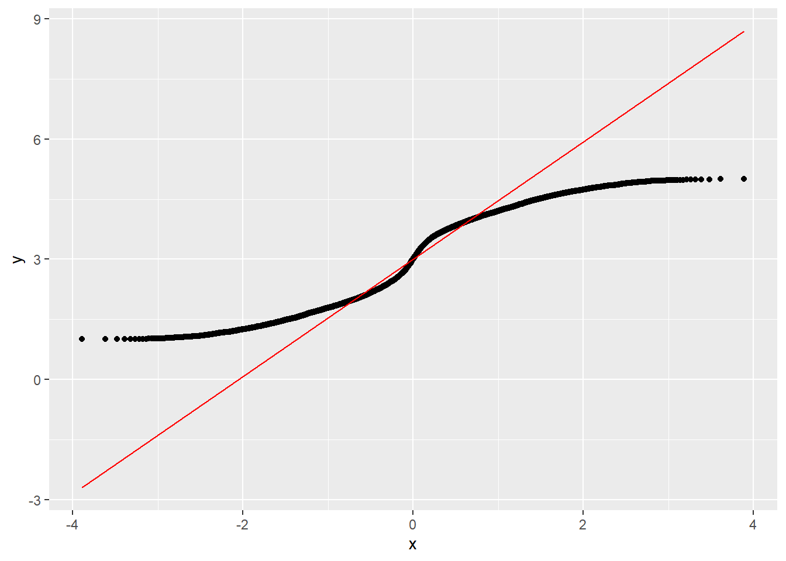
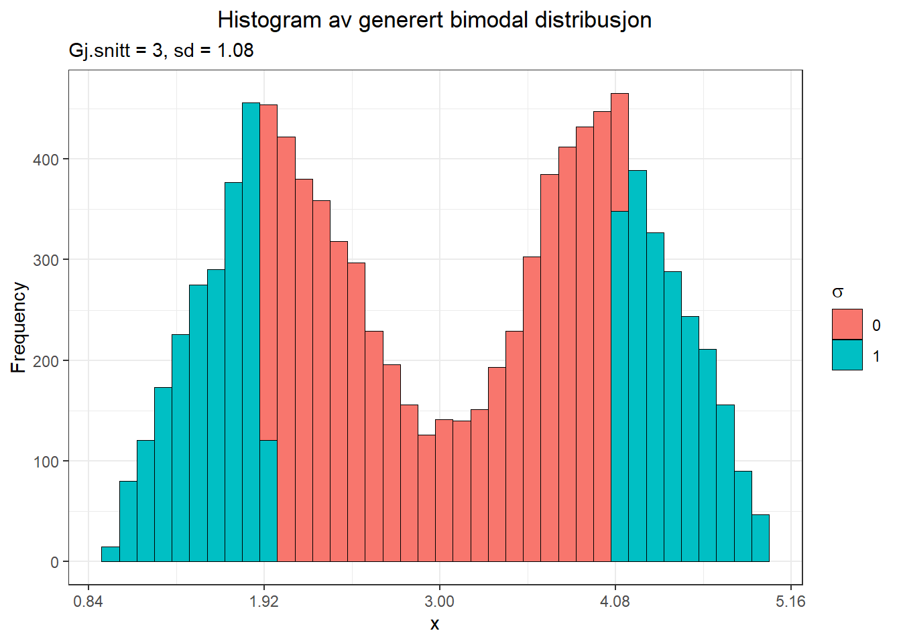
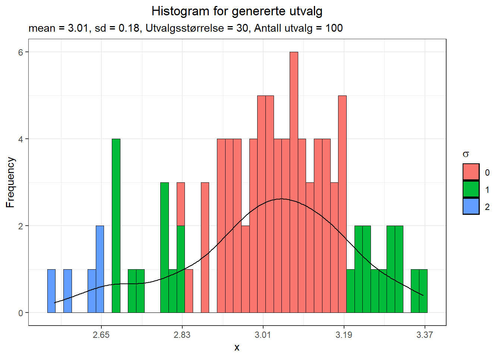

# Vedlegg B - Sentralgrenseteoremet (Central Limit Theorem) {.unnumbered}

Koden brukt i dette eksempelet er i stor grad hentet fra @feditCentralLimitTheorem2018b.

Dette er et noe komplisert begrep som vi ikke skal gå veldig i dybden på, men det har et par viktige konsekvenser for oss når vi skal tenke på distribusjon av populasjoner og utvalg. Her belyser vi to forhold som følger av sentralgrenseteoremet:

1. Gjennomsnittsverdien (mean) av tilfeldige utvalg fra en populasjon vil være tilnærmet lik gjennomsnittsverdien for populasjonen hvis størrelsen på utvalgene er tilstrekkelig stort.
2. Fordelingen til tilfeldige utvalg fra en populasjon vil være tilnærmet normalfordelt uavhengig av fordelingen på populasjonen. Dette innebærer at selv om populasjonen er langt fra normalfordelt vil et tilstrekkelig stort utvalg vise seg å være tilnærmet normalfordelt.

La oss se på dette gjennom et eksempel der vi starter med en bimodal fordeling (altså langt fra normalfordeling). Vi generer et datasett og plotter et Q-Q diagram (mer om dette et annet sted i notatet, men per nå trenger vi bare vite at dette er en effektiv måte å sjekke om en variabel er normalfordelt eller ikke).

(\#fig:unnamed-chunk-1)Ikke-normal fordeling og Q-Q plott

Som sagt har vi gjort rede for Q-Q plott et annet sted i boka, så her kan vi nøye oss med å slå fast at denne variabelen definitivt ikke er normalfordelt.
Det framkommer også tydelig når vi plotter et histogram:

(\#fig:unnamed-chunk-2)Histogram for bimodal fordeling

Ut fra denne populasjonen tar vi 100 utvalg med 30 i hvert utvalg. Fordelingen ser da slik ut:

(\#fig:unnamed-chunk-3)Histogram for 100 utvalg fra bimodal fordeling

Vi kan allerede nå ane en tilnørming mot normalfordeling, og i hvert fall en endret form enn populasjonen viste. Vi tar nå 1000 utvalg med 30 i hvert utvalg.

(\#fig:unnamed-chunk-4)Histogram for 1000 utvalg fra bimodal fordeling

Det er videre åpenbart at dette begynner å se mer og mer ut som en normalfordeling. Til slutt øker vi til 10000 utvalg av 30.

(\#fig:unnamed-chunk-5)Histogram for 10000 utvalg fra bimodal fordeling

Det vi kan se bekrefter hva Central Limit Theorem sier vi bør forvente. Vi kan starte med en hvilken som helst fordeling (kontinuerlig eller diskret) som har et definert gjennomsnitt og definert varians (og dermed definert standardavvik) og ta tilfeldige utvalg fra denne fordelingen – og vi vil få en tilnærmet normalfordelt fordeling. I det virkelige liv har vi ofte populasjonsfordelinger som har alt annet enn normalfordeling. Likevel kan vi ta tilfeldige utvalg og få en tilnærmet normalfordelt frekvensplott (av f.eks. gjennomsnittsverdier). Størrelsen på utvalget og antallet ganger vi tar utvalg vil påvirke -> jo større utvalg og jo flere utvalg, jo nærmere normalfordeling vil frekvensplottet være. 

En interessant illustrasjon av CLT ligger [her](https://ihstevenson.shinyapps.io/sample_means/).
