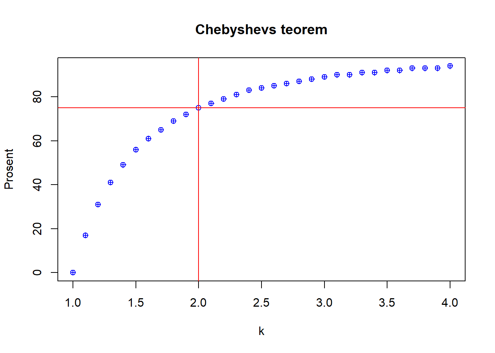

# Vedlegg C - Chebyshevs teorem {.unnumbered}

Dette vedlegget er i stor grad bygget på @hartmannELearningProjectSOGA2018.

Vi diskuterte i noe detalj hvordan vi kan bruke normalfordelingen til å si noe om hvordan verdier i et datasett kan antas å falle innenfor en gitt avstand fra gjennomsnittet [@hartmannVarianceStandardDeviation2018]:

(\#fig:unnamed-chunk-1)Normalfordeling med standardavvik

Vi kan ut fra normalfordeingen si at

* 68 % av observajsonene vil ligge innenfor ett standardavvik fra gjennomsnittsverdien
* 95 % av observasjonene vil ligge innenfor to standradavvik fra gjennomsnittsverdien
* 99.7 % av observasjonene vil ligge innenfor tre standardaavik fra gjennomsnittsverdien

Dette kalles ofte for den empiriske regelen ("the empirical rule"), og gjelder kun normalfordelte data. Chebyshevs teorem gjelder imidlertid alle fordelinger. Normalfordelingen gir oss at datapunkter med en viss sannsynlighet ligger innenfor en viss avstand fra gjennomsnittsverdien. Det samme sier Chebyshevs teorem om datafordelinger som ikke er normalfordelte: bare en gitt mengde datapunkter kan ligge mer enn en gitt avstand fra gjennomsnittsverdien. 

Teoremet uttrykkes slik [@hartmannVarianceStandardDeviation2018]: 

> For ethvert nummer *k* større enn 1 vil minst  $1-1/$*k*$^2$ av dataverdiene ligge innenfor *k* standardavvik fra gjennomsnittet.

Teoremet kan generisk kan framstilles slik:

(\#fig:unnamed-chunk-2)Chebyshevs teorem

For ethvert numerisk datasett gjelder:

1. Minst ¾ av datapunktene ligger innenfor to standardavvik av gjennomsnittet – altså i intervallet mellom endepunktene $\overline{x}\pm2s$ for et utvalg og $\overline{x}\pm2\sigma$ for populasjoner. 
2. Minst 8/9 av datapunktene ligger innenfor tre standardavvik av gjennomsnittet – altså i intervallet mellom endepunktene $\overline{x}\pm3s$ for et utvalg og $\overline{x}\pm3\sigma$ for populasjoner.
3. Minst $1-1/$*k*$^2$ av datapunktene ligger mellom k standardavvik av gjennomsnittet – altså i intervallet mellom endepunktene $\overline{x}\pm$*k*$s$ for et utvalg og $\overline{x}\pm$*k*$\sigma$ for populasjoner.

Ut fra tabellen under ser vi at dersom vi velger scroller til *k* = 2 vil 75 % av verdiene ligge innenfor (altså 75 % innenfor 2 standardavvik). 

<table class="table table-striped lightable-paper" style='width: auto !important; margin-left: auto; margin-right: auto; font-family: "Arial Narrow", arial, helvetica, sans-serif; margin-left: auto; margin-right: auto;'>
 <thead>
  <tr>
   <th style="text-align:right;position: sticky; top:0; background-color: #FFFFFF;"> k </th>
   <th style="text-align:right;position: sticky; top:0; background-color: #FFFFFF;"> auc.percent </th>
  </tr>
 </thead>
<tbody>
  <tr>
   <td style="text-align:right;"> 1.0 </td>
   <td style="text-align:right;"> 0 </td>
  </tr>
  <tr>
   <td style="text-align:right;"> 1.1 </td>
   <td style="text-align:right;"> 17 </td>
  </tr>
  <tr>
   <td style="text-align:right;"> 1.2 </td>
   <td style="text-align:right;"> 31 </td>
  </tr>
  <tr>
   <td style="text-align:right;"> 1.3 </td>
   <td style="text-align:right;"> 41 </td>
  </tr>
  <tr>
   <td style="text-align:right;"> 1.4 </td>
   <td style="text-align:right;"> 49 </td>
  </tr>
  <tr>
   <td style="text-align:right;"> 1.5 </td>
   <td style="text-align:right;"> 56 </td>
  </tr>
  <tr>
   <td style="text-align:right;"> 1.6 </td>
   <td style="text-align:right;"> 61 </td>
  </tr>
  <tr>
   <td style="text-align:right;"> 1.7 </td>
   <td style="text-align:right;"> 65 </td>
  </tr>
  <tr>
   <td style="text-align:right;"> 1.8 </td>
   <td style="text-align:right;"> 69 </td>
  </tr>
  <tr>
   <td style="text-align:right;"> 1.9 </td>
   <td style="text-align:right;"> 72 </td>
  </tr>
  <tr>
   <td style="text-align:right;"> 2.0 </td>
   <td style="text-align:right;"> 75 </td>
  </tr>
  <tr>
   <td style="text-align:right;"> 2.1 </td>
   <td style="text-align:right;"> 77 </td>
  </tr>
  <tr>
   <td style="text-align:right;"> 2.2 </td>
   <td style="text-align:right;"> 79 </td>
  </tr>
  <tr>
   <td style="text-align:right;"> 2.3 </td>
   <td style="text-align:right;"> 81 </td>
  </tr>
  <tr>
   <td style="text-align:right;"> 2.4 </td>
   <td style="text-align:right;"> 83 </td>
  </tr>
  <tr>
   <td style="text-align:right;"> 2.5 </td>
   <td style="text-align:right;"> 84 </td>
  </tr>
  <tr>
   <td style="text-align:right;"> 2.6 </td>
   <td style="text-align:right;"> 85 </td>
  </tr>
  <tr>
   <td style="text-align:right;"> 2.7 </td>
   <td style="text-align:right;"> 86 </td>
  </tr>
  <tr>
   <td style="text-align:right;"> 2.8 </td>
   <td style="text-align:right;"> 87 </td>
  </tr>
  <tr>
   <td style="text-align:right;"> 2.9 </td>
   <td style="text-align:right;"> 88 </td>
  </tr>
  <tr>
   <td style="text-align:right;"> 3.0 </td>
   <td style="text-align:right;"> 89 </td>
  </tr>
  <tr>
   <td style="text-align:right;"> 3.1 </td>
   <td style="text-align:right;"> 90 </td>
  </tr>
  <tr>
   <td style="text-align:right;"> 3.2 </td>
   <td style="text-align:right;"> 90 </td>
  </tr>
  <tr>
   <td style="text-align:right;"> 3.3 </td>
   <td style="text-align:right;"> 91 </td>
  </tr>
  <tr>
   <td style="text-align:right;"> 3.4 </td>
   <td style="text-align:right;"> 91 </td>
  </tr>
  <tr>
   <td style="text-align:right;"> 3.5 </td>
   <td style="text-align:right;"> 92 </td>
  </tr>
  <tr>
   <td style="text-align:right;"> 3.6 </td>
   <td style="text-align:right;"> 92 </td>
  </tr>
  <tr>
   <td style="text-align:right;"> 3.7 </td>
   <td style="text-align:right;"> 93 </td>
  </tr>
  <tr>
   <td style="text-align:right;"> 3.8 </td>
   <td style="text-align:right;"> 93 </td>
  </tr>
  <tr>
   <td style="text-align:right;"> 3.9 </td>
   <td style="text-align:right;"> 93 </td>
  </tr>
  <tr>
   <td style="text-align:right;"> 4.0 </td>
   <td style="text-align:right;"> 94 </td>
  </tr>
</tbody>
</table>

Vi kan også vise en grafisk framstilling av Chebyshevs teorem med fokus på prosenter (y-aksen) mot *k* (x-aksen).

(\#fig:unnamed-chunk-4)Chebyshevs teorem - prosent

Når vi vet at minst 75% av distribusjonen ligger innenfor $\overline{x}\pm2s$ vet vi også at maksimalt 25% ligger utenfor. Likeledes for $\overline{x}\pm3s$ vil maksimalt  11,11 % av distribusjonen ligge utenfor. Så mens reglene for normalfordeling kun gjelder for normalfordelte eller tilnærmet-normalfordelte datasett, er Chebyshevs teorem et faktum som gjelder alle datadistribusjoner og som beskriver minimumsandelen av observasjoner/datapunkter som ligger innenfor hhv +/- 1, 2 og 3 standardavvik fra gjennomsnittet.  
