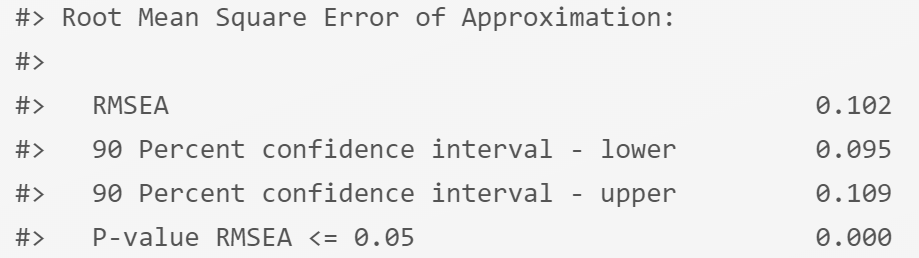
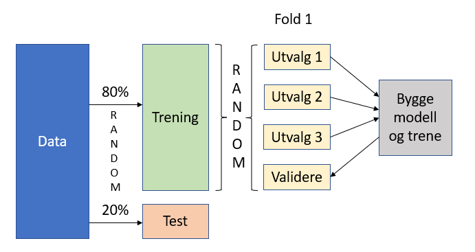

# TestCFA


Gjennomgangen av Confirmatory Factor Analysis (CFA) er basert på @linConfirmatoryFactorAnalysis2021. Vi håper vår gjennomgang kan framstå som like god som Lins original. 

I forrige del beskrev vi forskjellen på EFA og CFA på følgende måte:

* Eksplorerende faktoranalyse som søker å gruppere variabler i et datasett ut fra korrelasjon uten spesifikke hypoteser på forhånd om hvordan strukturen ser ut. Denne tilnærmingen er således induktiv og i mindre grad drevet av teori - "one can always subject a data set to an EFA but not necessarily a CFA" [Schriesheim i @hurleyExploratoryConfirmatoryFactor1997, s.672].
* Konfirmerende faktoranalyse starter i andre enden - med hypoteser om dataene og strukturen. Her ønsker vi å bekrefte (konfirmere) en antatt datastruktur i vårt datasett, f.eks. ut fra teoretiske forventninger og tidligere undersøkelser. 

## Gjennomgang av teori med eksempel

Data i eksempelet er hentet fra @fieldDiscoveringStatisticsUsing200 (dataene er konstruerte).

Du kan laste ned datasettet i SPSS-format [her](http://www.discoveringstatistics.com/docs/ds_data_files/SPSS%20Data%20Files/) - fila heter SAQ.sav.


```r
SAQ <- read_sav("SAQ.sav")
SAQ2 <- select(SAQ, -c(Question_09:FAC4_2))
SAQ2 <- rename(SAQ2, Spm1 = Question_01, Spm2 = Question_02, Spm3 = Question_03, Spm4 = Question_04, Spm5 = Question_05, Spm6 = Question_06, Spm7 = Question_07, Spm8 = Question_08)
write_sav(SAQ2, "SAQ2.sav")
```

Vi har modifisert datasettet ved å ta vekk noen unødvendige variabler for vårt formål og gitt variablene nye navn, og kalt denne fila SAQ2.sav:

`<a href="data:application/octet-stream;base64,JEZMMkAoIykgU1BTUyBEQVRBIEZJTEUgLSBodHRwczovL2dpdGh1Yi5jb20vV2l6YXJkTWFjL1JlYWRTdGF0IAIAAAAIAAAAAQAAAAAAAAALCgAAAAAAAAAAWUAyMyBNYXkgMjIyMDozMDoxMyAgICAgICAgICAgICAgICAgICAgICAgICAgICAgICAgICAgICAgICAgICAgICAgICAgICAgICAgICAgICAgICAAAAACAAAAAAAAAAEAAAAAAAAAAAEFAAABBQBTUE0xICAgIBcAAABTdGF0aXN0aWNzIG1ha2VzIG1lIGNyeQACAAAAAAAAAAEAAAAAAAAAAAEFAAABBQBTUE0yICAgIEUAAABNeSBmcmllbmRzIHdpbGwgdGhpbmsgSSdtIHN0dXBpZCBmb3Igbm90IGJlaW5nIGFibGUgdG8gY29wZSB3aXRoIFNQU1MAAAACAAAAAAAAAAEAAAAAAAAAAAEFAAABBQBTUE0zICAgIB0AAABTdGFuZGFyZCBkZXZpYXRpb25zIGV4Y2l0ZSBtZQAAAAIAAAAAAAAAAQAAAAAAAAAAAQUAAAEFAFNQTTQgICAgQgAAAEkgZHJlYW0gdGhhdCBQZWFyc29uIGlzIGF0dGFja2luZyBtZSB3aXRoIGNvcnJlbGF0aW9uIGNvZWZmaWNpZW50cwAAAgAAAAAAAAABAAAAAAAAAAABBQAAAQUAU1BNNSAgICAdAAAASSBkb24ndCB1bmRlcnN0YW5kIHN0YXRpc3RpY3MAAAACAAAAAAAAAAEAAAAAAAAAAAEFAAABBQBTUE02ICAgICUAAABJIGhhdmUgbGl0dGxlIGV4cGVyaWVuY2Ugb2YgY29tcHV0ZXJzAAAAAgAAAAAAAAABAAAAAAAAAAABBQAAAQUAU1BNNyAgICAVAAAAQWxsIGNvbXB1dGVycyBoYXRlIG1lAAAAAgAAAAAAAAABAAAAAAAAAAABBQAAAQUAU1BNOCAgICAlAAAASSBoYXZlIG5ldmVyIGJlZW4gZ29vZCBhdCBtYXRoZW1hdGljcwAAAAMAAAAGAAAAAAAAAAAA8D8OU3Ryb25nbHkgYWdyZWUgAAAAAAAAAEAFQWdyZWUgIAAAAAAAAAhAB05laXRoZXIAAAAAAAAQQAhEaXNhZ3JlZSAgICAgICAAAAAAAAAUQBFTdHJvbmdseSBkaXNhZ3JlZSAgICAgIAAAAAAAACJADE5vdCBhbnN3ZXJlZCAgIAQAAAABAAAAAQAAAAMAAAAFAAAAAAAAAAAA8D8OU3Ryb25nbHkgYWdyZWUgAAAAAAAAAEAFQWdyZWUgIAAAAAAAAAhAB05laXRoZXIAAAAAAAAQQAhEaXNhZ3JlZSAgICAgICAAAAAAAAAUQBFTdHJvbmdseSBkaXNhZ3JlZSAgICAgIAQAAAABAAAAAgAAAAMAAAAFAAAAAAAAAAAA8D8OU3Ryb25nbHkgYWdyZWUgAAAAAAAAAEAFQWdyZWUgIAAAAAAAAAhAB05laXRoZXIAAAAAAAAQQAhEaXNhZ3JlZSAgICAgICAAAAAAAAAUQBFTdHJvbmdseSBkaXNhZ3JlZSAgICAgIAQAAAABAAAAAwAAAAMAAAAGAAAAAAAAAAAA8D8OU3Ryb25nbHkgYWdyZWUgAAAAAAAAAEAFQWdyZWUgIAAAAAAAAAhAB05laXRoZXIAAAAAAAAQQAhEaXNhZ3JlZSAgICAgICAAAAAAAAAUQBFTdHJvbmdseSBkaXNhZ3JlZSAgICAgIAAAAAAAACJADE5vdCBhbnN3ZXJlZCAgIAQAAAABAAAABAAAAAMAAAAFAAAAAAAAAAAA8D8OU3Ryb25nbHkgYWdyZWUgAAAAAAAAAEAFQWdyZWUgIAAAAAAAAAhAB05laXRoZXIAAAAAAAAQQAhEaXNhZ3JlZSAgICAgICAAAAAAAAAUQBFTdHJvbmdseSBEaXNhZ3JlZSAgICAgIAQAAAABAAAABQAAAAMAAAAFAAAAAAAAAAAA8D8OU3Ryb25nbHkgYWdyZWUgAAAAAAAAAEAFQWdyZWUgIAAAAAAAAAhAB05laXRoZXIAAAAAAAAQQAhEaXNhZ3JlZSAgICAgICAAAAAAAAAUQBFTdHJvbmdseSBkaXNhZ3JlZSAgICAgIAQAAAABAAAABgAAAAMAAAAFAAAAAAAAAAAA8D8OU3Ryb25nbHkgYWdyZWUgAAAAAAAAAEAFQWdyZWUgIAAAAAAAAAhAB05laXRoZXIAAAAAAAAQQAhEaXNhZ3JlZSAgICAgICAAAAAAAAAUQBFTdHJvbmdseSBkaXNhZ3JlZSAgICAgIAQAAAABAAAABwAAAAMAAAAFAAAAAAAAAAAA8D8OU3Ryb25nbHkgYWdyZWUgAAAAAAAAAEAFQWdyZWUgIAAAAAAAAAhAB05laXRoZXIAAAAAAAAQQAhEaXNhZ3JlZSAgICAgICAAAAAAAAAUQBFTdHJvbmdseSBkaXNhZ3JlZSAgICAgIAQAAAABAAAACAAAAAcAAAADAAAABAAAAAgAAAAUAAAAAAAAAAAAAAD/////AQAAAAEAAAACAAAA6f0AAAcAAAAEAAAACAAAAAMAAAD////////v/////////+9//v//////7/8HAAAACwAAAAQAAAAYAAAAAwAAAAgAAAABAAAAAwAAAAgAAAABAAAAAwAAAAgAAAABAAAAAwAAAAgAAAABAAAAAwAAAAgAAAABAAAAAwAAAAgAAAABAAAAAwAAAAgAAAABAAAAAwAAAAgAAAABAAAABwAAAA0AAAABAAAATwAAAFNQTTE9U3BtMQlTUE0yPVNwbTIJU1BNMz1TcG0zCVNQTTQ9U3BtNAlTUE01PVNwbTUJU1BNNj1TcG02CVNQTTc9U3BtNwlTUE04PVNwbTgHAAAAEAAAAAgAAAACAAAAAQAAAAAAAAALCgAAAAAAAOcDAAAAAAAAZmVoZmZmZ2UAAAAAAAAAAGVlaGdmZmZmAAAAAAAAAABmZ2ZmaGVmZgAAAAAAAAAAZ2VlaGdnaGYAAAAAAAAAAGZlZ2ZmZ2dmAAAAAAAAAABmZWdmaGhoZgAAAAAAAAAAZmdnZmZmZmYAAAAAAAAAAGZmZ2ZmZmZmAAAAAAAAAABnZ2VoaWdpaQAAAAAAAAAAZmhoZ2ZlZmYAAAAAAAAAAGZlaWZmZWZmAAAAAAAAAABmZWdnaGdnZQAAAAAAAAAAZ2VnaGdmZ2cAAAAAAAAAAGZmZWZmZmdmAAAAAAAAAABmZmdoZmZnZgAAAAAAAAAAZ2VmZmZmZmYAAAAAAAAAAGVmaWZlZWVlAAAAAAAAAABmZmdnZ2hnZgAAAAAAAAAAZmdoZmdlZWUAAAAAAAAAAGZlZWZnaGhlAAAAAAAAAABlZmdmaGVmZQAAAAAAAAAAZ2ZmaGhpaWYAAAAAAAAAAGZlaGhmZmhnAAAAAAAAAABlZWZmZmVlZgAAAAAAAAAAZmVlaGZnZ2gAAAAAAAAAAGZlZ2dmZWhmAAAAAAAAAABnZmVnaGhnaAAAAAAAAAAAZWZoZWVpZmUAAAAAAAAAAGZmZ2dmZmhmAAAAAAAAAABmZWhmZmZlZgAAAAAAAAAAZmZlZWZlZmUAAAAAAAAAAGVnZ2ZmZmdmAAAAAAAAAABmZ2hmZmZoZgAAAAAAAAAAZ2dmZ2dmZ2YAAAAAAAAAAGZlZmhnaGhnAAAAAAAAAABmZWVnaGloaAAAAAAAAAAAZ2ZoZmZnZmYAAAAAAAAAAGVlZ2ZmZWVnAAAAAAAAAABmZmdoZmVmZgAAAAAAAAAAZWVpZmZoaGUAAAAAAAAAAGZnZWZnZ2hpAAAAAAAAAABnZmVoZ2ZoaQAAAAAAAAAAZmZnZmVlZmYAAAAAAAAAAGVlZ2ZmZmZlAAAAAAAAAABnZmdnaGZnZwAAAAAAAAAAZmVlZ2ZnZ2YAAAAAAAAAAGdnZmhnZmhoAAAAAAAAAABmZmdmZmVmZgAAAAAAAAAAZmVmZmdmZmYAAAAAAAAAAGZlZ2dmZ2dnAAAAAAAAAABlZmdnZmVlZgAAAAAAAAAAZmZnZmZlZWYAAAAAAAAAAGZlZ2dlZmhlAAAAAAAAAABnZWVmZ2VlZgAAAAAAAAAAZ2VnZmdlZmYAAAAAAAAAAGhmZWhpaGdmAAAAAAAAAABnZmdmaGVnaQAAAAAAAAAAZmhoZmhlZWUAAAAAAAAAAGVlZmZoZmdmAAAAAAAAAABmZmdmZmZmZgAAAAAAAAAAZmZoaGhmaGUAAAAAAAAAAGZlZmdmZmhmAAAAAAAAAABmZWZmZmZnZgAAAAAAAAAAZmZoZ2dmZ2YAAAAAAAAAAGZmaGZnZWVmAAAAAAAAAABmZWdnZ2hpZgAAAAAAAAAAaWVlaWllaWkAAAAAAAAAAGdlZWdoZ2dnAAAAAAAAAABnZWZmZ2dnZgAAAAAAAAAAZ2VlaGdmaGgAAAAAAAAAAGVmZmZmZmZmAAAAAAAAAABnZmdoaGdoZwAAAAAAAAAAZmZnZ2hmZ2YAAAAAAAAAAGZnZ2ZlZWVmAAAAAAAAAABmaGhnZmZnZgAAAAAAAAAAZWVmZ2VlZWcAAAAAAAAAAGdmZ2doaGdmAAAAAAAAAABnZWdnZmZnZgAAAAAAAAAAZmVnZmdlZ2cAAAAAAAAAAGZlZ2ZmZmZmAAAAAAAAAABnZ2hmZmVmZQAAAAAAAAAAZ2VmaGdpaWkAAAAAAAAAAGdlaGdoZmZmAAAAAAAAAABmZWlpZWVpaQAAAAAAAAAAZ2ZlZ2dlZ2UAAAAAAAAAAGZlZ2ZmZmdmAAAAAAAAAABmZWdnZmVlZgAAAAAAAAAAZmVnZmhmZmUAAAAAAAAAAGVmaWZlZmZmAAAAAAAAAABmZWdnZmZnZgAAAAAAAAAAZ2VnZWhnaGUAAAAAAAAAAGdoaWVmZWZlAAAAAAAAAABnZmdoZmZnZwAAAAAAAAAAZ2ZpaWlmaWcAAAAAAAAAAGhlaGdoZWdmAAAAAAAAAABmZWhnZmZmZgAAAAAAAAAAZmVlZmZnZ2YAAAAAAAAAAGZmaGdmZ2hmAAAAAAAAAABmZmhmZmZmZgAAAAAAAAAAZmVoZmZmZmYAAAAAAAAAAGZmZmdnZWZmAAAAAAAAAABmZmdnZmZnZgAAAAAAAAAAZmZoZmZlZmYAAAAAAAAAAGZnaGZmZWZmAAAAAAAAAABlZmdmaGVmZgAAAAAAAAAAZ2VlaGhpaGcAAAAAAAAAAGZmaGhoaWllAAAAAAAAAABnZWdnaWdoZwAAAAAAAAAAZWVnZWVlZ2UAAAAAAAAAAGZmZ2dmaWhoAAAAAAAAAABnZWVoaGlpaAAAAAAAAAAAZ2ZmaGhnZ2YAAAAAAAAAAGdlZmdnZmZmAAAAAAAAAABmZWZnZmZmZgAAAAAAAAAAZmVnZmZlZmYAAAAAAAAAAGZlZmhpZWlnAAAAAAAAAABmZWdlZ2hoZgAAAAAAAAAAZWVmZmZnaGUAAAAAAAAAAGZlZWdlaWhmAAAAAAAAAABmZmdmZmZmZgAAAAAAAAAAZmZnZmZnZmYAAAAAAAAAAGZoZmhoZmZmAAAAAAAAAABmZmhmZ2dmZgAAAAAAAAAAZ2VnZmdmZ2UAAAAAAAAAAGdlZWdnZmhmAAAAAAAAAABnZmVnaGZoZgAAAAAAAAAAZ2VoZ2dmZmYAAAAAAAAAAGZlZ2ZmZmZmAAAAAAAAAABmZmhmZ2VlZgAAAAAAAAAAZmVnZmdmZWYAAAAAAAAAAGZnaGZnZmZmAAAAAAAAAABlZmZmZmVnZgAAAAAAAAAAZ2ZmZ2dmZ2cAAAAAAAAAAGVlZ2ZmZmdmAAAAAAAAAABmZmVmZmZnZgAAAAAAAAAAZmVnZ2ZmZ2YAAAAAAAAAAGVoZ2ZmZmdlAAAAAAAAAABlZmdmZ2VoZgAAAAAAAAAAZmZoZ2dmZmYAAAAAAAAAAGVmZmdnaGdlAAAAAAAAAABmZWVoaWdpZQAAAAAAAAAAZmVnZmZmaGYAAAAAAAAAAGZnZ2ZnaGdnAAAAAAAAAABmZ2dnZmZnZgAAAAAAAAAAaGZmZ2hlZmYAAAAAAAAAAGZmaGZmZmZmAAAAAAAAAABmZWdmZmZmZgAAAAAAAAAAZmZnZmZlZmYAAAAAAAAAAGdlZ2dmZ2hnAAAAAAAAAABlZWZlZWdnZwAAAAAAAAAAZmZnZmZmZmYAAAAAAAAAAGZmaGZlZWdlAAAAAAAAAABmZWdmZmVoZgAAAAAAAAAAZ2ZnZ2dmZmYAAAAAAAAAAGZnaGZmZ2hmAAAAAAAAAABmZWdnaGZnZQAAAAAAAAAAZmZpZ2hlZWYAAAAAAAAAAGZmZmdoZ2dmAAAAAAAAAABmZWhlZWVlZgAAAAAAAAAAZmVpZmVlZWYAAAAAAAAAAGZlZ2ZnZ2dmAAAAAAAAAABmZWZnZmZnaAAAAAAAAAAAZmdmZmhnZ2YAAAAAAAAAAGZmaGZmZmhmAAAAAAAAAABmZWdmZmZnZgAAAAAAAAAAZmVmZ2hoaWYAAAAAAAAAAGZoaGZmZmdmAAAAAAAAAABmZWZnZmZoZgAAAAAAAAAAZmVlZmZmZ2UAAAAAAAAAAGZlZ2ZmZmZlAAAAAAAAAABnZWVoZ2lpZwAAAAAAAAAAZmZoZmZmZ2YAAAAAAAAAAGVmZ2ZmZ2hmAAAAAAAAAABlZWVoZWZoZQAAAAAAAAAAZmVlZmZmZmYAAAAAAAAAAGZmZmhoZmhnAAAAAAAAAABmZmZoZmVmZgAAAAAAAAAAZmZmaWhpaWYAAAAAAAAAAGdmZWdnZWdmAAAAAAAAAABmZWhlZmVmZQAAAAAAAAAAZ2VlZ2dlaGcAAAAAAAAAAGZlZ2dmZmdmAAAAAAAAAABlZmhnZmVlZQAAAAAAAAAAZ2VnZmZlZWUAAAAAAAAAAGhmZmhmZ2lmAAAAAAAAAABmZmhnZmZoZgAAAAAAAAAAZWZnZmZmZ2YAAAAAAAAAAGZnaGZmZmZmAAAAAAAAAABmZWZpaGdnaAAAAAAAAAAAZmZmZWdmZmYAAAAAAAAAAGZmZ2ZmZmZmAAAAAAAAAABnZmhnZ2VmZgAAAAAAAAAAZmVnZWVnZ2YAAAAAAAAAAGZmaGZoZmhmAAAAAAAAAABlZWdmZWVmZgAAAAAAAAAAZ2VnaGhpaWYAAAAAAAAAAGZoZ2dmZmdmAAAAAAAAAABmZmZnaGhnZwAAAAAAAAAAZWVoZmZmZmYAAAAAAAAAAGZmaGZmZWVmAAAAAAAAAABmZ2hmZ2VlZgAAAAAAAAAAZmVnZmZlaGYAAAAAAAAAAGdlZmhoaGhnAAAAAAAAAABmaWlmZmVlZQAAAAAAAAAAZmZoaWlpaGYAAAAAAAAAAGhlZWlpZ2ZmAAAAAAAAAABmZWhmZmVlZgAAAAAAAAAAaGVmZ2hoaGcAAAAAAAAAAGdlZmdoZmZnAAAAAAAAAABnZWZoaGdoZwAAAAAAAAAAZmVmaGhmZmcAAAAAAAAAAGdlZWlnZmhmAAAAAAAAAABmZmZoZmZoZgAAAAAAAAAAZmdoZWVlZ2UAAAAAAAAAAGZmZ2hmZmhoAAAAAAAAAABoZWVoZ2lpaAAAAAAAAAAAZmZnaGdmZ2cAAAAAAAAAAGZlZmdnaWhmAAAAAAAAAABmZWdnZmZmZgAAAAAAAAAAaGVmZ2dnZ2YAAAAAAAAAAGVlZmdnZ2hmAAAAAAAAAABmZmZmZ2ZnZgAAAAAAAAAAZmdnZ2dmZmcAAAAAAAAAAGZnZ2ZmZmdmAAAAAAAAAABlZWhlZWVlZQAAAAAAAAAAaGhnaWdnZ2gAAAAAAAAAAGZmZ2dmZ2dmAAAAAAAAAABnZWZoZ2dnZgAAAAAAAAAAZmVnZ2ZmZ2UAAAAAAAAAAGdlZ2VoZWlmAAAAAAAAAABnZWdmZmVpaAAAAAAAAAAAZmhpZWVlZWUAAAAAAAAAAGVlaGZlZWZmAAAAAAAAAABmZWdnZmZnZgAAAAAAAAAAZ2VlaWdlaGYAAAAAAAAAAGVlZ2dmZ2doAAAAAAAAAABmZWhmZ2ZlZwAAAAAAAAAAZmZnZmdnZ2cAAAAAAAAAAGZlZmZlZWVlAAAAAAAAAABmZWdmZmZmZgAAAAAAAAAAaWdlaWhmaGkAAAAAAAAAAGZlZWlnaGhoAAAAAAAAAABmZWZmaGVmZgAAAAAAAAAAZmZnaGhmaGYAAAAAAAAAAGZmaGZnZmZmAAAAAAAAAABmZWZmaGZnZwAAAAAAAAAAZ2doZ2ZmZWYAAAAAAAAAAGhlZWlpZWlnAAAAAAAAAABmZWdmZmZnZgAAAAAAAAAAZmVoZ2ZlZmUAAAAAAAAAAGdlZWdnZmhnAAAAAAAAAABmZWZnZ2hpZgAAAAAAAAAAZmZoZmdoZmYAAAAAAAAAAGZmaGZmZmdmAAAAAAAAAABlZWhnaGVmZgAAAAAAAAAAZmVnZmZmZmYAAAAAAAAAAGZoZ2VlZWVlAAAAAAAAAABmZmdmZ2ZmZwAAAAAAAAAAZWdoZmZmZmYAAAAAAAAAAGdlZWhoZ2lpAAAAAAAAAABmZ2dnZmdmZgAAAAAAAAAAZmVnZmVmZmUAAAAAAAAAAGlmZmhoaWllAAAAAAAAAABlZWdnZmVmZQAAAAAAAAAAZmVnZmZmZ2YAAAAAAAAAAGZmZ2ZmZmZmAAAAAAAAAABnZWdnZmVlZgAAAAAAAAAAZmZlZ2llZ2cAAAAAAAAAAGZmZWZmaWhnAAAAAAAAAABmZmdnZmhoZgAAAAAAAAAAZ2VoZ2dlZmYAAAAAAAAAAGZmZ2doZmZoAAAAAAAAAABmZWdmZmZmZwAAAAAAAAAAZ2VmaGZmZ2cAAAAAAAAAAGdmZ2dmZWVlAAAAAAAAAABmZWZmZmZmZQAAAAAAAAAAaGVlaWloaGYAAAAAAAAAAGdlZWdnZWhlAAAAAAAAAABnZmhnaGZmZgAAAAAAAAAAZ2VlZ2ZoaGcAAAAAAAAAAGZlaGZmaGhmAAAAAAAAAABmZWZoaGdnZgAAAAAAAAAAZ2VnaGhmZmYAAAAAAAAAAGdmZmhmZmhmAAAAAAAAAABpZmVpaGlpZwAAAAAAAAAAZ2ZoZ2ZmZ2YAAAAAAAAAAGZlZ2ZmZmZmAAAAAAAAAABlZmhmZmVlZgAAAAAAAAAAZ2ZlZmdnZ2YAAAAAAAAAAGdpZ2ZnZWZlAAAAAAAAAABoZWZoZmZnZgAAAAAAAAAAZmVmZ2dnaGYAAAAAAAAAAGdlZmdnZ2doAAAAAAAAAABnZmZnaGloZgAAAAAAAAAAaGVlaGhmaGYAAAAAAAAAAGdlZ2ZmZmdmAAAAAAAAAABnZWdnZmZmZgAAAAAAAAAAZmVmZmVmZmcAAAAAAAAAAGZmZWdnZ2dmAAAAAAAAAABnZWdnaGVlZwAAAAAAAAAAZmZmZ2hmZ2cAAAAAAAAAAGdlZ2hnZmdmAAAAAAAAAABnZWdoZmZoZgAAAAAAAAAAZWZnZmdnZmYAAAAAAAAAAGZlZ2ZnZWZmAAAAAAAAAABnZWZnZ2ZnaAAAAAAAAAAAZ2ZmZ2doaGYAAAAAAAAAAGZlZ2ZmaGhmAAAAAAAAAABmZ2dmZWhmZgAAAAAAAAAAaGllaWlpaWcAAAAAAAAAAGZlZmdoZ2hmAAAAAAAAAABnZWhlZ2VlZgAAAAAAAAAAaWVlaWllaWcAAAAAAAAAAGdmZmdoZWZmAAAAAAAAAABoZWVnZmZmaAAAAAAAAAAAZmVmZmVnaGUAAAAAAAAAAGVlZ2VmZmZlAAAAAAAAAABnZWZnZmdoZgAAAAAAAAAAZmVoZmhlZWYAAAAAAAAAAGZnZ2dmZmZmAAAAAAAAAABnZ2hnZmZmZgAAAAAAAAAAZmVmZ2ZoaGcAAAAAAAAAAGdnZ2ZnZmZmAAAAAAAAAABlaGhlZWVlZQAAAAAAAAAAZ2hmaGhlZ2YAAAAAAAAAAGdlZWhnZWhnAAAAAAAAAABmZmhmZmZmZgAAAAAAAAAAaGVlaGlmZ2gAAAAAAAAAAGZmZmZmZmhmAAAAAAAAAABmZWdnZmZmaAAAAAAAAAAAZmVlaWhoaWUAAAAAAAAAAGllZWhpaWdmAAAAAAAAAABmZWdmZ2ZpZgAAAAAAAAAAZ2VmZ2hnaGYAAAAAAAAAAGZlZmZmZmZmAAAAAAAAAABpZWVmaGVmZgAAAAAAAAAAZmZmZmZoaGYAAAAAAAAAAGdlZ2dnaWlmAAAAAAAAAABnZ2dnZmZoZwAAAAAAAAAAZ2VmaGdnZ2UAAAAAAAAAAGZlZmdnZ2dnAAAAAAAAAABnZWZnZ2ZnZwAAAAAAAAAAZmVmaGhmZmcAAAAAAAAAAGZlaGZmZWZlAAAAAAAAAABmZWdmZ2ZmZgAAAAAAAAAAaGVlZ2lpaWcAAAAAAAAAAGVnZ2dmZmdmAAAAAAAAAABlZWllZ2ZmZgAAAAAAAAAAZmdnaGZmZmcAAAAAAAAAAGZmZ2dnZmZmAAAAAAAAAABmZmVlZWVmZQAAAAAAAAAAZWZnZ2dmZmYAAAAAAAAAAGZlZ2ZpZWlmAAAAAAAAAABmZWVlZWVpZQAAAAAAAAAAZmVnZmhmaWYAAAAAAAAAAGhlZWhoZWhmAAAAAAAAAABnZmdoZ2VmZwAAAAAAAAAAZmlnZ2ZmZmYAAAAAAAAAAGdlZWdoZWZmAAAAAAAAAABmZmdnZmVmZgAAAAAAAAAAZmVnZ2dmZmYAAAAAAAAAAGZlZ2dmZWZlAAAAAAAAAABmZ2hoZmhmZgAAAAAAAAAAZmVlZmdlZWUAAAAAAAAAAGZlZ2dnZmdnAAAAAAAAAABmZWVnZmlpZQAAAAAAAAAAZmhnZ2ZlZmYAAAAAAAAAAGdlZ2dlZ2hmAAAAAAAAAABnZWVoaGhpZgAAAAAAAAAAZWVnZmZmZ2YAAAAAAAAAAGZlZmdnZmlmAAAAAAAAAABmZWVoZ2loZwAAAAAAAAAAZmdnZmdmZ2YAAAAAAAAAAGVmaWVmZmZmAAAAAAAAAABnZ2ZnZ2ZnZwAAAAAAAAAAZmZnZmZlZmYAAAAAAAAAAGdmZmhnZWZpAAAAAAAAAABmZ2hmZmZnZgAAAAAAAAAAZmVlZmZmZWgAAAAAAAAAAGdmZWdnaWlnAAAAAAAAAABmaGdnZ2ZmZgAAAAAAAAAAZ2dmZmZlZmYAAAAAAAAAAGdlZ2ZmaGhoAAAAAAAAAABmZWZmZ2ZnZQAAAAAAAAAAZmZnZ2dmaGYAAAAAAAAAAGdmaGVlZWZlAAAAAAAAAABmZWVnZ2lpZgAAAAAAAAAAZWZmZmdmZ2UAAAAAAAAAAGZnZ2ZoZWdmAAAAAAAAAABmZWdmZ2dnZgAAAAAAAAAAZ2ZlZ2hmZ2cAAAAAAAAAAGZlZ2ZnZmhmAAAAAAAAAABmZmdnZ2VmZgAAAAAAAAAAZ2ZoZ2ZmaGUAAAAAAAAAAGZmZ2hmZmhoAAAAAAAAAABmaGVnZmZmZgAAAAAAAAAAZ2VoZmZlZmYAAAAAAAAAAGZmZWZnZmhmAAAAAAAAAABmZWVmZmdoZwAAAAAAAAAAZ2ZmZ2dmZ2gAAAAAAAAAAGVmZ2ZmZmZlAAAAAAAAAABmZWZnZmVmZgAAAAAAAAAAZmdnZmZlZWUAAAAAAAAAAGhoZmhmZmhoAAAAAAAAAABnZWZnaGZnZwAAAAAAAAAAaGVmaGhoZ2YAAAAAAAAAAGVlZ2hmaWdmAAAAAAAAAABmZWdnaGdnZwAAAAAAAAAAZWVoZmdlZmUAAAAAAAAAAGdmZ2dnZmhlAAAAAAAAAABmZWdnZmVnZgAAAAAAAAAAZWVoZWZmZmUAAAAAAAAAAGZlZmhoZmhpAAAAAAAAAABnZWVoaWdoaAAAAAAAAAAAZmVnZ2ZmZmYAAAAAAAAAAGllZWlpaWlpAAAAAAAAAABnZmhnZ2ZnZwAAAAAAAAAAZ2doZmdmZmUAAAAAAAAAAGZnZ2dmZWVmAAAAAAAAAABoZWVoaGVpZgAAAAAAAAAAZ2dpaGZlZmUAAAAAAAAAAGZnaGdnZWZmAAAAAAAAAABmaGhmZmZmZQAAAAAAAAAAZmZoZmZmZmYAAAAAAAAAAGZlaGVmZmdmAAAAAAAAAABlZmVnaWZoaAAAAAAAAAAAZmVmZmhmZ2YAAAAAAAAAAGZlZWdmZmZmAAAAAAAAAABmZmVnZ2ZnZgAAAAAAAAAAaGVoaGdmZmYAAAAAAAAAAGZlaGhmZ2ZmAAAAAAAAAABoZWZpaGhpZgAAAAAAAAAAZ2VmaGdoaWcAAAAAAAAAAGdlZmdoZmZlAAAAAAAAAABmZWdnZ2hnZgAAAAAAAAAAZmZmZmdmaGYAAAAAAAAAAGVlZ2dnZmdmAAAAAAAAAABnZmhnZmZmZgAAAAAAAAAAZmVoZmZlZmYAAAAAAAAAAGdmZ2hnZmhlAAAAAAAAAABmZ2dmZ2dnZwAAAAAAAAAAZ2ZnaWdlZmgAAAAAAAAAAGZlZmloZ2hlAAAAAAAAAABmZWdmaGZmZwAAAAAAAAAAZmVnZWZlZmUAAAAAAAAAAGZlZ2ZnaGhmAAAAAAAAAABnZWdnaGZpaQAAAAAAAAAAZmVlaWZpaWYAAAAAAAAAAGZlaGZoZ2ZmAAAAAAAAAABlaGhmZmVlZQAAAAAAAAAAZ2VnZmloaGcAAAAAAAAAAGZmaGZmZmZmAAAAAAAAAABlZ2dmZmVlZgAAAAAAAAAAZmVmZ2dlZmcAAAAAAAAAAGdnZ2dmZWZmAAAAAAAAAABnZ2hnZmVmZgAAAAAAAAAAZ2VnZ2ZmZ2YAAAAAAAAAAGZlZ2ZnZ2dmAAAAAAAAAABoZWVpZ2hoZgAAAAAAAAAAZmVmaWZpaWkAAAAAAAAAAGVmaGZmZ2dmAAAAAAAAAABlZ2hmZmVmZwAAAAAAAAAAZmVnZmZmZmYAAAAAAAAAAGZlZmhmZmZmAAAAAAAAAABnZmdnaGVmZgAAAAAAAAAAZmdnZmZmZmYAAAAAAAAAAGVmaGVnZmdmAAAAAAAAAABmZWhoZmZlZQAAAAAAAAAAZmhpZWVlZWYAAAAAAAAAAGZlZWhmZmhmAAAAAAAAAABmaWdoZ2ZoZgAAAAAAAAAAZmVnZ2ZnaGYAAAAAAAAAAGVlZ2VmZWZmAAAAAAAAAABpZWVnZ2lmZgAAAAAAAAAAZ2hoZ2dlZmUAAAAAAAAAAGdmZ2hmZ2ZnAAAAAAAAAABmZWZmZWVmZQAAAAAAAAAAZmZnZmZlZWYAAAAAAAAAAGZmaGVmZmZmAAAAAAAAAABlZWZlZmZmZgAAAAAAAAAAaGVlaGZpaWYAAAAAAAAAAGdmZmdnZmZmAAAAAAAAAABlZWdmZmVnZQAAAAAAAAAAZmVlaGdpaGUAAAAAAAAAAGZlaGhpZWZnAAAAAAAAAABnZWZoaGdpZwAAAAAAAAAAZ2VmaGZlZmYAAAAAAAAAAGVmaGZmZmdmAAAAAAAAAABnZmZnZ2doZgAAAAAAAAAAaGVmZmZmZ2YAAAAAAAAAAGZoaGhmZmdmAAAAAAAAAABmZWhmZmZmZgAAAAAAAAAAZ2VnZmZmZmYAAAAAAAAAAGZnaWdnZmZmAAAAAAAAAABmZWlmZmdmZgAAAAAAAAAAZmdnaGdmZmYAAAAAAAAAAGZlaGZmZmZmAAAAAAAAAABnZmdoZmVlZQAAAAAAAAAAZmZnZ2ZmaGYAAAAAAAAAAGdlZ2ZnZmhmAAAAAAAAAABmZWhmZmZmZgAAAAAAAAAAZWVoaGZmZmYAAAAAAAAAAGVoaGZnZWZlAAAAAAAAAABmZWdmZmZnZgAAAAAAAAAAaGZnaGZlZmcAAAAAAAAAAGVlZWVmZ2dmAAAAAAAAAABmZmVnaGhoaAAAAAAAAAAAZWVlZ2dlZ2UAAAAAAAAAAGhlZWhnZWlmAAAAAAAAAABmZWZnZmhnaAAAAAAAAAAAZ2VlZmdmZ2gAAAAAAAAAAGdlZWdmaWlmAAAAAAAAAABmZWdmZmZnZgAAAAAAAAAAZmVnaGdmZmYAAAAAAAAAAGdlZ2ZpZWZmAAAAAAAAAABnZWZoaGloZwAAAAAAAAAAZmVmZWZnaGYAAAAAAAAAAGdnZmdnZmZmAAAAAAAAAABnZmZmZmZoaAAAAAAAAAAAaGVlaGhoaGYAAAAAAAAAAGVlZ2ZlZWdmAAAAAAAAAABmZWVnZ2hoaQAAAAAAAAAAZ2ZnZ2doaGcAAAAAAAAAAGhlaGloZmZnAAAAAAAAAABnZ2dmZmVnZgAAAAAAAAAAaGVlaWhnaGkAAAAAAAAAAGdmaGhnZmhnAAAAAAAAAABnZWhmZ2VmZwAAAAAAAAAAZ2ZnZ2hoaGcAAAAAAAAAAGZlZmZmZmhlAAAAAAAAAABlZWVmZmlmZgAAAAAAAAAAZmVmaGlmZ2YAAAAAAAAAAGdnaGdoaGdmAAAAAAAAAABmZmVmZ2ZmZgAAAAAAAAAAZmVnZWZmaGYAAAAAAAAAAGZlaGdmZWZmAAAAAAAAAABmZ2lnZWVmZgAAAAAAAAAAZmVnZmZnaGcAAAAAAAAAAGZlZWhmZWlpAAAAAAAAAABmZmhmZmZmZwAAAAAAAAAAZmdmaWhmaWcAAAAAAAAAAGZnZ2ZmZWZmAAAAAAAAAABlZWdnZWVmZQAAAAAAAAAAZWVnZmhoZmUAAAAAAAAAAGZnaGVnZmhlAAAAAAAAAABmZ2dmZ2doZgAAAAAAAAAAZmVmaGhnaWcAAAAAAAAAAGZlZWloZmhmAAAAAAAAAABmZWdnZmZnaAAAAAAAAAAAZmVmZmZmZmYAAAAAAAAAAGZnZ2dmZWZmAAAAAAAAAABlZWhmZmVlZQAAAAAAAAAAZWVnZ2VmZ2cAAAAAAAAAAGZlZmhnZ2hmAAAAAAAAAABnZWZmZ2ZmZgAAAAAAAAAAaGVnZ2dmZmYAAAAAAAAAAGhlZWlmZmhmAAAAAAAAAABmZmhmZmVmZQAAAAAAAAAAZmZnZmdmZWYAAAAAAAAAAGZlZmVmZmZmAAAAAAAAAABoZmVmZ2ZnZwAAAAAAAAAAZ2VnaGhoZ2YAAAAAAAAAAGZlZ2dnZWZmAAAAAAAAAABmaWdnZ2hpZwAAAAAAAAAAZmVmaWZpaWYAAAAAAAAAAGdlZ2dmZ2lmAAAAAAAAAABmZ2dmZmZnZwAAAAAAAAAAZmdlZ2ZoaGcAAAAAAAAAAGZmZmZoaGlmAAAAAAAAAABnZmZoZ2ZnZwAAAAAAAAAAZmVmaGZpaWUAAAAAAAAAAGhmZmhnZmhnAAAAAAAAAABmZ2hnZ2doZgAAAAAAAAAAZ2dnaGdnZ2cAAAAAAAAAAGZnZ2ZmaGhnAAAAAAAAAABmZmVmZmZnZgAAAAAAAAAAZmVmZ2ZmZ2cAAAAAAAAAAGllZmhoZ2dnAAAAAAAAAABnZWZnZmVmZgAAAAAAAAAAZ2doZ2ZlZ2YAAAAAAAAAAGZlZWdnZ2hmAAAAAAAAAABnZmVoZ2ZnZwAAAAAAAAAAZ2ZnZ2ZmZ2cAAAAAAAAAAGdlaGZmZmZmAAAAAAAAAABnZmdmaGZoZgAAAAAAAAAAaGZnZmdlZmYAAAAAAAAAAGdlZWdpZmdnAAAAAAAAAABmZmZoZmZoZgAAAAAAAAAAZmVlZmZnaGYAAAAAAAAAAGZmZ2ZmZWZmAAAAAAAAAABmZWdmZmVmZQAAAAAAAAAAZmVlZ2doaGYAAAAAAAAAAGdlZWlnZmZmAAAAAAAAAABnZmdnZ2doZgAAAAAAAAAAZWZoZWZlZWYAAAAAAAAAAGVlaWZmZWZlAAAAAAAAAABmZ2hmZ2ZmZgAAAAAAAAAAZ2ZnZmdoaGUAAAAAAAAAAGZlZ2dnZmZnAAAAAAAAAABmZ2hnZmZmZgAAAAAAAAAAZmVmZ2dnZ2YAAAAAAAAAAGdmZmhoZmdnAAAAAAAAAABmZWZmZ2ZmZgAAAAAAAAAAZ2ZoZ2ZlaGcAAAAAAAAAAGdoZ2dnaGhoAAAAAAAAAABnZWVoZ2doZwAAAAAAAAAAZ2VlZmVlZ2cAAAAAAAAAAGZlZmZoZWZmAAAAAAAAAABmZWhmZmVmZgAAAAAAAAAAZ2ZmZmdoaGcAAAAAAAAAAGdlZmhnZ2hpAAAAAAAAAABoZWVoaGlpZQAAAAAAAAAAZmVnZ2dmZmYAAAAAAAAAAGZmZ2hoZmhmAAAAAAAAAABnZWdnZ2ZnZgAAAAAAAAAAZ2VmaGdmaGYAAAAAAAAAAGZlZmZnZmdmAAAAAAAAAABmZmhmZWVmZgAAAAAAAAAAZmZnZ2dmZ2cAAAAAAAAAAGZlZmdnZWdmAAAAAAAAAABlZWdmZWdnZQAAAAAAAAAAZWZnZ2ZlZ2YAAAAAAAAAAGdlZmlnZWdpAAAAAAAAAABmZ2lmZmVmZgAAAAAAAAAAZ2VmaGhmaGYAAAAAAAAAAGVmZ2hmZmhnAAAAAAAAAABoZWZpaGdoZgAAAAAAAAAAZmZnZ2ZmZ2YAAAAAAAAAAGVlZWZmaWdmAAAAAAAAAABmZWZnZmZmZgAAAAAAAAAAZmVpZmZmZ2YAAAAAAAAAAGZlZmdnZ2hlAAAAAAAAAABlZ2dmZWVmZgAAAAAAAAAAZmVnZ2dmZmcAAAAAAAAAAGZnaGZoZWVlAAAAAAAAAABmZWZnZ2ZmZgAAAAAAAAAAZ2ZmZmdlZ2YAAAAAAAAAAGdlZWdnaGhmAAAAAAAAAABmZmZnZ2ZnZgAAAAAAAAAAZmVnZ2ZlZmYAAAAAAAAAAGdmZmdnZmdmAAAAAAAAAABnZmdnZ2ZoZwAAAAAAAAAAaGVlZ2doaWYAAAAAAAAAAGhlZWZoZmZlAAAAAAAAAABmaGdnZmZmZQAAAAAAAAAAZmdoZ2dnZ2cAAAAAAAAAAGZmaGZnZmdmAAAAAAAAAABoZmZpZ2ZoaAAAAAAAAAAAZmVmZ2hmaGYAAAAAAAAAAGVnaGVmZmdlAAAAAAAAAABmZ2dmZmVlZQAAAAAAAAAAZmVmaGZmZmYAAAAAAAAAAGZlZ2dmZmhnAAAAAAAAAABnZmVmaWVoZgAAAAAAAAAAZmVnZ2dmZ2YAAAAAAAAAAGZlZmdmZmhmAAAAAAAAAABmZWdnZ2ZnZgAAAAAAAAAAZmVnZmdlZWYAAAAAAAAAAGZlaGdmZmdmAAAAAAAAAABmZWZoZmZoZQAAAAAAAAAAZmVnZWZoZmYAAAAAAAAAAGdlZmdnZ2dnAAAAAAAAAABmZWdmZmVlZQAAAAAAAAAAZmdnZWZlZ2YAAAAAAAAAAGZlZWhnZWVlAAAAAAAAAABmZmhoZ2ZmZgAAAAAAAAAAZWVmZmVlZ2cAAAAAAAAAAGZmZ2dmZmZmAAAAAAAAAABmZWZnaGVmZgAAAAAAAAAAZmZoZmZmZmYAAAAAAAAAAGZmZ2dmZmdmAAAAAAAAAABnZWVoZ2ZnZgAAAAAAAAAAZmVmZmdlZmYAAAAAAAAAAGZlZ2ZmZmdmAAAAAAAAAABnZWZnZmVlZQAAAAAAAAAAZ2VmZWVmZ2YAAAAAAAAAAGhmZWhnZWloAAAAAAAAAABlZWlmZWVnaAAAAAAAAAAAZ2VmZ2dmZmYAAAAAAAAAAGVmZWlpaWlpAAAAAAAAAABnZWhnZmVoZQAAAAAAAAAAZ2VmZ2hmZ2gAAAAAAAAAAGZlZWVlZmdlAAAAAAAAAABnaGhmZmVmZgAAAAAAAAAAZmhoZmZmZmYAAAAAAAAAAGZlZmdmZWZmAAAAAAAAAABmZWVmZmVlZQAAAAAAAAAAZmVmZ2dmZmYAAAAAAAAAAGZlZ2ZmZWVlAAAAAAAAAABmZmhlZWVmZQAAAAAAAAAAZmVlZ2ZnaWYAAAAAAAAAAGZlaGdmZWdmAAAAAAAAAABnZWVoaGhnaQAAAAAAAAAAZ2VmZ2dlaGYAAAAAAAAAAGhmZ2doZWlmAAAAAAAAAABnZmVnZmdnZgAAAAAAAAAAZmZnZmZlZWUAAAAAAAAAAGZlZmhnZWZmAAAAAAAAAABmZWdnZmVnZQAAAAAAAAAAZmVoZmZmZ2YAAAAAAAAAAGhlZmlpZmlnAAAAAAAAAABmZ2dpZmZoZgAAAAAAAAAAZ2VmZmdmZ2YAAAAAAAAAAGZmZ2ZmZmZmAAAAAAAAAABnZWdmZ2ZmZgAAAAAAAAAAZmZnZmZmZmYAAAAAAAAAAGZmZ2dnZmhmAAAAAAAAAABmZWVoaWhnZgAAAAAAAAAAZmhpZ2VmZWUAAAAAAAAAAGZpZ2ZmZmZmAAAAAAAAAABmZmlmZ2VmZgAAAAAAAAAAZmZoZ2ZmZmYAAAAAAAAAAGZlaGdmZWZmAAAAAAAAAABlZmhlZWVlZQAAAAAAAAAAZmdpZ2dlZmYAAAAAAAAAAGZmaGZmZmdmAAAAAAAAAABmZmhnZmhmZgAAAAAAAAAAZWVnZmZoaGUAAAAAAAAAAGZmZ2dmZmdmAAAAAAAAAABnZmVoZmdpZwAAAAAAAAAAZ2VlZ2ZmaGYAAAAAAAAAAGZlZ2dmZWVlAAAAAAAAAABnZWZoaGhoZgAAAAAAAAAAZ2VlaGhlZmYAAAAAAAAAAGhlZWhnZ2lpAAAAAAAAAABmZmhlZmZmZgAAAAAAAAAAZmdnZmZmZmcAAAAAAAAAAGdlZWhoaGlnAAAAAAAAAABnZmZnZ2ZnZwAAAAAAAAAAaWVlaGlmaGcAAAAAAAAAAGdlZ2doZmdmAAAAAAAAAABmZWdmZmZnZwAAAAAAAAAAZmdnZ2ZnZ2YAAAAAAAAAAGdlZmdnZ2hoAAAAAAAAAABmZWdmZ2hnZgAAAAAAAAAAZWhnZmhnaGcAAAAAAAAAAGZoaWZmZmhmAAAAAAAAAABmZ2hmaGZnZQAAAAAAAAAAZmVlZmZnZmYAAAAAAAAAAGdlZWdoZmdmAAAAAAAAAABmZWdmaGZoZQAAAAAAAAAAZ2ZnZ2hlZmcAAAAAAAAAAGdmaGdnZmdmAAAAAAAAAABnZWdmZWVnZgAAAAAAAAAAZmZmZ2ZmZmYAAAAAAAAAAGZmZmZmZ2dmAAAAAAAAAABmZWdmZmVmZgAAAAAAAAAAZ2hoZmVlZmYAAAAAAAAAAGdlZWdoZ2dnAAAAAAAAAABnZmZnZmZoZwAAAAAAAAAAZmVmZ2doaGYAAAAAAAAAAGdlZ2hpZmhnAAAAAAAAAABmZWdmZmVmZgAAAAAAAAAAZmdnZmZlZmYAAAAAAAAAAGZmZ2ZmZmZmAAAAAAAAAABnZWhoZmlpZgAAAAAAAAAAZmZnZmdlZmUAAAAAAAAAAGZnZ2ZmZmZmAAAAAAAAAABnZmZnZ2ZnZwAAAAAAAAAAZmdnZmZlZWYAAAAAAAAAAGZmZ2ZmZWZmAAAAAAAAAABmZ2hmZmVmZgAAAAAAAAAAZWVlZmZmZmUAAAAAAAAAAGllZmhpZmdoAAAAAAAAAABnZmdnZmdnZwAAAAAAAAAAZ2VmZ2dlZmYAAAAAAAAAAGVmaGZmZWdmAAAAAAAAAABoZWhmZmVmZgAAAAAAAAAAZmVnZmZnZ2YAAAAAAAAAAGZmZmdoZ2dmAAAAAAAAAABmZWhnZmVmZQAAAAAAAAAAZ2ZmZmhoZWUAAAAAAAAAAGdmZ2ZmZmZmAAAAAAAAAABmZmlmaGZmZgAAAAAAAAAAZ2ZmZ2hnaGYAAAAAAAAAAGZlZ2hmaGdmAAAAAAAAAABnZWZnaGZoaAAAAAAAAAAAZWZnaGZmZ2YAAAAAAAAAAGVlZ2dmZ2hmAAAAAAAAAABnZWZnZ2ZmZQAAAAAAAAAAZmVlZ2ZmZ2YAAAAAAAAAAGZoaGZmZmdmAAAAAAAAAABmZ2dnZmZnZwAAAAAAAAAAZ2ZnZ2dmZmYAAAAAAAAAAGZmaGhmZmZmAAAAAAAAAABmZWdmZmVlZQAAAAAAAAAAZmdoZmdnZmYAAAAAAAAAAGllZWhpaGloAAAAAAAAAABnZWZmZ2doZgAAAAAAAAAAZmVoZmZmZmYAAAAAAAAAAGZlZ2hoaGhnAAAAAAAAAABnZmdnZ2ZnZwAAAAAAAAAAZmZoZmZmZmYAAAAAAAAAAGhlZmZoZWVoAAAAAAAAAABmZmZmZmZmZgAAAAAAAAAAZ2VnaGhlaGYAAAAAAAAAAGZlZmdoZ2dmAAAAAAAAAABmZmhmZmZnZgAAAAAAAAAAZmVmZmZoZ2YAAAAAAAAAAGZoaWdmZmZnAAAAAAAAAABmaGVlZmdpZgAAAAAAAAAAaGVlaGZmZmYAAAAAAAAAAGVlZ2ZlZWVlAAAAAAAAAABmZWllZmdoZgAAAAAAAAAAZ2hlZ2ZlZmYAAAAAAAAAAGZlZmhlZ2dmAAAAAAAAAABmZ2hoZ2VlZQAAAAAAAAAAaWVlaWlpaWkAAAAAAAAAAGZmaGdmZmdmAAAAAAAAAABmZmZmZmVmZQAAAAAAAAAAZmdnZmZlaGYAAAAAAAAAAGZlZ2dmZWVlAAAAAAAAAABmZWdmZmhnZgAAAAAAAAAAaGVlZ2ZlaGYAAAAAAAAAAGZlZ2doZ2dmAAAAAAAAAABmZWhlZWVmZQAAAAAAAAAAZWZoZmZlZWUAAAAAAAAAAGZmaGZnaGdlAAAAAAAAAABmZmdnZmZoZgAAAAAAAAAAZmZmZmhoZ2YAAAAAAAAAAGZnZ2ZmZmdmAAAAAAAAAABnZWZnaGhmZgAAAAAAAAAAaGZlZ2doaGYAAAAAAAAAAGZmZ2ZmZmZmAAAAAAAAAABmZWZnZ2VlZQAAAAAAAAAAZ2VnaGdlZWcAAAAAAAAAAGZmaGZmZmdnAAAAAAAAAABmZmhlZmZlZQAAAAAAAAAAZ2VnZ2hmaGYAAAAAAAAAAGZnaGZmZmdmAAAAAAAAAABmZWdmZmZmZgAAAAAAAAAAZmVmZ2dlZ2cAAAAAAAAAAGdmZ2ZnZmZmAAAAAAAAAABmZmdmZmZmZgAAAAAAAAAAZ2VlaGhnaGYAAAAAAAAAAGZlZ2dmZWZmAAAAAAAAAABmZmhmZ2ZoZgAAAAAAAAAAZ2ZoZmdmZ2YAAAAAAAAAAGdlZmdmZmdmAAAAAAAAAABmZWdmaGdoZgAAAAAAAAAAZmVmZmZmZ2UAAAAAAAAAAGZlZWhnZmZoAAAAAAAAAABmZmlmZ2VmZQAAAAAAAAAAZmVmaGZnZmYAAAAAAAAAAGZlZmdnZWllAAAAAAAAAABmZmhmZmZnZQAAAAAAAAAAZmVmaGdnaGYAAAAAAAAAAGVlZ2dmZ2dmAAAAAAAAAABmZmdnZmVoZgAAAAAAAAAAZmZnZ2hmaGcAAAAAAAAAAGZlZmdnZmhmAAAAAAAAAABnZWZnZmZnZgAAAAAAAAAAZ2ZnZ2dmZmcAAAAAAAAAAGdlZWdoZWdpAAAAAAAAAABnZWVnZ2hpaQAAAAAAAAAAZmVlZmdmZ2cAAAAAAAAAAGZnZ2hoaWlmAAAAAAAAAABnZmdnaGZoZwAAAAAAAAAAZmZlZ2hpaGYAAAAAAAAAAGZlZmZmZWZmAAAAAAAAAABmZmZnZ2ZoZgAAAAAAAAAAZmZoZWVlZmUAAAAAAAAAAGZmZ2hoZWZoAAAAAAAAAABnZWVmZmZmZQAAAAAAAAAAZWVpZWZnZmYAAAAAAAAAAGdlZmdnZ2hnAAAAAAAAAABlZmdoZWVmZgAAAAAAAAAAZmdnZ2ZmZmcAAAAAAAAAAGdlZ2hnaWlnAAAAAAAAAABmZWhnZmZlZgAAAAAAAAAAZ2ZnaGZmaGcAAAAAAAAAAGdlZmVmZWZmAAAAAAAAAABmZ2hnZmVlZgAAAAAAAAAAaGVmaWllaGYAAAAAAAAAAGZlZWhoZWlmAAAAAAAAAABmZ2hlZmZmZQAAAAAAAAAAZmZmZ2dmZ2UAAAAAAAAAAGdoZ2dmaGdmAAAAAAAAAABnZmZnZ2ZnZgAAAAAAAAAAZmVlaGllZmcAAAAAAAAAAGZlZmZoZmZmAAAAAAAAAABmZWZnZ2ZmZwAAAAAAAAAAaGZmaGZmZmYAAAAAAAAAAGZmZ2ZmZWZmAAAAAAAAAABnZmlnZmhnZwAAAAAAAAAAZmVnZmZmZ2YAAAAAAAAAAGdlZmdpaWlnAAAAAAAAAABoZWVoZmVoZwAAAAAAAAAAaGVmZ2hpaGcAAAAAAAAAAGVmZ2VlZWVmAAAAAAAAAABnaGdmZmVmZgAAAAAAAAAAZmZoZmVlZWUAAAAAAAAAAGhlZWloaWlpAAAAAAAAAABmZWdlZWZmZgAAAAAAAAAAZ2VnZ2hoZ2gAAAAAAAAAAGZlZWhnZmhmAAAAAAAAAABmZmdoZ2hoZgAAAAAAAAAAZ2VmaGhmaWcAAAAAAAAAAGVoaGZmZWZlAAAAAAAAAABmZWVoZ2ZoZgAAAAAAAAAAZmVmZmZmaGUAAAAAAAAAAGdlZWZoZmhmAAAAAAAAAABmZmVmZ2ZoZgAAAAAAAAAAZmVnZ2ZmZ2YAAAAAAAAAAGZnaGZmZ2dmAAAAAAAAAABpZWVnaGZoaQAAAAAAAAAAZ2VoZmhlZmYAAAAAAAAAAGZlZWhpZmlnAAAAAAAAAABmZWVnaGlmZgAAAAAAAAAAZmVnZmhmZmYAAAAAAAAAAGVlZWhlZWZlAAAAAAAAAABmZWhmZmZmZgAAAAAAAAAAZ2VnZ2hnaGYAAAAAAAAAAGZmaGZmZ2dmAAAAAAAAAABmaGdmZ2ZnZgAAAAAAAAAAZWZoaGhmaGYAAAAAAAAAAGZmZ2ZlZmZlAAAAAAAAAABmZWdnZ2hoZgAAAAAAAAAAaGVlaGZoaWgAAAAAAAAAAGdnZ2doZmdmAAAAAAAAAABmaGlmZmVmZQAAAAAAAAAAZmVmZmdlZmYAAAAAAAAAAGhmZ2dnZmdmAAAAAAAAAABmZWZnaGhnZQAAAAAAAAAAZWlnZWVoZ2UAAAAAAAAAAGVmZmZmZWZlAAAAAAAAAABnZWZnZ2VoZgAAAAAAAAAAaGZlaGhmaGYAAAAAAAAAAGVmZ2VmZmZmAAAAAAAAAABmZWdmZmVmZgAAAAAAAAAAZmZnZ2dmZ2YAAAAAAAAAAGZpaWZnZmZmAAAAAAAAAABnZWVnaGVoZgAAAAAAAAAAaWVmaGhnaGkAAAAAAAAAAGdlZmZnZWhoAAAAAAAAAABnZWdmaWVlZgAAAAAAAAAAaWVlaGhoaGcAAAAAAAAAAGZlZWdoZmhoAAAAAAAAAABnZWdnZmhnZgAAAAAAAAAAZ2VlaGZmaGYAAAAAAAAAAGZmZ2dnZmZnAAAAAAAAAABmZWdnZ2ZmZgAAAAAAAAAAZ2ZlZ2doaGkAAAAAAAAAAGZlZWVmZmVlAAAAAAAAAABlZmdlZmZmZgAAAAAAAAAAZmZoZmZmZmYAAAAAAAAAAGZlZ2ZmZmZmAAAAAAAAAABnZWVnaWlpZwAAAAAAAAAAZmVnZmZlZWYAAAAAAAAAAGdmZ2VnZWZnAAAAAAAAAABnZmdnZmVnZwAAAAAAAAAAZWVoZmZmZmYAAAAAAAAAAGdnaWhnaWlmAAAAAAAAAABmZWZmZ2ZoZgAAAAAAAAAAZmZnZ2hnaGYAAAAAAAAAAGhlZmhoZmhmAAAAAAAAAABnZWVoZmloZgAAAAAAAAAAaGVlZ2hoaGkAAAAAAAAAAGZlaGZmZWVlAAAAAAAAAABoZWVnZmVmZgAAAAAAAAAAZ2ZmZ2hmZmYAAAAAAAAAAGZmaGZmZWZlAAAAAAAAAABmZmhmZmZmZgAAAAAAAAAAZ2VpZWZnZ2YAAAAAAAAAAGdlZmdnZmZnAAAAAAAAAABmZWVoZmVnZwAAAAAAAAAAZmZoZWdlZmYAAAAAAAAAAGdoZmdmZmZnAAAAAAAAAABlZmlmZWVmZgAAAAAAAAAAZ2VnZ2dlaGYAAAAAAAAAAGZnaGZnZWZmAAAAAAAAAABmZWZmaGZoZgAAAAAAAAAAZmZnaGlnZ2gAAAAAAAAAAGdlZmdmaGhnAAAAAAAAAABmZWdnZmVnZgAAAAAAAAAAZ2ZoZ2ZmaGYAAAAAAAAAAGdlZWdoZmdmAAAAAAAAAABlZmllZmVmZQAAAAAAAAAAZmZnZ2ZmZmgAAAAAAAAAAGZmaGZmaGdmAAAAAAAAAABmZmdmaGloZwAAAAAAAAAAZmdoZmZmZmYAAAAAAAAAAGdnZmhoZ2ZmAAAAAAAAAABmZ2dmZ2ZmZgAAAAAAAAAAZmVnZmZmaWcAAAAAAAAAAGhlZWhnZmZlAAAAAAAAAABmZmZnZmZmZwAAAAAAAAAAaWVlaGhmaGcAAAAAAAAAAGZnZmhnZmdnAAAAAAAAAABmZmdmZmZmZgAAAAAAAAAAZmVoZmZmZmYAAAAAAAAAAGZlZ2dnZmdmAAAAAAAAAABlZmlmZmVmZQAAAAAAAAAAZmVnZmZmZ2cAAAAAAAAAAGdmZ2dmaGdnAAAAAAAAAABoZWdnaGZmZgAAAAAAAAAAZ2VlZ2ZnZ2cAAAAAAAAAAGZlZmZmZmdmAAAAAAAAAABoZWVoZWZpZQAAAAAAAAAAZWVmZmhmZ2YAAAAAAAAAAGdlZmhmZmhlAAAAAAAAAABlZWdnZmVmZgAAAAAAAAAAZmVmZ2ZmZmYAAAAAAAAAAGZlaGVmZ2ZlAAAAAAAAAABmZWdpZmhoZgAAAAAAAAAAZmVnZmZmZ2YAAAAAAAAAAGdmZmhoaGhmAAAAAAAAAABmZWZnZmZoaAAAAAAAAAAAZWZoZmZlZmUAAAAAAAAAAGZlZ2doZmhnAAAAAAAAAABlZmdmZmVmZgAAAAAAAAAAZ2hlaGdoaWcAAAAAAAAAAGZnaGZmZWZmAAAAAAAAAABlZWVlZWVnZgAAAAAAAAAAZWZlZmZmZmYAAAAAAAAAAGdlZmdmZ2hlAAAAAAAAAABnZWdmZmZnZgAAAAAAAAAAZmZlaWloaGcAAAAAAAAAAGZlZ2ZlZWVlAAAAAAAAAABmZmhmZmVmZQAAAAAAAAAAZmVoZmZmZmUAAAAAAAAAAGVmZ2dmZmhlAAAAAAAAAABmZmdmZmdmZQAAAAAAAAAAZmdoZmZmZmYAAAAAAAAAAGZmZmdmZmdmAAAAAAAAAABoZWZoZmdoZgAAAAAAAAAAZ2VlaGhpaWgAAAAAAAAAAGVmaGZlZWVlAAAAAAAAAABnZWVoaGZnZgAAAAAAAAAAZmZmZ2dmZ2cAAAAAAAAAAGZnZ2ZnZ2dmAAAAAAAAAABmZmhmZmVmZQAAAAAAAAAAZWZnZmZmZmYAAAAAAAAAAGZmZ2dmZWVlAAAAAAAAAABoaGVoZmhoZgAAAAAAAAAAZmVnZmZlZWYAAAAAAAAAAGZmaGdmZmhnAAAAAAAAAABoZWVmZmVoZQAAAAAAAAAAZmVnZmdlaGYAAAAAAAAAAGdmZ2dlZ2dmAAAAAAAAAABmZWdmZ2VmZgAAAAAAAAAAZ2ZnaGZmZmYAAAAAAAAAAGZmZ2dmZWZmAAAAAAAAAABmZWZnZ2hnZgAAAAAAAAAAZmVnZ2ZlZmcAAAAAAAAAAGdmZ2ZnZmZmAAAAAAAAAABlZmhlZWVlZQAAAAAAAAAAZWdnZmVoaGcAAAAAAAAAAGdlZmdmaGhnAAAAAAAAAABnZWVnZ2ZoZwAAAAAAAAAAZ2ZoZmdpaGkAAAAAAAAAAGdmZ2dnaGZnAAAAAAAAAABmZ2ZnZ2hoZgAAAAAAAAAAaGVlaGdmZmcAAAAAAAAAAGZmaGZmZmZmAAAAAAAAAABlZmhlZWloZgAAAAAAAAAAZmVnZmVlZWUAAAAAAAAAAGVlZmZmZ2dmAAAAAAAAAABmZmdmZ2ZmZgAAAAAAAAAAaGVmaGhpaGcAAAAAAAAAAGZmZ2ZnaGhlAAAAAAAAAABmZmdmZ2ZmZgAAAAAAAAAAZ2VnZmlmaWYAAAAAAAAAAGdlZWdmZWVnAAAAAAAAAABmZmdnZ2dmZgAAAAAAAAAAZ2ZmaGdnaGgAAAAAAAAAAGZmZ2dpZWVmAAAAAAAAAABlZWhoZmZmZQAAAAAAAAAAZmVnZ2doaGYAAAAAAAAAAGdmZmdnaGhmAAAAAAAAAABmZWhmZ2ZnZgAAAAAAAAAAZmVnZ2ZlZ2cAAAAAAAAAAGZoZWhoZmhmAAAAAAAAAABmZWdmZmZlZgAAAAAAAAAAZ2VnZ2ZlZWUAAAAAAAAAAGVoaWVlZWZmAAAAAAAAAABmZWdmZ2VoZwAAAAAAAAAAZmZoZmZmaGYAAAAAAAAAAGdlaGdmZ2ZnAAAAAAAAAABmZWdmZ2VoZgAAAAAAAAAAZmZoZ2ZlZmUAAAAAAAAAAGdlaGdmZWdmAAAAAAAAAABlZWdmZmdmZQAAAAAAAAAAZmVnZmZmZWUAAAAAAAAAAGdoZ2VnZmhmAAAAAAAAAABmZ2ZmZmdnZgAAAAAAAAAAZmVlZ2dmZ2UAAAAAAAAAAGdnZ2dnZmdmAAAAAAAAAABnZmdmZ2ZmZgAAAAAAAAAAZmZnZmdmZ2YAAAAAAAAAAGZlZmdmZmhoAAAAAAAAAABlZWVlZWVpZQAAAAAAAAAAZ2ZnZWdnZmYAAAAAAAAAAGZmZ2VnZWVmAAAAAAAAAABnZmdnZmZmZgAAAAAAAAAAZmZnZmZlZmYAAAAAAAAAAGhlZmZnZ2hnAAAAAAAAAABmZWZmZmVnZgAAAAAAAAAAZ2VlaWhpaWgAAAAAAAAAAGZmZmdnZ2dmAAAAAAAAAABlZ2lmZmVlZgAAAAAAAAAAZmVnZmZmZmcAAAAAAAAAAGdmZ2lpaWlmAAAAAAAAAABmZmhmZ2VmZgAAAAAAAAAAZmVoZ2ZlZWUAAAAAAAAAAGZlaGdmZmZmAAAAAAAAAABmZmhmZmhmZgAAAAAAAAAAZmdoZmdnZmYAAAAAAAAAAGdlZmZmaGdmAAAAAAAAAABmZmZnZmVmZgAAAAAAAAAAZ2ZmaGZlZWcAAAAAAAAAAGZlZWdnZmdoAAAAAAAAAABnZWhmZ2ZnZgAAAAAAAAAAZ2VmZ2ZmZ2gAAAAAAAAAAGZlZmZnZmhmAAAAAAAAAABmZmZmZ2ZmZgAAAAAAAAAAZ2lmaWVpZWUAAAAAAAAAAGdmZ2dmZmhmAAAAAAAAAABoZWZnZ2hnZgAAAAAAAAAAZ2VlZ2dmZmcAAAAAAAAAAGZmZ2ZmZmZmAAAAAAAAAABnZmdnZmVmZgAAAAAAAAAAZ2VlaWdnaWgAAAAAAAAAAGdmaGhoaGhoAAAAAAAAAABnZWZpaGloZwAAAAAAAAAAZ2VmZmdnZ2cAAAAAAAAAAGZmaGdmZmdmAAAAAAAAAABmZWZoZmVmZgAAAAAAAAAAZ2ZmaGdoaGkAAAAAAAAAAGZlZmdmZmlmAAAAAAAAAABmaGhmZWZmZgAAAAAAAAAAZWhoZ2dnaGcAAAAAAAAAAGVmaGVmZWZlAAAAAAAAAABmZ2hmZmZmZwAAAAAAAAAAZmVlaGhmaGgAAAAAAAAAAGZmZ2ZmZmZmAAAAAAAAAABmZWhmaGVlZQAAAAAAAAAAZmZnZ2dmZ2YAAAAAAAAAAGVlZ2ZoaGhlAAAAAAAAAABmZWdmZmZnZgAAAAAAAAAAZ2VlZ2dnaGYAAAAAAAAAAGVlZWZmaWlnAAAAAAAAAABmZWZmZmZnZgAAAAAAAAAAZmVnZmZmZmYAAAAAAAAAAGdlZWhpZmdmAAAAAAAAAABmZWdmZmVnZgAAAAAAAAAAZWhpZWVlZWUAAAAAAAAAAGdmaGdnZWVmAAAAAAAAAABmZWVmZWVmZwAAAAAAAAAAZWVnZmZmaGYAAAAAAAAAAGZlZmZmZmZnAAAAAAAAAABmZWdlZWVlZQAAAAAAAAAAZmVmZ2dnaGcAAAAAAAAAAGdlZ2dmZWZmAAAAAAAAAABnZWVnZmloZgAAAAAAAAAAZmVlZmlpaWYAAAAAAAAAAGdlZmZmZmhmAAAAAAAAAABmZWlmZ2VmZQAAAAAAAAAAZmVnZWZlZWYAAAAAAAAAAGZoZmZmZWZmAAAAAAAAAABnZmdnZ2VmZgAAAAAAAAAAZmVnZmZlZ2YAAAAAAAAAAGZmZ2ZmZmZmAAAAAAAAAABnZWVnaGZoZgAAAAAAAAAAZmVnaGZmZ2YAAAAAAAAAAGZlZmdoZmdlAAAAAAAAAABmZWVmZ2VmZgAAAAAAAAAAZ2VnZmdnZmUAAAAAAAAAAGZlZmZmZWdmAAAAAAAAAABnZ2dnaGdoZgAAAAAAAAAAZ2VmaGhmZmYAAAAAAAAAAGZmZ2dmZ2dmAAAAAAAAAABoZmVpZ2lpaQAAAAAAAAAAaWVlZ2lpaWgAAAAAAAAAAGdlZmdmZmZmAAAAAAAAAABnZmdnaGVmZgAAAAAAAAAAZmZoZ2dlZmcAAAAAAAAAAGZnZ2hmZmZmAAAAAAAAAABlZ2dmZmZmZQAAAAAAAAAAZmZnZmhoZmcAAAAAAAAAAGdlZWdpZmlmAAAAAAAAAABlZWZmZmVmZgAAAAAAAAAAZ2ZmZ2ZlZmYAAAAAAAAAAGdlZmZoZmhnAAAAAAAAAABnZWZnZmZmZwAAAAAAAAAAZ2ZmZmdmZ2YAAAAAAAAAAGdmZ2ZnZmZnAAAAAAAAAABnZmdmZmZnZgAAAAAAAAAAZmhoZmVmZmUAAAAAAAAAAGdlZmhpZmhnAAAAAAAAAABmZWZnaGhnZgAAAAAAAAAAZmZnZWZlZmUAAAAAAAAAAGZlaGdnZWdlAAAAAAAAAABnZmdmZ2ZnZgAAAAAAAAAAZ2VmaWhmZ2YAAAAAAAAAAGVoaGVlaGVnAAAAAAAAAABmZWdmZmZmZgAAAAAAAAAAZmZnZmVlZWYAAAAAAAAAAGZnZ2ZmZmVlAAAAAAAAAABmZmdnZ2VmZgAAAAAAAAAAZ2ZoZ2doZmYAAAAAAAAAAGZmZmZnZmZmAAAAAAAAAABnaWlnaGZnZwAAAAAAAAAAZ2ZoZ2dlZmYAAAAAAAAAAGhlZWhoaGloAAAAAAAAAABnZWZnaGVmZwAAAAAAAAAAZWVnZWZmZmUAAAAAAAAAAGVlaWZmZWdlAAAAAAAAAABmZmdmZ2dnZgAAAAAAAAAAZ2hoZWZmZmUAAAAAAAAAAGdmZmlnZmhpAAAAAAAAAABmZmdoZmVnZgAAAAAAAAAAZ2VnZ2VlZWUAAAAAAAAAAGZlaGdmZmZmAAAAAAAAAABnaWhoZ2lpaAAAAAAAAAAAZ2ZmZmdoaGcAAAAAAAAAAGZlZ2dnZmhoAAAAAAAAAABnZWZpZmdoaAAAAAAAAAAAZWZoZ2ZlZmgAAAAAAAAAAGZoaGZmZWZmAAAAAAAAAABnZWZnaGZmZgAAAAAAAAAAZ2VoZmZmaGYAAAAAAAAAAGdlZmlnZ2dmAAAAAAAAAABnZWdnZmZmZgAAAAAAAAAAZmVoZmZlZWUAAAAAAAAAAGVlaGZmZmZnAAAAAAAAAABnZWZnaGZoaAAAAAAAAAAAZ2VmZ2ZnZ2YAAAAAAAAAAGZlZmdpZmlnAAAAAAAAAABnZmdmZmZmZgAAAAAAAAAAZmVnZmZlZ2cAAAAAAAAAAGZnZmZmZ2dmAAAAAAAAAABlZWhmZmVmZgAAAAAAAAAAZ2ZnaGdpaGcAAAAAAAAAAGZlZmdmZWdnAAAAAAAAAABmaGhmZ2ZmZQAAAAAAAAAAaGlmaGdlZmYAAAAAAAAAAGdmZWlnZWdmAAAAAAAAAABlZ2llZWVmZgAAAAAAAAAAZ2VnZ2dmZmcAAAAAAAAAAGdmZ2hnZ2dmAAAAAAAAAABmZmdmZmVmZgAAAAAAAAAAZWdpZmZmZmYAAAAAAAAAAGZmZ2hnZWhoAAAAAAAAAABnZ2VpZmVlZQAAAAAAAAAAZmVmZmhmaGYAAAAAAAAAAGZmZ2ZnZWZmAAAAAAAAAABnZWVnZmlpaQAAAAAAAAAAZmVlaGdmaGcAAAAAAAAAAGdlZWdmZmZmAAAAAAAAAABmZWZmZmZmZgAAAAAAAAAAZ2VlaGdoaWcAAAAAAAAAAGZlZ2hmaWdnAAAAAAAAAABmZmdmZmVlZQAAAAAAAAAAZmZlZ2hmZ2cAAAAAAAAAAGZlZmdmZmhmAAAAAAAAAABmZmhmZmZnZgAAAAAAAAAAZ2VmaGdmaGcAAAAAAAAAAGdmaWdoZmZnAAAAAAAAAABnZWZnZmhpZwAAAAAAAAAAZ2dnZ2dmZ2gAAAAAAAAAAGZmZ2ZmZ2dmAAAAAAAAAABlZWVnZ2ZlZgAAAAAAAAAAZ2ZoZmZlaGgAAAAAAAAAAGdlZWhoZmZmAAAAAAAAAABnZWdnZmZlZgAAAAAAAAAAZmVmZ2dlaGcAAAAAAAAAAGVlZWZoaGlmAAAAAAAAAABmZmdmZmVlZgAAAAAAAAAAZ2ZnZ2dmZ2YAAAAAAAAAAGVlZmVlZWVlAAAAAAAAAABlZWdnZmlpZgAAAAAAAAAAZ2VmZ2dmZ2YAAAAAAAAAAGZlaGZmZWZmAAAAAAAAAABmZWhnZmVmZwAAAAAAAAAAZmZoZ2ZmZmYAAAAAAAAAAGZmZmZnZWZnAAAAAAAAAABpZWlpZ2dnZQAAAAAAAAAAZ2ZlaGdnaGcAAAAAAAAAAGZmZ2doZmZnAAAAAAAAAABnZWhlZmZmZgAAAAAAAAAAZ2VmaGZmaGYAAAAAAAAAAGdlZWhoZmdmAAAAAAAAAABlZmdmZmhmZwAAAAAAAAAAaGVmaGhmaGYAAAAAAAAAAGhlZWhoZmZmAAAAAAAAAABnZWVpaGZmZgAAAAAAAAAAZmZnaGZnaWcAAAAAAAAAAGdmZ2hoaGhnAAAAAAAAAABnZWVoZmZpZQAAAAAAAAAAZmVmZ2dnZ2YAAAAAAAAAAGZlZ2doZmlmAAAAAAAAAABnZWZnaGVmZwAAAAAAAAAAZmVnZmdlZWUAAAAAAAAAAGZlaGZnZmVlAAAAAAAAAABmZWVnZ2VlZwAAAAAAAAAAZmVlaGhoaGUAAAAAAAAAAGdlZ2ZmZmdlAAAAAAAAAABmZWVnaWVnZgAAAAAAAAAAZ2VlaGhmaGcAAAAAAAAAAGdnZWZlZWdmAAAAAAAAAABmZWdnZ2VnZgAAAAAAAAAAaGVmaGlmZmkAAAAAAAAAAGVmaGZmZmZlAAAAAAAAAABnZmdnZmZnZgAAAAAAAAAAaGVmaGdnZmkAAAAAAAAAAGZoZ2ZmZ2hmAAAAAAAAAABmZWhmZmZmZgAAAAAAAAAAZmhoZ2ZmZ2YAAAAAAAAAAGZoZmhmZmhmAAAAAAAAAABnZWZnaWZnZwAAAAAAAAAAZmVoZmdlZmYAAAAAAAAAAGVlZ2ZmZmZmAAAAAAAAAABmZWdlZmdnZQAAAAAAAAAAZ2VnZmdmZmcAAAAAAAAAAGZlZmdmZWZmAAAAAAAAAABmZmdnZ2ZoZgAAAAAAAAAAZmZnZmdmZ2YAAAAAAAAAAGZmZ2VlZWZmAAAAAAAAAABmZmdmZmZpZgAAAAAAAAAAZmZoZmZlZWUAAAAAAAAAAGhmZ2ZmZmZmAAAAAAAAAABmZWZmZWZmZgAAAAAAAAAAZWdpZWZlZmUAAAAAAAAAAGZlZmZlZmZlAAAAAAAAAABoZWVoaWlpZwAAAAAAAAAAaGVlZmZoaGkAAAAAAAAAAGhmZ2lnaWlnAAAAAAAAAABmZWZnZmZnZgAAAAAAAAAAZmhnZmhlZ2cAAAAAAAAAAGZlZ2dmZmZmAAAAAAAAAABnZ2ZnaGdoZwAAAAAAAAAAZ2ZlaGdmaGgAAAAAAAAAAGdmZ2doZWhmAAAAAAAAAABmZmdmZmVmZgAAAAAAAAAAZmVmZ2ZmZmUAAAAAAAAAAGZlZmVmaGZlAAAAAAAAAABnZWVmZmVpZwAAAAAAAAAAZ2VmZ2dmaGYAAAAAAAAAAGZlZmdmZmhmAAAAAAAAAABmZWVmZmdpZgAAAAAAAAAAZ2ZnZmZoZ2YAAAAAAAAAAGdlZWhnZmZnAAAAAAAAAABnZmdnaGhnZgAAAAAAAAAAZmdmZmdnZ2YAAAAAAAAAAGZlZ2dnZWZmAAAAAAAAAABoZWZnaGZoZgAAAAAAAAAAZ2ZmZ2ZmaGcAAAAAAAAAAGVnaWZmZWVmAAAAAAAAAABmZWVnZ2ZpZwAAAAAAAAAAZ2ZmZ2hmZmYAAAAAAAAAAGZlZ2ZnZmZmAAAAAAAAAABnZWdnZ2loZwAAAAAAAAAAZ2ZmZ2hmZ2cAAAAAAAAAAGdlZmdoZmdnAAAAAAAAAABoZWVoaWlnZQAAAAAAAAAAaWVlaWlpaWkAAAAAAAAAAGZlZmVlZWZmAAAAAAAAAABmZWVpZmZnaQAAAAAAAAAAZmZnaGZnZ2YAAAAAAAAAAGhnaWZnZmZmAAAAAAAAAABnZWZoZmdoZwAAAAAAAAAAZmdnZmZmZ2cAAAAAAAAAAGZlZmloZmhnAAAAAAAAAABmZmdnZmVmZwAAAAAAAAAAZ2ZmZmdmZmcAAAAAAAAAAGZlZmdmZmdmAAAAAAAAAABnZWhnZmZnZgAAAAAAAAAAZmZoZ2ZmZ2cAAAAAAAAAAGdlZmdnZmhnAAAAAAAAAABnZmZmZmZoZgAAAAAAAAAAZ2VmZ2ZmZ2cAAAAAAAAAAGZoZ2ZmZ2dmAAAAAAAAAABmZWVnZ2VnZgAAAAAAAAAAZWdpZ2VpaGUAAAAAAAAAAGZoZmhoZmlnAAAAAAAAAABmZWdnZ2VmZgAAAAAAAAAAZWVlaGhlaWgAAAAAAAAAAGdlaGZoZWVoAAAAAAAAAABmaGdnaGZoZwAAAAAAAAAAZmVnZmdmZmYAAAAAAAAAAGVmaGdoZmdnAAAAAAAAAABlZmhmZmVlZQAAAAAAAAAAZ2VlZ2VmaWYAAAAAAAAAAGhlZ2doaGhlAAAAAAAAAABmZWZoaGhoZQAAAAAAAAAAZmZnZ2dmZ2gAAAAAAAAAAGZlZ2ZnZmZmAAAAAAAAAABnZWZnZmZoZgAAAAAAAAAAZmZmZ2dmaGUAAAAAAAAAAGZmaGZnZWVmAAAAAAAAAABmZ2dmaGlpZwAAAAAAAAAAZ2ZoZmZmZ2cAAAAAAAAAAGZmZ2doZmZmAAAAAAAAAABnZmZpZ2ZoZgAAAAAAAAAAZ2ZnaGZlZWcAAAAAAAAAAGhlZmdoZmloAAAAAAAAAABlZWVnaGVpZQAAAAAAAAAAZmVnZ2VlZWYAAAAAAAAAAGdmZmdnZWhmAAAAAAAAAABlZmlmZmVmZgAAAAAAAAAAZmVoZmdmZmYAAAAAAAAAAGZlZ2ZmZmZmAAAAAAAAAABlZmdnZmZmZgAAAAAAAAAAZmVlZ2dmZmYAAAAAAAAAAGdmZmdoaWlmAAAAAAAAAABmaGZnZmZnZgAAAAAAAAAAZ2dmaGZmZmYAAAAAAAAAAGZlZmZmZmZmAAAAAAAAAABmZ2dmZmhnaQAAAAAAAAAAZmVmZmZlZmYAAAAAAAAAAGZlaGhoaGhmAAAAAAAAAABlZmhmZmZmZgAAAAAAAAAAZWZoZmhnZ2YAAAAAAAAAAGZmaGZmZWZmAAAAAAAAAABmZWZpZ2ZoZgAAAAAAAAAAZmVoZmZmZmUAAAAAAAAAAGdmZ2doZWZmAAAAAAAAAABnZ2hmZ2ZmZgAAAAAAAAAAZmZmZmZmZmYAAAAAAAAAAGdlZWdnZ2dmAAAAAAAAAABmZmhnZmZnZgAAAAAAAAAAZmVoZmZmZmYAAAAAAAAAAGhlZmhnaGdmAAAAAAAAAABlZmZmZ2VnaAAAAAAAAAAAaGVnaGhoaGcAAAAAAAAAAGZlZmdnaGdnAAAAAAAAAABoZWZpaGZmaAAAAAAAAAAAZmVmZmhnZ2YAAAAAAAAAAGZmZ2dnZ2dmAAAAAAAAAABoZmdpaGVoZgAAAAAAAAAAZmhlaGhlZmYAAAAAAAAAAGllZ2doZ2hmAAAAAAAAAABoZWZmaGdmaAAAAAAAAAAAZmVnaGdmZ2YAAAAAAAAAAGZlaGhnZmZlAAAAAAAAAABmZWhmZ2VlZgAAAAAAAAAAZ2VlaGZmZmYAAAAAAAAAAGZlaGZmZWVmAAAAAAAAAABnZmZoZ2dnZgAAAAAAAAAAZmVlZ2dlZ2YAAAAAAAAAAGZlaGZmZmdmAAAAAAAAAABlZWhnZ2doZQAAAAAAAAAAZWZlZmVlZmUAAAAAAAAAAGZlZmhoZ2lmAAAAAAAAAABmZmhmZmVmZgAAAAAAAAAAaGZnZ2ZmZmYAAAAAAAAAAGdlZ2ZoZ2lmAAAAAAAAAABmZWdmZmVoZgAAAAAAAAAAZmVnZ2dmZmYAAAAAAAAAAGdlZ2dmZmhmAAAAAAAAAABnZWZnaGZnZwAAAAAAAAAAZmVoZmhlZmkAAAAAAAAAAGdmZ2ZmZWZlAAAAAAAAAABmZmhmZmhoZgAAAAAAAAAAaGVlaGhnaGYAAAAAAAAAAGdlZmdnZ2hnAAAAAAAAAABmZWZmZmZoZgAAAAAAAAAAZmVlaGhoaWUAAAAAAAAAAGZmZmZoZmZmAAAAAAAAAABmZWZmZWVmZQAAAAAAAAAAZmdnZmZlZmYAAAAAAAAAAGhlaGdpZWZnAAAAAAAAAABlaWZmZmZoZgAAAAAAAAAAZmVmaGhmaGUAAAAAAAAAAGZlZ2ZlZWZmAAAAAAAAAABnZWZnaGdnZgAAAAAAAAAAZ2ZnZ2dmZmcAAAAAAAAAAGZmZ2VmZWVmAAAAAAAAAABnZWVmZ2hoZwAAAAAAAAAAZmVmZ2ZoZ2YAAAAAAAAAAGZnZ2ZoZWVlAAAAAAAAAABmZWhmZmVmZgAAAAAAAAAAZmZoZ2ZlZmYAAAAAAAAAAGVmZ2hlZWVmAAAAAAAAAABmZmdmZmZmZgAAAAAAAAAAZ2ZnZmZlZ2YAAAAAAAAAAGZmZmZmZmZmAAAAAAAAAABnZmVnaGZoZgAAAAAAAAAAZmZmaGZmZ2YAAAAAAAAAAGZlaWVlZWVmAAAAAAAAAABlZmhnZmZmZgAAAAAAAAAAZmVnZ2hmaGYAAAAAAAAAAGZlZ2ZmZWdmAAAAAAAAAABnZWVnZ2lpZgAAAAAAAAAAZmVnZmdmZmYAAAAAAAAAAGZlZWdlZWZnAAAAAAAAAABmZWZmZmZoZgAAAAAAAAAAZ2VmZ2doaGUAAAAAAAAAAGdlZmloaGhlAAAAAAAAAABnZWhpZmZmZwAAAAAAAAAAZWVoZWVlZWYAAAAAAAAAAGdmZmdnZmZmAAAAAAAAAABmZWVnZ2VmZQAAAAAAAAAAaGVlaWllaWYAAAAAAAAAAGZlaGZoZWZmAAAAAAAAAABnZmZnaGdnZwAAAAAAAAAAZWZnZWVlZmUAAAAAAAAAAGZmaGZnZ2ZmAAAAAAAAAABmZWVnaGZmZgAAAAAAAAAAZ2ZnZ2hnZ2cAAAAAAAAAAGhlZmhpZWlnAAAAAAAAAABnZWVpaGVnaAAAAAAAAAAAZ2ZnZ2ZnZ2YAAAAAAAAAAGdlZmlmZWlpAAAAAAAAAABmZWdmZmloZgAAAAAAAAAAZmVmZ2ZoZ2cAAAAAAAAAAGllZWlpaWlnAAAAAAAAAABmZWhmZmVmZgAAAAAAAAAAZmVmZ2ZmZmYAAAAAAAAAAGZlZmhmZmhmAAAAAAAAAABmZWlmZ2VlZQAAAAAAAAAAZ2ZmZ2dnZ2YAAAAAAAAAAGdlZmhnZWhnAAAAAAAAAABnZWZnZ2doaAAAAAAAAAAAZmZnZmZlZWUAAAAAAAAAAGdoZ2hnaGhpAAAAAAAAAABoZWZmZmdnZwAAAAAAAAAAZ2VlZmZlZ2YAAAAAAAAAAGZlaGZmaWlmAAAAAAAAAABmZmdnZmZnZwAAAAAAAAAAZmVmZmdlZmYAAAAAAAAAAGdmZ2dnZmdnAAAAAAAAAABmZWdlZmVnZQAAAAAAAAAAZ2dnZmdlZmYAAAAAAAAAAGZoaGZmZmZmAAAAAAAAAABmZWZoZ2ZmZwAAAAAAAAAAZmVmZ2ZlZmYAAAAAAAAAAGdlZmdoZ2hnAAAAAAAAAABmZmdmZmhnZgAAAAAAAAAAZmVnZ2ZmZ2YAAAAAAAAAAGZlZWZnZmhnAAAAAAAAAABmZmhmZmZmZgAAAAAAAAAAZmZoZ2ZmZmYAAAAAAAAAAGZlZ2ZlZmZmAAAAAAAAAABmZWdmZmdnZgAAAAAAAAAAZmVoZmlpZmYAAAAAAAAAAGdlZWdoZWhmAAAAAAAAAABmZmhmZ2ZmZgAAAAAAAAAAZ2VmZ2ZnZ2UAAAAAAAAAAGZlZWdoZWZmAAAAAAAAAABmZWdmZmloZQAAAAAAAAAAZWZmZ2hmZmYAAAAAAAAAAGZmZ2dmZmdmAAAAAAAAAABmZmhnaGZmZgAAAAAAAAAAZ2ZnaGZmaGYAAAAAAAAAAGZnZ2ZmZWZmAAAAAAAAAABnZmVnZ2ZpZwAAAAAAAAAAZmVnZ2ZmaGYAAAAAAAAAAGZlZ2dmZmdmAAAAAAAAAABmZ2hnZ2ZmZgAAAAAAAAAAZ2VmZmdoaWYAAAAAAAAAAGZmaGdnZmZmAAAAAAAAAABmZmZoaGhoZwAAAAAAAAAAaGhnZmhmaGYAAAAAAAAAAGVlaGVmZWZlAAAAAAAAAABmZWdmZ2ZnZgAAAAAAAAAAaGVlaGlnaGYAAAAAAAAAAGVlZWhmZWdmAAAAAAAAAABmZ2ZnaGZnZwAAAAAAAAAAZmVnZmZlZWUAAAAAAAAAAGllZWloZWhmAAAAAAAAAABnZWVoaGdoZwAAAAAAAAAAZmVnZmhnZ2cAAAAAAAAAAGdmZ2dnZ2hnAAAAAAAAAABlZmdmZ2ZnZgAAAAAAAAAAZmdoZmZlZWUAAAAAAAAAAGZmaGZmZWZmAAAAAAAAAABnZWdmZmVoZgAAAAAAAAAAZ2ZnaGdmZmYAAAAAAAAAAGZlZ2dnaWhnAAAAAAAAAABmZmdnZmdnZgAAAAAAAAAAZmVnZmdmZmUAAAAAAAAAAGdmZmdnZmhlAAAAAAAAAABmaGdnZWVmZgAAAAAAAAAAZ2ZlaGhmaWcAAAAAAAAAAGdmZ2ZnZmZnAAAAAAAAAABnZmZnaGlpZQAAAAAAAAAAZWZnZmdnaGYAAAAAAAAAAGVmaGZmZWZlAAAAAAAAAABnZWVoaGVmaAAAAAAAAAAAZmZnZmdmZ2YAAAAAAAAAAGZlZmhmZmZoAAAAAAAAAABlZWVoZmVmZQAAAAAAAAAAZmVlZmZmZ2YAAAAAAAAAAGhmZWhlaGlmAAAAAAAAAABnZWVnZmdoaAAAAAAAAAAAaGVlZmVlaGUAAAAAAAAAAGZlZ2dmZmhmAAAAAAAAAABmZmdmZmVmZwAAAAAAAAAAZ2VlZmdoaWYAAAAAAAAAAGZmZmZnZ2dmAAAAAAAAAABmZmdnZmloZwAAAAAAAAAAZmZoZmZlZWUAAAAAAAAAAGZlZWdoZ2hmAAAAAAAAAABlZmZlZmZoZgAAAAAAAAAAZmVmZmZlZ2YAAAAAAAAAAGdmZmdmZmdmAAAAAAAAAABmZWhmZmVlZQAAAAAAAAAAZ2ZmZmhoaGgAAAAAAAAAAGdlZ2dnZmdnAAAAAAAAAABmZWZnaGVlZQAAAAAAAAAAZmVlZmdmaGcAAAAAAAAAAGZlZWdmaGhmAAAAAAAAAABnZWVmZmZoZgAAAAAAAAAAZmZoZ2ZmZmYAAAAAAAAAAGZlZ2dmZmZmAAAAAAAAAABlZmllZmVlZQAAAAAAAAAAZmVmZmZnZmcAAAAAAAAAAGVlZWdmZmhnAAAAAAAAAABlZWhmZmZmZgAAAAAAAAAAZ2VnZ2hmaGcAAAAAAAAAAGZlZ2ZmZmZlAAAAAAAAAABoaWVmaGZmZwAAAAAAAAAAZ2hnaGdoZmYAAAAAAAAAAGhlZmlpaGhnAAAAAAAAAABmZmhmZmZnZgAAAAAAAAAAaGVmaGloaWYAAAAAAAAAAGVlZ2dmZmdmAAAAAAAAAABnZWZoZ2VmaQAAAAAAAAAAZmVnZmdnZ2YAAAAAAAAAAGZmaGhoaWhmAAAAAAAAAABmZWhmZmZnZgAAAAAAAAAAZ2VmZ2hpaWUAAAAAAAAAAGVlZWZmZ2dlAAAAAAAAAABpZmdnaGZnaAAAAAAAAAAAZ2VoZ2dmZmYAAAAAAAAAAGZlZWZmaGZnAAAAAAAAAABmZWVoaGZpZgAAAAAAAAAAZWVoZmZmZmYAAAAAAAAAAGZlZmhnZ2hmAAAAAAAAAABnZmhnZ2doZgAAAAAAAAAAZmVlaGhmZmYAAAAAAAAAAGVmZmZoZmZmAAAAAAAAAABmZWdmZmVnZQAAAAAAAAAAZmVnZWZmZmYAAAAAAAAAAGZoaWZmZmdmAAAAAAAAAABmZWdmZmZnZgAAAAAAAAAAZmVoZ2dmZmYAAAAAAAAAAGdmZ2doZ2ZnAAAAAAAAAABlZmVlZWVlZQAAAAAAAAAAZmVlZmZlZ2UAAAAAAAAAAGZnaGdmaWZmAAAAAAAAAABnZWdnZmhnZgAAAAAAAAAAZWhpZWVlZWUAAAAAAAAAAGhmZWdmZmdoAAAAAAAAAABnZWdnaGhnZgAAAAAAAAAAZmVlZ2dlZ2YAAAAAAAAAAGZlZ2VmZmZmAAAAAAAAAABmZmdlZmZoZwAAAAAAAAAAZmdoZmdmZmYAAAAAAAAAAGVmZ2ZmZWZmAAAAAAAAAABmZmhmZmZmZgAAAAAAAAAAZmdoZ2ZlZmUAAAAAAAAAAGZlaGdmZWZmAAAAAAAAAABmZWZmZmdnZwAAAAAAAAAAZWVoZmZmZmYAAAAAAAAAAGdlZWZoaGlnAAAAAAAAAABmZWhnZmZnZgAAAAAAAAAAZ2ZnZmZmZmYAAAAAAAAAAGZmZ2ZnZmdmAAAAAAAAAABmZWZnZmZnZgAAAAAAAAAAZ2VmZ2loaGcAAAAAAAAAAGVlZ2ZlZmdmAAAAAAAAAABnZmdmZ2VmZwAAAAAAAAAAZmVnZmdmZ2UAAAAAAAAAAGZlZ2dnZ2dnAAAAAAAAAABmZWdnZmdoZQAAAAAAAAAAZ2VmZ2hmaGYAAAAAAAAAAGVlZWdmZ2lnAAAAAAAAAABmZWdnZ2ZmZgAAAAAAAAAAZmVoZmZlZmYAAAAAAAAAAGdlZWZmZmZlAAAAAAAAAABmZWlmZ2VmZgAAAAAAAAAAZWVlaGhlaGgAAAAAAAAAAGdmZ2dnZmhnAAAAAAAAAABmZWdmZmZmZgAAAAAAAAAAZmVoZmZlZmYAAAAAAAAAAGZlZWdnaGhmAAAAAAAAAABmZmZlZmhoZQAAAAAAAAAAZmVlZ2hmZmUAAAAAAAAAAGdmZ2dnaGhmAAAAAAAAAABnZWZmZ2dmZgAAAAAAAAAAZ2hnZ2ZoaGYAAAAAAAAAAGdoaWdmZmZmAAAAAAAAAABmZWZoaGdnZwAAAAAAAAAAZ2hoZ2hmZ2cAAAAAAAAAAGZlZ2ZmZWVmAAAAAAAAAABlZWZnZ2VmZgAAAAAAAAAAZmdoZmZmaGYAAAAAAAAAAGZlZ2ZmZWZmAAAAAAAAAABoZWZnZ2VmZwAAAAAAAAAAZmZnZmdmZmYAAAAAAAAAAGhlZWhoZmdnAAAAAAAAAABmZWZoZmVoZgAAAAAAAAAAZ2VlZ2hmZ2cAAAAAAAAAAGdlZmZoZmhlAAAAAAAAAABmZWdnZ2ZmZQAAAAAAAAAAZmZnZ2ZmZmYAAAAAAAAAAGdlZmdnZWZnAAAAAAAAAABmaGVoaWhpZgAAAAAAAAAAZmZmZ2dnZ2YAAAAAAAAAAGZlZmhnZ2hoAAAAAAAAAABnZWZnZ2ZnZgAAAAAAAAAAZ2ZoaGZnaWYAAAAAAAAAAGdlZ2doaGhnAAAAAAAAAABmZWVpaWlpaQAAAAAAAAAAaGVlaGlmaWYAAAAAAAAAAGdmZmdoZmZlAAAAAAAAAABlZWVnaGVmZgAAAAAAAAAAaGVlaGhlaGcAAAAAAAAAAGdlZWdnZWlmAAAAAAAAAABmZWhmZmZmZwAAAAAAAAAAZ2VmZ2dmaGgAAAAAAAAAAGdlZ2dnZ2dnAAAAAAAAAABmZWVnZmdoZgAAAAAAAAAAZmVnaGZlZ2UAAAAAAAAAAGZnZ2ZmZmZmAAAAAAAAAABmZWdnZmdnZQAAAAAAAAAAZmVnZmdmaGYAAAAAAAAAAGZmZ2dmZmdmAAAAAAAAAABlZmdlZmVmZQAAAAAAAAAAZ2ZlZmZoZ2cAAAAAAAAAAGZlZmdmZWZmAAAAAAAAAABmZmhmZ2ZmZgAAAAAAAAAAZ2ZoaGdlaWcAAAAAAAAAAGZmZ2ZmZmZmAAAAAAAAAABnZWZoaGZnZwAAAAAAAAAAZmZmZ2dmZmYAAAAAAAAAAGZmZ2dnZmZmAAAAAAAAAABmZWZoZ2hnZgAAAAAAAAAAaWVlZmZlaGUAAAAAAAAAAGdlZmhoaWhlAAAAAAAAAABmZWdmZ2dnZgAAAAAAAAAAZ2ZnZ2hmZ2gAAAAAAAAAAGhlZmhoZmdoAAAAAAAAAABmZ2dnZmhoZgAAAAAAAAAAZmZoZ2dlZmUAAAAAAAAAAGZmaGZmZmZmAAAAAAAAAABnZWZoaWZnZwAAAAAAAAAAZ2VmaGZmaGcAAAAAAAAAAGZnaGZmZWZmAAAAAAAAAABmaGdmZ2VmZgAAAAAAAAAAZmVmZWZmZWUAAAAAAAAAAGZlZmdnZmdnAAAAAAAAAABmZWVmZmZnZgAAAAAAAAAAZmVlaGZmZWUAAAAAAAAAAGdlZWhoZmhmAAAAAAAAAABlZWVoZ2doZgAAAAAAAAAAZmVlaGdmZ2YAAAAAAAAAAGZlZmZmaGhmAAAAAAAAAABmZWVoZ2VoaAAAAAAAAAAAZmVoZ2ZmZ2YAAAAAAAAAAGZmaGZoZWZmAAAAAAAAAABmZ2hlZmVmZgAAAAAAAAAAZmZnZ2ZlZmYAAAAAAAAAAGdmZ2dmZWVmAAAAAAAAAABnZWZmZmVnZgAAAAAAAAAAZmVnaGdlZ2YAAAAAAAAAAGdlZWZoaWhmAAAAAAAAAABnZmdnZmZmZgAAAAAAAAAAZmVnZmhmZ2YAAAAAAAAAAGZnaGZmZmZmAAAAAAAAAABnZWhmZmZnZgAAAAAAAAAAZ2ZnZmdmZmYAAAAAAAAAAGdmZ2ZmZWZmAAAAAAAAAABmZmdmZmVnZgAAAAAAAAAAZmZnZ2ZmZmYAAAAAAAAAAGdlZmdmZWdnAAAAAAAAAABmZmdmZ2ZmZgAAAAAAAAAAZmdnZmZlZmYAAAAAAAAAAGZnaGZlZWVlAAAAAAAAAABmZWdmZmZnZgAAAAAAAAAAZ2VnZ2hpaGcAAAAAAAAAAGZlZmdmZmdmAAAAAAAAAABmaGZnZmZmZwAAAAAAAAAAZmVnZmdlZmUAAAAAAAAAAGZlZmZnZmZmAAAAAAAAAABpZWVoaGlmaQAAAAAAAAAAZWVlZ2llZmYAAAAAAAAAAGZlZWZnZ2VmAAAAAAAAAABmZWVnaGZnZgAAAAAAAAAAZmZoaGZlZ2YAAAAAAAAAAGZlZ2ZmZmZmAAAAAAAAAABnZWVpZ2ZoZgAAAAAAAAAAZ2ZnZmdoZ2cAAAAAAAAAAGdlZmdlZ2lmAAAAAAAAAABmZWhmaGVmZQAAAAAAAAAAZmdmZ2dmZmYAAAAAAAAAAGZmZ2dmZWdnAAAAAAAAAABlZWdmZmZmZgAAAAAAAAAAZmVoZWZnZ2YAAAAAAAAAAGdnZ2ZnZmdnAAAAAAAAAABnZWVnZ2doZwAAAAAAAAAAZmVlaGZpaGYAAAAAAAAAAGdlZWdoZmdnAAAAAAAAAABmZWdnZmVmZgAAAAAAAAAAZWZoZWVlZWUAAAAAAAAAAGdlZmdnZmdnAAAAAAAAAABmZWdmZmdmZgAAAAAAAAAAZmZlaGZlZWcAAAAAAAAAAGdmZWhoZ2lnAAAAAAAAAABmZWZnZ2ZmZgAAAAAAAAAAZ2VmZmZmZWYAAAAAAAAAAGZnZmZmZmhmAAAAAAAAAABnZmdnaGdnZgAAAAAAAAAAaGZlaGdmZ2cAAAAAAAAAAGZlZmdnZmZoAAAAAAAAAABmZWZmZ2ZmZwAAAAAAAAAAZ2VmZ2hmaGYAAAAAAAAAAGZoaWVoZmhmAAAAAAAAAABmZWdnZ2ZpZQAAAAAAAAAAZ2VmZ2dnZ2UAAAAAAAAAAGdlZWdnaGlmAAAAAAAAAABmZmloaGVoZgAAAAAAAAAAZmZoZmZmZmYAAAAAAAAAAGZlZWZmZWZnAAAAAAAAAABmZmZmZmZmaAAAAAAAAAAAZ2ZnZ2lmaWYAAAAAAAAAAGZnaGZmZWZlAAAAAAAAAABmZ2hmZmVnZwAAAAAAAAAAZ2VmZmdmaGcAAAAAAAAAAGdlZmZnZmdmAAAAAAAAAABnaGZoaGhnaAAAAAAAAAAAaGVlaWlmZ2kAAAAAAAAAAGdlZWloZ2dmAAAAAAAAAABnZWZnaWdoZwAAAAAAAAAAZ2VnaGdoZ2YAAAAAAAAAAGZlZmVmZmZmAAAAAAAAAABmZWZmZWZoZgAAAAAAAAAAZmVoZ2dmZ2YAAAAAAAAAAGVmZmVmZWZmAAAAAAAAAABmZmdnZ2VlZQAAAAAAAAAAZmZoZmZmZ2YAAAAAAAAAAGdmZ2ZoZmdoAAAAAAAAAABmZmZnZ2hoZgAAAAAAAAAAZmVmZ2ZlZmkAAAAAAAAAAGdlZmdoZmdmAAAAAAAAAABpaGhpaGlpaQAAAAAAAAAAaGllaWlpZmcAAAAAAAAAAGZlZmdoZ2lmAAAAAAAAAABnZWZoZ2ZnZgAAAAAAAAAAZ2ZmaWhmZmcAAAAAAAAAAGZlaGdmZmhmAAAAAAAAAABnZWVoZmhoZgAAAAAAAAAAZmVmZ2ZnZ2YAAAAAAAAAAGVpZWloaGlnAAAAAAAAAABlZWdlZmVlZQAAAAAAAAAAZmZoZmZlZ2YAAAAAAAAAAGdlZWdnaGhnAAAAAAAAAABmZWVnZ2ZmZgAAAAAAAAAAZ2VmZ2dnaGcAAAAAAAAAAGdlZ2ZmaGhmAAAAAAAAAABmZWZnZ2ZmZwAAAAAAAAAAZ2ZlaGdmaWYAAAAAAAAAAGVlZmZmZWZmAAAAAAAAAABlZWdnZmZnZgAAAAAAAAAAZ2VmaGhpaGYAAAAAAAAAAGZlZ2dmZmdnAAAAAAAAAABmZmdoZWVoZwAAAAAAAAAAZmZmaGZmaGYAAAAAAAAAAGZmaGZmZWVmAAAAAAAAAABmZmdmZmVmZgAAAAAAAAAAZ2doZ2hoaGYAAAAAAAAAAGdmZ2hoZmdnAAAAAAAAAABmZWZmaGVpZQAAAAAAAAAAaGZmaGZmZmcAAAAAAAAAAGdlZmdoZmdmAAAAAAAAAABmZWdnaGhoZgAAAAAAAAAAaGVmaGdmaGYAAAAAAAAAAGhlZmdnaGhmAAAAAAAAAABnZmdoZ2ZnaAAAAAAAAAAAZ2VmZ2dlZmcAAAAAAAAAAGZnZ2ZnZWVmAAAAAAAAAABnZWVpZmZoZgAAAAAAAAAAZ2VnZ2dmaGYAAAAAAAAAAGdmZ2ZmZmZmAAAAAAAAAABoZWZnZmloZQAAAAAAAAAAZ2ZmZ2hnaGgAAAAAAAAAAGhmZ2hoZmhmAAAAAAAAAABmZmZmaGdoZgAAAAAAAAAAZ2ZmZ2hmZmgAAAAAAAAAAGZlaGZnaGhmAAAAAAAAAABmZWVlaWVlZQAAAAAAAAAAZ2doZ2ZmZWcAAAAAAAAAAGVnZ2dmZWVlAAAAAAAAAABnZmZoaGdoZQAAAAAAAAAAZ2VmaGdpaWcAAAAAAAAAAGhlZmdoaGhnAAAAAAAAAABmZWZmZ2VmZQAAAAAAAAAAZWZoZmZmaGYAAAAAAAAAAGZnaGZmZmZnAAAAAAAAAABnZWZoaGZnaAAAAAAAAAAAZmZnZ2ZnZ2YAAAAAAAAAAGZlaGdmZWZmAAAAAAAAAABmZmZmZWVoZgAAAAAAAAAAZ2dmZ2hnaGcAAAAAAAAAAGZmZ2ZnZmZmAAAAAAAAAABmZmdmaGZnZgAAAAAAAAAAaGVlaGhmZmYAAAAAAAAAAGZlZWZoZmZnAAAAAAAAAABnZWdpZmZoZgAAAAAAAAAAZ2VlZ2dmaGcAAAAAAAAAAGdmZWdnZ2hpAAAAAAAAAABoZWVoZmloaQAAAAAAAAAAZWZnZ2dlZmYAAAAAAAAAAGdlZ2ZlZWZnAAAAAAAAAABmZWVoZmVnZgAAAAAAAAAAZmVmZmZnZ2YAAAAAAAAAAGZlZWdmZ2dmAAAAAAAAAABnZmdoaGdoZwAAAAAAAAAAZ2VmaGdoZ2YAAAAAAAAAAGZmZmZmZmZmAAAAAAAAAABnZWVoaGVoZwAAAAAAAAAAZmVmZ2ZoaGgAAAAAAAAAAGZmaGdnZ2hpAAAAAAAAAABnZWdmZmZoZgAAAAAAAAAAZmVlaGZoaGYAAAAAAAAAAGZlZmVnZmZoAAAAAAAAAABlZWVlZWVmaAAAAAAAAAAAZmZnZ2ZmZmcAAAAAAAAAAGdmaGZoZ2dlAAAAAAAAAABoZWVpaWdnaQAAAAAAAAAAZmVmZ2dlZ2cAAAAAAAAAAGZmaGdmZ2ZmAAAAAAAAAABmZWdmZmVmZgAAAAAAAAAAZmVnZ2dlZ2YAAAAAAAAAAGhmZmdoaGhmAAAAAAAAAABmZWdmZmZnZgAAAAAAAAAAZmVmZmhmZmYAAAAAAAAAAGVnaGdnZ2dlAAAAAAAAAABmZWdmZmZmZgAAAAAAAAAAaGVlaWhoZ2gAAAAAAAAAAGZmaGZmZmZmAAAAAAAAAABoZmdoZmhnaAAAAAAAAAAAZmZnZ2dmZ2YAAAAAAAAAAGdlZmdoZ2hmAAAAAAAAAABnZWhmZmZmZgAAAAAAAAAAZmhoZWZmZmYAAAAAAAAAAGZmZ2ZoZmhmAAAAAAAAAABmZWZoZ2ZmZgAAAAAAAAAAZWVpZWZoZ2YAAAAAAAAAAGVnaGVnZWZmAAAAAAAAAABnZmZnZ2doZgAAAAAAAAAAZmVnZmZmZmYAAAAAAAAAAGdlZ2doaGdnAAAAAAAAAABmZWZnZ2hoZwAAAAAAAAAAZWVmZWZlZmYAAAAAAAAAAGhlZ2dnaGhmAAAAAAAAAABnZWVoZ2hoZgAAAAAAAAAAZmVnZmdlZmUAAAAAAAAAAGZnZmdpZmhmAAAAAAAAAABlZmdlZWVlZQAAAAAAAAAAZmVnZ2hmZ2cAAAAAAAAAAGZlZWZmZWZnAAAAAAAAAABmZmdmZmVnZgAAAAAAAAAAZWZoZmZlZ2YAAAAAAAAAAGhmZWdoZWdmAAAAAAAAAABnZWZoaGlpaAAAAAAAAAAAZmZoZ2hnaGcAAAAAAAAAAGZlZWZlZmloAAAAAAAAAABnZmdoZmVlZQAAAAAAAAAAZmVnZmdnZmYAAAAAAAAAAGZlZ2dmZmZmAAAAAAAAAABmZWZmZmZmZgAAAAAAAAAAZmZlZmhnaGYAAAAAAAAAAGhlZmZpZmllAAAAAAAAAABmZmhmZmVmZgAAAAAAAAAAZmVnZmZoZ2UAAAAAAAAAAGZmZ2doZmhnAAAAAAAAAABmZmhmZ2hoZgAAAAAAAAAAZWZoZmZmZ2YAAAAAAAAAAGZlZmZmZmhmAAAAAAAAAABmZ2hmZmZlZQAAAAAAAAAAZmZpZmdnZmYAAAAAAAAAAGZmZmdnZ2hnAAAAAAAAAABmZWdnZmVmZgAAAAAAAAAAaGVmaGhnaWYAAAAAAAAAAGdlZWloZmllAAAAAAAAAABmZmZoZ2VnZgAAAAAAAAAAZ2ZlZ2VmaWYAAAAAAAAAAGZlZmZmZWZmAAAAAAAAAABmZWVpZ2ZoZwAAAAAAAAAAZmdoZ2ZpaWYAAAAAAAAAAGZlZ2dmZmhmAAAAAAAAAABmZmdmZ2ZmaAAAAAAAAAAAZmVoZ2ZlZmYAAAAAAAAAAGhlZWhnZ2lnAAAAAAAAAABoZWVoZ2ZpZwAAAAAAAAAAZmdnZmZlZmYAAAAAAAAAAGdmZmlnZ2hoAAAAAAAAAABnZmZnZ2ZoZgAAAAAAAAAAZmZnZ2ZmZmYAAAAAAAAAAGZlZmdmZmdlAAAAAAAAAABmZ2dmZmdnZgAAAAAAAAAAZmVlZ2hmaGYAAAAAAAAAAGZlZ2doZmZmAAAAAAAAAABnZWZnaWVnZQAAAAAAAAAAZmVlZmZlZ2YAAAAAAAAAAGZoZ2hmZ2hmAAAAAAAAAABlZWdmZmVoZgAAAAAAAAAAZmVmaGZpaWYAAAAAAAAAAGdmZWdnaWlmAAAAAAAAAABlZWVmZmZpZgAAAAAAAAAAZmVnZ2dmZmYAAAAAAAAAAGdlZWZnZWdmAAAAAAAAAABnZWdnZmZmZgAAAAAAAAAAZ2VmaGdoaGYAAAAAAAAAAGhlaWhmaWlmAAAAAAAAAABmZmdnZmZoZgAAAAAAAAAAZ2ZnZ2ZlaGUAAAAAAAAAAGZlZWlnaGhoAAAAAAAAAABmZWZnZ2ZnZwAAAAAAAAAAaGZnZ2dmZmYAAAAAAAAAAGdlZmhpaGhpAAAAAAAAAABnZWZoZ2ZmZgAAAAAAAAAAZWVmaWZoaWcAAAAAAAAAAGdmZmhoZ2dmAAAAAAAAAABmZmZoaGZoZwAAAAAAAAAAZWVnZmZmZmYAAAAAAAAAAGdmZWdoZWdoAAAAAAAAAABlZmVnaGVnZgAAAAAAAAAAZWZmZmZlZWUAAAAAAAAAAGdlZWhnZ2hoAAAAAAAAAABnZmZmZmVmaAAAAAAAAAAAZ2ZnZ2dmZ2cAAAAAAAAAAGZmZ2ZlZWZlAAAAAAAAAABnZWZnZmZoZgAAAAAAAAAAZmVlZ2VlZmUAAAAAAAAAAGdlZmdmaGdoAAAAAAAAAABmZWZnZmZoZwAAAAAAAAAAZ2VnZmZmZ2YAAAAAAAAAAGdmZmZnZ2VlAAAAAAAAAABmZmhmZ2hmZgAAAAAAAAAAZ2VlaGhmZmgAAAAAAAAAAGZmaGdoZmdmAAAAAAAAAABmZWVoZ2doZwAAAAAAAAAAaGVlaWlpaWYAAAAAAAAAAGhmZmhnZ2hoAAAAAAAAAABlZWVnZmZpZQAAAAAAAAAAZ2VlZmdlZWYAAAAAAAAAAGVlZ2ZnZWVlAAAAAAAAAABmaGdnZ2ZoZwAAAAAAAAAAZ2VmZ2hpaGYAAAAAAAAAAGZlaWhoZmZmAAAAAAAAAABmZWdnZmloZgAAAAAAAAAAZ2ZnaGhmZ2cAAAAAAAAAAGdnZmdmZWZmAAAAAAAAAABnZ2dnZ2ZnZgAAAAAAAAAAZWVpZmZlZmUAAAAAAAAAAGVlZ2ZpaWlmAAAAAAAAAABlZ2dmZmVmZgAAAAAAAAAAZmdnZ2ZmZmYAAAAAAAAAAGdlZWdmZWZpAAAAAAAAAABmZmhnZmZmZgAAAAAAAAAAZWVnZmllZ2UAAAAAAAAAAGVlZWZmZ2hlAAAAAAAAAABmZmdmZmVmZQAAAAAAAAAAZmZoZmdmZmYAAAAAAAAAAGdlZWdmZmhmAAAAAAAAAABmZmdmZ2VmZgAAAAAAAAAAZmZnZWZoZ2UAAAAAAAAAAGZlZWlmaGhoAAAAAAAAAABmZmVoaGZoZgAAAAAAAAAAZmVlaGhlaWYAAAAAAAAAAGZmZmZmZWZmAAAAAAAAAABlZmdmZmVlZQAAAAAAAAAAZmZlZmZlZmUAAAAAAAAAAGZlZWdpZWhlAAAAAAAAAABmZmdmZmZoZgAAAAAAAAAAZmVnZmZmZmYAAAAAAAAAAGZnZ2ZmZmdmAAAAAAAAAABnZWZoaGZmZgAAAAAAAAAAZmVnZ2ZlZmcAAAAAAAAAAGdlZmhnaGhnAAAAAAAAAABmZWdmZmZnZgAAAAAAAAAAZmVnZ2ZmZ2YAAAAAAAAAAGdlZmlpZ2dmAAAAAAAAAABoZWVpZ2hpaQAAAAAAAAAAZ2VmZ2ZnZ2gAAAAAAAAAAGdoZ2dnaGhnAAAAAAAAAABmZmVlZWVlZQAAAAAAAAAAZ2VmZ2dnZ2cAAAAAAAAAAGZmaGZoZmhnAAAAAAAAAABnZmdmaGlpZwAAAAAAAAAAZmVmaWZmZmYAAAAAAAAAAGZlZmhoZ2lnAAAAAAAAAABmZWVmZmZpZQAAAAAAAAAAZmZoZmZmZmUAAAAAAAAAAGZmZWlpaGhmAAAAAAAAAABnZWZnZ2ZnZwAAAAAAAAAAZmVlZ2doaGcAAAAAAAAAAGhlZ2hnZWZlAAAAAAAAAABlZmZpZWVmZgAAAAAAAAAAZ2ZmZ2dmaGYAAAAAAAAAAGZlZWdmaGdlAAAAAAAAAABmZmdmZmVlZgAAAAAAAAAAZmVmZmdmZmYAAAAAAAAAAGZlZWhmZmZmAAAAAAAAAABoZmdoZ2VoZgAAAAAAAAAAZmVnZmhmZmYAAAAAAAAAAGdlZmloaWhoAAAAAAAAAABmZWdmZmVnZgAAAAAAAAAAZWVoZ2VlZ2UAAAAAAAAAAGhlZWloaWdnAAAAAAAAAABoZWVoZ2ZnaQAAAAAAAAAAZmVlZ2ZmZ2YAAAAAAAAAAGZlZ2ZnZmZmAAAAAAAAAABmZWZnZ2loZgAAAAAAAAAAZmdoZmZlZmYAAAAAAAAAAGZnaGZlZWVlAAAAAAAAAABmZmdmZmZmZwAAAAAAAAAAZmZnZmZlZmYAAAAAAAAAAGZlZ2dmZmZmAAAAAAAAAABmZmdnZmZmZgAAAAAAAAAAZmZnZWdlZmUAAAAAAAAAAGdlZWdpZmlmAAAAAAAAAABnZWhnZmVlZwAAAAAAAAAAZ2VlZ2hnaGYAAAAAAAAAAGhlZmhnZmdmAAAAAAAAAABoZWZoZmZoaQAAAAAAAAAAZ2ZnZmdlZmYAAAAAAAAAAGZlZmZnZWZmAAAAAAAAAABmZWZnZmdoZwAAAAAAAAAAaGVlZ2hoaWYAAAAAAAAAAGdmZWhnZmhoAAAAAAAAAABlZWlmZmVlZgAAAAAAAAAAZWVpZmZmZWUAAAAAAAAAAGZmZWlpaWZlAAAAAAAAAABpZ2VpZ2lpZwAAAAAAAAAAaGVlaGdnZ2cAAAAAAAAAAGdlZmhlaGdnAAAAAAAAAABpZWVnZ2ZoZgAAAAAAAAAAZmVoZmhlZmUAAAAAAAAAAGdmZ2doZmZmAAAAAAAAAABmZmdmZmZmZgAAAAAAAAAAZWZoZmZlZmUAAAAAAAAAAGdoZWdpZmdmAAAAAAAAAABmZ2hnZ2ZmZwAAAAAAAAAAZmVmZ2ZlZmYAAAAAAAAAAGZlZmdnZ2hmAAAAAAAAAABmZmhmZWVmZQAAAAAAAAAAZ2VnZ2ZmZ2cAAAAAAAAAAGVoaGZmZmZmAAAAAAAAAABmZmZmaGdoZgAAAAAAAAAAZmdnaGZmZ2YAAAAAAAAAAGZlZmdnaGdnAAAAAAAAAABnZmdmZ2ZnZwAAAAAAAAAAZmZnZmZmZmYAAAAAAAAAAGZlZWhnZWZpAAAAAAAAAABnZWVnZ2ZoZwAAAAAAAAAAZ2ZmaGdmZ2gAAAAAAAAAAGZlZWdnaGhoAAAAAAAAAABmZmdoaGZnZgAAAAAAAAAAZmVnaWdoaGkAAAAAAAAAAGdlZmdnZWdmAAAAAAAAAABnZWVoZmZoZgAAAAAAAAAAZmVmaGdnaGYAAAAAAAAAAGZmZ2ZlZWZmAAAAAAAAAABlZmhmZmVmZgAAAAAAAAAAZmVoZ2ZmZ2YAAAAAAAAAAGZoaWZmZmZmAAAAAAAAAABnZmZoZmdoZgAAAAAAAAAAaGZmaWdpaGcAAAAAAAAAAGdlZmdoZWZnAAAAAAAAAABmZmhmZmhmZgAAAAAAAAAAZmZoZ2ZmZ2YAAAAAAAAAAGZlZmdmZ2hmAAAAAAAAAABnZWhnZmVoZgAAAAAAAAAAZmVnZ2ZmaGYAAAAAAAAAAGVmZ2dmZ2hmAAAAAAAAAABmZmhmZ2ZmZgAAAAAAAAAAZ2ZmaGdnaGcAAAAAAAAAAGZmZ2dlZWZnAAAAAAAAAABoZWVmZ2VoZgAAAAAAAAAAZmVnZ2dmZ2YAAAAAAAAAAGdlZmZnaGlnAAAAAAAAAABmZmZmZmdnZgAAAAAAAAAAZ2ZnZmhmZ2YAAAAAAAAAAGZlaGZmZWZmAAAAAAAAAABoZmhoZ2dnaAAAAAAAAAAAZmVmZmdmaGYAAAAAAAAAAGZlZ2dnZ2ZmAAAAAAAAAABmZWhnZmVoZgAAAAAAAAAAaGVnaGlpaWkAAAAAAAAAAGZlZWdnaGdmAAAAAAAAAABnZWVoZ2VmZgAAAAAAAAAAZ2VlaGlnaGgAAAAAAAAAAGZlZ2VlZWZlAAAAAAAAAABlZmhmZmdmZgAAAAAAAAAAZmdmZmdlZmYAAAAAAAAAAGdmZWhnZmdmAAAAAAAAAABmZWVoZmZnZgAAAAAAAAAAZmVnaGlmaGUAAAAAAAAAAGZlZ2ZmZ2ZmAAAAAAAAAABmZWZmZmZnZgAAAAAAAAAAZmZoZ2ZmZ2YAAAAAAAAAAGZmZ2ZmZWZmAAAAAAAAAABpZWVpaWlpZgAAAAAAAAAAaGVlaGZnaWYAAAAAAAAAAGVmZWVlZWVlAAAAAAAAAABmZ2hmZmZnZgAAAAAAAAAAaWVlZ2hmZmYAAAAAAAAAAGVlZ2ZmZmZmAAAAAAAAAABnZmZnZ2loZgAAAAAAAAAAZmVnZmdlZ2YAAAAAAAAAAGhlZ2dnZWZlAAAAAAAAAABnZmZnZmhmZgAAAAAAAAAAZmVlZmdmZmcAAAAAAAAAAGhlZWloZmhmAAAAAAAAAABnZmZnZmZnZwAAAAAAAAAAZ2VlZ2dnaGcAAAAAAAAAAGZlZWlnZ2lnAAAAAAAAAABmZWdmZmVpZgAAAAAAAAAAZ2VnZmhlZmYAAAAAAAAAAGdlZmZlZmhmAAAAAAAAAABnZmZnZ2ZmZgAAAAAAAAAAZmZoZmZmZmYAAAAAAAAAAGVmaGZmZWVmAAAAAAAAAABpZWVoZ2lpZwAAAAAAAAAAZ2VoZmhnZmYAAAAAAAAAAGdmZWlnZmdmAAAAAAAAAABnZWVoZ2ZoZwAAAAAAAAAAZ2VmZ2ZmZ2cAAAAAAAAAAGZlZmZnZmdmAAAAAAAAAABmZWZnaGZoZwAAAAAAAAAAaGVmaWdmaWYAAAAAAAAAAGdnZ2ZnZmZmAAAAAAAAAABnZmZnaGdoZwAAAAAAAAAAZmZnZ2dmaGYAAAAAAAAAAGZlZ2dmZmZmAAAAAAAAAABnZWZnZ2ZoZgAAAAAAAAAAZ2dnaGhmZmcAAAAAAAAAAGdlZWdnaWdoAAAAAAAAAABmZWVnaGZnaAAAAAAAAAAAZmZoZmZmaGYAAAAAAAAAAGZlZmVmZmZmAAAAAAAAAABmZWZnZ2ZmZgAAAAAAAAAAZmZoZmdmZ2UAAAAAAAAAAGdmZ2ZmZmdmAAAAAAAAAABmZWdmZ2ZnZgAAAAAAAAAAZmZmZ2dmZmUAAAAAAAAAAGhlZWdnZ2hpAAAAAAAAAABnZmdnaGZnZgAAAAAAAAAAZmVnZmdnZmYAAAAAAAAAAGZlZWZoZmdmAAAAAAAAAABnZWVnaGZoZgAAAAAAAAAAaGVmZ2dnaGgAAAAAAAAAAGlmZWhoZmhpAAAAAAAAAABoZWhoaGZmaAAAAAAAAAAAZWVlZmdlZmUAAAAAAAAAAGdlZ2ZoZ2ZmAAAAAAAAAABmZmdnZ2ZnZgAAAAAAAAAAZWZnZ2ZlZ2YAAAAAAAAAAGZlZWZmZWdmAAAAAAAAAABmZmdmZmZmZgAAAAAAAAAAaGVlZ2dnaGcAAAAAAAAAAGVmZ2ZlZWZmAAAAAAAAAABmZmdlZ2ZlZQAAAAAAAAAAaWZlZ2hlZmgAAAAAAAAAAGdoZ2ZnZmZmAAAAAAAAAABnaGZnZ2ZpaQAAAAAAAAAAZmZnZ2ZmZmYAAAAAAAAAAGdmZ2ZnZWZmAAAAAAAAAABlZWVnZmZoZgAAAAAAAAAAaGVmZ2hoaGYAAAAAAAAAAGZlZWdmZ2hmAAAAAAAAAABmZmhmZmZmZwAAAAAAAAAAZmZlZmZlZWYAAAAAAAAAAGdlZWdoZmdoAAAAAAAAAABmZmdnZmZnZwAAAAAAAAAAZ2VnZmdmZmYAAAAAAAAAAGZmZ2ZmZmZmAAAAAAAAAABnZmhoZmhoZwAAAAAAAAAAZmVnZmZmZ2UAAAAAAAAAAGZlZmdnZ2dmAAAAAAAAAABmZWZnZmZnZgAAAAAAAAAAZmVnZ2ZlZ2YAAAAAAAAAAGVmaGZmZmZmAAAAAAAAAABmZmdlZWZmZQAAAAAAAAAAZ2VlZ2dmZ2YAAAAAAAAAAGZmZ2ZmZmZmAAAAAAAAAABmZWVnaWlpZgAAAAAAAAAAaGVmZ2dmZ2cAAAAAAAAAAGZlZWZmZWZmAAAAAAAAAABnZWZnZmhnZgAAAAAAAAAAZ2ZlZmhoaWYAAAAAAAAAAGdlZmhoaWhnAAAAAAAAAABnZWVnaWhpaQAAAAAAAAAAZWZmZWVlZWUAAAAAAAAAAGllZmloZWlmAAAAAAAAAABmZWdmZmZmZgAAAAAAAAAAZ2ZlZ2dmZmYAAAAAAAAAAGZlZmdoaWhnAAAAAAAAAABnZWVoZ2loZgAAAAAAAAAAZ2ZnaGdmZ2cAAAAAAAAAAGhlZmdnaWlmAAAAAAAAAABnZWdnaGZnZgAAAAAAAAAAZmVmZ2dpaGcAAAAAAAAAAGZlZ2doZWhmAAAAAAAAAABnZWZnaGZoZgAAAAAAAAAAZmVnZ2dmZ2UAAAAAAAAAAGZlZ2VnZWdmAAAAAAAAAABmZmhnZmZmZQAAAAAAAAAAZWVmZmZmaGYAAAAAAAAAAGZmaGdmZmdnAAAAAAAAAABnZmdmZmVnZgAAAAAAAAAAZmZmaGhnaGYAAAAAAAAAAGdmZ2ZmZmZmAAAAAAAAAABnZmhmZ2ZmZgAAAAAAAAAAZ2VlZ2doaGcAAAAAAAAAAGdlZWlnaWhnAAAAAAAAAABmZWdnZmVmZgAAAAAAAAAAZmZnZmdmZmcAAAAAAAAAAGZlZ2ZnZmdmAAAAAAAAAABmZmZmZmVlZQAAAAAAAAAAZWVmaGdlaGUAAAAAAAAAAGhlZWloaGhmAAAAAAAAAABnZmdnaGZoZwAAAAAAAAAAZWZnZmZmZmUAAAAAAAAAAGZmZ2dmZmZmAAAAAAAAAABnZ2doZmVoaAAAAAAAAAAAZmdoZmZlZmYAAAAAAAAAAGZlaGZmZmhmAAAAAAAAAABmZWdnZmZmZgAAAAAAAAAAZmVoZmZmZmUAAAAAAAAAAGZlZ2ZmaGVlAAAAAAAAAABmZmhlZWVlZgAAAAAAAAAAZmZoZmdmZ2YAAAAAAAAAAGhlZmdoaGdmAAAAAAAAAABmZmdmZmZmZgAAAAAAAAAAZmZmZ2ZmaGYAAAAAAAAAAGZoZ2hnZWZmAAAAAAAAAABmZWdnZ2ZoZgAAAAAAAAAAZmZlZ2dnaWYAAAAAAAAAAGZnaGZmZmZmAAAAAAAAAABmZWVmZ2lmaAAAAAAAAAAAZmVnZmZlZWYAAAAAAAAAAGZmZmZmZmdmAAAAAAAAAABnZWVpZ2doZgAAAAAAAAAAZmZoZmZmZmcAAAAAAAAAAGZmZ2hoZmdmAAAAAAAAAABmZWdmZmZnZgAAAAAAAAAAaGVmaGdnaGYAAAAAAAAAAGdmZmdnZmhnAAAAAAAAAABmZ2ZoZmVmZwAAAAAAAAAAZmVnZ2ZpaWYAAAAAAAAAAGhoZWhoZ2hpAAAAAAAAAABmZmhnZ2doZwAAAAAAAAAAZmdmZmdlaGUAAAAAAAAAAGhlZmhpZWhmAAAAAAAAAABoZmVoaWdoZwAAAAAAAAAAZ2VmZmZoaGcAAAAAAAAAAGllZWlmZWhnAAAAAAAAAABnZWVnaGVmZgAAAAAAAAAAZWVmZmZmZ2YAAAAAAAAAAGdmZmhnZWZmAAAAAAAAAABmaGhnZ2ZmZgAAAAAAAAAAZWVlaWVmaWUAAAAAAAAAAGVmZ2ZmZmdmAAAAAAAAAABnZWZnZ2VnZwAAAAAAAAAAZ2ZnaGZlZmUAAAAAAAAAAGdlZmdnZWZmAAAAAAAAAABnZWdnZ2dmZgAAAAAAAAAAZmZmZ2hmZ2YAAAAAAAAAAGhlZmdnaGhnAAAAAAAAAABmZWdoaGZmZgAAAAAAAAAAZ2VnZmhnaGYAAAAAAAAAAGZmZ2dmZWdlAAAAAAAAAABnZWVoZ2doaAAAAAAAAAAAZ2dnZ2hmZ2cAAAAAAAAAAGZnZ2ZmZmZmAAAAAAAAAABnZmdoaGZmZgAAAAAAAAAAZmZnZmdmaGYAAAAAAAAAAGZoZ2ZmZWdmAAAAAAAAAABmZmZoZmdoZgAAAAAAAAAAZWVnZ2ZmaGYAAAAAAAAAAGlmZWhoZWhpAAAAAAAAAABmZmhmZmdnZgAAAAAAAAAAZmVlZ2hoaGUAAAAAAAAAAGZoZWdmZWVlAAAAAAAAAABlZWVoaGVoZQAAAAAAAAAAaGVmaGhlZmYAAAAAAAAAAGZlZWZoZWZnAAAAAAAAAABmZWdnZmZnZgAAAAAAAAAAZ2ZnZmZnZmYAAAAAAAAAAGdlZWdnaGhmAAAAAAAAAABmZmVnZWdmZwAAAAAAAAAAZmVlaGZmZ2cAAAAAAAAAAGdlZWhoZmllAAAAAAAAAABmZWdmZmVlZQAAAAAAAAAAaGZnZ2hmaGYAAAAAAAAAAGdlZ2ZmZWZnAAAAAAAAAABoZWZnaGZoZQAAAAAAAAAAZmZmZmZmZmYAAAAAAAAAAGZmaGhnZmZmAAAAAAAAAABmZWdmZ2ZmZgAAAAAAAAAAZmZlaGdmZ2cAAAAAAAAAAGVlaWdlZWZmAAAAAAAAAABlZWZmZmZmZgAAAAAAAAAAZmVnZmdoaGYAAAAAAAAAAGhlZ2loZmloAAAAAAAAAABmZWdnZmZnZgAAAAAAAAAAZ2VlZmZmZ2YAAAAAAAAAAGZlZ2ZoZWZmAAAAAAAAAABmZWVmZ2ZnZgAAAAAAAAAAaGhlZmhpaWYAAAAAAAAAAGZlaGdmZWZmAAAAAAAAAABnZWZnZ2loZgAAAAAAAAAAaGVmaGlnaGYAAAAAAAAAAGdlZ2dmZmllAAAAAAAAAABoZWVoaWdpaAAAAAAAAAAAZmVmZ2dlaWYAAAAAAAAAAGZlZ2ZoZmhmAAAAAAAAAABmZ2hmZmVnZgAAAAAAAAAAZmdoZmVlZmYAAAAAAAAAAGdoaGdnZmdmAAAAAAAAAABmZ2ZmZ2VmZgAAAAAAAAAAZmVnZ2hmZ2YAAAAAAAAAAGdlZmZpZWhnAAAAAAAAAABmZWhmZmZmZgAAAAAAAAAAZmVoZWVmZ2UAAAAAAAAAAGZlZmZnaWhmAAAAAAAAAABlZmZnaGhnZwAAAAAAAAAAZ2ZmaGhmZmcAAAAAAAAAAGdmZ2dnZ2hnAAAAAAAAAABmZmVnZ2VnZQAAAAAAAAAAZmVlZmVlZ2YAAAAAAAAAAGZlZ2ZmZ2hlAAAAAAAAAABmZmVnZmVmZwAAAAAAAAAAZmVlaGhpaGYAAAAAAAAAAGZlaGdmZWZmAAAAAAAAAABmZWVlZWhmZgAAAAAAAAAAZWVnZmZlZmgAAAAAAAAAAGZlZmdnZWZmAAAAAAAAAABmZWdmaGZoZwAAAAAAAAAAZ2VnaWhmaGYAAAAAAAAAAGZlZmhmZmhoAAAAAAAAAABnaWVnZ2dmZwAAAAAAAAAAZmVlZ2dlZWUAAAAAAAAAAGZnaGVlZWZmAAAAAAAAAABmZmdoZmZmZgAAAAAAAAAAZ2hoZ2dmZmYAAAAAAAAAAGZlaGZmZ2ZmAAAAAAAAAABmZ2dmZmZmZgAAAAAAAAAAZmZoZWZmZmYAAAAAAAAAAGZmZ2dmZmZmAAAAAAAAAABmZmdnZmZoZgAAAAAAAAAAZ2VmZ2dmZ2cAAAAAAAAAAGZmaGZmZmZmAAAAAAAAAABnZWZmZ2VmZgAAAAAAAAAAaGVlaGhoaWgAAAAAAAAAAGdlZWhmZ2hmAAAAAAAAAABmZWZmaGhlZgAAAAAAAAAAZ2VnZ2ZmZ2YAAAAAAAAAAGZlZmZmZWVlAAAAAAAAAABnZWZoZ2hnZwAAAAAAAAAAaGVlZ2hlaWcAAAAAAAAAAGZlZ2ZoZmZmAAAAAAAAAABnZmZnZ2ZmZwAAAAAAAAAAZmZoZmZlZWYAAAAAAAAAAGdlZmZmZmdnAAAAAAAAAABmZ2hmZmVlZQAAAAAAAAAAZmVmaGdmaGYAAAAAAAAAAGdnaGdmZWVlAAAAAAAAAABoZWZpZmdpZQAAAAAAAAAAZ2VmZ2ZmZ2YAAAAAAAAAAGVlZ2ZmZmhmAAAAAAAAAABmZmdpaGhpZgAAAAAAAAAAZmZnZ2ZmZ2YAAAAAAAAAAGllZ2hnZmdnAAAAAAAAAABmZWVnaWlpZwAAAAAAAAAAZmZnZmZmZ2YAAAAAAAAAAGZmZ2dmZmZnAAAAAAAAAABlZmlmZmZmZgAAAAAAAAAAZmZmZ2ZpaWcAAAAAAAAAAGZlZ2ZnZmhmAAAAAAAAAABmZWZnZ2hoZwAAAAAAAAAAZmVmaWhlZWUAAAAAAAAAAGdlaGdnZmZmAAAAAAAAAABnZWZmaGVmZgAAAAAAAAAAZWZoZmVoZ2UAAAAAAAAAAGZmZ2doZmhnAAAAAAAAAABmZ2hlZ2ZnZwAAAAAAAAAAZWVnZmdlZ2YAAAAAAAAAAGhmZmhmaGZnAAAAAAAAAABnZmdnZ2ZnZwAAAAAAAAAAZmVnaGZpaGYAAAAAAAAAAGdmZ2dmZmZnAAAAAAAAAABnZWVpaGVoZgAAAAAAAAAAaWVlZ2hmaWUAAAAAAAAAAGZnZ2hmZ2hmAAAAAAAAAABnZWZnZ2ZmZQAAAAAAAAAAZmloZmVmZmYAAAAAAAAAAGZlZmdnZ2doAAAAAAAAAABoZWVmaGlpZgAAAAAAAAAAaGZmZ2dmZ2cAAAAAAAAAAGVlZ2ZmZWdmAAAAAAAAAABmZmlnZ2ZnZQAAAAAAAAAAaGdmaGdnaWcAAAAAAAAAAGdlZWdoZWhmAAAAAAAAAABnZWVnZ2doZgAAAAAAAAAAZmZoZmZnZmYAAAAAAAAAAGdlZmdnaGdnAAAAAAAAAABlZmdmZmhnZQAAAAAAAAAAZWVmZmZnZ2cAAAAAAAAAAGdlZWhnZWdoAAAAAAAAAABlZWdmZmZnZgAAAAAAAAAAZ2ZnZ2hnZ2YAAAAAAAAAAGllZWZmZWdmAAAAAAAAAABlZ2hmZmdnZgAAAAAAAAAAZmVoZ2ZoaGYAAAAAAAAAAGZlZmhpaWlmAAAAAAAAAABnZmdoZ2ZpaQAAAAAAAAAAZmZmZmZmZ2YAAAAAAAAAAGVmaGZmZWZmAAAAAAAAAABmZWdmZ2doZQAAAAAAAAAAZ2ZnZmhmZ2YAAAAAAAAAAGZmaGZmZWVmAAAAAAAAAABnZWdlZmVlZwAAAAAAAAAAaGVmZ2dlZ2gAAAAAAAAAAGZmZ2ZmZmdmAAAAAAAAAABoZmdnaGdnZwAAAAAAAAAAZmdnZmZlZmYAAAAAAAAAAGdlZmhnZmdnAAAAAAAAAABoZWVoZ2doZgAAAAAAAAAAZmdpZWVlZmUAAAAAAAAAAGdlZmdnZ2hoAAAAAAAAAABmZWZnZ2ZmZgAAAAAAAAAAZ2ZlZ2dmZ2kAAAAAAAAAAGZoZmhmZ2hoAAAAAAAAAABmZWZmZmZmZgAAAAAAAAAAZmhoZ2ZmZmYAAAAAAAAAAGhlZmdnaGdmAAAAAAAAAABmZmVnZ2ZnZgAAAAAAAAAAZmVoZmZoZ2YAAAAAAAAAAGZlZmdoaGhmAAAAAAAAAABmZmdnZmZmZgAAAAAAAAAAZWZoZ2VpaGYAAAAAAAAAAGhmZmhoaGhpAAAAAAAAAABmZmdoaGZnZgAAAAAAAAAAZmVnZmdlZ2YAAAAAAAAAAGZlZmhmZmhmAAAAAAAAAABlZWhlZWVmZgAAAAAAAAAAZmZnZmZnaGUAAAAAAAAAAGdlZmlnaGhnAAAAAAAAAABmZmZmZ2dmZgAAAAAAAAAAZmVnZ2dmZmYAAAAAAAAAAGZoaGdmZmZmAAAAAAAAAABmZWdoZ2ZmZwAAAAAAAAAAZmVnZ2ZmZmYAAAAAAAAAAGZlaGZnZmZnAAAAAAAAAABmZWZnZmdoZgAAAAAAAAAAZWlpZ2dmZmYAAAAAAAAAAGdlZWZoZWZlAAAAAAAAAABlZ2ZlZWVlZQAAAAAAAAAAZmVmZmdlZmUAAAAAAAAAAGVlZWdnZ2dmAAAAAAAAAABmZWdnaGloZwAAAAAAAAAAZmhoZmVmZmYAAAAAAAAAAGdmZ2ZmZWZnAAAAAAAAAABoZWVoaGhoZwAAAAAAAAAAZmVmZmZlaGkAAAAAAAAAAGZnaGdnZ2dmAAAAAAAAAABmZWZmZmhoZwAAAAAAAAAAZmZnZ2hnaGgAAAAAAAAAAGdlZmZmZWZnAAAAAAAAAABnZWZnaGhoZwAAAAAAAAAAZ2VmZ2dmZmYAAAAAAAAAAGdlZ2ZoZmdoAAAAAAAAAABnZWhmZ2ZnZvwAAAAAAAAA" download="SAQ2.sav">Download SAQ2.sav</a>`{=html}

Dataene vi beholder for gjennomgangen er:

```r
skim(SAQ2)
```


Table: (\#tab:unnamed-chunk-4)Data summary

|                         |     |
|:------------------------|:----|
|Name                     |SAQ2 |
|Number of rows           |2571 |
|Number of columns        |8    |
|_______________________  |     |
|Column type frequency:   |     |
|numeric                  |8    |
|________________________ |     |
|Group variables          |None |


**Variable type: numeric**

|skim_variable | n_missing| complete_rate| mean|   sd| p0| p25| p50| p75| p100|hist                                     |
|:-------------|---------:|-------------:|----:|----:|--:|---:|---:|---:|----:|:----------------------------------------|
|Spm1          |         0|             1| 2.37| 0.83|  1|   2|   2|   3|    5|▂▇▅▁▁ |
|Spm2          |         0|             1| 1.62| 0.85|  1|   1|   1|   2|    5|▇▅▁▁▁ |
|Spm3          |         0|             1| 2.59| 1.08|  1|   2|   3|   3|    5|▅▆▇▅▁ |
|Spm4          |         0|             1| 2.79| 0.95|  1|   2|   3|   3|    5|▁▇▇▃▁ |
|Spm5          |         0|             1| 2.72| 0.96|  1|   2|   3|   3|    5|▁▇▆▃▁ |
|Spm6          |         0|             1| 2.23| 1.12|  1|   1|   2|   3|    5|▅▇▂▂▁ |
|Spm7          |         0|             1| 2.92| 1.10|  1|   2|   3|   4|    5|▂▇▆▆▂ |
|Spm8          |         0|             1| 2.24| 0.87|  1|   2|   2|   3|    5|▂▇▂▁▁ |

Det grunnleggende ved faktoranalyse er at det ser på korrelasjoner mellom spørsmål/enheter. I vårt datasett - SAQ2 - har vi denne korrelasjonamatrisen:


```r
SAQ2cor<-round(cor(SAQ2[,1:8]),2)
upper <- SAQ2cor
upper[upper.tri(SAQ2cor)] <- ""
upper <- as.data.frame(upper)
upper
#>       Spm1  Spm2  Spm3 Spm4 Spm5 Spm6 Spm7 Spm8
#> Spm1     1                                     
#> Spm2  -0.1     1                               
#> Spm3 -0.34  0.32     1                         
#> Spm4  0.44 -0.11 -0.38    1                    
#> Spm5   0.4 -0.12 -0.31  0.4    1               
#> Spm6  0.22 -0.07 -0.23 0.28 0.26    1          
#> Spm7  0.31 -0.16 -0.38 0.41 0.34 0.51    1     
#> Spm8  0.33 -0.05 -0.26 0.35 0.27 0.22  0.3    1
```

I CFA (og SEM) bruker vi imidlertid kovariansmatrise, ikke korrelasjonsmatrise. 


```r
SAQ2cov <- round(cov(SAQ2[,1:8]),2)
upper <- SAQ2cov
upper[upper.tri(SAQ2cov)] <- ""
upper <- as.data.frame(upper)
upper
#>       Spm1  Spm2  Spm3 Spm4 Spm5 Spm6 Spm7 Spm8
#> Spm1  0.69                                     
#> Spm2 -0.07  0.72                               
#> Spm3  -0.3  0.29  1.16                         
#> Spm4  0.34 -0.09 -0.39  0.9                    
#> Spm5  0.32  -0.1 -0.32 0.37 0.93               
#> Spm6   0.2 -0.07 -0.27  0.3 0.28 1.26          
#> Spm7  0.28 -0.15 -0.45 0.43 0.36 0.64 1.22     
#> Spm8  0.24 -0.04 -0.24 0.29 0.23 0.22 0.29 0.76
```

Vi kan legge merke til at diagonalen i korrelasjonsmatrisen er 1 (en variabel korrelerer alltid perfekt (1) med seg selv). I en kovariansmatrise er diagnoalen ikke 1. Korrelasjon viser hvordan to variabler er relatert til hverandre, kovarians viser hvordan to variabler er ulike (korrelasjon er standardisert kovarians ved at kovariansen deles på standardavviket for hver variabel).

### Fra lineær regresjon til faktoranalyse

Fra kapittelet om regresjonsanalyse kjenner vi til:

$y=b_0 + b_1x + e$

der

$y=den\ avhengige\ variabelen$ 

$b_0=intercept$

$b_1=stigningstallet\ (slope)$

$x=uavhengig\ observert\ variabel/prediktor$

$e=feilledd/residual$

I faktoranalyse har vi tilsvarende:

$y_1 = \tau_1 + \lambda_1\eta_1 + e_1$

der

$y_1 = "enheten"/spørsmålet$

$\tau_1 = intercept\ (= "tau")$

$\lambda_1 = koeffisient\ (= lambda\ , på\ en\ måte\ som\ slope\ i\ lineær\ regresjon,\ men\ som\ i\ CFA\ kalles\ "loading")$

$\eta_1=faktoren\ (=eta\ ,uobservert/latent,\ i\ motsetning\ til\ en\ prediktor\ i\ lineær\ regresjon)$

$e_1=feilleddet/residualen$

En distinkt forskjell mellom OLS og CFA er dermed at i OLS er prediktoren observert, mens i CFA er faktoren uobservert.

Vi har altså:
$$y_1 = \tau_1 + \lambda_1\eta_1 + e_1$$

$$y_2 = \tau_2 + \lambda_2\eta_1 + e_2$$

$$y_3 = \tau_3 + \lambda_3\eta_1 + e_3$$

Disse tre likningene (som kan være de tre første spørsmålene i vårt datasett) er dermed tre separate regresjonslikninger. 
Som vi kan skrive slik på matriseform:

$$\begin{pmatrix}y_1\\y_2\\y_3\end{pmatrix} = \begin{pmatrix}\tau_1\\\tau_2\\\tau_3\end{pmatrix} + \begin{pmatrix}\lambda_1\\\lambda_2\\\lambda_3\end{pmatrix}(\eta_1) + \begin{pmatrix}e_1\\e_2\\e_3\end{pmatrix}
$$

I motsetning til OLS, som er univariat, er CFA multivariat. For hver $y$ har vi en intercept ($\tau$), en loading ($\lambda$) og en residual ($e$). Det alle $y$ har felles er faktoren $\eta$. Og det vi egentlig sier er at den felles faktoren predikerer alle $y$. 

### Frihetsgrader

La oss anta at vi ser på spm 3, 4 og 5, og sier at vårt teoretiske utgangspunkt er at (den uobserverte/latente) faktoren SPSS-angst beskriver de observerte skårene på de tre spørsmålene. Grafisk kan vi illustrere dette slik:

{width=50%}

Vi modifiserer datasettet til å kun inneholde disse tre spørsmålene.


```r
SAQ3 <- select(SAQ2, -c(Spm1, Spm2, Spm6:Spm8))
SAQ3cov <- round(cov(SAQ3[,1:3]),2)
upper <- SAQ3cov
upper[upper.tri(SAQ3cov)] <- ""
upper <- as.data.frame(upper)
upper
#>       Spm3 Spm4 Spm5
#> Spm3  1.16          
#> Spm4 -0.39  0.9     
#> Spm5 -0.32 0.37 0.93
```
For å se på antall frihetsgrader begynner vi med å se på antallet kjente størrelser (=totalt antall parametere = "known values"). Dette finner vi ved:

$p(p+1)/2$

I vår tenkte modell har vi $p=3$, altså 6 parametere. Dette kan vi forsåvidt se i kovariansmatrisen også, men i en stor kovariansmatrise er det raskere å bruke utregningen.

Imidlertid ser vår modell slik ut:

$$\Sigma(\theta) = \begin{pmatrix}\lambda_{1} \\\lambda_{2} \\\lambda_{3}\end{pmatrix}\begin{pmatrix}\psi_{11}\end{pmatrix}\begin{pmatrix}\lambda_{1} & \lambda_{2} & \lambda_{3}\end{pmatrix} + \begin{pmatrix}\theta_{11} &  0 & 0 \\\theta_{21} & \theta_{22} & 0 \\\theta_{31} &  \theta_{32} & \theta_{33} \\\end{pmatrix}$$

der

$\lambda$ er kjent fra før

$\psi$ er variansen i faktoren

og siste ledd i likningen er kovariansmatrisen.

I modellen vår må vi finne antall unike parametere, som i dette tilfellet er 10 (3 x $\lambda$, 1 x $\psi$ og 4 x $\theta$). Vi kan da finne antallet frie parametere som er $Antall\ unike\ parametere\ - antall\ faste\ parametere = 10 - 0 = 10$

Antall frihetsgrader vil da være: $antall\ kjente\ parametere\ - antall\ frie\ parametere = 6 - 10 = -4$

Dette er uheldig - vi kan ikke ha et større antall frie parametere enn antall kjente parametere, da får vi et negativt antall frihetsgrader og en umulig modell. Dette kalles "underdefined model", og kan sammenliknes med å skulle løse $x + y = 9$: Det finnes uendelig mange løsninger for den likningen. Der vi har 0 frihetsgrader er modellen "just-identified" (dette eer tilfelle i regresjonsmodeller), og positivt antall frihetsgrader innebærer "over-identified model".

Løsningen på en "underdefined model" er "fixed parameters" - altså at vi låser et antall parametere til en verdi slik at de ikke kan variere. Hvis vi f.eks. låser 3 x $\lambda$ og 1 x $\psi$ får vi 4 låste parametere som gir: 

$Antall\ unike\ parametere\ - antall\ faste\ parametere = 10 - 4 = 6 (frie parrametere)$ 

som gir

$antall\ kjente\ parametere\ - antall\ frie\ parametere = 10 - 6 = 4$.

Antall frihetsgrader blir da:

$antall\ kjente\ parametere\ - antall\ frie\ parametere = 6 - 4 = 2$

### Kjøring av modell


```r
modell1 <- 'SPSSangst =~ Spm3 + Spm4 + Spm5'
SPSS_3var <- cfa(modell1, data = SAQ3)
summary(SPSS_3var)
#> lavaan 0.6-11 ended normally after 23 iterations
#> 
#>   Estimator                                         ML
#>   Optimization method                           NLMINB
#>   Number of model parameters                         6
#>                                                       
#>   Number of observations                          2571
#>                                                       
#> Model Test User Model:
#>                                                       
#>   Test statistic                                 0.000
#>   Degrees of freedom                                 0
#> 
#> Parameter Estimates:
#> 
#>   Standard errors                             Standard
#>   Information                                 Expected
#>   Information saturated (h1) model          Structured
#> 
#> Latent Variables:
#>                    Estimate  Std.Err  z-value  P(>|z|)
#>   SPSSangst =~                                        
#>     Spm3              1.000                           
#>     Spm4             -1.139    0.073  -15.652    0.000
#>     Spm5             -0.945    0.056  -16.840    0.000
#> 
#> Variances:
#>                    Estimate  Std.Err  z-value  P(>|z|)
#>    .Spm3              0.815    0.031   26.484    0.000
#>    .Spm4              0.458    0.030   15.359    0.000
#>    .Spm5              0.626    0.025   24.599    0.000
#>     SPSSangst         0.340    0.031   11.034    0.000
```
I tabellen over ser vi resultatet av vår modell. Ladningene ("loadings") - $\lambda$ - er gitt under "Latent Variables" - "Estimates". "Estimates" under "Variances", f.eks. 0.815 for Spm3 er residualen for Spm3. 
I R-pakken **lavaan** som er brukt her, låses ladning for første spørsmål til 1. Vi ser dette under "Latent Variables" der "Estimate" for Spm3 = 1, noe vi også kan se grafisk under. Siden ladningen til Spm3 er låst til 1 ("fixed parameter") betyr det at $\lambda$ for de to andre spørsmålene er vist i relasjon til/skalert til Spm3. Dette gjør tolkning vanskelig. 


```r
# Bruker pakken: semPlot
nodenavnf <- c(
    "Standard deviations excite me",
    "I dream that Pearson is attacking me with correlation coefficients",
    "I don't understand statistics",
    "SPSS Anxiety Questionnaire"
)
semPaths(SPSS_3var,
         what = "std",
         whatLabels = "est",
         style = "lisrel",
         residScale = 10,
         nodeNames = nodenavnf,
         theme = "colorblind",
         nCharNodes = 0,
         reorder = FALSE,
         legend.cex = 0.35,
         rotation = 2,
         sizeMan = 8,
         sizeLat = 10
)
```


I stedet for å låse første ladning kan vi låse variansen i faktoren:


```r
modell2 <- "SPSSangst =~ Spm3 + Spm4 + Spm5"
SPSS_3var_2 <- cfa(modell2, data = SAQ3, std.lv = TRUE)
summary(SPSS_3var_2)
#> lavaan 0.6-11 ended normally after 14 iterations
#> 
#>   Estimator                                         ML
#>   Optimization method                           NLMINB
#>   Number of model parameters                         6
#>                                                       
#>   Number of observations                          2571
#>                                                       
#> Model Test User Model:
#>                                                       
#>   Test statistic                                 0.000
#>   Degrees of freedom                                 0
#> 
#> Parameter Estimates:
#> 
#>   Standard errors                             Standard
#>   Information                                 Expected
#>   Information saturated (h1) model          Structured
#> 
#> Latent Variables:
#>                    Estimate  Std.Err  z-value  P(>|z|)
#>   SPSSangst =~                                        
#>     Spm3              0.583    0.026   22.067    0.000
#>     Spm4             -0.665    0.026  -25.605    0.000
#>     Spm5             -0.551    0.024  -22.800    0.000
#> 
#> Variances:
#>                    Estimate  Std.Err  z-value  P(>|z|)
#>    .Spm3              0.815    0.031   26.484    0.000
#>    .Spm4              0.458    0.030   15.359    0.000
#>    .Spm5              0.626    0.025   24.599    0.000
#>     SPSSangst         1.000
```

Vi ser at $\lambda$ - ladningen - for Spm3 ikke lenger er 1. 

```r
# Bruker pakken: semPlot
nodenavn <- c(
    "Standard deviations excite me",
    "I dream that Pearson is attacking me with correlation coefficients",
    "I don't understand statistics",
    "SPSS Anxiety Questionnaire"
)
semPaths(SPSS_3var_2,
         what = "std",
         whatLabels = "est",
         style = "lisrel",
         residScale = 10,
         nodeNames = nodenavn,
         theme = "colorblind",
         nCharNodes = 0,
         reorder = FALSE,
         legend.cex = 0.35,
         rotation = 2,
         sizeMan = 8,
         sizeLat = 10
)
```


### Full modell på datasettet

Vi ønsker å lage en CFA-modell for SPSSangst med alle åtte spørsmålene.


```r
# Bruker pakken: lavaan
modell3 <- "SPSSangst =~ Spm1 + Spm2 + Spm3 + Spm4 + Spm5 + Spm6 + Spm7 + Spm8"
SPSS_8 <- cfa(modell3, data = SAQ2, std.lv = TRUE)
summary(SPSS_8, fit.measure = TRUE, standardized = TRUE)
#> lavaan 0.6-11 ended normally after 15 iterations
#> 
#>   Estimator                                         ML
#>   Optimization method                           NLMINB
#>   Number of model parameters                        16
#>                                                       
#>   Number of observations                          2571
#>                                                       
#> Model Test User Model:
#>                                                       
#>   Test statistic                               554.191
#>   Degrees of freedom                                20
#>   P-value (Chi-square)                           0.000
#> 
#> Model Test Baseline Model:
#> 
#>   Test statistic                              4164.572
#>   Degrees of freedom                                28
#>   P-value                                        0.000
#> 
#> User Model versus Baseline Model:
#> 
#>   Comparative Fit Index (CFI)                    0.871
#>   Tucker-Lewis Index (TLI)                       0.819
#> 
#> Loglikelihood and Information Criteria:
#> 
#>   Loglikelihood user model (H0)             -26629.559
#>   Loglikelihood unrestricted model (H1)             NA
#>                                                       
#>   Akaike (AIC)                               53291.118
#>   Bayesian (BIC)                             53384.751
#>   Sample-size adjusted Bayesian (BIC)        53333.914
#> 
#> Root Mean Square Error of Approximation:
#> 
#>   RMSEA                                          0.102
#>   90 Percent confidence interval - lower         0.095
#>   90 Percent confidence interval - upper         0.109
#>   P-value RMSEA <= 0.05                          0.000
#> 
#> Standardized Root Mean Square Residual:
#> 
#>   SRMR                                           0.055
#> 
#> Parameter Estimates:
#> 
#>   Standard errors                             Standard
#>   Information                                 Expected
#>   Information saturated (h1) model          Structured
#> 
#> Latent Variables:
#>                    Estimate  Std.Err  z-value  P(>|z|)
#>   SPSSangst =~                                        
#>     Spm1              0.485    0.017   28.942    0.000
#>     Spm2             -0.198    0.019  -10.633    0.000
#>     Spm3             -0.612    0.022  -27.989    0.000
#>     Spm4              0.632    0.019   33.810    0.000
#>     Spm5              0.554    0.020   28.259    0.000
#>     Spm6              0.554    0.023   23.742    0.000
#>     Spm7              0.716    0.022   32.761    0.000
#>     Spm8              0.424    0.018   23.292    0.000
#>    Std.lv  Std.all
#>                   
#>     0.485    0.586
#>    -0.198   -0.233
#>    -0.612   -0.570
#>     0.632    0.667
#>     0.554    0.574
#>     0.554    0.494
#>     0.716    0.650
#>     0.424    0.486
#> 
#> Variances:
#>                    Estimate  Std.Err  z-value  P(>|z|)
#>    .Spm1              0.450    0.015   30.734    0.000
#>    .Spm2              0.685    0.019   35.300    0.000
#>    .Spm3              0.780    0.025   31.157    0.000
#>    .Spm4              0.499    0.018   27.989    0.000
#>    .Spm5              0.623    0.020   31.040    0.000
#>    .Spm6              0.951    0.029   32.711    0.000
#>    .Spm7              0.702    0.024   28.678    0.000
#>    .Spm8              0.581    0.018   32.849    0.000
#>     SPSSangst         1.000                           
#>    Std.lv  Std.all
#>     0.450    0.656
#>     0.685    0.946
#>     0.780    0.675
#>     0.499    0.555
#>     0.623    0.670
#>     0.951    0.756
#>     0.702    0.578
#>     0.581    0.764
#>     1.000    1.000
```

En noe mer oversiktlig tabell over parametrene (modifisert fra @dudekConfirmatoryFactorAnalysis2019):

```r
parameterEstimates(SPSS_8,standardized = FALSE) %>% 
    filter(op=="=~") %>%
    select(Indicator=rhs,B=est,SE=se,Z=z,'p-value'=pvalue) %>%
    knitr::kable(digits=3,booktabs=TRUE,format="markdown",caption="Faktorladninger")
```


Table: (\#tab:unnamed-chunk-13)Faktorladninger

|Indicator |      B|    SE|       Z| p-value|
|:---------|------:|-----:|-------:|-------:|
|Spm1      |  0.485| 0.017|  28.942|       0|
|Spm2      | -0.198| 0.019| -10.633|       0|
|Spm3      | -0.612| 0.022| -27.989|       0|
|Spm4      |  0.632| 0.019|  33.810|       0|
|Spm5      |  0.554| 0.020|  28.259|       0|
|Spm6      |  0.554| 0.023|  23.742|       0|
|Spm7      |  0.716| 0.022|  32.761|       0|
|Spm8      |  0.424| 0.018|  23.292|       0|


```r
# Bruker pakken: semPlot
nodenavn2 <- c(
    "Statistics make me cry",
    "My friends will think I'm stupid for not being able to cope with SPSS",
    "Standard deviations excite me",
    "I dream that Pearson is attacking me with correlation coefficients",
    "I don't understand statistics",
    "I have little experience of computers",
    "All computers hate me",
    "I have never been good at mathematics",
    "SPSS Anxiety Questionnaire"
)
semPaths(SPSS_8,
         what = "std",
         whatLabels = "est",
         style = "lisrel",
         residScale = 8,
         nodeNames = nodenavn2,
         theme = "colorblind",
         nCharNodes = 0,
         manifests = paste0("Spm", 1:8),
         reorder = FALSE,
         legend.cex = 0.35,
         rotation = 2,
         sizeMan = 6,
         sizeLat = 10
)
```


Vi kan isolere/hente ut ladningene ($\lambda$ = lambda):

```r
# Bruker pakken: semPlot
round(semMatrixAlgebra(SPSS_8, LY), digits = 3)
#> model set to 'lisrel'
#>      SPSSangst
#> Spm1     0.485
#> Spm2    -0.198
#> Spm3    -0.612
#> Spm4     0.632
#> Spm5     0.554
#> Spm6     0.554
#> Spm7     0.716
#> Spm8     0.424
```

Vi kan også se isolert på residualenes varians ($\theta$ = theta):

```r
thetaverdier <- semMatrixAlgebra(SPSS_8, TE)
#> model set to 'lisrel'
upper <- round(thetaverdier, digits = 3)
upper[upper.tri(thetaverdier)] <- ""
upper <- as.data.frame(upper)
upper
#>      Spm1  Spm2 Spm3  Spm4  Spm5  Spm6  Spm7  Spm8
#> Spm1 0.45                                         
#> Spm2    0 0.685                                   
#> Spm3    0     0 0.78                              
#> Spm4    0     0    0 0.499                        
#> Spm5    0     0    0     0 0.623                  
#> Spm6    0     0    0     0     0 0.951            
#> Spm7    0     0    0     0     0     0 0.702      
#> Spm8    0     0    0     0     0     0     0 0.581
```

Dere finner igjen lambda- og thetaverdiene i såvel tabellearisk som grafisk output ovenfor. 

#### Tolkning av resultatene

Det første vi kan se er at "Estimate" for SPSSangst er 1.000. Dette er fordi vi har låst denne parameteren, hvilket innebærer at variansen er standardisert. Så hvis vi har en enhets økning i SPSSangst, kan vi lese endringen for de åtte spørsmålene. F.eks. vil Spm1 øke med 0.485 i Spm1's skala (for Spm1:Spm8 er ikke standardisert, kun variansen) (se under "Latent Variables" - "Estimate"), og Spm2 vil gå ned med 0.198 ("Estimate" er -0.198). I den grafiske presentasjonen av modellen ser vi det samme, også illustrert med blå og rød farge i dette tilfellet for  positiv eller negativ "Estimate". 

For å gjøre tolkningen lettere kan vi standardisere både variansen i faktoren (til 1) og enhetene/spørsmålene i seg selv:


```r
parameterEstimates(SPSS_8,standardized = TRUE) %>% 
    filter(op=="=~") %>%
    select(Indicator=rhs,B=est,SE=se,Z=z,'p-value'=pvalue, Std.Beta = std.all) %>%
    knitr::kable(digits=3,booktabs=TRUE,format="markdown",caption="Faktorladninger")
```


Table: (\#tab:unnamed-chunk-17)Faktorladninger

|Indicator |      B|    SE|       Z| p-value| Std.Beta|
|:---------|------:|-----:|-------:|-------:|--------:|
|Spm1      |  0.485| 0.017|  28.942|       0|    0.586|
|Spm2      | -0.198| 0.019| -10.633|       0|   -0.233|
|Spm3      | -0.612| 0.022| -27.989|       0|   -0.570|
|Spm4      |  0.632| 0.019|  33.810|       0|    0.667|
|Spm5      |  0.554| 0.020|  28.259|       0|    0.574|
|Spm6      |  0.554| 0.023|  23.742|       0|    0.494|
|Spm7      |  0.716| 0.022|  32.761|       0|    0.650|
|Spm8      |  0.424| 0.018|  23.292|       0|    0.486|

Her ønsker vi å se på kolonnen "Std.all" i originaloutput (i vår forenkle tabell = "Std.Beta"), som vi kan sammenlikne med standardiserte betaverdier i lineær regresjon. Tolkningen nå blir: For ett standardavviks økning i SPSSangst øker Spm1 med 0.586 standardavvik, mens Spm går ned med 0.233 standardavvik (-0.233). Dette vil vi (som regel) kalle standardiserte ladninger ("standardized loadings"). En fordel med standardiserte ladninger er at vi kan lettere sammenlikne ladningen til hverandre fordi de er nettopp standardiserte.  


```r
semPaths(SPSS_8,
         what = "std",
         whatLabels = "std",
         style = "lisrel",
         residScale = 8,
         nodeNames = nodenavn,
         theme = "colorblind",
         nCharNodes = 0,
         manifests = paste0("Spm", 1:8),
         reorder = FALSE,
         legend.cex = 0.35,
         rotation = 2,
         sizeMan = 6,
         sizeLat = 10
)
```


### Hvor god er modellen vår ("Model Fit Statistics")?

Et viktig poeng før vi gir oss i kast med vurdering av hvor god modellen er, er at for å kunne si noe om dette må modellen ha positivt antall frihetsgrader (jfr. delkapittel om frihetsgrader lenger opp). 

#### Kjikvadrattest

{width=70%}

I en CFA ønsker vi at p-verdien for kjikvadratverdien er større enn 0.05 - vi ønsker altså ikke å forkaste nullhypotesen, men med en p-verdi < 0.001 må vi forkaste nullhypotesen (nullhypotsen her innebærer at det ikke er forskjell mellom vår modell og populasjonen, men det ønsker vi jo heller ikke - vi ønsker at vår modell representerer populasjonen). Tilsynelatende har vi derfor i forhold til kjikvadrattesten en dårlig modell. Her må vi imidlertid være klar over at store utvalgsstørrelser gir en stor risiko for at vi får en signifikant kjikvadrattest. I dette tilfellet har vi 2571 observasjoner, noe som er høyt.

#### "Approximate Fit Index" - RMSEA, CFI og TLI

Kjikvadrattest er en "Exact Fit"-test, hvilket innebærer at vi hypotetiserer at utvalget/modellen er lik populasjonen. Det finnes imidlertid andre tester som går under betegnelsen "Approximate Fit Index", hvilket innebærer at man tilnærmer seg dette med "nærme nok" (altså ikke absolutt). Vi skal ikke gå inn i detaljer på hvordan disse indeksene regnes ut, men begrense oss til å si at disse bygger på å sammenlikne en verst mulig modell (= ingen kovariasjoner er med, kun varianser for den enkelte enhet/spørsmål) med en best mulig modell (= alle varianser og kovarianser er med -> "just-identified" modell), og deretter plasserer vår modell inn i dette bildet. 

CFI = "Confirmatory Factor Index" ønsker vi skal være over 0.95

TLI = "Tucker Lewis Index" ønsker vi skal være over 0.90

{width=70%}

RMSEA = "Root Mean Square Error of Approximation" bør være under eller lik 0.05 for "close fit", og mellom 0.05 og 0.08 for "reasonable approximate fit". RMSEA over 0.08 er "poor fit".

{width=70%}

Alle disse tre målene på Model Fit er ikke særlig gode. Modellen vår er trolig ikke den beste modellen for SPSSangst. Et tiltak vi kan se på er hvor store de enkelte standardiserte ladningen er. Vi ser (f.eks. i det siste diagrammet) at Spm2 lader med -0.23, noe som er en god del lavere enn de fleste andre. Hva skjer om vi tar bort dette spørsmålet i en revidert modell?


```r
modell4 <- "SPSSangst =~ Spm1 + Spm3 + Spm4 + Spm5 + Spm6 + Spm7 + Spm8"
SPSS_7 <- cfa(modell4, data = SAQ2, std.lv = TRUE)
fitMeasures(SPSS_7, c("cfi","tli", "rmsea"))
#>   cfi   tli rmsea 
#> 0.906 0.859 0.100
# summary(SPSS_7, fit.measure = TRUE, standardized = TRUE)
```

Vi ser at forbedringene ikke er store, og at modellen vår ikke ser kjempebra ut (den er ikke elendig, men under cut-off verdiene vi normalt opererer med).

##### Kryssvalidering ("cross-validation")

Kryssvalidering innebærer at vi deler datasettet i to: en del vi utvikler modeller på, og en del vi tester vår utvalgte modell på. På den måten unngår vi at vi bruker hele datasettet på å grave fram (litt sjansepreget) en modell som er ok uten å vite om vi bare har hatt flaks. Hvis vår valgte modell har en god fit med den delen av dataene vi tester på kan vi si noe mer sikkert om vår modell.

I R kan vi bruke pakken **kfa** som gjør dette ganske lett for oss. Grafisk kan vi se for oss prosessen slik:

{width=50%}

Datasettet deles først tilfeldig i treningsdata og testdata. Ofte brukes 80/20 eller 70/30 fordeling, men dette kan variere. Treningsdataene deles igjen tilfeldig inn i utvalg.

Metoden vi ser på her kalles "k fold Cross Validation". *k* utgjør antall "folds". Et "fold" er et sett utvalg.  Det er ikke noen formell regel for hvor mange utvalg man bør ha. @kuhnAppliedPredicitveModelling2013, s.70, "The choice of k is usually 5 or 10, but there is no formal rule." 

For hvert utvalg kjøres en EFA på alle utvalg unntatt for et uvalg som er et valideringsutvalg. EFA-utvalgene og valideringsutvalget utgjør et "fold". Neste iterasjon kjøres EFA på alle utvalg i testdataene unntatt et nytt utvalg som blir valideringsutvalg. Dette utgjør et nytt "fold". Slik kjøres prosedyren til alle utvalg har vært valideringsutvalg for de andres EFA. 

{width=50%}

Hvis vi tenker oss at vi har tre utvalg (U1-3) i treningsdatasettet får vi da:

- Modell 1: Trent på U1 og U2, validert på U3
- Modell 2: Trent på U1 og U3, validert på U2
- Modell 3: Trent på U2 og U3, vlaidert på U1

Til slutt kjøres CFA på testdatasettet. Da utsetter vi modellen for data den ikke har "sett" før. 

{width=50%}


```r
kfamodell <- kfa(
    SAQ2,
    k = 5,
    m = 1,
    seed = 1243)
#> [1] "Using 7 cores for parallelization."

k_model_fit(kfamodell, index = "default", by.fold = FALSE)
#> $`1-factor`
#>   fold chisq.scaled df.scaled cfi.scaled rmsea.scaled
#> 1    1    104.07114  16.31447  0.6960799   0.10219978
#> 2    2     77.99306  16.11308  0.7438522   0.08627022
#> 3    3     88.36224  15.57886  0.7165712   0.09543103
#> 4    4     80.31738  16.19342  0.7728829   0.08785816
#> 5    5     87.17257  15.55239  0.6907808   0.09465371
```


